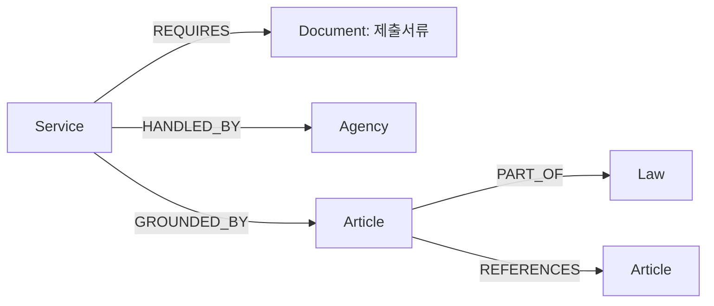

# 01 · Graph Schema 디자인

[01 Schema](01_graph_schema.md) · [02 Construct](02_graph_construct.md) · [03 Retrieval](03_graph_retrieval.md) · [04 Fail Case](04_fail_case_analysis.md)

민원 서비스의 관계와 그 관계를 뒷받침하는 원문 근거를 나누어 보관한다.

**목차** · [관계, 근거, 원문을 나누어 보관하는 이유](#section-01-1) · [서비스 관계 구조](#section-01-2) · [서비스 안내에서 인용 조항으로](#section-01-3) · [노드·관계의 필수 속성](#section-01-4) · [허용하는 다섯 관계](#section-01-5) · [원문 근거를 보존하는 규칙](#section-01-6) · [조건과 출처를 보존하는 경계](#section-01-7) · [저장 형식 상세](#section-01-8)

<a id="schema-walkthrough"></a>

<a id="section-01-1"></a>

## 관계, 근거, 원문을 나누어 보관하는 이유

민원 안내에는 서비스 이름, 제출서류, 신청인 조건, 법 조항, 접수기관이 한 페이지에 함께 적혀 있다. 이를 모두 같은 종류의 노드로 옮기면 ‘어떤 관계인가’와 ‘어디에서 읽었는가’를 구별하기 어렵다. 이 설계는 관계를 탐색하는 구조, 그 관계를 뒷받침하는 구절, 전체 원문을 보관하는 위치를 분리한다.

| 계층 | 역할 | 보관하는 내용 |
| --- | --- | --- |
| 관계 구조 | 서비스가 무엇과 연결되는지 표현 | 서비스·서류·기관·조항·법령 |
| 근거 연결 | 그 연결을 뒷받침한 구절을 추적 | 인용문·출처·문자 위치 |
| 원문과 검색 단위 | 앞뒤 조건을 포함한 본문 확인 | 전체 문서와 검색용 원문 조각(청크) |

예를 들어 Domain의 ‘위임장’ Document 노드는 제출서류의 종류다. 정부24 안내 페이지를 뜻하는 SQLite documents 행과 동일한 대상이 아니다. 여러 서비스가 ‘위임장’이라는 노드를 공유하더라도 각 서비스의 REQUIRES 관계에는 해당 안내문의 신청인 조건과 제출 진술이 따로 연결된다. 공통 서류 이름을 재사용하면서 서비스별 근거를 보존하기 위한 구분이다.

근거 기록(Evidence record)은 인용문·출처·문자 위치를 묶은 것이다. 이를 별도로 두면 같은 구절이 노드의 맥락과 관계의 근거 양쪽에 쓰이더라도 같은 Evidence ID로 참조할 수 있다. 전체 본문은 SQLite에 남기므로 그래프에는 법령 전체를 반복해서 넣지 않는다. 검색 결과의 짧은 인용만으로 조건을 판단하지 않고 원래 문서와 청크로 돌아갈 수 있다.

<a id="section-01-2"></a>

## 서비스 관계 구조



Document는 신청에 필요한 제출서류 유형이다. 원문 웹페이지는 별도의 원문 DB에 보관한다. 같은 두 대상을 잇는 관계라도 신청 조건이 다르면 별도로 기록하고, 관계와 조건이 같으면 여러 근거 구절을 함께 연결한다.

<a id="section-01-3"></a>

## 서비스 안내에서 인용 조항으로

휴업사실증명 질문 **SJ-N-050**의 Graph h=2, 8위는 다음 경로로 민원 처리법 제28조를 찾았다.

**휴업사실증명 → 국세청민원사무처리규정 제41조 → 민원 처리에 관한 법률 제28조**

첫 연결은 서비스 안내가 국세청 규정 제41조를 인용한 관계(GROUNDED_BY)이고, 두 번째는 제41조가 다른 법률의 제28조를 인용한 관계(REFERENCES)다. 연결을 만든 근거는 각각 출발 문서의 인용 구절이다.

최종 검색 결과는 도착한 제28조의 본문 근거를 반환한다. 따라서 **경로를 만든 인용**과 **답변에 사용할 도착 조항의 본문**은 출처가 다를 수 있다. 조항에 여러 근거가 연결돼 있더라도 이 결과에는 그중 선택된 하나가 담긴다. [실제 경로·근거의 저장값](#schema-storage-example)에서 원문 조각까지 추적할 수 있다.

<a id="section-01-4"></a>

## 노드·관계의 필수 속성

모든 노드는 고유 ID, 유형, 비어 있지 않은 이름을 가진다. 유형마다 다음 정보가 추가로 필요하다.

| 유형 | 뜻 | 필수 정보 |
| --- | --- | --- |
| Service · 서비스 | 등록된 민원 서비스 | 이름·분류·별칭·대표 안내문 |
| Document · 제출서류 | 서류의 유형 또는 묶음 진술 | 서류명과 제출서류임을 나타내는 구분 |
| Agency · 기관 | 원문에 적힌 접수·처리 기관 | 기관명 또는 기관 범주 |
| Article · 조항 | 실제로 수집한 법령 조문 | 출처 문서와 조문 위치 |
| Law · 법령 | 법률·시행령·시행규칙 문서 | 출처 문서와 확인된 시행일 |

서비스의 기존 ID는 유지한다. 나머지 ID는 유형과 원천 키의 해시로 만들므로 원문에서 파생된 이름이 바뀌면 달라질 수 있다. 현재 버전의 유일성을 검사하며 영구 불변 ID로 보장하지 않는다.

모든 관계에는 고유 ID, 관계 종류, 신청 조건, 문서 이동 여부, 검토 상태와 하나 이상의 원문 근거가 필요하다. 서로 다른 문서의 조항을 참조할 때만 문서 이동으로 센다. 그래프의 관계 이동 횟수(hop)는 관계 하나를 지날 때마다 하나씩 증가한다.

법령 시행일을 확인하지 못했으면 미확인으로 남기고 수집일로 채우지 않는다. 서비스 별칭은 등록부 이름의 문자열 변형으로만 만들며, 평가 질문이나 정답에서 가져오지 않는다. 저장 키와 ID 생성 규칙은 [저장 형식 상세](#schema-storage)에 모았다.

<a id="section-01-5"></a>

## 허용하는 다섯 관계

| 관계 | 방향 | 의미·생성 조건 | 주의점 |
| --- | --- | --- | --- |
| REQUIRES | 서비스 → 서류 | 제출서류 안내에서 연결 | 신청 조건과 대안을 함께 보존 |
| HANDLED_BY | 서비스 → 기관 | 접수·처리 항목에서 연결 | 특정 관할 사무소를 추정하지 않음 |
| GROUNDED_BY | 서비스 → 조항 | 안내의 조항 인용 또는 법령의 서비스 언급 | 이용 자격 충족을 뜻하지 않음 |
| PART_OF | 조항 → 법령 | 조항을 같은 출처 법령에 연결 | 실제 수집한 조항만 연결 |
| REFERENCES | 조항 → 조항 | 명시한 법령명·조문번호를 따라 연결 | 문서에 선언한 약칭만 사용 |

그 밖의 관계는 검증에서 거절한다. CAUSES, APPLIES_TO, ELIGIBLE_FOR 같은 추정 관계는 생성하지 않는다.

REQUIRES는 ‘신분증 중 하나’를 여러 필수 신분증으로 쪼개지 않는다. ‘본인/대리/상속인/법정대리’ 제목은 서류가 아닌 관계의 조건이다. 공무원 공동조회 구간, 없음, 서식없음, 안내 제목은 제외한다. 원문에 조건부 제출 면제나 대안이 더 있을 수 있으므로 이 그래프는 완전한 의무 목록이 아니다. 해당 전체 청크와 조건을 함께 읽어야 한다.

HANDLED_BY는 ‘시군구’, ‘세무서’ 등 원문 범주를 그대로 둔다. 원문 게시기관/중앙 부처를 접수기관으로 바꾸지 않는다. 여러 서비스가 같은 Document/Agency 노드를 공유해도 검색 시 해당 노드로 들어온 관계와 출처가 같은 노드 근거만 선택해 다른 서비스의 조건이 섞이지 않도록 한다.

<a id="section-01-6"></a>

## 원문 근거를 보존하는 규칙

모든 노드와 관계에는 원문 근거가 있어야 한다. 서비스 등록부는 어떤 서비스인지를 식별하는 기준이지만 관계의 원문 근거를 대신하지 않는다. 노드의 근거는 대상을 식별하는 정보나 내용의 맥락을, 관계의 근거는 그 연결을 추출한 진술을 가리킨다. 검색 결과에는 어느 쪽 근거인지 표시한다.

근거마다 출처 문서와 주소, 본문 해시, 정확한 인용문과 문자 범위, 그 범위를 덮는 기존 원문 조각을 기록한다. 빈 조각 목록은 허용하지 않는다. 시행일과 수집·확인일을 구별하고, 추출 규칙과 진술·맥락·조건의 역할도 남긴다. 현재 기록은 자동 추출 후 사람의 검토를 기다리는 상태다.

긴 구절이 청크 경계를 지나면 겹치는 청크들을 모두 연결하고 인용 구간을 빈틈없이 덮는지와 각 청크가 겹치는 부분의 문자 내용이 일치하는지 확인한다. 인용 위치는 정규화된 본문의 문자 기준이며, 원본 HTML 파일의 바이트 위치가 아니다. 노드의 맥락 근거는 각 청크의 앞 최대 200자를 원문 연결 지점(anchor)으로 보관한다. 검색 후에는 SQLite에서 해당 청크 전체를 읽을 수 있다. 이 짧은 연결 구절이 청크의 모든 주장을 뒷받침한다고 보지는 않는다.

없는 법령·미수집 조항·조항 없는 법령 언급은 미해결 참조로 남기고 임의 관계를 만들지 않는다. 범위형 인용에서 생략된 중간 조항, 법령명 없이 적힌 조문번호, ‘같은 법’, 별표·서식, 포괄 위임은 제한 사항으로 남긴다. ‘자료에서 관계를 못 찾음’은 현실에 관계가 없다는 뜻이 아니다.

<a id="section-01-7"></a>

## 조건과 출처를 보존하는 경계

관계가 존재한다는 사실과 그 관계가 특정 신청인에게 적용된다는 판단은 구분해야 한다. REQUIRES에는 원문의 신청 조건과 제출 진술 전체를 남긴다. ‘대리 신청’이라는 제목을 지우거나 ‘신분증 중 하나’를 여러 필수 의무로 나누면 원문의 의미가 달라지므로 그렇게 변환하지 않는다. 다만 추출기는 모든 예외를 논리식으로 바꾸는 시스템이 아니다. 제목 아래의 참고·면제 설명처럼 관계로 추출하지 않은 내용도 원문 청크에 남아 있으므로 적용 범위를 확인할 때 함께 읽어야 한다.

Document·Agency는 여러 서비스가 공유할 수 있다. 검색기가 관계를 따라 이 노드에 도달했을 때에는 마지막 관계의 근거 문서와 출처가 같은 노드 근거만 후보로 수집한다. 주민등록표의 위임장을 따라갔다가 다른 증명서 안내의 위임 조건이 반환되는 일을 막는 출처 필터다. 이 필터는 ‘같은 출처’를 확인하며, 같은 문서의 모든 예외가 자동으로 해석됐음을 뜻하지 않는다.

출처 연결과 인용문·문자 범위 검증은 근거의 위치를 추적할 수 있게 한다. 관계가 법적으로 완전한지, 해당 신청인이 자격을 충족하는지는 별도 판단이다. 검색 결과가 있다는 사실만으로 답변의 모든 주장이 입증된 것은 아니다. 이 구분을 나타내는 저장값은 아래 상세에 남겼다.

<a id="schema-storage"></a>

<a id="section-01-8"></a>

## 저장 형식 상세

본문의 개념에 대응하는 저장 키와 실제 예시다. 구현을 확인할 때 필요한 항목을 펼쳐 볼 수 있다.

<details>
<summary>저장 위치와 노드·관계의 필수 필드</summary>

Domain Layer는 `networkx.MultiDiGraph`이며 `data/processed/graph.json`에 저장한다. Evidence Layer는 `graph.evidence.json`의 records와 node_bindings/edge_bindings다. Document Layer는 기존 SQLite의 documents/chunks이며 document_id와 chunk_id를 바꾸지 않는다. Domain의 `Document`는 신청에 필요한 제출서류 유형이다. 원문 웹페이지를 이 노드로 만들지 않는다.

출발·도착 노드와 관계 종류가 같아도 조건이 다르면 별도 관계로 기록한다. 같은 관계와 조건을 뒷받침하는 구절은 하나의 관계에 함께 연결한다.

| 계층 | 답하려는 질문 | 실제 저장 내용 |
| --- | --- | --- |
| Domain graph | 어떤 서비스가 어떤 서류·기관·조항과 연결되는가? | Service·Document·Agency·Article·Law와 허용된 방향 관계 |
| Evidence binding | 이 노드나 관계를 어느 구절에 근거해 만들었는가? | node_bindings/edge_bindings의 노드·관계 ID → Evidence ID, records의 인용·위치·출처 |
| SQLite 원문·청크 | 앞뒤 조건까지 포함한 본문은 어디에 있는가? | documents.body, documents의 출처 정보, chunks.text와 기존 문자 구간 |

공통 node: `id`, `type`, 비어 있지 않은 `label`. ID는 Service의 기존 ID를 유지하며, 나머지는 유형별 접두사와 원천 키의 SHA-256 앞 20자로 만든다. 원문 문구에서 파생된 ID는 그 문구가 바뀌면 바뀐다. 현재 버전에서 유일성을 검사하며, 모든 버전에서 바뀌지 않는 식별자로 보장하지 않는다.

| Type | 의미 | 추가 필수 property | ID 원천 키 |
| --- | --- | --- | --- |
| Service | 등록된 민원 서비스 | category, registry_sha256, aliases, entry_source_document_id | 기존 SJ-SVC-### |
| Document | 제출서류 유형/묶음 진술 | document_kind=application_requirement | 원문에서 보수적으로 추출한 서류명 |
| Agency | 원문 접수·처리 기관 또는 범주 | agency_scope=as_written_office_or_category | 원문 명칭 |
| Article | 실제 수집한 법령 조문 | source_document_id, locator | 원문 document_id + 정규화 조문번호 |
| Law | 법률·시행령·시행규칙 등 법령 문서 | source_document_id, effective_date | 원문 document_id |

`effective_date=null`은 원문에서 시행일을 확인하지 못한 상태를 뜻한다. 수집일로 대신하지 않는다. Service aliases는 등록부 이름과 그 문자열 변형만으로 만든다. 평가 질문이나 정답 근거(Gold)에서 별칭을 추출하지 않는다.

공통 edge: `key`, `relation`, `qualifiers`, `document_hop`, `review_status`와 Evidence Layer의 하나 이상 binding. `document_hop`은 서로 다른 출처 Article 간 REFERENCES에 1, 그 밖에는 0이다. 검색의 `graph_hops`는 관계 하나마다 1이다.

Graph metadata: schema_version, corpus_hash, corpus_fingerprint, registry_sha256, builder_sha256, networkx_version, unresolved_reference_count. 출처 데이터가 달라지면 그래프를 불러올 때 재구축을 요구한다.

</details>

<details>
<summary>관계 조건과 상태의 정확한 표기</summary>

- **REQUIRES** — Service → Document; 등록부에 연결된 안내문의 ‘민원인이 제출해야하는 서류’ 구간; 신청인 조건, 전체 제출 진술(statement), conditional_statement_not_atomic_obligation
- **HANDLED_BY** — Service → Agency; 원문 접수/처리 항목; 접수·처리 역할(role), 특정 관할 사무소를 추론하지 않았음
- **GROUNDED_BY** — Service → Article; 등록부에 연결된 안내문 기본정보/부가정보의 명시적 법령명+조항; 등록부에 연결된 문서가 법령이면 등록부 서비스명/파생 별칭의 명시적 언급; 안내문의 조항 인용(guide citation)과 법령의 서비스 언급(service mention)을 basis로 구분; 자격 충족을 뜻하지 않음
- **PART_OF** — Article → Law; 동일 source_document_id의 실제 조문; article_in_source_law
- **REFERENCES** — Article → Article; 명시적 법령명+조항 또는 해당 문서에서 선언한 약칭; explicit_article_reference

`retrieved_not_entailment_verified`는 검색은 수행했지만 답변 주장의 의미 충족은 검증하지 않았다는 상태다.

</details>

<details>
<summary>Evidence 필드와 원문 위치 규칙</summary>

| Evidence 필드 | 규칙 |
| --- | --- |
| evidence_id | 내용·출처·추출 규칙의 해시 기반 ID |
| source_document_id / source_alias | 기존 SQLite 원문에 존재해야 함 |
| chunk_ids | 인용 문자 구간(span)과 겹치는 실제 기존 청크; 빈 배열 금지 |
| quote / start_char / end_char | 정규화된 documents.body의 정확한 `[start,end)` 문자 구절 |
| source_url / source_content_hash | 원문 URL과 본문 해시; SQLite와 일치 |
| effective_date | 시행일; 미확인 시 null |
| collected_at / last_checked_at | 수집/확인일; 시행일과 별도 |
| extraction_rule / role | 추출 규칙, 진술·맥락·조건(statement/context/condition)의 구분 |
| review_status | machine_extracted_pending_human_review |

긴 구절이 청크 경계를 지나면 겹치는 청크들을 모두 연결하고 인용 구간을 빈틈없이 덮는지와 각 청크가 겹치는 부분의 문자 내용이 일치하는지 확인한다. 인용 위치는 정규화된 본문의 문자 기준이며, 원본 HTML 파일의 바이트 위치가 아니다. 노드의 맥락 근거는 각 청크의 앞 최대 200자를 원문 연결 지점(anchor)으로 보관한다. 검색 후에는 SQLite에서 해당 청크 전체를 읽을 수 있다. 이 짧은 연결 구절이 청크의 모든 주장을 뒷받침한다고 보지는 않는다.

없는 법령·미수집 조항·조항 없는 법령 언급은 미해결 참조로 남기고 임의 관계를 만들지 않는다. 범위형 인용에서 생략된 중간 조항, 법령명 없이 적힌 조문번호, ‘같은 법’, 별표·서식, 포괄 위임은 제한 사항으로 남긴다. ‘자료에서 관계를 못 찾음’은 현실에 관계가 없다는 뜻이 아니다.

</details>

<a id="schema-storage-example"></a>

<details>
<summary>휴업사실증명 예시의 경로·근거 저장값</summary>

SJ-N-050의 Graph h=2, 8위는 ‘휴업사실증명’에서 국세청 규정 제41조를 거쳐 민원 처리에 관한 법률 제28조로 이동한 결과다. Domain graph에 저장된 두 관계는 다음과 같다.

**관계 1 · GROUNDED_BY**

- 출발: 휴업사실증명 (Service)
- 도착: 국세청민원사무처리규정 · 제41조(무인민원발급창구를 통한 민원증명의 발급) (Article)

```text
Source: SJ-SVC-023
Target: ART-f3d7c23927a1efd22f0f
Edge: EDGE-c1a92bfd802d0e16126d
Relation: GROUNDED_BY
Evidence:
  EV-428bc0c1210212129f90
```

**관계 2 · REFERENCES**

- 출발: 국세청민원사무처리규정 · 제41조(무인민원발급창구를 통한 민원증명의 발급) (Article)
- 도착: 민원 처리에 관한 법률 · 제28조(무인민원발급창구를 이용한 민원문서의 발급) (Article)

```text
Source: ART-f3d7c23927a1efd22f0f
Target: ART-eba088eacf08b6cb19be
Edge: EDGE-78675084117d109bc549
Relation: REFERENCES
Evidence:
  EV-3ef4c2d63137adb4d715
```

각 관계의 근거는 **출발 쪽 문서가 다음 조항을 명시적으로 인용한 구절**이다. 첫 관계는 정부24 휴업사실증명 안내에서 국세청 규정 제41조를 인용한 부분, 두 번째는 국세청 규정에서 민원 처리법 제28조를 인용한 부분이다. 최종 검색 결과(hit)는 도착한 제28조의 조항 노드 근거(Article node evidence)를 선택한다. 경로를 만든 인용과 사용자에게 반환하는 도착 조항의 본문은 출처가 다를 수 있다.

다음은 해당 노드의 근거 연결(node binding)과 선택된 근거 기록의 핵심 필드다. 하나의 노드에 여러 Evidence가 있으면 이 예시는 그중 이 검색 결과가 선택한 하나를 보여준다.

```json
{
  "node_bindings": {
    "ART-eba088eacf08b6cb19be": [
      "EV-ddea1cdad35a2f15e82c"
    ]
  },
  "records": {
    "EV-ddea1cdad35a2f15e82c": {
      "source_document_id": "DOC-47bbf4a18be5224eb47f",
      "source_alias": "L민원 처리에 관한 법률",
      "chunk_ids": [
        "DOC-47bbf4a18be5224eb47f-C0035"
      ],
      "start_char": 12220,
      "end_char": 12420,
      "quote": "제28조(무인민원발급창구를 이용한 민원문서의 발급) ① 행정기관의 장은 무인민원발급창구를 통하여 민원문서(다른 행정기관 소관의 민원문서를 포함한다)를 발급할 수 있다.\n② 제1항에 따라 민원문서를 발급하는 경우에는 다른 법률에도 불구하고 수수료를 감면할 수 있다.\n③ 제1항에 따라 발급할 수 있는 민원문서의 종류는 행정안전부장관이 관계 행정기관의 장과의 협",
      "extraction_rule": "article_chunk_anchor",
      "role": "article_context"
    }
  }
}
```

이 연결을 읽는 순서는 `Article ID → node_bindings → Evidence ID → records → source_document_id / [start_char, end_char) → chunk_ids`다. 이 결과의 청크는 **DOC-47bbf4a18be5224eb47f-C0035**, Evidence는 **EV-ddea1cdad35a2f15e82c**다. SQLite의 `documents.document_id`로 문서를 찾으면 `body[12220:12420]`가 위 quote와 같아야 하고, `chunks.chunk_id`로 찾은 청크가 그 구간을 덮어야 한다. chunk_ids는 원문에서 근거를 담고 있는 검색 단위를 가리키며, 노드 ID와 교환해서 사용할 수 없다.

저장된 Evidence에는 위 필드 외에 source_url, source_content_hash, effective_date, collected_at, last_checked_at, review_status도 있다. 문서 제목이 같다는 이유만으로 다른 판본을 연결하지 않도록 출처 본문의 해시와 날짜를 함께 보존한다. `effective_date=null`은 시행일 미확인이다. 수집일이나 확인일로 시행일을 채우지 않는다.

</details>
