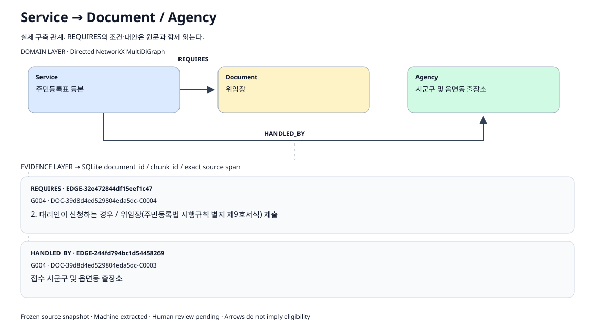
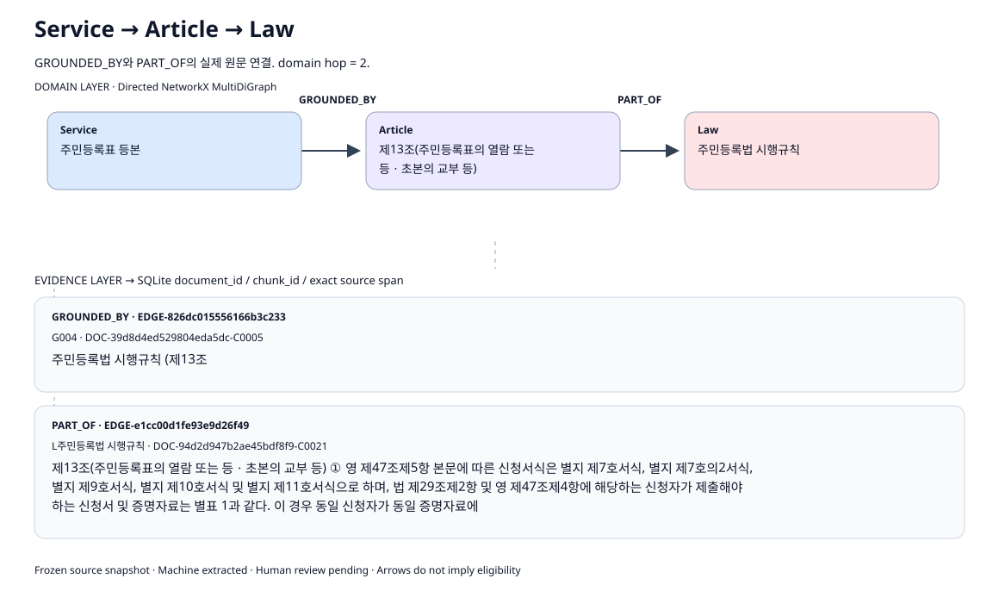
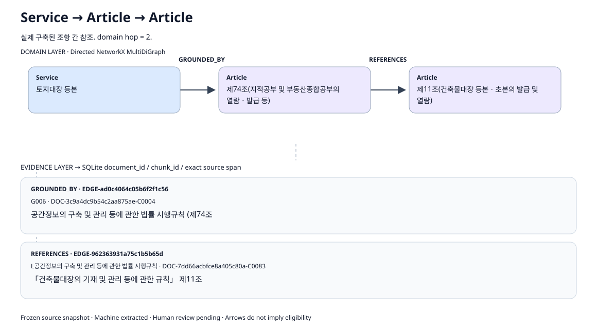

# 03 · Graph-only Retrieval

[01 Schema](01_graph_schema.md) · [02 Construct](02_graph_construct.md) · [03 Retrieval](03_graph_retrieval.md) · [04 Fail Case](04_fail_case_analysis.md)

질문의 서비스·법령명을 탐색 출발점(seed)으로 삼아 연결된 원문 근거를 찾는다. 휴업사실증명 사례와 전체 204문항의 저장 결과를 함께 제시한다.

**목차** · [검색 방식과 순위](#section-03-1) · [한 질문이 상위 10개 결과가 되기까지](#section-03-2) · [실행과 결과 읽기](#section-03-3) · [실제 Rank · Chunk · Path](#section-03-4) · [대표 Subgraph 3개](#section-03-5) · [전체 문항의 Graph 결과](#section-03-6) · [경로·인용·저장값](#section-03-7)

<a id="section-03-1"></a>

## 검색 방식과 순위

| 단계 | 하는 일 |
| --- | --- |
| 출발점 선택 | 질문의 서비스·법령 이름을 등록부와 대조 |
| 관계 탐색 | 출발점에서 허용된 방향 관계를 따라 이동 |
| 후보 수집 | 도달한 노드와 관계의 원문 근거를 수집 |
| 순위 결정 | 출발점 점수·질문과의 겹침·이동 수로 정렬 |
| 결과 반환 | 검색용 원문 조각(청크)과 실제 경로·인용을 함께 반환 |

출발점을 찾지 못하면 빈 결과를 반환한다. 전역 키워드·벡터 검색은 섞지 않는다. 같은 원문 조각에 여러 경로가 있으면 점수가 가장 높은 하나를 남기므로 가능한 모든 경로를 열거하는 방식은 아니다. 기본 반환 수는 10개이고, 기본 탐색 상한은 2 hop이다. hop은 그래프의 관계 이동 횟수다.

입력은 질문 ID와 질문 본문뿐이다. 유형·서비스 정답·정답 경로를 입력에 넣지 않는다. 검색 결과만으로 답변 가능·추가 확인·응답 보류를 판정하거나 답변을 생성하지 않는다. [정확한 계산식과 설정](#retrieval-settings)은 뒤에 모았다.

**법령명 직접 질의의 한계:** Law만 출발점으로 선정되면 나가는 관계가 없어 법령 머리말 근거만 반환한다. PART_OF는 Article→Law 방향이고 역방향 탐색은 하지 않으므로, 법령명과 조문번호를 정확히 적어도 해당 조항으로 이동하지 못한다. 실제로 `민법 제777조의 친족 범위를 알려주세요.`는 최대 3 hop에서도 `민법 / 문서 머리말` 한 건만 반환했다.

<a id="section-03-2"></a>

## 한 질문이 상위 10개 결과가 되기까지

**SJ-N-050** — 휴업사실증명을 무인발급기로 뗄 수 있다는 근거가 어디 있어요? 국세청 규정에서 다른 법을 연결해 놓았다면 그 법도 알려주세요.

이 질문은 서비스 안내뿐 아니라 국세청 규정과 그 규정이 인용한 다른 법 조항을 요구한다. 아래 설명의 출발점·후보·순위·근거 기록(Evidence)은 이 질문의 저장된 Graph h=2 결과값이다. 각 단계의 계산은 구현 코드의 규칙에 따라 읽을 수 있다. 표의 Gold는 평가용 정답 근거를 뜻한다.

### 1. 질문을 정규화하고 Service·Law 출발점을 고른다

`compact`는 한글·영문·숫자만 남기고 영문을 소문자로 바꾼다. 띄어쓰기와 문장부호는 제거한다. 형태소 분석, 동의어 생성, 부정어 해석을 수행하는 단계는 아니다. 정규화된 질문은 다음과 같다.

```text
휴업사실증명을무인발급기로뗄수있다는근거가어디있어요국세청규정에서다른법을연결해놓았다면그법도알려주세요
```

`bigrams`는 이 문자열에서 연속된 두 글자씩을 뽑아 집합으로 만든다. 반복되는 같은 bigram은 한 번만 센다. 이 질문에는 서로 다른 bigram이 **51개** 있다. ‘휴업사실증명’의 bigram은 `휴업, 업사, 사실, 실증, 증명`이다.

Service별 점수는 등록부 이름에서 파생된 각 별칭에 대해 계산한 뒤 가장 높은 값을 선택한다. 계산식은 `0.7 × |질문 bigram ∩ 별칭 bigram| / |별칭 bigram| + 전체 별칭 포함 보너스 0.3`이다. 이 단계의 분모는 **별칭** bigram 수다. Law는 정규화된 법령명 전체가 질문에 들어 있을 때 점수 1로 후보가 된다. 이 질문의 ‘국세청 규정’, ‘다른 법’은 등록된 법령명 전체가 아니므로 저장된 seed 세 개는 모두 Service다.

| 서비스 | 평가한 별칭 | 겹친 bigram / 별칭 bigram | 전체 포함 보너스 | 별칭 점수 |
| --- | --- | --- | --- | --- |
| SJ-SVC-023<br>휴업사실증명 | 휴업사실증명 | 5/5 | 0.3 | 1.000000 |
| SJ-SVC-024<br>폐업사실증명 | 폐업사실증명 | 4/5 | 0 | 0.560000 |
| SJ-SVC-025<br>국세 납세증명서 | 국세 납세증명서 | 2/6 | 0 | 0.233333 |
| SJ-SVC-025<br>국세 납세증명서 | 납세증명서 | 1/4 | 0 | 0.175000 |

점수가 출발점 선정 임계값인 0.18 이상인 서비스 중 점수 내림차순, 동점이면 노드 ID 순으로 세 개를 남긴다. 따라서 휴업사실증명 1.0, 폐업사실증명 0.56, 국세 납세증명서 약 0.233333이 출발점이다. ‘납세증명서’ 별칭만의 점수 0.175가 선정 임계값에 못 미쳐도 같은 서비스의 다른 별칭 ‘국세 납세증명서’가 기준을 충족하므로 이 서비스는 출발점이 된다. 폐업사실증명이 함께 선정되는 이유도 의미상 같은 서비스라고 판단해서가 아니라 문자열 bigram 네 개가 겹치기 때문이다.

### 2. 너비 우선 탐색(BFS)으로 방향 관계를 따라 근거를 모은다

`GraphRetriever.search`는 출발점마다 방문 대기열(queue)과 이미 발견한 노드 집합(seen)을 따로 관리한다. 대기열에서 꺼낸 노드의 근거를 먼저 모으고, 탐색 깊이가 hop 상한에 도달하지 않았으면 정렬된 나가는 관계(outgoing edge)를 따라간다. 역방향 관계나 SQLite의 서비스 연결표를 통한 우회 탐색은 사용하지 않는다.

Service ‘휴업사실증명’에서는 hop 0에 서비스 개요·기본정보와 성남시 무인발급 안내 행의 근거를 얻는다. hop 1에는 GROUNDED_BY로 국세청민원사무처리규정의 인용 조항에 도달한다. hop 2에는 제41조의 REFERENCES를 따라 민원 처리법 제28조와 그 시행령 제32조의 근거를 얻을 수 있다. PART_OF로 Law 노드에 도달하는 경로도 후보 수집에 참여한다.

각 관계를 검사할 때 그 관계의 근거는 즉시 수집한다. 목적지가 해당 출발점의 seen 집합에 이미 있어도 관계 근거는 수집한다. 다만 그 노드를 대기열에 다시 넣지는 않으므로 노드 근거는 BFS에서 선택된 최초 도달 경로로 수집된다. 이 방식은 가능한 모든 경로를 열거하거나 그중 최고 점수 경로를 보장하지 않는다.

| max_hops | 방문 노드 수 | 중복 제거 후 청크 후보 | 반환 수 | Gold 근거 청크의 반환 Rank |
| --- | --- | --- | --- | --- |
| 0 | 3 | 8 | 8 | 없음 |
| 1 | 28 | 34 | 10 | 6 |
| 2 | 39 | 45 | 10 | 6, 8, 9 |
| 3 | 43 | 50 | 10 | 6, 8, 9 |

h=2에서 모든 출발점의 탐색을 합한 방문 노드는 중복을 제외하면 **39개**, 후보는 **45개**다. 결과의 `traversal_truncated=false`는 이 실행이 max_nodes=12000 제한 때문에 중단되지 않았음을 나타낸다. 노드 수와 후보 청크 수가 다른 것은 하나의 노드·관계가 여러 근거 기록과 청크에 연결될 수 있고, 같은 청크가 여러 연결에서 재등장할 수도 있기 때문이다.

### 3. 같은 청크는 비교한 경로 중 최고 점수 하나로 합친다

후보는 chunk_id를 기준으로 저장한다. 노드 또는 관계의 근거 연결(binding)에서 같은 청크를 다시 만나면 점수를 비교해 더 높은 결과로 교체한다. 점수까지 같으면 path_nodes, edge key, binding 종류·owner·Evidence ID를 묶은 식별 튜플(identity)의 값을 차례로 비교하는 사전식 순서를 사용한다. owner는 근거가 연결된 노드 또는 관계의 ID다. 따라서 반환 결과에는 같은 청크가 중복 순위로 나오지 않으며, 최종 선택된 경로(path)와 Evidence만 남는다.

실제 **DOC-1bac55fd50fbfb130cff-C0041**는 국세청 규정 제41조를 담는다. Service→제41조의 Article node evidence로 수집하면 1 hop이고 점수는 **0.541841737**다. 제41조가 다른 법을 인용하는 REFERENCES edge의 근거도 이 청크에 있으므로 그 edge를 검사할 때 같은 청크가 2 hop 경로의 edge evidence로 다시 수집될 수 있다. seed 1.0과 본문 겹침 8/51을 그대로 두면 2 hop 점수는 **0.489405440**다. 저장된 6위는 점수가 높은 1 hop Article node evidence를 대표로 남긴 경우다.

### 4. 도달한 후보 안에서 본문 겹침과 경로 길이로 정렬한다

후보 점수의 본문 겹침은 `|질문 bigram ∩ 전체 청크 bigram| / |질문 bigram|`이다. 여기서는 seed 선택과 달리 분모가 **질문** bigram 수다. 짧은 인용문(evidence_quote)만 비교하지 않고 SQLite에 저장된 해당 청크의 본문 전체(text)를 사용한다.

```text
relevance = 겹치는 질문·청크 bigram 수 / 질문 bigram 수
score = seed_score × (0.45 + relevance) / (1 + 0.12 × 실제 graph_hops)
condition 역할의 Evidence를 고르면 score에 0.95를 추가로 곱함
```

8위 민원 처리법 제28조는 질문 bigram 51개 중 7개가 청크와 겹친다. seed score=1, graph_hops=2이므로 `1 × (0.45 + 7/51) / 1.24 = 0.473592663`이다. 여기서 2는 설정 이름의 숫자를 일괄 넣은 값이 아니라 이 검색 결과가 실제로 이동한 관계 수다. 같은 h=2 실행 안에서도 Service node-only 결과는 0 hop, 국세청 규정 조항은 1 hop이다.

| Rank | 검색된 자료 | 본문 겹침 · 실제 hop | score |
| --- | --- | --- | --- |
| 1 | 성남시 무인민원발급 — 발급 민원과 본인확인 / 표 1 행 36: | 8/51 · hop 0 | 0.606862745 |
| 2 | 휴업사실증명 발급 / 서비스 개요 | 8/51 · hop 0 | 0.606862745 |
| 3 | 휴업사실증명 발급 / 기본정보 | 7/51 · hop 0 | 0.587254902 |
| 4 | 국세청민원사무처리규정 / 제40조 | 10/51 · hop 1 | 0.576855742 |
| 5 | 국세청민원사무처리규정 / 제37조 | 8/51 · hop 1 | 0.541841737 |
| 6 | 국세청민원사무처리규정 / 제41조 | 8/51 · hop 1 | 0.541841737 |
| 7 | 국세청민원사무처리규정 / 제39조 | 7/51 · hop 1 | 0.524334734 |
| 8 | 민원 처리에 관한 법률 / 제28조 | 7/51 · hop 2 | 0.473592663 |
| 9 | 민원 처리에 관한 법률 시행령 / 제32조 | 7/51 · hop 2 | 0.473592663 |
| 10 | 국세청민원사무처리규정 / 제33조 | 4/51 · hop 1 | 0.471813725 |

[순위별 청크·근거 ID](#retrieval-example-fields)

1위와 2위는 모두 0.606862745로 동점이며 chunk_id 순으로 정렬된다. 이 점수는 후보의 검색 우선순위이고 정답 확률이 아니다. 실제 정답 근거 세 곳은 6·8·9위에 있다. 상위 1개만 읽으면 국세청 규정의 법적 연결까지 설명하기 어렵지만, 상위 10개에는 필요한 세 근거 조항이 포함된다.

### 5. 이동한 관계와 최종 인용을 각각 확인한다

8·9위는 다음 두 경로로 찾은 조항이다. 관계의 근거는 출발 문서의 인용이고, 마지막 조항 노드의 근거는 도착 법령의 조항 내용이다. 하나의 근거가 경로의 모든 관계를 대신 증명한다고 읽지 않는다.

**8위 · 민원 처리에 관한 법률 / 제28조**

- 출발: 휴업사실증명 (Service)
- GROUNDED_BY → 국세청민원사무처리규정 · 제41조(무인민원발급창구를 통한 민원증명의 발급) (Article)
- REFERENCES → 민원 처리에 관한 법률 · 제28조(무인민원발급창구를 이용한 민원문서의 발급) (Article)

**9위 · 민원 처리에 관한 법률 시행령 / 제32조**

- 출발: 휴업사실증명 (Service)
- GROUNDED_BY → 국세청민원사무처리규정 · 제41조(무인민원발급창구를 통한 민원증명의 발급) (Article)
- REFERENCES → 민원 처리에 관한 법률 시행령 · 제32조(무인민원발급창구를 이용한 민원문서 발급) (Article)

[두 경로의 관계 근거·최종 인용·저장값](#retrieval-example-details)

graph_hops는 관계 두 개를 지났으므로 2이고 document_hops는 국세청 규정에서 다른 법령 문서로 넘어간 REFERENCES 한 번만 세어 1이다. 서비스 안내에서 조항으로 가는 GROUNDED_BY는 그래프의 관계 이동 횟수에는 포함되지만 이 구현의 document_hop 계산에는 더해지지 않는다. 반환 인용문(quote)은 노드의 맥락 근거로 보관한 청크 앞 최대 200자일 수 있으므로, 조항의 단서·후속 문장을 판단할 때는 연결된 전체 청크와 원문을 함께 확인해야 한다.


<a id="section-03-3"></a>

## 실행과 결과 읽기

[02의 환경 준비와 원문 복원](02_graph_construct.md)을 마친 뒤 실행한다.

```sh
.venv/bin/python scripts/submission_cli.py search '휴업사실증명을 무인발급기로 뗄 수 있다는 근거가 어디 있어요?' --hops 2
.venv/bin/python scripts/submission_cli.py chunk DOC-47bbf4a18be5224eb47f-C0035
.venv/bin/python scripts/submission_cli.py evidence EV-ddea1cdad35a2f15e82c
```

이 명령은 사용자가 입력한 질문을 검색한다. 아래 예시는 현재 204문항 실행에서 저장된 실제 결과이며, 질문 전체는 다음과 같다.

**SJ-N-003** — 땅 종류하고 면적, 대장에 주인이 누구로 올라 있는지 보려는 건데요. 이거 세금 서류 떼면 나오는 거예요? 뭘 찾아야 하는지 모르겠네요.

**SJ-N-050** — 휴업사실증명을 무인발급기로 뗄 수 있다는 근거가 어디 있어요? 국세청 규정에서 다른 법을 연결해 놓았다면 그 법도 알려주세요.

**SJ-N-020** — 지방세 과세된 내역 내라길래 체납 없다는 서류 떼갔더니 또 아니래요. 서류 이름이 왜 이렇게 비슷해요? 세목별로 과세된 거랑 체납 없다는 거, 다른 서류라는 거죠?

<a id="sample-results"></a>

<a id="section-03-4"></a>

## 실제 Rank · Chunk · Path

| 질문 · 설정 | Rank | Chunk · 자료 |
| --- | --- | --- |
| SJ-N-003 · graph_h2 | 1 | 토지(임야)대장 등본 발급(열람) / 기본정보 |
| SJ-N-003 · graph_h2 | 3 | 건축물대장의 기재 및 관리 등에 관한 규칙 / 제11조 |
| SJ-N-050 · graph_h2 | 8 | 민원 처리에 관한 법률 / 제28조 |
| SJ-N-050 · graph_h2 | 9 | 민원 처리에 관한 법률 시행령 / 제32조 |
| SJ-N-020 · graph_h1 | 10 | 지방세 납세증명서 발급 / 기본정보 |

<a id="sample-sj-n-003-graph_h2-r1"></a>

<details>
<summary>SJ-N-003 · graph_h2 · 1위 · 경로와 근거</summary>

**토지(임야)대장 등본 발급(열람) / 기본정보**

경로: Service → Service node evidence

> 기본정보 제공 내용 이 민원은 토지나 임야의 소재, 지번, 지목, 면적, 소유자 등의 사항이 등록된 토지대장, 임야대장을 발급 또는 열람하고자 할 때 신청하는 민원사무입니다. 본민…

```text
Chunk: DOC-3c9a4dc9b54c2aa875ae-C0001
Score: 0.123300654
Seed: SJ-SVC-003
Graph hops: 0
Document hops: 0
Type path: Service
Evidence path: Service → Service node evidence
Path nodes:
  SJ-SVC-003
Path edges:
  없음 (node-only)
Evidence:
  kind: node
  owner: SJ-SVC-003
  id: EV-7cfebf73d88ea1a1fe66
  role: service_context
  document: DOC-3c9a4dc9b54c2aa875ae
  span: [247, 444)
```

</details>

<a id="sample-sj-n-003-graph_h2-r3"></a>

<details>
<summary>SJ-N-003 · graph_h2 · 3위 · 경로와 근거</summary>

**건축물대장의 기재 및 관리 등에 관한 규칙 / 제11조**

경로: Service-GROUNDED_BY-Article-REFERENCES-Article → Article node evidence

> 제4항에 따른 표기와 관인 날인을 하지 아니한다. 이 경우 열람용으로 사본을 출력하는 경우에는 다음 각호의 표기를 하여야 한다. &lt;개정 2009. 1. 20., 2011. 9. 1…

```text
Chunk: DOC-22c2ce3fe80fa6fd72aa-C0017
Score: 0.121573898
Seed: SJ-SVC-003
Graph hops: 2
Document hops: 1
Type path: Service-GROUNDED_BY-Article-REFERENCES-Article
Evidence path: Service-GROUNDED_BY-Article-REFERENCES-Article → Article node evidence
Path nodes:
  SJ-SVC-003
  ART-58cd40264c01bb0ebeec
  ART-e562d0cce235c4d78a42
Path edges:
  GROUNDED_BY · EDGE-ad0c4064c05b6f2f1c56
    SJ-SVC-003 → ART-58cd40264c01bb0ebeec
  REFERENCES · EDGE-962363931a75c1b5b65d
    ART-58cd40264c01bb0ebeec → ART-e562d0cce235c4d78a42
Evidence:
  kind: node
  owner: ART-e562d0cce235c4d78a42
  id: EV-2d7360f9fb72eb9cc925
  role: article_context
  document: DOC-22c2ce3fe80fa6fd72aa
  span: [8041, 8241)
```

</details>

<a id="sample-sj-n-050-graph_h2-r8"></a>

<details>
<summary>SJ-N-050 · graph_h2 · 8위 · 경로와 근거</summary>

**민원 처리에 관한 법률 / 제28조**

경로: Service-GROUNDED_BY-Article-REFERENCES-Article → Article node evidence

> 제28조(무인민원발급창구를 이용한 민원문서의 발급) ① 행정기관의 장은 무인민원발급창구를 통하여 민원문서(다른 행정기관 소관의 민원문서를 포함한다)를 발급할 수 있다. ② 제1항에…

```text
Chunk: DOC-47bbf4a18be5224eb47f-C0035
Score: 0.473592663
Seed: SJ-SVC-023
Graph hops: 2
Document hops: 1
Type path: Service-GROUNDED_BY-Article-REFERENCES-Article
Evidence path: Service-GROUNDED_BY-Article-REFERENCES-Article → Article node evidence
Path nodes:
  SJ-SVC-023
  ART-f3d7c23927a1efd22f0f
  ART-eba088eacf08b6cb19be
Path edges:
  GROUNDED_BY · EDGE-c1a92bfd802d0e16126d
    SJ-SVC-023 → ART-f3d7c23927a1efd22f0f
  REFERENCES · EDGE-78675084117d109bc549
    ART-f3d7c23927a1efd22f0f → ART-eba088eacf08b6cb19be
Evidence:
  kind: node
  owner: ART-eba088eacf08b6cb19be
  id: EV-ddea1cdad35a2f15e82c
  role: article_context
  document: DOC-47bbf4a18be5224eb47f
  span: [12220, 12420)
```

</details>

<a id="sample-sj-n-050-graph_h2-r9"></a>

<details>
<summary>SJ-N-050 · graph_h2 · 9위 · 경로와 근거</summary>

**민원 처리에 관한 법률 시행령 / 제32조**

경로: Service-GROUNDED_BY-Article-REFERENCES-Article → Article node evidence

> 제32조(무인민원발급창구를 이용한 민원문서 발급) ① 행정기관의 장은 법 제28조제1항에 따라 무인민원발급창구를 이용하여 민원문서를 발급할 때에는 소관 행정기관의 관인(전자이미지 …

```text
Chunk: DOC-5203497c9029e9024eb1-C0045
Score: 0.473592663
Seed: SJ-SVC-023
Graph hops: 2
Document hops: 1
Type path: Service-GROUNDED_BY-Article-REFERENCES-Article
Evidence path: Service-GROUNDED_BY-Article-REFERENCES-Article → Article node evidence
Path nodes:
  SJ-SVC-023
  ART-f3d7c23927a1efd22f0f
  ART-6e070eac29065d257737
Path edges:
  GROUNDED_BY · EDGE-c1a92bfd802d0e16126d
    SJ-SVC-023 → ART-f3d7c23927a1efd22f0f
  REFERENCES · EDGE-da5820f1557a4a1c63b8
    ART-f3d7c23927a1efd22f0f → ART-6e070eac29065d257737
Evidence:
  kind: node
  owner: ART-6e070eac29065d257737
  id: EV-4f6ad00820bbc862b398
  role: article_context
  document: DOC-5203497c9029e9024eb1
  span: [20983, 21183)
```

</details>

<a id="sample-sj-n-020-graph_h1-r10"></a>

<details>
<summary>SJ-N-020 · graph_h1 · 10위 · 경로와 근거</summary>

**지방세 납세증명서 발급 / 기본정보**

경로: Service → Service node evidence

> 기본정보 제공 내용 이 민원은 발급일 현재 아래의 금액을 제외한 다른 체납액이 없음을 증명하는 민원입니다. 1. 지방세징수법 제25조·제25조의2·제26조 또는 제105조에 따른 …

```text
Chunk: DOC-b03c8e7d1701192d2c31-C0001
Score: 0.104814815
Seed: SJ-SVC-021
Graph hops: 0
Document hops: 0
Type path: Service
Evidence path: Service → Service node evidence
Path nodes:
  SJ-SVC-021
Path edges:
  없음 (node-only)
Evidence:
  kind: node
  owner: SJ-SVC-021
  id: EV-681f604a38401574b541
  role: service_context
  document: DOC-b03c8e7d1701192d2c31
  span: [217, 417)
```

</details>

Rank는 각 질문·검색 설정 안의 순위다. max_hops는 탐색 상한이고 실제 graph_hops는 개별 hit가 이동한 edge 수다. SJ-N-003의 1위와 SJ-N-020의 10위는 edge를 타지 않은 Service node evidence다. 가상의 서비스→조항 경로를 붙이지 않는다. SJ-N-003의 3위는 조항 간 참조를 따른 결과이며 해당 질문의 필수 정답 근거라는 뜻은 아니다.

위 다섯 예시는 결과 형식을 익히기 위한 것이다. [이 문서의 질문별 전건 결과](#all-graph-results)에는 204문항과 h=0~3의 저장된 Graph 결과를 모두 실었다. 인용은 evidence_quote의 앞부분을 공백 정규화해 짧게 표시했으며 생략은 …로 표시한다. [검색 원자료](../results/current204/predictions.jsonl)는 표시를 줄이지 않은 Evidence 인용과 경로 ID를 보관한다. [Graph 문항별 근거](../results/current204/graph/question_graph_evidence.jsonl)와 [04의 hop 분석](04_fail_case_analysis.md#hop-ablation)에도 연결된다.

<a id="section-03-5"></a>

## 대표 Subgraph 3개

실제 구축된 5가지 관계를 세 사례로 나누어 제시한다. 실선은 Domain 관계, 점선은 Evidence 연결이다. 화살표가 자격 충족이나 모든 조건의 적용을 뜻하지 않는다.

### 1. 제출서류와 처리기관



주민등록표 등본 서비스의 대리 신청 위임장과 원문에 적힌 접수기관 범주를 보여준다. REQUIRES의 조건·대안과 원문 전체를 함께 읽는다.

### 2. 민원 안내에서 조항과 소속 법령으로



주민등록표 등본 안내의 명시적 인용을 따라 주민등록법 시행규칙 제13조와 소속 법령에 연결한다.

### 3. 조항 사이의 명시적 참조



토지대장 서비스에서 공간정보 관련 시행규칙 제74조를 거쳐 건축물대장 규칙 제11조로 이어지는 실제 참조다. 현재 SJ-N-003의 관련 청크는 앞의 3위 예시이며, 대표 그림을 검색 성능 자체의 증거로 해석하지 않는다.

[그림만 확대해서 보기](../figures/index.html) · [실패·부분·성공과 hop ablation](04_fail_case_analysis.md)

<a id="all-graph-results"></a>

<a id="section-03-6"></a>

## 전체 문항의 Graph 결과

**204문항 × hop 0·1·2·3 = 816개 기록**이다. 실제 반환 6,805건과 빈 결과 48개를 모두 포함한다. 각 기록은 상위 10개 이내의 반환 결과이며, 전체 후보나 가능한 모든 경로를 열거한 것은 아니다. 성능 평가는 answer 177문항, clarify/abstain 27문항은 검색 진단이다.

질문을 펼치면 네 hop의 순위·자료·경로를 비교할 수 있다. 표의 경로는 조문번호와 짧은 이름으로 표시하고, 전체 명칭·인용·점수·식별자는 각 hop의 상세 링크에 보존했다. 관계 이동이 없으면 node-only로 표시한다.

<a id="result-sj-a-001"></a>

<details>
<summary>SJ-A-001 · 아버지가 주민등록초본 대신 떼라고 위임해 주셨어요. 제가 제 계정으로 온라인 신청하면 되는 거 아닌가요? 본인이 하는 거랑 대리로 하는 거랑 다른 건지요.</summary>

**유형**: requirement_condition · **평가 행동**: answer · 검색 성능 평가 대상

<a id="result-sj-a-001-h0"></a>

**hop 0** · 반환 10건 · 후보 12개 · 방문 노드 3개

| Rank | Chunk · 자료 | Path · 요약 |
| --- | --- | --- |
| 1 | 주민등록표 등본(초본) 발급 / 기본정보 | 주민등록표 초본 · node-only |
| 2 | 주민등록표 등본(초본) 발급 / 서비스 개요 | 주민등록표 초본 · node-only |
| 3 | 성남시 무인민원발급 — 발급 민원과 본인확인 / 표 1 행 2: | 주민등록표 초본 · node-only |
| 4 | 성남시 무인민원발급 — 발급 민원과 본인확인 / 표 1 행 3: | 주민등록표 초본 · node-only |
| 5 | 주민등록표 등본(초본) 발급 / 기본정보 | 주민등록표 초본 · node-only |
| 6 | 성남시 무인민원발급 — 발급 민원과 본인확인 / 표 1 행 77: | 건축물대장 등·초본 · node-only |
| 7 | 성남시 무인민원발급 — 발급 민원과 본인확인 / 주석:(2) | 건축물대장 등·초본 · node-only |
| 8 | 건축물대장 등본(초본) 발급(열람) / 기본정보 | 건축물대장 등·초본 · node-only |
| 9 | 성남시 무인민원발급 — 발급 민원과 본인확인 / 표 1 행 78: | 건축물대장 등·초본 · node-only |
| 10 | 성남시 무인민원발급 — 발급 민원과 본인확인 / 주석:(3) | 건축물대장 등·초본 · node-only |

[이 hop의 경로·인용·저장값](#record-sj-a-001-h0)

<a id="result-sj-a-001-h1"></a>

**hop 1** · 반환 10건 · 후보 34개 · 방문 노드 17개

| Rank | Chunk · 자료 | Path · 요약 |
| --- | --- | --- |
| 1 | 주민등록표 등본(초본) 발급 / 기본정보 | 주민등록표 초본 · node-only |
| 2 | 주민등록표 등본(초본) 발급 / 서비스 개요 | 주민등록표 초본 · node-only |
| 3 | 주민등록법 / 제29조 | 주민등록표 초본 → 제29조 · 1 hop |
| 4 | 주민등록법 시행령 / 제47조 | 주민등록표 초본 → 제47조 · 1 hop |
| 5 | 주민등록법 시행규칙 / 제13조 | 주민등록표 초본 → 제13조 · 1 hop |
| 6 | 주민등록법 시행령 / 제47조 | 주민등록표 초본 → 제47조 · 1 hop |
| 7 | 주민등록표 등본(초본) 발급 / 제출 서류 | 주민등록표 초본 → 위임장 · 1 hop |
| 8 | 주민등록법 시행규칙 / 제13조 | 주민등록표 초본 → 제13조 · 1 hop |
| 9 | 주민등록법 / 제29조 | 주민등록표 초본 → 제29조 · 1 hop |
| 10 | 주민등록법 시행규칙 / 제18조 | 주민등록표 초본 → 제18조 · 1 hop |

[이 hop의 경로·인용·저장값](#record-sj-a-001-h1)

<a id="result-sj-a-001-h2"></a>

**hop 2** · 반환 10건 · 후보 53개 · 방문 노드 31개

| Rank | Chunk · 자료 | Path · 요약 |
| --- | --- | --- |
| 1 | 주민등록표 등본(초본) 발급 / 기본정보 | 주민등록표 초본 · node-only |
| 2 | 주민등록표 등본(초본) 발급 / 서비스 개요 | 주민등록표 초본 · node-only |
| 3 | 주민등록법 / 제29조 | 주민등록표 초본 → 제29조 · 1 hop |
| 4 | 주민등록법 시행령 / 제47조 | 주민등록표 초본 → 제47조 · 1 hop |
| 5 | 주민등록법 시행규칙 / 제13조 | 주민등록표 초본 → 제13조 · 1 hop |
| 6 | 주민등록법 시행령 / 제47조 | 주민등록표 초본 → 제47조 · 1 hop |
| 7 | 주민등록표 등본(초본) 발급 / 제출 서류 | 주민등록표 초본 → 위임장 · 1 hop |
| 8 | 주민등록법 시행규칙 / 제13조 | 주민등록표 초본 → 제13조 · 1 hop |
| 9 | 주민등록법 / 제29조 | 주민등록표 초본 → 제29조 · 1 hop |
| 10 | 주민등록법 시행규칙 / 제18조 | 주민등록표 초본 → 제18조 · 1 hop |

[이 hop의 경로·인용·저장값](#record-sj-a-001-h2)

<a id="result-sj-a-001-h3"></a>

**hop 3** · 반환 10건 · 후보 77개 · 방문 노드 50개

| Rank | Chunk · 자료 | Path · 요약 |
| --- | --- | --- |
| 1 | 주민등록표 등본(초본) 발급 / 기본정보 | 주민등록표 초본 · node-only |
| 2 | 주민등록표 등본(초본) 발급 / 서비스 개요 | 주민등록표 초본 · node-only |
| 3 | 주민등록법 / 제29조 | 주민등록표 초본 → 제29조 · 1 hop |
| 4 | 주민등록법 시행령 / 제47조 | 주민등록표 초본 → 제47조 · 1 hop |
| 5 | 주민등록법 시행규칙 / 제13조 | 주민등록표 초본 → 제13조 · 1 hop |
| 6 | 주민등록법 시행령 / 제47조 | 주민등록표 초본 → 제47조 · 1 hop |
| 7 | 주민등록표 등본(초본) 발급 / 제출 서류 | 주민등록표 초본 → 위임장 · 1 hop |
| 8 | 주민등록법 시행규칙 / 제13조 | 주민등록표 초본 → 제13조 · 1 hop |
| 9 | 주민등록법 / 제29조 | 주민등록표 초본 → 제29조 · 1 hop |
| 10 | 주민등록법 시행규칙 / 제18조 | 주민등록표 초본 → 제18조 · 1 hop |

[이 hop의 경로·인용·저장값](#record-sj-a-001-h3)

</details>

<a id="result-sj-a-002"></a>

<details>
<summary>SJ-A-002 · 등본 떼러 지금 나가야 하는데 여권 보니까 유효기간 지났네. 신분증으로 그거 들고 가도 돼요? 되는지만 먼저 좀 알려줘요.</summary>

**유형**: required_documents · **평가 행동**: answer · 검색 성능 평가 대상

<a id="result-sj-a-002-h0"></a>

**hop 0** · 반환 3건 · 후보 3개 · 방문 노드 1개

| Rank | Chunk · 자료 | Path · 요약 |
| --- | --- | --- |
| 1 | 제적부의 등본(초본) 발급 / 기본정보 | 제적등본 · node-only |
| 2 | 제적부의 등본(초본) 발급 / 서비스 개요 | 제적등본 · node-only |
| 3 | 성남시 무인민원발급 — 발급 민원과 본인확인 / 표 1 행 23: | 제적등본 · node-only |

[이 hop의 경로·인용·저장값](#record-sj-a-002-h0)

<a id="result-sj-a-002-h1"></a>

**hop 1** · 반환 4건 · 후보 4개 · 방문 노드 2개

| Rank | Chunk · 자료 | Path · 요약 |
| --- | --- | --- |
| 1 | 제적부의 등본(초본) 발급 / 기본정보 | 제적등본 · node-only |
| 2 | 제적부의 등본(초본) 발급 / 서비스 개요 | 제적등본 · node-only |
| 3 | 성남시 무인민원발급 — 발급 민원과 본인확인 / 표 1 행 23: | 제적등본 · node-only |
| 4 | 제적부의 등본(초본) 발급 / 신청 방법 및 절차 | 제적등본 → 시.구.읍.면 · 1 hop |

[이 hop의 경로·인용·저장값](#record-sj-a-002-h1)

<a id="result-sj-a-002-h2"></a>

**hop 2** · 반환 4건 · 후보 4개 · 방문 노드 2개

| Rank | Chunk · 자료 | Path · 요약 |
| --- | --- | --- |
| 1 | 제적부의 등본(초본) 발급 / 기본정보 | 제적등본 · node-only |
| 2 | 제적부의 등본(초본) 발급 / 서비스 개요 | 제적등본 · node-only |
| 3 | 성남시 무인민원발급 — 발급 민원과 본인확인 / 표 1 행 23: | 제적등본 · node-only |
| 4 | 제적부의 등본(초본) 발급 / 신청 방법 및 절차 | 제적등본 → 시.구.읍.면 · 1 hop |

[이 hop의 경로·인용·저장값](#record-sj-a-002-h2)

<a id="result-sj-a-002-h3"></a>

**hop 3** · 반환 4건 · 후보 4개 · 방문 노드 2개

| Rank | Chunk · 자료 | Path · 요약 |
| --- | --- | --- |
| 1 | 제적부의 등본(초본) 발급 / 기본정보 | 제적등본 · node-only |
| 2 | 제적부의 등본(초본) 발급 / 서비스 개요 | 제적등본 · node-only |
| 3 | 성남시 무인민원발급 — 발급 민원과 본인확인 / 표 1 행 23: | 제적등본 · node-only |
| 4 | 제적부의 등본(초본) 발급 / 신청 방법 및 절차 | 제적등본 → 시.구.읍.면 · 1 hop |

[이 hop의 경로·인용·저장값](#record-sj-a-002-h3)

</details>

<a id="result-sj-a-003"></a>

<details>
<summary>SJ-A-003 · 정부24엔 등본 돈 낸다고 돼 있고 성남시 무인발급 안내는 무료라는데, 뭐가 맞는 거예요? 둘이 같은 방식으로 떼는 얘기예요? 이렇게 써 놓으면 헷갈리잖아요.</summary>

**유형**: multi_source_multi_hop · **평가 행동**: answer · 검색 성능 평가 대상

<a id="result-sj-a-003-h0"></a>

**hop 0** · 반환 3건 · 후보 3개 · 방문 노드 1개

| Rank | Chunk · 자료 | Path · 요약 |
| --- | --- | --- |
| 1 | 제적부의 등본(초본) 발급 / 서비스 개요 | 제적등본 · node-only |
| 2 | 제적부의 등본(초본) 발급 / 기본정보 | 제적등본 · node-only |
| 3 | 성남시 무인민원발급 — 발급 민원과 본인확인 / 표 1 행 23: | 제적등본 · node-only |

[이 hop의 경로·인용·저장값](#record-sj-a-003-h0)

<a id="result-sj-a-003-h1"></a>

**hop 1** · 반환 4건 · 후보 4개 · 방문 노드 2개

| Rank | Chunk · 자료 | Path · 요약 |
| --- | --- | --- |
| 1 | 제적부의 등본(초본) 발급 / 서비스 개요 | 제적등본 · node-only |
| 2 | 제적부의 등본(초본) 발급 / 기본정보 | 제적등본 · node-only |
| 3 | 성남시 무인민원발급 — 발급 민원과 본인확인 / 표 1 행 23: | 제적등본 · node-only |
| 4 | 제적부의 등본(초본) 발급 / 신청 방법 및 절차 | 제적등본 → 시.구.읍.면 · 1 hop |

[이 hop의 경로·인용·저장값](#record-sj-a-003-h1)

<a id="result-sj-a-003-h2"></a>

**hop 2** · 반환 4건 · 후보 4개 · 방문 노드 2개

| Rank | Chunk · 자료 | Path · 요약 |
| --- | --- | --- |
| 1 | 제적부의 등본(초본) 발급 / 서비스 개요 | 제적등본 · node-only |
| 2 | 제적부의 등본(초본) 발급 / 기본정보 | 제적등본 · node-only |
| 3 | 성남시 무인민원발급 — 발급 민원과 본인확인 / 표 1 행 23: | 제적등본 · node-only |
| 4 | 제적부의 등본(초본) 발급 / 신청 방법 및 절차 | 제적등본 → 시.구.읍.면 · 1 hop |

[이 hop의 경로·인용·저장값](#record-sj-a-003-h2)

<a id="result-sj-a-003-h3"></a>

**hop 3** · 반환 4건 · 후보 4개 · 방문 노드 2개

| Rank | Chunk · 자료 | Path · 요약 |
| --- | --- | --- |
| 1 | 제적부의 등본(초본) 발급 / 서비스 개요 | 제적등본 · node-only |
| 2 | 제적부의 등본(초본) 발급 / 기본정보 | 제적등본 · node-only |
| 3 | 성남시 무인민원발급 — 발급 민원과 본인확인 / 표 1 행 23: | 제적등본 · node-only |
| 4 | 제적부의 등본(초본) 발급 / 신청 방법 및 절차 | 제적등본 → 시.구.읍.면 · 1 hop |

[이 hop의 경로·인용·저장값](#record-sj-a-003-h3)

</details>

<a id="result-sj-a-004"></a>

<details>
<summary>SJ-A-004 · 외국인은 주민등록 서류 아예 못 뗀다는 말 들었는데요. 등본에 올라 있는 외국인이랑 외국인 배우자는 경우가 다른 거예요? 둘 다 안 된다고 생각하면 돼요?</summary>

**유형**: requirement_condition · **평가 행동**: answer · 검색 성능 평가 대상

<a id="result-sj-a-004-h0"></a>

**hop 0** · 반환 8건 · 후보 8개 · 방문 노드 3개

| Rank | Chunk · 자료 | Path · 요약 |
| --- | --- | --- |
| 1 | 주민등록표 등본(초본) 발급 / 기본정보 | 주민등록표 등본 · node-only |
| 2 | 주민등록표 등본(초본) 발급 / 서비스 개요 | 주민등록표 등본 · node-only |
| 3 | 주민등록표 등본(초본) 발급 / 기본정보 | 주민등록표 등본 · node-only |
| 4 | 성남시 무인민원발급 — 발급 민원과 본인확인 / 표 1 행 2: | 주민등록표 등본 · node-only |
| 5 | 성남시 무인민원발급 — 발급 민원과 본인확인 / 표 1 행 3: | 주민등록표 등본 · node-only |
| 6 | 제적부의 등본(초본) 발급 / 서비스 개요 | 제적등본 · node-only |
| 7 | 제적부의 등본(초본) 발급 / 기본정보 | 제적등본 · node-only |
| 8 | 성남시 무인민원발급 — 발급 민원과 본인확인 / 표 1 행 23: | 제적등본 · node-only |

[이 hop의 경로·인용·저장값](#record-sj-a-004-h0)

<a id="result-sj-a-004-h1"></a>

**hop 1** · 반환 10건 · 후보 24개 · 방문 노드 15개

| Rank | Chunk · 자료 | Path · 요약 |
| --- | --- | --- |
| 1 | 주민등록표 등본(초본) 발급 / 기본정보 | 주민등록표 등본 · node-only |
| 2 | 주민등록법 / 제29조 | 주민등록표 등본 → 제29조 · 1 hop |
| 3 | 주민등록법 시행령 / 제47조 | 주민등록표 등본 → 제47조 · 1 hop |
| 4 | 주민등록표 등본(초본) 발급 / 제출 서류 | 주민등록표 등본 → 위임장 · 1 hop |
| 5 | 주민등록표 등본(초본) 발급 / 서비스 개요 | 주민등록표 등본 · node-only |
| 6 | 주민등록법 시행령 / 제47조 | 주민등록표 등본 → 제47조 · 1 hop |
| 7 | 주민등록표 등본(초본) 발급 / 기본정보 | 주민등록표 등본 · node-only |
| 8 | 주민등록법 / 제29조 | 주민등록표 등본 → 제29조 · 1 hop |
| 9 | 주민등록법 시행규칙 / 제13조 | 주민등록표 등본 → 제13조 · 1 hop |
| 10 | 주민등록법 시행규칙 / 제18조 | 주민등록표 등본 → 제18조 · 1 hop |

[이 hop의 경로·인용·저장값](#record-sj-a-004-h1)

<a id="result-sj-a-004-h2"></a>

**hop 2** · 반환 10건 · 후보 36개 · 방문 노드 25개

| Rank | Chunk · 자료 | Path · 요약 |
| --- | --- | --- |
| 1 | 주민등록표 등본(초본) 발급 / 기본정보 | 주민등록표 등본 · node-only |
| 2 | 주민등록법 / 제29조 | 주민등록표 등본 → 제29조 · 1 hop |
| 3 | 주민등록법 시행령 / 제47조 | 주민등록표 등본 → 제47조 · 1 hop |
| 4 | 주민등록표 등본(초본) 발급 / 제출 서류 | 주민등록표 등본 → 위임장 · 1 hop |
| 5 | 주민등록표 등본(초본) 발급 / 서비스 개요 | 주민등록표 등본 · node-only |
| 6 | 주민등록법 시행령 / 제47조 | 주민등록표 등본 → 제47조 · 1 hop |
| 7 | 주민등록표 등본(초본) 발급 / 기본정보 | 주민등록표 등본 · node-only |
| 8 | 가족관계의 등록 등에 관한 법률 / 제14조 | 주민등록표 등본 → 제13조 → 제14조 · 2 hop |
| 9 | 주민등록법 / 제29조 | 주민등록표 등본 → 제29조 · 1 hop |
| 10 | 주민등록법 시행규칙 / 제13조 | 주민등록표 등본 → 제13조 · 1 hop |

[이 hop의 경로·인용·저장값](#record-sj-a-004-h2)

<a id="result-sj-a-004-h3"></a>

**hop 3** · 반환 10건 · 후보 56개 · 방문 노드 43개

| Rank | Chunk · 자료 | Path · 요약 |
| --- | --- | --- |
| 1 | 주민등록표 등본(초본) 발급 / 기본정보 | 주민등록표 등본 · node-only |
| 2 | 주민등록법 / 제29조 | 주민등록표 등본 → 제29조 · 1 hop |
| 3 | 주민등록법 시행령 / 제47조 | 주민등록표 등본 → 제47조 · 1 hop |
| 4 | 주민등록표 등본(초본) 발급 / 제출 서류 | 주민등록표 등본 → 위임장 · 1 hop |
| 5 | 주민등록표 등본(초본) 발급 / 서비스 개요 | 주민등록표 등본 · node-only |
| 6 | 주민등록법 시행령 / 제47조 | 주민등록표 등본 → 제47조 · 1 hop |
| 7 | 주민등록표 등본(초본) 발급 / 기본정보 | 주민등록표 등본 · node-only |
| 8 | 가족관계의 등록 등에 관한 법률 / 제14조 | 주민등록표 등본 → 제13조 → 제14조 · 2 hop |
| 9 | 주민등록법 / 제29조 | 주민등록표 등본 → 제29조 · 1 hop |
| 10 | 주민등록법 시행규칙 / 제13조 | 주민등록표 등본 → 제13조 · 1 hop |

[이 hop의 경로·인용·저장값](#record-sj-a-004-h3)

</details>

<a id="result-sj-a-005"></a>

<details>
<summary>SJ-A-005 · 등본 신청하면서 행정정보 공동이용은 동의 안 할 건데요. 그러면 확인용 서류를 제가 다 내야 해요? 서류 하나 받는데 왜 이렇게 번거로운지.</summary>

**유형**: requirement_condition · **평가 행동**: answer · 검색 성능 평가 대상

<a id="result-sj-a-005-h0"></a>

**hop 0** · 반환 3건 · 후보 3개 · 방문 노드 1개

| Rank | Chunk · 자료 | Path · 요약 |
| --- | --- | --- |
| 1 | 제적부의 등본(초본) 발급 / 서비스 개요 | 제적등본 · node-only |
| 2 | 제적부의 등본(초본) 발급 / 기본정보 | 제적등본 · node-only |
| 3 | 성남시 무인민원발급 — 발급 민원과 본인확인 / 표 1 행 23: | 제적등본 · node-only |

[이 hop의 경로·인용·저장값](#record-sj-a-005-h0)

<a id="result-sj-a-005-h1"></a>

**hop 1** · 반환 4건 · 후보 4개 · 방문 노드 2개

| Rank | Chunk · 자료 | Path · 요약 |
| --- | --- | --- |
| 1 | 제적부의 등본(초본) 발급 / 서비스 개요 | 제적등본 · node-only |
| 2 | 제적부의 등본(초본) 발급 / 기본정보 | 제적등본 · node-only |
| 3 | 제적부의 등본(초본) 발급 / 신청 방법 및 절차 | 제적등본 → 시.구.읍.면 · 1 hop |
| 4 | 성남시 무인민원발급 — 발급 민원과 본인확인 / 표 1 행 23: | 제적등본 · node-only |

[이 hop의 경로·인용·저장값](#record-sj-a-005-h1)

<a id="result-sj-a-005-h2"></a>

**hop 2** · 반환 4건 · 후보 4개 · 방문 노드 2개

| Rank | Chunk · 자료 | Path · 요약 |
| --- | --- | --- |
| 1 | 제적부의 등본(초본) 발급 / 서비스 개요 | 제적등본 · node-only |
| 2 | 제적부의 등본(초본) 발급 / 기본정보 | 제적등본 · node-only |
| 3 | 제적부의 등본(초본) 발급 / 신청 방법 및 절차 | 제적등본 → 시.구.읍.면 · 1 hop |
| 4 | 성남시 무인민원발급 — 발급 민원과 본인확인 / 표 1 행 23: | 제적등본 · node-only |

[이 hop의 경로·인용·저장값](#record-sj-a-005-h2)

<a id="result-sj-a-005-h3"></a>

**hop 3** · 반환 4건 · 후보 4개 · 방문 노드 2개

| Rank | Chunk · 자료 | Path · 요약 |
| --- | --- | --- |
| 1 | 제적부의 등본(초본) 발급 / 서비스 개요 | 제적등본 · node-only |
| 2 | 제적부의 등본(초본) 발급 / 기본정보 | 제적등본 · node-only |
| 3 | 제적부의 등본(초본) 발급 / 신청 방법 및 절차 | 제적등본 → 시.구.읍.면 · 1 hop |
| 4 | 성남시 무인민원발급 — 발급 민원과 본인확인 / 표 1 행 23: | 제적등본 · node-only |

[이 hop의 경로·인용·저장값](#record-sj-a-005-h3)

</details>

<a id="result-sj-a-006"></a>

<details>
<summary>SJ-A-006 · 토지대장이나 임야대장 한 필지만 보려고 해요. 인터넷으로 열람하면 얼마고, 방문해서 발급받으면 얼마인가요?</summary>

**유형**: direct_qa · **평가 행동**: answer · 검색 성능 평가 대상

<a id="result-sj-a-006-h0"></a>

**hop 0** · 반환 6건 · 후보 6개 · 방문 노드 3개

| Rank | Chunk · 자료 | Path · 요약 |
| --- | --- | --- |
| 1 | 토지(임야)대장 등본 발급(열람) / 기본정보 | 토지대장 등본 · node-only |
| 2 | 토지(임야)대장 등본 발급(열람) / 서비스 개요 | 토지대장 등본 · node-only |
| 3 | 성남시 무인민원발급 — 발급 민원과 본인확인 / 표 1 행 7: | 임야대장 등본 · node-only |
| 4 | 성남시 무인민원발급 — 발급 민원과 본인확인 / 표 1 행 6: | 토지대장 등본 · node-only |
| 5 | 농지대장 등본발급 / 기본정보 | 농지대장 등본 · node-only |
| 6 | 농지대장 등본발급 / 서비스 개요 | 농지대장 등본 · node-only |

[이 hop의 경로·인용·저장값](#record-sj-a-006-h0)

<a id="result-sj-a-006-h1"></a>

**hop 1** · 반환 10건 · 후보 19개 · 방문 노드 14개

| Rank | Chunk · 자료 | Path · 요약 |
| --- | --- | --- |
| 1 | 토지(임야)대장 등본 발급(열람) / 기본정보 | 토지대장 등본 · node-only |
| 2 | 지적업무처리규정 / 제48조 | 토지대장 등본 → 제48조 · 1 hop |
| 3 | 공간정보의 구축 및 관리 등에 관한 법률 / 제75조 | 토지대장 등본 → 제75조 · 1 hop |
| 4 | 토지(임야)대장 등본 발급(열람) / 서비스 개요 | 토지대장 등본 · node-only |
| 5 | 성남시 무인민원발급 — 발급 민원과 본인확인 / 표 1 행 7: | 임야대장 등본 · node-only |
| 6 | 성남시 무인민원발급 — 발급 민원과 본인확인 / 표 1 행 6: | 토지대장 등본 · node-only |
| 7 | 공간정보의 구축 및 관리 등에 관한 법률 시행규칙 / 제74조 | 토지대장 등본 → 제74조 · 1 hop |
| 8 | 토지(임야)대장 등본 발급(열람) / 부가정보 | 토지대장 등본 → 제74조 · 1 hop |
| 9 | 토지(임야)대장 등본 발급(열람) / 신청 방법 및 절차 | 토지대장 등본 → 시군구 및 읍면동 출장소 · 1 hop |
| 10 | 농지대장 등본발급 / 기본정보 | 농지대장 등본 · node-only |

[이 hop의 경로·인용·저장값](#record-sj-a-006-h1)

<a id="result-sj-a-006-h2"></a>

**hop 2** · 반환 10건 · 후보 31개 · 방문 노드 23개

| Rank | Chunk · 자료 | Path · 요약 |
| --- | --- | --- |
| 1 | 토지(임야)대장 등본 발급(열람) / 기본정보 | 토지대장 등본 · node-only |
| 2 | 지적업무처리규정 / 제48조 | 토지대장 등본 → 제48조 · 1 hop |
| 3 | 공간정보의 구축 및 관리 등에 관한 법률 / 제75조 | 토지대장 등본 → 제75조 · 1 hop |
| 4 | 토지(임야)대장 등본 발급(열람) / 서비스 개요 | 토지대장 등본 · node-only |
| 5 | 성남시 무인민원발급 — 발급 민원과 본인확인 / 표 1 행 7: | 임야대장 등본 · node-only |
| 6 | 성남시 무인민원발급 — 발급 민원과 본인확인 / 표 1 행 6: | 토지대장 등본 · node-only |
| 7 | 공간정보의 구축 및 관리 등에 관한 법률 시행규칙 / 제74조 | 토지대장 등본 → 제74조 · 1 hop |
| 8 | 건축물대장의 기재 및 관리 등에 관한 규칙 / 제11조 | 토지대장 등본 → 제74조 → 제11조 · 2 hop |
| 9 | 공간정보의 구축 및 관리 등에 관한 법률 / 제76조의4 | 토지대장 등본 → 제74조 → 제76조의4 · 2 hop |
| 10 | 토지(임야)대장 등본 발급(열람) / 부가정보 | 토지대장 등본 → 제74조 · 1 hop |

[이 hop의 경로·인용·저장값](#record-sj-a-006-h2)

<a id="result-sj-a-006-h3"></a>

**hop 3** · 반환 10건 · 후보 36개 · 방문 노드 25개

| Rank | Chunk · 자료 | Path · 요약 |
| --- | --- | --- |
| 1 | 토지(임야)대장 등본 발급(열람) / 기본정보 | 토지대장 등본 · node-only |
| 2 | 지적업무처리규정 / 제48조 | 토지대장 등본 → 제48조 · 1 hop |
| 3 | 공간정보의 구축 및 관리 등에 관한 법률 / 제75조 | 토지대장 등본 → 제75조 · 1 hop |
| 4 | 토지(임야)대장 등본 발급(열람) / 서비스 개요 | 토지대장 등본 · node-only |
| 5 | 성남시 무인민원발급 — 발급 민원과 본인확인 / 표 1 행 7: | 임야대장 등본 · node-only |
| 6 | 성남시 무인민원발급 — 발급 민원과 본인확인 / 표 1 행 6: | 토지대장 등본 · node-only |
| 7 | 공간정보의 구축 및 관리 등에 관한 법률 시행규칙 / 제74조 | 토지대장 등본 → 제74조 · 1 hop |
| 8 | 건축물대장의 기재 및 관리 등에 관한 규칙 / 제11조 | 토지대장 등본 → 제74조 → 제11조 · 2 hop |
| 9 | 공간정보의 구축 및 관리 등에 관한 법률 / 제76조의4 | 토지대장 등본 → 제74조 → 제76조의4 · 2 hop |
| 10 | 토지(임야)대장 등본 발급(열람) / 부가정보 | 토지대장 등본 → 제74조 · 1 hop |

[이 hop의 경로·인용·저장값](#record-sj-a-006-h3)

</details>

<a id="result-sj-a-007"></a>

<details>
<summary>SJ-A-007 · 정부24에서 토지대장 온라인 열람 신청했는데 볼 데를 못 찾겠어요. 신청만 해 놓고 어디서 열라는 거예요? 화면에서 들어가는 메뉴 좀 알려줘요.</summary>

**유형**: direct_qa · **평가 행동**: answer · 검색 성능 평가 대상

<a id="result-sj-a-007-h0"></a>

**hop 0** · 반환 6건 · 후보 6개 · 방문 노드 3개

| Rank | Chunk · 자료 | Path · 요약 |
| --- | --- | --- |
| 1 | 토지(임야)대장 등본 발급(열람) / 기본정보 | 토지대장 등본 · node-only |
| 2 | 성남시 무인민원발급 — 발급 민원과 본인확인 / 표 1 행 6: | 토지대장 등본 · node-only |
| 3 | 토지(임야)대장 등본 발급(열람) / 서비스 개요 | 토지대장 등본 · node-only |
| 4 | 농지대장 등본발급 / 서비스 개요 | 농지대장 등본 · node-only |
| 5 | 농지대장 등본발급 / 기본정보 | 농지대장 등본 · node-only |
| 6 | 성남시 무인민원발급 — 발급 민원과 본인확인 / 표 1 행 7: | 임야대장 등본 · node-only |

[이 hop의 경로·인용·저장값](#record-sj-a-007-h0)

<a id="result-sj-a-007-h1"></a>

**hop 1** · 반환 10건 · 후보 19개 · 방문 노드 14개

| Rank | Chunk · 자료 | Path · 요약 |
| --- | --- | --- |
| 1 | 토지(임야)대장 등본 발급(열람) / 기본정보 | 토지대장 등본 · node-only |
| 2 | 지적업무처리규정 / 제48조 | 토지대장 등본 → 제48조 · 1 hop |
| 3 | 토지(임야)대장 등본 발급(열람) / 부가정보 | 토지대장 등본 → 제74조 · 1 hop |
| 4 | 성남시 무인민원발급 — 발급 민원과 본인확인 / 표 1 행 6: | 토지대장 등본 · node-only |
| 5 | 토지(임야)대장 등본 발급(열람) / 서비스 개요 | 토지대장 등본 · node-only |
| 6 | 공간정보의 구축 및 관리 등에 관한 법률 시행규칙 / 제74조 | 토지대장 등본 → 제74조 · 1 hop |
| 7 | 공간정보의 구축 및 관리 등에 관한 법률 / 제75조 | 토지대장 등본 → 제75조 · 1 hop |
| 8 | 토지(임야)대장 등본 발급(열람) / 신청 방법 및 절차 | 토지대장 등본 → 시군구 및 읍면동 출장소 · 1 hop |
| 9 | 농지대장 등본발급 / 서비스 개요 | 농지대장 등본 · node-only |
| 10 | 농지대장 등본발급 / 기본정보 | 농지대장 등본 · node-only |

[이 hop의 경로·인용·저장값](#record-sj-a-007-h1)

<a id="result-sj-a-007-h2"></a>

**hop 2** · 반환 10건 · 후보 31개 · 방문 노드 23개

| Rank | Chunk · 자료 | Path · 요약 |
| --- | --- | --- |
| 1 | 토지(임야)대장 등본 발급(열람) / 기본정보 | 토지대장 등본 · node-only |
| 2 | 지적업무처리규정 / 제48조 | 토지대장 등본 → 제48조 · 1 hop |
| 3 | 토지(임야)대장 등본 발급(열람) / 부가정보 | 토지대장 등본 → 제74조 · 1 hop |
| 4 | 성남시 무인민원발급 — 발급 민원과 본인확인 / 표 1 행 6: | 토지대장 등본 · node-only |
| 5 | 토지(임야)대장 등본 발급(열람) / 서비스 개요 | 토지대장 등본 · node-only |
| 6 | 공간정보의 구축 및 관리 등에 관한 법률 시행규칙 / 제74조 | 토지대장 등본 → 제74조 · 1 hop |
| 7 | 건축물대장의 기재 및 관리 등에 관한 규칙 / 제11조 | 토지대장 등본 → 제74조 → 제11조 · 2 hop |
| 8 | 공간정보의 구축 및 관리 등에 관한 법률 / 제106조 | 토지대장 등본 → 제48조 → 제106조 · 2 hop |
| 9 | 공간정보의 구축 및 관리 등에 관한 법률 / 제75조 | 토지대장 등본 → 제75조 · 1 hop |
| 10 | 건축물대장의 기재 및 관리 등에 관한 규칙 / 제11조 | 토지대장 등본 → 제74조 → 제11조 · 2 hop |

[이 hop의 경로·인용·저장값](#record-sj-a-007-h2)

<a id="result-sj-a-007-h3"></a>

**hop 3** · 반환 10건 · 후보 36개 · 방문 노드 25개

| Rank | Chunk · 자료 | Path · 요약 |
| --- | --- | --- |
| 1 | 토지(임야)대장 등본 발급(열람) / 기본정보 | 토지대장 등본 · node-only |
| 2 | 지적업무처리규정 / 제48조 | 토지대장 등본 → 제48조 · 1 hop |
| 3 | 토지(임야)대장 등본 발급(열람) / 부가정보 | 토지대장 등본 → 제74조 · 1 hop |
| 4 | 성남시 무인민원발급 — 발급 민원과 본인확인 / 표 1 행 6: | 토지대장 등본 · node-only |
| 5 | 토지(임야)대장 등본 발급(열람) / 서비스 개요 | 토지대장 등본 · node-only |
| 6 | 공간정보의 구축 및 관리 등에 관한 법률 시행규칙 / 제74조 | 토지대장 등본 → 제74조 · 1 hop |
| 7 | 건축물대장의 기재 및 관리 등에 관한 규칙 / 제11조 | 토지대장 등본 → 제74조 → 제11조 · 2 hop |
| 8 | 공간정보의 구축 및 관리 등에 관한 법률 / 제106조 | 토지대장 등본 → 제48조 → 제106조 · 2 hop |
| 9 | 공간정보의 구축 및 관리 등에 관한 법률 / 제75조 | 토지대장 등본 → 제75조 · 1 hop |
| 10 | 건축물대장의 기재 및 관리 등에 관한 규칙 / 제11조 | 토지대장 등본 → 제74조 → 제11조 · 2 hop |

[이 hop의 경로·인용·저장값](#record-sj-a-007-h3)

</details>

<a id="result-sj-a-008"></a>

<details>
<summary>SJ-A-008 · 임야대장은 땅 주인만 신청할 수 있다는 게 맞아요? 토지대장은 아무나 된다던데 왜 달라요, 아니면 제가 잘못 들은 거예요?</summary>

**유형**: requirement_condition · **평가 행동**: answer · 검색 성능 평가 대상

<a id="result-sj-a-008-h0"></a>

**hop 0** · 반환 6건 · 후보 6개 · 방문 노드 3개

| Rank | Chunk · 자료 | Path · 요약 |
| --- | --- | --- |
| 1 | 토지(임야)대장 등본 발급(열람) / 기본정보 | 토지대장 등본 · node-only |
| 2 | 성남시 무인민원발급 — 발급 민원과 본인확인 / 표 1 행 7: | 임야대장 등본 · node-only |
| 3 | 성남시 무인민원발급 — 발급 민원과 본인확인 / 표 1 행 6: | 토지대장 등본 · node-only |
| 4 | 토지(임야)대장 등본 발급(열람) / 서비스 개요 | 토지대장 등본 · node-only |
| 5 | 농지대장 등본발급 / 기본정보 | 농지대장 등본 · node-only |
| 6 | 농지대장 등본발급 / 서비스 개요 | 농지대장 등본 · node-only |

[이 hop의 경로·인용·저장값](#record-sj-a-008-h0)

<a id="result-sj-a-008-h1"></a>

**hop 1** · 반환 10건 · 후보 19개 · 방문 노드 14개

| Rank | Chunk · 자료 | Path · 요약 |
| --- | --- | --- |
| 1 | 토지(임야)대장 등본 발급(열람) / 기본정보 | 토지대장 등본 · node-only |
| 2 | 지적업무처리규정 / 제48조 | 토지대장 등본 → 제48조 · 1 hop |
| 3 | 성남시 무인민원발급 — 발급 민원과 본인확인 / 표 1 행 7: | 임야대장 등본 · node-only |
| 4 | 토지(임야)대장 등본 발급(열람) / 부가정보 | 토지대장 등본 → 제74조 · 1 hop |
| 5 | 공간정보의 구축 및 관리 등에 관한 법률 / 제75조 | 토지대장 등본 → 제75조 · 1 hop |
| 6 | 성남시 무인민원발급 — 발급 민원과 본인확인 / 표 1 행 6: | 토지대장 등본 · node-only |
| 7 | 토지(임야)대장 등본 발급(열람) / 서비스 개요 | 토지대장 등본 · node-only |
| 8 | 공간정보의 구축 및 관리 등에 관한 법률 시행규칙 / 제74조 | 토지대장 등본 → 제74조 · 1 hop |
| 9 | 토지(임야)대장 등본 발급(열람) / 신청 방법 및 절차 | 토지대장 등본 → 시군구 및 읍면동 출장소 · 1 hop |
| 10 | 농지대장 등본발급 / 기본정보 | 농지대장 등본 · node-only |

[이 hop의 경로·인용·저장값](#record-sj-a-008-h1)

<a id="result-sj-a-008-h2"></a>

**hop 2** · 반환 10건 · 후보 31개 · 방문 노드 23개

| Rank | Chunk · 자료 | Path · 요약 |
| --- | --- | --- |
| 1 | 토지(임야)대장 등본 발급(열람) / 기본정보 | 토지대장 등본 · node-only |
| 2 | 지적업무처리규정 / 제48조 | 토지대장 등본 → 제48조 · 1 hop |
| 3 | 성남시 무인민원발급 — 발급 민원과 본인확인 / 표 1 행 7: | 임야대장 등본 · node-only |
| 4 | 토지(임야)대장 등본 발급(열람) / 부가정보 | 토지대장 등본 → 제74조 · 1 hop |
| 5 | 공간정보의 구축 및 관리 등에 관한 법률 / 제75조 | 토지대장 등본 → 제75조 · 1 hop |
| 6 | 성남시 무인민원발급 — 발급 민원과 본인확인 / 표 1 행 6: | 토지대장 등본 · node-only |
| 7 | 건축물대장의 기재 및 관리 등에 관한 규칙 / 제11조 | 토지대장 등본 → 제74조 → 제11조 · 2 hop |
| 8 | 건축물대장의 기재 및 관리 등에 관한 규칙 / 제11조 | 토지대장 등본 → 제74조 → 제11조 · 2 hop |
| 9 | 공간정보의 구축 및 관리 등에 관한 법률 / 제106조 | 토지대장 등본 → 제48조 → 제106조 · 2 hop |
| 10 | 토지(임야)대장 등본 발급(열람) / 서비스 개요 | 토지대장 등본 · node-only |

[이 hop의 경로·인용·저장값](#record-sj-a-008-h2)

<a id="result-sj-a-008-h3"></a>

**hop 3** · 반환 10건 · 후보 36개 · 방문 노드 25개

| Rank | Chunk · 자료 | Path · 요약 |
| --- | --- | --- |
| 1 | 토지(임야)대장 등본 발급(열람) / 기본정보 | 토지대장 등본 · node-only |
| 2 | 지적업무처리규정 / 제48조 | 토지대장 등본 → 제48조 · 1 hop |
| 3 | 성남시 무인민원발급 — 발급 민원과 본인확인 / 표 1 행 7: | 임야대장 등본 · node-only |
| 4 | 토지(임야)대장 등본 발급(열람) / 부가정보 | 토지대장 등본 → 제74조 · 1 hop |
| 5 | 공간정보의 구축 및 관리 등에 관한 법률 / 제75조 | 토지대장 등본 → 제75조 · 1 hop |
| 6 | 성남시 무인민원발급 — 발급 민원과 본인확인 / 표 1 행 6: | 토지대장 등본 · node-only |
| 7 | 건축물대장의 기재 및 관리 등에 관한 규칙 / 제11조 | 토지대장 등본 → 제74조 → 제11조 · 2 hop |
| 8 | 건축물대장의 기재 및 관리 등에 관한 규칙 / 제11조 | 토지대장 등본 → 제74조 → 제11조 · 2 hop |
| 9 | 공간정보의 구축 및 관리 등에 관한 법률 / 제106조 | 토지대장 등본 → 제48조 → 제106조 · 2 hop |
| 10 | 토지(임야)대장 등본 발급(열람) / 서비스 개요 | 토지대장 등본 · node-only |

[이 hop의 경로·인용·저장값](#record-sj-a-008-h3)

</details>

<a id="result-sj-a-009"></a>

<details>
<summary>SJ-A-009 · 토지이용계획 내용만 좀 보고 싶은 거거든요. 제출할 확인서가 꼭 필요한 건 아니고. 그냥 볼 수 있는 데는 없어요, 무조건 발급부터 해야 돼요?</summary>

**유형**: direct_qa · **평가 행동**: answer · 검색 성능 평가 대상

<a id="result-sj-a-009-h0"></a>

**hop 0** · 반환 7건 · 후보 7개 · 방문 노드 2개

| Rank | Chunk · 자료 | Path · 요약 |
| --- | --- | --- |
| 1 | 성남시 무인민원발급 — 발급 민원과 본인확인 / 표 1 행 78: | 토지이용계획확인서 · node-only |
| 2 | 성남시 무인민원발급 — 발급 민원과 본인확인 / 주석:(3) | 토지이용계획확인서 · node-only |
| 3 | 토지이용계획확인신청 / 서비스 개요 | 토지이용계획확인서 · node-only |
| 4 | 토지이용계획확인신청 / 기본정보 | 토지이용계획확인서 · node-only |
| 5 | 토지(임야)대장 등본 발급(열람) / 기본정보 | 토지대장 등본 · node-only |
| 6 | 성남시 무인민원발급 — 발급 민원과 본인확인 / 표 1 행 6: | 토지대장 등본 · node-only |
| 7 | 토지(임야)대장 등본 발급(열람) / 서비스 개요 | 토지대장 등본 · node-only |

[이 hop의 경로·인용·저장값](#record-sj-a-009-h0)

<a id="result-sj-a-009-h1"></a>

**hop 1** · 반환 10건 · 후보 17개 · 방문 노드 10개

| Rank | Chunk · 자료 | Path · 요약 |
| --- | --- | --- |
| 1 | 토지이용규제 기본법 시행령 / 제9조 | 토지이용계획확인서 → 제9조 · 1 hop |
| 2 | 성남시 무인민원발급 — 발급 민원과 본인확인 / 표 1 행 78: | 토지이용계획확인서 · node-only |
| 3 | 성남시 무인민원발급 — 발급 민원과 본인확인 / 주석:(3) | 토지이용계획확인서 · node-only |
| 4 | 토지이용계획확인신청 / 서비스 개요 | 토지이용계획확인서 · node-only |
| 5 | 토지이용계획확인신청 / 기본정보 | 토지이용계획확인서 · node-only |
| 6 | 토지이용규제 기본법 / 제10조 | 토지이용계획확인서 → 제10조 · 1 hop |
| 7 | 토지이용계획확인신청 / 부가정보 | 토지이용계획확인서 → 제10조 · 1 hop |
| 8 | 토지이용규제 기본법 시행규칙 / 제2조 | 토지이용계획확인서 → 제2조 · 1 hop |
| 9 | 토지이용계획확인신청 / 신청 방법 및 절차 | 토지이용계획확인서 → 시.군.구 · 1 hop |
| 10 | 토지(임야)대장 등본 발급(열람) / 기본정보 | 토지대장 등본 · node-only |

[이 hop의 경로·인용·저장값](#record-sj-a-009-h1)

<a id="result-sj-a-009-h2"></a>

**hop 2** · 반환 10건 · 후보 34개 · 방문 노드 21개

| Rank | Chunk · 자료 | Path · 요약 |
| --- | --- | --- |
| 1 | 토지이용규제 기본법 시행령 / 제9조 | 토지이용계획확인서 → 제9조 · 1 hop |
| 2 | 성남시 무인민원발급 — 발급 민원과 본인확인 / 표 1 행 78: | 토지이용계획확인서 · node-only |
| 3 | 성남시 무인민원발급 — 발급 민원과 본인확인 / 주석:(3) | 토지이용계획확인서 · node-only |
| 4 | 토지이용계획확인신청 / 서비스 개요 | 토지이용계획확인서 · node-only |
| 5 | 토지이용계획확인신청 / 기본정보 | 토지이용계획확인서 · node-only |
| 6 | 토지이용규제 기본법 / 제10조 | 토지이용계획확인서 → 제10조 · 1 hop |
| 7 | 토지이용계획확인신청 / 부가정보 | 토지이용계획확인서 → 제10조 · 1 hop |
| 8 | 토지이용규제 기본법 시행규칙 / 제2조 | 토지이용계획확인서 → 제2조 · 1 hop |
| 9 | 건축법 / 제2조 | 토지이용계획확인서 → 제2조 → 제2조 · 2 hop |
| 10 | 건축법 / 제2조 | 토지이용계획확인서 → 제2조 → 제2조 · 2 hop |

[이 hop의 경로·인용·저장값](#record-sj-a-009-h2)

<a id="result-sj-a-009-h3"></a>

**hop 3** · 반환 10건 · 후보 43개 · 방문 노드 26개

| Rank | Chunk · 자료 | Path · 요약 |
| --- | --- | --- |
| 1 | 토지이용규제 기본법 시행령 / 제9조 | 토지이용계획확인서 → 제9조 · 1 hop |
| 2 | 성남시 무인민원발급 — 발급 민원과 본인확인 / 표 1 행 78: | 토지이용계획확인서 · node-only |
| 3 | 성남시 무인민원발급 — 발급 민원과 본인확인 / 주석:(3) | 토지이용계획확인서 · node-only |
| 4 | 토지이용계획확인신청 / 서비스 개요 | 토지이용계획확인서 · node-only |
| 5 | 토지이용계획확인신청 / 기본정보 | 토지이용계획확인서 · node-only |
| 6 | 토지이용규제 기본법 / 제10조 | 토지이용계획확인서 → 제10조 · 1 hop |
| 7 | 토지이용계획확인신청 / 부가정보 | 토지이용계획확인서 → 제10조 · 1 hop |
| 8 | 토지이용규제 기본법 시행규칙 / 제2조 | 토지이용계획확인서 → 제2조 · 1 hop |
| 9 | 건축법 / 제2조 | 토지이용계획확인서 → 제2조 → 제2조 · 2 hop |
| 10 | 건축법 / 제2조 | 토지이용계획확인서 → 제2조 → 제2조 · 2 hop |

[이 hop의 경로·인용·저장값](#record-sj-a-009-h3)

</details>

<a id="result-sj-a-010"></a>

<details>
<summary>SJ-A-010 · 토지이용계획확인서 급한데 등본처럼 근무시간 세 시간 안에 처리되는 거 맞죠? 안내에 잡힌 처리기간부터 알려줘요. 그거 보고 일정을 맞춰야 해서요.</summary>

**유형**: direct_qa · **평가 행동**: answer · 검색 성능 평가 대상

<a id="result-sj-a-010-h0"></a>

**hop 0** · 반환 10건 · 후보 10개 · 방문 노드 3개

| Rank | Chunk · 자료 | Path · 요약 |
| --- | --- | --- |
| 1 | 토지이용계획확인신청 / 서비스 개요 | 토지이용계획확인서 · node-only |
| 2 | 성남시 무인민원발급 — 발급 민원과 본인확인 / 표 1 행 78: | 토지이용계획확인서 · node-only |
| 3 | 성남시 무인민원발급 — 발급 민원과 본인확인 / 주석:(3) | 토지이용계획확인서 · node-only |
| 4 | 토지이용계획확인신청 / 기본정보 | 토지이용계획확인서 · node-only |
| 5 | 토지(임야)대장 등본 발급(열람) / 서비스 개요 | 토지대장 등본 · node-only |
| 6 | 성남시 무인민원발급 — 발급 민원과 본인확인 / 표 1 행 6: | 토지대장 등본 · node-only |
| 7 | 토지(임야)대장 등본 발급(열람) / 기본정보 | 토지대장 등본 · node-only |
| 8 | 제적부의 등본(초본) 발급 / 서비스 개요 | 제적등본 · node-only |
| 9 | 제적부의 등본(초본) 발급 / 기본정보 | 제적등본 · node-only |
| 10 | 성남시 무인민원발급 — 발급 민원과 본인확인 / 표 1 행 23: | 제적등본 · node-only |

[이 hop의 경로·인용·저장값](#record-sj-a-010-h0)

<a id="result-sj-a-010-h1"></a>

**hop 1** · 반환 10건 · 후보 21개 · 방문 노드 12개

| Rank | Chunk · 자료 | Path · 요약 |
| --- | --- | --- |
| 1 | 토지이용계획확인신청 / 서비스 개요 | 토지이용계획확인서 · node-only |
| 2 | 성남시 무인민원발급 — 발급 민원과 본인확인 / 표 1 행 78: | 토지이용계획확인서 · node-only |
| 3 | 성남시 무인민원발급 — 발급 민원과 본인확인 / 주석:(3) | 토지이용계획확인서 · node-only |
| 4 | 토지이용계획확인신청 / 기본정보 | 토지이용계획확인서 · node-only |
| 5 | 토지이용규제 기본법 시행령 / 제9조 | 토지이용계획확인서 → 제9조 · 1 hop |
| 6 | 토지이용규제 기본법 시행규칙 / 제2조 | 토지이용계획확인서 → 제2조 · 1 hop |
| 7 | 토지이용계획확인신청 / 부가정보 | 토지이용계획확인서 → 제10조 · 1 hop |
| 8 | 토지이용규제 기본법 / 제10조 | 토지이용계획확인서 → 제10조 · 1 hop |
| 9 | 토지이용계획확인신청 / 신청 방법 및 절차 | 토지이용계획확인서 → 시.군.구 · 1 hop |
| 10 | 토지(임야)대장 등본 발급(열람) / 서비스 개요 | 토지대장 등본 · node-only |

[이 hop의 경로·인용·저장값](#record-sj-a-010-h1)

<a id="result-sj-a-010-h2"></a>

**hop 2** · 반환 10건 · 후보 38개 · 방문 노드 23개

| Rank | Chunk · 자료 | Path · 요약 |
| --- | --- | --- |
| 1 | 토지이용계획확인신청 / 서비스 개요 | 토지이용계획확인서 · node-only |
| 2 | 성남시 무인민원발급 — 발급 민원과 본인확인 / 표 1 행 78: | 토지이용계획확인서 · node-only |
| 3 | 성남시 무인민원발급 — 발급 민원과 본인확인 / 주석:(3) | 토지이용계획확인서 · node-only |
| 4 | 토지이용계획확인신청 / 기본정보 | 토지이용계획확인서 · node-only |
| 5 | 토지이용규제 기본법 시행령 / 제9조 | 토지이용계획확인서 → 제9조 · 1 hop |
| 6 | 토지이용규제 기본법 시행규칙 / 제2조 | 토지이용계획확인서 → 제2조 · 1 hop |
| 7 | 토지이용계획확인신청 / 부가정보 | 토지이용계획확인서 → 제10조 · 1 hop |
| 8 | 토지이용규제 기본법 / 제10조 | 토지이용계획확인서 → 제10조 · 1 hop |
| 9 | 토지이용계획확인신청 / 신청 방법 및 절차 | 토지이용계획확인서 → 시.군.구 · 1 hop |
| 10 | 건축법 / 제2조 | 토지이용계획확인서 → 제2조 → 제2조 · 2 hop |

[이 hop의 경로·인용·저장값](#record-sj-a-010-h2)

<a id="result-sj-a-010-h3"></a>

**hop 3** · 반환 10건 · 후보 47개 · 방문 노드 28개

| Rank | Chunk · 자료 | Path · 요약 |
| --- | --- | --- |
| 1 | 토지이용계획확인신청 / 서비스 개요 | 토지이용계획확인서 · node-only |
| 2 | 성남시 무인민원발급 — 발급 민원과 본인확인 / 표 1 행 78: | 토지이용계획확인서 · node-only |
| 3 | 성남시 무인민원발급 — 발급 민원과 본인확인 / 주석:(3) | 토지이용계획확인서 · node-only |
| 4 | 토지이용계획확인신청 / 기본정보 | 토지이용계획확인서 · node-only |
| 5 | 토지이용규제 기본법 시행령 / 제9조 | 토지이용계획확인서 → 제9조 · 1 hop |
| 6 | 토지이용규제 기본법 시행규칙 / 제2조 | 토지이용계획확인서 → 제2조 · 1 hop |
| 7 | 토지이용계획확인신청 / 부가정보 | 토지이용계획확인서 → 제10조 · 1 hop |
| 8 | 토지이용규제 기본법 / 제10조 | 토지이용계획확인서 → 제10조 · 1 hop |
| 9 | 토지이용계획확인신청 / 신청 방법 및 절차 | 토지이용계획확인서 → 시.군.구 · 1 hop |
| 10 | 건축법 / 제2조 | 토지이용계획확인서 → 제2조 → 제2조 · 2 hop |

[이 hop의 경로·인용·저장값](#record-sj-a-010-h3)

</details>

<a id="result-sj-a-011"></a>

<details>
<summary>SJ-A-011 · 건축물대장 일반 서류요, 인터넷으로 떼면 돈 들어요? 창구 가서 떼는 거하고 그냥 열람하는 것도 얼마인지 같이 좀 알려줘요.</summary>

**유형**: direct_qa · **평가 행동**: answer · 검색 성능 평가 대상

<a id="result-sj-a-011-h0"></a>

**hop 0** · 반환 10건 · 후보 11개 · 방문 노드 3개

| Rank | Chunk · 자료 | Path · 요약 |
| --- | --- | --- |
| 1 | 건축물대장 등본(초본) 발급(열람) / 기본정보 | 건축물대장 등·초본 · node-only |
| 2 | 건축물대장 등본(초본) 발급(열람) / 서비스 개요 | 건축물대장 등·초본 · node-only |
| 3 | 성남시 무인민원발급 — 발급 민원과 본인확인 / 표 1 행 9: | 건축물대장 등·초본 · node-only |
| 4 | 성남시 무인민원발급 — 발급 민원과 본인확인 / 표 1 행 78: | 건축물대장 등·초본 · node-only |
| 5 | 성남시 무인민원발급 — 발급 민원과 본인확인 / 주석:(3) | 건축물대장 등·초본 · node-only |
| 6 | 성남시 무인민원발급 — 발급 민원과 본인확인 / 표 1 행 77: | 건축물대장 등·초본 · node-only |
| 7 | 성남시 무인민원발급 — 발급 민원과 본인확인 / 주석:(2) | 건축물대장 등·초본 · node-only |
| 8 | 토지(임야)대장 등본 발급(열람) / 기본정보 | 토지대장 등본 · node-only |
| 9 | 토지(임야)대장 등본 발급(열람) / 서비스 개요 | 토지대장 등본 · node-only |
| 10 | 성남시 무인민원발급 — 발급 민원과 본인확인 / 표 1 행 6: | 토지대장 등본 · node-only |

[이 hop의 경로·인용·저장값](#record-sj-a-011-h0)

<a id="result-sj-a-011-h1"></a>

**hop 1** · 반환 10건 · 후보 23개 · 방문 노드 10개

| Rank | Chunk · 자료 | Path · 요약 |
| --- | --- | --- |
| 1 | 건축물대장 등본(초본) 발급(열람) / 기본정보 | 건축물대장 등·초본 · node-only |
| 2 | 건축물대장 등본(초본) 발급(열람) / 서비스 개요 | 건축물대장 등·초본 · node-only |
| 3 | 건축물대장의 기재 및 관리 등에 관한 규칙 / 제11조 | 건축물대장 등·초본 → 제11조 · 1 hop |
| 4 | 건축물대장의 기재 및 관리 등에 관한 규칙 / 제11조 | 건축물대장 등·초본 → 제11조 · 1 hop |
| 5 | 건축물대장의 기재 및 관리 등에 관한 규칙 / 제11조 | 건축물대장 등·초본 → 제11조 · 1 hop |
| 6 | 건축물대장 등본(초본) 발급(열람) / 부가정보 | 건축물대장 등·초본 → 제25조 · 1 hop |
| 7 | 성남시 무인민원발급 — 발급 민원과 본인확인 / 표 1 행 9: | 건축물대장 등·초본 · node-only |
| 8 | 성남시 무인민원발급 — 발급 민원과 본인확인 / 표 1 행 78: | 건축물대장 등·초본 · node-only |
| 9 | 성남시 무인민원발급 — 발급 민원과 본인확인 / 주석:(3) | 건축물대장 등·초본 · node-only |
| 10 | 건축법 / 제38조 | 건축물대장 등·초본 → 제38조 · 1 hop |

[이 hop의 경로·인용·저장값](#record-sj-a-011-h1)

<a id="result-sj-a-011-h2"></a>

**hop 2** · 반환 10건 · 후보 36개 · 방문 노드 19개

| Rank | Chunk · 자료 | Path · 요약 |
| --- | --- | --- |
| 1 | 건축물대장 등본(초본) 발급(열람) / 기본정보 | 건축물대장 등·초본 · node-only |
| 2 | 건축물대장 등본(초본) 발급(열람) / 서비스 개요 | 건축물대장 등·초본 · node-only |
| 3 | 건축물대장의 기재 및 관리 등에 관한 규칙 / 제11조 | 건축물대장 등·초본 → 제11조 · 1 hop |
| 4 | 건축물대장의 기재 및 관리 등에 관한 규칙 / 제11조 | 건축물대장 등·초본 → 제11조 · 1 hop |
| 5 | 건축물대장의 기재 및 관리 등에 관한 규칙 / 제11조 | 건축물대장 등·초본 → 제11조 · 1 hop |
| 6 | 건축물대장 등본(초본) 발급(열람) / 부가정보 | 건축물대장 등·초본 → 제25조 · 1 hop |
| 7 | 성남시 무인민원발급 — 발급 민원과 본인확인 / 표 1 행 9: | 건축물대장 등·초본 · node-only |
| 8 | 성남시 무인민원발급 — 발급 민원과 본인확인 / 표 1 행 78: | 건축물대장 등·초본 · node-only |
| 9 | 성남시 무인민원발급 — 발급 민원과 본인확인 / 주석:(3) | 건축물대장 등·초본 · node-only |
| 10 | 건축법 / 제38조 | 건축물대장 등·초본 → 제38조 · 1 hop |

[이 hop의 경로·인용·저장값](#record-sj-a-011-h2)

<a id="result-sj-a-011-h3"></a>

**hop 3** · 반환 10건 · 후보 40개 · 방문 노드 20개

| Rank | Chunk · 자료 | Path · 요약 |
| --- | --- | --- |
| 1 | 건축물대장 등본(초본) 발급(열람) / 기본정보 | 건축물대장 등·초본 · node-only |
| 2 | 건축물대장 등본(초본) 발급(열람) / 서비스 개요 | 건축물대장 등·초본 · node-only |
| 3 | 건축물대장의 기재 및 관리 등에 관한 규칙 / 제11조 | 건축물대장 등·초본 → 제11조 · 1 hop |
| 4 | 건축물대장의 기재 및 관리 등에 관한 규칙 / 제11조 | 건축물대장 등·초본 → 제11조 · 1 hop |
| 5 | 건축물대장의 기재 및 관리 등에 관한 규칙 / 제11조 | 건축물대장 등·초본 → 제11조 · 1 hop |
| 6 | 건축물대장 등본(초본) 발급(열람) / 부가정보 | 건축물대장 등·초본 → 제25조 · 1 hop |
| 7 | 성남시 무인민원발급 — 발급 민원과 본인확인 / 표 1 행 9: | 건축물대장 등·초본 · node-only |
| 8 | 성남시 무인민원발급 — 발급 민원과 본인확인 / 표 1 행 78: | 건축물대장 등·초본 · node-only |
| 9 | 성남시 무인민원발급 — 발급 민원과 본인확인 / 주석:(3) | 건축물대장 등·초본 · node-only |
| 10 | 건축법 / 제38조 | 건축물대장 등·초본 → 제38조 · 1 hop |

[이 hop의 경로·인용·저장값](#record-sj-a-011-h3)

</details>

<a id="result-sj-a-012"></a>

<details>
<summary>SJ-A-012 · 정부24에서 건축물대장 떼면 평면도도 같이 나오는 거 아니었어요? 현황도는 인터넷으로 어디서 신청하라는 거예요? 같은 줄 알았는데.</summary>

**유형**: requirement_condition · **평가 행동**: answer · 검색 성능 평가 대상

<a id="result-sj-a-012-h0"></a>

**hop 0** · 반환 10건 · 후보 11개 · 방문 노드 3개

| Rank | Chunk · 자료 | Path · 요약 |
| --- | --- | --- |
| 1 | 건축물대장 등본(초본) 발급(열람) / 기본정보 | 건축물대장 등·초본 · node-only |
| 2 | 건축물대장 등본(초본) 발급(열람) / 서비스 개요 | 건축물대장 등·초본 · node-only |
| 3 | 성남시 무인민원발급 — 발급 민원과 본인확인 / 표 1 행 9: | 건축물대장 등·초본 · node-only |
| 4 | 성남시 무인민원발급 — 발급 민원과 본인확인 / 표 1 행 78: | 건축물대장 등·초본 · node-only |
| 5 | 성남시 무인민원발급 — 발급 민원과 본인확인 / 주석:(3) | 건축물대장 등·초본 · node-only |
| 6 | 성남시 무인민원발급 — 발급 민원과 본인확인 / 표 1 행 77: | 건축물대장 등·초본 · node-only |
| 7 | 성남시 무인민원발급 — 발급 민원과 본인확인 / 주석:(2) | 건축물대장 등·초본 · node-only |
| 8 | 토지(임야)대장 등본 발급(열람) / 기본정보 | 토지대장 등본 · node-only |
| 9 | 토지(임야)대장 등본 발급(열람) / 서비스 개요 | 토지대장 등본 · node-only |
| 10 | 성남시 무인민원발급 — 발급 민원과 본인확인 / 표 1 행 6: | 토지대장 등본 · node-only |

[이 hop의 경로·인용·저장값](#record-sj-a-012-h0)

<a id="result-sj-a-012-h1"></a>

**hop 1** · 반환 10건 · 후보 23개 · 방문 노드 10개

| Rank | Chunk · 자료 | Path · 요약 |
| --- | --- | --- |
| 1 | 건축물대장 등본(초본) 발급(열람) / 기본정보 | 건축물대장 등·초본 · node-only |
| 2 | 건축물대장 등본(초본) 발급(열람) / 서비스 개요 | 건축물대장 등·초본 · node-only |
| 3 | 건축물대장의 기재 및 관리 등에 관한 규칙 / 제11조 | 건축물대장 등·초본 → 제11조 · 1 hop |
| 4 | 건축물대장 등본(초본) 발급(열람) / 부가정보 | 건축물대장 등·초본 → 제25조 · 1 hop |
| 5 | 건축물대장의 기재 및 관리 등에 관한 규칙 / 제11조 | 건축물대장 등·초본 → 제11조 · 1 hop |
| 6 | 건축물대장의 기재 및 관리 등에 관한 규칙 / 제11조 | 건축물대장 등·초본 → 제11조 · 1 hop |
| 7 | 건축법 시행령 / 제25조 | 건축물대장 등·초본 → 제25조 · 1 hop |
| 8 | 성남시 무인민원발급 — 발급 민원과 본인확인 / 표 1 행 9: | 건축물대장 등·초본 · node-only |
| 9 | 성남시 무인민원발급 — 발급 민원과 본인확인 / 표 1 행 78: | 건축물대장 등·초본 · node-only |
| 10 | 성남시 무인민원발급 — 발급 민원과 본인확인 / 주석:(3) | 건축물대장 등·초본 · node-only |

[이 hop의 경로·인용·저장값](#record-sj-a-012-h1)

<a id="result-sj-a-012-h2"></a>

**hop 2** · 반환 10건 · 후보 36개 · 방문 노드 19개

| Rank | Chunk · 자료 | Path · 요약 |
| --- | --- | --- |
| 1 | 건축물대장 등본(초본) 발급(열람) / 기본정보 | 건축물대장 등·초본 · node-only |
| 2 | 건축물대장 등본(초본) 발급(열람) / 서비스 개요 | 건축물대장 등·초본 · node-only |
| 3 | 건축물대장의 기재 및 관리 등에 관한 규칙 / 제11조 | 건축물대장 등·초본 → 제11조 · 1 hop |
| 4 | 건축물대장 등본(초본) 발급(열람) / 부가정보 | 건축물대장 등·초본 → 제25조 · 1 hop |
| 5 | 건축물대장의 기재 및 관리 등에 관한 규칙 / 제11조 | 건축물대장 등·초본 → 제11조 · 1 hop |
| 6 | 건축물대장의 기재 및 관리 등에 관한 규칙 / 제11조 | 건축물대장 등·초본 → 제11조 · 1 hop |
| 7 | 건축법 시행령 / 제25조 | 건축물대장 등·초본 → 제25조 · 1 hop |
| 8 | 성남시 무인민원발급 — 발급 민원과 본인확인 / 표 1 행 9: | 건축물대장 등·초본 · node-only |
| 9 | 성남시 무인민원발급 — 발급 민원과 본인확인 / 표 1 행 78: | 건축물대장 등·초본 · node-only |
| 10 | 성남시 무인민원발급 — 발급 민원과 본인확인 / 주석:(3) | 건축물대장 등·초본 · node-only |

[이 hop의 경로·인용·저장값](#record-sj-a-012-h2)

<a id="result-sj-a-012-h3"></a>

**hop 3** · 반환 10건 · 후보 40개 · 방문 노드 20개

| Rank | Chunk · 자료 | Path · 요약 |
| --- | --- | --- |
| 1 | 건축물대장 등본(초본) 발급(열람) / 기본정보 | 건축물대장 등·초본 · node-only |
| 2 | 건축물대장 등본(초본) 발급(열람) / 서비스 개요 | 건축물대장 등·초본 · node-only |
| 3 | 건축물대장의 기재 및 관리 등에 관한 규칙 / 제11조 | 건축물대장 등·초본 → 제11조 · 1 hop |
| 4 | 건축물대장 등본(초본) 발급(열람) / 부가정보 | 건축물대장 등·초본 → 제25조 · 1 hop |
| 5 | 건축물대장의 기재 및 관리 등에 관한 규칙 / 제11조 | 건축물대장 등·초본 → 제11조 · 1 hop |
| 6 | 건축물대장의 기재 및 관리 등에 관한 규칙 / 제11조 | 건축물대장 등·초본 → 제11조 · 1 hop |
| 7 | 건축법 시행령 / 제25조 | 건축물대장 등·초본 → 제25조 · 1 hop |
| 8 | 성남시 무인민원발급 — 발급 민원과 본인확인 / 표 1 행 9: | 건축물대장 등·초본 · node-only |
| 9 | 성남시 무인민원발급 — 발급 민원과 본인확인 / 표 1 행 78: | 건축물대장 등·초본 · node-only |
| 10 | 성남시 무인민원발급 — 발급 민원과 본인확인 / 주석:(3) | 건축물대장 등·초본 · node-only |

[이 hop의 경로·인용·저장값](#record-sj-a-012-h3)

</details>

<a id="result-sj-a-013"></a>

<details>
<summary>SJ-A-013 · 개별공시지가확인서 비용을 보려는데 정부24에는 금액이 안 보여요. 얼마를 받을지는 어디서 정하는 건가요?</summary>

**유형**: direct_qa · **평가 행동**: answer · 검색 성능 평가 대상

<a id="result-sj-a-013-h0"></a>

**hop 0** · 반환 4건 · 후보 4개 · 방문 노드 1개

| Rank | Chunk · 자료 | Path · 요약 |
| --- | --- | --- |
| 1 | 성남시 무인민원발급 — 발급 민원과 본인확인 / 표 1 행 78: | 개별공시지가확인서 · node-only |
| 2 | 성남시 무인민원발급 — 발급 민원과 본인확인 / 주석:(3) | 개별공시지가확인서 · node-only |
| 3 | 개별공시지가 확인 / 서비스 개요 | 개별공시지가확인서 · node-only |
| 4 | 개별공시지가 확인 / 기본정보 | 개별공시지가확인서 · node-only |

[이 hop의 경로·인용·저장값](#record-sj-a-013-h0)

<a id="result-sj-a-013-h1"></a>

**hop 1** · 반환 10건 · 후보 13개 · 방문 노드 8개

| Rank | Chunk · 자료 | Path · 요약 |
| --- | --- | --- |
| 1 | 부동산 가격공시에 관한 법률 시행규칙 / 제5조 | 개별공시지가확인서 → 제5조 · 1 hop |
| 2 | 성남시 무인민원발급 — 발급 민원과 본인확인 / 표 1 행 78: | 개별공시지가확인서 · node-only |
| 3 | 성남시 무인민원발급 — 발급 민원과 본인확인 / 주석:(3) | 개별공시지가확인서 · node-only |
| 4 | 개별공시지가 확인 / 서비스 개요 | 개별공시지가확인서 · node-only |
| 5 | 개별공시지가 확인 / 기본정보 | 개별공시지가확인서 · node-only |
| 6 | 부동산 가격공시에 관한 법률 / 제10조 | 개별공시지가확인서 → 제10조 · 1 hop |
| 7 | 부동산 가격공시에 관한 법률 / 제10조 | 개별공시지가확인서 → 제10조 · 1 hop |
| 8 | 부동산 가격공시에 관한 법률 시행령 / 제16조 | 개별공시지가확인서 → 제16조 · 1 hop |
| 9 | 부동산 가격공시에 관한 법률 시행령 / 제15조 | 개별공시지가확인서 → 제15조 · 1 hop |
| 10 | 부동산 가격공시에 관한 법률 시행령 / 제14조 | 개별공시지가확인서 → 제14조 · 1 hop |

[이 hop의 경로·인용·저장값](#record-sj-a-013-h1)

<a id="result-sj-a-013-h2"></a>

**hop 2** · 반환 10건 · 후보 16개 · 방문 노드 11개

| Rank | Chunk · 자료 | Path · 요약 |
| --- | --- | --- |
| 1 | 부동산 가격공시에 관한 법률 시행규칙 / 제5조 | 개별공시지가확인서 → 제5조 · 1 hop |
| 2 | 성남시 무인민원발급 — 발급 민원과 본인확인 / 표 1 행 78: | 개별공시지가확인서 · node-only |
| 3 | 성남시 무인민원발급 — 발급 민원과 본인확인 / 주석:(3) | 개별공시지가확인서 · node-only |
| 4 | 개별공시지가 확인 / 서비스 개요 | 개별공시지가확인서 · node-only |
| 5 | 개별공시지가 확인 / 기본정보 | 개별공시지가확인서 · node-only |
| 6 | 부동산 가격공시에 관한 법률 / 제10조 | 개별공시지가확인서 → 제10조 · 1 hop |
| 7 | 부동산 가격공시에 관한 법률 / 제10조 | 개별공시지가확인서 → 제10조 · 1 hop |
| 8 | 부동산 가격공시에 관한 법률 시행령 / 제16조 | 개별공시지가확인서 → 제16조 · 1 hop |
| 9 | 부동산 가격공시에 관한 법률 시행령 / 제15조 | 개별공시지가확인서 → 제15조 · 1 hop |
| 10 | 부동산 가격공시에 관한 법률 시행령 / 제14조 | 개별공시지가확인서 → 제14조 · 1 hop |

[이 hop의 경로·인용·저장값](#record-sj-a-013-h2)

<a id="result-sj-a-013-h3"></a>

**hop 3** · 반환 10건 · 후보 16개 · 방문 노드 11개

| Rank | Chunk · 자료 | Path · 요약 |
| --- | --- | --- |
| 1 | 부동산 가격공시에 관한 법률 시행규칙 / 제5조 | 개별공시지가확인서 → 제5조 · 1 hop |
| 2 | 성남시 무인민원발급 — 발급 민원과 본인확인 / 표 1 행 78: | 개별공시지가확인서 · node-only |
| 3 | 성남시 무인민원발급 — 발급 민원과 본인확인 / 주석:(3) | 개별공시지가확인서 · node-only |
| 4 | 개별공시지가 확인 / 서비스 개요 | 개별공시지가확인서 · node-only |
| 5 | 개별공시지가 확인 / 기본정보 | 개별공시지가확인서 · node-only |
| 6 | 부동산 가격공시에 관한 법률 / 제10조 | 개별공시지가확인서 → 제10조 · 1 hop |
| 7 | 부동산 가격공시에 관한 법률 / 제10조 | 개별공시지가확인서 → 제10조 · 1 hop |
| 8 | 부동산 가격공시에 관한 법률 시행령 / 제16조 | 개별공시지가확인서 → 제16조 · 1 hop |
| 9 | 부동산 가격공시에 관한 법률 시행령 / 제15조 | 개별공시지가확인서 → 제15조 · 1 hop |
| 10 | 부동산 가격공시에 관한 법률 시행령 / 제14조 | 개별공시지가확인서 → 제14조 · 1 hop |

[이 hop의 경로·인용·저장값](#record-sj-a-013-h3)

</details>

<a id="result-sj-a-014"></a>

<details>
<summary>SJ-A-014 · 개별공시지가확인서 신청하려는데 챙길 게 뭐예요? 안내에 있는 제출 서류만 먼저 말해 주세요. 준비부터 하게요.</summary>

**유형**: required_documents · **평가 행동**: answer · 검색 성능 평가 대상

<a id="result-sj-a-014-h0"></a>

**hop 0** · 반환 4건 · 후보 4개 · 방문 노드 1개

| Rank | Chunk · 자료 | Path · 요약 |
| --- | --- | --- |
| 1 | 개별공시지가 확인 / 서비스 개요 | 개별공시지가확인서 · node-only |
| 2 | 성남시 무인민원발급 — 발급 민원과 본인확인 / 표 1 행 78: | 개별공시지가확인서 · node-only |
| 3 | 성남시 무인민원발급 — 발급 민원과 본인확인 / 주석:(3) | 개별공시지가확인서 · node-only |
| 4 | 개별공시지가 확인 / 기본정보 | 개별공시지가확인서 · node-only |

[이 hop의 경로·인용·저장값](#record-sj-a-014-h0)

<a id="result-sj-a-014-h1"></a>

**hop 1** · 반환 10건 · 후보 13개 · 방문 노드 8개

| Rank | Chunk · 자료 | Path · 요약 |
| --- | --- | --- |
| 1 | 개별공시지가 확인 / 서비스 개요 | 개별공시지가확인서 · node-only |
| 2 | 성남시 무인민원발급 — 발급 민원과 본인확인 / 표 1 행 78: | 개별공시지가확인서 · node-only |
| 3 | 성남시 무인민원발급 — 발급 민원과 본인확인 / 주석:(3) | 개별공시지가확인서 · node-only |
| 4 | 부동산 가격공시에 관한 법률 시행규칙 / 제5조 | 개별공시지가확인서 → 제5조 · 1 hop |
| 5 | 개별공시지가 확인 / 기본정보 | 개별공시지가확인서 · node-only |
| 6 | 부동산 가격공시에 관한 법률 시행령 / 제16조 | 개별공시지가확인서 → 제16조 · 1 hop |
| 7 | 부동산 가격공시에 관한 법률 / 제10조 | 개별공시지가확인서 → 제10조 · 1 hop |
| 8 | 부동산 가격공시에 관한 법률 / 제10조 | 개별공시지가확인서 → 제10조 · 1 hop |
| 9 | 부동산 가격공시에 관한 법률 시행령 / 제15조 | 개별공시지가확인서 → 제15조 · 1 hop |
| 10 | 개별공시지가 확인 / 제출 서류 | 개별공시지가확인서 → 신청서 · 1 hop |

[이 hop의 경로·인용·저장값](#record-sj-a-014-h1)

<a id="result-sj-a-014-h2"></a>

**hop 2** · 반환 10건 · 후보 16개 · 방문 노드 11개

| Rank | Chunk · 자료 | Path · 요약 |
| --- | --- | --- |
| 1 | 개별공시지가 확인 / 서비스 개요 | 개별공시지가확인서 · node-only |
| 2 | 성남시 무인민원발급 — 발급 민원과 본인확인 / 표 1 행 78: | 개별공시지가확인서 · node-only |
| 3 | 성남시 무인민원발급 — 발급 민원과 본인확인 / 주석:(3) | 개별공시지가확인서 · node-only |
| 4 | 부동산 가격공시에 관한 법률 시행규칙 / 제5조 | 개별공시지가확인서 → 제5조 · 1 hop |
| 5 | 개별공시지가 확인 / 기본정보 | 개별공시지가확인서 · node-only |
| 6 | 부동산 가격공시에 관한 법률 시행령 / 제16조 | 개별공시지가확인서 → 제16조 · 1 hop |
| 7 | 부동산 가격공시에 관한 법률 / 제10조 | 개별공시지가확인서 → 제10조 · 1 hop |
| 8 | 부동산 가격공시에 관한 법률 / 제10조 | 개별공시지가확인서 → 제10조 · 1 hop |
| 9 | 부동산 가격공시에 관한 법률 시행령 / 제15조 | 개별공시지가확인서 → 제15조 · 1 hop |
| 10 | 개별공시지가 확인 / 제출 서류 | 개별공시지가확인서 → 신청서 · 1 hop |

[이 hop의 경로·인용·저장값](#record-sj-a-014-h2)

<a id="result-sj-a-014-h3"></a>

**hop 3** · 반환 10건 · 후보 16개 · 방문 노드 11개

| Rank | Chunk · 자료 | Path · 요약 |
| --- | --- | --- |
| 1 | 개별공시지가 확인 / 서비스 개요 | 개별공시지가확인서 · node-only |
| 2 | 성남시 무인민원발급 — 발급 민원과 본인확인 / 표 1 행 78: | 개별공시지가확인서 · node-only |
| 3 | 성남시 무인민원발급 — 발급 민원과 본인확인 / 주석:(3) | 개별공시지가확인서 · node-only |
| 4 | 부동산 가격공시에 관한 법률 시행규칙 / 제5조 | 개별공시지가확인서 → 제5조 · 1 hop |
| 5 | 개별공시지가 확인 / 기본정보 | 개별공시지가확인서 · node-only |
| 6 | 부동산 가격공시에 관한 법률 시행령 / 제16조 | 개별공시지가확인서 → 제16조 · 1 hop |
| 7 | 부동산 가격공시에 관한 법률 / 제10조 | 개별공시지가확인서 → 제10조 · 1 hop |
| 8 | 부동산 가격공시에 관한 법률 / 제10조 | 개별공시지가확인서 → 제10조 · 1 hop |
| 9 | 부동산 가격공시에 관한 법률 시행령 / 제15조 | 개별공시지가확인서 → 제15조 · 1 hop |
| 10 | 개별공시지가 확인 / 제출 서류 | 개별공시지가확인서 → 신청서 · 1 hop |

[이 hop의 경로·인용·저장값](#record-sj-a-014-h3)

</details>

<a id="result-sj-a-015"></a>

<details>
<summary>SJ-A-015 · 자동차등록원부를 인터넷으로 보거나 발급받으면 무료인가요? 방문 요금도 같이 알고 싶어요.</summary>

**유형**: direct_qa · **평가 행동**: answer · 검색 성능 평가 대상

<a id="result-sj-a-015-h0"></a>

**hop 0** · 반환 6건 · 후보 6개 · 방문 노드 2개

| Rank | Chunk · 자료 | Path · 요약 |
| --- | --- | --- |
| 1 | 자동차 등록원부등본(초본) 발급(열람) / 기본정보 | 자동차등록원부 갑부 · node-only |
| 2 | 자동차 등록원부등본(초본) 발급(열람) / 서비스 개요 | 자동차등록원부 갑부 · node-only |
| 3 | 성남시 무인민원발급 — 발급 민원과 본인확인 / 표 1 행 12: | 자동차등록원부 갑부 · node-only |
| 4 | 성남시 무인민원발급 — 발급 민원과 본인확인 / 표 1 행 13: | 자동차등록원부 갑부 · node-only |
| 5 | 성남시 무인민원발급 — 발급 민원과 본인확인 / 표 1 행 77: | 자동차등록원부 갑부 · node-only |
| 6 | 성남시 무인민원발급 — 발급 민원과 본인확인 / 주석:(2) | 자동차등록원부 갑부 · node-only |

[이 hop의 경로·인용·저장값](#record-sj-a-015-h0)

<a id="result-sj-a-015-h1"></a>

**hop 1** · 반환 10건 · 후보 11개 · 방문 노드 6개

| Rank | Chunk · 자료 | Path · 요약 |
| --- | --- | --- |
| 1 | 자동차 등록원부등본(초본) 발급(열람) / 기본정보 | 자동차등록원부 갑부 · node-only |
| 2 | 자동차 등록원부등본(초본) 발급(열람) / 서비스 개요 | 자동차등록원부 갑부 · node-only |
| 3 | 자동차관리법 / 제7조 | 자동차등록원부 갑부 → 제7조 · 1 hop |
| 4 | 자동차등록규칙 / 제10조 | 자동차등록원부 갑부 → 제10조 · 1 hop |
| 5 | 성남시 무인민원발급 — 발급 민원과 본인확인 / 표 1 행 12: | 자동차등록원부 갑부 · node-only |
| 6 | 성남시 무인민원발급 — 발급 민원과 본인확인 / 표 1 행 13: | 자동차등록원부 갑부 · node-only |
| 7 | 성남시 무인민원발급 — 발급 민원과 본인확인 / 표 1 행 77: | 자동차등록원부 갑부 · node-only |
| 8 | 성남시 무인민원발급 — 발급 민원과 본인확인 / 주석:(2) | 자동차등록원부 갑부 · node-only |
| 9 | 자동차 등록원부등본(초본) 발급(열람) / 부가정보 | 자동차등록원부 갑부 → 제10조 · 1 hop |
| 10 | 자동차등록규칙 / 제12조 | 자동차등록원부 갑부 → 제12조 · 1 hop |

[이 hop의 경로·인용·저장값](#record-sj-a-015-h1)

<a id="result-sj-a-015-h2"></a>

**hop 2** · 반환 10건 · 후보 21개 · 방문 노드 13개

| Rank | Chunk · 자료 | Path · 요약 |
| --- | --- | --- |
| 1 | 자동차 등록원부등본(초본) 발급(열람) / 기본정보 | 자동차등록원부 갑부 · node-only |
| 2 | 자동차 등록원부등본(초본) 발급(열람) / 서비스 개요 | 자동차등록원부 갑부 · node-only |
| 3 | 자동차관리법 / 제7조 | 자동차등록원부 갑부 → 제7조 · 1 hop |
| 4 | 자동차등록규칙 / 제10조 | 자동차등록원부 갑부 → 제10조 · 1 hop |
| 5 | 성남시 무인민원발급 — 발급 민원과 본인확인 / 표 1 행 12: | 자동차등록원부 갑부 · node-only |
| 6 | 성남시 무인민원발급 — 발급 민원과 본인확인 / 표 1 행 13: | 자동차등록원부 갑부 · node-only |
| 7 | 성남시 무인민원발급 — 발급 민원과 본인확인 / 표 1 행 77: | 자동차등록원부 갑부 · node-only |
| 8 | 성남시 무인민원발급 — 발급 민원과 본인확인 / 주석:(2) | 자동차등록원부 갑부 · node-only |
| 9 | 자동차 등록원부등본(초본) 발급(열람) / 부가정보 | 자동차등록원부 갑부 → 제10조 · 1 hop |
| 10 | 자동차등록규칙 / 제12조 | 자동차등록원부 갑부 → 제12조 · 1 hop |

[이 hop의 경로·인용·저장값](#record-sj-a-015-h2)

<a id="result-sj-a-015-h3"></a>

**hop 3** · 반환 10건 · 후보 22개 · 방문 노드 14개

| Rank | Chunk · 자료 | Path · 요약 |
| --- | --- | --- |
| 1 | 자동차 등록원부등본(초본) 발급(열람) / 기본정보 | 자동차등록원부 갑부 · node-only |
| 2 | 자동차 등록원부등본(초본) 발급(열람) / 서비스 개요 | 자동차등록원부 갑부 · node-only |
| 3 | 자동차관리법 / 제7조 | 자동차등록원부 갑부 → 제7조 · 1 hop |
| 4 | 자동차등록규칙 / 제10조 | 자동차등록원부 갑부 → 제10조 · 1 hop |
| 5 | 성남시 무인민원발급 — 발급 민원과 본인확인 / 표 1 행 12: | 자동차등록원부 갑부 · node-only |
| 6 | 성남시 무인민원발급 — 발급 민원과 본인확인 / 표 1 행 13: | 자동차등록원부 갑부 · node-only |
| 7 | 성남시 무인민원발급 — 발급 민원과 본인확인 / 표 1 행 77: | 자동차등록원부 갑부 · node-only |
| 8 | 성남시 무인민원발급 — 발급 민원과 본인확인 / 주석:(2) | 자동차등록원부 갑부 · node-only |
| 9 | 자동차 등록원부등본(초본) 발급(열람) / 부가정보 | 자동차등록원부 갑부 → 제10조 · 1 hop |
| 10 | 자동차등록규칙 / 제12조 | 자동차등록원부 갑부 → 제12조 · 1 hop |

[이 hop의 경로·인용·저장값](#record-sj-a-015-h3)

</details>

<a id="result-sj-a-016"></a>

<details>
<summary>SJ-A-016 · 자동차등록원부에 자동차 이름이나 소유자 외에 정기검사 유효기간도 들어가나요?</summary>

**유형**: direct_qa · **평가 행동**: answer · 검색 성능 평가 대상

<a id="result-sj-a-016-h0"></a>

**hop 0** · 반환 6건 · 후보 6개 · 방문 노드 2개

| Rank | Chunk · 자료 | Path · 요약 |
| --- | --- | --- |
| 1 | 자동차 등록원부등본(초본) 발급(열람) / 기본정보 | 자동차등록원부 갑부 · node-only |
| 2 | 자동차 등록원부등본(초본) 발급(열람) / 서비스 개요 | 자동차등록원부 갑부 · node-only |
| 3 | 성남시 무인민원발급 — 발급 민원과 본인확인 / 표 1 행 12: | 자동차등록원부 갑부 · node-only |
| 4 | 성남시 무인민원발급 — 발급 민원과 본인확인 / 표 1 행 13: | 자동차등록원부 갑부 · node-only |
| 5 | 성남시 무인민원발급 — 발급 민원과 본인확인 / 표 1 행 77: | 자동차등록원부 갑부 · node-only |
| 6 | 성남시 무인민원발급 — 발급 민원과 본인확인 / 주석:(2) | 자동차등록원부 갑부 · node-only |

[이 hop의 경로·인용·저장값](#record-sj-a-016-h0)

<a id="result-sj-a-016-h1"></a>

**hop 1** · 반환 10건 · 후보 11개 · 방문 노드 6개

| Rank | Chunk · 자료 | Path · 요약 |
| --- | --- | --- |
| 1 | 자동차 등록원부등본(초본) 발급(열람) / 기본정보 | 자동차등록원부 갑부 · node-only |
| 2 | 자동차관리법 / 제7조 | 자동차등록원부 갑부 → 제7조 · 1 hop |
| 3 | 자동차 등록원부등본(초본) 발급(열람) / 서비스 개요 | 자동차등록원부 갑부 · node-only |
| 4 | 자동차 등록원부등본(초본) 발급(열람) / 부가정보 | 자동차등록원부 갑부 → 제10조 · 1 hop |
| 5 | 자동차등록규칙 / 제12조 | 자동차등록원부 갑부 → 제12조 · 1 hop |
| 6 | 성남시 무인민원발급 — 발급 민원과 본인확인 / 표 1 행 12: | 자동차등록원부 갑부 · node-only |
| 7 | 성남시 무인민원발급 — 발급 민원과 본인확인 / 표 1 행 13: | 자동차등록원부 갑부 · node-only |
| 8 | 성남시 무인민원발급 — 발급 민원과 본인확인 / 표 1 행 77: | 자동차등록원부 갑부 · node-only |
| 9 | 성남시 무인민원발급 — 발급 민원과 본인확인 / 주석:(2) | 자동차등록원부 갑부 · node-only |
| 10 | 자동차등록규칙 / 제10조 | 자동차등록원부 갑부 → 제10조 · 1 hop |

[이 hop의 경로·인용·저장값](#record-sj-a-016-h1)

<a id="result-sj-a-016-h2"></a>

**hop 2** · 반환 10건 · 후보 21개 · 방문 노드 13개

| Rank | Chunk · 자료 | Path · 요약 |
| --- | --- | --- |
| 1 | 자동차 등록원부등본(초본) 발급(열람) / 기본정보 | 자동차등록원부 갑부 · node-only |
| 2 | 자동차관리법 / 제7조 | 자동차등록원부 갑부 → 제7조 · 1 hop |
| 3 | 자동차 등록원부등본(초본) 발급(열람) / 서비스 개요 | 자동차등록원부 갑부 · node-only |
| 4 | 자동차 등록원부등본(초본) 발급(열람) / 부가정보 | 자동차등록원부 갑부 → 제10조 · 1 hop |
| 5 | 자동차등록규칙 / 제12조 | 자동차등록원부 갑부 → 제12조 · 1 hop |
| 6 | 성남시 무인민원발급 — 발급 민원과 본인확인 / 표 1 행 12: | 자동차등록원부 갑부 · node-only |
| 7 | 성남시 무인민원발급 — 발급 민원과 본인확인 / 표 1 행 13: | 자동차등록원부 갑부 · node-only |
| 8 | 성남시 무인민원발급 — 발급 민원과 본인확인 / 표 1 행 77: | 자동차등록원부 갑부 · node-only |
| 9 | 성남시 무인민원발급 — 발급 민원과 본인확인 / 주석:(2) | 자동차등록원부 갑부 · node-only |
| 10 | 자동차등록규칙 / 제10조 | 자동차등록원부 갑부 → 제10조 · 1 hop |

[이 hop의 경로·인용·저장값](#record-sj-a-016-h2)

<a id="result-sj-a-016-h3"></a>

**hop 3** · 반환 10건 · 후보 22개 · 방문 노드 14개

| Rank | Chunk · 자료 | Path · 요약 |
| --- | --- | --- |
| 1 | 자동차 등록원부등본(초본) 발급(열람) / 기본정보 | 자동차등록원부 갑부 · node-only |
| 2 | 자동차관리법 / 제7조 | 자동차등록원부 갑부 → 제7조 · 1 hop |
| 3 | 자동차 등록원부등본(초본) 발급(열람) / 서비스 개요 | 자동차등록원부 갑부 · node-only |
| 4 | 자동차 등록원부등본(초본) 발급(열람) / 부가정보 | 자동차등록원부 갑부 → 제10조 · 1 hop |
| 5 | 자동차등록규칙 / 제12조 | 자동차등록원부 갑부 → 제12조 · 1 hop |
| 6 | 성남시 무인민원발급 — 발급 민원과 본인확인 / 표 1 행 12: | 자동차등록원부 갑부 · node-only |
| 7 | 성남시 무인민원발급 — 발급 민원과 본인확인 / 표 1 행 13: | 자동차등록원부 갑부 · node-only |
| 8 | 성남시 무인민원발급 — 발급 민원과 본인확인 / 표 1 행 77: | 자동차등록원부 갑부 · node-only |
| 9 | 성남시 무인민원발급 — 발급 민원과 본인확인 / 주석:(2) | 자동차등록원부 갑부 · node-only |
| 10 | 자동차등록규칙 / 제10조 | 자동차등록원부 갑부 → 제10조 · 1 hop |

[이 hop의 경로·인용·저장값](#record-sj-a-016-h3)

</details>

<a id="result-sj-a-017"></a>

<details>
<summary>SJ-A-017 · 가족관계증명서랑 혼인관계증명서 내라는데 그냥 둘 다 상세로 떼면 되는 거죠? 이런 건 상세가 원칙 아니에요? 이름만 말해 놓으니 뭘 골라야 할지.</summary>

**유형**: requirement_condition · **평가 행동**: answer · 검색 성능 평가 대상

<a id="result-sj-a-017-h0"></a>

**hop 0** · 반환 2건 · 후보 2개 · 방문 노드 3개

| Rank | Chunk · 자료 | Path · 요약 |
| --- | --- | --- |
| 1 | 가족관계의 등록 등에 관한 법률 / 제15조 | 가족관계증명서 · node-only |
| 2 | 가족관계의 등록 등에 관한 법률 / 제14조 | 입양관계증명서 · node-only |

[이 hop의 경로·인용·저장값](#record-sj-a-017-h0)

<a id="result-sj-a-017-h1"></a>

**hop 1** · 반환 4건 · 후보 4개 · 방문 노드 5개

| Rank | Chunk · 자료 | Path · 요약 |
| --- | --- | --- |
| 1 | 가족관계의 등록 등에 관한 법률 / 제15조 | 가족관계증명서 · node-only |
| 2 | 가족관계의 등록 등에 관한 법률 / 제15조 | 가족관계증명서 → 제15조 · 1 hop |
| 3 | 가족관계의 등록 등에 관한 법률 / 제14조 | 입양관계증명서 · node-only |
| 4 | 가족관계의 등록 등에 관한 법률 / 제14조 | 입양관계증명서 → 제14조 · 1 hop |

[이 hop의 경로·인용·저장값](#record-sj-a-017-h1)

<a id="result-sj-a-017-h2"></a>

**hop 2** · 반환 6건 · 후보 6개 · 방문 노드 7개

| Rank | Chunk · 자료 | Path · 요약 |
| --- | --- | --- |
| 1 | 가족관계의 등록 등에 관한 법률 / 제15조 | 가족관계증명서 · node-only |
| 2 | 가족관계의 등록 등에 관한 법률 / 제15조 | 가족관계증명서 → 제15조 · 1 hop |
| 3 | 가족관계의 등록 등에 관한 법률 / 문서 머리말 | 가족관계증명서 → 제15조 → 가족관계의 등록 등에 관한 법률 · 2 hop |
| 4 | 가족관계의 등록 등에 관한 법률 / 제14조 | 입양관계증명서 · node-only |
| 5 | 가족관계의 등록 등에 관한 법률 / 제14조 | 입양관계증명서 → 제14조 · 1 hop |
| 6 | 민법 / 제809조 | 입양관계증명서 → 제14조 → 제809조 · 2 hop |

[이 hop의 경로·인용·저장값](#record-sj-a-017-h2)

<a id="result-sj-a-017-h3"></a>

**hop 3** · 반환 7건 · 후보 7개 · 방문 노드 8개

| Rank | Chunk · 자료 | Path · 요약 |
| --- | --- | --- |
| 1 | 가족관계의 등록 등에 관한 법률 / 제15조 | 가족관계증명서 · node-only |
| 2 | 가족관계의 등록 등에 관한 법률 / 제15조 | 가족관계증명서 → 제15조 · 1 hop |
| 3 | 가족관계의 등록 등에 관한 법률 / 문서 머리말 | 가족관계증명서 → 제15조 → 가족관계의 등록 등에 관한 법률 · 2 hop |
| 4 | 가족관계의 등록 등에 관한 법률 / 제14조 | 입양관계증명서 · node-only |
| 5 | 가족관계의 등록 등에 관한 법률 / 제14조 | 입양관계증명서 → 제14조 · 1 hop |
| 6 | 민법 / 제809조 | 입양관계증명서 → 제14조 → 제809조 · 2 hop |
| 7 | 민법 / 문서 머리말 | 입양관계증명서 → 제14조 → 제809조 → 민법 · 3 hop |

[이 hop의 경로·인용·저장값](#record-sj-a-017-h3)

</details>

<a id="result-sj-a-018"></a>

<details>
<summary>SJ-A-018 · 기본증명서 일반에는 본인의 출생 말고 사망이나 국적상실도 나오나요?</summary>

**유형**: direct_qa · **평가 행동**: answer · 검색 성능 평가 대상

<a id="result-sj-a-018-h0"></a>

**hop 0** · 반환 6건 · 후보 6개 · 방문 노드 3개

| Rank | Chunk · 자료 | Path · 요약 |
| --- | --- | --- |
| 1 | 가족관계의 등록 등에 관한 법률 / 제15조 | 기본증명서 · node-only |
| 2 | 지방세 세목별 과세증명서 발급 / 기본정보 | 지방세 세목별 과세증명서 · node-only |
| 3 | 지방세 세목별 과세증명서 발급 / 서비스 개요 | 지방세 세목별 과세증명서 · node-only |
| 4 | 성남시 무인민원발급 — 발급 민원과 본인확인 / 표 1 행 21: | 지방세 세목별 과세증명서 · node-only |
| 5 | 지방세 납세증명서 발급 / 서비스 개요 | 지방세 납세증명서 · node-only |
| 6 | 지방세 납세증명서 발급 / 기본정보 | 지방세 납세증명서 · node-only |

[이 hop의 경로·인용·저장값](#record-sj-a-018-h0)

<a id="result-sj-a-018-h1"></a>

**hop 1** · 반환 10건 · 후보 23개 · 방문 노드 24개

| Rank | Chunk · 자료 | Path · 요약 |
| --- | --- | --- |
| 1 | 가족관계의 등록 등에 관한 법률 / 제15조 | 기본증명서 · node-only |
| 2 | 가족관계의 등록 등에 관한 법률 / 제15조 | 기본증명서 → 제15조 · 1 hop |
| 3 | 지방세 세목별 과세증명서 발급 / 기본정보 | 지방세 세목별 과세증명서 · node-only |
| 4 | 지방세징수법 시행령 / 제6조 | 지방세 납세증명서 → 제6조 · 1 hop |
| 5 | 지방세 세목별 과세증명서 발급 / 서비스 개요 | 지방세 세목별 과세증명서 · node-only |
| 6 | 지방세기본법 시행령 / 제57조 | 지방세 세목별 과세증명서 → 제57조 · 1 hop |
| 7 | 지방세 세목별 과세증명서 발급 / 제출 서류 | 지방세 세목별 과세증명서 → 위임장 · 1 hop |
| 8 | 지방세 납세증명서 발급 / 제출 서류 | 지방세 납세증명서 → 위임장 · 1 hop |
| 9 | 지방세징수법 / 제5조 | 지방세 납세증명서 → 제5조 · 1 hop |
| 10 | 성남시 무인민원발급 — 발급 민원과 본인확인 / 표 1 행 21: | 지방세 세목별 과세증명서 · node-only |

[이 hop의 경로·인용·저장값](#record-sj-a-018-h1)

<a id="result-sj-a-018-h2"></a>

**hop 2** · 반환 10건 · 후보 31개 · 방문 노드 32개

| Rank | Chunk · 자료 | Path · 요약 |
| --- | --- | --- |
| 1 | 가족관계의 등록 등에 관한 법률 / 제15조 | 기본증명서 · node-only |
| 2 | 가족관계의 등록 등에 관한 법률 / 제15조 | 기본증명서 → 제15조 · 1 hop |
| 3 | 가족관계의 등록 등에 관한 법률 / 문서 머리말 | 기본증명서 → 제15조 → 가족관계의 등록 등에 관한 법률 · 2 hop |
| 4 | 지방세 세목별 과세증명서 발급 / 기본정보 | 지방세 세목별 과세증명서 · node-only |
| 5 | 지방세징수법 시행령 / 제6조 | 지방세 납세증명서 → 제6조 · 1 hop |
| 6 | 지방세 세목별 과세증명서 발급 / 서비스 개요 | 지방세 세목별 과세증명서 · node-only |
| 7 | 지방세기본법 시행령 / 제57조 | 지방세 세목별 과세증명서 → 제57조 · 1 hop |
| 8 | 지방세 세목별 과세증명서 발급 / 제출 서류 | 지방세 세목별 과세증명서 → 위임장 · 1 hop |
| 9 | 지방세 납세증명서 발급 / 제출 서류 | 지방세 납세증명서 → 위임장 · 1 hop |
| 10 | 지방세징수법 / 제5조 | 지방세 납세증명서 → 제5조 · 1 hop |

[이 hop의 경로·인용·저장값](#record-sj-a-018-h2)

<a id="result-sj-a-018-h3"></a>

**hop 3** · 반환 10건 · 후보 31개 · 방문 노드 32개

| Rank | Chunk · 자료 | Path · 요약 |
| --- | --- | --- |
| 1 | 가족관계의 등록 등에 관한 법률 / 제15조 | 기본증명서 · node-only |
| 2 | 가족관계의 등록 등에 관한 법률 / 제15조 | 기본증명서 → 제15조 · 1 hop |
| 3 | 가족관계의 등록 등에 관한 법률 / 문서 머리말 | 기본증명서 → 제15조 → 가족관계의 등록 등에 관한 법률 · 2 hop |
| 4 | 지방세 세목별 과세증명서 발급 / 기본정보 | 지방세 세목별 과세증명서 · node-only |
| 5 | 지방세징수법 시행령 / 제6조 | 지방세 납세증명서 → 제6조 · 1 hop |
| 6 | 지방세 세목별 과세증명서 발급 / 서비스 개요 | 지방세 세목별 과세증명서 · node-only |
| 7 | 지방세기본법 시행령 / 제57조 | 지방세 세목별 과세증명서 → 제57조 · 1 hop |
| 8 | 지방세 세목별 과세증명서 발급 / 제출 서류 | 지방세 세목별 과세증명서 → 위임장 · 1 hop |
| 9 | 지방세 납세증명서 발급 / 제출 서류 | 지방세 납세증명서 → 위임장 · 1 hop |
| 10 | 지방세징수법 / 제5조 | 지방세 납세증명서 → 제5조 · 1 hop |

[이 hop의 경로·인용·저장값](#record-sj-a-018-h3)

</details>

<a id="result-sj-a-019"></a>

<details>
<summary>SJ-A-019 · 국적 회복한 기록이 필요해서 기본증명서 보는데요. 일반에 나와요, 상세로 해야 나와요? 둘 중 어디에 추가로 적히는 건지요.</summary>

**유형**: requirement_condition · **평가 행동**: answer · 검색 성능 평가 대상

<a id="result-sj-a-019-h0"></a>

**hop 0** · 반환 6건 · 후보 6개 · 방문 노드 3개

| Rank | Chunk · 자료 | Path · 요약 |
| --- | --- | --- |
| 1 | 가족관계의 등록 등에 관한 법률 / 제15조 | 기본증명서 · node-only |
| 2 | 지방세 세목별 과세증명서 발급 / 기본정보 | 지방세 세목별 과세증명서 · node-only |
| 3 | 지방세 세목별 과세증명서 발급 / 서비스 개요 | 지방세 세목별 과세증명서 · node-only |
| 4 | 지방세 납세증명서 발급 / 기본정보 | 지방세 납세증명서 · node-only |
| 5 | 성남시 무인민원발급 — 발급 민원과 본인확인 / 표 1 행 21: | 지방세 세목별 과세증명서 · node-only |
| 6 | 지방세 납세증명서 발급 / 서비스 개요 | 지방세 납세증명서 · node-only |

[이 hop의 경로·인용·저장값](#record-sj-a-019-h0)

<a id="result-sj-a-019-h1"></a>

**hop 1** · 반환 10건 · 후보 23개 · 방문 노드 24개

| Rank | Chunk · 자료 | Path · 요약 |
| --- | --- | --- |
| 1 | 가족관계의 등록 등에 관한 법률 / 제15조 | 기본증명서 → 제15조 · 1 hop |
| 2 | 가족관계의 등록 등에 관한 법률 / 제15조 | 기본증명서 · node-only |
| 3 | 지방세 세목별 과세증명서 발급 / 제출 서류 | 지방세 세목별 과세증명서 → 위임장 · 1 hop |
| 4 | 지방세 납세증명서 발급 / 제출 서류 | 지방세 납세증명서 → 위임장 · 1 hop |
| 5 | 지방세 세목별 과세증명서 발급 / 기본정보 | 지방세 세목별 과세증명서 · node-only |
| 6 | 지방세 세목별 과세증명서 발급 / 서비스 개요 | 지방세 세목별 과세증명서 · node-only |
| 7 | 지방세 납세증명서 발급 / 기본정보 | 지방세 납세증명서 · node-only |
| 8 | 성남시 무인민원발급 — 발급 민원과 본인확인 / 표 1 행 21: | 지방세 세목별 과세증명서 · node-only |
| 9 | 지방세 납세증명서 발급 / 서비스 개요 | 지방세 납세증명서 · node-only |
| 10 | 지방세기본법 시행령 / 제57조 | 지방세 세목별 과세증명서 → 제57조 · 1 hop |

[이 hop의 경로·인용·저장값](#record-sj-a-019-h1)

<a id="result-sj-a-019-h2"></a>

**hop 2** · 반환 10건 · 후보 31개 · 방문 노드 32개

| Rank | Chunk · 자료 | Path · 요약 |
| --- | --- | --- |
| 1 | 가족관계의 등록 등에 관한 법률 / 제15조 | 기본증명서 → 제15조 · 1 hop |
| 2 | 가족관계의 등록 등에 관한 법률 / 제15조 | 기본증명서 · node-only |
| 3 | 가족관계의 등록 등에 관한 법률 / 문서 머리말 | 기본증명서 → 제15조 → 가족관계의 등록 등에 관한 법률 · 2 hop |
| 4 | 지방세 세목별 과세증명서 발급 / 제출 서류 | 지방세 세목별 과세증명서 → 위임장 · 1 hop |
| 5 | 지방세 납세증명서 발급 / 제출 서류 | 지방세 납세증명서 → 위임장 · 1 hop |
| 6 | 지방세 세목별 과세증명서 발급 / 기본정보 | 지방세 세목별 과세증명서 · node-only |
| 7 | 지방세 세목별 과세증명서 발급 / 서비스 개요 | 지방세 세목별 과세증명서 · node-only |
| 8 | 지방세 납세증명서 발급 / 기본정보 | 지방세 납세증명서 · node-only |
| 9 | 성남시 무인민원발급 — 발급 민원과 본인확인 / 표 1 행 21: | 지방세 세목별 과세증명서 · node-only |
| 10 | 지방세 납세증명서 발급 / 서비스 개요 | 지방세 납세증명서 · node-only |

[이 hop의 경로·인용·저장값](#record-sj-a-019-h2)

<a id="result-sj-a-019-h3"></a>

**hop 3** · 반환 10건 · 후보 31개 · 방문 노드 32개

| Rank | Chunk · 자료 | Path · 요약 |
| --- | --- | --- |
| 1 | 가족관계의 등록 등에 관한 법률 / 제15조 | 기본증명서 → 제15조 · 1 hop |
| 2 | 가족관계의 등록 등에 관한 법률 / 제15조 | 기본증명서 · node-only |
| 3 | 가족관계의 등록 등에 관한 법률 / 문서 머리말 | 기본증명서 → 제15조 → 가족관계의 등록 등에 관한 법률 · 2 hop |
| 4 | 지방세 세목별 과세증명서 발급 / 제출 서류 | 지방세 세목별 과세증명서 → 위임장 · 1 hop |
| 5 | 지방세 납세증명서 발급 / 제출 서류 | 지방세 납세증명서 → 위임장 · 1 hop |
| 6 | 지방세 세목별 과세증명서 발급 / 기본정보 | 지방세 세목별 과세증명서 · node-only |
| 7 | 지방세 세목별 과세증명서 발급 / 서비스 개요 | 지방세 세목별 과세증명서 · node-only |
| 8 | 지방세 납세증명서 발급 / 기본정보 | 지방세 납세증명서 · node-only |
| 9 | 성남시 무인민원발급 — 발급 민원과 본인확인 / 표 1 행 21: | 지방세 세목별 과세증명서 · node-only |
| 10 | 지방세 납세증명서 발급 / 서비스 개요 | 지방세 납세증명서 · node-only |

[이 hop의 경로·인용·저장값](#record-sj-a-019-h3)

</details>

<a id="result-sj-a-020"></a>

<details>
<summary>SJ-A-020 · 입양관계증명서 일반하고 상세 뭐가 다른 거예요? 예전에 입양 끝난 기록도 필요한데. 아, 친양자 말고 일반 입양 얘기예요.</summary>

**유형**: direct_qa · **평가 행동**: answer · 검색 성능 평가 대상

<a id="result-sj-a-020-h0"></a>

**hop 0** · 반환 2건 · 후보 2개 · 방문 노드 3개

| Rank | Chunk · 자료 | Path · 요약 |
| --- | --- | --- |
| 1 | 가족관계의 등록 등에 관한 법률 / 제14조 | 입양관계증명서 · node-only |
| 2 | 가족관계의 등록 등에 관한 법률 / 제15조 | 입양관계증명서 · node-only |

[이 hop의 경로·인용·저장값](#record-sj-a-020-h0)

<a id="result-sj-a-020-h1"></a>

**hop 1** · 반환 4건 · 후보 4개 · 방문 노드 5개

| Rank | Chunk · 자료 | Path · 요약 |
| --- | --- | --- |
| 1 | 가족관계의 등록 등에 관한 법률 / 제14조 | 입양관계증명서 · node-only |
| 2 | 가족관계의 등록 등에 관한 법률 / 제15조 | 입양관계증명서 · node-only |
| 3 | 가족관계의 등록 등에 관한 법률 / 제15조 | 입양관계증명서 → 제15조 · 1 hop |
| 4 | 가족관계의 등록 등에 관한 법률 / 제14조 | 입양관계증명서 → 제14조 · 1 hop |

[이 hop의 경로·인용·저장값](#record-sj-a-020-h1)

<a id="result-sj-a-020-h2"></a>

**hop 2** · 반환 6건 · 후보 6개 · 방문 노드 7개

| Rank | Chunk · 자료 | Path · 요약 |
| --- | --- | --- |
| 1 | 가족관계의 등록 등에 관한 법률 / 제14조 | 입양관계증명서 · node-only |
| 2 | 가족관계의 등록 등에 관한 법률 / 제15조 | 입양관계증명서 · node-only |
| 3 | 가족관계의 등록 등에 관한 법률 / 제15조 | 입양관계증명서 → 제15조 · 1 hop |
| 4 | 가족관계의 등록 등에 관한 법률 / 제14조 | 입양관계증명서 → 제14조 · 1 hop |
| 5 | 민법 / 제809조 | 입양관계증명서 → 제14조 → 제809조 · 2 hop |
| 6 | 가족관계의 등록 등에 관한 법률 / 문서 머리말 | 입양관계증명서 → 제14조 → 가족관계의 등록 등에 관한 법률 · 2 hop |

[이 hop의 경로·인용·저장값](#record-sj-a-020-h2)

<a id="result-sj-a-020-h3"></a>

**hop 3** · 반환 7건 · 후보 7개 · 방문 노드 8개

| Rank | Chunk · 자료 | Path · 요약 |
| --- | --- | --- |
| 1 | 가족관계의 등록 등에 관한 법률 / 제14조 | 입양관계증명서 · node-only |
| 2 | 가족관계의 등록 등에 관한 법률 / 제15조 | 입양관계증명서 · node-only |
| 3 | 가족관계의 등록 등에 관한 법률 / 제15조 | 입양관계증명서 → 제15조 · 1 hop |
| 4 | 가족관계의 등록 등에 관한 법률 / 제14조 | 입양관계증명서 → 제14조 · 1 hop |
| 5 | 민법 / 제809조 | 입양관계증명서 → 제14조 → 제809조 · 2 hop |
| 6 | 가족관계의 등록 등에 관한 법률 / 문서 머리말 | 입양관계증명서 → 제14조 → 가족관계의 등록 등에 관한 법률 · 2 hop |
| 7 | 민법 / 문서 머리말 | 입양관계증명서 → 제14조 → 제809조 → 민법 · 3 hop |

[이 hop의 경로·인용·저장값](#record-sj-a-020-h3)

</details>

<a id="result-sj-a-021"></a>

<details>
<summary>SJ-A-021 · 시어머니 가족관계증명서를 제가 대신 신청하려고요. 시어머니 아들인 남편한테 위임받았어요. 이 경우 위임 관련 서류는 뭘 준비해야 하나요?</summary>

**유형**: required_documents · **평가 행동**: answer · 검색 성능 평가 대상

<a id="result-sj-a-021-h0"></a>

**hop 0** · 반환 2건 · 후보 2개 · 방문 노드 3개

| Rank | Chunk · 자료 | Path · 요약 |
| --- | --- | --- |
| 1 | 가족관계의 등록 등에 관한 법률 / 제15조 | 가족관계증명서 · node-only |
| 2 | 가족관계의 등록 등에 관한 법률 / 제14조 | 입양관계증명서 · node-only |

[이 hop의 경로·인용·저장값](#record-sj-a-021-h0)

<a id="result-sj-a-021-h1"></a>

**hop 1** · 반환 4건 · 후보 4개 · 방문 노드 5개

| Rank | Chunk · 자료 | Path · 요약 |
| --- | --- | --- |
| 1 | 가족관계의 등록 등에 관한 법률 / 제15조 | 가족관계증명서 · node-only |
| 2 | 가족관계의 등록 등에 관한 법률 / 제15조 | 가족관계증명서 → 제15조 · 1 hop |
| 3 | 가족관계의 등록 등에 관한 법률 / 제14조 | 입양관계증명서 · node-only |
| 4 | 가족관계의 등록 등에 관한 법률 / 제14조 | 입양관계증명서 → 제14조 · 1 hop |

[이 hop의 경로·인용·저장값](#record-sj-a-021-h1)

<a id="result-sj-a-021-h2"></a>

**hop 2** · 반환 6건 · 후보 6개 · 방문 노드 7개

| Rank | Chunk · 자료 | Path · 요약 |
| --- | --- | --- |
| 1 | 가족관계의 등록 등에 관한 법률 / 제15조 | 가족관계증명서 · node-only |
| 2 | 가족관계의 등록 등에 관한 법률 / 제15조 | 가족관계증명서 → 제15조 · 1 hop |
| 3 | 가족관계의 등록 등에 관한 법률 / 문서 머리말 | 가족관계증명서 → 제15조 → 가족관계의 등록 등에 관한 법률 · 2 hop |
| 4 | 가족관계의 등록 등에 관한 법률 / 제14조 | 입양관계증명서 · node-only |
| 5 | 가족관계의 등록 등에 관한 법률 / 제14조 | 입양관계증명서 → 제14조 · 1 hop |
| 6 | 민법 / 제809조 | 입양관계증명서 → 제14조 → 제809조 · 2 hop |

[이 hop의 경로·인용·저장값](#record-sj-a-021-h2)

<a id="result-sj-a-021-h3"></a>

**hop 3** · 반환 7건 · 후보 7개 · 방문 노드 8개

| Rank | Chunk · 자료 | Path · 요약 |
| --- | --- | --- |
| 1 | 가족관계의 등록 등에 관한 법률 / 제15조 | 가족관계증명서 · node-only |
| 2 | 가족관계의 등록 등에 관한 법률 / 제15조 | 가족관계증명서 → 제15조 · 1 hop |
| 3 | 가족관계의 등록 등에 관한 법률 / 문서 머리말 | 가족관계증명서 → 제15조 → 가족관계의 등록 등에 관한 법률 · 2 hop |
| 4 | 가족관계의 등록 등에 관한 법률 / 제14조 | 입양관계증명서 · node-only |
| 5 | 가족관계의 등록 등에 관한 법률 / 제14조 | 입양관계증명서 → 제14조 · 1 hop |
| 6 | 민법 / 제809조 | 입양관계증명서 → 제14조 → 제809조 · 2 hop |
| 7 | 민법 / 문서 머리말 | 입양관계증명서 → 제14조 → 제809조 → 민법 · 3 hop |

[이 hop의 경로·인용·저장값](#record-sj-a-021-h3)

</details>

<a id="result-sj-a-022"></a>

<details>
<summary>SJ-A-022 · 오늘 가족관계 등록 증명서 우편 신청해야 하는데 수수료만 내면 배송까지 되는 거예요? 우송료가 포함인지 따로 내는 건지부터 알려주세요.</summary>

**유형**: direct_qa · **평가 행동**: answer · 검색 성능 평가 대상

<a id="result-sj-a-022-h0"></a>

**hop 0** · 반환 4건 · 후보 4개 · 방문 노드 3개

| Rank | Chunk · 자료 | Path · 요약 |
| --- | --- | --- |
| 1 | 가족관계의 등록 등에 관한 법률 / 제15조 | 가족관계증명서 · node-only |
| 2 | 지방세 세목별 과세증명서 발급 / 서비스 개요 | 지방세 세목별 과세증명서 · node-only |
| 3 | 지방세 세목별 과세증명서 발급 / 기본정보 | 지방세 세목별 과세증명서 · node-only |
| 4 | 성남시 무인민원발급 — 발급 민원과 본인확인 / 표 1 행 21: | 지방세 세목별 과세증명서 · node-only |

[이 hop의 경로·인용·저장값](#record-sj-a-022-h0)

<a id="result-sj-a-022-h1"></a>

**hop 1** · 반환 10건 · 후보 11개 · 방문 노드 17개

| Rank | Chunk · 자료 | Path · 요약 |
| --- | --- | --- |
| 1 | 가족관계의 등록 등에 관한 법률 / 제15조 | 가족관계증명서 → 제15조 · 1 hop |
| 2 | 가족관계의 등록 등에 관한 법률 / 제15조 | 가족관계증명서 · node-only |
| 3 | 지방세 세목별 과세증명서 발급 / 제출 서류 | 지방세 세목별 과세증명서 → 위임장 · 1 hop |
| 4 | 지방세 세목별 과세증명서 발급 / 서비스 개요 | 지방세 세목별 과세증명서 · node-only |
| 5 | 지방세 세목별 과세증명서 발급 / 기본정보 | 지방세 세목별 과세증명서 · node-only |
| 6 | 지방세기본법 시행령 / 제57조 | 지방세 세목별 과세증명서 → 제57조 · 1 hop |
| 7 | 성남시 무인민원발급 — 발급 민원과 본인확인 / 표 1 행 21: | 지방세 세목별 과세증명서 · node-only |
| 8 | 지방세기본법 / 제87조 | 지방세 세목별 과세증명서 → 제87조 · 1 hop |
| 9 | 지방세기본법 시행규칙 / 제33조 | 지방세 세목별 과세증명서 → 제33조 · 1 hop |
| 10 | 지방세 세목별 과세증명서 발급 / 신청 방법 및 절차 | 지방세 세목별 과세증명서 → 시.군.구 · 1 hop |

[이 hop의 경로·인용·저장값](#record-sj-a-022-h1)

<a id="result-sj-a-022-h2"></a>

**hop 2** · 반환 10건 · 후보 16개 · 방문 노드 22개

| Rank | Chunk · 자료 | Path · 요약 |
| --- | --- | --- |
| 1 | 가족관계의 등록 등에 관한 법률 / 제15조 | 가족관계증명서 → 제15조 · 1 hop |
| 2 | 가족관계의 등록 등에 관한 법률 / 제15조 | 가족관계증명서 · node-only |
| 3 | 가족관계의 등록 등에 관한 법률 / 문서 머리말 | 가족관계증명서 → 제15조 → 가족관계의 등록 등에 관한 법률 · 2 hop |
| 4 | 지방세 세목별 과세증명서 발급 / 제출 서류 | 지방세 세목별 과세증명서 → 위임장 · 1 hop |
| 5 | 지방세 세목별 과세증명서 발급 / 서비스 개요 | 지방세 세목별 과세증명서 · node-only |
| 6 | 지방세 세목별 과세증명서 발급 / 기본정보 | 지방세 세목별 과세증명서 · node-only |
| 7 | 지방세기본법 시행령 / 제57조 | 지방세 세목별 과세증명서 → 제57조 · 1 hop |
| 8 | 성남시 무인민원발급 — 발급 민원과 본인확인 / 표 1 행 21: | 지방세 세목별 과세증명서 · node-only |
| 9 | 지방세기본법 / 제87조 | 지방세 세목별 과세증명서 → 제87조 · 1 hop |
| 10 | 지방세기본법 시행규칙 / 제33조 | 지방세 세목별 과세증명서 → 제33조 · 1 hop |

[이 hop의 경로·인용·저장값](#record-sj-a-022-h2)

<a id="result-sj-a-022-h3"></a>

**hop 3** · 반환 10건 · 후보 16개 · 방문 노드 22개

| Rank | Chunk · 자료 | Path · 요약 |
| --- | --- | --- |
| 1 | 가족관계의 등록 등에 관한 법률 / 제15조 | 가족관계증명서 → 제15조 · 1 hop |
| 2 | 가족관계의 등록 등에 관한 법률 / 제15조 | 가족관계증명서 · node-only |
| 3 | 가족관계의 등록 등에 관한 법률 / 문서 머리말 | 가족관계증명서 → 제15조 → 가족관계의 등록 등에 관한 법률 · 2 hop |
| 4 | 지방세 세목별 과세증명서 발급 / 제출 서류 | 지방세 세목별 과세증명서 → 위임장 · 1 hop |
| 5 | 지방세 세목별 과세증명서 발급 / 서비스 개요 | 지방세 세목별 과세증명서 · node-only |
| 6 | 지방세 세목별 과세증명서 발급 / 기본정보 | 지방세 세목별 과세증명서 · node-only |
| 7 | 지방세기본법 시행령 / 제57조 | 지방세 세목별 과세증명서 → 제57조 · 1 hop |
| 8 | 성남시 무인민원발급 — 발급 민원과 본인확인 / 표 1 행 21: | 지방세 세목별 과세증명서 · node-only |
| 9 | 지방세기본법 / 제87조 | 지방세 세목별 과세증명서 → 제87조 · 1 hop |
| 10 | 지방세기본법 시행규칙 / 제33조 | 지방세 세목별 과세증명서 → 제33조 · 1 hop |

[이 hop의 경로·인용·저장값](#record-sj-a-022-h3)

</details>

<a id="result-sj-a-023"></a>

<details>
<summary>SJ-A-023 · 제적등본이랑 초본, 창구든 무인기든 인터넷이든 돈 똑같이 받는 거 아니에요? 면제 대상은 아닌데 방식마다 달라요? 제대로 구분 좀 해줘요.</summary>

**유형**: direct_qa · **평가 행동**: answer · 검색 성능 평가 대상

<a id="result-sj-a-023-h0"></a>

**hop 0** · 반환 10건 · 후보 11개 · 방문 노드 3개

| Rank | Chunk · 자료 | Path · 요약 |
| --- | --- | --- |
| 1 | 제적부의 등본(초본) 발급 / 서비스 개요 | 제적등본 · node-only |
| 2 | 제적부의 등본(초본) 발급 / 기본정보 | 제적등본 · node-only |
| 3 | 성남시 무인민원발급 — 발급 민원과 본인확인 / 표 1 행 23: | 제적등본 · node-only |
| 4 | 성남시 무인민원발급 — 발급 민원과 본인확인 / 표 1 행 24: | 제적초본 · node-only |
| 5 | 성남시 무인민원발급 — 발급 민원과 본인확인 / 표 1 행 77: | 건축물대장 등·초본 · node-only |
| 6 | 성남시 무인민원발급 — 발급 민원과 본인확인 / 주석:(2) | 건축물대장 등·초본 · node-only |
| 7 | 건축물대장 등본(초본) 발급(열람) / 서비스 개요 | 건축물대장 등·초본 · node-only |
| 8 | 건축물대장 등본(초본) 발급(열람) / 기본정보 | 건축물대장 등·초본 · node-only |
| 9 | 성남시 무인민원발급 — 발급 민원과 본인확인 / 표 1 행 78: | 건축물대장 등·초본 · node-only |
| 10 | 성남시 무인민원발급 — 발급 민원과 본인확인 / 주석:(3) | 건축물대장 등·초본 · node-only |

[이 hop의 경로·인용·저장값](#record-sj-a-023-h0)

<a id="result-sj-a-023-h1"></a>

**hop 1** · 반환 10건 · 후보 19개 · 방문 노드 8개

| Rank | Chunk · 자료 | Path · 요약 |
| --- | --- | --- |
| 1 | 제적부의 등본(초본) 발급 / 서비스 개요 | 제적등본 · node-only |
| 2 | 제적부의 등본(초본) 발급 / 기본정보 | 제적등본 · node-only |
| 3 | 성남시 무인민원발급 — 발급 민원과 본인확인 / 표 1 행 23: | 제적등본 · node-only |
| 4 | 제적부의 등본(초본) 발급 / 신청 방법 및 절차 | 제적등본 → 시.구.읍.면 · 1 hop |
| 5 | 성남시 무인민원발급 — 발급 민원과 본인확인 / 표 1 행 24: | 제적초본 · node-only |
| 6 | 성남시 무인민원발급 — 발급 민원과 본인확인 / 표 1 행 77: | 건축물대장 등·초본 · node-only |
| 7 | 성남시 무인민원발급 — 발급 민원과 본인확인 / 주석:(2) | 건축물대장 등·초본 · node-only |
| 8 | 건축물대장 등본(초본) 발급(열람) / 서비스 개요 | 건축물대장 등·초본 · node-only |
| 9 | 건축물대장의 기재 및 관리 등에 관한 규칙 / 제11조 | 건축물대장 등·초본 → 제11조 · 1 hop |
| 10 | 건축물대장 등본(초본) 발급(열람) / 기본정보 | 건축물대장 등·초본 · node-only |

[이 hop의 경로·인용·저장값](#record-sj-a-023-h1)

<a id="result-sj-a-023-h2"></a>

**hop 2** · 반환 10건 · 후보 26개 · 방문 노드 12개

| Rank | Chunk · 자료 | Path · 요약 |
| --- | --- | --- |
| 1 | 제적부의 등본(초본) 발급 / 서비스 개요 | 제적등본 · node-only |
| 2 | 제적부의 등본(초본) 발급 / 기본정보 | 제적등본 · node-only |
| 3 | 성남시 무인민원발급 — 발급 민원과 본인확인 / 표 1 행 23: | 제적등본 · node-only |
| 4 | 제적부의 등본(초본) 발급 / 신청 방법 및 절차 | 제적등본 → 시.구.읍.면 · 1 hop |
| 5 | 성남시 무인민원발급 — 발급 민원과 본인확인 / 표 1 행 24: | 제적초본 · node-only |
| 6 | 성남시 무인민원발급 — 발급 민원과 본인확인 / 표 1 행 77: | 건축물대장 등·초본 · node-only |
| 7 | 성남시 무인민원발급 — 발급 민원과 본인확인 / 주석:(2) | 건축물대장 등·초본 · node-only |
| 8 | 건축물대장 등본(초본) 발급(열람) / 서비스 개요 | 건축물대장 등·초본 · node-only |
| 9 | 건축물대장의 기재 및 관리 등에 관한 규칙 / 제11조 | 건축물대장 등·초본 → 제11조 · 1 hop |
| 10 | 건축물대장 등본(초본) 발급(열람) / 기본정보 | 건축물대장 등·초본 · node-only |

[이 hop의 경로·인용·저장값](#record-sj-a-023-h2)

<a id="result-sj-a-023-h3"></a>

**hop 3** · 반환 10건 · 후보 30개 · 방문 노드 13개

| Rank | Chunk · 자료 | Path · 요약 |
| --- | --- | --- |
| 1 | 제적부의 등본(초본) 발급 / 서비스 개요 | 제적등본 · node-only |
| 2 | 제적부의 등본(초본) 발급 / 기본정보 | 제적등본 · node-only |
| 3 | 성남시 무인민원발급 — 발급 민원과 본인확인 / 표 1 행 23: | 제적등본 · node-only |
| 4 | 제적부의 등본(초본) 발급 / 신청 방법 및 절차 | 제적등본 → 시.구.읍.면 · 1 hop |
| 5 | 성남시 무인민원발급 — 발급 민원과 본인확인 / 표 1 행 24: | 제적초본 · node-only |
| 6 | 성남시 무인민원발급 — 발급 민원과 본인확인 / 표 1 행 77: | 건축물대장 등·초본 · node-only |
| 7 | 성남시 무인민원발급 — 발급 민원과 본인확인 / 주석:(2) | 건축물대장 등·초본 · node-only |
| 8 | 건축물대장 등본(초본) 발급(열람) / 서비스 개요 | 건축물대장 등·초본 · node-only |
| 9 | 건축물대장의 기재 및 관리 등에 관한 규칙 / 제11조 | 건축물대장 등·초본 → 제11조 · 1 hop |
| 10 | 건축물대장 등본(초본) 발급(열람) / 기본정보 | 건축물대장 등·초본 · node-only |

[이 hop의 경로·인용·저장값](#record-sj-a-023-h3)

</details>

<a id="result-sj-a-024"></a>

<details>
<summary>SJ-A-024 · 할아버지는 2000년에 돌아가셨거든요. 그런데 2008년에 가족관계등록부 새로 만들었다면서요. 그러면 할아버지 옛 기록도 거기로 다 옮겨 놓은 거예요?</summary>

**유형**: requirement_condition · **평가 행동**: answer · 검색 성능 평가 대상

<a id="result-sj-a-024-h0"></a>

**hop 0** · 반환 6건 · 후보 6개 · 방문 노드 2개

| Rank | Chunk · 자료 | Path · 요약 |
| --- | --- | --- |
| 1 | 가족관계의 등록 등에 관한 법률 / 제15조 | 가족관계증명서 · node-only |
| 2 | 유치원 및 초중등학교 학교(유치원)생활기록부 증명 / 기본정보 | 초·중·고 학교생활기록부 · node-only |
| 3 | 성남시 무인민원발급 — 발급 민원과 본인확인 / 표 1 행 32: | 초·중·고 학교생활기록부 · node-only |
| 4 | 유치원 및 초중등학교 학교(유치원)생활기록부 증명 / 서비스 개요 | 초·중·고 학교생활기록부 · node-only |
| 5 | 성남시 무인민원발급 — 발급 민원과 본인확인 / 표 1 행 28: | 초·중·고 학교생활기록부 · node-only |
| 6 | 성남시 무인민원발급 — 발급 민원과 본인확인 / 표 1 행 29: | 초·중·고 학교생활기록부 · node-only |

[이 hop의 경로·인용·저장값](#record-sj-a-024-h0)

<a id="result-sj-a-024-h1"></a>

**hop 1** · 반환 10건 · 후보 11개 · 방문 노드 8개

| Rank | Chunk · 자료 | Path · 요약 |
| --- | --- | --- |
| 1 | 가족관계의 등록 등에 관한 법률 / 제15조 | 가족관계증명서 · node-only |
| 2 | 가족관계의 등록 등에 관한 법률 / 제15조 | 가족관계증명서 → 제15조 · 1 hop |
| 3 | 유치원 및 초중등학교 학교(유치원)생활기록부 증명 / 기본정보 | 초·중·고 학교생활기록부 · node-only |
| 4 | 성남시 무인민원발급 — 발급 민원과 본인확인 / 표 1 행 32: | 초·중·고 학교생활기록부 · node-only |
| 5 | 유치원 및 초중등학교 학교(유치원)생활기록부 증명 / 서비스 개요 | 초·중·고 학교생활기록부 · node-only |
| 6 | 성남시 무인민원발급 — 발급 민원과 본인확인 / 표 1 행 28: | 초·중·고 학교생활기록부 · node-only |
| 7 | 성남시 무인민원발급 — 발급 민원과 본인확인 / 표 1 행 29: | 초·중·고 학교생활기록부 · node-only |
| 8 | 유치원 및 초중등학교 학교(유치원)생활기록부 증명 / 제출 서류 | 초·중·고 학교생활기록부 → 주민등록증 등 신분증명서 · 1 hop |
| 9 | 유치원 및 초중등학교 학교(유치원)생활기록부 증명 / 부가정보 | 초·중·고 학교생활기록부 → 제5조 · 1 hop |
| 10 | 학교생활기록 작성 및 관리지침 / 제5조 | 초·중·고 학교생활기록부 → 제5조 · 1 hop |

[이 hop의 경로·인용·저장값](#record-sj-a-024-h1)

<a id="result-sj-a-024-h2"></a>

**hop 2** · 반환 10건 · 후보 13개 · 방문 노드 10개

| Rank | Chunk · 자료 | Path · 요약 |
| --- | --- | --- |
| 1 | 가족관계의 등록 등에 관한 법률 / 제15조 | 가족관계증명서 · node-only |
| 2 | 가족관계의 등록 등에 관한 법률 / 제15조 | 가족관계증명서 → 제15조 · 1 hop |
| 3 | 가족관계의 등록 등에 관한 법률 / 문서 머리말 | 가족관계증명서 → 제15조 → 가족관계의 등록 등에 관한 법률 · 2 hop |
| 4 | 유치원 및 초중등학교 학교(유치원)생활기록부 증명 / 기본정보 | 초·중·고 학교생활기록부 · node-only |
| 5 | 성남시 무인민원발급 — 발급 민원과 본인확인 / 표 1 행 32: | 초·중·고 학교생활기록부 · node-only |
| 6 | 유치원 및 초중등학교 학교(유치원)생활기록부 증명 / 서비스 개요 | 초·중·고 학교생활기록부 · node-only |
| 7 | 성남시 무인민원발급 — 발급 민원과 본인확인 / 표 1 행 28: | 초·중·고 학교생활기록부 · node-only |
| 8 | 성남시 무인민원발급 — 발급 민원과 본인확인 / 표 1 행 29: | 초·중·고 학교생활기록부 · node-only |
| 9 | 유치원 및 초중등학교 학교(유치원)생활기록부 증명 / 제출 서류 | 초·중·고 학교생활기록부 → 주민등록증 등 신분증명서 · 1 hop |
| 10 | 유치원 및 초중등학교 학교(유치원)생활기록부 증명 / 부가정보 | 초·중·고 학교생활기록부 → 제5조 · 1 hop |

[이 hop의 경로·인용·저장값](#record-sj-a-024-h2)

<a id="result-sj-a-024-h3"></a>

**hop 3** · 반환 10건 · 후보 13개 · 방문 노드 10개

| Rank | Chunk · 자료 | Path · 요약 |
| --- | --- | --- |
| 1 | 가족관계의 등록 등에 관한 법률 / 제15조 | 가족관계증명서 · node-only |
| 2 | 가족관계의 등록 등에 관한 법률 / 제15조 | 가족관계증명서 → 제15조 · 1 hop |
| 3 | 가족관계의 등록 등에 관한 법률 / 문서 머리말 | 가족관계증명서 → 제15조 → 가족관계의 등록 등에 관한 법률 · 2 hop |
| 4 | 유치원 및 초중등학교 학교(유치원)생활기록부 증명 / 기본정보 | 초·중·고 학교생활기록부 · node-only |
| 5 | 성남시 무인민원발급 — 발급 민원과 본인확인 / 표 1 행 32: | 초·중·고 학교생활기록부 · node-only |
| 6 | 유치원 및 초중등학교 학교(유치원)생활기록부 증명 / 서비스 개요 | 초·중·고 학교생활기록부 · node-only |
| 7 | 성남시 무인민원발급 — 발급 민원과 본인확인 / 표 1 행 28: | 초·중·고 학교생활기록부 · node-only |
| 8 | 성남시 무인민원발급 — 발급 민원과 본인확인 / 표 1 행 29: | 초·중·고 학교생활기록부 · node-only |
| 9 | 유치원 및 초중등학교 학교(유치원)생활기록부 증명 / 제출 서류 | 초·중·고 학교생활기록부 → 주민등록증 등 신분증명서 · 1 hop |
| 10 | 유치원 및 초중등학교 학교(유치원)생활기록부 증명 / 부가정보 | 초·중·고 학교생활기록부 → 제5조 · 1 hop |

[이 hop의 경로·인용·저장값](#record-sj-a-024-h3)

</details>

<a id="result-sj-a-025"></a>

<details>
<summary>SJ-A-025 · 교육급여 수급자 증명서만 따로 신청하려고 해요. 생계급여 신청하는 건 아니고요. 이 증명서는 어느 기관에서 발급해 줘요?</summary>

**유형**: handling_agency · **평가 행동**: answer · 검색 성능 평가 대상

<a id="result-sj-a-025-h0"></a>

**hop 0** · 반환 10건 · 후보 22개 · 방문 노드 3개

| Rank | Chunk · 자료 | Path · 요약 |
| --- | --- | --- |
| 1 | 국민기초생활 보장법 / 제7조 | 생계급여 신청 · node-only |
| 2 | 국민기초생활 보장법 / 제30조 | 생계급여 신청 · node-only |
| 3 | 국민기초생활 보장법 / 제8조 | 생계급여 신청 · node-only |
| 4 | 국민기초생활 보장법 / 제9조 | 생계급여 신청 · node-only |
| 5 | 국민기초생활 보장법 / 제10조 | 생계급여 신청 · node-only |
| 6 | 주거급여법 / 제14조 | 주거급여 신청 · node-only |
| 7 | 주거급여법 / 제17조 | 주거급여 신청 · node-only |
| 8 | 주거급여법 / 제2조 | 주거급여 신청 · node-only |
| 9 | 주거급여법 / 제6조 | 주거급여 신청 · node-only |
| 10 | 주거급여법 / 제7조의2 | 주거급여 신청 · node-only |

[이 hop의 경로·인용·저장값](#record-sj-a-025-h0)

<a id="result-sj-a-025-h1"></a>

**hop 1** · 반환 10건 · 후보 23개 · 방문 노드 25개

| Rank | Chunk · 자료 | Path · 요약 |
| --- | --- | --- |
| 1 | 국민기초생활 보장법 / 제7조 | 생계급여 신청 · node-only |
| 2 | 국민기초생활 보장법 / 제30조 | 생계급여 신청 · node-only |
| 3 | 국민기초생활 보장법 / 제8조 | 생계급여 신청 · node-only |
| 4 | 국민기초생활 보장법 / 제9조 | 생계급여 신청 · node-only |
| 5 | 국민기초생활 보장법 / 제10조 | 생계급여 신청 · node-only |
| 6 | 주거급여법 / 제14조 | 주거급여 신청 · node-only |
| 7 | 주거급여법 / 제17조 | 주거급여 신청 · node-only |
| 8 | 주거급여법 / 제2조 | 주거급여 신청 · node-only |
| 9 | 주거급여법 / 제6조 | 주거급여 신청 · node-only |
| 10 | 주거급여법 / 제7조의2 | 주거급여 신청 · node-only |

[이 hop의 경로·인용·저장값](#record-sj-a-025-h1)

<a id="result-sj-a-025-h2"></a>

**hop 2** · 반환 10건 · 후보 33개 · 방문 노드 34개

| Rank | Chunk · 자료 | Path · 요약 |
| --- | --- | --- |
| 1 | 국민기초생활 보장법 / 제7조 | 생계급여 신청 · node-only |
| 2 | 국민기초생활 보장법 / 제30조 | 생계급여 신청 · node-only |
| 3 | 국민기초생활 보장법 / 제8조 | 생계급여 신청 · node-only |
| 4 | 국민기초생활 보장법 / 제9조 | 생계급여 신청 · node-only |
| 5 | 국민기초생활 보장법 / 제10조 | 생계급여 신청 · node-only |
| 6 | 국민기초생활 보장법 / 문서 머리말 | 생계급여 신청 → 제7조 → 국민기초생활 보장법 · 2 hop |
| 7 | 주거급여법 / 제14조 | 주거급여 신청 · node-only |
| 8 | 주거급여법 / 제17조 | 주거급여 신청 · node-only |
| 9 | 주거급여법 / 제2조 | 주거급여 신청 · node-only |
| 10 | 주거급여법 / 제6조 | 주거급여 신청 · node-only |

[이 hop의 경로·인용·저장값](#record-sj-a-025-h2)

<a id="result-sj-a-025-h3"></a>

**hop 3** · 반환 10건 · 후보 33개 · 방문 노드 34개

| Rank | Chunk · 자료 | Path · 요약 |
| --- | --- | --- |
| 1 | 국민기초생활 보장법 / 제7조 | 생계급여 신청 · node-only |
| 2 | 국민기초생활 보장법 / 제30조 | 생계급여 신청 · node-only |
| 3 | 국민기초생활 보장법 / 제8조 | 생계급여 신청 · node-only |
| 4 | 국민기초생활 보장법 / 제9조 | 생계급여 신청 · node-only |
| 5 | 국민기초생활 보장법 / 제10조 | 생계급여 신청 · node-only |
| 6 | 국민기초생활 보장법 / 문서 머리말 | 생계급여 신청 → 제7조 → 국민기초생활 보장법 · 2 hop |
| 7 | 주거급여법 / 제14조 | 주거급여 신청 · node-only |
| 8 | 주거급여법 / 제17조 | 주거급여 신청 · node-only |
| 9 | 주거급여법 / 제2조 | 주거급여 신청 · node-only |
| 10 | 주거급여법 / 제6조 | 주거급여 신청 · node-only |

[이 hop의 경로·인용·저장값](#record-sj-a-025-h3)

</details>

<a id="result-sj-a-026"></a>

<details>
<summary>SJ-A-026 · 수급자증명서 제출이 급한데 우편으로도 신청할 수 있어요? 안내된 방법인지하고 수수료 얼마인지 같이 알려주세요.</summary>

**유형**: direct_qa · **평가 행동**: answer · 검색 성능 평가 대상

<a id="result-sj-a-026-h0"></a>

**hop 0** · 반환 6건 · 후보 6개 · 방문 노드 3개

| Rank | Chunk · 자료 | Path · 요약 |
| --- | --- | --- |
| 1 | 지방세 세목별 과세증명서 발급 / 기본정보 | 지방세 세목별 과세증명서 · node-only |
| 2 | 지방세 세목별 과세증명서 발급 / 서비스 개요 | 지방세 세목별 과세증명서 · node-only |
| 3 | 지방세 납세증명서 발급 / 서비스 개요 | 지방세 납세증명서 · node-only |
| 4 | 성남시 무인민원발급 — 발급 민원과 본인확인 / 표 1 행 21: | 지방세 세목별 과세증명서 · node-only |
| 5 | 가족관계의 등록 등에 관한 법률 / 제15조 | 기본증명서 · node-only |
| 6 | 지방세 납세증명서 발급 / 기본정보 | 지방세 납세증명서 · node-only |

[이 hop의 경로·인용·저장값](#record-sj-a-026-h0)

<a id="result-sj-a-026-h1"></a>

**hop 1** · 반환 10건 · 후보 23개 · 방문 노드 24개

| Rank | Chunk · 자료 | Path · 요약 |
| --- | --- | --- |
| 1 | 지방세 세목별 과세증명서 발급 / 기본정보 | 지방세 세목별 과세증명서 · node-only |
| 2 | 지방세 세목별 과세증명서 발급 / 서비스 개요 | 지방세 세목별 과세증명서 · node-only |
| 3 | 지방세 납세증명서 발급 / 서비스 개요 | 지방세 납세증명서 · node-only |
| 4 | 지방세 세목별 과세증명서 발급 / 제출 서류 | 지방세 세목별 과세증명서 → 위임장 · 1 hop |
| 5 | 지방세기본법 시행령 / 제57조 | 지방세 세목별 과세증명서 → 제57조 · 1 hop |
| 6 | 지방세징수법 시행령 / 제6조 | 지방세 납세증명서 → 제6조 · 1 hop |
| 7 | 성남시 무인민원발급 — 발급 민원과 본인확인 / 표 1 행 21: | 지방세 세목별 과세증명서 · node-only |
| 8 | 지방세징수법 / 제5조 | 지방세 납세증명서 → 제5조 · 1 hop |
| 9 | 지방세 납세증명서 발급 / 제출 서류 | 지방세 납세증명서 → 위임장 · 1 hop |
| 10 | 가족관계의 등록 등에 관한 법률 / 제15조 | 기본증명서 → 제15조 · 1 hop |

[이 hop의 경로·인용·저장값](#record-sj-a-026-h1)

<a id="result-sj-a-026-h2"></a>

**hop 2** · 반환 10건 · 후보 31개 · 방문 노드 32개

| Rank | Chunk · 자료 | Path · 요약 |
| --- | --- | --- |
| 1 | 지방세 세목별 과세증명서 발급 / 기본정보 | 지방세 세목별 과세증명서 · node-only |
| 2 | 지방세 세목별 과세증명서 발급 / 서비스 개요 | 지방세 세목별 과세증명서 · node-only |
| 3 | 지방세 납세증명서 발급 / 서비스 개요 | 지방세 납세증명서 · node-only |
| 4 | 지방세 세목별 과세증명서 발급 / 제출 서류 | 지방세 세목별 과세증명서 → 위임장 · 1 hop |
| 5 | 지방세기본법 시행령 / 제57조 | 지방세 세목별 과세증명서 → 제57조 · 1 hop |
| 6 | 지방세징수법 시행령 / 제6조 | 지방세 납세증명서 → 제6조 · 1 hop |
| 7 | 성남시 무인민원발급 — 발급 민원과 본인확인 / 표 1 행 21: | 지방세 세목별 과세증명서 · node-only |
| 8 | 지방세징수법 / 제5조 | 지방세 납세증명서 → 제5조 · 1 hop |
| 9 | 지방세 납세증명서 발급 / 제출 서류 | 지방세 납세증명서 → 위임장 · 1 hop |
| 10 | 가족관계의 등록 등에 관한 법률 / 제15조 | 기본증명서 → 제15조 · 1 hop |

[이 hop의 경로·인용·저장값](#record-sj-a-026-h2)

<a id="result-sj-a-026-h3"></a>

**hop 3** · 반환 10건 · 후보 31개 · 방문 노드 32개

| Rank | Chunk · 자료 | Path · 요약 |
| --- | --- | --- |
| 1 | 지방세 세목별 과세증명서 발급 / 기본정보 | 지방세 세목별 과세증명서 · node-only |
| 2 | 지방세 세목별 과세증명서 발급 / 서비스 개요 | 지방세 세목별 과세증명서 · node-only |
| 3 | 지방세 납세증명서 발급 / 서비스 개요 | 지방세 납세증명서 · node-only |
| 4 | 지방세 세목별 과세증명서 발급 / 제출 서류 | 지방세 세목별 과세증명서 → 위임장 · 1 hop |
| 5 | 지방세기본법 시행령 / 제57조 | 지방세 세목별 과세증명서 → 제57조 · 1 hop |
| 6 | 지방세징수법 시행령 / 제6조 | 지방세 납세증명서 → 제6조 · 1 hop |
| 7 | 성남시 무인민원발급 — 발급 민원과 본인확인 / 표 1 행 21: | 지방세 세목별 과세증명서 · node-only |
| 8 | 지방세징수법 / 제5조 | 지방세 납세증명서 → 제5조 · 1 hop |
| 9 | 지방세 납세증명서 발급 / 제출 서류 | 지방세 납세증명서 → 위임장 · 1 hop |
| 10 | 가족관계의 등록 등에 관한 법률 / 제15조 | 기본증명서 → 제15조 · 1 hop |

[이 hop의 경로·인용·저장값](#record-sj-a-026-h3)

</details>

<a id="result-sj-a-027"></a>

<details>
<summary>SJ-A-027 · 장애인 등록됐다는 증명서만 필요한데요. 장애인증명서 신청 누르면 등록을 처음부터 다시 하는 건 아니죠? 증명서 받으려는 거예요.</summary>

**유형**: service_discovery · **평가 행동**: answer · 검색 성능 평가 대상

<a id="result-sj-a-027-h0"></a>

**hop 0** · 반환 6건 · 후보 6개 · 방문 노드 3개

| Rank | Chunk · 자료 | Path · 요약 |
| --- | --- | --- |
| 1 | 장애인증명서 발급 / 서비스 개요 | 장애인증명서 · node-only |
| 2 | 장애인증명서 발급 / 기본정보 | 장애인증명서 · node-only |
| 3 | 지방세 세목별 과세증명서 발급 / 서비스 개요 | 지방세 세목별 과세증명서 · node-only |
| 4 | 지방세 세목별 과세증명서 발급 / 기본정보 | 지방세 세목별 과세증명서 · node-only |
| 5 | 가족관계의 등록 등에 관한 법률 / 제15조 | 기본증명서 · node-only |
| 6 | 성남시 무인민원발급 — 발급 민원과 본인확인 / 표 1 행 21: | 지방세 세목별 과세증명서 · node-only |

[이 hop의 경로·인용·저장값](#record-sj-a-027-h0)

<a id="result-sj-a-027-h1"></a>

**hop 1** · 반환 10건 · 후보 16개 · 방문 노드 18개

| Rank | Chunk · 자료 | Path · 요약 |
| --- | --- | --- |
| 1 | 장애인증명서 발급 / 서비스 개요 | 장애인증명서 · node-only |
| 2 | 장애인증명서 발급 / 기본정보 | 장애인증명서 · node-only |
| 3 | 장애인복지법 시행규칙 / 제9조 | 장애인증명서 → 제9조 · 1 hop |
| 4 | 장애인증명서 발급 / 부가정보 | 장애인증명서 → 제9조 · 1 hop |
| 5 | 장애인증명서 발급 / 신청 방법 및 절차 | 장애인증명서 → 시.군.구 · 1 hop |
| 6 | 지방세기본법 시행령 / 제57조 | 지방세 세목별 과세증명서 → 제57조 · 1 hop |
| 7 | 지방세 세목별 과세증명서 발급 / 제출 서류 | 지방세 세목별 과세증명서 → 위임장 · 1 hop |
| 8 | 가족관계의 등록 등에 관한 법률 / 제15조 | 기본증명서 → 제15조 · 1 hop |
| 9 | 지방세 세목별 과세증명서 발급 / 서비스 개요 | 지방세 세목별 과세증명서 · node-only |
| 10 | 지방세 세목별 과세증명서 발급 / 기본정보 | 지방세 세목별 과세증명서 · node-only |

[이 hop의 경로·인용·저장값](#record-sj-a-027-h1)

<a id="result-sj-a-027-h2"></a>

**hop 2** · 반환 10건 · 후보 22개 · 방문 노드 24개

| Rank | Chunk · 자료 | Path · 요약 |
| --- | --- | --- |
| 1 | 장애인증명서 발급 / 서비스 개요 | 장애인증명서 · node-only |
| 2 | 장애인증명서 발급 / 기본정보 | 장애인증명서 · node-only |
| 3 | 장애인복지법 시행규칙 / 제9조 | 장애인증명서 → 제9조 · 1 hop |
| 4 | 장애인증명서 발급 / 부가정보 | 장애인증명서 → 제9조 · 1 hop |
| 5 | 장애인증명서 발급 / 신청 방법 및 절차 | 장애인증명서 → 시.군.구 · 1 hop |
| 6 | 장애인복지법 시행규칙 / 문서 머리말 | 장애인증명서 → 제9조 → 장애인복지법 시행규칙 · 2 hop |
| 7 | 지방세기본법 시행령 / 제57조 | 지방세 세목별 과세증명서 → 제57조 · 1 hop |
| 8 | 지방세 세목별 과세증명서 발급 / 제출 서류 | 지방세 세목별 과세증명서 → 위임장 · 1 hop |
| 9 | 가족관계의 등록 등에 관한 법률 / 제15조 | 기본증명서 → 제15조 · 1 hop |
| 10 | 지방세 세목별 과세증명서 발급 / 서비스 개요 | 지방세 세목별 과세증명서 · node-only |

[이 hop의 경로·인용·저장값](#record-sj-a-027-h2)

<a id="result-sj-a-027-h3"></a>

**hop 3** · 반환 10건 · 후보 22개 · 방문 노드 24개

| Rank | Chunk · 자료 | Path · 요약 |
| --- | --- | --- |
| 1 | 장애인증명서 발급 / 서비스 개요 | 장애인증명서 · node-only |
| 2 | 장애인증명서 발급 / 기본정보 | 장애인증명서 · node-only |
| 3 | 장애인복지법 시행규칙 / 제9조 | 장애인증명서 → 제9조 · 1 hop |
| 4 | 장애인증명서 발급 / 부가정보 | 장애인증명서 → 제9조 · 1 hop |
| 5 | 장애인증명서 발급 / 신청 방법 및 절차 | 장애인증명서 → 시.군.구 · 1 hop |
| 6 | 장애인복지법 시행규칙 / 문서 머리말 | 장애인증명서 → 제9조 → 장애인복지법 시행규칙 · 2 hop |
| 7 | 지방세기본법 시행령 / 제57조 | 지방세 세목별 과세증명서 → 제57조 · 1 hop |
| 8 | 지방세 세목별 과세증명서 발급 / 제출 서류 | 지방세 세목별 과세증명서 → 위임장 · 1 hop |
| 9 | 가족관계의 등록 등에 관한 법률 / 제15조 | 기본증명서 → 제15조 · 1 hop |
| 10 | 지방세 세목별 과세증명서 발급 / 서비스 개요 | 지방세 세목별 과세증명서 · node-only |

[이 hop의 경로·인용·저장값](#record-sj-a-027-h3)

</details>

<a id="result-sj-a-028"></a>

<details>
<summary>SJ-A-028 · 부모님 장애인증명서 하나인데 인터넷으로 내가 대신 신청하면 왜 안 돼? 가족이잖아. 온라인 대리 신청 되는지 안 되는지 똑바로 알려줘.</summary>

**유형**: requirement_condition · **평가 행동**: answer · 검색 성능 평가 대상

<a id="result-sj-a-028-h0"></a>

**hop 0** · 반환 5건 · 후보 5개 · 방문 노드 3개

| Rank | Chunk · 자료 | Path · 요약 |
| --- | --- | --- |
| 1 | 장애인증명서 발급 / 서비스 개요 | 장애인증명서 · node-only |
| 2 | 장애인증명서 발급 / 기본정보 | 장애인증명서 · node-only |
| 3 | 한부모가족 증명서 발급 / 기본정보 | 한부모가족증명서 · node-only |
| 4 | 한부모가족 증명서 발급 / 서비스 개요 | 한부모가족증명서 · node-only |
| 5 | 가족관계의 등록 등에 관한 법률 / 제15조 | 기본증명서 · node-only |

[이 hop의 경로·인용·저장값](#record-sj-a-028-h0)

<a id="result-sj-a-028-h1"></a>

**hop 1** · 반환 10건 · 후보 14개 · 방문 노드 9개

| Rank | Chunk · 자료 | Path · 요약 |
| --- | --- | --- |
| 1 | 장애인증명서 발급 / 서비스 개요 | 장애인증명서 · node-only |
| 2 | 장애인증명서 발급 / 기본정보 | 장애인증명서 · node-only |
| 3 | 장애인복지법 시행규칙 / 제9조 | 장애인증명서 → 제9조 · 1 hop |
| 4 | 장애인증명서 발급 / 신청 방법 및 절차 | 장애인증명서 → 시.군.구 · 1 hop |
| 5 | 장애인증명서 발급 / 부가정보 | 장애인증명서 → 제9조 · 1 hop |
| 6 | 한부모가족 증명서 발급 / 기본정보 | 한부모가족증명서 · node-only |
| 7 | 한부모가족 증명서 발급 / 서비스 개요 | 한부모가족증명서 · node-only |
| 8 | 한부모가족지원법 시행규칙 / 제3조의3 | 한부모가족증명서 → 제3조의3 · 1 hop |
| 9 | 가족관계의 등록 등에 관한 법률 / 제15조 | 기본증명서 · node-only |
| 10 | 한부모가족지원법 / 제5조 | 한부모가족증명서 → 제5조 · 1 hop |

[이 hop의 경로·인용·저장값](#record-sj-a-028-h1)

<a id="result-sj-a-028-h2"></a>

**hop 2** · 반환 10건 · 후보 18개 · 방문 노드 13개

| Rank | Chunk · 자료 | Path · 요약 |
| --- | --- | --- |
| 1 | 장애인증명서 발급 / 서비스 개요 | 장애인증명서 · node-only |
| 2 | 장애인증명서 발급 / 기본정보 | 장애인증명서 · node-only |
| 3 | 장애인복지법 시행규칙 / 제9조 | 장애인증명서 → 제9조 · 1 hop |
| 4 | 장애인증명서 발급 / 신청 방법 및 절차 | 장애인증명서 → 시.군.구 · 1 hop |
| 5 | 장애인증명서 발급 / 부가정보 | 장애인증명서 → 제9조 · 1 hop |
| 6 | 장애인복지법 시행규칙 / 문서 머리말 | 장애인증명서 → 제9조 → 장애인복지법 시행규칙 · 2 hop |
| 7 | 한부모가족 증명서 발급 / 기본정보 | 한부모가족증명서 · node-only |
| 8 | 한부모가족 증명서 발급 / 서비스 개요 | 한부모가족증명서 · node-only |
| 9 | 한부모가족지원법 시행규칙 / 제3조의3 | 한부모가족증명서 → 제3조의3 · 1 hop |
| 10 | 가족관계의 등록 등에 관한 법률 / 제15조 | 기본증명서 · node-only |

[이 hop의 경로·인용·저장값](#record-sj-a-028-h2)

<a id="result-sj-a-028-h3"></a>

**hop 3** · 반환 10건 · 후보 18개 · 방문 노드 13개

| Rank | Chunk · 자료 | Path · 요약 |
| --- | --- | --- |
| 1 | 장애인증명서 발급 / 서비스 개요 | 장애인증명서 · node-only |
| 2 | 장애인증명서 발급 / 기본정보 | 장애인증명서 · node-only |
| 3 | 장애인복지법 시행규칙 / 제9조 | 장애인증명서 → 제9조 · 1 hop |
| 4 | 장애인증명서 발급 / 신청 방법 및 절차 | 장애인증명서 → 시.군.구 · 1 hop |
| 5 | 장애인증명서 발급 / 부가정보 | 장애인증명서 → 제9조 · 1 hop |
| 6 | 장애인복지법 시행규칙 / 문서 머리말 | 장애인증명서 → 제9조 → 장애인복지법 시행규칙 · 2 hop |
| 7 | 한부모가족 증명서 발급 / 기본정보 | 한부모가족증명서 · node-only |
| 8 | 한부모가족 증명서 발급 / 서비스 개요 | 한부모가족증명서 · node-only |
| 9 | 한부모가족지원법 시행규칙 / 제3조의3 | 한부모가족증명서 → 제3조의3 · 1 hop |
| 10 | 가족관계의 등록 등에 관한 법률 / 제15조 | 기본증명서 · node-only |

[이 hop의 경로·인용·저장값](#record-sj-a-028-h3)

</details>

<a id="result-sj-a-029"></a>

<details>
<summary>SJ-A-029 · 한부모가족증명서 받으러 나가려는데 주민등록증이랑 운전면허증 둘 다 챙겨야 돼요? 하나만 가져가면 안 되는 거예요?</summary>

**유형**: required_documents · **평가 행동**: answer · 검색 성능 평가 대상

<a id="result-sj-a-029-h0"></a>

**hop 0** · 반환 7건 · 후보 7개 · 방문 노드 3개

| Rank | Chunk · 자료 | Path · 요약 |
| --- | --- | --- |
| 1 | 한부모가족 증명서 발급 / 서비스 개요 | 한부모가족증명서 · node-only |
| 2 | 한부모가족 증명서 발급 / 기본정보 | 한부모가족증명서 · node-only |
| 3 | 주민등록표 등본(초본) 발급 / 기본정보 | 주민등록표 등본 · node-only |
| 4 | 성남시 무인민원발급 — 발급 민원과 본인확인 / 표 1 행 2: | 주민등록표 등본 · node-only |
| 5 | 성남시 무인민원발급 — 발급 민원과 본인확인 / 표 1 행 3: | 주민등록표 등본 · node-only |
| 6 | 주민등록표 등본(초본) 발급 / 서비스 개요 | 주민등록표 등본 · node-only |
| 7 | 주민등록표 등본(초본) 발급 / 기본정보 | 주민등록표 등본 · node-only |

[이 hop의 경로·인용·저장값](#record-sj-a-029-h0)

<a id="result-sj-a-029-h1"></a>

**hop 1** · 반환 10건 · 후보 27개 · 방문 노드 18개

| Rank | Chunk · 자료 | Path · 요약 |
| --- | --- | --- |
| 1 | 한부모가족지원법 시행규칙 / 제3조의3 | 한부모가족증명서 → 제3조의3 · 1 hop |
| 2 | 한부모가족 증명서 발급 / 서비스 개요 | 한부모가족증명서 · node-only |
| 3 | 한부모가족 증명서 발급 / 제출 서류 | 한부모가족증명서 → 신분증명서 · 1 hop |
| 4 | 한부모가족 증명서 발급 / 기본정보 | 한부모가족증명서 · node-only |
| 5 | 한부모가족지원법 / 제5조 | 한부모가족증명서 → 제5조 · 1 hop |
| 6 | 한부모가족 증명서 발급 / 부가정보 | 한부모가족증명서 → 제5조 · 1 hop |
| 7 | 한부모가족 증명서 발급 / 신청 방법 및 절차 | 한부모가족증명서 → 시.군.구 · 1 hop |
| 8 | 주민등록표 등본(초본) 발급 / 제출 서류 | 주민등록표 등본 → 위임장 · 1 hop |
| 9 | 주민등록표 등본(초본) 발급 / 기본정보 | 주민등록표 등본 · node-only |
| 10 | 주민등록법 시행령 / 제47조 | 주민등록표 등본 → 제47조 · 1 hop |

[이 hop의 경로·인용·저장값](#record-sj-a-029-h1)

<a id="result-sj-a-029-h2"></a>

**hop 2** · 반환 10건 · 후보 40개 · 방문 노드 29개

| Rank | Chunk · 자료 | Path · 요약 |
| --- | --- | --- |
| 1 | 한부모가족지원법 시행규칙 / 제3조의3 | 한부모가족증명서 → 제3조의3 · 1 hop |
| 2 | 한부모가족 증명서 발급 / 서비스 개요 | 한부모가족증명서 · node-only |
| 3 | 한부모가족 증명서 발급 / 제출 서류 | 한부모가족증명서 → 신분증명서 · 1 hop |
| 4 | 한부모가족 증명서 발급 / 기본정보 | 한부모가족증명서 · node-only |
| 5 | 한부모가족지원법 / 제5조 | 한부모가족증명서 → 제5조 · 1 hop |
| 6 | 한부모가족 증명서 발급 / 부가정보 | 한부모가족증명서 → 제5조 · 1 hop |
| 7 | 한부모가족지원법 / 문서 머리말 | 한부모가족증명서 → 제5조 → 한부모가족지원법 · 2 hop |
| 8 | 한부모가족지원법 시행규칙 / 문서 머리말 | 한부모가족증명서 → 제3조의3 → 한부모가족지원법 시행규칙 · 2 hop |
| 9 | 한부모가족 증명서 발급 / 신청 방법 및 절차 | 한부모가족증명서 → 시.군.구 · 1 hop |
| 10 | 주민등록표 등본(초본) 발급 / 제출 서류 | 주민등록표 등본 → 위임장 · 1 hop |

[이 hop의 경로·인용·저장값](#record-sj-a-029-h2)

<a id="result-sj-a-029-h3"></a>

**hop 3** · 반환 10건 · 후보 59개 · 방문 노드 46개

| Rank | Chunk · 자료 | Path · 요약 |
| --- | --- | --- |
| 1 | 한부모가족지원법 시행규칙 / 제3조의3 | 한부모가족증명서 → 제3조의3 · 1 hop |
| 2 | 한부모가족 증명서 발급 / 서비스 개요 | 한부모가족증명서 · node-only |
| 3 | 한부모가족 증명서 발급 / 제출 서류 | 한부모가족증명서 → 신분증명서 · 1 hop |
| 4 | 한부모가족 증명서 발급 / 기본정보 | 한부모가족증명서 · node-only |
| 5 | 한부모가족지원법 / 제5조 | 한부모가족증명서 → 제5조 · 1 hop |
| 6 | 한부모가족 증명서 발급 / 부가정보 | 한부모가족증명서 → 제5조 · 1 hop |
| 7 | 한부모가족지원법 / 문서 머리말 | 한부모가족증명서 → 제5조 → 한부모가족지원법 · 2 hop |
| 8 | 한부모가족지원법 시행규칙 / 문서 머리말 | 한부모가족증명서 → 제3조의3 → 한부모가족지원법 시행규칙 · 2 hop |
| 9 | 한부모가족 증명서 발급 / 신청 방법 및 절차 | 한부모가족증명서 → 시.군.구 · 1 hop |
| 10 | 주민등록표 등본(초본) 발급 / 제출 서류 | 주민등록표 등본 → 위임장 · 1 hop |

[이 hop의 경로·인용·저장값](#record-sj-a-029-h3)

</details>

<a id="result-sj-a-030"></a>

<details>
<summary>SJ-A-030 · 한부모가족증명서는 신청하는 시기가 따로 정해져 있나요? 발급 수수료도 궁금합니다.</summary>

**유형**: direct_qa · **평가 행동**: answer · 검색 성능 평가 대상

<a id="result-sj-a-030-h0"></a>

**hop 0** · 반환 6건 · 후보 6개 · 방문 노드 3개

| Rank | Chunk · 자료 | Path · 요약 |
| --- | --- | --- |
| 1 | 한부모가족 증명서 발급 / 서비스 개요 | 한부모가족증명서 · node-only |
| 2 | 한부모가족 증명서 발급 / 기본정보 | 한부모가족증명서 · node-only |
| 3 | 지방세 세목별 과세증명서 발급 / 기본정보 | 지방세 세목별 과세증명서 · node-only |
| 4 | 성남시 무인민원발급 — 발급 민원과 본인확인 / 표 1 행 21: | 지방세 세목별 과세증명서 · node-only |
| 5 | 지방세 세목별 과세증명서 발급 / 서비스 개요 | 지방세 세목별 과세증명서 · node-only |
| 6 | 가족관계의 등록 등에 관한 법률 / 제15조 | 기본증명서 · node-only |

[이 hop의 경로·인용·저장값](#record-sj-a-030-h0)

<a id="result-sj-a-030-h1"></a>

**hop 1** · 반환 10건 · 후보 18개 · 방문 노드 20개

| Rank | Chunk · 자료 | Path · 요약 |
| --- | --- | --- |
| 1 | 한부모가족 증명서 발급 / 서비스 개요 | 한부모가족증명서 · node-only |
| 2 | 한부모가족지원법 시행규칙 / 제3조의3 | 한부모가족증명서 → 제3조의3 · 1 hop |
| 3 | 한부모가족 증명서 발급 / 기본정보 | 한부모가족증명서 · node-only |
| 4 | 한부모가족 증명서 발급 / 부가정보 | 한부모가족증명서 → 제5조 · 1 hop |
| 5 | 한부모가족지원법 / 제5조 | 한부모가족증명서 → 제5조 · 1 hop |
| 6 | 한부모가족 증명서 발급 / 제출 서류 | 한부모가족증명서 → 신분증명서 · 1 hop |
| 7 | 한부모가족 증명서 발급 / 신청 방법 및 절차 | 한부모가족증명서 → 시.군.구 · 1 hop |
| 8 | 지방세 세목별 과세증명서 발급 / 기본정보 | 지방세 세목별 과세증명서 · node-only |
| 9 | 가족관계의 등록 등에 관한 법률 / 제15조 | 기본증명서 → 제15조 · 1 hop |
| 10 | 성남시 무인민원발급 — 발급 민원과 본인확인 / 표 1 행 21: | 지방세 세목별 과세증명서 · node-only |

[이 hop의 경로·인용·저장값](#record-sj-a-030-h1)

<a id="result-sj-a-030-h2"></a>

**hop 2** · 반환 10건 · 후보 25개 · 방문 노드 27개

| Rank | Chunk · 자료 | Path · 요약 |
| --- | --- | --- |
| 1 | 한부모가족 증명서 발급 / 서비스 개요 | 한부모가족증명서 · node-only |
| 2 | 한부모가족지원법 시행규칙 / 제3조의3 | 한부모가족증명서 → 제3조의3 · 1 hop |
| 3 | 한부모가족 증명서 발급 / 기본정보 | 한부모가족증명서 · node-only |
| 4 | 한부모가족 증명서 발급 / 부가정보 | 한부모가족증명서 → 제5조 · 1 hop |
| 5 | 한부모가족지원법 / 제5조 | 한부모가족증명서 → 제5조 · 1 hop |
| 6 | 한부모가족 증명서 발급 / 제출 서류 | 한부모가족증명서 → 신분증명서 · 1 hop |
| 7 | 한부모가족 증명서 발급 / 신청 방법 및 절차 | 한부모가족증명서 → 시.군.구 · 1 hop |
| 8 | 한부모가족지원법 / 문서 머리말 | 한부모가족증명서 → 제5조 → 한부모가족지원법 · 2 hop |
| 9 | 한부모가족지원법 시행규칙 / 문서 머리말 | 한부모가족증명서 → 제3조의3 → 한부모가족지원법 시행규칙 · 2 hop |
| 10 | 지방세 세목별 과세증명서 발급 / 기본정보 | 지방세 세목별 과세증명서 · node-only |

[이 hop의 경로·인용·저장값](#record-sj-a-030-h2)

<a id="result-sj-a-030-h3"></a>

**hop 3** · 반환 10건 · 후보 25개 · 방문 노드 27개

| Rank | Chunk · 자료 | Path · 요약 |
| --- | --- | --- |
| 1 | 한부모가족 증명서 발급 / 서비스 개요 | 한부모가족증명서 · node-only |
| 2 | 한부모가족지원법 시행규칙 / 제3조의3 | 한부모가족증명서 → 제3조의3 · 1 hop |
| 3 | 한부모가족 증명서 발급 / 기본정보 | 한부모가족증명서 · node-only |
| 4 | 한부모가족 증명서 발급 / 부가정보 | 한부모가족증명서 → 제5조 · 1 hop |
| 5 | 한부모가족지원법 / 제5조 | 한부모가족증명서 → 제5조 · 1 hop |
| 6 | 한부모가족 증명서 발급 / 제출 서류 | 한부모가족증명서 → 신분증명서 · 1 hop |
| 7 | 한부모가족 증명서 발급 / 신청 방법 및 절차 | 한부모가족증명서 → 시.군.구 · 1 hop |
| 8 | 한부모가족지원법 / 문서 머리말 | 한부모가족증명서 → 제5조 → 한부모가족지원법 · 2 hop |
| 9 | 한부모가족지원법 시행규칙 / 문서 머리말 | 한부모가족증명서 → 제3조의3 → 한부모가족지원법 시행규칙 · 2 hop |
| 10 | 지방세 세목별 과세증명서 발급 / 기본정보 | 지방세 세목별 과세증명서 · node-only |

[이 hop의 경로·인용·저장값](#record-sj-a-030-h3)

</details>

<a id="result-sj-a-031"></a>

<details>
<summary>SJ-A-031 · 지방세 세목별 과세증명, 본인이 신청하면 여권 된다면서요. 제 여권은 주민번호 뒷자리 없는데 그것만 들고 가도 되는 거죠? 나중에 다른 거 필요하다고 하지 말고요.</summary>

**유형**: required_documents · **평가 행동**: answer · 검색 성능 평가 대상

<a id="result-sj-a-031-h0"></a>

**hop 0** · 반환 7건 · 후보 7개 · 방문 노드 3개

| Rank | Chunk · 자료 | Path · 요약 |
| --- | --- | --- |
| 1 | 지방세 세목별 과세증명서 발급 / 서비스 개요 | 지방세 세목별 과세증명서 · node-only |
| 2 | 지방세 세목별 과세증명서 발급 / 기본정보 | 지방세 세목별 과세증명서 · node-only |
| 3 | 성남시 무인민원발급 — 발급 민원과 본인확인 / 표 1 행 21: | 지방세 세목별 과세증명서 · node-only |
| 4 | 지방세 납세증명서 발급 / 서비스 개요 | 지방세 납세증명서 · node-only |
| 5 | 지방세 납세증명서 발급 / 기본정보 | 지방세 납세증명서 · node-only |
| 6 | 납세증명서 발급 / 기본정보 | 국세 납세증명서 · node-only |
| 7 | 납세증명서 발급 / 서비스 개요 | 국세 납세증명서 · node-only |

[이 hop의 경로·인용·저장값](#record-sj-a-031-h0)

<a id="result-sj-a-031-h1"></a>

**hop 1** · 반환 10건 · 후보 34개 · 방문 노드 32개

| Rank | Chunk · 자료 | Path · 요약 |
| --- | --- | --- |
| 1 | 지방세 세목별 과세증명서 발급 / 제출 서류 | 지방세 세목별 과세증명서 → 위임장 · 1 hop |
| 2 | 지방세 세목별 과세증명서 발급 / 서비스 개요 | 지방세 세목별 과세증명서 · node-only |
| 3 | 지방세 세목별 과세증명서 발급 / 기본정보 | 지방세 세목별 과세증명서 · node-only |
| 4 | 성남시 무인민원발급 — 발급 민원과 본인확인 / 표 1 행 21: | 지방세 세목별 과세증명서 · node-only |
| 5 | 지방세기본법 시행령 / 제57조 | 지방세 세목별 과세증명서 → 제57조 · 1 hop |
| 6 | 지방세기본법 시행규칙 / 제33조 | 지방세 세목별 과세증명서 → 제33조 · 1 hop |
| 7 | 지방세 세목별 과세증명서 발급 / 부가정보 | 지방세 세목별 과세증명서 → 제87조 · 1 hop |
| 8 | 지방세기본법 / 제87조 | 지방세 세목별 과세증명서 → 제87조 · 1 hop |
| 9 | 지방세 세목별 과세증명서 발급 / 신청 방법 및 절차 | 지방세 세목별 과세증명서 → 시.군.구 · 1 hop |
| 10 | 지방세 납세증명서 발급 / 제출 서류 | 지방세 납세증명서 → 위임장 · 1 hop |

[이 hop의 경로·인용·저장값](#record-sj-a-031-h1)

<a id="result-sj-a-031-h2"></a>

**hop 2** · 반환 10건 · 후보 47개 · 방문 노드 45개

| Rank | Chunk · 자료 | Path · 요약 |
| --- | --- | --- |
| 1 | 지방세 세목별 과세증명서 발급 / 제출 서류 | 지방세 세목별 과세증명서 → 위임장 · 1 hop |
| 2 | 지방세 세목별 과세증명서 발급 / 서비스 개요 | 지방세 세목별 과세증명서 · node-only |
| 3 | 지방세 세목별 과세증명서 발급 / 기본정보 | 지방세 세목별 과세증명서 · node-only |
| 4 | 성남시 무인민원발급 — 발급 민원과 본인확인 / 표 1 행 21: | 지방세 세목별 과세증명서 · node-only |
| 5 | 지방세기본법 시행령 / 제57조 | 지방세 세목별 과세증명서 → 제57조 · 1 hop |
| 6 | 지방세기본법 시행규칙 / 제33조 | 지방세 세목별 과세증명서 → 제33조 · 1 hop |
| 7 | 지방세 세목별 과세증명서 발급 / 부가정보 | 지방세 세목별 과세증명서 → 제87조 · 1 hop |
| 8 | 지방세기본법 / 제87조 | 지방세 세목별 과세증명서 → 제87조 · 1 hop |
| 9 | 지방세기본법 / 제89조 | 지방세 세목별 과세증명서 → 제57조 → 제89조 · 2 hop |
| 10 | 지방세 세목별 과세증명서 발급 / 신청 방법 및 절차 | 지방세 세목별 과세증명서 → 시.군.구 · 1 hop |

[이 hop의 경로·인용·저장값](#record-sj-a-031-h2)

<a id="result-sj-a-031-h3"></a>

**hop 3** · 반환 10건 · 후보 48개 · 방문 노드 46개

| Rank | Chunk · 자료 | Path · 요약 |
| --- | --- | --- |
| 1 | 지방세 세목별 과세증명서 발급 / 제출 서류 | 지방세 세목별 과세증명서 → 위임장 · 1 hop |
| 2 | 지방세 세목별 과세증명서 발급 / 서비스 개요 | 지방세 세목별 과세증명서 · node-only |
| 3 | 지방세 세목별 과세증명서 발급 / 기본정보 | 지방세 세목별 과세증명서 · node-only |
| 4 | 성남시 무인민원발급 — 발급 민원과 본인확인 / 표 1 행 21: | 지방세 세목별 과세증명서 · node-only |
| 5 | 지방세기본법 시행령 / 제57조 | 지방세 세목별 과세증명서 → 제57조 · 1 hop |
| 6 | 지방세기본법 시행규칙 / 제33조 | 지방세 세목별 과세증명서 → 제33조 · 1 hop |
| 7 | 지방세 세목별 과세증명서 발급 / 부가정보 | 지방세 세목별 과세증명서 → 제87조 · 1 hop |
| 8 | 지방세기본법 / 제87조 | 지방세 세목별 과세증명서 → 제87조 · 1 hop |
| 9 | 지방세기본법 / 제89조 | 지방세 세목별 과세증명서 → 제57조 → 제89조 · 2 hop |
| 10 | 지방세 세목별 과세증명서 발급 / 신청 방법 및 절차 | 지방세 세목별 과세증명서 → 시.군.구 · 1 hop |

[이 hop의 경로·인용·저장값](#record-sj-a-031-h3)

</details>

<a id="result-sj-a-032"></a>

<details>
<summary>SJ-A-032 · 지방세 납세증명서를 법정대리인으로 신청할 거예요. 그냥 위임받은 대리인은 아니고요. 신분증 말고 뭘 더 챙기나요?</summary>

**유형**: required_documents · **평가 행동**: answer · 검색 성능 평가 대상

<a id="result-sj-a-032-h0"></a>

**hop 0** · 반환 7건 · 후보 7개 · 방문 노드 3개

| Rank | Chunk · 자료 | Path · 요약 |
| --- | --- | --- |
| 1 | 지방세 납세증명서 발급 / 서비스 개요 | 지방세 납세증명서 · node-only |
| 2 | 납세증명서 발급 / 서비스 개요 | 국세 납세증명서 · node-only |
| 3 | 납세증명서 발급 / 기본정보 | 국세 납세증명서 · node-only |
| 4 | 지방세 납세증명서 발급 / 기본정보 | 지방세 납세증명서 · node-only |
| 5 | 지방세 세목별 과세증명서 발급 / 기본정보 | 지방세 세목별 과세증명서 · node-only |
| 6 | 지방세 세목별 과세증명서 발급 / 서비스 개요 | 지방세 세목별 과세증명서 · node-only |
| 7 | 성남시 무인민원발급 — 발급 민원과 본인확인 / 표 1 행 21: | 지방세 세목별 과세증명서 · node-only |

[이 hop의 경로·인용·저장값](#record-sj-a-032-h0)

<a id="result-sj-a-032-h1"></a>

**hop 1** · 반환 10건 · 후보 34개 · 방문 노드 32개

| Rank | Chunk · 자료 | Path · 요약 |
| --- | --- | --- |
| 1 | 지방세 납세증명서 발급 / 서비스 개요 | 지방세 납세증명서 · node-only |
| 2 | 납세증명서 발급 / 서비스 개요 | 국세 납세증명서 · node-only |
| 3 | 지방세 납세증명서 발급 / 제출 서류 | 지방세 납세증명서 → 위임장 · 1 hop |
| 4 | 지방세징수법 시행령 / 제6조 | 지방세 납세증명서 → 제6조 · 1 hop |
| 5 | 납세증명서 발급 / 기본정보 | 국세 납세증명서 · node-only |
| 6 | 지방세징수법 / 제5조 | 지방세 납세증명서 → 제5조 · 1 hop |
| 7 | 국세징수법 / 제107조 | 국세 납세증명서 → 제107조 · 1 hop |
| 8 | 납세증명서 발급 / 제출 서류 | 국세 납세증명서 → 위임장 · 1 hop |
| 9 | 지방세징수법 시행규칙 / 제2조 | 지방세 납세증명서 → 제2조 · 1 hop |
| 10 | 국세징수법 / 제108조 | 국세 납세증명서 → 제108조 · 1 hop |

[이 hop의 경로·인용·저장값](#record-sj-a-032-h1)

<a id="result-sj-a-032-h2"></a>

**hop 2** · 반환 10건 · 후보 47개 · 방문 노드 45개

| Rank | Chunk · 자료 | Path · 요약 |
| --- | --- | --- |
| 1 | 지방세 납세증명서 발급 / 서비스 개요 | 지방세 납세증명서 · node-only |
| 2 | 납세증명서 발급 / 서비스 개요 | 국세 납세증명서 · node-only |
| 3 | 지방세 납세증명서 발급 / 제출 서류 | 지방세 납세증명서 → 위임장 · 1 hop |
| 4 | 지방세징수법 시행령 / 제6조 | 지방세 납세증명서 → 제6조 · 1 hop |
| 5 | 납세증명서 발급 / 기본정보 | 국세 납세증명서 · node-only |
| 6 | 지방세징수법 / 제5조 | 지방세 납세증명서 → 제5조 · 1 hop |
| 7 | 국세징수법 / 제107조 | 국세 납세증명서 → 제107조 · 1 hop |
| 8 | 납세증명서 발급 / 제출 서류 | 국세 납세증명서 → 위임장 · 1 hop |
| 9 | 지방세징수법 시행규칙 / 제2조 | 지방세 납세증명서 → 제2조 · 1 hop |
| 10 | 국세징수법 / 제108조 | 국세 납세증명서 → 제108조 · 1 hop |

[이 hop의 경로·인용·저장값](#record-sj-a-032-h2)

<a id="result-sj-a-032-h3"></a>

**hop 3** · 반환 10건 · 후보 48개 · 방문 노드 46개

| Rank | Chunk · 자료 | Path · 요약 |
| --- | --- | --- |
| 1 | 지방세 납세증명서 발급 / 서비스 개요 | 지방세 납세증명서 · node-only |
| 2 | 납세증명서 발급 / 서비스 개요 | 국세 납세증명서 · node-only |
| 3 | 지방세 납세증명서 발급 / 제출 서류 | 지방세 납세증명서 → 위임장 · 1 hop |
| 4 | 지방세징수법 시행령 / 제6조 | 지방세 납세증명서 → 제6조 · 1 hop |
| 5 | 납세증명서 발급 / 기본정보 | 국세 납세증명서 · node-only |
| 6 | 지방세징수법 / 제5조 | 지방세 납세증명서 → 제5조 · 1 hop |
| 7 | 국세징수법 / 제107조 | 국세 납세증명서 → 제107조 · 1 hop |
| 8 | 납세증명서 발급 / 제출 서류 | 국세 납세증명서 → 위임장 · 1 hop |
| 9 | 지방세징수법 시행규칙 / 제2조 | 지방세 납세증명서 → 제2조 · 1 hop |
| 10 | 국세징수법 / 제108조 | 국세 납세증명서 → 제108조 · 1 hop |

[이 hop의 경로·인용·저장값](#record-sj-a-032-h3)

</details>

<a id="result-sj-a-033"></a>

<details>
<summary>SJ-A-033 · 지방세 납세증명서 신청하는데 행정정보 공동이용은 동의 안 해요. 확인 서류 안 내도 된다더니, 동의 안 하면 제가 내야 하는 거예요? 그 조건을 먼저 말해 줘야죠.</summary>

**유형**: requirement_condition · **평가 행동**: answer · 검색 성능 평가 대상

<a id="result-sj-a-033-h0"></a>

**hop 0** · 반환 7건 · 후보 7개 · 방문 노드 3개

| Rank | Chunk · 자료 | Path · 요약 |
| --- | --- | --- |
| 1 | 납세증명서 발급 / 기본정보 | 국세 납세증명서 · node-only |
| 2 | 지방세 납세증명서 발급 / 서비스 개요 | 지방세 납세증명서 · node-only |
| 3 | 납세증명서 발급 / 서비스 개요 | 국세 납세증명서 · node-only |
| 4 | 지방세 납세증명서 발급 / 기본정보 | 지방세 납세증명서 · node-only |
| 5 | 지방세 세목별 과세증명서 발급 / 기본정보 | 지방세 세목별 과세증명서 · node-only |
| 6 | 지방세 세목별 과세증명서 발급 / 서비스 개요 | 지방세 세목별 과세증명서 · node-only |
| 7 | 성남시 무인민원발급 — 발급 민원과 본인확인 / 표 1 행 21: | 지방세 세목별 과세증명서 · node-only |

[이 hop의 경로·인용·저장값](#record-sj-a-033-h0)

<a id="result-sj-a-033-h1"></a>

**hop 1** · 반환 10건 · 후보 34개 · 방문 노드 32개

| Rank | Chunk · 자료 | Path · 요약 |
| --- | --- | --- |
| 1 | 납세증명서 발급 / 제출 서류 | 국세 납세증명서 → 위임장 · 1 hop |
| 2 | 지방세 납세증명서 발급 / 제출 서류 | 지방세 납세증명서 → 위임장 · 1 hop |
| 3 | 납세증명서 발급 / 기본정보 | 국세 납세증명서 · node-only |
| 4 | 지방세 납세증명서 발급 / 서비스 개요 | 지방세 납세증명서 · node-only |
| 5 | 지방세징수법 시행령 / 제6조 | 지방세 납세증명서 → 제6조 · 1 hop |
| 6 | 납세증명서 발급 / 서비스 개요 | 국세 납세증명서 · node-only |
| 7 | 지방세징수법 / 제5조 | 지방세 납세증명서 → 제5조 · 1 hop |
| 8 | 지방세 납세증명서 발급 / 기본정보 | 지방세 납세증명서 · node-only |
| 9 | 국세징수법 / 제107조 | 국세 납세증명서 → 제107조 · 1 hop |
| 10 | 지방세징수법 시행규칙 / 제2조 | 지방세 납세증명서 → 제2조 · 1 hop |

[이 hop의 경로·인용·저장값](#record-sj-a-033-h1)

<a id="result-sj-a-033-h2"></a>

**hop 2** · 반환 10건 · 후보 47개 · 방문 노드 45개

| Rank | Chunk · 자료 | Path · 요약 |
| --- | --- | --- |
| 1 | 납세증명서 발급 / 제출 서류 | 국세 납세증명서 → 위임장 · 1 hop |
| 2 | 지방세 납세증명서 발급 / 제출 서류 | 지방세 납세증명서 → 위임장 · 1 hop |
| 3 | 납세증명서 발급 / 기본정보 | 국세 납세증명서 · node-only |
| 4 | 지방세 납세증명서 발급 / 서비스 개요 | 지방세 납세증명서 · node-only |
| 5 | 지방세징수법 시행령 / 제6조 | 지방세 납세증명서 → 제6조 · 1 hop |
| 6 | 납세증명서 발급 / 서비스 개요 | 국세 납세증명서 · node-only |
| 7 | 지방세징수법 / 제5조 | 지방세 납세증명서 → 제5조 · 1 hop |
| 8 | 지방세 납세증명서 발급 / 기본정보 | 지방세 납세증명서 · node-only |
| 9 | 국세징수법 / 제107조 | 국세 납세증명서 → 제107조 · 1 hop |
| 10 | 지방세징수법 시행규칙 / 제2조 | 지방세 납세증명서 → 제2조 · 1 hop |

[이 hop의 경로·인용·저장값](#record-sj-a-033-h2)

<a id="result-sj-a-033-h3"></a>

**hop 3** · 반환 10건 · 후보 48개 · 방문 노드 46개

| Rank | Chunk · 자료 | Path · 요약 |
| --- | --- | --- |
| 1 | 납세증명서 발급 / 제출 서류 | 국세 납세증명서 → 위임장 · 1 hop |
| 2 | 지방세 납세증명서 발급 / 제출 서류 | 지방세 납세증명서 → 위임장 · 1 hop |
| 3 | 납세증명서 발급 / 기본정보 | 국세 납세증명서 · node-only |
| 4 | 지방세 납세증명서 발급 / 서비스 개요 | 지방세 납세증명서 · node-only |
| 5 | 지방세징수법 시행령 / 제6조 | 지방세 납세증명서 → 제6조 · 1 hop |
| 6 | 납세증명서 발급 / 서비스 개요 | 국세 납세증명서 · node-only |
| 7 | 지방세징수법 / 제5조 | 지방세 납세증명서 → 제5조 · 1 hop |
| 8 | 지방세 납세증명서 발급 / 기본정보 | 지방세 납세증명서 · node-only |
| 9 | 국세징수법 / 제107조 | 국세 납세증명서 → 제107조 · 1 hop |
| 10 | 지방세징수법 시행규칙 / 제2조 | 지방세 납세증명서 → 제2조 · 1 hop |

[이 hop의 경로·인용·저장값](#record-sj-a-033-h3)

</details>

<a id="result-sj-a-034"></a>

<details>
<summary>SJ-A-034 · 해외 거래처에 사업자등록증명을 보내려는데 영문 서식도 안내돼 있어요?</summary>

**유형**: direct_qa · **평가 행동**: answer · 검색 성능 평가 대상

<a id="result-sj-a-034-h0"></a>

**hop 0** · 반환 10건 · 후보 11개 · 방문 노드 3개

| Rank | Chunk · 자료 | Path · 요약 |
| --- | --- | --- |
| 1 | 사업자등록증명 발급 / 서비스 개요 | 사업자등록증명 · node-only |
| 2 | 성남시 무인민원발급 — 발급 민원과 본인확인 / 표 1 행 35: | 사업자등록증명 · node-only |
| 3 | 사업자등록증명 발급 / 기본정보 | 사업자등록증명 · node-only |
| 4 | 부가가치세면세사업자수입금액증명 발급 / 서비스 개요 | 부가가치세 면세사업자 수입금액증명 · node-only |
| 5 | 성남시 무인민원발급 — 발급 민원과 본인확인 / 표 1 행 42: | 부가가치세 면세사업자 수입금액증명 · node-only |
| 6 | 부가가치세면세사업자수입금액증명 발급 / 기본정보 | 부가가치세 면세사업자 수입금액증명 · node-only |
| 7 | 성남시 무인민원발급 — 발급 민원과 본인확인 / 표 1 행 41: | 부가가치세 면세사업자 수입금액증명 · node-only |
| 8 | 성남시 무인민원발급 — 발급 민원과 본인확인 / 표 1 행 29: | 초·중·고 졸업증명 · node-only |
| 9 | 유치원 및 초중등학교 졸업(예정)증명 / 기본정보 | 초·중·고 졸업증명 · node-only |
| 10 | 성남시 무인민원발급 — 발급 민원과 본인확인 / 표 1 행 28: | 초·중·고 졸업증명 · node-only |

[이 hop의 경로·인용·저장값](#record-sj-a-034-h0)

<a id="result-sj-a-034-h1"></a>

**hop 1** · 반환 10건 · 후보 29개 · 방문 노드 20개

| Rank | Chunk · 자료 | Path · 요약 |
| --- | --- | --- |
| 1 | 사업자등록증명 발급 / 서비스 개요 | 사업자등록증명 · node-only |
| 2 | 성남시 무인민원발급 — 발급 민원과 본인확인 / 표 1 행 35: | 사업자등록증명 · node-only |
| 3 | 사업자등록증명 발급 / 기본정보 | 사업자등록증명 · node-only |
| 4 | 부가가치세법 / 제8조 | 사업자등록증명 → 제8조 · 1 hop |
| 5 | 부가가치세법 / 제8조 | 사업자등록증명 → 제8조 · 1 hop |
| 6 | 부가가치세법 / 제8조 | 사업자등록증명 → 제8조 · 1 hop |
| 7 | 사업자등록증명 발급 / 제출 서류 | 사업자등록증명 → 위임장 · 1 hop |
| 8 | 국세청민원사무처리규정 / 제44조 | 사업자등록증명 → 제44조 · 1 hop |
| 9 | 국세청민원사무처리규정 / 제33조 | 사업자등록증명 → 제33조 · 1 hop |
| 10 | 사업자등록증명 발급 / 신청 방법 및 절차 | 사업자등록증명 → 세무서 · 1 hop |

[이 hop의 경로·인용·저장값](#record-sj-a-034-h1)

<a id="result-sj-a-034-h2"></a>

**hop 2** · 반환 10건 · 후보 35개 · 방문 노드 26개

| Rank | Chunk · 자료 | Path · 요약 |
| --- | --- | --- |
| 1 | 사업자등록증명 발급 / 서비스 개요 | 사업자등록증명 · node-only |
| 2 | 성남시 무인민원발급 — 발급 민원과 본인확인 / 표 1 행 35: | 사업자등록증명 · node-only |
| 3 | 사업자등록증명 발급 / 기본정보 | 사업자등록증명 · node-only |
| 4 | 부가가치세법 / 제8조 | 사업자등록증명 → 제8조 · 1 hop |
| 5 | 부가가치세법 / 제8조 | 사업자등록증명 → 제8조 · 1 hop |
| 6 | 부가가치세법 / 제8조 | 사업자등록증명 → 제8조 · 1 hop |
| 7 | 사업자등록증명 발급 / 제출 서류 | 사업자등록증명 → 위임장 · 1 hop |
| 8 | 국세청민원사무처리규정 / 제44조 | 사업자등록증명 → 제44조 · 1 hop |
| 9 | 국세청민원사무처리규정 / 제33조 | 사업자등록증명 → 제33조 · 1 hop |
| 10 | 사업자등록증명 발급 / 신청 방법 및 절차 | 사업자등록증명 → 세무서 · 1 hop |

[이 hop의 경로·인용·저장값](#record-sj-a-034-h2)

<a id="result-sj-a-034-h3"></a>

**hop 3** · 반환 10건 · 후보 36개 · 방문 노드 27개

| Rank | Chunk · 자료 | Path · 요약 |
| --- | --- | --- |
| 1 | 사업자등록증명 발급 / 서비스 개요 | 사업자등록증명 · node-only |
| 2 | 성남시 무인민원발급 — 발급 민원과 본인확인 / 표 1 행 35: | 사업자등록증명 · node-only |
| 3 | 사업자등록증명 발급 / 기본정보 | 사업자등록증명 · node-only |
| 4 | 부가가치세법 / 제8조 | 사업자등록증명 → 제8조 · 1 hop |
| 5 | 부가가치세법 / 제8조 | 사업자등록증명 → 제8조 · 1 hop |
| 6 | 부가가치세법 / 제8조 | 사업자등록증명 → 제8조 · 1 hop |
| 7 | 사업자등록증명 발급 / 제출 서류 | 사업자등록증명 → 위임장 · 1 hop |
| 8 | 국세청민원사무처리규정 / 제44조 | 사업자등록증명 → 제44조 · 1 hop |
| 9 | 국세청민원사무처리규정 / 제33조 | 사업자등록증명 → 제33조 · 1 hop |
| 10 | 사업자등록증명 발급 / 신청 방법 및 절차 | 사업자등록증명 → 세무서 · 1 hop |

[이 hop의 경로·인용·저장값](#record-sj-a-034-h3)

</details>

<a id="result-sj-a-035"></a>

<details>
<summary>SJ-A-035 · 사업자등록증명에 구비서류 없다고 써 있잖아요. 그럼 본인이 가면 신분증도 필요 없다는 거예요? 없다는 말이 어디까지인지 분명히 해줘요.</summary>

**유형**: required_documents · **평가 행동**: answer · 검색 성능 평가 대상

<a id="result-sj-a-035-h0"></a>

**hop 0** · 반환 10건 · 후보 11개 · 방문 노드 3개

| Rank | Chunk · 자료 | Path · 요약 |
| --- | --- | --- |
| 1 | 사업자등록증명 발급 / 서비스 개요 | 사업자등록증명 · node-only |
| 2 | 성남시 무인민원발급 — 발급 민원과 본인확인 / 표 1 행 35: | 사업자등록증명 · node-only |
| 3 | 사업자등록증명 발급 / 기본정보 | 사업자등록증명 · node-only |
| 4 | 부가가치세면세사업자수입금액증명 발급 / 서비스 개요 | 부가가치세 면세사업자 수입금액증명 · node-only |
| 5 | 부가가치세면세사업자수입금액증명 발급 / 기본정보 | 부가가치세 면세사업자 수입금액증명 · node-only |
| 6 | 성남시 무인민원발급 — 발급 민원과 본인확인 / 표 1 행 42: | 부가가치세 면세사업자 수입금액증명 · node-only |
| 7 | 성남시 무인민원발급 — 발급 민원과 본인확인 / 표 1 행 41: | 부가가치세 면세사업자 수입금액증명 · node-only |
| 8 | 유치원 및 초중등학교 졸업(예정)증명 / 기본정보 | 초·중·고 졸업증명 · node-only |
| 9 | 유치원 및 초중등학교 졸업(예정)증명 / 서비스 개요 | 초·중·고 졸업증명 · node-only |
| 10 | 성남시 무인민원발급 — 발급 민원과 본인확인 / 표 1 행 28: | 초·중·고 졸업증명 · node-only |

[이 hop의 경로·인용·저장값](#record-sj-a-035-h0)

<a id="result-sj-a-035-h1"></a>

**hop 1** · 반환 10건 · 후보 29개 · 방문 노드 20개

| Rank | Chunk · 자료 | Path · 요약 |
| --- | --- | --- |
| 1 | 사업자등록증명 발급 / 서비스 개요 | 사업자등록증명 · node-only |
| 2 | 성남시 무인민원발급 — 발급 민원과 본인확인 / 표 1 행 35: | 사업자등록증명 · node-only |
| 3 | 사업자등록증명 발급 / 기본정보 | 사업자등록증명 · node-only |
| 4 | 사업자등록증명 발급 / 제출 서류 | 사업자등록증명 → 위임장 · 1 hop |
| 5 | 부가가치세법 / 제8조 | 사업자등록증명 → 제8조 · 1 hop |
| 6 | 부가가치세법 / 제8조 | 사업자등록증명 → 제8조 · 1 hop |
| 7 | 부가가치세법 / 제8조 | 사업자등록증명 → 제8조 · 1 hop |
| 8 | 국세청민원사무처리규정 / 제33조 | 사업자등록증명 → 제33조 · 1 hop |
| 9 | 국세청민원사무처리규정 / 제44조 | 사업자등록증명 → 제44조 · 1 hop |
| 10 | 사업자등록증명 발급 / 신청 방법 및 절차 | 사업자등록증명 → 세무서 · 1 hop |

[이 hop의 경로·인용·저장값](#record-sj-a-035-h1)

<a id="result-sj-a-035-h2"></a>

**hop 2** · 반환 10건 · 후보 35개 · 방문 노드 26개

| Rank | Chunk · 자료 | Path · 요약 |
| --- | --- | --- |
| 1 | 사업자등록증명 발급 / 서비스 개요 | 사업자등록증명 · node-only |
| 2 | 성남시 무인민원발급 — 발급 민원과 본인확인 / 표 1 행 35: | 사업자등록증명 · node-only |
| 3 | 사업자등록증명 발급 / 기본정보 | 사업자등록증명 · node-only |
| 4 | 사업자등록증명 발급 / 제출 서류 | 사업자등록증명 → 위임장 · 1 hop |
| 5 | 부가가치세법 / 제8조 | 사업자등록증명 → 제8조 · 1 hop |
| 6 | 부가가치세법 / 제8조 | 사업자등록증명 → 제8조 · 1 hop |
| 7 | 부가가치세법 / 제8조 | 사업자등록증명 → 제8조 · 1 hop |
| 8 | 국세청민원사무처리규정 / 제33조 | 사업자등록증명 → 제33조 · 1 hop |
| 9 | 국세청민원사무처리규정 / 제44조 | 사업자등록증명 → 제44조 · 1 hop |
| 10 | 사업자등록증명 발급 / 신청 방법 및 절차 | 사업자등록증명 → 세무서 · 1 hop |

[이 hop의 경로·인용·저장값](#record-sj-a-035-h2)

<a id="result-sj-a-035-h3"></a>

**hop 3** · 반환 10건 · 후보 36개 · 방문 노드 27개

| Rank | Chunk · 자료 | Path · 요약 |
| --- | --- | --- |
| 1 | 사업자등록증명 발급 / 서비스 개요 | 사업자등록증명 · node-only |
| 2 | 성남시 무인민원발급 — 발급 민원과 본인확인 / 표 1 행 35: | 사업자등록증명 · node-only |
| 3 | 사업자등록증명 발급 / 기본정보 | 사업자등록증명 · node-only |
| 4 | 사업자등록증명 발급 / 제출 서류 | 사업자등록증명 → 위임장 · 1 hop |
| 5 | 부가가치세법 / 제8조 | 사업자등록증명 → 제8조 · 1 hop |
| 6 | 부가가치세법 / 제8조 | 사업자등록증명 → 제8조 · 1 hop |
| 7 | 부가가치세법 / 제8조 | 사업자등록증명 → 제8조 · 1 hop |
| 8 | 국세청민원사무처리규정 / 제33조 | 사업자등록증명 → 제33조 · 1 hop |
| 9 | 국세청민원사무처리규정 / 제44조 | 사업자등록증명 → 제44조 · 1 hop |
| 10 | 사업자등록증명 발급 / 신청 방법 및 절차 | 사업자등록증명 → 세무서 · 1 hop |

[이 hop의 경로·인용·저장값](#record-sj-a-035-h3)

</details>

<a id="result-sj-a-036"></a>

<details>
<summary>SJ-A-036 · 휴업사실증명 대리로 받으려고 또 서류 챙기라네요. 위임인 신분증 사본에 인감증명서 사본까지 둘 다 내야 돼요? 하나로 되는 걸 두 개 준비하라는 건지, 정확히 좀요.</summary>

**유형**: required_documents · **평가 행동**: answer · 검색 성능 평가 대상

<a id="result-sj-a-036-h0"></a>

**hop 0** · 반환 7건 · 후보 7개 · 방문 노드 3개

| Rank | Chunk · 자료 | Path · 요약 |
| --- | --- | --- |
| 1 | 성남시 무인민원발급 — 발급 민원과 본인확인 / 표 1 행 36: | 휴업사실증명 · node-only |
| 2 | 휴업사실증명 발급 / 서비스 개요 | 휴업사실증명 · node-only |
| 3 | 휴업사실증명 발급 / 기본정보 | 휴업사실증명 · node-only |
| 4 | 폐업사실증명 발급 / 서비스 개요 | 폐업사실증명 · node-only |
| 5 | 성남시 무인민원발급 — 발급 민원과 본인확인 / 표 1 행 37: | 폐업사실증명 · node-only |
| 6 | 폐업사실증명 발급 / 기본정보 | 폐업사실증명 · node-only |
| 7 | 가족관계의 등록 등에 관한 법률 / 제15조 | 기본증명서 · node-only |

[이 hop의 경로·인용·저장값](#record-sj-a-036-h0)

<a id="result-sj-a-036-h1"></a>

**hop 1** · 반환 10건 · 후보 24개 · 방문 노드 19개

| Rank | Chunk · 자료 | Path · 요약 |
| --- | --- | --- |
| 1 | 휴업사실증명 발급 / 제출 서류 | 휴업사실증명 → 위임인의 인감증명서 · 1 hop |
| 2 | 성남시 무인민원발급 — 발급 민원과 본인확인 / 표 1 행 36: | 휴업사실증명 · node-only |
| 3 | 휴업사실증명 발급 / 서비스 개요 | 휴업사실증명 · node-only |
| 4 | 휴업사실증명 발급 / 기본정보 | 휴업사실증명 · node-only |
| 5 | 국세청민원사무처리규정 / 제42조 | 휴업사실증명 → 제42조 · 1 hop |
| 6 | 국세청민원사무처리규정 / 제40조 | 휴업사실증명 → 제40조 · 1 hop |
| 7 | 국세청민원사무처리규정 / 제33조 | 휴업사실증명 → 제33조 · 1 hop |
| 8 | 국세청민원사무처리규정 / 제37조 | 휴업사실증명 → 제37조 · 1 hop |
| 9 | 국세청민원사무처리규정 / 제39조 | 휴업사실증명 → 제39조 · 1 hop |
| 10 | 국세청민원사무처리규정 / 제41조 | 휴업사실증명 → 제41조 · 1 hop |

[이 hop의 경로·인용·저장값](#record-sj-a-036-h1)

<a id="result-sj-a-036-h2"></a>

**hop 2** · 반환 10건 · 후보 31개 · 방문 노드 26개

| Rank | Chunk · 자료 | Path · 요약 |
| --- | --- | --- |
| 1 | 휴업사실증명 발급 / 제출 서류 | 휴업사실증명 → 위임인의 인감증명서 · 1 hop |
| 2 | 성남시 무인민원발급 — 발급 민원과 본인확인 / 표 1 행 36: | 휴업사실증명 · node-only |
| 3 | 휴업사실증명 발급 / 서비스 개요 | 휴업사실증명 · node-only |
| 4 | 휴업사실증명 발급 / 기본정보 | 휴업사실증명 · node-only |
| 5 | 국세청민원사무처리규정 / 제42조 | 휴업사실증명 → 제42조 · 1 hop |
| 6 | 국세청민원사무처리규정 / 제40조 | 휴업사실증명 → 제40조 · 1 hop |
| 7 | 국세청민원사무처리규정 / 제33조 | 휴업사실증명 → 제33조 · 1 hop |
| 8 | 국세청민원사무처리규정 / 제37조 | 휴업사실증명 → 제37조 · 1 hop |
| 9 | 국세청민원사무처리규정 / 제39조 | 휴업사실증명 → 제39조 · 1 hop |
| 10 | 국세청민원사무처리규정 / 제41조 | 휴업사실증명 → 제41조 · 1 hop |

[이 hop의 경로·인용·저장값](#record-sj-a-036-h2)

<a id="result-sj-a-036-h3"></a>

**hop 3** · 반환 10건 · 후보 36개 · 방문 노드 30개

| Rank | Chunk · 자료 | Path · 요약 |
| --- | --- | --- |
| 1 | 휴업사실증명 발급 / 제출 서류 | 휴업사실증명 → 위임인의 인감증명서 · 1 hop |
| 2 | 성남시 무인민원발급 — 발급 민원과 본인확인 / 표 1 행 36: | 휴업사실증명 · node-only |
| 3 | 휴업사실증명 발급 / 서비스 개요 | 휴업사실증명 · node-only |
| 4 | 휴업사실증명 발급 / 기본정보 | 휴업사실증명 · node-only |
| 5 | 국세청민원사무처리규정 / 제42조 | 휴업사실증명 → 제42조 · 1 hop |
| 6 | 국세청민원사무처리규정 / 제40조 | 휴업사실증명 → 제40조 · 1 hop |
| 7 | 국세청민원사무처리규정 / 제33조 | 휴업사실증명 → 제33조 · 1 hop |
| 8 | 국세청민원사무처리규정 / 제37조 | 휴업사실증명 → 제37조 · 1 hop |
| 9 | 국세청민원사무처리규정 / 제39조 | 휴업사실증명 → 제39조 · 1 hop |
| 10 | 국세청민원사무처리규정 / 제41조 | 휴업사실증명 → 제41조 · 1 hop |

[이 hop의 경로·인용·저장값](#record-sj-a-036-h3)

</details>

<a id="result-sj-a-037"></a>

<details>
<summary>SJ-A-037 · 폐업사실증명 급해요. 일반 안내 기준으로 처리 얼마나 걸리고 발급비는 얼마예요? 그 두 개부터 좀 알려줘요.</summary>

**유형**: direct_qa · **평가 행동**: answer · 검색 성능 평가 대상

<a id="result-sj-a-037-h0"></a>

**hop 0** · 반환 10건 · 후보 10개 · 방문 노드 3개

| Rank | Chunk · 자료 | Path · 요약 |
| --- | --- | --- |
| 1 | 폐업사실증명 발급 / 서비스 개요 | 폐업사실증명 · node-only |
| 2 | 성남시 무인민원발급 — 발급 민원과 본인확인 / 표 1 행 37: | 폐업사실증명 · node-only |
| 3 | 폐업사실증명 발급 / 기본정보 | 폐업사실증명 · node-only |
| 4 | 성남시 무인민원발급 — 발급 민원과 본인확인 / 표 1 행 36: | 휴업사실증명 · node-only |
| 5 | 휴업사실증명 발급 / 기본정보 | 휴업사실증명 · node-only |
| 6 | 휴업사실증명 발급 / 서비스 개요 | 휴업사실증명 · node-only |
| 7 | 유치원 및 초중등학교 졸업(예정)증명 / 기본정보 | 초·중·고 졸업증명 · node-only |
| 8 | 성남시 무인민원발급 — 발급 민원과 본인확인 / 표 1 행 28: | 초·중·고 졸업증명 · node-only |
| 9 | 유치원 및 초중등학교 졸업(예정)증명 / 서비스 개요 | 초·중·고 졸업증명 · node-only |
| 10 | 성남시 무인민원발급 — 발급 민원과 본인확인 / 표 1 행 29: | 초·중·고 졸업증명 · node-only |

[이 hop의 경로·인용·저장값](#record-sj-a-037-h0)

<a id="result-sj-a-037-h1"></a>

**hop 1** · 반환 10건 · 후보 32개 · 방문 노드 23개

| Rank | Chunk · 자료 | Path · 요약 |
| --- | --- | --- |
| 1 | 폐업사실증명 발급 / 서비스 개요 | 폐업사실증명 · node-only |
| 2 | 성남시 무인민원발급 — 발급 민원과 본인확인 / 표 1 행 37: | 폐업사실증명 · node-only |
| 3 | 폐업사실증명 발급 / 기본정보 | 폐업사실증명 · node-only |
| 4 | 국세청민원사무처리규정 / 제33조 | 폐업사실증명 → 제33조 · 1 hop |
| 5 | 부가가치세법 / 제8조 | 폐업사실증명 → 제8조 · 1 hop |
| 6 | 부가가치세법 / 제8조 | 폐업사실증명 → 제8조 · 1 hop |
| 7 | 부가가치세법 / 제8조 | 폐업사실증명 → 제8조 · 1 hop |
| 8 | 국세청민원사무처리규정 / 제44조 | 폐업사실증명 → 제44조 · 1 hop |
| 9 | 폐업사실증명 발급 / 제출 서류 | 폐업사실증명 → 위임인의 인감증명서 · 1 hop |
| 10 | 폐업사실증명 발급 / 신청 방법 및 절차 | 폐업사실증명 → 세무서 · 1 hop |

[이 hop의 경로·인용·저장값](#record-sj-a-037-h1)

<a id="result-sj-a-037-h2"></a>

**hop 2** · 반환 10건 · 후보 40개 · 방문 노드 31개

| Rank | Chunk · 자료 | Path · 요약 |
| --- | --- | --- |
| 1 | 폐업사실증명 발급 / 서비스 개요 | 폐업사실증명 · node-only |
| 2 | 성남시 무인민원발급 — 발급 민원과 본인확인 / 표 1 행 37: | 폐업사실증명 · node-only |
| 3 | 폐업사실증명 발급 / 기본정보 | 폐업사실증명 · node-only |
| 4 | 국세청민원사무처리규정 / 제33조 | 폐업사실증명 → 제33조 · 1 hop |
| 5 | 부가가치세법 / 제8조 | 폐업사실증명 → 제8조 · 1 hop |
| 6 | 부가가치세법 / 제8조 | 폐업사실증명 → 제8조 · 1 hop |
| 7 | 부가가치세법 / 제8조 | 폐업사실증명 → 제8조 · 1 hop |
| 8 | 국세청민원사무처리규정 / 제44조 | 폐업사실증명 → 제44조 · 1 hop |
| 9 | 폐업사실증명 발급 / 제출 서류 | 폐업사실증명 → 위임인의 인감증명서 · 1 hop |
| 10 | 폐업사실증명 발급 / 신청 방법 및 절차 | 폐업사실증명 → 세무서 · 1 hop |

[이 hop의 경로·인용·저장값](#record-sj-a-037-h2)

<a id="result-sj-a-037-h3"></a>

**hop 3** · 반환 10건 · 후보 44개 · 방문 노드 34개

| Rank | Chunk · 자료 | Path · 요약 |
| --- | --- | --- |
| 1 | 폐업사실증명 발급 / 서비스 개요 | 폐업사실증명 · node-only |
| 2 | 성남시 무인민원발급 — 발급 민원과 본인확인 / 표 1 행 37: | 폐업사실증명 · node-only |
| 3 | 폐업사실증명 발급 / 기본정보 | 폐업사실증명 · node-only |
| 4 | 국세청민원사무처리규정 / 제33조 | 폐업사실증명 → 제33조 · 1 hop |
| 5 | 부가가치세법 / 제8조 | 폐업사실증명 → 제8조 · 1 hop |
| 6 | 부가가치세법 / 제8조 | 폐업사실증명 → 제8조 · 1 hop |
| 7 | 부가가치세법 / 제8조 | 폐업사실증명 → 제8조 · 1 hop |
| 8 | 국세청민원사무처리규정 / 제44조 | 폐업사실증명 → 제44조 · 1 hop |
| 9 | 폐업사실증명 발급 / 제출 서류 | 폐업사실증명 → 위임인의 인감증명서 · 1 hop |
| 10 | 폐업사실증명 발급 / 신청 방법 및 절차 | 폐업사실증명 → 세무서 · 1 hop |

[이 hop의 경로·인용·저장값](#record-sj-a-037-h3)

</details>

<a id="result-sj-a-038"></a>

<details>
<summary>SJ-A-038 · 국세 납세증명서 나왔다고 유예 중인 금액까지 전부 없다는 뜻이에요? 체납 없다, 돈이 아예 없다 이게 같은 말은 아니잖아요. 어디까지 증명하는 거죠?</summary>

**유형**: requirement_condition · **평가 행동**: answer · 검색 성능 평가 대상

<a id="result-sj-a-038-h0"></a>

**hop 0** · 반환 7건 · 후보 7개 · 방문 노드 3개

| Rank | Chunk · 자료 | Path · 요약 |
| --- | --- | --- |
| 1 | 납세증명서 발급 / 기본정보 | 국세 납세증명서 · node-only |
| 2 | 지방세 납세증명서 발급 / 기본정보 | 지방세 납세증명서 · node-only |
| 3 | 납세증명서 발급 / 서비스 개요 | 국세 납세증명서 · node-only |
| 4 | 지방세 납세증명서 발급 / 서비스 개요 | 지방세 납세증명서 · node-only |
| 5 | 지방세 세목별 과세증명서 발급 / 기본정보 | 지방세 세목별 과세증명서 · node-only |
| 6 | 성남시 무인민원발급 — 발급 민원과 본인확인 / 표 1 행 21: | 지방세 세목별 과세증명서 · node-only |
| 7 | 지방세 세목별 과세증명서 발급 / 서비스 개요 | 지방세 세목별 과세증명서 · node-only |

[이 hop의 경로·인용·저장값](#record-sj-a-038-h0)

<a id="result-sj-a-038-h1"></a>

**hop 1** · 반환 10건 · 후보 34개 · 방문 노드 32개

| Rank | Chunk · 자료 | Path · 요약 |
| --- | --- | --- |
| 1 | 납세증명서 발급 / 기본정보 | 국세 납세증명서 · node-only |
| 2 | 국세징수법 / 제107조 | 국세 납세증명서 → 제107조 · 1 hop |
| 3 | 지방세 납세증명서 발급 / 기본정보 | 지방세 납세증명서 · node-only |
| 4 | 국세징수법 시행령 / 제94조 | 국세 납세증명서 → 제94조 · 1 hop |
| 5 | 납세증명서 발급 / 서비스 개요 | 국세 납세증명서 · node-only |
| 6 | 지방세징수법 / 제25조의2 | 지방세 납세증명서 → 제25조의2 · 1 hop |
| 7 | 지방세징수법 시행령 / 제6조 | 지방세 납세증명서 → 제6조 · 1 hop |
| 8 | 국세징수법 시행령 / 제95조 | 국세 납세증명서 → 제95조 · 1 hop |
| 9 | 국세징수법 시행령 / 제96조 | 국세 납세증명서 → 제96조 · 1 hop |
| 10 | 지방세 납세증명서 발급 / 서비스 개요 | 지방세 납세증명서 · node-only |

[이 hop의 경로·인용·저장값](#record-sj-a-038-h1)

<a id="result-sj-a-038-h2"></a>

**hop 2** · 반환 10건 · 후보 47개 · 방문 노드 45개

| Rank | Chunk · 자료 | Path · 요약 |
| --- | --- | --- |
| 1 | 납세증명서 발급 / 기본정보 | 국세 납세증명서 · node-only |
| 2 | 국세징수법 / 제107조 | 국세 납세증명서 → 제107조 · 1 hop |
| 3 | 지방세 납세증명서 발급 / 기본정보 | 지방세 납세증명서 · node-only |
| 4 | 국세징수법 시행령 / 제94조 | 국세 납세증명서 → 제94조 · 1 hop |
| 5 | 납세증명서 발급 / 서비스 개요 | 국세 납세증명서 · node-only |
| 6 | 지방세징수법 / 제25조의2 | 지방세 납세증명서 → 제25조의2 · 1 hop |
| 7 | 지방세징수법 시행령 / 제6조 | 지방세 납세증명서 → 제6조 · 1 hop |
| 8 | 국세징수법 시행령 / 제95조 | 국세 납세증명서 → 제95조 · 1 hop |
| 9 | 국세징수법 시행령 / 제96조 | 국세 납세증명서 → 제96조 · 1 hop |
| 10 | 지방세 납세증명서 발급 / 서비스 개요 | 지방세 납세증명서 · node-only |

[이 hop의 경로·인용·저장값](#record-sj-a-038-h2)

<a id="result-sj-a-038-h3"></a>

**hop 3** · 반환 10건 · 후보 48개 · 방문 노드 46개

| Rank | Chunk · 자료 | Path · 요약 |
| --- | --- | --- |
| 1 | 납세증명서 발급 / 기본정보 | 국세 납세증명서 · node-only |
| 2 | 국세징수법 / 제107조 | 국세 납세증명서 → 제107조 · 1 hop |
| 3 | 지방세 납세증명서 발급 / 기본정보 | 지방세 납세증명서 · node-only |
| 4 | 국세징수법 시행령 / 제94조 | 국세 납세증명서 → 제94조 · 1 hop |
| 5 | 납세증명서 발급 / 서비스 개요 | 국세 납세증명서 · node-only |
| 6 | 지방세징수법 / 제25조의2 | 지방세 납세증명서 → 제25조의2 · 1 hop |
| 7 | 지방세징수법 시행령 / 제6조 | 지방세 납세증명서 → 제6조 · 1 hop |
| 8 | 국세징수법 시행령 / 제95조 | 국세 납세증명서 → 제95조 · 1 hop |
| 9 | 국세징수법 시행령 / 제96조 | 국세 납세증명서 → 제96조 · 1 hop |
| 10 | 지방세 납세증명서 발급 / 서비스 개요 | 지방세 납세증명서 · node-only |

[이 hop의 경로·인용·저장값](#record-sj-a-038-h3)

</details>

<a id="result-sj-a-039"></a>

<details>
<summary>SJ-A-039 · 국세 납부내역증명에서는 어떤 세목을 언제 얼마 냈는지도 확인할 수 있나요?</summary>

**유형**: direct_qa · **평가 행동**: answer · 검색 성능 평가 대상

<a id="result-sj-a-039-h0"></a>

**hop 0** · 반환 9건 · 후보 9개 · 방문 노드 3개

| Rank | Chunk · 자료 | Path · 요약 |
| --- | --- | --- |
| 1 | 국세 납부내역증명 발급 / 기본정보 | 국세 납부내역증명 · node-only |
| 2 | 성남시 무인민원발급 — 발급 민원과 본인확인 / 표 1 행 39: | 국세 납부내역증명 · node-only |
| 3 | 국세 납부내역증명 발급 / 서비스 개요 | 국세 납부내역증명 · node-only |
| 4 | 납세증명서 발급 / 기본정보 | 국세 납세증명서 · node-only |
| 5 | 납세증명서 발급 / 서비스 개요 | 국세 납세증명서 · node-only |
| 6 | 유치원 및 초중등학교 졸업(예정)증명 / 기본정보 | 초·중·고 졸업증명 · node-only |
| 7 | 성남시 무인민원발급 — 발급 민원과 본인확인 / 표 1 행 28: | 초·중·고 졸업증명 · node-only |
| 8 | 성남시 무인민원발급 — 발급 민원과 본인확인 / 표 1 행 29: | 초·중·고 졸업증명 · node-only |
| 9 | 유치원 및 초중등학교 졸업(예정)증명 / 서비스 개요 | 초·중·고 졸업증명 · node-only |

[이 hop의 경로·인용·저장값](#record-sj-a-039-h0)

<a id="result-sj-a-039-h1"></a>

**hop 1** · 반환 10건 · 후보 30개 · 방문 노드 26개

| Rank | Chunk · 자료 | Path · 요약 |
| --- | --- | --- |
| 1 | 국세 납부내역증명 발급 / 기본정보 | 국세 납부내역증명 · node-only |
| 2 | 성남시 무인민원발급 — 발급 민원과 본인확인 / 표 1 행 39: | 국세 납부내역증명 · node-only |
| 3 | 국세 납부내역증명 발급 / 서비스 개요 | 국세 납부내역증명 · node-only |
| 4 | 국세 납부내역증명 발급 / 제출 서류 | 국세 납부내역증명 → 신청인의 신분증 · 1 hop |
| 5 | 국세청민원사무처리규정 / 제33조 | 국세 납부내역증명 → 제33조 · 1 hop |
| 6 | 국세청민원사무처리규정 / 제44조 | 국세 납부내역증명 → 제44조 · 1 hop |
| 7 | 국세 납부내역증명 발급 / 부가정보 | 국세 납부내역증명 → 제44조 · 1 hop |
| 8 | 국세 납부내역증명 발급 / 신청 방법 및 절차 | 국세 납부내역증명 → 세무서 · 1 hop |
| 9 | 납세증명서 발급 / 기본정보 | 국세 납세증명서 · node-only |
| 10 | 납세증명서 발급 / 제출 서류 | 국세 납세증명서 → 위임장 · 1 hop |

[이 hop의 경로·인용·저장값](#record-sj-a-039-h1)

<a id="result-sj-a-039-h2"></a>

**hop 2** · 반환 10건 · 후보 38개 · 방문 노드 34개

| Rank | Chunk · 자료 | Path · 요약 |
| --- | --- | --- |
| 1 | 국세 납부내역증명 발급 / 기본정보 | 국세 납부내역증명 · node-only |
| 2 | 성남시 무인민원발급 — 발급 민원과 본인확인 / 표 1 행 39: | 국세 납부내역증명 · node-only |
| 3 | 국세 납부내역증명 발급 / 서비스 개요 | 국세 납부내역증명 · node-only |
| 4 | 국세 납부내역증명 발급 / 제출 서류 | 국세 납부내역증명 → 신청인의 신분증 · 1 hop |
| 5 | 국세청민원사무처리규정 / 제33조 | 국세 납부내역증명 → 제33조 · 1 hop |
| 6 | 국세청민원사무처리규정 / 제44조 | 국세 납부내역증명 → 제44조 · 1 hop |
| 7 | 국세 납부내역증명 발급 / 부가정보 | 국세 납부내역증명 → 제44조 · 1 hop |
| 8 | 국세 납부내역증명 발급 / 신청 방법 및 절차 | 국세 납부내역증명 → 세무서 · 1 hop |
| 9 | 국세청민원사무처리규정 / 문서 머리말 | 국세 납부내역증명 → 제44조 → 국세청민원사무처리규정 · 2 hop |
| 10 | 납세증명서 발급 / 기본정보 | 국세 납세증명서 · node-only |

[이 hop의 경로·인용·저장값](#record-sj-a-039-h2)

<a id="result-sj-a-039-h3"></a>

**hop 3** · 반환 10건 · 후보 39개 · 방문 노드 35개

| Rank | Chunk · 자료 | Path · 요약 |
| --- | --- | --- |
| 1 | 국세 납부내역증명 발급 / 기본정보 | 국세 납부내역증명 · node-only |
| 2 | 성남시 무인민원발급 — 발급 민원과 본인확인 / 표 1 행 39: | 국세 납부내역증명 · node-only |
| 3 | 국세 납부내역증명 발급 / 서비스 개요 | 국세 납부내역증명 · node-only |
| 4 | 국세 납부내역증명 발급 / 제출 서류 | 국세 납부내역증명 → 신청인의 신분증 · 1 hop |
| 5 | 국세청민원사무처리규정 / 제33조 | 국세 납부내역증명 → 제33조 · 1 hop |
| 6 | 국세청민원사무처리규정 / 제44조 | 국세 납부내역증명 → 제44조 · 1 hop |
| 7 | 국세 납부내역증명 발급 / 부가정보 | 국세 납부내역증명 → 제44조 · 1 hop |
| 8 | 국세 납부내역증명 발급 / 신청 방법 및 절차 | 국세 납부내역증명 → 세무서 · 1 hop |
| 9 | 국세청민원사무처리규정 / 문서 머리말 | 국세 납부내역증명 → 제44조 → 국세청민원사무처리규정 · 2 hop |
| 10 | 납세증명서 발급 / 기본정보 | 국세 납세증명서 · node-only |

[이 hop의 경로·인용·저장값](#record-sj-a-039-h3)

</details>

<a id="result-sj-a-040"></a>

<details>
<summary>SJ-A-040 · 소득금액증명 오늘 신청해야 하는데 아직 주민등록증이 없어요. 청소년증으로 본인 확인하면 안 돼요? 지금 그걸로 준비해도 되는지요.</summary>

**유형**: required_documents · **평가 행동**: answer · 검색 성능 평가 대상

<a id="result-sj-a-040-h0"></a>

**hop 0** · 반환 8건 · 후보 8개 · 방문 노드 3개

| Rank | Chunk · 자료 | Path · 요약 |
| --- | --- | --- |
| 1 | 소득금액증명 발급 / 기본정보 | 소득금액증명 · node-only |
| 2 | 성남시 무인민원발급 — 발급 민원과 본인확인 / 표 1 행 40: | 소득금액증명 · node-only |
| 3 | 소득금액증명 발급 / 서비스 개요 | 소득금액증명 · node-only |
| 4 | 주민등록표 등본(초본) 발급 / 기본정보 | 주민등록표 등본 · node-only |
| 5 | 주민등록표 등본(초본) 발급 / 기본정보 | 주민등록표 등본 · node-only |
| 6 | 주민등록표 등본(초본) 발급 / 서비스 개요 | 주민등록표 등본 · node-only |
| 7 | 성남시 무인민원발급 — 발급 민원과 본인확인 / 표 1 행 2: | 주민등록표 등본 · node-only |
| 8 | 성남시 무인민원발급 — 발급 민원과 본인확인 / 표 1 행 3: | 주민등록표 등본 · node-only |

[이 hop의 경로·인용·저장값](#record-sj-a-040-h0)

<a id="result-sj-a-040-h1"></a>

**hop 1** · 반환 10건 · 후보 38개 · 방문 노드 21개

| Rank | Chunk · 자료 | Path · 요약 |
| --- | --- | --- |
| 1 | 소득금액증명 발급 / 제출 서류 | 소득금액증명 → 위임장 · 1 hop |
| 2 | 소득금액증명 발급 / 기본정보 | 소득금액증명 · node-only |
| 3 | 소득금액증명 발급 / 부가정보 | 소득금액증명 → 제20조의3 · 1 hop |
| 4 | 성남시 무인민원발급 — 발급 민원과 본인확인 / 표 1 행 40: | 소득금액증명 · node-only |
| 5 | 소득세법 / 제17조 | 소득금액증명 → 제17조 · 1 hop |
| 6 | 소득세법 / 제17조 | 소득금액증명 → 제17조 · 1 hop |
| 7 | 소득세법 / 제20조의3 | 소득금액증명 → 제20조의3 · 1 hop |
| 8 | 소득세법 / 제17조 | 소득금액증명 → 제17조 · 1 hop |
| 9 | 소득세법 / 제17조 | 소득금액증명 → 제17조 · 1 hop |
| 10 | 소득세법 / 제21조 | 소득금액증명 → 제21조 · 1 hop |

[이 hop의 경로·인용·저장값](#record-sj-a-040-h1)

<a id="result-sj-a-040-h2"></a>

**hop 2** · 반환 10건 · 후보 51개 · 방문 노드 32개

| Rank | Chunk · 자료 | Path · 요약 |
| --- | --- | --- |
| 1 | 소득금액증명 발급 / 제출 서류 | 소득금액증명 → 위임장 · 1 hop |
| 2 | 소득금액증명 발급 / 기본정보 | 소득금액증명 · node-only |
| 3 | 소득금액증명 발급 / 부가정보 | 소득금액증명 → 제20조의3 · 1 hop |
| 4 | 성남시 무인민원발급 — 발급 민원과 본인확인 / 표 1 행 40: | 소득금액증명 · node-only |
| 5 | 소득세법 / 제17조 | 소득금액증명 → 제17조 · 1 hop |
| 6 | 소득세법 / 제17조 | 소득금액증명 → 제17조 · 1 hop |
| 7 | 소득세법 / 제20조의3 | 소득금액증명 → 제20조의3 · 1 hop |
| 8 | 소득세법 / 제17조 | 소득금액증명 → 제17조 · 1 hop |
| 9 | 소득세법 / 제17조 | 소득금액증명 → 제17조 · 1 hop |
| 10 | 소득세법 / 제21조 | 소득금액증명 → 제21조 · 1 hop |

[이 hop의 경로·인용·저장값](#record-sj-a-040-h2)

<a id="result-sj-a-040-h3"></a>

**hop 3** · 반환 10건 · 후보 71개 · 방문 노드 50개

| Rank | Chunk · 자료 | Path · 요약 |
| --- | --- | --- |
| 1 | 소득금액증명 발급 / 제출 서류 | 소득금액증명 → 위임장 · 1 hop |
| 2 | 소득금액증명 발급 / 기본정보 | 소득금액증명 · node-only |
| 3 | 소득금액증명 발급 / 부가정보 | 소득금액증명 → 제20조의3 · 1 hop |
| 4 | 성남시 무인민원발급 — 발급 민원과 본인확인 / 표 1 행 40: | 소득금액증명 · node-only |
| 5 | 소득세법 / 제17조 | 소득금액증명 → 제17조 · 1 hop |
| 6 | 소득세법 / 제17조 | 소득금액증명 → 제17조 · 1 hop |
| 7 | 소득세법 / 제20조의3 | 소득금액증명 → 제20조의3 · 1 hop |
| 8 | 소득세법 / 제17조 | 소득금액증명 → 제17조 · 1 hop |
| 9 | 소득세법 / 제17조 | 소득금액증명 → 제17조 · 1 hop |
| 10 | 소득세법 / 제21조 | 소득금액증명 → 제21조 · 1 hop |

[이 hop의 경로·인용·저장값](#record-sj-a-040-h3)

</details>

<a id="result-sj-a-041"></a>

<details>
<summary>SJ-A-041 · 일용근로소득만 있어도 소득금액증명 안내의 소득 종류에 들어가나요?</summary>

**유형**: requirement_condition · **평가 행동**: answer · 검색 성능 평가 대상

<a id="result-sj-a-041-h0"></a>

**hop 0** · 반환 10건 · 후보 11개 · 방문 노드 3개

| Rank | Chunk · 자료 | Path · 요약 |
| --- | --- | --- |
| 1 | 소득금액증명 발급 / 기본정보 | 소득금액증명 · node-only |
| 2 | 성남시 무인민원발급 — 발급 민원과 본인확인 / 표 1 행 40: | 소득금액증명 · node-only |
| 3 | 소득금액증명 발급 / 서비스 개요 | 소득금액증명 · node-only |
| 4 | 성남시 무인민원발급 — 발급 민원과 본인확인 / 표 1 행 42: | 부가가치세 면세사업자 수입금액증명 · node-only |
| 5 | 부가가치세면세사업자수입금액증명 발급 / 서비스 개요 | 부가가치세 면세사업자 수입금액증명 · node-only |
| 6 | 부가가치세면세사업자수입금액증명 발급 / 기본정보 | 부가가치세 면세사업자 수입금액증명 · node-only |
| 7 | 성남시 무인민원발급 — 발급 민원과 본인확인 / 표 1 행 41: | 부가가치세 면세사업자 수입금액증명 · node-only |
| 8 | 성남시 무인민원발급 — 발급 민원과 본인확인 / 표 1 행 28: | 초·중·고 졸업증명 · node-only |
| 9 | 성남시 무인민원발급 — 발급 민원과 본인확인 / 표 1 행 29: | 초·중·고 졸업증명 · node-only |
| 10 | 유치원 및 초중등학교 졸업(예정)증명 / 서비스 개요 | 초·중·고 졸업증명 · node-only |

[이 hop의 경로·인용·저장값](#record-sj-a-041-h0)

<a id="result-sj-a-041-h1"></a>

**hop 1** · 반환 10건 · 후보 38개 · 방문 노드 25개

| Rank | Chunk · 자료 | Path · 요약 |
| --- | --- | --- |
| 1 | 소득금액증명 발급 / 기본정보 | 소득금액증명 · node-only |
| 2 | 성남시 무인민원발급 — 발급 민원과 본인확인 / 표 1 행 40: | 소득금액증명 · node-only |
| 3 | 소득금액증명 발급 / 부가정보 | 소득금액증명 → 제20조의3 · 1 hop |
| 4 | 소득세법 / 제20조 | 소득금액증명 → 제20조 · 1 hop |
| 5 | 소득세법 / 제16조 | 소득금액증명 → 제16조 · 1 hop |
| 6 | 소득세법 / 제19조 | 소득금액증명 → 제19조 · 1 hop |
| 7 | 소득세법 / 제20조의3 | 소득금액증명 → 제20조의3 · 1 hop |
| 8 | 소득세법 / 제21조 | 소득금액증명 → 제21조 · 1 hop |
| 9 | 소득세법 / 제21조 | 소득금액증명 → 제21조 · 1 hop |
| 10 | 소득세법 / 제17조 | 소득금액증명 → 제17조 · 1 hop |

[이 hop의 경로·인용·저장값](#record-sj-a-041-h1)

<a id="result-sj-a-041-h2"></a>

**hop 2** · 반환 10건 · 후보 43개 · 방문 노드 30개

| Rank | Chunk · 자료 | Path · 요약 |
| --- | --- | --- |
| 1 | 소득금액증명 발급 / 기본정보 | 소득금액증명 · node-only |
| 2 | 성남시 무인민원발급 — 발급 민원과 본인확인 / 표 1 행 40: | 소득금액증명 · node-only |
| 3 | 소득금액증명 발급 / 부가정보 | 소득금액증명 → 제20조의3 · 1 hop |
| 4 | 소득세법 / 제20조 | 소득금액증명 → 제20조 · 1 hop |
| 5 | 소득세법 / 제16조 | 소득금액증명 → 제16조 · 1 hop |
| 6 | 소득세법 / 제19조 | 소득금액증명 → 제19조 · 1 hop |
| 7 | 소득세법 / 제20조의3 | 소득금액증명 → 제20조의3 · 1 hop |
| 8 | 소득세법 / 제21조 | 소득금액증명 → 제21조 · 1 hop |
| 9 | 소득세법 / 제21조 | 소득금액증명 → 제21조 · 1 hop |
| 10 | 소득세법 / 제17조 | 소득금액증명 → 제17조 · 1 hop |

[이 hop의 경로·인용·저장값](#record-sj-a-041-h2)

<a id="result-sj-a-041-h3"></a>

**hop 3** · 반환 10건 · 후보 45개 · 방문 노드 32개

| Rank | Chunk · 자료 | Path · 요약 |
| --- | --- | --- |
| 1 | 소득금액증명 발급 / 기본정보 | 소득금액증명 · node-only |
| 2 | 성남시 무인민원발급 — 발급 민원과 본인확인 / 표 1 행 40: | 소득금액증명 · node-only |
| 3 | 소득금액증명 발급 / 부가정보 | 소득금액증명 → 제20조의3 · 1 hop |
| 4 | 소득세법 / 제20조 | 소득금액증명 → 제20조 · 1 hop |
| 5 | 소득세법 / 제16조 | 소득금액증명 → 제16조 · 1 hop |
| 6 | 소득세법 / 제19조 | 소득금액증명 → 제19조 · 1 hop |
| 7 | 소득세법 / 제20조의3 | 소득금액증명 → 제20조의3 · 1 hop |
| 8 | 소득세법 / 제21조 | 소득금액증명 → 제21조 · 1 hop |
| 9 | 소득세법 / 제21조 | 소득금액증명 → 제21조 · 1 hop |
| 10 | 소득세법 / 제17조 | 소득금액증명 → 제17조 · 1 hop |

[이 hop의 경로·인용·저장값](#record-sj-a-041-h3)

</details>

<a id="result-sj-a-042"></a>

<details>
<summary>SJ-A-042 · 부가가치세 과세표준증명을 일반 대리인이 신청할 때 위임장 외에도 신분증이 필요한가요? 개인사업자 서류입니다.</summary>

**유형**: required_documents · **평가 행동**: answer · 검색 성능 평가 대상

<a id="result-sj-a-042-h0"></a>

**hop 0** · 반환 9건 · 후보 9개 · 방문 노드 3개

| Rank | Chunk · 자료 | Path · 요약 |
| --- | --- | --- |
| 1 | 부가가치세과세표준증명 발급 / 서비스 개요 | 부가가치세 과세표준증명 · node-only |
| 2 | 부가가치세면세사업자수입금액증명 발급 / 서비스 개요 | 부가가치세 면세사업자 수입금액증명 · node-only |
| 3 | 성남시 무인민원발급 — 발급 민원과 본인확인 / 표 1 행 41: | 부가가치세 과세표준증명 · node-only |
| 4 | 부가가치세면세사업자수입금액증명 발급 / 기본정보 | 부가가치세 면세사업자 수입금액증명 · node-only |
| 5 | 부가가치세과세표준증명 발급 / 기본정보 | 부가가치세 과세표준증명 · node-only |
| 6 | 성남시 무인민원발급 — 발급 민원과 본인확인 / 표 1 행 42: | 부가가치세 과세표준증명 · node-only |
| 7 | 지방세 세목별 과세증명서 발급 / 기본정보 | 지방세 세목별 과세증명서 · node-only |
| 8 | 지방세 세목별 과세증명서 발급 / 서비스 개요 | 지방세 세목별 과세증명서 · node-only |
| 9 | 성남시 무인민원발급 — 발급 민원과 본인확인 / 표 1 행 21: | 지방세 세목별 과세증명서 · node-only |

[이 hop의 경로·인용·저장값](#record-sj-a-042-h0)

<a id="result-sj-a-042-h1"></a>

**hop 1** · 반환 10건 · 후보 25개 · 방문 노드 24개

| Rank | Chunk · 자료 | Path · 요약 |
| --- | --- | --- |
| 1 | 부가가치세과세표준증명 발급 / 서비스 개요 | 부가가치세 과세표준증명 · node-only |
| 2 | 부가가치세면세사업자수입금액증명 발급 / 제출 서류 | 부가가치세 면세사업자 수입금액증명 → 신청인의 신분증 · 1 hop |
| 3 | 부가가치세과세표준증명 발급 / 제출 서류 | 부가가치세 과세표준증명 → 위임장 · 1 hop |
| 4 | 부가가치세면세사업자수입금액증명 발급 / 서비스 개요 | 부가가치세 면세사업자 수입금액증명 · node-only |
| 5 | 성남시 무인민원발급 — 발급 민원과 본인확인 / 표 1 행 41: | 부가가치세 과세표준증명 · node-only |
| 6 | 부가가치세면세사업자수입금액증명 발급 / 기본정보 | 부가가치세 면세사업자 수입금액증명 · node-only |
| 7 | 부가가치세과세표준증명 발급 / 기본정보 | 부가가치세 과세표준증명 · node-only |
| 8 | 성남시 무인민원발급 — 발급 민원과 본인확인 / 표 1 행 42: | 부가가치세 과세표준증명 · node-only |
| 9 | 부가가치세법 / 제49조 | 부가가치세 과세표준증명 → 제49조 · 1 hop |
| 10 | 소득세법 / 제78조 | 부가가치세 면세사업자 수입금액증명 → 제78조 · 1 hop |

[이 hop의 경로·인용·저장값](#record-sj-a-042-h1)

<a id="result-sj-a-042-h2"></a>

**hop 2** · 반환 10건 · 후보 33개 · 방문 노드 32개

| Rank | Chunk · 자료 | Path · 요약 |
| --- | --- | --- |
| 1 | 부가가치세과세표준증명 발급 / 서비스 개요 | 부가가치세 과세표준증명 · node-only |
| 2 | 부가가치세면세사업자수입금액증명 발급 / 제출 서류 | 부가가치세 면세사업자 수입금액증명 → 신청인의 신분증 · 1 hop |
| 3 | 부가가치세과세표준증명 발급 / 제출 서류 | 부가가치세 과세표준증명 → 위임장 · 1 hop |
| 4 | 부가가치세면세사업자수입금액증명 발급 / 서비스 개요 | 부가가치세 면세사업자 수입금액증명 · node-only |
| 5 | 성남시 무인민원발급 — 발급 민원과 본인확인 / 표 1 행 41: | 부가가치세 과세표준증명 · node-only |
| 6 | 부가가치세면세사업자수입금액증명 발급 / 기본정보 | 부가가치세 면세사업자 수입금액증명 · node-only |
| 7 | 부가가치세과세표준증명 발급 / 기본정보 | 부가가치세 과세표준증명 · node-only |
| 8 | 부가가치세법 / 제2조 | 부가가치세 면세사업자 수입금액증명 → 제78조 → 제2조 · 2 hop |
| 9 | 성남시 무인민원발급 — 발급 민원과 본인확인 / 표 1 행 42: | 부가가치세 과세표준증명 · node-only |
| 10 | 부가가치세법 / 제49조 | 부가가치세 과세표준증명 → 제49조 · 1 hop |

[이 hop의 경로·인용·저장값](#record-sj-a-042-h2)

<a id="result-sj-a-042-h3"></a>

**hop 3** · 반환 10건 · 후보 34개 · 방문 노드 33개

| Rank | Chunk · 자료 | Path · 요약 |
| --- | --- | --- |
| 1 | 부가가치세과세표준증명 발급 / 서비스 개요 | 부가가치세 과세표준증명 · node-only |
| 2 | 부가가치세면세사업자수입금액증명 발급 / 제출 서류 | 부가가치세 면세사업자 수입금액증명 → 신청인의 신분증 · 1 hop |
| 3 | 부가가치세과세표준증명 발급 / 제출 서류 | 부가가치세 과세표준증명 → 위임장 · 1 hop |
| 4 | 부가가치세면세사업자수입금액증명 발급 / 서비스 개요 | 부가가치세 면세사업자 수입금액증명 · node-only |
| 5 | 성남시 무인민원발급 — 발급 민원과 본인확인 / 표 1 행 41: | 부가가치세 과세표준증명 · node-only |
| 6 | 부가가치세면세사업자수입금액증명 발급 / 기본정보 | 부가가치세 면세사업자 수입금액증명 · node-only |
| 7 | 부가가치세과세표준증명 발급 / 기본정보 | 부가가치세 과세표준증명 · node-only |
| 8 | 부가가치세법 / 제2조 | 부가가치세 면세사업자 수입금액증명 → 제78조 → 제2조 · 2 hop |
| 9 | 성남시 무인민원발급 — 발급 민원과 본인확인 / 표 1 행 42: | 부가가치세 과세표준증명 · node-only |
| 10 | 부가가치세법 / 제49조 | 부가가치세 과세표준증명 → 제49조 · 1 hop |

[이 hop의 경로·인용·저장값](#record-sj-a-042-h3)

</details>

<a id="result-sj-a-043"></a>

<details>
<summary>SJ-A-043 · 부가세 과세표준증명 돈 들어요? 보통 처리 얼마나 걸려요? 지금 필요한 건 비용이랑 처리기간이에요, 그거 먼저요.</summary>

**유형**: direct_qa · **평가 행동**: answer · 검색 성능 평가 대상

<a id="result-sj-a-043-h0"></a>

**hop 0** · 반환 10건 · 후보 11개 · 방문 노드 3개

| Rank | Chunk · 자료 | Path · 요약 |
| --- | --- | --- |
| 1 | 부가가치세과세표준증명 발급 / 서비스 개요 | 부가가치세 과세표준증명 · node-only |
| 2 | 성남시 무인민원발급 — 발급 민원과 본인확인 / 표 1 행 41: | 부가가치세 과세표준증명 · node-only |
| 3 | 부가가치세과세표준증명 발급 / 기본정보 | 부가가치세 과세표준증명 · node-only |
| 4 | 성남시 무인민원발급 — 발급 민원과 본인확인 / 표 1 행 42: | 부가가치세 과세표준증명 · node-only |
| 5 | 지방세 세목별 과세증명서 발급 / 서비스 개요 | 지방세 세목별 과세증명서 · node-only |
| 6 | 지방세 세목별 과세증명서 발급 / 기본정보 | 지방세 세목별 과세증명서 · node-only |
| 7 | 성남시 무인민원발급 — 발급 민원과 본인확인 / 표 1 행 21: | 지방세 세목별 과세증명서 · node-only |
| 8 | 유치원 및 초중등학교 졸업(예정)증명 / 서비스 개요 | 초·중·고 졸업증명 · node-only |
| 9 | 유치원 및 초중등학교 졸업(예정)증명 / 기본정보 | 초·중·고 졸업증명 · node-only |
| 10 | 성남시 무인민원발급 — 발급 민원과 본인확인 / 표 1 행 28: | 초·중·고 졸업증명 · node-only |

[이 hop의 경로·인용·저장값](#record-sj-a-043-h0)

<a id="result-sj-a-043-h1"></a>

**hop 1** · 반환 10건 · 후보 28개 · 방문 노드 24개

| Rank | Chunk · 자료 | Path · 요약 |
| --- | --- | --- |
| 1 | 부가가치세과세표준증명 발급 / 서비스 개요 | 부가가치세 과세표준증명 · node-only |
| 2 | 성남시 무인민원발급 — 발급 민원과 본인확인 / 표 1 행 41: | 부가가치세 과세표준증명 · node-only |
| 3 | 부가가치세과세표준증명 발급 / 기본정보 | 부가가치세 과세표준증명 · node-only |
| 4 | 부가가치세법 / 제49조 | 부가가치세 과세표준증명 → 제49조 · 1 hop |
| 5 | 부가가치세과세표준증명 발급 / 제출 서류 | 부가가치세 과세표준증명 → 위임장 · 1 hop |
| 6 | 성남시 무인민원발급 — 발급 민원과 본인확인 / 표 1 행 42: | 부가가치세 과세표준증명 · node-only |
| 7 | 국세청민원사무처리규정 / 제33조 | 부가가치세 과세표준증명 → 제33조 · 1 hop |
| 8 | 부가가치세과세표준증명 발급 / 부가정보 | 부가가치세 과세표준증명 → 제49조 · 1 hop |
| 9 | 부가가치세과세표준증명 발급 / 신청 방법 및 절차 | 부가가치세 과세표준증명 → 세무서 · 1 hop |
| 10 | 지방세 세목별 과세증명서 발급 / 서비스 개요 | 지방세 세목별 과세증명서 · node-only |

[이 hop의 경로·인용·저장값](#record-sj-a-043-h1)

<a id="result-sj-a-043-h2"></a>

**hop 2** · 반환 10건 · 후보 36개 · 방문 노드 32개

| Rank | Chunk · 자료 | Path · 요약 |
| --- | --- | --- |
| 1 | 부가가치세과세표준증명 발급 / 서비스 개요 | 부가가치세 과세표준증명 · node-only |
| 2 | 성남시 무인민원발급 — 발급 민원과 본인확인 / 표 1 행 41: | 부가가치세 과세표준증명 · node-only |
| 3 | 부가가치세과세표준증명 발급 / 기본정보 | 부가가치세 과세표준증명 · node-only |
| 4 | 부가가치세법 / 제49조 | 부가가치세 과세표준증명 → 제49조 · 1 hop |
| 5 | 부가가치세과세표준증명 발급 / 제출 서류 | 부가가치세 과세표준증명 → 위임장 · 1 hop |
| 6 | 성남시 무인민원발급 — 발급 민원과 본인확인 / 표 1 행 42: | 부가가치세 과세표준증명 · node-only |
| 7 | 국세청민원사무처리규정 / 제33조 | 부가가치세 과세표준증명 → 제33조 · 1 hop |
| 8 | 부가가치세과세표준증명 발급 / 부가정보 | 부가가치세 과세표준증명 → 제49조 · 1 hop |
| 9 | 부가가치세과세표준증명 발급 / 신청 방법 및 절차 | 부가가치세 과세표준증명 → 세무서 · 1 hop |
| 10 | 국세청민원사무처리규정 / 문서 머리말 | 부가가치세 과세표준증명 → 제33조 → 국세청민원사무처리규정 · 2 hop |

[이 hop의 경로·인용·저장값](#record-sj-a-043-h2)

<a id="result-sj-a-043-h3"></a>

**hop 3** · 반환 10건 · 후보 36개 · 방문 노드 32개

| Rank | Chunk · 자료 | Path · 요약 |
| --- | --- | --- |
| 1 | 부가가치세과세표준증명 발급 / 서비스 개요 | 부가가치세 과세표준증명 · node-only |
| 2 | 성남시 무인민원발급 — 발급 민원과 본인확인 / 표 1 행 41: | 부가가치세 과세표준증명 · node-only |
| 3 | 부가가치세과세표준증명 발급 / 기본정보 | 부가가치세 과세표준증명 · node-only |
| 4 | 부가가치세법 / 제49조 | 부가가치세 과세표준증명 → 제49조 · 1 hop |
| 5 | 부가가치세과세표준증명 발급 / 제출 서류 | 부가가치세 과세표준증명 → 위임장 · 1 hop |
| 6 | 성남시 무인민원발급 — 발급 민원과 본인확인 / 표 1 행 42: | 부가가치세 과세표준증명 · node-only |
| 7 | 국세청민원사무처리규정 / 제33조 | 부가가치세 과세표준증명 → 제33조 · 1 hop |
| 8 | 부가가치세과세표준증명 발급 / 부가정보 | 부가가치세 과세표준증명 → 제49조 · 1 hop |
| 9 | 부가가치세과세표준증명 발급 / 신청 방법 및 절차 | 부가가치세 과세표준증명 → 세무서 · 1 hop |
| 10 | 국세청민원사무처리규정 / 문서 머리말 | 부가가치세 과세표준증명 → 제33조 → 국세청민원사무처리규정 · 2 hop |

[이 hop의 경로·인용·저장값](#record-sj-a-043-h3)

</details>

<a id="result-sj-a-044"></a>

<details>
<summary>SJ-A-044 · 면세사업자 수입금액증명 영문으로 신청할 건데 여권은 공무원이 확인한다면서요. 행정정보 공동이용 동의 안 해도 제가 안 내는 거예요? 동의 여부는 상관없다는 말이에요?</summary>

**유형**: requirement_condition · **평가 행동**: answer · 검색 성능 평가 대상

<a id="result-sj-a-044-h0"></a>

**hop 0** · 반환 10건 · 후보 10개 · 방문 노드 3개

| Rank | Chunk · 자료 | Path · 요약 |
| --- | --- | --- |
| 1 | 부가가치세면세사업자수입금액증명 발급 / 서비스 개요 | 부가가치세 면세사업자 수입금액증명 · node-only |
| 2 | 부가가치세면세사업자수입금액증명 발급 / 기본정보 | 부가가치세 면세사업자 수입금액증명 · node-only |
| 3 | 성남시 무인민원발급 — 발급 민원과 본인확인 / 표 1 행 42: | 부가가치세 면세사업자 수입금액증명 · node-only |
| 4 | 성남시 무인민원발급 — 발급 민원과 본인확인 / 표 1 행 41: | 부가가치세 면세사업자 수입금액증명 · node-only |
| 5 | 소득금액증명 발급 / 기본정보 | 소득금액증명 · node-only |
| 6 | 성남시 무인민원발급 — 발급 민원과 본인확인 / 표 1 행 40: | 소득금액증명 · node-only |
| 7 | 소득금액증명 발급 / 서비스 개요 | 소득금액증명 · node-only |
| 8 | 사업자등록증명 발급 / 기본정보 | 사업자등록증명 · node-only |
| 9 | 사업자등록증명 발급 / 서비스 개요 | 사업자등록증명 · node-only |
| 10 | 성남시 무인민원발급 — 발급 민원과 본인확인 / 표 1 행 35: | 사업자등록증명 · node-only |

[이 hop의 경로·인용·저장값](#record-sj-a-044-h0)

<a id="result-sj-a-044-h1"></a>

**hop 1** · 반환 10건 · 후보 37개 · 방문 노드 21개

| Rank | Chunk · 자료 | Path · 요약 |
| --- | --- | --- |
| 1 | 부가가치세면세사업자수입금액증명 발급 / 서비스 개요 | 부가가치세 면세사업자 수입금액증명 · node-only |
| 2 | 부가가치세면세사업자수입금액증명 발급 / 제출 서류 | 부가가치세 면세사업자 수입금액증명 → 신청인의 신분증 · 1 hop |
| 3 | 부가가치세면세사업자수입금액증명 발급 / 기본정보 | 부가가치세 면세사업자 수입금액증명 · node-only |
| 4 | 성남시 무인민원발급 — 발급 민원과 본인확인 / 표 1 행 42: | 부가가치세 면세사업자 수입금액증명 · node-only |
| 5 | 국세청민원사무처리규정 / 제44조 | 부가가치세 면세사업자 수입금액증명 → 제44조 · 1 hop |
| 6 | 소득세법 / 제78조 | 부가가치세 면세사업자 수입금액증명 → 제78조 · 1 hop |
| 7 | 부가가치세면세사업자수입금액증명 발급 / 신청 방법 및 절차 | 부가가치세 면세사업자 수입금액증명 → 세무서 · 1 hop |
| 8 | 성남시 무인민원발급 — 발급 민원과 본인확인 / 표 1 행 41: | 부가가치세 면세사업자 수입금액증명 · node-only |
| 9 | 국세청민원사무처리규정 / 제33조 | 부가가치세 면세사업자 수입금액증명 → 제33조 · 1 hop |
| 10 | 부가가치세면세사업자수입금액증명 발급 / 부가정보 | 부가가치세 면세사업자 수입금액증명 → 제44조 · 1 hop |

[이 hop의 경로·인용·저장값](#record-sj-a-044-h1)

<a id="result-sj-a-044-h2"></a>

**hop 2** · 반환 10건 · 후보 41개 · 방문 노드 25개

| Rank | Chunk · 자료 | Path · 요약 |
| --- | --- | --- |
| 1 | 부가가치세면세사업자수입금액증명 발급 / 서비스 개요 | 부가가치세 면세사업자 수입금액증명 · node-only |
| 2 | 부가가치세면세사업자수입금액증명 발급 / 제출 서류 | 부가가치세 면세사업자 수입금액증명 → 신청인의 신분증 · 1 hop |
| 3 | 부가가치세면세사업자수입금액증명 발급 / 기본정보 | 부가가치세 면세사업자 수입금액증명 · node-only |
| 4 | 성남시 무인민원발급 — 발급 민원과 본인확인 / 표 1 행 42: | 부가가치세 면세사업자 수입금액증명 · node-only |
| 5 | 국세청민원사무처리규정 / 제44조 | 부가가치세 면세사업자 수입금액증명 → 제44조 · 1 hop |
| 6 | 소득세법 / 제78조 | 부가가치세 면세사업자 수입금액증명 → 제78조 · 1 hop |
| 7 | 부가가치세면세사업자수입금액증명 발급 / 신청 방법 및 절차 | 부가가치세 면세사업자 수입금액증명 → 세무서 · 1 hop |
| 8 | 성남시 무인민원발급 — 발급 민원과 본인확인 / 표 1 행 41: | 부가가치세 면세사업자 수입금액증명 · node-only |
| 9 | 국세청민원사무처리규정 / 제33조 | 부가가치세 면세사업자 수입금액증명 → 제33조 · 1 hop |
| 10 | 부가가치세면세사업자수입금액증명 발급 / 부가정보 | 부가가치세 면세사업자 수입금액증명 → 제44조 · 1 hop |

[이 hop의 경로·인용·저장값](#record-sj-a-044-h2)

<a id="result-sj-a-044-h3"></a>

**hop 3** · 반환 10건 · 후보 42개 · 방문 노드 26개

| Rank | Chunk · 자료 | Path · 요약 |
| --- | --- | --- |
| 1 | 부가가치세면세사업자수입금액증명 발급 / 서비스 개요 | 부가가치세 면세사업자 수입금액증명 · node-only |
| 2 | 부가가치세면세사업자수입금액증명 발급 / 제출 서류 | 부가가치세 면세사업자 수입금액증명 → 신청인의 신분증 · 1 hop |
| 3 | 부가가치세면세사업자수입금액증명 발급 / 기본정보 | 부가가치세 면세사업자 수입금액증명 · node-only |
| 4 | 성남시 무인민원발급 — 발급 민원과 본인확인 / 표 1 행 42: | 부가가치세 면세사업자 수입금액증명 · node-only |
| 5 | 국세청민원사무처리규정 / 제44조 | 부가가치세 면세사업자 수입금액증명 → 제44조 · 1 hop |
| 6 | 소득세법 / 제78조 | 부가가치세 면세사업자 수입금액증명 → 제78조 · 1 hop |
| 7 | 부가가치세면세사업자수입금액증명 발급 / 신청 방법 및 절차 | 부가가치세 면세사업자 수입금액증명 → 세무서 · 1 hop |
| 8 | 성남시 무인민원발급 — 발급 민원과 본인확인 / 표 1 행 41: | 부가가치세 면세사업자 수입금액증명 · node-only |
| 9 | 국세청민원사무처리규정 / 제33조 | 부가가치세 면세사업자 수입금액증명 → 제33조 · 1 hop |
| 10 | 부가가치세면세사업자수입금액증명 발급 / 부가정보 | 부가가치세 면세사업자 수입금액증명 → 제44조 · 1 hop |

[이 hop의 경로·인용·저장값](#record-sj-a-044-h3)

</details>

<a id="result-sj-a-045"></a>

<details>
<summary>SJ-A-045 · 면세사업자 수입금액증명을 대신 받으려는데 위임인 신분증 사본 대신 인감증명서 사본을 준비하는 선택지도 있나요?</summary>

**유형**: required_documents · **평가 행동**: answer · 검색 성능 평가 대상

<a id="result-sj-a-045-h0"></a>

**hop 0** · 반환 8건 · 후보 8개 · 방문 노드 3개

| Rank | Chunk · 자료 | Path · 요약 |
| --- | --- | --- |
| 1 | 부가가치세면세사업자수입금액증명 발급 / 서비스 개요 | 부가가치세 면세사업자 수입금액증명 · node-only |
| 2 | 성남시 무인민원발급 — 발급 민원과 본인확인 / 표 1 행 42: | 부가가치세 면세사업자 수입금액증명 · node-only |
| 3 | 부가가치세면세사업자수입금액증명 발급 / 기본정보 | 부가가치세 면세사업자 수입금액증명 · node-only |
| 4 | 성남시 무인민원발급 — 발급 민원과 본인확인 / 표 1 행 41: | 부가가치세 면세사업자 수입금액증명 · node-only |
| 5 | 성남시 무인민원발급 — 발급 민원과 본인확인 / 표 1 행 40: | 소득금액증명 · node-only |
| 6 | 소득금액증명 발급 / 기본정보 | 소득금액증명 · node-only |
| 7 | 소득금액증명 발급 / 서비스 개요 | 소득금액증명 · node-only |
| 8 | 가족관계의 등록 등에 관한 법률 / 제15조 | 기본증명서 · node-only |

[이 hop의 경로·인용·저장값](#record-sj-a-045-h0)

<a id="result-sj-a-045-h1"></a>

**hop 1** · 반환 10건 · 후보 30개 · 방문 노드 21개

| Rank | Chunk · 자료 | Path · 요약 |
| --- | --- | --- |
| 1 | 부가가치세면세사업자수입금액증명 발급 / 서비스 개요 | 부가가치세 면세사업자 수입금액증명 · node-only |
| 2 | 성남시 무인민원발급 — 발급 민원과 본인확인 / 표 1 행 42: | 부가가치세 면세사업자 수입금액증명 · node-only |
| 3 | 부가가치세면세사업자수입금액증명 발급 / 제출 서류 | 부가가치세 면세사업자 수입금액증명 → 신청인의 신분증 · 1 hop |
| 4 | 부가가치세면세사업자수입금액증명 발급 / 기본정보 | 부가가치세 면세사업자 수입금액증명 · node-only |
| 5 | 소득세법 / 제78조 | 부가가치세 면세사업자 수입금액증명 → 제78조 · 1 hop |
| 6 | 성남시 무인민원발급 — 발급 민원과 본인확인 / 표 1 행 41: | 부가가치세 면세사업자 수입금액증명 · node-only |
| 7 | 국세청민원사무처리규정 / 제33조 | 부가가치세 면세사업자 수입금액증명 → 제33조 · 1 hop |
| 8 | 국세청민원사무처리규정 / 제44조 | 부가가치세 면세사업자 수입금액증명 → 제44조 · 1 hop |
| 9 | 부가가치세면세사업자수입금액증명 발급 / 부가정보 | 부가가치세 면세사업자 수입금액증명 → 제44조 · 1 hop |
| 10 | 부가가치세면세사업자수입금액증명 발급 / 신청 방법 및 절차 | 부가가치세 면세사업자 수입금액증명 → 세무서 · 1 hop |

[이 hop의 경로·인용·저장값](#record-sj-a-045-h1)

<a id="result-sj-a-045-h2"></a>

**hop 2** · 반환 10건 · 후보 34개 · 방문 노드 25개

| Rank | Chunk · 자료 | Path · 요약 |
| --- | --- | --- |
| 1 | 부가가치세면세사업자수입금액증명 발급 / 서비스 개요 | 부가가치세 면세사업자 수입금액증명 · node-only |
| 2 | 성남시 무인민원발급 — 발급 민원과 본인확인 / 표 1 행 42: | 부가가치세 면세사업자 수입금액증명 · node-only |
| 3 | 부가가치세면세사업자수입금액증명 발급 / 제출 서류 | 부가가치세 면세사업자 수입금액증명 → 신청인의 신분증 · 1 hop |
| 4 | 부가가치세면세사업자수입금액증명 발급 / 기본정보 | 부가가치세 면세사업자 수입금액증명 · node-only |
| 5 | 소득세법 / 제78조 | 부가가치세 면세사업자 수입금액증명 → 제78조 · 1 hop |
| 6 | 부가가치세법 / 제2조 | 부가가치세 면세사업자 수입금액증명 → 제78조 → 제2조 · 2 hop |
| 7 | 성남시 무인민원발급 — 발급 민원과 본인확인 / 표 1 행 41: | 부가가치세 면세사업자 수입금액증명 · node-only |
| 8 | 국세청민원사무처리규정 / 제33조 | 부가가치세 면세사업자 수입금액증명 → 제33조 · 1 hop |
| 9 | 국세청민원사무처리규정 / 제44조 | 부가가치세 면세사업자 수입금액증명 → 제44조 · 1 hop |
| 10 | 부가가치세면세사업자수입금액증명 발급 / 부가정보 | 부가가치세 면세사업자 수입금액증명 → 제44조 · 1 hop |

[이 hop의 경로·인용·저장값](#record-sj-a-045-h2)

<a id="result-sj-a-045-h3"></a>

**hop 3** · 반환 10건 · 후보 36개 · 방문 노드 27개

| Rank | Chunk · 자료 | Path · 요약 |
| --- | --- | --- |
| 1 | 부가가치세면세사업자수입금액증명 발급 / 서비스 개요 | 부가가치세 면세사업자 수입금액증명 · node-only |
| 2 | 성남시 무인민원발급 — 발급 민원과 본인확인 / 표 1 행 42: | 부가가치세 면세사업자 수입금액증명 · node-only |
| 3 | 부가가치세면세사업자수입금액증명 발급 / 제출 서류 | 부가가치세 면세사업자 수입금액증명 → 신청인의 신분증 · 1 hop |
| 4 | 부가가치세면세사업자수입금액증명 발급 / 기본정보 | 부가가치세 면세사업자 수입금액증명 · node-only |
| 5 | 소득세법 / 제78조 | 부가가치세 면세사업자 수입금액증명 → 제78조 · 1 hop |
| 6 | 부가가치세법 / 제2조 | 부가가치세 면세사업자 수입금액증명 → 제78조 → 제2조 · 2 hop |
| 7 | 성남시 무인민원발급 — 발급 민원과 본인확인 / 표 1 행 41: | 부가가치세 면세사업자 수입금액증명 · node-only |
| 8 | 국세청민원사무처리규정 / 제33조 | 부가가치세 면세사업자 수입금액증명 → 제33조 · 1 hop |
| 9 | 국세청민원사무처리규정 / 제44조 | 부가가치세 면세사업자 수입금액증명 → 제44조 · 1 hop |
| 10 | 부가가치세면세사업자수입금액증명 발급 / 부가정보 | 부가가치세 면세사업자 수입금액증명 → 제44조 · 1 hop |

[이 hop의 경로·인용·저장값](#record-sj-a-045-h3)

</details>

<a id="result-sj-a-046"></a>

<details>
<summary>SJ-A-046 · 고등학교 졸업증명 인터넷으로 떼는 건데 사립학교 나왔다고 돈 내야 해요? 온라인이어도 공립, 사립 따라서 다른 거예요?</summary>

**유형**: direct_qa · **평가 행동**: answer · 검색 성능 평가 대상

<a id="result-sj-a-046-h0"></a>

**hop 0** · 반환 7건 · 후보 7개 · 방문 노드 3개

| Rank | Chunk · 자료 | Path · 요약 |
| --- | --- | --- |
| 1 | 유치원 및 초중등학교 졸업(예정)증명 / 기본정보 | 초·중·고 졸업증명 · node-only |
| 2 | 유치원 및 초중등학교 졸업(예정)증명 / 서비스 개요 | 초·중·고 졸업증명 · node-only |
| 3 | 성남시 무인민원발급 — 발급 민원과 본인확인 / 표 1 행 29: | 초·중·고 졸업증명 · node-only |
| 4 | 성남시 무인민원발급 — 발급 민원과 본인확인 / 표 1 행 28: | 초·중·고 졸업증명 · node-only |
| 5 | 중등학교 성적증명 / 기본정보 | 중·고 성적증명 · node-only |
| 6 | 중등학교 성적증명 / 서비스 개요 | 중·고 성적증명 · node-only |
| 7 | 성남시 무인민원발급 — 발급 민원과 본인확인 / 표 1 행 33: | 중·고 성적증명 · node-only |

[이 hop의 경로·인용·저장값](#record-sj-a-046-h0)

<a id="result-sj-a-046-h1"></a>

**hop 1** · 반환 10건 · 후보 16개 · 방문 노드 10개

| Rank | Chunk · 자료 | Path · 요약 |
| --- | --- | --- |
| 1 | 유치원 및 초중등학교 졸업(예정)증명 / 기본정보 | 초·중·고 졸업증명 · node-only |
| 2 | 유치원 및 초중등학교 졸업(예정)증명 / 서비스 개요 | 초·중·고 졸업증명 · node-only |
| 3 | 민원 처리에 관한 법률 / 제2조 | 초·중·고 졸업증명 → 제2조 · 1 hop |
| 4 | 성남시 무인민원발급 — 발급 민원과 본인확인 / 표 1 행 29: | 초·중·고 졸업증명 · node-only |
| 5 | 국립학교의 각종 증명 발급 등에 관한 규칙 / 제2조 | 초·중·고 졸업증명 → 제2조 · 1 hop |
| 6 | 민원 처리에 관한 법률 / 제2조 | 초·중·고 졸업증명 → 제2조 · 1 hop |
| 7 | 성남시 무인민원발급 — 발급 민원과 본인확인 / 표 1 행 28: | 초·중·고 졸업증명 · node-only |
| 8 | 유치원 및 초중등학교 졸업(예정)증명 / 부가정보 | 초·중·고 졸업증명 → 제2조 · 1 hop |
| 9 | 유치원 및 초중등학교 졸업(예정)증명 / 신청 방법 및 절차 | 초·중·고 졸업증명 → 시.도교육청 · 1 hop |
| 10 | 유치원 및 초중등학교 졸업(예정)증명 / 제출 서류 | 초·중·고 졸업증명 → 주민등록증 등 신분증명서 · 1 hop |

[이 hop의 경로·인용·저장값](#record-sj-a-046-h1)

<a id="result-sj-a-046-h2"></a>

**hop 2** · 반환 10건 · 후보 18개 · 방문 노드 12개

| Rank | Chunk · 자료 | Path · 요약 |
| --- | --- | --- |
| 1 | 유치원 및 초중등학교 졸업(예정)증명 / 기본정보 | 초·중·고 졸업증명 · node-only |
| 2 | 유치원 및 초중등학교 졸업(예정)증명 / 서비스 개요 | 초·중·고 졸업증명 · node-only |
| 3 | 민원 처리에 관한 법률 / 제2조 | 초·중·고 졸업증명 → 제2조 · 1 hop |
| 4 | 성남시 무인민원발급 — 발급 민원과 본인확인 / 표 1 행 29: | 초·중·고 졸업증명 · node-only |
| 5 | 국립학교의 각종 증명 발급 등에 관한 규칙 / 제2조 | 초·중·고 졸업증명 → 제2조 · 1 hop |
| 6 | 민원 처리에 관한 법률 / 제2조 | 초·중·고 졸업증명 → 제2조 · 1 hop |
| 7 | 성남시 무인민원발급 — 발급 민원과 본인확인 / 표 1 행 28: | 초·중·고 졸업증명 · node-only |
| 8 | 유치원 및 초중등학교 졸업(예정)증명 / 부가정보 | 초·중·고 졸업증명 → 제2조 · 1 hop |
| 9 | 유치원 및 초중등학교 졸업(예정)증명 / 신청 방법 및 절차 | 초·중·고 졸업증명 → 시.도교육청 · 1 hop |
| 10 | 유치원 및 초중등학교 졸업(예정)증명 / 제출 서류 | 초·중·고 졸업증명 → 주민등록증 등 신분증명서 · 1 hop |

[이 hop의 경로·인용·저장값](#record-sj-a-046-h2)

<a id="result-sj-a-046-h3"></a>

**hop 3** · 반환 10건 · 후보 18개 · 방문 노드 12개

| Rank | Chunk · 자료 | Path · 요약 |
| --- | --- | --- |
| 1 | 유치원 및 초중등학교 졸업(예정)증명 / 기본정보 | 초·중·고 졸업증명 · node-only |
| 2 | 유치원 및 초중등학교 졸업(예정)증명 / 서비스 개요 | 초·중·고 졸업증명 · node-only |
| 3 | 민원 처리에 관한 법률 / 제2조 | 초·중·고 졸업증명 → 제2조 · 1 hop |
| 4 | 성남시 무인민원발급 — 발급 민원과 본인확인 / 표 1 행 29: | 초·중·고 졸업증명 · node-only |
| 5 | 국립학교의 각종 증명 발급 등에 관한 규칙 / 제2조 | 초·중·고 졸업증명 → 제2조 · 1 hop |
| 6 | 민원 처리에 관한 법률 / 제2조 | 초·중·고 졸업증명 → 제2조 · 1 hop |
| 7 | 성남시 무인민원발급 — 발급 민원과 본인확인 / 표 1 행 28: | 초·중·고 졸업증명 · node-only |
| 8 | 유치원 및 초중등학교 졸업(예정)증명 / 부가정보 | 초·중·고 졸업증명 → 제2조 · 1 hop |
| 9 | 유치원 및 초중등학교 졸업(예정)증명 / 신청 방법 및 절차 | 초·중·고 졸업증명 → 시.도교육청 · 1 hop |
| 10 | 유치원 및 초중등학교 졸업(예정)증명 / 제출 서류 | 초·중·고 졸업증명 → 주민등록증 등 신분증명서 · 1 hop |

[이 hop의 경로·인용·저장값](#record-sj-a-046-h3)

</details>

<a id="result-sj-a-047"></a>

<details>
<summary>SJ-A-047 · 옛날 졸업자는 온라인 기준이 있다던데요. 정부24 졸업증명 안내에 초중고는 몇 년도 졸업부터 된다고 적혀 있어요?</summary>

**유형**: requirement_condition · **평가 행동**: answer · 검색 성능 평가 대상

<a id="result-sj-a-047-h0"></a>

**hop 0** · 반환 7건 · 후보 7개 · 방문 노드 3개

| Rank | Chunk · 자료 | Path · 요약 |
| --- | --- | --- |
| 1 | 유치원 및 초중등학교 졸업(예정)증명 / 기본정보 | 초·중·고 졸업증명 · node-only |
| 2 | 유치원 및 초중등학교 학교(유치원)생활기록부 증명 / 기본정보 | 초·중·고 학교생활기록부 · node-only |
| 3 | 성남시 무인민원발급 — 발급 민원과 본인확인 / 표 1 행 29: | 초·중·고 졸업증명 · node-only |
| 4 | 성남시 무인민원발급 — 발급 민원과 본인확인 / 표 1 행 28: | 초·중·고 졸업증명 · node-only |
| 5 | 유치원 및 초중등학교 학교(유치원)생활기록부 증명 / 서비스 개요 | 초·중·고 학교생활기록부 · node-only |
| 6 | 유치원 및 초중등학교 졸업(예정)증명 / 서비스 개요 | 초·중·고 졸업증명 · node-only |
| 7 | 성남시 무인민원발급 — 발급 민원과 본인확인 / 표 1 행 32: | 초·중·고 학교생활기록부 · node-only |

[이 hop의 경로·인용·저장값](#record-sj-a-047-h0)

<a id="result-sj-a-047-h1"></a>

**hop 1** · 반환 10건 · 후보 17개 · 방문 노드 10개

| Rank | Chunk · 자료 | Path · 요약 |
| --- | --- | --- |
| 1 | 유치원 및 초중등학교 졸업(예정)증명 / 기본정보 | 초·중·고 졸업증명 · node-only |
| 2 | 유치원 및 초중등학교 학교(유치원)생활기록부 증명 / 기본정보 | 초·중·고 학교생활기록부 · node-only |
| 3 | 성남시 무인민원발급 — 발급 민원과 본인확인 / 표 1 행 29: | 초·중·고 졸업증명 · node-only |
| 4 | 성남시 무인민원발급 — 발급 민원과 본인확인 / 표 1 행 28: | 초·중·고 졸업증명 · node-only |
| 5 | 유치원 및 초중등학교 학교(유치원)생활기록부 증명 / 서비스 개요 | 초·중·고 학교생활기록부 · node-only |
| 6 | 유치원 및 초중등학교 졸업(예정)증명 / 서비스 개요 | 초·중·고 졸업증명 · node-only |
| 7 | 민원 처리에 관한 법률 / 제2조 | 초·중·고 졸업증명 → 제2조 · 1 hop |
| 8 | 성남시 무인민원발급 — 발급 민원과 본인확인 / 표 1 행 32: | 초·중·고 학교생활기록부 · node-only |
| 9 | 국립학교의 각종 증명 발급 등에 관한 규칙 / 제2조 | 초·중·고 졸업증명 → 제2조 · 1 hop |
| 10 | 학교생활기록 작성 및 관리지침 / 제5조 | 초·중·고 학교생활기록부 → 제5조 · 1 hop |

[이 hop의 경로·인용·저장값](#record-sj-a-047-h1)

<a id="result-sj-a-047-h2"></a>

**hop 2** · 반환 10건 · 후보 20개 · 방문 노드 13개

| Rank | Chunk · 자료 | Path · 요약 |
| --- | --- | --- |
| 1 | 유치원 및 초중등학교 졸업(예정)증명 / 기본정보 | 초·중·고 졸업증명 · node-only |
| 2 | 유치원 및 초중등학교 학교(유치원)생활기록부 증명 / 기본정보 | 초·중·고 학교생활기록부 · node-only |
| 3 | 성남시 무인민원발급 — 발급 민원과 본인확인 / 표 1 행 29: | 초·중·고 졸업증명 · node-only |
| 4 | 성남시 무인민원발급 — 발급 민원과 본인확인 / 표 1 행 28: | 초·중·고 졸업증명 · node-only |
| 5 | 유치원 및 초중등학교 학교(유치원)생활기록부 증명 / 서비스 개요 | 초·중·고 학교생활기록부 · node-only |
| 6 | 유치원 및 초중등학교 졸업(예정)증명 / 서비스 개요 | 초·중·고 졸업증명 · node-only |
| 7 | 민원 처리에 관한 법률 / 제2조 | 초·중·고 졸업증명 → 제2조 · 1 hop |
| 8 | 성남시 무인민원발급 — 발급 민원과 본인확인 / 표 1 행 32: | 초·중·고 학교생활기록부 · node-only |
| 9 | 국립학교의 각종 증명 발급 등에 관한 규칙 / 제2조 | 초·중·고 졸업증명 → 제2조 · 1 hop |
| 10 | 학교생활기록 작성 및 관리지침 / 제5조 | 초·중·고 학교생활기록부 → 제5조 · 1 hop |

[이 hop의 경로·인용·저장값](#record-sj-a-047-h2)

<a id="result-sj-a-047-h3"></a>

**hop 3** · 반환 10건 · 후보 20개 · 방문 노드 13개

| Rank | Chunk · 자료 | Path · 요약 |
| --- | --- | --- |
| 1 | 유치원 및 초중등학교 졸업(예정)증명 / 기본정보 | 초·중·고 졸업증명 · node-only |
| 2 | 유치원 및 초중등학교 학교(유치원)생활기록부 증명 / 기본정보 | 초·중·고 학교생활기록부 · node-only |
| 3 | 성남시 무인민원발급 — 발급 민원과 본인확인 / 표 1 행 29: | 초·중·고 졸업증명 · node-only |
| 4 | 성남시 무인민원발급 — 발급 민원과 본인확인 / 표 1 행 28: | 초·중·고 졸업증명 · node-only |
| 5 | 유치원 및 초중등학교 학교(유치원)생활기록부 증명 / 서비스 개요 | 초·중·고 학교생활기록부 · node-only |
| 6 | 유치원 및 초중등학교 졸업(예정)증명 / 서비스 개요 | 초·중·고 졸업증명 · node-only |
| 7 | 민원 처리에 관한 법률 / 제2조 | 초·중·고 졸업증명 → 제2조 · 1 hop |
| 8 | 성남시 무인민원발급 — 발급 민원과 본인확인 / 표 1 행 32: | 초·중·고 학교생활기록부 · node-only |
| 9 | 국립학교의 각종 증명 발급 등에 관한 규칙 / 제2조 | 초·중·고 졸업증명 → 제2조 · 1 hop |
| 10 | 학교생활기록 작성 및 관리지침 / 제5조 | 초·중·고 학교생활기록부 → 제5조 · 1 hop |

[이 hop의 경로·인용·저장값](#record-sj-a-047-h3)

</details>

<a id="result-sj-a-048"></a>

<details>
<summary>SJ-A-048 · 고등학교 1학년인데 졸업예정증명서 신청하면 돼요? 아직 마지막 학년은 아닌데, 어차피 졸업할 예정인 건 맞잖아요.</summary>

**유형**: requirement_condition · **평가 행동**: answer · 검색 성능 평가 대상

<a id="result-sj-a-048-h0"></a>

**hop 0** · 반환 5건 · 후보 5개 · 방문 노드 3개

| Rank | Chunk · 자료 | Path · 요약 |
| --- | --- | --- |
| 1 | 유치원 및 초중등학교 졸업(예정)증명 / 기본정보 | 초·중·고 졸업예정증명 · node-only |
| 2 | 성남시 무인민원발급 — 발급 민원과 본인확인 / 표 1 행 29: | 초·중·고 졸업예정증명 · node-only |
| 3 | 유치원 및 초중등학교 졸업(예정)증명 / 서비스 개요 | 초·중·고 졸업예정증명 · node-only |
| 4 | 성남시 무인민원발급 — 발급 민원과 본인확인 / 표 1 행 28: | 초·중·고 졸업예정증명 · node-only |
| 5 | 가족관계의 등록 등에 관한 법률 / 제15조 | 기본증명서 · node-only |

[이 hop의 경로·인용·저장값](#record-sj-a-048-h0)

<a id="result-sj-a-048-h1"></a>

**hop 1** · 반환 10건 · 후보 12개 · 방문 노드 9개

| Rank | Chunk · 자료 | Path · 요약 |
| --- | --- | --- |
| 1 | 유치원 및 초중등학교 졸업(예정)증명 / 기본정보 | 초·중·고 졸업예정증명 · node-only |
| 2 | 성남시 무인민원발급 — 발급 민원과 본인확인 / 표 1 행 29: | 초·중·고 졸업예정증명 · node-only |
| 3 | 유치원 및 초중등학교 졸업(예정)증명 / 서비스 개요 | 초·중·고 졸업예정증명 · node-only |
| 4 | 민원 처리에 관한 법률 / 제2조 | 초·중·고 졸업예정증명 → 제2조 · 1 hop |
| 5 | 유치원 및 초중등학교 졸업(예정)증명 / 신청 방법 및 절차 | 초·중·고 졸업예정증명 → 시.도교육청 · 1 hop |
| 6 | 성남시 무인민원발급 — 발급 민원과 본인확인 / 표 1 행 28: | 초·중·고 졸업예정증명 · node-only |
| 7 | 유치원 및 초중등학교 졸업(예정)증명 / 제출 서류 | 초·중·고 졸업예정증명 → 주민등록증 등 신분증명서 · 1 hop |
| 8 | 국립학교의 각종 증명 발급 등에 관한 규칙 / 제2조 | 초·중·고 졸업예정증명 → 제2조 · 1 hop |
| 9 | 유치원 및 초중등학교 졸업(예정)증명 / 부가정보 | 초·중·고 졸업예정증명 → 제2조 · 1 hop |
| 10 | 민원 처리에 관한 법률 / 제2조 | 초·중·고 졸업예정증명 → 제2조 · 1 hop |

[이 hop의 경로·인용·저장값](#record-sj-a-048-h1)

<a id="result-sj-a-048-h2"></a>

**hop 2** · 반환 10건 · 후보 15개 · 방문 노드 12개

| Rank | Chunk · 자료 | Path · 요약 |
| --- | --- | --- |
| 1 | 유치원 및 초중등학교 졸업(예정)증명 / 기본정보 | 초·중·고 졸업예정증명 · node-only |
| 2 | 성남시 무인민원발급 — 발급 민원과 본인확인 / 표 1 행 29: | 초·중·고 졸업예정증명 · node-only |
| 3 | 유치원 및 초중등학교 졸업(예정)증명 / 서비스 개요 | 초·중·고 졸업예정증명 · node-only |
| 4 | 민원 처리에 관한 법률 / 제2조 | 초·중·고 졸업예정증명 → 제2조 · 1 hop |
| 5 | 유치원 및 초중등학교 졸업(예정)증명 / 신청 방법 및 절차 | 초·중·고 졸업예정증명 → 시.도교육청 · 1 hop |
| 6 | 성남시 무인민원발급 — 발급 민원과 본인확인 / 표 1 행 28: | 초·중·고 졸업예정증명 · node-only |
| 7 | 유치원 및 초중등학교 졸업(예정)증명 / 제출 서류 | 초·중·고 졸업예정증명 → 주민등록증 등 신분증명서 · 1 hop |
| 8 | 국립학교의 각종 증명 발급 등에 관한 규칙 / 제2조 | 초·중·고 졸업예정증명 → 제2조 · 1 hop |
| 9 | 유치원 및 초중등학교 졸업(예정)증명 / 부가정보 | 초·중·고 졸업예정증명 → 제2조 · 1 hop |
| 10 | 민원 처리에 관한 법률 / 제2조 | 초·중·고 졸업예정증명 → 제2조 · 1 hop |

[이 hop의 경로·인용·저장값](#record-sj-a-048-h2)

<a id="result-sj-a-048-h3"></a>

**hop 3** · 반환 10건 · 후보 15개 · 방문 노드 12개

| Rank | Chunk · 자료 | Path · 요약 |
| --- | --- | --- |
| 1 | 유치원 및 초중등학교 졸업(예정)증명 / 기본정보 | 초·중·고 졸업예정증명 · node-only |
| 2 | 성남시 무인민원발급 — 발급 민원과 본인확인 / 표 1 행 29: | 초·중·고 졸업예정증명 · node-only |
| 3 | 유치원 및 초중등학교 졸업(예정)증명 / 서비스 개요 | 초·중·고 졸업예정증명 · node-only |
| 4 | 민원 처리에 관한 법률 / 제2조 | 초·중·고 졸업예정증명 → 제2조 · 1 hop |
| 5 | 유치원 및 초중등학교 졸업(예정)증명 / 신청 방법 및 절차 | 초·중·고 졸업예정증명 → 시.도교육청 · 1 hop |
| 6 | 성남시 무인민원발급 — 발급 민원과 본인확인 / 표 1 행 28: | 초·중·고 졸업예정증명 · node-only |
| 7 | 유치원 및 초중등학교 졸업(예정)증명 / 제출 서류 | 초·중·고 졸업예정증명 → 주민등록증 등 신분증명서 · 1 hop |
| 8 | 국립학교의 각종 증명 발급 등에 관한 규칙 / 제2조 | 초·중·고 졸업예정증명 → 제2조 · 1 hop |
| 9 | 유치원 및 초중등학교 졸업(예정)증명 / 부가정보 | 초·중·고 졸업예정증명 → 제2조 · 1 hop |
| 10 | 민원 처리에 관한 법률 / 제2조 | 초·중·고 졸업예정증명 → 제2조 · 1 hop |

[이 hop의 경로·인용·저장값](#record-sj-a-048-h3)

</details>

<a id="result-sj-a-049"></a>

<details>
<summary>SJ-A-049 · 고등학교 졸업예정증명 대신 받으러 방문해야 해요. 시간 없는데 준비 서류 뭐뭐예요? 가서 다시 오라고 하면 곤란해서요.</summary>

**유형**: required_documents · **평가 행동**: answer · 검색 성능 평가 대상

<a id="result-sj-a-049-h0"></a>

**hop 0** · 반환 7건 · 후보 7개 · 방문 노드 3개

| Rank | Chunk · 자료 | Path · 요약 |
| --- | --- | --- |
| 1 | 유치원 및 초중등학교 졸업(예정)증명 / 기본정보 | 초·중·고 졸업예정증명 · node-only |
| 2 | 성남시 무인민원발급 — 발급 민원과 본인확인 / 표 1 행 29: | 초·중·고 졸업예정증명 · node-only |
| 3 | 유치원 및 초중등학교 졸업(예정)증명 / 서비스 개요 | 초·중·고 졸업예정증명 · node-only |
| 4 | 성남시 무인민원발급 — 발급 민원과 본인확인 / 표 1 행 28: | 초·중·고 졸업예정증명 · node-only |
| 5 | 중등학교 성적증명 / 기본정보 | 중·고 성적증명 · node-only |
| 6 | 중등학교 성적증명 / 서비스 개요 | 중·고 성적증명 · node-only |
| 7 | 성남시 무인민원발급 — 발급 민원과 본인확인 / 표 1 행 33: | 중·고 성적증명 · node-only |

[이 hop의 경로·인용·저장값](#record-sj-a-049-h0)

<a id="result-sj-a-049-h1"></a>

**hop 1** · 반환 10건 · 후보 16개 · 방문 노드 10개

| Rank | Chunk · 자료 | Path · 요약 |
| --- | --- | --- |
| 1 | 유치원 및 초중등학교 졸업(예정)증명 / 기본정보 | 초·중·고 졸업예정증명 · node-only |
| 2 | 성남시 무인민원발급 — 발급 민원과 본인확인 / 표 1 행 29: | 초·중·고 졸업예정증명 · node-only |
| 3 | 유치원 및 초중등학교 졸업(예정)증명 / 서비스 개요 | 초·중·고 졸업예정증명 · node-only |
| 4 | 성남시 무인민원발급 — 발급 민원과 본인확인 / 표 1 행 28: | 초·중·고 졸업예정증명 · node-only |
| 5 | 민원 처리에 관한 법률 / 제2조 | 초·중·고 졸업예정증명 → 제2조 · 1 hop |
| 6 | 유치원 및 초중등학교 졸업(예정)증명 / 신청 방법 및 절차 | 초·중·고 졸업예정증명 → 시.도교육청 · 1 hop |
| 7 | 유치원 및 초중등학교 졸업(예정)증명 / 제출 서류 | 초·중·고 졸업예정증명 → 주민등록증 등 신분증명서 · 1 hop |
| 8 | 국립학교의 각종 증명 발급 등에 관한 규칙 / 제2조 | 초·중·고 졸업예정증명 → 제2조 · 1 hop |
| 9 | 유치원 및 초중등학교 졸업(예정)증명 / 부가정보 | 초·중·고 졸업예정증명 → 제2조 · 1 hop |
| 10 | 민원 처리에 관한 법률 / 제2조 | 초·중·고 졸업예정증명 → 제2조 · 1 hop |

[이 hop의 경로·인용·저장값](#record-sj-a-049-h1)

<a id="result-sj-a-049-h2"></a>

**hop 2** · 반환 10건 · 후보 18개 · 방문 노드 12개

| Rank | Chunk · 자료 | Path · 요약 |
| --- | --- | --- |
| 1 | 유치원 및 초중등학교 졸업(예정)증명 / 기본정보 | 초·중·고 졸업예정증명 · node-only |
| 2 | 성남시 무인민원발급 — 발급 민원과 본인확인 / 표 1 행 29: | 초·중·고 졸업예정증명 · node-only |
| 3 | 유치원 및 초중등학교 졸업(예정)증명 / 서비스 개요 | 초·중·고 졸업예정증명 · node-only |
| 4 | 성남시 무인민원발급 — 발급 민원과 본인확인 / 표 1 행 28: | 초·중·고 졸업예정증명 · node-only |
| 5 | 민원 처리에 관한 법률 / 제2조 | 초·중·고 졸업예정증명 → 제2조 · 1 hop |
| 6 | 유치원 및 초중등학교 졸업(예정)증명 / 신청 방법 및 절차 | 초·중·고 졸업예정증명 → 시.도교육청 · 1 hop |
| 7 | 유치원 및 초중등학교 졸업(예정)증명 / 제출 서류 | 초·중·고 졸업예정증명 → 주민등록증 등 신분증명서 · 1 hop |
| 8 | 국립학교의 각종 증명 발급 등에 관한 규칙 / 제2조 | 초·중·고 졸업예정증명 → 제2조 · 1 hop |
| 9 | 유치원 및 초중등학교 졸업(예정)증명 / 부가정보 | 초·중·고 졸업예정증명 → 제2조 · 1 hop |
| 10 | 민원 처리에 관한 법률 / 제2조 | 초·중·고 졸업예정증명 → 제2조 · 1 hop |

[이 hop의 경로·인용·저장값](#record-sj-a-049-h2)

<a id="result-sj-a-049-h3"></a>

**hop 3** · 반환 10건 · 후보 18개 · 방문 노드 12개

| Rank | Chunk · 자료 | Path · 요약 |
| --- | --- | --- |
| 1 | 유치원 및 초중등학교 졸업(예정)증명 / 기본정보 | 초·중·고 졸업예정증명 · node-only |
| 2 | 성남시 무인민원발급 — 발급 민원과 본인확인 / 표 1 행 29: | 초·중·고 졸업예정증명 · node-only |
| 3 | 유치원 및 초중등학교 졸업(예정)증명 / 서비스 개요 | 초·중·고 졸업예정증명 · node-only |
| 4 | 성남시 무인민원발급 — 발급 민원과 본인확인 / 표 1 행 28: | 초·중·고 졸업예정증명 · node-only |
| 5 | 민원 처리에 관한 법률 / 제2조 | 초·중·고 졸업예정증명 → 제2조 · 1 hop |
| 6 | 유치원 및 초중등학교 졸업(예정)증명 / 신청 방법 및 절차 | 초·중·고 졸업예정증명 → 시.도교육청 · 1 hop |
| 7 | 유치원 및 초중등학교 졸업(예정)증명 / 제출 서류 | 초·중·고 졸업예정증명 → 주민등록증 등 신분증명서 · 1 hop |
| 8 | 국립학교의 각종 증명 발급 등에 관한 규칙 / 제2조 | 초·중·고 졸업예정증명 → 제2조 · 1 hop |
| 9 | 유치원 및 초중등학교 졸업(예정)증명 / 부가정보 | 초·중·고 졸업예정증명 → 제2조 · 1 hop |
| 10 | 민원 처리에 관한 법률 / 제2조 | 초·중·고 졸업예정증명 → 제2조 · 1 hop |

[이 hop의 경로·인용·저장값](#record-sj-a-049-h3)

</details>

<a id="result-sj-a-050"></a>

<details>
<summary>SJ-A-050 · 가족 성적증명서인데 내가 인터넷으로 대신 떼면 왜 안 되냐고요. 방문해서 대리로 받는 건 되면서 온라인은 뭐가 달라? 가족이라도 안 되는 거야?</summary>

**유형**: requirement_condition · **평가 행동**: answer · 검색 성능 평가 대상

<a id="result-sj-a-050-h0"></a>

**hop 0** · 반환 10건 · 후보 10개 · 방문 노드 3개

| Rank | Chunk · 자료 | Path · 요약 |
| --- | --- | --- |
| 1 | 중등학교 성적증명 / 서비스 개요 | 중·고 성적증명 · node-only |
| 2 | 중등학교 성적증명 / 기본정보 | 중·고 성적증명 · node-only |
| 3 | 성남시 무인민원발급 — 발급 민원과 본인확인 / 표 1 행 28: | 중·고 성적증명 · node-only |
| 4 | 성남시 무인민원발급 — 발급 민원과 본인확인 / 표 1 행 33: | 중·고 성적증명 · node-only |
| 5 | 병적증명서 발급 / 기본정보 | 병적증명서 · node-only |
| 6 | 병적증명서 발급 / 서비스 개요 | 병적증명서 · node-only |
| 7 | 성남시 무인민원발급 — 발급 민원과 본인확인 / 표 1 행 77: | 병적증명서 · node-only |
| 8 | 성남시 무인민원발급 — 발급 민원과 본인확인 / 주석:(2) | 병적증명서 · node-only |
| 9 | 성남시 무인민원발급 — 발급 민원과 본인확인 / 표 1 행 20: | 병적증명서 · node-only |
| 10 | 가족관계의 등록 등에 관한 법률 / 제15조 | 기본증명서 · node-only |

[이 hop의 경로·인용·저장값](#record-sj-a-050-h0)

<a id="result-sj-a-050-h1"></a>

**hop 1** · 반환 10건 · 후보 22개 · 방문 노드 16개

| Rank | Chunk · 자료 | Path · 요약 |
| --- | --- | --- |
| 1 | 중등학교 성적증명 / 서비스 개요 | 중·고 성적증명 · node-only |
| 2 | 중등학교 성적증명 / 기본정보 | 중·고 성적증명 · node-only |
| 3 | 성남시 무인민원발급 — 발급 민원과 본인확인 / 표 1 행 28: | 중·고 성적증명 · node-only |
| 4 | 성남시 무인민원발급 — 발급 민원과 본인확인 / 표 1 행 33: | 중·고 성적증명 · node-only |
| 5 | 민원 처리에 관한 법률 / 제2조 | 중·고 성적증명 → 제2조 · 1 hop |
| 6 | 민원 처리에 관한 법률 / 제2조 | 중·고 성적증명 → 제2조 · 1 hop |
| 7 | 중등학교 성적증명 / 제출 서류 | 중·고 성적증명 → 주민등록증 등 신분증명서 · 1 hop |
| 8 | 중등학교 성적증명 / 부가정보 | 중·고 성적증명 → 제2조 · 1 hop |
| 9 | 중등학교 성적증명 / 신청 방법 및 절차 | 중·고 성적증명 → 시.도교육청 · 1 hop |
| 10 | 병적증명서 발급 / 기본정보 | 병적증명서 · node-only |

[이 hop의 경로·인용·저장값](#record-sj-a-050-h1)

<a id="result-sj-a-050-h2"></a>

**hop 2** · 반환 10건 · 후보 27개 · 방문 노드 21개

| Rank | Chunk · 자료 | Path · 요약 |
| --- | --- | --- |
| 1 | 중등학교 성적증명 / 서비스 개요 | 중·고 성적증명 · node-only |
| 2 | 중등학교 성적증명 / 기본정보 | 중·고 성적증명 · node-only |
| 3 | 성남시 무인민원발급 — 발급 민원과 본인확인 / 표 1 행 28: | 중·고 성적증명 · node-only |
| 4 | 성남시 무인민원발급 — 발급 민원과 본인확인 / 표 1 행 33: | 중·고 성적증명 · node-only |
| 5 | 민원 처리에 관한 법률 / 제2조 | 중·고 성적증명 → 제2조 · 1 hop |
| 6 | 민원 처리에 관한 법률 / 제2조 | 중·고 성적증명 → 제2조 · 1 hop |
| 7 | 중등학교 성적증명 / 제출 서류 | 중·고 성적증명 → 주민등록증 등 신분증명서 · 1 hop |
| 8 | 중등학교 성적증명 / 부가정보 | 중·고 성적증명 → 제2조 · 1 hop |
| 9 | 중등학교 성적증명 / 신청 방법 및 절차 | 중·고 성적증명 → 시.도교육청 · 1 hop |
| 10 | 민원 처리에 관한 법률 / 문서 머리말 | 중·고 성적증명 → 제2조 → 민원 처리에 관한 법률 · 2 hop |

[이 hop의 경로·인용·저장값](#record-sj-a-050-h2)

<a id="result-sj-a-050-h3"></a>

**hop 3** · 반환 10건 · 후보 28개 · 방문 노드 22개

| Rank | Chunk · 자료 | Path · 요약 |
| --- | --- | --- |
| 1 | 중등학교 성적증명 / 서비스 개요 | 중·고 성적증명 · node-only |
| 2 | 중등학교 성적증명 / 기본정보 | 중·고 성적증명 · node-only |
| 3 | 성남시 무인민원발급 — 발급 민원과 본인확인 / 표 1 행 28: | 중·고 성적증명 · node-only |
| 4 | 성남시 무인민원발급 — 발급 민원과 본인확인 / 표 1 행 33: | 중·고 성적증명 · node-only |
| 5 | 민원 처리에 관한 법률 / 제2조 | 중·고 성적증명 → 제2조 · 1 hop |
| 6 | 민원 처리에 관한 법률 / 제2조 | 중·고 성적증명 → 제2조 · 1 hop |
| 7 | 중등학교 성적증명 / 제출 서류 | 중·고 성적증명 → 주민등록증 등 신분증명서 · 1 hop |
| 8 | 중등학교 성적증명 / 부가정보 | 중·고 성적증명 → 제2조 · 1 hop |
| 9 | 중등학교 성적증명 / 신청 방법 및 절차 | 중·고 성적증명 → 시.도교육청 · 1 hop |
| 10 | 민원 처리에 관한 법률 / 문서 머리말 | 중·고 성적증명 → 제2조 → 민원 처리에 관한 법률 · 2 hop |

[이 hop의 경로·인용·저장값](#record-sj-a-050-h3)

</details>

<a id="result-sj-a-051"></a>

<details>
<summary>SJ-A-051 · 중학교나 고등학교 성적증명을 인터넷으로 받는 데도 수수료가 있나요?</summary>

**유형**: direct_qa · **평가 행동**: answer · 검색 성능 평가 대상

<a id="result-sj-a-051-h0"></a>

**hop 0** · 반환 10건 · 후보 12개 · 방문 노드 3개

| Rank | Chunk · 자료 | Path · 요약 |
| --- | --- | --- |
| 1 | 중등학교 성적증명 / 기본정보 | 중·고 성적증명 · node-only |
| 2 | 중등학교 성적증명 / 서비스 개요 | 중·고 성적증명 · node-only |
| 3 | 성남시 무인민원발급 — 발급 민원과 본인확인 / 표 1 행 28: | 중·고 성적증명 · node-only |
| 4 | 성남시 무인민원발급 — 발급 민원과 본인확인 / 표 1 행 33: | 중·고 성적증명 · node-only |
| 5 | 병적증명서 발급 / 서비스 개요 | 병적증명서 · node-only |
| 6 | 병적증명서 발급 / 기본정보 | 병적증명서 · node-only |
| 7 | 성남시 무인민원발급 — 발급 민원과 본인확인 / 표 1 행 20: | 병적증명서 · node-only |
| 8 | 성남시 무인민원발급 — 발급 민원과 본인확인 / 표 1 행 77: | 병적증명서 · node-only |
| 9 | 성남시 무인민원발급 — 발급 민원과 본인확인 / 주석:(2) | 병적증명서 · node-only |
| 10 | 유치원 및 초중등학교 졸업(예정)증명 / 기본정보 | 초·중·고 졸업증명 · node-only |

[이 hop의 경로·인용·저장값](#record-sj-a-051-h0)

<a id="result-sj-a-051-h1"></a>

**hop 1** · 반환 10건 · 후보 27개 · 방문 노드 17개

| Rank | Chunk · 자료 | Path · 요약 |
| --- | --- | --- |
| 1 | 중등학교 성적증명 / 기본정보 | 중·고 성적증명 · node-only |
| 2 | 중등학교 성적증명 / 서비스 개요 | 중·고 성적증명 · node-only |
| 3 | 성남시 무인민원발급 — 발급 민원과 본인확인 / 표 1 행 28: | 중·고 성적증명 · node-only |
| 4 | 성남시 무인민원발급 — 발급 민원과 본인확인 / 표 1 행 33: | 중·고 성적증명 · node-only |
| 5 | 민원 처리에 관한 법률 / 제2조 | 중·고 성적증명 → 제2조 · 1 hop |
| 6 | 민원 처리에 관한 법률 / 제2조 | 중·고 성적증명 → 제2조 · 1 hop |
| 7 | 중등학교 성적증명 / 신청 방법 및 절차 | 중·고 성적증명 → 시.도교육청 · 1 hop |
| 8 | 중등학교 성적증명 / 부가정보 | 중·고 성적증명 → 제2조 · 1 hop |
| 9 | 중등학교 성적증명 / 제출 서류 | 중·고 성적증명 → 주민등록증 등 신분증명서 · 1 hop |
| 10 | 병적증명서 발급 / 서비스 개요 | 병적증명서 · node-only |

[이 hop의 경로·인용·저장값](#record-sj-a-051-h1)

<a id="result-sj-a-051-h2"></a>

**hop 2** · 반환 10건 · 후보 32개 · 방문 노드 22개

| Rank | Chunk · 자료 | Path · 요약 |
| --- | --- | --- |
| 1 | 중등학교 성적증명 / 기본정보 | 중·고 성적증명 · node-only |
| 2 | 중등학교 성적증명 / 서비스 개요 | 중·고 성적증명 · node-only |
| 3 | 성남시 무인민원발급 — 발급 민원과 본인확인 / 표 1 행 28: | 중·고 성적증명 · node-only |
| 4 | 성남시 무인민원발급 — 발급 민원과 본인확인 / 표 1 행 33: | 중·고 성적증명 · node-only |
| 5 | 민원 처리에 관한 법률 / 제2조 | 중·고 성적증명 → 제2조 · 1 hop |
| 6 | 민원 처리에 관한 법률 / 제2조 | 중·고 성적증명 → 제2조 · 1 hop |
| 7 | 중등학교 성적증명 / 신청 방법 및 절차 | 중·고 성적증명 → 시.도교육청 · 1 hop |
| 8 | 중등학교 성적증명 / 부가정보 | 중·고 성적증명 → 제2조 · 1 hop |
| 9 | 중등학교 성적증명 / 제출 서류 | 중·고 성적증명 → 주민등록증 등 신분증명서 · 1 hop |
| 10 | 민원 처리에 관한 법률 / 문서 머리말 | 중·고 성적증명 → 제2조 → 민원 처리에 관한 법률 · 2 hop |

[이 hop의 경로·인용·저장값](#record-sj-a-051-h2)

<a id="result-sj-a-051-h3"></a>

**hop 3** · 반환 10건 · 후보 33개 · 방문 노드 23개

| Rank | Chunk · 자료 | Path · 요약 |
| --- | --- | --- |
| 1 | 중등학교 성적증명 / 기본정보 | 중·고 성적증명 · node-only |
| 2 | 중등학교 성적증명 / 서비스 개요 | 중·고 성적증명 · node-only |
| 3 | 성남시 무인민원발급 — 발급 민원과 본인확인 / 표 1 행 28: | 중·고 성적증명 · node-only |
| 4 | 성남시 무인민원발급 — 발급 민원과 본인확인 / 표 1 행 33: | 중·고 성적증명 · node-only |
| 5 | 민원 처리에 관한 법률 / 제2조 | 중·고 성적증명 → 제2조 · 1 hop |
| 6 | 민원 처리에 관한 법률 / 제2조 | 중·고 성적증명 → 제2조 · 1 hop |
| 7 | 중등학교 성적증명 / 신청 방법 및 절차 | 중·고 성적증명 → 시.도교육청 · 1 hop |
| 8 | 중등학교 성적증명 / 부가정보 | 중·고 성적증명 → 제2조 · 1 hop |
| 9 | 중등학교 성적증명 / 제출 서류 | 중·고 성적증명 → 주민등록증 등 신분증명서 · 1 hop |
| 10 | 민원 처리에 관한 법률 / 문서 머리말 | 중·고 성적증명 → 제2조 → 민원 처리에 관한 법률 · 2 hop |

[이 hop의 경로·인용·저장값](#record-sj-a-051-h3)

</details>

<a id="result-sj-a-052"></a>

<details>
<summary>SJ-A-052 · 유치원 말고 고등학교 생활기록부예요. 온라인 발급 안내에 몇 년도 졸업자부터 된다고 나와 있나요?</summary>

**유형**: requirement_condition · **평가 행동**: answer · 검색 성능 평가 대상

<a id="result-sj-a-052-h0"></a>

**hop 0** · 반환 7건 · 후보 7개 · 방문 노드 2개

| Rank | Chunk · 자료 | Path · 요약 |
| --- | --- | --- |
| 1 | 유치원 및 초중등학교 학교(유치원)생활기록부 증명 / 기본정보 | 초·중·고 학교생활기록부 · node-only |
| 2 | 유치원 및 초중등학교 학교(유치원)생활기록부 증명 / 서비스 개요 | 초·중·고 학교생활기록부 · node-only |
| 3 | 성남시 무인민원발급 — 발급 민원과 본인확인 / 표 1 행 32: | 초·중·고 학교생활기록부 · node-only |
| 4 | 성남시 무인민원발급 — 발급 민원과 본인확인 / 표 1 행 29: | 초·중·고 학교생활기록부 · node-only |
| 5 | 성남시 무인민원발급 — 발급 민원과 본인확인 / 표 1 행 28: | 초·중·고 학교생활기록부 · node-only |
| 6 | 유치원 및 초중등학교 졸업(예정)증명 / 기본정보 | 초·중·고 졸업증명 · node-only |
| 7 | 유치원 및 초중등학교 졸업(예정)증명 / 서비스 개요 | 초·중·고 졸업증명 · node-only |

[이 hop의 경로·인용·저장값](#record-sj-a-052-h0)

<a id="result-sj-a-052-h1"></a>

**hop 1** · 반환 10건 · 후보 17개 · 방문 노드 9개

| Rank | Chunk · 자료 | Path · 요약 |
| --- | --- | --- |
| 1 | 유치원 및 초중등학교 학교(유치원)생활기록부 증명 / 기본정보 | 초·중·고 학교생활기록부 · node-only |
| 2 | 유치원 및 초중등학교 학교(유치원)생활기록부 증명 / 서비스 개요 | 초·중·고 학교생활기록부 · node-only |
| 3 | 성남시 무인민원발급 — 발급 민원과 본인확인 / 표 1 행 32: | 초·중·고 학교생활기록부 · node-only |
| 4 | 유치원 및 초중등학교 학교(유치원)생활기록부 증명 / 부가정보 | 초·중·고 학교생활기록부 → 제5조 · 1 hop |
| 5 | 학교생활기록 작성 및 관리지침 / 제5조 | 초·중·고 학교생활기록부 → 제5조 · 1 hop |
| 6 | 성남시 무인민원발급 — 발급 민원과 본인확인 / 표 1 행 29: | 초·중·고 학교생활기록부 · node-only |
| 7 | 유치원 및 초중등학교 학교(유치원)생활기록부 증명 / 신청 방법 및 절차 | 초·중·고 학교생활기록부 → 시.도교육청 · 1 hop |
| 8 | 성남시 무인민원발급 — 발급 민원과 본인확인 / 표 1 행 28: | 초·중·고 학교생활기록부 · node-only |
| 9 | 유치원 및 초중등학교 학교(유치원)생활기록부 증명 / 제출 서류 | 초·중·고 학교생활기록부 → 주민등록증 등 신분증명서 · 1 hop |
| 10 | 유치원 및 초중등학교 졸업(예정)증명 / 기본정보 | 초·중·고 졸업증명 · node-only |

[이 hop의 경로·인용·저장값](#record-sj-a-052-h1)

<a id="result-sj-a-052-h2"></a>

**hop 2** · 반환 10건 · 후보 20개 · 방문 노드 12개

| Rank | Chunk · 자료 | Path · 요약 |
| --- | --- | --- |
| 1 | 유치원 및 초중등학교 학교(유치원)생활기록부 증명 / 기본정보 | 초·중·고 학교생활기록부 · node-only |
| 2 | 유치원 및 초중등학교 학교(유치원)생활기록부 증명 / 서비스 개요 | 초·중·고 학교생활기록부 · node-only |
| 3 | 성남시 무인민원발급 — 발급 민원과 본인확인 / 표 1 행 32: | 초·중·고 학교생활기록부 · node-only |
| 4 | 유치원 및 초중등학교 학교(유치원)생활기록부 증명 / 부가정보 | 초·중·고 학교생활기록부 → 제5조 · 1 hop |
| 5 | 학교생활기록 작성 및 관리지침 / 제5조 | 초·중·고 학교생활기록부 → 제5조 · 1 hop |
| 6 | 성남시 무인민원발급 — 발급 민원과 본인확인 / 표 1 행 29: | 초·중·고 학교생활기록부 · node-only |
| 7 | 유치원 및 초중등학교 학교(유치원)생활기록부 증명 / 신청 방법 및 절차 | 초·중·고 학교생활기록부 → 시.도교육청 · 1 hop |
| 8 | 성남시 무인민원발급 — 발급 민원과 본인확인 / 표 1 행 28: | 초·중·고 학교생활기록부 · node-only |
| 9 | 학교생활기록 작성 및 관리지침 / 문서 머리말 | 초·중·고 학교생활기록부 → 제5조 → 학교생활기록 작성 및 관리지침 · 2 hop |
| 10 | 유치원 및 초중등학교 학교(유치원)생활기록부 증명 / 제출 서류 | 초·중·고 학교생활기록부 → 주민등록증 등 신분증명서 · 1 hop |

[이 hop의 경로·인용·저장값](#record-sj-a-052-h2)

<a id="result-sj-a-052-h3"></a>

**hop 3** · 반환 10건 · 후보 20개 · 방문 노드 12개

| Rank | Chunk · 자료 | Path · 요약 |
| --- | --- | --- |
| 1 | 유치원 및 초중등학교 학교(유치원)생활기록부 증명 / 기본정보 | 초·중·고 학교생활기록부 · node-only |
| 2 | 유치원 및 초중등학교 학교(유치원)생활기록부 증명 / 서비스 개요 | 초·중·고 학교생활기록부 · node-only |
| 3 | 성남시 무인민원발급 — 발급 민원과 본인확인 / 표 1 행 32: | 초·중·고 학교생활기록부 · node-only |
| 4 | 유치원 및 초중등학교 학교(유치원)생활기록부 증명 / 부가정보 | 초·중·고 학교생활기록부 → 제5조 · 1 hop |
| 5 | 학교생활기록 작성 및 관리지침 / 제5조 | 초·중·고 학교생활기록부 → 제5조 · 1 hop |
| 6 | 성남시 무인민원발급 — 발급 민원과 본인확인 / 표 1 행 29: | 초·중·고 학교생활기록부 · node-only |
| 7 | 유치원 및 초중등학교 학교(유치원)생활기록부 증명 / 신청 방법 및 절차 | 초·중·고 학교생활기록부 → 시.도교육청 · 1 hop |
| 8 | 성남시 무인민원발급 — 발급 민원과 본인확인 / 표 1 행 28: | 초·중·고 학교생활기록부 · node-only |
| 9 | 학교생활기록 작성 및 관리지침 / 문서 머리말 | 초·중·고 학교생활기록부 → 제5조 → 학교생활기록 작성 및 관리지침 · 2 hop |
| 10 | 유치원 및 초중등학교 학교(유치원)생활기록부 증명 / 제출 서류 | 초·중·고 학교생활기록부 → 주민등록증 등 신분증명서 · 1 hop |

[이 hop의 경로·인용·저장값](#record-sj-a-052-h3)

</details>

<a id="result-sj-a-053"></a>

<details>
<summary>SJ-A-053 · 학교생활기록부를 오늘 다른 사람이 받아와야 하거든요. 위임했다는 서류도 챙겨야 해요? 그냥 보내도 되는 줄 알았는데 준비부터 알려줘요.</summary>

**유형**: required_documents · **평가 행동**: answer · 검색 성능 평가 대상

<a id="result-sj-a-053-h0"></a>

**hop 0** · 반환 5건 · 후보 5개 · 방문 노드 1개

| Rank | Chunk · 자료 | Path · 요약 |
| --- | --- | --- |
| 1 | 유치원 및 초중등학교 학교(유치원)생활기록부 증명 / 기본정보 | 초·중·고 학교생활기록부 · node-only |
| 2 | 유치원 및 초중등학교 학교(유치원)생활기록부 증명 / 서비스 개요 | 초·중·고 학교생활기록부 · node-only |
| 3 | 성남시 무인민원발급 — 발급 민원과 본인확인 / 표 1 행 32: | 초·중·고 학교생활기록부 · node-only |
| 4 | 성남시 무인민원발급 — 발급 민원과 본인확인 / 표 1 행 28: | 초·중·고 학교생활기록부 · node-only |
| 5 | 성남시 무인민원발급 — 발급 민원과 본인확인 / 표 1 행 29: | 초·중·고 학교생활기록부 · node-only |

[이 hop의 경로·인용·저장값](#record-sj-a-053-h0)

<a id="result-sj-a-053-h1"></a>

**hop 1** · 반환 9건 · 후보 9개 · 방문 노드 6개

| Rank | Chunk · 자료 | Path · 요약 |
| --- | --- | --- |
| 1 | 유치원 및 초중등학교 학교(유치원)생활기록부 증명 / 기본정보 | 초·중·고 학교생활기록부 · node-only |
| 2 | 유치원 및 초중등학교 학교(유치원)생활기록부 증명 / 서비스 개요 | 초·중·고 학교생활기록부 · node-only |
| 3 | 성남시 무인민원발급 — 발급 민원과 본인확인 / 표 1 행 32: | 초·중·고 학교생활기록부 · node-only |
| 4 | 학교생활기록 작성 및 관리지침 / 제5조 | 초·중·고 학교생활기록부 → 제5조 · 1 hop |
| 5 | 유치원 및 초중등학교 학교(유치원)생활기록부 증명 / 부가정보 | 초·중·고 학교생활기록부 → 제5조 · 1 hop |
| 6 | 유치원 및 초중등학교 학교(유치원)생활기록부 증명 / 제출 서류 | 초·중·고 학교생활기록부 → 주민등록증 등 신분증명서 · 1 hop |
| 7 | 성남시 무인민원발급 — 발급 민원과 본인확인 / 표 1 행 28: | 초·중·고 학교생활기록부 · node-only |
| 8 | 성남시 무인민원발급 — 발급 민원과 본인확인 / 표 1 행 29: | 초·중·고 학교생활기록부 · node-only |
| 9 | 유치원 및 초중등학교 학교(유치원)생활기록부 증명 / 신청 방법 및 절차 | 초·중·고 학교생활기록부 → 시.도교육청 · 1 hop |

[이 hop의 경로·인용·저장값](#record-sj-a-053-h1)

<a id="result-sj-a-053-h2"></a>

**hop 2** · 반환 10건 · 후보 10개 · 방문 노드 7개

| Rank | Chunk · 자료 | Path · 요약 |
| --- | --- | --- |
| 1 | 유치원 및 초중등학교 학교(유치원)생활기록부 증명 / 기본정보 | 초·중·고 학교생활기록부 · node-only |
| 2 | 유치원 및 초중등학교 학교(유치원)생활기록부 증명 / 서비스 개요 | 초·중·고 학교생활기록부 · node-only |
| 3 | 성남시 무인민원발급 — 발급 민원과 본인확인 / 표 1 행 32: | 초·중·고 학교생활기록부 · node-only |
| 4 | 학교생활기록 작성 및 관리지침 / 제5조 | 초·중·고 학교생활기록부 → 제5조 · 1 hop |
| 5 | 유치원 및 초중등학교 학교(유치원)생활기록부 증명 / 부가정보 | 초·중·고 학교생활기록부 → 제5조 · 1 hop |
| 6 | 유치원 및 초중등학교 학교(유치원)생활기록부 증명 / 제출 서류 | 초·중·고 학교생활기록부 → 주민등록증 등 신분증명서 · 1 hop |
| 7 | 성남시 무인민원발급 — 발급 민원과 본인확인 / 표 1 행 28: | 초·중·고 학교생활기록부 · node-only |
| 8 | 성남시 무인민원발급 — 발급 민원과 본인확인 / 표 1 행 29: | 초·중·고 학교생활기록부 · node-only |
| 9 | 학교생활기록 작성 및 관리지침 / 문서 머리말 | 초·중·고 학교생활기록부 → 제5조 → 학교생활기록 작성 및 관리지침 · 2 hop |
| 10 | 유치원 및 초중등학교 학교(유치원)생활기록부 증명 / 신청 방법 및 절차 | 초·중·고 학교생활기록부 → 시.도교육청 · 1 hop |

[이 hop의 경로·인용·저장값](#record-sj-a-053-h2)

<a id="result-sj-a-053-h3"></a>

**hop 3** · 반환 10건 · 후보 10개 · 방문 노드 7개

| Rank | Chunk · 자료 | Path · 요약 |
| --- | --- | --- |
| 1 | 유치원 및 초중등학교 학교(유치원)생활기록부 증명 / 기본정보 | 초·중·고 학교생활기록부 · node-only |
| 2 | 유치원 및 초중등학교 학교(유치원)생활기록부 증명 / 서비스 개요 | 초·중·고 학교생활기록부 · node-only |
| 3 | 성남시 무인민원발급 — 발급 민원과 본인확인 / 표 1 행 32: | 초·중·고 학교생활기록부 · node-only |
| 4 | 학교생활기록 작성 및 관리지침 / 제5조 | 초·중·고 학교생활기록부 → 제5조 · 1 hop |
| 5 | 유치원 및 초중등학교 학교(유치원)생활기록부 증명 / 부가정보 | 초·중·고 학교생활기록부 → 제5조 · 1 hop |
| 6 | 유치원 및 초중등학교 학교(유치원)생활기록부 증명 / 제출 서류 | 초·중·고 학교생활기록부 → 주민등록증 등 신분증명서 · 1 hop |
| 7 | 성남시 무인민원발급 — 발급 민원과 본인확인 / 표 1 행 28: | 초·중·고 학교생활기록부 · node-only |
| 8 | 성남시 무인민원발급 — 발급 민원과 본인확인 / 표 1 행 29: | 초·중·고 학교생활기록부 · node-only |
| 9 | 학교생활기록 작성 및 관리지침 / 문서 머리말 | 초·중·고 학교생활기록부 → 제5조 → 학교생활기록 작성 및 관리지침 · 2 hop |
| 10 | 유치원 및 초중등학교 학교(유치원)생활기록부 증명 / 신청 방법 및 절차 | 초·중·고 학교생활기록부 → 시.도교육청 · 1 hop |

[이 hop의 경로·인용·저장값](#record-sj-a-053-h3)

</details>

<a id="result-sj-a-054"></a>

<details>
<summary>SJ-A-054 · 검정고시를 통과했다는 사실만 증명하려고 해요. 검정고시 합격증명이라는 민원이 그 서류인가요?</summary>

**유형**: service_discovery · **평가 행동**: answer · 검색 성능 평가 대상

<a id="result-sj-a-054-h0"></a>

**hop 0** · 반환 10건 · 후보 10개 · 방문 노드 3개

| Rank | Chunk · 자료 | Path · 요약 |
| --- | --- | --- |
| 1 | 검정고시 합격증명 / 기본정보 | 검정고시 합격증명 · node-only |
| 2 | 성남시 무인민원발급 — 발급 민원과 본인확인 / 표 1 행 34: | 검정고시 합격증명 · node-only |
| 3 | 성남시 무인민원발급 — 발급 민원과 본인확인 / 표 1 행 33: | 검정고시 합격증명 · node-only |
| 4 | 검정고시 합격증명 / 서비스 개요 | 검정고시 합격증명 · node-only |
| 5 | 휴업사실증명 발급 / 기본정보 | 휴업사실증명 · node-only |
| 6 | 폐업사실증명 발급 / 서비스 개요 | 폐업사실증명 · node-only |
| 7 | 폐업사실증명 발급 / 기본정보 | 폐업사실증명 · node-only |
| 8 | 성남시 무인민원발급 — 발급 민원과 본인확인 / 표 1 행 36: | 휴업사실증명 · node-only |
| 9 | 성남시 무인민원발급 — 발급 민원과 본인확인 / 표 1 행 37: | 폐업사실증명 · node-only |
| 10 | 휴업사실증명 발급 / 서비스 개요 | 휴업사실증명 · node-only |

[이 hop의 경로·인용·저장값](#record-sj-a-054-h0)

<a id="result-sj-a-054-h1"></a>

**hop 1** · 반환 10건 · 후보 31개 · 방문 노드 22개

| Rank | Chunk · 자료 | Path · 요약 |
| --- | --- | --- |
| 1 | 검정고시 합격증명 / 기본정보 | 검정고시 합격증명 · node-only |
| 2 | 성남시 무인민원발급 — 발급 민원과 본인확인 / 표 1 행 34: | 검정고시 합격증명 · node-only |
| 3 | 성남시 무인민원발급 — 발급 민원과 본인확인 / 표 1 행 33: | 검정고시 합격증명 · node-only |
| 4 | 초ㆍ중등교육법 시행규칙 / 제39조 | 검정고시 합격증명 → 제39조 · 1 hop |
| 5 | 초ㆍ중등교육법 시행규칙 / 제39조 | 검정고시 합격증명 → 제39조 · 1 hop |
| 6 | 검정고시 합격증명 / 서비스 개요 | 검정고시 합격증명 · node-only |
| 7 | 검정고시 합격증명 / 제출 서류 | 검정고시 합격증명 → 주민등록증 등 신분증명서 · 1 hop |
| 8 | 검정고시 합격증명 / 신청 방법 및 절차 | 검정고시 합격증명 → 시.도교육청 · 1 hop |
| 9 | 검정고시 합격증명 / 부가정보 | 검정고시 합격증명 → 제39조 · 1 hop |
| 10 | 국세청민원사무처리규정 / 제42조 | 휴업사실증명 → 제42조 · 1 hop |

[이 hop의 경로·인용·저장값](#record-sj-a-054-h1)

<a id="result-sj-a-054-h2"></a>

**hop 2** · 반환 10건 · 후보 38개 · 방문 노드 29개

| Rank | Chunk · 자료 | Path · 요약 |
| --- | --- | --- |
| 1 | 검정고시 합격증명 / 기본정보 | 검정고시 합격증명 · node-only |
| 2 | 성남시 무인민원발급 — 발급 민원과 본인확인 / 표 1 행 34: | 검정고시 합격증명 · node-only |
| 3 | 성남시 무인민원발급 — 발급 민원과 본인확인 / 표 1 행 33: | 검정고시 합격증명 · node-only |
| 4 | 초ㆍ중등교육법 시행규칙 / 제39조 | 검정고시 합격증명 → 제39조 · 1 hop |
| 5 | 초ㆍ중등교육법 시행규칙 / 제39조 | 검정고시 합격증명 → 제39조 · 1 hop |
| 6 | 검정고시 합격증명 / 서비스 개요 | 검정고시 합격증명 · node-only |
| 7 | 검정고시 합격증명 / 제출 서류 | 검정고시 합격증명 → 주민등록증 등 신분증명서 · 1 hop |
| 8 | 검정고시 합격증명 / 신청 방법 및 절차 | 검정고시 합격증명 → 시.도교육청 · 1 hop |
| 9 | 검정고시 합격증명 / 부가정보 | 검정고시 합격증명 → 제39조 · 1 hop |
| 10 | 초ㆍ중등교육법 시행규칙 / 문서 머리말 | 검정고시 합격증명 → 제39조 → 초ㆍ중등교육법 시행규칙 · 2 hop |

[이 hop의 경로·인용·저장값](#record-sj-a-054-h2)

<a id="result-sj-a-054-h3"></a>

**hop 3** · 반환 10건 · 후보 43개 · 방문 노드 33개

| Rank | Chunk · 자료 | Path · 요약 |
| --- | --- | --- |
| 1 | 검정고시 합격증명 / 기본정보 | 검정고시 합격증명 · node-only |
| 2 | 성남시 무인민원발급 — 발급 민원과 본인확인 / 표 1 행 34: | 검정고시 합격증명 · node-only |
| 3 | 성남시 무인민원발급 — 발급 민원과 본인확인 / 표 1 행 33: | 검정고시 합격증명 · node-only |
| 4 | 초ㆍ중등교육법 시행규칙 / 제39조 | 검정고시 합격증명 → 제39조 · 1 hop |
| 5 | 초ㆍ중등교육법 시행규칙 / 제39조 | 검정고시 합격증명 → 제39조 · 1 hop |
| 6 | 검정고시 합격증명 / 서비스 개요 | 검정고시 합격증명 · node-only |
| 7 | 검정고시 합격증명 / 제출 서류 | 검정고시 합격증명 → 주민등록증 등 신분증명서 · 1 hop |
| 8 | 검정고시 합격증명 / 신청 방법 및 절차 | 검정고시 합격증명 → 시.도교육청 · 1 hop |
| 9 | 검정고시 합격증명 / 부가정보 | 검정고시 합격증명 → 제39조 · 1 hop |
| 10 | 초ㆍ중등교육법 시행규칙 / 문서 머리말 | 검정고시 합격증명 → 제39조 → 초ㆍ중등교육법 시행규칙 · 2 hop |

[이 hop의 경로·인용·저장값](#record-sj-a-054-h3)

</details>

<a id="result-sj-a-055"></a>

<details>
<summary>SJ-A-055 · 검정고시 합격증명 인터넷으로 발급받는데도 조례에 있는 돈 내야 돼요? 인터넷 발급비가 있는 건지 없는 건지 헷갈려요.</summary>

**유형**: direct_qa · **평가 행동**: answer · 검색 성능 평가 대상

<a id="result-sj-a-055-h0"></a>

**hop 0** · 반환 10건 · 후보 10개 · 방문 노드 3개

| Rank | Chunk · 자료 | Path · 요약 |
| --- | --- | --- |
| 1 | 성남시 무인민원발급 — 발급 민원과 본인확인 / 표 1 행 34: | 검정고시 합격증명 · node-only |
| 2 | 검정고시 합격증명 / 기본정보 | 검정고시 합격증명 · node-only |
| 3 | 성남시 무인민원발급 — 발급 민원과 본인확인 / 표 1 행 33: | 검정고시 합격증명 · node-only |
| 4 | 검정고시 합격증명 / 서비스 개요 | 검정고시 합격증명 · node-only |
| 5 | 유치원 및 초중등학교 졸업(예정)증명 / 서비스 개요 | 초·중·고 졸업증명 · node-only |
| 6 | 중등학교 성적증명 / 서비스 개요 | 중·고 성적증명 · node-only |
| 7 | 유치원 및 초중등학교 졸업(예정)증명 / 기본정보 | 초·중·고 졸업증명 · node-only |
| 8 | 중등학교 성적증명 / 기본정보 | 중·고 성적증명 · node-only |
| 9 | 성남시 무인민원발급 — 발급 민원과 본인확인 / 표 1 행 28: | 초·중·고 졸업증명 · node-only |
| 10 | 성남시 무인민원발급 — 발급 민원과 본인확인 / 표 1 행 29: | 초·중·고 졸업증명 · node-only |

[이 hop의 경로·인용·저장값](#record-sj-a-055-h0)

<a id="result-sj-a-055-h1"></a>

**hop 1** · 반환 10건 · 후보 24개 · 방문 노드 11개

| Rank | Chunk · 자료 | Path · 요약 |
| --- | --- | --- |
| 1 | 성남시 무인민원발급 — 발급 민원과 본인확인 / 표 1 행 34: | 검정고시 합격증명 · node-only |
| 2 | 검정고시 합격증명 / 기본정보 | 검정고시 합격증명 · node-only |
| 3 | 초ㆍ중등교육법 시행규칙 / 제39조 | 검정고시 합격증명 → 제39조 · 1 hop |
| 4 | 초ㆍ중등교육법 시행규칙 / 제39조 | 검정고시 합격증명 → 제39조 · 1 hop |
| 5 | 성남시 무인민원발급 — 발급 민원과 본인확인 / 표 1 행 33: | 검정고시 합격증명 · node-only |
| 6 | 검정고시 합격증명 / 서비스 개요 | 검정고시 합격증명 · node-only |
| 7 | 검정고시 합격증명 / 제출 서류 | 검정고시 합격증명 → 주민등록증 등 신분증명서 · 1 hop |
| 8 | 검정고시 합격증명 / 부가정보 | 검정고시 합격증명 → 제39조 · 1 hop |
| 9 | 검정고시 합격증명 / 신청 방법 및 절차 | 검정고시 합격증명 → 시.도교육청 · 1 hop |
| 10 | 유치원 및 초중등학교 졸업(예정)증명 / 서비스 개요 | 초·중·고 졸업증명 · node-only |

[이 hop의 경로·인용·저장값](#record-sj-a-055-h1)

<a id="result-sj-a-055-h2"></a>

**hop 2** · 반환 10건 · 후보 27개 · 방문 노드 14개

| Rank | Chunk · 자료 | Path · 요약 |
| --- | --- | --- |
| 1 | 성남시 무인민원발급 — 발급 민원과 본인확인 / 표 1 행 34: | 검정고시 합격증명 · node-only |
| 2 | 검정고시 합격증명 / 기본정보 | 검정고시 합격증명 · node-only |
| 3 | 초ㆍ중등교육법 시행규칙 / 제39조 | 검정고시 합격증명 → 제39조 · 1 hop |
| 4 | 초ㆍ중등교육법 시행규칙 / 제39조 | 검정고시 합격증명 → 제39조 · 1 hop |
| 5 | 성남시 무인민원발급 — 발급 민원과 본인확인 / 표 1 행 33: | 검정고시 합격증명 · node-only |
| 6 | 검정고시 합격증명 / 서비스 개요 | 검정고시 합격증명 · node-only |
| 7 | 검정고시 합격증명 / 제출 서류 | 검정고시 합격증명 → 주민등록증 등 신분증명서 · 1 hop |
| 8 | 검정고시 합격증명 / 부가정보 | 검정고시 합격증명 → 제39조 · 1 hop |
| 9 | 검정고시 합격증명 / 신청 방법 및 절차 | 검정고시 합격증명 → 시.도교육청 · 1 hop |
| 10 | 초ㆍ중등교육법 시행규칙 / 문서 머리말 | 검정고시 합격증명 → 제39조 → 초ㆍ중등교육법 시행규칙 · 2 hop |

[이 hop의 경로·인용·저장값](#record-sj-a-055-h2)

<a id="result-sj-a-055-h3"></a>

**hop 3** · 반환 10건 · 후보 27개 · 방문 노드 14개

| Rank | Chunk · 자료 | Path · 요약 |
| --- | --- | --- |
| 1 | 성남시 무인민원발급 — 발급 민원과 본인확인 / 표 1 행 34: | 검정고시 합격증명 · node-only |
| 2 | 검정고시 합격증명 / 기본정보 | 검정고시 합격증명 · node-only |
| 3 | 초ㆍ중등교육법 시행규칙 / 제39조 | 검정고시 합격증명 → 제39조 · 1 hop |
| 4 | 초ㆍ중등교육법 시행규칙 / 제39조 | 검정고시 합격증명 → 제39조 · 1 hop |
| 5 | 성남시 무인민원발급 — 발급 민원과 본인확인 / 표 1 행 33: | 검정고시 합격증명 · node-only |
| 6 | 검정고시 합격증명 / 서비스 개요 | 검정고시 합격증명 · node-only |
| 7 | 검정고시 합격증명 / 제출 서류 | 검정고시 합격증명 → 주민등록증 등 신분증명서 · 1 hop |
| 8 | 검정고시 합격증명 / 부가정보 | 검정고시 합격증명 → 제39조 · 1 hop |
| 9 | 검정고시 합격증명 / 신청 방법 및 절차 | 검정고시 합격증명 → 시.도교육청 · 1 hop |
| 10 | 초ㆍ중등교육법 시행규칙 / 문서 머리말 | 검정고시 합격증명 → 제39조 → 초ㆍ중등교육법 시행규칙 · 2 hop |

[이 hop의 경로·인용·저장값](#record-sj-a-055-h3)

</details>

<a id="result-sj-a-056"></a>

<details>
<summary>SJ-A-056 · 병적증명서 급한데 복무 마친 사람하고 병역면제자는 처리기간 같아요? 안내된 기간부터 알아야 해요.</summary>

**유형**: direct_qa · **평가 행동**: answer · 검색 성능 평가 대상

<a id="result-sj-a-056-h0"></a>

**hop 0** · 반환 10건 · 후보 10개 · 방문 노드 3개

| Rank | Chunk · 자료 | Path · 요약 |
| --- | --- | --- |
| 1 | 병적증명서 발급 / 기본정보 | 병적증명서 · node-only |
| 2 | 병적증명서 발급 / 서비스 개요 | 병적증명서 · node-only |
| 3 | 성남시 무인민원발급 — 발급 민원과 본인확인 / 표 1 행 20: | 병적증명서 · node-only |
| 4 | 성남시 무인민원발급 — 발급 민원과 본인확인 / 표 1 행 77: | 병적증명서 · node-only |
| 5 | 성남시 무인민원발급 — 발급 민원과 본인확인 / 주석:(2) | 병적증명서 · node-only |
| 6 | 중등학교 성적증명 / 서비스 개요 | 중·고 성적증명 · node-only |
| 7 | 중등학교 성적증명 / 기본정보 | 중·고 성적증명 · node-only |
| 8 | 성남시 무인민원발급 — 발급 민원과 본인확인 / 표 1 행 28: | 중·고 성적증명 · node-only |
| 9 | 성남시 무인민원발급 — 발급 민원과 본인확인 / 표 1 행 33: | 중·고 성적증명 · node-only |
| 10 | 가족관계의 등록 등에 관한 법률 / 제15조 | 기본증명서 · node-only |

[이 hop의 경로·인용·저장값](#record-sj-a-056-h0)

<a id="result-sj-a-056-h1"></a>

**hop 1** · 반환 10건 · 후보 22개 · 방문 노드 16개

| Rank | Chunk · 자료 | Path · 요약 |
| --- | --- | --- |
| 1 | 병적증명서 발급 / 기본정보 | 병적증명서 · node-only |
| 2 | 병역법 시행규칙 / 제8조 | 병적증명서 → 제8조 · 1 hop |
| 3 | 병적증명서 발급 / 서비스 개요 | 병적증명서 · node-only |
| 4 | 성남시 무인민원발급 — 발급 민원과 본인확인 / 표 1 행 20: | 병적증명서 · node-only |
| 5 | 병적증명서 발급 / 제출 서류 | 병적증명서 → 제적등본 · 1 hop |
| 6 | 병적증명서 발급 / 부가정보 | 병적증명서 → 제8조 · 1 hop |
| 7 | 병적증명서 발급 규정 / 제5조 | 병적증명서 → 제5조 · 1 hop |
| 8 | 병적증명서 발급 / 신청 방법 및 절차 | 병적증명서 → 시.군.구 · 1 hop |
| 9 | 성남시 무인민원발급 — 발급 민원과 본인확인 / 표 1 행 77: | 병적증명서 · node-only |
| 10 | 성남시 무인민원발급 — 발급 민원과 본인확인 / 주석:(2) | 병적증명서 · node-only |

[이 hop의 경로·인용·저장값](#record-sj-a-056-h1)

<a id="result-sj-a-056-h2"></a>

**hop 2** · 반환 10건 · 후보 27개 · 방문 노드 21개

| Rank | Chunk · 자료 | Path · 요약 |
| --- | --- | --- |
| 1 | 병적증명서 발급 / 기본정보 | 병적증명서 · node-only |
| 2 | 병역법 시행규칙 / 제8조 | 병적증명서 → 제8조 · 1 hop |
| 3 | 병적증명서 발급 / 서비스 개요 | 병적증명서 · node-only |
| 4 | 성남시 무인민원발급 — 발급 민원과 본인확인 / 표 1 행 20: | 병적증명서 · node-only |
| 5 | 병적증명서 발급 / 제출 서류 | 병적증명서 → 제적등본 · 1 hop |
| 6 | 병적증명서 발급 / 부가정보 | 병적증명서 → 제8조 · 1 hop |
| 7 | 병적증명서 발급 규정 / 제5조 | 병적증명서 → 제5조 · 1 hop |
| 8 | 병적증명서 발급 / 신청 방법 및 절차 | 병적증명서 → 시.군.구 · 1 hop |
| 9 | 성남시 무인민원발급 — 발급 민원과 본인확인 / 표 1 행 77: | 병적증명서 · node-only |
| 10 | 성남시 무인민원발급 — 발급 민원과 본인확인 / 주석:(2) | 병적증명서 · node-only |

[이 hop의 경로·인용·저장값](#record-sj-a-056-h2)

<a id="result-sj-a-056-h3"></a>

**hop 3** · 반환 10건 · 후보 28개 · 방문 노드 22개

| Rank | Chunk · 자료 | Path · 요약 |
| --- | --- | --- |
| 1 | 병적증명서 발급 / 기본정보 | 병적증명서 · node-only |
| 2 | 병역법 시행규칙 / 제8조 | 병적증명서 → 제8조 · 1 hop |
| 3 | 병적증명서 발급 / 서비스 개요 | 병적증명서 · node-only |
| 4 | 성남시 무인민원발급 — 발급 민원과 본인확인 / 표 1 행 20: | 병적증명서 · node-only |
| 5 | 병적증명서 발급 / 제출 서류 | 병적증명서 → 제적등본 · 1 hop |
| 6 | 병적증명서 발급 / 부가정보 | 병적증명서 → 제8조 · 1 hop |
| 7 | 병적증명서 발급 규정 / 제5조 | 병적증명서 → 제5조 · 1 hop |
| 8 | 병적증명서 발급 / 신청 방법 및 절차 | 병적증명서 → 시.군.구 · 1 hop |
| 9 | 성남시 무인민원발급 — 발급 민원과 본인확인 / 표 1 행 77: | 병적증명서 · node-only |
| 10 | 성남시 무인민원발급 — 발급 민원과 본인확인 / 주석:(2) | 병적증명서 · node-only |

[이 hop의 경로·인용·저장값](#record-sj-a-056-h3)

</details>

<a id="result-sj-a-057"></a>

<details>
<summary>SJ-A-057 · 병적증명서 신청하려는데 주소 다른 가족인지는 가족관계 서류로 확인한다네요. 제가 공동이용 동의 안 하면 그 서류 직접 내야 돼요? 누가 확인하는 건지 헷갈려요.</summary>

**유형**: requirement_condition · **평가 행동**: answer · 검색 성능 평가 대상

<a id="result-sj-a-057-h0"></a>

**hop 0** · 반환 10건 · 후보 10개 · 방문 노드 3개

| Rank | Chunk · 자료 | Path · 요약 |
| --- | --- | --- |
| 1 | 성남시 무인민원발급 — 발급 민원과 본인확인 / 표 1 행 77: | 병적증명서 · node-only |
| 2 | 성남시 무인민원발급 — 발급 민원과 본인확인 / 주석:(2) | 병적증명서 · node-only |
| 3 | 병적증명서 발급 / 서비스 개요 | 병적증명서 · node-only |
| 4 | 병적증명서 발급 / 기본정보 | 병적증명서 · node-only |
| 5 | 성남시 무인민원발급 — 발급 민원과 본인확인 / 표 1 행 20: | 병적증명서 · node-only |
| 6 | 가족관계의 등록 등에 관한 법률 / 제15조 | 가족관계증명서 · node-only |
| 7 | 중등학교 성적증명 / 서비스 개요 | 중·고 성적증명 · node-only |
| 8 | 중등학교 성적증명 / 기본정보 | 중·고 성적증명 · node-only |
| 9 | 성남시 무인민원발급 — 발급 민원과 본인확인 / 표 1 행 28: | 중·고 성적증명 · node-only |
| 10 | 성남시 무인민원발급 — 발급 민원과 본인확인 / 표 1 행 33: | 중·고 성적증명 · node-only |

[이 hop의 경로·인용·저장값](#record-sj-a-057-h0)

<a id="result-sj-a-057-h1"></a>

**hop 1** · 반환 10건 · 후보 22개 · 방문 노드 16개

| Rank | Chunk · 자료 | Path · 요약 |
| --- | --- | --- |
| 1 | 병역법 시행규칙 / 제8조 | 병적증명서 → 제8조 · 1 hop |
| 2 | 병적증명서 발급 / 제출 서류 | 병적증명서 → 제적등본 · 1 hop |
| 3 | 성남시 무인민원발급 — 발급 민원과 본인확인 / 표 1 행 77: | 병적증명서 · node-only |
| 4 | 성남시 무인민원발급 — 발급 민원과 본인확인 / 주석:(2) | 병적증명서 · node-only |
| 5 | 병적증명서 발급 규정 / 제5조 | 병적증명서 → 제5조 · 1 hop |
| 6 | 병적증명서 발급 규정 / 제5조 | 병적증명서 → 제5조 · 1 hop |
| 7 | 병적증명서 발급 / 서비스 개요 | 병적증명서 · node-only |
| 8 | 병적증명서 발급 / 기본정보 | 병적증명서 · node-only |
| 9 | 병적증명서 발급 / 부가정보 | 병적증명서 → 제8조 · 1 hop |
| 10 | 성남시 무인민원발급 — 발급 민원과 본인확인 / 표 1 행 20: | 병적증명서 · node-only |

[이 hop의 경로·인용·저장값](#record-sj-a-057-h1)

<a id="result-sj-a-057-h2"></a>

**hop 2** · 반환 10건 · 후보 27개 · 방문 노드 21개

| Rank | Chunk · 자료 | Path · 요약 |
| --- | --- | --- |
| 1 | 병역법 시행규칙 / 제8조 | 병적증명서 → 제8조 · 1 hop |
| 2 | 병적증명서 발급 / 제출 서류 | 병적증명서 → 제적등본 · 1 hop |
| 3 | 성남시 무인민원발급 — 발급 민원과 본인확인 / 표 1 행 77: | 병적증명서 · node-only |
| 4 | 성남시 무인민원발급 — 발급 민원과 본인확인 / 주석:(2) | 병적증명서 · node-only |
| 5 | 병적증명서 발급 규정 / 제5조 | 병적증명서 → 제5조 · 1 hop |
| 6 | 병적증명서 발급 규정 / 제5조 | 병적증명서 → 제5조 · 1 hop |
| 7 | 병적증명서 발급 / 서비스 개요 | 병적증명서 · node-only |
| 8 | 병적증명서 발급 / 기본정보 | 병적증명서 · node-only |
| 9 | 병적증명서 발급 / 부가정보 | 병적증명서 → 제8조 · 1 hop |
| 10 | 성남시 무인민원발급 — 발급 민원과 본인확인 / 표 1 행 20: | 병적증명서 · node-only |

[이 hop의 경로·인용·저장값](#record-sj-a-057-h2)

<a id="result-sj-a-057-h3"></a>

**hop 3** · 반환 10건 · 후보 28개 · 방문 노드 22개

| Rank | Chunk · 자료 | Path · 요약 |
| --- | --- | --- |
| 1 | 병역법 시행규칙 / 제8조 | 병적증명서 → 제8조 · 1 hop |
| 2 | 병적증명서 발급 / 제출 서류 | 병적증명서 → 제적등본 · 1 hop |
| 3 | 성남시 무인민원발급 — 발급 민원과 본인확인 / 표 1 행 77: | 병적증명서 · node-only |
| 4 | 성남시 무인민원발급 — 발급 민원과 본인확인 / 주석:(2) | 병적증명서 · node-only |
| 5 | 병적증명서 발급 규정 / 제5조 | 병적증명서 → 제5조 · 1 hop |
| 6 | 병적증명서 발급 규정 / 제5조 | 병적증명서 → 제5조 · 1 hop |
| 7 | 병적증명서 발급 / 서비스 개요 | 병적증명서 · node-only |
| 8 | 병적증명서 발급 / 기본정보 | 병적증명서 · node-only |
| 9 | 병적증명서 발급 / 부가정보 | 병적증명서 → 제8조 · 1 hop |
| 10 | 성남시 무인민원발급 — 발급 민원과 본인확인 / 표 1 행 20: | 병적증명서 · node-only |

[이 hop의 경로·인용·저장값](#record-sj-a-057-h3)

</details>

<a id="result-sj-a-058"></a>

<details>
<summary>SJ-A-058 · 토지대장은 아무나 된다면서 농지대장 등본도 그냥 신청하면 되는 거 아냐? 땅 주인하고 아무 관계 없어도? 둘 다 땅 서류잖아.</summary>

**유형**: requirement_condition · **평가 행동**: answer · 검색 성능 평가 대상

<a id="result-sj-a-058-h0"></a>

**hop 0** · 반환 6건 · 후보 6개 · 방문 노드 3개

| Rank | Chunk · 자료 | Path · 요약 |
| --- | --- | --- |
| 1 | 농지대장 등본발급 / 기본정보 | 농지대장 등본 · node-only |
| 2 | 토지(임야)대장 등본 발급(열람) / 기본정보 | 토지대장 등본 · node-only |
| 3 | 농지대장 등본발급 / 서비스 개요 | 농지대장 등본 · node-only |
| 4 | 성남시 무인민원발급 — 발급 민원과 본인확인 / 표 1 행 6: | 토지대장 등본 · node-only |
| 5 | 토지(임야)대장 등본 발급(열람) / 서비스 개요 | 토지대장 등본 · node-only |
| 6 | 성남시 무인민원발급 — 발급 민원과 본인확인 / 표 1 행 7: | 임야대장 등본 · node-only |

[이 hop의 경로·인용·저장값](#record-sj-a-058-h0)

<a id="result-sj-a-058-h1"></a>

**hop 1** · 반환 10건 · 후보 19개 · 방문 노드 14개

| Rank | Chunk · 자료 | Path · 요약 |
| --- | --- | --- |
| 1 | 농지대장 등본발급 / 기본정보 | 농지대장 등본 · node-only |
| 2 | 토지(임야)대장 등본 발급(열람) / 기본정보 | 토지대장 등본 · node-only |
| 3 | 농지법 / 제50조 | 농지대장 등본 → 제50조 · 1 hop |
| 4 | 농지대장 등본발급 / 서비스 개요 | 농지대장 등본 · node-only |
| 5 | 성남시 무인민원발급 — 발급 민원과 본인확인 / 표 1 행 6: | 토지대장 등본 · node-only |
| 6 | 농지법 시행규칙 / 제58조 | 농지대장 등본 → 제58조 · 1 hop |
| 7 | 지적업무처리규정 / 제48조 | 토지대장 등본 → 제48조 · 1 hop |
| 8 | 농지대장 등본발급 / 신청 방법 및 절차 | 농지대장 등본 → 시.구 · 1 hop |
| 9 | 농지법 / 제49조 | 농지대장 등본 → 제49조 · 1 hop |
| 10 | 농지법 / 제49조의2 | 농지대장 등본 → 제49조의2 · 1 hop |

[이 hop의 경로·인용·저장값](#record-sj-a-058-h1)

<a id="result-sj-a-058-h2"></a>

**hop 2** · 반환 10건 · 후보 31개 · 방문 노드 23개

| Rank | Chunk · 자료 | Path · 요약 |
| --- | --- | --- |
| 1 | 농지대장 등본발급 / 기본정보 | 농지대장 등본 · node-only |
| 2 | 토지(임야)대장 등본 발급(열람) / 기본정보 | 토지대장 등본 · node-only |
| 3 | 농지법 / 제50조 | 농지대장 등본 → 제50조 · 1 hop |
| 4 | 농지대장 등본발급 / 서비스 개요 | 농지대장 등본 · node-only |
| 5 | 성남시 무인민원발급 — 발급 민원과 본인확인 / 표 1 행 6: | 토지대장 등본 · node-only |
| 6 | 농지법 시행규칙 / 제58조 | 농지대장 등본 → 제58조 · 1 hop |
| 7 | 지적업무처리규정 / 제48조 | 토지대장 등본 → 제48조 · 1 hop |
| 8 | 농지대장 등본발급 / 신청 방법 및 절차 | 농지대장 등본 → 시.구 · 1 hop |
| 9 | 농지법 / 제49조 | 농지대장 등본 → 제49조 · 1 hop |
| 10 | 농지법 / 제49조의2 | 농지대장 등본 → 제49조의2 · 1 hop |

[이 hop의 경로·인용·저장값](#record-sj-a-058-h2)

<a id="result-sj-a-058-h3"></a>

**hop 3** · 반환 10건 · 후보 36개 · 방문 노드 25개

| Rank | Chunk · 자료 | Path · 요약 |
| --- | --- | --- |
| 1 | 농지대장 등본발급 / 기본정보 | 농지대장 등본 · node-only |
| 2 | 토지(임야)대장 등본 발급(열람) / 기본정보 | 토지대장 등본 · node-only |
| 3 | 농지법 / 제50조 | 농지대장 등본 → 제50조 · 1 hop |
| 4 | 농지대장 등본발급 / 서비스 개요 | 농지대장 등본 · node-only |
| 5 | 성남시 무인민원발급 — 발급 민원과 본인확인 / 표 1 행 6: | 토지대장 등본 · node-only |
| 6 | 농지법 시행규칙 / 제58조 | 농지대장 등본 → 제58조 · 1 hop |
| 7 | 지적업무처리규정 / 제48조 | 토지대장 등본 → 제48조 · 1 hop |
| 8 | 농지대장 등본발급 / 신청 방법 및 절차 | 농지대장 등본 → 시.구 · 1 hop |
| 9 | 농지법 / 제49조 | 농지대장 등본 → 제49조 · 1 hop |
| 10 | 농지법 / 제49조의2 | 농지대장 등본 → 제49조의2 · 1 hop |

[이 hop의 경로·인용·저장값](#record-sj-a-058-h3)

</details>

<a id="result-sj-a-059"></a>

<details>
<summary>SJ-A-059 · 농지대장 등본 바로 나온다더니 내용 고치는 건 열흘이라고요? 발급이랑 수정이랑 왜 다른데요. 각각 처리기간이 얼마라는 건지 구분해서 말해줘요.</summary>

**유형**: direct_qa · **평가 행동**: answer · 검색 성능 평가 대상

<a id="result-sj-a-059-h0"></a>

**hop 0** · 반환 6건 · 후보 6개 · 방문 노드 3개

| Rank | Chunk · 자료 | Path · 요약 |
| --- | --- | --- |
| 1 | 농지대장 등본발급 / 기본정보 | 농지대장 등본 · node-only |
| 2 | 농지대장 등본발급 / 서비스 개요 | 농지대장 등본 · node-only |
| 3 | 성남시 무인민원발급 — 발급 민원과 본인확인 / 표 1 행 6: | 토지대장 등본 · node-only |
| 4 | 토지(임야)대장 등본 발급(열람) / 기본정보 | 토지대장 등본 · node-only |
| 5 | 토지(임야)대장 등본 발급(열람) / 서비스 개요 | 토지대장 등본 · node-only |
| 6 | 성남시 무인민원발급 — 발급 민원과 본인확인 / 표 1 행 7: | 임야대장 등본 · node-only |

[이 hop의 경로·인용·저장값](#record-sj-a-059-h0)

<a id="result-sj-a-059-h1"></a>

**hop 1** · 반환 10건 · 후보 19개 · 방문 노드 14개

| Rank | Chunk · 자료 | Path · 요약 |
| --- | --- | --- |
| 1 | 농지대장 등본발급 / 기본정보 | 농지대장 등본 · node-only |
| 2 | 농지대장 등본발급 / 서비스 개요 | 농지대장 등본 · node-only |
| 3 | 농지대장 등본발급 / 신청 방법 및 절차 | 농지대장 등본 → 시.구 · 1 hop |
| 4 | 농지법 시행규칙 / 제58조 | 농지대장 등본 → 제58조 · 1 hop |
| 5 | 농지법 / 제49조 | 농지대장 등본 → 제49조 · 1 hop |
| 6 | 농지법 / 제50조 | 농지대장 등본 → 제50조 · 1 hop |
| 7 | 농지대장 등본발급 / 부가정보 | 농지대장 등본 → 제50조 · 1 hop |
| 8 | 농지법 시행규칙 / 제55조 | 농지대장 등본 → 제55조 · 1 hop |
| 9 | 농지법 시행령 / 제70조 | 농지대장 등본 → 제70조 · 1 hop |
| 10 | 농지법 / 제49조의2 | 농지대장 등본 → 제49조의2 · 1 hop |

[이 hop의 경로·인용·저장값](#record-sj-a-059-h1)

<a id="result-sj-a-059-h2"></a>

**hop 2** · 반환 10건 · 후보 31개 · 방문 노드 23개

| Rank | Chunk · 자료 | Path · 요약 |
| --- | --- | --- |
| 1 | 농지대장 등본발급 / 기본정보 | 농지대장 등본 · node-only |
| 2 | 농지대장 등본발급 / 서비스 개요 | 농지대장 등본 · node-only |
| 3 | 농지대장 등본발급 / 신청 방법 및 절차 | 농지대장 등본 → 시.구 · 1 hop |
| 4 | 농지법 시행규칙 / 제58조 | 농지대장 등본 → 제58조 · 1 hop |
| 5 | 농지법 / 제49조 | 농지대장 등본 → 제49조 · 1 hop |
| 6 | 농지법 / 제50조 | 농지대장 등본 → 제50조 · 1 hop |
| 7 | 농지대장 등본발급 / 부가정보 | 농지대장 등본 → 제50조 · 1 hop |
| 8 | 농지법 시행규칙 / 제55조 | 농지대장 등본 → 제55조 · 1 hop |
| 9 | 농지법 시행령 / 제70조 | 농지대장 등본 → 제70조 · 1 hop |
| 10 | 농지법 / 제49조의2 | 농지대장 등본 → 제49조의2 · 1 hop |

[이 hop의 경로·인용·저장값](#record-sj-a-059-h2)

<a id="result-sj-a-059-h3"></a>

**hop 3** · 반환 10건 · 후보 36개 · 방문 노드 25개

| Rank | Chunk · 자료 | Path · 요약 |
| --- | --- | --- |
| 1 | 농지대장 등본발급 / 기본정보 | 농지대장 등본 · node-only |
| 2 | 농지대장 등본발급 / 서비스 개요 | 농지대장 등본 · node-only |
| 3 | 농지대장 등본발급 / 신청 방법 및 절차 | 농지대장 등본 → 시.구 · 1 hop |
| 4 | 농지법 시행규칙 / 제58조 | 농지대장 등본 → 제58조 · 1 hop |
| 5 | 농지법 / 제49조 | 농지대장 등본 → 제49조 · 1 hop |
| 6 | 농지법 / 제50조 | 농지대장 등본 → 제50조 · 1 hop |
| 7 | 농지대장 등본발급 / 부가정보 | 농지대장 등본 → 제50조 · 1 hop |
| 8 | 농지법 시행규칙 / 제55조 | 농지대장 등본 → 제55조 · 1 hop |
| 9 | 농지법 시행령 / 제70조 | 농지대장 등본 → 제70조 · 1 hop |
| 10 | 농지법 / 제49조의2 | 농지대장 등본 → 제49조의2 · 1 hop |

[이 hop의 경로·인용·저장값](#record-sj-a-059-h3)

</details>

<a id="result-sj-a-060"></a>

<details>
<summary>SJ-A-060 · 농지 임대차계약을 바꿨어요. 농지대장 이용정보도 변경 신고해야 할 텐데 언제까지, 어느 관할에 해야 하나요?</summary>

**유형**: requirement_condition · **평가 행동**: answer · 검색 성능 평가 대상

<a id="result-sj-a-060-h0"></a>

**hop 0** · 반환 6건 · 후보 6개 · 방문 노드 3개

| Rank | Chunk · 자료 | Path · 요약 |
| --- | --- | --- |
| 1 | 농지대장 등본발급 / 기본정보 | 농지대장 등본 · node-only |
| 2 | 농지대장 등본발급 / 서비스 개요 | 농지대장 등본 · node-only |
| 3 | 토지(임야)대장 등본 발급(열람) / 기본정보 | 토지대장 등본 · node-only |
| 4 | 성남시 무인민원발급 — 발급 민원과 본인확인 / 표 1 행 6: | 토지대장 등본 · node-only |
| 5 | 토지(임야)대장 등본 발급(열람) / 서비스 개요 | 토지대장 등본 · node-only |
| 6 | 성남시 무인민원발급 — 발급 민원과 본인확인 / 표 1 행 7: | 임야대장 등본 · node-only |

[이 hop의 경로·인용·저장값](#record-sj-a-060-h0)

<a id="result-sj-a-060-h1"></a>

**hop 1** · 반환 10건 · 후보 19개 · 방문 노드 14개

| Rank | Chunk · 자료 | Path · 요약 |
| --- | --- | --- |
| 1 | 농지대장 등본발급 / 기본정보 | 농지대장 등본 · node-only |
| 2 | 농지법 / 제49조의2 | 농지대장 등본 → 제49조의2 · 1 hop |
| 3 | 농지법 / 제49조 | 농지대장 등본 → 제49조 · 1 hop |
| 4 | 농지대장 등본발급 / 서비스 개요 | 농지대장 등본 · node-only |
| 5 | 농지법 시행규칙 / 제55조 | 농지대장 등본 → 제55조 · 1 hop |
| 6 | 농지법 시행규칙 / 제58조 | 농지대장 등본 → 제58조 · 1 hop |
| 7 | 농지대장 등본발급 / 신청 방법 및 절차 | 농지대장 등본 → 시.구 · 1 hop |
| 8 | 농지대장 등본발급 / 부가정보 | 농지대장 등본 → 제50조 · 1 hop |
| 9 | 농지법 시행령 / 제70조 | 농지대장 등본 → 제70조 · 1 hop |
| 10 | 농지법 / 제50조 | 농지대장 등본 → 제50조 · 1 hop |

[이 hop의 경로·인용·저장값](#record-sj-a-060-h1)

<a id="result-sj-a-060-h2"></a>

**hop 2** · 반환 10건 · 후보 31개 · 방문 노드 23개

| Rank | Chunk · 자료 | Path · 요약 |
| --- | --- | --- |
| 1 | 농지대장 등본발급 / 기본정보 | 농지대장 등본 · node-only |
| 2 | 농지법 / 제49조의2 | 농지대장 등본 → 제49조의2 · 1 hop |
| 3 | 농지법 / 제49조 | 농지대장 등본 → 제49조 · 1 hop |
| 4 | 농지대장 등본발급 / 서비스 개요 | 농지대장 등본 · node-only |
| 5 | 농지법 시행규칙 / 제55조 | 농지대장 등본 → 제55조 · 1 hop |
| 6 | 농지법 시행규칙 / 제58조 | 농지대장 등본 → 제58조 · 1 hop |
| 7 | 농지대장 등본발급 / 신청 방법 및 절차 | 농지대장 등본 → 시.구 · 1 hop |
| 8 | 농지대장 등본발급 / 부가정보 | 농지대장 등본 → 제50조 · 1 hop |
| 9 | 농지법 시행령 / 제70조 | 농지대장 등본 → 제70조 · 1 hop |
| 10 | 농지법 / 제50조 | 농지대장 등본 → 제50조 · 1 hop |

[이 hop의 경로·인용·저장값](#record-sj-a-060-h2)

<a id="result-sj-a-060-h3"></a>

**hop 3** · 반환 10건 · 후보 36개 · 방문 노드 25개

| Rank | Chunk · 자료 | Path · 요약 |
| --- | --- | --- |
| 1 | 농지대장 등본발급 / 기본정보 | 농지대장 등본 · node-only |
| 2 | 농지법 / 제49조의2 | 농지대장 등본 → 제49조의2 · 1 hop |
| 3 | 농지법 / 제49조 | 농지대장 등본 → 제49조 · 1 hop |
| 4 | 농지대장 등본발급 / 서비스 개요 | 농지대장 등본 · node-only |
| 5 | 농지법 시행규칙 / 제55조 | 농지대장 등본 → 제55조 · 1 hop |
| 6 | 농지법 시행규칙 / 제58조 | 농지대장 등본 → 제58조 · 1 hop |
| 7 | 농지대장 등본발급 / 신청 방법 및 절차 | 농지대장 등본 → 시.구 · 1 hop |
| 8 | 농지대장 등본발급 / 부가정보 | 농지대장 등본 → 제50조 · 1 hop |
| 9 | 농지법 시행령 / 제70조 | 농지대장 등본 → 제70조 · 1 hop |
| 10 | 농지법 / 제50조 | 농지대장 등본 → 제50조 · 1 hop |

[이 hop의 경로·인용·저장값](#record-sj-a-060-h3)

</details>

<a id="result-sj-a-061"></a>

<details>
<summary>SJ-A-061 · 생계급여 신청한 지 한 달인데 연락이 없어요. 언제까지 기다리라는 거예요? 결과 통지 원래 기한이랑 더 오래 걸릴 수 있는 경우를 알려줘요. 아무 말 없으니 답답하잖아요.</summary>

**유형**: direct_qa · **평가 행동**: answer · 검색 성능 평가 대상

<a id="result-sj-a-061-h0"></a>

**hop 0** · 반환 10건 · 후보 24개 · 방문 노드 3개

| Rank | Chunk · 자료 | Path · 요약 |
| --- | --- | --- |
| 1 | 국민기초생활 보장법 / 제9조 | 생계급여 신청 · node-only |
| 2 | 국민기초생활 보장법 / 제30조 | 생계급여 신청 · node-only |
| 3 | 국민기초생활 보장법 / 제8조 | 생계급여 신청 · node-only |
| 4 | 국민기초생활 보장법 / 제10조 | 생계급여 신청 · node-only |
| 5 | 국민기초생활 보장법 / 제7조 | 생계급여 신청 · node-only |
| 6 | 긴급복지지원법 / 제9조 | 긴급복지 생계지원 요청 · node-only |
| 7 | 긴급복지지원법 / 제7조 | 긴급복지 생계지원 요청 · node-only |
| 8 | 주거급여법 / 제14조 | 주거급여 신청 · node-only |
| 9 | 주거급여법 / 제17조 | 주거급여 신청 · node-only |
| 10 | 긴급복지지원법 / 제7조 | 긴급복지 생계지원 요청 · node-only |

[이 hop의 경로·인용·저장값](#record-sj-a-061-h0)

<a id="result-sj-a-061-h1"></a>

**hop 1** · 반환 10건 · 후보 24개 · 방문 노드 26개

| Rank | Chunk · 자료 | Path · 요약 |
| --- | --- | --- |
| 1 | 국민기초생활 보장법 / 제9조 | 생계급여 신청 · node-only |
| 2 | 국민기초생활 보장법 / 제30조 | 생계급여 신청 · node-only |
| 3 | 국민기초생활 보장법 / 제8조 | 생계급여 신청 · node-only |
| 4 | 국민기초생활 보장법 / 제10조 | 생계급여 신청 · node-only |
| 5 | 국민기초생활 보장법 / 제7조 | 생계급여 신청 · node-only |
| 6 | 긴급복지지원법 / 제9조 | 긴급복지 생계지원 요청 · node-only |
| 7 | 긴급복지지원법 / 제7조 | 긴급복지 생계지원 요청 · node-only |
| 8 | 주거급여법 / 제14조 | 주거급여 신청 · node-only |
| 9 | 주거급여법 / 제17조 | 주거급여 신청 · node-only |
| 10 | 긴급복지지원법 / 제7조 | 긴급복지 생계지원 요청 · node-only |

[이 hop의 경로·인용·저장값](#record-sj-a-061-h1)

<a id="result-sj-a-061-h2"></a>

**hop 2** · 반환 10건 · 후보 34개 · 방문 노드 35개

| Rank | Chunk · 자료 | Path · 요약 |
| --- | --- | --- |
| 1 | 국민기초생활 보장법 / 제9조 | 생계급여 신청 · node-only |
| 2 | 국민기초생활 보장법 / 제30조 | 생계급여 신청 · node-only |
| 3 | 국민기초생활 보장법 / 제8조 | 생계급여 신청 · node-only |
| 4 | 국민기초생활 보장법 / 제10조 | 생계급여 신청 · node-only |
| 5 | 국민기초생활 보장법 / 제7조 | 생계급여 신청 · node-only |
| 6 | 국민기초생활 보장법 / 문서 머리말 | 생계급여 신청 → 제7조 → 국민기초생활 보장법 · 2 hop |
| 7 | 긴급복지지원법 / 제9조 | 긴급복지 생계지원 요청 · node-only |
| 8 | 긴급복지지원법 / 제7조 | 긴급복지 생계지원 요청 · node-only |
| 9 | 주거급여법 / 제14조 | 주거급여 신청 · node-only |
| 10 | 주거급여법 / 제17조 | 주거급여 신청 · node-only |

[이 hop의 경로·인용·저장값](#record-sj-a-061-h2)

<a id="result-sj-a-061-h3"></a>

**hop 3** · 반환 10건 · 후보 34개 · 방문 노드 35개

| Rank | Chunk · 자료 | Path · 요약 |
| --- | --- | --- |
| 1 | 국민기초생활 보장법 / 제9조 | 생계급여 신청 · node-only |
| 2 | 국민기초생활 보장법 / 제30조 | 생계급여 신청 · node-only |
| 3 | 국민기초생활 보장법 / 제8조 | 생계급여 신청 · node-only |
| 4 | 국민기초생활 보장법 / 제10조 | 생계급여 신청 · node-only |
| 5 | 국민기초생활 보장법 / 제7조 | 생계급여 신청 · node-only |
| 6 | 국민기초생활 보장법 / 문서 머리말 | 생계급여 신청 → 제7조 → 국민기초생활 보장법 · 2 hop |
| 7 | 긴급복지지원법 / 제9조 | 긴급복지 생계지원 요청 · node-only |
| 8 | 긴급복지지원법 / 제7조 | 긴급복지 생계지원 요청 · node-only |
| 9 | 주거급여법 / 제14조 | 주거급여 신청 · node-only |
| 10 | 주거급여법 / 제17조 | 주거급여 신청 · node-only |

[이 hop의 경로·인용·저장값](#record-sj-a-061-h3)

</details>

<a id="result-sj-a-062"></a>

<details>
<summary>SJ-A-062 · 생계급여 신청 결과에 이의 있어요. 결정 통지 받은 뒤 언제까지 어디를 거쳐서, 말로도 이의신청할 수 있는 건가요? 신청하는 방법부터 제대로 알려줘요.</summary>

**유형**: requirement_condition · **평가 행동**: answer · 검색 성능 평가 대상

<a id="result-sj-a-062-h0"></a>

**hop 0** · 반환 10건 · 후보 24개 · 방문 노드 3개

| Rank | Chunk · 자료 | Path · 요약 |
| --- | --- | --- |
| 1 | 국민기초생활 보장법 / 제7조 | 생계급여 신청 · node-only |
| 2 | 국민기초생활 보장법 / 제8조 | 생계급여 신청 · node-only |
| 3 | 국민기초생활 보장법 / 제9조 | 생계급여 신청 · node-only |
| 4 | 국민기초생활 보장법 / 제30조 | 생계급여 신청 · node-only |
| 5 | 국민기초생활 보장법 / 제10조 | 생계급여 신청 · node-only |
| 6 | 주거급여법 / 제14조 | 주거급여 신청 · node-only |
| 7 | 주거급여법 / 제9조 | 주거급여 신청 · node-only |
| 8 | 주거급여법 / 제17조 | 주거급여 신청 · node-only |
| 9 | 주거급여법 / 제20조 | 주거급여 신청 · node-only |
| 10 | 주거급여법 / 제7조의2 | 주거급여 신청 · node-only |

[이 hop의 경로·인용·저장값](#record-sj-a-062-h0)

<a id="result-sj-a-062-h1"></a>

**hop 1** · 반환 10건 · 후보 24개 · 방문 노드 26개

| Rank | Chunk · 자료 | Path · 요약 |
| --- | --- | --- |
| 1 | 국민기초생활 보장법 / 제7조 | 생계급여 신청 · node-only |
| 2 | 국민기초생활 보장법 / 제8조 | 생계급여 신청 · node-only |
| 3 | 국민기초생활 보장법 / 제9조 | 생계급여 신청 · node-only |
| 4 | 국민기초생활 보장법 / 제30조 | 생계급여 신청 · node-only |
| 5 | 국민기초생활 보장법 / 제10조 | 생계급여 신청 · node-only |
| 6 | 주거급여법 / 제14조 | 주거급여 신청 · node-only |
| 7 | 주거급여법 / 제9조 | 주거급여 신청 · node-only |
| 8 | 주거급여법 / 제17조 | 주거급여 신청 · node-only |
| 9 | 주거급여법 / 제20조 | 주거급여 신청 · node-only |
| 10 | 주거급여법 / 제7조의2 | 주거급여 신청 · node-only |

[이 hop의 경로·인용·저장값](#record-sj-a-062-h1)

<a id="result-sj-a-062-h2"></a>

**hop 2** · 반환 10건 · 후보 34개 · 방문 노드 35개

| Rank | Chunk · 자료 | Path · 요약 |
| --- | --- | --- |
| 1 | 국민기초생활 보장법 / 제7조 | 생계급여 신청 · node-only |
| 2 | 국민기초생활 보장법 / 제8조 | 생계급여 신청 · node-only |
| 3 | 국민기초생활 보장법 / 제9조 | 생계급여 신청 · node-only |
| 4 | 국민기초생활 보장법 / 제30조 | 생계급여 신청 · node-only |
| 5 | 국민기초생활 보장법 / 제10조 | 생계급여 신청 · node-only |
| 6 | 국민기초생활 보장법 / 문서 머리말 | 생계급여 신청 → 제7조 → 국민기초생활 보장법 · 2 hop |
| 7 | 주거급여법 / 제14조 | 주거급여 신청 · node-only |
| 8 | 주거급여법 / 제9조 | 주거급여 신청 · node-only |
| 9 | 주거급여법 / 제17조 | 주거급여 신청 · node-only |
| 10 | 주거급여법 / 제20조 | 주거급여 신청 · node-only |

[이 hop의 경로·인용·저장값](#record-sj-a-062-h2)

<a id="result-sj-a-062-h3"></a>

**hop 3** · 반환 10건 · 후보 34개 · 방문 노드 35개

| Rank | Chunk · 자료 | Path · 요약 |
| --- | --- | --- |
| 1 | 국민기초생활 보장법 / 제7조 | 생계급여 신청 · node-only |
| 2 | 국민기초생활 보장법 / 제8조 | 생계급여 신청 · node-only |
| 3 | 국민기초생활 보장법 / 제9조 | 생계급여 신청 · node-only |
| 4 | 국민기초생활 보장법 / 제30조 | 생계급여 신청 · node-only |
| 5 | 국민기초생활 보장법 / 제10조 | 생계급여 신청 · node-only |
| 6 | 국민기초생활 보장법 / 문서 머리말 | 생계급여 신청 → 제7조 → 국민기초생활 보장법 · 2 hop |
| 7 | 주거급여법 / 제14조 | 주거급여 신청 · node-only |
| 8 | 주거급여법 / 제9조 | 주거급여 신청 · node-only |
| 9 | 주거급여법 / 제17조 | 주거급여 신청 · node-only |
| 10 | 주거급여법 / 제20조 | 주거급여 신청 · node-only |

[이 hop의 경로·인용·저장값](#record-sj-a-062-h3)

</details>

<a id="result-sj-a-063"></a>

<details>
<summary>SJ-A-063 · 생계급여 조사라고 자료 달라는데 관련 있어 보이면 다 달라고 해도 되는 거예요? 어디까지 요구할 수 있는지 규정 좀 보세요. 끝도 없이 내야 하는 건 아니잖아요.</summary>

**유형**: requirement_condition · **평가 행동**: answer · 검색 성능 평가 대상

<a id="result-sj-a-063-h0"></a>

**hop 0** · 반환 10건 · 후보 24개 · 방문 노드 3개

| Rank | Chunk · 자료 | Path · 요약 |
| --- | --- | --- |
| 1 | 국민기초생활 보장법 / 제9조 | 생계급여 신청 · node-only |
| 2 | 국민기초생활 보장법 / 제30조 | 생계급여 신청 · node-only |
| 3 | 국민기초생활 보장법 / 제10조 | 생계급여 신청 · node-only |
| 4 | 국민기초생활 보장법 / 제7조 | 생계급여 신청 · node-only |
| 5 | 국민기초생활 보장법 / 제8조 | 생계급여 신청 · node-only |
| 6 | 주거급여법 / 제17조 | 주거급여 신청 · node-only |
| 7 | 주거급여법 / 제14조 | 주거급여 신청 · node-only |
| 8 | 긴급복지지원법 / 제7조 | 긴급복지 생계지원 요청 · node-only |
| 9 | 주거급여법 / 제2조 | 주거급여 신청 · node-only |
| 10 | 주거급여법 / 제20조 | 주거급여 신청 · node-only |

[이 hop의 경로·인용·저장값](#record-sj-a-063-h0)

<a id="result-sj-a-063-h1"></a>

**hop 1** · 반환 10건 · 후보 24개 · 방문 노드 26개

| Rank | Chunk · 자료 | Path · 요약 |
| --- | --- | --- |
| 1 | 국민기초생활 보장법 / 제9조 | 생계급여 신청 · node-only |
| 2 | 국민기초생활 보장법 / 제30조 | 생계급여 신청 · node-only |
| 3 | 국민기초생활 보장법 / 제10조 | 생계급여 신청 · node-only |
| 4 | 국민기초생활 보장법 / 제7조 | 생계급여 신청 · node-only |
| 5 | 국민기초생활 보장법 / 제8조 | 생계급여 신청 · node-only |
| 6 | 주거급여법 / 제17조 | 주거급여 신청 · node-only |
| 7 | 주거급여법 / 제14조 | 주거급여 신청 · node-only |
| 8 | 긴급복지지원법 / 제7조 | 긴급복지 생계지원 요청 · node-only |
| 9 | 주거급여법 / 제2조 | 주거급여 신청 · node-only |
| 10 | 주거급여법 / 제20조 | 주거급여 신청 · node-only |

[이 hop의 경로·인용·저장값](#record-sj-a-063-h1)

<a id="result-sj-a-063-h2"></a>

**hop 2** · 반환 10건 · 후보 34개 · 방문 노드 35개

| Rank | Chunk · 자료 | Path · 요약 |
| --- | --- | --- |
| 1 | 국민기초생활 보장법 / 제9조 | 생계급여 신청 · node-only |
| 2 | 국민기초생활 보장법 / 제30조 | 생계급여 신청 · node-only |
| 3 | 국민기초생활 보장법 / 제10조 | 생계급여 신청 · node-only |
| 4 | 국민기초생활 보장법 / 제7조 | 생계급여 신청 · node-only |
| 5 | 국민기초생활 보장법 / 제8조 | 생계급여 신청 · node-only |
| 6 | 국민기초생활 보장법 / 문서 머리말 | 생계급여 신청 → 제7조 → 국민기초생활 보장법 · 2 hop |
| 7 | 주거급여법 / 제17조 | 주거급여 신청 · node-only |
| 8 | 주거급여법 / 제14조 | 주거급여 신청 · node-only |
| 9 | 긴급복지지원법 / 제7조 | 긴급복지 생계지원 요청 · node-only |
| 10 | 주거급여법 / 제2조 | 주거급여 신청 · node-only |

[이 hop의 경로·인용·저장값](#record-sj-a-063-h2)

<a id="result-sj-a-063-h3"></a>

**hop 3** · 반환 10건 · 후보 34개 · 방문 노드 35개

| Rank | Chunk · 자료 | Path · 요약 |
| --- | --- | --- |
| 1 | 국민기초생활 보장법 / 제9조 | 생계급여 신청 · node-only |
| 2 | 국민기초생활 보장법 / 제30조 | 생계급여 신청 · node-only |
| 3 | 국민기초생활 보장법 / 제10조 | 생계급여 신청 · node-only |
| 4 | 국민기초생활 보장법 / 제7조 | 생계급여 신청 · node-only |
| 5 | 국민기초생활 보장법 / 제8조 | 생계급여 신청 · node-only |
| 6 | 국민기초생활 보장법 / 문서 머리말 | 생계급여 신청 → 제7조 → 국민기초생활 보장법 · 2 hop |
| 7 | 주거급여법 / 제17조 | 주거급여 신청 · node-only |
| 8 | 주거급여법 / 제14조 | 주거급여 신청 · node-only |
| 9 | 긴급복지지원법 / 제7조 | 긴급복지 생계지원 요청 · node-only |
| 10 | 주거급여법 / 제2조 | 주거급여 신청 · node-only |

[이 hop의 경로·인용·저장값](#record-sj-a-063-h3)

</details>

<a id="result-sj-a-064"></a>

<details>
<summary>SJ-A-064 · 주거급여 조사를 받는데 임대차계약을 증명할 자료를 달라고 할 수 있나요?</summary>

**유형**: required_documents · **평가 행동**: answer · 검색 성능 평가 대상

<a id="result-sj-a-064-h0"></a>

**hop 0** · 반환 10건 · 후보 23개 · 방문 노드 3개

| Rank | Chunk · 자료 | Path · 요약 |
| --- | --- | --- |
| 1 | 주거급여법 / 제14조 | 주거급여 신청 · node-only |
| 2 | 주거급여법 / 제17조 | 주거급여 신청 · node-only |
| 3 | 주거급여법 / 제11조 | 주거급여 신청 · node-only |
| 4 | 주거급여법 / 제20조 | 주거급여 신청 · node-only |
| 5 | 주거급여법 / 제7조의2 | 주거급여 신청 · node-only |
| 6 | 주거급여법 / 제2조 | 주거급여 신청 · node-only |
| 7 | 주거급여법 / 제16조 | 주거급여 신청 · node-only |
| 8 | 주거급여법 / 제3조 | 주거급여 신청 · node-only |
| 9 | 주거급여법 / 제18조 | 주거급여 신청 · node-only |
| 10 | 주거급여법 / 제6조 | 주거급여 신청 · node-only |

[이 hop의 경로·인용·저장값](#record-sj-a-064-h0)

<a id="result-sj-a-064-h1"></a>

**hop 1** · 반환 10건 · 후보 32개 · 방문 노드 26개

| Rank | Chunk · 자료 | Path · 요약 |
| --- | --- | --- |
| 1 | 주거급여법 / 제14조 | 주거급여 신청 · node-only |
| 2 | 주거급여법 / 제17조 | 주거급여 신청 · node-only |
| 3 | 주거급여법 / 제11조 | 주거급여 신청 · node-only |
| 4 | 주거급여법 / 제20조 | 주거급여 신청 · node-only |
| 5 | 주거급여법 / 제7조의2 | 주거급여 신청 · node-only |
| 6 | 주거급여법 / 제2조 | 주거급여 신청 · node-only |
| 7 | 주거급여법 / 제16조 | 주거급여 신청 · node-only |
| 8 | 주거급여법 / 제3조 | 주거급여 신청 · node-only |
| 9 | 주거급여법 / 제18조 | 주거급여 신청 · node-only |
| 10 | 주거급여법 / 제6조 | 주거급여 신청 · node-only |

[이 hop의 경로·인용·저장값](#record-sj-a-064-h1)

<a id="result-sj-a-064-h2"></a>

**hop 2** · 반환 10건 · 후보 43개 · 방문 노드 36개

| Rank | Chunk · 자료 | Path · 요약 |
| --- | --- | --- |
| 1 | 주거급여법 / 제14조 | 주거급여 신청 · node-only |
| 2 | 주거급여법 / 제17조 | 주거급여 신청 · node-only |
| 3 | 주거급여법 / 제11조 | 주거급여 신청 · node-only |
| 4 | 주거급여법 / 제20조 | 주거급여 신청 · node-only |
| 5 | 주거급여법 / 제7조의2 | 주거급여 신청 · node-only |
| 6 | 주거급여법 / 제2조 | 주거급여 신청 · node-only |
| 7 | 주거급여법 / 제16조 | 주거급여 신청 · node-only |
| 8 | 주거급여법 / 제3조 | 주거급여 신청 · node-only |
| 9 | 주거급여법 / 제18조 | 주거급여 신청 · node-only |
| 10 | 주거급여법 / 제6조 | 주거급여 신청 · node-only |

[이 hop의 경로·인용·저장값](#record-sj-a-064-h2)

<a id="result-sj-a-064-h3"></a>

**hop 3** · 반환 10건 · 후보 44개 · 방문 노드 37개

| Rank | Chunk · 자료 | Path · 요약 |
| --- | --- | --- |
| 1 | 주거급여법 / 제14조 | 주거급여 신청 · node-only |
| 2 | 주거급여법 / 제17조 | 주거급여 신청 · node-only |
| 3 | 주거급여법 / 제11조 | 주거급여 신청 · node-only |
| 4 | 주거급여법 / 제20조 | 주거급여 신청 · node-only |
| 5 | 주거급여법 / 제7조의2 | 주거급여 신청 · node-only |
| 6 | 주거급여법 / 제2조 | 주거급여 신청 · node-only |
| 7 | 주거급여법 / 제16조 | 주거급여 신청 · node-only |
| 8 | 주거급여법 / 제3조 | 주거급여 신청 · node-only |
| 9 | 주거급여법 / 제18조 | 주거급여 신청 · node-only |
| 10 | 주거급여법 / 제6조 | 주거급여 신청 · node-only |

[이 hop의 경로·인용·저장값](#record-sj-a-064-h3)

</details>

<a id="result-sj-a-065"></a>

<details>
<summary>SJ-A-065 · 주거급여 조사라면서 집 상태 보러 왔는데, 권한 있다는 증표는 보여줘야 하는 거 아니에요? 말만 듣고 집에 들이면 되는 거예요?</summary>

**유형**: requirement_condition · **평가 행동**: answer · 검색 성능 평가 대상

<a id="result-sj-a-065-h0"></a>

**hop 0** · 반환 10건 · 후보 21개 · 방문 노드 2개

| Rank | Chunk · 자료 | Path · 요약 |
| --- | --- | --- |
| 1 | 주거급여법 / 제11조 | 주거급여 신청 · node-only |
| 2 | 주거급여법 / 제17조 | 주거급여 신청 · node-only |
| 3 | 주거급여법 / 제14조 | 주거급여 신청 · node-only |
| 4 | 주거급여법 / 제20조 | 주거급여 신청 · node-only |
| 5 | 주거급여법 / 제6조 | 주거급여 신청 · node-only |
| 6 | 주거급여법 / 제7조의2 | 주거급여 신청 · node-only |
| 7 | 주거급여법 / 제16조 | 주거급여 신청 · node-only |
| 8 | 주거급여법 / 제2조 | 주거급여 신청 · node-only |
| 9 | 주거급여법 / 제4조 | 주거급여 신청 · node-only |
| 10 | 주거급여법 / 제5조 | 주거급여 신청 · node-only |

[이 hop의 경로·인용·저장값](#record-sj-a-065-h0)

<a id="result-sj-a-065-h1"></a>

**hop 1** · 반환 10건 · 후보 21개 · 방문 노드 23개

| Rank | Chunk · 자료 | Path · 요약 |
| --- | --- | --- |
| 1 | 주거급여법 / 제11조 | 주거급여 신청 · node-only |
| 2 | 주거급여법 / 제17조 | 주거급여 신청 · node-only |
| 3 | 주거급여법 / 제14조 | 주거급여 신청 · node-only |
| 4 | 주거급여법 / 제20조 | 주거급여 신청 · node-only |
| 5 | 주거급여법 / 제6조 | 주거급여 신청 · node-only |
| 6 | 주거급여법 / 제7조의2 | 주거급여 신청 · node-only |
| 7 | 주거급여법 / 제16조 | 주거급여 신청 · node-only |
| 8 | 주거급여법 / 제2조 | 주거급여 신청 · node-only |
| 9 | 주거급여법 / 제4조 | 주거급여 신청 · node-only |
| 10 | 주거급여법 / 제5조 | 주거급여 신청 · node-only |

[이 hop의 경로·인용·저장값](#record-sj-a-065-h1)

<a id="result-sj-a-065-h2"></a>

**hop 2** · 반환 10건 · 후보 30개 · 방문 노드 31개

| Rank | Chunk · 자료 | Path · 요약 |
| --- | --- | --- |
| 1 | 주거급여법 / 제11조 | 주거급여 신청 · node-only |
| 2 | 주거급여법 / 제17조 | 주거급여 신청 · node-only |
| 3 | 주거급여법 / 제14조 | 주거급여 신청 · node-only |
| 4 | 주거급여법 / 제20조 | 주거급여 신청 · node-only |
| 5 | 주거급여법 / 제6조 | 주거급여 신청 · node-only |
| 6 | 주거급여법 / 제7조의2 | 주거급여 신청 · node-only |
| 7 | 주거급여법 / 제16조 | 주거급여 신청 · node-only |
| 8 | 주거급여법 / 제2조 | 주거급여 신청 · node-only |
| 9 | 주거급여법 / 제4조 | 주거급여 신청 · node-only |
| 10 | 주거급여법 / 제5조 | 주거급여 신청 · node-only |

[이 hop의 경로·인용·저장값](#record-sj-a-065-h2)

<a id="result-sj-a-065-h3"></a>

**hop 3** · 반환 10건 · 후보 30개 · 방문 노드 31개

| Rank | Chunk · 자료 | Path · 요약 |
| --- | --- | --- |
| 1 | 주거급여법 / 제11조 | 주거급여 신청 · node-only |
| 2 | 주거급여법 / 제17조 | 주거급여 신청 · node-only |
| 3 | 주거급여법 / 제14조 | 주거급여 신청 · node-only |
| 4 | 주거급여법 / 제20조 | 주거급여 신청 · node-only |
| 5 | 주거급여법 / 제6조 | 주거급여 신청 · node-only |
| 6 | 주거급여법 / 제7조의2 | 주거급여 신청 · node-only |
| 7 | 주거급여법 / 제16조 | 주거급여 신청 · node-only |
| 8 | 주거급여법 / 제2조 | 주거급여 신청 · node-only |
| 9 | 주거급여법 / 제4조 | 주거급여 신청 · node-only |
| 10 | 주거급여법 / 제5조 | 주거급여 신청 · node-only |

[이 hop의 경로·인용·저장값](#record-sj-a-065-h3)

</details>

<a id="result-sj-a-066"></a>

<details>
<summary>SJ-A-066 · 주거급여 조사 서류 두 번 안 냈다고 신청을 끝내버릴 수 있다는데, 이유 설명도 없이 그래도 돼요? 두 번이면 그냥 끝이라는 거야?</summary>

**유형**: requirement_condition · **평가 행동**: answer · 검색 성능 평가 대상

<a id="result-sj-a-066-h0"></a>

**hop 0** · 반환 10건 · 후보 21개 · 방문 노드 2개

| Rank | Chunk · 자료 | Path · 요약 |
| --- | --- | --- |
| 1 | 주거급여법 / 제17조 | 주거급여 신청 · node-only |
| 2 | 주거급여법 / 제14조 | 주거급여 신청 · node-only |
| 3 | 주거급여법 / 제7조의2 | 주거급여 신청 · node-only |
| 4 | 주거급여법 / 제20조 | 주거급여 신청 · node-only |
| 5 | 주거급여법 / 제16조 | 주거급여 신청 · node-only |
| 6 | 주거급여법 / 제18조 | 주거급여 신청 · node-only |
| 7 | 주거급여법 / 제2조 | 주거급여 신청 · node-only |
| 8 | 주거급여법 / 제3조 | 주거급여 신청 · node-only |
| 9 | 주거급여법 / 제5조 | 주거급여 신청 · node-only |
| 10 | 주거급여법 / 제6조 | 주거급여 신청 · node-only |

[이 hop의 경로·인용·저장값](#record-sj-a-066-h0)

<a id="result-sj-a-066-h1"></a>

**hop 1** · 반환 10건 · 후보 21개 · 방문 노드 23개

| Rank | Chunk · 자료 | Path · 요약 |
| --- | --- | --- |
| 1 | 주거급여법 / 제17조 | 주거급여 신청 · node-only |
| 2 | 주거급여법 / 제14조 | 주거급여 신청 · node-only |
| 3 | 주거급여법 / 제7조의2 | 주거급여 신청 · node-only |
| 4 | 주거급여법 / 제20조 | 주거급여 신청 · node-only |
| 5 | 주거급여법 / 제16조 | 주거급여 신청 · node-only |
| 6 | 주거급여법 / 제18조 | 주거급여 신청 · node-only |
| 7 | 주거급여법 / 제2조 | 주거급여 신청 · node-only |
| 8 | 주거급여법 / 제3조 | 주거급여 신청 · node-only |
| 9 | 주거급여법 / 제5조 | 주거급여 신청 · node-only |
| 10 | 주거급여법 / 제6조 | 주거급여 신청 · node-only |

[이 hop의 경로·인용·저장값](#record-sj-a-066-h1)

<a id="result-sj-a-066-h2"></a>

**hop 2** · 반환 10건 · 후보 30개 · 방문 노드 31개

| Rank | Chunk · 자료 | Path · 요약 |
| --- | --- | --- |
| 1 | 주거급여법 / 제17조 | 주거급여 신청 · node-only |
| 2 | 주거급여법 / 제14조 | 주거급여 신청 · node-only |
| 3 | 주거급여법 / 제7조의2 | 주거급여 신청 · node-only |
| 4 | 주거급여법 / 제20조 | 주거급여 신청 · node-only |
| 5 | 주거급여법 / 제16조 | 주거급여 신청 · node-only |
| 6 | 주거급여법 / 제18조 | 주거급여 신청 · node-only |
| 7 | 주거급여법 / 제2조 | 주거급여 신청 · node-only |
| 8 | 주거급여법 / 제3조 | 주거급여 신청 · node-only |
| 9 | 주거급여법 / 제5조 | 주거급여 신청 · node-only |
| 10 | 주거급여법 / 제6조 | 주거급여 신청 · node-only |

[이 hop의 경로·인용·저장값](#record-sj-a-066-h2)

<a id="result-sj-a-066-h3"></a>

**hop 3** · 반환 10건 · 후보 30개 · 방문 노드 31개

| Rank | Chunk · 자료 | Path · 요약 |
| --- | --- | --- |
| 1 | 주거급여법 / 제17조 | 주거급여 신청 · node-only |
| 2 | 주거급여법 / 제14조 | 주거급여 신청 · node-only |
| 3 | 주거급여법 / 제7조의2 | 주거급여 신청 · node-only |
| 4 | 주거급여법 / 제20조 | 주거급여 신청 · node-only |
| 5 | 주거급여법 / 제16조 | 주거급여 신청 · node-only |
| 6 | 주거급여법 / 제18조 | 주거급여 신청 · node-only |
| 7 | 주거급여법 / 제2조 | 주거급여 신청 · node-only |
| 8 | 주거급여법 / 제3조 | 주거급여 신청 · node-only |
| 9 | 주거급여법 / 제5조 | 주거급여 신청 · node-only |
| 10 | 주거급여법 / 제6조 | 주거급여 신청 · node-only |

[이 hop의 경로·인용·저장값](#record-sj-a-066-h3)

</details>

<a id="result-sj-a-067"></a>

<details>
<summary>SJ-A-067 · 이웃이 당장 생활하기 어려운 형편이에요. 긴급복지 지원은 꼭 그분이 직접 요청해야 하나요? 다른 사람이 알아봐 줄 수는 없어요?</summary>

**유형**: requirement_condition · **평가 행동**: answer · 검색 성능 평가 대상

<a id="result-sj-a-067-h0"></a>

**hop 0** · 반환 3건 · 후보 3개 · 방문 노드 1개

| Rank | Chunk · 자료 | Path · 요약 |
| --- | --- | --- |
| 1 | 긴급복지지원법 / 제7조 | 긴급복지 생계지원 요청 · node-only |
| 2 | 긴급복지지원법 / 제9조 | 긴급복지 생계지원 요청 · node-only |
| 3 | 긴급복지지원법 / 제7조 | 긴급복지 생계지원 요청 · node-only |

[이 hop의 경로·인용·저장값](#record-sj-a-067-h0)

<a id="result-sj-a-067-h1"></a>

**hop 1** · 반환 3건 · 후보 3개 · 방문 노드 3개

| Rank | Chunk · 자료 | Path · 요약 |
| --- | --- | --- |
| 1 | 긴급복지지원법 / 제7조 | 긴급복지 생계지원 요청 · node-only |
| 2 | 긴급복지지원법 / 제9조 | 긴급복지 생계지원 요청 · node-only |
| 3 | 긴급복지지원법 / 제7조 | 긴급복지 생계지원 요청 · node-only |

[이 hop의 경로·인용·저장값](#record-sj-a-067-h1)

<a id="result-sj-a-067-h2"></a>

**hop 2** · 반환 5건 · 후보 5개 · 방문 노드 5개

| Rank | Chunk · 자료 | Path · 요약 |
| --- | --- | --- |
| 1 | 긴급복지지원법 / 제7조 | 긴급복지 생계지원 요청 · node-only |
| 2 | 긴급복지지원법 / 제9조 | 긴급복지 생계지원 요청 · node-only |
| 3 | 긴급복지지원법 / 제7조 | 긴급복지 생계지원 요청 · node-only |
| 4 | 긴급복지지원법 / 문서 머리말 | 긴급복지 생계지원 요청 → 제7조 → 긴급복지지원법 · 2 hop |
| 5 | 국민기초생활 보장법 / 제2조 | 긴급복지 생계지원 요청 → 제9조 → 제2조 · 2 hop |

[이 hop의 경로·인용·저장값](#record-sj-a-067-h2)

<a id="result-sj-a-067-h3"></a>

**hop 3** · 반환 6건 · 후보 6개 · 방문 노드 6개

| Rank | Chunk · 자료 | Path · 요약 |
| --- | --- | --- |
| 1 | 긴급복지지원법 / 제7조 | 긴급복지 생계지원 요청 · node-only |
| 2 | 긴급복지지원법 / 제9조 | 긴급복지 생계지원 요청 · node-only |
| 3 | 긴급복지지원법 / 제7조 | 긴급복지 생계지원 요청 · node-only |
| 4 | 긴급복지지원법 / 문서 머리말 | 긴급복지 생계지원 요청 → 제7조 → 긴급복지지원법 · 2 hop |
| 5 | 국민기초생활 보장법 / 제2조 | 긴급복지 생계지원 요청 → 제9조 → 제2조 · 2 hop |
| 6 | 국민기초생활 보장법 / 문서 머리말 | 긴급복지 생계지원 요청 → 제9조 → 제2조 → 국민기초생활 보장법 · 3 hop |

[이 hop의 경로·인용·저장값](#record-sj-a-067-h3)

</details>

<a id="result-sj-a-068"></a>

<details>
<summary>SJ-A-068 · 긴급 생계지원 일단 요청부터 해야겠는데요. 서류 정해진 걸 다 써야만 되는 거예요? 말로 요청하는 것도 되는지 먼저 알려주세요.</summary>

**유형**: requirement_condition · **평가 행동**: answer · 검색 성능 평가 대상

<a id="result-sj-a-068-h0"></a>

**hop 0** · 반환 8건 · 후보 8개 · 방문 노드 2개

| Rank | Chunk · 자료 | Path · 요약 |
| --- | --- | --- |
| 1 | 긴급복지지원법 / 제9조 | 긴급복지 생계지원 요청 · node-only |
| 2 | 긴급복지지원법 / 제7조 | 긴급복지 생계지원 요청 · node-only |
| 3 | 긴급복지지원법 / 제7조 | 긴급복지 생계지원 요청 · node-only |
| 4 | 국민기초생활 보장법 / 제7조 | 생계급여 신청 · node-only |
| 5 | 국민기초생활 보장법 / 제9조 | 생계급여 신청 · node-only |
| 6 | 국민기초생활 보장법 / 제8조 | 생계급여 신청 · node-only |
| 7 | 국민기초생활 보장법 / 제10조 | 생계급여 신청 · node-only |
| 8 | 국민기초생활 보장법 / 제30조 | 생계급여 신청 · node-only |

[이 hop의 경로·인용·저장값](#record-sj-a-068-h0)

<a id="result-sj-a-068-h1"></a>

**hop 1** · 반환 8건 · 후보 8개 · 방문 노드 9개

| Rank | Chunk · 자료 | Path · 요약 |
| --- | --- | --- |
| 1 | 긴급복지지원법 / 제9조 | 긴급복지 생계지원 요청 · node-only |
| 2 | 긴급복지지원법 / 제7조 | 긴급복지 생계지원 요청 · node-only |
| 3 | 긴급복지지원법 / 제7조 | 긴급복지 생계지원 요청 · node-only |
| 4 | 국민기초생활 보장법 / 제7조 | 생계급여 신청 · node-only |
| 5 | 국민기초생활 보장법 / 제9조 | 생계급여 신청 · node-only |
| 6 | 국민기초생활 보장법 / 제8조 | 생계급여 신청 · node-only |
| 7 | 국민기초생활 보장법 / 제10조 | 생계급여 신청 · node-only |
| 8 | 국민기초생활 보장법 / 제30조 | 생계급여 신청 · node-only |

[이 hop의 경로·인용·저장값](#record-sj-a-068-h1)

<a id="result-sj-a-068-h2"></a>

**hop 2** · 반환 10건 · 후보 11개 · 방문 노드 12개

| Rank | Chunk · 자료 | Path · 요약 |
| --- | --- | --- |
| 1 | 긴급복지지원법 / 제9조 | 긴급복지 생계지원 요청 · node-only |
| 2 | 긴급복지지원법 / 제7조 | 긴급복지 생계지원 요청 · node-only |
| 3 | 긴급복지지원법 / 제7조 | 긴급복지 생계지원 요청 · node-only |
| 4 | 국민기초생활 보장법 / 제2조 | 긴급복지 생계지원 요청 → 제9조 → 제2조 · 2 hop |
| 5 | 긴급복지지원법 / 문서 머리말 | 긴급복지 생계지원 요청 → 제7조 → 긴급복지지원법 · 2 hop |
| 6 | 국민기초생활 보장법 / 제7조 | 생계급여 신청 · node-only |
| 7 | 국민기초생활 보장법 / 제9조 | 생계급여 신청 · node-only |
| 8 | 국민기초생활 보장법 / 제8조 | 생계급여 신청 · node-only |
| 9 | 국민기초생활 보장법 / 제10조 | 생계급여 신청 · node-only |
| 10 | 국민기초생활 보장법 / 제30조 | 생계급여 신청 · node-only |

[이 hop의 경로·인용·저장값](#record-sj-a-068-h2)

<a id="result-sj-a-068-h3"></a>

**hop 3** · 반환 10건 · 후보 11개 · 방문 노드 12개

| Rank | Chunk · 자료 | Path · 요약 |
| --- | --- | --- |
| 1 | 긴급복지지원법 / 제9조 | 긴급복지 생계지원 요청 · node-only |
| 2 | 긴급복지지원법 / 제7조 | 긴급복지 생계지원 요청 · node-only |
| 3 | 긴급복지지원법 / 제7조 | 긴급복지 생계지원 요청 · node-only |
| 4 | 국민기초생활 보장법 / 제2조 | 긴급복지 생계지원 요청 → 제9조 → 제2조 · 2 hop |
| 5 | 긴급복지지원법 / 문서 머리말 | 긴급복지 생계지원 요청 → 제7조 → 긴급복지지원법 · 2 hop |
| 6 | 국민기초생활 보장법 / 문서 머리말 | 긴급복지 생계지원 요청 → 제9조 → 제2조 → 국민기초생활 보장법 · 3 hop |
| 7 | 국민기초생활 보장법 / 제7조 | 생계급여 신청 · node-only |
| 8 | 국민기초생활 보장법 / 제9조 | 생계급여 신청 · node-only |
| 9 | 국민기초생활 보장법 / 제8조 | 생계급여 신청 · node-only |
| 10 | 국민기초생활 보장법 / 제10조 | 생계급여 신청 · node-only |

[이 hop의 경로·인용·저장값](#record-sj-a-068-h3)

</details>

<a id="result-sj-a-069"></a>

<details>
<summary>SJ-A-069 · 긴급복지 현장 확인 나온 공무원한테 신분 확인 자료 보여 달라고 해도 돼요? 조사하러 왔다고만 하면 제가 어떻게 알아요.</summary>

**유형**: requirement_condition · **평가 행동**: answer · 검색 성능 평가 대상

<a id="result-sj-a-069-h0"></a>

**hop 0** · 반환 3건 · 후보 3개 · 방문 노드 1개

| Rank | Chunk · 자료 | Path · 요약 |
| --- | --- | --- |
| 1 | 긴급복지지원법 / 제7조 | 긴급복지 생계지원 요청 · node-only |
| 2 | 긴급복지지원법 / 제7조 | 긴급복지 생계지원 요청 · node-only |
| 3 | 긴급복지지원법 / 제9조 | 긴급복지 생계지원 요청 · node-only |

[이 hop의 경로·인용·저장값](#record-sj-a-069-h0)

<a id="result-sj-a-069-h1"></a>

**hop 1** · 반환 3건 · 후보 3개 · 방문 노드 3개

| Rank | Chunk · 자료 | Path · 요약 |
| --- | --- | --- |
| 1 | 긴급복지지원법 / 제7조 | 긴급복지 생계지원 요청 · node-only |
| 2 | 긴급복지지원법 / 제7조 | 긴급복지 생계지원 요청 · node-only |
| 3 | 긴급복지지원법 / 제9조 | 긴급복지 생계지원 요청 · node-only |

[이 hop의 경로·인용·저장값](#record-sj-a-069-h1)

<a id="result-sj-a-069-h2"></a>

**hop 2** · 반환 5건 · 후보 5개 · 방문 노드 5개

| Rank | Chunk · 자료 | Path · 요약 |
| --- | --- | --- |
| 1 | 긴급복지지원법 / 제7조 | 긴급복지 생계지원 요청 · node-only |
| 2 | 긴급복지지원법 / 제7조 | 긴급복지 생계지원 요청 · node-only |
| 3 | 긴급복지지원법 / 제9조 | 긴급복지 생계지원 요청 · node-only |
| 4 | 긴급복지지원법 / 문서 머리말 | 긴급복지 생계지원 요청 → 제7조 → 긴급복지지원법 · 2 hop |
| 5 | 국민기초생활 보장법 / 제2조 | 긴급복지 생계지원 요청 → 제9조 → 제2조 · 2 hop |

[이 hop의 경로·인용·저장값](#record-sj-a-069-h2)

<a id="result-sj-a-069-h3"></a>

**hop 3** · 반환 6건 · 후보 6개 · 방문 노드 6개

| Rank | Chunk · 자료 | Path · 요약 |
| --- | --- | --- |
| 1 | 긴급복지지원법 / 제7조 | 긴급복지 생계지원 요청 · node-only |
| 2 | 긴급복지지원법 / 제7조 | 긴급복지 생계지원 요청 · node-only |
| 3 | 긴급복지지원법 / 제9조 | 긴급복지 생계지원 요청 · node-only |
| 4 | 긴급복지지원법 / 문서 머리말 | 긴급복지 생계지원 요청 → 제7조 → 긴급복지지원법 · 2 hop |
| 5 | 국민기초생활 보장법 / 제2조 | 긴급복지 생계지원 요청 → 제9조 → 제2조 · 2 hop |
| 6 | 국민기초생활 보장법 / 문서 머리말 | 긴급복지 생계지원 요청 → 제9조 → 제2조 → 국민기초생활 보장법 · 3 hop |

[이 hop의 경로·인용·저장값](#record-sj-a-069-h3)

</details>

<a id="result-sj-a-070"></a>

<details>
<summary>SJ-A-070 · 긴급복지 생계지원 한 번 받으면 계속 나오는 건 아니죠? 법에서 처음 얼마 동안 주고, 연장해도 최대 얼마까지라는 거예요?</summary>

**유형**: cross_reference · **평가 행동**: answer · 검색 성능 평가 대상

<a id="result-sj-a-070-h0"></a>

**hop 0** · 반환 8건 · 후보 8개 · 방문 노드 2개

| Rank | Chunk · 자료 | Path · 요약 |
| --- | --- | --- |
| 1 | 긴급복지지원법 / 제9조 | 긴급복지 생계지원 요청 · node-only |
| 2 | 긴급복지지원법 / 제7조 | 긴급복지 생계지원 요청 · node-only |
| 3 | 긴급복지지원법 / 제7조 | 긴급복지 생계지원 요청 · node-only |
| 4 | 국민기초생활 보장법 / 제7조 | 생계급여 신청 · node-only |
| 5 | 국민기초생활 보장법 / 제9조 | 생계급여 신청 · node-only |
| 6 | 국민기초생활 보장법 / 제8조 | 생계급여 신청 · node-only |
| 7 | 국민기초생활 보장법 / 제10조 | 생계급여 신청 · node-only |
| 8 | 국민기초생활 보장법 / 제30조 | 생계급여 신청 · node-only |

[이 hop의 경로·인용·저장값](#record-sj-a-070-h0)

<a id="result-sj-a-070-h1"></a>

**hop 1** · 반환 8건 · 후보 8개 · 방문 노드 9개

| Rank | Chunk · 자료 | Path · 요약 |
| --- | --- | --- |
| 1 | 긴급복지지원법 / 제9조 | 긴급복지 생계지원 요청 · node-only |
| 2 | 긴급복지지원법 / 제7조 | 긴급복지 생계지원 요청 · node-only |
| 3 | 긴급복지지원법 / 제7조 | 긴급복지 생계지원 요청 · node-only |
| 4 | 국민기초생활 보장법 / 제7조 | 생계급여 신청 · node-only |
| 5 | 국민기초생활 보장법 / 제9조 | 생계급여 신청 · node-only |
| 6 | 국민기초생활 보장법 / 제8조 | 생계급여 신청 · node-only |
| 7 | 국민기초생활 보장법 / 제10조 | 생계급여 신청 · node-only |
| 8 | 국민기초생활 보장법 / 제30조 | 생계급여 신청 · node-only |

[이 hop의 경로·인용·저장값](#record-sj-a-070-h1)

<a id="result-sj-a-070-h2"></a>

**hop 2** · 반환 10건 · 후보 11개 · 방문 노드 12개

| Rank | Chunk · 자료 | Path · 요약 |
| --- | --- | --- |
| 1 | 긴급복지지원법 / 제9조 | 긴급복지 생계지원 요청 · node-only |
| 2 | 긴급복지지원법 / 제7조 | 긴급복지 생계지원 요청 · node-only |
| 3 | 긴급복지지원법 / 제7조 | 긴급복지 생계지원 요청 · node-only |
| 4 | 국민기초생활 보장법 / 제2조 | 긴급복지 생계지원 요청 → 제9조 → 제2조 · 2 hop |
| 5 | 긴급복지지원법 / 문서 머리말 | 긴급복지 생계지원 요청 → 제7조 → 긴급복지지원법 · 2 hop |
| 6 | 국민기초생활 보장법 / 제7조 | 생계급여 신청 · node-only |
| 7 | 국민기초생활 보장법 / 제9조 | 생계급여 신청 · node-only |
| 8 | 국민기초생활 보장법 / 제8조 | 생계급여 신청 · node-only |
| 9 | 국민기초생활 보장법 / 제10조 | 생계급여 신청 · node-only |
| 10 | 국민기초생활 보장법 / 제30조 | 생계급여 신청 · node-only |

[이 hop의 경로·인용·저장값](#record-sj-a-070-h2)

<a id="result-sj-a-070-h3"></a>

**hop 3** · 반환 10건 · 후보 11개 · 방문 노드 12개

| Rank | Chunk · 자료 | Path · 요약 |
| --- | --- | --- |
| 1 | 긴급복지지원법 / 제9조 | 긴급복지 생계지원 요청 · node-only |
| 2 | 긴급복지지원법 / 제7조 | 긴급복지 생계지원 요청 · node-only |
| 3 | 긴급복지지원법 / 제7조 | 긴급복지 생계지원 요청 · node-only |
| 4 | 국민기초생활 보장법 / 제2조 | 긴급복지 생계지원 요청 → 제9조 → 제2조 · 2 hop |
| 5 | 긴급복지지원법 / 문서 머리말 | 긴급복지 생계지원 요청 → 제7조 → 긴급복지지원법 · 2 hop |
| 6 | 국민기초생활 보장법 / 문서 머리말 | 긴급복지 생계지원 요청 → 제9조 → 제2조 → 국민기초생활 보장법 · 3 hop |
| 7 | 국민기초생활 보장법 / 제7조 | 생계급여 신청 · node-only |
| 8 | 국민기초생활 보장법 / 제9조 | 생계급여 신청 · node-only |
| 9 | 국민기초생활 보장법 / 제8조 | 생계급여 신청 · node-only |
| 10 | 국민기초생활 보장법 / 제10조 | 생계급여 신청 · node-only |

[이 hop의 경로·인용·저장값](#record-sj-a-070-h3)

</details>

<a id="result-sj-a-071"></a>

<details>
<summary>SJ-A-071 · 기초연금 대리로 신청할 자격은 확인했어요. 이제 방문 준비하려는데, 신청서에 붙이는 서류랑 대리인이라서 더 내는 서류가 섞여 헷갈려요. 나눠서 좀 알려주세요.</summary>

**유형**: required_documents · **평가 행동**: answer · 검색 성능 평가 대상

<a id="result-sj-a-071-h0"></a>

**hop 0** · 반환 10건 · 후보 30개 · 방문 노드 1개

| Rank | Chunk · 자료 | Path · 요약 |
| --- | --- | --- |
| 1 | 기초연금법 / 제10조 | 기초연금 신청 · node-only |
| 2 | 기초연금법 / 제11조 | 기초연금 신청 · node-only |
| 3 | 기초연금법 / 제12조 | 기초연금 신청 · node-only |
| 4 | 기초연금법 / 제4조 | 기초연금 신청 · node-only |
| 5 | 기초연금법 / 제3조 | 기초연금 신청 · node-only |
| 6 | 기초연금법 / 제5조 | 기초연금 신청 · node-only |
| 7 | 기초연금법 / 제5조의2 | 기초연금 신청 · node-only |
| 8 | 기초연금법 / 제6조 | 기초연금 신청 · node-only |
| 9 | 기초연금법 / 제9조 | 기초연금 신청 · node-only |
| 10 | 기초연금법 / 제10조의2 | 기초연금 신청 · node-only |

[이 hop의 경로·인용·저장값](#record-sj-a-071-h0)

<a id="result-sj-a-071-h1"></a>

**hop 1** · 반환 10건 · 후보 33개 · 방문 노드 31개

| Rank | Chunk · 자료 | Path · 요약 |
| --- | --- | --- |
| 1 | 기초연금법 / 제10조 | 기초연금 신청 · node-only |
| 2 | 기초연금법 / 제11조 | 기초연금 신청 · node-only |
| 3 | 기초연금법 / 제12조 | 기초연금 신청 · node-only |
| 4 | 기초연금법 / 제4조 | 기초연금 신청 · node-only |
| 5 | 기초연금법 / 제3조 | 기초연금 신청 · node-only |
| 6 | 기초연금법 / 제5조 | 기초연금 신청 · node-only |
| 7 | 기초연금법 / 제5조의2 | 기초연금 신청 · node-only |
| 8 | 기초연금법 / 제6조 | 기초연금 신청 · node-only |
| 9 | 기초연금법 / 제9조 | 기초연금 신청 · node-only |
| 10 | 기초연금법 / 제10조의2 | 기초연금 신청 · node-only |

[이 hop의 경로·인용·저장값](#record-sj-a-071-h1)

<a id="result-sj-a-071-h2"></a>

**hop 2** · 반환 10건 · 후보 38개 · 방문 노드 35개

| Rank | Chunk · 자료 | Path · 요약 |
| --- | --- | --- |
| 1 | 기초연금법 / 제10조 | 기초연금 신청 · node-only |
| 2 | 기초연금법 / 제11조 | 기초연금 신청 · node-only |
| 3 | 기초연금법 / 제12조 | 기초연금 신청 · node-only |
| 4 | 기초연금법 / 제4조 | 기초연금 신청 · node-only |
| 5 | 기초연금법 / 제3조 | 기초연금 신청 · node-only |
| 6 | 기초연금법 / 제5조 | 기초연금 신청 · node-only |
| 7 | 기초연금법 / 제5조의2 | 기초연금 신청 · node-only |
| 8 | 기초연금법 / 제6조 | 기초연금 신청 · node-only |
| 9 | 기초연금법 / 제9조 | 기초연금 신청 · node-only |
| 10 | 기초연금법 / 제10조의2 | 기초연금 신청 · node-only |

[이 hop의 경로·인용·저장값](#record-sj-a-071-h2)

<a id="result-sj-a-071-h3"></a>

**hop 3** · 반환 10건 · 후보 45개 · 방문 노드 42개

| Rank | Chunk · 자료 | Path · 요약 |
| --- | --- | --- |
| 1 | 기초연금법 / 제10조 | 기초연금 신청 · node-only |
| 2 | 기초연금법 / 제11조 | 기초연금 신청 · node-only |
| 3 | 기초연금법 / 제12조 | 기초연금 신청 · node-only |
| 4 | 기초연금법 / 제4조 | 기초연금 신청 · node-only |
| 5 | 기초연금법 / 제3조 | 기초연금 신청 · node-only |
| 6 | 기초연금법 / 제5조 | 기초연금 신청 · node-only |
| 7 | 기초연금법 / 제5조의2 | 기초연금 신청 · node-only |
| 8 | 기초연금법 / 제6조 | 기초연금 신청 · node-only |
| 9 | 기초연금법 / 제9조 | 기초연금 신청 · node-only |
| 10 | 기초연금법 / 제10조의2 | 기초연금 신청 · node-only |

[이 hop의 경로·인용·저장값](#record-sj-a-071-h3)

</details>

<a id="result-sj-a-072"></a>

<details>
<summary>SJ-A-072 · 기초연금 신청하는데 가족관계증명서랑 부동산 등기 꼭 다 떼야 해요? 공무원이 확인할 수 있는 것도 있다면서요. 제가 전부 준비하는 경우랑 안 해도 되는 경우 좀 분명히 해줘요.</summary>

**유형**: requirement_condition · **평가 행동**: answer · 검색 성능 평가 대상

<a id="result-sj-a-072-h0"></a>

**hop 0** · 반환 10건 · 후보 31개 · 방문 노드 3개

| Rank | Chunk · 자료 | Path · 요약 |
| --- | --- | --- |
| 1 | 기초연금법 / 제11조 | 기초연금 신청 · node-only |
| 2 | 기초연금법 / 제5조 | 기초연금 신청 · node-only |
| 3 | 기초연금법 / 제8조 | 기초연금 신청 · node-only |
| 4 | 기초연금법 / 제18조 | 기초연금 신청 · node-only |
| 5 | 기초연금법 / 제19조 | 기초연금 신청 · node-only |
| 6 | 기초연금법 / 제3조 | 기초연금 신청 · node-only |
| 7 | 기초연금법 / 제6조 | 기초연금 신청 · node-only |
| 8 | 기초연금법 / 제10조 | 기초연금 신청 · node-only |
| 9 | 기초연금법 / 제12조 | 기초연금 신청 · node-only |
| 10 | 기초연금법 / 제13조 | 기초연금 신청 · node-only |

[이 hop의 경로·인용·저장값](#record-sj-a-072-h0)

<a id="result-sj-a-072-h1"></a>

**hop 1** · 반환 10건 · 후보 35개 · 방문 노드 34개

| Rank | Chunk · 자료 | Path · 요약 |
| --- | --- | --- |
| 1 | 기초연금법 / 제11조 | 기초연금 신청 · node-only |
| 2 | 기초연금법 / 제11조 | 기초연금 신청 → 제11조 · 1 hop |
| 3 | 기초연금법 / 제5조 | 기초연금 신청 · node-only |
| 4 | 기초연금법 / 제8조 | 기초연금 신청 · node-only |
| 5 | 기초연금법 / 제18조 | 기초연금 신청 · node-only |
| 6 | 기초연금법 / 제19조 | 기초연금 신청 · node-only |
| 7 | 기초연금법 / 제3조 | 기초연금 신청 · node-only |
| 8 | 기초연금법 / 제6조 | 기초연금 신청 · node-only |
| 9 | 기초연금법 / 제10조 | 기초연금 신청 · node-only |
| 10 | 기초연금법 / 제12조 | 기초연금 신청 · node-only |

[이 hop의 경로·인용·저장값](#record-sj-a-072-h1)

<a id="result-sj-a-072-h2"></a>

**hop 2** · 반환 10건 · 후보 41개 · 방문 노드 39개

| Rank | Chunk · 자료 | Path · 요약 |
| --- | --- | --- |
| 1 | 기초연금법 / 제11조 | 기초연금 신청 · node-only |
| 2 | 기초연금법 / 제11조 | 기초연금 신청 → 제11조 · 1 hop |
| 3 | 기초연금법 / 제5조 | 기초연금 신청 · node-only |
| 4 | 기초연금법 / 제8조 | 기초연금 신청 · node-only |
| 5 | 기초연금법 / 제18조 | 기초연금 신청 · node-only |
| 6 | 기초연금법 / 제19조 | 기초연금 신청 · node-only |
| 7 | 기초연금법 / 제3조 | 기초연금 신청 · node-only |
| 8 | 기초연금법 / 제6조 | 기초연금 신청 · node-only |
| 9 | 기초연금법 / 제10조 | 기초연금 신청 · node-only |
| 10 | 기초연금법 / 제12조 | 기초연금 신청 · node-only |

[이 hop의 경로·인용·저장값](#record-sj-a-072-h2)

<a id="result-sj-a-072-h3"></a>

**hop 3** · 반환 10건 · 후보 47개 · 방문 노드 45개

| Rank | Chunk · 자료 | Path · 요약 |
| --- | --- | --- |
| 1 | 기초연금법 / 제11조 | 기초연금 신청 · node-only |
| 2 | 기초연금법 / 제11조 | 기초연금 신청 → 제11조 · 1 hop |
| 3 | 기초연금법 / 제5조 | 기초연금 신청 · node-only |
| 4 | 기초연금법 / 제8조 | 기초연금 신청 · node-only |
| 5 | 기초연금법 / 제18조 | 기초연금 신청 · node-only |
| 6 | 기초연금법 / 제19조 | 기초연금 신청 · node-only |
| 7 | 기초연금법 / 제3조 | 기초연금 신청 · node-only |
| 8 | 기초연금법 / 제6조 | 기초연금 신청 · node-only |
| 9 | 기초연금법 / 제10조 | 기초연금 신청 · node-only |
| 10 | 기초연금법 / 제12조 | 기초연금 신청 · node-only |

[이 hop의 경로·인용·저장값](#record-sj-a-072-h3)

</details>

<a id="result-sj-a-073"></a>

<details>
<summary>SJ-A-073 · 기초연금 신청서를 주소지 관할이 아닌 지자체에서 받았으면요, 그 서류는 어떻게 처리하게 돼 있나요?</summary>

**유형**: requirement_condition · **평가 행동**: answer · 검색 성능 평가 대상

<a id="result-sj-a-073-h0"></a>

**hop 0** · 반환 10건 · 후보 30개 · 방문 노드 1개

| Rank | Chunk · 자료 | Path · 요약 |
| --- | --- | --- |
| 1 | 기초연금법 / 제11조 | 기초연금 신청 · node-only |
| 2 | 기초연금법 / 제27조 | 기초연금 신청 · node-only |
| 3 | 기초연금법 / 제2조 | 기초연금 신청 · node-only |
| 4 | 기초연금법 / 제5조 | 기초연금 신청 · node-only |
| 5 | 기초연금법 / 제6조 | 기초연금 신청 · node-only |
| 6 | 기초연금법 / 제8조 | 기초연금 신청 · node-only |
| 7 | 기초연금법 / 제9조 | 기초연금 신청 · node-only |
| 8 | 기초연금법 / 제10조 | 기초연금 신청 · node-only |
| 9 | 기초연금법 / 제10조의2 | 기초연금 신청 · node-only |
| 10 | 기초연금법 / 제14조 | 기초연금 신청 · node-only |

[이 hop의 경로·인용·저장값](#record-sj-a-073-h0)

<a id="result-sj-a-073-h1"></a>

**hop 1** · 반환 10건 · 후보 33개 · 방문 노드 31개

| Rank | Chunk · 자료 | Path · 요약 |
| --- | --- | --- |
| 1 | 기초연금법 / 제11조 | 기초연금 신청 · node-only |
| 2 | 기초연금법 / 제27조 | 기초연금 신청 · node-only |
| 3 | 기초연금법 / 제2조 | 기초연금 신청 · node-only |
| 4 | 기초연금법 / 제5조 | 기초연금 신청 · node-only |
| 5 | 기초연금법 / 제6조 | 기초연금 신청 · node-only |
| 6 | 기초연금법 / 제8조 | 기초연금 신청 · node-only |
| 7 | 기초연금법 / 제9조 | 기초연금 신청 · node-only |
| 8 | 기초연금법 / 제10조 | 기초연금 신청 · node-only |
| 9 | 기초연금법 / 제10조의2 | 기초연금 신청 · node-only |
| 10 | 기초연금법 / 제14조 | 기초연금 신청 · node-only |

[이 hop의 경로·인용·저장값](#record-sj-a-073-h1)

<a id="result-sj-a-073-h2"></a>

**hop 2** · 반환 10건 · 후보 38개 · 방문 노드 35개

| Rank | Chunk · 자료 | Path · 요약 |
| --- | --- | --- |
| 1 | 기초연금법 / 제11조 | 기초연금 신청 · node-only |
| 2 | 기초연금법 / 제27조 | 기초연금 신청 · node-only |
| 3 | 기초연금법 / 제2조 | 기초연금 신청 · node-only |
| 4 | 기초연금법 / 제5조 | 기초연금 신청 · node-only |
| 5 | 기초연금법 / 제6조 | 기초연금 신청 · node-only |
| 6 | 기초연금법 / 제8조 | 기초연금 신청 · node-only |
| 7 | 기초연금법 / 제9조 | 기초연금 신청 · node-only |
| 8 | 기초연금법 / 제10조 | 기초연금 신청 · node-only |
| 9 | 기초연금법 / 제10조의2 | 기초연금 신청 · node-only |
| 10 | 기초연금법 / 제14조 | 기초연금 신청 · node-only |

[이 hop의 경로·인용·저장값](#record-sj-a-073-h2)

<a id="result-sj-a-073-h3"></a>

**hop 3** · 반환 10건 · 후보 45개 · 방문 노드 42개

| Rank | Chunk · 자료 | Path · 요약 |
| --- | --- | --- |
| 1 | 기초연금법 / 제11조 | 기초연금 신청 · node-only |
| 2 | 기초연금법 / 제27조 | 기초연금 신청 · node-only |
| 3 | 기초연금법 / 제2조 | 기초연금 신청 · node-only |
| 4 | 기초연금법 / 제5조 | 기초연금 신청 · node-only |
| 5 | 기초연금법 / 제6조 | 기초연금 신청 · node-only |
| 6 | 기초연금법 / 제8조 | 기초연금 신청 · node-only |
| 7 | 기초연금법 / 제9조 | 기초연금 신청 · node-only |
| 8 | 기초연금법 / 제10조 | 기초연금 신청 · node-only |
| 9 | 기초연금법 / 제10조의2 | 기초연금 신청 · node-only |
| 10 | 기초연금법 / 제14조 | 기초연금 신청 · node-only |

[이 hop의 경로·인용·저장값](#record-sj-a-073-h3)

</details>

<a id="result-sj-a-074"></a>

<details>
<summary>SJ-A-074 · 기초연금 신청 결과 원래 언제 알려줘요? 늦어지는 경우도 있다던데 그 조건까지 짧게 알려주세요. 기한부터 알고 싶어요.</summary>

**유형**: direct_qa · **평가 행동**: answer · 검색 성능 평가 대상

<a id="result-sj-a-074-h0"></a>

**hop 0** · 반환 10건 · 후보 30개 · 방문 노드 1개

| Rank | Chunk · 자료 | Path · 요약 |
| --- | --- | --- |
| 1 | 기초연금법 / 제11조 | 기초연금 신청 · node-only |
| 2 | 기초연금법 / 제12조 | 기초연금 신청 · node-only |
| 3 | 기초연금법 / 제16조 | 기초연금 신청 · node-only |
| 4 | 기초연금법 / 제5조 | 기초연금 신청 · node-only |
| 5 | 기초연금법 / 제7조 | 기초연금 신청 · node-only |
| 6 | 기초연금법 / 제15조 | 기초연금 신청 · node-only |
| 7 | 기초연금법 / 제8조 | 기초연금 신청 · node-only |
| 8 | 기초연금법 / 제9조 | 기초연금 신청 · node-only |
| 9 | 기초연금법 / 제14조 | 기초연금 신청 · node-only |
| 10 | 기초연금법 / 제19조 | 기초연금 신청 · node-only |

[이 hop의 경로·인용·저장값](#record-sj-a-074-h0)

<a id="result-sj-a-074-h1"></a>

**hop 1** · 반환 10건 · 후보 33개 · 방문 노드 31개

| Rank | Chunk · 자료 | Path · 요약 |
| --- | --- | --- |
| 1 | 기초연금법 / 제11조 | 기초연금 신청 · node-only |
| 2 | 기초연금법 / 제12조 | 기초연금 신청 · node-only |
| 3 | 기초연금법 / 제16조 | 기초연금 신청 · node-only |
| 4 | 기초연금법 / 제5조 | 기초연금 신청 · node-only |
| 5 | 기초연금법 / 제7조 | 기초연금 신청 · node-only |
| 6 | 기초연금법 / 제15조 | 기초연금 신청 · node-only |
| 7 | 기초연금법 / 제8조 | 기초연금 신청 · node-only |
| 8 | 기초연금법 / 제9조 | 기초연금 신청 · node-only |
| 9 | 기초연금법 / 제14조 | 기초연금 신청 · node-only |
| 10 | 기초연금법 / 제19조 | 기초연금 신청 · node-only |

[이 hop의 경로·인용·저장값](#record-sj-a-074-h1)

<a id="result-sj-a-074-h2"></a>

**hop 2** · 반환 10건 · 후보 38개 · 방문 노드 35개

| Rank | Chunk · 자료 | Path · 요약 |
| --- | --- | --- |
| 1 | 기초연금법 / 제11조 | 기초연금 신청 · node-only |
| 2 | 기초연금법 / 제12조 | 기초연금 신청 · node-only |
| 3 | 기초연금법 / 제16조 | 기초연금 신청 · node-only |
| 4 | 기초연금법 / 제5조 | 기초연금 신청 · node-only |
| 5 | 기초연금법 / 제7조 | 기초연금 신청 · node-only |
| 6 | 기초연금법 / 제15조 | 기초연금 신청 · node-only |
| 7 | 기초연금법 / 제8조 | 기초연금 신청 · node-only |
| 8 | 기초연금법 / 제9조 | 기초연금 신청 · node-only |
| 9 | 기초연금법 / 제14조 | 기초연금 신청 · node-only |
| 10 | 기초연금법 / 제19조 | 기초연금 신청 · node-only |

[이 hop의 경로·인용·저장값](#record-sj-a-074-h2)

<a id="result-sj-a-074-h3"></a>

**hop 3** · 반환 10건 · 후보 45개 · 방문 노드 42개

| Rank | Chunk · 자료 | Path · 요약 |
| --- | --- | --- |
| 1 | 기초연금법 / 제11조 | 기초연금 신청 · node-only |
| 2 | 기초연금법 / 제12조 | 기초연금 신청 · node-only |
| 3 | 기초연금법 / 제16조 | 기초연금 신청 · node-only |
| 4 | 기초연금법 / 제5조 | 기초연금 신청 · node-only |
| 5 | 기초연금법 / 제7조 | 기초연금 신청 · node-only |
| 6 | 기초연금법 / 제15조 | 기초연금 신청 · node-only |
| 7 | 기초연금법 / 제8조 | 기초연금 신청 · node-only |
| 8 | 기초연금법 / 제9조 | 기초연금 신청 · node-only |
| 9 | 기초연금법 / 제14조 | 기초연금 신청 · node-only |
| 10 | 기초연금법 / 제19조 | 기초연금 신청 · node-only |

[이 hop의 경로·인용·저장값](#record-sj-a-074-h3)

</details>

<a id="result-sj-a-075"></a>

<details>
<summary>SJ-A-075 · 기초연금 처분에 이의신청할 수 있는 기한은 언제까지인가요? 정당한 사유로 놓쳤을 때의 예외도 있나요?</summary>

**유형**: requirement_condition · **평가 행동**: answer · 검색 성능 평가 대상

<a id="result-sj-a-075-h0"></a>

**hop 0** · 반환 10건 · 후보 30개 · 방문 노드 1개

| Rank | Chunk · 자료 | Path · 요약 |
| --- | --- | --- |
| 1 | 기초연금법 / 제11조 | 기초연금 신청 · node-only |
| 2 | 기초연금법 / 제10조 | 기초연금 신청 · node-only |
| 3 | 기초연금법 / 제28조 | 기초연금 신청 · node-only |
| 4 | 기초연금법 / 제12조 | 기초연금 신청 · node-only |
| 5 | 기초연금법 / 제16조 | 기초연금 신청 · node-only |
| 6 | 기초연금법 / 제19조 | 기초연금 신청 · node-only |
| 7 | 기초연금법 / 제5조 | 기초연금 신청 · node-only |
| 8 | 기초연금법 / 제6조 | 기초연금 신청 · node-only |
| 9 | 기초연금법 / 제13조 | 기초연금 신청 · node-only |
| 10 | 기초연금법 / 제14조 | 기초연금 신청 · node-only |

[이 hop의 경로·인용·저장값](#record-sj-a-075-h0)

<a id="result-sj-a-075-h1"></a>

**hop 1** · 반환 10건 · 후보 33개 · 방문 노드 31개

| Rank | Chunk · 자료 | Path · 요약 |
| --- | --- | --- |
| 1 | 기초연금법 / 제11조 | 기초연금 신청 · node-only |
| 2 | 기초연금법 / 제10조 | 기초연금 신청 · node-only |
| 3 | 기초연금법 / 제28조 | 기초연금 신청 · node-only |
| 4 | 기초연금법 / 제12조 | 기초연금 신청 · node-only |
| 5 | 기초연금법 / 제16조 | 기초연금 신청 · node-only |
| 6 | 기초연금법 / 제19조 | 기초연금 신청 · node-only |
| 7 | 기초연금법 / 제5조 | 기초연금 신청 · node-only |
| 8 | 기초연금법 / 제6조 | 기초연금 신청 · node-only |
| 9 | 기초연금법 / 제13조 | 기초연금 신청 · node-only |
| 10 | 기초연금법 / 제14조 | 기초연금 신청 · node-only |

[이 hop의 경로·인용·저장값](#record-sj-a-075-h1)

<a id="result-sj-a-075-h2"></a>

**hop 2** · 반환 10건 · 후보 38개 · 방문 노드 35개

| Rank | Chunk · 자료 | Path · 요약 |
| --- | --- | --- |
| 1 | 기초연금법 / 제11조 | 기초연금 신청 · node-only |
| 2 | 기초연금법 / 제10조 | 기초연금 신청 · node-only |
| 3 | 기초연금법 / 제28조 | 기초연금 신청 · node-only |
| 4 | 기초연금법 / 제12조 | 기초연금 신청 · node-only |
| 5 | 기초연금법 / 제16조 | 기초연금 신청 · node-only |
| 6 | 기초연금법 / 제19조 | 기초연금 신청 · node-only |
| 7 | 기초연금법 / 제5조 | 기초연금 신청 · node-only |
| 8 | 기초연금법 / 제6조 | 기초연금 신청 · node-only |
| 9 | 기초연금법 / 제13조 | 기초연금 신청 · node-only |
| 10 | 기초연금법 / 제14조 | 기초연금 신청 · node-only |

[이 hop의 경로·인용·저장값](#record-sj-a-075-h2)

<a id="result-sj-a-075-h3"></a>

**hop 3** · 반환 10건 · 후보 45개 · 방문 노드 42개

| Rank | Chunk · 자료 | Path · 요약 |
| --- | --- | --- |
| 1 | 기초연금법 / 제11조 | 기초연금 신청 · node-only |
| 2 | 기초연금법 / 제10조 | 기초연금 신청 · node-only |
| 3 | 기초연금법 / 제28조 | 기초연금 신청 · node-only |
| 4 | 기초연금법 / 제12조 | 기초연금 신청 · node-only |
| 5 | 기초연금법 / 제16조 | 기초연금 신청 · node-only |
| 6 | 기초연금법 / 제19조 | 기초연금 신청 · node-only |
| 7 | 기초연금법 / 제5조 | 기초연금 신청 · node-only |
| 8 | 기초연금법 / 제6조 | 기초연금 신청 · node-only |
| 9 | 기초연금법 / 제13조 | 기초연금 신청 · node-only |
| 10 | 기초연금법 / 제14조 | 기초연금 신청 · node-only |

[이 hop의 경로·인용·저장값](#record-sj-a-075-h3)

</details>

<a id="result-sj-a-076"></a>

<details>
<summary>SJ-A-076 · 기초연금 정기 지급일은 며칠이에요? 그날이 토요일이나 공휴일이면 어떻게 되나요?</summary>

**유형**: direct_qa · **평가 행동**: answer · 검색 성능 평가 대상

<a id="result-sj-a-076-h0"></a>

**hop 0** · 반환 10건 · 후보 30개 · 방문 노드 1개

| Rank | Chunk · 자료 | Path · 요약 |
| --- | --- | --- |
| 1 | 기초연금법 / 제5조 | 기초연금 신청 · node-only |
| 2 | 기초연금법 / 제14조 | 기초연금 신청 · node-only |
| 3 | 기초연금법 / 제16조 | 기초연금 신청 · node-only |
| 4 | 기초연금법 / 제3조 | 기초연금 신청 · node-only |
| 5 | 기초연금법 / 제15조 | 기초연금 신청 · node-only |
| 6 | 기초연금법 / 제18조 | 기초연금 신청 · node-only |
| 7 | 기초연금법 / 제19조 | 기초연금 신청 · node-only |
| 8 | 기초연금법 / 제28조 | 기초연금 신청 · node-only |
| 9 | 기초연금법 / 제29조 | 기초연금 신청 · node-only |
| 10 | 기초연금법 / 제1조 | 기초연금 신청 · node-only |

[이 hop의 경로·인용·저장값](#record-sj-a-076-h0)

<a id="result-sj-a-076-h1"></a>

**hop 1** · 반환 10건 · 후보 33개 · 방문 노드 31개

| Rank | Chunk · 자료 | Path · 요약 |
| --- | --- | --- |
| 1 | 기초연금법 / 제5조 | 기초연금 신청 · node-only |
| 2 | 기초연금법 / 제14조 | 기초연금 신청 · node-only |
| 3 | 기초연금법 / 제16조 | 기초연금 신청 · node-only |
| 4 | 기초연금법 / 제3조 | 기초연금 신청 · node-only |
| 5 | 기초연금법 / 제15조 | 기초연금 신청 · node-only |
| 6 | 기초연금법 / 제18조 | 기초연금 신청 · node-only |
| 7 | 기초연금법 / 제19조 | 기초연금 신청 · node-only |
| 8 | 기초연금법 / 제28조 | 기초연금 신청 · node-only |
| 9 | 기초연금법 / 제29조 | 기초연금 신청 · node-only |
| 10 | 기초연금법 / 제1조 | 기초연금 신청 · node-only |

[이 hop의 경로·인용·저장값](#record-sj-a-076-h1)

<a id="result-sj-a-076-h2"></a>

**hop 2** · 반환 10건 · 후보 38개 · 방문 노드 35개

| Rank | Chunk · 자료 | Path · 요약 |
| --- | --- | --- |
| 1 | 기초연금법 / 제5조 | 기초연금 신청 · node-only |
| 2 | 기초연금법 / 제14조 | 기초연금 신청 · node-only |
| 3 | 기초연금법 / 제16조 | 기초연금 신청 · node-only |
| 4 | 기초연금법 / 제3조 | 기초연금 신청 · node-only |
| 5 | 기초연금법 / 제15조 | 기초연금 신청 · node-only |
| 6 | 기초연금법 / 제18조 | 기초연금 신청 · node-only |
| 7 | 기초연금법 / 제19조 | 기초연금 신청 · node-only |
| 8 | 기초연금법 / 제28조 | 기초연금 신청 · node-only |
| 9 | 기초연금법 / 제29조 | 기초연금 신청 · node-only |
| 10 | 기초연금법 / 제1조 | 기초연금 신청 · node-only |

[이 hop의 경로·인용·저장값](#record-sj-a-076-h2)

<a id="result-sj-a-076-h3"></a>

**hop 3** · 반환 10건 · 후보 45개 · 방문 노드 42개

| Rank | Chunk · 자료 | Path · 요약 |
| --- | --- | --- |
| 1 | 기초연금법 / 제5조 | 기초연금 신청 · node-only |
| 2 | 기초연금법 / 제14조 | 기초연금 신청 · node-only |
| 3 | 기초연금법 / 제16조 | 기초연금 신청 · node-only |
| 4 | 기초연금법 / 제3조 | 기초연금 신청 · node-only |
| 5 | 기초연금법 / 제15조 | 기초연금 신청 · node-only |
| 6 | 기초연금법 / 제18조 | 기초연금 신청 · node-only |
| 7 | 기초연금법 / 제19조 | 기초연금 신청 · node-only |
| 8 | 기초연금법 / 제28조 | 기초연금 신청 · node-only |
| 9 | 기초연금법 / 제29조 | 기초연금 신청 · node-only |
| 10 | 기초연금법 / 제1조 | 기초연금 신청 · node-only |

[이 hop의 경로·인용·저장값](#record-sj-a-076-h3)

</details>

<a id="result-sj-a-077"></a>

<details>
<summary>SJ-A-077 · 수정구에서 쓸 부동산등기사항증명서 무인기로 받아야 해요. 나가려는데 카드만 가져가도 돼요? 성남시 안내에는 결제 어떻게 하라고 돼 있어요?</summary>

**유형**: direct_qa · **평가 행동**: answer · 검색 성능 평가 대상

<a id="result-sj-a-077-h0"></a>

**hop 0** · 반환 7건 · 후보 7개 · 방문 노드 3개

| Rank | Chunk · 자료 | Path · 요약 |
| --- | --- | --- |
| 1 | 성남시 무인민원발급 — 발급 민원과 본인확인 / 표 1 행 76: | 부동산 등기사항증명서 · node-only |
| 2 | 성남시 무인민원발급 — 발급 민원과 본인확인 / 표 1 행 22: | 부동산 등기사항증명서 · node-only |
| 3 | 부동산등기법 / 제19조 | 부동산 등기사항증명서 · node-only |
| 4 | 가족관계의 등록 등에 관한 법률 / 제15조 | 기본증명서 · node-only |
| 5 | 지방세 세목별 과세증명서 발급 / 서비스 개요 | 지방세 세목별 과세증명서 · node-only |
| 6 | 지방세 세목별 과세증명서 발급 / 기본정보 | 지방세 세목별 과세증명서 · node-only |
| 7 | 성남시 무인민원발급 — 발급 민원과 본인확인 / 표 1 행 21: | 지방세 세목별 과세증명서 · node-only |

[이 hop의 경로·인용·저장값](#record-sj-a-077-h0)

<a id="result-sj-a-077-h1"></a>

**hop 1** · 반환 10건 · 후보 14개 · 방문 노드 18개

| Rank | Chunk · 자료 | Path · 요약 |
| --- | --- | --- |
| 1 | 성남시 무인민원발급 — 발급 민원과 본인확인 / 표 1 행 76: | 부동산 등기사항증명서 · node-only |
| 2 | 성남시 무인민원발급 — 발급 민원과 본인확인 / 표 1 행 22: | 부동산 등기사항증명서 · node-only |
| 3 | 부동산등기법 / 제19조 | 부동산 등기사항증명서 · node-only |
| 4 | 가족관계의 등록 등에 관한 법률 / 제15조 | 기본증명서 · node-only |
| 5 | 지방세 세목별 과세증명서 발급 / 제출 서류 | 지방세 세목별 과세증명서 → 위임장 · 1 hop |
| 6 | 지방세 세목별 과세증명서 발급 / 서비스 개요 | 지방세 세목별 과세증명서 · node-only |
| 7 | 지방세 세목별 과세증명서 발급 / 기본정보 | 지방세 세목별 과세증명서 · node-only |
| 8 | 지방세기본법 시행령 / 제57조 | 지방세 세목별 과세증명서 → 제57조 · 1 hop |
| 9 | 성남시 무인민원발급 — 발급 민원과 본인확인 / 표 1 행 21: | 지방세 세목별 과세증명서 · node-only |
| 10 | 가족관계의 등록 등에 관한 법률 / 제15조 | 기본증명서 → 제15조 · 1 hop |

[이 hop의 경로·인용·저장값](#record-sj-a-077-h1)

<a id="result-sj-a-077-h2"></a>

**hop 2** · 반환 10건 · 후보 20개 · 방문 노드 24개

| Rank | Chunk · 자료 | Path · 요약 |
| --- | --- | --- |
| 1 | 성남시 무인민원발급 — 발급 민원과 본인확인 / 표 1 행 76: | 부동산 등기사항증명서 · node-only |
| 2 | 성남시 무인민원발급 — 발급 민원과 본인확인 / 표 1 행 22: | 부동산 등기사항증명서 · node-only |
| 3 | 부동산등기법 / 제19조 | 부동산 등기사항증명서 · node-only |
| 4 | 부동산등기법 / 문서 머리말 | 부동산 등기사항증명서 → 제19조 → 부동산등기법 · 2 hop |
| 5 | 가족관계의 등록 등에 관한 법률 / 제15조 | 기본증명서 · node-only |
| 6 | 지방세 세목별 과세증명서 발급 / 제출 서류 | 지방세 세목별 과세증명서 → 위임장 · 1 hop |
| 7 | 지방세 세목별 과세증명서 발급 / 서비스 개요 | 지방세 세목별 과세증명서 · node-only |
| 8 | 지방세 세목별 과세증명서 발급 / 기본정보 | 지방세 세목별 과세증명서 · node-only |
| 9 | 지방세기본법 시행령 / 제57조 | 지방세 세목별 과세증명서 → 제57조 · 1 hop |
| 10 | 성남시 무인민원발급 — 발급 민원과 본인확인 / 표 1 행 21: | 지방세 세목별 과세증명서 · node-only |

[이 hop의 경로·인용·저장값](#record-sj-a-077-h2)

<a id="result-sj-a-077-h3"></a>

**hop 3** · 반환 10건 · 후보 20개 · 방문 노드 24개

| Rank | Chunk · 자료 | Path · 요약 |
| --- | --- | --- |
| 1 | 성남시 무인민원발급 — 발급 민원과 본인확인 / 표 1 행 76: | 부동산 등기사항증명서 · node-only |
| 2 | 성남시 무인민원발급 — 발급 민원과 본인확인 / 표 1 행 22: | 부동산 등기사항증명서 · node-only |
| 3 | 부동산등기법 / 제19조 | 부동산 등기사항증명서 · node-only |
| 4 | 부동산등기법 / 문서 머리말 | 부동산 등기사항증명서 → 제19조 → 부동산등기법 · 2 hop |
| 5 | 가족관계의 등록 등에 관한 법률 / 제15조 | 기본증명서 · node-only |
| 6 | 지방세 세목별 과세증명서 발급 / 제출 서류 | 지방세 세목별 과세증명서 → 위임장 · 1 hop |
| 7 | 지방세 세목별 과세증명서 발급 / 서비스 개요 | 지방세 세목별 과세증명서 · node-only |
| 8 | 지방세 세목별 과세증명서 발급 / 기본정보 | 지방세 세목별 과세증명서 · node-only |
| 9 | 지방세기본법 시행령 / 제57조 | 지방세 세목별 과세증명서 → 제57조 · 1 hop |
| 10 | 성남시 무인민원발급 — 발급 민원과 본인확인 / 표 1 행 21: | 지방세 세목별 과세증명서 · node-only |

[이 hop의 경로·인용·저장값](#record-sj-a-077-h3)

</details>

<a id="result-sj-a-078"></a>

<details>
<summary>SJ-A-078 · 성남시 무인발급 안내 보고 있어요. 건축물대장하고 토지이용계획확인서, 개별공시지가확인서는 본인확인 해야 하는 서류들이에요?</summary>

**유형**: requirement_condition · **평가 행동**: answer · 검색 성능 평가 대상

<a id="result-sj-a-078-h0"></a>

**hop 0** · 반환 10건 · 후보 11개 · 방문 노드 3개

| Rank | Chunk · 자료 | Path · 요약 |
| --- | --- | --- |
| 1 | 성남시 무인민원발급 — 발급 민원과 본인확인 / 표 1 행 78: | 토지이용계획확인서 · node-only |
| 2 | 성남시 무인민원발급 — 발급 민원과 본인확인 / 주석:(3) | 토지이용계획확인서 · node-only |
| 3 | 개별공시지가 확인 / 서비스 개요 | 개별공시지가확인서 · node-only |
| 4 | 토지이용계획확인신청 / 서비스 개요 | 토지이용계획확인서 · node-only |
| 5 | 건축물대장 등본(초본) 발급(열람) / 서비스 개요 | 건축물대장 등·초본 · node-only |
| 6 | 건축물대장 등본(초본) 발급(열람) / 기본정보 | 건축물대장 등·초본 · node-only |
| 7 | 성남시 무인민원발급 — 발급 민원과 본인확인 / 표 1 행 9: | 건축물대장 등·초본 · node-only |
| 8 | 개별공시지가 확인 / 기본정보 | 개별공시지가확인서 · node-only |
| 9 | 토지이용계획확인신청 / 기본정보 | 토지이용계획확인서 · node-only |
| 10 | 성남시 무인민원발급 — 발급 민원과 본인확인 / 표 1 행 77: | 건축물대장 등·초본 · node-only |

[이 hop의 경로·인용·저장값](#record-sj-a-078-h0)

<a id="result-sj-a-078-h1"></a>

**hop 1** · 반환 10건 · 후보 32개 · 방문 노드 17개

| Rank | Chunk · 자료 | Path · 요약 |
| --- | --- | --- |
| 1 | 성남시 무인민원발급 — 발급 민원과 본인확인 / 표 1 행 78: | 토지이용계획확인서 · node-only |
| 2 | 성남시 무인민원발급 — 발급 민원과 본인확인 / 주석:(3) | 토지이용계획확인서 · node-only |
| 3 | 개별공시지가 확인 / 서비스 개요 | 개별공시지가확인서 · node-only |
| 4 | 토지이용계획확인신청 / 서비스 개요 | 토지이용계획확인서 · node-only |
| 5 | 건축물대장 등본(초본) 발급(열람) / 서비스 개요 | 건축물대장 등·초본 · node-only |
| 6 | 건축물대장 등본(초본) 발급(열람) / 부가정보 | 건축물대장 등·초본 → 제25조 · 1 hop |
| 7 | 토지이용규제 기본법 / 제10조 | 토지이용계획확인서 → 제10조 · 1 hop |
| 8 | 건축물대장 등본(초본) 발급(열람) / 기본정보 | 건축물대장 등·초본 · node-only |
| 9 | 부동산 가격공시에 관한 법률 / 제10조 | 개별공시지가확인서 → 제10조 · 1 hop |
| 10 | 부동산 가격공시에 관한 법률 시행규칙 / 제5조 | 개별공시지가확인서 → 제5조 · 1 hop |

[이 hop의 경로·인용·저장값](#record-sj-a-078-h1)

<a id="result-sj-a-078-h2"></a>

**hop 2** · 반환 10건 · 후보 50개 · 방문 노드 29개

| Rank | Chunk · 자료 | Path · 요약 |
| --- | --- | --- |
| 1 | 성남시 무인민원발급 — 발급 민원과 본인확인 / 표 1 행 78: | 토지이용계획확인서 · node-only |
| 2 | 성남시 무인민원발급 — 발급 민원과 본인확인 / 주석:(3) | 토지이용계획확인서 · node-only |
| 3 | 개별공시지가 확인 / 서비스 개요 | 개별공시지가확인서 · node-only |
| 4 | 토지이용계획확인신청 / 서비스 개요 | 토지이용계획확인서 · node-only |
| 5 | 건축물대장 등본(초본) 발급(열람) / 서비스 개요 | 건축물대장 등·초본 · node-only |
| 6 | 건축물대장 등본(초본) 발급(열람) / 부가정보 | 건축물대장 등·초본 → 제25조 · 1 hop |
| 7 | 토지이용규제 기본법 / 제10조 | 토지이용계획확인서 → 제10조 · 1 hop |
| 8 | 건축물대장 등본(초본) 발급(열람) / 기본정보 | 건축물대장 등·초본 · node-only |
| 9 | 부동산 가격공시에 관한 법률 / 제10조 | 개별공시지가확인서 → 제10조 · 1 hop |
| 10 | 부동산 가격공시에 관한 법률 시행규칙 / 제5조 | 개별공시지가확인서 → 제5조 · 1 hop |

[이 hop의 경로·인용·저장값](#record-sj-a-078-h2)

<a id="result-sj-a-078-h3"></a>

**hop 3** · 반환 10건 · 후보 53개 · 방문 노드 31개

| Rank | Chunk · 자료 | Path · 요약 |
| --- | --- | --- |
| 1 | 성남시 무인민원발급 — 발급 민원과 본인확인 / 표 1 행 78: | 토지이용계획확인서 · node-only |
| 2 | 성남시 무인민원발급 — 발급 민원과 본인확인 / 주석:(3) | 토지이용계획확인서 · node-only |
| 3 | 개별공시지가 확인 / 서비스 개요 | 개별공시지가확인서 · node-only |
| 4 | 토지이용계획확인신청 / 서비스 개요 | 토지이용계획확인서 · node-only |
| 5 | 건축물대장 등본(초본) 발급(열람) / 서비스 개요 | 건축물대장 등·초본 · node-only |
| 6 | 건축물대장 등본(초본) 발급(열람) / 부가정보 | 건축물대장 등·초본 → 제25조 · 1 hop |
| 7 | 토지이용규제 기본법 / 제10조 | 토지이용계획확인서 → 제10조 · 1 hop |
| 8 | 건축물대장 등본(초본) 발급(열람) / 기본정보 | 건축물대장 등·초본 · node-only |
| 9 | 부동산 가격공시에 관한 법률 / 제10조 | 개별공시지가확인서 → 제10조 · 1 hop |
| 10 | 부동산 가격공시에 관한 법률 시행규칙 / 제5조 | 개별공시지가확인서 → 제5조 · 1 hop |

[이 hop의 경로·인용·저장값](#record-sj-a-078-h3)

</details>

<a id="result-sj-a-079"></a>

<details>
<summary>SJ-A-079 · 성남시 무인기에서 관외 지방세 세목별 과세증명도 되는 거 맞아요? 무인발급 안내만 보면 되는 건지 헷갈리네요.</summary>

**유형**: requirement_condition · **평가 행동**: answer · 검색 성능 평가 대상

<a id="result-sj-a-079-h0"></a>

**hop 0** · 반환 7건 · 후보 7개 · 방문 노드 3개

| Rank | Chunk · 자료 | Path · 요약 |
| --- | --- | --- |
| 1 | 지방세 세목별 과세증명서 발급 / 서비스 개요 | 지방세 세목별 과세증명서 · node-only |
| 2 | 성남시 무인민원발급 — 발급 민원과 본인확인 / 표 1 행 21: | 지방세 세목별 과세증명서 · node-only |
| 3 | 지방세 세목별 과세증명서 발급 / 기본정보 | 지방세 세목별 과세증명서 · node-only |
| 4 | 지방세 납세증명서 발급 / 서비스 개요 | 지방세 납세증명서 · node-only |
| 5 | 지방세 납세증명서 발급 / 기본정보 | 지방세 납세증명서 · node-only |
| 6 | 납세증명서 발급 / 서비스 개요 | 국세 납세증명서 · node-only |
| 7 | 납세증명서 발급 / 기본정보 | 국세 납세증명서 · node-only |

[이 hop의 경로·인용·저장값](#record-sj-a-079-h0)

<a id="result-sj-a-079-h1"></a>

**hop 1** · 반환 10건 · 후보 34개 · 방문 노드 32개

| Rank | Chunk · 자료 | Path · 요약 |
| --- | --- | --- |
| 1 | 지방세 세목별 과세증명서 발급 / 서비스 개요 | 지방세 세목별 과세증명서 · node-only |
| 2 | 성남시 무인민원발급 — 발급 민원과 본인확인 / 표 1 행 21: | 지방세 세목별 과세증명서 · node-only |
| 3 | 지방세 세목별 과세증명서 발급 / 기본정보 | 지방세 세목별 과세증명서 · node-only |
| 4 | 지방세기본법 시행규칙 / 제33조 | 지방세 세목별 과세증명서 → 제33조 · 1 hop |
| 5 | 지방세기본법 시행령 / 제57조 | 지방세 세목별 과세증명서 → 제57조 · 1 hop |
| 6 | 지방세 세목별 과세증명서 발급 / 제출 서류 | 지방세 세목별 과세증명서 → 위임장 · 1 hop |
| 7 | 지방세 세목별 과세증명서 발급 / 부가정보 | 지방세 세목별 과세증명서 → 제87조 · 1 hop |
| 8 | 지방세 세목별 과세증명서 발급 / 신청 방법 및 절차 | 지방세 세목별 과세증명서 → 시.군.구 · 1 hop |
| 9 | 지방세기본법 / 제87조 | 지방세 세목별 과세증명서 → 제87조 · 1 hop |
| 10 | 지방세 납세증명서 발급 / 서비스 개요 | 지방세 납세증명서 · node-only |

[이 hop의 경로·인용·저장값](#record-sj-a-079-h1)

<a id="result-sj-a-079-h2"></a>

**hop 2** · 반환 10건 · 후보 47개 · 방문 노드 45개

| Rank | Chunk · 자료 | Path · 요약 |
| --- | --- | --- |
| 1 | 지방세 세목별 과세증명서 발급 / 서비스 개요 | 지방세 세목별 과세증명서 · node-only |
| 2 | 성남시 무인민원발급 — 발급 민원과 본인확인 / 표 1 행 21: | 지방세 세목별 과세증명서 · node-only |
| 3 | 지방세 세목별 과세증명서 발급 / 기본정보 | 지방세 세목별 과세증명서 · node-only |
| 4 | 지방세기본법 시행규칙 / 제33조 | 지방세 세목별 과세증명서 → 제33조 · 1 hop |
| 5 | 지방세기본법 시행령 / 제57조 | 지방세 세목별 과세증명서 → 제57조 · 1 hop |
| 6 | 지방세 세목별 과세증명서 발급 / 제출 서류 | 지방세 세목별 과세증명서 → 위임장 · 1 hop |
| 7 | 지방세 세목별 과세증명서 발급 / 부가정보 | 지방세 세목별 과세증명서 → 제87조 · 1 hop |
| 8 | 지방세기본법 / 제89조 | 지방세 세목별 과세증명서 → 제57조 → 제89조 · 2 hop |
| 9 | 지방세 세목별 과세증명서 발급 / 신청 방법 및 절차 | 지방세 세목별 과세증명서 → 시.군.구 · 1 hop |
| 10 | 지방세기본법 / 제87조 | 지방세 세목별 과세증명서 → 제87조 · 1 hop |

[이 hop의 경로·인용·저장값](#record-sj-a-079-h2)

<a id="result-sj-a-079-h3"></a>

**hop 3** · 반환 10건 · 후보 48개 · 방문 노드 46개

| Rank | Chunk · 자료 | Path · 요약 |
| --- | --- | --- |
| 1 | 지방세 세목별 과세증명서 발급 / 서비스 개요 | 지방세 세목별 과세증명서 · node-only |
| 2 | 성남시 무인민원발급 — 발급 민원과 본인확인 / 표 1 행 21: | 지방세 세목별 과세증명서 · node-only |
| 3 | 지방세 세목별 과세증명서 발급 / 기본정보 | 지방세 세목별 과세증명서 · node-only |
| 4 | 지방세기본법 시행규칙 / 제33조 | 지방세 세목별 과세증명서 → 제33조 · 1 hop |
| 5 | 지방세기본법 시행령 / 제57조 | 지방세 세목별 과세증명서 → 제57조 · 1 hop |
| 6 | 지방세 세목별 과세증명서 발급 / 제출 서류 | 지방세 세목별 과세증명서 → 위임장 · 1 hop |
| 7 | 지방세 세목별 과세증명서 발급 / 부가정보 | 지방세 세목별 과세증명서 → 제87조 · 1 hop |
| 8 | 지방세기본법 / 제89조 | 지방세 세목별 과세증명서 → 제57조 → 제89조 · 2 hop |
| 9 | 지방세 세목별 과세증명서 발급 / 신청 방법 및 절차 | 지방세 세목별 과세증명서 → 시.군.구 · 1 hop |
| 10 | 지방세기본법 / 제87조 | 지방세 세목별 과세증명서 → 제87조 · 1 hop |

[이 hop의 경로·인용·저장값](#record-sj-a-079-h3)

</details>

<a id="result-sj-a-080"></a>

<details>
<summary>SJ-A-080 · 성남시 무인발급 안내에서 가족관계, 기본, 혼인관계, 입양관계 증명서요. 네 가지 다 수수료가 같아요, 각각 달라요?</summary>

**유형**: direct_qa · **평가 행동**: answer · 검색 성능 평가 대상

<a id="result-sj-a-080-h0"></a>

**hop 0** · 반환 2건 · 후보 2개 · 방문 노드 3개

| Rank | Chunk · 자료 | Path · 요약 |
| --- | --- | --- |
| 1 | 가족관계의 등록 등에 관한 법률 / 제15조 | 입양관계증명서 · node-only |
| 2 | 가족관계의 등록 등에 관한 법률 / 제14조 | 입양관계증명서 · node-only |

[이 hop의 경로·인용·저장값](#record-sj-a-080-h0)

<a id="result-sj-a-080-h1"></a>

**hop 1** · 반환 4건 · 후보 4개 · 방문 노드 5개

| Rank | Chunk · 자료 | Path · 요약 |
| --- | --- | --- |
| 1 | 가족관계의 등록 등에 관한 법률 / 제15조 | 입양관계증명서 · node-only |
| 2 | 가족관계의 등록 등에 관한 법률 / 제14조 | 입양관계증명서 · node-only |
| 3 | 가족관계의 등록 등에 관한 법률 / 제15조 | 입양관계증명서 → 제15조 · 1 hop |
| 4 | 가족관계의 등록 등에 관한 법률 / 제14조 | 입양관계증명서 → 제14조 · 1 hop |

[이 hop의 경로·인용·저장값](#record-sj-a-080-h1)

<a id="result-sj-a-080-h2"></a>

**hop 2** · 반환 6건 · 후보 6개 · 방문 노드 7개

| Rank | Chunk · 자료 | Path · 요약 |
| --- | --- | --- |
| 1 | 가족관계의 등록 등에 관한 법률 / 제15조 | 입양관계증명서 · node-only |
| 2 | 가족관계의 등록 등에 관한 법률 / 제14조 | 입양관계증명서 · node-only |
| 3 | 가족관계의 등록 등에 관한 법률 / 제15조 | 입양관계증명서 → 제15조 · 1 hop |
| 4 | 가족관계의 등록 등에 관한 법률 / 제14조 | 입양관계증명서 → 제14조 · 1 hop |
| 5 | 민법 / 제809조 | 입양관계증명서 → 제14조 → 제809조 · 2 hop |
| 6 | 가족관계의 등록 등에 관한 법률 / 문서 머리말 | 입양관계증명서 → 제14조 → 가족관계의 등록 등에 관한 법률 · 2 hop |

[이 hop의 경로·인용·저장값](#record-sj-a-080-h2)

<a id="result-sj-a-080-h3"></a>

**hop 3** · 반환 7건 · 후보 7개 · 방문 노드 8개

| Rank | Chunk · 자료 | Path · 요약 |
| --- | --- | --- |
| 1 | 가족관계의 등록 등에 관한 법률 / 제15조 | 입양관계증명서 · node-only |
| 2 | 가족관계의 등록 등에 관한 법률 / 제14조 | 입양관계증명서 · node-only |
| 3 | 가족관계의 등록 등에 관한 법률 / 제15조 | 입양관계증명서 → 제15조 · 1 hop |
| 4 | 가족관계의 등록 등에 관한 법률 / 제14조 | 입양관계증명서 → 제14조 · 1 hop |
| 5 | 민법 / 제809조 | 입양관계증명서 → 제14조 → 제809조 · 2 hop |
| 6 | 가족관계의 등록 등에 관한 법률 / 문서 머리말 | 입양관계증명서 → 제14조 → 가족관계의 등록 등에 관한 법률 · 2 hop |
| 7 | 민법 / 문서 머리말 | 입양관계증명서 → 제14조 → 제809조 → 민법 · 3 hop |

[이 hop의 경로·인용·저장값](#record-sj-a-080-h3)

</details>

<a id="result-sj-a-081"></a>

<details>
<summary>SJ-A-081 · 회사에서 최종학력 지원서였나, 뭐 가져오라 했는데 이름이 생각 안 나요. 학력 관련인 건 맞는 것 같은데 일단 무슨 민원 찾아야 해요?</summary>

**유형**: clarification · **평가 행동**: clarify · 행동 판단 미평가, 검색 진단만 기록

<a id="result-sj-a-081-h0"></a>

**hop 0** · 반환 3건 · 후보 3개 · 방문 노드 1개

| Rank | Chunk · 자료 | Path · 요약 |
| --- | --- | --- |
| 1 | 긴급복지지원법 / 제7조 | 긴급복지 생계지원 요청 · node-only |
| 2 | 긴급복지지원법 / 제7조 | 긴급복지 생계지원 요청 · node-only |
| 3 | 긴급복지지원법 / 제9조 | 긴급복지 생계지원 요청 · node-only |

[이 hop의 경로·인용·저장값](#record-sj-a-081-h0)

<a id="result-sj-a-081-h1"></a>

**hop 1** · 반환 3건 · 후보 3개 · 방문 노드 3개

| Rank | Chunk · 자료 | Path · 요약 |
| --- | --- | --- |
| 1 | 긴급복지지원법 / 제7조 | 긴급복지 생계지원 요청 · node-only |
| 2 | 긴급복지지원법 / 제7조 | 긴급복지 생계지원 요청 · node-only |
| 3 | 긴급복지지원법 / 제9조 | 긴급복지 생계지원 요청 · node-only |

[이 hop의 경로·인용·저장값](#record-sj-a-081-h1)

<a id="result-sj-a-081-h2"></a>

**hop 2** · 반환 5건 · 후보 5개 · 방문 노드 5개

| Rank | Chunk · 자료 | Path · 요약 |
| --- | --- | --- |
| 1 | 긴급복지지원법 / 제7조 | 긴급복지 생계지원 요청 · node-only |
| 2 | 긴급복지지원법 / 제7조 | 긴급복지 생계지원 요청 · node-only |
| 3 | 긴급복지지원법 / 제9조 | 긴급복지 생계지원 요청 · node-only |
| 4 | 긴급복지지원법 / 문서 머리말 | 긴급복지 생계지원 요청 → 제7조 → 긴급복지지원법 · 2 hop |
| 5 | 국민기초생활 보장법 / 제2조 | 긴급복지 생계지원 요청 → 제9조 → 제2조 · 2 hop |

[이 hop의 경로·인용·저장값](#record-sj-a-081-h2)

<a id="result-sj-a-081-h3"></a>

**hop 3** · 반환 6건 · 후보 6개 · 방문 노드 6개

| Rank | Chunk · 자료 | Path · 요약 |
| --- | --- | --- |
| 1 | 긴급복지지원법 / 제7조 | 긴급복지 생계지원 요청 · node-only |
| 2 | 긴급복지지원법 / 제7조 | 긴급복지 생계지원 요청 · node-only |
| 3 | 긴급복지지원법 / 제9조 | 긴급복지 생계지원 요청 · node-only |
| 4 | 긴급복지지원법 / 문서 머리말 | 긴급복지 생계지원 요청 → 제7조 → 긴급복지지원법 · 2 hop |
| 5 | 국민기초생활 보장법 / 제2조 | 긴급복지 생계지원 요청 → 제9조 → 제2조 · 2 hop |
| 6 | 국민기초생활 보장법 / 문서 머리말 | 긴급복지 생계지원 요청 → 제9조 → 제2조 → 국민기초생활 보장법 · 3 hop |

[이 hop의 경로·인용·저장값](#record-sj-a-081-h3)

</details>

<a id="result-sj-a-082"></a>

<details>
<summary>SJ-A-082 · 소득금액증명에 일한 소득이 안 보여요. 일은 했는데 왜 안 나오는 거야. 뭐가 빠진 건지도 모르겠고 답답한데, 뭘 확인해야 해요?</summary>

**유형**: clarification · **평가 행동**: clarify · 행동 판단 미평가, 검색 진단만 기록

<a id="result-sj-a-082-h0"></a>

**hop 0** · 반환 10건 · 후보 11개 · 방문 노드 3개

| Rank | Chunk · 자료 | Path · 요약 |
| --- | --- | --- |
| 1 | 소득금액증명 발급 / 기본정보 | 소득금액증명 · node-only |
| 2 | 성남시 무인민원발급 — 발급 민원과 본인확인 / 표 1 행 40: | 소득금액증명 · node-only |
| 3 | 소득금액증명 발급 / 서비스 개요 | 소득금액증명 · node-only |
| 4 | 성남시 무인민원발급 — 발급 민원과 본인확인 / 표 1 행 42: | 부가가치세 면세사업자 수입금액증명 · node-only |
| 5 | 부가가치세면세사업자수입금액증명 발급 / 서비스 개요 | 부가가치세 면세사업자 수입금액증명 · node-only |
| 6 | 부가가치세면세사업자수입금액증명 발급 / 기본정보 | 부가가치세 면세사업자 수입금액증명 · node-only |
| 7 | 성남시 무인민원발급 — 발급 민원과 본인확인 / 표 1 행 41: | 부가가치세 면세사업자 수입금액증명 · node-only |
| 8 | 성남시 무인민원발급 — 발급 민원과 본인확인 / 표 1 행 28: | 초·중·고 졸업증명 · node-only |
| 9 | 성남시 무인민원발급 — 발급 민원과 본인확인 / 표 1 행 29: | 초·중·고 졸업증명 · node-only |
| 10 | 유치원 및 초중등학교 졸업(예정)증명 / 서비스 개요 | 초·중·고 졸업증명 · node-only |

[이 hop의 경로·인용·저장값](#record-sj-a-082-h0)

<a id="result-sj-a-082-h1"></a>

**hop 1** · 반환 10건 · 후보 38개 · 방문 노드 25개

| Rank | Chunk · 자료 | Path · 요약 |
| --- | --- | --- |
| 1 | 소득금액증명 발급 / 기본정보 | 소득금액증명 · node-only |
| 2 | 성남시 무인민원발급 — 발급 민원과 본인확인 / 표 1 행 40: | 소득금액증명 · node-only |
| 3 | 소득금액증명 발급 / 부가정보 | 소득금액증명 → 제20조의3 · 1 hop |
| 4 | 소득세법 / 제16조 | 소득금액증명 → 제16조 · 1 hop |
| 5 | 소득세법 / 제17조 | 소득금액증명 → 제17조 · 1 hop |
| 6 | 소득세법 / 제20조의3 | 소득금액증명 → 제20조의3 · 1 hop |
| 7 | 소득세법 / 제21조 | 소득금액증명 → 제21조 · 1 hop |
| 8 | 소득세법 / 제17조 | 소득금액증명 → 제17조 · 1 hop |
| 9 | 소득세법 / 제19조 | 소득금액증명 → 제19조 · 1 hop |
| 10 | 소득금액증명 발급 / 제출 서류 | 소득금액증명 → 위임장 · 1 hop |

[이 hop의 경로·인용·저장값](#record-sj-a-082-h1)

<a id="result-sj-a-082-h2"></a>

**hop 2** · 반환 10건 · 후보 43개 · 방문 노드 30개

| Rank | Chunk · 자료 | Path · 요약 |
| --- | --- | --- |
| 1 | 소득금액증명 발급 / 기본정보 | 소득금액증명 · node-only |
| 2 | 성남시 무인민원발급 — 발급 민원과 본인확인 / 표 1 행 40: | 소득금액증명 · node-only |
| 3 | 소득금액증명 발급 / 부가정보 | 소득금액증명 → 제20조의3 · 1 hop |
| 4 | 소득세법 / 제16조 | 소득금액증명 → 제16조 · 1 hop |
| 5 | 소득세법 / 제17조 | 소득금액증명 → 제17조 · 1 hop |
| 6 | 소득세법 / 제20조의3 | 소득금액증명 → 제20조의3 · 1 hop |
| 7 | 소득세법 / 제21조 | 소득금액증명 → 제21조 · 1 hop |
| 8 | 소득세법 / 제17조 | 소득금액증명 → 제17조 · 1 hop |
| 9 | 소득세법 / 제19조 | 소득금액증명 → 제19조 · 1 hop |
| 10 | 소득금액증명 발급 / 제출 서류 | 소득금액증명 → 위임장 · 1 hop |

[이 hop의 경로·인용·저장값](#record-sj-a-082-h2)

<a id="result-sj-a-082-h3"></a>

**hop 3** · 반환 10건 · 후보 45개 · 방문 노드 32개

| Rank | Chunk · 자료 | Path · 요약 |
| --- | --- | --- |
| 1 | 소득금액증명 발급 / 기본정보 | 소득금액증명 · node-only |
| 2 | 성남시 무인민원발급 — 발급 민원과 본인확인 / 표 1 행 40: | 소득금액증명 · node-only |
| 3 | 소득금액증명 발급 / 부가정보 | 소득금액증명 → 제20조의3 · 1 hop |
| 4 | 소득세법 / 제16조 | 소득금액증명 → 제16조 · 1 hop |
| 5 | 소득세법 / 제17조 | 소득금액증명 → 제17조 · 1 hop |
| 6 | 소득세법 / 제20조의3 | 소득금액증명 → 제20조의3 · 1 hop |
| 7 | 소득세법 / 제21조 | 소득금액증명 → 제21조 · 1 hop |
| 8 | 소득세법 / 제17조 | 소득금액증명 → 제17조 · 1 hop |
| 9 | 소득세법 / 제19조 | 소득금액증명 → 제19조 · 1 hop |
| 10 | 소득금액증명 발급 / 제출 서류 | 소득금액증명 → 위임장 · 1 hop |

[이 hop의 경로·인용·저장값](#record-sj-a-082-h3)

</details>

<a id="result-sj-a-083"></a>

<details>
<summary>SJ-A-083 · 수정구에 있는 땅 서류 가져오래요. 급한데 토지 서류 아무거나 한 장 떼면 안 돼요? 무슨 내용 필요한지는 나도 아직 못 들었어요.</summary>

**유형**: clarification · **평가 행동**: clarify · 행동 판단 미평가, 검색 진단만 기록

<a id="result-sj-a-083-h0"></a>

**hop 0** · 반환 3건 · 후보 3개 · 방문 노드 1개

| Rank | Chunk · 자료 | Path · 요약 |
| --- | --- | --- |
| 1 | 토지(임야)대장 등본 발급(열람) / 서비스 개요 | 토지대장 등본 · node-only |
| 2 | 토지(임야)대장 등본 발급(열람) / 기본정보 | 토지대장 등본 · node-only |
| 3 | 성남시 무인민원발급 — 발급 민원과 본인확인 / 표 1 행 6: | 토지대장 등본 · node-only |

[이 hop의 경로·인용·저장값](#record-sj-a-083-h0)

<a id="result-sj-a-083-h1"></a>

**hop 1** · 반환 8건 · 후보 8개 · 방문 노드 5개

| Rank | Chunk · 자료 | Path · 요약 |
| --- | --- | --- |
| 1 | 지적업무처리규정 / 제48조 | 토지대장 등본 → 제48조 · 1 hop |
| 2 | 토지(임야)대장 등본 발급(열람) / 서비스 개요 | 토지대장 등본 · node-only |
| 3 | 토지(임야)대장 등본 발급(열람) / 기본정보 | 토지대장 등본 · node-only |
| 4 | 토지(임야)대장 등본 발급(열람) / 부가정보 | 토지대장 등본 → 제74조 · 1 hop |
| 5 | 성남시 무인민원발급 — 발급 민원과 본인확인 / 표 1 행 6: | 토지대장 등본 · node-only |
| 6 | 공간정보의 구축 및 관리 등에 관한 법률 / 제75조 | 토지대장 등본 → 제75조 · 1 hop |
| 7 | 공간정보의 구축 및 관리 등에 관한 법률 시행규칙 / 제74조 | 토지대장 등본 → 제74조 · 1 hop |
| 8 | 토지(임야)대장 등본 발급(열람) / 신청 방법 및 절차 | 토지대장 등본 → 시군구 및 읍면동 출장소 · 1 hop |

[이 hop의 경로·인용·저장값](#record-sj-a-083-h1)

<a id="result-sj-a-083-h2"></a>

**hop 2** · 반환 10건 · 후보 17개 · 방문 노드 11개

| Rank | Chunk · 자료 | Path · 요약 |
| --- | --- | --- |
| 1 | 지적업무처리규정 / 제48조 | 토지대장 등본 → 제48조 · 1 hop |
| 2 | 토지(임야)대장 등본 발급(열람) / 서비스 개요 | 토지대장 등본 · node-only |
| 3 | 토지(임야)대장 등본 발급(열람) / 기본정보 | 토지대장 등본 · node-only |
| 4 | 토지(임야)대장 등본 발급(열람) / 부가정보 | 토지대장 등본 → 제74조 · 1 hop |
| 5 | 성남시 무인민원발급 — 발급 민원과 본인확인 / 표 1 행 6: | 토지대장 등본 · node-only |
| 6 | 건축물대장의 기재 및 관리 등에 관한 규칙 / 제11조 | 토지대장 등본 → 제74조 → 제11조 · 2 hop |
| 7 | 공간정보의 구축 및 관리 등에 관한 법률 / 제75조 | 토지대장 등본 → 제75조 · 1 hop |
| 8 | 공간정보의 구축 및 관리 등에 관한 법률 시행규칙 / 제74조 | 토지대장 등본 → 제74조 · 1 hop |
| 9 | 건축물대장의 기재 및 관리 등에 관한 규칙 / 제11조 | 토지대장 등본 → 제74조 → 제11조 · 2 hop |
| 10 | 공간정보의 구축 및 관리 등에 관한 법률 / 제76조의4 | 토지대장 등본 → 제74조 → 제76조의4 · 2 hop |

[이 hop의 경로·인용·저장값](#record-sj-a-083-h2)

<a id="result-sj-a-083-h3"></a>

**hop 3** · 반환 10건 · 후보 22개 · 방문 노드 13개

| Rank | Chunk · 자료 | Path · 요약 |
| --- | --- | --- |
| 1 | 지적업무처리규정 / 제48조 | 토지대장 등본 → 제48조 · 1 hop |
| 2 | 토지(임야)대장 등본 발급(열람) / 서비스 개요 | 토지대장 등본 · node-only |
| 3 | 토지(임야)대장 등본 발급(열람) / 기본정보 | 토지대장 등본 · node-only |
| 4 | 토지(임야)대장 등본 발급(열람) / 부가정보 | 토지대장 등본 → 제74조 · 1 hop |
| 5 | 성남시 무인민원발급 — 발급 민원과 본인확인 / 표 1 행 6: | 토지대장 등본 · node-only |
| 6 | 건축물대장의 기재 및 관리 등에 관한 규칙 / 제11조 | 토지대장 등본 → 제74조 → 제11조 · 2 hop |
| 7 | 공간정보의 구축 및 관리 등에 관한 법률 / 제75조 | 토지대장 등본 → 제75조 · 1 hop |
| 8 | 공간정보의 구축 및 관리 등에 관한 법률 시행규칙 / 제74조 | 토지대장 등본 → 제74조 · 1 hop |
| 9 | 건축물대장의 기재 및 관리 등에 관한 규칙 / 제11조 | 토지대장 등본 → 제74조 → 제11조 · 2 hop |
| 10 | 공간정보의 구축 및 관리 등에 관한 법률 / 제76조의4 | 토지대장 등본 → 제74조 → 제76조의4 · 2 hop |

[이 hop의 경로·인용·저장값](#record-sj-a-083-h3)

</details>

<a id="result-sj-a-084"></a>

<details>
<summary>SJ-A-084 · 자동차등록원부 비용 이게 맞아요? 발급했는지 열람했는지도 기억 안 나는데, 얼마가 맞는지 모르겠네요.</summary>

**유형**: clarification · **평가 행동**: clarify · 행동 판단 미평가, 검색 진단만 기록

<a id="result-sj-a-084-h0"></a>

**hop 0** · 반환 6건 · 후보 6개 · 방문 노드 2개

| Rank | Chunk · 자료 | Path · 요약 |
| --- | --- | --- |
| 1 | 자동차 등록원부등본(초본) 발급(열람) / 기본정보 | 자동차등록원부 갑부 · node-only |
| 2 | 자동차 등록원부등본(초본) 발급(열람) / 서비스 개요 | 자동차등록원부 갑부 · node-only |
| 3 | 성남시 무인민원발급 — 발급 민원과 본인확인 / 표 1 행 12: | 자동차등록원부 갑부 · node-only |
| 4 | 성남시 무인민원발급 — 발급 민원과 본인확인 / 표 1 행 13: | 자동차등록원부 갑부 · node-only |
| 5 | 성남시 무인민원발급 — 발급 민원과 본인확인 / 표 1 행 77: | 자동차등록원부 갑부 · node-only |
| 6 | 성남시 무인민원발급 — 발급 민원과 본인확인 / 주석:(2) | 자동차등록원부 갑부 · node-only |

[이 hop의 경로·인용·저장값](#record-sj-a-084-h0)

<a id="result-sj-a-084-h1"></a>

**hop 1** · 반환 10건 · 후보 11개 · 방문 노드 6개

| Rank | Chunk · 자료 | Path · 요약 |
| --- | --- | --- |
| 1 | 자동차 등록원부등본(초본) 발급(열람) / 기본정보 | 자동차등록원부 갑부 · node-only |
| 2 | 자동차 등록원부등본(초본) 발급(열람) / 서비스 개요 | 자동차등록원부 갑부 · node-only |
| 3 | 성남시 무인민원발급 — 발급 민원과 본인확인 / 표 1 행 12: | 자동차등록원부 갑부 · node-only |
| 4 | 성남시 무인민원발급 — 발급 민원과 본인확인 / 표 1 행 13: | 자동차등록원부 갑부 · node-only |
| 5 | 성남시 무인민원발급 — 발급 민원과 본인확인 / 표 1 행 77: | 자동차등록원부 갑부 · node-only |
| 6 | 성남시 무인민원발급 — 발급 민원과 본인확인 / 주석:(2) | 자동차등록원부 갑부 · node-only |
| 7 | 자동차 등록원부등본(초본) 발급(열람) / 부가정보 | 자동차등록원부 갑부 → 제10조 · 1 hop |
| 8 | 자동차관리법 / 제7조 | 자동차등록원부 갑부 → 제7조 · 1 hop |
| 9 | 자동차등록규칙 / 제10조 | 자동차등록원부 갑부 → 제10조 · 1 hop |
| 10 | 자동차등록규칙 / 제12조 | 자동차등록원부 갑부 → 제12조 · 1 hop |

[이 hop의 경로·인용·저장값](#record-sj-a-084-h1)

<a id="result-sj-a-084-h2"></a>

**hop 2** · 반환 10건 · 후보 21개 · 방문 노드 13개

| Rank | Chunk · 자료 | Path · 요약 |
| --- | --- | --- |
| 1 | 자동차 등록원부등본(초본) 발급(열람) / 기본정보 | 자동차등록원부 갑부 · node-only |
| 2 | 자동차 등록원부등본(초본) 발급(열람) / 서비스 개요 | 자동차등록원부 갑부 · node-only |
| 3 | 성남시 무인민원발급 — 발급 민원과 본인확인 / 표 1 행 12: | 자동차등록원부 갑부 · node-only |
| 4 | 성남시 무인민원발급 — 발급 민원과 본인확인 / 표 1 행 13: | 자동차등록원부 갑부 · node-only |
| 5 | 성남시 무인민원발급 — 발급 민원과 본인확인 / 표 1 행 77: | 자동차등록원부 갑부 · node-only |
| 6 | 성남시 무인민원발급 — 발급 민원과 본인확인 / 주석:(2) | 자동차등록원부 갑부 · node-only |
| 7 | 자동차 등록원부등본(초본) 발급(열람) / 부가정보 | 자동차등록원부 갑부 → 제10조 · 1 hop |
| 8 | 자동차관리법 / 제7조 | 자동차등록원부 갑부 → 제7조 · 1 hop |
| 9 | 자동차등록규칙 / 제10조 | 자동차등록원부 갑부 → 제10조 · 1 hop |
| 10 | 자동차등록규칙 / 제12조 | 자동차등록원부 갑부 → 제12조 · 1 hop |

[이 hop의 경로·인용·저장값](#record-sj-a-084-h2)

<a id="result-sj-a-084-h3"></a>

**hop 3** · 반환 10건 · 후보 22개 · 방문 노드 14개

| Rank | Chunk · 자료 | Path · 요약 |
| --- | --- | --- |
| 1 | 자동차 등록원부등본(초본) 발급(열람) / 기본정보 | 자동차등록원부 갑부 · node-only |
| 2 | 자동차 등록원부등본(초본) 발급(열람) / 서비스 개요 | 자동차등록원부 갑부 · node-only |
| 3 | 성남시 무인민원발급 — 발급 민원과 본인확인 / 표 1 행 12: | 자동차등록원부 갑부 · node-only |
| 4 | 성남시 무인민원발급 — 발급 민원과 본인확인 / 표 1 행 13: | 자동차등록원부 갑부 · node-only |
| 5 | 성남시 무인민원발급 — 발급 민원과 본인확인 / 표 1 행 77: | 자동차등록원부 갑부 · node-only |
| 6 | 성남시 무인민원발급 — 발급 민원과 본인확인 / 주석:(2) | 자동차등록원부 갑부 · node-only |
| 7 | 자동차 등록원부등본(초본) 발급(열람) / 부가정보 | 자동차등록원부 갑부 → 제10조 · 1 hop |
| 8 | 자동차관리법 / 제7조 | 자동차등록원부 갑부 → 제7조 · 1 hop |
| 9 | 자동차등록규칙 / 제10조 | 자동차등록원부 갑부 → 제10조 · 1 hop |
| 10 | 자동차등록규칙 / 제12조 | 자동차등록원부 갑부 → 제12조 · 1 hop |

[이 hop의 경로·인용·저장값](#record-sj-a-084-h3)

</details>

<a id="result-sj-a-085"></a>

<details>
<summary>SJ-A-085 · 입양 증명서 대신 떼려고 하는데 이름에 친양자가 붙었나 안 붙었나 모르겠어요. 입양 서류면 신청 조건 다 같은 거 아니에요?</summary>

**유형**: clarification · **평가 행동**: clarify · 행동 판단 미평가, 검색 진단만 기록

<a id="result-sj-a-085-h0"></a>

**hop 0** · 반환 6건 · 후보 6개 · 방문 노드 3개

| Rank | Chunk · 자료 | Path · 요약 |
| --- | --- | --- |
| 1 | 지방세 세목별 과세증명서 발급 / 기본정보 | 지방세 세목별 과세증명서 · node-only |
| 2 | 지방세 세목별 과세증명서 발급 / 서비스 개요 | 지방세 세목별 과세증명서 · node-only |
| 3 | 가족관계의 등록 등에 관한 법률 / 제15조 | 기본증명서 · node-only |
| 4 | 지방세 납세증명서 발급 / 서비스 개요 | 지방세 납세증명서 · node-only |
| 5 | 성남시 무인민원발급 — 발급 민원과 본인확인 / 표 1 행 21: | 지방세 세목별 과세증명서 · node-only |
| 6 | 지방세 납세증명서 발급 / 기본정보 | 지방세 납세증명서 · node-only |

[이 hop의 경로·인용·저장값](#record-sj-a-085-h0)

<a id="result-sj-a-085-h1"></a>

**hop 1** · 반환 10건 · 후보 23개 · 방문 노드 24개

| Rank | Chunk · 자료 | Path · 요약 |
| --- | --- | --- |
| 1 | 지방세 세목별 과세증명서 발급 / 기본정보 | 지방세 세목별 과세증명서 · node-only |
| 2 | 지방세 세목별 과세증명서 발급 / 서비스 개요 | 지방세 세목별 과세증명서 · node-only |
| 3 | 가족관계의 등록 등에 관한 법률 / 제15조 | 기본증명서 · node-only |
| 4 | 가족관계의 등록 등에 관한 법률 / 제15조 | 기본증명서 → 제15조 · 1 hop |
| 5 | 지방세기본법 시행령 / 제57조 | 지방세 세목별 과세증명서 → 제57조 · 1 hop |
| 6 | 지방세 세목별 과세증명서 발급 / 제출 서류 | 지방세 세목별 과세증명서 → 위임장 · 1 hop |
| 7 | 지방세 납세증명서 발급 / 제출 서류 | 지방세 납세증명서 → 위임장 · 1 hop |
| 8 | 지방세 납세증명서 발급 / 서비스 개요 | 지방세 납세증명서 · node-only |
| 9 | 지방세징수법 시행령 / 제6조 | 지방세 납세증명서 → 제6조 · 1 hop |
| 10 | 성남시 무인민원발급 — 발급 민원과 본인확인 / 표 1 행 21: | 지방세 세목별 과세증명서 · node-only |

[이 hop의 경로·인용·저장값](#record-sj-a-085-h1)

<a id="result-sj-a-085-h2"></a>

**hop 2** · 반환 10건 · 후보 31개 · 방문 노드 32개

| Rank | Chunk · 자료 | Path · 요약 |
| --- | --- | --- |
| 1 | 지방세 세목별 과세증명서 발급 / 기본정보 | 지방세 세목별 과세증명서 · node-only |
| 2 | 지방세 세목별 과세증명서 발급 / 서비스 개요 | 지방세 세목별 과세증명서 · node-only |
| 3 | 가족관계의 등록 등에 관한 법률 / 제15조 | 기본증명서 · node-only |
| 4 | 가족관계의 등록 등에 관한 법률 / 제15조 | 기본증명서 → 제15조 · 1 hop |
| 5 | 지방세기본법 시행령 / 제57조 | 지방세 세목별 과세증명서 → 제57조 · 1 hop |
| 6 | 지방세 세목별 과세증명서 발급 / 제출 서류 | 지방세 세목별 과세증명서 → 위임장 · 1 hop |
| 7 | 지방세 납세증명서 발급 / 제출 서류 | 지방세 납세증명서 → 위임장 · 1 hop |
| 8 | 지방세 납세증명서 발급 / 서비스 개요 | 지방세 납세증명서 · node-only |
| 9 | 지방세징수법 시행령 / 제6조 | 지방세 납세증명서 → 제6조 · 1 hop |
| 10 | 성남시 무인민원발급 — 발급 민원과 본인확인 / 표 1 행 21: | 지방세 세목별 과세증명서 · node-only |

[이 hop의 경로·인용·저장값](#record-sj-a-085-h2)

<a id="result-sj-a-085-h3"></a>

**hop 3** · 반환 10건 · 후보 31개 · 방문 노드 32개

| Rank | Chunk · 자료 | Path · 요약 |
| --- | --- | --- |
| 1 | 지방세 세목별 과세증명서 발급 / 기본정보 | 지방세 세목별 과세증명서 · node-only |
| 2 | 지방세 세목별 과세증명서 발급 / 서비스 개요 | 지방세 세목별 과세증명서 · node-only |
| 3 | 가족관계의 등록 등에 관한 법률 / 제15조 | 기본증명서 · node-only |
| 4 | 가족관계의 등록 등에 관한 법률 / 제15조 | 기본증명서 → 제15조 · 1 hop |
| 5 | 지방세기본법 시행령 / 제57조 | 지방세 세목별 과세증명서 → 제57조 · 1 hop |
| 6 | 지방세 세목별 과세증명서 발급 / 제출 서류 | 지방세 세목별 과세증명서 → 위임장 · 1 hop |
| 7 | 지방세 납세증명서 발급 / 제출 서류 | 지방세 납세증명서 → 위임장 · 1 hop |
| 8 | 지방세 납세증명서 발급 / 서비스 개요 | 지방세 납세증명서 · node-only |
| 9 | 지방세징수법 시행령 / 제6조 | 지방세 납세증명서 → 제6조 · 1 hop |
| 10 | 성남시 무인민원발급 — 발급 민원과 본인확인 / 표 1 행 21: | 지방세 세목별 과세증명서 · node-only |

[이 hop의 경로·인용·저장값](#record-sj-a-085-h3)

</details>

<a id="result-sj-a-086"></a>

<details>
<summary>SJ-A-086 · 졸업증명서 온라인에서 계속 안 나오잖아요. 같은 거 다시 해 봐도 답답하기만 하고, 어떻게 하라는 거예요?</summary>

**유형**: clarification · **평가 행동**: clarify · 행동 판단 미평가, 검색 진단만 기록

<a id="result-sj-a-086-h0"></a>

**hop 0** · 반환 8건 · 후보 8개 · 방문 노드 3개

| Rank | Chunk · 자료 | Path · 요약 |
| --- | --- | --- |
| 1 | 유치원 및 초중등학교 졸업(예정)증명 / 기본정보 | 초·중·고 졸업증명 · node-only |
| 2 | 성남시 무인민원발급 — 발급 민원과 본인확인 / 표 1 행 29: | 초·중·고 졸업증명 · node-only |
| 3 | 유치원 및 초중등학교 졸업(예정)증명 / 서비스 개요 | 초·중·고 졸업증명 · node-only |
| 4 | 성남시 무인민원발급 — 발급 민원과 본인확인 / 표 1 행 28: | 초·중·고 졸업증명 · node-only |
| 5 | 지방세 세목별 과세증명서 발급 / 서비스 개요 | 지방세 세목별 과세증명서 · node-only |
| 6 | 가족관계의 등록 등에 관한 법률 / 제15조 | 기본증명서 · node-only |
| 7 | 성남시 무인민원발급 — 발급 민원과 본인확인 / 표 1 행 21: | 지방세 세목별 과세증명서 · node-only |
| 8 | 지방세 세목별 과세증명서 발급 / 기본정보 | 지방세 세목별 과세증명서 · node-only |

[이 hop의 경로·인용·저장값](#record-sj-a-086-h0)

<a id="result-sj-a-086-h1"></a>

**hop 1** · 반환 10건 · 후보 21개 · 방문 노드 22개

| Rank | Chunk · 자료 | Path · 요약 |
| --- | --- | --- |
| 1 | 유치원 및 초중등학교 졸업(예정)증명 / 기본정보 | 초·중·고 졸업증명 · node-only |
| 2 | 성남시 무인민원발급 — 발급 민원과 본인확인 / 표 1 행 29: | 초·중·고 졸업증명 · node-only |
| 3 | 유치원 및 초중등학교 졸업(예정)증명 / 서비스 개요 | 초·중·고 졸업증명 · node-only |
| 4 | 성남시 무인민원발급 — 발급 민원과 본인확인 / 표 1 행 28: | 초·중·고 졸업증명 · node-only |
| 5 | 국립학교의 각종 증명 발급 등에 관한 규칙 / 제2조 | 초·중·고 졸업증명 → 제2조 · 1 hop |
| 6 | 민원 처리에 관한 법률 / 제2조 | 초·중·고 졸업증명 → 제2조 · 1 hop |
| 7 | 유치원 및 초중등학교 졸업(예정)증명 / 제출 서류 | 초·중·고 졸업증명 → 주민등록증 등 신분증명서 · 1 hop |
| 8 | 유치원 및 초중등학교 졸업(예정)증명 / 부가정보 | 초·중·고 졸업증명 → 제2조 · 1 hop |
| 9 | 민원 처리에 관한 법률 / 제2조 | 초·중·고 졸업증명 → 제2조 · 1 hop |
| 10 | 유치원 및 초중등학교 졸업(예정)증명 / 신청 방법 및 절차 | 초·중·고 졸업증명 → 시.도교육청 · 1 hop |

[이 hop의 경로·인용·저장값](#record-sj-a-086-h1)

<a id="result-sj-a-086-h2"></a>

**hop 2** · 반환 10건 · 후보 28개 · 방문 노드 29개

| Rank | Chunk · 자료 | Path · 요약 |
| --- | --- | --- |
| 1 | 유치원 및 초중등학교 졸업(예정)증명 / 기본정보 | 초·중·고 졸업증명 · node-only |
| 2 | 성남시 무인민원발급 — 발급 민원과 본인확인 / 표 1 행 29: | 초·중·고 졸업증명 · node-only |
| 3 | 유치원 및 초중등학교 졸업(예정)증명 / 서비스 개요 | 초·중·고 졸업증명 · node-only |
| 4 | 성남시 무인민원발급 — 발급 민원과 본인확인 / 표 1 행 28: | 초·중·고 졸업증명 · node-only |
| 5 | 국립학교의 각종 증명 발급 등에 관한 규칙 / 제2조 | 초·중·고 졸업증명 → 제2조 · 1 hop |
| 6 | 민원 처리에 관한 법률 / 제2조 | 초·중·고 졸업증명 → 제2조 · 1 hop |
| 7 | 유치원 및 초중등학교 졸업(예정)증명 / 제출 서류 | 초·중·고 졸업증명 → 주민등록증 등 신분증명서 · 1 hop |
| 8 | 유치원 및 초중등학교 졸업(예정)증명 / 부가정보 | 초·중·고 졸업증명 → 제2조 · 1 hop |
| 9 | 민원 처리에 관한 법률 / 제2조 | 초·중·고 졸업증명 → 제2조 · 1 hop |
| 10 | 민원 처리에 관한 법률 / 문서 머리말 | 초·중·고 졸업증명 → 제2조 → 민원 처리에 관한 법률 · 2 hop |

[이 hop의 경로·인용·저장값](#record-sj-a-086-h2)

<a id="result-sj-a-086-h3"></a>

**hop 3** · 반환 10건 · 후보 28개 · 방문 노드 29개

| Rank | Chunk · 자료 | Path · 요약 |
| --- | --- | --- |
| 1 | 유치원 및 초중등학교 졸업(예정)증명 / 기본정보 | 초·중·고 졸업증명 · node-only |
| 2 | 성남시 무인민원발급 — 발급 민원과 본인확인 / 표 1 행 29: | 초·중·고 졸업증명 · node-only |
| 3 | 유치원 및 초중등학교 졸업(예정)증명 / 서비스 개요 | 초·중·고 졸업증명 · node-only |
| 4 | 성남시 무인민원발급 — 발급 민원과 본인확인 / 표 1 행 28: | 초·중·고 졸업증명 · node-only |
| 5 | 국립학교의 각종 증명 발급 등에 관한 규칙 / 제2조 | 초·중·고 졸업증명 → 제2조 · 1 hop |
| 6 | 민원 처리에 관한 법률 / 제2조 | 초·중·고 졸업증명 → 제2조 · 1 hop |
| 7 | 유치원 및 초중등학교 졸업(예정)증명 / 제출 서류 | 초·중·고 졸업증명 → 주민등록증 등 신분증명서 · 1 hop |
| 8 | 유치원 및 초중등학교 졸업(예정)증명 / 부가정보 | 초·중·고 졸업증명 → 제2조 · 1 hop |
| 9 | 민원 처리에 관한 법률 / 제2조 | 초·중·고 졸업증명 → 제2조 · 1 hop |
| 10 | 민원 처리에 관한 법률 / 문서 머리말 | 초·중·고 졸업증명 → 제2조 → 민원 처리에 관한 법률 · 2 hop |

[이 hop의 경로·인용·저장값](#record-sj-a-086-h3)

</details>

<a id="result-sj-a-087"></a>

<details>
<summary>SJ-A-087 · 농지대장 오늘 바로 받으려는데 처음 만드는 건가 고치는 건가 나도 모르겠어요. 그거부터 알아야 해요? 일단 바로 받을 수 있는지요.</summary>

**유형**: clarification · **평가 행동**: clarify · 행동 판단 미평가, 검색 진단만 기록

<a id="result-sj-a-087-h0"></a>

**hop 0** · 반환 6건 · 후보 6개 · 방문 노드 3개

| Rank | Chunk · 자료 | Path · 요약 |
| --- | --- | --- |
| 1 | 농지대장 등본발급 / 기본정보 | 농지대장 등본 · node-only |
| 2 | 농지대장 등본발급 / 서비스 개요 | 농지대장 등본 · node-only |
| 3 | 토지(임야)대장 등본 발급(열람) / 기본정보 | 토지대장 등본 · node-only |
| 4 | 성남시 무인민원발급 — 발급 민원과 본인확인 / 표 1 행 6: | 토지대장 등본 · node-only |
| 5 | 토지(임야)대장 등본 발급(열람) / 서비스 개요 | 토지대장 등본 · node-only |
| 6 | 성남시 무인민원발급 — 발급 민원과 본인확인 / 표 1 행 7: | 임야대장 등본 · node-only |

[이 hop의 경로·인용·저장값](#record-sj-a-087-h0)

<a id="result-sj-a-087-h1"></a>

**hop 1** · 반환 10건 · 후보 19개 · 방문 노드 14개

| Rank | Chunk · 자료 | Path · 요약 |
| --- | --- | --- |
| 1 | 농지대장 등본발급 / 기본정보 | 농지대장 등본 · node-only |
| 2 | 농지법 시행규칙 / 제58조 | 농지대장 등본 → 제58조 · 1 hop |
| 3 | 농지대장 등본발급 / 서비스 개요 | 농지대장 등본 · node-only |
| 4 | 농지법 / 제50조 | 농지대장 등본 → 제50조 · 1 hop |
| 5 | 농지법 / 제49조 | 농지대장 등본 → 제49조 · 1 hop |
| 6 | 농지법 / 제49조의2 | 농지대장 등본 → 제49조의2 · 1 hop |
| 7 | 농지법 시행규칙 / 제55조 | 농지대장 등본 → 제55조 · 1 hop |
| 8 | 농지대장 등본발급 / 신청 방법 및 절차 | 농지대장 등본 → 시.구 · 1 hop |
| 9 | 농지법 시행령 / 제70조 | 농지대장 등본 → 제70조 · 1 hop |
| 10 | 농지대장 등본발급 / 부가정보 | 농지대장 등본 → 제50조 · 1 hop |

[이 hop의 경로·인용·저장값](#record-sj-a-087-h1)

<a id="result-sj-a-087-h2"></a>

**hop 2** · 반환 10건 · 후보 31개 · 방문 노드 23개

| Rank | Chunk · 자료 | Path · 요약 |
| --- | --- | --- |
| 1 | 농지대장 등본발급 / 기본정보 | 농지대장 등본 · node-only |
| 2 | 농지법 시행규칙 / 제58조 | 농지대장 등본 → 제58조 · 1 hop |
| 3 | 농지대장 등본발급 / 서비스 개요 | 농지대장 등본 · node-only |
| 4 | 농지법 / 제50조 | 농지대장 등본 → 제50조 · 1 hop |
| 5 | 농지법 / 제49조 | 농지대장 등본 → 제49조 · 1 hop |
| 6 | 농지법 / 제49조의2 | 농지대장 등본 → 제49조의2 · 1 hop |
| 7 | 농지법 시행규칙 / 제55조 | 농지대장 등본 → 제55조 · 1 hop |
| 8 | 농지대장 등본발급 / 신청 방법 및 절차 | 농지대장 등본 → 시.구 · 1 hop |
| 9 | 농지법 시행령 / 제70조 | 농지대장 등본 → 제70조 · 1 hop |
| 10 | 농지대장 등본발급 / 부가정보 | 농지대장 등본 → 제50조 · 1 hop |

[이 hop의 경로·인용·저장값](#record-sj-a-087-h2)

<a id="result-sj-a-087-h3"></a>

**hop 3** · 반환 10건 · 후보 36개 · 방문 노드 25개

| Rank | Chunk · 자료 | Path · 요약 |
| --- | --- | --- |
| 1 | 농지대장 등본발급 / 기본정보 | 농지대장 등본 · node-only |
| 2 | 농지법 시행규칙 / 제58조 | 농지대장 등본 → 제58조 · 1 hop |
| 3 | 농지대장 등본발급 / 서비스 개요 | 농지대장 등본 · node-only |
| 4 | 농지법 / 제50조 | 농지대장 등본 → 제50조 · 1 hop |
| 5 | 농지법 / 제49조 | 농지대장 등본 → 제49조 · 1 hop |
| 6 | 농지법 / 제49조의2 | 농지대장 등본 → 제49조의2 · 1 hop |
| 7 | 농지법 시행규칙 / 제55조 | 농지대장 등본 → 제55조 · 1 hop |
| 8 | 농지대장 등본발급 / 신청 방법 및 절차 | 농지대장 등본 → 시.구 · 1 hop |
| 9 | 농지법 시행령 / 제70조 | 농지대장 등본 → 제70조 · 1 hop |
| 10 | 농지대장 등본발급 / 부가정보 | 농지대장 등본 → 제50조 · 1 hop |

[이 hop의 경로·인용·저장값](#record-sj-a-087-h3)

</details>

<a id="result-sj-a-088"></a>

<details>
<summary>SJ-A-088 · 국세 납세증명 신청하려는데 용도에 따라 며칠 걸리는 게 다르대요. 제 건 언제 나와요? 아, 어디에 쓸 건지는 아직 확인 못 했어요.</summary>

**유형**: clarification · **평가 행동**: clarify · 행동 판단 미평가, 검색 진단만 기록

<a id="result-sj-a-088-h0"></a>

**hop 0** · 반환 7건 · 후보 7개 · 방문 노드 3개

| Rank | Chunk · 자료 | Path · 요약 |
| --- | --- | --- |
| 1 | 납세증명서 발급 / 서비스 개요 | 국세 납세증명서 · node-only |
| 2 | 납세증명서 발급 / 기본정보 | 국세 납세증명서 · node-only |
| 3 | 지방세 납세증명서 발급 / 서비스 개요 | 지방세 납세증명서 · node-only |
| 4 | 지방세 납세증명서 발급 / 기본정보 | 지방세 납세증명서 · node-only |
| 5 | 지방세 세목별 과세증명서 발급 / 기본정보 | 지방세 세목별 과세증명서 · node-only |
| 6 | 성남시 무인민원발급 — 발급 민원과 본인확인 / 표 1 행 21: | 지방세 세목별 과세증명서 · node-only |
| 7 | 지방세 세목별 과세증명서 발급 / 서비스 개요 | 지방세 세목별 과세증명서 · node-only |

[이 hop의 경로·인용·저장값](#record-sj-a-088-h0)

<a id="result-sj-a-088-h1"></a>

**hop 1** · 반환 10건 · 후보 34개 · 방문 노드 32개

| Rank | Chunk · 자료 | Path · 요약 |
| --- | --- | --- |
| 1 | 납세증명서 발급 / 서비스 개요 | 국세 납세증명서 · node-only |
| 2 | 납세증명서 발급 / 기본정보 | 국세 납세증명서 · node-only |
| 3 | 국세징수법 시행규칙 / 제84조 | 국세 납세증명서 → 제84조 · 1 hop |
| 4 | 국세징수법 시행령 / 제95조 | 국세 납세증명서 → 제95조 · 1 hop |
| 5 | 국세징수법 / 제107조 | 국세 납세증명서 → 제107조 · 1 hop |
| 6 | 국세징수법 시행령 / 제96조 | 국세 납세증명서 → 제96조 · 1 hop |
| 7 | 지방세 납세증명서 발급 / 서비스 개요 | 지방세 납세증명서 · node-only |
| 8 | 국세징수법 시행령 / 제94조 | 국세 납세증명서 → 제94조 · 1 hop |
| 9 | 지방세징수법 시행령 / 제6조 | 지방세 납세증명서 → 제6조 · 1 hop |
| 10 | 국세징수법 / 제108조 | 국세 납세증명서 → 제108조 · 1 hop |

[이 hop의 경로·인용·저장값](#record-sj-a-088-h1)

<a id="result-sj-a-088-h2"></a>

**hop 2** · 반환 10건 · 후보 47개 · 방문 노드 45개

| Rank | Chunk · 자료 | Path · 요약 |
| --- | --- | --- |
| 1 | 납세증명서 발급 / 서비스 개요 | 국세 납세증명서 · node-only |
| 2 | 납세증명서 발급 / 기본정보 | 국세 납세증명서 · node-only |
| 3 | 국세징수법 시행규칙 / 제84조 | 국세 납세증명서 → 제84조 · 1 hop |
| 4 | 국세징수법 시행령 / 제95조 | 국세 납세증명서 → 제95조 · 1 hop |
| 5 | 국세징수법 / 제107조 | 국세 납세증명서 → 제107조 · 1 hop |
| 6 | 국세징수법 시행령 / 제96조 | 국세 납세증명서 → 제96조 · 1 hop |
| 7 | 지방세 납세증명서 발급 / 서비스 개요 | 지방세 납세증명서 · node-only |
| 8 | 국세징수법 시행령 / 제94조 | 국세 납세증명서 → 제94조 · 1 hop |
| 9 | 지방세징수법 시행령 / 제6조 | 지방세 납세증명서 → 제6조 · 1 hop |
| 10 | 국세징수법 / 제108조 | 국세 납세증명서 → 제108조 · 1 hop |

[이 hop의 경로·인용·저장값](#record-sj-a-088-h2)

<a id="result-sj-a-088-h3"></a>

**hop 3** · 반환 10건 · 후보 48개 · 방문 노드 46개

| Rank | Chunk · 자료 | Path · 요약 |
| --- | --- | --- |
| 1 | 납세증명서 발급 / 서비스 개요 | 국세 납세증명서 · node-only |
| 2 | 납세증명서 발급 / 기본정보 | 국세 납세증명서 · node-only |
| 3 | 국세징수법 시행규칙 / 제84조 | 국세 납세증명서 → 제84조 · 1 hop |
| 4 | 국세징수법 시행령 / 제95조 | 국세 납세증명서 → 제95조 · 1 hop |
| 5 | 국세징수법 / 제107조 | 국세 납세증명서 → 제107조 · 1 hop |
| 6 | 국세징수법 시행령 / 제96조 | 국세 납세증명서 → 제96조 · 1 hop |
| 7 | 지방세 납세증명서 발급 / 서비스 개요 | 지방세 납세증명서 · node-only |
| 8 | 국세징수법 시행령 / 제94조 | 국세 납세증명서 → 제94조 · 1 hop |
| 9 | 지방세징수법 시행령 / 제6조 | 지방세 납세증명서 → 제6조 · 1 hop |
| 10 | 국세징수법 / 제108조 | 국세 납세증명서 → 제108조 · 1 hop |

[이 hop의 경로·인용·저장값](#record-sj-a-088-h3)

</details>

<a id="result-sj-a-089"></a>

<details>
<summary>SJ-A-089 · 수정구 사는데 서류 떼러 주민센터 가려면 꼭 주소지 동으로 가야 돼요? 서류 이름은 아직 몰라요. 일단 어느 동으로 가야 하나 싶어서요.</summary>

**유형**: clarification · **평가 행동**: clarify · 행동 판단 미평가, 검색 진단만 기록

<a id="result-sj-a-089-h0"></a>

**hop 0** · 반환 0건 · 후보 0개 · 방문 노드 0개

**빈 결과** — 선정 임계값을 충족하는 Service·Law 출발점이 없어 근거 청크를 수집하지 못했다. 반환 Rank·Chunk·Path·Evidence는 없다.

[이 hop의 경로·인용·저장값](#record-sj-a-089-h0)

<a id="result-sj-a-089-h1"></a>

**hop 1** · 반환 0건 · 후보 0개 · 방문 노드 0개

**빈 결과** — 선정 임계값을 충족하는 Service·Law 출발점이 없어 근거 청크를 수집하지 못했다. 반환 Rank·Chunk·Path·Evidence는 없다.

[이 hop의 경로·인용·저장값](#record-sj-a-089-h1)

<a id="result-sj-a-089-h2"></a>

**hop 2** · 반환 0건 · 후보 0개 · 방문 노드 0개

**빈 결과** — 선정 임계값을 충족하는 Service·Law 출발점이 없어 근거 청크를 수집하지 못했다. 반환 Rank·Chunk·Path·Evidence는 없다.

[이 hop의 경로·인용·저장값](#record-sj-a-089-h2)

<a id="result-sj-a-089-h3"></a>

**hop 3** · 반환 0건 · 후보 0개 · 방문 노드 0개

**빈 결과** — 선정 임계값을 충족하는 Service·Law 출발점이 없어 근거 청크를 수집하지 못했다. 반환 Rank·Chunk·Path·Evidence는 없다.

[이 hop의 경로·인용·저장값](#record-sj-a-089-h3)

</details>

<a id="result-sj-a-090"></a>

<details>
<summary>SJ-A-090 · 제적 서류 가져오라는데 등본인지 초본인지 못 들었어요. 비슷한 거잖아요, 아무거나 내면 안 돼요?</summary>

**유형**: clarification · **평가 행동**: clarify · 행동 판단 미평가, 검색 진단만 기록

<a id="result-sj-a-090-h0"></a>

**hop 0** · 반환 10건 · 후보 11개 · 방문 노드 3개

| Rank | Chunk · 자료 | Path · 요약 |
| --- | --- | --- |
| 1 | 제적부의 등본(초본) 발급 / 기본정보 | 제적등본 · node-only |
| 2 | 제적부의 등본(초본) 발급 / 서비스 개요 | 제적등본 · node-only |
| 3 | 성남시 무인민원발급 — 발급 민원과 본인확인 / 표 1 행 23: | 제적등본 · node-only |
| 4 | 성남시 무인민원발급 — 발급 민원과 본인확인 / 표 1 행 24: | 제적초본 · node-only |
| 5 | 성남시 무인민원발급 — 발급 민원과 본인확인 / 표 1 행 77: | 건축물대장 등·초본 · node-only |
| 6 | 성남시 무인민원발급 — 발급 민원과 본인확인 / 주석:(2) | 건축물대장 등·초본 · node-only |
| 7 | 성남시 무인민원발급 — 발급 민원과 본인확인 / 표 1 행 78: | 건축물대장 등·초본 · node-only |
| 8 | 성남시 무인민원발급 — 발급 민원과 본인확인 / 주석:(3) | 건축물대장 등·초본 · node-only |
| 9 | 건축물대장 등본(초본) 발급(열람) / 서비스 개요 | 건축물대장 등·초본 · node-only |
| 10 | 성남시 무인민원발급 — 발급 민원과 본인확인 / 표 1 행 9: | 건축물대장 등·초본 · node-only |

[이 hop의 경로·인용·저장값](#record-sj-a-090-h0)

<a id="result-sj-a-090-h1"></a>

**hop 1** · 반환 10건 · 후보 19개 · 방문 노드 8개

| Rank | Chunk · 자료 | Path · 요약 |
| --- | --- | --- |
| 1 | 제적부의 등본(초본) 발급 / 기본정보 | 제적등본 · node-only |
| 2 | 제적부의 등본(초본) 발급 / 서비스 개요 | 제적등본 · node-only |
| 3 | 성남시 무인민원발급 — 발급 민원과 본인확인 / 표 1 행 23: | 제적등본 · node-only |
| 4 | 성남시 무인민원발급 — 발급 민원과 본인확인 / 표 1 행 24: | 제적초본 · node-only |
| 5 | 제적부의 등본(초본) 발급 / 신청 방법 및 절차 | 제적등본 → 시.구.읍.면 · 1 hop |
| 6 | 성남시 무인민원발급 — 발급 민원과 본인확인 / 표 1 행 77: | 건축물대장 등·초본 · node-only |
| 7 | 성남시 무인민원발급 — 발급 민원과 본인확인 / 주석:(2) | 건축물대장 등·초본 · node-only |
| 8 | 성남시 무인민원발급 — 발급 민원과 본인확인 / 표 1 행 78: | 건축물대장 등·초본 · node-only |
| 9 | 성남시 무인민원발급 — 발급 민원과 본인확인 / 주석:(3) | 건축물대장 등·초본 · node-only |
| 10 | 건축물대장의 기재 및 관리 등에 관한 규칙 / 제11조 | 건축물대장 등·초본 → 제11조 · 1 hop |

[이 hop의 경로·인용·저장값](#record-sj-a-090-h1)

<a id="result-sj-a-090-h2"></a>

**hop 2** · 반환 10건 · 후보 26개 · 방문 노드 12개

| Rank | Chunk · 자료 | Path · 요약 |
| --- | --- | --- |
| 1 | 제적부의 등본(초본) 발급 / 기본정보 | 제적등본 · node-only |
| 2 | 제적부의 등본(초본) 발급 / 서비스 개요 | 제적등본 · node-only |
| 3 | 성남시 무인민원발급 — 발급 민원과 본인확인 / 표 1 행 23: | 제적등본 · node-only |
| 4 | 성남시 무인민원발급 — 발급 민원과 본인확인 / 표 1 행 24: | 제적초본 · node-only |
| 5 | 제적부의 등본(초본) 발급 / 신청 방법 및 절차 | 제적등본 → 시.구.읍.면 · 1 hop |
| 6 | 성남시 무인민원발급 — 발급 민원과 본인확인 / 표 1 행 77: | 건축물대장 등·초본 · node-only |
| 7 | 성남시 무인민원발급 — 발급 민원과 본인확인 / 주석:(2) | 건축물대장 등·초본 · node-only |
| 8 | 성남시 무인민원발급 — 발급 민원과 본인확인 / 표 1 행 78: | 건축물대장 등·초본 · node-only |
| 9 | 성남시 무인민원발급 — 발급 민원과 본인확인 / 주석:(3) | 건축물대장 등·초본 · node-only |
| 10 | 건축물대장의 기재 및 관리 등에 관한 규칙 / 제11조 | 건축물대장 등·초본 → 제11조 · 1 hop |

[이 hop의 경로·인용·저장값](#record-sj-a-090-h2)

<a id="result-sj-a-090-h3"></a>

**hop 3** · 반환 10건 · 후보 30개 · 방문 노드 13개

| Rank | Chunk · 자료 | Path · 요약 |
| --- | --- | --- |
| 1 | 제적부의 등본(초본) 발급 / 기본정보 | 제적등본 · node-only |
| 2 | 제적부의 등본(초본) 발급 / 서비스 개요 | 제적등본 · node-only |
| 3 | 성남시 무인민원발급 — 발급 민원과 본인확인 / 표 1 행 23: | 제적등본 · node-only |
| 4 | 성남시 무인민원발급 — 발급 민원과 본인확인 / 표 1 행 24: | 제적초본 · node-only |
| 5 | 제적부의 등본(초본) 발급 / 신청 방법 및 절차 | 제적등본 → 시.구.읍.면 · 1 hop |
| 6 | 성남시 무인민원발급 — 발급 민원과 본인확인 / 표 1 행 77: | 건축물대장 등·초본 · node-only |
| 7 | 성남시 무인민원발급 — 발급 민원과 본인확인 / 주석:(2) | 건축물대장 등·초본 · node-only |
| 8 | 성남시 무인민원발급 — 발급 민원과 본인확인 / 표 1 행 78: | 건축물대장 등·초본 · node-only |
| 9 | 성남시 무인민원발급 — 발급 민원과 본인확인 / 주석:(3) | 건축물대장 등·초본 · node-only |
| 10 | 건축물대장의 기재 및 관리 등에 관한 규칙 / 제11조 | 건축물대장 등·초본 → 제11조 · 1 hop |

[이 hop의 경로·인용·저장값](#record-sj-a-090-h3)

</details>

<a id="result-sj-a-091"></a>

<details>
<summary>SJ-A-091 · 주민등록등본 지금 발급해서 PDF로 붙여줘요. 신청 방법 말고 파일이 당장 필요하다니까요.</summary>

**유형**: unanswerable · **평가 행동**: abstain · 행동 판단 미평가, 검색 진단만 기록

<a id="result-sj-a-091-h0"></a>

**hop 0** · 반환 8건 · 후보 8개 · 방문 노드 3개

| Rank | Chunk · 자료 | Path · 요약 |
| --- | --- | --- |
| 1 | 주민등록표 등본(초본) 발급 / 서비스 개요 | 주민등록표 등본 · node-only |
| 2 | 주민등록표 등본(초본) 발급 / 기본정보 | 주민등록표 등본 · node-only |
| 3 | 성남시 무인민원발급 — 발급 민원과 본인확인 / 표 1 행 2: | 주민등록표 등본 · node-only |
| 4 | 성남시 무인민원발급 — 발급 민원과 본인확인 / 표 1 행 3: | 주민등록표 등본 · node-only |
| 5 | 주민등록표 등본(초본) 발급 / 기본정보 | 주민등록표 등본 · node-only |
| 6 | 제적부의 등본(초본) 발급 / 서비스 개요 | 제적등본 · node-only |
| 7 | 제적부의 등본(초본) 발급 / 기본정보 | 제적등본 · node-only |
| 8 | 성남시 무인민원발급 — 발급 민원과 본인확인 / 표 1 행 23: | 제적등본 · node-only |

[이 hop의 경로·인용·저장값](#record-sj-a-091-h0)

<a id="result-sj-a-091-h1"></a>

**hop 1** · 반환 10건 · 후보 24개 · 방문 노드 15개

| Rank | Chunk · 자료 | Path · 요약 |
| --- | --- | --- |
| 1 | 주민등록표 등본(초본) 발급 / 서비스 개요 | 주민등록표 등본 · node-only |
| 2 | 주민등록표 등본(초본) 발급 / 기본정보 | 주민등록표 등본 · node-only |
| 3 | 주민등록법 / 제29조 | 주민등록표 등본 → 제29조 · 1 hop |
| 4 | 주민등록법 시행령 / 제47조 | 주민등록표 등본 → 제47조 · 1 hop |
| 5 | 성남시 무인민원발급 — 발급 민원과 본인확인 / 표 1 행 2: | 주민등록표 등본 · node-only |
| 6 | 성남시 무인민원발급 — 발급 민원과 본인확인 / 표 1 행 3: | 주민등록표 등본 · node-only |
| 7 | 주민등록법 시행령 / 제47조 | 주민등록표 등본 → 제47조 · 1 hop |
| 8 | 주민등록법 시행규칙 / 제13조 | 주민등록표 등본 → 제13조 · 1 hop |
| 9 | 주민등록법 / 제29조 | 주민등록표 등본 → 제29조 · 1 hop |
| 10 | 주민등록법 시행규칙 / 제13조 | 주민등록표 등본 → 제13조 · 1 hop |

[이 hop의 경로·인용·저장값](#record-sj-a-091-h1)

<a id="result-sj-a-091-h2"></a>

**hop 2** · 반환 10건 · 후보 36개 · 방문 노드 25개

| Rank | Chunk · 자료 | Path · 요약 |
| --- | --- | --- |
| 1 | 주민등록표 등본(초본) 발급 / 서비스 개요 | 주민등록표 등본 · node-only |
| 2 | 주민등록표 등본(초본) 발급 / 기본정보 | 주민등록표 등본 · node-only |
| 3 | 주민등록법 / 제29조 | 주민등록표 등본 → 제29조 · 1 hop |
| 4 | 주민등록법 시행령 / 제47조 | 주민등록표 등본 → 제47조 · 1 hop |
| 5 | 성남시 무인민원발급 — 발급 민원과 본인확인 / 표 1 행 2: | 주민등록표 등본 · node-only |
| 6 | 성남시 무인민원발급 — 발급 민원과 본인확인 / 표 1 행 3: | 주민등록표 등본 · node-only |
| 7 | 주민등록법 시행령 / 제47조 | 주민등록표 등본 → 제47조 · 1 hop |
| 8 | 주민등록법 시행규칙 / 제13조 | 주민등록표 등본 → 제13조 · 1 hop |
| 9 | 주민등록법 / 제29조 | 주민등록표 등본 → 제29조 · 1 hop |
| 10 | 주민등록법 시행규칙 / 제13조 | 주민등록표 등본 → 제13조 · 1 hop |

[이 hop의 경로·인용·저장값](#record-sj-a-091-h2)

<a id="result-sj-a-091-h3"></a>

**hop 3** · 반환 10건 · 후보 56개 · 방문 노드 43개

| Rank | Chunk · 자료 | Path · 요약 |
| --- | --- | --- |
| 1 | 주민등록표 등본(초본) 발급 / 서비스 개요 | 주민등록표 등본 · node-only |
| 2 | 주민등록표 등본(초본) 발급 / 기본정보 | 주민등록표 등본 · node-only |
| 3 | 주민등록법 / 제29조 | 주민등록표 등본 → 제29조 · 1 hop |
| 4 | 주민등록법 시행령 / 제47조 | 주민등록표 등본 → 제47조 · 1 hop |
| 5 | 성남시 무인민원발급 — 발급 민원과 본인확인 / 표 1 행 2: | 주민등록표 등본 · node-only |
| 6 | 성남시 무인민원발급 — 발급 민원과 본인확인 / 표 1 행 3: | 주민등록표 등본 · node-only |
| 7 | 주민등록법 시행령 / 제47조 | 주민등록표 등본 → 제47조 · 1 hop |
| 8 | 주민등록법 시행규칙 / 제13조 | 주민등록표 등본 → 제13조 · 1 hop |
| 9 | 주민등록법 / 제29조 | 주민등록표 등본 → 제29조 · 1 hop |
| 10 | 주민등록법 시행규칙 / 제13조 | 주민등록표 등본 → 제13조 · 1 hop |

[이 hop의 경로·인용·저장값](#record-sj-a-091-h3)

</details>

<a id="result-sj-a-092"></a>

<details>
<summary>SJ-A-092 · 농지대장 소유자 기록 마음에 안 들어요. 여기서 내가 말한 이름으로 그냥 고쳐놔요. 절차 설명 말고 바로 바꾸라고요.</summary>

**유형**: unanswerable · **평가 행동**: abstain · 행동 판단 미평가, 검색 진단만 기록

<a id="result-sj-a-092-h0"></a>

**hop 0** · 반환 6건 · 후보 6개 · 방문 노드 3개

| Rank | Chunk · 자료 | Path · 요약 |
| --- | --- | --- |
| 1 | 농지대장 등본발급 / 기본정보 | 농지대장 등본 · node-only |
| 2 | 농지대장 등본발급 / 서비스 개요 | 농지대장 등본 · node-only |
| 3 | 토지(임야)대장 등본 발급(열람) / 기본정보 | 토지대장 등본 · node-only |
| 4 | 성남시 무인민원발급 — 발급 민원과 본인확인 / 표 1 행 6: | 토지대장 등본 · node-only |
| 5 | 토지(임야)대장 등본 발급(열람) / 서비스 개요 | 토지대장 등본 · node-only |
| 6 | 성남시 무인민원발급 — 발급 민원과 본인확인 / 표 1 행 7: | 임야대장 등본 · node-only |

[이 hop의 경로·인용·저장값](#record-sj-a-092-h0)

<a id="result-sj-a-092-h1"></a>

**hop 1** · 반환 10건 · 후보 19개 · 방문 노드 14개

| Rank | Chunk · 자료 | Path · 요약 |
| --- | --- | --- |
| 1 | 농지대장 등본발급 / 기본정보 | 농지대장 등본 · node-only |
| 2 | 농지법 / 제49조 | 농지대장 등본 → 제49조 · 1 hop |
| 3 | 농지법 / 제49조의2 | 농지대장 등본 → 제49조의2 · 1 hop |
| 4 | 농지대장 등본발급 / 서비스 개요 | 농지대장 등본 · node-only |
| 5 | 농지대장 등본발급 / 신청 방법 및 절차 | 농지대장 등본 → 시.구 · 1 hop |
| 6 | 농지법 / 제50조 | 농지대장 등본 → 제50조 · 1 hop |
| 7 | 농지법 시행규칙 / 제55조 | 농지대장 등본 → 제55조 · 1 hop |
| 8 | 농지법 시행규칙 / 제58조 | 농지대장 등본 → 제58조 · 1 hop |
| 9 | 농지법 시행령 / 제70조 | 농지대장 등본 → 제70조 · 1 hop |
| 10 | 농지대장 등본발급 / 부가정보 | 농지대장 등본 → 제50조 · 1 hop |

[이 hop의 경로·인용·저장값](#record-sj-a-092-h1)

<a id="result-sj-a-092-h2"></a>

**hop 2** · 반환 10건 · 후보 31개 · 방문 노드 23개

| Rank | Chunk · 자료 | Path · 요약 |
| --- | --- | --- |
| 1 | 농지대장 등본발급 / 기본정보 | 농지대장 등본 · node-only |
| 2 | 농지법 / 제49조 | 농지대장 등본 → 제49조 · 1 hop |
| 3 | 농지법 / 제49조의2 | 농지대장 등본 → 제49조의2 · 1 hop |
| 4 | 농지대장 등본발급 / 서비스 개요 | 농지대장 등본 · node-only |
| 5 | 농지대장 등본발급 / 신청 방법 및 절차 | 농지대장 등본 → 시.구 · 1 hop |
| 6 | 농지법 / 제50조 | 농지대장 등본 → 제50조 · 1 hop |
| 7 | 농지법 시행규칙 / 제55조 | 농지대장 등본 → 제55조 · 1 hop |
| 8 | 농지법 시행규칙 / 제58조 | 농지대장 등본 → 제58조 · 1 hop |
| 9 | 농지법 시행령 / 제70조 | 농지대장 등본 → 제70조 · 1 hop |
| 10 | 농지법 시행규칙 / 문서 머리말 | 농지대장 등본 → 제58조 → 농지법 시행규칙 · 2 hop |

[이 hop의 경로·인용·저장값](#record-sj-a-092-h2)

<a id="result-sj-a-092-h3"></a>

**hop 3** · 반환 10건 · 후보 36개 · 방문 노드 25개

| Rank | Chunk · 자료 | Path · 요약 |
| --- | --- | --- |
| 1 | 농지대장 등본발급 / 기본정보 | 농지대장 등본 · node-only |
| 2 | 농지법 / 제49조 | 농지대장 등본 → 제49조 · 1 hop |
| 3 | 농지법 / 제49조의2 | 농지대장 등본 → 제49조의2 · 1 hop |
| 4 | 농지대장 등본발급 / 서비스 개요 | 농지대장 등본 · node-only |
| 5 | 농지대장 등본발급 / 신청 방법 및 절차 | 농지대장 등본 → 시.구 · 1 hop |
| 6 | 농지법 / 제50조 | 농지대장 등본 → 제50조 · 1 hop |
| 7 | 농지법 시행규칙 / 제55조 | 농지대장 등본 → 제55조 · 1 hop |
| 8 | 농지법 시행규칙 / 제58조 | 농지대장 등본 → 제58조 · 1 hop |
| 9 | 농지법 시행령 / 제70조 | 농지대장 등본 → 제70조 · 1 hop |
| 10 | 농지법 시행규칙 / 문서 머리말 | 농지대장 등본 → 제58조 → 농지법 시행규칙 · 2 hop |

[이 hop의 경로·인용·저장값](#record-sj-a-092-h3)

</details>

<a id="result-sj-a-093"></a>

<details>
<summary>SJ-A-093 · 기초연금 이의신청 여기 대화로 접수해 줘요. 접수번호도 지금 주고요. 다른 데 다시 하라는 말 말고 접수 처리부터 해줘요.</summary>

**유형**: unanswerable · **평가 행동**: abstain · 행동 판단 미평가, 검색 진단만 기록

<a id="result-sj-a-093-h0"></a>

**hop 0** · 반환 10건 · 후보 30개 · 방문 노드 1개

| Rank | Chunk · 자료 | Path · 요약 |
| --- | --- | --- |
| 1 | 기초연금법 / 제28조 | 기초연금 신청 · node-only |
| 2 | 기초연금법 / 제9조 | 기초연금 신청 · node-only |
| 3 | 기초연금법 / 제11조 | 기초연금 신청 · node-only |
| 4 | 기초연금법 / 제14조 | 기초연금 신청 · node-only |
| 5 | 기초연금법 / 제10조 | 기초연금 신청 · node-only |
| 6 | 기초연금법 / 제19조 | 기초연금 신청 · node-only |
| 7 | 기초연금법 / 제5조 | 기초연금 신청 · node-only |
| 8 | 기초연금법 / 제10조의2 | 기초연금 신청 · node-only |
| 9 | 기초연금법 / 제16조 | 기초연금 신청 · node-only |
| 10 | 기초연금법 / 제27조 | 기초연금 신청 · node-only |

[이 hop의 경로·인용·저장값](#record-sj-a-093-h0)

<a id="result-sj-a-093-h1"></a>

**hop 1** · 반환 10건 · 후보 33개 · 방문 노드 31개

| Rank | Chunk · 자료 | Path · 요약 |
| --- | --- | --- |
| 1 | 기초연금법 / 제28조 | 기초연금 신청 · node-only |
| 2 | 기초연금법 / 제9조 | 기초연금 신청 · node-only |
| 3 | 기초연금법 / 제11조 | 기초연금 신청 · node-only |
| 4 | 기초연금법 / 제14조 | 기초연금 신청 · node-only |
| 5 | 기초연금법 / 제10조 | 기초연금 신청 · node-only |
| 6 | 기초연금법 / 제19조 | 기초연금 신청 · node-only |
| 7 | 기초연금법 / 제5조 | 기초연금 신청 · node-only |
| 8 | 기초연금법 / 제10조의2 | 기초연금 신청 · node-only |
| 9 | 기초연금법 / 제16조 | 기초연금 신청 · node-only |
| 10 | 기초연금법 / 제27조 | 기초연금 신청 · node-only |

[이 hop의 경로·인용·저장값](#record-sj-a-093-h1)

<a id="result-sj-a-093-h2"></a>

**hop 2** · 반환 10건 · 후보 38개 · 방문 노드 35개

| Rank | Chunk · 자료 | Path · 요약 |
| --- | --- | --- |
| 1 | 기초연금법 / 제28조 | 기초연금 신청 · node-only |
| 2 | 기초연금법 / 제9조 | 기초연금 신청 · node-only |
| 3 | 기초연금법 / 제11조 | 기초연금 신청 · node-only |
| 4 | 기초연금법 / 제14조 | 기초연금 신청 · node-only |
| 5 | 기초연금법 / 제10조 | 기초연금 신청 · node-only |
| 6 | 기초연금법 / 제19조 | 기초연금 신청 · node-only |
| 7 | 기초연금법 / 제5조 | 기초연금 신청 · node-only |
| 8 | 기초연금법 / 제10조의2 | 기초연금 신청 · node-only |
| 9 | 기초연금법 / 제16조 | 기초연금 신청 · node-only |
| 10 | 기초연금법 / 제27조 | 기초연금 신청 · node-only |

[이 hop의 경로·인용·저장값](#record-sj-a-093-h2)

<a id="result-sj-a-093-h3"></a>

**hop 3** · 반환 10건 · 후보 45개 · 방문 노드 42개

| Rank | Chunk · 자료 | Path · 요약 |
| --- | --- | --- |
| 1 | 기초연금법 / 제28조 | 기초연금 신청 · node-only |
| 2 | 기초연금법 / 제9조 | 기초연금 신청 · node-only |
| 3 | 기초연금법 / 제11조 | 기초연금 신청 · node-only |
| 4 | 기초연금법 / 제14조 | 기초연금 신청 · node-only |
| 5 | 기초연금법 / 제10조 | 기초연금 신청 · node-only |
| 6 | 기초연금법 / 제19조 | 기초연금 신청 · node-only |
| 7 | 기초연금법 / 제5조 | 기초연금 신청 · node-only |
| 8 | 기초연금법 / 제10조의2 | 기초연금 신청 · node-only |
| 9 | 기초연금법 / 제16조 | 기초연금 신청 · node-only |
| 10 | 기초연금법 / 제27조 | 기초연금 신청 · node-only |

[이 hop의 경로·인용·저장값](#record-sj-a-093-h3)

</details>

<a id="result-sj-a-094"></a>

<details>
<summary>SJ-A-094 · 성남시 표는 옛 이름 농지원부 무인발급 요금이고 정부24는 농지대장 방문 요금이 다르네요. 이름이랑 방식이 달라도 이 둘만 보고 수정구 기기 요금 하나로 딱 정해줘요. 얼마라는 거예요?</summary>

**유형**: unanswerable · **평가 행동**: abstain · 행동 판단 미평가, 검색 진단만 기록

<a id="result-sj-a-094-h0"></a>

**hop 0** · 반환 6건 · 후보 6개 · 방문 노드 3개

| Rank | Chunk · 자료 | Path · 요약 |
| --- | --- | --- |
| 1 | 농지대장 등본발급 / 기본정보 | 농지대장 등본 · node-only |
| 2 | 농지대장 등본발급 / 서비스 개요 | 농지대장 등본 · node-only |
| 3 | 토지(임야)대장 등본 발급(열람) / 기본정보 | 토지대장 등본 · node-only |
| 4 | 성남시 무인민원발급 — 발급 민원과 본인확인 / 표 1 행 6: | 토지대장 등본 · node-only |
| 5 | 토지(임야)대장 등본 발급(열람) / 서비스 개요 | 토지대장 등본 · node-only |
| 6 | 성남시 무인민원발급 — 발급 민원과 본인확인 / 표 1 행 7: | 임야대장 등본 · node-only |

[이 hop의 경로·인용·저장값](#record-sj-a-094-h0)

<a id="result-sj-a-094-h1"></a>

**hop 1** · 반환 10건 · 후보 19개 · 방문 노드 14개

| Rank | Chunk · 자료 | Path · 요약 |
| --- | --- | --- |
| 1 | 농지대장 등본발급 / 기본정보 | 농지대장 등본 · node-only |
| 2 | 농지대장 등본발급 / 서비스 개요 | 농지대장 등본 · node-only |
| 3 | 농지대장 등본발급 / 신청 방법 및 절차 | 농지대장 등본 → 시.구 · 1 hop |
| 4 | 농지법 / 제49조 | 농지대장 등본 → 제49조 · 1 hop |
| 5 | 농지법 / 제50조 | 농지대장 등본 → 제50조 · 1 hop |
| 6 | 농지법 시행규칙 / 제58조 | 농지대장 등본 → 제58조 · 1 hop |
| 7 | 농지법 / 제49조의2 | 농지대장 등본 → 제49조의2 · 1 hop |
| 8 | 농지법 시행규칙 / 제55조 | 농지대장 등본 → 제55조 · 1 hop |
| 9 | 농지법 시행령 / 제70조 | 농지대장 등본 → 제70조 · 1 hop |
| 10 | 농지대장 등본발급 / 부가정보 | 농지대장 등본 → 제50조 · 1 hop |

[이 hop의 경로·인용·저장값](#record-sj-a-094-h1)

<a id="result-sj-a-094-h2"></a>

**hop 2** · 반환 10건 · 후보 31개 · 방문 노드 23개

| Rank | Chunk · 자료 | Path · 요약 |
| --- | --- | --- |
| 1 | 농지대장 등본발급 / 기본정보 | 농지대장 등본 · node-only |
| 2 | 농지대장 등본발급 / 서비스 개요 | 농지대장 등본 · node-only |
| 3 | 농지대장 등본발급 / 신청 방법 및 절차 | 농지대장 등본 → 시.구 · 1 hop |
| 4 | 농지법 / 제49조 | 농지대장 등본 → 제49조 · 1 hop |
| 5 | 농지법 / 제50조 | 농지대장 등본 → 제50조 · 1 hop |
| 6 | 농지법 시행규칙 / 제58조 | 농지대장 등본 → 제58조 · 1 hop |
| 7 | 농지법 / 제49조의2 | 농지대장 등본 → 제49조의2 · 1 hop |
| 8 | 농지법 시행규칙 / 제55조 | 농지대장 등본 → 제55조 · 1 hop |
| 9 | 농지법 시행령 / 제70조 | 농지대장 등본 → 제70조 · 1 hop |
| 10 | 농지대장 등본발급 / 부가정보 | 농지대장 등본 → 제50조 · 1 hop |

[이 hop의 경로·인용·저장값](#record-sj-a-094-h2)

<a id="result-sj-a-094-h3"></a>

**hop 3** · 반환 10건 · 후보 36개 · 방문 노드 25개

| Rank | Chunk · 자료 | Path · 요약 |
| --- | --- | --- |
| 1 | 농지대장 등본발급 / 기본정보 | 농지대장 등본 · node-only |
| 2 | 농지대장 등본발급 / 서비스 개요 | 농지대장 등본 · node-only |
| 3 | 농지대장 등본발급 / 신청 방법 및 절차 | 농지대장 등본 → 시.구 · 1 hop |
| 4 | 농지법 / 제49조 | 농지대장 등본 → 제49조 · 1 hop |
| 5 | 농지법 / 제50조 | 농지대장 등본 → 제50조 · 1 hop |
| 6 | 농지법 시행규칙 / 제58조 | 농지대장 등본 → 제58조 · 1 hop |
| 7 | 농지법 / 제49조의2 | 농지대장 등본 → 제49조의2 · 1 hop |
| 8 | 농지법 시행규칙 / 제55조 | 농지대장 등본 → 제55조 · 1 hop |
| 9 | 농지법 시행령 / 제70조 | 농지대장 등본 → 제70조 · 1 hop |
| 10 | 농지대장 등본발급 / 부가정보 | 농지대장 등본 → 제50조 · 1 hop |

[이 hop의 경로·인용·저장값](#record-sj-a-094-h3)

</details>

<a id="result-sj-b-001"></a>

<details>
<summary>SJ-B-001 · 가정폭력 피해자가 본인 가족관계 증명서를 배우자나 직계혈족에게 발급하지 못하도록 신청하는 제도가 있나요?</summary>

**유형**: requirement_condition · **평가 행동**: answer · 검색 성능 평가 대상

<a id="result-sj-b-001-h0"></a>

**hop 0** · 반환 2건 · 후보 2개 · 방문 노드 3개

| Rank | Chunk · 자료 | Path · 요약 |
| --- | --- | --- |
| 1 | 가족관계의 등록 등에 관한 법률 / 제15조 | 가족관계증명서 · node-only |
| 2 | 가족관계의 등록 등에 관한 법률 / 제14조 | 입양관계증명서 · node-only |

[이 hop의 경로·인용·저장값](#record-sj-b-001-h0)

<a id="result-sj-b-001-h1"></a>

**hop 1** · 반환 4건 · 후보 4개 · 방문 노드 5개

| Rank | Chunk · 자료 | Path · 요약 |
| --- | --- | --- |
| 1 | 가족관계의 등록 등에 관한 법률 / 제15조 | 가족관계증명서 · node-only |
| 2 | 가족관계의 등록 등에 관한 법률 / 제15조 | 가족관계증명서 → 제15조 · 1 hop |
| 3 | 가족관계의 등록 등에 관한 법률 / 제14조 | 입양관계증명서 → 제14조 · 1 hop |
| 4 | 가족관계의 등록 등에 관한 법률 / 제14조 | 입양관계증명서 · node-only |

[이 hop의 경로·인용·저장값](#record-sj-b-001-h1)

<a id="result-sj-b-001-h2"></a>

**hop 2** · 반환 6건 · 후보 6개 · 방문 노드 7개

| Rank | Chunk · 자료 | Path · 요약 |
| --- | --- | --- |
| 1 | 가족관계의 등록 등에 관한 법률 / 제15조 | 가족관계증명서 · node-only |
| 2 | 가족관계의 등록 등에 관한 법률 / 제15조 | 가족관계증명서 → 제15조 · 1 hop |
| 3 | 가족관계의 등록 등에 관한 법률 / 제14조 | 입양관계증명서 → 제14조 · 1 hop |
| 4 | 가족관계의 등록 등에 관한 법률 / 제14조 | 입양관계증명서 · node-only |
| 5 | 가족관계의 등록 등에 관한 법률 / 문서 머리말 | 가족관계증명서 → 제15조 → 가족관계의 등록 등에 관한 법률 · 2 hop |
| 6 | 민법 / 제809조 | 입양관계증명서 → 제14조 → 제809조 · 2 hop |

[이 hop의 경로·인용·저장값](#record-sj-b-001-h2)

<a id="result-sj-b-001-h3"></a>

**hop 3** · 반환 7건 · 후보 7개 · 방문 노드 8개

| Rank | Chunk · 자료 | Path · 요약 |
| --- | --- | --- |
| 1 | 가족관계의 등록 등에 관한 법률 / 제15조 | 가족관계증명서 · node-only |
| 2 | 가족관계의 등록 등에 관한 법률 / 제15조 | 가족관계증명서 → 제15조 · 1 hop |
| 3 | 가족관계의 등록 등에 관한 법률 / 제14조 | 입양관계증명서 → 제14조 · 1 hop |
| 4 | 가족관계의 등록 등에 관한 법률 / 제14조 | 입양관계증명서 · node-only |
| 5 | 가족관계의 등록 등에 관한 법률 / 문서 머리말 | 가족관계증명서 → 제15조 → 가족관계의 등록 등에 관한 법률 · 2 hop |
| 6 | 민법 / 제809조 | 입양관계증명서 → 제14조 → 제809조 · 2 hop |
| 7 | 민법 / 문서 머리말 | 입양관계증명서 → 제14조 → 제809조 → 민법 · 3 hop |

[이 hop의 경로·인용·저장값](#record-sj-b-001-h3)

</details>

<a id="result-sj-b-002"></a>

<details>
<summary>SJ-B-002 · 전자가족관계등록시스템에서 부모님 등록사항별 증명서를 신청할 수 있는 사람은 누구예요? 본인만 되는지 가족도 되는지 궁금해요.</summary>

**유형**: requirement_condition · **평가 행동**: answer · 검색 성능 평가 대상

<a id="result-sj-b-002-h0"></a>

**hop 0** · 반환 3건 · 후보 3개 · 방문 노드 3개

| Rank | Chunk · 자료 | Path · 요약 |
| --- | --- | --- |
| 1 | 가족관계의 등록 등에 관한 법률 / 제15조 | 가족관계증명서 · node-only |
| 2 | 한부모가족 증명서 발급 / 서비스 개요 | 한부모가족증명서 · node-only |
| 3 | 한부모가족 증명서 발급 / 기본정보 | 한부모가족증명서 · node-only |

[이 hop의 경로·인용·저장값](#record-sj-b-002-h0)

<a id="result-sj-b-002-h1"></a>

**hop 1** · 반환 9건 · 후보 9개 · 방문 노드 8개

| Rank | Chunk · 자료 | Path · 요약 |
| --- | --- | --- |
| 1 | 가족관계의 등록 등에 관한 법률 / 제15조 | 가족관계증명서 · node-only |
| 2 | 가족관계의 등록 등에 관한 법률 / 제15조 | 가족관계증명서 → 제15조 · 1 hop |
| 3 | 한부모가족지원법 시행규칙 / 제3조의3 | 한부모가족증명서 → 제3조의3 · 1 hop |
| 4 | 한부모가족 증명서 발급 / 서비스 개요 | 한부모가족증명서 · node-only |
| 5 | 한부모가족 증명서 발급 / 기본정보 | 한부모가족증명서 · node-only |
| 6 | 한부모가족 증명서 발급 / 제출 서류 | 한부모가족증명서 → 신분증명서 · 1 hop |
| 7 | 한부모가족지원법 / 제5조 | 한부모가족증명서 → 제5조 · 1 hop |
| 8 | 한부모가족 증명서 발급 / 부가정보 | 한부모가족증명서 → 제5조 · 1 hop |
| 9 | 한부모가족 증명서 발급 / 신청 방법 및 절차 | 한부모가족증명서 → 시.군.구 · 1 hop |

[이 hop의 경로·인용·저장값](#record-sj-b-002-h1)

<a id="result-sj-b-002-h2"></a>

**hop 2** · 반환 10건 · 후보 12개 · 방문 노드 11개

| Rank | Chunk · 자료 | Path · 요약 |
| --- | --- | --- |
| 1 | 가족관계의 등록 등에 관한 법률 / 제15조 | 가족관계증명서 · node-only |
| 2 | 가족관계의 등록 등에 관한 법률 / 제15조 | 가족관계증명서 → 제15조 · 1 hop |
| 3 | 가족관계의 등록 등에 관한 법률 / 문서 머리말 | 가족관계증명서 → 제15조 → 가족관계의 등록 등에 관한 법률 · 2 hop |
| 4 | 한부모가족지원법 시행규칙 / 제3조의3 | 한부모가족증명서 → 제3조의3 · 1 hop |
| 5 | 한부모가족 증명서 발급 / 서비스 개요 | 한부모가족증명서 · node-only |
| 6 | 한부모가족 증명서 발급 / 기본정보 | 한부모가족증명서 · node-only |
| 7 | 한부모가족 증명서 발급 / 제출 서류 | 한부모가족증명서 → 신분증명서 · 1 hop |
| 8 | 한부모가족지원법 / 제5조 | 한부모가족증명서 → 제5조 · 1 hop |
| 9 | 한부모가족 증명서 발급 / 부가정보 | 한부모가족증명서 → 제5조 · 1 hop |
| 10 | 한부모가족 증명서 발급 / 신청 방법 및 절차 | 한부모가족증명서 → 시.군.구 · 1 hop |

[이 hop의 경로·인용·저장값](#record-sj-b-002-h2)

<a id="result-sj-b-002-h3"></a>

**hop 3** · 반환 10건 · 후보 12개 · 방문 노드 11개

| Rank | Chunk · 자료 | Path · 요약 |
| --- | --- | --- |
| 1 | 가족관계의 등록 등에 관한 법률 / 제15조 | 가족관계증명서 · node-only |
| 2 | 가족관계의 등록 등에 관한 법률 / 제15조 | 가족관계증명서 → 제15조 · 1 hop |
| 3 | 가족관계의 등록 등에 관한 법률 / 문서 머리말 | 가족관계증명서 → 제15조 → 가족관계의 등록 등에 관한 법률 · 2 hop |
| 4 | 한부모가족지원법 시행규칙 / 제3조의3 | 한부모가족증명서 → 제3조의3 · 1 hop |
| 5 | 한부모가족 증명서 발급 / 서비스 개요 | 한부모가족증명서 · node-only |
| 6 | 한부모가족 증명서 발급 / 기본정보 | 한부모가족증명서 · node-only |
| 7 | 한부모가족 증명서 발급 / 제출 서류 | 한부모가족증명서 → 신분증명서 · 1 hop |
| 8 | 한부모가족지원법 / 제5조 | 한부모가족증명서 → 제5조 · 1 hop |
| 9 | 한부모가족 증명서 발급 / 부가정보 | 한부모가족증명서 → 제5조 · 1 hop |
| 10 | 한부모가족 증명서 발급 / 신청 방법 및 절차 | 한부모가족증명서 → 시.군.구 · 1 hop |

[이 hop의 경로·인용·저장값](#record-sj-b-002-h3)

</details>

<a id="result-sj-b-003"></a>

<details>
<summary>SJ-B-003 · 가족관계 증명서는 가족 것도 신청된다며? 그럼 무인발급기에서 가족 것 대신 뽑는 것도 되는 거 아니야? 방식마다 다르다는 거예요?</summary>

**유형**: requirement_condition · **평가 행동**: answer · 검색 성능 평가 대상

<a id="result-sj-b-003-h0"></a>

**hop 0** · 반환 2건 · 후보 2개 · 방문 노드 3개

| Rank | Chunk · 자료 | Path · 요약 |
| --- | --- | --- |
| 1 | 가족관계의 등록 등에 관한 법률 / 제15조 | 가족관계증명서 · node-only |
| 2 | 가족관계의 등록 등에 관한 법률 / 제14조 | 입양관계증명서 · node-only |

[이 hop의 경로·인용·저장값](#record-sj-b-003-h0)

<a id="result-sj-b-003-h1"></a>

**hop 1** · 반환 4건 · 후보 4개 · 방문 노드 5개

| Rank | Chunk · 자료 | Path · 요약 |
| --- | --- | --- |
| 1 | 가족관계의 등록 등에 관한 법률 / 제15조 | 가족관계증명서 · node-only |
| 2 | 가족관계의 등록 등에 관한 법률 / 제15조 | 가족관계증명서 → 제15조 · 1 hop |
| 3 | 가족관계의 등록 등에 관한 법률 / 제14조 | 입양관계증명서 · node-only |
| 4 | 가족관계의 등록 등에 관한 법률 / 제14조 | 입양관계증명서 → 제14조 · 1 hop |

[이 hop의 경로·인용·저장값](#record-sj-b-003-h1)

<a id="result-sj-b-003-h2"></a>

**hop 2** · 반환 6건 · 후보 6개 · 방문 노드 7개

| Rank | Chunk · 자료 | Path · 요약 |
| --- | --- | --- |
| 1 | 가족관계의 등록 등에 관한 법률 / 제15조 | 가족관계증명서 · node-only |
| 2 | 가족관계의 등록 등에 관한 법률 / 제15조 | 가족관계증명서 → 제15조 · 1 hop |
| 3 | 가족관계의 등록 등에 관한 법률 / 문서 머리말 | 가족관계증명서 → 제15조 → 가족관계의 등록 등에 관한 법률 · 2 hop |
| 4 | 가족관계의 등록 등에 관한 법률 / 제14조 | 입양관계증명서 · node-only |
| 5 | 가족관계의 등록 등에 관한 법률 / 제14조 | 입양관계증명서 → 제14조 · 1 hop |
| 6 | 민법 / 제809조 | 입양관계증명서 → 제14조 → 제809조 · 2 hop |

[이 hop의 경로·인용·저장값](#record-sj-b-003-h2)

<a id="result-sj-b-003-h3"></a>

**hop 3** · 반환 7건 · 후보 7개 · 방문 노드 8개

| Rank | Chunk · 자료 | Path · 요약 |
| --- | --- | --- |
| 1 | 가족관계의 등록 등에 관한 법률 / 제15조 | 가족관계증명서 · node-only |
| 2 | 가족관계의 등록 등에 관한 법률 / 제15조 | 가족관계증명서 → 제15조 · 1 hop |
| 3 | 가족관계의 등록 등에 관한 법률 / 문서 머리말 | 가족관계증명서 → 제15조 → 가족관계의 등록 등에 관한 법률 · 2 hop |
| 4 | 가족관계의 등록 등에 관한 법률 / 제14조 | 입양관계증명서 · node-only |
| 5 | 가족관계의 등록 등에 관한 법률 / 제14조 | 입양관계증명서 → 제14조 · 1 hop |
| 6 | 민법 / 제809조 | 입양관계증명서 → 제14조 → 제809조 · 2 hop |
| 7 | 민법 / 문서 머리말 | 입양관계증명서 → 제14조 → 제809조 → 민법 · 3 hop |

[이 hop의 경로·인용·저장값](#record-sj-b-003-h3)

</details>

<a id="result-sj-b-004"></a>

<details>
<summary>SJ-B-004 · 가족관계증명서에 부모님 한 분이랑 자녀 한 명만 골라서 나오게 할 수 있나요? 전부 다 필요한 건 아니라서요.</summary>

**유형**: requirement_condition · **평가 행동**: answer · 검색 성능 평가 대상

<a id="result-sj-b-004-h0"></a>

**hop 0** · 반환 2건 · 후보 2개 · 방문 노드 3개

| Rank | Chunk · 자료 | Path · 요약 |
| --- | --- | --- |
| 1 | 가족관계의 등록 등에 관한 법률 / 제15조 | 가족관계증명서 · node-only |
| 2 | 가족관계의 등록 등에 관한 법률 / 제14조 | 입양관계증명서 · node-only |

[이 hop의 경로·인용·저장값](#record-sj-b-004-h0)

<a id="result-sj-b-004-h1"></a>

**hop 1** · 반환 4건 · 후보 4개 · 방문 노드 5개

| Rank | Chunk · 자료 | Path · 요약 |
| --- | --- | --- |
| 1 | 가족관계의 등록 등에 관한 법률 / 제15조 | 가족관계증명서 · node-only |
| 2 | 가족관계의 등록 등에 관한 법률 / 제15조 | 가족관계증명서 → 제15조 · 1 hop |
| 3 | 가족관계의 등록 등에 관한 법률 / 제14조 | 입양관계증명서 · node-only |
| 4 | 가족관계의 등록 등에 관한 법률 / 제14조 | 입양관계증명서 → 제14조 · 1 hop |

[이 hop의 경로·인용·저장값](#record-sj-b-004-h1)

<a id="result-sj-b-004-h2"></a>

**hop 2** · 반환 6건 · 후보 6개 · 방문 노드 7개

| Rank | Chunk · 자료 | Path · 요약 |
| --- | --- | --- |
| 1 | 가족관계의 등록 등에 관한 법률 / 제15조 | 가족관계증명서 · node-only |
| 2 | 가족관계의 등록 등에 관한 법률 / 제15조 | 가족관계증명서 → 제15조 · 1 hop |
| 3 | 가족관계의 등록 등에 관한 법률 / 문서 머리말 | 가족관계증명서 → 제15조 → 가족관계의 등록 등에 관한 법률 · 2 hop |
| 4 | 가족관계의 등록 등에 관한 법률 / 제14조 | 입양관계증명서 · node-only |
| 5 | 가족관계의 등록 등에 관한 법률 / 제14조 | 입양관계증명서 → 제14조 · 1 hop |
| 6 | 민법 / 제809조 | 입양관계증명서 → 제14조 → 제809조 · 2 hop |

[이 hop의 경로·인용·저장값](#record-sj-b-004-h2)

<a id="result-sj-b-004-h3"></a>

**hop 3** · 반환 7건 · 후보 7개 · 방문 노드 8개

| Rank | Chunk · 자료 | Path · 요약 |
| --- | --- | --- |
| 1 | 가족관계의 등록 등에 관한 법률 / 제15조 | 가족관계증명서 · node-only |
| 2 | 가족관계의 등록 등에 관한 법률 / 제15조 | 가족관계증명서 → 제15조 · 1 hop |
| 3 | 가족관계의 등록 등에 관한 법률 / 문서 머리말 | 가족관계증명서 → 제15조 → 가족관계의 등록 등에 관한 법률 · 2 hop |
| 4 | 가족관계의 등록 등에 관한 법률 / 제14조 | 입양관계증명서 · node-only |
| 5 | 가족관계의 등록 등에 관한 법률 / 제14조 | 입양관계증명서 → 제14조 · 1 hop |
| 6 | 민법 / 제809조 | 입양관계증명서 → 제14조 → 제809조 · 2 hop |
| 7 | 민법 / 문서 머리말 | 입양관계증명서 → 제14조 → 제809조 → 민법 · 3 hop |

[이 hop의 경로·인용·저장값](#record-sj-b-004-h3)

</details>

<a id="result-sj-b-005"></a>

<details>
<summary>SJ-B-005 · 개명한 거나 성·본 바뀐 것만 선택해서 증명하는 기본증명서도 있나요? 어떤 종류로 떼야 할지요.</summary>

**유형**: service_discovery · **평가 행동**: answer · 검색 성능 평가 대상

<a id="result-sj-b-005-h0"></a>

**hop 0** · 반환 6건 · 후보 6개 · 방문 노드 3개

| Rank | Chunk · 자료 | Path · 요약 |
| --- | --- | --- |
| 1 | 가족관계의 등록 등에 관한 법률 / 제15조 | 기본증명서 · node-only |
| 2 | 지방세 세목별 과세증명서 발급 / 기본정보 | 지방세 세목별 과세증명서 · node-only |
| 3 | 지방세 납세증명서 발급 / 기본정보 | 지방세 납세증명서 · node-only |
| 4 | 지방세 세목별 과세증명서 발급 / 서비스 개요 | 지방세 세목별 과세증명서 · node-only |
| 5 | 성남시 무인민원발급 — 발급 민원과 본인확인 / 표 1 행 21: | 지방세 세목별 과세증명서 · node-only |
| 6 | 지방세 납세증명서 발급 / 서비스 개요 | 지방세 납세증명서 · node-only |

[이 hop의 경로·인용·저장값](#record-sj-b-005-h0)

<a id="result-sj-b-005-h1"></a>

**hop 1** · 반환 10건 · 후보 23개 · 방문 노드 24개

| Rank | Chunk · 자료 | Path · 요약 |
| --- | --- | --- |
| 1 | 가족관계의 등록 등에 관한 법률 / 제15조 | 기본증명서 · node-only |
| 2 | 가족관계의 등록 등에 관한 법률 / 제15조 | 기본증명서 → 제15조 · 1 hop |
| 3 | 지방세 세목별 과세증명서 발급 / 기본정보 | 지방세 세목별 과세증명서 · node-only |
| 4 | 지방세 납세증명서 발급 / 기본정보 | 지방세 납세증명서 · node-only |
| 5 | 지방세 세목별 과세증명서 발급 / 서비스 개요 | 지방세 세목별 과세증명서 · node-only |
| 6 | 성남시 무인민원발급 — 발급 민원과 본인확인 / 표 1 행 21: | 지방세 세목별 과세증명서 · node-only |
| 7 | 지방세기본법 시행령 / 제57조 | 지방세 세목별 과세증명서 → 제57조 · 1 hop |
| 8 | 지방세 세목별 과세증명서 발급 / 제출 서류 | 지방세 세목별 과세증명서 → 위임장 · 1 hop |
| 9 | 지방세징수법 / 제5조 | 지방세 납세증명서 → 제5조 · 1 hop |
| 10 | 지방세징수법 / 제26조 | 지방세 납세증명서 → 제26조 · 1 hop |

[이 hop의 경로·인용·저장값](#record-sj-b-005-h1)

<a id="result-sj-b-005-h2"></a>

**hop 2** · 반환 10건 · 후보 31개 · 방문 노드 32개

| Rank | Chunk · 자료 | Path · 요약 |
| --- | --- | --- |
| 1 | 가족관계의 등록 등에 관한 법률 / 제15조 | 기본증명서 · node-only |
| 2 | 가족관계의 등록 등에 관한 법률 / 제15조 | 기본증명서 → 제15조 · 1 hop |
| 3 | 가족관계의 등록 등에 관한 법률 / 문서 머리말 | 기본증명서 → 제15조 → 가족관계의 등록 등에 관한 법률 · 2 hop |
| 4 | 지방세 세목별 과세증명서 발급 / 기본정보 | 지방세 세목별 과세증명서 · node-only |
| 5 | 지방세 납세증명서 발급 / 기본정보 | 지방세 납세증명서 · node-only |
| 6 | 지방세 세목별 과세증명서 발급 / 서비스 개요 | 지방세 세목별 과세증명서 · node-only |
| 7 | 성남시 무인민원발급 — 발급 민원과 본인확인 / 표 1 행 21: | 지방세 세목별 과세증명서 · node-only |
| 8 | 지방세기본법 시행령 / 제57조 | 지방세 세목별 과세증명서 → 제57조 · 1 hop |
| 9 | 지방세 세목별 과세증명서 발급 / 제출 서류 | 지방세 세목별 과세증명서 → 위임장 · 1 hop |
| 10 | 지방세징수법 / 제5조 | 지방세 납세증명서 → 제5조 · 1 hop |

[이 hop의 경로·인용·저장값](#record-sj-b-005-h2)

<a id="result-sj-b-005-h3"></a>

**hop 3** · 반환 10건 · 후보 31개 · 방문 노드 32개

| Rank | Chunk · 자료 | Path · 요약 |
| --- | --- | --- |
| 1 | 가족관계의 등록 등에 관한 법률 / 제15조 | 기본증명서 · node-only |
| 2 | 가족관계의 등록 등에 관한 법률 / 제15조 | 기본증명서 → 제15조 · 1 hop |
| 3 | 가족관계의 등록 등에 관한 법률 / 문서 머리말 | 기본증명서 → 제15조 → 가족관계의 등록 등에 관한 법률 · 2 hop |
| 4 | 지방세 세목별 과세증명서 발급 / 기본정보 | 지방세 세목별 과세증명서 · node-only |
| 5 | 지방세 납세증명서 발급 / 기본정보 | 지방세 납세증명서 · node-only |
| 6 | 지방세 세목별 과세증명서 발급 / 서비스 개요 | 지방세 세목별 과세증명서 · node-only |
| 7 | 성남시 무인민원발급 — 발급 민원과 본인확인 / 표 1 행 21: | 지방세 세목별 과세증명서 · node-only |
| 8 | 지방세기본법 시행령 / 제57조 | 지방세 세목별 과세증명서 → 제57조 · 1 hop |
| 9 | 지방세 세목별 과세증명서 발급 / 제출 서류 | 지방세 세목별 과세증명서 → 위임장 · 1 hop |
| 10 | 지방세징수법 / 제5조 | 지방세 납세증명서 → 제5조 · 1 hop |

[이 hop의 경로·인용·저장값](#record-sj-b-005-h3)

</details>

<a id="result-sj-b-006"></a>

<details>
<summary>SJ-B-006 · 혼인관계 기록 중에 예전 혼인 하나만 골라서 받을 수 있어요? 상세로 전부 떼려는 건 아니고, 특정증명서라는 걸로 되는지요.</summary>

**유형**: requirement_condition · **평가 행동**: answer · 검색 성능 평가 대상

<a id="result-sj-b-006-h0"></a>

**hop 0** · 반환 4건 · 후보 4개 · 방문 노드 3개

| Rank | Chunk · 자료 | Path · 요약 |
| --- | --- | --- |
| 1 | 가족관계의 등록 등에 관한 법률 / 제15조 | 혼인관계증명서 · node-only |
| 2 | 지방세 세목별 과세증명서 발급 / 기본정보 | 지방세 세목별 과세증명서 · node-only |
| 3 | 성남시 무인민원발급 — 발급 민원과 본인확인 / 표 1 행 21: | 지방세 세목별 과세증명서 · node-only |
| 4 | 지방세 세목별 과세증명서 발급 / 서비스 개요 | 지방세 세목별 과세증명서 · node-only |

[이 hop의 경로·인용·저장값](#record-sj-b-006-h0)

<a id="result-sj-b-006-h1"></a>

**hop 1** · 반환 10건 · 후보 11개 · 방문 노드 17개

| Rank | Chunk · 자료 | Path · 요약 |
| --- | --- | --- |
| 1 | 가족관계의 등록 등에 관한 법률 / 제15조 | 혼인관계증명서 · node-only |
| 2 | 가족관계의 등록 등에 관한 법률 / 제15조 | 혼인관계증명서 → 제15조 · 1 hop |
| 3 | 지방세기본법 시행령 / 제57조 | 지방세 세목별 과세증명서 → 제57조 · 1 hop |
| 4 | 지방세 세목별 과세증명서 발급 / 제출 서류 | 지방세 세목별 과세증명서 → 위임장 · 1 hop |
| 5 | 지방세 세목별 과세증명서 발급 / 기본정보 | 지방세 세목별 과세증명서 · node-only |
| 6 | 성남시 무인민원발급 — 발급 민원과 본인확인 / 표 1 행 21: | 지방세 세목별 과세증명서 · node-only |
| 7 | 지방세 세목별 과세증명서 발급 / 서비스 개요 | 지방세 세목별 과세증명서 · node-only |
| 8 | 지방세기본법 시행규칙 / 제33조 | 지방세 세목별 과세증명서 → 제33조 · 1 hop |
| 9 | 지방세 세목별 과세증명서 발급 / 부가정보 | 지방세 세목별 과세증명서 → 제87조 · 1 hop |
| 10 | 지방세 세목별 과세증명서 발급 / 신청 방법 및 절차 | 지방세 세목별 과세증명서 → 시.군.구 · 1 hop |

[이 hop의 경로·인용·저장값](#record-sj-b-006-h1)

<a id="result-sj-b-006-h2"></a>

**hop 2** · 반환 10건 · 후보 16개 · 방문 노드 22개

| Rank | Chunk · 자료 | Path · 요약 |
| --- | --- | --- |
| 1 | 가족관계의 등록 등에 관한 법률 / 제15조 | 혼인관계증명서 · node-only |
| 2 | 가족관계의 등록 등에 관한 법률 / 제15조 | 혼인관계증명서 → 제15조 · 1 hop |
| 3 | 가족관계의 등록 등에 관한 법률 / 문서 머리말 | 혼인관계증명서 → 제15조 → 가족관계의 등록 등에 관한 법률 · 2 hop |
| 4 | 지방세기본법 시행령 / 제57조 | 지방세 세목별 과세증명서 → 제57조 · 1 hop |
| 5 | 지방세 세목별 과세증명서 발급 / 제출 서류 | 지방세 세목별 과세증명서 → 위임장 · 1 hop |
| 6 | 지방세 세목별 과세증명서 발급 / 기본정보 | 지방세 세목별 과세증명서 · node-only |
| 7 | 성남시 무인민원발급 — 발급 민원과 본인확인 / 표 1 행 21: | 지방세 세목별 과세증명서 · node-only |
| 8 | 지방세 세목별 과세증명서 발급 / 서비스 개요 | 지방세 세목별 과세증명서 · node-only |
| 9 | 지방세기본법 / 제89조 | 지방세 세목별 과세증명서 → 제57조 → 제89조 · 2 hop |
| 10 | 지방세기본법 시행규칙 / 제33조 | 지방세 세목별 과세증명서 → 제33조 · 1 hop |

[이 hop의 경로·인용·저장값](#record-sj-b-006-h2)

<a id="result-sj-b-006-h3"></a>

**hop 3** · 반환 10건 · 후보 16개 · 방문 노드 22개

| Rank | Chunk · 자료 | Path · 요약 |
| --- | --- | --- |
| 1 | 가족관계의 등록 등에 관한 법률 / 제15조 | 혼인관계증명서 · node-only |
| 2 | 가족관계의 등록 등에 관한 법률 / 제15조 | 혼인관계증명서 → 제15조 · 1 hop |
| 3 | 가족관계의 등록 등에 관한 법률 / 문서 머리말 | 혼인관계증명서 → 제15조 → 가족관계의 등록 등에 관한 법률 · 2 hop |
| 4 | 지방세기본법 시행령 / 제57조 | 지방세 세목별 과세증명서 → 제57조 · 1 hop |
| 5 | 지방세 세목별 과세증명서 발급 / 제출 서류 | 지방세 세목별 과세증명서 → 위임장 · 1 hop |
| 6 | 지방세 세목별 과세증명서 발급 / 기본정보 | 지방세 세목별 과세증명서 · node-only |
| 7 | 성남시 무인민원발급 — 발급 민원과 본인확인 / 표 1 행 21: | 지방세 세목별 과세증명서 · node-only |
| 8 | 지방세 세목별 과세증명서 발급 / 서비스 개요 | 지방세 세목별 과세증명서 · node-only |
| 9 | 지방세기본법 / 제89조 | 지방세 세목별 과세증명서 → 제57조 → 제89조 · 2 hop |
| 10 | 지방세기본법 시행규칙 / 제33조 | 지방세 세목별 과세증명서 → 제33조 · 1 hop |

[이 hop의 경로·인용·저장값](#record-sj-b-006-h3)

</details>

<a id="result-sj-b-007"></a>

<details>
<summary>SJ-B-007 · 오늘 아기 기본증명서 처음 떼려는데 출생신고한 사람은 수수료 면제라면서요. 언제까지 신청해야 되고 어떤 조건이어야 해요? 처음 받는 거라 놓칠까 봐요.</summary>

**유형**: direct_qa · **평가 행동**: answer · 검색 성능 평가 대상

<a id="result-sj-b-007-h0"></a>

**hop 0** · 반환 6건 · 후보 6개 · 방문 노드 3개

| Rank | Chunk · 자료 | Path · 요약 |
| --- | --- | --- |
| 1 | 가족관계의 등록 등에 관한 법률 / 제15조 | 기본증명서 · node-only |
| 2 | 지방세 세목별 과세증명서 발급 / 서비스 개요 | 지방세 세목별 과세증명서 · node-only |
| 3 | 성남시 무인민원발급 — 발급 민원과 본인확인 / 표 1 행 21: | 지방세 세목별 과세증명서 · node-only |
| 4 | 지방세 세목별 과세증명서 발급 / 기본정보 | 지방세 세목별 과세증명서 · node-only |
| 5 | 지방세 납세증명서 발급 / 서비스 개요 | 지방세 납세증명서 · node-only |
| 6 | 지방세 납세증명서 발급 / 기본정보 | 지방세 납세증명서 · node-only |

[이 hop의 경로·인용·저장값](#record-sj-b-007-h0)

<a id="result-sj-b-007-h1"></a>

**hop 1** · 반환 10건 · 후보 23개 · 방문 노드 24개

| Rank | Chunk · 자료 | Path · 요약 |
| --- | --- | --- |
| 1 | 가족관계의 등록 등에 관한 법률 / 제15조 | 기본증명서 · node-only |
| 2 | 가족관계의 등록 등에 관한 법률 / 제15조 | 기본증명서 → 제15조 · 1 hop |
| 3 | 지방세 세목별 과세증명서 발급 / 서비스 개요 | 지방세 세목별 과세증명서 · node-only |
| 4 | 성남시 무인민원발급 — 발급 민원과 본인확인 / 표 1 행 21: | 지방세 세목별 과세증명서 · node-only |
| 5 | 지방세 세목별 과세증명서 발급 / 기본정보 | 지방세 세목별 과세증명서 · node-only |
| 6 | 지방세 납세증명서 발급 / 서비스 개요 | 지방세 납세증명서 · node-only |
| 7 | 지방세징수법 시행령 / 제6조 | 지방세 납세증명서 → 제6조 · 1 hop |
| 8 | 지방세 납세증명서 발급 / 기본정보 | 지방세 납세증명서 · node-only |
| 9 | 지방세기본법 시행령 / 제57조 | 지방세 세목별 과세증명서 → 제57조 · 1 hop |
| 10 | 지방세 납세증명서 발급 / 제출 서류 | 지방세 납세증명서 → 위임장 · 1 hop |

[이 hop의 경로·인용·저장값](#record-sj-b-007-h1)

<a id="result-sj-b-007-h2"></a>

**hop 2** · 반환 10건 · 후보 31개 · 방문 노드 32개

| Rank | Chunk · 자료 | Path · 요약 |
| --- | --- | --- |
| 1 | 가족관계의 등록 등에 관한 법률 / 제15조 | 기본증명서 · node-only |
| 2 | 가족관계의 등록 등에 관한 법률 / 제15조 | 기본증명서 → 제15조 · 1 hop |
| 3 | 가족관계의 등록 등에 관한 법률 / 문서 머리말 | 기본증명서 → 제15조 → 가족관계의 등록 등에 관한 법률 · 2 hop |
| 4 | 지방세 세목별 과세증명서 발급 / 서비스 개요 | 지방세 세목별 과세증명서 · node-only |
| 5 | 성남시 무인민원발급 — 발급 민원과 본인확인 / 표 1 행 21: | 지방세 세목별 과세증명서 · node-only |
| 6 | 지방세 세목별 과세증명서 발급 / 기본정보 | 지방세 세목별 과세증명서 · node-only |
| 7 | 지방세 납세증명서 발급 / 서비스 개요 | 지방세 납세증명서 · node-only |
| 8 | 지방세징수법 시행령 / 제6조 | 지방세 납세증명서 → 제6조 · 1 hop |
| 9 | 지방세 납세증명서 발급 / 기본정보 | 지방세 납세증명서 · node-only |
| 10 | 지방세기본법 시행령 / 제57조 | 지방세 세목별 과세증명서 → 제57조 · 1 hop |

[이 hop의 경로·인용·저장값](#record-sj-b-007-h2)

<a id="result-sj-b-007-h3"></a>

**hop 3** · 반환 10건 · 후보 31개 · 방문 노드 32개

| Rank | Chunk · 자료 | Path · 요약 |
| --- | --- | --- |
| 1 | 가족관계의 등록 등에 관한 법률 / 제15조 | 기본증명서 · node-only |
| 2 | 가족관계의 등록 등에 관한 법률 / 제15조 | 기본증명서 → 제15조 · 1 hop |
| 3 | 가족관계의 등록 등에 관한 법률 / 문서 머리말 | 기본증명서 → 제15조 → 가족관계의 등록 등에 관한 법률 · 2 hop |
| 4 | 지방세 세목별 과세증명서 발급 / 서비스 개요 | 지방세 세목별 과세증명서 · node-only |
| 5 | 성남시 무인민원발급 — 발급 민원과 본인확인 / 표 1 행 21: | 지방세 세목별 과세증명서 · node-only |
| 6 | 지방세 세목별 과세증명서 발급 / 기본정보 | 지방세 세목별 과세증명서 · node-only |
| 7 | 지방세 납세증명서 발급 / 서비스 개요 | 지방세 납세증명서 · node-only |
| 8 | 지방세징수법 시행령 / 제6조 | 지방세 납세증명서 → 제6조 · 1 hop |
| 9 | 지방세 납세증명서 발급 / 기본정보 | 지방세 납세증명서 · node-only |
| 10 | 지방세기본법 시행령 / 제57조 | 지방세 세목별 과세증명서 → 제57조 · 1 hop |

[이 hop의 경로·인용·저장값](#record-sj-b-007-h3)

</details>

<a id="result-sj-b-008"></a>

<details>
<summary>SJ-B-008 · 가족관계등록 영문증명서에는 누구 정보가 나와요? 어떤 가족관계가 들어가는지, 자녀도 나오는지 알고 싶어요.</summary>

**유형**: direct_qa · **평가 행동**: answer · 검색 성능 평가 대상

<a id="result-sj-b-008-h0"></a>

**hop 0** · 반환 4건 · 후보 4개 · 방문 노드 3개

| Rank | Chunk · 자료 | Path · 요약 |
| --- | --- | --- |
| 1 | 가족관계의 등록 등에 관한 법률 / 제15조 | 가족관계증명서 · node-only |
| 2 | 지방세 세목별 과세증명서 발급 / 기본정보 | 지방세 세목별 과세증명서 · node-only |
| 3 | 성남시 무인민원발급 — 발급 민원과 본인확인 / 표 1 행 21: | 지방세 세목별 과세증명서 · node-only |
| 4 | 지방세 세목별 과세증명서 발급 / 서비스 개요 | 지방세 세목별 과세증명서 · node-only |

[이 hop의 경로·인용·저장값](#record-sj-b-008-h0)

<a id="result-sj-b-008-h1"></a>

**hop 1** · 반환 10건 · 후보 11개 · 방문 노드 17개

| Rank | Chunk · 자료 | Path · 요약 |
| --- | --- | --- |
| 1 | 가족관계의 등록 등에 관한 법률 / 제15조 | 가족관계증명서 · node-only |
| 2 | 가족관계의 등록 등에 관한 법률 / 제15조 | 가족관계증명서 → 제15조 · 1 hop |
| 3 | 지방세기본법 시행령 / 제57조 | 지방세 세목별 과세증명서 → 제57조 · 1 hop |
| 4 | 지방세 세목별 과세증명서 발급 / 제출 서류 | 지방세 세목별 과세증명서 → 위임장 · 1 hop |
| 5 | 지방세 세목별 과세증명서 발급 / 기본정보 | 지방세 세목별 과세증명서 · node-only |
| 6 | 성남시 무인민원발급 — 발급 민원과 본인확인 / 표 1 행 21: | 지방세 세목별 과세증명서 · node-only |
| 7 | 지방세 세목별 과세증명서 발급 / 서비스 개요 | 지방세 세목별 과세증명서 · node-only |
| 8 | 지방세기본법 시행규칙 / 제33조 | 지방세 세목별 과세증명서 → 제33조 · 1 hop |
| 9 | 지방세 세목별 과세증명서 발급 / 신청 방법 및 절차 | 지방세 세목별 과세증명서 → 시.군.구 · 1 hop |
| 10 | 지방세 세목별 과세증명서 발급 / 부가정보 | 지방세 세목별 과세증명서 → 제87조 · 1 hop |

[이 hop의 경로·인용·저장값](#record-sj-b-008-h1)

<a id="result-sj-b-008-h2"></a>

**hop 2** · 반환 10건 · 후보 16개 · 방문 노드 22개

| Rank | Chunk · 자료 | Path · 요약 |
| --- | --- | --- |
| 1 | 가족관계의 등록 등에 관한 법률 / 제15조 | 가족관계증명서 · node-only |
| 2 | 가족관계의 등록 등에 관한 법률 / 제15조 | 가족관계증명서 → 제15조 · 1 hop |
| 3 | 가족관계의 등록 등에 관한 법률 / 문서 머리말 | 가족관계증명서 → 제15조 → 가족관계의 등록 등에 관한 법률 · 2 hop |
| 4 | 지방세기본법 시행령 / 제57조 | 지방세 세목별 과세증명서 → 제57조 · 1 hop |
| 5 | 지방세 세목별 과세증명서 발급 / 제출 서류 | 지방세 세목별 과세증명서 → 위임장 · 1 hop |
| 6 | 지방세 세목별 과세증명서 발급 / 기본정보 | 지방세 세목별 과세증명서 · node-only |
| 7 | 성남시 무인민원발급 — 발급 민원과 본인확인 / 표 1 행 21: | 지방세 세목별 과세증명서 · node-only |
| 8 | 지방세 세목별 과세증명서 발급 / 서비스 개요 | 지방세 세목별 과세증명서 · node-only |
| 9 | 지방세기본법 시행규칙 / 제33조 | 지방세 세목별 과세증명서 → 제33조 · 1 hop |
| 10 | 지방세 세목별 과세증명서 발급 / 신청 방법 및 절차 | 지방세 세목별 과세증명서 → 시.군.구 · 1 hop |

[이 hop의 경로·인용·저장값](#record-sj-b-008-h2)

<a id="result-sj-b-008-h3"></a>

**hop 3** · 반환 10건 · 후보 16개 · 방문 노드 22개

| Rank | Chunk · 자료 | Path · 요약 |
| --- | --- | --- |
| 1 | 가족관계의 등록 등에 관한 법률 / 제15조 | 가족관계증명서 · node-only |
| 2 | 가족관계의 등록 등에 관한 법률 / 제15조 | 가족관계증명서 → 제15조 · 1 hop |
| 3 | 가족관계의 등록 등에 관한 법률 / 문서 머리말 | 가족관계증명서 → 제15조 → 가족관계의 등록 등에 관한 법률 · 2 hop |
| 4 | 지방세기본법 시행령 / 제57조 | 지방세 세목별 과세증명서 → 제57조 · 1 hop |
| 5 | 지방세 세목별 과세증명서 발급 / 제출 서류 | 지방세 세목별 과세증명서 → 위임장 · 1 hop |
| 6 | 지방세 세목별 과세증명서 발급 / 기본정보 | 지방세 세목별 과세증명서 · node-only |
| 7 | 성남시 무인민원발급 — 발급 민원과 본인확인 / 표 1 행 21: | 지방세 세목별 과세증명서 · node-only |
| 8 | 지방세 세목별 과세증명서 발급 / 서비스 개요 | 지방세 세목별 과세증명서 · node-only |
| 9 | 지방세기본법 시행규칙 / 제33조 | 지방세 세목별 과세증명서 → 제33조 · 1 hop |
| 10 | 지방세 세목별 과세증명서 발급 / 신청 방법 및 절차 | 지방세 세목별 과세증명서 → 시.군.구 · 1 hop |

[이 hop의 경로·인용·저장값](#record-sj-b-008-h3)

</details>

<a id="result-sj-b-009"></a>

<details>
<summary>SJ-B-009 · 오전에 국세 납부내역증명 12매 신청했어요. 오늘 내야 한다니까요. 즉시 처리라고 써 놓고 근무시간 3시간 안에 안 나오면 어쩌라는 거예요? 12매도 무조건 그 안에 나오는 거 맞아요?</summary>

**유형**: requirement_condition · **평가 행동**: answer · 검색 성능 평가 대상

<a id="result-sj-b-009-h0"></a>

**hop 0** · 반환 9건 · 후보 9개 · 방문 노드 3개

| Rank | Chunk · 자료 | Path · 요약 |
| --- | --- | --- |
| 1 | 국세 납부내역증명 발급 / 서비스 개요 | 국세 납부내역증명 · node-only |
| 2 | 성남시 무인민원발급 — 발급 민원과 본인확인 / 표 1 행 39: | 국세 납부내역증명 · node-only |
| 3 | 국세 납부내역증명 발급 / 기본정보 | 국세 납부내역증명 · node-only |
| 4 | 납세증명서 발급 / 기본정보 | 국세 납세증명서 · node-only |
| 5 | 납세증명서 발급 / 서비스 개요 | 국세 납세증명서 · node-only |
| 6 | 유치원 및 초중등학교 졸업(예정)증명 / 서비스 개요 | 초·중·고 졸업증명 · node-only |
| 7 | 유치원 및 초중등학교 졸업(예정)증명 / 기본정보 | 초·중·고 졸업증명 · node-only |
| 8 | 성남시 무인민원발급 — 발급 민원과 본인확인 / 표 1 행 28: | 초·중·고 졸업증명 · node-only |
| 9 | 성남시 무인민원발급 — 발급 민원과 본인확인 / 표 1 행 29: | 초·중·고 졸업증명 · node-only |

[이 hop의 경로·인용·저장값](#record-sj-b-009-h0)

<a id="result-sj-b-009-h1"></a>

**hop 1** · 반환 10건 · 후보 30개 · 방문 노드 26개

| Rank | Chunk · 자료 | Path · 요약 |
| --- | --- | --- |
| 1 | 국세 납부내역증명 발급 / 서비스 개요 | 국세 납부내역증명 · node-only |
| 2 | 성남시 무인민원발급 — 발급 민원과 본인확인 / 표 1 행 39: | 국세 납부내역증명 · node-only |
| 3 | 국세 납부내역증명 발급 / 기본정보 | 국세 납부내역증명 · node-only |
| 4 | 국세청민원사무처리규정 / 제33조 | 국세 납부내역증명 → 제33조 · 1 hop |
| 5 | 국세 납부내역증명 발급 / 부가정보 | 국세 납부내역증명 → 제44조 · 1 hop |
| 6 | 국세 납부내역증명 발급 / 제출 서류 | 국세 납부내역증명 → 신청인의 신분증 · 1 hop |
| 7 | 국세 납부내역증명 발급 / 신청 방법 및 절차 | 국세 납부내역증명 → 세무서 · 1 hop |
| 8 | 국세청민원사무처리규정 / 제44조 | 국세 납부내역증명 → 제44조 · 1 hop |
| 9 | 납세증명서 발급 / 기본정보 | 국세 납세증명서 · node-only |
| 10 | 납세증명서 발급 / 서비스 개요 | 국세 납세증명서 · node-only |

[이 hop의 경로·인용·저장값](#record-sj-b-009-h1)

<a id="result-sj-b-009-h2"></a>

**hop 2** · 반환 10건 · 후보 38개 · 방문 노드 34개

| Rank | Chunk · 자료 | Path · 요약 |
| --- | --- | --- |
| 1 | 국세 납부내역증명 발급 / 서비스 개요 | 국세 납부내역증명 · node-only |
| 2 | 성남시 무인민원발급 — 발급 민원과 본인확인 / 표 1 행 39: | 국세 납부내역증명 · node-only |
| 3 | 국세 납부내역증명 발급 / 기본정보 | 국세 납부내역증명 · node-only |
| 4 | 국세청민원사무처리규정 / 제33조 | 국세 납부내역증명 → 제33조 · 1 hop |
| 5 | 국세 납부내역증명 발급 / 부가정보 | 국세 납부내역증명 → 제44조 · 1 hop |
| 6 | 국세 납부내역증명 발급 / 제출 서류 | 국세 납부내역증명 → 신청인의 신분증 · 1 hop |
| 7 | 국세 납부내역증명 발급 / 신청 방법 및 절차 | 국세 납부내역증명 → 세무서 · 1 hop |
| 8 | 국세청민원사무처리규정 / 제44조 | 국세 납부내역증명 → 제44조 · 1 hop |
| 9 | 국세청민원사무처리규정 / 문서 머리말 | 국세 납부내역증명 → 제44조 → 국세청민원사무처리규정 · 2 hop |
| 10 | 납세증명서 발급 / 기본정보 | 국세 납세증명서 · node-only |

[이 hop의 경로·인용·저장값](#record-sj-b-009-h2)

<a id="result-sj-b-009-h3"></a>

**hop 3** · 반환 10건 · 후보 39개 · 방문 노드 35개

| Rank | Chunk · 자료 | Path · 요약 |
| --- | --- | --- |
| 1 | 국세 납부내역증명 발급 / 서비스 개요 | 국세 납부내역증명 · node-only |
| 2 | 성남시 무인민원발급 — 발급 민원과 본인확인 / 표 1 행 39: | 국세 납부내역증명 · node-only |
| 3 | 국세 납부내역증명 발급 / 기본정보 | 국세 납부내역증명 · node-only |
| 4 | 국세청민원사무처리규정 / 제33조 | 국세 납부내역증명 → 제33조 · 1 hop |
| 5 | 국세 납부내역증명 발급 / 부가정보 | 국세 납부내역증명 → 제44조 · 1 hop |
| 6 | 국세 납부내역증명 발급 / 제출 서류 | 국세 납부내역증명 → 신청인의 신분증 · 1 hop |
| 7 | 국세 납부내역증명 발급 / 신청 방법 및 절차 | 국세 납부내역증명 → 세무서 · 1 hop |
| 8 | 국세청민원사무처리규정 / 제44조 | 국세 납부내역증명 → 제44조 · 1 hop |
| 9 | 국세청민원사무처리규정 / 문서 머리말 | 국세 납부내역증명 → 제44조 → 국세청민원사무처리규정 · 2 hop |
| 10 | 납세증명서 발급 / 기본정보 | 국세 납세증명서 · node-only |

[이 hop의 경로·인용·저장값](#record-sj-b-009-h3)

</details>

<a id="result-sj-b-010"></a>

<details>
<summary>SJ-B-010 · 소득금액증명 여러 곳에 내야 해서 많이 신청하려는데 몇 장 왜 필요한지까지 물어봐도 돼요? 많이 떼면 이유를 설명해야 한다는 거예요?</summary>

**유형**: requirement_condition · **평가 행동**: answer · 검색 성능 평가 대상

<a id="result-sj-b-010-h0"></a>

**hop 0** · 반환 10건 · 후보 11개 · 방문 노드 3개

| Rank | Chunk · 자료 | Path · 요약 |
| --- | --- | --- |
| 1 | 소득금액증명 발급 / 기본정보 | 소득금액증명 · node-only |
| 2 | 성남시 무인민원발급 — 발급 민원과 본인확인 / 표 1 행 40: | 소득금액증명 · node-only |
| 3 | 소득금액증명 발급 / 서비스 개요 | 소득금액증명 · node-only |
| 4 | 부가가치세면세사업자수입금액증명 발급 / 서비스 개요 | 부가가치세 면세사업자 수입금액증명 · node-only |
| 5 | 부가가치세면세사업자수입금액증명 발급 / 기본정보 | 부가가치세 면세사업자 수입금액증명 · node-only |
| 6 | 성남시 무인민원발급 — 발급 민원과 본인확인 / 표 1 행 42: | 부가가치세 면세사업자 수입금액증명 · node-only |
| 7 | 성남시 무인민원발급 — 발급 민원과 본인확인 / 표 1 행 41: | 부가가치세 면세사업자 수입금액증명 · node-only |
| 8 | 유치원 및 초중등학교 졸업(예정)증명 / 서비스 개요 | 초·중·고 졸업증명 · node-only |
| 9 | 성남시 무인민원발급 — 발급 민원과 본인확인 / 표 1 행 28: | 초·중·고 졸업증명 · node-only |
| 10 | 성남시 무인민원발급 — 발급 민원과 본인확인 / 표 1 행 29: | 초·중·고 졸업증명 · node-only |

[이 hop의 경로·인용·저장값](#record-sj-b-010-h0)

<a id="result-sj-b-010-h1"></a>

**hop 1** · 반환 10건 · 후보 38개 · 방문 노드 25개

| Rank | Chunk · 자료 | Path · 요약 |
| --- | --- | --- |
| 1 | 소득금액증명 발급 / 기본정보 | 소득금액증명 · node-only |
| 2 | 성남시 무인민원발급 — 발급 민원과 본인확인 / 표 1 행 40: | 소득금액증명 · node-only |
| 3 | 소득세법 / 제16조 | 소득금액증명 → 제16조 · 1 hop |
| 4 | 소득금액증명 발급 / 제출 서류 | 소득금액증명 → 위임장 · 1 hop |
| 5 | 소득금액증명 발급 / 부가정보 | 소득금액증명 → 제20조의3 · 1 hop |
| 6 | 소득세법 / 제19조 | 소득금액증명 → 제19조 · 1 hop |
| 7 | 소득세법 / 제17조 | 소득금액증명 → 제17조 · 1 hop |
| 8 | 소득세법 / 제17조 | 소득금액증명 → 제17조 · 1 hop |
| 9 | 소득세법 / 제17조 | 소득금액증명 → 제17조 · 1 hop |
| 10 | 소득세법 / 제20조 | 소득금액증명 → 제20조 · 1 hop |

[이 hop의 경로·인용·저장값](#record-sj-b-010-h1)

<a id="result-sj-b-010-h2"></a>

**hop 2** · 반환 10건 · 후보 43개 · 방문 노드 30개

| Rank | Chunk · 자료 | Path · 요약 |
| --- | --- | --- |
| 1 | 소득금액증명 발급 / 기본정보 | 소득금액증명 · node-only |
| 2 | 성남시 무인민원발급 — 발급 민원과 본인확인 / 표 1 행 40: | 소득금액증명 · node-only |
| 3 | 소득세법 / 제16조 | 소득금액증명 → 제16조 · 1 hop |
| 4 | 소득금액증명 발급 / 제출 서류 | 소득금액증명 → 위임장 · 1 hop |
| 5 | 소득금액증명 발급 / 부가정보 | 소득금액증명 → 제20조의3 · 1 hop |
| 6 | 소득세법 / 제19조 | 소득금액증명 → 제19조 · 1 hop |
| 7 | 소득세법 / 제17조 | 소득금액증명 → 제17조 · 1 hop |
| 8 | 소득세법 / 제17조 | 소득금액증명 → 제17조 · 1 hop |
| 9 | 소득세법 / 제17조 | 소득금액증명 → 제17조 · 1 hop |
| 10 | 소득세법 / 제20조 | 소득금액증명 → 제20조 · 1 hop |

[이 hop의 경로·인용·저장값](#record-sj-b-010-h2)

<a id="result-sj-b-010-h3"></a>

**hop 3** · 반환 10건 · 후보 45개 · 방문 노드 32개

| Rank | Chunk · 자료 | Path · 요약 |
| --- | --- | --- |
| 1 | 소득금액증명 발급 / 기본정보 | 소득금액증명 · node-only |
| 2 | 성남시 무인민원발급 — 발급 민원과 본인확인 / 표 1 행 40: | 소득금액증명 · node-only |
| 3 | 소득세법 / 제16조 | 소득금액증명 → 제16조 · 1 hop |
| 4 | 소득금액증명 발급 / 제출 서류 | 소득금액증명 → 위임장 · 1 hop |
| 5 | 소득금액증명 발급 / 부가정보 | 소득금액증명 → 제20조의3 · 1 hop |
| 6 | 소득세법 / 제19조 | 소득금액증명 → 제19조 · 1 hop |
| 7 | 소득세법 / 제17조 | 소득금액증명 → 제17조 · 1 hop |
| 8 | 소득세법 / 제17조 | 소득금액증명 → 제17조 · 1 hop |
| 9 | 소득세법 / 제17조 | 소득금액증명 → 제17조 · 1 hop |
| 10 | 소득세법 / 제20조 | 소득금액증명 → 제20조 · 1 hop |

[이 hop의 경로·인용·저장값](#record-sj-b-010-h3)

</details>

<a id="result-sj-b-011"></a>

<details>
<summary>SJ-B-011 · 사업자등록증명 신청에 잘못 썼는데요. 아직 처리 끝나기 전이면 고치거나 취소할 수 있어요? 그렇게 할 수 있다는 규정이 있는지요.</summary>

**유형**: requirement_condition · **평가 행동**: answer · 검색 성능 평가 대상

<a id="result-sj-b-011-h0"></a>

**hop 0** · 반환 10건 · 후보 11개 · 방문 노드 3개

| Rank | Chunk · 자료 | Path · 요약 |
| --- | --- | --- |
| 1 | 사업자등록증명 발급 / 서비스 개요 | 사업자등록증명 · node-only |
| 2 | 사업자등록증명 발급 / 기본정보 | 사업자등록증명 · node-only |
| 3 | 성남시 무인민원발급 — 발급 민원과 본인확인 / 표 1 행 35: | 사업자등록증명 · node-only |
| 4 | 부가가치세면세사업자수입금액증명 발급 / 기본정보 | 부가가치세 면세사업자 수입금액증명 · node-only |
| 5 | 부가가치세면세사업자수입금액증명 발급 / 서비스 개요 | 부가가치세 면세사업자 수입금액증명 · node-only |
| 6 | 성남시 무인민원발급 — 발급 민원과 본인확인 / 표 1 행 42: | 부가가치세 면세사업자 수입금액증명 · node-only |
| 7 | 성남시 무인민원발급 — 발급 민원과 본인확인 / 표 1 행 41: | 부가가치세 면세사업자 수입금액증명 · node-only |
| 8 | 유치원 및 초중등학교 졸업(예정)증명 / 기본정보 | 초·중·고 졸업증명 · node-only |
| 9 | 유치원 및 초중등학교 졸업(예정)증명 / 서비스 개요 | 초·중·고 졸업증명 · node-only |
| 10 | 성남시 무인민원발급 — 발급 민원과 본인확인 / 표 1 행 28: | 초·중·고 졸업증명 · node-only |

[이 hop의 경로·인용·저장값](#record-sj-b-011-h0)

<a id="result-sj-b-011-h1"></a>

**hop 1** · 반환 10건 · 후보 29개 · 방문 노드 20개

| Rank | Chunk · 자료 | Path · 요약 |
| --- | --- | --- |
| 1 | 부가가치세법 / 제8조 | 사업자등록증명 → 제8조 · 1 hop |
| 2 | 사업자등록증명 발급 / 서비스 개요 | 사업자등록증명 · node-only |
| 3 | 사업자등록증명 발급 / 기본정보 | 사업자등록증명 · node-only |
| 4 | 부가가치세법 / 제8조 | 사업자등록증명 → 제8조 · 1 hop |
| 5 | 성남시 무인민원발급 — 발급 민원과 본인확인 / 표 1 행 35: | 사업자등록증명 · node-only |
| 6 | 부가가치세법 / 제8조 | 사업자등록증명 → 제8조 · 1 hop |
| 7 | 국세청민원사무처리규정 / 제44조 | 사업자등록증명 → 제44조 · 1 hop |
| 8 | 사업자등록증명 발급 / 제출 서류 | 사업자등록증명 → 위임장 · 1 hop |
| 9 | 국세청민원사무처리규정 / 제33조 | 사업자등록증명 → 제33조 · 1 hop |
| 10 | 사업자등록증명 발급 / 부가정보 | 사업자등록증명 → 제44조 · 1 hop |

[이 hop의 경로·인용·저장값](#record-sj-b-011-h1)

<a id="result-sj-b-011-h2"></a>

**hop 2** · 반환 10건 · 후보 35개 · 방문 노드 26개

| Rank | Chunk · 자료 | Path · 요약 |
| --- | --- | --- |
| 1 | 부가가치세법 / 제8조 | 사업자등록증명 → 제8조 · 1 hop |
| 2 | 사업자등록증명 발급 / 서비스 개요 | 사업자등록증명 · node-only |
| 3 | 사업자등록증명 발급 / 기본정보 | 사업자등록증명 · node-only |
| 4 | 부가가치세법 / 제8조 | 사업자등록증명 → 제8조 · 1 hop |
| 5 | 성남시 무인민원발급 — 발급 민원과 본인확인 / 표 1 행 35: | 사업자등록증명 · node-only |
| 6 | 부가가치세법 / 제8조 | 사업자등록증명 → 제8조 · 1 hop |
| 7 | 국세청민원사무처리규정 / 제44조 | 사업자등록증명 → 제44조 · 1 hop |
| 8 | 사업자등록증명 발급 / 제출 서류 | 사업자등록증명 → 위임장 · 1 hop |
| 9 | 국세청민원사무처리규정 / 제33조 | 사업자등록증명 → 제33조 · 1 hop |
| 10 | 사업자등록증명 발급 / 부가정보 | 사업자등록증명 → 제44조 · 1 hop |

[이 hop의 경로·인용·저장값](#record-sj-b-011-h2)

<a id="result-sj-b-011-h3"></a>

**hop 3** · 반환 10건 · 후보 36개 · 방문 노드 27개

| Rank | Chunk · 자료 | Path · 요약 |
| --- | --- | --- |
| 1 | 부가가치세법 / 제8조 | 사업자등록증명 → 제8조 · 1 hop |
| 2 | 사업자등록증명 발급 / 서비스 개요 | 사업자등록증명 · node-only |
| 3 | 사업자등록증명 발급 / 기본정보 | 사업자등록증명 · node-only |
| 4 | 부가가치세법 / 제8조 | 사업자등록증명 → 제8조 · 1 hop |
| 5 | 성남시 무인민원발급 — 발급 민원과 본인확인 / 표 1 행 35: | 사업자등록증명 · node-only |
| 6 | 부가가치세법 / 제8조 | 사업자등록증명 → 제8조 · 1 hop |
| 7 | 국세청민원사무처리규정 / 제44조 | 사업자등록증명 → 제44조 · 1 hop |
| 8 | 사업자등록증명 발급 / 제출 서류 | 사업자등록증명 → 위임장 · 1 hop |
| 9 | 국세청민원사무처리규정 / 제33조 | 사업자등록증명 → 제33조 · 1 hop |
| 10 | 사업자등록증명 발급 / 부가정보 | 사업자등록증명 → 제44조 · 1 hop |

[이 hop의 경로·인용·저장값](#record-sj-b-011-h3)

</details>

<a id="result-sj-b-012"></a>

<details>
<summary>SJ-B-012 · 부가세 과세표준증명 신청 보완하라는데 그 기한까지는 못 맞춰요. 무작정 기한 정해 놓으면 어쩌라는 거예요. 기간 늘려 달라고 요청하는 절차는 있어요?</summary>

**유형**: requirement_condition · **평가 행동**: answer · 검색 성능 평가 대상

<a id="result-sj-b-012-h0"></a>

**hop 0** · 반환 10건 · 후보 11개 · 방문 노드 3개

| Rank | Chunk · 자료 | Path · 요약 |
| --- | --- | --- |
| 1 | 부가가치세과세표준증명 발급 / 서비스 개요 | 부가가치세 과세표준증명 · node-only |
| 2 | 성남시 무인민원발급 — 발급 민원과 본인확인 / 표 1 행 41: | 부가가치세 과세표준증명 · node-only |
| 3 | 부가가치세과세표준증명 발급 / 기본정보 | 부가가치세 과세표준증명 · node-only |
| 4 | 성남시 무인민원발급 — 발급 민원과 본인확인 / 표 1 행 42: | 부가가치세 과세표준증명 · node-only |
| 5 | 지방세 세목별 과세증명서 발급 / 서비스 개요 | 지방세 세목별 과세증명서 · node-only |
| 6 | 지방세 세목별 과세증명서 발급 / 기본정보 | 지방세 세목별 과세증명서 · node-only |
| 7 | 성남시 무인민원발급 — 발급 민원과 본인확인 / 표 1 행 21: | 지방세 세목별 과세증명서 · node-only |
| 8 | 유치원 및 초중등학교 졸업(예정)증명 / 서비스 개요 | 초·중·고 졸업증명 · node-only |
| 9 | 유치원 및 초중등학교 졸업(예정)증명 / 기본정보 | 초·중·고 졸업증명 · node-only |
| 10 | 성남시 무인민원발급 — 발급 민원과 본인확인 / 표 1 행 28: | 초·중·고 졸업증명 · node-only |

[이 hop의 경로·인용·저장값](#record-sj-b-012-h0)

<a id="result-sj-b-012-h1"></a>

**hop 1** · 반환 10건 · 후보 28개 · 방문 노드 24개

| Rank | Chunk · 자료 | Path · 요약 |
| --- | --- | --- |
| 1 | 부가가치세과세표준증명 발급 / 서비스 개요 | 부가가치세 과세표준증명 · node-only |
| 2 | 성남시 무인민원발급 — 발급 민원과 본인확인 / 표 1 행 41: | 부가가치세 과세표준증명 · node-only |
| 3 | 부가가치세과세표준증명 발급 / 기본정보 | 부가가치세 과세표준증명 · node-only |
| 4 | 부가가치세법 / 제49조 | 부가가치세 과세표준증명 → 제49조 · 1 hop |
| 5 | 성남시 무인민원발급 — 발급 민원과 본인확인 / 표 1 행 42: | 부가가치세 과세표준증명 · node-only |
| 6 | 부가가치세과세표준증명 발급 / 제출 서류 | 부가가치세 과세표준증명 → 위임장 · 1 hop |
| 7 | 부가가치세과세표준증명 발급 / 부가정보 | 부가가치세 과세표준증명 → 제49조 · 1 hop |
| 8 | 국세청민원사무처리규정 / 제33조 | 부가가치세 과세표준증명 → 제33조 · 1 hop |
| 9 | 부가가치세과세표준증명 발급 / 신청 방법 및 절차 | 부가가치세 과세표준증명 → 세무서 · 1 hop |
| 10 | 지방세 세목별 과세증명서 발급 / 서비스 개요 | 지방세 세목별 과세증명서 · node-only |

[이 hop의 경로·인용·저장값](#record-sj-b-012-h1)

<a id="result-sj-b-012-h2"></a>

**hop 2** · 반환 10건 · 후보 36개 · 방문 노드 32개

| Rank | Chunk · 자료 | Path · 요약 |
| --- | --- | --- |
| 1 | 부가가치세과세표준증명 발급 / 서비스 개요 | 부가가치세 과세표준증명 · node-only |
| 2 | 성남시 무인민원발급 — 발급 민원과 본인확인 / 표 1 행 41: | 부가가치세 과세표준증명 · node-only |
| 3 | 부가가치세과세표준증명 발급 / 기본정보 | 부가가치세 과세표준증명 · node-only |
| 4 | 부가가치세법 / 제49조 | 부가가치세 과세표준증명 → 제49조 · 1 hop |
| 5 | 성남시 무인민원발급 — 발급 민원과 본인확인 / 표 1 행 42: | 부가가치세 과세표준증명 · node-only |
| 6 | 부가가치세과세표준증명 발급 / 제출 서류 | 부가가치세 과세표준증명 → 위임장 · 1 hop |
| 7 | 부가가치세과세표준증명 발급 / 부가정보 | 부가가치세 과세표준증명 → 제49조 · 1 hop |
| 8 | 국세청민원사무처리규정 / 제33조 | 부가가치세 과세표준증명 → 제33조 · 1 hop |
| 9 | 부가가치세과세표준증명 발급 / 신청 방법 및 절차 | 부가가치세 과세표준증명 → 세무서 · 1 hop |
| 10 | 부가가치세법 / 문서 머리말 | 부가가치세 과세표준증명 → 제49조 → 부가가치세법 · 2 hop |

[이 hop의 경로·인용·저장값](#record-sj-b-012-h2)

<a id="result-sj-b-012-h3"></a>

**hop 3** · 반환 10건 · 후보 36개 · 방문 노드 32개

| Rank | Chunk · 자료 | Path · 요약 |
| --- | --- | --- |
| 1 | 부가가치세과세표준증명 발급 / 서비스 개요 | 부가가치세 과세표준증명 · node-only |
| 2 | 성남시 무인민원발급 — 발급 민원과 본인확인 / 표 1 행 41: | 부가가치세 과세표준증명 · node-only |
| 3 | 부가가치세과세표준증명 발급 / 기본정보 | 부가가치세 과세표준증명 · node-only |
| 4 | 부가가치세법 / 제49조 | 부가가치세 과세표준증명 → 제49조 · 1 hop |
| 5 | 성남시 무인민원발급 — 발급 민원과 본인확인 / 표 1 행 42: | 부가가치세 과세표준증명 · node-only |
| 6 | 부가가치세과세표준증명 발급 / 제출 서류 | 부가가치세 과세표준증명 → 위임장 · 1 hop |
| 7 | 부가가치세과세표준증명 발급 / 부가정보 | 부가가치세 과세표준증명 → 제49조 · 1 hop |
| 8 | 국세청민원사무처리규정 / 제33조 | 부가가치세 과세표준증명 → 제33조 · 1 hop |
| 9 | 부가가치세과세표준증명 발급 / 신청 방법 및 절차 | 부가가치세 과세표준증명 → 세무서 · 1 hop |
| 10 | 부가가치세법 / 문서 머리말 | 부가가치세 과세표준증명 → 제49조 → 부가가치세법 · 2 hop |

[이 hop의 경로·인용·저장값](#record-sj-b-012-h3)

</details>

<a id="result-sj-b-013"></a>

<details>
<summary>SJ-B-013 · 폐업사실증명 보완할 걸 전화로만 들었는데요. 말로 들으니 헷갈려서, 내용을 문서로 달라고 해도 되나요?</summary>

**유형**: requirement_condition · **평가 행동**: answer · 검색 성능 평가 대상

<a id="result-sj-b-013-h0"></a>

**hop 0** · 반환 10건 · 후보 10개 · 방문 노드 3개

| Rank | Chunk · 자료 | Path · 요약 |
| --- | --- | --- |
| 1 | 성남시 무인민원발급 — 발급 민원과 본인확인 / 표 1 행 37: | 폐업사실증명 · node-only |
| 2 | 폐업사실증명 발급 / 서비스 개요 | 폐업사실증명 · node-only |
| 3 | 폐업사실증명 발급 / 기본정보 | 폐업사실증명 · node-only |
| 4 | 성남시 무인민원발급 — 발급 민원과 본인확인 / 표 1 행 36: | 휴업사실증명 · node-only |
| 5 | 휴업사실증명 발급 / 기본정보 | 휴업사실증명 · node-only |
| 6 | 휴업사실증명 발급 / 서비스 개요 | 휴업사실증명 · node-only |
| 7 | 유치원 및 초중등학교 졸업(예정)증명 / 기본정보 | 초·중·고 졸업증명 · node-only |
| 8 | 성남시 무인민원발급 — 발급 민원과 본인확인 / 표 1 행 28: | 초·중·고 졸업증명 · node-only |
| 9 | 성남시 무인민원발급 — 발급 민원과 본인확인 / 표 1 행 29: | 초·중·고 졸업증명 · node-only |
| 10 | 유치원 및 초중등학교 졸업(예정)증명 / 서비스 개요 | 초·중·고 졸업증명 · node-only |

[이 hop의 경로·인용·저장값](#record-sj-b-013-h0)

<a id="result-sj-b-013-h1"></a>

**hop 1** · 반환 10건 · 후보 32개 · 방문 노드 23개

| Rank | Chunk · 자료 | Path · 요약 |
| --- | --- | --- |
| 1 | 성남시 무인민원발급 — 발급 민원과 본인확인 / 표 1 행 37: | 폐업사실증명 · node-only |
| 2 | 폐업사실증명 발급 / 서비스 개요 | 폐업사실증명 · node-only |
| 3 | 폐업사실증명 발급 / 기본정보 | 폐업사실증명 · node-only |
| 4 | 부가가치세법 / 제8조 | 폐업사실증명 → 제8조 · 1 hop |
| 5 | 국세청민원사무처리규정 / 제33조 | 폐업사실증명 → 제33조 · 1 hop |
| 6 | 국세청민원사무처리규정 / 제44조 | 폐업사실증명 → 제44조 · 1 hop |
| 7 | 폐업사실증명 발급 / 제출 서류 | 폐업사실증명 → 위임인의 인감증명서 · 1 hop |
| 8 | 폐업사실증명 발급 / 부가정보 | 폐업사실증명 → 제44조 · 1 hop |
| 9 | 부가가치세법 / 제8조 | 폐업사실증명 → 제8조 · 1 hop |
| 10 | 부가가치세법 / 제8조 | 폐업사실증명 → 제8조 · 1 hop |

[이 hop의 경로·인용·저장값](#record-sj-b-013-h1)

<a id="result-sj-b-013-h2"></a>

**hop 2** · 반환 10건 · 후보 40개 · 방문 노드 31개

| Rank | Chunk · 자료 | Path · 요약 |
| --- | --- | --- |
| 1 | 성남시 무인민원발급 — 발급 민원과 본인확인 / 표 1 행 37: | 폐업사실증명 · node-only |
| 2 | 폐업사실증명 발급 / 서비스 개요 | 폐업사실증명 · node-only |
| 3 | 폐업사실증명 발급 / 기본정보 | 폐업사실증명 · node-only |
| 4 | 부가가치세법 / 제8조 | 폐업사실증명 → 제8조 · 1 hop |
| 5 | 국세청민원사무처리규정 / 제33조 | 폐업사실증명 → 제33조 · 1 hop |
| 6 | 국세청민원사무처리규정 / 제44조 | 폐업사실증명 → 제44조 · 1 hop |
| 7 | 폐업사실증명 발급 / 제출 서류 | 폐업사실증명 → 위임인의 인감증명서 · 1 hop |
| 8 | 폐업사실증명 발급 / 부가정보 | 폐업사실증명 → 제44조 · 1 hop |
| 9 | 부가가치세법 / 제8조 | 폐업사실증명 → 제8조 · 1 hop |
| 10 | 부가가치세법 / 제8조 | 폐업사실증명 → 제8조 · 1 hop |

[이 hop의 경로·인용·저장값](#record-sj-b-013-h2)

<a id="result-sj-b-013-h3"></a>

**hop 3** · 반환 10건 · 후보 44개 · 방문 노드 34개

| Rank | Chunk · 자료 | Path · 요약 |
| --- | --- | --- |
| 1 | 성남시 무인민원발급 — 발급 민원과 본인확인 / 표 1 행 37: | 폐업사실증명 · node-only |
| 2 | 폐업사실증명 발급 / 서비스 개요 | 폐업사실증명 · node-only |
| 3 | 폐업사실증명 발급 / 기본정보 | 폐업사실증명 · node-only |
| 4 | 부가가치세법 / 제8조 | 폐업사실증명 → 제8조 · 1 hop |
| 5 | 국세청민원사무처리규정 / 제33조 | 폐업사실증명 → 제33조 · 1 hop |
| 6 | 국세청민원사무처리규정 / 제44조 | 폐업사실증명 → 제44조 · 1 hop |
| 7 | 폐업사실증명 발급 / 제출 서류 | 폐업사실증명 → 위임인의 인감증명서 · 1 hop |
| 8 | 폐업사실증명 발급 / 부가정보 | 폐업사실증명 → 제44조 · 1 hop |
| 9 | 부가가치세법 / 제8조 | 폐업사실증명 → 제8조 · 1 hop |
| 10 | 부가가치세법 / 제8조 | 폐업사실증명 → 제8조 · 1 hop |

[이 hop의 경로·인용·저장값](#record-sj-b-013-h3)

</details>

<a id="result-sj-b-014"></a>

<details>
<summary>SJ-B-014 · 휴업사실증명 신청 거부할 거면 그냥 안 됩니다 한마디면 끝이에요? 거부 이유랑 어떻게 이의 제기하는지도 알려줘야 하는 거 아니에요?</summary>

**유형**: requirement_condition · **평가 행동**: answer · 검색 성능 평가 대상

<a id="result-sj-b-014-h0"></a>

**hop 0** · 반환 10건 · 후보 10개 · 방문 노드 3개

| Rank | Chunk · 자료 | Path · 요약 |
| --- | --- | --- |
| 1 | 휴업사실증명 발급 / 기본정보 | 휴업사실증명 · node-only |
| 2 | 성남시 무인민원발급 — 발급 민원과 본인확인 / 표 1 행 36: | 휴업사실증명 · node-only |
| 3 | 휴업사실증명 발급 / 서비스 개요 | 휴업사실증명 · node-only |
| 4 | 폐업사실증명 발급 / 서비스 개요 | 폐업사실증명 · node-only |
| 5 | 폐업사실증명 발급 / 기본정보 | 폐업사실증명 · node-only |
| 6 | 성남시 무인민원발급 — 발급 민원과 본인확인 / 표 1 행 37: | 폐업사실증명 · node-only |
| 7 | 유치원 및 초중등학교 졸업(예정)증명 / 기본정보 | 초·중·고 졸업증명 · node-only |
| 8 | 유치원 및 초중등학교 졸업(예정)증명 / 서비스 개요 | 초·중·고 졸업증명 · node-only |
| 9 | 성남시 무인민원발급 — 발급 민원과 본인확인 / 표 1 행 28: | 초·중·고 졸업증명 · node-only |
| 10 | 성남시 무인민원발급 — 발급 민원과 본인확인 / 표 1 행 29: | 초·중·고 졸업증명 · node-only |

[이 hop의 경로·인용·저장값](#record-sj-b-014-h0)

<a id="result-sj-b-014-h1"></a>

**hop 1** · 반환 10건 · 후보 32개 · 방문 노드 23개

| Rank | Chunk · 자료 | Path · 요약 |
| --- | --- | --- |
| 1 | 휴업사실증명 발급 / 기본정보 | 휴업사실증명 · node-only |
| 2 | 성남시 무인민원발급 — 발급 민원과 본인확인 / 표 1 행 36: | 휴업사실증명 · node-only |
| 3 | 국세청민원사무처리규정 / 제40조 | 휴업사실증명 → 제40조 · 1 hop |
| 4 | 휴업사실증명 발급 / 제출 서류 | 휴업사실증명 → 위임인의 인감증명서 · 1 hop |
| 5 | 휴업사실증명 발급 / 서비스 개요 | 휴업사실증명 · node-only |
| 6 | 국세청민원사무처리규정 / 제37조 | 휴업사실증명 → 제37조 · 1 hop |
| 7 | 국세청민원사무처리규정 / 제39조 | 휴업사실증명 → 제39조 · 1 hop |
| 8 | 국세청민원사무처리규정 / 제33조 | 휴업사실증명 → 제33조 · 1 hop |
| 9 | 국세청민원사무처리규정 / 제41조 | 휴업사실증명 → 제41조 · 1 hop |
| 10 | 국세청민원사무처리규정 / 제42조 | 휴업사실증명 → 제42조 · 1 hop |

[이 hop의 경로·인용·저장값](#record-sj-b-014-h1)

<a id="result-sj-b-014-h2"></a>

**hop 2** · 반환 10건 · 후보 40개 · 방문 노드 31개

| Rank | Chunk · 자료 | Path · 요약 |
| --- | --- | --- |
| 1 | 휴업사실증명 발급 / 기본정보 | 휴업사실증명 · node-only |
| 2 | 성남시 무인민원발급 — 발급 민원과 본인확인 / 표 1 행 36: | 휴업사실증명 · node-only |
| 3 | 국세청민원사무처리규정 / 제40조 | 휴업사실증명 → 제40조 · 1 hop |
| 4 | 휴업사실증명 발급 / 제출 서류 | 휴업사실증명 → 위임인의 인감증명서 · 1 hop |
| 5 | 휴업사실증명 발급 / 서비스 개요 | 휴업사실증명 · node-only |
| 6 | 국세청민원사무처리규정 / 제37조 | 휴업사실증명 → 제37조 · 1 hop |
| 7 | 국세청민원사무처리규정 / 제39조 | 휴업사실증명 → 제39조 · 1 hop |
| 8 | 국세청민원사무처리규정 / 제33조 | 휴업사실증명 → 제33조 · 1 hop |
| 9 | 국세청민원사무처리규정 / 제41조 | 휴업사실증명 → 제41조 · 1 hop |
| 10 | 국세청민원사무처리규정 / 제42조 | 휴업사실증명 → 제42조 · 1 hop |

[이 hop의 경로·인용·저장값](#record-sj-b-014-h2)

<a id="result-sj-b-014-h3"></a>

**hop 3** · 반환 10건 · 후보 44개 · 방문 노드 34개

| Rank | Chunk · 자료 | Path · 요약 |
| --- | --- | --- |
| 1 | 휴업사실증명 발급 / 기본정보 | 휴업사실증명 · node-only |
| 2 | 성남시 무인민원발급 — 발급 민원과 본인확인 / 표 1 행 36: | 휴업사실증명 · node-only |
| 3 | 국세청민원사무처리규정 / 제40조 | 휴업사실증명 → 제40조 · 1 hop |
| 4 | 휴업사실증명 발급 / 제출 서류 | 휴업사실증명 → 위임인의 인감증명서 · 1 hop |
| 5 | 휴업사실증명 발급 / 서비스 개요 | 휴업사실증명 · node-only |
| 6 | 국세청민원사무처리규정 / 제37조 | 휴업사실증명 → 제37조 · 1 hop |
| 7 | 국세청민원사무처리규정 / 제39조 | 휴업사실증명 → 제39조 · 1 hop |
| 8 | 국세청민원사무처리규정 / 제33조 | 휴업사실증명 → 제33조 · 1 hop |
| 9 | 국세청민원사무처리규정 / 제41조 | 휴업사실증명 → 제41조 · 1 hop |
| 10 | 국세청민원사무처리규정 / 제42조 | 휴업사실증명 → 제42조 · 1 hop |

[이 hop의 경로·인용·저장값](#record-sj-b-014-h3)

</details>

<a id="result-sj-b-015"></a>

<details>
<summary>SJ-B-015 · 면세사업자 수입금액증명 영문으로 준비 중인데 여권 영문 이름은 세무서에서 공동이용으로 직접 확인할 수도 있대요? 그렇게 확인할 수 있다는 근거가 있나요?</summary>

**유형**: required_documents · **평가 행동**: answer · 검색 성능 평가 대상

<a id="result-sj-b-015-h0"></a>

**hop 0** · 반환 10건 · 후보 10개 · 방문 노드 3개

| Rank | Chunk · 자료 | Path · 요약 |
| --- | --- | --- |
| 1 | 부가가치세면세사업자수입금액증명 발급 / 서비스 개요 | 부가가치세 면세사업자 수입금액증명 · node-only |
| 2 | 부가가치세면세사업자수입금액증명 발급 / 기본정보 | 부가가치세 면세사업자 수입금액증명 · node-only |
| 3 | 성남시 무인민원발급 — 발급 민원과 본인확인 / 표 1 행 42: | 부가가치세 면세사업자 수입금액증명 · node-only |
| 4 | 성남시 무인민원발급 — 발급 민원과 본인확인 / 표 1 행 41: | 부가가치세 면세사업자 수입금액증명 · node-only |
| 5 | 소득금액증명 발급 / 기본정보 | 소득금액증명 · node-only |
| 6 | 성남시 무인민원발급 — 발급 민원과 본인확인 / 표 1 행 40: | 소득금액증명 · node-only |
| 7 | 사업자등록증명 발급 / 기본정보 | 사업자등록증명 · node-only |
| 8 | 소득금액증명 발급 / 서비스 개요 | 소득금액증명 · node-only |
| 9 | 성남시 무인민원발급 — 발급 민원과 본인확인 / 표 1 행 35: | 사업자등록증명 · node-only |
| 10 | 사업자등록증명 발급 / 서비스 개요 | 사업자등록증명 · node-only |

[이 hop의 경로·인용·저장값](#record-sj-b-015-h0)

<a id="result-sj-b-015-h1"></a>

**hop 1** · 반환 10건 · 후보 37개 · 방문 노드 21개

| Rank | Chunk · 자료 | Path · 요약 |
| --- | --- | --- |
| 1 | 부가가치세면세사업자수입금액증명 발급 / 서비스 개요 | 부가가치세 면세사업자 수입금액증명 · node-only |
| 2 | 부가가치세면세사업자수입금액증명 발급 / 기본정보 | 부가가치세 면세사업자 수입금액증명 · node-only |
| 3 | 성남시 무인민원발급 — 발급 민원과 본인확인 / 표 1 행 42: | 부가가치세 면세사업자 수입금액증명 · node-only |
| 4 | 소득세법 / 제78조 | 부가가치세 면세사업자 수입금액증명 → 제78조 · 1 hop |
| 5 | 국세청민원사무처리규정 / 제44조 | 부가가치세 면세사업자 수입금액증명 → 제44조 · 1 hop |
| 6 | 부가가치세면세사업자수입금액증명 발급 / 제출 서류 | 부가가치세 면세사업자 수입금액증명 → 신청인의 신분증 · 1 hop |
| 7 | 국세청민원사무처리규정 / 제33조 | 부가가치세 면세사업자 수입금액증명 → 제33조 · 1 hop |
| 8 | 성남시 무인민원발급 — 발급 민원과 본인확인 / 표 1 행 41: | 부가가치세 면세사업자 수입금액증명 · node-only |
| 9 | 부가가치세면세사업자수입금액증명 발급 / 신청 방법 및 절차 | 부가가치세 면세사업자 수입금액증명 → 세무서 · 1 hop |
| 10 | 부가가치세면세사업자수입금액증명 발급 / 부가정보 | 부가가치세 면세사업자 수입금액증명 → 제44조 · 1 hop |

[이 hop의 경로·인용·저장값](#record-sj-b-015-h1)

<a id="result-sj-b-015-h2"></a>

**hop 2** · 반환 10건 · 후보 41개 · 방문 노드 25개

| Rank | Chunk · 자료 | Path · 요약 |
| --- | --- | --- |
| 1 | 부가가치세면세사업자수입금액증명 발급 / 서비스 개요 | 부가가치세 면세사업자 수입금액증명 · node-only |
| 2 | 부가가치세면세사업자수입금액증명 발급 / 기본정보 | 부가가치세 면세사업자 수입금액증명 · node-only |
| 3 | 성남시 무인민원발급 — 발급 민원과 본인확인 / 표 1 행 42: | 부가가치세 면세사업자 수입금액증명 · node-only |
| 4 | 소득세법 / 제78조 | 부가가치세 면세사업자 수입금액증명 → 제78조 · 1 hop |
| 5 | 국세청민원사무처리규정 / 제44조 | 부가가치세 면세사업자 수입금액증명 → 제44조 · 1 hop |
| 6 | 부가가치세면세사업자수입금액증명 발급 / 제출 서류 | 부가가치세 면세사업자 수입금액증명 → 신청인의 신분증 · 1 hop |
| 7 | 국세청민원사무처리규정 / 제33조 | 부가가치세 면세사업자 수입금액증명 → 제33조 · 1 hop |
| 8 | 부가가치세법 / 제2조 | 부가가치세 면세사업자 수입금액증명 → 제78조 → 제2조 · 2 hop |
| 9 | 성남시 무인민원발급 — 발급 민원과 본인확인 / 표 1 행 41: | 부가가치세 면세사업자 수입금액증명 · node-only |
| 10 | 부가가치세면세사업자수입금액증명 발급 / 신청 방법 및 절차 | 부가가치세 면세사업자 수입금액증명 → 세무서 · 1 hop |

[이 hop의 경로·인용·저장값](#record-sj-b-015-h2)

<a id="result-sj-b-015-h3"></a>

**hop 3** · 반환 10건 · 후보 42개 · 방문 노드 26개

| Rank | Chunk · 자료 | Path · 요약 |
| --- | --- | --- |
| 1 | 부가가치세면세사업자수입금액증명 발급 / 서비스 개요 | 부가가치세 면세사업자 수입금액증명 · node-only |
| 2 | 부가가치세면세사업자수입금액증명 발급 / 기본정보 | 부가가치세 면세사업자 수입금액증명 · node-only |
| 3 | 성남시 무인민원발급 — 발급 민원과 본인확인 / 표 1 행 42: | 부가가치세 면세사업자 수입금액증명 · node-only |
| 4 | 소득세법 / 제78조 | 부가가치세 면세사업자 수입금액증명 → 제78조 · 1 hop |
| 5 | 국세청민원사무처리규정 / 제44조 | 부가가치세 면세사업자 수입금액증명 → 제44조 · 1 hop |
| 6 | 부가가치세면세사업자수입금액증명 발급 / 제출 서류 | 부가가치세 면세사업자 수입금액증명 → 신청인의 신분증 · 1 hop |
| 7 | 국세청민원사무처리규정 / 제33조 | 부가가치세 면세사업자 수입금액증명 → 제33조 · 1 hop |
| 8 | 부가가치세법 / 제2조 | 부가가치세 면세사업자 수입금액증명 → 제78조 → 제2조 · 2 hop |
| 9 | 성남시 무인민원발급 — 발급 민원과 본인확인 / 표 1 행 41: | 부가가치세 면세사업자 수입금액증명 · node-only |
| 10 | 부가가치세면세사업자수입금액증명 발급 / 신청 방법 및 절차 | 부가가치세 면세사업자 수입금액증명 → 세무서 · 1 hop |

[이 hop의 경로·인용·저장값](#record-sj-b-015-h3)

</details>

<a id="result-sj-b-016"></a>

<details>
<summary>SJ-B-016 · 사업자등록증명 받는 것도 꼭 관할 세무서까지 가야 하는 거예요? 관할 관계없이 받는다는 원칙이랑 예외가 어떻게 되는지 좀 알려줘요.</summary>

**유형**: requirement_condition · **평가 행동**: answer · 검색 성능 평가 대상

<a id="result-sj-b-016-h0"></a>

**hop 0** · 반환 8건 · 후보 8개 · 방문 노드 3개

| Rank | Chunk · 자료 | Path · 요약 |
| --- | --- | --- |
| 1 | 사업자등록증명 발급 / 기본정보 | 사업자등록증명 · node-only |
| 2 | 성남시 무인민원발급 — 발급 민원과 본인확인 / 표 1 행 35: | 사업자등록증명 · node-only |
| 3 | 사업자등록증명 발급 / 서비스 개요 | 사업자등록증명 · node-only |
| 4 | 부가가치세면세사업자수입금액증명 발급 / 기본정보 | 부가가치세 면세사업자 수입금액증명 · node-only |
| 5 | 성남시 무인민원발급 — 발급 민원과 본인확인 / 표 1 행 42: | 부가가치세 면세사업자 수입금액증명 · node-only |
| 6 | 부가가치세면세사업자수입금액증명 발급 / 서비스 개요 | 부가가치세 면세사업자 수입금액증명 · node-only |
| 7 | 성남시 무인민원발급 — 발급 민원과 본인확인 / 표 1 행 41: | 부가가치세 면세사업자 수입금액증명 · node-only |
| 8 | 가족관계의 등록 등에 관한 법률 / 제15조 | 가족관계증명서 · node-only |

[이 hop의 경로·인용·저장값](#record-sj-b-016-h0)

<a id="result-sj-b-016-h1"></a>

**hop 1** · 반환 10건 · 후보 21개 · 방문 노드 16개

| Rank | Chunk · 자료 | Path · 요약 |
| --- | --- | --- |
| 1 | 부가가치세법 / 제8조 | 사업자등록증명 → 제8조 · 1 hop |
| 2 | 부가가치세법 / 제8조 | 사업자등록증명 → 제8조 · 1 hop |
| 3 | 사업자등록증명 발급 / 기본정보 | 사업자등록증명 · node-only |
| 4 | 성남시 무인민원발급 — 발급 민원과 본인확인 / 표 1 행 35: | 사업자등록증명 · node-only |
| 5 | 사업자등록증명 발급 / 서비스 개요 | 사업자등록증명 · node-only |
| 6 | 부가가치세법 / 제8조 | 사업자등록증명 → 제8조 · 1 hop |
| 7 | 사업자등록증명 발급 / 제출 서류 | 사업자등록증명 → 위임장 · 1 hop |
| 8 | 국세청민원사무처리규정 / 제33조 | 사업자등록증명 → 제33조 · 1 hop |
| 9 | 사업자등록증명 발급 / 부가정보 | 사업자등록증명 → 제44조 · 1 hop |
| 10 | 사업자등록증명 발급 / 신청 방법 및 절차 | 사업자등록증명 → 세무서 · 1 hop |

[이 hop의 경로·인용·저장값](#record-sj-b-016-h1)

<a id="result-sj-b-016-h2"></a>

**hop 2** · 반환 10건 · 후보 26개 · 방문 노드 21개

| Rank | Chunk · 자료 | Path · 요약 |
| --- | --- | --- |
| 1 | 부가가치세법 / 제8조 | 사업자등록증명 → 제8조 · 1 hop |
| 2 | 부가가치세법 / 제8조 | 사업자등록증명 → 제8조 · 1 hop |
| 3 | 사업자등록증명 발급 / 기본정보 | 사업자등록증명 · node-only |
| 4 | 성남시 무인민원발급 — 발급 민원과 본인확인 / 표 1 행 35: | 사업자등록증명 · node-only |
| 5 | 사업자등록증명 발급 / 서비스 개요 | 사업자등록증명 · node-only |
| 6 | 부가가치세법 / 제8조 | 사업자등록증명 → 제8조 · 1 hop |
| 7 | 사업자등록증명 발급 / 제출 서류 | 사업자등록증명 → 위임장 · 1 hop |
| 8 | 국세청민원사무처리규정 / 제33조 | 사업자등록증명 → 제33조 · 1 hop |
| 9 | 사업자등록증명 발급 / 부가정보 | 사업자등록증명 → 제44조 · 1 hop |
| 10 | 사업자등록증명 발급 / 신청 방법 및 절차 | 사업자등록증명 → 세무서 · 1 hop |

[이 hop의 경로·인용·저장값](#record-sj-b-016-h2)

<a id="result-sj-b-016-h3"></a>

**hop 3** · 반환 10건 · 후보 27개 · 방문 노드 22개

| Rank | Chunk · 자료 | Path · 요약 |
| --- | --- | --- |
| 1 | 부가가치세법 / 제8조 | 사업자등록증명 → 제8조 · 1 hop |
| 2 | 부가가치세법 / 제8조 | 사업자등록증명 → 제8조 · 1 hop |
| 3 | 사업자등록증명 발급 / 기본정보 | 사업자등록증명 · node-only |
| 4 | 성남시 무인민원발급 — 발급 민원과 본인확인 / 표 1 행 35: | 사업자등록증명 · node-only |
| 5 | 사업자등록증명 발급 / 서비스 개요 | 사업자등록증명 · node-only |
| 6 | 부가가치세법 / 제8조 | 사업자등록증명 → 제8조 · 1 hop |
| 7 | 사업자등록증명 발급 / 제출 서류 | 사업자등록증명 → 위임장 · 1 hop |
| 8 | 국세청민원사무처리규정 / 제33조 | 사업자등록증명 → 제33조 · 1 hop |
| 9 | 사업자등록증명 발급 / 부가정보 | 사업자등록증명 → 제44조 · 1 hop |
| 10 | 사업자등록증명 발급 / 신청 방법 및 절차 | 사업자등록증명 → 세무서 · 1 hop |

[이 hop의 경로·인용·저장값](#record-sj-b-016-h3)

</details>

<a id="result-sj-b-017"></a>

<details>
<summary>SJ-B-017 · 세무서에서 납부내역증명을 신청하려는데 글씨가 잘 안 보입니다. 돋보기 같은 민원 편의를 제공할 수 있다는 규정이 있나요?</summary>

**유형**: requirement_condition · **평가 행동**: answer · 검색 성능 평가 대상

<a id="result-sj-b-017-h0"></a>

**hop 0** · 반환 10건 · 후보 10개 · 방문 노드 3개

| Rank | Chunk · 자료 | Path · 요약 |
| --- | --- | --- |
| 1 | 국세 납부내역증명 발급 / 기본정보 | 국세 납부내역증명 · node-only |
| 2 | 국세 납부내역증명 발급 / 서비스 개요 | 국세 납부내역증명 · node-only |
| 3 | 성남시 무인민원발급 — 발급 민원과 본인확인 / 표 1 행 39: | 국세 납부내역증명 · node-only |
| 4 | 유치원 및 초중등학교 졸업(예정)증명 / 기본정보 | 초·중·고 졸업증명 · node-only |
| 5 | 중등학교 성적증명 / 기본정보 | 중·고 성적증명 · node-only |
| 6 | 유치원 및 초중등학교 졸업(예정)증명 / 서비스 개요 | 초·중·고 졸업증명 · node-only |
| 7 | 중등학교 성적증명 / 서비스 개요 | 중·고 성적증명 · node-only |
| 8 | 성남시 무인민원발급 — 발급 민원과 본인확인 / 표 1 행 28: | 초·중·고 졸업증명 · node-only |
| 9 | 성남시 무인민원발급 — 발급 민원과 본인확인 / 표 1 행 29: | 초·중·고 졸업증명 · node-only |
| 10 | 성남시 무인민원발급 — 발급 민원과 본인확인 / 표 1 행 33: | 중·고 성적증명 · node-only |

[이 hop의 경로·인용·저장값](#record-sj-b-017-h0)

<a id="result-sj-b-017-h1"></a>

**hop 1** · 반환 10건 · 후보 24개 · 방문 노드 18개

| Rank | Chunk · 자료 | Path · 요약 |
| --- | --- | --- |
| 1 | 국세 납부내역증명 발급 / 기본정보 | 국세 납부내역증명 · node-only |
| 2 | 국세 납부내역증명 발급 / 서비스 개요 | 국세 납부내역증명 · node-only |
| 3 | 국세 납부내역증명 발급 / 제출 서류 | 국세 납부내역증명 → 신청인의 신분증 · 1 hop |
| 4 | 성남시 무인민원발급 — 발급 민원과 본인확인 / 표 1 행 39: | 국세 납부내역증명 · node-only |
| 5 | 국세청민원사무처리규정 / 제44조 | 국세 납부내역증명 → 제44조 · 1 hop |
| 6 | 국세청민원사무처리규정 / 제33조 | 국세 납부내역증명 → 제33조 · 1 hop |
| 7 | 국세 납부내역증명 발급 / 부가정보 | 국세 납부내역증명 → 제44조 · 1 hop |
| 8 | 국세 납부내역증명 발급 / 신청 방법 및 절차 | 국세 납부내역증명 → 세무서 · 1 hop |
| 9 | 유치원 및 초중등학교 졸업(예정)증명 / 기본정보 | 초·중·고 졸업증명 · node-only |
| 10 | 중등학교 성적증명 / 기본정보 | 중·고 성적증명 · node-only |

[이 hop의 경로·인용·저장값](#record-sj-b-017-h1)

<a id="result-sj-b-017-h2"></a>

**hop 2** · 반환 10건 · 후보 27개 · 방문 노드 21개

| Rank | Chunk · 자료 | Path · 요약 |
| --- | --- | --- |
| 1 | 국세 납부내역증명 발급 / 기본정보 | 국세 납부내역증명 · node-only |
| 2 | 국세 납부내역증명 발급 / 서비스 개요 | 국세 납부내역증명 · node-only |
| 3 | 국세 납부내역증명 발급 / 제출 서류 | 국세 납부내역증명 → 신청인의 신분증 · 1 hop |
| 4 | 성남시 무인민원발급 — 발급 민원과 본인확인 / 표 1 행 39: | 국세 납부내역증명 · node-only |
| 5 | 국세청민원사무처리규정 / 제44조 | 국세 납부내역증명 → 제44조 · 1 hop |
| 6 | 국세청민원사무처리규정 / 제33조 | 국세 납부내역증명 → 제33조 · 1 hop |
| 7 | 국세 납부내역증명 발급 / 부가정보 | 국세 납부내역증명 → 제44조 · 1 hop |
| 8 | 국세 납부내역증명 발급 / 신청 방법 및 절차 | 국세 납부내역증명 → 세무서 · 1 hop |
| 9 | 국세청민원사무처리규정 / 문서 머리말 | 국세 납부내역증명 → 제44조 → 국세청민원사무처리규정 · 2 hop |
| 10 | 유치원 및 초중등학교 졸업(예정)증명 / 기본정보 | 초·중·고 졸업증명 · node-only |

[이 hop의 경로·인용·저장값](#record-sj-b-017-h2)

<a id="result-sj-b-017-h3"></a>

**hop 3** · 반환 10건 · 후보 27개 · 방문 노드 21개

| Rank | Chunk · 자료 | Path · 요약 |
| --- | --- | --- |
| 1 | 국세 납부내역증명 발급 / 기본정보 | 국세 납부내역증명 · node-only |
| 2 | 국세 납부내역증명 발급 / 서비스 개요 | 국세 납부내역증명 · node-only |
| 3 | 국세 납부내역증명 발급 / 제출 서류 | 국세 납부내역증명 → 신청인의 신분증 · 1 hop |
| 4 | 성남시 무인민원발급 — 발급 민원과 본인확인 / 표 1 행 39: | 국세 납부내역증명 · node-only |
| 5 | 국세청민원사무처리규정 / 제44조 | 국세 납부내역증명 → 제44조 · 1 hop |
| 6 | 국세청민원사무처리규정 / 제33조 | 국세 납부내역증명 → 제33조 · 1 hop |
| 7 | 국세 납부내역증명 발급 / 부가정보 | 국세 납부내역증명 → 제44조 · 1 hop |
| 8 | 국세 납부내역증명 발급 / 신청 방법 및 절차 | 국세 납부내역증명 → 세무서 · 1 hop |
| 9 | 국세청민원사무처리규정 / 문서 머리말 | 국세 납부내역증명 → 제44조 → 국세청민원사무처리규정 · 2 hop |
| 10 | 유치원 및 초중등학교 졸업(예정)증명 / 기본정보 | 초·중·고 졸업증명 · node-only |

[이 hop의 경로·인용·저장값](#record-sj-b-017-h3)

</details>

<a id="result-sj-b-018"></a>

<details>
<summary>SJ-B-018 · 폐업사실증명 민원우편으로 신청했는데 제가 쓴 게 불분명하면 어떻게 확인해요? 혹시 발급 안 되면 왜 안 되는지도 설명해 주는 거죠?</summary>

**유형**: direct_qa · **평가 행동**: answer · 검색 성능 평가 대상

<a id="result-sj-b-018-h0"></a>

**hop 0** · 반환 10건 · 후보 10개 · 방문 노드 3개

| Rank | Chunk · 자료 | Path · 요약 |
| --- | --- | --- |
| 1 | 폐업사실증명 발급 / 서비스 개요 | 폐업사실증명 · node-only |
| 2 | 성남시 무인민원발급 — 발급 민원과 본인확인 / 표 1 행 37: | 폐업사실증명 · node-only |
| 3 | 폐업사실증명 발급 / 기본정보 | 폐업사실증명 · node-only |
| 4 | 성남시 무인민원발급 — 발급 민원과 본인확인 / 표 1 행 36: | 휴업사실증명 · node-only |
| 5 | 휴업사실증명 발급 / 기본정보 | 휴업사실증명 · node-only |
| 6 | 휴업사실증명 발급 / 서비스 개요 | 휴업사실증명 · node-only |
| 7 | 유치원 및 초중등학교 졸업(예정)증명 / 서비스 개요 | 초·중·고 졸업증명 · node-only |
| 8 | 유치원 및 초중등학교 졸업(예정)증명 / 기본정보 | 초·중·고 졸업증명 · node-only |
| 9 | 성남시 무인민원발급 — 발급 민원과 본인확인 / 표 1 행 28: | 초·중·고 졸업증명 · node-only |
| 10 | 성남시 무인민원발급 — 발급 민원과 본인확인 / 표 1 행 29: | 초·중·고 졸업증명 · node-only |

[이 hop의 경로·인용·저장값](#record-sj-b-018-h0)

<a id="result-sj-b-018-h1"></a>

**hop 1** · 반환 10건 · 후보 32개 · 방문 노드 23개

| Rank | Chunk · 자료 | Path · 요약 |
| --- | --- | --- |
| 1 | 폐업사실증명 발급 / 서비스 개요 | 폐업사실증명 · node-only |
| 2 | 성남시 무인민원발급 — 발급 민원과 본인확인 / 표 1 행 37: | 폐업사실증명 · node-only |
| 3 | 폐업사실증명 발급 / 기본정보 | 폐업사실증명 · node-only |
| 4 | 부가가치세법 / 제8조 | 폐업사실증명 → 제8조 · 1 hop |
| 5 | 국세청민원사무처리규정 / 제33조 | 폐업사실증명 → 제33조 · 1 hop |
| 6 | 폐업사실증명 발급 / 신청 방법 및 절차 | 폐업사실증명 → 세무서 · 1 hop |
| 7 | 부가가치세법 / 제8조 | 폐업사실증명 → 제8조 · 1 hop |
| 8 | 폐업사실증명 발급 / 제출 서류 | 폐업사실증명 → 위임인의 인감증명서 · 1 hop |
| 9 | 국세청민원사무처리규정 / 제44조 | 폐업사실증명 → 제44조 · 1 hop |
| 10 | 부가가치세법 / 제8조 | 폐업사실증명 → 제8조 · 1 hop |

[이 hop의 경로·인용·저장값](#record-sj-b-018-h1)

<a id="result-sj-b-018-h2"></a>

**hop 2** · 반환 10건 · 후보 40개 · 방문 노드 31개

| Rank | Chunk · 자료 | Path · 요약 |
| --- | --- | --- |
| 1 | 폐업사실증명 발급 / 서비스 개요 | 폐업사실증명 · node-only |
| 2 | 성남시 무인민원발급 — 발급 민원과 본인확인 / 표 1 행 37: | 폐업사실증명 · node-only |
| 3 | 폐업사실증명 발급 / 기본정보 | 폐업사실증명 · node-only |
| 4 | 부가가치세법 / 제8조 | 폐업사실증명 → 제8조 · 1 hop |
| 5 | 국세청민원사무처리규정 / 제33조 | 폐업사실증명 → 제33조 · 1 hop |
| 6 | 폐업사실증명 발급 / 신청 방법 및 절차 | 폐업사실증명 → 세무서 · 1 hop |
| 7 | 부가가치세법 / 제8조 | 폐업사실증명 → 제8조 · 1 hop |
| 8 | 폐업사실증명 발급 / 제출 서류 | 폐업사실증명 → 위임인의 인감증명서 · 1 hop |
| 9 | 국세청민원사무처리규정 / 제44조 | 폐업사실증명 → 제44조 · 1 hop |
| 10 | 부가가치세법 / 제8조 | 폐업사실증명 → 제8조 · 1 hop |

[이 hop의 경로·인용·저장값](#record-sj-b-018-h2)

<a id="result-sj-b-018-h3"></a>

**hop 3** · 반환 10건 · 후보 44개 · 방문 노드 34개

| Rank | Chunk · 자료 | Path · 요약 |
| --- | --- | --- |
| 1 | 폐업사실증명 발급 / 서비스 개요 | 폐업사실증명 · node-only |
| 2 | 성남시 무인민원발급 — 발급 민원과 본인확인 / 표 1 행 37: | 폐업사실증명 · node-only |
| 3 | 폐업사실증명 발급 / 기본정보 | 폐업사실증명 · node-only |
| 4 | 부가가치세법 / 제8조 | 폐업사실증명 → 제8조 · 1 hop |
| 5 | 국세청민원사무처리규정 / 제33조 | 폐업사실증명 → 제33조 · 1 hop |
| 6 | 폐업사실증명 발급 / 신청 방법 및 절차 | 폐업사실증명 → 세무서 · 1 hop |
| 7 | 부가가치세법 / 제8조 | 폐업사실증명 → 제8조 · 1 hop |
| 8 | 폐업사실증명 발급 / 제출 서류 | 폐업사실증명 → 위임인의 인감증명서 · 1 hop |
| 9 | 국세청민원사무처리규정 / 제44조 | 폐업사실증명 → 제44조 · 1 hop |
| 10 | 부가가치세법 / 제8조 | 폐업사실증명 → 제8조 · 1 hop |

[이 hop의 경로·인용·저장값](#record-sj-b-018-h3)

</details>

<a id="result-sj-b-019"></a>

<details>
<summary>SJ-B-019 · 생계급여 받는데 소득이 달라졌어요. 급여 바꾸는 건 제가 신청해야만 하는 건가요? 바뀌면 왜 바뀌었는지도 알려줘요? 뭐부터 해야 하는지 헷갈려서요.</summary>

**유형**: requirement_condition · **평가 행동**: answer · 검색 성능 평가 대상

<a id="result-sj-b-019-h0"></a>

**hop 0** · 반환 10건 · 후보 24개 · 방문 노드 3개

| Rank | Chunk · 자료 | Path · 요약 |
| --- | --- | --- |
| 1 | 국민기초생활 보장법 / 제7조 | 생계급여 신청 · node-only |
| 2 | 국민기초생활 보장법 / 제8조 | 생계급여 신청 · node-only |
| 3 | 국민기초생활 보장법 / 제9조 | 생계급여 신청 · node-only |
| 4 | 국민기초생활 보장법 / 제10조 | 생계급여 신청 · node-only |
| 5 | 국민기초생활 보장법 / 제30조 | 생계급여 신청 · node-only |
| 6 | 주거급여법 / 제2조 | 주거급여 신청 · node-only |
| 7 | 주거급여법 / 제14조 | 주거급여 신청 · node-only |
| 8 | 주거급여법 / 제17조 | 주거급여 신청 · node-only |
| 9 | 주거급여법 / 제5조 | 주거급여 신청 · node-only |
| 10 | 주거급여법 / 제9조 | 주거급여 신청 · node-only |

[이 hop의 경로·인용·저장값](#record-sj-b-019-h0)

<a id="result-sj-b-019-h1"></a>

**hop 1** · 반환 10건 · 후보 24개 · 방문 노드 26개

| Rank | Chunk · 자료 | Path · 요약 |
| --- | --- | --- |
| 1 | 국민기초생활 보장법 / 제7조 | 생계급여 신청 · node-only |
| 2 | 국민기초생활 보장법 / 제8조 | 생계급여 신청 · node-only |
| 3 | 국민기초생활 보장법 / 제9조 | 생계급여 신청 · node-only |
| 4 | 국민기초생활 보장법 / 제10조 | 생계급여 신청 · node-only |
| 5 | 국민기초생활 보장법 / 제30조 | 생계급여 신청 · node-only |
| 6 | 주거급여법 / 제2조 | 주거급여 신청 · node-only |
| 7 | 주거급여법 / 제14조 | 주거급여 신청 · node-only |
| 8 | 주거급여법 / 제17조 | 주거급여 신청 · node-only |
| 9 | 주거급여법 / 제5조 | 주거급여 신청 · node-only |
| 10 | 주거급여법 / 제9조 | 주거급여 신청 · node-only |

[이 hop의 경로·인용·저장값](#record-sj-b-019-h1)

<a id="result-sj-b-019-h2"></a>

**hop 2** · 반환 10건 · 후보 34개 · 방문 노드 35개

| Rank | Chunk · 자료 | Path · 요약 |
| --- | --- | --- |
| 1 | 국민기초생활 보장법 / 제7조 | 생계급여 신청 · node-only |
| 2 | 국민기초생활 보장법 / 제8조 | 생계급여 신청 · node-only |
| 3 | 국민기초생활 보장법 / 제9조 | 생계급여 신청 · node-only |
| 4 | 국민기초생활 보장법 / 제10조 | 생계급여 신청 · node-only |
| 5 | 국민기초생활 보장법 / 제30조 | 생계급여 신청 · node-only |
| 6 | 국민기초생활 보장법 / 문서 머리말 | 생계급여 신청 → 제7조 → 국민기초생활 보장법 · 2 hop |
| 7 | 주거급여법 / 제2조 | 주거급여 신청 · node-only |
| 8 | 주거급여법 / 제14조 | 주거급여 신청 · node-only |
| 9 | 주거급여법 / 제17조 | 주거급여 신청 · node-only |
| 10 | 주거급여법 / 제5조 | 주거급여 신청 · node-only |

[이 hop의 경로·인용·저장값](#record-sj-b-019-h2)

<a id="result-sj-b-019-h3"></a>

**hop 3** · 반환 10건 · 후보 34개 · 방문 노드 35개

| Rank | Chunk · 자료 | Path · 요약 |
| --- | --- | --- |
| 1 | 국민기초생활 보장법 / 제7조 | 생계급여 신청 · node-only |
| 2 | 국민기초생활 보장법 / 제8조 | 생계급여 신청 · node-only |
| 3 | 국민기초생활 보장법 / 제9조 | 생계급여 신청 · node-only |
| 4 | 국민기초생활 보장법 / 제10조 | 생계급여 신청 · node-only |
| 5 | 국민기초생활 보장법 / 제30조 | 생계급여 신청 · node-only |
| 6 | 국민기초생활 보장법 / 문서 머리말 | 생계급여 신청 → 제7조 → 국민기초생활 보장법 · 2 hop |
| 7 | 주거급여법 / 제2조 | 주거급여 신청 · node-only |
| 8 | 주거급여법 / 제14조 | 주거급여 신청 · node-only |
| 9 | 주거급여법 / 제17조 | 주거급여 신청 · node-only |
| 10 | 주거급여법 / 제5조 | 주거급여 신청 · node-only |

[이 hop의 경로·인용·저장값](#record-sj-b-019-h3)

</details>

<a id="result-sj-b-020"></a>

<details>
<summary>SJ-B-020 · 생계급여 받는 중인데 세대 구성도 바뀌고 임대차계약도 바뀌었어요. 이것도 지금 바로 신고해야 해요? 다음 정기 조사할 때 말하면 안 돼요? 급하게 챙겨야 하는지요.</summary>

**유형**: requirement_condition · **평가 행동**: answer · 검색 성능 평가 대상

<a id="result-sj-b-020-h0"></a>

**hop 0** · 반환 10건 · 후보 24개 · 방문 노드 3개

| Rank | Chunk · 자료 | Path · 요약 |
| --- | --- | --- |
| 1 | 국민기초생활 보장법 / 제8조 | 생계급여 신청 · node-only |
| 2 | 국민기초생활 보장법 / 제30조 | 생계급여 신청 · node-only |
| 3 | 국민기초생활 보장법 / 제9조 | 생계급여 신청 · node-only |
| 4 | 국민기초생활 보장법 / 제7조 | 생계급여 신청 · node-only |
| 5 | 국민기초생활 보장법 / 제10조 | 생계급여 신청 · node-only |
| 6 | 주거급여법 / 제11조 | 주거급여 신청 · node-only |
| 7 | 주거급여법 / 제2조 | 주거급여 신청 · node-only |
| 8 | 긴급복지지원법 / 제7조 | 긴급복지 생계지원 요청 · node-only |
| 9 | 주거급여법 / 제6조 | 주거급여 신청 · node-only |
| 10 | 주거급여법 / 제14조 | 주거급여 신청 · node-only |

[이 hop의 경로·인용·저장값](#record-sj-b-020-h0)

<a id="result-sj-b-020-h1"></a>

**hop 1** · 반환 10건 · 후보 24개 · 방문 노드 26개

| Rank | Chunk · 자료 | Path · 요약 |
| --- | --- | --- |
| 1 | 국민기초생활 보장법 / 제8조 | 생계급여 신청 · node-only |
| 2 | 국민기초생활 보장법 / 제30조 | 생계급여 신청 · node-only |
| 3 | 국민기초생활 보장법 / 제9조 | 생계급여 신청 · node-only |
| 4 | 국민기초생활 보장법 / 제7조 | 생계급여 신청 · node-only |
| 5 | 국민기초생활 보장법 / 제10조 | 생계급여 신청 · node-only |
| 6 | 주거급여법 / 제11조 | 주거급여 신청 · node-only |
| 7 | 주거급여법 / 제2조 | 주거급여 신청 · node-only |
| 8 | 긴급복지지원법 / 제7조 | 긴급복지 생계지원 요청 · node-only |
| 9 | 주거급여법 / 제6조 | 주거급여 신청 · node-only |
| 10 | 주거급여법 / 제14조 | 주거급여 신청 · node-only |

[이 hop의 경로·인용·저장값](#record-sj-b-020-h1)

<a id="result-sj-b-020-h2"></a>

**hop 2** · 반환 10건 · 후보 34개 · 방문 노드 35개

| Rank | Chunk · 자료 | Path · 요약 |
| --- | --- | --- |
| 1 | 국민기초생활 보장법 / 제8조 | 생계급여 신청 · node-only |
| 2 | 국민기초생활 보장법 / 제30조 | 생계급여 신청 · node-only |
| 3 | 국민기초생활 보장법 / 제9조 | 생계급여 신청 · node-only |
| 4 | 국민기초생활 보장법 / 제7조 | 생계급여 신청 · node-only |
| 5 | 국민기초생활 보장법 / 제10조 | 생계급여 신청 · node-only |
| 6 | 국민기초생활 보장법 / 문서 머리말 | 생계급여 신청 → 제7조 → 국민기초생활 보장법 · 2 hop |
| 7 | 주거급여법 / 제11조 | 주거급여 신청 · node-only |
| 8 | 주거급여법 / 제2조 | 주거급여 신청 · node-only |
| 9 | 긴급복지지원법 / 제7조 | 긴급복지 생계지원 요청 · node-only |
| 10 | 주거급여법 / 제6조 | 주거급여 신청 · node-only |

[이 hop의 경로·인용·저장값](#record-sj-b-020-h2)

<a id="result-sj-b-020-h3"></a>

**hop 3** · 반환 10건 · 후보 34개 · 방문 노드 35개

| Rank | Chunk · 자료 | Path · 요약 |
| --- | --- | --- |
| 1 | 국민기초생활 보장법 / 제8조 | 생계급여 신청 · node-only |
| 2 | 국민기초생활 보장법 / 제30조 | 생계급여 신청 · node-only |
| 3 | 국민기초생활 보장법 / 제9조 | 생계급여 신청 · node-only |
| 4 | 국민기초생활 보장법 / 제7조 | 생계급여 신청 · node-only |
| 5 | 국민기초생활 보장법 / 제10조 | 생계급여 신청 · node-only |
| 6 | 국민기초생활 보장법 / 문서 머리말 | 생계급여 신청 → 제7조 → 국민기초생활 보장법 · 2 hop |
| 7 | 주거급여법 / 제11조 | 주거급여 신청 · node-only |
| 8 | 주거급여법 / 제2조 | 주거급여 신청 · node-only |
| 9 | 긴급복지지원법 / 제7조 | 긴급복지 생계지원 요청 · node-only |
| 10 | 주거급여법 / 제6조 | 주거급여 신청 · node-only |

[이 hop의 경로·인용·저장값](#record-sj-b-020-h3)

</details>

<a id="result-sj-b-021"></a>

<details>
<summary>SJ-B-021 · 생계급여 받을 권리하고 지정된 급여수급계좌 예금은 압류 못 하게 보호하는 규정 있죠? 그 두 가지가 법으로 보호되는지 분명히 알고 싶어요.</summary>

**유형**: direct_qa · **평가 행동**: answer · 검색 성능 평가 대상

<a id="result-sj-b-021-h0"></a>

**hop 0** · 반환 10건 · 후보 24개 · 방문 노드 3개

| Rank | Chunk · 자료 | Path · 요약 |
| --- | --- | --- |
| 1 | 국민기초생활 보장법 / 제8조 | 생계급여 신청 · node-only |
| 2 | 국민기초생활 보장법 / 제7조 | 생계급여 신청 · node-only |
| 3 | 국민기초생활 보장법 / 제9조 | 생계급여 신청 · node-only |
| 4 | 국민기초생활 보장법 / 제10조 | 생계급여 신청 · node-only |
| 5 | 국민기초생활 보장법 / 제30조 | 생계급여 신청 · node-only |
| 6 | 긴급복지지원법 / 제7조 | 긴급복지 생계지원 요청 · node-only |
| 7 | 주거급여법 / 제2조 | 주거급여 신청 · node-only |
| 8 | 주거급여법 / 제17조 | 주거급여 신청 · node-only |
| 9 | 주거급여법 / 제6조 | 주거급여 신청 · node-only |
| 10 | 주거급여법 / 제14조 | 주거급여 신청 · node-only |

[이 hop의 경로·인용·저장값](#record-sj-b-021-h0)

<a id="result-sj-b-021-h1"></a>

**hop 1** · 반환 10건 · 후보 24개 · 방문 노드 26개

| Rank | Chunk · 자료 | Path · 요약 |
| --- | --- | --- |
| 1 | 국민기초생활 보장법 / 제8조 | 생계급여 신청 · node-only |
| 2 | 국민기초생활 보장법 / 제7조 | 생계급여 신청 · node-only |
| 3 | 국민기초생활 보장법 / 제9조 | 생계급여 신청 · node-only |
| 4 | 국민기초생활 보장법 / 제10조 | 생계급여 신청 · node-only |
| 5 | 국민기초생활 보장법 / 제30조 | 생계급여 신청 · node-only |
| 6 | 긴급복지지원법 / 제7조 | 긴급복지 생계지원 요청 · node-only |
| 7 | 주거급여법 / 제2조 | 주거급여 신청 · node-only |
| 8 | 주거급여법 / 제17조 | 주거급여 신청 · node-only |
| 9 | 주거급여법 / 제6조 | 주거급여 신청 · node-only |
| 10 | 주거급여법 / 제14조 | 주거급여 신청 · node-only |

[이 hop의 경로·인용·저장값](#record-sj-b-021-h1)

<a id="result-sj-b-021-h2"></a>

**hop 2** · 반환 10건 · 후보 34개 · 방문 노드 35개

| Rank | Chunk · 자료 | Path · 요약 |
| --- | --- | --- |
| 1 | 국민기초생활 보장법 / 제8조 | 생계급여 신청 · node-only |
| 2 | 국민기초생활 보장법 / 제7조 | 생계급여 신청 · node-only |
| 3 | 국민기초생활 보장법 / 제9조 | 생계급여 신청 · node-only |
| 4 | 국민기초생활 보장법 / 제10조 | 생계급여 신청 · node-only |
| 5 | 국민기초생활 보장법 / 제30조 | 생계급여 신청 · node-only |
| 6 | 국민기초생활 보장법 / 문서 머리말 | 생계급여 신청 → 제7조 → 국민기초생활 보장법 · 2 hop |
| 7 | 긴급복지지원법 / 제7조 | 긴급복지 생계지원 요청 · node-only |
| 8 | 주거급여법 / 제2조 | 주거급여 신청 · node-only |
| 9 | 주거급여법 / 제17조 | 주거급여 신청 · node-only |
| 10 | 주거급여법 / 제6조 | 주거급여 신청 · node-only |

[이 hop의 경로·인용·저장값](#record-sj-b-021-h2)

<a id="result-sj-b-021-h3"></a>

**hop 3** · 반환 10건 · 후보 34개 · 방문 노드 35개

| Rank | Chunk · 자료 | Path · 요약 |
| --- | --- | --- |
| 1 | 국민기초생활 보장법 / 제8조 | 생계급여 신청 · node-only |
| 2 | 국민기초생활 보장법 / 제7조 | 생계급여 신청 · node-only |
| 3 | 국민기초생활 보장법 / 제9조 | 생계급여 신청 · node-only |
| 4 | 국민기초생활 보장법 / 제10조 | 생계급여 신청 · node-only |
| 5 | 국민기초생활 보장법 / 제30조 | 생계급여 신청 · node-only |
| 6 | 국민기초생활 보장법 / 문서 머리말 | 생계급여 신청 → 제7조 → 국민기초생활 보장법 · 2 hop |
| 7 | 긴급복지지원법 / 제7조 | 긴급복지 생계지원 요청 · node-only |
| 8 | 주거급여법 / 제2조 | 주거급여 신청 · node-only |
| 9 | 주거급여법 / 제17조 | 주거급여 신청 · node-only |
| 10 | 주거급여법 / 제6조 | 주거급여 신청 · node-only |

[이 hop의 경로·인용·저장값](#record-sj-b-021-h3)

</details>

<a id="result-sj-b-022"></a>

<details>
<summary>SJ-B-022 · 부부 둘 다 기초연금 받고 있어요. 한 사람 계좌로 정해서 같이 받을 수도 있나요? 그런 규정이 있는지 궁금해요.</summary>

**유형**: requirement_condition · **평가 행동**: answer · 검색 성능 평가 대상

<a id="result-sj-b-022-h0"></a>

**hop 0** · 반환 10건 · 후보 30개 · 방문 노드 1개

| Rank | Chunk · 자료 | Path · 요약 |
| --- | --- | --- |
| 1 | 기초연금법 / 제2조 | 기초연금 신청 · node-only |
| 2 | 기초연금법 / 제15조 | 기초연금 신청 · node-only |
| 3 | 기초연금법 / 제6조 | 기초연금 신청 · node-only |
| 4 | 기초연금법 / 제10조 | 기초연금 신청 · node-only |
| 5 | 기초연금법 / 제16조 | 기초연금 신청 · node-only |
| 6 | 기초연금법 / 제19조 | 기초연금 신청 · node-only |
| 7 | 기초연금법 / 제5조 | 기초연금 신청 · node-only |
| 8 | 기초연금법 / 제9조 | 기초연금 신청 · node-only |
| 9 | 기초연금법 / 제10조의2 | 기초연금 신청 · node-only |
| 10 | 기초연금법 / 제12조 | 기초연금 신청 · node-only |

[이 hop의 경로·인용·저장값](#record-sj-b-022-h0)

<a id="result-sj-b-022-h1"></a>

**hop 1** · 반환 10건 · 후보 33개 · 방문 노드 31개

| Rank | Chunk · 자료 | Path · 요약 |
| --- | --- | --- |
| 1 | 기초연금법 / 제2조 | 기초연금 신청 · node-only |
| 2 | 기초연금법 / 제15조 | 기초연금 신청 · node-only |
| 3 | 기초연금법 / 제6조 | 기초연금 신청 · node-only |
| 4 | 기초연금법 / 제10조 | 기초연금 신청 · node-only |
| 5 | 기초연금법 / 제16조 | 기초연금 신청 · node-only |
| 6 | 기초연금법 / 제19조 | 기초연금 신청 · node-only |
| 7 | 기초연금법 / 제5조 | 기초연금 신청 · node-only |
| 8 | 기초연금법 / 제9조 | 기초연금 신청 · node-only |
| 9 | 기초연금법 / 제10조의2 | 기초연금 신청 · node-only |
| 10 | 기초연금법 / 제12조 | 기초연금 신청 · node-only |

[이 hop의 경로·인용·저장값](#record-sj-b-022-h1)

<a id="result-sj-b-022-h2"></a>

**hop 2** · 반환 10건 · 후보 38개 · 방문 노드 35개

| Rank | Chunk · 자료 | Path · 요약 |
| --- | --- | --- |
| 1 | 기초연금법 / 제2조 | 기초연금 신청 · node-only |
| 2 | 기초연금법 / 제15조 | 기초연금 신청 · node-only |
| 3 | 기초연금법 / 제6조 | 기초연금 신청 · node-only |
| 4 | 기초연금법 / 제10조 | 기초연금 신청 · node-only |
| 5 | 기초연금법 / 제16조 | 기초연금 신청 · node-only |
| 6 | 기초연금법 / 제19조 | 기초연금 신청 · node-only |
| 7 | 기초연금법 / 제5조 | 기초연금 신청 · node-only |
| 8 | 기초연금법 / 제9조 | 기초연금 신청 · node-only |
| 9 | 기초연금법 / 제10조의2 | 기초연금 신청 · node-only |
| 10 | 기초연금법 / 제12조 | 기초연금 신청 · node-only |

[이 hop의 경로·인용·저장값](#record-sj-b-022-h2)

<a id="result-sj-b-022-h3"></a>

**hop 3** · 반환 10건 · 후보 45개 · 방문 노드 42개

| Rank | Chunk · 자료 | Path · 요약 |
| --- | --- | --- |
| 1 | 기초연금법 / 제2조 | 기초연금 신청 · node-only |
| 2 | 기초연금법 / 제15조 | 기초연금 신청 · node-only |
| 3 | 기초연금법 / 제6조 | 기초연금 신청 · node-only |
| 4 | 기초연금법 / 제10조 | 기초연금 신청 · node-only |
| 5 | 기초연금법 / 제16조 | 기초연금 신청 · node-only |
| 6 | 기초연금법 / 제19조 | 기초연금 신청 · node-only |
| 7 | 기초연금법 / 제5조 | 기초연금 신청 · node-only |
| 8 | 기초연금법 / 제9조 | 기초연금 신청 · node-only |
| 9 | 기초연금법 / 제10조의2 | 기초연금 신청 · node-only |
| 10 | 기초연금법 / 제12조 | 기초연금 신청 · node-only |

[이 hop의 경로·인용·저장값](#record-sj-b-022-h3)

</details>

<a id="result-sj-b-023"></a>

<details>
<summary>SJ-B-023 · 이번 달 기초연금이 급해요. 받다가 다른 지역에서 수정구 일반 주택으로 이사했고 17일에 전입했거든요. 이달 건 전 주소지에서 주는 거예요, 새 주소지에서 주는 거예요? 어디 관할인지부터 알려줘요.</summary>

**유형**: requirement_condition · **평가 행동**: answer · 검색 성능 평가 대상

<a id="result-sj-b-023-h0"></a>

**hop 0** · 반환 10건 · 후보 30개 · 방문 노드 1개

| Rank | Chunk · 자료 | Path · 요약 |
| --- | --- | --- |
| 1 | 기초연금법 / 제11조 | 기초연금 신청 · node-only |
| 2 | 기초연금법 / 제16조 | 기초연금 신청 · node-only |
| 3 | 기초연금법 / 제5조 | 기초연금 신청 · node-only |
| 4 | 기초연금법 / 제14조 | 기초연금 신청 · node-only |
| 5 | 기초연금법 / 제18조 | 기초연금 신청 · node-only |
| 6 | 기초연금법 / 제25조 | 기초연금 신청 · node-only |
| 7 | 기초연금법 / 제2조 | 기초연금 신청 · node-only |
| 8 | 기초연금법 / 제12조 | 기초연금 신청 · node-only |
| 9 | 기초연금법 / 제29조 | 기초연금 신청 · node-only |
| 10 | 기초연금법 / 제3조 | 기초연금 신청 · node-only |

[이 hop의 경로·인용·저장값](#record-sj-b-023-h0)

<a id="result-sj-b-023-h1"></a>

**hop 1** · 반환 10건 · 후보 33개 · 방문 노드 31개

| Rank | Chunk · 자료 | Path · 요약 |
| --- | --- | --- |
| 1 | 기초연금법 / 제11조 | 기초연금 신청 · node-only |
| 2 | 기초연금법 / 제16조 | 기초연금 신청 · node-only |
| 3 | 기초연금법 / 제5조 | 기초연금 신청 · node-only |
| 4 | 기초연금법 / 제14조 | 기초연금 신청 · node-only |
| 5 | 기초연금법 / 제18조 | 기초연금 신청 · node-only |
| 6 | 기초연금법 / 제25조 | 기초연금 신청 · node-only |
| 7 | 기초연금법 / 제2조 | 기초연금 신청 · node-only |
| 8 | 기초연금법 / 제12조 | 기초연금 신청 · node-only |
| 9 | 기초연금법 / 제29조 | 기초연금 신청 · node-only |
| 10 | 기초연금법 / 제3조 | 기초연금 신청 · node-only |

[이 hop의 경로·인용·저장값](#record-sj-b-023-h1)

<a id="result-sj-b-023-h2"></a>

**hop 2** · 반환 10건 · 후보 38개 · 방문 노드 35개

| Rank | Chunk · 자료 | Path · 요약 |
| --- | --- | --- |
| 1 | 기초연금법 / 제11조 | 기초연금 신청 · node-only |
| 2 | 기초연금법 / 제16조 | 기초연금 신청 · node-only |
| 3 | 기초연금법 / 제5조 | 기초연금 신청 · node-only |
| 4 | 기초연금법 / 제14조 | 기초연금 신청 · node-only |
| 5 | 기초연금법 / 제18조 | 기초연금 신청 · node-only |
| 6 | 기초연금법 / 제25조 | 기초연금 신청 · node-only |
| 7 | 기초연금법 / 제2조 | 기초연금 신청 · node-only |
| 8 | 기초연금법 / 제12조 | 기초연금 신청 · node-only |
| 9 | 기초연금법 / 제29조 | 기초연금 신청 · node-only |
| 10 | 기초연금법 / 제3조 | 기초연금 신청 · node-only |

[이 hop의 경로·인용·저장값](#record-sj-b-023-h2)

<a id="result-sj-b-023-h3"></a>

**hop 3** · 반환 10건 · 후보 45개 · 방문 노드 42개

| Rank | Chunk · 자료 | Path · 요약 |
| --- | --- | --- |
| 1 | 기초연금법 / 제11조 | 기초연금 신청 · node-only |
| 2 | 기초연금법 / 제16조 | 기초연금 신청 · node-only |
| 3 | 기초연금법 / 제5조 | 기초연금 신청 · node-only |
| 4 | 기초연금법 / 제14조 | 기초연금 신청 · node-only |
| 5 | 기초연금법 / 제18조 | 기초연금 신청 · node-only |
| 6 | 기초연금법 / 제25조 | 기초연금 신청 · node-only |
| 7 | 기초연금법 / 제2조 | 기초연금 신청 · node-only |
| 8 | 기초연금법 / 제12조 | 기초연금 신청 · node-only |
| 9 | 기초연금법 / 제29조 | 기초연금 신청 · node-only |
| 10 | 기초연금법 / 제3조 | 기초연금 신청 · node-only |

[이 hop의 경로·인용·저장값](#record-sj-b-023-h3)

</details>

<a id="result-sj-b-024"></a>

<details>
<summary>SJ-B-024 · 기초연금을 받던 분이 돌아가신 뒤 아직 지급되지 않은 금액은 누가 청구할 수 있도록 되어 있나요?</summary>

**유형**: requirement_condition · **평가 행동**: answer · 검색 성능 평가 대상

<a id="result-sj-b-024-h0"></a>

**hop 0** · 반환 10건 · 후보 30개 · 방문 노드 1개

| Rank | Chunk · 자료 | Path · 요약 |
| --- | --- | --- |
| 1 | 기초연금법 / 제15조 | 기초연금 신청 · node-only |
| 2 | 기초연금법 / 제4조 | 기초연금 신청 · node-only |
| 3 | 기초연금법 / 제12조 | 기초연금 신청 · node-only |
| 4 | 기초연금법 / 제8조 | 기초연금 신청 · node-only |
| 5 | 기초연금법 / 제19조 | 기초연금 신청 · node-only |
| 6 | 기초연금법 / 제3조 | 기초연금 신청 · node-only |
| 7 | 기초연금법 / 제5조 | 기초연금 신청 · node-only |
| 8 | 기초연금법 / 제6조 | 기초연금 신청 · node-only |
| 9 | 기초연금법 / 제2조 | 기초연금 신청 · node-only |
| 10 | 기초연금법 / 제10조 | 기초연금 신청 · node-only |

[이 hop의 경로·인용·저장값](#record-sj-b-024-h0)

<a id="result-sj-b-024-h1"></a>

**hop 1** · 반환 10건 · 후보 33개 · 방문 노드 31개

| Rank | Chunk · 자료 | Path · 요약 |
| --- | --- | --- |
| 1 | 기초연금법 / 제15조 | 기초연금 신청 · node-only |
| 2 | 기초연금법 / 제4조 | 기초연금 신청 · node-only |
| 3 | 기초연금법 / 제12조 | 기초연금 신청 · node-only |
| 4 | 기초연금법 / 제8조 | 기초연금 신청 · node-only |
| 5 | 기초연금법 / 제19조 | 기초연금 신청 · node-only |
| 6 | 기초연금법 / 제3조 | 기초연금 신청 · node-only |
| 7 | 기초연금법 / 제5조 | 기초연금 신청 · node-only |
| 8 | 기초연금법 / 제6조 | 기초연금 신청 · node-only |
| 9 | 기초연금법 / 제2조 | 기초연금 신청 · node-only |
| 10 | 기초연금법 / 제10조 | 기초연금 신청 · node-only |

[이 hop의 경로·인용·저장값](#record-sj-b-024-h1)

<a id="result-sj-b-024-h2"></a>

**hop 2** · 반환 10건 · 후보 38개 · 방문 노드 35개

| Rank | Chunk · 자료 | Path · 요약 |
| --- | --- | --- |
| 1 | 기초연금법 / 제15조 | 기초연금 신청 · node-only |
| 2 | 기초연금법 / 제4조 | 기초연금 신청 · node-only |
| 3 | 기초연금법 / 제12조 | 기초연금 신청 · node-only |
| 4 | 기초연금법 / 제8조 | 기초연금 신청 · node-only |
| 5 | 기초연금법 / 제19조 | 기초연금 신청 · node-only |
| 6 | 기초연금법 / 제3조 | 기초연금 신청 · node-only |
| 7 | 기초연금법 / 제5조 | 기초연금 신청 · node-only |
| 8 | 기초연금법 / 제6조 | 기초연금 신청 · node-only |
| 9 | 기초연금법 / 제2조 | 기초연금 신청 · node-only |
| 10 | 기초연금법 / 제10조 | 기초연금 신청 · node-only |

[이 hop의 경로·인용·저장값](#record-sj-b-024-h2)

<a id="result-sj-b-024-h3"></a>

**hop 3** · 반환 10건 · 후보 45개 · 방문 노드 42개

| Rank | Chunk · 자료 | Path · 요약 |
| --- | --- | --- |
| 1 | 기초연금법 / 제15조 | 기초연금 신청 · node-only |
| 2 | 기초연금법 / 제4조 | 기초연금 신청 · node-only |
| 3 | 기초연금법 / 제12조 | 기초연금 신청 · node-only |
| 4 | 기초연금법 / 제8조 | 기초연금 신청 · node-only |
| 5 | 기초연금법 / 제19조 | 기초연금 신청 · node-only |
| 6 | 기초연금법 / 제3조 | 기초연금 신청 · node-only |
| 7 | 기초연금법 / 제5조 | 기초연금 신청 · node-only |
| 8 | 기초연금법 / 제6조 | 기초연금 신청 · node-only |
| 9 | 기초연금법 / 제2조 | 기초연금 신청 · node-only |
| 10 | 기초연금법 / 제10조 | 기초연금 신청 · node-only |

[이 hop의 경로·인용·저장값](#record-sj-b-024-h3)

</details>

<a id="result-sj-b-025"></a>

<details>
<summary>SJ-B-025 · 기초연금 받다가 결혼하거나 이혼하면 언제까지 신고해야 해요? 기한 넘기기 전에 처리해야 하니까 며칠 안에 해야 하는지부터요.</summary>

**유형**: requirement_condition · **평가 행동**: answer · 검색 성능 평가 대상

<a id="result-sj-b-025-h0"></a>

**hop 0** · 반환 10건 · 후보 30개 · 방문 노드 1개

| Rank | Chunk · 자료 | Path · 요약 |
| --- | --- | --- |
| 1 | 기초연금법 / 제18조 | 기초연금 신청 · node-only |
| 2 | 기초연금법 / 제11조 | 기초연금 신청 · node-only |
| 3 | 기초연금법 / 제5조 | 기초연금 신청 · node-only |
| 4 | 기초연금법 / 제16조 | 기초연금 신청 · node-only |
| 5 | 기초연금법 / 제12조 | 기초연금 신청 · node-only |
| 6 | 기초연금법 / 제25조 | 기초연금 신청 · node-only |
| 7 | 기초연금법 / 제14조 | 기초연금 신청 · node-only |
| 8 | 기초연금법 / 제20조 | 기초연금 신청 · node-only |
| 9 | 기초연금법 / 제3조 | 기초연금 신청 · node-only |
| 10 | 기초연금법 / 제5조의2 | 기초연금 신청 · node-only |

[이 hop의 경로·인용·저장값](#record-sj-b-025-h0)

<a id="result-sj-b-025-h1"></a>

**hop 1** · 반환 10건 · 후보 33개 · 방문 노드 31개

| Rank | Chunk · 자료 | Path · 요약 |
| --- | --- | --- |
| 1 | 기초연금법 / 제18조 | 기초연금 신청 · node-only |
| 2 | 기초연금법 / 제11조 | 기초연금 신청 · node-only |
| 3 | 기초연금법 / 제5조 | 기초연금 신청 · node-only |
| 4 | 기초연금법 / 제16조 | 기초연금 신청 · node-only |
| 5 | 기초연금법 / 제12조 | 기초연금 신청 · node-only |
| 6 | 기초연금법 / 제25조 | 기초연금 신청 · node-only |
| 7 | 기초연금법 / 제14조 | 기초연금 신청 · node-only |
| 8 | 기초연금법 / 제20조 | 기초연금 신청 · node-only |
| 9 | 기초연금법 / 제3조 | 기초연금 신청 · node-only |
| 10 | 기초연금법 / 제5조의2 | 기초연금 신청 · node-only |

[이 hop의 경로·인용·저장값](#record-sj-b-025-h1)

<a id="result-sj-b-025-h2"></a>

**hop 2** · 반환 10건 · 후보 38개 · 방문 노드 35개

| Rank | Chunk · 자료 | Path · 요약 |
| --- | --- | --- |
| 1 | 기초연금법 / 제18조 | 기초연금 신청 · node-only |
| 2 | 기초연금법 / 제11조 | 기초연금 신청 · node-only |
| 3 | 기초연금법 / 제5조 | 기초연금 신청 · node-only |
| 4 | 기초연금법 / 제16조 | 기초연금 신청 · node-only |
| 5 | 기초연금법 / 제12조 | 기초연금 신청 · node-only |
| 6 | 기초연금법 / 제25조 | 기초연금 신청 · node-only |
| 7 | 기초연금법 / 제14조 | 기초연금 신청 · node-only |
| 8 | 기초연금법 / 제20조 | 기초연금 신청 · node-only |
| 9 | 기초연금법 / 제3조 | 기초연금 신청 · node-only |
| 10 | 기초연금법 / 제5조의2 | 기초연금 신청 · node-only |

[이 hop의 경로·인용·저장값](#record-sj-b-025-h2)

<a id="result-sj-b-025-h3"></a>

**hop 3** · 반환 10건 · 후보 45개 · 방문 노드 42개

| Rank | Chunk · 자료 | Path · 요약 |
| --- | --- | --- |
| 1 | 기초연금법 / 제18조 | 기초연금 신청 · node-only |
| 2 | 기초연금법 / 제11조 | 기초연금 신청 · node-only |
| 3 | 기초연금법 / 제5조 | 기초연금 신청 · node-only |
| 4 | 기초연금법 / 제16조 | 기초연금 신청 · node-only |
| 5 | 기초연금법 / 제12조 | 기초연금 신청 · node-only |
| 6 | 기초연금법 / 제25조 | 기초연금 신청 · node-only |
| 7 | 기초연금법 / 제14조 | 기초연금 신청 · node-only |
| 8 | 기초연금법 / 제20조 | 기초연금 신청 · node-only |
| 9 | 기초연금법 / 제3조 | 기초연금 신청 · node-only |
| 10 | 기초연금법 / 제5조의2 | 기초연금 신청 · node-only |

[이 hop의 경로·인용·저장값](#record-sj-b-025-h3)

</details>

<a id="result-sj-b-026"></a>

<details>
<summary>SJ-B-026 · 기초연금 받을 권리는 내 거니까 다른 사람한테 넘기거나 담보로 잡혀도 되는 거 아니에요? 그런 게 허용되는 권리인지요.</summary>

**유형**: direct_qa · **평가 행동**: answer · 검색 성능 평가 대상

<a id="result-sj-b-026-h0"></a>

**hop 0** · 반환 10건 · 후보 30개 · 방문 노드 1개

| Rank | Chunk · 자료 | Path · 요약 |
| --- | --- | --- |
| 1 | 기초연금법 / 제2조 | 기초연금 신청 · node-only |
| 2 | 기초연금법 / 제21조 | 기초연금 신청 · node-only |
| 3 | 기초연금법 / 제5조 | 기초연금 신청 · node-only |
| 4 | 기초연금법 / 제16조 | 기초연금 신청 · node-only |
| 5 | 기초연금법 / 제20조 | 기초연금 신청 · node-only |
| 6 | 기초연금법 / 제23조 | 기초연금 신청 · node-only |
| 7 | 기초연금법 / 제29조 | 기초연금 신청 · node-only |
| 8 | 기초연금법 / 제3조 | 기초연금 신청 · node-only |
| 9 | 기초연금법 / 제6조 | 기초연금 신청 · node-only |
| 10 | 기초연금법 / 제8조 | 기초연금 신청 · node-only |

[이 hop의 경로·인용·저장값](#record-sj-b-026-h0)

<a id="result-sj-b-026-h1"></a>

**hop 1** · 반환 10건 · 후보 33개 · 방문 노드 31개

| Rank | Chunk · 자료 | Path · 요약 |
| --- | --- | --- |
| 1 | 기초연금법 / 제2조 | 기초연금 신청 · node-only |
| 2 | 기초연금법 / 제21조 | 기초연금 신청 · node-only |
| 3 | 기초연금법 / 제5조 | 기초연금 신청 · node-only |
| 4 | 기초연금법 / 제16조 | 기초연금 신청 · node-only |
| 5 | 기초연금법 / 제20조 | 기초연금 신청 · node-only |
| 6 | 기초연금법 / 제23조 | 기초연금 신청 · node-only |
| 7 | 기초연금법 / 제29조 | 기초연금 신청 · node-only |
| 8 | 기초연금법 / 제3조 | 기초연금 신청 · node-only |
| 9 | 기초연금법 / 제6조 | 기초연금 신청 · node-only |
| 10 | 기초연금법 / 제8조 | 기초연금 신청 · node-only |

[이 hop의 경로·인용·저장값](#record-sj-b-026-h1)

<a id="result-sj-b-026-h2"></a>

**hop 2** · 반환 10건 · 후보 38개 · 방문 노드 35개

| Rank | Chunk · 자료 | Path · 요약 |
| --- | --- | --- |
| 1 | 기초연금법 / 제2조 | 기초연금 신청 · node-only |
| 2 | 기초연금법 / 제21조 | 기초연금 신청 · node-only |
| 3 | 기초연금법 / 제5조 | 기초연금 신청 · node-only |
| 4 | 기초연금법 / 제16조 | 기초연금 신청 · node-only |
| 5 | 기초연금법 / 제20조 | 기초연금 신청 · node-only |
| 6 | 기초연금법 / 제23조 | 기초연금 신청 · node-only |
| 7 | 기초연금법 / 제29조 | 기초연금 신청 · node-only |
| 8 | 기초연금법 / 제3조 | 기초연금 신청 · node-only |
| 9 | 기초연금법 / 제6조 | 기초연금 신청 · node-only |
| 10 | 기초연금법 / 제8조 | 기초연금 신청 · node-only |

[이 hop의 경로·인용·저장값](#record-sj-b-026-h2)

<a id="result-sj-b-026-h3"></a>

**hop 3** · 반환 10건 · 후보 45개 · 방문 노드 42개

| Rank | Chunk · 자료 | Path · 요약 |
| --- | --- | --- |
| 1 | 기초연금법 / 제2조 | 기초연금 신청 · node-only |
| 2 | 기초연금법 / 제21조 | 기초연금 신청 · node-only |
| 3 | 기초연금법 / 제5조 | 기초연금 신청 · node-only |
| 4 | 기초연금법 / 제16조 | 기초연금 신청 · node-only |
| 5 | 기초연금법 / 제20조 | 기초연금 신청 · node-only |
| 6 | 기초연금법 / 제23조 | 기초연금 신청 · node-only |
| 7 | 기초연금법 / 제29조 | 기초연금 신청 · node-only |
| 8 | 기초연금법 / 제3조 | 기초연금 신청 · node-only |
| 9 | 기초연금법 / 제6조 | 기초연금 신청 · node-only |
| 10 | 기초연금법 / 제8조 | 기초연금 신청 · node-only |

[이 hop의 경로·인용·저장값](#record-sj-b-026-h3)

</details>

<a id="result-sj-b-027"></a>

<details>
<summary>SJ-B-027 · 긴급복지 생계지원은 무조건 현금으로만 줘요? 식료품 같은 물건으로 지원하는 것도 있는 거예요?</summary>

**유형**: direct_qa · **평가 행동**: answer · 검색 성능 평가 대상

<a id="result-sj-b-027-h0"></a>

**hop 0** · 반환 8건 · 후보 8개 · 방문 노드 2개

| Rank | Chunk · 자료 | Path · 요약 |
| --- | --- | --- |
| 1 | 긴급복지지원법 / 제9조 | 긴급복지 생계지원 요청 · node-only |
| 2 | 긴급복지지원법 / 제7조 | 긴급복지 생계지원 요청 · node-only |
| 3 | 긴급복지지원법 / 제7조 | 긴급복지 생계지원 요청 · node-only |
| 4 | 국민기초생활 보장법 / 제9조 | 생계급여 신청 · node-only |
| 5 | 국민기초생활 보장법 / 제8조 | 생계급여 신청 · node-only |
| 6 | 국민기초생활 보장법 / 제7조 | 생계급여 신청 · node-only |
| 7 | 국민기초생활 보장법 / 제10조 | 생계급여 신청 · node-only |
| 8 | 국민기초생활 보장법 / 제30조 | 생계급여 신청 · node-only |

[이 hop의 경로·인용·저장값](#record-sj-b-027-h0)

<a id="result-sj-b-027-h1"></a>

**hop 1** · 반환 8건 · 후보 8개 · 방문 노드 9개

| Rank | Chunk · 자료 | Path · 요약 |
| --- | --- | --- |
| 1 | 긴급복지지원법 / 제9조 | 긴급복지 생계지원 요청 · node-only |
| 2 | 긴급복지지원법 / 제7조 | 긴급복지 생계지원 요청 · node-only |
| 3 | 긴급복지지원법 / 제7조 | 긴급복지 생계지원 요청 · node-only |
| 4 | 국민기초생활 보장법 / 제9조 | 생계급여 신청 · node-only |
| 5 | 국민기초생활 보장법 / 제8조 | 생계급여 신청 · node-only |
| 6 | 국민기초생활 보장법 / 제7조 | 생계급여 신청 · node-only |
| 7 | 국민기초생활 보장법 / 제10조 | 생계급여 신청 · node-only |
| 8 | 국민기초생활 보장법 / 제30조 | 생계급여 신청 · node-only |

[이 hop의 경로·인용·저장값](#record-sj-b-027-h1)

<a id="result-sj-b-027-h2"></a>

**hop 2** · 반환 10건 · 후보 11개 · 방문 노드 12개

| Rank | Chunk · 자료 | Path · 요약 |
| --- | --- | --- |
| 1 | 긴급복지지원법 / 제9조 | 긴급복지 생계지원 요청 · node-only |
| 2 | 긴급복지지원법 / 제7조 | 긴급복지 생계지원 요청 · node-only |
| 3 | 긴급복지지원법 / 제7조 | 긴급복지 생계지원 요청 · node-only |
| 4 | 국민기초생활 보장법 / 제2조 | 긴급복지 생계지원 요청 → 제9조 → 제2조 · 2 hop |
| 5 | 긴급복지지원법 / 문서 머리말 | 긴급복지 생계지원 요청 → 제7조 → 긴급복지지원법 · 2 hop |
| 6 | 국민기초생활 보장법 / 제9조 | 생계급여 신청 · node-only |
| 7 | 국민기초생활 보장법 / 제8조 | 생계급여 신청 · node-only |
| 8 | 국민기초생활 보장법 / 제7조 | 생계급여 신청 · node-only |
| 9 | 국민기초생활 보장법 / 제10조 | 생계급여 신청 · node-only |
| 10 | 국민기초생활 보장법 / 제30조 | 생계급여 신청 · node-only |

[이 hop의 경로·인용·저장값](#record-sj-b-027-h2)

<a id="result-sj-b-027-h3"></a>

**hop 3** · 반환 10건 · 후보 11개 · 방문 노드 12개

| Rank | Chunk · 자료 | Path · 요약 |
| --- | --- | --- |
| 1 | 긴급복지지원법 / 제9조 | 긴급복지 생계지원 요청 · node-only |
| 2 | 긴급복지지원법 / 제7조 | 긴급복지 생계지원 요청 · node-only |
| 3 | 긴급복지지원법 / 제7조 | 긴급복지 생계지원 요청 · node-only |
| 4 | 국민기초생활 보장법 / 제2조 | 긴급복지 생계지원 요청 → 제9조 → 제2조 · 2 hop |
| 5 | 긴급복지지원법 / 문서 머리말 | 긴급복지 생계지원 요청 → 제7조 → 긴급복지지원법 · 2 hop |
| 6 | 국민기초생활 보장법 / 문서 머리말 | 긴급복지 생계지원 요청 → 제9조 → 제2조 → 국민기초생활 보장법 · 3 hop |
| 7 | 국민기초생활 보장법 / 제9조 | 생계급여 신청 · node-only |
| 8 | 국민기초생활 보장법 / 제8조 | 생계급여 신청 · node-only |
| 9 | 국민기초생활 보장법 / 제7조 | 생계급여 신청 · node-only |
| 10 | 국민기초생활 보장법 / 제10조 | 생계급여 신청 · node-only |

[이 hop의 경로·인용·저장값](#record-sj-b-027-h3)

</details>

<a id="result-sj-b-028"></a>

<details>
<summary>SJ-B-028 · 긴급 생계지원 이미 받았는데 소득이랑 재산을 또 조사한대요. 줘 놓고 왜 다시 조사하는 거예요? 지원한 뒤에도 조사하고 적정한지 심사하는 절차가 있어요?</summary>

**유형**: requirement_condition · **평가 행동**: answer · 검색 성능 평가 대상

<a id="result-sj-b-028-h0"></a>

**hop 0** · 반환 8건 · 후보 8개 · 방문 노드 2개

| Rank | Chunk · 자료 | Path · 요약 |
| --- | --- | --- |
| 1 | 긴급복지지원법 / 제9조 | 긴급복지 생계지원 요청 · node-only |
| 2 | 긴급복지지원법 / 제7조 | 긴급복지 생계지원 요청 · node-only |
| 3 | 긴급복지지원법 / 제7조 | 긴급복지 생계지원 요청 · node-only |
| 4 | 국민기초생활 보장법 / 제8조 | 생계급여 신청 · node-only |
| 5 | 국민기초생활 보장법 / 제10조 | 생계급여 신청 · node-only |
| 6 | 국민기초생활 보장법 / 제7조 | 생계급여 신청 · node-only |
| 7 | 국민기초생활 보장법 / 제9조 | 생계급여 신청 · node-only |
| 8 | 국민기초생활 보장법 / 제30조 | 생계급여 신청 · node-only |

[이 hop의 경로·인용·저장값](#record-sj-b-028-h0)

<a id="result-sj-b-028-h1"></a>

**hop 1** · 반환 8건 · 후보 8개 · 방문 노드 9개

| Rank | Chunk · 자료 | Path · 요약 |
| --- | --- | --- |
| 1 | 긴급복지지원법 / 제9조 | 긴급복지 생계지원 요청 · node-only |
| 2 | 긴급복지지원법 / 제7조 | 긴급복지 생계지원 요청 · node-only |
| 3 | 긴급복지지원법 / 제7조 | 긴급복지 생계지원 요청 · node-only |
| 4 | 국민기초생활 보장법 / 제8조 | 생계급여 신청 · node-only |
| 5 | 국민기초생활 보장법 / 제10조 | 생계급여 신청 · node-only |
| 6 | 국민기초생활 보장법 / 제7조 | 생계급여 신청 · node-only |
| 7 | 국민기초생활 보장법 / 제9조 | 생계급여 신청 · node-only |
| 8 | 국민기초생활 보장법 / 제30조 | 생계급여 신청 · node-only |

[이 hop의 경로·인용·저장값](#record-sj-b-028-h1)

<a id="result-sj-b-028-h2"></a>

**hop 2** · 반환 10건 · 후보 11개 · 방문 노드 12개

| Rank | Chunk · 자료 | Path · 요약 |
| --- | --- | --- |
| 1 | 긴급복지지원법 / 제9조 | 긴급복지 생계지원 요청 · node-only |
| 2 | 긴급복지지원법 / 제7조 | 긴급복지 생계지원 요청 · node-only |
| 3 | 긴급복지지원법 / 제7조 | 긴급복지 생계지원 요청 · node-only |
| 4 | 국민기초생활 보장법 / 제2조 | 긴급복지 생계지원 요청 → 제9조 → 제2조 · 2 hop |
| 5 | 긴급복지지원법 / 문서 머리말 | 긴급복지 생계지원 요청 → 제7조 → 긴급복지지원법 · 2 hop |
| 6 | 국민기초생활 보장법 / 제8조 | 생계급여 신청 · node-only |
| 7 | 국민기초생활 보장법 / 제10조 | 생계급여 신청 · node-only |
| 8 | 국민기초생활 보장법 / 제7조 | 생계급여 신청 · node-only |
| 9 | 국민기초생활 보장법 / 제9조 | 생계급여 신청 · node-only |
| 10 | 국민기초생활 보장법 / 제30조 | 생계급여 신청 · node-only |

[이 hop의 경로·인용·저장값](#record-sj-b-028-h2)

<a id="result-sj-b-028-h3"></a>

**hop 3** · 반환 10건 · 후보 11개 · 방문 노드 12개

| Rank | Chunk · 자료 | Path · 요약 |
| --- | --- | --- |
| 1 | 긴급복지지원법 / 제9조 | 긴급복지 생계지원 요청 · node-only |
| 2 | 긴급복지지원법 / 제7조 | 긴급복지 생계지원 요청 · node-only |
| 3 | 긴급복지지원법 / 제7조 | 긴급복지 생계지원 요청 · node-only |
| 4 | 국민기초생활 보장법 / 제2조 | 긴급복지 생계지원 요청 → 제9조 → 제2조 · 2 hop |
| 5 | 긴급복지지원법 / 문서 머리말 | 긴급복지 생계지원 요청 → 제7조 → 긴급복지지원법 · 2 hop |
| 6 | 국민기초생활 보장법 / 문서 머리말 | 긴급복지 생계지원 요청 → 제9조 → 제2조 → 국민기초생활 보장법 · 3 hop |
| 7 | 국민기초생활 보장법 / 제8조 | 생계급여 신청 · node-only |
| 8 | 국민기초생활 보장법 / 제10조 | 생계급여 신청 · node-only |
| 9 | 국민기초생활 보장법 / 제7조 | 생계급여 신청 · node-only |
| 10 | 국민기초생활 보장법 / 제9조 | 생계급여 신청 · node-only |

[이 hop의 경로·인용·저장값](#record-sj-b-028-h3)

</details>

<a id="result-sj-b-029"></a>

<details>
<summary>SJ-B-029 · 긴급복지 지원 결정이나 법에서 정한 반환명령에 이의가 있으면요. 언제까지, 어떤 방식으로 이의신청을 해야 하나요?</summary>

**유형**: requirement_condition · **평가 행동**: answer · 검색 성능 평가 대상

<a id="result-sj-b-029-h0"></a>

**hop 0** · 반환 3건 · 후보 3개 · 방문 노드 1개

| Rank | Chunk · 자료 | Path · 요약 |
| --- | --- | --- |
| 1 | 긴급복지지원법 / 제7조 | 긴급복지 생계지원 요청 · node-only |
| 2 | 긴급복지지원법 / 제9조 | 긴급복지 생계지원 요청 · node-only |
| 3 | 긴급복지지원법 / 제7조 | 긴급복지 생계지원 요청 · node-only |

[이 hop의 경로·인용·저장값](#record-sj-b-029-h0)

<a id="result-sj-b-029-h1"></a>

**hop 1** · 반환 3건 · 후보 3개 · 방문 노드 3개

| Rank | Chunk · 자료 | Path · 요약 |
| --- | --- | --- |
| 1 | 긴급복지지원법 / 제7조 | 긴급복지 생계지원 요청 · node-only |
| 2 | 긴급복지지원법 / 제9조 | 긴급복지 생계지원 요청 · node-only |
| 3 | 긴급복지지원법 / 제7조 | 긴급복지 생계지원 요청 · node-only |

[이 hop의 경로·인용·저장값](#record-sj-b-029-h1)

<a id="result-sj-b-029-h2"></a>

**hop 2** · 반환 5건 · 후보 5개 · 방문 노드 5개

| Rank | Chunk · 자료 | Path · 요약 |
| --- | --- | --- |
| 1 | 긴급복지지원법 / 제7조 | 긴급복지 생계지원 요청 · node-only |
| 2 | 긴급복지지원법 / 제9조 | 긴급복지 생계지원 요청 · node-only |
| 3 | 긴급복지지원법 / 제7조 | 긴급복지 생계지원 요청 · node-only |
| 4 | 국민기초생활 보장법 / 제2조 | 긴급복지 생계지원 요청 → 제9조 → 제2조 · 2 hop |
| 5 | 긴급복지지원법 / 문서 머리말 | 긴급복지 생계지원 요청 → 제7조 → 긴급복지지원법 · 2 hop |

[이 hop의 경로·인용·저장값](#record-sj-b-029-h2)

<a id="result-sj-b-029-h3"></a>

**hop 3** · 반환 6건 · 후보 6개 · 방문 노드 6개

| Rank | Chunk · 자료 | Path · 요약 |
| --- | --- | --- |
| 1 | 긴급복지지원법 / 제7조 | 긴급복지 생계지원 요청 · node-only |
| 2 | 긴급복지지원법 / 제9조 | 긴급복지 생계지원 요청 · node-only |
| 3 | 긴급복지지원법 / 제7조 | 긴급복지 생계지원 요청 · node-only |
| 4 | 국민기초생활 보장법 / 제2조 | 긴급복지 생계지원 요청 → 제9조 → 제2조 · 2 hop |
| 5 | 긴급복지지원법 / 문서 머리말 | 긴급복지 생계지원 요청 → 제7조 → 긴급복지지원법 · 2 hop |
| 6 | 국민기초생활 보장법 / 문서 머리말 | 긴급복지 생계지원 요청 → 제9조 → 제2조 → 국민기초생활 보장법 · 3 hop |

[이 hop의 경로·인용·저장값](#record-sj-b-029-h3)

</details>

<a id="result-sj-b-030"></a>

<details>
<summary>SJ-B-030 · 긴급복지로 받은 돈이나 물건도 내 손에 들어왔으면 다른 용도로 쓰게 넘기거나 담보로 잡힐 수 있는 거 아니에요? 생활 유지 말고 다른 데 쓰려는 경우요.</summary>

**유형**: requirement_condition · **평가 행동**: answer · 검색 성능 평가 대상

<a id="result-sj-b-030-h0"></a>

**hop 0** · 반환 3건 · 후보 3개 · 방문 노드 1개

| Rank | Chunk · 자료 | Path · 요약 |
| --- | --- | --- |
| 1 | 긴급복지지원법 / 제9조 | 긴급복지 생계지원 요청 · node-only |
| 2 | 긴급복지지원법 / 제7조 | 긴급복지 생계지원 요청 · node-only |
| 3 | 긴급복지지원법 / 제7조 | 긴급복지 생계지원 요청 · node-only |

[이 hop의 경로·인용·저장값](#record-sj-b-030-h0)

<a id="result-sj-b-030-h1"></a>

**hop 1** · 반환 3건 · 후보 3개 · 방문 노드 3개

| Rank | Chunk · 자료 | Path · 요약 |
| --- | --- | --- |
| 1 | 긴급복지지원법 / 제9조 | 긴급복지 생계지원 요청 · node-only |
| 2 | 긴급복지지원법 / 제7조 | 긴급복지 생계지원 요청 · node-only |
| 3 | 긴급복지지원법 / 제7조 | 긴급복지 생계지원 요청 · node-only |

[이 hop의 경로·인용·저장값](#record-sj-b-030-h1)

<a id="result-sj-b-030-h2"></a>

**hop 2** · 반환 5건 · 후보 5개 · 방문 노드 5개

| Rank | Chunk · 자료 | Path · 요약 |
| --- | --- | --- |
| 1 | 긴급복지지원법 / 제9조 | 긴급복지 생계지원 요청 · node-only |
| 2 | 긴급복지지원법 / 제7조 | 긴급복지 생계지원 요청 · node-only |
| 3 | 긴급복지지원법 / 제7조 | 긴급복지 생계지원 요청 · node-only |
| 4 | 국민기초생활 보장법 / 제2조 | 긴급복지 생계지원 요청 → 제9조 → 제2조 · 2 hop |
| 5 | 긴급복지지원법 / 문서 머리말 | 긴급복지 생계지원 요청 → 제7조 → 긴급복지지원법 · 2 hop |

[이 hop의 경로·인용·저장값](#record-sj-b-030-h2)

<a id="result-sj-b-030-h3"></a>

**hop 3** · 반환 6건 · 후보 6개 · 방문 노드 6개

| Rank | Chunk · 자료 | Path · 요약 |
| --- | --- | --- |
| 1 | 긴급복지지원법 / 제9조 | 긴급복지 생계지원 요청 · node-only |
| 2 | 긴급복지지원법 / 제7조 | 긴급복지 생계지원 요청 · node-only |
| 3 | 긴급복지지원법 / 제7조 | 긴급복지 생계지원 요청 · node-only |
| 4 | 국민기초생활 보장법 / 제2조 | 긴급복지 생계지원 요청 → 제9조 → 제2조 · 2 hop |
| 5 | 긴급복지지원법 / 문서 머리말 | 긴급복지 생계지원 요청 → 제7조 → 긴급복지지원법 · 2 hop |
| 6 | 국민기초생활 보장법 / 문서 머리말 | 긴급복지 생계지원 요청 → 제9조 → 제2조 → 국민기초생활 보장법 · 3 hop |

[이 hop의 경로·인용·저장값](#record-sj-b-030-h3)

</details>

<a id="result-sj-b-031"></a>

<details>
<summary>SJ-B-031 · 주거급여 임차료는 꼭 제 통장으로만 받아요? 공공기관이 임대한 집이면 임대인 계좌로 주는 예외도 있는지요.</summary>

**유형**: requirement_condition · **평가 행동**: answer · 검색 성능 평가 대상

<a id="result-sj-b-031-h0"></a>

**hop 0** · 반환 10건 · 후보 21개 · 방문 노드 2개

| Rank | Chunk · 자료 | Path · 요약 |
| --- | --- | --- |
| 1 | 주거급여법 / 제2조 | 주거급여 신청 · node-only |
| 2 | 주거급여법 / 제14조 | 주거급여 신청 · node-only |
| 3 | 주거급여법 / 제17조 | 주거급여 신청 · node-only |
| 4 | 주거급여법 / 제16조 | 주거급여 신청 · node-only |
| 5 | 주거급여법 / 제6조 | 주거급여 신청 · node-only |
| 6 | 주거급여법 / 제7조의2 | 주거급여 신청 · node-only |
| 7 | 주거급여법 / 제11조 | 주거급여 신청 · node-only |
| 8 | 주거급여법 / 제20조 | 주거급여 신청 · node-only |
| 9 | 주거급여법 / 제24조 | 주거급여 신청 · node-only |
| 10 | 주거급여법 / 제1조 | 주거급여 신청 · node-only |

[이 hop의 경로·인용·저장값](#record-sj-b-031-h0)

<a id="result-sj-b-031-h1"></a>

**hop 1** · 반환 10건 · 후보 21개 · 방문 노드 23개

| Rank | Chunk · 자료 | Path · 요약 |
| --- | --- | --- |
| 1 | 주거급여법 / 제2조 | 주거급여 신청 · node-only |
| 2 | 주거급여법 / 제14조 | 주거급여 신청 · node-only |
| 3 | 주거급여법 / 제17조 | 주거급여 신청 · node-only |
| 4 | 주거급여법 / 제16조 | 주거급여 신청 · node-only |
| 5 | 주거급여법 / 제6조 | 주거급여 신청 · node-only |
| 6 | 주거급여법 / 제7조의2 | 주거급여 신청 · node-only |
| 7 | 주거급여법 / 제11조 | 주거급여 신청 · node-only |
| 8 | 주거급여법 / 제20조 | 주거급여 신청 · node-only |
| 9 | 주거급여법 / 제24조 | 주거급여 신청 · node-only |
| 10 | 주거급여법 / 제1조 | 주거급여 신청 · node-only |

[이 hop의 경로·인용·저장값](#record-sj-b-031-h1)

<a id="result-sj-b-031-h2"></a>

**hop 2** · 반환 10건 · 후보 30개 · 방문 노드 31개

| Rank | Chunk · 자료 | Path · 요약 |
| --- | --- | --- |
| 1 | 주거급여법 / 제2조 | 주거급여 신청 · node-only |
| 2 | 주거급여법 / 제14조 | 주거급여 신청 · node-only |
| 3 | 주거급여법 / 제17조 | 주거급여 신청 · node-only |
| 4 | 주거급여법 / 제16조 | 주거급여 신청 · node-only |
| 5 | 주거급여법 / 제6조 | 주거급여 신청 · node-only |
| 6 | 주거급여법 / 제7조의2 | 주거급여 신청 · node-only |
| 7 | 주거급여법 / 제11조 | 주거급여 신청 · node-only |
| 8 | 주거급여법 / 제20조 | 주거급여 신청 · node-only |
| 9 | 주거급여법 / 제24조 | 주거급여 신청 · node-only |
| 10 | 주거급여법 / 제1조 | 주거급여 신청 · node-only |

[이 hop의 경로·인용·저장값](#record-sj-b-031-h2)

<a id="result-sj-b-031-h3"></a>

**hop 3** · 반환 10건 · 후보 30개 · 방문 노드 31개

| Rank | Chunk · 자료 | Path · 요약 |
| --- | --- | --- |
| 1 | 주거급여법 / 제2조 | 주거급여 신청 · node-only |
| 2 | 주거급여법 / 제14조 | 주거급여 신청 · node-only |
| 3 | 주거급여법 / 제17조 | 주거급여 신청 · node-only |
| 4 | 주거급여법 / 제16조 | 주거급여 신청 · node-only |
| 5 | 주거급여법 / 제6조 | 주거급여 신청 · node-only |
| 6 | 주거급여법 / 제7조의2 | 주거급여 신청 · node-only |
| 7 | 주거급여법 / 제11조 | 주거급여 신청 · node-only |
| 8 | 주거급여법 / 제20조 | 주거급여 신청 · node-only |
| 9 | 주거급여법 / 제24조 | 주거급여 신청 · node-only |
| 10 | 주거급여법 / 제1조 | 주거급여 신청 · node-only |

[이 hop의 경로·인용·저장값](#record-sj-b-031-h3)

</details>

<a id="result-sj-b-032"></a>

<details>
<summary>SJ-B-032 · 주거급여에서 자기 집 갖고 거기 사는 사람한테 주는 집수리 관련 급여는 이름이 뭐예요?</summary>

**유형**: service_discovery · **평가 행동**: answer · 검색 성능 평가 대상

<a id="result-sj-b-032-h0"></a>

**hop 0** · 반환 10건 · 후보 21개 · 방문 노드 2개

| Rank | Chunk · 자료 | Path · 요약 |
| --- | --- | --- |
| 1 | 주거급여법 / 제2조 | 주거급여 신청 · node-only |
| 2 | 주거급여법 / 제4조 | 주거급여 신청 · node-only |
| 3 | 주거급여법 / 제5조 | 주거급여 신청 · node-only |
| 4 | 주거급여법 / 제17조 | 주거급여 신청 · node-only |
| 5 | 주거급여법 / 제1조 | 주거급여 신청 · node-only |
| 6 | 주거급여법 / 제3조 | 주거급여 신청 · node-only |
| 7 | 주거급여법 / 제6조 | 주거급여 신청 · node-only |
| 8 | 주거급여법 / 제7조의2 | 주거급여 신청 · node-only |
| 9 | 주거급여법 / 제9조 | 주거급여 신청 · node-only |
| 10 | 주거급여법 / 제11조 | 주거급여 신청 · node-only |

[이 hop의 경로·인용·저장값](#record-sj-b-032-h0)

<a id="result-sj-b-032-h1"></a>

**hop 1** · 반환 10건 · 후보 21개 · 방문 노드 23개

| Rank | Chunk · 자료 | Path · 요약 |
| --- | --- | --- |
| 1 | 주거급여법 / 제2조 | 주거급여 신청 · node-only |
| 2 | 주거급여법 / 제4조 | 주거급여 신청 · node-only |
| 3 | 주거급여법 / 제5조 | 주거급여 신청 · node-only |
| 4 | 주거급여법 / 제17조 | 주거급여 신청 · node-only |
| 5 | 주거급여법 / 제1조 | 주거급여 신청 · node-only |
| 6 | 주거급여법 / 제3조 | 주거급여 신청 · node-only |
| 7 | 주거급여법 / 제6조 | 주거급여 신청 · node-only |
| 8 | 주거급여법 / 제7조의2 | 주거급여 신청 · node-only |
| 9 | 주거급여법 / 제9조 | 주거급여 신청 · node-only |
| 10 | 주거급여법 / 제11조 | 주거급여 신청 · node-only |

[이 hop의 경로·인용·저장값](#record-sj-b-032-h1)

<a id="result-sj-b-032-h2"></a>

**hop 2** · 반환 10건 · 후보 30개 · 방문 노드 31개

| Rank | Chunk · 자료 | Path · 요약 |
| --- | --- | --- |
| 1 | 주거급여법 / 제2조 | 주거급여 신청 · node-only |
| 2 | 주거급여법 / 제4조 | 주거급여 신청 · node-only |
| 3 | 주거급여법 / 제5조 | 주거급여 신청 · node-only |
| 4 | 주거급여법 / 제17조 | 주거급여 신청 · node-only |
| 5 | 주거급여법 / 제1조 | 주거급여 신청 · node-only |
| 6 | 주거급여법 / 제3조 | 주거급여 신청 · node-only |
| 7 | 주거급여법 / 제6조 | 주거급여 신청 · node-only |
| 8 | 주거급여법 / 제7조의2 | 주거급여 신청 · node-only |
| 9 | 주거급여법 / 제9조 | 주거급여 신청 · node-only |
| 10 | 주거급여법 / 제11조 | 주거급여 신청 · node-only |

[이 hop의 경로·인용·저장값](#record-sj-b-032-h2)

<a id="result-sj-b-032-h3"></a>

**hop 3** · 반환 10건 · 후보 30개 · 방문 노드 31개

| Rank | Chunk · 자료 | Path · 요약 |
| --- | --- | --- |
| 1 | 주거급여법 / 제2조 | 주거급여 신청 · node-only |
| 2 | 주거급여법 / 제4조 | 주거급여 신청 · node-only |
| 3 | 주거급여법 / 제5조 | 주거급여 신청 · node-only |
| 4 | 주거급여법 / 제17조 | 주거급여 신청 · node-only |
| 5 | 주거급여법 / 제1조 | 주거급여 신청 · node-only |
| 6 | 주거급여법 / 제3조 | 주거급여 신청 · node-only |
| 7 | 주거급여법 / 제6조 | 주거급여 신청 · node-only |
| 8 | 주거급여법 / 제7조의2 | 주거급여 신청 · node-only |
| 9 | 주거급여법 / 제9조 | 주거급여 신청 · node-only |
| 10 | 주거급여법 / 제11조 | 주거급여 신청 · node-only |

[이 hop의 경로·인용·저장값](#record-sj-b-032-h3)

</details>

<a id="result-sj-b-033"></a>

<details>
<summary>SJ-B-033 · 주거급여 수선유지비를 신청하면 집의 방수나 단열 상태도 조사할 수 있나요?</summary>

**유형**: requirement_condition · **평가 행동**: answer · 검색 성능 평가 대상

<a id="result-sj-b-033-h0"></a>

**hop 0** · 반환 10건 · 후보 21개 · 방문 노드 2개

| Rank | Chunk · 자료 | Path · 요약 |
| --- | --- | --- |
| 1 | 주거급여법 / 제17조 | 주거급여 신청 · node-only |
| 2 | 주거급여법 / 제2조 | 주거급여 신청 · node-only |
| 3 | 주거급여법 / 제14조 | 주거급여 신청 · node-only |
| 4 | 주거급여법 / 제20조 | 주거급여 신청 · node-only |
| 5 | 주거급여법 / 제3조 | 주거급여 신청 · node-only |
| 6 | 주거급여법 / 제7조의2 | 주거급여 신청 · node-only |
| 7 | 주거급여법 / 제11조 | 주거급여 신청 · node-only |
| 8 | 주거급여법 / 제16조 | 주거급여 신청 · node-only |
| 9 | 주거급여법 / 제18조 | 주거급여 신청 · node-only |
| 10 | 주거급여법 / 제6조 | 주거급여 신청 · node-only |

[이 hop의 경로·인용·저장값](#record-sj-b-033-h0)

<a id="result-sj-b-033-h1"></a>

**hop 1** · 반환 10건 · 후보 21개 · 방문 노드 23개

| Rank | Chunk · 자료 | Path · 요약 |
| --- | --- | --- |
| 1 | 주거급여법 / 제17조 | 주거급여 신청 · node-only |
| 2 | 주거급여법 / 제2조 | 주거급여 신청 · node-only |
| 3 | 주거급여법 / 제14조 | 주거급여 신청 · node-only |
| 4 | 주거급여법 / 제20조 | 주거급여 신청 · node-only |
| 5 | 주거급여법 / 제3조 | 주거급여 신청 · node-only |
| 6 | 주거급여법 / 제7조의2 | 주거급여 신청 · node-only |
| 7 | 주거급여법 / 제11조 | 주거급여 신청 · node-only |
| 8 | 주거급여법 / 제16조 | 주거급여 신청 · node-only |
| 9 | 주거급여법 / 제18조 | 주거급여 신청 · node-only |
| 10 | 주거급여법 / 제6조 | 주거급여 신청 · node-only |

[이 hop의 경로·인용·저장값](#record-sj-b-033-h1)

<a id="result-sj-b-033-h2"></a>

**hop 2** · 반환 10건 · 후보 30개 · 방문 노드 31개

| Rank | Chunk · 자료 | Path · 요약 |
| --- | --- | --- |
| 1 | 주거급여법 / 제17조 | 주거급여 신청 · node-only |
| 2 | 주거급여법 / 제2조 | 주거급여 신청 · node-only |
| 3 | 주거급여법 / 제14조 | 주거급여 신청 · node-only |
| 4 | 주거급여법 / 제20조 | 주거급여 신청 · node-only |
| 5 | 주거급여법 / 제3조 | 주거급여 신청 · node-only |
| 6 | 주거급여법 / 제7조의2 | 주거급여 신청 · node-only |
| 7 | 주거급여법 / 제11조 | 주거급여 신청 · node-only |
| 8 | 주거급여법 / 제16조 | 주거급여 신청 · node-only |
| 9 | 주거급여법 / 제18조 | 주거급여 신청 · node-only |
| 10 | 주거급여법 / 제6조 | 주거급여 신청 · node-only |

[이 hop의 경로·인용·저장값](#record-sj-b-033-h2)

<a id="result-sj-b-033-h3"></a>

**hop 3** · 반환 10건 · 후보 30개 · 방문 노드 31개

| Rank | Chunk · 자료 | Path · 요약 |
| --- | --- | --- |
| 1 | 주거급여법 / 제17조 | 주거급여 신청 · node-only |
| 2 | 주거급여법 / 제2조 | 주거급여 신청 · node-only |
| 3 | 주거급여법 / 제14조 | 주거급여 신청 · node-only |
| 4 | 주거급여법 / 제20조 | 주거급여 신청 · node-only |
| 5 | 주거급여법 / 제3조 | 주거급여 신청 · node-only |
| 6 | 주거급여법 / 제7조의2 | 주거급여 신청 · node-only |
| 7 | 주거급여법 / 제11조 | 주거급여 신청 · node-only |
| 8 | 주거급여법 / 제16조 | 주거급여 신청 · node-only |
| 9 | 주거급여법 / 제18조 | 주거급여 신청 · node-only |
| 10 | 주거급여법 / 제6조 | 주거급여 신청 · node-only |

[이 hop의 경로·인용·저장값](#record-sj-b-033-h3)

</details>

<a id="result-sj-b-034"></a>

<details>
<summary>SJ-B-034 · 주거급여 받다가 이사하면 자료가 새 관할로 넘어가잖아요. 그럼 임차료나 수선유지비 조사도 전부 안 해도 되는 거죠? 자료 있는데 또 조사할 필요 있어요?</summary>

**유형**: cross_reference · **평가 행동**: answer · 검색 성능 평가 대상

<a id="result-sj-b-034-h0"></a>

**hop 0** · 반환 10건 · 후보 21개 · 방문 노드 2개

| Rank | Chunk · 자료 | Path · 요약 |
| --- | --- | --- |
| 1 | 주거급여법 / 제17조 | 주거급여 신청 · node-only |
| 2 | 주거급여법 / 제2조 | 주거급여 신청 · node-only |
| 3 | 주거급여법 / 제14조 | 주거급여 신청 · node-only |
| 4 | 주거급여법 / 제6조 | 주거급여 신청 · node-only |
| 5 | 주거급여법 / 제7조의2 | 주거급여 신청 · node-only |
| 6 | 주거급여법 / 제16조 | 주거급여 신청 · node-only |
| 7 | 주거급여법 / 제11조 | 주거급여 신청 · node-only |
| 8 | 주거급여법 / 제3조 | 주거급여 신청 · node-only |
| 9 | 주거급여법 / 제18조 | 주거급여 신청 · node-only |
| 10 | 주거급여법 / 제20조 | 주거급여 신청 · node-only |

[이 hop의 경로·인용·저장값](#record-sj-b-034-h0)

<a id="result-sj-b-034-h1"></a>

**hop 1** · 반환 10건 · 후보 21개 · 방문 노드 23개

| Rank | Chunk · 자료 | Path · 요약 |
| --- | --- | --- |
| 1 | 주거급여법 / 제17조 | 주거급여 신청 · node-only |
| 2 | 주거급여법 / 제2조 | 주거급여 신청 · node-only |
| 3 | 주거급여법 / 제14조 | 주거급여 신청 · node-only |
| 4 | 주거급여법 / 제6조 | 주거급여 신청 · node-only |
| 5 | 주거급여법 / 제7조의2 | 주거급여 신청 · node-only |
| 6 | 주거급여법 / 제16조 | 주거급여 신청 · node-only |
| 7 | 주거급여법 / 제11조 | 주거급여 신청 · node-only |
| 8 | 주거급여법 / 제3조 | 주거급여 신청 · node-only |
| 9 | 주거급여법 / 제18조 | 주거급여 신청 · node-only |
| 10 | 주거급여법 / 제20조 | 주거급여 신청 · node-only |

[이 hop의 경로·인용·저장값](#record-sj-b-034-h1)

<a id="result-sj-b-034-h2"></a>

**hop 2** · 반환 10건 · 후보 30개 · 방문 노드 31개

| Rank | Chunk · 자료 | Path · 요약 |
| --- | --- | --- |
| 1 | 주거급여법 / 제17조 | 주거급여 신청 · node-only |
| 2 | 주거급여법 / 제2조 | 주거급여 신청 · node-only |
| 3 | 주거급여법 / 제14조 | 주거급여 신청 · node-only |
| 4 | 주거급여법 / 제6조 | 주거급여 신청 · node-only |
| 5 | 주거급여법 / 제7조의2 | 주거급여 신청 · node-only |
| 6 | 주거급여법 / 제16조 | 주거급여 신청 · node-only |
| 7 | 주거급여법 / 제11조 | 주거급여 신청 · node-only |
| 8 | 주거급여법 / 제3조 | 주거급여 신청 · node-only |
| 9 | 주거급여법 / 제18조 | 주거급여 신청 · node-only |
| 10 | 주거급여법 / 제20조 | 주거급여 신청 · node-only |

[이 hop의 경로·인용·저장값](#record-sj-b-034-h2)

<a id="result-sj-b-034-h3"></a>

**hop 3** · 반환 10건 · 후보 30개 · 방문 노드 31개

| Rank | Chunk · 자료 | Path · 요약 |
| --- | --- | --- |
| 1 | 주거급여법 / 제17조 | 주거급여 신청 · node-only |
| 2 | 주거급여법 / 제2조 | 주거급여 신청 · node-only |
| 3 | 주거급여법 / 제14조 | 주거급여 신청 · node-only |
| 4 | 주거급여법 / 제6조 | 주거급여 신청 · node-only |
| 5 | 주거급여법 / 제7조의2 | 주거급여 신청 · node-only |
| 6 | 주거급여법 / 제16조 | 주거급여 신청 · node-only |
| 7 | 주거급여법 / 제11조 | 주거급여 신청 · node-only |
| 8 | 주거급여법 / 제3조 | 주거급여 신청 · node-only |
| 9 | 주거급여법 / 제18조 | 주거급여 신청 · node-only |
| 10 | 주거급여법 / 제20조 | 주거급여 신청 · node-only |

[이 hop의 경로·인용·저장값](#record-sj-b-034-h3)

</details>

<a id="result-sj-b-035"></a>

<details>
<summary>SJ-B-035 · 지금 무인발급기 가야 하는데 토지이용계획확인원 관내랑 관외 돈 다르게 받아요? 성남시 안내 기준으로 얼마 차이 나는지부터요.</summary>

**유형**: direct_qa · **평가 행동**: answer · 검색 성능 평가 대상

<a id="result-sj-b-035-h0"></a>

**hop 0** · 반환 7건 · 후보 7개 · 방문 노드 2개

| Rank | Chunk · 자료 | Path · 요약 |
| --- | --- | --- |
| 1 | 토지이용계획확인신청 / 서비스 개요 | 토지이용계획확인서 · node-only |
| 2 | 성남시 무인민원발급 — 발급 민원과 본인확인 / 표 1 행 78: | 토지이용계획확인서 · node-only |
| 3 | 성남시 무인민원발급 — 발급 민원과 본인확인 / 주석:(3) | 토지이용계획확인서 · node-only |
| 4 | 토지이용계획확인신청 / 기본정보 | 토지이용계획확인서 · node-only |
| 5 | 성남시 무인민원발급 — 발급 민원과 본인확인 / 표 1 행 6: | 토지대장 등본 · node-only |
| 6 | 토지(임야)대장 등본 발급(열람) / 기본정보 | 토지대장 등본 · node-only |
| 7 | 토지(임야)대장 등본 발급(열람) / 서비스 개요 | 토지대장 등본 · node-only |

[이 hop의 경로·인용·저장값](#record-sj-b-035-h0)

<a id="result-sj-b-035-h1"></a>

**hop 1** · 반환 10건 · 후보 17개 · 방문 노드 10개

| Rank | Chunk · 자료 | Path · 요약 |
| --- | --- | --- |
| 1 | 토지이용계획확인신청 / 서비스 개요 | 토지이용계획확인서 · node-only |
| 2 | 성남시 무인민원발급 — 발급 민원과 본인확인 / 표 1 행 78: | 토지이용계획확인서 · node-only |
| 3 | 토지이용계획확인신청 / 부가정보 | 토지이용계획확인서 → 제10조 · 1 hop |
| 4 | 성남시 무인민원발급 — 발급 민원과 본인확인 / 주석:(3) | 토지이용계획확인서 · node-only |
| 5 | 토지이용계획확인신청 / 기본정보 | 토지이용계획확인서 · node-only |
| 6 | 토지이용규제 기본법 시행령 / 제9조 | 토지이용계획확인서 → 제9조 · 1 hop |
| 7 | 토지이용규제 기본법 / 제10조 | 토지이용계획확인서 → 제10조 · 1 hop |
| 8 | 토지이용규제 기본법 시행규칙 / 제2조 | 토지이용계획확인서 → 제2조 · 1 hop |
| 9 | 토지이용계획확인신청 / 신청 방법 및 절차 | 토지이용계획확인서 → 시.군.구 · 1 hop |
| 10 | 성남시 무인민원발급 — 발급 민원과 본인확인 / 표 1 행 6: | 토지대장 등본 · node-only |

[이 hop의 경로·인용·저장값](#record-sj-b-035-h1)

<a id="result-sj-b-035-h2"></a>

**hop 2** · 반환 10건 · 후보 34개 · 방문 노드 21개

| Rank | Chunk · 자료 | Path · 요약 |
| --- | --- | --- |
| 1 | 토지이용계획확인신청 / 서비스 개요 | 토지이용계획확인서 · node-only |
| 2 | 성남시 무인민원발급 — 발급 민원과 본인확인 / 표 1 행 78: | 토지이용계획확인서 · node-only |
| 3 | 토지이용계획확인신청 / 부가정보 | 토지이용계획확인서 → 제10조 · 1 hop |
| 4 | 성남시 무인민원발급 — 발급 민원과 본인확인 / 주석:(3) | 토지이용계획확인서 · node-only |
| 5 | 토지이용계획확인신청 / 기본정보 | 토지이용계획확인서 · node-only |
| 6 | 토지이용규제 기본법 시행령 / 제9조 | 토지이용계획확인서 → 제9조 · 1 hop |
| 7 | 토지이용규제 기본법 / 제10조 | 토지이용계획확인서 → 제10조 · 1 hop |
| 8 | 토지이용규제 기본법 시행규칙 / 제2조 | 토지이용계획확인서 → 제2조 · 1 hop |
| 9 | 건축법 / 제2조 | 토지이용계획확인서 → 제2조 → 제2조 · 2 hop |
| 10 | 건축법 / 제2조 | 토지이용계획확인서 → 제2조 → 제2조 · 2 hop |

[이 hop의 경로·인용·저장값](#record-sj-b-035-h2)

<a id="result-sj-b-035-h3"></a>

**hop 3** · 반환 10건 · 후보 43개 · 방문 노드 26개

| Rank | Chunk · 자료 | Path · 요약 |
| --- | --- | --- |
| 1 | 토지이용계획확인신청 / 서비스 개요 | 토지이용계획확인서 · node-only |
| 2 | 성남시 무인민원발급 — 발급 민원과 본인확인 / 표 1 행 78: | 토지이용계획확인서 · node-only |
| 3 | 토지이용계획확인신청 / 부가정보 | 토지이용계획확인서 → 제10조 · 1 hop |
| 4 | 성남시 무인민원발급 — 발급 민원과 본인확인 / 주석:(3) | 토지이용계획확인서 · node-only |
| 5 | 토지이용계획확인신청 / 기본정보 | 토지이용계획확인서 · node-only |
| 6 | 토지이용규제 기본법 시행령 / 제9조 | 토지이용계획확인서 → 제9조 · 1 hop |
| 7 | 토지이용규제 기본법 / 제10조 | 토지이용계획확인서 → 제10조 · 1 hop |
| 8 | 토지이용규제 기본법 시행규칙 / 제2조 | 토지이용계획확인서 → 제2조 · 1 hop |
| 9 | 건축법 / 제2조 | 토지이용계획확인서 → 제2조 → 제2조 · 2 hop |
| 10 | 건축법 / 제2조 | 토지이용계획확인서 → 제2조 → 제2조 · 2 hop |

[이 hop의 경로·인용·저장값](#record-sj-b-035-h3)

</details>

<a id="result-sj-b-036"></a>

<details>
<summary>SJ-B-036 · 토지대장 등본 23장 바로 떼야 해요. 성남시 무인발급 안내 보면 기본료에 장수 초과하면 더 붙는다던데, 23장은 합쳐서 얼마예요? 계산해서 알려줘요.</summary>

**유형**: direct_qa · **평가 행동**: answer · 검색 성능 평가 대상

<a id="result-sj-b-036-h0"></a>

**hop 0** · 반환 6건 · 후보 6개 · 방문 노드 3개

| Rank | Chunk · 자료 | Path · 요약 |
| --- | --- | --- |
| 1 | 성남시 무인민원발급 — 발급 민원과 본인확인 / 표 1 행 6: | 토지대장 등본 · node-only |
| 2 | 토지(임야)대장 등본 발급(열람) / 기본정보 | 토지대장 등본 · node-only |
| 3 | 토지(임야)대장 등본 발급(열람) / 서비스 개요 | 토지대장 등본 · node-only |
| 4 | 농지대장 등본발급 / 서비스 개요 | 농지대장 등본 · node-only |
| 5 | 농지대장 등본발급 / 기본정보 | 농지대장 등본 · node-only |
| 6 | 성남시 무인민원발급 — 발급 민원과 본인확인 / 표 1 행 7: | 임야대장 등본 · node-only |

[이 hop의 경로·인용·저장값](#record-sj-b-036-h0)

<a id="result-sj-b-036-h1"></a>

**hop 1** · 반환 10건 · 후보 19개 · 방문 노드 14개

| Rank | Chunk · 자료 | Path · 요약 |
| --- | --- | --- |
| 1 | 성남시 무인민원발급 — 발급 민원과 본인확인 / 표 1 행 6: | 토지대장 등본 · node-only |
| 2 | 지적업무처리규정 / 제48조 | 토지대장 등본 → 제48조 · 1 hop |
| 3 | 토지(임야)대장 등본 발급(열람) / 기본정보 | 토지대장 등본 · node-only |
| 4 | 토지(임야)대장 등본 발급(열람) / 서비스 개요 | 토지대장 등본 · node-only |
| 5 | 토지(임야)대장 등본 발급(열람) / 부가정보 | 토지대장 등본 → 제74조 · 1 hop |
| 6 | 공간정보의 구축 및 관리 등에 관한 법률 시행규칙 / 제74조 | 토지대장 등본 → 제74조 · 1 hop |
| 7 | 공간정보의 구축 및 관리 등에 관한 법률 / 제75조 | 토지대장 등본 → 제75조 · 1 hop |
| 8 | 토지(임야)대장 등본 발급(열람) / 신청 방법 및 절차 | 토지대장 등본 → 시군구 및 읍면동 출장소 · 1 hop |
| 9 | 농지대장 등본발급 / 서비스 개요 | 농지대장 등본 · node-only |
| 10 | 농지대장 등본발급 / 기본정보 | 농지대장 등본 · node-only |

[이 hop의 경로·인용·저장값](#record-sj-b-036-h1)

<a id="result-sj-b-036-h2"></a>

**hop 2** · 반환 10건 · 후보 31개 · 방문 노드 23개

| Rank | Chunk · 자료 | Path · 요약 |
| --- | --- | --- |
| 1 | 성남시 무인민원발급 — 발급 민원과 본인확인 / 표 1 행 6: | 토지대장 등본 · node-only |
| 2 | 지적업무처리규정 / 제48조 | 토지대장 등본 → 제48조 · 1 hop |
| 3 | 토지(임야)대장 등본 발급(열람) / 기본정보 | 토지대장 등본 · node-only |
| 4 | 토지(임야)대장 등본 발급(열람) / 서비스 개요 | 토지대장 등본 · node-only |
| 5 | 건축물대장의 기재 및 관리 등에 관한 규칙 / 제11조 | 토지대장 등본 → 제74조 → 제11조 · 2 hop |
| 6 | 건축물대장의 기재 및 관리 등에 관한 규칙 / 제11조 | 토지대장 등본 → 제74조 → 제11조 · 2 hop |
| 7 | 토지(임야)대장 등본 발급(열람) / 부가정보 | 토지대장 등본 → 제74조 · 1 hop |
| 8 | 공간정보의 구축 및 관리 등에 관한 법률 시행규칙 / 제74조 | 토지대장 등본 → 제74조 · 1 hop |
| 9 | 공간정보의 구축 및 관리 등에 관한 법률 / 제75조 | 토지대장 등본 → 제75조 · 1 hop |
| 10 | 건축물대장의 기재 및 관리 등에 관한 규칙 / 제11조 | 토지대장 등본 → 제74조 → 제11조 · 2 hop |

[이 hop의 경로·인용·저장값](#record-sj-b-036-h2)

<a id="result-sj-b-036-h3"></a>

**hop 3** · 반환 10건 · 후보 36개 · 방문 노드 25개

| Rank | Chunk · 자료 | Path · 요약 |
| --- | --- | --- |
| 1 | 성남시 무인민원발급 — 발급 민원과 본인확인 / 표 1 행 6: | 토지대장 등본 · node-only |
| 2 | 지적업무처리규정 / 제48조 | 토지대장 등본 → 제48조 · 1 hop |
| 3 | 토지(임야)대장 등본 발급(열람) / 기본정보 | 토지대장 등본 · node-only |
| 4 | 토지(임야)대장 등본 발급(열람) / 서비스 개요 | 토지대장 등본 · node-only |
| 5 | 건축물대장의 기재 및 관리 등에 관한 규칙 / 제11조 | 토지대장 등본 → 제74조 → 제11조 · 2 hop |
| 6 | 건축물대장의 기재 및 관리 등에 관한 규칙 / 제11조 | 토지대장 등본 → 제74조 → 제11조 · 2 hop |
| 7 | 토지(임야)대장 등본 발급(열람) / 부가정보 | 토지대장 등본 → 제74조 · 1 hop |
| 8 | 공간정보의 구축 및 관리 등에 관한 법률 시행규칙 / 제74조 | 토지대장 등본 → 제74조 · 1 hop |
| 9 | 공간정보의 구축 및 관리 등에 관한 법률 / 제75조 | 토지대장 등본 → 제75조 · 1 hop |
| 10 | 건축물대장의 기재 및 관리 등에 관한 규칙 / 제11조 | 토지대장 등본 → 제74조 → 제11조 · 2 hop |

[이 hop의 경로·인용·저장값](#record-sj-b-036-h3)

</details>

<a id="result-sj-b-037"></a>

<details>
<summary>SJ-B-037 · 병적증명서 국문으로 신청할 건데요. 안내에서 담당자가 확인한다는 여권정보도 국문 신청에 해당하는 거예요?</summary>

**유형**: required_documents · **평가 행동**: answer · 검색 성능 평가 대상

<a id="result-sj-b-037-h0"></a>

**hop 0** · 반환 10건 · 후보 10개 · 방문 노드 3개

| Rank | Chunk · 자료 | Path · 요약 |
| --- | --- | --- |
| 1 | 병적증명서 발급 / 기본정보 | 병적증명서 · node-only |
| 2 | 성남시 무인민원발급 — 발급 민원과 본인확인 / 표 1 행 77: | 병적증명서 · node-only |
| 3 | 성남시 무인민원발급 — 발급 민원과 본인확인 / 주석:(2) | 병적증명서 · node-only |
| 4 | 병적증명서 발급 / 서비스 개요 | 병적증명서 · node-only |
| 5 | 성남시 무인민원발급 — 발급 민원과 본인확인 / 표 1 행 20: | 병적증명서 · node-only |
| 6 | 중등학교 성적증명 / 기본정보 | 중·고 성적증명 · node-only |
| 7 | 성남시 무인민원발급 — 발급 민원과 본인확인 / 표 1 행 33: | 중·고 성적증명 · node-only |
| 8 | 성남시 무인민원발급 — 발급 민원과 본인확인 / 표 1 행 28: | 중·고 성적증명 · node-only |
| 9 | 중등학교 성적증명 / 서비스 개요 | 중·고 성적증명 · node-only |
| 10 | 가족관계의 등록 등에 관한 법률 / 제15조 | 기본증명서 · node-only |

[이 hop의 경로·인용·저장값](#record-sj-b-037-h0)

<a id="result-sj-b-037-h1"></a>

**hop 1** · 반환 10건 · 후보 22개 · 방문 노드 16개

| Rank | Chunk · 자료 | Path · 요약 |
| --- | --- | --- |
| 1 | 병역법 시행규칙 / 제8조 | 병적증명서 → 제8조 · 1 hop |
| 2 | 병적증명서 발급 / 제출 서류 | 병적증명서 → 제적등본 · 1 hop |
| 3 | 병적증명서 발급 / 기본정보 | 병적증명서 · node-only |
| 4 | 병적증명서 발급 / 부가정보 | 병적증명서 → 제8조 · 1 hop |
| 5 | 병적증명서 발급 규정 / 제5조 | 병적증명서 → 제5조 · 1 hop |
| 6 | 병적증명서 발급 규정 / 제5조 | 병적증명서 → 제5조 · 1 hop |
| 7 | 성남시 무인민원발급 — 발급 민원과 본인확인 / 표 1 행 77: | 병적증명서 · node-only |
| 8 | 성남시 무인민원발급 — 발급 민원과 본인확인 / 주석:(2) | 병적증명서 · node-only |
| 9 | 병적증명서 발급 / 서비스 개요 | 병적증명서 · node-only |
| 10 | 성남시 무인민원발급 — 발급 민원과 본인확인 / 표 1 행 20: | 병적증명서 · node-only |

[이 hop의 경로·인용·저장값](#record-sj-b-037-h1)

<a id="result-sj-b-037-h2"></a>

**hop 2** · 반환 10건 · 후보 27개 · 방문 노드 21개

| Rank | Chunk · 자료 | Path · 요약 |
| --- | --- | --- |
| 1 | 병역법 시행규칙 / 제8조 | 병적증명서 → 제8조 · 1 hop |
| 2 | 병적증명서 발급 / 제출 서류 | 병적증명서 → 제적등본 · 1 hop |
| 3 | 병적증명서 발급 / 기본정보 | 병적증명서 · node-only |
| 4 | 병적증명서 발급 / 부가정보 | 병적증명서 → 제8조 · 1 hop |
| 5 | 병적증명서 발급 규정 / 제5조 | 병적증명서 → 제5조 · 1 hop |
| 6 | 병적증명서 발급 규정 / 제5조 | 병적증명서 → 제5조 · 1 hop |
| 7 | 성남시 무인민원발급 — 발급 민원과 본인확인 / 표 1 행 77: | 병적증명서 · node-only |
| 8 | 성남시 무인민원발급 — 발급 민원과 본인확인 / 주석:(2) | 병적증명서 · node-only |
| 9 | 병적증명서 발급 / 서비스 개요 | 병적증명서 · node-only |
| 10 | 성남시 무인민원발급 — 발급 민원과 본인확인 / 표 1 행 20: | 병적증명서 · node-only |

[이 hop의 경로·인용·저장값](#record-sj-b-037-h2)

<a id="result-sj-b-037-h3"></a>

**hop 3** · 반환 10건 · 후보 28개 · 방문 노드 22개

| Rank | Chunk · 자료 | Path · 요약 |
| --- | --- | --- |
| 1 | 병역법 시행규칙 / 제8조 | 병적증명서 → 제8조 · 1 hop |
| 2 | 병적증명서 발급 / 제출 서류 | 병적증명서 → 제적등본 · 1 hop |
| 3 | 병적증명서 발급 / 기본정보 | 병적증명서 · node-only |
| 4 | 병적증명서 발급 / 부가정보 | 병적증명서 → 제8조 · 1 hop |
| 5 | 병적증명서 발급 규정 / 제5조 | 병적증명서 → 제5조 · 1 hop |
| 6 | 병적증명서 발급 규정 / 제5조 | 병적증명서 → 제5조 · 1 hop |
| 7 | 성남시 무인민원발급 — 발급 민원과 본인확인 / 표 1 행 77: | 병적증명서 · node-only |
| 8 | 성남시 무인민원발급 — 발급 민원과 본인확인 / 주석:(2) | 병적증명서 · node-only |
| 9 | 병적증명서 발급 / 서비스 개요 | 병적증명서 · node-only |
| 10 | 성남시 무인민원발급 — 발급 민원과 본인확인 / 표 1 행 20: | 병적증명서 · node-only |

[이 hop의 경로·인용·저장값](#record-sj-b-037-h3)

</details>

<a id="result-sj-b-038"></a>

<details>
<summary>SJ-B-038 · 장애인 등록은 이미 돼 있어요. 지금 필요한 건 국문 장애인증명서 한 장인데 진단서를 또 떼야 하나요? 매번 다시 증명하라는 건지, 정부24 구비서류에 새 진단서가 정말 있어요?</summary>

**유형**: required_documents · **평가 행동**: answer · 검색 성능 평가 대상

<a id="result-sj-b-038-h0"></a>

**hop 0** · 반환 6건 · 후보 6개 · 방문 노드 3개

| Rank | Chunk · 자료 | Path · 요약 |
| --- | --- | --- |
| 1 | 장애인증명서 발급 / 서비스 개요 | 장애인증명서 · node-only |
| 2 | 장애인증명서 발급 / 기본정보 | 장애인증명서 · node-only |
| 3 | 지방세 세목별 과세증명서 발급 / 기본정보 | 지방세 세목별 과세증명서 · node-only |
| 4 | 가족관계의 등록 등에 관한 법률 / 제15조 | 기본증명서 · node-only |
| 5 | 지방세 세목별 과세증명서 발급 / 서비스 개요 | 지방세 세목별 과세증명서 · node-only |
| 6 | 성남시 무인민원발급 — 발급 민원과 본인확인 / 표 1 행 21: | 지방세 세목별 과세증명서 · node-only |

[이 hop의 경로·인용·저장값](#record-sj-b-038-h0)

<a id="result-sj-b-038-h1"></a>

**hop 1** · 반환 10건 · 후보 16개 · 방문 노드 18개

| Rank | Chunk · 자료 | Path · 요약 |
| --- | --- | --- |
| 1 | 장애인증명서 발급 / 서비스 개요 | 장애인증명서 · node-only |
| 2 | 장애인증명서 발급 / 기본정보 | 장애인증명서 · node-only |
| 3 | 장애인복지법 시행규칙 / 제9조 | 장애인증명서 → 제9조 · 1 hop |
| 4 | 장애인증명서 발급 / 부가정보 | 장애인증명서 → 제9조 · 1 hop |
| 5 | 장애인증명서 발급 / 신청 방법 및 절차 | 장애인증명서 → 시.군.구 · 1 hop |
| 6 | 지방세 세목별 과세증명서 발급 / 제출 서류 | 지방세 세목별 과세증명서 → 위임장 · 1 hop |
| 7 | 지방세 세목별 과세증명서 발급 / 기본정보 | 지방세 세목별 과세증명서 · node-only |
| 8 | 가족관계의 등록 등에 관한 법률 / 제15조 | 기본증명서 · node-only |
| 9 | 지방세 세목별 과세증명서 발급 / 서비스 개요 | 지방세 세목별 과세증명서 · node-only |
| 10 | 지방세기본법 시행령 / 제57조 | 지방세 세목별 과세증명서 → 제57조 · 1 hop |

[이 hop의 경로·인용·저장값](#record-sj-b-038-h1)

<a id="result-sj-b-038-h2"></a>

**hop 2** · 반환 10건 · 후보 22개 · 방문 노드 24개

| Rank | Chunk · 자료 | Path · 요약 |
| --- | --- | --- |
| 1 | 장애인증명서 발급 / 서비스 개요 | 장애인증명서 · node-only |
| 2 | 장애인증명서 발급 / 기본정보 | 장애인증명서 · node-only |
| 3 | 장애인복지법 시행규칙 / 제9조 | 장애인증명서 → 제9조 · 1 hop |
| 4 | 장애인증명서 발급 / 부가정보 | 장애인증명서 → 제9조 · 1 hop |
| 5 | 장애인증명서 발급 / 신청 방법 및 절차 | 장애인증명서 → 시.군.구 · 1 hop |
| 6 | 장애인복지법 시행규칙 / 문서 머리말 | 장애인증명서 → 제9조 → 장애인복지법 시행규칙 · 2 hop |
| 7 | 지방세 세목별 과세증명서 발급 / 제출 서류 | 지방세 세목별 과세증명서 → 위임장 · 1 hop |
| 8 | 지방세 세목별 과세증명서 발급 / 기본정보 | 지방세 세목별 과세증명서 · node-only |
| 9 | 가족관계의 등록 등에 관한 법률 / 제15조 | 기본증명서 · node-only |
| 10 | 지방세 세목별 과세증명서 발급 / 서비스 개요 | 지방세 세목별 과세증명서 · node-only |

[이 hop의 경로·인용·저장값](#record-sj-b-038-h2)

<a id="result-sj-b-038-h3"></a>

**hop 3** · 반환 10건 · 후보 22개 · 방문 노드 24개

| Rank | Chunk · 자료 | Path · 요약 |
| --- | --- | --- |
| 1 | 장애인증명서 발급 / 서비스 개요 | 장애인증명서 · node-only |
| 2 | 장애인증명서 발급 / 기본정보 | 장애인증명서 · node-only |
| 3 | 장애인복지법 시행규칙 / 제9조 | 장애인증명서 → 제9조 · 1 hop |
| 4 | 장애인증명서 발급 / 부가정보 | 장애인증명서 → 제9조 · 1 hop |
| 5 | 장애인증명서 발급 / 신청 방법 및 절차 | 장애인증명서 → 시.군.구 · 1 hop |
| 6 | 장애인복지법 시행규칙 / 문서 머리말 | 장애인증명서 → 제9조 → 장애인복지법 시행규칙 · 2 hop |
| 7 | 지방세 세목별 과세증명서 발급 / 제출 서류 | 지방세 세목별 과세증명서 → 위임장 · 1 hop |
| 8 | 지방세 세목별 과세증명서 발급 / 기본정보 | 지방세 세목별 과세증명서 · node-only |
| 9 | 가족관계의 등록 등에 관한 법률 / 제15조 | 기본증명서 · node-only |
| 10 | 지방세 세목별 과세증명서 발급 / 서비스 개요 | 지방세 세목별 과세증명서 · node-only |

[이 hop의 경로·인용·저장값](#record-sj-b-038-h3)

</details>

<a id="result-sj-b-039"></a>

<details>
<summary>SJ-B-039 · 검정고시 합격증명은 인터넷 아니면 방문만 되는 거예요? 팩스나 우편으로 신청하는 것도 안내돼 있는지요.</summary>

**유형**: direct_qa · **평가 행동**: answer · 검색 성능 평가 대상

<a id="result-sj-b-039-h0"></a>

**hop 0** · 반환 10건 · 후보 10개 · 방문 노드 3개

| Rank | Chunk · 자료 | Path · 요약 |
| --- | --- | --- |
| 1 | 검정고시 합격증명 / 기본정보 | 검정고시 합격증명 · node-only |
| 2 | 성남시 무인민원발급 — 발급 민원과 본인확인 / 표 1 행 34: | 검정고시 합격증명 · node-only |
| 3 | 검정고시 합격증명 / 서비스 개요 | 검정고시 합격증명 · node-only |
| 4 | 성남시 무인민원발급 — 발급 민원과 본인확인 / 표 1 행 33: | 검정고시 합격증명 · node-only |
| 5 | 유치원 및 초중등학교 졸업(예정)증명 / 서비스 개요 | 초·중·고 졸업증명 · node-only |
| 6 | 중등학교 성적증명 / 서비스 개요 | 중·고 성적증명 · node-only |
| 7 | 유치원 및 초중등학교 졸업(예정)증명 / 기본정보 | 초·중·고 졸업증명 · node-only |
| 8 | 중등학교 성적증명 / 기본정보 | 중·고 성적증명 · node-only |
| 9 | 성남시 무인민원발급 — 발급 민원과 본인확인 / 표 1 행 28: | 초·중·고 졸업증명 · node-only |
| 10 | 성남시 무인민원발급 — 발급 민원과 본인확인 / 표 1 행 29: | 초·중·고 졸업증명 · node-only |

[이 hop의 경로·인용·저장값](#record-sj-b-039-h0)

<a id="result-sj-b-039-h1"></a>

**hop 1** · 반환 10건 · 후보 24개 · 방문 노드 11개

| Rank | Chunk · 자료 | Path · 요약 |
| --- | --- | --- |
| 1 | 검정고시 합격증명 / 기본정보 | 검정고시 합격증명 · node-only |
| 2 | 초ㆍ중등교육법 시행규칙 / 제39조 | 검정고시 합격증명 → 제39조 · 1 hop |
| 3 | 성남시 무인민원발급 — 발급 민원과 본인확인 / 표 1 행 34: | 검정고시 합격증명 · node-only |
| 4 | 초ㆍ중등교육법 시행규칙 / 제39조 | 검정고시 합격증명 → 제39조 · 1 hop |
| 5 | 검정고시 합격증명 / 서비스 개요 | 검정고시 합격증명 · node-only |
| 6 | 성남시 무인민원발급 — 발급 민원과 본인확인 / 표 1 행 33: | 검정고시 합격증명 · node-only |
| 7 | 검정고시 합격증명 / 제출 서류 | 검정고시 합격증명 → 주민등록증 등 신분증명서 · 1 hop |
| 8 | 검정고시 합격증명 / 부가정보 | 검정고시 합격증명 → 제39조 · 1 hop |
| 9 | 검정고시 합격증명 / 신청 방법 및 절차 | 검정고시 합격증명 → 시.도교육청 · 1 hop |
| 10 | 유치원 및 초중등학교 졸업(예정)증명 / 서비스 개요 | 초·중·고 졸업증명 · node-only |

[이 hop의 경로·인용·저장값](#record-sj-b-039-h1)

<a id="result-sj-b-039-h2"></a>

**hop 2** · 반환 10건 · 후보 27개 · 방문 노드 14개

| Rank | Chunk · 자료 | Path · 요약 |
| --- | --- | --- |
| 1 | 검정고시 합격증명 / 기본정보 | 검정고시 합격증명 · node-only |
| 2 | 초ㆍ중등교육법 시행규칙 / 제39조 | 검정고시 합격증명 → 제39조 · 1 hop |
| 3 | 성남시 무인민원발급 — 발급 민원과 본인확인 / 표 1 행 34: | 검정고시 합격증명 · node-only |
| 4 | 초ㆍ중등교육법 시행규칙 / 제39조 | 검정고시 합격증명 → 제39조 · 1 hop |
| 5 | 검정고시 합격증명 / 서비스 개요 | 검정고시 합격증명 · node-only |
| 6 | 성남시 무인민원발급 — 발급 민원과 본인확인 / 표 1 행 33: | 검정고시 합격증명 · node-only |
| 7 | 검정고시 합격증명 / 제출 서류 | 검정고시 합격증명 → 주민등록증 등 신분증명서 · 1 hop |
| 8 | 검정고시 합격증명 / 부가정보 | 검정고시 합격증명 → 제39조 · 1 hop |
| 9 | 검정고시 합격증명 / 신청 방법 및 절차 | 검정고시 합격증명 → 시.도교육청 · 1 hop |
| 10 | 초ㆍ중등교육법 시행규칙 / 문서 머리말 | 검정고시 합격증명 → 제39조 → 초ㆍ중등교육법 시행규칙 · 2 hop |

[이 hop의 경로·인용·저장값](#record-sj-b-039-h2)

<a id="result-sj-b-039-h3"></a>

**hop 3** · 반환 10건 · 후보 27개 · 방문 노드 14개

| Rank | Chunk · 자료 | Path · 요약 |
| --- | --- | --- |
| 1 | 검정고시 합격증명 / 기본정보 | 검정고시 합격증명 · node-only |
| 2 | 초ㆍ중등교육법 시행규칙 / 제39조 | 검정고시 합격증명 → 제39조 · 1 hop |
| 3 | 성남시 무인민원발급 — 발급 민원과 본인확인 / 표 1 행 34: | 검정고시 합격증명 · node-only |
| 4 | 초ㆍ중등교육법 시행규칙 / 제39조 | 검정고시 합격증명 → 제39조 · 1 hop |
| 5 | 검정고시 합격증명 / 서비스 개요 | 검정고시 합격증명 · node-only |
| 6 | 성남시 무인민원발급 — 발급 민원과 본인확인 / 표 1 행 33: | 검정고시 합격증명 · node-only |
| 7 | 검정고시 합격증명 / 제출 서류 | 검정고시 합격증명 → 주민등록증 등 신분증명서 · 1 hop |
| 8 | 검정고시 합격증명 / 부가정보 | 검정고시 합격증명 → 제39조 · 1 hop |
| 9 | 검정고시 합격증명 / 신청 방법 및 절차 | 검정고시 합격증명 → 시.도교육청 · 1 hop |
| 10 | 초ㆍ중등교육법 시행규칙 / 문서 머리말 | 검정고시 합격증명 → 제39조 → 초ㆍ중등교육법 시행규칙 · 2 hop |

[이 hop의 경로·인용·저장값](#record-sj-b-039-h3)

</details>

<a id="result-sj-b-040"></a>

<details>
<summary>SJ-B-040 · 초중고 졸업증명 보는데 접수 기관에 대학이 있네요? 그러면 이걸로 대학 졸업한 것도 증명하는 거예요? 초중고 서류인 줄 알았는데 뭐가 맞아요.</summary>

**유형**: direct_qa · **평가 행동**: answer · 검색 성능 평가 대상

<a id="result-sj-b-040-h0"></a>

**hop 0** · 반환 7건 · 후보 7개 · 방문 노드 3개

| Rank | Chunk · 자료 | Path · 요약 |
| --- | --- | --- |
| 1 | 유치원 및 초중등학교 졸업(예정)증명 / 기본정보 | 초·중·고 졸업증명 · node-only |
| 2 | 유치원 및 초중등학교 학교(유치원)생활기록부 증명 / 기본정보 | 초·중·고 학교생활기록부 · node-only |
| 3 | 성남시 무인민원발급 — 발급 민원과 본인확인 / 표 1 행 29: | 초·중·고 졸업증명 · node-only |
| 4 | 성남시 무인민원발급 — 발급 민원과 본인확인 / 표 1 행 28: | 초·중·고 졸업증명 · node-only |
| 5 | 성남시 무인민원발급 — 발급 민원과 본인확인 / 표 1 행 32: | 초·중·고 학교생활기록부 · node-only |
| 6 | 유치원 및 초중등학교 학교(유치원)생활기록부 증명 / 서비스 개요 | 초·중·고 학교생활기록부 · node-only |
| 7 | 유치원 및 초중등학교 졸업(예정)증명 / 서비스 개요 | 초·중·고 졸업증명 · node-only |

[이 hop의 경로·인용·저장값](#record-sj-b-040-h0)

<a id="result-sj-b-040-h1"></a>

**hop 1** · 반환 10건 · 후보 17개 · 방문 노드 10개

| Rank | Chunk · 자료 | Path · 요약 |
| --- | --- | --- |
| 1 | 유치원 및 초중등학교 졸업(예정)증명 / 기본정보 | 초·중·고 졸업증명 · node-only |
| 2 | 유치원 및 초중등학교 학교(유치원)생활기록부 증명 / 기본정보 | 초·중·고 학교생활기록부 · node-only |
| 3 | 성남시 무인민원발급 — 발급 민원과 본인확인 / 표 1 행 29: | 초·중·고 졸업증명 · node-only |
| 4 | 성남시 무인민원발급 — 발급 민원과 본인확인 / 표 1 행 28: | 초·중·고 졸업증명 · node-only |
| 5 | 민원 처리에 관한 법률 / 제2조 | 초·중·고 졸업증명 → 제2조 · 1 hop |
| 6 | 유치원 및 초중등학교 학교(유치원)생활기록부 증명 / 신청 방법 및 절차 | 초·중·고 학교생활기록부 → 시.도교육청 · 1 hop |
| 7 | 유치원 및 초중등학교 졸업(예정)증명 / 신청 방법 및 절차 | 초·중·고 졸업증명 → 시.도교육청 · 1 hop |
| 8 | 유치원 및 초중등학교 학교(유치원)생활기록부 증명 / 부가정보 | 초·중·고 학교생활기록부 → 제5조 · 1 hop |
| 9 | 유치원 및 초중등학교 졸업(예정)증명 / 부가정보 | 초·중·고 졸업증명 → 제2조 · 1 hop |
| 10 | 성남시 무인민원발급 — 발급 민원과 본인확인 / 표 1 행 32: | 초·중·고 학교생활기록부 · node-only |

[이 hop의 경로·인용·저장값](#record-sj-b-040-h1)

<a id="result-sj-b-040-h2"></a>

**hop 2** · 반환 10건 · 후보 20개 · 방문 노드 13개

| Rank | Chunk · 자료 | Path · 요약 |
| --- | --- | --- |
| 1 | 유치원 및 초중등학교 졸업(예정)증명 / 기본정보 | 초·중·고 졸업증명 · node-only |
| 2 | 유치원 및 초중등학교 학교(유치원)생활기록부 증명 / 기본정보 | 초·중·고 학교생활기록부 · node-only |
| 3 | 성남시 무인민원발급 — 발급 민원과 본인확인 / 표 1 행 29: | 초·중·고 졸업증명 · node-only |
| 4 | 성남시 무인민원발급 — 발급 민원과 본인확인 / 표 1 행 28: | 초·중·고 졸업증명 · node-only |
| 5 | 민원 처리에 관한 법률 / 제2조 | 초·중·고 졸업증명 → 제2조 · 1 hop |
| 6 | 유치원 및 초중등학교 학교(유치원)생활기록부 증명 / 신청 방법 및 절차 | 초·중·고 학교생활기록부 → 시.도교육청 · 1 hop |
| 7 | 유치원 및 초중등학교 졸업(예정)증명 / 신청 방법 및 절차 | 초·중·고 졸업증명 → 시.도교육청 · 1 hop |
| 8 | 유치원 및 초중등학교 학교(유치원)생활기록부 증명 / 부가정보 | 초·중·고 학교생활기록부 → 제5조 · 1 hop |
| 9 | 유치원 및 초중등학교 졸업(예정)증명 / 부가정보 | 초·중·고 졸업증명 → 제2조 · 1 hop |
| 10 | 성남시 무인민원발급 — 발급 민원과 본인확인 / 표 1 행 32: | 초·중·고 학교생활기록부 · node-only |

[이 hop의 경로·인용·저장값](#record-sj-b-040-h2)

<a id="result-sj-b-040-h3"></a>

**hop 3** · 반환 10건 · 후보 20개 · 방문 노드 13개

| Rank | Chunk · 자료 | Path · 요약 |
| --- | --- | --- |
| 1 | 유치원 및 초중등학교 졸업(예정)증명 / 기본정보 | 초·중·고 졸업증명 · node-only |
| 2 | 유치원 및 초중등학교 학교(유치원)생활기록부 증명 / 기본정보 | 초·중·고 학교생활기록부 · node-only |
| 3 | 성남시 무인민원발급 — 발급 민원과 본인확인 / 표 1 행 29: | 초·중·고 졸업증명 · node-only |
| 4 | 성남시 무인민원발급 — 발급 민원과 본인확인 / 표 1 행 28: | 초·중·고 졸업증명 · node-only |
| 5 | 민원 처리에 관한 법률 / 제2조 | 초·중·고 졸업증명 → 제2조 · 1 hop |
| 6 | 유치원 및 초중등학교 학교(유치원)생활기록부 증명 / 신청 방법 및 절차 | 초·중·고 학교생활기록부 → 시.도교육청 · 1 hop |
| 7 | 유치원 및 초중등학교 졸업(예정)증명 / 신청 방법 및 절차 | 초·중·고 졸업증명 → 시.도교육청 · 1 hop |
| 8 | 유치원 및 초중등학교 학교(유치원)생활기록부 증명 / 부가정보 | 초·중·고 학교생활기록부 → 제5조 · 1 hop |
| 9 | 유치원 및 초중등학교 졸업(예정)증명 / 부가정보 | 초·중·고 졸업증명 → 제2조 · 1 hop |
| 10 | 성남시 무인민원발급 — 발급 민원과 본인확인 / 표 1 행 32: | 초·중·고 학교생활기록부 · node-only |

[이 hop의 경로·인용·저장값](#record-sj-b-040-h3)

</details>

<a id="result-sj-b-041"></a>

<details>
<summary>SJ-B-041 · 차 소유자 본인이 자동차등록원부 등본이나 초본 신청할 거예요. 급한데 신청서 꼭 써야 해요? 본인이면 신분증만 보여주고 신청하는 예외도 있다면서요.</summary>

**유형**: requirement_condition · **평가 행동**: answer · 검색 성능 평가 대상

<a id="result-sj-b-041-h0"></a>

**hop 0** · 반환 10건 · 후보 11개 · 방문 노드 3개

| Rank | Chunk · 자료 | Path · 요약 |
| --- | --- | --- |
| 1 | 자동차 등록원부등본(초본) 발급(열람) / 기본정보 | 자동차등록원부 갑부 · node-only |
| 2 | 자동차 등록원부등본(초본) 발급(열람) / 서비스 개요 | 자동차등록원부 갑부 · node-only |
| 3 | 성남시 무인민원발급 — 발급 민원과 본인확인 / 표 1 행 77: | 자동차등록원부 갑부 · node-only |
| 4 | 성남시 무인민원발급 — 발급 민원과 본인확인 / 주석:(2) | 자동차등록원부 갑부 · node-only |
| 5 | 성남시 무인민원발급 — 발급 민원과 본인확인 / 표 1 행 12: | 자동차등록원부 갑부 · node-only |
| 6 | 성남시 무인민원발급 — 발급 민원과 본인확인 / 표 1 행 13: | 자동차등록원부 갑부 · node-only |
| 7 | 성남시 무인민원발급 — 발급 민원과 본인확인 / 표 1 행 78: | 건축물대장 등·초본 · node-only |
| 8 | 성남시 무인민원발급 — 발급 민원과 본인확인 / 주석:(3) | 건축물대장 등·초본 · node-only |
| 9 | 건축물대장 등본(초본) 발급(열람) / 기본정보 | 건축물대장 등·초본 · node-only |
| 10 | 건축물대장 등본(초본) 발급(열람) / 서비스 개요 | 건축물대장 등·초본 · node-only |

[이 hop의 경로·인용·저장값](#record-sj-b-041-h0)

<a id="result-sj-b-041-h1"></a>

**hop 1** · 반환 10건 · 후보 23개 · 방문 노드 11개

| Rank | Chunk · 자료 | Path · 요약 |
| --- | --- | --- |
| 1 | 자동차등록규칙 / 제10조 | 자동차등록원부 갑부 → 제10조 · 1 hop |
| 2 | 자동차 등록원부등본(초본) 발급(열람) / 기본정보 | 자동차등록원부 갑부 · node-only |
| 3 | 자동차등록규칙 / 제12조 | 자동차등록원부 갑부 → 제12조 · 1 hop |
| 4 | 자동차관리법 / 제7조 | 자동차등록원부 갑부 → 제7조 · 1 hop |
| 5 | 자동차 등록원부등본(초본) 발급(열람) / 서비스 개요 | 자동차등록원부 갑부 · node-only |
| 6 | 성남시 무인민원발급 — 발급 민원과 본인확인 / 표 1 행 77: | 자동차등록원부 갑부 · node-only |
| 7 | 성남시 무인민원발급 — 발급 민원과 본인확인 / 주석:(2) | 자동차등록원부 갑부 · node-only |
| 8 | 자동차 등록원부등본(초본) 발급(열람) / 부가정보 | 자동차등록원부 갑부 → 제10조 · 1 hop |
| 9 | 성남시 무인민원발급 — 발급 민원과 본인확인 / 표 1 행 12: | 자동차등록원부 갑부 · node-only |
| 10 | 성남시 무인민원발급 — 발급 민원과 본인확인 / 표 1 행 13: | 자동차등록원부 갑부 · node-only |

[이 hop의 경로·인용·저장값](#record-sj-b-041-h1)

<a id="result-sj-b-041-h2"></a>

**hop 2** · 반환 10건 · 후보 40개 · 방문 노드 22개

| Rank | Chunk · 자료 | Path · 요약 |
| --- | --- | --- |
| 1 | 자동차등록규칙 / 제10조 | 자동차등록원부 갑부 → 제10조 · 1 hop |
| 2 | 자동차 등록원부등본(초본) 발급(열람) / 기본정보 | 자동차등록원부 갑부 · node-only |
| 3 | 자동차등록규칙 / 제12조 | 자동차등록원부 갑부 → 제12조 · 1 hop |
| 4 | 자동차관리법 / 제7조 | 자동차등록원부 갑부 → 제7조 · 1 hop |
| 5 | 자동차 등록원부등본(초본) 발급(열람) / 서비스 개요 | 자동차등록원부 갑부 · node-only |
| 6 | 성남시 무인민원발급 — 발급 민원과 본인확인 / 표 1 행 77: | 자동차등록원부 갑부 · node-only |
| 7 | 성남시 무인민원발급 — 발급 민원과 본인확인 / 주석:(2) | 자동차등록원부 갑부 · node-only |
| 8 | 자동차 등록원부등본(초본) 발급(열람) / 부가정보 | 자동차등록원부 갑부 → 제10조 · 1 hop |
| 9 | 자동차관리법 / 제13조 | 자동차등록원부 갑부 → 제10조 → 제13조 · 2 hop |
| 10 | 자동차관리법 / 제13조 | 자동차등록원부 갑부 → 제10조 → 제13조 · 2 hop |

[이 hop의 경로·인용·저장값](#record-sj-b-041-h2)

<a id="result-sj-b-041-h3"></a>

**hop 3** · 반환 10건 · 후보 45개 · 방문 노드 24개

| Rank | Chunk · 자료 | Path · 요약 |
| --- | --- | --- |
| 1 | 자동차등록규칙 / 제10조 | 자동차등록원부 갑부 → 제10조 · 1 hop |
| 2 | 자동차 등록원부등본(초본) 발급(열람) / 기본정보 | 자동차등록원부 갑부 · node-only |
| 3 | 자동차등록규칙 / 제12조 | 자동차등록원부 갑부 → 제12조 · 1 hop |
| 4 | 자동차관리법 / 제7조 | 자동차등록원부 갑부 → 제7조 · 1 hop |
| 5 | 자동차 등록원부등본(초본) 발급(열람) / 서비스 개요 | 자동차등록원부 갑부 · node-only |
| 6 | 성남시 무인민원발급 — 발급 민원과 본인확인 / 표 1 행 77: | 자동차등록원부 갑부 · node-only |
| 7 | 성남시 무인민원발급 — 발급 민원과 본인확인 / 주석:(2) | 자동차등록원부 갑부 · node-only |
| 8 | 자동차 등록원부등본(초본) 발급(열람) / 부가정보 | 자동차등록원부 갑부 → 제10조 · 1 hop |
| 9 | 자동차관리법 / 제13조 | 자동차등록원부 갑부 → 제10조 → 제13조 · 2 hop |
| 10 | 자동차관리법 / 제13조 | 자동차등록원부 갑부 → 제10조 → 제13조 · 2 hop |

[이 hop의 경로·인용·저장값](#record-sj-b-041-h3)

</details>

<a id="result-sj-b-042"></a>

<details>
<summary>SJ-B-042 · 법인에서 위임받아 지방세 세목별 과세증명 신청해요. 위임인 신분확인할 때 인감증명서, 사용인감계, 대표자 신분증 세 개 다 내야 해요? 하나 고르는 건지 모르겠네요.</summary>

**유형**: required_documents · **평가 행동**: answer · 검색 성능 평가 대상

<a id="result-sj-b-042-h0"></a>

**hop 0** · 반환 7건 · 후보 7개 · 방문 노드 3개

| Rank | Chunk · 자료 | Path · 요약 |
| --- | --- | --- |
| 1 | 지방세 세목별 과세증명서 발급 / 기본정보 | 지방세 세목별 과세증명서 · node-only |
| 2 | 지방세 세목별 과세증명서 발급 / 서비스 개요 | 지방세 세목별 과세증명서 · node-only |
| 3 | 성남시 무인민원발급 — 발급 민원과 본인확인 / 표 1 행 21: | 지방세 세목별 과세증명서 · node-only |
| 4 | 지방세 납세증명서 발급 / 서비스 개요 | 지방세 납세증명서 · node-only |
| 5 | 납세증명서 발급 / 서비스 개요 | 국세 납세증명서 · node-only |
| 6 | 납세증명서 발급 / 기본정보 | 국세 납세증명서 · node-only |
| 7 | 지방세 납세증명서 발급 / 기본정보 | 지방세 납세증명서 · node-only |

[이 hop의 경로·인용·저장값](#record-sj-b-042-h0)

<a id="result-sj-b-042-h1"></a>

**hop 1** · 반환 10건 · 후보 34개 · 방문 노드 32개

| Rank | Chunk · 자료 | Path · 요약 |
| --- | --- | --- |
| 1 | 지방세 세목별 과세증명서 발급 / 기본정보 | 지방세 세목별 과세증명서 · node-only |
| 2 | 지방세 세목별 과세증명서 발급 / 제출 서류 | 지방세 세목별 과세증명서 → 위임장 · 1 hop |
| 3 | 지방세 세목별 과세증명서 발급 / 서비스 개요 | 지방세 세목별 과세증명서 · node-only |
| 4 | 성남시 무인민원발급 — 발급 민원과 본인확인 / 표 1 행 21: | 지방세 세목별 과세증명서 · node-only |
| 5 | 지방세기본법 시행령 / 제57조 | 지방세 세목별 과세증명서 → 제57조 · 1 hop |
| 6 | 지방세기본법 시행규칙 / 제33조 | 지방세 세목별 과세증명서 → 제33조 · 1 hop |
| 7 | 납세증명서 발급 / 제출 서류 | 국세 납세증명서 → 위임장 · 1 hop |
| 8 | 지방세 납세증명서 발급 / 제출 서류 | 지방세 납세증명서 → 위임장 · 1 hop |
| 9 | 지방세 세목별 과세증명서 발급 / 부가정보 | 지방세 세목별 과세증명서 → 제87조 · 1 hop |
| 10 | 지방세 납세증명서 발급 / 서비스 개요 | 지방세 납세증명서 · node-only |

[이 hop의 경로·인용·저장값](#record-sj-b-042-h1)

<a id="result-sj-b-042-h2"></a>

**hop 2** · 반환 10건 · 후보 47개 · 방문 노드 45개

| Rank | Chunk · 자료 | Path · 요약 |
| --- | --- | --- |
| 1 | 지방세 세목별 과세증명서 발급 / 기본정보 | 지방세 세목별 과세증명서 · node-only |
| 2 | 지방세 세목별 과세증명서 발급 / 제출 서류 | 지방세 세목별 과세증명서 → 위임장 · 1 hop |
| 3 | 지방세 세목별 과세증명서 발급 / 서비스 개요 | 지방세 세목별 과세증명서 · node-only |
| 4 | 성남시 무인민원발급 — 발급 민원과 본인확인 / 표 1 행 21: | 지방세 세목별 과세증명서 · node-only |
| 5 | 지방세기본법 시행령 / 제57조 | 지방세 세목별 과세증명서 → 제57조 · 1 hop |
| 6 | 지방세기본법 시행규칙 / 제33조 | 지방세 세목별 과세증명서 → 제33조 · 1 hop |
| 7 | 납세증명서 발급 / 제출 서류 | 국세 납세증명서 → 위임장 · 1 hop |
| 8 | 지방세 납세증명서 발급 / 제출 서류 | 지방세 납세증명서 → 위임장 · 1 hop |
| 9 | 지방세 세목별 과세증명서 발급 / 부가정보 | 지방세 세목별 과세증명서 → 제87조 · 1 hop |
| 10 | 지방세기본법 / 제89조 | 지방세 세목별 과세증명서 → 제57조 → 제89조 · 2 hop |

[이 hop의 경로·인용·저장값](#record-sj-b-042-h2)

<a id="result-sj-b-042-h3"></a>

**hop 3** · 반환 10건 · 후보 48개 · 방문 노드 46개

| Rank | Chunk · 자료 | Path · 요약 |
| --- | --- | --- |
| 1 | 지방세 세목별 과세증명서 발급 / 기본정보 | 지방세 세목별 과세증명서 · node-only |
| 2 | 지방세 세목별 과세증명서 발급 / 제출 서류 | 지방세 세목별 과세증명서 → 위임장 · 1 hop |
| 3 | 지방세 세목별 과세증명서 발급 / 서비스 개요 | 지방세 세목별 과세증명서 · node-only |
| 4 | 성남시 무인민원발급 — 발급 민원과 본인확인 / 표 1 행 21: | 지방세 세목별 과세증명서 · node-only |
| 5 | 지방세기본법 시행령 / 제57조 | 지방세 세목별 과세증명서 → 제57조 · 1 hop |
| 6 | 지방세기본법 시행규칙 / 제33조 | 지방세 세목별 과세증명서 → 제33조 · 1 hop |
| 7 | 납세증명서 발급 / 제출 서류 | 국세 납세증명서 → 위임장 · 1 hop |
| 8 | 지방세 납세증명서 발급 / 제출 서류 | 지방세 납세증명서 → 위임장 · 1 hop |
| 9 | 지방세 세목별 과세증명서 발급 / 부가정보 | 지방세 세목별 과세증명서 → 제87조 · 1 hop |
| 10 | 지방세기본법 / 제89조 | 지방세 세목별 과세증명서 → 제57조 → 제89조 · 2 hop |

[이 hop의 경로·인용·저장값](#record-sj-b-042-h3)

</details>

<a id="result-sj-n-001"></a>

<details>
<summary>SJ-N-001 · 회사에서 같은 세대로 등록된 사람들 주민등록 내역을 전부 가져오래요. 제 것만 나오는 서류 말고요. 등본이랑 초본 중에 뭘 떼야 해요?</summary>

**유형**: service_discovery · **평가 행동**: answer · 검색 성능 평가 대상

<a id="result-sj-n-001-h0"></a>

**hop 0** · 반환 10건 · 후보 12개 · 방문 노드 3개

| Rank | Chunk · 자료 | Path · 요약 |
| --- | --- | --- |
| 1 | 주민등록표 등본(초본) 발급 / 기본정보 | 주민등록표 등본 · node-only |
| 2 | 성남시 무인민원발급 — 발급 민원과 본인확인 / 표 1 행 3: | 주민등록표 등본 · node-only |
| 3 | 주민등록표 등본(초본) 발급 / 서비스 개요 | 주민등록표 등본 · node-only |
| 4 | 성남시 무인민원발급 — 발급 민원과 본인확인 / 표 1 행 2: | 주민등록표 등본 · node-only |
| 5 | 주민등록표 등본(초본) 발급 / 기본정보 | 주민등록표 등본 · node-only |
| 6 | 성남시 무인민원발급 — 발급 민원과 본인확인 / 표 1 행 77: | 건축물대장 등·초본 · node-only |
| 7 | 성남시 무인민원발급 — 발급 민원과 본인확인 / 주석:(2) | 건축물대장 등·초본 · node-only |
| 8 | 건축물대장 등본(초본) 발급(열람) / 기본정보 | 건축물대장 등·초본 · node-only |
| 9 | 성남시 무인민원발급 — 발급 민원과 본인확인 / 표 1 행 78: | 건축물대장 등·초본 · node-only |
| 10 | 성남시 무인민원발급 — 발급 민원과 본인확인 / 주석:(3) | 건축물대장 등·초본 · node-only |

[이 hop의 경로·인용·저장값](#record-sj-n-001-h0)

<a id="result-sj-n-001-h1"></a>

**hop 1** · 반환 10건 · 후보 34개 · 방문 노드 17개

| Rank | Chunk · 자료 | Path · 요약 |
| --- | --- | --- |
| 1 | 주민등록표 등본(초본) 발급 / 기본정보 | 주민등록표 등본 · node-only |
| 2 | 주민등록법 / 제29조 | 주민등록표 등본 → 제29조 · 1 hop |
| 3 | 주민등록법 / 제29조 | 주민등록표 등본 → 제29조 · 1 hop |
| 4 | 성남시 무인민원발급 — 발급 민원과 본인확인 / 표 1 행 3: | 주민등록표 등본 · node-only |
| 5 | 주민등록표 등본(초본) 발급 / 서비스 개요 | 주민등록표 등본 · node-only |
| 6 | 주민등록법 시행령 / 제47조 | 주민등록표 등본 → 제47조 · 1 hop |
| 7 | 주민등록법 시행령 / 제47조 | 주민등록표 등본 → 제47조 · 1 hop |
| 8 | 주민등록법 시행규칙 / 제13조 | 주민등록표 등본 → 제13조 · 1 hop |
| 9 | 주민등록법 시행규칙 / 제13조 | 주민등록표 등본 → 제13조 · 1 hop |
| 10 | 성남시 무인민원발급 — 발급 민원과 본인확인 / 표 1 행 2: | 주민등록표 등본 · node-only |

[이 hop의 경로·인용·저장값](#record-sj-n-001-h1)

<a id="result-sj-n-001-h2"></a>

**hop 2** · 반환 10건 · 후보 53개 · 방문 노드 31개

| Rank | Chunk · 자료 | Path · 요약 |
| --- | --- | --- |
| 1 | 주민등록표 등본(초본) 발급 / 기본정보 | 주민등록표 등본 · node-only |
| 2 | 주민등록법 / 제29조 | 주민등록표 등본 → 제29조 · 1 hop |
| 3 | 주민등록법 / 제29조 | 주민등록표 등본 → 제29조 · 1 hop |
| 4 | 성남시 무인민원발급 — 발급 민원과 본인확인 / 표 1 행 3: | 주민등록표 등본 · node-only |
| 5 | 주민등록표 등본(초본) 발급 / 서비스 개요 | 주민등록표 등본 · node-only |
| 6 | 주민등록법 시행령 / 제47조 | 주민등록표 등본 → 제47조 · 1 hop |
| 7 | 주민등록법 시행령 / 제47조 | 주민등록표 등본 → 제47조 · 1 hop |
| 8 | 주민등록법 시행규칙 / 제13조 | 주민등록표 등본 → 제13조 · 1 hop |
| 9 | 주민등록법 시행규칙 / 제13조 | 주민등록표 등본 → 제13조 · 1 hop |
| 10 | 성남시 무인민원발급 — 발급 민원과 본인확인 / 표 1 행 2: | 주민등록표 등본 · node-only |

[이 hop의 경로·인용·저장값](#record-sj-n-001-h2)

<a id="result-sj-n-001-h3"></a>

**hop 3** · 반환 10건 · 후보 77개 · 방문 노드 50개

| Rank | Chunk · 자료 | Path · 요약 |
| --- | --- | --- |
| 1 | 주민등록표 등본(초본) 발급 / 기본정보 | 주민등록표 등본 · node-only |
| 2 | 주민등록법 / 제29조 | 주민등록표 등본 → 제29조 · 1 hop |
| 3 | 주민등록법 / 제29조 | 주민등록표 등본 → 제29조 · 1 hop |
| 4 | 성남시 무인민원발급 — 발급 민원과 본인확인 / 표 1 행 3: | 주민등록표 등본 · node-only |
| 5 | 주민등록표 등본(초본) 발급 / 서비스 개요 | 주민등록표 등본 · node-only |
| 6 | 주민등록법 시행령 / 제47조 | 주민등록표 등본 → 제47조 · 1 hop |
| 7 | 주민등록법 시행령 / 제47조 | 주민등록표 등본 → 제47조 · 1 hop |
| 8 | 주민등록법 시행규칙 / 제13조 | 주민등록표 등본 → 제13조 · 1 hop |
| 9 | 주민등록법 시행규칙 / 제13조 | 주민등록표 등본 → 제13조 · 1 hop |
| 10 | 성남시 무인민원발급 — 발급 민원과 본인확인 / 표 1 행 2: | 주민등록표 등본 · node-only |

[이 hop의 경로·인용·저장값](#record-sj-n-001-h3)

</details>

<a id="result-sj-n-002"></a>

<details>
<summary>SJ-N-002 · 주민등록 내꺼 기록만필요함 가족꺼말고. 등본임 초본임?</summary>

**유형**: service_discovery · **평가 행동**: answer · 검색 성능 평가 대상

<a id="result-sj-n-002-h0"></a>

**hop 0** · 반환 10건 · 후보 12개 · 방문 노드 3개

| Rank | Chunk · 자료 | Path · 요약 |
| --- | --- | --- |
| 1 | 주민등록표 등본(초본) 발급 / 기본정보 | 주민등록표 등본 · node-only |
| 2 | 성남시 무인민원발급 — 발급 민원과 본인확인 / 표 1 행 2: | 주민등록표 등본 · node-only |
| 3 | 성남시 무인민원발급 — 발급 민원과 본인확인 / 표 1 행 3: | 주민등록표 등본 · node-only |
| 4 | 주민등록표 등본(초본) 발급 / 서비스 개요 | 주민등록표 등본 · node-only |
| 5 | 성남시 무인민원발급 — 발급 민원과 본인확인 / 표 1 행 77: | 건축물대장 등·초본 · node-only |
| 6 | 성남시 무인민원발급 — 발급 민원과 본인확인 / 주석:(2) | 건축물대장 등·초본 · node-only |
| 7 | 주민등록표 등본(초본) 발급 / 기본정보 | 주민등록표 등본 · node-only |
| 8 | 성남시 무인민원발급 — 발급 민원과 본인확인 / 표 1 행 78: | 건축물대장 등·초본 · node-only |
| 9 | 성남시 무인민원발급 — 발급 민원과 본인확인 / 주석:(3) | 건축물대장 등·초본 · node-only |
| 10 | 성남시 무인민원발급 — 발급 민원과 본인확인 / 표 1 행 9: | 건축물대장 등·초본 · node-only |

[이 hop의 경로·인용·저장값](#record-sj-n-002-h0)

<a id="result-sj-n-002-h1"></a>

**hop 1** · 반환 10건 · 후보 34개 · 방문 노드 17개

| Rank | Chunk · 자료 | Path · 요약 |
| --- | --- | --- |
| 1 | 주민등록표 등본(초본) 발급 / 기본정보 | 주민등록표 등본 · node-only |
| 2 | 주민등록법 시행규칙 / 제13조 | 주민등록표 등본 → 제13조 · 1 hop |
| 3 | 주민등록법 시행령 / 제47조 | 주민등록표 등본 → 제47조 · 1 hop |
| 4 | 성남시 무인민원발급 — 발급 민원과 본인확인 / 표 1 행 2: | 주민등록표 등본 · node-only |
| 5 | 성남시 무인민원발급 — 발급 민원과 본인확인 / 표 1 행 3: | 주민등록표 등본 · node-only |
| 6 | 주민등록표 등본(초본) 발급 / 서비스 개요 | 주민등록표 등본 · node-only |
| 7 | 주민등록법 / 제29조 | 주민등록표 등본 → 제29조 · 1 hop |
| 8 | 주민등록법 / 제29조 | 주민등록표 등본 → 제29조 · 1 hop |
| 9 | 주민등록법 시행령 / 제47조 | 주민등록표 등본 → 제47조 · 1 hop |
| 10 | 주민등록법 시행령 / 제47조 | 주민등록표 등본 → 제47조 · 1 hop |

[이 hop의 경로·인용·저장값](#record-sj-n-002-h1)

<a id="result-sj-n-002-h2"></a>

**hop 2** · 반환 10건 · 후보 53개 · 방문 노드 31개

| Rank | Chunk · 자료 | Path · 요약 |
| --- | --- | --- |
| 1 | 주민등록표 등본(초본) 발급 / 기본정보 | 주민등록표 등본 · node-only |
| 2 | 주민등록법 시행규칙 / 제13조 | 주민등록표 등본 → 제13조 · 1 hop |
| 3 | 주민등록법 시행령 / 제47조 | 주민등록표 등본 → 제47조 · 1 hop |
| 4 | 성남시 무인민원발급 — 발급 민원과 본인확인 / 표 1 행 2: | 주민등록표 등본 · node-only |
| 5 | 성남시 무인민원발급 — 발급 민원과 본인확인 / 표 1 행 3: | 주민등록표 등본 · node-only |
| 6 | 주민등록표 등본(초본) 발급 / 서비스 개요 | 주민등록표 등본 · node-only |
| 7 | 주민등록법 / 제29조 | 주민등록표 등본 → 제29조 · 1 hop |
| 8 | 주민등록법 / 제29조 | 주민등록표 등본 → 제29조 · 1 hop |
| 9 | 주민등록법 시행령 / 제47조 | 주민등록표 등본 → 제47조 · 1 hop |
| 10 | 주민등록법 시행령 / 제47조 | 주민등록표 등본 → 제47조 · 1 hop |

[이 hop의 경로·인용·저장값](#record-sj-n-002-h2)

<a id="result-sj-n-002-h3"></a>

**hop 3** · 반환 10건 · 후보 77개 · 방문 노드 50개

| Rank | Chunk · 자료 | Path · 요약 |
| --- | --- | --- |
| 1 | 주민등록표 등본(초본) 발급 / 기본정보 | 주민등록표 등본 · node-only |
| 2 | 주민등록법 시행규칙 / 제13조 | 주민등록표 등본 → 제13조 · 1 hop |
| 3 | 주민등록법 시행령 / 제47조 | 주민등록표 등본 → 제47조 · 1 hop |
| 4 | 성남시 무인민원발급 — 발급 민원과 본인확인 / 표 1 행 2: | 주민등록표 등본 · node-only |
| 5 | 성남시 무인민원발급 — 발급 민원과 본인확인 / 표 1 행 3: | 주민등록표 등본 · node-only |
| 6 | 주민등록표 등본(초본) 발급 / 서비스 개요 | 주민등록표 등본 · node-only |
| 7 | 주민등록법 / 제29조 | 주민등록표 등본 → 제29조 · 1 hop |
| 8 | 주민등록법 / 제29조 | 주민등록표 등본 → 제29조 · 1 hop |
| 9 | 주민등록법 시행령 / 제47조 | 주민등록표 등본 → 제47조 · 1 hop |
| 10 | 주민등록법 시행령 / 제47조 | 주민등록표 등본 → 제47조 · 1 hop |

[이 hop의 경로·인용·저장값](#record-sj-n-002-h3)

</details>

<a id="result-sj-n-003"></a>

<details>
<summary>SJ-N-003 · 땅 종류하고 면적, 대장에 주인이 누구로 올라 있는지 보려는 건데요. 이거 세금 서류 떼면 나오는 거예요? 뭘 찾아야 하는지 모르겠네요.</summary>

**유형**: service_discovery · **평가 행동**: answer · 검색 성능 평가 대상

<a id="result-sj-n-003-h0"></a>

**hop 0** · 반환 6건 · 후보 6개 · 방문 노드 3개

| Rank | Chunk · 자료 | Path · 요약 |
| --- | --- | --- |
| 1 | 토지(임야)대장 등본 발급(열람) / 기본정보 | 토지대장 등본 · node-only |
| 2 | 농지대장 등본발급 / 기본정보 | 농지대장 등본 · node-only |
| 3 | 토지(임야)대장 등본 발급(열람) / 서비스 개요 | 토지대장 등본 · node-only |
| 4 | 농지대장 등본발급 / 서비스 개요 | 농지대장 등본 · node-only |
| 5 | 성남시 무인민원발급 — 발급 민원과 본인확인 / 표 1 행 6: | 토지대장 등본 · node-only |
| 6 | 성남시 무인민원발급 — 발급 민원과 본인확인 / 표 1 행 7: | 임야대장 등본 · node-only |

[이 hop의 경로·인용·저장값](#record-sj-n-003-h0)

<a id="result-sj-n-003-h1"></a>

**hop 1** · 반환 10건 · 후보 19개 · 방문 노드 14개

| Rank | Chunk · 자료 | Path · 요약 |
| --- | --- | --- |
| 1 | 토지(임야)대장 등본 발급(열람) / 기본정보 | 토지대장 등본 · node-only |
| 2 | 토지(임야)대장 등본 발급(열람) / 부가정보 | 토지대장 등본 → 제74조 · 1 hop |
| 3 | 농지대장 등본발급 / 기본정보 | 농지대장 등본 · node-only |
| 4 | 지적업무처리규정 / 제48조 | 토지대장 등본 → 제48조 · 1 hop |
| 5 | 농지법 / 제49조 | 농지대장 등본 → 제49조 · 1 hop |
| 6 | 농지법 / 제50조 | 농지대장 등본 → 제50조 · 1 hop |
| 7 | 토지(임야)대장 등본 발급(열람) / 서비스 개요 | 토지대장 등본 · node-only |
| 8 | 농지대장 등본발급 / 서비스 개요 | 농지대장 등본 · node-only |
| 9 | 농지법 시행규칙 / 제58조 | 농지대장 등본 → 제58조 · 1 hop |
| 10 | 공간정보의 구축 및 관리 등에 관한 법률 시행규칙 / 제74조 | 토지대장 등본 → 제74조 · 1 hop |

[이 hop의 경로·인용·저장값](#record-sj-n-003-h1)

<a id="result-sj-n-003-h2"></a>

**hop 2** · 반환 10건 · 후보 31개 · 방문 노드 23개

| Rank | Chunk · 자료 | Path · 요약 |
| --- | --- | --- |
| 1 | 토지(임야)대장 등본 발급(열람) / 기본정보 | 토지대장 등본 · node-only |
| 2 | 토지(임야)대장 등본 발급(열람) / 부가정보 | 토지대장 등본 → 제74조 · 1 hop |
| 3 | 건축물대장의 기재 및 관리 등에 관한 규칙 / 제11조 | 토지대장 등본 → 제74조 → 제11조 · 2 hop |
| 4 | 농지대장 등본발급 / 기본정보 | 농지대장 등본 · node-only |
| 5 | 지적업무처리규정 / 제48조 | 토지대장 등본 → 제48조 · 1 hop |
| 6 | 건축물대장의 기재 및 관리 등에 관한 규칙 / 제11조 | 토지대장 등본 → 제74조 → 제11조 · 2 hop |
| 7 | 농지법 / 제49조 | 농지대장 등본 → 제49조 · 1 hop |
| 8 | 농지법 / 제50조 | 농지대장 등본 → 제50조 · 1 hop |
| 9 | 토지(임야)대장 등본 발급(열람) / 서비스 개요 | 토지대장 등본 · node-only |
| 10 | 농지대장 등본발급 / 서비스 개요 | 농지대장 등본 · node-only |

[이 hop의 경로·인용·저장값](#record-sj-n-003-h2)

<a id="result-sj-n-003-h3"></a>

**hop 3** · 반환 10건 · 후보 36개 · 방문 노드 25개

| Rank | Chunk · 자료 | Path · 요약 |
| --- | --- | --- |
| 1 | 토지(임야)대장 등본 발급(열람) / 기본정보 | 토지대장 등본 · node-only |
| 2 | 토지(임야)대장 등본 발급(열람) / 부가정보 | 토지대장 등본 → 제74조 · 1 hop |
| 3 | 건축물대장의 기재 및 관리 등에 관한 규칙 / 제11조 | 토지대장 등본 → 제74조 → 제11조 · 2 hop |
| 4 | 농지대장 등본발급 / 기본정보 | 농지대장 등본 · node-only |
| 5 | 지적업무처리규정 / 제48조 | 토지대장 등본 → 제48조 · 1 hop |
| 6 | 건축물대장의 기재 및 관리 등에 관한 규칙 / 제11조 | 토지대장 등본 → 제74조 → 제11조 · 2 hop |
| 7 | 농지법 / 제49조 | 농지대장 등본 → 제49조 · 1 hop |
| 8 | 농지법 / 제50조 | 농지대장 등본 → 제50조 · 1 hop |
| 9 | 토지(임야)대장 등본 발급(열람) / 서비스 개요 | 토지대장 등본 · node-only |
| 10 | 농지대장 등본발급 / 서비스 개요 | 농지대장 등본 · node-only |

[이 hop의 경로·인용·저장값](#record-sj-n-003-h3)

</details>

<a id="result-sj-n-004"></a>

<details>
<summary>SJ-N-004 · 성남시 무인발급 안내를 보고 있는데 토지대장도 있고 임야대장도 있는 건가요? 목록에 둘 다 들어 있는지 궁금해요.</summary>

**유형**: direct_qa · **평가 행동**: answer · 검색 성능 평가 대상

<a id="result-sj-n-004-h0"></a>

**hop 0** · 반환 6건 · 후보 6개 · 방문 노드 3개

| Rank | Chunk · 자료 | Path · 요약 |
| --- | --- | --- |
| 1 | 토지(임야)대장 등본 발급(열람) / 기본정보 | 토지대장 등본 · node-only |
| 2 | 성남시 무인민원발급 — 발급 민원과 본인확인 / 표 1 행 7: | 임야대장 등본 · node-only |
| 3 | 성남시 무인민원발급 — 발급 민원과 본인확인 / 표 1 행 6: | 토지대장 등본 · node-only |
| 4 | 토지(임야)대장 등본 발급(열람) / 서비스 개요 | 토지대장 등본 · node-only |
| 5 | 농지대장 등본발급 / 서비스 개요 | 농지대장 등본 · node-only |
| 6 | 농지대장 등본발급 / 기본정보 | 농지대장 등본 · node-only |

[이 hop의 경로·인용·저장값](#record-sj-n-004-h0)

<a id="result-sj-n-004-h1"></a>

**hop 1** · 반환 10건 · 후보 19개 · 방문 노드 14개

| Rank | Chunk · 자료 | Path · 요약 |
| --- | --- | --- |
| 1 | 토지(임야)대장 등본 발급(열람) / 부가정보 | 토지대장 등본 → 제74조 · 1 hop |
| 2 | 토지(임야)대장 등본 발급(열람) / 기본정보 | 토지대장 등본 · node-only |
| 3 | 성남시 무인민원발급 — 발급 민원과 본인확인 / 표 1 행 7: | 임야대장 등본 · node-only |
| 4 | 성남시 무인민원발급 — 발급 민원과 본인확인 / 표 1 행 6: | 토지대장 등본 · node-only |
| 5 | 지적업무처리규정 / 제48조 | 토지대장 등본 → 제48조 · 1 hop |
| 6 | 토지(임야)대장 등본 발급(열람) / 서비스 개요 | 토지대장 등본 · node-only |
| 7 | 공간정보의 구축 및 관리 등에 관한 법률 시행규칙 / 제74조 | 토지대장 등본 → 제74조 · 1 hop |
| 8 | 공간정보의 구축 및 관리 등에 관한 법률 / 제75조 | 토지대장 등본 → 제75조 · 1 hop |
| 9 | 토지(임야)대장 등본 발급(열람) / 신청 방법 및 절차 | 토지대장 등본 → 시군구 및 읍면동 출장소 · 1 hop |
| 10 | 농지대장 등본발급 / 서비스 개요 | 농지대장 등본 · node-only |

[이 hop의 경로·인용·저장값](#record-sj-n-004-h1)

<a id="result-sj-n-004-h2"></a>

**hop 2** · 반환 10건 · 후보 31개 · 방문 노드 23개

| Rank | Chunk · 자료 | Path · 요약 |
| --- | --- | --- |
| 1 | 토지(임야)대장 등본 발급(열람) / 부가정보 | 토지대장 등본 → 제74조 · 1 hop |
| 2 | 토지(임야)대장 등본 발급(열람) / 기본정보 | 토지대장 등본 · node-only |
| 3 | 성남시 무인민원발급 — 발급 민원과 본인확인 / 표 1 행 7: | 임야대장 등본 · node-only |
| 4 | 성남시 무인민원발급 — 발급 민원과 본인확인 / 표 1 행 6: | 토지대장 등본 · node-only |
| 5 | 지적업무처리규정 / 제48조 | 토지대장 등본 → 제48조 · 1 hop |
| 6 | 토지(임야)대장 등본 발급(열람) / 서비스 개요 | 토지대장 등본 · node-only |
| 7 | 공간정보의 구축 및 관리 등에 관한 법률 시행규칙 / 제74조 | 토지대장 등본 → 제74조 · 1 hop |
| 8 | 건축물대장의 기재 및 관리 등에 관한 규칙 / 제11조 | 토지대장 등본 → 제74조 → 제11조 · 2 hop |
| 9 | 공간정보의 구축 및 관리 등에 관한 법률 / 제75조 | 토지대장 등본 → 제75조 · 1 hop |
| 10 | 건축물대장의 기재 및 관리 등에 관한 규칙 / 제11조 | 토지대장 등본 → 제74조 → 제11조 · 2 hop |

[이 hop의 경로·인용·저장값](#record-sj-n-004-h2)

<a id="result-sj-n-004-h3"></a>

**hop 3** · 반환 10건 · 후보 36개 · 방문 노드 25개

| Rank | Chunk · 자료 | Path · 요약 |
| --- | --- | --- |
| 1 | 토지(임야)대장 등본 발급(열람) / 부가정보 | 토지대장 등본 → 제74조 · 1 hop |
| 2 | 토지(임야)대장 등본 발급(열람) / 기본정보 | 토지대장 등본 · node-only |
| 3 | 성남시 무인민원발급 — 발급 민원과 본인확인 / 표 1 행 7: | 임야대장 등본 · node-only |
| 4 | 성남시 무인민원발급 — 발급 민원과 본인확인 / 표 1 행 6: | 토지대장 등본 · node-only |
| 5 | 지적업무처리규정 / 제48조 | 토지대장 등본 → 제48조 · 1 hop |
| 6 | 토지(임야)대장 등본 발급(열람) / 서비스 개요 | 토지대장 등본 · node-only |
| 7 | 공간정보의 구축 및 관리 등에 관한 법률 시행규칙 / 제74조 | 토지대장 등본 → 제74조 · 1 hop |
| 8 | 건축물대장의 기재 및 관리 등에 관한 규칙 / 제11조 | 토지대장 등본 → 제74조 → 제11조 · 2 hop |
| 9 | 공간정보의 구축 및 관리 등에 관한 법률 / 제75조 | 토지대장 등본 → 제75조 · 1 hop |
| 10 | 건축물대장의 기재 및 관리 등에 관한 규칙 / 제11조 | 토지대장 등본 → 제74조 → 제11조 · 2 hop |

[이 hop의 경로·인용·저장값](#record-sj-n-004-h3)

</details>

<a id="result-sj-n-005"></a>

<details>
<summary>SJ-N-005 · 토지이용계획확인서가 필요한데 제 땅이 아니어도 신청할 수 있나요?</summary>

**유형**: requirement_condition · **평가 행동**: answer · 검색 성능 평가 대상

<a id="result-sj-n-005-h0"></a>

**hop 0** · 반환 7건 · 후보 7개 · 방문 노드 2개

| Rank | Chunk · 자료 | Path · 요약 |
| --- | --- | --- |
| 1 | 성남시 무인민원발급 — 발급 민원과 본인확인 / 표 1 행 78: | 토지이용계획확인서 · node-only |
| 2 | 성남시 무인민원발급 — 발급 민원과 본인확인 / 주석:(3) | 토지이용계획확인서 · node-only |
| 3 | 토지이용계획확인신청 / 서비스 개요 | 토지이용계획확인서 · node-only |
| 4 | 토지이용계획확인신청 / 기본정보 | 토지이용계획확인서 · node-only |
| 5 | 토지(임야)대장 등본 발급(열람) / 기본정보 | 토지대장 등본 · node-only |
| 6 | 성남시 무인민원발급 — 발급 민원과 본인확인 / 표 1 행 6: | 토지대장 등본 · node-only |
| 7 | 토지(임야)대장 등본 발급(열람) / 서비스 개요 | 토지대장 등본 · node-only |

[이 hop의 경로·인용·저장값](#record-sj-n-005-h0)

<a id="result-sj-n-005-h1"></a>

**hop 1** · 반환 10건 · 후보 17개 · 방문 노드 10개

| Rank | Chunk · 자료 | Path · 요약 |
| --- | --- | --- |
| 1 | 토지이용규제 기본법 시행령 / 제9조 | 토지이용계획확인서 → 제9조 · 1 hop |
| 2 | 성남시 무인민원발급 — 발급 민원과 본인확인 / 표 1 행 78: | 토지이용계획확인서 · node-only |
| 3 | 성남시 무인민원발급 — 발급 민원과 본인확인 / 주석:(3) | 토지이용계획확인서 · node-only |
| 4 | 토지이용계획확인신청 / 서비스 개요 | 토지이용계획확인서 · node-only |
| 5 | 토지이용계획확인신청 / 부가정보 | 토지이용계획확인서 → 제10조 · 1 hop |
| 6 | 토지이용계획확인신청 / 기본정보 | 토지이용계획확인서 · node-only |
| 7 | 토지이용규제 기본법 / 제10조 | 토지이용계획확인서 → 제10조 · 1 hop |
| 8 | 토지이용규제 기본법 시행규칙 / 제2조 | 토지이용계획확인서 → 제2조 · 1 hop |
| 9 | 토지이용계획확인신청 / 신청 방법 및 절차 | 토지이용계획확인서 → 시.군.구 · 1 hop |
| 10 | 지적업무처리규정 / 제48조 | 토지대장 등본 → 제48조 · 1 hop |

[이 hop의 경로·인용·저장값](#record-sj-n-005-h1)

<a id="result-sj-n-005-h2"></a>

**hop 2** · 반환 10건 · 후보 34개 · 방문 노드 21개

| Rank | Chunk · 자료 | Path · 요약 |
| --- | --- | --- |
| 1 | 토지이용규제 기본법 시행령 / 제9조 | 토지이용계획확인서 → 제9조 · 1 hop |
| 2 | 성남시 무인민원발급 — 발급 민원과 본인확인 / 표 1 행 78: | 토지이용계획확인서 · node-only |
| 3 | 성남시 무인민원발급 — 발급 민원과 본인확인 / 주석:(3) | 토지이용계획확인서 · node-only |
| 4 | 토지이용계획확인신청 / 서비스 개요 | 토지이용계획확인서 · node-only |
| 5 | 토지이용계획확인신청 / 부가정보 | 토지이용계획확인서 → 제10조 · 1 hop |
| 6 | 토지이용계획확인신청 / 기본정보 | 토지이용계획확인서 · node-only |
| 7 | 토지이용규제 기본법 / 제10조 | 토지이용계획확인서 → 제10조 · 1 hop |
| 8 | 토지이용규제 기본법 시행규칙 / 제2조 | 토지이용계획확인서 → 제2조 · 1 hop |
| 9 | 건축법 / 제2조 | 토지이용계획확인서 → 제2조 → 제2조 · 2 hop |
| 10 | 건축법 / 제2조 | 토지이용계획확인서 → 제2조 → 제2조 · 2 hop |

[이 hop의 경로·인용·저장값](#record-sj-n-005-h2)

<a id="result-sj-n-005-h3"></a>

**hop 3** · 반환 10건 · 후보 43개 · 방문 노드 26개

| Rank | Chunk · 자료 | Path · 요약 |
| --- | --- | --- |
| 1 | 토지이용규제 기본법 시행령 / 제9조 | 토지이용계획확인서 → 제9조 · 1 hop |
| 2 | 성남시 무인민원발급 — 발급 민원과 본인확인 / 표 1 행 78: | 토지이용계획확인서 · node-only |
| 3 | 성남시 무인민원발급 — 발급 민원과 본인확인 / 주석:(3) | 토지이용계획확인서 · node-only |
| 4 | 토지이용계획확인신청 / 서비스 개요 | 토지이용계획확인서 · node-only |
| 5 | 토지이용계획확인신청 / 부가정보 | 토지이용계획확인서 → 제10조 · 1 hop |
| 6 | 토지이용계획확인신청 / 기본정보 | 토지이용계획확인서 · node-only |
| 7 | 토지이용규제 기본법 / 제10조 | 토지이용계획확인서 → 제10조 · 1 hop |
| 8 | 토지이용규제 기본법 시행규칙 / 제2조 | 토지이용계획확인서 → 제2조 · 1 hop |
| 9 | 건축법 / 제2조 | 토지이용계획확인서 → 제2조 → 제2조 · 2 hop |
| 10 | 건축법 / 제2조 | 토지이용계획확인서 → 제2조 → 제2조 · 2 hop |

[이 hop의 경로·인용·저장값](#record-sj-n-005-h3)

</details>

<a id="result-sj-n-006"></a>

<details>
<summary>SJ-N-006 · 건축물대장 아무나 된다며. 그럼 옆집 아파트 내부 평면도도 그냥 볼 수 있는 거 아냐?</summary>

**유형**: requirement_condition · **평가 행동**: answer · 검색 성능 평가 대상

<a id="result-sj-n-006-h0"></a>

**hop 0** · 반환 10건 · 후보 11개 · 방문 노드 3개

| Rank | Chunk · 자료 | Path · 요약 |
| --- | --- | --- |
| 1 | 건축물대장 등본(초본) 발급(열람) / 기본정보 | 건축물대장 등·초본 · node-only |
| 2 | 성남시 무인민원발급 — 발급 민원과 본인확인 / 표 1 행 9: | 건축물대장 등·초본 · node-only |
| 3 | 성남시 무인민원발급 — 발급 민원과 본인확인 / 표 1 행 78: | 건축물대장 등·초본 · node-only |
| 4 | 성남시 무인민원발급 — 발급 민원과 본인확인 / 주석:(3) | 건축물대장 등·초본 · node-only |
| 5 | 건축물대장 등본(초본) 발급(열람) / 서비스 개요 | 건축물대장 등·초본 · node-only |
| 6 | 성남시 무인민원발급 — 발급 민원과 본인확인 / 표 1 행 77: | 건축물대장 등·초본 · node-only |
| 7 | 성남시 무인민원발급 — 발급 민원과 본인확인 / 주석:(2) | 건축물대장 등·초본 · node-only |
| 8 | 성남시 무인민원발급 — 발급 민원과 본인확인 / 표 1 행 6: | 토지대장 등본 · node-only |
| 9 | 성남시 무인민원발급 — 발급 민원과 본인확인 / 표 1 행 7: | 임야대장 등본 · node-only |
| 10 | 토지(임야)대장 등본 발급(열람) / 기본정보 | 토지대장 등본 · node-only |

[이 hop의 경로·인용·저장값](#record-sj-n-006-h0)

<a id="result-sj-n-006-h1"></a>

**hop 1** · 반환 10건 · 후보 23개 · 방문 노드 10개

| Rank | Chunk · 자료 | Path · 요약 |
| --- | --- | --- |
| 1 | 건축물대장 등본(초본) 발급(열람) / 기본정보 | 건축물대장 등·초본 · node-only |
| 2 | 건축물대장의 기재 및 관리 등에 관한 규칙 / 제11조 | 건축물대장 등·초본 → 제11조 · 1 hop |
| 3 | 건축물대장 등본(초본) 발급(열람) / 부가정보 | 건축물대장 등·초본 → 제25조 · 1 hop |
| 4 | 성남시 무인민원발급 — 발급 민원과 본인확인 / 표 1 행 9: | 건축물대장 등·초본 · node-only |
| 5 | 성남시 무인민원발급 — 발급 민원과 본인확인 / 표 1 행 78: | 건축물대장 등·초본 · node-only |
| 6 | 성남시 무인민원발급 — 발급 민원과 본인확인 / 주석:(3) | 건축물대장 등·초본 · node-only |
| 7 | 건축물대장 등본(초본) 발급(열람) / 서비스 개요 | 건축물대장 등·초본 · node-only |
| 8 | 건축물대장의 기재 및 관리 등에 관한 규칙 / 제11조 | 건축물대장 등·초본 → 제11조 · 1 hop |
| 9 | 건축물대장의 기재 및 관리 등에 관한 규칙 / 제11조 | 건축물대장 등·초본 → 제11조 · 1 hop |
| 10 | 건축법 시행령 / 제25조 | 건축물대장 등·초본 → 제25조 · 1 hop |

[이 hop의 경로·인용·저장값](#record-sj-n-006-h1)

<a id="result-sj-n-006-h2"></a>

**hop 2** · 반환 10건 · 후보 36개 · 방문 노드 19개

| Rank | Chunk · 자료 | Path · 요약 |
| --- | --- | --- |
| 1 | 건축물대장 등본(초본) 발급(열람) / 기본정보 | 건축물대장 등·초본 · node-only |
| 2 | 건축물대장의 기재 및 관리 등에 관한 규칙 / 제11조 | 건축물대장 등·초본 → 제11조 · 1 hop |
| 3 | 건축물대장 등본(초본) 발급(열람) / 부가정보 | 건축물대장 등·초본 → 제25조 · 1 hop |
| 4 | 성남시 무인민원발급 — 발급 민원과 본인확인 / 표 1 행 9: | 건축물대장 등·초본 · node-only |
| 5 | 성남시 무인민원발급 — 발급 민원과 본인확인 / 표 1 행 78: | 건축물대장 등·초본 · node-only |
| 6 | 성남시 무인민원발급 — 발급 민원과 본인확인 / 주석:(3) | 건축물대장 등·초본 · node-only |
| 7 | 건축물대장 등본(초본) 발급(열람) / 서비스 개요 | 건축물대장 등·초본 · node-only |
| 8 | 건축물대장의 기재 및 관리 등에 관한 규칙 / 제11조 | 건축물대장 등·초본 → 제11조 · 1 hop |
| 9 | 건축물대장의 기재 및 관리 등에 관한 규칙 / 제11조 | 건축물대장 등·초본 → 제11조 · 1 hop |
| 10 | 건축법 시행령 / 제25조 | 건축물대장 등·초본 → 제25조 · 1 hop |

[이 hop의 경로·인용·저장값](#record-sj-n-006-h2)

<a id="result-sj-n-006-h3"></a>

**hop 3** · 반환 10건 · 후보 40개 · 방문 노드 20개

| Rank | Chunk · 자료 | Path · 요약 |
| --- | --- | --- |
| 1 | 건축물대장 등본(초본) 발급(열람) / 기본정보 | 건축물대장 등·초본 · node-only |
| 2 | 건축물대장의 기재 및 관리 등에 관한 규칙 / 제11조 | 건축물대장 등·초본 → 제11조 · 1 hop |
| 3 | 건축물대장 등본(초본) 발급(열람) / 부가정보 | 건축물대장 등·초본 → 제25조 · 1 hop |
| 4 | 성남시 무인민원발급 — 발급 민원과 본인확인 / 표 1 행 9: | 건축물대장 등·초본 · node-only |
| 5 | 성남시 무인민원발급 — 발급 민원과 본인확인 / 표 1 행 78: | 건축물대장 등·초본 · node-only |
| 6 | 성남시 무인민원발급 — 발급 민원과 본인확인 / 주석:(3) | 건축물대장 등·초본 · node-only |
| 7 | 건축물대장 등본(초본) 발급(열람) / 서비스 개요 | 건축물대장 등·초본 · node-only |
| 8 | 건축물대장의 기재 및 관리 등에 관한 규칙 / 제11조 | 건축물대장 등·초본 → 제11조 · 1 hop |
| 9 | 건축물대장의 기재 및 관리 등에 관한 규칙 / 제11조 | 건축물대장 등·초본 → 제11조 · 1 hop |
| 10 | 건축법 시행령 / 제25조 | 건축물대장 등·초본 → 제25조 · 1 hop |

[이 hop의 경로·인용·저장값](#record-sj-n-006-h3)

</details>

<a id="result-sj-n-007"></a>

<details>
<summary>SJ-N-007 · 공시지가 확인 서류 하나 필요한데 이것 때문에 직접 가야 돼요? 인터넷으로 신청할 수 있으면 집에서 하고 싶어요.</summary>

**유형**: requirement_condition · **평가 행동**: answer · 검색 성능 평가 대상

<a id="result-sj-n-007-h0"></a>

**hop 0** · 반환 4건 · 후보 4개 · 방문 노드 1개

| Rank | Chunk · 자료 | Path · 요약 |
| --- | --- | --- |
| 1 | 개별공시지가 확인 / 서비스 개요 | 개별공시지가확인서 · node-only |
| 2 | 개별공시지가 확인 / 기본정보 | 개별공시지가확인서 · node-only |
| 3 | 성남시 무인민원발급 — 발급 민원과 본인확인 / 표 1 행 78: | 개별공시지가확인서 · node-only |
| 4 | 성남시 무인민원발급 — 발급 민원과 본인확인 / 주석:(3) | 개별공시지가확인서 · node-only |

[이 hop의 경로·인용·저장값](#record-sj-n-007-h0)

<a id="result-sj-n-007-h1"></a>

**hop 1** · 반환 10건 · 후보 13개 · 방문 노드 8개

| Rank | Chunk · 자료 | Path · 요약 |
| --- | --- | --- |
| 1 | 개별공시지가 확인 / 서비스 개요 | 개별공시지가확인서 · node-only |
| 2 | 개별공시지가 확인 / 기본정보 | 개별공시지가확인서 · node-only |
| 3 | 성남시 무인민원발급 — 발급 민원과 본인확인 / 표 1 행 78: | 개별공시지가확인서 · node-only |
| 4 | 성남시 무인민원발급 — 발급 민원과 본인확인 / 주석:(3) | 개별공시지가확인서 · node-only |
| 5 | 부동산 가격공시에 관한 법률 / 제10조 | 개별공시지가확인서 → 제10조 · 1 hop |
| 6 | 부동산 가격공시에 관한 법률 / 제10조 | 개별공시지가확인서 → 제10조 · 1 hop |
| 7 | 부동산 가격공시에 관한 법률 시행규칙 / 제5조 | 개별공시지가확인서 → 제5조 · 1 hop |
| 8 | 부동산 가격공시에 관한 법률 시행령 / 제16조 | 개별공시지가확인서 → 제16조 · 1 hop |
| 9 | 부동산 가격공시에 관한 법률 시행령 / 제15조 | 개별공시지가확인서 → 제15조 · 1 hop |
| 10 | 개별공시지가 확인 / 제출 서류 | 개별공시지가확인서 → 신청서 · 1 hop |

[이 hop의 경로·인용·저장값](#record-sj-n-007-h1)

<a id="result-sj-n-007-h2"></a>

**hop 2** · 반환 10건 · 후보 16개 · 방문 노드 11개

| Rank | Chunk · 자료 | Path · 요약 |
| --- | --- | --- |
| 1 | 개별공시지가 확인 / 서비스 개요 | 개별공시지가확인서 · node-only |
| 2 | 개별공시지가 확인 / 기본정보 | 개별공시지가확인서 · node-only |
| 3 | 성남시 무인민원발급 — 발급 민원과 본인확인 / 표 1 행 78: | 개별공시지가확인서 · node-only |
| 4 | 성남시 무인민원발급 — 발급 민원과 본인확인 / 주석:(3) | 개별공시지가확인서 · node-only |
| 5 | 부동산 가격공시에 관한 법률 / 제10조 | 개별공시지가확인서 → 제10조 · 1 hop |
| 6 | 부동산 가격공시에 관한 법률 / 제10조 | 개별공시지가확인서 → 제10조 · 1 hop |
| 7 | 부동산 가격공시에 관한 법률 시행규칙 / 제5조 | 개별공시지가확인서 → 제5조 · 1 hop |
| 8 | 부동산 가격공시에 관한 법률 시행령 / 제16조 | 개별공시지가확인서 → 제16조 · 1 hop |
| 9 | 부동산 가격공시에 관한 법률 시행령 / 제15조 | 개별공시지가확인서 → 제15조 · 1 hop |
| 10 | 개별공시지가 확인 / 제출 서류 | 개별공시지가확인서 → 신청서 · 1 hop |

[이 hop의 경로·인용·저장값](#record-sj-n-007-h2)

<a id="result-sj-n-007-h3"></a>

**hop 3** · 반환 10건 · 후보 16개 · 방문 노드 11개

| Rank | Chunk · 자료 | Path · 요약 |
| --- | --- | --- |
| 1 | 개별공시지가 확인 / 서비스 개요 | 개별공시지가확인서 · node-only |
| 2 | 개별공시지가 확인 / 기본정보 | 개별공시지가확인서 · node-only |
| 3 | 성남시 무인민원발급 — 발급 민원과 본인확인 / 표 1 행 78: | 개별공시지가확인서 · node-only |
| 4 | 성남시 무인민원발급 — 발급 민원과 본인확인 / 주석:(3) | 개별공시지가확인서 · node-only |
| 5 | 부동산 가격공시에 관한 법률 / 제10조 | 개별공시지가확인서 → 제10조 · 1 hop |
| 6 | 부동산 가격공시에 관한 법률 / 제10조 | 개별공시지가확인서 → 제10조 · 1 hop |
| 7 | 부동산 가격공시에 관한 법률 시행규칙 / 제5조 | 개별공시지가확인서 → 제5조 · 1 hop |
| 8 | 부동산 가격공시에 관한 법률 시행령 / 제16조 | 개별공시지가확인서 → 제16조 · 1 hop |
| 9 | 부동산 가격공시에 관한 법률 시행령 / 제15조 | 개별공시지가확인서 → 제15조 · 1 hop |
| 10 | 개별공시지가 확인 / 제출 서류 | 개별공시지가확인서 → 신청서 · 1 hop |

[이 hop의 경로·인용·저장값](#record-sj-n-007-h3)

</details>

<a id="result-sj-n-008"></a>

<details>
<summary>SJ-N-008 · 다른 사람 집 등기기록을 보기만 하려는데 집주인 위임장이 있어야 해요?</summary>

**유형**: direct_qa · **평가 행동**: answer · 검색 성능 평가 대상

<a id="result-sj-n-008-h0"></a>

**hop 0** · 반환 0건 · 후보 0개 · 방문 노드 0개

**빈 결과** — 선정 임계값을 충족하는 Service·Law 출발점이 없어 근거 청크를 수집하지 못했다. 반환 Rank·Chunk·Path·Evidence는 없다.

[이 hop의 경로·인용·저장값](#record-sj-n-008-h0)

<a id="result-sj-n-008-h1"></a>

**hop 1** · 반환 0건 · 후보 0개 · 방문 노드 0개

**빈 결과** — 선정 임계값을 충족하는 Service·Law 출발점이 없어 근거 청크를 수집하지 못했다. 반환 Rank·Chunk·Path·Evidence는 없다.

[이 hop의 경로·인용·저장값](#record-sj-n-008-h1)

<a id="result-sj-n-008-h2"></a>

**hop 2** · 반환 0건 · 후보 0개 · 방문 노드 0개

**빈 결과** — 선정 임계값을 충족하는 Service·Law 출발점이 없어 근거 청크를 수집하지 못했다. 반환 Rank·Chunk·Path·Evidence는 없다.

[이 hop의 경로·인용·저장값](#record-sj-n-008-h2)

<a id="result-sj-n-008-h3"></a>

**hop 3** · 반환 0건 · 후보 0개 · 방문 노드 0개

**빈 결과** — 선정 임계값을 충족하는 Service·Law 출발점이 없어 근거 청크를 수집하지 못했다. 반환 Rank·Chunk·Path·Evidence는 없다.

[이 hop의 경로·인용·저장값](#record-sj-n-008-h3)

</details>

<a id="result-sj-n-009"></a>

<details>
<summary>SJ-N-009 · 성남시 무인발급 목록에 자동차등록원부 갑이랑 을이 따로 적혀 있나요? 한 항목으로 묶여 있는 건지 헷갈려요.</summary>

**유형**: direct_qa · **평가 행동**: answer · 검색 성능 평가 대상

<a id="result-sj-n-009-h0"></a>

**hop 0** · 반환 6건 · 후보 6개 · 방문 노드 2개

| Rank | Chunk · 자료 | Path · 요약 |
| --- | --- | --- |
| 1 | 자동차 등록원부등본(초본) 발급(열람) / 서비스 개요 | 자동차등록원부 갑부 · node-only |
| 2 | 자동차 등록원부등본(초본) 발급(열람) / 기본정보 | 자동차등록원부 갑부 · node-only |
| 3 | 성남시 무인민원발급 — 발급 민원과 본인확인 / 표 1 행 12: | 자동차등록원부 갑부 · node-only |
| 4 | 성남시 무인민원발급 — 발급 민원과 본인확인 / 표 1 행 77: | 자동차등록원부 갑부 · node-only |
| 5 | 성남시 무인민원발급 — 발급 민원과 본인확인 / 표 1 행 13: | 자동차등록원부 갑부 · node-only |
| 6 | 성남시 무인민원발급 — 발급 민원과 본인확인 / 주석:(2) | 자동차등록원부 갑부 · node-only |

[이 hop의 경로·인용·저장값](#record-sj-n-009-h0)

<a id="result-sj-n-009-h1"></a>

**hop 1** · 반환 10건 · 후보 11개 · 방문 노드 6개

| Rank | Chunk · 자료 | Path · 요약 |
| --- | --- | --- |
| 1 | 자동차 등록원부등본(초본) 발급(열람) / 서비스 개요 | 자동차등록원부 갑부 · node-only |
| 2 | 자동차 등록원부등본(초본) 발급(열람) / 기본정보 | 자동차등록원부 갑부 · node-only |
| 3 | 성남시 무인민원발급 — 발급 민원과 본인확인 / 표 1 행 12: | 자동차등록원부 갑부 · node-only |
| 4 | 성남시 무인민원발급 — 발급 민원과 본인확인 / 표 1 행 77: | 자동차등록원부 갑부 · node-only |
| 5 | 자동차 등록원부등본(초본) 발급(열람) / 부가정보 | 자동차등록원부 갑부 → 제10조 · 1 hop |
| 6 | 성남시 무인민원발급 — 발급 민원과 본인확인 / 표 1 행 13: | 자동차등록원부 갑부 · node-only |
| 7 | 성남시 무인민원발급 — 발급 민원과 본인확인 / 주석:(2) | 자동차등록원부 갑부 · node-only |
| 8 | 자동차관리법 / 제7조 | 자동차등록원부 갑부 → 제7조 · 1 hop |
| 9 | 자동차등록규칙 / 제10조 | 자동차등록원부 갑부 → 제10조 · 1 hop |
| 10 | 자동차등록규칙 / 제12조 | 자동차등록원부 갑부 → 제12조 · 1 hop |

[이 hop의 경로·인용·저장값](#record-sj-n-009-h1)

<a id="result-sj-n-009-h2"></a>

**hop 2** · 반환 10건 · 후보 21개 · 방문 노드 13개

| Rank | Chunk · 자료 | Path · 요약 |
| --- | --- | --- |
| 1 | 자동차 등록원부등본(초본) 발급(열람) / 서비스 개요 | 자동차등록원부 갑부 · node-only |
| 2 | 자동차 등록원부등본(초본) 발급(열람) / 기본정보 | 자동차등록원부 갑부 · node-only |
| 3 | 성남시 무인민원발급 — 발급 민원과 본인확인 / 표 1 행 12: | 자동차등록원부 갑부 · node-only |
| 4 | 성남시 무인민원발급 — 발급 민원과 본인확인 / 표 1 행 77: | 자동차등록원부 갑부 · node-only |
| 5 | 자동차 등록원부등본(초본) 발급(열람) / 부가정보 | 자동차등록원부 갑부 → 제10조 · 1 hop |
| 6 | 성남시 무인민원발급 — 발급 민원과 본인확인 / 표 1 행 13: | 자동차등록원부 갑부 · node-only |
| 7 | 성남시 무인민원발급 — 발급 민원과 본인확인 / 주석:(2) | 자동차등록원부 갑부 · node-only |
| 8 | 자동차관리법 / 제7조 | 자동차등록원부 갑부 → 제7조 · 1 hop |
| 9 | 자동차등록규칙 / 제10조 | 자동차등록원부 갑부 → 제10조 · 1 hop |
| 10 | 자동차등록규칙 / 제12조 | 자동차등록원부 갑부 → 제12조 · 1 hop |

[이 hop의 경로·인용·저장값](#record-sj-n-009-h2)

<a id="result-sj-n-009-h3"></a>

**hop 3** · 반환 10건 · 후보 22개 · 방문 노드 14개

| Rank | Chunk · 자료 | Path · 요약 |
| --- | --- | --- |
| 1 | 자동차 등록원부등본(초본) 발급(열람) / 서비스 개요 | 자동차등록원부 갑부 · node-only |
| 2 | 자동차 등록원부등본(초본) 발급(열람) / 기본정보 | 자동차등록원부 갑부 · node-only |
| 3 | 성남시 무인민원발급 — 발급 민원과 본인확인 / 표 1 행 12: | 자동차등록원부 갑부 · node-only |
| 4 | 성남시 무인민원발급 — 발급 민원과 본인확인 / 표 1 행 77: | 자동차등록원부 갑부 · node-only |
| 5 | 자동차 등록원부등본(초본) 발급(열람) / 부가정보 | 자동차등록원부 갑부 → 제10조 · 1 hop |
| 6 | 성남시 무인민원발급 — 발급 민원과 본인확인 / 표 1 행 13: | 자동차등록원부 갑부 · node-only |
| 7 | 성남시 무인민원발급 — 발급 민원과 본인확인 / 주석:(2) | 자동차등록원부 갑부 · node-only |
| 8 | 자동차관리법 / 제7조 | 자동차등록원부 갑부 → 제7조 · 1 hop |
| 9 | 자동차등록규칙 / 제10조 | 자동차등록원부 갑부 → 제10조 · 1 hop |
| 10 | 자동차등록규칙 / 제12조 | 자동차등록원부 갑부 → 제12조 · 1 hop |

[이 hop의 경로·인용·저장값](#record-sj-n-009-h3)

</details>

<a id="result-sj-n-011"></a>

<details>
<summary>SJ-N-011 · 저하고 제 아이가 부모 자녀 사이라는 서류가 필요해요. 가족관계증명서 떼는 게 맞나요? 혼인관계증명서랑은 뭐가 나오는 게 달라요?</summary>

**유형**: direct_qa · **평가 행동**: answer · 검색 성능 평가 대상

<a id="result-sj-n-011-h0"></a>

**hop 0** · 반환 2건 · 후보 2개 · 방문 노드 3개

| Rank | Chunk · 자료 | Path · 요약 |
| --- | --- | --- |
| 1 | 가족관계의 등록 등에 관한 법률 / 제15조 | 가족관계증명서 · node-only |
| 2 | 가족관계의 등록 등에 관한 법률 / 제14조 | 입양관계증명서 · node-only |

[이 hop의 경로·인용·저장값](#record-sj-n-011-h0)

<a id="result-sj-n-011-h1"></a>

**hop 1** · 반환 4건 · 후보 4개 · 방문 노드 5개

| Rank | Chunk · 자료 | Path · 요약 |
| --- | --- | --- |
| 1 | 가족관계의 등록 등에 관한 법률 / 제15조 | 가족관계증명서 · node-only |
| 2 | 가족관계의 등록 등에 관한 법률 / 제15조 | 가족관계증명서 → 제15조 · 1 hop |
| 3 | 가족관계의 등록 등에 관한 법률 / 제14조 | 입양관계증명서 · node-only |
| 4 | 가족관계의 등록 등에 관한 법률 / 제14조 | 입양관계증명서 → 제14조 · 1 hop |

[이 hop의 경로·인용·저장값](#record-sj-n-011-h1)

<a id="result-sj-n-011-h2"></a>

**hop 2** · 반환 6건 · 후보 6개 · 방문 노드 7개

| Rank | Chunk · 자료 | Path · 요약 |
| --- | --- | --- |
| 1 | 가족관계의 등록 등에 관한 법률 / 제15조 | 가족관계증명서 · node-only |
| 2 | 가족관계의 등록 등에 관한 법률 / 제15조 | 가족관계증명서 → 제15조 · 1 hop |
| 3 | 가족관계의 등록 등에 관한 법률 / 문서 머리말 | 가족관계증명서 → 제15조 → 가족관계의 등록 등에 관한 법률 · 2 hop |
| 4 | 가족관계의 등록 등에 관한 법률 / 제14조 | 입양관계증명서 · node-only |
| 5 | 가족관계의 등록 등에 관한 법률 / 제14조 | 입양관계증명서 → 제14조 · 1 hop |
| 6 | 민법 / 제809조 | 입양관계증명서 → 제14조 → 제809조 · 2 hop |

[이 hop의 경로·인용·저장값](#record-sj-n-011-h2)

<a id="result-sj-n-011-h3"></a>

**hop 3** · 반환 7건 · 후보 7개 · 방문 노드 8개

| Rank | Chunk · 자료 | Path · 요약 |
| --- | --- | --- |
| 1 | 가족관계의 등록 등에 관한 법률 / 제15조 | 가족관계증명서 · node-only |
| 2 | 가족관계의 등록 등에 관한 법률 / 제15조 | 가족관계증명서 → 제15조 · 1 hop |
| 3 | 가족관계의 등록 등에 관한 법률 / 문서 머리말 | 가족관계증명서 → 제15조 → 가족관계의 등록 등에 관한 법률 · 2 hop |
| 4 | 가족관계의 등록 등에 관한 법률 / 제14조 | 입양관계증명서 · node-only |
| 5 | 가족관계의 등록 등에 관한 법률 / 제14조 | 입양관계증명서 → 제14조 · 1 hop |
| 6 | 민법 / 제809조 | 입양관계증명서 → 제14조 → 제809조 · 2 hop |
| 7 | 민법 / 문서 머리말 | 입양관계증명서 → 제14조 → 제809조 → 민법 · 3 hop |

[이 hop의 경로·인용·저장값](#record-sj-n-011-h3)

</details>

<a id="result-sj-n-013"></a>

<details>
<summary>SJ-N-013 · 혼인관계증명서 일반하고 상세는 나오는 내용이 다른가요?</summary>

**유형**: direct_qa · **평가 행동**: answer · 검색 성능 평가 대상

<a id="result-sj-n-013-h0"></a>

**hop 0** · 반환 2건 · 후보 2개 · 방문 노드 3개

| Rank | Chunk · 자료 | Path · 요약 |
| --- | --- | --- |
| 1 | 가족관계의 등록 등에 관한 법률 / 제15조 | 혼인관계증명서 · node-only |
| 2 | 가족관계의 등록 등에 관한 법률 / 제14조 | 입양관계증명서 · node-only |

[이 hop의 경로·인용·저장값](#record-sj-n-013-h0)

<a id="result-sj-n-013-h1"></a>

**hop 1** · 반환 4건 · 후보 4개 · 방문 노드 5개

| Rank | Chunk · 자료 | Path · 요약 |
| --- | --- | --- |
| 1 | 가족관계의 등록 등에 관한 법률 / 제15조 | 혼인관계증명서 · node-only |
| 2 | 가족관계의 등록 등에 관한 법률 / 제15조 | 혼인관계증명서 → 제15조 · 1 hop |
| 3 | 가족관계의 등록 등에 관한 법률 / 제14조 | 입양관계증명서 · node-only |
| 4 | 가족관계의 등록 등에 관한 법률 / 제14조 | 입양관계증명서 → 제14조 · 1 hop |

[이 hop의 경로·인용·저장값](#record-sj-n-013-h1)

<a id="result-sj-n-013-h2"></a>

**hop 2** · 반환 6건 · 후보 6개 · 방문 노드 7개

| Rank | Chunk · 자료 | Path · 요약 |
| --- | --- | --- |
| 1 | 가족관계의 등록 등에 관한 법률 / 제15조 | 혼인관계증명서 · node-only |
| 2 | 가족관계의 등록 등에 관한 법률 / 제15조 | 혼인관계증명서 → 제15조 · 1 hop |
| 3 | 가족관계의 등록 등에 관한 법률 / 문서 머리말 | 혼인관계증명서 → 제15조 → 가족관계의 등록 등에 관한 법률 · 2 hop |
| 4 | 가족관계의 등록 등에 관한 법률 / 제14조 | 입양관계증명서 · node-only |
| 5 | 가족관계의 등록 등에 관한 법률 / 제14조 | 입양관계증명서 → 제14조 · 1 hop |
| 6 | 민법 / 제809조 | 입양관계증명서 → 제14조 → 제809조 · 2 hop |

[이 hop의 경로·인용·저장값](#record-sj-n-013-h2)

<a id="result-sj-n-013-h3"></a>

**hop 3** · 반환 7건 · 후보 7개 · 방문 노드 8개

| Rank | Chunk · 자료 | Path · 요약 |
| --- | --- | --- |
| 1 | 가족관계의 등록 등에 관한 법률 / 제15조 | 혼인관계증명서 · node-only |
| 2 | 가족관계의 등록 등에 관한 법률 / 제15조 | 혼인관계증명서 → 제15조 · 1 hop |
| 3 | 가족관계의 등록 등에 관한 법률 / 문서 머리말 | 혼인관계증명서 → 제15조 → 가족관계의 등록 등에 관한 법률 · 2 hop |
| 4 | 가족관계의 등록 등에 관한 법률 / 제14조 | 입양관계증명서 · node-only |
| 5 | 가족관계의 등록 등에 관한 법률 / 제14조 | 입양관계증명서 → 제14조 · 1 hop |
| 6 | 민법 / 제809조 | 입양관계증명서 → 제14조 → 제809조 · 2 hop |
| 7 | 민법 / 문서 머리말 | 입양관계증명서 → 제14조 → 제809조 → 민법 · 3 hop |

[이 hop의 경로·인용·저장값](#record-sj-n-013-h3)

</details>

<a id="result-sj-n-014"></a>

<details>
<summary>SJ-N-014 · 입양관계증명서에 친양자입양관계증명서까지, 이름만 다르고 같은 서류 아니에요? 굳이 따로 있는 이유가 뭐죠, 나오는 내용도 다른가요?</summary>

**유형**: direct_qa · **평가 행동**: answer · 검색 성능 평가 대상

<a id="result-sj-n-014-h0"></a>

**hop 0** · 반환 2건 · 후보 2개 · 방문 노드 3개

| Rank | Chunk · 자료 | Path · 요약 |
| --- | --- | --- |
| 1 | 가족관계의 등록 등에 관한 법률 / 제14조 | 입양관계증명서 · node-only |
| 2 | 가족관계의 등록 등에 관한 법률 / 제15조 | 입양관계증명서 · node-only |

[이 hop의 경로·인용·저장값](#record-sj-n-014-h0)

<a id="result-sj-n-014-h1"></a>

**hop 1** · 반환 4건 · 후보 4개 · 방문 노드 5개

| Rank | Chunk · 자료 | Path · 요약 |
| --- | --- | --- |
| 1 | 가족관계의 등록 등에 관한 법률 / 제14조 | 입양관계증명서 · node-only |
| 2 | 가족관계의 등록 등에 관한 법률 / 제15조 | 입양관계증명서 · node-only |
| 3 | 가족관계의 등록 등에 관한 법률 / 제14조 | 입양관계증명서 → 제14조 · 1 hop |
| 4 | 가족관계의 등록 등에 관한 법률 / 제15조 | 입양관계증명서 → 제15조 · 1 hop |

[이 hop의 경로·인용·저장값](#record-sj-n-014-h1)

<a id="result-sj-n-014-h2"></a>

**hop 2** · 반환 6건 · 후보 6개 · 방문 노드 7개

| Rank | Chunk · 자료 | Path · 요약 |
| --- | --- | --- |
| 1 | 가족관계의 등록 등에 관한 법률 / 제14조 | 입양관계증명서 · node-only |
| 2 | 가족관계의 등록 등에 관한 법률 / 제15조 | 입양관계증명서 · node-only |
| 3 | 가족관계의 등록 등에 관한 법률 / 제14조 | 입양관계증명서 → 제14조 · 1 hop |
| 4 | 가족관계의 등록 등에 관한 법률 / 제15조 | 입양관계증명서 → 제15조 · 1 hop |
| 5 | 민법 / 제809조 | 입양관계증명서 → 제14조 → 제809조 · 2 hop |
| 6 | 가족관계의 등록 등에 관한 법률 / 문서 머리말 | 입양관계증명서 → 제14조 → 가족관계의 등록 등에 관한 법률 · 2 hop |

[이 hop의 경로·인용·저장값](#record-sj-n-014-h2)

<a id="result-sj-n-014-h3"></a>

**hop 3** · 반환 7건 · 후보 7개 · 방문 노드 8개

| Rank | Chunk · 자료 | Path · 요약 |
| --- | --- | --- |
| 1 | 가족관계의 등록 등에 관한 법률 / 제14조 | 입양관계증명서 · node-only |
| 2 | 가족관계의 등록 등에 관한 법률 / 제15조 | 입양관계증명서 · node-only |
| 3 | 가족관계의 등록 등에 관한 법률 / 제14조 | 입양관계증명서 → 제14조 · 1 hop |
| 4 | 가족관계의 등록 등에 관한 법률 / 제15조 | 입양관계증명서 → 제15조 · 1 hop |
| 5 | 민법 / 제809조 | 입양관계증명서 → 제14조 → 제809조 · 2 hop |
| 6 | 가족관계의 등록 등에 관한 법률 / 문서 머리말 | 입양관계증명서 → 제14조 → 가족관계의 등록 등에 관한 법률 · 2 hop |
| 7 | 민법 / 문서 머리말 | 입양관계증명서 → 제14조 → 제809조 → 민법 · 3 hop |

[이 hop의 경로·인용·저장값](#record-sj-n-014-h3)

</details>

<a id="result-sj-n-015"></a>

<details>
<summary>SJ-N-015 · 할아버지가 돌아가셔서 옛 호적을 확인하려는데요. 당시 가족이 모두 나온 게 필요해요. 제적초본을 떼면 되는 줄 알았는데 아닌가요?</summary>

**유형**: service_discovery · **평가 행동**: answer · 검색 성능 평가 대상

<a id="result-sj-n-015-h0"></a>

**hop 0** · 반환 10건 · 후보 11개 · 방문 노드 3개

| Rank | Chunk · 자료 | Path · 요약 |
| --- | --- | --- |
| 1 | 제적부의 등본(초본) 발급 / 기본정보 | 제적초본 · node-only |
| 2 | 성남시 무인민원발급 — 발급 민원과 본인확인 / 표 1 행 24: | 제적초본 · node-only |
| 3 | 제적부의 등본(초본) 발급 / 서비스 개요 | 제적초본 · node-only |
| 4 | 성남시 무인민원발급 — 발급 민원과 본인확인 / 표 1 행 77: | 건축물대장 등·초본 · node-only |
| 5 | 성남시 무인민원발급 — 발급 민원과 본인확인 / 주석:(2) | 건축물대장 등·초본 · node-only |
| 6 | 성남시 무인민원발급 — 발급 민원과 본인확인 / 표 1 행 78: | 건축물대장 등·초본 · node-only |
| 7 | 성남시 무인민원발급 — 발급 민원과 본인확인 / 주석:(3) | 건축물대장 등·초본 · node-only |
| 8 | 성남시 무인민원발급 — 발급 민원과 본인확인 / 표 1 행 9: | 건축물대장 등·초본 · node-only |
| 9 | 건축물대장 등본(초본) 발급(열람) / 서비스 개요 | 건축물대장 등·초본 · node-only |
| 10 | 건축물대장 등본(초본) 발급(열람) / 기본정보 | 건축물대장 등·초본 · node-only |

[이 hop의 경로·인용·저장값](#record-sj-n-015-h0)

<a id="result-sj-n-015-h1"></a>

**hop 1** · 반환 10건 · 후보 19개 · 방문 노드 8개

| Rank | Chunk · 자료 | Path · 요약 |
| --- | --- | --- |
| 1 | 제적부의 등본(초본) 발급 / 기본정보 | 제적초본 · node-only |
| 2 | 성남시 무인민원발급 — 발급 민원과 본인확인 / 표 1 행 24: | 제적초본 · node-only |
| 3 | 제적부의 등본(초본) 발급 / 서비스 개요 | 제적초본 · node-only |
| 4 | 제적부의 등본(초본) 발급 / 신청 방법 및 절차 | 제적초본 → 시.구.읍.면 · 1 hop |
| 5 | 성남시 무인민원발급 — 발급 민원과 본인확인 / 표 1 행 77: | 건축물대장 등·초본 · node-only |
| 6 | 성남시 무인민원발급 — 발급 민원과 본인확인 / 주석:(2) | 건축물대장 등·초본 · node-only |
| 7 | 성남시 무인민원발급 — 발급 민원과 본인확인 / 표 1 행 78: | 건축물대장 등·초본 · node-only |
| 8 | 성남시 무인민원발급 — 발급 민원과 본인확인 / 주석:(3) | 건축물대장 등·초본 · node-only |
| 9 | 건축물대장의 기재 및 관리 등에 관한 규칙 / 제11조 | 건축물대장 등·초본 → 제11조 · 1 hop |
| 10 | 건축물대장의 기재 및 관리 등에 관한 규칙 / 제11조 | 건축물대장 등·초본 → 제11조 · 1 hop |

[이 hop의 경로·인용·저장값](#record-sj-n-015-h1)

<a id="result-sj-n-015-h2"></a>

**hop 2** · 반환 10건 · 후보 26개 · 방문 노드 12개

| Rank | Chunk · 자료 | Path · 요약 |
| --- | --- | --- |
| 1 | 제적부의 등본(초본) 발급 / 기본정보 | 제적초본 · node-only |
| 2 | 성남시 무인민원발급 — 발급 민원과 본인확인 / 표 1 행 24: | 제적초본 · node-only |
| 3 | 제적부의 등본(초본) 발급 / 서비스 개요 | 제적초본 · node-only |
| 4 | 제적부의 등본(초본) 발급 / 신청 방법 및 절차 | 제적초본 → 시.구.읍.면 · 1 hop |
| 5 | 성남시 무인민원발급 — 발급 민원과 본인확인 / 표 1 행 77: | 건축물대장 등·초본 · node-only |
| 6 | 성남시 무인민원발급 — 발급 민원과 본인확인 / 주석:(2) | 건축물대장 등·초본 · node-only |
| 7 | 성남시 무인민원발급 — 발급 민원과 본인확인 / 표 1 행 78: | 건축물대장 등·초본 · node-only |
| 8 | 성남시 무인민원발급 — 발급 민원과 본인확인 / 주석:(3) | 건축물대장 등·초본 · node-only |
| 9 | 건축물대장의 기재 및 관리 등에 관한 규칙 / 제11조 | 건축물대장 등·초본 → 제11조 · 1 hop |
| 10 | 건축물대장의 기재 및 관리 등에 관한 규칙 / 제11조 | 건축물대장 등·초본 → 제11조 · 1 hop |

[이 hop의 경로·인용·저장값](#record-sj-n-015-h2)

<a id="result-sj-n-015-h3"></a>

**hop 3** · 반환 10건 · 후보 30개 · 방문 노드 13개

| Rank | Chunk · 자료 | Path · 요약 |
| --- | --- | --- |
| 1 | 제적부의 등본(초본) 발급 / 기본정보 | 제적초본 · node-only |
| 2 | 성남시 무인민원발급 — 발급 민원과 본인확인 / 표 1 행 24: | 제적초본 · node-only |
| 3 | 제적부의 등본(초본) 발급 / 서비스 개요 | 제적초본 · node-only |
| 4 | 제적부의 등본(초본) 발급 / 신청 방법 및 절차 | 제적초본 → 시.구.읍.면 · 1 hop |
| 5 | 성남시 무인민원발급 — 발급 민원과 본인확인 / 표 1 행 77: | 건축물대장 등·초본 · node-only |
| 6 | 성남시 무인민원발급 — 발급 민원과 본인확인 / 주석:(2) | 건축물대장 등·초본 · node-only |
| 7 | 성남시 무인민원발급 — 발급 민원과 본인확인 / 표 1 행 78: | 건축물대장 등·초본 · node-only |
| 8 | 성남시 무인민원발급 — 발급 민원과 본인확인 / 주석:(3) | 건축물대장 등·초본 · node-only |
| 9 | 건축물대장의 기재 및 관리 등에 관한 규칙 / 제11조 | 건축물대장 등·초본 → 제11조 · 1 hop |
| 10 | 건축물대장의 기재 및 관리 등에 관한 규칙 / 제11조 | 건축물대장 등·초본 → 제11조 · 1 hop |

[이 hop의 경로·인용·저장값](#record-sj-n-015-h3)

</details>

<a id="result-sj-n-016"></a>

<details>
<summary>SJ-N-016 · 옛 호적에서 호주랑 나 관련 기록만 필요함. 무슨 서류?</summary>

**유형**: service_discovery · **평가 행동**: answer · 검색 성능 평가 대상

<a id="result-sj-n-016-h0"></a>

**hop 0** · 반환 0건 · 후보 0개 · 방문 노드 0개

**빈 결과** — 선정 임계값을 충족하는 Service·Law 출발점이 없어 근거 청크를 수집하지 못했다. 반환 Rank·Chunk·Path·Evidence는 없다.

[이 hop의 경로·인용·저장값](#record-sj-n-016-h0)

<a id="result-sj-n-016-h1"></a>

**hop 1** · 반환 0건 · 후보 0개 · 방문 노드 0개

**빈 결과** — 선정 임계값을 충족하는 Service·Law 출발점이 없어 근거 청크를 수집하지 못했다. 반환 Rank·Chunk·Path·Evidence는 없다.

[이 hop의 경로·인용·저장값](#record-sj-n-016-h1)

<a id="result-sj-n-016-h2"></a>

**hop 2** · 반환 0건 · 후보 0개 · 방문 노드 0개

**빈 결과** — 선정 임계값을 충족하는 Service·Law 출발점이 없어 근거 청크를 수집하지 못했다. 반환 Rank·Chunk·Path·Evidence는 없다.

[이 hop의 경로·인용·저장값](#record-sj-n-016-h2)

<a id="result-sj-n-016-h3"></a>

**hop 3** · 반환 0건 · 후보 0개 · 방문 노드 0개

**빈 결과** — 선정 임계값을 충족하는 Service·Law 출발점이 없어 근거 청크를 수집하지 못했다. 반환 Rank·Chunk·Path·Evidence는 없다.

[이 hop의 경로·인용·저장값](#record-sj-n-016-h3)

</details>

<a id="result-sj-n-017"></a>

<details>
<summary>SJ-N-017 · 교육급여만 받는데 수급자 증명서 안 나오는 거야? 된다는 근거 있으면 줘.</summary>

**유형**: requirement_condition · **평가 행동**: answer · 검색 성능 평가 대상

<a id="result-sj-n-017-h0"></a>

**hop 0** · 반환 6건 · 후보 6개 · 방문 노드 3개

| Rank | Chunk · 자료 | Path · 요약 |
| --- | --- | --- |
| 1 | 성남시 무인민원발급 — 발급 민원과 본인확인 / 표 1 행 21: | 지방세 세목별 과세증명서 · node-only |
| 2 | 지방세 세목별 과세증명서 발급 / 서비스 개요 | 지방세 세목별 과세증명서 · node-only |
| 3 | 지방세 세목별 과세증명서 발급 / 기본정보 | 지방세 세목별 과세증명서 · node-only |
| 4 | 가족관계의 등록 등에 관한 법률 / 제15조 | 기본증명서 · node-only |
| 5 | 지방세 납세증명서 발급 / 서비스 개요 | 지방세 납세증명서 · node-only |
| 6 | 지방세 납세증명서 발급 / 기본정보 | 지방세 납세증명서 · node-only |

[이 hop의 경로·인용·저장값](#record-sj-n-017-h0)

<a id="result-sj-n-017-h1"></a>

**hop 1** · 반환 10건 · 후보 23개 · 방문 노드 24개

| Rank | Chunk · 자료 | Path · 요약 |
| --- | --- | --- |
| 1 | 지방세징수법 / 제5조 | 지방세 납세증명서 → 제5조 · 1 hop |
| 2 | 성남시 무인민원발급 — 발급 민원과 본인확인 / 표 1 행 21: | 지방세 세목별 과세증명서 · node-only |
| 3 | 지방세 세목별 과세증명서 발급 / 서비스 개요 | 지방세 세목별 과세증명서 · node-only |
| 4 | 지방세 세목별 과세증명서 발급 / 기본정보 | 지방세 세목별 과세증명서 · node-only |
| 5 | 가족관계의 등록 등에 관한 법률 / 제15조 | 기본증명서 · node-only |
| 6 | 지방세 세목별 과세증명서 발급 / 제출 서류 | 지방세 세목별 과세증명서 → 위임장 · 1 hop |
| 7 | 지방세 납세증명서 발급 / 제출 서류 | 지방세 납세증명서 → 위임장 · 1 hop |
| 8 | 지방세 납세증명서 발급 / 서비스 개요 | 지방세 납세증명서 · node-only |
| 9 | 지방세 납세증명서 발급 / 기본정보 | 지방세 납세증명서 · node-only |
| 10 | 지방세징수법 시행규칙 / 제2조 | 지방세 납세증명서 → 제2조 · 1 hop |

[이 hop의 경로·인용·저장값](#record-sj-n-017-h1)

<a id="result-sj-n-017-h2"></a>

**hop 2** · 반환 10건 · 후보 31개 · 방문 노드 32개

| Rank | Chunk · 자료 | Path · 요약 |
| --- | --- | --- |
| 1 | 지방세징수법 / 제5조 | 지방세 납세증명서 → 제5조 · 1 hop |
| 2 | 성남시 무인민원발급 — 발급 민원과 본인확인 / 표 1 행 21: | 지방세 세목별 과세증명서 · node-only |
| 3 | 지방세 세목별 과세증명서 발급 / 서비스 개요 | 지방세 세목별 과세증명서 · node-only |
| 4 | 지방세 세목별 과세증명서 발급 / 기본정보 | 지방세 세목별 과세증명서 · node-only |
| 5 | 가족관계의 등록 등에 관한 법률 / 제15조 | 기본증명서 · node-only |
| 6 | 지방세 세목별 과세증명서 발급 / 제출 서류 | 지방세 세목별 과세증명서 → 위임장 · 1 hop |
| 7 | 지방세 납세증명서 발급 / 제출 서류 | 지방세 납세증명서 → 위임장 · 1 hop |
| 8 | 지방세 납세증명서 발급 / 서비스 개요 | 지방세 납세증명서 · node-only |
| 9 | 지방세 납세증명서 발급 / 기본정보 | 지방세 납세증명서 · node-only |
| 10 | 지방세징수법 시행규칙 / 제2조 | 지방세 납세증명서 → 제2조 · 1 hop |

[이 hop의 경로·인용·저장값](#record-sj-n-017-h2)

<a id="result-sj-n-017-h3"></a>

**hop 3** · 반환 10건 · 후보 31개 · 방문 노드 32개

| Rank | Chunk · 자료 | Path · 요약 |
| --- | --- | --- |
| 1 | 지방세징수법 / 제5조 | 지방세 납세증명서 → 제5조 · 1 hop |
| 2 | 성남시 무인민원발급 — 발급 민원과 본인확인 / 표 1 행 21: | 지방세 세목별 과세증명서 · node-only |
| 3 | 지방세 세목별 과세증명서 발급 / 서비스 개요 | 지방세 세목별 과세증명서 · node-only |
| 4 | 지방세 세목별 과세증명서 발급 / 기본정보 | 지방세 세목별 과세증명서 · node-only |
| 5 | 가족관계의 등록 등에 관한 법률 / 제15조 | 기본증명서 · node-only |
| 6 | 지방세 세목별 과세증명서 발급 / 제출 서류 | 지방세 세목별 과세증명서 → 위임장 · 1 hop |
| 7 | 지방세 납세증명서 발급 / 제출 서류 | 지방세 납세증명서 → 위임장 · 1 hop |
| 8 | 지방세 납세증명서 발급 / 서비스 개요 | 지방세 납세증명서 · node-only |
| 9 | 지방세 납세증명서 발급 / 기본정보 | 지방세 납세증명서 · node-only |
| 10 | 지방세징수법 시행규칙 / 제2조 | 지방세 납세증명서 → 제2조 · 1 hop |

[이 hop의 경로·인용·저장값](#record-sj-n-017-h3)

</details>

<a id="result-sj-n-018"></a>

<details>
<summary>SJ-N-018 · 장애인으로 등록됐다는 증명서 양식을 찾고 있어요. 어디 규정에 나오는 양식인지 알려주실 수 있나요?</summary>

**유형**: legal_grounding · **평가 행동**: answer · 검색 성능 평가 대상

<a id="result-sj-n-018-h0"></a>

**hop 0** · 반환 6건 · 후보 6개 · 방문 노드 3개

| Rank | Chunk · 자료 | Path · 요약 |
| --- | --- | --- |
| 1 | 장애인증명서 발급 / 기본정보 | 장애인증명서 · node-only |
| 2 | 장애인증명서 발급 / 서비스 개요 | 장애인증명서 · node-only |
| 3 | 지방세 세목별 과세증명서 발급 / 기본정보 | 지방세 세목별 과세증명서 · node-only |
| 4 | 가족관계의 등록 등에 관한 법률 / 제15조 | 기본증명서 · node-only |
| 5 | 성남시 무인민원발급 — 발급 민원과 본인확인 / 표 1 행 21: | 지방세 세목별 과세증명서 · node-only |
| 6 | 지방세 세목별 과세증명서 발급 / 서비스 개요 | 지방세 세목별 과세증명서 · node-only |

[이 hop의 경로·인용·저장값](#record-sj-n-018-h0)

<a id="result-sj-n-018-h1"></a>

**hop 1** · 반환 10건 · 후보 16개 · 방문 노드 18개

| Rank | Chunk · 자료 | Path · 요약 |
| --- | --- | --- |
| 1 | 장애인증명서 발급 / 기본정보 | 장애인증명서 · node-only |
| 2 | 장애인증명서 발급 / 서비스 개요 | 장애인증명서 · node-only |
| 3 | 장애인복지법 시행규칙 / 제9조 | 장애인증명서 → 제9조 · 1 hop |
| 4 | 장애인증명서 발급 / 부가정보 | 장애인증명서 → 제9조 · 1 hop |
| 5 | 장애인증명서 발급 / 신청 방법 및 절차 | 장애인증명서 → 시.군.구 · 1 hop |
| 6 | 가족관계의 등록 등에 관한 법률 / 제15조 | 기본증명서 → 제15조 · 1 hop |
| 7 | 지방세 세목별 과세증명서 발급 / 기본정보 | 지방세 세목별 과세증명서 · node-only |
| 8 | 가족관계의 등록 등에 관한 법률 / 제15조 | 기본증명서 · node-only |
| 9 | 지방세 세목별 과세증명서 발급 / 제출 서류 | 지방세 세목별 과세증명서 → 위임장 · 1 hop |
| 10 | 지방세기본법 시행령 / 제57조 | 지방세 세목별 과세증명서 → 제57조 · 1 hop |

[이 hop의 경로·인용·저장값](#record-sj-n-018-h1)

<a id="result-sj-n-018-h2"></a>

**hop 2** · 반환 10건 · 후보 22개 · 방문 노드 24개

| Rank | Chunk · 자료 | Path · 요약 |
| --- | --- | --- |
| 1 | 장애인증명서 발급 / 기본정보 | 장애인증명서 · node-only |
| 2 | 장애인증명서 발급 / 서비스 개요 | 장애인증명서 · node-only |
| 3 | 장애인복지법 시행규칙 / 제9조 | 장애인증명서 → 제9조 · 1 hop |
| 4 | 장애인증명서 발급 / 부가정보 | 장애인증명서 → 제9조 · 1 hop |
| 5 | 장애인복지법 시행규칙 / 문서 머리말 | 장애인증명서 → 제9조 → 장애인복지법 시행규칙 · 2 hop |
| 6 | 장애인증명서 발급 / 신청 방법 및 절차 | 장애인증명서 → 시.군.구 · 1 hop |
| 7 | 가족관계의 등록 등에 관한 법률 / 제15조 | 기본증명서 → 제15조 · 1 hop |
| 8 | 지방세 세목별 과세증명서 발급 / 기본정보 | 지방세 세목별 과세증명서 · node-only |
| 9 | 가족관계의 등록 등에 관한 법률 / 제15조 | 기본증명서 · node-only |
| 10 | 지방세 세목별 과세증명서 발급 / 제출 서류 | 지방세 세목별 과세증명서 → 위임장 · 1 hop |

[이 hop의 경로·인용·저장값](#record-sj-n-018-h2)

<a id="result-sj-n-018-h3"></a>

**hop 3** · 반환 10건 · 후보 22개 · 방문 노드 24개

| Rank | Chunk · 자료 | Path · 요약 |
| --- | --- | --- |
| 1 | 장애인증명서 발급 / 기본정보 | 장애인증명서 · node-only |
| 2 | 장애인증명서 발급 / 서비스 개요 | 장애인증명서 · node-only |
| 3 | 장애인복지법 시행규칙 / 제9조 | 장애인증명서 → 제9조 · 1 hop |
| 4 | 장애인증명서 발급 / 부가정보 | 장애인증명서 → 제9조 · 1 hop |
| 5 | 장애인복지법 시행규칙 / 문서 머리말 | 장애인증명서 → 제9조 → 장애인복지법 시행규칙 · 2 hop |
| 6 | 장애인증명서 발급 / 신청 방법 및 절차 | 장애인증명서 → 시.군.구 · 1 hop |
| 7 | 가족관계의 등록 등에 관한 법률 / 제15조 | 기본증명서 → 제15조 · 1 hop |
| 8 | 지방세 세목별 과세증명서 발급 / 기본정보 | 지방세 세목별 과세증명서 · node-only |
| 9 | 가족관계의 등록 등에 관한 법률 / 제15조 | 기본증명서 · node-only |
| 10 | 지방세 세목별 과세증명서 발급 / 제출 서류 | 지방세 세목별 과세증명서 → 위임장 · 1 hop |

[이 hop의 경로·인용·저장값](#record-sj-n-018-h3)

</details>

<a id="result-sj-n-019"></a>

<details>
<summary>SJ-N-019 · 한부모가족증명서는 누가 무인발급기로 받을 수 있어요? 대상이 정해져 있으면 그 규정도 같이 알고 싶어요.</summary>

**유형**: requirement_condition · **평가 행동**: answer · 검색 성능 평가 대상

<a id="result-sj-n-019-h0"></a>

**hop 0** · 반환 6건 · 후보 6개 · 방문 노드 3개

| Rank | Chunk · 자료 | Path · 요약 |
| --- | --- | --- |
| 1 | 한부모가족 증명서 발급 / 서비스 개요 | 한부모가족증명서 · node-only |
| 2 | 한부모가족 증명서 발급 / 기본정보 | 한부모가족증명서 · node-only |
| 3 | 지방세 세목별 과세증명서 발급 / 기본정보 | 지방세 세목별 과세증명서 · node-only |
| 4 | 지방세 세목별 과세증명서 발급 / 서비스 개요 | 지방세 세목별 과세증명서 · node-only |
| 5 | 가족관계의 등록 등에 관한 법률 / 제15조 | 기본증명서 · node-only |
| 6 | 성남시 무인민원발급 — 발급 민원과 본인확인 / 표 1 행 21: | 지방세 세목별 과세증명서 · node-only |

[이 hop의 경로·인용·저장값](#record-sj-n-019-h0)

<a id="result-sj-n-019-h1"></a>

**hop 1** · 반환 10건 · 후보 18개 · 방문 노드 20개

| Rank | Chunk · 자료 | Path · 요약 |
| --- | --- | --- |
| 1 | 한부모가족 증명서 발급 / 서비스 개요 | 한부모가족증명서 · node-only |
| 2 | 한부모가족지원법 시행규칙 / 제3조의3 | 한부모가족증명서 → 제3조의3 · 1 hop |
| 3 | 한부모가족 증명서 발급 / 기본정보 | 한부모가족증명서 · node-only |
| 4 | 한부모가족지원법 / 제5조 | 한부모가족증명서 → 제5조 · 1 hop |
| 5 | 한부모가족 증명서 발급 / 부가정보 | 한부모가족증명서 → 제5조 · 1 hop |
| 6 | 한부모가족 증명서 발급 / 제출 서류 | 한부모가족증명서 → 신분증명서 · 1 hop |
| 7 | 한부모가족 증명서 발급 / 신청 방법 및 절차 | 한부모가족증명서 → 시.군.구 · 1 hop |
| 8 | 지방세 세목별 과세증명서 발급 / 기본정보 | 지방세 세목별 과세증명서 · node-only |
| 9 | 지방세 세목별 과세증명서 발급 / 서비스 개요 | 지방세 세목별 과세증명서 · node-only |
| 10 | 가족관계의 등록 등에 관한 법률 / 제15조 | 기본증명서 · node-only |

[이 hop의 경로·인용·저장값](#record-sj-n-019-h1)

<a id="result-sj-n-019-h2"></a>

**hop 2** · 반환 10건 · 후보 25개 · 방문 노드 27개

| Rank | Chunk · 자료 | Path · 요약 |
| --- | --- | --- |
| 1 | 한부모가족 증명서 발급 / 서비스 개요 | 한부모가족증명서 · node-only |
| 2 | 한부모가족지원법 시행규칙 / 제3조의3 | 한부모가족증명서 → 제3조의3 · 1 hop |
| 3 | 한부모가족 증명서 발급 / 기본정보 | 한부모가족증명서 · node-only |
| 4 | 한부모가족지원법 / 제5조 | 한부모가족증명서 → 제5조 · 1 hop |
| 5 | 한부모가족 증명서 발급 / 부가정보 | 한부모가족증명서 → 제5조 · 1 hop |
| 6 | 한부모가족 증명서 발급 / 제출 서류 | 한부모가족증명서 → 신분증명서 · 1 hop |
| 7 | 한부모가족지원법 / 문서 머리말 | 한부모가족증명서 → 제5조 → 한부모가족지원법 · 2 hop |
| 8 | 한부모가족지원법 시행규칙 / 문서 머리말 | 한부모가족증명서 → 제3조의3 → 한부모가족지원법 시행규칙 · 2 hop |
| 9 | 한부모가족 증명서 발급 / 신청 방법 및 절차 | 한부모가족증명서 → 시.군.구 · 1 hop |
| 10 | 지방세 세목별 과세증명서 발급 / 기본정보 | 지방세 세목별 과세증명서 · node-only |

[이 hop의 경로·인용·저장값](#record-sj-n-019-h2)

<a id="result-sj-n-019-h3"></a>

**hop 3** · 반환 10건 · 후보 25개 · 방문 노드 27개

| Rank | Chunk · 자료 | Path · 요약 |
| --- | --- | --- |
| 1 | 한부모가족 증명서 발급 / 서비스 개요 | 한부모가족증명서 · node-only |
| 2 | 한부모가족지원법 시행규칙 / 제3조의3 | 한부모가족증명서 → 제3조의3 · 1 hop |
| 3 | 한부모가족 증명서 발급 / 기본정보 | 한부모가족증명서 · node-only |
| 4 | 한부모가족지원법 / 제5조 | 한부모가족증명서 → 제5조 · 1 hop |
| 5 | 한부모가족 증명서 발급 / 부가정보 | 한부모가족증명서 → 제5조 · 1 hop |
| 6 | 한부모가족 증명서 발급 / 제출 서류 | 한부모가족증명서 → 신분증명서 · 1 hop |
| 7 | 한부모가족지원법 / 문서 머리말 | 한부모가족증명서 → 제5조 → 한부모가족지원법 · 2 hop |
| 8 | 한부모가족지원법 시행규칙 / 문서 머리말 | 한부모가족증명서 → 제3조의3 → 한부모가족지원법 시행규칙 · 2 hop |
| 9 | 한부모가족 증명서 발급 / 신청 방법 및 절차 | 한부모가족증명서 → 시.군.구 · 1 hop |
| 10 | 지방세 세목별 과세증명서 발급 / 기본정보 | 지방세 세목별 과세증명서 · node-only |

[이 hop의 경로·인용·저장값](#record-sj-n-019-h3)

</details>

<a id="result-sj-n-020"></a>

<details>
<summary>SJ-N-020 · 지방세 과세된 내역 내라길래 체납 없다는 서류 떼갔더니 또 아니래요. 서류 이름이 왜 이렇게 비슷해요? 세목별로 과세된 거랑 체납 없다는 거, 다른 서류라는 거죠?</summary>

**유형**: service_discovery · **평가 행동**: answer · 검색 성능 평가 대상

<a id="result-sj-n-020-h0"></a>

**hop 0** · 반환 5건 · 후보 5개 · 방문 노드 2개

| Rank | Chunk · 자료 | Path · 요약 |
| --- | --- | --- |
| 1 | 지방세 세목별 과세증명서 발급 / 서비스 개요 | 지방세 세목별 과세증명서 · node-only |
| 2 | 지방세 세목별 과세증명서 발급 / 기본정보 | 지방세 세목별 과세증명서 · node-only |
| 3 | 성남시 무인민원발급 — 발급 민원과 본인확인 / 표 1 행 21: | 지방세 세목별 과세증명서 · node-only |
| 4 | 지방세 납세증명서 발급 / 기본정보 | 지방세 납세증명서 · node-only |
| 5 | 지방세 납세증명서 발급 / 서비스 개요 | 지방세 납세증명서 · node-only |

[이 hop의 경로·인용·저장값](#record-sj-n-020-h0)

<a id="result-sj-n-020-h1"></a>

**hop 1** · 반환 10건 · 후보 21개 · 방문 노드 22개

| Rank | Chunk · 자료 | Path · 요약 |
| --- | --- | --- |
| 1 | 지방세 세목별 과세증명서 발급 / 서비스 개요 | 지방세 세목별 과세증명서 · node-only |
| 2 | 지방세 세목별 과세증명서 발급 / 기본정보 | 지방세 세목별 과세증명서 · node-only |
| 3 | 성남시 무인민원발급 — 발급 민원과 본인확인 / 표 1 행 21: | 지방세 세목별 과세증명서 · node-only |
| 4 | 지방세기본법 시행령 / 제57조 | 지방세 세목별 과세증명서 → 제57조 · 1 hop |
| 5 | 지방세기본법 시행규칙 / 제33조 | 지방세 세목별 과세증명서 → 제33조 · 1 hop |
| 6 | 지방세 세목별 과세증명서 발급 / 부가정보 | 지방세 세목별 과세증명서 → 제87조 · 1 hop |
| 7 | 지방세 세목별 과세증명서 발급 / 제출 서류 | 지방세 세목별 과세증명서 → 위임장 · 1 hop |
| 8 | 지방세 세목별 과세증명서 발급 / 신청 방법 및 절차 | 지방세 세목별 과세증명서 → 시.군.구 · 1 hop |
| 9 | 지방세기본법 / 제87조 | 지방세 세목별 과세증명서 → 제87조 · 1 hop |
| 10 | 지방세 납세증명서 발급 / 기본정보 | 지방세 납세증명서 · node-only |

[이 hop의 경로·인용·저장값](#record-sj-n-020-h1)

<a id="result-sj-n-020-h2"></a>

**hop 2** · 반환 10건 · 후보 28개 · 방문 노드 29개

| Rank | Chunk · 자료 | Path · 요약 |
| --- | --- | --- |
| 1 | 지방세 세목별 과세증명서 발급 / 서비스 개요 | 지방세 세목별 과세증명서 · node-only |
| 2 | 지방세 세목별 과세증명서 발급 / 기본정보 | 지방세 세목별 과세증명서 · node-only |
| 3 | 성남시 무인민원발급 — 발급 민원과 본인확인 / 표 1 행 21: | 지방세 세목별 과세증명서 · node-only |
| 4 | 지방세기본법 시행령 / 제57조 | 지방세 세목별 과세증명서 → 제57조 · 1 hop |
| 5 | 지방세기본법 시행규칙 / 제33조 | 지방세 세목별 과세증명서 → 제33조 · 1 hop |
| 6 | 지방세 세목별 과세증명서 발급 / 부가정보 | 지방세 세목별 과세증명서 → 제87조 · 1 hop |
| 7 | 지방세 세목별 과세증명서 발급 / 제출 서류 | 지방세 세목별 과세증명서 → 위임장 · 1 hop |
| 8 | 지방세기본법 / 제89조 | 지방세 세목별 과세증명서 → 제57조 → 제89조 · 2 hop |
| 9 | 지방세 세목별 과세증명서 발급 / 신청 방법 및 절차 | 지방세 세목별 과세증명서 → 시.군.구 · 1 hop |
| 10 | 지방세기본법 / 제87조 | 지방세 세목별 과세증명서 → 제87조 · 1 hop |

[이 hop의 경로·인용·저장값](#record-sj-n-020-h2)

<a id="result-sj-n-020-h3"></a>

**hop 3** · 반환 10건 · 후보 28개 · 방문 노드 29개

| Rank | Chunk · 자료 | Path · 요약 |
| --- | --- | --- |
| 1 | 지방세 세목별 과세증명서 발급 / 서비스 개요 | 지방세 세목별 과세증명서 · node-only |
| 2 | 지방세 세목별 과세증명서 발급 / 기본정보 | 지방세 세목별 과세증명서 · node-only |
| 3 | 성남시 무인민원발급 — 발급 민원과 본인확인 / 표 1 행 21: | 지방세 세목별 과세증명서 · node-only |
| 4 | 지방세기본법 시행령 / 제57조 | 지방세 세목별 과세증명서 → 제57조 · 1 hop |
| 5 | 지방세기본법 시행규칙 / 제33조 | 지방세 세목별 과세증명서 → 제33조 · 1 hop |
| 6 | 지방세 세목별 과세증명서 발급 / 부가정보 | 지방세 세목별 과세증명서 → 제87조 · 1 hop |
| 7 | 지방세 세목별 과세증명서 발급 / 제출 서류 | 지방세 세목별 과세증명서 → 위임장 · 1 hop |
| 8 | 지방세기본법 / 제89조 | 지방세 세목별 과세증명서 → 제57조 → 제89조 · 2 hop |
| 9 | 지방세 세목별 과세증명서 발급 / 신청 방법 및 절차 | 지방세 세목별 과세증명서 → 시.군.구 · 1 hop |
| 10 | 지방세기본법 / 제87조 | 지방세 세목별 과세증명서 → 제87조 · 1 hop |

[이 hop의 경로·인용·저장값](#record-sj-n-020-h3)

</details>

<a id="result-sj-n-021"></a>

<details>
<summary>SJ-N-021 · 지방세 납세증명 유효기간 30일이라던데 예외도 있음?</summary>

**유형**: cross_reference · **평가 행동**: answer · 검색 성능 평가 대상

<a id="result-sj-n-021-h0"></a>

**hop 0** · 반환 7건 · 후보 7개 · 방문 노드 3개

| Rank | Chunk · 자료 | Path · 요약 |
| --- | --- | --- |
| 1 | 지방세 납세증명서 발급 / 서비스 개요 | 지방세 납세증명서 · node-only |
| 2 | 납세증명서 발급 / 서비스 개요 | 국세 납세증명서 · node-only |
| 3 | 지방세 납세증명서 발급 / 기본정보 | 지방세 납세증명서 · node-only |
| 4 | 납세증명서 발급 / 기본정보 | 국세 납세증명서 · node-only |
| 5 | 지방세 세목별 과세증명서 발급 / 서비스 개요 | 지방세 세목별 과세증명서 · node-only |
| 6 | 성남시 무인민원발급 — 발급 민원과 본인확인 / 표 1 행 21: | 지방세 세목별 과세증명서 · node-only |
| 7 | 지방세 세목별 과세증명서 발급 / 기본정보 | 지방세 세목별 과세증명서 · node-only |

[이 hop의 경로·인용·저장값](#record-sj-n-021-h0)

<a id="result-sj-n-021-h1"></a>

**hop 1** · 반환 10건 · 후보 34개 · 방문 노드 32개

| Rank | Chunk · 자료 | Path · 요약 |
| --- | --- | --- |
| 1 | 지방세 납세증명서 발급 / 서비스 개요 | 지방세 납세증명서 · node-only |
| 2 | 지방세징수법 시행규칙 / 제2조 | 지방세 납세증명서 → 제2조 · 1 hop |
| 3 | 국세징수법 시행령 / 제96조 | 국세 납세증명서 → 제96조 · 1 hop |
| 4 | 지방세징수법 / 제5조 | 지방세 납세증명서 → 제5조 · 1 hop |
| 5 | 지방세징수법 시행령 / 제6조 | 지방세 납세증명서 → 제6조 · 1 hop |
| 6 | 납세증명서 발급 / 서비스 개요 | 국세 납세증명서 · node-only |
| 7 | 지방세 납세증명서 발급 / 기본정보 | 지방세 납세증명서 · node-only |
| 8 | 지방세징수법 / 제26조 | 지방세 납세증명서 → 제26조 · 1 hop |
| 9 | 지방세 납세증명서 발급 / 제출 서류 | 지방세 납세증명서 → 위임장 · 1 hop |
| 10 | 국세징수법 / 제107조 | 국세 납세증명서 → 제107조 · 1 hop |

[이 hop의 경로·인용·저장값](#record-sj-n-021-h1)

<a id="result-sj-n-021-h2"></a>

**hop 2** · 반환 10건 · 후보 47개 · 방문 노드 45개

| Rank | Chunk · 자료 | Path · 요약 |
| --- | --- | --- |
| 1 | 지방세 납세증명서 발급 / 서비스 개요 | 지방세 납세증명서 · node-only |
| 2 | 지방세징수법 시행규칙 / 제2조 | 지방세 납세증명서 → 제2조 · 1 hop |
| 3 | 국세징수법 시행령 / 제96조 | 국세 납세증명서 → 제96조 · 1 hop |
| 4 | 지방세징수법 / 제5조 | 지방세 납세증명서 → 제5조 · 1 hop |
| 5 | 지방세징수법 시행령 / 제6조 | 지방세 납세증명서 → 제6조 · 1 hop |
| 6 | 납세증명서 발급 / 서비스 개요 | 국세 납세증명서 · node-only |
| 7 | 지방세 납세증명서 발급 / 기본정보 | 지방세 납세증명서 · node-only |
| 8 | 지방세징수법 / 제26조 | 지방세 납세증명서 → 제26조 · 1 hop |
| 9 | 지방세 납세증명서 발급 / 제출 서류 | 지방세 납세증명서 → 위임장 · 1 hop |
| 10 | 국세징수법 / 제107조 | 국세 납세증명서 → 제107조 · 1 hop |

[이 hop의 경로·인용·저장값](#record-sj-n-021-h2)

<a id="result-sj-n-021-h3"></a>

**hop 3** · 반환 10건 · 후보 48개 · 방문 노드 46개

| Rank | Chunk · 자료 | Path · 요약 |
| --- | --- | --- |
| 1 | 지방세 납세증명서 발급 / 서비스 개요 | 지방세 납세증명서 · node-only |
| 2 | 지방세징수법 시행규칙 / 제2조 | 지방세 납세증명서 → 제2조 · 1 hop |
| 3 | 국세징수법 시행령 / 제96조 | 국세 납세증명서 → 제96조 · 1 hop |
| 4 | 지방세징수법 / 제5조 | 지방세 납세증명서 → 제5조 · 1 hop |
| 5 | 지방세징수법 시행령 / 제6조 | 지방세 납세증명서 → 제6조 · 1 hop |
| 6 | 납세증명서 발급 / 서비스 개요 | 국세 납세증명서 · node-only |
| 7 | 지방세 납세증명서 발급 / 기본정보 | 지방세 납세증명서 · node-only |
| 8 | 지방세징수법 / 제26조 | 지방세 납세증명서 → 제26조 · 1 hop |
| 9 | 지방세 납세증명서 발급 / 제출 서류 | 지방세 납세증명서 → 위임장 · 1 hop |
| 10 | 국세징수법 / 제107조 | 국세 납세증명서 → 제107조 · 1 hop |

[이 hop의 경로·인용·저장값](#record-sj-n-021-h3)

</details>

<a id="result-sj-n-022"></a>

<details>
<summary>SJ-N-022 · 거래처가 가게 등록돼 있다는 서류를 달라는데요. 이미 사업자등록은 했거든요. 다시 등록하라는 건 아니죠? 증명하는 서류가 따로 있는 거예요?</summary>

**유형**: service_discovery · **평가 행동**: answer · 검색 성능 평가 대상

<a id="result-sj-n-022-h0"></a>

**hop 0** · 반환 10건 · 후보 11개 · 방문 노드 3개

| Rank | Chunk · 자료 | Path · 요약 |
| --- | --- | --- |
| 1 | 사업자등록증명 발급 / 기본정보 | 사업자등록증명 · node-only |
| 2 | 사업자등록증명 발급 / 서비스 개요 | 사업자등록증명 · node-only |
| 3 | 성남시 무인민원발급 — 발급 민원과 본인확인 / 표 1 행 35: | 사업자등록증명 · node-only |
| 4 | 부가가치세면세사업자수입금액증명 발급 / 서비스 개요 | 부가가치세 면세사업자 수입금액증명 · node-only |
| 5 | 부가가치세면세사업자수입금액증명 발급 / 기본정보 | 부가가치세 면세사업자 수입금액증명 · node-only |
| 6 | 성남시 무인민원발급 — 발급 민원과 본인확인 / 표 1 행 42: | 부가가치세 면세사업자 수입금액증명 · node-only |
| 7 | 성남시 무인민원발급 — 발급 민원과 본인확인 / 표 1 행 41: | 부가가치세 면세사업자 수입금액증명 · node-only |
| 8 | 유치원 및 초중등학교 졸업(예정)증명 / 기본정보 | 초·중·고 졸업증명 · node-only |
| 9 | 유치원 및 초중등학교 졸업(예정)증명 / 서비스 개요 | 초·중·고 졸업증명 · node-only |
| 10 | 성남시 무인민원발급 — 발급 민원과 본인확인 / 표 1 행 28: | 초·중·고 졸업증명 · node-only |

[이 hop의 경로·인용·저장값](#record-sj-n-022-h0)

<a id="result-sj-n-022-h1"></a>

**hop 1** · 반환 10건 · 후보 29개 · 방문 노드 20개

| Rank | Chunk · 자료 | Path · 요약 |
| --- | --- | --- |
| 1 | 사업자등록증명 발급 / 기본정보 | 사업자등록증명 · node-only |
| 2 | 사업자등록증명 발급 / 서비스 개요 | 사업자등록증명 · node-only |
| 3 | 부가가치세법 / 제8조 | 사업자등록증명 → 제8조 · 1 hop |
| 4 | 부가가치세법 / 제8조 | 사업자등록증명 → 제8조 · 1 hop |
| 5 | 성남시 무인민원발급 — 발급 민원과 본인확인 / 표 1 행 35: | 사업자등록증명 · node-only |
| 6 | 사업자등록증명 발급 / 제출 서류 | 사업자등록증명 → 위임장 · 1 hop |
| 7 | 부가가치세법 / 제8조 | 사업자등록증명 → 제8조 · 1 hop |
| 8 | 사업자등록증명 발급 / 부가정보 | 사업자등록증명 → 제44조 · 1 hop |
| 9 | 국세청민원사무처리규정 / 제33조 | 사업자등록증명 → 제33조 · 1 hop |
| 10 | 국세청민원사무처리규정 / 제44조 | 사업자등록증명 → 제44조 · 1 hop |

[이 hop의 경로·인용·저장값](#record-sj-n-022-h1)

<a id="result-sj-n-022-h2"></a>

**hop 2** · 반환 10건 · 후보 35개 · 방문 노드 26개

| Rank | Chunk · 자료 | Path · 요약 |
| --- | --- | --- |
| 1 | 사업자등록증명 발급 / 기본정보 | 사업자등록증명 · node-only |
| 2 | 사업자등록증명 발급 / 서비스 개요 | 사업자등록증명 · node-only |
| 3 | 부가가치세법 / 제8조 | 사업자등록증명 → 제8조 · 1 hop |
| 4 | 부가가치세법 / 제8조 | 사업자등록증명 → 제8조 · 1 hop |
| 5 | 성남시 무인민원발급 — 발급 민원과 본인확인 / 표 1 행 35: | 사업자등록증명 · node-only |
| 6 | 사업자등록증명 발급 / 제출 서류 | 사업자등록증명 → 위임장 · 1 hop |
| 7 | 부가가치세법 / 제8조 | 사업자등록증명 → 제8조 · 1 hop |
| 8 | 사업자등록증명 발급 / 부가정보 | 사업자등록증명 → 제44조 · 1 hop |
| 9 | 국세청민원사무처리규정 / 제33조 | 사업자등록증명 → 제33조 · 1 hop |
| 10 | 국세청민원사무처리규정 / 제44조 | 사업자등록증명 → 제44조 · 1 hop |

[이 hop의 경로·인용·저장값](#record-sj-n-022-h2)

<a id="result-sj-n-022-h3"></a>

**hop 3** · 반환 10건 · 후보 36개 · 방문 노드 27개

| Rank | Chunk · 자료 | Path · 요약 |
| --- | --- | --- |
| 1 | 사업자등록증명 발급 / 기본정보 | 사업자등록증명 · node-only |
| 2 | 사업자등록증명 발급 / 서비스 개요 | 사업자등록증명 · node-only |
| 3 | 부가가치세법 / 제8조 | 사업자등록증명 → 제8조 · 1 hop |
| 4 | 부가가치세법 / 제8조 | 사업자등록증명 → 제8조 · 1 hop |
| 5 | 성남시 무인민원발급 — 발급 민원과 본인확인 / 표 1 행 35: | 사업자등록증명 · node-only |
| 6 | 사업자등록증명 발급 / 제출 서류 | 사업자등록증명 → 위임장 · 1 hop |
| 7 | 부가가치세법 / 제8조 | 사업자등록증명 → 제8조 · 1 hop |
| 8 | 사업자등록증명 발급 / 부가정보 | 사업자등록증명 → 제44조 · 1 hop |
| 9 | 국세청민원사무처리규정 / 제33조 | 사업자등록증명 → 제33조 · 1 hop |
| 10 | 국세청민원사무처리규정 / 제44조 | 사업자등록증명 → 제44조 · 1 hop |

[이 hop의 경로·인용·저장값](#record-sj-n-022-h3)

</details>

<a id="result-sj-n-023"></a>

<details>
<summary>SJ-N-023 · 성남 무인기에서 휴업사실증명 뽑는데 본인확인 해야 돼? 표에 안 보이잖아. 주석까지 봐줘.</summary>

**유형**: requirement_condition · **평가 행동**: answer · 검색 성능 평가 대상

<a id="result-sj-n-023-h0"></a>

**hop 0** · 반환 10건 · 후보 10개 · 방문 노드 3개

| Rank | Chunk · 자료 | Path · 요약 |
| --- | --- | --- |
| 1 | 휴업사실증명 발급 / 기본정보 | 휴업사실증명 · node-only |
| 2 | 성남시 무인민원발급 — 발급 민원과 본인확인 / 표 1 행 36: | 휴업사실증명 · node-only |
| 3 | 휴업사실증명 발급 / 서비스 개요 | 휴업사실증명 · node-only |
| 4 | 폐업사실증명 발급 / 서비스 개요 | 폐업사실증명 · node-only |
| 5 | 폐업사실증명 발급 / 기본정보 | 폐업사실증명 · node-only |
| 6 | 성남시 무인민원발급 — 발급 민원과 본인확인 / 표 1 행 37: | 폐업사실증명 · node-only |
| 7 | 유치원 및 초중등학교 졸업(예정)증명 / 서비스 개요 | 초·중·고 졸업증명 · node-only |
| 8 | 유치원 및 초중등학교 졸업(예정)증명 / 기본정보 | 초·중·고 졸업증명 · node-only |
| 9 | 성남시 무인민원발급 — 발급 민원과 본인확인 / 표 1 행 28: | 초·중·고 졸업증명 · node-only |
| 10 | 성남시 무인민원발급 — 발급 민원과 본인확인 / 표 1 행 29: | 초·중·고 졸업증명 · node-only |

[이 hop의 경로·인용·저장값](#record-sj-n-023-h0)

<a id="result-sj-n-023-h1"></a>

**hop 1** · 반환 10건 · 후보 32개 · 방문 노드 23개

| Rank | Chunk · 자료 | Path · 요약 |
| --- | --- | --- |
| 1 | 휴업사실증명 발급 / 기본정보 | 휴업사실증명 · node-only |
| 2 | 성남시 무인민원발급 — 발급 민원과 본인확인 / 표 1 행 36: | 휴업사실증명 · node-only |
| 3 | 휴업사실증명 발급 / 서비스 개요 | 휴업사실증명 · node-only |
| 4 | 국세청민원사무처리규정 / 제33조 | 휴업사실증명 → 제33조 · 1 hop |
| 5 | 국세청민원사무처리규정 / 제40조 | 휴업사실증명 → 제40조 · 1 hop |
| 6 | 국세청민원사무처리규정 / 제41조 | 휴업사실증명 → 제41조 · 1 hop |
| 7 | 국세청민원사무처리규정 / 제42조 | 휴업사실증명 → 제42조 · 1 hop |
| 8 | 휴업사실증명 발급 / 제출 서류 | 휴업사실증명 → 위임인의 인감증명서 · 1 hop |
| 9 | 국세청민원사무처리규정 / 제37조 | 휴업사실증명 → 제37조 · 1 hop |
| 10 | 국세청민원사무처리규정 / 제39조 | 휴업사실증명 → 제39조 · 1 hop |

[이 hop의 경로·인용·저장값](#record-sj-n-023-h1)

<a id="result-sj-n-023-h2"></a>

**hop 2** · 반환 10건 · 후보 40개 · 방문 노드 31개

| Rank | Chunk · 자료 | Path · 요약 |
| --- | --- | --- |
| 1 | 휴업사실증명 발급 / 기본정보 | 휴업사실증명 · node-only |
| 2 | 성남시 무인민원발급 — 발급 민원과 본인확인 / 표 1 행 36: | 휴업사실증명 · node-only |
| 3 | 휴업사실증명 발급 / 서비스 개요 | 휴업사실증명 · node-only |
| 4 | 국세청민원사무처리규정 / 제33조 | 휴업사실증명 → 제33조 · 1 hop |
| 5 | 국세청민원사무처리규정 / 제40조 | 휴업사실증명 → 제40조 · 1 hop |
| 6 | 국세청민원사무처리규정 / 제41조 | 휴업사실증명 → 제41조 · 1 hop |
| 7 | 국세청민원사무처리규정 / 제42조 | 휴업사실증명 → 제42조 · 1 hop |
| 8 | 휴업사실증명 발급 / 제출 서류 | 휴업사실증명 → 위임인의 인감증명서 · 1 hop |
| 9 | 민원 처리에 관한 법률 시행령 / 제32조 | 휴업사실증명 → 제41조 → 제32조 · 2 hop |
| 10 | 국세청민원사무처리규정 / 제37조 | 휴업사실증명 → 제37조 · 1 hop |

[이 hop의 경로·인용·저장값](#record-sj-n-023-h2)

<a id="result-sj-n-023-h3"></a>

**hop 3** · 반환 10건 · 후보 44개 · 방문 노드 34개

| Rank | Chunk · 자료 | Path · 요약 |
| --- | --- | --- |
| 1 | 휴업사실증명 발급 / 기본정보 | 휴업사실증명 · node-only |
| 2 | 성남시 무인민원발급 — 발급 민원과 본인확인 / 표 1 행 36: | 휴업사실증명 · node-only |
| 3 | 휴업사실증명 발급 / 서비스 개요 | 휴업사실증명 · node-only |
| 4 | 국세청민원사무처리규정 / 제33조 | 휴업사실증명 → 제33조 · 1 hop |
| 5 | 국세청민원사무처리규정 / 제40조 | 휴업사실증명 → 제40조 · 1 hop |
| 6 | 국세청민원사무처리규정 / 제41조 | 휴업사실증명 → 제41조 · 1 hop |
| 7 | 국세청민원사무처리규정 / 제42조 | 휴업사실증명 → 제42조 · 1 hop |
| 8 | 휴업사실증명 발급 / 제출 서류 | 휴업사실증명 → 위임인의 인감증명서 · 1 hop |
| 9 | 민원 처리에 관한 법률 시행령 / 제32조 | 휴업사실증명 → 제41조 → 제32조 · 2 hop |
| 10 | 국세청민원사무처리규정 / 제37조 | 휴업사실증명 → 제37조 · 1 hop |

[이 hop의 경로·인용·저장값](#record-sj-n-023-h3)

</details>

<a id="result-sj-n-024"></a>

<details>
<summary>SJ-N-024 · 성남 무인발급기에서 폐업사실증명을 뗄 때도 본인확인이 필요한가요? 표 아래 안내까지 확인 부탁드립니다.</summary>

**유형**: requirement_condition · **평가 행동**: answer · 검색 성능 평가 대상

<a id="result-sj-n-024-h0"></a>

**hop 0** · 반환 10건 · 후보 10개 · 방문 노드 3개

| Rank | Chunk · 자료 | Path · 요약 |
| --- | --- | --- |
| 1 | 폐업사실증명 발급 / 서비스 개요 | 폐업사실증명 · node-only |
| 2 | 폐업사실증명 발급 / 기본정보 | 폐업사실증명 · node-only |
| 3 | 성남시 무인민원발급 — 발급 민원과 본인확인 / 표 1 행 37: | 폐업사실증명 · node-only |
| 4 | 휴업사실증명 발급 / 서비스 개요 | 휴업사실증명 · node-only |
| 5 | 휴업사실증명 발급 / 기본정보 | 휴업사실증명 · node-only |
| 6 | 성남시 무인민원발급 — 발급 민원과 본인확인 / 표 1 행 36: | 휴업사실증명 · node-only |
| 7 | 유치원 및 초중등학교 졸업(예정)증명 / 서비스 개요 | 초·중·고 졸업증명 · node-only |
| 8 | 유치원 및 초중등학교 졸업(예정)증명 / 기본정보 | 초·중·고 졸업증명 · node-only |
| 9 | 성남시 무인민원발급 — 발급 민원과 본인확인 / 표 1 행 28: | 초·중·고 졸업증명 · node-only |
| 10 | 성남시 무인민원발급 — 발급 민원과 본인확인 / 표 1 행 29: | 초·중·고 졸업증명 · node-only |

[이 hop의 경로·인용·저장값](#record-sj-n-024-h0)

<a id="result-sj-n-024-h1"></a>

**hop 1** · 반환 10건 · 후보 32개 · 방문 노드 23개

| Rank | Chunk · 자료 | Path · 요약 |
| --- | --- | --- |
| 1 | 폐업사실증명 발급 / 서비스 개요 | 폐업사실증명 · node-only |
| 2 | 폐업사실증명 발급 / 기본정보 | 폐업사실증명 · node-only |
| 3 | 성남시 무인민원발급 — 발급 민원과 본인확인 / 표 1 행 37: | 폐업사실증명 · node-only |
| 4 | 국세청민원사무처리규정 / 제33조 | 폐업사실증명 → 제33조 · 1 hop |
| 5 | 폐업사실증명 발급 / 제출 서류 | 폐업사실증명 → 위임인의 인감증명서 · 1 hop |
| 6 | 부가가치세법 / 제8조 | 폐업사실증명 → 제8조 · 1 hop |
| 7 | 부가가치세법 / 제8조 | 폐업사실증명 → 제8조 · 1 hop |
| 8 | 국세청민원사무처리규정 / 제44조 | 폐업사실증명 → 제44조 · 1 hop |
| 9 | 부가가치세법 / 제8조 | 폐업사실증명 → 제8조 · 1 hop |
| 10 | 폐업사실증명 발급 / 신청 방법 및 절차 | 폐업사실증명 → 세무서 · 1 hop |

[이 hop의 경로·인용·저장값](#record-sj-n-024-h1)

<a id="result-sj-n-024-h2"></a>

**hop 2** · 반환 10건 · 후보 40개 · 방문 노드 31개

| Rank | Chunk · 자료 | Path · 요약 |
| --- | --- | --- |
| 1 | 폐업사실증명 발급 / 서비스 개요 | 폐업사실증명 · node-only |
| 2 | 폐업사실증명 발급 / 기본정보 | 폐업사실증명 · node-only |
| 3 | 성남시 무인민원발급 — 발급 민원과 본인확인 / 표 1 행 37: | 폐업사실증명 · node-only |
| 4 | 국세청민원사무처리규정 / 제33조 | 폐업사실증명 → 제33조 · 1 hop |
| 5 | 폐업사실증명 발급 / 제출 서류 | 폐업사실증명 → 위임인의 인감증명서 · 1 hop |
| 6 | 부가가치세법 / 제8조 | 폐업사실증명 → 제8조 · 1 hop |
| 7 | 부가가치세법 / 제8조 | 폐업사실증명 → 제8조 · 1 hop |
| 8 | 국세청민원사무처리규정 / 제44조 | 폐업사실증명 → 제44조 · 1 hop |
| 9 | 부가가치세법 / 제8조 | 폐업사실증명 → 제8조 · 1 hop |
| 10 | 폐업사실증명 발급 / 신청 방법 및 절차 | 폐업사실증명 → 세무서 · 1 hop |

[이 hop의 경로·인용·저장값](#record-sj-n-024-h2)

<a id="result-sj-n-024-h3"></a>

**hop 3** · 반환 10건 · 후보 44개 · 방문 노드 34개

| Rank | Chunk · 자료 | Path · 요약 |
| --- | --- | --- |
| 1 | 폐업사실증명 발급 / 서비스 개요 | 폐업사실증명 · node-only |
| 2 | 폐업사실증명 발급 / 기본정보 | 폐업사실증명 · node-only |
| 3 | 성남시 무인민원발급 — 발급 민원과 본인확인 / 표 1 행 37: | 폐업사실증명 · node-only |
| 4 | 국세청민원사무처리규정 / 제33조 | 폐업사실증명 → 제33조 · 1 hop |
| 5 | 폐업사실증명 발급 / 제출 서류 | 폐업사실증명 → 위임인의 인감증명서 · 1 hop |
| 6 | 부가가치세법 / 제8조 | 폐업사실증명 → 제8조 · 1 hop |
| 7 | 부가가치세법 / 제8조 | 폐업사실증명 → 제8조 · 1 hop |
| 8 | 국세청민원사무처리규정 / 제44조 | 폐업사실증명 → 제44조 · 1 hop |
| 9 | 부가가치세법 / 제8조 | 폐업사실증명 → 제8조 · 1 hop |
| 10 | 폐업사실증명 발급 / 신청 방법 및 절차 | 폐업사실증명 → 세무서 · 1 hop |

[이 hop의 경로·인용·저장값](#record-sj-n-024-h3)

</details>

<a id="result-sj-n-025"></a>

<details>
<summary>SJ-N-025 · 해외이주 여권에 낼 국세 납세증명이 필요한데 시간부터 알아야 해요. 일반용은 바로 나온다던데 여권용도 그렇게 생각하고 준비하면 돼요?</summary>

**유형**: requirement_condition · **평가 행동**: answer · 검색 성능 평가 대상

<a id="result-sj-n-025-h0"></a>

**hop 0** · 반환 7건 · 후보 7개 · 방문 노드 3개

| Rank | Chunk · 자료 | Path · 요약 |
| --- | --- | --- |
| 1 | 납세증명서 발급 / 기본정보 | 국세 납세증명서 · node-only |
| 2 | 납세증명서 발급 / 서비스 개요 | 국세 납세증명서 · node-only |
| 3 | 지방세 납세증명서 발급 / 서비스 개요 | 지방세 납세증명서 · node-only |
| 4 | 지방세 납세증명서 발급 / 기본정보 | 지방세 납세증명서 · node-only |
| 5 | 지방세 세목별 과세증명서 발급 / 서비스 개요 | 지방세 세목별 과세증명서 · node-only |
| 6 | 성남시 무인민원발급 — 발급 민원과 본인확인 / 표 1 행 21: | 지방세 세목별 과세증명서 · node-only |
| 7 | 지방세 세목별 과세증명서 발급 / 기본정보 | 지방세 세목별 과세증명서 · node-only |

[이 hop의 경로·인용·저장값](#record-sj-n-025-h0)

<a id="result-sj-n-025-h1"></a>

**hop 1** · 반환 10건 · 후보 34개 · 방문 노드 32개

| Rank | Chunk · 자료 | Path · 요약 |
| --- | --- | --- |
| 1 | 국세징수법 / 제107조 | 국세 납세증명서 → 제107조 · 1 hop |
| 2 | 납세증명서 발급 / 신청 방법 및 절차 | 국세 납세증명서 → 세무서 · 1 hop |
| 3 | 납세증명서 발급 / 기본정보 | 국세 납세증명서 · node-only |
| 4 | 납세증명서 발급 / 서비스 개요 | 국세 납세증명서 · node-only |
| 5 | 납세증명서 발급 / 제출 서류 | 국세 납세증명서 → 위임장 · 1 hop |
| 6 | 지방세 납세증명서 발급 / 서비스 개요 | 지방세 납세증명서 · node-only |
| 7 | 국세징수법 시행령 / 제95조 | 국세 납세증명서 → 제95조 · 1 hop |
| 8 | 국세징수법 시행령 / 제96조 | 국세 납세증명서 → 제96조 · 1 hop |
| 9 | 지방세 납세증명서 발급 / 제출 서류 | 지방세 납세증명서 → 위임장 · 1 hop |
| 10 | 국세징수법 / 제108조 | 국세 납세증명서 → 제108조 · 1 hop |

[이 hop의 경로·인용·저장값](#record-sj-n-025-h1)

<a id="result-sj-n-025-h2"></a>

**hop 2** · 반환 10건 · 후보 47개 · 방문 노드 45개

| Rank | Chunk · 자료 | Path · 요약 |
| --- | --- | --- |
| 1 | 국세징수법 / 제107조 | 국세 납세증명서 → 제107조 · 1 hop |
| 2 | 납세증명서 발급 / 신청 방법 및 절차 | 국세 납세증명서 → 세무서 · 1 hop |
| 3 | 납세증명서 발급 / 기본정보 | 국세 납세증명서 · node-only |
| 4 | 납세증명서 발급 / 서비스 개요 | 국세 납세증명서 · node-only |
| 5 | 납세증명서 발급 / 제출 서류 | 국세 납세증명서 → 위임장 · 1 hop |
| 6 | 지방세 납세증명서 발급 / 서비스 개요 | 지방세 납세증명서 · node-only |
| 7 | 국세징수법 시행령 / 제95조 | 국세 납세증명서 → 제95조 · 1 hop |
| 8 | 국세징수법 시행령 / 제96조 | 국세 납세증명서 → 제96조 · 1 hop |
| 9 | 지방세 납세증명서 발급 / 제출 서류 | 지방세 납세증명서 → 위임장 · 1 hop |
| 10 | 국세징수법 / 제108조 | 국세 납세증명서 → 제108조 · 1 hop |

[이 hop의 경로·인용·저장값](#record-sj-n-025-h2)

<a id="result-sj-n-025-h3"></a>

**hop 3** · 반환 10건 · 후보 48개 · 방문 노드 46개

| Rank | Chunk · 자료 | Path · 요약 |
| --- | --- | --- |
| 1 | 국세징수법 / 제107조 | 국세 납세증명서 → 제107조 · 1 hop |
| 2 | 납세증명서 발급 / 신청 방법 및 절차 | 국세 납세증명서 → 세무서 · 1 hop |
| 3 | 납세증명서 발급 / 기본정보 | 국세 납세증명서 · node-only |
| 4 | 납세증명서 발급 / 서비스 개요 | 국세 납세증명서 · node-only |
| 5 | 납세증명서 발급 / 제출 서류 | 국세 납세증명서 → 위임장 · 1 hop |
| 6 | 지방세 납세증명서 발급 / 서비스 개요 | 지방세 납세증명서 · node-only |
| 7 | 국세징수법 시행령 / 제95조 | 국세 납세증명서 → 제95조 · 1 hop |
| 8 | 국세징수법 시행령 / 제96조 | 국세 납세증명서 → 제96조 · 1 hop |
| 9 | 지방세 납세증명서 발급 / 제출 서류 | 지방세 납세증명서 → 위임장 · 1 hop |
| 10 | 국세징수법 / 제108조 | 국세 납세증명서 → 제108조 · 1 hop |

[이 hop의 경로·인용·저장값](#record-sj-n-025-h3)

</details>

<a id="result-sj-n-026"></a>

<details>
<summary>SJ-N-026 · 안 밀렸다는 거 말고 국세를 실제로 낸 내역! 납세증명 말고 뭐 떼냐고.</summary>

**유형**: service_discovery · **평가 행동**: answer · 검색 성능 평가 대상

<a id="result-sj-n-026-h0"></a>

**hop 0** · 반환 7건 · 후보 7개 · 방문 노드 3개

| Rank | Chunk · 자료 | Path · 요약 |
| --- | --- | --- |
| 1 | 납세증명서 발급 / 기본정보 | 국세 납세증명서 · node-only |
| 2 | 납세증명서 발급 / 서비스 개요 | 국세 납세증명서 · node-only |
| 3 | 지방세 납세증명서 발급 / 서비스 개요 | 지방세 납세증명서 · node-only |
| 4 | 지방세 납세증명서 발급 / 기본정보 | 지방세 납세증명서 · node-only |
| 5 | 성남시 무인민원발급 — 발급 민원과 본인확인 / 표 1 행 21: | 지방세 세목별 과세증명서 · node-only |
| 6 | 지방세 세목별 과세증명서 발급 / 서비스 개요 | 지방세 세목별 과세증명서 · node-only |
| 7 | 지방세 세목별 과세증명서 발급 / 기본정보 | 지방세 세목별 과세증명서 · node-only |

[이 hop의 경로·인용·저장값](#record-sj-n-026-h0)

<a id="result-sj-n-026-h1"></a>

**hop 1** · 반환 10건 · 후보 34개 · 방문 노드 32개

| Rank | Chunk · 자료 | Path · 요약 |
| --- | --- | --- |
| 1 | 납세증명서 발급 / 기본정보 | 국세 납세증명서 · node-only |
| 2 | 납세증명서 발급 / 서비스 개요 | 국세 납세증명서 · node-only |
| 3 | 국세징수법 시행령 / 제95조 | 국세 납세증명서 → 제95조 · 1 hop |
| 4 | 지방세 납세증명서 발급 / 서비스 개요 | 지방세 납세증명서 · node-only |
| 5 | 국세징수법 / 제107조 | 국세 납세증명서 → 제107조 · 1 hop |
| 6 | 지방세징수법 / 제5조 | 지방세 납세증명서 → 제5조 · 1 hop |
| 7 | 지방세징수법 시행령 / 제6조 | 지방세 납세증명서 → 제6조 · 1 hop |
| 8 | 국세징수법 시행령 / 제94조 | 국세 납세증명서 → 제94조 · 1 hop |
| 9 | 국세징수법 시행령 / 제96조 | 국세 납세증명서 → 제96조 · 1 hop |
| 10 | 국세징수법 / 제108조 | 국세 납세증명서 → 제108조 · 1 hop |

[이 hop의 경로·인용·저장값](#record-sj-n-026-h1)

<a id="result-sj-n-026-h2"></a>

**hop 2** · 반환 10건 · 후보 47개 · 방문 노드 45개

| Rank | Chunk · 자료 | Path · 요약 |
| --- | --- | --- |
| 1 | 납세증명서 발급 / 기본정보 | 국세 납세증명서 · node-only |
| 2 | 납세증명서 발급 / 서비스 개요 | 국세 납세증명서 · node-only |
| 3 | 국세징수법 시행령 / 제95조 | 국세 납세증명서 → 제95조 · 1 hop |
| 4 | 지방세 납세증명서 발급 / 서비스 개요 | 지방세 납세증명서 · node-only |
| 5 | 국세징수법 / 제107조 | 국세 납세증명서 → 제107조 · 1 hop |
| 6 | 지방세징수법 / 제5조 | 지방세 납세증명서 → 제5조 · 1 hop |
| 7 | 지방세징수법 시행령 / 제6조 | 지방세 납세증명서 → 제6조 · 1 hop |
| 8 | 국세징수법 시행령 / 제94조 | 국세 납세증명서 → 제94조 · 1 hop |
| 9 | 국세징수법 시행령 / 제96조 | 국세 납세증명서 → 제96조 · 1 hop |
| 10 | 국세징수법 / 제108조 | 국세 납세증명서 → 제108조 · 1 hop |

[이 hop의 경로·인용·저장값](#record-sj-n-026-h2)

<a id="result-sj-n-026-h3"></a>

**hop 3** · 반환 10건 · 후보 48개 · 방문 노드 46개

| Rank | Chunk · 자료 | Path · 요약 |
| --- | --- | --- |
| 1 | 납세증명서 발급 / 기본정보 | 국세 납세증명서 · node-only |
| 2 | 납세증명서 발급 / 서비스 개요 | 국세 납세증명서 · node-only |
| 3 | 국세징수법 시행령 / 제95조 | 국세 납세증명서 → 제95조 · 1 hop |
| 4 | 지방세 납세증명서 발급 / 서비스 개요 | 지방세 납세증명서 · node-only |
| 5 | 국세징수법 / 제107조 | 국세 납세증명서 → 제107조 · 1 hop |
| 6 | 지방세징수법 / 제5조 | 지방세 납세증명서 → 제5조 · 1 hop |
| 7 | 지방세징수법 시행령 / 제6조 | 지방세 납세증명서 → 제6조 · 1 hop |
| 8 | 국세징수법 시행령 / 제94조 | 국세 납세증명서 → 제94조 · 1 hop |
| 9 | 국세징수법 시행령 / 제96조 | 국세 납세증명서 → 제96조 · 1 hop |
| 10 | 국세징수법 / 제108조 | 국세 납세증명서 → 제108조 · 1 hop |

[이 hop의 경로·인용·저장값](#record-sj-n-026-h3)

</details>

<a id="result-sj-n-027"></a>

<details>
<summary>SJ-N-027 · 회사랑 장사해서 번돈 증명하래. 공식서류 이름뭐임 소득나오는거.</summary>

**유형**: service_discovery · **평가 행동**: answer · 검색 성능 평가 대상

<a id="result-sj-n-027-h0"></a>

**hop 0** · 반환 10건 · 후보 10개 · 방문 노드 3개

| Rank | Chunk · 자료 | Path · 요약 |
| --- | --- | --- |
| 1 | 성남시 무인민원발급 — 발급 민원과 본인확인 / 표 1 행 40: | 소득금액증명 · node-only |
| 2 | 소득금액증명 발급 / 기본정보 | 소득금액증명 · node-only |
| 3 | 소득금액증명 발급 / 서비스 개요 | 소득금액증명 · node-only |
| 4 | 유치원 및 초중등학교 졸업(예정)증명 / 기본정보 | 초·중·고 졸업증명 · node-only |
| 5 | 중등학교 성적증명 / 기본정보 | 중·고 성적증명 · node-only |
| 6 | 유치원 및 초중등학교 졸업(예정)증명 / 서비스 개요 | 초·중·고 졸업증명 · node-only |
| 7 | 중등학교 성적증명 / 서비스 개요 | 중·고 성적증명 · node-only |
| 8 | 성남시 무인민원발급 — 발급 민원과 본인확인 / 표 1 행 28: | 초·중·고 졸업증명 · node-only |
| 9 | 성남시 무인민원발급 — 발급 민원과 본인확인 / 표 1 행 29: | 초·중·고 졸업증명 · node-only |
| 10 | 성남시 무인민원발급 — 발급 민원과 본인확인 / 표 1 행 33: | 중·고 성적증명 · node-only |

[이 hop의 경로·인용·저장값](#record-sj-n-027-h0)

<a id="result-sj-n-027-h1"></a>

**hop 1** · 반환 10건 · 후보 34개 · 방문 노드 21개

| Rank | Chunk · 자료 | Path · 요약 |
| --- | --- | --- |
| 1 | 성남시 무인민원발급 — 발급 민원과 본인확인 / 표 1 행 40: | 소득금액증명 · node-only |
| 2 | 소득금액증명 발급 / 기본정보 | 소득금액증명 · node-only |
| 3 | 소득금액증명 발급 / 서비스 개요 | 소득금액증명 · node-only |
| 4 | 유치원 및 초중등학교 졸업(예정)증명 / 기본정보 | 초·중·고 졸업증명 · node-only |
| 5 | 중등학교 성적증명 / 기본정보 | 중·고 성적증명 · node-only |
| 6 | 소득금액증명 발급 / 제출 서류 | 소득금액증명 → 위임장 · 1 hop |
| 7 | 소득금액증명 발급 / 부가정보 | 소득금액증명 → 제20조의3 · 1 hop |
| 8 | 소득세법 / 제16조 | 소득금액증명 → 제16조 · 1 hop |
| 9 | 소득세법 / 제17조 | 소득금액증명 → 제17조 · 1 hop |
| 10 | 소득세법 / 제17조 | 소득금액증명 → 제17조 · 1 hop |

[이 hop의 경로·인용·저장값](#record-sj-n-027-h1)

<a id="result-sj-n-027-h2"></a>

**hop 2** · 반환 10건 · 후보 37개 · 방문 노드 24개

| Rank | Chunk · 자료 | Path · 요약 |
| --- | --- | --- |
| 1 | 성남시 무인민원발급 — 발급 민원과 본인확인 / 표 1 행 40: | 소득금액증명 · node-only |
| 2 | 소득금액증명 발급 / 기본정보 | 소득금액증명 · node-only |
| 3 | 소득금액증명 발급 / 서비스 개요 | 소득금액증명 · node-only |
| 4 | 유치원 및 초중등학교 졸업(예정)증명 / 기본정보 | 초·중·고 졸업증명 · node-only |
| 5 | 중등학교 성적증명 / 기본정보 | 중·고 성적증명 · node-only |
| 6 | 소득금액증명 발급 / 제출 서류 | 소득금액증명 → 위임장 · 1 hop |
| 7 | 소득금액증명 발급 / 부가정보 | 소득금액증명 → 제20조의3 · 1 hop |
| 8 | 소득세법 / 제16조 | 소득금액증명 → 제16조 · 1 hop |
| 9 | 소득세법 / 제17조 | 소득금액증명 → 제17조 · 1 hop |
| 10 | 소득세법 / 제17조 | 소득금액증명 → 제17조 · 1 hop |

[이 hop의 경로·인용·저장값](#record-sj-n-027-h2)

<a id="result-sj-n-027-h3"></a>

**hop 3** · 반환 10건 · 후보 37개 · 방문 노드 24개

| Rank | Chunk · 자료 | Path · 요약 |
| --- | --- | --- |
| 1 | 성남시 무인민원발급 — 발급 민원과 본인확인 / 표 1 행 40: | 소득금액증명 · node-only |
| 2 | 소득금액증명 발급 / 기본정보 | 소득금액증명 · node-only |
| 3 | 소득금액증명 발급 / 서비스 개요 | 소득금액증명 · node-only |
| 4 | 유치원 및 초중등학교 졸업(예정)증명 / 기본정보 | 초·중·고 졸업증명 · node-only |
| 5 | 중등학교 성적증명 / 기본정보 | 중·고 성적증명 · node-only |
| 6 | 소득금액증명 발급 / 제출 서류 | 소득금액증명 → 위임장 · 1 hop |
| 7 | 소득금액증명 발급 / 부가정보 | 소득금액증명 → 제20조의3 · 1 hop |
| 8 | 소득세법 / 제16조 | 소득금액증명 → 제16조 · 1 hop |
| 9 | 소득세법 / 제17조 | 소득금액증명 → 제17조 · 1 hop |
| 10 | 소득세법 / 제17조 | 소득금액증명 → 제17조 · 1 hop |

[이 hop의 경로·인용·저장값](#record-sj-n-027-h3)

</details>

<a id="result-sj-n-028"></a>

<details>
<summary>SJ-N-028 · 부가세 신고한 과세표준을 증명해서 내야 해요. 이럴 때 서류 이름이 뭔가요?</summary>

**유형**: service_discovery · **평가 행동**: answer · 검색 성능 평가 대상

<a id="result-sj-n-028-h0"></a>

**hop 0** · 반환 10건 · 후보 11개 · 방문 노드 3개

| Rank | Chunk · 자료 | Path · 요약 |
| --- | --- | --- |
| 1 | 부가가치세과세표준증명 발급 / 서비스 개요 | 부가가치세 과세표준증명 · node-only |
| 2 | 성남시 무인민원발급 — 발급 민원과 본인확인 / 표 1 행 41: | 부가가치세 과세표준증명 · node-only |
| 3 | 부가가치세과세표준증명 발급 / 기본정보 | 부가가치세 과세표준증명 · node-only |
| 4 | 성남시 무인민원발급 — 발급 민원과 본인확인 / 표 1 행 42: | 부가가치세 과세표준증명 · node-only |
| 5 | 지방세 세목별 과세증명서 발급 / 서비스 개요 | 지방세 세목별 과세증명서 · node-only |
| 6 | 지방세 세목별 과세증명서 발급 / 기본정보 | 지방세 세목별 과세증명서 · node-only |
| 7 | 성남시 무인민원발급 — 발급 민원과 본인확인 / 표 1 행 21: | 지방세 세목별 과세증명서 · node-only |
| 8 | 유치원 및 초중등학교 졸업(예정)증명 / 기본정보 | 초·중·고 졸업증명 · node-only |
| 9 | 유치원 및 초중등학교 졸업(예정)증명 / 서비스 개요 | 초·중·고 졸업증명 · node-only |
| 10 | 성남시 무인민원발급 — 발급 민원과 본인확인 / 표 1 행 28: | 초·중·고 졸업증명 · node-only |

[이 hop의 경로·인용·저장값](#record-sj-n-028-h0)

<a id="result-sj-n-028-h1"></a>

**hop 1** · 반환 10건 · 후보 28개 · 방문 노드 24개

| Rank | Chunk · 자료 | Path · 요약 |
| --- | --- | --- |
| 1 | 부가가치세과세표준증명 발급 / 서비스 개요 | 부가가치세 과세표준증명 · node-only |
| 2 | 성남시 무인민원발급 — 발급 민원과 본인확인 / 표 1 행 41: | 부가가치세 과세표준증명 · node-only |
| 3 | 부가가치세법 / 제49조 | 부가가치세 과세표준증명 → 제49조 · 1 hop |
| 4 | 부가가치세과세표준증명 발급 / 기본정보 | 부가가치세 과세표준증명 · node-only |
| 5 | 성남시 무인민원발급 — 발급 민원과 본인확인 / 표 1 행 42: | 부가가치세 과세표준증명 · node-only |
| 6 | 국세청민원사무처리규정 / 제33조 | 부가가치세 과세표준증명 → 제33조 · 1 hop |
| 7 | 부가가치세과세표준증명 발급 / 제출 서류 | 부가가치세 과세표준증명 → 위임장 · 1 hop |
| 8 | 부가가치세과세표준증명 발급 / 부가정보 | 부가가치세 과세표준증명 → 제49조 · 1 hop |
| 9 | 부가가치세과세표준증명 발급 / 신청 방법 및 절차 | 부가가치세 과세표준증명 → 세무서 · 1 hop |
| 10 | 지방세 세목별 과세증명서 발급 / 서비스 개요 | 지방세 세목별 과세증명서 · node-only |

[이 hop의 경로·인용·저장값](#record-sj-n-028-h1)

<a id="result-sj-n-028-h2"></a>

**hop 2** · 반환 10건 · 후보 36개 · 방문 노드 32개

| Rank | Chunk · 자료 | Path · 요약 |
| --- | --- | --- |
| 1 | 부가가치세과세표준증명 발급 / 서비스 개요 | 부가가치세 과세표준증명 · node-only |
| 2 | 성남시 무인민원발급 — 발급 민원과 본인확인 / 표 1 행 41: | 부가가치세 과세표준증명 · node-only |
| 3 | 부가가치세법 / 제49조 | 부가가치세 과세표준증명 → 제49조 · 1 hop |
| 4 | 부가가치세과세표준증명 발급 / 기본정보 | 부가가치세 과세표준증명 · node-only |
| 5 | 성남시 무인민원발급 — 발급 민원과 본인확인 / 표 1 행 42: | 부가가치세 과세표준증명 · node-only |
| 6 | 국세청민원사무처리규정 / 제33조 | 부가가치세 과세표준증명 → 제33조 · 1 hop |
| 7 | 부가가치세과세표준증명 발급 / 제출 서류 | 부가가치세 과세표준증명 → 위임장 · 1 hop |
| 8 | 부가가치세과세표준증명 발급 / 부가정보 | 부가가치세 과세표준증명 → 제49조 · 1 hop |
| 9 | 부가가치세과세표준증명 발급 / 신청 방법 및 절차 | 부가가치세 과세표준증명 → 세무서 · 1 hop |
| 10 | 부가가치세법 / 문서 머리말 | 부가가치세 과세표준증명 → 제49조 → 부가가치세법 · 2 hop |

[이 hop의 경로·인용·저장값](#record-sj-n-028-h2)

<a id="result-sj-n-028-h3"></a>

**hop 3** · 반환 10건 · 후보 36개 · 방문 노드 32개

| Rank | Chunk · 자료 | Path · 요약 |
| --- | --- | --- |
| 1 | 부가가치세과세표준증명 발급 / 서비스 개요 | 부가가치세 과세표준증명 · node-only |
| 2 | 성남시 무인민원발급 — 발급 민원과 본인확인 / 표 1 행 41: | 부가가치세 과세표준증명 · node-only |
| 3 | 부가가치세법 / 제49조 | 부가가치세 과세표준증명 → 제49조 · 1 hop |
| 4 | 부가가치세과세표준증명 발급 / 기본정보 | 부가가치세 과세표준증명 · node-only |
| 5 | 성남시 무인민원발급 — 발급 민원과 본인확인 / 표 1 행 42: | 부가가치세 과세표준증명 · node-only |
| 6 | 국세청민원사무처리규정 / 제33조 | 부가가치세 과세표준증명 → 제33조 · 1 hop |
| 7 | 부가가치세과세표준증명 발급 / 제출 서류 | 부가가치세 과세표준증명 → 위임장 · 1 hop |
| 8 | 부가가치세과세표준증명 발급 / 부가정보 | 부가가치세 과세표준증명 → 제49조 · 1 hop |
| 9 | 부가가치세과세표준증명 발급 / 신청 방법 및 절차 | 부가가치세 과세표준증명 → 세무서 · 1 hop |
| 10 | 부가가치세법 / 문서 머리말 | 부가가치세 과세표준증명 → 제49조 → 부가가치세법 · 2 hop |

[이 hop의 경로·인용·저장값](#record-sj-n-028-h3)

</details>

<a id="result-sj-n-029"></a>

<details>
<summary>SJ-N-029 · 저 면세사업자인데요, 매출 증명하려고 보니까 부가세 과세표준증명도 있고 면세사업자 수입금액증명도 있네요. 둘이 뭐가 달라요? 이름부터 헷갈려서요.</summary>

**유형**: service_discovery · **평가 행동**: answer · 검색 성능 평가 대상

<a id="result-sj-n-029-h0"></a>

**hop 0** · 반환 9건 · 후보 9개 · 방문 노드 3개

| Rank | Chunk · 자료 | Path · 요약 |
| --- | --- | --- |
| 1 | 성남시 무인민원발급 — 발급 민원과 본인확인 / 표 1 행 42: | 부가가치세 과세표준증명 · node-only |
| 2 | 부가가치세면세사업자수입금액증명 발급 / 서비스 개요 | 부가가치세 면세사업자 수입금액증명 · node-only |
| 3 | 부가가치세면세사업자수입금액증명 발급 / 기본정보 | 부가가치세 면세사업자 수입금액증명 · node-only |
| 4 | 부가가치세과세표준증명 발급 / 서비스 개요 | 부가가치세 과세표준증명 · node-only |
| 5 | 성남시 무인민원발급 — 발급 민원과 본인확인 / 표 1 행 41: | 부가가치세 과세표준증명 · node-only |
| 6 | 부가가치세과세표준증명 발급 / 기본정보 | 부가가치세 과세표준증명 · node-only |
| 7 | 성남시 무인민원발급 — 발급 민원과 본인확인 / 표 1 행 40: | 소득금액증명 · node-only |
| 8 | 소득금액증명 발급 / 기본정보 | 소득금액증명 · node-only |
| 9 | 소득금액증명 발급 / 서비스 개요 | 소득금액증명 · node-only |

[이 hop의 경로·인용·저장값](#record-sj-n-029-h0)

<a id="result-sj-n-029-h1"></a>

**hop 1** · 반환 10건 · 후보 34개 · 방문 노드 21개

| Rank | Chunk · 자료 | Path · 요약 |
| --- | --- | --- |
| 1 | 성남시 무인민원발급 — 발급 민원과 본인확인 / 표 1 행 42: | 부가가치세 과세표준증명 · node-only |
| 2 | 부가가치세면세사업자수입금액증명 발급 / 서비스 개요 | 부가가치세 면세사업자 수입금액증명 · node-only |
| 3 | 부가가치세면세사업자수입금액증명 발급 / 기본정보 | 부가가치세 면세사업자 수입금액증명 · node-only |
| 4 | 부가가치세과세표준증명 발급 / 서비스 개요 | 부가가치세 과세표준증명 · node-only |
| 5 | 성남시 무인민원발급 — 발급 민원과 본인확인 / 표 1 행 41: | 부가가치세 과세표준증명 · node-only |
| 6 | 소득세법 / 제78조 | 부가가치세 면세사업자 수입금액증명 → 제78조 · 1 hop |
| 7 | 부가가치세과세표준증명 발급 / 기본정보 | 부가가치세 과세표준증명 · node-only |
| 8 | 부가가치세법 / 제49조 | 부가가치세 과세표준증명 → 제49조 · 1 hop |
| 9 | 부가가치세면세사업자수입금액증명 발급 / 부가정보 | 부가가치세 면세사업자 수입금액증명 → 제44조 · 1 hop |
| 10 | 부가가치세과세표준증명 발급 / 부가정보 | 부가가치세 과세표준증명 → 제49조 · 1 hop |

[이 hop의 경로·인용·저장값](#record-sj-n-029-h1)

<a id="result-sj-n-029-h2"></a>

**hop 2** · 반환 10건 · 후보 38개 · 방문 노드 25개

| Rank | Chunk · 자료 | Path · 요약 |
| --- | --- | --- |
| 1 | 성남시 무인민원발급 — 발급 민원과 본인확인 / 표 1 행 42: | 부가가치세 과세표준증명 · node-only |
| 2 | 부가가치세면세사업자수입금액증명 발급 / 서비스 개요 | 부가가치세 면세사업자 수입금액증명 · node-only |
| 3 | 부가가치세면세사업자수입금액증명 발급 / 기본정보 | 부가가치세 면세사업자 수입금액증명 · node-only |
| 4 | 부가가치세과세표준증명 발급 / 서비스 개요 | 부가가치세 과세표준증명 · node-only |
| 5 | 성남시 무인민원발급 — 발급 민원과 본인확인 / 표 1 행 41: | 부가가치세 과세표준증명 · node-only |
| 6 | 소득세법 / 제78조 | 부가가치세 면세사업자 수입금액증명 → 제78조 · 1 hop |
| 7 | 부가가치세과세표준증명 발급 / 기본정보 | 부가가치세 과세표준증명 · node-only |
| 8 | 부가가치세법 / 제49조 | 부가가치세 과세표준증명 → 제49조 · 1 hop |
| 9 | 부가가치세법 / 제2조 | 부가가치세 면세사업자 수입금액증명 → 제78조 → 제2조 · 2 hop |
| 10 | 부가가치세면세사업자수입금액증명 발급 / 부가정보 | 부가가치세 면세사업자 수입금액증명 → 제44조 · 1 hop |

[이 hop의 경로·인용·저장값](#record-sj-n-029-h2)

<a id="result-sj-n-029-h3"></a>

**hop 3** · 반환 10건 · 후보 39개 · 방문 노드 26개

| Rank | Chunk · 자료 | Path · 요약 |
| --- | --- | --- |
| 1 | 성남시 무인민원발급 — 발급 민원과 본인확인 / 표 1 행 42: | 부가가치세 과세표준증명 · node-only |
| 2 | 부가가치세면세사업자수입금액증명 발급 / 서비스 개요 | 부가가치세 면세사업자 수입금액증명 · node-only |
| 3 | 부가가치세면세사업자수입금액증명 발급 / 기본정보 | 부가가치세 면세사업자 수입금액증명 · node-only |
| 4 | 부가가치세과세표준증명 발급 / 서비스 개요 | 부가가치세 과세표준증명 · node-only |
| 5 | 성남시 무인민원발급 — 발급 민원과 본인확인 / 표 1 행 41: | 부가가치세 과세표준증명 · node-only |
| 6 | 소득세법 / 제78조 | 부가가치세 면세사업자 수입금액증명 → 제78조 · 1 hop |
| 7 | 부가가치세과세표준증명 발급 / 기본정보 | 부가가치세 과세표준증명 · node-only |
| 8 | 부가가치세법 / 제49조 | 부가가치세 과세표준증명 → 제49조 · 1 hop |
| 9 | 부가가치세법 / 제2조 | 부가가치세 면세사업자 수입금액증명 → 제78조 → 제2조 · 2 hop |
| 10 | 부가가치세면세사업자수입금액증명 발급 / 부가정보 | 부가가치세 면세사업자 수입금액증명 → 제44조 · 1 hop |

[이 hop의 경로·인용·저장값](#record-sj-n-029-h3)

</details>

<a id="result-sj-n-030"></a>

<details>
<summary>SJ-N-030 · 고등학교 졸업증명 인터넷으로 남 대신 신청 가능?</summary>

**유형**: requirement_condition · **평가 행동**: answer · 검색 성능 평가 대상

<a id="result-sj-n-030-h0"></a>

**hop 0** · 반환 7건 · 후보 7개 · 방문 노드 3개

| Rank | Chunk · 자료 | Path · 요약 |
| --- | --- | --- |
| 1 | 유치원 및 초중등학교 졸업(예정)증명 / 기본정보 | 초·중·고 졸업증명 · node-only |
| 2 | 유치원 및 초중등학교 졸업(예정)증명 / 서비스 개요 | 초·중·고 졸업증명 · node-only |
| 3 | 성남시 무인민원발급 — 발급 민원과 본인확인 / 표 1 행 29: | 초·중·고 졸업증명 · node-only |
| 4 | 성남시 무인민원발급 — 발급 민원과 본인확인 / 표 1 행 28: | 초·중·고 졸업증명 · node-only |
| 5 | 중등학교 성적증명 / 기본정보 | 중·고 성적증명 · node-only |
| 6 | 중등학교 성적증명 / 서비스 개요 | 중·고 성적증명 · node-only |
| 7 | 성남시 무인민원발급 — 발급 민원과 본인확인 / 표 1 행 33: | 중·고 성적증명 · node-only |

[이 hop의 경로·인용·저장값](#record-sj-n-030-h0)

<a id="result-sj-n-030-h1"></a>

**hop 1** · 반환 10건 · 후보 16개 · 방문 노드 10개

| Rank | Chunk · 자료 | Path · 요약 |
| --- | --- | --- |
| 1 | 유치원 및 초중등학교 졸업(예정)증명 / 기본정보 | 초·중·고 졸업증명 · node-only |
| 2 | 유치원 및 초중등학교 졸업(예정)증명 / 서비스 개요 | 초·중·고 졸업증명 · node-only |
| 3 | 민원 처리에 관한 법률 / 제2조 | 초·중·고 졸업증명 → 제2조 · 1 hop |
| 4 | 성남시 무인민원발급 — 발급 민원과 본인확인 / 표 1 행 29: | 초·중·고 졸업증명 · node-only |
| 5 | 유치원 및 초중등학교 졸업(예정)증명 / 신청 방법 및 절차 | 초·중·고 졸업증명 → 시.도교육청 · 1 hop |
| 6 | 국립학교의 각종 증명 발급 등에 관한 규칙 / 제2조 | 초·중·고 졸업증명 → 제2조 · 1 hop |
| 7 | 성남시 무인민원발급 — 발급 민원과 본인확인 / 표 1 행 28: | 초·중·고 졸업증명 · node-only |
| 8 | 민원 처리에 관한 법률 / 제2조 | 초·중·고 졸업증명 → 제2조 · 1 hop |
| 9 | 유치원 및 초중등학교 졸업(예정)증명 / 부가정보 | 초·중·고 졸업증명 → 제2조 · 1 hop |
| 10 | 유치원 및 초중등학교 졸업(예정)증명 / 제출 서류 | 초·중·고 졸업증명 → 주민등록증 등 신분증명서 · 1 hop |

[이 hop의 경로·인용·저장값](#record-sj-n-030-h1)

<a id="result-sj-n-030-h2"></a>

**hop 2** · 반환 10건 · 후보 18개 · 방문 노드 12개

| Rank | Chunk · 자료 | Path · 요약 |
| --- | --- | --- |
| 1 | 유치원 및 초중등학교 졸업(예정)증명 / 기본정보 | 초·중·고 졸업증명 · node-only |
| 2 | 유치원 및 초중등학교 졸업(예정)증명 / 서비스 개요 | 초·중·고 졸업증명 · node-only |
| 3 | 민원 처리에 관한 법률 / 제2조 | 초·중·고 졸업증명 → 제2조 · 1 hop |
| 4 | 성남시 무인민원발급 — 발급 민원과 본인확인 / 표 1 행 29: | 초·중·고 졸업증명 · node-only |
| 5 | 유치원 및 초중등학교 졸업(예정)증명 / 신청 방법 및 절차 | 초·중·고 졸업증명 → 시.도교육청 · 1 hop |
| 6 | 국립학교의 각종 증명 발급 등에 관한 규칙 / 제2조 | 초·중·고 졸업증명 → 제2조 · 1 hop |
| 7 | 성남시 무인민원발급 — 발급 민원과 본인확인 / 표 1 행 28: | 초·중·고 졸업증명 · node-only |
| 8 | 민원 처리에 관한 법률 / 제2조 | 초·중·고 졸업증명 → 제2조 · 1 hop |
| 9 | 유치원 및 초중등학교 졸업(예정)증명 / 부가정보 | 초·중·고 졸업증명 → 제2조 · 1 hop |
| 10 | 유치원 및 초중등학교 졸업(예정)증명 / 제출 서류 | 초·중·고 졸업증명 → 주민등록증 등 신분증명서 · 1 hop |

[이 hop의 경로·인용·저장값](#record-sj-n-030-h2)

<a id="result-sj-n-030-h3"></a>

**hop 3** · 반환 10건 · 후보 18개 · 방문 노드 12개

| Rank | Chunk · 자료 | Path · 요약 |
| --- | --- | --- |
| 1 | 유치원 및 초중등학교 졸업(예정)증명 / 기본정보 | 초·중·고 졸업증명 · node-only |
| 2 | 유치원 및 초중등학교 졸업(예정)증명 / 서비스 개요 | 초·중·고 졸업증명 · node-only |
| 3 | 민원 처리에 관한 법률 / 제2조 | 초·중·고 졸업증명 → 제2조 · 1 hop |
| 4 | 성남시 무인민원발급 — 발급 민원과 본인확인 / 표 1 행 29: | 초·중·고 졸업증명 · node-only |
| 5 | 유치원 및 초중등학교 졸업(예정)증명 / 신청 방법 및 절차 | 초·중·고 졸업증명 → 시.도교육청 · 1 hop |
| 6 | 국립학교의 각종 증명 발급 등에 관한 규칙 / 제2조 | 초·중·고 졸업증명 → 제2조 · 1 hop |
| 7 | 성남시 무인민원발급 — 발급 민원과 본인확인 / 표 1 행 28: | 초·중·고 졸업증명 · node-only |
| 8 | 민원 처리에 관한 법률 / 제2조 | 초·중·고 졸업증명 → 제2조 · 1 hop |
| 9 | 유치원 및 초중등학교 졸업(예정)증명 / 부가정보 | 초·중·고 졸업증명 → 제2조 · 1 hop |
| 10 | 유치원 및 초중등학교 졸업(예정)증명 / 제출 서류 | 초·중·고 졸업증명 → 주민등록증 등 신분증명서 · 1 hop |

[이 hop의 경로·인용·저장값](#record-sj-n-030-h3)

</details>

<a id="result-sj-n-031"></a>

<details>
<summary>SJ-N-031 · 고등학교 아직 졸업은 안 했어요. 졸업할 예정이라는 걸 증명하는 서류도 따로 받을 수 있나요?</summary>

**유형**: direct_qa · **평가 행동**: answer · 검색 성능 평가 대상

<a id="result-sj-n-031-h0"></a>

**hop 0** · 반환 7건 · 후보 7개 · 방문 노드 3개

| Rank | Chunk · 자료 | Path · 요약 |
| --- | --- | --- |
| 1 | 유치원 및 초중등학교 졸업(예정)증명 / 기본정보 | 초·중·고 졸업증명 · node-only |
| 2 | 성남시 무인민원발급 — 발급 민원과 본인확인 / 표 1 행 29: | 초·중·고 졸업증명 · node-only |
| 3 | 유치원 및 초중등학교 졸업(예정)증명 / 서비스 개요 | 초·중·고 졸업증명 · node-only |
| 4 | 성남시 무인민원발급 — 발급 민원과 본인확인 / 표 1 행 28: | 초·중·고 졸업증명 · node-only |
| 5 | 중등학교 성적증명 / 기본정보 | 중·고 성적증명 · node-only |
| 6 | 중등학교 성적증명 / 서비스 개요 | 중·고 성적증명 · node-only |
| 7 | 성남시 무인민원발급 — 발급 민원과 본인확인 / 표 1 행 33: | 중·고 성적증명 · node-only |

[이 hop의 경로·인용·저장값](#record-sj-n-031-h0)

<a id="result-sj-n-031-h1"></a>

**hop 1** · 반환 10건 · 후보 16개 · 방문 노드 10개

| Rank | Chunk · 자료 | Path · 요약 |
| --- | --- | --- |
| 1 | 유치원 및 초중등학교 졸업(예정)증명 / 기본정보 | 초·중·고 졸업증명 · node-only |
| 2 | 성남시 무인민원발급 — 발급 민원과 본인확인 / 표 1 행 29: | 초·중·고 졸업증명 · node-only |
| 3 | 유치원 및 초중등학교 졸업(예정)증명 / 서비스 개요 | 초·중·고 졸업증명 · node-only |
| 4 | 민원 처리에 관한 법률 / 제2조 | 초·중·고 졸업증명 → 제2조 · 1 hop |
| 5 | 민원 처리에 관한 법률 / 제2조 | 초·중·고 졸업증명 → 제2조 · 1 hop |
| 6 | 유치원 및 초중등학교 졸업(예정)증명 / 제출 서류 | 초·중·고 졸업증명 → 주민등록증 등 신분증명서 · 1 hop |
| 7 | 국립학교의 각종 증명 발급 등에 관한 규칙 / 제2조 | 초·중·고 졸업증명 → 제2조 · 1 hop |
| 8 | 성남시 무인민원발급 — 발급 민원과 본인확인 / 표 1 행 28: | 초·중·고 졸업증명 · node-only |
| 9 | 유치원 및 초중등학교 졸업(예정)증명 / 부가정보 | 초·중·고 졸업증명 → 제2조 · 1 hop |
| 10 | 유치원 및 초중등학교 졸업(예정)증명 / 신청 방법 및 절차 | 초·중·고 졸업증명 → 시.도교육청 · 1 hop |

[이 hop의 경로·인용·저장값](#record-sj-n-031-h1)

<a id="result-sj-n-031-h2"></a>

**hop 2** · 반환 10건 · 후보 18개 · 방문 노드 12개

| Rank | Chunk · 자료 | Path · 요약 |
| --- | --- | --- |
| 1 | 유치원 및 초중등학교 졸업(예정)증명 / 기본정보 | 초·중·고 졸업증명 · node-only |
| 2 | 성남시 무인민원발급 — 발급 민원과 본인확인 / 표 1 행 29: | 초·중·고 졸업증명 · node-only |
| 3 | 유치원 및 초중등학교 졸업(예정)증명 / 서비스 개요 | 초·중·고 졸업증명 · node-only |
| 4 | 민원 처리에 관한 법률 / 제2조 | 초·중·고 졸업증명 → 제2조 · 1 hop |
| 5 | 민원 처리에 관한 법률 / 제2조 | 초·중·고 졸업증명 → 제2조 · 1 hop |
| 6 | 유치원 및 초중등학교 졸업(예정)증명 / 제출 서류 | 초·중·고 졸업증명 → 주민등록증 등 신분증명서 · 1 hop |
| 7 | 국립학교의 각종 증명 발급 등에 관한 규칙 / 제2조 | 초·중·고 졸업증명 → 제2조 · 1 hop |
| 8 | 성남시 무인민원발급 — 발급 민원과 본인확인 / 표 1 행 28: | 초·중·고 졸업증명 · node-only |
| 9 | 유치원 및 초중등학교 졸업(예정)증명 / 부가정보 | 초·중·고 졸업증명 → 제2조 · 1 hop |
| 10 | 유치원 및 초중등학교 졸업(예정)증명 / 신청 방법 및 절차 | 초·중·고 졸업증명 → 시.도교육청 · 1 hop |

[이 hop의 경로·인용·저장값](#record-sj-n-031-h2)

<a id="result-sj-n-031-h3"></a>

**hop 3** · 반환 10건 · 후보 18개 · 방문 노드 12개

| Rank | Chunk · 자료 | Path · 요약 |
| --- | --- | --- |
| 1 | 유치원 및 초중등학교 졸업(예정)증명 / 기본정보 | 초·중·고 졸업증명 · node-only |
| 2 | 성남시 무인민원발급 — 발급 민원과 본인확인 / 표 1 행 29: | 초·중·고 졸업증명 · node-only |
| 3 | 유치원 및 초중등학교 졸업(예정)증명 / 서비스 개요 | 초·중·고 졸업증명 · node-only |
| 4 | 민원 처리에 관한 법률 / 제2조 | 초·중·고 졸업증명 → 제2조 · 1 hop |
| 5 | 민원 처리에 관한 법률 / 제2조 | 초·중·고 졸업증명 → 제2조 · 1 hop |
| 6 | 유치원 및 초중등학교 졸업(예정)증명 / 제출 서류 | 초·중·고 졸업증명 → 주민등록증 등 신분증명서 · 1 hop |
| 7 | 국립학교의 각종 증명 발급 등에 관한 규칙 / 제2조 | 초·중·고 졸업증명 → 제2조 · 1 hop |
| 8 | 성남시 무인민원발급 — 발급 민원과 본인확인 / 표 1 행 28: | 초·중·고 졸업증명 · node-only |
| 9 | 유치원 및 초중등학교 졸업(예정)증명 / 부가정보 | 초·중·고 졸업증명 → 제2조 · 1 hop |
| 10 | 유치원 및 초중등학교 졸업(예정)증명 / 신청 방법 및 절차 | 초·중·고 졸업증명 → 시.도교육청 · 1 hop |

[이 hop의 경로·인용·저장값](#record-sj-n-031-h3)

</details>

<a id="result-sj-n-032"></a>

<details>
<summary>SJ-N-032 · 경기도 고등학교 2005년 졸업인데, 정부24 성적증명 안내에 적힌 졸업연도 기준에 저는 들어가요, 안 들어가요? 옛날 졸업이라고 무조건 안 된다는 건지 헷갈려요.</summary>

**유형**: requirement_condition · **평가 행동**: answer · 검색 성능 평가 대상

<a id="result-sj-n-032-h0"></a>

**hop 0** · 반환 10건 · 후보 12개 · 방문 노드 3개

| Rank | Chunk · 자료 | Path · 요약 |
| --- | --- | --- |
| 1 | 중등학교 성적증명 / 기본정보 | 중·고 성적증명 · node-only |
| 2 | 성남시 무인민원발급 — 발급 민원과 본인확인 / 표 1 행 28: | 중·고 성적증명 · node-only |
| 3 | 성남시 무인민원발급 — 발급 민원과 본인확인 / 표 1 행 33: | 중·고 성적증명 · node-only |
| 4 | 중등학교 성적증명 / 서비스 개요 | 중·고 성적증명 · node-only |
| 5 | 유치원 및 초중등학교 졸업(예정)증명 / 기본정보 | 초·중·고 졸업증명 · node-only |
| 6 | 성남시 무인민원발급 — 발급 민원과 본인확인 / 표 1 행 29: | 초·중·고 졸업증명 · node-only |
| 7 | 유치원 및 초중등학교 졸업(예정)증명 / 서비스 개요 | 초·중·고 졸업증명 · node-only |
| 8 | 성남시 무인민원발급 — 발급 민원과 본인확인 / 표 1 행 20: | 병적증명서 · node-only |
| 9 | 성남시 무인민원발급 — 발급 민원과 본인확인 / 표 1 행 77: | 병적증명서 · node-only |
| 10 | 성남시 무인민원발급 — 발급 민원과 본인확인 / 주석:(2) | 병적증명서 · node-only |

[이 hop의 경로·인용·저장값](#record-sj-n-032-h0)

<a id="result-sj-n-032-h1"></a>

**hop 1** · 반환 10건 · 후보 27개 · 방문 노드 17개

| Rank | Chunk · 자료 | Path · 요약 |
| --- | --- | --- |
| 1 | 중등학교 성적증명 / 기본정보 | 중·고 성적증명 · node-only |
| 2 | 성남시 무인민원발급 — 발급 민원과 본인확인 / 표 1 행 28: | 중·고 성적증명 · node-only |
| 3 | 성남시 무인민원발급 — 발급 민원과 본인확인 / 표 1 행 33: | 중·고 성적증명 · node-only |
| 4 | 중등학교 성적증명 / 서비스 개요 | 중·고 성적증명 · node-only |
| 5 | 민원 처리에 관한 법률 / 제2조 | 중·고 성적증명 → 제2조 · 1 hop |
| 6 | 중등학교 성적증명 / 신청 방법 및 절차 | 중·고 성적증명 → 시.도교육청 · 1 hop |
| 7 | 중등학교 성적증명 / 부가정보 | 중·고 성적증명 → 제2조 · 1 hop |
| 8 | 민원 처리에 관한 법률 / 제2조 | 중·고 성적증명 → 제2조 · 1 hop |
| 9 | 중등학교 성적증명 / 제출 서류 | 중·고 성적증명 → 주민등록증 등 신분증명서 · 1 hop |
| 10 | 유치원 및 초중등학교 졸업(예정)증명 / 기본정보 | 초·중·고 졸업증명 · node-only |

[이 hop의 경로·인용·저장값](#record-sj-n-032-h1)

<a id="result-sj-n-032-h2"></a>

**hop 2** · 반환 10건 · 후보 32개 · 방문 노드 22개

| Rank | Chunk · 자료 | Path · 요약 |
| --- | --- | --- |
| 1 | 중등학교 성적증명 / 기본정보 | 중·고 성적증명 · node-only |
| 2 | 성남시 무인민원발급 — 발급 민원과 본인확인 / 표 1 행 28: | 중·고 성적증명 · node-only |
| 3 | 성남시 무인민원발급 — 발급 민원과 본인확인 / 표 1 행 33: | 중·고 성적증명 · node-only |
| 4 | 중등학교 성적증명 / 서비스 개요 | 중·고 성적증명 · node-only |
| 5 | 민원 처리에 관한 법률 / 제2조 | 중·고 성적증명 → 제2조 · 1 hop |
| 6 | 중등학교 성적증명 / 신청 방법 및 절차 | 중·고 성적증명 → 시.도교육청 · 1 hop |
| 7 | 중등학교 성적증명 / 부가정보 | 중·고 성적증명 → 제2조 · 1 hop |
| 8 | 민원 처리에 관한 법률 / 제2조 | 중·고 성적증명 → 제2조 · 1 hop |
| 9 | 중등학교 성적증명 / 제출 서류 | 중·고 성적증명 → 주민등록증 등 신분증명서 · 1 hop |
| 10 | 민원 처리에 관한 법률 / 문서 머리말 | 중·고 성적증명 → 제2조 → 민원 처리에 관한 법률 · 2 hop |

[이 hop의 경로·인용·저장값](#record-sj-n-032-h2)

<a id="result-sj-n-032-h3"></a>

**hop 3** · 반환 10건 · 후보 33개 · 방문 노드 23개

| Rank | Chunk · 자료 | Path · 요약 |
| --- | --- | --- |
| 1 | 중등학교 성적증명 / 기본정보 | 중·고 성적증명 · node-only |
| 2 | 성남시 무인민원발급 — 발급 민원과 본인확인 / 표 1 행 28: | 중·고 성적증명 · node-only |
| 3 | 성남시 무인민원발급 — 발급 민원과 본인확인 / 표 1 행 33: | 중·고 성적증명 · node-only |
| 4 | 중등학교 성적증명 / 서비스 개요 | 중·고 성적증명 · node-only |
| 5 | 민원 처리에 관한 법률 / 제2조 | 중·고 성적증명 → 제2조 · 1 hop |
| 6 | 중등학교 성적증명 / 신청 방법 및 절차 | 중·고 성적증명 → 시.도교육청 · 1 hop |
| 7 | 중등학교 성적증명 / 부가정보 | 중·고 성적증명 → 제2조 · 1 hop |
| 8 | 민원 처리에 관한 법률 / 제2조 | 중·고 성적증명 → 제2조 · 1 hop |
| 9 | 중등학교 성적증명 / 제출 서류 | 중·고 성적증명 → 주민등록증 등 신분증명서 · 1 hop |
| 10 | 민원 처리에 관한 법률 / 문서 머리말 | 중·고 성적증명 → 제2조 → 민원 처리에 관한 법률 · 2 hop |

[이 hop의 경로·인용·저장값](#record-sj-n-032-h3)

</details>

<a id="result-sj-n-033"></a>

<details>
<summary>SJ-N-033 · 생기부 출력 종류 여러 개야? 내용 같은 한 종류인지 지침으로 봐줘.</summary>

**유형**: requirement_condition · **평가 행동**: answer · 검색 성능 평가 대상

<a id="result-sj-n-033-h0"></a>

**hop 0** · 반환 0건 · 후보 0개 · 방문 노드 0개

**빈 결과** — 선정 임계값을 충족하는 Service·Law 출발점이 없어 근거 청크를 수집하지 못했다. 반환 Rank·Chunk·Path·Evidence는 없다.

[이 hop의 경로·인용·저장값](#record-sj-n-033-h0)

<a id="result-sj-n-033-h1"></a>

**hop 1** · 반환 0건 · 후보 0개 · 방문 노드 0개

**빈 결과** — 선정 임계값을 충족하는 Service·Law 출발점이 없어 근거 청크를 수집하지 못했다. 반환 Rank·Chunk·Path·Evidence는 없다.

[이 hop의 경로·인용·저장값](#record-sj-n-033-h1)

<a id="result-sj-n-033-h2"></a>

**hop 2** · 반환 0건 · 후보 0개 · 방문 노드 0개

**빈 결과** — 선정 임계값을 충족하는 Service·Law 출발점이 없어 근거 청크를 수집하지 못했다. 반환 Rank·Chunk·Path·Evidence는 없다.

[이 hop의 경로·인용·저장값](#record-sj-n-033-h2)

<a id="result-sj-n-033-h3"></a>

**hop 3** · 반환 0건 · 후보 0개 · 방문 노드 0개

**빈 결과** — 선정 임계값을 충족하는 Service·Law 출발점이 없어 근거 청크를 수집하지 못했다. 반환 Rank·Chunk·Path·Evidence는 없다.

[이 hop의 경로·인용·저장값](#record-sj-n-033-h3)

</details>

<a id="result-sj-n-034"></a>

<details>
<summary>SJ-N-034 · 검정고시 합격증명서를 발급해 주는 건 어느 규정에 정해져 있나요? 근거를 알고 싶어요.</summary>

**유형**: legal_grounding · **평가 행동**: answer · 검색 성능 평가 대상

<a id="result-sj-n-034-h0"></a>

**hop 0** · 반환 8건 · 후보 8개 · 방문 노드 3개

| Rank | Chunk · 자료 | Path · 요약 |
| --- | --- | --- |
| 1 | 성남시 무인민원발급 — 발급 민원과 본인확인 / 표 1 행 34: | 검정고시 합격증명 · node-only |
| 2 | 검정고시 합격증명 / 기본정보 | 검정고시 합격증명 · node-only |
| 3 | 성남시 무인민원발급 — 발급 민원과 본인확인 / 표 1 행 33: | 검정고시 합격증명 · node-only |
| 4 | 검정고시 합격증명 / 서비스 개요 | 검정고시 합격증명 · node-only |
| 5 | 가족관계의 등록 등에 관한 법률 / 제15조 | 기본증명서 · node-only |
| 6 | 지방세 세목별 과세증명서 발급 / 기본정보 | 지방세 세목별 과세증명서 · node-only |
| 7 | 성남시 무인민원발급 — 발급 민원과 본인확인 / 표 1 행 21: | 지방세 세목별 과세증명서 · node-only |
| 8 | 지방세 세목별 과세증명서 발급 / 서비스 개요 | 지방세 세목별 과세증명서 · node-only |

[이 hop의 경로·인용·저장값](#record-sj-n-034-h0)

<a id="result-sj-n-034-h1"></a>

**hop 1** · 반환 10건 · 후보 20개 · 방문 노드 21개

| Rank | Chunk · 자료 | Path · 요약 |
| --- | --- | --- |
| 1 | 성남시 무인민원발급 — 발급 민원과 본인확인 / 표 1 행 34: | 검정고시 합격증명 · node-only |
| 2 | 초ㆍ중등교육법 시행규칙 / 제39조 | 검정고시 합격증명 → 제39조 · 1 hop |
| 3 | 초ㆍ중등교육법 시행규칙 / 제39조 | 검정고시 합격증명 → 제39조 · 1 hop |
| 4 | 검정고시 합격증명 / 기본정보 | 검정고시 합격증명 · node-only |
| 5 | 성남시 무인민원발급 — 발급 민원과 본인확인 / 표 1 행 33: | 검정고시 합격증명 · node-only |
| 6 | 검정고시 합격증명 / 서비스 개요 | 검정고시 합격증명 · node-only |
| 7 | 검정고시 합격증명 / 제출 서류 | 검정고시 합격증명 → 주민등록증 등 신분증명서 · 1 hop |
| 8 | 검정고시 합격증명 / 신청 방법 및 절차 | 검정고시 합격증명 → 시.도교육청 · 1 hop |
| 9 | 검정고시 합격증명 / 부가정보 | 검정고시 합격증명 → 제39조 · 1 hop |
| 10 | 가족관계의 등록 등에 관한 법률 / 제15조 | 기본증명서 · node-only |

[이 hop의 경로·인용·저장값](#record-sj-n-034-h1)

<a id="result-sj-n-034-h2"></a>

**hop 2** · 반환 10건 · 후보 26개 · 방문 노드 27개

| Rank | Chunk · 자료 | Path · 요약 |
| --- | --- | --- |
| 1 | 성남시 무인민원발급 — 발급 민원과 본인확인 / 표 1 행 34: | 검정고시 합격증명 · node-only |
| 2 | 초ㆍ중등교육법 시행규칙 / 제39조 | 검정고시 합격증명 → 제39조 · 1 hop |
| 3 | 초ㆍ중등교육법 시행규칙 / 제39조 | 검정고시 합격증명 → 제39조 · 1 hop |
| 4 | 검정고시 합격증명 / 기본정보 | 검정고시 합격증명 · node-only |
| 5 | 성남시 무인민원발급 — 발급 민원과 본인확인 / 표 1 행 33: | 검정고시 합격증명 · node-only |
| 6 | 검정고시 합격증명 / 서비스 개요 | 검정고시 합격증명 · node-only |
| 7 | 검정고시 합격증명 / 제출 서류 | 검정고시 합격증명 → 주민등록증 등 신분증명서 · 1 hop |
| 8 | 검정고시 합격증명 / 신청 방법 및 절차 | 검정고시 합격증명 → 시.도교육청 · 1 hop |
| 9 | 검정고시 합격증명 / 부가정보 | 검정고시 합격증명 → 제39조 · 1 hop |
| 10 | 초ㆍ중등교육법 시행규칙 / 문서 머리말 | 검정고시 합격증명 → 제39조 → 초ㆍ중등교육법 시행규칙 · 2 hop |

[이 hop의 경로·인용·저장값](#record-sj-n-034-h2)

<a id="result-sj-n-034-h3"></a>

**hop 3** · 반환 10건 · 후보 26개 · 방문 노드 27개

| Rank | Chunk · 자료 | Path · 요약 |
| --- | --- | --- |
| 1 | 성남시 무인민원발급 — 발급 민원과 본인확인 / 표 1 행 34: | 검정고시 합격증명 · node-only |
| 2 | 초ㆍ중등교육법 시행규칙 / 제39조 | 검정고시 합격증명 → 제39조 · 1 hop |
| 3 | 초ㆍ중등교육법 시행규칙 / 제39조 | 검정고시 합격증명 → 제39조 · 1 hop |
| 4 | 검정고시 합격증명 / 기본정보 | 검정고시 합격증명 · node-only |
| 5 | 성남시 무인민원발급 — 발급 민원과 본인확인 / 표 1 행 33: | 검정고시 합격증명 · node-only |
| 6 | 검정고시 합격증명 / 서비스 개요 | 검정고시 합격증명 · node-only |
| 7 | 검정고시 합격증명 / 제출 서류 | 검정고시 합격증명 → 주민등록증 등 신분증명서 · 1 hop |
| 8 | 검정고시 합격증명 / 신청 방법 및 절차 | 검정고시 합격증명 → 시.도교육청 · 1 hop |
| 9 | 검정고시 합격증명 / 부가정보 | 검정고시 합격증명 → 제39조 · 1 hop |
| 10 | 초ㆍ중등교육법 시행규칙 / 문서 머리말 | 검정고시 합격증명 → 제39조 → 초ㆍ중등교육법 시행규칙 · 2 hop |

[이 hop의 경로·인용·저장값](#record-sj-n-034-h3)

</details>

<a id="result-sj-n-035"></a>

<details>
<summary>SJ-N-035 · 제가 못 가서 가족한테 병적증명서 좀 받아오라고 하려는데요. 가족이면 그냥 가도 되는 줄 알았거든요. 대리로 갈 때 뭘 챙겨야 하는지 알려주세요.</summary>

**유형**: requirement_condition · **평가 행동**: answer · 검색 성능 평가 대상

<a id="result-sj-n-035-h0"></a>

**hop 0** · 반환 10건 · 후보 10개 · 방문 노드 3개

| Rank | Chunk · 자료 | Path · 요약 |
| --- | --- | --- |
| 1 | 병적증명서 발급 / 기본정보 | 병적증명서 · node-only |
| 2 | 성남시 무인민원발급 — 발급 민원과 본인확인 / 표 1 행 77: | 병적증명서 · node-only |
| 3 | 성남시 무인민원발급 — 발급 민원과 본인확인 / 주석:(2) | 병적증명서 · node-only |
| 4 | 병적증명서 발급 / 서비스 개요 | 병적증명서 · node-only |
| 5 | 성남시 무인민원발급 — 발급 민원과 본인확인 / 표 1 행 20: | 병적증명서 · node-only |
| 6 | 중등학교 성적증명 / 기본정보 | 중·고 성적증명 · node-only |
| 7 | 성남시 무인민원발급 — 발급 민원과 본인확인 / 표 1 행 28: | 중·고 성적증명 · node-only |
| 8 | 성남시 무인민원발급 — 발급 민원과 본인확인 / 표 1 행 33: | 중·고 성적증명 · node-only |
| 9 | 중등학교 성적증명 / 서비스 개요 | 중·고 성적증명 · node-only |
| 10 | 가족관계의 등록 등에 관한 법률 / 제15조 | 기본증명서 · node-only |

[이 hop의 경로·인용·저장값](#record-sj-n-035-h0)

<a id="result-sj-n-035-h1"></a>

**hop 1** · 반환 10건 · 후보 22개 · 방문 노드 16개

| Rank | Chunk · 자료 | Path · 요약 |
| --- | --- | --- |
| 1 | 병역법 시행규칙 / 제8조 | 병적증명서 → 제8조 · 1 hop |
| 2 | 병적증명서 발급 / 제출 서류 | 병적증명서 → 제적등본 · 1 hop |
| 3 | 병적증명서 발급 / 기본정보 | 병적증명서 · node-only |
| 4 | 성남시 무인민원발급 — 발급 민원과 본인확인 / 표 1 행 77: | 병적증명서 · node-only |
| 5 | 성남시 무인민원발급 — 발급 민원과 본인확인 / 주석:(2) | 병적증명서 · node-only |
| 6 | 병적증명서 발급 / 서비스 개요 | 병적증명서 · node-only |
| 7 | 성남시 무인민원발급 — 발급 민원과 본인확인 / 표 1 행 20: | 병적증명서 · node-only |
| 8 | 병적증명서 발급 / 부가정보 | 병적증명서 → 제8조 · 1 hop |
| 9 | 병적증명서 발급 규정 / 제5조 | 병적증명서 → 제5조 · 1 hop |
| 10 | 병적증명서 발급 규정 / 제5조 | 병적증명서 → 제5조 · 1 hop |

[이 hop의 경로·인용·저장값](#record-sj-n-035-h1)

<a id="result-sj-n-035-h2"></a>

**hop 2** · 반환 10건 · 후보 27개 · 방문 노드 21개

| Rank | Chunk · 자료 | Path · 요약 |
| --- | --- | --- |
| 1 | 병역법 시행규칙 / 제8조 | 병적증명서 → 제8조 · 1 hop |
| 2 | 병적증명서 발급 / 제출 서류 | 병적증명서 → 제적등본 · 1 hop |
| 3 | 병적증명서 발급 / 기본정보 | 병적증명서 · node-only |
| 4 | 성남시 무인민원발급 — 발급 민원과 본인확인 / 표 1 행 77: | 병적증명서 · node-only |
| 5 | 성남시 무인민원발급 — 발급 민원과 본인확인 / 주석:(2) | 병적증명서 · node-only |
| 6 | 병적증명서 발급 / 서비스 개요 | 병적증명서 · node-only |
| 7 | 성남시 무인민원발급 — 발급 민원과 본인확인 / 표 1 행 20: | 병적증명서 · node-only |
| 8 | 병적증명서 발급 / 부가정보 | 병적증명서 → 제8조 · 1 hop |
| 9 | 병적증명서 발급 규정 / 제5조 | 병적증명서 → 제5조 · 1 hop |
| 10 | 병적증명서 발급 규정 / 제5조 | 병적증명서 → 제5조 · 1 hop |

[이 hop의 경로·인용·저장값](#record-sj-n-035-h2)

<a id="result-sj-n-035-h3"></a>

**hop 3** · 반환 10건 · 후보 28개 · 방문 노드 22개

| Rank | Chunk · 자료 | Path · 요약 |
| --- | --- | --- |
| 1 | 병역법 시행규칙 / 제8조 | 병적증명서 → 제8조 · 1 hop |
| 2 | 병적증명서 발급 / 제출 서류 | 병적증명서 → 제적등본 · 1 hop |
| 3 | 병적증명서 발급 / 기본정보 | 병적증명서 · node-only |
| 4 | 성남시 무인민원발급 — 발급 민원과 본인확인 / 표 1 행 77: | 병적증명서 · node-only |
| 5 | 성남시 무인민원발급 — 발급 민원과 본인확인 / 주석:(2) | 병적증명서 · node-only |
| 6 | 병적증명서 발급 / 서비스 개요 | 병적증명서 · node-only |
| 7 | 성남시 무인민원발급 — 발급 민원과 본인확인 / 표 1 행 20: | 병적증명서 · node-only |
| 8 | 병적증명서 발급 / 부가정보 | 병적증명서 → 제8조 · 1 hop |
| 9 | 병적증명서 발급 규정 / 제5조 | 병적증명서 → 제5조 · 1 hop |
| 10 | 병적증명서 발급 규정 / 제5조 | 병적증명서 → 제5조 · 1 hop |

[이 hop의 경로·인용·저장값](#record-sj-n-035-h3)

</details>

<a id="result-sj-n-036"></a>

<details>
<summary>SJ-N-036 · 농지원부 찾는데 왜 농지대장만 나옴? 이름 바뀐 거야 다른 서류야?</summary>

**유형**: requirement_condition · **평가 행동**: answer · 검색 성능 평가 대상

<a id="result-sj-n-036-h0"></a>

**hop 0** · 반환 6건 · 후보 6개 · 방문 노드 3개

| Rank | Chunk · 자료 | Path · 요약 |
| --- | --- | --- |
| 1 | 농지대장 등본발급 / 기본정보 | 농지대장 등본 · node-only |
| 2 | 농지대장 등본발급 / 서비스 개요 | 농지대장 등본 · node-only |
| 3 | 성남시 무인민원발급 — 발급 민원과 본인확인 / 표 1 행 6: | 토지대장 등본 · node-only |
| 4 | 토지(임야)대장 등본 발급(열람) / 서비스 개요 | 토지대장 등본 · node-only |
| 5 | 토지(임야)대장 등본 발급(열람) / 기본정보 | 토지대장 등본 · node-only |
| 6 | 성남시 무인민원발급 — 발급 민원과 본인확인 / 표 1 행 7: | 임야대장 등본 · node-only |

[이 hop의 경로·인용·저장값](#record-sj-n-036-h0)

<a id="result-sj-n-036-h1"></a>

**hop 1** · 반환 10건 · 후보 19개 · 방문 노드 14개

| Rank | Chunk · 자료 | Path · 요약 |
| --- | --- | --- |
| 1 | 농지대장 등본발급 / 기본정보 | 농지대장 등본 · node-only |
| 2 | 농지대장 등본발급 / 서비스 개요 | 농지대장 등본 · node-only |
| 3 | 농지법 시행규칙 / 제55조 | 농지대장 등본 → 제55조 · 1 hop |
| 4 | 농지법 시행규칙 / 제58조 | 농지대장 등본 → 제58조 · 1 hop |
| 5 | 농지대장 등본발급 / 신청 방법 및 절차 | 농지대장 등본 → 시.구 · 1 hop |
| 6 | 농지법 시행령 / 제70조 | 농지대장 등본 → 제70조 · 1 hop |
| 7 | 농지법 / 제49조 | 농지대장 등본 → 제49조 · 1 hop |
| 8 | 농지법 / 제49조의2 | 농지대장 등본 → 제49조의2 · 1 hop |
| 9 | 농지법 / 제50조 | 농지대장 등본 → 제50조 · 1 hop |
| 10 | 농지대장 등본발급 / 부가정보 | 농지대장 등본 → 제50조 · 1 hop |

[이 hop의 경로·인용·저장값](#record-sj-n-036-h1)

<a id="result-sj-n-036-h2"></a>

**hop 2** · 반환 10건 · 후보 31개 · 방문 노드 23개

| Rank | Chunk · 자료 | Path · 요약 |
| --- | --- | --- |
| 1 | 농지대장 등본발급 / 기본정보 | 농지대장 등본 · node-only |
| 2 | 농지대장 등본발급 / 서비스 개요 | 농지대장 등본 · node-only |
| 3 | 농지법 시행규칙 / 제55조 | 농지대장 등본 → 제55조 · 1 hop |
| 4 | 농지법 시행규칙 / 제58조 | 농지대장 등본 → 제58조 · 1 hop |
| 5 | 농지대장 등본발급 / 신청 방법 및 절차 | 농지대장 등본 → 시.구 · 1 hop |
| 6 | 농지법 시행령 / 제70조 | 농지대장 등본 → 제70조 · 1 hop |
| 7 | 농지법 / 제49조 | 농지대장 등본 → 제49조 · 1 hop |
| 8 | 농지법 / 제49조의2 | 농지대장 등본 → 제49조의2 · 1 hop |
| 9 | 농지법 / 제50조 | 농지대장 등본 → 제50조 · 1 hop |
| 10 | 농지법 시행규칙 / 문서 머리말 | 농지대장 등본 → 제58조 → 농지법 시행규칙 · 2 hop |

[이 hop의 경로·인용·저장값](#record-sj-n-036-h2)

<a id="result-sj-n-036-h3"></a>

**hop 3** · 반환 10건 · 후보 36개 · 방문 노드 25개

| Rank | Chunk · 자료 | Path · 요약 |
| --- | --- | --- |
| 1 | 농지대장 등본발급 / 기본정보 | 농지대장 등본 · node-only |
| 2 | 농지대장 등본발급 / 서비스 개요 | 농지대장 등본 · node-only |
| 3 | 농지법 시행규칙 / 제55조 | 농지대장 등본 → 제55조 · 1 hop |
| 4 | 농지법 시행규칙 / 제58조 | 농지대장 등본 → 제58조 · 1 hop |
| 5 | 농지대장 등본발급 / 신청 방법 및 절차 | 농지대장 등본 → 시.구 · 1 hop |
| 6 | 농지법 시행령 / 제70조 | 농지대장 등본 → 제70조 · 1 hop |
| 7 | 농지법 / 제49조 | 농지대장 등본 → 제49조 · 1 hop |
| 8 | 농지법 / 제49조의2 | 농지대장 등본 → 제49조의2 · 1 hop |
| 9 | 농지법 / 제50조 | 농지대장 등본 → 제50조 · 1 hop |
| 10 | 농지법 시행규칙 / 문서 머리말 | 농지대장 등본 → 제58조 → 농지법 시행규칙 · 2 hop |

[이 hop의 경로·인용·저장값](#record-sj-n-036-h3)

</details>

<a id="result-sj-n-037"></a>

<details>
<summary>SJ-N-037 · 생계급여 신청하러 본인이 가기 어려우면 가족이 대신 신청할 수 있나요?</summary>

**유형**: requirement_condition · **평가 행동**: answer · 검색 성능 평가 대상

<a id="result-sj-n-037-h0"></a>

**hop 0** · 반환 10건 · 후보 24개 · 방문 노드 3개

| Rank | Chunk · 자료 | Path · 요약 |
| --- | --- | --- |
| 1 | 국민기초생활 보장법 / 제30조 | 생계급여 신청 · node-only |
| 2 | 국민기초생활 보장법 / 제7조 | 생계급여 신청 · node-only |
| 3 | 국민기초생활 보장법 / 제8조 | 생계급여 신청 · node-only |
| 4 | 국민기초생활 보장법 / 제9조 | 생계급여 신청 · node-only |
| 5 | 국민기초생활 보장법 / 제10조 | 생계급여 신청 · node-only |
| 6 | 주거급여법 / 제14조 | 주거급여 신청 · node-only |
| 7 | 주거급여법 / 제17조 | 주거급여 신청 · node-only |
| 8 | 주거급여법 / 제3조 | 주거급여 신청 · node-only |
| 9 | 주거급여법 / 제7조의2 | 주거급여 신청 · node-only |
| 10 | 주거급여법 / 제16조 | 주거급여 신청 · node-only |

[이 hop의 경로·인용·저장값](#record-sj-n-037-h0)

<a id="result-sj-n-037-h1"></a>

**hop 1** · 반환 10건 · 후보 24개 · 방문 노드 26개

| Rank | Chunk · 자료 | Path · 요약 |
| --- | --- | --- |
| 1 | 국민기초생활 보장법 / 제30조 | 생계급여 신청 · node-only |
| 2 | 국민기초생활 보장법 / 제7조 | 생계급여 신청 · node-only |
| 3 | 국민기초생활 보장법 / 제8조 | 생계급여 신청 · node-only |
| 4 | 국민기초생활 보장법 / 제9조 | 생계급여 신청 · node-only |
| 5 | 국민기초생활 보장법 / 제10조 | 생계급여 신청 · node-only |
| 6 | 주거급여법 / 제14조 | 주거급여 신청 · node-only |
| 7 | 주거급여법 / 제17조 | 주거급여 신청 · node-only |
| 8 | 주거급여법 / 제3조 | 주거급여 신청 · node-only |
| 9 | 주거급여법 / 제7조의2 | 주거급여 신청 · node-only |
| 10 | 주거급여법 / 제16조 | 주거급여 신청 · node-only |

[이 hop의 경로·인용·저장값](#record-sj-n-037-h1)

<a id="result-sj-n-037-h2"></a>

**hop 2** · 반환 10건 · 후보 34개 · 방문 노드 35개

| Rank | Chunk · 자료 | Path · 요약 |
| --- | --- | --- |
| 1 | 국민기초생활 보장법 / 제30조 | 생계급여 신청 · node-only |
| 2 | 국민기초생활 보장법 / 제7조 | 생계급여 신청 · node-only |
| 3 | 국민기초생활 보장법 / 제8조 | 생계급여 신청 · node-only |
| 4 | 국민기초생활 보장법 / 제9조 | 생계급여 신청 · node-only |
| 5 | 국민기초생활 보장법 / 제10조 | 생계급여 신청 · node-only |
| 6 | 국민기초생활 보장법 / 문서 머리말 | 생계급여 신청 → 제7조 → 국민기초생활 보장법 · 2 hop |
| 7 | 주거급여법 / 제14조 | 주거급여 신청 · node-only |
| 8 | 주거급여법 / 제17조 | 주거급여 신청 · node-only |
| 9 | 주거급여법 / 제3조 | 주거급여 신청 · node-only |
| 10 | 주거급여법 / 제7조의2 | 주거급여 신청 · node-only |

[이 hop의 경로·인용·저장값](#record-sj-n-037-h2)

<a id="result-sj-n-037-h3"></a>

**hop 3** · 반환 10건 · 후보 34개 · 방문 노드 35개

| Rank | Chunk · 자료 | Path · 요약 |
| --- | --- | --- |
| 1 | 국민기초생활 보장법 / 제30조 | 생계급여 신청 · node-only |
| 2 | 국민기초생활 보장법 / 제7조 | 생계급여 신청 · node-only |
| 3 | 국민기초생활 보장법 / 제8조 | 생계급여 신청 · node-only |
| 4 | 국민기초생활 보장법 / 제9조 | 생계급여 신청 · node-only |
| 5 | 국민기초생활 보장법 / 제10조 | 생계급여 신청 · node-only |
| 6 | 국민기초생활 보장법 / 문서 머리말 | 생계급여 신청 → 제7조 → 국민기초생활 보장법 · 2 hop |
| 7 | 주거급여법 / 제14조 | 주거급여 신청 · node-only |
| 8 | 주거급여법 / 제17조 | 주거급여 신청 · node-only |
| 9 | 주거급여법 / 제3조 | 주거급여 신청 · node-only |
| 10 | 주거급여법 / 제7조의2 | 주거급여 신청 · node-only |

[이 hop의 경로·인용·저장값](#record-sj-n-037-h3)

</details>

<a id="result-sj-n-039"></a>

<details>
<summary>SJ-N-039 · 실직하면 긴급 생계지원은 바로 받을 수 있는 거 아니었어요? 재산 조건도 따로 확인한다는 건가요? 그냥 그렇다는 말 말고 근거도 주세요.</summary>

**유형**: requirement_condition · **평가 행동**: answer · 검색 성능 평가 대상

<a id="result-sj-n-039-h0"></a>

**hop 0** · 반환 8건 · 후보 8개 · 방문 노드 2개

| Rank | Chunk · 자료 | Path · 요약 |
| --- | --- | --- |
| 1 | 긴급복지지원법 / 제7조 | 긴급복지 생계지원 요청 · node-only |
| 2 | 긴급복지지원법 / 제9조 | 긴급복지 생계지원 요청 · node-only |
| 3 | 긴급복지지원법 / 제7조 | 긴급복지 생계지원 요청 · node-only |
| 4 | 국민기초생활 보장법 / 제9조 | 생계급여 신청 · node-only |
| 5 | 국민기초생활 보장법 / 제30조 | 생계급여 신청 · node-only |
| 6 | 국민기초생활 보장법 / 제8조 | 생계급여 신청 · node-only |
| 7 | 국민기초생활 보장법 / 제10조 | 생계급여 신청 · node-only |
| 8 | 국민기초생활 보장법 / 제7조 | 생계급여 신청 · node-only |

[이 hop의 경로·인용·저장값](#record-sj-n-039-h0)

<a id="result-sj-n-039-h1"></a>

**hop 1** · 반환 8건 · 후보 8개 · 방문 노드 9개

| Rank | Chunk · 자료 | Path · 요약 |
| --- | --- | --- |
| 1 | 긴급복지지원법 / 제7조 | 긴급복지 생계지원 요청 · node-only |
| 2 | 긴급복지지원법 / 제9조 | 긴급복지 생계지원 요청 · node-only |
| 3 | 긴급복지지원법 / 제7조 | 긴급복지 생계지원 요청 · node-only |
| 4 | 국민기초생활 보장법 / 제9조 | 생계급여 신청 · node-only |
| 5 | 국민기초생활 보장법 / 제30조 | 생계급여 신청 · node-only |
| 6 | 국민기초생활 보장법 / 제8조 | 생계급여 신청 · node-only |
| 7 | 국민기초생활 보장법 / 제10조 | 생계급여 신청 · node-only |
| 8 | 국민기초생활 보장법 / 제7조 | 생계급여 신청 · node-only |

[이 hop의 경로·인용·저장값](#record-sj-n-039-h1)

<a id="result-sj-n-039-h2"></a>

**hop 2** · 반환 10건 · 후보 11개 · 방문 노드 12개

| Rank | Chunk · 자료 | Path · 요약 |
| --- | --- | --- |
| 1 | 긴급복지지원법 / 제7조 | 긴급복지 생계지원 요청 · node-only |
| 2 | 긴급복지지원법 / 제9조 | 긴급복지 생계지원 요청 · node-only |
| 3 | 긴급복지지원법 / 제7조 | 긴급복지 생계지원 요청 · node-only |
| 4 | 국민기초생활 보장법 / 제2조 | 긴급복지 생계지원 요청 → 제9조 → 제2조 · 2 hop |
| 5 | 긴급복지지원법 / 문서 머리말 | 긴급복지 생계지원 요청 → 제7조 → 긴급복지지원법 · 2 hop |
| 6 | 국민기초생활 보장법 / 제9조 | 생계급여 신청 · node-only |
| 7 | 국민기초생활 보장법 / 제30조 | 생계급여 신청 · node-only |
| 8 | 국민기초생활 보장법 / 제8조 | 생계급여 신청 · node-only |
| 9 | 국민기초생활 보장법 / 제10조 | 생계급여 신청 · node-only |
| 10 | 국민기초생활 보장법 / 제7조 | 생계급여 신청 · node-only |

[이 hop의 경로·인용·저장값](#record-sj-n-039-h2)

<a id="result-sj-n-039-h3"></a>

**hop 3** · 반환 10건 · 후보 11개 · 방문 노드 12개

| Rank | Chunk · 자료 | Path · 요약 |
| --- | --- | --- |
| 1 | 긴급복지지원법 / 제7조 | 긴급복지 생계지원 요청 · node-only |
| 2 | 긴급복지지원법 / 제9조 | 긴급복지 생계지원 요청 · node-only |
| 3 | 긴급복지지원법 / 제7조 | 긴급복지 생계지원 요청 · node-only |
| 4 | 국민기초생활 보장법 / 제2조 | 긴급복지 생계지원 요청 → 제9조 → 제2조 · 2 hop |
| 5 | 긴급복지지원법 / 문서 머리말 | 긴급복지 생계지원 요청 → 제7조 → 긴급복지지원법 · 2 hop |
| 6 | 국민기초생활 보장법 / 문서 머리말 | 긴급복지 생계지원 요청 → 제9조 → 제2조 → 국민기초생활 보장법 · 3 hop |
| 7 | 국민기초생활 보장법 / 제9조 | 생계급여 신청 · node-only |
| 8 | 국민기초생활 보장법 / 제30조 | 생계급여 신청 · node-only |
| 9 | 국민기초생활 보장법 / 제8조 | 생계급여 신청 · node-only |
| 10 | 국민기초생활 보장법 / 제10조 | 생계급여 신청 · node-only |

[이 hop의 경로·인용·저장값](#record-sj-n-039-h3)

</details>

<a id="result-sj-n-040"></a>

<details>
<summary>SJ-N-040 · 어머니가 거동이 불편해서 친척이 기초연금 신청을 대신하려고 해요. 친척이면 어디까지 되는 건가요? 범위하고 근거를 알려주세요.</summary>

**유형**: cross_reference · **평가 행동**: answer · 검색 성능 평가 대상

<a id="result-sj-n-040-h0"></a>

**hop 0** · 반환 10건 · 후보 30개 · 방문 노드 1개

| Rank | Chunk · 자료 | Path · 요약 |
| --- | --- | --- |
| 1 | 기초연금법 / 제12조 | 기초연금 신청 · node-only |
| 2 | 기초연금법 / 제28조 | 기초연금 신청 · node-only |
| 3 | 기초연금법 / 제5조 | 기초연금 신청 · node-only |
| 4 | 기초연금법 / 제6조 | 기초연금 신청 · node-only |
| 5 | 기초연금법 / 제11조 | 기초연금 신청 · node-only |
| 6 | 기초연금법 / 제2조 | 기초연금 신청 · node-only |
| 7 | 기초연금법 / 제3조 | 기초연금 신청 · node-only |
| 8 | 기초연금법 / 제4조 | 기초연금 신청 · node-only |
| 9 | 기초연금법 / 제5조의2 | 기초연금 신청 · node-only |
| 10 | 기초연금법 / 제7조 | 기초연금 신청 · node-only |

[이 hop의 경로·인용·저장값](#record-sj-n-040-h0)

<a id="result-sj-n-040-h1"></a>

**hop 1** · 반환 10건 · 후보 33개 · 방문 노드 31개

| Rank | Chunk · 자료 | Path · 요약 |
| --- | --- | --- |
| 1 | 기초연금법 / 제12조 | 기초연금 신청 · node-only |
| 2 | 기초연금법 / 제28조 | 기초연금 신청 · node-only |
| 3 | 기초연금법 / 제5조 | 기초연금 신청 · node-only |
| 4 | 기초연금법 / 제6조 | 기초연금 신청 · node-only |
| 5 | 기초연금법 / 제11조 | 기초연금 신청 · node-only |
| 6 | 기초연금법 / 제11조 | 기초연금 신청 → 제11조 · 1 hop |
| 7 | 기초연금법 / 제2조 | 기초연금 신청 · node-only |
| 8 | 기초연금법 / 제3조 | 기초연금 신청 · node-only |
| 9 | 기초연금법 / 제4조 | 기초연금 신청 · node-only |
| 10 | 기초연금법 / 제5조의2 | 기초연금 신청 · node-only |

[이 hop의 경로·인용·저장값](#record-sj-n-040-h1)

<a id="result-sj-n-040-h2"></a>

**hop 2** · 반환 10건 · 후보 38개 · 방문 노드 35개

| Rank | Chunk · 자료 | Path · 요약 |
| --- | --- | --- |
| 1 | 기초연금법 / 제12조 | 기초연금 신청 · node-only |
| 2 | 기초연금법 / 제28조 | 기초연금 신청 · node-only |
| 3 | 기초연금법 / 제5조 | 기초연금 신청 · node-only |
| 4 | 기초연금법 / 제6조 | 기초연금 신청 · node-only |
| 5 | 기초연금법 / 제11조 | 기초연금 신청 · node-only |
| 6 | 기초연금법 / 제11조 | 기초연금 신청 → 제11조 · 1 hop |
| 7 | 기초연금법 / 제2조 | 기초연금 신청 · node-only |
| 8 | 기초연금법 / 제3조 | 기초연금 신청 · node-only |
| 9 | 기초연금법 / 제4조 | 기초연금 신청 · node-only |
| 10 | 기초연금법 / 제5조의2 | 기초연금 신청 · node-only |

[이 hop의 경로·인용·저장값](#record-sj-n-040-h2)

<a id="result-sj-n-040-h3"></a>

**hop 3** · 반환 10건 · 후보 45개 · 방문 노드 42개

| Rank | Chunk · 자료 | Path · 요약 |
| --- | --- | --- |
| 1 | 기초연금법 / 제12조 | 기초연금 신청 · node-only |
| 2 | 기초연금법 / 제28조 | 기초연금 신청 · node-only |
| 3 | 기초연금법 / 제5조 | 기초연금 신청 · node-only |
| 4 | 기초연금법 / 제6조 | 기초연금 신청 · node-only |
| 5 | 기초연금법 / 제11조 | 기초연금 신청 · node-only |
| 6 | 기초연금법 / 제11조 | 기초연금 신청 → 제11조 · 1 hop |
| 7 | 기초연금법 / 제2조 | 기초연금 신청 · node-only |
| 8 | 기초연금법 / 제3조 | 기초연금 신청 · node-only |
| 9 | 기초연금법 / 제4조 | 기초연금 신청 · node-only |
| 10 | 기초연금법 / 제5조의2 | 기초연금 신청 · node-only |

[이 hop의 경로·인용·저장값](#record-sj-n-040-h3)

</details>

<a id="result-sj-n-041"></a>

<details>
<summary>SJ-N-041 · 등본은 수급자면 수수료 안 낸다면서요. 아직 받는 건 아니고 받을 자격만 있어도 똑같이 면제예요? 수급자, 수급권자 말이 비슷한데 기준을 분명히 알려줘요.</summary>

**유형**: requirement_condition · **평가 행동**: answer · 검색 성능 평가 대상

<a id="result-sj-n-041-h0"></a>

**hop 0** · 반환 3건 · 후보 3개 · 방문 노드 1개

| Rank | Chunk · 자료 | Path · 요약 |
| --- | --- | --- |
| 1 | 제적부의 등본(초본) 발급 / 서비스 개요 | 제적등본 · node-only |
| 2 | 성남시 무인민원발급 — 발급 민원과 본인확인 / 표 1 행 23: | 제적등본 · node-only |
| 3 | 제적부의 등본(초본) 발급 / 기본정보 | 제적등본 · node-only |

[이 hop의 경로·인용·저장값](#record-sj-n-041-h0)

<a id="result-sj-n-041-h1"></a>

**hop 1** · 반환 4건 · 후보 4개 · 방문 노드 2개

| Rank | Chunk · 자료 | Path · 요약 |
| --- | --- | --- |
| 1 | 제적부의 등본(초본) 발급 / 서비스 개요 | 제적등본 · node-only |
| 2 | 성남시 무인민원발급 — 발급 민원과 본인확인 / 표 1 행 23: | 제적등본 · node-only |
| 3 | 제적부의 등본(초본) 발급 / 기본정보 | 제적등본 · node-only |
| 4 | 제적부의 등본(초본) 발급 / 신청 방법 및 절차 | 제적등본 → 시.구.읍.면 · 1 hop |

[이 hop의 경로·인용·저장값](#record-sj-n-041-h1)

<a id="result-sj-n-041-h2"></a>

**hop 2** · 반환 4건 · 후보 4개 · 방문 노드 2개

| Rank | Chunk · 자료 | Path · 요약 |
| --- | --- | --- |
| 1 | 제적부의 등본(초본) 발급 / 서비스 개요 | 제적등본 · node-only |
| 2 | 성남시 무인민원발급 — 발급 민원과 본인확인 / 표 1 행 23: | 제적등본 · node-only |
| 3 | 제적부의 등본(초본) 발급 / 기본정보 | 제적등본 · node-only |
| 4 | 제적부의 등본(초본) 발급 / 신청 방법 및 절차 | 제적등본 → 시.구.읍.면 · 1 hop |

[이 hop의 경로·인용·저장값](#record-sj-n-041-h2)

<a id="result-sj-n-041-h3"></a>

**hop 3** · 반환 4건 · 후보 4개 · 방문 노드 2개

| Rank | Chunk · 자료 | Path · 요약 |
| --- | --- | --- |
| 1 | 제적부의 등본(초본) 발급 / 서비스 개요 | 제적등본 · node-only |
| 2 | 성남시 무인민원발급 — 발급 민원과 본인확인 / 표 1 행 23: | 제적등본 · node-only |
| 3 | 제적부의 등본(초본) 발급 / 기본정보 | 제적등본 · node-only |
| 4 | 제적부의 등본(초본) 발급 / 신청 방법 및 절차 | 제적등본 → 시.구.읍.면 · 1 hop |

[이 hop의 경로·인용·저장값](#record-sj-n-041-h3)

</details>

<a id="result-sj-n-043"></a>

<details>
<summary>SJ-N-043 · 사람 많이 드나드는 건물이라고 평면도 다 공개해도 된대. 진짜 예외가 그렇게 넓어? 규정으로 확인해.</summary>

**유형**: cross_reference · **평가 행동**: answer · 검색 성능 평가 대상

<a id="result-sj-n-043-h0"></a>

**hop 0** · 반환 0건 · 후보 0개 · 방문 노드 0개

**빈 결과** — 선정 임계값을 충족하는 Service·Law 출발점이 없어 근거 청크를 수집하지 못했다. 반환 Rank·Chunk·Path·Evidence는 없다.

[이 hop의 경로·인용·저장값](#record-sj-n-043-h0)

<a id="result-sj-n-043-h1"></a>

**hop 1** · 반환 0건 · 후보 0개 · 방문 노드 0개

**빈 결과** — 선정 임계값을 충족하는 Service·Law 출발점이 없어 근거 청크를 수집하지 못했다. 반환 Rank·Chunk·Path·Evidence는 없다.

[이 hop의 경로·인용·저장값](#record-sj-n-043-h1)

<a id="result-sj-n-043-h2"></a>

**hop 2** · 반환 0건 · 후보 0개 · 방문 노드 0개

**빈 결과** — 선정 임계값을 충족하는 Service·Law 출발점이 없어 근거 청크를 수집하지 못했다. 반환 Rank·Chunk·Path·Evidence는 없다.

[이 hop의 경로·인용·저장값](#record-sj-n-043-h2)

<a id="result-sj-n-043-h3"></a>

**hop 3** · 반환 0건 · 후보 0개 · 방문 노드 0개

**빈 결과** — 선정 임계값을 충족하는 Service·Law 출발점이 없어 근거 청크를 수집하지 못했다. 반환 Rank·Chunk·Path·Evidence는 없다.

[이 hop의 경로·인용·저장값](#record-sj-n-043-h3)

</details>

<a id="result-sj-n-044"></a>

<details>
<summary>SJ-N-044 · 인터넷 등기 보다가 창 닫았어요. 30분밖에 안 됐는데 다시 보려고 또 돈 내야 하는 건 아니죠? 재열람 규정이 어떻게 돼요?</summary>

**유형**: cross_reference · **평가 행동**: answer · 검색 성능 평가 대상

<a id="result-sj-n-044-h0"></a>

**hop 0** · 반환 0건 · 후보 0개 · 방문 노드 0개

**빈 결과** — 선정 임계값을 충족하는 Service·Law 출발점이 없어 근거 청크를 수집하지 못했다. 반환 Rank·Chunk·Path·Evidence는 없다.

[이 hop의 경로·인용·저장값](#record-sj-n-044-h0)

<a id="result-sj-n-044-h1"></a>

**hop 1** · 반환 0건 · 후보 0개 · 방문 노드 0개

**빈 결과** — 선정 임계값을 충족하는 Service·Law 출발점이 없어 근거 청크를 수집하지 못했다. 반환 Rank·Chunk·Path·Evidence는 없다.

[이 hop의 경로·인용·저장값](#record-sj-n-044-h1)

<a id="result-sj-n-044-h2"></a>

**hop 2** · 반환 0건 · 후보 0개 · 방문 노드 0개

**빈 결과** — 선정 임계값을 충족하는 Service·Law 출발점이 없어 근거 청크를 수집하지 못했다. 반환 Rank·Chunk·Path·Evidence는 없다.

[이 hop의 경로·인용·저장값](#record-sj-n-044-h2)

<a id="result-sj-n-044-h3"></a>

**hop 3** · 반환 0건 · 후보 0개 · 방문 노드 0개

**빈 결과** — 선정 임계값을 충족하는 Service·Law 출발점이 없어 근거 청크를 수집하지 못했다. 반환 Rank·Chunk·Path·Evidence는 없다.

[이 hop의 경로·인용·저장값](#record-sj-n-044-h3)

</details>

<a id="result-sj-n-045"></a>

<details>
<summary>SJ-N-045 · 가족관계증명서 수수료 면제에 수급자라고 써 있던데 수급권자도 같은 말로 봐요? 자격 있는 거랑 실제 받는 거 구별해서, 근거로 설명해 줘요.</summary>

**유형**: requirement_condition · **평가 행동**: answer · 검색 성능 평가 대상

<a id="result-sj-n-045-h0"></a>

**hop 0** · 반환 2건 · 후보 2개 · 방문 노드 3개

| Rank | Chunk · 자료 | Path · 요약 |
| --- | --- | --- |
| 1 | 가족관계의 등록 등에 관한 법률 / 제15조 | 가족관계증명서 · node-only |
| 2 | 가족관계의 등록 등에 관한 법률 / 제14조 | 입양관계증명서 · node-only |

[이 hop의 경로·인용·저장값](#record-sj-n-045-h0)

<a id="result-sj-n-045-h1"></a>

**hop 1** · 반환 4건 · 후보 4개 · 방문 노드 5개

| Rank | Chunk · 자료 | Path · 요약 |
| --- | --- | --- |
| 1 | 가족관계의 등록 등에 관한 법률 / 제15조 | 가족관계증명서 · node-only |
| 2 | 가족관계의 등록 등에 관한 법률 / 제15조 | 가족관계증명서 → 제15조 · 1 hop |
| 3 | 가족관계의 등록 등에 관한 법률 / 제14조 | 입양관계증명서 · node-only |
| 4 | 가족관계의 등록 등에 관한 법률 / 제14조 | 입양관계증명서 → 제14조 · 1 hop |

[이 hop의 경로·인용·저장값](#record-sj-n-045-h1)

<a id="result-sj-n-045-h2"></a>

**hop 2** · 반환 6건 · 후보 6개 · 방문 노드 7개

| Rank | Chunk · 자료 | Path · 요약 |
| --- | --- | --- |
| 1 | 가족관계의 등록 등에 관한 법률 / 제15조 | 가족관계증명서 · node-only |
| 2 | 가족관계의 등록 등에 관한 법률 / 제15조 | 가족관계증명서 → 제15조 · 1 hop |
| 3 | 가족관계의 등록 등에 관한 법률 / 문서 머리말 | 가족관계증명서 → 제15조 → 가족관계의 등록 등에 관한 법률 · 2 hop |
| 4 | 가족관계의 등록 등에 관한 법률 / 제14조 | 입양관계증명서 · node-only |
| 5 | 가족관계의 등록 등에 관한 법률 / 제14조 | 입양관계증명서 → 제14조 · 1 hop |
| 6 | 민법 / 제809조 | 입양관계증명서 → 제14조 → 제809조 · 2 hop |

[이 hop의 경로·인용·저장값](#record-sj-n-045-h2)

<a id="result-sj-n-045-h3"></a>

**hop 3** · 반환 7건 · 후보 7개 · 방문 노드 8개

| Rank | Chunk · 자료 | Path · 요약 |
| --- | --- | --- |
| 1 | 가족관계의 등록 등에 관한 법률 / 제15조 | 가족관계증명서 · node-only |
| 2 | 가족관계의 등록 등에 관한 법률 / 제15조 | 가족관계증명서 → 제15조 · 1 hop |
| 3 | 가족관계의 등록 등에 관한 법률 / 문서 머리말 | 가족관계증명서 → 제15조 → 가족관계의 등록 등에 관한 법률 · 2 hop |
| 4 | 가족관계의 등록 등에 관한 법률 / 제14조 | 입양관계증명서 · node-only |
| 5 | 가족관계의 등록 등에 관한 법률 / 제14조 | 입양관계증명서 → 제14조 · 1 hop |
| 6 | 민법 / 제809조 | 입양관계증명서 → 제14조 → 제809조 · 2 hop |
| 7 | 민법 / 문서 머리말 | 입양관계증명서 → 제14조 → 제809조 → 민법 · 3 hop |

[이 hop의 경로·인용·저장값](#record-sj-n-045-h3)

</details>

<a id="result-sj-n-046"></a>

<details>
<summary>SJ-N-046 · 혼인관계증명서 인터넷으로 떼는 거랑 창구 가서 떼는 거랑 돈 똑같이 내요? 어디 규정에 정해진 건지도 알고 싶어요.</summary>

**유형**: requirement_condition · **평가 행동**: answer · 검색 성능 평가 대상

<a id="result-sj-n-046-h0"></a>

**hop 0** · 반환 2건 · 후보 2개 · 방문 노드 3개

| Rank | Chunk · 자료 | Path · 요약 |
| --- | --- | --- |
| 1 | 가족관계의 등록 등에 관한 법률 / 제15조 | 혼인관계증명서 · node-only |
| 2 | 가족관계의 등록 등에 관한 법률 / 제14조 | 입양관계증명서 · node-only |

[이 hop의 경로·인용·저장값](#record-sj-n-046-h0)

<a id="result-sj-n-046-h1"></a>

**hop 1** · 반환 4건 · 후보 4개 · 방문 노드 5개

| Rank | Chunk · 자료 | Path · 요약 |
| --- | --- | --- |
| 1 | 가족관계의 등록 등에 관한 법률 / 제15조 | 혼인관계증명서 → 제15조 · 1 hop |
| 2 | 가족관계의 등록 등에 관한 법률 / 제15조 | 혼인관계증명서 · node-only |
| 3 | 가족관계의 등록 등에 관한 법률 / 제14조 | 입양관계증명서 · node-only |
| 4 | 가족관계의 등록 등에 관한 법률 / 제14조 | 입양관계증명서 → 제14조 · 1 hop |

[이 hop의 경로·인용·저장값](#record-sj-n-046-h1)

<a id="result-sj-n-046-h2"></a>

**hop 2** · 반환 6건 · 후보 6개 · 방문 노드 7개

| Rank | Chunk · 자료 | Path · 요약 |
| --- | --- | --- |
| 1 | 가족관계의 등록 등에 관한 법률 / 제15조 | 혼인관계증명서 → 제15조 · 1 hop |
| 2 | 가족관계의 등록 등에 관한 법률 / 제15조 | 혼인관계증명서 · node-only |
| 3 | 가족관계의 등록 등에 관한 법률 / 문서 머리말 | 혼인관계증명서 → 제15조 → 가족관계의 등록 등에 관한 법률 · 2 hop |
| 4 | 가족관계의 등록 등에 관한 법률 / 제14조 | 입양관계증명서 · node-only |
| 5 | 가족관계의 등록 등에 관한 법률 / 제14조 | 입양관계증명서 → 제14조 · 1 hop |
| 6 | 민법 / 제809조 | 입양관계증명서 → 제14조 → 제809조 · 2 hop |

[이 hop의 경로·인용·저장값](#record-sj-n-046-h2)

<a id="result-sj-n-046-h3"></a>

**hop 3** · 반환 7건 · 후보 7개 · 방문 노드 8개

| Rank | Chunk · 자료 | Path · 요약 |
| --- | --- | --- |
| 1 | 가족관계의 등록 등에 관한 법률 / 제15조 | 혼인관계증명서 → 제15조 · 1 hop |
| 2 | 가족관계의 등록 등에 관한 법률 / 제15조 | 혼인관계증명서 · node-only |
| 3 | 가족관계의 등록 등에 관한 법률 / 문서 머리말 | 혼인관계증명서 → 제15조 → 가족관계의 등록 등에 관한 법률 · 2 hop |
| 4 | 가족관계의 등록 등에 관한 법률 / 제14조 | 입양관계증명서 · node-only |
| 5 | 가족관계의 등록 등에 관한 법률 / 제14조 | 입양관계증명서 → 제14조 · 1 hop |
| 6 | 민법 / 제809조 | 입양관계증명서 → 제14조 → 제809조 · 2 hop |
| 7 | 민법 / 문서 머리말 | 입양관계증명서 → 제14조 → 제809조 → 민법 · 3 hop |

[이 hop의 경로·인용·저장값](#record-sj-n-046-h3)

</details>

<a id="result-sj-n-047"></a>

<details>
<summary>SJ-N-047 · 제적등본 면제라는 수급자, 자격만 있는 사람도야? 정부24에서 연결된 법이랑 면제 규정까지 보고 말해.</summary>

**유형**: requirement_condition · **평가 행동**: answer · 검색 성능 평가 대상

<a id="result-sj-n-047-h0"></a>

**hop 0** · 반환 4건 · 후보 4개 · 방문 노드 2개

| Rank | Chunk · 자료 | Path · 요약 |
| --- | --- | --- |
| 1 | 제적부의 등본(초본) 발급 / 기본정보 | 제적등본 · node-only |
| 2 | 성남시 무인민원발급 — 발급 민원과 본인확인 / 표 1 행 23: | 제적등본 · node-only |
| 3 | 제적부의 등본(초본) 발급 / 서비스 개요 | 제적등본 · node-only |
| 4 | 성남시 무인민원발급 — 발급 민원과 본인확인 / 표 1 행 24: | 제적초본 · node-only |

[이 hop의 경로·인용·저장값](#record-sj-n-047-h0)

<a id="result-sj-n-047-h1"></a>

**hop 1** · 반환 5건 · 후보 5개 · 방문 노드 3개

| Rank | Chunk · 자료 | Path · 요약 |
| --- | --- | --- |
| 1 | 제적부의 등본(초본) 발급 / 기본정보 | 제적등본 · node-only |
| 2 | 성남시 무인민원발급 — 발급 민원과 본인확인 / 표 1 행 23: | 제적등본 · node-only |
| 3 | 제적부의 등본(초본) 발급 / 서비스 개요 | 제적등본 · node-only |
| 4 | 제적부의 등본(초본) 발급 / 신청 방법 및 절차 | 제적등본 → 시.구.읍.면 · 1 hop |
| 5 | 성남시 무인민원발급 — 발급 민원과 본인확인 / 표 1 행 24: | 제적초본 · node-only |

[이 hop의 경로·인용·저장값](#record-sj-n-047-h1)

<a id="result-sj-n-047-h2"></a>

**hop 2** · 반환 5건 · 후보 5개 · 방문 노드 3개

| Rank | Chunk · 자료 | Path · 요약 |
| --- | --- | --- |
| 1 | 제적부의 등본(초본) 발급 / 기본정보 | 제적등본 · node-only |
| 2 | 성남시 무인민원발급 — 발급 민원과 본인확인 / 표 1 행 23: | 제적등본 · node-only |
| 3 | 제적부의 등본(초본) 발급 / 서비스 개요 | 제적등본 · node-only |
| 4 | 제적부의 등본(초본) 발급 / 신청 방법 및 절차 | 제적등본 → 시.구.읍.면 · 1 hop |
| 5 | 성남시 무인민원발급 — 발급 민원과 본인확인 / 표 1 행 24: | 제적초본 · node-only |

[이 hop의 경로·인용·저장값](#record-sj-n-047-h2)

<a id="result-sj-n-047-h3"></a>

**hop 3** · 반환 5건 · 후보 5개 · 방문 노드 3개

| Rank | Chunk · 자료 | Path · 요약 |
| --- | --- | --- |
| 1 | 제적부의 등본(초본) 발급 / 기본정보 | 제적등본 · node-only |
| 2 | 성남시 무인민원발급 — 발급 민원과 본인확인 / 표 1 행 23: | 제적등본 · node-only |
| 3 | 제적부의 등본(초본) 발급 / 서비스 개요 | 제적등본 · node-only |
| 4 | 제적부의 등본(초본) 발급 / 신청 방법 및 절차 | 제적등본 → 시.구.읍.면 · 1 hop |
| 5 | 성남시 무인민원발급 — 발급 민원과 본인확인 / 표 1 행 24: | 제적초본 · node-only |

[이 hop의 경로·인용·저장값](#record-sj-n-047-h3)

</details>

<a id="result-sj-n-048"></a>

<details>
<summary>SJ-N-048 · 2026년 한부모가족증명서 소득기준을 찾고 있어요. 시행규칙만 읽으면 되는 줄 알았는데 다른 자료도 봐야 하나요?</summary>

**유형**: cross_reference · **평가 행동**: answer · 검색 성능 평가 대상

<a id="result-sj-n-048-h0"></a>

**hop 0** · 반환 6건 · 후보 6개 · 방문 노드 3개

| Rank | Chunk · 자료 | Path · 요약 |
| --- | --- | --- |
| 1 | 한부모가족 증명서 발급 / 서비스 개요 | 한부모가족증명서 · node-only |
| 2 | 한부모가족 증명서 발급 / 기본정보 | 한부모가족증명서 · node-only |
| 3 | 가족관계의 등록 등에 관한 법률 / 제15조 | 기본증명서 · node-only |
| 4 | 지방세 세목별 과세증명서 발급 / 서비스 개요 | 지방세 세목별 과세증명서 · node-only |
| 5 | 성남시 무인민원발급 — 발급 민원과 본인확인 / 표 1 행 21: | 지방세 세목별 과세증명서 · node-only |
| 6 | 지방세 세목별 과세증명서 발급 / 기본정보 | 지방세 세목별 과세증명서 · node-only |

[이 hop의 경로·인용·저장값](#record-sj-n-048-h0)

<a id="result-sj-n-048-h1"></a>

**hop 1** · 반환 10건 · 후보 18개 · 방문 노드 20개

| Rank | Chunk · 자료 | Path · 요약 |
| --- | --- | --- |
| 1 | 한부모가족 증명서 발급 / 서비스 개요 | 한부모가족증명서 · node-only |
| 2 | 한부모가족지원법 시행규칙 / 제3조의3 | 한부모가족증명서 → 제3조의3 · 1 hop |
| 3 | 한부모가족 증명서 발급 / 부가정보 | 한부모가족증명서 → 제5조 · 1 hop |
| 4 | 한부모가족 증명서 발급 / 기본정보 | 한부모가족증명서 · node-only |
| 5 | 한부모가족지원법 / 제5조 | 한부모가족증명서 → 제5조 · 1 hop |
| 6 | 한부모가족 증명서 발급 / 제출 서류 | 한부모가족증명서 → 신분증명서 · 1 hop |
| 7 | 한부모가족 증명서 발급 / 신청 방법 및 절차 | 한부모가족증명서 → 시.군.구 · 1 hop |
| 8 | 가족관계의 등록 등에 관한 법률 / 제15조 | 기본증명서 · node-only |
| 9 | 지방세 세목별 과세증명서 발급 / 서비스 개요 | 지방세 세목별 과세증명서 · node-only |
| 10 | 지방세기본법 시행령 / 제57조 | 지방세 세목별 과세증명서 → 제57조 · 1 hop |

[이 hop의 경로·인용·저장값](#record-sj-n-048-h1)

<a id="result-sj-n-048-h2"></a>

**hop 2** · 반환 10건 · 후보 25개 · 방문 노드 27개

| Rank | Chunk · 자료 | Path · 요약 |
| --- | --- | --- |
| 1 | 한부모가족 증명서 발급 / 서비스 개요 | 한부모가족증명서 · node-only |
| 2 | 한부모가족지원법 시행규칙 / 제3조의3 | 한부모가족증명서 → 제3조의3 · 1 hop |
| 3 | 한부모가족 증명서 발급 / 부가정보 | 한부모가족증명서 → 제5조 · 1 hop |
| 4 | 한부모가족 증명서 발급 / 기본정보 | 한부모가족증명서 · node-only |
| 5 | 한부모가족지원법 시행규칙 / 문서 머리말 | 한부모가족증명서 → 제3조의3 → 한부모가족지원법 시행규칙 · 2 hop |
| 6 | 한부모가족지원법 / 제5조 | 한부모가족증명서 → 제5조 · 1 hop |
| 7 | 한부모가족지원법 / 문서 머리말 | 한부모가족증명서 → 제5조 → 한부모가족지원법 · 2 hop |
| 8 | 한부모가족 증명서 발급 / 제출 서류 | 한부모가족증명서 → 신분증명서 · 1 hop |
| 9 | 한부모가족 증명서 발급 / 신청 방법 및 절차 | 한부모가족증명서 → 시.군.구 · 1 hop |
| 10 | 가족관계의 등록 등에 관한 법률 / 제15조 | 기본증명서 · node-only |

[이 hop의 경로·인용·저장값](#record-sj-n-048-h2)

<a id="result-sj-n-048-h3"></a>

**hop 3** · 반환 10건 · 후보 25개 · 방문 노드 27개

| Rank | Chunk · 자료 | Path · 요약 |
| --- | --- | --- |
| 1 | 한부모가족 증명서 발급 / 서비스 개요 | 한부모가족증명서 · node-only |
| 2 | 한부모가족지원법 시행규칙 / 제3조의3 | 한부모가족증명서 → 제3조의3 · 1 hop |
| 3 | 한부모가족 증명서 발급 / 부가정보 | 한부모가족증명서 → 제5조 · 1 hop |
| 4 | 한부모가족 증명서 발급 / 기본정보 | 한부모가족증명서 · node-only |
| 5 | 한부모가족지원법 시행규칙 / 문서 머리말 | 한부모가족증명서 → 제3조의3 → 한부모가족지원법 시행규칙 · 2 hop |
| 6 | 한부모가족지원법 / 제5조 | 한부모가족증명서 → 제5조 · 1 hop |
| 7 | 한부모가족지원법 / 문서 머리말 | 한부모가족증명서 → 제5조 → 한부모가족지원법 · 2 hop |
| 8 | 한부모가족 증명서 발급 / 제출 서류 | 한부모가족증명서 → 신분증명서 · 1 hop |
| 9 | 한부모가족 증명서 발급 / 신청 방법 및 절차 | 한부모가족증명서 → 시.군.구 · 1 hop |
| 10 | 가족관계의 등록 등에 관한 법률 / 제15조 | 기본증명서 · node-only |

[이 hop의 경로·인용·저장값](#record-sj-n-048-h3)

</details>

<a id="result-sj-n-049"></a>

<details>
<summary>SJ-N-049 · 지방세 납세증명에 체납 없으면 모든 금액이 다 없다는 뜻? 제외되는 것도 있어?</summary>

**유형**: cross_reference · **평가 행동**: answer · 검색 성능 평가 대상

<a id="result-sj-n-049-h0"></a>

**hop 0** · 반환 7건 · 후보 7개 · 방문 노드 3개

| Rank | Chunk · 자료 | Path · 요약 |
| --- | --- | --- |
| 1 | 지방세 납세증명서 발급 / 기본정보 | 지방세 납세증명서 · node-only |
| 2 | 지방세 납세증명서 발급 / 서비스 개요 | 지방세 납세증명서 · node-only |
| 3 | 납세증명서 발급 / 기본정보 | 국세 납세증명서 · node-only |
| 4 | 납세증명서 발급 / 서비스 개요 | 국세 납세증명서 · node-only |
| 5 | 성남시 무인민원발급 — 발급 민원과 본인확인 / 표 1 행 21: | 지방세 세목별 과세증명서 · node-only |
| 6 | 지방세 세목별 과세증명서 발급 / 서비스 개요 | 지방세 세목별 과세증명서 · node-only |
| 7 | 지방세 세목별 과세증명서 발급 / 기본정보 | 지방세 세목별 과세증명서 · node-only |

[이 hop의 경로·인용·저장값](#record-sj-n-049-h0)

<a id="result-sj-n-049-h1"></a>

**hop 1** · 반환 10건 · 후보 34개 · 방문 노드 32개

| Rank | Chunk · 자료 | Path · 요약 |
| --- | --- | --- |
| 1 | 지방세 납세증명서 발급 / 기본정보 | 지방세 납세증명서 · node-only |
| 2 | 지방세 납세증명서 발급 / 서비스 개요 | 지방세 납세증명서 · node-only |
| 3 | 국세징수법 / 제107조 | 국세 납세증명서 → 제107조 · 1 hop |
| 4 | 지방세징수법 시행령 / 제6조 | 지방세 납세증명서 → 제6조 · 1 hop |
| 5 | 납세증명서 발급 / 기본정보 | 국세 납세증명서 · node-only |
| 6 | 지방세징수법 시행규칙 / 제2조 | 지방세 납세증명서 → 제2조 · 1 hop |
| 7 | 지방세징수법 / 제5조 | 지방세 납세증명서 → 제5조 · 1 hop |
| 8 | 지방세징수법 / 제25조의2 | 지방세 납세증명서 → 제25조의2 · 1 hop |
| 9 | 지방세징수법 / 제25조 | 지방세 납세증명서 → 제25조 · 1 hop |
| 10 | 지방세징수법 / 제26조 | 지방세 납세증명서 → 제26조 · 1 hop |

[이 hop의 경로·인용·저장값](#record-sj-n-049-h1)

<a id="result-sj-n-049-h2"></a>

**hop 2** · 반환 10건 · 후보 47개 · 방문 노드 45개

| Rank | Chunk · 자료 | Path · 요약 |
| --- | --- | --- |
| 1 | 지방세 납세증명서 발급 / 기본정보 | 지방세 납세증명서 · node-only |
| 2 | 지방세 납세증명서 발급 / 서비스 개요 | 지방세 납세증명서 · node-only |
| 3 | 국세징수법 / 제107조 | 국세 납세증명서 → 제107조 · 1 hop |
| 4 | 지방세징수법 시행령 / 제6조 | 지방세 납세증명서 → 제6조 · 1 hop |
| 5 | 납세증명서 발급 / 기본정보 | 국세 납세증명서 · node-only |
| 6 | 지방세징수법 시행규칙 / 제2조 | 지방세 납세증명서 → 제2조 · 1 hop |
| 7 | 지방세징수법 / 제5조 | 지방세 납세증명서 → 제5조 · 1 hop |
| 8 | 지방세징수법 / 제25조의2 | 지방세 납세증명서 → 제25조의2 · 1 hop |
| 9 | 지방세징수법 / 제25조 | 지방세 납세증명서 → 제25조 · 1 hop |
| 10 | 지방세징수법 / 제26조 | 지방세 납세증명서 → 제26조 · 1 hop |

[이 hop의 경로·인용·저장값](#record-sj-n-049-h2)

<a id="result-sj-n-049-h3"></a>

**hop 3** · 반환 10건 · 후보 48개 · 방문 노드 46개

| Rank | Chunk · 자료 | Path · 요약 |
| --- | --- | --- |
| 1 | 지방세 납세증명서 발급 / 기본정보 | 지방세 납세증명서 · node-only |
| 2 | 지방세 납세증명서 발급 / 서비스 개요 | 지방세 납세증명서 · node-only |
| 3 | 국세징수법 / 제107조 | 국세 납세증명서 → 제107조 · 1 hop |
| 4 | 지방세징수법 시행령 / 제6조 | 지방세 납세증명서 → 제6조 · 1 hop |
| 5 | 납세증명서 발급 / 기본정보 | 국세 납세증명서 · node-only |
| 6 | 지방세징수법 시행규칙 / 제2조 | 지방세 납세증명서 → 제2조 · 1 hop |
| 7 | 지방세징수법 / 제5조 | 지방세 납세증명서 → 제5조 · 1 hop |
| 8 | 지방세징수법 / 제25조의2 | 지방세 납세증명서 → 제25조의2 · 1 hop |
| 9 | 지방세징수법 / 제25조 | 지방세 납세증명서 → 제25조 · 1 hop |
| 10 | 지방세징수법 / 제26조 | 지방세 납세증명서 → 제26조 · 1 hop |

[이 hop의 경로·인용·저장값](#record-sj-n-049-h3)

</details>

<a id="result-sj-n-050"></a>

<details>
<summary>SJ-N-050 · 휴업사실증명을 무인발급기로 뗄 수 있다는 근거가 어디 있어요? 국세청 규정에서 다른 법을 연결해 놓았다면 그 법도 알려주세요.</summary>

**유형**: legal_grounding · **평가 행동**: answer · 검색 성능 평가 대상

<a id="result-sj-n-050-h0"></a>

**hop 0** · 반환 8건 · 후보 8개 · 방문 노드 3개

| Rank | Chunk · 자료 | Path · 요약 |
| --- | --- | --- |
| 1 | 성남시 무인민원발급 — 발급 민원과 본인확인 / 표 1 행 36: | 휴업사실증명 · node-only |
| 2 | 휴업사실증명 발급 / 서비스 개요 | 휴업사실증명 · node-only |
| 3 | 휴업사실증명 발급 / 기본정보 | 휴업사실증명 · node-only |
| 4 | 폐업사실증명 발급 / 서비스 개요 | 폐업사실증명 · node-only |
| 5 | 성남시 무인민원발급 — 발급 민원과 본인확인 / 표 1 행 37: | 폐업사실증명 · node-only |
| 6 | 폐업사실증명 발급 / 기본정보 | 폐업사실증명 · node-only |
| 7 | 납세증명서 발급 / 서비스 개요 | 국세 납세증명서 · node-only |
| 8 | 납세증명서 발급 / 기본정보 | 국세 납세증명서 · node-only |

[이 hop의 경로·인용·저장값](#record-sj-n-050-h0)

<a id="result-sj-n-050-h1"></a>

**hop 1** · 반환 10건 · 후보 34개 · 방문 노드 28개

| Rank | Chunk · 자료 | Path · 요약 |
| --- | --- | --- |
| 1 | 성남시 무인민원발급 — 발급 민원과 본인확인 / 표 1 행 36: | 휴업사실증명 · node-only |
| 2 | 휴업사실증명 발급 / 서비스 개요 | 휴업사실증명 · node-only |
| 3 | 휴업사실증명 발급 / 기본정보 | 휴업사실증명 · node-only |
| 4 | 국세청민원사무처리규정 / 제40조 | 휴업사실증명 → 제40조 · 1 hop |
| 5 | 국세청민원사무처리규정 / 제37조 | 휴업사실증명 → 제37조 · 1 hop |
| 6 | 국세청민원사무처리규정 / 제41조 | 휴업사실증명 → 제41조 · 1 hop |
| 7 | 국세청민원사무처리규정 / 제39조 | 휴업사실증명 → 제39조 · 1 hop |
| 8 | 국세청민원사무처리규정 / 제33조 | 휴업사실증명 → 제33조 · 1 hop |
| 9 | 국세청민원사무처리규정 / 제42조 | 휴업사실증명 → 제42조 · 1 hop |
| 10 | 휴업사실증명 발급 / 부가정보 | 휴업사실증명 → 제42조 · 1 hop |

[이 hop의 경로·인용·저장값](#record-sj-n-050-h1)

<a id="result-sj-n-050-h2"></a>

**hop 2** · 반환 10건 · 후보 45개 · 방문 노드 39개

| Rank | Chunk · 자료 | Path · 요약 |
| --- | --- | --- |
| 1 | 성남시 무인민원발급 — 발급 민원과 본인확인 / 표 1 행 36: | 휴업사실증명 · node-only |
| 2 | 휴업사실증명 발급 / 서비스 개요 | 휴업사실증명 · node-only |
| 3 | 휴업사실증명 발급 / 기본정보 | 휴업사실증명 · node-only |
| 4 | 국세청민원사무처리규정 / 제40조 | 휴업사실증명 → 제40조 · 1 hop |
| 5 | 국세청민원사무처리규정 / 제37조 | 휴업사실증명 → 제37조 · 1 hop |
| 6 | 국세청민원사무처리규정 / 제41조 | 휴업사실증명 → 제41조 · 1 hop |
| 7 | 국세청민원사무처리규정 / 제39조 | 휴업사실증명 → 제39조 · 1 hop |
| 8 | 민원 처리에 관한 법률 / 제28조 | 휴업사실증명 → 제41조 → 제28조 · 2 hop |
| 9 | 민원 처리에 관한 법률 시행령 / 제32조 | 휴업사실증명 → 제41조 → 제32조 · 2 hop |
| 10 | 국세청민원사무처리규정 / 제33조 | 휴업사실증명 → 제33조 · 1 hop |

[이 hop의 경로·인용·저장값](#record-sj-n-050-h2)

<a id="result-sj-n-050-h3"></a>

**hop 3** · 반환 10건 · 후보 50개 · 방문 노드 43개

| Rank | Chunk · 자료 | Path · 요약 |
| --- | --- | --- |
| 1 | 성남시 무인민원발급 — 발급 민원과 본인확인 / 표 1 행 36: | 휴업사실증명 · node-only |
| 2 | 휴업사실증명 발급 / 서비스 개요 | 휴업사실증명 · node-only |
| 3 | 휴업사실증명 발급 / 기본정보 | 휴업사실증명 · node-only |
| 4 | 국세청민원사무처리규정 / 제40조 | 휴업사실증명 → 제40조 · 1 hop |
| 5 | 국세청민원사무처리규정 / 제37조 | 휴업사실증명 → 제37조 · 1 hop |
| 6 | 국세청민원사무처리규정 / 제41조 | 휴업사실증명 → 제41조 · 1 hop |
| 7 | 국세청민원사무처리규정 / 제39조 | 휴업사실증명 → 제39조 · 1 hop |
| 8 | 민원 처리에 관한 법률 / 제28조 | 휴업사실증명 → 제41조 → 제28조 · 2 hop |
| 9 | 민원 처리에 관한 법률 시행령 / 제32조 | 휴업사실증명 → 제41조 → 제32조 · 2 hop |
| 10 | 국세청민원사무처리규정 / 제33조 | 휴업사실증명 → 제33조 · 1 hop |

[이 hop의 경로·인용·저장값](#record-sj-n-050-h3)

</details>

<a id="result-sj-n-051"></a>

<details>
<summary>SJ-N-051 · 소득금액증명에서 말하는 근로소득이 월급 얘기예요, 뭘 포함하는 거예요? 증명서 안내랑 소득세법에서 정한 뜻을 같이 봐야 알 것 같아요.</summary>

**유형**: legal_grounding · **평가 행동**: answer · 검색 성능 평가 대상

<a id="result-sj-n-051-h0"></a>

**hop 0** · 반환 8건 · 후보 8개 · 방문 노드 3개

| Rank | Chunk · 자료 | Path · 요약 |
| --- | --- | --- |
| 1 | 소득금액증명 발급 / 기본정보 | 소득금액증명 · node-only |
| 2 | 성남시 무인민원발급 — 발급 민원과 본인확인 / 표 1 행 40: | 소득금액증명 · node-only |
| 3 | 소득세법 / 문서 머리말 | 소득세법 · node-only |
| 4 | 소득금액증명 발급 / 서비스 개요 | 소득금액증명 · node-only |
| 5 | 부가가치세면세사업자수입금액증명 발급 / 기본정보 | 부가가치세 면세사업자 수입금액증명 · node-only |
| 6 | 성남시 무인민원발급 — 발급 민원과 본인확인 / 표 1 행 42: | 부가가치세 면세사업자 수입금액증명 · node-only |
| 7 | 부가가치세면세사업자수입금액증명 발급 / 서비스 개요 | 부가가치세 면세사업자 수입금액증명 · node-only |
| 8 | 성남시 무인민원발급 — 발급 민원과 본인확인 / 표 1 행 41: | 부가가치세 면세사업자 수입금액증명 · node-only |

[이 hop의 경로·인용·저장값](#record-sj-n-051-h0)

<a id="result-sj-n-051-h1"></a>

**hop 1** · 반환 10건 · 후보 29개 · 방문 노드 20개

| Rank | Chunk · 자료 | Path · 요약 |
| --- | --- | --- |
| 1 | 소득금액증명 발급 / 기본정보 | 소득금액증명 · node-only |
| 2 | 소득세법 / 제20조 | 소득금액증명 → 제20조 · 1 hop |
| 3 | 소득세법 / 제20조의3 | 소득금액증명 → 제20조의3 · 1 hop |
| 4 | 소득세법 / 제16조 | 소득금액증명 → 제16조 · 1 hop |
| 5 | 소득세법 / 제21조 | 소득금액증명 → 제21조 · 1 hop |
| 6 | 소득세법 / 제17조 | 소득금액증명 → 제17조 · 1 hop |
| 7 | 소득세법 / 제17조 | 소득금액증명 → 제17조 · 1 hop |
| 8 | 성남시 무인민원발급 — 발급 민원과 본인확인 / 표 1 행 40: | 소득금액증명 · node-only |
| 9 | 소득세법 / 문서 머리말 | 소득세법 · node-only |
| 10 | 소득금액증명 발급 / 부가정보 | 소득금액증명 → 제20조의3 · 1 hop |

[이 hop의 경로·인용·저장값](#record-sj-n-051-h1)

<a id="result-sj-n-051-h2"></a>

**hop 2** · 반환 10건 · 후보 31개 · 방문 노드 22개

| Rank | Chunk · 자료 | Path · 요약 |
| --- | --- | --- |
| 1 | 소득금액증명 발급 / 기본정보 | 소득금액증명 · node-only |
| 2 | 소득세법 / 제20조 | 소득금액증명 → 제20조 · 1 hop |
| 3 | 소득세법 / 제20조의3 | 소득금액증명 → 제20조의3 · 1 hop |
| 4 | 소득세법 / 제16조 | 소득금액증명 → 제16조 · 1 hop |
| 5 | 소득세법 / 제21조 | 소득금액증명 → 제21조 · 1 hop |
| 6 | 소득세법 / 제17조 | 소득금액증명 → 제17조 · 1 hop |
| 7 | 소득세법 / 제17조 | 소득금액증명 → 제17조 · 1 hop |
| 8 | 성남시 무인민원발급 — 발급 민원과 본인확인 / 표 1 행 40: | 소득금액증명 · node-only |
| 9 | 소득세법 / 문서 머리말 | 소득세법 · node-only |
| 10 | 소득금액증명 발급 / 부가정보 | 소득금액증명 → 제20조의3 · 1 hop |

[이 hop의 경로·인용·저장값](#record-sj-n-051-h2)

<a id="result-sj-n-051-h3"></a>

**hop 3** · 반환 10건 · 후보 33개 · 방문 노드 24개

| Rank | Chunk · 자료 | Path · 요약 |
| --- | --- | --- |
| 1 | 소득금액증명 발급 / 기본정보 | 소득금액증명 · node-only |
| 2 | 소득세법 / 제20조 | 소득금액증명 → 제20조 · 1 hop |
| 3 | 소득세법 / 제20조의3 | 소득금액증명 → 제20조의3 · 1 hop |
| 4 | 소득세법 / 제16조 | 소득금액증명 → 제16조 · 1 hop |
| 5 | 소득세법 / 제21조 | 소득금액증명 → 제21조 · 1 hop |
| 6 | 소득세법 / 제17조 | 소득금액증명 → 제17조 · 1 hop |
| 7 | 소득세법 / 제17조 | 소득금액증명 → 제17조 · 1 hop |
| 8 | 성남시 무인민원발급 — 발급 민원과 본인확인 / 표 1 행 40: | 소득금액증명 · node-only |
| 9 | 소득세법 / 문서 머리말 | 소득세법 · node-only |
| 10 | 소득금액증명 발급 / 부가정보 | 소득금액증명 → 제20조의3 · 1 hop |

[이 hop의 경로·인용·저장값](#record-sj-n-051-h3)

</details>

<a id="result-sj-n-052"></a>

<details>
<summary>SJ-N-052 · 부가세 늦게 신고했더니 증명서에 바로 안 잡힌다네요. 신고는 했는데 왜 기다려야 해요? 발급 규정에 그런 이유가 있는 건가요?</summary>

**유형**: requirement_condition · **평가 행동**: answer · 검색 성능 평가 대상

<a id="result-sj-n-052-h0"></a>

**hop 0** · 반환 6건 · 후보 6개 · 방문 노드 3개

| Rank | Chunk · 자료 | Path · 요약 |
| --- | --- | --- |
| 1 | 가족관계의 등록 등에 관한 법률 / 제15조 | 기본증명서 · node-only |
| 2 | 지방세 세목별 과세증명서 발급 / 서비스 개요 | 지방세 세목별 과세증명서 · node-only |
| 3 | 지방세 세목별 과세증명서 발급 / 기본정보 | 지방세 세목별 과세증명서 · node-only |
| 4 | 성남시 무인민원발급 — 발급 민원과 본인확인 / 표 1 행 21: | 지방세 세목별 과세증명서 · node-only |
| 5 | 지방세 납세증명서 발급 / 서비스 개요 | 지방세 납세증명서 · node-only |
| 6 | 지방세 납세증명서 발급 / 기본정보 | 지방세 납세증명서 · node-only |

[이 hop의 경로·인용·저장값](#record-sj-n-052-h0)

<a id="result-sj-n-052-h1"></a>

**hop 1** · 반환 10건 · 후보 23개 · 방문 노드 24개

| Rank | Chunk · 자료 | Path · 요약 |
| --- | --- | --- |
| 1 | 가족관계의 등록 등에 관한 법률 / 제15조 | 기본증명서 · node-only |
| 2 | 지방세 세목별 과세증명서 발급 / 서비스 개요 | 지방세 세목별 과세증명서 · node-only |
| 3 | 지방세 세목별 과세증명서 발급 / 기본정보 | 지방세 세목별 과세증명서 · node-only |
| 4 | 지방세기본법 시행령 / 제57조 | 지방세 세목별 과세증명서 → 제57조 · 1 hop |
| 5 | 가족관계의 등록 등에 관한 법률 / 제15조 | 기본증명서 → 제15조 · 1 hop |
| 6 | 성남시 무인민원발급 — 발급 민원과 본인확인 / 표 1 행 21: | 지방세 세목별 과세증명서 · node-only |
| 7 | 지방세 납세증명서 발급 / 서비스 개요 | 지방세 납세증명서 · node-only |
| 8 | 지방세징수법 / 제5조 | 지방세 납세증명서 → 제5조 · 1 hop |
| 9 | 지방세 납세증명서 발급 / 기본정보 | 지방세 납세증명서 · node-only |
| 10 | 지방세징수법 시행규칙 / 제2조 | 지방세 납세증명서 → 제2조 · 1 hop |

[이 hop의 경로·인용·저장값](#record-sj-n-052-h1)

<a id="result-sj-n-052-h2"></a>

**hop 2** · 반환 10건 · 후보 31개 · 방문 노드 32개

| Rank | Chunk · 자료 | Path · 요약 |
| --- | --- | --- |
| 1 | 가족관계의 등록 등에 관한 법률 / 제15조 | 기본증명서 · node-only |
| 2 | 지방세 세목별 과세증명서 발급 / 서비스 개요 | 지방세 세목별 과세증명서 · node-only |
| 3 | 지방세 세목별 과세증명서 발급 / 기본정보 | 지방세 세목별 과세증명서 · node-only |
| 4 | 지방세기본법 시행령 / 제57조 | 지방세 세목별 과세증명서 → 제57조 · 1 hop |
| 5 | 가족관계의 등록 등에 관한 법률 / 제15조 | 기본증명서 → 제15조 · 1 hop |
| 6 | 성남시 무인민원발급 — 발급 민원과 본인확인 / 표 1 행 21: | 지방세 세목별 과세증명서 · node-only |
| 7 | 지방세 납세증명서 발급 / 서비스 개요 | 지방세 납세증명서 · node-only |
| 8 | 지방세징수법 / 제5조 | 지방세 납세증명서 → 제5조 · 1 hop |
| 9 | 지방세 납세증명서 발급 / 기본정보 | 지방세 납세증명서 · node-only |
| 10 | 지방세징수법 시행규칙 / 제2조 | 지방세 납세증명서 → 제2조 · 1 hop |

[이 hop의 경로·인용·저장값](#record-sj-n-052-h2)

<a id="result-sj-n-052-h3"></a>

**hop 3** · 반환 10건 · 후보 31개 · 방문 노드 32개

| Rank | Chunk · 자료 | Path · 요약 |
| --- | --- | --- |
| 1 | 가족관계의 등록 등에 관한 법률 / 제15조 | 기본증명서 · node-only |
| 2 | 지방세 세목별 과세증명서 발급 / 서비스 개요 | 지방세 세목별 과세증명서 · node-only |
| 3 | 지방세 세목별 과세증명서 발급 / 기본정보 | 지방세 세목별 과세증명서 · node-only |
| 4 | 지방세기본법 시행령 / 제57조 | 지방세 세목별 과세증명서 → 제57조 · 1 hop |
| 5 | 가족관계의 등록 등에 관한 법률 / 제15조 | 기본증명서 → 제15조 · 1 hop |
| 6 | 성남시 무인민원발급 — 발급 민원과 본인확인 / 표 1 행 21: | 지방세 세목별 과세증명서 · node-only |
| 7 | 지방세 납세증명서 발급 / 서비스 개요 | 지방세 납세증명서 · node-only |
| 8 | 지방세징수법 / 제5조 | 지방세 납세증명서 → 제5조 · 1 hop |
| 9 | 지방세 납세증명서 발급 / 기본정보 | 지방세 납세증명서 · node-only |
| 10 | 지방세징수법 시행규칙 / 제2조 | 지방세 납세증명서 → 제2조 · 1 hop |

[이 hop의 경로·인용·저장값](#record-sj-n-052-h3)

</details>

<a id="result-sj-n-053"></a>

<details>
<summary>SJ-N-053 · 병적증명서 내라는데 주민등록초본으로 대신 되는 경우도 있다면서요. 어떤 경우인지 근거랑 같이 알려주세요. 서류 두 번 떼기는 싫어서요.</summary>

**유형**: requirement_condition · **평가 행동**: answer · 검색 성능 평가 대상

<a id="result-sj-n-053-h0"></a>

**hop 0** · 반환 10건 · 후보 10개 · 방문 노드 3개

| Rank | Chunk · 자료 | Path · 요약 |
| --- | --- | --- |
| 1 | 주민등록표 등본(초본) 발급 / 기본정보 | 주민등록표 초본 · node-only |
| 2 | 병적증명서 발급 / 기본정보 | 병적증명서 · node-only |
| 3 | 성남시 무인민원발급 — 발급 민원과 본인확인 / 표 1 행 77: | 병적증명서 · node-only |
| 4 | 성남시 무인민원발급 — 발급 민원과 본인확인 / 주석:(2) | 병적증명서 · node-only |
| 5 | 주민등록표 등본(초본) 발급 / 기본정보 | 주민등록표 초본 · node-only |
| 6 | 성남시 무인민원발급 — 발급 민원과 본인확인 / 표 1 행 2: | 주민등록표 초본 · node-only |
| 7 | 성남시 무인민원발급 — 발급 민원과 본인확인 / 표 1 행 3: | 주민등록표 초본 · node-only |
| 8 | 주민등록표 등본(초본) 발급 / 서비스 개요 | 주민등록표 초본 · node-only |
| 9 | 병적증명서 발급 / 서비스 개요 | 병적증명서 · node-only |
| 10 | 성남시 무인민원발급 — 발급 민원과 본인확인 / 표 1 행 20: | 병적증명서 · node-only |

[이 hop의 경로·인용·저장값](#record-sj-n-053-h0)

<a id="result-sj-n-053-h1"></a>

**hop 1** · 반환 10건 · 후보 31개 · 방문 노드 21개

| Rank | Chunk · 자료 | Path · 요약 |
| --- | --- | --- |
| 1 | 주민등록표 등본(초본) 발급 / 기본정보 | 주민등록표 초본 · node-only |
| 2 | 병적증명서 발급 / 기본정보 | 병적증명서 · node-only |
| 3 | 주민등록법 시행령 / 제47조 | 주민등록표 초본 → 제47조 · 1 hop |
| 4 | 병역법 시행규칙 / 제8조 | 병적증명서 → 제8조 · 1 hop |
| 5 | 병적증명서 발급 / 제출 서류 | 병적증명서 → 제적등본 · 1 hop |
| 6 | 성남시 무인민원발급 — 발급 민원과 본인확인 / 표 1 행 77: | 병적증명서 · node-only |
| 7 | 성남시 무인민원발급 — 발급 민원과 본인확인 / 주석:(2) | 병적증명서 · node-only |
| 8 | 주민등록표 등본(초본) 발급 / 기본정보 | 주민등록표 초본 · node-only |
| 9 | 병적증명서 발급 규정 / 제5조 | 병적증명서 → 제5조 · 1 hop |
| 10 | 주민등록법 시행규칙 / 제13조 | 주민등록표 초본 → 제13조 · 1 hop |

[이 hop의 경로·인용·저장값](#record-sj-n-053-h1)

<a id="result-sj-n-053-h2"></a>

**hop 2** · 반환 10건 · 후보 45개 · 방문 노드 33개

| Rank | Chunk · 자료 | Path · 요약 |
| --- | --- | --- |
| 1 | 주민등록표 등본(초본) 발급 / 기본정보 | 주민등록표 초본 · node-only |
| 2 | 병적증명서 발급 / 기본정보 | 병적증명서 · node-only |
| 3 | 주민등록법 시행령 / 제47조 | 주민등록표 초본 → 제47조 · 1 hop |
| 4 | 병역법 시행규칙 / 제8조 | 병적증명서 → 제8조 · 1 hop |
| 5 | 병적증명서 발급 / 제출 서류 | 병적증명서 → 제적등본 · 1 hop |
| 6 | 성남시 무인민원발급 — 발급 민원과 본인확인 / 표 1 행 77: | 병적증명서 · node-only |
| 7 | 성남시 무인민원발급 — 발급 민원과 본인확인 / 주석:(2) | 병적증명서 · node-only |
| 8 | 주민등록표 등본(초본) 발급 / 기본정보 | 주민등록표 초본 · node-only |
| 9 | 병적증명서 발급 규정 / 제5조 | 병적증명서 → 제5조 · 1 hop |
| 10 | 주민등록법 시행규칙 / 제13조 | 주민등록표 초본 → 제13조 · 1 hop |

[이 hop의 경로·인용·저장값](#record-sj-n-053-h2)

<a id="result-sj-n-053-h3"></a>

**hop 3** · 반환 10건 · 후보 65개 · 방문 노드 51개

| Rank | Chunk · 자료 | Path · 요약 |
| --- | --- | --- |
| 1 | 주민등록표 등본(초본) 발급 / 기본정보 | 주민등록표 초본 · node-only |
| 2 | 병적증명서 발급 / 기본정보 | 병적증명서 · node-only |
| 3 | 주민등록법 시행령 / 제47조 | 주민등록표 초본 → 제47조 · 1 hop |
| 4 | 병역법 시행규칙 / 제8조 | 병적증명서 → 제8조 · 1 hop |
| 5 | 병적증명서 발급 / 제출 서류 | 병적증명서 → 제적등본 · 1 hop |
| 6 | 성남시 무인민원발급 — 발급 민원과 본인확인 / 표 1 행 77: | 병적증명서 · node-only |
| 7 | 성남시 무인민원발급 — 발급 민원과 본인확인 / 주석:(2) | 병적증명서 · node-only |
| 8 | 주민등록표 등본(초본) 발급 / 기본정보 | 주민등록표 초본 · node-only |
| 9 | 병적증명서 발급 규정 / 제5조 | 병적증명서 → 제5조 · 1 hop |
| 10 | 주민등록법 시행규칙 / 제13조 | 주민등록표 초본 → 제13조 · 1 hop |

[이 hop의 경로·인용·저장값](#record-sj-n-053-h3)

</details>

<a id="result-sj-n-055"></a>

<details>
<summary>SJ-N-055 · 인터넷 등기 그냥 보는 거하고 증명서로 발급받는 거, 수수료가 다른가요? 규정에 나온 금액으로 알고 싶어요.</summary>

**유형**: multi_source_multi_hop · **평가 행동**: answer · 검색 성능 평가 대상

<a id="result-sj-n-055-h0"></a>

**hop 0** · 반환 6건 · 후보 6개 · 방문 노드 3개

| Rank | Chunk · 자료 | Path · 요약 |
| --- | --- | --- |
| 1 | 지방세 세목별 과세증명서 발급 / 서비스 개요 | 지방세 세목별 과세증명서 · node-only |
| 2 | 지방세 세목별 과세증명서 발급 / 기본정보 | 지방세 세목별 과세증명서 · node-only |
| 3 | 지방세 납세증명서 발급 / 기본정보 | 지방세 납세증명서 · node-only |
| 4 | 지방세 납세증명서 발급 / 서비스 개요 | 지방세 납세증명서 · node-only |
| 5 | 성남시 무인민원발급 — 발급 민원과 본인확인 / 표 1 행 21: | 지방세 세목별 과세증명서 · node-only |
| 6 | 가족관계의 등록 등에 관한 법률 / 제15조 | 기본증명서 · node-only |

[이 hop의 경로·인용·저장값](#record-sj-n-055-h0)

<a id="result-sj-n-055-h1"></a>

**hop 1** · 반환 10건 · 후보 23개 · 방문 노드 24개

| Rank | Chunk · 자료 | Path · 요약 |
| --- | --- | --- |
| 1 | 지방세 세목별 과세증명서 발급 / 서비스 개요 | 지방세 세목별 과세증명서 · node-only |
| 2 | 지방세 세목별 과세증명서 발급 / 기본정보 | 지방세 세목별 과세증명서 · node-only |
| 3 | 지방세 납세증명서 발급 / 기본정보 | 지방세 납세증명서 · node-only |
| 4 | 지방세 납세증명서 발급 / 서비스 개요 | 지방세 납세증명서 · node-only |
| 5 | 성남시 무인민원발급 — 발급 민원과 본인확인 / 표 1 행 21: | 지방세 세목별 과세증명서 · node-only |
| 6 | 가족관계의 등록 등에 관한 법률 / 제15조 | 기본증명서 · node-only |
| 7 | 가족관계의 등록 등에 관한 법률 / 제15조 | 기본증명서 → 제15조 · 1 hop |
| 8 | 지방세징수법 / 제5조 | 지방세 납세증명서 → 제5조 · 1 hop |
| 9 | 지방세징수법 시행령 / 제6조 | 지방세 납세증명서 → 제6조 · 1 hop |
| 10 | 지방세기본법 시행령 / 제57조 | 지방세 세목별 과세증명서 → 제57조 · 1 hop |

[이 hop의 경로·인용·저장값](#record-sj-n-055-h1)

<a id="result-sj-n-055-h2"></a>

**hop 2** · 반환 10건 · 후보 31개 · 방문 노드 32개

| Rank | Chunk · 자료 | Path · 요약 |
| --- | --- | --- |
| 1 | 지방세 세목별 과세증명서 발급 / 서비스 개요 | 지방세 세목별 과세증명서 · node-only |
| 2 | 지방세 세목별 과세증명서 발급 / 기본정보 | 지방세 세목별 과세증명서 · node-only |
| 3 | 지방세 납세증명서 발급 / 기본정보 | 지방세 납세증명서 · node-only |
| 4 | 지방세 납세증명서 발급 / 서비스 개요 | 지방세 납세증명서 · node-only |
| 5 | 성남시 무인민원발급 — 발급 민원과 본인확인 / 표 1 행 21: | 지방세 세목별 과세증명서 · node-only |
| 6 | 가족관계의 등록 등에 관한 법률 / 제15조 | 기본증명서 · node-only |
| 7 | 가족관계의 등록 등에 관한 법률 / 제15조 | 기본증명서 → 제15조 · 1 hop |
| 8 | 지방세징수법 / 제5조 | 지방세 납세증명서 → 제5조 · 1 hop |
| 9 | 지방세징수법 시행령 / 제6조 | 지방세 납세증명서 → 제6조 · 1 hop |
| 10 | 지방세기본법 시행령 / 제57조 | 지방세 세목별 과세증명서 → 제57조 · 1 hop |

[이 hop의 경로·인용·저장값](#record-sj-n-055-h2)

<a id="result-sj-n-055-h3"></a>

**hop 3** · 반환 10건 · 후보 31개 · 방문 노드 32개

| Rank | Chunk · 자료 | Path · 요약 |
| --- | --- | --- |
| 1 | 지방세 세목별 과세증명서 발급 / 서비스 개요 | 지방세 세목별 과세증명서 · node-only |
| 2 | 지방세 세목별 과세증명서 발급 / 기본정보 | 지방세 세목별 과세증명서 · node-only |
| 3 | 지방세 납세증명서 발급 / 기본정보 | 지방세 납세증명서 · node-only |
| 4 | 지방세 납세증명서 발급 / 서비스 개요 | 지방세 납세증명서 · node-only |
| 5 | 성남시 무인민원발급 — 발급 민원과 본인확인 / 표 1 행 21: | 지방세 세목별 과세증명서 · node-only |
| 6 | 가족관계의 등록 등에 관한 법률 / 제15조 | 기본증명서 · node-only |
| 7 | 가족관계의 등록 등에 관한 법률 / 제15조 | 기본증명서 → 제15조 · 1 hop |
| 8 | 지방세징수법 / 제5조 | 지방세 납세증명서 → 제5조 · 1 hop |
| 9 | 지방세징수법 시행령 / 제6조 | 지방세 납세증명서 → 제6조 · 1 hop |
| 10 | 지방세기본법 시행령 / 제57조 | 지방세 세목별 과세증명서 → 제57조 · 1 hop |

[이 hop의 경로·인용·저장값](#record-sj-n-055-h3)

</details>

<a id="result-sj-n-056"></a>

<details>
<summary>SJ-N-056 · 2026년 한부모 증명서 소득기준, 청소년 한부모도 일반 한부모랑 똑같다고 보면 돼요? 시행규칙하고 고시 둘 다 보고 말해 주세요. 기준이 섞여 보여서요.</summary>

**유형**: cross_reference · **평가 행동**: answer · 검색 성능 평가 대상

<a id="result-sj-n-056-h0"></a>

**hop 0** · 반환 6건 · 후보 6개 · 방문 노드 3개

| Rank | Chunk · 자료 | Path · 요약 |
| --- | --- | --- |
| 1 | 한부모가족 증명서 발급 / 서비스 개요 | 한부모가족증명서 · node-only |
| 2 | 가족관계의 등록 등에 관한 법률 / 제15조 | 기본증명서 · node-only |
| 3 | 한부모가족 증명서 발급 / 기본정보 | 한부모가족증명서 · node-only |
| 4 | 지방세 세목별 과세증명서 발급 / 서비스 개요 | 지방세 세목별 과세증명서 · node-only |
| 5 | 성남시 무인민원발급 — 발급 민원과 본인확인 / 표 1 행 21: | 지방세 세목별 과세증명서 · node-only |
| 6 | 지방세 세목별 과세증명서 발급 / 기본정보 | 지방세 세목별 과세증명서 · node-only |

[이 hop의 경로·인용·저장값](#record-sj-n-056-h0)

<a id="result-sj-n-056-h1"></a>

**hop 1** · 반환 10건 · 후보 18개 · 방문 노드 20개

| Rank | Chunk · 자료 | Path · 요약 |
| --- | --- | --- |
| 1 | 한부모가족 증명서 발급 / 서비스 개요 | 한부모가족증명서 · node-only |
| 2 | 한부모가족 증명서 발급 / 부가정보 | 한부모가족증명서 → 제5조 · 1 hop |
| 3 | 한부모가족지원법 시행규칙 / 제3조의3 | 한부모가족증명서 → 제3조의3 · 1 hop |
| 4 | 가족관계의 등록 등에 관한 법률 / 제15조 | 기본증명서 · node-only |
| 5 | 한부모가족 증명서 발급 / 기본정보 | 한부모가족증명서 · node-only |
| 6 | 지방세 세목별 과세증명서 발급 / 서비스 개요 | 지방세 세목별 과세증명서 · node-only |
| 7 | 한부모가족지원법 / 제5조 | 한부모가족증명서 → 제5조 · 1 hop |
| 8 | 가족관계의 등록 등에 관한 법률 / 제15조 | 기본증명서 → 제15조 · 1 hop |
| 9 | 지방세 세목별 과세증명서 발급 / 부가정보 | 지방세 세목별 과세증명서 → 제87조 · 1 hop |
| 10 | 지방세기본법 시행령 / 제57조 | 지방세 세목별 과세증명서 → 제57조 · 1 hop |

[이 hop의 경로·인용·저장값](#record-sj-n-056-h1)

<a id="result-sj-n-056-h2"></a>

**hop 2** · 반환 10건 · 후보 25개 · 방문 노드 27개

| Rank | Chunk · 자료 | Path · 요약 |
| --- | --- | --- |
| 1 | 한부모가족 증명서 발급 / 서비스 개요 | 한부모가족증명서 · node-only |
| 2 | 한부모가족 증명서 발급 / 부가정보 | 한부모가족증명서 → 제5조 · 1 hop |
| 3 | 한부모가족지원법 시행규칙 / 제3조의3 | 한부모가족증명서 → 제3조의3 · 1 hop |
| 4 | 가족관계의 등록 등에 관한 법률 / 제15조 | 기본증명서 · node-only |
| 5 | 한부모가족 증명서 발급 / 기본정보 | 한부모가족증명서 · node-only |
| 6 | 지방세 세목별 과세증명서 발급 / 서비스 개요 | 지방세 세목별 과세증명서 · node-only |
| 7 | 한부모가족지원법 / 제5조 | 한부모가족증명서 → 제5조 · 1 hop |
| 8 | 한부모가족지원법 시행규칙 / 문서 머리말 | 한부모가족증명서 → 제3조의3 → 한부모가족지원법 시행규칙 · 2 hop |
| 9 | 가족관계의 등록 등에 관한 법률 / 제15조 | 기본증명서 → 제15조 · 1 hop |
| 10 | 지방세 세목별 과세증명서 발급 / 부가정보 | 지방세 세목별 과세증명서 → 제87조 · 1 hop |

[이 hop의 경로·인용·저장값](#record-sj-n-056-h2)

<a id="result-sj-n-056-h3"></a>

**hop 3** · 반환 10건 · 후보 25개 · 방문 노드 27개

| Rank | Chunk · 자료 | Path · 요약 |
| --- | --- | --- |
| 1 | 한부모가족 증명서 발급 / 서비스 개요 | 한부모가족증명서 · node-only |
| 2 | 한부모가족 증명서 발급 / 부가정보 | 한부모가족증명서 → 제5조 · 1 hop |
| 3 | 한부모가족지원법 시행규칙 / 제3조의3 | 한부모가족증명서 → 제3조의3 · 1 hop |
| 4 | 가족관계의 등록 등에 관한 법률 / 제15조 | 기본증명서 · node-only |
| 5 | 한부모가족 증명서 발급 / 기본정보 | 한부모가족증명서 · node-only |
| 6 | 지방세 세목별 과세증명서 발급 / 서비스 개요 | 지방세 세목별 과세증명서 · node-only |
| 7 | 한부모가족지원법 / 제5조 | 한부모가족증명서 → 제5조 · 1 hop |
| 8 | 한부모가족지원법 시행규칙 / 문서 머리말 | 한부모가족증명서 → 제3조의3 → 한부모가족지원법 시행규칙 · 2 hop |
| 9 | 가족관계의 등록 등에 관한 법률 / 제15조 | 기본증명서 → 제15조 · 1 hop |
| 10 | 지방세 세목별 과세증명서 발급 / 부가정보 | 지방세 세목별 과세증명서 → 제87조 · 1 hop |

[이 hop의 경로·인용·저장값](#record-sj-n-056-h3)

</details>

<a id="result-sj-n-057"></a>

<details>
<summary>SJ-N-057 · 국세 납세증명이랑 지방세 납세증명 신청 근거 법이 같아? 각각 알려줘.</summary>

**유형**: multi_source_multi_hop · **평가 행동**: answer · 검색 성능 평가 대상

<a id="result-sj-n-057-h0"></a>

**hop 0** · 반환 7건 · 후보 7개 · 방문 노드 3개

| Rank | Chunk · 자료 | Path · 요약 |
| --- | --- | --- |
| 1 | 지방세 납세증명서 발급 / 서비스 개요 | 지방세 납세증명서 · node-only |
| 2 | 납세증명서 발급 / 서비스 개요 | 국세 납세증명서 · node-only |
| 3 | 납세증명서 발급 / 기본정보 | 국세 납세증명서 · node-only |
| 4 | 지방세 납세증명서 발급 / 기본정보 | 지방세 납세증명서 · node-only |
| 5 | 지방세 세목별 과세증명서 발급 / 서비스 개요 | 지방세 세목별 과세증명서 · node-only |
| 6 | 지방세 세목별 과세증명서 발급 / 기본정보 | 지방세 세목별 과세증명서 · node-only |
| 7 | 성남시 무인민원발급 — 발급 민원과 본인확인 / 표 1 행 21: | 지방세 세목별 과세증명서 · node-only |

[이 hop의 경로·인용·저장값](#record-sj-n-057-h0)

<a id="result-sj-n-057-h1"></a>

**hop 1** · 반환 10건 · 후보 34개 · 방문 노드 32개

| Rank | Chunk · 자료 | Path · 요약 |
| --- | --- | --- |
| 1 | 지방세 납세증명서 발급 / 서비스 개요 | 지방세 납세증명서 · node-only |
| 2 | 지방세징수법 시행규칙 / 제2조 | 지방세 납세증명서 → 제2조 · 1 hop |
| 3 | 납세증명서 발급 / 서비스 개요 | 국세 납세증명서 · node-only |
| 4 | 납세증명서 발급 / 기본정보 | 국세 납세증명서 · node-only |
| 5 | 지방세징수법 시행령 / 제6조 | 지방세 납세증명서 → 제6조 · 1 hop |
| 6 | 국세징수법 / 제107조 | 국세 납세증명서 → 제107조 · 1 hop |
| 7 | 지방세징수법 / 제5조 | 지방세 납세증명서 → 제5조 · 1 hop |
| 8 | 지방세 납세증명서 발급 / 기본정보 | 지방세 납세증명서 · node-only |
| 9 | 국세징수법 시행령 / 제95조 | 국세 납세증명서 → 제95조 · 1 hop |
| 10 | 국세징수법 시행령 / 제96조 | 국세 납세증명서 → 제96조 · 1 hop |

[이 hop의 경로·인용·저장값](#record-sj-n-057-h1)

<a id="result-sj-n-057-h2"></a>

**hop 2** · 반환 10건 · 후보 47개 · 방문 노드 45개

| Rank | Chunk · 자료 | Path · 요약 |
| --- | --- | --- |
| 1 | 지방세 납세증명서 발급 / 서비스 개요 | 지방세 납세증명서 · node-only |
| 2 | 지방세징수법 시행규칙 / 제2조 | 지방세 납세증명서 → 제2조 · 1 hop |
| 3 | 납세증명서 발급 / 서비스 개요 | 국세 납세증명서 · node-only |
| 4 | 납세증명서 발급 / 기본정보 | 국세 납세증명서 · node-only |
| 5 | 지방세징수법 시행령 / 제6조 | 지방세 납세증명서 → 제6조 · 1 hop |
| 6 | 국세징수법 / 제107조 | 국세 납세증명서 → 제107조 · 1 hop |
| 7 | 지방세징수법 / 제5조 | 지방세 납세증명서 → 제5조 · 1 hop |
| 8 | 지방세 납세증명서 발급 / 기본정보 | 지방세 납세증명서 · node-only |
| 9 | 국세징수법 시행령 / 제95조 | 국세 납세증명서 → 제95조 · 1 hop |
| 10 | 국세징수법 시행령 / 제96조 | 국세 납세증명서 → 제96조 · 1 hop |

[이 hop의 경로·인용·저장값](#record-sj-n-057-h2)

<a id="result-sj-n-057-h3"></a>

**hop 3** · 반환 10건 · 후보 48개 · 방문 노드 46개

| Rank | Chunk · 자료 | Path · 요약 |
| --- | --- | --- |
| 1 | 지방세 납세증명서 발급 / 서비스 개요 | 지방세 납세증명서 · node-only |
| 2 | 지방세징수법 시행규칙 / 제2조 | 지방세 납세증명서 → 제2조 · 1 hop |
| 3 | 납세증명서 발급 / 서비스 개요 | 국세 납세증명서 · node-only |
| 4 | 납세증명서 발급 / 기본정보 | 국세 납세증명서 · node-only |
| 5 | 지방세징수법 시행령 / 제6조 | 지방세 납세증명서 → 제6조 · 1 hop |
| 6 | 국세징수법 / 제107조 | 국세 납세증명서 → 제107조 · 1 hop |
| 7 | 지방세징수법 / 제5조 | 지방세 납세증명서 → 제5조 · 1 hop |
| 8 | 지방세 납세증명서 발급 / 기본정보 | 지방세 납세증명서 · node-only |
| 9 | 국세징수법 시행령 / 제95조 | 국세 납세증명서 → 제95조 · 1 hop |
| 10 | 국세징수법 시행령 / 제96조 | 국세 납세증명서 → 제96조 · 1 hop |

[이 hop의 경로·인용·저장값](#record-sj-n-057-h3)

</details>

<a id="result-sj-n-060"></a>

<details>
<summary>SJ-N-060 · 등기 인터넷으로 결제하고 봤는데 곧 서비스 끝났어. 재열람 한 시간은 그냥 날리는 거냐? 규정 좀.</summary>

**유형**: cross_reference · **평가 행동**: answer · 검색 성능 평가 대상

<a id="result-sj-n-060-h0"></a>

**hop 0** · 반환 0건 · 후보 0개 · 방문 노드 0개

**빈 결과** — 선정 임계값을 충족하는 Service·Law 출발점이 없어 근거 청크를 수집하지 못했다. 반환 Rank·Chunk·Path·Evidence는 없다.

[이 hop의 경로·인용·저장값](#record-sj-n-060-h0)

<a id="result-sj-n-060-h1"></a>

**hop 1** · 반환 0건 · 후보 0개 · 방문 노드 0개

**빈 결과** — 선정 임계값을 충족하는 Service·Law 출발점이 없어 근거 청크를 수집하지 못했다. 반환 Rank·Chunk·Path·Evidence는 없다.

[이 hop의 경로·인용·저장값](#record-sj-n-060-h1)

<a id="result-sj-n-060-h2"></a>

**hop 2** · 반환 0건 · 후보 0개 · 방문 노드 0개

**빈 결과** — 선정 임계값을 충족하는 Service·Law 출발점이 없어 근거 청크를 수집하지 못했다. 반환 Rank·Chunk·Path·Evidence는 없다.

[이 hop의 경로·인용·저장값](#record-sj-n-060-h2)

<a id="result-sj-n-060-h3"></a>

**hop 3** · 반환 0건 · 후보 0개 · 방문 노드 0개

**빈 결과** — 선정 임계값을 충족하는 Service·Law 출발점이 없어 근거 청크를 수집하지 못했다. 반환 Rank·Chunk·Path·Evidence는 없다.

[이 hop의 경로·인용·저장값](#record-sj-n-060-h3)

</details>

<a id="result-sj-n-061"></a>

<details>
<summary>SJ-N-061 · 휴업증명 폐업증명 둘 다 달래. 같은 사실이면 하나로 안 됨?</summary>

**유형**: multi_source_multi_hop · **평가 행동**: answer · 검색 성능 평가 대상

<a id="result-sj-n-061-h0"></a>

**hop 0** · 반환 10건 · 후보 10개 · 방문 노드 3개

| Rank | Chunk · 자료 | Path · 요약 |
| --- | --- | --- |
| 1 | 성남시 무인민원발급 — 발급 민원과 본인확인 / 표 1 행 37: | 폐업사실증명 · node-only |
| 2 | 폐업사실증명 발급 / 서비스 개요 | 폐업사실증명 · node-only |
| 3 | 성남시 무인민원발급 — 발급 민원과 본인확인 / 표 1 행 29: | 초·중·고 졸업증명 · node-only |
| 4 | 유치원 및 초중등학교 졸업(예정)증명 / 기본정보 | 초·중·고 졸업증명 · node-only |
| 5 | 성남시 무인민원발급 — 발급 민원과 본인확인 / 표 1 행 36: | 휴업사실증명 · node-only |
| 6 | 휴업사실증명 발급 / 기본정보 | 휴업사실증명 · node-only |
| 7 | 폐업사실증명 발급 / 기본정보 | 폐업사실증명 · node-only |
| 8 | 성남시 무인민원발급 — 발급 민원과 본인확인 / 표 1 행 28: | 초·중·고 졸업증명 · node-only |
| 9 | 유치원 및 초중등학교 졸업(예정)증명 / 서비스 개요 | 초·중·고 졸업증명 · node-only |
| 10 | 휴업사실증명 발급 / 서비스 개요 | 휴업사실증명 · node-only |

[이 hop의 경로·인용·저장값](#record-sj-n-061-h0)

<a id="result-sj-n-061-h1"></a>

**hop 1** · 반환 10건 · 후보 32개 · 방문 노드 23개

| Rank | Chunk · 자료 | Path · 요약 |
| --- | --- | --- |
| 1 | 성남시 무인민원발급 — 발급 민원과 본인확인 / 표 1 행 37: | 폐업사실증명 · node-only |
| 2 | 폐업사실증명 발급 / 서비스 개요 | 폐업사실증명 · node-only |
| 3 | 부가가치세법 / 제8조 | 폐업사실증명 → 제8조 · 1 hop |
| 4 | 성남시 무인민원발급 — 발급 민원과 본인확인 / 표 1 행 29: | 초·중·고 졸업증명 · node-only |
| 5 | 유치원 및 초중등학교 졸업(예정)증명 / 기본정보 | 초·중·고 졸업증명 · node-only |
| 6 | 성남시 무인민원발급 — 발급 민원과 본인확인 / 표 1 행 36: | 휴업사실증명 · node-only |
| 7 | 휴업사실증명 발급 / 기본정보 | 휴업사실증명 · node-only |
| 8 | 폐업사실증명 발급 / 기본정보 | 폐업사실증명 · node-only |
| 9 | 성남시 무인민원발급 — 발급 민원과 본인확인 / 표 1 행 28: | 초·중·고 졸업증명 · node-only |
| 10 | 유치원 및 초중등학교 졸업(예정)증명 / 서비스 개요 | 초·중·고 졸업증명 · node-only |

[이 hop의 경로·인용·저장값](#record-sj-n-061-h1)

<a id="result-sj-n-061-h2"></a>

**hop 2** · 반환 10건 · 후보 40개 · 방문 노드 31개

| Rank | Chunk · 자료 | Path · 요약 |
| --- | --- | --- |
| 1 | 성남시 무인민원발급 — 발급 민원과 본인확인 / 표 1 행 37: | 폐업사실증명 · node-only |
| 2 | 폐업사실증명 발급 / 서비스 개요 | 폐업사실증명 · node-only |
| 3 | 부가가치세법 / 제8조 | 폐업사실증명 → 제8조 · 1 hop |
| 4 | 성남시 무인민원발급 — 발급 민원과 본인확인 / 표 1 행 29: | 초·중·고 졸업증명 · node-only |
| 5 | 유치원 및 초중등학교 졸업(예정)증명 / 기본정보 | 초·중·고 졸업증명 · node-only |
| 6 | 성남시 무인민원발급 — 발급 민원과 본인확인 / 표 1 행 36: | 휴업사실증명 · node-only |
| 7 | 휴업사실증명 발급 / 기본정보 | 휴업사실증명 · node-only |
| 8 | 폐업사실증명 발급 / 기본정보 | 폐업사실증명 · node-only |
| 9 | 성남시 무인민원발급 — 발급 민원과 본인확인 / 표 1 행 28: | 초·중·고 졸업증명 · node-only |
| 10 | 유치원 및 초중등학교 졸업(예정)증명 / 서비스 개요 | 초·중·고 졸업증명 · node-only |

[이 hop의 경로·인용·저장값](#record-sj-n-061-h2)

<a id="result-sj-n-061-h3"></a>

**hop 3** · 반환 10건 · 후보 44개 · 방문 노드 34개

| Rank | Chunk · 자료 | Path · 요약 |
| --- | --- | --- |
| 1 | 성남시 무인민원발급 — 발급 민원과 본인확인 / 표 1 행 37: | 폐업사실증명 · node-only |
| 2 | 폐업사실증명 발급 / 서비스 개요 | 폐업사실증명 · node-only |
| 3 | 부가가치세법 / 제8조 | 폐업사실증명 → 제8조 · 1 hop |
| 4 | 성남시 무인민원발급 — 발급 민원과 본인확인 / 표 1 행 29: | 초·중·고 졸업증명 · node-only |
| 5 | 유치원 및 초중등학교 졸업(예정)증명 / 기본정보 | 초·중·고 졸업증명 · node-only |
| 6 | 성남시 무인민원발급 — 발급 민원과 본인확인 / 표 1 행 36: | 휴업사실증명 · node-only |
| 7 | 휴업사실증명 발급 / 기본정보 | 휴업사실증명 · node-only |
| 8 | 폐업사실증명 발급 / 기본정보 | 폐업사실증명 · node-only |
| 9 | 성남시 무인민원발급 — 발급 민원과 본인확인 / 표 1 행 28: | 초·중·고 졸업증명 · node-only |
| 10 | 유치원 및 초중등학교 졸업(예정)증명 / 서비스 개요 | 초·중·고 졸업증명 · node-only |

[이 hop의 경로·인용·저장값](#record-sj-n-061-h3)

</details>

<a id="result-sj-n-062"></a>

<details>
<summary>SJ-N-062 · 토지대장도 땅 장부고 농지대장도 땅 장부잖아요. 이름만 다른 건가요, 쓰는 용도가 다른 건가요? 같은 걸로 생각해도 돼요?</summary>

**유형**: multi_source_multi_hop · **평가 행동**: answer · 검색 성능 평가 대상

<a id="result-sj-n-062-h0"></a>

**hop 0** · 반환 6건 · 후보 6개 · 방문 노드 3개

| Rank | Chunk · 자료 | Path · 요약 |
| --- | --- | --- |
| 1 | 농지대장 등본발급 / 기본정보 | 농지대장 등본 · node-only |
| 2 | 성남시 무인민원발급 — 발급 민원과 본인확인 / 표 1 행 6: | 토지대장 등본 · node-only |
| 3 | 토지(임야)대장 등본 발급(열람) / 기본정보 | 토지대장 등본 · node-only |
| 4 | 농지대장 등본발급 / 서비스 개요 | 농지대장 등본 · node-only |
| 5 | 토지(임야)대장 등본 발급(열람) / 서비스 개요 | 토지대장 등본 · node-only |
| 6 | 성남시 무인민원발급 — 발급 민원과 본인확인 / 표 1 행 7: | 임야대장 등본 · node-only |

[이 hop의 경로·인용·저장값](#record-sj-n-062-h0)

<a id="result-sj-n-062-h1"></a>

**hop 1** · 반환 10건 · 후보 19개 · 방문 노드 14개

| Rank | Chunk · 자료 | Path · 요약 |
| --- | --- | --- |
| 1 | 농지대장 등본발급 / 기본정보 | 농지대장 등본 · node-only |
| 2 | 성남시 무인민원발급 — 발급 민원과 본인확인 / 표 1 행 6: | 토지대장 등본 · node-only |
| 3 | 토지(임야)대장 등본 발급(열람) / 기본정보 | 토지대장 등본 · node-only |
| 4 | 농지대장 등본발급 / 서비스 개요 | 농지대장 등본 · node-only |
| 5 | 농지법 / 제49조의2 | 농지대장 등본 → 제49조의2 · 1 hop |
| 6 | 토지(임야)대장 등본 발급(열람) / 서비스 개요 | 토지대장 등본 · node-only |
| 7 | 지적업무처리규정 / 제48조 | 토지대장 등본 → 제48조 · 1 hop |
| 8 | 토지(임야)대장 등본 발급(열람) / 부가정보 | 토지대장 등본 → 제74조 · 1 hop |
| 9 | 농지법 시행규칙 / 제55조 | 농지대장 등본 → 제55조 · 1 hop |
| 10 | 농지법 시행규칙 / 제58조 | 농지대장 등본 → 제58조 · 1 hop |

[이 hop의 경로·인용·저장값](#record-sj-n-062-h1)

<a id="result-sj-n-062-h2"></a>

**hop 2** · 반환 10건 · 후보 31개 · 방문 노드 23개

| Rank | Chunk · 자료 | Path · 요약 |
| --- | --- | --- |
| 1 | 농지대장 등본발급 / 기본정보 | 농지대장 등본 · node-only |
| 2 | 성남시 무인민원발급 — 발급 민원과 본인확인 / 표 1 행 6: | 토지대장 등본 · node-only |
| 3 | 토지(임야)대장 등본 발급(열람) / 기본정보 | 토지대장 등본 · node-only |
| 4 | 농지대장 등본발급 / 서비스 개요 | 농지대장 등본 · node-only |
| 5 | 농지법 / 제49조의2 | 농지대장 등본 → 제49조의2 · 1 hop |
| 6 | 토지(임야)대장 등본 발급(열람) / 서비스 개요 | 토지대장 등본 · node-only |
| 7 | 지적업무처리규정 / 제48조 | 토지대장 등본 → 제48조 · 1 hop |
| 8 | 토지(임야)대장 등본 발급(열람) / 부가정보 | 토지대장 등본 → 제74조 · 1 hop |
| 9 | 농지법 시행규칙 / 제55조 | 농지대장 등본 → 제55조 · 1 hop |
| 10 | 농지법 시행규칙 / 제58조 | 농지대장 등본 → 제58조 · 1 hop |

[이 hop의 경로·인용·저장값](#record-sj-n-062-h2)

<a id="result-sj-n-062-h3"></a>

**hop 3** · 반환 10건 · 후보 36개 · 방문 노드 25개

| Rank | Chunk · 자료 | Path · 요약 |
| --- | --- | --- |
| 1 | 농지대장 등본발급 / 기본정보 | 농지대장 등본 · node-only |
| 2 | 성남시 무인민원발급 — 발급 민원과 본인확인 / 표 1 행 6: | 토지대장 등본 · node-only |
| 3 | 토지(임야)대장 등본 발급(열람) / 기본정보 | 토지대장 등본 · node-only |
| 4 | 농지대장 등본발급 / 서비스 개요 | 농지대장 등본 · node-only |
| 5 | 농지법 / 제49조의2 | 농지대장 등본 → 제49조의2 · 1 hop |
| 6 | 토지(임야)대장 등본 발급(열람) / 서비스 개요 | 토지대장 등본 · node-only |
| 7 | 지적업무처리규정 / 제48조 | 토지대장 등본 → 제48조 · 1 hop |
| 8 | 토지(임야)대장 등본 발급(열람) / 부가정보 | 토지대장 등본 → 제74조 · 1 hop |
| 9 | 농지법 시행규칙 / 제55조 | 농지대장 등본 → 제55조 · 1 hop |
| 10 | 농지법 시행규칙 / 제58조 | 농지대장 등본 → 제58조 · 1 hop |

[이 hop의 경로·인용·저장값](#record-sj-n-062-h3)

</details>

<a id="result-sj-n-065"></a>

<details>
<summary>SJ-N-065 · 등본 가져오래. 그냥 등본이라는데 뭘 떼라는 거야, 나도 그 말밖에 못 들었어.</summary>

**유형**: clarification · **평가 행동**: clarify · 행동 판단 미평가, 검색 진단만 기록

<a id="result-sj-n-065-h0"></a>

**hop 0** · 반환 3건 · 후보 3개 · 방문 노드 1개

| Rank | Chunk · 자료 | Path · 요약 |
| --- | --- | --- |
| 1 | 성남시 무인민원발급 — 발급 민원과 본인확인 / 표 1 행 23: | 제적등본 · node-only |
| 2 | 제적부의 등본(초본) 발급 / 서비스 개요 | 제적등본 · node-only |
| 3 | 제적부의 등본(초본) 발급 / 기본정보 | 제적등본 · node-only |

[이 hop의 경로·인용·저장값](#record-sj-n-065-h0)

<a id="result-sj-n-065-h1"></a>

**hop 1** · 반환 4건 · 후보 4개 · 방문 노드 2개

| Rank | Chunk · 자료 | Path · 요약 |
| --- | --- | --- |
| 1 | 성남시 무인민원발급 — 발급 민원과 본인확인 / 표 1 행 23: | 제적등본 · node-only |
| 2 | 제적부의 등본(초본) 발급 / 서비스 개요 | 제적등본 · node-only |
| 3 | 제적부의 등본(초본) 발급 / 기본정보 | 제적등본 · node-only |
| 4 | 제적부의 등본(초본) 발급 / 신청 방법 및 절차 | 제적등본 → 시.구.읍.면 · 1 hop |

[이 hop의 경로·인용·저장값](#record-sj-n-065-h1)

<a id="result-sj-n-065-h2"></a>

**hop 2** · 반환 4건 · 후보 4개 · 방문 노드 2개

| Rank | Chunk · 자료 | Path · 요약 |
| --- | --- | --- |
| 1 | 성남시 무인민원발급 — 발급 민원과 본인확인 / 표 1 행 23: | 제적등본 · node-only |
| 2 | 제적부의 등본(초본) 발급 / 서비스 개요 | 제적등본 · node-only |
| 3 | 제적부의 등본(초본) 발급 / 기본정보 | 제적등본 · node-only |
| 4 | 제적부의 등본(초본) 발급 / 신청 방법 및 절차 | 제적등본 → 시.구.읍.면 · 1 hop |

[이 hop의 경로·인용·저장값](#record-sj-n-065-h2)

<a id="result-sj-n-065-h3"></a>

**hop 3** · 반환 4건 · 후보 4개 · 방문 노드 2개

| Rank | Chunk · 자료 | Path · 요약 |
| --- | --- | --- |
| 1 | 성남시 무인민원발급 — 발급 민원과 본인확인 / 표 1 행 23: | 제적등본 · node-only |
| 2 | 제적부의 등본(초본) 발급 / 서비스 개요 | 제적등본 · node-only |
| 3 | 제적부의 등본(초본) 발급 / 기본정보 | 제적등본 · node-only |
| 4 | 제적부의 등본(초본) 발급 / 신청 방법 및 절차 | 제적등본 → 시.구.읍.면 · 1 hop |

[이 hop의 경로·인용·저장값](#record-sj-n-065-h3)

</details>

<a id="result-sj-n-066"></a>

<details>
<summary>SJ-N-066 · 주민등록 서류 가져오라고만 해서요. 저만 나오는 걸 원하는 건지 가족까지 다 나오는 걸 원하는 건지도 모르겠고, 일단 뭘 떼야 해요?</summary>

**유형**: clarification · **평가 행동**: clarify · 행동 판단 미평가, 검색 진단만 기록

<a id="result-sj-n-066-h0"></a>

**hop 0** · 반환 5건 · 후보 5개 · 방문 노드 2개

| Rank | Chunk · 자료 | Path · 요약 |
| --- | --- | --- |
| 1 | 주민등록표 등본(초본) 발급 / 기본정보 | 주민등록표 등본 · node-only |
| 2 | 주민등록표 등본(초본) 발급 / 서비스 개요 | 주민등록표 등본 · node-only |
| 3 | 성남시 무인민원발급 — 발급 민원과 본인확인 / 표 1 행 2: | 주민등록표 등본 · node-only |
| 4 | 성남시 무인민원발급 — 발급 민원과 본인확인 / 표 1 행 3: | 주민등록표 등본 · node-only |
| 5 | 주민등록표 등본(초본) 발급 / 기본정보 | 주민등록표 등본 · node-only |

[이 hop의 경로·인용·저장값](#record-sj-n-066-h0)

<a id="result-sj-n-066-h1"></a>

**hop 1** · 반환 10건 · 후보 20개 · 방문 노드 13개

| Rank | Chunk · 자료 | Path · 요약 |
| --- | --- | --- |
| 1 | 주민등록표 등본(초본) 발급 / 기본정보 | 주민등록표 등본 · node-only |
| 2 | 주민등록표 등본(초본) 발급 / 제출 서류 | 주민등록표 등본 → 위임장 · 1 hop |
| 3 | 주민등록법 시행규칙 / 제18조 | 주민등록표 등본 → 제18조 · 1 hop |
| 4 | 주민등록표 등본(초본) 발급 / 서비스 개요 | 주민등록표 등본 · node-only |
| 5 | 주민등록법 시행령 / 제47조 | 주민등록표 등본 → 제47조 · 1 hop |
| 6 | 주민등록법 시행규칙 / 제13조 | 주민등록표 등본 → 제13조 · 1 hop |
| 7 | 성남시 무인민원발급 — 발급 민원과 본인확인 / 표 1 행 2: | 주민등록표 등본 · node-only |
| 8 | 성남시 무인민원발급 — 발급 민원과 본인확인 / 표 1 행 3: | 주민등록표 등본 · node-only |
| 9 | 주민등록법 / 제29조 | 주민등록표 등본 → 제29조 · 1 hop |
| 10 | 주민등록법 시행규칙 / 제13조 | 주민등록표 등본 → 제13조 · 1 hop |

[이 hop의 경로·인용·저장값](#record-sj-n-066-h1)

<a id="result-sj-n-066-h2"></a>

**hop 2** · 반환 10건 · 후보 32개 · 방문 노드 23개

| Rank | Chunk · 자료 | Path · 요약 |
| --- | --- | --- |
| 1 | 주민등록표 등본(초본) 발급 / 기본정보 | 주민등록표 등본 · node-only |
| 2 | 주민등록표 등본(초본) 발급 / 제출 서류 | 주민등록표 등본 → 위임장 · 1 hop |
| 3 | 주민등록법 시행규칙 / 제18조 | 주민등록표 등본 → 제18조 · 1 hop |
| 4 | 주민등록표 등본(초본) 발급 / 서비스 개요 | 주민등록표 등본 · node-only |
| 5 | 주민등록법 시행령 / 제47조 | 주민등록표 등본 → 제47조 · 1 hop |
| 6 | 주민등록법 시행규칙 / 제13조 | 주민등록표 등본 → 제13조 · 1 hop |
| 7 | 성남시 무인민원발급 — 발급 민원과 본인확인 / 표 1 행 2: | 주민등록표 등본 · node-only |
| 8 | 성남시 무인민원발급 — 발급 민원과 본인확인 / 표 1 행 3: | 주민등록표 등본 · node-only |
| 9 | 주민등록법 / 제29조 | 주민등록표 등본 → 제29조 · 1 hop |
| 10 | 주민등록법 시행규칙 / 제13조 | 주민등록표 등본 → 제13조 · 1 hop |

[이 hop의 경로·인용·저장값](#record-sj-n-066-h2)

<a id="result-sj-n-066-h3"></a>

**hop 3** · 반환 10건 · 후보 52개 · 방문 노드 41개

| Rank | Chunk · 자료 | Path · 요약 |
| --- | --- | --- |
| 1 | 주민등록표 등본(초본) 발급 / 기본정보 | 주민등록표 등본 · node-only |
| 2 | 주민등록표 등본(초본) 발급 / 제출 서류 | 주민등록표 등본 → 위임장 · 1 hop |
| 3 | 주민등록법 시행규칙 / 제18조 | 주민등록표 등본 → 제18조 · 1 hop |
| 4 | 주민등록표 등본(초본) 발급 / 서비스 개요 | 주민등록표 등본 · node-only |
| 5 | 주민등록법 시행령 / 제47조 | 주민등록표 등본 → 제47조 · 1 hop |
| 6 | 주민등록법 시행규칙 / 제13조 | 주민등록표 등본 → 제13조 · 1 hop |
| 7 | 성남시 무인민원발급 — 발급 민원과 본인확인 / 표 1 행 2: | 주민등록표 등본 · node-only |
| 8 | 성남시 무인민원발급 — 발급 민원과 본인확인 / 표 1 행 3: | 주민등록표 등본 · node-only |
| 9 | 주민등록법 / 제29조 | 주민등록표 등본 → 제29조 · 1 hop |
| 10 | 주민등록법 시행규칙 / 제13조 | 주민등록표 등본 → 제13조 · 1 hop |

[이 hop의 경로·인용·저장값](#record-sj-n-066-h3)

</details>

<a id="result-sj-n-067"></a>

<details>
<summary>SJ-N-067 · 남의 집 서류도 그냥 볼 수 있는 거야? 집 관련 서류 말하는 건데.</summary>

**유형**: clarification · **평가 행동**: clarify · 행동 판단 미평가, 검색 진단만 기록

<a id="result-sj-n-067-h0"></a>

**hop 0** · 반환 0건 · 후보 0개 · 방문 노드 0개

**빈 결과** — 선정 임계값을 충족하는 Service·Law 출발점이 없어 근거 청크를 수집하지 못했다. 반환 Rank·Chunk·Path·Evidence는 없다.

[이 hop의 경로·인용·저장값](#record-sj-n-067-h0)

<a id="result-sj-n-067-h1"></a>

**hop 1** · 반환 0건 · 후보 0개 · 방문 노드 0개

**빈 결과** — 선정 임계값을 충족하는 Service·Law 출발점이 없어 근거 청크를 수집하지 못했다. 반환 Rank·Chunk·Path·Evidence는 없다.

[이 hop의 경로·인용·저장값](#record-sj-n-067-h1)

<a id="result-sj-n-067-h2"></a>

**hop 2** · 반환 0건 · 후보 0개 · 방문 노드 0개

**빈 결과** — 선정 임계값을 충족하는 Service·Law 출발점이 없어 근거 청크를 수집하지 못했다. 반환 Rank·Chunk·Path·Evidence는 없다.

[이 hop의 경로·인용·저장값](#record-sj-n-067-h2)

<a id="result-sj-n-067-h3"></a>

**hop 3** · 반환 0건 · 후보 0개 · 방문 노드 0개

**빈 결과** — 선정 임계값을 충족하는 Service·Law 출발점이 없어 근거 청크를 수집하지 못했다. 반환 Rank·Chunk·Path·Evidence는 없다.

[이 hop의 경로·인용·저장값](#record-sj-n-067-h3)

</details>

<a id="result-sj-n-069"></a>

<details>
<summary>SJ-N-069 · 세금 증명 가져오래요. 납부라고 했나 납세라고 했나, 이름이 비슷해서 모르겠어요. 어떤 걸 떼야 하는 거죠?</summary>

**유형**: clarification · **평가 행동**: clarify · 행동 판단 미평가, 검색 진단만 기록

<a id="result-sj-n-069-h0"></a>

**hop 0** · 반환 7건 · 후보 7개 · 방문 노드 3개

| Rank | Chunk · 자료 | Path · 요약 |
| --- | --- | --- |
| 1 | 납세증명서 발급 / 기본정보 | 국세 납세증명서 · node-only |
| 2 | 납세증명서 발급 / 서비스 개요 | 국세 납세증명서 · node-only |
| 3 | 지방세 납세증명서 발급 / 서비스 개요 | 지방세 납세증명서 · node-only |
| 4 | 지방세 납세증명서 발급 / 기본정보 | 지방세 납세증명서 · node-only |
| 5 | 국세 납부내역증명 발급 / 기본정보 | 국세 납부내역증명 · node-only |
| 6 | 성남시 무인민원발급 — 발급 민원과 본인확인 / 표 1 행 39: | 국세 납부내역증명 · node-only |
| 7 | 국세 납부내역증명 발급 / 서비스 개요 | 국세 납부내역증명 · node-only |

[이 hop의 경로·인용·저장값](#record-sj-n-069-h0)

<a id="result-sj-n-069-h1"></a>

**hop 1** · 반환 10건 · 후보 32개 · 방문 노드 34개

| Rank | Chunk · 자료 | Path · 요약 |
| --- | --- | --- |
| 1 | 납세증명서 발급 / 기본정보 | 국세 납세증명서 · node-only |
| 2 | 납세증명서 발급 / 서비스 개요 | 국세 납세증명서 · node-only |
| 3 | 지방세 납세증명서 발급 / 서비스 개요 | 지방세 납세증명서 · node-only |
| 4 | 지방세 납세증명서 발급 / 기본정보 | 지방세 납세증명서 · node-only |
| 5 | 국세징수법 / 제107조 | 국세 납세증명서 → 제107조 · 1 hop |
| 6 | 지방세징수법 / 제5조 | 지방세 납세증명서 → 제5조 · 1 hop |
| 7 | 지방세 납세증명서 발급 / 제출 서류 | 지방세 납세증명서 → 위임장 · 1 hop |
| 8 | 국세징수법 시행령 / 제94조 | 국세 납세증명서 → 제94조 · 1 hop |
| 9 | 국세징수법 시행령 / 제95조 | 국세 납세증명서 → 제95조 · 1 hop |
| 10 | 국세징수법 시행령 / 제96조 | 국세 납세증명서 → 제96조 · 1 hop |

[이 hop의 경로·인용·저장값](#record-sj-n-069-h1)

<a id="result-sj-n-069-h2"></a>

**hop 2** · 반환 10건 · 후보 41개 · 방문 노드 43개

| Rank | Chunk · 자료 | Path · 요약 |
| --- | --- | --- |
| 1 | 납세증명서 발급 / 기본정보 | 국세 납세증명서 · node-only |
| 2 | 납세증명서 발급 / 서비스 개요 | 국세 납세증명서 · node-only |
| 3 | 지방세 납세증명서 발급 / 서비스 개요 | 지방세 납세증명서 · node-only |
| 4 | 지방세 납세증명서 발급 / 기본정보 | 지방세 납세증명서 · node-only |
| 5 | 국세징수법 / 제107조 | 국세 납세증명서 → 제107조 · 1 hop |
| 6 | 지방세징수법 / 제5조 | 지방세 납세증명서 → 제5조 · 1 hop |
| 7 | 지방세 납세증명서 발급 / 제출 서류 | 지방세 납세증명서 → 위임장 · 1 hop |
| 8 | 국세징수법 시행령 / 제94조 | 국세 납세증명서 → 제94조 · 1 hop |
| 9 | 국세징수법 시행령 / 제95조 | 국세 납세증명서 → 제95조 · 1 hop |
| 10 | 국세징수법 시행령 / 제96조 | 국세 납세증명서 → 제96조 · 1 hop |

[이 hop의 경로·인용·저장값](#record-sj-n-069-h2)

<a id="result-sj-n-069-h3"></a>

**hop 3** · 반환 10건 · 후보 42개 · 방문 노드 44개

| Rank | Chunk · 자료 | Path · 요약 |
| --- | --- | --- |
| 1 | 납세증명서 발급 / 기본정보 | 국세 납세증명서 · node-only |
| 2 | 납세증명서 발급 / 서비스 개요 | 국세 납세증명서 · node-only |
| 3 | 지방세 납세증명서 발급 / 서비스 개요 | 지방세 납세증명서 · node-only |
| 4 | 지방세 납세증명서 발급 / 기본정보 | 지방세 납세증명서 · node-only |
| 5 | 국세징수법 / 제107조 | 국세 납세증명서 → 제107조 · 1 hop |
| 6 | 지방세징수법 / 제5조 | 지방세 납세증명서 → 제5조 · 1 hop |
| 7 | 지방세 납세증명서 발급 / 제출 서류 | 지방세 납세증명서 → 위임장 · 1 hop |
| 8 | 국세징수법 시행령 / 제94조 | 국세 납세증명서 → 제94조 · 1 hop |
| 9 | 국세징수법 시행령 / 제95조 | 국세 납세증명서 → 제95조 · 1 hop |
| 10 | 국세징수법 시행령 / 제96조 | 국세 납세증명서 → 제96조 · 1 hop |

[이 hop의 경로·인용·저장값](#record-sj-n-069-h3)

</details>

<a id="result-sj-n-084"></a>

<details>
<summary>SJ-N-084 · 아 끝나버렸잖아. 한 시간 남은 건 어떻게 되는 거야? 이대로 날리는 거야?</summary>

**유형**: clarification · **평가 행동**: clarify · 행동 판단 미평가, 검색 진단만 기록

<a id="result-sj-n-084-h0"></a>

**hop 0** · 반환 0건 · 후보 0개 · 방문 노드 0개

**빈 결과** — 선정 임계값을 충족하는 Service·Law 출발점이 없어 근거 청크를 수집하지 못했다. 반환 Rank·Chunk·Path·Evidence는 없다.

[이 hop의 경로·인용·저장값](#record-sj-n-084-h0)

<a id="result-sj-n-084-h1"></a>

**hop 1** · 반환 0건 · 후보 0개 · 방문 노드 0개

**빈 결과** — 선정 임계값을 충족하는 Service·Law 출발점이 없어 근거 청크를 수집하지 못했다. 반환 Rank·Chunk·Path·Evidence는 없다.

[이 hop의 경로·인용·저장값](#record-sj-n-084-h1)

<a id="result-sj-n-084-h2"></a>

**hop 2** · 반환 0건 · 후보 0개 · 방문 노드 0개

**빈 결과** — 선정 임계값을 충족하는 Service·Law 출발점이 없어 근거 청크를 수집하지 못했다. 반환 Rank·Chunk·Path·Evidence는 없다.

[이 hop의 경로·인용·저장값](#record-sj-n-084-h2)

<a id="result-sj-n-084-h3"></a>

**hop 3** · 반환 0건 · 후보 0개 · 방문 노드 0개

**빈 결과** — 선정 임계값을 충족하는 Service·Law 출발점이 없어 근거 청크를 수집하지 못했다. 반환 Rank·Chunk·Path·Evidence는 없다.

[이 hop의 경로·인용·저장값](#record-sj-n-084-h3)

</details>

<a id="result-sj-n-089"></a>

<details>
<summary>SJ-N-089 · 다음 달 생계급여 얼마 받는지 지금 확정해 줘요. 심사 결과 아직 안 나온 건 아는데, 얼마인지 알아야 계획을 세우죠.</summary>

**유형**: unanswerable · **평가 행동**: abstain · 행동 판단 미평가, 검색 진단만 기록

<a id="result-sj-n-089-h0"></a>

**hop 0** · 반환 10건 · 후보 24개 · 방문 노드 3개

| Rank | Chunk · 자료 | Path · 요약 |
| --- | --- | --- |
| 1 | 국민기초생활 보장법 / 제9조 | 생계급여 신청 · node-only |
| 2 | 국민기초생활 보장법 / 제7조 | 생계급여 신청 · node-only |
| 3 | 국민기초생활 보장법 / 제30조 | 생계급여 신청 · node-only |
| 4 | 국민기초생활 보장법 / 제8조 | 생계급여 신청 · node-only |
| 5 | 국민기초생활 보장법 / 제10조 | 생계급여 신청 · node-only |
| 6 | 주거급여법 / 제2조 | 주거급여 신청 · node-only |
| 7 | 주거급여법 / 제11조 | 주거급여 신청 · node-only |
| 8 | 주거급여법 / 제17조 | 주거급여 신청 · node-only |
| 9 | 긴급복지지원법 / 제9조 | 긴급복지 생계지원 요청 · node-only |
| 10 | 주거급여법 / 제14조 | 주거급여 신청 · node-only |

[이 hop의 경로·인용·저장값](#record-sj-n-089-h0)

<a id="result-sj-n-089-h1"></a>

**hop 1** · 반환 10건 · 후보 24개 · 방문 노드 26개

| Rank | Chunk · 자료 | Path · 요약 |
| --- | --- | --- |
| 1 | 국민기초생활 보장법 / 제9조 | 생계급여 신청 · node-only |
| 2 | 국민기초생활 보장법 / 제7조 | 생계급여 신청 · node-only |
| 3 | 국민기초생활 보장법 / 제30조 | 생계급여 신청 · node-only |
| 4 | 국민기초생활 보장법 / 제8조 | 생계급여 신청 · node-only |
| 5 | 국민기초생활 보장법 / 제10조 | 생계급여 신청 · node-only |
| 6 | 주거급여법 / 제2조 | 주거급여 신청 · node-only |
| 7 | 주거급여법 / 제11조 | 주거급여 신청 · node-only |
| 8 | 주거급여법 / 제17조 | 주거급여 신청 · node-only |
| 9 | 긴급복지지원법 / 제9조 | 긴급복지 생계지원 요청 · node-only |
| 10 | 주거급여법 / 제14조 | 주거급여 신청 · node-only |

[이 hop의 경로·인용·저장값](#record-sj-n-089-h1)

<a id="result-sj-n-089-h2"></a>

**hop 2** · 반환 10건 · 후보 34개 · 방문 노드 35개

| Rank | Chunk · 자료 | Path · 요약 |
| --- | --- | --- |
| 1 | 국민기초생활 보장법 / 제9조 | 생계급여 신청 · node-only |
| 2 | 국민기초생활 보장법 / 제7조 | 생계급여 신청 · node-only |
| 3 | 국민기초생활 보장법 / 제30조 | 생계급여 신청 · node-only |
| 4 | 국민기초생활 보장법 / 제8조 | 생계급여 신청 · node-only |
| 5 | 국민기초생활 보장법 / 제10조 | 생계급여 신청 · node-only |
| 6 | 국민기초생활 보장법 / 문서 머리말 | 생계급여 신청 → 제7조 → 국민기초생활 보장법 · 2 hop |
| 7 | 주거급여법 / 제2조 | 주거급여 신청 · node-only |
| 8 | 주거급여법 / 제11조 | 주거급여 신청 · node-only |
| 9 | 주거급여법 / 제17조 | 주거급여 신청 · node-only |
| 10 | 긴급복지지원법 / 제9조 | 긴급복지 생계지원 요청 · node-only |

[이 hop의 경로·인용·저장값](#record-sj-n-089-h2)

<a id="result-sj-n-089-h3"></a>

**hop 3** · 반환 10건 · 후보 34개 · 방문 노드 35개

| Rank | Chunk · 자료 | Path · 요약 |
| --- | --- | --- |
| 1 | 국민기초생활 보장법 / 제9조 | 생계급여 신청 · node-only |
| 2 | 국민기초생활 보장법 / 제7조 | 생계급여 신청 · node-only |
| 3 | 국민기초생활 보장법 / 제30조 | 생계급여 신청 · node-only |
| 4 | 국민기초생활 보장법 / 제8조 | 생계급여 신청 · node-only |
| 5 | 국민기초생활 보장법 / 제10조 | 생계급여 신청 · node-only |
| 6 | 국민기초생활 보장법 / 문서 머리말 | 생계급여 신청 → 제7조 → 국민기초생활 보장법 · 2 hop |
| 7 | 주거급여법 / 제2조 | 주거급여 신청 · node-only |
| 8 | 주거급여법 / 제11조 | 주거급여 신청 · node-only |
| 9 | 주거급여법 / 제17조 | 주거급여 신청 · node-only |
| 10 | 긴급복지지원법 / 제9조 | 긴급복지 생계지원 요청 · node-only |

[이 hop의 경로·인용·저장값](#record-sj-n-089-h3)

</details>

<a id="result-sj-n-090"></a>

<details>
<summary>SJ-N-090 · 나 65세면 기초연금 승인 맞지? 다른 조건 말고 승인이라고 해줘.</summary>

**유형**: unanswerable · **평가 행동**: abstain · 행동 판단 미평가, 검색 진단만 기록

<a id="result-sj-n-090-h0"></a>

**hop 0** · 반환 10건 · 후보 30개 · 방문 노드 1개

| Rank | Chunk · 자료 | Path · 요약 |
| --- | --- | --- |
| 1 | 기초연금법 / 제3조 | 기초연금 신청 · node-only |
| 2 | 기초연금법 / 제5조의2 | 기초연금 신청 · node-only |
| 3 | 기초연금법 / 제12조 | 기초연금 신청 · node-only |
| 4 | 기초연금법 / 제10조의2 | 기초연금 신청 · node-only |
| 5 | 기초연금법 / 제4조 | 기초연금 신청 · node-only |
| 6 | 기초연금법 / 제5조 | 기초연금 신청 · node-only |
| 7 | 기초연금법 / 제6조 | 기초연금 신청 · node-only |
| 8 | 기초연금법 / 제11조 | 기초연금 신청 · node-only |
| 9 | 기초연금법 / 제13조 | 기초연금 신청 · node-only |
| 10 | 기초연금법 / 제19조 | 기초연금 신청 · node-only |

[이 hop의 경로·인용·저장값](#record-sj-n-090-h0)

<a id="result-sj-n-090-h1"></a>

**hop 1** · 반환 10건 · 후보 33개 · 방문 노드 31개

| Rank | Chunk · 자료 | Path · 요약 |
| --- | --- | --- |
| 1 | 기초연금법 / 제3조 | 기초연금 신청 · node-only |
| 2 | 기초연금법 / 제5조의2 | 기초연금 신청 · node-only |
| 3 | 기초연금법 / 제12조 | 기초연금 신청 · node-only |
| 4 | 기초연금법 / 제10조의2 | 기초연금 신청 · node-only |
| 5 | 기초연금법 / 제4조 | 기초연금 신청 · node-only |
| 6 | 기초연금법 / 제5조 | 기초연금 신청 · node-only |
| 7 | 기초연금법 / 제6조 | 기초연금 신청 · node-only |
| 8 | 기초연금법 / 제11조 | 기초연금 신청 · node-only |
| 9 | 기초연금법 / 제13조 | 기초연금 신청 · node-only |
| 10 | 기초연금법 / 제19조 | 기초연금 신청 · node-only |

[이 hop의 경로·인용·저장값](#record-sj-n-090-h1)

<a id="result-sj-n-090-h2"></a>

**hop 2** · 반환 10건 · 후보 38개 · 방문 노드 35개

| Rank | Chunk · 자료 | Path · 요약 |
| --- | --- | --- |
| 1 | 기초연금법 / 제3조 | 기초연금 신청 · node-only |
| 2 | 기초연금법 / 제5조의2 | 기초연금 신청 · node-only |
| 3 | 기초연금법 / 제12조 | 기초연금 신청 · node-only |
| 4 | 기초연금법 / 제10조의2 | 기초연금 신청 · node-only |
| 5 | 기초연금법 / 제4조 | 기초연금 신청 · node-only |
| 6 | 기초연금법 / 제5조 | 기초연금 신청 · node-only |
| 7 | 기초연금법 / 제6조 | 기초연금 신청 · node-only |
| 8 | 기초연금법 / 제11조 | 기초연금 신청 · node-only |
| 9 | 기초연금법 / 제13조 | 기초연금 신청 · node-only |
| 10 | 기초연금법 / 제19조 | 기초연금 신청 · node-only |

[이 hop의 경로·인용·저장값](#record-sj-n-090-h2)

<a id="result-sj-n-090-h3"></a>

**hop 3** · 반환 10건 · 후보 45개 · 방문 노드 42개

| Rank | Chunk · 자료 | Path · 요약 |
| --- | --- | --- |
| 1 | 기초연금법 / 제3조 | 기초연금 신청 · node-only |
| 2 | 기초연금법 / 제5조의2 | 기초연금 신청 · node-only |
| 3 | 기초연금법 / 제12조 | 기초연금 신청 · node-only |
| 4 | 기초연금법 / 제10조의2 | 기초연금 신청 · node-only |
| 5 | 기초연금법 / 제4조 | 기초연금 신청 · node-only |
| 6 | 기초연금법 / 제5조 | 기초연금 신청 · node-only |
| 7 | 기초연금법 / 제6조 | 기초연금 신청 · node-only |
| 8 | 기초연금법 / 제11조 | 기초연금 신청 · node-only |
| 9 | 기초연금법 / 제13조 | 기초연금 신청 · node-only |
| 10 | 기초연금법 / 제19조 | 기초연금 신청 · node-only |

[이 hop의 경로·인용·저장값](#record-sj-n-090-h3)

</details>

<a id="result-sj-n-092"></a>

<details>
<summary>SJ-N-092 · 실직했으니까 긴급지원 재산기준은 통과한 걸로 해줘요. 재산 내역은 지금 말하기 어렵다니까요. 일단 통과라고 결정하면 안 돼요?</summary>

**유형**: unanswerable · **평가 행동**: abstain · 행동 판단 미평가, 검색 진단만 기록

<a id="result-sj-n-092-h0"></a>

**hop 0** · 반환 3건 · 후보 3개 · 방문 노드 1개

| Rank | Chunk · 자료 | Path · 요약 |
| --- | --- | --- |
| 1 | 긴급복지지원법 / 제7조 | 긴급복지 생계지원 요청 · node-only |
| 2 | 긴급복지지원법 / 제9조 | 긴급복지 생계지원 요청 · node-only |
| 3 | 긴급복지지원법 / 제7조 | 긴급복지 생계지원 요청 · node-only |

[이 hop의 경로·인용·저장값](#record-sj-n-092-h0)

<a id="result-sj-n-092-h1"></a>

**hop 1** · 반환 3건 · 후보 3개 · 방문 노드 3개

| Rank | Chunk · 자료 | Path · 요약 |
| --- | --- | --- |
| 1 | 긴급복지지원법 / 제7조 | 긴급복지 생계지원 요청 · node-only |
| 2 | 긴급복지지원법 / 제9조 | 긴급복지 생계지원 요청 · node-only |
| 3 | 긴급복지지원법 / 제7조 | 긴급복지 생계지원 요청 · node-only |

[이 hop의 경로·인용·저장값](#record-sj-n-092-h1)

<a id="result-sj-n-092-h2"></a>

**hop 2** · 반환 5건 · 후보 5개 · 방문 노드 5개

| Rank | Chunk · 자료 | Path · 요약 |
| --- | --- | --- |
| 1 | 긴급복지지원법 / 제7조 | 긴급복지 생계지원 요청 · node-only |
| 2 | 긴급복지지원법 / 제9조 | 긴급복지 생계지원 요청 · node-only |
| 3 | 긴급복지지원법 / 제7조 | 긴급복지 생계지원 요청 · node-only |
| 4 | 국민기초생활 보장법 / 제2조 | 긴급복지 생계지원 요청 → 제9조 → 제2조 · 2 hop |
| 5 | 긴급복지지원법 / 문서 머리말 | 긴급복지 생계지원 요청 → 제7조 → 긴급복지지원법 · 2 hop |

[이 hop의 경로·인용·저장값](#record-sj-n-092-h2)

<a id="result-sj-n-092-h3"></a>

**hop 3** · 반환 6건 · 후보 6개 · 방문 노드 6개

| Rank | Chunk · 자료 | Path · 요약 |
| --- | --- | --- |
| 1 | 긴급복지지원법 / 제7조 | 긴급복지 생계지원 요청 · node-only |
| 2 | 긴급복지지원법 / 제9조 | 긴급복지 생계지원 요청 · node-only |
| 3 | 긴급복지지원법 / 제7조 | 긴급복지 생계지원 요청 · node-only |
| 4 | 국민기초생활 보장법 / 제2조 | 긴급복지 생계지원 요청 → 제9조 → 제2조 · 2 hop |
| 5 | 긴급복지지원법 / 문서 머리말 | 긴급복지 생계지원 요청 → 제7조 → 긴급복지지원법 · 2 hop |
| 6 | 국민기초생활 보장법 / 문서 머리말 | 긴급복지 생계지원 요청 → 제9조 → 제2조 → 국민기초생활 보장법 · 3 hop |

[이 hop의 경로·인용·저장값](#record-sj-n-092-h3)

</details>

<a id="result-sj-x-050"></a>

<details>
<summary>SJ-X-050 · 부모님 서류 대신 떼려고요. 내 신분증만 있으면 되나? 서류 받는 건데 뭐가 더 필요한지 모르겠네.</summary>

**유형**: ambiguous · **평가 행동**: clarify · 행동 판단 미평가, 검색 진단만 기록

<a id="result-sj-x-050-h0"></a>

**hop 0** · 반환 0건 · 후보 0개 · 방문 노드 0개

**빈 결과** — 선정 임계값을 충족하는 Service·Law 출발점이 없어 근거 청크를 수집하지 못했다. 반환 Rank·Chunk·Path·Evidence는 없다.

[이 hop의 경로·인용·저장값](#record-sj-x-050-h0)

<a id="result-sj-x-050-h1"></a>

**hop 1** · 반환 0건 · 후보 0개 · 방문 노드 0개

**빈 결과** — 선정 임계값을 충족하는 Service·Law 출발점이 없어 근거 청크를 수집하지 못했다. 반환 Rank·Chunk·Path·Evidence는 없다.

[이 hop의 경로·인용·저장값](#record-sj-x-050-h1)

<a id="result-sj-x-050-h2"></a>

**hop 2** · 반환 0건 · 후보 0개 · 방문 노드 0개

**빈 결과** — 선정 임계값을 충족하는 Service·Law 출발점이 없어 근거 청크를 수집하지 못했다. 반환 Rank·Chunk·Path·Evidence는 없다.

[이 hop의 경로·인용·저장값](#record-sj-x-050-h2)

<a id="result-sj-x-050-h3"></a>

**hop 3** · 반환 0건 · 후보 0개 · 방문 노드 0개

**빈 결과** — 선정 임계값을 충족하는 Service·Law 출발점이 없어 근거 청크를 수집하지 못했다. 반환 Rank·Chunk·Path·Evidence는 없다.

[이 hop의 경로·인용·저장값](#record-sj-x-050-h3)

</details>

<a id="result-sj-x-054"></a>

<details>
<summary>SJ-X-054 · 지원금 신청할 건데 지금 일 쉬고 있으면 되는 거 아니에요? 일을 안 하는데 또 뭘 따져요?</summary>

**유형**: ambiguous · **평가 행동**: clarify · 행동 판단 미평가, 검색 진단만 기록

<a id="result-sj-x-054-h0"></a>

**hop 0** · 반환 10건 · 후보 33개 · 방문 노드 2개

| Rank | Chunk · 자료 | Path · 요약 |
| --- | --- | --- |
| 1 | 기초연금법 / 제11조 | 기초연금 신청 · node-only |
| 2 | 기초연금법 / 제4조 | 기초연금 신청 · node-only |
| 3 | 기초연금법 / 제10조 | 기초연금 신청 · node-only |
| 4 | 기초연금법 / 제28조 | 기초연금 신청 · node-only |
| 5 | 기초연금법 / 제3조 | 기초연금 신청 · node-only |
| 6 | 기초연금법 / 제5조 | 기초연금 신청 · node-only |
| 7 | 기초연금법 / 제12조 | 기초연금 신청 · node-only |
| 8 | 기초연금법 / 제14조 | 기초연금 신청 · node-only |
| 9 | 기초연금법 / 제2조 | 기초연금 신청 · node-only |
| 10 | 기초연금법 / 제8조 | 기초연금 신청 · node-only |

[이 hop의 경로·인용·저장값](#record-sj-x-054-h0)

<a id="result-sj-x-054-h1"></a>

**hop 1** · 반환 10건 · 후보 36개 · 방문 노드 34개

| Rank | Chunk · 자료 | Path · 요약 |
| --- | --- | --- |
| 1 | 기초연금법 / 제11조 | 기초연금 신청 · node-only |
| 2 | 기초연금법 / 제4조 | 기초연금 신청 · node-only |
| 3 | 기초연금법 / 제10조 | 기초연금 신청 · node-only |
| 4 | 기초연금법 / 제28조 | 기초연금 신청 · node-only |
| 5 | 기초연금법 / 제3조 | 기초연금 신청 · node-only |
| 6 | 기초연금법 / 제5조 | 기초연금 신청 · node-only |
| 7 | 기초연금법 / 제12조 | 기초연금 신청 · node-only |
| 8 | 기초연금법 / 제14조 | 기초연금 신청 · node-only |
| 9 | 기초연금법 / 제2조 | 기초연금 신청 · node-only |
| 10 | 기초연금법 / 제8조 | 기초연금 신청 · node-only |

[이 hop의 경로·인용·저장값](#record-sj-x-054-h1)

<a id="result-sj-x-054-h2"></a>

**hop 2** · 반환 10건 · 후보 42개 · 방문 노드 39개

| Rank | Chunk · 자료 | Path · 요약 |
| --- | --- | --- |
| 1 | 기초연금법 / 제11조 | 기초연금 신청 · node-only |
| 2 | 기초연금법 / 제4조 | 기초연금 신청 · node-only |
| 3 | 기초연금법 / 제10조 | 기초연금 신청 · node-only |
| 4 | 기초연금법 / 제28조 | 기초연금 신청 · node-only |
| 5 | 기초연금법 / 제3조 | 기초연금 신청 · node-only |
| 6 | 기초연금법 / 제5조 | 기초연금 신청 · node-only |
| 7 | 기초연금법 / 제12조 | 기초연금 신청 · node-only |
| 8 | 기초연금법 / 제14조 | 기초연금 신청 · node-only |
| 9 | 기초연금법 / 제2조 | 기초연금 신청 · node-only |
| 10 | 기초연금법 / 제8조 | 기초연금 신청 · node-only |

[이 hop의 경로·인용·저장값](#record-sj-x-054-h2)

<a id="result-sj-x-054-h3"></a>

**hop 3** · 반환 10건 · 후보 49개 · 방문 노드 46개

| Rank | Chunk · 자료 | Path · 요약 |
| --- | --- | --- |
| 1 | 기초연금법 / 제11조 | 기초연금 신청 · node-only |
| 2 | 기초연금법 / 제4조 | 기초연금 신청 · node-only |
| 3 | 기초연금법 / 제10조 | 기초연금 신청 · node-only |
| 4 | 기초연금법 / 제28조 | 기초연금 신청 · node-only |
| 5 | 기초연금법 / 제3조 | 기초연금 신청 · node-only |
| 6 | 기초연금법 / 제5조 | 기초연금 신청 · node-only |
| 7 | 기초연금법 / 제12조 | 기초연금 신청 · node-only |
| 8 | 기초연금법 / 제14조 | 기초연금 신청 · node-only |
| 9 | 기초연금법 / 제2조 | 기초연금 신청 · node-only |
| 10 | 기초연금법 / 제8조 | 기초연금 신청 · node-only |

[이 hop의 경로·인용·저장값](#record-sj-x-054-h3)

</details>

<a id="result-sj-x-056"></a>

<details>
<summary>SJ-X-056 · 오늘 접수한 내 민원번호 승인됐는지 지금 알려줘요. 기다리라는 말 말고 승인됐는지부터요.</summary>

**유형**: unanswerable · **평가 행동**: abstain · 행동 판단 미평가, 검색 진단만 기록

<a id="result-sj-x-056-h0"></a>

**hop 0** · 반환 0건 · 후보 0개 · 방문 노드 0개

**빈 결과** — 선정 임계값을 충족하는 Service·Law 출발점이 없어 근거 청크를 수집하지 못했다. 반환 Rank·Chunk·Path·Evidence는 없다.

[이 hop의 경로·인용·저장값](#record-sj-x-056-h0)

<a id="result-sj-x-056-h1"></a>

**hop 1** · 반환 0건 · 후보 0개 · 방문 노드 0개

**빈 결과** — 선정 임계값을 충족하는 Service·Law 출발점이 없어 근거 청크를 수집하지 못했다. 반환 Rank·Chunk·Path·Evidence는 없다.

[이 hop의 경로·인용·저장값](#record-sj-x-056-h1)

<a id="result-sj-x-056-h2"></a>

**hop 2** · 반환 0건 · 후보 0개 · 방문 노드 0개

**빈 결과** — 선정 임계값을 충족하는 Service·Law 출발점이 없어 근거 청크를 수집하지 못했다. 반환 Rank·Chunk·Path·Evidence는 없다.

[이 hop의 경로·인용·저장값](#record-sj-x-056-h2)

<a id="result-sj-x-056-h3"></a>

**hop 3** · 반환 0건 · 후보 0개 · 방문 노드 0개

**빈 결과** — 선정 임계값을 충족하는 Service·Law 출발점이 없어 근거 청크를 수집하지 못했다. 반환 Rank·Chunk·Path·Evidence는 없다.

[이 hop의 경로·인용·저장값](#record-sj-x-056-h3)

</details>

<a id="result-sj-x-058"></a>

<details>
<summary>SJ-X-058 · 이웃 주민등록초본 좀 대신 확인해서 주소 알려줘. 설명 길게 하지 말고 어디 사는지만.</summary>

**유형**: unanswerable · **평가 행동**: abstain · 행동 판단 미평가, 검색 진단만 기록

<a id="result-sj-x-058-h0"></a>

**hop 0** · 반환 10건 · 후보 12개 · 방문 노드 3개

| Rank | Chunk · 자료 | Path · 요약 |
| --- | --- | --- |
| 1 | 주민등록표 등본(초본) 발급 / 기본정보 | 주민등록표 초본 · node-only |
| 2 | 성남시 무인민원발급 — 발급 민원과 본인확인 / 표 1 행 2: | 주민등록표 초본 · node-only |
| 3 | 성남시 무인민원발급 — 발급 민원과 본인확인 / 표 1 행 3: | 주민등록표 초본 · node-only |
| 4 | 주민등록표 등본(초본) 발급 / 서비스 개요 | 주민등록표 초본 · node-only |
| 5 | 주민등록표 등본(초본) 발급 / 기본정보 | 주민등록표 초본 · node-only |
| 6 | 성남시 무인민원발급 — 발급 민원과 본인확인 / 표 1 행 77: | 건축물대장 등·초본 · node-only |
| 7 | 성남시 무인민원발급 — 발급 민원과 본인확인 / 주석:(2) | 건축물대장 등·초본 · node-only |
| 8 | 건축물대장 등본(초본) 발급(열람) / 기본정보 | 건축물대장 등·초본 · node-only |
| 9 | 성남시 무인민원발급 — 발급 민원과 본인확인 / 표 1 행 78: | 건축물대장 등·초본 · node-only |
| 10 | 성남시 무인민원발급 — 발급 민원과 본인확인 / 주석:(3) | 건축물대장 등·초본 · node-only |

[이 hop의 경로·인용·저장값](#record-sj-x-058-h0)

<a id="result-sj-x-058-h1"></a>

**hop 1** · 반환 10건 · 후보 34개 · 방문 노드 17개

| Rank | Chunk · 자료 | Path · 요약 |
| --- | --- | --- |
| 1 | 주민등록법 시행령 / 제47조 | 주민등록표 초본 → 제47조 · 1 hop |
| 2 | 주민등록법 시행규칙 / 제13조 | 주민등록표 초본 → 제13조 · 1 hop |
| 3 | 주민등록표 등본(초본) 발급 / 기본정보 | 주민등록표 초본 · node-only |
| 4 | 주민등록법 / 제29조 | 주민등록표 초본 → 제29조 · 1 hop |
| 5 | 주민등록법 / 제29조 | 주민등록표 초본 → 제29조 · 1 hop |
| 6 | 주민등록법 시행규칙 / 제13조 | 주민등록표 초본 → 제13조 · 1 hop |
| 7 | 성남시 무인민원발급 — 발급 민원과 본인확인 / 표 1 행 2: | 주민등록표 초본 · node-only |
| 8 | 성남시 무인민원발급 — 발급 민원과 본인확인 / 표 1 행 3: | 주민등록표 초본 · node-only |
| 9 | 주민등록표 등본(초본) 발급 / 서비스 개요 | 주민등록표 초본 · node-only |
| 10 | 주민등록법 / 제29조 | 주민등록표 초본 → 제29조 · 1 hop |

[이 hop의 경로·인용·저장값](#record-sj-x-058-h1)

<a id="result-sj-x-058-h2"></a>

**hop 2** · 반환 10건 · 후보 53개 · 방문 노드 31개

| Rank | Chunk · 자료 | Path · 요약 |
| --- | --- | --- |
| 1 | 주민등록법 시행령 / 제47조 | 주민등록표 초본 → 제47조 · 1 hop |
| 2 | 주민등록법 시행규칙 / 제13조 | 주민등록표 초본 → 제13조 · 1 hop |
| 3 | 주민등록표 등본(초본) 발급 / 기본정보 | 주민등록표 초본 · node-only |
| 4 | 주민등록법 / 제29조 | 주민등록표 초본 → 제29조 · 1 hop |
| 5 | 주민등록법 / 제29조 | 주민등록표 초본 → 제29조 · 1 hop |
| 6 | 주민등록법 시행규칙 / 제13조 | 주민등록표 초본 → 제13조 · 1 hop |
| 7 | 성남시 무인민원발급 — 발급 민원과 본인확인 / 표 1 행 2: | 주민등록표 초본 · node-only |
| 8 | 성남시 무인민원발급 — 발급 민원과 본인확인 / 표 1 행 3: | 주민등록표 초본 · node-only |
| 9 | 주민등록표 등본(초본) 발급 / 서비스 개요 | 주민등록표 초본 · node-only |
| 10 | 주민등록법 / 제29조 | 주민등록표 초본 → 제29조 · 1 hop |

[이 hop의 경로·인용·저장값](#record-sj-x-058-h2)

<a id="result-sj-x-058-h3"></a>

**hop 3** · 반환 10건 · 후보 77개 · 방문 노드 50개

| Rank | Chunk · 자료 | Path · 요약 |
| --- | --- | --- |
| 1 | 주민등록법 시행령 / 제47조 | 주민등록표 초본 → 제47조 · 1 hop |
| 2 | 주민등록법 시행규칙 / 제13조 | 주민등록표 초본 → 제13조 · 1 hop |
| 3 | 주민등록표 등본(초본) 발급 / 기본정보 | 주민등록표 초본 · node-only |
| 4 | 주민등록법 / 제29조 | 주민등록표 초본 → 제29조 · 1 hop |
| 5 | 주민등록법 / 제29조 | 주민등록표 초본 → 제29조 · 1 hop |
| 6 | 주민등록법 시행규칙 / 제13조 | 주민등록표 초본 → 제13조 · 1 hop |
| 7 | 성남시 무인민원발급 — 발급 민원과 본인확인 / 표 1 행 2: | 주민등록표 초본 · node-only |
| 8 | 성남시 무인민원발급 — 발급 민원과 본인확인 / 표 1 행 3: | 주민등록표 초본 · node-only |
| 9 | 주민등록표 등본(초본) 발급 / 서비스 개요 | 주민등록표 초본 · node-only |
| 10 | 주민등록법 / 제29조 | 주민등록표 초본 → 제29조 · 1 hop |

[이 hop의 경로·인용·저장값](#record-sj-x-058-h3)

</details>

<a id="result-sj-x-059"></a>

<details>
<summary>SJ-X-059 · 내일 법이 바뀌어도 수수료는 절대 안 오른다는 거죠? 내일 바뀔 것까지 반영해서 확실히 보장해 줘요.</summary>

**유형**: unanswerable · **평가 행동**: abstain · 행동 판단 미평가, 검색 진단만 기록

<a id="result-sj-x-059-h0"></a>

**hop 0** · 반환 0건 · 후보 0개 · 방문 노드 0개

**빈 결과** — 선정 임계값을 충족하는 Service·Law 출발점이 없어 근거 청크를 수집하지 못했다. 반환 Rank·Chunk·Path·Evidence는 없다.

[이 hop의 경로·인용·저장값](#record-sj-x-059-h0)

<a id="result-sj-x-059-h1"></a>

**hop 1** · 반환 0건 · 후보 0개 · 방문 노드 0개

**빈 결과** — 선정 임계값을 충족하는 Service·Law 출발점이 없어 근거 청크를 수집하지 못했다. 반환 Rank·Chunk·Path·Evidence는 없다.

[이 hop의 경로·인용·저장값](#record-sj-x-059-h1)

<a id="result-sj-x-059-h2"></a>

**hop 2** · 반환 0건 · 후보 0개 · 방문 노드 0개

**빈 결과** — 선정 임계값을 충족하는 Service·Law 출발점이 없어 근거 청크를 수집하지 못했다. 반환 Rank·Chunk·Path·Evidence는 없다.

[이 hop의 경로·인용·저장값](#record-sj-x-059-h2)

<a id="result-sj-x-059-h3"></a>

**hop 3** · 반환 0건 · 후보 0개 · 방문 노드 0개

**빈 결과** — 선정 임계값을 충족하는 Service·Law 출발점이 없어 근거 청크를 수집하지 못했다. 반환 Rank·Chunk·Path·Evidence는 없다.

[이 hop의 경로·인용·저장값](#record-sj-x-059-h3)

</details>

<a id="graph-record-details"></a>

<a id="section-03-7"></a>

## 경로·인용·저장값

각 hop의 실제 반환 경로와 원문 근거다. 인용은 저장된 evidence_quote의 공백을 정리해 앞 100자까지 표시하며, 생략은 …로 나타낸다. 인용 일부가 전체 원문이나 답변 판정을 대신하지 않는다.

<a id="retrieval-settings"></a>

<details>
<summary>검색 계산식·설정·반환 필드</summary>

**1. 질문에서 출발점을 고른다**

질문에 나온 공식 서비스명·등록부에서 파생한 별칭(alias) 또는 정확한 법령명으로 출발점(seed)을 고른다. 기본 seed_k=3, threshold=0.18.
**2. 방향 관계를 따라간다**

허용된 방향 관계를 기본 2 graph hops까지 탐색한다. 역방향 이동이나 document_services 연결표를 통한 우회 탐색은 사용하지 않는다.
**3. 연결된 원문 조각을 모은다**

도달한 노드와 탐색한 관계에 연결된 근거(Evidence Layer binding)에서만 청크 후보를 얻는다. 전역 BM25/Dense 검색을 섞지 않는다.
**4. 후보 안에서 순위를 매긴다**

후보 안에서 `seed_score × (0.45 + query_bigram_coverage) / (1 + 0.12 × graph_hops)`로 정렬한다. 조건 근거(condition evidence)에는 0.95를 곱한다. 동점이면 path와 청크 ID에 따른 정렬 순서로 결정한다. 결과 기본 top_k=10.
**5. 결과와 근거를 함께 반환한다**

Rank, Chunk, `path`, `evidence_path`, 실제 path_nodes/path_edges, evidence_binding, evidence_quote/span/source_document_id, graph_hops/document_hops를 반환한다.

예: `Service-GROUNDED_BY-Article` + `Article node evidence`, `Service-GROUNDED_BY-Article-PART_OF-Law` + `Law node evidence`. Law를 직접 seed로 선택하면 `Law` + `Law node evidence`다. 출력 path의 실제 관계·노드에 근거 연결(evidence binding)이 존재하는지 검증한다. 중복 청크는 최고 점수의 경로 하나를 대표로 남기므로 가능한 모든 path를 나열하는 API는 아니다.

검색 입력은 query_id/question만 허용한다. 예상 유형·service_ids·정답·gold path가 포함되면 거절한다. 검색 결과의 유무로 answer/clarify/abstain을 추론하지 않으며 답변 생성은 포함하지 않는다.

서비스 seed 점수는 0.7 × 질문·이름 bigram 교집합 / 이름 bigram 수에, 정규화한 이름 전체가 질문에 포함되면 0.3을 더한다. 서비스별 등록부 이름·파생 별칭 중 최고 점수를 사용한다. 정확한 법령명이 질문에 있으면 Law seed 점수는 1이다. 기본 설정은 seed_k=3, seed_threshold=0.18, top_k=10, max_hops=2, max_nodes=12000이다.

출발점별 방문 노드 중복을 막는 방향 BFS를 사용한다. 이미 방문한 목적지로 향하는 edge도 해당 edge evidence는 수집한다. 동일 chunk 후보는 최고 점수 경로 하나를 유지한다. 따라서 같은 chunk의 가능한 모든 경로가 출력되는 것은 아니다. Service·Law seed가 없으면 빈 결과를 반환한다.

<a id="retrieval-walkthrough"></a>

</details>

<a id="retrieval-example-fields"></a>

<details>
<summary>SJ-N-050 순위별 청크·근거 ID</summary>

```text
1위
  Chunk: DOC-281de2ad41a7f804021d-C0034
  Evidence: EV-27258945b0c30578e438 · node
2위
  Chunk: DOC-777d3a3655239e31dc63-C0000
  Evidence: EV-e836bc9b8c1c737c8f9c · node
3위
  Chunk: DOC-777d3a3655239e31dc63-C0001
  Evidence: EV-ef2b323c9001bcc6018f · node
4위
  Chunk: DOC-1bac55fd50fbfb130cff-C0040
  Evidence: EV-3a8918eacc86dcef41d6 · node
5위
  Chunk: DOC-1bac55fd50fbfb130cff-C0037
  Evidence: EV-18ff5e3d5882a654f549 · node
6위
  Chunk: DOC-1bac55fd50fbfb130cff-C0041
  Evidence: EV-00832e9f78dd7cb3e8bd · node
7위
  Chunk: DOC-1bac55fd50fbfb130cff-C0039
  Evidence: EV-3eec81235cda116b6d32 · node
8위
  Chunk: DOC-47bbf4a18be5224eb47f-C0035
  Evidence: EV-ddea1cdad35a2f15e82c · node
9위
  Chunk: DOC-5203497c9029e9024eb1-C0045
  Evidence: EV-4f6ad00820bbc862b398 · node
10위
  Chunk: DOC-1bac55fd50fbfb130cff-C0034
  Evidence: EV-2e2c2ac09bef0260dd07 · node
```

</details>

<a id="retrieval-example-details"></a>

<details>
<summary>SJ-N-050의 8·9위 관계 근거와 최종 인용</summary>

**8위 · 민원 처리에 관한 법률 / 제28조**

- 출발: 휴업사실증명 (Service)
- GROUNDED_BY → 국세청민원사무처리규정 · 제41조(무인민원발급창구를 통한 민원증명의 발급) (Article)
- REFERENCES → 민원 처리에 관한 법률 · 제28조(무인민원발급창구를 이용한 민원문서의 발급) (Article)

```text
Chunk: DOC-47bbf4a18be5224eb47f-C0035
Score: 0.473592663
Seed: SJ-SVC-023
Graph hops: 2
Document hops: 1
Type path: Service-GROUNDED_BY-Article-REFERENCES-Article
Evidence path: Service-GROUNDED_BY-Article-REFERENCES-Article → Article node evidence
Path nodes:
  SJ-SVC-023
  ART-f3d7c23927a1efd22f0f
  ART-eba088eacf08b6cb19be
Path edges:
  GROUNDED_BY · EDGE-c1a92bfd802d0e16126d
    SJ-SVC-023 → ART-f3d7c23927a1efd22f0f
  REFERENCES · EDGE-78675084117d109bc549
    ART-f3d7c23927a1efd22f0f → ART-eba088eacf08b6cb19be
Evidence:
  kind: node
  owner: ART-eba088eacf08b6cb19be
  id: EV-ddea1cdad35a2f15e82c
  role: article_context
  document: DOC-47bbf4a18be5224eb47f
  span: [12220, 12420)
```

**관계 1: GROUNDED_BY · EDGE-c1a92bfd802d0e16126d**

**G024 · source_statement**

> 국세청민원사무처리규정 (제33조) (제37조) (제39조) (제40조) (제41조

```text
Evidence: EV-428bc0c1210212129f90
Role: source_statement
Rule: explicit_law_article
Document: DOC-777d3a3655239e31dc63
Span: [1001, 1046)
Chunks:
  DOC-777d3a3655239e31dc63-C0004
```

**관계 2: REFERENCES · EDGE-78675084117d109bc549**

**L국세청민원사무처리규정 · source_statement**

> 「민원처리에 관한 법률」 제28조

```text
Evidence: EV-3ef4c2d63137adb4d715
Role: source_statement
Rule: explicit_law_article
Document: DOC-1bac55fd50fbfb130cff
Span: [13718, 13736)
Chunks:
  DOC-1bac55fd50fbfb130cff-C0041
```

**최종 반환: Article node evidence**

**L민원 처리에 관한 법률 · article_context**

> 제28조(무인민원발급창구를 이용한 민원문서의 발급) ① 행정기관의 장은 무인민원발급창구를 통하여 민원문서(다른 행정기관 소관의 민원문서를 포함한다)를 발급할 수 있다. ② 제1항에 따라 민원문서를 발급하는 경우에는 다른 법률에도 불구하고 수수료를 감면할 수 있다. ③ 제1항에 따라 발급할 수 있는 민원문서의 종류는 행정안전부장관이 관계 행정기관의 장과의 협

```text
Evidence: EV-ddea1cdad35a2f15e82c
Role: article_context
Rule: article_chunk_anchor
Document: DOC-47bbf4a18be5224eb47f
Span: [12220, 12420)
Chunks:
  DOC-47bbf4a18be5224eb47f-C0035
```

**9위 · 민원 처리에 관한 법률 시행령 / 제32조**

- 출발: 휴업사실증명 (Service)
- GROUNDED_BY → 국세청민원사무처리규정 · 제41조(무인민원발급창구를 통한 민원증명의 발급) (Article)
- REFERENCES → 민원 처리에 관한 법률 시행령 · 제32조(무인민원발급창구를 이용한 민원문서 발급) (Article)

```text
Chunk: DOC-5203497c9029e9024eb1-C0045
Score: 0.473592663
Seed: SJ-SVC-023
Graph hops: 2
Document hops: 1
Type path: Service-GROUNDED_BY-Article-REFERENCES-Article
Evidence path: Service-GROUNDED_BY-Article-REFERENCES-Article → Article node evidence
Path nodes:
  SJ-SVC-023
  ART-f3d7c23927a1efd22f0f
  ART-6e070eac29065d257737
Path edges:
  GROUNDED_BY · EDGE-c1a92bfd802d0e16126d
    SJ-SVC-023 → ART-f3d7c23927a1efd22f0f
  REFERENCES · EDGE-da5820f1557a4a1c63b8
    ART-f3d7c23927a1efd22f0f → ART-6e070eac29065d257737
Evidence:
  kind: node
  owner: ART-6e070eac29065d257737
  id: EV-4f6ad00820bbc862b398
  role: article_context
  document: DOC-5203497c9029e9024eb1
  span: [20983, 21183)
```

**관계 1: GROUNDED_BY · EDGE-c1a92bfd802d0e16126d**

**G024 · source_statement**

> 국세청민원사무처리규정 (제33조) (제37조) (제39조) (제40조) (제41조

```text
Evidence: EV-428bc0c1210212129f90
Role: source_statement
Rule: explicit_law_article
Document: DOC-777d3a3655239e31dc63
Span: [1001, 1046)
Chunks:
  DOC-777d3a3655239e31dc63-C0004
```

**관계 2: REFERENCES · EDGE-da5820f1557a4a1c63b8**

**L국세청민원사무처리규정 · source_statement**

> 「민원처리에 관한 법률 시행령」 제32조

```text
Evidence: EV-6519d9d5a7db6d092978
Role: source_statement
Rule: explicit_law_article
Document: DOC-1bac55fd50fbfb130cff
Span: [13840, 13862)
Chunks:
  DOC-1bac55fd50fbfb130cff-C0041
```

**최종 반환: Article node evidence**

**L민원 처리에 관한 법률 시행령 · article_context**

> 제32조(무인민원발급창구를 이용한 민원문서 발급) ① 행정기관의 장은 법 제28조제1항에 따라 무인민원발급창구를 이용하여 민원문서를 발급할 때에는 소관 행정기관의 관인(전자이미지 관인을 포함한다. 이하 같다)을 생략하고 해당 기관의 관인을 찍어 발급할 수 있다. 다만, 법령상 또는 그 민원의 성질상 소관 행정기관의 관인을 찍을 필요가 있는 민원문서에는 소관

```text
Evidence: EV-4f6ad00820bbc862b398
Role: article_context
Rule: article_chunk_anchor
Document: DOC-5203497c9029e9024eb1
Span: [20983, 21183)
Chunks:
  DOC-5203497c9029e9024eb1-C0045
```

</details>

<a id="record-sj-a-001-h0"></a>

<details>
<summary>SJ-A-001 · graph_h0 · 10건</summary>

반환 10건 · 후보 12개 · 방문 노드 3개 · status=retrieved · 탐색 제한 중단=없음

**출발점과 점수**

- 주민등록표 초본 · 1.000000 · `SJ-SVC-002`
- 주민등록표 등본 · 0.525000 · `SJ-SVC-001`
- 건축물대장 등·초본 · 0.350000 · `SJ-SVC-006`

<a id="hit-sj-a-001-h0-r1"></a>

**1위 · 주민등록표 등본(초본) 발급 / 기본정보**

- 출발: 주민등록표 초본 (Service)
- 관계 이동 없음 · node-only

> 전자문서를 이용하거나, 무인민원발급기로 할 수 있습니다. 신청할 때에는 신분증명서를 제시하거나 신청인의 지문을 전산자료와 전자적 방법으로 대조하는 방법으로 신분증명서의 제시를 대신…

```text
Chunk: DOC-39d8d4ed529804eda5dc-C0001
Score: 0.713157895
Seed: SJ-SVC-002
Graph hops: 0
Document hops: 0
Type path: Service
Evidence path: Service → Service node evidence
Path nodes:
  SJ-SVC-002
Path edges:
  없음 (node-only)
Evidence:
  kind: node
  owner: SJ-SVC-002
  id: EV-102550b7f0d66112ac05
  role: service_context
  document: DOC-39d8d4ed529804eda5dc
  span: [1226, 1426)
```

<a id="hit-sj-a-001-h0-r2"></a>

**2위 · 주민등록표 등본(초본) 발급 / 서비스 개요**

- 출발: 주민등록표 초본 (Service)
- 관계 이동 없음 · node-only

> 서비스 개요 신청방법 인터넷, 방문, 무인발급기 신청자격 본인 또는 대리인(온라인은 대리인 신청 불가) 발급서류 주민등록표 등본(초본) (주민등록법 시행규칙: 별지 서식 18, 1…

```text
Chunk: DOC-39d8d4ed529804eda5dc-C0000
Score: 0.660526316
Seed: SJ-SVC-002
Graph hops: 0
Document hops: 0
Type path: Service
Evidence path: Service → Service node evidence
Path nodes:
  SJ-SVC-002
Path edges:
  없음 (node-only)
Evidence:
  kind: node
  owner: SJ-SVC-002
  id: EV-361feb9f060b287d04a2
  role: service_context
  document: DOC-39d8d4ed529804eda5dc
  span: [0, 200)
```

<a id="hit-sj-a-001-h0-r3"></a>

**3위 · 성남시 무인민원발급 — 발급 민원과 본인확인 / 표 1 행 2:**

- 출발: 주민등록표 초본 (Service)
- 관계 이동 없음 · node-only

> 표 1 행 2: 업무: 주민등록 &#124; 민원증명: 주민등록등본 주민등록초본 &#124; 발급수수료 / 관내: 무료 &#124; 발급수수료 / 관외: 무료

```text
Chunk: DOC-281de2ad41a7f804021d-C0000
Score: 0.537719298
Seed: SJ-SVC-002
Graph hops: 0
Document hops: 0
Type path: Service
Evidence path: Service → Service node evidence
Path nodes:
  SJ-SVC-002
Path edges:
  없음 (node-only)
Evidence:
  kind: node
  owner: SJ-SVC-002
  id: EV-e173a1ab7b7d5183c4c2
  role: service_context
  document: DOC-281de2ad41a7f804021d
  span: [0, 74)
```

<a id="hit-sj-a-001-h0-r4"></a>

**4위 · 성남시 무인민원발급 — 발급 민원과 본인확인 / 표 1 행 3:**

- 출발: 주민등록표 초본 (Service)
- 관계 이동 없음 · node-only

> 표 1 행 3: 업무: 주민등록 &#124; 민원증명: 주민등록등본 주민등록초본 &#124; 발급수수료 / 관내: *이해관계는 창구에서만 발급(수수료500원) &#124; 발급수수료 / 관외: *이해관계는 …

```text
Chunk: DOC-281de2ad41a7f804021d-C0001
Score: 0.537719298
Seed: SJ-SVC-002
Graph hops: 0
Document hops: 0
Type path: Service
Evidence path: Service → Service node evidence
Path nodes:
  SJ-SVC-002
Path edges:
  없음 (node-only)
Evidence:
  kind: node
  owner: SJ-SVC-002
  id: EV-8d950680fe1173f0d832
  role: service_context
  document: DOC-281de2ad41a7f804021d
  span: [74, 192)
```

<a id="hit-sj-a-001-h0-r5"></a>

**5위 · 주민등록표 등본(초본) 발급 / 기본정보**

- 출발: 주민등록표 초본 (Service)
- 관계 이동 없음 · node-only

> 전자문서를 이용하거나, 무인민원발급기로 할 수 있습니다. 신청할 때에는 신분증명서를 제시하거나 신청인의 지문을 전산자료와 전자적 방법으로 대조하는 방법으로 신분증명서의 제시를 대신…

```text
Chunk: DOC-39d8d4ed529804eda5dc-C0002
Score: 0.537719298
Seed: SJ-SVC-002
Graph hops: 0
Document hops: 0
Type path: Service
Evidence path: Service → Service node evidence
Path nodes:
  SJ-SVC-002
Path edges:
  없음 (node-only)
Evidence:
  kind: node
  owner: SJ-SVC-002
  id: EV-102550b7f0d66112ac05
  role: service_context
  document: DOC-39d8d4ed529804eda5dc
  span: [1226, 1426)
```

<a id="hit-sj-a-001-h0-r6"></a>

**6위 · 성남시 무인민원발급 — 발급 민원과 본인확인 / 표 1 행 77:**

- 출발: 건축물대장 등·초본 (Service)
- 관계 이동 없음 · node-only

> 표 1 행 77: 업무: 본인확인이 필요한 민원 &#124; 민원증명: 주민등록 등·초본, 가족관계등록부, 제적등·초본, 자동차등록원부, 건설기계등록원부, 국민기초생활수급자증명, 농지원부,…

```text
Chunk: DOC-281de2ad41a7f804021d-C0075
Score: 0.194342105
Seed: SJ-SVC-006
Graph hops: 0
Document hops: 0
Type path: Service
Evidence path: Service → Service node evidence
Path nodes:
  SJ-SVC-006
Path edges:
  없음 (node-only)
Evidence:
  kind: node
  owner: SJ-SVC-006
  id: EV-51e4dee28196bbf31bbe
  role: service_context
  document: DOC-281de2ad41a7f804021d
  span: [6089, 6289)
```

<a id="hit-sj-a-001-h0-r7"></a>

**7위 · 성남시 무인민원발급 — 발급 민원과 본인확인 / 주석:(2)**

- 출발: 건축물대장 등·초본 (Service)
- 관계 이동 없음 · node-only

> 주석: 본인확인이 필요한 민원 — 주민등록 등·초본, 가족관계등록부, 제적등·초본, 자동차등록원부, 건설기계등록원부, 국민기초생활수급자증명, 농지원부, 병적증명서, 지방세 세목별과…

```text
Chunk: DOC-281de2ad41a7f804021d-C0078
Score: 0.194342105
Seed: SJ-SVC-006
Graph hops: 0
Document hops: 0
Type path: Service
Evidence path: Service → Service node evidence
Path nodes:
  SJ-SVC-006
Path edges:
  없음 (node-only)
Evidence:
  kind: node
  owner: SJ-SVC-006
  id: EV-a82067c4ee305252d740
  role: service_context
  document: DOC-281de2ad41a7f804021d
  span: [6816, 6972)
```

<a id="hit-sj-a-001-h0-r8"></a>

**8위 · 건축물대장 등본(초본) 발급(열람) / 기본정보**

- 출발: 건축물대장 등·초본 (Service)
- 관계 이동 없음 · node-only

> 기본정보 제공 내용 이 민원은 이 민원은 건축물대장의 발급 또는 열람을 하기 위해서 신청하는 민원사무입니다( 다만, 평면도 등 현황도의 경우에는 건축물대장 인터넷발급(세움터)를 이…

```text
Chunk: DOC-be756aa1db8d8d996322-C0001
Score: 0.194342105
Seed: SJ-SVC-006
Graph hops: 0
Document hops: 0
Type path: Service
Evidence path: Service → Service node evidence
Path nodes:
  SJ-SVC-006
Path edges:
  없음 (node-only)
Evidence:
  kind: node
  owner: SJ-SVC-006
  id: EV-d5013096f5b830e776ff
  role: service_context
  document: DOC-be756aa1db8d8d996322
  span: [329, 529)
```

<a id="hit-sj-a-001-h0-r9"></a>

**9위 · 성남시 무인민원발급 — 발급 민원과 본인확인 / 표 1 행 78:**

- 출발: 건축물대장 등·초본 (Service)
- 관계 이동 없음 · node-only

> 표 1 행 78: 업무: 본인확인이 필요 없는 민원 &#124; 민원증명: 개별공시지가확인서, 토지이용계획확인서, 토지(임야)대장등본, 건축물대장, 등기부등본 등 11종 &#124; 발급수수료 / …

```text
Chunk: DOC-281de2ad41a7f804021d-C0076
Score: 0.175921053
Seed: SJ-SVC-006
Graph hops: 0
Document hops: 0
Type path: Service
Evidence path: Service → Service node evidence
Path nodes:
  SJ-SVC-006
Path edges:
  없음 (node-only)
Evidence:
  kind: node
  owner: SJ-SVC-006
  id: EV-fe6714b961933590703b
  role: service_context
  document: DOC-281de2ad41a7f804021d
  span: [6563, 6763)
```

<a id="hit-sj-a-001-h0-r10"></a>

**10위 · 성남시 무인민원발급 — 발급 민원과 본인확인 / 주석:(3)**

- 출발: 건축물대장 등·초본 (Service)
- 관계 이동 없음 · node-only

> 주석: 본인확인이 필요 없는 민원 — 개별공시지가확인서, 토지이용계획확인서, 토지(임야)대장등본, 건축물대장, 등기부등본 등 11종

```text
Chunk: DOC-281de2ad41a7f804021d-C0079
Score: 0.175921053
Seed: SJ-SVC-006
Graph hops: 0
Document hops: 0
Type path: Service
Evidence path: Service → Service node evidence
Path nodes:
  SJ-SVC-006
Path edges:
  없음 (node-only)
Evidence:
  kind: node
  owner: SJ-SVC-006
  id: EV-f0f52c37d801c38d6497
  role: service_context
  document: DOC-281de2ad41a7f804021d
  span: [6972, 7045)
```

[문항 요약으로](#result-sj-a-001)

</details>

<a id="record-sj-a-001-h1"></a>

<details>
<summary>SJ-A-001 · graph_h1 · 10건</summary>

반환 10건 · 후보 34개 · 방문 노드 17개 · status=retrieved · 탐색 제한 중단=없음

**출발점과 점수**

- 주민등록표 초본 · 1.000000 · `SJ-SVC-002`
- 주민등록표 등본 · 0.525000 · `SJ-SVC-001`
- 건축물대장 등·초본 · 0.350000 · `SJ-SVC-006`

<a id="hit-sj-a-001-h1-r1"></a>

**1위 · 주민등록표 등본(초본) 발급 / 기본정보**

- 출발: 주민등록표 초본 (Service)
- 관계 이동 없음 · node-only

> 전자문서를 이용하거나, 무인민원발급기로 할 수 있습니다. 신청할 때에는 신분증명서를 제시하거나 신청인의 지문을 전산자료와 전자적 방법으로 대조하는 방법으로 신분증명서의 제시를 대신…

```text
Chunk: DOC-39d8d4ed529804eda5dc-C0001
Score: 0.713157895
Seed: SJ-SVC-002
Graph hops: 0
Document hops: 0
Type path: Service
Evidence path: Service → Service node evidence
Path nodes:
  SJ-SVC-002
Path edges:
  없음 (node-only)
Evidence:
  kind: node
  owner: SJ-SVC-002
  id: EV-102550b7f0d66112ac05
  role: service_context
  document: DOC-39d8d4ed529804eda5dc
  span: [1226, 1426)
```

<a id="hit-sj-a-001-h1-r2"></a>

**2위 · 주민등록표 등본(초본) 발급 / 서비스 개요**

- 출발: 주민등록표 초본 (Service)
- 관계 이동 없음 · node-only

> 서비스 개요 신청방법 인터넷, 방문, 무인발급기 신청자격 본인 또는 대리인(온라인은 대리인 신청 불가) 발급서류 주민등록표 등본(초본) (주민등록법 시행규칙: 별지 서식 18, 1…

```text
Chunk: DOC-39d8d4ed529804eda5dc-C0000
Score: 0.660526316
Seed: SJ-SVC-002
Graph hops: 0
Document hops: 0
Type path: Service
Evidence path: Service → Service node evidence
Path nodes:
  SJ-SVC-002
Path edges:
  없음 (node-only)
Evidence:
  kind: node
  owner: SJ-SVC-002
  id: EV-361feb9f060b287d04a2
  role: service_context
  document: DOC-39d8d4ed529804eda5dc
  span: [0, 200)
```

<a id="hit-sj-a-001-h1-r3"></a>

**3위 · 주민등록법 / 제29조**

- 출발: 주민등록표 초본 (Service)
- GROUNDED_BY → 주민등록법 · 제29조(열람 또는 등ㆍ초본의 교부) (Article)

> 제29조(열람 또는 등ㆍ초본의 교부) ①주민등록표를 열람하거나 그 등본 또는 초본의 교부를 받으려는 자는 행정안전부령으로 정하는 수수료를 내고 시장ㆍ군수 또는 구청장(자치구가 아닌…

```text
Chunk: DOC-0bce286b4d09b5ab71f3-C0045
Score: 0.652412281
Seed: SJ-SVC-002
Graph hops: 1
Document hops: 0
Type path: Service-GROUNDED_BY-Article
Evidence path: Service-GROUNDED_BY-Article → Article node evidence
Path nodes:
  SJ-SVC-002
  ART-c2521e1db7b6546f3416
Path edges:
  GROUNDED_BY · EDGE-cb9724864f7fd144cc72
    SJ-SVC-002 → ART-c2521e1db7b6546f3416
Evidence:
  kind: node
  owner: ART-c2521e1db7b6546f3416
  id: EV-182b3767c7b5495ea6fe
  role: article_context
  document: DOC-0bce286b4d09b5ab71f3
  span: [20288, 20488)
```

<a id="hit-sj-a-001-h1-r4"></a>

**4위 · 주민등록법 시행령 / 제47조**

- 출발: 주민등록표 초본 (Service)
- GROUNDED_BY → 주민등록법 시행령 · 제47조(주민등록표의 열람 또는 등ㆍ초본의 교부) (Article)

> 교부 사실을 우편이나 휴대전화에 의한 문자전송 등의 방법으로 본인에게 통보할 수 있다. 다만, 법 제29조제2항제1호 및 제7호에 따라 주민등록표를 열람하게 하거나 등ㆍ초본을 교부…

```text
Chunk: DOC-2b7a1c10f4c40a304680-C0084
Score: 0.605419799
Seed: SJ-SVC-002
Graph hops: 1
Document hops: 0
Type path: Service-GROUNDED_BY-Article
Evidence path: Service-GROUNDED_BY-Article → Article node evidence
Path nodes:
  SJ-SVC-002
  ART-ea8e9a9745aa47306eaf
Path edges:
  GROUNDED_BY · EDGE-af0affba5db0de014546
    SJ-SVC-002 → ART-ea8e9a9745aa47306eaf
Evidence:
  kind: node
  owner: ART-ea8e9a9745aa47306eaf
  id: EV-86177641197e6503459d
  role: article_context
  document: DOC-2b7a1c10f4c40a304680
  span: [48593, 48793)
```

<a id="hit-sj-a-001-h1-r5"></a>

**5위 · 주민등록법 시행규칙 / 제13조**

- 출발: 주민등록표 초본 (Service)
- GROUNDED_BY → 주민등록법 시행규칙 · 제13조(주민등록표의 열람 또는 등ㆍ초본의 교부 등) (Article)

> 경우에는 이를 포함하여 열람하게 하거나 교부할 수 있다. &lt;개정 2016. 12. 30.&gt; 1. 대상자가 성년인 경우에는 본인 또는 본인의 위임을 받은 사람 2. 대상자가 미성년자…

```text
Chunk: DOC-94d2d947b2ae45bdf8f9-C0022
Score: 0.605419799
Seed: SJ-SVC-002
Graph hops: 1
Document hops: 0
Type path: Service-GROUNDED_BY-Article
Evidence path: Service-GROUNDED_BY-Article → Article node evidence
Path nodes:
  SJ-SVC-002
  ART-256cb2e6f246c722cebc
Path edges:
  GROUNDED_BY · EDGE-cf2d4b634e0b7ef6abd3
    SJ-SVC-002 → ART-256cb2e6f246c722cebc
Evidence:
  kind: node
  owner: ART-256cb2e6f246c722cebc
  id: EV-1b70b624b830acc4e609
  role: article_context
  document: DOC-94d2d947b2ae45bdf8f9
  span: [8807, 9007)
```

<a id="hit-sj-a-001-h1-r6"></a>

**6위 · 주민등록법 시행령 / 제47조**

- 출발: 주민등록표 초본 (Service)
- GROUNDED_BY → 주민등록법 시행령 · 제47조(주민등록표의 열람 또는 등ㆍ초본의 교부) (Article)

> 제47조(주민등록표의 열람 또는 등ㆍ초본의 교부) ① 시장ㆍ군수 또는 구청장(자치구가 아닌 구의 구청장을 포함한다)이나 읍ㆍ면ㆍ동장 또는 출장소장(이하 “열람 또는 등ㆍ초본 교부기…

```text
Chunk: DOC-2b7a1c10f4c40a304680-C0083
Score: 0.589755639
Seed: SJ-SVC-002
Graph hops: 1
Document hops: 0
Type path: Service-GROUNDED_BY-Article
Evidence path: Service-GROUNDED_BY-Article → Article node evidence
Path nodes:
  SJ-SVC-002
  ART-ea8e9a9745aa47306eaf
Path edges:
  GROUNDED_BY · EDGE-af0affba5db0de014546
    SJ-SVC-002 → ART-ea8e9a9745aa47306eaf
Evidence:
  kind: node
  owner: ART-ea8e9a9745aa47306eaf
  id: EV-45f38a146a7bb968a49e
  role: article_context
  document: DOC-2b7a1c10f4c40a304680
  span: [46744, 46944)
```

<a id="hit-sj-a-001-h1-r7"></a>

**7위 · 주민등록표 등본(초본) 발급 / 제출 서류**

- 출발: 주민등록표 초본 (Service)
- REQUIRES → 위임장 (Document)

> 위임장(주민등록법 시행규칙 별지 제9호서식) 제출

```text
Chunk: DOC-39d8d4ed529804eda5dc-C0004
Score: 0.589755639
Seed: SJ-SVC-002
Graph hops: 1
Document hops: 0
Type path: Service-REQUIRES-Document
Evidence path: Service-REQUIRES-Document → REQUIRES edge evidence
Path nodes:
  SJ-SVC-002
  REQ-40551e07dde24c67b13f
Path edges:
  REQUIRES · EDGE-40488aee03ab7de0be8f
    SJ-SVC-002 → REQ-40551e07dde24c67b13f
Evidence:
  kind: edge
  owner: EDGE-40488aee03ab7de0be8f
  id: EV-d3cee161bb66c66f2ed7
  role: source_statement
  document: DOC-39d8d4ed529804eda5dc
  span: [1839, 1866)
```

<a id="hit-sj-a-001-h1-r8"></a>

**8위 · 주민등록법 시행규칙 / 제13조**

- 출발: 주민등록표 초본 (Service)
- GROUNDED_BY → 주민등록법 시행규칙 · 제13조(주민등록표의 열람 또는 등ㆍ초본의 교부 등) (Article)

> 제13조(주민등록표의 열람 또는 등ㆍ초본의 교부 등) ① 영 제47조제5항 본문에 따른 신청서식은 별지 제7호서식, 별지 제7호의2서식, 별지 제9호서식, 별지 제10호서식 및 별…

```text
Chunk: DOC-94d2d947b2ae45bdf8f9-C0021
Score: 0.589755639
Seed: SJ-SVC-002
Graph hops: 1
Document hops: 0
Type path: Service-GROUNDED_BY-Article
Evidence path: Service-GROUNDED_BY-Article → Article node evidence
Path nodes:
  SJ-SVC-002
  ART-256cb2e6f246c722cebc
Path edges:
  GROUNDED_BY · EDGE-cf2d4b634e0b7ef6abd3
    SJ-SVC-002 → ART-256cb2e6f246c722cebc
Evidence:
  kind: node
  owner: ART-256cb2e6f246c722cebc
  id: EV-40c02691f373c663b967
  role: article_context
  document: DOC-94d2d947b2ae45bdf8f9
  span: [6998, 7198)
```

<a id="hit-sj-a-001-h1-r9"></a>

**9위 · 주민등록법 / 제29조**

- 출발: 주민등록표 초본 (Service)
- GROUNDED_BY → 주민등록법 · 제29조(열람 또는 등ㆍ초본의 교부) (Article)

> 12. 26.&gt; 1. 제6항에 따라 주민등록표의 열람 또는 등ㆍ초본의 교부 제한을 신청한 사람이 제한대상자에 대하여 제7항 및 제8항에 따른 제한조치를 하지 말 것을 시장ㆍ군수 또…

```text
Chunk: DOC-0bce286b4d09b5ab71f3-C0046
Score: 0.558427318
Seed: SJ-SVC-002
Graph hops: 1
Document hops: 0
Type path: Service-GROUNDED_BY-Article
Evidence path: Service-GROUNDED_BY-Article → Article node evidence
Path nodes:
  SJ-SVC-002
  ART-c2521e1db7b6546f3416
Path edges:
  GROUNDED_BY · EDGE-cb9724864f7fd144cc72
    SJ-SVC-002 → ART-c2521e1db7b6546f3416
Evidence:
  kind: node
  owner: ART-c2521e1db7b6546f3416
  id: EV-1f36711898a8cf3435a6
  role: article_context
  document: DOC-0bce286b4d09b5ab71f3
  span: [22193, 22393)
```

<a id="hit-sj-a-001-h1-r10"></a>

**10위 · 주민등록법 시행규칙 / 제18조**

- 출발: 주민등록표 초본 (Service)
- GROUNDED_BY → 주민등록법 시행규칙 · 제18조(수수료의 감면) (Article)

> 및 단체설립에 관한 법률」 제6조에 따라 등록된 특수임무유공자와 그 유족(선순위자만 해당하되, 선순위자가 부 또는 모인 경우에는 선순위자가 아닌 모 또는 부를 포함한다)이 신청하는…

```text
Chunk: DOC-94d2d947b2ae45bdf8f9-C0032
Score: 0.558427318
Seed: SJ-SVC-002
Graph hops: 1
Document hops: 0
Type path: Service-GROUNDED_BY-Article
Evidence path: Service-GROUNDED_BY-Article → Article node evidence
Path nodes:
  SJ-SVC-002
  ART-5db0689fac3dfcc75db3
Path edges:
  GROUNDED_BY · EDGE-4fb2c70a78a421ee4560
    SJ-SVC-002 → ART-5db0689fac3dfcc75db3
Evidence:
  kind: node
  owner: ART-5db0689fac3dfcc75db3
  id: EV-f9740cbe92c021cbde53
  role: article_context
  document: DOC-94d2d947b2ae45bdf8f9
  span: [16469, 16669)
```

[문항 요약으로](#result-sj-a-001)

</details>

<a id="record-sj-a-001-h2"></a>

<details>
<summary>SJ-A-001 · graph_h2 · 10건</summary>

반환 10건 · 후보 53개 · 방문 노드 31개 · status=retrieved · 탐색 제한 중단=없음

**출발점과 점수**

- 주민등록표 초본 · 1.000000 · `SJ-SVC-002`
- 주민등록표 등본 · 0.525000 · `SJ-SVC-001`
- 건축물대장 등·초본 · 0.350000 · `SJ-SVC-006`

<a id="hit-sj-a-001-h2-r1"></a>

**1위 · 주민등록표 등본(초본) 발급 / 기본정보**

- 출발: 주민등록표 초본 (Service)
- 관계 이동 없음 · node-only

> 전자문서를 이용하거나, 무인민원발급기로 할 수 있습니다. 신청할 때에는 신분증명서를 제시하거나 신청인의 지문을 전산자료와 전자적 방법으로 대조하는 방법으로 신분증명서의 제시를 대신…

```text
Chunk: DOC-39d8d4ed529804eda5dc-C0001
Score: 0.713157895
Seed: SJ-SVC-002
Graph hops: 0
Document hops: 0
Type path: Service
Evidence path: Service → Service node evidence
Path nodes:
  SJ-SVC-002
Path edges:
  없음 (node-only)
Evidence:
  kind: node
  owner: SJ-SVC-002
  id: EV-102550b7f0d66112ac05
  role: service_context
  document: DOC-39d8d4ed529804eda5dc
  span: [1226, 1426)
```

<a id="hit-sj-a-001-h2-r2"></a>

**2위 · 주민등록표 등본(초본) 발급 / 서비스 개요**

- 출발: 주민등록표 초본 (Service)
- 관계 이동 없음 · node-only

> 서비스 개요 신청방법 인터넷, 방문, 무인발급기 신청자격 본인 또는 대리인(온라인은 대리인 신청 불가) 발급서류 주민등록표 등본(초본) (주민등록법 시행규칙: 별지 서식 18, 1…

```text
Chunk: DOC-39d8d4ed529804eda5dc-C0000
Score: 0.660526316
Seed: SJ-SVC-002
Graph hops: 0
Document hops: 0
Type path: Service
Evidence path: Service → Service node evidence
Path nodes:
  SJ-SVC-002
Path edges:
  없음 (node-only)
Evidence:
  kind: node
  owner: SJ-SVC-002
  id: EV-361feb9f060b287d04a2
  role: service_context
  document: DOC-39d8d4ed529804eda5dc
  span: [0, 200)
```

<a id="hit-sj-a-001-h2-r3"></a>

**3위 · 주민등록법 / 제29조**

- 출발: 주민등록표 초본 (Service)
- GROUNDED_BY → 주민등록법 · 제29조(열람 또는 등ㆍ초본의 교부) (Article)

> 제29조(열람 또는 등ㆍ초본의 교부) ①주민등록표를 열람하거나 그 등본 또는 초본의 교부를 받으려는 자는 행정안전부령으로 정하는 수수료를 내고 시장ㆍ군수 또는 구청장(자치구가 아닌…

```text
Chunk: DOC-0bce286b4d09b5ab71f3-C0045
Score: 0.652412281
Seed: SJ-SVC-002
Graph hops: 1
Document hops: 0
Type path: Service-GROUNDED_BY-Article
Evidence path: Service-GROUNDED_BY-Article → Article node evidence
Path nodes:
  SJ-SVC-002
  ART-c2521e1db7b6546f3416
Path edges:
  GROUNDED_BY · EDGE-cb9724864f7fd144cc72
    SJ-SVC-002 → ART-c2521e1db7b6546f3416
Evidence:
  kind: node
  owner: ART-c2521e1db7b6546f3416
  id: EV-182b3767c7b5495ea6fe
  role: article_context
  document: DOC-0bce286b4d09b5ab71f3
  span: [20288, 20488)
```

<a id="hit-sj-a-001-h2-r4"></a>

**4위 · 주민등록법 시행령 / 제47조**

- 출발: 주민등록표 초본 (Service)
- GROUNDED_BY → 주민등록법 시행령 · 제47조(주민등록표의 열람 또는 등ㆍ초본의 교부) (Article)

> 교부 사실을 우편이나 휴대전화에 의한 문자전송 등의 방법으로 본인에게 통보할 수 있다. 다만, 법 제29조제2항제1호 및 제7호에 따라 주민등록표를 열람하게 하거나 등ㆍ초본을 교부…

```text
Chunk: DOC-2b7a1c10f4c40a304680-C0084
Score: 0.605419799
Seed: SJ-SVC-002
Graph hops: 1
Document hops: 0
Type path: Service-GROUNDED_BY-Article
Evidence path: Service-GROUNDED_BY-Article → Article node evidence
Path nodes:
  SJ-SVC-002
  ART-ea8e9a9745aa47306eaf
Path edges:
  GROUNDED_BY · EDGE-af0affba5db0de014546
    SJ-SVC-002 → ART-ea8e9a9745aa47306eaf
Evidence:
  kind: node
  owner: ART-ea8e9a9745aa47306eaf
  id: EV-86177641197e6503459d
  role: article_context
  document: DOC-2b7a1c10f4c40a304680
  span: [48593, 48793)
```

<a id="hit-sj-a-001-h2-r5"></a>

**5위 · 주민등록법 시행규칙 / 제13조**

- 출발: 주민등록표 초본 (Service)
- GROUNDED_BY → 주민등록법 시행규칙 · 제13조(주민등록표의 열람 또는 등ㆍ초본의 교부 등) (Article)

> 경우에는 이를 포함하여 열람하게 하거나 교부할 수 있다. &lt;개정 2016. 12. 30.&gt; 1. 대상자가 성년인 경우에는 본인 또는 본인의 위임을 받은 사람 2. 대상자가 미성년자…

```text
Chunk: DOC-94d2d947b2ae45bdf8f9-C0022
Score: 0.605419799
Seed: SJ-SVC-002
Graph hops: 1
Document hops: 0
Type path: Service-GROUNDED_BY-Article
Evidence path: Service-GROUNDED_BY-Article → Article node evidence
Path nodes:
  SJ-SVC-002
  ART-256cb2e6f246c722cebc
Path edges:
  GROUNDED_BY · EDGE-cf2d4b634e0b7ef6abd3
    SJ-SVC-002 → ART-256cb2e6f246c722cebc
Evidence:
  kind: node
  owner: ART-256cb2e6f246c722cebc
  id: EV-1b70b624b830acc4e609
  role: article_context
  document: DOC-94d2d947b2ae45bdf8f9
  span: [8807, 9007)
```

<a id="hit-sj-a-001-h2-r6"></a>

**6위 · 주민등록법 시행령 / 제47조**

- 출발: 주민등록표 초본 (Service)
- GROUNDED_BY → 주민등록법 시행령 · 제47조(주민등록표의 열람 또는 등ㆍ초본의 교부) (Article)

> 제47조(주민등록표의 열람 또는 등ㆍ초본의 교부) ① 시장ㆍ군수 또는 구청장(자치구가 아닌 구의 구청장을 포함한다)이나 읍ㆍ면ㆍ동장 또는 출장소장(이하 “열람 또는 등ㆍ초본 교부기…

```text
Chunk: DOC-2b7a1c10f4c40a304680-C0083
Score: 0.589755639
Seed: SJ-SVC-002
Graph hops: 1
Document hops: 0
Type path: Service-GROUNDED_BY-Article
Evidence path: Service-GROUNDED_BY-Article → Article node evidence
Path nodes:
  SJ-SVC-002
  ART-ea8e9a9745aa47306eaf
Path edges:
  GROUNDED_BY · EDGE-af0affba5db0de014546
    SJ-SVC-002 → ART-ea8e9a9745aa47306eaf
Evidence:
  kind: node
  owner: ART-ea8e9a9745aa47306eaf
  id: EV-45f38a146a7bb968a49e
  role: article_context
  document: DOC-2b7a1c10f4c40a304680
  span: [46744, 46944)
```

<a id="hit-sj-a-001-h2-r7"></a>

**7위 · 주민등록표 등본(초본) 발급 / 제출 서류**

- 출발: 주민등록표 초본 (Service)
- REQUIRES → 위임장 (Document)

> 위임장(주민등록법 시행규칙 별지 제9호서식) 제출

```text
Chunk: DOC-39d8d4ed529804eda5dc-C0004
Score: 0.589755639
Seed: SJ-SVC-002
Graph hops: 1
Document hops: 0
Type path: Service-REQUIRES-Document
Evidence path: Service-REQUIRES-Document → REQUIRES edge evidence
Path nodes:
  SJ-SVC-002
  REQ-40551e07dde24c67b13f
Path edges:
  REQUIRES · EDGE-40488aee03ab7de0be8f
    SJ-SVC-002 → REQ-40551e07dde24c67b13f
Evidence:
  kind: edge
  owner: EDGE-40488aee03ab7de0be8f
  id: EV-d3cee161bb66c66f2ed7
  role: source_statement
  document: DOC-39d8d4ed529804eda5dc
  span: [1839, 1866)
```

<a id="hit-sj-a-001-h2-r8"></a>

**8위 · 주민등록법 시행규칙 / 제13조**

- 출발: 주민등록표 초본 (Service)
- GROUNDED_BY → 주민등록법 시행규칙 · 제13조(주민등록표의 열람 또는 등ㆍ초본의 교부 등) (Article)

> 제13조(주민등록표의 열람 또는 등ㆍ초본의 교부 등) ① 영 제47조제5항 본문에 따른 신청서식은 별지 제7호서식, 별지 제7호의2서식, 별지 제9호서식, 별지 제10호서식 및 별…

```text
Chunk: DOC-94d2d947b2ae45bdf8f9-C0021
Score: 0.589755639
Seed: SJ-SVC-002
Graph hops: 1
Document hops: 0
Type path: Service-GROUNDED_BY-Article
Evidence path: Service-GROUNDED_BY-Article → Article node evidence
Path nodes:
  SJ-SVC-002
  ART-256cb2e6f246c722cebc
Path edges:
  GROUNDED_BY · EDGE-cf2d4b634e0b7ef6abd3
    SJ-SVC-002 → ART-256cb2e6f246c722cebc
Evidence:
  kind: node
  owner: ART-256cb2e6f246c722cebc
  id: EV-40c02691f373c663b967
  role: article_context
  document: DOC-94d2d947b2ae45bdf8f9
  span: [6998, 7198)
```

<a id="hit-sj-a-001-h2-r9"></a>

**9위 · 주민등록법 / 제29조**

- 출발: 주민등록표 초본 (Service)
- GROUNDED_BY → 주민등록법 · 제29조(열람 또는 등ㆍ초본의 교부) (Article)

> 12. 26.&gt; 1. 제6항에 따라 주민등록표의 열람 또는 등ㆍ초본의 교부 제한을 신청한 사람이 제한대상자에 대하여 제7항 및 제8항에 따른 제한조치를 하지 말 것을 시장ㆍ군수 또…

```text
Chunk: DOC-0bce286b4d09b5ab71f3-C0046
Score: 0.558427318
Seed: SJ-SVC-002
Graph hops: 1
Document hops: 0
Type path: Service-GROUNDED_BY-Article
Evidence path: Service-GROUNDED_BY-Article → Article node evidence
Path nodes:
  SJ-SVC-002
  ART-c2521e1db7b6546f3416
Path edges:
  GROUNDED_BY · EDGE-cb9724864f7fd144cc72
    SJ-SVC-002 → ART-c2521e1db7b6546f3416
Evidence:
  kind: node
  owner: ART-c2521e1db7b6546f3416
  id: EV-1f36711898a8cf3435a6
  role: article_context
  document: DOC-0bce286b4d09b5ab71f3
  span: [22193, 22393)
```

<a id="hit-sj-a-001-h2-r10"></a>

**10위 · 주민등록법 시행규칙 / 제18조**

- 출발: 주민등록표 초본 (Service)
- GROUNDED_BY → 주민등록법 시행규칙 · 제18조(수수료의 감면) (Article)

> 및 단체설립에 관한 법률」 제6조에 따라 등록된 특수임무유공자와 그 유족(선순위자만 해당하되, 선순위자가 부 또는 모인 경우에는 선순위자가 아닌 모 또는 부를 포함한다)이 신청하는…

```text
Chunk: DOC-94d2d947b2ae45bdf8f9-C0032
Score: 0.558427318
Seed: SJ-SVC-002
Graph hops: 1
Document hops: 0
Type path: Service-GROUNDED_BY-Article
Evidence path: Service-GROUNDED_BY-Article → Article node evidence
Path nodes:
  SJ-SVC-002
  ART-5db0689fac3dfcc75db3
Path edges:
  GROUNDED_BY · EDGE-4fb2c70a78a421ee4560
    SJ-SVC-002 → ART-5db0689fac3dfcc75db3
Evidence:
  kind: node
  owner: ART-5db0689fac3dfcc75db3
  id: EV-f9740cbe92c021cbde53
  role: article_context
  document: DOC-94d2d947b2ae45bdf8f9
  span: [16469, 16669)
```

[문항 요약으로](#result-sj-a-001)

</details>

<a id="record-sj-a-001-h3"></a>

<details>
<summary>SJ-A-001 · graph_h3 · 10건</summary>

반환 10건 · 후보 77개 · 방문 노드 50개 · status=retrieved · 탐색 제한 중단=없음

**출발점과 점수**

- 주민등록표 초본 · 1.000000 · `SJ-SVC-002`
- 주민등록표 등본 · 0.525000 · `SJ-SVC-001`
- 건축물대장 등·초본 · 0.350000 · `SJ-SVC-006`

<a id="hit-sj-a-001-h3-r1"></a>

**1위 · 주민등록표 등본(초본) 발급 / 기본정보**

- 출발: 주민등록표 초본 (Service)
- 관계 이동 없음 · node-only

> 전자문서를 이용하거나, 무인민원발급기로 할 수 있습니다. 신청할 때에는 신분증명서를 제시하거나 신청인의 지문을 전산자료와 전자적 방법으로 대조하는 방법으로 신분증명서의 제시를 대신…

```text
Chunk: DOC-39d8d4ed529804eda5dc-C0001
Score: 0.713157895
Seed: SJ-SVC-002
Graph hops: 0
Document hops: 0
Type path: Service
Evidence path: Service → Service node evidence
Path nodes:
  SJ-SVC-002
Path edges:
  없음 (node-only)
Evidence:
  kind: node
  owner: SJ-SVC-002
  id: EV-102550b7f0d66112ac05
  role: service_context
  document: DOC-39d8d4ed529804eda5dc
  span: [1226, 1426)
```

<a id="hit-sj-a-001-h3-r2"></a>

**2위 · 주민등록표 등본(초본) 발급 / 서비스 개요**

- 출발: 주민등록표 초본 (Service)
- 관계 이동 없음 · node-only

> 서비스 개요 신청방법 인터넷, 방문, 무인발급기 신청자격 본인 또는 대리인(온라인은 대리인 신청 불가) 발급서류 주민등록표 등본(초본) (주민등록법 시행규칙: 별지 서식 18, 1…

```text
Chunk: DOC-39d8d4ed529804eda5dc-C0000
Score: 0.660526316
Seed: SJ-SVC-002
Graph hops: 0
Document hops: 0
Type path: Service
Evidence path: Service → Service node evidence
Path nodes:
  SJ-SVC-002
Path edges:
  없음 (node-only)
Evidence:
  kind: node
  owner: SJ-SVC-002
  id: EV-361feb9f060b287d04a2
  role: service_context
  document: DOC-39d8d4ed529804eda5dc
  span: [0, 200)
```

<a id="hit-sj-a-001-h3-r3"></a>

**3위 · 주민등록법 / 제29조**

- 출발: 주민등록표 초본 (Service)
- GROUNDED_BY → 주민등록법 · 제29조(열람 또는 등ㆍ초본의 교부) (Article)

> 제29조(열람 또는 등ㆍ초본의 교부) ①주민등록표를 열람하거나 그 등본 또는 초본의 교부를 받으려는 자는 행정안전부령으로 정하는 수수료를 내고 시장ㆍ군수 또는 구청장(자치구가 아닌…

```text
Chunk: DOC-0bce286b4d09b5ab71f3-C0045
Score: 0.652412281
Seed: SJ-SVC-002
Graph hops: 1
Document hops: 0
Type path: Service-GROUNDED_BY-Article
Evidence path: Service-GROUNDED_BY-Article → Article node evidence
Path nodes:
  SJ-SVC-002
  ART-c2521e1db7b6546f3416
Path edges:
  GROUNDED_BY · EDGE-cb9724864f7fd144cc72
    SJ-SVC-002 → ART-c2521e1db7b6546f3416
Evidence:
  kind: node
  owner: ART-c2521e1db7b6546f3416
  id: EV-182b3767c7b5495ea6fe
  role: article_context
  document: DOC-0bce286b4d09b5ab71f3
  span: [20288, 20488)
```

<a id="hit-sj-a-001-h3-r4"></a>

**4위 · 주민등록법 시행령 / 제47조**

- 출발: 주민등록표 초본 (Service)
- GROUNDED_BY → 주민등록법 시행령 · 제47조(주민등록표의 열람 또는 등ㆍ초본의 교부) (Article)

> 교부 사실을 우편이나 휴대전화에 의한 문자전송 등의 방법으로 본인에게 통보할 수 있다. 다만, 법 제29조제2항제1호 및 제7호에 따라 주민등록표를 열람하게 하거나 등ㆍ초본을 교부…

```text
Chunk: DOC-2b7a1c10f4c40a304680-C0084
Score: 0.605419799
Seed: SJ-SVC-002
Graph hops: 1
Document hops: 0
Type path: Service-GROUNDED_BY-Article
Evidence path: Service-GROUNDED_BY-Article → Article node evidence
Path nodes:
  SJ-SVC-002
  ART-ea8e9a9745aa47306eaf
Path edges:
  GROUNDED_BY · EDGE-af0affba5db0de014546
    SJ-SVC-002 → ART-ea8e9a9745aa47306eaf
Evidence:
  kind: node
  owner: ART-ea8e9a9745aa47306eaf
  id: EV-86177641197e6503459d
  role: article_context
  document: DOC-2b7a1c10f4c40a304680
  span: [48593, 48793)
```

<a id="hit-sj-a-001-h3-r5"></a>

**5위 · 주민등록법 시행규칙 / 제13조**

- 출발: 주민등록표 초본 (Service)
- GROUNDED_BY → 주민등록법 시행규칙 · 제13조(주민등록표의 열람 또는 등ㆍ초본의 교부 등) (Article)

> 경우에는 이를 포함하여 열람하게 하거나 교부할 수 있다. &lt;개정 2016. 12. 30.&gt; 1. 대상자가 성년인 경우에는 본인 또는 본인의 위임을 받은 사람 2. 대상자가 미성년자…

```text
Chunk: DOC-94d2d947b2ae45bdf8f9-C0022
Score: 0.605419799
Seed: SJ-SVC-002
Graph hops: 1
Document hops: 0
Type path: Service-GROUNDED_BY-Article
Evidence path: Service-GROUNDED_BY-Article → Article node evidence
Path nodes:
  SJ-SVC-002
  ART-256cb2e6f246c722cebc
Path edges:
  GROUNDED_BY · EDGE-cf2d4b634e0b7ef6abd3
    SJ-SVC-002 → ART-256cb2e6f246c722cebc
Evidence:
  kind: node
  owner: ART-256cb2e6f246c722cebc
  id: EV-1b70b624b830acc4e609
  role: article_context
  document: DOC-94d2d947b2ae45bdf8f9
  span: [8807, 9007)
```

<a id="hit-sj-a-001-h3-r6"></a>

**6위 · 주민등록법 시행령 / 제47조**

- 출발: 주민등록표 초본 (Service)
- GROUNDED_BY → 주민등록법 시행령 · 제47조(주민등록표의 열람 또는 등ㆍ초본의 교부) (Article)

> 제47조(주민등록표의 열람 또는 등ㆍ초본의 교부) ① 시장ㆍ군수 또는 구청장(자치구가 아닌 구의 구청장을 포함한다)이나 읍ㆍ면ㆍ동장 또는 출장소장(이하 “열람 또는 등ㆍ초본 교부기…

```text
Chunk: DOC-2b7a1c10f4c40a304680-C0083
Score: 0.589755639
Seed: SJ-SVC-002
Graph hops: 1
Document hops: 0
Type path: Service-GROUNDED_BY-Article
Evidence path: Service-GROUNDED_BY-Article → Article node evidence
Path nodes:
  SJ-SVC-002
  ART-ea8e9a9745aa47306eaf
Path edges:
  GROUNDED_BY · EDGE-af0affba5db0de014546
    SJ-SVC-002 → ART-ea8e9a9745aa47306eaf
Evidence:
  kind: node
  owner: ART-ea8e9a9745aa47306eaf
  id: EV-45f38a146a7bb968a49e
  role: article_context
  document: DOC-2b7a1c10f4c40a304680
  span: [46744, 46944)
```

<a id="hit-sj-a-001-h3-r7"></a>

**7위 · 주민등록표 등본(초본) 발급 / 제출 서류**

- 출발: 주민등록표 초본 (Service)
- REQUIRES → 위임장 (Document)

> 위임장(주민등록법 시행규칙 별지 제9호서식) 제출

```text
Chunk: DOC-39d8d4ed529804eda5dc-C0004
Score: 0.589755639
Seed: SJ-SVC-002
Graph hops: 1
Document hops: 0
Type path: Service-REQUIRES-Document
Evidence path: Service-REQUIRES-Document → REQUIRES edge evidence
Path nodes:
  SJ-SVC-002
  REQ-40551e07dde24c67b13f
Path edges:
  REQUIRES · EDGE-40488aee03ab7de0be8f
    SJ-SVC-002 → REQ-40551e07dde24c67b13f
Evidence:
  kind: edge
  owner: EDGE-40488aee03ab7de0be8f
  id: EV-d3cee161bb66c66f2ed7
  role: source_statement
  document: DOC-39d8d4ed529804eda5dc
  span: [1839, 1866)
```

<a id="hit-sj-a-001-h3-r8"></a>

**8위 · 주민등록법 시행규칙 / 제13조**

- 출발: 주민등록표 초본 (Service)
- GROUNDED_BY → 주민등록법 시행규칙 · 제13조(주민등록표의 열람 또는 등ㆍ초본의 교부 등) (Article)

> 제13조(주민등록표의 열람 또는 등ㆍ초본의 교부 등) ① 영 제47조제5항 본문에 따른 신청서식은 별지 제7호서식, 별지 제7호의2서식, 별지 제9호서식, 별지 제10호서식 및 별…

```text
Chunk: DOC-94d2d947b2ae45bdf8f9-C0021
Score: 0.589755639
Seed: SJ-SVC-002
Graph hops: 1
Document hops: 0
Type path: Service-GROUNDED_BY-Article
Evidence path: Service-GROUNDED_BY-Article → Article node evidence
Path nodes:
  SJ-SVC-002
  ART-256cb2e6f246c722cebc
Path edges:
  GROUNDED_BY · EDGE-cf2d4b634e0b7ef6abd3
    SJ-SVC-002 → ART-256cb2e6f246c722cebc
Evidence:
  kind: node
  owner: ART-256cb2e6f246c722cebc
  id: EV-40c02691f373c663b967
  role: article_context
  document: DOC-94d2d947b2ae45bdf8f9
  span: [6998, 7198)
```

<a id="hit-sj-a-001-h3-r9"></a>

**9위 · 주민등록법 / 제29조**

- 출발: 주민등록표 초본 (Service)
- GROUNDED_BY → 주민등록법 · 제29조(열람 또는 등ㆍ초본의 교부) (Article)

> 12. 26.&gt; 1. 제6항에 따라 주민등록표의 열람 또는 등ㆍ초본의 교부 제한을 신청한 사람이 제한대상자에 대하여 제7항 및 제8항에 따른 제한조치를 하지 말 것을 시장ㆍ군수 또…

```text
Chunk: DOC-0bce286b4d09b5ab71f3-C0046
Score: 0.558427318
Seed: SJ-SVC-002
Graph hops: 1
Document hops: 0
Type path: Service-GROUNDED_BY-Article
Evidence path: Service-GROUNDED_BY-Article → Article node evidence
Path nodes:
  SJ-SVC-002
  ART-c2521e1db7b6546f3416
Path edges:
  GROUNDED_BY · EDGE-cb9724864f7fd144cc72
    SJ-SVC-002 → ART-c2521e1db7b6546f3416
Evidence:
  kind: node
  owner: ART-c2521e1db7b6546f3416
  id: EV-1f36711898a8cf3435a6
  role: article_context
  document: DOC-0bce286b4d09b5ab71f3
  span: [22193, 22393)
```

<a id="hit-sj-a-001-h3-r10"></a>

**10위 · 주민등록법 시행규칙 / 제18조**

- 출발: 주민등록표 초본 (Service)
- GROUNDED_BY → 주민등록법 시행규칙 · 제18조(수수료의 감면) (Article)

> 및 단체설립에 관한 법률」 제6조에 따라 등록된 특수임무유공자와 그 유족(선순위자만 해당하되, 선순위자가 부 또는 모인 경우에는 선순위자가 아닌 모 또는 부를 포함한다)이 신청하는…

```text
Chunk: DOC-94d2d947b2ae45bdf8f9-C0032
Score: 0.558427318
Seed: SJ-SVC-002
Graph hops: 1
Document hops: 0
Type path: Service-GROUNDED_BY-Article
Evidence path: Service-GROUNDED_BY-Article → Article node evidence
Path nodes:
  SJ-SVC-002
  ART-5db0689fac3dfcc75db3
Path edges:
  GROUNDED_BY · EDGE-4fb2c70a78a421ee4560
    SJ-SVC-002 → ART-5db0689fac3dfcc75db3
Evidence:
  kind: node
  owner: ART-5db0689fac3dfcc75db3
  id: EV-f9740cbe92c021cbde53
  role: article_context
  document: DOC-94d2d947b2ae45bdf8f9
  span: [16469, 16669)
```

[문항 요약으로](#result-sj-a-001)

</details>

<a id="record-sj-a-002-h0"></a>

<details>
<summary>SJ-A-002 · graph_h0 · 3건</summary>

반환 3건 · 후보 3개 · 방문 노드 1개 · status=retrieved · 탐색 제한 중단=없음

**출발점과 점수**

- 제적등본 · 0.233333 · `SJ-SVC-015`

<a id="hit-sj-a-002-h0-r1"></a>

**1위 · 제적부의 등본(초본) 발급 / 기본정보**

- 출발: 제적등본 (Service)
- 관계 이동 없음 · node-only

> 기본정보 제공 내용 이 민원은 제적부의 등본(초본)을 발급받기 위한 민원입니다. 2008. 1. 1. 호주제가 폐지되고 가족관계의 등록 등에 관한 법률이 시행됨에 따라 가족관계등록…

```text
Chunk: DOC-82895ba5797cd44b7aa6-C0001
Score: 0.129822695
Seed: SJ-SVC-015
Graph hops: 0
Document hops: 0
Type path: Service
Evidence path: Service → Service node evidence
Path nodes:
  SJ-SVC-015
Path edges:
  없음 (node-only)
Evidence:
  kind: node
  owner: SJ-SVC-015
  id: EV-894247d1e21fe80ca345
  role: service_context
  document: DOC-82895ba5797cd44b7aa6
  span: [172, 372)
```

<a id="hit-sj-a-002-h0-r2"></a>

**2위 · 제적부의 등본(초본) 발급 / 서비스 개요**

- 출발: 제적등본 (Service)
- 관계 이동 없음 · node-only

> 서비스 개요 신청방법 인터넷, 방문, 우편, 무인발급기 신청자격 법령상의 자격이 있는 자(제3자) 처리기간 지체없이(사건 및 가용인력 범위내) 처리기간 계산 방법 신청서 예규 제6…

```text
Chunk: DOC-82895ba5797cd44b7aa6-C0000
Score: 0.119893617
Seed: SJ-SVC-015
Graph hops: 0
Document hops: 0
Type path: Service
Evidence path: Service → Service node evidence
Path nodes:
  SJ-SVC-015
Path edges:
  없음 (node-only)
Evidence:
  kind: node
  owner: SJ-SVC-015
  id: EV-0bdbc74a8909ce877650
  role: service_context
  document: DOC-82895ba5797cd44b7aa6
  span: [0, 172)
```

<a id="hit-sj-a-002-h0-r3"></a>

**3위 · 성남시 무인민원발급 — 발급 민원과 본인확인 / 표 1 행 23:**

- 출발: 제적등본 (Service)
- 관계 이동 없음 · node-only

> 표 1 행 23: 업무: 제적 &#124; 민원증명: 제적등본 &#124; 발급수수료 / 관내: 500원 &#124; 발급수수료 / 관외: 500원

```text
Chunk: DOC-281de2ad41a7f804021d-C0021
Score: 0.109964539
Seed: SJ-SVC-015
Graph hops: 0
Document hops: 0
Type path: Service
Evidence path: Service → Service node evidence
Path nodes:
  SJ-SVC-015
Path edges:
  없음 (node-only)
Evidence:
  kind: node
  owner: SJ-SVC-015
  id: EV-091fa058f82880fd20df
  role: service_context
  document: DOC-281de2ad41a7f804021d
  span: [1798, 1866)
```

[문항 요약으로](#result-sj-a-002)

</details>

<a id="record-sj-a-002-h1"></a>

<details>
<summary>SJ-A-002 · graph_h1 · 4건</summary>

반환 4건 · 후보 4개 · 방문 노드 2개 · status=retrieved · 탐색 제한 중단=없음

**출발점과 점수**

- 제적등본 · 0.233333 · `SJ-SVC-015`

<a id="hit-sj-a-002-h1-r1"></a>

**1위 · 제적부의 등본(초본) 발급 / 기본정보**

- 출발: 제적등본 (Service)
- 관계 이동 없음 · node-only

> 기본정보 제공 내용 이 민원은 제적부의 등본(초본)을 발급받기 위한 민원입니다. 2008. 1. 1. 호주제가 폐지되고 가족관계의 등록 등에 관한 법률이 시행됨에 따라 가족관계등록…

```text
Chunk: DOC-82895ba5797cd44b7aa6-C0001
Score: 0.129822695
Seed: SJ-SVC-015
Graph hops: 0
Document hops: 0
Type path: Service
Evidence path: Service → Service node evidence
Path nodes:
  SJ-SVC-015
Path edges:
  없음 (node-only)
Evidence:
  kind: node
  owner: SJ-SVC-015
  id: EV-894247d1e21fe80ca345
  role: service_context
  document: DOC-82895ba5797cd44b7aa6
  span: [172, 372)
```

<a id="hit-sj-a-002-h1-r2"></a>

**2위 · 제적부의 등본(초본) 발급 / 서비스 개요**

- 출발: 제적등본 (Service)
- 관계 이동 없음 · node-only

> 서비스 개요 신청방법 인터넷, 방문, 우편, 무인발급기 신청자격 법령상의 자격이 있는 자(제3자) 처리기간 지체없이(사건 및 가용인력 범위내) 처리기간 계산 방법 신청서 예규 제6…

```text
Chunk: DOC-82895ba5797cd44b7aa6-C0000
Score: 0.119893617
Seed: SJ-SVC-015
Graph hops: 0
Document hops: 0
Type path: Service
Evidence path: Service → Service node evidence
Path nodes:
  SJ-SVC-015
Path edges:
  없음 (node-only)
Evidence:
  kind: node
  owner: SJ-SVC-015
  id: EV-0bdbc74a8909ce877650
  role: service_context
  document: DOC-82895ba5797cd44b7aa6
  span: [0, 172)
```

<a id="hit-sj-a-002-h1-r3"></a>

**3위 · 성남시 무인민원발급 — 발급 민원과 본인확인 / 표 1 행 23:**

- 출발: 제적등본 (Service)
- 관계 이동 없음 · node-only

> 표 1 행 23: 업무: 제적 &#124; 민원증명: 제적등본 &#124; 발급수수료 / 관내: 500원 &#124; 발급수수료 / 관외: 500원

```text
Chunk: DOC-281de2ad41a7f804021d-C0021
Score: 0.109964539
Seed: SJ-SVC-015
Graph hops: 0
Document hops: 0
Type path: Service
Evidence path: Service → Service node evidence
Path nodes:
  SJ-SVC-015
Path edges:
  없음 (node-only)
Evidence:
  kind: node
  owner: SJ-SVC-015
  id: EV-091fa058f82880fd20df
  role: service_context
  document: DOC-281de2ad41a7f804021d
  span: [1798, 1866)
```

<a id="hit-sj-a-002-h1-r4"></a>

**4위 · 제적부의 등본(초본) 발급 / 신청 방법 및 절차**

- 출발: 제적등본 (Service)
- HANDLED_BY → 시.구.읍.면 (Agency)

> 접수 시.구.읍.면

```text
Chunk: DOC-82895ba5797cd44b7aa6-C0002
Score: 0.093750000
Seed: SJ-SVC-015
Graph hops: 1
Document hops: 0
Type path: Service-HANDLED_BY-Agency
Evidence path: Service-HANDLED_BY-Agency → HANDLED_BY edge evidence
Path nodes:
  SJ-SVC-015
  AGENCY-55f39038e1ed8a77125e
Path edges:
  HANDLED_BY · EDGE-37d0f7b518e5d47a5f5a
    SJ-SVC-015 → AGENCY-55f39038e1ed8a77125e
Evidence:
  kind: edge
  owner: EDGE-37d0f7b518e5d47a5f5a
  id: EV-e146e83b2e05c47ff734
  role: source_statement
  document: DOC-82895ba5797cd44b7aa6
  span: [677, 687)
```

[문항 요약으로](#result-sj-a-002)

</details>

<a id="record-sj-a-002-h2"></a>

<details>
<summary>SJ-A-002 · graph_h2 · 4건</summary>

반환 4건 · 후보 4개 · 방문 노드 2개 · status=retrieved · 탐색 제한 중단=없음

**출발점과 점수**

- 제적등본 · 0.233333 · `SJ-SVC-015`

<a id="hit-sj-a-002-h2-r1"></a>

**1위 · 제적부의 등본(초본) 발급 / 기본정보**

- 출발: 제적등본 (Service)
- 관계 이동 없음 · node-only

> 기본정보 제공 내용 이 민원은 제적부의 등본(초본)을 발급받기 위한 민원입니다. 2008. 1. 1. 호주제가 폐지되고 가족관계의 등록 등에 관한 법률이 시행됨에 따라 가족관계등록…

```text
Chunk: DOC-82895ba5797cd44b7aa6-C0001
Score: 0.129822695
Seed: SJ-SVC-015
Graph hops: 0
Document hops: 0
Type path: Service
Evidence path: Service → Service node evidence
Path nodes:
  SJ-SVC-015
Path edges:
  없음 (node-only)
Evidence:
  kind: node
  owner: SJ-SVC-015
  id: EV-894247d1e21fe80ca345
  role: service_context
  document: DOC-82895ba5797cd44b7aa6
  span: [172, 372)
```

<a id="hit-sj-a-002-h2-r2"></a>

**2위 · 제적부의 등본(초본) 발급 / 서비스 개요**

- 출발: 제적등본 (Service)
- 관계 이동 없음 · node-only

> 서비스 개요 신청방법 인터넷, 방문, 우편, 무인발급기 신청자격 법령상의 자격이 있는 자(제3자) 처리기간 지체없이(사건 및 가용인력 범위내) 처리기간 계산 방법 신청서 예규 제6…

```text
Chunk: DOC-82895ba5797cd44b7aa6-C0000
Score: 0.119893617
Seed: SJ-SVC-015
Graph hops: 0
Document hops: 0
Type path: Service
Evidence path: Service → Service node evidence
Path nodes:
  SJ-SVC-015
Path edges:
  없음 (node-only)
Evidence:
  kind: node
  owner: SJ-SVC-015
  id: EV-0bdbc74a8909ce877650
  role: service_context
  document: DOC-82895ba5797cd44b7aa6
  span: [0, 172)
```

<a id="hit-sj-a-002-h2-r3"></a>

**3위 · 성남시 무인민원발급 — 발급 민원과 본인확인 / 표 1 행 23:**

- 출발: 제적등본 (Service)
- 관계 이동 없음 · node-only

> 표 1 행 23: 업무: 제적 &#124; 민원증명: 제적등본 &#124; 발급수수료 / 관내: 500원 &#124; 발급수수료 / 관외: 500원

```text
Chunk: DOC-281de2ad41a7f804021d-C0021
Score: 0.109964539
Seed: SJ-SVC-015
Graph hops: 0
Document hops: 0
Type path: Service
Evidence path: Service → Service node evidence
Path nodes:
  SJ-SVC-015
Path edges:
  없음 (node-only)
Evidence:
  kind: node
  owner: SJ-SVC-015
  id: EV-091fa058f82880fd20df
  role: service_context
  document: DOC-281de2ad41a7f804021d
  span: [1798, 1866)
```

<a id="hit-sj-a-002-h2-r4"></a>

**4위 · 제적부의 등본(초본) 발급 / 신청 방법 및 절차**

- 출발: 제적등본 (Service)
- HANDLED_BY → 시.구.읍.면 (Agency)

> 접수 시.구.읍.면

```text
Chunk: DOC-82895ba5797cd44b7aa6-C0002
Score: 0.093750000
Seed: SJ-SVC-015
Graph hops: 1
Document hops: 0
Type path: Service-HANDLED_BY-Agency
Evidence path: Service-HANDLED_BY-Agency → HANDLED_BY edge evidence
Path nodes:
  SJ-SVC-015
  AGENCY-55f39038e1ed8a77125e
Path edges:
  HANDLED_BY · EDGE-37d0f7b518e5d47a5f5a
    SJ-SVC-015 → AGENCY-55f39038e1ed8a77125e
Evidence:
  kind: edge
  owner: EDGE-37d0f7b518e5d47a5f5a
  id: EV-e146e83b2e05c47ff734
  role: source_statement
  document: DOC-82895ba5797cd44b7aa6
  span: [677, 687)
```

[문항 요약으로](#result-sj-a-002)

</details>

<a id="record-sj-a-002-h3"></a>

<details>
<summary>SJ-A-002 · graph_h3 · 4건</summary>

반환 4건 · 후보 4개 · 방문 노드 2개 · status=retrieved · 탐색 제한 중단=없음

**출발점과 점수**

- 제적등본 · 0.233333 · `SJ-SVC-015`

<a id="hit-sj-a-002-h3-r1"></a>

**1위 · 제적부의 등본(초본) 발급 / 기본정보**

- 출발: 제적등본 (Service)
- 관계 이동 없음 · node-only

> 기본정보 제공 내용 이 민원은 제적부의 등본(초본)을 발급받기 위한 민원입니다. 2008. 1. 1. 호주제가 폐지되고 가족관계의 등록 등에 관한 법률이 시행됨에 따라 가족관계등록…

```text
Chunk: DOC-82895ba5797cd44b7aa6-C0001
Score: 0.129822695
Seed: SJ-SVC-015
Graph hops: 0
Document hops: 0
Type path: Service
Evidence path: Service → Service node evidence
Path nodes:
  SJ-SVC-015
Path edges:
  없음 (node-only)
Evidence:
  kind: node
  owner: SJ-SVC-015
  id: EV-894247d1e21fe80ca345
  role: service_context
  document: DOC-82895ba5797cd44b7aa6
  span: [172, 372)
```

<a id="hit-sj-a-002-h3-r2"></a>

**2위 · 제적부의 등본(초본) 발급 / 서비스 개요**

- 출발: 제적등본 (Service)
- 관계 이동 없음 · node-only

> 서비스 개요 신청방법 인터넷, 방문, 우편, 무인발급기 신청자격 법령상의 자격이 있는 자(제3자) 처리기간 지체없이(사건 및 가용인력 범위내) 처리기간 계산 방법 신청서 예규 제6…

```text
Chunk: DOC-82895ba5797cd44b7aa6-C0000
Score: 0.119893617
Seed: SJ-SVC-015
Graph hops: 0
Document hops: 0
Type path: Service
Evidence path: Service → Service node evidence
Path nodes:
  SJ-SVC-015
Path edges:
  없음 (node-only)
Evidence:
  kind: node
  owner: SJ-SVC-015
  id: EV-0bdbc74a8909ce877650
  role: service_context
  document: DOC-82895ba5797cd44b7aa6
  span: [0, 172)
```

<a id="hit-sj-a-002-h3-r3"></a>

**3위 · 성남시 무인민원발급 — 발급 민원과 본인확인 / 표 1 행 23:**

- 출발: 제적등본 (Service)
- 관계 이동 없음 · node-only

> 표 1 행 23: 업무: 제적 &#124; 민원증명: 제적등본 &#124; 발급수수료 / 관내: 500원 &#124; 발급수수료 / 관외: 500원

```text
Chunk: DOC-281de2ad41a7f804021d-C0021
Score: 0.109964539
Seed: SJ-SVC-015
Graph hops: 0
Document hops: 0
Type path: Service
Evidence path: Service → Service node evidence
Path nodes:
  SJ-SVC-015
Path edges:
  없음 (node-only)
Evidence:
  kind: node
  owner: SJ-SVC-015
  id: EV-091fa058f82880fd20df
  role: service_context
  document: DOC-281de2ad41a7f804021d
  span: [1798, 1866)
```

<a id="hit-sj-a-002-h3-r4"></a>

**4위 · 제적부의 등본(초본) 발급 / 신청 방법 및 절차**

- 출발: 제적등본 (Service)
- HANDLED_BY → 시.구.읍.면 (Agency)

> 접수 시.구.읍.면

```text
Chunk: DOC-82895ba5797cd44b7aa6-C0002
Score: 0.093750000
Seed: SJ-SVC-015
Graph hops: 1
Document hops: 0
Type path: Service-HANDLED_BY-Agency
Evidence path: Service-HANDLED_BY-Agency → HANDLED_BY edge evidence
Path nodes:
  SJ-SVC-015
  AGENCY-55f39038e1ed8a77125e
Path edges:
  HANDLED_BY · EDGE-37d0f7b518e5d47a5f5a
    SJ-SVC-015 → AGENCY-55f39038e1ed8a77125e
Evidence:
  kind: edge
  owner: EDGE-37d0f7b518e5d47a5f5a
  id: EV-e146e83b2e05c47ff734
  role: source_statement
  document: DOC-82895ba5797cd44b7aa6
  span: [677, 687)
```

[문항 요약으로](#result-sj-a-002)

</details>

<a id="record-sj-a-003-h0"></a>

<details>
<summary>SJ-A-003 · graph_h0 · 3건</summary>

반환 3건 · 후보 3개 · 방문 노드 1개 · status=retrieved · 탐색 제한 중단=없음

**출발점과 점수**

- 제적등본 · 0.233333 · `SJ-SVC-015`

<a id="hit-sj-a-003-h0-r1"></a>

**1위 · 제적부의 등본(초본) 발급 / 서비스 개요**

- 출발: 제적등본 (Service)
- 관계 이동 없음 · node-only

> 서비스 개요 신청방법 인터넷, 방문, 우편, 무인발급기 신청자격 법령상의 자격이 있는 자(제3자) 처리기간 지체없이(사건 및 가용인력 범위내) 처리기간 계산 방법 신청서 예규 제6…

```text
Chunk: DOC-82895ba5797cd44b7aa6-C0000
Score: 0.120300546
Seed: SJ-SVC-015
Graph hops: 0
Document hops: 0
Type path: Service
Evidence path: Service → Service node evidence
Path nodes:
  SJ-SVC-015
Path edges:
  없음 (node-only)
Evidence:
  kind: node
  owner: SJ-SVC-015
  id: EV-0bdbc74a8909ce877650
  role: service_context
  document: DOC-82895ba5797cd44b7aa6
  span: [0, 172)
```

<a id="hit-sj-a-003-h0-r2"></a>

**2위 · 제적부의 등본(초본) 발급 / 기본정보**

- 출발: 제적등본 (Service)
- 관계 이동 없음 · node-only

> 기본정보 제공 내용 이 민원은 제적부의 등본(초본)을 발급받기 위한 민원입니다. 2008. 1. 1. 호주제가 폐지되고 가족관계의 등록 등에 관한 법률이 시행됨에 따라 가족관계등록…

```text
Chunk: DOC-82895ba5797cd44b7aa6-C0001
Score: 0.120300546
Seed: SJ-SVC-015
Graph hops: 0
Document hops: 0
Type path: Service
Evidence path: Service → Service node evidence
Path nodes:
  SJ-SVC-015
Path edges:
  없음 (node-only)
Evidence:
  kind: node
  owner: SJ-SVC-015
  id: EV-894247d1e21fe80ca345
  role: service_context
  document: DOC-82895ba5797cd44b7aa6
  span: [172, 372)
```

<a id="hit-sj-a-003-h0-r3"></a>

**3위 · 성남시 무인민원발급 — 발급 민원과 본인확인 / 표 1 행 23:**

- 출발: 제적등본 (Service)
- 관계 이동 없음 · node-only

> 표 1 행 23: 업무: 제적 &#124; 민원증명: 제적등본 &#124; 발급수수료 / 관내: 500원 &#124; 발급수수료 / 관외: 500원

```text
Chunk: DOC-281de2ad41a7f804021d-C0021
Score: 0.112650273
Seed: SJ-SVC-015
Graph hops: 0
Document hops: 0
Type path: Service
Evidence path: Service → Service node evidence
Path nodes:
  SJ-SVC-015
Path edges:
  없음 (node-only)
Evidence:
  kind: node
  owner: SJ-SVC-015
  id: EV-091fa058f82880fd20df
  role: service_context
  document: DOC-281de2ad41a7f804021d
  span: [1798, 1866)
```

[문항 요약으로](#result-sj-a-003)

</details>

<a id="record-sj-a-003-h1"></a>

<details>
<summary>SJ-A-003 · graph_h1 · 4건</summary>

반환 4건 · 후보 4개 · 방문 노드 2개 · status=retrieved · 탐색 제한 중단=없음

**출발점과 점수**

- 제적등본 · 0.233333 · `SJ-SVC-015`

<a id="hit-sj-a-003-h1-r1"></a>

**1위 · 제적부의 등본(초본) 발급 / 서비스 개요**

- 출발: 제적등본 (Service)
- 관계 이동 없음 · node-only

> 서비스 개요 신청방법 인터넷, 방문, 우편, 무인발급기 신청자격 법령상의 자격이 있는 자(제3자) 처리기간 지체없이(사건 및 가용인력 범위내) 처리기간 계산 방법 신청서 예규 제6…

```text
Chunk: DOC-82895ba5797cd44b7aa6-C0000
Score: 0.120300546
Seed: SJ-SVC-015
Graph hops: 0
Document hops: 0
Type path: Service
Evidence path: Service → Service node evidence
Path nodes:
  SJ-SVC-015
Path edges:
  없음 (node-only)
Evidence:
  kind: node
  owner: SJ-SVC-015
  id: EV-0bdbc74a8909ce877650
  role: service_context
  document: DOC-82895ba5797cd44b7aa6
  span: [0, 172)
```

<a id="hit-sj-a-003-h1-r2"></a>

**2위 · 제적부의 등본(초본) 발급 / 기본정보**

- 출발: 제적등본 (Service)
- 관계 이동 없음 · node-only

> 기본정보 제공 내용 이 민원은 제적부의 등본(초본)을 발급받기 위한 민원입니다. 2008. 1. 1. 호주제가 폐지되고 가족관계의 등록 등에 관한 법률이 시행됨에 따라 가족관계등록…

```text
Chunk: DOC-82895ba5797cd44b7aa6-C0001
Score: 0.120300546
Seed: SJ-SVC-015
Graph hops: 0
Document hops: 0
Type path: Service
Evidence path: Service → Service node evidence
Path nodes:
  SJ-SVC-015
Path edges:
  없음 (node-only)
Evidence:
  kind: node
  owner: SJ-SVC-015
  id: EV-894247d1e21fe80ca345
  role: service_context
  document: DOC-82895ba5797cd44b7aa6
  span: [172, 372)
```

<a id="hit-sj-a-003-h1-r3"></a>

**3위 · 성남시 무인민원발급 — 발급 민원과 본인확인 / 표 1 행 23:**

- 출발: 제적등본 (Service)
- 관계 이동 없음 · node-only

> 표 1 행 23: 업무: 제적 &#124; 민원증명: 제적등본 &#124; 발급수수료 / 관내: 500원 &#124; 발급수수료 / 관외: 500원

```text
Chunk: DOC-281de2ad41a7f804021d-C0021
Score: 0.112650273
Seed: SJ-SVC-015
Graph hops: 0
Document hops: 0
Type path: Service
Evidence path: Service → Service node evidence
Path nodes:
  SJ-SVC-015
Path edges:
  없음 (node-only)
Evidence:
  kind: node
  owner: SJ-SVC-015
  id: EV-091fa058f82880fd20df
  role: service_context
  document: DOC-281de2ad41a7f804021d
  span: [1798, 1866)
```

<a id="hit-sj-a-003-h1-r4"></a>

**4위 · 제적부의 등본(초본) 발급 / 신청 방법 및 절차**

- 출발: 제적등본 (Service)
- HANDLED_BY → 시.구.읍.면 (Agency)

> 접수 시.구.읍.면

```text
Chunk: DOC-82895ba5797cd44b7aa6-C0002
Score: 0.093750000
Seed: SJ-SVC-015
Graph hops: 1
Document hops: 0
Type path: Service-HANDLED_BY-Agency
Evidence path: Service-HANDLED_BY-Agency → HANDLED_BY edge evidence
Path nodes:
  SJ-SVC-015
  AGENCY-55f39038e1ed8a77125e
Path edges:
  HANDLED_BY · EDGE-37d0f7b518e5d47a5f5a
    SJ-SVC-015 → AGENCY-55f39038e1ed8a77125e
Evidence:
  kind: edge
  owner: EDGE-37d0f7b518e5d47a5f5a
  id: EV-e146e83b2e05c47ff734
  role: source_statement
  document: DOC-82895ba5797cd44b7aa6
  span: [677, 687)
```

[문항 요약으로](#result-sj-a-003)

</details>

<a id="record-sj-a-003-h2"></a>

<details>
<summary>SJ-A-003 · graph_h2 · 4건</summary>

반환 4건 · 후보 4개 · 방문 노드 2개 · status=retrieved · 탐색 제한 중단=없음

**출발점과 점수**

- 제적등본 · 0.233333 · `SJ-SVC-015`

<a id="hit-sj-a-003-h2-r1"></a>

**1위 · 제적부의 등본(초본) 발급 / 서비스 개요**

- 출발: 제적등본 (Service)
- 관계 이동 없음 · node-only

> 서비스 개요 신청방법 인터넷, 방문, 우편, 무인발급기 신청자격 법령상의 자격이 있는 자(제3자) 처리기간 지체없이(사건 및 가용인력 범위내) 처리기간 계산 방법 신청서 예규 제6…

```text
Chunk: DOC-82895ba5797cd44b7aa6-C0000
Score: 0.120300546
Seed: SJ-SVC-015
Graph hops: 0
Document hops: 0
Type path: Service
Evidence path: Service → Service node evidence
Path nodes:
  SJ-SVC-015
Path edges:
  없음 (node-only)
Evidence:
  kind: node
  owner: SJ-SVC-015
  id: EV-0bdbc74a8909ce877650
  role: service_context
  document: DOC-82895ba5797cd44b7aa6
  span: [0, 172)
```

<a id="hit-sj-a-003-h2-r2"></a>

**2위 · 제적부의 등본(초본) 발급 / 기본정보**

- 출발: 제적등본 (Service)
- 관계 이동 없음 · node-only

> 기본정보 제공 내용 이 민원은 제적부의 등본(초본)을 발급받기 위한 민원입니다. 2008. 1. 1. 호주제가 폐지되고 가족관계의 등록 등에 관한 법률이 시행됨에 따라 가족관계등록…

```text
Chunk: DOC-82895ba5797cd44b7aa6-C0001
Score: 0.120300546
Seed: SJ-SVC-015
Graph hops: 0
Document hops: 0
Type path: Service
Evidence path: Service → Service node evidence
Path nodes:
  SJ-SVC-015
Path edges:
  없음 (node-only)
Evidence:
  kind: node
  owner: SJ-SVC-015
  id: EV-894247d1e21fe80ca345
  role: service_context
  document: DOC-82895ba5797cd44b7aa6
  span: [172, 372)
```

<a id="hit-sj-a-003-h2-r3"></a>

**3위 · 성남시 무인민원발급 — 발급 민원과 본인확인 / 표 1 행 23:**

- 출발: 제적등본 (Service)
- 관계 이동 없음 · node-only

> 표 1 행 23: 업무: 제적 &#124; 민원증명: 제적등본 &#124; 발급수수료 / 관내: 500원 &#124; 발급수수료 / 관외: 500원

```text
Chunk: DOC-281de2ad41a7f804021d-C0021
Score: 0.112650273
Seed: SJ-SVC-015
Graph hops: 0
Document hops: 0
Type path: Service
Evidence path: Service → Service node evidence
Path nodes:
  SJ-SVC-015
Path edges:
  없음 (node-only)
Evidence:
  kind: node
  owner: SJ-SVC-015
  id: EV-091fa058f82880fd20df
  role: service_context
  document: DOC-281de2ad41a7f804021d
  span: [1798, 1866)
```

<a id="hit-sj-a-003-h2-r4"></a>

**4위 · 제적부의 등본(초본) 발급 / 신청 방법 및 절차**

- 출발: 제적등본 (Service)
- HANDLED_BY → 시.구.읍.면 (Agency)

> 접수 시.구.읍.면

```text
Chunk: DOC-82895ba5797cd44b7aa6-C0002
Score: 0.093750000
Seed: SJ-SVC-015
Graph hops: 1
Document hops: 0
Type path: Service-HANDLED_BY-Agency
Evidence path: Service-HANDLED_BY-Agency → HANDLED_BY edge evidence
Path nodes:
  SJ-SVC-015
  AGENCY-55f39038e1ed8a77125e
Path edges:
  HANDLED_BY · EDGE-37d0f7b518e5d47a5f5a
    SJ-SVC-015 → AGENCY-55f39038e1ed8a77125e
Evidence:
  kind: edge
  owner: EDGE-37d0f7b518e5d47a5f5a
  id: EV-e146e83b2e05c47ff734
  role: source_statement
  document: DOC-82895ba5797cd44b7aa6
  span: [677, 687)
```

[문항 요약으로](#result-sj-a-003)

</details>

<a id="record-sj-a-003-h3"></a>

<details>
<summary>SJ-A-003 · graph_h3 · 4건</summary>

반환 4건 · 후보 4개 · 방문 노드 2개 · status=retrieved · 탐색 제한 중단=없음

**출발점과 점수**

- 제적등본 · 0.233333 · `SJ-SVC-015`

<a id="hit-sj-a-003-h3-r1"></a>

**1위 · 제적부의 등본(초본) 발급 / 서비스 개요**

- 출발: 제적등본 (Service)
- 관계 이동 없음 · node-only

> 서비스 개요 신청방법 인터넷, 방문, 우편, 무인발급기 신청자격 법령상의 자격이 있는 자(제3자) 처리기간 지체없이(사건 및 가용인력 범위내) 처리기간 계산 방법 신청서 예규 제6…

```text
Chunk: DOC-82895ba5797cd44b7aa6-C0000
Score: 0.120300546
Seed: SJ-SVC-015
Graph hops: 0
Document hops: 0
Type path: Service
Evidence path: Service → Service node evidence
Path nodes:
  SJ-SVC-015
Path edges:
  없음 (node-only)
Evidence:
  kind: node
  owner: SJ-SVC-015
  id: EV-0bdbc74a8909ce877650
  role: service_context
  document: DOC-82895ba5797cd44b7aa6
  span: [0, 172)
```

<a id="hit-sj-a-003-h3-r2"></a>

**2위 · 제적부의 등본(초본) 발급 / 기본정보**

- 출발: 제적등본 (Service)
- 관계 이동 없음 · node-only

> 기본정보 제공 내용 이 민원은 제적부의 등본(초본)을 발급받기 위한 민원입니다. 2008. 1. 1. 호주제가 폐지되고 가족관계의 등록 등에 관한 법률이 시행됨에 따라 가족관계등록…

```text
Chunk: DOC-82895ba5797cd44b7aa6-C0001
Score: 0.120300546
Seed: SJ-SVC-015
Graph hops: 0
Document hops: 0
Type path: Service
Evidence path: Service → Service node evidence
Path nodes:
  SJ-SVC-015
Path edges:
  없음 (node-only)
Evidence:
  kind: node
  owner: SJ-SVC-015
  id: EV-894247d1e21fe80ca345
  role: service_context
  document: DOC-82895ba5797cd44b7aa6
  span: [172, 372)
```

<a id="hit-sj-a-003-h3-r3"></a>

**3위 · 성남시 무인민원발급 — 발급 민원과 본인확인 / 표 1 행 23:**

- 출발: 제적등본 (Service)
- 관계 이동 없음 · node-only

> 표 1 행 23: 업무: 제적 &#124; 민원증명: 제적등본 &#124; 발급수수료 / 관내: 500원 &#124; 발급수수료 / 관외: 500원

```text
Chunk: DOC-281de2ad41a7f804021d-C0021
Score: 0.112650273
Seed: SJ-SVC-015
Graph hops: 0
Document hops: 0
Type path: Service
Evidence path: Service → Service node evidence
Path nodes:
  SJ-SVC-015
Path edges:
  없음 (node-only)
Evidence:
  kind: node
  owner: SJ-SVC-015
  id: EV-091fa058f82880fd20df
  role: service_context
  document: DOC-281de2ad41a7f804021d
  span: [1798, 1866)
```

<a id="hit-sj-a-003-h3-r4"></a>

**4위 · 제적부의 등본(초본) 발급 / 신청 방법 및 절차**

- 출발: 제적등본 (Service)
- HANDLED_BY → 시.구.읍.면 (Agency)

> 접수 시.구.읍.면

```text
Chunk: DOC-82895ba5797cd44b7aa6-C0002
Score: 0.093750000
Seed: SJ-SVC-015
Graph hops: 1
Document hops: 0
Type path: Service-HANDLED_BY-Agency
Evidence path: Service-HANDLED_BY-Agency → HANDLED_BY edge evidence
Path nodes:
  SJ-SVC-015
  AGENCY-55f39038e1ed8a77125e
Path edges:
  HANDLED_BY · EDGE-37d0f7b518e5d47a5f5a
    SJ-SVC-015 → AGENCY-55f39038e1ed8a77125e
Evidence:
  kind: edge
  owner: EDGE-37d0f7b518e5d47a5f5a
  id: EV-e146e83b2e05c47ff734
  role: source_statement
  document: DOC-82895ba5797cd44b7aa6
  span: [677, 687)
```

[문항 요약으로](#result-sj-a-003)

</details>

<a id="record-sj-a-004-h0"></a>

<details>
<summary>SJ-A-004 · graph_h0 · 8건</summary>

반환 8건 · 후보 8개 · 방문 노드 3개 · status=retrieved · 탐색 제한 중단=없음

**출발점과 점수**

- 주민등록표 등본 · 0.560000 · `SJ-SVC-001`
- 주민등록표 초본 · 0.525000 · `SJ-SVC-002`
- 제적등본 · 0.233333 · `SJ-SVC-015`

<a id="hit-sj-a-004-h0-r1"></a>

**1위 · 주민등록표 등본(초본) 발급 / 기본정보**

- 출발: 주민등록표 등본 (Service)
- 관계 이동 없음 · node-only

> 전자문서를 이용하거나, 무인민원발급기로 할 수 있습니다. 신청할 때에는 신분증명서를 제시하거나 신청인의 지문을 전산자료와 전자적 방법으로 대조하는 방법으로 신분증명서의 제시를 대신…

```text
Chunk: DOC-39d8d4ed529804eda5dc-C0001
Score: 0.412000000
Seed: SJ-SVC-001
Graph hops: 0
Document hops: 0
Type path: Service
Evidence path: Service → Service node evidence
Path nodes:
  SJ-SVC-001
Path edges:
  없음 (node-only)
Evidence:
  kind: node
  owner: SJ-SVC-001
  id: EV-102550b7f0d66112ac05
  role: service_context
  document: DOC-39d8d4ed529804eda5dc
  span: [1226, 1426)
```

<a id="hit-sj-a-004-h0-r2"></a>

**2위 · 주민등록표 등본(초본) 발급 / 서비스 개요**

- 출발: 주민등록표 등본 (Service)
- 관계 이동 없음 · node-only

> 서비스 개요 신청방법 인터넷, 방문, 무인발급기 신청자격 본인 또는 대리인(온라인은 대리인 신청 불가) 발급서류 주민등록표 등본(초본) (주민등록법 시행규칙: 별지 서식 18, 1…

```text
Chunk: DOC-39d8d4ed529804eda5dc-C0000
Score: 0.312000000
Seed: SJ-SVC-001
Graph hops: 0
Document hops: 0
Type path: Service
Evidence path: Service → Service node evidence
Path nodes:
  SJ-SVC-001
Path edges:
  없음 (node-only)
Evidence:
  kind: node
  owner: SJ-SVC-001
  id: EV-361feb9f060b287d04a2
  role: service_context
  document: DOC-39d8d4ed529804eda5dc
  span: [0, 200)
```

<a id="hit-sj-a-004-h0-r3"></a>

**3위 · 주민등록표 등본(초본) 발급 / 기본정보**

- 출발: 주민등록표 등본 (Service)
- 관계 이동 없음 · node-only

> 전자문서를 이용하거나, 무인민원발급기로 할 수 있습니다. 신청할 때에는 신분증명서를 제시하거나 신청인의 지문을 전산자료와 전자적 방법으로 대조하는 방법으로 신분증명서의 제시를 대신…

```text
Chunk: DOC-39d8d4ed529804eda5dc-C0002
Score: 0.302000000
Seed: SJ-SVC-001
Graph hops: 0
Document hops: 0
Type path: Service
Evidence path: Service → Service node evidence
Path nodes:
  SJ-SVC-001
Path edges:
  없음 (node-only)
Evidence:
  kind: node
  owner: SJ-SVC-001
  id: EV-102550b7f0d66112ac05
  role: service_context
  document: DOC-39d8d4ed529804eda5dc
  span: [1226, 1426)
```

<a id="hit-sj-a-004-h0-r4"></a>

**4위 · 성남시 무인민원발급 — 발급 민원과 본인확인 / 표 1 행 2:**

- 출발: 주민등록표 등본 (Service)
- 관계 이동 없음 · node-only

> 표 1 행 2: 업무: 주민등록 &#124; 민원증명: 주민등록등본 주민등록초본 &#124; 발급수수료 / 관내: 무료 &#124; 발급수수료 / 관외: 무료

```text
Chunk: DOC-281de2ad41a7f804021d-C0000
Score: 0.292000000
Seed: SJ-SVC-001
Graph hops: 0
Document hops: 0
Type path: Service
Evidence path: Service → Service node evidence
Path nodes:
  SJ-SVC-001
Path edges:
  없음 (node-only)
Evidence:
  kind: node
  owner: SJ-SVC-001
  id: EV-e173a1ab7b7d5183c4c2
  role: service_context
  document: DOC-281de2ad41a7f804021d
  span: [0, 74)
```

<a id="hit-sj-a-004-h0-r5"></a>

**5위 · 성남시 무인민원발급 — 발급 민원과 본인확인 / 표 1 행 3:**

- 출발: 주민등록표 등본 (Service)
- 관계 이동 없음 · node-only

> 표 1 행 3: 업무: 주민등록 &#124; 민원증명: 주민등록등본 주민등록초본 &#124; 발급수수료 / 관내: *이해관계는 창구에서만 발급(수수료500원) &#124; 발급수수료 / 관외: *이해관계는 …

```text
Chunk: DOC-281de2ad41a7f804021d-C0001
Score: 0.292000000
Seed: SJ-SVC-001
Graph hops: 0
Document hops: 0
Type path: Service
Evidence path: Service → Service node evidence
Path nodes:
  SJ-SVC-001
Path edges:
  없음 (node-only)
Evidence:
  kind: node
  owner: SJ-SVC-001
  id: EV-8d950680fe1173f0d832
  role: service_context
  document: DOC-281de2ad41a7f804021d
  span: [74, 192)
```

<a id="hit-sj-a-004-h0-r6"></a>

**6위 · 제적부의 등본(초본) 발급 / 서비스 개요**

- 출발: 제적등본 (Service)
- 관계 이동 없음 · node-only

> 서비스 개요 신청방법 인터넷, 방문, 우편, 무인발급기 신청자격 법령상의 자격이 있는 자(제3자) 처리기간 지체없이(사건 및 가용인력 범위내) 처리기간 계산 방법 신청서 예규 제6…

```text
Chunk: DOC-82895ba5797cd44b7aa6-C0000
Score: 0.121666667
Seed: SJ-SVC-015
Graph hops: 0
Document hops: 0
Type path: Service
Evidence path: Service → Service node evidence
Path nodes:
  SJ-SVC-015
Path edges:
  없음 (node-only)
Evidence:
  kind: node
  owner: SJ-SVC-015
  id: EV-0bdbc74a8909ce877650
  role: service_context
  document: DOC-82895ba5797cd44b7aa6
  span: [0, 172)
```

<a id="hit-sj-a-004-h0-r7"></a>

**7위 · 제적부의 등본(초본) 발급 / 기본정보**

- 출발: 제적등본 (Service)
- 관계 이동 없음 · node-only

> 기본정보 제공 내용 이 민원은 제적부의 등본(초본)을 발급받기 위한 민원입니다. 2008. 1. 1. 호주제가 폐지되고 가족관계의 등록 등에 관한 법률이 시행됨에 따라 가족관계등록…

```text
Chunk: DOC-82895ba5797cd44b7aa6-C0001
Score: 0.117500000
Seed: SJ-SVC-015
Graph hops: 0
Document hops: 0
Type path: Service
Evidence path: Service → Service node evidence
Path nodes:
  SJ-SVC-015
Path edges:
  없음 (node-only)
Evidence:
  kind: node
  owner: SJ-SVC-015
  id: EV-894247d1e21fe80ca345
  role: service_context
  document: DOC-82895ba5797cd44b7aa6
  span: [172, 372)
```

<a id="hit-sj-a-004-h0-r8"></a>

**8위 · 성남시 무인민원발급 — 발급 민원과 본인확인 / 표 1 행 23:**

- 출발: 제적등본 (Service)
- 관계 이동 없음 · node-only

> 표 1 행 23: 업무: 제적 &#124; 민원증명: 제적등본 &#124; 발급수수료 / 관내: 500원 &#124; 발급수수료 / 관외: 500원

```text
Chunk: DOC-281de2ad41a7f804021d-C0021
Score: 0.109166667
Seed: SJ-SVC-015
Graph hops: 0
Document hops: 0
Type path: Service
Evidence path: Service → Service node evidence
Path nodes:
  SJ-SVC-015
Path edges:
  없음 (node-only)
Evidence:
  kind: node
  owner: SJ-SVC-015
  id: EV-091fa058f82880fd20df
  role: service_context
  document: DOC-281de2ad41a7f804021d
  span: [1798, 1866)
```

[문항 요약으로](#result-sj-a-004)

</details>

<a id="record-sj-a-004-h1"></a>

<details>
<summary>SJ-A-004 · graph_h1 · 10건</summary>

반환 10건 · 후보 24개 · 방문 노드 15개 · status=retrieved · 탐색 제한 중단=없음

**출발점과 점수**

- 주민등록표 등본 · 0.560000 · `SJ-SVC-001`
- 주민등록표 초본 · 0.525000 · `SJ-SVC-002`
- 제적등본 · 0.233333 · `SJ-SVC-015`

<a id="hit-sj-a-004-h1-r1"></a>

**1위 · 주민등록표 등본(초본) 발급 / 기본정보**

- 출발: 주민등록표 등본 (Service)
- 관계 이동 없음 · node-only

> 전자문서를 이용하거나, 무인민원발급기로 할 수 있습니다. 신청할 때에는 신분증명서를 제시하거나 신청인의 지문을 전산자료와 전자적 방법으로 대조하는 방법으로 신분증명서의 제시를 대신…

```text
Chunk: DOC-39d8d4ed529804eda5dc-C0001
Score: 0.412000000
Seed: SJ-SVC-001
Graph hops: 0
Document hops: 0
Type path: Service
Evidence path: Service → Service node evidence
Path nodes:
  SJ-SVC-001
Path edges:
  없음 (node-only)
Evidence:
  kind: node
  owner: SJ-SVC-001
  id: EV-102550b7f0d66112ac05
  role: service_context
  document: DOC-39d8d4ed529804eda5dc
  span: [1226, 1426)
```

<a id="hit-sj-a-004-h1-r2"></a>

**2위 · 주민등록법 / 제29조**

- 출발: 주민등록표 등본 (Service)
- GROUNDED_BY → 주민등록법 · 제29조(열람 또는 등ㆍ초본의 교부) (Article)

> 제29조(열람 또는 등ㆍ초본의 교부) ①주민등록표를 열람하거나 그 등본 또는 초본의 교부를 받으려는 자는 행정안전부령으로 정하는 수수료를 내고 시장ㆍ군수 또는 구청장(자치구가 아닌…

```text
Chunk: DOC-0bce286b4d09b5ab71f3-C0045
Score: 0.367857143
Seed: SJ-SVC-001
Graph hops: 1
Document hops: 0
Type path: Service-GROUNDED_BY-Article
Evidence path: Service-GROUNDED_BY-Article → Article node evidence
Path nodes:
  SJ-SVC-001
  ART-c2521e1db7b6546f3416
Path edges:
  GROUNDED_BY · EDGE-8b258611b03156756677
    SJ-SVC-001 → ART-c2521e1db7b6546f3416
Evidence:
  kind: node
  owner: ART-c2521e1db7b6546f3416
  id: EV-182b3767c7b5495ea6fe
  role: article_context
  document: DOC-0bce286b4d09b5ab71f3
  span: [20288, 20488)
```

<a id="hit-sj-a-004-h1-r3"></a>

**3위 · 주민등록법 시행령 / 제47조**

- 출발: 주민등록표 등본 (Service)
- GROUNDED_BY → 주민등록법 시행령 · 제47조(주민등록표의 열람 또는 등ㆍ초본의 교부) (Article)

> 제47조(주민등록표의 열람 또는 등ㆍ초본의 교부) ① 시장ㆍ군수 또는 구청장(자치구가 아닌 구의 구청장을 포함한다)이나 읍ㆍ면ㆍ동장 또는 출장소장(이하 “열람 또는 등ㆍ초본 교부기…

```text
Chunk: DOC-2b7a1c10f4c40a304680-C0083
Score: 0.358928571
Seed: SJ-SVC-001
Graph hops: 1
Document hops: 0
Type path: Service-GROUNDED_BY-Article
Evidence path: Service-GROUNDED_BY-Article → Article node evidence
Path nodes:
  SJ-SVC-001
  ART-ea8e9a9745aa47306eaf
Path edges:
  GROUNDED_BY · EDGE-f0a90ccf00131d530421
    SJ-SVC-001 → ART-ea8e9a9745aa47306eaf
Evidence:
  kind: node
  owner: ART-ea8e9a9745aa47306eaf
  id: EV-45f38a146a7bb968a49e
  role: article_context
  document: DOC-2b7a1c10f4c40a304680
  span: [46744, 46944)
```

<a id="hit-sj-a-004-h1-r4"></a>

**4위 · 주민등록표 등본(초본) 발급 / 제출 서류**

- 출발: 주민등록표 등본 (Service)
- REQUIRES → 위임장 (Document)

> 위임장(주민등록법 시행규칙 별지 제9호서식) 제출

```text
Chunk: DOC-39d8d4ed529804eda5dc-C0004
Score: 0.314285714
Seed: SJ-SVC-001
Graph hops: 1
Document hops: 0
Type path: Service-REQUIRES-Document
Evidence path: Service-REQUIRES-Document → REQUIRES edge evidence
Path nodes:
  SJ-SVC-001
  REQ-40551e07dde24c67b13f
Path edges:
  REQUIRES · EDGE-32e472844df15eef1c47
    SJ-SVC-001 → REQ-40551e07dde24c67b13f
Evidence:
  kind: edge
  owner: EDGE-32e472844df15eef1c47
  id: EV-d3cee161bb66c66f2ed7
  role: source_statement
  document: DOC-39d8d4ed529804eda5dc
  span: [1839, 1866)
```

<a id="hit-sj-a-004-h1-r5"></a>

**5위 · 주민등록표 등본(초본) 발급 / 서비스 개요**

- 출발: 주민등록표 등본 (Service)
- 관계 이동 없음 · node-only

> 서비스 개요 신청방법 인터넷, 방문, 무인발급기 신청자격 본인 또는 대리인(온라인은 대리인 신청 불가) 발급서류 주민등록표 등본(초본) (주민등록법 시행규칙: 별지 서식 18, 1…

```text
Chunk: DOC-39d8d4ed529804eda5dc-C0000
Score: 0.312000000
Seed: SJ-SVC-001
Graph hops: 0
Document hops: 0
Type path: Service
Evidence path: Service → Service node evidence
Path nodes:
  SJ-SVC-001
Path edges:
  없음 (node-only)
Evidence:
  kind: node
  owner: SJ-SVC-001
  id: EV-361feb9f060b287d04a2
  role: service_context
  document: DOC-39d8d4ed529804eda5dc
  span: [0, 200)
```

<a id="hit-sj-a-004-h1-r6"></a>

**6위 · 주민등록법 시행령 / 제47조**

- 출발: 주민등록표 등본 (Service)
- GROUNDED_BY → 주민등록법 시행령 · 제47조(주민등록표의 열람 또는 등ㆍ초본의 교부) (Article)

> 교부 사실을 우편이나 휴대전화에 의한 문자전송 등의 방법으로 본인에게 통보할 수 있다. 다만, 법 제29조제2항제1호 및 제7호에 따라 주민등록표를 열람하게 하거나 등ㆍ초본을 교부…

```text
Chunk: DOC-2b7a1c10f4c40a304680-C0084
Score: 0.305357143
Seed: SJ-SVC-001
Graph hops: 1
Document hops: 0
Type path: Service-GROUNDED_BY-Article
Evidence path: Service-GROUNDED_BY-Article → Article node evidence
Path nodes:
  SJ-SVC-001
  ART-ea8e9a9745aa47306eaf
Path edges:
  GROUNDED_BY · EDGE-f0a90ccf00131d530421
    SJ-SVC-001 → ART-ea8e9a9745aa47306eaf
Evidence:
  kind: node
  owner: ART-ea8e9a9745aa47306eaf
  id: EV-86177641197e6503459d
  role: article_context
  document: DOC-2b7a1c10f4c40a304680
  span: [48593, 48793)
```

<a id="hit-sj-a-004-h1-r7"></a>

**7위 · 주민등록표 등본(초본) 발급 / 기본정보**

- 출발: 주민등록표 등본 (Service)
- 관계 이동 없음 · node-only

> 전자문서를 이용하거나, 무인민원발급기로 할 수 있습니다. 신청할 때에는 신분증명서를 제시하거나 신청인의 지문을 전산자료와 전자적 방법으로 대조하는 방법으로 신분증명서의 제시를 대신…

```text
Chunk: DOC-39d8d4ed529804eda5dc-C0002
Score: 0.302000000
Seed: SJ-SVC-001
Graph hops: 0
Document hops: 0
Type path: Service
Evidence path: Service → Service node evidence
Path nodes:
  SJ-SVC-001
Path edges:
  없음 (node-only)
Evidence:
  kind: node
  owner: SJ-SVC-001
  id: EV-102550b7f0d66112ac05
  role: service_context
  document: DOC-39d8d4ed529804eda5dc
  span: [1226, 1426)
```

<a id="hit-sj-a-004-h1-r8"></a>

**8위 · 주민등록법 / 제29조**

- 출발: 주민등록표 등본 (Service)
- GROUNDED_BY → 주민등록법 · 제29조(열람 또는 등ㆍ초본의 교부) (Article)

> 12. 26.&gt; 1. 제6항에 따라 주민등록표의 열람 또는 등ㆍ초본의 교부 제한을 신청한 사람이 제한대상자에 대하여 제7항 및 제8항에 따른 제한조치를 하지 말 것을 시장ㆍ군수 또…

```text
Chunk: DOC-0bce286b4d09b5ab71f3-C0046
Score: 0.296428571
Seed: SJ-SVC-001
Graph hops: 1
Document hops: 0
Type path: Service-GROUNDED_BY-Article
Evidence path: Service-GROUNDED_BY-Article → Article node evidence
Path nodes:
  SJ-SVC-001
  ART-c2521e1db7b6546f3416
Path edges:
  GROUNDED_BY · EDGE-8b258611b03156756677
    SJ-SVC-001 → ART-c2521e1db7b6546f3416
Evidence:
  kind: node
  owner: ART-c2521e1db7b6546f3416
  id: EV-1f36711898a8cf3435a6
  role: article_context
  document: DOC-0bce286b4d09b5ab71f3
  span: [22193, 22393)
```

<a id="hit-sj-a-004-h1-r9"></a>

**9위 · 주민등록법 시행규칙 / 제13조**

- 출발: 주민등록표 등본 (Service)
- GROUNDED_BY → 주민등록법 시행규칙 · 제13조(주민등록표의 열람 또는 등ㆍ초본의 교부 등) (Article)

> 제13조(주민등록표의 열람 또는 등ㆍ초본의 교부 등) ① 영 제47조제5항 본문에 따른 신청서식은 별지 제7호서식, 별지 제7호의2서식, 별지 제9호서식, 별지 제10호서식 및 별…

```text
Chunk: DOC-94d2d947b2ae45bdf8f9-C0021
Score: 0.296428571
Seed: SJ-SVC-001
Graph hops: 1
Document hops: 0
Type path: Service-GROUNDED_BY-Article
Evidence path: Service-GROUNDED_BY-Article → Article node evidence
Path nodes:
  SJ-SVC-001
  ART-256cb2e6f246c722cebc
Path edges:
  GROUNDED_BY · EDGE-826dc015556166b3c233
    SJ-SVC-001 → ART-256cb2e6f246c722cebc
Evidence:
  kind: node
  owner: ART-256cb2e6f246c722cebc
  id: EV-40c02691f373c663b967
  role: article_context
  document: DOC-94d2d947b2ae45bdf8f9
  span: [6998, 7198)
```

<a id="hit-sj-a-004-h1-r10"></a>

**10위 · 주민등록법 시행규칙 / 제18조**

- 출발: 주민등록표 등본 (Service)
- GROUNDED_BY → 주민등록법 시행규칙 · 제18조(수수료의 감면) (Article)

> 제18조(수수료의 감면) ① 제1호부터 제13호까지에 해당하는 경우에는 제17조제1항 본문 및 제4항에 따른 수수료를 면제하고 제17조제2항 본문에 따른 수수료를 그 수수료의 2분…

```text
Chunk: DOC-94d2d947b2ae45bdf8f9-C0031
Score: 0.296428571
Seed: SJ-SVC-001
Graph hops: 1
Document hops: 0
Type path: Service-GROUNDED_BY-Article
Evidence path: Service-GROUNDED_BY-Article → Article node evidence
Path nodes:
  SJ-SVC-001
  ART-5db0689fac3dfcc75db3
Path edges:
  GROUNDED_BY · EDGE-51d2416fbe1acad9b4a8
    SJ-SVC-001 → ART-5db0689fac3dfcc75db3
Evidence:
  kind: node
  owner: ART-5db0689fac3dfcc75db3
  id: EV-a7a1aed9d3d55c04f5f2
  role: article_context
  document: DOC-94d2d947b2ae45bdf8f9
  span: [15444, 15644)
```

[문항 요약으로](#result-sj-a-004)

</details>

<a id="record-sj-a-004-h2"></a>

<details>
<summary>SJ-A-004 · graph_h2 · 10건</summary>

반환 10건 · 후보 36개 · 방문 노드 25개 · status=retrieved · 탐색 제한 중단=없음

**출발점과 점수**

- 주민등록표 등본 · 0.560000 · `SJ-SVC-001`
- 주민등록표 초본 · 0.525000 · `SJ-SVC-002`
- 제적등본 · 0.233333 · `SJ-SVC-015`

<a id="hit-sj-a-004-h2-r1"></a>

**1위 · 주민등록표 등본(초본) 발급 / 기본정보**

- 출발: 주민등록표 등본 (Service)
- 관계 이동 없음 · node-only

> 전자문서를 이용하거나, 무인민원발급기로 할 수 있습니다. 신청할 때에는 신분증명서를 제시하거나 신청인의 지문을 전산자료와 전자적 방법으로 대조하는 방법으로 신분증명서의 제시를 대신…

```text
Chunk: DOC-39d8d4ed529804eda5dc-C0001
Score: 0.412000000
Seed: SJ-SVC-001
Graph hops: 0
Document hops: 0
Type path: Service
Evidence path: Service → Service node evidence
Path nodes:
  SJ-SVC-001
Path edges:
  없음 (node-only)
Evidence:
  kind: node
  owner: SJ-SVC-001
  id: EV-102550b7f0d66112ac05
  role: service_context
  document: DOC-39d8d4ed529804eda5dc
  span: [1226, 1426)
```

<a id="hit-sj-a-004-h2-r2"></a>

**2위 · 주민등록법 / 제29조**

- 출발: 주민등록표 등본 (Service)
- GROUNDED_BY → 주민등록법 · 제29조(열람 또는 등ㆍ초본의 교부) (Article)

> 제29조(열람 또는 등ㆍ초본의 교부) ①주민등록표를 열람하거나 그 등본 또는 초본의 교부를 받으려는 자는 행정안전부령으로 정하는 수수료를 내고 시장ㆍ군수 또는 구청장(자치구가 아닌…

```text
Chunk: DOC-0bce286b4d09b5ab71f3-C0045
Score: 0.367857143
Seed: SJ-SVC-001
Graph hops: 1
Document hops: 0
Type path: Service-GROUNDED_BY-Article
Evidence path: Service-GROUNDED_BY-Article → Article node evidence
Path nodes:
  SJ-SVC-001
  ART-c2521e1db7b6546f3416
Path edges:
  GROUNDED_BY · EDGE-8b258611b03156756677
    SJ-SVC-001 → ART-c2521e1db7b6546f3416
Evidence:
  kind: node
  owner: ART-c2521e1db7b6546f3416
  id: EV-182b3767c7b5495ea6fe
  role: article_context
  document: DOC-0bce286b4d09b5ab71f3
  span: [20288, 20488)
```

<a id="hit-sj-a-004-h2-r3"></a>

**3위 · 주민등록법 시행령 / 제47조**

- 출발: 주민등록표 등본 (Service)
- GROUNDED_BY → 주민등록법 시행령 · 제47조(주민등록표의 열람 또는 등ㆍ초본의 교부) (Article)

> 제47조(주민등록표의 열람 또는 등ㆍ초본의 교부) ① 시장ㆍ군수 또는 구청장(자치구가 아닌 구의 구청장을 포함한다)이나 읍ㆍ면ㆍ동장 또는 출장소장(이하 “열람 또는 등ㆍ초본 교부기…

```text
Chunk: DOC-2b7a1c10f4c40a304680-C0083
Score: 0.358928571
Seed: SJ-SVC-001
Graph hops: 1
Document hops: 0
Type path: Service-GROUNDED_BY-Article
Evidence path: Service-GROUNDED_BY-Article → Article node evidence
Path nodes:
  SJ-SVC-001
  ART-ea8e9a9745aa47306eaf
Path edges:
  GROUNDED_BY · EDGE-f0a90ccf00131d530421
    SJ-SVC-001 → ART-ea8e9a9745aa47306eaf
Evidence:
  kind: node
  owner: ART-ea8e9a9745aa47306eaf
  id: EV-45f38a146a7bb968a49e
  role: article_context
  document: DOC-2b7a1c10f4c40a304680
  span: [46744, 46944)
```

<a id="hit-sj-a-004-h2-r4"></a>

**4위 · 주민등록표 등본(초본) 발급 / 제출 서류**

- 출발: 주민등록표 등본 (Service)
- REQUIRES → 위임장 (Document)

> 위임장(주민등록법 시행규칙 별지 제9호서식) 제출

```text
Chunk: DOC-39d8d4ed529804eda5dc-C0004
Score: 0.314285714
Seed: SJ-SVC-001
Graph hops: 1
Document hops: 0
Type path: Service-REQUIRES-Document
Evidence path: Service-REQUIRES-Document → REQUIRES edge evidence
Path nodes:
  SJ-SVC-001
  REQ-40551e07dde24c67b13f
Path edges:
  REQUIRES · EDGE-32e472844df15eef1c47
    SJ-SVC-001 → REQ-40551e07dde24c67b13f
Evidence:
  kind: edge
  owner: EDGE-32e472844df15eef1c47
  id: EV-d3cee161bb66c66f2ed7
  role: source_statement
  document: DOC-39d8d4ed529804eda5dc
  span: [1839, 1866)
```

<a id="hit-sj-a-004-h2-r5"></a>

**5위 · 주민등록표 등본(초본) 발급 / 서비스 개요**

- 출발: 주민등록표 등본 (Service)
- 관계 이동 없음 · node-only

> 서비스 개요 신청방법 인터넷, 방문, 무인발급기 신청자격 본인 또는 대리인(온라인은 대리인 신청 불가) 발급서류 주민등록표 등본(초본) (주민등록법 시행규칙: 별지 서식 18, 1…

```text
Chunk: DOC-39d8d4ed529804eda5dc-C0000
Score: 0.312000000
Seed: SJ-SVC-001
Graph hops: 0
Document hops: 0
Type path: Service
Evidence path: Service → Service node evidence
Path nodes:
  SJ-SVC-001
Path edges:
  없음 (node-only)
Evidence:
  kind: node
  owner: SJ-SVC-001
  id: EV-361feb9f060b287d04a2
  role: service_context
  document: DOC-39d8d4ed529804eda5dc
  span: [0, 200)
```

<a id="hit-sj-a-004-h2-r6"></a>

**6위 · 주민등록법 시행령 / 제47조**

- 출발: 주민등록표 등본 (Service)
- GROUNDED_BY → 주민등록법 시행령 · 제47조(주민등록표의 열람 또는 등ㆍ초본의 교부) (Article)

> 교부 사실을 우편이나 휴대전화에 의한 문자전송 등의 방법으로 본인에게 통보할 수 있다. 다만, 법 제29조제2항제1호 및 제7호에 따라 주민등록표를 열람하게 하거나 등ㆍ초본을 교부…

```text
Chunk: DOC-2b7a1c10f4c40a304680-C0084
Score: 0.305357143
Seed: SJ-SVC-001
Graph hops: 1
Document hops: 0
Type path: Service-GROUNDED_BY-Article
Evidence path: Service-GROUNDED_BY-Article → Article node evidence
Path nodes:
  SJ-SVC-001
  ART-ea8e9a9745aa47306eaf
Path edges:
  GROUNDED_BY · EDGE-f0a90ccf00131d530421
    SJ-SVC-001 → ART-ea8e9a9745aa47306eaf
Evidence:
  kind: node
  owner: ART-ea8e9a9745aa47306eaf
  id: EV-86177641197e6503459d
  role: article_context
  document: DOC-2b7a1c10f4c40a304680
  span: [48593, 48793)
```

<a id="hit-sj-a-004-h2-r7"></a>

**7위 · 주민등록표 등본(초본) 발급 / 기본정보**

- 출발: 주민등록표 등본 (Service)
- 관계 이동 없음 · node-only

> 전자문서를 이용하거나, 무인민원발급기로 할 수 있습니다. 신청할 때에는 신분증명서를 제시하거나 신청인의 지문을 전산자료와 전자적 방법으로 대조하는 방법으로 신분증명서의 제시를 대신…

```text
Chunk: DOC-39d8d4ed529804eda5dc-C0002
Score: 0.302000000
Seed: SJ-SVC-001
Graph hops: 0
Document hops: 0
Type path: Service
Evidence path: Service → Service node evidence
Path nodes:
  SJ-SVC-001
Path edges:
  없음 (node-only)
Evidence:
  kind: node
  owner: SJ-SVC-001
  id: EV-102550b7f0d66112ac05
  role: service_context
  document: DOC-39d8d4ed529804eda5dc
  span: [1226, 1426)
```

<a id="hit-sj-a-004-h2-r8"></a>

**8위 · 가족관계의 등록 등에 관한 법률 / 제14조**

- 출발: 주민등록표 등본 (Service)
- GROUNDED_BY → 주민등록법 시행규칙 · 제13조(주민등록표의 열람 또는 등ㆍ초본의 교부 등) (Article)
- REFERENCES → 가족관계의 등록 등에 관한 법률 · 제14조(증명서의 교부 등) (Article)

> 제14조(증명서의 교부 등) ① 본인 또는 배우자, 직계혈족(이하 “본인등”이라 한다)은 제15조에 규정된 등록부등의 기록사항에 관하여 발급할 수 있는 증명서(이하 “등록사항별 증…

```text
Chunk: DOC-c95ed190ec5caede9cf4-C0015
Score: 0.300000000
Seed: SJ-SVC-001
Graph hops: 2
Document hops: 1
Type path: Service-GROUNDED_BY-Article-REFERENCES-Article
Evidence path: Service-GROUNDED_BY-Article-REFERENCES-Article → Article node evidence
Path nodes:
  SJ-SVC-001
  ART-256cb2e6f246c722cebc
  ART-3048ba6e16b3d6400d1c
Path edges:
  GROUNDED_BY · EDGE-826dc015556166b3c233
    SJ-SVC-001 → ART-256cb2e6f246c722cebc
  REFERENCES · EDGE-575c0b4cb2783be2dc8c
    ART-256cb2e6f246c722cebc → ART-3048ba6e16b3d6400d1c
Evidence:
  kind: node
  owner: ART-3048ba6e16b3d6400d1c
  id: EV-603a84ab0338113b9853
  role: article_context
  document: DOC-c95ed190ec5caede9cf4
  span: [3435, 3635)
```

<a id="hit-sj-a-004-h2-r9"></a>

**9위 · 주민등록법 / 제29조**

- 출발: 주민등록표 등본 (Service)
- GROUNDED_BY → 주민등록법 · 제29조(열람 또는 등ㆍ초본의 교부) (Article)

> 12. 26.&gt; 1. 제6항에 따라 주민등록표의 열람 또는 등ㆍ초본의 교부 제한을 신청한 사람이 제한대상자에 대하여 제7항 및 제8항에 따른 제한조치를 하지 말 것을 시장ㆍ군수 또…

```text
Chunk: DOC-0bce286b4d09b5ab71f3-C0046
Score: 0.296428571
Seed: SJ-SVC-001
Graph hops: 1
Document hops: 0
Type path: Service-GROUNDED_BY-Article
Evidence path: Service-GROUNDED_BY-Article → Article node evidence
Path nodes:
  SJ-SVC-001
  ART-c2521e1db7b6546f3416
Path edges:
  GROUNDED_BY · EDGE-8b258611b03156756677
    SJ-SVC-001 → ART-c2521e1db7b6546f3416
Evidence:
  kind: node
  owner: ART-c2521e1db7b6546f3416
  id: EV-1f36711898a8cf3435a6
  role: article_context
  document: DOC-0bce286b4d09b5ab71f3
  span: [22193, 22393)
```

<a id="hit-sj-a-004-h2-r10"></a>

**10위 · 주민등록법 시행규칙 / 제13조**

- 출발: 주민등록표 등본 (Service)
- GROUNDED_BY → 주민등록법 시행규칙 · 제13조(주민등록표의 열람 또는 등ㆍ초본의 교부 등) (Article)

> 제13조(주민등록표의 열람 또는 등ㆍ초본의 교부 등) ① 영 제47조제5항 본문에 따른 신청서식은 별지 제7호서식, 별지 제7호의2서식, 별지 제9호서식, 별지 제10호서식 및 별…

```text
Chunk: DOC-94d2d947b2ae45bdf8f9-C0021
Score: 0.296428571
Seed: SJ-SVC-001
Graph hops: 1
Document hops: 0
Type path: Service-GROUNDED_BY-Article
Evidence path: Service-GROUNDED_BY-Article → Article node evidence
Path nodes:
  SJ-SVC-001
  ART-256cb2e6f246c722cebc
Path edges:
  GROUNDED_BY · EDGE-826dc015556166b3c233
    SJ-SVC-001 → ART-256cb2e6f246c722cebc
Evidence:
  kind: node
  owner: ART-256cb2e6f246c722cebc
  id: EV-40c02691f373c663b967
  role: article_context
  document: DOC-94d2d947b2ae45bdf8f9
  span: [6998, 7198)
```

[문항 요약으로](#result-sj-a-004)

</details>

<a id="record-sj-a-004-h3"></a>

<details>
<summary>SJ-A-004 · graph_h3 · 10건</summary>

반환 10건 · 후보 56개 · 방문 노드 43개 · status=retrieved · 탐색 제한 중단=없음

**출발점과 점수**

- 주민등록표 등본 · 0.560000 · `SJ-SVC-001`
- 주민등록표 초본 · 0.525000 · `SJ-SVC-002`
- 제적등본 · 0.233333 · `SJ-SVC-015`

<a id="hit-sj-a-004-h3-r1"></a>

**1위 · 주민등록표 등본(초본) 발급 / 기본정보**

- 출발: 주민등록표 등본 (Service)
- 관계 이동 없음 · node-only

> 전자문서를 이용하거나, 무인민원발급기로 할 수 있습니다. 신청할 때에는 신분증명서를 제시하거나 신청인의 지문을 전산자료와 전자적 방법으로 대조하는 방법으로 신분증명서의 제시를 대신…

```text
Chunk: DOC-39d8d4ed529804eda5dc-C0001
Score: 0.412000000
Seed: SJ-SVC-001
Graph hops: 0
Document hops: 0
Type path: Service
Evidence path: Service → Service node evidence
Path nodes:
  SJ-SVC-001
Path edges:
  없음 (node-only)
Evidence:
  kind: node
  owner: SJ-SVC-001
  id: EV-102550b7f0d66112ac05
  role: service_context
  document: DOC-39d8d4ed529804eda5dc
  span: [1226, 1426)
```

<a id="hit-sj-a-004-h3-r2"></a>

**2위 · 주민등록법 / 제29조**

- 출발: 주민등록표 등본 (Service)
- GROUNDED_BY → 주민등록법 · 제29조(열람 또는 등ㆍ초본의 교부) (Article)

> 제29조(열람 또는 등ㆍ초본의 교부) ①주민등록표를 열람하거나 그 등본 또는 초본의 교부를 받으려는 자는 행정안전부령으로 정하는 수수료를 내고 시장ㆍ군수 또는 구청장(자치구가 아닌…

```text
Chunk: DOC-0bce286b4d09b5ab71f3-C0045
Score: 0.367857143
Seed: SJ-SVC-001
Graph hops: 1
Document hops: 0
Type path: Service-GROUNDED_BY-Article
Evidence path: Service-GROUNDED_BY-Article → Article node evidence
Path nodes:
  SJ-SVC-001
  ART-c2521e1db7b6546f3416
Path edges:
  GROUNDED_BY · EDGE-8b258611b03156756677
    SJ-SVC-001 → ART-c2521e1db7b6546f3416
Evidence:
  kind: node
  owner: ART-c2521e1db7b6546f3416
  id: EV-182b3767c7b5495ea6fe
  role: article_context
  document: DOC-0bce286b4d09b5ab71f3
  span: [20288, 20488)
```

<a id="hit-sj-a-004-h3-r3"></a>

**3위 · 주민등록법 시행령 / 제47조**

- 출발: 주민등록표 등본 (Service)
- GROUNDED_BY → 주민등록법 시행령 · 제47조(주민등록표의 열람 또는 등ㆍ초본의 교부) (Article)

> 제47조(주민등록표의 열람 또는 등ㆍ초본의 교부) ① 시장ㆍ군수 또는 구청장(자치구가 아닌 구의 구청장을 포함한다)이나 읍ㆍ면ㆍ동장 또는 출장소장(이하 “열람 또는 등ㆍ초본 교부기…

```text
Chunk: DOC-2b7a1c10f4c40a304680-C0083
Score: 0.358928571
Seed: SJ-SVC-001
Graph hops: 1
Document hops: 0
Type path: Service-GROUNDED_BY-Article
Evidence path: Service-GROUNDED_BY-Article → Article node evidence
Path nodes:
  SJ-SVC-001
  ART-ea8e9a9745aa47306eaf
Path edges:
  GROUNDED_BY · EDGE-f0a90ccf00131d530421
    SJ-SVC-001 → ART-ea8e9a9745aa47306eaf
Evidence:
  kind: node
  owner: ART-ea8e9a9745aa47306eaf
  id: EV-45f38a146a7bb968a49e
  role: article_context
  document: DOC-2b7a1c10f4c40a304680
  span: [46744, 46944)
```

<a id="hit-sj-a-004-h3-r4"></a>

**4위 · 주민등록표 등본(초본) 발급 / 제출 서류**

- 출발: 주민등록표 등본 (Service)
- REQUIRES → 위임장 (Document)

> 위임장(주민등록법 시행규칙 별지 제9호서식) 제출

```text
Chunk: DOC-39d8d4ed529804eda5dc-C0004
Score: 0.314285714
Seed: SJ-SVC-001
Graph hops: 1
Document hops: 0
Type path: Service-REQUIRES-Document
Evidence path: Service-REQUIRES-Document → REQUIRES edge evidence
Path nodes:
  SJ-SVC-001
  REQ-40551e07dde24c67b13f
Path edges:
  REQUIRES · EDGE-32e472844df15eef1c47
    SJ-SVC-001 → REQ-40551e07dde24c67b13f
Evidence:
  kind: edge
  owner: EDGE-32e472844df15eef1c47
  id: EV-d3cee161bb66c66f2ed7
  role: source_statement
  document: DOC-39d8d4ed529804eda5dc
  span: [1839, 1866)
```

<a id="hit-sj-a-004-h3-r5"></a>

**5위 · 주민등록표 등본(초본) 발급 / 서비스 개요**

- 출발: 주민등록표 등본 (Service)
- 관계 이동 없음 · node-only

> 서비스 개요 신청방법 인터넷, 방문, 무인발급기 신청자격 본인 또는 대리인(온라인은 대리인 신청 불가) 발급서류 주민등록표 등본(초본) (주민등록법 시행규칙: 별지 서식 18, 1…

```text
Chunk: DOC-39d8d4ed529804eda5dc-C0000
Score: 0.312000000
Seed: SJ-SVC-001
Graph hops: 0
Document hops: 0
Type path: Service
Evidence path: Service → Service node evidence
Path nodes:
  SJ-SVC-001
Path edges:
  없음 (node-only)
Evidence:
  kind: node
  owner: SJ-SVC-001
  id: EV-361feb9f060b287d04a2
  role: service_context
  document: DOC-39d8d4ed529804eda5dc
  span: [0, 200)
```

<a id="hit-sj-a-004-h3-r6"></a>

**6위 · 주민등록법 시행령 / 제47조**

- 출발: 주민등록표 등본 (Service)
- GROUNDED_BY → 주민등록법 시행령 · 제47조(주민등록표의 열람 또는 등ㆍ초본의 교부) (Article)

> 교부 사실을 우편이나 휴대전화에 의한 문자전송 등의 방법으로 본인에게 통보할 수 있다. 다만, 법 제29조제2항제1호 및 제7호에 따라 주민등록표를 열람하게 하거나 등ㆍ초본을 교부…

```text
Chunk: DOC-2b7a1c10f4c40a304680-C0084
Score: 0.305357143
Seed: SJ-SVC-001
Graph hops: 1
Document hops: 0
Type path: Service-GROUNDED_BY-Article
Evidence path: Service-GROUNDED_BY-Article → Article node evidence
Path nodes:
  SJ-SVC-001
  ART-ea8e9a9745aa47306eaf
Path edges:
  GROUNDED_BY · EDGE-f0a90ccf00131d530421
    SJ-SVC-001 → ART-ea8e9a9745aa47306eaf
Evidence:
  kind: node
  owner: ART-ea8e9a9745aa47306eaf
  id: EV-86177641197e6503459d
  role: article_context
  document: DOC-2b7a1c10f4c40a304680
  span: [48593, 48793)
```

<a id="hit-sj-a-004-h3-r7"></a>

**7위 · 주민등록표 등본(초본) 발급 / 기본정보**

- 출발: 주민등록표 등본 (Service)
- 관계 이동 없음 · node-only

> 전자문서를 이용하거나, 무인민원발급기로 할 수 있습니다. 신청할 때에는 신분증명서를 제시하거나 신청인의 지문을 전산자료와 전자적 방법으로 대조하는 방법으로 신분증명서의 제시를 대신…

```text
Chunk: DOC-39d8d4ed529804eda5dc-C0002
Score: 0.302000000
Seed: SJ-SVC-001
Graph hops: 0
Document hops: 0
Type path: Service
Evidence path: Service → Service node evidence
Path nodes:
  SJ-SVC-001
Path edges:
  없음 (node-only)
Evidence:
  kind: node
  owner: SJ-SVC-001
  id: EV-102550b7f0d66112ac05
  role: service_context
  document: DOC-39d8d4ed529804eda5dc
  span: [1226, 1426)
```

<a id="hit-sj-a-004-h3-r8"></a>

**8위 · 가족관계의 등록 등에 관한 법률 / 제14조**

- 출발: 주민등록표 등본 (Service)
- GROUNDED_BY → 주민등록법 시행규칙 · 제13조(주민등록표의 열람 또는 등ㆍ초본의 교부 등) (Article)
- REFERENCES → 가족관계의 등록 등에 관한 법률 · 제14조(증명서의 교부 등) (Article)

> 제14조(증명서의 교부 등) ① 본인 또는 배우자, 직계혈족(이하 “본인등”이라 한다)은 제15조에 규정된 등록부등의 기록사항에 관하여 발급할 수 있는 증명서(이하 “등록사항별 증…

```text
Chunk: DOC-c95ed190ec5caede9cf4-C0015
Score: 0.300000000
Seed: SJ-SVC-001
Graph hops: 2
Document hops: 1
Type path: Service-GROUNDED_BY-Article-REFERENCES-Article
Evidence path: Service-GROUNDED_BY-Article-REFERENCES-Article → Article node evidence
Path nodes:
  SJ-SVC-001
  ART-256cb2e6f246c722cebc
  ART-3048ba6e16b3d6400d1c
Path edges:
  GROUNDED_BY · EDGE-826dc015556166b3c233
    SJ-SVC-001 → ART-256cb2e6f246c722cebc
  REFERENCES · EDGE-575c0b4cb2783be2dc8c
    ART-256cb2e6f246c722cebc → ART-3048ba6e16b3d6400d1c
Evidence:
  kind: node
  owner: ART-3048ba6e16b3d6400d1c
  id: EV-603a84ab0338113b9853
  role: article_context
  document: DOC-c95ed190ec5caede9cf4
  span: [3435, 3635)
```

<a id="hit-sj-a-004-h3-r9"></a>

**9위 · 주민등록법 / 제29조**

- 출발: 주민등록표 등본 (Service)
- GROUNDED_BY → 주민등록법 · 제29조(열람 또는 등ㆍ초본의 교부) (Article)

> 12. 26.&gt; 1. 제6항에 따라 주민등록표의 열람 또는 등ㆍ초본의 교부 제한을 신청한 사람이 제한대상자에 대하여 제7항 및 제8항에 따른 제한조치를 하지 말 것을 시장ㆍ군수 또…

```text
Chunk: DOC-0bce286b4d09b5ab71f3-C0046
Score: 0.296428571
Seed: SJ-SVC-001
Graph hops: 1
Document hops: 0
Type path: Service-GROUNDED_BY-Article
Evidence path: Service-GROUNDED_BY-Article → Article node evidence
Path nodes:
  SJ-SVC-001
  ART-c2521e1db7b6546f3416
Path edges:
  GROUNDED_BY · EDGE-8b258611b03156756677
    SJ-SVC-001 → ART-c2521e1db7b6546f3416
Evidence:
  kind: node
  owner: ART-c2521e1db7b6546f3416
  id: EV-1f36711898a8cf3435a6
  role: article_context
  document: DOC-0bce286b4d09b5ab71f3
  span: [22193, 22393)
```

<a id="hit-sj-a-004-h3-r10"></a>

**10위 · 주민등록법 시행규칙 / 제13조**

- 출발: 주민등록표 등본 (Service)
- GROUNDED_BY → 주민등록법 시행규칙 · 제13조(주민등록표의 열람 또는 등ㆍ초본의 교부 등) (Article)

> 제13조(주민등록표의 열람 또는 등ㆍ초본의 교부 등) ① 영 제47조제5항 본문에 따른 신청서식은 별지 제7호서식, 별지 제7호의2서식, 별지 제9호서식, 별지 제10호서식 및 별…

```text
Chunk: DOC-94d2d947b2ae45bdf8f9-C0021
Score: 0.296428571
Seed: SJ-SVC-001
Graph hops: 1
Document hops: 0
Type path: Service-GROUNDED_BY-Article
Evidence path: Service-GROUNDED_BY-Article → Article node evidence
Path nodes:
  SJ-SVC-001
  ART-256cb2e6f246c722cebc
Path edges:
  GROUNDED_BY · EDGE-826dc015556166b3c233
    SJ-SVC-001 → ART-256cb2e6f246c722cebc
Evidence:
  kind: node
  owner: ART-256cb2e6f246c722cebc
  id: EV-40c02691f373c663b967
  role: article_context
  document: DOC-94d2d947b2ae45bdf8f9
  span: [6998, 7198)
```

[문항 요약으로](#result-sj-a-004)

</details>

<a id="record-sj-a-005-h0"></a>

<details>
<summary>SJ-A-005 · graph_h0 · 3건</summary>

반환 3건 · 후보 3개 · 방문 노드 1개 · status=retrieved · 탐색 제한 중단=없음

**출발점과 점수**

- 제적등본 · 0.233333 · `SJ-SVC-015`

<a id="hit-sj-a-005-h0-r1"></a>

**1위 · 제적부의 등본(초본) 발급 / 서비스 개요**

- 출발: 제적등본 (Service)
- 관계 이동 없음 · node-only

> 서비스 개요 신청방법 인터넷, 방문, 우편, 무인발급기 신청자격 법령상의 자격이 있는 자(제3자) 처리기간 지체없이(사건 및 가용인력 범위내) 처리기간 계산 방법 신청서 예규 제6…

```text
Chunk: DOC-82895ba5797cd44b7aa6-C0000
Score: 0.118207547
Seed: SJ-SVC-015
Graph hops: 0
Document hops: 0
Type path: Service
Evidence path: Service → Service node evidence
Path nodes:
  SJ-SVC-015
Path edges:
  없음 (node-only)
Evidence:
  kind: node
  owner: SJ-SVC-015
  id: EV-0bdbc74a8909ce877650
  role: service_context
  document: DOC-82895ba5797cd44b7aa6
  span: [0, 172)
```

<a id="hit-sj-a-005-h0-r2"></a>

**2위 · 제적부의 등본(초본) 발급 / 기본정보**

- 출발: 제적등본 (Service)
- 관계 이동 없음 · node-only

> 기본정보 제공 내용 이 민원은 제적부의 등본(초본)을 발급받기 위한 민원입니다. 2008. 1. 1. 호주제가 폐지되고 가족관계의 등록 등에 관한 법률이 시행됨에 따라 가족관계등록…

```text
Chunk: DOC-82895ba5797cd44b7aa6-C0001
Score: 0.118207547
Seed: SJ-SVC-015
Graph hops: 0
Document hops: 0
Type path: Service
Evidence path: Service → Service node evidence
Path nodes:
  SJ-SVC-015
Path edges:
  없음 (node-only)
Evidence:
  kind: node
  owner: SJ-SVC-015
  id: EV-894247d1e21fe80ca345
  role: service_context
  document: DOC-82895ba5797cd44b7aa6
  span: [172, 372)
```

<a id="hit-sj-a-005-h0-r3"></a>

**3위 · 성남시 무인민원발급 — 발급 민원과 본인확인 / 표 1 행 23:**

- 출발: 제적등본 (Service)
- 관계 이동 없음 · node-only

> 표 1 행 23: 업무: 제적 &#124; 민원증명: 제적등본 &#124; 발급수수료 / 관내: 500원 &#124; 발급수수료 / 관외: 500원

```text
Chunk: DOC-281de2ad41a7f804021d-C0021
Score: 0.109402516
Seed: SJ-SVC-015
Graph hops: 0
Document hops: 0
Type path: Service
Evidence path: Service → Service node evidence
Path nodes:
  SJ-SVC-015
Path edges:
  없음 (node-only)
Evidence:
  kind: node
  owner: SJ-SVC-015
  id: EV-091fa058f82880fd20df
  role: service_context
  document: DOC-281de2ad41a7f804021d
  span: [1798, 1866)
```

[문항 요약으로](#result-sj-a-005)

</details>

<a id="record-sj-a-005-h1"></a>

<details>
<summary>SJ-A-005 · graph_h1 · 4건</summary>

반환 4건 · 후보 4개 · 방문 노드 2개 · status=retrieved · 탐색 제한 중단=없음

**출발점과 점수**

- 제적등본 · 0.233333 · `SJ-SVC-015`

<a id="hit-sj-a-005-h1-r1"></a>

**1위 · 제적부의 등본(초본) 발급 / 서비스 개요**

- 출발: 제적등본 (Service)
- 관계 이동 없음 · node-only

> 서비스 개요 신청방법 인터넷, 방문, 우편, 무인발급기 신청자격 법령상의 자격이 있는 자(제3자) 처리기간 지체없이(사건 및 가용인력 범위내) 처리기간 계산 방법 신청서 예규 제6…

```text
Chunk: DOC-82895ba5797cd44b7aa6-C0000
Score: 0.118207547
Seed: SJ-SVC-015
Graph hops: 0
Document hops: 0
Type path: Service
Evidence path: Service → Service node evidence
Path nodes:
  SJ-SVC-015
Path edges:
  없음 (node-only)
Evidence:
  kind: node
  owner: SJ-SVC-015
  id: EV-0bdbc74a8909ce877650
  role: service_context
  document: DOC-82895ba5797cd44b7aa6
  span: [0, 172)
```

<a id="hit-sj-a-005-h1-r2"></a>

**2위 · 제적부의 등본(초본) 발급 / 기본정보**

- 출발: 제적등본 (Service)
- 관계 이동 없음 · node-only

> 기본정보 제공 내용 이 민원은 제적부의 등본(초본)을 발급받기 위한 민원입니다. 2008. 1. 1. 호주제가 폐지되고 가족관계의 등록 등에 관한 법률이 시행됨에 따라 가족관계등록…

```text
Chunk: DOC-82895ba5797cd44b7aa6-C0001
Score: 0.118207547
Seed: SJ-SVC-015
Graph hops: 0
Document hops: 0
Type path: Service
Evidence path: Service → Service node evidence
Path nodes:
  SJ-SVC-015
Path edges:
  없음 (node-only)
Evidence:
  kind: node
  owner: SJ-SVC-015
  id: EV-894247d1e21fe80ca345
  role: service_context
  document: DOC-82895ba5797cd44b7aa6
  span: [172, 372)
```

<a id="hit-sj-a-005-h1-r3"></a>

**3위 · 제적부의 등본(초본) 발급 / 신청 방법 및 절차**

- 출발: 제적등본 (Service)
- HANDLED_BY → 시.구.읍.면 (Agency)

> 접수 시.구.읍.면

```text
Chunk: DOC-82895ba5797cd44b7aa6-C0002
Score: 0.109473270
Seed: SJ-SVC-015
Graph hops: 1
Document hops: 0
Type path: Service-HANDLED_BY-Agency
Evidence path: Service-HANDLED_BY-Agency → HANDLED_BY edge evidence
Path nodes:
  SJ-SVC-015
  AGENCY-55f39038e1ed8a77125e
Path edges:
  HANDLED_BY · EDGE-37d0f7b518e5d47a5f5a
    SJ-SVC-015 → AGENCY-55f39038e1ed8a77125e
Evidence:
  kind: edge
  owner: EDGE-37d0f7b518e5d47a5f5a
  id: EV-e146e83b2e05c47ff734
  role: source_statement
  document: DOC-82895ba5797cd44b7aa6
  span: [677, 687)
```

<a id="hit-sj-a-005-h1-r4"></a>

**4위 · 성남시 무인민원발급 — 발급 민원과 본인확인 / 표 1 행 23:**

- 출발: 제적등본 (Service)
- 관계 이동 없음 · node-only

> 표 1 행 23: 업무: 제적 &#124; 민원증명: 제적등본 &#124; 발급수수료 / 관내: 500원 &#124; 발급수수료 / 관외: 500원

```text
Chunk: DOC-281de2ad41a7f804021d-C0021
Score: 0.109402516
Seed: SJ-SVC-015
Graph hops: 0
Document hops: 0
Type path: Service
Evidence path: Service → Service node evidence
Path nodes:
  SJ-SVC-015
Path edges:
  없음 (node-only)
Evidence:
  kind: node
  owner: SJ-SVC-015
  id: EV-091fa058f82880fd20df
  role: service_context
  document: DOC-281de2ad41a7f804021d
  span: [1798, 1866)
```

[문항 요약으로](#result-sj-a-005)

</details>

<a id="record-sj-a-005-h2"></a>

<details>
<summary>SJ-A-005 · graph_h2 · 4건</summary>

반환 4건 · 후보 4개 · 방문 노드 2개 · status=retrieved · 탐색 제한 중단=없음

**출발점과 점수**

- 제적등본 · 0.233333 · `SJ-SVC-015`

<a id="hit-sj-a-005-h2-r1"></a>

**1위 · 제적부의 등본(초본) 발급 / 서비스 개요**

- 출발: 제적등본 (Service)
- 관계 이동 없음 · node-only

> 서비스 개요 신청방법 인터넷, 방문, 우편, 무인발급기 신청자격 법령상의 자격이 있는 자(제3자) 처리기간 지체없이(사건 및 가용인력 범위내) 처리기간 계산 방법 신청서 예규 제6…

```text
Chunk: DOC-82895ba5797cd44b7aa6-C0000
Score: 0.118207547
Seed: SJ-SVC-015
Graph hops: 0
Document hops: 0
Type path: Service
Evidence path: Service → Service node evidence
Path nodes:
  SJ-SVC-015
Path edges:
  없음 (node-only)
Evidence:
  kind: node
  owner: SJ-SVC-015
  id: EV-0bdbc74a8909ce877650
  role: service_context
  document: DOC-82895ba5797cd44b7aa6
  span: [0, 172)
```

<a id="hit-sj-a-005-h2-r2"></a>

**2위 · 제적부의 등본(초본) 발급 / 기본정보**

- 출발: 제적등본 (Service)
- 관계 이동 없음 · node-only

> 기본정보 제공 내용 이 민원은 제적부의 등본(초본)을 발급받기 위한 민원입니다. 2008. 1. 1. 호주제가 폐지되고 가족관계의 등록 등에 관한 법률이 시행됨에 따라 가족관계등록…

```text
Chunk: DOC-82895ba5797cd44b7aa6-C0001
Score: 0.118207547
Seed: SJ-SVC-015
Graph hops: 0
Document hops: 0
Type path: Service
Evidence path: Service → Service node evidence
Path nodes:
  SJ-SVC-015
Path edges:
  없음 (node-only)
Evidence:
  kind: node
  owner: SJ-SVC-015
  id: EV-894247d1e21fe80ca345
  role: service_context
  document: DOC-82895ba5797cd44b7aa6
  span: [172, 372)
```

<a id="hit-sj-a-005-h2-r3"></a>

**3위 · 제적부의 등본(초본) 발급 / 신청 방법 및 절차**

- 출발: 제적등본 (Service)
- HANDLED_BY → 시.구.읍.면 (Agency)

> 접수 시.구.읍.면

```text
Chunk: DOC-82895ba5797cd44b7aa6-C0002
Score: 0.109473270
Seed: SJ-SVC-015
Graph hops: 1
Document hops: 0
Type path: Service-HANDLED_BY-Agency
Evidence path: Service-HANDLED_BY-Agency → HANDLED_BY edge evidence
Path nodes:
  SJ-SVC-015
  AGENCY-55f39038e1ed8a77125e
Path edges:
  HANDLED_BY · EDGE-37d0f7b518e5d47a5f5a
    SJ-SVC-015 → AGENCY-55f39038e1ed8a77125e
Evidence:
  kind: edge
  owner: EDGE-37d0f7b518e5d47a5f5a
  id: EV-e146e83b2e05c47ff734
  role: source_statement
  document: DOC-82895ba5797cd44b7aa6
  span: [677, 687)
```

<a id="hit-sj-a-005-h2-r4"></a>

**4위 · 성남시 무인민원발급 — 발급 민원과 본인확인 / 표 1 행 23:**

- 출발: 제적등본 (Service)
- 관계 이동 없음 · node-only

> 표 1 행 23: 업무: 제적 &#124; 민원증명: 제적등본 &#124; 발급수수료 / 관내: 500원 &#124; 발급수수료 / 관외: 500원

```text
Chunk: DOC-281de2ad41a7f804021d-C0021
Score: 0.109402516
Seed: SJ-SVC-015
Graph hops: 0
Document hops: 0
Type path: Service
Evidence path: Service → Service node evidence
Path nodes:
  SJ-SVC-015
Path edges:
  없음 (node-only)
Evidence:
  kind: node
  owner: SJ-SVC-015
  id: EV-091fa058f82880fd20df
  role: service_context
  document: DOC-281de2ad41a7f804021d
  span: [1798, 1866)
```

[문항 요약으로](#result-sj-a-005)

</details>

<a id="record-sj-a-005-h3"></a>

<details>
<summary>SJ-A-005 · graph_h3 · 4건</summary>

반환 4건 · 후보 4개 · 방문 노드 2개 · status=retrieved · 탐색 제한 중단=없음

**출발점과 점수**

- 제적등본 · 0.233333 · `SJ-SVC-015`

<a id="hit-sj-a-005-h3-r1"></a>

**1위 · 제적부의 등본(초본) 발급 / 서비스 개요**

- 출발: 제적등본 (Service)
- 관계 이동 없음 · node-only

> 서비스 개요 신청방법 인터넷, 방문, 우편, 무인발급기 신청자격 법령상의 자격이 있는 자(제3자) 처리기간 지체없이(사건 및 가용인력 범위내) 처리기간 계산 방법 신청서 예규 제6…

```text
Chunk: DOC-82895ba5797cd44b7aa6-C0000
Score: 0.118207547
Seed: SJ-SVC-015
Graph hops: 0
Document hops: 0
Type path: Service
Evidence path: Service → Service node evidence
Path nodes:
  SJ-SVC-015
Path edges:
  없음 (node-only)
Evidence:
  kind: node
  owner: SJ-SVC-015
  id: EV-0bdbc74a8909ce877650
  role: service_context
  document: DOC-82895ba5797cd44b7aa6
  span: [0, 172)
```

<a id="hit-sj-a-005-h3-r2"></a>

**2위 · 제적부의 등본(초본) 발급 / 기본정보**

- 출발: 제적등본 (Service)
- 관계 이동 없음 · node-only

> 기본정보 제공 내용 이 민원은 제적부의 등본(초본)을 발급받기 위한 민원입니다. 2008. 1. 1. 호주제가 폐지되고 가족관계의 등록 등에 관한 법률이 시행됨에 따라 가족관계등록…

```text
Chunk: DOC-82895ba5797cd44b7aa6-C0001
Score: 0.118207547
Seed: SJ-SVC-015
Graph hops: 0
Document hops: 0
Type path: Service
Evidence path: Service → Service node evidence
Path nodes:
  SJ-SVC-015
Path edges:
  없음 (node-only)
Evidence:
  kind: node
  owner: SJ-SVC-015
  id: EV-894247d1e21fe80ca345
  role: service_context
  document: DOC-82895ba5797cd44b7aa6
  span: [172, 372)
```

<a id="hit-sj-a-005-h3-r3"></a>

**3위 · 제적부의 등본(초본) 발급 / 신청 방법 및 절차**

- 출발: 제적등본 (Service)
- HANDLED_BY → 시.구.읍.면 (Agency)

> 접수 시.구.읍.면

```text
Chunk: DOC-82895ba5797cd44b7aa6-C0002
Score: 0.109473270
Seed: SJ-SVC-015
Graph hops: 1
Document hops: 0
Type path: Service-HANDLED_BY-Agency
Evidence path: Service-HANDLED_BY-Agency → HANDLED_BY edge evidence
Path nodes:
  SJ-SVC-015
  AGENCY-55f39038e1ed8a77125e
Path edges:
  HANDLED_BY · EDGE-37d0f7b518e5d47a5f5a
    SJ-SVC-015 → AGENCY-55f39038e1ed8a77125e
Evidence:
  kind: edge
  owner: EDGE-37d0f7b518e5d47a5f5a
  id: EV-e146e83b2e05c47ff734
  role: source_statement
  document: DOC-82895ba5797cd44b7aa6
  span: [677, 687)
```

<a id="hit-sj-a-005-h3-r4"></a>

**4위 · 성남시 무인민원발급 — 발급 민원과 본인확인 / 표 1 행 23:**

- 출발: 제적등본 (Service)
- 관계 이동 없음 · node-only

> 표 1 행 23: 업무: 제적 &#124; 민원증명: 제적등본 &#124; 발급수수료 / 관내: 500원 &#124; 발급수수료 / 관외: 500원

```text
Chunk: DOC-281de2ad41a7f804021d-C0021
Score: 0.109402516
Seed: SJ-SVC-015
Graph hops: 0
Document hops: 0
Type path: Service
Evidence path: Service → Service node evidence
Path nodes:
  SJ-SVC-015
Path edges:
  없음 (node-only)
Evidence:
  kind: node
  owner: SJ-SVC-015
  id: EV-091fa058f82880fd20df
  role: service_context
  document: DOC-281de2ad41a7f804021d
  span: [1798, 1866)
```

[문항 요약으로](#result-sj-a-005)

</details>

<a id="record-sj-a-006-h0"></a>

<details>
<summary>SJ-A-006 · graph_h0 · 6건</summary>

반환 6건 · 후보 6개 · 방문 노드 3개 · status=retrieved · 탐색 제한 중단=없음

**출발점과 점수**

- 토지대장 등본 · 1.000000 · `SJ-SVC-003`
- 임야대장 등본 · 1.000000 · `SJ-SVC-004`
- 농지대장 등본 · 0.466667 · `SJ-SVC-036`

<a id="hit-sj-a-006-h0-r1"></a>

**1위 · 토지(임야)대장 등본 발급(열람) / 기본정보**

- 출발: 토지대장 등본 (Service)
- 관계 이동 없음 · node-only

> 기본정보 제공 내용 이 민원은 토지나 임야의 소재, 지번, 지목, 면적, 소유자 등의 사항이 등록된 토지대장, 임야대장을 발급 또는 열람하고자 할 때 신청하는 민원사무입니다. 본민…

```text
Chunk: DOC-3c9a4dc9b54c2aa875ae-C0001
Score: 0.791463415
Seed: SJ-SVC-003
Graph hops: 0
Document hops: 0
Type path: Service
Evidence path: Service → Service node evidence
Path nodes:
  SJ-SVC-003
Path edges:
  없음 (node-only)
Evidence:
  kind: node
  owner: SJ-SVC-003
  id: EV-7cfebf73d88ea1a1fe66
  role: service_context
  document: DOC-3c9a4dc9b54c2aa875ae
  span: [247, 444)
```

<a id="hit-sj-a-006-h0-r2"></a>

**2위 · 토지(임야)대장 등본 발급(열람) / 서비스 개요**

- 출발: 토지대장 등본 (Service)
- 관계 이동 없음 · node-only

> 서비스 개요 신청방법 인터넷, 방문, FAX, 우편, 민원우편, 모바일, 전화 신청자격 누구나 신청 가능 처리기간 즉시(근무시간 내 3시간) 처리기간 계산 방법 신청서 지적공부·부…

```text
Chunk: DOC-3c9a4dc9b54c2aa875ae-C0000
Score: 0.596341463
Seed: SJ-SVC-003
Graph hops: 0
Document hops: 0
Type path: Service
Evidence path: Service → Service node evidence
Path nodes:
  SJ-SVC-003
Path edges:
  없음 (node-only)
Evidence:
  kind: node
  owner: SJ-SVC-003
  id: EV-59fb47d054f11715f0fe
  role: service_context
  document: DOC-3c9a4dc9b54c2aa875ae
  span: [0, 200)
```

<a id="hit-sj-a-006-h0-r3"></a>

**3위 · 성남시 무인민원발급 — 발급 민원과 본인확인 / 표 1 행 7:**

- 출발: 임야대장 등본 (Service)
- 관계 이동 없음 · node-only

> 표 1 행 7: 업무: 토지·지적·건축 &#124; 민원증명: 임야대장등본 &#124; 발급수수료 / 관내: 기본 500원(20장 초과시 1장당초과100원) &#124; 발급수수료 / 관외: 기본 500원(…

```text
Chunk: DOC-281de2ad41a7f804021d-C0005
Score: 0.571951220
Seed: SJ-SVC-004
Graph hops: 0
Document hops: 0
Type path: Service
Evidence path: Service → Service node evidence
Path nodes:
  SJ-SVC-004
Path edges:
  없음 (node-only)
Evidence:
  kind: node
  owner: SJ-SVC-004
  id: EV-9cf130d81d4bd7931fbf
  role: service_context
  document: DOC-281de2ad41a7f804021d
  span: [487, 606)
```

<a id="hit-sj-a-006-h0-r4"></a>

**4위 · 성남시 무인민원발급 — 발급 민원과 본인확인 / 표 1 행 6:**

- 출발: 토지대장 등본 (Service)
- 관계 이동 없음 · node-only

> 표 1 행 6: 업무: 토지·지적·건축 &#124; 민원증명: 토지대장등본 &#124; 발급수수료 / 관내: 기본 500원(20장 초과시 1장당초과100원) &#124; 발급수수료 / 관외: 기본 500원(…

```text
Chunk: DOC-281de2ad41a7f804021d-C0004
Score: 0.547560976
Seed: SJ-SVC-003
Graph hops: 0
Document hops: 0
Type path: Service
Evidence path: Service → Service node evidence
Path nodes:
  SJ-SVC-003
Path edges:
  없음 (node-only)
Evidence:
  kind: node
  owner: SJ-SVC-003
  id: EV-95433619570ac8bf42c5
  role: service_context
  document: DOC-281de2ad41a7f804021d
  span: [368, 487)
```

<a id="hit-sj-a-006-h0-r5"></a>

**5위 · 농지대장 등본발급 / 기본정보**

- 출발: 농지대장 등본 (Service)
- 관계 이동 없음 · node-only

> 기본정보 제공 내용 이 민원은 · 이 민원사무는 작성되어 있는 농지대장의 등본 발급을 위한 민원으로, 농지대장 내용수정* 또는 신규작성**이 필요한 경우 농지 소재지 관할 행정청(…

```text
Chunk: DOC-b5161f1f3a0895f30ba6-C0001
Score: 0.323821138
Seed: SJ-SVC-036
Graph hops: 0
Document hops: 0
Type path: Service
Evidence path: Service → Service node evidence
Path nodes:
  SJ-SVC-036
Path edges:
  없음 (node-only)
Evidence:
  kind: node
  owner: SJ-SVC-036
  id: EV-fcd93d10e80693ba0b67
  role: service_context
  document: DOC-b5161f1f3a0895f30ba6
  span: [188, 388)
```

<a id="hit-sj-a-006-h0-r6"></a>

**6위 · 농지대장 등본발급 / 서비스 개요**

- 출발: 농지대장 등본 (Service)
- 관계 이동 없음 · node-only

> 서비스 개요 신청방법 인터넷, 방문, 무인발급기 신청자격 본인 또는 대리인(온라인은 대리인 신청 불가) 발급서류 농지대장 (농지법 시행규칙: 별지 서식 58호) 처리기간 유형에 따…

```text
Chunk: DOC-b5161f1f3a0895f30ba6-C0000
Score: 0.289674797
Seed: SJ-SVC-036
Graph hops: 0
Document hops: 0
Type path: Service
Evidence path: Service → Service node evidence
Path nodes:
  SJ-SVC-036
Path edges:
  없음 (node-only)
Evidence:
  kind: node
  owner: SJ-SVC-036
  id: EV-1d7fdf9d58bca5cbb14e
  role: service_context
  document: DOC-b5161f1f3a0895f30ba6
  span: [0, 188)
```

[문항 요약으로](#result-sj-a-006)

</details>

<a id="record-sj-a-006-h1"></a>

<details>
<summary>SJ-A-006 · graph_h1 · 10건</summary>

반환 10건 · 후보 19개 · 방문 노드 14개 · status=retrieved · 탐색 제한 중단=없음

**출발점과 점수**

- 토지대장 등본 · 1.000000 · `SJ-SVC-003`
- 임야대장 등본 · 1.000000 · `SJ-SVC-004`
- 농지대장 등본 · 0.466667 · `SJ-SVC-036`

<a id="hit-sj-a-006-h1-r1"></a>

**1위 · 토지(임야)대장 등본 발급(열람) / 기본정보**

- 출발: 토지대장 등본 (Service)
- 관계 이동 없음 · node-only

> 기본정보 제공 내용 이 민원은 토지나 임야의 소재, 지번, 지목, 면적, 소유자 등의 사항이 등록된 토지대장, 임야대장을 발급 또는 열람하고자 할 때 신청하는 민원사무입니다. 본민…

```text
Chunk: DOC-3c9a4dc9b54c2aa875ae-C0001
Score: 0.791463415
Seed: SJ-SVC-003
Graph hops: 0
Document hops: 0
Type path: Service
Evidence path: Service → Service node evidence
Path nodes:
  SJ-SVC-003
Path edges:
  없음 (node-only)
Evidence:
  kind: node
  owner: SJ-SVC-003
  id: EV-7cfebf73d88ea1a1fe66
  role: service_context
  document: DOC-3c9a4dc9b54c2aa875ae
  span: [247, 444)
```

<a id="hit-sj-a-006-h1-r2"></a>

**2위 · 지적업무처리규정 / 제48조**

- 출발: 토지대장 등본 (Service)
- GROUNDED_BY → 지적업무처리규정 · 제48조(지적공부의 열람 및 등본작성 방법 등) (Article)

> 제48조(지적공부의 열람 및 등본작성 방법 등) ① 지적공부의 열람 및 등본발급 신청은 신청자가 대상토지의 지번을 제시한 경우에만 할 수 있다. ② 지적소관청은 지적공부의 열람신청…

```text
Chunk: DOC-352b2f0bca72db887752-C0052
Score: 0.619555749
Seed: SJ-SVC-003
Graph hops: 1
Document hops: 0
Type path: Service-GROUNDED_BY-Article
Evidence path: Service-GROUNDED_BY-Article → Article node evidence
Path nodes:
  SJ-SVC-003
  ART-8dfdf24a904a6cf3a41c
Path edges:
  GROUNDED_BY · EDGE-395d8029a609e4a0eba2
    SJ-SVC-003 → ART-8dfdf24a904a6cf3a41c
Evidence:
  kind: node
  owner: ART-8dfdf24a904a6cf3a41c
  id: EV-237d6d6afe378b736629
  role: article_context
  document: DOC-352b2f0bca72db887752
  span: [25637, 25837)
```

<a id="hit-sj-a-006-h1-r3"></a>

**3위 · 공간정보의 구축 및 관리 등에 관한 법률 / 제75조**

- 출발: 토지대장 등본 (Service)
- GROUNDED_BY → 공간정보의 구축 및 관리 등에 관한 법률 · 제75조(지적공부의 열람 및 등본 발급) (Article)

> 제75조(지적공부의 열람 및 등본 발급) ① 지적공부를 열람하거나 그 등본을 발급받으려는 자는 해당 지적소관청에 그 열람 또는 발급을 신청하여야 한다. 다만, 정보처리시스템을 통하…

```text
Chunk: DOC-ac5cf746a35c897c782a-C0084
Score: 0.597778746
Seed: SJ-SVC-003
Graph hops: 1
Document hops: 0
Type path: Service-GROUNDED_BY-Article
Evidence path: Service-GROUNDED_BY-Article → Article node evidence
Path nodes:
  SJ-SVC-003
  ART-7a537680554d80e579d2
Path edges:
  GROUNDED_BY · EDGE-b9daccbecc8c9a13cefb
    SJ-SVC-003 → ART-7a537680554d80e579d2
Evidence:
  kind: node
  owner: ART-7a537680554d80e579d2
  id: EV-e59bc919997999b2edcd
  role: article_context
  document: DOC-ac5cf746a35c897c782a
  span: [31108, 31308)
```

<a id="hit-sj-a-006-h1-r4"></a>

**4위 · 토지(임야)대장 등본 발급(열람) / 서비스 개요**

- 출발: 토지대장 등본 (Service)
- 관계 이동 없음 · node-only

> 서비스 개요 신청방법 인터넷, 방문, FAX, 우편, 민원우편, 모바일, 전화 신청자격 누구나 신청 가능 처리기간 즉시(근무시간 내 3시간) 처리기간 계산 방법 신청서 지적공부·부…

```text
Chunk: DOC-3c9a4dc9b54c2aa875ae-C0000
Score: 0.596341463
Seed: SJ-SVC-003
Graph hops: 0
Document hops: 0
Type path: Service
Evidence path: Service → Service node evidence
Path nodes:
  SJ-SVC-003
Path edges:
  없음 (node-only)
Evidence:
  kind: node
  owner: SJ-SVC-003
  id: EV-59fb47d054f11715f0fe
  role: service_context
  document: DOC-3c9a4dc9b54c2aa875ae
  span: [0, 200)
```

<a id="hit-sj-a-006-h1-r5"></a>

**5위 · 성남시 무인민원발급 — 발급 민원과 본인확인 / 표 1 행 7:**

- 출발: 임야대장 등본 (Service)
- 관계 이동 없음 · node-only

> 표 1 행 7: 업무: 토지·지적·건축 &#124; 민원증명: 임야대장등본 &#124; 발급수수료 / 관내: 기본 500원(20장 초과시 1장당초과100원) &#124; 발급수수료 / 관외: 기본 500원(…

```text
Chunk: DOC-281de2ad41a7f804021d-C0005
Score: 0.571951220
Seed: SJ-SVC-004
Graph hops: 0
Document hops: 0
Type path: Service
Evidence path: Service → Service node evidence
Path nodes:
  SJ-SVC-004
Path edges:
  없음 (node-only)
Evidence:
  kind: node
  owner: SJ-SVC-004
  id: EV-9cf130d81d4bd7931fbf
  role: service_context
  document: DOC-281de2ad41a7f804021d
  span: [487, 606)
```

<a id="hit-sj-a-006-h1-r6"></a>

**6위 · 성남시 무인민원발급 — 발급 민원과 본인확인 / 표 1 행 6:**

- 출발: 토지대장 등본 (Service)
- 관계 이동 없음 · node-only

> 표 1 행 6: 업무: 토지·지적·건축 &#124; 민원증명: 토지대장등본 &#124; 발급수수료 / 관내: 기본 500원(20장 초과시 1장당초과100원) &#124; 발급수수료 / 관외: 기본 500원(…

```text
Chunk: DOC-281de2ad41a7f804021d-C0004
Score: 0.547560976
Seed: SJ-SVC-003
Graph hops: 0
Document hops: 0
Type path: Service
Evidence path: Service → Service node evidence
Path nodes:
  SJ-SVC-003
Path edges:
  없음 (node-only)
Evidence:
  kind: node
  owner: SJ-SVC-003
  id: EV-95433619570ac8bf42c5
  role: service_context
  document: DOC-281de2ad41a7f804021d
  span: [368, 487)
```

<a id="hit-sj-a-006-h1-r7"></a>

**7위 · 공간정보의 구축 및 관리 등에 관한 법률 시행규칙 / 제74조**

- 출발: 토지대장 등본 (Service)
- GROUNDED_BY → 공간정보의 구축 및 관리 등에 관한 법률 시행규칙 · 제74조(지적공부 및 부동산종합공부의 열람ㆍ발급 등) (Article)

> 제74조(지적공부 및 부동산종합공부의 열람ㆍ발급 등) ① 법 제75조에 따라 지적공부를 열람하거나 그 등본을 발급받으려는 자는 별지 제71호서식의 지적공부ㆍ부동산종합공부 열람ㆍ발급…

```text
Chunk: DOC-7dd66acbfce8a405c80a-C0083
Score: 0.532447735
Seed: SJ-SVC-003
Graph hops: 1
Document hops: 0
Type path: Service-GROUNDED_BY-Article
Evidence path: Service-GROUNDED_BY-Article → Article node evidence
Path nodes:
  SJ-SVC-003
  ART-58cd40264c01bb0ebeec
Path edges:
  GROUNDED_BY · EDGE-ad0c4064c05b6f2f1c56
    SJ-SVC-003 → ART-58cd40264c01bb0ebeec
Evidence:
  kind: node
  owner: ART-58cd40264c01bb0ebeec
  id: EV-0b7173c5ab6e847c674b
  role: article_context
  document: DOC-7dd66acbfce8a405c80a
  span: [22855, 23055)
```

<a id="hit-sj-a-006-h1-r8"></a>

**8위 · 토지(임야)대장 등본 발급(열람) / 부가정보**

- 출발: 토지대장 등본 (Service)
- GROUNDED_BY → 공간정보의 구축 및 관리 등에 관한 법률 시행규칙 · 제74조(지적공부 및 부동산종합공부의 열람ㆍ발급 등) (Article)

> 공간정보의 구축 및 관리 등에 관한 법률 시행규칙 (제74조

```text
Chunk: DOC-3c9a4dc9b54c2aa875ae-C0004
Score: 0.510670732
Seed: SJ-SVC-003
Graph hops: 1
Document hops: 0
Type path: Service-GROUNDED_BY-Article
Evidence path: Service-GROUNDED_BY-Article → GROUNDED_BY edge evidence
Path nodes:
  SJ-SVC-003
  ART-58cd40264c01bb0ebeec
Path edges:
  GROUNDED_BY · EDGE-ad0c4064c05b6f2f1c56
    SJ-SVC-003 → ART-58cd40264c01bb0ebeec
Evidence:
  kind: edge
  owner: EDGE-ad0c4064c05b6f2f1c56
  id: EV-8c1ab3c1263773f500a8
  role: source_statement
  document: DOC-3c9a4dc9b54c2aa875ae
  span: [802, 835)
```

<a id="hit-sj-a-006-h1-r9"></a>

**9위 · 토지(임야)대장 등본 발급(열람) / 신청 방법 및 절차**

- 출발: 토지대장 등본 (Service)
- HANDLED_BY → 시군구 및 읍면동 출장소 (Agency)

> 접수 시군구 및 읍면동 출장소

```text
Chunk: DOC-3c9a4dc9b54c2aa875ae-C0002
Score: 0.423562718
Seed: SJ-SVC-003
Graph hops: 1
Document hops: 0
Type path: Service-HANDLED_BY-Agency
Evidence path: Service-HANDLED_BY-Agency → HANDLED_BY edge evidence
Path nodes:
  SJ-SVC-003
  AGENCY-7f2d891c64440d141ac6
Path edges:
  HANDLED_BY · EDGE-2abeb815c7994c847e78
    SJ-SVC-003 → AGENCY-7f2d891c64440d141ac6
Evidence:
  kind: edge
  owner: EDGE-2abeb815c7994c847e78
  id: EV-73df93dac54f6e11f4f2
  role: source_statement
  document: DOC-3c9a4dc9b54c2aa875ae
  span: [457, 473)
```

<a id="hit-sj-a-006-h1-r10"></a>

**10위 · 농지대장 등본발급 / 기본정보**

- 출발: 농지대장 등본 (Service)
- 관계 이동 없음 · node-only

> 기본정보 제공 내용 이 민원은 · 이 민원사무는 작성되어 있는 농지대장의 등본 발급을 위한 민원으로, 농지대장 내용수정* 또는 신규작성**이 필요한 경우 농지 소재지 관할 행정청(…

```text
Chunk: DOC-b5161f1f3a0895f30ba6-C0001
Score: 0.323821138
Seed: SJ-SVC-036
Graph hops: 0
Document hops: 0
Type path: Service
Evidence path: Service → Service node evidence
Path nodes:
  SJ-SVC-036
Path edges:
  없음 (node-only)
Evidence:
  kind: node
  owner: SJ-SVC-036
  id: EV-fcd93d10e80693ba0b67
  role: service_context
  document: DOC-b5161f1f3a0895f30ba6
  span: [188, 388)
```

[문항 요약으로](#result-sj-a-006)

</details>

<a id="record-sj-a-006-h2"></a>

<details>
<summary>SJ-A-006 · graph_h2 · 10건</summary>

반환 10건 · 후보 31개 · 방문 노드 23개 · status=retrieved · 탐색 제한 중단=없음

**출발점과 점수**

- 토지대장 등본 · 1.000000 · `SJ-SVC-003`
- 임야대장 등본 · 1.000000 · `SJ-SVC-004`
- 농지대장 등본 · 0.466667 · `SJ-SVC-036`

<a id="hit-sj-a-006-h2-r1"></a>

**1위 · 토지(임야)대장 등본 발급(열람) / 기본정보**

- 출발: 토지대장 등본 (Service)
- 관계 이동 없음 · node-only

> 기본정보 제공 내용 이 민원은 토지나 임야의 소재, 지번, 지목, 면적, 소유자 등의 사항이 등록된 토지대장, 임야대장을 발급 또는 열람하고자 할 때 신청하는 민원사무입니다. 본민…

```text
Chunk: DOC-3c9a4dc9b54c2aa875ae-C0001
Score: 0.791463415
Seed: SJ-SVC-003
Graph hops: 0
Document hops: 0
Type path: Service
Evidence path: Service → Service node evidence
Path nodes:
  SJ-SVC-003
Path edges:
  없음 (node-only)
Evidence:
  kind: node
  owner: SJ-SVC-003
  id: EV-7cfebf73d88ea1a1fe66
  role: service_context
  document: DOC-3c9a4dc9b54c2aa875ae
  span: [247, 444)
```

<a id="hit-sj-a-006-h2-r2"></a>

**2위 · 지적업무처리규정 / 제48조**

- 출발: 토지대장 등본 (Service)
- GROUNDED_BY → 지적업무처리규정 · 제48조(지적공부의 열람 및 등본작성 방법 등) (Article)

> 제48조(지적공부의 열람 및 등본작성 방법 등) ① 지적공부의 열람 및 등본발급 신청은 신청자가 대상토지의 지번을 제시한 경우에만 할 수 있다. ② 지적소관청은 지적공부의 열람신청…

```text
Chunk: DOC-352b2f0bca72db887752-C0052
Score: 0.619555749
Seed: SJ-SVC-003
Graph hops: 1
Document hops: 0
Type path: Service-GROUNDED_BY-Article
Evidence path: Service-GROUNDED_BY-Article → Article node evidence
Path nodes:
  SJ-SVC-003
  ART-8dfdf24a904a6cf3a41c
Path edges:
  GROUNDED_BY · EDGE-395d8029a609e4a0eba2
    SJ-SVC-003 → ART-8dfdf24a904a6cf3a41c
Evidence:
  kind: node
  owner: ART-8dfdf24a904a6cf3a41c
  id: EV-237d6d6afe378b736629
  role: article_context
  document: DOC-352b2f0bca72db887752
  span: [25637, 25837)
```

<a id="hit-sj-a-006-h2-r3"></a>

**3위 · 공간정보의 구축 및 관리 등에 관한 법률 / 제75조**

- 출발: 토지대장 등본 (Service)
- GROUNDED_BY → 공간정보의 구축 및 관리 등에 관한 법률 · 제75조(지적공부의 열람 및 등본 발급) (Article)

> 제75조(지적공부의 열람 및 등본 발급) ① 지적공부를 열람하거나 그 등본을 발급받으려는 자는 해당 지적소관청에 그 열람 또는 발급을 신청하여야 한다. 다만, 정보처리시스템을 통하…

```text
Chunk: DOC-ac5cf746a35c897c782a-C0084
Score: 0.597778746
Seed: SJ-SVC-003
Graph hops: 1
Document hops: 0
Type path: Service-GROUNDED_BY-Article
Evidence path: Service-GROUNDED_BY-Article → Article node evidence
Path nodes:
  SJ-SVC-003
  ART-7a537680554d80e579d2
Path edges:
  GROUNDED_BY · EDGE-b9daccbecc8c9a13cefb
    SJ-SVC-003 → ART-7a537680554d80e579d2
Evidence:
  kind: node
  owner: ART-7a537680554d80e579d2
  id: EV-e59bc919997999b2edcd
  role: article_context
  document: DOC-ac5cf746a35c897c782a
  span: [31108, 31308)
```

<a id="hit-sj-a-006-h2-r4"></a>

**4위 · 토지(임야)대장 등본 발급(열람) / 서비스 개요**

- 출발: 토지대장 등본 (Service)
- 관계 이동 없음 · node-only

> 서비스 개요 신청방법 인터넷, 방문, FAX, 우편, 민원우편, 모바일, 전화 신청자격 누구나 신청 가능 처리기간 즉시(근무시간 내 3시간) 처리기간 계산 방법 신청서 지적공부·부…

```text
Chunk: DOC-3c9a4dc9b54c2aa875ae-C0000
Score: 0.596341463
Seed: SJ-SVC-003
Graph hops: 0
Document hops: 0
Type path: Service
Evidence path: Service → Service node evidence
Path nodes:
  SJ-SVC-003
Path edges:
  없음 (node-only)
Evidence:
  kind: node
  owner: SJ-SVC-003
  id: EV-59fb47d054f11715f0fe
  role: service_context
  document: DOC-3c9a4dc9b54c2aa875ae
  span: [0, 200)
```

<a id="hit-sj-a-006-h2-r5"></a>

**5위 · 성남시 무인민원발급 — 발급 민원과 본인확인 / 표 1 행 7:**

- 출발: 임야대장 등본 (Service)
- 관계 이동 없음 · node-only

> 표 1 행 7: 업무: 토지·지적·건축 &#124; 민원증명: 임야대장등본 &#124; 발급수수료 / 관내: 기본 500원(20장 초과시 1장당초과100원) &#124; 발급수수료 / 관외: 기본 500원(…

```text
Chunk: DOC-281de2ad41a7f804021d-C0005
Score: 0.571951220
Seed: SJ-SVC-004
Graph hops: 0
Document hops: 0
Type path: Service
Evidence path: Service → Service node evidence
Path nodes:
  SJ-SVC-004
Path edges:
  없음 (node-only)
Evidence:
  kind: node
  owner: SJ-SVC-004
  id: EV-9cf130d81d4bd7931fbf
  role: service_context
  document: DOC-281de2ad41a7f804021d
  span: [487, 606)
```

<a id="hit-sj-a-006-h2-r6"></a>

**6위 · 성남시 무인민원발급 — 발급 민원과 본인확인 / 표 1 행 6:**

- 출발: 토지대장 등본 (Service)
- 관계 이동 없음 · node-only

> 표 1 행 6: 업무: 토지·지적·건축 &#124; 민원증명: 토지대장등본 &#124; 발급수수료 / 관내: 기본 500원(20장 초과시 1장당초과100원) &#124; 발급수수료 / 관외: 기본 500원(…

```text
Chunk: DOC-281de2ad41a7f804021d-C0004
Score: 0.547560976
Seed: SJ-SVC-003
Graph hops: 0
Document hops: 0
Type path: Service
Evidence path: Service → Service node evidence
Path nodes:
  SJ-SVC-003
Path edges:
  없음 (node-only)
Evidence:
  kind: node
  owner: SJ-SVC-003
  id: EV-95433619570ac8bf42c5
  role: service_context
  document: DOC-281de2ad41a7f804021d
  span: [368, 487)
```

<a id="hit-sj-a-006-h2-r7"></a>

**7위 · 공간정보의 구축 및 관리 등에 관한 법률 시행규칙 / 제74조**

- 출발: 토지대장 등본 (Service)
- GROUNDED_BY → 공간정보의 구축 및 관리 등에 관한 법률 시행규칙 · 제74조(지적공부 및 부동산종합공부의 열람ㆍ발급 등) (Article)

> 제74조(지적공부 및 부동산종합공부의 열람ㆍ발급 등) ① 법 제75조에 따라 지적공부를 열람하거나 그 등본을 발급받으려는 자는 별지 제71호서식의 지적공부ㆍ부동산종합공부 열람ㆍ발급…

```text
Chunk: DOC-7dd66acbfce8a405c80a-C0083
Score: 0.532447735
Seed: SJ-SVC-003
Graph hops: 1
Document hops: 0
Type path: Service-GROUNDED_BY-Article
Evidence path: Service-GROUNDED_BY-Article → Article node evidence
Path nodes:
  SJ-SVC-003
  ART-58cd40264c01bb0ebeec
Path edges:
  GROUNDED_BY · EDGE-ad0c4064c05b6f2f1c56
    SJ-SVC-003 → ART-58cd40264c01bb0ebeec
Evidence:
  kind: node
  owner: ART-58cd40264c01bb0ebeec
  id: EV-0b7173c5ab6e847c674b
  role: article_context
  document: DOC-7dd66acbfce8a405c80a
  span: [22855, 23055)
```

<a id="hit-sj-a-006-h2-r8"></a>

**8위 · 건축물대장의 기재 및 관리 등에 관한 규칙 / 제11조**

- 출발: 토지대장 등본 (Service)
- GROUNDED_BY → 공간정보의 구축 및 관리 등에 관한 법률 시행규칙 · 제74조(지적공부 및 부동산종합공부의 열람ㆍ발급 등) (Article)
- REFERENCES → 건축물대장의 기재 및 관리 등에 관한 규칙 · 제11조(건축물대장 등본ㆍ초본의 발급 및 열람) (Article)

> 제4항에 따른 표기와 관인 날인을 하지 아니한다. 이 경우 열람용으로 사본을 출력하는 경우에는 다음 각호의 표기를 하여야 한다. &lt;개정 2009. 1. 20., 2011. 9. 1…

```text
Chunk: DOC-22c2ce3fe80fa6fd72aa-C0018
Score: 0.520259638
Seed: SJ-SVC-003
Graph hops: 2
Document hops: 1
Type path: Service-GROUNDED_BY-Article-REFERENCES-Article
Evidence path: Service-GROUNDED_BY-Article-REFERENCES-Article → Article node evidence
Path nodes:
  SJ-SVC-003
  ART-58cd40264c01bb0ebeec
  ART-e562d0cce235c4d78a42
Path edges:
  GROUNDED_BY · EDGE-ad0c4064c05b6f2f1c56
    SJ-SVC-003 → ART-58cd40264c01bb0ebeec
  REFERENCES · EDGE-962363931a75c1b5b65d
    ART-58cd40264c01bb0ebeec → ART-e562d0cce235c4d78a42
Evidence:
  kind: node
  owner: ART-e562d0cce235c4d78a42
  id: EV-2d7360f9fb72eb9cc925
  role: article_context
  document: DOC-22c2ce3fe80fa6fd72aa
  span: [8041, 8241)
```

<a id="hit-sj-a-006-h2-r9"></a>

**9위 · 공간정보의 구축 및 관리 등에 관한 법률 / 제76조의4**

- 출발: 토지대장 등본 (Service)
- GROUNDED_BY → 공간정보의 구축 및 관리 등에 관한 법률 시행규칙 · 제74조(지적공부 및 부동산종합공부의 열람ㆍ발급 등) (Article)
- REFERENCES → 공간정보의 구축 및 관리 등에 관한 법률 · 제76조의4(부동산종합공부의 열람 및 증명서 발급) (Article)

> 제76조의4(부동산종합공부의 열람 및 증명서 발급) ① 부동산종합공부를 열람하거나 부동산종합공부 기록사항의 전부 또는 일부에 관한 증명서(이하 “부동산종합증명서”라 한다)를 발급받…

```text
Chunk: DOC-ac5cf746a35c897c782a-C0088
Score: 0.520259638
Seed: SJ-SVC-003
Graph hops: 2
Document hops: 1
Type path: Service-GROUNDED_BY-Article-REFERENCES-Article
Evidence path: Service-GROUNDED_BY-Article-REFERENCES-Article → Article node evidence
Path nodes:
  SJ-SVC-003
  ART-58cd40264c01bb0ebeec
  ART-f1fc994c882631f0857c
Path edges:
  GROUNDED_BY · EDGE-ad0c4064c05b6f2f1c56
    SJ-SVC-003 → ART-58cd40264c01bb0ebeec
  REFERENCES · EDGE-daa678ff5735d35e6310
    ART-58cd40264c01bb0ebeec → ART-f1fc994c882631f0857c
Evidence:
  kind: node
  owner: ART-f1fc994c882631f0857c
  id: EV-68ac1871e6000ce4a677
  role: article_context
  document: DOC-ac5cf746a35c897c782a
  span: [33037, 33237)
```

<a id="hit-sj-a-006-h2-r10"></a>

**10위 · 토지(임야)대장 등본 발급(열람) / 부가정보**

- 출발: 토지대장 등본 (Service)
- GROUNDED_BY → 공간정보의 구축 및 관리 등에 관한 법률 시행규칙 · 제74조(지적공부 및 부동산종합공부의 열람ㆍ발급 등) (Article)

> 공간정보의 구축 및 관리 등에 관한 법률 시행규칙 (제74조

```text
Chunk: DOC-3c9a4dc9b54c2aa875ae-C0004
Score: 0.510670732
Seed: SJ-SVC-003
Graph hops: 1
Document hops: 0
Type path: Service-GROUNDED_BY-Article
Evidence path: Service-GROUNDED_BY-Article → GROUNDED_BY edge evidence
Path nodes:
  SJ-SVC-003
  ART-58cd40264c01bb0ebeec
Path edges:
  GROUNDED_BY · EDGE-ad0c4064c05b6f2f1c56
    SJ-SVC-003 → ART-58cd40264c01bb0ebeec
Evidence:
  kind: edge
  owner: EDGE-ad0c4064c05b6f2f1c56
  id: EV-8c1ab3c1263773f500a8
  role: source_statement
  document: DOC-3c9a4dc9b54c2aa875ae
  span: [802, 835)
```

[문항 요약으로](#result-sj-a-006)

</details>

<a id="record-sj-a-006-h3"></a>

<details>
<summary>SJ-A-006 · graph_h3 · 10건</summary>

반환 10건 · 후보 36개 · 방문 노드 25개 · status=retrieved · 탐색 제한 중단=없음

**출발점과 점수**

- 토지대장 등본 · 1.000000 · `SJ-SVC-003`
- 임야대장 등본 · 1.000000 · `SJ-SVC-004`
- 농지대장 등본 · 0.466667 · `SJ-SVC-036`

<a id="hit-sj-a-006-h3-r1"></a>

**1위 · 토지(임야)대장 등본 발급(열람) / 기본정보**

- 출발: 토지대장 등본 (Service)
- 관계 이동 없음 · node-only

> 기본정보 제공 내용 이 민원은 토지나 임야의 소재, 지번, 지목, 면적, 소유자 등의 사항이 등록된 토지대장, 임야대장을 발급 또는 열람하고자 할 때 신청하는 민원사무입니다. 본민…

```text
Chunk: DOC-3c9a4dc9b54c2aa875ae-C0001
Score: 0.791463415
Seed: SJ-SVC-003
Graph hops: 0
Document hops: 0
Type path: Service
Evidence path: Service → Service node evidence
Path nodes:
  SJ-SVC-003
Path edges:
  없음 (node-only)
Evidence:
  kind: node
  owner: SJ-SVC-003
  id: EV-7cfebf73d88ea1a1fe66
  role: service_context
  document: DOC-3c9a4dc9b54c2aa875ae
  span: [247, 444)
```

<a id="hit-sj-a-006-h3-r2"></a>

**2위 · 지적업무처리규정 / 제48조**

- 출발: 토지대장 등본 (Service)
- GROUNDED_BY → 지적업무처리규정 · 제48조(지적공부의 열람 및 등본작성 방법 등) (Article)

> 제48조(지적공부의 열람 및 등본작성 방법 등) ① 지적공부의 열람 및 등본발급 신청은 신청자가 대상토지의 지번을 제시한 경우에만 할 수 있다. ② 지적소관청은 지적공부의 열람신청…

```text
Chunk: DOC-352b2f0bca72db887752-C0052
Score: 0.619555749
Seed: SJ-SVC-003
Graph hops: 1
Document hops: 0
Type path: Service-GROUNDED_BY-Article
Evidence path: Service-GROUNDED_BY-Article → Article node evidence
Path nodes:
  SJ-SVC-003
  ART-8dfdf24a904a6cf3a41c
Path edges:
  GROUNDED_BY · EDGE-395d8029a609e4a0eba2
    SJ-SVC-003 → ART-8dfdf24a904a6cf3a41c
Evidence:
  kind: node
  owner: ART-8dfdf24a904a6cf3a41c
  id: EV-237d6d6afe378b736629
  role: article_context
  document: DOC-352b2f0bca72db887752
  span: [25637, 25837)
```

<a id="hit-sj-a-006-h3-r3"></a>

**3위 · 공간정보의 구축 및 관리 등에 관한 법률 / 제75조**

- 출발: 토지대장 등본 (Service)
- GROUNDED_BY → 공간정보의 구축 및 관리 등에 관한 법률 · 제75조(지적공부의 열람 및 등본 발급) (Article)

> 제75조(지적공부의 열람 및 등본 발급) ① 지적공부를 열람하거나 그 등본을 발급받으려는 자는 해당 지적소관청에 그 열람 또는 발급을 신청하여야 한다. 다만, 정보처리시스템을 통하…

```text
Chunk: DOC-ac5cf746a35c897c782a-C0084
Score: 0.597778746
Seed: SJ-SVC-003
Graph hops: 1
Document hops: 0
Type path: Service-GROUNDED_BY-Article
Evidence path: Service-GROUNDED_BY-Article → Article node evidence
Path nodes:
  SJ-SVC-003
  ART-7a537680554d80e579d2
Path edges:
  GROUNDED_BY · EDGE-b9daccbecc8c9a13cefb
    SJ-SVC-003 → ART-7a537680554d80e579d2
Evidence:
  kind: node
  owner: ART-7a537680554d80e579d2
  id: EV-e59bc919997999b2edcd
  role: article_context
  document: DOC-ac5cf746a35c897c782a
  span: [31108, 31308)
```

<a id="hit-sj-a-006-h3-r4"></a>

**4위 · 토지(임야)대장 등본 발급(열람) / 서비스 개요**

- 출발: 토지대장 등본 (Service)
- 관계 이동 없음 · node-only

> 서비스 개요 신청방법 인터넷, 방문, FAX, 우편, 민원우편, 모바일, 전화 신청자격 누구나 신청 가능 처리기간 즉시(근무시간 내 3시간) 처리기간 계산 방법 신청서 지적공부·부…

```text
Chunk: DOC-3c9a4dc9b54c2aa875ae-C0000
Score: 0.596341463
Seed: SJ-SVC-003
Graph hops: 0
Document hops: 0
Type path: Service
Evidence path: Service → Service node evidence
Path nodes:
  SJ-SVC-003
Path edges:
  없음 (node-only)
Evidence:
  kind: node
  owner: SJ-SVC-003
  id: EV-59fb47d054f11715f0fe
  role: service_context
  document: DOC-3c9a4dc9b54c2aa875ae
  span: [0, 200)
```

<a id="hit-sj-a-006-h3-r5"></a>

**5위 · 성남시 무인민원발급 — 발급 민원과 본인확인 / 표 1 행 7:**

- 출발: 임야대장 등본 (Service)
- 관계 이동 없음 · node-only

> 표 1 행 7: 업무: 토지·지적·건축 &#124; 민원증명: 임야대장등본 &#124; 발급수수료 / 관내: 기본 500원(20장 초과시 1장당초과100원) &#124; 발급수수료 / 관외: 기본 500원(…

```text
Chunk: DOC-281de2ad41a7f804021d-C0005
Score: 0.571951220
Seed: SJ-SVC-004
Graph hops: 0
Document hops: 0
Type path: Service
Evidence path: Service → Service node evidence
Path nodes:
  SJ-SVC-004
Path edges:
  없음 (node-only)
Evidence:
  kind: node
  owner: SJ-SVC-004
  id: EV-9cf130d81d4bd7931fbf
  role: service_context
  document: DOC-281de2ad41a7f804021d
  span: [487, 606)
```

<a id="hit-sj-a-006-h3-r6"></a>

**6위 · 성남시 무인민원발급 — 발급 민원과 본인확인 / 표 1 행 6:**

- 출발: 토지대장 등본 (Service)
- 관계 이동 없음 · node-only

> 표 1 행 6: 업무: 토지·지적·건축 &#124; 민원증명: 토지대장등본 &#124; 발급수수료 / 관내: 기본 500원(20장 초과시 1장당초과100원) &#124; 발급수수료 / 관외: 기본 500원(…

```text
Chunk: DOC-281de2ad41a7f804021d-C0004
Score: 0.547560976
Seed: SJ-SVC-003
Graph hops: 0
Document hops: 0
Type path: Service
Evidence path: Service → Service node evidence
Path nodes:
  SJ-SVC-003
Path edges:
  없음 (node-only)
Evidence:
  kind: node
  owner: SJ-SVC-003
  id: EV-95433619570ac8bf42c5
  role: service_context
  document: DOC-281de2ad41a7f804021d
  span: [368, 487)
```

<a id="hit-sj-a-006-h3-r7"></a>

**7위 · 공간정보의 구축 및 관리 등에 관한 법률 시행규칙 / 제74조**

- 출발: 토지대장 등본 (Service)
- GROUNDED_BY → 공간정보의 구축 및 관리 등에 관한 법률 시행규칙 · 제74조(지적공부 및 부동산종합공부의 열람ㆍ발급 등) (Article)

> 제74조(지적공부 및 부동산종합공부의 열람ㆍ발급 등) ① 법 제75조에 따라 지적공부를 열람하거나 그 등본을 발급받으려는 자는 별지 제71호서식의 지적공부ㆍ부동산종합공부 열람ㆍ발급…

```text
Chunk: DOC-7dd66acbfce8a405c80a-C0083
Score: 0.532447735
Seed: SJ-SVC-003
Graph hops: 1
Document hops: 0
Type path: Service-GROUNDED_BY-Article
Evidence path: Service-GROUNDED_BY-Article → Article node evidence
Path nodes:
  SJ-SVC-003
  ART-58cd40264c01bb0ebeec
Path edges:
  GROUNDED_BY · EDGE-ad0c4064c05b6f2f1c56
    SJ-SVC-003 → ART-58cd40264c01bb0ebeec
Evidence:
  kind: node
  owner: ART-58cd40264c01bb0ebeec
  id: EV-0b7173c5ab6e847c674b
  role: article_context
  document: DOC-7dd66acbfce8a405c80a
  span: [22855, 23055)
```

<a id="hit-sj-a-006-h3-r8"></a>

**8위 · 건축물대장의 기재 및 관리 등에 관한 규칙 / 제11조**

- 출발: 토지대장 등본 (Service)
- GROUNDED_BY → 공간정보의 구축 및 관리 등에 관한 법률 시행규칙 · 제74조(지적공부 및 부동산종합공부의 열람ㆍ발급 등) (Article)
- REFERENCES → 건축물대장의 기재 및 관리 등에 관한 규칙 · 제11조(건축물대장 등본ㆍ초본의 발급 및 열람) (Article)

> 제4항에 따른 표기와 관인 날인을 하지 아니한다. 이 경우 열람용으로 사본을 출력하는 경우에는 다음 각호의 표기를 하여야 한다. &lt;개정 2009. 1. 20., 2011. 9. 1…

```text
Chunk: DOC-22c2ce3fe80fa6fd72aa-C0018
Score: 0.520259638
Seed: SJ-SVC-003
Graph hops: 2
Document hops: 1
Type path: Service-GROUNDED_BY-Article-REFERENCES-Article
Evidence path: Service-GROUNDED_BY-Article-REFERENCES-Article → Article node evidence
Path nodes:
  SJ-SVC-003
  ART-58cd40264c01bb0ebeec
  ART-e562d0cce235c4d78a42
Path edges:
  GROUNDED_BY · EDGE-ad0c4064c05b6f2f1c56
    SJ-SVC-003 → ART-58cd40264c01bb0ebeec
  REFERENCES · EDGE-962363931a75c1b5b65d
    ART-58cd40264c01bb0ebeec → ART-e562d0cce235c4d78a42
Evidence:
  kind: node
  owner: ART-e562d0cce235c4d78a42
  id: EV-2d7360f9fb72eb9cc925
  role: article_context
  document: DOC-22c2ce3fe80fa6fd72aa
  span: [8041, 8241)
```

<a id="hit-sj-a-006-h3-r9"></a>

**9위 · 공간정보의 구축 및 관리 등에 관한 법률 / 제76조의4**

- 출발: 토지대장 등본 (Service)
- GROUNDED_BY → 공간정보의 구축 및 관리 등에 관한 법률 시행규칙 · 제74조(지적공부 및 부동산종합공부의 열람ㆍ발급 등) (Article)
- REFERENCES → 공간정보의 구축 및 관리 등에 관한 법률 · 제76조의4(부동산종합공부의 열람 및 증명서 발급) (Article)

> 제76조의4(부동산종합공부의 열람 및 증명서 발급) ① 부동산종합공부를 열람하거나 부동산종합공부 기록사항의 전부 또는 일부에 관한 증명서(이하 “부동산종합증명서”라 한다)를 발급받…

```text
Chunk: DOC-ac5cf746a35c897c782a-C0088
Score: 0.520259638
Seed: SJ-SVC-003
Graph hops: 2
Document hops: 1
Type path: Service-GROUNDED_BY-Article-REFERENCES-Article
Evidence path: Service-GROUNDED_BY-Article-REFERENCES-Article → Article node evidence
Path nodes:
  SJ-SVC-003
  ART-58cd40264c01bb0ebeec
  ART-f1fc994c882631f0857c
Path edges:
  GROUNDED_BY · EDGE-ad0c4064c05b6f2f1c56
    SJ-SVC-003 → ART-58cd40264c01bb0ebeec
  REFERENCES · EDGE-daa678ff5735d35e6310
    ART-58cd40264c01bb0ebeec → ART-f1fc994c882631f0857c
Evidence:
  kind: node
  owner: ART-f1fc994c882631f0857c
  id: EV-68ac1871e6000ce4a677
  role: article_context
  document: DOC-ac5cf746a35c897c782a
  span: [33037, 33237)
```

<a id="hit-sj-a-006-h3-r10"></a>

**10위 · 토지(임야)대장 등본 발급(열람) / 부가정보**

- 출발: 토지대장 등본 (Service)
- GROUNDED_BY → 공간정보의 구축 및 관리 등에 관한 법률 시행규칙 · 제74조(지적공부 및 부동산종합공부의 열람ㆍ발급 등) (Article)

> 공간정보의 구축 및 관리 등에 관한 법률 시행규칙 (제74조

```text
Chunk: DOC-3c9a4dc9b54c2aa875ae-C0004
Score: 0.510670732
Seed: SJ-SVC-003
Graph hops: 1
Document hops: 0
Type path: Service-GROUNDED_BY-Article
Evidence path: Service-GROUNDED_BY-Article → GROUNDED_BY edge evidence
Path nodes:
  SJ-SVC-003
  ART-58cd40264c01bb0ebeec
Path edges:
  GROUNDED_BY · EDGE-ad0c4064c05b6f2f1c56
    SJ-SVC-003 → ART-58cd40264c01bb0ebeec
Evidence:
  kind: edge
  owner: EDGE-ad0c4064c05b6f2f1c56
  id: EV-8c1ab3c1263773f500a8
  role: source_statement
  document: DOC-3c9a4dc9b54c2aa875ae
  span: [802, 835)
```

[문항 요약으로](#result-sj-a-006)

</details>

<a id="record-sj-a-007-h0"></a>

<details>
<summary>SJ-A-007 · graph_h0 · 6건</summary>

반환 6건 · 후보 6개 · 방문 노드 3개 · status=retrieved · 탐색 제한 중단=없음

**출발점과 점수**

- 토지대장 등본 · 1.000000 · `SJ-SVC-003`
- 농지대장 등본 · 0.466667 · `SJ-SVC-036`
- 임야대장 등본 · 0.233333 · `SJ-SVC-004`

<a id="hit-sj-a-007-h0-r1"></a>

**1위 · 토지(임야)대장 등본 발급(열람) / 기본정보**

- 출발: 토지대장 등본 (Service)
- 관계 이동 없음 · node-only

> 기본정보 제공 내용 이 민원은 토지나 임야의 소재, 지번, 지목, 면적, 소유자 등의 사항이 등록된 토지대장, 임야대장을 발급 또는 열람하고자 할 때 신청하는 민원사무입니다. 본민…

```text
Chunk: DOC-3c9a4dc9b54c2aa875ae-C0001
Score: 0.650000000
Seed: SJ-SVC-003
Graph hops: 0
Document hops: 0
Type path: Service
Evidence path: Service → Service node evidence
Path nodes:
  SJ-SVC-003
Path edges:
  없음 (node-only)
Evidence:
  kind: node
  owner: SJ-SVC-003
  id: EV-7cfebf73d88ea1a1fe66
  role: service_context
  document: DOC-3c9a4dc9b54c2aa875ae
  span: [247, 444)
```

<a id="hit-sj-a-007-h0-r2"></a>

**2위 · 성남시 무인민원발급 — 발급 민원과 본인확인 / 표 1 행 6:**

- 출발: 토지대장 등본 (Service)
- 관계 이동 없음 · node-only

> 표 1 행 6: 업무: 토지·지적·건축 &#124; 민원증명: 토지대장등본 &#124; 발급수수료 / 관내: 기본 500원(20장 초과시 1장당초과100원) &#124; 발급수수료 / 관외: 기본 500원(…

```text
Chunk: DOC-281de2ad41a7f804021d-C0004
Score: 0.504545455
Seed: SJ-SVC-003
Graph hops: 0
Document hops: 0
Type path: Service
Evidence path: Service → Service node evidence
Path nodes:
  SJ-SVC-003
Path edges:
  없음 (node-only)
Evidence:
  kind: node
  owner: SJ-SVC-003
  id: EV-95433619570ac8bf42c5
  role: service_context
  document: DOC-281de2ad41a7f804021d
  span: [368, 487)
```

<a id="hit-sj-a-007-h0-r3"></a>

**3위 · 토지(임야)대장 등본 발급(열람) / 서비스 개요**

- 출발: 토지대장 등본 (Service)
- 관계 이동 없음 · node-only

> 서비스 개요 신청방법 인터넷, 방문, FAX, 우편, 민원우편, 모바일, 전화 신청자격 누구나 신청 가능 처리기간 즉시(근무시간 내 3시간) 처리기간 계산 방법 신청서 지적공부·부…

```text
Chunk: DOC-3c9a4dc9b54c2aa875ae-C0000
Score: 0.504545455
Seed: SJ-SVC-003
Graph hops: 0
Document hops: 0
Type path: Service
Evidence path: Service → Service node evidence
Path nodes:
  SJ-SVC-003
Path edges:
  없음 (node-only)
Evidence:
  kind: node
  owner: SJ-SVC-003
  id: EV-59fb47d054f11715f0fe
  role: service_context
  document: DOC-3c9a4dc9b54c2aa875ae
  span: [0, 200)
```

<a id="hit-sj-a-007-h0-r4"></a>

**4위 · 농지대장 등본발급 / 서비스 개요**

- 출발: 농지대장 등본 (Service)
- 관계 이동 없음 · node-only

> 서비스 개요 신청방법 인터넷, 방문, 무인발급기 신청자격 본인 또는 대리인(온라인은 대리인 신청 불가) 발급서류 농지대장 (농지법 시행규칙: 별지 서식 58호) 처리기간 유형에 따…

```text
Chunk: DOC-b5161f1f3a0895f30ba6-C0000
Score: 0.260909091
Seed: SJ-SVC-036
Graph hops: 0
Document hops: 0
Type path: Service
Evidence path: Service → Service node evidence
Path nodes:
  SJ-SVC-036
Path edges:
  없음 (node-only)
Evidence:
  kind: node
  owner: SJ-SVC-036
  id: EV-1d7fdf9d58bca5cbb14e
  role: service_context
  document: DOC-b5161f1f3a0895f30ba6
  span: [0, 188)
```

<a id="hit-sj-a-007-h0-r5"></a>

**5위 · 농지대장 등본발급 / 기본정보**

- 출발: 농지대장 등본 (Service)
- 관계 이동 없음 · node-only

> 기본정보 제공 내용 이 민원은 · 이 민원사무는 작성되어 있는 농지대장의 등본 발급을 위한 민원으로, 농지대장 내용수정* 또는 신규작성**이 필요한 경우 농지 소재지 관할 행정청(…

```text
Chunk: DOC-b5161f1f3a0895f30ba6-C0001
Score: 0.260909091
Seed: SJ-SVC-036
Graph hops: 0
Document hops: 0
Type path: Service
Evidence path: Service → Service node evidence
Path nodes:
  SJ-SVC-036
Path edges:
  없음 (node-only)
Evidence:
  kind: node
  owner: SJ-SVC-036
  id: EV-fcd93d10e80693ba0b67
  role: service_context
  document: DOC-b5161f1f3a0895f30ba6
  span: [188, 388)
```

<a id="hit-sj-a-007-h0-r6"></a>

**6위 · 성남시 무인민원발급 — 발급 민원과 본인확인 / 표 1 행 7:**

- 출발: 임야대장 등본 (Service)
- 관계 이동 없음 · node-only

> 표 1 행 7: 업무: 토지·지적·건축 &#124; 민원증명: 임야대장등본 &#124; 발급수수료 / 관내: 기본 500원(20장 초과시 1장당초과100원) &#124; 발급수수료 / 관외: 기본 500원(…

```text
Chunk: DOC-281de2ad41a7f804021d-C0005
Score: 0.113484848
Seed: SJ-SVC-004
Graph hops: 0
Document hops: 0
Type path: Service
Evidence path: Service → Service node evidence
Path nodes:
  SJ-SVC-004
Path edges:
  없음 (node-only)
Evidence:
  kind: node
  owner: SJ-SVC-004
  id: EV-9cf130d81d4bd7931fbf
  role: service_context
  document: DOC-281de2ad41a7f804021d
  span: [487, 606)
```

[문항 요약으로](#result-sj-a-007)

</details>

<a id="record-sj-a-007-h1"></a>

<details>
<summary>SJ-A-007 · graph_h1 · 10건</summary>

반환 10건 · 후보 19개 · 방문 노드 14개 · status=retrieved · 탐색 제한 중단=없음

**출발점과 점수**

- 토지대장 등본 · 1.000000 · `SJ-SVC-003`
- 농지대장 등본 · 0.466667 · `SJ-SVC-036`
- 임야대장 등본 · 0.233333 · `SJ-SVC-004`

<a id="hit-sj-a-007-h1-r1"></a>

**1위 · 토지(임야)대장 등본 발급(열람) / 기본정보**

- 출발: 토지대장 등본 (Service)
- 관계 이동 없음 · node-only

> 기본정보 제공 내용 이 민원은 토지나 임야의 소재, 지번, 지목, 면적, 소유자 등의 사항이 등록된 토지대장, 임야대장을 발급 또는 열람하고자 할 때 신청하는 민원사무입니다. 본민…

```text
Chunk: DOC-3c9a4dc9b54c2aa875ae-C0001
Score: 0.650000000
Seed: SJ-SVC-003
Graph hops: 0
Document hops: 0
Type path: Service
Evidence path: Service → Service node evidence
Path nodes:
  SJ-SVC-003
Path edges:
  없음 (node-only)
Evidence:
  kind: node
  owner: SJ-SVC-003
  id: EV-7cfebf73d88ea1a1fe66
  role: service_context
  document: DOC-3c9a4dc9b54c2aa875ae
  span: [247, 444)
```

<a id="hit-sj-a-007-h1-r2"></a>

**2위 · 지적업무처리규정 / 제48조**

- 출발: 토지대장 등본 (Service)
- GROUNDED_BY → 지적업무처리규정 · 제48조(지적공부의 열람 및 등본작성 방법 등) (Article)

> 제48조(지적공부의 열람 및 등본작성 방법 등) ① 지적공부의 열람 및 등본발급 신청은 신청자가 대상토지의 지번을 제시한 경우에만 할 수 있다. ② 지적소관청은 지적공부의 열람신청…

```text
Chunk: DOC-352b2f0bca72db887752-C0052
Score: 0.547889610
Seed: SJ-SVC-003
Graph hops: 1
Document hops: 0
Type path: Service-GROUNDED_BY-Article
Evidence path: Service-GROUNDED_BY-Article → Article node evidence
Path nodes:
  SJ-SVC-003
  ART-8dfdf24a904a6cf3a41c
Path edges:
  GROUNDED_BY · EDGE-395d8029a609e4a0eba2
    SJ-SVC-003 → ART-8dfdf24a904a6cf3a41c
Evidence:
  kind: node
  owner: ART-8dfdf24a904a6cf3a41c
  id: EV-237d6d6afe378b736629
  role: article_context
  document: DOC-352b2f0bca72db887752
  span: [25637, 25837)
```

<a id="hit-sj-a-007-h1-r3"></a>

**3위 · 토지(임야)대장 등본 발급(열람) / 부가정보**

- 출발: 토지대장 등본 (Service)
- GROUNDED_BY → 공간정보의 구축 및 관리 등에 관한 법률 시행규칙 · 제74조(지적공부 및 부동산종합공부의 열람ㆍ발급 등) (Article)

> 공간정보의 구축 및 관리 등에 관한 법률 시행규칙 (제74조

```text
Chunk: DOC-3c9a4dc9b54c2aa875ae-C0004
Score: 0.515422078
Seed: SJ-SVC-003
Graph hops: 1
Document hops: 0
Type path: Service-GROUNDED_BY-Article
Evidence path: Service-GROUNDED_BY-Article → GROUNDED_BY edge evidence
Path nodes:
  SJ-SVC-003
  ART-58cd40264c01bb0ebeec
Path edges:
  GROUNDED_BY · EDGE-ad0c4064c05b6f2f1c56
    SJ-SVC-003 → ART-58cd40264c01bb0ebeec
Evidence:
  kind: edge
  owner: EDGE-ad0c4064c05b6f2f1c56
  id: EV-8c1ab3c1263773f500a8
  role: source_statement
  document: DOC-3c9a4dc9b54c2aa875ae
  span: [802, 835)
```

<a id="hit-sj-a-007-h1-r4"></a>

**4위 · 성남시 무인민원발급 — 발급 민원과 본인확인 / 표 1 행 6:**

- 출발: 토지대장 등본 (Service)
- 관계 이동 없음 · node-only

> 표 1 행 6: 업무: 토지·지적·건축 &#124; 민원증명: 토지대장등본 &#124; 발급수수료 / 관내: 기본 500원(20장 초과시 1장당초과100원) &#124; 발급수수료 / 관외: 기본 500원(…

```text
Chunk: DOC-281de2ad41a7f804021d-C0004
Score: 0.504545455
Seed: SJ-SVC-003
Graph hops: 0
Document hops: 0
Type path: Service
Evidence path: Service → Service node evidence
Path nodes:
  SJ-SVC-003
Path edges:
  없음 (node-only)
Evidence:
  kind: node
  owner: SJ-SVC-003
  id: EV-95433619570ac8bf42c5
  role: service_context
  document: DOC-281de2ad41a7f804021d
  span: [368, 487)
```

<a id="hit-sj-a-007-h1-r5"></a>

**5위 · 토지(임야)대장 등본 발급(열람) / 서비스 개요**

- 출발: 토지대장 등본 (Service)
- 관계 이동 없음 · node-only

> 서비스 개요 신청방법 인터넷, 방문, FAX, 우편, 민원우편, 모바일, 전화 신청자격 누구나 신청 가능 처리기간 즉시(근무시간 내 3시간) 처리기간 계산 방법 신청서 지적공부·부…

```text
Chunk: DOC-3c9a4dc9b54c2aa875ae-C0000
Score: 0.504545455
Seed: SJ-SVC-003
Graph hops: 0
Document hops: 0
Type path: Service
Evidence path: Service → Service node evidence
Path nodes:
  SJ-SVC-003
Path edges:
  없음 (node-only)
Evidence:
  kind: node
  owner: SJ-SVC-003
  id: EV-59fb47d054f11715f0fe
  role: service_context
  document: DOC-3c9a4dc9b54c2aa875ae
  span: [0, 200)
```

<a id="hit-sj-a-007-h1-r6"></a>

**6위 · 공간정보의 구축 및 관리 등에 관한 법률 시행규칙 / 제74조**

- 출발: 토지대장 등본 (Service)
- GROUNDED_BY → 공간정보의 구축 및 관리 등에 관한 법률 시행규칙 · 제74조(지적공부 및 부동산종합공부의 열람ㆍ발급 등) (Article)

> 제74조(지적공부 및 부동산종합공부의 열람ㆍ발급 등) ① 법 제75조에 따라 지적공부를 열람하거나 그 등본을 발급받으려는 자는 별지 제71호서식의 지적공부ㆍ부동산종합공부 열람ㆍ발급…

```text
Chunk: DOC-7dd66acbfce8a405c80a-C0083
Score: 0.466720779
Seed: SJ-SVC-003
Graph hops: 1
Document hops: 0
Type path: Service-GROUNDED_BY-Article
Evidence path: Service-GROUNDED_BY-Article → Article node evidence
Path nodes:
  SJ-SVC-003
  ART-58cd40264c01bb0ebeec
Path edges:
  GROUNDED_BY · EDGE-ad0c4064c05b6f2f1c56
    SJ-SVC-003 → ART-58cd40264c01bb0ebeec
Evidence:
  kind: node
  owner: ART-58cd40264c01bb0ebeec
  id: EV-0b7173c5ab6e847c674b
  role: article_context
  document: DOC-7dd66acbfce8a405c80a
  span: [22855, 23055)
```

<a id="hit-sj-a-007-h1-r7"></a>

**7위 · 공간정보의 구축 및 관리 등에 관한 법률 / 제75조**

- 출발: 토지대장 등본 (Service)
- GROUNDED_BY → 공간정보의 구축 및 관리 등에 관한 법률 · 제75조(지적공부의 열람 및 등본 발급) (Article)

> 제75조(지적공부의 열람 및 등본 발급) ① 지적공부를 열람하거나 그 등본을 발급받으려는 자는 해당 지적소관청에 그 열람 또는 발급을 신청하여야 한다. 다만, 정보처리시스템을 통하…

```text
Chunk: DOC-ac5cf746a35c897c782a-C0084
Score: 0.434253247
Seed: SJ-SVC-003
Graph hops: 1
Document hops: 0
Type path: Service-GROUNDED_BY-Article
Evidence path: Service-GROUNDED_BY-Article → Article node evidence
Path nodes:
  SJ-SVC-003
  ART-7a537680554d80e579d2
Path edges:
  GROUNDED_BY · EDGE-b9daccbecc8c9a13cefb
    SJ-SVC-003 → ART-7a537680554d80e579d2
Evidence:
  kind: node
  owner: ART-7a537680554d80e579d2
  id: EV-e59bc919997999b2edcd
  role: article_context
  document: DOC-ac5cf746a35c897c782a
  span: [31108, 31308)
```

<a id="hit-sj-a-007-h1-r8"></a>

**8위 · 토지(임야)대장 등본 발급(열람) / 신청 방법 및 절차**

- 출발: 토지대장 등본 (Service)
- HANDLED_BY → 시군구 및 읍면동 출장소 (Agency)

> 접수 시군구 및 읍면동 출장소

```text
Chunk: DOC-3c9a4dc9b54c2aa875ae-C0002
Score: 0.418019481
Seed: SJ-SVC-003
Graph hops: 1
Document hops: 0
Type path: Service-HANDLED_BY-Agency
Evidence path: Service-HANDLED_BY-Agency → HANDLED_BY edge evidence
Path nodes:
  SJ-SVC-003
  AGENCY-7f2d891c64440d141ac6
Path edges:
  HANDLED_BY · EDGE-2abeb815c7994c847e78
    SJ-SVC-003 → AGENCY-7f2d891c64440d141ac6
Evidence:
  kind: edge
  owner: EDGE-2abeb815c7994c847e78
  id: EV-73df93dac54f6e11f4f2
  role: source_statement
  document: DOC-3c9a4dc9b54c2aa875ae
  span: [457, 473)
```

<a id="hit-sj-a-007-h1-r9"></a>

**9위 · 농지대장 등본발급 / 서비스 개요**

- 출발: 농지대장 등본 (Service)
- 관계 이동 없음 · node-only

> 서비스 개요 신청방법 인터넷, 방문, 무인발급기 신청자격 본인 또는 대리인(온라인은 대리인 신청 불가) 발급서류 농지대장 (농지법 시행규칙: 별지 서식 58호) 처리기간 유형에 따…

```text
Chunk: DOC-b5161f1f3a0895f30ba6-C0000
Score: 0.260909091
Seed: SJ-SVC-036
Graph hops: 0
Document hops: 0
Type path: Service
Evidence path: Service → Service node evidence
Path nodes:
  SJ-SVC-036
Path edges:
  없음 (node-only)
Evidence:
  kind: node
  owner: SJ-SVC-036
  id: EV-1d7fdf9d58bca5cbb14e
  role: service_context
  document: DOC-b5161f1f3a0895f30ba6
  span: [0, 188)
```

<a id="hit-sj-a-007-h1-r10"></a>

**10위 · 농지대장 등본발급 / 기본정보**

- 출발: 농지대장 등본 (Service)
- 관계 이동 없음 · node-only

> 기본정보 제공 내용 이 민원은 · 이 민원사무는 작성되어 있는 농지대장의 등본 발급을 위한 민원으로, 농지대장 내용수정* 또는 신규작성**이 필요한 경우 농지 소재지 관할 행정청(…

```text
Chunk: DOC-b5161f1f3a0895f30ba6-C0001
Score: 0.260909091
Seed: SJ-SVC-036
Graph hops: 0
Document hops: 0
Type path: Service
Evidence path: Service → Service node evidence
Path nodes:
  SJ-SVC-036
Path edges:
  없음 (node-only)
Evidence:
  kind: node
  owner: SJ-SVC-036
  id: EV-fcd93d10e80693ba0b67
  role: service_context
  document: DOC-b5161f1f3a0895f30ba6
  span: [188, 388)
```

[문항 요약으로](#result-sj-a-007)

</details>

<a id="record-sj-a-007-h2"></a>

<details>
<summary>SJ-A-007 · graph_h2 · 10건</summary>

반환 10건 · 후보 31개 · 방문 노드 23개 · status=retrieved · 탐색 제한 중단=없음

**출발점과 점수**

- 토지대장 등본 · 1.000000 · `SJ-SVC-003`
- 농지대장 등본 · 0.466667 · `SJ-SVC-036`
- 임야대장 등본 · 0.233333 · `SJ-SVC-004`

<a id="hit-sj-a-007-h2-r1"></a>

**1위 · 토지(임야)대장 등본 발급(열람) / 기본정보**

- 출발: 토지대장 등본 (Service)
- 관계 이동 없음 · node-only

> 기본정보 제공 내용 이 민원은 토지나 임야의 소재, 지번, 지목, 면적, 소유자 등의 사항이 등록된 토지대장, 임야대장을 발급 또는 열람하고자 할 때 신청하는 민원사무입니다. 본민…

```text
Chunk: DOC-3c9a4dc9b54c2aa875ae-C0001
Score: 0.650000000
Seed: SJ-SVC-003
Graph hops: 0
Document hops: 0
Type path: Service
Evidence path: Service → Service node evidence
Path nodes:
  SJ-SVC-003
Path edges:
  없음 (node-only)
Evidence:
  kind: node
  owner: SJ-SVC-003
  id: EV-7cfebf73d88ea1a1fe66
  role: service_context
  document: DOC-3c9a4dc9b54c2aa875ae
  span: [247, 444)
```

<a id="hit-sj-a-007-h2-r2"></a>

**2위 · 지적업무처리규정 / 제48조**

- 출발: 토지대장 등본 (Service)
- GROUNDED_BY → 지적업무처리규정 · 제48조(지적공부의 열람 및 등본작성 방법 등) (Article)

> 제48조(지적공부의 열람 및 등본작성 방법 등) ① 지적공부의 열람 및 등본발급 신청은 신청자가 대상토지의 지번을 제시한 경우에만 할 수 있다. ② 지적소관청은 지적공부의 열람신청…

```text
Chunk: DOC-352b2f0bca72db887752-C0052
Score: 0.547889610
Seed: SJ-SVC-003
Graph hops: 1
Document hops: 0
Type path: Service-GROUNDED_BY-Article
Evidence path: Service-GROUNDED_BY-Article → Article node evidence
Path nodes:
  SJ-SVC-003
  ART-8dfdf24a904a6cf3a41c
Path edges:
  GROUNDED_BY · EDGE-395d8029a609e4a0eba2
    SJ-SVC-003 → ART-8dfdf24a904a6cf3a41c
Evidence:
  kind: node
  owner: ART-8dfdf24a904a6cf3a41c
  id: EV-237d6d6afe378b736629
  role: article_context
  document: DOC-352b2f0bca72db887752
  span: [25637, 25837)
```

<a id="hit-sj-a-007-h2-r3"></a>

**3위 · 토지(임야)대장 등본 발급(열람) / 부가정보**

- 출발: 토지대장 등본 (Service)
- GROUNDED_BY → 공간정보의 구축 및 관리 등에 관한 법률 시행규칙 · 제74조(지적공부 및 부동산종합공부의 열람ㆍ발급 등) (Article)

> 공간정보의 구축 및 관리 등에 관한 법률 시행규칙 (제74조

```text
Chunk: DOC-3c9a4dc9b54c2aa875ae-C0004
Score: 0.515422078
Seed: SJ-SVC-003
Graph hops: 1
Document hops: 0
Type path: Service-GROUNDED_BY-Article
Evidence path: Service-GROUNDED_BY-Article → GROUNDED_BY edge evidence
Path nodes:
  SJ-SVC-003
  ART-58cd40264c01bb0ebeec
Path edges:
  GROUNDED_BY · EDGE-ad0c4064c05b6f2f1c56
    SJ-SVC-003 → ART-58cd40264c01bb0ebeec
Evidence:
  kind: edge
  owner: EDGE-ad0c4064c05b6f2f1c56
  id: EV-8c1ab3c1263773f500a8
  role: source_statement
  document: DOC-3c9a4dc9b54c2aa875ae
  span: [802, 835)
```

<a id="hit-sj-a-007-h2-r4"></a>

**4위 · 성남시 무인민원발급 — 발급 민원과 본인확인 / 표 1 행 6:**

- 출발: 토지대장 등본 (Service)
- 관계 이동 없음 · node-only

> 표 1 행 6: 업무: 토지·지적·건축 &#124; 민원증명: 토지대장등본 &#124; 발급수수료 / 관내: 기본 500원(20장 초과시 1장당초과100원) &#124; 발급수수료 / 관외: 기본 500원(…

```text
Chunk: DOC-281de2ad41a7f804021d-C0004
Score: 0.504545455
Seed: SJ-SVC-003
Graph hops: 0
Document hops: 0
Type path: Service
Evidence path: Service → Service node evidence
Path nodes:
  SJ-SVC-003
Path edges:
  없음 (node-only)
Evidence:
  kind: node
  owner: SJ-SVC-003
  id: EV-95433619570ac8bf42c5
  role: service_context
  document: DOC-281de2ad41a7f804021d
  span: [368, 487)
```

<a id="hit-sj-a-007-h2-r5"></a>

**5위 · 토지(임야)대장 등본 발급(열람) / 서비스 개요**

- 출발: 토지대장 등본 (Service)
- 관계 이동 없음 · node-only

> 서비스 개요 신청방법 인터넷, 방문, FAX, 우편, 민원우편, 모바일, 전화 신청자격 누구나 신청 가능 처리기간 즉시(근무시간 내 3시간) 처리기간 계산 방법 신청서 지적공부·부…

```text
Chunk: DOC-3c9a4dc9b54c2aa875ae-C0000
Score: 0.504545455
Seed: SJ-SVC-003
Graph hops: 0
Document hops: 0
Type path: Service
Evidence path: Service → Service node evidence
Path nodes:
  SJ-SVC-003
Path edges:
  없음 (node-only)
Evidence:
  kind: node
  owner: SJ-SVC-003
  id: EV-59fb47d054f11715f0fe
  role: service_context
  document: DOC-3c9a4dc9b54c2aa875ae
  span: [0, 200)
```

<a id="hit-sj-a-007-h2-r6"></a>

**6위 · 공간정보의 구축 및 관리 등에 관한 법률 시행규칙 / 제74조**

- 출발: 토지대장 등본 (Service)
- GROUNDED_BY → 공간정보의 구축 및 관리 등에 관한 법률 시행규칙 · 제74조(지적공부 및 부동산종합공부의 열람ㆍ발급 등) (Article)

> 제74조(지적공부 및 부동산종합공부의 열람ㆍ발급 등) ① 법 제75조에 따라 지적공부를 열람하거나 그 등본을 발급받으려는 자는 별지 제71호서식의 지적공부ㆍ부동산종합공부 열람ㆍ발급…

```text
Chunk: DOC-7dd66acbfce8a405c80a-C0083
Score: 0.466720779
Seed: SJ-SVC-003
Graph hops: 1
Document hops: 0
Type path: Service-GROUNDED_BY-Article
Evidence path: Service-GROUNDED_BY-Article → Article node evidence
Path nodes:
  SJ-SVC-003
  ART-58cd40264c01bb0ebeec
Path edges:
  GROUNDED_BY · EDGE-ad0c4064c05b6f2f1c56
    SJ-SVC-003 → ART-58cd40264c01bb0ebeec
Evidence:
  kind: node
  owner: ART-58cd40264c01bb0ebeec
  id: EV-0b7173c5ab6e847c674b
  role: article_context
  document: DOC-7dd66acbfce8a405c80a
  span: [22855, 23055)
```

<a id="hit-sj-a-007-h2-r7"></a>

**7위 · 건축물대장의 기재 및 관리 등에 관한 규칙 / 제11조**

- 출발: 토지대장 등본 (Service)
- GROUNDED_BY → 공간정보의 구축 및 관리 등에 관한 법률 시행규칙 · 제74조(지적공부 및 부동산종합공부의 열람ㆍ발급 등) (Article)
- REFERENCES → 건축물대장의 기재 및 관리 등에 관한 규칙 · 제11조(건축물대장 등본ㆍ초본의 발급 및 열람) (Article)

> 제4항에 따른 표기와 관인 날인을 하지 아니한다. 이 경우 열람용으로 사본을 출력하는 경우에는 다음 각호의 표기를 하여야 한다. &lt;개정 2009. 1. 20., 2011. 9. 1…

```text
Chunk: DOC-22c2ce3fe80fa6fd72aa-C0017
Score: 0.436217009
Seed: SJ-SVC-003
Graph hops: 2
Document hops: 1
Type path: Service-GROUNDED_BY-Article-REFERENCES-Article
Evidence path: Service-GROUNDED_BY-Article-REFERENCES-Article → Article node evidence
Path nodes:
  SJ-SVC-003
  ART-58cd40264c01bb0ebeec
  ART-e562d0cce235c4d78a42
Path edges:
  GROUNDED_BY · EDGE-ad0c4064c05b6f2f1c56
    SJ-SVC-003 → ART-58cd40264c01bb0ebeec
  REFERENCES · EDGE-962363931a75c1b5b65d
    ART-58cd40264c01bb0ebeec → ART-e562d0cce235c4d78a42
Evidence:
  kind: node
  owner: ART-e562d0cce235c4d78a42
  id: EV-2d7360f9fb72eb9cc925
  role: article_context
  document: DOC-22c2ce3fe80fa6fd72aa
  span: [8041, 8241)
```

<a id="hit-sj-a-007-h2-r8"></a>

**8위 · 공간정보의 구축 및 관리 등에 관한 법률 / 제106조**

- 출발: 토지대장 등본 (Service)
- GROUNDED_BY → 지적업무처리규정 · 제48조(지적공부의 열람 및 등본작성 방법 등) (Article)
- REFERENCES → 공간정보의 구축 및 관리 등에 관한 법률 · 제106조(수수료 등) (Article)

> 제106조(수수료 등) ① 다음 각 호의 어느 하나에 해당하는 신청 등을 하는 자는 국토교통부령으로 정하는 바에 따라 수수료를 내야 한다. &lt;개정 2013. 3. 23., 2013…

```text
Chunk: DOC-ac5cf746a35c897c782a-C0125
Score: 0.436217009
Seed: SJ-SVC-003
Graph hops: 2
Document hops: 1
Type path: Service-GROUNDED_BY-Article-REFERENCES-Article
Evidence path: Service-GROUNDED_BY-Article-REFERENCES-Article → Article node evidence
Path nodes:
  SJ-SVC-003
  ART-8dfdf24a904a6cf3a41c
  ART-f6758ab790a56c2ccc1e
Path edges:
  GROUNDED_BY · EDGE-395d8029a609e4a0eba2
    SJ-SVC-003 → ART-8dfdf24a904a6cf3a41c
  REFERENCES · EDGE-6a933756db6880a8ea89
    ART-8dfdf24a904a6cf3a41c → ART-f6758ab790a56c2ccc1e
Evidence:
  kind: node
  owner: ART-f6758ab790a56c2ccc1e
  id: EV-1ef9266f9d7b0dd913be
  role: article_context
  document: DOC-ac5cf746a35c897c782a
  span: [49653, 49853)
```

<a id="hit-sj-a-007-h2-r9"></a>

**9위 · 공간정보의 구축 및 관리 등에 관한 법률 / 제75조**

- 출발: 토지대장 등본 (Service)
- GROUNDED_BY → 공간정보의 구축 및 관리 등에 관한 법률 · 제75조(지적공부의 열람 및 등본 발급) (Article)

> 제75조(지적공부의 열람 및 등본 발급) ① 지적공부를 열람하거나 그 등본을 발급받으려는 자는 해당 지적소관청에 그 열람 또는 발급을 신청하여야 한다. 다만, 정보처리시스템을 통하…

```text
Chunk: DOC-ac5cf746a35c897c782a-C0084
Score: 0.434253247
Seed: SJ-SVC-003
Graph hops: 1
Document hops: 0
Type path: Service-GROUNDED_BY-Article
Evidence path: Service-GROUNDED_BY-Article → Article node evidence
Path nodes:
  SJ-SVC-003
  ART-7a537680554d80e579d2
Path edges:
  GROUNDED_BY · EDGE-b9daccbecc8c9a13cefb
    SJ-SVC-003 → ART-7a537680554d80e579d2
Evidence:
  kind: node
  owner: ART-7a537680554d80e579d2
  id: EV-e59bc919997999b2edcd
  role: article_context
  document: DOC-ac5cf746a35c897c782a
  span: [31108, 31308)
```

<a id="hit-sj-a-007-h2-r10"></a>

**10위 · 건축물대장의 기재 및 관리 등에 관한 규칙 / 제11조**

- 출발: 토지대장 등본 (Service)
- GROUNDED_BY → 공간정보의 구축 및 관리 등에 관한 법률 시행규칙 · 제74조(지적공부 및 부동산종합공부의 열람ㆍ발급 등) (Article)
- REFERENCES → 건축물대장의 기재 및 관리 등에 관한 규칙 · 제11조(건축물대장 등본ㆍ초본의 발급 및 열람) (Article)

> 제11조(건축물대장 등본ㆍ초본의 발급 및 열람) ①건축물대장의 등본ㆍ초본을 발급받거나 열람하려는 자는 다음 각 호 중 필요한 부분을 선택해 특별자치시장ㆍ특별자치도지사, 시장ㆍ군수ㆍ…

```text
Chunk: DOC-22c2ce3fe80fa6fd72aa-C0016
Score: 0.421554252
Seed: SJ-SVC-003
Graph hops: 2
Document hops: 1
Type path: Service-GROUNDED_BY-Article-REFERENCES-Article
Evidence path: Service-GROUNDED_BY-Article-REFERENCES-Article → Article node evidence
Path nodes:
  SJ-SVC-003
  ART-58cd40264c01bb0ebeec
  ART-e562d0cce235c4d78a42
Path edges:
  GROUNDED_BY · EDGE-ad0c4064c05b6f2f1c56
    SJ-SVC-003 → ART-58cd40264c01bb0ebeec
  REFERENCES · EDGE-962363931a75c1b5b65d
    ART-58cd40264c01bb0ebeec → ART-e562d0cce235c4d78a42
Evidence:
  kind: node
  owner: ART-e562d0cce235c4d78a42
  id: EV-3016da580a511004ef3d
  role: article_context
  document: DOC-22c2ce3fe80fa6fd72aa
  span: [6020, 6220)
```

[문항 요약으로](#result-sj-a-007)

</details>

<a id="record-sj-a-007-h3"></a>

<details>
<summary>SJ-A-007 · graph_h3 · 10건</summary>

반환 10건 · 후보 36개 · 방문 노드 25개 · status=retrieved · 탐색 제한 중단=없음

**출발점과 점수**

- 토지대장 등본 · 1.000000 · `SJ-SVC-003`
- 농지대장 등본 · 0.466667 · `SJ-SVC-036`
- 임야대장 등본 · 0.233333 · `SJ-SVC-004`

<a id="hit-sj-a-007-h3-r1"></a>

**1위 · 토지(임야)대장 등본 발급(열람) / 기본정보**

- 출발: 토지대장 등본 (Service)
- 관계 이동 없음 · node-only

> 기본정보 제공 내용 이 민원은 토지나 임야의 소재, 지번, 지목, 면적, 소유자 등의 사항이 등록된 토지대장, 임야대장을 발급 또는 열람하고자 할 때 신청하는 민원사무입니다. 본민…

```text
Chunk: DOC-3c9a4dc9b54c2aa875ae-C0001
Score: 0.650000000
Seed: SJ-SVC-003
Graph hops: 0
Document hops: 0
Type path: Service
Evidence path: Service → Service node evidence
Path nodes:
  SJ-SVC-003
Path edges:
  없음 (node-only)
Evidence:
  kind: node
  owner: SJ-SVC-003
  id: EV-7cfebf73d88ea1a1fe66
  role: service_context
  document: DOC-3c9a4dc9b54c2aa875ae
  span: [247, 444)
```

<a id="hit-sj-a-007-h3-r2"></a>

**2위 · 지적업무처리규정 / 제48조**

- 출발: 토지대장 등본 (Service)
- GROUNDED_BY → 지적업무처리규정 · 제48조(지적공부의 열람 및 등본작성 방법 등) (Article)

> 제48조(지적공부의 열람 및 등본작성 방법 등) ① 지적공부의 열람 및 등본발급 신청은 신청자가 대상토지의 지번을 제시한 경우에만 할 수 있다. ② 지적소관청은 지적공부의 열람신청…

```text
Chunk: DOC-352b2f0bca72db887752-C0052
Score: 0.547889610
Seed: SJ-SVC-003
Graph hops: 1
Document hops: 0
Type path: Service-GROUNDED_BY-Article
Evidence path: Service-GROUNDED_BY-Article → Article node evidence
Path nodes:
  SJ-SVC-003
  ART-8dfdf24a904a6cf3a41c
Path edges:
  GROUNDED_BY · EDGE-395d8029a609e4a0eba2
    SJ-SVC-003 → ART-8dfdf24a904a6cf3a41c
Evidence:
  kind: node
  owner: ART-8dfdf24a904a6cf3a41c
  id: EV-237d6d6afe378b736629
  role: article_context
  document: DOC-352b2f0bca72db887752
  span: [25637, 25837)
```

<a id="hit-sj-a-007-h3-r3"></a>

**3위 · 토지(임야)대장 등본 발급(열람) / 부가정보**

- 출발: 토지대장 등본 (Service)
- GROUNDED_BY → 공간정보의 구축 및 관리 등에 관한 법률 시행규칙 · 제74조(지적공부 및 부동산종합공부의 열람ㆍ발급 등) (Article)

> 공간정보의 구축 및 관리 등에 관한 법률 시행규칙 (제74조

```text
Chunk: DOC-3c9a4dc9b54c2aa875ae-C0004
Score: 0.515422078
Seed: SJ-SVC-003
Graph hops: 1
Document hops: 0
Type path: Service-GROUNDED_BY-Article
Evidence path: Service-GROUNDED_BY-Article → GROUNDED_BY edge evidence
Path nodes:
  SJ-SVC-003
  ART-58cd40264c01bb0ebeec
Path edges:
  GROUNDED_BY · EDGE-ad0c4064c05b6f2f1c56
    SJ-SVC-003 → ART-58cd40264c01bb0ebeec
Evidence:
  kind: edge
  owner: EDGE-ad0c4064c05b6f2f1c56
  id: EV-8c1ab3c1263773f500a8
  role: source_statement
  document: DOC-3c9a4dc9b54c2aa875ae
  span: [802, 835)
```

<a id="hit-sj-a-007-h3-r4"></a>

**4위 · 성남시 무인민원발급 — 발급 민원과 본인확인 / 표 1 행 6:**

- 출발: 토지대장 등본 (Service)
- 관계 이동 없음 · node-only

> 표 1 행 6: 업무: 토지·지적·건축 &#124; 민원증명: 토지대장등본 &#124; 발급수수료 / 관내: 기본 500원(20장 초과시 1장당초과100원) &#124; 발급수수료 / 관외: 기본 500원(…

```text
Chunk: DOC-281de2ad41a7f804021d-C0004
Score: 0.504545455
Seed: SJ-SVC-003
Graph hops: 0
Document hops: 0
Type path: Service
Evidence path: Service → Service node evidence
Path nodes:
  SJ-SVC-003
Path edges:
  없음 (node-only)
Evidence:
  kind: node
  owner: SJ-SVC-003
  id: EV-95433619570ac8bf42c5
  role: service_context
  document: DOC-281de2ad41a7f804021d
  span: [368, 487)
```

<a id="hit-sj-a-007-h3-r5"></a>

**5위 · 토지(임야)대장 등본 발급(열람) / 서비스 개요**

- 출발: 토지대장 등본 (Service)
- 관계 이동 없음 · node-only

> 서비스 개요 신청방법 인터넷, 방문, FAX, 우편, 민원우편, 모바일, 전화 신청자격 누구나 신청 가능 처리기간 즉시(근무시간 내 3시간) 처리기간 계산 방법 신청서 지적공부·부…

```text
Chunk: DOC-3c9a4dc9b54c2aa875ae-C0000
Score: 0.504545455
Seed: SJ-SVC-003
Graph hops: 0
Document hops: 0
Type path: Service
Evidence path: Service → Service node evidence
Path nodes:
  SJ-SVC-003
Path edges:
  없음 (node-only)
Evidence:
  kind: node
  owner: SJ-SVC-003
  id: EV-59fb47d054f11715f0fe
  role: service_context
  document: DOC-3c9a4dc9b54c2aa875ae
  span: [0, 200)
```

<a id="hit-sj-a-007-h3-r6"></a>

**6위 · 공간정보의 구축 및 관리 등에 관한 법률 시행규칙 / 제74조**

- 출발: 토지대장 등본 (Service)
- GROUNDED_BY → 공간정보의 구축 및 관리 등에 관한 법률 시행규칙 · 제74조(지적공부 및 부동산종합공부의 열람ㆍ발급 등) (Article)

> 제74조(지적공부 및 부동산종합공부의 열람ㆍ발급 등) ① 법 제75조에 따라 지적공부를 열람하거나 그 등본을 발급받으려는 자는 별지 제71호서식의 지적공부ㆍ부동산종합공부 열람ㆍ발급…

```text
Chunk: DOC-7dd66acbfce8a405c80a-C0083
Score: 0.466720779
Seed: SJ-SVC-003
Graph hops: 1
Document hops: 0
Type path: Service-GROUNDED_BY-Article
Evidence path: Service-GROUNDED_BY-Article → Article node evidence
Path nodes:
  SJ-SVC-003
  ART-58cd40264c01bb0ebeec
Path edges:
  GROUNDED_BY · EDGE-ad0c4064c05b6f2f1c56
    SJ-SVC-003 → ART-58cd40264c01bb0ebeec
Evidence:
  kind: node
  owner: ART-58cd40264c01bb0ebeec
  id: EV-0b7173c5ab6e847c674b
  role: article_context
  document: DOC-7dd66acbfce8a405c80a
  span: [22855, 23055)
```

<a id="hit-sj-a-007-h3-r7"></a>

**7위 · 건축물대장의 기재 및 관리 등에 관한 규칙 / 제11조**

- 출발: 토지대장 등본 (Service)
- GROUNDED_BY → 공간정보의 구축 및 관리 등에 관한 법률 시행규칙 · 제74조(지적공부 및 부동산종합공부의 열람ㆍ발급 등) (Article)
- REFERENCES → 건축물대장의 기재 및 관리 등에 관한 규칙 · 제11조(건축물대장 등본ㆍ초본의 발급 및 열람) (Article)

> 제4항에 따른 표기와 관인 날인을 하지 아니한다. 이 경우 열람용으로 사본을 출력하는 경우에는 다음 각호의 표기를 하여야 한다. &lt;개정 2009. 1. 20., 2011. 9. 1…

```text
Chunk: DOC-22c2ce3fe80fa6fd72aa-C0017
Score: 0.436217009
Seed: SJ-SVC-003
Graph hops: 2
Document hops: 1
Type path: Service-GROUNDED_BY-Article-REFERENCES-Article
Evidence path: Service-GROUNDED_BY-Article-REFERENCES-Article → Article node evidence
Path nodes:
  SJ-SVC-003
  ART-58cd40264c01bb0ebeec
  ART-e562d0cce235c4d78a42
Path edges:
  GROUNDED_BY · EDGE-ad0c4064c05b6f2f1c56
    SJ-SVC-003 → ART-58cd40264c01bb0ebeec
  REFERENCES · EDGE-962363931a75c1b5b65d
    ART-58cd40264c01bb0ebeec → ART-e562d0cce235c4d78a42
Evidence:
  kind: node
  owner: ART-e562d0cce235c4d78a42
  id: EV-2d7360f9fb72eb9cc925
  role: article_context
  document: DOC-22c2ce3fe80fa6fd72aa
  span: [8041, 8241)
```

<a id="hit-sj-a-007-h3-r8"></a>

**8위 · 공간정보의 구축 및 관리 등에 관한 법률 / 제106조**

- 출발: 토지대장 등본 (Service)
- GROUNDED_BY → 지적업무처리규정 · 제48조(지적공부의 열람 및 등본작성 방법 등) (Article)
- REFERENCES → 공간정보의 구축 및 관리 등에 관한 법률 · 제106조(수수료 등) (Article)

> 제106조(수수료 등) ① 다음 각 호의 어느 하나에 해당하는 신청 등을 하는 자는 국토교통부령으로 정하는 바에 따라 수수료를 내야 한다. &lt;개정 2013. 3. 23., 2013…

```text
Chunk: DOC-ac5cf746a35c897c782a-C0125
Score: 0.436217009
Seed: SJ-SVC-003
Graph hops: 2
Document hops: 1
Type path: Service-GROUNDED_BY-Article-REFERENCES-Article
Evidence path: Service-GROUNDED_BY-Article-REFERENCES-Article → Article node evidence
Path nodes:
  SJ-SVC-003
  ART-8dfdf24a904a6cf3a41c
  ART-f6758ab790a56c2ccc1e
Path edges:
  GROUNDED_BY · EDGE-395d8029a609e4a0eba2
    SJ-SVC-003 → ART-8dfdf24a904a6cf3a41c
  REFERENCES · EDGE-6a933756db6880a8ea89
    ART-8dfdf24a904a6cf3a41c → ART-f6758ab790a56c2ccc1e
Evidence:
  kind: node
  owner: ART-f6758ab790a56c2ccc1e
  id: EV-1ef9266f9d7b0dd913be
  role: article_context
  document: DOC-ac5cf746a35c897c782a
  span: [49653, 49853)
```

<a id="hit-sj-a-007-h3-r9"></a>

**9위 · 공간정보의 구축 및 관리 등에 관한 법률 / 제75조**

- 출발: 토지대장 등본 (Service)
- GROUNDED_BY → 공간정보의 구축 및 관리 등에 관한 법률 · 제75조(지적공부의 열람 및 등본 발급) (Article)

> 제75조(지적공부의 열람 및 등본 발급) ① 지적공부를 열람하거나 그 등본을 발급받으려는 자는 해당 지적소관청에 그 열람 또는 발급을 신청하여야 한다. 다만, 정보처리시스템을 통하…

```text
Chunk: DOC-ac5cf746a35c897c782a-C0084
Score: 0.434253247
Seed: SJ-SVC-003
Graph hops: 1
Document hops: 0
Type path: Service-GROUNDED_BY-Article
Evidence path: Service-GROUNDED_BY-Article → Article node evidence
Path nodes:
  SJ-SVC-003
  ART-7a537680554d80e579d2
Path edges:
  GROUNDED_BY · EDGE-b9daccbecc8c9a13cefb
    SJ-SVC-003 → ART-7a537680554d80e579d2
Evidence:
  kind: node
  owner: ART-7a537680554d80e579d2
  id: EV-e59bc919997999b2edcd
  role: article_context
  document: DOC-ac5cf746a35c897c782a
  span: [31108, 31308)
```

<a id="hit-sj-a-007-h3-r10"></a>

**10위 · 건축물대장의 기재 및 관리 등에 관한 규칙 / 제11조**

- 출발: 토지대장 등본 (Service)
- GROUNDED_BY → 공간정보의 구축 및 관리 등에 관한 법률 시행규칙 · 제74조(지적공부 및 부동산종합공부의 열람ㆍ발급 등) (Article)
- REFERENCES → 건축물대장의 기재 및 관리 등에 관한 규칙 · 제11조(건축물대장 등본ㆍ초본의 발급 및 열람) (Article)

> 제11조(건축물대장 등본ㆍ초본의 발급 및 열람) ①건축물대장의 등본ㆍ초본을 발급받거나 열람하려는 자는 다음 각 호 중 필요한 부분을 선택해 특별자치시장ㆍ특별자치도지사, 시장ㆍ군수ㆍ…

```text
Chunk: DOC-22c2ce3fe80fa6fd72aa-C0016
Score: 0.421554252
Seed: SJ-SVC-003
Graph hops: 2
Document hops: 1
Type path: Service-GROUNDED_BY-Article-REFERENCES-Article
Evidence path: Service-GROUNDED_BY-Article-REFERENCES-Article → Article node evidence
Path nodes:
  SJ-SVC-003
  ART-58cd40264c01bb0ebeec
  ART-e562d0cce235c4d78a42
Path edges:
  GROUNDED_BY · EDGE-ad0c4064c05b6f2f1c56
    SJ-SVC-003 → ART-58cd40264c01bb0ebeec
  REFERENCES · EDGE-962363931a75c1b5b65d
    ART-58cd40264c01bb0ebeec → ART-e562d0cce235c4d78a42
Evidence:
  kind: node
  owner: ART-e562d0cce235c4d78a42
  id: EV-3016da580a511004ef3d
  role: article_context
  document: DOC-22c2ce3fe80fa6fd72aa
  span: [6020, 6220)
```

[문항 요약으로](#result-sj-a-007)

</details>

<a id="record-sj-a-008-h0"></a>

<details>
<summary>SJ-A-008 · graph_h0 · 6건</summary>

반환 6건 · 후보 6개 · 방문 노드 3개 · status=retrieved · 탐색 제한 중단=없음

**출발점과 점수**

- 토지대장 등본 · 1.000000 · `SJ-SVC-003`
- 임야대장 등본 · 1.000000 · `SJ-SVC-004`
- 농지대장 등본 · 0.466667 · `SJ-SVC-036`

<a id="hit-sj-a-008-h0-r1"></a>

**1위 · 토지(임야)대장 등본 발급(열람) / 기본정보**

- 출발: 토지대장 등본 (Service)
- 관계 이동 없음 · node-only

> 기본정보 제공 내용 이 민원은 토지나 임야의 소재, 지번, 지목, 면적, 소유자 등의 사항이 등록된 토지대장, 임야대장을 발급 또는 열람하고자 할 때 신청하는 민원사무입니다. 본민…

```text
Chunk: DOC-3c9a4dc9b54c2aa875ae-C0001
Score: 0.627777778
Seed: SJ-SVC-003
Graph hops: 0
Document hops: 0
Type path: Service
Evidence path: Service → Service node evidence
Path nodes:
  SJ-SVC-003
Path edges:
  없음 (node-only)
Evidence:
  kind: node
  owner: SJ-SVC-003
  id: EV-7cfebf73d88ea1a1fe66
  role: service_context
  document: DOC-3c9a4dc9b54c2aa875ae
  span: [247, 444)
```

<a id="hit-sj-a-008-h0-r2"></a>

**2위 · 성남시 무인민원발급 — 발급 민원과 본인확인 / 표 1 행 7:**

- 출발: 임야대장 등본 (Service)
- 관계 이동 없음 · node-only

> 표 1 행 7: 업무: 토지·지적·건축 &#124; 민원증명: 임야대장등본 &#124; 발급수수료 / 관내: 기본 500원(20장 초과시 1장당초과100원) &#124; 발급수수료 / 관외: 기본 500원(…

```text
Chunk: DOC-281de2ad41a7f804021d-C0005
Score: 0.538888889
Seed: SJ-SVC-004
Graph hops: 0
Document hops: 0
Type path: Service
Evidence path: Service → Service node evidence
Path nodes:
  SJ-SVC-004
Path edges:
  없음 (node-only)
Evidence:
  kind: node
  owner: SJ-SVC-004
  id: EV-9cf130d81d4bd7931fbf
  role: service_context
  document: DOC-281de2ad41a7f804021d
  span: [487, 606)
```

<a id="hit-sj-a-008-h0-r3"></a>

**3위 · 성남시 무인민원발급 — 발급 민원과 본인확인 / 표 1 행 6:**

- 출발: 토지대장 등본 (Service)
- 관계 이동 없음 · node-only

> 표 1 행 6: 업무: 토지·지적·건축 &#124; 민원증명: 토지대장등본 &#124; 발급수수료 / 관내: 기본 500원(20장 초과시 1장당초과100원) &#124; 발급수수료 / 관외: 기본 500원(…

```text
Chunk: DOC-281de2ad41a7f804021d-C0004
Score: 0.516666667
Seed: SJ-SVC-003
Graph hops: 0
Document hops: 0
Type path: Service
Evidence path: Service → Service node evidence
Path nodes:
  SJ-SVC-003
Path edges:
  없음 (node-only)
Evidence:
  kind: node
  owner: SJ-SVC-003
  id: EV-95433619570ac8bf42c5
  role: service_context
  document: DOC-281de2ad41a7f804021d
  span: [368, 487)
```

<a id="hit-sj-a-008-h0-r4"></a>

**4위 · 토지(임야)대장 등본 발급(열람) / 서비스 개요**

- 출발: 토지대장 등본 (Service)
- 관계 이동 없음 · node-only

> 서비스 개요 신청방법 인터넷, 방문, FAX, 우편, 민원우편, 모바일, 전화 신청자격 누구나 신청 가능 처리기간 즉시(근무시간 내 3시간) 처리기간 계산 방법 신청서 지적공부·부…

```text
Chunk: DOC-3c9a4dc9b54c2aa875ae-C0000
Score: 0.472222222
Seed: SJ-SVC-003
Graph hops: 0
Document hops: 0
Type path: Service
Evidence path: Service → Service node evidence
Path nodes:
  SJ-SVC-003
Path edges:
  없음 (node-only)
Evidence:
  kind: node
  owner: SJ-SVC-003
  id: EV-59fb47d054f11715f0fe
  role: service_context
  document: DOC-3c9a4dc9b54c2aa875ae
  span: [0, 200)
```

<a id="hit-sj-a-008-h0-r5"></a>

**5위 · 농지대장 등본발급 / 기본정보**

- 출발: 농지대장 등본 (Service)
- 관계 이동 없음 · node-only

> 기본정보 제공 내용 이 민원은 · 이 민원사무는 작성되어 있는 농지대장의 등본 발급을 위한 민원으로, 농지대장 내용수정* 또는 신규작성**이 필요한 경우 농지 소재지 관할 행정청(…

```text
Chunk: DOC-b5161f1f3a0895f30ba6-C0001
Score: 0.251481481
Seed: SJ-SVC-036
Graph hops: 0
Document hops: 0
Type path: Service
Evidence path: Service → Service node evidence
Path nodes:
  SJ-SVC-036
Path edges:
  없음 (node-only)
Evidence:
  kind: node
  owner: SJ-SVC-036
  id: EV-fcd93d10e80693ba0b67
  role: service_context
  document: DOC-b5161f1f3a0895f30ba6
  span: [188, 388)
```

<a id="hit-sj-a-008-h0-r6"></a>

**6위 · 농지대장 등본발급 / 서비스 개요**

- 출발: 농지대장 등본 (Service)
- 관계 이동 없음 · node-only

> 서비스 개요 신청방법 인터넷, 방문, 무인발급기 신청자격 본인 또는 대리인(온라인은 대리인 신청 불가) 발급서류 농지대장 (농지법 시행규칙: 별지 서식 58호) 처리기간 유형에 따…

```text
Chunk: DOC-b5161f1f3a0895f30ba6-C0000
Score: 0.241111111
Seed: SJ-SVC-036
Graph hops: 0
Document hops: 0
Type path: Service
Evidence path: Service → Service node evidence
Path nodes:
  SJ-SVC-036
Path edges:
  없음 (node-only)
Evidence:
  kind: node
  owner: SJ-SVC-036
  id: EV-1d7fdf9d58bca5cbb14e
  role: service_context
  document: DOC-b5161f1f3a0895f30ba6
  span: [0, 188)
```

[문항 요약으로](#result-sj-a-008)

</details>

<a id="record-sj-a-008-h1"></a>

<details>
<summary>SJ-A-008 · graph_h1 · 10건</summary>

반환 10건 · 후보 19개 · 방문 노드 14개 · status=retrieved · 탐색 제한 중단=없음

**출발점과 점수**

- 토지대장 등본 · 1.000000 · `SJ-SVC-003`
- 임야대장 등본 · 1.000000 · `SJ-SVC-004`
- 농지대장 등본 · 0.466667 · `SJ-SVC-036`

<a id="hit-sj-a-008-h1-r1"></a>

**1위 · 토지(임야)대장 등본 발급(열람) / 기본정보**

- 출발: 토지대장 등본 (Service)
- 관계 이동 없음 · node-only

> 기본정보 제공 내용 이 민원은 토지나 임야의 소재, 지번, 지목, 면적, 소유자 등의 사항이 등록된 토지대장, 임야대장을 발급 또는 열람하고자 할 때 신청하는 민원사무입니다. 본민…

```text
Chunk: DOC-3c9a4dc9b54c2aa875ae-C0001
Score: 0.627777778
Seed: SJ-SVC-003
Graph hops: 0
Document hops: 0
Type path: Service
Evidence path: Service → Service node evidence
Path nodes:
  SJ-SVC-003
Path edges:
  없음 (node-only)
Evidence:
  kind: node
  owner: SJ-SVC-003
  id: EV-7cfebf73d88ea1a1fe66
  role: service_context
  document: DOC-3c9a4dc9b54c2aa875ae
  span: [247, 444)
```

<a id="hit-sj-a-008-h1-r2"></a>

**2위 · 지적업무처리규정 / 제48조**

- 출발: 토지대장 등본 (Service)
- GROUNDED_BY → 지적업무처리규정 · 제48조(지적공부의 열람 및 등본작성 방법 등) (Article)

> 제48조(지적공부의 열람 및 등본작성 방법 등) ① 지적공부의 열람 및 등본발급 신청은 신청자가 대상토지의 지번을 제시한 경우에만 할 수 있다. ② 지적소관청은 지적공부의 열람신청…

```text
Chunk: DOC-352b2f0bca72db887752-C0052
Score: 0.620039683
Seed: SJ-SVC-003
Graph hops: 1
Document hops: 0
Type path: Service-GROUNDED_BY-Article
Evidence path: Service-GROUNDED_BY-Article → Article node evidence
Path nodes:
  SJ-SVC-003
  ART-8dfdf24a904a6cf3a41c
Path edges:
  GROUNDED_BY · EDGE-395d8029a609e4a0eba2
    SJ-SVC-003 → ART-8dfdf24a904a6cf3a41c
Evidence:
  kind: node
  owner: ART-8dfdf24a904a6cf3a41c
  id: EV-237d6d6afe378b736629
  role: article_context
  document: DOC-352b2f0bca72db887752
  span: [25637, 25837)
```

<a id="hit-sj-a-008-h1-r3"></a>

**3위 · 성남시 무인민원발급 — 발급 민원과 본인확인 / 표 1 행 7:**

- 출발: 임야대장 등본 (Service)
- 관계 이동 없음 · node-only

> 표 1 행 7: 업무: 토지·지적·건축 &#124; 민원증명: 임야대장등본 &#124; 발급수수료 / 관내: 기본 500원(20장 초과시 1장당초과100원) &#124; 발급수수료 / 관외: 기본 500원(…

```text
Chunk: DOC-281de2ad41a7f804021d-C0005
Score: 0.538888889
Seed: SJ-SVC-004
Graph hops: 0
Document hops: 0
Type path: Service
Evidence path: Service → Service node evidence
Path nodes:
  SJ-SVC-004
Path edges:
  없음 (node-only)
Evidence:
  kind: node
  owner: SJ-SVC-004
  id: EV-9cf130d81d4bd7931fbf
  role: service_context
  document: DOC-281de2ad41a7f804021d
  span: [487, 606)
```

<a id="hit-sj-a-008-h1-r4"></a>

**4위 · 토지(임야)대장 등본 발급(열람) / 부가정보**

- 출발: 토지대장 등본 (Service)
- GROUNDED_BY → 공간정보의 구축 및 관리 등에 관한 법률 시행규칙 · 제74조(지적공부 및 부동산종합공부의 열람ㆍ발급 등) (Article)

> 공간정보의 구축 및 관리 등에 관한 법률 시행규칙 (제74조

```text
Chunk: DOC-3c9a4dc9b54c2aa875ae-C0004
Score: 0.520833333
Seed: SJ-SVC-003
Graph hops: 1
Document hops: 0
Type path: Service-GROUNDED_BY-Article
Evidence path: Service-GROUNDED_BY-Article → GROUNDED_BY edge evidence
Path nodes:
  SJ-SVC-003
  ART-58cd40264c01bb0ebeec
Path edges:
  GROUNDED_BY · EDGE-ad0c4064c05b6f2f1c56
    SJ-SVC-003 → ART-58cd40264c01bb0ebeec
Evidence:
  kind: edge
  owner: EDGE-ad0c4064c05b6f2f1c56
  id: EV-8c1ab3c1263773f500a8
  role: source_statement
  document: DOC-3c9a4dc9b54c2aa875ae
  span: [802, 835)
```

<a id="hit-sj-a-008-h1-r5"></a>

**5위 · 공간정보의 구축 및 관리 등에 관한 법률 / 제75조**

- 출발: 토지대장 등본 (Service)
- GROUNDED_BY → 공간정보의 구축 및 관리 등에 관한 법률 · 제75조(지적공부의 열람 및 등본 발급) (Article)

> 제75조(지적공부의 열람 및 등본 발급) ① 지적공부를 열람하거나 그 등본을 발급받으려는 자는 해당 지적소관청에 그 열람 또는 발급을 신청하여야 한다. 다만, 정보처리시스템을 통하…

```text
Chunk: DOC-ac5cf746a35c897c782a-C0084
Score: 0.520833333
Seed: SJ-SVC-003
Graph hops: 1
Document hops: 0
Type path: Service-GROUNDED_BY-Article
Evidence path: Service-GROUNDED_BY-Article → Article node evidence
Path nodes:
  SJ-SVC-003
  ART-7a537680554d80e579d2
Path edges:
  GROUNDED_BY · EDGE-b9daccbecc8c9a13cefb
    SJ-SVC-003 → ART-7a537680554d80e579d2
Evidence:
  kind: node
  owner: ART-7a537680554d80e579d2
  id: EV-e59bc919997999b2edcd
  role: article_context
  document: DOC-ac5cf746a35c897c782a
  span: [31108, 31308)
```

<a id="hit-sj-a-008-h1-r6"></a>

**6위 · 성남시 무인민원발급 — 발급 민원과 본인확인 / 표 1 행 6:**

- 출발: 토지대장 등본 (Service)
- 관계 이동 없음 · node-only

> 표 1 행 6: 업무: 토지·지적·건축 &#124; 민원증명: 토지대장등본 &#124; 발급수수료 / 관내: 기본 500원(20장 초과시 1장당초과100원) &#124; 발급수수료 / 관외: 기본 500원(…

```text
Chunk: DOC-281de2ad41a7f804021d-C0004
Score: 0.516666667
Seed: SJ-SVC-003
Graph hops: 0
Document hops: 0
Type path: Service
Evidence path: Service → Service node evidence
Path nodes:
  SJ-SVC-003
Path edges:
  없음 (node-only)
Evidence:
  kind: node
  owner: SJ-SVC-003
  id: EV-95433619570ac8bf42c5
  role: service_context
  document: DOC-281de2ad41a7f804021d
  span: [368, 487)
```

<a id="hit-sj-a-008-h1-r7"></a>

**7위 · 토지(임야)대장 등본 발급(열람) / 서비스 개요**

- 출발: 토지대장 등본 (Service)
- 관계 이동 없음 · node-only

> 서비스 개요 신청방법 인터넷, 방문, FAX, 우편, 민원우편, 모바일, 전화 신청자격 누구나 신청 가능 처리기간 즉시(근무시간 내 3시간) 처리기간 계산 방법 신청서 지적공부·부…

```text
Chunk: DOC-3c9a4dc9b54c2aa875ae-C0000
Score: 0.472222222
Seed: SJ-SVC-003
Graph hops: 0
Document hops: 0
Type path: Service
Evidence path: Service → Service node evidence
Path nodes:
  SJ-SVC-003
Path edges:
  없음 (node-only)
Evidence:
  kind: node
  owner: SJ-SVC-003
  id: EV-59fb47d054f11715f0fe
  role: service_context
  document: DOC-3c9a4dc9b54c2aa875ae
  span: [0, 200)
```

<a id="hit-sj-a-008-h1-r8"></a>

**8위 · 공간정보의 구축 및 관리 등에 관한 법률 시행규칙 / 제74조**

- 출발: 토지대장 등본 (Service)
- GROUNDED_BY → 공간정보의 구축 및 관리 등에 관한 법률 시행규칙 · 제74조(지적공부 및 부동산종합공부의 열람ㆍ발급 등) (Article)

> 제74조(지적공부 및 부동산종합공부의 열람ㆍ발급 등) ① 법 제75조에 따라 지적공부를 열람하거나 그 등본을 발급받으려는 자는 별지 제71호서식의 지적공부ㆍ부동산종합공부 열람ㆍ발급…

```text
Chunk: DOC-7dd66acbfce8a405c80a-C0083
Score: 0.441468254
Seed: SJ-SVC-003
Graph hops: 1
Document hops: 0
Type path: Service-GROUNDED_BY-Article
Evidence path: Service-GROUNDED_BY-Article → Article node evidence
Path nodes:
  SJ-SVC-003
  ART-58cd40264c01bb0ebeec
Path edges:
  GROUNDED_BY · EDGE-ad0c4064c05b6f2f1c56
    SJ-SVC-003 → ART-58cd40264c01bb0ebeec
Evidence:
  kind: node
  owner: ART-58cd40264c01bb0ebeec
  id: EV-0b7173c5ab6e847c674b
  role: article_context
  document: DOC-7dd66acbfce8a405c80a
  span: [22855, 23055)
```

<a id="hit-sj-a-008-h1-r9"></a>

**9위 · 토지(임야)대장 등본 발급(열람) / 신청 방법 및 절차**

- 출발: 토지대장 등본 (Service)
- HANDLED_BY → 시군구 및 읍면동 출장소 (Agency)

> 접수 시군구 및 읍면동 출장소

```text
Chunk: DOC-3c9a4dc9b54c2aa875ae-C0002
Score: 0.421626984
Seed: SJ-SVC-003
Graph hops: 1
Document hops: 0
Type path: Service-HANDLED_BY-Agency
Evidence path: Service-HANDLED_BY-Agency → HANDLED_BY edge evidence
Path nodes:
  SJ-SVC-003
  AGENCY-7f2d891c64440d141ac6
Path edges:
  HANDLED_BY · EDGE-2abeb815c7994c847e78
    SJ-SVC-003 → AGENCY-7f2d891c64440d141ac6
Evidence:
  kind: edge
  owner: EDGE-2abeb815c7994c847e78
  id: EV-73df93dac54f6e11f4f2
  role: source_statement
  document: DOC-3c9a4dc9b54c2aa875ae
  span: [457, 473)
```

<a id="hit-sj-a-008-h1-r10"></a>

**10위 · 농지대장 등본발급 / 기본정보**

- 출발: 농지대장 등본 (Service)
- 관계 이동 없음 · node-only

> 기본정보 제공 내용 이 민원은 · 이 민원사무는 작성되어 있는 농지대장의 등본 발급을 위한 민원으로, 농지대장 내용수정* 또는 신규작성**이 필요한 경우 농지 소재지 관할 행정청(…

```text
Chunk: DOC-b5161f1f3a0895f30ba6-C0001
Score: 0.251481481
Seed: SJ-SVC-036
Graph hops: 0
Document hops: 0
Type path: Service
Evidence path: Service → Service node evidence
Path nodes:
  SJ-SVC-036
Path edges:
  없음 (node-only)
Evidence:
  kind: node
  owner: SJ-SVC-036
  id: EV-fcd93d10e80693ba0b67
  role: service_context
  document: DOC-b5161f1f3a0895f30ba6
  span: [188, 388)
```

[문항 요약으로](#result-sj-a-008)

</details>

<a id="record-sj-a-008-h2"></a>

<details>
<summary>SJ-A-008 · graph_h2 · 10건</summary>

반환 10건 · 후보 31개 · 방문 노드 23개 · status=retrieved · 탐색 제한 중단=없음

**출발점과 점수**

- 토지대장 등본 · 1.000000 · `SJ-SVC-003`
- 임야대장 등본 · 1.000000 · `SJ-SVC-004`
- 농지대장 등본 · 0.466667 · `SJ-SVC-036`

<a id="hit-sj-a-008-h2-r1"></a>

**1위 · 토지(임야)대장 등본 발급(열람) / 기본정보**

- 출발: 토지대장 등본 (Service)
- 관계 이동 없음 · node-only

> 기본정보 제공 내용 이 민원은 토지나 임야의 소재, 지번, 지목, 면적, 소유자 등의 사항이 등록된 토지대장, 임야대장을 발급 또는 열람하고자 할 때 신청하는 민원사무입니다. 본민…

```text
Chunk: DOC-3c9a4dc9b54c2aa875ae-C0001
Score: 0.627777778
Seed: SJ-SVC-003
Graph hops: 0
Document hops: 0
Type path: Service
Evidence path: Service → Service node evidence
Path nodes:
  SJ-SVC-003
Path edges:
  없음 (node-only)
Evidence:
  kind: node
  owner: SJ-SVC-003
  id: EV-7cfebf73d88ea1a1fe66
  role: service_context
  document: DOC-3c9a4dc9b54c2aa875ae
  span: [247, 444)
```

<a id="hit-sj-a-008-h2-r2"></a>

**2위 · 지적업무처리규정 / 제48조**

- 출발: 토지대장 등본 (Service)
- GROUNDED_BY → 지적업무처리규정 · 제48조(지적공부의 열람 및 등본작성 방법 등) (Article)

> 제48조(지적공부의 열람 및 등본작성 방법 등) ① 지적공부의 열람 및 등본발급 신청은 신청자가 대상토지의 지번을 제시한 경우에만 할 수 있다. ② 지적소관청은 지적공부의 열람신청…

```text
Chunk: DOC-352b2f0bca72db887752-C0052
Score: 0.620039683
Seed: SJ-SVC-003
Graph hops: 1
Document hops: 0
Type path: Service-GROUNDED_BY-Article
Evidence path: Service-GROUNDED_BY-Article → Article node evidence
Path nodes:
  SJ-SVC-003
  ART-8dfdf24a904a6cf3a41c
Path edges:
  GROUNDED_BY · EDGE-395d8029a609e4a0eba2
    SJ-SVC-003 → ART-8dfdf24a904a6cf3a41c
Evidence:
  kind: node
  owner: ART-8dfdf24a904a6cf3a41c
  id: EV-237d6d6afe378b736629
  role: article_context
  document: DOC-352b2f0bca72db887752
  span: [25637, 25837)
```

<a id="hit-sj-a-008-h2-r3"></a>

**3위 · 성남시 무인민원발급 — 발급 민원과 본인확인 / 표 1 행 7:**

- 출발: 임야대장 등본 (Service)
- 관계 이동 없음 · node-only

> 표 1 행 7: 업무: 토지·지적·건축 &#124; 민원증명: 임야대장등본 &#124; 발급수수료 / 관내: 기본 500원(20장 초과시 1장당초과100원) &#124; 발급수수료 / 관외: 기본 500원(…

```text
Chunk: DOC-281de2ad41a7f804021d-C0005
Score: 0.538888889
Seed: SJ-SVC-004
Graph hops: 0
Document hops: 0
Type path: Service
Evidence path: Service → Service node evidence
Path nodes:
  SJ-SVC-004
Path edges:
  없음 (node-only)
Evidence:
  kind: node
  owner: SJ-SVC-004
  id: EV-9cf130d81d4bd7931fbf
  role: service_context
  document: DOC-281de2ad41a7f804021d
  span: [487, 606)
```

<a id="hit-sj-a-008-h2-r4"></a>

**4위 · 토지(임야)대장 등본 발급(열람) / 부가정보**

- 출발: 토지대장 등본 (Service)
- GROUNDED_BY → 공간정보의 구축 및 관리 등에 관한 법률 시행규칙 · 제74조(지적공부 및 부동산종합공부의 열람ㆍ발급 등) (Article)

> 공간정보의 구축 및 관리 등에 관한 법률 시행규칙 (제74조

```text
Chunk: DOC-3c9a4dc9b54c2aa875ae-C0004
Score: 0.520833333
Seed: SJ-SVC-003
Graph hops: 1
Document hops: 0
Type path: Service-GROUNDED_BY-Article
Evidence path: Service-GROUNDED_BY-Article → GROUNDED_BY edge evidence
Path nodes:
  SJ-SVC-003
  ART-58cd40264c01bb0ebeec
Path edges:
  GROUNDED_BY · EDGE-ad0c4064c05b6f2f1c56
    SJ-SVC-003 → ART-58cd40264c01bb0ebeec
Evidence:
  kind: edge
  owner: EDGE-ad0c4064c05b6f2f1c56
  id: EV-8c1ab3c1263773f500a8
  role: source_statement
  document: DOC-3c9a4dc9b54c2aa875ae
  span: [802, 835)
```

<a id="hit-sj-a-008-h2-r5"></a>

**5위 · 공간정보의 구축 및 관리 등에 관한 법률 / 제75조**

- 출발: 토지대장 등본 (Service)
- GROUNDED_BY → 공간정보의 구축 및 관리 등에 관한 법률 · 제75조(지적공부의 열람 및 등본 발급) (Article)

> 제75조(지적공부의 열람 및 등본 발급) ① 지적공부를 열람하거나 그 등본을 발급받으려는 자는 해당 지적소관청에 그 열람 또는 발급을 신청하여야 한다. 다만, 정보처리시스템을 통하…

```text
Chunk: DOC-ac5cf746a35c897c782a-C0084
Score: 0.520833333
Seed: SJ-SVC-003
Graph hops: 1
Document hops: 0
Type path: Service-GROUNDED_BY-Article
Evidence path: Service-GROUNDED_BY-Article → Article node evidence
Path nodes:
  SJ-SVC-003
  ART-7a537680554d80e579d2
Path edges:
  GROUNDED_BY · EDGE-b9daccbecc8c9a13cefb
    SJ-SVC-003 → ART-7a537680554d80e579d2
Evidence:
  kind: node
  owner: ART-7a537680554d80e579d2
  id: EV-e59bc919997999b2edcd
  role: article_context
  document: DOC-ac5cf746a35c897c782a
  span: [31108, 31308)
```

<a id="hit-sj-a-008-h2-r6"></a>

**6위 · 성남시 무인민원발급 — 발급 민원과 본인확인 / 표 1 행 6:**

- 출발: 토지대장 등본 (Service)
- 관계 이동 없음 · node-only

> 표 1 행 6: 업무: 토지·지적·건축 &#124; 민원증명: 토지대장등본 &#124; 발급수수료 / 관내: 기본 500원(20장 초과시 1장당초과100원) &#124; 발급수수료 / 관외: 기본 500원(…

```text
Chunk: DOC-281de2ad41a7f804021d-C0004
Score: 0.516666667
Seed: SJ-SVC-003
Graph hops: 0
Document hops: 0
Type path: Service
Evidence path: Service → Service node evidence
Path nodes:
  SJ-SVC-003
Path edges:
  없음 (node-only)
Evidence:
  kind: node
  owner: SJ-SVC-003
  id: EV-95433619570ac8bf42c5
  role: service_context
  document: DOC-281de2ad41a7f804021d
  span: [368, 487)
```

<a id="hit-sj-a-008-h2-r7"></a>

**7위 · 건축물대장의 기재 및 관리 등에 관한 규칙 / 제11조**

- 출발: 토지대장 등본 (Service)
- GROUNDED_BY → 공간정보의 구축 및 관리 등에 관한 법률 시행규칙 · 제74조(지적공부 및 부동산종합공부의 열람ㆍ발급 등) (Article)
- REFERENCES → 건축물대장의 기재 및 관리 등에 관한 규칙 · 제11조(건축물대장 등본ㆍ초본의 발급 및 열람) (Article)

> 제4항에 따른 표기와 관인 날인을 하지 아니한다. 이 경우 열람용으로 사본을 출력하는 경우에는 다음 각호의 표기를 하여야 한다. &lt;개정 2009. 1. 20., 2011. 9. 1…

```text
Chunk: DOC-22c2ce3fe80fa6fd72aa-C0017
Score: 0.506272401
Seed: SJ-SVC-003
Graph hops: 2
Document hops: 1
Type path: Service-GROUNDED_BY-Article-REFERENCES-Article
Evidence path: Service-GROUNDED_BY-Article-REFERENCES-Article → Article node evidence
Path nodes:
  SJ-SVC-003
  ART-58cd40264c01bb0ebeec
  ART-e562d0cce235c4d78a42
Path edges:
  GROUNDED_BY · EDGE-ad0c4064c05b6f2f1c56
    SJ-SVC-003 → ART-58cd40264c01bb0ebeec
  REFERENCES · EDGE-962363931a75c1b5b65d
    ART-58cd40264c01bb0ebeec → ART-e562d0cce235c4d78a42
Evidence:
  kind: node
  owner: ART-e562d0cce235c4d78a42
  id: EV-2d7360f9fb72eb9cc925
  role: article_context
  document: DOC-22c2ce3fe80fa6fd72aa
  span: [8041, 8241)
```

<a id="hit-sj-a-008-h2-r8"></a>

**8위 · 건축물대장의 기재 및 관리 등에 관한 규칙 / 제11조**

- 출발: 토지대장 등본 (Service)
- GROUNDED_BY → 공간정보의 구축 및 관리 등에 관한 법률 시행규칙 · 제74조(지적공부 및 부동산종합공부의 열람ㆍ발급 등) (Article)
- REFERENCES → 건축물대장의 기재 및 관리 등에 관한 규칙 · 제11조(건축물대장 등본ㆍ초본의 발급 및 열람) (Article)

> 제4항에 따른 표기와 관인 날인을 하지 아니한다. 이 경우 열람용으로 사본을 출력하는 경우에는 다음 각호의 표기를 하여야 한다. &lt;개정 2009. 1. 20., 2011. 9. 1…

```text
Chunk: DOC-22c2ce3fe80fa6fd72aa-C0018
Score: 0.488351254
Seed: SJ-SVC-003
Graph hops: 2
Document hops: 1
Type path: Service-GROUNDED_BY-Article-REFERENCES-Article
Evidence path: Service-GROUNDED_BY-Article-REFERENCES-Article → Article node evidence
Path nodes:
  SJ-SVC-003
  ART-58cd40264c01bb0ebeec
  ART-e562d0cce235c4d78a42
Path edges:
  GROUNDED_BY · EDGE-ad0c4064c05b6f2f1c56
    SJ-SVC-003 → ART-58cd40264c01bb0ebeec
  REFERENCES · EDGE-962363931a75c1b5b65d
    ART-58cd40264c01bb0ebeec → ART-e562d0cce235c4d78a42
Evidence:
  kind: node
  owner: ART-e562d0cce235c4d78a42
  id: EV-2d7360f9fb72eb9cc925
  role: article_context
  document: DOC-22c2ce3fe80fa6fd72aa
  span: [8041, 8241)
```

<a id="hit-sj-a-008-h2-r9"></a>

**9위 · 공간정보의 구축 및 관리 등에 관한 법률 / 제106조**

- 출발: 토지대장 등본 (Service)
- GROUNDED_BY → 지적업무처리규정 · 제48조(지적공부의 열람 및 등본작성 방법 등) (Article)
- REFERENCES → 공간정보의 구축 및 관리 등에 관한 법률 · 제106조(수수료 등) (Article)

> 하는 자는 국토교통부령으로 정하는 바에 따라 지적측량수행자에게 지적측량수수료를 내야 한다. &lt;개정 2013. 3. 23.&gt; ③ 제2항에 따른 지적측량수수료는 국토교통부장관이 매년 …

```text
Chunk: DOC-ac5cf746a35c897c782a-C0126
Score: 0.488351254
Seed: SJ-SVC-003
Graph hops: 2
Document hops: 1
Type path: Service-GROUNDED_BY-Article-REFERENCES-Article
Evidence path: Service-GROUNDED_BY-Article-REFERENCES-Article → Article node evidence
Path nodes:
  SJ-SVC-003
  ART-8dfdf24a904a6cf3a41c
  ART-f6758ab790a56c2ccc1e
Path edges:
  GROUNDED_BY · EDGE-395d8029a609e4a0eba2
    SJ-SVC-003 → ART-8dfdf24a904a6cf3a41c
  REFERENCES · EDGE-6a933756db6880a8ea89
    ART-8dfdf24a904a6cf3a41c → ART-f6758ab790a56c2ccc1e
Evidence:
  kind: node
  owner: ART-f6758ab790a56c2ccc1e
  id: EV-bb8a2b0c78cd2dbb8091
  role: article_context
  document: DOC-ac5cf746a35c897c782a
  span: [50631, 50831)
```

<a id="hit-sj-a-008-h2-r10"></a>

**10위 · 토지(임야)대장 등본 발급(열람) / 서비스 개요**

- 출발: 토지대장 등본 (Service)
- 관계 이동 없음 · node-only

> 서비스 개요 신청방법 인터넷, 방문, FAX, 우편, 민원우편, 모바일, 전화 신청자격 누구나 신청 가능 처리기간 즉시(근무시간 내 3시간) 처리기간 계산 방법 신청서 지적공부·부…

```text
Chunk: DOC-3c9a4dc9b54c2aa875ae-C0000
Score: 0.472222222
Seed: SJ-SVC-003
Graph hops: 0
Document hops: 0
Type path: Service
Evidence path: Service → Service node evidence
Path nodes:
  SJ-SVC-003
Path edges:
  없음 (node-only)
Evidence:
  kind: node
  owner: SJ-SVC-003
  id: EV-59fb47d054f11715f0fe
  role: service_context
  document: DOC-3c9a4dc9b54c2aa875ae
  span: [0, 200)
```

[문항 요약으로](#result-sj-a-008)

</details>

<a id="record-sj-a-008-h3"></a>

<details>
<summary>SJ-A-008 · graph_h3 · 10건</summary>

반환 10건 · 후보 36개 · 방문 노드 25개 · status=retrieved · 탐색 제한 중단=없음

**출발점과 점수**

- 토지대장 등본 · 1.000000 · `SJ-SVC-003`
- 임야대장 등본 · 1.000000 · `SJ-SVC-004`
- 농지대장 등본 · 0.466667 · `SJ-SVC-036`

<a id="hit-sj-a-008-h3-r1"></a>

**1위 · 토지(임야)대장 등본 발급(열람) / 기본정보**

- 출발: 토지대장 등본 (Service)
- 관계 이동 없음 · node-only

> 기본정보 제공 내용 이 민원은 토지나 임야의 소재, 지번, 지목, 면적, 소유자 등의 사항이 등록된 토지대장, 임야대장을 발급 또는 열람하고자 할 때 신청하는 민원사무입니다. 본민…

```text
Chunk: DOC-3c9a4dc9b54c2aa875ae-C0001
Score: 0.627777778
Seed: SJ-SVC-003
Graph hops: 0
Document hops: 0
Type path: Service
Evidence path: Service → Service node evidence
Path nodes:
  SJ-SVC-003
Path edges:
  없음 (node-only)
Evidence:
  kind: node
  owner: SJ-SVC-003
  id: EV-7cfebf73d88ea1a1fe66
  role: service_context
  document: DOC-3c9a4dc9b54c2aa875ae
  span: [247, 444)
```

<a id="hit-sj-a-008-h3-r2"></a>

**2위 · 지적업무처리규정 / 제48조**

- 출발: 토지대장 등본 (Service)
- GROUNDED_BY → 지적업무처리규정 · 제48조(지적공부의 열람 및 등본작성 방법 등) (Article)

> 제48조(지적공부의 열람 및 등본작성 방법 등) ① 지적공부의 열람 및 등본발급 신청은 신청자가 대상토지의 지번을 제시한 경우에만 할 수 있다. ② 지적소관청은 지적공부의 열람신청…

```text
Chunk: DOC-352b2f0bca72db887752-C0052
Score: 0.620039683
Seed: SJ-SVC-003
Graph hops: 1
Document hops: 0
Type path: Service-GROUNDED_BY-Article
Evidence path: Service-GROUNDED_BY-Article → Article node evidence
Path nodes:
  SJ-SVC-003
  ART-8dfdf24a904a6cf3a41c
Path edges:
  GROUNDED_BY · EDGE-395d8029a609e4a0eba2
    SJ-SVC-003 → ART-8dfdf24a904a6cf3a41c
Evidence:
  kind: node
  owner: ART-8dfdf24a904a6cf3a41c
  id: EV-237d6d6afe378b736629
  role: article_context
  document: DOC-352b2f0bca72db887752
  span: [25637, 25837)
```

<a id="hit-sj-a-008-h3-r3"></a>

**3위 · 성남시 무인민원발급 — 발급 민원과 본인확인 / 표 1 행 7:**

- 출발: 임야대장 등본 (Service)
- 관계 이동 없음 · node-only

> 표 1 행 7: 업무: 토지·지적·건축 &#124; 민원증명: 임야대장등본 &#124; 발급수수료 / 관내: 기본 500원(20장 초과시 1장당초과100원) &#124; 발급수수료 / 관외: 기본 500원(…

```text
Chunk: DOC-281de2ad41a7f804021d-C0005
Score: 0.538888889
Seed: SJ-SVC-004
Graph hops: 0
Document hops: 0
Type path: Service
Evidence path: Service → Service node evidence
Path nodes:
  SJ-SVC-004
Path edges:
  없음 (node-only)
Evidence:
  kind: node
  owner: SJ-SVC-004
  id: EV-9cf130d81d4bd7931fbf
  role: service_context
  document: DOC-281de2ad41a7f804021d
  span: [487, 606)
```

<a id="hit-sj-a-008-h3-r4"></a>

**4위 · 토지(임야)대장 등본 발급(열람) / 부가정보**

- 출발: 토지대장 등본 (Service)
- GROUNDED_BY → 공간정보의 구축 및 관리 등에 관한 법률 시행규칙 · 제74조(지적공부 및 부동산종합공부의 열람ㆍ발급 등) (Article)

> 공간정보의 구축 및 관리 등에 관한 법률 시행규칙 (제74조

```text
Chunk: DOC-3c9a4dc9b54c2aa875ae-C0004
Score: 0.520833333
Seed: SJ-SVC-003
Graph hops: 1
Document hops: 0
Type path: Service-GROUNDED_BY-Article
Evidence path: Service-GROUNDED_BY-Article → GROUNDED_BY edge evidence
Path nodes:
  SJ-SVC-003
  ART-58cd40264c01bb0ebeec
Path edges:
  GROUNDED_BY · EDGE-ad0c4064c05b6f2f1c56
    SJ-SVC-003 → ART-58cd40264c01bb0ebeec
Evidence:
  kind: edge
  owner: EDGE-ad0c4064c05b6f2f1c56
  id: EV-8c1ab3c1263773f500a8
  role: source_statement
  document: DOC-3c9a4dc9b54c2aa875ae
  span: [802, 835)
```

<a id="hit-sj-a-008-h3-r5"></a>

**5위 · 공간정보의 구축 및 관리 등에 관한 법률 / 제75조**

- 출발: 토지대장 등본 (Service)
- GROUNDED_BY → 공간정보의 구축 및 관리 등에 관한 법률 · 제75조(지적공부의 열람 및 등본 발급) (Article)

> 제75조(지적공부의 열람 및 등본 발급) ① 지적공부를 열람하거나 그 등본을 발급받으려는 자는 해당 지적소관청에 그 열람 또는 발급을 신청하여야 한다. 다만, 정보처리시스템을 통하…

```text
Chunk: DOC-ac5cf746a35c897c782a-C0084
Score: 0.520833333
Seed: SJ-SVC-003
Graph hops: 1
Document hops: 0
Type path: Service-GROUNDED_BY-Article
Evidence path: Service-GROUNDED_BY-Article → Article node evidence
Path nodes:
  SJ-SVC-003
  ART-7a537680554d80e579d2
Path edges:
  GROUNDED_BY · EDGE-b9daccbecc8c9a13cefb
    SJ-SVC-003 → ART-7a537680554d80e579d2
Evidence:
  kind: node
  owner: ART-7a537680554d80e579d2
  id: EV-e59bc919997999b2edcd
  role: article_context
  document: DOC-ac5cf746a35c897c782a
  span: [31108, 31308)
```

<a id="hit-sj-a-008-h3-r6"></a>

**6위 · 성남시 무인민원발급 — 발급 민원과 본인확인 / 표 1 행 6:**

- 출발: 토지대장 등본 (Service)
- 관계 이동 없음 · node-only

> 표 1 행 6: 업무: 토지·지적·건축 &#124; 민원증명: 토지대장등본 &#124; 발급수수료 / 관내: 기본 500원(20장 초과시 1장당초과100원) &#124; 발급수수료 / 관외: 기본 500원(…

```text
Chunk: DOC-281de2ad41a7f804021d-C0004
Score: 0.516666667
Seed: SJ-SVC-003
Graph hops: 0
Document hops: 0
Type path: Service
Evidence path: Service → Service node evidence
Path nodes:
  SJ-SVC-003
Path edges:
  없음 (node-only)
Evidence:
  kind: node
  owner: SJ-SVC-003
  id: EV-95433619570ac8bf42c5
  role: service_context
  document: DOC-281de2ad41a7f804021d
  span: [368, 487)
```

<a id="hit-sj-a-008-h3-r7"></a>

**7위 · 건축물대장의 기재 및 관리 등에 관한 규칙 / 제11조**

- 출발: 토지대장 등본 (Service)
- GROUNDED_BY → 공간정보의 구축 및 관리 등에 관한 법률 시행규칙 · 제74조(지적공부 및 부동산종합공부의 열람ㆍ발급 등) (Article)
- REFERENCES → 건축물대장의 기재 및 관리 등에 관한 규칙 · 제11조(건축물대장 등본ㆍ초본의 발급 및 열람) (Article)

> 제4항에 따른 표기와 관인 날인을 하지 아니한다. 이 경우 열람용으로 사본을 출력하는 경우에는 다음 각호의 표기를 하여야 한다. &lt;개정 2009. 1. 20., 2011. 9. 1…

```text
Chunk: DOC-22c2ce3fe80fa6fd72aa-C0017
Score: 0.506272401
Seed: SJ-SVC-003
Graph hops: 2
Document hops: 1
Type path: Service-GROUNDED_BY-Article-REFERENCES-Article
Evidence path: Service-GROUNDED_BY-Article-REFERENCES-Article → Article node evidence
Path nodes:
  SJ-SVC-003
  ART-58cd40264c01bb0ebeec
  ART-e562d0cce235c4d78a42
Path edges:
  GROUNDED_BY · EDGE-ad0c4064c05b6f2f1c56
    SJ-SVC-003 → ART-58cd40264c01bb0ebeec
  REFERENCES · EDGE-962363931a75c1b5b65d
    ART-58cd40264c01bb0ebeec → ART-e562d0cce235c4d78a42
Evidence:
  kind: node
  owner: ART-e562d0cce235c4d78a42
  id: EV-2d7360f9fb72eb9cc925
  role: article_context
  document: DOC-22c2ce3fe80fa6fd72aa
  span: [8041, 8241)
```

<a id="hit-sj-a-008-h3-r8"></a>

**8위 · 건축물대장의 기재 및 관리 등에 관한 규칙 / 제11조**

- 출발: 토지대장 등본 (Service)
- GROUNDED_BY → 공간정보의 구축 및 관리 등에 관한 법률 시행규칙 · 제74조(지적공부 및 부동산종합공부의 열람ㆍ발급 등) (Article)
- REFERENCES → 건축물대장의 기재 및 관리 등에 관한 규칙 · 제11조(건축물대장 등본ㆍ초본의 발급 및 열람) (Article)

> 제4항에 따른 표기와 관인 날인을 하지 아니한다. 이 경우 열람용으로 사본을 출력하는 경우에는 다음 각호의 표기를 하여야 한다. &lt;개정 2009. 1. 20., 2011. 9. 1…

```text
Chunk: DOC-22c2ce3fe80fa6fd72aa-C0018
Score: 0.488351254
Seed: SJ-SVC-003
Graph hops: 2
Document hops: 1
Type path: Service-GROUNDED_BY-Article-REFERENCES-Article
Evidence path: Service-GROUNDED_BY-Article-REFERENCES-Article → Article node evidence
Path nodes:
  SJ-SVC-003
  ART-58cd40264c01bb0ebeec
  ART-e562d0cce235c4d78a42
Path edges:
  GROUNDED_BY · EDGE-ad0c4064c05b6f2f1c56
    SJ-SVC-003 → ART-58cd40264c01bb0ebeec
  REFERENCES · EDGE-962363931a75c1b5b65d
    ART-58cd40264c01bb0ebeec → ART-e562d0cce235c4d78a42
Evidence:
  kind: node
  owner: ART-e562d0cce235c4d78a42
  id: EV-2d7360f9fb72eb9cc925
  role: article_context
  document: DOC-22c2ce3fe80fa6fd72aa
  span: [8041, 8241)
```

<a id="hit-sj-a-008-h3-r9"></a>

**9위 · 공간정보의 구축 및 관리 등에 관한 법률 / 제106조**

- 출발: 토지대장 등본 (Service)
- GROUNDED_BY → 지적업무처리규정 · 제48조(지적공부의 열람 및 등본작성 방법 등) (Article)
- REFERENCES → 공간정보의 구축 및 관리 등에 관한 법률 · 제106조(수수료 등) (Article)

> 하는 자는 국토교통부령으로 정하는 바에 따라 지적측량수행자에게 지적측량수수료를 내야 한다. &lt;개정 2013. 3. 23.&gt; ③ 제2항에 따른 지적측량수수료는 국토교통부장관이 매년 …

```text
Chunk: DOC-ac5cf746a35c897c782a-C0126
Score: 0.488351254
Seed: SJ-SVC-003
Graph hops: 2
Document hops: 1
Type path: Service-GROUNDED_BY-Article-REFERENCES-Article
Evidence path: Service-GROUNDED_BY-Article-REFERENCES-Article → Article node evidence
Path nodes:
  SJ-SVC-003
  ART-8dfdf24a904a6cf3a41c
  ART-f6758ab790a56c2ccc1e
Path edges:
  GROUNDED_BY · EDGE-395d8029a609e4a0eba2
    SJ-SVC-003 → ART-8dfdf24a904a6cf3a41c
  REFERENCES · EDGE-6a933756db6880a8ea89
    ART-8dfdf24a904a6cf3a41c → ART-f6758ab790a56c2ccc1e
Evidence:
  kind: node
  owner: ART-f6758ab790a56c2ccc1e
  id: EV-bb8a2b0c78cd2dbb8091
  role: article_context
  document: DOC-ac5cf746a35c897c782a
  span: [50631, 50831)
```

<a id="hit-sj-a-008-h3-r10"></a>

**10위 · 토지(임야)대장 등본 발급(열람) / 서비스 개요**

- 출발: 토지대장 등본 (Service)
- 관계 이동 없음 · node-only

> 서비스 개요 신청방법 인터넷, 방문, FAX, 우편, 민원우편, 모바일, 전화 신청자격 누구나 신청 가능 처리기간 즉시(근무시간 내 3시간) 처리기간 계산 방법 신청서 지적공부·부…

```text
Chunk: DOC-3c9a4dc9b54c2aa875ae-C0000
Score: 0.472222222
Seed: SJ-SVC-003
Graph hops: 0
Document hops: 0
Type path: Service
Evidence path: Service → Service node evidence
Path nodes:
  SJ-SVC-003
Path edges:
  없음 (node-only)
Evidence:
  kind: node
  owner: SJ-SVC-003
  id: EV-59fb47d054f11715f0fe
  role: service_context
  document: DOC-3c9a4dc9b54c2aa875ae
  span: [0, 200)
```

[문항 요약으로](#result-sj-a-008)

</details>

<a id="record-sj-a-009-h0"></a>

<details>
<summary>SJ-A-009 · graph_h0 · 7건</summary>

반환 7건 · 후보 7개 · 방문 노드 2개 · status=retrieved · 탐색 제한 중단=없음

**출발점과 점수**

- 토지이용계획확인서 · 0.612500 · `SJ-SVC-005`
- 토지대장 등본 · 0.233333 · `SJ-SVC-003`

<a id="hit-sj-a-009-h0-r1"></a>

**1위 · 성남시 무인민원발급 — 발급 민원과 본인확인 / 표 1 행 78:**

- 출발: 토지이용계획확인서 (Service)
- 관계 이동 없음 · node-only

> 표 1 행 78: 업무: 본인확인이 필요 없는 민원 &#124; 민원증명: 개별공시지가확인서, 토지이용계획확인서, 토지(임야)대장등본, 건축물대장, 등기부등본 등 11종 &#124; 발급수수료 / …

```text
Chunk: DOC-281de2ad41a7f804021d-C0076
Score: 0.377708333
Seed: SJ-SVC-005
Graph hops: 0
Document hops: 0
Type path: Service
Evidence path: Service → Service node evidence
Path nodes:
  SJ-SVC-005
Path edges:
  없음 (node-only)
Evidence:
  kind: node
  owner: SJ-SVC-005
  id: EV-fe6714b961933590703b
  role: service_context
  document: DOC-281de2ad41a7f804021d
  span: [6563, 6763)
```

<a id="hit-sj-a-009-h0-r2"></a>

**2위 · 성남시 무인민원발급 — 발급 민원과 본인확인 / 주석:(3)**

- 출발: 토지이용계획확인서 (Service)
- 관계 이동 없음 · node-only

> 주석: 본인확인이 필요 없는 민원 — 개별공시지가확인서, 토지이용계획확인서, 토지(임야)대장등본, 건축물대장, 등기부등본 등 11종

```text
Chunk: DOC-281de2ad41a7f804021d-C0079
Score: 0.366365741
Seed: SJ-SVC-005
Graph hops: 0
Document hops: 0
Type path: Service
Evidence path: Service → Service node evidence
Path nodes:
  SJ-SVC-005
Path edges:
  없음 (node-only)
Evidence:
  kind: node
  owner: SJ-SVC-005
  id: EV-f0f52c37d801c38d6497
  role: service_context
  document: DOC-281de2ad41a7f804021d
  span: [6972, 7045)
```

<a id="hit-sj-a-009-h0-r3"></a>

**3위 · 토지이용계획확인신청 / 서비스 개요**

- 출발: 토지이용계획확인서 (Service)
- 관계 이동 없음 · node-only

> 서비스 개요 신청방법 인터넷, 방문, FAX, 우편, 민원우편, 전화, 무인발급기 신청자격 누구나 신청 가능 발급서류 토지이용계획확인서 (토지이용규제 기본법 시행규칙: 별지 서식 …

```text
Chunk: DOC-c7893c1844e1be3be60a-C0000
Score: 0.366365741
Seed: SJ-SVC-005
Graph hops: 0
Document hops: 0
Type path: Service
Evidence path: Service → Service node evidence
Path nodes:
  SJ-SVC-005
Path edges:
  없음 (node-only)
Evidence:
  kind: node
  owner: SJ-SVC-005
  id: EV-b00720c792742200ebd0
  role: service_context
  document: DOC-c7893c1844e1be3be60a
  span: [0, 200)
```

<a id="hit-sj-a-009-h0-r4"></a>

**4위 · 토지이용계획확인신청 / 기본정보**

- 출발: 토지이용계획확인서 (Service)
- 관계 이동 없음 · node-only

> 기본정보 제공 내용 이 민원은 토지에 대한 도시계획의 결정사항 및 도시계획구역내의 행위의 허가제한 등을 확인하기 위해 등본을 교부받기 위한 민원사무입니다. 토지이용계획 단순열람은 …

```text
Chunk: DOC-c7893c1844e1be3be60a-C0001
Score: 0.366365741
Seed: SJ-SVC-005
Graph hops: 0
Document hops: 0
Type path: Service
Evidence path: Service → Service node evidence
Path nodes:
  SJ-SVC-005
Path edges:
  없음 (node-only)
Evidence:
  kind: node
  owner: SJ-SVC-005
  id: EV-3c153946800045c70202
  role: service_context
  document: DOC-c7893c1844e1be3be60a
  span: [200, 396)
```

<a id="hit-sj-a-009-h0-r5"></a>

**5위 · 토지(임야)대장 등본 발급(열람) / 기본정보**

- 출발: 토지대장 등본 (Service)
- 관계 이동 없음 · node-only

> 기본정보 제공 내용 이 민원은 토지나 임야의 소재, 지번, 지목, 면적, 소유자 등의 사항이 등록된 토지대장, 임야대장을 발급 또는 열람하고자 할 때 신청하는 민원사무입니다. 본민…

```text
Chunk: DOC-3c9a4dc9b54c2aa875ae-C0001
Score: 0.122283951
Seed: SJ-SVC-003
Graph hops: 0
Document hops: 0
Type path: Service
Evidence path: Service → Service node evidence
Path nodes:
  SJ-SVC-003
Path edges:
  없음 (node-only)
Evidence:
  kind: node
  owner: SJ-SVC-003
  id: EV-7cfebf73d88ea1a1fe66
  role: service_context
  document: DOC-3c9a4dc9b54c2aa875ae
  span: [247, 444)
```

<a id="hit-sj-a-009-h0-r6"></a>

**6위 · 성남시 무인민원발급 — 발급 민원과 본인확인 / 표 1 행 6:**

- 출발: 토지대장 등본 (Service)
- 관계 이동 없음 · node-only

> 표 1 행 6: 업무: 토지·지적·건축 &#124; 민원증명: 토지대장등본 &#124; 발급수수료 / 관내: 기본 500원(20장 초과시 1장당초과100원) &#124; 발급수수료 / 관외: 기본 500원(…

```text
Chunk: DOC-281de2ad41a7f804021d-C0004
Score: 0.113641975
Seed: SJ-SVC-003
Graph hops: 0
Document hops: 0
Type path: Service
Evidence path: Service → Service node evidence
Path nodes:
  SJ-SVC-003
Path edges:
  없음 (node-only)
Evidence:
  kind: node
  owner: SJ-SVC-003
  id: EV-95433619570ac8bf42c5
  role: service_context
  document: DOC-281de2ad41a7f804021d
  span: [368, 487)
```

<a id="hit-sj-a-009-h0-r7"></a>

**7위 · 토지(임야)대장 등본 발급(열람) / 서비스 개요**

- 출발: 토지대장 등본 (Service)
- 관계 이동 없음 · node-only

> 서비스 개요 신청방법 인터넷, 방문, FAX, 우편, 민원우편, 모바일, 전화 신청자격 누구나 신청 가능 처리기간 즉시(근무시간 내 3시간) 처리기간 계산 방법 신청서 지적공부·부…

```text
Chunk: DOC-3c9a4dc9b54c2aa875ae-C0000
Score: 0.109320988
Seed: SJ-SVC-003
Graph hops: 0
Document hops: 0
Type path: Service
Evidence path: Service → Service node evidence
Path nodes:
  SJ-SVC-003
Path edges:
  없음 (node-only)
Evidence:
  kind: node
  owner: SJ-SVC-003
  id: EV-59fb47d054f11715f0fe
  role: service_context
  document: DOC-3c9a4dc9b54c2aa875ae
  span: [0, 200)
```

[문항 요약으로](#result-sj-a-009)

</details>

<a id="record-sj-a-009-h1"></a>

<details>
<summary>SJ-A-009 · graph_h1 · 10건</summary>

반환 10건 · 후보 17개 · 방문 노드 10개 · status=retrieved · 탐색 제한 중단=없음

**출발점과 점수**

- 토지이용계획확인서 · 0.612500 · `SJ-SVC-005`
- 토지대장 등본 · 0.233333 · `SJ-SVC-003`

<a id="hit-sj-a-009-h1-r1"></a>

**1위 · 토지이용규제 기본법 시행령 / 제9조**

- 출발: 토지이용계획확인서 (Service)
- GROUNDED_BY → 토지이용규제 기본법 시행령 · 제9조(토지이용계획확인서의 발급) (Article)

> 제9조(토지이용계획확인서의 발급) ① 법 제10조제1항에 따라 토지이용계획확인서의 발급을 신청하려는 자는 특별자치도지사, 시장ㆍ군수(광역시의 관할구역 안에 있는 군의 군수를 포함한…

```text
Chunk: DOC-9e85b56672d02884958b-C0016
Score: 0.387876157
Seed: SJ-SVC-005
Graph hops: 1
Document hops: 0
Type path: Service-GROUNDED_BY-Article
Evidence path: Service-GROUNDED_BY-Article → Article node evidence
Path nodes:
  SJ-SVC-005
  ART-c4b882de6f9e6e8fe3fb
Path edges:
  GROUNDED_BY · EDGE-09d69803c570bacad260
    SJ-SVC-005 → ART-c4b882de6f9e6e8fe3fb
Evidence:
  kind: node
  owner: ART-c4b882de6f9e6e8fe3fb
  id: EV-618fd4bafdd41cff78df
  role: article_context
  document: DOC-9e85b56672d02884958b
  span: [7332, 7532)
```

<a id="hit-sj-a-009-h1-r2"></a>

**2위 · 성남시 무인민원발급 — 발급 민원과 본인확인 / 표 1 행 78:**

- 출발: 토지이용계획확인서 (Service)
- 관계 이동 없음 · node-only

> 표 1 행 78: 업무: 본인확인이 필요 없는 민원 &#124; 민원증명: 개별공시지가확인서, 토지이용계획확인서, 토지(임야)대장등본, 건축물대장, 등기부등본 등 11종 &#124; 발급수수료 / …

```text
Chunk: DOC-281de2ad41a7f804021d-C0076
Score: 0.377708333
Seed: SJ-SVC-005
Graph hops: 0
Document hops: 0
Type path: Service
Evidence path: Service → Service node evidence
Path nodes:
  SJ-SVC-005
Path edges:
  없음 (node-only)
Evidence:
  kind: node
  owner: SJ-SVC-005
  id: EV-fe6714b961933590703b
  role: service_context
  document: DOC-281de2ad41a7f804021d
  span: [6563, 6763)
```

<a id="hit-sj-a-009-h1-r3"></a>

**3위 · 성남시 무인민원발급 — 발급 민원과 본인확인 / 주석:(3)**

- 출발: 토지이용계획확인서 (Service)
- 관계 이동 없음 · node-only

> 주석: 본인확인이 필요 없는 민원 — 개별공시지가확인서, 토지이용계획확인서, 토지(임야)대장등본, 건축물대장, 등기부등본 등 11종

```text
Chunk: DOC-281de2ad41a7f804021d-C0079
Score: 0.366365741
Seed: SJ-SVC-005
Graph hops: 0
Document hops: 0
Type path: Service
Evidence path: Service → Service node evidence
Path nodes:
  SJ-SVC-005
Path edges:
  없음 (node-only)
Evidence:
  kind: node
  owner: SJ-SVC-005
  id: EV-f0f52c37d801c38d6497
  role: service_context
  document: DOC-281de2ad41a7f804021d
  span: [6972, 7045)
```

<a id="hit-sj-a-009-h1-r4"></a>

**4위 · 토지이용계획확인신청 / 서비스 개요**

- 출발: 토지이용계획확인서 (Service)
- 관계 이동 없음 · node-only

> 서비스 개요 신청방법 인터넷, 방문, FAX, 우편, 민원우편, 전화, 무인발급기 신청자격 누구나 신청 가능 발급서류 토지이용계획확인서 (토지이용규제 기본법 시행규칙: 별지 서식 …

```text
Chunk: DOC-c7893c1844e1be3be60a-C0000
Score: 0.366365741
Seed: SJ-SVC-005
Graph hops: 0
Document hops: 0
Type path: Service
Evidence path: Service → Service node evidence
Path nodes:
  SJ-SVC-005
Path edges:
  없음 (node-only)
Evidence:
  kind: node
  owner: SJ-SVC-005
  id: EV-b00720c792742200ebd0
  role: service_context
  document: DOC-c7893c1844e1be3be60a
  span: [0, 200)
```

<a id="hit-sj-a-009-h1-r5"></a>

**5위 · 토지이용계획확인신청 / 기본정보**

- 출발: 토지이용계획확인서 (Service)
- 관계 이동 없음 · node-only

> 기본정보 제공 내용 이 민원은 토지에 대한 도시계획의 결정사항 및 도시계획구역내의 행위의 허가제한 등을 확인하기 위해 등본을 교부받기 위한 민원사무입니다. 토지이용계획 단순열람은 …

```text
Chunk: DOC-c7893c1844e1be3be60a-C0001
Score: 0.366365741
Seed: SJ-SVC-005
Graph hops: 0
Document hops: 0
Type path: Service
Evidence path: Service → Service node evidence
Path nodes:
  SJ-SVC-005
Path edges:
  없음 (node-only)
Evidence:
  kind: node
  owner: SJ-SVC-005
  id: EV-3c153946800045c70202
  role: service_context
  document: DOC-c7893c1844e1be3be60a
  span: [200, 396)
```

<a id="hit-sj-a-009-h1-r6"></a>

**6위 · 토지이용규제 기본법 / 제10조**

- 출발: 토지이용계획확인서 (Service)
- GROUNDED_BY → 토지이용규제 기본법 · 제10조(토지이용계획확인서의 발급 등) (Article)

> 제10조(토지이용계획확인서의 발급 등) ① 시장ㆍ군수 또는 구청장은 다음 각 호의 사항을 확인하는 서류(이하 “토지이용계획확인서”라 한다)의 발급 신청이 있는 경우에는 대통령령으로…

```text
Chunk: DOC-c2aa8fd59454b5176581-C0014
Score: 0.347366898
Seed: SJ-SVC-005
Graph hops: 1
Document hops: 0
Type path: Service-GROUNDED_BY-Article
Evidence path: Service-GROUNDED_BY-Article → Article node evidence
Path nodes:
  SJ-SVC-005
  ART-21e3cf73b4dc4d8ba59e
Path edges:
  GROUNDED_BY · EDGE-e69a6676d58d54410a5a
    SJ-SVC-005 → ART-21e3cf73b4dc4d8ba59e
Evidence:
  kind: node
  owner: ART-21e3cf73b4dc4d8ba59e
  id: EV-ff214111b06495a130a2
  role: article_context
  document: DOC-c2aa8fd59454b5176581
  span: [6249, 6449)
```

<a id="hit-sj-a-009-h1-r7"></a>

**7위 · 토지이용계획확인신청 / 부가정보**

- 출발: 토지이용계획확인서 (Service)
- GROUNDED_BY → 토지이용규제 기본법 · 제10조(토지이용계획확인서의 발급 등) (Article)

> 토지이용규제 기본법 (제10조

```text
Chunk: DOC-c7893c1844e1be3be60a-C0004
Score: 0.337239583
Seed: SJ-SVC-005
Graph hops: 1
Document hops: 0
Type path: Service-GROUNDED_BY-Article
Evidence path: Service-GROUNDED_BY-Article → GROUNDED_BY edge evidence
Path nodes:
  SJ-SVC-005
  ART-21e3cf73b4dc4d8ba59e
Path edges:
  GROUNDED_BY · EDGE-e69a6676d58d54410a5a
    SJ-SVC-005 → ART-21e3cf73b4dc4d8ba59e
Evidence:
  kind: edge
  owner: EDGE-e69a6676d58d54410a5a
  id: EV-c1b75a180ce3707800f0
  role: source_statement
  document: DOC-c7893c1844e1be3be60a
  span: [645, 661)
```

<a id="hit-sj-a-009-h1-r8"></a>

**8위 · 토지이용규제 기본법 시행규칙 / 제2조**

- 출발: 토지이용계획확인서 (Service)
- GROUNDED_BY → 토지이용규제 기본법 시행규칙 · 제2조(토지이용계획확인서 등) (Article)

> 제2조(토지이용계획확인서 등) ①영 제9조제1항에 따른 토지이용계획확인신청서는 별지 제1호서식에 따르며, 같은 조 제3항에 따른 토지이용계획확인서는 별지 제2호서식에 따른다. ② …

```text
Chunk: DOC-c5f7df84fe3566fe8cbb-C0003
Score: 0.316984954
Seed: SJ-SVC-005
Graph hops: 1
Document hops: 0
Type path: Service-GROUNDED_BY-Article
Evidence path: Service-GROUNDED_BY-Article → Article node evidence
Path nodes:
  SJ-SVC-005
  ART-780bfe377b3749318fbe
Path edges:
  GROUNDED_BY · EDGE-1038abfa78f3fb7eed9c
    SJ-SVC-005 → ART-780bfe377b3749318fbe
Evidence:
  kind: node
  owner: ART-780bfe377b3749318fbe
  id: EV-613001f8cb3b309eeb3d
  role: article_context
  document: DOC-c5f7df84fe3566fe8cbb
  span: [347, 547)
```

<a id="hit-sj-a-009-h1-r9"></a>

**9위 · 토지이용계획확인신청 / 신청 방법 및 절차**

- 출발: 토지이용계획확인서 (Service)
- HANDLED_BY → 시.군.구 (Agency)

> 접수 시.군.구

```text
Chunk: DOC-c7893c1844e1be3be60a-C0002
Score: 0.256221065
Seed: SJ-SVC-005
Graph hops: 1
Document hops: 0
Type path: Service-HANDLED_BY-Agency
Evidence path: Service-HANDLED_BY-Agency → HANDLED_BY edge evidence
Path nodes:
  SJ-SVC-005
  AGENCY-00c1a116bb762389f5f9
Path edges:
  HANDLED_BY · EDGE-7522b5a6aad7cb83ac64
    SJ-SVC-005 → AGENCY-00c1a116bb762389f5f9
Evidence:
  kind: edge
  owner: EDGE-7522b5a6aad7cb83ac64
  id: EV-22b5847087ba0627fa00
  role: source_statement
  document: DOC-c7893c1844e1be3be60a
  span: [409, 417)
```

<a id="hit-sj-a-009-h1-r10"></a>

**10위 · 토지(임야)대장 등본 발급(열람) / 기본정보**

- 출발: 토지대장 등본 (Service)
- 관계 이동 없음 · node-only

> 기본정보 제공 내용 이 민원은 토지나 임야의 소재, 지번, 지목, 면적, 소유자 등의 사항이 등록된 토지대장, 임야대장을 발급 또는 열람하고자 할 때 신청하는 민원사무입니다. 본민…

```text
Chunk: DOC-3c9a4dc9b54c2aa875ae-C0001
Score: 0.122283951
Seed: SJ-SVC-003
Graph hops: 0
Document hops: 0
Type path: Service
Evidence path: Service → Service node evidence
Path nodes:
  SJ-SVC-003
Path edges:
  없음 (node-only)
Evidence:
  kind: node
  owner: SJ-SVC-003
  id: EV-7cfebf73d88ea1a1fe66
  role: service_context
  document: DOC-3c9a4dc9b54c2aa875ae
  span: [247, 444)
```

[문항 요약으로](#result-sj-a-009)

</details>

<a id="record-sj-a-009-h2"></a>

<details>
<summary>SJ-A-009 · graph_h2 · 10건</summary>

반환 10건 · 후보 34개 · 방문 노드 21개 · status=retrieved · 탐색 제한 중단=없음

**출발점과 점수**

- 토지이용계획확인서 · 0.612500 · `SJ-SVC-005`
- 토지대장 등본 · 0.233333 · `SJ-SVC-003`

<a id="hit-sj-a-009-h2-r1"></a>

**1위 · 토지이용규제 기본법 시행령 / 제9조**

- 출발: 토지이용계획확인서 (Service)
- GROUNDED_BY → 토지이용규제 기본법 시행령 · 제9조(토지이용계획확인서의 발급) (Article)

> 제9조(토지이용계획확인서의 발급) ① 법 제10조제1항에 따라 토지이용계획확인서의 발급을 신청하려는 자는 특별자치도지사, 시장ㆍ군수(광역시의 관할구역 안에 있는 군의 군수를 포함한…

```text
Chunk: DOC-9e85b56672d02884958b-C0016
Score: 0.387876157
Seed: SJ-SVC-005
Graph hops: 1
Document hops: 0
Type path: Service-GROUNDED_BY-Article
Evidence path: Service-GROUNDED_BY-Article → Article node evidence
Path nodes:
  SJ-SVC-005
  ART-c4b882de6f9e6e8fe3fb
Path edges:
  GROUNDED_BY · EDGE-09d69803c570bacad260
    SJ-SVC-005 → ART-c4b882de6f9e6e8fe3fb
Evidence:
  kind: node
  owner: ART-c4b882de6f9e6e8fe3fb
  id: EV-618fd4bafdd41cff78df
  role: article_context
  document: DOC-9e85b56672d02884958b
  span: [7332, 7532)
```

<a id="hit-sj-a-009-h2-r2"></a>

**2위 · 성남시 무인민원발급 — 발급 민원과 본인확인 / 표 1 행 78:**

- 출발: 토지이용계획확인서 (Service)
- 관계 이동 없음 · node-only

> 표 1 행 78: 업무: 본인확인이 필요 없는 민원 &#124; 민원증명: 개별공시지가확인서, 토지이용계획확인서, 토지(임야)대장등본, 건축물대장, 등기부등본 등 11종 &#124; 발급수수료 / …

```text
Chunk: DOC-281de2ad41a7f804021d-C0076
Score: 0.377708333
Seed: SJ-SVC-005
Graph hops: 0
Document hops: 0
Type path: Service
Evidence path: Service → Service node evidence
Path nodes:
  SJ-SVC-005
Path edges:
  없음 (node-only)
Evidence:
  kind: node
  owner: SJ-SVC-005
  id: EV-fe6714b961933590703b
  role: service_context
  document: DOC-281de2ad41a7f804021d
  span: [6563, 6763)
```

<a id="hit-sj-a-009-h2-r3"></a>

**3위 · 성남시 무인민원발급 — 발급 민원과 본인확인 / 주석:(3)**

- 출발: 토지이용계획확인서 (Service)
- 관계 이동 없음 · node-only

> 주석: 본인확인이 필요 없는 민원 — 개별공시지가확인서, 토지이용계획확인서, 토지(임야)대장등본, 건축물대장, 등기부등본 등 11종

```text
Chunk: DOC-281de2ad41a7f804021d-C0079
Score: 0.366365741
Seed: SJ-SVC-005
Graph hops: 0
Document hops: 0
Type path: Service
Evidence path: Service → Service node evidence
Path nodes:
  SJ-SVC-005
Path edges:
  없음 (node-only)
Evidence:
  kind: node
  owner: SJ-SVC-005
  id: EV-f0f52c37d801c38d6497
  role: service_context
  document: DOC-281de2ad41a7f804021d
  span: [6972, 7045)
```

<a id="hit-sj-a-009-h2-r4"></a>

**4위 · 토지이용계획확인신청 / 서비스 개요**

- 출발: 토지이용계획확인서 (Service)
- 관계 이동 없음 · node-only

> 서비스 개요 신청방법 인터넷, 방문, FAX, 우편, 민원우편, 전화, 무인발급기 신청자격 누구나 신청 가능 발급서류 토지이용계획확인서 (토지이용규제 기본법 시행규칙: 별지 서식 …

```text
Chunk: DOC-c7893c1844e1be3be60a-C0000
Score: 0.366365741
Seed: SJ-SVC-005
Graph hops: 0
Document hops: 0
Type path: Service
Evidence path: Service → Service node evidence
Path nodes:
  SJ-SVC-005
Path edges:
  없음 (node-only)
Evidence:
  kind: node
  owner: SJ-SVC-005
  id: EV-b00720c792742200ebd0
  role: service_context
  document: DOC-c7893c1844e1be3be60a
  span: [0, 200)
```

<a id="hit-sj-a-009-h2-r5"></a>

**5위 · 토지이용계획확인신청 / 기본정보**

- 출발: 토지이용계획확인서 (Service)
- 관계 이동 없음 · node-only

> 기본정보 제공 내용 이 민원은 토지에 대한 도시계획의 결정사항 및 도시계획구역내의 행위의 허가제한 등을 확인하기 위해 등본을 교부받기 위한 민원사무입니다. 토지이용계획 단순열람은 …

```text
Chunk: DOC-c7893c1844e1be3be60a-C0001
Score: 0.366365741
Seed: SJ-SVC-005
Graph hops: 0
Document hops: 0
Type path: Service
Evidence path: Service → Service node evidence
Path nodes:
  SJ-SVC-005
Path edges:
  없음 (node-only)
Evidence:
  kind: node
  owner: SJ-SVC-005
  id: EV-3c153946800045c70202
  role: service_context
  document: DOC-c7893c1844e1be3be60a
  span: [200, 396)
```

<a id="hit-sj-a-009-h2-r6"></a>

**6위 · 토지이용규제 기본법 / 제10조**

- 출발: 토지이용계획확인서 (Service)
- GROUNDED_BY → 토지이용규제 기본법 · 제10조(토지이용계획확인서의 발급 등) (Article)

> 제10조(토지이용계획확인서의 발급 등) ① 시장ㆍ군수 또는 구청장은 다음 각 호의 사항을 확인하는 서류(이하 “토지이용계획확인서”라 한다)의 발급 신청이 있는 경우에는 대통령령으로…

```text
Chunk: DOC-c2aa8fd59454b5176581-C0014
Score: 0.347366898
Seed: SJ-SVC-005
Graph hops: 1
Document hops: 0
Type path: Service-GROUNDED_BY-Article
Evidence path: Service-GROUNDED_BY-Article → Article node evidence
Path nodes:
  SJ-SVC-005
  ART-21e3cf73b4dc4d8ba59e
Path edges:
  GROUNDED_BY · EDGE-e69a6676d58d54410a5a
    SJ-SVC-005 → ART-21e3cf73b4dc4d8ba59e
Evidence:
  kind: node
  owner: ART-21e3cf73b4dc4d8ba59e
  id: EV-ff214111b06495a130a2
  role: article_context
  document: DOC-c2aa8fd59454b5176581
  span: [6249, 6449)
```

<a id="hit-sj-a-009-h2-r7"></a>

**7위 · 토지이용계획확인신청 / 부가정보**

- 출발: 토지이용계획확인서 (Service)
- GROUNDED_BY → 토지이용규제 기본법 · 제10조(토지이용계획확인서의 발급 등) (Article)

> 토지이용규제 기본법 (제10조

```text
Chunk: DOC-c7893c1844e1be3be60a-C0004
Score: 0.337239583
Seed: SJ-SVC-005
Graph hops: 1
Document hops: 0
Type path: Service-GROUNDED_BY-Article
Evidence path: Service-GROUNDED_BY-Article → GROUNDED_BY edge evidence
Path nodes:
  SJ-SVC-005
  ART-21e3cf73b4dc4d8ba59e
Path edges:
  GROUNDED_BY · EDGE-e69a6676d58d54410a5a
    SJ-SVC-005 → ART-21e3cf73b4dc4d8ba59e
Evidence:
  kind: edge
  owner: EDGE-e69a6676d58d54410a5a
  id: EV-c1b75a180ce3707800f0
  role: source_statement
  document: DOC-c7893c1844e1be3be60a
  span: [645, 661)
```

<a id="hit-sj-a-009-h2-r8"></a>

**8위 · 토지이용규제 기본법 시행규칙 / 제2조**

- 출발: 토지이용계획확인서 (Service)
- GROUNDED_BY → 토지이용규제 기본법 시행규칙 · 제2조(토지이용계획확인서 등) (Article)

> 제2조(토지이용계획확인서 등) ①영 제9조제1항에 따른 토지이용계획확인신청서는 별지 제1호서식에 따르며, 같은 조 제3항에 따른 토지이용계획확인서는 별지 제2호서식에 따른다. ② …

```text
Chunk: DOC-c5f7df84fe3566fe8cbb-C0003
Score: 0.316984954
Seed: SJ-SVC-005
Graph hops: 1
Document hops: 0
Type path: Service-GROUNDED_BY-Article
Evidence path: Service-GROUNDED_BY-Article → Article node evidence
Path nodes:
  SJ-SVC-005
  ART-780bfe377b3749318fbe
Path edges:
  GROUNDED_BY · EDGE-1038abfa78f3fb7eed9c
    SJ-SVC-005 → ART-780bfe377b3749318fbe
Evidence:
  kind: node
  owner: ART-780bfe377b3749318fbe
  id: EV-613001f8cb3b309eeb3d
  role: article_context
  document: DOC-c5f7df84fe3566fe8cbb
  span: [347, 547)
```

<a id="hit-sj-a-009-h2-r9"></a>

**9위 · 건축법 / 제2조**

- 출발: 토지이용계획확인서 (Service)
- GROUNDED_BY → 토지이용규제 기본법 시행규칙 · 제2조(토지이용계획확인서 등) (Article)
- REFERENCES → 건축법 · 제2조(정의) (Article)

> 를 포함한다)으로 설계도서를 작성하고 그 설계도서에서 의도하는 바를 해설하며, 지도하고 자문에 응하는 자를 말한다. 14. “설계도서”란 건축물의 건축등에 관한 공사용 도면, 구조…

```text
Chunk: DOC-b4eef702855d4c43e25f-C0003
Score: 0.286308990
Seed: SJ-SVC-005
Graph hops: 2
Document hops: 1
Type path: Service-GROUNDED_BY-Article-REFERENCES-Article
Evidence path: Service-GROUNDED_BY-Article-REFERENCES-Article → Article node evidence
Path nodes:
  SJ-SVC-005
  ART-780bfe377b3749318fbe
  ART-5771f18a29f0e32e41a8
Path edges:
  GROUNDED_BY · EDGE-1038abfa78f3fb7eed9c
    SJ-SVC-005 → ART-780bfe377b3749318fbe
  REFERENCES · EDGE-b3a38accf15d25c92036
    ART-780bfe377b3749318fbe → ART-5771f18a29f0e32e41a8
Evidence:
  kind: node
  owner: ART-5771f18a29f0e32e41a8
  id: EV-641452472ec9d399d636
  role: article_context
  document: DOC-b4eef702855d4c43e25f
  span: [2422, 2622)
```

<a id="hit-sj-a-009-h2-r10"></a>

**10위 · 건축법 / 제2조**

- 출발: 토지이용계획확인서 (Service)
- GROUNDED_BY → 토지이용규제 기본법 시행규칙 · 제2조(토지이용계획확인서 등) (Article)
- REFERENCES → 건축법 · 제2조(정의) (Article)

> 를 포함한다)으로 설계도서를 작성하고 그 설계도서에서 의도하는 바를 해설하며, 지도하고 자문에 응하는 자를 말한다. 14. “설계도서”란 건축물의 건축등에 관한 공사용 도면, 구조…

```text
Chunk: DOC-b4eef702855d4c43e25f-C0004
Score: 0.286308990
Seed: SJ-SVC-005
Graph hops: 2
Document hops: 1
Type path: Service-GROUNDED_BY-Article-REFERENCES-Article
Evidence path: Service-GROUNDED_BY-Article-REFERENCES-Article → Article node evidence
Path nodes:
  SJ-SVC-005
  ART-780bfe377b3749318fbe
  ART-5771f18a29f0e32e41a8
Path edges:
  GROUNDED_BY · EDGE-1038abfa78f3fb7eed9c
    SJ-SVC-005 → ART-780bfe377b3749318fbe
  REFERENCES · EDGE-b3a38accf15d25c92036
    ART-780bfe377b3749318fbe → ART-5771f18a29f0e32e41a8
Evidence:
  kind: node
  owner: ART-5771f18a29f0e32e41a8
  id: EV-641452472ec9d399d636
  role: article_context
  document: DOC-b4eef702855d4c43e25f
  span: [2422, 2622)
```

[문항 요약으로](#result-sj-a-009)

</details>

<a id="record-sj-a-009-h3"></a>

<details>
<summary>SJ-A-009 · graph_h3 · 10건</summary>

반환 10건 · 후보 43개 · 방문 노드 26개 · status=retrieved · 탐색 제한 중단=없음

**출발점과 점수**

- 토지이용계획확인서 · 0.612500 · `SJ-SVC-005`
- 토지대장 등본 · 0.233333 · `SJ-SVC-003`

<a id="hit-sj-a-009-h3-r1"></a>

**1위 · 토지이용규제 기본법 시행령 / 제9조**

- 출발: 토지이용계획확인서 (Service)
- GROUNDED_BY → 토지이용규제 기본법 시행령 · 제9조(토지이용계획확인서의 발급) (Article)

> 제9조(토지이용계획확인서의 발급) ① 법 제10조제1항에 따라 토지이용계획확인서의 발급을 신청하려는 자는 특별자치도지사, 시장ㆍ군수(광역시의 관할구역 안에 있는 군의 군수를 포함한…

```text
Chunk: DOC-9e85b56672d02884958b-C0016
Score: 0.387876157
Seed: SJ-SVC-005
Graph hops: 1
Document hops: 0
Type path: Service-GROUNDED_BY-Article
Evidence path: Service-GROUNDED_BY-Article → Article node evidence
Path nodes:
  SJ-SVC-005
  ART-c4b882de6f9e6e8fe3fb
Path edges:
  GROUNDED_BY · EDGE-09d69803c570bacad260
    SJ-SVC-005 → ART-c4b882de6f9e6e8fe3fb
Evidence:
  kind: node
  owner: ART-c4b882de6f9e6e8fe3fb
  id: EV-618fd4bafdd41cff78df
  role: article_context
  document: DOC-9e85b56672d02884958b
  span: [7332, 7532)
```

<a id="hit-sj-a-009-h3-r2"></a>

**2위 · 성남시 무인민원발급 — 발급 민원과 본인확인 / 표 1 행 78:**

- 출발: 토지이용계획확인서 (Service)
- 관계 이동 없음 · node-only

> 표 1 행 78: 업무: 본인확인이 필요 없는 민원 &#124; 민원증명: 개별공시지가확인서, 토지이용계획확인서, 토지(임야)대장등본, 건축물대장, 등기부등본 등 11종 &#124; 발급수수료 / …

```text
Chunk: DOC-281de2ad41a7f804021d-C0076
Score: 0.377708333
Seed: SJ-SVC-005
Graph hops: 0
Document hops: 0
Type path: Service
Evidence path: Service → Service node evidence
Path nodes:
  SJ-SVC-005
Path edges:
  없음 (node-only)
Evidence:
  kind: node
  owner: SJ-SVC-005
  id: EV-fe6714b961933590703b
  role: service_context
  document: DOC-281de2ad41a7f804021d
  span: [6563, 6763)
```

<a id="hit-sj-a-009-h3-r3"></a>

**3위 · 성남시 무인민원발급 — 발급 민원과 본인확인 / 주석:(3)**

- 출발: 토지이용계획확인서 (Service)
- 관계 이동 없음 · node-only

> 주석: 본인확인이 필요 없는 민원 — 개별공시지가확인서, 토지이용계획확인서, 토지(임야)대장등본, 건축물대장, 등기부등본 등 11종

```text
Chunk: DOC-281de2ad41a7f804021d-C0079
Score: 0.366365741
Seed: SJ-SVC-005
Graph hops: 0
Document hops: 0
Type path: Service
Evidence path: Service → Service node evidence
Path nodes:
  SJ-SVC-005
Path edges:
  없음 (node-only)
Evidence:
  kind: node
  owner: SJ-SVC-005
  id: EV-f0f52c37d801c38d6497
  role: service_context
  document: DOC-281de2ad41a7f804021d
  span: [6972, 7045)
```

<a id="hit-sj-a-009-h3-r4"></a>

**4위 · 토지이용계획확인신청 / 서비스 개요**

- 출발: 토지이용계획확인서 (Service)
- 관계 이동 없음 · node-only

> 서비스 개요 신청방법 인터넷, 방문, FAX, 우편, 민원우편, 전화, 무인발급기 신청자격 누구나 신청 가능 발급서류 토지이용계획확인서 (토지이용규제 기본법 시행규칙: 별지 서식 …

```text
Chunk: DOC-c7893c1844e1be3be60a-C0000
Score: 0.366365741
Seed: SJ-SVC-005
Graph hops: 0
Document hops: 0
Type path: Service
Evidence path: Service → Service node evidence
Path nodes:
  SJ-SVC-005
Path edges:
  없음 (node-only)
Evidence:
  kind: node
  owner: SJ-SVC-005
  id: EV-b00720c792742200ebd0
  role: service_context
  document: DOC-c7893c1844e1be3be60a
  span: [0, 200)
```

<a id="hit-sj-a-009-h3-r5"></a>

**5위 · 토지이용계획확인신청 / 기본정보**

- 출발: 토지이용계획확인서 (Service)
- 관계 이동 없음 · node-only

> 기본정보 제공 내용 이 민원은 토지에 대한 도시계획의 결정사항 및 도시계획구역내의 행위의 허가제한 등을 확인하기 위해 등본을 교부받기 위한 민원사무입니다. 토지이용계획 단순열람은 …

```text
Chunk: DOC-c7893c1844e1be3be60a-C0001
Score: 0.366365741
Seed: SJ-SVC-005
Graph hops: 0
Document hops: 0
Type path: Service
Evidence path: Service → Service node evidence
Path nodes:
  SJ-SVC-005
Path edges:
  없음 (node-only)
Evidence:
  kind: node
  owner: SJ-SVC-005
  id: EV-3c153946800045c70202
  role: service_context
  document: DOC-c7893c1844e1be3be60a
  span: [200, 396)
```

<a id="hit-sj-a-009-h3-r6"></a>

**6위 · 토지이용규제 기본법 / 제10조**

- 출발: 토지이용계획확인서 (Service)
- GROUNDED_BY → 토지이용규제 기본법 · 제10조(토지이용계획확인서의 발급 등) (Article)

> 제10조(토지이용계획확인서의 발급 등) ① 시장ㆍ군수 또는 구청장은 다음 각 호의 사항을 확인하는 서류(이하 “토지이용계획확인서”라 한다)의 발급 신청이 있는 경우에는 대통령령으로…

```text
Chunk: DOC-c2aa8fd59454b5176581-C0014
Score: 0.347366898
Seed: SJ-SVC-005
Graph hops: 1
Document hops: 0
Type path: Service-GROUNDED_BY-Article
Evidence path: Service-GROUNDED_BY-Article → Article node evidence
Path nodes:
  SJ-SVC-005
  ART-21e3cf73b4dc4d8ba59e
Path edges:
  GROUNDED_BY · EDGE-e69a6676d58d54410a5a
    SJ-SVC-005 → ART-21e3cf73b4dc4d8ba59e
Evidence:
  kind: node
  owner: ART-21e3cf73b4dc4d8ba59e
  id: EV-ff214111b06495a130a2
  role: article_context
  document: DOC-c2aa8fd59454b5176581
  span: [6249, 6449)
```

<a id="hit-sj-a-009-h3-r7"></a>

**7위 · 토지이용계획확인신청 / 부가정보**

- 출발: 토지이용계획확인서 (Service)
- GROUNDED_BY → 토지이용규제 기본법 · 제10조(토지이용계획확인서의 발급 등) (Article)

> 토지이용규제 기본법 (제10조

```text
Chunk: DOC-c7893c1844e1be3be60a-C0004
Score: 0.337239583
Seed: SJ-SVC-005
Graph hops: 1
Document hops: 0
Type path: Service-GROUNDED_BY-Article
Evidence path: Service-GROUNDED_BY-Article → GROUNDED_BY edge evidence
Path nodes:
  SJ-SVC-005
  ART-21e3cf73b4dc4d8ba59e
Path edges:
  GROUNDED_BY · EDGE-e69a6676d58d54410a5a
    SJ-SVC-005 → ART-21e3cf73b4dc4d8ba59e
Evidence:
  kind: edge
  owner: EDGE-e69a6676d58d54410a5a
  id: EV-c1b75a180ce3707800f0
  role: source_statement
  document: DOC-c7893c1844e1be3be60a
  span: [645, 661)
```

<a id="hit-sj-a-009-h3-r8"></a>

**8위 · 토지이용규제 기본법 시행규칙 / 제2조**

- 출발: 토지이용계획확인서 (Service)
- GROUNDED_BY → 토지이용규제 기본법 시행규칙 · 제2조(토지이용계획확인서 등) (Article)

> 제2조(토지이용계획확인서 등) ①영 제9조제1항에 따른 토지이용계획확인신청서는 별지 제1호서식에 따르며, 같은 조 제3항에 따른 토지이용계획확인서는 별지 제2호서식에 따른다. ② …

```text
Chunk: DOC-c5f7df84fe3566fe8cbb-C0003
Score: 0.316984954
Seed: SJ-SVC-005
Graph hops: 1
Document hops: 0
Type path: Service-GROUNDED_BY-Article
Evidence path: Service-GROUNDED_BY-Article → Article node evidence
Path nodes:
  SJ-SVC-005
  ART-780bfe377b3749318fbe
Path edges:
  GROUNDED_BY · EDGE-1038abfa78f3fb7eed9c
    SJ-SVC-005 → ART-780bfe377b3749318fbe
Evidence:
  kind: node
  owner: ART-780bfe377b3749318fbe
  id: EV-613001f8cb3b309eeb3d
  role: article_context
  document: DOC-c5f7df84fe3566fe8cbb
  span: [347, 547)
```

<a id="hit-sj-a-009-h3-r9"></a>

**9위 · 건축법 / 제2조**

- 출발: 토지이용계획확인서 (Service)
- GROUNDED_BY → 토지이용규제 기본법 시행규칙 · 제2조(토지이용계획확인서 등) (Article)
- REFERENCES → 건축법 · 제2조(정의) (Article)

> 를 포함한다)으로 설계도서를 작성하고 그 설계도서에서 의도하는 바를 해설하며, 지도하고 자문에 응하는 자를 말한다. 14. “설계도서”란 건축물의 건축등에 관한 공사용 도면, 구조…

```text
Chunk: DOC-b4eef702855d4c43e25f-C0003
Score: 0.286308990
Seed: SJ-SVC-005
Graph hops: 2
Document hops: 1
Type path: Service-GROUNDED_BY-Article-REFERENCES-Article
Evidence path: Service-GROUNDED_BY-Article-REFERENCES-Article → Article node evidence
Path nodes:
  SJ-SVC-005
  ART-780bfe377b3749318fbe
  ART-5771f18a29f0e32e41a8
Path edges:
  GROUNDED_BY · EDGE-1038abfa78f3fb7eed9c
    SJ-SVC-005 → ART-780bfe377b3749318fbe
  REFERENCES · EDGE-b3a38accf15d25c92036
    ART-780bfe377b3749318fbe → ART-5771f18a29f0e32e41a8
Evidence:
  kind: node
  owner: ART-5771f18a29f0e32e41a8
  id: EV-641452472ec9d399d636
  role: article_context
  document: DOC-b4eef702855d4c43e25f
  span: [2422, 2622)
```

<a id="hit-sj-a-009-h3-r10"></a>

**10위 · 건축법 / 제2조**

- 출발: 토지이용계획확인서 (Service)
- GROUNDED_BY → 토지이용규제 기본법 시행규칙 · 제2조(토지이용계획확인서 등) (Article)
- REFERENCES → 건축법 · 제2조(정의) (Article)

> 를 포함한다)으로 설계도서를 작성하고 그 설계도서에서 의도하는 바를 해설하며, 지도하고 자문에 응하는 자를 말한다. 14. “설계도서”란 건축물의 건축등에 관한 공사용 도면, 구조…

```text
Chunk: DOC-b4eef702855d4c43e25f-C0004
Score: 0.286308990
Seed: SJ-SVC-005
Graph hops: 2
Document hops: 1
Type path: Service-GROUNDED_BY-Article-REFERENCES-Article
Evidence path: Service-GROUNDED_BY-Article-REFERENCES-Article → Article node evidence
Path nodes:
  SJ-SVC-005
  ART-780bfe377b3749318fbe
  ART-5771f18a29f0e32e41a8
Path edges:
  GROUNDED_BY · EDGE-1038abfa78f3fb7eed9c
    SJ-SVC-005 → ART-780bfe377b3749318fbe
  REFERENCES · EDGE-b3a38accf15d25c92036
    ART-780bfe377b3749318fbe → ART-5771f18a29f0e32e41a8
Evidence:
  kind: node
  owner: ART-5771f18a29f0e32e41a8
  id: EV-641452472ec9d399d636
  role: article_context
  document: DOC-b4eef702855d4c43e25f
  span: [2422, 2622)
```

[문항 요약으로](#result-sj-a-009)

</details>

<a id="record-sj-a-010-h0"></a>

<details>
<summary>SJ-A-010 · graph_h0 · 10건</summary>

반환 10건 · 후보 10개 · 방문 노드 3개 · status=retrieved · 탐색 제한 중단=없음

**출발점과 점수**

- 토지이용계획확인서 · 1.000000 · `SJ-SVC-005`
- 토지대장 등본 · 0.280000 · `SJ-SVC-003`
- 제적등본 · 0.233333 · `SJ-SVC-015`

<a id="hit-sj-a-010-h0-r1"></a>

**1위 · 토지이용계획확인신청 / 서비스 개요**

- 출발: 토지이용계획확인서 (Service)
- 관계 이동 없음 · node-only

> 서비스 개요 신청방법 인터넷, 방문, FAX, 우편, 민원우편, 전화, 무인발급기 신청자격 누구나 신청 가능 발급서류 토지이용계획확인서 (토지이용규제 기본법 시행규칙: 별지 서식 …

```text
Chunk: DOC-c7893c1844e1be3be60a-C0000
Score: 0.642982456
Seed: SJ-SVC-005
Graph hops: 0
Document hops: 0
Type path: Service
Evidence path: Service → Service node evidence
Path nodes:
  SJ-SVC-005
Path edges:
  없음 (node-only)
Evidence:
  kind: node
  owner: SJ-SVC-005
  id: EV-b00720c792742200ebd0
  role: service_context
  document: DOC-c7893c1844e1be3be60a
  span: [0, 200)
```

<a id="hit-sj-a-010-h0-r2"></a>

**2위 · 성남시 무인민원발급 — 발급 민원과 본인확인 / 표 1 행 78:**

- 출발: 토지이용계획확인서 (Service)
- 관계 이동 없음 · node-only

> 표 1 행 78: 업무: 본인확인이 필요 없는 민원 &#124; 민원증명: 개별공시지가확인서, 토지이용계획확인서, 토지(임야)대장등본, 건축물대장, 등기부등본 등 11종 &#124; 발급수수료 / …

```text
Chunk: DOC-281de2ad41a7f804021d-C0076
Score: 0.607894737
Seed: SJ-SVC-005
Graph hops: 0
Document hops: 0
Type path: Service
Evidence path: Service → Service node evidence
Path nodes:
  SJ-SVC-005
Path edges:
  없음 (node-only)
Evidence:
  kind: node
  owner: SJ-SVC-005
  id: EV-fe6714b961933590703b
  role: service_context
  document: DOC-281de2ad41a7f804021d
  span: [6563, 6763)
```

<a id="hit-sj-a-010-h0-r3"></a>

**3위 · 성남시 무인민원발급 — 발급 민원과 본인확인 / 주석:(3)**

- 출발: 토지이용계획확인서 (Service)
- 관계 이동 없음 · node-only

> 주석: 본인확인이 필요 없는 민원 — 개별공시지가확인서, 토지이용계획확인서, 토지(임야)대장등본, 건축물대장, 등기부등본 등 11종

```text
Chunk: DOC-281de2ad41a7f804021d-C0079
Score: 0.607894737
Seed: SJ-SVC-005
Graph hops: 0
Document hops: 0
Type path: Service
Evidence path: Service → Service node evidence
Path nodes:
  SJ-SVC-005
Path edges:
  없음 (node-only)
Evidence:
  kind: node
  owner: SJ-SVC-005
  id: EV-f0f52c37d801c38d6497
  role: service_context
  document: DOC-281de2ad41a7f804021d
  span: [6972, 7045)
```

<a id="hit-sj-a-010-h0-r4"></a>

**4위 · 토지이용계획확인신청 / 기본정보**

- 출발: 토지이용계획확인서 (Service)
- 관계 이동 없음 · node-only

> 기본정보 제공 내용 이 민원은 토지에 대한 도시계획의 결정사항 및 도시계획구역내의 행위의 허가제한 등을 확인하기 위해 등본을 교부받기 위한 민원사무입니다. 토지이용계획 단순열람은 …

```text
Chunk: DOC-c7893c1844e1be3be60a-C0001
Score: 0.590350877
Seed: SJ-SVC-005
Graph hops: 0
Document hops: 0
Type path: Service
Evidence path: Service → Service node evidence
Path nodes:
  SJ-SVC-005
Path edges:
  없음 (node-only)
Evidence:
  kind: node
  owner: SJ-SVC-005
  id: EV-3c153946800045c70202
  role: service_context
  document: DOC-c7893c1844e1be3be60a
  span: [200, 396)
```

<a id="hit-sj-a-010-h0-r5"></a>

**5위 · 토지(임야)대장 등본 발급(열람) / 서비스 개요**

- 출발: 토지대장 등본 (Service)
- 관계 이동 없음 · node-only

> 서비스 개요 신청방법 인터넷, 방문, FAX, 우편, 민원우편, 모바일, 전화 신청자격 누구나 신청 가능 처리기간 즉시(근무시간 내 3시간) 처리기간 계산 방법 신청서 지적공부·부…

```text
Chunk: DOC-3c9a4dc9b54c2aa875ae-C0000
Score: 0.155473684
Seed: SJ-SVC-003
Graph hops: 0
Document hops: 0
Type path: Service
Evidence path: Service → Service node evidence
Path nodes:
  SJ-SVC-003
Path edges:
  없음 (node-only)
Evidence:
  kind: node
  owner: SJ-SVC-003
  id: EV-59fb47d054f11715f0fe
  role: service_context
  document: DOC-3c9a4dc9b54c2aa875ae
  span: [0, 200)
```

<a id="hit-sj-a-010-h0-r6"></a>

**6위 · 성남시 무인민원발급 — 발급 민원과 본인확인 / 표 1 행 6:**

- 출발: 토지대장 등본 (Service)
- 관계 이동 없음 · node-only

> 표 1 행 6: 업무: 토지·지적·건축 &#124; 민원증명: 토지대장등본 &#124; 발급수수료 / 관내: 기본 500원(20장 초과시 1장당초과100원) &#124; 발급수수료 / 관외: 기본 500원(…

```text
Chunk: DOC-281de2ad41a7f804021d-C0004
Score: 0.135824561
Seed: SJ-SVC-003
Graph hops: 0
Document hops: 0
Type path: Service
Evidence path: Service → Service node evidence
Path nodes:
  SJ-SVC-003
Path edges:
  없음 (node-only)
Evidence:
  kind: node
  owner: SJ-SVC-003
  id: EV-95433619570ac8bf42c5
  role: service_context
  document: DOC-281de2ad41a7f804021d
  span: [368, 487)
```

<a id="hit-sj-a-010-h0-r7"></a>

**7위 · 토지(임야)대장 등본 발급(열람) / 기본정보**

- 출발: 토지대장 등본 (Service)
- 관계 이동 없음 · node-only

> 기본정보 제공 내용 이 민원은 토지나 임야의 소재, 지번, 지목, 면적, 소유자 등의 사항이 등록된 토지대장, 임야대장을 발급 또는 열람하고자 할 때 신청하는 민원사무입니다. 본민…

```text
Chunk: DOC-3c9a4dc9b54c2aa875ae-C0001
Score: 0.135824561
Seed: SJ-SVC-003
Graph hops: 0
Document hops: 0
Type path: Service
Evidence path: Service → Service node evidence
Path nodes:
  SJ-SVC-003
Path edges:
  없음 (node-only)
Evidence:
  kind: node
  owner: SJ-SVC-003
  id: EV-7cfebf73d88ea1a1fe66
  role: service_context
  document: DOC-3c9a4dc9b54c2aa875ae
  span: [247, 444)
```

<a id="hit-sj-a-010-h0-r8"></a>

**8위 · 제적부의 등본(초본) 발급 / 서비스 개요**

- 출발: 제적등본 (Service)
- 관계 이동 없음 · node-only

> 서비스 개요 신청방법 인터넷, 방문, 우편, 무인발급기 신청자격 법령상의 자격이 있는 자(제3자) 처리기간 지체없이(사건 및 가용인력 범위내) 처리기간 계산 방법 신청서 예규 제6…

```text
Chunk: DOC-82895ba5797cd44b7aa6-C0000
Score: 0.121374269
Seed: SJ-SVC-015
Graph hops: 0
Document hops: 0
Type path: Service
Evidence path: Service → Service node evidence
Path nodes:
  SJ-SVC-015
Path edges:
  없음 (node-only)
Evidence:
  kind: node
  owner: SJ-SVC-015
  id: EV-0bdbc74a8909ce877650
  role: service_context
  document: DOC-82895ba5797cd44b7aa6
  span: [0, 172)
```

<a id="hit-sj-a-010-h0-r9"></a>

**9위 · 제적부의 등본(초본) 발급 / 기본정보**

- 출발: 제적등본 (Service)
- 관계 이동 없음 · node-only

> 기본정보 제공 내용 이 민원은 제적부의 등본(초본)을 발급받기 위한 민원입니다. 2008. 1. 1. 호주제가 폐지되고 가족관계의 등록 등에 관한 법률이 시행됨에 따라 가족관계등록…

```text
Chunk: DOC-82895ba5797cd44b7aa6-C0001
Score: 0.117280702
Seed: SJ-SVC-015
Graph hops: 0
Document hops: 0
Type path: Service
Evidence path: Service → Service node evidence
Path nodes:
  SJ-SVC-015
Path edges:
  없음 (node-only)
Evidence:
  kind: node
  owner: SJ-SVC-015
  id: EV-894247d1e21fe80ca345
  role: service_context
  document: DOC-82895ba5797cd44b7aa6
  span: [172, 372)
```

<a id="hit-sj-a-010-h0-r10"></a>

**10위 · 성남시 무인민원발급 — 발급 민원과 본인확인 / 표 1 행 23:**

- 출발: 제적등본 (Service)
- 관계 이동 없음 · node-only

> 표 1 행 23: 업무: 제적 &#124; 민원증명: 제적등본 &#124; 발급수수료 / 관내: 500원 &#124; 발급수수료 / 관외: 500원

```text
Chunk: DOC-281de2ad41a7f804021d-C0021
Score: 0.109093567
Seed: SJ-SVC-015
Graph hops: 0
Document hops: 0
Type path: Service
Evidence path: Service → Service node evidence
Path nodes:
  SJ-SVC-015
Path edges:
  없음 (node-only)
Evidence:
  kind: node
  owner: SJ-SVC-015
  id: EV-091fa058f82880fd20df
  role: service_context
  document: DOC-281de2ad41a7f804021d
  span: [1798, 1866)
```

[문항 요약으로](#result-sj-a-010)

</details>

<a id="record-sj-a-010-h1"></a>

<details>
<summary>SJ-A-010 · graph_h1 · 10건</summary>

반환 10건 · 후보 21개 · 방문 노드 12개 · status=retrieved · 탐색 제한 중단=없음

**출발점과 점수**

- 토지이용계획확인서 · 1.000000 · `SJ-SVC-005`
- 토지대장 등본 · 0.280000 · `SJ-SVC-003`
- 제적등본 · 0.233333 · `SJ-SVC-015`

<a id="hit-sj-a-010-h1-r1"></a>

**1위 · 토지이용계획확인신청 / 서비스 개요**

- 출발: 토지이용계획확인서 (Service)
- 관계 이동 없음 · node-only

> 서비스 개요 신청방법 인터넷, 방문, FAX, 우편, 민원우편, 전화, 무인발급기 신청자격 누구나 신청 가능 발급서류 토지이용계획확인서 (토지이용규제 기본법 시행규칙: 별지 서식 …

```text
Chunk: DOC-c7893c1844e1be3be60a-C0000
Score: 0.642982456
Seed: SJ-SVC-005
Graph hops: 0
Document hops: 0
Type path: Service
Evidence path: Service → Service node evidence
Path nodes:
  SJ-SVC-005
Path edges:
  없음 (node-only)
Evidence:
  kind: node
  owner: SJ-SVC-005
  id: EV-b00720c792742200ebd0
  role: service_context
  document: DOC-c7893c1844e1be3be60a
  span: [0, 200)
```

<a id="hit-sj-a-010-h1-r2"></a>

**2위 · 성남시 무인민원발급 — 발급 민원과 본인확인 / 표 1 행 78:**

- 출발: 토지이용계획확인서 (Service)
- 관계 이동 없음 · node-only

> 표 1 행 78: 업무: 본인확인이 필요 없는 민원 &#124; 민원증명: 개별공시지가확인서, 토지이용계획확인서, 토지(임야)대장등본, 건축물대장, 등기부등본 등 11종 &#124; 발급수수료 / …

```text
Chunk: DOC-281de2ad41a7f804021d-C0076
Score: 0.607894737
Seed: SJ-SVC-005
Graph hops: 0
Document hops: 0
Type path: Service
Evidence path: Service → Service node evidence
Path nodes:
  SJ-SVC-005
Path edges:
  없음 (node-only)
Evidence:
  kind: node
  owner: SJ-SVC-005
  id: EV-fe6714b961933590703b
  role: service_context
  document: DOC-281de2ad41a7f804021d
  span: [6563, 6763)
```

<a id="hit-sj-a-010-h1-r3"></a>

**3위 · 성남시 무인민원발급 — 발급 민원과 본인확인 / 주석:(3)**

- 출발: 토지이용계획확인서 (Service)
- 관계 이동 없음 · node-only

> 주석: 본인확인이 필요 없는 민원 — 개별공시지가확인서, 토지이용계획확인서, 토지(임야)대장등본, 건축물대장, 등기부등본 등 11종

```text
Chunk: DOC-281de2ad41a7f804021d-C0079
Score: 0.607894737
Seed: SJ-SVC-005
Graph hops: 0
Document hops: 0
Type path: Service
Evidence path: Service → Service node evidence
Path nodes:
  SJ-SVC-005
Path edges:
  없음 (node-only)
Evidence:
  kind: node
  owner: SJ-SVC-005
  id: EV-f0f52c37d801c38d6497
  role: service_context
  document: DOC-281de2ad41a7f804021d
  span: [6972, 7045)
```

<a id="hit-sj-a-010-h1-r4"></a>

**4위 · 토지이용계획확인신청 / 기본정보**

- 출발: 토지이용계획확인서 (Service)
- 관계 이동 없음 · node-only

> 기본정보 제공 내용 이 민원은 토지에 대한 도시계획의 결정사항 및 도시계획구역내의 행위의 허가제한 등을 확인하기 위해 등본을 교부받기 위한 민원사무입니다. 토지이용계획 단순열람은 …

```text
Chunk: DOC-c7893c1844e1be3be60a-C0001
Score: 0.590350877
Seed: SJ-SVC-005
Graph hops: 0
Document hops: 0
Type path: Service
Evidence path: Service → Service node evidence
Path nodes:
  SJ-SVC-005
Path edges:
  없음 (node-only)
Evidence:
  kind: node
  owner: SJ-SVC-005
  id: EV-3c153946800045c70202
  role: service_context
  document: DOC-c7893c1844e1be3be60a
  span: [200, 396)
```

<a id="hit-sj-a-010-h1-r5"></a>

**5위 · 토지이용규제 기본법 시행령 / 제9조**

- 출발: 토지이용계획확인서 (Service)
- GROUNDED_BY → 토지이용규제 기본법 시행령 · 제9조(토지이용계획확인서의 발급) (Article)

> 제9조(토지이용계획확인서의 발급) ① 법 제10조제1항에 따라 토지이용계획확인서의 발급을 신청하려는 자는 특별자치도지사, 시장ㆍ군수(광역시의 관할구역 안에 있는 군의 군수를 포함한…

```text
Chunk: DOC-9e85b56672d02884958b-C0016
Score: 0.542763158
Seed: SJ-SVC-005
Graph hops: 1
Document hops: 0
Type path: Service-GROUNDED_BY-Article
Evidence path: Service-GROUNDED_BY-Article → Article node evidence
Path nodes:
  SJ-SVC-005
  ART-c4b882de6f9e6e8fe3fb
Path edges:
  GROUNDED_BY · EDGE-09d69803c570bacad260
    SJ-SVC-005 → ART-c4b882de6f9e6e8fe3fb
Evidence:
  kind: node
  owner: ART-c4b882de6f9e6e8fe3fb
  id: EV-618fd4bafdd41cff78df
  role: article_context
  document: DOC-9e85b56672d02884958b
  span: [7332, 7532)
```

<a id="hit-sj-a-010-h1-r6"></a>

**6위 · 토지이용규제 기본법 시행규칙 / 제2조**

- 출발: 토지이용계획확인서 (Service)
- GROUNDED_BY → 토지이용규제 기본법 시행규칙 · 제2조(토지이용계획확인서 등) (Article)

> 제2조(토지이용계획확인서 등) ①영 제9조제1항에 따른 토지이용계획확인신청서는 별지 제1호서식에 따르며, 같은 조 제3항에 따른 토지이용계획확인서는 별지 제2호서식에 따른다. ② …

```text
Chunk: DOC-c5f7df84fe3566fe8cbb-C0003
Score: 0.542763158
Seed: SJ-SVC-005
Graph hops: 1
Document hops: 0
Type path: Service-GROUNDED_BY-Article
Evidence path: Service-GROUNDED_BY-Article → Article node evidence
Path nodes:
  SJ-SVC-005
  ART-780bfe377b3749318fbe
Path edges:
  GROUNDED_BY · EDGE-1038abfa78f3fb7eed9c
    SJ-SVC-005 → ART-780bfe377b3749318fbe
Evidence:
  kind: node
  owner: ART-780bfe377b3749318fbe
  id: EV-613001f8cb3b309eeb3d
  role: article_context
  document: DOC-c5f7df84fe3566fe8cbb
  span: [347, 547)
```

<a id="hit-sj-a-010-h1-r7"></a>

**7위 · 토지이용계획확인신청 / 부가정보**

- 출발: 토지이용계획확인서 (Service)
- GROUNDED_BY → 토지이용규제 기본법 · 제10조(토지이용계획확인서의 발급 등) (Article)

> 토지이용규제 기본법 (제10조

```text
Chunk: DOC-c7893c1844e1be3be60a-C0004
Score: 0.542763158
Seed: SJ-SVC-005
Graph hops: 1
Document hops: 0
Type path: Service-GROUNDED_BY-Article
Evidence path: Service-GROUNDED_BY-Article → GROUNDED_BY edge evidence
Path nodes:
  SJ-SVC-005
  ART-21e3cf73b4dc4d8ba59e
Path edges:
  GROUNDED_BY · EDGE-e69a6676d58d54410a5a
    SJ-SVC-005 → ART-21e3cf73b4dc4d8ba59e
Evidence:
  kind: edge
  owner: EDGE-e69a6676d58d54410a5a
  id: EV-c1b75a180ce3707800f0
  role: source_statement
  document: DOC-c7893c1844e1be3be60a
  span: [645, 661)
```

<a id="hit-sj-a-010-h1-r8"></a>

**8위 · 토지이용규제 기본법 / 제10조**

- 출발: 토지이용계획확인서 (Service)
- GROUNDED_BY → 토지이용규제 기본법 · 제10조(토지이용계획확인서의 발급 등) (Article)

> 제10조(토지이용계획확인서의 발급 등) ① 시장ㆍ군수 또는 구청장은 다음 각 호의 사항을 확인하는 서류(이하 “토지이용계획확인서”라 한다)의 발급 신청이 있는 경우에는 대통령령으로…

```text
Chunk: DOC-c2aa8fd59454b5176581-C0014
Score: 0.527098997
Seed: SJ-SVC-005
Graph hops: 1
Document hops: 0
Type path: Service-GROUNDED_BY-Article
Evidence path: Service-GROUNDED_BY-Article → Article node evidence
Path nodes:
  SJ-SVC-005
  ART-21e3cf73b4dc4d8ba59e
Path edges:
  GROUNDED_BY · EDGE-e69a6676d58d54410a5a
    SJ-SVC-005 → ART-21e3cf73b4dc4d8ba59e
Evidence:
  kind: node
  owner: ART-21e3cf73b4dc4d8ba59e
  id: EV-ff214111b06495a130a2
  role: article_context
  document: DOC-c2aa8fd59454b5176581
  span: [6249, 6449)
```

<a id="hit-sj-a-010-h1-r9"></a>

**9위 · 토지이용계획확인신청 / 신청 방법 및 절차**

- 출발: 토지이용계획확인서 (Service)
- HANDLED_BY → 시.군.구 (Agency)

> 접수 시.군.구

```text
Chunk: DOC-c7893c1844e1be3be60a-C0002
Score: 0.448778195
Seed: SJ-SVC-005
Graph hops: 1
Document hops: 0
Type path: Service-HANDLED_BY-Agency
Evidence path: Service-HANDLED_BY-Agency → HANDLED_BY edge evidence
Path nodes:
  SJ-SVC-005
  AGENCY-00c1a116bb762389f5f9
Path edges:
  HANDLED_BY · EDGE-7522b5a6aad7cb83ac64
    SJ-SVC-005 → AGENCY-00c1a116bb762389f5f9
Evidence:
  kind: edge
  owner: EDGE-7522b5a6aad7cb83ac64
  id: EV-22b5847087ba0627fa00
  role: source_statement
  document: DOC-c7893c1844e1be3be60a
  span: [409, 417)
```

<a id="hit-sj-a-010-h1-r10"></a>

**10위 · 토지(임야)대장 등본 발급(열람) / 서비스 개요**

- 출발: 토지대장 등본 (Service)
- 관계 이동 없음 · node-only

> 서비스 개요 신청방법 인터넷, 방문, FAX, 우편, 민원우편, 모바일, 전화 신청자격 누구나 신청 가능 처리기간 즉시(근무시간 내 3시간) 처리기간 계산 방법 신청서 지적공부·부…

```text
Chunk: DOC-3c9a4dc9b54c2aa875ae-C0000
Score: 0.155473684
Seed: SJ-SVC-003
Graph hops: 0
Document hops: 0
Type path: Service
Evidence path: Service → Service node evidence
Path nodes:
  SJ-SVC-003
Path edges:
  없음 (node-only)
Evidence:
  kind: node
  owner: SJ-SVC-003
  id: EV-59fb47d054f11715f0fe
  role: service_context
  document: DOC-3c9a4dc9b54c2aa875ae
  span: [0, 200)
```

[문항 요약으로](#result-sj-a-010)

</details>

<a id="record-sj-a-010-h2"></a>

<details>
<summary>SJ-A-010 · graph_h2 · 10건</summary>

반환 10건 · 후보 38개 · 방문 노드 23개 · status=retrieved · 탐색 제한 중단=없음

**출발점과 점수**

- 토지이용계획확인서 · 1.000000 · `SJ-SVC-005`
- 토지대장 등본 · 0.280000 · `SJ-SVC-003`
- 제적등본 · 0.233333 · `SJ-SVC-015`

<a id="hit-sj-a-010-h2-r1"></a>

**1위 · 토지이용계획확인신청 / 서비스 개요**

- 출발: 토지이용계획확인서 (Service)
- 관계 이동 없음 · node-only

> 서비스 개요 신청방법 인터넷, 방문, FAX, 우편, 민원우편, 전화, 무인발급기 신청자격 누구나 신청 가능 발급서류 토지이용계획확인서 (토지이용규제 기본법 시행규칙: 별지 서식 …

```text
Chunk: DOC-c7893c1844e1be3be60a-C0000
Score: 0.642982456
Seed: SJ-SVC-005
Graph hops: 0
Document hops: 0
Type path: Service
Evidence path: Service → Service node evidence
Path nodes:
  SJ-SVC-005
Path edges:
  없음 (node-only)
Evidence:
  kind: node
  owner: SJ-SVC-005
  id: EV-b00720c792742200ebd0
  role: service_context
  document: DOC-c7893c1844e1be3be60a
  span: [0, 200)
```

<a id="hit-sj-a-010-h2-r2"></a>

**2위 · 성남시 무인민원발급 — 발급 민원과 본인확인 / 표 1 행 78:**

- 출발: 토지이용계획확인서 (Service)
- 관계 이동 없음 · node-only

> 표 1 행 78: 업무: 본인확인이 필요 없는 민원 &#124; 민원증명: 개별공시지가확인서, 토지이용계획확인서, 토지(임야)대장등본, 건축물대장, 등기부등본 등 11종 &#124; 발급수수료 / …

```text
Chunk: DOC-281de2ad41a7f804021d-C0076
Score: 0.607894737
Seed: SJ-SVC-005
Graph hops: 0
Document hops: 0
Type path: Service
Evidence path: Service → Service node evidence
Path nodes:
  SJ-SVC-005
Path edges:
  없음 (node-only)
Evidence:
  kind: node
  owner: SJ-SVC-005
  id: EV-fe6714b961933590703b
  role: service_context
  document: DOC-281de2ad41a7f804021d
  span: [6563, 6763)
```

<a id="hit-sj-a-010-h2-r3"></a>

**3위 · 성남시 무인민원발급 — 발급 민원과 본인확인 / 주석:(3)**

- 출발: 토지이용계획확인서 (Service)
- 관계 이동 없음 · node-only

> 주석: 본인확인이 필요 없는 민원 — 개별공시지가확인서, 토지이용계획확인서, 토지(임야)대장등본, 건축물대장, 등기부등본 등 11종

```text
Chunk: DOC-281de2ad41a7f804021d-C0079
Score: 0.607894737
Seed: SJ-SVC-005
Graph hops: 0
Document hops: 0
Type path: Service
Evidence path: Service → Service node evidence
Path nodes:
  SJ-SVC-005
Path edges:
  없음 (node-only)
Evidence:
  kind: node
  owner: SJ-SVC-005
  id: EV-f0f52c37d801c38d6497
  role: service_context
  document: DOC-281de2ad41a7f804021d
  span: [6972, 7045)
```

<a id="hit-sj-a-010-h2-r4"></a>

**4위 · 토지이용계획확인신청 / 기본정보**

- 출발: 토지이용계획확인서 (Service)
- 관계 이동 없음 · node-only

> 기본정보 제공 내용 이 민원은 토지에 대한 도시계획의 결정사항 및 도시계획구역내의 행위의 허가제한 등을 확인하기 위해 등본을 교부받기 위한 민원사무입니다. 토지이용계획 단순열람은 …

```text
Chunk: DOC-c7893c1844e1be3be60a-C0001
Score: 0.590350877
Seed: SJ-SVC-005
Graph hops: 0
Document hops: 0
Type path: Service
Evidence path: Service → Service node evidence
Path nodes:
  SJ-SVC-005
Path edges:
  없음 (node-only)
Evidence:
  kind: node
  owner: SJ-SVC-005
  id: EV-3c153946800045c70202
  role: service_context
  document: DOC-c7893c1844e1be3be60a
  span: [200, 396)
```

<a id="hit-sj-a-010-h2-r5"></a>

**5위 · 토지이용규제 기본법 시행령 / 제9조**

- 출발: 토지이용계획확인서 (Service)
- GROUNDED_BY → 토지이용규제 기본법 시행령 · 제9조(토지이용계획확인서의 발급) (Article)

> 제9조(토지이용계획확인서의 발급) ① 법 제10조제1항에 따라 토지이용계획확인서의 발급을 신청하려는 자는 특별자치도지사, 시장ㆍ군수(광역시의 관할구역 안에 있는 군의 군수를 포함한…

```text
Chunk: DOC-9e85b56672d02884958b-C0016
Score: 0.542763158
Seed: SJ-SVC-005
Graph hops: 1
Document hops: 0
Type path: Service-GROUNDED_BY-Article
Evidence path: Service-GROUNDED_BY-Article → Article node evidence
Path nodes:
  SJ-SVC-005
  ART-c4b882de6f9e6e8fe3fb
Path edges:
  GROUNDED_BY · EDGE-09d69803c570bacad260
    SJ-SVC-005 → ART-c4b882de6f9e6e8fe3fb
Evidence:
  kind: node
  owner: ART-c4b882de6f9e6e8fe3fb
  id: EV-618fd4bafdd41cff78df
  role: article_context
  document: DOC-9e85b56672d02884958b
  span: [7332, 7532)
```

<a id="hit-sj-a-010-h2-r6"></a>

**6위 · 토지이용규제 기본법 시행규칙 / 제2조**

- 출발: 토지이용계획확인서 (Service)
- GROUNDED_BY → 토지이용규제 기본법 시행규칙 · 제2조(토지이용계획확인서 등) (Article)

> 제2조(토지이용계획확인서 등) ①영 제9조제1항에 따른 토지이용계획확인신청서는 별지 제1호서식에 따르며, 같은 조 제3항에 따른 토지이용계획확인서는 별지 제2호서식에 따른다. ② …

```text
Chunk: DOC-c5f7df84fe3566fe8cbb-C0003
Score: 0.542763158
Seed: SJ-SVC-005
Graph hops: 1
Document hops: 0
Type path: Service-GROUNDED_BY-Article
Evidence path: Service-GROUNDED_BY-Article → Article node evidence
Path nodes:
  SJ-SVC-005
  ART-780bfe377b3749318fbe
Path edges:
  GROUNDED_BY · EDGE-1038abfa78f3fb7eed9c
    SJ-SVC-005 → ART-780bfe377b3749318fbe
Evidence:
  kind: node
  owner: ART-780bfe377b3749318fbe
  id: EV-613001f8cb3b309eeb3d
  role: article_context
  document: DOC-c5f7df84fe3566fe8cbb
  span: [347, 547)
```

<a id="hit-sj-a-010-h2-r7"></a>

**7위 · 토지이용계획확인신청 / 부가정보**

- 출발: 토지이용계획확인서 (Service)
- GROUNDED_BY → 토지이용규제 기본법 · 제10조(토지이용계획확인서의 발급 등) (Article)

> 토지이용규제 기본법 (제10조

```text
Chunk: DOC-c7893c1844e1be3be60a-C0004
Score: 0.542763158
Seed: SJ-SVC-005
Graph hops: 1
Document hops: 0
Type path: Service-GROUNDED_BY-Article
Evidence path: Service-GROUNDED_BY-Article → GROUNDED_BY edge evidence
Path nodes:
  SJ-SVC-005
  ART-21e3cf73b4dc4d8ba59e
Path edges:
  GROUNDED_BY · EDGE-e69a6676d58d54410a5a
    SJ-SVC-005 → ART-21e3cf73b4dc4d8ba59e
Evidence:
  kind: edge
  owner: EDGE-e69a6676d58d54410a5a
  id: EV-c1b75a180ce3707800f0
  role: source_statement
  document: DOC-c7893c1844e1be3be60a
  span: [645, 661)
```

<a id="hit-sj-a-010-h2-r8"></a>

**8위 · 토지이용규제 기본법 / 제10조**

- 출발: 토지이용계획확인서 (Service)
- GROUNDED_BY → 토지이용규제 기본법 · 제10조(토지이용계획확인서의 발급 등) (Article)

> 제10조(토지이용계획확인서의 발급 등) ① 시장ㆍ군수 또는 구청장은 다음 각 호의 사항을 확인하는 서류(이하 “토지이용계획확인서”라 한다)의 발급 신청이 있는 경우에는 대통령령으로…

```text
Chunk: DOC-c2aa8fd59454b5176581-C0014
Score: 0.527098997
Seed: SJ-SVC-005
Graph hops: 1
Document hops: 0
Type path: Service-GROUNDED_BY-Article
Evidence path: Service-GROUNDED_BY-Article → Article node evidence
Path nodes:
  SJ-SVC-005
  ART-21e3cf73b4dc4d8ba59e
Path edges:
  GROUNDED_BY · EDGE-e69a6676d58d54410a5a
    SJ-SVC-005 → ART-21e3cf73b4dc4d8ba59e
Evidence:
  kind: node
  owner: ART-21e3cf73b4dc4d8ba59e
  id: EV-ff214111b06495a130a2
  role: article_context
  document: DOC-c2aa8fd59454b5176581
  span: [6249, 6449)
```

<a id="hit-sj-a-010-h2-r9"></a>

**9위 · 토지이용계획확인신청 / 신청 방법 및 절차**

- 출발: 토지이용계획확인서 (Service)
- HANDLED_BY → 시.군.구 (Agency)

> 접수 시.군.구

```text
Chunk: DOC-c7893c1844e1be3be60a-C0002
Score: 0.448778195
Seed: SJ-SVC-005
Graph hops: 1
Document hops: 0
Type path: Service-HANDLED_BY-Agency
Evidence path: Service-HANDLED_BY-Agency → HANDLED_BY edge evidence
Path nodes:
  SJ-SVC-005
  AGENCY-00c1a116bb762389f5f9
Path edges:
  HANDLED_BY · EDGE-7522b5a6aad7cb83ac64
    SJ-SVC-005 → AGENCY-00c1a116bb762389f5f9
Evidence:
  kind: edge
  owner: EDGE-7522b5a6aad7cb83ac64
  id: EV-22b5847087ba0627fa00
  role: source_statement
  document: DOC-c7893c1844e1be3be60a
  span: [409, 417)
```

<a id="hit-sj-a-010-h2-r10"></a>

**10위 · 건축법 / 제2조**

- 출발: 토지이용계획확인서 (Service)
- GROUNDED_BY → 토지이용규제 기본법 시행규칙 · 제2조(토지이용계획확인서 등) (Article)
- REFERENCES → 건축법 · 제2조(정의) (Article)

> 제2조(정의) ① 이 법에서 사용하는 용어의 뜻은 다음과 같다. &lt;개정 2009. 6. 9., 2011. 9. 16., 2012. 1. 17., 2013. 3. 23., 2014.…

```text
Chunk: DOC-b4eef702855d4c43e25f-C0002
Score: 0.433644595
Seed: SJ-SVC-005
Graph hops: 2
Document hops: 1
Type path: Service-GROUNDED_BY-Article-REFERENCES-Article
Evidence path: Service-GROUNDED_BY-Article-REFERENCES-Article → Article node evidence
Path nodes:
  SJ-SVC-005
  ART-780bfe377b3749318fbe
  ART-5771f18a29f0e32e41a8
Path edges:
  GROUNDED_BY · EDGE-1038abfa78f3fb7eed9c
    SJ-SVC-005 → ART-780bfe377b3749318fbe
  REFERENCES · EDGE-b3a38accf15d25c92036
    ART-780bfe377b3749318fbe → ART-5771f18a29f0e32e41a8
Evidence:
  kind: node
  owner: ART-5771f18a29f0e32e41a8
  id: EV-497b498ba2c8d17f0051
  role: article_context
  document: DOC-b4eef702855d4c43e25f
  span: [477, 677)
```

[문항 요약으로](#result-sj-a-010)

</details>

<a id="record-sj-a-010-h3"></a>

<details>
<summary>SJ-A-010 · graph_h3 · 10건</summary>

반환 10건 · 후보 47개 · 방문 노드 28개 · status=retrieved · 탐색 제한 중단=없음

**출발점과 점수**

- 토지이용계획확인서 · 1.000000 · `SJ-SVC-005`
- 토지대장 등본 · 0.280000 · `SJ-SVC-003`
- 제적등본 · 0.233333 · `SJ-SVC-015`

<a id="hit-sj-a-010-h3-r1"></a>

**1위 · 토지이용계획확인신청 / 서비스 개요**

- 출발: 토지이용계획확인서 (Service)
- 관계 이동 없음 · node-only

> 서비스 개요 신청방법 인터넷, 방문, FAX, 우편, 민원우편, 전화, 무인발급기 신청자격 누구나 신청 가능 발급서류 토지이용계획확인서 (토지이용규제 기본법 시행규칙: 별지 서식 …

```text
Chunk: DOC-c7893c1844e1be3be60a-C0000
Score: 0.642982456
Seed: SJ-SVC-005
Graph hops: 0
Document hops: 0
Type path: Service
Evidence path: Service → Service node evidence
Path nodes:
  SJ-SVC-005
Path edges:
  없음 (node-only)
Evidence:
  kind: node
  owner: SJ-SVC-005
  id: EV-b00720c792742200ebd0
  role: service_context
  document: DOC-c7893c1844e1be3be60a
  span: [0, 200)
```

<a id="hit-sj-a-010-h3-r2"></a>

**2위 · 성남시 무인민원발급 — 발급 민원과 본인확인 / 표 1 행 78:**

- 출발: 토지이용계획확인서 (Service)
- 관계 이동 없음 · node-only

> 표 1 행 78: 업무: 본인확인이 필요 없는 민원 &#124; 민원증명: 개별공시지가확인서, 토지이용계획확인서, 토지(임야)대장등본, 건축물대장, 등기부등본 등 11종 &#124; 발급수수료 / …

```text
Chunk: DOC-281de2ad41a7f804021d-C0076
Score: 0.607894737
Seed: SJ-SVC-005
Graph hops: 0
Document hops: 0
Type path: Service
Evidence path: Service → Service node evidence
Path nodes:
  SJ-SVC-005
Path edges:
  없음 (node-only)
Evidence:
  kind: node
  owner: SJ-SVC-005
  id: EV-fe6714b961933590703b
  role: service_context
  document: DOC-281de2ad41a7f804021d
  span: [6563, 6763)
```

<a id="hit-sj-a-010-h3-r3"></a>

**3위 · 성남시 무인민원발급 — 발급 민원과 본인확인 / 주석:(3)**

- 출발: 토지이용계획확인서 (Service)
- 관계 이동 없음 · node-only

> 주석: 본인확인이 필요 없는 민원 — 개별공시지가확인서, 토지이용계획확인서, 토지(임야)대장등본, 건축물대장, 등기부등본 등 11종

```text
Chunk: DOC-281de2ad41a7f804021d-C0079
Score: 0.607894737
Seed: SJ-SVC-005
Graph hops: 0
Document hops: 0
Type path: Service
Evidence path: Service → Service node evidence
Path nodes:
  SJ-SVC-005
Path edges:
  없음 (node-only)
Evidence:
  kind: node
  owner: SJ-SVC-005
  id: EV-f0f52c37d801c38d6497
  role: service_context
  document: DOC-281de2ad41a7f804021d
  span: [6972, 7045)
```

<a id="hit-sj-a-010-h3-r4"></a>

**4위 · 토지이용계획확인신청 / 기본정보**

- 출발: 토지이용계획확인서 (Service)
- 관계 이동 없음 · node-only

> 기본정보 제공 내용 이 민원은 토지에 대한 도시계획의 결정사항 및 도시계획구역내의 행위의 허가제한 등을 확인하기 위해 등본을 교부받기 위한 민원사무입니다. 토지이용계획 단순열람은 …

```text
Chunk: DOC-c7893c1844e1be3be60a-C0001
Score: 0.590350877
Seed: SJ-SVC-005
Graph hops: 0
Document hops: 0
Type path: Service
Evidence path: Service → Service node evidence
Path nodes:
  SJ-SVC-005
Path edges:
  없음 (node-only)
Evidence:
  kind: node
  owner: SJ-SVC-005
  id: EV-3c153946800045c70202
  role: service_context
  document: DOC-c7893c1844e1be3be60a
  span: [200, 396)
```

<a id="hit-sj-a-010-h3-r5"></a>

**5위 · 토지이용규제 기본법 시행령 / 제9조**

- 출발: 토지이용계획확인서 (Service)
- GROUNDED_BY → 토지이용규제 기본법 시행령 · 제9조(토지이용계획확인서의 발급) (Article)

> 제9조(토지이용계획확인서의 발급) ① 법 제10조제1항에 따라 토지이용계획확인서의 발급을 신청하려는 자는 특별자치도지사, 시장ㆍ군수(광역시의 관할구역 안에 있는 군의 군수를 포함한…

```text
Chunk: DOC-9e85b56672d02884958b-C0016
Score: 0.542763158
Seed: SJ-SVC-005
Graph hops: 1
Document hops: 0
Type path: Service-GROUNDED_BY-Article
Evidence path: Service-GROUNDED_BY-Article → Article node evidence
Path nodes:
  SJ-SVC-005
  ART-c4b882de6f9e6e8fe3fb
Path edges:
  GROUNDED_BY · EDGE-09d69803c570bacad260
    SJ-SVC-005 → ART-c4b882de6f9e6e8fe3fb
Evidence:
  kind: node
  owner: ART-c4b882de6f9e6e8fe3fb
  id: EV-618fd4bafdd41cff78df
  role: article_context
  document: DOC-9e85b56672d02884958b
  span: [7332, 7532)
```

<a id="hit-sj-a-010-h3-r6"></a>

**6위 · 토지이용규제 기본법 시행규칙 / 제2조**

- 출발: 토지이용계획확인서 (Service)
- GROUNDED_BY → 토지이용규제 기본법 시행규칙 · 제2조(토지이용계획확인서 등) (Article)

> 제2조(토지이용계획확인서 등) ①영 제9조제1항에 따른 토지이용계획확인신청서는 별지 제1호서식에 따르며, 같은 조 제3항에 따른 토지이용계획확인서는 별지 제2호서식에 따른다. ② …

```text
Chunk: DOC-c5f7df84fe3566fe8cbb-C0003
Score: 0.542763158
Seed: SJ-SVC-005
Graph hops: 1
Document hops: 0
Type path: Service-GROUNDED_BY-Article
Evidence path: Service-GROUNDED_BY-Article → Article node evidence
Path nodes:
  SJ-SVC-005
  ART-780bfe377b3749318fbe
Path edges:
  GROUNDED_BY · EDGE-1038abfa78f3fb7eed9c
    SJ-SVC-005 → ART-780bfe377b3749318fbe
Evidence:
  kind: node
  owner: ART-780bfe377b3749318fbe
  id: EV-613001f8cb3b309eeb3d
  role: article_context
  document: DOC-c5f7df84fe3566fe8cbb
  span: [347, 547)
```

<a id="hit-sj-a-010-h3-r7"></a>

**7위 · 토지이용계획확인신청 / 부가정보**

- 출발: 토지이용계획확인서 (Service)
- GROUNDED_BY → 토지이용규제 기본법 · 제10조(토지이용계획확인서의 발급 등) (Article)

> 토지이용규제 기본법 (제10조

```text
Chunk: DOC-c7893c1844e1be3be60a-C0004
Score: 0.542763158
Seed: SJ-SVC-005
Graph hops: 1
Document hops: 0
Type path: Service-GROUNDED_BY-Article
Evidence path: Service-GROUNDED_BY-Article → GROUNDED_BY edge evidence
Path nodes:
  SJ-SVC-005
  ART-21e3cf73b4dc4d8ba59e
Path edges:
  GROUNDED_BY · EDGE-e69a6676d58d54410a5a
    SJ-SVC-005 → ART-21e3cf73b4dc4d8ba59e
Evidence:
  kind: edge
  owner: EDGE-e69a6676d58d54410a5a
  id: EV-c1b75a180ce3707800f0
  role: source_statement
  document: DOC-c7893c1844e1be3be60a
  span: [645, 661)
```

<a id="hit-sj-a-010-h3-r8"></a>

**8위 · 토지이용규제 기본법 / 제10조**

- 출발: 토지이용계획확인서 (Service)
- GROUNDED_BY → 토지이용규제 기본법 · 제10조(토지이용계획확인서의 발급 등) (Article)

> 제10조(토지이용계획확인서의 발급 등) ① 시장ㆍ군수 또는 구청장은 다음 각 호의 사항을 확인하는 서류(이하 “토지이용계획확인서”라 한다)의 발급 신청이 있는 경우에는 대통령령으로…

```text
Chunk: DOC-c2aa8fd59454b5176581-C0014
Score: 0.527098997
Seed: SJ-SVC-005
Graph hops: 1
Document hops: 0
Type path: Service-GROUNDED_BY-Article
Evidence path: Service-GROUNDED_BY-Article → Article node evidence
Path nodes:
  SJ-SVC-005
  ART-21e3cf73b4dc4d8ba59e
Path edges:
  GROUNDED_BY · EDGE-e69a6676d58d54410a5a
    SJ-SVC-005 → ART-21e3cf73b4dc4d8ba59e
Evidence:
  kind: node
  owner: ART-21e3cf73b4dc4d8ba59e
  id: EV-ff214111b06495a130a2
  role: article_context
  document: DOC-c2aa8fd59454b5176581
  span: [6249, 6449)
```

<a id="hit-sj-a-010-h3-r9"></a>

**9위 · 토지이용계획확인신청 / 신청 방법 및 절차**

- 출발: 토지이용계획확인서 (Service)
- HANDLED_BY → 시.군.구 (Agency)

> 접수 시.군.구

```text
Chunk: DOC-c7893c1844e1be3be60a-C0002
Score: 0.448778195
Seed: SJ-SVC-005
Graph hops: 1
Document hops: 0
Type path: Service-HANDLED_BY-Agency
Evidence path: Service-HANDLED_BY-Agency → HANDLED_BY edge evidence
Path nodes:
  SJ-SVC-005
  AGENCY-00c1a116bb762389f5f9
Path edges:
  HANDLED_BY · EDGE-7522b5a6aad7cb83ac64
    SJ-SVC-005 → AGENCY-00c1a116bb762389f5f9
Evidence:
  kind: edge
  owner: EDGE-7522b5a6aad7cb83ac64
  id: EV-22b5847087ba0627fa00
  role: source_statement
  document: DOC-c7893c1844e1be3be60a
  span: [409, 417)
```

<a id="hit-sj-a-010-h3-r10"></a>

**10위 · 건축법 / 제2조**

- 출발: 토지이용계획확인서 (Service)
- GROUNDED_BY → 토지이용규제 기본법 시행규칙 · 제2조(토지이용계획확인서 등) (Article)
- REFERENCES → 건축법 · 제2조(정의) (Article)

> 제2조(정의) ① 이 법에서 사용하는 용어의 뜻은 다음과 같다. &lt;개정 2009. 6. 9., 2011. 9. 16., 2012. 1. 17., 2013. 3. 23., 2014.…

```text
Chunk: DOC-b4eef702855d4c43e25f-C0002
Score: 0.433644595
Seed: SJ-SVC-005
Graph hops: 2
Document hops: 1
Type path: Service-GROUNDED_BY-Article-REFERENCES-Article
Evidence path: Service-GROUNDED_BY-Article-REFERENCES-Article → Article node evidence
Path nodes:
  SJ-SVC-005
  ART-780bfe377b3749318fbe
  ART-5771f18a29f0e32e41a8
Path edges:
  GROUNDED_BY · EDGE-1038abfa78f3fb7eed9c
    SJ-SVC-005 → ART-780bfe377b3749318fbe
  REFERENCES · EDGE-b3a38accf15d25c92036
    ART-780bfe377b3749318fbe → ART-5771f18a29f0e32e41a8
Evidence:
  kind: node
  owner: ART-5771f18a29f0e32e41a8
  id: EV-497b498ba2c8d17f0051
  role: article_context
  document: DOC-b4eef702855d4c43e25f
  span: [477, 677)
```

[문항 요약으로](#result-sj-a-010)

</details>

<a id="record-sj-a-011-h0"></a>

<details>
<summary>SJ-A-011 · graph_h0 · 10건</summary>

반환 10건 · 후보 11개 · 방문 노드 3개 · status=retrieved · 탐색 제한 중단=없음

**출발점과 점수**

- 건축물대장 등·초본 · 1.000000 · `SJ-SVC-006`
- 토지대장 등본 · 0.233333 · `SJ-SVC-003`
- 임야대장 등본 · 0.233333 · `SJ-SVC-004`

<a id="hit-sj-a-011-h0-r1"></a>

**1위 · 건축물대장 등본(초본) 발급(열람) / 기본정보**

- 출발: 건축물대장 등·초본 (Service)
- 관계 이동 없음 · node-only

> 기본정보 제공 내용 이 민원은 이 민원은 건축물대장의 발급 또는 열람을 하기 위해서 신청하는 민원사무입니다( 다만, 평면도 등 현황도의 경우에는 건축물대장 인터넷발급(세움터)를 이…

```text
Chunk: DOC-be756aa1db8d8d996322-C0001
Score: 0.658333333
Seed: SJ-SVC-006
Graph hops: 0
Document hops: 0
Type path: Service
Evidence path: Service → Service node evidence
Path nodes:
  SJ-SVC-006
Path edges:
  없음 (node-only)
Evidence:
  kind: node
  owner: SJ-SVC-006
  id: EV-d5013096f5b830e776ff
  role: service_context
  document: DOC-be756aa1db8d8d996322
  span: [329, 529)
```

<a id="hit-sj-a-011-h0-r2"></a>

**2위 · 건축물대장 등본(초본) 발급(열람) / 서비스 개요**

- 출발: 건축물대장 등·초본 (Service)
- 관계 이동 없음 · node-only

> 서비스 개요 신청방법 인터넷, 방문, FAX, 우편, 모바일, 무인발급기 신청자격 누구나 신청 가능 발급서류 일반건축물대장, 집합건축물대장(표제부), 집합건축물대장(전유부), 건축…

```text
Chunk: DOC-be756aa1db8d8d996322-C0000
Score: 0.637500000
Seed: SJ-SVC-006
Graph hops: 0
Document hops: 0
Type path: Service
Evidence path: Service → Service node evidence
Path nodes:
  SJ-SVC-006
Path edges:
  없음 (node-only)
Evidence:
  kind: node
  owner: SJ-SVC-006
  id: EV-fdf7762b9988de6c8aae
  role: service_context
  document: DOC-be756aa1db8d8d996322
  span: [0, 200)
```

<a id="hit-sj-a-011-h0-r3"></a>

**3위 · 성남시 무인민원발급 — 발급 민원과 본인확인 / 표 1 행 9:**

- 출발: 건축물대장 등·초본 (Service)
- 관계 이동 없음 · node-only

> 표 1 행 9: 업무: 토지·지적·건축 &#124; 민원증명: 건축물대장 &#124; 발급수수료 / 관내: 500원 &#124; 발급수수료 / 관외: 500원

```text
Chunk: DOC-281de2ad41a7f804021d-C0007
Score: 0.533333333
Seed: SJ-SVC-006
Graph hops: 0
Document hops: 0
Type path: Service
Evidence path: Service → Service node evidence
Path nodes:
  SJ-SVC-006
Path edges:
  없음 (node-only)
Evidence:
  kind: node
  owner: SJ-SVC-006
  id: EV-70bdd40ec928e60ab558
  role: service_context
  document: DOC-281de2ad41a7f804021d
  span: [725, 799)
```

<a id="hit-sj-a-011-h0-r4"></a>

**4위 · 성남시 무인민원발급 — 발급 민원과 본인확인 / 표 1 행 78:**

- 출발: 건축물대장 등·초본 (Service)
- 관계 이동 없음 · node-only

> 표 1 행 78: 업무: 본인확인이 필요 없는 민원 &#124; 민원증명: 개별공시지가확인서, 토지이용계획확인서, 토지(임야)대장등본, 건축물대장, 등기부등본 등 11종 &#124; 발급수수료 / …

```text
Chunk: DOC-281de2ad41a7f804021d-C0076
Score: 0.533333333
Seed: SJ-SVC-006
Graph hops: 0
Document hops: 0
Type path: Service
Evidence path: Service → Service node evidence
Path nodes:
  SJ-SVC-006
Path edges:
  없음 (node-only)
Evidence:
  kind: node
  owner: SJ-SVC-006
  id: EV-fe6714b961933590703b
  role: service_context
  document: DOC-281de2ad41a7f804021d
  span: [6563, 6763)
```

<a id="hit-sj-a-011-h0-r5"></a>

**5위 · 성남시 무인민원발급 — 발급 민원과 본인확인 / 주석:(3)**

- 출발: 건축물대장 등·초본 (Service)
- 관계 이동 없음 · node-only

> 주석: 본인확인이 필요 없는 민원 — 개별공시지가확인서, 토지이용계획확인서, 토지(임야)대장등본, 건축물대장, 등기부등본 등 11종

```text
Chunk: DOC-281de2ad41a7f804021d-C0079
Score: 0.533333333
Seed: SJ-SVC-006
Graph hops: 0
Document hops: 0
Type path: Service
Evidence path: Service → Service node evidence
Path nodes:
  SJ-SVC-006
Path edges:
  없음 (node-only)
Evidence:
  kind: node
  owner: SJ-SVC-006
  id: EV-f0f52c37d801c38d6497
  role: service_context
  document: DOC-281de2ad41a7f804021d
  span: [6972, 7045)
```

<a id="hit-sj-a-011-h0-r6"></a>

**6위 · 성남시 무인민원발급 — 발급 민원과 본인확인 / 표 1 행 77:**

- 출발: 건축물대장 등·초본 (Service)
- 관계 이동 없음 · node-only

> 표 1 행 77: 업무: 본인확인이 필요한 민원 &#124; 민원증명: 주민등록 등·초본, 가족관계등록부, 제적등·초본, 자동차등록원부, 건설기계등록원부, 국민기초생활수급자증명, 농지원부,…

```text
Chunk: DOC-281de2ad41a7f804021d-C0075
Score: 0.450000000
Seed: SJ-SVC-006
Graph hops: 0
Document hops: 0
Type path: Service
Evidence path: Service → Service node evidence
Path nodes:
  SJ-SVC-006
Path edges:
  없음 (node-only)
Evidence:
  kind: node
  owner: SJ-SVC-006
  id: EV-51e4dee28196bbf31bbe
  role: service_context
  document: DOC-281de2ad41a7f804021d
  span: [6089, 6289)
```

<a id="hit-sj-a-011-h0-r7"></a>

**7위 · 성남시 무인민원발급 — 발급 민원과 본인확인 / 주석:(2)**

- 출발: 건축물대장 등·초본 (Service)
- 관계 이동 없음 · node-only

> 주석: 본인확인이 필요한 민원 — 주민등록 등·초본, 가족관계등록부, 제적등·초본, 자동차등록원부, 건설기계등록원부, 국민기초생활수급자증명, 농지원부, 병적증명서, 지방세 세목별과…

```text
Chunk: DOC-281de2ad41a7f804021d-C0078
Score: 0.450000000
Seed: SJ-SVC-006
Graph hops: 0
Document hops: 0
Type path: Service
Evidence path: Service → Service node evidence
Path nodes:
  SJ-SVC-006
Path edges:
  없음 (node-only)
Evidence:
  kind: node
  owner: SJ-SVC-006
  id: EV-a82067c4ee305252d740
  role: service_context
  document: DOC-281de2ad41a7f804021d
  span: [6816, 6972)
```

<a id="hit-sj-a-011-h0-r8"></a>

**8위 · 토지(임야)대장 등본 발급(열람) / 기본정보**

- 출발: 토지대장 등본 (Service)
- 관계 이동 없음 · node-only

> 기본정보 제공 내용 이 민원은 토지나 임야의 소재, 지번, 지목, 면적, 소유자 등의 사항이 등록된 토지대장, 임야대장을 발급 또는 열람하고자 할 때 신청하는 민원사무입니다. 본민…

```text
Chunk: DOC-3c9a4dc9b54c2aa875ae-C0001
Score: 0.148750000
Seed: SJ-SVC-003
Graph hops: 0
Document hops: 0
Type path: Service
Evidence path: Service → Service node evidence
Path nodes:
  SJ-SVC-003
Path edges:
  없음 (node-only)
Evidence:
  kind: node
  owner: SJ-SVC-003
  id: EV-7cfebf73d88ea1a1fe66
  role: service_context
  document: DOC-3c9a4dc9b54c2aa875ae
  span: [247, 444)
```

<a id="hit-sj-a-011-h0-r9"></a>

**9위 · 토지(임야)대장 등본 발급(열람) / 서비스 개요**

- 출발: 토지대장 등본 (Service)
- 관계 이동 없음 · node-only

> 서비스 개요 신청방법 인터넷, 방문, FAX, 우편, 민원우편, 모바일, 전화 신청자격 누구나 신청 가능 처리기간 즉시(근무시간 내 3시간) 처리기간 계산 방법 신청서 지적공부·부…

```text
Chunk: DOC-3c9a4dc9b54c2aa875ae-C0000
Score: 0.124444444
Seed: SJ-SVC-003
Graph hops: 0
Document hops: 0
Type path: Service
Evidence path: Service → Service node evidence
Path nodes:
  SJ-SVC-003
Path edges:
  없음 (node-only)
Evidence:
  kind: node
  owner: SJ-SVC-003
  id: EV-59fb47d054f11715f0fe
  role: service_context
  document: DOC-3c9a4dc9b54c2aa875ae
  span: [0, 200)
```

<a id="hit-sj-a-011-h0-r10"></a>

**10위 · 성남시 무인민원발급 — 발급 민원과 본인확인 / 표 1 행 6:**

- 출발: 토지대장 등본 (Service)
- 관계 이동 없음 · node-only

> 표 1 행 6: 업무: 토지·지적·건축 &#124; 민원증명: 토지대장등본 &#124; 발급수수료 / 관내: 기본 500원(20장 초과시 1장당초과100원) &#124; 발급수수료 / 관외: 기본 500원(…

```text
Chunk: DOC-281de2ad41a7f804021d-C0004
Score: 0.114722222
Seed: SJ-SVC-003
Graph hops: 0
Document hops: 0
Type path: Service
Evidence path: Service → Service node evidence
Path nodes:
  SJ-SVC-003
Path edges:
  없음 (node-only)
Evidence:
  kind: node
  owner: SJ-SVC-003
  id: EV-95433619570ac8bf42c5
  role: service_context
  document: DOC-281de2ad41a7f804021d
  span: [368, 487)
```

[문항 요약으로](#result-sj-a-011)

</details>

<a id="record-sj-a-011-h1"></a>

<details>
<summary>SJ-A-011 · graph_h1 · 10건</summary>

반환 10건 · 후보 23개 · 방문 노드 10개 · status=retrieved · 탐색 제한 중단=없음

**출발점과 점수**

- 건축물대장 등·초본 · 1.000000 · `SJ-SVC-006`
- 토지대장 등본 · 0.233333 · `SJ-SVC-003`
- 임야대장 등본 · 0.233333 · `SJ-SVC-004`

<a id="hit-sj-a-011-h1-r1"></a>

**1위 · 건축물대장 등본(초본) 발급(열람) / 기본정보**

- 출발: 건축물대장 등·초본 (Service)
- 관계 이동 없음 · node-only

> 기본정보 제공 내용 이 민원은 이 민원은 건축물대장의 발급 또는 열람을 하기 위해서 신청하는 민원사무입니다( 다만, 평면도 등 현황도의 경우에는 건축물대장 인터넷발급(세움터)를 이…

```text
Chunk: DOC-be756aa1db8d8d996322-C0001
Score: 0.658333333
Seed: SJ-SVC-006
Graph hops: 0
Document hops: 0
Type path: Service
Evidence path: Service → Service node evidence
Path nodes:
  SJ-SVC-006
Path edges:
  없음 (node-only)
Evidence:
  kind: node
  owner: SJ-SVC-006
  id: EV-d5013096f5b830e776ff
  role: service_context
  document: DOC-be756aa1db8d8d996322
  span: [329, 529)
```

<a id="hit-sj-a-011-h1-r2"></a>

**2위 · 건축물대장 등본(초본) 발급(열람) / 서비스 개요**

- 출발: 건축물대장 등·초본 (Service)
- 관계 이동 없음 · node-only

> 서비스 개요 신청방법 인터넷, 방문, FAX, 우편, 모바일, 무인발급기 신청자격 누구나 신청 가능 발급서류 일반건축물대장, 집합건축물대장(표제부), 집합건축물대장(전유부), 건축…

```text
Chunk: DOC-be756aa1db8d8d996322-C0000
Score: 0.637500000
Seed: SJ-SVC-006
Graph hops: 0
Document hops: 0
Type path: Service
Evidence path: Service → Service node evidence
Path nodes:
  SJ-SVC-006
Path edges:
  없음 (node-only)
Evidence:
  kind: node
  owner: SJ-SVC-006
  id: EV-fdf7762b9988de6c8aae
  role: service_context
  document: DOC-be756aa1db8d8d996322
  span: [0, 200)
```

<a id="hit-sj-a-011-h1-r3"></a>

**3위 · 건축물대장의 기재 및 관리 등에 관한 규칙 / 제11조**

- 출발: 건축물대장 등·초본 (Service)
- GROUNDED_BY → 건축물대장의 기재 및 관리 등에 관한 규칙 · 제11조(건축물대장 등본ㆍ초본의 발급 및 열람) (Article)

> 제4항에 따른 표기와 관인 날인을 하지 아니한다. 이 경우 열람용으로 사본을 출력하는 경우에는 다음 각호의 표기를 하여야 한다. &lt;개정 2009. 1. 20., 2011. 9. 1…

```text
Chunk: DOC-22c2ce3fe80fa6fd72aa-C0017
Score: 0.587797619
Seed: SJ-SVC-006
Graph hops: 1
Document hops: 0
Type path: Service-GROUNDED_BY-Article
Evidence path: Service-GROUNDED_BY-Article → Article node evidence
Path nodes:
  SJ-SVC-006
  ART-e562d0cce235c4d78a42
Path edges:
  GROUNDED_BY · EDGE-ab1a0f69f3aa9585e361
    SJ-SVC-006 → ART-e562d0cce235c4d78a42
Evidence:
  kind: node
  owner: ART-e562d0cce235c4d78a42
  id: EV-2d7360f9fb72eb9cc925
  role: article_context
  document: DOC-22c2ce3fe80fa6fd72aa
  span: [8041, 8241)
```

<a id="hit-sj-a-011-h1-r4"></a>

**4위 · 건축물대장의 기재 및 관리 등에 관한 규칙 / 제11조**

- 출발: 건축물대장 등·초본 (Service)
- GROUNDED_BY → 건축물대장의 기재 및 관리 등에 관한 규칙 · 제11조(건축물대장 등본ㆍ초본의 발급 및 열람) (Article)

> 제4항에 따른 표기와 관인 날인을 하지 아니한다. 이 경우 열람용으로 사본을 출력하는 경우에는 다음 각호의 표기를 하여야 한다. &lt;개정 2009. 1. 20., 2011. 9. 1…

```text
Chunk: DOC-22c2ce3fe80fa6fd72aa-C0018
Score: 0.587797619
Seed: SJ-SVC-006
Graph hops: 1
Document hops: 0
Type path: Service-GROUNDED_BY-Article
Evidence path: Service-GROUNDED_BY-Article → Article node evidence
Path nodes:
  SJ-SVC-006
  ART-e562d0cce235c4d78a42
Path edges:
  GROUNDED_BY · EDGE-ab1a0f69f3aa9585e361
    SJ-SVC-006 → ART-e562d0cce235c4d78a42
Evidence:
  kind: node
  owner: ART-e562d0cce235c4d78a42
  id: EV-2d7360f9fb72eb9cc925
  role: article_context
  document: DOC-22c2ce3fe80fa6fd72aa
  span: [8041, 8241)
```

<a id="hit-sj-a-011-h1-r5"></a>

**5위 · 건축물대장의 기재 및 관리 등에 관한 규칙 / 제11조**

- 출발: 건축물대장 등·초본 (Service)
- GROUNDED_BY → 건축물대장의 기재 및 관리 등에 관한 규칙 · 제11조(건축물대장 등본ㆍ초본의 발급 및 열람) (Article)

> 제11조(건축물대장 등본ㆍ초본의 발급 및 열람) ①건축물대장의 등본ㆍ초본을 발급받거나 열람하려는 자는 다음 각 호 중 필요한 부분을 선택해 특별자치시장ㆍ특별자치도지사, 시장ㆍ군수ㆍ…

```text
Chunk: DOC-22c2ce3fe80fa6fd72aa-C0016
Score: 0.569196429
Seed: SJ-SVC-006
Graph hops: 1
Document hops: 0
Type path: Service-GROUNDED_BY-Article
Evidence path: Service-GROUNDED_BY-Article → Article node evidence
Path nodes:
  SJ-SVC-006
  ART-e562d0cce235c4d78a42
Path edges:
  GROUNDED_BY · EDGE-ab1a0f69f3aa9585e361
    SJ-SVC-006 → ART-e562d0cce235c4d78a42
Evidence:
  kind: node
  owner: ART-e562d0cce235c4d78a42
  id: EV-3016da580a511004ef3d
  role: article_context
  document: DOC-22c2ce3fe80fa6fd72aa
  span: [6020, 6220)
```

<a id="hit-sj-a-011-h1-r6"></a>

**6위 · 건축물대장 등본(초본) 발급(열람) / 부가정보**

- 출발: 건축물대장 등·초본 (Service)
- GROUNDED_BY → 건축법 시행령 · 제25조(건축물대장) (Article)

> 건축법 시행령 (제25조

```text
Chunk: DOC-be756aa1db8d8d996322-C0004
Score: 0.550595238
Seed: SJ-SVC-006
Graph hops: 1
Document hops: 0
Type path: Service-GROUNDED_BY-Article
Evidence path: Service-GROUNDED_BY-Article → GROUNDED_BY edge evidence
Path nodes:
  SJ-SVC-006
  ART-7f0af13271ca617d8bbd
Path edges:
  GROUNDED_BY · EDGE-d2fe703b67fc9b0f1a28
    SJ-SVC-006 → ART-7f0af13271ca617d8bbd
Evidence:
  kind: edge
  owner: EDGE-d2fe703b67fc9b0f1a28
  id: EV-5c7b75df980bc5950eda
  role: source_statement
  document: DOC-be756aa1db8d8d996322
  span: [869, 882)
```

<a id="hit-sj-a-011-h1-r7"></a>

**7위 · 성남시 무인민원발급 — 발급 민원과 본인확인 / 표 1 행 9:**

- 출발: 건축물대장 등·초본 (Service)
- 관계 이동 없음 · node-only

> 표 1 행 9: 업무: 토지·지적·건축 &#124; 민원증명: 건축물대장 &#124; 발급수수료 / 관내: 500원 &#124; 발급수수료 / 관외: 500원

```text
Chunk: DOC-281de2ad41a7f804021d-C0007
Score: 0.533333333
Seed: SJ-SVC-006
Graph hops: 0
Document hops: 0
Type path: Service
Evidence path: Service → Service node evidence
Path nodes:
  SJ-SVC-006
Path edges:
  없음 (node-only)
Evidence:
  kind: node
  owner: SJ-SVC-006
  id: EV-70bdd40ec928e60ab558
  role: service_context
  document: DOC-281de2ad41a7f804021d
  span: [725, 799)
```

<a id="hit-sj-a-011-h1-r8"></a>

**8위 · 성남시 무인민원발급 — 발급 민원과 본인확인 / 표 1 행 78:**

- 출발: 건축물대장 등·초본 (Service)
- 관계 이동 없음 · node-only

> 표 1 행 78: 업무: 본인확인이 필요 없는 민원 &#124; 민원증명: 개별공시지가확인서, 토지이용계획확인서, 토지(임야)대장등본, 건축물대장, 등기부등본 등 11종 &#124; 발급수수료 / …

```text
Chunk: DOC-281de2ad41a7f804021d-C0076
Score: 0.533333333
Seed: SJ-SVC-006
Graph hops: 0
Document hops: 0
Type path: Service
Evidence path: Service → Service node evidence
Path nodes:
  SJ-SVC-006
Path edges:
  없음 (node-only)
Evidence:
  kind: node
  owner: SJ-SVC-006
  id: EV-fe6714b961933590703b
  role: service_context
  document: DOC-281de2ad41a7f804021d
  span: [6563, 6763)
```

<a id="hit-sj-a-011-h1-r9"></a>

**9위 · 성남시 무인민원발급 — 발급 민원과 본인확인 / 주석:(3)**

- 출발: 건축물대장 등·초본 (Service)
- 관계 이동 없음 · node-only

> 주석: 본인확인이 필요 없는 민원 — 개별공시지가확인서, 토지이용계획확인서, 토지(임야)대장등본, 건축물대장, 등기부등본 등 11종

```text
Chunk: DOC-281de2ad41a7f804021d-C0079
Score: 0.533333333
Seed: SJ-SVC-006
Graph hops: 0
Document hops: 0
Type path: Service
Evidence path: Service → Service node evidence
Path nodes:
  SJ-SVC-006
Path edges:
  없음 (node-only)
Evidence:
  kind: node
  owner: SJ-SVC-006
  id: EV-f0f52c37d801c38d6497
  role: service_context
  document: DOC-281de2ad41a7f804021d
  span: [6972, 7045)
```

<a id="hit-sj-a-011-h1-r10"></a>

**10위 · 건축법 / 제38조**

- 출발: 건축물대장 등·초본 (Service)
- GROUNDED_BY → 건축법 · 제38조(건축물대장) (Article)

> 제38조(건축물대장) ① 특별자치시장ㆍ특별자치도지사 또는 시장ㆍ군수ㆍ구청장은 건축물의 소유ㆍ이용 및 유지ㆍ관리 상태를 확인하거나 건축정책의 기초 자료로 활용하기 위하여 다음 각 호…

```text
Chunk: DOC-b4eef702855d4c43e25f-C0069
Score: 0.531994048
Seed: SJ-SVC-006
Graph hops: 1
Document hops: 0
Type path: Service-GROUNDED_BY-Article
Evidence path: Service-GROUNDED_BY-Article → Article node evidence
Path nodes:
  SJ-SVC-006
  ART-cc5b2cef16443afa2fec
Path edges:
  GROUNDED_BY · EDGE-0a3bbde25f86baa4f059
    SJ-SVC-006 → ART-cc5b2cef16443afa2fec
Evidence:
  kind: node
  owner: ART-cc5b2cef16443afa2fec
  id: EV-814b88a0b104ff4a1ee5
  role: article_context
  document: DOC-b4eef702855d4c43e25f
  span: [38194, 38394)
```

[문항 요약으로](#result-sj-a-011)

</details>

<a id="record-sj-a-011-h2"></a>

<details>
<summary>SJ-A-011 · graph_h2 · 10건</summary>

반환 10건 · 후보 36개 · 방문 노드 19개 · status=retrieved · 탐색 제한 중단=없음

**출발점과 점수**

- 건축물대장 등·초본 · 1.000000 · `SJ-SVC-006`
- 토지대장 등본 · 0.233333 · `SJ-SVC-003`
- 임야대장 등본 · 0.233333 · `SJ-SVC-004`

<a id="hit-sj-a-011-h2-r1"></a>

**1위 · 건축물대장 등본(초본) 발급(열람) / 기본정보**

- 출발: 건축물대장 등·초본 (Service)
- 관계 이동 없음 · node-only

> 기본정보 제공 내용 이 민원은 이 민원은 건축물대장의 발급 또는 열람을 하기 위해서 신청하는 민원사무입니다( 다만, 평면도 등 현황도의 경우에는 건축물대장 인터넷발급(세움터)를 이…

```text
Chunk: DOC-be756aa1db8d8d996322-C0001
Score: 0.658333333
Seed: SJ-SVC-006
Graph hops: 0
Document hops: 0
Type path: Service
Evidence path: Service → Service node evidence
Path nodes:
  SJ-SVC-006
Path edges:
  없음 (node-only)
Evidence:
  kind: node
  owner: SJ-SVC-006
  id: EV-d5013096f5b830e776ff
  role: service_context
  document: DOC-be756aa1db8d8d996322
  span: [329, 529)
```

<a id="hit-sj-a-011-h2-r2"></a>

**2위 · 건축물대장 등본(초본) 발급(열람) / 서비스 개요**

- 출발: 건축물대장 등·초본 (Service)
- 관계 이동 없음 · node-only

> 서비스 개요 신청방법 인터넷, 방문, FAX, 우편, 모바일, 무인발급기 신청자격 누구나 신청 가능 발급서류 일반건축물대장, 집합건축물대장(표제부), 집합건축물대장(전유부), 건축…

```text
Chunk: DOC-be756aa1db8d8d996322-C0000
Score: 0.637500000
Seed: SJ-SVC-006
Graph hops: 0
Document hops: 0
Type path: Service
Evidence path: Service → Service node evidence
Path nodes:
  SJ-SVC-006
Path edges:
  없음 (node-only)
Evidence:
  kind: node
  owner: SJ-SVC-006
  id: EV-fdf7762b9988de6c8aae
  role: service_context
  document: DOC-be756aa1db8d8d996322
  span: [0, 200)
```

<a id="hit-sj-a-011-h2-r3"></a>

**3위 · 건축물대장의 기재 및 관리 등에 관한 규칙 / 제11조**

- 출발: 건축물대장 등·초본 (Service)
- GROUNDED_BY → 건축물대장의 기재 및 관리 등에 관한 규칙 · 제11조(건축물대장 등본ㆍ초본의 발급 및 열람) (Article)

> 제4항에 따른 표기와 관인 날인을 하지 아니한다. 이 경우 열람용으로 사본을 출력하는 경우에는 다음 각호의 표기를 하여야 한다. &lt;개정 2009. 1. 20., 2011. 9. 1…

```text
Chunk: DOC-22c2ce3fe80fa6fd72aa-C0017
Score: 0.587797619
Seed: SJ-SVC-006
Graph hops: 1
Document hops: 0
Type path: Service-GROUNDED_BY-Article
Evidence path: Service-GROUNDED_BY-Article → Article node evidence
Path nodes:
  SJ-SVC-006
  ART-e562d0cce235c4d78a42
Path edges:
  GROUNDED_BY · EDGE-ab1a0f69f3aa9585e361
    SJ-SVC-006 → ART-e562d0cce235c4d78a42
Evidence:
  kind: node
  owner: ART-e562d0cce235c4d78a42
  id: EV-2d7360f9fb72eb9cc925
  role: article_context
  document: DOC-22c2ce3fe80fa6fd72aa
  span: [8041, 8241)
```

<a id="hit-sj-a-011-h2-r4"></a>

**4위 · 건축물대장의 기재 및 관리 등에 관한 규칙 / 제11조**

- 출발: 건축물대장 등·초본 (Service)
- GROUNDED_BY → 건축물대장의 기재 및 관리 등에 관한 규칙 · 제11조(건축물대장 등본ㆍ초본의 발급 및 열람) (Article)

> 제4항에 따른 표기와 관인 날인을 하지 아니한다. 이 경우 열람용으로 사본을 출력하는 경우에는 다음 각호의 표기를 하여야 한다. &lt;개정 2009. 1. 20., 2011. 9. 1…

```text
Chunk: DOC-22c2ce3fe80fa6fd72aa-C0018
Score: 0.587797619
Seed: SJ-SVC-006
Graph hops: 1
Document hops: 0
Type path: Service-GROUNDED_BY-Article
Evidence path: Service-GROUNDED_BY-Article → Article node evidence
Path nodes:
  SJ-SVC-006
  ART-e562d0cce235c4d78a42
Path edges:
  GROUNDED_BY · EDGE-ab1a0f69f3aa9585e361
    SJ-SVC-006 → ART-e562d0cce235c4d78a42
Evidence:
  kind: node
  owner: ART-e562d0cce235c4d78a42
  id: EV-2d7360f9fb72eb9cc925
  role: article_context
  document: DOC-22c2ce3fe80fa6fd72aa
  span: [8041, 8241)
```

<a id="hit-sj-a-011-h2-r5"></a>

**5위 · 건축물대장의 기재 및 관리 등에 관한 규칙 / 제11조**

- 출발: 건축물대장 등·초본 (Service)
- GROUNDED_BY → 건축물대장의 기재 및 관리 등에 관한 규칙 · 제11조(건축물대장 등본ㆍ초본의 발급 및 열람) (Article)

> 제11조(건축물대장 등본ㆍ초본의 발급 및 열람) ①건축물대장의 등본ㆍ초본을 발급받거나 열람하려는 자는 다음 각 호 중 필요한 부분을 선택해 특별자치시장ㆍ특별자치도지사, 시장ㆍ군수ㆍ…

```text
Chunk: DOC-22c2ce3fe80fa6fd72aa-C0016
Score: 0.569196429
Seed: SJ-SVC-006
Graph hops: 1
Document hops: 0
Type path: Service-GROUNDED_BY-Article
Evidence path: Service-GROUNDED_BY-Article → Article node evidence
Path nodes:
  SJ-SVC-006
  ART-e562d0cce235c4d78a42
Path edges:
  GROUNDED_BY · EDGE-ab1a0f69f3aa9585e361
    SJ-SVC-006 → ART-e562d0cce235c4d78a42
Evidence:
  kind: node
  owner: ART-e562d0cce235c4d78a42
  id: EV-3016da580a511004ef3d
  role: article_context
  document: DOC-22c2ce3fe80fa6fd72aa
  span: [6020, 6220)
```

<a id="hit-sj-a-011-h2-r6"></a>

**6위 · 건축물대장 등본(초본) 발급(열람) / 부가정보**

- 출발: 건축물대장 등·초본 (Service)
- GROUNDED_BY → 건축법 시행령 · 제25조(건축물대장) (Article)

> 건축법 시행령 (제25조

```text
Chunk: DOC-be756aa1db8d8d996322-C0004
Score: 0.550595238
Seed: SJ-SVC-006
Graph hops: 1
Document hops: 0
Type path: Service-GROUNDED_BY-Article
Evidence path: Service-GROUNDED_BY-Article → GROUNDED_BY edge evidence
Path nodes:
  SJ-SVC-006
  ART-7f0af13271ca617d8bbd
Path edges:
  GROUNDED_BY · EDGE-d2fe703b67fc9b0f1a28
    SJ-SVC-006 → ART-7f0af13271ca617d8bbd
Evidence:
  kind: edge
  owner: EDGE-d2fe703b67fc9b0f1a28
  id: EV-5c7b75df980bc5950eda
  role: source_statement
  document: DOC-be756aa1db8d8d996322
  span: [869, 882)
```

<a id="hit-sj-a-011-h2-r7"></a>

**7위 · 성남시 무인민원발급 — 발급 민원과 본인확인 / 표 1 행 9:**

- 출발: 건축물대장 등·초본 (Service)
- 관계 이동 없음 · node-only

> 표 1 행 9: 업무: 토지·지적·건축 &#124; 민원증명: 건축물대장 &#124; 발급수수료 / 관내: 500원 &#124; 발급수수료 / 관외: 500원

```text
Chunk: DOC-281de2ad41a7f804021d-C0007
Score: 0.533333333
Seed: SJ-SVC-006
Graph hops: 0
Document hops: 0
Type path: Service
Evidence path: Service → Service node evidence
Path nodes:
  SJ-SVC-006
Path edges:
  없음 (node-only)
Evidence:
  kind: node
  owner: SJ-SVC-006
  id: EV-70bdd40ec928e60ab558
  role: service_context
  document: DOC-281de2ad41a7f804021d
  span: [725, 799)
```

<a id="hit-sj-a-011-h2-r8"></a>

**8위 · 성남시 무인민원발급 — 발급 민원과 본인확인 / 표 1 행 78:**

- 출발: 건축물대장 등·초본 (Service)
- 관계 이동 없음 · node-only

> 표 1 행 78: 업무: 본인확인이 필요 없는 민원 &#124; 민원증명: 개별공시지가확인서, 토지이용계획확인서, 토지(임야)대장등본, 건축물대장, 등기부등본 등 11종 &#124; 발급수수료 / …

```text
Chunk: DOC-281de2ad41a7f804021d-C0076
Score: 0.533333333
Seed: SJ-SVC-006
Graph hops: 0
Document hops: 0
Type path: Service
Evidence path: Service → Service node evidence
Path nodes:
  SJ-SVC-006
Path edges:
  없음 (node-only)
Evidence:
  kind: node
  owner: SJ-SVC-006
  id: EV-fe6714b961933590703b
  role: service_context
  document: DOC-281de2ad41a7f804021d
  span: [6563, 6763)
```

<a id="hit-sj-a-011-h2-r9"></a>

**9위 · 성남시 무인민원발급 — 발급 민원과 본인확인 / 주석:(3)**

- 출발: 건축물대장 등·초본 (Service)
- 관계 이동 없음 · node-only

> 주석: 본인확인이 필요 없는 민원 — 개별공시지가확인서, 토지이용계획확인서, 토지(임야)대장등본, 건축물대장, 등기부등본 등 11종

```text
Chunk: DOC-281de2ad41a7f804021d-C0079
Score: 0.533333333
Seed: SJ-SVC-006
Graph hops: 0
Document hops: 0
Type path: Service
Evidence path: Service → Service node evidence
Path nodes:
  SJ-SVC-006
Path edges:
  없음 (node-only)
Evidence:
  kind: node
  owner: SJ-SVC-006
  id: EV-f0f52c37d801c38d6497
  role: service_context
  document: DOC-281de2ad41a7f804021d
  span: [6972, 7045)
```

<a id="hit-sj-a-011-h2-r10"></a>

**10위 · 건축법 / 제38조**

- 출발: 건축물대장 등·초본 (Service)
- GROUNDED_BY → 건축법 · 제38조(건축물대장) (Article)

> 제38조(건축물대장) ① 특별자치시장ㆍ특별자치도지사 또는 시장ㆍ군수ㆍ구청장은 건축물의 소유ㆍ이용 및 유지ㆍ관리 상태를 확인하거나 건축정책의 기초 자료로 활용하기 위하여 다음 각 호…

```text
Chunk: DOC-b4eef702855d4c43e25f-C0069
Score: 0.531994048
Seed: SJ-SVC-006
Graph hops: 1
Document hops: 0
Type path: Service-GROUNDED_BY-Article
Evidence path: Service-GROUNDED_BY-Article → Article node evidence
Path nodes:
  SJ-SVC-006
  ART-cc5b2cef16443afa2fec
Path edges:
  GROUNDED_BY · EDGE-0a3bbde25f86baa4f059
    SJ-SVC-006 → ART-cc5b2cef16443afa2fec
Evidence:
  kind: node
  owner: ART-cc5b2cef16443afa2fec
  id: EV-814b88a0b104ff4a1ee5
  role: article_context
  document: DOC-b4eef702855d4c43e25f
  span: [38194, 38394)
```

[문항 요약으로](#result-sj-a-011)

</details>

<a id="record-sj-a-011-h3"></a>

<details>
<summary>SJ-A-011 · graph_h3 · 10건</summary>

반환 10건 · 후보 40개 · 방문 노드 20개 · status=retrieved · 탐색 제한 중단=없음

**출발점과 점수**

- 건축물대장 등·초본 · 1.000000 · `SJ-SVC-006`
- 토지대장 등본 · 0.233333 · `SJ-SVC-003`
- 임야대장 등본 · 0.233333 · `SJ-SVC-004`

<a id="hit-sj-a-011-h3-r1"></a>

**1위 · 건축물대장 등본(초본) 발급(열람) / 기본정보**

- 출발: 건축물대장 등·초본 (Service)
- 관계 이동 없음 · node-only

> 기본정보 제공 내용 이 민원은 이 민원은 건축물대장의 발급 또는 열람을 하기 위해서 신청하는 민원사무입니다( 다만, 평면도 등 현황도의 경우에는 건축물대장 인터넷발급(세움터)를 이…

```text
Chunk: DOC-be756aa1db8d8d996322-C0001
Score: 0.658333333
Seed: SJ-SVC-006
Graph hops: 0
Document hops: 0
Type path: Service
Evidence path: Service → Service node evidence
Path nodes:
  SJ-SVC-006
Path edges:
  없음 (node-only)
Evidence:
  kind: node
  owner: SJ-SVC-006
  id: EV-d5013096f5b830e776ff
  role: service_context
  document: DOC-be756aa1db8d8d996322
  span: [329, 529)
```

<a id="hit-sj-a-011-h3-r2"></a>

**2위 · 건축물대장 등본(초본) 발급(열람) / 서비스 개요**

- 출발: 건축물대장 등·초본 (Service)
- 관계 이동 없음 · node-only

> 서비스 개요 신청방법 인터넷, 방문, FAX, 우편, 모바일, 무인발급기 신청자격 누구나 신청 가능 발급서류 일반건축물대장, 집합건축물대장(표제부), 집합건축물대장(전유부), 건축…

```text
Chunk: DOC-be756aa1db8d8d996322-C0000
Score: 0.637500000
Seed: SJ-SVC-006
Graph hops: 0
Document hops: 0
Type path: Service
Evidence path: Service → Service node evidence
Path nodes:
  SJ-SVC-006
Path edges:
  없음 (node-only)
Evidence:
  kind: node
  owner: SJ-SVC-006
  id: EV-fdf7762b9988de6c8aae
  role: service_context
  document: DOC-be756aa1db8d8d996322
  span: [0, 200)
```

<a id="hit-sj-a-011-h3-r3"></a>

**3위 · 건축물대장의 기재 및 관리 등에 관한 규칙 / 제11조**

- 출발: 건축물대장 등·초본 (Service)
- GROUNDED_BY → 건축물대장의 기재 및 관리 등에 관한 규칙 · 제11조(건축물대장 등본ㆍ초본의 발급 및 열람) (Article)

> 제4항에 따른 표기와 관인 날인을 하지 아니한다. 이 경우 열람용으로 사본을 출력하는 경우에는 다음 각호의 표기를 하여야 한다. &lt;개정 2009. 1. 20., 2011. 9. 1…

```text
Chunk: DOC-22c2ce3fe80fa6fd72aa-C0017
Score: 0.587797619
Seed: SJ-SVC-006
Graph hops: 1
Document hops: 0
Type path: Service-GROUNDED_BY-Article
Evidence path: Service-GROUNDED_BY-Article → Article node evidence
Path nodes:
  SJ-SVC-006
  ART-e562d0cce235c4d78a42
Path edges:
  GROUNDED_BY · EDGE-ab1a0f69f3aa9585e361
    SJ-SVC-006 → ART-e562d0cce235c4d78a42
Evidence:
  kind: node
  owner: ART-e562d0cce235c4d78a42
  id: EV-2d7360f9fb72eb9cc925
  role: article_context
  document: DOC-22c2ce3fe80fa6fd72aa
  span: [8041, 8241)
```

<a id="hit-sj-a-011-h3-r4"></a>

**4위 · 건축물대장의 기재 및 관리 등에 관한 규칙 / 제11조**

- 출발: 건축물대장 등·초본 (Service)
- GROUNDED_BY → 건축물대장의 기재 및 관리 등에 관한 규칙 · 제11조(건축물대장 등본ㆍ초본의 발급 및 열람) (Article)

> 제4항에 따른 표기와 관인 날인을 하지 아니한다. 이 경우 열람용으로 사본을 출력하는 경우에는 다음 각호의 표기를 하여야 한다. &lt;개정 2009. 1. 20., 2011. 9. 1…

```text
Chunk: DOC-22c2ce3fe80fa6fd72aa-C0018
Score: 0.587797619
Seed: SJ-SVC-006
Graph hops: 1
Document hops: 0
Type path: Service-GROUNDED_BY-Article
Evidence path: Service-GROUNDED_BY-Article → Article node evidence
Path nodes:
  SJ-SVC-006
  ART-e562d0cce235c4d78a42
Path edges:
  GROUNDED_BY · EDGE-ab1a0f69f3aa9585e361
    SJ-SVC-006 → ART-e562d0cce235c4d78a42
Evidence:
  kind: node
  owner: ART-e562d0cce235c4d78a42
  id: EV-2d7360f9fb72eb9cc925
  role: article_context
  document: DOC-22c2ce3fe80fa6fd72aa
  span: [8041, 8241)
```

<a id="hit-sj-a-011-h3-r5"></a>

**5위 · 건축물대장의 기재 및 관리 등에 관한 규칙 / 제11조**

- 출발: 건축물대장 등·초본 (Service)
- GROUNDED_BY → 건축물대장의 기재 및 관리 등에 관한 규칙 · 제11조(건축물대장 등본ㆍ초본의 발급 및 열람) (Article)

> 제11조(건축물대장 등본ㆍ초본의 발급 및 열람) ①건축물대장의 등본ㆍ초본을 발급받거나 열람하려는 자는 다음 각 호 중 필요한 부분을 선택해 특별자치시장ㆍ특별자치도지사, 시장ㆍ군수ㆍ…

```text
Chunk: DOC-22c2ce3fe80fa6fd72aa-C0016
Score: 0.569196429
Seed: SJ-SVC-006
Graph hops: 1
Document hops: 0
Type path: Service-GROUNDED_BY-Article
Evidence path: Service-GROUNDED_BY-Article → Article node evidence
Path nodes:
  SJ-SVC-006
  ART-e562d0cce235c4d78a42
Path edges:
  GROUNDED_BY · EDGE-ab1a0f69f3aa9585e361
    SJ-SVC-006 → ART-e562d0cce235c4d78a42
Evidence:
  kind: node
  owner: ART-e562d0cce235c4d78a42
  id: EV-3016da580a511004ef3d
  role: article_context
  document: DOC-22c2ce3fe80fa6fd72aa
  span: [6020, 6220)
```

<a id="hit-sj-a-011-h3-r6"></a>

**6위 · 건축물대장 등본(초본) 발급(열람) / 부가정보**

- 출발: 건축물대장 등·초본 (Service)
- GROUNDED_BY → 건축법 시행령 · 제25조(건축물대장) (Article)

> 건축법 시행령 (제25조

```text
Chunk: DOC-be756aa1db8d8d996322-C0004
Score: 0.550595238
Seed: SJ-SVC-006
Graph hops: 1
Document hops: 0
Type path: Service-GROUNDED_BY-Article
Evidence path: Service-GROUNDED_BY-Article → GROUNDED_BY edge evidence
Path nodes:
  SJ-SVC-006
  ART-7f0af13271ca617d8bbd
Path edges:
  GROUNDED_BY · EDGE-d2fe703b67fc9b0f1a28
    SJ-SVC-006 → ART-7f0af13271ca617d8bbd
Evidence:
  kind: edge
  owner: EDGE-d2fe703b67fc9b0f1a28
  id: EV-5c7b75df980bc5950eda
  role: source_statement
  document: DOC-be756aa1db8d8d996322
  span: [869, 882)
```

<a id="hit-sj-a-011-h3-r7"></a>

**7위 · 성남시 무인민원발급 — 발급 민원과 본인확인 / 표 1 행 9:**

- 출발: 건축물대장 등·초본 (Service)
- 관계 이동 없음 · node-only

> 표 1 행 9: 업무: 토지·지적·건축 &#124; 민원증명: 건축물대장 &#124; 발급수수료 / 관내: 500원 &#124; 발급수수료 / 관외: 500원

```text
Chunk: DOC-281de2ad41a7f804021d-C0007
Score: 0.533333333
Seed: SJ-SVC-006
Graph hops: 0
Document hops: 0
Type path: Service
Evidence path: Service → Service node evidence
Path nodes:
  SJ-SVC-006
Path edges:
  없음 (node-only)
Evidence:
  kind: node
  owner: SJ-SVC-006
  id: EV-70bdd40ec928e60ab558
  role: service_context
  document: DOC-281de2ad41a7f804021d
  span: [725, 799)
```

<a id="hit-sj-a-011-h3-r8"></a>

**8위 · 성남시 무인민원발급 — 발급 민원과 본인확인 / 표 1 행 78:**

- 출발: 건축물대장 등·초본 (Service)
- 관계 이동 없음 · node-only

> 표 1 행 78: 업무: 본인확인이 필요 없는 민원 &#124; 민원증명: 개별공시지가확인서, 토지이용계획확인서, 토지(임야)대장등본, 건축물대장, 등기부등본 등 11종 &#124; 발급수수료 / …

```text
Chunk: DOC-281de2ad41a7f804021d-C0076
Score: 0.533333333
Seed: SJ-SVC-006
Graph hops: 0
Document hops: 0
Type path: Service
Evidence path: Service → Service node evidence
Path nodes:
  SJ-SVC-006
Path edges:
  없음 (node-only)
Evidence:
  kind: node
  owner: SJ-SVC-006
  id: EV-fe6714b961933590703b
  role: service_context
  document: DOC-281de2ad41a7f804021d
  span: [6563, 6763)
```

<a id="hit-sj-a-011-h3-r9"></a>

**9위 · 성남시 무인민원발급 — 발급 민원과 본인확인 / 주석:(3)**

- 출발: 건축물대장 등·초본 (Service)
- 관계 이동 없음 · node-only

> 주석: 본인확인이 필요 없는 민원 — 개별공시지가확인서, 토지이용계획확인서, 토지(임야)대장등본, 건축물대장, 등기부등본 등 11종

```text
Chunk: DOC-281de2ad41a7f804021d-C0079
Score: 0.533333333
Seed: SJ-SVC-006
Graph hops: 0
Document hops: 0
Type path: Service
Evidence path: Service → Service node evidence
Path nodes:
  SJ-SVC-006
Path edges:
  없음 (node-only)
Evidence:
  kind: node
  owner: SJ-SVC-006
  id: EV-f0f52c37d801c38d6497
  role: service_context
  document: DOC-281de2ad41a7f804021d
  span: [6972, 7045)
```

<a id="hit-sj-a-011-h3-r10"></a>

**10위 · 건축법 / 제38조**

- 출발: 건축물대장 등·초본 (Service)
- GROUNDED_BY → 건축법 · 제38조(건축물대장) (Article)

> 제38조(건축물대장) ① 특별자치시장ㆍ특별자치도지사 또는 시장ㆍ군수ㆍ구청장은 건축물의 소유ㆍ이용 및 유지ㆍ관리 상태를 확인하거나 건축정책의 기초 자료로 활용하기 위하여 다음 각 호…

```text
Chunk: DOC-b4eef702855d4c43e25f-C0069
Score: 0.531994048
Seed: SJ-SVC-006
Graph hops: 1
Document hops: 0
Type path: Service-GROUNDED_BY-Article
Evidence path: Service-GROUNDED_BY-Article → Article node evidence
Path nodes:
  SJ-SVC-006
  ART-cc5b2cef16443afa2fec
Path edges:
  GROUNDED_BY · EDGE-0a3bbde25f86baa4f059
    SJ-SVC-006 → ART-cc5b2cef16443afa2fec
Evidence:
  kind: node
  owner: ART-cc5b2cef16443afa2fec
  id: EV-814b88a0b104ff4a1ee5
  role: article_context
  document: DOC-b4eef702855d4c43e25f
  span: [38194, 38394)
```

[문항 요약으로](#result-sj-a-011)

</details>

<a id="record-sj-a-012-h0"></a>

<details>
<summary>SJ-A-012 · graph_h0 · 10건</summary>

반환 10건 · 후보 11개 · 방문 노드 3개 · status=retrieved · 탐색 제한 중단=없음

**출발점과 점수**

- 건축물대장 등·초본 · 1.000000 · `SJ-SVC-006`
- 토지대장 등본 · 0.233333 · `SJ-SVC-003`
- 임야대장 등본 · 0.233333 · `SJ-SVC-004`

<a id="hit-sj-a-012-h0-r1"></a>

**1위 · 건축물대장 등본(초본) 발급(열람) / 기본정보**

- 출발: 건축물대장 등·초본 (Service)
- 관계 이동 없음 · node-only

> 기본정보 제공 내용 이 민원은 이 민원은 건축물대장의 발급 또는 열람을 하기 위해서 신청하는 민원사무입니다( 다만, 평면도 등 현황도의 경우에는 건축물대장 인터넷발급(세움터)를 이…

```text
Chunk: DOC-be756aa1db8d8d996322-C0001
Score: 0.808490566
Seed: SJ-SVC-006
Graph hops: 0
Document hops: 0
Type path: Service
Evidence path: Service → Service node evidence
Path nodes:
  SJ-SVC-006
Path edges:
  없음 (node-only)
Evidence:
  kind: node
  owner: SJ-SVC-006
  id: EV-d5013096f5b830e776ff
  role: service_context
  document: DOC-be756aa1db8d8d996322
  span: [329, 529)
```

<a id="hit-sj-a-012-h0-r2"></a>

**2위 · 건축물대장 등본(초본) 발급(열람) / 서비스 개요**

- 출발: 건축물대장 등·초본 (Service)
- 관계 이동 없음 · node-only

> 서비스 개요 신청방법 인터넷, 방문, FAX, 우편, 모바일, 무인발급기 신청자격 누구나 신청 가능 발급서류 일반건축물대장, 집합건축물대장(표제부), 집합건축물대장(전유부), 건축…

```text
Chunk: DOC-be756aa1db8d8d996322-C0000
Score: 0.657547170
Seed: SJ-SVC-006
Graph hops: 0
Document hops: 0
Type path: Service
Evidence path: Service → Service node evidence
Path nodes:
  SJ-SVC-006
Path edges:
  없음 (node-only)
Evidence:
  kind: node
  owner: SJ-SVC-006
  id: EV-fdf7762b9988de6c8aae
  role: service_context
  document: DOC-be756aa1db8d8d996322
  span: [0, 200)
```

<a id="hit-sj-a-012-h0-r3"></a>

**3위 · 성남시 무인민원발급 — 발급 민원과 본인확인 / 표 1 행 9:**

- 출발: 건축물대장 등·초본 (Service)
- 관계 이동 없음 · node-only

> 표 1 행 9: 업무: 토지·지적·건축 &#124; 민원증명: 건축물대장 &#124; 발급수수료 / 관내: 500원 &#124; 발급수수료 / 관외: 500원

```text
Chunk: DOC-281de2ad41a7f804021d-C0007
Score: 0.525471698
Seed: SJ-SVC-006
Graph hops: 0
Document hops: 0
Type path: Service
Evidence path: Service → Service node evidence
Path nodes:
  SJ-SVC-006
Path edges:
  없음 (node-only)
Evidence:
  kind: node
  owner: SJ-SVC-006
  id: EV-70bdd40ec928e60ab558
  role: service_context
  document: DOC-281de2ad41a7f804021d
  span: [725, 799)
```

<a id="hit-sj-a-012-h0-r4"></a>

**4위 · 성남시 무인민원발급 — 발급 민원과 본인확인 / 표 1 행 78:**

- 출발: 건축물대장 등·초본 (Service)
- 관계 이동 없음 · node-only

> 표 1 행 78: 업무: 본인확인이 필요 없는 민원 &#124; 민원증명: 개별공시지가확인서, 토지이용계획확인서, 토지(임야)대장등본, 건축물대장, 등기부등본 등 11종 &#124; 발급수수료 / …

```text
Chunk: DOC-281de2ad41a7f804021d-C0076
Score: 0.525471698
Seed: SJ-SVC-006
Graph hops: 0
Document hops: 0
Type path: Service
Evidence path: Service → Service node evidence
Path nodes:
  SJ-SVC-006
Path edges:
  없음 (node-only)
Evidence:
  kind: node
  owner: SJ-SVC-006
  id: EV-fe6714b961933590703b
  role: service_context
  document: DOC-281de2ad41a7f804021d
  span: [6563, 6763)
```

<a id="hit-sj-a-012-h0-r5"></a>

**5위 · 성남시 무인민원발급 — 발급 민원과 본인확인 / 주석:(3)**

- 출발: 건축물대장 등·초본 (Service)
- 관계 이동 없음 · node-only

> 주석: 본인확인이 필요 없는 민원 — 개별공시지가확인서, 토지이용계획확인서, 토지(임야)대장등본, 건축물대장, 등기부등본 등 11종

```text
Chunk: DOC-281de2ad41a7f804021d-C0079
Score: 0.525471698
Seed: SJ-SVC-006
Graph hops: 0
Document hops: 0
Type path: Service
Evidence path: Service → Service node evidence
Path nodes:
  SJ-SVC-006
Path edges:
  없음 (node-only)
Evidence:
  kind: node
  owner: SJ-SVC-006
  id: EV-f0f52c37d801c38d6497
  role: service_context
  document: DOC-281de2ad41a7f804021d
  span: [6972, 7045)
```

<a id="hit-sj-a-012-h0-r6"></a>

**6위 · 성남시 무인민원발급 — 발급 민원과 본인확인 / 표 1 행 77:**

- 출발: 건축물대장 등·초본 (Service)
- 관계 이동 없음 · node-only

> 표 1 행 77: 업무: 본인확인이 필요한 민원 &#124; 민원증명: 주민등록 등·초본, 가족관계등록부, 제적등·초본, 자동차등록원부, 건설기계등록원부, 국민기초생활수급자증명, 농지원부,…

```text
Chunk: DOC-281de2ad41a7f804021d-C0075
Score: 0.450000000
Seed: SJ-SVC-006
Graph hops: 0
Document hops: 0
Type path: Service
Evidence path: Service → Service node evidence
Path nodes:
  SJ-SVC-006
Path edges:
  없음 (node-only)
Evidence:
  kind: node
  owner: SJ-SVC-006
  id: EV-51e4dee28196bbf31bbe
  role: service_context
  document: DOC-281de2ad41a7f804021d
  span: [6089, 6289)
```

<a id="hit-sj-a-012-h0-r7"></a>

**7위 · 성남시 무인민원발급 — 발급 민원과 본인확인 / 주석:(2)**

- 출발: 건축물대장 등·초본 (Service)
- 관계 이동 없음 · node-only

> 주석: 본인확인이 필요한 민원 — 주민등록 등·초본, 가족관계등록부, 제적등·초본, 자동차등록원부, 건설기계등록원부, 국민기초생활수급자증명, 농지원부, 병적증명서, 지방세 세목별과…

```text
Chunk: DOC-281de2ad41a7f804021d-C0078
Score: 0.450000000
Seed: SJ-SVC-006
Graph hops: 0
Document hops: 0
Type path: Service
Evidence path: Service → Service node evidence
Path nodes:
  SJ-SVC-006
Path edges:
  없음 (node-only)
Evidence:
  kind: node
  owner: SJ-SVC-006
  id: EV-a82067c4ee305252d740
  role: service_context
  document: DOC-281de2ad41a7f804021d
  span: [6816, 6972)
```

<a id="hit-sj-a-012-h0-r8"></a>

**8위 · 토지(임야)대장 등본 발급(열람) / 기본정보**

- 출발: 토지대장 등본 (Service)
- 관계 이동 없음 · node-only

> 기본정보 제공 내용 이 민원은 토지나 임야의 소재, 지번, 지목, 면적, 소유자 등의 사항이 등록된 토지대장, 임야대장을 발급 또는 열람하고자 할 때 신청하는 민원사무입니다. 본민…

```text
Chunk: DOC-3c9a4dc9b54c2aa875ae-C0001
Score: 0.153427673
Seed: SJ-SVC-003
Graph hops: 0
Document hops: 0
Type path: Service
Evidence path: Service → Service node evidence
Path nodes:
  SJ-SVC-003
Path edges:
  없음 (node-only)
Evidence:
  kind: node
  owner: SJ-SVC-003
  id: EV-7cfebf73d88ea1a1fe66
  role: service_context
  document: DOC-3c9a4dc9b54c2aa875ae
  span: [247, 444)
```

<a id="hit-sj-a-012-h0-r9"></a>

**9위 · 토지(임야)대장 등본 발급(열람) / 서비스 개요**

- 출발: 토지대장 등본 (Service)
- 관계 이동 없음 · node-only

> 서비스 개요 신청방법 인터넷, 방문, FAX, 우편, 민원우편, 모바일, 전화 신청자격 누구나 신청 가능 처리기간 즉시(근무시간 내 3시간) 처리기간 계산 방법 신청서 지적공부·부…

```text
Chunk: DOC-3c9a4dc9b54c2aa875ae-C0000
Score: 0.118207547
Seed: SJ-SVC-003
Graph hops: 0
Document hops: 0
Type path: Service
Evidence path: Service → Service node evidence
Path nodes:
  SJ-SVC-003
Path edges:
  없음 (node-only)
Evidence:
  kind: node
  owner: SJ-SVC-003
  id: EV-59fb47d054f11715f0fe
  role: service_context
  document: DOC-3c9a4dc9b54c2aa875ae
  span: [0, 200)
```

<a id="hit-sj-a-012-h0-r10"></a>

**10위 · 성남시 무인민원발급 — 발급 민원과 본인확인 / 표 1 행 6:**

- 출발: 토지대장 등본 (Service)
- 관계 이동 없음 · node-only

> 표 1 행 6: 업무: 토지·지적·건축 &#124; 민원증명: 토지대장등본 &#124; 발급수수료 / 관내: 기본 500원(20장 초과시 1장당초과100원) &#124; 발급수수료 / 관외: 기본 500원(…

```text
Chunk: DOC-281de2ad41a7f804021d-C0004
Score: 0.113805031
Seed: SJ-SVC-003
Graph hops: 0
Document hops: 0
Type path: Service
Evidence path: Service → Service node evidence
Path nodes:
  SJ-SVC-003
Path edges:
  없음 (node-only)
Evidence:
  kind: node
  owner: SJ-SVC-003
  id: EV-95433619570ac8bf42c5
  role: service_context
  document: DOC-281de2ad41a7f804021d
  span: [368, 487)
```

[문항 요약으로](#result-sj-a-012)

</details>

<a id="record-sj-a-012-h1"></a>

<details>
<summary>SJ-A-012 · graph_h1 · 10건</summary>

반환 10건 · 후보 23개 · 방문 노드 10개 · status=retrieved · 탐색 제한 중단=없음

**출발점과 점수**

- 건축물대장 등·초본 · 1.000000 · `SJ-SVC-006`
- 토지대장 등본 · 0.233333 · `SJ-SVC-003`
- 임야대장 등본 · 0.233333 · `SJ-SVC-004`

<a id="hit-sj-a-012-h1-r1"></a>

**1위 · 건축물대장 등본(초본) 발급(열람) / 기본정보**

- 출발: 건축물대장 등·초본 (Service)
- 관계 이동 없음 · node-only

> 기본정보 제공 내용 이 민원은 이 민원은 건축물대장의 발급 또는 열람을 하기 위해서 신청하는 민원사무입니다( 다만, 평면도 등 현황도의 경우에는 건축물대장 인터넷발급(세움터)를 이…

```text
Chunk: DOC-be756aa1db8d8d996322-C0001
Score: 0.808490566
Seed: SJ-SVC-006
Graph hops: 0
Document hops: 0
Type path: Service
Evidence path: Service → Service node evidence
Path nodes:
  SJ-SVC-006
Path edges:
  없음 (node-only)
Evidence:
  kind: node
  owner: SJ-SVC-006
  id: EV-d5013096f5b830e776ff
  role: service_context
  document: DOC-be756aa1db8d8d996322
  span: [329, 529)
```

<a id="hit-sj-a-012-h1-r2"></a>

**2위 · 건축물대장 등본(초본) 발급(열람) / 서비스 개요**

- 출발: 건축물대장 등·초본 (Service)
- 관계 이동 없음 · node-only

> 서비스 개요 신청방법 인터넷, 방문, FAX, 우편, 모바일, 무인발급기 신청자격 누구나 신청 가능 발급서류 일반건축물대장, 집합건축물대장(표제부), 집합건축물대장(전유부), 건축…

```text
Chunk: DOC-be756aa1db8d8d996322-C0000
Score: 0.657547170
Seed: SJ-SVC-006
Graph hops: 0
Document hops: 0
Type path: Service
Evidence path: Service → Service node evidence
Path nodes:
  SJ-SVC-006
Path edges:
  없음 (node-only)
Evidence:
  kind: node
  owner: SJ-SVC-006
  id: EV-fdf7762b9988de6c8aae
  role: service_context
  document: DOC-be756aa1db8d8d996322
  span: [0, 200)
```

<a id="hit-sj-a-012-h1-r3"></a>

**3위 · 건축물대장의 기재 및 관리 등에 관한 규칙 / 제11조**

- 출발: 건축물대장 등·초본 (Service)
- GROUNDED_BY → 건축물대장의 기재 및 관리 등에 관한 규칙 · 제11조(건축물대장 등본ㆍ초본의 발급 및 열람) (Article)

> 제4항에 따른 표기와 관인 날인을 하지 아니한다. 이 경우 열람용으로 사본을 출력하는 경우에는 다음 각호의 표기를 하여야 한다. &lt;개정 2009. 1. 20., 2011. 9. 1…

```text
Chunk: DOC-22c2ce3fe80fa6fd72aa-C0018
Score: 0.620788410
Seed: SJ-SVC-006
Graph hops: 1
Document hops: 0
Type path: Service-GROUNDED_BY-Article
Evidence path: Service-GROUNDED_BY-Article → Article node evidence
Path nodes:
  SJ-SVC-006
  ART-e562d0cce235c4d78a42
Path edges:
  GROUNDED_BY · EDGE-ab1a0f69f3aa9585e361
    SJ-SVC-006 → ART-e562d0cce235c4d78a42
Evidence:
  kind: node
  owner: ART-e562d0cce235c4d78a42
  id: EV-2d7360f9fb72eb9cc925
  role: article_context
  document: DOC-22c2ce3fe80fa6fd72aa
  span: [8041, 8241)
```

<a id="hit-sj-a-012-h1-r4"></a>

**4위 · 건축물대장 등본(초본) 발급(열람) / 부가정보**

- 출발: 건축물대장 등·초본 (Service)
- GROUNDED_BY → 건축법 시행령 · 제25조(건축물대장) (Article)

> 건축법 시행령 (제25조

```text
Chunk: DOC-be756aa1db8d8d996322-C0004
Score: 0.620788410
Seed: SJ-SVC-006
Graph hops: 1
Document hops: 0
Type path: Service-GROUNDED_BY-Article
Evidence path: Service-GROUNDED_BY-Article → GROUNDED_BY edge evidence
Path nodes:
  SJ-SVC-006
  ART-7f0af13271ca617d8bbd
Path edges:
  GROUNDED_BY · EDGE-d2fe703b67fc9b0f1a28
    SJ-SVC-006 → ART-7f0af13271ca617d8bbd
Evidence:
  kind: edge
  owner: EDGE-d2fe703b67fc9b0f1a28
  id: EV-5c7b75df980bc5950eda
  role: source_statement
  document: DOC-be756aa1db8d8d996322
  span: [869, 882)
```

<a id="hit-sj-a-012-h1-r5"></a>

**5위 · 건축물대장의 기재 및 관리 등에 관한 규칙 / 제11조**

- 출발: 건축물대장 등·초본 (Service)
- GROUNDED_BY → 건축물대장의 기재 및 관리 등에 관한 규칙 · 제11조(건축물대장 등본ㆍ초본의 발급 및 열람) (Article)

> 제11조(건축물대장 등본ㆍ초본의 발급 및 열람) ①건축물대장의 등본ㆍ초본을 발급받거나 열람하려는 자는 다음 각 호 중 필요한 부분을 선택해 특별자치시장ㆍ특별자치도지사, 시장ㆍ군수ㆍ…

```text
Chunk: DOC-22c2ce3fe80fa6fd72aa-C0016
Score: 0.603942049
Seed: SJ-SVC-006
Graph hops: 1
Document hops: 0
Type path: Service-GROUNDED_BY-Article
Evidence path: Service-GROUNDED_BY-Article → Article node evidence
Path nodes:
  SJ-SVC-006
  ART-e562d0cce235c4d78a42
Path edges:
  GROUNDED_BY · EDGE-ab1a0f69f3aa9585e361
    SJ-SVC-006 → ART-e562d0cce235c4d78a42
Evidence:
  kind: node
  owner: ART-e562d0cce235c4d78a42
  id: EV-3016da580a511004ef3d
  role: article_context
  document: DOC-22c2ce3fe80fa6fd72aa
  span: [6020, 6220)
```

<a id="hit-sj-a-012-h1-r6"></a>

**6위 · 건축물대장의 기재 및 관리 등에 관한 규칙 / 제11조**

- 출발: 건축물대장 등·초본 (Service)
- GROUNDED_BY → 건축물대장의 기재 및 관리 등에 관한 규칙 · 제11조(건축물대장 등본ㆍ초본의 발급 및 열람) (Article)

> 제4항에 따른 표기와 관인 날인을 하지 아니한다. 이 경우 열람용으로 사본을 출력하는 경우에는 다음 각호의 표기를 하여야 한다. &lt;개정 2009. 1. 20., 2011. 9. 1…

```text
Chunk: DOC-22c2ce3fe80fa6fd72aa-C0017
Score: 0.587095687
Seed: SJ-SVC-006
Graph hops: 1
Document hops: 0
Type path: Service-GROUNDED_BY-Article
Evidence path: Service-GROUNDED_BY-Article → Article node evidence
Path nodes:
  SJ-SVC-006
  ART-e562d0cce235c4d78a42
Path edges:
  GROUNDED_BY · EDGE-ab1a0f69f3aa9585e361
    SJ-SVC-006 → ART-e562d0cce235c4d78a42
Evidence:
  kind: node
  owner: ART-e562d0cce235c4d78a42
  id: EV-2d7360f9fb72eb9cc925
  role: article_context
  document: DOC-22c2ce3fe80fa6fd72aa
  span: [8041, 8241)
```

<a id="hit-sj-a-012-h1-r7"></a>

**7위 · 건축법 시행령 / 제25조**

- 출발: 건축물대장 등·초본 (Service)
- GROUNDED_BY → 건축법 시행령 · 제25조(건축물대장) (Article)

> 제25조(건축물대장) 법 제38조제1항제4호에서 “대통령령으로 정하는 경우”란 다음 각 호의 어느 하나에 해당하는 경우를 말한다. &lt;개정 2012. 7. 19., 2013. 3. …

```text
Chunk: DOC-3eb2efc83aac8fa45822-C0083
Score: 0.536556604
Seed: SJ-SVC-006
Graph hops: 1
Document hops: 0
Type path: Service-GROUNDED_BY-Article
Evidence path: Service-GROUNDED_BY-Article → Article node evidence
Path nodes:
  SJ-SVC-006
  ART-7f0af13271ca617d8bbd
Path edges:
  GROUNDED_BY · EDGE-d2fe703b67fc9b0f1a28
    SJ-SVC-006 → ART-7f0af13271ca617d8bbd
Evidence:
  kind: node
  owner: ART-7f0af13271ca617d8bbd
  id: EV-bd6c777a4c98c433d01c
  role: article_context
  document: DOC-3eb2efc83aac8fa45822
  span: [47611, 47811)
```

<a id="hit-sj-a-012-h1-r8"></a>

**8위 · 성남시 무인민원발급 — 발급 민원과 본인확인 / 표 1 행 9:**

- 출발: 건축물대장 등·초본 (Service)
- 관계 이동 없음 · node-only

> 표 1 행 9: 업무: 토지·지적·건축 &#124; 민원증명: 건축물대장 &#124; 발급수수료 / 관내: 500원 &#124; 발급수수료 / 관외: 500원

```text
Chunk: DOC-281de2ad41a7f804021d-C0007
Score: 0.525471698
Seed: SJ-SVC-006
Graph hops: 0
Document hops: 0
Type path: Service
Evidence path: Service → Service node evidence
Path nodes:
  SJ-SVC-006
Path edges:
  없음 (node-only)
Evidence:
  kind: node
  owner: SJ-SVC-006
  id: EV-70bdd40ec928e60ab558
  role: service_context
  document: DOC-281de2ad41a7f804021d
  span: [725, 799)
```

<a id="hit-sj-a-012-h1-r9"></a>

**9위 · 성남시 무인민원발급 — 발급 민원과 본인확인 / 표 1 행 78:**

- 출발: 건축물대장 등·초본 (Service)
- 관계 이동 없음 · node-only

> 표 1 행 78: 업무: 본인확인이 필요 없는 민원 &#124; 민원증명: 개별공시지가확인서, 토지이용계획확인서, 토지(임야)대장등본, 건축물대장, 등기부등본 등 11종 &#124; 발급수수료 / …

```text
Chunk: DOC-281de2ad41a7f804021d-C0076
Score: 0.525471698
Seed: SJ-SVC-006
Graph hops: 0
Document hops: 0
Type path: Service
Evidence path: Service → Service node evidence
Path nodes:
  SJ-SVC-006
Path edges:
  없음 (node-only)
Evidence:
  kind: node
  owner: SJ-SVC-006
  id: EV-fe6714b961933590703b
  role: service_context
  document: DOC-281de2ad41a7f804021d
  span: [6563, 6763)
```

<a id="hit-sj-a-012-h1-r10"></a>

**10위 · 성남시 무인민원발급 — 발급 민원과 본인확인 / 주석:(3)**

- 출발: 건축물대장 등·초본 (Service)
- 관계 이동 없음 · node-only

> 주석: 본인확인이 필요 없는 민원 — 개별공시지가확인서, 토지이용계획확인서, 토지(임야)대장등본, 건축물대장, 등기부등본 등 11종

```text
Chunk: DOC-281de2ad41a7f804021d-C0079
Score: 0.525471698
Seed: SJ-SVC-006
Graph hops: 0
Document hops: 0
Type path: Service
Evidence path: Service → Service node evidence
Path nodes:
  SJ-SVC-006
Path edges:
  없음 (node-only)
Evidence:
  kind: node
  owner: SJ-SVC-006
  id: EV-f0f52c37d801c38d6497
  role: service_context
  document: DOC-281de2ad41a7f804021d
  span: [6972, 7045)
```

[문항 요약으로](#result-sj-a-012)

</details>

<a id="record-sj-a-012-h2"></a>

<details>
<summary>SJ-A-012 · graph_h2 · 10건</summary>

반환 10건 · 후보 36개 · 방문 노드 19개 · status=retrieved · 탐색 제한 중단=없음

**출발점과 점수**

- 건축물대장 등·초본 · 1.000000 · `SJ-SVC-006`
- 토지대장 등본 · 0.233333 · `SJ-SVC-003`
- 임야대장 등본 · 0.233333 · `SJ-SVC-004`

<a id="hit-sj-a-012-h2-r1"></a>

**1위 · 건축물대장 등본(초본) 발급(열람) / 기본정보**

- 출발: 건축물대장 등·초본 (Service)
- 관계 이동 없음 · node-only

> 기본정보 제공 내용 이 민원은 이 민원은 건축물대장의 발급 또는 열람을 하기 위해서 신청하는 민원사무입니다( 다만, 평면도 등 현황도의 경우에는 건축물대장 인터넷발급(세움터)를 이…

```text
Chunk: DOC-be756aa1db8d8d996322-C0001
Score: 0.808490566
Seed: SJ-SVC-006
Graph hops: 0
Document hops: 0
Type path: Service
Evidence path: Service → Service node evidence
Path nodes:
  SJ-SVC-006
Path edges:
  없음 (node-only)
Evidence:
  kind: node
  owner: SJ-SVC-006
  id: EV-d5013096f5b830e776ff
  role: service_context
  document: DOC-be756aa1db8d8d996322
  span: [329, 529)
```

<a id="hit-sj-a-012-h2-r2"></a>

**2위 · 건축물대장 등본(초본) 발급(열람) / 서비스 개요**

- 출발: 건축물대장 등·초본 (Service)
- 관계 이동 없음 · node-only

> 서비스 개요 신청방법 인터넷, 방문, FAX, 우편, 모바일, 무인발급기 신청자격 누구나 신청 가능 발급서류 일반건축물대장, 집합건축물대장(표제부), 집합건축물대장(전유부), 건축…

```text
Chunk: DOC-be756aa1db8d8d996322-C0000
Score: 0.657547170
Seed: SJ-SVC-006
Graph hops: 0
Document hops: 0
Type path: Service
Evidence path: Service → Service node evidence
Path nodes:
  SJ-SVC-006
Path edges:
  없음 (node-only)
Evidence:
  kind: node
  owner: SJ-SVC-006
  id: EV-fdf7762b9988de6c8aae
  role: service_context
  document: DOC-be756aa1db8d8d996322
  span: [0, 200)
```

<a id="hit-sj-a-012-h2-r3"></a>

**3위 · 건축물대장의 기재 및 관리 등에 관한 규칙 / 제11조**

- 출발: 건축물대장 등·초본 (Service)
- GROUNDED_BY → 건축물대장의 기재 및 관리 등에 관한 규칙 · 제11조(건축물대장 등본ㆍ초본의 발급 및 열람) (Article)

> 제4항에 따른 표기와 관인 날인을 하지 아니한다. 이 경우 열람용으로 사본을 출력하는 경우에는 다음 각호의 표기를 하여야 한다. &lt;개정 2009. 1. 20., 2011. 9. 1…

```text
Chunk: DOC-22c2ce3fe80fa6fd72aa-C0018
Score: 0.620788410
Seed: SJ-SVC-006
Graph hops: 1
Document hops: 0
Type path: Service-GROUNDED_BY-Article
Evidence path: Service-GROUNDED_BY-Article → Article node evidence
Path nodes:
  SJ-SVC-006
  ART-e562d0cce235c4d78a42
Path edges:
  GROUNDED_BY · EDGE-ab1a0f69f3aa9585e361
    SJ-SVC-006 → ART-e562d0cce235c4d78a42
Evidence:
  kind: node
  owner: ART-e562d0cce235c4d78a42
  id: EV-2d7360f9fb72eb9cc925
  role: article_context
  document: DOC-22c2ce3fe80fa6fd72aa
  span: [8041, 8241)
```

<a id="hit-sj-a-012-h2-r4"></a>

**4위 · 건축물대장 등본(초본) 발급(열람) / 부가정보**

- 출발: 건축물대장 등·초본 (Service)
- GROUNDED_BY → 건축법 시행령 · 제25조(건축물대장) (Article)

> 건축법 시행령 (제25조

```text
Chunk: DOC-be756aa1db8d8d996322-C0004
Score: 0.620788410
Seed: SJ-SVC-006
Graph hops: 1
Document hops: 0
Type path: Service-GROUNDED_BY-Article
Evidence path: Service-GROUNDED_BY-Article → GROUNDED_BY edge evidence
Path nodes:
  SJ-SVC-006
  ART-7f0af13271ca617d8bbd
Path edges:
  GROUNDED_BY · EDGE-d2fe703b67fc9b0f1a28
    SJ-SVC-006 → ART-7f0af13271ca617d8bbd
Evidence:
  kind: edge
  owner: EDGE-d2fe703b67fc9b0f1a28
  id: EV-5c7b75df980bc5950eda
  role: source_statement
  document: DOC-be756aa1db8d8d996322
  span: [869, 882)
```

<a id="hit-sj-a-012-h2-r5"></a>

**5위 · 건축물대장의 기재 및 관리 등에 관한 규칙 / 제11조**

- 출발: 건축물대장 등·초본 (Service)
- GROUNDED_BY → 건축물대장의 기재 및 관리 등에 관한 규칙 · 제11조(건축물대장 등본ㆍ초본의 발급 및 열람) (Article)

> 제11조(건축물대장 등본ㆍ초본의 발급 및 열람) ①건축물대장의 등본ㆍ초본을 발급받거나 열람하려는 자는 다음 각 호 중 필요한 부분을 선택해 특별자치시장ㆍ특별자치도지사, 시장ㆍ군수ㆍ…

```text
Chunk: DOC-22c2ce3fe80fa6fd72aa-C0016
Score: 0.603942049
Seed: SJ-SVC-006
Graph hops: 1
Document hops: 0
Type path: Service-GROUNDED_BY-Article
Evidence path: Service-GROUNDED_BY-Article → Article node evidence
Path nodes:
  SJ-SVC-006
  ART-e562d0cce235c4d78a42
Path edges:
  GROUNDED_BY · EDGE-ab1a0f69f3aa9585e361
    SJ-SVC-006 → ART-e562d0cce235c4d78a42
Evidence:
  kind: node
  owner: ART-e562d0cce235c4d78a42
  id: EV-3016da580a511004ef3d
  role: article_context
  document: DOC-22c2ce3fe80fa6fd72aa
  span: [6020, 6220)
```

<a id="hit-sj-a-012-h2-r6"></a>

**6위 · 건축물대장의 기재 및 관리 등에 관한 규칙 / 제11조**

- 출발: 건축물대장 등·초본 (Service)
- GROUNDED_BY → 건축물대장의 기재 및 관리 등에 관한 규칙 · 제11조(건축물대장 등본ㆍ초본의 발급 및 열람) (Article)

> 제4항에 따른 표기와 관인 날인을 하지 아니한다. 이 경우 열람용으로 사본을 출력하는 경우에는 다음 각호의 표기를 하여야 한다. &lt;개정 2009. 1. 20., 2011. 9. 1…

```text
Chunk: DOC-22c2ce3fe80fa6fd72aa-C0017
Score: 0.587095687
Seed: SJ-SVC-006
Graph hops: 1
Document hops: 0
Type path: Service-GROUNDED_BY-Article
Evidence path: Service-GROUNDED_BY-Article → Article node evidence
Path nodes:
  SJ-SVC-006
  ART-e562d0cce235c4d78a42
Path edges:
  GROUNDED_BY · EDGE-ab1a0f69f3aa9585e361
    SJ-SVC-006 → ART-e562d0cce235c4d78a42
Evidence:
  kind: node
  owner: ART-e562d0cce235c4d78a42
  id: EV-2d7360f9fb72eb9cc925
  role: article_context
  document: DOC-22c2ce3fe80fa6fd72aa
  span: [8041, 8241)
```

<a id="hit-sj-a-012-h2-r7"></a>

**7위 · 건축법 시행령 / 제25조**

- 출발: 건축물대장 등·초본 (Service)
- GROUNDED_BY → 건축법 시행령 · 제25조(건축물대장) (Article)

> 제25조(건축물대장) 법 제38조제1항제4호에서 “대통령령으로 정하는 경우”란 다음 각 호의 어느 하나에 해당하는 경우를 말한다. &lt;개정 2012. 7. 19., 2013. 3. …

```text
Chunk: DOC-3eb2efc83aac8fa45822-C0083
Score: 0.536556604
Seed: SJ-SVC-006
Graph hops: 1
Document hops: 0
Type path: Service-GROUNDED_BY-Article
Evidence path: Service-GROUNDED_BY-Article → Article node evidence
Path nodes:
  SJ-SVC-006
  ART-7f0af13271ca617d8bbd
Path edges:
  GROUNDED_BY · EDGE-d2fe703b67fc9b0f1a28
    SJ-SVC-006 → ART-7f0af13271ca617d8bbd
Evidence:
  kind: node
  owner: ART-7f0af13271ca617d8bbd
  id: EV-bd6c777a4c98c433d01c
  role: article_context
  document: DOC-3eb2efc83aac8fa45822
  span: [47611, 47811)
```

<a id="hit-sj-a-012-h2-r8"></a>

**8위 · 성남시 무인민원발급 — 발급 민원과 본인확인 / 표 1 행 9:**

- 출발: 건축물대장 등·초본 (Service)
- 관계 이동 없음 · node-only

> 표 1 행 9: 업무: 토지·지적·건축 &#124; 민원증명: 건축물대장 &#124; 발급수수료 / 관내: 500원 &#124; 발급수수료 / 관외: 500원

```text
Chunk: DOC-281de2ad41a7f804021d-C0007
Score: 0.525471698
Seed: SJ-SVC-006
Graph hops: 0
Document hops: 0
Type path: Service
Evidence path: Service → Service node evidence
Path nodes:
  SJ-SVC-006
Path edges:
  없음 (node-only)
Evidence:
  kind: node
  owner: SJ-SVC-006
  id: EV-70bdd40ec928e60ab558
  role: service_context
  document: DOC-281de2ad41a7f804021d
  span: [725, 799)
```

<a id="hit-sj-a-012-h2-r9"></a>

**9위 · 성남시 무인민원발급 — 발급 민원과 본인확인 / 표 1 행 78:**

- 출발: 건축물대장 등·초본 (Service)
- 관계 이동 없음 · node-only

> 표 1 행 78: 업무: 본인확인이 필요 없는 민원 &#124; 민원증명: 개별공시지가확인서, 토지이용계획확인서, 토지(임야)대장등본, 건축물대장, 등기부등본 등 11종 &#124; 발급수수료 / …

```text
Chunk: DOC-281de2ad41a7f804021d-C0076
Score: 0.525471698
Seed: SJ-SVC-006
Graph hops: 0
Document hops: 0
Type path: Service
Evidence path: Service → Service node evidence
Path nodes:
  SJ-SVC-006
Path edges:
  없음 (node-only)
Evidence:
  kind: node
  owner: SJ-SVC-006
  id: EV-fe6714b961933590703b
  role: service_context
  document: DOC-281de2ad41a7f804021d
  span: [6563, 6763)
```

<a id="hit-sj-a-012-h2-r10"></a>

**10위 · 성남시 무인민원발급 — 발급 민원과 본인확인 / 주석:(3)**

- 출발: 건축물대장 등·초본 (Service)
- 관계 이동 없음 · node-only

> 주석: 본인확인이 필요 없는 민원 — 개별공시지가확인서, 토지이용계획확인서, 토지(임야)대장등본, 건축물대장, 등기부등본 등 11종

```text
Chunk: DOC-281de2ad41a7f804021d-C0079
Score: 0.525471698
Seed: SJ-SVC-006
Graph hops: 0
Document hops: 0
Type path: Service
Evidence path: Service → Service node evidence
Path nodes:
  SJ-SVC-006
Path edges:
  없음 (node-only)
Evidence:
  kind: node
  owner: SJ-SVC-006
  id: EV-f0f52c37d801c38d6497
  role: service_context
  document: DOC-281de2ad41a7f804021d
  span: [6972, 7045)
```

[문항 요약으로](#result-sj-a-012)

</details>

<a id="record-sj-a-012-h3"></a>

<details>
<summary>SJ-A-012 · graph_h3 · 10건</summary>

반환 10건 · 후보 40개 · 방문 노드 20개 · status=retrieved · 탐색 제한 중단=없음

**출발점과 점수**

- 건축물대장 등·초본 · 1.000000 · `SJ-SVC-006`
- 토지대장 등본 · 0.233333 · `SJ-SVC-003`
- 임야대장 등본 · 0.233333 · `SJ-SVC-004`

<a id="hit-sj-a-012-h3-r1"></a>

**1위 · 건축물대장 등본(초본) 발급(열람) / 기본정보**

- 출발: 건축물대장 등·초본 (Service)
- 관계 이동 없음 · node-only

> 기본정보 제공 내용 이 민원은 이 민원은 건축물대장의 발급 또는 열람을 하기 위해서 신청하는 민원사무입니다( 다만, 평면도 등 현황도의 경우에는 건축물대장 인터넷발급(세움터)를 이…

```text
Chunk: DOC-be756aa1db8d8d996322-C0001
Score: 0.808490566
Seed: SJ-SVC-006
Graph hops: 0
Document hops: 0
Type path: Service
Evidence path: Service → Service node evidence
Path nodes:
  SJ-SVC-006
Path edges:
  없음 (node-only)
Evidence:
  kind: node
  owner: SJ-SVC-006
  id: EV-d5013096f5b830e776ff
  role: service_context
  document: DOC-be756aa1db8d8d996322
  span: [329, 529)
```

<a id="hit-sj-a-012-h3-r2"></a>

**2위 · 건축물대장 등본(초본) 발급(열람) / 서비스 개요**

- 출발: 건축물대장 등·초본 (Service)
- 관계 이동 없음 · node-only

> 서비스 개요 신청방법 인터넷, 방문, FAX, 우편, 모바일, 무인발급기 신청자격 누구나 신청 가능 발급서류 일반건축물대장, 집합건축물대장(표제부), 집합건축물대장(전유부), 건축…

```text
Chunk: DOC-be756aa1db8d8d996322-C0000
Score: 0.657547170
Seed: SJ-SVC-006
Graph hops: 0
Document hops: 0
Type path: Service
Evidence path: Service → Service node evidence
Path nodes:
  SJ-SVC-006
Path edges:
  없음 (node-only)
Evidence:
  kind: node
  owner: SJ-SVC-006
  id: EV-fdf7762b9988de6c8aae
  role: service_context
  document: DOC-be756aa1db8d8d996322
  span: [0, 200)
```

<a id="hit-sj-a-012-h3-r3"></a>

**3위 · 건축물대장의 기재 및 관리 등에 관한 규칙 / 제11조**

- 출발: 건축물대장 등·초본 (Service)
- GROUNDED_BY → 건축물대장의 기재 및 관리 등에 관한 규칙 · 제11조(건축물대장 등본ㆍ초본의 발급 및 열람) (Article)

> 제4항에 따른 표기와 관인 날인을 하지 아니한다. 이 경우 열람용으로 사본을 출력하는 경우에는 다음 각호의 표기를 하여야 한다. &lt;개정 2009. 1. 20., 2011. 9. 1…

```text
Chunk: DOC-22c2ce3fe80fa6fd72aa-C0018
Score: 0.620788410
Seed: SJ-SVC-006
Graph hops: 1
Document hops: 0
Type path: Service-GROUNDED_BY-Article
Evidence path: Service-GROUNDED_BY-Article → Article node evidence
Path nodes:
  SJ-SVC-006
  ART-e562d0cce235c4d78a42
Path edges:
  GROUNDED_BY · EDGE-ab1a0f69f3aa9585e361
    SJ-SVC-006 → ART-e562d0cce235c4d78a42
Evidence:
  kind: node
  owner: ART-e562d0cce235c4d78a42
  id: EV-2d7360f9fb72eb9cc925
  role: article_context
  document: DOC-22c2ce3fe80fa6fd72aa
  span: [8041, 8241)
```

<a id="hit-sj-a-012-h3-r4"></a>

**4위 · 건축물대장 등본(초본) 발급(열람) / 부가정보**

- 출발: 건축물대장 등·초본 (Service)
- GROUNDED_BY → 건축법 시행령 · 제25조(건축물대장) (Article)

> 건축법 시행령 (제25조

```text
Chunk: DOC-be756aa1db8d8d996322-C0004
Score: 0.620788410
Seed: SJ-SVC-006
Graph hops: 1
Document hops: 0
Type path: Service-GROUNDED_BY-Article
Evidence path: Service-GROUNDED_BY-Article → GROUNDED_BY edge evidence
Path nodes:
  SJ-SVC-006
  ART-7f0af13271ca617d8bbd
Path edges:
  GROUNDED_BY · EDGE-d2fe703b67fc9b0f1a28
    SJ-SVC-006 → ART-7f0af13271ca617d8bbd
Evidence:
  kind: edge
  owner: EDGE-d2fe703b67fc9b0f1a28
  id: EV-5c7b75df980bc5950eda
  role: source_statement
  document: DOC-be756aa1db8d8d996322
  span: [869, 882)
```

<a id="hit-sj-a-012-h3-r5"></a>

**5위 · 건축물대장의 기재 및 관리 등에 관한 규칙 / 제11조**

- 출발: 건축물대장 등·초본 (Service)
- GROUNDED_BY → 건축물대장의 기재 및 관리 등에 관한 규칙 · 제11조(건축물대장 등본ㆍ초본의 발급 및 열람) (Article)

> 제11조(건축물대장 등본ㆍ초본의 발급 및 열람) ①건축물대장의 등본ㆍ초본을 발급받거나 열람하려는 자는 다음 각 호 중 필요한 부분을 선택해 특별자치시장ㆍ특별자치도지사, 시장ㆍ군수ㆍ…

```text
Chunk: DOC-22c2ce3fe80fa6fd72aa-C0016
Score: 0.603942049
Seed: SJ-SVC-006
Graph hops: 1
Document hops: 0
Type path: Service-GROUNDED_BY-Article
Evidence path: Service-GROUNDED_BY-Article → Article node evidence
Path nodes:
  SJ-SVC-006
  ART-e562d0cce235c4d78a42
Path edges:
  GROUNDED_BY · EDGE-ab1a0f69f3aa9585e361
    SJ-SVC-006 → ART-e562d0cce235c4d78a42
Evidence:
  kind: node
  owner: ART-e562d0cce235c4d78a42
  id: EV-3016da580a511004ef3d
  role: article_context
  document: DOC-22c2ce3fe80fa6fd72aa
  span: [6020, 6220)
```

<a id="hit-sj-a-012-h3-r6"></a>

**6위 · 건축물대장의 기재 및 관리 등에 관한 규칙 / 제11조**

- 출발: 건축물대장 등·초본 (Service)
- GROUNDED_BY → 건축물대장의 기재 및 관리 등에 관한 규칙 · 제11조(건축물대장 등본ㆍ초본의 발급 및 열람) (Article)

> 제4항에 따른 표기와 관인 날인을 하지 아니한다. 이 경우 열람용으로 사본을 출력하는 경우에는 다음 각호의 표기를 하여야 한다. &lt;개정 2009. 1. 20., 2011. 9. 1…

```text
Chunk: DOC-22c2ce3fe80fa6fd72aa-C0017
Score: 0.587095687
Seed: SJ-SVC-006
Graph hops: 1
Document hops: 0
Type path: Service-GROUNDED_BY-Article
Evidence path: Service-GROUNDED_BY-Article → Article node evidence
Path nodes:
  SJ-SVC-006
  ART-e562d0cce235c4d78a42
Path edges:
  GROUNDED_BY · EDGE-ab1a0f69f3aa9585e361
    SJ-SVC-006 → ART-e562d0cce235c4d78a42
Evidence:
  kind: node
  owner: ART-e562d0cce235c4d78a42
  id: EV-2d7360f9fb72eb9cc925
  role: article_context
  document: DOC-22c2ce3fe80fa6fd72aa
  span: [8041, 8241)
```

<a id="hit-sj-a-012-h3-r7"></a>

**7위 · 건축법 시행령 / 제25조**

- 출발: 건축물대장 등·초본 (Service)
- GROUNDED_BY → 건축법 시행령 · 제25조(건축물대장) (Article)

> 제25조(건축물대장) 법 제38조제1항제4호에서 “대통령령으로 정하는 경우”란 다음 각 호의 어느 하나에 해당하는 경우를 말한다. &lt;개정 2012. 7. 19., 2013. 3. …

```text
Chunk: DOC-3eb2efc83aac8fa45822-C0083
Score: 0.536556604
Seed: SJ-SVC-006
Graph hops: 1
Document hops: 0
Type path: Service-GROUNDED_BY-Article
Evidence path: Service-GROUNDED_BY-Article → Article node evidence
Path nodes:
  SJ-SVC-006
  ART-7f0af13271ca617d8bbd
Path edges:
  GROUNDED_BY · EDGE-d2fe703b67fc9b0f1a28
    SJ-SVC-006 → ART-7f0af13271ca617d8bbd
Evidence:
  kind: node
  owner: ART-7f0af13271ca617d8bbd
  id: EV-bd6c777a4c98c433d01c
  role: article_context
  document: DOC-3eb2efc83aac8fa45822
  span: [47611, 47811)
```

<a id="hit-sj-a-012-h3-r8"></a>

**8위 · 성남시 무인민원발급 — 발급 민원과 본인확인 / 표 1 행 9:**

- 출발: 건축물대장 등·초본 (Service)
- 관계 이동 없음 · node-only

> 표 1 행 9: 업무: 토지·지적·건축 &#124; 민원증명: 건축물대장 &#124; 발급수수료 / 관내: 500원 &#124; 발급수수료 / 관외: 500원

```text
Chunk: DOC-281de2ad41a7f804021d-C0007
Score: 0.525471698
Seed: SJ-SVC-006
Graph hops: 0
Document hops: 0
Type path: Service
Evidence path: Service → Service node evidence
Path nodes:
  SJ-SVC-006
Path edges:
  없음 (node-only)
Evidence:
  kind: node
  owner: SJ-SVC-006
  id: EV-70bdd40ec928e60ab558
  role: service_context
  document: DOC-281de2ad41a7f804021d
  span: [725, 799)
```

<a id="hit-sj-a-012-h3-r9"></a>

**9위 · 성남시 무인민원발급 — 발급 민원과 본인확인 / 표 1 행 78:**

- 출발: 건축물대장 등·초본 (Service)
- 관계 이동 없음 · node-only

> 표 1 행 78: 업무: 본인확인이 필요 없는 민원 &#124; 민원증명: 개별공시지가확인서, 토지이용계획확인서, 토지(임야)대장등본, 건축물대장, 등기부등본 등 11종 &#124; 발급수수료 / …

```text
Chunk: DOC-281de2ad41a7f804021d-C0076
Score: 0.525471698
Seed: SJ-SVC-006
Graph hops: 0
Document hops: 0
Type path: Service
Evidence path: Service → Service node evidence
Path nodes:
  SJ-SVC-006
Path edges:
  없음 (node-only)
Evidence:
  kind: node
  owner: SJ-SVC-006
  id: EV-fe6714b961933590703b
  role: service_context
  document: DOC-281de2ad41a7f804021d
  span: [6563, 6763)
```

<a id="hit-sj-a-012-h3-r10"></a>

**10위 · 성남시 무인민원발급 — 발급 민원과 본인확인 / 주석:(3)**

- 출발: 건축물대장 등·초본 (Service)
- 관계 이동 없음 · node-only

> 주석: 본인확인이 필요 없는 민원 — 개별공시지가확인서, 토지이용계획확인서, 토지(임야)대장등본, 건축물대장, 등기부등본 등 11종

```text
Chunk: DOC-281de2ad41a7f804021d-C0079
Score: 0.525471698
Seed: SJ-SVC-006
Graph hops: 0
Document hops: 0
Type path: Service
Evidence path: Service → Service node evidence
Path nodes:
  SJ-SVC-006
Path edges:
  없음 (node-only)
Evidence:
  kind: node
  owner: SJ-SVC-006
  id: EV-f0f52c37d801c38d6497
  role: service_context
  document: DOC-281de2ad41a7f804021d
  span: [6972, 7045)
```

[문항 요약으로](#result-sj-a-012)

</details>

<a id="record-sj-a-013-h0"></a>

<details>
<summary>SJ-A-013 · graph_h0 · 4건</summary>

반환 4건 · 후보 4개 · 방문 노드 1개 · status=retrieved · 탐색 제한 중단=없음

**출발점과 점수**

- 개별공시지가확인서 · 1.000000 · `SJ-SVC-007`

<a id="hit-sj-a-013-h0-r1"></a>

**1위 · 성남시 무인민원발급 — 발급 민원과 본인확인 / 표 1 행 78:**

- 출발: 개별공시지가확인서 (Service)
- 관계 이동 없음 · node-only

> 표 1 행 78: 업무: 본인확인이 필요 없는 민원 &#124; 민원증명: 개별공시지가확인서, 토지이용계획확인서, 토지(임야)대장등본, 건축물대장, 등기부등본 등 11종 &#124; 발급수수료 / …

```text
Chunk: DOC-281de2ad41a7f804021d-C0076
Score: 0.631818182
Seed: SJ-SVC-007
Graph hops: 0
Document hops: 0
Type path: Service
Evidence path: Service → Service node evidence
Path nodes:
  SJ-SVC-007
Path edges:
  없음 (node-only)
Evidence:
  kind: node
  owner: SJ-SVC-007
  id: EV-fe6714b961933590703b
  role: service_context
  document: DOC-281de2ad41a7f804021d
  span: [6563, 6763)
```

<a id="hit-sj-a-013-h0-r2"></a>

**2위 · 성남시 무인민원발급 — 발급 민원과 본인확인 / 주석:(3)**

- 출발: 개별공시지가확인서 (Service)
- 관계 이동 없음 · node-only

> 주석: 본인확인이 필요 없는 민원 — 개별공시지가확인서, 토지이용계획확인서, 토지(임야)대장등본, 건축물대장, 등기부등본 등 11종

```text
Chunk: DOC-281de2ad41a7f804021d-C0079
Score: 0.631818182
Seed: SJ-SVC-007
Graph hops: 0
Document hops: 0
Type path: Service
Evidence path: Service → Service node evidence
Path nodes:
  SJ-SVC-007
Path edges:
  없음 (node-only)
Evidence:
  kind: node
  owner: SJ-SVC-007
  id: EV-f0f52c37d801c38d6497
  role: service_context
  document: DOC-281de2ad41a7f804021d
  span: [6972, 7045)
```

<a id="hit-sj-a-013-h0-r3"></a>

**3위 · 개별공시지가 확인 / 서비스 개요**

- 출발: 개별공시지가확인서 (Service)
- 관계 이동 없음 · node-only

> 서비스 개요 신청방법 인터넷, 방문, 우편, 무인발급기 신청자격 누구나 신청 가능 처리기간 즉시(근무시간 내 3시간) 처리기간 계산 방법 신청서 개별공시지가 확인(신청)서 (부동산…

```text
Chunk: DOC-9d40cfbe681f6a61d0f5-C0000
Score: 0.631818182
Seed: SJ-SVC-007
Graph hops: 0
Document hops: 0
Type path: Service
Evidence path: Service → Service node evidence
Path nodes:
  SJ-SVC-007
Path edges:
  없음 (node-only)
Evidence:
  kind: node
  owner: SJ-SVC-007
  id: EV-16330fd4d7266e2e49be
  role: service_context
  document: DOC-9d40cfbe681f6a61d0f5
  span: [0, 168)
```

<a id="hit-sj-a-013-h0-r4"></a>

**4위 · 개별공시지가 확인 / 기본정보**

- 출발: 개별공시지가확인서 (Service)
- 관계 이동 없음 · node-only

> 기본정보 제공 내용 이 민원은 시장, 군수 또는 구청장이 결정/공시한 개별공시지가를 확인받기 위한 민원사무입니다. 본민원은 방문, 전화, 인터넷으로 어디서나민원처리 가 가능한 민원…

```text
Chunk: DOC-9d40cfbe681f6a61d0f5-C0001
Score: 0.631818182
Seed: SJ-SVC-007
Graph hops: 0
Document hops: 0
Type path: Service
Evidence path: Service → Service node evidence
Path nodes:
  SJ-SVC-007
Path edges:
  없음 (node-only)
Evidence:
  kind: node
  owner: SJ-SVC-007
  id: EV-18fb6a0e26c305763662
  role: service_context
  document: DOC-9d40cfbe681f6a61d0f5
  span: [168, 273)
```

[문항 요약으로](#result-sj-a-013)

</details>

<a id="record-sj-a-013-h1"></a>

<details>
<summary>SJ-A-013 · graph_h1 · 10건</summary>

반환 10건 · 후보 13개 · 방문 노드 8개 · status=retrieved · 탐색 제한 중단=없음

**출발점과 점수**

- 개별공시지가확인서 · 1.000000 · `SJ-SVC-007`

<a id="hit-sj-a-013-h1-r1"></a>

**1위 · 부동산 가격공시에 관한 법률 시행규칙 / 제5조**

- 출발: 개별공시지가확인서 (Service)
- GROUNDED_BY → 부동산 가격공시에 관한 법률 시행규칙 · 제5조(개별공시지가 확인서의 발급) (Article)

> 제5조(개별공시지가 확인서의 발급) ① 법 제10조에 따라 결정ㆍ공시된 개별공시지가의 확인을 받으려는 사람은 해당 시장ㆍ군수 또는 구청장에게 개별공시지가의 확인을 신청(전자문서에 …

```text
Chunk: DOC-88b0924bedf69040118c-C0005
Score: 0.706168831
Seed: SJ-SVC-007
Graph hops: 1
Document hops: 0
Type path: Service-GROUNDED_BY-Article
Evidence path: Service-GROUNDED_BY-Article → Article node evidence
Path nodes:
  SJ-SVC-007
  ART-5d583ff351960c25dfc1
Path edges:
  GROUNDED_BY · EDGE-af22fab597756475d620
    SJ-SVC-007 → ART-5d583ff351960c25dfc1
Evidence:
  kind: node
  owner: ART-5d583ff351960c25dfc1
  id: EV-813dd0567a319533df33
  role: article_context
  document: DOC-88b0924bedf69040118c
  span: [1058, 1258)
```

<a id="hit-sj-a-013-h1-r2"></a>

**2위 · 성남시 무인민원발급 — 발급 민원과 본인확인 / 표 1 행 78:**

- 출발: 개별공시지가확인서 (Service)
- 관계 이동 없음 · node-only

> 표 1 행 78: 업무: 본인확인이 필요 없는 민원 &#124; 민원증명: 개별공시지가확인서, 토지이용계획확인서, 토지(임야)대장등본, 건축물대장, 등기부등본 등 11종 &#124; 발급수수료 / …

```text
Chunk: DOC-281de2ad41a7f804021d-C0076
Score: 0.631818182
Seed: SJ-SVC-007
Graph hops: 0
Document hops: 0
Type path: Service
Evidence path: Service → Service node evidence
Path nodes:
  SJ-SVC-007
Path edges:
  없음 (node-only)
Evidence:
  kind: node
  owner: SJ-SVC-007
  id: EV-fe6714b961933590703b
  role: service_context
  document: DOC-281de2ad41a7f804021d
  span: [6563, 6763)
```

<a id="hit-sj-a-013-h1-r3"></a>

**3위 · 성남시 무인민원발급 — 발급 민원과 본인확인 / 주석:(3)**

- 출발: 개별공시지가확인서 (Service)
- 관계 이동 없음 · node-only

> 주석: 본인확인이 필요 없는 민원 — 개별공시지가확인서, 토지이용계획확인서, 토지(임야)대장등본, 건축물대장, 등기부등본 등 11종

```text
Chunk: DOC-281de2ad41a7f804021d-C0079
Score: 0.631818182
Seed: SJ-SVC-007
Graph hops: 0
Document hops: 0
Type path: Service
Evidence path: Service → Service node evidence
Path nodes:
  SJ-SVC-007
Path edges:
  없음 (node-only)
Evidence:
  kind: node
  owner: SJ-SVC-007
  id: EV-f0f52c37d801c38d6497
  role: service_context
  document: DOC-281de2ad41a7f804021d
  span: [6972, 7045)
```

<a id="hit-sj-a-013-h1-r4"></a>

**4위 · 개별공시지가 확인 / 서비스 개요**

- 출발: 개별공시지가확인서 (Service)
- 관계 이동 없음 · node-only

> 서비스 개요 신청방법 인터넷, 방문, 우편, 무인발급기 신청자격 누구나 신청 가능 처리기간 즉시(근무시간 내 3시간) 처리기간 계산 방법 신청서 개별공시지가 확인(신청)서 (부동산…

```text
Chunk: DOC-9d40cfbe681f6a61d0f5-C0000
Score: 0.631818182
Seed: SJ-SVC-007
Graph hops: 0
Document hops: 0
Type path: Service
Evidence path: Service → Service node evidence
Path nodes:
  SJ-SVC-007
Path edges:
  없음 (node-only)
Evidence:
  kind: node
  owner: SJ-SVC-007
  id: EV-16330fd4d7266e2e49be
  role: service_context
  document: DOC-9d40cfbe681f6a61d0f5
  span: [0, 168)
```

<a id="hit-sj-a-013-h1-r5"></a>

**5위 · 개별공시지가 확인 / 기본정보**

- 출발: 개별공시지가확인서 (Service)
- 관계 이동 없음 · node-only

> 기본정보 제공 내용 이 민원은 시장, 군수 또는 구청장이 결정/공시한 개별공시지가를 확인받기 위한 민원사무입니다. 본민원은 방문, 전화, 인터넷으로 어디서나민원처리 가 가능한 민원…

```text
Chunk: DOC-9d40cfbe681f6a61d0f5-C0001
Score: 0.631818182
Seed: SJ-SVC-007
Graph hops: 0
Document hops: 0
Type path: Service
Evidence path: Service → Service node evidence
Path nodes:
  SJ-SVC-007
Path edges:
  없음 (node-only)
Evidence:
  kind: node
  owner: SJ-SVC-007
  id: EV-18fb6a0e26c305763662
  role: service_context
  document: DOC-9d40cfbe681f6a61d0f5
  span: [168, 273)
```

<a id="hit-sj-a-013-h1-r6"></a>

**6위 · 부동산 가격공시에 관한 법률 / 제10조**

- 출발: 개별공시지가확인서 (Service)
- GROUNDED_BY → 부동산 가격공시에 관한 법률 · 제10조(개별공시지가의 결정ㆍ공시 등) (Article)

> 2020. 4. 7.&gt; ⑦ 국토교통부장관은 지가공시 행정의 합리적인 발전을 도모하고 표준지공시지가와 개별공시지가와의 균형유지 등 적정한 지가형성을 위하여 필요하다고 인정하는 경우에…

```text
Chunk: DOC-04639a675f05bbeb9337-C0010
Score: 0.625000000
Seed: SJ-SVC-007
Graph hops: 1
Document hops: 0
Type path: Service-GROUNDED_BY-Article
Evidence path: Service-GROUNDED_BY-Article → Article node evidence
Path nodes:
  SJ-SVC-007
  ART-1640411c23818deed2bc
Path edges:
  GROUNDED_BY · EDGE-a835eb46dca12b1041d6
    SJ-SVC-007 → ART-1640411c23818deed2bc
Evidence:
  kind: node
  owner: ART-1640411c23818deed2bc
  id: EV-42ce41803c4a473fa863
  role: article_context
  document: DOC-04639a675f05bbeb9337
  span: [4260, 4460)
```

<a id="hit-sj-a-013-h1-r7"></a>

**7위 · 부동산 가격공시에 관한 법률 / 제10조**

- 출발: 개별공시지가확인서 (Service)
- GROUNDED_BY → 부동산 가격공시에 관한 법률 · 제10조(개별공시지가의 결정ㆍ공시 등) (Article)

> 2020. 4. 7.&gt; ⑦ 국토교통부장관은 지가공시 행정의 합리적인 발전을 도모하고 표준지공시지가와 개별공시지가와의 균형유지 등 적정한 지가형성을 위하여 필요하다고 인정하는 경우에…

```text
Chunk: DOC-04639a675f05bbeb9337-C0011
Score: 0.584415584
Seed: SJ-SVC-007
Graph hops: 1
Document hops: 0
Type path: Service-GROUNDED_BY-Article
Evidence path: Service-GROUNDED_BY-Article → Article node evidence
Path nodes:
  SJ-SVC-007
  ART-1640411c23818deed2bc
Path edges:
  GROUNDED_BY · EDGE-a835eb46dca12b1041d6
    SJ-SVC-007 → ART-1640411c23818deed2bc
Evidence:
  kind: node
  owner: ART-1640411c23818deed2bc
  id: EV-42ce41803c4a473fa863
  role: article_context
  document: DOC-04639a675f05bbeb9337
  span: [4260, 4460)
```

<a id="hit-sj-a-013-h1-r8"></a>

**8위 · 부동산 가격공시에 관한 법률 시행령 / 제16조**

- 출발: 개별공시지가확인서 (Service)
- GROUNDED_BY → 부동산 가격공시에 관한 법률 시행령 · 제16조(개별공시지가 공시기준일을 다르게 할 수 있는 토지) (Article)

> 제16조(개별공시지가 공시기준일을 다르게 할 수 있는 토지) ① 법 제10조제3항에 따라 개별공시지가 공시기준일을 다르게 할 수 있는 토지는 다음 각 호의 어느 하나에 해당하는 토…

```text
Chunk: DOC-c87009578ecd84b26cc0-C0017
Score: 0.564123377
Seed: SJ-SVC-007
Graph hops: 1
Document hops: 0
Type path: Service-GROUNDED_BY-Article
Evidence path: Service-GROUNDED_BY-Article → Article node evidence
Path nodes:
  SJ-SVC-007
  ART-8d2106f35d07cc9d714b
Path edges:
  GROUNDED_BY · EDGE-05fe81adf7b51b02b818
    SJ-SVC-007 → ART-8d2106f35d07cc9d714b
Evidence:
  kind: node
  owner: ART-8d2106f35d07cc9d714b
  id: EV-bf57af4de0c59ca97b50
  role: article_context
  document: DOC-c87009578ecd84b26cc0
  span: [6772, 6972)
```

<a id="hit-sj-a-013-h1-r9"></a>

**9위 · 부동산 가격공시에 관한 법률 시행령 / 제15조**

- 출발: 개별공시지가확인서 (Service)
- GROUNDED_BY → 부동산 가격공시에 관한 법률 시행령 · 제15조(개별공시지가를 공시하지 아니할 수 있는 토지) (Article)

> 제15조(개별공시지가를 공시하지 아니할 수 있는 토지) ① 시장ㆍ군수 또는 구청장은 법 제10조제2항 전단에 따라 다음 각 호의 어느 하나에 해당하는 토지에 대해서는 법 제10조제…

```text
Chunk: DOC-c87009578ecd84b26cc0-C0016
Score: 0.543831169
Seed: SJ-SVC-007
Graph hops: 1
Document hops: 0
Type path: Service-GROUNDED_BY-Article
Evidence path: Service-GROUNDED_BY-Article → Article node evidence
Path nodes:
  SJ-SVC-007
  ART-d19e42cd64810110a2a6
Path edges:
  GROUNDED_BY · EDGE-8f7957c8fe436062b56d
    SJ-SVC-007 → ART-d19e42cd64810110a2a6
Evidence:
  kind: node
  owner: ART-d19e42cd64810110a2a6
  id: EV-35cb6a01804616f5804d
  role: article_context
  document: DOC-c87009578ecd84b26cc0
  span: [6342, 6542)
```

<a id="hit-sj-a-013-h1-r10"></a>

**10위 · 부동산 가격공시에 관한 법률 시행령 / 제14조**

- 출발: 개별공시지가확인서 (Service)
- GROUNDED_BY → 부동산 가격공시에 관한 법률 시행령 · 제14조(개별공시지가의 단위면적) (Article)

> 제14조(개별공시지가의 단위면적) 법 제10조제1항에 따른 단위면적은 1제곱미터로 한다.

```text
Chunk: DOC-c87009578ecd84b26cc0-C0015
Score: 0.503246753
Seed: SJ-SVC-007
Graph hops: 1
Document hops: 0
Type path: Service-GROUNDED_BY-Article
Evidence path: Service-GROUNDED_BY-Article → Article node evidence
Path nodes:
  SJ-SVC-007
  ART-b427f42d75e7c89e8736
Path edges:
  GROUNDED_BY · EDGE-299857187896b00ceaec
    SJ-SVC-007 → ART-b427f42d75e7c89e8736
Evidence:
  kind: node
  owner: ART-b427f42d75e7c89e8736
  id: EV-18969560aee75de8b9bc
  role: article_context
  document: DOC-c87009578ecd84b26cc0
  span: [6292, 6342)
```

[문항 요약으로](#result-sj-a-013)

</details>

<a id="record-sj-a-013-h2"></a>

<details>
<summary>SJ-A-013 · graph_h2 · 10건</summary>

반환 10건 · 후보 16개 · 방문 노드 11개 · status=retrieved · 탐색 제한 중단=없음

**출발점과 점수**

- 개별공시지가확인서 · 1.000000 · `SJ-SVC-007`

<a id="hit-sj-a-013-h2-r1"></a>

**1위 · 부동산 가격공시에 관한 법률 시행규칙 / 제5조**

- 출발: 개별공시지가확인서 (Service)
- GROUNDED_BY → 부동산 가격공시에 관한 법률 시행규칙 · 제5조(개별공시지가 확인서의 발급) (Article)

> 제5조(개별공시지가 확인서의 발급) ① 법 제10조에 따라 결정ㆍ공시된 개별공시지가의 확인을 받으려는 사람은 해당 시장ㆍ군수 또는 구청장에게 개별공시지가의 확인을 신청(전자문서에 …

```text
Chunk: DOC-88b0924bedf69040118c-C0005
Score: 0.706168831
Seed: SJ-SVC-007
Graph hops: 1
Document hops: 0
Type path: Service-GROUNDED_BY-Article
Evidence path: Service-GROUNDED_BY-Article → Article node evidence
Path nodes:
  SJ-SVC-007
  ART-5d583ff351960c25dfc1
Path edges:
  GROUNDED_BY · EDGE-af22fab597756475d620
    SJ-SVC-007 → ART-5d583ff351960c25dfc1
Evidence:
  kind: node
  owner: ART-5d583ff351960c25dfc1
  id: EV-813dd0567a319533df33
  role: article_context
  document: DOC-88b0924bedf69040118c
  span: [1058, 1258)
```

<a id="hit-sj-a-013-h2-r2"></a>

**2위 · 성남시 무인민원발급 — 발급 민원과 본인확인 / 표 1 행 78:**

- 출발: 개별공시지가확인서 (Service)
- 관계 이동 없음 · node-only

> 표 1 행 78: 업무: 본인확인이 필요 없는 민원 &#124; 민원증명: 개별공시지가확인서, 토지이용계획확인서, 토지(임야)대장등본, 건축물대장, 등기부등본 등 11종 &#124; 발급수수료 / …

```text
Chunk: DOC-281de2ad41a7f804021d-C0076
Score: 0.631818182
Seed: SJ-SVC-007
Graph hops: 0
Document hops: 0
Type path: Service
Evidence path: Service → Service node evidence
Path nodes:
  SJ-SVC-007
Path edges:
  없음 (node-only)
Evidence:
  kind: node
  owner: SJ-SVC-007
  id: EV-fe6714b961933590703b
  role: service_context
  document: DOC-281de2ad41a7f804021d
  span: [6563, 6763)
```

<a id="hit-sj-a-013-h2-r3"></a>

**3위 · 성남시 무인민원발급 — 발급 민원과 본인확인 / 주석:(3)**

- 출발: 개별공시지가확인서 (Service)
- 관계 이동 없음 · node-only

> 주석: 본인확인이 필요 없는 민원 — 개별공시지가확인서, 토지이용계획확인서, 토지(임야)대장등본, 건축물대장, 등기부등본 등 11종

```text
Chunk: DOC-281de2ad41a7f804021d-C0079
Score: 0.631818182
Seed: SJ-SVC-007
Graph hops: 0
Document hops: 0
Type path: Service
Evidence path: Service → Service node evidence
Path nodes:
  SJ-SVC-007
Path edges:
  없음 (node-only)
Evidence:
  kind: node
  owner: SJ-SVC-007
  id: EV-f0f52c37d801c38d6497
  role: service_context
  document: DOC-281de2ad41a7f804021d
  span: [6972, 7045)
```

<a id="hit-sj-a-013-h2-r4"></a>

**4위 · 개별공시지가 확인 / 서비스 개요**

- 출발: 개별공시지가확인서 (Service)
- 관계 이동 없음 · node-only

> 서비스 개요 신청방법 인터넷, 방문, 우편, 무인발급기 신청자격 누구나 신청 가능 처리기간 즉시(근무시간 내 3시간) 처리기간 계산 방법 신청서 개별공시지가 확인(신청)서 (부동산…

```text
Chunk: DOC-9d40cfbe681f6a61d0f5-C0000
Score: 0.631818182
Seed: SJ-SVC-007
Graph hops: 0
Document hops: 0
Type path: Service
Evidence path: Service → Service node evidence
Path nodes:
  SJ-SVC-007
Path edges:
  없음 (node-only)
Evidence:
  kind: node
  owner: SJ-SVC-007
  id: EV-16330fd4d7266e2e49be
  role: service_context
  document: DOC-9d40cfbe681f6a61d0f5
  span: [0, 168)
```

<a id="hit-sj-a-013-h2-r5"></a>

**5위 · 개별공시지가 확인 / 기본정보**

- 출발: 개별공시지가확인서 (Service)
- 관계 이동 없음 · node-only

> 기본정보 제공 내용 이 민원은 시장, 군수 또는 구청장이 결정/공시한 개별공시지가를 확인받기 위한 민원사무입니다. 본민원은 방문, 전화, 인터넷으로 어디서나민원처리 가 가능한 민원…

```text
Chunk: DOC-9d40cfbe681f6a61d0f5-C0001
Score: 0.631818182
Seed: SJ-SVC-007
Graph hops: 0
Document hops: 0
Type path: Service
Evidence path: Service → Service node evidence
Path nodes:
  SJ-SVC-007
Path edges:
  없음 (node-only)
Evidence:
  kind: node
  owner: SJ-SVC-007
  id: EV-18fb6a0e26c305763662
  role: service_context
  document: DOC-9d40cfbe681f6a61d0f5
  span: [168, 273)
```

<a id="hit-sj-a-013-h2-r6"></a>

**6위 · 부동산 가격공시에 관한 법률 / 제10조**

- 출발: 개별공시지가확인서 (Service)
- GROUNDED_BY → 부동산 가격공시에 관한 법률 · 제10조(개별공시지가의 결정ㆍ공시 등) (Article)

> 2020. 4. 7.&gt; ⑦ 국토교통부장관은 지가공시 행정의 합리적인 발전을 도모하고 표준지공시지가와 개별공시지가와의 균형유지 등 적정한 지가형성을 위하여 필요하다고 인정하는 경우에…

```text
Chunk: DOC-04639a675f05bbeb9337-C0010
Score: 0.625000000
Seed: SJ-SVC-007
Graph hops: 1
Document hops: 0
Type path: Service-GROUNDED_BY-Article
Evidence path: Service-GROUNDED_BY-Article → Article node evidence
Path nodes:
  SJ-SVC-007
  ART-1640411c23818deed2bc
Path edges:
  GROUNDED_BY · EDGE-a835eb46dca12b1041d6
    SJ-SVC-007 → ART-1640411c23818deed2bc
Evidence:
  kind: node
  owner: ART-1640411c23818deed2bc
  id: EV-42ce41803c4a473fa863
  role: article_context
  document: DOC-04639a675f05bbeb9337
  span: [4260, 4460)
```

<a id="hit-sj-a-013-h2-r7"></a>

**7위 · 부동산 가격공시에 관한 법률 / 제10조**

- 출발: 개별공시지가확인서 (Service)
- GROUNDED_BY → 부동산 가격공시에 관한 법률 · 제10조(개별공시지가의 결정ㆍ공시 등) (Article)

> 2020. 4. 7.&gt; ⑦ 국토교통부장관은 지가공시 행정의 합리적인 발전을 도모하고 표준지공시지가와 개별공시지가와의 균형유지 등 적정한 지가형성을 위하여 필요하다고 인정하는 경우에…

```text
Chunk: DOC-04639a675f05bbeb9337-C0011
Score: 0.584415584
Seed: SJ-SVC-007
Graph hops: 1
Document hops: 0
Type path: Service-GROUNDED_BY-Article
Evidence path: Service-GROUNDED_BY-Article → Article node evidence
Path nodes:
  SJ-SVC-007
  ART-1640411c23818deed2bc
Path edges:
  GROUNDED_BY · EDGE-a835eb46dca12b1041d6
    SJ-SVC-007 → ART-1640411c23818deed2bc
Evidence:
  kind: node
  owner: ART-1640411c23818deed2bc
  id: EV-42ce41803c4a473fa863
  role: article_context
  document: DOC-04639a675f05bbeb9337
  span: [4260, 4460)
```

<a id="hit-sj-a-013-h2-r8"></a>

**8위 · 부동산 가격공시에 관한 법률 시행령 / 제16조**

- 출발: 개별공시지가확인서 (Service)
- GROUNDED_BY → 부동산 가격공시에 관한 법률 시행령 · 제16조(개별공시지가 공시기준일을 다르게 할 수 있는 토지) (Article)

> 제16조(개별공시지가 공시기준일을 다르게 할 수 있는 토지) ① 법 제10조제3항에 따라 개별공시지가 공시기준일을 다르게 할 수 있는 토지는 다음 각 호의 어느 하나에 해당하는 토…

```text
Chunk: DOC-c87009578ecd84b26cc0-C0017
Score: 0.564123377
Seed: SJ-SVC-007
Graph hops: 1
Document hops: 0
Type path: Service-GROUNDED_BY-Article
Evidence path: Service-GROUNDED_BY-Article → Article node evidence
Path nodes:
  SJ-SVC-007
  ART-8d2106f35d07cc9d714b
Path edges:
  GROUNDED_BY · EDGE-05fe81adf7b51b02b818
    SJ-SVC-007 → ART-8d2106f35d07cc9d714b
Evidence:
  kind: node
  owner: ART-8d2106f35d07cc9d714b
  id: EV-bf57af4de0c59ca97b50
  role: article_context
  document: DOC-c87009578ecd84b26cc0
  span: [6772, 6972)
```

<a id="hit-sj-a-013-h2-r9"></a>

**9위 · 부동산 가격공시에 관한 법률 시행령 / 제15조**

- 출발: 개별공시지가확인서 (Service)
- GROUNDED_BY → 부동산 가격공시에 관한 법률 시행령 · 제15조(개별공시지가를 공시하지 아니할 수 있는 토지) (Article)

> 제15조(개별공시지가를 공시하지 아니할 수 있는 토지) ① 시장ㆍ군수 또는 구청장은 법 제10조제2항 전단에 따라 다음 각 호의 어느 하나에 해당하는 토지에 대해서는 법 제10조제…

```text
Chunk: DOC-c87009578ecd84b26cc0-C0016
Score: 0.543831169
Seed: SJ-SVC-007
Graph hops: 1
Document hops: 0
Type path: Service-GROUNDED_BY-Article
Evidence path: Service-GROUNDED_BY-Article → Article node evidence
Path nodes:
  SJ-SVC-007
  ART-d19e42cd64810110a2a6
Path edges:
  GROUNDED_BY · EDGE-8f7957c8fe436062b56d
    SJ-SVC-007 → ART-d19e42cd64810110a2a6
Evidence:
  kind: node
  owner: ART-d19e42cd64810110a2a6
  id: EV-35cb6a01804616f5804d
  role: article_context
  document: DOC-c87009578ecd84b26cc0
  span: [6342, 6542)
```

<a id="hit-sj-a-013-h2-r10"></a>

**10위 · 부동산 가격공시에 관한 법률 시행령 / 제14조**

- 출발: 개별공시지가확인서 (Service)
- GROUNDED_BY → 부동산 가격공시에 관한 법률 시행령 · 제14조(개별공시지가의 단위면적) (Article)

> 제14조(개별공시지가의 단위면적) 법 제10조제1항에 따른 단위면적은 1제곱미터로 한다.

```text
Chunk: DOC-c87009578ecd84b26cc0-C0015
Score: 0.503246753
Seed: SJ-SVC-007
Graph hops: 1
Document hops: 0
Type path: Service-GROUNDED_BY-Article
Evidence path: Service-GROUNDED_BY-Article → Article node evidence
Path nodes:
  SJ-SVC-007
  ART-b427f42d75e7c89e8736
Path edges:
  GROUNDED_BY · EDGE-299857187896b00ceaec
    SJ-SVC-007 → ART-b427f42d75e7c89e8736
Evidence:
  kind: node
  owner: ART-b427f42d75e7c89e8736
  id: EV-18969560aee75de8b9bc
  role: article_context
  document: DOC-c87009578ecd84b26cc0
  span: [6292, 6342)
```

[문항 요약으로](#result-sj-a-013)

</details>

<a id="record-sj-a-013-h3"></a>

<details>
<summary>SJ-A-013 · graph_h3 · 10건</summary>

반환 10건 · 후보 16개 · 방문 노드 11개 · status=retrieved · 탐색 제한 중단=없음

**출발점과 점수**

- 개별공시지가확인서 · 1.000000 · `SJ-SVC-007`

<a id="hit-sj-a-013-h3-r1"></a>

**1위 · 부동산 가격공시에 관한 법률 시행규칙 / 제5조**

- 출발: 개별공시지가확인서 (Service)
- GROUNDED_BY → 부동산 가격공시에 관한 법률 시행규칙 · 제5조(개별공시지가 확인서의 발급) (Article)

> 제5조(개별공시지가 확인서의 발급) ① 법 제10조에 따라 결정ㆍ공시된 개별공시지가의 확인을 받으려는 사람은 해당 시장ㆍ군수 또는 구청장에게 개별공시지가의 확인을 신청(전자문서에 …

```text
Chunk: DOC-88b0924bedf69040118c-C0005
Score: 0.706168831
Seed: SJ-SVC-007
Graph hops: 1
Document hops: 0
Type path: Service-GROUNDED_BY-Article
Evidence path: Service-GROUNDED_BY-Article → Article node evidence
Path nodes:
  SJ-SVC-007
  ART-5d583ff351960c25dfc1
Path edges:
  GROUNDED_BY · EDGE-af22fab597756475d620
    SJ-SVC-007 → ART-5d583ff351960c25dfc1
Evidence:
  kind: node
  owner: ART-5d583ff351960c25dfc1
  id: EV-813dd0567a319533df33
  role: article_context
  document: DOC-88b0924bedf69040118c
  span: [1058, 1258)
```

<a id="hit-sj-a-013-h3-r2"></a>

**2위 · 성남시 무인민원발급 — 발급 민원과 본인확인 / 표 1 행 78:**

- 출발: 개별공시지가확인서 (Service)
- 관계 이동 없음 · node-only

> 표 1 행 78: 업무: 본인확인이 필요 없는 민원 &#124; 민원증명: 개별공시지가확인서, 토지이용계획확인서, 토지(임야)대장등본, 건축물대장, 등기부등본 등 11종 &#124; 발급수수료 / …

```text
Chunk: DOC-281de2ad41a7f804021d-C0076
Score: 0.631818182
Seed: SJ-SVC-007
Graph hops: 0
Document hops: 0
Type path: Service
Evidence path: Service → Service node evidence
Path nodes:
  SJ-SVC-007
Path edges:
  없음 (node-only)
Evidence:
  kind: node
  owner: SJ-SVC-007
  id: EV-fe6714b961933590703b
  role: service_context
  document: DOC-281de2ad41a7f804021d
  span: [6563, 6763)
```

<a id="hit-sj-a-013-h3-r3"></a>

**3위 · 성남시 무인민원발급 — 발급 민원과 본인확인 / 주석:(3)**

- 출발: 개별공시지가확인서 (Service)
- 관계 이동 없음 · node-only

> 주석: 본인확인이 필요 없는 민원 — 개별공시지가확인서, 토지이용계획확인서, 토지(임야)대장등본, 건축물대장, 등기부등본 등 11종

```text
Chunk: DOC-281de2ad41a7f804021d-C0079
Score: 0.631818182
Seed: SJ-SVC-007
Graph hops: 0
Document hops: 0
Type path: Service
Evidence path: Service → Service node evidence
Path nodes:
  SJ-SVC-007
Path edges:
  없음 (node-only)
Evidence:
  kind: node
  owner: SJ-SVC-007
  id: EV-f0f52c37d801c38d6497
  role: service_context
  document: DOC-281de2ad41a7f804021d
  span: [6972, 7045)
```

<a id="hit-sj-a-013-h3-r4"></a>

**4위 · 개별공시지가 확인 / 서비스 개요**

- 출발: 개별공시지가확인서 (Service)
- 관계 이동 없음 · node-only

> 서비스 개요 신청방법 인터넷, 방문, 우편, 무인발급기 신청자격 누구나 신청 가능 처리기간 즉시(근무시간 내 3시간) 처리기간 계산 방법 신청서 개별공시지가 확인(신청)서 (부동산…

```text
Chunk: DOC-9d40cfbe681f6a61d0f5-C0000
Score: 0.631818182
Seed: SJ-SVC-007
Graph hops: 0
Document hops: 0
Type path: Service
Evidence path: Service → Service node evidence
Path nodes:
  SJ-SVC-007
Path edges:
  없음 (node-only)
Evidence:
  kind: node
  owner: SJ-SVC-007
  id: EV-16330fd4d7266e2e49be
  role: service_context
  document: DOC-9d40cfbe681f6a61d0f5
  span: [0, 168)
```

<a id="hit-sj-a-013-h3-r5"></a>

**5위 · 개별공시지가 확인 / 기본정보**

- 출발: 개별공시지가확인서 (Service)
- 관계 이동 없음 · node-only

> 기본정보 제공 내용 이 민원은 시장, 군수 또는 구청장이 결정/공시한 개별공시지가를 확인받기 위한 민원사무입니다. 본민원은 방문, 전화, 인터넷으로 어디서나민원처리 가 가능한 민원…

```text
Chunk: DOC-9d40cfbe681f6a61d0f5-C0001
Score: 0.631818182
Seed: SJ-SVC-007
Graph hops: 0
Document hops: 0
Type path: Service
Evidence path: Service → Service node evidence
Path nodes:
  SJ-SVC-007
Path edges:
  없음 (node-only)
Evidence:
  kind: node
  owner: SJ-SVC-007
  id: EV-18fb6a0e26c305763662
  role: service_context
  document: DOC-9d40cfbe681f6a61d0f5
  span: [168, 273)
```

<a id="hit-sj-a-013-h3-r6"></a>

**6위 · 부동산 가격공시에 관한 법률 / 제10조**

- 출발: 개별공시지가확인서 (Service)
- GROUNDED_BY → 부동산 가격공시에 관한 법률 · 제10조(개별공시지가의 결정ㆍ공시 등) (Article)

> 2020. 4. 7.&gt; ⑦ 국토교통부장관은 지가공시 행정의 합리적인 발전을 도모하고 표준지공시지가와 개별공시지가와의 균형유지 등 적정한 지가형성을 위하여 필요하다고 인정하는 경우에…

```text
Chunk: DOC-04639a675f05bbeb9337-C0010
Score: 0.625000000
Seed: SJ-SVC-007
Graph hops: 1
Document hops: 0
Type path: Service-GROUNDED_BY-Article
Evidence path: Service-GROUNDED_BY-Article → Article node evidence
Path nodes:
  SJ-SVC-007
  ART-1640411c23818deed2bc
Path edges:
  GROUNDED_BY · EDGE-a835eb46dca12b1041d6
    SJ-SVC-007 → ART-1640411c23818deed2bc
Evidence:
  kind: node
  owner: ART-1640411c23818deed2bc
  id: EV-42ce41803c4a473fa863
  role: article_context
  document: DOC-04639a675f05bbeb9337
  span: [4260, 4460)
```

<a id="hit-sj-a-013-h3-r7"></a>

**7위 · 부동산 가격공시에 관한 법률 / 제10조**

- 출발: 개별공시지가확인서 (Service)
- GROUNDED_BY → 부동산 가격공시에 관한 법률 · 제10조(개별공시지가의 결정ㆍ공시 등) (Article)

> 2020. 4. 7.&gt; ⑦ 국토교통부장관은 지가공시 행정의 합리적인 발전을 도모하고 표준지공시지가와 개별공시지가와의 균형유지 등 적정한 지가형성을 위하여 필요하다고 인정하는 경우에…

```text
Chunk: DOC-04639a675f05bbeb9337-C0011
Score: 0.584415584
Seed: SJ-SVC-007
Graph hops: 1
Document hops: 0
Type path: Service-GROUNDED_BY-Article
Evidence path: Service-GROUNDED_BY-Article → Article node evidence
Path nodes:
  SJ-SVC-007
  ART-1640411c23818deed2bc
Path edges:
  GROUNDED_BY · EDGE-a835eb46dca12b1041d6
    SJ-SVC-007 → ART-1640411c23818deed2bc
Evidence:
  kind: node
  owner: ART-1640411c23818deed2bc
  id: EV-42ce41803c4a473fa863
  role: article_context
  document: DOC-04639a675f05bbeb9337
  span: [4260, 4460)
```

<a id="hit-sj-a-013-h3-r8"></a>

**8위 · 부동산 가격공시에 관한 법률 시행령 / 제16조**

- 출발: 개별공시지가확인서 (Service)
- GROUNDED_BY → 부동산 가격공시에 관한 법률 시행령 · 제16조(개별공시지가 공시기준일을 다르게 할 수 있는 토지) (Article)

> 제16조(개별공시지가 공시기준일을 다르게 할 수 있는 토지) ① 법 제10조제3항에 따라 개별공시지가 공시기준일을 다르게 할 수 있는 토지는 다음 각 호의 어느 하나에 해당하는 토…

```text
Chunk: DOC-c87009578ecd84b26cc0-C0017
Score: 0.564123377
Seed: SJ-SVC-007
Graph hops: 1
Document hops: 0
Type path: Service-GROUNDED_BY-Article
Evidence path: Service-GROUNDED_BY-Article → Article node evidence
Path nodes:
  SJ-SVC-007
  ART-8d2106f35d07cc9d714b
Path edges:
  GROUNDED_BY · EDGE-05fe81adf7b51b02b818
    SJ-SVC-007 → ART-8d2106f35d07cc9d714b
Evidence:
  kind: node
  owner: ART-8d2106f35d07cc9d714b
  id: EV-bf57af4de0c59ca97b50
  role: article_context
  document: DOC-c87009578ecd84b26cc0
  span: [6772, 6972)
```

<a id="hit-sj-a-013-h3-r9"></a>

**9위 · 부동산 가격공시에 관한 법률 시행령 / 제15조**

- 출발: 개별공시지가확인서 (Service)
- GROUNDED_BY → 부동산 가격공시에 관한 법률 시행령 · 제15조(개별공시지가를 공시하지 아니할 수 있는 토지) (Article)

> 제15조(개별공시지가를 공시하지 아니할 수 있는 토지) ① 시장ㆍ군수 또는 구청장은 법 제10조제2항 전단에 따라 다음 각 호의 어느 하나에 해당하는 토지에 대해서는 법 제10조제…

```text
Chunk: DOC-c87009578ecd84b26cc0-C0016
Score: 0.543831169
Seed: SJ-SVC-007
Graph hops: 1
Document hops: 0
Type path: Service-GROUNDED_BY-Article
Evidence path: Service-GROUNDED_BY-Article → Article node evidence
Path nodes:
  SJ-SVC-007
  ART-d19e42cd64810110a2a6
Path edges:
  GROUNDED_BY · EDGE-8f7957c8fe436062b56d
    SJ-SVC-007 → ART-d19e42cd64810110a2a6
Evidence:
  kind: node
  owner: ART-d19e42cd64810110a2a6
  id: EV-35cb6a01804616f5804d
  role: article_context
  document: DOC-c87009578ecd84b26cc0
  span: [6342, 6542)
```

<a id="hit-sj-a-013-h3-r10"></a>

**10위 · 부동산 가격공시에 관한 법률 시행령 / 제14조**

- 출발: 개별공시지가확인서 (Service)
- GROUNDED_BY → 부동산 가격공시에 관한 법률 시행령 · 제14조(개별공시지가의 단위면적) (Article)

> 제14조(개별공시지가의 단위면적) 법 제10조제1항에 따른 단위면적은 1제곱미터로 한다.

```text
Chunk: DOC-c87009578ecd84b26cc0-C0015
Score: 0.503246753
Seed: SJ-SVC-007
Graph hops: 1
Document hops: 0
Type path: Service-GROUNDED_BY-Article
Evidence path: Service-GROUNDED_BY-Article → Article node evidence
Path nodes:
  SJ-SVC-007
  ART-b427f42d75e7c89e8736
Path edges:
  GROUNDED_BY · EDGE-299857187896b00ceaec
    SJ-SVC-007 → ART-b427f42d75e7c89e8736
Evidence:
  kind: node
  owner: ART-b427f42d75e7c89e8736
  id: EV-18969560aee75de8b9bc
  role: article_context
  document: DOC-c87009578ecd84b26cc0
  span: [6292, 6342)
```

[문항 요약으로](#result-sj-a-013)

</details>

<a id="record-sj-a-014-h0"></a>

<details>
<summary>SJ-A-014 · graph_h0 · 4건</summary>

반환 4건 · 후보 4개 · 방문 노드 1개 · status=retrieved · 탐색 제한 중단=없음

**출발점과 점수**

- 개별공시지가확인서 · 1.000000 · `SJ-SVC-007`

<a id="hit-sj-a-014-h0-r1"></a>

**1위 · 개별공시지가 확인 / 서비스 개요**

- 출발: 개별공시지가확인서 (Service)
- 관계 이동 없음 · node-only

> 서비스 개요 신청방법 인터넷, 방문, 우편, 무인발급기 신청자격 누구나 신청 가능 처리기간 즉시(근무시간 내 3시간) 처리기간 계산 방법 신청서 개별공시지가 확인(신청)서 (부동산…

```text
Chunk: DOC-9d40cfbe681f6a61d0f5-C0000
Score: 0.654545455
Seed: SJ-SVC-007
Graph hops: 0
Document hops: 0
Type path: Service
Evidence path: Service → Service node evidence
Path nodes:
  SJ-SVC-007
Path edges:
  없음 (node-only)
Evidence:
  kind: node
  owner: SJ-SVC-007
  id: EV-16330fd4d7266e2e49be
  role: service_context
  document: DOC-9d40cfbe681f6a61d0f5
  span: [0, 168)
```

<a id="hit-sj-a-014-h0-r2"></a>

**2위 · 성남시 무인민원발급 — 발급 민원과 본인확인 / 표 1 행 78:**

- 출발: 개별공시지가확인서 (Service)
- 관계 이동 없음 · node-only

> 표 1 행 78: 업무: 본인확인이 필요 없는 민원 &#124; 민원증명: 개별공시지가확인서, 토지이용계획확인서, 토지(임야)대장등본, 건축물대장, 등기부등본 등 11종 &#124; 발급수수료 / …

```text
Chunk: DOC-281de2ad41a7f804021d-C0076
Score: 0.631818182
Seed: SJ-SVC-007
Graph hops: 0
Document hops: 0
Type path: Service
Evidence path: Service → Service node evidence
Path nodes:
  SJ-SVC-007
Path edges:
  없음 (node-only)
Evidence:
  kind: node
  owner: SJ-SVC-007
  id: EV-fe6714b961933590703b
  role: service_context
  document: DOC-281de2ad41a7f804021d
  span: [6563, 6763)
```

<a id="hit-sj-a-014-h0-r3"></a>

**3위 · 성남시 무인민원발급 — 발급 민원과 본인확인 / 주석:(3)**

- 출발: 개별공시지가확인서 (Service)
- 관계 이동 없음 · node-only

> 주석: 본인확인이 필요 없는 민원 — 개별공시지가확인서, 토지이용계획확인서, 토지(임야)대장등본, 건축물대장, 등기부등본 등 11종

```text
Chunk: DOC-281de2ad41a7f804021d-C0079
Score: 0.631818182
Seed: SJ-SVC-007
Graph hops: 0
Document hops: 0
Type path: Service
Evidence path: Service → Service node evidence
Path nodes:
  SJ-SVC-007
Path edges:
  없음 (node-only)
Evidence:
  kind: node
  owner: SJ-SVC-007
  id: EV-f0f52c37d801c38d6497
  role: service_context
  document: DOC-281de2ad41a7f804021d
  span: [6972, 7045)
```

<a id="hit-sj-a-014-h0-r4"></a>

**4위 · 개별공시지가 확인 / 기본정보**

- 출발: 개별공시지가확인서 (Service)
- 관계 이동 없음 · node-only

> 기본정보 제공 내용 이 민원은 시장, 군수 또는 구청장이 결정/공시한 개별공시지가를 확인받기 위한 민원사무입니다. 본민원은 방문, 전화, 인터넷으로 어디서나민원처리 가 가능한 민원…

```text
Chunk: DOC-9d40cfbe681f6a61d0f5-C0001
Score: 0.586363636
Seed: SJ-SVC-007
Graph hops: 0
Document hops: 0
Type path: Service
Evidence path: Service → Service node evidence
Path nodes:
  SJ-SVC-007
Path edges:
  없음 (node-only)
Evidence:
  kind: node
  owner: SJ-SVC-007
  id: EV-18fb6a0e26c305763662
  role: service_context
  document: DOC-9d40cfbe681f6a61d0f5
  span: [168, 273)
```

[문항 요약으로](#result-sj-a-014)

</details>

<a id="record-sj-a-014-h1"></a>

<details>
<summary>SJ-A-014 · graph_h1 · 10건</summary>

반환 10건 · 후보 13개 · 방문 노드 8개 · status=retrieved · 탐색 제한 중단=없음

**출발점과 점수**

- 개별공시지가확인서 · 1.000000 · `SJ-SVC-007`

<a id="hit-sj-a-014-h1-r1"></a>

**1위 · 개별공시지가 확인 / 서비스 개요**

- 출발: 개별공시지가확인서 (Service)
- 관계 이동 없음 · node-only

> 서비스 개요 신청방법 인터넷, 방문, 우편, 무인발급기 신청자격 누구나 신청 가능 처리기간 즉시(근무시간 내 3시간) 처리기간 계산 방법 신청서 개별공시지가 확인(신청)서 (부동산…

```text
Chunk: DOC-9d40cfbe681f6a61d0f5-C0000
Score: 0.654545455
Seed: SJ-SVC-007
Graph hops: 0
Document hops: 0
Type path: Service
Evidence path: Service → Service node evidence
Path nodes:
  SJ-SVC-007
Path edges:
  없음 (node-only)
Evidence:
  kind: node
  owner: SJ-SVC-007
  id: EV-16330fd4d7266e2e49be
  role: service_context
  document: DOC-9d40cfbe681f6a61d0f5
  span: [0, 168)
```

<a id="hit-sj-a-014-h1-r2"></a>

**2위 · 성남시 무인민원발급 — 발급 민원과 본인확인 / 표 1 행 78:**

- 출발: 개별공시지가확인서 (Service)
- 관계 이동 없음 · node-only

> 표 1 행 78: 업무: 본인확인이 필요 없는 민원 &#124; 민원증명: 개별공시지가확인서, 토지이용계획확인서, 토지(임야)대장등본, 건축물대장, 등기부등본 등 11종 &#124; 발급수수료 / …

```text
Chunk: DOC-281de2ad41a7f804021d-C0076
Score: 0.631818182
Seed: SJ-SVC-007
Graph hops: 0
Document hops: 0
Type path: Service
Evidence path: Service → Service node evidence
Path nodes:
  SJ-SVC-007
Path edges:
  없음 (node-only)
Evidence:
  kind: node
  owner: SJ-SVC-007
  id: EV-fe6714b961933590703b
  role: service_context
  document: DOC-281de2ad41a7f804021d
  span: [6563, 6763)
```

<a id="hit-sj-a-014-h1-r3"></a>

**3위 · 성남시 무인민원발급 — 발급 민원과 본인확인 / 주석:(3)**

- 출발: 개별공시지가확인서 (Service)
- 관계 이동 없음 · node-only

> 주석: 본인확인이 필요 없는 민원 — 개별공시지가확인서, 토지이용계획확인서, 토지(임야)대장등본, 건축물대장, 등기부등본 등 11종

```text
Chunk: DOC-281de2ad41a7f804021d-C0079
Score: 0.631818182
Seed: SJ-SVC-007
Graph hops: 0
Document hops: 0
Type path: Service
Evidence path: Service → Service node evidence
Path nodes:
  SJ-SVC-007
Path edges:
  없음 (node-only)
Evidence:
  kind: node
  owner: SJ-SVC-007
  id: EV-f0f52c37d801c38d6497
  role: service_context
  document: DOC-281de2ad41a7f804021d
  span: [6972, 7045)
```

<a id="hit-sj-a-014-h1-r4"></a>

**4위 · 부동산 가격공시에 관한 법률 시행규칙 / 제5조**

- 출발: 개별공시지가확인서 (Service)
- GROUNDED_BY → 부동산 가격공시에 관한 법률 시행규칙 · 제5조(개별공시지가 확인서의 발급) (Article)

> 제5조(개별공시지가 확인서의 발급) ① 법 제10조에 따라 결정ㆍ공시된 개별공시지가의 확인을 받으려는 사람은 해당 시장ㆍ군수 또는 구청장에게 개별공시지가의 확인을 신청(전자문서에 …

```text
Chunk: DOC-88b0924bedf69040118c-C0005
Score: 0.625000000
Seed: SJ-SVC-007
Graph hops: 1
Document hops: 0
Type path: Service-GROUNDED_BY-Article
Evidence path: Service-GROUNDED_BY-Article → Article node evidence
Path nodes:
  SJ-SVC-007
  ART-5d583ff351960c25dfc1
Path edges:
  GROUNDED_BY · EDGE-af22fab597756475d620
    SJ-SVC-007 → ART-5d583ff351960c25dfc1
Evidence:
  kind: node
  owner: ART-5d583ff351960c25dfc1
  id: EV-813dd0567a319533df33
  role: article_context
  document: DOC-88b0924bedf69040118c
  span: [1058, 1258)
```

<a id="hit-sj-a-014-h1-r5"></a>

**5위 · 개별공시지가 확인 / 기본정보**

- 출발: 개별공시지가확인서 (Service)
- 관계 이동 없음 · node-only

> 기본정보 제공 내용 이 민원은 시장, 군수 또는 구청장이 결정/공시한 개별공시지가를 확인받기 위한 민원사무입니다. 본민원은 방문, 전화, 인터넷으로 어디서나민원처리 가 가능한 민원…

```text
Chunk: DOC-9d40cfbe681f6a61d0f5-C0001
Score: 0.586363636
Seed: SJ-SVC-007
Graph hops: 0
Document hops: 0
Type path: Service
Evidence path: Service → Service node evidence
Path nodes:
  SJ-SVC-007
Path edges:
  없음 (node-only)
Evidence:
  kind: node
  owner: SJ-SVC-007
  id: EV-18fb6a0e26c305763662
  role: service_context
  document: DOC-9d40cfbe681f6a61d0f5
  span: [168, 273)
```

<a id="hit-sj-a-014-h1-r6"></a>

**6위 · 부동산 가격공시에 관한 법률 시행령 / 제16조**

- 출발: 개별공시지가확인서 (Service)
- GROUNDED_BY → 부동산 가격공시에 관한 법률 시행령 · 제16조(개별공시지가 공시기준일을 다르게 할 수 있는 토지) (Article)

> 제16조(개별공시지가 공시기준일을 다르게 할 수 있는 토지) ① 법 제10조제3항에 따라 개별공시지가 공시기준일을 다르게 할 수 있는 토지는 다음 각 호의 어느 하나에 해당하는 토…

```text
Chunk: DOC-c87009578ecd84b26cc0-C0017
Score: 0.543831169
Seed: SJ-SVC-007
Graph hops: 1
Document hops: 0
Type path: Service-GROUNDED_BY-Article
Evidence path: Service-GROUNDED_BY-Article → Article node evidence
Path nodes:
  SJ-SVC-007
  ART-8d2106f35d07cc9d714b
Path edges:
  GROUNDED_BY · EDGE-05fe81adf7b51b02b818
    SJ-SVC-007 → ART-8d2106f35d07cc9d714b
Evidence:
  kind: node
  owner: ART-8d2106f35d07cc9d714b
  id: EV-bf57af4de0c59ca97b50
  role: article_context
  document: DOC-c87009578ecd84b26cc0
  span: [6772, 6972)
```

<a id="hit-sj-a-014-h1-r7"></a>

**7위 · 부동산 가격공시에 관한 법률 / 제10조**

- 출발: 개별공시지가확인서 (Service)
- GROUNDED_BY → 부동산 가격공시에 관한 법률 · 제10조(개별공시지가의 결정ㆍ공시 등) (Article)

> 2020. 4. 7.&gt; ⑦ 국토교통부장관은 지가공시 행정의 합리적인 발전을 도모하고 표준지공시지가와 개별공시지가와의 균형유지 등 적정한 지가형성을 위하여 필요하다고 인정하는 경우에…

```text
Chunk: DOC-04639a675f05bbeb9337-C0010
Score: 0.523538961
Seed: SJ-SVC-007
Graph hops: 1
Document hops: 0
Type path: Service-GROUNDED_BY-Article
Evidence path: Service-GROUNDED_BY-Article → Article node evidence
Path nodes:
  SJ-SVC-007
  ART-1640411c23818deed2bc
Path edges:
  GROUNDED_BY · EDGE-a835eb46dca12b1041d6
    SJ-SVC-007 → ART-1640411c23818deed2bc
Evidence:
  kind: node
  owner: ART-1640411c23818deed2bc
  id: EV-42ce41803c4a473fa863
  role: article_context
  document: DOC-04639a675f05bbeb9337
  span: [4260, 4460)
```

<a id="hit-sj-a-014-h1-r8"></a>

**8위 · 부동산 가격공시에 관한 법률 / 제10조**

- 출발: 개별공시지가확인서 (Service)
- GROUNDED_BY → 부동산 가격공시에 관한 법률 · 제10조(개별공시지가의 결정ㆍ공시 등) (Article)

> 2020. 4. 7.&gt; ⑦ 국토교통부장관은 지가공시 행정의 합리적인 발전을 도모하고 표준지공시지가와 개별공시지가와의 균형유지 등 적정한 지가형성을 위하여 필요하다고 인정하는 경우에…

```text
Chunk: DOC-04639a675f05bbeb9337-C0011
Score: 0.523538961
Seed: SJ-SVC-007
Graph hops: 1
Document hops: 0
Type path: Service-GROUNDED_BY-Article
Evidence path: Service-GROUNDED_BY-Article → Article node evidence
Path nodes:
  SJ-SVC-007
  ART-1640411c23818deed2bc
Path edges:
  GROUNDED_BY · EDGE-a835eb46dca12b1041d6
    SJ-SVC-007 → ART-1640411c23818deed2bc
Evidence:
  kind: node
  owner: ART-1640411c23818deed2bc
  id: EV-42ce41803c4a473fa863
  role: article_context
  document: DOC-04639a675f05bbeb9337
  span: [4260, 4460)
```

<a id="hit-sj-a-014-h1-r9"></a>

**9위 · 부동산 가격공시에 관한 법률 시행령 / 제15조**

- 출발: 개별공시지가확인서 (Service)
- GROUNDED_BY → 부동산 가격공시에 관한 법률 시행령 · 제15조(개별공시지가를 공시하지 아니할 수 있는 토지) (Article)

> 제15조(개별공시지가를 공시하지 아니할 수 있는 토지) ① 시장ㆍ군수 또는 구청장은 법 제10조제2항 전단에 따라 다음 각 호의 어느 하나에 해당하는 토지에 대해서는 법 제10조제…

```text
Chunk: DOC-c87009578ecd84b26cc0-C0016
Score: 0.523538961
Seed: SJ-SVC-007
Graph hops: 1
Document hops: 0
Type path: Service-GROUNDED_BY-Article
Evidence path: Service-GROUNDED_BY-Article → Article node evidence
Path nodes:
  SJ-SVC-007
  ART-d19e42cd64810110a2a6
Path edges:
  GROUNDED_BY · EDGE-8f7957c8fe436062b56d
    SJ-SVC-007 → ART-d19e42cd64810110a2a6
Evidence:
  kind: node
  owner: ART-d19e42cd64810110a2a6
  id: EV-35cb6a01804616f5804d
  role: article_context
  document: DOC-c87009578ecd84b26cc0
  span: [6342, 6542)
```

<a id="hit-sj-a-014-h1-r10"></a>

**10위 · 개별공시지가 확인 / 제출 서류**

- 출발: 개별공시지가확인서 (Service)
- REQUIRES → 신청서 (Document)

> 신청서

```text
Chunk: DOC-9d40cfbe681f6a61d0f5-C0003
Score: 0.503246753
Seed: SJ-SVC-007
Graph hops: 1
Document hops: 0
Type path: Service-REQUIRES-Document
Evidence path: Service-REQUIRES-Document → REQUIRES edge evidence
Path nodes:
  SJ-SVC-007
  REQ-d756749ae151055bb3f2
Path edges:
  REQUIRES · EDGE-2441fd6ef65ef2d0f6d6
    SJ-SVC-007 → REQ-d756749ae151055bb3f2
Evidence:
  kind: edge
  owner: EDGE-2441fd6ef65ef2d0f6d6
  id: EV-b2bc7ecc827c6017f061
  role: source_statement
  document: DOC-9d40cfbe681f6a61d0f5
  span: [412, 415)
```

[문항 요약으로](#result-sj-a-014)

</details>

<a id="record-sj-a-014-h2"></a>

<details>
<summary>SJ-A-014 · graph_h2 · 10건</summary>

반환 10건 · 후보 16개 · 방문 노드 11개 · status=retrieved · 탐색 제한 중단=없음

**출발점과 점수**

- 개별공시지가확인서 · 1.000000 · `SJ-SVC-007`

<a id="hit-sj-a-014-h2-r1"></a>

**1위 · 개별공시지가 확인 / 서비스 개요**

- 출발: 개별공시지가확인서 (Service)
- 관계 이동 없음 · node-only

> 서비스 개요 신청방법 인터넷, 방문, 우편, 무인발급기 신청자격 누구나 신청 가능 처리기간 즉시(근무시간 내 3시간) 처리기간 계산 방법 신청서 개별공시지가 확인(신청)서 (부동산…

```text
Chunk: DOC-9d40cfbe681f6a61d0f5-C0000
Score: 0.654545455
Seed: SJ-SVC-007
Graph hops: 0
Document hops: 0
Type path: Service
Evidence path: Service → Service node evidence
Path nodes:
  SJ-SVC-007
Path edges:
  없음 (node-only)
Evidence:
  kind: node
  owner: SJ-SVC-007
  id: EV-16330fd4d7266e2e49be
  role: service_context
  document: DOC-9d40cfbe681f6a61d0f5
  span: [0, 168)
```

<a id="hit-sj-a-014-h2-r2"></a>

**2위 · 성남시 무인민원발급 — 발급 민원과 본인확인 / 표 1 행 78:**

- 출발: 개별공시지가확인서 (Service)
- 관계 이동 없음 · node-only

> 표 1 행 78: 업무: 본인확인이 필요 없는 민원 &#124; 민원증명: 개별공시지가확인서, 토지이용계획확인서, 토지(임야)대장등본, 건축물대장, 등기부등본 등 11종 &#124; 발급수수료 / …

```text
Chunk: DOC-281de2ad41a7f804021d-C0076
Score: 0.631818182
Seed: SJ-SVC-007
Graph hops: 0
Document hops: 0
Type path: Service
Evidence path: Service → Service node evidence
Path nodes:
  SJ-SVC-007
Path edges:
  없음 (node-only)
Evidence:
  kind: node
  owner: SJ-SVC-007
  id: EV-fe6714b961933590703b
  role: service_context
  document: DOC-281de2ad41a7f804021d
  span: [6563, 6763)
```

<a id="hit-sj-a-014-h2-r3"></a>

**3위 · 성남시 무인민원발급 — 발급 민원과 본인확인 / 주석:(3)**

- 출발: 개별공시지가확인서 (Service)
- 관계 이동 없음 · node-only

> 주석: 본인확인이 필요 없는 민원 — 개별공시지가확인서, 토지이용계획확인서, 토지(임야)대장등본, 건축물대장, 등기부등본 등 11종

```text
Chunk: DOC-281de2ad41a7f804021d-C0079
Score: 0.631818182
Seed: SJ-SVC-007
Graph hops: 0
Document hops: 0
Type path: Service
Evidence path: Service → Service node evidence
Path nodes:
  SJ-SVC-007
Path edges:
  없음 (node-only)
Evidence:
  kind: node
  owner: SJ-SVC-007
  id: EV-f0f52c37d801c38d6497
  role: service_context
  document: DOC-281de2ad41a7f804021d
  span: [6972, 7045)
```

<a id="hit-sj-a-014-h2-r4"></a>

**4위 · 부동산 가격공시에 관한 법률 시행규칙 / 제5조**

- 출발: 개별공시지가확인서 (Service)
- GROUNDED_BY → 부동산 가격공시에 관한 법률 시행규칙 · 제5조(개별공시지가 확인서의 발급) (Article)

> 제5조(개별공시지가 확인서의 발급) ① 법 제10조에 따라 결정ㆍ공시된 개별공시지가의 확인을 받으려는 사람은 해당 시장ㆍ군수 또는 구청장에게 개별공시지가의 확인을 신청(전자문서에 …

```text
Chunk: DOC-88b0924bedf69040118c-C0005
Score: 0.625000000
Seed: SJ-SVC-007
Graph hops: 1
Document hops: 0
Type path: Service-GROUNDED_BY-Article
Evidence path: Service-GROUNDED_BY-Article → Article node evidence
Path nodes:
  SJ-SVC-007
  ART-5d583ff351960c25dfc1
Path edges:
  GROUNDED_BY · EDGE-af22fab597756475d620
    SJ-SVC-007 → ART-5d583ff351960c25dfc1
Evidence:
  kind: node
  owner: ART-5d583ff351960c25dfc1
  id: EV-813dd0567a319533df33
  role: article_context
  document: DOC-88b0924bedf69040118c
  span: [1058, 1258)
```

<a id="hit-sj-a-014-h2-r5"></a>

**5위 · 개별공시지가 확인 / 기본정보**

- 출발: 개별공시지가확인서 (Service)
- 관계 이동 없음 · node-only

> 기본정보 제공 내용 이 민원은 시장, 군수 또는 구청장이 결정/공시한 개별공시지가를 확인받기 위한 민원사무입니다. 본민원은 방문, 전화, 인터넷으로 어디서나민원처리 가 가능한 민원…

```text
Chunk: DOC-9d40cfbe681f6a61d0f5-C0001
Score: 0.586363636
Seed: SJ-SVC-007
Graph hops: 0
Document hops: 0
Type path: Service
Evidence path: Service → Service node evidence
Path nodes:
  SJ-SVC-007
Path edges:
  없음 (node-only)
Evidence:
  kind: node
  owner: SJ-SVC-007
  id: EV-18fb6a0e26c305763662
  role: service_context
  document: DOC-9d40cfbe681f6a61d0f5
  span: [168, 273)
```

<a id="hit-sj-a-014-h2-r6"></a>

**6위 · 부동산 가격공시에 관한 법률 시행령 / 제16조**

- 출발: 개별공시지가확인서 (Service)
- GROUNDED_BY → 부동산 가격공시에 관한 법률 시행령 · 제16조(개별공시지가 공시기준일을 다르게 할 수 있는 토지) (Article)

> 제16조(개별공시지가 공시기준일을 다르게 할 수 있는 토지) ① 법 제10조제3항에 따라 개별공시지가 공시기준일을 다르게 할 수 있는 토지는 다음 각 호의 어느 하나에 해당하는 토…

```text
Chunk: DOC-c87009578ecd84b26cc0-C0017
Score: 0.543831169
Seed: SJ-SVC-007
Graph hops: 1
Document hops: 0
Type path: Service-GROUNDED_BY-Article
Evidence path: Service-GROUNDED_BY-Article → Article node evidence
Path nodes:
  SJ-SVC-007
  ART-8d2106f35d07cc9d714b
Path edges:
  GROUNDED_BY · EDGE-05fe81adf7b51b02b818
    SJ-SVC-007 → ART-8d2106f35d07cc9d714b
Evidence:
  kind: node
  owner: ART-8d2106f35d07cc9d714b
  id: EV-bf57af4de0c59ca97b50
  role: article_context
  document: DOC-c87009578ecd84b26cc0
  span: [6772, 6972)
```

<a id="hit-sj-a-014-h2-r7"></a>

**7위 · 부동산 가격공시에 관한 법률 / 제10조**

- 출발: 개별공시지가확인서 (Service)
- GROUNDED_BY → 부동산 가격공시에 관한 법률 · 제10조(개별공시지가의 결정ㆍ공시 등) (Article)

> 2020. 4. 7.&gt; ⑦ 국토교통부장관은 지가공시 행정의 합리적인 발전을 도모하고 표준지공시지가와 개별공시지가와의 균형유지 등 적정한 지가형성을 위하여 필요하다고 인정하는 경우에…

```text
Chunk: DOC-04639a675f05bbeb9337-C0010
Score: 0.523538961
Seed: SJ-SVC-007
Graph hops: 1
Document hops: 0
Type path: Service-GROUNDED_BY-Article
Evidence path: Service-GROUNDED_BY-Article → Article node evidence
Path nodes:
  SJ-SVC-007
  ART-1640411c23818deed2bc
Path edges:
  GROUNDED_BY · EDGE-a835eb46dca12b1041d6
    SJ-SVC-007 → ART-1640411c23818deed2bc
Evidence:
  kind: node
  owner: ART-1640411c23818deed2bc
  id: EV-42ce41803c4a473fa863
  role: article_context
  document: DOC-04639a675f05bbeb9337
  span: [4260, 4460)
```

<a id="hit-sj-a-014-h2-r8"></a>

**8위 · 부동산 가격공시에 관한 법률 / 제10조**

- 출발: 개별공시지가확인서 (Service)
- GROUNDED_BY → 부동산 가격공시에 관한 법률 · 제10조(개별공시지가의 결정ㆍ공시 등) (Article)

> 2020. 4. 7.&gt; ⑦ 국토교통부장관은 지가공시 행정의 합리적인 발전을 도모하고 표준지공시지가와 개별공시지가와의 균형유지 등 적정한 지가형성을 위하여 필요하다고 인정하는 경우에…

```text
Chunk: DOC-04639a675f05bbeb9337-C0011
Score: 0.523538961
Seed: SJ-SVC-007
Graph hops: 1
Document hops: 0
Type path: Service-GROUNDED_BY-Article
Evidence path: Service-GROUNDED_BY-Article → Article node evidence
Path nodes:
  SJ-SVC-007
  ART-1640411c23818deed2bc
Path edges:
  GROUNDED_BY · EDGE-a835eb46dca12b1041d6
    SJ-SVC-007 → ART-1640411c23818deed2bc
Evidence:
  kind: node
  owner: ART-1640411c23818deed2bc
  id: EV-42ce41803c4a473fa863
  role: article_context
  document: DOC-04639a675f05bbeb9337
  span: [4260, 4460)
```

<a id="hit-sj-a-014-h2-r9"></a>

**9위 · 부동산 가격공시에 관한 법률 시행령 / 제15조**

- 출발: 개별공시지가확인서 (Service)
- GROUNDED_BY → 부동산 가격공시에 관한 법률 시행령 · 제15조(개별공시지가를 공시하지 아니할 수 있는 토지) (Article)

> 제15조(개별공시지가를 공시하지 아니할 수 있는 토지) ① 시장ㆍ군수 또는 구청장은 법 제10조제2항 전단에 따라 다음 각 호의 어느 하나에 해당하는 토지에 대해서는 법 제10조제…

```text
Chunk: DOC-c87009578ecd84b26cc0-C0016
Score: 0.523538961
Seed: SJ-SVC-007
Graph hops: 1
Document hops: 0
Type path: Service-GROUNDED_BY-Article
Evidence path: Service-GROUNDED_BY-Article → Article node evidence
Path nodes:
  SJ-SVC-007
  ART-d19e42cd64810110a2a6
Path edges:
  GROUNDED_BY · EDGE-8f7957c8fe436062b56d
    SJ-SVC-007 → ART-d19e42cd64810110a2a6
Evidence:
  kind: node
  owner: ART-d19e42cd64810110a2a6
  id: EV-35cb6a01804616f5804d
  role: article_context
  document: DOC-c87009578ecd84b26cc0
  span: [6342, 6542)
```

<a id="hit-sj-a-014-h2-r10"></a>

**10위 · 개별공시지가 확인 / 제출 서류**

- 출발: 개별공시지가확인서 (Service)
- REQUIRES → 신청서 (Document)

> 신청서

```text
Chunk: DOC-9d40cfbe681f6a61d0f5-C0003
Score: 0.503246753
Seed: SJ-SVC-007
Graph hops: 1
Document hops: 0
Type path: Service-REQUIRES-Document
Evidence path: Service-REQUIRES-Document → REQUIRES edge evidence
Path nodes:
  SJ-SVC-007
  REQ-d756749ae151055bb3f2
Path edges:
  REQUIRES · EDGE-2441fd6ef65ef2d0f6d6
    SJ-SVC-007 → REQ-d756749ae151055bb3f2
Evidence:
  kind: edge
  owner: EDGE-2441fd6ef65ef2d0f6d6
  id: EV-b2bc7ecc827c6017f061
  role: source_statement
  document: DOC-9d40cfbe681f6a61d0f5
  span: [412, 415)
```

[문항 요약으로](#result-sj-a-014)

</details>

<a id="record-sj-a-014-h3"></a>

<details>
<summary>SJ-A-014 · graph_h3 · 10건</summary>

반환 10건 · 후보 16개 · 방문 노드 11개 · status=retrieved · 탐색 제한 중단=없음

**출발점과 점수**

- 개별공시지가확인서 · 1.000000 · `SJ-SVC-007`

<a id="hit-sj-a-014-h3-r1"></a>

**1위 · 개별공시지가 확인 / 서비스 개요**

- 출발: 개별공시지가확인서 (Service)
- 관계 이동 없음 · node-only

> 서비스 개요 신청방법 인터넷, 방문, 우편, 무인발급기 신청자격 누구나 신청 가능 처리기간 즉시(근무시간 내 3시간) 처리기간 계산 방법 신청서 개별공시지가 확인(신청)서 (부동산…

```text
Chunk: DOC-9d40cfbe681f6a61d0f5-C0000
Score: 0.654545455
Seed: SJ-SVC-007
Graph hops: 0
Document hops: 0
Type path: Service
Evidence path: Service → Service node evidence
Path nodes:
  SJ-SVC-007
Path edges:
  없음 (node-only)
Evidence:
  kind: node
  owner: SJ-SVC-007
  id: EV-16330fd4d7266e2e49be
  role: service_context
  document: DOC-9d40cfbe681f6a61d0f5
  span: [0, 168)
```

<a id="hit-sj-a-014-h3-r2"></a>

**2위 · 성남시 무인민원발급 — 발급 민원과 본인확인 / 표 1 행 78:**

- 출발: 개별공시지가확인서 (Service)
- 관계 이동 없음 · node-only

> 표 1 행 78: 업무: 본인확인이 필요 없는 민원 &#124; 민원증명: 개별공시지가확인서, 토지이용계획확인서, 토지(임야)대장등본, 건축물대장, 등기부등본 등 11종 &#124; 발급수수료 / …

```text
Chunk: DOC-281de2ad41a7f804021d-C0076
Score: 0.631818182
Seed: SJ-SVC-007
Graph hops: 0
Document hops: 0
Type path: Service
Evidence path: Service → Service node evidence
Path nodes:
  SJ-SVC-007
Path edges:
  없음 (node-only)
Evidence:
  kind: node
  owner: SJ-SVC-007
  id: EV-fe6714b961933590703b
  role: service_context
  document: DOC-281de2ad41a7f804021d
  span: [6563, 6763)
```

<a id="hit-sj-a-014-h3-r3"></a>

**3위 · 성남시 무인민원발급 — 발급 민원과 본인확인 / 주석:(3)**

- 출발: 개별공시지가확인서 (Service)
- 관계 이동 없음 · node-only

> 주석: 본인확인이 필요 없는 민원 — 개별공시지가확인서, 토지이용계획확인서, 토지(임야)대장등본, 건축물대장, 등기부등본 등 11종

```text
Chunk: DOC-281de2ad41a7f804021d-C0079
Score: 0.631818182
Seed: SJ-SVC-007
Graph hops: 0
Document hops: 0
Type path: Service
Evidence path: Service → Service node evidence
Path nodes:
  SJ-SVC-007
Path edges:
  없음 (node-only)
Evidence:
  kind: node
  owner: SJ-SVC-007
  id: EV-f0f52c37d801c38d6497
  role: service_context
  document: DOC-281de2ad41a7f804021d
  span: [6972, 7045)
```

<a id="hit-sj-a-014-h3-r4"></a>

**4위 · 부동산 가격공시에 관한 법률 시행규칙 / 제5조**

- 출발: 개별공시지가확인서 (Service)
- GROUNDED_BY → 부동산 가격공시에 관한 법률 시행규칙 · 제5조(개별공시지가 확인서의 발급) (Article)

> 제5조(개별공시지가 확인서의 발급) ① 법 제10조에 따라 결정ㆍ공시된 개별공시지가의 확인을 받으려는 사람은 해당 시장ㆍ군수 또는 구청장에게 개별공시지가의 확인을 신청(전자문서에 …

```text
Chunk: DOC-88b0924bedf69040118c-C0005
Score: 0.625000000
Seed: SJ-SVC-007
Graph hops: 1
Document hops: 0
Type path: Service-GROUNDED_BY-Article
Evidence path: Service-GROUNDED_BY-Article → Article node evidence
Path nodes:
  SJ-SVC-007
  ART-5d583ff351960c25dfc1
Path edges:
  GROUNDED_BY · EDGE-af22fab597756475d620
    SJ-SVC-007 → ART-5d583ff351960c25dfc1
Evidence:
  kind: node
  owner: ART-5d583ff351960c25dfc1
  id: EV-813dd0567a319533df33
  role: article_context
  document: DOC-88b0924bedf69040118c
  span: [1058, 1258)
```

<a id="hit-sj-a-014-h3-r5"></a>

**5위 · 개별공시지가 확인 / 기본정보**

- 출발: 개별공시지가확인서 (Service)
- 관계 이동 없음 · node-only

> 기본정보 제공 내용 이 민원은 시장, 군수 또는 구청장이 결정/공시한 개별공시지가를 확인받기 위한 민원사무입니다. 본민원은 방문, 전화, 인터넷으로 어디서나민원처리 가 가능한 민원…

```text
Chunk: DOC-9d40cfbe681f6a61d0f5-C0001
Score: 0.586363636
Seed: SJ-SVC-007
Graph hops: 0
Document hops: 0
Type path: Service
Evidence path: Service → Service node evidence
Path nodes:
  SJ-SVC-007
Path edges:
  없음 (node-only)
Evidence:
  kind: node
  owner: SJ-SVC-007
  id: EV-18fb6a0e26c305763662
  role: service_context
  document: DOC-9d40cfbe681f6a61d0f5
  span: [168, 273)
```

<a id="hit-sj-a-014-h3-r6"></a>

**6위 · 부동산 가격공시에 관한 법률 시행령 / 제16조**

- 출발: 개별공시지가확인서 (Service)
- GROUNDED_BY → 부동산 가격공시에 관한 법률 시행령 · 제16조(개별공시지가 공시기준일을 다르게 할 수 있는 토지) (Article)

> 제16조(개별공시지가 공시기준일을 다르게 할 수 있는 토지) ① 법 제10조제3항에 따라 개별공시지가 공시기준일을 다르게 할 수 있는 토지는 다음 각 호의 어느 하나에 해당하는 토…

```text
Chunk: DOC-c87009578ecd84b26cc0-C0017
Score: 0.543831169
Seed: SJ-SVC-007
Graph hops: 1
Document hops: 0
Type path: Service-GROUNDED_BY-Article
Evidence path: Service-GROUNDED_BY-Article → Article node evidence
Path nodes:
  SJ-SVC-007
  ART-8d2106f35d07cc9d714b
Path edges:
  GROUNDED_BY · EDGE-05fe81adf7b51b02b818
    SJ-SVC-007 → ART-8d2106f35d07cc9d714b
Evidence:
  kind: node
  owner: ART-8d2106f35d07cc9d714b
  id: EV-bf57af4de0c59ca97b50
  role: article_context
  document: DOC-c87009578ecd84b26cc0
  span: [6772, 6972)
```

<a id="hit-sj-a-014-h3-r7"></a>

**7위 · 부동산 가격공시에 관한 법률 / 제10조**

- 출발: 개별공시지가확인서 (Service)
- GROUNDED_BY → 부동산 가격공시에 관한 법률 · 제10조(개별공시지가의 결정ㆍ공시 등) (Article)

> 2020. 4. 7.&gt; ⑦ 국토교통부장관은 지가공시 행정의 합리적인 발전을 도모하고 표준지공시지가와 개별공시지가와의 균형유지 등 적정한 지가형성을 위하여 필요하다고 인정하는 경우에…

```text
Chunk: DOC-04639a675f05bbeb9337-C0010
Score: 0.523538961
Seed: SJ-SVC-007
Graph hops: 1
Document hops: 0
Type path: Service-GROUNDED_BY-Article
Evidence path: Service-GROUNDED_BY-Article → Article node evidence
Path nodes:
  SJ-SVC-007
  ART-1640411c23818deed2bc
Path edges:
  GROUNDED_BY · EDGE-a835eb46dca12b1041d6
    SJ-SVC-007 → ART-1640411c23818deed2bc
Evidence:
  kind: node
  owner: ART-1640411c23818deed2bc
  id: EV-42ce41803c4a473fa863
  role: article_context
  document: DOC-04639a675f05bbeb9337
  span: [4260, 4460)
```

<a id="hit-sj-a-014-h3-r8"></a>

**8위 · 부동산 가격공시에 관한 법률 / 제10조**

- 출발: 개별공시지가확인서 (Service)
- GROUNDED_BY → 부동산 가격공시에 관한 법률 · 제10조(개별공시지가의 결정ㆍ공시 등) (Article)

> 2020. 4. 7.&gt; ⑦ 국토교통부장관은 지가공시 행정의 합리적인 발전을 도모하고 표준지공시지가와 개별공시지가와의 균형유지 등 적정한 지가형성을 위하여 필요하다고 인정하는 경우에…

```text
Chunk: DOC-04639a675f05bbeb9337-C0011
Score: 0.523538961
Seed: SJ-SVC-007
Graph hops: 1
Document hops: 0
Type path: Service-GROUNDED_BY-Article
Evidence path: Service-GROUNDED_BY-Article → Article node evidence
Path nodes:
  SJ-SVC-007
  ART-1640411c23818deed2bc
Path edges:
  GROUNDED_BY · EDGE-a835eb46dca12b1041d6
    SJ-SVC-007 → ART-1640411c23818deed2bc
Evidence:
  kind: node
  owner: ART-1640411c23818deed2bc
  id: EV-42ce41803c4a473fa863
  role: article_context
  document: DOC-04639a675f05bbeb9337
  span: [4260, 4460)
```

<a id="hit-sj-a-014-h3-r9"></a>

**9위 · 부동산 가격공시에 관한 법률 시행령 / 제15조**

- 출발: 개별공시지가확인서 (Service)
- GROUNDED_BY → 부동산 가격공시에 관한 법률 시행령 · 제15조(개별공시지가를 공시하지 아니할 수 있는 토지) (Article)

> 제15조(개별공시지가를 공시하지 아니할 수 있는 토지) ① 시장ㆍ군수 또는 구청장은 법 제10조제2항 전단에 따라 다음 각 호의 어느 하나에 해당하는 토지에 대해서는 법 제10조제…

```text
Chunk: DOC-c87009578ecd84b26cc0-C0016
Score: 0.523538961
Seed: SJ-SVC-007
Graph hops: 1
Document hops: 0
Type path: Service-GROUNDED_BY-Article
Evidence path: Service-GROUNDED_BY-Article → Article node evidence
Path nodes:
  SJ-SVC-007
  ART-d19e42cd64810110a2a6
Path edges:
  GROUNDED_BY · EDGE-8f7957c8fe436062b56d
    SJ-SVC-007 → ART-d19e42cd64810110a2a6
Evidence:
  kind: node
  owner: ART-d19e42cd64810110a2a6
  id: EV-35cb6a01804616f5804d
  role: article_context
  document: DOC-c87009578ecd84b26cc0
  span: [6342, 6542)
```

<a id="hit-sj-a-014-h3-r10"></a>

**10위 · 개별공시지가 확인 / 제출 서류**

- 출발: 개별공시지가확인서 (Service)
- REQUIRES → 신청서 (Document)

> 신청서

```text
Chunk: DOC-9d40cfbe681f6a61d0f5-C0003
Score: 0.503246753
Seed: SJ-SVC-007
Graph hops: 1
Document hops: 0
Type path: Service-REQUIRES-Document
Evidence path: Service-REQUIRES-Document → REQUIRES edge evidence
Path nodes:
  SJ-SVC-007
  REQ-d756749ae151055bb3f2
Path edges:
  REQUIRES · EDGE-2441fd6ef65ef2d0f6d6
    SJ-SVC-007 → REQ-d756749ae151055bb3f2
Evidence:
  kind: edge
  owner: EDGE-2441fd6ef65ef2d0f6d6
  id: EV-b2bc7ecc827c6017f061
  role: source_statement
  document: DOC-9d40cfbe681f6a61d0f5
  span: [412, 415)
```

[문항 요약으로](#result-sj-a-014)

</details>

<a id="record-sj-a-015-h0"></a>

<details>
<summary>SJ-A-015 · graph_h0 · 6건</summary>

반환 6건 · 후보 6개 · 방문 노드 2개 · status=retrieved · 탐색 제한 중단=없음

**출발점과 점수**

- 자동차등록원부 갑부 · 1.000000 · `SJ-SVC-009`
- 자동차등록원부 을부 · 1.000000 · `SJ-SVC-010`

<a id="hit-sj-a-015-h0-r1"></a>

**1위 · 자동차 등록원부등본(초본) 발급(열람) / 기본정보**

- 출발: 자동차등록원부 갑부 (Service)
- 관계 이동 없음 · node-only

> 기본정보 제공 내용 이 민원은 자동차관리법 제7조, 자동차등록규칙 제10조 및 제12조에 의거 자동차별로 등록번호, 차대번호, 차명, 사용본거지, 자동차소유자, 정기검사유효기간, …

```text
Chunk: DOC-548d1af6db790c226d40-C0001
Score: 0.774324324
Seed: SJ-SVC-009
Graph hops: 0
Document hops: 0
Type path: Service
Evidence path: Service → Service node evidence
Path nodes:
  SJ-SVC-009
Path edges:
  없음 (node-only)
Evidence:
  kind: node
  owner: SJ-SVC-009
  id: EV-e212797c559de5bc0918
  role: service_context
  document: DOC-548d1af6db790c226d40
  span: [332, 532)
```

<a id="hit-sj-a-015-h0-r2"></a>

**2위 · 자동차 등록원부등본(초본) 발급(열람) / 서비스 개요**

- 출발: 자동차등록원부 갑부 (Service)
- 관계 이동 없음 · node-only

> 서비스 개요 신청방법 인터넷, 방문, 우편, 무인발급기 신청자격 법령상의 자격이 있는 자(제3자) 발급서류 자동차등록원부(갑), (을) 등본ㆍ초본 (자동차등록규칙: 별지 서식 3,…

```text
Chunk: DOC-548d1af6db790c226d40-C0000
Score: 0.747297297
Seed: SJ-SVC-009
Graph hops: 0
Document hops: 0
Type path: Service
Evidence path: Service → Service node evidence
Path nodes:
  SJ-SVC-009
Path edges:
  없음 (node-only)
Evidence:
  kind: node
  owner: SJ-SVC-009
  id: EV-0c55a2becc640cae1887
  role: service_context
  document: DOC-548d1af6db790c226d40
  span: [0, 200)
```

<a id="hit-sj-a-015-h0-r3"></a>

**3위 · 성남시 무인민원발급 — 발급 민원과 본인확인 / 표 1 행 12:**

- 출발: 자동차등록원부 갑부 (Service)
- 관계 이동 없음 · node-only

> 표 1 행 12: 업무: 차량 &#124; 민원증명: 자동차등록원부(갑) &#124; 발급수수료 / 관내: 300원 &#124; 발급수수료 / 관외: 300원

```text
Chunk: DOC-281de2ad41a7f804021d-C0010
Score: 0.639189189
Seed: SJ-SVC-009
Graph hops: 0
Document hops: 0
Type path: Service
Evidence path: Service → Service node evidence
Path nodes:
  SJ-SVC-009
Path edges:
  없음 (node-only)
Evidence:
  kind: node
  owner: SJ-SVC-009
  id: EV-2d5bf8ae9323d89c2866
  role: service_context
  document: DOC-281de2ad41a7f804021d
  span: [951, 1025)
```

<a id="hit-sj-a-015-h0-r4"></a>

**4위 · 성남시 무인민원발급 — 발급 민원과 본인확인 / 표 1 행 13:**

- 출발: 자동차등록원부 갑부 (Service)
- 관계 이동 없음 · node-only

> 표 1 행 13: 업무: 차량 &#124; 민원증명: 자동차등록원부(을) &#124; 발급수수료 / 관내: 300원 &#124; 발급수수료 / 관외: 300원

```text
Chunk: DOC-281de2ad41a7f804021d-C0011
Score: 0.639189189
Seed: SJ-SVC-009
Graph hops: 0
Document hops: 0
Type path: Service
Evidence path: Service → Service node evidence
Path nodes:
  SJ-SVC-009
Path edges:
  없음 (node-only)
Evidence:
  kind: node
  owner: SJ-SVC-009
  id: EV-cf1eb7a6f6d14a2f1b1e
  role: service_context
  document: DOC-281de2ad41a7f804021d
  span: [1025, 1099)
```

<a id="hit-sj-a-015-h0-r5"></a>

**5위 · 성남시 무인민원발급 — 발급 민원과 본인확인 / 표 1 행 77:**

- 출발: 자동차등록원부 갑부 (Service)
- 관계 이동 없음 · node-only

> 표 1 행 77: 업무: 본인확인이 필요한 민원 &#124; 민원증명: 주민등록 등·초본, 가족관계등록부, 제적등·초본, 자동차등록원부, 건설기계등록원부, 국민기초생활수급자증명, 농지원부,…

```text
Chunk: DOC-281de2ad41a7f804021d-C0075
Score: 0.639189189
Seed: SJ-SVC-009
Graph hops: 0
Document hops: 0
Type path: Service
Evidence path: Service → Service node evidence
Path nodes:
  SJ-SVC-009
Path edges:
  없음 (node-only)
Evidence:
  kind: node
  owner: SJ-SVC-009
  id: EV-51e4dee28196bbf31bbe
  role: service_context
  document: DOC-281de2ad41a7f804021d
  span: [6089, 6289)
```

<a id="hit-sj-a-015-h0-r6"></a>

**6위 · 성남시 무인민원발급 — 발급 민원과 본인확인 / 주석:(2)**

- 출발: 자동차등록원부 갑부 (Service)
- 관계 이동 없음 · node-only

> 주석: 본인확인이 필요한 민원 — 주민등록 등·초본, 가족관계등록부, 제적등·초본, 자동차등록원부, 건설기계등록원부, 국민기초생활수급자증명, 농지원부, 병적증명서, 지방세 세목별과…

```text
Chunk: DOC-281de2ad41a7f804021d-C0078
Score: 0.612162162
Seed: SJ-SVC-009
Graph hops: 0
Document hops: 0
Type path: Service
Evidence path: Service → Service node evidence
Path nodes:
  SJ-SVC-009
Path edges:
  없음 (node-only)
Evidence:
  kind: node
  owner: SJ-SVC-009
  id: EV-a82067c4ee305252d740
  role: service_context
  document: DOC-281de2ad41a7f804021d
  span: [6816, 6972)
```

[문항 요약으로](#result-sj-a-015)

</details>

<a id="record-sj-a-015-h1"></a>

<details>
<summary>SJ-A-015 · graph_h1 · 10건</summary>

반환 10건 · 후보 11개 · 방문 노드 6개 · status=retrieved · 탐색 제한 중단=없음

**출발점과 점수**

- 자동차등록원부 갑부 · 1.000000 · `SJ-SVC-009`
- 자동차등록원부 을부 · 1.000000 · `SJ-SVC-010`

<a id="hit-sj-a-015-h1-r1"></a>

**1위 · 자동차 등록원부등본(초본) 발급(열람) / 기본정보**

- 출발: 자동차등록원부 갑부 (Service)
- 관계 이동 없음 · node-only

> 기본정보 제공 내용 이 민원은 자동차관리법 제7조, 자동차등록규칙 제10조 및 제12조에 의거 자동차별로 등록번호, 차대번호, 차명, 사용본거지, 자동차소유자, 정기검사유효기간, …

```text
Chunk: DOC-548d1af6db790c226d40-C0001
Score: 0.774324324
Seed: SJ-SVC-009
Graph hops: 0
Document hops: 0
Type path: Service
Evidence path: Service → Service node evidence
Path nodes:
  SJ-SVC-009
Path edges:
  없음 (node-only)
Evidence:
  kind: node
  owner: SJ-SVC-009
  id: EV-e212797c559de5bc0918
  role: service_context
  document: DOC-548d1af6db790c226d40
  span: [332, 532)
```

<a id="hit-sj-a-015-h1-r2"></a>

**2위 · 자동차 등록원부등본(초본) 발급(열람) / 서비스 개요**

- 출발: 자동차등록원부 갑부 (Service)
- 관계 이동 없음 · node-only

> 서비스 개요 신청방법 인터넷, 방문, 우편, 무인발급기 신청자격 법령상의 자격이 있는 자(제3자) 발급서류 자동차등록원부(갑), (을) 등본ㆍ초본 (자동차등록규칙: 별지 서식 3,…

```text
Chunk: DOC-548d1af6db790c226d40-C0000
Score: 0.747297297
Seed: SJ-SVC-009
Graph hops: 0
Document hops: 0
Type path: Service
Evidence path: Service → Service node evidence
Path nodes:
  SJ-SVC-009
Path edges:
  없음 (node-only)
Evidence:
  kind: node
  owner: SJ-SVC-009
  id: EV-0c55a2becc640cae1887
  role: service_context
  document: DOC-548d1af6db790c226d40
  span: [0, 200)
```

<a id="hit-sj-a-015-h1-r3"></a>

**3위 · 자동차관리법 / 제7조**

- 출발: 자동차등록원부 갑부 (Service)
- GROUNDED_BY → 자동차관리법 · 제7조(자동차등록원부) (Article)

> 제7조(자동차등록원부) ① 시ㆍ도지사는 등록원부를 비치(備置)ㆍ관리하여야 한다. &lt;개정 2015. 1. 6.&gt; ② 시ㆍ도지사는 등록원부의 전부 또는 일부가 멸실된 경우에는 대통령령…

```text
Chunk: DOC-944dbd1ef329386ef4d2-C0010
Score: 0.691361004
Seed: SJ-SVC-009
Graph hops: 1
Document hops: 0
Type path: Service-GROUNDED_BY-Article
Evidence path: Service-GROUNDED_BY-Article → Article node evidence
Path nodes:
  SJ-SVC-009
  ART-b74f8a7707d88fa28865
Path edges:
  GROUNDED_BY · EDGE-26f0b2735ea938a0fa14
    SJ-SVC-009 → ART-b74f8a7707d88fa28865
Evidence:
  kind: node
  owner: ART-b74f8a7707d88fa28865
  id: EV-19752ec952bca72b0c2f
  role: article_context
  document: DOC-944dbd1ef329386ef4d2
  span: [5493, 5693)
```

<a id="hit-sj-a-015-h1-r4"></a>

**4위 · 자동차등록규칙 / 제10조**

- 출발: 자동차등록원부 갑부 (Service)
- GROUNDED_BY → 자동차등록규칙 · 제10조(등록원부 등본 등의 발급신청) (Article)

> 제10조(등록원부 등본 등의 발급신청) ①법 제7조제4항에 따라 법 제5조에 따른 자동차등록원부(이하 “등록원부”라 한다)의 등본 또는 초본(법 제13조에 따라 말소등록된 자동차의…

```text
Chunk: DOC-f4607f6b0c91ba7baabe-C0010
Score: 0.643098456
Seed: SJ-SVC-009
Graph hops: 1
Document hops: 0
Type path: Service-GROUNDED_BY-Article
Evidence path: Service-GROUNDED_BY-Article → Article node evidence
Path nodes:
  SJ-SVC-009
  ART-01b4e3d68b35ddfca87c
Path edges:
  GROUNDED_BY · EDGE-b20ac43ba5620b40dda7
    SJ-SVC-009 → ART-01b4e3d68b35ddfca87c
Evidence:
  kind: node
  owner: ART-01b4e3d68b35ddfca87c
  id: EV-6b39e4a6e85f02fa665c
  role: article_context
  document: DOC-f4607f6b0c91ba7baabe
  span: [1842, 2042)
```

<a id="hit-sj-a-015-h1-r5"></a>

**5위 · 성남시 무인민원발급 — 발급 민원과 본인확인 / 표 1 행 12:**

- 출발: 자동차등록원부 갑부 (Service)
- 관계 이동 없음 · node-only

> 표 1 행 12: 업무: 차량 &#124; 민원증명: 자동차등록원부(갑) &#124; 발급수수료 / 관내: 300원 &#124; 발급수수료 / 관외: 300원

```text
Chunk: DOC-281de2ad41a7f804021d-C0010
Score: 0.639189189
Seed: SJ-SVC-009
Graph hops: 0
Document hops: 0
Type path: Service
Evidence path: Service → Service node evidence
Path nodes:
  SJ-SVC-009
Path edges:
  없음 (node-only)
Evidence:
  kind: node
  owner: SJ-SVC-009
  id: EV-2d5bf8ae9323d89c2866
  role: service_context
  document: DOC-281de2ad41a7f804021d
  span: [951, 1025)
```

<a id="hit-sj-a-015-h1-r6"></a>

**6위 · 성남시 무인민원발급 — 발급 민원과 본인확인 / 표 1 행 13:**

- 출발: 자동차등록원부 갑부 (Service)
- 관계 이동 없음 · node-only

> 표 1 행 13: 업무: 차량 &#124; 민원증명: 자동차등록원부(을) &#124; 발급수수료 / 관내: 300원 &#124; 발급수수료 / 관외: 300원

```text
Chunk: DOC-281de2ad41a7f804021d-C0011
Score: 0.639189189
Seed: SJ-SVC-009
Graph hops: 0
Document hops: 0
Type path: Service
Evidence path: Service → Service node evidence
Path nodes:
  SJ-SVC-009
Path edges:
  없음 (node-only)
Evidence:
  kind: node
  owner: SJ-SVC-009
  id: EV-cf1eb7a6f6d14a2f1b1e
  role: service_context
  document: DOC-281de2ad41a7f804021d
  span: [1025, 1099)
```

<a id="hit-sj-a-015-h1-r7"></a>

**7위 · 성남시 무인민원발급 — 발급 민원과 본인확인 / 표 1 행 77:**

- 출발: 자동차등록원부 갑부 (Service)
- 관계 이동 없음 · node-only

> 표 1 행 77: 업무: 본인확인이 필요한 민원 &#124; 민원증명: 주민등록 등·초본, 가족관계등록부, 제적등·초본, 자동차등록원부, 건설기계등록원부, 국민기초생활수급자증명, 농지원부,…

```text
Chunk: DOC-281de2ad41a7f804021d-C0075
Score: 0.639189189
Seed: SJ-SVC-009
Graph hops: 0
Document hops: 0
Type path: Service
Evidence path: Service → Service node evidence
Path nodes:
  SJ-SVC-009
Path edges:
  없음 (node-only)
Evidence:
  kind: node
  owner: SJ-SVC-009
  id: EV-51e4dee28196bbf31bbe
  role: service_context
  document: DOC-281de2ad41a7f804021d
  span: [6089, 6289)
```

<a id="hit-sj-a-015-h1-r8"></a>

**8위 · 성남시 무인민원발급 — 발급 민원과 본인확인 / 주석:(2)**

- 출발: 자동차등록원부 갑부 (Service)
- 관계 이동 없음 · node-only

> 주석: 본인확인이 필요한 민원 — 주민등록 등·초본, 가족관계등록부, 제적등·초본, 자동차등록원부, 건설기계등록원부, 국민기초생활수급자증명, 농지원부, 병적증명서, 지방세 세목별과…

```text
Chunk: DOC-281de2ad41a7f804021d-C0078
Score: 0.612162162
Seed: SJ-SVC-009
Graph hops: 0
Document hops: 0
Type path: Service
Evidence path: Service → Service node evidence
Path nodes:
  SJ-SVC-009
Path edges:
  없음 (node-only)
Evidence:
  kind: node
  owner: SJ-SVC-009
  id: EV-a82067c4ee305252d740
  role: service_context
  document: DOC-281de2ad41a7f804021d
  span: [6816, 6972)
```

<a id="hit-sj-a-015-h1-r9"></a>

**9위 · 자동차 등록원부등본(초본) 발급(열람) / 부가정보**

- 출발: 자동차등록원부 갑부 (Service)
- GROUNDED_BY → 자동차등록규칙 · 제10조(등록원부 등본 등의 발급신청) (Article)

> 자동차등록규칙 (제10조

```text
Chunk: DOC-548d1af6db790c226d40-C0004
Score: 0.594835907
Seed: SJ-SVC-009
Graph hops: 1
Document hops: 0
Type path: Service-GROUNDED_BY-Article
Evidence path: Service-GROUNDED_BY-Article → GROUNDED_BY edge evidence
Path nodes:
  SJ-SVC-009
  ART-01b4e3d68b35ddfca87c
Path edges:
  GROUNDED_BY · EDGE-b20ac43ba5620b40dda7
    SJ-SVC-009 → ART-01b4e3d68b35ddfca87c
Evidence:
  kind: edge
  owner: EDGE-b20ac43ba5620b40dda7
  id: EV-224a365e120a0c52c346
  role: source_statement
  document: DOC-548d1af6db790c226d40
  span: [1509, 1522)
```

<a id="hit-sj-a-015-h1-r10"></a>

**10위 · 자동차등록규칙 / 제12조**

- 출발: 자동차등록원부 갑부 (Service)
- GROUNDED_BY → 자동차등록규칙 · 제12조(등록원부의 열람) (Article)

> 제12조(등록원부의 열람) ① 등록원부의 열람을 신청하려는 자는 다음 각 호의 구분에 따른 신청서를 등록관청에 제출하여야 한다. 이 경우 제2호의 열람 신청에 관하여는 제10조제2…

```text
Chunk: DOC-f4607f6b0c91ba7baabe-C0014
Score: 0.594835907
Seed: SJ-SVC-009
Graph hops: 1
Document hops: 0
Type path: Service-GROUNDED_BY-Article
Evidence path: Service-GROUNDED_BY-Article → Article node evidence
Path nodes:
  SJ-SVC-009
  ART-45aec95d05aa283ca071
Path edges:
  GROUNDED_BY · EDGE-3d37d78176893bf03c12
    SJ-SVC-009 → ART-45aec95d05aa283ca071
Evidence:
  kind: node
  owner: ART-45aec95d05aa283ca071
  id: EV-9a5aef590f9e9906f5b2
  role: article_context
  document: DOC-f4607f6b0c91ba7baabe
  span: [4110, 4310)
```

[문항 요약으로](#result-sj-a-015)

</details>

<a id="record-sj-a-015-h2"></a>

<details>
<summary>SJ-A-015 · graph_h2 · 10건</summary>

반환 10건 · 후보 21개 · 방문 노드 13개 · status=retrieved · 탐색 제한 중단=없음

**출발점과 점수**

- 자동차등록원부 갑부 · 1.000000 · `SJ-SVC-009`
- 자동차등록원부 을부 · 1.000000 · `SJ-SVC-010`

<a id="hit-sj-a-015-h2-r1"></a>

**1위 · 자동차 등록원부등본(초본) 발급(열람) / 기본정보**

- 출발: 자동차등록원부 갑부 (Service)
- 관계 이동 없음 · node-only

> 기본정보 제공 내용 이 민원은 자동차관리법 제7조, 자동차등록규칙 제10조 및 제12조에 의거 자동차별로 등록번호, 차대번호, 차명, 사용본거지, 자동차소유자, 정기검사유효기간, …

```text
Chunk: DOC-548d1af6db790c226d40-C0001
Score: 0.774324324
Seed: SJ-SVC-009
Graph hops: 0
Document hops: 0
Type path: Service
Evidence path: Service → Service node evidence
Path nodes:
  SJ-SVC-009
Path edges:
  없음 (node-only)
Evidence:
  kind: node
  owner: SJ-SVC-009
  id: EV-e212797c559de5bc0918
  role: service_context
  document: DOC-548d1af6db790c226d40
  span: [332, 532)
```

<a id="hit-sj-a-015-h2-r2"></a>

**2위 · 자동차 등록원부등본(초본) 발급(열람) / 서비스 개요**

- 출발: 자동차등록원부 갑부 (Service)
- 관계 이동 없음 · node-only

> 서비스 개요 신청방법 인터넷, 방문, 우편, 무인발급기 신청자격 법령상의 자격이 있는 자(제3자) 발급서류 자동차등록원부(갑), (을) 등본ㆍ초본 (자동차등록규칙: 별지 서식 3,…

```text
Chunk: DOC-548d1af6db790c226d40-C0000
Score: 0.747297297
Seed: SJ-SVC-009
Graph hops: 0
Document hops: 0
Type path: Service
Evidence path: Service → Service node evidence
Path nodes:
  SJ-SVC-009
Path edges:
  없음 (node-only)
Evidence:
  kind: node
  owner: SJ-SVC-009
  id: EV-0c55a2becc640cae1887
  role: service_context
  document: DOC-548d1af6db790c226d40
  span: [0, 200)
```

<a id="hit-sj-a-015-h2-r3"></a>

**3위 · 자동차관리법 / 제7조**

- 출발: 자동차등록원부 갑부 (Service)
- GROUNDED_BY → 자동차관리법 · 제7조(자동차등록원부) (Article)

> 제7조(자동차등록원부) ① 시ㆍ도지사는 등록원부를 비치(備置)ㆍ관리하여야 한다. &lt;개정 2015. 1. 6.&gt; ② 시ㆍ도지사는 등록원부의 전부 또는 일부가 멸실된 경우에는 대통령령…

```text
Chunk: DOC-944dbd1ef329386ef4d2-C0010
Score: 0.691361004
Seed: SJ-SVC-009
Graph hops: 1
Document hops: 0
Type path: Service-GROUNDED_BY-Article
Evidence path: Service-GROUNDED_BY-Article → Article node evidence
Path nodes:
  SJ-SVC-009
  ART-b74f8a7707d88fa28865
Path edges:
  GROUNDED_BY · EDGE-26f0b2735ea938a0fa14
    SJ-SVC-009 → ART-b74f8a7707d88fa28865
Evidence:
  kind: node
  owner: ART-b74f8a7707d88fa28865
  id: EV-19752ec952bca72b0c2f
  role: article_context
  document: DOC-944dbd1ef329386ef4d2
  span: [5493, 5693)
```

<a id="hit-sj-a-015-h2-r4"></a>

**4위 · 자동차등록규칙 / 제10조**

- 출발: 자동차등록원부 갑부 (Service)
- GROUNDED_BY → 자동차등록규칙 · 제10조(등록원부 등본 등의 발급신청) (Article)

> 제10조(등록원부 등본 등의 발급신청) ①법 제7조제4항에 따라 법 제5조에 따른 자동차등록원부(이하 “등록원부”라 한다)의 등본 또는 초본(법 제13조에 따라 말소등록된 자동차의…

```text
Chunk: DOC-f4607f6b0c91ba7baabe-C0010
Score: 0.643098456
Seed: SJ-SVC-009
Graph hops: 1
Document hops: 0
Type path: Service-GROUNDED_BY-Article
Evidence path: Service-GROUNDED_BY-Article → Article node evidence
Path nodes:
  SJ-SVC-009
  ART-01b4e3d68b35ddfca87c
Path edges:
  GROUNDED_BY · EDGE-b20ac43ba5620b40dda7
    SJ-SVC-009 → ART-01b4e3d68b35ddfca87c
Evidence:
  kind: node
  owner: ART-01b4e3d68b35ddfca87c
  id: EV-6b39e4a6e85f02fa665c
  role: article_context
  document: DOC-f4607f6b0c91ba7baabe
  span: [1842, 2042)
```

<a id="hit-sj-a-015-h2-r5"></a>

**5위 · 성남시 무인민원발급 — 발급 민원과 본인확인 / 표 1 행 12:**

- 출발: 자동차등록원부 갑부 (Service)
- 관계 이동 없음 · node-only

> 표 1 행 12: 업무: 차량 &#124; 민원증명: 자동차등록원부(갑) &#124; 발급수수료 / 관내: 300원 &#124; 발급수수료 / 관외: 300원

```text
Chunk: DOC-281de2ad41a7f804021d-C0010
Score: 0.639189189
Seed: SJ-SVC-009
Graph hops: 0
Document hops: 0
Type path: Service
Evidence path: Service → Service node evidence
Path nodes:
  SJ-SVC-009
Path edges:
  없음 (node-only)
Evidence:
  kind: node
  owner: SJ-SVC-009
  id: EV-2d5bf8ae9323d89c2866
  role: service_context
  document: DOC-281de2ad41a7f804021d
  span: [951, 1025)
```

<a id="hit-sj-a-015-h2-r6"></a>

**6위 · 성남시 무인민원발급 — 발급 민원과 본인확인 / 표 1 행 13:**

- 출발: 자동차등록원부 갑부 (Service)
- 관계 이동 없음 · node-only

> 표 1 행 13: 업무: 차량 &#124; 민원증명: 자동차등록원부(을) &#124; 발급수수료 / 관내: 300원 &#124; 발급수수료 / 관외: 300원

```text
Chunk: DOC-281de2ad41a7f804021d-C0011
Score: 0.639189189
Seed: SJ-SVC-009
Graph hops: 0
Document hops: 0
Type path: Service
Evidence path: Service → Service node evidence
Path nodes:
  SJ-SVC-009
Path edges:
  없음 (node-only)
Evidence:
  kind: node
  owner: SJ-SVC-009
  id: EV-cf1eb7a6f6d14a2f1b1e
  role: service_context
  document: DOC-281de2ad41a7f804021d
  span: [1025, 1099)
```

<a id="hit-sj-a-015-h2-r7"></a>

**7위 · 성남시 무인민원발급 — 발급 민원과 본인확인 / 표 1 행 77:**

- 출발: 자동차등록원부 갑부 (Service)
- 관계 이동 없음 · node-only

> 표 1 행 77: 업무: 본인확인이 필요한 민원 &#124; 민원증명: 주민등록 등·초본, 가족관계등록부, 제적등·초본, 자동차등록원부, 건설기계등록원부, 국민기초생활수급자증명, 농지원부,…

```text
Chunk: DOC-281de2ad41a7f804021d-C0075
Score: 0.639189189
Seed: SJ-SVC-009
Graph hops: 0
Document hops: 0
Type path: Service
Evidence path: Service → Service node evidence
Path nodes:
  SJ-SVC-009
Path edges:
  없음 (node-only)
Evidence:
  kind: node
  owner: SJ-SVC-009
  id: EV-51e4dee28196bbf31bbe
  role: service_context
  document: DOC-281de2ad41a7f804021d
  span: [6089, 6289)
```

<a id="hit-sj-a-015-h2-r8"></a>

**8위 · 성남시 무인민원발급 — 발급 민원과 본인확인 / 주석:(2)**

- 출발: 자동차등록원부 갑부 (Service)
- 관계 이동 없음 · node-only

> 주석: 본인확인이 필요한 민원 — 주민등록 등·초본, 가족관계등록부, 제적등·초본, 자동차등록원부, 건설기계등록원부, 국민기초생활수급자증명, 농지원부, 병적증명서, 지방세 세목별과…

```text
Chunk: DOC-281de2ad41a7f804021d-C0078
Score: 0.612162162
Seed: SJ-SVC-009
Graph hops: 0
Document hops: 0
Type path: Service
Evidence path: Service → Service node evidence
Path nodes:
  SJ-SVC-009
Path edges:
  없음 (node-only)
Evidence:
  kind: node
  owner: SJ-SVC-009
  id: EV-a82067c4ee305252d740
  role: service_context
  document: DOC-281de2ad41a7f804021d
  span: [6816, 6972)
```

<a id="hit-sj-a-015-h2-r9"></a>

**9위 · 자동차 등록원부등본(초본) 발급(열람) / 부가정보**

- 출발: 자동차등록원부 갑부 (Service)
- GROUNDED_BY → 자동차등록규칙 · 제10조(등록원부 등본 등의 발급신청) (Article)

> 자동차등록규칙 (제10조

```text
Chunk: DOC-548d1af6db790c226d40-C0004
Score: 0.594835907
Seed: SJ-SVC-009
Graph hops: 1
Document hops: 0
Type path: Service-GROUNDED_BY-Article
Evidence path: Service-GROUNDED_BY-Article → GROUNDED_BY edge evidence
Path nodes:
  SJ-SVC-009
  ART-01b4e3d68b35ddfca87c
Path edges:
  GROUNDED_BY · EDGE-b20ac43ba5620b40dda7
    SJ-SVC-009 → ART-01b4e3d68b35ddfca87c
Evidence:
  kind: edge
  owner: EDGE-b20ac43ba5620b40dda7
  id: EV-224a365e120a0c52c346
  role: source_statement
  document: DOC-548d1af6db790c226d40
  span: [1509, 1522)
```

<a id="hit-sj-a-015-h2-r10"></a>

**10위 · 자동차등록규칙 / 제12조**

- 출발: 자동차등록원부 갑부 (Service)
- GROUNDED_BY → 자동차등록규칙 · 제12조(등록원부의 열람) (Article)

> 제12조(등록원부의 열람) ① 등록원부의 열람을 신청하려는 자는 다음 각 호의 구분에 따른 신청서를 등록관청에 제출하여야 한다. 이 경우 제2호의 열람 신청에 관하여는 제10조제2…

```text
Chunk: DOC-f4607f6b0c91ba7baabe-C0014
Score: 0.594835907
Seed: SJ-SVC-009
Graph hops: 1
Document hops: 0
Type path: Service-GROUNDED_BY-Article
Evidence path: Service-GROUNDED_BY-Article → Article node evidence
Path nodes:
  SJ-SVC-009
  ART-45aec95d05aa283ca071
Path edges:
  GROUNDED_BY · EDGE-3d37d78176893bf03c12
    SJ-SVC-009 → ART-45aec95d05aa283ca071
Evidence:
  kind: node
  owner: ART-45aec95d05aa283ca071
  id: EV-9a5aef590f9e9906f5b2
  role: article_context
  document: DOC-f4607f6b0c91ba7baabe
  span: [4110, 4310)
```

[문항 요약으로](#result-sj-a-015)

</details>

<a id="record-sj-a-015-h3"></a>

<details>
<summary>SJ-A-015 · graph_h3 · 10건</summary>

반환 10건 · 후보 22개 · 방문 노드 14개 · status=retrieved · 탐색 제한 중단=없음

**출발점과 점수**

- 자동차등록원부 갑부 · 1.000000 · `SJ-SVC-009`
- 자동차등록원부 을부 · 1.000000 · `SJ-SVC-010`

<a id="hit-sj-a-015-h3-r1"></a>

**1위 · 자동차 등록원부등본(초본) 발급(열람) / 기본정보**

- 출발: 자동차등록원부 갑부 (Service)
- 관계 이동 없음 · node-only

> 기본정보 제공 내용 이 민원은 자동차관리법 제7조, 자동차등록규칙 제10조 및 제12조에 의거 자동차별로 등록번호, 차대번호, 차명, 사용본거지, 자동차소유자, 정기검사유효기간, …

```text
Chunk: DOC-548d1af6db790c226d40-C0001
Score: 0.774324324
Seed: SJ-SVC-009
Graph hops: 0
Document hops: 0
Type path: Service
Evidence path: Service → Service node evidence
Path nodes:
  SJ-SVC-009
Path edges:
  없음 (node-only)
Evidence:
  kind: node
  owner: SJ-SVC-009
  id: EV-e212797c559de5bc0918
  role: service_context
  document: DOC-548d1af6db790c226d40
  span: [332, 532)
```

<a id="hit-sj-a-015-h3-r2"></a>

**2위 · 자동차 등록원부등본(초본) 발급(열람) / 서비스 개요**

- 출발: 자동차등록원부 갑부 (Service)
- 관계 이동 없음 · node-only

> 서비스 개요 신청방법 인터넷, 방문, 우편, 무인발급기 신청자격 법령상의 자격이 있는 자(제3자) 발급서류 자동차등록원부(갑), (을) 등본ㆍ초본 (자동차등록규칙: 별지 서식 3,…

```text
Chunk: DOC-548d1af6db790c226d40-C0000
Score: 0.747297297
Seed: SJ-SVC-009
Graph hops: 0
Document hops: 0
Type path: Service
Evidence path: Service → Service node evidence
Path nodes:
  SJ-SVC-009
Path edges:
  없음 (node-only)
Evidence:
  kind: node
  owner: SJ-SVC-009
  id: EV-0c55a2becc640cae1887
  role: service_context
  document: DOC-548d1af6db790c226d40
  span: [0, 200)
```

<a id="hit-sj-a-015-h3-r3"></a>

**3위 · 자동차관리법 / 제7조**

- 출발: 자동차등록원부 갑부 (Service)
- GROUNDED_BY → 자동차관리법 · 제7조(자동차등록원부) (Article)

> 제7조(자동차등록원부) ① 시ㆍ도지사는 등록원부를 비치(備置)ㆍ관리하여야 한다. &lt;개정 2015. 1. 6.&gt; ② 시ㆍ도지사는 등록원부의 전부 또는 일부가 멸실된 경우에는 대통령령…

```text
Chunk: DOC-944dbd1ef329386ef4d2-C0010
Score: 0.691361004
Seed: SJ-SVC-009
Graph hops: 1
Document hops: 0
Type path: Service-GROUNDED_BY-Article
Evidence path: Service-GROUNDED_BY-Article → Article node evidence
Path nodes:
  SJ-SVC-009
  ART-b74f8a7707d88fa28865
Path edges:
  GROUNDED_BY · EDGE-26f0b2735ea938a0fa14
    SJ-SVC-009 → ART-b74f8a7707d88fa28865
Evidence:
  kind: node
  owner: ART-b74f8a7707d88fa28865
  id: EV-19752ec952bca72b0c2f
  role: article_context
  document: DOC-944dbd1ef329386ef4d2
  span: [5493, 5693)
```

<a id="hit-sj-a-015-h3-r4"></a>

**4위 · 자동차등록규칙 / 제10조**

- 출발: 자동차등록원부 갑부 (Service)
- GROUNDED_BY → 자동차등록규칙 · 제10조(등록원부 등본 등의 발급신청) (Article)

> 제10조(등록원부 등본 등의 발급신청) ①법 제7조제4항에 따라 법 제5조에 따른 자동차등록원부(이하 “등록원부”라 한다)의 등본 또는 초본(법 제13조에 따라 말소등록된 자동차의…

```text
Chunk: DOC-f4607f6b0c91ba7baabe-C0010
Score: 0.643098456
Seed: SJ-SVC-009
Graph hops: 1
Document hops: 0
Type path: Service-GROUNDED_BY-Article
Evidence path: Service-GROUNDED_BY-Article → Article node evidence
Path nodes:
  SJ-SVC-009
  ART-01b4e3d68b35ddfca87c
Path edges:
  GROUNDED_BY · EDGE-b20ac43ba5620b40dda7
    SJ-SVC-009 → ART-01b4e3d68b35ddfca87c
Evidence:
  kind: node
  owner: ART-01b4e3d68b35ddfca87c
  id: EV-6b39e4a6e85f02fa665c
  role: article_context
  document: DOC-f4607f6b0c91ba7baabe
  span: [1842, 2042)
```

<a id="hit-sj-a-015-h3-r5"></a>

**5위 · 성남시 무인민원발급 — 발급 민원과 본인확인 / 표 1 행 12:**

- 출발: 자동차등록원부 갑부 (Service)
- 관계 이동 없음 · node-only

> 표 1 행 12: 업무: 차량 &#124; 민원증명: 자동차등록원부(갑) &#124; 발급수수료 / 관내: 300원 &#124; 발급수수료 / 관외: 300원

```text
Chunk: DOC-281de2ad41a7f804021d-C0010
Score: 0.639189189
Seed: SJ-SVC-009
Graph hops: 0
Document hops: 0
Type path: Service
Evidence path: Service → Service node evidence
Path nodes:
  SJ-SVC-009
Path edges:
  없음 (node-only)
Evidence:
  kind: node
  owner: SJ-SVC-009
  id: EV-2d5bf8ae9323d89c2866
  role: service_context
  document: DOC-281de2ad41a7f804021d
  span: [951, 1025)
```

<a id="hit-sj-a-015-h3-r6"></a>

**6위 · 성남시 무인민원발급 — 발급 민원과 본인확인 / 표 1 행 13:**

- 출발: 자동차등록원부 갑부 (Service)
- 관계 이동 없음 · node-only

> 표 1 행 13: 업무: 차량 &#124; 민원증명: 자동차등록원부(을) &#124; 발급수수료 / 관내: 300원 &#124; 발급수수료 / 관외: 300원

```text
Chunk: DOC-281de2ad41a7f804021d-C0011
Score: 0.639189189
Seed: SJ-SVC-009
Graph hops: 0
Document hops: 0
Type path: Service
Evidence path: Service → Service node evidence
Path nodes:
  SJ-SVC-009
Path edges:
  없음 (node-only)
Evidence:
  kind: node
  owner: SJ-SVC-009
  id: EV-cf1eb7a6f6d14a2f1b1e
  role: service_context
  document: DOC-281de2ad41a7f804021d
  span: [1025, 1099)
```

<a id="hit-sj-a-015-h3-r7"></a>

**7위 · 성남시 무인민원발급 — 발급 민원과 본인확인 / 표 1 행 77:**

- 출발: 자동차등록원부 갑부 (Service)
- 관계 이동 없음 · node-only

> 표 1 행 77: 업무: 본인확인이 필요한 민원 &#124; 민원증명: 주민등록 등·초본, 가족관계등록부, 제적등·초본, 자동차등록원부, 건설기계등록원부, 국민기초생활수급자증명, 농지원부,…

```text
Chunk: DOC-281de2ad41a7f804021d-C0075
Score: 0.639189189
Seed: SJ-SVC-009
Graph hops: 0
Document hops: 0
Type path: Service
Evidence path: Service → Service node evidence
Path nodes:
  SJ-SVC-009
Path edges:
  없음 (node-only)
Evidence:
  kind: node
  owner: SJ-SVC-009
  id: EV-51e4dee28196bbf31bbe
  role: service_context
  document: DOC-281de2ad41a7f804021d
  span: [6089, 6289)
```

<a id="hit-sj-a-015-h3-r8"></a>

**8위 · 성남시 무인민원발급 — 발급 민원과 본인확인 / 주석:(2)**

- 출발: 자동차등록원부 갑부 (Service)
- 관계 이동 없음 · node-only

> 주석: 본인확인이 필요한 민원 — 주민등록 등·초본, 가족관계등록부, 제적등·초본, 자동차등록원부, 건설기계등록원부, 국민기초생활수급자증명, 농지원부, 병적증명서, 지방세 세목별과…

```text
Chunk: DOC-281de2ad41a7f804021d-C0078
Score: 0.612162162
Seed: SJ-SVC-009
Graph hops: 0
Document hops: 0
Type path: Service
Evidence path: Service → Service node evidence
Path nodes:
  SJ-SVC-009
Path edges:
  없음 (node-only)
Evidence:
  kind: node
  owner: SJ-SVC-009
  id: EV-a82067c4ee305252d740
  role: service_context
  document: DOC-281de2ad41a7f804021d
  span: [6816, 6972)
```

<a id="hit-sj-a-015-h3-r9"></a>

**9위 · 자동차 등록원부등본(초본) 발급(열람) / 부가정보**

- 출발: 자동차등록원부 갑부 (Service)
- GROUNDED_BY → 자동차등록규칙 · 제10조(등록원부 등본 등의 발급신청) (Article)

> 자동차등록규칙 (제10조

```text
Chunk: DOC-548d1af6db790c226d40-C0004
Score: 0.594835907
Seed: SJ-SVC-009
Graph hops: 1
Document hops: 0
Type path: Service-GROUNDED_BY-Article
Evidence path: Service-GROUNDED_BY-Article → GROUNDED_BY edge evidence
Path nodes:
  SJ-SVC-009
  ART-01b4e3d68b35ddfca87c
Path edges:
  GROUNDED_BY · EDGE-b20ac43ba5620b40dda7
    SJ-SVC-009 → ART-01b4e3d68b35ddfca87c
Evidence:
  kind: edge
  owner: EDGE-b20ac43ba5620b40dda7
  id: EV-224a365e120a0c52c346
  role: source_statement
  document: DOC-548d1af6db790c226d40
  span: [1509, 1522)
```

<a id="hit-sj-a-015-h3-r10"></a>

**10위 · 자동차등록규칙 / 제12조**

- 출발: 자동차등록원부 갑부 (Service)
- GROUNDED_BY → 자동차등록규칙 · 제12조(등록원부의 열람) (Article)

> 제12조(등록원부의 열람) ① 등록원부의 열람을 신청하려는 자는 다음 각 호의 구분에 따른 신청서를 등록관청에 제출하여야 한다. 이 경우 제2호의 열람 신청에 관하여는 제10조제2…

```text
Chunk: DOC-f4607f6b0c91ba7baabe-C0014
Score: 0.594835907
Seed: SJ-SVC-009
Graph hops: 1
Document hops: 0
Type path: Service-GROUNDED_BY-Article
Evidence path: Service-GROUNDED_BY-Article → Article node evidence
Path nodes:
  SJ-SVC-009
  ART-45aec95d05aa283ca071
Path edges:
  GROUNDED_BY · EDGE-3d37d78176893bf03c12
    SJ-SVC-009 → ART-45aec95d05aa283ca071
Evidence:
  kind: node
  owner: ART-45aec95d05aa283ca071
  id: EV-9a5aef590f9e9906f5b2
  role: article_context
  document: DOC-f4607f6b0c91ba7baabe
  span: [4110, 4310)
```

[문항 요약으로](#result-sj-a-015)

</details>

<a id="record-sj-a-016-h0"></a>

<details>
<summary>SJ-A-016 · graph_h0 · 6건</summary>

반환 6건 · 후보 6개 · 방문 노드 2개 · status=retrieved · 탐색 제한 중단=없음

**출발점과 점수**

- 자동차등록원부 갑부 · 1.000000 · `SJ-SVC-009`
- 자동차등록원부 을부 · 1.000000 · `SJ-SVC-010`

<a id="hit-sj-a-016-h0-r1"></a>

**1위 · 자동차 등록원부등본(초본) 발급(열람) / 기본정보**

- 출발: 자동차등록원부 갑부 (Service)
- 관계 이동 없음 · node-only

> 기본정보 제공 내용 이 민원은 자동차관리법 제7조, 자동차등록규칙 제10조 및 제12조에 의거 자동차별로 등록번호, 차대번호, 차명, 사용본거지, 자동차소유자, 정기검사유효기간, …

```text
Chunk: DOC-548d1af6db790c226d40-C0001
Score: 0.966129032
Seed: SJ-SVC-009
Graph hops: 0
Document hops: 0
Type path: Service
Evidence path: Service → Service node evidence
Path nodes:
  SJ-SVC-009
Path edges:
  없음 (node-only)
Evidence:
  kind: node
  owner: SJ-SVC-009
  id: EV-e212797c559de5bc0918
  role: service_context
  document: DOC-548d1af6db790c226d40
  span: [332, 532)
```

<a id="hit-sj-a-016-h0-r2"></a>

**2위 · 자동차 등록원부등본(초본) 발급(열람) / 서비스 개요**

- 출발: 자동차등록원부 갑부 (Service)
- 관계 이동 없음 · node-only

> 서비스 개요 신청방법 인터넷, 방문, 우편, 무인발급기 신청자격 법령상의 자격이 있는 자(제3자) 발급서류 자동차등록원부(갑), (을) 등본ㆍ초본 (자동차등록규칙: 별지 서식 3,…

```text
Chunk: DOC-548d1af6db790c226d40-C0000
Score: 0.708064516
Seed: SJ-SVC-009
Graph hops: 0
Document hops: 0
Type path: Service
Evidence path: Service → Service node evidence
Path nodes:
  SJ-SVC-009
Path edges:
  없음 (node-only)
Evidence:
  kind: node
  owner: SJ-SVC-009
  id: EV-0c55a2becc640cae1887
  role: service_context
  document: DOC-548d1af6db790c226d40
  span: [0, 200)
```

<a id="hit-sj-a-016-h0-r3"></a>

**3위 · 성남시 무인민원발급 — 발급 민원과 본인확인 / 표 1 행 12:**

- 출발: 자동차등록원부 갑부 (Service)
- 관계 이동 없음 · node-only

> 표 1 행 12: 업무: 차량 &#124; 민원증명: 자동차등록원부(갑) &#124; 발급수수료 / 관내: 300원 &#124; 발급수수료 / 관외: 300원

```text
Chunk: DOC-281de2ad41a7f804021d-C0010
Score: 0.643548387
Seed: SJ-SVC-009
Graph hops: 0
Document hops: 0
Type path: Service
Evidence path: Service → Service node evidence
Path nodes:
  SJ-SVC-009
Path edges:
  없음 (node-only)
Evidence:
  kind: node
  owner: SJ-SVC-009
  id: EV-2d5bf8ae9323d89c2866
  role: service_context
  document: DOC-281de2ad41a7f804021d
  span: [951, 1025)
```

<a id="hit-sj-a-016-h0-r4"></a>

**4위 · 성남시 무인민원발급 — 발급 민원과 본인확인 / 표 1 행 13:**

- 출발: 자동차등록원부 갑부 (Service)
- 관계 이동 없음 · node-only

> 표 1 행 13: 업무: 차량 &#124; 민원증명: 자동차등록원부(을) &#124; 발급수수료 / 관내: 300원 &#124; 발급수수료 / 관외: 300원

```text
Chunk: DOC-281de2ad41a7f804021d-C0011
Score: 0.643548387
Seed: SJ-SVC-009
Graph hops: 0
Document hops: 0
Type path: Service
Evidence path: Service → Service node evidence
Path nodes:
  SJ-SVC-009
Path edges:
  없음 (node-only)
Evidence:
  kind: node
  owner: SJ-SVC-009
  id: EV-cf1eb7a6f6d14a2f1b1e
  role: service_context
  document: DOC-281de2ad41a7f804021d
  span: [1025, 1099)
```

<a id="hit-sj-a-016-h0-r5"></a>

**5위 · 성남시 무인민원발급 — 발급 민원과 본인확인 / 표 1 행 77:**

- 출발: 자동차등록원부 갑부 (Service)
- 관계 이동 없음 · node-only

> 표 1 행 77: 업무: 본인확인이 필요한 민원 &#124; 민원증명: 주민등록 등·초본, 가족관계등록부, 제적등·초본, 자동차등록원부, 건설기계등록원부, 국민기초생활수급자증명, 농지원부,…

```text
Chunk: DOC-281de2ad41a7f804021d-C0075
Score: 0.643548387
Seed: SJ-SVC-009
Graph hops: 0
Document hops: 0
Type path: Service
Evidence path: Service → Service node evidence
Path nodes:
  SJ-SVC-009
Path edges:
  없음 (node-only)
Evidence:
  kind: node
  owner: SJ-SVC-009
  id: EV-51e4dee28196bbf31bbe
  role: service_context
  document: DOC-281de2ad41a7f804021d
  span: [6089, 6289)
```

<a id="hit-sj-a-016-h0-r6"></a>

**6위 · 성남시 무인민원발급 — 발급 민원과 본인확인 / 주석:(2)**

- 출발: 자동차등록원부 갑부 (Service)
- 관계 이동 없음 · node-only

> 주석: 본인확인이 필요한 민원 — 주민등록 등·초본, 가족관계등록부, 제적등·초본, 자동차등록원부, 건설기계등록원부, 국민기초생활수급자증명, 농지원부, 병적증명서, 지방세 세목별과…

```text
Chunk: DOC-281de2ad41a7f804021d-C0078
Score: 0.643548387
Seed: SJ-SVC-009
Graph hops: 0
Document hops: 0
Type path: Service
Evidence path: Service → Service node evidence
Path nodes:
  SJ-SVC-009
Path edges:
  없음 (node-only)
Evidence:
  kind: node
  owner: SJ-SVC-009
  id: EV-a82067c4ee305252d740
  role: service_context
  document: DOC-281de2ad41a7f804021d
  span: [6816, 6972)
```

[문항 요약으로](#result-sj-a-016)

</details>

<a id="record-sj-a-016-h1"></a>

<details>
<summary>SJ-A-016 · graph_h1 · 10건</summary>

반환 10건 · 후보 11개 · 방문 노드 6개 · status=retrieved · 탐색 제한 중단=없음

**출발점과 점수**

- 자동차등록원부 갑부 · 1.000000 · `SJ-SVC-009`
- 자동차등록원부 을부 · 1.000000 · `SJ-SVC-010`

<a id="hit-sj-a-016-h1-r1"></a>

**1위 · 자동차 등록원부등본(초본) 발급(열람) / 기본정보**

- 출발: 자동차등록원부 갑부 (Service)
- 관계 이동 없음 · node-only

> 기본정보 제공 내용 이 민원은 자동차관리법 제7조, 자동차등록규칙 제10조 및 제12조에 의거 자동차별로 등록번호, 차대번호, 차명, 사용본거지, 자동차소유자, 정기검사유효기간, …

```text
Chunk: DOC-548d1af6db790c226d40-C0001
Score: 0.966129032
Seed: SJ-SVC-009
Graph hops: 0
Document hops: 0
Type path: Service
Evidence path: Service → Service node evidence
Path nodes:
  SJ-SVC-009
Path edges:
  없음 (node-only)
Evidence:
  kind: node
  owner: SJ-SVC-009
  id: EV-e212797c559de5bc0918
  role: service_context
  document: DOC-548d1af6db790c226d40
  span: [332, 532)
```

<a id="hit-sj-a-016-h1-r2"></a>

**2위 · 자동차관리법 / 제7조**

- 출발: 자동차등록원부 갑부 (Service)
- GROUNDED_BY → 자동차관리법 · 제7조(자동차등록원부) (Article)

> 제7조(자동차등록원부) ① 시ㆍ도지사는 등록원부를 비치(備置)ㆍ관리하여야 한다. &lt;개정 2015. 1. 6.&gt; ② 시ㆍ도지사는 등록원부의 전부 또는 일부가 멸실된 경우에는 대통령령…

```text
Chunk: DOC-944dbd1ef329386ef4d2-C0010
Score: 0.833813364
Seed: SJ-SVC-009
Graph hops: 1
Document hops: 0
Type path: Service-GROUNDED_BY-Article
Evidence path: Service-GROUNDED_BY-Article → Article node evidence
Path nodes:
  SJ-SVC-009
  ART-b74f8a7707d88fa28865
Path edges:
  GROUNDED_BY · EDGE-26f0b2735ea938a0fa14
    SJ-SVC-009 → ART-b74f8a7707d88fa28865
Evidence:
  kind: node
  owner: ART-b74f8a7707d88fa28865
  id: EV-19752ec952bca72b0c2f
  role: article_context
  document: DOC-944dbd1ef329386ef4d2
  span: [5493, 5693)
```

<a id="hit-sj-a-016-h1-r3"></a>

**3위 · 자동차 등록원부등본(초본) 발급(열람) / 서비스 개요**

- 출발: 자동차등록원부 갑부 (Service)
- 관계 이동 없음 · node-only

> 서비스 개요 신청방법 인터넷, 방문, 우편, 무인발급기 신청자격 법령상의 자격이 있는 자(제3자) 발급서류 자동차등록원부(갑), (을) 등본ㆍ초본 (자동차등록규칙: 별지 서식 3,…

```text
Chunk: DOC-548d1af6db790c226d40-C0000
Score: 0.708064516
Seed: SJ-SVC-009
Graph hops: 0
Document hops: 0
Type path: Service
Evidence path: Service → Service node evidence
Path nodes:
  SJ-SVC-009
Path edges:
  없음 (node-only)
Evidence:
  kind: node
  owner: SJ-SVC-009
  id: EV-0c55a2becc640cae1887
  role: service_context
  document: DOC-548d1af6db790c226d40
  span: [0, 200)
```

<a id="hit-sj-a-016-h1-r4"></a>

**4위 · 자동차 등록원부등본(초본) 발급(열람) / 부가정보**

- 출발: 자동차등록원부 갑부 (Service)
- GROUNDED_BY → 자동차등록규칙 · 제10조(등록원부 등본 등의 발급신청) (Article)

> 자동차등록규칙 (제10조

```text
Chunk: DOC-548d1af6db790c226d40-C0004
Score: 0.661002304
Seed: SJ-SVC-009
Graph hops: 1
Document hops: 0
Type path: Service-GROUNDED_BY-Article
Evidence path: Service-GROUNDED_BY-Article → GROUNDED_BY edge evidence
Path nodes:
  SJ-SVC-009
  ART-01b4e3d68b35ddfca87c
Path edges:
  GROUNDED_BY · EDGE-b20ac43ba5620b40dda7
    SJ-SVC-009 → ART-01b4e3d68b35ddfca87c
Evidence:
  kind: edge
  owner: EDGE-b20ac43ba5620b40dda7
  id: EV-224a365e120a0c52c346
  role: source_statement
  document: DOC-548d1af6db790c226d40
  span: [1509, 1522)
```

<a id="hit-sj-a-016-h1-r5"></a>

**5위 · 자동차등록규칙 / 제12조**

- 출발: 자동차등록원부 갑부 (Service)
- GROUNDED_BY → 자동차등록규칙 · 제12조(등록원부의 열람) (Article)

> 제12조(등록원부의 열람) ① 등록원부의 열람을 신청하려는 자는 다음 각 호의 구분에 따른 신청서를 등록관청에 제출하여야 한다. 이 경우 제2호의 열람 신청에 관하여는 제10조제2…

```text
Chunk: DOC-f4607f6b0c91ba7baabe-C0014
Score: 0.661002304
Seed: SJ-SVC-009
Graph hops: 1
Document hops: 0
Type path: Service-GROUNDED_BY-Article
Evidence path: Service-GROUNDED_BY-Article → Article node evidence
Path nodes:
  SJ-SVC-009
  ART-45aec95d05aa283ca071
Path edges:
  GROUNDED_BY · EDGE-3d37d78176893bf03c12
    SJ-SVC-009 → ART-45aec95d05aa283ca071
Evidence:
  kind: node
  owner: ART-45aec95d05aa283ca071
  id: EV-9a5aef590f9e9906f5b2
  role: article_context
  document: DOC-f4607f6b0c91ba7baabe
  span: [4110, 4310)
```

<a id="hit-sj-a-016-h1-r6"></a>

**6위 · 성남시 무인민원발급 — 발급 민원과 본인확인 / 표 1 행 12:**

- 출발: 자동차등록원부 갑부 (Service)
- 관계 이동 없음 · node-only

> 표 1 행 12: 업무: 차량 &#124; 민원증명: 자동차등록원부(갑) &#124; 발급수수료 / 관내: 300원 &#124; 발급수수료 / 관외: 300원

```text
Chunk: DOC-281de2ad41a7f804021d-C0010
Score: 0.643548387
Seed: SJ-SVC-009
Graph hops: 0
Document hops: 0
Type path: Service
Evidence path: Service → Service node evidence
Path nodes:
  SJ-SVC-009
Path edges:
  없음 (node-only)
Evidence:
  kind: node
  owner: SJ-SVC-009
  id: EV-2d5bf8ae9323d89c2866
  role: service_context
  document: DOC-281de2ad41a7f804021d
  span: [951, 1025)
```

<a id="hit-sj-a-016-h1-r7"></a>

**7위 · 성남시 무인민원발급 — 발급 민원과 본인확인 / 표 1 행 13:**

- 출발: 자동차등록원부 갑부 (Service)
- 관계 이동 없음 · node-only

> 표 1 행 13: 업무: 차량 &#124; 민원증명: 자동차등록원부(을) &#124; 발급수수료 / 관내: 300원 &#124; 발급수수료 / 관외: 300원

```text
Chunk: DOC-281de2ad41a7f804021d-C0011
Score: 0.643548387
Seed: SJ-SVC-009
Graph hops: 0
Document hops: 0
Type path: Service
Evidence path: Service → Service node evidence
Path nodes:
  SJ-SVC-009
Path edges:
  없음 (node-only)
Evidence:
  kind: node
  owner: SJ-SVC-009
  id: EV-cf1eb7a6f6d14a2f1b1e
  role: service_context
  document: DOC-281de2ad41a7f804021d
  span: [1025, 1099)
```

<a id="hit-sj-a-016-h1-r8"></a>

**8위 · 성남시 무인민원발급 — 발급 민원과 본인확인 / 표 1 행 77:**

- 출발: 자동차등록원부 갑부 (Service)
- 관계 이동 없음 · node-only

> 표 1 행 77: 업무: 본인확인이 필요한 민원 &#124; 민원증명: 주민등록 등·초본, 가족관계등록부, 제적등·초본, 자동차등록원부, 건설기계등록원부, 국민기초생활수급자증명, 농지원부,…

```text
Chunk: DOC-281de2ad41a7f804021d-C0075
Score: 0.643548387
Seed: SJ-SVC-009
Graph hops: 0
Document hops: 0
Type path: Service
Evidence path: Service → Service node evidence
Path nodes:
  SJ-SVC-009
Path edges:
  없음 (node-only)
Evidence:
  kind: node
  owner: SJ-SVC-009
  id: EV-51e4dee28196bbf31bbe
  role: service_context
  document: DOC-281de2ad41a7f804021d
  span: [6089, 6289)
```

<a id="hit-sj-a-016-h1-r9"></a>

**9위 · 성남시 무인민원발급 — 발급 민원과 본인확인 / 주석:(2)**

- 출발: 자동차등록원부 갑부 (Service)
- 관계 이동 없음 · node-only

> 주석: 본인확인이 필요한 민원 — 주민등록 등·초본, 가족관계등록부, 제적등·초본, 자동차등록원부, 건설기계등록원부, 국민기초생활수급자증명, 농지원부, 병적증명서, 지방세 세목별과…

```text
Chunk: DOC-281de2ad41a7f804021d-C0078
Score: 0.643548387
Seed: SJ-SVC-009
Graph hops: 0
Document hops: 0
Type path: Service
Evidence path: Service → Service node evidence
Path nodes:
  SJ-SVC-009
Path edges:
  없음 (node-only)
Evidence:
  kind: node
  owner: SJ-SVC-009
  id: EV-a82067c4ee305252d740
  role: service_context
  document: DOC-281de2ad41a7f804021d
  span: [6816, 6972)
```

<a id="hit-sj-a-016-h1-r10"></a>

**10위 · 자동차등록규칙 / 제10조**

- 출발: 자동차등록원부 갑부 (Service)
- GROUNDED_BY → 자동차등록규칙 · 제10조(등록원부 등본 등의 발급신청) (Article)

> 제10조(등록원부 등본 등의 발급신청) ①법 제7조제4항에 따라 법 제5조에 따른 자동차등록원부(이하 “등록원부”라 한다)의 등본 또는 초본(법 제13조에 따라 말소등록된 자동차의…

```text
Chunk: DOC-f4607f6b0c91ba7baabe-C0010
Score: 0.632200461
Seed: SJ-SVC-009
Graph hops: 1
Document hops: 0
Type path: Service-GROUNDED_BY-Article
Evidence path: Service-GROUNDED_BY-Article → Article node evidence
Path nodes:
  SJ-SVC-009
  ART-01b4e3d68b35ddfca87c
Path edges:
  GROUNDED_BY · EDGE-b20ac43ba5620b40dda7
    SJ-SVC-009 → ART-01b4e3d68b35ddfca87c
Evidence:
  kind: node
  owner: ART-01b4e3d68b35ddfca87c
  id: EV-6b39e4a6e85f02fa665c
  role: article_context
  document: DOC-f4607f6b0c91ba7baabe
  span: [1842, 2042)
```

[문항 요약으로](#result-sj-a-016)

</details>

<a id="record-sj-a-016-h2"></a>

<details>
<summary>SJ-A-016 · graph_h2 · 10건</summary>

반환 10건 · 후보 21개 · 방문 노드 13개 · status=retrieved · 탐색 제한 중단=없음

**출발점과 점수**

- 자동차등록원부 갑부 · 1.000000 · `SJ-SVC-009`
- 자동차등록원부 을부 · 1.000000 · `SJ-SVC-010`

<a id="hit-sj-a-016-h2-r1"></a>

**1위 · 자동차 등록원부등본(초본) 발급(열람) / 기본정보**

- 출발: 자동차등록원부 갑부 (Service)
- 관계 이동 없음 · node-only

> 기본정보 제공 내용 이 민원은 자동차관리법 제7조, 자동차등록규칙 제10조 및 제12조에 의거 자동차별로 등록번호, 차대번호, 차명, 사용본거지, 자동차소유자, 정기검사유효기간, …

```text
Chunk: DOC-548d1af6db790c226d40-C0001
Score: 0.966129032
Seed: SJ-SVC-009
Graph hops: 0
Document hops: 0
Type path: Service
Evidence path: Service → Service node evidence
Path nodes:
  SJ-SVC-009
Path edges:
  없음 (node-only)
Evidence:
  kind: node
  owner: SJ-SVC-009
  id: EV-e212797c559de5bc0918
  role: service_context
  document: DOC-548d1af6db790c226d40
  span: [332, 532)
```

<a id="hit-sj-a-016-h2-r2"></a>

**2위 · 자동차관리법 / 제7조**

- 출발: 자동차등록원부 갑부 (Service)
- GROUNDED_BY → 자동차관리법 · 제7조(자동차등록원부) (Article)

> 제7조(자동차등록원부) ① 시ㆍ도지사는 등록원부를 비치(備置)ㆍ관리하여야 한다. &lt;개정 2015. 1. 6.&gt; ② 시ㆍ도지사는 등록원부의 전부 또는 일부가 멸실된 경우에는 대통령령…

```text
Chunk: DOC-944dbd1ef329386ef4d2-C0010
Score: 0.833813364
Seed: SJ-SVC-009
Graph hops: 1
Document hops: 0
Type path: Service-GROUNDED_BY-Article
Evidence path: Service-GROUNDED_BY-Article → Article node evidence
Path nodes:
  SJ-SVC-009
  ART-b74f8a7707d88fa28865
Path edges:
  GROUNDED_BY · EDGE-26f0b2735ea938a0fa14
    SJ-SVC-009 → ART-b74f8a7707d88fa28865
Evidence:
  kind: node
  owner: ART-b74f8a7707d88fa28865
  id: EV-19752ec952bca72b0c2f
  role: article_context
  document: DOC-944dbd1ef329386ef4d2
  span: [5493, 5693)
```

<a id="hit-sj-a-016-h2-r3"></a>

**3위 · 자동차 등록원부등본(초본) 발급(열람) / 서비스 개요**

- 출발: 자동차등록원부 갑부 (Service)
- 관계 이동 없음 · node-only

> 서비스 개요 신청방법 인터넷, 방문, 우편, 무인발급기 신청자격 법령상의 자격이 있는 자(제3자) 발급서류 자동차등록원부(갑), (을) 등본ㆍ초본 (자동차등록규칙: 별지 서식 3,…

```text
Chunk: DOC-548d1af6db790c226d40-C0000
Score: 0.708064516
Seed: SJ-SVC-009
Graph hops: 0
Document hops: 0
Type path: Service
Evidence path: Service → Service node evidence
Path nodes:
  SJ-SVC-009
Path edges:
  없음 (node-only)
Evidence:
  kind: node
  owner: SJ-SVC-009
  id: EV-0c55a2becc640cae1887
  role: service_context
  document: DOC-548d1af6db790c226d40
  span: [0, 200)
```

<a id="hit-sj-a-016-h2-r4"></a>

**4위 · 자동차 등록원부등본(초본) 발급(열람) / 부가정보**

- 출발: 자동차등록원부 갑부 (Service)
- GROUNDED_BY → 자동차등록규칙 · 제10조(등록원부 등본 등의 발급신청) (Article)

> 자동차등록규칙 (제10조

```text
Chunk: DOC-548d1af6db790c226d40-C0004
Score: 0.661002304
Seed: SJ-SVC-009
Graph hops: 1
Document hops: 0
Type path: Service-GROUNDED_BY-Article
Evidence path: Service-GROUNDED_BY-Article → GROUNDED_BY edge evidence
Path nodes:
  SJ-SVC-009
  ART-01b4e3d68b35ddfca87c
Path edges:
  GROUNDED_BY · EDGE-b20ac43ba5620b40dda7
    SJ-SVC-009 → ART-01b4e3d68b35ddfca87c
Evidence:
  kind: edge
  owner: EDGE-b20ac43ba5620b40dda7
  id: EV-224a365e120a0c52c346
  role: source_statement
  document: DOC-548d1af6db790c226d40
  span: [1509, 1522)
```

<a id="hit-sj-a-016-h2-r5"></a>

**5위 · 자동차등록규칙 / 제12조**

- 출발: 자동차등록원부 갑부 (Service)
- GROUNDED_BY → 자동차등록규칙 · 제12조(등록원부의 열람) (Article)

> 제12조(등록원부의 열람) ① 등록원부의 열람을 신청하려는 자는 다음 각 호의 구분에 따른 신청서를 등록관청에 제출하여야 한다. 이 경우 제2호의 열람 신청에 관하여는 제10조제2…

```text
Chunk: DOC-f4607f6b0c91ba7baabe-C0014
Score: 0.661002304
Seed: SJ-SVC-009
Graph hops: 1
Document hops: 0
Type path: Service-GROUNDED_BY-Article
Evidence path: Service-GROUNDED_BY-Article → Article node evidence
Path nodes:
  SJ-SVC-009
  ART-45aec95d05aa283ca071
Path edges:
  GROUNDED_BY · EDGE-3d37d78176893bf03c12
    SJ-SVC-009 → ART-45aec95d05aa283ca071
Evidence:
  kind: node
  owner: ART-45aec95d05aa283ca071
  id: EV-9a5aef590f9e9906f5b2
  role: article_context
  document: DOC-f4607f6b0c91ba7baabe
  span: [4110, 4310)
```

<a id="hit-sj-a-016-h2-r6"></a>

**6위 · 성남시 무인민원발급 — 발급 민원과 본인확인 / 표 1 행 12:**

- 출발: 자동차등록원부 갑부 (Service)
- 관계 이동 없음 · node-only

> 표 1 행 12: 업무: 차량 &#124; 민원증명: 자동차등록원부(갑) &#124; 발급수수료 / 관내: 300원 &#124; 발급수수료 / 관외: 300원

```text
Chunk: DOC-281de2ad41a7f804021d-C0010
Score: 0.643548387
Seed: SJ-SVC-009
Graph hops: 0
Document hops: 0
Type path: Service
Evidence path: Service → Service node evidence
Path nodes:
  SJ-SVC-009
Path edges:
  없음 (node-only)
Evidence:
  kind: node
  owner: SJ-SVC-009
  id: EV-2d5bf8ae9323d89c2866
  role: service_context
  document: DOC-281de2ad41a7f804021d
  span: [951, 1025)
```

<a id="hit-sj-a-016-h2-r7"></a>

**7위 · 성남시 무인민원발급 — 발급 민원과 본인확인 / 표 1 행 13:**

- 출발: 자동차등록원부 갑부 (Service)
- 관계 이동 없음 · node-only

> 표 1 행 13: 업무: 차량 &#124; 민원증명: 자동차등록원부(을) &#124; 발급수수료 / 관내: 300원 &#124; 발급수수료 / 관외: 300원

```text
Chunk: DOC-281de2ad41a7f804021d-C0011
Score: 0.643548387
Seed: SJ-SVC-009
Graph hops: 0
Document hops: 0
Type path: Service
Evidence path: Service → Service node evidence
Path nodes:
  SJ-SVC-009
Path edges:
  없음 (node-only)
Evidence:
  kind: node
  owner: SJ-SVC-009
  id: EV-cf1eb7a6f6d14a2f1b1e
  role: service_context
  document: DOC-281de2ad41a7f804021d
  span: [1025, 1099)
```

<a id="hit-sj-a-016-h2-r8"></a>

**8위 · 성남시 무인민원발급 — 발급 민원과 본인확인 / 표 1 행 77:**

- 출발: 자동차등록원부 갑부 (Service)
- 관계 이동 없음 · node-only

> 표 1 행 77: 업무: 본인확인이 필요한 민원 &#124; 민원증명: 주민등록 등·초본, 가족관계등록부, 제적등·초본, 자동차등록원부, 건설기계등록원부, 국민기초생활수급자증명, 농지원부,…

```text
Chunk: DOC-281de2ad41a7f804021d-C0075
Score: 0.643548387
Seed: SJ-SVC-009
Graph hops: 0
Document hops: 0
Type path: Service
Evidence path: Service → Service node evidence
Path nodes:
  SJ-SVC-009
Path edges:
  없음 (node-only)
Evidence:
  kind: node
  owner: SJ-SVC-009
  id: EV-51e4dee28196bbf31bbe
  role: service_context
  document: DOC-281de2ad41a7f804021d
  span: [6089, 6289)
```

<a id="hit-sj-a-016-h2-r9"></a>

**9위 · 성남시 무인민원발급 — 발급 민원과 본인확인 / 주석:(2)**

- 출발: 자동차등록원부 갑부 (Service)
- 관계 이동 없음 · node-only

> 주석: 본인확인이 필요한 민원 — 주민등록 등·초본, 가족관계등록부, 제적등·초본, 자동차등록원부, 건설기계등록원부, 국민기초생활수급자증명, 농지원부, 병적증명서, 지방세 세목별과…

```text
Chunk: DOC-281de2ad41a7f804021d-C0078
Score: 0.643548387
Seed: SJ-SVC-009
Graph hops: 0
Document hops: 0
Type path: Service
Evidence path: Service → Service node evidence
Path nodes:
  SJ-SVC-009
Path edges:
  없음 (node-only)
Evidence:
  kind: node
  owner: SJ-SVC-009
  id: EV-a82067c4ee305252d740
  role: service_context
  document: DOC-281de2ad41a7f804021d
  span: [6816, 6972)
```

<a id="hit-sj-a-016-h2-r10"></a>

**10위 · 자동차등록규칙 / 제10조**

- 출발: 자동차등록원부 갑부 (Service)
- GROUNDED_BY → 자동차등록규칙 · 제10조(등록원부 등본 등의 발급신청) (Article)

> 제10조(등록원부 등본 등의 발급신청) ①법 제7조제4항에 따라 법 제5조에 따른 자동차등록원부(이하 “등록원부”라 한다)의 등본 또는 초본(법 제13조에 따라 말소등록된 자동차의…

```text
Chunk: DOC-f4607f6b0c91ba7baabe-C0010
Score: 0.632200461
Seed: SJ-SVC-009
Graph hops: 1
Document hops: 0
Type path: Service-GROUNDED_BY-Article
Evidence path: Service-GROUNDED_BY-Article → Article node evidence
Path nodes:
  SJ-SVC-009
  ART-01b4e3d68b35ddfca87c
Path edges:
  GROUNDED_BY · EDGE-b20ac43ba5620b40dda7
    SJ-SVC-009 → ART-01b4e3d68b35ddfca87c
Evidence:
  kind: node
  owner: ART-01b4e3d68b35ddfca87c
  id: EV-6b39e4a6e85f02fa665c
  role: article_context
  document: DOC-f4607f6b0c91ba7baabe
  span: [1842, 2042)
```

[문항 요약으로](#result-sj-a-016)

</details>

<a id="record-sj-a-016-h3"></a>

<details>
<summary>SJ-A-016 · graph_h3 · 10건</summary>

반환 10건 · 후보 22개 · 방문 노드 14개 · status=retrieved · 탐색 제한 중단=없음

**출발점과 점수**

- 자동차등록원부 갑부 · 1.000000 · `SJ-SVC-009`
- 자동차등록원부 을부 · 1.000000 · `SJ-SVC-010`

<a id="hit-sj-a-016-h3-r1"></a>

**1위 · 자동차 등록원부등본(초본) 발급(열람) / 기본정보**

- 출발: 자동차등록원부 갑부 (Service)
- 관계 이동 없음 · node-only

> 기본정보 제공 내용 이 민원은 자동차관리법 제7조, 자동차등록규칙 제10조 및 제12조에 의거 자동차별로 등록번호, 차대번호, 차명, 사용본거지, 자동차소유자, 정기검사유효기간, …

```text
Chunk: DOC-548d1af6db790c226d40-C0001
Score: 0.966129032
Seed: SJ-SVC-009
Graph hops: 0
Document hops: 0
Type path: Service
Evidence path: Service → Service node evidence
Path nodes:
  SJ-SVC-009
Path edges:
  없음 (node-only)
Evidence:
  kind: node
  owner: SJ-SVC-009
  id: EV-e212797c559de5bc0918
  role: service_context
  document: DOC-548d1af6db790c226d40
  span: [332, 532)
```

<a id="hit-sj-a-016-h3-r2"></a>

**2위 · 자동차관리법 / 제7조**

- 출발: 자동차등록원부 갑부 (Service)
- GROUNDED_BY → 자동차관리법 · 제7조(자동차등록원부) (Article)

> 제7조(자동차등록원부) ① 시ㆍ도지사는 등록원부를 비치(備置)ㆍ관리하여야 한다. &lt;개정 2015. 1. 6.&gt; ② 시ㆍ도지사는 등록원부의 전부 또는 일부가 멸실된 경우에는 대통령령…

```text
Chunk: DOC-944dbd1ef329386ef4d2-C0010
Score: 0.833813364
Seed: SJ-SVC-009
Graph hops: 1
Document hops: 0
Type path: Service-GROUNDED_BY-Article
Evidence path: Service-GROUNDED_BY-Article → Article node evidence
Path nodes:
  SJ-SVC-009
  ART-b74f8a7707d88fa28865
Path edges:
  GROUNDED_BY · EDGE-26f0b2735ea938a0fa14
    SJ-SVC-009 → ART-b74f8a7707d88fa28865
Evidence:
  kind: node
  owner: ART-b74f8a7707d88fa28865
  id: EV-19752ec952bca72b0c2f
  role: article_context
  document: DOC-944dbd1ef329386ef4d2
  span: [5493, 5693)
```

<a id="hit-sj-a-016-h3-r3"></a>

**3위 · 자동차 등록원부등본(초본) 발급(열람) / 서비스 개요**

- 출발: 자동차등록원부 갑부 (Service)
- 관계 이동 없음 · node-only

> 서비스 개요 신청방법 인터넷, 방문, 우편, 무인발급기 신청자격 법령상의 자격이 있는 자(제3자) 발급서류 자동차등록원부(갑), (을) 등본ㆍ초본 (자동차등록규칙: 별지 서식 3,…

```text
Chunk: DOC-548d1af6db790c226d40-C0000
Score: 0.708064516
Seed: SJ-SVC-009
Graph hops: 0
Document hops: 0
Type path: Service
Evidence path: Service → Service node evidence
Path nodes:
  SJ-SVC-009
Path edges:
  없음 (node-only)
Evidence:
  kind: node
  owner: SJ-SVC-009
  id: EV-0c55a2becc640cae1887
  role: service_context
  document: DOC-548d1af6db790c226d40
  span: [0, 200)
```

<a id="hit-sj-a-016-h3-r4"></a>

**4위 · 자동차 등록원부등본(초본) 발급(열람) / 부가정보**

- 출발: 자동차등록원부 갑부 (Service)
- GROUNDED_BY → 자동차등록규칙 · 제10조(등록원부 등본 등의 발급신청) (Article)

> 자동차등록규칙 (제10조

```text
Chunk: DOC-548d1af6db790c226d40-C0004
Score: 0.661002304
Seed: SJ-SVC-009
Graph hops: 1
Document hops: 0
Type path: Service-GROUNDED_BY-Article
Evidence path: Service-GROUNDED_BY-Article → GROUNDED_BY edge evidence
Path nodes:
  SJ-SVC-009
  ART-01b4e3d68b35ddfca87c
Path edges:
  GROUNDED_BY · EDGE-b20ac43ba5620b40dda7
    SJ-SVC-009 → ART-01b4e3d68b35ddfca87c
Evidence:
  kind: edge
  owner: EDGE-b20ac43ba5620b40dda7
  id: EV-224a365e120a0c52c346
  role: source_statement
  document: DOC-548d1af6db790c226d40
  span: [1509, 1522)
```

<a id="hit-sj-a-016-h3-r5"></a>

**5위 · 자동차등록규칙 / 제12조**

- 출발: 자동차등록원부 갑부 (Service)
- GROUNDED_BY → 자동차등록규칙 · 제12조(등록원부의 열람) (Article)

> 제12조(등록원부의 열람) ① 등록원부의 열람을 신청하려는 자는 다음 각 호의 구분에 따른 신청서를 등록관청에 제출하여야 한다. 이 경우 제2호의 열람 신청에 관하여는 제10조제2…

```text
Chunk: DOC-f4607f6b0c91ba7baabe-C0014
Score: 0.661002304
Seed: SJ-SVC-009
Graph hops: 1
Document hops: 0
Type path: Service-GROUNDED_BY-Article
Evidence path: Service-GROUNDED_BY-Article → Article node evidence
Path nodes:
  SJ-SVC-009
  ART-45aec95d05aa283ca071
Path edges:
  GROUNDED_BY · EDGE-3d37d78176893bf03c12
    SJ-SVC-009 → ART-45aec95d05aa283ca071
Evidence:
  kind: node
  owner: ART-45aec95d05aa283ca071
  id: EV-9a5aef590f9e9906f5b2
  role: article_context
  document: DOC-f4607f6b0c91ba7baabe
  span: [4110, 4310)
```

<a id="hit-sj-a-016-h3-r6"></a>

**6위 · 성남시 무인민원발급 — 발급 민원과 본인확인 / 표 1 행 12:**

- 출발: 자동차등록원부 갑부 (Service)
- 관계 이동 없음 · node-only

> 표 1 행 12: 업무: 차량 &#124; 민원증명: 자동차등록원부(갑) &#124; 발급수수료 / 관내: 300원 &#124; 발급수수료 / 관외: 300원

```text
Chunk: DOC-281de2ad41a7f804021d-C0010
Score: 0.643548387
Seed: SJ-SVC-009
Graph hops: 0
Document hops: 0
Type path: Service
Evidence path: Service → Service node evidence
Path nodes:
  SJ-SVC-009
Path edges:
  없음 (node-only)
Evidence:
  kind: node
  owner: SJ-SVC-009
  id: EV-2d5bf8ae9323d89c2866
  role: service_context
  document: DOC-281de2ad41a7f804021d
  span: [951, 1025)
```

<a id="hit-sj-a-016-h3-r7"></a>

**7위 · 성남시 무인민원발급 — 발급 민원과 본인확인 / 표 1 행 13:**

- 출발: 자동차등록원부 갑부 (Service)
- 관계 이동 없음 · node-only

> 표 1 행 13: 업무: 차량 &#124; 민원증명: 자동차등록원부(을) &#124; 발급수수료 / 관내: 300원 &#124; 발급수수료 / 관외: 300원

```text
Chunk: DOC-281de2ad41a7f804021d-C0011
Score: 0.643548387
Seed: SJ-SVC-009
Graph hops: 0
Document hops: 0
Type path: Service
Evidence path: Service → Service node evidence
Path nodes:
  SJ-SVC-009
Path edges:
  없음 (node-only)
Evidence:
  kind: node
  owner: SJ-SVC-009
  id: EV-cf1eb7a6f6d14a2f1b1e
  role: service_context
  document: DOC-281de2ad41a7f804021d
  span: [1025, 1099)
```

<a id="hit-sj-a-016-h3-r8"></a>

**8위 · 성남시 무인민원발급 — 발급 민원과 본인확인 / 표 1 행 77:**

- 출발: 자동차등록원부 갑부 (Service)
- 관계 이동 없음 · node-only

> 표 1 행 77: 업무: 본인확인이 필요한 민원 &#124; 민원증명: 주민등록 등·초본, 가족관계등록부, 제적등·초본, 자동차등록원부, 건설기계등록원부, 국민기초생활수급자증명, 농지원부,…

```text
Chunk: DOC-281de2ad41a7f804021d-C0075
Score: 0.643548387
Seed: SJ-SVC-009
Graph hops: 0
Document hops: 0
Type path: Service
Evidence path: Service → Service node evidence
Path nodes:
  SJ-SVC-009
Path edges:
  없음 (node-only)
Evidence:
  kind: node
  owner: SJ-SVC-009
  id: EV-51e4dee28196bbf31bbe
  role: service_context
  document: DOC-281de2ad41a7f804021d
  span: [6089, 6289)
```

<a id="hit-sj-a-016-h3-r9"></a>

**9위 · 성남시 무인민원발급 — 발급 민원과 본인확인 / 주석:(2)**

- 출발: 자동차등록원부 갑부 (Service)
- 관계 이동 없음 · node-only

> 주석: 본인확인이 필요한 민원 — 주민등록 등·초본, 가족관계등록부, 제적등·초본, 자동차등록원부, 건설기계등록원부, 국민기초생활수급자증명, 농지원부, 병적증명서, 지방세 세목별과…

```text
Chunk: DOC-281de2ad41a7f804021d-C0078
Score: 0.643548387
Seed: SJ-SVC-009
Graph hops: 0
Document hops: 0
Type path: Service
Evidence path: Service → Service node evidence
Path nodes:
  SJ-SVC-009
Path edges:
  없음 (node-only)
Evidence:
  kind: node
  owner: SJ-SVC-009
  id: EV-a82067c4ee305252d740
  role: service_context
  document: DOC-281de2ad41a7f804021d
  span: [6816, 6972)
```

<a id="hit-sj-a-016-h3-r10"></a>

**10위 · 자동차등록규칙 / 제10조**

- 출발: 자동차등록원부 갑부 (Service)
- GROUNDED_BY → 자동차등록규칙 · 제10조(등록원부 등본 등의 발급신청) (Article)

> 제10조(등록원부 등본 등의 발급신청) ①법 제7조제4항에 따라 법 제5조에 따른 자동차등록원부(이하 “등록원부”라 한다)의 등본 또는 초본(법 제13조에 따라 말소등록된 자동차의…

```text
Chunk: DOC-f4607f6b0c91ba7baabe-C0010
Score: 0.632200461
Seed: SJ-SVC-009
Graph hops: 1
Document hops: 0
Type path: Service-GROUNDED_BY-Article
Evidence path: Service-GROUNDED_BY-Article → Article node evidence
Path nodes:
  SJ-SVC-009
  ART-01b4e3d68b35ddfca87c
Path edges:
  GROUNDED_BY · EDGE-b20ac43ba5620b40dda7
    SJ-SVC-009 → ART-01b4e3d68b35ddfca87c
Evidence:
  kind: node
  owner: ART-01b4e3d68b35ddfca87c
  id: EV-6b39e4a6e85f02fa665c
  role: article_context
  document: DOC-f4607f6b0c91ba7baabe
  span: [1842, 2042)
```

[문항 요약으로](#result-sj-a-016)

</details>

<a id="record-sj-a-017-h0"></a>

<details>
<summary>SJ-A-017 · graph_h0 · 2건</summary>

반환 2건 · 후보 2개 · 방문 노드 3개 · status=retrieved · 탐색 제한 중단=없음

**출발점과 점수**

- 가족관계증명서 · 1.000000 · `SJ-SVC-011`
- 혼인관계증명서 · 1.000000 · `SJ-SVC-013`
- 입양관계증명서 · 0.466667 · `SJ-SVC-014`

<a id="hit-sj-a-017-h0-r1"></a>

**1위 · 가족관계의 등록 등에 관한 법률 / 제15조**

- 출발: 가족관계증명서 (Service)
- 관계 이동 없음 · node-only

> 가족관계증명서

```text
Chunk: DOC-c95ed190ec5caede9cf4-C0019
Score: 0.623076923
Seed: SJ-SVC-011
Graph hops: 0
Document hops: 0
Type path: Service
Evidence path: Service → Service node evidence
Path nodes:
  SJ-SVC-011
Path edges:
  없음 (node-only)
Evidence:
  kind: node
  owner: SJ-SVC-011
  id: EV-7367178662f0937d67df
  role: service_mention
  document: DOC-c95ed190ec5caede9cf4
  span: [6001, 6008)
```

<a id="hit-sj-a-017-h0-r2"></a>

**2위 · 가족관계의 등록 등에 관한 법률 / 제14조**

- 출발: 입양관계증명서 (Service)
- 관계 이동 없음 · node-only

> 입양관계증명서

```text
Chunk: DOC-c95ed190ec5caede9cf4-C0015
Score: 0.290769231
Seed: SJ-SVC-014
Graph hops: 0
Document hops: 0
Type path: Service
Evidence path: Service → Service node evidence
Path nodes:
  SJ-SVC-014
Path edges:
  없음 (node-only)
Evidence:
  kind: node
  owner: SJ-SVC-014
  id: EV-3210c1ad2aed596ea206
  role: service_mention
  document: DOC-c95ed190ec5caede9cf4
  span: [3855, 3862)
```

[문항 요약으로](#result-sj-a-017)

</details>

<a id="record-sj-a-017-h1"></a>

<details>
<summary>SJ-A-017 · graph_h1 · 4건</summary>

반환 4건 · 후보 4개 · 방문 노드 5개 · status=retrieved · 탐색 제한 중단=없음

**출발점과 점수**

- 가족관계증명서 · 1.000000 · `SJ-SVC-011`
- 혼인관계증명서 · 1.000000 · `SJ-SVC-013`
- 입양관계증명서 · 0.466667 · `SJ-SVC-014`

<a id="hit-sj-a-017-h1-r1"></a>

**1위 · 가족관계의 등록 등에 관한 법률 / 제15조**

- 출발: 가족관계증명서 (Service)
- 관계 이동 없음 · node-only

> 가족관계증명서

```text
Chunk: DOC-c95ed190ec5caede9cf4-C0019
Score: 0.623076923
Seed: SJ-SVC-011
Graph hops: 0
Document hops: 0
Type path: Service
Evidence path: Service → Service node evidence
Path nodes:
  SJ-SVC-011
Path edges:
  없음 (node-only)
Evidence:
  kind: node
  owner: SJ-SVC-011
  id: EV-7367178662f0937d67df
  role: service_mention
  document: DOC-c95ed190ec5caede9cf4
  span: [6001, 6008)
```

<a id="hit-sj-a-017-h1-r2"></a>

**2위 · 가족관계의 등록 등에 관한 법률 / 제15조**

- 출발: 가족관계증명서 (Service)
- GROUNDED_BY → 가족관계의 등록 등에 관한 법률 · 제15조(증명서의 종류 및 기록사항) (Article)

> 관계증명서 가. 본인의 등록기준지ㆍ성명ㆍ성별ㆍ본ㆍ출생연월일 및 주민등록번호 나. 친생부모ㆍ양부모 또는 양자의 성명ㆍ성별ㆍ본ㆍ출생연월일 및 주민등록번호 다. 현재의 입양에 관한 사항…

```text
Chunk: DOC-c95ed190ec5caede9cf4-C0020
Score: 0.556318681
Seed: SJ-SVC-011
Graph hops: 1
Document hops: 0
Type path: Service-GROUNDED_BY-Article
Evidence path: Service-GROUNDED_BY-Article → Article node evidence
Path nodes:
  SJ-SVC-011
  ART-c7add019698b49c06065
Path edges:
  GROUNDED_BY · EDGE-64101f54f5e9455c46ae
    SJ-SVC-011 → ART-c7add019698b49c06065
Evidence:
  kind: node
  owner: ART-c7add019698b49c06065
  id: EV-511a0401e1c2547ab8dd
  role: article_context
  document: DOC-c95ed190ec5caede9cf4
  span: [6822, 7022)
```

<a id="hit-sj-a-017-h1-r3"></a>

**3위 · 가족관계의 등록 등에 관한 법률 / 제14조**

- 출발: 입양관계증명서 (Service)
- 관계 이동 없음 · node-only

> 입양관계증명서

```text
Chunk: DOC-c95ed190ec5caede9cf4-C0015
Score: 0.290769231
Seed: SJ-SVC-014
Graph hops: 0
Document hops: 0
Type path: Service
Evidence path: Service → Service node evidence
Path nodes:
  SJ-SVC-014
Path edges:
  없음 (node-only)
Evidence:
  kind: node
  owner: SJ-SVC-014
  id: EV-3210c1ad2aed596ea206
  role: service_mention
  document: DOC-c95ed190ec5caede9cf4
  span: [3855, 3862)
```

<a id="hit-sj-a-017-h1-r4"></a>

**4위 · 가족관계의 등록 등에 관한 법률 / 제14조**

- 출발: 입양관계증명서 (Service)
- GROUNDED_BY → 가족관계의 등록 등에 관한 법률 · 제14조(증명서의 교부 등) (Article)

> 제출받은 증명서를 사용목적 외의 용도로 사용하여서는 아니 된다. &lt;신설 2009. 12. 29., 2016. 5. 29., 2021. 12. 28.&gt; ⑥ 제1항부터 제5항까지의 규…

```text
Chunk: DOC-c95ed190ec5caede9cf4-C0016
Score: 0.227564103
Seed: SJ-SVC-014
Graph hops: 1
Document hops: 0
Type path: Service-GROUNDED_BY-Article
Evidence path: Service-GROUNDED_BY-Article → Article node evidence
Path nodes:
  SJ-SVC-014
  ART-3048ba6e16b3d6400d1c
Path edges:
  GROUNDED_BY · EDGE-345b3fbb0985a2f15879
    SJ-SVC-014 → ART-3048ba6e16b3d6400d1c
Evidence:
  kind: node
  owner: ART-3048ba6e16b3d6400d1c
  id: EV-c0f8043a7051297d48ff
  role: article_context
  document: DOC-c95ed190ec5caede9cf4
  span: [4345, 4545)
```

[문항 요약으로](#result-sj-a-017)

</details>

<a id="record-sj-a-017-h2"></a>

<details>
<summary>SJ-A-017 · graph_h2 · 6건</summary>

반환 6건 · 후보 6개 · 방문 노드 7개 · status=retrieved · 탐색 제한 중단=없음

**출발점과 점수**

- 가족관계증명서 · 1.000000 · `SJ-SVC-011`
- 혼인관계증명서 · 1.000000 · `SJ-SVC-013`
- 입양관계증명서 · 0.466667 · `SJ-SVC-014`

<a id="hit-sj-a-017-h2-r1"></a>

**1위 · 가족관계의 등록 등에 관한 법률 / 제15조**

- 출발: 가족관계증명서 (Service)
- 관계 이동 없음 · node-only

> 가족관계증명서

```text
Chunk: DOC-c95ed190ec5caede9cf4-C0019
Score: 0.623076923
Seed: SJ-SVC-011
Graph hops: 0
Document hops: 0
Type path: Service
Evidence path: Service → Service node evidence
Path nodes:
  SJ-SVC-011
Path edges:
  없음 (node-only)
Evidence:
  kind: node
  owner: SJ-SVC-011
  id: EV-7367178662f0937d67df
  role: service_mention
  document: DOC-c95ed190ec5caede9cf4
  span: [6001, 6008)
```

<a id="hit-sj-a-017-h2-r2"></a>

**2위 · 가족관계의 등록 등에 관한 법률 / 제15조**

- 출발: 가족관계증명서 (Service)
- GROUNDED_BY → 가족관계의 등록 등에 관한 법률 · 제15조(증명서의 종류 및 기록사항) (Article)

> 관계증명서 가. 본인의 등록기준지ㆍ성명ㆍ성별ㆍ본ㆍ출생연월일 및 주민등록번호 나. 친생부모ㆍ양부모 또는 양자의 성명ㆍ성별ㆍ본ㆍ출생연월일 및 주민등록번호 다. 현재의 입양에 관한 사항…

```text
Chunk: DOC-c95ed190ec5caede9cf4-C0020
Score: 0.556318681
Seed: SJ-SVC-011
Graph hops: 1
Document hops: 0
Type path: Service-GROUNDED_BY-Article
Evidence path: Service-GROUNDED_BY-Article → Article node evidence
Path nodes:
  SJ-SVC-011
  ART-c7add019698b49c06065
Path edges:
  GROUNDED_BY · EDGE-64101f54f5e9455c46ae
    SJ-SVC-011 → ART-c7add019698b49c06065
Evidence:
  kind: node
  owner: ART-c7add019698b49c06065
  id: EV-511a0401e1c2547ab8dd
  role: article_context
  document: DOC-c95ed190ec5caede9cf4
  span: [6822, 7022)
```

<a id="hit-sj-a-017-h2-r3"></a>

**3위 · 가족관계의 등록 등에 관한 법률 / 문서 머리말**

- 출발: 가족관계증명서 (Service)
- GROUNDED_BY → 가족관계의 등록 등에 관한 법률 · 제15조(증명서의 종류 및 기록사항) (Article)
- PART_OF → 가족관계의 등록 등에 관한 법률 (Law)

> 가족관계의 등록 등에 관한 법률 ( 약칭: 가족관계등록법 ) [시행 2024. 12. 27.] [법률 제19841호, 2023. 12. 26., 타법개정] 법무부 (법무심의관실),…

```text
Chunk: DOC-c95ed190ec5caede9cf4-C0000
Score: 0.409429280
Seed: SJ-SVC-011
Graph hops: 2
Document hops: 0
Type path: Service-GROUNDED_BY-Article-PART_OF-Law
Evidence path: Service-GROUNDED_BY-Article-PART_OF-Law → Law node evidence
Path nodes:
  SJ-SVC-011
  ART-c7add019698b49c06065
  LAW-8ca1b96f196fe2ed118f
Path edges:
  GROUNDED_BY · EDGE-64101f54f5e9455c46ae
    SJ-SVC-011 → ART-c7add019698b49c06065
  PART_OF · EDGE-1c4d6af3d1bc9d5a6116
    ART-c7add019698b49c06065 → LAW-8ca1b96f196fe2ed118f
Evidence:
  kind: node
  owner: LAW-8ca1b96f196fe2ed118f
  id: EV-aa6f7e0f291a0090044b
  role: identity_context
  document: DOC-c95ed190ec5caede9cf4
  span: [0, 121)
```

<a id="hit-sj-a-017-h2-r4"></a>

**4위 · 가족관계의 등록 등에 관한 법률 / 제14조**

- 출발: 입양관계증명서 (Service)
- 관계 이동 없음 · node-only

> 입양관계증명서

```text
Chunk: DOC-c95ed190ec5caede9cf4-C0015
Score: 0.290769231
Seed: SJ-SVC-014
Graph hops: 0
Document hops: 0
Type path: Service
Evidence path: Service → Service node evidence
Path nodes:
  SJ-SVC-014
Path edges:
  없음 (node-only)
Evidence:
  kind: node
  owner: SJ-SVC-014
  id: EV-3210c1ad2aed596ea206
  role: service_mention
  document: DOC-c95ed190ec5caede9cf4
  span: [3855, 3862)
```

<a id="hit-sj-a-017-h2-r5"></a>

**5위 · 가족관계의 등록 등에 관한 법률 / 제14조**

- 출발: 입양관계증명서 (Service)
- GROUNDED_BY → 가족관계의 등록 등에 관한 법률 · 제14조(증명서의 교부 등) (Article)

> 제출받은 증명서를 사용목적 외의 용도로 사용하여서는 아니 된다. &lt;신설 2009. 12. 29., 2016. 5. 29., 2021. 12. 28.&gt; ⑥ 제1항부터 제5항까지의 규…

```text
Chunk: DOC-c95ed190ec5caede9cf4-C0016
Score: 0.227564103
Seed: SJ-SVC-014
Graph hops: 1
Document hops: 0
Type path: Service-GROUNDED_BY-Article
Evidence path: Service-GROUNDED_BY-Article → Article node evidence
Path nodes:
  SJ-SVC-014
  ART-3048ba6e16b3d6400d1c
Path edges:
  GROUNDED_BY · EDGE-345b3fbb0985a2f15879
    SJ-SVC-014 → ART-3048ba6e16b3d6400d1c
Evidence:
  kind: node
  owner: ART-3048ba6e16b3d6400d1c
  id: EV-c0f8043a7051297d48ff
  role: article_context
  document: DOC-c95ed190ec5caede9cf4
  span: [4345, 4545)
```

<a id="hit-sj-a-017-h2-r6"></a>

**6위 · 민법 / 제809조**

- 출발: 입양관계증명서 (Service)
- GROUNDED_BY → 가족관계의 등록 등에 관한 법률 · 제14조(증명서의 교부 등) (Article)
- REFERENCES → 민법 · 제809조(근친혼 등의 금지) (Article)

> 제809조(근친혼 등의 금지) ①8촌 이내의 혈족(친양자의 입양 전의 혈족을 포함한다) 사이에서는 혼인하지 못한다. ②6촌 이내의 혈족의 배우자, 배우자의 6촌 이내의 혈족, 배우…

```text
Chunk: DOC-4b5b1b8c3bb4076587ae-C0825
Score: 0.176592225
Seed: SJ-SVC-014
Graph hops: 2
Document hops: 1
Type path: Service-GROUNDED_BY-Article-REFERENCES-Article
Evidence path: Service-GROUNDED_BY-Article-REFERENCES-Article → Article node evidence
Path nodes:
  SJ-SVC-014
  ART-3048ba6e16b3d6400d1c
  ART-7c07cb1740f693ca9df5
Path edges:
  GROUNDED_BY · EDGE-345b3fbb0985a2f15879
    SJ-SVC-014 → ART-3048ba6e16b3d6400d1c
  REFERENCES · EDGE-a7dbc20c95ab036757b4
    ART-3048ba6e16b3d6400d1c → ART-7c07cb1740f693ca9df5
Evidence:
  kind: node
  owner: ART-7c07cb1740f693ca9df5
  id: EV-b6fda2ff847faefb75d3
  role: article_context
  document: DOC-4b5b1b8c3bb4076587ae
  span: [100270, 100470)
```

[문항 요약으로](#result-sj-a-017)

</details>

<a id="record-sj-a-017-h3"></a>

<details>
<summary>SJ-A-017 · graph_h3 · 7건</summary>

반환 7건 · 후보 7개 · 방문 노드 8개 · status=retrieved · 탐색 제한 중단=없음

**출발점과 점수**

- 가족관계증명서 · 1.000000 · `SJ-SVC-011`
- 혼인관계증명서 · 1.000000 · `SJ-SVC-013`
- 입양관계증명서 · 0.466667 · `SJ-SVC-014`

<a id="hit-sj-a-017-h3-r1"></a>

**1위 · 가족관계의 등록 등에 관한 법률 / 제15조**

- 출발: 가족관계증명서 (Service)
- 관계 이동 없음 · node-only

> 가족관계증명서

```text
Chunk: DOC-c95ed190ec5caede9cf4-C0019
Score: 0.623076923
Seed: SJ-SVC-011
Graph hops: 0
Document hops: 0
Type path: Service
Evidence path: Service → Service node evidence
Path nodes:
  SJ-SVC-011
Path edges:
  없음 (node-only)
Evidence:
  kind: node
  owner: SJ-SVC-011
  id: EV-7367178662f0937d67df
  role: service_mention
  document: DOC-c95ed190ec5caede9cf4
  span: [6001, 6008)
```

<a id="hit-sj-a-017-h3-r2"></a>

**2위 · 가족관계의 등록 등에 관한 법률 / 제15조**

- 출발: 가족관계증명서 (Service)
- GROUNDED_BY → 가족관계의 등록 등에 관한 법률 · 제15조(증명서의 종류 및 기록사항) (Article)

> 관계증명서 가. 본인의 등록기준지ㆍ성명ㆍ성별ㆍ본ㆍ출생연월일 및 주민등록번호 나. 친생부모ㆍ양부모 또는 양자의 성명ㆍ성별ㆍ본ㆍ출생연월일 및 주민등록번호 다. 현재의 입양에 관한 사항…

```text
Chunk: DOC-c95ed190ec5caede9cf4-C0020
Score: 0.556318681
Seed: SJ-SVC-011
Graph hops: 1
Document hops: 0
Type path: Service-GROUNDED_BY-Article
Evidence path: Service-GROUNDED_BY-Article → Article node evidence
Path nodes:
  SJ-SVC-011
  ART-c7add019698b49c06065
Path edges:
  GROUNDED_BY · EDGE-64101f54f5e9455c46ae
    SJ-SVC-011 → ART-c7add019698b49c06065
Evidence:
  kind: node
  owner: ART-c7add019698b49c06065
  id: EV-511a0401e1c2547ab8dd
  role: article_context
  document: DOC-c95ed190ec5caede9cf4
  span: [6822, 7022)
```

<a id="hit-sj-a-017-h3-r3"></a>

**3위 · 가족관계의 등록 등에 관한 법률 / 문서 머리말**

- 출발: 가족관계증명서 (Service)
- GROUNDED_BY → 가족관계의 등록 등에 관한 법률 · 제15조(증명서의 종류 및 기록사항) (Article)
- PART_OF → 가족관계의 등록 등에 관한 법률 (Law)

> 가족관계의 등록 등에 관한 법률 ( 약칭: 가족관계등록법 ) [시행 2024. 12. 27.] [법률 제19841호, 2023. 12. 26., 타법개정] 법무부 (법무심의관실),…

```text
Chunk: DOC-c95ed190ec5caede9cf4-C0000
Score: 0.409429280
Seed: SJ-SVC-011
Graph hops: 2
Document hops: 0
Type path: Service-GROUNDED_BY-Article-PART_OF-Law
Evidence path: Service-GROUNDED_BY-Article-PART_OF-Law → Law node evidence
Path nodes:
  SJ-SVC-011
  ART-c7add019698b49c06065
  LAW-8ca1b96f196fe2ed118f
Path edges:
  GROUNDED_BY · EDGE-64101f54f5e9455c46ae
    SJ-SVC-011 → ART-c7add019698b49c06065
  PART_OF · EDGE-1c4d6af3d1bc9d5a6116
    ART-c7add019698b49c06065 → LAW-8ca1b96f196fe2ed118f
Evidence:
  kind: node
  owner: LAW-8ca1b96f196fe2ed118f
  id: EV-aa6f7e0f291a0090044b
  role: identity_context
  document: DOC-c95ed190ec5caede9cf4
  span: [0, 121)
```

<a id="hit-sj-a-017-h3-r4"></a>

**4위 · 가족관계의 등록 등에 관한 법률 / 제14조**

- 출발: 입양관계증명서 (Service)
- 관계 이동 없음 · node-only

> 입양관계증명서

```text
Chunk: DOC-c95ed190ec5caede9cf4-C0015
Score: 0.290769231
Seed: SJ-SVC-014
Graph hops: 0
Document hops: 0
Type path: Service
Evidence path: Service → Service node evidence
Path nodes:
  SJ-SVC-014
Path edges:
  없음 (node-only)
Evidence:
  kind: node
  owner: SJ-SVC-014
  id: EV-3210c1ad2aed596ea206
  role: service_mention
  document: DOC-c95ed190ec5caede9cf4
  span: [3855, 3862)
```

<a id="hit-sj-a-017-h3-r5"></a>

**5위 · 가족관계의 등록 등에 관한 법률 / 제14조**

- 출발: 입양관계증명서 (Service)
- GROUNDED_BY → 가족관계의 등록 등에 관한 법률 · 제14조(증명서의 교부 등) (Article)

> 제출받은 증명서를 사용목적 외의 용도로 사용하여서는 아니 된다. &lt;신설 2009. 12. 29., 2016. 5. 29., 2021. 12. 28.&gt; ⑥ 제1항부터 제5항까지의 규…

```text
Chunk: DOC-c95ed190ec5caede9cf4-C0016
Score: 0.227564103
Seed: SJ-SVC-014
Graph hops: 1
Document hops: 0
Type path: Service-GROUNDED_BY-Article
Evidence path: Service-GROUNDED_BY-Article → Article node evidence
Path nodes:
  SJ-SVC-014
  ART-3048ba6e16b3d6400d1c
Path edges:
  GROUNDED_BY · EDGE-345b3fbb0985a2f15879
    SJ-SVC-014 → ART-3048ba6e16b3d6400d1c
Evidence:
  kind: node
  owner: ART-3048ba6e16b3d6400d1c
  id: EV-c0f8043a7051297d48ff
  role: article_context
  document: DOC-c95ed190ec5caede9cf4
  span: [4345, 4545)
```

<a id="hit-sj-a-017-h3-r6"></a>

**6위 · 민법 / 제809조**

- 출발: 입양관계증명서 (Service)
- GROUNDED_BY → 가족관계의 등록 등에 관한 법률 · 제14조(증명서의 교부 등) (Article)
- REFERENCES → 민법 · 제809조(근친혼 등의 금지) (Article)

> 제809조(근친혼 등의 금지) ①8촌 이내의 혈족(친양자의 입양 전의 혈족을 포함한다) 사이에서는 혼인하지 못한다. ②6촌 이내의 혈족의 배우자, 배우자의 6촌 이내의 혈족, 배우…

```text
Chunk: DOC-4b5b1b8c3bb4076587ae-C0825
Score: 0.176592225
Seed: SJ-SVC-014
Graph hops: 2
Document hops: 1
Type path: Service-GROUNDED_BY-Article-REFERENCES-Article
Evidence path: Service-GROUNDED_BY-Article-REFERENCES-Article → Article node evidence
Path nodes:
  SJ-SVC-014
  ART-3048ba6e16b3d6400d1c
  ART-7c07cb1740f693ca9df5
Path edges:
  GROUNDED_BY · EDGE-345b3fbb0985a2f15879
    SJ-SVC-014 → ART-3048ba6e16b3d6400d1c
  REFERENCES · EDGE-a7dbc20c95ab036757b4
    ART-3048ba6e16b3d6400d1c → ART-7c07cb1740f693ca9df5
Evidence:
  kind: node
  owner: ART-7c07cb1740f693ca9df5
  id: EV-b6fda2ff847faefb75d3
  role: article_context
  document: DOC-4b5b1b8c3bb4076587ae
  span: [100270, 100470)
```

<a id="hit-sj-a-017-h3-r7"></a>

**7위 · 민법 / 문서 머리말**

- 출발: 입양관계증명서 (Service)
- GROUNDED_BY → 가족관계의 등록 등에 관한 법률 · 제14조(증명서의 교부 등) (Article)
- REFERENCES → 민법 · 제809조(근친혼 등의 금지) (Article)
- PART_OF → 민법 (Law)

> 민법 [시행 2026. 3. 17.] [법률 제21454호, 2026. 3. 17., 일부개정] 법무부 (법무심의관실), 02-2110-3164 제1편 총칙 제1장 통칙

```text
Chunk: DOC-4b5b1b8c3bb4076587ae-C0000
Score: 0.154411765
Seed: SJ-SVC-014
Graph hops: 3
Document hops: 1
Type path: Service-GROUNDED_BY-Article-REFERENCES-Article-PART_OF-Law
Evidence path: Service-GROUNDED_BY-Article-REFERENCES-Article-PART_OF-Law → Law node evidence
Path nodes:
  SJ-SVC-014
  ART-3048ba6e16b3d6400d1c
  ART-7c07cb1740f693ca9df5
  LAW-0f4298a9ade8ca1fe25f
Path edges:
  GROUNDED_BY · EDGE-345b3fbb0985a2f15879
    SJ-SVC-014 → ART-3048ba6e16b3d6400d1c
  REFERENCES · EDGE-a7dbc20c95ab036757b4
    ART-3048ba6e16b3d6400d1c → ART-7c07cb1740f693ca9df5
  PART_OF · EDGE-d9f983ab21b8f8e78e12
    ART-7c07cb1740f693ca9df5 → LAW-0f4298a9ade8ca1fe25f
Evidence:
  kind: node
  owner: LAW-0f4298a9ade8ca1fe25f
  id: EV-bc5e252adc397a5725ed
  role: identity_context
  document: DOC-4b5b1b8c3bb4076587ae
  span: [0, 95)
```

[문항 요약으로](#result-sj-a-017)

</details>

<a id="record-sj-a-018-h0"></a>

<details>
<summary>SJ-A-018 · graph_h0 · 6건</summary>

반환 6건 · 후보 6개 · 방문 노드 3개 · status=retrieved · 탐색 제한 중단=없음

**출발점과 점수**

- 기본증명서 · 1.000000 · `SJ-SVC-012`
- 지방세 세목별 과세증명서 · 0.350000 · `SJ-SVC-020`
- 지방세 납세증명서 · 0.350000 · `SJ-SVC-021`

<a id="hit-sj-a-018-h0-r1"></a>

**1위 · 가족관계의 등록 등에 관한 법률 / 제15조**

- 출발: 기본증명서 (Service)
- 관계 이동 없음 · node-only

> 기본증명서

```text
Chunk: DOC-c95ed190ec5caede9cf4-C0019
Score: 0.950000000
Seed: SJ-SVC-012
Graph hops: 0
Document hops: 0
Type path: Service
Evidence path: Service → Service node evidence
Path nodes:
  SJ-SVC-012
Path edges:
  없음 (node-only)
Evidence:
  kind: node
  owner: SJ-SVC-012
  id: EV-c65ae16028db3eb4cce2
  role: service_mention
  document: DOC-c95ed190ec5caede9cf4
  span: [6075, 6080)
```

<a id="hit-sj-a-018-h0-r2"></a>

**2위 · 지방세 세목별 과세증명서 발급 / 기본정보**

- 출발: 지방세 세목별 과세증명서 (Service)
- 관계 이동 없음 · node-only

> 기본정보 제공 내용 이 민원은 지방세 세목별 과세사실을 증명하는 서류를 발급받기 위한 민원 사무입니다. ㅇ 신청대상 - 납세자 또는 위임받은 자 ㅇ 신청방법 - 관할 지방정부 세무…

```text
Chunk: DOC-2a946aa97bd76df4af4e-C0001
Score: 0.220000000
Seed: SJ-SVC-020
Graph hops: 0
Document hops: 0
Type path: Service
Evidence path: Service → Service node evidence
Path nodes:
  SJ-SVC-020
Path edges:
  없음 (node-only)
Evidence:
  kind: node
  owner: SJ-SVC-020
  id: EV-66c2bf0deff008894bd0
  role: service_context
  document: DOC-2a946aa97bd76df4af4e
  span: [224, 424)
```

<a id="hit-sj-a-018-h0-r3"></a>

**3위 · 지방세 세목별 과세증명서 발급 / 서비스 개요**

- 출발: 지방세 세목별 과세증명서 (Service)
- 관계 이동 없음 · node-only

> 서비스 개요 신청방법 인터넷, 방문, FAX, 우편, 무인발급기 신청자격 본인 또는 대리인(온라인은 대리인 신청 불가) 발급서류 지방세 세목별 과세증명서 (지방세기본법 시행규칙: …

```text
Chunk: DOC-2a946aa97bd76df4af4e-C0000
Score: 0.207500000
Seed: SJ-SVC-020
Graph hops: 0
Document hops: 0
Type path: Service
Evidence path: Service → Service node evidence
Path nodes:
  SJ-SVC-020
Path edges:
  없음 (node-only)
Evidence:
  kind: node
  owner: SJ-SVC-020
  id: EV-8193b7e2f7557023874b
  role: service_context
  document: DOC-2a946aa97bd76df4af4e
  span: [0, 200)
```

<a id="hit-sj-a-018-h0-r4"></a>

**4위 · 성남시 무인민원발급 — 발급 민원과 본인확인 / 표 1 행 21:**

- 출발: 지방세 세목별 과세증명서 (Service)
- 관계 이동 없음 · node-only

> 표 1 행 21: 업무: 지방세 &#124; 민원증명: 지방세세목별과세증명서 &#124; 발급수수료 / 관내: 시군구조례에 따라 다름 &#124; 발급수수료 / 관외: 발급불가

```text
Chunk: DOC-281de2ad41a7f804021d-C0019
Score: 0.182500000
Seed: SJ-SVC-020
Graph hops: 0
Document hops: 0
Type path: Service
Evidence path: Service → Service node evidence
Path nodes:
  SJ-SVC-020
Path edges:
  없음 (node-only)
Evidence:
  kind: node
  owner: SJ-SVC-020
  id: EV-49c7efaed7ab92a7efc2
  role: service_context
  document: DOC-281de2ad41a7f804021d
  span: [1598, 1682)
```

<a id="hit-sj-a-018-h0-r5"></a>

**5위 · 지방세 납세증명서 발급 / 서비스 개요**

- 출발: 지방세 납세증명서 (Service)
- 관계 이동 없음 · node-only

> 서비스 개요 신청방법 인터넷, 방문, FAX, 우편, 무인발급기 신청자격 본인 또는 대리인(온라인은 대리인 신청 불가) 발급서류 지방세 납세증명(신청)서 (지방세징수법 시행규칙: …

```text
Chunk: DOC-b03c8e7d1701192d2c31-C0000
Score: 0.182500000
Seed: SJ-SVC-021
Graph hops: 0
Document hops: 0
Type path: Service
Evidence path: Service → Service node evidence
Path nodes:
  SJ-SVC-021
Path edges:
  없음 (node-only)
Evidence:
  kind: node
  owner: SJ-SVC-021
  id: EV-3b99ca1e00fdf08a2dc7
  role: service_context
  document: DOC-b03c8e7d1701192d2c31
  span: [0, 200)
```

<a id="hit-sj-a-018-h0-r6"></a>

**6위 · 지방세 납세증명서 발급 / 기본정보**

- 출발: 지방세 납세증명서 (Service)
- 관계 이동 없음 · node-only

> 기본정보 제공 내용 이 민원은 발급일 현재 아래의 금액을 제외한 다른 체납액이 없음을 증명하는 민원입니다. 1. 지방세징수법 제25조·제25조의2·제26조 또는 제105조에 따른 …

```text
Chunk: DOC-b03c8e7d1701192d2c31-C0001
Score: 0.182500000
Seed: SJ-SVC-021
Graph hops: 0
Document hops: 0
Type path: Service
Evidence path: Service → Service node evidence
Path nodes:
  SJ-SVC-021
Path edges:
  없음 (node-only)
Evidence:
  kind: node
  owner: SJ-SVC-021
  id: EV-681f604a38401574b541
  role: service_context
  document: DOC-b03c8e7d1701192d2c31
  span: [217, 417)
```

[문항 요약으로](#result-sj-a-018)

</details>

<a id="record-sj-a-018-h1"></a>

<details>
<summary>SJ-A-018 · graph_h1 · 10건</summary>

반환 10건 · 후보 23개 · 방문 노드 24개 · status=retrieved · 탐색 제한 중단=없음

**출발점과 점수**

- 기본증명서 · 1.000000 · `SJ-SVC-012`
- 지방세 세목별 과세증명서 · 0.350000 · `SJ-SVC-020`
- 지방세 납세증명서 · 0.350000 · `SJ-SVC-021`

<a id="hit-sj-a-018-h1-r1"></a>

**1위 · 가족관계의 등록 등에 관한 법률 / 제15조**

- 출발: 기본증명서 (Service)
- 관계 이동 없음 · node-only

> 기본증명서

```text
Chunk: DOC-c95ed190ec5caede9cf4-C0019
Score: 0.950000000
Seed: SJ-SVC-012
Graph hops: 0
Document hops: 0
Type path: Service
Evidence path: Service → Service node evidence
Path nodes:
  SJ-SVC-012
Path edges:
  없음 (node-only)
Evidence:
  kind: node
  owner: SJ-SVC-012
  id: EV-c65ae16028db3eb4cce2
  role: service_mention
  document: DOC-c95ed190ec5caede9cf4
  span: [6075, 6080)
```

<a id="hit-sj-a-018-h1-r2"></a>

**2위 · 가족관계의 등록 등에 관한 법률 / 제15조**

- 출발: 기본증명서 (Service)
- GROUNDED_BY → 가족관계의 등록 등에 관한 법률 · 제15조(증명서의 종류 및 기록사항) (Article)

> 관계증명서 가. 본인의 등록기준지ㆍ성명ㆍ성별ㆍ본ㆍ출생연월일 및 주민등록번호 나. 친생부모ㆍ양부모 또는 양자의 성명ㆍ성별ㆍ본ㆍ출생연월일 및 주민등록번호 다. 현재의 입양에 관한 사항…

```text
Chunk: DOC-c95ed190ec5caede9cf4-C0020
Score: 0.688775510
Seed: SJ-SVC-012
Graph hops: 1
Document hops: 0
Type path: Service-GROUNDED_BY-Article
Evidence path: Service-GROUNDED_BY-Article → Article node evidence
Path nodes:
  SJ-SVC-012
  ART-c7add019698b49c06065
Path edges:
  GROUNDED_BY · EDGE-41f0b2e3646a31c2af52
    SJ-SVC-012 → ART-c7add019698b49c06065
Evidence:
  kind: node
  owner: ART-c7add019698b49c06065
  id: EV-511a0401e1c2547ab8dd
  role: article_context
  document: DOC-c95ed190ec5caede9cf4
  span: [6822, 7022)
```

<a id="hit-sj-a-018-h1-r3"></a>

**3위 · 지방세 세목별 과세증명서 발급 / 기본정보**

- 출발: 지방세 세목별 과세증명서 (Service)
- 관계 이동 없음 · node-only

> 기본정보 제공 내용 이 민원은 지방세 세목별 과세사실을 증명하는 서류를 발급받기 위한 민원 사무입니다. ㅇ 신청대상 - 납세자 또는 위임받은 자 ㅇ 신청방법 - 관할 지방정부 세무…

```text
Chunk: DOC-2a946aa97bd76df4af4e-C0001
Score: 0.220000000
Seed: SJ-SVC-020
Graph hops: 0
Document hops: 0
Type path: Service
Evidence path: Service → Service node evidence
Path nodes:
  SJ-SVC-020
Path edges:
  없음 (node-only)
Evidence:
  kind: node
  owner: SJ-SVC-020
  id: EV-66c2bf0deff008894bd0
  role: service_context
  document: DOC-2a946aa97bd76df4af4e
  span: [224, 424)
```

<a id="hit-sj-a-018-h1-r4"></a>

**4위 · 지방세징수법 시행령 / 제6조**

- 출발: 지방세 납세증명서 (Service)
- GROUNDED_BY → 지방세징수법 시행령 · 제6조(납세증명서의 신청 및 발급) (Article)

> 제6조(납세증명서의 신청 및 발급) ① 법 제5조제2항에 따라 납세증명서를 발급받으려는 자는 세무공무원에게 다음 각 호의 사항을 적은 문서(전자문서를 포함한다)로 신청해야 한다. …

```text
Chunk: DOC-b4bfc7fa2dfef1e9cbb7-C0006
Score: 0.207589286
Seed: SJ-SVC-021
Graph hops: 1
Document hops: 0
Type path: Service-GROUNDED_BY-Article
Evidence path: Service-GROUNDED_BY-Article → Article node evidence
Path nodes:
  SJ-SVC-021
  ART-596393de8b4443dede82
Path edges:
  GROUNDED_BY · EDGE-f344826c9a3540b23927
    SJ-SVC-021 → ART-596393de8b4443dede82
Evidence:
  kind: node
  owner: ART-596393de8b4443dede82
  id: EV-86d18f4c10f8713d0d26
  role: article_context
  document: DOC-b4bfc7fa2dfef1e9cbb7
  span: [2627, 2827)
```

<a id="hit-sj-a-018-h1-r5"></a>

**5위 · 지방세 세목별 과세증명서 발급 / 서비스 개요**

- 출발: 지방세 세목별 과세증명서 (Service)
- 관계 이동 없음 · node-only

> 서비스 개요 신청방법 인터넷, 방문, FAX, 우편, 무인발급기 신청자격 본인 또는 대리인(온라인은 대리인 신청 불가) 발급서류 지방세 세목별 과세증명서 (지방세기본법 시행규칙: …

```text
Chunk: DOC-2a946aa97bd76df4af4e-C0000
Score: 0.207500000
Seed: SJ-SVC-020
Graph hops: 0
Document hops: 0
Type path: Service
Evidence path: Service → Service node evidence
Path nodes:
  SJ-SVC-020
Path edges:
  없음 (node-only)
Evidence:
  kind: node
  owner: SJ-SVC-020
  id: EV-8193b7e2f7557023874b
  role: service_context
  document: DOC-2a946aa97bd76df4af4e
  span: [0, 200)
```

<a id="hit-sj-a-018-h1-r6"></a>

**6위 · 지방세기본법 시행령 / 제57조**

- 출발: 지방세 세목별 과세증명서 (Service)
- GROUNDED_BY → 지방세기본법 시행령 · 제57조(제공 정보의 범위 등) (Article)

> 제57조(제공 정보의 범위 등) ① 법 제87조제1항에 따라 세무공무원이 제공하는 정보의 범위는 다음 각 호의 구분에 따른다. &lt;개정 2018. 12. 31.&gt; 1. 납세자 본인이…

```text
Chunk: DOC-26c8eb8c3408473cc8ed-C0067
Score: 0.196428571
Seed: SJ-SVC-020
Graph hops: 1
Document hops: 0
Type path: Service-GROUNDED_BY-Article
Evidence path: Service-GROUNDED_BY-Article → Article node evidence
Path nodes:
  SJ-SVC-020
  ART-fc71cc0a02659bd5e318
Path edges:
  GROUNDED_BY · EDGE-fa7ee65f44e345a76c73
    SJ-SVC-020 → ART-fc71cc0a02659bd5e318
Evidence:
  kind: node
  owner: ART-fc71cc0a02659bd5e318
  id: EV-349f95be44cbc792a205
  role: article_context
  document: DOC-26c8eb8c3408473cc8ed
  span: [29052, 29252)
```

<a id="hit-sj-a-018-h1-r7"></a>

**7위 · 지방세 세목별 과세증명서 발급 / 제출 서류**

- 출발: 지방세 세목별 과세증명서 (Service)
- REQUIRES → 위임장 (Document)

> - 위임장 제출

```text
Chunk: DOC-2a946aa97bd76df4af4e-C0003
Score: 0.196428571
Seed: SJ-SVC-020
Graph hops: 1
Document hops: 0
Type path: Service-REQUIRES-Document
Evidence path: Service-REQUIRES-Document → REQUIRES edge evidence
Path nodes:
  SJ-SVC-020
  REQ-40551e07dde24c67b13f
Path edges:
  REQUIRES · EDGE-100867cc38fc0b3cadd9
    SJ-SVC-020 → REQ-40551e07dde24c67b13f
Evidence:
  kind: edge
  owner: EDGE-100867cc38fc0b3cadd9
  id: EV-abcdda7af0e39c23027d
  role: source_statement
  document: DOC-2a946aa97bd76df4af4e
  span: [894, 902)
```

<a id="hit-sj-a-018-h1-r8"></a>

**8위 · 지방세 납세증명서 발급 / 제출 서류**

- 출발: 지방세 납세증명서 (Service)
- REQUIRES → 위임장 (Document)

> 위임장 제출

```text
Chunk: DOC-b03c8e7d1701192d2c31-C0003
Score: 0.196428571
Seed: SJ-SVC-021
Graph hops: 1
Document hops: 0
Type path: Service-REQUIRES-Document
Evidence path: Service-REQUIRES-Document → REQUIRES edge evidence
Path nodes:
  SJ-SVC-021
  REQ-40551e07dde24c67b13f
Path edges:
  REQUIRES · EDGE-6471fe6dbfb0ea9fabe7
    SJ-SVC-021 → REQ-40551e07dde24c67b13f
Evidence:
  kind: edge
  owner: EDGE-6471fe6dbfb0ea9fabe7
  id: EV-07b418217d0ffd215ced
  role: source_statement
  document: DOC-b03c8e7d1701192d2c31
  span: [801, 807)
```

<a id="hit-sj-a-018-h1-r9"></a>

**9위 · 지방세징수법 / 제5조**

- 출발: 지방세 납세증명서 (Service)
- GROUNDED_BY → 지방세징수법 · 제5조(납세증명서의 제출 및 발급) (Article)

> 제5조(납세증명서의 제출 및 발급) ① 납세자(미과세된 자를 포함한다. 이하 이 조에서 같다)는 다음 각 호의 어느 하나에 해당하는 경우에는 대통령령으로 정하는 바에 따라 납세증명…

```text
Chunk: DOC-3aff11611b27b7ac7bf1-C0005
Score: 0.185267857
Seed: SJ-SVC-021
Graph hops: 1
Document hops: 0
Type path: Service-GROUNDED_BY-Article
Evidence path: Service-GROUNDED_BY-Article → Article node evidence
Path nodes:
  SJ-SVC-021
  ART-79b9e599d89a6bea902d
Path edges:
  GROUNDED_BY · EDGE-7f02fb46e2bae11b9902
    SJ-SVC-021 → ART-79b9e599d89a6bea902d
Evidence:
  kind: node
  owner: ART-79b9e599d89a6bea902d
  id: EV-c7d51770783c4a03a3db
  role: article_context
  document: DOC-3aff11611b27b7ac7bf1
  span: [635, 835)
```

<a id="hit-sj-a-018-h1-r10"></a>

**10위 · 성남시 무인민원발급 — 발급 민원과 본인확인 / 표 1 행 21:**

- 출발: 지방세 세목별 과세증명서 (Service)
- 관계 이동 없음 · node-only

> 표 1 행 21: 업무: 지방세 &#124; 민원증명: 지방세세목별과세증명서 &#124; 발급수수료 / 관내: 시군구조례에 따라 다름 &#124; 발급수수료 / 관외: 발급불가

```text
Chunk: DOC-281de2ad41a7f804021d-C0019
Score: 0.182500000
Seed: SJ-SVC-020
Graph hops: 0
Document hops: 0
Type path: Service
Evidence path: Service → Service node evidence
Path nodes:
  SJ-SVC-020
Path edges:
  없음 (node-only)
Evidence:
  kind: node
  owner: SJ-SVC-020
  id: EV-49c7efaed7ab92a7efc2
  role: service_context
  document: DOC-281de2ad41a7f804021d
  span: [1598, 1682)
```

[문항 요약으로](#result-sj-a-018)

</details>

<a id="record-sj-a-018-h2"></a>

<details>
<summary>SJ-A-018 · graph_h2 · 10건</summary>

반환 10건 · 후보 31개 · 방문 노드 32개 · status=retrieved · 탐색 제한 중단=없음

**출발점과 점수**

- 기본증명서 · 1.000000 · `SJ-SVC-012`
- 지방세 세목별 과세증명서 · 0.350000 · `SJ-SVC-020`
- 지방세 납세증명서 · 0.350000 · `SJ-SVC-021`

<a id="hit-sj-a-018-h2-r1"></a>

**1위 · 가족관계의 등록 등에 관한 법률 / 제15조**

- 출발: 기본증명서 (Service)
- 관계 이동 없음 · node-only

> 기본증명서

```text
Chunk: DOC-c95ed190ec5caede9cf4-C0019
Score: 0.950000000
Seed: SJ-SVC-012
Graph hops: 0
Document hops: 0
Type path: Service
Evidence path: Service → Service node evidence
Path nodes:
  SJ-SVC-012
Path edges:
  없음 (node-only)
Evidence:
  kind: node
  owner: SJ-SVC-012
  id: EV-c65ae16028db3eb4cce2
  role: service_mention
  document: DOC-c95ed190ec5caede9cf4
  span: [6075, 6080)
```

<a id="hit-sj-a-018-h2-r2"></a>

**2위 · 가족관계의 등록 등에 관한 법률 / 제15조**

- 출발: 기본증명서 (Service)
- GROUNDED_BY → 가족관계의 등록 등에 관한 법률 · 제15조(증명서의 종류 및 기록사항) (Article)

> 관계증명서 가. 본인의 등록기준지ㆍ성명ㆍ성별ㆍ본ㆍ출생연월일 및 주민등록번호 나. 친생부모ㆍ양부모 또는 양자의 성명ㆍ성별ㆍ본ㆍ출생연월일 및 주민등록번호 다. 현재의 입양에 관한 사항…

```text
Chunk: DOC-c95ed190ec5caede9cf4-C0020
Score: 0.688775510
Seed: SJ-SVC-012
Graph hops: 1
Document hops: 0
Type path: Service-GROUNDED_BY-Article
Evidence path: Service-GROUNDED_BY-Article → Article node evidence
Path nodes:
  SJ-SVC-012
  ART-c7add019698b49c06065
Path edges:
  GROUNDED_BY · EDGE-41f0b2e3646a31c2af52
    SJ-SVC-012 → ART-c7add019698b49c06065
Evidence:
  kind: node
  owner: ART-c7add019698b49c06065
  id: EV-511a0401e1c2547ab8dd
  role: article_context
  document: DOC-c95ed190ec5caede9cf4
  span: [6822, 7022)
```

<a id="hit-sj-a-018-h2-r3"></a>

**3위 · 가족관계의 등록 등에 관한 법률 / 문서 머리말**

- 출발: 기본증명서 (Service)
- GROUNDED_BY → 가족관계의 등록 등에 관한 법률 · 제15조(증명서의 종류 및 기록사항) (Article)
- PART_OF → 가족관계의 등록 등에 관한 법률 (Law)

> 가족관계의 등록 등에 관한 법률 ( 약칭: 가족관계등록법 ) [시행 2024. 12. 27.] [법률 제19841호, 2023. 12. 26., 타법개정] 법무부 (법무심의관실),…

```text
Chunk: DOC-c95ed190ec5caede9cf4-C0000
Score: 0.362903226
Seed: SJ-SVC-012
Graph hops: 2
Document hops: 0
Type path: Service-GROUNDED_BY-Article-PART_OF-Law
Evidence path: Service-GROUNDED_BY-Article-PART_OF-Law → Law node evidence
Path nodes:
  SJ-SVC-012
  ART-c7add019698b49c06065
  LAW-8ca1b96f196fe2ed118f
Path edges:
  GROUNDED_BY · EDGE-41f0b2e3646a31c2af52
    SJ-SVC-012 → ART-c7add019698b49c06065
  PART_OF · EDGE-1c4d6af3d1bc9d5a6116
    ART-c7add019698b49c06065 → LAW-8ca1b96f196fe2ed118f
Evidence:
  kind: node
  owner: LAW-8ca1b96f196fe2ed118f
  id: EV-aa6f7e0f291a0090044b
  role: identity_context
  document: DOC-c95ed190ec5caede9cf4
  span: [0, 121)
```

<a id="hit-sj-a-018-h2-r4"></a>

**4위 · 지방세 세목별 과세증명서 발급 / 기본정보**

- 출발: 지방세 세목별 과세증명서 (Service)
- 관계 이동 없음 · node-only

> 기본정보 제공 내용 이 민원은 지방세 세목별 과세사실을 증명하는 서류를 발급받기 위한 민원 사무입니다. ㅇ 신청대상 - 납세자 또는 위임받은 자 ㅇ 신청방법 - 관할 지방정부 세무…

```text
Chunk: DOC-2a946aa97bd76df4af4e-C0001
Score: 0.220000000
Seed: SJ-SVC-020
Graph hops: 0
Document hops: 0
Type path: Service
Evidence path: Service → Service node evidence
Path nodes:
  SJ-SVC-020
Path edges:
  없음 (node-only)
Evidence:
  kind: node
  owner: SJ-SVC-020
  id: EV-66c2bf0deff008894bd0
  role: service_context
  document: DOC-2a946aa97bd76df4af4e
  span: [224, 424)
```

<a id="hit-sj-a-018-h2-r5"></a>

**5위 · 지방세징수법 시행령 / 제6조**

- 출발: 지방세 납세증명서 (Service)
- GROUNDED_BY → 지방세징수법 시행령 · 제6조(납세증명서의 신청 및 발급) (Article)

> 제6조(납세증명서의 신청 및 발급) ① 법 제5조제2항에 따라 납세증명서를 발급받으려는 자는 세무공무원에게 다음 각 호의 사항을 적은 문서(전자문서를 포함한다)로 신청해야 한다. …

```text
Chunk: DOC-b4bfc7fa2dfef1e9cbb7-C0006
Score: 0.207589286
Seed: SJ-SVC-021
Graph hops: 1
Document hops: 0
Type path: Service-GROUNDED_BY-Article
Evidence path: Service-GROUNDED_BY-Article → Article node evidence
Path nodes:
  SJ-SVC-021
  ART-596393de8b4443dede82
Path edges:
  GROUNDED_BY · EDGE-f344826c9a3540b23927
    SJ-SVC-021 → ART-596393de8b4443dede82
Evidence:
  kind: node
  owner: ART-596393de8b4443dede82
  id: EV-86d18f4c10f8713d0d26
  role: article_context
  document: DOC-b4bfc7fa2dfef1e9cbb7
  span: [2627, 2827)
```

<a id="hit-sj-a-018-h2-r6"></a>

**6위 · 지방세 세목별 과세증명서 발급 / 서비스 개요**

- 출발: 지방세 세목별 과세증명서 (Service)
- 관계 이동 없음 · node-only

> 서비스 개요 신청방법 인터넷, 방문, FAX, 우편, 무인발급기 신청자격 본인 또는 대리인(온라인은 대리인 신청 불가) 발급서류 지방세 세목별 과세증명서 (지방세기본법 시행규칙: …

```text
Chunk: DOC-2a946aa97bd76df4af4e-C0000
Score: 0.207500000
Seed: SJ-SVC-020
Graph hops: 0
Document hops: 0
Type path: Service
Evidence path: Service → Service node evidence
Path nodes:
  SJ-SVC-020
Path edges:
  없음 (node-only)
Evidence:
  kind: node
  owner: SJ-SVC-020
  id: EV-8193b7e2f7557023874b
  role: service_context
  document: DOC-2a946aa97bd76df4af4e
  span: [0, 200)
```

<a id="hit-sj-a-018-h2-r7"></a>

**7위 · 지방세기본법 시행령 / 제57조**

- 출발: 지방세 세목별 과세증명서 (Service)
- GROUNDED_BY → 지방세기본법 시행령 · 제57조(제공 정보의 범위 등) (Article)

> 제57조(제공 정보의 범위 등) ① 법 제87조제1항에 따라 세무공무원이 제공하는 정보의 범위는 다음 각 호의 구분에 따른다. &lt;개정 2018. 12. 31.&gt; 1. 납세자 본인이…

```text
Chunk: DOC-26c8eb8c3408473cc8ed-C0067
Score: 0.196428571
Seed: SJ-SVC-020
Graph hops: 1
Document hops: 0
Type path: Service-GROUNDED_BY-Article
Evidence path: Service-GROUNDED_BY-Article → Article node evidence
Path nodes:
  SJ-SVC-020
  ART-fc71cc0a02659bd5e318
Path edges:
  GROUNDED_BY · EDGE-fa7ee65f44e345a76c73
    SJ-SVC-020 → ART-fc71cc0a02659bd5e318
Evidence:
  kind: node
  owner: ART-fc71cc0a02659bd5e318
  id: EV-349f95be44cbc792a205
  role: article_context
  document: DOC-26c8eb8c3408473cc8ed
  span: [29052, 29252)
```

<a id="hit-sj-a-018-h2-r8"></a>

**8위 · 지방세 세목별 과세증명서 발급 / 제출 서류**

- 출발: 지방세 세목별 과세증명서 (Service)
- REQUIRES → 위임장 (Document)

> - 위임장 제출

```text
Chunk: DOC-2a946aa97bd76df4af4e-C0003
Score: 0.196428571
Seed: SJ-SVC-020
Graph hops: 1
Document hops: 0
Type path: Service-REQUIRES-Document
Evidence path: Service-REQUIRES-Document → REQUIRES edge evidence
Path nodes:
  SJ-SVC-020
  REQ-40551e07dde24c67b13f
Path edges:
  REQUIRES · EDGE-100867cc38fc0b3cadd9
    SJ-SVC-020 → REQ-40551e07dde24c67b13f
Evidence:
  kind: edge
  owner: EDGE-100867cc38fc0b3cadd9
  id: EV-abcdda7af0e39c23027d
  role: source_statement
  document: DOC-2a946aa97bd76df4af4e
  span: [894, 902)
```

<a id="hit-sj-a-018-h2-r9"></a>

**9위 · 지방세 납세증명서 발급 / 제출 서류**

- 출발: 지방세 납세증명서 (Service)
- REQUIRES → 위임장 (Document)

> 위임장 제출

```text
Chunk: DOC-b03c8e7d1701192d2c31-C0003
Score: 0.196428571
Seed: SJ-SVC-021
Graph hops: 1
Document hops: 0
Type path: Service-REQUIRES-Document
Evidence path: Service-REQUIRES-Document → REQUIRES edge evidence
Path nodes:
  SJ-SVC-021
  REQ-40551e07dde24c67b13f
Path edges:
  REQUIRES · EDGE-6471fe6dbfb0ea9fabe7
    SJ-SVC-021 → REQ-40551e07dde24c67b13f
Evidence:
  kind: edge
  owner: EDGE-6471fe6dbfb0ea9fabe7
  id: EV-07b418217d0ffd215ced
  role: source_statement
  document: DOC-b03c8e7d1701192d2c31
  span: [801, 807)
```

<a id="hit-sj-a-018-h2-r10"></a>

**10위 · 지방세징수법 / 제5조**

- 출발: 지방세 납세증명서 (Service)
- GROUNDED_BY → 지방세징수법 · 제5조(납세증명서의 제출 및 발급) (Article)

> 제5조(납세증명서의 제출 및 발급) ① 납세자(미과세된 자를 포함한다. 이하 이 조에서 같다)는 다음 각 호의 어느 하나에 해당하는 경우에는 대통령령으로 정하는 바에 따라 납세증명…

```text
Chunk: DOC-3aff11611b27b7ac7bf1-C0005
Score: 0.185267857
Seed: SJ-SVC-021
Graph hops: 1
Document hops: 0
Type path: Service-GROUNDED_BY-Article
Evidence path: Service-GROUNDED_BY-Article → Article node evidence
Path nodes:
  SJ-SVC-021
  ART-79b9e599d89a6bea902d
Path edges:
  GROUNDED_BY · EDGE-7f02fb46e2bae11b9902
    SJ-SVC-021 → ART-79b9e599d89a6bea902d
Evidence:
  kind: node
  owner: ART-79b9e599d89a6bea902d
  id: EV-c7d51770783c4a03a3db
  role: article_context
  document: DOC-3aff11611b27b7ac7bf1
  span: [635, 835)
```

[문항 요약으로](#result-sj-a-018)

</details>

<a id="record-sj-a-018-h3"></a>

<details>
<summary>SJ-A-018 · graph_h3 · 10건</summary>

반환 10건 · 후보 31개 · 방문 노드 32개 · status=retrieved · 탐색 제한 중단=없음

**출발점과 점수**

- 기본증명서 · 1.000000 · `SJ-SVC-012`
- 지방세 세목별 과세증명서 · 0.350000 · `SJ-SVC-020`
- 지방세 납세증명서 · 0.350000 · `SJ-SVC-021`

<a id="hit-sj-a-018-h3-r1"></a>

**1위 · 가족관계의 등록 등에 관한 법률 / 제15조**

- 출발: 기본증명서 (Service)
- 관계 이동 없음 · node-only

> 기본증명서

```text
Chunk: DOC-c95ed190ec5caede9cf4-C0019
Score: 0.950000000
Seed: SJ-SVC-012
Graph hops: 0
Document hops: 0
Type path: Service
Evidence path: Service → Service node evidence
Path nodes:
  SJ-SVC-012
Path edges:
  없음 (node-only)
Evidence:
  kind: node
  owner: SJ-SVC-012
  id: EV-c65ae16028db3eb4cce2
  role: service_mention
  document: DOC-c95ed190ec5caede9cf4
  span: [6075, 6080)
```

<a id="hit-sj-a-018-h3-r2"></a>

**2위 · 가족관계의 등록 등에 관한 법률 / 제15조**

- 출발: 기본증명서 (Service)
- GROUNDED_BY → 가족관계의 등록 등에 관한 법률 · 제15조(증명서의 종류 및 기록사항) (Article)

> 관계증명서 가. 본인의 등록기준지ㆍ성명ㆍ성별ㆍ본ㆍ출생연월일 및 주민등록번호 나. 친생부모ㆍ양부모 또는 양자의 성명ㆍ성별ㆍ본ㆍ출생연월일 및 주민등록번호 다. 현재의 입양에 관한 사항…

```text
Chunk: DOC-c95ed190ec5caede9cf4-C0020
Score: 0.688775510
Seed: SJ-SVC-012
Graph hops: 1
Document hops: 0
Type path: Service-GROUNDED_BY-Article
Evidence path: Service-GROUNDED_BY-Article → Article node evidence
Path nodes:
  SJ-SVC-012
  ART-c7add019698b49c06065
Path edges:
  GROUNDED_BY · EDGE-41f0b2e3646a31c2af52
    SJ-SVC-012 → ART-c7add019698b49c06065
Evidence:
  kind: node
  owner: ART-c7add019698b49c06065
  id: EV-511a0401e1c2547ab8dd
  role: article_context
  document: DOC-c95ed190ec5caede9cf4
  span: [6822, 7022)
```

<a id="hit-sj-a-018-h3-r3"></a>

**3위 · 가족관계의 등록 등에 관한 법률 / 문서 머리말**

- 출발: 기본증명서 (Service)
- GROUNDED_BY → 가족관계의 등록 등에 관한 법률 · 제15조(증명서의 종류 및 기록사항) (Article)
- PART_OF → 가족관계의 등록 등에 관한 법률 (Law)

> 가족관계의 등록 등에 관한 법률 ( 약칭: 가족관계등록법 ) [시행 2024. 12. 27.] [법률 제19841호, 2023. 12. 26., 타법개정] 법무부 (법무심의관실),…

```text
Chunk: DOC-c95ed190ec5caede9cf4-C0000
Score: 0.362903226
Seed: SJ-SVC-012
Graph hops: 2
Document hops: 0
Type path: Service-GROUNDED_BY-Article-PART_OF-Law
Evidence path: Service-GROUNDED_BY-Article-PART_OF-Law → Law node evidence
Path nodes:
  SJ-SVC-012
  ART-c7add019698b49c06065
  LAW-8ca1b96f196fe2ed118f
Path edges:
  GROUNDED_BY · EDGE-41f0b2e3646a31c2af52
    SJ-SVC-012 → ART-c7add019698b49c06065
  PART_OF · EDGE-1c4d6af3d1bc9d5a6116
    ART-c7add019698b49c06065 → LAW-8ca1b96f196fe2ed118f
Evidence:
  kind: node
  owner: LAW-8ca1b96f196fe2ed118f
  id: EV-aa6f7e0f291a0090044b
  role: identity_context
  document: DOC-c95ed190ec5caede9cf4
  span: [0, 121)
```

<a id="hit-sj-a-018-h3-r4"></a>

**4위 · 지방세 세목별 과세증명서 발급 / 기본정보**

- 출발: 지방세 세목별 과세증명서 (Service)
- 관계 이동 없음 · node-only

> 기본정보 제공 내용 이 민원은 지방세 세목별 과세사실을 증명하는 서류를 발급받기 위한 민원 사무입니다. ㅇ 신청대상 - 납세자 또는 위임받은 자 ㅇ 신청방법 - 관할 지방정부 세무…

```text
Chunk: DOC-2a946aa97bd76df4af4e-C0001
Score: 0.220000000
Seed: SJ-SVC-020
Graph hops: 0
Document hops: 0
Type path: Service
Evidence path: Service → Service node evidence
Path nodes:
  SJ-SVC-020
Path edges:
  없음 (node-only)
Evidence:
  kind: node
  owner: SJ-SVC-020
  id: EV-66c2bf0deff008894bd0
  role: service_context
  document: DOC-2a946aa97bd76df4af4e
  span: [224, 424)
```

<a id="hit-sj-a-018-h3-r5"></a>

**5위 · 지방세징수법 시행령 / 제6조**

- 출발: 지방세 납세증명서 (Service)
- GROUNDED_BY → 지방세징수법 시행령 · 제6조(납세증명서의 신청 및 발급) (Article)

> 제6조(납세증명서의 신청 및 발급) ① 법 제5조제2항에 따라 납세증명서를 발급받으려는 자는 세무공무원에게 다음 각 호의 사항을 적은 문서(전자문서를 포함한다)로 신청해야 한다. …

```text
Chunk: DOC-b4bfc7fa2dfef1e9cbb7-C0006
Score: 0.207589286
Seed: SJ-SVC-021
Graph hops: 1
Document hops: 0
Type path: Service-GROUNDED_BY-Article
Evidence path: Service-GROUNDED_BY-Article → Article node evidence
Path nodes:
  SJ-SVC-021
  ART-596393de8b4443dede82
Path edges:
  GROUNDED_BY · EDGE-f344826c9a3540b23927
    SJ-SVC-021 → ART-596393de8b4443dede82
Evidence:
  kind: node
  owner: ART-596393de8b4443dede82
  id: EV-86d18f4c10f8713d0d26
  role: article_context
  document: DOC-b4bfc7fa2dfef1e9cbb7
  span: [2627, 2827)
```

<a id="hit-sj-a-018-h3-r6"></a>

**6위 · 지방세 세목별 과세증명서 발급 / 서비스 개요**

- 출발: 지방세 세목별 과세증명서 (Service)
- 관계 이동 없음 · node-only

> 서비스 개요 신청방법 인터넷, 방문, FAX, 우편, 무인발급기 신청자격 본인 또는 대리인(온라인은 대리인 신청 불가) 발급서류 지방세 세목별 과세증명서 (지방세기본법 시행규칙: …

```text
Chunk: DOC-2a946aa97bd76df4af4e-C0000
Score: 0.207500000
Seed: SJ-SVC-020
Graph hops: 0
Document hops: 0
Type path: Service
Evidence path: Service → Service node evidence
Path nodes:
  SJ-SVC-020
Path edges:
  없음 (node-only)
Evidence:
  kind: node
  owner: SJ-SVC-020
  id: EV-8193b7e2f7557023874b
  role: service_context
  document: DOC-2a946aa97bd76df4af4e
  span: [0, 200)
```

<a id="hit-sj-a-018-h3-r7"></a>

**7위 · 지방세기본법 시행령 / 제57조**

- 출발: 지방세 세목별 과세증명서 (Service)
- GROUNDED_BY → 지방세기본법 시행령 · 제57조(제공 정보의 범위 등) (Article)

> 제57조(제공 정보의 범위 등) ① 법 제87조제1항에 따라 세무공무원이 제공하는 정보의 범위는 다음 각 호의 구분에 따른다. &lt;개정 2018. 12. 31.&gt; 1. 납세자 본인이…

```text
Chunk: DOC-26c8eb8c3408473cc8ed-C0067
Score: 0.196428571
Seed: SJ-SVC-020
Graph hops: 1
Document hops: 0
Type path: Service-GROUNDED_BY-Article
Evidence path: Service-GROUNDED_BY-Article → Article node evidence
Path nodes:
  SJ-SVC-020
  ART-fc71cc0a02659bd5e318
Path edges:
  GROUNDED_BY · EDGE-fa7ee65f44e345a76c73
    SJ-SVC-020 → ART-fc71cc0a02659bd5e318
Evidence:
  kind: node
  owner: ART-fc71cc0a02659bd5e318
  id: EV-349f95be44cbc792a205
  role: article_context
  document: DOC-26c8eb8c3408473cc8ed
  span: [29052, 29252)
```

<a id="hit-sj-a-018-h3-r8"></a>

**8위 · 지방세 세목별 과세증명서 발급 / 제출 서류**

- 출발: 지방세 세목별 과세증명서 (Service)
- REQUIRES → 위임장 (Document)

> - 위임장 제출

```text
Chunk: DOC-2a946aa97bd76df4af4e-C0003
Score: 0.196428571
Seed: SJ-SVC-020
Graph hops: 1
Document hops: 0
Type path: Service-REQUIRES-Document
Evidence path: Service-REQUIRES-Document → REQUIRES edge evidence
Path nodes:
  SJ-SVC-020
  REQ-40551e07dde24c67b13f
Path edges:
  REQUIRES · EDGE-100867cc38fc0b3cadd9
    SJ-SVC-020 → REQ-40551e07dde24c67b13f
Evidence:
  kind: edge
  owner: EDGE-100867cc38fc0b3cadd9
  id: EV-abcdda7af0e39c23027d
  role: source_statement
  document: DOC-2a946aa97bd76df4af4e
  span: [894, 902)
```

<a id="hit-sj-a-018-h3-r9"></a>

**9위 · 지방세 납세증명서 발급 / 제출 서류**

- 출발: 지방세 납세증명서 (Service)
- REQUIRES → 위임장 (Document)

> 위임장 제출

```text
Chunk: DOC-b03c8e7d1701192d2c31-C0003
Score: 0.196428571
Seed: SJ-SVC-021
Graph hops: 1
Document hops: 0
Type path: Service-REQUIRES-Document
Evidence path: Service-REQUIRES-Document → REQUIRES edge evidence
Path nodes:
  SJ-SVC-021
  REQ-40551e07dde24c67b13f
Path edges:
  REQUIRES · EDGE-6471fe6dbfb0ea9fabe7
    SJ-SVC-021 → REQ-40551e07dde24c67b13f
Evidence:
  kind: edge
  owner: EDGE-6471fe6dbfb0ea9fabe7
  id: EV-07b418217d0ffd215ced
  role: source_statement
  document: DOC-b03c8e7d1701192d2c31
  span: [801, 807)
```

<a id="hit-sj-a-018-h3-r10"></a>

**10위 · 지방세징수법 / 제5조**

- 출발: 지방세 납세증명서 (Service)
- GROUNDED_BY → 지방세징수법 · 제5조(납세증명서의 제출 및 발급) (Article)

> 제5조(납세증명서의 제출 및 발급) ① 납세자(미과세된 자를 포함한다. 이하 이 조에서 같다)는 다음 각 호의 어느 하나에 해당하는 경우에는 대통령령으로 정하는 바에 따라 납세증명…

```text
Chunk: DOC-3aff11611b27b7ac7bf1-C0005
Score: 0.185267857
Seed: SJ-SVC-021
Graph hops: 1
Document hops: 0
Type path: Service-GROUNDED_BY-Article
Evidence path: Service-GROUNDED_BY-Article → Article node evidence
Path nodes:
  SJ-SVC-021
  ART-79b9e599d89a6bea902d
Path edges:
  GROUNDED_BY · EDGE-7f02fb46e2bae11b9902
    SJ-SVC-021 → ART-79b9e599d89a6bea902d
Evidence:
  kind: node
  owner: ART-79b9e599d89a6bea902d
  id: EV-c7d51770783c4a03a3db
  role: article_context
  document: DOC-3aff11611b27b7ac7bf1
  span: [635, 835)
```

[문항 요약으로](#result-sj-a-018)

</details>

<a id="record-sj-a-019-h0"></a>

<details>
<summary>SJ-A-019 · graph_h0 · 6건</summary>

반환 6건 · 후보 6개 · 방문 노드 3개 · status=retrieved · 탐색 제한 중단=없음

**출발점과 점수**

- 기본증명서 · 1.000000 · `SJ-SVC-012`
- 지방세 세목별 과세증명서 · 0.350000 · `SJ-SVC-020`
- 지방세 납세증명서 · 0.350000 · `SJ-SVC-021`

<a id="hit-sj-a-019-h0-r1"></a>

**1위 · 가족관계의 등록 등에 관한 법률 / 제15조**

- 출발: 기본증명서 (Service)
- 관계 이동 없음 · node-only

> 기본증명서

```text
Chunk: DOC-c95ed190ec5caede9cf4-C0019
Score: 0.623913043
Seed: SJ-SVC-012
Graph hops: 0
Document hops: 0
Type path: Service
Evidence path: Service → Service node evidence
Path nodes:
  SJ-SVC-012
Path edges:
  없음 (node-only)
Evidence:
  kind: node
  owner: SJ-SVC-012
  id: EV-c65ae16028db3eb4cce2
  role: service_mention
  document: DOC-c95ed190ec5caede9cf4
  span: [6075, 6080)
```

<a id="hit-sj-a-019-h0-r2"></a>

**2위 · 지방세 세목별 과세증명서 발급 / 기본정보**

- 출발: 지방세 세목별 과세증명서 (Service)
- 관계 이동 없음 · node-only

> 기본정보 제공 내용 이 민원은 지방세 세목별 과세사실을 증명하는 서류를 발급받기 위한 민원 사무입니다. ㅇ 신청대상 - 납세자 또는 위임받은 자 ㅇ 신청방법 - 관할 지방정부 세무…

```text
Chunk: DOC-2a946aa97bd76df4af4e-C0001
Score: 0.187934783
Seed: SJ-SVC-020
Graph hops: 0
Document hops: 0
Type path: Service
Evidence path: Service → Service node evidence
Path nodes:
  SJ-SVC-020
Path edges:
  없음 (node-only)
Evidence:
  kind: node
  owner: SJ-SVC-020
  id: EV-66c2bf0deff008894bd0
  role: service_context
  document: DOC-2a946aa97bd76df4af4e
  span: [224, 424)
```

<a id="hit-sj-a-019-h0-r3"></a>

**3위 · 지방세 세목별 과세증명서 발급 / 서비스 개요**

- 출발: 지방세 세목별 과세증명서 (Service)
- 관계 이동 없음 · node-only

> 서비스 개요 신청방법 인터넷, 방문, FAX, 우편, 무인발급기 신청자격 본인 또는 대리인(온라인은 대리인 신청 불가) 발급서류 지방세 세목별 과세증명서 (지방세기본법 시행규칙: …

```text
Chunk: DOC-2a946aa97bd76df4af4e-C0000
Score: 0.180326087
Seed: SJ-SVC-020
Graph hops: 0
Document hops: 0
Type path: Service
Evidence path: Service → Service node evidence
Path nodes:
  SJ-SVC-020
Path edges:
  없음 (node-only)
Evidence:
  kind: node
  owner: SJ-SVC-020
  id: EV-8193b7e2f7557023874b
  role: service_context
  document: DOC-2a946aa97bd76df4af4e
  span: [0, 200)
```

<a id="hit-sj-a-019-h0-r4"></a>

**4위 · 지방세 납세증명서 발급 / 기본정보**

- 출발: 지방세 납세증명서 (Service)
- 관계 이동 없음 · node-only

> 기본정보 제공 내용 이 민원은 발급일 현재 아래의 금액을 제외한 다른 체납액이 없음을 증명하는 민원입니다. 1. 지방세징수법 제25조·제25조의2·제26조 또는 제105조에 따른 …

```text
Chunk: DOC-b03c8e7d1701192d2c31-C0001
Score: 0.180326087
Seed: SJ-SVC-021
Graph hops: 0
Document hops: 0
Type path: Service
Evidence path: Service → Service node evidence
Path nodes:
  SJ-SVC-021
Path edges:
  없음 (node-only)
Evidence:
  kind: node
  owner: SJ-SVC-021
  id: EV-681f604a38401574b541
  role: service_context
  document: DOC-b03c8e7d1701192d2c31
  span: [217, 417)
```

<a id="hit-sj-a-019-h0-r5"></a>

**5위 · 성남시 무인민원발급 — 발급 민원과 본인확인 / 표 1 행 21:**

- 출발: 지방세 세목별 과세증명서 (Service)
- 관계 이동 없음 · node-only

> 표 1 행 21: 업무: 지방세 &#124; 민원증명: 지방세세목별과세증명서 &#124; 발급수수료 / 관내: 시군구조례에 따라 다름 &#124; 발급수수료 / 관외: 발급불가

```text
Chunk: DOC-281de2ad41a7f804021d-C0019
Score: 0.172717391
Seed: SJ-SVC-020
Graph hops: 0
Document hops: 0
Type path: Service
Evidence path: Service → Service node evidence
Path nodes:
  SJ-SVC-020
Path edges:
  없음 (node-only)
Evidence:
  kind: node
  owner: SJ-SVC-020
  id: EV-49c7efaed7ab92a7efc2
  role: service_context
  document: DOC-281de2ad41a7f804021d
  span: [1598, 1682)
```

<a id="hit-sj-a-019-h0-r6"></a>

**6위 · 지방세 납세증명서 발급 / 서비스 개요**

- 출발: 지방세 납세증명서 (Service)
- 관계 이동 없음 · node-only

> 서비스 개요 신청방법 인터넷, 방문, FAX, 우편, 무인발급기 신청자격 본인 또는 대리인(온라인은 대리인 신청 불가) 발급서류 지방세 납세증명(신청)서 (지방세징수법 시행규칙: …

```text
Chunk: DOC-b03c8e7d1701192d2c31-C0000
Score: 0.165108696
Seed: SJ-SVC-021
Graph hops: 0
Document hops: 0
Type path: Service
Evidence path: Service → Service node evidence
Path nodes:
  SJ-SVC-021
Path edges:
  없음 (node-only)
Evidence:
  kind: node
  owner: SJ-SVC-021
  id: EV-3b99ca1e00fdf08a2dc7
  role: service_context
  document: DOC-b03c8e7d1701192d2c31
  span: [0, 200)
```

[문항 요약으로](#result-sj-a-019)

</details>

<a id="record-sj-a-019-h1"></a>

<details>
<summary>SJ-A-019 · graph_h1 · 10건</summary>

반환 10건 · 후보 23개 · 방문 노드 24개 · status=retrieved · 탐색 제한 중단=없음

**출발점과 점수**

- 기본증명서 · 1.000000 · `SJ-SVC-012`
- 지방세 세목별 과세증명서 · 0.350000 · `SJ-SVC-020`
- 지방세 납세증명서 · 0.350000 · `SJ-SVC-021`

<a id="hit-sj-a-019-h1-r1"></a>

**1위 · 가족관계의 등록 등에 관한 법률 / 제15조**

- 출발: 기본증명서 (Service)
- GROUNDED_BY → 가족관계의 등록 등에 관한 법률 · 제15조(증명서의 종류 및 기록사항) (Article)

> 관계증명서 가. 본인의 등록기준지ㆍ성명ㆍ성별ㆍ본ㆍ출생연월일 및 주민등록번호 나. 친생부모ㆍ양부모 또는 양자의 성명ㆍ성별ㆍ본ㆍ출생연월일 및 주민등록번호 다. 현재의 입양에 관한 사항…

```text
Chunk: DOC-c95ed190ec5caede9cf4-C0020
Score: 0.654114907
Seed: SJ-SVC-012
Graph hops: 1
Document hops: 0
Type path: Service-GROUNDED_BY-Article
Evidence path: Service-GROUNDED_BY-Article → Article node evidence
Path nodes:
  SJ-SVC-012
  ART-c7add019698b49c06065
Path edges:
  GROUNDED_BY · EDGE-41f0b2e3646a31c2af52
    SJ-SVC-012 → ART-c7add019698b49c06065
Evidence:
  kind: node
  owner: ART-c7add019698b49c06065
  id: EV-511a0401e1c2547ab8dd
  role: article_context
  document: DOC-c95ed190ec5caede9cf4
  span: [6822, 7022)
```

<a id="hit-sj-a-019-h1-r2"></a>

**2위 · 가족관계의 등록 등에 관한 법률 / 제15조**

- 출발: 기본증명서 (Service)
- 관계 이동 없음 · node-only

> 기본증명서

```text
Chunk: DOC-c95ed190ec5caede9cf4-C0019
Score: 0.623913043
Seed: SJ-SVC-012
Graph hops: 0
Document hops: 0
Type path: Service
Evidence path: Service → Service node evidence
Path nodes:
  SJ-SVC-012
Path edges:
  없음 (node-only)
Evidence:
  kind: node
  owner: SJ-SVC-012
  id: EV-c65ae16028db3eb4cce2
  role: service_mention
  document: DOC-c95ed190ec5caede9cf4
  span: [6075, 6080)
```

<a id="hit-sj-a-019-h1-r3"></a>

**3위 · 지방세 세목별 과세증명서 발급 / 제출 서류**

- 출발: 지방세 세목별 과세증명서 (Service)
- REQUIRES → 위임장 (Document)

> - 위임장 제출

```text
Chunk: DOC-2a946aa97bd76df4af4e-C0003
Score: 0.188179348
Seed: SJ-SVC-020
Graph hops: 1
Document hops: 0
Type path: Service-REQUIRES-Document
Evidence path: Service-REQUIRES-Document → REQUIRES edge evidence
Path nodes:
  SJ-SVC-020
  REQ-40551e07dde24c67b13f
Path edges:
  REQUIRES · EDGE-100867cc38fc0b3cadd9
    SJ-SVC-020 → REQ-40551e07dde24c67b13f
Evidence:
  kind: edge
  owner: EDGE-100867cc38fc0b3cadd9
  id: EV-abcdda7af0e39c23027d
  role: source_statement
  document: DOC-2a946aa97bd76df4af4e
  span: [894, 902)
```

<a id="hit-sj-a-019-h1-r4"></a>

**4위 · 지방세 납세증명서 발급 / 제출 서류**

- 출발: 지방세 납세증명서 (Service)
- REQUIRES → 위임장 (Document)

> 위임장 제출

```text
Chunk: DOC-b03c8e7d1701192d2c31-C0003
Score: 0.188179348
Seed: SJ-SVC-021
Graph hops: 1
Document hops: 0
Type path: Service-REQUIRES-Document
Evidence path: Service-REQUIRES-Document → REQUIRES edge evidence
Path nodes:
  SJ-SVC-021
  REQ-40551e07dde24c67b13f
Path edges:
  REQUIRES · EDGE-6471fe6dbfb0ea9fabe7
    SJ-SVC-021 → REQ-40551e07dde24c67b13f
Evidence:
  kind: edge
  owner: EDGE-6471fe6dbfb0ea9fabe7
  id: EV-07b418217d0ffd215ced
  role: source_statement
  document: DOC-b03c8e7d1701192d2c31
  span: [801, 807)
```

<a id="hit-sj-a-019-h1-r5"></a>

**5위 · 지방세 세목별 과세증명서 발급 / 기본정보**

- 출발: 지방세 세목별 과세증명서 (Service)
- 관계 이동 없음 · node-only

> 기본정보 제공 내용 이 민원은 지방세 세목별 과세사실을 증명하는 서류를 발급받기 위한 민원 사무입니다. ㅇ 신청대상 - 납세자 또는 위임받은 자 ㅇ 신청방법 - 관할 지방정부 세무…

```text
Chunk: DOC-2a946aa97bd76df4af4e-C0001
Score: 0.187934783
Seed: SJ-SVC-020
Graph hops: 0
Document hops: 0
Type path: Service
Evidence path: Service → Service node evidence
Path nodes:
  SJ-SVC-020
Path edges:
  없음 (node-only)
Evidence:
  kind: node
  owner: SJ-SVC-020
  id: EV-66c2bf0deff008894bd0
  role: service_context
  document: DOC-2a946aa97bd76df4af4e
  span: [224, 424)
```

<a id="hit-sj-a-019-h1-r6"></a>

**6위 · 지방세 세목별 과세증명서 발급 / 서비스 개요**

- 출발: 지방세 세목별 과세증명서 (Service)
- 관계 이동 없음 · node-only

> 서비스 개요 신청방법 인터넷, 방문, FAX, 우편, 무인발급기 신청자격 본인 또는 대리인(온라인은 대리인 신청 불가) 발급서류 지방세 세목별 과세증명서 (지방세기본법 시행규칙: …

```text
Chunk: DOC-2a946aa97bd76df4af4e-C0000
Score: 0.180326087
Seed: SJ-SVC-020
Graph hops: 0
Document hops: 0
Type path: Service
Evidence path: Service → Service node evidence
Path nodes:
  SJ-SVC-020
Path edges:
  없음 (node-only)
Evidence:
  kind: node
  owner: SJ-SVC-020
  id: EV-8193b7e2f7557023874b
  role: service_context
  document: DOC-2a946aa97bd76df4af4e
  span: [0, 200)
```

<a id="hit-sj-a-019-h1-r7"></a>

**7위 · 지방세 납세증명서 발급 / 기본정보**

- 출발: 지방세 납세증명서 (Service)
- 관계 이동 없음 · node-only

> 기본정보 제공 내용 이 민원은 발급일 현재 아래의 금액을 제외한 다른 체납액이 없음을 증명하는 민원입니다. 1. 지방세징수법 제25조·제25조의2·제26조 또는 제105조에 따른 …

```text
Chunk: DOC-b03c8e7d1701192d2c31-C0001
Score: 0.180326087
Seed: SJ-SVC-021
Graph hops: 0
Document hops: 0
Type path: Service
Evidence path: Service → Service node evidence
Path nodes:
  SJ-SVC-021
Path edges:
  없음 (node-only)
Evidence:
  kind: node
  owner: SJ-SVC-021
  id: EV-681f604a38401574b541
  role: service_context
  document: DOC-b03c8e7d1701192d2c31
  span: [217, 417)
```

<a id="hit-sj-a-019-h1-r8"></a>

**8위 · 성남시 무인민원발급 — 발급 민원과 본인확인 / 표 1 행 21:**

- 출발: 지방세 세목별 과세증명서 (Service)
- 관계 이동 없음 · node-only

> 표 1 행 21: 업무: 지방세 &#124; 민원증명: 지방세세목별과세증명서 &#124; 발급수수료 / 관내: 시군구조례에 따라 다름 &#124; 발급수수료 / 관외: 발급불가

```text
Chunk: DOC-281de2ad41a7f804021d-C0019
Score: 0.172717391
Seed: SJ-SVC-020
Graph hops: 0
Document hops: 0
Type path: Service
Evidence path: Service → Service node evidence
Path nodes:
  SJ-SVC-020
Path edges:
  없음 (node-only)
Evidence:
  kind: node
  owner: SJ-SVC-020
  id: EV-49c7efaed7ab92a7efc2
  role: service_context
  document: DOC-281de2ad41a7f804021d
  span: [1598, 1682)
```

<a id="hit-sj-a-019-h1-r9"></a>

**9위 · 지방세 납세증명서 발급 / 서비스 개요**

- 출발: 지방세 납세증명서 (Service)
- 관계 이동 없음 · node-only

> 서비스 개요 신청방법 인터넷, 방문, FAX, 우편, 무인발급기 신청자격 본인 또는 대리인(온라인은 대리인 신청 불가) 발급서류 지방세 납세증명(신청)서 (지방세징수법 시행규칙: …

```text
Chunk: DOC-b03c8e7d1701192d2c31-C0000
Score: 0.165108696
Seed: SJ-SVC-021
Graph hops: 0
Document hops: 0
Type path: Service
Evidence path: Service → Service node evidence
Path nodes:
  SJ-SVC-021
Path edges:
  없음 (node-only)
Evidence:
  kind: node
  owner: SJ-SVC-021
  id: EV-3b99ca1e00fdf08a2dc7
  role: service_context
  document: DOC-b03c8e7d1701192d2c31
  span: [0, 200)
```

<a id="hit-sj-a-019-h1-r10"></a>

**10위 · 지방세기본법 시행령 / 제57조**

- 출발: 지방세 세목별 과세증명서 (Service)
- GROUNDED_BY → 지방세기본법 시행령 · 제57조(제공 정보의 범위 등) (Article)

> 제57조(제공 정보의 범위 등) ① 법 제87조제1항에 따라 세무공무원이 제공하는 정보의 범위는 다음 각 호의 구분에 따른다. &lt;개정 2018. 12. 31.&gt; 1. 납세자 본인이…

```text
Chunk: DOC-26c8eb8c3408473cc8ed-C0067
Score: 0.161005435
Seed: SJ-SVC-020
Graph hops: 1
Document hops: 0
Type path: Service-GROUNDED_BY-Article
Evidence path: Service-GROUNDED_BY-Article → Article node evidence
Path nodes:
  SJ-SVC-020
  ART-fc71cc0a02659bd5e318
Path edges:
  GROUNDED_BY · EDGE-fa7ee65f44e345a76c73
    SJ-SVC-020 → ART-fc71cc0a02659bd5e318
Evidence:
  kind: node
  owner: ART-fc71cc0a02659bd5e318
  id: EV-349f95be44cbc792a205
  role: article_context
  document: DOC-26c8eb8c3408473cc8ed
  span: [29052, 29252)
```

[문항 요약으로](#result-sj-a-019)

</details>

<a id="record-sj-a-019-h2"></a>

<details>
<summary>SJ-A-019 · graph_h2 · 10건</summary>

반환 10건 · 후보 31개 · 방문 노드 32개 · status=retrieved · 탐색 제한 중단=없음

**출발점과 점수**

- 기본증명서 · 1.000000 · `SJ-SVC-012`
- 지방세 세목별 과세증명서 · 0.350000 · `SJ-SVC-020`
- 지방세 납세증명서 · 0.350000 · `SJ-SVC-021`

<a id="hit-sj-a-019-h2-r1"></a>

**1위 · 가족관계의 등록 등에 관한 법률 / 제15조**

- 출발: 기본증명서 (Service)
- GROUNDED_BY → 가족관계의 등록 등에 관한 법률 · 제15조(증명서의 종류 및 기록사항) (Article)

> 관계증명서 가. 본인의 등록기준지ㆍ성명ㆍ성별ㆍ본ㆍ출생연월일 및 주민등록번호 나. 친생부모ㆍ양부모 또는 양자의 성명ㆍ성별ㆍ본ㆍ출생연월일 및 주민등록번호 다. 현재의 입양에 관한 사항…

```text
Chunk: DOC-c95ed190ec5caede9cf4-C0020
Score: 0.654114907
Seed: SJ-SVC-012
Graph hops: 1
Document hops: 0
Type path: Service-GROUNDED_BY-Article
Evidence path: Service-GROUNDED_BY-Article → Article node evidence
Path nodes:
  SJ-SVC-012
  ART-c7add019698b49c06065
Path edges:
  GROUNDED_BY · EDGE-41f0b2e3646a31c2af52
    SJ-SVC-012 → ART-c7add019698b49c06065
Evidence:
  kind: node
  owner: ART-c7add019698b49c06065
  id: EV-511a0401e1c2547ab8dd
  role: article_context
  document: DOC-c95ed190ec5caede9cf4
  span: [6822, 7022)
```

<a id="hit-sj-a-019-h2-r2"></a>

**2위 · 가족관계의 등록 등에 관한 법률 / 제15조**

- 출발: 기본증명서 (Service)
- 관계 이동 없음 · node-only

> 기본증명서

```text
Chunk: DOC-c95ed190ec5caede9cf4-C0019
Score: 0.623913043
Seed: SJ-SVC-012
Graph hops: 0
Document hops: 0
Type path: Service
Evidence path: Service → Service node evidence
Path nodes:
  SJ-SVC-012
Path edges:
  없음 (node-only)
Evidence:
  kind: node
  owner: SJ-SVC-012
  id: EV-c65ae16028db3eb4cce2
  role: service_mention
  document: DOC-c95ed190ec5caede9cf4
  span: [6075, 6080)
```

<a id="hit-sj-a-019-h2-r3"></a>

**3위 · 가족관계의 등록 등에 관한 법률 / 문서 머리말**

- 출발: 기본증명서 (Service)
- GROUNDED_BY → 가족관계의 등록 등에 관한 법률 · 제15조(증명서의 종류 및 기록사항) (Article)
- PART_OF → 가족관계의 등록 등에 관한 법률 (Law)

> 가족관계의 등록 등에 관한 법률 ( 약칭: 가족관계등록법 ) [시행 2024. 12. 27.] [법률 제19841호, 2023. 12. 26., 타법개정] 법무부 (법무심의관실),…

```text
Chunk: DOC-c95ed190ec5caede9cf4-C0000
Score: 0.362903226
Seed: SJ-SVC-012
Graph hops: 2
Document hops: 0
Type path: Service-GROUNDED_BY-Article-PART_OF-Law
Evidence path: Service-GROUNDED_BY-Article-PART_OF-Law → Law node evidence
Path nodes:
  SJ-SVC-012
  ART-c7add019698b49c06065
  LAW-8ca1b96f196fe2ed118f
Path edges:
  GROUNDED_BY · EDGE-41f0b2e3646a31c2af52
    SJ-SVC-012 → ART-c7add019698b49c06065
  PART_OF · EDGE-1c4d6af3d1bc9d5a6116
    ART-c7add019698b49c06065 → LAW-8ca1b96f196fe2ed118f
Evidence:
  kind: node
  owner: LAW-8ca1b96f196fe2ed118f
  id: EV-aa6f7e0f291a0090044b
  role: identity_context
  document: DOC-c95ed190ec5caede9cf4
  span: [0, 121)
```

<a id="hit-sj-a-019-h2-r4"></a>

**4위 · 지방세 세목별 과세증명서 발급 / 제출 서류**

- 출발: 지방세 세목별 과세증명서 (Service)
- REQUIRES → 위임장 (Document)

> - 위임장 제출

```text
Chunk: DOC-2a946aa97bd76df4af4e-C0003
Score: 0.188179348
Seed: SJ-SVC-020
Graph hops: 1
Document hops: 0
Type path: Service-REQUIRES-Document
Evidence path: Service-REQUIRES-Document → REQUIRES edge evidence
Path nodes:
  SJ-SVC-020
  REQ-40551e07dde24c67b13f
Path edges:
  REQUIRES · EDGE-100867cc38fc0b3cadd9
    SJ-SVC-020 → REQ-40551e07dde24c67b13f
Evidence:
  kind: edge
  owner: EDGE-100867cc38fc0b3cadd9
  id: EV-abcdda7af0e39c23027d
  role: source_statement
  document: DOC-2a946aa97bd76df4af4e
  span: [894, 902)
```

<a id="hit-sj-a-019-h2-r5"></a>

**5위 · 지방세 납세증명서 발급 / 제출 서류**

- 출발: 지방세 납세증명서 (Service)
- REQUIRES → 위임장 (Document)

> 위임장 제출

```text
Chunk: DOC-b03c8e7d1701192d2c31-C0003
Score: 0.188179348
Seed: SJ-SVC-021
Graph hops: 1
Document hops: 0
Type path: Service-REQUIRES-Document
Evidence path: Service-REQUIRES-Document → REQUIRES edge evidence
Path nodes:
  SJ-SVC-021
  REQ-40551e07dde24c67b13f
Path edges:
  REQUIRES · EDGE-6471fe6dbfb0ea9fabe7
    SJ-SVC-021 → REQ-40551e07dde24c67b13f
Evidence:
  kind: edge
  owner: EDGE-6471fe6dbfb0ea9fabe7
  id: EV-07b418217d0ffd215ced
  role: source_statement
  document: DOC-b03c8e7d1701192d2c31
  span: [801, 807)
```

<a id="hit-sj-a-019-h2-r6"></a>

**6위 · 지방세 세목별 과세증명서 발급 / 기본정보**

- 출발: 지방세 세목별 과세증명서 (Service)
- 관계 이동 없음 · node-only

> 기본정보 제공 내용 이 민원은 지방세 세목별 과세사실을 증명하는 서류를 발급받기 위한 민원 사무입니다. ㅇ 신청대상 - 납세자 또는 위임받은 자 ㅇ 신청방법 - 관할 지방정부 세무…

```text
Chunk: DOC-2a946aa97bd76df4af4e-C0001
Score: 0.187934783
Seed: SJ-SVC-020
Graph hops: 0
Document hops: 0
Type path: Service
Evidence path: Service → Service node evidence
Path nodes:
  SJ-SVC-020
Path edges:
  없음 (node-only)
Evidence:
  kind: node
  owner: SJ-SVC-020
  id: EV-66c2bf0deff008894bd0
  role: service_context
  document: DOC-2a946aa97bd76df4af4e
  span: [224, 424)
```

<a id="hit-sj-a-019-h2-r7"></a>

**7위 · 지방세 세목별 과세증명서 발급 / 서비스 개요**

- 출발: 지방세 세목별 과세증명서 (Service)
- 관계 이동 없음 · node-only

> 서비스 개요 신청방법 인터넷, 방문, FAX, 우편, 무인발급기 신청자격 본인 또는 대리인(온라인은 대리인 신청 불가) 발급서류 지방세 세목별 과세증명서 (지방세기본법 시행규칙: …

```text
Chunk: DOC-2a946aa97bd76df4af4e-C0000
Score: 0.180326087
Seed: SJ-SVC-020
Graph hops: 0
Document hops: 0
Type path: Service
Evidence path: Service → Service node evidence
Path nodes:
  SJ-SVC-020
Path edges:
  없음 (node-only)
Evidence:
  kind: node
  owner: SJ-SVC-020
  id: EV-8193b7e2f7557023874b
  role: service_context
  document: DOC-2a946aa97bd76df4af4e
  span: [0, 200)
```

<a id="hit-sj-a-019-h2-r8"></a>

**8위 · 지방세 납세증명서 발급 / 기본정보**

- 출발: 지방세 납세증명서 (Service)
- 관계 이동 없음 · node-only

> 기본정보 제공 내용 이 민원은 발급일 현재 아래의 금액을 제외한 다른 체납액이 없음을 증명하는 민원입니다. 1. 지방세징수법 제25조·제25조의2·제26조 또는 제105조에 따른 …

```text
Chunk: DOC-b03c8e7d1701192d2c31-C0001
Score: 0.180326087
Seed: SJ-SVC-021
Graph hops: 0
Document hops: 0
Type path: Service
Evidence path: Service → Service node evidence
Path nodes:
  SJ-SVC-021
Path edges:
  없음 (node-only)
Evidence:
  kind: node
  owner: SJ-SVC-021
  id: EV-681f604a38401574b541
  role: service_context
  document: DOC-b03c8e7d1701192d2c31
  span: [217, 417)
```

<a id="hit-sj-a-019-h2-r9"></a>

**9위 · 성남시 무인민원발급 — 발급 민원과 본인확인 / 표 1 행 21:**

- 출발: 지방세 세목별 과세증명서 (Service)
- 관계 이동 없음 · node-only

> 표 1 행 21: 업무: 지방세 &#124; 민원증명: 지방세세목별과세증명서 &#124; 발급수수료 / 관내: 시군구조례에 따라 다름 &#124; 발급수수료 / 관외: 발급불가

```text
Chunk: DOC-281de2ad41a7f804021d-C0019
Score: 0.172717391
Seed: SJ-SVC-020
Graph hops: 0
Document hops: 0
Type path: Service
Evidence path: Service → Service node evidence
Path nodes:
  SJ-SVC-020
Path edges:
  없음 (node-only)
Evidence:
  kind: node
  owner: SJ-SVC-020
  id: EV-49c7efaed7ab92a7efc2
  role: service_context
  document: DOC-281de2ad41a7f804021d
  span: [1598, 1682)
```

<a id="hit-sj-a-019-h2-r10"></a>

**10위 · 지방세 납세증명서 발급 / 서비스 개요**

- 출발: 지방세 납세증명서 (Service)
- 관계 이동 없음 · node-only

> 서비스 개요 신청방법 인터넷, 방문, FAX, 우편, 무인발급기 신청자격 본인 또는 대리인(온라인은 대리인 신청 불가) 발급서류 지방세 납세증명(신청)서 (지방세징수법 시행규칙: …

```text
Chunk: DOC-b03c8e7d1701192d2c31-C0000
Score: 0.165108696
Seed: SJ-SVC-021
Graph hops: 0
Document hops: 0
Type path: Service
Evidence path: Service → Service node evidence
Path nodes:
  SJ-SVC-021
Path edges:
  없음 (node-only)
Evidence:
  kind: node
  owner: SJ-SVC-021
  id: EV-3b99ca1e00fdf08a2dc7
  role: service_context
  document: DOC-b03c8e7d1701192d2c31
  span: [0, 200)
```

[문항 요약으로](#result-sj-a-019)

</details>

<a id="record-sj-a-019-h3"></a>

<details>
<summary>SJ-A-019 · graph_h3 · 10건</summary>

반환 10건 · 후보 31개 · 방문 노드 32개 · status=retrieved · 탐색 제한 중단=없음

**출발점과 점수**

- 기본증명서 · 1.000000 · `SJ-SVC-012`
- 지방세 세목별 과세증명서 · 0.350000 · `SJ-SVC-020`
- 지방세 납세증명서 · 0.350000 · `SJ-SVC-021`

<a id="hit-sj-a-019-h3-r1"></a>

**1위 · 가족관계의 등록 등에 관한 법률 / 제15조**

- 출발: 기본증명서 (Service)
- GROUNDED_BY → 가족관계의 등록 등에 관한 법률 · 제15조(증명서의 종류 및 기록사항) (Article)

> 관계증명서 가. 본인의 등록기준지ㆍ성명ㆍ성별ㆍ본ㆍ출생연월일 및 주민등록번호 나. 친생부모ㆍ양부모 또는 양자의 성명ㆍ성별ㆍ본ㆍ출생연월일 및 주민등록번호 다. 현재의 입양에 관한 사항…

```text
Chunk: DOC-c95ed190ec5caede9cf4-C0020
Score: 0.654114907
Seed: SJ-SVC-012
Graph hops: 1
Document hops: 0
Type path: Service-GROUNDED_BY-Article
Evidence path: Service-GROUNDED_BY-Article → Article node evidence
Path nodes:
  SJ-SVC-012
  ART-c7add019698b49c06065
Path edges:
  GROUNDED_BY · EDGE-41f0b2e3646a31c2af52
    SJ-SVC-012 → ART-c7add019698b49c06065
Evidence:
  kind: node
  owner: ART-c7add019698b49c06065
  id: EV-511a0401e1c2547ab8dd
  role: article_context
  document: DOC-c95ed190ec5caede9cf4
  span: [6822, 7022)
```

<a id="hit-sj-a-019-h3-r2"></a>

**2위 · 가족관계의 등록 등에 관한 법률 / 제15조**

- 출발: 기본증명서 (Service)
- 관계 이동 없음 · node-only

> 기본증명서

```text
Chunk: DOC-c95ed190ec5caede9cf4-C0019
Score: 0.623913043
Seed: SJ-SVC-012
Graph hops: 0
Document hops: 0
Type path: Service
Evidence path: Service → Service node evidence
Path nodes:
  SJ-SVC-012
Path edges:
  없음 (node-only)
Evidence:
  kind: node
  owner: SJ-SVC-012
  id: EV-c65ae16028db3eb4cce2
  role: service_mention
  document: DOC-c95ed190ec5caede9cf4
  span: [6075, 6080)
```

<a id="hit-sj-a-019-h3-r3"></a>

**3위 · 가족관계의 등록 등에 관한 법률 / 문서 머리말**

- 출발: 기본증명서 (Service)
- GROUNDED_BY → 가족관계의 등록 등에 관한 법률 · 제15조(증명서의 종류 및 기록사항) (Article)
- PART_OF → 가족관계의 등록 등에 관한 법률 (Law)

> 가족관계의 등록 등에 관한 법률 ( 약칭: 가족관계등록법 ) [시행 2024. 12. 27.] [법률 제19841호, 2023. 12. 26., 타법개정] 법무부 (법무심의관실),…

```text
Chunk: DOC-c95ed190ec5caede9cf4-C0000
Score: 0.362903226
Seed: SJ-SVC-012
Graph hops: 2
Document hops: 0
Type path: Service-GROUNDED_BY-Article-PART_OF-Law
Evidence path: Service-GROUNDED_BY-Article-PART_OF-Law → Law node evidence
Path nodes:
  SJ-SVC-012
  ART-c7add019698b49c06065
  LAW-8ca1b96f196fe2ed118f
Path edges:
  GROUNDED_BY · EDGE-41f0b2e3646a31c2af52
    SJ-SVC-012 → ART-c7add019698b49c06065
  PART_OF · EDGE-1c4d6af3d1bc9d5a6116
    ART-c7add019698b49c06065 → LAW-8ca1b96f196fe2ed118f
Evidence:
  kind: node
  owner: LAW-8ca1b96f196fe2ed118f
  id: EV-aa6f7e0f291a0090044b
  role: identity_context
  document: DOC-c95ed190ec5caede9cf4
  span: [0, 121)
```

<a id="hit-sj-a-019-h3-r4"></a>

**4위 · 지방세 세목별 과세증명서 발급 / 제출 서류**

- 출발: 지방세 세목별 과세증명서 (Service)
- REQUIRES → 위임장 (Document)

> - 위임장 제출

```text
Chunk: DOC-2a946aa97bd76df4af4e-C0003
Score: 0.188179348
Seed: SJ-SVC-020
Graph hops: 1
Document hops: 0
Type path: Service-REQUIRES-Document
Evidence path: Service-REQUIRES-Document → REQUIRES edge evidence
Path nodes:
  SJ-SVC-020
  REQ-40551e07dde24c67b13f
Path edges:
  REQUIRES · EDGE-100867cc38fc0b3cadd9
    SJ-SVC-020 → REQ-40551e07dde24c67b13f
Evidence:
  kind: edge
  owner: EDGE-100867cc38fc0b3cadd9
  id: EV-abcdda7af0e39c23027d
  role: source_statement
  document: DOC-2a946aa97bd76df4af4e
  span: [894, 902)
```

<a id="hit-sj-a-019-h3-r5"></a>

**5위 · 지방세 납세증명서 발급 / 제출 서류**

- 출발: 지방세 납세증명서 (Service)
- REQUIRES → 위임장 (Document)

> 위임장 제출

```text
Chunk: DOC-b03c8e7d1701192d2c31-C0003
Score: 0.188179348
Seed: SJ-SVC-021
Graph hops: 1
Document hops: 0
Type path: Service-REQUIRES-Document
Evidence path: Service-REQUIRES-Document → REQUIRES edge evidence
Path nodes:
  SJ-SVC-021
  REQ-40551e07dde24c67b13f
Path edges:
  REQUIRES · EDGE-6471fe6dbfb0ea9fabe7
    SJ-SVC-021 → REQ-40551e07dde24c67b13f
Evidence:
  kind: edge
  owner: EDGE-6471fe6dbfb0ea9fabe7
  id: EV-07b418217d0ffd215ced
  role: source_statement
  document: DOC-b03c8e7d1701192d2c31
  span: [801, 807)
```

<a id="hit-sj-a-019-h3-r6"></a>

**6위 · 지방세 세목별 과세증명서 발급 / 기본정보**

- 출발: 지방세 세목별 과세증명서 (Service)
- 관계 이동 없음 · node-only

> 기본정보 제공 내용 이 민원은 지방세 세목별 과세사실을 증명하는 서류를 발급받기 위한 민원 사무입니다. ㅇ 신청대상 - 납세자 또는 위임받은 자 ㅇ 신청방법 - 관할 지방정부 세무…

```text
Chunk: DOC-2a946aa97bd76df4af4e-C0001
Score: 0.187934783
Seed: SJ-SVC-020
Graph hops: 0
Document hops: 0
Type path: Service
Evidence path: Service → Service node evidence
Path nodes:
  SJ-SVC-020
Path edges:
  없음 (node-only)
Evidence:
  kind: node
  owner: SJ-SVC-020
  id: EV-66c2bf0deff008894bd0
  role: service_context
  document: DOC-2a946aa97bd76df4af4e
  span: [224, 424)
```

<a id="hit-sj-a-019-h3-r7"></a>

**7위 · 지방세 세목별 과세증명서 발급 / 서비스 개요**

- 출발: 지방세 세목별 과세증명서 (Service)
- 관계 이동 없음 · node-only

> 서비스 개요 신청방법 인터넷, 방문, FAX, 우편, 무인발급기 신청자격 본인 또는 대리인(온라인은 대리인 신청 불가) 발급서류 지방세 세목별 과세증명서 (지방세기본법 시행규칙: …

```text
Chunk: DOC-2a946aa97bd76df4af4e-C0000
Score: 0.180326087
Seed: SJ-SVC-020
Graph hops: 0
Document hops: 0
Type path: Service
Evidence path: Service → Service node evidence
Path nodes:
  SJ-SVC-020
Path edges:
  없음 (node-only)
Evidence:
  kind: node
  owner: SJ-SVC-020
  id: EV-8193b7e2f7557023874b
  role: service_context
  document: DOC-2a946aa97bd76df4af4e
  span: [0, 200)
```

<a id="hit-sj-a-019-h3-r8"></a>

**8위 · 지방세 납세증명서 발급 / 기본정보**

- 출발: 지방세 납세증명서 (Service)
- 관계 이동 없음 · node-only

> 기본정보 제공 내용 이 민원은 발급일 현재 아래의 금액을 제외한 다른 체납액이 없음을 증명하는 민원입니다. 1. 지방세징수법 제25조·제25조의2·제26조 또는 제105조에 따른 …

```text
Chunk: DOC-b03c8e7d1701192d2c31-C0001
Score: 0.180326087
Seed: SJ-SVC-021
Graph hops: 0
Document hops: 0
Type path: Service
Evidence path: Service → Service node evidence
Path nodes:
  SJ-SVC-021
Path edges:
  없음 (node-only)
Evidence:
  kind: node
  owner: SJ-SVC-021
  id: EV-681f604a38401574b541
  role: service_context
  document: DOC-b03c8e7d1701192d2c31
  span: [217, 417)
```

<a id="hit-sj-a-019-h3-r9"></a>

**9위 · 성남시 무인민원발급 — 발급 민원과 본인확인 / 표 1 행 21:**

- 출발: 지방세 세목별 과세증명서 (Service)
- 관계 이동 없음 · node-only

> 표 1 행 21: 업무: 지방세 &#124; 민원증명: 지방세세목별과세증명서 &#124; 발급수수료 / 관내: 시군구조례에 따라 다름 &#124; 발급수수료 / 관외: 발급불가

```text
Chunk: DOC-281de2ad41a7f804021d-C0019
Score: 0.172717391
Seed: SJ-SVC-020
Graph hops: 0
Document hops: 0
Type path: Service
Evidence path: Service → Service node evidence
Path nodes:
  SJ-SVC-020
Path edges:
  없음 (node-only)
Evidence:
  kind: node
  owner: SJ-SVC-020
  id: EV-49c7efaed7ab92a7efc2
  role: service_context
  document: DOC-281de2ad41a7f804021d
  span: [1598, 1682)
```

<a id="hit-sj-a-019-h3-r10"></a>

**10위 · 지방세 납세증명서 발급 / 서비스 개요**

- 출발: 지방세 납세증명서 (Service)
- 관계 이동 없음 · node-only

> 서비스 개요 신청방법 인터넷, 방문, FAX, 우편, 무인발급기 신청자격 본인 또는 대리인(온라인은 대리인 신청 불가) 발급서류 지방세 납세증명(신청)서 (지방세징수법 시행규칙: …

```text
Chunk: DOC-b03c8e7d1701192d2c31-C0000
Score: 0.165108696
Seed: SJ-SVC-021
Graph hops: 0
Document hops: 0
Type path: Service
Evidence path: Service → Service node evidence
Path nodes:
  SJ-SVC-021
Path edges:
  없음 (node-only)
Evidence:
  kind: node
  owner: SJ-SVC-021
  id: EV-3b99ca1e00fdf08a2dc7
  role: service_context
  document: DOC-b03c8e7d1701192d2c31
  span: [0, 200)
```

[문항 요약으로](#result-sj-a-019)

</details>

<a id="record-sj-a-020-h0"></a>

<details>
<summary>SJ-A-020 · graph_h0 · 2건</summary>

반환 2건 · 후보 2개 · 방문 노드 3개 · status=retrieved · 탐색 제한 중단=없음

**출발점과 점수**

- 입양관계증명서 · 1.000000 · `SJ-SVC-014`
- 가족관계증명서 · 0.466667 · `SJ-SVC-011`
- 혼인관계증명서 · 0.466667 · `SJ-SVC-013`

<a id="hit-sj-a-020-h0-r1"></a>

**1위 · 가족관계의 등록 등에 관한 법률 / 제14조**

- 출발: 입양관계증명서 (Service)
- 관계 이동 없음 · node-only

> 입양관계증명서

```text
Chunk: DOC-c95ed190ec5caede9cf4-C0015
Score: 0.798837209
Seed: SJ-SVC-014
Graph hops: 0
Document hops: 0
Type path: Service
Evidence path: Service → Service node evidence
Path nodes:
  SJ-SVC-014
Path edges:
  없음 (node-only)
Evidence:
  kind: node
  owner: SJ-SVC-014
  id: EV-3210c1ad2aed596ea206
  role: service_mention
  document: DOC-c95ed190ec5caede9cf4
  span: [3855, 3862)
```

<a id="hit-sj-a-020-h0-r2"></a>

**2위 · 가족관계의 등록 등에 관한 법률 / 제15조**

- 출발: 입양관계증명서 (Service)
- 관계 이동 없음 · node-only

> 입양관계증명서

```text
Chunk: DOC-c95ed190ec5caede9cf4-C0019
Score: 0.705813953
Seed: SJ-SVC-014
Graph hops: 0
Document hops: 0
Type path: Service
Evidence path: Service → Service node evidence
Path nodes:
  SJ-SVC-014
Path edges:
  없음 (node-only)
Evidence:
  kind: node
  owner: SJ-SVC-014
  id: EV-bfcb916b45fbd218fdd8
  role: service_mention
  document: DOC-c95ed190ec5caede9cf4
  span: [6200, 6207)
```

[문항 요약으로](#result-sj-a-020)

</details>

<a id="record-sj-a-020-h1"></a>

<details>
<summary>SJ-A-020 · graph_h1 · 4건</summary>

반환 4건 · 후보 4개 · 방문 노드 5개 · status=retrieved · 탐색 제한 중단=없음

**출발점과 점수**

- 입양관계증명서 · 1.000000 · `SJ-SVC-014`
- 가족관계증명서 · 0.466667 · `SJ-SVC-011`
- 혼인관계증명서 · 0.466667 · `SJ-SVC-013`

<a id="hit-sj-a-020-h1-r1"></a>

**1위 · 가족관계의 등록 등에 관한 법률 / 제14조**

- 출발: 입양관계증명서 (Service)
- 관계 이동 없음 · node-only

> 입양관계증명서

```text
Chunk: DOC-c95ed190ec5caede9cf4-C0015
Score: 0.798837209
Seed: SJ-SVC-014
Graph hops: 0
Document hops: 0
Type path: Service
Evidence path: Service → Service node evidence
Path nodes:
  SJ-SVC-014
Path edges:
  없음 (node-only)
Evidence:
  kind: node
  owner: SJ-SVC-014
  id: EV-3210c1ad2aed596ea206
  role: service_mention
  document: DOC-c95ed190ec5caede9cf4
  span: [3855, 3862)
```

<a id="hit-sj-a-020-h1-r2"></a>

**2위 · 가족관계의 등록 등에 관한 법률 / 제15조**

- 출발: 입양관계증명서 (Service)
- 관계 이동 없음 · node-only

> 입양관계증명서

```text
Chunk: DOC-c95ed190ec5caede9cf4-C0019
Score: 0.705813953
Seed: SJ-SVC-014
Graph hops: 0
Document hops: 0
Type path: Service
Evidence path: Service → Service node evidence
Path nodes:
  SJ-SVC-014
Path edges:
  없음 (node-only)
Evidence:
  kind: node
  owner: SJ-SVC-014
  id: EV-bfcb916b45fbd218fdd8
  role: service_mention
  document: DOC-c95ed190ec5caede9cf4
  span: [6200, 6207)
```

<a id="hit-sj-a-020-h1-r3"></a>

**3위 · 가족관계의 등록 등에 관한 법률 / 제15조**

- 출발: 입양관계증명서 (Service)
- GROUNDED_BY → 가족관계의 등록 등에 관한 법률 · 제15조(증명서의 종류 및 기록사항) (Article)

> 관계증명서 가. 본인의 등록기준지ㆍ성명ㆍ성별ㆍ본ㆍ출생연월일 및 주민등록번호 나. 친생부모ㆍ양부모 또는 양자의 성명ㆍ성별ㆍ본ㆍ출생연월일 및 주민등록번호 다. 현재의 입양에 관한 사항…

```text
Chunk: DOC-c95ed190ec5caede9cf4-C0020
Score: 0.692483389
Seed: SJ-SVC-014
Graph hops: 1
Document hops: 0
Type path: Service-GROUNDED_BY-Article
Evidence path: Service-GROUNDED_BY-Article → Article node evidence
Path nodes:
  SJ-SVC-014
  ART-c7add019698b49c06065
Path edges:
  GROUNDED_BY · EDGE-dfee2380439bd5586cdc
    SJ-SVC-014 → ART-c7add019698b49c06065
Evidence:
  kind: node
  owner: ART-c7add019698b49c06065
  id: EV-511a0401e1c2547ab8dd
  role: article_context
  document: DOC-c95ed190ec5caede9cf4
  span: [6822, 7022)
```

<a id="hit-sj-a-020-h1-r4"></a>

**4위 · 가족관계의 등록 등에 관한 법률 / 제14조**

- 출발: 입양관계증명서 (Service)
- GROUNDED_BY → 가족관계의 등록 등에 관한 법률 · 제14조(증명서의 교부 등) (Article)

> 제출받은 증명서를 사용목적 외의 용도로 사용하여서는 아니 된다. &lt;신설 2009. 12. 29., 2016. 5. 29., 2021. 12. 28.&gt; ⑥ 제1항부터 제5항까지의 규…

```text
Chunk: DOC-c95ed190ec5caede9cf4-C0016
Score: 0.650955150
Seed: SJ-SVC-014
Graph hops: 1
Document hops: 0
Type path: Service-GROUNDED_BY-Article
Evidence path: Service-GROUNDED_BY-Article → Article node evidence
Path nodes:
  SJ-SVC-014
  ART-3048ba6e16b3d6400d1c
Path edges:
  GROUNDED_BY · EDGE-345b3fbb0985a2f15879
    SJ-SVC-014 → ART-3048ba6e16b3d6400d1c
Evidence:
  kind: node
  owner: ART-3048ba6e16b3d6400d1c
  id: EV-c0f8043a7051297d48ff
  role: article_context
  document: DOC-c95ed190ec5caede9cf4
  span: [4345, 4545)
```

[문항 요약으로](#result-sj-a-020)

</details>

<a id="record-sj-a-020-h2"></a>

<details>
<summary>SJ-A-020 · graph_h2 · 6건</summary>

반환 6건 · 후보 6개 · 방문 노드 7개 · status=retrieved · 탐색 제한 중단=없음

**출발점과 점수**

- 입양관계증명서 · 1.000000 · `SJ-SVC-014`
- 가족관계증명서 · 0.466667 · `SJ-SVC-011`
- 혼인관계증명서 · 0.466667 · `SJ-SVC-013`

<a id="hit-sj-a-020-h2-r1"></a>

**1위 · 가족관계의 등록 등에 관한 법률 / 제14조**

- 출발: 입양관계증명서 (Service)
- 관계 이동 없음 · node-only

> 입양관계증명서

```text
Chunk: DOC-c95ed190ec5caede9cf4-C0015
Score: 0.798837209
Seed: SJ-SVC-014
Graph hops: 0
Document hops: 0
Type path: Service
Evidence path: Service → Service node evidence
Path nodes:
  SJ-SVC-014
Path edges:
  없음 (node-only)
Evidence:
  kind: node
  owner: SJ-SVC-014
  id: EV-3210c1ad2aed596ea206
  role: service_mention
  document: DOC-c95ed190ec5caede9cf4
  span: [3855, 3862)
```

<a id="hit-sj-a-020-h2-r2"></a>

**2위 · 가족관계의 등록 등에 관한 법률 / 제15조**

- 출발: 입양관계증명서 (Service)
- 관계 이동 없음 · node-only

> 입양관계증명서

```text
Chunk: DOC-c95ed190ec5caede9cf4-C0019
Score: 0.705813953
Seed: SJ-SVC-014
Graph hops: 0
Document hops: 0
Type path: Service
Evidence path: Service → Service node evidence
Path nodes:
  SJ-SVC-014
Path edges:
  없음 (node-only)
Evidence:
  kind: node
  owner: SJ-SVC-014
  id: EV-bfcb916b45fbd218fdd8
  role: service_mention
  document: DOC-c95ed190ec5caede9cf4
  span: [6200, 6207)
```

<a id="hit-sj-a-020-h2-r3"></a>

**3위 · 가족관계의 등록 등에 관한 법률 / 제15조**

- 출발: 입양관계증명서 (Service)
- GROUNDED_BY → 가족관계의 등록 등에 관한 법률 · 제15조(증명서의 종류 및 기록사항) (Article)

> 관계증명서 가. 본인의 등록기준지ㆍ성명ㆍ성별ㆍ본ㆍ출생연월일 및 주민등록번호 나. 친생부모ㆍ양부모 또는 양자의 성명ㆍ성별ㆍ본ㆍ출생연월일 및 주민등록번호 다. 현재의 입양에 관한 사항…

```text
Chunk: DOC-c95ed190ec5caede9cf4-C0020
Score: 0.692483389
Seed: SJ-SVC-014
Graph hops: 1
Document hops: 0
Type path: Service-GROUNDED_BY-Article
Evidence path: Service-GROUNDED_BY-Article → Article node evidence
Path nodes:
  SJ-SVC-014
  ART-c7add019698b49c06065
Path edges:
  GROUNDED_BY · EDGE-dfee2380439bd5586cdc
    SJ-SVC-014 → ART-c7add019698b49c06065
Evidence:
  kind: node
  owner: ART-c7add019698b49c06065
  id: EV-511a0401e1c2547ab8dd
  role: article_context
  document: DOC-c95ed190ec5caede9cf4
  span: [6822, 7022)
```

<a id="hit-sj-a-020-h2-r4"></a>

**4위 · 가족관계의 등록 등에 관한 법률 / 제14조**

- 출발: 입양관계증명서 (Service)
- GROUNDED_BY → 가족관계의 등록 등에 관한 법률 · 제14조(증명서의 교부 등) (Article)

> 제출받은 증명서를 사용목적 외의 용도로 사용하여서는 아니 된다. &lt;신설 2009. 12. 29., 2016. 5. 29., 2021. 12. 28.&gt; ⑥ 제1항부터 제5항까지의 규…

```text
Chunk: DOC-c95ed190ec5caede9cf4-C0016
Score: 0.650955150
Seed: SJ-SVC-014
Graph hops: 1
Document hops: 0
Type path: Service-GROUNDED_BY-Article
Evidence path: Service-GROUNDED_BY-Article → Article node evidence
Path nodes:
  SJ-SVC-014
  ART-3048ba6e16b3d6400d1c
Path edges:
  GROUNDED_BY · EDGE-345b3fbb0985a2f15879
    SJ-SVC-014 → ART-3048ba6e16b3d6400d1c
Evidence:
  kind: node
  owner: ART-3048ba6e16b3d6400d1c
  id: EV-c0f8043a7051297d48ff
  role: article_context
  document: DOC-c95ed190ec5caede9cf4
  span: [4345, 4545)
```

<a id="hit-sj-a-020-h2-r5"></a>

**5위 · 민법 / 제809조**

- 출발: 입양관계증명서 (Service)
- GROUNDED_BY → 가족관계의 등록 등에 관한 법률 · 제14조(증명서의 교부 등) (Article)
- REFERENCES → 민법 · 제809조(근친혼 등의 금지) (Article)

> 제809조(근친혼 등의 금지) ①8촌 이내의 혈족(친양자의 입양 전의 혈족을 포함한다) 사이에서는 혼인하지 못한다. ②6촌 이내의 혈족의 배우자, 배우자의 6촌 이내의 혈족, 배우…

```text
Chunk: DOC-4b5b1b8c3bb4076587ae-C0825
Score: 0.419167292
Seed: SJ-SVC-014
Graph hops: 2
Document hops: 1
Type path: Service-GROUNDED_BY-Article-REFERENCES-Article
Evidence path: Service-GROUNDED_BY-Article-REFERENCES-Article → Article node evidence
Path nodes:
  SJ-SVC-014
  ART-3048ba6e16b3d6400d1c
  ART-7c07cb1740f693ca9df5
Path edges:
  GROUNDED_BY · EDGE-345b3fbb0985a2f15879
    SJ-SVC-014 → ART-3048ba6e16b3d6400d1c
  REFERENCES · EDGE-a7dbc20c95ab036757b4
    ART-3048ba6e16b3d6400d1c → ART-7c07cb1740f693ca9df5
Evidence:
  kind: node
  owner: ART-7c07cb1740f693ca9df5
  id: EV-b6fda2ff847faefb75d3
  role: article_context
  document: DOC-4b5b1b8c3bb4076587ae
  span: [100270, 100470)
```

<a id="hit-sj-a-020-h2-r6"></a>

**6위 · 가족관계의 등록 등에 관한 법률 / 문서 머리말**

- 출발: 입양관계증명서 (Service)
- GROUNDED_BY → 가족관계의 등록 등에 관한 법률 · 제14조(증명서의 교부 등) (Article)
- PART_OF → 가족관계의 등록 등에 관한 법률 (Law)

> 가족관계의 등록 등에 관한 법률 ( 약칭: 가족관계등록법 ) [시행 2024. 12. 27.] [법률 제19841호, 2023. 12. 26., 타법개정] 법무부 (법무심의관실),…

```text
Chunk: DOC-c95ed190ec5caede9cf4-C0000
Score: 0.381657914
Seed: SJ-SVC-014
Graph hops: 2
Document hops: 0
Type path: Service-GROUNDED_BY-Article-PART_OF-Law
Evidence path: Service-GROUNDED_BY-Article-PART_OF-Law → Law node evidence
Path nodes:
  SJ-SVC-014
  ART-3048ba6e16b3d6400d1c
  LAW-8ca1b96f196fe2ed118f
Path edges:
  GROUNDED_BY · EDGE-345b3fbb0985a2f15879
    SJ-SVC-014 → ART-3048ba6e16b3d6400d1c
  PART_OF · EDGE-76fa6db9d8df742d199c
    ART-3048ba6e16b3d6400d1c → LAW-8ca1b96f196fe2ed118f
Evidence:
  kind: node
  owner: LAW-8ca1b96f196fe2ed118f
  id: EV-aa6f7e0f291a0090044b
  role: identity_context
  document: DOC-c95ed190ec5caede9cf4
  span: [0, 121)
```

[문항 요약으로](#result-sj-a-020)

</details>

<a id="record-sj-a-020-h3"></a>

<details>
<summary>SJ-A-020 · graph_h3 · 7건</summary>

반환 7건 · 후보 7개 · 방문 노드 8개 · status=retrieved · 탐색 제한 중단=없음

**출발점과 점수**

- 입양관계증명서 · 1.000000 · `SJ-SVC-014`
- 가족관계증명서 · 0.466667 · `SJ-SVC-011`
- 혼인관계증명서 · 0.466667 · `SJ-SVC-013`

<a id="hit-sj-a-020-h3-r1"></a>

**1위 · 가족관계의 등록 등에 관한 법률 / 제14조**

- 출발: 입양관계증명서 (Service)
- 관계 이동 없음 · node-only

> 입양관계증명서

```text
Chunk: DOC-c95ed190ec5caede9cf4-C0015
Score: 0.798837209
Seed: SJ-SVC-014
Graph hops: 0
Document hops: 0
Type path: Service
Evidence path: Service → Service node evidence
Path nodes:
  SJ-SVC-014
Path edges:
  없음 (node-only)
Evidence:
  kind: node
  owner: SJ-SVC-014
  id: EV-3210c1ad2aed596ea206
  role: service_mention
  document: DOC-c95ed190ec5caede9cf4
  span: [3855, 3862)
```

<a id="hit-sj-a-020-h3-r2"></a>

**2위 · 가족관계의 등록 등에 관한 법률 / 제15조**

- 출발: 입양관계증명서 (Service)
- 관계 이동 없음 · node-only

> 입양관계증명서

```text
Chunk: DOC-c95ed190ec5caede9cf4-C0019
Score: 0.705813953
Seed: SJ-SVC-014
Graph hops: 0
Document hops: 0
Type path: Service
Evidence path: Service → Service node evidence
Path nodes:
  SJ-SVC-014
Path edges:
  없음 (node-only)
Evidence:
  kind: node
  owner: SJ-SVC-014
  id: EV-bfcb916b45fbd218fdd8
  role: service_mention
  document: DOC-c95ed190ec5caede9cf4
  span: [6200, 6207)
```

<a id="hit-sj-a-020-h3-r3"></a>

**3위 · 가족관계의 등록 등에 관한 법률 / 제15조**

- 출발: 입양관계증명서 (Service)
- GROUNDED_BY → 가족관계의 등록 등에 관한 법률 · 제15조(증명서의 종류 및 기록사항) (Article)

> 관계증명서 가. 본인의 등록기준지ㆍ성명ㆍ성별ㆍ본ㆍ출생연월일 및 주민등록번호 나. 친생부모ㆍ양부모 또는 양자의 성명ㆍ성별ㆍ본ㆍ출생연월일 및 주민등록번호 다. 현재의 입양에 관한 사항…

```text
Chunk: DOC-c95ed190ec5caede9cf4-C0020
Score: 0.692483389
Seed: SJ-SVC-014
Graph hops: 1
Document hops: 0
Type path: Service-GROUNDED_BY-Article
Evidence path: Service-GROUNDED_BY-Article → Article node evidence
Path nodes:
  SJ-SVC-014
  ART-c7add019698b49c06065
Path edges:
  GROUNDED_BY · EDGE-dfee2380439bd5586cdc
    SJ-SVC-014 → ART-c7add019698b49c06065
Evidence:
  kind: node
  owner: ART-c7add019698b49c06065
  id: EV-511a0401e1c2547ab8dd
  role: article_context
  document: DOC-c95ed190ec5caede9cf4
  span: [6822, 7022)
```

<a id="hit-sj-a-020-h3-r4"></a>

**4위 · 가족관계의 등록 등에 관한 법률 / 제14조**

- 출발: 입양관계증명서 (Service)
- GROUNDED_BY → 가족관계의 등록 등에 관한 법률 · 제14조(증명서의 교부 등) (Article)

> 제출받은 증명서를 사용목적 외의 용도로 사용하여서는 아니 된다. &lt;신설 2009. 12. 29., 2016. 5. 29., 2021. 12. 28.&gt; ⑥ 제1항부터 제5항까지의 규…

```text
Chunk: DOC-c95ed190ec5caede9cf4-C0016
Score: 0.650955150
Seed: SJ-SVC-014
Graph hops: 1
Document hops: 0
Type path: Service-GROUNDED_BY-Article
Evidence path: Service-GROUNDED_BY-Article → Article node evidence
Path nodes:
  SJ-SVC-014
  ART-3048ba6e16b3d6400d1c
Path edges:
  GROUNDED_BY · EDGE-345b3fbb0985a2f15879
    SJ-SVC-014 → ART-3048ba6e16b3d6400d1c
Evidence:
  kind: node
  owner: ART-3048ba6e16b3d6400d1c
  id: EV-c0f8043a7051297d48ff
  role: article_context
  document: DOC-c95ed190ec5caede9cf4
  span: [4345, 4545)
```

<a id="hit-sj-a-020-h3-r5"></a>

**5위 · 민법 / 제809조**

- 출발: 입양관계증명서 (Service)
- GROUNDED_BY → 가족관계의 등록 등에 관한 법률 · 제14조(증명서의 교부 등) (Article)
- REFERENCES → 민법 · 제809조(근친혼 등의 금지) (Article)

> 제809조(근친혼 등의 금지) ①8촌 이내의 혈족(친양자의 입양 전의 혈족을 포함한다) 사이에서는 혼인하지 못한다. ②6촌 이내의 혈족의 배우자, 배우자의 6촌 이내의 혈족, 배우…

```text
Chunk: DOC-4b5b1b8c3bb4076587ae-C0825
Score: 0.419167292
Seed: SJ-SVC-014
Graph hops: 2
Document hops: 1
Type path: Service-GROUNDED_BY-Article-REFERENCES-Article
Evidence path: Service-GROUNDED_BY-Article-REFERENCES-Article → Article node evidence
Path nodes:
  SJ-SVC-014
  ART-3048ba6e16b3d6400d1c
  ART-7c07cb1740f693ca9df5
Path edges:
  GROUNDED_BY · EDGE-345b3fbb0985a2f15879
    SJ-SVC-014 → ART-3048ba6e16b3d6400d1c
  REFERENCES · EDGE-a7dbc20c95ab036757b4
    ART-3048ba6e16b3d6400d1c → ART-7c07cb1740f693ca9df5
Evidence:
  kind: node
  owner: ART-7c07cb1740f693ca9df5
  id: EV-b6fda2ff847faefb75d3
  role: article_context
  document: DOC-4b5b1b8c3bb4076587ae
  span: [100270, 100470)
```

<a id="hit-sj-a-020-h3-r6"></a>

**6위 · 가족관계의 등록 등에 관한 법률 / 문서 머리말**

- 출발: 입양관계증명서 (Service)
- GROUNDED_BY → 가족관계의 등록 등에 관한 법률 · 제14조(증명서의 교부 등) (Article)
- PART_OF → 가족관계의 등록 등에 관한 법률 (Law)

> 가족관계의 등록 등에 관한 법률 ( 약칭: 가족관계등록법 ) [시행 2024. 12. 27.] [법률 제19841호, 2023. 12. 26., 타법개정] 법무부 (법무심의관실),…

```text
Chunk: DOC-c95ed190ec5caede9cf4-C0000
Score: 0.381657914
Seed: SJ-SVC-014
Graph hops: 2
Document hops: 0
Type path: Service-GROUNDED_BY-Article-PART_OF-Law
Evidence path: Service-GROUNDED_BY-Article-PART_OF-Law → Law node evidence
Path nodes:
  SJ-SVC-014
  ART-3048ba6e16b3d6400d1c
  LAW-8ca1b96f196fe2ed118f
Path edges:
  GROUNDED_BY · EDGE-345b3fbb0985a2f15879
    SJ-SVC-014 → ART-3048ba6e16b3d6400d1c
  PART_OF · EDGE-76fa6db9d8df742d199c
    ART-3048ba6e16b3d6400d1c → LAW-8ca1b96f196fe2ed118f
Evidence:
  kind: node
  owner: LAW-8ca1b96f196fe2ed118f
  id: EV-aa6f7e0f291a0090044b
  role: identity_context
  document: DOC-c95ed190ec5caede9cf4
  span: [0, 121)
```

<a id="hit-sj-a-020-h3-r7"></a>

**7위 · 민법 / 문서 머리말**

- 출발: 입양관계증명서 (Service)
- GROUNDED_BY → 가족관계의 등록 등에 관한 법률 · 제14조(증명서의 교부 등) (Article)
- REFERENCES → 민법 · 제809조(근친혼 등의 금지) (Article)
- PART_OF → 민법 (Law)

> 민법 [시행 2026. 3. 17.] [법률 제21454호, 2026. 3. 17., 일부개정] 법무부 (법무심의관실), 02-2110-3164 제1편 총칙 제1장 통칙

```text
Chunk: DOC-4b5b1b8c3bb4076587ae-C0000
Score: 0.330882353
Seed: SJ-SVC-014
Graph hops: 3
Document hops: 1
Type path: Service-GROUNDED_BY-Article-REFERENCES-Article-PART_OF-Law
Evidence path: Service-GROUNDED_BY-Article-REFERENCES-Article-PART_OF-Law → Law node evidence
Path nodes:
  SJ-SVC-014
  ART-3048ba6e16b3d6400d1c
  ART-7c07cb1740f693ca9df5
  LAW-0f4298a9ade8ca1fe25f
Path edges:
  GROUNDED_BY · EDGE-345b3fbb0985a2f15879
    SJ-SVC-014 → ART-3048ba6e16b3d6400d1c
  REFERENCES · EDGE-a7dbc20c95ab036757b4
    ART-3048ba6e16b3d6400d1c → ART-7c07cb1740f693ca9df5
  PART_OF · EDGE-d9f983ab21b8f8e78e12
    ART-7c07cb1740f693ca9df5 → LAW-0f4298a9ade8ca1fe25f
Evidence:
  kind: node
  owner: LAW-0f4298a9ade8ca1fe25f
  id: EV-bc5e252adc397a5725ed
  role: identity_context
  document: DOC-4b5b1b8c3bb4076587ae
  span: [0, 95)
```

[문항 요약으로](#result-sj-a-020)

</details>

<a id="record-sj-a-021-h0"></a>

<details>
<summary>SJ-A-021 · graph_h0 · 2건</summary>

반환 2건 · 후보 2개 · 방문 노드 3개 · status=retrieved · 탐색 제한 중단=없음

**출발점과 점수**

- 가족관계증명서 · 1.000000 · `SJ-SVC-011`
- 혼인관계증명서 · 0.466667 · `SJ-SVC-013`
- 입양관계증명서 · 0.466667 · `SJ-SVC-014`

<a id="hit-sj-a-021-h0-r1"></a>

**1위 · 가족관계의 등록 등에 관한 법률 / 제15조**

- 출발: 가족관계증명서 (Service)
- 관계 이동 없음 · node-only

> 가족관계증명서

```text
Chunk: DOC-c95ed190ec5caede9cf4-C0019
Score: 0.603846154
Seed: SJ-SVC-011
Graph hops: 0
Document hops: 0
Type path: Service
Evidence path: Service → Service node evidence
Path nodes:
  SJ-SVC-011
Path edges:
  없음 (node-only)
Evidence:
  kind: node
  owner: SJ-SVC-011
  id: EV-7367178662f0937d67df
  role: service_mention
  document: DOC-c95ed190ec5caede9cf4
  span: [6001, 6008)
```

<a id="hit-sj-a-021-h0-r2"></a>

**2위 · 가족관계의 등록 등에 관한 법률 / 제14조**

- 출발: 입양관계증명서 (Service)
- 관계 이동 없음 · node-only

> 입양관계증명서

```text
Chunk: DOC-c95ed190ec5caede9cf4-C0015
Score: 0.326666667
Seed: SJ-SVC-014
Graph hops: 0
Document hops: 0
Type path: Service
Evidence path: Service → Service node evidence
Path nodes:
  SJ-SVC-014
Path edges:
  없음 (node-only)
Evidence:
  kind: node
  owner: SJ-SVC-014
  id: EV-3210c1ad2aed596ea206
  role: service_mention
  document: DOC-c95ed190ec5caede9cf4
  span: [3855, 3862)
```

[문항 요약으로](#result-sj-a-021)

</details>

<a id="record-sj-a-021-h1"></a>

<details>
<summary>SJ-A-021 · graph_h1 · 4건</summary>

반환 4건 · 후보 4개 · 방문 노드 5개 · status=retrieved · 탐색 제한 중단=없음

**출발점과 점수**

- 가족관계증명서 · 1.000000 · `SJ-SVC-011`
- 혼인관계증명서 · 0.466667 · `SJ-SVC-013`
- 입양관계증명서 · 0.466667 · `SJ-SVC-014`

<a id="hit-sj-a-021-h1-r1"></a>

**1위 · 가족관계의 등록 등에 관한 법률 / 제15조**

- 출발: 가족관계증명서 (Service)
- 관계 이동 없음 · node-only

> 가족관계증명서

```text
Chunk: DOC-c95ed190ec5caede9cf4-C0019
Score: 0.603846154
Seed: SJ-SVC-011
Graph hops: 0
Document hops: 0
Type path: Service
Evidence path: Service → Service node evidence
Path nodes:
  SJ-SVC-011
Path edges:
  없음 (node-only)
Evidence:
  kind: node
  owner: SJ-SVC-011
  id: EV-7367178662f0937d67df
  role: service_mention
  document: DOC-c95ed190ec5caede9cf4
  span: [6001, 6008)
```

<a id="hit-sj-a-021-h1-r2"></a>

**2위 · 가족관계의 등록 등에 관한 법률 / 제15조**

- 출발: 가족관계증명서 (Service)
- GROUNDED_BY → 가족관계의 등록 등에 관한 법률 · 제15조(증명서의 종류 및 기록사항) (Article)

> 관계증명서 가. 본인의 등록기준지ㆍ성명ㆍ성별ㆍ본ㆍ출생연월일 및 주민등록번호 나. 친생부모ㆍ양부모 또는 양자의 성명ㆍ성별ㆍ본ㆍ출생연월일 및 주민등록번호 다. 현재의 입양에 관한 사항…

```text
Chunk: DOC-c95ed190ec5caede9cf4-C0020
Score: 0.539148352
Seed: SJ-SVC-011
Graph hops: 1
Document hops: 0
Type path: Service-GROUNDED_BY-Article
Evidence path: Service-GROUNDED_BY-Article → Article node evidence
Path nodes:
  SJ-SVC-011
  ART-c7add019698b49c06065
Path edges:
  GROUNDED_BY · EDGE-64101f54f5e9455c46ae
    SJ-SVC-011 → ART-c7add019698b49c06065
Evidence:
  kind: node
  owner: ART-c7add019698b49c06065
  id: EV-511a0401e1c2547ab8dd
  role: article_context
  document: DOC-c95ed190ec5caede9cf4
  span: [6822, 7022)
```

<a id="hit-sj-a-021-h1-r3"></a>

**3위 · 가족관계의 등록 등에 관한 법률 / 제14조**

- 출발: 입양관계증명서 (Service)
- 관계 이동 없음 · node-only

> 입양관계증명서

```text
Chunk: DOC-c95ed190ec5caede9cf4-C0015
Score: 0.326666667
Seed: SJ-SVC-014
Graph hops: 0
Document hops: 0
Type path: Service
Evidence path: Service → Service node evidence
Path nodes:
  SJ-SVC-014
Path edges:
  없음 (node-only)
Evidence:
  kind: node
  owner: SJ-SVC-014
  id: EV-3210c1ad2aed596ea206
  role: service_mention
  document: DOC-c95ed190ec5caede9cf4
  span: [3855, 3862)
```

<a id="hit-sj-a-021-h1-r4"></a>

**4위 · 가족관계의 등록 등에 관한 법률 / 제14조**

- 출발: 입양관계증명서 (Service)
- GROUNDED_BY → 가족관계의 등록 등에 관한 법률 · 제14조(증명서의 교부 등) (Article)

> 제출받은 증명서를 사용목적 외의 용도로 사용하여서는 아니 된다. &lt;신설 2009. 12. 29., 2016. 5. 29., 2021. 12. 28.&gt; ⑥ 제1항부터 제5항까지의 규…

```text
Chunk: DOC-c95ed190ec5caede9cf4-C0016
Score: 0.259615385
Seed: SJ-SVC-014
Graph hops: 1
Document hops: 0
Type path: Service-GROUNDED_BY-Article
Evidence path: Service-GROUNDED_BY-Article → Article node evidence
Path nodes:
  SJ-SVC-014
  ART-3048ba6e16b3d6400d1c
Path edges:
  GROUNDED_BY · EDGE-345b3fbb0985a2f15879
    SJ-SVC-014 → ART-3048ba6e16b3d6400d1c
Evidence:
  kind: node
  owner: ART-3048ba6e16b3d6400d1c
  id: EV-c0f8043a7051297d48ff
  role: article_context
  document: DOC-c95ed190ec5caede9cf4
  span: [4345, 4545)
```

[문항 요약으로](#result-sj-a-021)

</details>

<a id="record-sj-a-021-h2"></a>

<details>
<summary>SJ-A-021 · graph_h2 · 6건</summary>

반환 6건 · 후보 6개 · 방문 노드 7개 · status=retrieved · 탐색 제한 중단=없음

**출발점과 점수**

- 가족관계증명서 · 1.000000 · `SJ-SVC-011`
- 혼인관계증명서 · 0.466667 · `SJ-SVC-013`
- 입양관계증명서 · 0.466667 · `SJ-SVC-014`

<a id="hit-sj-a-021-h2-r1"></a>

**1위 · 가족관계의 등록 등에 관한 법률 / 제15조**

- 출발: 가족관계증명서 (Service)
- 관계 이동 없음 · node-only

> 가족관계증명서

```text
Chunk: DOC-c95ed190ec5caede9cf4-C0019
Score: 0.603846154
Seed: SJ-SVC-011
Graph hops: 0
Document hops: 0
Type path: Service
Evidence path: Service → Service node evidence
Path nodes:
  SJ-SVC-011
Path edges:
  없음 (node-only)
Evidence:
  kind: node
  owner: SJ-SVC-011
  id: EV-7367178662f0937d67df
  role: service_mention
  document: DOC-c95ed190ec5caede9cf4
  span: [6001, 6008)
```

<a id="hit-sj-a-021-h2-r2"></a>

**2위 · 가족관계의 등록 등에 관한 법률 / 제15조**

- 출발: 가족관계증명서 (Service)
- GROUNDED_BY → 가족관계의 등록 등에 관한 법률 · 제15조(증명서의 종류 및 기록사항) (Article)

> 관계증명서 가. 본인의 등록기준지ㆍ성명ㆍ성별ㆍ본ㆍ출생연월일 및 주민등록번호 나. 친생부모ㆍ양부모 또는 양자의 성명ㆍ성별ㆍ본ㆍ출생연월일 및 주민등록번호 다. 현재의 입양에 관한 사항…

```text
Chunk: DOC-c95ed190ec5caede9cf4-C0020
Score: 0.539148352
Seed: SJ-SVC-011
Graph hops: 1
Document hops: 0
Type path: Service-GROUNDED_BY-Article
Evidence path: Service-GROUNDED_BY-Article → Article node evidence
Path nodes:
  SJ-SVC-011
  ART-c7add019698b49c06065
Path edges:
  GROUNDED_BY · EDGE-64101f54f5e9455c46ae
    SJ-SVC-011 → ART-c7add019698b49c06065
Evidence:
  kind: node
  owner: ART-c7add019698b49c06065
  id: EV-511a0401e1c2547ab8dd
  role: article_context
  document: DOC-c95ed190ec5caede9cf4
  span: [6822, 7022)
```

<a id="hit-sj-a-021-h2-r3"></a>

**3위 · 가족관계의 등록 등에 관한 법률 / 문서 머리말**

- 출발: 가족관계증명서 (Service)
- GROUNDED_BY → 가족관계의 등록 등에 관한 법률 · 제15조(증명서의 종류 및 기록사항) (Article)
- PART_OF → 가족관계의 등록 등에 관한 법률 (Law)

> 가족관계의 등록 등에 관한 법률 ( 약칭: 가족관계등록법 ) [시행 2024. 12. 27.] [법률 제19841호, 2023. 12. 26., 타법개정] 법무부 (법무심의관실),…

```text
Chunk: DOC-c95ed190ec5caede9cf4-C0000
Score: 0.409429280
Seed: SJ-SVC-011
Graph hops: 2
Document hops: 0
Type path: Service-GROUNDED_BY-Article-PART_OF-Law
Evidence path: Service-GROUNDED_BY-Article-PART_OF-Law → Law node evidence
Path nodes:
  SJ-SVC-011
  ART-c7add019698b49c06065
  LAW-8ca1b96f196fe2ed118f
Path edges:
  GROUNDED_BY · EDGE-64101f54f5e9455c46ae
    SJ-SVC-011 → ART-c7add019698b49c06065
  PART_OF · EDGE-1c4d6af3d1bc9d5a6116
    ART-c7add019698b49c06065 → LAW-8ca1b96f196fe2ed118f
Evidence:
  kind: node
  owner: LAW-8ca1b96f196fe2ed118f
  id: EV-aa6f7e0f291a0090044b
  role: identity_context
  document: DOC-c95ed190ec5caede9cf4
  span: [0, 121)
```

<a id="hit-sj-a-021-h2-r4"></a>

**4위 · 가족관계의 등록 등에 관한 법률 / 제14조**

- 출발: 입양관계증명서 (Service)
- 관계 이동 없음 · node-only

> 입양관계증명서

```text
Chunk: DOC-c95ed190ec5caede9cf4-C0015
Score: 0.326666667
Seed: SJ-SVC-014
Graph hops: 0
Document hops: 0
Type path: Service
Evidence path: Service → Service node evidence
Path nodes:
  SJ-SVC-014
Path edges:
  없음 (node-only)
Evidence:
  kind: node
  owner: SJ-SVC-014
  id: EV-3210c1ad2aed596ea206
  role: service_mention
  document: DOC-c95ed190ec5caede9cf4
  span: [3855, 3862)
```

<a id="hit-sj-a-021-h2-r5"></a>

**5위 · 가족관계의 등록 등에 관한 법률 / 제14조**

- 출발: 입양관계증명서 (Service)
- GROUNDED_BY → 가족관계의 등록 등에 관한 법률 · 제14조(증명서의 교부 등) (Article)

> 제출받은 증명서를 사용목적 외의 용도로 사용하여서는 아니 된다. &lt;신설 2009. 12. 29., 2016. 5. 29., 2021. 12. 28.&gt; ⑥ 제1항부터 제5항까지의 규…

```text
Chunk: DOC-c95ed190ec5caede9cf4-C0016
Score: 0.259615385
Seed: SJ-SVC-014
Graph hops: 1
Document hops: 0
Type path: Service-GROUNDED_BY-Article
Evidence path: Service-GROUNDED_BY-Article → Article node evidence
Path nodes:
  SJ-SVC-014
  ART-3048ba6e16b3d6400d1c
Path edges:
  GROUNDED_BY · EDGE-345b3fbb0985a2f15879
    SJ-SVC-014 → ART-3048ba6e16b3d6400d1c
Evidence:
  kind: node
  owner: ART-3048ba6e16b3d6400d1c
  id: EV-c0f8043a7051297d48ff
  role: article_context
  document: DOC-c95ed190ec5caede9cf4
  span: [4345, 4545)
```

<a id="hit-sj-a-021-h2-r6"></a>

**6위 · 민법 / 제809조**

- 출발: 입양관계증명서 (Service)
- GROUNDED_BY → 가족관계의 등록 등에 관한 법률 · 제14조(증명서의 교부 등) (Article)
- REFERENCES → 민법 · 제809조(근친혼 등의 금지) (Article)

> 제809조(근친혼 등의 금지) ①8촌 이내의 혈족(친양자의 입양 전의 혈족을 포함한다) 사이에서는 혼인하지 못한다. ②6촌 이내의 혈족의 배우자, 배우자의 6촌 이내의 혈족, 배우…

```text
Chunk: DOC-4b5b1b8c3bb4076587ae-C0825
Score: 0.169354839
Seed: SJ-SVC-014
Graph hops: 2
Document hops: 1
Type path: Service-GROUNDED_BY-Article-REFERENCES-Article
Evidence path: Service-GROUNDED_BY-Article-REFERENCES-Article → Article node evidence
Path nodes:
  SJ-SVC-014
  ART-3048ba6e16b3d6400d1c
  ART-7c07cb1740f693ca9df5
Path edges:
  GROUNDED_BY · EDGE-345b3fbb0985a2f15879
    SJ-SVC-014 → ART-3048ba6e16b3d6400d1c
  REFERENCES · EDGE-a7dbc20c95ab036757b4
    ART-3048ba6e16b3d6400d1c → ART-7c07cb1740f693ca9df5
Evidence:
  kind: node
  owner: ART-7c07cb1740f693ca9df5
  id: EV-b6fda2ff847faefb75d3
  role: article_context
  document: DOC-4b5b1b8c3bb4076587ae
  span: [100270, 100470)
```

[문항 요약으로](#result-sj-a-021)

</details>

<a id="record-sj-a-021-h3"></a>

<details>
<summary>SJ-A-021 · graph_h3 · 7건</summary>

반환 7건 · 후보 7개 · 방문 노드 8개 · status=retrieved · 탐색 제한 중단=없음

**출발점과 점수**

- 가족관계증명서 · 1.000000 · `SJ-SVC-011`
- 혼인관계증명서 · 0.466667 · `SJ-SVC-013`
- 입양관계증명서 · 0.466667 · `SJ-SVC-014`

<a id="hit-sj-a-021-h3-r1"></a>

**1위 · 가족관계의 등록 등에 관한 법률 / 제15조**

- 출발: 가족관계증명서 (Service)
- 관계 이동 없음 · node-only

> 가족관계증명서

```text
Chunk: DOC-c95ed190ec5caede9cf4-C0019
Score: 0.603846154
Seed: SJ-SVC-011
Graph hops: 0
Document hops: 0
Type path: Service
Evidence path: Service → Service node evidence
Path nodes:
  SJ-SVC-011
Path edges:
  없음 (node-only)
Evidence:
  kind: node
  owner: SJ-SVC-011
  id: EV-7367178662f0937d67df
  role: service_mention
  document: DOC-c95ed190ec5caede9cf4
  span: [6001, 6008)
```

<a id="hit-sj-a-021-h3-r2"></a>

**2위 · 가족관계의 등록 등에 관한 법률 / 제15조**

- 출발: 가족관계증명서 (Service)
- GROUNDED_BY → 가족관계의 등록 등에 관한 법률 · 제15조(증명서의 종류 및 기록사항) (Article)

> 관계증명서 가. 본인의 등록기준지ㆍ성명ㆍ성별ㆍ본ㆍ출생연월일 및 주민등록번호 나. 친생부모ㆍ양부모 또는 양자의 성명ㆍ성별ㆍ본ㆍ출생연월일 및 주민등록번호 다. 현재의 입양에 관한 사항…

```text
Chunk: DOC-c95ed190ec5caede9cf4-C0020
Score: 0.539148352
Seed: SJ-SVC-011
Graph hops: 1
Document hops: 0
Type path: Service-GROUNDED_BY-Article
Evidence path: Service-GROUNDED_BY-Article → Article node evidence
Path nodes:
  SJ-SVC-011
  ART-c7add019698b49c06065
Path edges:
  GROUNDED_BY · EDGE-64101f54f5e9455c46ae
    SJ-SVC-011 → ART-c7add019698b49c06065
Evidence:
  kind: node
  owner: ART-c7add019698b49c06065
  id: EV-511a0401e1c2547ab8dd
  role: article_context
  document: DOC-c95ed190ec5caede9cf4
  span: [6822, 7022)
```

<a id="hit-sj-a-021-h3-r3"></a>

**3위 · 가족관계의 등록 등에 관한 법률 / 문서 머리말**

- 출발: 가족관계증명서 (Service)
- GROUNDED_BY → 가족관계의 등록 등에 관한 법률 · 제15조(증명서의 종류 및 기록사항) (Article)
- PART_OF → 가족관계의 등록 등에 관한 법률 (Law)

> 가족관계의 등록 등에 관한 법률 ( 약칭: 가족관계등록법 ) [시행 2024. 12. 27.] [법률 제19841호, 2023. 12. 26., 타법개정] 법무부 (법무심의관실),…

```text
Chunk: DOC-c95ed190ec5caede9cf4-C0000
Score: 0.409429280
Seed: SJ-SVC-011
Graph hops: 2
Document hops: 0
Type path: Service-GROUNDED_BY-Article-PART_OF-Law
Evidence path: Service-GROUNDED_BY-Article-PART_OF-Law → Law node evidence
Path nodes:
  SJ-SVC-011
  ART-c7add019698b49c06065
  LAW-8ca1b96f196fe2ed118f
Path edges:
  GROUNDED_BY · EDGE-64101f54f5e9455c46ae
    SJ-SVC-011 → ART-c7add019698b49c06065
  PART_OF · EDGE-1c4d6af3d1bc9d5a6116
    ART-c7add019698b49c06065 → LAW-8ca1b96f196fe2ed118f
Evidence:
  kind: node
  owner: LAW-8ca1b96f196fe2ed118f
  id: EV-aa6f7e0f291a0090044b
  role: identity_context
  document: DOC-c95ed190ec5caede9cf4
  span: [0, 121)
```

<a id="hit-sj-a-021-h3-r4"></a>

**4위 · 가족관계의 등록 등에 관한 법률 / 제14조**

- 출발: 입양관계증명서 (Service)
- 관계 이동 없음 · node-only

> 입양관계증명서

```text
Chunk: DOC-c95ed190ec5caede9cf4-C0015
Score: 0.326666667
Seed: SJ-SVC-014
Graph hops: 0
Document hops: 0
Type path: Service
Evidence path: Service → Service node evidence
Path nodes:
  SJ-SVC-014
Path edges:
  없음 (node-only)
Evidence:
  kind: node
  owner: SJ-SVC-014
  id: EV-3210c1ad2aed596ea206
  role: service_mention
  document: DOC-c95ed190ec5caede9cf4
  span: [3855, 3862)
```

<a id="hit-sj-a-021-h3-r5"></a>

**5위 · 가족관계의 등록 등에 관한 법률 / 제14조**

- 출발: 입양관계증명서 (Service)
- GROUNDED_BY → 가족관계의 등록 등에 관한 법률 · 제14조(증명서의 교부 등) (Article)

> 제출받은 증명서를 사용목적 외의 용도로 사용하여서는 아니 된다. &lt;신설 2009. 12. 29., 2016. 5. 29., 2021. 12. 28.&gt; ⑥ 제1항부터 제5항까지의 규…

```text
Chunk: DOC-c95ed190ec5caede9cf4-C0016
Score: 0.259615385
Seed: SJ-SVC-014
Graph hops: 1
Document hops: 0
Type path: Service-GROUNDED_BY-Article
Evidence path: Service-GROUNDED_BY-Article → Article node evidence
Path nodes:
  SJ-SVC-014
  ART-3048ba6e16b3d6400d1c
Path edges:
  GROUNDED_BY · EDGE-345b3fbb0985a2f15879
    SJ-SVC-014 → ART-3048ba6e16b3d6400d1c
Evidence:
  kind: node
  owner: ART-3048ba6e16b3d6400d1c
  id: EV-c0f8043a7051297d48ff
  role: article_context
  document: DOC-c95ed190ec5caede9cf4
  span: [4345, 4545)
```

<a id="hit-sj-a-021-h3-r6"></a>

**6위 · 민법 / 제809조**

- 출발: 입양관계증명서 (Service)
- GROUNDED_BY → 가족관계의 등록 등에 관한 법률 · 제14조(증명서의 교부 등) (Article)
- REFERENCES → 민법 · 제809조(근친혼 등의 금지) (Article)

> 제809조(근친혼 등의 금지) ①8촌 이내의 혈족(친양자의 입양 전의 혈족을 포함한다) 사이에서는 혼인하지 못한다. ②6촌 이내의 혈족의 배우자, 배우자의 6촌 이내의 혈족, 배우…

```text
Chunk: DOC-4b5b1b8c3bb4076587ae-C0825
Score: 0.169354839
Seed: SJ-SVC-014
Graph hops: 2
Document hops: 1
Type path: Service-GROUNDED_BY-Article-REFERENCES-Article
Evidence path: Service-GROUNDED_BY-Article-REFERENCES-Article → Article node evidence
Path nodes:
  SJ-SVC-014
  ART-3048ba6e16b3d6400d1c
  ART-7c07cb1740f693ca9df5
Path edges:
  GROUNDED_BY · EDGE-345b3fbb0985a2f15879
    SJ-SVC-014 → ART-3048ba6e16b3d6400d1c
  REFERENCES · EDGE-a7dbc20c95ab036757b4
    ART-3048ba6e16b3d6400d1c → ART-7c07cb1740f693ca9df5
Evidence:
  kind: node
  owner: ART-7c07cb1740f693ca9df5
  id: EV-b6fda2ff847faefb75d3
  role: article_context
  document: DOC-4b5b1b8c3bb4076587ae
  span: [100270, 100470)
```

<a id="hit-sj-a-021-h3-r7"></a>

**7위 · 민법 / 문서 머리말**

- 출발: 입양관계증명서 (Service)
- GROUNDED_BY → 가족관계의 등록 등에 관한 법률 · 제14조(증명서의 교부 등) (Article)
- REFERENCES → 민법 · 제809조(근친혼 등의 금지) (Article)
- PART_OF → 민법 (Law)

> 민법 [시행 2026. 3. 17.] [법률 제21454호, 2026. 3. 17., 일부개정] 법무부 (법무심의관실), 02-2110-3164 제1편 총칙 제1장 통칙

```text
Chunk: DOC-4b5b1b8c3bb4076587ae-C0000
Score: 0.154411765
Seed: SJ-SVC-014
Graph hops: 3
Document hops: 1
Type path: Service-GROUNDED_BY-Article-REFERENCES-Article-PART_OF-Law
Evidence path: Service-GROUNDED_BY-Article-REFERENCES-Article-PART_OF-Law → Law node evidence
Path nodes:
  SJ-SVC-014
  ART-3048ba6e16b3d6400d1c
  ART-7c07cb1740f693ca9df5
  LAW-0f4298a9ade8ca1fe25f
Path edges:
  GROUNDED_BY · EDGE-345b3fbb0985a2f15879
    SJ-SVC-014 → ART-3048ba6e16b3d6400d1c
  REFERENCES · EDGE-a7dbc20c95ab036757b4
    ART-3048ba6e16b3d6400d1c → ART-7c07cb1740f693ca9df5
  PART_OF · EDGE-d9f983ab21b8f8e78e12
    ART-7c07cb1740f693ca9df5 → LAW-0f4298a9ade8ca1fe25f
Evidence:
  kind: node
  owner: LAW-0f4298a9ade8ca1fe25f
  id: EV-bc5e252adc397a5725ed
  role: identity_context
  document: DOC-4b5b1b8c3bb4076587ae
  span: [0, 95)
```

[문항 요약으로](#result-sj-a-021)

</details>

<a id="record-sj-a-022-h0"></a>

<details>
<summary>SJ-A-022 · graph_h0 · 4건</summary>

반환 4건 · 후보 4개 · 방문 노드 3개 · status=retrieved · 탐색 제한 중단=없음

**출발점과 점수**

- 가족관계증명서 · 0.583333 · `SJ-SVC-011`
- 기본증명서 · 0.350000 · `SJ-SVC-012`
- 지방세 세목별 과세증명서 · 0.350000 · `SJ-SVC-020`

<a id="hit-sj-a-022-h0-r1"></a>

**1위 · 가족관계의 등록 등에 관한 법률 / 제15조**

- 출발: 가족관계증명서 (Service)
- 관계 이동 없음 · node-only

> 가족관계증명서

```text
Chunk: DOC-c95ed190ec5caede9cf4-C0019
Score: 0.326136364
Seed: SJ-SVC-011
Graph hops: 0
Document hops: 0
Type path: Service
Evidence path: Service → Service node evidence
Path nodes:
  SJ-SVC-011
Path edges:
  없음 (node-only)
Evidence:
  kind: node
  owner: SJ-SVC-011
  id: EV-7367178662f0937d67df
  role: service_mention
  document: DOC-c95ed190ec5caede9cf4
  span: [6001, 6008)
```

<a id="hit-sj-a-022-h0-r2"></a>

**2위 · 지방세 세목별 과세증명서 발급 / 서비스 개요**

- 출발: 지방세 세목별 과세증명서 (Service)
- 관계 이동 없음 · node-only

> 서비스 개요 신청방법 인터넷, 방문, FAX, 우편, 무인발급기 신청자격 본인 또는 대리인(온라인은 대리인 신청 불가) 발급서류 지방세 세목별 과세증명서 (지방세기본법 시행규칙: …

```text
Chunk: DOC-2a946aa97bd76df4af4e-C0000
Score: 0.195681818
Seed: SJ-SVC-020
Graph hops: 0
Document hops: 0
Type path: Service
Evidence path: Service → Service node evidence
Path nodes:
  SJ-SVC-020
Path edges:
  없음 (node-only)
Evidence:
  kind: node
  owner: SJ-SVC-020
  id: EV-8193b7e2f7557023874b
  role: service_context
  document: DOC-2a946aa97bd76df4af4e
  span: [0, 200)
```

<a id="hit-sj-a-022-h0-r3"></a>

**3위 · 지방세 세목별 과세증명서 발급 / 기본정보**

- 출발: 지방세 세목별 과세증명서 (Service)
- 관계 이동 없음 · node-only

> 기본정보 제공 내용 이 민원은 지방세 세목별 과세사실을 증명하는 서류를 발급받기 위한 민원 사무입니다. ㅇ 신청대상 - 납세자 또는 위임받은 자 ㅇ 신청방법 - 관할 지방정부 세무…

```text
Chunk: DOC-2a946aa97bd76df4af4e-C0001
Score: 0.189318182
Seed: SJ-SVC-020
Graph hops: 0
Document hops: 0
Type path: Service
Evidence path: Service → Service node evidence
Path nodes:
  SJ-SVC-020
Path edges:
  없음 (node-only)
Evidence:
  kind: node
  owner: SJ-SVC-020
  id: EV-66c2bf0deff008894bd0
  role: service_context
  document: DOC-2a946aa97bd76df4af4e
  span: [224, 424)
```

<a id="hit-sj-a-022-h0-r4"></a>

**4위 · 성남시 무인민원발급 — 발급 민원과 본인확인 / 표 1 행 21:**

- 출발: 지방세 세목별 과세증명서 (Service)
- 관계 이동 없음 · node-only

> 표 1 행 21: 업무: 지방세 &#124; 민원증명: 지방세세목별과세증명서 &#124; 발급수수료 / 관내: 시군구조례에 따라 다름 &#124; 발급수수료 / 관외: 발급불가

```text
Chunk: DOC-281de2ad41a7f804021d-C0019
Score: 0.182954545
Seed: SJ-SVC-020
Graph hops: 0
Document hops: 0
Type path: Service
Evidence path: Service → Service node evidence
Path nodes:
  SJ-SVC-020
Path edges:
  없음 (node-only)
Evidence:
  kind: node
  owner: SJ-SVC-020
  id: EV-49c7efaed7ab92a7efc2
  role: service_context
  document: DOC-281de2ad41a7f804021d
  span: [1598, 1682)
```

[문항 요약으로](#result-sj-a-022)

</details>

<a id="record-sj-a-022-h1"></a>

<details>
<summary>SJ-A-022 · graph_h1 · 10건</summary>

반환 10건 · 후보 11개 · 방문 노드 17개 · status=retrieved · 탐색 제한 중단=없음

**출발점과 점수**

- 가족관계증명서 · 0.583333 · `SJ-SVC-011`
- 기본증명서 · 0.350000 · `SJ-SVC-012`
- 지방세 세목별 과세증명서 · 0.350000 · `SJ-SVC-020`

<a id="hit-sj-a-022-h1-r1"></a>

**1위 · 가족관계의 등록 등에 관한 법률 / 제15조**

- 출발: 가족관계증명서 (Service)
- GROUNDED_BY → 가족관계의 등록 등에 관한 법률 · 제15조(증명서의 종류 및 기록사항) (Article)

> 관계증명서 가. 본인의 등록기준지ㆍ성명ㆍ성별ㆍ본ㆍ출생연월일 및 주민등록번호 나. 친생부모ㆍ양부모 또는 양자의 성명ㆍ성별ㆍ본ㆍ출생연월일 및 주민등록번호 다. 현재의 입양에 관한 사항…

```text
Chunk: DOC-c95ed190ec5caede9cf4-C0020
Score: 0.329071970
Seed: SJ-SVC-011
Graph hops: 1
Document hops: 0
Type path: Service-GROUNDED_BY-Article
Evidence path: Service-GROUNDED_BY-Article → Article node evidence
Path nodes:
  SJ-SVC-011
  ART-c7add019698b49c06065
Path edges:
  GROUNDED_BY · EDGE-64101f54f5e9455c46ae
    SJ-SVC-011 → ART-c7add019698b49c06065
Evidence:
  kind: node
  owner: ART-c7add019698b49c06065
  id: EV-511a0401e1c2547ab8dd
  role: article_context
  document: DOC-c95ed190ec5caede9cf4
  span: [6822, 7022)
```

<a id="hit-sj-a-022-h1-r2"></a>

**2위 · 가족관계의 등록 등에 관한 법률 / 제15조**

- 출발: 가족관계증명서 (Service)
- 관계 이동 없음 · node-only

> 가족관계증명서

```text
Chunk: DOC-c95ed190ec5caede9cf4-C0019
Score: 0.326136364
Seed: SJ-SVC-011
Graph hops: 0
Document hops: 0
Type path: Service
Evidence path: Service → Service node evidence
Path nodes:
  SJ-SVC-011
Path edges:
  없음 (node-only)
Evidence:
  kind: node
  owner: SJ-SVC-011
  id: EV-7367178662f0937d67df
  role: service_mention
  document: DOC-c95ed190ec5caede9cf4
  span: [6001, 6008)
```

<a id="hit-sj-a-022-h1-r3"></a>

**3위 · 지방세 세목별 과세증명서 발급 / 제출 서류**

- 출발: 지방세 세목별 과세증명서 (Service)
- REQUIRES → 위임장 (Document)

> - 위임장 제출

```text
Chunk: DOC-2a946aa97bd76df4af4e-C0003
Score: 0.220170455
Seed: SJ-SVC-020
Graph hops: 1
Document hops: 0
Type path: Service-REQUIRES-Document
Evidence path: Service-REQUIRES-Document → REQUIRES edge evidence
Path nodes:
  SJ-SVC-020
  REQ-40551e07dde24c67b13f
Path edges:
  REQUIRES · EDGE-100867cc38fc0b3cadd9
    SJ-SVC-020 → REQ-40551e07dde24c67b13f
Evidence:
  kind: edge
  owner: EDGE-100867cc38fc0b3cadd9
  id: EV-abcdda7af0e39c23027d
  role: source_statement
  document: DOC-2a946aa97bd76df4af4e
  span: [894, 902)
```

<a id="hit-sj-a-022-h1-r4"></a>

**4위 · 지방세 세목별 과세증명서 발급 / 서비스 개요**

- 출발: 지방세 세목별 과세증명서 (Service)
- 관계 이동 없음 · node-only

> 서비스 개요 신청방법 인터넷, 방문, FAX, 우편, 무인발급기 신청자격 본인 또는 대리인(온라인은 대리인 신청 불가) 발급서류 지방세 세목별 과세증명서 (지방세기본법 시행규칙: …

```text
Chunk: DOC-2a946aa97bd76df4af4e-C0000
Score: 0.195681818
Seed: SJ-SVC-020
Graph hops: 0
Document hops: 0
Type path: Service
Evidence path: Service → Service node evidence
Path nodes:
  SJ-SVC-020
Path edges:
  없음 (node-only)
Evidence:
  kind: node
  owner: SJ-SVC-020
  id: EV-8193b7e2f7557023874b
  role: service_context
  document: DOC-2a946aa97bd76df4af4e
  span: [0, 200)
```

<a id="hit-sj-a-022-h1-r5"></a>

**5위 · 지방세 세목별 과세증명서 발급 / 기본정보**

- 출발: 지방세 세목별 과세증명서 (Service)
- 관계 이동 없음 · node-only

> 기본정보 제공 내용 이 민원은 지방세 세목별 과세사실을 증명하는 서류를 발급받기 위한 민원 사무입니다. ㅇ 신청대상 - 납세자 또는 위임받은 자 ㅇ 신청방법 - 관할 지방정부 세무…

```text
Chunk: DOC-2a946aa97bd76df4af4e-C0001
Score: 0.189318182
Seed: SJ-SVC-020
Graph hops: 0
Document hops: 0
Type path: Service
Evidence path: Service → Service node evidence
Path nodes:
  SJ-SVC-020
Path edges:
  없음 (node-only)
Evidence:
  kind: node
  owner: SJ-SVC-020
  id: EV-66c2bf0deff008894bd0
  role: service_context
  document: DOC-2a946aa97bd76df4af4e
  span: [224, 424)
```

<a id="hit-sj-a-022-h1-r6"></a>

**6위 · 지방세기본법 시행령 / 제57조**

- 출발: 지방세 세목별 과세증명서 (Service)
- GROUNDED_BY → 지방세기본법 시행령 · 제57조(제공 정보의 범위 등) (Article)

> 제57조(제공 정보의 범위 등) ① 법 제87조제1항에 따라 세무공무원이 제공하는 정보의 범위는 다음 각 호의 구분에 따른다. &lt;개정 2018. 12. 31.&gt; 1. 납세자 본인이…

```text
Chunk: DOC-26c8eb8c3408473cc8ed-C0067
Score: 0.186079545
Seed: SJ-SVC-020
Graph hops: 1
Document hops: 0
Type path: Service-GROUNDED_BY-Article
Evidence path: Service-GROUNDED_BY-Article → Article node evidence
Path nodes:
  SJ-SVC-020
  ART-fc71cc0a02659bd5e318
Path edges:
  GROUNDED_BY · EDGE-fa7ee65f44e345a76c73
    SJ-SVC-020 → ART-fc71cc0a02659bd5e318
Evidence:
  kind: node
  owner: ART-fc71cc0a02659bd5e318
  id: EV-349f95be44cbc792a205
  role: article_context
  document: DOC-26c8eb8c3408473cc8ed
  span: [29052, 29252)
```

<a id="hit-sj-a-022-h1-r7"></a>

**7위 · 성남시 무인민원발급 — 발급 민원과 본인확인 / 표 1 행 21:**

- 출발: 지방세 세목별 과세증명서 (Service)
- 관계 이동 없음 · node-only

> 표 1 행 21: 업무: 지방세 &#124; 민원증명: 지방세세목별과세증명서 &#124; 발급수수료 / 관내: 시군구조례에 따라 다름 &#124; 발급수수료 / 관외: 발급불가

```text
Chunk: DOC-281de2ad41a7f804021d-C0019
Score: 0.182954545
Seed: SJ-SVC-020
Graph hops: 0
Document hops: 0
Type path: Service
Evidence path: Service → Service node evidence
Path nodes:
  SJ-SVC-020
Path edges:
  없음 (node-only)
Evidence:
  kind: node
  owner: SJ-SVC-020
  id: EV-49c7efaed7ab92a7efc2
  role: service_context
  document: DOC-281de2ad41a7f804021d
  span: [1598, 1682)
```

<a id="hit-sj-a-022-h1-r8"></a>

**8위 · 지방세기본법 / 제87조**

- 출발: 지방세 세목별 과세증명서 (Service)
- GROUNDED_BY → 지방세기본법 · 제87조(납세자 권리 행사에 필요한 정보의 제공) (Article)

> 제87조(납세자 권리 행사에 필요한 정보의 제공) ① 세무공무원은 납세자(세무사 등 납세자로부터 세무업무를 위임받은 자를 포함한다)가 본인의 권리 행사에 필요한 정보를 요구하면 신…

```text
Chunk: DOC-a7d44f2d899ad9c51df0-C0108
Score: 0.157670455
Seed: SJ-SVC-020
Graph hops: 1
Document hops: 0
Type path: Service-GROUNDED_BY-Article
Evidence path: Service-GROUNDED_BY-Article → Article node evidence
Path nodes:
  SJ-SVC-020
  ART-b3019d3aae7cc3b1e5e5
Path edges:
  GROUNDED_BY · EDGE-f0321fa221dd05d94629
    SJ-SVC-020 → ART-b3019d3aae7cc3b1e5e5
Evidence:
  kind: node
  owner: ART-b3019d3aae7cc3b1e5e5
  id: EV-4d13ef1e54e7d7489f83
  role: article_context
  document: DOC-a7d44f2d899ad9c51df0
  span: [54517, 54686)
```

<a id="hit-sj-a-022-h1-r9"></a>

**9위 · 지방세기본법 시행규칙 / 제33조**

- 출발: 지방세 세목별 과세증명서 (Service)
- GROUNDED_BY → 지방세기본법 시행규칙 · 제33조(지방세 정보의 제공방법) (Article)

> 제33조(지방세 정보의 제공방법) ① 법 제87조제1항 및 영 제57조제1항에 따른 과세정보의 제공은 별지 제49호서식의 지방세 세목별 과세증명서에 따른다. ② 법 제87조제1항 …

```text
Chunk: DOC-c0617e515b9fe8adbdfc-C0035
Score: 0.151988636
Seed: SJ-SVC-020
Graph hops: 1
Document hops: 0
Type path: Service-GROUNDED_BY-Article
Evidence path: Service-GROUNDED_BY-Article → Article node evidence
Path nodes:
  SJ-SVC-020
  ART-bb849190bd5752c69558
Path edges:
  GROUNDED_BY · EDGE-e44b16c8ba0ecae0149f
    SJ-SVC-020 → ART-bb849190bd5752c69558
Evidence:
  kind: node
  owner: ART-bb849190bd5752c69558
  id: EV-49ddf5440fa30c3d2802
  role: article_context
  document: DOC-c0617e515b9fe8adbdfc
  span: [6489, 6689)
```

<a id="hit-sj-a-022-h1-r10"></a>

**10위 · 지방세 세목별 과세증명서 발급 / 신청 방법 및 절차**

- 출발: 지방세 세목별 과세증명서 (Service)
- HANDLED_BY → 시.군.구 (Agency)

> 처리 시.군.구

```text
Chunk: DOC-2a946aa97bd76df4af4e-C0002
Score: 0.146306818
Seed: SJ-SVC-020
Graph hops: 1
Document hops: 0
Type path: Service-HANDLED_BY-Agency
Evidence path: Service-HANDLED_BY-Agency → HANDLED_BY edge evidence
Path nodes:
  SJ-SVC-020
  AGENCY-00c1a116bb762389f5f9
Path edges:
  HANDLED_BY · EDGE-1a1f487a225d8b741b96
    SJ-SVC-020 → AGENCY-00c1a116bb762389f5f9
Evidence:
  kind: edge
  owner: EDGE-1a1f487a225d8b741b96
  id: EV-d5495ba4f4ab80f9d43b
  role: source_statement
  document: DOC-2a946aa97bd76df4af4e
  span: [554, 562)
```

[문항 요약으로](#result-sj-a-022)

</details>

<a id="record-sj-a-022-h2"></a>

<details>
<summary>SJ-A-022 · graph_h2 · 10건</summary>

반환 10건 · 후보 16개 · 방문 노드 22개 · status=retrieved · 탐색 제한 중단=없음

**출발점과 점수**

- 가족관계증명서 · 0.583333 · `SJ-SVC-011`
- 기본증명서 · 0.350000 · `SJ-SVC-012`
- 지방세 세목별 과세증명서 · 0.350000 · `SJ-SVC-020`

<a id="hit-sj-a-022-h2-r1"></a>

**1위 · 가족관계의 등록 등에 관한 법률 / 제15조**

- 출발: 가족관계증명서 (Service)
- GROUNDED_BY → 가족관계의 등록 등에 관한 법률 · 제15조(증명서의 종류 및 기록사항) (Article)

> 관계증명서 가. 본인의 등록기준지ㆍ성명ㆍ성별ㆍ본ㆍ출생연월일 및 주민등록번호 나. 친생부모ㆍ양부모 또는 양자의 성명ㆍ성별ㆍ본ㆍ출생연월일 및 주민등록번호 다. 현재의 입양에 관한 사항…

```text
Chunk: DOC-c95ed190ec5caede9cf4-C0020
Score: 0.329071970
Seed: SJ-SVC-011
Graph hops: 1
Document hops: 0
Type path: Service-GROUNDED_BY-Article
Evidence path: Service-GROUNDED_BY-Article → Article node evidence
Path nodes:
  SJ-SVC-011
  ART-c7add019698b49c06065
Path edges:
  GROUNDED_BY · EDGE-64101f54f5e9455c46ae
    SJ-SVC-011 → ART-c7add019698b49c06065
Evidence:
  kind: node
  owner: ART-c7add019698b49c06065
  id: EV-511a0401e1c2547ab8dd
  role: article_context
  document: DOC-c95ed190ec5caede9cf4
  span: [6822, 7022)
```

<a id="hit-sj-a-022-h2-r2"></a>

**2위 · 가족관계의 등록 등에 관한 법률 / 제15조**

- 출발: 가족관계증명서 (Service)
- 관계 이동 없음 · node-only

> 가족관계증명서

```text
Chunk: DOC-c95ed190ec5caede9cf4-C0019
Score: 0.326136364
Seed: SJ-SVC-011
Graph hops: 0
Document hops: 0
Type path: Service
Evidence path: Service → Service node evidence
Path nodes:
  SJ-SVC-011
Path edges:
  없음 (node-only)
Evidence:
  kind: node
  owner: SJ-SVC-011
  id: EV-7367178662f0937d67df
  role: service_mention
  document: DOC-c95ed190ec5caede9cf4
  span: [6001, 6008)
```

<a id="hit-sj-a-022-h2-r3"></a>

**3위 · 가족관계의 등록 등에 관한 법률 / 문서 머리말**

- 출발: 가족관계증명서 (Service)
- GROUNDED_BY → 가족관계의 등록 등에 관한 법률 · 제15조(증명서의 종류 및 기록사항) (Article)
- PART_OF → 가족관계의 등록 등에 관한 법률 (Law)

> 가족관계의 등록 등에 관한 법률 ( 약칭: 가족관계등록법 ) [시행 2024. 12. 27.] [법률 제19841호, 2023. 12. 26., 타법개정] 법무부 (법무심의관실),…

```text
Chunk: DOC-c95ed190ec5caede9cf4-C0000
Score: 0.254459922
Seed: SJ-SVC-011
Graph hops: 2
Document hops: 0
Type path: Service-GROUNDED_BY-Article-PART_OF-Law
Evidence path: Service-GROUNDED_BY-Article-PART_OF-Law → Law node evidence
Path nodes:
  SJ-SVC-011
  ART-c7add019698b49c06065
  LAW-8ca1b96f196fe2ed118f
Path edges:
  GROUNDED_BY · EDGE-64101f54f5e9455c46ae
    SJ-SVC-011 → ART-c7add019698b49c06065
  PART_OF · EDGE-1c4d6af3d1bc9d5a6116
    ART-c7add019698b49c06065 → LAW-8ca1b96f196fe2ed118f
Evidence:
  kind: node
  owner: LAW-8ca1b96f196fe2ed118f
  id: EV-aa6f7e0f291a0090044b
  role: identity_context
  document: DOC-c95ed190ec5caede9cf4
  span: [0, 121)
```

<a id="hit-sj-a-022-h2-r4"></a>

**4위 · 지방세 세목별 과세증명서 발급 / 제출 서류**

- 출발: 지방세 세목별 과세증명서 (Service)
- REQUIRES → 위임장 (Document)

> - 위임장 제출

```text
Chunk: DOC-2a946aa97bd76df4af4e-C0003
Score: 0.220170455
Seed: SJ-SVC-020
Graph hops: 1
Document hops: 0
Type path: Service-REQUIRES-Document
Evidence path: Service-REQUIRES-Document → REQUIRES edge evidence
Path nodes:
  SJ-SVC-020
  REQ-40551e07dde24c67b13f
Path edges:
  REQUIRES · EDGE-100867cc38fc0b3cadd9
    SJ-SVC-020 → REQ-40551e07dde24c67b13f
Evidence:
  kind: edge
  owner: EDGE-100867cc38fc0b3cadd9
  id: EV-abcdda7af0e39c23027d
  role: source_statement
  document: DOC-2a946aa97bd76df4af4e
  span: [894, 902)
```

<a id="hit-sj-a-022-h2-r5"></a>

**5위 · 지방세 세목별 과세증명서 발급 / 서비스 개요**

- 출발: 지방세 세목별 과세증명서 (Service)
- 관계 이동 없음 · node-only

> 서비스 개요 신청방법 인터넷, 방문, FAX, 우편, 무인발급기 신청자격 본인 또는 대리인(온라인은 대리인 신청 불가) 발급서류 지방세 세목별 과세증명서 (지방세기본법 시행규칙: …

```text
Chunk: DOC-2a946aa97bd76df4af4e-C0000
Score: 0.195681818
Seed: SJ-SVC-020
Graph hops: 0
Document hops: 0
Type path: Service
Evidence path: Service → Service node evidence
Path nodes:
  SJ-SVC-020
Path edges:
  없음 (node-only)
Evidence:
  kind: node
  owner: SJ-SVC-020
  id: EV-8193b7e2f7557023874b
  role: service_context
  document: DOC-2a946aa97bd76df4af4e
  span: [0, 200)
```

<a id="hit-sj-a-022-h2-r6"></a>

**6위 · 지방세 세목별 과세증명서 발급 / 기본정보**

- 출발: 지방세 세목별 과세증명서 (Service)
- 관계 이동 없음 · node-only

> 기본정보 제공 내용 이 민원은 지방세 세목별 과세사실을 증명하는 서류를 발급받기 위한 민원 사무입니다. ㅇ 신청대상 - 납세자 또는 위임받은 자 ㅇ 신청방법 - 관할 지방정부 세무…

```text
Chunk: DOC-2a946aa97bd76df4af4e-C0001
Score: 0.189318182
Seed: SJ-SVC-020
Graph hops: 0
Document hops: 0
Type path: Service
Evidence path: Service → Service node evidence
Path nodes:
  SJ-SVC-020
Path edges:
  없음 (node-only)
Evidence:
  kind: node
  owner: SJ-SVC-020
  id: EV-66c2bf0deff008894bd0
  role: service_context
  document: DOC-2a946aa97bd76df4af4e
  span: [224, 424)
```

<a id="hit-sj-a-022-h2-r7"></a>

**7위 · 지방세기본법 시행령 / 제57조**

- 출발: 지방세 세목별 과세증명서 (Service)
- GROUNDED_BY → 지방세기본법 시행령 · 제57조(제공 정보의 범위 등) (Article)

> 제57조(제공 정보의 범위 등) ① 법 제87조제1항에 따라 세무공무원이 제공하는 정보의 범위는 다음 각 호의 구분에 따른다. &lt;개정 2018. 12. 31.&gt; 1. 납세자 본인이…

```text
Chunk: DOC-26c8eb8c3408473cc8ed-C0067
Score: 0.186079545
Seed: SJ-SVC-020
Graph hops: 1
Document hops: 0
Type path: Service-GROUNDED_BY-Article
Evidence path: Service-GROUNDED_BY-Article → Article node evidence
Path nodes:
  SJ-SVC-020
  ART-fc71cc0a02659bd5e318
Path edges:
  GROUNDED_BY · EDGE-fa7ee65f44e345a76c73
    SJ-SVC-020 → ART-fc71cc0a02659bd5e318
Evidence:
  kind: node
  owner: ART-fc71cc0a02659bd5e318
  id: EV-349f95be44cbc792a205
  role: article_context
  document: DOC-26c8eb8c3408473cc8ed
  span: [29052, 29252)
```

<a id="hit-sj-a-022-h2-r8"></a>

**8위 · 성남시 무인민원발급 — 발급 민원과 본인확인 / 표 1 행 21:**

- 출발: 지방세 세목별 과세증명서 (Service)
- 관계 이동 없음 · node-only

> 표 1 행 21: 업무: 지방세 &#124; 민원증명: 지방세세목별과세증명서 &#124; 발급수수료 / 관내: 시군구조례에 따라 다름 &#124; 발급수수료 / 관외: 발급불가

```text
Chunk: DOC-281de2ad41a7f804021d-C0019
Score: 0.182954545
Seed: SJ-SVC-020
Graph hops: 0
Document hops: 0
Type path: Service
Evidence path: Service → Service node evidence
Path nodes:
  SJ-SVC-020
Path edges:
  없음 (node-only)
Evidence:
  kind: node
  owner: SJ-SVC-020
  id: EV-49c7efaed7ab92a7efc2
  role: service_context
  document: DOC-281de2ad41a7f804021d
  span: [1598, 1682)
```

<a id="hit-sj-a-022-h2-r9"></a>

**9위 · 지방세기본법 / 제87조**

- 출발: 지방세 세목별 과세증명서 (Service)
- GROUNDED_BY → 지방세기본법 · 제87조(납세자 권리 행사에 필요한 정보의 제공) (Article)

> 제87조(납세자 권리 행사에 필요한 정보의 제공) ① 세무공무원은 납세자(세무사 등 납세자로부터 세무업무를 위임받은 자를 포함한다)가 본인의 권리 행사에 필요한 정보를 요구하면 신…

```text
Chunk: DOC-a7d44f2d899ad9c51df0-C0108
Score: 0.157670455
Seed: SJ-SVC-020
Graph hops: 1
Document hops: 0
Type path: Service-GROUNDED_BY-Article
Evidence path: Service-GROUNDED_BY-Article → Article node evidence
Path nodes:
  SJ-SVC-020
  ART-b3019d3aae7cc3b1e5e5
Path edges:
  GROUNDED_BY · EDGE-f0321fa221dd05d94629
    SJ-SVC-020 → ART-b3019d3aae7cc3b1e5e5
Evidence:
  kind: node
  owner: ART-b3019d3aae7cc3b1e5e5
  id: EV-4d13ef1e54e7d7489f83
  role: article_context
  document: DOC-a7d44f2d899ad9c51df0
  span: [54517, 54686)
```

<a id="hit-sj-a-022-h2-r10"></a>

**10위 · 지방세기본법 시행규칙 / 제33조**

- 출발: 지방세 세목별 과세증명서 (Service)
- GROUNDED_BY → 지방세기본법 시행규칙 · 제33조(지방세 정보의 제공방법) (Article)

> 제33조(지방세 정보의 제공방법) ① 법 제87조제1항 및 영 제57조제1항에 따른 과세정보의 제공은 별지 제49호서식의 지방세 세목별 과세증명서에 따른다. ② 법 제87조제1항 …

```text
Chunk: DOC-c0617e515b9fe8adbdfc-C0035
Score: 0.151988636
Seed: SJ-SVC-020
Graph hops: 1
Document hops: 0
Type path: Service-GROUNDED_BY-Article
Evidence path: Service-GROUNDED_BY-Article → Article node evidence
Path nodes:
  SJ-SVC-020
  ART-bb849190bd5752c69558
Path edges:
  GROUNDED_BY · EDGE-e44b16c8ba0ecae0149f
    SJ-SVC-020 → ART-bb849190bd5752c69558
Evidence:
  kind: node
  owner: ART-bb849190bd5752c69558
  id: EV-49ddf5440fa30c3d2802
  role: article_context
  document: DOC-c0617e515b9fe8adbdfc
  span: [6489, 6689)
```

[문항 요약으로](#result-sj-a-022)

</details>

<a id="record-sj-a-022-h3"></a>

<details>
<summary>SJ-A-022 · graph_h3 · 10건</summary>

반환 10건 · 후보 16개 · 방문 노드 22개 · status=retrieved · 탐색 제한 중단=없음

**출발점과 점수**

- 가족관계증명서 · 0.583333 · `SJ-SVC-011`
- 기본증명서 · 0.350000 · `SJ-SVC-012`
- 지방세 세목별 과세증명서 · 0.350000 · `SJ-SVC-020`

<a id="hit-sj-a-022-h3-r1"></a>

**1위 · 가족관계의 등록 등에 관한 법률 / 제15조**

- 출발: 가족관계증명서 (Service)
- GROUNDED_BY → 가족관계의 등록 등에 관한 법률 · 제15조(증명서의 종류 및 기록사항) (Article)

> 관계증명서 가. 본인의 등록기준지ㆍ성명ㆍ성별ㆍ본ㆍ출생연월일 및 주민등록번호 나. 친생부모ㆍ양부모 또는 양자의 성명ㆍ성별ㆍ본ㆍ출생연월일 및 주민등록번호 다. 현재의 입양에 관한 사항…

```text
Chunk: DOC-c95ed190ec5caede9cf4-C0020
Score: 0.329071970
Seed: SJ-SVC-011
Graph hops: 1
Document hops: 0
Type path: Service-GROUNDED_BY-Article
Evidence path: Service-GROUNDED_BY-Article → Article node evidence
Path nodes:
  SJ-SVC-011
  ART-c7add019698b49c06065
Path edges:
  GROUNDED_BY · EDGE-64101f54f5e9455c46ae
    SJ-SVC-011 → ART-c7add019698b49c06065
Evidence:
  kind: node
  owner: ART-c7add019698b49c06065
  id: EV-511a0401e1c2547ab8dd
  role: article_context
  document: DOC-c95ed190ec5caede9cf4
  span: [6822, 7022)
```

<a id="hit-sj-a-022-h3-r2"></a>

**2위 · 가족관계의 등록 등에 관한 법률 / 제15조**

- 출발: 가족관계증명서 (Service)
- 관계 이동 없음 · node-only

> 가족관계증명서

```text
Chunk: DOC-c95ed190ec5caede9cf4-C0019
Score: 0.326136364
Seed: SJ-SVC-011
Graph hops: 0
Document hops: 0
Type path: Service
Evidence path: Service → Service node evidence
Path nodes:
  SJ-SVC-011
Path edges:
  없음 (node-only)
Evidence:
  kind: node
  owner: SJ-SVC-011
  id: EV-7367178662f0937d67df
  role: service_mention
  document: DOC-c95ed190ec5caede9cf4
  span: [6001, 6008)
```

<a id="hit-sj-a-022-h3-r3"></a>

**3위 · 가족관계의 등록 등에 관한 법률 / 문서 머리말**

- 출발: 가족관계증명서 (Service)
- GROUNDED_BY → 가족관계의 등록 등에 관한 법률 · 제15조(증명서의 종류 및 기록사항) (Article)
- PART_OF → 가족관계의 등록 등에 관한 법률 (Law)

> 가족관계의 등록 등에 관한 법률 ( 약칭: 가족관계등록법 ) [시행 2024. 12. 27.] [법률 제19841호, 2023. 12. 26., 타법개정] 법무부 (법무심의관실),…

```text
Chunk: DOC-c95ed190ec5caede9cf4-C0000
Score: 0.254459922
Seed: SJ-SVC-011
Graph hops: 2
Document hops: 0
Type path: Service-GROUNDED_BY-Article-PART_OF-Law
Evidence path: Service-GROUNDED_BY-Article-PART_OF-Law → Law node evidence
Path nodes:
  SJ-SVC-011
  ART-c7add019698b49c06065
  LAW-8ca1b96f196fe2ed118f
Path edges:
  GROUNDED_BY · EDGE-64101f54f5e9455c46ae
    SJ-SVC-011 → ART-c7add019698b49c06065
  PART_OF · EDGE-1c4d6af3d1bc9d5a6116
    ART-c7add019698b49c06065 → LAW-8ca1b96f196fe2ed118f
Evidence:
  kind: node
  owner: LAW-8ca1b96f196fe2ed118f
  id: EV-aa6f7e0f291a0090044b
  role: identity_context
  document: DOC-c95ed190ec5caede9cf4
  span: [0, 121)
```

<a id="hit-sj-a-022-h3-r4"></a>

**4위 · 지방세 세목별 과세증명서 발급 / 제출 서류**

- 출발: 지방세 세목별 과세증명서 (Service)
- REQUIRES → 위임장 (Document)

> - 위임장 제출

```text
Chunk: DOC-2a946aa97bd76df4af4e-C0003
Score: 0.220170455
Seed: SJ-SVC-020
Graph hops: 1
Document hops: 0
Type path: Service-REQUIRES-Document
Evidence path: Service-REQUIRES-Document → REQUIRES edge evidence
Path nodes:
  SJ-SVC-020
  REQ-40551e07dde24c67b13f
Path edges:
  REQUIRES · EDGE-100867cc38fc0b3cadd9
    SJ-SVC-020 → REQ-40551e07dde24c67b13f
Evidence:
  kind: edge
  owner: EDGE-100867cc38fc0b3cadd9
  id: EV-abcdda7af0e39c23027d
  role: source_statement
  document: DOC-2a946aa97bd76df4af4e
  span: [894, 902)
```

<a id="hit-sj-a-022-h3-r5"></a>

**5위 · 지방세 세목별 과세증명서 발급 / 서비스 개요**

- 출발: 지방세 세목별 과세증명서 (Service)
- 관계 이동 없음 · node-only

> 서비스 개요 신청방법 인터넷, 방문, FAX, 우편, 무인발급기 신청자격 본인 또는 대리인(온라인은 대리인 신청 불가) 발급서류 지방세 세목별 과세증명서 (지방세기본법 시행규칙: …

```text
Chunk: DOC-2a946aa97bd76df4af4e-C0000
Score: 0.195681818
Seed: SJ-SVC-020
Graph hops: 0
Document hops: 0
Type path: Service
Evidence path: Service → Service node evidence
Path nodes:
  SJ-SVC-020
Path edges:
  없음 (node-only)
Evidence:
  kind: node
  owner: SJ-SVC-020
  id: EV-8193b7e2f7557023874b
  role: service_context
  document: DOC-2a946aa97bd76df4af4e
  span: [0, 200)
```

<a id="hit-sj-a-022-h3-r6"></a>

**6위 · 지방세 세목별 과세증명서 발급 / 기본정보**

- 출발: 지방세 세목별 과세증명서 (Service)
- 관계 이동 없음 · node-only

> 기본정보 제공 내용 이 민원은 지방세 세목별 과세사실을 증명하는 서류를 발급받기 위한 민원 사무입니다. ㅇ 신청대상 - 납세자 또는 위임받은 자 ㅇ 신청방법 - 관할 지방정부 세무…

```text
Chunk: DOC-2a946aa97bd76df4af4e-C0001
Score: 0.189318182
Seed: SJ-SVC-020
Graph hops: 0
Document hops: 0
Type path: Service
Evidence path: Service → Service node evidence
Path nodes:
  SJ-SVC-020
Path edges:
  없음 (node-only)
Evidence:
  kind: node
  owner: SJ-SVC-020
  id: EV-66c2bf0deff008894bd0
  role: service_context
  document: DOC-2a946aa97bd76df4af4e
  span: [224, 424)
```

<a id="hit-sj-a-022-h3-r7"></a>

**7위 · 지방세기본법 시행령 / 제57조**

- 출발: 지방세 세목별 과세증명서 (Service)
- GROUNDED_BY → 지방세기본법 시행령 · 제57조(제공 정보의 범위 등) (Article)

> 제57조(제공 정보의 범위 등) ① 법 제87조제1항에 따라 세무공무원이 제공하는 정보의 범위는 다음 각 호의 구분에 따른다. &lt;개정 2018. 12. 31.&gt; 1. 납세자 본인이…

```text
Chunk: DOC-26c8eb8c3408473cc8ed-C0067
Score: 0.186079545
Seed: SJ-SVC-020
Graph hops: 1
Document hops: 0
Type path: Service-GROUNDED_BY-Article
Evidence path: Service-GROUNDED_BY-Article → Article node evidence
Path nodes:
  SJ-SVC-020
  ART-fc71cc0a02659bd5e318
Path edges:
  GROUNDED_BY · EDGE-fa7ee65f44e345a76c73
    SJ-SVC-020 → ART-fc71cc0a02659bd5e318
Evidence:
  kind: node
  owner: ART-fc71cc0a02659bd5e318
  id: EV-349f95be44cbc792a205
  role: article_context
  document: DOC-26c8eb8c3408473cc8ed
  span: [29052, 29252)
```

<a id="hit-sj-a-022-h3-r8"></a>

**8위 · 성남시 무인민원발급 — 발급 민원과 본인확인 / 표 1 행 21:**

- 출발: 지방세 세목별 과세증명서 (Service)
- 관계 이동 없음 · node-only

> 표 1 행 21: 업무: 지방세 &#124; 민원증명: 지방세세목별과세증명서 &#124; 발급수수료 / 관내: 시군구조례에 따라 다름 &#124; 발급수수료 / 관외: 발급불가

```text
Chunk: DOC-281de2ad41a7f804021d-C0019
Score: 0.182954545
Seed: SJ-SVC-020
Graph hops: 0
Document hops: 0
Type path: Service
Evidence path: Service → Service node evidence
Path nodes:
  SJ-SVC-020
Path edges:
  없음 (node-only)
Evidence:
  kind: node
  owner: SJ-SVC-020
  id: EV-49c7efaed7ab92a7efc2
  role: service_context
  document: DOC-281de2ad41a7f804021d
  span: [1598, 1682)
```

<a id="hit-sj-a-022-h3-r9"></a>

**9위 · 지방세기본법 / 제87조**

- 출발: 지방세 세목별 과세증명서 (Service)
- GROUNDED_BY → 지방세기본법 · 제87조(납세자 권리 행사에 필요한 정보의 제공) (Article)

> 제87조(납세자 권리 행사에 필요한 정보의 제공) ① 세무공무원은 납세자(세무사 등 납세자로부터 세무업무를 위임받은 자를 포함한다)가 본인의 권리 행사에 필요한 정보를 요구하면 신…

```text
Chunk: DOC-a7d44f2d899ad9c51df0-C0108
Score: 0.157670455
Seed: SJ-SVC-020
Graph hops: 1
Document hops: 0
Type path: Service-GROUNDED_BY-Article
Evidence path: Service-GROUNDED_BY-Article → Article node evidence
Path nodes:
  SJ-SVC-020
  ART-b3019d3aae7cc3b1e5e5
Path edges:
  GROUNDED_BY · EDGE-f0321fa221dd05d94629
    SJ-SVC-020 → ART-b3019d3aae7cc3b1e5e5
Evidence:
  kind: node
  owner: ART-b3019d3aae7cc3b1e5e5
  id: EV-4d13ef1e54e7d7489f83
  role: article_context
  document: DOC-a7d44f2d899ad9c51df0
  span: [54517, 54686)
```

<a id="hit-sj-a-022-h3-r10"></a>

**10위 · 지방세기본법 시행규칙 / 제33조**

- 출발: 지방세 세목별 과세증명서 (Service)
- GROUNDED_BY → 지방세기본법 시행규칙 · 제33조(지방세 정보의 제공방법) (Article)

> 제33조(지방세 정보의 제공방법) ① 법 제87조제1항 및 영 제57조제1항에 따른 과세정보의 제공은 별지 제49호서식의 지방세 세목별 과세증명서에 따른다. ② 법 제87조제1항 …

```text
Chunk: DOC-c0617e515b9fe8adbdfc-C0035
Score: 0.151988636
Seed: SJ-SVC-020
Graph hops: 1
Document hops: 0
Type path: Service-GROUNDED_BY-Article
Evidence path: Service-GROUNDED_BY-Article → Article node evidence
Path nodes:
  SJ-SVC-020
  ART-bb849190bd5752c69558
Path edges:
  GROUNDED_BY · EDGE-e44b16c8ba0ecae0149f
    SJ-SVC-020 → ART-bb849190bd5752c69558
Evidence:
  kind: node
  owner: ART-bb849190bd5752c69558
  id: EV-49ddf5440fa30c3d2802
  role: article_context
  document: DOC-c0617e515b9fe8adbdfc
  span: [6489, 6689)
```

[문항 요약으로](#result-sj-a-022)

</details>

<a id="record-sj-a-023-h0"></a>

<details>
<summary>SJ-A-023 · graph_h0 · 10건</summary>

반환 10건 · 후보 11개 · 방문 노드 3개 · status=retrieved · 탐색 제한 중단=없음

**출발점과 점수**

- 제적등본 · 1.000000 · `SJ-SVC-015`
- 제적초본 · 0.466667 · `SJ-SVC-016`
- 건축물대장 등·초본 · 0.350000 · `SJ-SVC-006`

<a id="hit-sj-a-023-h0-r1"></a>

**1위 · 제적부의 등본(초본) 발급 / 서비스 개요**

- 출발: 제적등본 (Service)
- 관계 이동 없음 · node-only

> 서비스 개요 신청방법 인터넷, 방문, 우편, 무인발급기 신청자격 법령상의 자격이 있는 자(제3자) 처리기간 지체없이(사건 및 가용인력 범위내) 처리기간 계산 방법 신청서 예규 제6…

```text
Chunk: DOC-82895ba5797cd44b7aa6-C0000
Score: 0.544339623
Seed: SJ-SVC-015
Graph hops: 0
Document hops: 0
Type path: Service
Evidence path: Service → Service node evidence
Path nodes:
  SJ-SVC-015
Path edges:
  없음 (node-only)
Evidence:
  kind: node
  owner: SJ-SVC-015
  id: EV-0bdbc74a8909ce877650
  role: service_context
  document: DOC-82895ba5797cd44b7aa6
  span: [0, 172)
```

<a id="hit-sj-a-023-h0-r2"></a>

**2위 · 제적부의 등본(초본) 발급 / 기본정보**

- 출발: 제적등본 (Service)
- 관계 이동 없음 · node-only

> 기본정보 제공 내용 이 민원은 제적부의 등본(초본)을 발급받기 위한 민원입니다. 2008. 1. 1. 호주제가 폐지되고 가족관계의 등록 등에 관한 법률이 시행됨에 따라 가족관계등록…

```text
Chunk: DOC-82895ba5797cd44b7aa6-C0001
Score: 0.525471698
Seed: SJ-SVC-015
Graph hops: 0
Document hops: 0
Type path: Service
Evidence path: Service → Service node evidence
Path nodes:
  SJ-SVC-015
Path edges:
  없음 (node-only)
Evidence:
  kind: node
  owner: SJ-SVC-015
  id: EV-894247d1e21fe80ca345
  role: service_context
  document: DOC-82895ba5797cd44b7aa6
  span: [172, 372)
```

<a id="hit-sj-a-023-h0-r3"></a>

**3위 · 성남시 무인민원발급 — 발급 민원과 본인확인 / 표 1 행 23:**

- 출발: 제적등본 (Service)
- 관계 이동 없음 · node-only

> 표 1 행 23: 업무: 제적 &#124; 민원증명: 제적등본 &#124; 발급수수료 / 관내: 500원 &#124; 발급수수료 / 관외: 500원

```text
Chunk: DOC-281de2ad41a7f804021d-C0021
Score: 0.506603774
Seed: SJ-SVC-015
Graph hops: 0
Document hops: 0
Type path: Service
Evidence path: Service → Service node evidence
Path nodes:
  SJ-SVC-015
Path edges:
  없음 (node-only)
Evidence:
  kind: node
  owner: SJ-SVC-015
  id: EV-091fa058f82880fd20df
  role: service_context
  document: DOC-281de2ad41a7f804021d
  span: [1798, 1866)
```

<a id="hit-sj-a-023-h0-r4"></a>

**4위 · 성남시 무인민원발급 — 발급 민원과 본인확인 / 표 1 행 24:**

- 출발: 제적초본 (Service)
- 관계 이동 없음 · node-only

> 표 1 행 24: 업무: 제적 &#124; 민원증명: 제적초본 &#124; 발급수수료 / 관내: 300원 &#124; 발급수수료 / 관외: 300원

```text
Chunk: DOC-281de2ad41a7f804021d-C0022
Score: 0.227610063
Seed: SJ-SVC-016
Graph hops: 0
Document hops: 0
Type path: Service
Evidence path: Service → Service node evidence
Path nodes:
  SJ-SVC-016
Path edges:
  없음 (node-only)
Evidence:
  kind: node
  owner: SJ-SVC-016
  id: EV-1a011b475c515a9f95a7
  role: service_context
  document: DOC-281de2ad41a7f804021d
  span: [1866, 1934)
```

<a id="hit-sj-a-023-h0-r5"></a>

**5위 · 성남시 무인민원발급 — 발급 민원과 본인확인 / 표 1 행 77:**

- 출발: 건축물대장 등·초본 (Service)
- 관계 이동 없음 · node-only

> 표 1 행 77: 업무: 본인확인이 필요한 민원 &#124; 민원증명: 주민등록 등·초본, 가족관계등록부, 제적등·초본, 자동차등록원부, 건설기계등록원부, 국민기초생활수급자증명, 농지원부,…

```text
Chunk: DOC-281de2ad41a7f804021d-C0075
Score: 0.177311321
Seed: SJ-SVC-006
Graph hops: 0
Document hops: 0
Type path: Service
Evidence path: Service → Service node evidence
Path nodes:
  SJ-SVC-006
Path edges:
  없음 (node-only)
Evidence:
  kind: node
  owner: SJ-SVC-006
  id: EV-51e4dee28196bbf31bbe
  role: service_context
  document: DOC-281de2ad41a7f804021d
  span: [6089, 6289)
```

<a id="hit-sj-a-023-h0-r6"></a>

**6위 · 성남시 무인민원발급 — 발급 민원과 본인확인 / 주석:(2)**

- 출발: 건축물대장 등·초본 (Service)
- 관계 이동 없음 · node-only

> 주석: 본인확인이 필요한 민원 — 주민등록 등·초본, 가족관계등록부, 제적등·초본, 자동차등록원부, 건설기계등록원부, 국민기초생활수급자증명, 농지원부, 병적증명서, 지방세 세목별과…

```text
Chunk: DOC-281de2ad41a7f804021d-C0078
Score: 0.177311321
Seed: SJ-SVC-006
Graph hops: 0
Document hops: 0
Type path: Service
Evidence path: Service → Service node evidence
Path nodes:
  SJ-SVC-006
Path edges:
  없음 (node-only)
Evidence:
  kind: node
  owner: SJ-SVC-006
  id: EV-a82067c4ee305252d740
  role: service_context
  document: DOC-281de2ad41a7f804021d
  span: [6816, 6972)
```

<a id="hit-sj-a-023-h0-r7"></a>

**7위 · 건축물대장 등본(초본) 발급(열람) / 서비스 개요**

- 출발: 건축물대장 등·초본 (Service)
- 관계 이동 없음 · node-only

> 서비스 개요 신청방법 인터넷, 방문, FAX, 우편, 모바일, 무인발급기 신청자격 누구나 신청 가능 발급서류 일반건축물대장, 집합건축물대장(표제부), 집합건축물대장(전유부), 건축…

```text
Chunk: DOC-be756aa1db8d8d996322-C0000
Score: 0.177311321
Seed: SJ-SVC-006
Graph hops: 0
Document hops: 0
Type path: Service
Evidence path: Service → Service node evidence
Path nodes:
  SJ-SVC-006
Path edges:
  없음 (node-only)
Evidence:
  kind: node
  owner: SJ-SVC-006
  id: EV-fdf7762b9988de6c8aae
  role: service_context
  document: DOC-be756aa1db8d8d996322
  span: [0, 200)
```

<a id="hit-sj-a-023-h0-r8"></a>

**8위 · 건축물대장 등본(초본) 발급(열람) / 기본정보**

- 출발: 건축물대장 등·초본 (Service)
- 관계 이동 없음 · node-only

> 기본정보 제공 내용 이 민원은 이 민원은 건축물대장의 발급 또는 열람을 하기 위해서 신청하는 민원사무입니다( 다만, 평면도 등 현황도의 경우에는 건축물대장 인터넷발급(세움터)를 이…

```text
Chunk: DOC-be756aa1db8d8d996322-C0001
Score: 0.170707547
Seed: SJ-SVC-006
Graph hops: 0
Document hops: 0
Type path: Service
Evidence path: Service → Service node evidence
Path nodes:
  SJ-SVC-006
Path edges:
  없음 (node-only)
Evidence:
  kind: node
  owner: SJ-SVC-006
  id: EV-d5013096f5b830e776ff
  role: service_context
  document: DOC-be756aa1db8d8d996322
  span: [329, 529)
```

<a id="hit-sj-a-023-h0-r9"></a>

**9위 · 성남시 무인민원발급 — 발급 민원과 본인확인 / 표 1 행 78:**

- 출발: 건축물대장 등·초본 (Service)
- 관계 이동 없음 · node-only

> 표 1 행 78: 업무: 본인확인이 필요 없는 민원 &#124; 민원증명: 개별공시지가확인서, 토지이용계획확인서, 토지(임야)대장등본, 건축물대장, 등기부등본 등 11종 &#124; 발급수수료 / …

```text
Chunk: DOC-281de2ad41a7f804021d-C0076
Score: 0.164103774
Seed: SJ-SVC-006
Graph hops: 0
Document hops: 0
Type path: Service
Evidence path: Service → Service node evidence
Path nodes:
  SJ-SVC-006
Path edges:
  없음 (node-only)
Evidence:
  kind: node
  owner: SJ-SVC-006
  id: EV-fe6714b961933590703b
  role: service_context
  document: DOC-281de2ad41a7f804021d
  span: [6563, 6763)
```

<a id="hit-sj-a-023-h0-r10"></a>

**10위 · 성남시 무인민원발급 — 발급 민원과 본인확인 / 주석:(3)**

- 출발: 건축물대장 등·초본 (Service)
- 관계 이동 없음 · node-only

> 주석: 본인확인이 필요 없는 민원 — 개별공시지가확인서, 토지이용계획확인서, 토지(임야)대장등본, 건축물대장, 등기부등본 등 11종

```text
Chunk: DOC-281de2ad41a7f804021d-C0079
Score: 0.164103774
Seed: SJ-SVC-006
Graph hops: 0
Document hops: 0
Type path: Service
Evidence path: Service → Service node evidence
Path nodes:
  SJ-SVC-006
Path edges:
  없음 (node-only)
Evidence:
  kind: node
  owner: SJ-SVC-006
  id: EV-f0f52c37d801c38d6497
  role: service_context
  document: DOC-281de2ad41a7f804021d
  span: [6972, 7045)
```

[문항 요약으로](#result-sj-a-023)

</details>

<a id="record-sj-a-023-h1"></a>

<details>
<summary>SJ-A-023 · graph_h1 · 10건</summary>

반환 10건 · 후보 19개 · 방문 노드 8개 · status=retrieved · 탐색 제한 중단=없음

**출발점과 점수**

- 제적등본 · 1.000000 · `SJ-SVC-015`
- 제적초본 · 0.466667 · `SJ-SVC-016`
- 건축물대장 등·초본 · 0.350000 · `SJ-SVC-006`

<a id="hit-sj-a-023-h1-r1"></a>

**1위 · 제적부의 등본(초본) 발급 / 서비스 개요**

- 출발: 제적등본 (Service)
- 관계 이동 없음 · node-only

> 서비스 개요 신청방법 인터넷, 방문, 우편, 무인발급기 신청자격 법령상의 자격이 있는 자(제3자) 처리기간 지체없이(사건 및 가용인력 범위내) 처리기간 계산 방법 신청서 예규 제6…

```text
Chunk: DOC-82895ba5797cd44b7aa6-C0000
Score: 0.544339623
Seed: SJ-SVC-015
Graph hops: 0
Document hops: 0
Type path: Service
Evidence path: Service → Service node evidence
Path nodes:
  SJ-SVC-015
Path edges:
  없음 (node-only)
Evidence:
  kind: node
  owner: SJ-SVC-015
  id: EV-0bdbc74a8909ce877650
  role: service_context
  document: DOC-82895ba5797cd44b7aa6
  span: [0, 172)
```

<a id="hit-sj-a-023-h1-r2"></a>

**2위 · 제적부의 등본(초본) 발급 / 기본정보**

- 출발: 제적등본 (Service)
- 관계 이동 없음 · node-only

> 기본정보 제공 내용 이 민원은 제적부의 등본(초본)을 발급받기 위한 민원입니다. 2008. 1. 1. 호주제가 폐지되고 가족관계의 등록 등에 관한 법률이 시행됨에 따라 가족관계등록…

```text
Chunk: DOC-82895ba5797cd44b7aa6-C0001
Score: 0.525471698
Seed: SJ-SVC-015
Graph hops: 0
Document hops: 0
Type path: Service
Evidence path: Service → Service node evidence
Path nodes:
  SJ-SVC-015
Path edges:
  없음 (node-only)
Evidence:
  kind: node
  owner: SJ-SVC-015
  id: EV-894247d1e21fe80ca345
  role: service_context
  document: DOC-82895ba5797cd44b7aa6
  span: [172, 372)
```

<a id="hit-sj-a-023-h1-r3"></a>

**3위 · 성남시 무인민원발급 — 발급 민원과 본인확인 / 표 1 행 23:**

- 출발: 제적등본 (Service)
- 관계 이동 없음 · node-only

> 표 1 행 23: 업무: 제적 &#124; 민원증명: 제적등본 &#124; 발급수수료 / 관내: 500원 &#124; 발급수수료 / 관외: 500원

```text
Chunk: DOC-281de2ad41a7f804021d-C0021
Score: 0.506603774
Seed: SJ-SVC-015
Graph hops: 0
Document hops: 0
Type path: Service
Evidence path: Service → Service node evidence
Path nodes:
  SJ-SVC-015
Path edges:
  없음 (node-only)
Evidence:
  kind: node
  owner: SJ-SVC-015
  id: EV-091fa058f82880fd20df
  role: service_context
  document: DOC-281de2ad41a7f804021d
  span: [1798, 1866)
```

<a id="hit-sj-a-023-h1-r4"></a>

**4위 · 제적부의 등본(초본) 발급 / 신청 방법 및 절차**

- 출발: 제적등본 (Service)
- HANDLED_BY → 시.구.읍.면 (Agency)

> 접수 시.구.읍.면

```text
Chunk: DOC-82895ba5797cd44b7aa6-C0002
Score: 0.401785714
Seed: SJ-SVC-015
Graph hops: 1
Document hops: 0
Type path: Service-HANDLED_BY-Agency
Evidence path: Service-HANDLED_BY-Agency → HANDLED_BY edge evidence
Path nodes:
  SJ-SVC-015
  AGENCY-55f39038e1ed8a77125e
Path edges:
  HANDLED_BY · EDGE-37d0f7b518e5d47a5f5a
    SJ-SVC-015 → AGENCY-55f39038e1ed8a77125e
Evidence:
  kind: edge
  owner: EDGE-37d0f7b518e5d47a5f5a
  id: EV-e146e83b2e05c47ff734
  role: source_statement
  document: DOC-82895ba5797cd44b7aa6
  span: [677, 687)
```

<a id="hit-sj-a-023-h1-r5"></a>

**5위 · 성남시 무인민원발급 — 발급 민원과 본인확인 / 표 1 행 24:**

- 출발: 제적초본 (Service)
- 관계 이동 없음 · node-only

> 표 1 행 24: 업무: 제적 &#124; 민원증명: 제적초본 &#124; 발급수수료 / 관내: 300원 &#124; 발급수수료 / 관외: 300원

```text
Chunk: DOC-281de2ad41a7f804021d-C0022
Score: 0.227610063
Seed: SJ-SVC-016
Graph hops: 0
Document hops: 0
Type path: Service
Evidence path: Service → Service node evidence
Path nodes:
  SJ-SVC-016
Path edges:
  없음 (node-only)
Evidence:
  kind: node
  owner: SJ-SVC-016
  id: EV-1a011b475c515a9f95a7
  role: service_context
  document: DOC-281de2ad41a7f804021d
  span: [1866, 1934)
```

<a id="hit-sj-a-023-h1-r6"></a>

**6위 · 성남시 무인민원발급 — 발급 민원과 본인확인 / 표 1 행 77:**

- 출발: 건축물대장 등·초본 (Service)
- 관계 이동 없음 · node-only

> 표 1 행 77: 업무: 본인확인이 필요한 민원 &#124; 민원증명: 주민등록 등·초본, 가족관계등록부, 제적등·초본, 자동차등록원부, 건설기계등록원부, 국민기초생활수급자증명, 농지원부,…

```text
Chunk: DOC-281de2ad41a7f804021d-C0075
Score: 0.177311321
Seed: SJ-SVC-006
Graph hops: 0
Document hops: 0
Type path: Service
Evidence path: Service → Service node evidence
Path nodes:
  SJ-SVC-006
Path edges:
  없음 (node-only)
Evidence:
  kind: node
  owner: SJ-SVC-006
  id: EV-51e4dee28196bbf31bbe
  role: service_context
  document: DOC-281de2ad41a7f804021d
  span: [6089, 6289)
```

<a id="hit-sj-a-023-h1-r7"></a>

**7위 · 성남시 무인민원발급 — 발급 민원과 본인확인 / 주석:(2)**

- 출발: 건축물대장 등·초본 (Service)
- 관계 이동 없음 · node-only

> 주석: 본인확인이 필요한 민원 — 주민등록 등·초본, 가족관계등록부, 제적등·초본, 자동차등록원부, 건설기계등록원부, 국민기초생활수급자증명, 농지원부, 병적증명서, 지방세 세목별과…

```text
Chunk: DOC-281de2ad41a7f804021d-C0078
Score: 0.177311321
Seed: SJ-SVC-006
Graph hops: 0
Document hops: 0
Type path: Service
Evidence path: Service → Service node evidence
Path nodes:
  SJ-SVC-006
Path edges:
  없음 (node-only)
Evidence:
  kind: node
  owner: SJ-SVC-006
  id: EV-a82067c4ee305252d740
  role: service_context
  document: DOC-281de2ad41a7f804021d
  span: [6816, 6972)
```

<a id="hit-sj-a-023-h1-r8"></a>

**8위 · 건축물대장 등본(초본) 발급(열람) / 서비스 개요**

- 출발: 건축물대장 등·초본 (Service)
- 관계 이동 없음 · node-only

> 서비스 개요 신청방법 인터넷, 방문, FAX, 우편, 모바일, 무인발급기 신청자격 누구나 신청 가능 발급서류 일반건축물대장, 집합건축물대장(표제부), 집합건축물대장(전유부), 건축…

```text
Chunk: DOC-be756aa1db8d8d996322-C0000
Score: 0.177311321
Seed: SJ-SVC-006
Graph hops: 0
Document hops: 0
Type path: Service
Evidence path: Service → Service node evidence
Path nodes:
  SJ-SVC-006
Path edges:
  없음 (node-only)
Evidence:
  kind: node
  owner: SJ-SVC-006
  id: EV-fdf7762b9988de6c8aae
  role: service_context
  document: DOC-be756aa1db8d8d996322
  span: [0, 200)
```

<a id="hit-sj-a-023-h1-r9"></a>

**9위 · 건축물대장의 기재 및 관리 등에 관한 규칙 / 제11조**

- 출발: 건축물대장 등·초본 (Service)
- GROUNDED_BY → 건축물대장의 기재 및 관리 등에 관한 규칙 · 제11조(건축물대장 등본ㆍ초본의 발급 및 열람) (Article)

> 제4항에 따른 표기와 관인 날인을 하지 아니한다. 이 경우 열람용으로 사본을 출력하는 경우에는 다음 각호의 표기를 하여야 한다. &lt;개정 2009. 1. 20., 2011. 9. 1…

```text
Chunk: DOC-22c2ce3fe80fa6fd72aa-C0018
Score: 0.176002358
Seed: SJ-SVC-006
Graph hops: 1
Document hops: 0
Type path: Service-GROUNDED_BY-Article
Evidence path: Service-GROUNDED_BY-Article → Article node evidence
Path nodes:
  SJ-SVC-006
  ART-e562d0cce235c4d78a42
Path edges:
  GROUNDED_BY · EDGE-ab1a0f69f3aa9585e361
    SJ-SVC-006 → ART-e562d0cce235c4d78a42
Evidence:
  kind: node
  owner: ART-e562d0cce235c4d78a42
  id: EV-2d7360f9fb72eb9cc925
  role: article_context
  document: DOC-22c2ce3fe80fa6fd72aa
  span: [8041, 8241)
```

<a id="hit-sj-a-023-h1-r10"></a>

**10위 · 건축물대장 등본(초본) 발급(열람) / 기본정보**

- 출발: 건축물대장 등·초본 (Service)
- 관계 이동 없음 · node-only

> 기본정보 제공 내용 이 민원은 이 민원은 건축물대장의 발급 또는 열람을 하기 위해서 신청하는 민원사무입니다( 다만, 평면도 등 현황도의 경우에는 건축물대장 인터넷발급(세움터)를 이…

```text
Chunk: DOC-be756aa1db8d8d996322-C0001
Score: 0.170707547
Seed: SJ-SVC-006
Graph hops: 0
Document hops: 0
Type path: Service
Evidence path: Service → Service node evidence
Path nodes:
  SJ-SVC-006
Path edges:
  없음 (node-only)
Evidence:
  kind: node
  owner: SJ-SVC-006
  id: EV-d5013096f5b830e776ff
  role: service_context
  document: DOC-be756aa1db8d8d996322
  span: [329, 529)
```

[문항 요약으로](#result-sj-a-023)

</details>

<a id="record-sj-a-023-h2"></a>

<details>
<summary>SJ-A-023 · graph_h2 · 10건</summary>

반환 10건 · 후보 26개 · 방문 노드 12개 · status=retrieved · 탐색 제한 중단=없음

**출발점과 점수**

- 제적등본 · 1.000000 · `SJ-SVC-015`
- 제적초본 · 0.466667 · `SJ-SVC-016`
- 건축물대장 등·초본 · 0.350000 · `SJ-SVC-006`

<a id="hit-sj-a-023-h2-r1"></a>

**1위 · 제적부의 등본(초본) 발급 / 서비스 개요**

- 출발: 제적등본 (Service)
- 관계 이동 없음 · node-only

> 서비스 개요 신청방법 인터넷, 방문, 우편, 무인발급기 신청자격 법령상의 자격이 있는 자(제3자) 처리기간 지체없이(사건 및 가용인력 범위내) 처리기간 계산 방법 신청서 예규 제6…

```text
Chunk: DOC-82895ba5797cd44b7aa6-C0000
Score: 0.544339623
Seed: SJ-SVC-015
Graph hops: 0
Document hops: 0
Type path: Service
Evidence path: Service → Service node evidence
Path nodes:
  SJ-SVC-015
Path edges:
  없음 (node-only)
Evidence:
  kind: node
  owner: SJ-SVC-015
  id: EV-0bdbc74a8909ce877650
  role: service_context
  document: DOC-82895ba5797cd44b7aa6
  span: [0, 172)
```

<a id="hit-sj-a-023-h2-r2"></a>

**2위 · 제적부의 등본(초본) 발급 / 기본정보**

- 출발: 제적등본 (Service)
- 관계 이동 없음 · node-only

> 기본정보 제공 내용 이 민원은 제적부의 등본(초본)을 발급받기 위한 민원입니다. 2008. 1. 1. 호주제가 폐지되고 가족관계의 등록 등에 관한 법률이 시행됨에 따라 가족관계등록…

```text
Chunk: DOC-82895ba5797cd44b7aa6-C0001
Score: 0.525471698
Seed: SJ-SVC-015
Graph hops: 0
Document hops: 0
Type path: Service
Evidence path: Service → Service node evidence
Path nodes:
  SJ-SVC-015
Path edges:
  없음 (node-only)
Evidence:
  kind: node
  owner: SJ-SVC-015
  id: EV-894247d1e21fe80ca345
  role: service_context
  document: DOC-82895ba5797cd44b7aa6
  span: [172, 372)
```

<a id="hit-sj-a-023-h2-r3"></a>

**3위 · 성남시 무인민원발급 — 발급 민원과 본인확인 / 표 1 행 23:**

- 출발: 제적등본 (Service)
- 관계 이동 없음 · node-only

> 표 1 행 23: 업무: 제적 &#124; 민원증명: 제적등본 &#124; 발급수수료 / 관내: 500원 &#124; 발급수수료 / 관외: 500원

```text
Chunk: DOC-281de2ad41a7f804021d-C0021
Score: 0.506603774
Seed: SJ-SVC-015
Graph hops: 0
Document hops: 0
Type path: Service
Evidence path: Service → Service node evidence
Path nodes:
  SJ-SVC-015
Path edges:
  없음 (node-only)
Evidence:
  kind: node
  owner: SJ-SVC-015
  id: EV-091fa058f82880fd20df
  role: service_context
  document: DOC-281de2ad41a7f804021d
  span: [1798, 1866)
```

<a id="hit-sj-a-023-h2-r4"></a>

**4위 · 제적부의 등본(초본) 발급 / 신청 방법 및 절차**

- 출발: 제적등본 (Service)
- HANDLED_BY → 시.구.읍.면 (Agency)

> 접수 시.구.읍.면

```text
Chunk: DOC-82895ba5797cd44b7aa6-C0002
Score: 0.401785714
Seed: SJ-SVC-015
Graph hops: 1
Document hops: 0
Type path: Service-HANDLED_BY-Agency
Evidence path: Service-HANDLED_BY-Agency → HANDLED_BY edge evidence
Path nodes:
  SJ-SVC-015
  AGENCY-55f39038e1ed8a77125e
Path edges:
  HANDLED_BY · EDGE-37d0f7b518e5d47a5f5a
    SJ-SVC-015 → AGENCY-55f39038e1ed8a77125e
Evidence:
  kind: edge
  owner: EDGE-37d0f7b518e5d47a5f5a
  id: EV-e146e83b2e05c47ff734
  role: source_statement
  document: DOC-82895ba5797cd44b7aa6
  span: [677, 687)
```

<a id="hit-sj-a-023-h2-r5"></a>

**5위 · 성남시 무인민원발급 — 발급 민원과 본인확인 / 표 1 행 24:**

- 출발: 제적초본 (Service)
- 관계 이동 없음 · node-only

> 표 1 행 24: 업무: 제적 &#124; 민원증명: 제적초본 &#124; 발급수수료 / 관내: 300원 &#124; 발급수수료 / 관외: 300원

```text
Chunk: DOC-281de2ad41a7f804021d-C0022
Score: 0.227610063
Seed: SJ-SVC-016
Graph hops: 0
Document hops: 0
Type path: Service
Evidence path: Service → Service node evidence
Path nodes:
  SJ-SVC-016
Path edges:
  없음 (node-only)
Evidence:
  kind: node
  owner: SJ-SVC-016
  id: EV-1a011b475c515a9f95a7
  role: service_context
  document: DOC-281de2ad41a7f804021d
  span: [1866, 1934)
```

<a id="hit-sj-a-023-h2-r6"></a>

**6위 · 성남시 무인민원발급 — 발급 민원과 본인확인 / 표 1 행 77:**

- 출발: 건축물대장 등·초본 (Service)
- 관계 이동 없음 · node-only

> 표 1 행 77: 업무: 본인확인이 필요한 민원 &#124; 민원증명: 주민등록 등·초본, 가족관계등록부, 제적등·초본, 자동차등록원부, 건설기계등록원부, 국민기초생활수급자증명, 농지원부,…

```text
Chunk: DOC-281de2ad41a7f804021d-C0075
Score: 0.177311321
Seed: SJ-SVC-006
Graph hops: 0
Document hops: 0
Type path: Service
Evidence path: Service → Service node evidence
Path nodes:
  SJ-SVC-006
Path edges:
  없음 (node-only)
Evidence:
  kind: node
  owner: SJ-SVC-006
  id: EV-51e4dee28196bbf31bbe
  role: service_context
  document: DOC-281de2ad41a7f804021d
  span: [6089, 6289)
```

<a id="hit-sj-a-023-h2-r7"></a>

**7위 · 성남시 무인민원발급 — 발급 민원과 본인확인 / 주석:(2)**

- 출발: 건축물대장 등·초본 (Service)
- 관계 이동 없음 · node-only

> 주석: 본인확인이 필요한 민원 — 주민등록 등·초본, 가족관계등록부, 제적등·초본, 자동차등록원부, 건설기계등록원부, 국민기초생활수급자증명, 농지원부, 병적증명서, 지방세 세목별과…

```text
Chunk: DOC-281de2ad41a7f804021d-C0078
Score: 0.177311321
Seed: SJ-SVC-006
Graph hops: 0
Document hops: 0
Type path: Service
Evidence path: Service → Service node evidence
Path nodes:
  SJ-SVC-006
Path edges:
  없음 (node-only)
Evidence:
  kind: node
  owner: SJ-SVC-006
  id: EV-a82067c4ee305252d740
  role: service_context
  document: DOC-281de2ad41a7f804021d
  span: [6816, 6972)
```

<a id="hit-sj-a-023-h2-r8"></a>

**8위 · 건축물대장 등본(초본) 발급(열람) / 서비스 개요**

- 출발: 건축물대장 등·초본 (Service)
- 관계 이동 없음 · node-only

> 서비스 개요 신청방법 인터넷, 방문, FAX, 우편, 모바일, 무인발급기 신청자격 누구나 신청 가능 발급서류 일반건축물대장, 집합건축물대장(표제부), 집합건축물대장(전유부), 건축…

```text
Chunk: DOC-be756aa1db8d8d996322-C0000
Score: 0.177311321
Seed: SJ-SVC-006
Graph hops: 0
Document hops: 0
Type path: Service
Evidence path: Service → Service node evidence
Path nodes:
  SJ-SVC-006
Path edges:
  없음 (node-only)
Evidence:
  kind: node
  owner: SJ-SVC-006
  id: EV-fdf7762b9988de6c8aae
  role: service_context
  document: DOC-be756aa1db8d8d996322
  span: [0, 200)
```

<a id="hit-sj-a-023-h2-r9"></a>

**9위 · 건축물대장의 기재 및 관리 등에 관한 규칙 / 제11조**

- 출발: 건축물대장 등·초본 (Service)
- GROUNDED_BY → 건축물대장의 기재 및 관리 등에 관한 규칙 · 제11조(건축물대장 등본ㆍ초본의 발급 및 열람) (Article)

> 제4항에 따른 표기와 관인 날인을 하지 아니한다. 이 경우 열람용으로 사본을 출력하는 경우에는 다음 각호의 표기를 하여야 한다. &lt;개정 2009. 1. 20., 2011. 9. 1…

```text
Chunk: DOC-22c2ce3fe80fa6fd72aa-C0018
Score: 0.176002358
Seed: SJ-SVC-006
Graph hops: 1
Document hops: 0
Type path: Service-GROUNDED_BY-Article
Evidence path: Service-GROUNDED_BY-Article → Article node evidence
Path nodes:
  SJ-SVC-006
  ART-e562d0cce235c4d78a42
Path edges:
  GROUNDED_BY · EDGE-ab1a0f69f3aa9585e361
    SJ-SVC-006 → ART-e562d0cce235c4d78a42
Evidence:
  kind: node
  owner: ART-e562d0cce235c4d78a42
  id: EV-2d7360f9fb72eb9cc925
  role: article_context
  document: DOC-22c2ce3fe80fa6fd72aa
  span: [8041, 8241)
```

<a id="hit-sj-a-023-h2-r10"></a>

**10위 · 건축물대장 등본(초본) 발급(열람) / 기본정보**

- 출발: 건축물대장 등·초본 (Service)
- 관계 이동 없음 · node-only

> 기본정보 제공 내용 이 민원은 이 민원은 건축물대장의 발급 또는 열람을 하기 위해서 신청하는 민원사무입니다( 다만, 평면도 등 현황도의 경우에는 건축물대장 인터넷발급(세움터)를 이…

```text
Chunk: DOC-be756aa1db8d8d996322-C0001
Score: 0.170707547
Seed: SJ-SVC-006
Graph hops: 0
Document hops: 0
Type path: Service
Evidence path: Service → Service node evidence
Path nodes:
  SJ-SVC-006
Path edges:
  없음 (node-only)
Evidence:
  kind: node
  owner: SJ-SVC-006
  id: EV-d5013096f5b830e776ff
  role: service_context
  document: DOC-be756aa1db8d8d996322
  span: [329, 529)
```

[문항 요약으로](#result-sj-a-023)

</details>

<a id="record-sj-a-023-h3"></a>

<details>
<summary>SJ-A-023 · graph_h3 · 10건</summary>

반환 10건 · 후보 30개 · 방문 노드 13개 · status=retrieved · 탐색 제한 중단=없음

**출발점과 점수**

- 제적등본 · 1.000000 · `SJ-SVC-015`
- 제적초본 · 0.466667 · `SJ-SVC-016`
- 건축물대장 등·초본 · 0.350000 · `SJ-SVC-006`

<a id="hit-sj-a-023-h3-r1"></a>

**1위 · 제적부의 등본(초본) 발급 / 서비스 개요**

- 출발: 제적등본 (Service)
- 관계 이동 없음 · node-only

> 서비스 개요 신청방법 인터넷, 방문, 우편, 무인발급기 신청자격 법령상의 자격이 있는 자(제3자) 처리기간 지체없이(사건 및 가용인력 범위내) 처리기간 계산 방법 신청서 예규 제6…

```text
Chunk: DOC-82895ba5797cd44b7aa6-C0000
Score: 0.544339623
Seed: SJ-SVC-015
Graph hops: 0
Document hops: 0
Type path: Service
Evidence path: Service → Service node evidence
Path nodes:
  SJ-SVC-015
Path edges:
  없음 (node-only)
Evidence:
  kind: node
  owner: SJ-SVC-015
  id: EV-0bdbc74a8909ce877650
  role: service_context
  document: DOC-82895ba5797cd44b7aa6
  span: [0, 172)
```

<a id="hit-sj-a-023-h3-r2"></a>

**2위 · 제적부의 등본(초본) 발급 / 기본정보**

- 출발: 제적등본 (Service)
- 관계 이동 없음 · node-only

> 기본정보 제공 내용 이 민원은 제적부의 등본(초본)을 발급받기 위한 민원입니다. 2008. 1. 1. 호주제가 폐지되고 가족관계의 등록 등에 관한 법률이 시행됨에 따라 가족관계등록…

```text
Chunk: DOC-82895ba5797cd44b7aa6-C0001
Score: 0.525471698
Seed: SJ-SVC-015
Graph hops: 0
Document hops: 0
Type path: Service
Evidence path: Service → Service node evidence
Path nodes:
  SJ-SVC-015
Path edges:
  없음 (node-only)
Evidence:
  kind: node
  owner: SJ-SVC-015
  id: EV-894247d1e21fe80ca345
  role: service_context
  document: DOC-82895ba5797cd44b7aa6
  span: [172, 372)
```

<a id="hit-sj-a-023-h3-r3"></a>

**3위 · 성남시 무인민원발급 — 발급 민원과 본인확인 / 표 1 행 23:**

- 출발: 제적등본 (Service)
- 관계 이동 없음 · node-only

> 표 1 행 23: 업무: 제적 &#124; 민원증명: 제적등본 &#124; 발급수수료 / 관내: 500원 &#124; 발급수수료 / 관외: 500원

```text
Chunk: DOC-281de2ad41a7f804021d-C0021
Score: 0.506603774
Seed: SJ-SVC-015
Graph hops: 0
Document hops: 0
Type path: Service
Evidence path: Service → Service node evidence
Path nodes:
  SJ-SVC-015
Path edges:
  없음 (node-only)
Evidence:
  kind: node
  owner: SJ-SVC-015
  id: EV-091fa058f82880fd20df
  role: service_context
  document: DOC-281de2ad41a7f804021d
  span: [1798, 1866)
```

<a id="hit-sj-a-023-h3-r4"></a>

**4위 · 제적부의 등본(초본) 발급 / 신청 방법 및 절차**

- 출발: 제적등본 (Service)
- HANDLED_BY → 시.구.읍.면 (Agency)

> 접수 시.구.읍.면

```text
Chunk: DOC-82895ba5797cd44b7aa6-C0002
Score: 0.401785714
Seed: SJ-SVC-015
Graph hops: 1
Document hops: 0
Type path: Service-HANDLED_BY-Agency
Evidence path: Service-HANDLED_BY-Agency → HANDLED_BY edge evidence
Path nodes:
  SJ-SVC-015
  AGENCY-55f39038e1ed8a77125e
Path edges:
  HANDLED_BY · EDGE-37d0f7b518e5d47a5f5a
    SJ-SVC-015 → AGENCY-55f39038e1ed8a77125e
Evidence:
  kind: edge
  owner: EDGE-37d0f7b518e5d47a5f5a
  id: EV-e146e83b2e05c47ff734
  role: source_statement
  document: DOC-82895ba5797cd44b7aa6
  span: [677, 687)
```

<a id="hit-sj-a-023-h3-r5"></a>

**5위 · 성남시 무인민원발급 — 발급 민원과 본인확인 / 표 1 행 24:**

- 출발: 제적초본 (Service)
- 관계 이동 없음 · node-only

> 표 1 행 24: 업무: 제적 &#124; 민원증명: 제적초본 &#124; 발급수수료 / 관내: 300원 &#124; 발급수수료 / 관외: 300원

```text
Chunk: DOC-281de2ad41a7f804021d-C0022
Score: 0.227610063
Seed: SJ-SVC-016
Graph hops: 0
Document hops: 0
Type path: Service
Evidence path: Service → Service node evidence
Path nodes:
  SJ-SVC-016
Path edges:
  없음 (node-only)
Evidence:
  kind: node
  owner: SJ-SVC-016
  id: EV-1a011b475c515a9f95a7
  role: service_context
  document: DOC-281de2ad41a7f804021d
  span: [1866, 1934)
```

<a id="hit-sj-a-023-h3-r6"></a>

**6위 · 성남시 무인민원발급 — 발급 민원과 본인확인 / 표 1 행 77:**

- 출발: 건축물대장 등·초본 (Service)
- 관계 이동 없음 · node-only

> 표 1 행 77: 업무: 본인확인이 필요한 민원 &#124; 민원증명: 주민등록 등·초본, 가족관계등록부, 제적등·초본, 자동차등록원부, 건설기계등록원부, 국민기초생활수급자증명, 농지원부,…

```text
Chunk: DOC-281de2ad41a7f804021d-C0075
Score: 0.177311321
Seed: SJ-SVC-006
Graph hops: 0
Document hops: 0
Type path: Service
Evidence path: Service → Service node evidence
Path nodes:
  SJ-SVC-006
Path edges:
  없음 (node-only)
Evidence:
  kind: node
  owner: SJ-SVC-006
  id: EV-51e4dee28196bbf31bbe
  role: service_context
  document: DOC-281de2ad41a7f804021d
  span: [6089, 6289)
```

<a id="hit-sj-a-023-h3-r7"></a>

**7위 · 성남시 무인민원발급 — 발급 민원과 본인확인 / 주석:(2)**

- 출발: 건축물대장 등·초본 (Service)
- 관계 이동 없음 · node-only

> 주석: 본인확인이 필요한 민원 — 주민등록 등·초본, 가족관계등록부, 제적등·초본, 자동차등록원부, 건설기계등록원부, 국민기초생활수급자증명, 농지원부, 병적증명서, 지방세 세목별과…

```text
Chunk: DOC-281de2ad41a7f804021d-C0078
Score: 0.177311321
Seed: SJ-SVC-006
Graph hops: 0
Document hops: 0
Type path: Service
Evidence path: Service → Service node evidence
Path nodes:
  SJ-SVC-006
Path edges:
  없음 (node-only)
Evidence:
  kind: node
  owner: SJ-SVC-006
  id: EV-a82067c4ee305252d740
  role: service_context
  document: DOC-281de2ad41a7f804021d
  span: [6816, 6972)
```

<a id="hit-sj-a-023-h3-r8"></a>

**8위 · 건축물대장 등본(초본) 발급(열람) / 서비스 개요**

- 출발: 건축물대장 등·초본 (Service)
- 관계 이동 없음 · node-only

> 서비스 개요 신청방법 인터넷, 방문, FAX, 우편, 모바일, 무인발급기 신청자격 누구나 신청 가능 발급서류 일반건축물대장, 집합건축물대장(표제부), 집합건축물대장(전유부), 건축…

```text
Chunk: DOC-be756aa1db8d8d996322-C0000
Score: 0.177311321
Seed: SJ-SVC-006
Graph hops: 0
Document hops: 0
Type path: Service
Evidence path: Service → Service node evidence
Path nodes:
  SJ-SVC-006
Path edges:
  없음 (node-only)
Evidence:
  kind: node
  owner: SJ-SVC-006
  id: EV-fdf7762b9988de6c8aae
  role: service_context
  document: DOC-be756aa1db8d8d996322
  span: [0, 200)
```

<a id="hit-sj-a-023-h3-r9"></a>

**9위 · 건축물대장의 기재 및 관리 등에 관한 규칙 / 제11조**

- 출발: 건축물대장 등·초본 (Service)
- GROUNDED_BY → 건축물대장의 기재 및 관리 등에 관한 규칙 · 제11조(건축물대장 등본ㆍ초본의 발급 및 열람) (Article)

> 제4항에 따른 표기와 관인 날인을 하지 아니한다. 이 경우 열람용으로 사본을 출력하는 경우에는 다음 각호의 표기를 하여야 한다. &lt;개정 2009. 1. 20., 2011. 9. 1…

```text
Chunk: DOC-22c2ce3fe80fa6fd72aa-C0018
Score: 0.176002358
Seed: SJ-SVC-006
Graph hops: 1
Document hops: 0
Type path: Service-GROUNDED_BY-Article
Evidence path: Service-GROUNDED_BY-Article → Article node evidence
Path nodes:
  SJ-SVC-006
  ART-e562d0cce235c4d78a42
Path edges:
  GROUNDED_BY · EDGE-ab1a0f69f3aa9585e361
    SJ-SVC-006 → ART-e562d0cce235c4d78a42
Evidence:
  kind: node
  owner: ART-e562d0cce235c4d78a42
  id: EV-2d7360f9fb72eb9cc925
  role: article_context
  document: DOC-22c2ce3fe80fa6fd72aa
  span: [8041, 8241)
```

<a id="hit-sj-a-023-h3-r10"></a>

**10위 · 건축물대장 등본(초본) 발급(열람) / 기본정보**

- 출발: 건축물대장 등·초본 (Service)
- 관계 이동 없음 · node-only

> 기본정보 제공 내용 이 민원은 이 민원은 건축물대장의 발급 또는 열람을 하기 위해서 신청하는 민원사무입니다( 다만, 평면도 등 현황도의 경우에는 건축물대장 인터넷발급(세움터)를 이…

```text
Chunk: DOC-be756aa1db8d8d996322-C0001
Score: 0.170707547
Seed: SJ-SVC-006
Graph hops: 0
Document hops: 0
Type path: Service
Evidence path: Service → Service node evidence
Path nodes:
  SJ-SVC-006
Path edges:
  없음 (node-only)
Evidence:
  kind: node
  owner: SJ-SVC-006
  id: EV-d5013096f5b830e776ff
  role: service_context
  document: DOC-be756aa1db8d8d996322
  span: [329, 529)
```

[문항 요약으로](#result-sj-a-023)

</details>

<a id="record-sj-a-024-h0"></a>

<details>
<summary>SJ-A-024 · graph_h0 · 6건</summary>

반환 6건 · 후보 6개 · 방문 노드 2개 · status=retrieved · 탐색 제한 중단=없음

**출발점과 점수**

- 가족관계증명서 · 0.350000 · `SJ-SVC-011`
- 초·중·고 학교생활기록부 · 0.233333 · `SJ-SVC-033`

<a id="hit-sj-a-024-h0-r1"></a>

**1위 · 가족관계의 등록 등에 관한 법률 / 제15조**

- 출발: 가족관계증명서 (Service)
- 관계 이동 없음 · node-only

> 가족관계증명서

```text
Chunk: DOC-c95ed190ec5caede9cf4-C0019
Score: 0.207500000
Seed: SJ-SVC-011
Graph hops: 0
Document hops: 0
Type path: Service
Evidence path: Service → Service node evidence
Path nodes:
  SJ-SVC-011
Path edges:
  없음 (node-only)
Evidence:
  kind: node
  owner: SJ-SVC-011
  id: EV-7367178662f0937d67df
  role: service_mention
  document: DOC-c95ed190ec5caede9cf4
  span: [6001, 6008)
```

<a id="hit-sj-a-024-h0-r2"></a>

**2위 · 유치원 및 초중등학교 학교(유치원)생활기록부 증명 / 기본정보**

- 출발: 초·중·고 학교생활기록부 (Service)
- 관계 이동 없음 · node-only

> 기본정보 제공 내용 이 민원은 유·초·중·고등학교 학교생활기록부를 증명하는 서류입니다.(공·사립학교는 시·도 조례 등에 따르며 수수료, 구비 서류 등이 상이할 수 있음) 접수는 시…

```text
Chunk: DOC-8fd38e261e1a36f252c1-C0001
Score: 0.121666667
Seed: SJ-SVC-033
Graph hops: 0
Document hops: 0
Type path: Service
Evidence path: Service → Service node evidence
Path nodes:
  SJ-SVC-033
Path edges:
  없음 (node-only)
Evidence:
  kind: node
  owner: SJ-SVC-033
  id: EV-fa61bb92e3dd9c2a332c
  role: service_context
  document: DOC-8fd38e261e1a36f252c1
  span: [315, 515)
```

<a id="hit-sj-a-024-h0-r3"></a>

**3위 · 성남시 무인민원발급 — 발급 민원과 본인확인 / 표 1 행 32:**

- 출발: 초·중·고 학교생활기록부 (Service)
- 관계 이동 없음 · node-only

> 표 1 행 32: 업무: 교육 제증명※ 대학(원) 제외 &#124; 민원증명: 학교생활기록부 &#124; 발급수수료 / 관내: 무료 &#124; 발급수수료 / 관외: 무료

```text
Chunk: DOC-281de2ad41a7f804021d-C0030
Score: 0.113333333
Seed: SJ-SVC-033
Graph hops: 0
Document hops: 0
Type path: Service
Evidence path: Service → Service node evidence
Path nodes:
  SJ-SVC-033
Path edges:
  없음 (node-only)
Evidence:
  kind: node
  owner: SJ-SVC-033
  id: EV-640ce46190f6d64afeaf
  role: service_context
  document: DOC-281de2ad41a7f804021d
  span: [2546, 2627)
```

<a id="hit-sj-a-024-h0-r4"></a>

**4위 · 유치원 및 초중등학교 학교(유치원)생활기록부 증명 / 서비스 개요**

- 출발: 초·중·고 학교생활기록부 (Service)
- 관계 이동 없음 · node-only

> 서비스 개요 신청방법 인터넷, 방문, FAX, 민원우편, 무인발급기 신청자격 본인 또는 대리인(온라인은 대리인 신청 불가) 발급서류 학교생활기록부 (학교생활기록 작성 및 관리지침:…

```text
Chunk: DOC-8fd38e261e1a36f252c1-C0000
Score: 0.113333333
Seed: SJ-SVC-033
Graph hops: 0
Document hops: 0
Type path: Service
Evidence path: Service → Service node evidence
Path nodes:
  SJ-SVC-033
Path edges:
  없음 (node-only)
Evidence:
  kind: node
  owner: SJ-SVC-033
  id: EV-b4c70cea6e2db5729b87
  role: service_context
  document: DOC-8fd38e261e1a36f252c1
  span: [0, 200)
```

<a id="hit-sj-a-024-h0-r5"></a>

**5위 · 성남시 무인민원발급 — 발급 민원과 본인확인 / 표 1 행 28:**

- 출발: 초·중·고 학교생활기록부 (Service)
- 관계 이동 없음 · node-only

> 표 1 행 28: 업무: 교육 제증명※ 대학(원) 제외 &#124; 민원증명: 성적증명(초·중·고) &#124; 발급수수료 / 관내: 무료 &#124; 발급수수료 / 관외: 무료

```text
Chunk: DOC-281de2ad41a7f804021d-C0026
Score: 0.105000000
Seed: SJ-SVC-033
Graph hops: 0
Document hops: 0
Type path: Service
Evidence path: Service → Service node evidence
Path nodes:
  SJ-SVC-033
Path edges:
  없음 (node-only)
Evidence:
  kind: node
  owner: SJ-SVC-033
  id: EV-b753d2010c9e142f197f
  role: service_context
  document: DOC-281de2ad41a7f804021d
  span: [2202, 2287)
```

<a id="hit-sj-a-024-h0-r6"></a>

**6위 · 성남시 무인민원발급 — 발급 민원과 본인확인 / 표 1 행 29:**

- 출발: 초·중·고 학교생활기록부 (Service)
- 관계 이동 없음 · node-only

> 표 1 행 29: 업무: 교육 제증명※ 대학(원) 제외 &#124; 민원증명: 졸업증명, 졸업예정증명 (초·중·고)-국문,영문 &#124; 발급수수료 / 관내: 무료 &#124; 발급수수료 / 관외: 무료

```text
Chunk: DOC-281de2ad41a7f804021d-C0027
Score: 0.105000000
Seed: SJ-SVC-033
Graph hops: 0
Document hops: 0
Type path: Service
Evidence path: Service → Service node evidence
Path nodes:
  SJ-SVC-033
Path edges:
  없음 (node-only)
Evidence:
  kind: node
  owner: SJ-SVC-033
  id: EV-65b84860a0e812767d9b
  role: service_context
  document: DOC-281de2ad41a7f804021d
  span: [2287, 2387)
```

[문항 요약으로](#result-sj-a-024)

</details>

<a id="record-sj-a-024-h1"></a>

<details>
<summary>SJ-A-024 · graph_h1 · 10건</summary>

반환 10건 · 후보 11개 · 방문 노드 8개 · status=retrieved · 탐색 제한 중단=없음

**출발점과 점수**

- 가족관계증명서 · 0.350000 · `SJ-SVC-011`
- 초·중·고 학교생활기록부 · 0.233333 · `SJ-SVC-033`

<a id="hit-sj-a-024-h1-r1"></a>

**1위 · 가족관계의 등록 등에 관한 법률 / 제15조**

- 출발: 가족관계증명서 (Service)
- 관계 이동 없음 · node-only

> 가족관계증명서

```text
Chunk: DOC-c95ed190ec5caede9cf4-C0019
Score: 0.207500000
Seed: SJ-SVC-011
Graph hops: 0
Document hops: 0
Type path: Service
Evidence path: Service → Service node evidence
Path nodes:
  SJ-SVC-011
Path edges:
  없음 (node-only)
Evidence:
  kind: node
  owner: SJ-SVC-011
  id: EV-7367178662f0937d67df
  role: service_mention
  document: DOC-c95ed190ec5caede9cf4
  span: [6001, 6008)
```

<a id="hit-sj-a-024-h1-r2"></a>

**2위 · 가족관계의 등록 등에 관한 법률 / 제15조**

- 출발: 가족관계증명서 (Service)
- GROUNDED_BY → 가족관계의 등록 등에 관한 법률 · 제15조(증명서의 종류 및 기록사항) (Article)

> 관계증명서 가. 본인의 등록기준지ㆍ성명ㆍ성별ㆍ본ㆍ출생연월일 및 주민등록번호 나. 친생부모ㆍ양부모 또는 양자의 성명ㆍ성별ㆍ본ㆍ출생연월일 및 주민등록번호 다. 현재의 입양에 관한 사항…

```text
Chunk: DOC-c95ed190ec5caede9cf4-C0020
Score: 0.179687500
Seed: SJ-SVC-011
Graph hops: 1
Document hops: 0
Type path: Service-GROUNDED_BY-Article
Evidence path: Service-GROUNDED_BY-Article → Article node evidence
Path nodes:
  SJ-SVC-011
  ART-c7add019698b49c06065
Path edges:
  GROUNDED_BY · EDGE-64101f54f5e9455c46ae
    SJ-SVC-011 → ART-c7add019698b49c06065
Evidence:
  kind: node
  owner: ART-c7add019698b49c06065
  id: EV-511a0401e1c2547ab8dd
  role: article_context
  document: DOC-c95ed190ec5caede9cf4
  span: [6822, 7022)
```

<a id="hit-sj-a-024-h1-r3"></a>

**3위 · 유치원 및 초중등학교 학교(유치원)생활기록부 증명 / 기본정보**

- 출발: 초·중·고 학교생활기록부 (Service)
- 관계 이동 없음 · node-only

> 기본정보 제공 내용 이 민원은 유·초·중·고등학교 학교생활기록부를 증명하는 서류입니다.(공·사립학교는 시·도 조례 등에 따르며 수수료, 구비 서류 등이 상이할 수 있음) 접수는 시…

```text
Chunk: DOC-8fd38e261e1a36f252c1-C0001
Score: 0.121666667
Seed: SJ-SVC-033
Graph hops: 0
Document hops: 0
Type path: Service
Evidence path: Service → Service node evidence
Path nodes:
  SJ-SVC-033
Path edges:
  없음 (node-only)
Evidence:
  kind: node
  owner: SJ-SVC-033
  id: EV-fa61bb92e3dd9c2a332c
  role: service_context
  document: DOC-8fd38e261e1a36f252c1
  span: [315, 515)
```

<a id="hit-sj-a-024-h1-r4"></a>

**4위 · 성남시 무인민원발급 — 발급 민원과 본인확인 / 표 1 행 32:**

- 출발: 초·중·고 학교생활기록부 (Service)
- 관계 이동 없음 · node-only

> 표 1 행 32: 업무: 교육 제증명※ 대학(원) 제외 &#124; 민원증명: 학교생활기록부 &#124; 발급수수료 / 관내: 무료 &#124; 발급수수료 / 관외: 무료

```text
Chunk: DOC-281de2ad41a7f804021d-C0030
Score: 0.113333333
Seed: SJ-SVC-033
Graph hops: 0
Document hops: 0
Type path: Service
Evidence path: Service → Service node evidence
Path nodes:
  SJ-SVC-033
Path edges:
  없음 (node-only)
Evidence:
  kind: node
  owner: SJ-SVC-033
  id: EV-640ce46190f6d64afeaf
  role: service_context
  document: DOC-281de2ad41a7f804021d
  span: [2546, 2627)
```

<a id="hit-sj-a-024-h1-r5"></a>

**5위 · 유치원 및 초중등학교 학교(유치원)생활기록부 증명 / 서비스 개요**

- 출발: 초·중·고 학교생활기록부 (Service)
- 관계 이동 없음 · node-only

> 서비스 개요 신청방법 인터넷, 방문, FAX, 민원우편, 무인발급기 신청자격 본인 또는 대리인(온라인은 대리인 신청 불가) 발급서류 학교생활기록부 (학교생활기록 작성 및 관리지침:…

```text
Chunk: DOC-8fd38e261e1a36f252c1-C0000
Score: 0.113333333
Seed: SJ-SVC-033
Graph hops: 0
Document hops: 0
Type path: Service
Evidence path: Service → Service node evidence
Path nodes:
  SJ-SVC-033
Path edges:
  없음 (node-only)
Evidence:
  kind: node
  owner: SJ-SVC-033
  id: EV-b4c70cea6e2db5729b87
  role: service_context
  document: DOC-8fd38e261e1a36f252c1
  span: [0, 200)
```

<a id="hit-sj-a-024-h1-r6"></a>

**6위 · 성남시 무인민원발급 — 발급 민원과 본인확인 / 표 1 행 28:**

- 출발: 초·중·고 학교생활기록부 (Service)
- 관계 이동 없음 · node-only

> 표 1 행 28: 업무: 교육 제증명※ 대학(원) 제외 &#124; 민원증명: 성적증명(초·중·고) &#124; 발급수수료 / 관내: 무료 &#124; 발급수수료 / 관외: 무료

```text
Chunk: DOC-281de2ad41a7f804021d-C0026
Score: 0.105000000
Seed: SJ-SVC-033
Graph hops: 0
Document hops: 0
Type path: Service
Evidence path: Service → Service node evidence
Path nodes:
  SJ-SVC-033
Path edges:
  없음 (node-only)
Evidence:
  kind: node
  owner: SJ-SVC-033
  id: EV-b753d2010c9e142f197f
  role: service_context
  document: DOC-281de2ad41a7f804021d
  span: [2202, 2287)
```

<a id="hit-sj-a-024-h1-r7"></a>

**7위 · 성남시 무인민원발급 — 발급 민원과 본인확인 / 표 1 행 29:**

- 출발: 초·중·고 학교생활기록부 (Service)
- 관계 이동 없음 · node-only

> 표 1 행 29: 업무: 교육 제증명※ 대학(원) 제외 &#124; 민원증명: 졸업증명, 졸업예정증명 (초·중·고)-국문,영문 &#124; 발급수수료 / 관내: 무료 &#124; 발급수수료 / 관외: 무료

```text
Chunk: DOC-281de2ad41a7f804021d-C0027
Score: 0.105000000
Seed: SJ-SVC-033
Graph hops: 0
Document hops: 0
Type path: Service
Evidence path: Service → Service node evidence
Path nodes:
  SJ-SVC-033
Path edges:
  없음 (node-only)
Evidence:
  kind: node
  owner: SJ-SVC-033
  id: EV-65b84860a0e812767d9b
  role: service_context
  document: DOC-281de2ad41a7f804021d
  span: [2287, 2387)
```

<a id="hit-sj-a-024-h1-r8"></a>

**8위 · 유치원 및 초중등학교 학교(유치원)생활기록부 증명 / 제출 서류**

- 출발: 초·중·고 학교생활기록부 (Service)
- REQUIRES → 주민등록증 등 신분증명서 (Document)

> 주민등록증 등 신분증명서 제시

```text
Chunk: DOC-8fd38e261e1a36f252c1-C0003
Score: 0.104910714
Seed: SJ-SVC-033
Graph hops: 1
Document hops: 0
Type path: Service-REQUIRES-Document
Evidence path: Service-REQUIRES-Document → REQUIRES edge evidence
Path nodes:
  SJ-SVC-033
  REQ-5b072f8cbe46395c9fff
Path edges:
  REQUIRES · EDGE-74cde195d094dbb43d53
    SJ-SVC-033 → REQ-5b072f8cbe46395c9fff
Evidence:
  kind: edge
  owner: EDGE-74cde195d094dbb43d53
  id: EV-4766b91fb4efe81904cb
  role: source_statement
  document: DOC-8fd38e261e1a36f252c1
  span: [845, 861)
```

<a id="hit-sj-a-024-h1-r9"></a>

**9위 · 유치원 및 초중등학교 학교(유치원)생활기록부 증명 / 부가정보**

- 출발: 초·중·고 학교생활기록부 (Service)
- GROUNDED_BY → 학교생활기록 작성 및 관리지침 · 제5조(자료입력항목 및 출력서식) (Article)

> 학교생활기록 작성 및 관리지침 (제5조

```text
Chunk: DOC-8fd38e261e1a36f252c1-C0004
Score: 0.104910714
Seed: SJ-SVC-033
Graph hops: 1
Document hops: 0
Type path: Service-GROUNDED_BY-Article
Evidence path: Service-GROUNDED_BY-Article → GROUNDED_BY edge evidence
Path nodes:
  SJ-SVC-033
  ART-cb48201af01f3ef97f3d
Path edges:
  GROUNDED_BY · EDGE-2b2d37d7f0a0d5dc966e
    SJ-SVC-033 → ART-cb48201af01f3ef97f3d
Evidence:
  kind: edge
  owner: EDGE-2b2d37d7f0a0d5dc966e
  id: EV-97e7f788de57f45d95e7
  role: source_statement
  document: DOC-8fd38e261e1a36f252c1
  span: [1012, 1033)
```

<a id="hit-sj-a-024-h1-r10"></a>

**10위 · 학교생활기록 작성 및 관리지침 / 제5조**

- 출발: 초·중·고 학교생활기록부 (Service)
- GROUNDED_BY → 학교생활기록 작성 및 관리지침 · 제5조(자료입력항목 및 출력서식) (Article)

> 제5조(자료입력항목 및 출력서식) ① 학교생활기록부(학교생활기록부Ⅰ)와 학교생활세부사항기록부(학교생활기록부Ⅱ)의 전산입력은 동일하게 적용하되, 출력 서식은 별지로 정하는 바에 따른…

```text
Chunk: DOC-af813830e2ed898e9bc4-C0005
Score: 0.101190476
Seed: SJ-SVC-033
Graph hops: 1
Document hops: 0
Type path: Service-GROUNDED_BY-Article
Evidence path: Service-GROUNDED_BY-Article → Article node evidence
Path nodes:
  SJ-SVC-033
  ART-cb48201af01f3ef97f3d
Path edges:
  GROUNDED_BY · EDGE-2b2d37d7f0a0d5dc966e
    SJ-SVC-033 → ART-cb48201af01f3ef97f3d
Evidence:
  kind: node
  owner: ART-cb48201af01f3ef97f3d
  id: EV-f2ac5a777221c3617cd2
  role: article_context
  document: DOC-af813830e2ed898e9bc4
  span: [1080, 1280)
```

[문항 요약으로](#result-sj-a-024)

</details>

<a id="record-sj-a-024-h2"></a>

<details>
<summary>SJ-A-024 · graph_h2 · 10건</summary>

반환 10건 · 후보 13개 · 방문 노드 10개 · status=retrieved · 탐색 제한 중단=없음

**출발점과 점수**

- 가족관계증명서 · 0.350000 · `SJ-SVC-011`
- 초·중·고 학교생활기록부 · 0.233333 · `SJ-SVC-033`

<a id="hit-sj-a-024-h2-r1"></a>

**1위 · 가족관계의 등록 등에 관한 법률 / 제15조**

- 출발: 가족관계증명서 (Service)
- 관계 이동 없음 · node-only

> 가족관계증명서

```text
Chunk: DOC-c95ed190ec5caede9cf4-C0019
Score: 0.207500000
Seed: SJ-SVC-011
Graph hops: 0
Document hops: 0
Type path: Service
Evidence path: Service → Service node evidence
Path nodes:
  SJ-SVC-011
Path edges:
  없음 (node-only)
Evidence:
  kind: node
  owner: SJ-SVC-011
  id: EV-7367178662f0937d67df
  role: service_mention
  document: DOC-c95ed190ec5caede9cf4
  span: [6001, 6008)
```

<a id="hit-sj-a-024-h2-r2"></a>

**2위 · 가족관계의 등록 등에 관한 법률 / 제15조**

- 출발: 가족관계증명서 (Service)
- GROUNDED_BY → 가족관계의 등록 등에 관한 법률 · 제15조(증명서의 종류 및 기록사항) (Article)

> 관계증명서 가. 본인의 등록기준지ㆍ성명ㆍ성별ㆍ본ㆍ출생연월일 및 주민등록번호 나. 친생부모ㆍ양부모 또는 양자의 성명ㆍ성별ㆍ본ㆍ출생연월일 및 주민등록번호 다. 현재의 입양에 관한 사항…

```text
Chunk: DOC-c95ed190ec5caede9cf4-C0020
Score: 0.179687500
Seed: SJ-SVC-011
Graph hops: 1
Document hops: 0
Type path: Service-GROUNDED_BY-Article
Evidence path: Service-GROUNDED_BY-Article → Article node evidence
Path nodes:
  SJ-SVC-011
  ART-c7add019698b49c06065
Path edges:
  GROUNDED_BY · EDGE-64101f54f5e9455c46ae
    SJ-SVC-011 → ART-c7add019698b49c06065
Evidence:
  kind: node
  owner: ART-c7add019698b49c06065
  id: EV-511a0401e1c2547ab8dd
  role: article_context
  document: DOC-c95ed190ec5caede9cf4
  span: [6822, 7022)
```

<a id="hit-sj-a-024-h2-r3"></a>

**3위 · 가족관계의 등록 등에 관한 법률 / 문서 머리말**

- 출발: 가족관계증명서 (Service)
- GROUNDED_BY → 가족관계의 등록 등에 관한 법률 · 제15조(증명서의 종류 및 기록사항) (Article)
- PART_OF → 가족관계의 등록 등에 관한 법률 (Law)

> 가족관계의 등록 등에 관한 법률 ( 약칭: 가족관계등록법 ) [시행 2024. 12. 27.] [법률 제19841호, 2023. 12. 26., 타법개정] 법무부 (법무심의관실),…

```text
Chunk: DOC-c95ed190ec5caede9cf4-C0000
Score: 0.157258065
Seed: SJ-SVC-011
Graph hops: 2
Document hops: 0
Type path: Service-GROUNDED_BY-Article-PART_OF-Law
Evidence path: Service-GROUNDED_BY-Article-PART_OF-Law → Law node evidence
Path nodes:
  SJ-SVC-011
  ART-c7add019698b49c06065
  LAW-8ca1b96f196fe2ed118f
Path edges:
  GROUNDED_BY · EDGE-64101f54f5e9455c46ae
    SJ-SVC-011 → ART-c7add019698b49c06065
  PART_OF · EDGE-1c4d6af3d1bc9d5a6116
    ART-c7add019698b49c06065 → LAW-8ca1b96f196fe2ed118f
Evidence:
  kind: node
  owner: LAW-8ca1b96f196fe2ed118f
  id: EV-aa6f7e0f291a0090044b
  role: identity_context
  document: DOC-c95ed190ec5caede9cf4
  span: [0, 121)
```

<a id="hit-sj-a-024-h2-r4"></a>

**4위 · 유치원 및 초중등학교 학교(유치원)생활기록부 증명 / 기본정보**

- 출발: 초·중·고 학교생활기록부 (Service)
- 관계 이동 없음 · node-only

> 기본정보 제공 내용 이 민원은 유·초·중·고등학교 학교생활기록부를 증명하는 서류입니다.(공·사립학교는 시·도 조례 등에 따르며 수수료, 구비 서류 등이 상이할 수 있음) 접수는 시…

```text
Chunk: DOC-8fd38e261e1a36f252c1-C0001
Score: 0.121666667
Seed: SJ-SVC-033
Graph hops: 0
Document hops: 0
Type path: Service
Evidence path: Service → Service node evidence
Path nodes:
  SJ-SVC-033
Path edges:
  없음 (node-only)
Evidence:
  kind: node
  owner: SJ-SVC-033
  id: EV-fa61bb92e3dd9c2a332c
  role: service_context
  document: DOC-8fd38e261e1a36f252c1
  span: [315, 515)
```

<a id="hit-sj-a-024-h2-r5"></a>

**5위 · 성남시 무인민원발급 — 발급 민원과 본인확인 / 표 1 행 32:**

- 출발: 초·중·고 학교생활기록부 (Service)
- 관계 이동 없음 · node-only

> 표 1 행 32: 업무: 교육 제증명※ 대학(원) 제외 &#124; 민원증명: 학교생활기록부 &#124; 발급수수료 / 관내: 무료 &#124; 발급수수료 / 관외: 무료

```text
Chunk: DOC-281de2ad41a7f804021d-C0030
Score: 0.113333333
Seed: SJ-SVC-033
Graph hops: 0
Document hops: 0
Type path: Service
Evidence path: Service → Service node evidence
Path nodes:
  SJ-SVC-033
Path edges:
  없음 (node-only)
Evidence:
  kind: node
  owner: SJ-SVC-033
  id: EV-640ce46190f6d64afeaf
  role: service_context
  document: DOC-281de2ad41a7f804021d
  span: [2546, 2627)
```

<a id="hit-sj-a-024-h2-r6"></a>

**6위 · 유치원 및 초중등학교 학교(유치원)생활기록부 증명 / 서비스 개요**

- 출발: 초·중·고 학교생활기록부 (Service)
- 관계 이동 없음 · node-only

> 서비스 개요 신청방법 인터넷, 방문, FAX, 민원우편, 무인발급기 신청자격 본인 또는 대리인(온라인은 대리인 신청 불가) 발급서류 학교생활기록부 (학교생활기록 작성 및 관리지침:…

```text
Chunk: DOC-8fd38e261e1a36f252c1-C0000
Score: 0.113333333
Seed: SJ-SVC-033
Graph hops: 0
Document hops: 0
Type path: Service
Evidence path: Service → Service node evidence
Path nodes:
  SJ-SVC-033
Path edges:
  없음 (node-only)
Evidence:
  kind: node
  owner: SJ-SVC-033
  id: EV-b4c70cea6e2db5729b87
  role: service_context
  document: DOC-8fd38e261e1a36f252c1
  span: [0, 200)
```

<a id="hit-sj-a-024-h2-r7"></a>

**7위 · 성남시 무인민원발급 — 발급 민원과 본인확인 / 표 1 행 28:**

- 출발: 초·중·고 학교생활기록부 (Service)
- 관계 이동 없음 · node-only

> 표 1 행 28: 업무: 교육 제증명※ 대학(원) 제외 &#124; 민원증명: 성적증명(초·중·고) &#124; 발급수수료 / 관내: 무료 &#124; 발급수수료 / 관외: 무료

```text
Chunk: DOC-281de2ad41a7f804021d-C0026
Score: 0.105000000
Seed: SJ-SVC-033
Graph hops: 0
Document hops: 0
Type path: Service
Evidence path: Service → Service node evidence
Path nodes:
  SJ-SVC-033
Path edges:
  없음 (node-only)
Evidence:
  kind: node
  owner: SJ-SVC-033
  id: EV-b753d2010c9e142f197f
  role: service_context
  document: DOC-281de2ad41a7f804021d
  span: [2202, 2287)
```

<a id="hit-sj-a-024-h2-r8"></a>

**8위 · 성남시 무인민원발급 — 발급 민원과 본인확인 / 표 1 행 29:**

- 출발: 초·중·고 학교생활기록부 (Service)
- 관계 이동 없음 · node-only

> 표 1 행 29: 업무: 교육 제증명※ 대학(원) 제외 &#124; 민원증명: 졸업증명, 졸업예정증명 (초·중·고)-국문,영문 &#124; 발급수수료 / 관내: 무료 &#124; 발급수수료 / 관외: 무료

```text
Chunk: DOC-281de2ad41a7f804021d-C0027
Score: 0.105000000
Seed: SJ-SVC-033
Graph hops: 0
Document hops: 0
Type path: Service
Evidence path: Service → Service node evidence
Path nodes:
  SJ-SVC-033
Path edges:
  없음 (node-only)
Evidence:
  kind: node
  owner: SJ-SVC-033
  id: EV-65b84860a0e812767d9b
  role: service_context
  document: DOC-281de2ad41a7f804021d
  span: [2287, 2387)
```

<a id="hit-sj-a-024-h2-r9"></a>

**9위 · 유치원 및 초중등학교 학교(유치원)생활기록부 증명 / 제출 서류**

- 출발: 초·중·고 학교생활기록부 (Service)
- REQUIRES → 주민등록증 등 신분증명서 (Document)

> 주민등록증 등 신분증명서 제시

```text
Chunk: DOC-8fd38e261e1a36f252c1-C0003
Score: 0.104910714
Seed: SJ-SVC-033
Graph hops: 1
Document hops: 0
Type path: Service-REQUIRES-Document
Evidence path: Service-REQUIRES-Document → REQUIRES edge evidence
Path nodes:
  SJ-SVC-033
  REQ-5b072f8cbe46395c9fff
Path edges:
  REQUIRES · EDGE-74cde195d094dbb43d53
    SJ-SVC-033 → REQ-5b072f8cbe46395c9fff
Evidence:
  kind: edge
  owner: EDGE-74cde195d094dbb43d53
  id: EV-4766b91fb4efe81904cb
  role: source_statement
  document: DOC-8fd38e261e1a36f252c1
  span: [845, 861)
```

<a id="hit-sj-a-024-h2-r10"></a>

**10위 · 유치원 및 초중등학교 학교(유치원)생활기록부 증명 / 부가정보**

- 출발: 초·중·고 학교생활기록부 (Service)
- GROUNDED_BY → 학교생활기록 작성 및 관리지침 · 제5조(자료입력항목 및 출력서식) (Article)

> 학교생활기록 작성 및 관리지침 (제5조

```text
Chunk: DOC-8fd38e261e1a36f252c1-C0004
Score: 0.104910714
Seed: SJ-SVC-033
Graph hops: 1
Document hops: 0
Type path: Service-GROUNDED_BY-Article
Evidence path: Service-GROUNDED_BY-Article → GROUNDED_BY edge evidence
Path nodes:
  SJ-SVC-033
  ART-cb48201af01f3ef97f3d
Path edges:
  GROUNDED_BY · EDGE-2b2d37d7f0a0d5dc966e
    SJ-SVC-033 → ART-cb48201af01f3ef97f3d
Evidence:
  kind: edge
  owner: EDGE-2b2d37d7f0a0d5dc966e
  id: EV-97e7f788de57f45d95e7
  role: source_statement
  document: DOC-8fd38e261e1a36f252c1
  span: [1012, 1033)
```

[문항 요약으로](#result-sj-a-024)

</details>

<a id="record-sj-a-024-h3"></a>

<details>
<summary>SJ-A-024 · graph_h3 · 10건</summary>

반환 10건 · 후보 13개 · 방문 노드 10개 · status=retrieved · 탐색 제한 중단=없음

**출발점과 점수**

- 가족관계증명서 · 0.350000 · `SJ-SVC-011`
- 초·중·고 학교생활기록부 · 0.233333 · `SJ-SVC-033`

<a id="hit-sj-a-024-h3-r1"></a>

**1위 · 가족관계의 등록 등에 관한 법률 / 제15조**

- 출발: 가족관계증명서 (Service)
- 관계 이동 없음 · node-only

> 가족관계증명서

```text
Chunk: DOC-c95ed190ec5caede9cf4-C0019
Score: 0.207500000
Seed: SJ-SVC-011
Graph hops: 0
Document hops: 0
Type path: Service
Evidence path: Service → Service node evidence
Path nodes:
  SJ-SVC-011
Path edges:
  없음 (node-only)
Evidence:
  kind: node
  owner: SJ-SVC-011
  id: EV-7367178662f0937d67df
  role: service_mention
  document: DOC-c95ed190ec5caede9cf4
  span: [6001, 6008)
```

<a id="hit-sj-a-024-h3-r2"></a>

**2위 · 가족관계의 등록 등에 관한 법률 / 제15조**

- 출발: 가족관계증명서 (Service)
- GROUNDED_BY → 가족관계의 등록 등에 관한 법률 · 제15조(증명서의 종류 및 기록사항) (Article)

> 관계증명서 가. 본인의 등록기준지ㆍ성명ㆍ성별ㆍ본ㆍ출생연월일 및 주민등록번호 나. 친생부모ㆍ양부모 또는 양자의 성명ㆍ성별ㆍ본ㆍ출생연월일 및 주민등록번호 다. 현재의 입양에 관한 사항…

```text
Chunk: DOC-c95ed190ec5caede9cf4-C0020
Score: 0.179687500
Seed: SJ-SVC-011
Graph hops: 1
Document hops: 0
Type path: Service-GROUNDED_BY-Article
Evidence path: Service-GROUNDED_BY-Article → Article node evidence
Path nodes:
  SJ-SVC-011
  ART-c7add019698b49c06065
Path edges:
  GROUNDED_BY · EDGE-64101f54f5e9455c46ae
    SJ-SVC-011 → ART-c7add019698b49c06065
Evidence:
  kind: node
  owner: ART-c7add019698b49c06065
  id: EV-511a0401e1c2547ab8dd
  role: article_context
  document: DOC-c95ed190ec5caede9cf4
  span: [6822, 7022)
```

<a id="hit-sj-a-024-h3-r3"></a>

**3위 · 가족관계의 등록 등에 관한 법률 / 문서 머리말**

- 출발: 가족관계증명서 (Service)
- GROUNDED_BY → 가족관계의 등록 등에 관한 법률 · 제15조(증명서의 종류 및 기록사항) (Article)
- PART_OF → 가족관계의 등록 등에 관한 법률 (Law)

> 가족관계의 등록 등에 관한 법률 ( 약칭: 가족관계등록법 ) [시행 2024. 12. 27.] [법률 제19841호, 2023. 12. 26., 타법개정] 법무부 (법무심의관실),…

```text
Chunk: DOC-c95ed190ec5caede9cf4-C0000
Score: 0.157258065
Seed: SJ-SVC-011
Graph hops: 2
Document hops: 0
Type path: Service-GROUNDED_BY-Article-PART_OF-Law
Evidence path: Service-GROUNDED_BY-Article-PART_OF-Law → Law node evidence
Path nodes:
  SJ-SVC-011
  ART-c7add019698b49c06065
  LAW-8ca1b96f196fe2ed118f
Path edges:
  GROUNDED_BY · EDGE-64101f54f5e9455c46ae
    SJ-SVC-011 → ART-c7add019698b49c06065
  PART_OF · EDGE-1c4d6af3d1bc9d5a6116
    ART-c7add019698b49c06065 → LAW-8ca1b96f196fe2ed118f
Evidence:
  kind: node
  owner: LAW-8ca1b96f196fe2ed118f
  id: EV-aa6f7e0f291a0090044b
  role: identity_context
  document: DOC-c95ed190ec5caede9cf4
  span: [0, 121)
```

<a id="hit-sj-a-024-h3-r4"></a>

**4위 · 유치원 및 초중등학교 학교(유치원)생활기록부 증명 / 기본정보**

- 출발: 초·중·고 학교생활기록부 (Service)
- 관계 이동 없음 · node-only

> 기본정보 제공 내용 이 민원은 유·초·중·고등학교 학교생활기록부를 증명하는 서류입니다.(공·사립학교는 시·도 조례 등에 따르며 수수료, 구비 서류 등이 상이할 수 있음) 접수는 시…

```text
Chunk: DOC-8fd38e261e1a36f252c1-C0001
Score: 0.121666667
Seed: SJ-SVC-033
Graph hops: 0
Document hops: 0
Type path: Service
Evidence path: Service → Service node evidence
Path nodes:
  SJ-SVC-033
Path edges:
  없음 (node-only)
Evidence:
  kind: node
  owner: SJ-SVC-033
  id: EV-fa61bb92e3dd9c2a332c
  role: service_context
  document: DOC-8fd38e261e1a36f252c1
  span: [315, 515)
```

<a id="hit-sj-a-024-h3-r5"></a>

**5위 · 성남시 무인민원발급 — 발급 민원과 본인확인 / 표 1 행 32:**

- 출발: 초·중·고 학교생활기록부 (Service)
- 관계 이동 없음 · node-only

> 표 1 행 32: 업무: 교육 제증명※ 대학(원) 제외 &#124; 민원증명: 학교생활기록부 &#124; 발급수수료 / 관내: 무료 &#124; 발급수수료 / 관외: 무료

```text
Chunk: DOC-281de2ad41a7f804021d-C0030
Score: 0.113333333
Seed: SJ-SVC-033
Graph hops: 0
Document hops: 0
Type path: Service
Evidence path: Service → Service node evidence
Path nodes:
  SJ-SVC-033
Path edges:
  없음 (node-only)
Evidence:
  kind: node
  owner: SJ-SVC-033
  id: EV-640ce46190f6d64afeaf
  role: service_context
  document: DOC-281de2ad41a7f804021d
  span: [2546, 2627)
```

<a id="hit-sj-a-024-h3-r6"></a>

**6위 · 유치원 및 초중등학교 학교(유치원)생활기록부 증명 / 서비스 개요**

- 출발: 초·중·고 학교생활기록부 (Service)
- 관계 이동 없음 · node-only

> 서비스 개요 신청방법 인터넷, 방문, FAX, 민원우편, 무인발급기 신청자격 본인 또는 대리인(온라인은 대리인 신청 불가) 발급서류 학교생활기록부 (학교생활기록 작성 및 관리지침:…

```text
Chunk: DOC-8fd38e261e1a36f252c1-C0000
Score: 0.113333333
Seed: SJ-SVC-033
Graph hops: 0
Document hops: 0
Type path: Service
Evidence path: Service → Service node evidence
Path nodes:
  SJ-SVC-033
Path edges:
  없음 (node-only)
Evidence:
  kind: node
  owner: SJ-SVC-033
  id: EV-b4c70cea6e2db5729b87
  role: service_context
  document: DOC-8fd38e261e1a36f252c1
  span: [0, 200)
```

<a id="hit-sj-a-024-h3-r7"></a>

**7위 · 성남시 무인민원발급 — 발급 민원과 본인확인 / 표 1 행 28:**

- 출발: 초·중·고 학교생활기록부 (Service)
- 관계 이동 없음 · node-only

> 표 1 행 28: 업무: 교육 제증명※ 대학(원) 제외 &#124; 민원증명: 성적증명(초·중·고) &#124; 발급수수료 / 관내: 무료 &#124; 발급수수료 / 관외: 무료

```text
Chunk: DOC-281de2ad41a7f804021d-C0026
Score: 0.105000000
Seed: SJ-SVC-033
Graph hops: 0
Document hops: 0
Type path: Service
Evidence path: Service → Service node evidence
Path nodes:
  SJ-SVC-033
Path edges:
  없음 (node-only)
Evidence:
  kind: node
  owner: SJ-SVC-033
  id: EV-b753d2010c9e142f197f
  role: service_context
  document: DOC-281de2ad41a7f804021d
  span: [2202, 2287)
```

<a id="hit-sj-a-024-h3-r8"></a>

**8위 · 성남시 무인민원발급 — 발급 민원과 본인확인 / 표 1 행 29:**

- 출발: 초·중·고 학교생활기록부 (Service)
- 관계 이동 없음 · node-only

> 표 1 행 29: 업무: 교육 제증명※ 대학(원) 제외 &#124; 민원증명: 졸업증명, 졸업예정증명 (초·중·고)-국문,영문 &#124; 발급수수료 / 관내: 무료 &#124; 발급수수료 / 관외: 무료

```text
Chunk: DOC-281de2ad41a7f804021d-C0027
Score: 0.105000000
Seed: SJ-SVC-033
Graph hops: 0
Document hops: 0
Type path: Service
Evidence path: Service → Service node evidence
Path nodes:
  SJ-SVC-033
Path edges:
  없음 (node-only)
Evidence:
  kind: node
  owner: SJ-SVC-033
  id: EV-65b84860a0e812767d9b
  role: service_context
  document: DOC-281de2ad41a7f804021d
  span: [2287, 2387)
```

<a id="hit-sj-a-024-h3-r9"></a>

**9위 · 유치원 및 초중등학교 학교(유치원)생활기록부 증명 / 제출 서류**

- 출발: 초·중·고 학교생활기록부 (Service)
- REQUIRES → 주민등록증 등 신분증명서 (Document)

> 주민등록증 등 신분증명서 제시

```text
Chunk: DOC-8fd38e261e1a36f252c1-C0003
Score: 0.104910714
Seed: SJ-SVC-033
Graph hops: 1
Document hops: 0
Type path: Service-REQUIRES-Document
Evidence path: Service-REQUIRES-Document → REQUIRES edge evidence
Path nodes:
  SJ-SVC-033
  REQ-5b072f8cbe46395c9fff
Path edges:
  REQUIRES · EDGE-74cde195d094dbb43d53
    SJ-SVC-033 → REQ-5b072f8cbe46395c9fff
Evidence:
  kind: edge
  owner: EDGE-74cde195d094dbb43d53
  id: EV-4766b91fb4efe81904cb
  role: source_statement
  document: DOC-8fd38e261e1a36f252c1
  span: [845, 861)
```

<a id="hit-sj-a-024-h3-r10"></a>

**10위 · 유치원 및 초중등학교 학교(유치원)생활기록부 증명 / 부가정보**

- 출발: 초·중·고 학교생활기록부 (Service)
- GROUNDED_BY → 학교생활기록 작성 및 관리지침 · 제5조(자료입력항목 및 출력서식) (Article)

> 학교생활기록 작성 및 관리지침 (제5조

```text
Chunk: DOC-8fd38e261e1a36f252c1-C0004
Score: 0.104910714
Seed: SJ-SVC-033
Graph hops: 1
Document hops: 0
Type path: Service-GROUNDED_BY-Article
Evidence path: Service-GROUNDED_BY-Article → GROUNDED_BY edge evidence
Path nodes:
  SJ-SVC-033
  ART-cb48201af01f3ef97f3d
Path edges:
  GROUNDED_BY · EDGE-2b2d37d7f0a0d5dc966e
    SJ-SVC-033 → ART-cb48201af01f3ef97f3d
Evidence:
  kind: edge
  owner: EDGE-2b2d37d7f0a0d5dc966e
  id: EV-97e7f788de57f45d95e7
  role: source_statement
  document: DOC-8fd38e261e1a36f252c1
  span: [1012, 1033)
```

[문항 요약으로](#result-sj-a-024)

</details>

<a id="record-sj-a-025-h0"></a>

<details>
<summary>SJ-A-025 · graph_h0 · 10건</summary>

반환 10건 · 후보 22개 · 방문 노드 3개 · status=retrieved · 탐색 제한 중단=없음

**출발점과 점수**

- 생계급여 신청 · 1.000000 · `SJ-SVC-037`
- 주거급여 신청 · 0.420000 · `SJ-SVC-038`
- 기본증명서 · 0.350000 · `SJ-SVC-012`

<a id="hit-sj-a-025-h0-r1"></a>

**1위 · 국민기초생활 보장법 / 제7조**

- 출발: 생계급여 신청 (Service)
- 관계 이동 없음 · node-only

> 생계급여

```text
Chunk: DOC-9a267ca0017b1b6b6230-C0011
Score: 0.705813953
Seed: SJ-SVC-037
Graph hops: 0
Document hops: 0
Type path: Service
Evidence path: Service → Service node evidence
Path nodes:
  SJ-SVC-037
Path edges:
  없음 (node-only)
Evidence:
  kind: node
  owner: SJ-SVC-037
  id: EV-36dab4ed9d6026f0c7f2
  role: service_mention
  document: DOC-9a267ca0017b1b6b6230
  span: [3580, 3584)
```

<a id="hit-sj-a-025-h0-r2"></a>

**2위 · 국민기초생활 보장법 / 제30조**

- 출발: 생계급여 신청 (Service)
- 관계 이동 없음 · node-only

> 생계급여

```text
Chunk: DOC-9a267ca0017b1b6b6230-C0063
Score: 0.659302326
Seed: SJ-SVC-037
Graph hops: 0
Document hops: 0
Type path: Service
Evidence path: Service → Service node evidence
Path nodes:
  SJ-SVC-037
Path edges:
  없음 (node-only)
Evidence:
  kind: node
  owner: SJ-SVC-037
  id: EV-3e79f09387fea2381fff
  role: service_mention
  document: DOC-9a267ca0017b1b6b6230
  span: [29060, 29064)
```

<a id="hit-sj-a-025-h0-r3"></a>

**3위 · 국민기초생활 보장법 / 제8조**

- 출발: 생계급여 신청 (Service)
- 관계 이동 없음 · node-only

> 생계급여

```text
Chunk: DOC-9a267ca0017b1b6b6230-C0012
Score: 0.636046512
Seed: SJ-SVC-037
Graph hops: 0
Document hops: 0
Type path: Service
Evidence path: Service → Service node evidence
Path nodes:
  SJ-SVC-037
Path edges:
  없음 (node-only)
Evidence:
  kind: node
  owner: SJ-SVC-037
  id: EV-f577102328c768f65336
  role: service_mention
  document: DOC-9a267ca0017b1b6b6230
  span: [3960, 3964)
```

<a id="hit-sj-a-025-h0-r4"></a>

**4위 · 국민기초생활 보장법 / 제9조**

- 출발: 생계급여 신청 (Service)
- 관계 이동 없음 · node-only

> 생계급여

```text
Chunk: DOC-9a267ca0017b1b6b6230-C0014
Score: 0.636046512
Seed: SJ-SVC-037
Graph hops: 0
Document hops: 0
Type path: Service
Evidence path: Service → Service node evidence
Path nodes:
  SJ-SVC-037
Path edges:
  없음 (node-only)
Evidence:
  kind: node
  owner: SJ-SVC-037
  id: EV-a9f047015d11e32d2629
  role: service_mention
  document: DOC-9a267ca0017b1b6b6230
  span: [5491, 5495)
```

<a id="hit-sj-a-025-h0-r5"></a>

**5위 · 국민기초생활 보장법 / 제10조**

- 출발: 생계급여 신청 (Service)
- 관계 이동 없음 · node-only

> 생계급여

```text
Chunk: DOC-9a267ca0017b1b6b6230-C0015
Score: 0.636046512
Seed: SJ-SVC-037
Graph hops: 0
Document hops: 0
Type path: Service
Evidence path: Service → Service node evidence
Path nodes:
  SJ-SVC-037
Path edges:
  없음 (node-only)
Evidence:
  kind: node
  owner: SJ-SVC-037
  id: EV-963bf40dcf8482682993
  role: service_mention
  document: DOC-9a267ca0017b1b6b6230
  span: [6073, 6077)
```

<a id="hit-sj-a-025-h0-r6"></a>

**6위 · 주거급여법 / 제14조**

- 출발: 주거급여 신청 (Service)
- 관계 이동 없음 · node-only

> 주거급여

```text
Chunk: DOC-9b83eab3c2398a4079e3-C0015
Score: 0.267139535
Seed: SJ-SVC-038
Graph hops: 0
Document hops: 0
Type path: Service
Evidence path: Service → Service node evidence
Path nodes:
  SJ-SVC-038
Path edges:
  없음 (node-only)
Evidence:
  kind: node
  owner: SJ-SVC-038
  id: EV-7bf1e9961caca0372f8d
  role: service_mention
  document: DOC-9b83eab3c2398a4079e3
  span: [4207, 4211)
```

<a id="hit-sj-a-025-h0-r7"></a>

**7위 · 주거급여법 / 제17조**

- 출발: 주거급여 신청 (Service)
- 관계 이동 없음 · node-only

> 주거급여

```text
Chunk: DOC-9b83eab3c2398a4079e3-C0019
Score: 0.267139535
Seed: SJ-SVC-038
Graph hops: 0
Document hops: 0
Type path: Service
Evidence path: Service → Service node evidence
Path nodes:
  SJ-SVC-038
Path edges:
  없음 (node-only)
Evidence:
  kind: node
  owner: SJ-SVC-038
  id: EV-76ba9b6a3260cf9a6aaa
  role: service_mention
  document: DOC-9b83eab3c2398a4079e3
  span: [6061, 6065)
```

<a id="hit-sj-a-025-h0-r8"></a>

**8위 · 주거급여법 / 제2조**

- 출발: 주거급여 신청 (Service)
- 관계 이동 없음 · node-only

> 주거급여

```text
Chunk: DOC-9b83eab3c2398a4079e3-C0002
Score: 0.247604651
Seed: SJ-SVC-038
Graph hops: 0
Document hops: 0
Type path: Service
Evidence path: Service → Service node evidence
Path nodes:
  SJ-SVC-038
Path edges:
  없음 (node-only)
Evidence:
  kind: node
  owner: SJ-SVC-038
  id: EV-d7980d4dcd120d0cdd65
  role: service_mention
  document: DOC-9b83eab3c2398a4079e3
  span: [235, 239)
```

<a id="hit-sj-a-025-h0-r9"></a>

**9위 · 주거급여법 / 제6조**

- 출발: 주거급여 신청 (Service)
- 관계 이동 없음 · node-only

> 주거급여

```text
Chunk: DOC-9b83eab3c2398a4079e3-C0006
Score: 0.237837209
Seed: SJ-SVC-038
Graph hops: 0
Document hops: 0
Type path: Service
Evidence path: Service → Service node evidence
Path nodes:
  SJ-SVC-038
Path edges:
  없음 (node-only)
Evidence:
  kind: node
  owner: SJ-SVC-038
  id: EV-8891a5d4d1897309c53e
  role: service_mention
  document: DOC-9b83eab3c2398a4079e3
  span: [1078, 1082)
```

<a id="hit-sj-a-025-h0-r10"></a>

**10위 · 주거급여법 / 제7조의2**

- 출발: 주거급여 신청 (Service)
- 관계 이동 없음 · node-only

> 주거급여

```text
Chunk: DOC-9b83eab3c2398a4079e3-C0008
Score: 0.237837209
Seed: SJ-SVC-038
Graph hops: 0
Document hops: 0
Type path: Service
Evidence path: Service → Service node evidence
Path nodes:
  SJ-SVC-038
Path edges:
  없음 (node-only)
Evidence:
  kind: node
  owner: SJ-SVC-038
  id: EV-414ac8210f81c7d5293b
  role: service_mention
  document: DOC-9b83eab3c2398a4079e3
  span: [1854, 1858)
```

[문항 요약으로](#result-sj-a-025)

</details>

<a id="record-sj-a-025-h1"></a>

<details>
<summary>SJ-A-025 · graph_h1 · 10건</summary>

반환 10건 · 후보 23개 · 방문 노드 25개 · status=retrieved · 탐색 제한 중단=없음

**출발점과 점수**

- 생계급여 신청 · 1.000000 · `SJ-SVC-037`
- 주거급여 신청 · 0.420000 · `SJ-SVC-038`
- 기본증명서 · 0.350000 · `SJ-SVC-012`

<a id="hit-sj-a-025-h1-r1"></a>

**1위 · 국민기초생활 보장법 / 제7조**

- 출발: 생계급여 신청 (Service)
- 관계 이동 없음 · node-only

> 생계급여

```text
Chunk: DOC-9a267ca0017b1b6b6230-C0011
Score: 0.705813953
Seed: SJ-SVC-037
Graph hops: 0
Document hops: 0
Type path: Service
Evidence path: Service → Service node evidence
Path nodes:
  SJ-SVC-037
Path edges:
  없음 (node-only)
Evidence:
  kind: node
  owner: SJ-SVC-037
  id: EV-36dab4ed9d6026f0c7f2
  role: service_mention
  document: DOC-9a267ca0017b1b6b6230
  span: [3580, 3584)
```

<a id="hit-sj-a-025-h1-r2"></a>

**2위 · 국민기초생활 보장법 / 제30조**

- 출발: 생계급여 신청 (Service)
- 관계 이동 없음 · node-only

> 생계급여

```text
Chunk: DOC-9a267ca0017b1b6b6230-C0063
Score: 0.659302326
Seed: SJ-SVC-037
Graph hops: 0
Document hops: 0
Type path: Service
Evidence path: Service → Service node evidence
Path nodes:
  SJ-SVC-037
Path edges:
  없음 (node-only)
Evidence:
  kind: node
  owner: SJ-SVC-037
  id: EV-3e79f09387fea2381fff
  role: service_mention
  document: DOC-9a267ca0017b1b6b6230
  span: [29060, 29064)
```

<a id="hit-sj-a-025-h1-r3"></a>

**3위 · 국민기초생활 보장법 / 제8조**

- 출발: 생계급여 신청 (Service)
- 관계 이동 없음 · node-only

> 생계급여

```text
Chunk: DOC-9a267ca0017b1b6b6230-C0012
Score: 0.636046512
Seed: SJ-SVC-037
Graph hops: 0
Document hops: 0
Type path: Service
Evidence path: Service → Service node evidence
Path nodes:
  SJ-SVC-037
Path edges:
  없음 (node-only)
Evidence:
  kind: node
  owner: SJ-SVC-037
  id: EV-f577102328c768f65336
  role: service_mention
  document: DOC-9a267ca0017b1b6b6230
  span: [3960, 3964)
```

<a id="hit-sj-a-025-h1-r4"></a>

**4위 · 국민기초생활 보장법 / 제9조**

- 출발: 생계급여 신청 (Service)
- 관계 이동 없음 · node-only

> 생계급여

```text
Chunk: DOC-9a267ca0017b1b6b6230-C0014
Score: 0.636046512
Seed: SJ-SVC-037
Graph hops: 0
Document hops: 0
Type path: Service
Evidence path: Service → Service node evidence
Path nodes:
  SJ-SVC-037
Path edges:
  없음 (node-only)
Evidence:
  kind: node
  owner: SJ-SVC-037
  id: EV-a9f047015d11e32d2629
  role: service_mention
  document: DOC-9a267ca0017b1b6b6230
  span: [5491, 5495)
```

<a id="hit-sj-a-025-h1-r5"></a>

**5위 · 국민기초생활 보장법 / 제10조**

- 출발: 생계급여 신청 (Service)
- 관계 이동 없음 · node-only

> 생계급여

```text
Chunk: DOC-9a267ca0017b1b6b6230-C0015
Score: 0.636046512
Seed: SJ-SVC-037
Graph hops: 0
Document hops: 0
Type path: Service
Evidence path: Service → Service node evidence
Path nodes:
  SJ-SVC-037
Path edges:
  없음 (node-only)
Evidence:
  kind: node
  owner: SJ-SVC-037
  id: EV-963bf40dcf8482682993
  role: service_mention
  document: DOC-9a267ca0017b1b6b6230
  span: [6073, 6077)
```

<a id="hit-sj-a-025-h1-r6"></a>

**6위 · 주거급여법 / 제14조**

- 출발: 주거급여 신청 (Service)
- 관계 이동 없음 · node-only

> 주거급여

```text
Chunk: DOC-9b83eab3c2398a4079e3-C0015
Score: 0.267139535
Seed: SJ-SVC-038
Graph hops: 0
Document hops: 0
Type path: Service
Evidence path: Service → Service node evidence
Path nodes:
  SJ-SVC-038
Path edges:
  없음 (node-only)
Evidence:
  kind: node
  owner: SJ-SVC-038
  id: EV-7bf1e9961caca0372f8d
  role: service_mention
  document: DOC-9b83eab3c2398a4079e3
  span: [4207, 4211)
```

<a id="hit-sj-a-025-h1-r7"></a>

**7위 · 주거급여법 / 제17조**

- 출발: 주거급여 신청 (Service)
- 관계 이동 없음 · node-only

> 주거급여

```text
Chunk: DOC-9b83eab3c2398a4079e3-C0019
Score: 0.267139535
Seed: SJ-SVC-038
Graph hops: 0
Document hops: 0
Type path: Service
Evidence path: Service → Service node evidence
Path nodes:
  SJ-SVC-038
Path edges:
  없음 (node-only)
Evidence:
  kind: node
  owner: SJ-SVC-038
  id: EV-76ba9b6a3260cf9a6aaa
  role: service_mention
  document: DOC-9b83eab3c2398a4079e3
  span: [6061, 6065)
```

<a id="hit-sj-a-025-h1-r8"></a>

**8위 · 주거급여법 / 제2조**

- 출발: 주거급여 신청 (Service)
- 관계 이동 없음 · node-only

> 주거급여

```text
Chunk: DOC-9b83eab3c2398a4079e3-C0002
Score: 0.247604651
Seed: SJ-SVC-038
Graph hops: 0
Document hops: 0
Type path: Service
Evidence path: Service → Service node evidence
Path nodes:
  SJ-SVC-038
Path edges:
  없음 (node-only)
Evidence:
  kind: node
  owner: SJ-SVC-038
  id: EV-d7980d4dcd120d0cdd65
  role: service_mention
  document: DOC-9b83eab3c2398a4079e3
  span: [235, 239)
```

<a id="hit-sj-a-025-h1-r9"></a>

**9위 · 주거급여법 / 제6조**

- 출발: 주거급여 신청 (Service)
- 관계 이동 없음 · node-only

> 주거급여

```text
Chunk: DOC-9b83eab3c2398a4079e3-C0006
Score: 0.237837209
Seed: SJ-SVC-038
Graph hops: 0
Document hops: 0
Type path: Service
Evidence path: Service → Service node evidence
Path nodes:
  SJ-SVC-038
Path edges:
  없음 (node-only)
Evidence:
  kind: node
  owner: SJ-SVC-038
  id: EV-8891a5d4d1897309c53e
  role: service_mention
  document: DOC-9b83eab3c2398a4079e3
  span: [1078, 1082)
```

<a id="hit-sj-a-025-h1-r10"></a>

**10위 · 주거급여법 / 제7조의2**

- 출발: 주거급여 신청 (Service)
- 관계 이동 없음 · node-only

> 주거급여

```text
Chunk: DOC-9b83eab3c2398a4079e3-C0008
Score: 0.237837209
Seed: SJ-SVC-038
Graph hops: 0
Document hops: 0
Type path: Service
Evidence path: Service → Service node evidence
Path nodes:
  SJ-SVC-038
Path edges:
  없음 (node-only)
Evidence:
  kind: node
  owner: SJ-SVC-038
  id: EV-414ac8210f81c7d5293b
  role: service_mention
  document: DOC-9b83eab3c2398a4079e3
  span: [1854, 1858)
```

[문항 요약으로](#result-sj-a-025)

</details>

<a id="record-sj-a-025-h2"></a>

<details>
<summary>SJ-A-025 · graph_h2 · 10건</summary>

반환 10건 · 후보 33개 · 방문 노드 34개 · status=retrieved · 탐색 제한 중단=없음

**출발점과 점수**

- 생계급여 신청 · 1.000000 · `SJ-SVC-037`
- 주거급여 신청 · 0.420000 · `SJ-SVC-038`
- 기본증명서 · 0.350000 · `SJ-SVC-012`

<a id="hit-sj-a-025-h2-r1"></a>

**1위 · 국민기초생활 보장법 / 제7조**

- 출발: 생계급여 신청 (Service)
- 관계 이동 없음 · node-only

> 생계급여

```text
Chunk: DOC-9a267ca0017b1b6b6230-C0011
Score: 0.705813953
Seed: SJ-SVC-037
Graph hops: 0
Document hops: 0
Type path: Service
Evidence path: Service → Service node evidence
Path nodes:
  SJ-SVC-037
Path edges:
  없음 (node-only)
Evidence:
  kind: node
  owner: SJ-SVC-037
  id: EV-36dab4ed9d6026f0c7f2
  role: service_mention
  document: DOC-9a267ca0017b1b6b6230
  span: [3580, 3584)
```

<a id="hit-sj-a-025-h2-r2"></a>

**2위 · 국민기초생활 보장법 / 제30조**

- 출발: 생계급여 신청 (Service)
- 관계 이동 없음 · node-only

> 생계급여

```text
Chunk: DOC-9a267ca0017b1b6b6230-C0063
Score: 0.659302326
Seed: SJ-SVC-037
Graph hops: 0
Document hops: 0
Type path: Service
Evidence path: Service → Service node evidence
Path nodes:
  SJ-SVC-037
Path edges:
  없음 (node-only)
Evidence:
  kind: node
  owner: SJ-SVC-037
  id: EV-3e79f09387fea2381fff
  role: service_mention
  document: DOC-9a267ca0017b1b6b6230
  span: [29060, 29064)
```

<a id="hit-sj-a-025-h2-r3"></a>

**3위 · 국민기초생활 보장법 / 제8조**

- 출발: 생계급여 신청 (Service)
- 관계 이동 없음 · node-only

> 생계급여

```text
Chunk: DOC-9a267ca0017b1b6b6230-C0012
Score: 0.636046512
Seed: SJ-SVC-037
Graph hops: 0
Document hops: 0
Type path: Service
Evidence path: Service → Service node evidence
Path nodes:
  SJ-SVC-037
Path edges:
  없음 (node-only)
Evidence:
  kind: node
  owner: SJ-SVC-037
  id: EV-f577102328c768f65336
  role: service_mention
  document: DOC-9a267ca0017b1b6b6230
  span: [3960, 3964)
```

<a id="hit-sj-a-025-h2-r4"></a>

**4위 · 국민기초생활 보장법 / 제9조**

- 출발: 생계급여 신청 (Service)
- 관계 이동 없음 · node-only

> 생계급여

```text
Chunk: DOC-9a267ca0017b1b6b6230-C0014
Score: 0.636046512
Seed: SJ-SVC-037
Graph hops: 0
Document hops: 0
Type path: Service
Evidence path: Service → Service node evidence
Path nodes:
  SJ-SVC-037
Path edges:
  없음 (node-only)
Evidence:
  kind: node
  owner: SJ-SVC-037
  id: EV-a9f047015d11e32d2629
  role: service_mention
  document: DOC-9a267ca0017b1b6b6230
  span: [5491, 5495)
```

<a id="hit-sj-a-025-h2-r5"></a>

**5위 · 국민기초생활 보장법 / 제10조**

- 출발: 생계급여 신청 (Service)
- 관계 이동 없음 · node-only

> 생계급여

```text
Chunk: DOC-9a267ca0017b1b6b6230-C0015
Score: 0.636046512
Seed: SJ-SVC-037
Graph hops: 0
Document hops: 0
Type path: Service
Evidence path: Service → Service node evidence
Path nodes:
  SJ-SVC-037
Path edges:
  없음 (node-only)
Evidence:
  kind: node
  owner: SJ-SVC-037
  id: EV-963bf40dcf8482682993
  role: service_mention
  document: DOC-9a267ca0017b1b6b6230
  span: [6073, 6077)
```

<a id="hit-sj-a-025-h2-r6"></a>

**6위 · 국민기초생활 보장법 / 문서 머리말**

- 출발: 생계급여 신청 (Service)
- GROUNDED_BY → 국민기초생활 보장법 · 제7조(급여의 종류) (Article)
- PART_OF → 국민기초생활 보장법 (Law)

> 국민기초생활 보장법 ( 약칭: 기초생활보장법 ) [시행 2025. 10. 1.] [법률 제21065호, 2025. 10. 1., 타법개정] 보건복지부 (기초생활보장과), 044-2…

```text
Chunk: DOC-9a267ca0017b1b6b6230-C0000
Score: 0.362903226
Seed: SJ-SVC-037
Graph hops: 2
Document hops: 0
Type path: Service-GROUNDED_BY-Article-PART_OF-Law
Evidence path: Service-GROUNDED_BY-Article-PART_OF-Law → Law node evidence
Path nodes:
  SJ-SVC-037
  ART-795631fb3d4a3fc7424b
  LAW-92d6ffd2d7392f5e7682
Path edges:
  GROUNDED_BY · EDGE-d5ec2fc81613d4f16b76
    SJ-SVC-037 → ART-795631fb3d4a3fc7424b
  PART_OF · EDGE-dd3ac16c2738f81eb017
    ART-795631fb3d4a3fc7424b → LAW-92d6ffd2d7392f5e7682
Evidence:
  kind: node
  owner: LAW-92d6ffd2d7392f5e7682
  id: EV-9e73792727c17a99a4c5
  role: identity_context
  document: DOC-9a267ca0017b1b6b6230
  span: [0, 171)
```

<a id="hit-sj-a-025-h2-r7"></a>

**7위 · 주거급여법 / 제14조**

- 출발: 주거급여 신청 (Service)
- 관계 이동 없음 · node-only

> 주거급여

```text
Chunk: DOC-9b83eab3c2398a4079e3-C0015
Score: 0.267139535
Seed: SJ-SVC-038
Graph hops: 0
Document hops: 0
Type path: Service
Evidence path: Service → Service node evidence
Path nodes:
  SJ-SVC-038
Path edges:
  없음 (node-only)
Evidence:
  kind: node
  owner: SJ-SVC-038
  id: EV-7bf1e9961caca0372f8d
  role: service_mention
  document: DOC-9b83eab3c2398a4079e3
  span: [4207, 4211)
```

<a id="hit-sj-a-025-h2-r8"></a>

**8위 · 주거급여법 / 제17조**

- 출발: 주거급여 신청 (Service)
- 관계 이동 없음 · node-only

> 주거급여

```text
Chunk: DOC-9b83eab3c2398a4079e3-C0019
Score: 0.267139535
Seed: SJ-SVC-038
Graph hops: 0
Document hops: 0
Type path: Service
Evidence path: Service → Service node evidence
Path nodes:
  SJ-SVC-038
Path edges:
  없음 (node-only)
Evidence:
  kind: node
  owner: SJ-SVC-038
  id: EV-76ba9b6a3260cf9a6aaa
  role: service_mention
  document: DOC-9b83eab3c2398a4079e3
  span: [6061, 6065)
```

<a id="hit-sj-a-025-h2-r9"></a>

**9위 · 주거급여법 / 제2조**

- 출발: 주거급여 신청 (Service)
- 관계 이동 없음 · node-only

> 주거급여

```text
Chunk: DOC-9b83eab3c2398a4079e3-C0002
Score: 0.247604651
Seed: SJ-SVC-038
Graph hops: 0
Document hops: 0
Type path: Service
Evidence path: Service → Service node evidence
Path nodes:
  SJ-SVC-038
Path edges:
  없음 (node-only)
Evidence:
  kind: node
  owner: SJ-SVC-038
  id: EV-d7980d4dcd120d0cdd65
  role: service_mention
  document: DOC-9b83eab3c2398a4079e3
  span: [235, 239)
```

<a id="hit-sj-a-025-h2-r10"></a>

**10위 · 주거급여법 / 제6조**

- 출발: 주거급여 신청 (Service)
- 관계 이동 없음 · node-only

> 주거급여

```text
Chunk: DOC-9b83eab3c2398a4079e3-C0006
Score: 0.237837209
Seed: SJ-SVC-038
Graph hops: 0
Document hops: 0
Type path: Service
Evidence path: Service → Service node evidence
Path nodes:
  SJ-SVC-038
Path edges:
  없음 (node-only)
Evidence:
  kind: node
  owner: SJ-SVC-038
  id: EV-8891a5d4d1897309c53e
  role: service_mention
  document: DOC-9b83eab3c2398a4079e3
  span: [1078, 1082)
```

[문항 요약으로](#result-sj-a-025)

</details>

<a id="record-sj-a-025-h3"></a>

<details>
<summary>SJ-A-025 · graph_h3 · 10건</summary>

반환 10건 · 후보 33개 · 방문 노드 34개 · status=retrieved · 탐색 제한 중단=없음

**출발점과 점수**

- 생계급여 신청 · 1.000000 · `SJ-SVC-037`
- 주거급여 신청 · 0.420000 · `SJ-SVC-038`
- 기본증명서 · 0.350000 · `SJ-SVC-012`

<a id="hit-sj-a-025-h3-r1"></a>

**1위 · 국민기초생활 보장법 / 제7조**

- 출발: 생계급여 신청 (Service)
- 관계 이동 없음 · node-only

> 생계급여

```text
Chunk: DOC-9a267ca0017b1b6b6230-C0011
Score: 0.705813953
Seed: SJ-SVC-037
Graph hops: 0
Document hops: 0
Type path: Service
Evidence path: Service → Service node evidence
Path nodes:
  SJ-SVC-037
Path edges:
  없음 (node-only)
Evidence:
  kind: node
  owner: SJ-SVC-037
  id: EV-36dab4ed9d6026f0c7f2
  role: service_mention
  document: DOC-9a267ca0017b1b6b6230
  span: [3580, 3584)
```

<a id="hit-sj-a-025-h3-r2"></a>

**2위 · 국민기초생활 보장법 / 제30조**

- 출발: 생계급여 신청 (Service)
- 관계 이동 없음 · node-only

> 생계급여

```text
Chunk: DOC-9a267ca0017b1b6b6230-C0063
Score: 0.659302326
Seed: SJ-SVC-037
Graph hops: 0
Document hops: 0
Type path: Service
Evidence path: Service → Service node evidence
Path nodes:
  SJ-SVC-037
Path edges:
  없음 (node-only)
Evidence:
  kind: node
  owner: SJ-SVC-037
  id: EV-3e79f09387fea2381fff
  role: service_mention
  document: DOC-9a267ca0017b1b6b6230
  span: [29060, 29064)
```

<a id="hit-sj-a-025-h3-r3"></a>

**3위 · 국민기초생활 보장법 / 제8조**

- 출발: 생계급여 신청 (Service)
- 관계 이동 없음 · node-only

> 생계급여

```text
Chunk: DOC-9a267ca0017b1b6b6230-C0012
Score: 0.636046512
Seed: SJ-SVC-037
Graph hops: 0
Document hops: 0
Type path: Service
Evidence path: Service → Service node evidence
Path nodes:
  SJ-SVC-037
Path edges:
  없음 (node-only)
Evidence:
  kind: node
  owner: SJ-SVC-037
  id: EV-f577102328c768f65336
  role: service_mention
  document: DOC-9a267ca0017b1b6b6230
  span: [3960, 3964)
```

<a id="hit-sj-a-025-h3-r4"></a>

**4위 · 국민기초생활 보장법 / 제9조**

- 출발: 생계급여 신청 (Service)
- 관계 이동 없음 · node-only

> 생계급여

```text
Chunk: DOC-9a267ca0017b1b6b6230-C0014
Score: 0.636046512
Seed: SJ-SVC-037
Graph hops: 0
Document hops: 0
Type path: Service
Evidence path: Service → Service node evidence
Path nodes:
  SJ-SVC-037
Path edges:
  없음 (node-only)
Evidence:
  kind: node
  owner: SJ-SVC-037
  id: EV-a9f047015d11e32d2629
  role: service_mention
  document: DOC-9a267ca0017b1b6b6230
  span: [5491, 5495)
```

<a id="hit-sj-a-025-h3-r5"></a>

**5위 · 국민기초생활 보장법 / 제10조**

- 출발: 생계급여 신청 (Service)
- 관계 이동 없음 · node-only

> 생계급여

```text
Chunk: DOC-9a267ca0017b1b6b6230-C0015
Score: 0.636046512
Seed: SJ-SVC-037
Graph hops: 0
Document hops: 0
Type path: Service
Evidence path: Service → Service node evidence
Path nodes:
  SJ-SVC-037
Path edges:
  없음 (node-only)
Evidence:
  kind: node
  owner: SJ-SVC-037
  id: EV-963bf40dcf8482682993
  role: service_mention
  document: DOC-9a267ca0017b1b6b6230
  span: [6073, 6077)
```

<a id="hit-sj-a-025-h3-r6"></a>

**6위 · 국민기초생활 보장법 / 문서 머리말**

- 출발: 생계급여 신청 (Service)
- GROUNDED_BY → 국민기초생활 보장법 · 제7조(급여의 종류) (Article)
- PART_OF → 국민기초생활 보장법 (Law)

> 국민기초생활 보장법 ( 약칭: 기초생활보장법 ) [시행 2025. 10. 1.] [법률 제21065호, 2025. 10. 1., 타법개정] 보건복지부 (기초생활보장과), 044-2…

```text
Chunk: DOC-9a267ca0017b1b6b6230-C0000
Score: 0.362903226
Seed: SJ-SVC-037
Graph hops: 2
Document hops: 0
Type path: Service-GROUNDED_BY-Article-PART_OF-Law
Evidence path: Service-GROUNDED_BY-Article-PART_OF-Law → Law node evidence
Path nodes:
  SJ-SVC-037
  ART-795631fb3d4a3fc7424b
  LAW-92d6ffd2d7392f5e7682
Path edges:
  GROUNDED_BY · EDGE-d5ec2fc81613d4f16b76
    SJ-SVC-037 → ART-795631fb3d4a3fc7424b
  PART_OF · EDGE-dd3ac16c2738f81eb017
    ART-795631fb3d4a3fc7424b → LAW-92d6ffd2d7392f5e7682
Evidence:
  kind: node
  owner: LAW-92d6ffd2d7392f5e7682
  id: EV-9e73792727c17a99a4c5
  role: identity_context
  document: DOC-9a267ca0017b1b6b6230
  span: [0, 171)
```

<a id="hit-sj-a-025-h3-r7"></a>

**7위 · 주거급여법 / 제14조**

- 출발: 주거급여 신청 (Service)
- 관계 이동 없음 · node-only

> 주거급여

```text
Chunk: DOC-9b83eab3c2398a4079e3-C0015
Score: 0.267139535
Seed: SJ-SVC-038
Graph hops: 0
Document hops: 0
Type path: Service
Evidence path: Service → Service node evidence
Path nodes:
  SJ-SVC-038
Path edges:
  없음 (node-only)
Evidence:
  kind: node
  owner: SJ-SVC-038
  id: EV-7bf1e9961caca0372f8d
  role: service_mention
  document: DOC-9b83eab3c2398a4079e3
  span: [4207, 4211)
```

<a id="hit-sj-a-025-h3-r8"></a>

**8위 · 주거급여법 / 제17조**

- 출발: 주거급여 신청 (Service)
- 관계 이동 없음 · node-only

> 주거급여

```text
Chunk: DOC-9b83eab3c2398a4079e3-C0019
Score: 0.267139535
Seed: SJ-SVC-038
Graph hops: 0
Document hops: 0
Type path: Service
Evidence path: Service → Service node evidence
Path nodes:
  SJ-SVC-038
Path edges:
  없음 (node-only)
Evidence:
  kind: node
  owner: SJ-SVC-038
  id: EV-76ba9b6a3260cf9a6aaa
  role: service_mention
  document: DOC-9b83eab3c2398a4079e3
  span: [6061, 6065)
```

<a id="hit-sj-a-025-h3-r9"></a>

**9위 · 주거급여법 / 제2조**

- 출발: 주거급여 신청 (Service)
- 관계 이동 없음 · node-only

> 주거급여

```text
Chunk: DOC-9b83eab3c2398a4079e3-C0002
Score: 0.247604651
Seed: SJ-SVC-038
Graph hops: 0
Document hops: 0
Type path: Service
Evidence path: Service → Service node evidence
Path nodes:
  SJ-SVC-038
Path edges:
  없음 (node-only)
Evidence:
  kind: node
  owner: SJ-SVC-038
  id: EV-d7980d4dcd120d0cdd65
  role: service_mention
  document: DOC-9b83eab3c2398a4079e3
  span: [235, 239)
```

<a id="hit-sj-a-025-h3-r10"></a>

**10위 · 주거급여법 / 제6조**

- 출발: 주거급여 신청 (Service)
- 관계 이동 없음 · node-only

> 주거급여

```text
Chunk: DOC-9b83eab3c2398a4079e3-C0006
Score: 0.237837209
Seed: SJ-SVC-038
Graph hops: 0
Document hops: 0
Type path: Service
Evidence path: Service → Service node evidence
Path nodes:
  SJ-SVC-038
Path edges:
  없음 (node-only)
Evidence:
  kind: node
  owner: SJ-SVC-038
  id: EV-8891a5d4d1897309c53e
  role: service_mention
  document: DOC-9b83eab3c2398a4079e3
  span: [1078, 1082)
```

[문항 요약으로](#result-sj-a-025)

</details>

<a id="record-sj-a-026-h0"></a>

<details>
<summary>SJ-A-026 · graph_h0 · 6건</summary>

반환 6건 · 후보 6개 · 방문 노드 3개 · status=retrieved · 탐색 제한 중단=없음

**출발점과 점수**

- 기본증명서 · 0.350000 · `SJ-SVC-012`
- 지방세 세목별 과세증명서 · 0.350000 · `SJ-SVC-020`
- 지방세 납세증명서 · 0.350000 · `SJ-SVC-021`

<a id="hit-sj-a-026-h0-r1"></a>

**1위 · 지방세 세목별 과세증명서 발급 / 기본정보**

- 출발: 지방세 세목별 과세증명서 (Service)
- 관계 이동 없음 · node-only

> 기본정보 제공 내용 이 민원은 지방세 세목별 과세사실을 증명하는 서류를 발급받기 위한 민원 사무입니다. ㅇ 신청대상 - 납세자 또는 위임받은 자 ㅇ 신청방법 - 관할 지방정부 세무…

```text
Chunk: DOC-2a946aa97bd76df4af4e-C0001
Score: 0.235277778
Seed: SJ-SVC-020
Graph hops: 0
Document hops: 0
Type path: Service
Evidence path: Service → Service node evidence
Path nodes:
  SJ-SVC-020
Path edges:
  없음 (node-only)
Evidence:
  kind: node
  owner: SJ-SVC-020
  id: EV-66c2bf0deff008894bd0
  role: service_context
  document: DOC-2a946aa97bd76df4af4e
  span: [224, 424)
```

<a id="hit-sj-a-026-h0-r2"></a>

**2위 · 지방세 세목별 과세증명서 발급 / 서비스 개요**

- 출발: 지방세 세목별 과세증명서 (Service)
- 관계 이동 없음 · node-only

> 서비스 개요 신청방법 인터넷, 방문, FAX, 우편, 무인발급기 신청자격 본인 또는 대리인(온라인은 대리인 신청 불가) 발급서류 지방세 세목별 과세증명서 (지방세기본법 시행규칙: …

```text
Chunk: DOC-2a946aa97bd76df4af4e-C0000
Score: 0.219722222
Seed: SJ-SVC-020
Graph hops: 0
Document hops: 0
Type path: Service
Evidence path: Service → Service node evidence
Path nodes:
  SJ-SVC-020
Path edges:
  없음 (node-only)
Evidence:
  kind: node
  owner: SJ-SVC-020
  id: EV-8193b7e2f7557023874b
  role: service_context
  document: DOC-2a946aa97bd76df4af4e
  span: [0, 200)
```

<a id="hit-sj-a-026-h0-r3"></a>

**3위 · 지방세 납세증명서 발급 / 서비스 개요**

- 출발: 지방세 납세증명서 (Service)
- 관계 이동 없음 · node-only

> 서비스 개요 신청방법 인터넷, 방문, FAX, 우편, 무인발급기 신청자격 본인 또는 대리인(온라인은 대리인 신청 불가) 발급서류 지방세 납세증명(신청)서 (지방세징수법 시행규칙: …

```text
Chunk: DOC-b03c8e7d1701192d2c31-C0000
Score: 0.211944444
Seed: SJ-SVC-021
Graph hops: 0
Document hops: 0
Type path: Service
Evidence path: Service → Service node evidence
Path nodes:
  SJ-SVC-021
Path edges:
  없음 (node-only)
Evidence:
  kind: node
  owner: SJ-SVC-021
  id: EV-3b99ca1e00fdf08a2dc7
  role: service_context
  document: DOC-b03c8e7d1701192d2c31
  span: [0, 200)
```

<a id="hit-sj-a-026-h0-r4"></a>

**4위 · 성남시 무인민원발급 — 발급 민원과 본인확인 / 표 1 행 21:**

- 출발: 지방세 세목별 과세증명서 (Service)
- 관계 이동 없음 · node-only

> 표 1 행 21: 업무: 지방세 &#124; 민원증명: 지방세세목별과세증명서 &#124; 발급수수료 / 관내: 시군구조례에 따라 다름 &#124; 발급수수료 / 관외: 발급불가

```text
Chunk: DOC-281de2ad41a7f804021d-C0019
Score: 0.188611111
Seed: SJ-SVC-020
Graph hops: 0
Document hops: 0
Type path: Service
Evidence path: Service → Service node evidence
Path nodes:
  SJ-SVC-020
Path edges:
  없음 (node-only)
Evidence:
  kind: node
  owner: SJ-SVC-020
  id: EV-49c7efaed7ab92a7efc2
  role: service_context
  document: DOC-281de2ad41a7f804021d
  span: [1598, 1682)
```

<a id="hit-sj-a-026-h0-r5"></a>

**5위 · 가족관계의 등록 등에 관한 법률 / 제15조**

- 출발: 기본증명서 (Service)
- 관계 이동 없음 · node-only

> 기본증명서

```text
Chunk: DOC-c95ed190ec5caede9cf4-C0019
Score: 0.180833333
Seed: SJ-SVC-012
Graph hops: 0
Document hops: 0
Type path: Service
Evidence path: Service → Service node evidence
Path nodes:
  SJ-SVC-012
Path edges:
  없음 (node-only)
Evidence:
  kind: node
  owner: SJ-SVC-012
  id: EV-c65ae16028db3eb4cce2
  role: service_mention
  document: DOC-c95ed190ec5caede9cf4
  span: [6075, 6080)
```

<a id="hit-sj-a-026-h0-r6"></a>

**6위 · 지방세 납세증명서 발급 / 기본정보**

- 출발: 지방세 납세증명서 (Service)
- 관계 이동 없음 · node-only

> 기본정보 제공 내용 이 민원은 발급일 현재 아래의 금액을 제외한 다른 체납액이 없음을 증명하는 민원입니다. 1. 지방세징수법 제25조·제25조의2·제26조 또는 제105조에 따른 …

```text
Chunk: DOC-b03c8e7d1701192d2c31-C0001
Score: 0.173055556
Seed: SJ-SVC-021
Graph hops: 0
Document hops: 0
Type path: Service
Evidence path: Service → Service node evidence
Path nodes:
  SJ-SVC-021
Path edges:
  없음 (node-only)
Evidence:
  kind: node
  owner: SJ-SVC-021
  id: EV-681f604a38401574b541
  role: service_context
  document: DOC-b03c8e7d1701192d2c31
  span: [217, 417)
```

[문항 요약으로](#result-sj-a-026)

</details>

<a id="record-sj-a-026-h1"></a>

<details>
<summary>SJ-A-026 · graph_h1 · 10건</summary>

반환 10건 · 후보 23개 · 방문 노드 24개 · status=retrieved · 탐색 제한 중단=없음

**출발점과 점수**

- 기본증명서 · 0.350000 · `SJ-SVC-012`
- 지방세 세목별 과세증명서 · 0.350000 · `SJ-SVC-020`
- 지방세 납세증명서 · 0.350000 · `SJ-SVC-021`

<a id="hit-sj-a-026-h1-r1"></a>

**1위 · 지방세 세목별 과세증명서 발급 / 기본정보**

- 출발: 지방세 세목별 과세증명서 (Service)
- 관계 이동 없음 · node-only

> 기본정보 제공 내용 이 민원은 지방세 세목별 과세사실을 증명하는 서류를 발급받기 위한 민원 사무입니다. ㅇ 신청대상 - 납세자 또는 위임받은 자 ㅇ 신청방법 - 관할 지방정부 세무…

```text
Chunk: DOC-2a946aa97bd76df4af4e-C0001
Score: 0.235277778
Seed: SJ-SVC-020
Graph hops: 0
Document hops: 0
Type path: Service
Evidence path: Service → Service node evidence
Path nodes:
  SJ-SVC-020
Path edges:
  없음 (node-only)
Evidence:
  kind: node
  owner: SJ-SVC-020
  id: EV-66c2bf0deff008894bd0
  role: service_context
  document: DOC-2a946aa97bd76df4af4e
  span: [224, 424)
```

<a id="hit-sj-a-026-h1-r2"></a>

**2위 · 지방세 세목별 과세증명서 발급 / 서비스 개요**

- 출발: 지방세 세목별 과세증명서 (Service)
- 관계 이동 없음 · node-only

> 서비스 개요 신청방법 인터넷, 방문, FAX, 우편, 무인발급기 신청자격 본인 또는 대리인(온라인은 대리인 신청 불가) 발급서류 지방세 세목별 과세증명서 (지방세기본법 시행규칙: …

```text
Chunk: DOC-2a946aa97bd76df4af4e-C0000
Score: 0.219722222
Seed: SJ-SVC-020
Graph hops: 0
Document hops: 0
Type path: Service
Evidence path: Service → Service node evidence
Path nodes:
  SJ-SVC-020
Path edges:
  없음 (node-only)
Evidence:
  kind: node
  owner: SJ-SVC-020
  id: EV-8193b7e2f7557023874b
  role: service_context
  document: DOC-2a946aa97bd76df4af4e
  span: [0, 200)
```

<a id="hit-sj-a-026-h1-r3"></a>

**3위 · 지방세 납세증명서 발급 / 서비스 개요**

- 출발: 지방세 납세증명서 (Service)
- 관계 이동 없음 · node-only

> 서비스 개요 신청방법 인터넷, 방문, FAX, 우편, 무인발급기 신청자격 본인 또는 대리인(온라인은 대리인 신청 불가) 발급서류 지방세 납세증명(신청)서 (지방세징수법 시행규칙: …

```text
Chunk: DOC-b03c8e7d1701192d2c31-C0000
Score: 0.211944444
Seed: SJ-SVC-021
Graph hops: 0
Document hops: 0
Type path: Service
Evidence path: Service → Service node evidence
Path nodes:
  SJ-SVC-021
Path edges:
  없음 (node-only)
Evidence:
  kind: node
  owner: SJ-SVC-021
  id: EV-3b99ca1e00fdf08a2dc7
  role: service_context
  document: DOC-b03c8e7d1701192d2c31
  span: [0, 200)
```

<a id="hit-sj-a-026-h1-r4"></a>

**4위 · 지방세 세목별 과세증명서 발급 / 제출 서류**

- 출발: 지방세 세목별 과세증명서 (Service)
- REQUIRES → 위임장 (Document)

> - 위임장 제출

```text
Chunk: DOC-2a946aa97bd76df4af4e-C0003
Score: 0.203125000
Seed: SJ-SVC-020
Graph hops: 1
Document hops: 0
Type path: Service-REQUIRES-Document
Evidence path: Service-REQUIRES-Document → REQUIRES edge evidence
Path nodes:
  SJ-SVC-020
  REQ-40551e07dde24c67b13f
Path edges:
  REQUIRES · EDGE-100867cc38fc0b3cadd9
    SJ-SVC-020 → REQ-40551e07dde24c67b13f
Evidence:
  kind: edge
  owner: EDGE-100867cc38fc0b3cadd9
  id: EV-abcdda7af0e39c23027d
  role: source_statement
  document: DOC-2a946aa97bd76df4af4e
  span: [894, 902)
```

<a id="hit-sj-a-026-h1-r5"></a>

**5위 · 지방세기본법 시행령 / 제57조**

- 출발: 지방세 세목별 과세증명서 (Service)
- GROUNDED_BY → 지방세기본법 시행령 · 제57조(제공 정보의 범위 등) (Article)

> 제57조(제공 정보의 범위 등) ① 법 제87조제1항에 따라 세무공무원이 제공하는 정보의 범위는 다음 각 호의 구분에 따른다. &lt;개정 2018. 12. 31.&gt; 1. 납세자 본인이…

```text
Chunk: DOC-26c8eb8c3408473cc8ed-C0067
Score: 0.196180556
Seed: SJ-SVC-020
Graph hops: 1
Document hops: 0
Type path: Service-GROUNDED_BY-Article
Evidence path: Service-GROUNDED_BY-Article → Article node evidence
Path nodes:
  SJ-SVC-020
  ART-fc71cc0a02659bd5e318
Path edges:
  GROUNDED_BY · EDGE-fa7ee65f44e345a76c73
    SJ-SVC-020 → ART-fc71cc0a02659bd5e318
Evidence:
  kind: node
  owner: ART-fc71cc0a02659bd5e318
  id: EV-349f95be44cbc792a205
  role: article_context
  document: DOC-26c8eb8c3408473cc8ed
  span: [29052, 29252)
```

<a id="hit-sj-a-026-h1-r6"></a>

**6위 · 지방세징수법 시행령 / 제6조**

- 출발: 지방세 납세증명서 (Service)
- GROUNDED_BY → 지방세징수법 시행령 · 제6조(납세증명서의 신청 및 발급) (Article)

> 제6조(납세증명서의 신청 및 발급) ① 법 제5조제2항에 따라 납세증명서를 발급받으려는 자는 세무공무원에게 다음 각 호의 사항을 적은 문서(전자문서를 포함한다)로 신청해야 한다. …

```text
Chunk: DOC-b4bfc7fa2dfef1e9cbb7-C0006
Score: 0.196180556
Seed: SJ-SVC-021
Graph hops: 1
Document hops: 0
Type path: Service-GROUNDED_BY-Article
Evidence path: Service-GROUNDED_BY-Article → Article node evidence
Path nodes:
  SJ-SVC-021
  ART-596393de8b4443dede82
Path edges:
  GROUNDED_BY · EDGE-f344826c9a3540b23927
    SJ-SVC-021 → ART-596393de8b4443dede82
Evidence:
  kind: node
  owner: ART-596393de8b4443dede82
  id: EV-86d18f4c10f8713d0d26
  role: article_context
  document: DOC-b4bfc7fa2dfef1e9cbb7
  span: [2627, 2827)
```

<a id="hit-sj-a-026-h1-r7"></a>

**7위 · 성남시 무인민원발급 — 발급 민원과 본인확인 / 표 1 행 21:**

- 출발: 지방세 세목별 과세증명서 (Service)
- 관계 이동 없음 · node-only

> 표 1 행 21: 업무: 지방세 &#124; 민원증명: 지방세세목별과세증명서 &#124; 발급수수료 / 관내: 시군구조례에 따라 다름 &#124; 발급수수료 / 관외: 발급불가

```text
Chunk: DOC-281de2ad41a7f804021d-C0019
Score: 0.188611111
Seed: SJ-SVC-020
Graph hops: 0
Document hops: 0
Type path: Service
Evidence path: Service → Service node evidence
Path nodes:
  SJ-SVC-020
Path edges:
  없음 (node-only)
Evidence:
  kind: node
  owner: SJ-SVC-020
  id: EV-49c7efaed7ab92a7efc2
  role: service_context
  document: DOC-281de2ad41a7f804021d
  span: [1598, 1682)
```

<a id="hit-sj-a-026-h1-r8"></a>

**8위 · 지방세징수법 / 제5조**

- 출발: 지방세 납세증명서 (Service)
- GROUNDED_BY → 지방세징수법 · 제5조(납세증명서의 제출 및 발급) (Article)

> 제5조(납세증명서의 제출 및 발급) ① 납세자(미과세된 자를 포함한다. 이하 이 조에서 같다)는 다음 각 호의 어느 하나에 해당하는 경우에는 대통령령으로 정하는 바에 따라 납세증명…

```text
Chunk: DOC-3aff11611b27b7ac7bf1-C0005
Score: 0.182291667
Seed: SJ-SVC-021
Graph hops: 1
Document hops: 0
Type path: Service-GROUNDED_BY-Article
Evidence path: Service-GROUNDED_BY-Article → Article node evidence
Path nodes:
  SJ-SVC-021
  ART-79b9e599d89a6bea902d
Path edges:
  GROUNDED_BY · EDGE-7f02fb46e2bae11b9902
    SJ-SVC-021 → ART-79b9e599d89a6bea902d
Evidence:
  kind: node
  owner: ART-79b9e599d89a6bea902d
  id: EV-c7d51770783c4a03a3db
  role: article_context
  document: DOC-3aff11611b27b7ac7bf1
  span: [635, 835)
```

<a id="hit-sj-a-026-h1-r9"></a>

**9위 · 지방세 납세증명서 발급 / 제출 서류**

- 출발: 지방세 납세증명서 (Service)
- REQUIRES → 위임장 (Document)

> 위임장 제출

```text
Chunk: DOC-b03c8e7d1701192d2c31-C0003
Score: 0.182291667
Seed: SJ-SVC-021
Graph hops: 1
Document hops: 0
Type path: Service-REQUIRES-Document
Evidence path: Service-REQUIRES-Document → REQUIRES edge evidence
Path nodes:
  SJ-SVC-021
  REQ-40551e07dde24c67b13f
Path edges:
  REQUIRES · EDGE-6471fe6dbfb0ea9fabe7
    SJ-SVC-021 → REQ-40551e07dde24c67b13f
Evidence:
  kind: edge
  owner: EDGE-6471fe6dbfb0ea9fabe7
  id: EV-07b418217d0ffd215ced
  role: source_statement
  document: DOC-b03c8e7d1701192d2c31
  span: [801, 807)
```

<a id="hit-sj-a-026-h1-r10"></a>

**10위 · 가족관계의 등록 등에 관한 법률 / 제15조**

- 출발: 기본증명서 (Service)
- GROUNDED_BY → 가족관계의 등록 등에 관한 법률 · 제15조(증명서의 종류 및 기록사항) (Article)

> 관계증명서 가. 본인의 등록기준지ㆍ성명ㆍ성별ㆍ본ㆍ출생연월일 및 주민등록번호 나. 친생부모ㆍ양부모 또는 양자의 성명ㆍ성별ㆍ본ㆍ출생연월일 및 주민등록번호 다. 현재의 입양에 관한 사항…

```text
Chunk: DOC-c95ed190ec5caede9cf4-C0020
Score: 0.182291667
Seed: SJ-SVC-012
Graph hops: 1
Document hops: 0
Type path: Service-GROUNDED_BY-Article
Evidence path: Service-GROUNDED_BY-Article → Article node evidence
Path nodes:
  SJ-SVC-012
  ART-c7add019698b49c06065
Path edges:
  GROUNDED_BY · EDGE-41f0b2e3646a31c2af52
    SJ-SVC-012 → ART-c7add019698b49c06065
Evidence:
  kind: node
  owner: ART-c7add019698b49c06065
  id: EV-511a0401e1c2547ab8dd
  role: article_context
  document: DOC-c95ed190ec5caede9cf4
  span: [6822, 7022)
```

[문항 요약으로](#result-sj-a-026)

</details>

<a id="record-sj-a-026-h2"></a>

<details>
<summary>SJ-A-026 · graph_h2 · 10건</summary>

반환 10건 · 후보 31개 · 방문 노드 32개 · status=retrieved · 탐색 제한 중단=없음

**출발점과 점수**

- 기본증명서 · 0.350000 · `SJ-SVC-012`
- 지방세 세목별 과세증명서 · 0.350000 · `SJ-SVC-020`
- 지방세 납세증명서 · 0.350000 · `SJ-SVC-021`

<a id="hit-sj-a-026-h2-r1"></a>

**1위 · 지방세 세목별 과세증명서 발급 / 기본정보**

- 출발: 지방세 세목별 과세증명서 (Service)
- 관계 이동 없음 · node-only

> 기본정보 제공 내용 이 민원은 지방세 세목별 과세사실을 증명하는 서류를 발급받기 위한 민원 사무입니다. ㅇ 신청대상 - 납세자 또는 위임받은 자 ㅇ 신청방법 - 관할 지방정부 세무…

```text
Chunk: DOC-2a946aa97bd76df4af4e-C0001
Score: 0.235277778
Seed: SJ-SVC-020
Graph hops: 0
Document hops: 0
Type path: Service
Evidence path: Service → Service node evidence
Path nodes:
  SJ-SVC-020
Path edges:
  없음 (node-only)
Evidence:
  kind: node
  owner: SJ-SVC-020
  id: EV-66c2bf0deff008894bd0
  role: service_context
  document: DOC-2a946aa97bd76df4af4e
  span: [224, 424)
```

<a id="hit-sj-a-026-h2-r2"></a>

**2위 · 지방세 세목별 과세증명서 발급 / 서비스 개요**

- 출발: 지방세 세목별 과세증명서 (Service)
- 관계 이동 없음 · node-only

> 서비스 개요 신청방법 인터넷, 방문, FAX, 우편, 무인발급기 신청자격 본인 또는 대리인(온라인은 대리인 신청 불가) 발급서류 지방세 세목별 과세증명서 (지방세기본법 시행규칙: …

```text
Chunk: DOC-2a946aa97bd76df4af4e-C0000
Score: 0.219722222
Seed: SJ-SVC-020
Graph hops: 0
Document hops: 0
Type path: Service
Evidence path: Service → Service node evidence
Path nodes:
  SJ-SVC-020
Path edges:
  없음 (node-only)
Evidence:
  kind: node
  owner: SJ-SVC-020
  id: EV-8193b7e2f7557023874b
  role: service_context
  document: DOC-2a946aa97bd76df4af4e
  span: [0, 200)
```

<a id="hit-sj-a-026-h2-r3"></a>

**3위 · 지방세 납세증명서 발급 / 서비스 개요**

- 출발: 지방세 납세증명서 (Service)
- 관계 이동 없음 · node-only

> 서비스 개요 신청방법 인터넷, 방문, FAX, 우편, 무인발급기 신청자격 본인 또는 대리인(온라인은 대리인 신청 불가) 발급서류 지방세 납세증명(신청)서 (지방세징수법 시행규칙: …

```text
Chunk: DOC-b03c8e7d1701192d2c31-C0000
Score: 0.211944444
Seed: SJ-SVC-021
Graph hops: 0
Document hops: 0
Type path: Service
Evidence path: Service → Service node evidence
Path nodes:
  SJ-SVC-021
Path edges:
  없음 (node-only)
Evidence:
  kind: node
  owner: SJ-SVC-021
  id: EV-3b99ca1e00fdf08a2dc7
  role: service_context
  document: DOC-b03c8e7d1701192d2c31
  span: [0, 200)
```

<a id="hit-sj-a-026-h2-r4"></a>

**4위 · 지방세 세목별 과세증명서 발급 / 제출 서류**

- 출발: 지방세 세목별 과세증명서 (Service)
- REQUIRES → 위임장 (Document)

> - 위임장 제출

```text
Chunk: DOC-2a946aa97bd76df4af4e-C0003
Score: 0.203125000
Seed: SJ-SVC-020
Graph hops: 1
Document hops: 0
Type path: Service-REQUIRES-Document
Evidence path: Service-REQUIRES-Document → REQUIRES edge evidence
Path nodes:
  SJ-SVC-020
  REQ-40551e07dde24c67b13f
Path edges:
  REQUIRES · EDGE-100867cc38fc0b3cadd9
    SJ-SVC-020 → REQ-40551e07dde24c67b13f
Evidence:
  kind: edge
  owner: EDGE-100867cc38fc0b3cadd9
  id: EV-abcdda7af0e39c23027d
  role: source_statement
  document: DOC-2a946aa97bd76df4af4e
  span: [894, 902)
```

<a id="hit-sj-a-026-h2-r5"></a>

**5위 · 지방세기본법 시행령 / 제57조**

- 출발: 지방세 세목별 과세증명서 (Service)
- GROUNDED_BY → 지방세기본법 시행령 · 제57조(제공 정보의 범위 등) (Article)

> 제57조(제공 정보의 범위 등) ① 법 제87조제1항에 따라 세무공무원이 제공하는 정보의 범위는 다음 각 호의 구분에 따른다. &lt;개정 2018. 12. 31.&gt; 1. 납세자 본인이…

```text
Chunk: DOC-26c8eb8c3408473cc8ed-C0067
Score: 0.196180556
Seed: SJ-SVC-020
Graph hops: 1
Document hops: 0
Type path: Service-GROUNDED_BY-Article
Evidence path: Service-GROUNDED_BY-Article → Article node evidence
Path nodes:
  SJ-SVC-020
  ART-fc71cc0a02659bd5e318
Path edges:
  GROUNDED_BY · EDGE-fa7ee65f44e345a76c73
    SJ-SVC-020 → ART-fc71cc0a02659bd5e318
Evidence:
  kind: node
  owner: ART-fc71cc0a02659bd5e318
  id: EV-349f95be44cbc792a205
  role: article_context
  document: DOC-26c8eb8c3408473cc8ed
  span: [29052, 29252)
```

<a id="hit-sj-a-026-h2-r6"></a>

**6위 · 지방세징수법 시행령 / 제6조**

- 출발: 지방세 납세증명서 (Service)
- GROUNDED_BY → 지방세징수법 시행령 · 제6조(납세증명서의 신청 및 발급) (Article)

> 제6조(납세증명서의 신청 및 발급) ① 법 제5조제2항에 따라 납세증명서를 발급받으려는 자는 세무공무원에게 다음 각 호의 사항을 적은 문서(전자문서를 포함한다)로 신청해야 한다. …

```text
Chunk: DOC-b4bfc7fa2dfef1e9cbb7-C0006
Score: 0.196180556
Seed: SJ-SVC-021
Graph hops: 1
Document hops: 0
Type path: Service-GROUNDED_BY-Article
Evidence path: Service-GROUNDED_BY-Article → Article node evidence
Path nodes:
  SJ-SVC-021
  ART-596393de8b4443dede82
Path edges:
  GROUNDED_BY · EDGE-f344826c9a3540b23927
    SJ-SVC-021 → ART-596393de8b4443dede82
Evidence:
  kind: node
  owner: ART-596393de8b4443dede82
  id: EV-86d18f4c10f8713d0d26
  role: article_context
  document: DOC-b4bfc7fa2dfef1e9cbb7
  span: [2627, 2827)
```

<a id="hit-sj-a-026-h2-r7"></a>

**7위 · 성남시 무인민원발급 — 발급 민원과 본인확인 / 표 1 행 21:**

- 출발: 지방세 세목별 과세증명서 (Service)
- 관계 이동 없음 · node-only

> 표 1 행 21: 업무: 지방세 &#124; 민원증명: 지방세세목별과세증명서 &#124; 발급수수료 / 관내: 시군구조례에 따라 다름 &#124; 발급수수료 / 관외: 발급불가

```text
Chunk: DOC-281de2ad41a7f804021d-C0019
Score: 0.188611111
Seed: SJ-SVC-020
Graph hops: 0
Document hops: 0
Type path: Service
Evidence path: Service → Service node evidence
Path nodes:
  SJ-SVC-020
Path edges:
  없음 (node-only)
Evidence:
  kind: node
  owner: SJ-SVC-020
  id: EV-49c7efaed7ab92a7efc2
  role: service_context
  document: DOC-281de2ad41a7f804021d
  span: [1598, 1682)
```

<a id="hit-sj-a-026-h2-r8"></a>

**8위 · 지방세징수법 / 제5조**

- 출발: 지방세 납세증명서 (Service)
- GROUNDED_BY → 지방세징수법 · 제5조(납세증명서의 제출 및 발급) (Article)

> 제5조(납세증명서의 제출 및 발급) ① 납세자(미과세된 자를 포함한다. 이하 이 조에서 같다)는 다음 각 호의 어느 하나에 해당하는 경우에는 대통령령으로 정하는 바에 따라 납세증명…

```text
Chunk: DOC-3aff11611b27b7ac7bf1-C0005
Score: 0.182291667
Seed: SJ-SVC-021
Graph hops: 1
Document hops: 0
Type path: Service-GROUNDED_BY-Article
Evidence path: Service-GROUNDED_BY-Article → Article node evidence
Path nodes:
  SJ-SVC-021
  ART-79b9e599d89a6bea902d
Path edges:
  GROUNDED_BY · EDGE-7f02fb46e2bae11b9902
    SJ-SVC-021 → ART-79b9e599d89a6bea902d
Evidence:
  kind: node
  owner: ART-79b9e599d89a6bea902d
  id: EV-c7d51770783c4a03a3db
  role: article_context
  document: DOC-3aff11611b27b7ac7bf1
  span: [635, 835)
```

<a id="hit-sj-a-026-h2-r9"></a>

**9위 · 지방세 납세증명서 발급 / 제출 서류**

- 출발: 지방세 납세증명서 (Service)
- REQUIRES → 위임장 (Document)

> 위임장 제출

```text
Chunk: DOC-b03c8e7d1701192d2c31-C0003
Score: 0.182291667
Seed: SJ-SVC-021
Graph hops: 1
Document hops: 0
Type path: Service-REQUIRES-Document
Evidence path: Service-REQUIRES-Document → REQUIRES edge evidence
Path nodes:
  SJ-SVC-021
  REQ-40551e07dde24c67b13f
Path edges:
  REQUIRES · EDGE-6471fe6dbfb0ea9fabe7
    SJ-SVC-021 → REQ-40551e07dde24c67b13f
Evidence:
  kind: edge
  owner: EDGE-6471fe6dbfb0ea9fabe7
  id: EV-07b418217d0ffd215ced
  role: source_statement
  document: DOC-b03c8e7d1701192d2c31
  span: [801, 807)
```

<a id="hit-sj-a-026-h2-r10"></a>

**10위 · 가족관계의 등록 등에 관한 법률 / 제15조**

- 출발: 기본증명서 (Service)
- GROUNDED_BY → 가족관계의 등록 등에 관한 법률 · 제15조(증명서의 종류 및 기록사항) (Article)

> 관계증명서 가. 본인의 등록기준지ㆍ성명ㆍ성별ㆍ본ㆍ출생연월일 및 주민등록번호 나. 친생부모ㆍ양부모 또는 양자의 성명ㆍ성별ㆍ본ㆍ출생연월일 및 주민등록번호 다. 현재의 입양에 관한 사항…

```text
Chunk: DOC-c95ed190ec5caede9cf4-C0020
Score: 0.182291667
Seed: SJ-SVC-012
Graph hops: 1
Document hops: 0
Type path: Service-GROUNDED_BY-Article
Evidence path: Service-GROUNDED_BY-Article → Article node evidence
Path nodes:
  SJ-SVC-012
  ART-c7add019698b49c06065
Path edges:
  GROUNDED_BY · EDGE-41f0b2e3646a31c2af52
    SJ-SVC-012 → ART-c7add019698b49c06065
Evidence:
  kind: node
  owner: ART-c7add019698b49c06065
  id: EV-511a0401e1c2547ab8dd
  role: article_context
  document: DOC-c95ed190ec5caede9cf4
  span: [6822, 7022)
```

[문항 요약으로](#result-sj-a-026)

</details>

<a id="record-sj-a-026-h3"></a>

<details>
<summary>SJ-A-026 · graph_h3 · 10건</summary>

반환 10건 · 후보 31개 · 방문 노드 32개 · status=retrieved · 탐색 제한 중단=없음

**출발점과 점수**

- 기본증명서 · 0.350000 · `SJ-SVC-012`
- 지방세 세목별 과세증명서 · 0.350000 · `SJ-SVC-020`
- 지방세 납세증명서 · 0.350000 · `SJ-SVC-021`

<a id="hit-sj-a-026-h3-r1"></a>

**1위 · 지방세 세목별 과세증명서 발급 / 기본정보**

- 출발: 지방세 세목별 과세증명서 (Service)
- 관계 이동 없음 · node-only

> 기본정보 제공 내용 이 민원은 지방세 세목별 과세사실을 증명하는 서류를 발급받기 위한 민원 사무입니다. ㅇ 신청대상 - 납세자 또는 위임받은 자 ㅇ 신청방법 - 관할 지방정부 세무…

```text
Chunk: DOC-2a946aa97bd76df4af4e-C0001
Score: 0.235277778
Seed: SJ-SVC-020
Graph hops: 0
Document hops: 0
Type path: Service
Evidence path: Service → Service node evidence
Path nodes:
  SJ-SVC-020
Path edges:
  없음 (node-only)
Evidence:
  kind: node
  owner: SJ-SVC-020
  id: EV-66c2bf0deff008894bd0
  role: service_context
  document: DOC-2a946aa97bd76df4af4e
  span: [224, 424)
```

<a id="hit-sj-a-026-h3-r2"></a>

**2위 · 지방세 세목별 과세증명서 발급 / 서비스 개요**

- 출발: 지방세 세목별 과세증명서 (Service)
- 관계 이동 없음 · node-only

> 서비스 개요 신청방법 인터넷, 방문, FAX, 우편, 무인발급기 신청자격 본인 또는 대리인(온라인은 대리인 신청 불가) 발급서류 지방세 세목별 과세증명서 (지방세기본법 시행규칙: …

```text
Chunk: DOC-2a946aa97bd76df4af4e-C0000
Score: 0.219722222
Seed: SJ-SVC-020
Graph hops: 0
Document hops: 0
Type path: Service
Evidence path: Service → Service node evidence
Path nodes:
  SJ-SVC-020
Path edges:
  없음 (node-only)
Evidence:
  kind: node
  owner: SJ-SVC-020
  id: EV-8193b7e2f7557023874b
  role: service_context
  document: DOC-2a946aa97bd76df4af4e
  span: [0, 200)
```

<a id="hit-sj-a-026-h3-r3"></a>

**3위 · 지방세 납세증명서 발급 / 서비스 개요**

- 출발: 지방세 납세증명서 (Service)
- 관계 이동 없음 · node-only

> 서비스 개요 신청방법 인터넷, 방문, FAX, 우편, 무인발급기 신청자격 본인 또는 대리인(온라인은 대리인 신청 불가) 발급서류 지방세 납세증명(신청)서 (지방세징수법 시행규칙: …

```text
Chunk: DOC-b03c8e7d1701192d2c31-C0000
Score: 0.211944444
Seed: SJ-SVC-021
Graph hops: 0
Document hops: 0
Type path: Service
Evidence path: Service → Service node evidence
Path nodes:
  SJ-SVC-021
Path edges:
  없음 (node-only)
Evidence:
  kind: node
  owner: SJ-SVC-021
  id: EV-3b99ca1e00fdf08a2dc7
  role: service_context
  document: DOC-b03c8e7d1701192d2c31
  span: [0, 200)
```

<a id="hit-sj-a-026-h3-r4"></a>

**4위 · 지방세 세목별 과세증명서 발급 / 제출 서류**

- 출발: 지방세 세목별 과세증명서 (Service)
- REQUIRES → 위임장 (Document)

> - 위임장 제출

```text
Chunk: DOC-2a946aa97bd76df4af4e-C0003
Score: 0.203125000
Seed: SJ-SVC-020
Graph hops: 1
Document hops: 0
Type path: Service-REQUIRES-Document
Evidence path: Service-REQUIRES-Document → REQUIRES edge evidence
Path nodes:
  SJ-SVC-020
  REQ-40551e07dde24c67b13f
Path edges:
  REQUIRES · EDGE-100867cc38fc0b3cadd9
    SJ-SVC-020 → REQ-40551e07dde24c67b13f
Evidence:
  kind: edge
  owner: EDGE-100867cc38fc0b3cadd9
  id: EV-abcdda7af0e39c23027d
  role: source_statement
  document: DOC-2a946aa97bd76df4af4e
  span: [894, 902)
```

<a id="hit-sj-a-026-h3-r5"></a>

**5위 · 지방세기본법 시행령 / 제57조**

- 출발: 지방세 세목별 과세증명서 (Service)
- GROUNDED_BY → 지방세기본법 시행령 · 제57조(제공 정보의 범위 등) (Article)

> 제57조(제공 정보의 범위 등) ① 법 제87조제1항에 따라 세무공무원이 제공하는 정보의 범위는 다음 각 호의 구분에 따른다. &lt;개정 2018. 12. 31.&gt; 1. 납세자 본인이…

```text
Chunk: DOC-26c8eb8c3408473cc8ed-C0067
Score: 0.196180556
Seed: SJ-SVC-020
Graph hops: 1
Document hops: 0
Type path: Service-GROUNDED_BY-Article
Evidence path: Service-GROUNDED_BY-Article → Article node evidence
Path nodes:
  SJ-SVC-020
  ART-fc71cc0a02659bd5e318
Path edges:
  GROUNDED_BY · EDGE-fa7ee65f44e345a76c73
    SJ-SVC-020 → ART-fc71cc0a02659bd5e318
Evidence:
  kind: node
  owner: ART-fc71cc0a02659bd5e318
  id: EV-349f95be44cbc792a205
  role: article_context
  document: DOC-26c8eb8c3408473cc8ed
  span: [29052, 29252)
```

<a id="hit-sj-a-026-h3-r6"></a>

**6위 · 지방세징수법 시행령 / 제6조**

- 출발: 지방세 납세증명서 (Service)
- GROUNDED_BY → 지방세징수법 시행령 · 제6조(납세증명서의 신청 및 발급) (Article)

> 제6조(납세증명서의 신청 및 발급) ① 법 제5조제2항에 따라 납세증명서를 발급받으려는 자는 세무공무원에게 다음 각 호의 사항을 적은 문서(전자문서를 포함한다)로 신청해야 한다. …

```text
Chunk: DOC-b4bfc7fa2dfef1e9cbb7-C0006
Score: 0.196180556
Seed: SJ-SVC-021
Graph hops: 1
Document hops: 0
Type path: Service-GROUNDED_BY-Article
Evidence path: Service-GROUNDED_BY-Article → Article node evidence
Path nodes:
  SJ-SVC-021
  ART-596393de8b4443dede82
Path edges:
  GROUNDED_BY · EDGE-f344826c9a3540b23927
    SJ-SVC-021 → ART-596393de8b4443dede82
Evidence:
  kind: node
  owner: ART-596393de8b4443dede82
  id: EV-86d18f4c10f8713d0d26
  role: article_context
  document: DOC-b4bfc7fa2dfef1e9cbb7
  span: [2627, 2827)
```

<a id="hit-sj-a-026-h3-r7"></a>

**7위 · 성남시 무인민원발급 — 발급 민원과 본인확인 / 표 1 행 21:**

- 출발: 지방세 세목별 과세증명서 (Service)
- 관계 이동 없음 · node-only

> 표 1 행 21: 업무: 지방세 &#124; 민원증명: 지방세세목별과세증명서 &#124; 발급수수료 / 관내: 시군구조례에 따라 다름 &#124; 발급수수료 / 관외: 발급불가

```text
Chunk: DOC-281de2ad41a7f804021d-C0019
Score: 0.188611111
Seed: SJ-SVC-020
Graph hops: 0
Document hops: 0
Type path: Service
Evidence path: Service → Service node evidence
Path nodes:
  SJ-SVC-020
Path edges:
  없음 (node-only)
Evidence:
  kind: node
  owner: SJ-SVC-020
  id: EV-49c7efaed7ab92a7efc2
  role: service_context
  document: DOC-281de2ad41a7f804021d
  span: [1598, 1682)
```

<a id="hit-sj-a-026-h3-r8"></a>

**8위 · 지방세징수법 / 제5조**

- 출발: 지방세 납세증명서 (Service)
- GROUNDED_BY → 지방세징수법 · 제5조(납세증명서의 제출 및 발급) (Article)

> 제5조(납세증명서의 제출 및 발급) ① 납세자(미과세된 자를 포함한다. 이하 이 조에서 같다)는 다음 각 호의 어느 하나에 해당하는 경우에는 대통령령으로 정하는 바에 따라 납세증명…

```text
Chunk: DOC-3aff11611b27b7ac7bf1-C0005
Score: 0.182291667
Seed: SJ-SVC-021
Graph hops: 1
Document hops: 0
Type path: Service-GROUNDED_BY-Article
Evidence path: Service-GROUNDED_BY-Article → Article node evidence
Path nodes:
  SJ-SVC-021
  ART-79b9e599d89a6bea902d
Path edges:
  GROUNDED_BY · EDGE-7f02fb46e2bae11b9902
    SJ-SVC-021 → ART-79b9e599d89a6bea902d
Evidence:
  kind: node
  owner: ART-79b9e599d89a6bea902d
  id: EV-c7d51770783c4a03a3db
  role: article_context
  document: DOC-3aff11611b27b7ac7bf1
  span: [635, 835)
```

<a id="hit-sj-a-026-h3-r9"></a>

**9위 · 지방세 납세증명서 발급 / 제출 서류**

- 출발: 지방세 납세증명서 (Service)
- REQUIRES → 위임장 (Document)

> 위임장 제출

```text
Chunk: DOC-b03c8e7d1701192d2c31-C0003
Score: 0.182291667
Seed: SJ-SVC-021
Graph hops: 1
Document hops: 0
Type path: Service-REQUIRES-Document
Evidence path: Service-REQUIRES-Document → REQUIRES edge evidence
Path nodes:
  SJ-SVC-021
  REQ-40551e07dde24c67b13f
Path edges:
  REQUIRES · EDGE-6471fe6dbfb0ea9fabe7
    SJ-SVC-021 → REQ-40551e07dde24c67b13f
Evidence:
  kind: edge
  owner: EDGE-6471fe6dbfb0ea9fabe7
  id: EV-07b418217d0ffd215ced
  role: source_statement
  document: DOC-b03c8e7d1701192d2c31
  span: [801, 807)
```

<a id="hit-sj-a-026-h3-r10"></a>

**10위 · 가족관계의 등록 등에 관한 법률 / 제15조**

- 출발: 기본증명서 (Service)
- GROUNDED_BY → 가족관계의 등록 등에 관한 법률 · 제15조(증명서의 종류 및 기록사항) (Article)

> 관계증명서 가. 본인의 등록기준지ㆍ성명ㆍ성별ㆍ본ㆍ출생연월일 및 주민등록번호 나. 친생부모ㆍ양부모 또는 양자의 성명ㆍ성별ㆍ본ㆍ출생연월일 및 주민등록번호 다. 현재의 입양에 관한 사항…

```text
Chunk: DOC-c95ed190ec5caede9cf4-C0020
Score: 0.182291667
Seed: SJ-SVC-012
Graph hops: 1
Document hops: 0
Type path: Service-GROUNDED_BY-Article
Evidence path: Service-GROUNDED_BY-Article → Article node evidence
Path nodes:
  SJ-SVC-012
  ART-c7add019698b49c06065
Path edges:
  GROUNDED_BY · EDGE-41f0b2e3646a31c2af52
    SJ-SVC-012 → ART-c7add019698b49c06065
Evidence:
  kind: node
  owner: ART-c7add019698b49c06065
  id: EV-511a0401e1c2547ab8dd
  role: article_context
  document: DOC-c95ed190ec5caede9cf4
  span: [6822, 7022)
```

[문항 요약으로](#result-sj-a-026)

</details>

<a id="record-sj-a-027-h0"></a>

<details>
<summary>SJ-A-027 · graph_h0 · 6건</summary>

반환 6건 · 후보 6개 · 방문 노드 3개 · status=retrieved · 탐색 제한 중단=없음

**출발점과 점수**

- 장애인증명서 · 1.000000 · `SJ-SVC-018`
- 기본증명서 · 0.350000 · `SJ-SVC-012`
- 지방세 세목별 과세증명서 · 0.350000 · `SJ-SVC-020`

<a id="hit-sj-a-027-h0-r1"></a>

**1위 · 장애인증명서 발급 / 서비스 개요**

- 출발: 장애인증명서 (Service)
- 관계 이동 없음 · node-only

> 서비스 개요 신청방법 인터넷, 방문, 우편, 무인발급기 신청자격 본인 또는 대리인(온라인은 대리인 신청 불가) 발급서류 장애인증명서 (장애인복지법 시행규칙: 별지 서식 9호) 처리…

```text
Chunk: DOC-30335fdd17932d9272fb-C0000
Score: 0.605555556
Seed: SJ-SVC-018
Graph hops: 0
Document hops: 0
Type path: Service
Evidence path: Service → Service node evidence
Path nodes:
  SJ-SVC-018
Path edges:
  없음 (node-only)
Evidence:
  kind: node
  owner: SJ-SVC-018
  id: EV-e92d539f117c0dfa8d81
  role: service_context
  document: DOC-30335fdd17932d9272fb
  span: [0, 179)
```

<a id="hit-sj-a-027-h0-r2"></a>

**2위 · 장애인증명서 발급 / 기본정보**

- 출발: 장애인증명서 (Service)
- 관계 이동 없음 · node-only

> 기본정보 제공 내용 이 민원은 장애인 서비스를 이용하고자 하는 경우 등 본인이 등록된 장애인임을 서면으로 증명할 필요가 있는 경우에 신청하는 민원입니다. 본민원은 방문, 인터넷으로…

```text
Chunk: DOC-30335fdd17932d9272fb-C0001
Score: 0.605555556
Seed: SJ-SVC-018
Graph hops: 0
Document hops: 0
Type path: Service
Evidence path: Service → Service node evidence
Path nodes:
  SJ-SVC-018
Path edges:
  없음 (node-only)
Evidence:
  kind: node
  owner: SJ-SVC-018
  id: EV-36036bf420f9136729e1
  role: service_context
  document: DOC-30335fdd17932d9272fb
  span: [179, 302)
```

<a id="hit-sj-a-027-h0-r3"></a>

**3위 · 지방세 세목별 과세증명서 발급 / 서비스 개요**

- 출발: 지방세 세목별 과세증명서 (Service)
- 관계 이동 없음 · node-only

> 서비스 개요 신청방법 인터넷, 방문, FAX, 우편, 무인발급기 신청자격 본인 또는 대리인(온라인은 대리인 신청 불가) 발급서류 지방세 세목별 과세증명서 (지방세기본법 시행규칙: …

```text
Chunk: DOC-2a946aa97bd76df4af4e-C0000
Score: 0.188611111
Seed: SJ-SVC-020
Graph hops: 0
Document hops: 0
Type path: Service
Evidence path: Service → Service node evidence
Path nodes:
  SJ-SVC-020
Path edges:
  없음 (node-only)
Evidence:
  kind: node
  owner: SJ-SVC-020
  id: EV-8193b7e2f7557023874b
  role: service_context
  document: DOC-2a946aa97bd76df4af4e
  span: [0, 200)
```

<a id="hit-sj-a-027-h0-r4"></a>

**4위 · 지방세 세목별 과세증명서 발급 / 기본정보**

- 출발: 지방세 세목별 과세증명서 (Service)
- 관계 이동 없음 · node-only

> 기본정보 제공 내용 이 민원은 지방세 세목별 과세사실을 증명하는 서류를 발급받기 위한 민원 사무입니다. ㅇ 신청대상 - 납세자 또는 위임받은 자 ㅇ 신청방법 - 관할 지방정부 세무…

```text
Chunk: DOC-2a946aa97bd76df4af4e-C0001
Score: 0.188611111
Seed: SJ-SVC-020
Graph hops: 0
Document hops: 0
Type path: Service
Evidence path: Service → Service node evidence
Path nodes:
  SJ-SVC-020
Path edges:
  없음 (node-only)
Evidence:
  kind: node
  owner: SJ-SVC-020
  id: EV-66c2bf0deff008894bd0
  role: service_context
  document: DOC-2a946aa97bd76df4af4e
  span: [224, 424)
```

<a id="hit-sj-a-027-h0-r5"></a>

**5위 · 가족관계의 등록 등에 관한 법률 / 제15조**

- 출발: 기본증명서 (Service)
- 관계 이동 없음 · node-only

> 기본증명서

```text
Chunk: DOC-c95ed190ec5caede9cf4-C0019
Score: 0.188611111
Seed: SJ-SVC-012
Graph hops: 0
Document hops: 0
Type path: Service
Evidence path: Service → Service node evidence
Path nodes:
  SJ-SVC-012
Path edges:
  없음 (node-only)
Evidence:
  kind: node
  owner: SJ-SVC-012
  id: EV-c65ae16028db3eb4cce2
  role: service_mention
  document: DOC-c95ed190ec5caede9cf4
  span: [6075, 6080)
```

<a id="hit-sj-a-027-h0-r6"></a>

**6위 · 성남시 무인민원발급 — 발급 민원과 본인확인 / 표 1 행 21:**

- 출발: 지방세 세목별 과세증명서 (Service)
- 관계 이동 없음 · node-only

> 표 1 행 21: 업무: 지방세 &#124; 민원증명: 지방세세목별과세증명서 &#124; 발급수수료 / 관내: 시군구조례에 따라 다름 &#124; 발급수수료 / 관외: 발급불가

```text
Chunk: DOC-281de2ad41a7f804021d-C0019
Score: 0.173055556
Seed: SJ-SVC-020
Graph hops: 0
Document hops: 0
Type path: Service
Evidence path: Service → Service node evidence
Path nodes:
  SJ-SVC-020
Path edges:
  없음 (node-only)
Evidence:
  kind: node
  owner: SJ-SVC-020
  id: EV-49c7efaed7ab92a7efc2
  role: service_context
  document: DOC-281de2ad41a7f804021d
  span: [1598, 1682)
```

[문항 요약으로](#result-sj-a-027)

</details>

<a id="record-sj-a-027-h1"></a>

<details>
<summary>SJ-A-027 · graph_h1 · 10건</summary>

반환 10건 · 후보 16개 · 방문 노드 18개 · status=retrieved · 탐색 제한 중단=없음

**출발점과 점수**

- 장애인증명서 · 1.000000 · `SJ-SVC-018`
- 기본증명서 · 0.350000 · `SJ-SVC-012`
- 지방세 세목별 과세증명서 · 0.350000 · `SJ-SVC-020`

<a id="hit-sj-a-027-h1-r1"></a>

**1위 · 장애인증명서 발급 / 서비스 개요**

- 출발: 장애인증명서 (Service)
- 관계 이동 없음 · node-only

> 서비스 개요 신청방법 인터넷, 방문, 우편, 무인발급기 신청자격 본인 또는 대리인(온라인은 대리인 신청 불가) 발급서류 장애인증명서 (장애인복지법 시행규칙: 별지 서식 9호) 처리…

```text
Chunk: DOC-30335fdd17932d9272fb-C0000
Score: 0.605555556
Seed: SJ-SVC-018
Graph hops: 0
Document hops: 0
Type path: Service
Evidence path: Service → Service node evidence
Path nodes:
  SJ-SVC-018
Path edges:
  없음 (node-only)
Evidence:
  kind: node
  owner: SJ-SVC-018
  id: EV-e92d539f117c0dfa8d81
  role: service_context
  document: DOC-30335fdd17932d9272fb
  span: [0, 179)
```

<a id="hit-sj-a-027-h1-r2"></a>

**2위 · 장애인증명서 발급 / 기본정보**

- 출발: 장애인증명서 (Service)
- 관계 이동 없음 · node-only

> 기본정보 제공 내용 이 민원은 장애인 서비스를 이용하고자 하는 경우 등 본인이 등록된 장애인임을 서면으로 증명할 필요가 있는 경우에 신청하는 민원입니다. 본민원은 방문, 인터넷으로…

```text
Chunk: DOC-30335fdd17932d9272fb-C0001
Score: 0.605555556
Seed: SJ-SVC-018
Graph hops: 0
Document hops: 0
Type path: Service
Evidence path: Service → Service node evidence
Path nodes:
  SJ-SVC-018
Path edges:
  없음 (node-only)
Evidence:
  kind: node
  owner: SJ-SVC-018
  id: EV-36036bf420f9136729e1
  role: service_context
  document: DOC-30335fdd17932d9272fb
  span: [179, 302)
```

<a id="hit-sj-a-027-h1-r3"></a>

**3위 · 장애인복지법 시행규칙 / 제9조**

- 출발: 장애인증명서 (Service)
- GROUNDED_BY → 장애인복지법 시행규칙 · 제9조(장애인 증명서 발급) (Article)

> 제9조(장애인 증명서 발급) ① 시장ㆍ군수ㆍ구청장은 신청에 따라 장애인 증명서를 발급할 수 있다. ② 제1항에 따른 장애인 증명서는 별지 제9호서식에 따른다.

```text
Chunk: DOC-2355c2a072b252f23489-C0022
Score: 0.520833333
Seed: SJ-SVC-018
Graph hops: 1
Document hops: 0
Type path: Service-GROUNDED_BY-Article
Evidence path: Service-GROUNDED_BY-Article → Article node evidence
Path nodes:
  SJ-SVC-018
  ART-2ae3e889a41ddf360271
Path edges:
  GROUNDED_BY · EDGE-bddbf9083a4f61b4c3d0
    SJ-SVC-018 → ART-2ae3e889a41ddf360271
Evidence:
  kind: node
  owner: ART-2ae3e889a41ddf360271
  id: EV-1c02ff76bb3d11739d9c
  role: article_context
  document: DOC-2355c2a072b252f23489
  span: [11246, 11335)
```

<a id="hit-sj-a-027-h1-r4"></a>

**4위 · 장애인증명서 발급 / 부가정보**

- 출발: 장애인증명서 (Service)
- GROUNDED_BY → 장애인복지법 시행규칙 · 제9조(장애인 증명서 발급) (Article)

> 장애인복지법 시행규칙 (제9조

```text
Chunk: DOC-30335fdd17932d9272fb-C0004
Score: 0.461309524
Seed: SJ-SVC-018
Graph hops: 1
Document hops: 0
Type path: Service-GROUNDED_BY-Article
Evidence path: Service-GROUNDED_BY-Article → GROUNDED_BY edge evidence
Path nodes:
  SJ-SVC-018
  ART-2ae3e889a41ddf360271
Path edges:
  GROUNDED_BY · EDGE-bddbf9083a4f61b4c3d0
    SJ-SVC-018 → ART-2ae3e889a41ddf360271
Evidence:
  kind: edge
  owner: EDGE-bddbf9083a4f61b4c3d0
  id: EV-e08fe7f8cd134f3e7f2b
  role: source_statement
  document: DOC-30335fdd17932d9272fb
  span: [585, 601)
```

<a id="hit-sj-a-027-h1-r5"></a>

**5위 · 장애인증명서 발급 / 신청 방법 및 절차**

- 출발: 장애인증명서 (Service)
- HANDLED_BY → 시.군.구 (Agency)

> 처리 시.군.구

```text
Chunk: DOC-30335fdd17932d9272fb-C0002
Score: 0.421626984
Seed: SJ-SVC-018
Graph hops: 1
Document hops: 0
Type path: Service-HANDLED_BY-Agency
Evidence path: Service-HANDLED_BY-Agency → HANDLED_BY edge evidence
Path nodes:
  SJ-SVC-018
  AGENCY-00c1a116bb762389f5f9
Path edges:
  HANDLED_BY · EDGE-69cbd03e2fcf3b26bfd0
    SJ-SVC-018 → AGENCY-00c1a116bb762389f5f9
Evidence:
  kind: edge
  owner: EDGE-69cbd03e2fcf3b26bfd0
  id: EV-1b9625819c5343f21985
  role: source_statement
  document: DOC-30335fdd17932d9272fb
  span: [326, 334)
```

<a id="hit-sj-a-027-h1-r6"></a>

**6위 · 지방세기본법 시행령 / 제57조**

- 출발: 지방세 세목별 과세증명서 (Service)
- GROUNDED_BY → 지방세기본법 시행령 · 제57조(제공 정보의 범위 등) (Article)

> 제57조(제공 정보의 범위 등) ① 법 제87조제1항에 따라 세무공무원이 제공하는 정보의 범위는 다음 각 호의 구분에 따른다. &lt;개정 2018. 12. 31.&gt; 1. 납세자 본인이…

```text
Chunk: DOC-26c8eb8c3408473cc8ed-C0067
Score: 0.217013889
Seed: SJ-SVC-020
Graph hops: 1
Document hops: 0
Type path: Service-GROUNDED_BY-Article
Evidence path: Service-GROUNDED_BY-Article → Article node evidence
Path nodes:
  SJ-SVC-020
  ART-fc71cc0a02659bd5e318
Path edges:
  GROUNDED_BY · EDGE-fa7ee65f44e345a76c73
    SJ-SVC-020 → ART-fc71cc0a02659bd5e318
Evidence:
  kind: node
  owner: ART-fc71cc0a02659bd5e318
  id: EV-349f95be44cbc792a205
  role: article_context
  document: DOC-26c8eb8c3408473cc8ed
  span: [29052, 29252)
```

<a id="hit-sj-a-027-h1-r7"></a>

**7위 · 지방세 세목별 과세증명서 발급 / 제출 서류**

- 출발: 지방세 세목별 과세증명서 (Service)
- REQUIRES → 위임장 (Document)

> - 위임장 제출

```text
Chunk: DOC-2a946aa97bd76df4af4e-C0003
Score: 0.217013889
Seed: SJ-SVC-020
Graph hops: 1
Document hops: 0
Type path: Service-REQUIRES-Document
Evidence path: Service-REQUIRES-Document → REQUIRES edge evidence
Path nodes:
  SJ-SVC-020
  REQ-40551e07dde24c67b13f
Path edges:
  REQUIRES · EDGE-100867cc38fc0b3cadd9
    SJ-SVC-020 → REQ-40551e07dde24c67b13f
Evidence:
  kind: edge
  owner: EDGE-100867cc38fc0b3cadd9
  id: EV-abcdda7af0e39c23027d
  role: source_statement
  document: DOC-2a946aa97bd76df4af4e
  span: [894, 902)
```

<a id="hit-sj-a-027-h1-r8"></a>

**8위 · 가족관계의 등록 등에 관한 법률 / 제15조**

- 출발: 기본증명서 (Service)
- GROUNDED_BY → 가족관계의 등록 등에 관한 법률 · 제15조(증명서의 종류 및 기록사항) (Article)

> 관계증명서 가. 본인의 등록기준지ㆍ성명ㆍ성별ㆍ본ㆍ출생연월일 및 주민등록번호 나. 친생부모ㆍ양부모 또는 양자의 성명ㆍ성별ㆍ본ㆍ출생연월일 및 주민등록번호 다. 현재의 입양에 관한 사항…

```text
Chunk: DOC-c95ed190ec5caede9cf4-C0020
Score: 0.203125000
Seed: SJ-SVC-012
Graph hops: 1
Document hops: 0
Type path: Service-GROUNDED_BY-Article
Evidence path: Service-GROUNDED_BY-Article → Article node evidence
Path nodes:
  SJ-SVC-012
  ART-c7add019698b49c06065
Path edges:
  GROUNDED_BY · EDGE-41f0b2e3646a31c2af52
    SJ-SVC-012 → ART-c7add019698b49c06065
Evidence:
  kind: node
  owner: ART-c7add019698b49c06065
  id: EV-511a0401e1c2547ab8dd
  role: article_context
  document: DOC-c95ed190ec5caede9cf4
  span: [6822, 7022)
```

<a id="hit-sj-a-027-h1-r9"></a>

**9위 · 지방세 세목별 과세증명서 발급 / 서비스 개요**

- 출발: 지방세 세목별 과세증명서 (Service)
- 관계 이동 없음 · node-only

> 서비스 개요 신청방법 인터넷, 방문, FAX, 우편, 무인발급기 신청자격 본인 또는 대리인(온라인은 대리인 신청 불가) 발급서류 지방세 세목별 과세증명서 (지방세기본법 시행규칙: …

```text
Chunk: DOC-2a946aa97bd76df4af4e-C0000
Score: 0.188611111
Seed: SJ-SVC-020
Graph hops: 0
Document hops: 0
Type path: Service
Evidence path: Service → Service node evidence
Path nodes:
  SJ-SVC-020
Path edges:
  없음 (node-only)
Evidence:
  kind: node
  owner: SJ-SVC-020
  id: EV-8193b7e2f7557023874b
  role: service_context
  document: DOC-2a946aa97bd76df4af4e
  span: [0, 200)
```

<a id="hit-sj-a-027-h1-r10"></a>

**10위 · 지방세 세목별 과세증명서 발급 / 기본정보**

- 출발: 지방세 세목별 과세증명서 (Service)
- 관계 이동 없음 · node-only

> 기본정보 제공 내용 이 민원은 지방세 세목별 과세사실을 증명하는 서류를 발급받기 위한 민원 사무입니다. ㅇ 신청대상 - 납세자 또는 위임받은 자 ㅇ 신청방법 - 관할 지방정부 세무…

```text
Chunk: DOC-2a946aa97bd76df4af4e-C0001
Score: 0.188611111
Seed: SJ-SVC-020
Graph hops: 0
Document hops: 0
Type path: Service
Evidence path: Service → Service node evidence
Path nodes:
  SJ-SVC-020
Path edges:
  없음 (node-only)
Evidence:
  kind: node
  owner: SJ-SVC-020
  id: EV-66c2bf0deff008894bd0
  role: service_context
  document: DOC-2a946aa97bd76df4af4e
  span: [224, 424)
```

[문항 요약으로](#result-sj-a-027)

</details>

<a id="record-sj-a-027-h2"></a>

<details>
<summary>SJ-A-027 · graph_h2 · 10건</summary>

반환 10건 · 후보 22개 · 방문 노드 24개 · status=retrieved · 탐색 제한 중단=없음

**출발점과 점수**

- 장애인증명서 · 1.000000 · `SJ-SVC-018`
- 기본증명서 · 0.350000 · `SJ-SVC-012`
- 지방세 세목별 과세증명서 · 0.350000 · `SJ-SVC-020`

<a id="hit-sj-a-027-h2-r1"></a>

**1위 · 장애인증명서 발급 / 서비스 개요**

- 출발: 장애인증명서 (Service)
- 관계 이동 없음 · node-only

> 서비스 개요 신청방법 인터넷, 방문, 우편, 무인발급기 신청자격 본인 또는 대리인(온라인은 대리인 신청 불가) 발급서류 장애인증명서 (장애인복지법 시행규칙: 별지 서식 9호) 처리…

```text
Chunk: DOC-30335fdd17932d9272fb-C0000
Score: 0.605555556
Seed: SJ-SVC-018
Graph hops: 0
Document hops: 0
Type path: Service
Evidence path: Service → Service node evidence
Path nodes:
  SJ-SVC-018
Path edges:
  없음 (node-only)
Evidence:
  kind: node
  owner: SJ-SVC-018
  id: EV-e92d539f117c0dfa8d81
  role: service_context
  document: DOC-30335fdd17932d9272fb
  span: [0, 179)
```

<a id="hit-sj-a-027-h2-r2"></a>

**2위 · 장애인증명서 발급 / 기본정보**

- 출발: 장애인증명서 (Service)
- 관계 이동 없음 · node-only

> 기본정보 제공 내용 이 민원은 장애인 서비스를 이용하고자 하는 경우 등 본인이 등록된 장애인임을 서면으로 증명할 필요가 있는 경우에 신청하는 민원입니다. 본민원은 방문, 인터넷으로…

```text
Chunk: DOC-30335fdd17932d9272fb-C0001
Score: 0.605555556
Seed: SJ-SVC-018
Graph hops: 0
Document hops: 0
Type path: Service
Evidence path: Service → Service node evidence
Path nodes:
  SJ-SVC-018
Path edges:
  없음 (node-only)
Evidence:
  kind: node
  owner: SJ-SVC-018
  id: EV-36036bf420f9136729e1
  role: service_context
  document: DOC-30335fdd17932d9272fb
  span: [179, 302)
```

<a id="hit-sj-a-027-h2-r3"></a>

**3위 · 장애인복지법 시행규칙 / 제9조**

- 출발: 장애인증명서 (Service)
- GROUNDED_BY → 장애인복지법 시행규칙 · 제9조(장애인 증명서 발급) (Article)

> 제9조(장애인 증명서 발급) ① 시장ㆍ군수ㆍ구청장은 신청에 따라 장애인 증명서를 발급할 수 있다. ② 제1항에 따른 장애인 증명서는 별지 제9호서식에 따른다.

```text
Chunk: DOC-2355c2a072b252f23489-C0022
Score: 0.520833333
Seed: SJ-SVC-018
Graph hops: 1
Document hops: 0
Type path: Service-GROUNDED_BY-Article
Evidence path: Service-GROUNDED_BY-Article → Article node evidence
Path nodes:
  SJ-SVC-018
  ART-2ae3e889a41ddf360271
Path edges:
  GROUNDED_BY · EDGE-bddbf9083a4f61b4c3d0
    SJ-SVC-018 → ART-2ae3e889a41ddf360271
Evidence:
  kind: node
  owner: ART-2ae3e889a41ddf360271
  id: EV-1c02ff76bb3d11739d9c
  role: article_context
  document: DOC-2355c2a072b252f23489
  span: [11246, 11335)
```

<a id="hit-sj-a-027-h2-r4"></a>

**4위 · 장애인증명서 발급 / 부가정보**

- 출발: 장애인증명서 (Service)
- GROUNDED_BY → 장애인복지법 시행규칙 · 제9조(장애인 증명서 발급) (Article)

> 장애인복지법 시행규칙 (제9조

```text
Chunk: DOC-30335fdd17932d9272fb-C0004
Score: 0.461309524
Seed: SJ-SVC-018
Graph hops: 1
Document hops: 0
Type path: Service-GROUNDED_BY-Article
Evidence path: Service-GROUNDED_BY-Article → GROUNDED_BY edge evidence
Path nodes:
  SJ-SVC-018
  ART-2ae3e889a41ddf360271
Path edges:
  GROUNDED_BY · EDGE-bddbf9083a4f61b4c3d0
    SJ-SVC-018 → ART-2ae3e889a41ddf360271
Evidence:
  kind: edge
  owner: EDGE-bddbf9083a4f61b4c3d0
  id: EV-e08fe7f8cd134f3e7f2b
  role: source_statement
  document: DOC-30335fdd17932d9272fb
  span: [585, 601)
```

<a id="hit-sj-a-027-h2-r5"></a>

**5위 · 장애인증명서 발급 / 신청 방법 및 절차**

- 출발: 장애인증명서 (Service)
- HANDLED_BY → 시.군.구 (Agency)

> 처리 시.군.구

```text
Chunk: DOC-30335fdd17932d9272fb-C0002
Score: 0.421626984
Seed: SJ-SVC-018
Graph hops: 1
Document hops: 0
Type path: Service-HANDLED_BY-Agency
Evidence path: Service-HANDLED_BY-Agency → HANDLED_BY edge evidence
Path nodes:
  SJ-SVC-018
  AGENCY-00c1a116bb762389f5f9
Path edges:
  HANDLED_BY · EDGE-69cbd03e2fcf3b26bfd0
    SJ-SVC-018 → AGENCY-00c1a116bb762389f5f9
Evidence:
  kind: edge
  owner: EDGE-69cbd03e2fcf3b26bfd0
  id: EV-1b9625819c5343f21985
  role: source_statement
  document: DOC-30335fdd17932d9272fb
  span: [326, 334)
```

<a id="hit-sj-a-027-h2-r6"></a>

**6위 · 장애인복지법 시행규칙 / 문서 머리말**

- 출발: 장애인증명서 (Service)
- GROUNDED_BY → 장애인복지법 시행규칙 · 제9조(장애인 증명서 발급) (Article)
- PART_OF → 장애인복지법 시행규칙 (Law)

> 장애인복지법 시행규칙 [시행 2026. 7. 1.] [보건복지부령 제1149호, 2025. 12. 31., 일부개정] 보건복지부 (장애인정책과), 044-202-3282, 3283…

```text
Chunk: DOC-2355c2a072b252f23489-C0000
Score: 0.398745520
Seed: SJ-SVC-018
Graph hops: 2
Document hops: 0
Type path: Service-GROUNDED_BY-Article-PART_OF-Law
Evidence path: Service-GROUNDED_BY-Article-PART_OF-Law → Law node evidence
Path nodes:
  SJ-SVC-018
  ART-2ae3e889a41ddf360271
  LAW-bc07b86d2498f28ad0b0
Path edges:
  GROUNDED_BY · EDGE-bddbf9083a4f61b4c3d0
    SJ-SVC-018 → ART-2ae3e889a41ddf360271
  PART_OF · EDGE-e231c3d821939a42d070
    ART-2ae3e889a41ddf360271 → LAW-bc07b86d2498f28ad0b0
Evidence:
  kind: node
  owner: LAW-bc07b86d2498f28ad0b0
  id: EV-e1b4f69c552fd8586a3e
  role: identity_context
  document: DOC-2355c2a072b252f23489
  span: [0, 144)
```

<a id="hit-sj-a-027-h2-r7"></a>

**7위 · 지방세기본법 시행령 / 제57조**

- 출발: 지방세 세목별 과세증명서 (Service)
- GROUNDED_BY → 지방세기본법 시행령 · 제57조(제공 정보의 범위 등) (Article)

> 제57조(제공 정보의 범위 등) ① 법 제87조제1항에 따라 세무공무원이 제공하는 정보의 범위는 다음 각 호의 구분에 따른다. &lt;개정 2018. 12. 31.&gt; 1. 납세자 본인이…

```text
Chunk: DOC-26c8eb8c3408473cc8ed-C0067
Score: 0.217013889
Seed: SJ-SVC-020
Graph hops: 1
Document hops: 0
Type path: Service-GROUNDED_BY-Article
Evidence path: Service-GROUNDED_BY-Article → Article node evidence
Path nodes:
  SJ-SVC-020
  ART-fc71cc0a02659bd5e318
Path edges:
  GROUNDED_BY · EDGE-fa7ee65f44e345a76c73
    SJ-SVC-020 → ART-fc71cc0a02659bd5e318
Evidence:
  kind: node
  owner: ART-fc71cc0a02659bd5e318
  id: EV-349f95be44cbc792a205
  role: article_context
  document: DOC-26c8eb8c3408473cc8ed
  span: [29052, 29252)
```

<a id="hit-sj-a-027-h2-r8"></a>

**8위 · 지방세 세목별 과세증명서 발급 / 제출 서류**

- 출발: 지방세 세목별 과세증명서 (Service)
- REQUIRES → 위임장 (Document)

> - 위임장 제출

```text
Chunk: DOC-2a946aa97bd76df4af4e-C0003
Score: 0.217013889
Seed: SJ-SVC-020
Graph hops: 1
Document hops: 0
Type path: Service-REQUIRES-Document
Evidence path: Service-REQUIRES-Document → REQUIRES edge evidence
Path nodes:
  SJ-SVC-020
  REQ-40551e07dde24c67b13f
Path edges:
  REQUIRES · EDGE-100867cc38fc0b3cadd9
    SJ-SVC-020 → REQ-40551e07dde24c67b13f
Evidence:
  kind: edge
  owner: EDGE-100867cc38fc0b3cadd9
  id: EV-abcdda7af0e39c23027d
  role: source_statement
  document: DOC-2a946aa97bd76df4af4e
  span: [894, 902)
```

<a id="hit-sj-a-027-h2-r9"></a>

**9위 · 가족관계의 등록 등에 관한 법률 / 제15조**

- 출발: 기본증명서 (Service)
- GROUNDED_BY → 가족관계의 등록 등에 관한 법률 · 제15조(증명서의 종류 및 기록사항) (Article)

> 관계증명서 가. 본인의 등록기준지ㆍ성명ㆍ성별ㆍ본ㆍ출생연월일 및 주민등록번호 나. 친생부모ㆍ양부모 또는 양자의 성명ㆍ성별ㆍ본ㆍ출생연월일 및 주민등록번호 다. 현재의 입양에 관한 사항…

```text
Chunk: DOC-c95ed190ec5caede9cf4-C0020
Score: 0.203125000
Seed: SJ-SVC-012
Graph hops: 1
Document hops: 0
Type path: Service-GROUNDED_BY-Article
Evidence path: Service-GROUNDED_BY-Article → Article node evidence
Path nodes:
  SJ-SVC-012
  ART-c7add019698b49c06065
Path edges:
  GROUNDED_BY · EDGE-41f0b2e3646a31c2af52
    SJ-SVC-012 → ART-c7add019698b49c06065
Evidence:
  kind: node
  owner: ART-c7add019698b49c06065
  id: EV-511a0401e1c2547ab8dd
  role: article_context
  document: DOC-c95ed190ec5caede9cf4
  span: [6822, 7022)
```

<a id="hit-sj-a-027-h2-r10"></a>

**10위 · 지방세 세목별 과세증명서 발급 / 서비스 개요**

- 출발: 지방세 세목별 과세증명서 (Service)
- 관계 이동 없음 · node-only

> 서비스 개요 신청방법 인터넷, 방문, FAX, 우편, 무인발급기 신청자격 본인 또는 대리인(온라인은 대리인 신청 불가) 발급서류 지방세 세목별 과세증명서 (지방세기본법 시행규칙: …

```text
Chunk: DOC-2a946aa97bd76df4af4e-C0000
Score: 0.188611111
Seed: SJ-SVC-020
Graph hops: 0
Document hops: 0
Type path: Service
Evidence path: Service → Service node evidence
Path nodes:
  SJ-SVC-020
Path edges:
  없음 (node-only)
Evidence:
  kind: node
  owner: SJ-SVC-020
  id: EV-8193b7e2f7557023874b
  role: service_context
  document: DOC-2a946aa97bd76df4af4e
  span: [0, 200)
```

[문항 요약으로](#result-sj-a-027)

</details>

<a id="record-sj-a-027-h3"></a>

<details>
<summary>SJ-A-027 · graph_h3 · 10건</summary>

반환 10건 · 후보 22개 · 방문 노드 24개 · status=retrieved · 탐색 제한 중단=없음

**출발점과 점수**

- 장애인증명서 · 1.000000 · `SJ-SVC-018`
- 기본증명서 · 0.350000 · `SJ-SVC-012`
- 지방세 세목별 과세증명서 · 0.350000 · `SJ-SVC-020`

<a id="hit-sj-a-027-h3-r1"></a>

**1위 · 장애인증명서 발급 / 서비스 개요**

- 출발: 장애인증명서 (Service)
- 관계 이동 없음 · node-only

> 서비스 개요 신청방법 인터넷, 방문, 우편, 무인발급기 신청자격 본인 또는 대리인(온라인은 대리인 신청 불가) 발급서류 장애인증명서 (장애인복지법 시행규칙: 별지 서식 9호) 처리…

```text
Chunk: DOC-30335fdd17932d9272fb-C0000
Score: 0.605555556
Seed: SJ-SVC-018
Graph hops: 0
Document hops: 0
Type path: Service
Evidence path: Service → Service node evidence
Path nodes:
  SJ-SVC-018
Path edges:
  없음 (node-only)
Evidence:
  kind: node
  owner: SJ-SVC-018
  id: EV-e92d539f117c0dfa8d81
  role: service_context
  document: DOC-30335fdd17932d9272fb
  span: [0, 179)
```

<a id="hit-sj-a-027-h3-r2"></a>

**2위 · 장애인증명서 발급 / 기본정보**

- 출발: 장애인증명서 (Service)
- 관계 이동 없음 · node-only

> 기본정보 제공 내용 이 민원은 장애인 서비스를 이용하고자 하는 경우 등 본인이 등록된 장애인임을 서면으로 증명할 필요가 있는 경우에 신청하는 민원입니다. 본민원은 방문, 인터넷으로…

```text
Chunk: DOC-30335fdd17932d9272fb-C0001
Score: 0.605555556
Seed: SJ-SVC-018
Graph hops: 0
Document hops: 0
Type path: Service
Evidence path: Service → Service node evidence
Path nodes:
  SJ-SVC-018
Path edges:
  없음 (node-only)
Evidence:
  kind: node
  owner: SJ-SVC-018
  id: EV-36036bf420f9136729e1
  role: service_context
  document: DOC-30335fdd17932d9272fb
  span: [179, 302)
```

<a id="hit-sj-a-027-h3-r3"></a>

**3위 · 장애인복지법 시행규칙 / 제9조**

- 출발: 장애인증명서 (Service)
- GROUNDED_BY → 장애인복지법 시행규칙 · 제9조(장애인 증명서 발급) (Article)

> 제9조(장애인 증명서 발급) ① 시장ㆍ군수ㆍ구청장은 신청에 따라 장애인 증명서를 발급할 수 있다. ② 제1항에 따른 장애인 증명서는 별지 제9호서식에 따른다.

```text
Chunk: DOC-2355c2a072b252f23489-C0022
Score: 0.520833333
Seed: SJ-SVC-018
Graph hops: 1
Document hops: 0
Type path: Service-GROUNDED_BY-Article
Evidence path: Service-GROUNDED_BY-Article → Article node evidence
Path nodes:
  SJ-SVC-018
  ART-2ae3e889a41ddf360271
Path edges:
  GROUNDED_BY · EDGE-bddbf9083a4f61b4c3d0
    SJ-SVC-018 → ART-2ae3e889a41ddf360271
Evidence:
  kind: node
  owner: ART-2ae3e889a41ddf360271
  id: EV-1c02ff76bb3d11739d9c
  role: article_context
  document: DOC-2355c2a072b252f23489
  span: [11246, 11335)
```

<a id="hit-sj-a-027-h3-r4"></a>

**4위 · 장애인증명서 발급 / 부가정보**

- 출발: 장애인증명서 (Service)
- GROUNDED_BY → 장애인복지법 시행규칙 · 제9조(장애인 증명서 발급) (Article)

> 장애인복지법 시행규칙 (제9조

```text
Chunk: DOC-30335fdd17932d9272fb-C0004
Score: 0.461309524
Seed: SJ-SVC-018
Graph hops: 1
Document hops: 0
Type path: Service-GROUNDED_BY-Article
Evidence path: Service-GROUNDED_BY-Article → GROUNDED_BY edge evidence
Path nodes:
  SJ-SVC-018
  ART-2ae3e889a41ddf360271
Path edges:
  GROUNDED_BY · EDGE-bddbf9083a4f61b4c3d0
    SJ-SVC-018 → ART-2ae3e889a41ddf360271
Evidence:
  kind: edge
  owner: EDGE-bddbf9083a4f61b4c3d0
  id: EV-e08fe7f8cd134f3e7f2b
  role: source_statement
  document: DOC-30335fdd17932d9272fb
  span: [585, 601)
```

<a id="hit-sj-a-027-h3-r5"></a>

**5위 · 장애인증명서 발급 / 신청 방법 및 절차**

- 출발: 장애인증명서 (Service)
- HANDLED_BY → 시.군.구 (Agency)

> 처리 시.군.구

```text
Chunk: DOC-30335fdd17932d9272fb-C0002
Score: 0.421626984
Seed: SJ-SVC-018
Graph hops: 1
Document hops: 0
Type path: Service-HANDLED_BY-Agency
Evidence path: Service-HANDLED_BY-Agency → HANDLED_BY edge evidence
Path nodes:
  SJ-SVC-018
  AGENCY-00c1a116bb762389f5f9
Path edges:
  HANDLED_BY · EDGE-69cbd03e2fcf3b26bfd0
    SJ-SVC-018 → AGENCY-00c1a116bb762389f5f9
Evidence:
  kind: edge
  owner: EDGE-69cbd03e2fcf3b26bfd0
  id: EV-1b9625819c5343f21985
  role: source_statement
  document: DOC-30335fdd17932d9272fb
  span: [326, 334)
```

<a id="hit-sj-a-027-h3-r6"></a>

**6위 · 장애인복지법 시행규칙 / 문서 머리말**

- 출발: 장애인증명서 (Service)
- GROUNDED_BY → 장애인복지법 시행규칙 · 제9조(장애인 증명서 발급) (Article)
- PART_OF → 장애인복지법 시행규칙 (Law)

> 장애인복지법 시행규칙 [시행 2026. 7. 1.] [보건복지부령 제1149호, 2025. 12. 31., 일부개정] 보건복지부 (장애인정책과), 044-202-3282, 3283…

```text
Chunk: DOC-2355c2a072b252f23489-C0000
Score: 0.398745520
Seed: SJ-SVC-018
Graph hops: 2
Document hops: 0
Type path: Service-GROUNDED_BY-Article-PART_OF-Law
Evidence path: Service-GROUNDED_BY-Article-PART_OF-Law → Law node evidence
Path nodes:
  SJ-SVC-018
  ART-2ae3e889a41ddf360271
  LAW-bc07b86d2498f28ad0b0
Path edges:
  GROUNDED_BY · EDGE-bddbf9083a4f61b4c3d0
    SJ-SVC-018 → ART-2ae3e889a41ddf360271
  PART_OF · EDGE-e231c3d821939a42d070
    ART-2ae3e889a41ddf360271 → LAW-bc07b86d2498f28ad0b0
Evidence:
  kind: node
  owner: LAW-bc07b86d2498f28ad0b0
  id: EV-e1b4f69c552fd8586a3e
  role: identity_context
  document: DOC-2355c2a072b252f23489
  span: [0, 144)
```

<a id="hit-sj-a-027-h3-r7"></a>

**7위 · 지방세기본법 시행령 / 제57조**

- 출발: 지방세 세목별 과세증명서 (Service)
- GROUNDED_BY → 지방세기본법 시행령 · 제57조(제공 정보의 범위 등) (Article)

> 제57조(제공 정보의 범위 등) ① 법 제87조제1항에 따라 세무공무원이 제공하는 정보의 범위는 다음 각 호의 구분에 따른다. &lt;개정 2018. 12. 31.&gt; 1. 납세자 본인이…

```text
Chunk: DOC-26c8eb8c3408473cc8ed-C0067
Score: 0.217013889
Seed: SJ-SVC-020
Graph hops: 1
Document hops: 0
Type path: Service-GROUNDED_BY-Article
Evidence path: Service-GROUNDED_BY-Article → Article node evidence
Path nodes:
  SJ-SVC-020
  ART-fc71cc0a02659bd5e318
Path edges:
  GROUNDED_BY · EDGE-fa7ee65f44e345a76c73
    SJ-SVC-020 → ART-fc71cc0a02659bd5e318
Evidence:
  kind: node
  owner: ART-fc71cc0a02659bd5e318
  id: EV-349f95be44cbc792a205
  role: article_context
  document: DOC-26c8eb8c3408473cc8ed
  span: [29052, 29252)
```

<a id="hit-sj-a-027-h3-r8"></a>

**8위 · 지방세 세목별 과세증명서 발급 / 제출 서류**

- 출발: 지방세 세목별 과세증명서 (Service)
- REQUIRES → 위임장 (Document)

> - 위임장 제출

```text
Chunk: DOC-2a946aa97bd76df4af4e-C0003
Score: 0.217013889
Seed: SJ-SVC-020
Graph hops: 1
Document hops: 0
Type path: Service-REQUIRES-Document
Evidence path: Service-REQUIRES-Document → REQUIRES edge evidence
Path nodes:
  SJ-SVC-020
  REQ-40551e07dde24c67b13f
Path edges:
  REQUIRES · EDGE-100867cc38fc0b3cadd9
    SJ-SVC-020 → REQ-40551e07dde24c67b13f
Evidence:
  kind: edge
  owner: EDGE-100867cc38fc0b3cadd9
  id: EV-abcdda7af0e39c23027d
  role: source_statement
  document: DOC-2a946aa97bd76df4af4e
  span: [894, 902)
```

<a id="hit-sj-a-027-h3-r9"></a>

**9위 · 가족관계의 등록 등에 관한 법률 / 제15조**

- 출발: 기본증명서 (Service)
- GROUNDED_BY → 가족관계의 등록 등에 관한 법률 · 제15조(증명서의 종류 및 기록사항) (Article)

> 관계증명서 가. 본인의 등록기준지ㆍ성명ㆍ성별ㆍ본ㆍ출생연월일 및 주민등록번호 나. 친생부모ㆍ양부모 또는 양자의 성명ㆍ성별ㆍ본ㆍ출생연월일 및 주민등록번호 다. 현재의 입양에 관한 사항…

```text
Chunk: DOC-c95ed190ec5caede9cf4-C0020
Score: 0.203125000
Seed: SJ-SVC-012
Graph hops: 1
Document hops: 0
Type path: Service-GROUNDED_BY-Article
Evidence path: Service-GROUNDED_BY-Article → Article node evidence
Path nodes:
  SJ-SVC-012
  ART-c7add019698b49c06065
Path edges:
  GROUNDED_BY · EDGE-41f0b2e3646a31c2af52
    SJ-SVC-012 → ART-c7add019698b49c06065
Evidence:
  kind: node
  owner: ART-c7add019698b49c06065
  id: EV-511a0401e1c2547ab8dd
  role: article_context
  document: DOC-c95ed190ec5caede9cf4
  span: [6822, 7022)
```

<a id="hit-sj-a-027-h3-r10"></a>

**10위 · 지방세 세목별 과세증명서 발급 / 서비스 개요**

- 출발: 지방세 세목별 과세증명서 (Service)
- 관계 이동 없음 · node-only

> 서비스 개요 신청방법 인터넷, 방문, FAX, 우편, 무인발급기 신청자격 본인 또는 대리인(온라인은 대리인 신청 불가) 발급서류 지방세 세목별 과세증명서 (지방세기본법 시행규칙: …

```text
Chunk: DOC-2a946aa97bd76df4af4e-C0000
Score: 0.188611111
Seed: SJ-SVC-020
Graph hops: 0
Document hops: 0
Type path: Service
Evidence path: Service → Service node evidence
Path nodes:
  SJ-SVC-020
Path edges:
  없음 (node-only)
Evidence:
  kind: node
  owner: SJ-SVC-020
  id: EV-8193b7e2f7557023874b
  role: service_context
  document: DOC-2a946aa97bd76df4af4e
  span: [0, 200)
```

[문항 요약으로](#result-sj-a-027)

</details>

<a id="record-sj-a-028-h0"></a>

<details>
<summary>SJ-A-028 · graph_h0 · 5건</summary>

반환 5건 · 후보 5개 · 방문 노드 3개 · status=retrieved · 탐색 제한 중단=없음

**출발점과 점수**

- 장애인증명서 · 1.000000 · `SJ-SVC-018`
- 한부모가족증명서 · 0.400000 · `SJ-SVC-019`
- 기본증명서 · 0.350000 · `SJ-SVC-012`

<a id="hit-sj-a-028-h0-r1"></a>

**1위 · 장애인증명서 발급 / 서비스 개요**

- 출발: 장애인증명서 (Service)
- 관계 이동 없음 · node-only

> 서비스 개요 신청방법 인터넷, 방문, 우편, 무인발급기 신청자격 본인 또는 대리인(온라인은 대리인 신청 불가) 발급서류 장애인증명서 (장애인복지법 시행규칙: 별지 서식 9호) 처리…

```text
Chunk: DOC-30335fdd17932d9272fb-C0000
Score: 0.670000000
Seed: SJ-SVC-018
Graph hops: 0
Document hops: 0
Type path: Service
Evidence path: Service → Service node evidence
Path nodes:
  SJ-SVC-018
Path edges:
  없음 (node-only)
Evidence:
  kind: node
  owner: SJ-SVC-018
  id: EV-e92d539f117c0dfa8d81
  role: service_context
  document: DOC-30335fdd17932d9272fb
  span: [0, 179)
```

<a id="hit-sj-a-028-h0-r2"></a>

**2위 · 장애인증명서 발급 / 기본정보**

- 출발: 장애인증명서 (Service)
- 관계 이동 없음 · node-only

> 기본정보 제공 내용 이 민원은 장애인 서비스를 이용하고자 하는 경우 등 본인이 등록된 장애인임을 서면으로 증명할 필요가 있는 경우에 신청하는 민원입니다. 본민원은 방문, 인터넷으로…

```text
Chunk: DOC-30335fdd17932d9272fb-C0001
Score: 0.630000000
Seed: SJ-SVC-018
Graph hops: 0
Document hops: 0
Type path: Service
Evidence path: Service → Service node evidence
Path nodes:
  SJ-SVC-018
Path edges:
  없음 (node-only)
Evidence:
  kind: node
  owner: SJ-SVC-018
  id: EV-36036bf420f9136729e1
  role: service_context
  document: DOC-30335fdd17932d9272fb
  span: [179, 302)
```

<a id="hit-sj-a-028-h0-r3"></a>

**3위 · 한부모가족 증명서 발급 / 기본정보**

- 출발: 한부모가족증명서 (Service)
- 관계 이동 없음 · node-only

> 기본정보 제공 내용 이 민원은 「한부모가족지원법」에 따른 한부모가족 보호대상자 증명에 관한 민원입니다. 본민원은 방문, 인터넷으로 어디서나민원처리 가 가능한 민원입니다. 신청시기 …

```text
Chunk: DOC-f9dcd12fbc59d6391d4d-C0001
Score: 0.244000000
Seed: SJ-SVC-019
Graph hops: 0
Document hops: 0
Type path: Service
Evidence path: Service → Service node evidence
Path nodes:
  SJ-SVC-019
Path edges:
  없음 (node-only)
Evidence:
  kind: node
  owner: SJ-SVC-019
  id: EV-46cbb4d5a21c560b86b9
  role: service_context
  document: DOC-f9dcd12fbc59d6391d4d
  span: [215, 341)
```

<a id="hit-sj-a-028-h0-r4"></a>

**4위 · 한부모가족 증명서 발급 / 서비스 개요**

- 출발: 한부모가족증명서 (Service)
- 관계 이동 없음 · node-only

> 서비스 개요 신청방법 인터넷, 방문, FAX, 우편, 모바일, 무인발급기 신청자격 법령상의 자격이 있는 자(제3자) 발급서류 한부모가족증명서 (한부모가족지원법 시행규칙: 별지 서식…

```text
Chunk: DOC-f9dcd12fbc59d6391d4d-C0000
Score: 0.236000000
Seed: SJ-SVC-019
Graph hops: 0
Document hops: 0
Type path: Service
Evidence path: Service → Service node evidence
Path nodes:
  SJ-SVC-019
Path edges:
  없음 (node-only)
Evidence:
  kind: node
  owner: SJ-SVC-019
  id: EV-a6c03faeac49bd0e0f5d
  role: service_context
  document: DOC-f9dcd12fbc59d6391d4d
  span: [0, 200)
```

<a id="hit-sj-a-028-h0-r5"></a>

**5위 · 가족관계의 등록 등에 관한 법률 / 제15조**

- 출발: 기본증명서 (Service)
- 관계 이동 없음 · node-only

> 기본증명서

```text
Chunk: DOC-c95ed190ec5caede9cf4-C0019
Score: 0.185500000
Seed: SJ-SVC-012
Graph hops: 0
Document hops: 0
Type path: Service
Evidence path: Service → Service node evidence
Path nodes:
  SJ-SVC-012
Path edges:
  없음 (node-only)
Evidence:
  kind: node
  owner: SJ-SVC-012
  id: EV-c65ae16028db3eb4cce2
  role: service_mention
  document: DOC-c95ed190ec5caede9cf4
  span: [6075, 6080)
```

[문항 요약으로](#result-sj-a-028)

</details>

<a id="record-sj-a-028-h1"></a>

<details>
<summary>SJ-A-028 · graph_h1 · 10건</summary>

반환 10건 · 후보 14개 · 방문 노드 9개 · status=retrieved · 탐색 제한 중단=없음

**출발점과 점수**

- 장애인증명서 · 1.000000 · `SJ-SVC-018`
- 한부모가족증명서 · 0.400000 · `SJ-SVC-019`
- 기본증명서 · 0.350000 · `SJ-SVC-012`

<a id="hit-sj-a-028-h1-r1"></a>

**1위 · 장애인증명서 발급 / 서비스 개요**

- 출발: 장애인증명서 (Service)
- 관계 이동 없음 · node-only

> 서비스 개요 신청방법 인터넷, 방문, 우편, 무인발급기 신청자격 본인 또는 대리인(온라인은 대리인 신청 불가) 발급서류 장애인증명서 (장애인복지법 시행규칙: 별지 서식 9호) 처리…

```text
Chunk: DOC-30335fdd17932d9272fb-C0000
Score: 0.670000000
Seed: SJ-SVC-018
Graph hops: 0
Document hops: 0
Type path: Service
Evidence path: Service → Service node evidence
Path nodes:
  SJ-SVC-018
Path edges:
  없음 (node-only)
Evidence:
  kind: node
  owner: SJ-SVC-018
  id: EV-e92d539f117c0dfa8d81
  role: service_context
  document: DOC-30335fdd17932d9272fb
  span: [0, 179)
```

<a id="hit-sj-a-028-h1-r2"></a>

**2위 · 장애인증명서 발급 / 기본정보**

- 출발: 장애인증명서 (Service)
- 관계 이동 없음 · node-only

> 기본정보 제공 내용 이 민원은 장애인 서비스를 이용하고자 하는 경우 등 본인이 등록된 장애인임을 서면으로 증명할 필요가 있는 경우에 신청하는 민원입니다. 본민원은 방문, 인터넷으로…

```text
Chunk: DOC-30335fdd17932d9272fb-C0001
Score: 0.630000000
Seed: SJ-SVC-018
Graph hops: 0
Document hops: 0
Type path: Service
Evidence path: Service → Service node evidence
Path nodes:
  SJ-SVC-018
Path edges:
  없음 (node-only)
Evidence:
  kind: node
  owner: SJ-SVC-018
  id: EV-36036bf420f9136729e1
  role: service_context
  document: DOC-30335fdd17932d9272fb
  span: [179, 302)
```

<a id="hit-sj-a-028-h1-r3"></a>

**3위 · 장애인복지법 시행규칙 / 제9조**

- 출발: 장애인증명서 (Service)
- GROUNDED_BY → 장애인복지법 시행규칙 · 제9조(장애인 증명서 발급) (Article)

> 제9조(장애인 증명서 발급) ① 시장ㆍ군수ㆍ구청장은 신청에 따라 장애인 증명서를 발급할 수 있다. ② 제1항에 따른 장애인 증명서는 별지 제9호서식에 따른다.

```text
Chunk: DOC-2355c2a072b252f23489-C0022
Score: 0.508928571
Seed: SJ-SVC-018
Graph hops: 1
Document hops: 0
Type path: Service-GROUNDED_BY-Article
Evidence path: Service-GROUNDED_BY-Article → Article node evidence
Path nodes:
  SJ-SVC-018
  ART-2ae3e889a41ddf360271
Path edges:
  GROUNDED_BY · EDGE-bddbf9083a4f61b4c3d0
    SJ-SVC-018 → ART-2ae3e889a41ddf360271
Evidence:
  kind: node
  owner: ART-2ae3e889a41ddf360271
  id: EV-1c02ff76bb3d11739d9c
  role: article_context
  document: DOC-2355c2a072b252f23489
  span: [11246, 11335)
```

<a id="hit-sj-a-028-h1-r4"></a>

**4위 · 장애인증명서 발급 / 신청 방법 및 절차**

- 출발: 장애인증명서 (Service)
- HANDLED_BY → 시.군.구 (Agency)

> 처리 시.군.구

```text
Chunk: DOC-30335fdd17932d9272fb-C0002
Score: 0.437500000
Seed: SJ-SVC-018
Graph hops: 1
Document hops: 0
Type path: Service-HANDLED_BY-Agency
Evidence path: Service-HANDLED_BY-Agency → HANDLED_BY edge evidence
Path nodes:
  SJ-SVC-018
  AGENCY-00c1a116bb762389f5f9
Path edges:
  HANDLED_BY · EDGE-69cbd03e2fcf3b26bfd0
    SJ-SVC-018 → AGENCY-00c1a116bb762389f5f9
Evidence:
  kind: edge
  owner: EDGE-69cbd03e2fcf3b26bfd0
  id: EV-1b9625819c5343f21985
  role: source_statement
  document: DOC-30335fdd17932d9272fb
  span: [326, 334)
```

<a id="hit-sj-a-028-h1-r5"></a>

**5위 · 장애인증명서 발급 / 부가정보**

- 출발: 장애인증명서 (Service)
- GROUNDED_BY → 장애인복지법 시행규칙 · 제9조(장애인 증명서 발급) (Article)

> 장애인복지법 시행규칙 (제9조

```text
Chunk: DOC-30335fdd17932d9272fb-C0004
Score: 0.437500000
Seed: SJ-SVC-018
Graph hops: 1
Document hops: 0
Type path: Service-GROUNDED_BY-Article
Evidence path: Service-GROUNDED_BY-Article → GROUNDED_BY edge evidence
Path nodes:
  SJ-SVC-018
  ART-2ae3e889a41ddf360271
Path edges:
  GROUNDED_BY · EDGE-bddbf9083a4f61b4c3d0
    SJ-SVC-018 → ART-2ae3e889a41ddf360271
Evidence:
  kind: edge
  owner: EDGE-bddbf9083a4f61b4c3d0
  id: EV-e08fe7f8cd134f3e7f2b
  role: source_statement
  document: DOC-30335fdd17932d9272fb
  span: [585, 601)
```

<a id="hit-sj-a-028-h1-r6"></a>

**6위 · 한부모가족 증명서 발급 / 기본정보**

- 출발: 한부모가족증명서 (Service)
- 관계 이동 없음 · node-only

> 기본정보 제공 내용 이 민원은 「한부모가족지원법」에 따른 한부모가족 보호대상자 증명에 관한 민원입니다. 본민원은 방문, 인터넷으로 어디서나민원처리 가 가능한 민원입니다. 신청시기 …

```text
Chunk: DOC-f9dcd12fbc59d6391d4d-C0001
Score: 0.244000000
Seed: SJ-SVC-019
Graph hops: 0
Document hops: 0
Type path: Service
Evidence path: Service → Service node evidence
Path nodes:
  SJ-SVC-019
Path edges:
  없음 (node-only)
Evidence:
  kind: node
  owner: SJ-SVC-019
  id: EV-46cbb4d5a21c560b86b9
  role: service_context
  document: DOC-f9dcd12fbc59d6391d4d
  span: [215, 341)
```

<a id="hit-sj-a-028-h1-r7"></a>

**7위 · 한부모가족 증명서 발급 / 서비스 개요**

- 출발: 한부모가족증명서 (Service)
- 관계 이동 없음 · node-only

> 서비스 개요 신청방법 인터넷, 방문, FAX, 우편, 모바일, 무인발급기 신청자격 법령상의 자격이 있는 자(제3자) 발급서류 한부모가족증명서 (한부모가족지원법 시행규칙: 별지 서식…

```text
Chunk: DOC-f9dcd12fbc59d6391d4d-C0000
Score: 0.236000000
Seed: SJ-SVC-019
Graph hops: 0
Document hops: 0
Type path: Service
Evidence path: Service → Service node evidence
Path nodes:
  SJ-SVC-019
Path edges:
  없음 (node-only)
Evidence:
  kind: node
  owner: SJ-SVC-019
  id: EV-a6c03faeac49bd0e0f5d
  role: service_context
  document: DOC-f9dcd12fbc59d6391d4d
  span: [0, 200)
```

<a id="hit-sj-a-028-h1-r8"></a>

**8위 · 한부모가족지원법 시행규칙 / 제3조의3**

- 출발: 한부모가족증명서 (Service)
- GROUNDED_BY → 한부모가족지원법 시행규칙 · 제3조의3(한부모가족증명서의 발급) (Article)

> 제3조의3(한부모가족증명서의 발급) ①제3조에 따른 지원대상자, 그 친권자 또는 후견인 등이 한부모가족증명서를 발급받으려는 경우에는 별지 제1호서식의 한부모가족증명서 발급신청서 또…

```text
Chunk: DOC-4e2d18cc919e8ddfaf1f-C0005
Score: 0.203571429
Seed: SJ-SVC-019
Graph hops: 1
Document hops: 0
Type path: Service-GROUNDED_BY-Article
Evidence path: Service-GROUNDED_BY-Article → Article node evidence
Path nodes:
  SJ-SVC-019
  ART-4c2ff9216a730194d9b6
Path edges:
  GROUNDED_BY · EDGE-1f8db136debf9b45d070
    SJ-SVC-019 → ART-4c2ff9216a730194d9b6
Evidence:
  kind: node
  owner: ART-4c2ff9216a730194d9b6
  id: EV-c87da8205562776527b2
  role: article_context
  document: DOC-4e2d18cc919e8ddfaf1f
  span: [1069, 1269)
```

<a id="hit-sj-a-028-h1-r9"></a>

**9위 · 가족관계의 등록 등에 관한 법률 / 제15조**

- 출발: 기본증명서 (Service)
- 관계 이동 없음 · node-only

> 기본증명서

```text
Chunk: DOC-c95ed190ec5caede9cf4-C0019
Score: 0.185500000
Seed: SJ-SVC-012
Graph hops: 0
Document hops: 0
Type path: Service
Evidence path: Service → Service node evidence
Path nodes:
  SJ-SVC-012
Path edges:
  없음 (node-only)
Evidence:
  kind: node
  owner: SJ-SVC-012
  id: EV-c65ae16028db3eb4cce2
  role: service_mention
  document: DOC-c95ed190ec5caede9cf4
  span: [6075, 6080)
```

<a id="hit-sj-a-028-h1-r10"></a>

**10위 · 한부모가족지원법 / 제5조**

- 출발: 한부모가족증명서 (Service)
- GROUNDED_BY → 한부모가족지원법 · 제5조(지원대상자의 범위) (Article)

> 제5조(지원대상자의 범위) ① 이 법에 따른 지원대상자는 제4조제1호ㆍ제1호의2 및 제2호부터 제5호까지의 규정에 해당하는 자로서 성평등가족부령으로 정하는 자로 한다. &lt;개정 20…

```text
Chunk: DOC-42fa3f71b2f4e7db0cae-C0005
Score: 0.182142857
Seed: SJ-SVC-019
Graph hops: 1
Document hops: 0
Type path: Service-GROUNDED_BY-Article
Evidence path: Service-GROUNDED_BY-Article → Article node evidence
Path nodes:
  SJ-SVC-019
  ART-11a53d6fa6062eba3e10
Path edges:
  GROUNDED_BY · EDGE-8530f50f48f04b072eb6
    SJ-SVC-019 → ART-11a53d6fa6062eba3e10
Evidence:
  kind: node
  owner: ART-11a53d6fa6062eba3e10
  id: EV-80e47b369f3cd4944faf
  role: article_context
  document: DOC-42fa3f71b2f4e7db0cae
  span: [2052, 2252)
```

[문항 요약으로](#result-sj-a-028)

</details>

<a id="record-sj-a-028-h2"></a>

<details>
<summary>SJ-A-028 · graph_h2 · 10건</summary>

반환 10건 · 후보 18개 · 방문 노드 13개 · status=retrieved · 탐색 제한 중단=없음

**출발점과 점수**

- 장애인증명서 · 1.000000 · `SJ-SVC-018`
- 한부모가족증명서 · 0.400000 · `SJ-SVC-019`
- 기본증명서 · 0.350000 · `SJ-SVC-012`

<a id="hit-sj-a-028-h2-r1"></a>

**1위 · 장애인증명서 발급 / 서비스 개요**

- 출발: 장애인증명서 (Service)
- 관계 이동 없음 · node-only

> 서비스 개요 신청방법 인터넷, 방문, 우편, 무인발급기 신청자격 본인 또는 대리인(온라인은 대리인 신청 불가) 발급서류 장애인증명서 (장애인복지법 시행규칙: 별지 서식 9호) 처리…

```text
Chunk: DOC-30335fdd17932d9272fb-C0000
Score: 0.670000000
Seed: SJ-SVC-018
Graph hops: 0
Document hops: 0
Type path: Service
Evidence path: Service → Service node evidence
Path nodes:
  SJ-SVC-018
Path edges:
  없음 (node-only)
Evidence:
  kind: node
  owner: SJ-SVC-018
  id: EV-e92d539f117c0dfa8d81
  role: service_context
  document: DOC-30335fdd17932d9272fb
  span: [0, 179)
```

<a id="hit-sj-a-028-h2-r2"></a>

**2위 · 장애인증명서 발급 / 기본정보**

- 출발: 장애인증명서 (Service)
- 관계 이동 없음 · node-only

> 기본정보 제공 내용 이 민원은 장애인 서비스를 이용하고자 하는 경우 등 본인이 등록된 장애인임을 서면으로 증명할 필요가 있는 경우에 신청하는 민원입니다. 본민원은 방문, 인터넷으로…

```text
Chunk: DOC-30335fdd17932d9272fb-C0001
Score: 0.630000000
Seed: SJ-SVC-018
Graph hops: 0
Document hops: 0
Type path: Service
Evidence path: Service → Service node evidence
Path nodes:
  SJ-SVC-018
Path edges:
  없음 (node-only)
Evidence:
  kind: node
  owner: SJ-SVC-018
  id: EV-36036bf420f9136729e1
  role: service_context
  document: DOC-30335fdd17932d9272fb
  span: [179, 302)
```

<a id="hit-sj-a-028-h2-r3"></a>

**3위 · 장애인복지법 시행규칙 / 제9조**

- 출발: 장애인증명서 (Service)
- GROUNDED_BY → 장애인복지법 시행규칙 · 제9조(장애인 증명서 발급) (Article)

> 제9조(장애인 증명서 발급) ① 시장ㆍ군수ㆍ구청장은 신청에 따라 장애인 증명서를 발급할 수 있다. ② 제1항에 따른 장애인 증명서는 별지 제9호서식에 따른다.

```text
Chunk: DOC-2355c2a072b252f23489-C0022
Score: 0.508928571
Seed: SJ-SVC-018
Graph hops: 1
Document hops: 0
Type path: Service-GROUNDED_BY-Article
Evidence path: Service-GROUNDED_BY-Article → Article node evidence
Path nodes:
  SJ-SVC-018
  ART-2ae3e889a41ddf360271
Path edges:
  GROUNDED_BY · EDGE-bddbf9083a4f61b4c3d0
    SJ-SVC-018 → ART-2ae3e889a41ddf360271
Evidence:
  kind: node
  owner: ART-2ae3e889a41ddf360271
  id: EV-1c02ff76bb3d11739d9c
  role: article_context
  document: DOC-2355c2a072b252f23489
  span: [11246, 11335)
```

<a id="hit-sj-a-028-h2-r4"></a>

**4위 · 장애인증명서 발급 / 신청 방법 및 절차**

- 출발: 장애인증명서 (Service)
- HANDLED_BY → 시.군.구 (Agency)

> 처리 시.군.구

```text
Chunk: DOC-30335fdd17932d9272fb-C0002
Score: 0.437500000
Seed: SJ-SVC-018
Graph hops: 1
Document hops: 0
Type path: Service-HANDLED_BY-Agency
Evidence path: Service-HANDLED_BY-Agency → HANDLED_BY edge evidence
Path nodes:
  SJ-SVC-018
  AGENCY-00c1a116bb762389f5f9
Path edges:
  HANDLED_BY · EDGE-69cbd03e2fcf3b26bfd0
    SJ-SVC-018 → AGENCY-00c1a116bb762389f5f9
Evidence:
  kind: edge
  owner: EDGE-69cbd03e2fcf3b26bfd0
  id: EV-1b9625819c5343f21985
  role: source_statement
  document: DOC-30335fdd17932d9272fb
  span: [326, 334)
```

<a id="hit-sj-a-028-h2-r5"></a>

**5위 · 장애인증명서 발급 / 부가정보**

- 출발: 장애인증명서 (Service)
- GROUNDED_BY → 장애인복지법 시행규칙 · 제9조(장애인 증명서 발급) (Article)

> 장애인복지법 시행규칙 (제9조

```text
Chunk: DOC-30335fdd17932d9272fb-C0004
Score: 0.437500000
Seed: SJ-SVC-018
Graph hops: 1
Document hops: 0
Type path: Service-GROUNDED_BY-Article
Evidence path: Service-GROUNDED_BY-Article → GROUNDED_BY edge evidence
Path nodes:
  SJ-SVC-018
  ART-2ae3e889a41ddf360271
Path edges:
  GROUNDED_BY · EDGE-bddbf9083a4f61b4c3d0
    SJ-SVC-018 → ART-2ae3e889a41ddf360271
Evidence:
  kind: edge
  owner: EDGE-bddbf9083a4f61b4c3d0
  id: EV-e08fe7f8cd134f3e7f2b
  role: source_statement
  document: DOC-30335fdd17932d9272fb
  span: [585, 601)
```

<a id="hit-sj-a-028-h2-r6"></a>

**6위 · 장애인복지법 시행규칙 / 문서 머리말**

- 출발: 장애인증명서 (Service)
- GROUNDED_BY → 장애인복지법 시행규칙 · 제9조(장애인 증명서 발급) (Article)
- PART_OF → 장애인복지법 시행규칙 (Law)

> 장애인복지법 시행규칙 [시행 2026. 7. 1.] [보건복지부령 제1149호, 2025. 12. 31., 일부개정] 보건복지부 (장애인정책과), 044-202-3282, 3283…

```text
Chunk: DOC-2355c2a072b252f23489-C0000
Score: 0.395161290
Seed: SJ-SVC-018
Graph hops: 2
Document hops: 0
Type path: Service-GROUNDED_BY-Article-PART_OF-Law
Evidence path: Service-GROUNDED_BY-Article-PART_OF-Law → Law node evidence
Path nodes:
  SJ-SVC-018
  ART-2ae3e889a41ddf360271
  LAW-bc07b86d2498f28ad0b0
Path edges:
  GROUNDED_BY · EDGE-bddbf9083a4f61b4c3d0
    SJ-SVC-018 → ART-2ae3e889a41ddf360271
  PART_OF · EDGE-e231c3d821939a42d070
    ART-2ae3e889a41ddf360271 → LAW-bc07b86d2498f28ad0b0
Evidence:
  kind: node
  owner: LAW-bc07b86d2498f28ad0b0
  id: EV-e1b4f69c552fd8586a3e
  role: identity_context
  document: DOC-2355c2a072b252f23489
  span: [0, 144)
```

<a id="hit-sj-a-028-h2-r7"></a>

**7위 · 한부모가족 증명서 발급 / 기본정보**

- 출발: 한부모가족증명서 (Service)
- 관계 이동 없음 · node-only

> 기본정보 제공 내용 이 민원은 「한부모가족지원법」에 따른 한부모가족 보호대상자 증명에 관한 민원입니다. 본민원은 방문, 인터넷으로 어디서나민원처리 가 가능한 민원입니다. 신청시기 …

```text
Chunk: DOC-f9dcd12fbc59d6391d4d-C0001
Score: 0.244000000
Seed: SJ-SVC-019
Graph hops: 0
Document hops: 0
Type path: Service
Evidence path: Service → Service node evidence
Path nodes:
  SJ-SVC-019
Path edges:
  없음 (node-only)
Evidence:
  kind: node
  owner: SJ-SVC-019
  id: EV-46cbb4d5a21c560b86b9
  role: service_context
  document: DOC-f9dcd12fbc59d6391d4d
  span: [215, 341)
```

<a id="hit-sj-a-028-h2-r8"></a>

**8위 · 한부모가족 증명서 발급 / 서비스 개요**

- 출발: 한부모가족증명서 (Service)
- 관계 이동 없음 · node-only

> 서비스 개요 신청방법 인터넷, 방문, FAX, 우편, 모바일, 무인발급기 신청자격 법령상의 자격이 있는 자(제3자) 발급서류 한부모가족증명서 (한부모가족지원법 시행규칙: 별지 서식…

```text
Chunk: DOC-f9dcd12fbc59d6391d4d-C0000
Score: 0.236000000
Seed: SJ-SVC-019
Graph hops: 0
Document hops: 0
Type path: Service
Evidence path: Service → Service node evidence
Path nodes:
  SJ-SVC-019
Path edges:
  없음 (node-only)
Evidence:
  kind: node
  owner: SJ-SVC-019
  id: EV-a6c03faeac49bd0e0f5d
  role: service_context
  document: DOC-f9dcd12fbc59d6391d4d
  span: [0, 200)
```

<a id="hit-sj-a-028-h2-r9"></a>

**9위 · 한부모가족지원법 시행규칙 / 제3조의3**

- 출발: 한부모가족증명서 (Service)
- GROUNDED_BY → 한부모가족지원법 시행규칙 · 제3조의3(한부모가족증명서의 발급) (Article)

> 제3조의3(한부모가족증명서의 발급) ①제3조에 따른 지원대상자, 그 친권자 또는 후견인 등이 한부모가족증명서를 발급받으려는 경우에는 별지 제1호서식의 한부모가족증명서 발급신청서 또…

```text
Chunk: DOC-4e2d18cc919e8ddfaf1f-C0005
Score: 0.203571429
Seed: SJ-SVC-019
Graph hops: 1
Document hops: 0
Type path: Service-GROUNDED_BY-Article
Evidence path: Service-GROUNDED_BY-Article → Article node evidence
Path nodes:
  SJ-SVC-019
  ART-4c2ff9216a730194d9b6
Path edges:
  GROUNDED_BY · EDGE-1f8db136debf9b45d070
    SJ-SVC-019 → ART-4c2ff9216a730194d9b6
Evidence:
  kind: node
  owner: ART-4c2ff9216a730194d9b6
  id: EV-c87da8205562776527b2
  role: article_context
  document: DOC-4e2d18cc919e8ddfaf1f
  span: [1069, 1269)
```

<a id="hit-sj-a-028-h2-r10"></a>

**10위 · 가족관계의 등록 등에 관한 법률 / 제15조**

- 출발: 기본증명서 (Service)
- 관계 이동 없음 · node-only

> 기본증명서

```text
Chunk: DOC-c95ed190ec5caede9cf4-C0019
Score: 0.185500000
Seed: SJ-SVC-012
Graph hops: 0
Document hops: 0
Type path: Service
Evidence path: Service → Service node evidence
Path nodes:
  SJ-SVC-012
Path edges:
  없음 (node-only)
Evidence:
  kind: node
  owner: SJ-SVC-012
  id: EV-c65ae16028db3eb4cce2
  role: service_mention
  document: DOC-c95ed190ec5caede9cf4
  span: [6075, 6080)
```

[문항 요약으로](#result-sj-a-028)

</details>

<a id="record-sj-a-028-h3"></a>

<details>
<summary>SJ-A-028 · graph_h3 · 10건</summary>

반환 10건 · 후보 18개 · 방문 노드 13개 · status=retrieved · 탐색 제한 중단=없음

**출발점과 점수**

- 장애인증명서 · 1.000000 · `SJ-SVC-018`
- 한부모가족증명서 · 0.400000 · `SJ-SVC-019`
- 기본증명서 · 0.350000 · `SJ-SVC-012`

<a id="hit-sj-a-028-h3-r1"></a>

**1위 · 장애인증명서 발급 / 서비스 개요**

- 출발: 장애인증명서 (Service)
- 관계 이동 없음 · node-only

> 서비스 개요 신청방법 인터넷, 방문, 우편, 무인발급기 신청자격 본인 또는 대리인(온라인은 대리인 신청 불가) 발급서류 장애인증명서 (장애인복지법 시행규칙: 별지 서식 9호) 처리…

```text
Chunk: DOC-30335fdd17932d9272fb-C0000
Score: 0.670000000
Seed: SJ-SVC-018
Graph hops: 0
Document hops: 0
Type path: Service
Evidence path: Service → Service node evidence
Path nodes:
  SJ-SVC-018
Path edges:
  없음 (node-only)
Evidence:
  kind: node
  owner: SJ-SVC-018
  id: EV-e92d539f117c0dfa8d81
  role: service_context
  document: DOC-30335fdd17932d9272fb
  span: [0, 179)
```

<a id="hit-sj-a-028-h3-r2"></a>

**2위 · 장애인증명서 발급 / 기본정보**

- 출발: 장애인증명서 (Service)
- 관계 이동 없음 · node-only

> 기본정보 제공 내용 이 민원은 장애인 서비스를 이용하고자 하는 경우 등 본인이 등록된 장애인임을 서면으로 증명할 필요가 있는 경우에 신청하는 민원입니다. 본민원은 방문, 인터넷으로…

```text
Chunk: DOC-30335fdd17932d9272fb-C0001
Score: 0.630000000
Seed: SJ-SVC-018
Graph hops: 0
Document hops: 0
Type path: Service
Evidence path: Service → Service node evidence
Path nodes:
  SJ-SVC-018
Path edges:
  없음 (node-only)
Evidence:
  kind: node
  owner: SJ-SVC-018
  id: EV-36036bf420f9136729e1
  role: service_context
  document: DOC-30335fdd17932d9272fb
  span: [179, 302)
```

<a id="hit-sj-a-028-h3-r3"></a>

**3위 · 장애인복지법 시행규칙 / 제9조**

- 출발: 장애인증명서 (Service)
- GROUNDED_BY → 장애인복지법 시행규칙 · 제9조(장애인 증명서 발급) (Article)

> 제9조(장애인 증명서 발급) ① 시장ㆍ군수ㆍ구청장은 신청에 따라 장애인 증명서를 발급할 수 있다. ② 제1항에 따른 장애인 증명서는 별지 제9호서식에 따른다.

```text
Chunk: DOC-2355c2a072b252f23489-C0022
Score: 0.508928571
Seed: SJ-SVC-018
Graph hops: 1
Document hops: 0
Type path: Service-GROUNDED_BY-Article
Evidence path: Service-GROUNDED_BY-Article → Article node evidence
Path nodes:
  SJ-SVC-018
  ART-2ae3e889a41ddf360271
Path edges:
  GROUNDED_BY · EDGE-bddbf9083a4f61b4c3d0
    SJ-SVC-018 → ART-2ae3e889a41ddf360271
Evidence:
  kind: node
  owner: ART-2ae3e889a41ddf360271
  id: EV-1c02ff76bb3d11739d9c
  role: article_context
  document: DOC-2355c2a072b252f23489
  span: [11246, 11335)
```

<a id="hit-sj-a-028-h3-r4"></a>

**4위 · 장애인증명서 발급 / 신청 방법 및 절차**

- 출발: 장애인증명서 (Service)
- HANDLED_BY → 시.군.구 (Agency)

> 처리 시.군.구

```text
Chunk: DOC-30335fdd17932d9272fb-C0002
Score: 0.437500000
Seed: SJ-SVC-018
Graph hops: 1
Document hops: 0
Type path: Service-HANDLED_BY-Agency
Evidence path: Service-HANDLED_BY-Agency → HANDLED_BY edge evidence
Path nodes:
  SJ-SVC-018
  AGENCY-00c1a116bb762389f5f9
Path edges:
  HANDLED_BY · EDGE-69cbd03e2fcf3b26bfd0
    SJ-SVC-018 → AGENCY-00c1a116bb762389f5f9
Evidence:
  kind: edge
  owner: EDGE-69cbd03e2fcf3b26bfd0
  id: EV-1b9625819c5343f21985
  role: source_statement
  document: DOC-30335fdd17932d9272fb
  span: [326, 334)
```

<a id="hit-sj-a-028-h3-r5"></a>

**5위 · 장애인증명서 발급 / 부가정보**

- 출발: 장애인증명서 (Service)
- GROUNDED_BY → 장애인복지법 시행규칙 · 제9조(장애인 증명서 발급) (Article)

> 장애인복지법 시행규칙 (제9조

```text
Chunk: DOC-30335fdd17932d9272fb-C0004
Score: 0.437500000
Seed: SJ-SVC-018
Graph hops: 1
Document hops: 0
Type path: Service-GROUNDED_BY-Article
Evidence path: Service-GROUNDED_BY-Article → GROUNDED_BY edge evidence
Path nodes:
  SJ-SVC-018
  ART-2ae3e889a41ddf360271
Path edges:
  GROUNDED_BY · EDGE-bddbf9083a4f61b4c3d0
    SJ-SVC-018 → ART-2ae3e889a41ddf360271
Evidence:
  kind: edge
  owner: EDGE-bddbf9083a4f61b4c3d0
  id: EV-e08fe7f8cd134f3e7f2b
  role: source_statement
  document: DOC-30335fdd17932d9272fb
  span: [585, 601)
```

<a id="hit-sj-a-028-h3-r6"></a>

**6위 · 장애인복지법 시행규칙 / 문서 머리말**

- 출발: 장애인증명서 (Service)
- GROUNDED_BY → 장애인복지법 시행규칙 · 제9조(장애인 증명서 발급) (Article)
- PART_OF → 장애인복지법 시행규칙 (Law)

> 장애인복지법 시행규칙 [시행 2026. 7. 1.] [보건복지부령 제1149호, 2025. 12. 31., 일부개정] 보건복지부 (장애인정책과), 044-202-3282, 3283…

```text
Chunk: DOC-2355c2a072b252f23489-C0000
Score: 0.395161290
Seed: SJ-SVC-018
Graph hops: 2
Document hops: 0
Type path: Service-GROUNDED_BY-Article-PART_OF-Law
Evidence path: Service-GROUNDED_BY-Article-PART_OF-Law → Law node evidence
Path nodes:
  SJ-SVC-018
  ART-2ae3e889a41ddf360271
  LAW-bc07b86d2498f28ad0b0
Path edges:
  GROUNDED_BY · EDGE-bddbf9083a4f61b4c3d0
    SJ-SVC-018 → ART-2ae3e889a41ddf360271
  PART_OF · EDGE-e231c3d821939a42d070
    ART-2ae3e889a41ddf360271 → LAW-bc07b86d2498f28ad0b0
Evidence:
  kind: node
  owner: LAW-bc07b86d2498f28ad0b0
  id: EV-e1b4f69c552fd8586a3e
  role: identity_context
  document: DOC-2355c2a072b252f23489
  span: [0, 144)
```

<a id="hit-sj-a-028-h3-r7"></a>

**7위 · 한부모가족 증명서 발급 / 기본정보**

- 출발: 한부모가족증명서 (Service)
- 관계 이동 없음 · node-only

> 기본정보 제공 내용 이 민원은 「한부모가족지원법」에 따른 한부모가족 보호대상자 증명에 관한 민원입니다. 본민원은 방문, 인터넷으로 어디서나민원처리 가 가능한 민원입니다. 신청시기 …

```text
Chunk: DOC-f9dcd12fbc59d6391d4d-C0001
Score: 0.244000000
Seed: SJ-SVC-019
Graph hops: 0
Document hops: 0
Type path: Service
Evidence path: Service → Service node evidence
Path nodes:
  SJ-SVC-019
Path edges:
  없음 (node-only)
Evidence:
  kind: node
  owner: SJ-SVC-019
  id: EV-46cbb4d5a21c560b86b9
  role: service_context
  document: DOC-f9dcd12fbc59d6391d4d
  span: [215, 341)
```

<a id="hit-sj-a-028-h3-r8"></a>

**8위 · 한부모가족 증명서 발급 / 서비스 개요**

- 출발: 한부모가족증명서 (Service)
- 관계 이동 없음 · node-only

> 서비스 개요 신청방법 인터넷, 방문, FAX, 우편, 모바일, 무인발급기 신청자격 법령상의 자격이 있는 자(제3자) 발급서류 한부모가족증명서 (한부모가족지원법 시행규칙: 별지 서식…

```text
Chunk: DOC-f9dcd12fbc59d6391d4d-C0000
Score: 0.236000000
Seed: SJ-SVC-019
Graph hops: 0
Document hops: 0
Type path: Service
Evidence path: Service → Service node evidence
Path nodes:
  SJ-SVC-019
Path edges:
  없음 (node-only)
Evidence:
  kind: node
  owner: SJ-SVC-019
  id: EV-a6c03faeac49bd0e0f5d
  role: service_context
  document: DOC-f9dcd12fbc59d6391d4d
  span: [0, 200)
```

<a id="hit-sj-a-028-h3-r9"></a>

**9위 · 한부모가족지원법 시행규칙 / 제3조의3**

- 출발: 한부모가족증명서 (Service)
- GROUNDED_BY → 한부모가족지원법 시행규칙 · 제3조의3(한부모가족증명서의 발급) (Article)

> 제3조의3(한부모가족증명서의 발급) ①제3조에 따른 지원대상자, 그 친권자 또는 후견인 등이 한부모가족증명서를 발급받으려는 경우에는 별지 제1호서식의 한부모가족증명서 발급신청서 또…

```text
Chunk: DOC-4e2d18cc919e8ddfaf1f-C0005
Score: 0.203571429
Seed: SJ-SVC-019
Graph hops: 1
Document hops: 0
Type path: Service-GROUNDED_BY-Article
Evidence path: Service-GROUNDED_BY-Article → Article node evidence
Path nodes:
  SJ-SVC-019
  ART-4c2ff9216a730194d9b6
Path edges:
  GROUNDED_BY · EDGE-1f8db136debf9b45d070
    SJ-SVC-019 → ART-4c2ff9216a730194d9b6
Evidence:
  kind: node
  owner: ART-4c2ff9216a730194d9b6
  id: EV-c87da8205562776527b2
  role: article_context
  document: DOC-4e2d18cc919e8ddfaf1f
  span: [1069, 1269)
```

<a id="hit-sj-a-028-h3-r10"></a>

**10위 · 가족관계의 등록 등에 관한 법률 / 제15조**

- 출발: 기본증명서 (Service)
- 관계 이동 없음 · node-only

> 기본증명서

```text
Chunk: DOC-c95ed190ec5caede9cf4-C0019
Score: 0.185500000
Seed: SJ-SVC-012
Graph hops: 0
Document hops: 0
Type path: Service
Evidence path: Service → Service node evidence
Path nodes:
  SJ-SVC-012
Path edges:
  없음 (node-only)
Evidence:
  kind: node
  owner: SJ-SVC-012
  id: EV-c65ae16028db3eb4cce2
  role: service_mention
  document: DOC-c95ed190ec5caede9cf4
  span: [6075, 6080)
```

[문항 요약으로](#result-sj-a-028)

</details>

<a id="record-sj-a-029-h0"></a>

<details>
<summary>SJ-A-029 · graph_h0 · 7건</summary>

반환 7건 · 후보 7개 · 방문 노드 3개 · status=retrieved · 탐색 제한 중단=없음

**출발점과 점수**

- 한부모가족증명서 · 1.000000 · `SJ-SVC-019`
- 주민등록표 등본 · 0.525000 · `SJ-SVC-001`
- 주민등록표 초본 · 0.525000 · `SJ-SVC-002`

<a id="hit-sj-a-029-h0-r1"></a>

**1위 · 한부모가족 증명서 발급 / 서비스 개요**

- 출발: 한부모가족증명서 (Service)
- 관계 이동 없음 · node-only

> 서비스 개요 신청방법 인터넷, 방문, FAX, 우편, 모바일, 무인발급기 신청자격 법령상의 자격이 있는 자(제3자) 발급서류 한부모가족증명서 (한부모가족지원법 시행규칙: 별지 서식…

```text
Chunk: DOC-f9dcd12fbc59d6391d4d-C0000
Score: 0.598936170
Seed: SJ-SVC-019
Graph hops: 0
Document hops: 0
Type path: Service
Evidence path: Service → Service node evidence
Path nodes:
  SJ-SVC-019
Path edges:
  없음 (node-only)
Evidence:
  kind: node
  owner: SJ-SVC-019
  id: EV-a6c03faeac49bd0e0f5d
  role: service_context
  document: DOC-f9dcd12fbc59d6391d4d
  span: [0, 200)
```

<a id="hit-sj-a-029-h0-r2"></a>

**2위 · 한부모가족 증명서 발급 / 기본정보**

- 출발: 한부모가족증명서 (Service)
- 관계 이동 없음 · node-only

> 기본정보 제공 내용 이 민원은 「한부모가족지원법」에 따른 한부모가족 보호대상자 증명에 관한 민원입니다. 본민원은 방문, 인터넷으로 어디서나민원처리 가 가능한 민원입니다. 신청시기 …

```text
Chunk: DOC-f9dcd12fbc59d6391d4d-C0001
Score: 0.556382979
Seed: SJ-SVC-019
Graph hops: 0
Document hops: 0
Type path: Service
Evidence path: Service → Service node evidence
Path nodes:
  SJ-SVC-019
Path edges:
  없음 (node-only)
Evidence:
  kind: node
  owner: SJ-SVC-019
  id: EV-46cbb4d5a21c560b86b9
  role: service_context
  document: DOC-f9dcd12fbc59d6391d4d
  span: [215, 341)
```

<a id="hit-sj-a-029-h0-r3"></a>

**3위 · 주민등록표 등본(초본) 발급 / 기본정보**

- 출발: 주민등록표 등본 (Service)
- 관계 이동 없음 · node-only

> 전자문서를 이용하거나, 무인민원발급기로 할 수 있습니다. 신청할 때에는 신분증명서를 제시하거나 신청인의 지문을 전산자료와 전자적 방법으로 대조하는 방법으로 신분증명서의 제시를 대신…

```text
Chunk: DOC-39d8d4ed529804eda5dc-C0001
Score: 0.314441489
Seed: SJ-SVC-001
Graph hops: 0
Document hops: 0
Type path: Service
Evidence path: Service → Service node evidence
Path nodes:
  SJ-SVC-001
Path edges:
  없음 (node-only)
Evidence:
  kind: node
  owner: SJ-SVC-001
  id: EV-102550b7f0d66112ac05
  role: service_context
  document: DOC-39d8d4ed529804eda5dc
  span: [1226, 1426)
```

<a id="hit-sj-a-029-h0-r4"></a>

**4위 · 성남시 무인민원발급 — 발급 민원과 본인확인 / 표 1 행 2:**

- 출발: 주민등록표 등본 (Service)
- 관계 이동 없음 · node-only

> 표 1 행 2: 업무: 주민등록 &#124; 민원증명: 주민등록등본 주민등록초본 &#124; 발급수수료 / 관내: 무료 &#124; 발급수수료 / 관외: 무료

```text
Chunk: DOC-281de2ad41a7f804021d-C0000
Score: 0.280930851
Seed: SJ-SVC-001
Graph hops: 0
Document hops: 0
Type path: Service
Evidence path: Service → Service node evidence
Path nodes:
  SJ-SVC-001
Path edges:
  없음 (node-only)
Evidence:
  kind: node
  owner: SJ-SVC-001
  id: EV-e173a1ab7b7d5183c4c2
  role: service_context
  document: DOC-281de2ad41a7f804021d
  span: [0, 74)
```

<a id="hit-sj-a-029-h0-r5"></a>

**5위 · 성남시 무인민원발급 — 발급 민원과 본인확인 / 표 1 행 3:**

- 출발: 주민등록표 등본 (Service)
- 관계 이동 없음 · node-only

> 표 1 행 3: 업무: 주민등록 &#124; 민원증명: 주민등록등본 주민등록초본 &#124; 발급수수료 / 관내: *이해관계는 창구에서만 발급(수수료500원) &#124; 발급수수료 / 관외: *이해관계는 …

```text
Chunk: DOC-281de2ad41a7f804021d-C0001
Score: 0.280930851
Seed: SJ-SVC-001
Graph hops: 0
Document hops: 0
Type path: Service
Evidence path: Service → Service node evidence
Path nodes:
  SJ-SVC-001
Path edges:
  없음 (node-only)
Evidence:
  kind: node
  owner: SJ-SVC-001
  id: EV-8d950680fe1173f0d832
  role: service_context
  document: DOC-281de2ad41a7f804021d
  span: [74, 192)
```

<a id="hit-sj-a-029-h0-r6"></a>

**6위 · 주민등록표 등본(초본) 발급 / 서비스 개요**

- 출발: 주민등록표 등본 (Service)
- 관계 이동 없음 · node-only

> 서비스 개요 신청방법 인터넷, 방문, 무인발급기 신청자격 본인 또는 대리인(온라인은 대리인 신청 불가) 발급서류 주민등록표 등본(초본) (주민등록법 시행규칙: 별지 서식 18, 1…

```text
Chunk: DOC-39d8d4ed529804eda5dc-C0000
Score: 0.269760638
Seed: SJ-SVC-001
Graph hops: 0
Document hops: 0
Type path: Service
Evidence path: Service → Service node evidence
Path nodes:
  SJ-SVC-001
Path edges:
  없음 (node-only)
Evidence:
  kind: node
  owner: SJ-SVC-001
  id: EV-361feb9f060b287d04a2
  role: service_context
  document: DOC-39d8d4ed529804eda5dc
  span: [0, 200)
```

<a id="hit-sj-a-029-h0-r7"></a>

**7위 · 주민등록표 등본(초본) 발급 / 기본정보**

- 출발: 주민등록표 등본 (Service)
- 관계 이동 없음 · node-only

> 전자문서를 이용하거나, 무인민원발급기로 할 수 있습니다. 신청할 때에는 신분증명서를 제시하거나 신청인의 지문을 전산자료와 전자적 방법으로 대조하는 방법으로 신분증명서의 제시를 대신…

```text
Chunk: DOC-39d8d4ed529804eda5dc-C0002
Score: 0.258590426
Seed: SJ-SVC-001
Graph hops: 0
Document hops: 0
Type path: Service
Evidence path: Service → Service node evidence
Path nodes:
  SJ-SVC-001
Path edges:
  없음 (node-only)
Evidence:
  kind: node
  owner: SJ-SVC-001
  id: EV-102550b7f0d66112ac05
  role: service_context
  document: DOC-39d8d4ed529804eda5dc
  span: [1226, 1426)
```

[문항 요약으로](#result-sj-a-029)

</details>

<a id="record-sj-a-029-h1"></a>

<details>
<summary>SJ-A-029 · graph_h1 · 10건</summary>

반환 10건 · 후보 27개 · 방문 노드 18개 · status=retrieved · 탐색 제한 중단=없음

**출발점과 점수**

- 한부모가족증명서 · 1.000000 · `SJ-SVC-019`
- 주민등록표 등본 · 0.525000 · `SJ-SVC-001`
- 주민등록표 초본 · 0.525000 · `SJ-SVC-002`

<a id="hit-sj-a-029-h1-r1"></a>

**1위 · 한부모가족지원법 시행규칙 / 제3조의3**

- 출발: 한부모가족증명서 (Service)
- GROUNDED_BY → 한부모가족지원법 시행규칙 · 제3조의3(한부모가족증명서의 발급) (Article)

> 제3조의3(한부모가족증명서의 발급) ①제3조에 따른 지원대상자, 그 친권자 또는 후견인 등이 한부모가족증명서를 발급받으려는 경우에는 별지 제1호서식의 한부모가족증명서 발급신청서 또…

```text
Chunk: DOC-4e2d18cc919e8ddfaf1f-C0005
Score: 0.743731003
Seed: SJ-SVC-019
Graph hops: 1
Document hops: 0
Type path: Service-GROUNDED_BY-Article
Evidence path: Service-GROUNDED_BY-Article → Article node evidence
Path nodes:
  SJ-SVC-019
  ART-4c2ff9216a730194d9b6
Path edges:
  GROUNDED_BY · EDGE-1f8db136debf9b45d070
    SJ-SVC-019 → ART-4c2ff9216a730194d9b6
Evidence:
  kind: node
  owner: ART-4c2ff9216a730194d9b6
  id: EV-c87da8205562776527b2
  role: article_context
  document: DOC-4e2d18cc919e8ddfaf1f
  span: [1069, 1269)
```

<a id="hit-sj-a-029-h1-r2"></a>

**2위 · 한부모가족 증명서 발급 / 서비스 개요**

- 출발: 한부모가족증명서 (Service)
- 관계 이동 없음 · node-only

> 서비스 개요 신청방법 인터넷, 방문, FAX, 우편, 모바일, 무인발급기 신청자격 법령상의 자격이 있는 자(제3자) 발급서류 한부모가족증명서 (한부모가족지원법 시행규칙: 별지 서식…

```text
Chunk: DOC-f9dcd12fbc59d6391d4d-C0000
Score: 0.598936170
Seed: SJ-SVC-019
Graph hops: 0
Document hops: 0
Type path: Service
Evidence path: Service → Service node evidence
Path nodes:
  SJ-SVC-019
Path edges:
  없음 (node-only)
Evidence:
  kind: node
  owner: SJ-SVC-019
  id: EV-a6c03faeac49bd0e0f5d
  role: service_context
  document: DOC-f9dcd12fbc59d6391d4d
  span: [0, 200)
```

<a id="hit-sj-a-029-h1-r3"></a>

**3위 · 한부모가족 증명서 발급 / 제출 서류**

- 출발: 한부모가족증명서 (Service)
- REQUIRES → 신분증명서 (Document)

> 신분증명서

```text
Chunk: DOC-f9dcd12fbc59d6391d4d-C0003
Score: 0.591755319
Seed: SJ-SVC-019
Graph hops: 1
Document hops: 0
Type path: Service-REQUIRES-Document
Evidence path: Service-REQUIRES-Document → REQUIRES edge evidence
Path nodes:
  SJ-SVC-019
  REQ-1e5f8b169e2d67bc0bfb
Path edges:
  REQUIRES · EDGE-370eeabb9bc6a03c0e69
    SJ-SVC-019 → REQ-1e5f8b169e2d67bc0bfb
Evidence:
  kind: edge
  owner: EDGE-370eeabb9bc6a03c0e69
  id: EV-c610d0ce1963c1c33ca4
  role: source_statement
  document: DOC-f9dcd12fbc59d6391d4d
  span: [504, 509)
```

<a id="hit-sj-a-029-h1-r4"></a>

**4위 · 한부모가족 증명서 발급 / 기본정보**

- 출발: 한부모가족증명서 (Service)
- 관계 이동 없음 · node-only

> 기본정보 제공 내용 이 민원은 「한부모가족지원법」에 따른 한부모가족 보호대상자 증명에 관한 민원입니다. 본민원은 방문, 인터넷으로 어디서나민원처리 가 가능한 민원입니다. 신청시기 …

```text
Chunk: DOC-f9dcd12fbc59d6391d4d-C0001
Score: 0.556382979
Seed: SJ-SVC-019
Graph hops: 0
Document hops: 0
Type path: Service
Evidence path: Service → Service node evidence
Path nodes:
  SJ-SVC-019
Path edges:
  없음 (node-only)
Evidence:
  kind: node
  owner: SJ-SVC-019
  id: EV-46cbb4d5a21c560b86b9
  role: service_context
  document: DOC-f9dcd12fbc59d6391d4d
  span: [215, 341)
```

<a id="hit-sj-a-029-h1-r5"></a>

**5위 · 한부모가족지원법 / 제5조**

- 출발: 한부모가족증명서 (Service)
- GROUNDED_BY → 한부모가족지원법 · 제5조(지원대상자의 범위) (Article)

> 제5조(지원대상자의 범위) ① 이 법에 따른 지원대상자는 제4조제1호ㆍ제1호의2 및 제2호부터 제5호까지의 규정에 해당하는 자로서 성평등가족부령으로 정하는 자로 한다. &lt;개정 20…

```text
Chunk: DOC-42fa3f71b2f4e7db0cae-C0005
Score: 0.477773556
Seed: SJ-SVC-019
Graph hops: 1
Document hops: 0
Type path: Service-GROUNDED_BY-Article
Evidence path: Service-GROUNDED_BY-Article → Article node evidence
Path nodes:
  SJ-SVC-019
  ART-11a53d6fa6062eba3e10
Path edges:
  GROUNDED_BY · EDGE-8530f50f48f04b072eb6
    SJ-SVC-019 → ART-11a53d6fa6062eba3e10
Evidence:
  kind: node
  owner: ART-11a53d6fa6062eba3e10
  id: EV-80e47b369f3cd4944faf
  role: article_context
  document: DOC-42fa3f71b2f4e7db0cae
  span: [2052, 2252)
```

<a id="hit-sj-a-029-h1-r6"></a>

**6위 · 한부모가족 증명서 발급 / 부가정보**

- 출발: 한부모가족증명서 (Service)
- GROUNDED_BY → 한부모가족지원법 · 제5조(지원대상자의 범위) (Article)

> 한부모가족지원법 (제5조

```text
Chunk: DOC-f9dcd12fbc59d6391d4d-C0004
Score: 0.477773556
Seed: SJ-SVC-019
Graph hops: 1
Document hops: 0
Type path: Service-GROUNDED_BY-Article
Evidence path: Service-GROUNDED_BY-Article → GROUNDED_BY edge evidence
Path nodes:
  SJ-SVC-019
  ART-11a53d6fa6062eba3e10
Path edges:
  GROUNDED_BY · EDGE-8530f50f48f04b072eb6
    SJ-SVC-019 → ART-11a53d6fa6062eba3e10
Evidence:
  kind: edge
  owner: EDGE-8530f50f48f04b072eb6
  id: EV-fa9607108025237b26fd
  role: source_statement
  document: DOC-f9dcd12fbc59d6391d4d
  span: [661, 674)
```

<a id="hit-sj-a-029-h1-r7"></a>

**7위 · 한부모가족 증명서 발급 / 신청 방법 및 절차**

- 출발: 한부모가족증명서 (Service)
- HANDLED_BY → 시.군.구 (Agency)

> 처리 시.군.구

```text
Chunk: DOC-f9dcd12fbc59d6391d4d-C0002
Score: 0.401785714
Seed: SJ-SVC-019
Graph hops: 1
Document hops: 0
Type path: Service-HANDLED_BY-Agency
Evidence path: Service-HANDLED_BY-Agency → HANDLED_BY edge evidence
Path nodes:
  SJ-SVC-019
  AGENCY-00c1a116bb762389f5f9
Path edges:
  HANDLED_BY · EDGE-8e313376805875d1d528
    SJ-SVC-019 → AGENCY-00c1a116bb762389f5f9
Evidence:
  kind: edge
  owner: EDGE-8e313376805875d1d528
  id: EV-bdad2ce6e0ae4bda33a6
  role: source_statement
  document: DOC-f9dcd12fbc59d6391d4d
  span: [377, 385)
```

<a id="hit-sj-a-029-h1-r8"></a>

**8위 · 주민등록표 등본(초본) 발급 / 제출 서류**

- 출발: 주민등록표 등본 (Service)
- REQUIRES → 위임장 (Document)

> 위임장(주민등록법 시행규칙 별지 제9호서식) 제출

```text
Chunk: DOC-39d8d4ed529804eda5dc-C0004
Score: 0.380485372
Seed: SJ-SVC-001
Graph hops: 1
Document hops: 0
Type path: Service-REQUIRES-Document
Evidence path: Service-REQUIRES-Document → REQUIRES edge evidence
Path nodes:
  SJ-SVC-001
  REQ-40551e07dde24c67b13f
Path edges:
  REQUIRES · EDGE-32e472844df15eef1c47
    SJ-SVC-001 → REQ-40551e07dde24c67b13f
Evidence:
  kind: edge
  owner: EDGE-32e472844df15eef1c47
  id: EV-d3cee161bb66c66f2ed7
  role: source_statement
  document: DOC-39d8d4ed529804eda5dc
  span: [1839, 1866)
```

<a id="hit-sj-a-029-h1-r9"></a>

**9위 · 주민등록표 등본(초본) 발급 / 기본정보**

- 출발: 주민등록표 등본 (Service)
- 관계 이동 없음 · node-only

> 전자문서를 이용하거나, 무인민원발급기로 할 수 있습니다. 신청할 때에는 신분증명서를 제시하거나 신청인의 지문을 전산자료와 전자적 방법으로 대조하는 방법으로 신분증명서의 제시를 대신…

```text
Chunk: DOC-39d8d4ed529804eda5dc-C0001
Score: 0.314441489
Seed: SJ-SVC-001
Graph hops: 0
Document hops: 0
Type path: Service
Evidence path: Service → Service node evidence
Path nodes:
  SJ-SVC-001
Path edges:
  없음 (node-only)
Evidence:
  kind: node
  owner: SJ-SVC-001
  id: EV-102550b7f0d66112ac05
  role: service_context
  document: DOC-39d8d4ed529804eda5dc
  span: [1226, 1426)
```

<a id="hit-sj-a-029-h1-r10"></a>

**10위 · 주민등록법 시행령 / 제47조**

- 출발: 주민등록표 등본 (Service)
- GROUNDED_BY → 주민등록법 시행령 · 제47조(주민등록표의 열람 또는 등ㆍ초본의 교부) (Article)

> 교부 사실을 우편이나 휴대전화에 의한 문자전송 등의 방법으로 본인에게 통보할 수 있다. 다만, 법 제29조제2항제1호 및 제7호에 따라 주민등록표를 열람하게 하거나 등ㆍ초본을 교부…

```text
Chunk: DOC-2b7a1c10f4c40a304680-C0084
Score: 0.310671543
Seed: SJ-SVC-001
Graph hops: 1
Document hops: 0
Type path: Service-GROUNDED_BY-Article
Evidence path: Service-GROUNDED_BY-Article → Article node evidence
Path nodes:
  SJ-SVC-001
  ART-ea8e9a9745aa47306eaf
Path edges:
  GROUNDED_BY · EDGE-f0a90ccf00131d530421
    SJ-SVC-001 → ART-ea8e9a9745aa47306eaf
Evidence:
  kind: node
  owner: ART-ea8e9a9745aa47306eaf
  id: EV-86177641197e6503459d
  role: article_context
  document: DOC-2b7a1c10f4c40a304680
  span: [48593, 48793)
```

[문항 요약으로](#result-sj-a-029)

</details>

<a id="record-sj-a-029-h2"></a>

<details>
<summary>SJ-A-029 · graph_h2 · 10건</summary>

반환 10건 · 후보 40개 · 방문 노드 29개 · status=retrieved · 탐색 제한 중단=없음

**출발점과 점수**

- 한부모가족증명서 · 1.000000 · `SJ-SVC-019`
- 주민등록표 등본 · 0.525000 · `SJ-SVC-001`
- 주민등록표 초본 · 0.525000 · `SJ-SVC-002`

<a id="hit-sj-a-029-h2-r1"></a>

**1위 · 한부모가족지원법 시행규칙 / 제3조의3**

- 출발: 한부모가족증명서 (Service)
- GROUNDED_BY → 한부모가족지원법 시행규칙 · 제3조의3(한부모가족증명서의 발급) (Article)

> 제3조의3(한부모가족증명서의 발급) ①제3조에 따른 지원대상자, 그 친권자 또는 후견인 등이 한부모가족증명서를 발급받으려는 경우에는 별지 제1호서식의 한부모가족증명서 발급신청서 또…

```text
Chunk: DOC-4e2d18cc919e8ddfaf1f-C0005
Score: 0.743731003
Seed: SJ-SVC-019
Graph hops: 1
Document hops: 0
Type path: Service-GROUNDED_BY-Article
Evidence path: Service-GROUNDED_BY-Article → Article node evidence
Path nodes:
  SJ-SVC-019
  ART-4c2ff9216a730194d9b6
Path edges:
  GROUNDED_BY · EDGE-1f8db136debf9b45d070
    SJ-SVC-019 → ART-4c2ff9216a730194d9b6
Evidence:
  kind: node
  owner: ART-4c2ff9216a730194d9b6
  id: EV-c87da8205562776527b2
  role: article_context
  document: DOC-4e2d18cc919e8ddfaf1f
  span: [1069, 1269)
```

<a id="hit-sj-a-029-h2-r2"></a>

**2위 · 한부모가족 증명서 발급 / 서비스 개요**

- 출발: 한부모가족증명서 (Service)
- 관계 이동 없음 · node-only

> 서비스 개요 신청방법 인터넷, 방문, FAX, 우편, 모바일, 무인발급기 신청자격 법령상의 자격이 있는 자(제3자) 발급서류 한부모가족증명서 (한부모가족지원법 시행규칙: 별지 서식…

```text
Chunk: DOC-f9dcd12fbc59d6391d4d-C0000
Score: 0.598936170
Seed: SJ-SVC-019
Graph hops: 0
Document hops: 0
Type path: Service
Evidence path: Service → Service node evidence
Path nodes:
  SJ-SVC-019
Path edges:
  없음 (node-only)
Evidence:
  kind: node
  owner: SJ-SVC-019
  id: EV-a6c03faeac49bd0e0f5d
  role: service_context
  document: DOC-f9dcd12fbc59d6391d4d
  span: [0, 200)
```

<a id="hit-sj-a-029-h2-r3"></a>

**3위 · 한부모가족 증명서 발급 / 제출 서류**

- 출발: 한부모가족증명서 (Service)
- REQUIRES → 신분증명서 (Document)

> 신분증명서

```text
Chunk: DOC-f9dcd12fbc59d6391d4d-C0003
Score: 0.591755319
Seed: SJ-SVC-019
Graph hops: 1
Document hops: 0
Type path: Service-REQUIRES-Document
Evidence path: Service-REQUIRES-Document → REQUIRES edge evidence
Path nodes:
  SJ-SVC-019
  REQ-1e5f8b169e2d67bc0bfb
Path edges:
  REQUIRES · EDGE-370eeabb9bc6a03c0e69
    SJ-SVC-019 → REQ-1e5f8b169e2d67bc0bfb
Evidence:
  kind: edge
  owner: EDGE-370eeabb9bc6a03c0e69
  id: EV-c610d0ce1963c1c33ca4
  role: source_statement
  document: DOC-f9dcd12fbc59d6391d4d
  span: [504, 509)
```

<a id="hit-sj-a-029-h2-r4"></a>

**4위 · 한부모가족 증명서 발급 / 기본정보**

- 출발: 한부모가족증명서 (Service)
- 관계 이동 없음 · node-only

> 기본정보 제공 내용 이 민원은 「한부모가족지원법」에 따른 한부모가족 보호대상자 증명에 관한 민원입니다. 본민원은 방문, 인터넷으로 어디서나민원처리 가 가능한 민원입니다. 신청시기 …

```text
Chunk: DOC-f9dcd12fbc59d6391d4d-C0001
Score: 0.556382979
Seed: SJ-SVC-019
Graph hops: 0
Document hops: 0
Type path: Service
Evidence path: Service → Service node evidence
Path nodes:
  SJ-SVC-019
Path edges:
  없음 (node-only)
Evidence:
  kind: node
  owner: SJ-SVC-019
  id: EV-46cbb4d5a21c560b86b9
  role: service_context
  document: DOC-f9dcd12fbc59d6391d4d
  span: [215, 341)
```

<a id="hit-sj-a-029-h2-r5"></a>

**5위 · 한부모가족지원법 / 제5조**

- 출발: 한부모가족증명서 (Service)
- GROUNDED_BY → 한부모가족지원법 · 제5조(지원대상자의 범위) (Article)

> 제5조(지원대상자의 범위) ① 이 법에 따른 지원대상자는 제4조제1호ㆍ제1호의2 및 제2호부터 제5호까지의 규정에 해당하는 자로서 성평등가족부령으로 정하는 자로 한다. &lt;개정 20…

```text
Chunk: DOC-42fa3f71b2f4e7db0cae-C0005
Score: 0.477773556
Seed: SJ-SVC-019
Graph hops: 1
Document hops: 0
Type path: Service-GROUNDED_BY-Article
Evidence path: Service-GROUNDED_BY-Article → Article node evidence
Path nodes:
  SJ-SVC-019
  ART-11a53d6fa6062eba3e10
Path edges:
  GROUNDED_BY · EDGE-8530f50f48f04b072eb6
    SJ-SVC-019 → ART-11a53d6fa6062eba3e10
Evidence:
  kind: node
  owner: ART-11a53d6fa6062eba3e10
  id: EV-80e47b369f3cd4944faf
  role: article_context
  document: DOC-42fa3f71b2f4e7db0cae
  span: [2052, 2252)
```

<a id="hit-sj-a-029-h2-r6"></a>

**6위 · 한부모가족 증명서 발급 / 부가정보**

- 출발: 한부모가족증명서 (Service)
- GROUNDED_BY → 한부모가족지원법 · 제5조(지원대상자의 범위) (Article)

> 한부모가족지원법 (제5조

```text
Chunk: DOC-f9dcd12fbc59d6391d4d-C0004
Score: 0.477773556
Seed: SJ-SVC-019
Graph hops: 1
Document hops: 0
Type path: Service-GROUNDED_BY-Article
Evidence path: Service-GROUNDED_BY-Article → GROUNDED_BY edge evidence
Path nodes:
  SJ-SVC-019
  ART-11a53d6fa6062eba3e10
Path edges:
  GROUNDED_BY · EDGE-8530f50f48f04b072eb6
    SJ-SVC-019 → ART-11a53d6fa6062eba3e10
Evidence:
  kind: edge
  owner: EDGE-8530f50f48f04b072eb6
  id: EV-fa9607108025237b26fd
  role: source_statement
  document: DOC-f9dcd12fbc59d6391d4d
  span: [661, 674)
```

<a id="hit-sj-a-029-h2-r7"></a>

**7위 · 한부모가족지원법 / 문서 머리말**

- 출발: 한부모가족증명서 (Service)
- GROUNDED_BY → 한부모가족지원법 · 제5조(지원대상자의 범위) (Article)
- PART_OF → 한부모가족지원법 (Law)

> 한부모가족지원법 ( 약칭: 한부모가족법 ) [시행 2025. 12. 4.] [법률 제20548호, 2024. 12. 3., 일부개정] 성평등가족부 (가족지원과), 02-2100-6…

```text
Chunk: DOC-42fa3f71b2f4e7db0cae-C0000
Score: 0.431537406
Seed: SJ-SVC-019
Graph hops: 2
Document hops: 0
Type path: Service-GROUNDED_BY-Article-PART_OF-Law
Evidence path: Service-GROUNDED_BY-Article-PART_OF-Law → Law node evidence
Path nodes:
  SJ-SVC-019
  ART-11a53d6fa6062eba3e10
  LAW-4b60fd306fa89df76753
Path edges:
  GROUNDED_BY · EDGE-8530f50f48f04b072eb6
    SJ-SVC-019 → ART-11a53d6fa6062eba3e10
  PART_OF · EDGE-8b2870794ffef8ff272d
    ART-11a53d6fa6062eba3e10 → LAW-4b60fd306fa89df76753
Evidence:
  kind: node
  owner: LAW-4b60fd306fa89df76753
  id: EV-16799c940efb28ca5c94
  role: identity_context
  document: DOC-42fa3f71b2f4e7db0cae
  span: [0, 136)
```

<a id="hit-sj-a-029-h2-r8"></a>

**8위 · 한부모가족지원법 시행규칙 / 문서 머리말**

- 출발: 한부모가족증명서 (Service)
- GROUNDED_BY → 한부모가족지원법 시행규칙 · 제3조의3(한부모가족증명서의 발급) (Article)
- PART_OF → 한부모가족지원법 시행규칙 (Law)

> 한부모가족지원법 시행규칙 [시행 2025. 10. 1.] [성평등가족부령 제1호, 2025. 10. 1., 타법개정] 성평등가족부 (가족지원과), 02-2100-6343, 6351

```text
Chunk: DOC-4e2d18cc919e8ddfaf1f-C0000
Score: 0.431537406
Seed: SJ-SVC-019
Graph hops: 2
Document hops: 0
Type path: Service-GROUNDED_BY-Article-PART_OF-Law
Evidence path: Service-GROUNDED_BY-Article-PART_OF-Law → Law node evidence
Path nodes:
  SJ-SVC-019
  ART-4c2ff9216a730194d9b6
  LAW-3079b0269e11510a76da
Path edges:
  GROUNDED_BY · EDGE-1f8db136debf9b45d070
    SJ-SVC-019 → ART-4c2ff9216a730194d9b6
  PART_OF · EDGE-87e4409863589c67b11d
    ART-4c2ff9216a730194d9b6 → LAW-3079b0269e11510a76da
Evidence:
  kind: node
  owner: LAW-3079b0269e11510a76da
  id: EV-2517f3d4be1fd66aa552
  role: identity_context
  document: DOC-4e2d18cc919e8ddfaf1f
  span: [0, 101)
```

<a id="hit-sj-a-029-h2-r9"></a>

**9위 · 한부모가족 증명서 발급 / 신청 방법 및 절차**

- 출발: 한부모가족증명서 (Service)
- HANDLED_BY → 시.군.구 (Agency)

> 처리 시.군.구

```text
Chunk: DOC-f9dcd12fbc59d6391d4d-C0002
Score: 0.401785714
Seed: SJ-SVC-019
Graph hops: 1
Document hops: 0
Type path: Service-HANDLED_BY-Agency
Evidence path: Service-HANDLED_BY-Agency → HANDLED_BY edge evidence
Path nodes:
  SJ-SVC-019
  AGENCY-00c1a116bb762389f5f9
Path edges:
  HANDLED_BY · EDGE-8e313376805875d1d528
    SJ-SVC-019 → AGENCY-00c1a116bb762389f5f9
Evidence:
  kind: edge
  owner: EDGE-8e313376805875d1d528
  id: EV-bdad2ce6e0ae4bda33a6
  role: source_statement
  document: DOC-f9dcd12fbc59d6391d4d
  span: [377, 385)
```

<a id="hit-sj-a-029-h2-r10"></a>

**10위 · 주민등록표 등본(초본) 발급 / 제출 서류**

- 출발: 주민등록표 등본 (Service)
- REQUIRES → 위임장 (Document)

> 위임장(주민등록법 시행규칙 별지 제9호서식) 제출

```text
Chunk: DOC-39d8d4ed529804eda5dc-C0004
Score: 0.380485372
Seed: SJ-SVC-001
Graph hops: 1
Document hops: 0
Type path: Service-REQUIRES-Document
Evidence path: Service-REQUIRES-Document → REQUIRES edge evidence
Path nodes:
  SJ-SVC-001
  REQ-40551e07dde24c67b13f
Path edges:
  REQUIRES · EDGE-32e472844df15eef1c47
    SJ-SVC-001 → REQ-40551e07dde24c67b13f
Evidence:
  kind: edge
  owner: EDGE-32e472844df15eef1c47
  id: EV-d3cee161bb66c66f2ed7
  role: source_statement
  document: DOC-39d8d4ed529804eda5dc
  span: [1839, 1866)
```

[문항 요약으로](#result-sj-a-029)

</details>

<a id="record-sj-a-029-h3"></a>

<details>
<summary>SJ-A-029 · graph_h3 · 10건</summary>

반환 10건 · 후보 59개 · 방문 노드 46개 · status=retrieved · 탐색 제한 중단=없음

**출발점과 점수**

- 한부모가족증명서 · 1.000000 · `SJ-SVC-019`
- 주민등록표 등본 · 0.525000 · `SJ-SVC-001`
- 주민등록표 초본 · 0.525000 · `SJ-SVC-002`

<a id="hit-sj-a-029-h3-r1"></a>

**1위 · 한부모가족지원법 시행규칙 / 제3조의3**

- 출발: 한부모가족증명서 (Service)
- GROUNDED_BY → 한부모가족지원법 시행규칙 · 제3조의3(한부모가족증명서의 발급) (Article)

> 제3조의3(한부모가족증명서의 발급) ①제3조에 따른 지원대상자, 그 친권자 또는 후견인 등이 한부모가족증명서를 발급받으려는 경우에는 별지 제1호서식의 한부모가족증명서 발급신청서 또…

```text
Chunk: DOC-4e2d18cc919e8ddfaf1f-C0005
Score: 0.743731003
Seed: SJ-SVC-019
Graph hops: 1
Document hops: 0
Type path: Service-GROUNDED_BY-Article
Evidence path: Service-GROUNDED_BY-Article → Article node evidence
Path nodes:
  SJ-SVC-019
  ART-4c2ff9216a730194d9b6
Path edges:
  GROUNDED_BY · EDGE-1f8db136debf9b45d070
    SJ-SVC-019 → ART-4c2ff9216a730194d9b6
Evidence:
  kind: node
  owner: ART-4c2ff9216a730194d9b6
  id: EV-c87da8205562776527b2
  role: article_context
  document: DOC-4e2d18cc919e8ddfaf1f
  span: [1069, 1269)
```

<a id="hit-sj-a-029-h3-r2"></a>

**2위 · 한부모가족 증명서 발급 / 서비스 개요**

- 출발: 한부모가족증명서 (Service)
- 관계 이동 없음 · node-only

> 서비스 개요 신청방법 인터넷, 방문, FAX, 우편, 모바일, 무인발급기 신청자격 법령상의 자격이 있는 자(제3자) 발급서류 한부모가족증명서 (한부모가족지원법 시행규칙: 별지 서식…

```text
Chunk: DOC-f9dcd12fbc59d6391d4d-C0000
Score: 0.598936170
Seed: SJ-SVC-019
Graph hops: 0
Document hops: 0
Type path: Service
Evidence path: Service → Service node evidence
Path nodes:
  SJ-SVC-019
Path edges:
  없음 (node-only)
Evidence:
  kind: node
  owner: SJ-SVC-019
  id: EV-a6c03faeac49bd0e0f5d
  role: service_context
  document: DOC-f9dcd12fbc59d6391d4d
  span: [0, 200)
```

<a id="hit-sj-a-029-h3-r3"></a>

**3위 · 한부모가족 증명서 발급 / 제출 서류**

- 출발: 한부모가족증명서 (Service)
- REQUIRES → 신분증명서 (Document)

> 신분증명서

```text
Chunk: DOC-f9dcd12fbc59d6391d4d-C0003
Score: 0.591755319
Seed: SJ-SVC-019
Graph hops: 1
Document hops: 0
Type path: Service-REQUIRES-Document
Evidence path: Service-REQUIRES-Document → REQUIRES edge evidence
Path nodes:
  SJ-SVC-019
  REQ-1e5f8b169e2d67bc0bfb
Path edges:
  REQUIRES · EDGE-370eeabb9bc6a03c0e69
    SJ-SVC-019 → REQ-1e5f8b169e2d67bc0bfb
Evidence:
  kind: edge
  owner: EDGE-370eeabb9bc6a03c0e69
  id: EV-c610d0ce1963c1c33ca4
  role: source_statement
  document: DOC-f9dcd12fbc59d6391d4d
  span: [504, 509)
```

<a id="hit-sj-a-029-h3-r4"></a>

**4위 · 한부모가족 증명서 발급 / 기본정보**

- 출발: 한부모가족증명서 (Service)
- 관계 이동 없음 · node-only

> 기본정보 제공 내용 이 민원은 「한부모가족지원법」에 따른 한부모가족 보호대상자 증명에 관한 민원입니다. 본민원은 방문, 인터넷으로 어디서나민원처리 가 가능한 민원입니다. 신청시기 …

```text
Chunk: DOC-f9dcd12fbc59d6391d4d-C0001
Score: 0.556382979
Seed: SJ-SVC-019
Graph hops: 0
Document hops: 0
Type path: Service
Evidence path: Service → Service node evidence
Path nodes:
  SJ-SVC-019
Path edges:
  없음 (node-only)
Evidence:
  kind: node
  owner: SJ-SVC-019
  id: EV-46cbb4d5a21c560b86b9
  role: service_context
  document: DOC-f9dcd12fbc59d6391d4d
  span: [215, 341)
```

<a id="hit-sj-a-029-h3-r5"></a>

**5위 · 한부모가족지원법 / 제5조**

- 출발: 한부모가족증명서 (Service)
- GROUNDED_BY → 한부모가족지원법 · 제5조(지원대상자의 범위) (Article)

> 제5조(지원대상자의 범위) ① 이 법에 따른 지원대상자는 제4조제1호ㆍ제1호의2 및 제2호부터 제5호까지의 규정에 해당하는 자로서 성평등가족부령으로 정하는 자로 한다. &lt;개정 20…

```text
Chunk: DOC-42fa3f71b2f4e7db0cae-C0005
Score: 0.477773556
Seed: SJ-SVC-019
Graph hops: 1
Document hops: 0
Type path: Service-GROUNDED_BY-Article
Evidence path: Service-GROUNDED_BY-Article → Article node evidence
Path nodes:
  SJ-SVC-019
  ART-11a53d6fa6062eba3e10
Path edges:
  GROUNDED_BY · EDGE-8530f50f48f04b072eb6
    SJ-SVC-019 → ART-11a53d6fa6062eba3e10
Evidence:
  kind: node
  owner: ART-11a53d6fa6062eba3e10
  id: EV-80e47b369f3cd4944faf
  role: article_context
  document: DOC-42fa3f71b2f4e7db0cae
  span: [2052, 2252)
```

<a id="hit-sj-a-029-h3-r6"></a>

**6위 · 한부모가족 증명서 발급 / 부가정보**

- 출발: 한부모가족증명서 (Service)
- GROUNDED_BY → 한부모가족지원법 · 제5조(지원대상자의 범위) (Article)

> 한부모가족지원법 (제5조

```text
Chunk: DOC-f9dcd12fbc59d6391d4d-C0004
Score: 0.477773556
Seed: SJ-SVC-019
Graph hops: 1
Document hops: 0
Type path: Service-GROUNDED_BY-Article
Evidence path: Service-GROUNDED_BY-Article → GROUNDED_BY edge evidence
Path nodes:
  SJ-SVC-019
  ART-11a53d6fa6062eba3e10
Path edges:
  GROUNDED_BY · EDGE-8530f50f48f04b072eb6
    SJ-SVC-019 → ART-11a53d6fa6062eba3e10
Evidence:
  kind: edge
  owner: EDGE-8530f50f48f04b072eb6
  id: EV-fa9607108025237b26fd
  role: source_statement
  document: DOC-f9dcd12fbc59d6391d4d
  span: [661, 674)
```

<a id="hit-sj-a-029-h3-r7"></a>

**7위 · 한부모가족지원법 / 문서 머리말**

- 출발: 한부모가족증명서 (Service)
- GROUNDED_BY → 한부모가족지원법 · 제5조(지원대상자의 범위) (Article)
- PART_OF → 한부모가족지원법 (Law)

> 한부모가족지원법 ( 약칭: 한부모가족법 ) [시행 2025. 12. 4.] [법률 제20548호, 2024. 12. 3., 일부개정] 성평등가족부 (가족지원과), 02-2100-6…

```text
Chunk: DOC-42fa3f71b2f4e7db0cae-C0000
Score: 0.431537406
Seed: SJ-SVC-019
Graph hops: 2
Document hops: 0
Type path: Service-GROUNDED_BY-Article-PART_OF-Law
Evidence path: Service-GROUNDED_BY-Article-PART_OF-Law → Law node evidence
Path nodes:
  SJ-SVC-019
  ART-11a53d6fa6062eba3e10
  LAW-4b60fd306fa89df76753
Path edges:
  GROUNDED_BY · EDGE-8530f50f48f04b072eb6
    SJ-SVC-019 → ART-11a53d6fa6062eba3e10
  PART_OF · EDGE-8b2870794ffef8ff272d
    ART-11a53d6fa6062eba3e10 → LAW-4b60fd306fa89df76753
Evidence:
  kind: node
  owner: LAW-4b60fd306fa89df76753
  id: EV-16799c940efb28ca5c94
  role: identity_context
  document: DOC-42fa3f71b2f4e7db0cae
  span: [0, 136)
```

<a id="hit-sj-a-029-h3-r8"></a>

**8위 · 한부모가족지원법 시행규칙 / 문서 머리말**

- 출발: 한부모가족증명서 (Service)
- GROUNDED_BY → 한부모가족지원법 시행규칙 · 제3조의3(한부모가족증명서의 발급) (Article)
- PART_OF → 한부모가족지원법 시행규칙 (Law)

> 한부모가족지원법 시행규칙 [시행 2025. 10. 1.] [성평등가족부령 제1호, 2025. 10. 1., 타법개정] 성평등가족부 (가족지원과), 02-2100-6343, 6351

```text
Chunk: DOC-4e2d18cc919e8ddfaf1f-C0000
Score: 0.431537406
Seed: SJ-SVC-019
Graph hops: 2
Document hops: 0
Type path: Service-GROUNDED_BY-Article-PART_OF-Law
Evidence path: Service-GROUNDED_BY-Article-PART_OF-Law → Law node evidence
Path nodes:
  SJ-SVC-019
  ART-4c2ff9216a730194d9b6
  LAW-3079b0269e11510a76da
Path edges:
  GROUNDED_BY · EDGE-1f8db136debf9b45d070
    SJ-SVC-019 → ART-4c2ff9216a730194d9b6
  PART_OF · EDGE-87e4409863589c67b11d
    ART-4c2ff9216a730194d9b6 → LAW-3079b0269e11510a76da
Evidence:
  kind: node
  owner: LAW-3079b0269e11510a76da
  id: EV-2517f3d4be1fd66aa552
  role: identity_context
  document: DOC-4e2d18cc919e8ddfaf1f
  span: [0, 101)
```

<a id="hit-sj-a-029-h3-r9"></a>

**9위 · 한부모가족 증명서 발급 / 신청 방법 및 절차**

- 출발: 한부모가족증명서 (Service)
- HANDLED_BY → 시.군.구 (Agency)

> 처리 시.군.구

```text
Chunk: DOC-f9dcd12fbc59d6391d4d-C0002
Score: 0.401785714
Seed: SJ-SVC-019
Graph hops: 1
Document hops: 0
Type path: Service-HANDLED_BY-Agency
Evidence path: Service-HANDLED_BY-Agency → HANDLED_BY edge evidence
Path nodes:
  SJ-SVC-019
  AGENCY-00c1a116bb762389f5f9
Path edges:
  HANDLED_BY · EDGE-8e313376805875d1d528
    SJ-SVC-019 → AGENCY-00c1a116bb762389f5f9
Evidence:
  kind: edge
  owner: EDGE-8e313376805875d1d528
  id: EV-bdad2ce6e0ae4bda33a6
  role: source_statement
  document: DOC-f9dcd12fbc59d6391d4d
  span: [377, 385)
```

<a id="hit-sj-a-029-h3-r10"></a>

**10위 · 주민등록표 등본(초본) 발급 / 제출 서류**

- 출발: 주민등록표 등본 (Service)
- REQUIRES → 위임장 (Document)

> 위임장(주민등록법 시행규칙 별지 제9호서식) 제출

```text
Chunk: DOC-39d8d4ed529804eda5dc-C0004
Score: 0.380485372
Seed: SJ-SVC-001
Graph hops: 1
Document hops: 0
Type path: Service-REQUIRES-Document
Evidence path: Service-REQUIRES-Document → REQUIRES edge evidence
Path nodes:
  SJ-SVC-001
  REQ-40551e07dde24c67b13f
Path edges:
  REQUIRES · EDGE-32e472844df15eef1c47
    SJ-SVC-001 → REQ-40551e07dde24c67b13f
Evidence:
  kind: edge
  owner: EDGE-32e472844df15eef1c47
  id: EV-d3cee161bb66c66f2ed7
  role: source_statement
  document: DOC-39d8d4ed529804eda5dc
  span: [1839, 1866)
```

[문항 요약으로](#result-sj-a-029)

</details>

<a id="record-sj-a-030-h0"></a>

<details>
<summary>SJ-A-030 · graph_h0 · 6건</summary>

반환 6건 · 후보 6개 · 방문 노드 3개 · status=retrieved · 탐색 제한 중단=없음

**출발점과 점수**

- 한부모가족증명서 · 1.000000 · `SJ-SVC-019`
- 기본증명서 · 0.350000 · `SJ-SVC-012`
- 지방세 세목별 과세증명서 · 0.350000 · `SJ-SVC-020`

<a id="hit-sj-a-030-h0-r1"></a>

**1위 · 한부모가족 증명서 발급 / 서비스 개요**

- 출발: 한부모가족증명서 (Service)
- 관계 이동 없음 · node-only

> 서비스 개요 신청방법 인터넷, 방문, FAX, 우편, 모바일, 무인발급기 신청자격 법령상의 자격이 있는 자(제3자) 발급서류 한부모가족증명서 (한부모가족지원법 시행규칙: 별지 서식…

```text
Chunk: DOC-f9dcd12fbc59d6391d4d-C0000
Score: 0.773529412
Seed: SJ-SVC-019
Graph hops: 0
Document hops: 0
Type path: Service
Evidence path: Service → Service node evidence
Path nodes:
  SJ-SVC-019
Path edges:
  없음 (node-only)
Evidence:
  kind: node
  owner: SJ-SVC-019
  id: EV-a6c03faeac49bd0e0f5d
  role: service_context
  document: DOC-f9dcd12fbc59d6391d4d
  span: [0, 200)
```

<a id="hit-sj-a-030-h0-r2"></a>

**2위 · 한부모가족 증명서 발급 / 기본정보**

- 출발: 한부모가족증명서 (Service)
- 관계 이동 없음 · node-only

> 기본정보 제공 내용 이 민원은 「한부모가족지원법」에 따른 한부모가족 보호대상자 증명에 관한 민원입니다. 본민원은 방문, 인터넷으로 어디서나민원처리 가 가능한 민원입니다. 신청시기 …

```text
Chunk: DOC-f9dcd12fbc59d6391d4d-C0001
Score: 0.685294118
Seed: SJ-SVC-019
Graph hops: 0
Document hops: 0
Type path: Service
Evidence path: Service → Service node evidence
Path nodes:
  SJ-SVC-019
Path edges:
  없음 (node-only)
Evidence:
  kind: node
  owner: SJ-SVC-019
  id: EV-46cbb4d5a21c560b86b9
  role: service_context
  document: DOC-f9dcd12fbc59d6391d4d
  span: [215, 341)
```

<a id="hit-sj-a-030-h0-r3"></a>

**3위 · 지방세 세목별 과세증명서 발급 / 기본정보**

- 출발: 지방세 세목별 과세증명서 (Service)
- 관계 이동 없음 · node-only

> 기본정보 제공 내용 이 민원은 지방세 세목별 과세사실을 증명하는 서류를 발급받기 위한 민원 사무입니다. ㅇ 신청대상 - 납세자 또는 위임받은 자 ㅇ 신청방법 - 관할 지방정부 세무…

```text
Chunk: DOC-2a946aa97bd76df4af4e-C0001
Score: 0.229558824
Seed: SJ-SVC-020
Graph hops: 0
Document hops: 0
Type path: Service
Evidence path: Service → Service node evidence
Path nodes:
  SJ-SVC-020
Path edges:
  없음 (node-only)
Evidence:
  kind: node
  owner: SJ-SVC-020
  id: EV-66c2bf0deff008894bd0
  role: service_context
  document: DOC-2a946aa97bd76df4af4e
  span: [224, 424)
```

<a id="hit-sj-a-030-h0-r4"></a>

**4위 · 성남시 무인민원발급 — 발급 민원과 본인확인 / 표 1 행 21:**

- 출발: 지방세 세목별 과세증명서 (Service)
- 관계 이동 없음 · node-only

> 표 1 행 21: 업무: 지방세 &#124; 민원증명: 지방세세목별과세증명서 &#124; 발급수수료 / 관내: 시군구조례에 따라 다름 &#124; 발급수수료 / 관외: 발급불가

```text
Chunk: DOC-281de2ad41a7f804021d-C0019
Score: 0.219264706
Seed: SJ-SVC-020
Graph hops: 0
Document hops: 0
Type path: Service
Evidence path: Service → Service node evidence
Path nodes:
  SJ-SVC-020
Path edges:
  없음 (node-only)
Evidence:
  kind: node
  owner: SJ-SVC-020
  id: EV-49c7efaed7ab92a7efc2
  role: service_context
  document: DOC-281de2ad41a7f804021d
  span: [1598, 1682)
```

<a id="hit-sj-a-030-h0-r5"></a>

**5위 · 지방세 세목별 과세증명서 발급 / 서비스 개요**

- 출발: 지방세 세목별 과세증명서 (Service)
- 관계 이동 없음 · node-only

> 서비스 개요 신청방법 인터넷, 방문, FAX, 우편, 무인발급기 신청자격 본인 또는 대리인(온라인은 대리인 신청 불가) 발급서류 지방세 세목별 과세증명서 (지방세기본법 시행규칙: …

```text
Chunk: DOC-2a946aa97bd76df4af4e-C0000
Score: 0.219264706
Seed: SJ-SVC-020
Graph hops: 0
Document hops: 0
Type path: Service
Evidence path: Service → Service node evidence
Path nodes:
  SJ-SVC-020
Path edges:
  없음 (node-only)
Evidence:
  kind: node
  owner: SJ-SVC-020
  id: EV-8193b7e2f7557023874b
  role: service_context
  document: DOC-2a946aa97bd76df4af4e
  span: [0, 200)
```

<a id="hit-sj-a-030-h0-r6"></a>

**6위 · 가족관계의 등록 등에 관한 법률 / 제15조**

- 출발: 기본증명서 (Service)
- 관계 이동 없음 · node-only

> 기본증명서

```text
Chunk: DOC-c95ed190ec5caede9cf4-C0019
Score: 0.219264706
Seed: SJ-SVC-012
Graph hops: 0
Document hops: 0
Type path: Service
Evidence path: Service → Service node evidence
Path nodes:
  SJ-SVC-012
Path edges:
  없음 (node-only)
Evidence:
  kind: node
  owner: SJ-SVC-012
  id: EV-c65ae16028db3eb4cce2
  role: service_mention
  document: DOC-c95ed190ec5caede9cf4
  span: [6075, 6080)
```

[문항 요약으로](#result-sj-a-030)

</details>

<a id="record-sj-a-030-h1"></a>

<details>
<summary>SJ-A-030 · graph_h1 · 10건</summary>

반환 10건 · 후보 18개 · 방문 노드 20개 · status=retrieved · 탐색 제한 중단=없음

**출발점과 점수**

- 한부모가족증명서 · 1.000000 · `SJ-SVC-019`
- 기본증명서 · 0.350000 · `SJ-SVC-012`
- 지방세 세목별 과세증명서 · 0.350000 · `SJ-SVC-020`

<a id="hit-sj-a-030-h1-r1"></a>

**1위 · 한부모가족 증명서 발급 / 서비스 개요**

- 출발: 한부모가족증명서 (Service)
- 관계 이동 없음 · node-only

> 서비스 개요 신청방법 인터넷, 방문, FAX, 우편, 모바일, 무인발급기 신청자격 법령상의 자격이 있는 자(제3자) 발급서류 한부모가족증명서 (한부모가족지원법 시행규칙: 별지 서식…

```text
Chunk: DOC-f9dcd12fbc59d6391d4d-C0000
Score: 0.773529412
Seed: SJ-SVC-019
Graph hops: 0
Document hops: 0
Type path: Service
Evidence path: Service → Service node evidence
Path nodes:
  SJ-SVC-019
Path edges:
  없음 (node-only)
Evidence:
  kind: node
  owner: SJ-SVC-019
  id: EV-a6c03faeac49bd0e0f5d
  role: service_context
  document: DOC-f9dcd12fbc59d6391d4d
  span: [0, 200)
```

<a id="hit-sj-a-030-h1-r2"></a>

**2위 · 한부모가족지원법 시행규칙 / 제3조의3**

- 출발: 한부모가족증명서 (Service)
- GROUNDED_BY → 한부모가족지원법 시행규칙 · 제3조의3(한부모가족증명서의 발급) (Article)

> 제3조의3(한부모가족증명서의 발급) ①제3조에 따른 지원대상자, 그 친권자 또는 후견인 등이 한부모가족증명서를 발급받으려는 경우에는 별지 제1호서식의 한부모가족증명서 발급신청서 또…

```text
Chunk: DOC-4e2d18cc919e8ddfaf1f-C0005
Score: 0.690651261
Seed: SJ-SVC-019
Graph hops: 1
Document hops: 0
Type path: Service-GROUNDED_BY-Article
Evidence path: Service-GROUNDED_BY-Article → Article node evidence
Path nodes:
  SJ-SVC-019
  ART-4c2ff9216a730194d9b6
Path edges:
  GROUNDED_BY · EDGE-1f8db136debf9b45d070
    SJ-SVC-019 → ART-4c2ff9216a730194d9b6
Evidence:
  kind: node
  owner: ART-4c2ff9216a730194d9b6
  id: EV-c87da8205562776527b2
  role: article_context
  document: DOC-4e2d18cc919e8ddfaf1f
  span: [1069, 1269)
```

<a id="hit-sj-a-030-h1-r3"></a>

**3위 · 한부모가족 증명서 발급 / 기본정보**

- 출발: 한부모가족증명서 (Service)
- 관계 이동 없음 · node-only

> 기본정보 제공 내용 이 민원은 「한부모가족지원법」에 따른 한부모가족 보호대상자 증명에 관한 민원입니다. 본민원은 방문, 인터넷으로 어디서나민원처리 가 가능한 민원입니다. 신청시기 …

```text
Chunk: DOC-f9dcd12fbc59d6391d4d-C0001
Score: 0.685294118
Seed: SJ-SVC-019
Graph hops: 0
Document hops: 0
Type path: Service
Evidence path: Service → Service node evidence
Path nodes:
  SJ-SVC-019
Path edges:
  없음 (node-only)
Evidence:
  kind: node
  owner: SJ-SVC-019
  id: EV-46cbb4d5a21c560b86b9
  role: service_context
  document: DOC-f9dcd12fbc59d6391d4d
  span: [215, 341)
```

<a id="hit-sj-a-030-h1-r4"></a>

**4위 · 한부모가족 증명서 발급 / 부가정보**

- 출발: 한부모가족증명서 (Service)
- GROUNDED_BY → 한부모가족지원법 · 제5조(지원대상자의 범위) (Article)

> 한부모가족지원법 (제5조

```text
Chunk: DOC-f9dcd12fbc59d6391d4d-C0004
Score: 0.585609244
Seed: SJ-SVC-019
Graph hops: 1
Document hops: 0
Type path: Service-GROUNDED_BY-Article
Evidence path: Service-GROUNDED_BY-Article → GROUNDED_BY edge evidence
Path nodes:
  SJ-SVC-019
  ART-11a53d6fa6062eba3e10
Path edges:
  GROUNDED_BY · EDGE-8530f50f48f04b072eb6
    SJ-SVC-019 → ART-11a53d6fa6062eba3e10
Evidence:
  kind: edge
  owner: EDGE-8530f50f48f04b072eb6
  id: EV-fa9607108025237b26fd
  role: source_statement
  document: DOC-f9dcd12fbc59d6391d4d
  span: [661, 674)
```

<a id="hit-sj-a-030-h1-r5"></a>

**5위 · 한부모가족지원법 / 제5조**

- 출발: 한부모가족증명서 (Service)
- GROUNDED_BY → 한부모가족지원법 · 제5조(지원대상자의 범위) (Article)

> 제5조(지원대상자의 범위) ① 이 법에 따른 지원대상자는 제4조제1호ㆍ제1호의2 및 제2호부터 제5호까지의 규정에 해당하는 자로서 성평등가족부령으로 정하는 자로 한다. &lt;개정 20…

```text
Chunk: DOC-42fa3f71b2f4e7db0cae-C0005
Score: 0.559348739
Seed: SJ-SVC-019
Graph hops: 1
Document hops: 0
Type path: Service-GROUNDED_BY-Article
Evidence path: Service-GROUNDED_BY-Article → Article node evidence
Path nodes:
  SJ-SVC-019
  ART-11a53d6fa6062eba3e10
Path edges:
  GROUNDED_BY · EDGE-8530f50f48f04b072eb6
    SJ-SVC-019 → ART-11a53d6fa6062eba3e10
Evidence:
  kind: node
  owner: ART-11a53d6fa6062eba3e10
  id: EV-80e47b369f3cd4944faf
  role: article_context
  document: DOC-42fa3f71b2f4e7db0cae
  span: [2052, 2252)
```

<a id="hit-sj-a-030-h1-r6"></a>

**6위 · 한부모가족 증명서 발급 / 제출 서류**

- 출발: 한부모가족증명서 (Service)
- REQUIRES → 신분증명서 (Document)

> 신분증명서

```text
Chunk: DOC-f9dcd12fbc59d6391d4d-C0003
Score: 0.533088235
Seed: SJ-SVC-019
Graph hops: 1
Document hops: 0
Type path: Service-REQUIRES-Document
Evidence path: Service-REQUIRES-Document → REQUIRES edge evidence
Path nodes:
  SJ-SVC-019
  REQ-1e5f8b169e2d67bc0bfb
Path edges:
  REQUIRES · EDGE-370eeabb9bc6a03c0e69
    SJ-SVC-019 → REQ-1e5f8b169e2d67bc0bfb
Evidence:
  kind: edge
  owner: EDGE-370eeabb9bc6a03c0e69
  id: EV-c610d0ce1963c1c33ca4
  role: source_statement
  document: DOC-f9dcd12fbc59d6391d4d
  span: [504, 509)
```

<a id="hit-sj-a-030-h1-r7"></a>

**7위 · 한부모가족 증명서 발급 / 신청 방법 및 절차**

- 출발: 한부모가족증명서 (Service)
- HANDLED_BY → 시.군.구 (Agency)

> 처리 시.군.구

```text
Chunk: DOC-f9dcd12fbc59d6391d4d-C0002
Score: 0.480567227
Seed: SJ-SVC-019
Graph hops: 1
Document hops: 0
Type path: Service-HANDLED_BY-Agency
Evidence path: Service-HANDLED_BY-Agency → HANDLED_BY edge evidence
Path nodes:
  SJ-SVC-019
  AGENCY-00c1a116bb762389f5f9
Path edges:
  HANDLED_BY · EDGE-8e313376805875d1d528
    SJ-SVC-019 → AGENCY-00c1a116bb762389f5f9
Evidence:
  kind: edge
  owner: EDGE-8e313376805875d1d528
  id: EV-bdad2ce6e0ae4bda33a6
  role: source_statement
  document: DOC-f9dcd12fbc59d6391d4d
  span: [377, 385)
```

<a id="hit-sj-a-030-h1-r8"></a>

**8위 · 지방세 세목별 과세증명서 발급 / 기본정보**

- 출발: 지방세 세목별 과세증명서 (Service)
- 관계 이동 없음 · node-only

> 기본정보 제공 내용 이 민원은 지방세 세목별 과세사실을 증명하는 서류를 발급받기 위한 민원 사무입니다. ㅇ 신청대상 - 납세자 또는 위임받은 자 ㅇ 신청방법 - 관할 지방정부 세무…

```text
Chunk: DOC-2a946aa97bd76df4af4e-C0001
Score: 0.229558824
Seed: SJ-SVC-020
Graph hops: 0
Document hops: 0
Type path: Service
Evidence path: Service → Service node evidence
Path nodes:
  SJ-SVC-020
Path edges:
  없음 (node-only)
Evidence:
  kind: node
  owner: SJ-SVC-020
  id: EV-66c2bf0deff008894bd0
  role: service_context
  document: DOC-2a946aa97bd76df4af4e
  span: [224, 424)
```

<a id="hit-sj-a-030-h1-r9"></a>

**9위 · 가족관계의 등록 등에 관한 법률 / 제15조**

- 출발: 기본증명서 (Service)
- GROUNDED_BY → 가족관계의 등록 등에 관한 법률 · 제15조(증명서의 종류 및 기록사항) (Article)

> 관계증명서 가. 본인의 등록기준지ㆍ성명ㆍ성별ㆍ본ㆍ출생연월일 및 주민등록번호 나. 친생부모ㆍ양부모 또는 양자의 성명ㆍ성별ㆍ본ㆍ출생연월일 및 주민등록번호 다. 현재의 입양에 관한 사항…

```text
Chunk: DOC-c95ed190ec5caede9cf4-C0020
Score: 0.223345588
Seed: SJ-SVC-012
Graph hops: 1
Document hops: 0
Type path: Service-GROUNDED_BY-Article
Evidence path: Service-GROUNDED_BY-Article → Article node evidence
Path nodes:
  SJ-SVC-012
  ART-c7add019698b49c06065
Path edges:
  GROUNDED_BY · EDGE-41f0b2e3646a31c2af52
    SJ-SVC-012 → ART-c7add019698b49c06065
Evidence:
  kind: node
  owner: ART-c7add019698b49c06065
  id: EV-511a0401e1c2547ab8dd
  role: article_context
  document: DOC-c95ed190ec5caede9cf4
  span: [6822, 7022)
```

<a id="hit-sj-a-030-h1-r10"></a>

**10위 · 성남시 무인민원발급 — 발급 민원과 본인확인 / 표 1 행 21:**

- 출발: 지방세 세목별 과세증명서 (Service)
- 관계 이동 없음 · node-only

> 표 1 행 21: 업무: 지방세 &#124; 민원증명: 지방세세목별과세증명서 &#124; 발급수수료 / 관내: 시군구조례에 따라 다름 &#124; 발급수수료 / 관외: 발급불가

```text
Chunk: DOC-281de2ad41a7f804021d-C0019
Score: 0.219264706
Seed: SJ-SVC-020
Graph hops: 0
Document hops: 0
Type path: Service
Evidence path: Service → Service node evidence
Path nodes:
  SJ-SVC-020
Path edges:
  없음 (node-only)
Evidence:
  kind: node
  owner: SJ-SVC-020
  id: EV-49c7efaed7ab92a7efc2
  role: service_context
  document: DOC-281de2ad41a7f804021d
  span: [1598, 1682)
```

[문항 요약으로](#result-sj-a-030)

</details>

<a id="record-sj-a-030-h2"></a>

<details>
<summary>SJ-A-030 · graph_h2 · 10건</summary>

반환 10건 · 후보 25개 · 방문 노드 27개 · status=retrieved · 탐색 제한 중단=없음

**출발점과 점수**

- 한부모가족증명서 · 1.000000 · `SJ-SVC-019`
- 기본증명서 · 0.350000 · `SJ-SVC-012`
- 지방세 세목별 과세증명서 · 0.350000 · `SJ-SVC-020`

<a id="hit-sj-a-030-h2-r1"></a>

**1위 · 한부모가족 증명서 발급 / 서비스 개요**

- 출발: 한부모가족증명서 (Service)
- 관계 이동 없음 · node-only

> 서비스 개요 신청방법 인터넷, 방문, FAX, 우편, 모바일, 무인발급기 신청자격 법령상의 자격이 있는 자(제3자) 발급서류 한부모가족증명서 (한부모가족지원법 시행규칙: 별지 서식…

```text
Chunk: DOC-f9dcd12fbc59d6391d4d-C0000
Score: 0.773529412
Seed: SJ-SVC-019
Graph hops: 0
Document hops: 0
Type path: Service
Evidence path: Service → Service node evidence
Path nodes:
  SJ-SVC-019
Path edges:
  없음 (node-only)
Evidence:
  kind: node
  owner: SJ-SVC-019
  id: EV-a6c03faeac49bd0e0f5d
  role: service_context
  document: DOC-f9dcd12fbc59d6391d4d
  span: [0, 200)
```

<a id="hit-sj-a-030-h2-r2"></a>

**2위 · 한부모가족지원법 시행규칙 / 제3조의3**

- 출발: 한부모가족증명서 (Service)
- GROUNDED_BY → 한부모가족지원법 시행규칙 · 제3조의3(한부모가족증명서의 발급) (Article)

> 제3조의3(한부모가족증명서의 발급) ①제3조에 따른 지원대상자, 그 친권자 또는 후견인 등이 한부모가족증명서를 발급받으려는 경우에는 별지 제1호서식의 한부모가족증명서 발급신청서 또…

```text
Chunk: DOC-4e2d18cc919e8ddfaf1f-C0005
Score: 0.690651261
Seed: SJ-SVC-019
Graph hops: 1
Document hops: 0
Type path: Service-GROUNDED_BY-Article
Evidence path: Service-GROUNDED_BY-Article → Article node evidence
Path nodes:
  SJ-SVC-019
  ART-4c2ff9216a730194d9b6
Path edges:
  GROUNDED_BY · EDGE-1f8db136debf9b45d070
    SJ-SVC-019 → ART-4c2ff9216a730194d9b6
Evidence:
  kind: node
  owner: ART-4c2ff9216a730194d9b6
  id: EV-c87da8205562776527b2
  role: article_context
  document: DOC-4e2d18cc919e8ddfaf1f
  span: [1069, 1269)
```

<a id="hit-sj-a-030-h2-r3"></a>

**3위 · 한부모가족 증명서 발급 / 기본정보**

- 출발: 한부모가족증명서 (Service)
- 관계 이동 없음 · node-only

> 기본정보 제공 내용 이 민원은 「한부모가족지원법」에 따른 한부모가족 보호대상자 증명에 관한 민원입니다. 본민원은 방문, 인터넷으로 어디서나민원처리 가 가능한 민원입니다. 신청시기 …

```text
Chunk: DOC-f9dcd12fbc59d6391d4d-C0001
Score: 0.685294118
Seed: SJ-SVC-019
Graph hops: 0
Document hops: 0
Type path: Service
Evidence path: Service → Service node evidence
Path nodes:
  SJ-SVC-019
Path edges:
  없음 (node-only)
Evidence:
  kind: node
  owner: SJ-SVC-019
  id: EV-46cbb4d5a21c560b86b9
  role: service_context
  document: DOC-f9dcd12fbc59d6391d4d
  span: [215, 341)
```

<a id="hit-sj-a-030-h2-r4"></a>

**4위 · 한부모가족 증명서 발급 / 부가정보**

- 출발: 한부모가족증명서 (Service)
- GROUNDED_BY → 한부모가족지원법 · 제5조(지원대상자의 범위) (Article)

> 한부모가족지원법 (제5조

```text
Chunk: DOC-f9dcd12fbc59d6391d4d-C0004
Score: 0.585609244
Seed: SJ-SVC-019
Graph hops: 1
Document hops: 0
Type path: Service-GROUNDED_BY-Article
Evidence path: Service-GROUNDED_BY-Article → GROUNDED_BY edge evidence
Path nodes:
  SJ-SVC-019
  ART-11a53d6fa6062eba3e10
Path edges:
  GROUNDED_BY · EDGE-8530f50f48f04b072eb6
    SJ-SVC-019 → ART-11a53d6fa6062eba3e10
Evidence:
  kind: edge
  owner: EDGE-8530f50f48f04b072eb6
  id: EV-fa9607108025237b26fd
  role: source_statement
  document: DOC-f9dcd12fbc59d6391d4d
  span: [661, 674)
```

<a id="hit-sj-a-030-h2-r5"></a>

**5위 · 한부모가족지원법 / 제5조**

- 출발: 한부모가족증명서 (Service)
- GROUNDED_BY → 한부모가족지원법 · 제5조(지원대상자의 범위) (Article)

> 제5조(지원대상자의 범위) ① 이 법에 따른 지원대상자는 제4조제1호ㆍ제1호의2 및 제2호부터 제5호까지의 규정에 해당하는 자로서 성평등가족부령으로 정하는 자로 한다. &lt;개정 20…

```text
Chunk: DOC-42fa3f71b2f4e7db0cae-C0005
Score: 0.559348739
Seed: SJ-SVC-019
Graph hops: 1
Document hops: 0
Type path: Service-GROUNDED_BY-Article
Evidence path: Service-GROUNDED_BY-Article → Article node evidence
Path nodes:
  SJ-SVC-019
  ART-11a53d6fa6062eba3e10
Path edges:
  GROUNDED_BY · EDGE-8530f50f48f04b072eb6
    SJ-SVC-019 → ART-11a53d6fa6062eba3e10
Evidence:
  kind: node
  owner: ART-11a53d6fa6062eba3e10
  id: EV-80e47b369f3cd4944faf
  role: article_context
  document: DOC-42fa3f71b2f4e7db0cae
  span: [2052, 2252)
```

<a id="hit-sj-a-030-h2-r6"></a>

**6위 · 한부모가족 증명서 발급 / 제출 서류**

- 출발: 한부모가족증명서 (Service)
- REQUIRES → 신분증명서 (Document)

> 신분증명서

```text
Chunk: DOC-f9dcd12fbc59d6391d4d-C0003
Score: 0.533088235
Seed: SJ-SVC-019
Graph hops: 1
Document hops: 0
Type path: Service-REQUIRES-Document
Evidence path: Service-REQUIRES-Document → REQUIRES edge evidence
Path nodes:
  SJ-SVC-019
  REQ-1e5f8b169e2d67bc0bfb
Path edges:
  REQUIRES · EDGE-370eeabb9bc6a03c0e69
    SJ-SVC-019 → REQ-1e5f8b169e2d67bc0bfb
Evidence:
  kind: edge
  owner: EDGE-370eeabb9bc6a03c0e69
  id: EV-c610d0ce1963c1c33ca4
  role: source_statement
  document: DOC-f9dcd12fbc59d6391d4d
  span: [504, 509)
```

<a id="hit-sj-a-030-h2-r7"></a>

**7위 · 한부모가족 증명서 발급 / 신청 방법 및 절차**

- 출발: 한부모가족증명서 (Service)
- HANDLED_BY → 시.군.구 (Agency)

> 처리 시.군.구

```text
Chunk: DOC-f9dcd12fbc59d6391d4d-C0002
Score: 0.480567227
Seed: SJ-SVC-019
Graph hops: 1
Document hops: 0
Type path: Service-HANDLED_BY-Agency
Evidence path: Service-HANDLED_BY-Agency → HANDLED_BY edge evidence
Path nodes:
  SJ-SVC-019
  AGENCY-00c1a116bb762389f5f9
Path edges:
  HANDLED_BY · EDGE-8e313376805875d1d528
    SJ-SVC-019 → AGENCY-00c1a116bb762389f5f9
Evidence:
  kind: edge
  owner: EDGE-8e313376805875d1d528
  id: EV-bdad2ce6e0ae4bda33a6
  role: source_statement
  document: DOC-f9dcd12fbc59d6391d4d
  span: [377, 385)
```

<a id="hit-sj-a-030-h2-r8"></a>

**8위 · 한부모가족지원법 / 문서 머리말**

- 출발: 한부모가족증명서 (Service)
- GROUNDED_BY → 한부모가족지원법 · 제5조(지원대상자의 범위) (Article)
- PART_OF → 한부모가족지원법 (Law)

> 한부모가족지원법 ( 약칭: 한부모가족법 ) [시행 2025. 12. 4.] [법률 제20548호, 2024. 12. 3., 일부개정] 성평등가족부 (가족지원과), 02-2100-6…

```text
Chunk: DOC-42fa3f71b2f4e7db0cae-C0000
Score: 0.457779886
Seed: SJ-SVC-019
Graph hops: 2
Document hops: 0
Type path: Service-GROUNDED_BY-Article-PART_OF-Law
Evidence path: Service-GROUNDED_BY-Article-PART_OF-Law → Law node evidence
Path nodes:
  SJ-SVC-019
  ART-11a53d6fa6062eba3e10
  LAW-4b60fd306fa89df76753
Path edges:
  GROUNDED_BY · EDGE-8530f50f48f04b072eb6
    SJ-SVC-019 → ART-11a53d6fa6062eba3e10
  PART_OF · EDGE-8b2870794ffef8ff272d
    ART-11a53d6fa6062eba3e10 → LAW-4b60fd306fa89df76753
Evidence:
  kind: node
  owner: LAW-4b60fd306fa89df76753
  id: EV-16799c940efb28ca5c94
  role: identity_context
  document: DOC-42fa3f71b2f4e7db0cae
  span: [0, 136)
```

<a id="hit-sj-a-030-h2-r9"></a>

**9위 · 한부모가족지원법 시행규칙 / 문서 머리말**

- 출발: 한부모가족증명서 (Service)
- GROUNDED_BY → 한부모가족지원법 시행규칙 · 제3조의3(한부모가족증명서의 발급) (Article)
- PART_OF → 한부모가족지원법 시행규칙 (Law)

> 한부모가족지원법 시행규칙 [시행 2025. 10. 1.] [성평등가족부령 제1호, 2025. 10. 1., 타법개정] 성평등가족부 (가족지원과), 02-2100-6343, 6351

```text
Chunk: DOC-4e2d18cc919e8ddfaf1f-C0000
Score: 0.457779886
Seed: SJ-SVC-019
Graph hops: 2
Document hops: 0
Type path: Service-GROUNDED_BY-Article-PART_OF-Law
Evidence path: Service-GROUNDED_BY-Article-PART_OF-Law → Law node evidence
Path nodes:
  SJ-SVC-019
  ART-4c2ff9216a730194d9b6
  LAW-3079b0269e11510a76da
Path edges:
  GROUNDED_BY · EDGE-1f8db136debf9b45d070
    SJ-SVC-019 → ART-4c2ff9216a730194d9b6
  PART_OF · EDGE-87e4409863589c67b11d
    ART-4c2ff9216a730194d9b6 → LAW-3079b0269e11510a76da
Evidence:
  kind: node
  owner: LAW-3079b0269e11510a76da
  id: EV-2517f3d4be1fd66aa552
  role: identity_context
  document: DOC-4e2d18cc919e8ddfaf1f
  span: [0, 101)
```

<a id="hit-sj-a-030-h2-r10"></a>

**10위 · 지방세 세목별 과세증명서 발급 / 기본정보**

- 출발: 지방세 세목별 과세증명서 (Service)
- 관계 이동 없음 · node-only

> 기본정보 제공 내용 이 민원은 지방세 세목별 과세사실을 증명하는 서류를 발급받기 위한 민원 사무입니다. ㅇ 신청대상 - 납세자 또는 위임받은 자 ㅇ 신청방법 - 관할 지방정부 세무…

```text
Chunk: DOC-2a946aa97bd76df4af4e-C0001
Score: 0.229558824
Seed: SJ-SVC-020
Graph hops: 0
Document hops: 0
Type path: Service
Evidence path: Service → Service node evidence
Path nodes:
  SJ-SVC-020
Path edges:
  없음 (node-only)
Evidence:
  kind: node
  owner: SJ-SVC-020
  id: EV-66c2bf0deff008894bd0
  role: service_context
  document: DOC-2a946aa97bd76df4af4e
  span: [224, 424)
```

[문항 요약으로](#result-sj-a-030)

</details>

<a id="record-sj-a-030-h3"></a>

<details>
<summary>SJ-A-030 · graph_h3 · 10건</summary>

반환 10건 · 후보 25개 · 방문 노드 27개 · status=retrieved · 탐색 제한 중단=없음

**출발점과 점수**

- 한부모가족증명서 · 1.000000 · `SJ-SVC-019`
- 기본증명서 · 0.350000 · `SJ-SVC-012`
- 지방세 세목별 과세증명서 · 0.350000 · `SJ-SVC-020`

<a id="hit-sj-a-030-h3-r1"></a>

**1위 · 한부모가족 증명서 발급 / 서비스 개요**

- 출발: 한부모가족증명서 (Service)
- 관계 이동 없음 · node-only

> 서비스 개요 신청방법 인터넷, 방문, FAX, 우편, 모바일, 무인발급기 신청자격 법령상의 자격이 있는 자(제3자) 발급서류 한부모가족증명서 (한부모가족지원법 시행규칙: 별지 서식…

```text
Chunk: DOC-f9dcd12fbc59d6391d4d-C0000
Score: 0.773529412
Seed: SJ-SVC-019
Graph hops: 0
Document hops: 0
Type path: Service
Evidence path: Service → Service node evidence
Path nodes:
  SJ-SVC-019
Path edges:
  없음 (node-only)
Evidence:
  kind: node
  owner: SJ-SVC-019
  id: EV-a6c03faeac49bd0e0f5d
  role: service_context
  document: DOC-f9dcd12fbc59d6391d4d
  span: [0, 200)
```

<a id="hit-sj-a-030-h3-r2"></a>

**2위 · 한부모가족지원법 시행규칙 / 제3조의3**

- 출발: 한부모가족증명서 (Service)
- GROUNDED_BY → 한부모가족지원법 시행규칙 · 제3조의3(한부모가족증명서의 발급) (Article)

> 제3조의3(한부모가족증명서의 발급) ①제3조에 따른 지원대상자, 그 친권자 또는 후견인 등이 한부모가족증명서를 발급받으려는 경우에는 별지 제1호서식의 한부모가족증명서 발급신청서 또…

```text
Chunk: DOC-4e2d18cc919e8ddfaf1f-C0005
Score: 0.690651261
Seed: SJ-SVC-019
Graph hops: 1
Document hops: 0
Type path: Service-GROUNDED_BY-Article
Evidence path: Service-GROUNDED_BY-Article → Article node evidence
Path nodes:
  SJ-SVC-019
  ART-4c2ff9216a730194d9b6
Path edges:
  GROUNDED_BY · EDGE-1f8db136debf9b45d070
    SJ-SVC-019 → ART-4c2ff9216a730194d9b6
Evidence:
  kind: node
  owner: ART-4c2ff9216a730194d9b6
  id: EV-c87da8205562776527b2
  role: article_context
  document: DOC-4e2d18cc919e8ddfaf1f
  span: [1069, 1269)
```

<a id="hit-sj-a-030-h3-r3"></a>

**3위 · 한부모가족 증명서 발급 / 기본정보**

- 출발: 한부모가족증명서 (Service)
- 관계 이동 없음 · node-only

> 기본정보 제공 내용 이 민원은 「한부모가족지원법」에 따른 한부모가족 보호대상자 증명에 관한 민원입니다. 본민원은 방문, 인터넷으로 어디서나민원처리 가 가능한 민원입니다. 신청시기 …

```text
Chunk: DOC-f9dcd12fbc59d6391d4d-C0001
Score: 0.685294118
Seed: SJ-SVC-019
Graph hops: 0
Document hops: 0
Type path: Service
Evidence path: Service → Service node evidence
Path nodes:
  SJ-SVC-019
Path edges:
  없음 (node-only)
Evidence:
  kind: node
  owner: SJ-SVC-019
  id: EV-46cbb4d5a21c560b86b9
  role: service_context
  document: DOC-f9dcd12fbc59d6391d4d
  span: [215, 341)
```

<a id="hit-sj-a-030-h3-r4"></a>

**4위 · 한부모가족 증명서 발급 / 부가정보**

- 출발: 한부모가족증명서 (Service)
- GROUNDED_BY → 한부모가족지원법 · 제5조(지원대상자의 범위) (Article)

> 한부모가족지원법 (제5조

```text
Chunk: DOC-f9dcd12fbc59d6391d4d-C0004
Score: 0.585609244
Seed: SJ-SVC-019
Graph hops: 1
Document hops: 0
Type path: Service-GROUNDED_BY-Article
Evidence path: Service-GROUNDED_BY-Article → GROUNDED_BY edge evidence
Path nodes:
  SJ-SVC-019
  ART-11a53d6fa6062eba3e10
Path edges:
  GROUNDED_BY · EDGE-8530f50f48f04b072eb6
    SJ-SVC-019 → ART-11a53d6fa6062eba3e10
Evidence:
  kind: edge
  owner: EDGE-8530f50f48f04b072eb6
  id: EV-fa9607108025237b26fd
  role: source_statement
  document: DOC-f9dcd12fbc59d6391d4d
  span: [661, 674)
```

<a id="hit-sj-a-030-h3-r5"></a>

**5위 · 한부모가족지원법 / 제5조**

- 출발: 한부모가족증명서 (Service)
- GROUNDED_BY → 한부모가족지원법 · 제5조(지원대상자의 범위) (Article)

> 제5조(지원대상자의 범위) ① 이 법에 따른 지원대상자는 제4조제1호ㆍ제1호의2 및 제2호부터 제5호까지의 규정에 해당하는 자로서 성평등가족부령으로 정하는 자로 한다. &lt;개정 20…

```text
Chunk: DOC-42fa3f71b2f4e7db0cae-C0005
Score: 0.559348739
Seed: SJ-SVC-019
Graph hops: 1
Document hops: 0
Type path: Service-GROUNDED_BY-Article
Evidence path: Service-GROUNDED_BY-Article → Article node evidence
Path nodes:
  SJ-SVC-019
  ART-11a53d6fa6062eba3e10
Path edges:
  GROUNDED_BY · EDGE-8530f50f48f04b072eb6
    SJ-SVC-019 → ART-11a53d6fa6062eba3e10
Evidence:
  kind: node
  owner: ART-11a53d6fa6062eba3e10
  id: EV-80e47b369f3cd4944faf
  role: article_context
  document: DOC-42fa3f71b2f4e7db0cae
  span: [2052, 2252)
```

<a id="hit-sj-a-030-h3-r6"></a>

**6위 · 한부모가족 증명서 발급 / 제출 서류**

- 출발: 한부모가족증명서 (Service)
- REQUIRES → 신분증명서 (Document)

> 신분증명서

```text
Chunk: DOC-f9dcd12fbc59d6391d4d-C0003
Score: 0.533088235
Seed: SJ-SVC-019
Graph hops: 1
Document hops: 0
Type path: Service-REQUIRES-Document
Evidence path: Service-REQUIRES-Document → REQUIRES edge evidence
Path nodes:
  SJ-SVC-019
  REQ-1e5f8b169e2d67bc0bfb
Path edges:
  REQUIRES · EDGE-370eeabb9bc6a03c0e69
    SJ-SVC-019 → REQ-1e5f8b169e2d67bc0bfb
Evidence:
  kind: edge
  owner: EDGE-370eeabb9bc6a03c0e69
  id: EV-c610d0ce1963c1c33ca4
  role: source_statement
  document: DOC-f9dcd12fbc59d6391d4d
  span: [504, 509)
```

<a id="hit-sj-a-030-h3-r7"></a>

**7위 · 한부모가족 증명서 발급 / 신청 방법 및 절차**

- 출발: 한부모가족증명서 (Service)
- HANDLED_BY → 시.군.구 (Agency)

> 처리 시.군.구

```text
Chunk: DOC-f9dcd12fbc59d6391d4d-C0002
Score: 0.480567227
Seed: SJ-SVC-019
Graph hops: 1
Document hops: 0
Type path: Service-HANDLED_BY-Agency
Evidence path: Service-HANDLED_BY-Agency → HANDLED_BY edge evidence
Path nodes:
  SJ-SVC-019
  AGENCY-00c1a116bb762389f5f9
Path edges:
  HANDLED_BY · EDGE-8e313376805875d1d528
    SJ-SVC-019 → AGENCY-00c1a116bb762389f5f9
Evidence:
  kind: edge
  owner: EDGE-8e313376805875d1d528
  id: EV-bdad2ce6e0ae4bda33a6
  role: source_statement
  document: DOC-f9dcd12fbc59d6391d4d
  span: [377, 385)
```

<a id="hit-sj-a-030-h3-r8"></a>

**8위 · 한부모가족지원법 / 문서 머리말**

- 출발: 한부모가족증명서 (Service)
- GROUNDED_BY → 한부모가족지원법 · 제5조(지원대상자의 범위) (Article)
- PART_OF → 한부모가족지원법 (Law)

> 한부모가족지원법 ( 약칭: 한부모가족법 ) [시행 2025. 12. 4.] [법률 제20548호, 2024. 12. 3., 일부개정] 성평등가족부 (가족지원과), 02-2100-6…

```text
Chunk: DOC-42fa3f71b2f4e7db0cae-C0000
Score: 0.457779886
Seed: SJ-SVC-019
Graph hops: 2
Document hops: 0
Type path: Service-GROUNDED_BY-Article-PART_OF-Law
Evidence path: Service-GROUNDED_BY-Article-PART_OF-Law → Law node evidence
Path nodes:
  SJ-SVC-019
  ART-11a53d6fa6062eba3e10
  LAW-4b60fd306fa89df76753
Path edges:
  GROUNDED_BY · EDGE-8530f50f48f04b072eb6
    SJ-SVC-019 → ART-11a53d6fa6062eba3e10
  PART_OF · EDGE-8b2870794ffef8ff272d
    ART-11a53d6fa6062eba3e10 → LAW-4b60fd306fa89df76753
Evidence:
  kind: node
  owner: LAW-4b60fd306fa89df76753
  id: EV-16799c940efb28ca5c94
  role: identity_context
  document: DOC-42fa3f71b2f4e7db0cae
  span: [0, 136)
```

<a id="hit-sj-a-030-h3-r9"></a>

**9위 · 한부모가족지원법 시행규칙 / 문서 머리말**

- 출발: 한부모가족증명서 (Service)
- GROUNDED_BY → 한부모가족지원법 시행규칙 · 제3조의3(한부모가족증명서의 발급) (Article)
- PART_OF → 한부모가족지원법 시행규칙 (Law)

> 한부모가족지원법 시행규칙 [시행 2025. 10. 1.] [성평등가족부령 제1호, 2025. 10. 1., 타법개정] 성평등가족부 (가족지원과), 02-2100-6343, 6351

```text
Chunk: DOC-4e2d18cc919e8ddfaf1f-C0000
Score: 0.457779886
Seed: SJ-SVC-019
Graph hops: 2
Document hops: 0
Type path: Service-GROUNDED_BY-Article-PART_OF-Law
Evidence path: Service-GROUNDED_BY-Article-PART_OF-Law → Law node evidence
Path nodes:
  SJ-SVC-019
  ART-4c2ff9216a730194d9b6
  LAW-3079b0269e11510a76da
Path edges:
  GROUNDED_BY · EDGE-1f8db136debf9b45d070
    SJ-SVC-019 → ART-4c2ff9216a730194d9b6
  PART_OF · EDGE-87e4409863589c67b11d
    ART-4c2ff9216a730194d9b6 → LAW-3079b0269e11510a76da
Evidence:
  kind: node
  owner: LAW-3079b0269e11510a76da
  id: EV-2517f3d4be1fd66aa552
  role: identity_context
  document: DOC-4e2d18cc919e8ddfaf1f
  span: [0, 101)
```

<a id="hit-sj-a-030-h3-r10"></a>

**10위 · 지방세 세목별 과세증명서 발급 / 기본정보**

- 출발: 지방세 세목별 과세증명서 (Service)
- 관계 이동 없음 · node-only

> 기본정보 제공 내용 이 민원은 지방세 세목별 과세사실을 증명하는 서류를 발급받기 위한 민원 사무입니다. ㅇ 신청대상 - 납세자 또는 위임받은 자 ㅇ 신청방법 - 관할 지방정부 세무…

```text
Chunk: DOC-2a946aa97bd76df4af4e-C0001
Score: 0.229558824
Seed: SJ-SVC-020
Graph hops: 0
Document hops: 0
Type path: Service
Evidence path: Service → Service node evidence
Path nodes:
  SJ-SVC-020
Path edges:
  없음 (node-only)
Evidence:
  kind: node
  owner: SJ-SVC-020
  id: EV-66c2bf0deff008894bd0
  role: service_context
  document: DOC-2a946aa97bd76df4af4e
  span: [224, 424)
```

[문항 요약으로](#result-sj-a-030)

</details>

<a id="record-sj-a-031-h0"></a>

<details>
<summary>SJ-A-031 · graph_h0 · 7건</summary>

반환 7건 · 후보 7개 · 방문 노드 3개 · status=retrieved · 탐색 제한 중단=없음

**출발점과 점수**

- 지방세 세목별 과세증명서 · 0.630000 · `SJ-SVC-020`
- 지방세 납세증명서 · 0.400000 · `SJ-SVC-021`
- 국세 납세증명서 · 0.350000 · `SJ-SVC-025`

<a id="hit-sj-a-031-h0-r1"></a>

**1위 · 지방세 세목별 과세증명서 발급 / 서비스 개요**

- 출발: 지방세 세목별 과세증명서 (Service)
- 관계 이동 없음 · node-only

> 서비스 개요 신청방법 인터넷, 방문, FAX, 우편, 무인발급기 신청자격 본인 또는 대리인(온라인은 대리인 신청 불가) 발급서류 지방세 세목별 과세증명서 (지방세기본법 시행규칙: …

```text
Chunk: DOC-2a946aa97bd76df4af4e-C0000
Score: 0.393500000
Seed: SJ-SVC-020
Graph hops: 0
Document hops: 0
Type path: Service
Evidence path: Service → Service node evidence
Path nodes:
  SJ-SVC-020
Path edges:
  없음 (node-only)
Evidence:
  kind: node
  owner: SJ-SVC-020
  id: EV-8193b7e2f7557023874b
  role: service_context
  document: DOC-2a946aa97bd76df4af4e
  span: [0, 200)
```

<a id="hit-sj-a-031-h0-r2"></a>

**2위 · 지방세 세목별 과세증명서 발급 / 기본정보**

- 출발: 지방세 세목별 과세증명서 (Service)
- 관계 이동 없음 · node-only

> 기본정보 제공 내용 이 민원은 지방세 세목별 과세사실을 증명하는 서류를 발급받기 위한 민원 사무입니다. ㅇ 신청대상 - 납세자 또는 위임받은 자 ㅇ 신청방법 - 관할 지방정부 세무…

```text
Chunk: DOC-2a946aa97bd76df4af4e-C0001
Score: 0.383500000
Seed: SJ-SVC-020
Graph hops: 0
Document hops: 0
Type path: Service
Evidence path: Service → Service node evidence
Path nodes:
  SJ-SVC-020
Path edges:
  없음 (node-only)
Evidence:
  kind: node
  owner: SJ-SVC-020
  id: EV-66c2bf0deff008894bd0
  role: service_context
  document: DOC-2a946aa97bd76df4af4e
  span: [224, 424)
```

<a id="hit-sj-a-031-h0-r3"></a>

**3위 · 성남시 무인민원발급 — 발급 민원과 본인확인 / 표 1 행 21:**

- 출발: 지방세 세목별 과세증명서 (Service)
- 관계 이동 없음 · node-only

> 표 1 행 21: 업무: 지방세 &#124; 민원증명: 지방세세목별과세증명서 &#124; 발급수수료 / 관내: 시군구조례에 따라 다름 &#124; 발급수수료 / 관외: 발급불가

```text
Chunk: DOC-281de2ad41a7f804021d-C0019
Score: 0.373500000
Seed: SJ-SVC-020
Graph hops: 0
Document hops: 0
Type path: Service
Evidence path: Service → Service node evidence
Path nodes:
  SJ-SVC-020
Path edges:
  없음 (node-only)
Evidence:
  kind: node
  owner: SJ-SVC-020
  id: EV-49c7efaed7ab92a7efc2
  role: service_context
  document: DOC-281de2ad41a7f804021d
  span: [1598, 1682)
```

<a id="hit-sj-a-031-h0-r4"></a>

**4위 · 지방세 납세증명서 발급 / 서비스 개요**

- 출발: 지방세 납세증명서 (Service)
- 관계 이동 없음 · node-only

> 서비스 개요 신청방법 인터넷, 방문, FAX, 우편, 무인발급기 신청자격 본인 또는 대리인(온라인은 대리인 신청 불가) 발급서류 지방세 납세증명(신청)서 (지방세징수법 시행규칙: …

```text
Chunk: DOC-b03c8e7d1701192d2c31-C0000
Score: 0.218095238
Seed: SJ-SVC-021
Graph hops: 0
Document hops: 0
Type path: Service
Evidence path: Service → Service node evidence
Path nodes:
  SJ-SVC-021
Path edges:
  없음 (node-only)
Evidence:
  kind: node
  owner: SJ-SVC-021
  id: EV-3b99ca1e00fdf08a2dc7
  role: service_context
  document: DOC-b03c8e7d1701192d2c31
  span: [0, 200)
```

<a id="hit-sj-a-031-h0-r5"></a>

**5위 · 지방세 납세증명서 발급 / 기본정보**

- 출발: 지방세 납세증명서 (Service)
- 관계 이동 없음 · node-only

> 기본정보 제공 내용 이 민원은 발급일 현재 아래의 금액을 제외한 다른 체납액이 없음을 증명하는 민원입니다. 1. 지방세징수법 제25조·제25조의2·제26조 또는 제105조에 따른 …

```text
Chunk: DOC-b03c8e7d1701192d2c31-C0001
Score: 0.205396825
Seed: SJ-SVC-021
Graph hops: 0
Document hops: 0
Type path: Service
Evidence path: Service → Service node evidence
Path nodes:
  SJ-SVC-021
Path edges:
  없음 (node-only)
Evidence:
  kind: node
  owner: SJ-SVC-021
  id: EV-681f604a38401574b541
  role: service_context
  document: DOC-b03c8e7d1701192d2c31
  span: [217, 417)
```

<a id="hit-sj-a-031-h0-r6"></a>

**6위 · 납세증명서 발급 / 기본정보**

- 출발: 국세 납세증명서 (Service)
- 관계 이동 없음 · node-only

> 기본정보 제공 내용 이 민원은 발급일 현재 독촉장에서 정하는 기한의 납부기한연장액, 압류·매각의 유예액 등을 제외하고는 다른 국세를 체납한 사실이 없다는 증명서를 발급받고자 하는 …

```text
Chunk: DOC-5d0e1bfb8332bbf12a07-C0001
Score: 0.185277778
Seed: SJ-SVC-025
Graph hops: 0
Document hops: 0
Type path: Service
Evidence path: Service → Service node evidence
Path nodes:
  SJ-SVC-025
Path edges:
  없음 (node-only)
Evidence:
  kind: node
  owner: SJ-SVC-025
  id: EV-a80bc80b560fdffa00a3
  role: service_context
  document: DOC-5d0e1bfb8332bbf12a07
  span: [243, 443)
```

<a id="hit-sj-a-031-h0-r7"></a>

**7위 · 납세증명서 발급 / 서비스 개요**

- 출발: 국세 납세증명서 (Service)
- 관계 이동 없음 · node-only

> 서비스 개요 신청방법 인터넷, 방문, 민원우편, 모바일, 무인발급기 신청자격 본인 또는 대리인(온라인은 대리인 신청 불가) 발급서류 납세증명서(영문) (국세청민원사무처리규정: 별지…

```text
Chunk: DOC-5d0e1bfb8332bbf12a07-C0000
Score: 0.179722222
Seed: SJ-SVC-025
Graph hops: 0
Document hops: 0
Type path: Service
Evidence path: Service → Service node evidence
Path nodes:
  SJ-SVC-025
Path edges:
  없음 (node-only)
Evidence:
  kind: node
  owner: SJ-SVC-025
  id: EV-1bb6e18fd532bb1e8ee2
  role: service_context
  document: DOC-5d0e1bfb8332bbf12a07
  span: [0, 200)
```

[문항 요약으로](#result-sj-a-031)

</details>

<a id="record-sj-a-031-h1"></a>

<details>
<summary>SJ-A-031 · graph_h1 · 10건</summary>

반환 10건 · 후보 34개 · 방문 노드 32개 · status=retrieved · 탐색 제한 중단=없음

**출발점과 점수**

- 지방세 세목별 과세증명서 · 0.630000 · `SJ-SVC-020`
- 지방세 납세증명서 · 0.400000 · `SJ-SVC-021`
- 국세 납세증명서 · 0.350000 · `SJ-SVC-025`

<a id="hit-sj-a-031-h1-r1"></a>

**1위 · 지방세 세목별 과세증명서 발급 / 제출 서류**

- 출발: 지방세 세목별 과세증명서 (Service)
- REQUIRES → 위임장 (Document)

> - 위임장 제출

```text
Chunk: DOC-2a946aa97bd76df4af4e-C0003
Score: 0.404910714
Seed: SJ-SVC-020
Graph hops: 1
Document hops: 0
Type path: Service-REQUIRES-Document
Evidence path: Service-REQUIRES-Document → REQUIRES edge evidence
Path nodes:
  SJ-SVC-020
  REQ-40551e07dde24c67b13f
Path edges:
  REQUIRES · EDGE-100867cc38fc0b3cadd9
    SJ-SVC-020 → REQ-40551e07dde24c67b13f
Evidence:
  kind: edge
  owner: EDGE-100867cc38fc0b3cadd9
  id: EV-abcdda7af0e39c23027d
  role: source_statement
  document: DOC-2a946aa97bd76df4af4e
  span: [894, 902)
```

<a id="hit-sj-a-031-h1-r2"></a>

**2위 · 지방세 세목별 과세증명서 발급 / 서비스 개요**

- 출발: 지방세 세목별 과세증명서 (Service)
- 관계 이동 없음 · node-only

> 서비스 개요 신청방법 인터넷, 방문, FAX, 우편, 무인발급기 신청자격 본인 또는 대리인(온라인은 대리인 신청 불가) 발급서류 지방세 세목별 과세증명서 (지방세기본법 시행규칙: …

```text
Chunk: DOC-2a946aa97bd76df4af4e-C0000
Score: 0.393500000
Seed: SJ-SVC-020
Graph hops: 0
Document hops: 0
Type path: Service
Evidence path: Service → Service node evidence
Path nodes:
  SJ-SVC-020
Path edges:
  없음 (node-only)
Evidence:
  kind: node
  owner: SJ-SVC-020
  id: EV-8193b7e2f7557023874b
  role: service_context
  document: DOC-2a946aa97bd76df4af4e
  span: [0, 200)
```

<a id="hit-sj-a-031-h1-r3"></a>

**3위 · 지방세 세목별 과세증명서 발급 / 기본정보**

- 출발: 지방세 세목별 과세증명서 (Service)
- 관계 이동 없음 · node-only

> 기본정보 제공 내용 이 민원은 지방세 세목별 과세사실을 증명하는 서류를 발급받기 위한 민원 사무입니다. ㅇ 신청대상 - 납세자 또는 위임받은 자 ㅇ 신청방법 - 관할 지방정부 세무…

```text
Chunk: DOC-2a946aa97bd76df4af4e-C0001
Score: 0.383500000
Seed: SJ-SVC-020
Graph hops: 0
Document hops: 0
Type path: Service
Evidence path: Service → Service node evidence
Path nodes:
  SJ-SVC-020
Path edges:
  없음 (node-only)
Evidence:
  kind: node
  owner: SJ-SVC-020
  id: EV-66c2bf0deff008894bd0
  role: service_context
  document: DOC-2a946aa97bd76df4af4e
  span: [224, 424)
```

<a id="hit-sj-a-031-h1-r4"></a>

**4위 · 성남시 무인민원발급 — 발급 민원과 본인확인 / 표 1 행 21:**

- 출발: 지방세 세목별 과세증명서 (Service)
- 관계 이동 없음 · node-only

> 표 1 행 21: 업무: 지방세 &#124; 민원증명: 지방세세목별과세증명서 &#124; 발급수수료 / 관내: 시군구조례에 따라 다름 &#124; 발급수수료 / 관외: 발급불가

```text
Chunk: DOC-281de2ad41a7f804021d-C0019
Score: 0.373500000
Seed: SJ-SVC-020
Graph hops: 0
Document hops: 0
Type path: Service
Evidence path: Service → Service node evidence
Path nodes:
  SJ-SVC-020
Path edges:
  없음 (node-only)
Evidence:
  kind: node
  owner: SJ-SVC-020
  id: EV-49c7efaed7ab92a7efc2
  role: service_context
  document: DOC-281de2ad41a7f804021d
  span: [1598, 1682)
```

<a id="hit-sj-a-031-h1-r5"></a>

**5위 · 지방세기본법 시행령 / 제57조**

- 출발: 지방세 세목별 과세증명서 (Service)
- GROUNDED_BY → 지방세기본법 시행령 · 제57조(제공 정보의 범위 등) (Article)

> 제57조(제공 정보의 범위 등) ① 법 제87조제1항에 따라 세무공무원이 제공하는 정보의 범위는 다음 각 호의 구분에 따른다. &lt;개정 2018. 12. 31.&gt; 1. 납세자 본인이…

```text
Chunk: DOC-26c8eb8c3408473cc8ed-C0067
Score: 0.333482143
Seed: SJ-SVC-020
Graph hops: 1
Document hops: 0
Type path: Service-GROUNDED_BY-Article
Evidence path: Service-GROUNDED_BY-Article → Article node evidence
Path nodes:
  SJ-SVC-020
  ART-fc71cc0a02659bd5e318
Path edges:
  GROUNDED_BY · EDGE-fa7ee65f44e345a76c73
    SJ-SVC-020 → ART-fc71cc0a02659bd5e318
Evidence:
  kind: node
  owner: ART-fc71cc0a02659bd5e318
  id: EV-349f95be44cbc792a205
  role: article_context
  document: DOC-26c8eb8c3408473cc8ed
  span: [29052, 29252)
```

<a id="hit-sj-a-031-h1-r6"></a>

**6위 · 지방세기본법 시행규칙 / 제33조**

- 출발: 지방세 세목별 과세증명서 (Service)
- GROUNDED_BY → 지방세기본법 시행규칙 · 제33조(지방세 정보의 제공방법) (Article)

> 제33조(지방세 정보의 제공방법) ① 법 제87조제1항 및 영 제57조제1항에 따른 과세정보의 제공은 별지 제49호서식의 지방세 세목별 과세증명서에 따른다. ② 법 제87조제1항 …

```text
Chunk: DOC-c0617e515b9fe8adbdfc-C0035
Score: 0.333482143
Seed: SJ-SVC-020
Graph hops: 1
Document hops: 0
Type path: Service-GROUNDED_BY-Article
Evidence path: Service-GROUNDED_BY-Article → Article node evidence
Path nodes:
  SJ-SVC-020
  ART-bb849190bd5752c69558
Path edges:
  GROUNDED_BY · EDGE-e44b16c8ba0ecae0149f
    SJ-SVC-020 → ART-bb849190bd5752c69558
Evidence:
  kind: node
  owner: ART-bb849190bd5752c69558
  id: EV-49ddf5440fa30c3d2802
  role: article_context
  document: DOC-c0617e515b9fe8adbdfc
  span: [6489, 6689)
```

<a id="hit-sj-a-031-h1-r7"></a>

**7위 · 지방세 세목별 과세증명서 발급 / 부가정보**

- 출발: 지방세 세목별 과세증명서 (Service)
- GROUNDED_BY → 지방세기본법 · 제87조(납세자 권리 행사에 필요한 정보의 제공) (Article)

> 지방세기본법 (제87조

```text
Chunk: DOC-2a946aa97bd76df4af4e-C0004
Score: 0.279910714
Seed: SJ-SVC-020
Graph hops: 1
Document hops: 0
Type path: Service-GROUNDED_BY-Article
Evidence path: Service-GROUNDED_BY-Article → GROUNDED_BY edge evidence
Path nodes:
  SJ-SVC-020
  ART-b3019d3aae7cc3b1e5e5
Path edges:
  GROUNDED_BY · EDGE-f0321fa221dd05d94629
    SJ-SVC-020 → ART-b3019d3aae7cc3b1e5e5
Evidence:
  kind: edge
  owner: EDGE-f0321fa221dd05d94629
  id: EV-b1079785c6749c356f97
  role: source_statement
  document: DOC-2a946aa97bd76df4af4e
  span: [1580, 1592)
```

<a id="hit-sj-a-031-h1-r8"></a>

**8위 · 지방세기본법 / 제87조**

- 출발: 지방세 세목별 과세증명서 (Service)
- GROUNDED_BY → 지방세기본법 · 제87조(납세자 권리 행사에 필요한 정보의 제공) (Article)

> 제87조(납세자 권리 행사에 필요한 정보의 제공) ① 세무공무원은 납세자(세무사 등 납세자로부터 세무업무를 위임받은 자를 포함한다)가 본인의 권리 행사에 필요한 정보를 요구하면 신…

```text
Chunk: DOC-a7d44f2d899ad9c51df0-C0108
Score: 0.279910714
Seed: SJ-SVC-020
Graph hops: 1
Document hops: 0
Type path: Service-GROUNDED_BY-Article
Evidence path: Service-GROUNDED_BY-Article → Article node evidence
Path nodes:
  SJ-SVC-020
  ART-b3019d3aae7cc3b1e5e5
Path edges:
  GROUNDED_BY · EDGE-f0321fa221dd05d94629
    SJ-SVC-020 → ART-b3019d3aae7cc3b1e5e5
Evidence:
  kind: node
  owner: ART-b3019d3aae7cc3b1e5e5
  id: EV-4d13ef1e54e7d7489f83
  role: article_context
  document: DOC-a7d44f2d899ad9c51df0
  span: [54517, 54686)
```

<a id="hit-sj-a-031-h1-r9"></a>

**9위 · 지방세 세목별 과세증명서 발급 / 신청 방법 및 절차**

- 출발: 지방세 세목별 과세증명서 (Service)
- HANDLED_BY → 시.군.구 (Agency)

> 처리 시.군.구

```text
Chunk: DOC-2a946aa97bd76df4af4e-C0002
Score: 0.270982143
Seed: SJ-SVC-020
Graph hops: 1
Document hops: 0
Type path: Service-HANDLED_BY-Agency
Evidence path: Service-HANDLED_BY-Agency → HANDLED_BY edge evidence
Path nodes:
  SJ-SVC-020
  AGENCY-00c1a116bb762389f5f9
Path edges:
  HANDLED_BY · EDGE-1a1f487a225d8b741b96
    SJ-SVC-020 → AGENCY-00c1a116bb762389f5f9
Evidence:
  kind: edge
  owner: EDGE-1a1f487a225d8b741b96
  id: EV-d5495ba4f4ab80f9d43b
  role: source_statement
  document: DOC-2a946aa97bd76df4af4e
  span: [554, 562)
```

<a id="hit-sj-a-031-h1-r10"></a>

**10위 · 지방세 납세증명서 발급 / 제출 서류**

- 출발: 지방세 납세증명서 (Service)
- REQUIRES → 위임장 (Document)

> 위임장 제출

```text
Chunk: DOC-b03c8e7d1701192d2c31-C0003
Score: 0.257086168
Seed: SJ-SVC-021
Graph hops: 1
Document hops: 0
Type path: Service-REQUIRES-Document
Evidence path: Service-REQUIRES-Document → REQUIRES edge evidence
Path nodes:
  SJ-SVC-021
  REQ-40551e07dde24c67b13f
Path edges:
  REQUIRES · EDGE-6471fe6dbfb0ea9fabe7
    SJ-SVC-021 → REQ-40551e07dde24c67b13f
Evidence:
  kind: edge
  owner: EDGE-6471fe6dbfb0ea9fabe7
  id: EV-07b418217d0ffd215ced
  role: source_statement
  document: DOC-b03c8e7d1701192d2c31
  span: [801, 807)
```

[문항 요약으로](#result-sj-a-031)

</details>

<a id="record-sj-a-031-h2"></a>

<details>
<summary>SJ-A-031 · graph_h2 · 10건</summary>

반환 10건 · 후보 47개 · 방문 노드 45개 · status=retrieved · 탐색 제한 중단=없음

**출발점과 점수**

- 지방세 세목별 과세증명서 · 0.630000 · `SJ-SVC-020`
- 지방세 납세증명서 · 0.400000 · `SJ-SVC-021`
- 국세 납세증명서 · 0.350000 · `SJ-SVC-025`

<a id="hit-sj-a-031-h2-r1"></a>

**1위 · 지방세 세목별 과세증명서 발급 / 제출 서류**

- 출발: 지방세 세목별 과세증명서 (Service)
- REQUIRES → 위임장 (Document)

> - 위임장 제출

```text
Chunk: DOC-2a946aa97bd76df4af4e-C0003
Score: 0.404910714
Seed: SJ-SVC-020
Graph hops: 1
Document hops: 0
Type path: Service-REQUIRES-Document
Evidence path: Service-REQUIRES-Document → REQUIRES edge evidence
Path nodes:
  SJ-SVC-020
  REQ-40551e07dde24c67b13f
Path edges:
  REQUIRES · EDGE-100867cc38fc0b3cadd9
    SJ-SVC-020 → REQ-40551e07dde24c67b13f
Evidence:
  kind: edge
  owner: EDGE-100867cc38fc0b3cadd9
  id: EV-abcdda7af0e39c23027d
  role: source_statement
  document: DOC-2a946aa97bd76df4af4e
  span: [894, 902)
```

<a id="hit-sj-a-031-h2-r2"></a>

**2위 · 지방세 세목별 과세증명서 발급 / 서비스 개요**

- 출발: 지방세 세목별 과세증명서 (Service)
- 관계 이동 없음 · node-only

> 서비스 개요 신청방법 인터넷, 방문, FAX, 우편, 무인발급기 신청자격 본인 또는 대리인(온라인은 대리인 신청 불가) 발급서류 지방세 세목별 과세증명서 (지방세기본법 시행규칙: …

```text
Chunk: DOC-2a946aa97bd76df4af4e-C0000
Score: 0.393500000
Seed: SJ-SVC-020
Graph hops: 0
Document hops: 0
Type path: Service
Evidence path: Service → Service node evidence
Path nodes:
  SJ-SVC-020
Path edges:
  없음 (node-only)
Evidence:
  kind: node
  owner: SJ-SVC-020
  id: EV-8193b7e2f7557023874b
  role: service_context
  document: DOC-2a946aa97bd76df4af4e
  span: [0, 200)
```

<a id="hit-sj-a-031-h2-r3"></a>

**3위 · 지방세 세목별 과세증명서 발급 / 기본정보**

- 출발: 지방세 세목별 과세증명서 (Service)
- 관계 이동 없음 · node-only

> 기본정보 제공 내용 이 민원은 지방세 세목별 과세사실을 증명하는 서류를 발급받기 위한 민원 사무입니다. ㅇ 신청대상 - 납세자 또는 위임받은 자 ㅇ 신청방법 - 관할 지방정부 세무…

```text
Chunk: DOC-2a946aa97bd76df4af4e-C0001
Score: 0.383500000
Seed: SJ-SVC-020
Graph hops: 0
Document hops: 0
Type path: Service
Evidence path: Service → Service node evidence
Path nodes:
  SJ-SVC-020
Path edges:
  없음 (node-only)
Evidence:
  kind: node
  owner: SJ-SVC-020
  id: EV-66c2bf0deff008894bd0
  role: service_context
  document: DOC-2a946aa97bd76df4af4e
  span: [224, 424)
```

<a id="hit-sj-a-031-h2-r4"></a>

**4위 · 성남시 무인민원발급 — 발급 민원과 본인확인 / 표 1 행 21:**

- 출발: 지방세 세목별 과세증명서 (Service)
- 관계 이동 없음 · node-only

> 표 1 행 21: 업무: 지방세 &#124; 민원증명: 지방세세목별과세증명서 &#124; 발급수수료 / 관내: 시군구조례에 따라 다름 &#124; 발급수수료 / 관외: 발급불가

```text
Chunk: DOC-281de2ad41a7f804021d-C0019
Score: 0.373500000
Seed: SJ-SVC-020
Graph hops: 0
Document hops: 0
Type path: Service
Evidence path: Service → Service node evidence
Path nodes:
  SJ-SVC-020
Path edges:
  없음 (node-only)
Evidence:
  kind: node
  owner: SJ-SVC-020
  id: EV-49c7efaed7ab92a7efc2
  role: service_context
  document: DOC-281de2ad41a7f804021d
  span: [1598, 1682)
```

<a id="hit-sj-a-031-h2-r5"></a>

**5위 · 지방세기본법 시행령 / 제57조**

- 출발: 지방세 세목별 과세증명서 (Service)
- GROUNDED_BY → 지방세기본법 시행령 · 제57조(제공 정보의 범위 등) (Article)

> 제57조(제공 정보의 범위 등) ① 법 제87조제1항에 따라 세무공무원이 제공하는 정보의 범위는 다음 각 호의 구분에 따른다. &lt;개정 2018. 12. 31.&gt; 1. 납세자 본인이…

```text
Chunk: DOC-26c8eb8c3408473cc8ed-C0067
Score: 0.333482143
Seed: SJ-SVC-020
Graph hops: 1
Document hops: 0
Type path: Service-GROUNDED_BY-Article
Evidence path: Service-GROUNDED_BY-Article → Article node evidence
Path nodes:
  SJ-SVC-020
  ART-fc71cc0a02659bd5e318
Path edges:
  GROUNDED_BY · EDGE-fa7ee65f44e345a76c73
    SJ-SVC-020 → ART-fc71cc0a02659bd5e318
Evidence:
  kind: node
  owner: ART-fc71cc0a02659bd5e318
  id: EV-349f95be44cbc792a205
  role: article_context
  document: DOC-26c8eb8c3408473cc8ed
  span: [29052, 29252)
```

<a id="hit-sj-a-031-h2-r6"></a>

**6위 · 지방세기본법 시행규칙 / 제33조**

- 출발: 지방세 세목별 과세증명서 (Service)
- GROUNDED_BY → 지방세기본법 시행규칙 · 제33조(지방세 정보의 제공방법) (Article)

> 제33조(지방세 정보의 제공방법) ① 법 제87조제1항 및 영 제57조제1항에 따른 과세정보의 제공은 별지 제49호서식의 지방세 세목별 과세증명서에 따른다. ② 법 제87조제1항 …

```text
Chunk: DOC-c0617e515b9fe8adbdfc-C0035
Score: 0.333482143
Seed: SJ-SVC-020
Graph hops: 1
Document hops: 0
Type path: Service-GROUNDED_BY-Article
Evidence path: Service-GROUNDED_BY-Article → Article node evidence
Path nodes:
  SJ-SVC-020
  ART-bb849190bd5752c69558
Path edges:
  GROUNDED_BY · EDGE-e44b16c8ba0ecae0149f
    SJ-SVC-020 → ART-bb849190bd5752c69558
Evidence:
  kind: node
  owner: ART-bb849190bd5752c69558
  id: EV-49ddf5440fa30c3d2802
  role: article_context
  document: DOC-c0617e515b9fe8adbdfc
  span: [6489, 6689)
```

<a id="hit-sj-a-031-h2-r7"></a>

**7위 · 지방세 세목별 과세증명서 발급 / 부가정보**

- 출발: 지방세 세목별 과세증명서 (Service)
- GROUNDED_BY → 지방세기본법 · 제87조(납세자 권리 행사에 필요한 정보의 제공) (Article)

> 지방세기본법 (제87조

```text
Chunk: DOC-2a946aa97bd76df4af4e-C0004
Score: 0.279910714
Seed: SJ-SVC-020
Graph hops: 1
Document hops: 0
Type path: Service-GROUNDED_BY-Article
Evidence path: Service-GROUNDED_BY-Article → GROUNDED_BY edge evidence
Path nodes:
  SJ-SVC-020
  ART-b3019d3aae7cc3b1e5e5
Path edges:
  GROUNDED_BY · EDGE-f0321fa221dd05d94629
    SJ-SVC-020 → ART-b3019d3aae7cc3b1e5e5
Evidence:
  kind: edge
  owner: EDGE-f0321fa221dd05d94629
  id: EV-b1079785c6749c356f97
  role: source_statement
  document: DOC-2a946aa97bd76df4af4e
  span: [1580, 1592)
```

<a id="hit-sj-a-031-h2-r8"></a>

**8위 · 지방세기본법 / 제87조**

- 출발: 지방세 세목별 과세증명서 (Service)
- GROUNDED_BY → 지방세기본법 · 제87조(납세자 권리 행사에 필요한 정보의 제공) (Article)

> 제87조(납세자 권리 행사에 필요한 정보의 제공) ① 세무공무원은 납세자(세무사 등 납세자로부터 세무업무를 위임받은 자를 포함한다)가 본인의 권리 행사에 필요한 정보를 요구하면 신…

```text
Chunk: DOC-a7d44f2d899ad9c51df0-C0108
Score: 0.279910714
Seed: SJ-SVC-020
Graph hops: 1
Document hops: 0
Type path: Service-GROUNDED_BY-Article
Evidence path: Service-GROUNDED_BY-Article → Article node evidence
Path nodes:
  SJ-SVC-020
  ART-b3019d3aae7cc3b1e5e5
Path edges:
  GROUNDED_BY · EDGE-f0321fa221dd05d94629
    SJ-SVC-020 → ART-b3019d3aae7cc3b1e5e5
Evidence:
  kind: node
  owner: ART-b3019d3aae7cc3b1e5e5
  id: EV-4d13ef1e54e7d7489f83
  role: article_context
  document: DOC-a7d44f2d899ad9c51df0
  span: [54517, 54686)
```

<a id="hit-sj-a-031-h2-r9"></a>

**9위 · 지방세기본법 / 제89조**

- 출발: 지방세 세목별 과세증명서 (Service)
- GROUNDED_BY → 지방세기본법 시행령 · 제57조(제공 정보의 범위 등) (Article)
- REFERENCES → 지방세기본법 · 제89조(청구대상) (Article)

> 제89조(청구대상) ① 이 법 또는 지방세관계법에 따른 처분으로서 위법ㆍ부당한 처분을 받았거나 필요한 처분을 받지 못하여 권리 또는 이익을 침해당한 자는 이 장에 따른 이의신청 또…

```text
Chunk: DOC-a7d44f2d899ad9c51df0-C0111
Score: 0.277016129
Seed: SJ-SVC-020
Graph hops: 2
Document hops: 1
Type path: Service-GROUNDED_BY-Article-REFERENCES-Article
Evidence path: Service-GROUNDED_BY-Article-REFERENCES-Article → Article node evidence
Path nodes:
  SJ-SVC-020
  ART-fc71cc0a02659bd5e318
  ART-0c265142fac780b953a6
Path edges:
  GROUNDED_BY · EDGE-fa7ee65f44e345a76c73
    SJ-SVC-020 → ART-fc71cc0a02659bd5e318
  REFERENCES · EDGE-13e0a37ab59e9b9cb075
    ART-fc71cc0a02659bd5e318 → ART-0c265142fac780b953a6
Evidence:
  kind: node
  owner: ART-0c265142fac780b953a6
  id: EV-1ff83d90e4d5b1cdbe2d
  role: article_context
  document: DOC-a7d44f2d899ad9c51df0
  span: [56772, 56972)
```

<a id="hit-sj-a-031-h2-r10"></a>

**10위 · 지방세 세목별 과세증명서 발급 / 신청 방법 및 절차**

- 출발: 지방세 세목별 과세증명서 (Service)
- HANDLED_BY → 시.군.구 (Agency)

> 처리 시.군.구

```text
Chunk: DOC-2a946aa97bd76df4af4e-C0002
Score: 0.270982143
Seed: SJ-SVC-020
Graph hops: 1
Document hops: 0
Type path: Service-HANDLED_BY-Agency
Evidence path: Service-HANDLED_BY-Agency → HANDLED_BY edge evidence
Path nodes:
  SJ-SVC-020
  AGENCY-00c1a116bb762389f5f9
Path edges:
  HANDLED_BY · EDGE-1a1f487a225d8b741b96
    SJ-SVC-020 → AGENCY-00c1a116bb762389f5f9
Evidence:
  kind: edge
  owner: EDGE-1a1f487a225d8b741b96
  id: EV-d5495ba4f4ab80f9d43b
  role: source_statement
  document: DOC-2a946aa97bd76df4af4e
  span: [554, 562)
```

[문항 요약으로](#result-sj-a-031)

</details>

<a id="record-sj-a-031-h3"></a>

<details>
<summary>SJ-A-031 · graph_h3 · 10건</summary>

반환 10건 · 후보 48개 · 방문 노드 46개 · status=retrieved · 탐색 제한 중단=없음

**출발점과 점수**

- 지방세 세목별 과세증명서 · 0.630000 · `SJ-SVC-020`
- 지방세 납세증명서 · 0.400000 · `SJ-SVC-021`
- 국세 납세증명서 · 0.350000 · `SJ-SVC-025`

<a id="hit-sj-a-031-h3-r1"></a>

**1위 · 지방세 세목별 과세증명서 발급 / 제출 서류**

- 출발: 지방세 세목별 과세증명서 (Service)
- REQUIRES → 위임장 (Document)

> - 위임장 제출

```text
Chunk: DOC-2a946aa97bd76df4af4e-C0003
Score: 0.404910714
Seed: SJ-SVC-020
Graph hops: 1
Document hops: 0
Type path: Service-REQUIRES-Document
Evidence path: Service-REQUIRES-Document → REQUIRES edge evidence
Path nodes:
  SJ-SVC-020
  REQ-40551e07dde24c67b13f
Path edges:
  REQUIRES · EDGE-100867cc38fc0b3cadd9
    SJ-SVC-020 → REQ-40551e07dde24c67b13f
Evidence:
  kind: edge
  owner: EDGE-100867cc38fc0b3cadd9
  id: EV-abcdda7af0e39c23027d
  role: source_statement
  document: DOC-2a946aa97bd76df4af4e
  span: [894, 902)
```

<a id="hit-sj-a-031-h3-r2"></a>

**2위 · 지방세 세목별 과세증명서 발급 / 서비스 개요**

- 출발: 지방세 세목별 과세증명서 (Service)
- 관계 이동 없음 · node-only

> 서비스 개요 신청방법 인터넷, 방문, FAX, 우편, 무인발급기 신청자격 본인 또는 대리인(온라인은 대리인 신청 불가) 발급서류 지방세 세목별 과세증명서 (지방세기본법 시행규칙: …

```text
Chunk: DOC-2a946aa97bd76df4af4e-C0000
Score: 0.393500000
Seed: SJ-SVC-020
Graph hops: 0
Document hops: 0
Type path: Service
Evidence path: Service → Service node evidence
Path nodes:
  SJ-SVC-020
Path edges:
  없음 (node-only)
Evidence:
  kind: node
  owner: SJ-SVC-020
  id: EV-8193b7e2f7557023874b
  role: service_context
  document: DOC-2a946aa97bd76df4af4e
  span: [0, 200)
```

<a id="hit-sj-a-031-h3-r3"></a>

**3위 · 지방세 세목별 과세증명서 발급 / 기본정보**

- 출발: 지방세 세목별 과세증명서 (Service)
- 관계 이동 없음 · node-only

> 기본정보 제공 내용 이 민원은 지방세 세목별 과세사실을 증명하는 서류를 발급받기 위한 민원 사무입니다. ㅇ 신청대상 - 납세자 또는 위임받은 자 ㅇ 신청방법 - 관할 지방정부 세무…

```text
Chunk: DOC-2a946aa97bd76df4af4e-C0001
Score: 0.383500000
Seed: SJ-SVC-020
Graph hops: 0
Document hops: 0
Type path: Service
Evidence path: Service → Service node evidence
Path nodes:
  SJ-SVC-020
Path edges:
  없음 (node-only)
Evidence:
  kind: node
  owner: SJ-SVC-020
  id: EV-66c2bf0deff008894bd0
  role: service_context
  document: DOC-2a946aa97bd76df4af4e
  span: [224, 424)
```

<a id="hit-sj-a-031-h3-r4"></a>

**4위 · 성남시 무인민원발급 — 발급 민원과 본인확인 / 표 1 행 21:**

- 출발: 지방세 세목별 과세증명서 (Service)
- 관계 이동 없음 · node-only

> 표 1 행 21: 업무: 지방세 &#124; 민원증명: 지방세세목별과세증명서 &#124; 발급수수료 / 관내: 시군구조례에 따라 다름 &#124; 발급수수료 / 관외: 발급불가

```text
Chunk: DOC-281de2ad41a7f804021d-C0019
Score: 0.373500000
Seed: SJ-SVC-020
Graph hops: 0
Document hops: 0
Type path: Service
Evidence path: Service → Service node evidence
Path nodes:
  SJ-SVC-020
Path edges:
  없음 (node-only)
Evidence:
  kind: node
  owner: SJ-SVC-020
  id: EV-49c7efaed7ab92a7efc2
  role: service_context
  document: DOC-281de2ad41a7f804021d
  span: [1598, 1682)
```

<a id="hit-sj-a-031-h3-r5"></a>

**5위 · 지방세기본법 시행령 / 제57조**

- 출발: 지방세 세목별 과세증명서 (Service)
- GROUNDED_BY → 지방세기본법 시행령 · 제57조(제공 정보의 범위 등) (Article)

> 제57조(제공 정보의 범위 등) ① 법 제87조제1항에 따라 세무공무원이 제공하는 정보의 범위는 다음 각 호의 구분에 따른다. &lt;개정 2018. 12. 31.&gt; 1. 납세자 본인이…

```text
Chunk: DOC-26c8eb8c3408473cc8ed-C0067
Score: 0.333482143
Seed: SJ-SVC-020
Graph hops: 1
Document hops: 0
Type path: Service-GROUNDED_BY-Article
Evidence path: Service-GROUNDED_BY-Article → Article node evidence
Path nodes:
  SJ-SVC-020
  ART-fc71cc0a02659bd5e318
Path edges:
  GROUNDED_BY · EDGE-fa7ee65f44e345a76c73
    SJ-SVC-020 → ART-fc71cc0a02659bd5e318
Evidence:
  kind: node
  owner: ART-fc71cc0a02659bd5e318
  id: EV-349f95be44cbc792a205
  role: article_context
  document: DOC-26c8eb8c3408473cc8ed
  span: [29052, 29252)
```

<a id="hit-sj-a-031-h3-r6"></a>

**6위 · 지방세기본법 시행규칙 / 제33조**

- 출발: 지방세 세목별 과세증명서 (Service)
- GROUNDED_BY → 지방세기본법 시행규칙 · 제33조(지방세 정보의 제공방법) (Article)

> 제33조(지방세 정보의 제공방법) ① 법 제87조제1항 및 영 제57조제1항에 따른 과세정보의 제공은 별지 제49호서식의 지방세 세목별 과세증명서에 따른다. ② 법 제87조제1항 …

```text
Chunk: DOC-c0617e515b9fe8adbdfc-C0035
Score: 0.333482143
Seed: SJ-SVC-020
Graph hops: 1
Document hops: 0
Type path: Service-GROUNDED_BY-Article
Evidence path: Service-GROUNDED_BY-Article → Article node evidence
Path nodes:
  SJ-SVC-020
  ART-bb849190bd5752c69558
Path edges:
  GROUNDED_BY · EDGE-e44b16c8ba0ecae0149f
    SJ-SVC-020 → ART-bb849190bd5752c69558
Evidence:
  kind: node
  owner: ART-bb849190bd5752c69558
  id: EV-49ddf5440fa30c3d2802
  role: article_context
  document: DOC-c0617e515b9fe8adbdfc
  span: [6489, 6689)
```

<a id="hit-sj-a-031-h3-r7"></a>

**7위 · 지방세 세목별 과세증명서 발급 / 부가정보**

- 출발: 지방세 세목별 과세증명서 (Service)
- GROUNDED_BY → 지방세기본법 · 제87조(납세자 권리 행사에 필요한 정보의 제공) (Article)

> 지방세기본법 (제87조

```text
Chunk: DOC-2a946aa97bd76df4af4e-C0004
Score: 0.279910714
Seed: SJ-SVC-020
Graph hops: 1
Document hops: 0
Type path: Service-GROUNDED_BY-Article
Evidence path: Service-GROUNDED_BY-Article → GROUNDED_BY edge evidence
Path nodes:
  SJ-SVC-020
  ART-b3019d3aae7cc3b1e5e5
Path edges:
  GROUNDED_BY · EDGE-f0321fa221dd05d94629
    SJ-SVC-020 → ART-b3019d3aae7cc3b1e5e5
Evidence:
  kind: edge
  owner: EDGE-f0321fa221dd05d94629
  id: EV-b1079785c6749c356f97
  role: source_statement
  document: DOC-2a946aa97bd76df4af4e
  span: [1580, 1592)
```

<a id="hit-sj-a-031-h3-r8"></a>

**8위 · 지방세기본법 / 제87조**

- 출발: 지방세 세목별 과세증명서 (Service)
- GROUNDED_BY → 지방세기본법 · 제87조(납세자 권리 행사에 필요한 정보의 제공) (Article)

> 제87조(납세자 권리 행사에 필요한 정보의 제공) ① 세무공무원은 납세자(세무사 등 납세자로부터 세무업무를 위임받은 자를 포함한다)가 본인의 권리 행사에 필요한 정보를 요구하면 신…

```text
Chunk: DOC-a7d44f2d899ad9c51df0-C0108
Score: 0.279910714
Seed: SJ-SVC-020
Graph hops: 1
Document hops: 0
Type path: Service-GROUNDED_BY-Article
Evidence path: Service-GROUNDED_BY-Article → Article node evidence
Path nodes:
  SJ-SVC-020
  ART-b3019d3aae7cc3b1e5e5
Path edges:
  GROUNDED_BY · EDGE-f0321fa221dd05d94629
    SJ-SVC-020 → ART-b3019d3aae7cc3b1e5e5
Evidence:
  kind: node
  owner: ART-b3019d3aae7cc3b1e5e5
  id: EV-4d13ef1e54e7d7489f83
  role: article_context
  document: DOC-a7d44f2d899ad9c51df0
  span: [54517, 54686)
```

<a id="hit-sj-a-031-h3-r9"></a>

**9위 · 지방세기본법 / 제89조**

- 출발: 지방세 세목별 과세증명서 (Service)
- GROUNDED_BY → 지방세기본법 시행령 · 제57조(제공 정보의 범위 등) (Article)
- REFERENCES → 지방세기본법 · 제89조(청구대상) (Article)

> 제89조(청구대상) ① 이 법 또는 지방세관계법에 따른 처분으로서 위법ㆍ부당한 처분을 받았거나 필요한 처분을 받지 못하여 권리 또는 이익을 침해당한 자는 이 장에 따른 이의신청 또…

```text
Chunk: DOC-a7d44f2d899ad9c51df0-C0111
Score: 0.277016129
Seed: SJ-SVC-020
Graph hops: 2
Document hops: 1
Type path: Service-GROUNDED_BY-Article-REFERENCES-Article
Evidence path: Service-GROUNDED_BY-Article-REFERENCES-Article → Article node evidence
Path nodes:
  SJ-SVC-020
  ART-fc71cc0a02659bd5e318
  ART-0c265142fac780b953a6
Path edges:
  GROUNDED_BY · EDGE-fa7ee65f44e345a76c73
    SJ-SVC-020 → ART-fc71cc0a02659bd5e318
  REFERENCES · EDGE-13e0a37ab59e9b9cb075
    ART-fc71cc0a02659bd5e318 → ART-0c265142fac780b953a6
Evidence:
  kind: node
  owner: ART-0c265142fac780b953a6
  id: EV-1ff83d90e4d5b1cdbe2d
  role: article_context
  document: DOC-a7d44f2d899ad9c51df0
  span: [56772, 56972)
```

<a id="hit-sj-a-031-h3-r10"></a>

**10위 · 지방세 세목별 과세증명서 발급 / 신청 방법 및 절차**

- 출발: 지방세 세목별 과세증명서 (Service)
- HANDLED_BY → 시.군.구 (Agency)

> 처리 시.군.구

```text
Chunk: DOC-2a946aa97bd76df4af4e-C0002
Score: 0.270982143
Seed: SJ-SVC-020
Graph hops: 1
Document hops: 0
Type path: Service-HANDLED_BY-Agency
Evidence path: Service-HANDLED_BY-Agency → HANDLED_BY edge evidence
Path nodes:
  SJ-SVC-020
  AGENCY-00c1a116bb762389f5f9
Path edges:
  HANDLED_BY · EDGE-1a1f487a225d8b741b96
    SJ-SVC-020 → AGENCY-00c1a116bb762389f5f9
Evidence:
  kind: edge
  owner: EDGE-1a1f487a225d8b741b96
  id: EV-d5495ba4f4ab80f9d43b
  role: source_statement
  document: DOC-2a946aa97bd76df4af4e
  span: [554, 562)
```

[문항 요약으로](#result-sj-a-031)

</details>

<a id="record-sj-a-032-h0"></a>

<details>
<summary>SJ-A-032 · graph_h0 · 7건</summary>

반환 7건 · 후보 7개 · 방문 노드 3개 · status=retrieved · 탐색 제한 중단=없음

**출발점과 점수**

- 지방세 납세증명서 · 1.000000 · `SJ-SVC-021`
- 국세 납세증명서 · 1.000000 · `SJ-SVC-025`
- 지방세 세목별 과세증명서 · 0.525000 · `SJ-SVC-020`

<a id="hit-sj-a-032-h0-r1"></a>

**1위 · 지방세 납세증명서 발급 / 서비스 개요**

- 출발: 지방세 납세증명서 (Service)
- 관계 이동 없음 · node-only

> 서비스 개요 신청방법 인터넷, 방문, FAX, 우편, 무인발급기 신청자격 본인 또는 대리인(온라인은 대리인 신청 불가) 발급서류 지방세 납세증명(신청)서 (지방세징수법 시행규칙: …

```text
Chunk: DOC-b03c8e7d1701192d2c31-C0000
Score: 0.722727273
Seed: SJ-SVC-021
Graph hops: 0
Document hops: 0
Type path: Service
Evidence path: Service → Service node evidence
Path nodes:
  SJ-SVC-021
Path edges:
  없음 (node-only)
Evidence:
  kind: node
  owner: SJ-SVC-021
  id: EV-3b99ca1e00fdf08a2dc7
  role: service_context
  document: DOC-b03c8e7d1701192d2c31
  span: [0, 200)
```

<a id="hit-sj-a-032-h0-r2"></a>

**2위 · 납세증명서 발급 / 서비스 개요**

- 출발: 국세 납세증명서 (Service)
- 관계 이동 없음 · node-only

> 서비스 개요 신청방법 인터넷, 방문, 민원우편, 모바일, 무인발급기 신청자격 본인 또는 대리인(온라인은 대리인 신청 불가) 발급서류 납세증명서(영문) (국세청민원사무처리규정: 별지…

```text
Chunk: DOC-5d0e1bfb8332bbf12a07-C0000
Score: 0.677272727
Seed: SJ-SVC-025
Graph hops: 0
Document hops: 0
Type path: Service
Evidence path: Service → Service node evidence
Path nodes:
  SJ-SVC-025
Path edges:
  없음 (node-only)
Evidence:
  kind: node
  owner: SJ-SVC-025
  id: EV-1bb6e18fd532bb1e8ee2
  role: service_context
  document: DOC-5d0e1bfb8332bbf12a07
  span: [0, 200)
```

<a id="hit-sj-a-032-h0-r3"></a>

**3위 · 납세증명서 발급 / 기본정보**

- 출발: 국세 납세증명서 (Service)
- 관계 이동 없음 · node-only

> 기본정보 제공 내용 이 민원은 발급일 현재 독촉장에서 정하는 기한의 납부기한연장액, 압류·매각의 유예액 등을 제외하고는 다른 국세를 체납한 사실이 없다는 증명서를 발급받고자 하는 …

```text
Chunk: DOC-5d0e1bfb8332bbf12a07-C0001
Score: 0.609090909
Seed: SJ-SVC-025
Graph hops: 0
Document hops: 0
Type path: Service
Evidence path: Service → Service node evidence
Path nodes:
  SJ-SVC-025
Path edges:
  없음 (node-only)
Evidence:
  kind: node
  owner: SJ-SVC-025
  id: EV-a80bc80b560fdffa00a3
  role: service_context
  document: DOC-5d0e1bfb8332bbf12a07
  span: [243, 443)
```

<a id="hit-sj-a-032-h0-r4"></a>

**4위 · 지방세 납세증명서 발급 / 기본정보**

- 출발: 지방세 납세증명서 (Service)
- 관계 이동 없음 · node-only

> 기본정보 제공 내용 이 민원은 발급일 현재 아래의 금액을 제외한 다른 체납액이 없음을 증명하는 민원입니다. 1. 지방세징수법 제25조·제25조의2·제26조 또는 제105조에 따른 …

```text
Chunk: DOC-b03c8e7d1701192d2c31-C0001
Score: 0.540909091
Seed: SJ-SVC-021
Graph hops: 0
Document hops: 0
Type path: Service
Evidence path: Service → Service node evidence
Path nodes:
  SJ-SVC-021
Path edges:
  없음 (node-only)
Evidence:
  kind: node
  owner: SJ-SVC-021
  id: EV-681f604a38401574b541
  role: service_context
  document: DOC-b03c8e7d1701192d2c31
  span: [217, 417)
```

<a id="hit-sj-a-032-h0-r5"></a>

**5위 · 지방세 세목별 과세증명서 발급 / 기본정보**

- 출발: 지방세 세목별 과세증명서 (Service)
- 관계 이동 없음 · node-only

> 기본정보 제공 내용 이 민원은 지방세 세목별 과세사실을 증명하는 서류를 발급받기 위한 민원 사무입니다. ㅇ 신청대상 - 납세자 또는 위임받은 자 ㅇ 신청방법 - 관할 지방정부 세무…

```text
Chunk: DOC-2a946aa97bd76df4af4e-C0001
Score: 0.403295455
Seed: SJ-SVC-020
Graph hops: 0
Document hops: 0
Type path: Service
Evidence path: Service → Service node evidence
Path nodes:
  SJ-SVC-020
Path edges:
  없음 (node-only)
Evidence:
  kind: node
  owner: SJ-SVC-020
  id: EV-66c2bf0deff008894bd0
  role: service_context
  document: DOC-2a946aa97bd76df4af4e
  span: [224, 424)
```

<a id="hit-sj-a-032-h0-r6"></a>

**6위 · 지방세 세목별 과세증명서 발급 / 서비스 개요**

- 출발: 지방세 세목별 과세증명서 (Service)
- 관계 이동 없음 · node-only

> 서비스 개요 신청방법 인터넷, 방문, FAX, 우편, 무인발급기 신청자격 본인 또는 대리인(온라인은 대리인 신청 불가) 발급서류 지방세 세목별 과세증명서 (지방세기본법 시행규칙: …

```text
Chunk: DOC-2a946aa97bd76df4af4e-C0000
Score: 0.367500000
Seed: SJ-SVC-020
Graph hops: 0
Document hops: 0
Type path: Service
Evidence path: Service → Service node evidence
Path nodes:
  SJ-SVC-020
Path edges:
  없음 (node-only)
Evidence:
  kind: node
  owner: SJ-SVC-020
  id: EV-8193b7e2f7557023874b
  role: service_context
  document: DOC-2a946aa97bd76df4af4e
  span: [0, 200)
```

<a id="hit-sj-a-032-h0-r7"></a>

**7위 · 성남시 무인민원발급 — 발급 민원과 본인확인 / 표 1 행 21:**

- 출발: 지방세 세목별 과세증명서 (Service)
- 관계 이동 없음 · node-only

> 표 1 행 21: 업무: 지방세 &#124; 민원증명: 지방세세목별과세증명서 &#124; 발급수수료 / 관내: 시군구조례에 따라 다름 &#124; 발급수수료 / 관외: 발급불가

```text
Chunk: DOC-281de2ad41a7f804021d-C0019
Score: 0.295909091
Seed: SJ-SVC-020
Graph hops: 0
Document hops: 0
Type path: Service
Evidence path: Service → Service node evidence
Path nodes:
  SJ-SVC-020
Path edges:
  없음 (node-only)
Evidence:
  kind: node
  owner: SJ-SVC-020
  id: EV-49c7efaed7ab92a7efc2
  role: service_context
  document: DOC-281de2ad41a7f804021d
  span: [1598, 1682)
```

[문항 요약으로](#result-sj-a-032)

</details>

<a id="record-sj-a-032-h1"></a>

<details>
<summary>SJ-A-032 · graph_h1 · 10건</summary>

반환 10건 · 후보 34개 · 방문 노드 32개 · status=retrieved · 탐색 제한 중단=없음

**출발점과 점수**

- 지방세 납세증명서 · 1.000000 · `SJ-SVC-021`
- 국세 납세증명서 · 1.000000 · `SJ-SVC-025`
- 지방세 세목별 과세증명서 · 0.525000 · `SJ-SVC-020`

<a id="hit-sj-a-032-h1-r1"></a>

**1위 · 지방세 납세증명서 발급 / 서비스 개요**

- 출발: 지방세 납세증명서 (Service)
- 관계 이동 없음 · node-only

> 서비스 개요 신청방법 인터넷, 방문, FAX, 우편, 무인발급기 신청자격 본인 또는 대리인(온라인은 대리인 신청 불가) 발급서류 지방세 납세증명(신청)서 (지방세징수법 시행규칙: …

```text
Chunk: DOC-b03c8e7d1701192d2c31-C0000
Score: 0.722727273
Seed: SJ-SVC-021
Graph hops: 0
Document hops: 0
Type path: Service
Evidence path: Service → Service node evidence
Path nodes:
  SJ-SVC-021
Path edges:
  없음 (node-only)
Evidence:
  kind: node
  owner: SJ-SVC-021
  id: EV-3b99ca1e00fdf08a2dc7
  role: service_context
  document: DOC-b03c8e7d1701192d2c31
  span: [0, 200)
```

<a id="hit-sj-a-032-h1-r2"></a>

**2위 · 납세증명서 발급 / 서비스 개요**

- 출발: 국세 납세증명서 (Service)
- 관계 이동 없음 · node-only

> 서비스 개요 신청방법 인터넷, 방문, 민원우편, 모바일, 무인발급기 신청자격 본인 또는 대리인(온라인은 대리인 신청 불가) 발급서류 납세증명서(영문) (국세청민원사무처리규정: 별지…

```text
Chunk: DOC-5d0e1bfb8332bbf12a07-C0000
Score: 0.677272727
Seed: SJ-SVC-025
Graph hops: 0
Document hops: 0
Type path: Service
Evidence path: Service → Service node evidence
Path nodes:
  SJ-SVC-025
Path edges:
  없음 (node-only)
Evidence:
  kind: node
  owner: SJ-SVC-025
  id: EV-1bb6e18fd532bb1e8ee2
  role: service_context
  document: DOC-5d0e1bfb8332bbf12a07
  span: [0, 200)
```

<a id="hit-sj-a-032-h1-r3"></a>

**3위 · 지방세 납세증명서 발급 / 제출 서류**

- 출발: 지방세 납세증명서 (Service)
- REQUIRES → 위임장 (Document)

> 위임장 제출

```text
Chunk: DOC-b03c8e7d1701192d2c31-C0003
Score: 0.645292208
Seed: SJ-SVC-021
Graph hops: 1
Document hops: 0
Type path: Service-REQUIRES-Document
Evidence path: Service-REQUIRES-Document → REQUIRES edge evidence
Path nodes:
  SJ-SVC-021
  REQ-40551e07dde24c67b13f
Path edges:
  REQUIRES · EDGE-6471fe6dbfb0ea9fabe7
    SJ-SVC-021 → REQ-40551e07dde24c67b13f
Evidence:
  kind: edge
  owner: EDGE-6471fe6dbfb0ea9fabe7
  id: EV-07b418217d0ffd215ced
  role: source_statement
  document: DOC-b03c8e7d1701192d2c31
  span: [801, 807)
```

<a id="hit-sj-a-032-h1-r4"></a>

**4위 · 지방세징수법 시행령 / 제6조**

- 출발: 지방세 납세증명서 (Service)
- GROUNDED_BY → 지방세징수법 시행령 · 제6조(납세증명서의 신청 및 발급) (Article)

> 제6조(납세증명서의 신청 및 발급) ① 법 제5조제2항에 따라 납세증명서를 발급받으려는 자는 세무공무원에게 다음 각 호의 사항을 적은 문서(전자문서를 포함한다)로 신청해야 한다. …

```text
Chunk: DOC-b4bfc7fa2dfef1e9cbb7-C0006
Score: 0.625000000
Seed: SJ-SVC-021
Graph hops: 1
Document hops: 0
Type path: Service-GROUNDED_BY-Article
Evidence path: Service-GROUNDED_BY-Article → Article node evidence
Path nodes:
  SJ-SVC-021
  ART-596393de8b4443dede82
Path edges:
  GROUNDED_BY · EDGE-f344826c9a3540b23927
    SJ-SVC-021 → ART-596393de8b4443dede82
Evidence:
  kind: node
  owner: ART-596393de8b4443dede82
  id: EV-86d18f4c10f8713d0d26
  role: article_context
  document: DOC-b4bfc7fa2dfef1e9cbb7
  span: [2627, 2827)
```

<a id="hit-sj-a-032-h1-r5"></a>

**5위 · 납세증명서 발급 / 기본정보**

- 출발: 국세 납세증명서 (Service)
- 관계 이동 없음 · node-only

> 기본정보 제공 내용 이 민원은 발급일 현재 독촉장에서 정하는 기한의 납부기한연장액, 압류·매각의 유예액 등을 제외하고는 다른 국세를 체납한 사실이 없다는 증명서를 발급받고자 하는 …

```text
Chunk: DOC-5d0e1bfb8332bbf12a07-C0001
Score: 0.609090909
Seed: SJ-SVC-025
Graph hops: 0
Document hops: 0
Type path: Service
Evidence path: Service → Service node evidence
Path nodes:
  SJ-SVC-025
Path edges:
  없음 (node-only)
Evidence:
  kind: node
  owner: SJ-SVC-025
  id: EV-a80bc80b560fdffa00a3
  role: service_context
  document: DOC-5d0e1bfb8332bbf12a07
  span: [243, 443)
```

<a id="hit-sj-a-032-h1-r6"></a>

**6위 · 지방세징수법 / 제5조**

- 출발: 지방세 납세증명서 (Service)
- GROUNDED_BY → 지방세징수법 · 제5조(납세증명서의 제출 및 발급) (Article)

> 제5조(납세증명서의 제출 및 발급) ① 납세자(미과세된 자를 포함한다. 이하 이 조에서 같다)는 다음 각 호의 어느 하나에 해당하는 경우에는 대통령령으로 정하는 바에 따라 납세증명…

```text
Chunk: DOC-3aff11611b27b7ac7bf1-C0005
Score: 0.604707792
Seed: SJ-SVC-021
Graph hops: 1
Document hops: 0
Type path: Service-GROUNDED_BY-Article
Evidence path: Service-GROUNDED_BY-Article → Article node evidence
Path nodes:
  SJ-SVC-021
  ART-79b9e599d89a6bea902d
Path edges:
  GROUNDED_BY · EDGE-7f02fb46e2bae11b9902
    SJ-SVC-021 → ART-79b9e599d89a6bea902d
Evidence:
  kind: node
  owner: ART-79b9e599d89a6bea902d
  id: EV-c7d51770783c4a03a3db
  role: article_context
  document: DOC-3aff11611b27b7ac7bf1
  span: [635, 835)
```

<a id="hit-sj-a-032-h1-r7"></a>

**7위 · 국세징수법 / 제107조**

- 출발: 국세 납세증명서 (Service)
- GROUNDED_BY → 국세징수법 · 제107조(납세증명서의 제출) (Article)

> 제107조(납세증명서의 제출) ① 납세자는 다음 각 호의 어느 하나에 해당하는 경우 대통령령으로 정하는 바에 따라 납세증명서를 제출하여야 한다. &lt;개정 2021. 12. 21., …

```text
Chunk: DOC-0e23b2c7491675b140e2-C0113
Score: 0.584415584
Seed: SJ-SVC-025
Graph hops: 1
Document hops: 0
Type path: Service-GROUNDED_BY-Article
Evidence path: Service-GROUNDED_BY-Article → Article node evidence
Path nodes:
  SJ-SVC-025
  ART-0b85f653980b851c75cf
Path edges:
  GROUNDED_BY · EDGE-ee9f79bba1fd9a4c6200
    SJ-SVC-025 → ART-0b85f653980b851c75cf
Evidence:
  kind: node
  owner: ART-0b85f653980b851c75cf
  id: EV-723c502d83986abdf326
  role: article_context
  document: DOC-0e23b2c7491675b140e2
  span: [45765, 45965)
```

<a id="hit-sj-a-032-h1-r8"></a>

**8위 · 납세증명서 발급 / 제출 서류**

- 출발: 국세 납세증명서 (Service)
- REQUIRES → 위임장 (Document)

> 위임장 제출

```text
Chunk: DOC-5d0e1bfb8332bbf12a07-C0003
Score: 0.584415584
Seed: SJ-SVC-025
Graph hops: 1
Document hops: 0
Type path: Service-REQUIRES-Document
Evidence path: Service-REQUIRES-Document → REQUIRES edge evidence
Path nodes:
  SJ-SVC-025
  REQ-40551e07dde24c67b13f
Path edges:
  REQUIRES · EDGE-65cf56c9f4bf77b515a8
    SJ-SVC-025 → REQ-40551e07dde24c67b13f
Evidence:
  kind: edge
  owner: EDGE-65cf56c9f4bf77b515a8
  id: EV-8e5c872fdb592ec854e0
  role: source_statement
  document: DOC-5d0e1bfb8332bbf12a07
  span: [719, 725)
```

<a id="hit-sj-a-032-h1-r9"></a>

**9위 · 지방세징수법 시행규칙 / 제2조**

- 출발: 지방세 납세증명서 (Service)
- GROUNDED_BY → 지방세징수법 시행규칙 · 제2조(납세증명서의 신청 및 발급) (Article)

> 제2조(납세증명서의 신청 및 발급) ① 「지방세징수법」(이하 “법”이라 한다) 제5조 및 「지방세징수법 시행령」(이하 “영”이라 한다) 제6조에 따른 납세증명서의 발급신청 및 납세…

```text
Chunk: DOC-15e9fca796dfe97d3e5d-C0002
Score: 0.564123377
Seed: SJ-SVC-021
Graph hops: 1
Document hops: 0
Type path: Service-GROUNDED_BY-Article
Evidence path: Service-GROUNDED_BY-Article → Article node evidence
Path nodes:
  SJ-SVC-021
  ART-f823c69aad90d28f9498
Path edges:
  GROUNDED_BY · EDGE-38b05245ebb381e9d4a1
    SJ-SVC-021 → ART-f823c69aad90d28f9498
Evidence:
  kind: node
  owner: ART-f823c69aad90d28f9498
  id: EV-b0cb16c985cf516a7889
  role: article_context
  document: DOC-15e9fca796dfe97d3e5d
  span: [171, 334)
```

<a id="hit-sj-a-032-h1-r10"></a>

**10위 · 국세징수법 / 제108조**

- 출발: 국세 납세증명서 (Service)
- GROUNDED_BY → 국세징수법 · 제108조(납세증명서의 발급) (Article)

> 제108조(납세증명서의 발급) 관할 세무서장은 납세자로부터 납세증명서의 발급을 신청받은 경우 그 사실을 확인한 후 즉시 납세증명서를 발급하여야 한다.

```text
Chunk: DOC-0e23b2c7491675b140e2-C0114
Score: 0.543831169
Seed: SJ-SVC-025
Graph hops: 1
Document hops: 0
Type path: Service-GROUNDED_BY-Article
Evidence path: Service-GROUNDED_BY-Article → Article node evidence
Path nodes:
  SJ-SVC-025
  ART-5828d59c84cb30f2fa7f
Path edges:
  GROUNDED_BY · EDGE-05bb5e2a00cbf062c521
    SJ-SVC-025 → ART-5828d59c84cb30f2fa7f
Evidence:
  kind: node
  owner: ART-5828d59c84cb30f2fa7f
  id: EV-2cf6cf2f15d43782eedf
  role: article_context
  document: DOC-0e23b2c7491675b140e2
  span: [46364, 46448)
```

[문항 요약으로](#result-sj-a-032)

</details>

<a id="record-sj-a-032-h2"></a>

<details>
<summary>SJ-A-032 · graph_h2 · 10건</summary>

반환 10건 · 후보 47개 · 방문 노드 45개 · status=retrieved · 탐색 제한 중단=없음

**출발점과 점수**

- 지방세 납세증명서 · 1.000000 · `SJ-SVC-021`
- 국세 납세증명서 · 1.000000 · `SJ-SVC-025`
- 지방세 세목별 과세증명서 · 0.525000 · `SJ-SVC-020`

<a id="hit-sj-a-032-h2-r1"></a>

**1위 · 지방세 납세증명서 발급 / 서비스 개요**

- 출발: 지방세 납세증명서 (Service)
- 관계 이동 없음 · node-only

> 서비스 개요 신청방법 인터넷, 방문, FAX, 우편, 무인발급기 신청자격 본인 또는 대리인(온라인은 대리인 신청 불가) 발급서류 지방세 납세증명(신청)서 (지방세징수법 시행규칙: …

```text
Chunk: DOC-b03c8e7d1701192d2c31-C0000
Score: 0.722727273
Seed: SJ-SVC-021
Graph hops: 0
Document hops: 0
Type path: Service
Evidence path: Service → Service node evidence
Path nodes:
  SJ-SVC-021
Path edges:
  없음 (node-only)
Evidence:
  kind: node
  owner: SJ-SVC-021
  id: EV-3b99ca1e00fdf08a2dc7
  role: service_context
  document: DOC-b03c8e7d1701192d2c31
  span: [0, 200)
```

<a id="hit-sj-a-032-h2-r2"></a>

**2위 · 납세증명서 발급 / 서비스 개요**

- 출발: 국세 납세증명서 (Service)
- 관계 이동 없음 · node-only

> 서비스 개요 신청방법 인터넷, 방문, 민원우편, 모바일, 무인발급기 신청자격 본인 또는 대리인(온라인은 대리인 신청 불가) 발급서류 납세증명서(영문) (국세청민원사무처리규정: 별지…

```text
Chunk: DOC-5d0e1bfb8332bbf12a07-C0000
Score: 0.677272727
Seed: SJ-SVC-025
Graph hops: 0
Document hops: 0
Type path: Service
Evidence path: Service → Service node evidence
Path nodes:
  SJ-SVC-025
Path edges:
  없음 (node-only)
Evidence:
  kind: node
  owner: SJ-SVC-025
  id: EV-1bb6e18fd532bb1e8ee2
  role: service_context
  document: DOC-5d0e1bfb8332bbf12a07
  span: [0, 200)
```

<a id="hit-sj-a-032-h2-r3"></a>

**3위 · 지방세 납세증명서 발급 / 제출 서류**

- 출발: 지방세 납세증명서 (Service)
- REQUIRES → 위임장 (Document)

> 위임장 제출

```text
Chunk: DOC-b03c8e7d1701192d2c31-C0003
Score: 0.645292208
Seed: SJ-SVC-021
Graph hops: 1
Document hops: 0
Type path: Service-REQUIRES-Document
Evidence path: Service-REQUIRES-Document → REQUIRES edge evidence
Path nodes:
  SJ-SVC-021
  REQ-40551e07dde24c67b13f
Path edges:
  REQUIRES · EDGE-6471fe6dbfb0ea9fabe7
    SJ-SVC-021 → REQ-40551e07dde24c67b13f
Evidence:
  kind: edge
  owner: EDGE-6471fe6dbfb0ea9fabe7
  id: EV-07b418217d0ffd215ced
  role: source_statement
  document: DOC-b03c8e7d1701192d2c31
  span: [801, 807)
```

<a id="hit-sj-a-032-h2-r4"></a>

**4위 · 지방세징수법 시행령 / 제6조**

- 출발: 지방세 납세증명서 (Service)
- GROUNDED_BY → 지방세징수법 시행령 · 제6조(납세증명서의 신청 및 발급) (Article)

> 제6조(납세증명서의 신청 및 발급) ① 법 제5조제2항에 따라 납세증명서를 발급받으려는 자는 세무공무원에게 다음 각 호의 사항을 적은 문서(전자문서를 포함한다)로 신청해야 한다. …

```text
Chunk: DOC-b4bfc7fa2dfef1e9cbb7-C0006
Score: 0.625000000
Seed: SJ-SVC-021
Graph hops: 1
Document hops: 0
Type path: Service-GROUNDED_BY-Article
Evidence path: Service-GROUNDED_BY-Article → Article node evidence
Path nodes:
  SJ-SVC-021
  ART-596393de8b4443dede82
Path edges:
  GROUNDED_BY · EDGE-f344826c9a3540b23927
    SJ-SVC-021 → ART-596393de8b4443dede82
Evidence:
  kind: node
  owner: ART-596393de8b4443dede82
  id: EV-86d18f4c10f8713d0d26
  role: article_context
  document: DOC-b4bfc7fa2dfef1e9cbb7
  span: [2627, 2827)
```

<a id="hit-sj-a-032-h2-r5"></a>

**5위 · 납세증명서 발급 / 기본정보**

- 출발: 국세 납세증명서 (Service)
- 관계 이동 없음 · node-only

> 기본정보 제공 내용 이 민원은 발급일 현재 독촉장에서 정하는 기한의 납부기한연장액, 압류·매각의 유예액 등을 제외하고는 다른 국세를 체납한 사실이 없다는 증명서를 발급받고자 하는 …

```text
Chunk: DOC-5d0e1bfb8332bbf12a07-C0001
Score: 0.609090909
Seed: SJ-SVC-025
Graph hops: 0
Document hops: 0
Type path: Service
Evidence path: Service → Service node evidence
Path nodes:
  SJ-SVC-025
Path edges:
  없음 (node-only)
Evidence:
  kind: node
  owner: SJ-SVC-025
  id: EV-a80bc80b560fdffa00a3
  role: service_context
  document: DOC-5d0e1bfb8332bbf12a07
  span: [243, 443)
```

<a id="hit-sj-a-032-h2-r6"></a>

**6위 · 지방세징수법 / 제5조**

- 출발: 지방세 납세증명서 (Service)
- GROUNDED_BY → 지방세징수법 · 제5조(납세증명서의 제출 및 발급) (Article)

> 제5조(납세증명서의 제출 및 발급) ① 납세자(미과세된 자를 포함한다. 이하 이 조에서 같다)는 다음 각 호의 어느 하나에 해당하는 경우에는 대통령령으로 정하는 바에 따라 납세증명…

```text
Chunk: DOC-3aff11611b27b7ac7bf1-C0005
Score: 0.604707792
Seed: SJ-SVC-021
Graph hops: 1
Document hops: 0
Type path: Service-GROUNDED_BY-Article
Evidence path: Service-GROUNDED_BY-Article → Article node evidence
Path nodes:
  SJ-SVC-021
  ART-79b9e599d89a6bea902d
Path edges:
  GROUNDED_BY · EDGE-7f02fb46e2bae11b9902
    SJ-SVC-021 → ART-79b9e599d89a6bea902d
Evidence:
  kind: node
  owner: ART-79b9e599d89a6bea902d
  id: EV-c7d51770783c4a03a3db
  role: article_context
  document: DOC-3aff11611b27b7ac7bf1
  span: [635, 835)
```

<a id="hit-sj-a-032-h2-r7"></a>

**7위 · 국세징수법 / 제107조**

- 출발: 국세 납세증명서 (Service)
- GROUNDED_BY → 국세징수법 · 제107조(납세증명서의 제출) (Article)

> 제107조(납세증명서의 제출) ① 납세자는 다음 각 호의 어느 하나에 해당하는 경우 대통령령으로 정하는 바에 따라 납세증명서를 제출하여야 한다. &lt;개정 2021. 12. 21., …

```text
Chunk: DOC-0e23b2c7491675b140e2-C0113
Score: 0.584415584
Seed: SJ-SVC-025
Graph hops: 1
Document hops: 0
Type path: Service-GROUNDED_BY-Article
Evidence path: Service-GROUNDED_BY-Article → Article node evidence
Path nodes:
  SJ-SVC-025
  ART-0b85f653980b851c75cf
Path edges:
  GROUNDED_BY · EDGE-ee9f79bba1fd9a4c6200
    SJ-SVC-025 → ART-0b85f653980b851c75cf
Evidence:
  kind: node
  owner: ART-0b85f653980b851c75cf
  id: EV-723c502d83986abdf326
  role: article_context
  document: DOC-0e23b2c7491675b140e2
  span: [45765, 45965)
```

<a id="hit-sj-a-032-h2-r8"></a>

**8위 · 납세증명서 발급 / 제출 서류**

- 출발: 국세 납세증명서 (Service)
- REQUIRES → 위임장 (Document)

> 위임장 제출

```text
Chunk: DOC-5d0e1bfb8332bbf12a07-C0003
Score: 0.584415584
Seed: SJ-SVC-025
Graph hops: 1
Document hops: 0
Type path: Service-REQUIRES-Document
Evidence path: Service-REQUIRES-Document → REQUIRES edge evidence
Path nodes:
  SJ-SVC-025
  REQ-40551e07dde24c67b13f
Path edges:
  REQUIRES · EDGE-65cf56c9f4bf77b515a8
    SJ-SVC-025 → REQ-40551e07dde24c67b13f
Evidence:
  kind: edge
  owner: EDGE-65cf56c9f4bf77b515a8
  id: EV-8e5c872fdb592ec854e0
  role: source_statement
  document: DOC-5d0e1bfb8332bbf12a07
  span: [719, 725)
```

<a id="hit-sj-a-032-h2-r9"></a>

**9위 · 지방세징수법 시행규칙 / 제2조**

- 출발: 지방세 납세증명서 (Service)
- GROUNDED_BY → 지방세징수법 시행규칙 · 제2조(납세증명서의 신청 및 발급) (Article)

> 제2조(납세증명서의 신청 및 발급) ① 「지방세징수법」(이하 “법”이라 한다) 제5조 및 「지방세징수법 시행령」(이하 “영”이라 한다) 제6조에 따른 납세증명서의 발급신청 및 납세…

```text
Chunk: DOC-15e9fca796dfe97d3e5d-C0002
Score: 0.564123377
Seed: SJ-SVC-021
Graph hops: 1
Document hops: 0
Type path: Service-GROUNDED_BY-Article
Evidence path: Service-GROUNDED_BY-Article → Article node evidence
Path nodes:
  SJ-SVC-021
  ART-f823c69aad90d28f9498
Path edges:
  GROUNDED_BY · EDGE-38b05245ebb381e9d4a1
    SJ-SVC-021 → ART-f823c69aad90d28f9498
Evidence:
  kind: node
  owner: ART-f823c69aad90d28f9498
  id: EV-b0cb16c985cf516a7889
  role: article_context
  document: DOC-15e9fca796dfe97d3e5d
  span: [171, 334)
```

<a id="hit-sj-a-032-h2-r10"></a>

**10위 · 국세징수법 / 제108조**

- 출발: 국세 납세증명서 (Service)
- GROUNDED_BY → 국세징수법 · 제108조(납세증명서의 발급) (Article)

> 제108조(납세증명서의 발급) 관할 세무서장은 납세자로부터 납세증명서의 발급을 신청받은 경우 그 사실을 확인한 후 즉시 납세증명서를 발급하여야 한다.

```text
Chunk: DOC-0e23b2c7491675b140e2-C0114
Score: 0.543831169
Seed: SJ-SVC-025
Graph hops: 1
Document hops: 0
Type path: Service-GROUNDED_BY-Article
Evidence path: Service-GROUNDED_BY-Article → Article node evidence
Path nodes:
  SJ-SVC-025
  ART-5828d59c84cb30f2fa7f
Path edges:
  GROUNDED_BY · EDGE-05bb5e2a00cbf062c521
    SJ-SVC-025 → ART-5828d59c84cb30f2fa7f
Evidence:
  kind: node
  owner: ART-5828d59c84cb30f2fa7f
  id: EV-2cf6cf2f15d43782eedf
  role: article_context
  document: DOC-0e23b2c7491675b140e2
  span: [46364, 46448)
```

[문항 요약으로](#result-sj-a-032)

</details>

<a id="record-sj-a-032-h3"></a>

<details>
<summary>SJ-A-032 · graph_h3 · 10건</summary>

반환 10건 · 후보 48개 · 방문 노드 46개 · status=retrieved · 탐색 제한 중단=없음

**출발점과 점수**

- 지방세 납세증명서 · 1.000000 · `SJ-SVC-021`
- 국세 납세증명서 · 1.000000 · `SJ-SVC-025`
- 지방세 세목별 과세증명서 · 0.525000 · `SJ-SVC-020`

<a id="hit-sj-a-032-h3-r1"></a>

**1위 · 지방세 납세증명서 발급 / 서비스 개요**

- 출발: 지방세 납세증명서 (Service)
- 관계 이동 없음 · node-only

> 서비스 개요 신청방법 인터넷, 방문, FAX, 우편, 무인발급기 신청자격 본인 또는 대리인(온라인은 대리인 신청 불가) 발급서류 지방세 납세증명(신청)서 (지방세징수법 시행규칙: …

```text
Chunk: DOC-b03c8e7d1701192d2c31-C0000
Score: 0.722727273
Seed: SJ-SVC-021
Graph hops: 0
Document hops: 0
Type path: Service
Evidence path: Service → Service node evidence
Path nodes:
  SJ-SVC-021
Path edges:
  없음 (node-only)
Evidence:
  kind: node
  owner: SJ-SVC-021
  id: EV-3b99ca1e00fdf08a2dc7
  role: service_context
  document: DOC-b03c8e7d1701192d2c31
  span: [0, 200)
```

<a id="hit-sj-a-032-h3-r2"></a>

**2위 · 납세증명서 발급 / 서비스 개요**

- 출발: 국세 납세증명서 (Service)
- 관계 이동 없음 · node-only

> 서비스 개요 신청방법 인터넷, 방문, 민원우편, 모바일, 무인발급기 신청자격 본인 또는 대리인(온라인은 대리인 신청 불가) 발급서류 납세증명서(영문) (국세청민원사무처리규정: 별지…

```text
Chunk: DOC-5d0e1bfb8332bbf12a07-C0000
Score: 0.677272727
Seed: SJ-SVC-025
Graph hops: 0
Document hops: 0
Type path: Service
Evidence path: Service → Service node evidence
Path nodes:
  SJ-SVC-025
Path edges:
  없음 (node-only)
Evidence:
  kind: node
  owner: SJ-SVC-025
  id: EV-1bb6e18fd532bb1e8ee2
  role: service_context
  document: DOC-5d0e1bfb8332bbf12a07
  span: [0, 200)
```

<a id="hit-sj-a-032-h3-r3"></a>

**3위 · 지방세 납세증명서 발급 / 제출 서류**

- 출발: 지방세 납세증명서 (Service)
- REQUIRES → 위임장 (Document)

> 위임장 제출

```text
Chunk: DOC-b03c8e7d1701192d2c31-C0003
Score: 0.645292208
Seed: SJ-SVC-021
Graph hops: 1
Document hops: 0
Type path: Service-REQUIRES-Document
Evidence path: Service-REQUIRES-Document → REQUIRES edge evidence
Path nodes:
  SJ-SVC-021
  REQ-40551e07dde24c67b13f
Path edges:
  REQUIRES · EDGE-6471fe6dbfb0ea9fabe7
    SJ-SVC-021 → REQ-40551e07dde24c67b13f
Evidence:
  kind: edge
  owner: EDGE-6471fe6dbfb0ea9fabe7
  id: EV-07b418217d0ffd215ced
  role: source_statement
  document: DOC-b03c8e7d1701192d2c31
  span: [801, 807)
```

<a id="hit-sj-a-032-h3-r4"></a>

**4위 · 지방세징수법 시행령 / 제6조**

- 출발: 지방세 납세증명서 (Service)
- GROUNDED_BY → 지방세징수법 시행령 · 제6조(납세증명서의 신청 및 발급) (Article)

> 제6조(납세증명서의 신청 및 발급) ① 법 제5조제2항에 따라 납세증명서를 발급받으려는 자는 세무공무원에게 다음 각 호의 사항을 적은 문서(전자문서를 포함한다)로 신청해야 한다. …

```text
Chunk: DOC-b4bfc7fa2dfef1e9cbb7-C0006
Score: 0.625000000
Seed: SJ-SVC-021
Graph hops: 1
Document hops: 0
Type path: Service-GROUNDED_BY-Article
Evidence path: Service-GROUNDED_BY-Article → Article node evidence
Path nodes:
  SJ-SVC-021
  ART-596393de8b4443dede82
Path edges:
  GROUNDED_BY · EDGE-f344826c9a3540b23927
    SJ-SVC-021 → ART-596393de8b4443dede82
Evidence:
  kind: node
  owner: ART-596393de8b4443dede82
  id: EV-86d18f4c10f8713d0d26
  role: article_context
  document: DOC-b4bfc7fa2dfef1e9cbb7
  span: [2627, 2827)
```

<a id="hit-sj-a-032-h3-r5"></a>

**5위 · 납세증명서 발급 / 기본정보**

- 출발: 국세 납세증명서 (Service)
- 관계 이동 없음 · node-only

> 기본정보 제공 내용 이 민원은 발급일 현재 독촉장에서 정하는 기한의 납부기한연장액, 압류·매각의 유예액 등을 제외하고는 다른 국세를 체납한 사실이 없다는 증명서를 발급받고자 하는 …

```text
Chunk: DOC-5d0e1bfb8332bbf12a07-C0001
Score: 0.609090909
Seed: SJ-SVC-025
Graph hops: 0
Document hops: 0
Type path: Service
Evidence path: Service → Service node evidence
Path nodes:
  SJ-SVC-025
Path edges:
  없음 (node-only)
Evidence:
  kind: node
  owner: SJ-SVC-025
  id: EV-a80bc80b560fdffa00a3
  role: service_context
  document: DOC-5d0e1bfb8332bbf12a07
  span: [243, 443)
```

<a id="hit-sj-a-032-h3-r6"></a>

**6위 · 지방세징수법 / 제5조**

- 출발: 지방세 납세증명서 (Service)
- GROUNDED_BY → 지방세징수법 · 제5조(납세증명서의 제출 및 발급) (Article)

> 제5조(납세증명서의 제출 및 발급) ① 납세자(미과세된 자를 포함한다. 이하 이 조에서 같다)는 다음 각 호의 어느 하나에 해당하는 경우에는 대통령령으로 정하는 바에 따라 납세증명…

```text
Chunk: DOC-3aff11611b27b7ac7bf1-C0005
Score: 0.604707792
Seed: SJ-SVC-021
Graph hops: 1
Document hops: 0
Type path: Service-GROUNDED_BY-Article
Evidence path: Service-GROUNDED_BY-Article → Article node evidence
Path nodes:
  SJ-SVC-021
  ART-79b9e599d89a6bea902d
Path edges:
  GROUNDED_BY · EDGE-7f02fb46e2bae11b9902
    SJ-SVC-021 → ART-79b9e599d89a6bea902d
Evidence:
  kind: node
  owner: ART-79b9e599d89a6bea902d
  id: EV-c7d51770783c4a03a3db
  role: article_context
  document: DOC-3aff11611b27b7ac7bf1
  span: [635, 835)
```

<a id="hit-sj-a-032-h3-r7"></a>

**7위 · 국세징수법 / 제107조**

- 출발: 국세 납세증명서 (Service)
- GROUNDED_BY → 국세징수법 · 제107조(납세증명서의 제출) (Article)

> 제107조(납세증명서의 제출) ① 납세자는 다음 각 호의 어느 하나에 해당하는 경우 대통령령으로 정하는 바에 따라 납세증명서를 제출하여야 한다. &lt;개정 2021. 12. 21., …

```text
Chunk: DOC-0e23b2c7491675b140e2-C0113
Score: 0.584415584
Seed: SJ-SVC-025
Graph hops: 1
Document hops: 0
Type path: Service-GROUNDED_BY-Article
Evidence path: Service-GROUNDED_BY-Article → Article node evidence
Path nodes:
  SJ-SVC-025
  ART-0b85f653980b851c75cf
Path edges:
  GROUNDED_BY · EDGE-ee9f79bba1fd9a4c6200
    SJ-SVC-025 → ART-0b85f653980b851c75cf
Evidence:
  kind: node
  owner: ART-0b85f653980b851c75cf
  id: EV-723c502d83986abdf326
  role: article_context
  document: DOC-0e23b2c7491675b140e2
  span: [45765, 45965)
```

<a id="hit-sj-a-032-h3-r8"></a>

**8위 · 납세증명서 발급 / 제출 서류**

- 출발: 국세 납세증명서 (Service)
- REQUIRES → 위임장 (Document)

> 위임장 제출

```text
Chunk: DOC-5d0e1bfb8332bbf12a07-C0003
Score: 0.584415584
Seed: SJ-SVC-025
Graph hops: 1
Document hops: 0
Type path: Service-REQUIRES-Document
Evidence path: Service-REQUIRES-Document → REQUIRES edge evidence
Path nodes:
  SJ-SVC-025
  REQ-40551e07dde24c67b13f
Path edges:
  REQUIRES · EDGE-65cf56c9f4bf77b515a8
    SJ-SVC-025 → REQ-40551e07dde24c67b13f
Evidence:
  kind: edge
  owner: EDGE-65cf56c9f4bf77b515a8
  id: EV-8e5c872fdb592ec854e0
  role: source_statement
  document: DOC-5d0e1bfb8332bbf12a07
  span: [719, 725)
```

<a id="hit-sj-a-032-h3-r9"></a>

**9위 · 지방세징수법 시행규칙 / 제2조**

- 출발: 지방세 납세증명서 (Service)
- GROUNDED_BY → 지방세징수법 시행규칙 · 제2조(납세증명서의 신청 및 발급) (Article)

> 제2조(납세증명서의 신청 및 발급) ① 「지방세징수법」(이하 “법”이라 한다) 제5조 및 「지방세징수법 시행령」(이하 “영”이라 한다) 제6조에 따른 납세증명서의 발급신청 및 납세…

```text
Chunk: DOC-15e9fca796dfe97d3e5d-C0002
Score: 0.564123377
Seed: SJ-SVC-021
Graph hops: 1
Document hops: 0
Type path: Service-GROUNDED_BY-Article
Evidence path: Service-GROUNDED_BY-Article → Article node evidence
Path nodes:
  SJ-SVC-021
  ART-f823c69aad90d28f9498
Path edges:
  GROUNDED_BY · EDGE-38b05245ebb381e9d4a1
    SJ-SVC-021 → ART-f823c69aad90d28f9498
Evidence:
  kind: node
  owner: ART-f823c69aad90d28f9498
  id: EV-b0cb16c985cf516a7889
  role: article_context
  document: DOC-15e9fca796dfe97d3e5d
  span: [171, 334)
```

<a id="hit-sj-a-032-h3-r10"></a>

**10위 · 국세징수법 / 제108조**

- 출발: 국세 납세증명서 (Service)
- GROUNDED_BY → 국세징수법 · 제108조(납세증명서의 발급) (Article)

> 제108조(납세증명서의 발급) 관할 세무서장은 납세자로부터 납세증명서의 발급을 신청받은 경우 그 사실을 확인한 후 즉시 납세증명서를 발급하여야 한다.

```text
Chunk: DOC-0e23b2c7491675b140e2-C0114
Score: 0.543831169
Seed: SJ-SVC-025
Graph hops: 1
Document hops: 0
Type path: Service-GROUNDED_BY-Article
Evidence path: Service-GROUNDED_BY-Article → Article node evidence
Path nodes:
  SJ-SVC-025
  ART-5828d59c84cb30f2fa7f
Path edges:
  GROUNDED_BY · EDGE-05bb5e2a00cbf062c521
    SJ-SVC-025 → ART-5828d59c84cb30f2fa7f
Evidence:
  kind: node
  owner: ART-5828d59c84cb30f2fa7f
  id: EV-2cf6cf2f15d43782eedf
  role: article_context
  document: DOC-0e23b2c7491675b140e2
  span: [46364, 46448)
```

[문항 요약으로](#result-sj-a-032)

</details>

<a id="record-sj-a-033-h0"></a>

<details>
<summary>SJ-A-033 · graph_h0 · 7건</summary>

반환 7건 · 후보 7개 · 방문 노드 3개 · status=retrieved · 탐색 제한 중단=없음

**출발점과 점수**

- 지방세 납세증명서 · 1.000000 · `SJ-SVC-021`
- 국세 납세증명서 · 1.000000 · `SJ-SVC-025`
- 지방세 세목별 과세증명서 · 0.525000 · `SJ-SVC-020`

<a id="hit-sj-a-033-h0-r1"></a>

**1위 · 납세증명서 발급 / 기본정보**

- 출발: 국세 납세증명서 (Service)
- 관계 이동 없음 · node-only

> 기본정보 제공 내용 이 민원은 발급일 현재 독촉장에서 정하는 기한의 납부기한연장액, 압류·매각의 유예액 등을 제외하고는 다른 국세를 체납한 사실이 없다는 증명서를 발급받고자 하는 …

```text
Chunk: DOC-5d0e1bfb8332bbf12a07-C0001
Score: 0.585593220
Seed: SJ-SVC-025
Graph hops: 0
Document hops: 0
Type path: Service
Evidence path: Service → Service node evidence
Path nodes:
  SJ-SVC-025
Path edges:
  없음 (node-only)
Evidence:
  kind: node
  owner: SJ-SVC-025
  id: EV-a80bc80b560fdffa00a3
  role: service_context
  document: DOC-5d0e1bfb8332bbf12a07
  span: [243, 443)
```

<a id="hit-sj-a-033-h0-r2"></a>

**2위 · 지방세 납세증명서 발급 / 서비스 개요**

- 출발: 지방세 납세증명서 (Service)
- 관계 이동 없음 · node-only

> 서비스 개요 신청방법 인터넷, 방문, FAX, 우편, 무인발급기 신청자격 본인 또는 대리인(온라인은 대리인 신청 불가) 발급서류 지방세 납세증명(신청)서 (지방세징수법 시행규칙: …

```text
Chunk: DOC-b03c8e7d1701192d2c31-C0000
Score: 0.585593220
Seed: SJ-SVC-021
Graph hops: 0
Document hops: 0
Type path: Service
Evidence path: Service → Service node evidence
Path nodes:
  SJ-SVC-021
Path edges:
  없음 (node-only)
Evidence:
  kind: node
  owner: SJ-SVC-021
  id: EV-3b99ca1e00fdf08a2dc7
  role: service_context
  document: DOC-b03c8e7d1701192d2c31
  span: [0, 200)
```

<a id="hit-sj-a-033-h0-r3"></a>

**3위 · 납세증명서 발급 / 서비스 개요**

- 출발: 국세 납세증명서 (Service)
- 관계 이동 없음 · node-only

> 서비스 개요 신청방법 인터넷, 방문, 민원우편, 모바일, 무인발급기 신청자격 본인 또는 대리인(온라인은 대리인 신청 불가) 발급서류 납세증명서(영문) (국세청민원사무처리규정: 별지…

```text
Chunk: DOC-5d0e1bfb8332bbf12a07-C0000
Score: 0.551694915
Seed: SJ-SVC-025
Graph hops: 0
Document hops: 0
Type path: Service
Evidence path: Service → Service node evidence
Path nodes:
  SJ-SVC-025
Path edges:
  없음 (node-only)
Evidence:
  kind: node
  owner: SJ-SVC-025
  id: EV-1bb6e18fd532bb1e8ee2
  role: service_context
  document: DOC-5d0e1bfb8332bbf12a07
  span: [0, 200)
```

<a id="hit-sj-a-033-h0-r4"></a>

**4위 · 지방세 납세증명서 발급 / 기본정보**

- 출발: 지방세 납세증명서 (Service)
- 관계 이동 없음 · node-only

> 기본정보 제공 내용 이 민원은 발급일 현재 아래의 금액을 제외한 다른 체납액이 없음을 증명하는 민원입니다. 1. 지방세징수법 제25조·제25조의2·제26조 또는 제105조에 따른 …

```text
Chunk: DOC-b03c8e7d1701192d2c31-C0001
Score: 0.534745763
Seed: SJ-SVC-021
Graph hops: 0
Document hops: 0
Type path: Service
Evidence path: Service → Service node evidence
Path nodes:
  SJ-SVC-021
Path edges:
  없음 (node-only)
Evidence:
  kind: node
  owner: SJ-SVC-021
  id: EV-681f604a38401574b541
  role: service_context
  document: DOC-b03c8e7d1701192d2c31
  span: [217, 417)
```

<a id="hit-sj-a-033-h0-r5"></a>

**5위 · 지방세 세목별 과세증명서 발급 / 기본정보**

- 출발: 지방세 세목별 과세증명서 (Service)
- 관계 이동 없음 · node-only

> 기본정보 제공 내용 이 민원은 지방세 세목별 과세사실을 증명하는 서류를 발급받기 위한 민원 사무입니다. ㅇ 신청대상 - 납세자 또는 위임받은 자 ㅇ 신청방법 - 관할 지방정부 세무…

```text
Chunk: DOC-2a946aa97bd76df4af4e-C0001
Score: 0.325233051
Seed: SJ-SVC-020
Graph hops: 0
Document hops: 0
Type path: Service
Evidence path: Service → Service node evidence
Path nodes:
  SJ-SVC-020
Path edges:
  없음 (node-only)
Evidence:
  kind: node
  owner: SJ-SVC-020
  id: EV-66c2bf0deff008894bd0
  role: service_context
  document: DOC-2a946aa97bd76df4af4e
  span: [224, 424)
```

<a id="hit-sj-a-033-h0-r6"></a>

**6위 · 지방세 세목별 과세증명서 발급 / 서비스 개요**

- 출발: 지방세 세목별 과세증명서 (Service)
- 관계 이동 없음 · node-only

> 서비스 개요 신청방법 인터넷, 방문, FAX, 우편, 무인발급기 신청자격 본인 또는 대리인(온라인은 대리인 신청 불가) 발급서류 지방세 세목별 과세증명서 (지방세기본법 시행규칙: …

```text
Chunk: DOC-2a946aa97bd76df4af4e-C0000
Score: 0.307436441
Seed: SJ-SVC-020
Graph hops: 0
Document hops: 0
Type path: Service
Evidence path: Service → Service node evidence
Path nodes:
  SJ-SVC-020
Path edges:
  없음 (node-only)
Evidence:
  kind: node
  owner: SJ-SVC-020
  id: EV-8193b7e2f7557023874b
  role: service_context
  document: DOC-2a946aa97bd76df4af4e
  span: [0, 200)
```

<a id="hit-sj-a-033-h0-r7"></a>

**7위 · 성남시 무인민원발급 — 발급 민원과 본인확인 / 표 1 행 21:**

- 출발: 지방세 세목별 과세증명서 (Service)
- 관계 이동 없음 · node-only

> 표 1 행 21: 업무: 지방세 &#124; 민원증명: 지방세세목별과세증명서 &#124; 발급수수료 / 관내: 시군구조례에 따라 다름 &#124; 발급수수료 / 관외: 발급불가

```text
Chunk: DOC-281de2ad41a7f804021d-C0019
Score: 0.280741525
Seed: SJ-SVC-020
Graph hops: 0
Document hops: 0
Type path: Service
Evidence path: Service → Service node evidence
Path nodes:
  SJ-SVC-020
Path edges:
  없음 (node-only)
Evidence:
  kind: node
  owner: SJ-SVC-020
  id: EV-49c7efaed7ab92a7efc2
  role: service_context
  document: DOC-281de2ad41a7f804021d
  span: [1598, 1682)
```

[문항 요약으로](#result-sj-a-033)

</details>

<a id="record-sj-a-033-h1"></a>

<details>
<summary>SJ-A-033 · graph_h1 · 10건</summary>

반환 10건 · 후보 34개 · 방문 노드 32개 · status=retrieved · 탐색 제한 중단=없음

**출발점과 점수**

- 지방세 납세증명서 · 1.000000 · `SJ-SVC-021`
- 국세 납세증명서 · 1.000000 · `SJ-SVC-025`
- 지방세 세목별 과세증명서 · 0.525000 · `SJ-SVC-020`

<a id="hit-sj-a-033-h1-r1"></a>

**1위 · 납세증명서 발급 / 제출 서류**

- 출발: 국세 납세증명서 (Service)
- REQUIRES → 위임장 (Document)

> 위임장 제출

```text
Chunk: DOC-5d0e1bfb8332bbf12a07-C0003
Score: 0.689315981
Seed: SJ-SVC-025
Graph hops: 1
Document hops: 0
Type path: Service-REQUIRES-Document
Evidence path: Service-REQUIRES-Document → REQUIRES edge evidence
Path nodes:
  SJ-SVC-025
  REQ-40551e07dde24c67b13f
Path edges:
  REQUIRES · EDGE-65cf56c9f4bf77b515a8
    SJ-SVC-025 → REQ-40551e07dde24c67b13f
Evidence:
  kind: edge
  owner: EDGE-65cf56c9f4bf77b515a8
  id: EV-8e5c872fdb592ec854e0
  role: source_statement
  document: DOC-5d0e1bfb8332bbf12a07
  span: [719, 725)
```

<a id="hit-sj-a-033-h1-r2"></a>

**2위 · 지방세 납세증명서 발급 / 제출 서류**

- 출발: 지방세 납세증명서 (Service)
- REQUIRES → 위임장 (Document)

> 위임장 제출

```text
Chunk: DOC-b03c8e7d1701192d2c31-C0003
Score: 0.659049637
Seed: SJ-SVC-021
Graph hops: 1
Document hops: 0
Type path: Service-REQUIRES-Document
Evidence path: Service-REQUIRES-Document → REQUIRES edge evidence
Path nodes:
  SJ-SVC-021
  REQ-40551e07dde24c67b13f
Path edges:
  REQUIRES · EDGE-6471fe6dbfb0ea9fabe7
    SJ-SVC-021 → REQ-40551e07dde24c67b13f
Evidence:
  kind: edge
  owner: EDGE-6471fe6dbfb0ea9fabe7
  id: EV-07b418217d0ffd215ced
  role: source_statement
  document: DOC-b03c8e7d1701192d2c31
  span: [801, 807)
```

<a id="hit-sj-a-033-h1-r3"></a>

**3위 · 납세증명서 발급 / 기본정보**

- 출발: 국세 납세증명서 (Service)
- 관계 이동 없음 · node-only

> 기본정보 제공 내용 이 민원은 발급일 현재 독촉장에서 정하는 기한의 납부기한연장액, 압류·매각의 유예액 등을 제외하고는 다른 국세를 체납한 사실이 없다는 증명서를 발급받고자 하는 …

```text
Chunk: DOC-5d0e1bfb8332bbf12a07-C0001
Score: 0.585593220
Seed: SJ-SVC-025
Graph hops: 0
Document hops: 0
Type path: Service
Evidence path: Service → Service node evidence
Path nodes:
  SJ-SVC-025
Path edges:
  없음 (node-only)
Evidence:
  kind: node
  owner: SJ-SVC-025
  id: EV-a80bc80b560fdffa00a3
  role: service_context
  document: DOC-5d0e1bfb8332bbf12a07
  span: [243, 443)
```

<a id="hit-sj-a-033-h1-r4"></a>

**4위 · 지방세 납세증명서 발급 / 서비스 개요**

- 출발: 지방세 납세증명서 (Service)
- 관계 이동 없음 · node-only

> 서비스 개요 신청방법 인터넷, 방문, FAX, 우편, 무인발급기 신청자격 본인 또는 대리인(온라인은 대리인 신청 불가) 발급서류 지방세 납세증명(신청)서 (지방세징수법 시행규칙: …

```text
Chunk: DOC-b03c8e7d1701192d2c31-C0000
Score: 0.585593220
Seed: SJ-SVC-021
Graph hops: 0
Document hops: 0
Type path: Service
Evidence path: Service → Service node evidence
Path nodes:
  SJ-SVC-021
Path edges:
  없음 (node-only)
Evidence:
  kind: node
  owner: SJ-SVC-021
  id: EV-3b99ca1e00fdf08a2dc7
  role: service_context
  document: DOC-b03c8e7d1701192d2c31
  span: [0, 200)
```

<a id="hit-sj-a-033-h1-r5"></a>

**5위 · 지방세징수법 시행령 / 제6조**

- 출발: 지방세 납세증명서 (Service)
- GROUNDED_BY → 지방세징수법 시행령 · 제6조(납세증명서의 신청 및 발급) (Article)

> 제6조(납세증명서의 신청 및 발급) ① 법 제5조제2항에 따라 납세증명서를 발급받으려는 자는 세무공무원에게 다음 각 호의 사항을 적은 문서(전자문서를 포함한다)로 신청해야 한다. …

```text
Chunk: DOC-b4bfc7fa2dfef1e9cbb7-C0006
Score: 0.583383777
Seed: SJ-SVC-021
Graph hops: 1
Document hops: 0
Type path: Service-GROUNDED_BY-Article
Evidence path: Service-GROUNDED_BY-Article → Article node evidence
Path nodes:
  SJ-SVC-021
  ART-596393de8b4443dede82
Path edges:
  GROUNDED_BY · EDGE-f344826c9a3540b23927
    SJ-SVC-021 → ART-596393de8b4443dede82
Evidence:
  kind: node
  owner: ART-596393de8b4443dede82
  id: EV-86d18f4c10f8713d0d26
  role: article_context
  document: DOC-b4bfc7fa2dfef1e9cbb7
  span: [2627, 2827)
```

<a id="hit-sj-a-033-h1-r6"></a>

**6위 · 납세증명서 발급 / 서비스 개요**

- 출발: 국세 납세증명서 (Service)
- 관계 이동 없음 · node-only

> 서비스 개요 신청방법 인터넷, 방문, 민원우편, 모바일, 무인발급기 신청자격 본인 또는 대리인(온라인은 대리인 신청 불가) 발급서류 납세증명서(영문) (국세청민원사무처리규정: 별지…

```text
Chunk: DOC-5d0e1bfb8332bbf12a07-C0000
Score: 0.551694915
Seed: SJ-SVC-025
Graph hops: 0
Document hops: 0
Type path: Service
Evidence path: Service → Service node evidence
Path nodes:
  SJ-SVC-025
Path edges:
  없음 (node-only)
Evidence:
  kind: node
  owner: SJ-SVC-025
  id: EV-1bb6e18fd532bb1e8ee2
  role: service_context
  document: DOC-5d0e1bfb8332bbf12a07
  span: [0, 200)
```

<a id="hit-sj-a-033-h1-r7"></a>

**7위 · 지방세징수법 / 제5조**

- 출발: 지방세 납세증명서 (Service)
- GROUNDED_BY → 지방세징수법 · 제5조(납세증명서의 제출 및 발급) (Article)

> 제5조(납세증명서의 제출 및 발급) ① 납세자(미과세된 자를 포함한다. 이하 이 조에서 같다)는 다음 각 호의 어느 하나에 해당하는 경우에는 대통령령으로 정하는 바에 따라 납세증명…

```text
Chunk: DOC-3aff11611b27b7ac7bf1-C0005
Score: 0.537984262
Seed: SJ-SVC-021
Graph hops: 1
Document hops: 0
Type path: Service-GROUNDED_BY-Article
Evidence path: Service-GROUNDED_BY-Article → Article node evidence
Path nodes:
  SJ-SVC-021
  ART-79b9e599d89a6bea902d
Path edges:
  GROUNDED_BY · EDGE-7f02fb46e2bae11b9902
    SJ-SVC-021 → ART-79b9e599d89a6bea902d
Evidence:
  kind: node
  owner: ART-79b9e599d89a6bea902d
  id: EV-c7d51770783c4a03a3db
  role: article_context
  document: DOC-3aff11611b27b7ac7bf1
  span: [635, 835)
```

<a id="hit-sj-a-033-h1-r8"></a>

**8위 · 지방세 납세증명서 발급 / 기본정보**

- 출발: 지방세 납세증명서 (Service)
- 관계 이동 없음 · node-only

> 기본정보 제공 내용 이 민원은 발급일 현재 아래의 금액을 제외한 다른 체납액이 없음을 증명하는 민원입니다. 1. 지방세징수법 제25조·제25조의2·제26조 또는 제105조에 따른 …

```text
Chunk: DOC-b03c8e7d1701192d2c31-C0001
Score: 0.534745763
Seed: SJ-SVC-021
Graph hops: 0
Document hops: 0
Type path: Service
Evidence path: Service → Service node evidence
Path nodes:
  SJ-SVC-021
Path edges:
  없음 (node-only)
Evidence:
  kind: node
  owner: SJ-SVC-021
  id: EV-681f604a38401574b541
  role: service_context
  document: DOC-b03c8e7d1701192d2c31
  span: [217, 417)
```

<a id="hit-sj-a-033-h1-r9"></a>

**9위 · 국세징수법 / 제107조**

- 출발: 국세 납세증명서 (Service)
- GROUNDED_BY → 국세징수법 · 제107조(납세증명서의 제출) (Article)

> 제107조(납세증명서의 제출) ① 납세자는 다음 각 호의 어느 하나에 해당하는 경우 대통령령으로 정하는 바에 따라 납세증명서를 제출하여야 한다. &lt;개정 2021. 12. 21., …

```text
Chunk: DOC-0e23b2c7491675b140e2-C0113
Score: 0.522851090
Seed: SJ-SVC-025
Graph hops: 1
Document hops: 0
Type path: Service-GROUNDED_BY-Article
Evidence path: Service-GROUNDED_BY-Article → Article node evidence
Path nodes:
  SJ-SVC-025
  ART-0b85f653980b851c75cf
Path edges:
  GROUNDED_BY · EDGE-ee9f79bba1fd9a4c6200
    SJ-SVC-025 → ART-0b85f653980b851c75cf
Evidence:
  kind: node
  owner: ART-0b85f653980b851c75cf
  id: EV-723c502d83986abdf326
  role: article_context
  document: DOC-0e23b2c7491675b140e2
  span: [45765, 45965)
```

<a id="hit-sj-a-033-h1-r10"></a>

**10위 · 지방세징수법 시행규칙 / 제2조**

- 출발: 지방세 납세증명서 (Service)
- GROUNDED_BY → 지방세징수법 시행규칙 · 제2조(납세증명서의 신청 및 발급) (Article)

> 제2조(납세증명서의 신청 및 발급) ① 「지방세징수법」(이하 “법”이라 한다) 제5조 및 「지방세징수법 시행령」(이하 “영”이라 한다) 제6조에 따른 납세증명서의 발급신청 및 납세…

```text
Chunk: DOC-15e9fca796dfe97d3e5d-C0002
Score: 0.522851090
Seed: SJ-SVC-021
Graph hops: 1
Document hops: 0
Type path: Service-GROUNDED_BY-Article
Evidence path: Service-GROUNDED_BY-Article → Article node evidence
Path nodes:
  SJ-SVC-021
  ART-f823c69aad90d28f9498
Path edges:
  GROUNDED_BY · EDGE-38b05245ebb381e9d4a1
    SJ-SVC-021 → ART-f823c69aad90d28f9498
Evidence:
  kind: node
  owner: ART-f823c69aad90d28f9498
  id: EV-b0cb16c985cf516a7889
  role: article_context
  document: DOC-15e9fca796dfe97d3e5d
  span: [171, 334)
```

[문항 요약으로](#result-sj-a-033)

</details>

<a id="record-sj-a-033-h2"></a>

<details>
<summary>SJ-A-033 · graph_h2 · 10건</summary>

반환 10건 · 후보 47개 · 방문 노드 45개 · status=retrieved · 탐색 제한 중단=없음

**출발점과 점수**

- 지방세 납세증명서 · 1.000000 · `SJ-SVC-021`
- 국세 납세증명서 · 1.000000 · `SJ-SVC-025`
- 지방세 세목별 과세증명서 · 0.525000 · `SJ-SVC-020`

<a id="hit-sj-a-033-h2-r1"></a>

**1위 · 납세증명서 발급 / 제출 서류**

- 출발: 국세 납세증명서 (Service)
- REQUIRES → 위임장 (Document)

> 위임장 제출

```text
Chunk: DOC-5d0e1bfb8332bbf12a07-C0003
Score: 0.689315981
Seed: SJ-SVC-025
Graph hops: 1
Document hops: 0
Type path: Service-REQUIRES-Document
Evidence path: Service-REQUIRES-Document → REQUIRES edge evidence
Path nodes:
  SJ-SVC-025
  REQ-40551e07dde24c67b13f
Path edges:
  REQUIRES · EDGE-65cf56c9f4bf77b515a8
    SJ-SVC-025 → REQ-40551e07dde24c67b13f
Evidence:
  kind: edge
  owner: EDGE-65cf56c9f4bf77b515a8
  id: EV-8e5c872fdb592ec854e0
  role: source_statement
  document: DOC-5d0e1bfb8332bbf12a07
  span: [719, 725)
```

<a id="hit-sj-a-033-h2-r2"></a>

**2위 · 지방세 납세증명서 발급 / 제출 서류**

- 출발: 지방세 납세증명서 (Service)
- REQUIRES → 위임장 (Document)

> 위임장 제출

```text
Chunk: DOC-b03c8e7d1701192d2c31-C0003
Score: 0.659049637
Seed: SJ-SVC-021
Graph hops: 1
Document hops: 0
Type path: Service-REQUIRES-Document
Evidence path: Service-REQUIRES-Document → REQUIRES edge evidence
Path nodes:
  SJ-SVC-021
  REQ-40551e07dde24c67b13f
Path edges:
  REQUIRES · EDGE-6471fe6dbfb0ea9fabe7
    SJ-SVC-021 → REQ-40551e07dde24c67b13f
Evidence:
  kind: edge
  owner: EDGE-6471fe6dbfb0ea9fabe7
  id: EV-07b418217d0ffd215ced
  role: source_statement
  document: DOC-b03c8e7d1701192d2c31
  span: [801, 807)
```

<a id="hit-sj-a-033-h2-r3"></a>

**3위 · 납세증명서 발급 / 기본정보**

- 출발: 국세 납세증명서 (Service)
- 관계 이동 없음 · node-only

> 기본정보 제공 내용 이 민원은 발급일 현재 독촉장에서 정하는 기한의 납부기한연장액, 압류·매각의 유예액 등을 제외하고는 다른 국세를 체납한 사실이 없다는 증명서를 발급받고자 하는 …

```text
Chunk: DOC-5d0e1bfb8332bbf12a07-C0001
Score: 0.585593220
Seed: SJ-SVC-025
Graph hops: 0
Document hops: 0
Type path: Service
Evidence path: Service → Service node evidence
Path nodes:
  SJ-SVC-025
Path edges:
  없음 (node-only)
Evidence:
  kind: node
  owner: SJ-SVC-025
  id: EV-a80bc80b560fdffa00a3
  role: service_context
  document: DOC-5d0e1bfb8332bbf12a07
  span: [243, 443)
```

<a id="hit-sj-a-033-h2-r4"></a>

**4위 · 지방세 납세증명서 발급 / 서비스 개요**

- 출발: 지방세 납세증명서 (Service)
- 관계 이동 없음 · node-only

> 서비스 개요 신청방법 인터넷, 방문, FAX, 우편, 무인발급기 신청자격 본인 또는 대리인(온라인은 대리인 신청 불가) 발급서류 지방세 납세증명(신청)서 (지방세징수법 시행규칙: …

```text
Chunk: DOC-b03c8e7d1701192d2c31-C0000
Score: 0.585593220
Seed: SJ-SVC-021
Graph hops: 0
Document hops: 0
Type path: Service
Evidence path: Service → Service node evidence
Path nodes:
  SJ-SVC-021
Path edges:
  없음 (node-only)
Evidence:
  kind: node
  owner: SJ-SVC-021
  id: EV-3b99ca1e00fdf08a2dc7
  role: service_context
  document: DOC-b03c8e7d1701192d2c31
  span: [0, 200)
```

<a id="hit-sj-a-033-h2-r5"></a>

**5위 · 지방세징수법 시행령 / 제6조**

- 출발: 지방세 납세증명서 (Service)
- GROUNDED_BY → 지방세징수법 시행령 · 제6조(납세증명서의 신청 및 발급) (Article)

> 제6조(납세증명서의 신청 및 발급) ① 법 제5조제2항에 따라 납세증명서를 발급받으려는 자는 세무공무원에게 다음 각 호의 사항을 적은 문서(전자문서를 포함한다)로 신청해야 한다. …

```text
Chunk: DOC-b4bfc7fa2dfef1e9cbb7-C0006
Score: 0.583383777
Seed: SJ-SVC-021
Graph hops: 1
Document hops: 0
Type path: Service-GROUNDED_BY-Article
Evidence path: Service-GROUNDED_BY-Article → Article node evidence
Path nodes:
  SJ-SVC-021
  ART-596393de8b4443dede82
Path edges:
  GROUNDED_BY · EDGE-f344826c9a3540b23927
    SJ-SVC-021 → ART-596393de8b4443dede82
Evidence:
  kind: node
  owner: ART-596393de8b4443dede82
  id: EV-86d18f4c10f8713d0d26
  role: article_context
  document: DOC-b4bfc7fa2dfef1e9cbb7
  span: [2627, 2827)
```

<a id="hit-sj-a-033-h2-r6"></a>

**6위 · 납세증명서 발급 / 서비스 개요**

- 출발: 국세 납세증명서 (Service)
- 관계 이동 없음 · node-only

> 서비스 개요 신청방법 인터넷, 방문, 민원우편, 모바일, 무인발급기 신청자격 본인 또는 대리인(온라인은 대리인 신청 불가) 발급서류 납세증명서(영문) (국세청민원사무처리규정: 별지…

```text
Chunk: DOC-5d0e1bfb8332bbf12a07-C0000
Score: 0.551694915
Seed: SJ-SVC-025
Graph hops: 0
Document hops: 0
Type path: Service
Evidence path: Service → Service node evidence
Path nodes:
  SJ-SVC-025
Path edges:
  없음 (node-only)
Evidence:
  kind: node
  owner: SJ-SVC-025
  id: EV-1bb6e18fd532bb1e8ee2
  role: service_context
  document: DOC-5d0e1bfb8332bbf12a07
  span: [0, 200)
```

<a id="hit-sj-a-033-h2-r7"></a>

**7위 · 지방세징수법 / 제5조**

- 출발: 지방세 납세증명서 (Service)
- GROUNDED_BY → 지방세징수법 · 제5조(납세증명서의 제출 및 발급) (Article)

> 제5조(납세증명서의 제출 및 발급) ① 납세자(미과세된 자를 포함한다. 이하 이 조에서 같다)는 다음 각 호의 어느 하나에 해당하는 경우에는 대통령령으로 정하는 바에 따라 납세증명…

```text
Chunk: DOC-3aff11611b27b7ac7bf1-C0005
Score: 0.537984262
Seed: SJ-SVC-021
Graph hops: 1
Document hops: 0
Type path: Service-GROUNDED_BY-Article
Evidence path: Service-GROUNDED_BY-Article → Article node evidence
Path nodes:
  SJ-SVC-021
  ART-79b9e599d89a6bea902d
Path edges:
  GROUNDED_BY · EDGE-7f02fb46e2bae11b9902
    SJ-SVC-021 → ART-79b9e599d89a6bea902d
Evidence:
  kind: node
  owner: ART-79b9e599d89a6bea902d
  id: EV-c7d51770783c4a03a3db
  role: article_context
  document: DOC-3aff11611b27b7ac7bf1
  span: [635, 835)
```

<a id="hit-sj-a-033-h2-r8"></a>

**8위 · 지방세 납세증명서 발급 / 기본정보**

- 출발: 지방세 납세증명서 (Service)
- 관계 이동 없음 · node-only

> 기본정보 제공 내용 이 민원은 발급일 현재 아래의 금액을 제외한 다른 체납액이 없음을 증명하는 민원입니다. 1. 지방세징수법 제25조·제25조의2·제26조 또는 제105조에 따른 …

```text
Chunk: DOC-b03c8e7d1701192d2c31-C0001
Score: 0.534745763
Seed: SJ-SVC-021
Graph hops: 0
Document hops: 0
Type path: Service
Evidence path: Service → Service node evidence
Path nodes:
  SJ-SVC-021
Path edges:
  없음 (node-only)
Evidence:
  kind: node
  owner: SJ-SVC-021
  id: EV-681f604a38401574b541
  role: service_context
  document: DOC-b03c8e7d1701192d2c31
  span: [217, 417)
```

<a id="hit-sj-a-033-h2-r9"></a>

**9위 · 국세징수법 / 제107조**

- 출발: 국세 납세증명서 (Service)
- GROUNDED_BY → 국세징수법 · 제107조(납세증명서의 제출) (Article)

> 제107조(납세증명서의 제출) ① 납세자는 다음 각 호의 어느 하나에 해당하는 경우 대통령령으로 정하는 바에 따라 납세증명서를 제출하여야 한다. &lt;개정 2021. 12. 21., …

```text
Chunk: DOC-0e23b2c7491675b140e2-C0113
Score: 0.522851090
Seed: SJ-SVC-025
Graph hops: 1
Document hops: 0
Type path: Service-GROUNDED_BY-Article
Evidence path: Service-GROUNDED_BY-Article → Article node evidence
Path nodes:
  SJ-SVC-025
  ART-0b85f653980b851c75cf
Path edges:
  GROUNDED_BY · EDGE-ee9f79bba1fd9a4c6200
    SJ-SVC-025 → ART-0b85f653980b851c75cf
Evidence:
  kind: node
  owner: ART-0b85f653980b851c75cf
  id: EV-723c502d83986abdf326
  role: article_context
  document: DOC-0e23b2c7491675b140e2
  span: [45765, 45965)
```

<a id="hit-sj-a-033-h2-r10"></a>

**10위 · 지방세징수법 시행규칙 / 제2조**

- 출발: 지방세 납세증명서 (Service)
- GROUNDED_BY → 지방세징수법 시행규칙 · 제2조(납세증명서의 신청 및 발급) (Article)

> 제2조(납세증명서의 신청 및 발급) ① 「지방세징수법」(이하 “법”이라 한다) 제5조 및 「지방세징수법 시행령」(이하 “영”이라 한다) 제6조에 따른 납세증명서의 발급신청 및 납세…

```text
Chunk: DOC-15e9fca796dfe97d3e5d-C0002
Score: 0.522851090
Seed: SJ-SVC-021
Graph hops: 1
Document hops: 0
Type path: Service-GROUNDED_BY-Article
Evidence path: Service-GROUNDED_BY-Article → Article node evidence
Path nodes:
  SJ-SVC-021
  ART-f823c69aad90d28f9498
Path edges:
  GROUNDED_BY · EDGE-38b05245ebb381e9d4a1
    SJ-SVC-021 → ART-f823c69aad90d28f9498
Evidence:
  kind: node
  owner: ART-f823c69aad90d28f9498
  id: EV-b0cb16c985cf516a7889
  role: article_context
  document: DOC-15e9fca796dfe97d3e5d
  span: [171, 334)
```

[문항 요약으로](#result-sj-a-033)

</details>

<a id="record-sj-a-033-h3"></a>

<details>
<summary>SJ-A-033 · graph_h3 · 10건</summary>

반환 10건 · 후보 48개 · 방문 노드 46개 · status=retrieved · 탐색 제한 중단=없음

**출발점과 점수**

- 지방세 납세증명서 · 1.000000 · `SJ-SVC-021`
- 국세 납세증명서 · 1.000000 · `SJ-SVC-025`
- 지방세 세목별 과세증명서 · 0.525000 · `SJ-SVC-020`

<a id="hit-sj-a-033-h3-r1"></a>

**1위 · 납세증명서 발급 / 제출 서류**

- 출발: 국세 납세증명서 (Service)
- REQUIRES → 위임장 (Document)

> 위임장 제출

```text
Chunk: DOC-5d0e1bfb8332bbf12a07-C0003
Score: 0.689315981
Seed: SJ-SVC-025
Graph hops: 1
Document hops: 0
Type path: Service-REQUIRES-Document
Evidence path: Service-REQUIRES-Document → REQUIRES edge evidence
Path nodes:
  SJ-SVC-025
  REQ-40551e07dde24c67b13f
Path edges:
  REQUIRES · EDGE-65cf56c9f4bf77b515a8
    SJ-SVC-025 → REQ-40551e07dde24c67b13f
Evidence:
  kind: edge
  owner: EDGE-65cf56c9f4bf77b515a8
  id: EV-8e5c872fdb592ec854e0
  role: source_statement
  document: DOC-5d0e1bfb8332bbf12a07
  span: [719, 725)
```

<a id="hit-sj-a-033-h3-r2"></a>

**2위 · 지방세 납세증명서 발급 / 제출 서류**

- 출발: 지방세 납세증명서 (Service)
- REQUIRES → 위임장 (Document)

> 위임장 제출

```text
Chunk: DOC-b03c8e7d1701192d2c31-C0003
Score: 0.659049637
Seed: SJ-SVC-021
Graph hops: 1
Document hops: 0
Type path: Service-REQUIRES-Document
Evidence path: Service-REQUIRES-Document → REQUIRES edge evidence
Path nodes:
  SJ-SVC-021
  REQ-40551e07dde24c67b13f
Path edges:
  REQUIRES · EDGE-6471fe6dbfb0ea9fabe7
    SJ-SVC-021 → REQ-40551e07dde24c67b13f
Evidence:
  kind: edge
  owner: EDGE-6471fe6dbfb0ea9fabe7
  id: EV-07b418217d0ffd215ced
  role: source_statement
  document: DOC-b03c8e7d1701192d2c31
  span: [801, 807)
```

<a id="hit-sj-a-033-h3-r3"></a>

**3위 · 납세증명서 발급 / 기본정보**

- 출발: 국세 납세증명서 (Service)
- 관계 이동 없음 · node-only

> 기본정보 제공 내용 이 민원은 발급일 현재 독촉장에서 정하는 기한의 납부기한연장액, 압류·매각의 유예액 등을 제외하고는 다른 국세를 체납한 사실이 없다는 증명서를 발급받고자 하는 …

```text
Chunk: DOC-5d0e1bfb8332bbf12a07-C0001
Score: 0.585593220
Seed: SJ-SVC-025
Graph hops: 0
Document hops: 0
Type path: Service
Evidence path: Service → Service node evidence
Path nodes:
  SJ-SVC-025
Path edges:
  없음 (node-only)
Evidence:
  kind: node
  owner: SJ-SVC-025
  id: EV-a80bc80b560fdffa00a3
  role: service_context
  document: DOC-5d0e1bfb8332bbf12a07
  span: [243, 443)
```

<a id="hit-sj-a-033-h3-r4"></a>

**4위 · 지방세 납세증명서 발급 / 서비스 개요**

- 출발: 지방세 납세증명서 (Service)
- 관계 이동 없음 · node-only

> 서비스 개요 신청방법 인터넷, 방문, FAX, 우편, 무인발급기 신청자격 본인 또는 대리인(온라인은 대리인 신청 불가) 발급서류 지방세 납세증명(신청)서 (지방세징수법 시행규칙: …

```text
Chunk: DOC-b03c8e7d1701192d2c31-C0000
Score: 0.585593220
Seed: SJ-SVC-021
Graph hops: 0
Document hops: 0
Type path: Service
Evidence path: Service → Service node evidence
Path nodes:
  SJ-SVC-021
Path edges:
  없음 (node-only)
Evidence:
  kind: node
  owner: SJ-SVC-021
  id: EV-3b99ca1e00fdf08a2dc7
  role: service_context
  document: DOC-b03c8e7d1701192d2c31
  span: [0, 200)
```

<a id="hit-sj-a-033-h3-r5"></a>

**5위 · 지방세징수법 시행령 / 제6조**

- 출발: 지방세 납세증명서 (Service)
- GROUNDED_BY → 지방세징수법 시행령 · 제6조(납세증명서의 신청 및 발급) (Article)

> 제6조(납세증명서의 신청 및 발급) ① 법 제5조제2항에 따라 납세증명서를 발급받으려는 자는 세무공무원에게 다음 각 호의 사항을 적은 문서(전자문서를 포함한다)로 신청해야 한다. …

```text
Chunk: DOC-b4bfc7fa2dfef1e9cbb7-C0006
Score: 0.583383777
Seed: SJ-SVC-021
Graph hops: 1
Document hops: 0
Type path: Service-GROUNDED_BY-Article
Evidence path: Service-GROUNDED_BY-Article → Article node evidence
Path nodes:
  SJ-SVC-021
  ART-596393de8b4443dede82
Path edges:
  GROUNDED_BY · EDGE-f344826c9a3540b23927
    SJ-SVC-021 → ART-596393de8b4443dede82
Evidence:
  kind: node
  owner: ART-596393de8b4443dede82
  id: EV-86d18f4c10f8713d0d26
  role: article_context
  document: DOC-b4bfc7fa2dfef1e9cbb7
  span: [2627, 2827)
```

<a id="hit-sj-a-033-h3-r6"></a>

**6위 · 납세증명서 발급 / 서비스 개요**

- 출발: 국세 납세증명서 (Service)
- 관계 이동 없음 · node-only

> 서비스 개요 신청방법 인터넷, 방문, 민원우편, 모바일, 무인발급기 신청자격 본인 또는 대리인(온라인은 대리인 신청 불가) 발급서류 납세증명서(영문) (국세청민원사무처리규정: 별지…

```text
Chunk: DOC-5d0e1bfb8332bbf12a07-C0000
Score: 0.551694915
Seed: SJ-SVC-025
Graph hops: 0
Document hops: 0
Type path: Service
Evidence path: Service → Service node evidence
Path nodes:
  SJ-SVC-025
Path edges:
  없음 (node-only)
Evidence:
  kind: node
  owner: SJ-SVC-025
  id: EV-1bb6e18fd532bb1e8ee2
  role: service_context
  document: DOC-5d0e1bfb8332bbf12a07
  span: [0, 200)
```

<a id="hit-sj-a-033-h3-r7"></a>

**7위 · 지방세징수법 / 제5조**

- 출발: 지방세 납세증명서 (Service)
- GROUNDED_BY → 지방세징수법 · 제5조(납세증명서의 제출 및 발급) (Article)

> 제5조(납세증명서의 제출 및 발급) ① 납세자(미과세된 자를 포함한다. 이하 이 조에서 같다)는 다음 각 호의 어느 하나에 해당하는 경우에는 대통령령으로 정하는 바에 따라 납세증명…

```text
Chunk: DOC-3aff11611b27b7ac7bf1-C0005
Score: 0.537984262
Seed: SJ-SVC-021
Graph hops: 1
Document hops: 0
Type path: Service-GROUNDED_BY-Article
Evidence path: Service-GROUNDED_BY-Article → Article node evidence
Path nodes:
  SJ-SVC-021
  ART-79b9e599d89a6bea902d
Path edges:
  GROUNDED_BY · EDGE-7f02fb46e2bae11b9902
    SJ-SVC-021 → ART-79b9e599d89a6bea902d
Evidence:
  kind: node
  owner: ART-79b9e599d89a6bea902d
  id: EV-c7d51770783c4a03a3db
  role: article_context
  document: DOC-3aff11611b27b7ac7bf1
  span: [635, 835)
```

<a id="hit-sj-a-033-h3-r8"></a>

**8위 · 지방세 납세증명서 발급 / 기본정보**

- 출발: 지방세 납세증명서 (Service)
- 관계 이동 없음 · node-only

> 기본정보 제공 내용 이 민원은 발급일 현재 아래의 금액을 제외한 다른 체납액이 없음을 증명하는 민원입니다. 1. 지방세징수법 제25조·제25조의2·제26조 또는 제105조에 따른 …

```text
Chunk: DOC-b03c8e7d1701192d2c31-C0001
Score: 0.534745763
Seed: SJ-SVC-021
Graph hops: 0
Document hops: 0
Type path: Service
Evidence path: Service → Service node evidence
Path nodes:
  SJ-SVC-021
Path edges:
  없음 (node-only)
Evidence:
  kind: node
  owner: SJ-SVC-021
  id: EV-681f604a38401574b541
  role: service_context
  document: DOC-b03c8e7d1701192d2c31
  span: [217, 417)
```

<a id="hit-sj-a-033-h3-r9"></a>

**9위 · 국세징수법 / 제107조**

- 출발: 국세 납세증명서 (Service)
- GROUNDED_BY → 국세징수법 · 제107조(납세증명서의 제출) (Article)

> 제107조(납세증명서의 제출) ① 납세자는 다음 각 호의 어느 하나에 해당하는 경우 대통령령으로 정하는 바에 따라 납세증명서를 제출하여야 한다. &lt;개정 2021. 12. 21., …

```text
Chunk: DOC-0e23b2c7491675b140e2-C0113
Score: 0.522851090
Seed: SJ-SVC-025
Graph hops: 1
Document hops: 0
Type path: Service-GROUNDED_BY-Article
Evidence path: Service-GROUNDED_BY-Article → Article node evidence
Path nodes:
  SJ-SVC-025
  ART-0b85f653980b851c75cf
Path edges:
  GROUNDED_BY · EDGE-ee9f79bba1fd9a4c6200
    SJ-SVC-025 → ART-0b85f653980b851c75cf
Evidence:
  kind: node
  owner: ART-0b85f653980b851c75cf
  id: EV-723c502d83986abdf326
  role: article_context
  document: DOC-0e23b2c7491675b140e2
  span: [45765, 45965)
```

<a id="hit-sj-a-033-h3-r10"></a>

**10위 · 지방세징수법 시행규칙 / 제2조**

- 출발: 지방세 납세증명서 (Service)
- GROUNDED_BY → 지방세징수법 시행규칙 · 제2조(납세증명서의 신청 및 발급) (Article)

> 제2조(납세증명서의 신청 및 발급) ① 「지방세징수법」(이하 “법”이라 한다) 제5조 및 「지방세징수법 시행령」(이하 “영”이라 한다) 제6조에 따른 납세증명서의 발급신청 및 납세…

```text
Chunk: DOC-15e9fca796dfe97d3e5d-C0002
Score: 0.522851090
Seed: SJ-SVC-021
Graph hops: 1
Document hops: 0
Type path: Service-GROUNDED_BY-Article
Evidence path: Service-GROUNDED_BY-Article → Article node evidence
Path nodes:
  SJ-SVC-021
  ART-f823c69aad90d28f9498
Path edges:
  GROUNDED_BY · EDGE-38b05245ebb381e9d4a1
    SJ-SVC-021 → ART-f823c69aad90d28f9498
Evidence:
  kind: node
  owner: ART-f823c69aad90d28f9498
  id: EV-b0cb16c985cf516a7889
  role: article_context
  document: DOC-15e9fca796dfe97d3e5d
  span: [171, 334)
```

[문항 요약으로](#result-sj-a-033)

</details>

<a id="record-sj-a-034-h0"></a>

<details>
<summary>SJ-A-034 · graph_h0 · 10건</summary>

반환 10건 · 후보 11개 · 방문 노드 3개 · status=retrieved · 탐색 제한 중단=없음

**출발점과 점수**

- 사업자등록증명 · 1.000000 · `SJ-SVC-022`
- 부가가치세 면세사업자 수입금액증명 · 0.350000 · `SJ-SVC-029`
- 초·중·고 졸업증명 · 0.233333 · `SJ-SVC-030`

<a id="hit-sj-a-034-h0-r1"></a>

**1위 · 사업자등록증명 발급 / 서비스 개요**

- 출발: 사업자등록증명 (Service)
- 관계 이동 없음 · node-only

> 서비스 개요 신청방법 인터넷, 방문, 민원우편, 모바일, 무인발급기 신청자격 본인 또는 대리인(온라인은 대리인 신청 불가) 발급서류 사업자등록증명 (국세청민원사무처리규정: 별지 서…

```text
Chunk: DOC-fc954c629018cc3f99ec-C0000
Score: 0.691379310
Seed: SJ-SVC-022
Graph hops: 0
Document hops: 0
Type path: Service
Evidence path: Service → Service node evidence
Path nodes:
  SJ-SVC-022
Path edges:
  없음 (node-only)
Evidence:
  kind: node
  owner: SJ-SVC-022
  id: EV-65b504636612a6fbd55d
  role: service_context
  document: DOC-fc954c629018cc3f99ec
  span: [0, 200)
```

<a id="hit-sj-a-034-h0-r2"></a>

**2위 · 성남시 무인민원발급 — 발급 민원과 본인확인 / 표 1 행 35:**

- 출발: 사업자등록증명 (Service)
- 관계 이동 없음 · node-only

> 표 1 행 35: 업무: 국세청 증명 &#124; 민원증명: 사업자등록증명 &#124; 발급수수료 / 관내: 무료 &#124; 발급수수료 / 관외: 무료

```text
Chunk: DOC-281de2ad41a7f804021d-C0033
Score: 0.656896552
Seed: SJ-SVC-022
Graph hops: 0
Document hops: 0
Type path: Service
Evidence path: Service → Service node evidence
Path nodes:
  SJ-SVC-022
Path edges:
  없음 (node-only)
Evidence:
  kind: node
  owner: SJ-SVC-022
  id: EV-8f2cd23f5bf4e2ca918f
  role: service_context
  document: DOC-281de2ad41a7f804021d
  span: [2809, 2880)
```

<a id="hit-sj-a-034-h0-r3"></a>

**3위 · 사업자등록증명 발급 / 기본정보**

- 출발: 사업자등록증명 (Service)
- 관계 이동 없음 · node-only

> 기본정보 제공 내용 이 민원은 사업자등록을 한 자가 사업내역을 증명 받고자 신청하는 민원입니다. 본민원은 방문, 인터넷으로 어디서나민원처리 가 가능한 민원입니다. 온라인열람 민원사…

```text
Chunk: DOC-fc954c629018cc3f99ec-C0001
Score: 0.622413793
Seed: SJ-SVC-022
Graph hops: 0
Document hops: 0
Type path: Service
Evidence path: Service → Service node evidence
Path nodes:
  SJ-SVC-022
Path edges:
  없음 (node-only)
Evidence:
  kind: node
  owner: SJ-SVC-022
  id: EV-a29358a1b8ffd0c89669
  role: service_context
  document: DOC-fc954c629018cc3f99ec
  span: [368, 517)
```

<a id="hit-sj-a-034-h0-r4"></a>

**4위 · 부가가치세면세사업자수입금액증명 발급 / 서비스 개요**

- 출발: 부가가치세 면세사업자 수입금액증명 (Service)
- 관계 이동 없음 · node-only

> 서비스 개요 신청방법 인터넷, 방문, 민원우편, 모바일, 무인발급기 신청자격 본인 또는 대리인(온라인은 대리인 신청 불가) 발급서류 부가가치세면세사업자 수입금액증명 (국세청민원사무…

```text
Chunk: DOC-2a23b15ef71cfab89662-C0000
Score: 0.217844828
Seed: SJ-SVC-029
Graph hops: 0
Document hops: 0
Type path: Service
Evidence path: Service → Service node evidence
Path nodes:
  SJ-SVC-029
Path edges:
  없음 (node-only)
Evidence:
  kind: node
  owner: SJ-SVC-029
  id: EV-b034a61a4ab9410ff4c6
  role: service_context
  document: DOC-2a23b15ef71cfab89662
  span: [0, 200)
```

<a id="hit-sj-a-034-h0-r5"></a>

**5위 · 성남시 무인민원발급 — 발급 민원과 본인확인 / 표 1 행 42:**

- 출발: 부가가치세 면세사업자 수입금액증명 (Service)
- 관계 이동 없음 · node-only

> 표 1 행 42: 업무: 국세청 증명 &#124; 민원증명: 부가가치세 면세사업자 수입금액증명 &#124; 발급수수료 / 관내: 무료 &#124; 발급수수료 / 관외: 무료

```text
Chunk: DOC-281de2ad41a7f804021d-C0040
Score: 0.193706897
Seed: SJ-SVC-029
Graph hops: 0
Document hops: 0
Type path: Service
Evidence path: Service → Service node evidence
Path nodes:
  SJ-SVC-029
Path edges:
  없음 (node-only)
Evidence:
  kind: node
  owner: SJ-SVC-029
  id: EV-ed7fb2bc08d77d03695d
  role: service_context
  document: DOC-281de2ad41a7f804021d
  span: [3304, 3386)
```

<a id="hit-sj-a-034-h0-r6"></a>

**6위 · 부가가치세면세사업자수입금액증명 발급 / 기본정보**

- 출발: 부가가치세 면세사업자 수입금액증명 (Service)
- 관계 이동 없음 · node-only

> 기본정보 제공 내용 이 민원은 부가가치세 면세사업자의 수입금액을 증명받고자 신청하는 민원입니다. 본민원은 방문, 인터넷으로 어디서나민원처리 가 가능한 민원입니다. 온라인열람 민원사…

```text
Chunk: DOC-2a23b15ef71cfab89662-C0001
Score: 0.193706897
Seed: SJ-SVC-029
Graph hops: 0
Document hops: 0
Type path: Service
Evidence path: Service → Service node evidence
Path nodes:
  SJ-SVC-029
Path edges:
  없음 (node-only)
Evidence:
  kind: node
  owner: SJ-SVC-029
  id: EV-1a727223336c4fa4f68b
  role: service_context
  document: DOC-2a23b15ef71cfab89662
  span: [357, 506)
```

<a id="hit-sj-a-034-h0-r7"></a>

**7위 · 성남시 무인민원발급 — 발급 민원과 본인확인 / 표 1 행 41:**

- 출발: 부가가치세 면세사업자 수입금액증명 (Service)
- 관계 이동 없음 · node-only

> 표 1 행 41: 업무: 국세청 증명 &#124; 민원증명: 부가가치세 과세표준증명 &#124; 발급수수료 / 관내: 무료 &#124; 발급수수료 / 관외: 무료

```text
Chunk: DOC-281de2ad41a7f804021d-C0039
Score: 0.169568966
Seed: SJ-SVC-029
Graph hops: 0
Document hops: 0
Type path: Service
Evidence path: Service → Service node evidence
Path nodes:
  SJ-SVC-029
Path edges:
  없음 (node-only)
Evidence:
  kind: node
  owner: SJ-SVC-029
  id: EV-3c161823faaf652f2397
  role: service_context
  document: DOC-281de2ad41a7f804021d
  span: [3228, 3304)
```

<a id="hit-sj-a-034-h0-r8"></a>

**8위 · 성남시 무인민원발급 — 발급 민원과 본인확인 / 표 1 행 29:**

- 출발: 초·중·고 졸업증명 (Service)
- 관계 이동 없음 · node-only

> 표 1 행 29: 업무: 교육 제증명※ 대학(원) 제외 &#124; 민원증명: 졸업증명, 졸업예정증명 (초·중·고)-국문,영문 &#124; 발급수수료 / 관내: 무료 &#124; 발급수수료 / 관외: 무료

```text
Chunk: DOC-281de2ad41a7f804021d-C0027
Score: 0.121091954
Seed: SJ-SVC-030
Graph hops: 0
Document hops: 0
Type path: Service
Evidence path: Service → Service node evidence
Path nodes:
  SJ-SVC-030
Path edges:
  없음 (node-only)
Evidence:
  kind: node
  owner: SJ-SVC-030
  id: EV-65b84860a0e812767d9b
  role: service_context
  document: DOC-281de2ad41a7f804021d
  span: [2287, 2387)
```

<a id="hit-sj-a-034-h0-r9"></a>

**9위 · 유치원 및 초중등학교 졸업(예정)증명 / 기본정보**

- 출발: 초·중·고 졸업증명 (Service)
- 관계 이동 없음 · node-only

> 기본정보 제공 내용 이 민원은 유·초·중·고등학교 졸업(예정)을 증명하는 서류입니다.(공·사립학교는 시·도 조례등에 따르며 수수료, 구비 서류 등이 상이할 수 있음) 접수는 시·도…

```text
Chunk: DOC-b64fd7f88810deae9614-C0001
Score: 0.121091954
Seed: SJ-SVC-030
Graph hops: 0
Document hops: 0
Type path: Service
Evidence path: Service → Service node evidence
Path nodes:
  SJ-SVC-030
Path edges:
  없음 (node-only)
Evidence:
  kind: node
  owner: SJ-SVC-030
  id: EV-de72e3a40e977f5d5eb4
  role: service_context
  document: DOC-b64fd7f88810deae9614
  span: [230, 430)
```

<a id="hit-sj-a-034-h0-r10"></a>

**10위 · 성남시 무인민원발급 — 발급 민원과 본인확인 / 표 1 행 28:**

- 출발: 초·중·고 졸업증명 (Service)
- 관계 이동 없음 · node-only

> 표 1 행 28: 업무: 교육 제증명※ 대학(원) 제외 &#124; 민원증명: 성적증명(초·중·고) &#124; 발급수수료 / 관내: 무료 &#124; 발급수수료 / 관외: 무료

```text
Chunk: DOC-281de2ad41a7f804021d-C0026
Score: 0.113045977
Seed: SJ-SVC-030
Graph hops: 0
Document hops: 0
Type path: Service
Evidence path: Service → Service node evidence
Path nodes:
  SJ-SVC-030
Path edges:
  없음 (node-only)
Evidence:
  kind: node
  owner: SJ-SVC-030
  id: EV-b753d2010c9e142f197f
  role: service_context
  document: DOC-281de2ad41a7f804021d
  span: [2202, 2287)
```

[문항 요약으로](#result-sj-a-034)

</details>

<a id="record-sj-a-034-h1"></a>

<details>
<summary>SJ-A-034 · graph_h1 · 10건</summary>

반환 10건 · 후보 29개 · 방문 노드 20개 · status=retrieved · 탐색 제한 중단=없음

**출발점과 점수**

- 사업자등록증명 · 1.000000 · `SJ-SVC-022`
- 부가가치세 면세사업자 수입금액증명 · 0.350000 · `SJ-SVC-029`
- 초·중·고 졸업증명 · 0.233333 · `SJ-SVC-030`

<a id="hit-sj-a-034-h1-r1"></a>

**1위 · 사업자등록증명 발급 / 서비스 개요**

- 출발: 사업자등록증명 (Service)
- 관계 이동 없음 · node-only

> 서비스 개요 신청방법 인터넷, 방문, 민원우편, 모바일, 무인발급기 신청자격 본인 또는 대리인(온라인은 대리인 신청 불가) 발급서류 사업자등록증명 (국세청민원사무처리규정: 별지 서…

```text
Chunk: DOC-fc954c629018cc3f99ec-C0000
Score: 0.691379310
Seed: SJ-SVC-022
Graph hops: 0
Document hops: 0
Type path: Service
Evidence path: Service → Service node evidence
Path nodes:
  SJ-SVC-022
Path edges:
  없음 (node-only)
Evidence:
  kind: node
  owner: SJ-SVC-022
  id: EV-65b504636612a6fbd55d
  role: service_context
  document: DOC-fc954c629018cc3f99ec
  span: [0, 200)
```

<a id="hit-sj-a-034-h1-r2"></a>

**2위 · 성남시 무인민원발급 — 발급 민원과 본인확인 / 표 1 행 35:**

- 출발: 사업자등록증명 (Service)
- 관계 이동 없음 · node-only

> 표 1 행 35: 업무: 국세청 증명 &#124; 민원증명: 사업자등록증명 &#124; 발급수수료 / 관내: 무료 &#124; 발급수수료 / 관외: 무료

```text
Chunk: DOC-281de2ad41a7f804021d-C0033
Score: 0.656896552
Seed: SJ-SVC-022
Graph hops: 0
Document hops: 0
Type path: Service
Evidence path: Service → Service node evidence
Path nodes:
  SJ-SVC-022
Path edges:
  없음 (node-only)
Evidence:
  kind: node
  owner: SJ-SVC-022
  id: EV-8f2cd23f5bf4e2ca918f
  role: service_context
  document: DOC-281de2ad41a7f804021d
  span: [2809, 2880)
```

<a id="hit-sj-a-034-h1-r3"></a>

**3위 · 사업자등록증명 발급 / 기본정보**

- 출발: 사업자등록증명 (Service)
- 관계 이동 없음 · node-only

> 기본정보 제공 내용 이 민원은 사업자등록을 한 자가 사업내역을 증명 받고자 신청하는 민원입니다. 본민원은 방문, 인터넷으로 어디서나민원처리 가 가능한 민원입니다. 온라인열람 민원사…

```text
Chunk: DOC-fc954c629018cc3f99ec-C0001
Score: 0.622413793
Seed: SJ-SVC-022
Graph hops: 0
Document hops: 0
Type path: Service
Evidence path: Service → Service node evidence
Path nodes:
  SJ-SVC-022
Path edges:
  없음 (node-only)
Evidence:
  kind: node
  owner: SJ-SVC-022
  id: EV-a29358a1b8ffd0c89669
  role: service_context
  document: DOC-fc954c629018cc3f99ec
  span: [368, 517)
```

<a id="hit-sj-a-034-h1-r4"></a>

**4위 · 부가가치세법 / 제8조**

- 출발: 사업자등록증명 (Service)
- GROUNDED_BY → 부가가치세법 · 제8조(사업자등록) (Article)

> 제8조(사업자등록) ① 사업자는 사업장마다 대통령령으로 정하는 바에 따라 사업 개시일부터 20일 이내에 사업장 관할 세무서장에게 사업자등록을 신청하여야 한다. 다만, 신규로 사업을…

```text
Chunk: DOC-e04bfd7e12c2013e2dcd-C0009
Score: 0.617302956
Seed: SJ-SVC-022
Graph hops: 1
Document hops: 0
Type path: Service-GROUNDED_BY-Article
Evidence path: Service-GROUNDED_BY-Article → Article node evidence
Path nodes:
  SJ-SVC-022
  ART-ee7896e00667573191fd
Path edges:
  GROUNDED_BY · EDGE-a7ec9f22103ee85396d7
    SJ-SVC-022 → ART-ee7896e00667573191fd
Evidence:
  kind: node
  owner: ART-ee7896e00667573191fd
  id: EV-4355b191bcc2c410affb
  role: article_context
  document: DOC-e04bfd7e12c2013e2dcd
  span: [4146, 4346)
```

<a id="hit-sj-a-034-h1-r5"></a>

**5위 · 부가가치세법 / 제8조**

- 출발: 사업자등록증명 (Service)
- GROUNDED_BY → 부가가치세법 · 제8조(사업자등록) (Article)

> 항 변경 신고 3. 「개별소비세법」 제21조제2항 및 제3항 또는 「교통ㆍ에너지ㆍ환경세법」 제18조제3항 및 제4항에 따른 사업자단위과세사업자 신고를 한 경우: 제3항에 따른 사업…

```text
Chunk: DOC-e04bfd7e12c2013e2dcd-C0011
Score: 0.617302956
Seed: SJ-SVC-022
Graph hops: 1
Document hops: 0
Type path: Service-GROUNDED_BY-Article
Evidence path: Service-GROUNDED_BY-Article → Article node evidence
Path nodes:
  SJ-SVC-022
  ART-ee7896e00667573191fd
Path edges:
  GROUNDED_BY · EDGE-a7ec9f22103ee85396d7
    SJ-SVC-022 → ART-ee7896e00667573191fd
Evidence:
  kind: node
  owner: ART-ee7896e00667573191fd
  id: EV-c8647fd41f3e4917f870
  role: article_context
  document: DOC-e04bfd7e12c2013e2dcd
  span: [6189, 6389)
```

<a id="hit-sj-a-034-h1-r6"></a>

**6위 · 부가가치세법 / 제8조**

- 출발: 사업자등록증명 (Service)
- GROUNDED_BY → 부가가치세법 · 제8조(사업자등록) (Article)

> 항 변경 신고 3. 「개별소비세법」 제21조제2항 및 제3항 또는 「교통ㆍ에너지ㆍ환경세법」 제18조제3항 및 제4항에 따른 사업자단위과세사업자 신고를 한 경우: 제3항에 따른 사업…

```text
Chunk: DOC-e04bfd7e12c2013e2dcd-C0010
Score: 0.555726601
Seed: SJ-SVC-022
Graph hops: 1
Document hops: 0
Type path: Service-GROUNDED_BY-Article
Evidence path: Service-GROUNDED_BY-Article → Article node evidence
Path nodes:
  SJ-SVC-022
  ART-ee7896e00667573191fd
Path edges:
  GROUNDED_BY · EDGE-a7ec9f22103ee85396d7
    SJ-SVC-022 → ART-ee7896e00667573191fd
Evidence:
  kind: node
  owner: ART-ee7896e00667573191fd
  id: EV-c8647fd41f3e4917f870
  role: article_context
  document: DOC-e04bfd7e12c2013e2dcd
  span: [6189, 6389)
```

<a id="hit-sj-a-034-h1-r7"></a>

**7위 · 사업자등록증명 발급 / 제출 서류**

- 출발: 사업자등록증명 (Service)
- REQUIRES → 위임장 (Document)

> 위임장 제출

```text
Chunk: DOC-fc954c629018cc3f99ec-C0003
Score: 0.524938424
Seed: SJ-SVC-022
Graph hops: 1
Document hops: 0
Type path: Service-REQUIRES-Document
Evidence path: Service-REQUIRES-Document → REQUIRES edge evidence
Path nodes:
  SJ-SVC-022
  REQ-40551e07dde24c67b13f
Path edges:
  REQUIRES · EDGE-3ae88d74de445dc60bff
    SJ-SVC-022 → REQ-40551e07dde24c67b13f
Evidence:
  kind: edge
  owner: EDGE-3ae88d74de445dc60bff
  id: EV-902fcbf2829299b5b116
  role: source_statement
  document: DOC-fc954c629018cc3f99ec
  span: [698, 704)
```

<a id="hit-sj-a-034-h1-r8"></a>

**8위 · 국세청민원사무처리규정 / 제44조**

- 출발: 사업자등록증명 (Service)
- GROUNDED_BY → 국세청민원사무처리규정 · 제44조(영문증명 발급 시 여권 성명정보 이용) (Article)

> 제44조(영문증명 발급 시 여권 성명정보 이용) 영문증명 발급 시에는 민원인의 편의를 위하여 행정정보공동이용을 통해 여권 상의 영문성명을 직접 조회할 수 있다.

```text
Chunk: DOC-1bac55fd50fbfb130cff-C0044
Score: 0.494150246
Seed: SJ-SVC-022
Graph hops: 1
Document hops: 0
Type path: Service-GROUNDED_BY-Article
Evidence path: Service-GROUNDED_BY-Article → Article node evidence
Path nodes:
  SJ-SVC-022
  ART-69397f9ae7ddc31e34ba
Path edges:
  GROUNDED_BY · EDGE-46235532d1cd9d7a1f47
    SJ-SVC-022 → ART-69397f9ae7ddc31e34ba
Evidence:
  kind: node
  owner: ART-69397f9ae7ddc31e34ba
  id: EV-ac032f0ac658cf8e4679
  role: article_context
  document: DOC-1bac55fd50fbfb130cff
  span: [14454, 14544)
```

<a id="hit-sj-a-034-h1-r9"></a>

**9위 · 국세청민원사무처리규정 / 제33조**

- 출발: 사업자등록증명 (Service)
- GROUNDED_BY → 국세청민원사무처리규정 · 제33조(민원봉사실에서 전산확인하여 발급하는 민원증명의 처리) (Article)

> 제33조(민원봉사실에서 전산확인하여 발급하는 민원증명의 처리) &lt;별표1&gt;의 민원증명은 전산으로 확인하여 민원봉사실에서 즉시 발급하여야 한다. 단, 기한후신고 등 세무서 주무과의 결…

```text
Chunk: DOC-1bac55fd50fbfb130cff-C0034
Score: 0.432573892
Seed: SJ-SVC-022
Graph hops: 1
Document hops: 0
Type path: Service-GROUNDED_BY-Article
Evidence path: Service-GROUNDED_BY-Article → Article node evidence
Path nodes:
  SJ-SVC-022
  ART-8cc52aeb2e72b25a2d8a
Path edges:
  GROUNDED_BY · EDGE-0a524748858e00965a17
    SJ-SVC-022 → ART-8cc52aeb2e72b25a2d8a
Evidence:
  kind: node
  owner: ART-8cc52aeb2e72b25a2d8a
  id: EV-2e2c2ac09bef0260dd07
  role: article_context
  document: DOC-1bac55fd50fbfb130cff
  span: [11155, 11295)
```

<a id="hit-sj-a-034-h1-r10"></a>

**10위 · 사업자등록증명 발급 / 신청 방법 및 절차**

- 출발: 사업자등록증명 (Service)
- HANDLED_BY → 세무서 (Agency)

> 처리 세무서

```text
Chunk: DOC-fc954c629018cc3f99ec-C0002
Score: 0.401785714
Seed: SJ-SVC-022
Graph hops: 1
Document hops: 0
Type path: Service-HANDLED_BY-Agency
Evidence path: Service-HANDLED_BY-Agency → HANDLED_BY edge evidence
Path nodes:
  SJ-SVC-022
  AGENCY-f5f2d8369dd9b292b0eb
Path edges:
  HANDLED_BY · EDGE-e0704036e63d14a5b6e6
    SJ-SVC-022 → AGENCY-f5f2d8369dd9b292b0eb
Evidence:
  kind: edge
  owner: EDGE-e0704036e63d14a5b6e6
  id: EV-c6b050e0256a5eefa842
  role: source_statement
  document: DOC-fc954c629018cc3f99ec
  span: [553, 559)
```

[문항 요약으로](#result-sj-a-034)

</details>

<a id="record-sj-a-034-h2"></a>

<details>
<summary>SJ-A-034 · graph_h2 · 10건</summary>

반환 10건 · 후보 35개 · 방문 노드 26개 · status=retrieved · 탐색 제한 중단=없음

**출발점과 점수**

- 사업자등록증명 · 1.000000 · `SJ-SVC-022`
- 부가가치세 면세사업자 수입금액증명 · 0.350000 · `SJ-SVC-029`
- 초·중·고 졸업증명 · 0.233333 · `SJ-SVC-030`

<a id="hit-sj-a-034-h2-r1"></a>

**1위 · 사업자등록증명 발급 / 서비스 개요**

- 출발: 사업자등록증명 (Service)
- 관계 이동 없음 · node-only

> 서비스 개요 신청방법 인터넷, 방문, 민원우편, 모바일, 무인발급기 신청자격 본인 또는 대리인(온라인은 대리인 신청 불가) 발급서류 사업자등록증명 (국세청민원사무처리규정: 별지 서…

```text
Chunk: DOC-fc954c629018cc3f99ec-C0000
Score: 0.691379310
Seed: SJ-SVC-022
Graph hops: 0
Document hops: 0
Type path: Service
Evidence path: Service → Service node evidence
Path nodes:
  SJ-SVC-022
Path edges:
  없음 (node-only)
Evidence:
  kind: node
  owner: SJ-SVC-022
  id: EV-65b504636612a6fbd55d
  role: service_context
  document: DOC-fc954c629018cc3f99ec
  span: [0, 200)
```

<a id="hit-sj-a-034-h2-r2"></a>

**2위 · 성남시 무인민원발급 — 발급 민원과 본인확인 / 표 1 행 35:**

- 출발: 사업자등록증명 (Service)
- 관계 이동 없음 · node-only

> 표 1 행 35: 업무: 국세청 증명 &#124; 민원증명: 사업자등록증명 &#124; 발급수수료 / 관내: 무료 &#124; 발급수수료 / 관외: 무료

```text
Chunk: DOC-281de2ad41a7f804021d-C0033
Score: 0.656896552
Seed: SJ-SVC-022
Graph hops: 0
Document hops: 0
Type path: Service
Evidence path: Service → Service node evidence
Path nodes:
  SJ-SVC-022
Path edges:
  없음 (node-only)
Evidence:
  kind: node
  owner: SJ-SVC-022
  id: EV-8f2cd23f5bf4e2ca918f
  role: service_context
  document: DOC-281de2ad41a7f804021d
  span: [2809, 2880)
```

<a id="hit-sj-a-034-h2-r3"></a>

**3위 · 사업자등록증명 발급 / 기본정보**

- 출발: 사업자등록증명 (Service)
- 관계 이동 없음 · node-only

> 기본정보 제공 내용 이 민원은 사업자등록을 한 자가 사업내역을 증명 받고자 신청하는 민원입니다. 본민원은 방문, 인터넷으로 어디서나민원처리 가 가능한 민원입니다. 온라인열람 민원사…

```text
Chunk: DOC-fc954c629018cc3f99ec-C0001
Score: 0.622413793
Seed: SJ-SVC-022
Graph hops: 0
Document hops: 0
Type path: Service
Evidence path: Service → Service node evidence
Path nodes:
  SJ-SVC-022
Path edges:
  없음 (node-only)
Evidence:
  kind: node
  owner: SJ-SVC-022
  id: EV-a29358a1b8ffd0c89669
  role: service_context
  document: DOC-fc954c629018cc3f99ec
  span: [368, 517)
```

<a id="hit-sj-a-034-h2-r4"></a>

**4위 · 부가가치세법 / 제8조**

- 출발: 사업자등록증명 (Service)
- GROUNDED_BY → 부가가치세법 · 제8조(사업자등록) (Article)

> 제8조(사업자등록) ① 사업자는 사업장마다 대통령령으로 정하는 바에 따라 사업 개시일부터 20일 이내에 사업장 관할 세무서장에게 사업자등록을 신청하여야 한다. 다만, 신규로 사업을…

```text
Chunk: DOC-e04bfd7e12c2013e2dcd-C0009
Score: 0.617302956
Seed: SJ-SVC-022
Graph hops: 1
Document hops: 0
Type path: Service-GROUNDED_BY-Article
Evidence path: Service-GROUNDED_BY-Article → Article node evidence
Path nodes:
  SJ-SVC-022
  ART-ee7896e00667573191fd
Path edges:
  GROUNDED_BY · EDGE-a7ec9f22103ee85396d7
    SJ-SVC-022 → ART-ee7896e00667573191fd
Evidence:
  kind: node
  owner: ART-ee7896e00667573191fd
  id: EV-4355b191bcc2c410affb
  role: article_context
  document: DOC-e04bfd7e12c2013e2dcd
  span: [4146, 4346)
```

<a id="hit-sj-a-034-h2-r5"></a>

**5위 · 부가가치세법 / 제8조**

- 출발: 사업자등록증명 (Service)
- GROUNDED_BY → 부가가치세법 · 제8조(사업자등록) (Article)

> 항 변경 신고 3. 「개별소비세법」 제21조제2항 및 제3항 또는 「교통ㆍ에너지ㆍ환경세법」 제18조제3항 및 제4항에 따른 사업자단위과세사업자 신고를 한 경우: 제3항에 따른 사업…

```text
Chunk: DOC-e04bfd7e12c2013e2dcd-C0011
Score: 0.617302956
Seed: SJ-SVC-022
Graph hops: 1
Document hops: 0
Type path: Service-GROUNDED_BY-Article
Evidence path: Service-GROUNDED_BY-Article → Article node evidence
Path nodes:
  SJ-SVC-022
  ART-ee7896e00667573191fd
Path edges:
  GROUNDED_BY · EDGE-a7ec9f22103ee85396d7
    SJ-SVC-022 → ART-ee7896e00667573191fd
Evidence:
  kind: node
  owner: ART-ee7896e00667573191fd
  id: EV-c8647fd41f3e4917f870
  role: article_context
  document: DOC-e04bfd7e12c2013e2dcd
  span: [6189, 6389)
```

<a id="hit-sj-a-034-h2-r6"></a>

**6위 · 부가가치세법 / 제8조**

- 출발: 사업자등록증명 (Service)
- GROUNDED_BY → 부가가치세법 · 제8조(사업자등록) (Article)

> 항 변경 신고 3. 「개별소비세법」 제21조제2항 및 제3항 또는 「교통ㆍ에너지ㆍ환경세법」 제18조제3항 및 제4항에 따른 사업자단위과세사업자 신고를 한 경우: 제3항에 따른 사업…

```text
Chunk: DOC-e04bfd7e12c2013e2dcd-C0010
Score: 0.555726601
Seed: SJ-SVC-022
Graph hops: 1
Document hops: 0
Type path: Service-GROUNDED_BY-Article
Evidence path: Service-GROUNDED_BY-Article → Article node evidence
Path nodes:
  SJ-SVC-022
  ART-ee7896e00667573191fd
Path edges:
  GROUNDED_BY · EDGE-a7ec9f22103ee85396d7
    SJ-SVC-022 → ART-ee7896e00667573191fd
Evidence:
  kind: node
  owner: ART-ee7896e00667573191fd
  id: EV-c8647fd41f3e4917f870
  role: article_context
  document: DOC-e04bfd7e12c2013e2dcd
  span: [6189, 6389)
```

<a id="hit-sj-a-034-h2-r7"></a>

**7위 · 사업자등록증명 발급 / 제출 서류**

- 출발: 사업자등록증명 (Service)
- REQUIRES → 위임장 (Document)

> 위임장 제출

```text
Chunk: DOC-fc954c629018cc3f99ec-C0003
Score: 0.524938424
Seed: SJ-SVC-022
Graph hops: 1
Document hops: 0
Type path: Service-REQUIRES-Document
Evidence path: Service-REQUIRES-Document → REQUIRES edge evidence
Path nodes:
  SJ-SVC-022
  REQ-40551e07dde24c67b13f
Path edges:
  REQUIRES · EDGE-3ae88d74de445dc60bff
    SJ-SVC-022 → REQ-40551e07dde24c67b13f
Evidence:
  kind: edge
  owner: EDGE-3ae88d74de445dc60bff
  id: EV-902fcbf2829299b5b116
  role: source_statement
  document: DOC-fc954c629018cc3f99ec
  span: [698, 704)
```

<a id="hit-sj-a-034-h2-r8"></a>

**8위 · 국세청민원사무처리규정 / 제44조**

- 출발: 사업자등록증명 (Service)
- GROUNDED_BY → 국세청민원사무처리규정 · 제44조(영문증명 발급 시 여권 성명정보 이용) (Article)

> 제44조(영문증명 발급 시 여권 성명정보 이용) 영문증명 발급 시에는 민원인의 편의를 위하여 행정정보공동이용을 통해 여권 상의 영문성명을 직접 조회할 수 있다.

```text
Chunk: DOC-1bac55fd50fbfb130cff-C0044
Score: 0.494150246
Seed: SJ-SVC-022
Graph hops: 1
Document hops: 0
Type path: Service-GROUNDED_BY-Article
Evidence path: Service-GROUNDED_BY-Article → Article node evidence
Path nodes:
  SJ-SVC-022
  ART-69397f9ae7ddc31e34ba
Path edges:
  GROUNDED_BY · EDGE-46235532d1cd9d7a1f47
    SJ-SVC-022 → ART-69397f9ae7ddc31e34ba
Evidence:
  kind: node
  owner: ART-69397f9ae7ddc31e34ba
  id: EV-ac032f0ac658cf8e4679
  role: article_context
  document: DOC-1bac55fd50fbfb130cff
  span: [14454, 14544)
```

<a id="hit-sj-a-034-h2-r9"></a>

**9위 · 국세청민원사무처리규정 / 제33조**

- 출발: 사업자등록증명 (Service)
- GROUNDED_BY → 국세청민원사무처리규정 · 제33조(민원봉사실에서 전산확인하여 발급하는 민원증명의 처리) (Article)

> 제33조(민원봉사실에서 전산확인하여 발급하는 민원증명의 처리) &lt;별표1&gt;의 민원증명은 전산으로 확인하여 민원봉사실에서 즉시 발급하여야 한다. 단, 기한후신고 등 세무서 주무과의 결…

```text
Chunk: DOC-1bac55fd50fbfb130cff-C0034
Score: 0.432573892
Seed: SJ-SVC-022
Graph hops: 1
Document hops: 0
Type path: Service-GROUNDED_BY-Article
Evidence path: Service-GROUNDED_BY-Article → Article node evidence
Path nodes:
  SJ-SVC-022
  ART-8cc52aeb2e72b25a2d8a
Path edges:
  GROUNDED_BY · EDGE-0a524748858e00965a17
    SJ-SVC-022 → ART-8cc52aeb2e72b25a2d8a
Evidence:
  kind: node
  owner: ART-8cc52aeb2e72b25a2d8a
  id: EV-2e2c2ac09bef0260dd07
  role: article_context
  document: DOC-1bac55fd50fbfb130cff
  span: [11155, 11295)
```

<a id="hit-sj-a-034-h2-r10"></a>

**10위 · 사업자등록증명 발급 / 신청 방법 및 절차**

- 출발: 사업자등록증명 (Service)
- HANDLED_BY → 세무서 (Agency)

> 처리 세무서

```text
Chunk: DOC-fc954c629018cc3f99ec-C0002
Score: 0.401785714
Seed: SJ-SVC-022
Graph hops: 1
Document hops: 0
Type path: Service-HANDLED_BY-Agency
Evidence path: Service-HANDLED_BY-Agency → HANDLED_BY edge evidence
Path nodes:
  SJ-SVC-022
  AGENCY-f5f2d8369dd9b292b0eb
Path edges:
  HANDLED_BY · EDGE-e0704036e63d14a5b6e6
    SJ-SVC-022 → AGENCY-f5f2d8369dd9b292b0eb
Evidence:
  kind: edge
  owner: EDGE-e0704036e63d14a5b6e6
  id: EV-c6b050e0256a5eefa842
  role: source_statement
  document: DOC-fc954c629018cc3f99ec
  span: [553, 559)
```

[문항 요약으로](#result-sj-a-034)

</details>

<a id="record-sj-a-034-h3"></a>

<details>
<summary>SJ-A-034 · graph_h3 · 10건</summary>

반환 10건 · 후보 36개 · 방문 노드 27개 · status=retrieved · 탐색 제한 중단=없음

**출발점과 점수**

- 사업자등록증명 · 1.000000 · `SJ-SVC-022`
- 부가가치세 면세사업자 수입금액증명 · 0.350000 · `SJ-SVC-029`
- 초·중·고 졸업증명 · 0.233333 · `SJ-SVC-030`

<a id="hit-sj-a-034-h3-r1"></a>

**1위 · 사업자등록증명 발급 / 서비스 개요**

- 출발: 사업자등록증명 (Service)
- 관계 이동 없음 · node-only

> 서비스 개요 신청방법 인터넷, 방문, 민원우편, 모바일, 무인발급기 신청자격 본인 또는 대리인(온라인은 대리인 신청 불가) 발급서류 사업자등록증명 (국세청민원사무처리규정: 별지 서…

```text
Chunk: DOC-fc954c629018cc3f99ec-C0000
Score: 0.691379310
Seed: SJ-SVC-022
Graph hops: 0
Document hops: 0
Type path: Service
Evidence path: Service → Service node evidence
Path nodes:
  SJ-SVC-022
Path edges:
  없음 (node-only)
Evidence:
  kind: node
  owner: SJ-SVC-022
  id: EV-65b504636612a6fbd55d
  role: service_context
  document: DOC-fc954c629018cc3f99ec
  span: [0, 200)
```

<a id="hit-sj-a-034-h3-r2"></a>

**2위 · 성남시 무인민원발급 — 발급 민원과 본인확인 / 표 1 행 35:**

- 출발: 사업자등록증명 (Service)
- 관계 이동 없음 · node-only

> 표 1 행 35: 업무: 국세청 증명 &#124; 민원증명: 사업자등록증명 &#124; 발급수수료 / 관내: 무료 &#124; 발급수수료 / 관외: 무료

```text
Chunk: DOC-281de2ad41a7f804021d-C0033
Score: 0.656896552
Seed: SJ-SVC-022
Graph hops: 0
Document hops: 0
Type path: Service
Evidence path: Service → Service node evidence
Path nodes:
  SJ-SVC-022
Path edges:
  없음 (node-only)
Evidence:
  kind: node
  owner: SJ-SVC-022
  id: EV-8f2cd23f5bf4e2ca918f
  role: service_context
  document: DOC-281de2ad41a7f804021d
  span: [2809, 2880)
```

<a id="hit-sj-a-034-h3-r3"></a>

**3위 · 사업자등록증명 발급 / 기본정보**

- 출발: 사업자등록증명 (Service)
- 관계 이동 없음 · node-only

> 기본정보 제공 내용 이 민원은 사업자등록을 한 자가 사업내역을 증명 받고자 신청하는 민원입니다. 본민원은 방문, 인터넷으로 어디서나민원처리 가 가능한 민원입니다. 온라인열람 민원사…

```text
Chunk: DOC-fc954c629018cc3f99ec-C0001
Score: 0.622413793
Seed: SJ-SVC-022
Graph hops: 0
Document hops: 0
Type path: Service
Evidence path: Service → Service node evidence
Path nodes:
  SJ-SVC-022
Path edges:
  없음 (node-only)
Evidence:
  kind: node
  owner: SJ-SVC-022
  id: EV-a29358a1b8ffd0c89669
  role: service_context
  document: DOC-fc954c629018cc3f99ec
  span: [368, 517)
```

<a id="hit-sj-a-034-h3-r4"></a>

**4위 · 부가가치세법 / 제8조**

- 출발: 사업자등록증명 (Service)
- GROUNDED_BY → 부가가치세법 · 제8조(사업자등록) (Article)

> 제8조(사업자등록) ① 사업자는 사업장마다 대통령령으로 정하는 바에 따라 사업 개시일부터 20일 이내에 사업장 관할 세무서장에게 사업자등록을 신청하여야 한다. 다만, 신규로 사업을…

```text
Chunk: DOC-e04bfd7e12c2013e2dcd-C0009
Score: 0.617302956
Seed: SJ-SVC-022
Graph hops: 1
Document hops: 0
Type path: Service-GROUNDED_BY-Article
Evidence path: Service-GROUNDED_BY-Article → Article node evidence
Path nodes:
  SJ-SVC-022
  ART-ee7896e00667573191fd
Path edges:
  GROUNDED_BY · EDGE-a7ec9f22103ee85396d7
    SJ-SVC-022 → ART-ee7896e00667573191fd
Evidence:
  kind: node
  owner: ART-ee7896e00667573191fd
  id: EV-4355b191bcc2c410affb
  role: article_context
  document: DOC-e04bfd7e12c2013e2dcd
  span: [4146, 4346)
```

<a id="hit-sj-a-034-h3-r5"></a>

**5위 · 부가가치세법 / 제8조**

- 출발: 사업자등록증명 (Service)
- GROUNDED_BY → 부가가치세법 · 제8조(사업자등록) (Article)

> 항 변경 신고 3. 「개별소비세법」 제21조제2항 및 제3항 또는 「교통ㆍ에너지ㆍ환경세법」 제18조제3항 및 제4항에 따른 사업자단위과세사업자 신고를 한 경우: 제3항에 따른 사업…

```text
Chunk: DOC-e04bfd7e12c2013e2dcd-C0011
Score: 0.617302956
Seed: SJ-SVC-022
Graph hops: 1
Document hops: 0
Type path: Service-GROUNDED_BY-Article
Evidence path: Service-GROUNDED_BY-Article → Article node evidence
Path nodes:
  SJ-SVC-022
  ART-ee7896e00667573191fd
Path edges:
  GROUNDED_BY · EDGE-a7ec9f22103ee85396d7
    SJ-SVC-022 → ART-ee7896e00667573191fd
Evidence:
  kind: node
  owner: ART-ee7896e00667573191fd
  id: EV-c8647fd41f3e4917f870
  role: article_context
  document: DOC-e04bfd7e12c2013e2dcd
  span: [6189, 6389)
```

<a id="hit-sj-a-034-h3-r6"></a>

**6위 · 부가가치세법 / 제8조**

- 출발: 사업자등록증명 (Service)
- GROUNDED_BY → 부가가치세법 · 제8조(사업자등록) (Article)

> 항 변경 신고 3. 「개별소비세법」 제21조제2항 및 제3항 또는 「교통ㆍ에너지ㆍ환경세법」 제18조제3항 및 제4항에 따른 사업자단위과세사업자 신고를 한 경우: 제3항에 따른 사업…

```text
Chunk: DOC-e04bfd7e12c2013e2dcd-C0010
Score: 0.555726601
Seed: SJ-SVC-022
Graph hops: 1
Document hops: 0
Type path: Service-GROUNDED_BY-Article
Evidence path: Service-GROUNDED_BY-Article → Article node evidence
Path nodes:
  SJ-SVC-022
  ART-ee7896e00667573191fd
Path edges:
  GROUNDED_BY · EDGE-a7ec9f22103ee85396d7
    SJ-SVC-022 → ART-ee7896e00667573191fd
Evidence:
  kind: node
  owner: ART-ee7896e00667573191fd
  id: EV-c8647fd41f3e4917f870
  role: article_context
  document: DOC-e04bfd7e12c2013e2dcd
  span: [6189, 6389)
```

<a id="hit-sj-a-034-h3-r7"></a>

**7위 · 사업자등록증명 발급 / 제출 서류**

- 출발: 사업자등록증명 (Service)
- REQUIRES → 위임장 (Document)

> 위임장 제출

```text
Chunk: DOC-fc954c629018cc3f99ec-C0003
Score: 0.524938424
Seed: SJ-SVC-022
Graph hops: 1
Document hops: 0
Type path: Service-REQUIRES-Document
Evidence path: Service-REQUIRES-Document → REQUIRES edge evidence
Path nodes:
  SJ-SVC-022
  REQ-40551e07dde24c67b13f
Path edges:
  REQUIRES · EDGE-3ae88d74de445dc60bff
    SJ-SVC-022 → REQ-40551e07dde24c67b13f
Evidence:
  kind: edge
  owner: EDGE-3ae88d74de445dc60bff
  id: EV-902fcbf2829299b5b116
  role: source_statement
  document: DOC-fc954c629018cc3f99ec
  span: [698, 704)
```

<a id="hit-sj-a-034-h3-r8"></a>

**8위 · 국세청민원사무처리규정 / 제44조**

- 출발: 사업자등록증명 (Service)
- GROUNDED_BY → 국세청민원사무처리규정 · 제44조(영문증명 발급 시 여권 성명정보 이용) (Article)

> 제44조(영문증명 발급 시 여권 성명정보 이용) 영문증명 발급 시에는 민원인의 편의를 위하여 행정정보공동이용을 통해 여권 상의 영문성명을 직접 조회할 수 있다.

```text
Chunk: DOC-1bac55fd50fbfb130cff-C0044
Score: 0.494150246
Seed: SJ-SVC-022
Graph hops: 1
Document hops: 0
Type path: Service-GROUNDED_BY-Article
Evidence path: Service-GROUNDED_BY-Article → Article node evidence
Path nodes:
  SJ-SVC-022
  ART-69397f9ae7ddc31e34ba
Path edges:
  GROUNDED_BY · EDGE-46235532d1cd9d7a1f47
    SJ-SVC-022 → ART-69397f9ae7ddc31e34ba
Evidence:
  kind: node
  owner: ART-69397f9ae7ddc31e34ba
  id: EV-ac032f0ac658cf8e4679
  role: article_context
  document: DOC-1bac55fd50fbfb130cff
  span: [14454, 14544)
```

<a id="hit-sj-a-034-h3-r9"></a>

**9위 · 국세청민원사무처리규정 / 제33조**

- 출발: 사업자등록증명 (Service)
- GROUNDED_BY → 국세청민원사무처리규정 · 제33조(민원봉사실에서 전산확인하여 발급하는 민원증명의 처리) (Article)

> 제33조(민원봉사실에서 전산확인하여 발급하는 민원증명의 처리) &lt;별표1&gt;의 민원증명은 전산으로 확인하여 민원봉사실에서 즉시 발급하여야 한다. 단, 기한후신고 등 세무서 주무과의 결…

```text
Chunk: DOC-1bac55fd50fbfb130cff-C0034
Score: 0.432573892
Seed: SJ-SVC-022
Graph hops: 1
Document hops: 0
Type path: Service-GROUNDED_BY-Article
Evidence path: Service-GROUNDED_BY-Article → Article node evidence
Path nodes:
  SJ-SVC-022
  ART-8cc52aeb2e72b25a2d8a
Path edges:
  GROUNDED_BY · EDGE-0a524748858e00965a17
    SJ-SVC-022 → ART-8cc52aeb2e72b25a2d8a
Evidence:
  kind: node
  owner: ART-8cc52aeb2e72b25a2d8a
  id: EV-2e2c2ac09bef0260dd07
  role: article_context
  document: DOC-1bac55fd50fbfb130cff
  span: [11155, 11295)
```

<a id="hit-sj-a-034-h3-r10"></a>

**10위 · 사업자등록증명 발급 / 신청 방법 및 절차**

- 출발: 사업자등록증명 (Service)
- HANDLED_BY → 세무서 (Agency)

> 처리 세무서

```text
Chunk: DOC-fc954c629018cc3f99ec-C0002
Score: 0.401785714
Seed: SJ-SVC-022
Graph hops: 1
Document hops: 0
Type path: Service-HANDLED_BY-Agency
Evidence path: Service-HANDLED_BY-Agency → HANDLED_BY edge evidence
Path nodes:
  SJ-SVC-022
  AGENCY-f5f2d8369dd9b292b0eb
Path edges:
  HANDLED_BY · EDGE-e0704036e63d14a5b6e6
    SJ-SVC-022 → AGENCY-f5f2d8369dd9b292b0eb
Evidence:
  kind: edge
  owner: EDGE-e0704036e63d14a5b6e6
  id: EV-c6b050e0256a5eefa842
  role: source_statement
  document: DOC-fc954c629018cc3f99ec
  span: [553, 559)
```

[문항 요약으로](#result-sj-a-034)

</details>

<a id="record-sj-a-035-h0"></a>

<details>
<summary>SJ-A-035 · graph_h0 · 10건</summary>

반환 10건 · 후보 11개 · 방문 노드 3개 · status=retrieved · 탐색 제한 중단=없음

**출발점과 점수**

- 사업자등록증명 · 1.000000 · `SJ-SVC-022`
- 부가가치세 면세사업자 수입금액증명 · 0.350000 · `SJ-SVC-029`
- 초·중·고 졸업증명 · 0.233333 · `SJ-SVC-030`

<a id="hit-sj-a-035-h0-r1"></a>

**1위 · 사업자등록증명 발급 / 서비스 개요**

- 출발: 사업자등록증명 (Service)
- 관계 이동 없음 · node-only

> 서비스 개요 신청방법 인터넷, 방문, 민원우편, 모바일, 무인발급기 신청자격 본인 또는 대리인(온라인은 대리인 신청 불가) 발급서류 사업자등록증명 (국세청민원사무처리규정: 별지 서…

```text
Chunk: DOC-fc954c629018cc3f99ec-C0000
Score: 0.665686275
Seed: SJ-SVC-022
Graph hops: 0
Document hops: 0
Type path: Service
Evidence path: Service → Service node evidence
Path nodes:
  SJ-SVC-022
Path edges:
  없음 (node-only)
Evidence:
  kind: node
  owner: SJ-SVC-022
  id: EV-65b504636612a6fbd55d
  role: service_context
  document: DOC-fc954c629018cc3f99ec
  span: [0, 200)
```

<a id="hit-sj-a-035-h0-r2"></a>

**2위 · 성남시 무인민원발급 — 발급 민원과 본인확인 / 표 1 행 35:**

- 출발: 사업자등록증명 (Service)
- 관계 이동 없음 · node-only

> 표 1 행 35: 업무: 국세청 증명 &#124; 민원증명: 사업자등록증명 &#124; 발급수수료 / 관내: 무료 &#124; 발급수수료 / 관외: 무료

```text
Chunk: DOC-281de2ad41a7f804021d-C0033
Score: 0.567647059
Seed: SJ-SVC-022
Graph hops: 0
Document hops: 0
Type path: Service
Evidence path: Service → Service node evidence
Path nodes:
  SJ-SVC-022
Path edges:
  없음 (node-only)
Evidence:
  kind: node
  owner: SJ-SVC-022
  id: EV-8f2cd23f5bf4e2ca918f
  role: service_context
  document: DOC-281de2ad41a7f804021d
  span: [2809, 2880)
```

<a id="hit-sj-a-035-h0-r3"></a>

**3위 · 사업자등록증명 발급 / 기본정보**

- 출발: 사업자등록증명 (Service)
- 관계 이동 없음 · node-only

> 기본정보 제공 내용 이 민원은 사업자등록을 한 자가 사업내역을 증명 받고자 신청하는 민원입니다. 본민원은 방문, 인터넷으로 어디서나민원처리 가 가능한 민원입니다. 온라인열람 민원사…

```text
Chunk: DOC-fc954c629018cc3f99ec-C0001
Score: 0.567647059
Seed: SJ-SVC-022
Graph hops: 0
Document hops: 0
Type path: Service
Evidence path: Service → Service node evidence
Path nodes:
  SJ-SVC-022
Path edges:
  없음 (node-only)
Evidence:
  kind: node
  owner: SJ-SVC-022
  id: EV-a29358a1b8ffd0c89669
  role: service_context
  document: DOC-fc954c629018cc3f99ec
  span: [368, 517)
```

<a id="hit-sj-a-035-h0-r4"></a>

**4위 · 부가가치세면세사업자수입금액증명 발급 / 서비스 개요**

- 출발: 부가가치세 면세사업자 수입금액증명 (Service)
- 관계 이동 없음 · node-only

> 서비스 개요 신청방법 인터넷, 방문, 민원우편, 모바일, 무인발급기 신청자격 본인 또는 대리인(온라인은 대리인 신청 불가) 발급서류 부가가치세면세사업자 수입금액증명 (국세청민원사무…

```text
Chunk: DOC-2a23b15ef71cfab89662-C0000
Score: 0.212401961
Seed: SJ-SVC-029
Graph hops: 0
Document hops: 0
Type path: Service
Evidence path: Service → Service node evidence
Path nodes:
  SJ-SVC-029
Path edges:
  없음 (node-only)
Evidence:
  kind: node
  owner: SJ-SVC-029
  id: EV-b034a61a4ab9410ff4c6
  role: service_context
  document: DOC-2a23b15ef71cfab89662
  span: [0, 200)
```

<a id="hit-sj-a-035-h0-r5"></a>

**5위 · 부가가치세면세사업자수입금액증명 발급 / 기본정보**

- 출발: 부가가치세 면세사업자 수입금액증명 (Service)
- 관계 이동 없음 · node-only

> 기본정보 제공 내용 이 민원은 부가가치세 면세사업자의 수입금액을 증명받고자 신청하는 민원입니다. 본민원은 방문, 인터넷으로 어디서나민원처리 가 가능한 민원입니다. 온라인열람 민원사…

```text
Chunk: DOC-2a23b15ef71cfab89662-C0001
Score: 0.184950980
Seed: SJ-SVC-029
Graph hops: 0
Document hops: 0
Type path: Service
Evidence path: Service → Service node evidence
Path nodes:
  SJ-SVC-029
Path edges:
  없음 (node-only)
Evidence:
  kind: node
  owner: SJ-SVC-029
  id: EV-1a727223336c4fa4f68b
  role: service_context
  document: DOC-2a23b15ef71cfab89662
  span: [357, 506)
```

<a id="hit-sj-a-035-h0-r6"></a>

**6위 · 성남시 무인민원발급 — 발급 민원과 본인확인 / 표 1 행 42:**

- 출발: 부가가치세 면세사업자 수입금액증명 (Service)
- 관계 이동 없음 · node-only

> 표 1 행 42: 업무: 국세청 증명 &#124; 민원증명: 부가가치세 면세사업자 수입금액증명 &#124; 발급수수료 / 관내: 무료 &#124; 발급수수료 / 관외: 무료

```text
Chunk: DOC-281de2ad41a7f804021d-C0040
Score: 0.178088235
Seed: SJ-SVC-029
Graph hops: 0
Document hops: 0
Type path: Service
Evidence path: Service → Service node evidence
Path nodes:
  SJ-SVC-029
Path edges:
  없음 (node-only)
Evidence:
  kind: node
  owner: SJ-SVC-029
  id: EV-ed7fb2bc08d77d03695d
  role: service_context
  document: DOC-281de2ad41a7f804021d
  span: [3304, 3386)
```

<a id="hit-sj-a-035-h0-r7"></a>

**7위 · 성남시 무인민원발급 — 발급 민원과 본인확인 / 표 1 행 41:**

- 출발: 부가가치세 면세사업자 수입금액증명 (Service)
- 관계 이동 없음 · node-only

> 표 1 행 41: 업무: 국세청 증명 &#124; 민원증명: 부가가치세 과세표준증명 &#124; 발급수수료 / 관내: 무료 &#124; 발급수수료 / 관외: 무료

```text
Chunk: DOC-281de2ad41a7f804021d-C0039
Score: 0.164362745
Seed: SJ-SVC-029
Graph hops: 0
Document hops: 0
Type path: Service
Evidence path: Service → Service node evidence
Path nodes:
  SJ-SVC-029
Path edges:
  없음 (node-only)
Evidence:
  kind: node
  owner: SJ-SVC-029
  id: EV-3c161823faaf652f2397
  role: service_context
  document: DOC-281de2ad41a7f804021d
  span: [3228, 3304)
```

<a id="hit-sj-a-035-h0-r8"></a>

**8위 · 유치원 및 초중등학교 졸업(예정)증명 / 기본정보**

- 출발: 초·중·고 졸업증명 (Service)
- 관계 이동 없음 · node-only

> 기본정보 제공 내용 이 민원은 유·초·중·고등학교 졸업(예정)을 증명하는 서류입니다.(공·사립학교는 시·도 조례등에 따르며 수수료, 구비 서류 등이 상이할 수 있음) 접수는 시·도…

```text
Chunk: DOC-b64fd7f88810deae9614-C0001
Score: 0.132450980
Seed: SJ-SVC-030
Graph hops: 0
Document hops: 0
Type path: Service
Evidence path: Service → Service node evidence
Path nodes:
  SJ-SVC-030
Path edges:
  없음 (node-only)
Evidence:
  kind: node
  owner: SJ-SVC-030
  id: EV-de72e3a40e977f5d5eb4
  role: service_context
  document: DOC-b64fd7f88810deae9614
  span: [230, 430)
```

<a id="hit-sj-a-035-h0-r9"></a>

**9위 · 유치원 및 초중등학교 졸업(예정)증명 / 서비스 개요**

- 출발: 초·중·고 졸업증명 (Service)
- 관계 이동 없음 · node-only

> 서비스 개요 신청방법 인터넷, 방문, FAX, 민원우편, 무인발급기 신청자격 본인 또는 대리인(온라인은 대리인 신청 불가) 처리기간 즉시(근무시간 내 3시간) 처리기간 계산 방법 …

```text
Chunk: DOC-b64fd7f88810deae9614-C0000
Score: 0.127875817
Seed: SJ-SVC-030
Graph hops: 0
Document hops: 0
Type path: Service
Evidence path: Service → Service node evidence
Path nodes:
  SJ-SVC-030
Path edges:
  없음 (node-only)
Evidence:
  kind: node
  owner: SJ-SVC-030
  id: EV-037bb1ec68dfc9af6bc4
  role: service_context
  document: DOC-b64fd7f88810deae9614
  span: [0, 200)
```

<a id="hit-sj-a-035-h0-r10"></a>

**10위 · 성남시 무인민원발급 — 발급 민원과 본인확인 / 표 1 행 28:**

- 출발: 초·중·고 졸업증명 (Service)
- 관계 이동 없음 · node-only

> 표 1 행 28: 업무: 교육 제증명※ 대학(원) 제외 &#124; 민원증명: 성적증명(초·중·고) &#124; 발급수수료 / 관내: 무료 &#124; 발급수수료 / 관외: 무료

```text
Chunk: DOC-281de2ad41a7f804021d-C0026
Score: 0.109575163
Seed: SJ-SVC-030
Graph hops: 0
Document hops: 0
Type path: Service
Evidence path: Service → Service node evidence
Path nodes:
  SJ-SVC-030
Path edges:
  없음 (node-only)
Evidence:
  kind: node
  owner: SJ-SVC-030
  id: EV-b753d2010c9e142f197f
  role: service_context
  document: DOC-281de2ad41a7f804021d
  span: [2202, 2287)
```

[문항 요약으로](#result-sj-a-035)

</details>

<a id="record-sj-a-035-h1"></a>

<details>
<summary>SJ-A-035 · graph_h1 · 10건</summary>

반환 10건 · 후보 29개 · 방문 노드 20개 · status=retrieved · 탐색 제한 중단=없음

**출발점과 점수**

- 사업자등록증명 · 1.000000 · `SJ-SVC-022`
- 부가가치세 면세사업자 수입금액증명 · 0.350000 · `SJ-SVC-029`
- 초·중·고 졸업증명 · 0.233333 · `SJ-SVC-030`

<a id="hit-sj-a-035-h1-r1"></a>

**1위 · 사업자등록증명 발급 / 서비스 개요**

- 출발: 사업자등록증명 (Service)
- 관계 이동 없음 · node-only

> 서비스 개요 신청방법 인터넷, 방문, 민원우편, 모바일, 무인발급기 신청자격 본인 또는 대리인(온라인은 대리인 신청 불가) 발급서류 사업자등록증명 (국세청민원사무처리규정: 별지 서…

```text
Chunk: DOC-fc954c629018cc3f99ec-C0000
Score: 0.665686275
Seed: SJ-SVC-022
Graph hops: 0
Document hops: 0
Type path: Service
Evidence path: Service → Service node evidence
Path nodes:
  SJ-SVC-022
Path edges:
  없음 (node-only)
Evidence:
  kind: node
  owner: SJ-SVC-022
  id: EV-65b504636612a6fbd55d
  role: service_context
  document: DOC-fc954c629018cc3f99ec
  span: [0, 200)
```

<a id="hit-sj-a-035-h1-r2"></a>

**2위 · 성남시 무인민원발급 — 발급 민원과 본인확인 / 표 1 행 35:**

- 출발: 사업자등록증명 (Service)
- 관계 이동 없음 · node-only

> 표 1 행 35: 업무: 국세청 증명 &#124; 민원증명: 사업자등록증명 &#124; 발급수수료 / 관내: 무료 &#124; 발급수수료 / 관외: 무료

```text
Chunk: DOC-281de2ad41a7f804021d-C0033
Score: 0.567647059
Seed: SJ-SVC-022
Graph hops: 0
Document hops: 0
Type path: Service
Evidence path: Service → Service node evidence
Path nodes:
  SJ-SVC-022
Path edges:
  없음 (node-only)
Evidence:
  kind: node
  owner: SJ-SVC-022
  id: EV-8f2cd23f5bf4e2ca918f
  role: service_context
  document: DOC-281de2ad41a7f804021d
  span: [2809, 2880)
```

<a id="hit-sj-a-035-h1-r3"></a>

**3위 · 사업자등록증명 발급 / 기본정보**

- 출발: 사업자등록증명 (Service)
- 관계 이동 없음 · node-only

> 기본정보 제공 내용 이 민원은 사업자등록을 한 자가 사업내역을 증명 받고자 신청하는 민원입니다. 본민원은 방문, 인터넷으로 어디서나민원처리 가 가능한 민원입니다. 온라인열람 민원사…

```text
Chunk: DOC-fc954c629018cc3f99ec-C0001
Score: 0.567647059
Seed: SJ-SVC-022
Graph hops: 0
Document hops: 0
Type path: Service
Evidence path: Service → Service node evidence
Path nodes:
  SJ-SVC-022
Path edges:
  없음 (node-only)
Evidence:
  kind: node
  owner: SJ-SVC-022
  id: EV-a29358a1b8ffd0c89669
  role: service_context
  document: DOC-fc954c629018cc3f99ec
  span: [368, 517)
```

<a id="hit-sj-a-035-h1-r4"></a>

**4위 · 사업자등록증명 발급 / 제출 서류**

- 출발: 사업자등록증명 (Service)
- REQUIRES → 위임장 (Document)

> 위임장 제출

```text
Chunk: DOC-fc954c629018cc3f99ec-C0003
Score: 0.541841737
Seed: SJ-SVC-022
Graph hops: 1
Document hops: 0
Type path: Service-REQUIRES-Document
Evidence path: Service-REQUIRES-Document → REQUIRES edge evidence
Path nodes:
  SJ-SVC-022
  REQ-40551e07dde24c67b13f
Path edges:
  REQUIRES · EDGE-3ae88d74de445dc60bff
    SJ-SVC-022 → REQ-40551e07dde24c67b13f
Evidence:
  kind: edge
  owner: EDGE-3ae88d74de445dc60bff
  id: EV-902fcbf2829299b5b116
  role: source_statement
  document: DOC-fc954c629018cc3f99ec
  span: [698, 704)
```

<a id="hit-sj-a-035-h1-r5"></a>

**5위 · 부가가치세법 / 제8조**

- 출발: 사업자등록증명 (Service)
- GROUNDED_BY → 부가가치세법 · 제8조(사업자등록) (Article)

> 제8조(사업자등록) ① 사업자는 사업장마다 대통령령으로 정하는 바에 따라 사업 개시일부터 20일 이내에 사업장 관할 세무서장에게 사업자등록을 신청하여야 한다. 다만, 신규로 사업을…

```text
Chunk: DOC-e04bfd7e12c2013e2dcd-C0009
Score: 0.524334734
Seed: SJ-SVC-022
Graph hops: 1
Document hops: 0
Type path: Service-GROUNDED_BY-Article
Evidence path: Service-GROUNDED_BY-Article → Article node evidence
Path nodes:
  SJ-SVC-022
  ART-ee7896e00667573191fd
Path edges:
  GROUNDED_BY · EDGE-a7ec9f22103ee85396d7
    SJ-SVC-022 → ART-ee7896e00667573191fd
Evidence:
  kind: node
  owner: ART-ee7896e00667573191fd
  id: EV-4355b191bcc2c410affb
  role: article_context
  document: DOC-e04bfd7e12c2013e2dcd
  span: [4146, 4346)
```

<a id="hit-sj-a-035-h1-r6"></a>

**6위 · 부가가치세법 / 제8조**

- 출발: 사업자등록증명 (Service)
- GROUNDED_BY → 부가가치세법 · 제8조(사업자등록) (Article)

> 항 변경 신고 3. 「개별소비세법」 제21조제2항 및 제3항 또는 「교통ㆍ에너지ㆍ환경세법」 제18조제3항 및 제4항에 따른 사업자단위과세사업자 신고를 한 경우: 제3항에 따른 사업…

```text
Chunk: DOC-e04bfd7e12c2013e2dcd-C0010
Score: 0.524334734
Seed: SJ-SVC-022
Graph hops: 1
Document hops: 0
Type path: Service-GROUNDED_BY-Article
Evidence path: Service-GROUNDED_BY-Article → Article node evidence
Path nodes:
  SJ-SVC-022
  ART-ee7896e00667573191fd
Path edges:
  GROUNDED_BY · EDGE-a7ec9f22103ee85396d7
    SJ-SVC-022 → ART-ee7896e00667573191fd
Evidence:
  kind: node
  owner: ART-ee7896e00667573191fd
  id: EV-c8647fd41f3e4917f870
  role: article_context
  document: DOC-e04bfd7e12c2013e2dcd
  span: [6189, 6389)
```

<a id="hit-sj-a-035-h1-r7"></a>

**7위 · 부가가치세법 / 제8조**

- 출발: 사업자등록증명 (Service)
- GROUNDED_BY → 부가가치세법 · 제8조(사업자등록) (Article)

> 항 변경 신고 3. 「개별소비세법」 제21조제2항 및 제3항 또는 「교통ㆍ에너지ㆍ환경세법」 제18조제3항 및 제4항에 따른 사업자단위과세사업자 신고를 한 경우: 제3항에 따른 사업…

```text
Chunk: DOC-e04bfd7e12c2013e2dcd-C0011
Score: 0.524334734
Seed: SJ-SVC-022
Graph hops: 1
Document hops: 0
Type path: Service-GROUNDED_BY-Article
Evidence path: Service-GROUNDED_BY-Article → Article node evidence
Path nodes:
  SJ-SVC-022
  ART-ee7896e00667573191fd
Path edges:
  GROUNDED_BY · EDGE-a7ec9f22103ee85396d7
    SJ-SVC-022 → ART-ee7896e00667573191fd
Evidence:
  kind: node
  owner: ART-ee7896e00667573191fd
  id: EV-c8647fd41f3e4917f870
  role: article_context
  document: DOC-e04bfd7e12c2013e2dcd
  span: [6189, 6389)
```

<a id="hit-sj-a-035-h1-r8"></a>

**8위 · 국세청민원사무처리규정 / 제33조**

- 출발: 사업자등록증명 (Service)
- GROUNDED_BY → 국세청민원사무처리규정 · 제33조(민원봉사실에서 전산확인하여 발급하는 민원증명의 처리) (Article)

> 제33조(민원봉사실에서 전산확인하여 발급하는 민원증명의 처리) &lt;별표1&gt;의 민원증명은 전산으로 확인하여 민원봉사실에서 즉시 발급하여야 한다. 단, 기한후신고 등 세무서 주무과의 결…

```text
Chunk: DOC-1bac55fd50fbfb130cff-C0034
Score: 0.436799720
Seed: SJ-SVC-022
Graph hops: 1
Document hops: 0
Type path: Service-GROUNDED_BY-Article
Evidence path: Service-GROUNDED_BY-Article → Article node evidence
Path nodes:
  SJ-SVC-022
  ART-8cc52aeb2e72b25a2d8a
Path edges:
  GROUNDED_BY · EDGE-0a524748858e00965a17
    SJ-SVC-022 → ART-8cc52aeb2e72b25a2d8a
Evidence:
  kind: node
  owner: ART-8cc52aeb2e72b25a2d8a
  id: EV-2e2c2ac09bef0260dd07
  role: article_context
  document: DOC-1bac55fd50fbfb130cff
  span: [11155, 11295)
```

<a id="hit-sj-a-035-h1-r9"></a>

**9위 · 국세청민원사무처리규정 / 제44조**

- 출발: 사업자등록증명 (Service)
- GROUNDED_BY → 국세청민원사무처리규정 · 제44조(영문증명 발급 시 여권 성명정보 이용) (Article)

> 제44조(영문증명 발급 시 여권 성명정보 이용) 영문증명 발급 시에는 민원인의 편의를 위하여 행정정보공동이용을 통해 여권 상의 영문성명을 직접 조회할 수 있다.

```text
Chunk: DOC-1bac55fd50fbfb130cff-C0044
Score: 0.419292717
Seed: SJ-SVC-022
Graph hops: 1
Document hops: 0
Type path: Service-GROUNDED_BY-Article
Evidence path: Service-GROUNDED_BY-Article → Article node evidence
Path nodes:
  SJ-SVC-022
  ART-69397f9ae7ddc31e34ba
Path edges:
  GROUNDED_BY · EDGE-46235532d1cd9d7a1f47
    SJ-SVC-022 → ART-69397f9ae7ddc31e34ba
Evidence:
  kind: node
  owner: ART-69397f9ae7ddc31e34ba
  id: EV-ac032f0ac658cf8e4679
  role: article_context
  document: DOC-1bac55fd50fbfb130cff
  span: [14454, 14544)
```

<a id="hit-sj-a-035-h1-r10"></a>

**10위 · 사업자등록증명 발급 / 신청 방법 및 절차**

- 출발: 사업자등록증명 (Service)
- HANDLED_BY → 세무서 (Agency)

> 처리 세무서

```text
Chunk: DOC-fc954c629018cc3f99ec-C0002
Score: 0.401785714
Seed: SJ-SVC-022
Graph hops: 1
Document hops: 0
Type path: Service-HANDLED_BY-Agency
Evidence path: Service-HANDLED_BY-Agency → HANDLED_BY edge evidence
Path nodes:
  SJ-SVC-022
  AGENCY-f5f2d8369dd9b292b0eb
Path edges:
  HANDLED_BY · EDGE-e0704036e63d14a5b6e6
    SJ-SVC-022 → AGENCY-f5f2d8369dd9b292b0eb
Evidence:
  kind: edge
  owner: EDGE-e0704036e63d14a5b6e6
  id: EV-c6b050e0256a5eefa842
  role: source_statement
  document: DOC-fc954c629018cc3f99ec
  span: [553, 559)
```

[문항 요약으로](#result-sj-a-035)

</details>

<a id="record-sj-a-035-h2"></a>

<details>
<summary>SJ-A-035 · graph_h2 · 10건</summary>

반환 10건 · 후보 35개 · 방문 노드 26개 · status=retrieved · 탐색 제한 중단=없음

**출발점과 점수**

- 사업자등록증명 · 1.000000 · `SJ-SVC-022`
- 부가가치세 면세사업자 수입금액증명 · 0.350000 · `SJ-SVC-029`
- 초·중·고 졸업증명 · 0.233333 · `SJ-SVC-030`

<a id="hit-sj-a-035-h2-r1"></a>

**1위 · 사업자등록증명 발급 / 서비스 개요**

- 출발: 사업자등록증명 (Service)
- 관계 이동 없음 · node-only

> 서비스 개요 신청방법 인터넷, 방문, 민원우편, 모바일, 무인발급기 신청자격 본인 또는 대리인(온라인은 대리인 신청 불가) 발급서류 사업자등록증명 (국세청민원사무처리규정: 별지 서…

```text
Chunk: DOC-fc954c629018cc3f99ec-C0000
Score: 0.665686275
Seed: SJ-SVC-022
Graph hops: 0
Document hops: 0
Type path: Service
Evidence path: Service → Service node evidence
Path nodes:
  SJ-SVC-022
Path edges:
  없음 (node-only)
Evidence:
  kind: node
  owner: SJ-SVC-022
  id: EV-65b504636612a6fbd55d
  role: service_context
  document: DOC-fc954c629018cc3f99ec
  span: [0, 200)
```

<a id="hit-sj-a-035-h2-r2"></a>

**2위 · 성남시 무인민원발급 — 발급 민원과 본인확인 / 표 1 행 35:**

- 출발: 사업자등록증명 (Service)
- 관계 이동 없음 · node-only

> 표 1 행 35: 업무: 국세청 증명 &#124; 민원증명: 사업자등록증명 &#124; 발급수수료 / 관내: 무료 &#124; 발급수수료 / 관외: 무료

```text
Chunk: DOC-281de2ad41a7f804021d-C0033
Score: 0.567647059
Seed: SJ-SVC-022
Graph hops: 0
Document hops: 0
Type path: Service
Evidence path: Service → Service node evidence
Path nodes:
  SJ-SVC-022
Path edges:
  없음 (node-only)
Evidence:
  kind: node
  owner: SJ-SVC-022
  id: EV-8f2cd23f5bf4e2ca918f
  role: service_context
  document: DOC-281de2ad41a7f804021d
  span: [2809, 2880)
```

<a id="hit-sj-a-035-h2-r3"></a>

**3위 · 사업자등록증명 발급 / 기본정보**

- 출발: 사업자등록증명 (Service)
- 관계 이동 없음 · node-only

> 기본정보 제공 내용 이 민원은 사업자등록을 한 자가 사업내역을 증명 받고자 신청하는 민원입니다. 본민원은 방문, 인터넷으로 어디서나민원처리 가 가능한 민원입니다. 온라인열람 민원사…

```text
Chunk: DOC-fc954c629018cc3f99ec-C0001
Score: 0.567647059
Seed: SJ-SVC-022
Graph hops: 0
Document hops: 0
Type path: Service
Evidence path: Service → Service node evidence
Path nodes:
  SJ-SVC-022
Path edges:
  없음 (node-only)
Evidence:
  kind: node
  owner: SJ-SVC-022
  id: EV-a29358a1b8ffd0c89669
  role: service_context
  document: DOC-fc954c629018cc3f99ec
  span: [368, 517)
```

<a id="hit-sj-a-035-h2-r4"></a>

**4위 · 사업자등록증명 발급 / 제출 서류**

- 출발: 사업자등록증명 (Service)
- REQUIRES → 위임장 (Document)

> 위임장 제출

```text
Chunk: DOC-fc954c629018cc3f99ec-C0003
Score: 0.541841737
Seed: SJ-SVC-022
Graph hops: 1
Document hops: 0
Type path: Service-REQUIRES-Document
Evidence path: Service-REQUIRES-Document → REQUIRES edge evidence
Path nodes:
  SJ-SVC-022
  REQ-40551e07dde24c67b13f
Path edges:
  REQUIRES · EDGE-3ae88d74de445dc60bff
    SJ-SVC-022 → REQ-40551e07dde24c67b13f
Evidence:
  kind: edge
  owner: EDGE-3ae88d74de445dc60bff
  id: EV-902fcbf2829299b5b116
  role: source_statement
  document: DOC-fc954c629018cc3f99ec
  span: [698, 704)
```

<a id="hit-sj-a-035-h2-r5"></a>

**5위 · 부가가치세법 / 제8조**

- 출발: 사업자등록증명 (Service)
- GROUNDED_BY → 부가가치세법 · 제8조(사업자등록) (Article)

> 제8조(사업자등록) ① 사업자는 사업장마다 대통령령으로 정하는 바에 따라 사업 개시일부터 20일 이내에 사업장 관할 세무서장에게 사업자등록을 신청하여야 한다. 다만, 신규로 사업을…

```text
Chunk: DOC-e04bfd7e12c2013e2dcd-C0009
Score: 0.524334734
Seed: SJ-SVC-022
Graph hops: 1
Document hops: 0
Type path: Service-GROUNDED_BY-Article
Evidence path: Service-GROUNDED_BY-Article → Article node evidence
Path nodes:
  SJ-SVC-022
  ART-ee7896e00667573191fd
Path edges:
  GROUNDED_BY · EDGE-a7ec9f22103ee85396d7
    SJ-SVC-022 → ART-ee7896e00667573191fd
Evidence:
  kind: node
  owner: ART-ee7896e00667573191fd
  id: EV-4355b191bcc2c410affb
  role: article_context
  document: DOC-e04bfd7e12c2013e2dcd
  span: [4146, 4346)
```

<a id="hit-sj-a-035-h2-r6"></a>

**6위 · 부가가치세법 / 제8조**

- 출발: 사업자등록증명 (Service)
- GROUNDED_BY → 부가가치세법 · 제8조(사업자등록) (Article)

> 항 변경 신고 3. 「개별소비세법」 제21조제2항 및 제3항 또는 「교통ㆍ에너지ㆍ환경세법」 제18조제3항 및 제4항에 따른 사업자단위과세사업자 신고를 한 경우: 제3항에 따른 사업…

```text
Chunk: DOC-e04bfd7e12c2013e2dcd-C0010
Score: 0.524334734
Seed: SJ-SVC-022
Graph hops: 1
Document hops: 0
Type path: Service-GROUNDED_BY-Article
Evidence path: Service-GROUNDED_BY-Article → Article node evidence
Path nodes:
  SJ-SVC-022
  ART-ee7896e00667573191fd
Path edges:
  GROUNDED_BY · EDGE-a7ec9f22103ee85396d7
    SJ-SVC-022 → ART-ee7896e00667573191fd
Evidence:
  kind: node
  owner: ART-ee7896e00667573191fd
  id: EV-c8647fd41f3e4917f870
  role: article_context
  document: DOC-e04bfd7e12c2013e2dcd
  span: [6189, 6389)
```

<a id="hit-sj-a-035-h2-r7"></a>

**7위 · 부가가치세법 / 제8조**

- 출발: 사업자등록증명 (Service)
- GROUNDED_BY → 부가가치세법 · 제8조(사업자등록) (Article)

> 항 변경 신고 3. 「개별소비세법」 제21조제2항 및 제3항 또는 「교통ㆍ에너지ㆍ환경세법」 제18조제3항 및 제4항에 따른 사업자단위과세사업자 신고를 한 경우: 제3항에 따른 사업…

```text
Chunk: DOC-e04bfd7e12c2013e2dcd-C0011
Score: 0.524334734
Seed: SJ-SVC-022
Graph hops: 1
Document hops: 0
Type path: Service-GROUNDED_BY-Article
Evidence path: Service-GROUNDED_BY-Article → Article node evidence
Path nodes:
  SJ-SVC-022
  ART-ee7896e00667573191fd
Path edges:
  GROUNDED_BY · EDGE-a7ec9f22103ee85396d7
    SJ-SVC-022 → ART-ee7896e00667573191fd
Evidence:
  kind: node
  owner: ART-ee7896e00667573191fd
  id: EV-c8647fd41f3e4917f870
  role: article_context
  document: DOC-e04bfd7e12c2013e2dcd
  span: [6189, 6389)
```

<a id="hit-sj-a-035-h2-r8"></a>

**8위 · 국세청민원사무처리규정 / 제33조**

- 출발: 사업자등록증명 (Service)
- GROUNDED_BY → 국세청민원사무처리규정 · 제33조(민원봉사실에서 전산확인하여 발급하는 민원증명의 처리) (Article)

> 제33조(민원봉사실에서 전산확인하여 발급하는 민원증명의 처리) &lt;별표1&gt;의 민원증명은 전산으로 확인하여 민원봉사실에서 즉시 발급하여야 한다. 단, 기한후신고 등 세무서 주무과의 결…

```text
Chunk: DOC-1bac55fd50fbfb130cff-C0034
Score: 0.436799720
Seed: SJ-SVC-022
Graph hops: 1
Document hops: 0
Type path: Service-GROUNDED_BY-Article
Evidence path: Service-GROUNDED_BY-Article → Article node evidence
Path nodes:
  SJ-SVC-022
  ART-8cc52aeb2e72b25a2d8a
Path edges:
  GROUNDED_BY · EDGE-0a524748858e00965a17
    SJ-SVC-022 → ART-8cc52aeb2e72b25a2d8a
Evidence:
  kind: node
  owner: ART-8cc52aeb2e72b25a2d8a
  id: EV-2e2c2ac09bef0260dd07
  role: article_context
  document: DOC-1bac55fd50fbfb130cff
  span: [11155, 11295)
```

<a id="hit-sj-a-035-h2-r9"></a>

**9위 · 국세청민원사무처리규정 / 제44조**

- 출발: 사업자등록증명 (Service)
- GROUNDED_BY → 국세청민원사무처리규정 · 제44조(영문증명 발급 시 여권 성명정보 이용) (Article)

> 제44조(영문증명 발급 시 여권 성명정보 이용) 영문증명 발급 시에는 민원인의 편의를 위하여 행정정보공동이용을 통해 여권 상의 영문성명을 직접 조회할 수 있다.

```text
Chunk: DOC-1bac55fd50fbfb130cff-C0044
Score: 0.419292717
Seed: SJ-SVC-022
Graph hops: 1
Document hops: 0
Type path: Service-GROUNDED_BY-Article
Evidence path: Service-GROUNDED_BY-Article → Article node evidence
Path nodes:
  SJ-SVC-022
  ART-69397f9ae7ddc31e34ba
Path edges:
  GROUNDED_BY · EDGE-46235532d1cd9d7a1f47
    SJ-SVC-022 → ART-69397f9ae7ddc31e34ba
Evidence:
  kind: node
  owner: ART-69397f9ae7ddc31e34ba
  id: EV-ac032f0ac658cf8e4679
  role: article_context
  document: DOC-1bac55fd50fbfb130cff
  span: [14454, 14544)
```

<a id="hit-sj-a-035-h2-r10"></a>

**10위 · 사업자등록증명 발급 / 신청 방법 및 절차**

- 출발: 사업자등록증명 (Service)
- HANDLED_BY → 세무서 (Agency)

> 처리 세무서

```text
Chunk: DOC-fc954c629018cc3f99ec-C0002
Score: 0.401785714
Seed: SJ-SVC-022
Graph hops: 1
Document hops: 0
Type path: Service-HANDLED_BY-Agency
Evidence path: Service-HANDLED_BY-Agency → HANDLED_BY edge evidence
Path nodes:
  SJ-SVC-022
  AGENCY-f5f2d8369dd9b292b0eb
Path edges:
  HANDLED_BY · EDGE-e0704036e63d14a5b6e6
    SJ-SVC-022 → AGENCY-f5f2d8369dd9b292b0eb
Evidence:
  kind: edge
  owner: EDGE-e0704036e63d14a5b6e6
  id: EV-c6b050e0256a5eefa842
  role: source_statement
  document: DOC-fc954c629018cc3f99ec
  span: [553, 559)
```

[문항 요약으로](#result-sj-a-035)

</details>

<a id="record-sj-a-035-h3"></a>

<details>
<summary>SJ-A-035 · graph_h3 · 10건</summary>

반환 10건 · 후보 36개 · 방문 노드 27개 · status=retrieved · 탐색 제한 중단=없음

**출발점과 점수**

- 사업자등록증명 · 1.000000 · `SJ-SVC-022`
- 부가가치세 면세사업자 수입금액증명 · 0.350000 · `SJ-SVC-029`
- 초·중·고 졸업증명 · 0.233333 · `SJ-SVC-030`

<a id="hit-sj-a-035-h3-r1"></a>

**1위 · 사업자등록증명 발급 / 서비스 개요**

- 출발: 사업자등록증명 (Service)
- 관계 이동 없음 · node-only

> 서비스 개요 신청방법 인터넷, 방문, 민원우편, 모바일, 무인발급기 신청자격 본인 또는 대리인(온라인은 대리인 신청 불가) 발급서류 사업자등록증명 (국세청민원사무처리규정: 별지 서…

```text
Chunk: DOC-fc954c629018cc3f99ec-C0000
Score: 0.665686275
Seed: SJ-SVC-022
Graph hops: 0
Document hops: 0
Type path: Service
Evidence path: Service → Service node evidence
Path nodes:
  SJ-SVC-022
Path edges:
  없음 (node-only)
Evidence:
  kind: node
  owner: SJ-SVC-022
  id: EV-65b504636612a6fbd55d
  role: service_context
  document: DOC-fc954c629018cc3f99ec
  span: [0, 200)
```

<a id="hit-sj-a-035-h3-r2"></a>

**2위 · 성남시 무인민원발급 — 발급 민원과 본인확인 / 표 1 행 35:**

- 출발: 사업자등록증명 (Service)
- 관계 이동 없음 · node-only

> 표 1 행 35: 업무: 국세청 증명 &#124; 민원증명: 사업자등록증명 &#124; 발급수수료 / 관내: 무료 &#124; 발급수수료 / 관외: 무료

```text
Chunk: DOC-281de2ad41a7f804021d-C0033
Score: 0.567647059
Seed: SJ-SVC-022
Graph hops: 0
Document hops: 0
Type path: Service
Evidence path: Service → Service node evidence
Path nodes:
  SJ-SVC-022
Path edges:
  없음 (node-only)
Evidence:
  kind: node
  owner: SJ-SVC-022
  id: EV-8f2cd23f5bf4e2ca918f
  role: service_context
  document: DOC-281de2ad41a7f804021d
  span: [2809, 2880)
```

<a id="hit-sj-a-035-h3-r3"></a>

**3위 · 사업자등록증명 발급 / 기본정보**

- 출발: 사업자등록증명 (Service)
- 관계 이동 없음 · node-only

> 기본정보 제공 내용 이 민원은 사업자등록을 한 자가 사업내역을 증명 받고자 신청하는 민원입니다. 본민원은 방문, 인터넷으로 어디서나민원처리 가 가능한 민원입니다. 온라인열람 민원사…

```text
Chunk: DOC-fc954c629018cc3f99ec-C0001
Score: 0.567647059
Seed: SJ-SVC-022
Graph hops: 0
Document hops: 0
Type path: Service
Evidence path: Service → Service node evidence
Path nodes:
  SJ-SVC-022
Path edges:
  없음 (node-only)
Evidence:
  kind: node
  owner: SJ-SVC-022
  id: EV-a29358a1b8ffd0c89669
  role: service_context
  document: DOC-fc954c629018cc3f99ec
  span: [368, 517)
```

<a id="hit-sj-a-035-h3-r4"></a>

**4위 · 사업자등록증명 발급 / 제출 서류**

- 출발: 사업자등록증명 (Service)
- REQUIRES → 위임장 (Document)

> 위임장 제출

```text
Chunk: DOC-fc954c629018cc3f99ec-C0003
Score: 0.541841737
Seed: SJ-SVC-022
Graph hops: 1
Document hops: 0
Type path: Service-REQUIRES-Document
Evidence path: Service-REQUIRES-Document → REQUIRES edge evidence
Path nodes:
  SJ-SVC-022
  REQ-40551e07dde24c67b13f
Path edges:
  REQUIRES · EDGE-3ae88d74de445dc60bff
    SJ-SVC-022 → REQ-40551e07dde24c67b13f
Evidence:
  kind: edge
  owner: EDGE-3ae88d74de445dc60bff
  id: EV-902fcbf2829299b5b116
  role: source_statement
  document: DOC-fc954c629018cc3f99ec
  span: [698, 704)
```

<a id="hit-sj-a-035-h3-r5"></a>

**5위 · 부가가치세법 / 제8조**

- 출발: 사업자등록증명 (Service)
- GROUNDED_BY → 부가가치세법 · 제8조(사업자등록) (Article)

> 제8조(사업자등록) ① 사업자는 사업장마다 대통령령으로 정하는 바에 따라 사업 개시일부터 20일 이내에 사업장 관할 세무서장에게 사업자등록을 신청하여야 한다. 다만, 신규로 사업을…

```text
Chunk: DOC-e04bfd7e12c2013e2dcd-C0009
Score: 0.524334734
Seed: SJ-SVC-022
Graph hops: 1
Document hops: 0
Type path: Service-GROUNDED_BY-Article
Evidence path: Service-GROUNDED_BY-Article → Article node evidence
Path nodes:
  SJ-SVC-022
  ART-ee7896e00667573191fd
Path edges:
  GROUNDED_BY · EDGE-a7ec9f22103ee85396d7
    SJ-SVC-022 → ART-ee7896e00667573191fd
Evidence:
  kind: node
  owner: ART-ee7896e00667573191fd
  id: EV-4355b191bcc2c410affb
  role: article_context
  document: DOC-e04bfd7e12c2013e2dcd
  span: [4146, 4346)
```

<a id="hit-sj-a-035-h3-r6"></a>

**6위 · 부가가치세법 / 제8조**

- 출발: 사업자등록증명 (Service)
- GROUNDED_BY → 부가가치세법 · 제8조(사업자등록) (Article)

> 항 변경 신고 3. 「개별소비세법」 제21조제2항 및 제3항 또는 「교통ㆍ에너지ㆍ환경세법」 제18조제3항 및 제4항에 따른 사업자단위과세사업자 신고를 한 경우: 제3항에 따른 사업…

```text
Chunk: DOC-e04bfd7e12c2013e2dcd-C0010
Score: 0.524334734
Seed: SJ-SVC-022
Graph hops: 1
Document hops: 0
Type path: Service-GROUNDED_BY-Article
Evidence path: Service-GROUNDED_BY-Article → Article node evidence
Path nodes:
  SJ-SVC-022
  ART-ee7896e00667573191fd
Path edges:
  GROUNDED_BY · EDGE-a7ec9f22103ee85396d7
    SJ-SVC-022 → ART-ee7896e00667573191fd
Evidence:
  kind: node
  owner: ART-ee7896e00667573191fd
  id: EV-c8647fd41f3e4917f870
  role: article_context
  document: DOC-e04bfd7e12c2013e2dcd
  span: [6189, 6389)
```

<a id="hit-sj-a-035-h3-r7"></a>

**7위 · 부가가치세법 / 제8조**

- 출발: 사업자등록증명 (Service)
- GROUNDED_BY → 부가가치세법 · 제8조(사업자등록) (Article)

> 항 변경 신고 3. 「개별소비세법」 제21조제2항 및 제3항 또는 「교통ㆍ에너지ㆍ환경세법」 제18조제3항 및 제4항에 따른 사업자단위과세사업자 신고를 한 경우: 제3항에 따른 사업…

```text
Chunk: DOC-e04bfd7e12c2013e2dcd-C0011
Score: 0.524334734
Seed: SJ-SVC-022
Graph hops: 1
Document hops: 0
Type path: Service-GROUNDED_BY-Article
Evidence path: Service-GROUNDED_BY-Article → Article node evidence
Path nodes:
  SJ-SVC-022
  ART-ee7896e00667573191fd
Path edges:
  GROUNDED_BY · EDGE-a7ec9f22103ee85396d7
    SJ-SVC-022 → ART-ee7896e00667573191fd
Evidence:
  kind: node
  owner: ART-ee7896e00667573191fd
  id: EV-c8647fd41f3e4917f870
  role: article_context
  document: DOC-e04bfd7e12c2013e2dcd
  span: [6189, 6389)
```

<a id="hit-sj-a-035-h3-r8"></a>

**8위 · 국세청민원사무처리규정 / 제33조**

- 출발: 사업자등록증명 (Service)
- GROUNDED_BY → 국세청민원사무처리규정 · 제33조(민원봉사실에서 전산확인하여 발급하는 민원증명의 처리) (Article)

> 제33조(민원봉사실에서 전산확인하여 발급하는 민원증명의 처리) &lt;별표1&gt;의 민원증명은 전산으로 확인하여 민원봉사실에서 즉시 발급하여야 한다. 단, 기한후신고 등 세무서 주무과의 결…

```text
Chunk: DOC-1bac55fd50fbfb130cff-C0034
Score: 0.436799720
Seed: SJ-SVC-022
Graph hops: 1
Document hops: 0
Type path: Service-GROUNDED_BY-Article
Evidence path: Service-GROUNDED_BY-Article → Article node evidence
Path nodes:
  SJ-SVC-022
  ART-8cc52aeb2e72b25a2d8a
Path edges:
  GROUNDED_BY · EDGE-0a524748858e00965a17
    SJ-SVC-022 → ART-8cc52aeb2e72b25a2d8a
Evidence:
  kind: node
  owner: ART-8cc52aeb2e72b25a2d8a
  id: EV-2e2c2ac09bef0260dd07
  role: article_context
  document: DOC-1bac55fd50fbfb130cff
  span: [11155, 11295)
```

<a id="hit-sj-a-035-h3-r9"></a>

**9위 · 국세청민원사무처리규정 / 제44조**

- 출발: 사업자등록증명 (Service)
- GROUNDED_BY → 국세청민원사무처리규정 · 제44조(영문증명 발급 시 여권 성명정보 이용) (Article)

> 제44조(영문증명 발급 시 여권 성명정보 이용) 영문증명 발급 시에는 민원인의 편의를 위하여 행정정보공동이용을 통해 여권 상의 영문성명을 직접 조회할 수 있다.

```text
Chunk: DOC-1bac55fd50fbfb130cff-C0044
Score: 0.419292717
Seed: SJ-SVC-022
Graph hops: 1
Document hops: 0
Type path: Service-GROUNDED_BY-Article
Evidence path: Service-GROUNDED_BY-Article → Article node evidence
Path nodes:
  SJ-SVC-022
  ART-69397f9ae7ddc31e34ba
Path edges:
  GROUNDED_BY · EDGE-46235532d1cd9d7a1f47
    SJ-SVC-022 → ART-69397f9ae7ddc31e34ba
Evidence:
  kind: node
  owner: ART-69397f9ae7ddc31e34ba
  id: EV-ac032f0ac658cf8e4679
  role: article_context
  document: DOC-1bac55fd50fbfb130cff
  span: [14454, 14544)
```

<a id="hit-sj-a-035-h3-r10"></a>

**10위 · 사업자등록증명 발급 / 신청 방법 및 절차**

- 출발: 사업자등록증명 (Service)
- HANDLED_BY → 세무서 (Agency)

> 처리 세무서

```text
Chunk: DOC-fc954c629018cc3f99ec-C0002
Score: 0.401785714
Seed: SJ-SVC-022
Graph hops: 1
Document hops: 0
Type path: Service-HANDLED_BY-Agency
Evidence path: Service-HANDLED_BY-Agency → HANDLED_BY edge evidence
Path nodes:
  SJ-SVC-022
  AGENCY-f5f2d8369dd9b292b0eb
Path edges:
  HANDLED_BY · EDGE-e0704036e63d14a5b6e6
    SJ-SVC-022 → AGENCY-f5f2d8369dd9b292b0eb
Evidence:
  kind: edge
  owner: EDGE-e0704036e63d14a5b6e6
  id: EV-c6b050e0256a5eefa842
  role: source_statement
  document: DOC-fc954c629018cc3f99ec
  span: [553, 559)
```

[문항 요약으로](#result-sj-a-035)

</details>

<a id="record-sj-a-036-h0"></a>

<details>
<summary>SJ-A-036 · graph_h0 · 7건</summary>

반환 7건 · 후보 7개 · 방문 노드 3개 · status=retrieved · 탐색 제한 중단=없음

**출발점과 점수**

- 휴업사실증명 · 1.000000 · `SJ-SVC-023`
- 폐업사실증명 · 0.560000 · `SJ-SVC-024`
- 기본증명서 · 0.350000 · `SJ-SVC-012`

<a id="hit-sj-a-036-h0-r1"></a>

**1위 · 성남시 무인민원발급 — 발급 민원과 본인확인 / 표 1 행 36:**

- 출발: 휴업사실증명 (Service)
- 관계 이동 없음 · node-only

> 표 1 행 36: 업무: 국세청 증명 &#124; 민원증명: 휴업사실증명 &#124; 발급수수료 / 관내: 무료 &#124; 발급수수료 / 관외: 무료

```text
Chunk: DOC-281de2ad41a7f804021d-C0034
Score: 0.530645161
Seed: SJ-SVC-023
Graph hops: 0
Document hops: 0
Type path: Service
Evidence path: Service → Service node evidence
Path nodes:
  SJ-SVC-023
Path edges:
  없음 (node-only)
Evidence:
  kind: node
  owner: SJ-SVC-023
  id: EV-27258945b0c30578e438
  role: service_context
  document: DOC-281de2ad41a7f804021d
  span: [2880, 2950)
```

<a id="hit-sj-a-036-h0-r2"></a>

**2위 · 휴업사실증명 발급 / 서비스 개요**

- 출발: 휴업사실증명 (Service)
- 관계 이동 없음 · node-only

> 서비스 개요 신청방법 인터넷, 방문, 민원우편, 모바일, 무인발급기 신청자격 본인 또는 대리인(온라인은 대리인 신청 불가) 처리기간 즉시(근무시간 내 3시간) 처리기간 계산 방법 …

```text
Chunk: DOC-777d3a3655239e31dc63-C0000
Score: 0.514516129
Seed: SJ-SVC-023
Graph hops: 0
Document hops: 0
Type path: Service
Evidence path: Service → Service node evidence
Path nodes:
  SJ-SVC-023
Path edges:
  없음 (node-only)
Evidence:
  kind: node
  owner: SJ-SVC-023
  id: EV-e836bc9b8c1c737c8f9c
  role: service_context
  document: DOC-777d3a3655239e31dc63
  span: [0, 183)
```

<a id="hit-sj-a-036-h0-r3"></a>

**3위 · 휴업사실증명 발급 / 기본정보**

- 출발: 휴업사실증명 (Service)
- 관계 이동 없음 · node-only

> 기본정보 제공 내용 이 민원은 휴업 사실 확인을 증명받고자 신청하는 민원입니다. 본민원은 방문, 인터넷으로 어디서나민원처리 가 가능한 민원입니다. 온라인열람 민원사무는 MyGOV …

```text
Chunk: DOC-777d3a3655239e31dc63-C0001
Score: 0.514516129
Seed: SJ-SVC-023
Graph hops: 0
Document hops: 0
Type path: Service
Evidence path: Service → Service node evidence
Path nodes:
  SJ-SVC-023
Path edges:
  없음 (node-only)
Evidence:
  kind: node
  owner: SJ-SVC-023
  id: EV-ef2b323c9001bcc6018f
  role: service_context
  document: DOC-777d3a3655239e31dc63
  span: [183, 323)
```

<a id="hit-sj-a-036-h0-r4"></a>

**4위 · 폐업사실증명 발급 / 서비스 개요**

- 출발: 폐업사실증명 (Service)
- 관계 이동 없음 · node-only

> 서비스 개요 신청방법 인터넷, 방문, 민원우편, 모바일, 무인발급기 신청자격 본인 또는 대리인(온라인은 대리인 신청 불가) 발급서류 (휴업·폐업) 사실증명 (국세청민원사무처리규정:…

```text
Chunk: DOC-e86265e53821e68b3f2b-C0000
Score: 0.324258065
Seed: SJ-SVC-024
Graph hops: 0
Document hops: 0
Type path: Service
Evidence path: Service → Service node evidence
Path nodes:
  SJ-SVC-024
Path edges:
  없음 (node-only)
Evidence:
  kind: node
  owner: SJ-SVC-024
  id: EV-2e1e423185ef14d35a96
  role: service_context
  document: DOC-e86265e53821e68b3f2b
  span: [0, 200)
```

<a id="hit-sj-a-036-h0-r5"></a>

**5위 · 성남시 무인민원발급 — 발급 민원과 본인확인 / 표 1 행 37:**

- 출발: 폐업사실증명 (Service)
- 관계 이동 없음 · node-only

> 표 1 행 37: 업무: 국세청 증명 &#124; 민원증명: 폐업사실증명 &#124; 발급수수료 / 관내: 무료 &#124; 발급수수료 / 관외: 무료

```text
Chunk: DOC-281de2ad41a7f804021d-C0035
Score: 0.288129032
Seed: SJ-SVC-024
Graph hops: 0
Document hops: 0
Type path: Service
Evidence path: Service → Service node evidence
Path nodes:
  SJ-SVC-024
Path edges:
  없음 (node-only)
Evidence:
  kind: node
  owner: SJ-SVC-024
  id: EV-0031b820080bf4cda9b8
  role: service_context
  document: DOC-281de2ad41a7f804021d
  span: [2950, 3020)
```

<a id="hit-sj-a-036-h0-r6"></a>

**6위 · 폐업사실증명 발급 / 기본정보**

- 출발: 폐업사실증명 (Service)
- 관계 이동 없음 · node-only

> 기본정보 제공 내용 이 민원은 폐업 사실 확인을 증명받고자 신청하는 민원입니다. 본민원은 방문, 인터넷으로 어디서나민원처리 가 가능한 민원입니다. 온라인열람 민원사무는 MyGOV …

```text
Chunk: DOC-e86265e53821e68b3f2b-C0001
Score: 0.279096774
Seed: SJ-SVC-024
Graph hops: 0
Document hops: 0
Type path: Service
Evidence path: Service → Service node evidence
Path nodes:
  SJ-SVC-024
Path edges:
  없음 (node-only)
Evidence:
  kind: node
  owner: SJ-SVC-024
  id: EV-7be07cfacfd79a922c1a
  role: service_context
  document: DOC-e86265e53821e68b3f2b
  span: [345, 485)
```

<a id="hit-sj-a-036-h0-r7"></a>

**7위 · 가족관계의 등록 등에 관한 법률 / 제15조**

- 출발: 기본증명서 (Service)
- 관계 이동 없음 · node-only

> 기본증명서

```text
Chunk: DOC-c95ed190ec5caede9cf4-C0019
Score: 0.168790323
Seed: SJ-SVC-012
Graph hops: 0
Document hops: 0
Type path: Service
Evidence path: Service → Service node evidence
Path nodes:
  SJ-SVC-012
Path edges:
  없음 (node-only)
Evidence:
  kind: node
  owner: SJ-SVC-012
  id: EV-c65ae16028db3eb4cce2
  role: service_mention
  document: DOC-c95ed190ec5caede9cf4
  span: [6075, 6080)
```

[문항 요약으로](#result-sj-a-036)

</details>

<a id="record-sj-a-036-h1"></a>

<details>
<summary>SJ-A-036 · graph_h1 · 10건</summary>

반환 10건 · 후보 24개 · 방문 노드 19개 · status=retrieved · 탐색 제한 중단=없음

**출발점과 점수**

- 휴업사실증명 · 1.000000 · `SJ-SVC-023`
- 폐업사실증명 · 0.560000 · `SJ-SVC-024`
- 기본증명서 · 0.350000 · `SJ-SVC-012`

<a id="hit-sj-a-036-h1-r1"></a>

**1위 · 휴업사실증명 발급 / 제출 서류**

- 출발: 휴업사실증명 (Service)
- REQUIRES → 위임인의 인감증명서 (Document)

> 위임인의 인감증명서(사본) 등

```text
Chunk: DOC-777d3a3655239e31dc63-C0003
Score: 0.603398618
Seed: SJ-SVC-023
Graph hops: 1
Document hops: 0
Type path: Service-REQUIRES-Document
Evidence path: Service-REQUIRES-Document → REQUIRES edge evidence
Path nodes:
  SJ-SVC-023
  REQ-06f1b074d3a1bc1be6aa
Path edges:
  REQUIRES · EDGE-60b2abacb06dee6316be
    SJ-SVC-023 → REQ-06f1b074d3a1bc1be6aa
Evidence:
  kind: edge
  owner: EDGE-60b2abacb06dee6316be
  id: EV-1ef4b8387787ca46f47c
  role: source_statement
  document: DOC-777d3a3655239e31dc63
  span: [557, 573)
```

<a id="hit-sj-a-036-h1-r2"></a>

**2위 · 성남시 무인민원발급 — 발급 민원과 본인확인 / 표 1 행 36:**

- 출발: 휴업사실증명 (Service)
- 관계 이동 없음 · node-only

> 표 1 행 36: 업무: 국세청 증명 &#124; 민원증명: 휴업사실증명 &#124; 발급수수료 / 관내: 무료 &#124; 발급수수료 / 관외: 무료

```text
Chunk: DOC-281de2ad41a7f804021d-C0034
Score: 0.530645161
Seed: SJ-SVC-023
Graph hops: 0
Document hops: 0
Type path: Service
Evidence path: Service → Service node evidence
Path nodes:
  SJ-SVC-023
Path edges:
  없음 (node-only)
Evidence:
  kind: node
  owner: SJ-SVC-023
  id: EV-27258945b0c30578e438
  role: service_context
  document: DOC-281de2ad41a7f804021d
  span: [2880, 2950)
```

<a id="hit-sj-a-036-h1-r3"></a>

**3위 · 휴업사실증명 발급 / 서비스 개요**

- 출발: 휴업사실증명 (Service)
- 관계 이동 없음 · node-only

> 서비스 개요 신청방법 인터넷, 방문, 민원우편, 모바일, 무인발급기 신청자격 본인 또는 대리인(온라인은 대리인 신청 불가) 처리기간 즉시(근무시간 내 3시간) 처리기간 계산 방법 …

```text
Chunk: DOC-777d3a3655239e31dc63-C0000
Score: 0.514516129
Seed: SJ-SVC-023
Graph hops: 0
Document hops: 0
Type path: Service
Evidence path: Service → Service node evidence
Path nodes:
  SJ-SVC-023
Path edges:
  없음 (node-only)
Evidence:
  kind: node
  owner: SJ-SVC-023
  id: EV-e836bc9b8c1c737c8f9c
  role: service_context
  document: DOC-777d3a3655239e31dc63
  span: [0, 183)
```

<a id="hit-sj-a-036-h1-r4"></a>

**4위 · 휴업사실증명 발급 / 기본정보**

- 출발: 휴업사실증명 (Service)
- 관계 이동 없음 · node-only

> 기본정보 제공 내용 이 민원은 휴업 사실 확인을 증명받고자 신청하는 민원입니다. 본민원은 방문, 인터넷으로 어디서나민원처리 가 가능한 민원입니다. 온라인열람 민원사무는 MyGOV …

```text
Chunk: DOC-777d3a3655239e31dc63-C0001
Score: 0.514516129
Seed: SJ-SVC-023
Graph hops: 0
Document hops: 0
Type path: Service
Evidence path: Service → Service node evidence
Path nodes:
  SJ-SVC-023
Path edges:
  없음 (node-only)
Evidence:
  kind: node
  owner: SJ-SVC-023
  id: EV-ef2b323c9001bcc6018f
  role: service_context
  document: DOC-777d3a3655239e31dc63
  span: [183, 323)
```

<a id="hit-sj-a-036-h1-r5"></a>

**5위 · 국세청민원사무처리규정 / 제42조**

- 출발: 휴업사실증명 (Service)
- GROUNDED_BY → 국세청민원사무처리규정 · 제42조(민원우편을 통한 민원증명의 발급) (Article)

> 제42조(민원우편을 통한 민원증명의 발급) ① 민원인이 「우편법 시행규칙」 제64조에 따라 우체국에서 민원증명을 신청하여 신청서와 신분증 사본 등의 본인의사확인서류를 세무서로 우편…

```text
Chunk: DOC-1bac55fd50fbfb130cff-C0042
Score: 0.502592166
Seed: SJ-SVC-023
Graph hops: 1
Document hops: 0
Type path: Service-GROUNDED_BY-Article
Evidence path: Service-GROUNDED_BY-Article → Article node evidence
Path nodes:
  SJ-SVC-023
  ART-48a8def69d4063cc87e5
Path edges:
  GROUNDED_BY · EDGE-b8e13d6591a4c814808e
    SJ-SVC-023 → ART-48a8def69d4063cc87e5
Evidence:
  kind: node
  owner: ART-48a8def69d4063cc87e5
  id: EV-f91cb9d2eb3c8c009318
  role: article_context
  document: DOC-1bac55fd50fbfb130cff
  span: [14025, 14225)
```

<a id="hit-sj-a-036-h1-r6"></a>

**6위 · 국세청민원사무처리규정 / 제40조**

- 출발: 휴업사실증명 (Service)
- GROUNDED_BY → 국세청민원사무처리규정 · 제40조(어디서나 민원처리제를 통한 민원증명의 발급) (Article)

> 제40조(어디서나 민원처리제를 통한 민원증명의 발급) ① 어디서나 민원처리제의 취급민원은 행정안전부 장관이「어디서나 민원처리제 운영지침」제3조에 고시한 바와 같다. ② 민원인은 다…

```text
Chunk: DOC-1bac55fd50fbfb130cff-C0040
Score: 0.459389401
Seed: SJ-SVC-023
Graph hops: 1
Document hops: 0
Type path: Service-GROUNDED_BY-Article
Evidence path: Service-GROUNDED_BY-Article → Article node evidence
Path nodes:
  SJ-SVC-023
  ART-f800577388ae8a4e1870
Path edges:
  GROUNDED_BY · EDGE-c0602a3282447c4c2cd3
    SJ-SVC-023 → ART-f800577388ae8a4e1870
Evidence:
  kind: node
  owner: ART-f800577388ae8a4e1870
  id: EV-3a8918eacc86dcef41d6
  role: article_context
  document: DOC-1bac55fd50fbfb130cff
  span: [12805, 13005)
```

<a id="hit-sj-a-036-h1-r7"></a>

**7위 · 국세청민원사무처리규정 / 제33조**

- 출발: 휴업사실증명 (Service)
- GROUNDED_BY → 국세청민원사무처리규정 · 제33조(민원봉사실에서 전산확인하여 발급하는 민원증명의 처리) (Article)

> 제33조(민원봉사실에서 전산확인하여 발급하는 민원증명의 처리) &lt;별표1&gt;의 민원증명은 전산으로 확인하여 민원봉사실에서 즉시 발급하여야 한다. 단, 기한후신고 등 세무서 주무과의 결…

```text
Chunk: DOC-1bac55fd50fbfb130cff-C0034
Score: 0.430587558
Seed: SJ-SVC-023
Graph hops: 1
Document hops: 0
Type path: Service-GROUNDED_BY-Article
Evidence path: Service-GROUNDED_BY-Article → Article node evidence
Path nodes:
  SJ-SVC-023
  ART-8cc52aeb2e72b25a2d8a
Path edges:
  GROUNDED_BY · EDGE-feaae69bdf739ad4eb5a
    SJ-SVC-023 → ART-8cc52aeb2e72b25a2d8a
Evidence:
  kind: node
  owner: ART-8cc52aeb2e72b25a2d8a
  id: EV-2e2c2ac09bef0260dd07
  role: article_context
  document: DOC-1bac55fd50fbfb130cff
  span: [11155, 11295)
```

<a id="hit-sj-a-036-h1-r8"></a>

**8위 · 국세청민원사무처리규정 / 제37조**

- 출발: 휴업사실증명 (Service)
- GROUNDED_BY → 국세청민원사무처리규정 · 제37조(홈택스에 의한 민원증명) (Article)

> 제37조(홈택스에 의한 민원증명) ① 민원인은 홈택스(손택스를 포함한다)를 통하여 「홈택스 이용에 관한 규정」 제32조제1항에서 규정하고 있는 민원증명을 신청할 수 있다. ② 민원…

```text
Chunk: DOC-1bac55fd50fbfb130cff-C0037
Score: 0.416186636
Seed: SJ-SVC-023
Graph hops: 1
Document hops: 0
Type path: Service-GROUNDED_BY-Article
Evidence path: Service-GROUNDED_BY-Article → Article node evidence
Path nodes:
  SJ-SVC-023
  ART-5826f074c09b1fb3a49a
Path edges:
  GROUNDED_BY · EDGE-7e73d7da9f26a93a4ead
    SJ-SVC-023 → ART-5826f074c09b1fb3a49a
Evidence:
  kind: node
  owner: ART-5826f074c09b1fb3a49a
  id: EV-18ff5e3d5882a654f549
  role: article_context
  document: DOC-1bac55fd50fbfb130cff
  span: [11887, 12087)
```

<a id="hit-sj-a-036-h1-r9"></a>

**9위 · 국세청민원사무처리규정 / 제39조**

- 출발: 휴업사실증명 (Service)
- GROUNDED_BY → 국세청민원사무처리규정 · 제39조(통합전자민원창구에 의한 민원증명) (Article)

> 제39조(통합전자민원창구에 의한 민원증명) ① 민원인이 「민원처리에 관한 법률」 제12조의2제3항에 따라 행정안전부가 운영하는 통합전자민원창구에서 신청한 국세 민원증명의 열람 또는…

```text
Chunk: DOC-1bac55fd50fbfb130cff-C0039
Score: 0.416186636
Seed: SJ-SVC-023
Graph hops: 1
Document hops: 0
Type path: Service-GROUNDED_BY-Article
Evidence path: Service-GROUNDED_BY-Article → Article node evidence
Path nodes:
  SJ-SVC-023
  ART-cffb70ce6df7fe771004
Path edges:
  GROUNDED_BY · EDGE-61a1bbf7cc4cbcc3b0c8
    SJ-SVC-023 → ART-cffb70ce6df7fe771004
Evidence:
  kind: node
  owner: ART-cffb70ce6df7fe771004
  id: EV-3eec81235cda116b6d32
  role: article_context
  document: DOC-1bac55fd50fbfb130cff
  span: [12521, 12721)
```

<a id="hit-sj-a-036-h1-r10"></a>

**10위 · 국세청민원사무처리규정 / 제41조**

- 출발: 휴업사실증명 (Service)
- GROUNDED_BY → 국세청민원사무처리규정 · 제41조(무인민원발급창구를 통한 민원증명의 발급) (Article)

> 제41조(무인민원발급창구를 통한 민원증명의 발급) ① 민원인이 「민원처리에 관한 법률」 제28조 및 같은 법 시행령 제32조에 따른 무인민원발급창구를 이용하여 신청한 국세 민원증명…

```text
Chunk: DOC-1bac55fd50fbfb130cff-C0041
Score: 0.416186636
Seed: SJ-SVC-023
Graph hops: 1
Document hops: 0
Type path: Service-GROUNDED_BY-Article
Evidence path: Service-GROUNDED_BY-Article → Article node evidence
Path nodes:
  SJ-SVC-023
  ART-f3d7c23927a1efd22f0f
Path edges:
  GROUNDED_BY · EDGE-c1a92bfd802d0e16126d
    SJ-SVC-023 → ART-f3d7c23927a1efd22f0f
Evidence:
  kind: node
  owner: ART-f3d7c23927a1efd22f0f
  id: EV-00832e9f78dd7cb3e8bd
  role: article_context
  document: DOC-1bac55fd50fbfb130cff
  span: [13683, 13883)
```

[문항 요약으로](#result-sj-a-036)

</details>

<a id="record-sj-a-036-h2"></a>

<details>
<summary>SJ-A-036 · graph_h2 · 10건</summary>

반환 10건 · 후보 31개 · 방문 노드 26개 · status=retrieved · 탐색 제한 중단=없음

**출발점과 점수**

- 휴업사실증명 · 1.000000 · `SJ-SVC-023`
- 폐업사실증명 · 0.560000 · `SJ-SVC-024`
- 기본증명서 · 0.350000 · `SJ-SVC-012`

<a id="hit-sj-a-036-h2-r1"></a>

**1위 · 휴업사실증명 발급 / 제출 서류**

- 출발: 휴업사실증명 (Service)
- REQUIRES → 위임인의 인감증명서 (Document)

> 위임인의 인감증명서(사본) 등

```text
Chunk: DOC-777d3a3655239e31dc63-C0003
Score: 0.603398618
Seed: SJ-SVC-023
Graph hops: 1
Document hops: 0
Type path: Service-REQUIRES-Document
Evidence path: Service-REQUIRES-Document → REQUIRES edge evidence
Path nodes:
  SJ-SVC-023
  REQ-06f1b074d3a1bc1be6aa
Path edges:
  REQUIRES · EDGE-60b2abacb06dee6316be
    SJ-SVC-023 → REQ-06f1b074d3a1bc1be6aa
Evidence:
  kind: edge
  owner: EDGE-60b2abacb06dee6316be
  id: EV-1ef4b8387787ca46f47c
  role: source_statement
  document: DOC-777d3a3655239e31dc63
  span: [557, 573)
```

<a id="hit-sj-a-036-h2-r2"></a>

**2위 · 성남시 무인민원발급 — 발급 민원과 본인확인 / 표 1 행 36:**

- 출발: 휴업사실증명 (Service)
- 관계 이동 없음 · node-only

> 표 1 행 36: 업무: 국세청 증명 &#124; 민원증명: 휴업사실증명 &#124; 발급수수료 / 관내: 무료 &#124; 발급수수료 / 관외: 무료

```text
Chunk: DOC-281de2ad41a7f804021d-C0034
Score: 0.530645161
Seed: SJ-SVC-023
Graph hops: 0
Document hops: 0
Type path: Service
Evidence path: Service → Service node evidence
Path nodes:
  SJ-SVC-023
Path edges:
  없음 (node-only)
Evidence:
  kind: node
  owner: SJ-SVC-023
  id: EV-27258945b0c30578e438
  role: service_context
  document: DOC-281de2ad41a7f804021d
  span: [2880, 2950)
```

<a id="hit-sj-a-036-h2-r3"></a>

**3위 · 휴업사실증명 발급 / 서비스 개요**

- 출발: 휴업사실증명 (Service)
- 관계 이동 없음 · node-only

> 서비스 개요 신청방법 인터넷, 방문, 민원우편, 모바일, 무인발급기 신청자격 본인 또는 대리인(온라인은 대리인 신청 불가) 처리기간 즉시(근무시간 내 3시간) 처리기간 계산 방법 …

```text
Chunk: DOC-777d3a3655239e31dc63-C0000
Score: 0.514516129
Seed: SJ-SVC-023
Graph hops: 0
Document hops: 0
Type path: Service
Evidence path: Service → Service node evidence
Path nodes:
  SJ-SVC-023
Path edges:
  없음 (node-only)
Evidence:
  kind: node
  owner: SJ-SVC-023
  id: EV-e836bc9b8c1c737c8f9c
  role: service_context
  document: DOC-777d3a3655239e31dc63
  span: [0, 183)
```

<a id="hit-sj-a-036-h2-r4"></a>

**4위 · 휴업사실증명 발급 / 기본정보**

- 출발: 휴업사실증명 (Service)
- 관계 이동 없음 · node-only

> 기본정보 제공 내용 이 민원은 휴업 사실 확인을 증명받고자 신청하는 민원입니다. 본민원은 방문, 인터넷으로 어디서나민원처리 가 가능한 민원입니다. 온라인열람 민원사무는 MyGOV …

```text
Chunk: DOC-777d3a3655239e31dc63-C0001
Score: 0.514516129
Seed: SJ-SVC-023
Graph hops: 0
Document hops: 0
Type path: Service
Evidence path: Service → Service node evidence
Path nodes:
  SJ-SVC-023
Path edges:
  없음 (node-only)
Evidence:
  kind: node
  owner: SJ-SVC-023
  id: EV-ef2b323c9001bcc6018f
  role: service_context
  document: DOC-777d3a3655239e31dc63
  span: [183, 323)
```

<a id="hit-sj-a-036-h2-r5"></a>

**5위 · 국세청민원사무처리규정 / 제42조**

- 출발: 휴업사실증명 (Service)
- GROUNDED_BY → 국세청민원사무처리규정 · 제42조(민원우편을 통한 민원증명의 발급) (Article)

> 제42조(민원우편을 통한 민원증명의 발급) ① 민원인이 「우편법 시행규칙」 제64조에 따라 우체국에서 민원증명을 신청하여 신청서와 신분증 사본 등의 본인의사확인서류를 세무서로 우편…

```text
Chunk: DOC-1bac55fd50fbfb130cff-C0042
Score: 0.502592166
Seed: SJ-SVC-023
Graph hops: 1
Document hops: 0
Type path: Service-GROUNDED_BY-Article
Evidence path: Service-GROUNDED_BY-Article → Article node evidence
Path nodes:
  SJ-SVC-023
  ART-48a8def69d4063cc87e5
Path edges:
  GROUNDED_BY · EDGE-b8e13d6591a4c814808e
    SJ-SVC-023 → ART-48a8def69d4063cc87e5
Evidence:
  kind: node
  owner: ART-48a8def69d4063cc87e5
  id: EV-f91cb9d2eb3c8c009318
  role: article_context
  document: DOC-1bac55fd50fbfb130cff
  span: [14025, 14225)
```

<a id="hit-sj-a-036-h2-r6"></a>

**6위 · 국세청민원사무처리규정 / 제40조**

- 출발: 휴업사실증명 (Service)
- GROUNDED_BY → 국세청민원사무처리규정 · 제40조(어디서나 민원처리제를 통한 민원증명의 발급) (Article)

> 제40조(어디서나 민원처리제를 통한 민원증명의 발급) ① 어디서나 민원처리제의 취급민원은 행정안전부 장관이「어디서나 민원처리제 운영지침」제3조에 고시한 바와 같다. ② 민원인은 다…

```text
Chunk: DOC-1bac55fd50fbfb130cff-C0040
Score: 0.459389401
Seed: SJ-SVC-023
Graph hops: 1
Document hops: 0
Type path: Service-GROUNDED_BY-Article
Evidence path: Service-GROUNDED_BY-Article → Article node evidence
Path nodes:
  SJ-SVC-023
  ART-f800577388ae8a4e1870
Path edges:
  GROUNDED_BY · EDGE-c0602a3282447c4c2cd3
    SJ-SVC-023 → ART-f800577388ae8a4e1870
Evidence:
  kind: node
  owner: ART-f800577388ae8a4e1870
  id: EV-3a8918eacc86dcef41d6
  role: article_context
  document: DOC-1bac55fd50fbfb130cff
  span: [12805, 13005)
```

<a id="hit-sj-a-036-h2-r7"></a>

**7위 · 국세청민원사무처리규정 / 제33조**

- 출발: 휴업사실증명 (Service)
- GROUNDED_BY → 국세청민원사무처리규정 · 제33조(민원봉사실에서 전산확인하여 발급하는 민원증명의 처리) (Article)

> 제33조(민원봉사실에서 전산확인하여 발급하는 민원증명의 처리) &lt;별표1&gt;의 민원증명은 전산으로 확인하여 민원봉사실에서 즉시 발급하여야 한다. 단, 기한후신고 등 세무서 주무과의 결…

```text
Chunk: DOC-1bac55fd50fbfb130cff-C0034
Score: 0.430587558
Seed: SJ-SVC-023
Graph hops: 1
Document hops: 0
Type path: Service-GROUNDED_BY-Article
Evidence path: Service-GROUNDED_BY-Article → Article node evidence
Path nodes:
  SJ-SVC-023
  ART-8cc52aeb2e72b25a2d8a
Path edges:
  GROUNDED_BY · EDGE-feaae69bdf739ad4eb5a
    SJ-SVC-023 → ART-8cc52aeb2e72b25a2d8a
Evidence:
  kind: node
  owner: ART-8cc52aeb2e72b25a2d8a
  id: EV-2e2c2ac09bef0260dd07
  role: article_context
  document: DOC-1bac55fd50fbfb130cff
  span: [11155, 11295)
```

<a id="hit-sj-a-036-h2-r8"></a>

**8위 · 국세청민원사무처리규정 / 제37조**

- 출발: 휴업사실증명 (Service)
- GROUNDED_BY → 국세청민원사무처리규정 · 제37조(홈택스에 의한 민원증명) (Article)

> 제37조(홈택스에 의한 민원증명) ① 민원인은 홈택스(손택스를 포함한다)를 통하여 「홈택스 이용에 관한 규정」 제32조제1항에서 규정하고 있는 민원증명을 신청할 수 있다. ② 민원…

```text
Chunk: DOC-1bac55fd50fbfb130cff-C0037
Score: 0.416186636
Seed: SJ-SVC-023
Graph hops: 1
Document hops: 0
Type path: Service-GROUNDED_BY-Article
Evidence path: Service-GROUNDED_BY-Article → Article node evidence
Path nodes:
  SJ-SVC-023
  ART-5826f074c09b1fb3a49a
Path edges:
  GROUNDED_BY · EDGE-7e73d7da9f26a93a4ead
    SJ-SVC-023 → ART-5826f074c09b1fb3a49a
Evidence:
  kind: node
  owner: ART-5826f074c09b1fb3a49a
  id: EV-18ff5e3d5882a654f549
  role: article_context
  document: DOC-1bac55fd50fbfb130cff
  span: [11887, 12087)
```

<a id="hit-sj-a-036-h2-r9"></a>

**9위 · 국세청민원사무처리규정 / 제39조**

- 출발: 휴업사실증명 (Service)
- GROUNDED_BY → 국세청민원사무처리규정 · 제39조(통합전자민원창구에 의한 민원증명) (Article)

> 제39조(통합전자민원창구에 의한 민원증명) ① 민원인이 「민원처리에 관한 법률」 제12조의2제3항에 따라 행정안전부가 운영하는 통합전자민원창구에서 신청한 국세 민원증명의 열람 또는…

```text
Chunk: DOC-1bac55fd50fbfb130cff-C0039
Score: 0.416186636
Seed: SJ-SVC-023
Graph hops: 1
Document hops: 0
Type path: Service-GROUNDED_BY-Article
Evidence path: Service-GROUNDED_BY-Article → Article node evidence
Path nodes:
  SJ-SVC-023
  ART-cffb70ce6df7fe771004
Path edges:
  GROUNDED_BY · EDGE-61a1bbf7cc4cbcc3b0c8
    SJ-SVC-023 → ART-cffb70ce6df7fe771004
Evidence:
  kind: node
  owner: ART-cffb70ce6df7fe771004
  id: EV-3eec81235cda116b6d32
  role: article_context
  document: DOC-1bac55fd50fbfb130cff
  span: [12521, 12721)
```

<a id="hit-sj-a-036-h2-r10"></a>

**10위 · 국세청민원사무처리규정 / 제41조**

- 출발: 휴업사실증명 (Service)
- GROUNDED_BY → 국세청민원사무처리규정 · 제41조(무인민원발급창구를 통한 민원증명의 발급) (Article)

> 제41조(무인민원발급창구를 통한 민원증명의 발급) ① 민원인이 「민원처리에 관한 법률」 제28조 및 같은 법 시행령 제32조에 따른 무인민원발급창구를 이용하여 신청한 국세 민원증명…

```text
Chunk: DOC-1bac55fd50fbfb130cff-C0041
Score: 0.416186636
Seed: SJ-SVC-023
Graph hops: 1
Document hops: 0
Type path: Service-GROUNDED_BY-Article
Evidence path: Service-GROUNDED_BY-Article → Article node evidence
Path nodes:
  SJ-SVC-023
  ART-f3d7c23927a1efd22f0f
Path edges:
  GROUNDED_BY · EDGE-c1a92bfd802d0e16126d
    SJ-SVC-023 → ART-f3d7c23927a1efd22f0f
Evidence:
  kind: node
  owner: ART-f3d7c23927a1efd22f0f
  id: EV-00832e9f78dd7cb3e8bd
  role: article_context
  document: DOC-1bac55fd50fbfb130cff
  span: [13683, 13883)
```

[문항 요약으로](#result-sj-a-036)

</details>

<a id="record-sj-a-036-h3"></a>

<details>
<summary>SJ-A-036 · graph_h3 · 10건</summary>

반환 10건 · 후보 36개 · 방문 노드 30개 · status=retrieved · 탐색 제한 중단=없음

**출발점과 점수**

- 휴업사실증명 · 1.000000 · `SJ-SVC-023`
- 폐업사실증명 · 0.560000 · `SJ-SVC-024`
- 기본증명서 · 0.350000 · `SJ-SVC-012`

<a id="hit-sj-a-036-h3-r1"></a>

**1위 · 휴업사실증명 발급 / 제출 서류**

- 출발: 휴업사실증명 (Service)
- REQUIRES → 위임인의 인감증명서 (Document)

> 위임인의 인감증명서(사본) 등

```text
Chunk: DOC-777d3a3655239e31dc63-C0003
Score: 0.603398618
Seed: SJ-SVC-023
Graph hops: 1
Document hops: 0
Type path: Service-REQUIRES-Document
Evidence path: Service-REQUIRES-Document → REQUIRES edge evidence
Path nodes:
  SJ-SVC-023
  REQ-06f1b074d3a1bc1be6aa
Path edges:
  REQUIRES · EDGE-60b2abacb06dee6316be
    SJ-SVC-023 → REQ-06f1b074d3a1bc1be6aa
Evidence:
  kind: edge
  owner: EDGE-60b2abacb06dee6316be
  id: EV-1ef4b8387787ca46f47c
  role: source_statement
  document: DOC-777d3a3655239e31dc63
  span: [557, 573)
```

<a id="hit-sj-a-036-h3-r2"></a>

**2위 · 성남시 무인민원발급 — 발급 민원과 본인확인 / 표 1 행 36:**

- 출발: 휴업사실증명 (Service)
- 관계 이동 없음 · node-only

> 표 1 행 36: 업무: 국세청 증명 &#124; 민원증명: 휴업사실증명 &#124; 발급수수료 / 관내: 무료 &#124; 발급수수료 / 관외: 무료

```text
Chunk: DOC-281de2ad41a7f804021d-C0034
Score: 0.530645161
Seed: SJ-SVC-023
Graph hops: 0
Document hops: 0
Type path: Service
Evidence path: Service → Service node evidence
Path nodes:
  SJ-SVC-023
Path edges:
  없음 (node-only)
Evidence:
  kind: node
  owner: SJ-SVC-023
  id: EV-27258945b0c30578e438
  role: service_context
  document: DOC-281de2ad41a7f804021d
  span: [2880, 2950)
```

<a id="hit-sj-a-036-h3-r3"></a>

**3위 · 휴업사실증명 발급 / 서비스 개요**

- 출발: 휴업사실증명 (Service)
- 관계 이동 없음 · node-only

> 서비스 개요 신청방법 인터넷, 방문, 민원우편, 모바일, 무인발급기 신청자격 본인 또는 대리인(온라인은 대리인 신청 불가) 처리기간 즉시(근무시간 내 3시간) 처리기간 계산 방법 …

```text
Chunk: DOC-777d3a3655239e31dc63-C0000
Score: 0.514516129
Seed: SJ-SVC-023
Graph hops: 0
Document hops: 0
Type path: Service
Evidence path: Service → Service node evidence
Path nodes:
  SJ-SVC-023
Path edges:
  없음 (node-only)
Evidence:
  kind: node
  owner: SJ-SVC-023
  id: EV-e836bc9b8c1c737c8f9c
  role: service_context
  document: DOC-777d3a3655239e31dc63
  span: [0, 183)
```

<a id="hit-sj-a-036-h3-r4"></a>

**4위 · 휴업사실증명 발급 / 기본정보**

- 출발: 휴업사실증명 (Service)
- 관계 이동 없음 · node-only

> 기본정보 제공 내용 이 민원은 휴업 사실 확인을 증명받고자 신청하는 민원입니다. 본민원은 방문, 인터넷으로 어디서나민원처리 가 가능한 민원입니다. 온라인열람 민원사무는 MyGOV …

```text
Chunk: DOC-777d3a3655239e31dc63-C0001
Score: 0.514516129
Seed: SJ-SVC-023
Graph hops: 0
Document hops: 0
Type path: Service
Evidence path: Service → Service node evidence
Path nodes:
  SJ-SVC-023
Path edges:
  없음 (node-only)
Evidence:
  kind: node
  owner: SJ-SVC-023
  id: EV-ef2b323c9001bcc6018f
  role: service_context
  document: DOC-777d3a3655239e31dc63
  span: [183, 323)
```

<a id="hit-sj-a-036-h3-r5"></a>

**5위 · 국세청민원사무처리규정 / 제42조**

- 출발: 휴업사실증명 (Service)
- GROUNDED_BY → 국세청민원사무처리규정 · 제42조(민원우편을 통한 민원증명의 발급) (Article)

> 제42조(민원우편을 통한 민원증명의 발급) ① 민원인이 「우편법 시행규칙」 제64조에 따라 우체국에서 민원증명을 신청하여 신청서와 신분증 사본 등의 본인의사확인서류를 세무서로 우편…

```text
Chunk: DOC-1bac55fd50fbfb130cff-C0042
Score: 0.502592166
Seed: SJ-SVC-023
Graph hops: 1
Document hops: 0
Type path: Service-GROUNDED_BY-Article
Evidence path: Service-GROUNDED_BY-Article → Article node evidence
Path nodes:
  SJ-SVC-023
  ART-48a8def69d4063cc87e5
Path edges:
  GROUNDED_BY · EDGE-b8e13d6591a4c814808e
    SJ-SVC-023 → ART-48a8def69d4063cc87e5
Evidence:
  kind: node
  owner: ART-48a8def69d4063cc87e5
  id: EV-f91cb9d2eb3c8c009318
  role: article_context
  document: DOC-1bac55fd50fbfb130cff
  span: [14025, 14225)
```

<a id="hit-sj-a-036-h3-r6"></a>

**6위 · 국세청민원사무처리규정 / 제40조**

- 출발: 휴업사실증명 (Service)
- GROUNDED_BY → 국세청민원사무처리규정 · 제40조(어디서나 민원처리제를 통한 민원증명의 발급) (Article)

> 제40조(어디서나 민원처리제를 통한 민원증명의 발급) ① 어디서나 민원처리제의 취급민원은 행정안전부 장관이「어디서나 민원처리제 운영지침」제3조에 고시한 바와 같다. ② 민원인은 다…

```text
Chunk: DOC-1bac55fd50fbfb130cff-C0040
Score: 0.459389401
Seed: SJ-SVC-023
Graph hops: 1
Document hops: 0
Type path: Service-GROUNDED_BY-Article
Evidence path: Service-GROUNDED_BY-Article → Article node evidence
Path nodes:
  SJ-SVC-023
  ART-f800577388ae8a4e1870
Path edges:
  GROUNDED_BY · EDGE-c0602a3282447c4c2cd3
    SJ-SVC-023 → ART-f800577388ae8a4e1870
Evidence:
  kind: node
  owner: ART-f800577388ae8a4e1870
  id: EV-3a8918eacc86dcef41d6
  role: article_context
  document: DOC-1bac55fd50fbfb130cff
  span: [12805, 13005)
```

<a id="hit-sj-a-036-h3-r7"></a>

**7위 · 국세청민원사무처리규정 / 제33조**

- 출발: 휴업사실증명 (Service)
- GROUNDED_BY → 국세청민원사무처리규정 · 제33조(민원봉사실에서 전산확인하여 발급하는 민원증명의 처리) (Article)

> 제33조(민원봉사실에서 전산확인하여 발급하는 민원증명의 처리) &lt;별표1&gt;의 민원증명은 전산으로 확인하여 민원봉사실에서 즉시 발급하여야 한다. 단, 기한후신고 등 세무서 주무과의 결…

```text
Chunk: DOC-1bac55fd50fbfb130cff-C0034
Score: 0.430587558
Seed: SJ-SVC-023
Graph hops: 1
Document hops: 0
Type path: Service-GROUNDED_BY-Article
Evidence path: Service-GROUNDED_BY-Article → Article node evidence
Path nodes:
  SJ-SVC-023
  ART-8cc52aeb2e72b25a2d8a
Path edges:
  GROUNDED_BY · EDGE-feaae69bdf739ad4eb5a
    SJ-SVC-023 → ART-8cc52aeb2e72b25a2d8a
Evidence:
  kind: node
  owner: ART-8cc52aeb2e72b25a2d8a
  id: EV-2e2c2ac09bef0260dd07
  role: article_context
  document: DOC-1bac55fd50fbfb130cff
  span: [11155, 11295)
```

<a id="hit-sj-a-036-h3-r8"></a>

**8위 · 국세청민원사무처리규정 / 제37조**

- 출발: 휴업사실증명 (Service)
- GROUNDED_BY → 국세청민원사무처리규정 · 제37조(홈택스에 의한 민원증명) (Article)

> 제37조(홈택스에 의한 민원증명) ① 민원인은 홈택스(손택스를 포함한다)를 통하여 「홈택스 이용에 관한 규정」 제32조제1항에서 규정하고 있는 민원증명을 신청할 수 있다. ② 민원…

```text
Chunk: DOC-1bac55fd50fbfb130cff-C0037
Score: 0.416186636
Seed: SJ-SVC-023
Graph hops: 1
Document hops: 0
Type path: Service-GROUNDED_BY-Article
Evidence path: Service-GROUNDED_BY-Article → Article node evidence
Path nodes:
  SJ-SVC-023
  ART-5826f074c09b1fb3a49a
Path edges:
  GROUNDED_BY · EDGE-7e73d7da9f26a93a4ead
    SJ-SVC-023 → ART-5826f074c09b1fb3a49a
Evidence:
  kind: node
  owner: ART-5826f074c09b1fb3a49a
  id: EV-18ff5e3d5882a654f549
  role: article_context
  document: DOC-1bac55fd50fbfb130cff
  span: [11887, 12087)
```

<a id="hit-sj-a-036-h3-r9"></a>

**9위 · 국세청민원사무처리규정 / 제39조**

- 출발: 휴업사실증명 (Service)
- GROUNDED_BY → 국세청민원사무처리규정 · 제39조(통합전자민원창구에 의한 민원증명) (Article)

> 제39조(통합전자민원창구에 의한 민원증명) ① 민원인이 「민원처리에 관한 법률」 제12조의2제3항에 따라 행정안전부가 운영하는 통합전자민원창구에서 신청한 국세 민원증명의 열람 또는…

```text
Chunk: DOC-1bac55fd50fbfb130cff-C0039
Score: 0.416186636
Seed: SJ-SVC-023
Graph hops: 1
Document hops: 0
Type path: Service-GROUNDED_BY-Article
Evidence path: Service-GROUNDED_BY-Article → Article node evidence
Path nodes:
  SJ-SVC-023
  ART-cffb70ce6df7fe771004
Path edges:
  GROUNDED_BY · EDGE-61a1bbf7cc4cbcc3b0c8
    SJ-SVC-023 → ART-cffb70ce6df7fe771004
Evidence:
  kind: node
  owner: ART-cffb70ce6df7fe771004
  id: EV-3eec81235cda116b6d32
  role: article_context
  document: DOC-1bac55fd50fbfb130cff
  span: [12521, 12721)
```

<a id="hit-sj-a-036-h3-r10"></a>

**10위 · 국세청민원사무처리규정 / 제41조**

- 출발: 휴업사실증명 (Service)
- GROUNDED_BY → 국세청민원사무처리규정 · 제41조(무인민원발급창구를 통한 민원증명의 발급) (Article)

> 제41조(무인민원발급창구를 통한 민원증명의 발급) ① 민원인이 「민원처리에 관한 법률」 제28조 및 같은 법 시행령 제32조에 따른 무인민원발급창구를 이용하여 신청한 국세 민원증명…

```text
Chunk: DOC-1bac55fd50fbfb130cff-C0041
Score: 0.416186636
Seed: SJ-SVC-023
Graph hops: 1
Document hops: 0
Type path: Service-GROUNDED_BY-Article
Evidence path: Service-GROUNDED_BY-Article → Article node evidence
Path nodes:
  SJ-SVC-023
  ART-f3d7c23927a1efd22f0f
Path edges:
  GROUNDED_BY · EDGE-c1a92bfd802d0e16126d
    SJ-SVC-023 → ART-f3d7c23927a1efd22f0f
Evidence:
  kind: node
  owner: ART-f3d7c23927a1efd22f0f
  id: EV-00832e9f78dd7cb3e8bd
  role: article_context
  document: DOC-1bac55fd50fbfb130cff
  span: [13683, 13883)
```

[문항 요약으로](#result-sj-a-036)

</details>

<a id="record-sj-a-037-h0"></a>

<details>
<summary>SJ-A-037 · graph_h0 · 10건</summary>

반환 10건 · 후보 10개 · 방문 노드 3개 · status=retrieved · 탐색 제한 중단=없음

**출발점과 점수**

- 폐업사실증명 · 1.000000 · `SJ-SVC-024`
- 휴업사실증명 · 0.560000 · `SJ-SVC-023`
- 초·중·고 졸업증명 · 0.233333 · `SJ-SVC-030`

<a id="hit-sj-a-037-h0-r1"></a>

**1위 · 폐업사실증명 발급 / 서비스 개요**

- 출발: 폐업사실증명 (Service)
- 관계 이동 없음 · node-only

> 서비스 개요 신청방법 인터넷, 방문, 민원우편, 모바일, 무인발급기 신청자격 본인 또는 대리인(온라인은 대리인 신청 불가) 발급서류 (휴업·폐업) 사실증명 (국세청민원사무처리규정:…

```text
Chunk: DOC-e86265e53821e68b3f2b-C0000
Score: 0.620731707
Seed: SJ-SVC-024
Graph hops: 0
Document hops: 0
Type path: Service
Evidence path: Service → Service node evidence
Path nodes:
  SJ-SVC-024
Path edges:
  없음 (node-only)
Evidence:
  kind: node
  owner: SJ-SVC-024
  id: EV-2e1e423185ef14d35a96
  role: service_context
  document: DOC-e86265e53821e68b3f2b
  span: [0, 200)
```

<a id="hit-sj-a-037-h0-r2"></a>

**2위 · 성남시 무인민원발급 — 발급 민원과 본인확인 / 표 1 행 37:**

- 출발: 폐업사실증명 (Service)
- 관계 이동 없음 · node-only

> 표 1 행 37: 업무: 국세청 증명 &#124; 민원증명: 폐업사실증명 &#124; 발급수수료 / 관내: 무료 &#124; 발급수수료 / 관외: 무료

```text
Chunk: DOC-281de2ad41a7f804021d-C0035
Score: 0.596341463
Seed: SJ-SVC-024
Graph hops: 0
Document hops: 0
Type path: Service
Evidence path: Service → Service node evidence
Path nodes:
  SJ-SVC-024
Path edges:
  없음 (node-only)
Evidence:
  kind: node
  owner: SJ-SVC-024
  id: EV-0031b820080bf4cda9b8
  role: service_context
  document: DOC-281de2ad41a7f804021d
  span: [2950, 3020)
```

<a id="hit-sj-a-037-h0-r3"></a>

**3위 · 폐업사실증명 발급 / 기본정보**

- 출발: 폐업사실증명 (Service)
- 관계 이동 없음 · node-only

> 기본정보 제공 내용 이 민원은 폐업 사실 확인을 증명받고자 신청하는 민원입니다. 본민원은 방문, 인터넷으로 어디서나민원처리 가 가능한 민원입니다. 온라인열람 민원사무는 MyGOV …

```text
Chunk: DOC-e86265e53821e68b3f2b-C0001
Score: 0.596341463
Seed: SJ-SVC-024
Graph hops: 0
Document hops: 0
Type path: Service
Evidence path: Service → Service node evidence
Path nodes:
  SJ-SVC-024
Path edges:
  없음 (node-only)
Evidence:
  kind: node
  owner: SJ-SVC-024
  id: EV-7be07cfacfd79a922c1a
  role: service_context
  document: DOC-e86265e53821e68b3f2b
  span: [345, 485)
```

<a id="hit-sj-a-037-h0-r4"></a>

**4위 · 성남시 무인민원발급 — 발급 민원과 본인확인 / 표 1 행 36:**

- 출발: 휴업사실증명 (Service)
- 관계 이동 없음 · node-only

> 표 1 행 36: 업무: 국세청 증명 &#124; 민원증명: 휴업사실증명 &#124; 발급수수료 / 관내: 무료 &#124; 발급수수료 / 관외: 무료

```text
Chunk: DOC-281de2ad41a7f804021d-C0034
Score: 0.320292683
Seed: SJ-SVC-023
Graph hops: 0
Document hops: 0
Type path: Service
Evidence path: Service → Service node evidence
Path nodes:
  SJ-SVC-023
Path edges:
  없음 (node-only)
Evidence:
  kind: node
  owner: SJ-SVC-023
  id: EV-27258945b0c30578e438
  role: service_context
  document: DOC-281de2ad41a7f804021d
  span: [2880, 2950)
```

<a id="hit-sj-a-037-h0-r5"></a>

**5위 · 휴업사실증명 발급 / 기본정보**

- 출발: 휴업사실증명 (Service)
- 관계 이동 없음 · node-only

> 기본정보 제공 내용 이 민원은 휴업 사실 확인을 증명받고자 신청하는 민원입니다. 본민원은 방문, 인터넷으로 어디서나민원처리 가 가능한 민원입니다. 온라인열람 민원사무는 MyGOV …

```text
Chunk: DOC-777d3a3655239e31dc63-C0001
Score: 0.320292683
Seed: SJ-SVC-023
Graph hops: 0
Document hops: 0
Type path: Service
Evidence path: Service → Service node evidence
Path nodes:
  SJ-SVC-023
Path edges:
  없음 (node-only)
Evidence:
  kind: node
  owner: SJ-SVC-023
  id: EV-ef2b323c9001bcc6018f
  role: service_context
  document: DOC-777d3a3655239e31dc63
  span: [183, 323)
```

<a id="hit-sj-a-037-h0-r6"></a>

**6위 · 휴업사실증명 발급 / 서비스 개요**

- 출발: 휴업사실증명 (Service)
- 관계 이동 없음 · node-only

> 서비스 개요 신청방법 인터넷, 방문, 민원우편, 모바일, 무인발급기 신청자격 본인 또는 대리인(온라인은 대리인 신청 불가) 처리기간 즉시(근무시간 내 3시간) 처리기간 계산 방법 …

```text
Chunk: DOC-777d3a3655239e31dc63-C0000
Score: 0.292975610
Seed: SJ-SVC-023
Graph hops: 0
Document hops: 0
Type path: Service
Evidence path: Service → Service node evidence
Path nodes:
  SJ-SVC-023
Path edges:
  없음 (node-only)
Evidence:
  kind: node
  owner: SJ-SVC-023
  id: EV-e836bc9b8c1c737c8f9c
  role: service_context
  document: DOC-777d3a3655239e31dc63
  span: [0, 183)
```

<a id="hit-sj-a-037-h0-r7"></a>

**7위 · 유치원 및 초중등학교 졸업(예정)증명 / 기본정보**

- 출발: 초·중·고 졸업증명 (Service)
- 관계 이동 없음 · node-only

> 기본정보 제공 내용 이 민원은 유·초·중·고등학교 졸업(예정)을 증명하는 서류입니다.(공·사립학교는 시·도 조례등에 따르며 수수료, 구비 서류 등이 상이할 수 있음) 접수는 시·도…

```text
Chunk: DOC-b64fd7f88810deae9614-C0001
Score: 0.133455285
Seed: SJ-SVC-030
Graph hops: 0
Document hops: 0
Type path: Service
Evidence path: Service → Service node evidence
Path nodes:
  SJ-SVC-030
Path edges:
  없음 (node-only)
Evidence:
  kind: node
  owner: SJ-SVC-030
  id: EV-de72e3a40e977f5d5eb4
  role: service_context
  document: DOC-b64fd7f88810deae9614
  span: [230, 430)
```

<a id="hit-sj-a-037-h0-r8"></a>

**8위 · 성남시 무인민원발급 — 발급 민원과 본인확인 / 표 1 행 28:**

- 출발: 초·중·고 졸업증명 (Service)
- 관계 이동 없음 · node-only

> 표 1 행 28: 업무: 교육 제증명※ 대학(원) 제외 &#124; 민원증명: 성적증명(초·중·고) &#124; 발급수수료 / 관내: 무료 &#124; 발급수수료 / 관외: 무료

```text
Chunk: DOC-281de2ad41a7f804021d-C0026
Score: 0.122073171
Seed: SJ-SVC-030
Graph hops: 0
Document hops: 0
Type path: Service
Evidence path: Service → Service node evidence
Path nodes:
  SJ-SVC-030
Path edges:
  없음 (node-only)
Evidence:
  kind: node
  owner: SJ-SVC-030
  id: EV-b753d2010c9e142f197f
  role: service_context
  document: DOC-281de2ad41a7f804021d
  span: [2202, 2287)
```

<a id="hit-sj-a-037-h0-r9"></a>

**9위 · 유치원 및 초중등학교 졸업(예정)증명 / 서비스 개요**

- 출발: 초·중·고 졸업증명 (Service)
- 관계 이동 없음 · node-only

> 서비스 개요 신청방법 인터넷, 방문, FAX, 민원우편, 무인발급기 신청자격 본인 또는 대리인(온라인은 대리인 신청 불가) 처리기간 즉시(근무시간 내 3시간) 처리기간 계산 방법 …

```text
Chunk: DOC-b64fd7f88810deae9614-C0000
Score: 0.122073171
Seed: SJ-SVC-030
Graph hops: 0
Document hops: 0
Type path: Service
Evidence path: Service → Service node evidence
Path nodes:
  SJ-SVC-030
Path edges:
  없음 (node-only)
Evidence:
  kind: node
  owner: SJ-SVC-030
  id: EV-037bb1ec68dfc9af6bc4
  role: service_context
  document: DOC-b64fd7f88810deae9614
  span: [0, 200)
```

<a id="hit-sj-a-037-h0-r10"></a>

**10위 · 성남시 무인민원발급 — 발급 민원과 본인확인 / 표 1 행 29:**

- 출발: 초·중·고 졸업증명 (Service)
- 관계 이동 없음 · node-only

> 표 1 행 29: 업무: 교육 제증명※ 대학(원) 제외 &#124; 민원증명: 졸업증명, 졸업예정증명 (초·중·고)-국문,영문 &#124; 발급수수료 / 관내: 무료 &#124; 발급수수료 / 관외: 무료

```text
Chunk: DOC-281de2ad41a7f804021d-C0027
Score: 0.116382114
Seed: SJ-SVC-030
Graph hops: 0
Document hops: 0
Type path: Service
Evidence path: Service → Service node evidence
Path nodes:
  SJ-SVC-030
Path edges:
  없음 (node-only)
Evidence:
  kind: node
  owner: SJ-SVC-030
  id: EV-65b84860a0e812767d9b
  role: service_context
  document: DOC-281de2ad41a7f804021d
  span: [2287, 2387)
```

[문항 요약으로](#result-sj-a-037)

</details>

<a id="record-sj-a-037-h1"></a>

<details>
<summary>SJ-A-037 · graph_h1 · 10건</summary>

반환 10건 · 후보 32개 · 방문 노드 23개 · status=retrieved · 탐색 제한 중단=없음

**출발점과 점수**

- 폐업사실증명 · 1.000000 · `SJ-SVC-024`
- 휴업사실증명 · 0.560000 · `SJ-SVC-023`
- 초·중·고 졸업증명 · 0.233333 · `SJ-SVC-030`

<a id="hit-sj-a-037-h1-r1"></a>

**1위 · 폐업사실증명 발급 / 서비스 개요**

- 출발: 폐업사실증명 (Service)
- 관계 이동 없음 · node-only

> 서비스 개요 신청방법 인터넷, 방문, 민원우편, 모바일, 무인발급기 신청자격 본인 또는 대리인(온라인은 대리인 신청 불가) 발급서류 (휴업·폐업) 사실증명 (국세청민원사무처리규정:…

```text
Chunk: DOC-e86265e53821e68b3f2b-C0000
Score: 0.620731707
Seed: SJ-SVC-024
Graph hops: 0
Document hops: 0
Type path: Service
Evidence path: Service → Service node evidence
Path nodes:
  SJ-SVC-024
Path edges:
  없음 (node-only)
Evidence:
  kind: node
  owner: SJ-SVC-024
  id: EV-2e1e423185ef14d35a96
  role: service_context
  document: DOC-e86265e53821e68b3f2b
  span: [0, 200)
```

<a id="hit-sj-a-037-h1-r2"></a>

**2위 · 성남시 무인민원발급 — 발급 민원과 본인확인 / 표 1 행 37:**

- 출발: 폐업사실증명 (Service)
- 관계 이동 없음 · node-only

> 표 1 행 37: 업무: 국세청 증명 &#124; 민원증명: 폐업사실증명 &#124; 발급수수료 / 관내: 무료 &#124; 발급수수료 / 관외: 무료

```text
Chunk: DOC-281de2ad41a7f804021d-C0035
Score: 0.596341463
Seed: SJ-SVC-024
Graph hops: 0
Document hops: 0
Type path: Service
Evidence path: Service → Service node evidence
Path nodes:
  SJ-SVC-024
Path edges:
  없음 (node-only)
Evidence:
  kind: node
  owner: SJ-SVC-024
  id: EV-0031b820080bf4cda9b8
  role: service_context
  document: DOC-281de2ad41a7f804021d
  span: [2950, 3020)
```

<a id="hit-sj-a-037-h1-r3"></a>

**3위 · 폐업사실증명 발급 / 기본정보**

- 출발: 폐업사실증명 (Service)
- 관계 이동 없음 · node-only

> 기본정보 제공 내용 이 민원은 폐업 사실 확인을 증명받고자 신청하는 민원입니다. 본민원은 방문, 인터넷으로 어디서나민원처리 가 가능한 민원입니다. 온라인열람 민원사무는 MyGOV …

```text
Chunk: DOC-e86265e53821e68b3f2b-C0001
Score: 0.596341463
Seed: SJ-SVC-024
Graph hops: 0
Document hops: 0
Type path: Service
Evidence path: Service → Service node evidence
Path nodes:
  SJ-SVC-024
Path edges:
  없음 (node-only)
Evidence:
  kind: node
  owner: SJ-SVC-024
  id: EV-7be07cfacfd79a922c1a
  role: service_context
  document: DOC-e86265e53821e68b3f2b
  span: [345, 485)
```

<a id="hit-sj-a-037-h1-r4"></a>

**4위 · 국세청민원사무처리규정 / 제33조**

- 출발: 폐업사실증명 (Service)
- GROUNDED_BY → 국세청민원사무처리규정 · 제33조(민원봉사실에서 전산확인하여 발급하는 민원증명의 처리) (Article)

> 제33조(민원봉사실에서 전산확인하여 발급하는 민원증명의 처리) &lt;별표1&gt;의 민원증명은 전산으로 확인하여 민원봉사실에서 즉시 발급하여야 한다. 단, 기한후신고 등 세무서 주무과의 결…

```text
Chunk: DOC-1bac55fd50fbfb130cff-C0034
Score: 0.510670732
Seed: SJ-SVC-024
Graph hops: 1
Document hops: 0
Type path: Service-GROUNDED_BY-Article
Evidence path: Service-GROUNDED_BY-Article → Article node evidence
Path nodes:
  SJ-SVC-024
  ART-8cc52aeb2e72b25a2d8a
Path edges:
  GROUNDED_BY · EDGE-459aecc536382f28ef6f
    SJ-SVC-024 → ART-8cc52aeb2e72b25a2d8a
Evidence:
  kind: node
  owner: ART-8cc52aeb2e72b25a2d8a
  id: EV-2e2c2ac09bef0260dd07
  role: article_context
  document: DOC-1bac55fd50fbfb130cff
  span: [11155, 11295)
```

<a id="hit-sj-a-037-h1-r5"></a>

**5위 · 부가가치세법 / 제8조**

- 출발: 폐업사실증명 (Service)
- GROUNDED_BY → 부가가치세법 · 제8조(사업자등록) (Article)

> 항 변경 신고 3. 「개별소비세법」 제21조제2항 및 제3항 또는 「교통ㆍ에너지ㆍ환경세법」 제18조제3항 및 제4항에 따른 사업자단위과세사업자 신고를 한 경우: 제3항에 따른 사업…

```text
Chunk: DOC-e04bfd7e12c2013e2dcd-C0010
Score: 0.510670732
Seed: SJ-SVC-024
Graph hops: 1
Document hops: 0
Type path: Service-GROUNDED_BY-Article
Evidence path: Service-GROUNDED_BY-Article → Article node evidence
Path nodes:
  SJ-SVC-024
  ART-ee7896e00667573191fd
Path edges:
  GROUNDED_BY · EDGE-48e2a0ba217654f42bc1
    SJ-SVC-024 → ART-ee7896e00667573191fd
Evidence:
  kind: node
  owner: ART-ee7896e00667573191fd
  id: EV-c8647fd41f3e4917f870
  role: article_context
  document: DOC-e04bfd7e12c2013e2dcd
  span: [6189, 6389)
```

<a id="hit-sj-a-037-h1-r6"></a>

**6위 · 부가가치세법 / 제8조**

- 출발: 폐업사실증명 (Service)
- GROUNDED_BY → 부가가치세법 · 제8조(사업자등록) (Article)

> 제8조(사업자등록) ① 사업자는 사업장마다 대통령령으로 정하는 바에 따라 사업 개시일부터 20일 이내에 사업장 관할 세무서장에게 사업자등록을 신청하여야 한다. 다만, 신규로 사업을…

```text
Chunk: DOC-e04bfd7e12c2013e2dcd-C0009
Score: 0.467116725
Seed: SJ-SVC-024
Graph hops: 1
Document hops: 0
Type path: Service-GROUNDED_BY-Article
Evidence path: Service-GROUNDED_BY-Article → Article node evidence
Path nodes:
  SJ-SVC-024
  ART-ee7896e00667573191fd
Path edges:
  GROUNDED_BY · EDGE-48e2a0ba217654f42bc1
    SJ-SVC-024 → ART-ee7896e00667573191fd
Evidence:
  kind: node
  owner: ART-ee7896e00667573191fd
  id: EV-4355b191bcc2c410affb
  role: article_context
  document: DOC-e04bfd7e12c2013e2dcd
  span: [4146, 4346)
```

<a id="hit-sj-a-037-h1-r7"></a>

**7위 · 부가가치세법 / 제8조**

- 출발: 폐업사실증명 (Service)
- GROUNDED_BY → 부가가치세법 · 제8조(사업자등록) (Article)

> 항 변경 신고 3. 「개별소비세법」 제21조제2항 및 제3항 또는 「교통ㆍ에너지ㆍ환경세법」 제18조제3항 및 제4항에 따른 사업자단위과세사업자 신고를 한 경우: 제3항에 따른 사업…

```text
Chunk: DOC-e04bfd7e12c2013e2dcd-C0011
Score: 0.467116725
Seed: SJ-SVC-024
Graph hops: 1
Document hops: 0
Type path: Service-GROUNDED_BY-Article
Evidence path: Service-GROUNDED_BY-Article → Article node evidence
Path nodes:
  SJ-SVC-024
  ART-ee7896e00667573191fd
Path edges:
  GROUNDED_BY · EDGE-48e2a0ba217654f42bc1
    SJ-SVC-024 → ART-ee7896e00667573191fd
Evidence:
  kind: node
  owner: ART-ee7896e00667573191fd
  id: EV-c8647fd41f3e4917f870
  role: article_context
  document: DOC-e04bfd7e12c2013e2dcd
  span: [6189, 6389)
```

<a id="hit-sj-a-037-h1-r8"></a>

**8위 · 국세청민원사무처리규정 / 제44조**

- 출발: 폐업사실증명 (Service)
- GROUNDED_BY → 국세청민원사무처리규정 · 제44조(영문증명 발급 시 여권 성명정보 이용) (Article)

> 제44조(영문증명 발급 시 여권 성명정보 이용) 영문증명 발급 시에는 민원인의 편의를 위하여 행정정보공동이용을 통해 여권 상의 영문성명을 직접 조회할 수 있다.

```text
Chunk: DOC-1bac55fd50fbfb130cff-C0044
Score: 0.445339721
Seed: SJ-SVC-024
Graph hops: 1
Document hops: 0
Type path: Service-GROUNDED_BY-Article
Evidence path: Service-GROUNDED_BY-Article → Article node evidence
Path nodes:
  SJ-SVC-024
  ART-69397f9ae7ddc31e34ba
Path edges:
  GROUNDED_BY · EDGE-223e4021b3fdf0a26f14
    SJ-SVC-024 → ART-69397f9ae7ddc31e34ba
Evidence:
  kind: node
  owner: ART-69397f9ae7ddc31e34ba
  id: EV-ac032f0ac658cf8e4679
  role: article_context
  document: DOC-1bac55fd50fbfb130cff
  span: [14454, 14544)
```

<a id="hit-sj-a-037-h1-r9"></a>

**9위 · 폐업사실증명 발급 / 제출 서류**

- 출발: 폐업사실증명 (Service)
- REQUIRES → 위임인의 인감증명서 (Document)

> 위임인의 인감증명서(사본) 등

```text
Chunk: DOC-e86265e53821e68b3f2b-C0003
Score: 0.445339721
Seed: SJ-SVC-024
Graph hops: 1
Document hops: 0
Type path: Service-REQUIRES-Document
Evidence path: Service-REQUIRES-Document → REQUIRES edge evidence
Path nodes:
  SJ-SVC-024
  REQ-06f1b074d3a1bc1be6aa
Path edges:
  REQUIRES · EDGE-a25b13000d5c6a3ea83c
    SJ-SVC-024 → REQ-06f1b074d3a1bc1be6aa
Evidence:
  kind: edge
  owner: EDGE-a25b13000d5c6a3ea83c
  id: EV-6238de88a6796536f1f8
  role: source_statement
  document: DOC-e86265e53821e68b3f2b
  span: [719, 735)
```

<a id="hit-sj-a-037-h1-r10"></a>

**10위 · 폐업사실증명 발급 / 신청 방법 및 절차**

- 출발: 폐업사실증명 (Service)
- HANDLED_BY → 세무서 (Agency)

> 접수 세무서

```text
Chunk: DOC-e86265e53821e68b3f2b-C0002
Score: 0.423562718
Seed: SJ-SVC-024
Graph hops: 1
Document hops: 0
Type path: Service-HANDLED_BY-Agency
Evidence path: Service-HANDLED_BY-Agency → HANDLED_BY edge evidence
Path nodes:
  SJ-SVC-024
  AGENCY-f5f2d8369dd9b292b0eb
Path edges:
  HANDLED_BY · EDGE-242208795dc74f09996b
    SJ-SVC-024 → AGENCY-f5f2d8369dd9b292b0eb
Evidence:
  kind: edge
  owner: EDGE-242208795dc74f09996b
  id: EV-79e1f63784e8f2d83e29
  role: source_statement
  document: DOC-e86265e53821e68b3f2b
  span: [498, 504)
```

[문항 요약으로](#result-sj-a-037)

</details>

<a id="record-sj-a-037-h2"></a>

<details>
<summary>SJ-A-037 · graph_h2 · 10건</summary>

반환 10건 · 후보 40개 · 방문 노드 31개 · status=retrieved · 탐색 제한 중단=없음

**출발점과 점수**

- 폐업사실증명 · 1.000000 · `SJ-SVC-024`
- 휴업사실증명 · 0.560000 · `SJ-SVC-023`
- 초·중·고 졸업증명 · 0.233333 · `SJ-SVC-030`

<a id="hit-sj-a-037-h2-r1"></a>

**1위 · 폐업사실증명 발급 / 서비스 개요**

- 출발: 폐업사실증명 (Service)
- 관계 이동 없음 · node-only

> 서비스 개요 신청방법 인터넷, 방문, 민원우편, 모바일, 무인발급기 신청자격 본인 또는 대리인(온라인은 대리인 신청 불가) 발급서류 (휴업·폐업) 사실증명 (국세청민원사무처리규정:…

```text
Chunk: DOC-e86265e53821e68b3f2b-C0000
Score: 0.620731707
Seed: SJ-SVC-024
Graph hops: 0
Document hops: 0
Type path: Service
Evidence path: Service → Service node evidence
Path nodes:
  SJ-SVC-024
Path edges:
  없음 (node-only)
Evidence:
  kind: node
  owner: SJ-SVC-024
  id: EV-2e1e423185ef14d35a96
  role: service_context
  document: DOC-e86265e53821e68b3f2b
  span: [0, 200)
```

<a id="hit-sj-a-037-h2-r2"></a>

**2위 · 성남시 무인민원발급 — 발급 민원과 본인확인 / 표 1 행 37:**

- 출발: 폐업사실증명 (Service)
- 관계 이동 없음 · node-only

> 표 1 행 37: 업무: 국세청 증명 &#124; 민원증명: 폐업사실증명 &#124; 발급수수료 / 관내: 무료 &#124; 발급수수료 / 관외: 무료

```text
Chunk: DOC-281de2ad41a7f804021d-C0035
Score: 0.596341463
Seed: SJ-SVC-024
Graph hops: 0
Document hops: 0
Type path: Service
Evidence path: Service → Service node evidence
Path nodes:
  SJ-SVC-024
Path edges:
  없음 (node-only)
Evidence:
  kind: node
  owner: SJ-SVC-024
  id: EV-0031b820080bf4cda9b8
  role: service_context
  document: DOC-281de2ad41a7f804021d
  span: [2950, 3020)
```

<a id="hit-sj-a-037-h2-r3"></a>

**3위 · 폐업사실증명 발급 / 기본정보**

- 출발: 폐업사실증명 (Service)
- 관계 이동 없음 · node-only

> 기본정보 제공 내용 이 민원은 폐업 사실 확인을 증명받고자 신청하는 민원입니다. 본민원은 방문, 인터넷으로 어디서나민원처리 가 가능한 민원입니다. 온라인열람 민원사무는 MyGOV …

```text
Chunk: DOC-e86265e53821e68b3f2b-C0001
Score: 0.596341463
Seed: SJ-SVC-024
Graph hops: 0
Document hops: 0
Type path: Service
Evidence path: Service → Service node evidence
Path nodes:
  SJ-SVC-024
Path edges:
  없음 (node-only)
Evidence:
  kind: node
  owner: SJ-SVC-024
  id: EV-7be07cfacfd79a922c1a
  role: service_context
  document: DOC-e86265e53821e68b3f2b
  span: [345, 485)
```

<a id="hit-sj-a-037-h2-r4"></a>

**4위 · 국세청민원사무처리규정 / 제33조**

- 출발: 폐업사실증명 (Service)
- GROUNDED_BY → 국세청민원사무처리규정 · 제33조(민원봉사실에서 전산확인하여 발급하는 민원증명의 처리) (Article)

> 제33조(민원봉사실에서 전산확인하여 발급하는 민원증명의 처리) &lt;별표1&gt;의 민원증명은 전산으로 확인하여 민원봉사실에서 즉시 발급하여야 한다. 단, 기한후신고 등 세무서 주무과의 결…

```text
Chunk: DOC-1bac55fd50fbfb130cff-C0034
Score: 0.510670732
Seed: SJ-SVC-024
Graph hops: 1
Document hops: 0
Type path: Service-GROUNDED_BY-Article
Evidence path: Service-GROUNDED_BY-Article → Article node evidence
Path nodes:
  SJ-SVC-024
  ART-8cc52aeb2e72b25a2d8a
Path edges:
  GROUNDED_BY · EDGE-459aecc536382f28ef6f
    SJ-SVC-024 → ART-8cc52aeb2e72b25a2d8a
Evidence:
  kind: node
  owner: ART-8cc52aeb2e72b25a2d8a
  id: EV-2e2c2ac09bef0260dd07
  role: article_context
  document: DOC-1bac55fd50fbfb130cff
  span: [11155, 11295)
```

<a id="hit-sj-a-037-h2-r5"></a>

**5위 · 부가가치세법 / 제8조**

- 출발: 폐업사실증명 (Service)
- GROUNDED_BY → 부가가치세법 · 제8조(사업자등록) (Article)

> 항 변경 신고 3. 「개별소비세법」 제21조제2항 및 제3항 또는 「교통ㆍ에너지ㆍ환경세법」 제18조제3항 및 제4항에 따른 사업자단위과세사업자 신고를 한 경우: 제3항에 따른 사업…

```text
Chunk: DOC-e04bfd7e12c2013e2dcd-C0010
Score: 0.510670732
Seed: SJ-SVC-024
Graph hops: 1
Document hops: 0
Type path: Service-GROUNDED_BY-Article
Evidence path: Service-GROUNDED_BY-Article → Article node evidence
Path nodes:
  SJ-SVC-024
  ART-ee7896e00667573191fd
Path edges:
  GROUNDED_BY · EDGE-48e2a0ba217654f42bc1
    SJ-SVC-024 → ART-ee7896e00667573191fd
Evidence:
  kind: node
  owner: ART-ee7896e00667573191fd
  id: EV-c8647fd41f3e4917f870
  role: article_context
  document: DOC-e04bfd7e12c2013e2dcd
  span: [6189, 6389)
```

<a id="hit-sj-a-037-h2-r6"></a>

**6위 · 부가가치세법 / 제8조**

- 출발: 폐업사실증명 (Service)
- GROUNDED_BY → 부가가치세법 · 제8조(사업자등록) (Article)

> 제8조(사업자등록) ① 사업자는 사업장마다 대통령령으로 정하는 바에 따라 사업 개시일부터 20일 이내에 사업장 관할 세무서장에게 사업자등록을 신청하여야 한다. 다만, 신규로 사업을…

```text
Chunk: DOC-e04bfd7e12c2013e2dcd-C0009
Score: 0.467116725
Seed: SJ-SVC-024
Graph hops: 1
Document hops: 0
Type path: Service-GROUNDED_BY-Article
Evidence path: Service-GROUNDED_BY-Article → Article node evidence
Path nodes:
  SJ-SVC-024
  ART-ee7896e00667573191fd
Path edges:
  GROUNDED_BY · EDGE-48e2a0ba217654f42bc1
    SJ-SVC-024 → ART-ee7896e00667573191fd
Evidence:
  kind: node
  owner: ART-ee7896e00667573191fd
  id: EV-4355b191bcc2c410affb
  role: article_context
  document: DOC-e04bfd7e12c2013e2dcd
  span: [4146, 4346)
```

<a id="hit-sj-a-037-h2-r7"></a>

**7위 · 부가가치세법 / 제8조**

- 출발: 폐업사실증명 (Service)
- GROUNDED_BY → 부가가치세법 · 제8조(사업자등록) (Article)

> 항 변경 신고 3. 「개별소비세법」 제21조제2항 및 제3항 또는 「교통ㆍ에너지ㆍ환경세법」 제18조제3항 및 제4항에 따른 사업자단위과세사업자 신고를 한 경우: 제3항에 따른 사업…

```text
Chunk: DOC-e04bfd7e12c2013e2dcd-C0011
Score: 0.467116725
Seed: SJ-SVC-024
Graph hops: 1
Document hops: 0
Type path: Service-GROUNDED_BY-Article
Evidence path: Service-GROUNDED_BY-Article → Article node evidence
Path nodes:
  SJ-SVC-024
  ART-ee7896e00667573191fd
Path edges:
  GROUNDED_BY · EDGE-48e2a0ba217654f42bc1
    SJ-SVC-024 → ART-ee7896e00667573191fd
Evidence:
  kind: node
  owner: ART-ee7896e00667573191fd
  id: EV-c8647fd41f3e4917f870
  role: article_context
  document: DOC-e04bfd7e12c2013e2dcd
  span: [6189, 6389)
```

<a id="hit-sj-a-037-h2-r8"></a>

**8위 · 국세청민원사무처리규정 / 제44조**

- 출발: 폐업사실증명 (Service)
- GROUNDED_BY → 국세청민원사무처리규정 · 제44조(영문증명 발급 시 여권 성명정보 이용) (Article)

> 제44조(영문증명 발급 시 여권 성명정보 이용) 영문증명 발급 시에는 민원인의 편의를 위하여 행정정보공동이용을 통해 여권 상의 영문성명을 직접 조회할 수 있다.

```text
Chunk: DOC-1bac55fd50fbfb130cff-C0044
Score: 0.445339721
Seed: SJ-SVC-024
Graph hops: 1
Document hops: 0
Type path: Service-GROUNDED_BY-Article
Evidence path: Service-GROUNDED_BY-Article → Article node evidence
Path nodes:
  SJ-SVC-024
  ART-69397f9ae7ddc31e34ba
Path edges:
  GROUNDED_BY · EDGE-223e4021b3fdf0a26f14
    SJ-SVC-024 → ART-69397f9ae7ddc31e34ba
Evidence:
  kind: node
  owner: ART-69397f9ae7ddc31e34ba
  id: EV-ac032f0ac658cf8e4679
  role: article_context
  document: DOC-1bac55fd50fbfb130cff
  span: [14454, 14544)
```

<a id="hit-sj-a-037-h2-r9"></a>

**9위 · 폐업사실증명 발급 / 제출 서류**

- 출발: 폐업사실증명 (Service)
- REQUIRES → 위임인의 인감증명서 (Document)

> 위임인의 인감증명서(사본) 등

```text
Chunk: DOC-e86265e53821e68b3f2b-C0003
Score: 0.445339721
Seed: SJ-SVC-024
Graph hops: 1
Document hops: 0
Type path: Service-REQUIRES-Document
Evidence path: Service-REQUIRES-Document → REQUIRES edge evidence
Path nodes:
  SJ-SVC-024
  REQ-06f1b074d3a1bc1be6aa
Path edges:
  REQUIRES · EDGE-a25b13000d5c6a3ea83c
    SJ-SVC-024 → REQ-06f1b074d3a1bc1be6aa
Evidence:
  kind: edge
  owner: EDGE-a25b13000d5c6a3ea83c
  id: EV-6238de88a6796536f1f8
  role: source_statement
  document: DOC-e86265e53821e68b3f2b
  span: [719, 735)
```

<a id="hit-sj-a-037-h2-r10"></a>

**10위 · 폐업사실증명 발급 / 신청 방법 및 절차**

- 출발: 폐업사실증명 (Service)
- HANDLED_BY → 세무서 (Agency)

> 접수 세무서

```text
Chunk: DOC-e86265e53821e68b3f2b-C0002
Score: 0.423562718
Seed: SJ-SVC-024
Graph hops: 1
Document hops: 0
Type path: Service-HANDLED_BY-Agency
Evidence path: Service-HANDLED_BY-Agency → HANDLED_BY edge evidence
Path nodes:
  SJ-SVC-024
  AGENCY-f5f2d8369dd9b292b0eb
Path edges:
  HANDLED_BY · EDGE-242208795dc74f09996b
    SJ-SVC-024 → AGENCY-f5f2d8369dd9b292b0eb
Evidence:
  kind: edge
  owner: EDGE-242208795dc74f09996b
  id: EV-79e1f63784e8f2d83e29
  role: source_statement
  document: DOC-e86265e53821e68b3f2b
  span: [498, 504)
```

[문항 요약으로](#result-sj-a-037)

</details>

<a id="record-sj-a-037-h3"></a>

<details>
<summary>SJ-A-037 · graph_h3 · 10건</summary>

반환 10건 · 후보 44개 · 방문 노드 34개 · status=retrieved · 탐색 제한 중단=없음

**출발점과 점수**

- 폐업사실증명 · 1.000000 · `SJ-SVC-024`
- 휴업사실증명 · 0.560000 · `SJ-SVC-023`
- 초·중·고 졸업증명 · 0.233333 · `SJ-SVC-030`

<a id="hit-sj-a-037-h3-r1"></a>

**1위 · 폐업사실증명 발급 / 서비스 개요**

- 출발: 폐업사실증명 (Service)
- 관계 이동 없음 · node-only

> 서비스 개요 신청방법 인터넷, 방문, 민원우편, 모바일, 무인발급기 신청자격 본인 또는 대리인(온라인은 대리인 신청 불가) 발급서류 (휴업·폐업) 사실증명 (국세청민원사무처리규정:…

```text
Chunk: DOC-e86265e53821e68b3f2b-C0000
Score: 0.620731707
Seed: SJ-SVC-024
Graph hops: 0
Document hops: 0
Type path: Service
Evidence path: Service → Service node evidence
Path nodes:
  SJ-SVC-024
Path edges:
  없음 (node-only)
Evidence:
  kind: node
  owner: SJ-SVC-024
  id: EV-2e1e423185ef14d35a96
  role: service_context
  document: DOC-e86265e53821e68b3f2b
  span: [0, 200)
```

<a id="hit-sj-a-037-h3-r2"></a>

**2위 · 성남시 무인민원발급 — 발급 민원과 본인확인 / 표 1 행 37:**

- 출발: 폐업사실증명 (Service)
- 관계 이동 없음 · node-only

> 표 1 행 37: 업무: 국세청 증명 &#124; 민원증명: 폐업사실증명 &#124; 발급수수료 / 관내: 무료 &#124; 발급수수료 / 관외: 무료

```text
Chunk: DOC-281de2ad41a7f804021d-C0035
Score: 0.596341463
Seed: SJ-SVC-024
Graph hops: 0
Document hops: 0
Type path: Service
Evidence path: Service → Service node evidence
Path nodes:
  SJ-SVC-024
Path edges:
  없음 (node-only)
Evidence:
  kind: node
  owner: SJ-SVC-024
  id: EV-0031b820080bf4cda9b8
  role: service_context
  document: DOC-281de2ad41a7f804021d
  span: [2950, 3020)
```

<a id="hit-sj-a-037-h3-r3"></a>

**3위 · 폐업사실증명 발급 / 기본정보**

- 출발: 폐업사실증명 (Service)
- 관계 이동 없음 · node-only

> 기본정보 제공 내용 이 민원은 폐업 사실 확인을 증명받고자 신청하는 민원입니다. 본민원은 방문, 인터넷으로 어디서나민원처리 가 가능한 민원입니다. 온라인열람 민원사무는 MyGOV …

```text
Chunk: DOC-e86265e53821e68b3f2b-C0001
Score: 0.596341463
Seed: SJ-SVC-024
Graph hops: 0
Document hops: 0
Type path: Service
Evidence path: Service → Service node evidence
Path nodes:
  SJ-SVC-024
Path edges:
  없음 (node-only)
Evidence:
  kind: node
  owner: SJ-SVC-024
  id: EV-7be07cfacfd79a922c1a
  role: service_context
  document: DOC-e86265e53821e68b3f2b
  span: [345, 485)
```

<a id="hit-sj-a-037-h3-r4"></a>

**4위 · 국세청민원사무처리규정 / 제33조**

- 출발: 폐업사실증명 (Service)
- GROUNDED_BY → 국세청민원사무처리규정 · 제33조(민원봉사실에서 전산확인하여 발급하는 민원증명의 처리) (Article)

> 제33조(민원봉사실에서 전산확인하여 발급하는 민원증명의 처리) &lt;별표1&gt;의 민원증명은 전산으로 확인하여 민원봉사실에서 즉시 발급하여야 한다. 단, 기한후신고 등 세무서 주무과의 결…

```text
Chunk: DOC-1bac55fd50fbfb130cff-C0034
Score: 0.510670732
Seed: SJ-SVC-024
Graph hops: 1
Document hops: 0
Type path: Service-GROUNDED_BY-Article
Evidence path: Service-GROUNDED_BY-Article → Article node evidence
Path nodes:
  SJ-SVC-024
  ART-8cc52aeb2e72b25a2d8a
Path edges:
  GROUNDED_BY · EDGE-459aecc536382f28ef6f
    SJ-SVC-024 → ART-8cc52aeb2e72b25a2d8a
Evidence:
  kind: node
  owner: ART-8cc52aeb2e72b25a2d8a
  id: EV-2e2c2ac09bef0260dd07
  role: article_context
  document: DOC-1bac55fd50fbfb130cff
  span: [11155, 11295)
```

<a id="hit-sj-a-037-h3-r5"></a>

**5위 · 부가가치세법 / 제8조**

- 출발: 폐업사실증명 (Service)
- GROUNDED_BY → 부가가치세법 · 제8조(사업자등록) (Article)

> 항 변경 신고 3. 「개별소비세법」 제21조제2항 및 제3항 또는 「교통ㆍ에너지ㆍ환경세법」 제18조제3항 및 제4항에 따른 사업자단위과세사업자 신고를 한 경우: 제3항에 따른 사업…

```text
Chunk: DOC-e04bfd7e12c2013e2dcd-C0010
Score: 0.510670732
Seed: SJ-SVC-024
Graph hops: 1
Document hops: 0
Type path: Service-GROUNDED_BY-Article
Evidence path: Service-GROUNDED_BY-Article → Article node evidence
Path nodes:
  SJ-SVC-024
  ART-ee7896e00667573191fd
Path edges:
  GROUNDED_BY · EDGE-48e2a0ba217654f42bc1
    SJ-SVC-024 → ART-ee7896e00667573191fd
Evidence:
  kind: node
  owner: ART-ee7896e00667573191fd
  id: EV-c8647fd41f3e4917f870
  role: article_context
  document: DOC-e04bfd7e12c2013e2dcd
  span: [6189, 6389)
```

<a id="hit-sj-a-037-h3-r6"></a>

**6위 · 부가가치세법 / 제8조**

- 출발: 폐업사실증명 (Service)
- GROUNDED_BY → 부가가치세법 · 제8조(사업자등록) (Article)

> 제8조(사업자등록) ① 사업자는 사업장마다 대통령령으로 정하는 바에 따라 사업 개시일부터 20일 이내에 사업장 관할 세무서장에게 사업자등록을 신청하여야 한다. 다만, 신규로 사업을…

```text
Chunk: DOC-e04bfd7e12c2013e2dcd-C0009
Score: 0.467116725
Seed: SJ-SVC-024
Graph hops: 1
Document hops: 0
Type path: Service-GROUNDED_BY-Article
Evidence path: Service-GROUNDED_BY-Article → Article node evidence
Path nodes:
  SJ-SVC-024
  ART-ee7896e00667573191fd
Path edges:
  GROUNDED_BY · EDGE-48e2a0ba217654f42bc1
    SJ-SVC-024 → ART-ee7896e00667573191fd
Evidence:
  kind: node
  owner: ART-ee7896e00667573191fd
  id: EV-4355b191bcc2c410affb
  role: article_context
  document: DOC-e04bfd7e12c2013e2dcd
  span: [4146, 4346)
```

<a id="hit-sj-a-037-h3-r7"></a>

**7위 · 부가가치세법 / 제8조**

- 출발: 폐업사실증명 (Service)
- GROUNDED_BY → 부가가치세법 · 제8조(사업자등록) (Article)

> 항 변경 신고 3. 「개별소비세법」 제21조제2항 및 제3항 또는 「교통ㆍ에너지ㆍ환경세법」 제18조제3항 및 제4항에 따른 사업자단위과세사업자 신고를 한 경우: 제3항에 따른 사업…

```text
Chunk: DOC-e04bfd7e12c2013e2dcd-C0011
Score: 0.467116725
Seed: SJ-SVC-024
Graph hops: 1
Document hops: 0
Type path: Service-GROUNDED_BY-Article
Evidence path: Service-GROUNDED_BY-Article → Article node evidence
Path nodes:
  SJ-SVC-024
  ART-ee7896e00667573191fd
Path edges:
  GROUNDED_BY · EDGE-48e2a0ba217654f42bc1
    SJ-SVC-024 → ART-ee7896e00667573191fd
Evidence:
  kind: node
  owner: ART-ee7896e00667573191fd
  id: EV-c8647fd41f3e4917f870
  role: article_context
  document: DOC-e04bfd7e12c2013e2dcd
  span: [6189, 6389)
```

<a id="hit-sj-a-037-h3-r8"></a>

**8위 · 국세청민원사무처리규정 / 제44조**

- 출발: 폐업사실증명 (Service)
- GROUNDED_BY → 국세청민원사무처리규정 · 제44조(영문증명 발급 시 여권 성명정보 이용) (Article)

> 제44조(영문증명 발급 시 여권 성명정보 이용) 영문증명 발급 시에는 민원인의 편의를 위하여 행정정보공동이용을 통해 여권 상의 영문성명을 직접 조회할 수 있다.

```text
Chunk: DOC-1bac55fd50fbfb130cff-C0044
Score: 0.445339721
Seed: SJ-SVC-024
Graph hops: 1
Document hops: 0
Type path: Service-GROUNDED_BY-Article
Evidence path: Service-GROUNDED_BY-Article → Article node evidence
Path nodes:
  SJ-SVC-024
  ART-69397f9ae7ddc31e34ba
Path edges:
  GROUNDED_BY · EDGE-223e4021b3fdf0a26f14
    SJ-SVC-024 → ART-69397f9ae7ddc31e34ba
Evidence:
  kind: node
  owner: ART-69397f9ae7ddc31e34ba
  id: EV-ac032f0ac658cf8e4679
  role: article_context
  document: DOC-1bac55fd50fbfb130cff
  span: [14454, 14544)
```

<a id="hit-sj-a-037-h3-r9"></a>

**9위 · 폐업사실증명 발급 / 제출 서류**

- 출발: 폐업사실증명 (Service)
- REQUIRES → 위임인의 인감증명서 (Document)

> 위임인의 인감증명서(사본) 등

```text
Chunk: DOC-e86265e53821e68b3f2b-C0003
Score: 0.445339721
Seed: SJ-SVC-024
Graph hops: 1
Document hops: 0
Type path: Service-REQUIRES-Document
Evidence path: Service-REQUIRES-Document → REQUIRES edge evidence
Path nodes:
  SJ-SVC-024
  REQ-06f1b074d3a1bc1be6aa
Path edges:
  REQUIRES · EDGE-a25b13000d5c6a3ea83c
    SJ-SVC-024 → REQ-06f1b074d3a1bc1be6aa
Evidence:
  kind: edge
  owner: EDGE-a25b13000d5c6a3ea83c
  id: EV-6238de88a6796536f1f8
  role: source_statement
  document: DOC-e86265e53821e68b3f2b
  span: [719, 735)
```

<a id="hit-sj-a-037-h3-r10"></a>

**10위 · 폐업사실증명 발급 / 신청 방법 및 절차**

- 출발: 폐업사실증명 (Service)
- HANDLED_BY → 세무서 (Agency)

> 접수 세무서

```text
Chunk: DOC-e86265e53821e68b3f2b-C0002
Score: 0.423562718
Seed: SJ-SVC-024
Graph hops: 1
Document hops: 0
Type path: Service-HANDLED_BY-Agency
Evidence path: Service-HANDLED_BY-Agency → HANDLED_BY edge evidence
Path nodes:
  SJ-SVC-024
  AGENCY-f5f2d8369dd9b292b0eb
Path edges:
  HANDLED_BY · EDGE-242208795dc74f09996b
    SJ-SVC-024 → AGENCY-f5f2d8369dd9b292b0eb
Evidence:
  kind: edge
  owner: EDGE-242208795dc74f09996b
  id: EV-79e1f63784e8f2d83e29
  role: source_statement
  document: DOC-e86265e53821e68b3f2b
  span: [498, 504)
```

[문항 요약으로](#result-sj-a-037)

</details>

<a id="record-sj-a-038-h0"></a>

<details>
<summary>SJ-A-038 · graph_h0 · 7건</summary>

반환 7건 · 후보 7개 · 방문 노드 3개 · status=retrieved · 탐색 제한 중단=없음

**출발점과 점수**

- 지방세 납세증명서 · 1.000000 · `SJ-SVC-021`
- 국세 납세증명서 · 1.000000 · `SJ-SVC-025`
- 지방세 세목별 과세증명서 · 0.525000 · `SJ-SVC-020`

<a id="hit-sj-a-038-h0-r1"></a>

**1위 · 납세증명서 발급 / 기본정보**

- 출발: 국세 납세증명서 (Service)
- 관계 이동 없음 · node-only

> 기본정보 제공 내용 이 민원은 발급일 현재 독촉장에서 정하는 기한의 납부기한연장액, 압류·매각의 유예액 등을 제외하고는 다른 국세를 체납한 사실이 없다는 증명서를 발급받고자 하는 …

```text
Chunk: DOC-5d0e1bfb8332bbf12a07-C0001
Score: 0.672222222
Seed: SJ-SVC-025
Graph hops: 0
Document hops: 0
Type path: Service
Evidence path: Service → Service node evidence
Path nodes:
  SJ-SVC-025
Path edges:
  없음 (node-only)
Evidence:
  kind: node
  owner: SJ-SVC-025
  id: EV-a80bc80b560fdffa00a3
  role: service_context
  document: DOC-5d0e1bfb8332bbf12a07
  span: [243, 443)
```

<a id="hit-sj-a-038-h0-r2"></a>

**2위 · 지방세 납세증명서 발급 / 기본정보**

- 출발: 지방세 납세증명서 (Service)
- 관계 이동 없음 · node-only

> 기본정보 제공 내용 이 민원은 발급일 현재 아래의 금액을 제외한 다른 체납액이 없음을 증명하는 민원입니다. 1. 지방세징수법 제25조·제25조의2·제26조 또는 제105조에 따른 …

```text
Chunk: DOC-b03c8e7d1701192d2c31-C0001
Score: 0.598148148
Seed: SJ-SVC-021
Graph hops: 0
Document hops: 0
Type path: Service
Evidence path: Service → Service node evidence
Path nodes:
  SJ-SVC-021
Path edges:
  없음 (node-only)
Evidence:
  kind: node
  owner: SJ-SVC-021
  id: EV-681f604a38401574b541
  role: service_context
  document: DOC-b03c8e7d1701192d2c31
  span: [217, 417)
```

<a id="hit-sj-a-038-h0-r3"></a>

**3위 · 납세증명서 발급 / 서비스 개요**

- 출발: 국세 납세증명서 (Service)
- 관계 이동 없음 · node-only

> 서비스 개요 신청방법 인터넷, 방문, 민원우편, 모바일, 무인발급기 신청자격 본인 또는 대리인(온라인은 대리인 신청 불가) 발급서류 납세증명서(영문) (국세청민원사무처리규정: 별지…

```text
Chunk: DOC-5d0e1bfb8332bbf12a07-C0000
Score: 0.542592593
Seed: SJ-SVC-025
Graph hops: 0
Document hops: 0
Type path: Service
Evidence path: Service → Service node evidence
Path nodes:
  SJ-SVC-025
Path edges:
  없음 (node-only)
Evidence:
  kind: node
  owner: SJ-SVC-025
  id: EV-1bb6e18fd532bb1e8ee2
  role: service_context
  document: DOC-5d0e1bfb8332bbf12a07
  span: [0, 200)
```

<a id="hit-sj-a-038-h0-r4"></a>

**4위 · 지방세 납세증명서 발급 / 서비스 개요**

- 출발: 지방세 납세증명서 (Service)
- 관계 이동 없음 · node-only

> 서비스 개요 신청방법 인터넷, 방문, FAX, 우편, 무인발급기 신청자격 본인 또는 대리인(온라인은 대리인 신청 불가) 발급서류 지방세 납세증명(신청)서 (지방세징수법 시행규칙: …

```text
Chunk: DOC-b03c8e7d1701192d2c31-C0000
Score: 0.524074074
Seed: SJ-SVC-021
Graph hops: 0
Document hops: 0
Type path: Service
Evidence path: Service → Service node evidence
Path nodes:
  SJ-SVC-021
Path edges:
  없음 (node-only)
Evidence:
  kind: node
  owner: SJ-SVC-021
  id: EV-3b99ca1e00fdf08a2dc7
  role: service_context
  document: DOC-b03c8e7d1701192d2c31
  span: [0, 200)
```

<a id="hit-sj-a-038-h0-r5"></a>

**5위 · 지방세 세목별 과세증명서 발급 / 기본정보**

- 출발: 지방세 세목별 과세증명서 (Service)
- 관계 이동 없음 · node-only

> 기본정보 제공 내용 이 민원은 지방세 세목별 과세사실을 증명하는 서류를 발급받기 위한 민원 사무입니다. ㅇ 신청대상 - 납세자 또는 위임받은 자 ㅇ 신청방법 - 관할 지방정부 세무…

```text
Chunk: DOC-2a946aa97bd76df4af4e-C0001
Score: 0.304305556
Seed: SJ-SVC-020
Graph hops: 0
Document hops: 0
Type path: Service
Evidence path: Service → Service node evidence
Path nodes:
  SJ-SVC-020
Path edges:
  없음 (node-only)
Evidence:
  kind: node
  owner: SJ-SVC-020
  id: EV-66c2bf0deff008894bd0
  role: service_context
  document: DOC-2a946aa97bd76df4af4e
  span: [224, 424)
```

<a id="hit-sj-a-038-h0-r6"></a>

**6위 · 성남시 무인민원발급 — 발급 민원과 본인확인 / 표 1 행 21:**

- 출발: 지방세 세목별 과세증명서 (Service)
- 관계 이동 없음 · node-only

> 표 1 행 21: 업무: 지방세 &#124; 민원증명: 지방세세목별과세증명서 &#124; 발급수수료 / 관내: 시군구조례에 따라 다름 &#124; 발급수수료 / 관외: 발급불가

```text
Chunk: DOC-281de2ad41a7f804021d-C0019
Score: 0.265416667
Seed: SJ-SVC-020
Graph hops: 0
Document hops: 0
Type path: Service
Evidence path: Service → Service node evidence
Path nodes:
  SJ-SVC-020
Path edges:
  없음 (node-only)
Evidence:
  kind: node
  owner: SJ-SVC-020
  id: EV-49c7efaed7ab92a7efc2
  role: service_context
  document: DOC-281de2ad41a7f804021d
  span: [1598, 1682)
```

<a id="hit-sj-a-038-h0-r7"></a>

**7위 · 지방세 세목별 과세증명서 발급 / 서비스 개요**

- 출발: 지방세 세목별 과세증명서 (Service)
- 관계 이동 없음 · node-only

> 서비스 개요 신청방법 인터넷, 방문, FAX, 우편, 무인발급기 신청자격 본인 또는 대리인(온라인은 대리인 신청 불가) 발급서류 지방세 세목별 과세증명서 (지방세기본법 시행규칙: …

```text
Chunk: DOC-2a946aa97bd76df4af4e-C0000
Score: 0.265416667
Seed: SJ-SVC-020
Graph hops: 0
Document hops: 0
Type path: Service
Evidence path: Service → Service node evidence
Path nodes:
  SJ-SVC-020
Path edges:
  없음 (node-only)
Evidence:
  kind: node
  owner: SJ-SVC-020
  id: EV-8193b7e2f7557023874b
  role: service_context
  document: DOC-2a946aa97bd76df4af4e
  span: [0, 200)
```

[문항 요약으로](#result-sj-a-038)

</details>

<a id="record-sj-a-038-h1"></a>

<details>
<summary>SJ-A-038 · graph_h1 · 10건</summary>

반환 10건 · 후보 34개 · 방문 노드 32개 · status=retrieved · 탐색 제한 중단=없음

**출발점과 점수**

- 지방세 납세증명서 · 1.000000 · `SJ-SVC-021`
- 국세 납세증명서 · 1.000000 · `SJ-SVC-025`
- 지방세 세목별 과세증명서 · 0.525000 · `SJ-SVC-020`

<a id="hit-sj-a-038-h1-r1"></a>

**1위 · 납세증명서 발급 / 기본정보**

- 출발: 국세 납세증명서 (Service)
- 관계 이동 없음 · node-only

> 기본정보 제공 내용 이 민원은 발급일 현재 독촉장에서 정하는 기한의 납부기한연장액, 압류·매각의 유예액 등을 제외하고는 다른 국세를 체납한 사실이 없다는 증명서를 발급받고자 하는 …

```text
Chunk: DOC-5d0e1bfb8332bbf12a07-C0001
Score: 0.672222222
Seed: SJ-SVC-025
Graph hops: 0
Document hops: 0
Type path: Service
Evidence path: Service → Service node evidence
Path nodes:
  SJ-SVC-025
Path edges:
  없음 (node-only)
Evidence:
  kind: node
  owner: SJ-SVC-025
  id: EV-a80bc80b560fdffa00a3
  role: service_context
  document: DOC-5d0e1bfb8332bbf12a07
  span: [243, 443)
```

<a id="hit-sj-a-038-h1-r2"></a>

**2위 · 국세징수법 / 제107조**

- 출발: 국세 납세증명서 (Service)
- GROUNDED_BY → 국세징수법 · 제107조(납세증명서의 제출) (Article)

> 제107조(납세증명서의 제출) ① 납세자는 다음 각 호의 어느 하나에 해당하는 경우 대통령령으로 정하는 바에 따라 납세증명서를 제출하여야 한다. &lt;개정 2021. 12. 21., …

```text
Chunk: DOC-0e23b2c7491675b140e2-C0113
Score: 0.600198413
Seed: SJ-SVC-025
Graph hops: 1
Document hops: 0
Type path: Service-GROUNDED_BY-Article
Evidence path: Service-GROUNDED_BY-Article → Article node evidence
Path nodes:
  SJ-SVC-025
  ART-0b85f653980b851c75cf
Path edges:
  GROUNDED_BY · EDGE-ee9f79bba1fd9a4c6200
    SJ-SVC-025 → ART-0b85f653980b851c75cf
Evidence:
  kind: node
  owner: ART-0b85f653980b851c75cf
  id: EV-723c502d83986abdf326
  role: article_context
  document: DOC-0e23b2c7491675b140e2
  span: [45765, 45965)
```

<a id="hit-sj-a-038-h1-r3"></a>

**3위 · 지방세 납세증명서 발급 / 기본정보**

- 출발: 지방세 납세증명서 (Service)
- 관계 이동 없음 · node-only

> 기본정보 제공 내용 이 민원은 발급일 현재 아래의 금액을 제외한 다른 체납액이 없음을 증명하는 민원입니다. 1. 지방세징수법 제25조·제25조의2·제26조 또는 제105조에 따른 …

```text
Chunk: DOC-b03c8e7d1701192d2c31-C0001
Score: 0.598148148
Seed: SJ-SVC-021
Graph hops: 0
Document hops: 0
Type path: Service
Evidence path: Service → Service node evidence
Path nodes:
  SJ-SVC-021
Path edges:
  없음 (node-only)
Evidence:
  kind: node
  owner: SJ-SVC-021
  id: EV-681f604a38401574b541
  role: service_context
  document: DOC-b03c8e7d1701192d2c31
  span: [217, 417)
```

<a id="hit-sj-a-038-h1-r4"></a>

**4위 · 국세징수법 시행령 / 제94조**

- 출발: 국세 납세증명서 (Service)
- GROUNDED_BY → 국세징수법 시행령 · 제94조(납세증명서) (Article)

> 제94조(납세증명서) 법 제107조제2항제3호에서 “대통령령으로 정하는 금액”이란 다음 각 호의 금액을 말한다. &lt;개정 2022. 2. 15., 2023. 2. 28.&gt; 1. 법 …

```text
Chunk: DOC-d35458f6c6235f826aff-C0101
Score: 0.550595238
Seed: SJ-SVC-025
Graph hops: 1
Document hops: 0
Type path: Service-GROUNDED_BY-Article
Evidence path: Service-GROUNDED_BY-Article → Article node evidence
Path nodes:
  SJ-SVC-025
  ART-c9bf022f7c1f66021290
Path edges:
  GROUNDED_BY · EDGE-366192755c6c966dca83
    SJ-SVC-025 → ART-c9bf022f7c1f66021290
Evidence:
  kind: node
  owner: ART-c9bf022f7c1f66021290
  id: EV-9be2642f5779b53ec81f
  role: article_context
  document: DOC-d35458f6c6235f826aff
  span: [29773, 29973)
```

<a id="hit-sj-a-038-h1-r5"></a>

**5위 · 납세증명서 발급 / 서비스 개요**

- 출발: 국세 납세증명서 (Service)
- 관계 이동 없음 · node-only

> 서비스 개요 신청방법 인터넷, 방문, 민원우편, 모바일, 무인발급기 신청자격 본인 또는 대리인(온라인은 대리인 신청 불가) 발급서류 납세증명서(영문) (국세청민원사무처리규정: 별지…

```text
Chunk: DOC-5d0e1bfb8332bbf12a07-C0000
Score: 0.542592593
Seed: SJ-SVC-025
Graph hops: 0
Document hops: 0
Type path: Service
Evidence path: Service → Service node evidence
Path nodes:
  SJ-SVC-025
Path edges:
  없음 (node-only)
Evidence:
  kind: node
  owner: SJ-SVC-025
  id: EV-1bb6e18fd532bb1e8ee2
  role: service_context
  document: DOC-5d0e1bfb8332bbf12a07
  span: [0, 200)
```

<a id="hit-sj-a-038-h1-r6"></a>

**6위 · 지방세징수법 / 제25조의2**

- 출발: 지방세 납세증명서 (Service)
- GROUNDED_BY → 지방세징수법 · 제25조의2(고지된 지방세 등의 징수유예) (Article)

> 제25조의2(고지된 지방세 등의 징수유예) 지방자치단체의 장은 납세자가 납세의 고지 또는 독촉을 받은 후에 제25조 각 호의 어느 하나에 해당하는 사유로 고지된 지방세 또는 체납액…

```text
Chunk: DOC-3aff11611b27b7ac7bf1-C0031
Score: 0.534060847
Seed: SJ-SVC-021
Graph hops: 1
Document hops: 0
Type path: Service-GROUNDED_BY-Article
Evidence path: Service-GROUNDED_BY-Article → Article node evidence
Path nodes:
  SJ-SVC-021
  ART-53f4f9fecf0210da36e2
Path edges:
  GROUNDED_BY · EDGE-c7e2c6e147148563c08c
    SJ-SVC-021 → ART-53f4f9fecf0210da36e2
Evidence:
  kind: node
  owner: ART-53f4f9fecf0210da36e2
  id: EV-a5e3bc2860ba9f7abbca
  role: article_context
  document: DOC-3aff11611b27b7ac7bf1
  span: [13302, 13502)
```

<a id="hit-sj-a-038-h1-r7"></a>

**7위 · 지방세징수법 시행령 / 제6조**

- 출발: 지방세 납세증명서 (Service)
- GROUNDED_BY → 지방세징수법 시행령 · 제6조(납세증명서의 신청 및 발급) (Article)

> 제6조(납세증명서의 신청 및 발급) ① 법 제5조제2항에 따라 납세증명서를 발급받으려는 자는 세무공무원에게 다음 각 호의 사항을 적은 문서(전자문서를 포함한다)로 신청해야 한다. …

```text
Chunk: DOC-b4bfc7fa2dfef1e9cbb7-C0006
Score: 0.534060847
Seed: SJ-SVC-021
Graph hops: 1
Document hops: 0
Type path: Service-GROUNDED_BY-Article
Evidence path: Service-GROUNDED_BY-Article → Article node evidence
Path nodes:
  SJ-SVC-021
  ART-596393de8b4443dede82
Path edges:
  GROUNDED_BY · EDGE-f344826c9a3540b23927
    SJ-SVC-021 → ART-596393de8b4443dede82
Evidence:
  kind: node
  owner: ART-596393de8b4443dede82
  id: EV-86d18f4c10f8713d0d26
  role: article_context
  document: DOC-b4bfc7fa2dfef1e9cbb7
  span: [2627, 2827)
```

<a id="hit-sj-a-038-h1-r8"></a>

**8위 · 국세징수법 시행령 / 제95조**

- 출발: 국세 납세증명서 (Service)
- GROUNDED_BY → 국세징수법 시행령 · 제95조(납세증명서의 발급 신청) (Article)

> 제95조(납세증명서의 발급 신청) 법 제108조에 따라 납세증명서를 발급받으려는 자는 다음 각 호의 사항을 적은 문서를 개인의 경우에는 주소지(주소가 없는 외국인의 경우에는 거소지…

```text
Chunk: DOC-d35458f6c6235f826aff-C0102
Score: 0.534060847
Seed: SJ-SVC-025
Graph hops: 1
Document hops: 0
Type path: Service-GROUNDED_BY-Article
Evidence path: Service-GROUNDED_BY-Article → Article node evidence
Path nodes:
  SJ-SVC-025
  ART-cae022cbcfa3f7343e28
Path edges:
  GROUNDED_BY · EDGE-ac00ea9db7913e7483bf
    SJ-SVC-025 → ART-cae022cbcfa3f7343e28
Evidence:
  kind: node
  owner: ART-cae022cbcfa3f7343e28
  id: EV-d4c0e3b7979fb5202969
  role: article_context
  document: DOC-d35458f6c6235f826aff
  span: [30352, 30552)
```

<a id="hit-sj-a-038-h1-r9"></a>

**9위 · 국세징수법 시행령 / 제96조**

- 출발: 국세 납세증명서 (Service)
- GROUNDED_BY → 국세징수법 시행령 · 제96조(납세증명서의 유효기간) (Article)

> 제96조(납세증명서의 유효기간) ① 납세증명서의 유효기간은 그 증명서를 발급한 날부터 30일간으로 한다. 다만, 발급일 현재 해당 신청인에게 납부고지된 국세가 있는 경우에는 해당 …

```text
Chunk: DOC-d35458f6c6235f826aff-C0103
Score: 0.534060847
Seed: SJ-SVC-025
Graph hops: 1
Document hops: 0
Type path: Service-GROUNDED_BY-Article
Evidence path: Service-GROUNDED_BY-Article → Article node evidence
Path nodes:
  SJ-SVC-025
  ART-885abf48de9bb15f07c2
Path edges:
  GROUNDED_BY · EDGE-267a873b8180ee61324a
    SJ-SVC-025 → ART-885abf48de9bb15f07c2
Evidence:
  kind: node
  owner: ART-885abf48de9bb15f07c2
  id: EV-6e04187856ac9081977e
  role: article_context
  document: DOC-d35458f6c6235f826aff
  span: [30710, 30910)
```

<a id="hit-sj-a-038-h1-r10"></a>

**10위 · 지방세 납세증명서 발급 / 서비스 개요**

- 출발: 지방세 납세증명서 (Service)
- 관계 이동 없음 · node-only

> 서비스 개요 신청방법 인터넷, 방문, FAX, 우편, 무인발급기 신청자격 본인 또는 대리인(온라인은 대리인 신청 불가) 발급서류 지방세 납세증명(신청)서 (지방세징수법 시행규칙: …

```text
Chunk: DOC-b03c8e7d1701192d2c31-C0000
Score: 0.524074074
Seed: SJ-SVC-021
Graph hops: 0
Document hops: 0
Type path: Service
Evidence path: Service → Service node evidence
Path nodes:
  SJ-SVC-021
Path edges:
  없음 (node-only)
Evidence:
  kind: node
  owner: SJ-SVC-021
  id: EV-3b99ca1e00fdf08a2dc7
  role: service_context
  document: DOC-b03c8e7d1701192d2c31
  span: [0, 200)
```

[문항 요약으로](#result-sj-a-038)

</details>

<a id="record-sj-a-038-h2"></a>

<details>
<summary>SJ-A-038 · graph_h2 · 10건</summary>

반환 10건 · 후보 47개 · 방문 노드 45개 · status=retrieved · 탐색 제한 중단=없음

**출발점과 점수**

- 지방세 납세증명서 · 1.000000 · `SJ-SVC-021`
- 국세 납세증명서 · 1.000000 · `SJ-SVC-025`
- 지방세 세목별 과세증명서 · 0.525000 · `SJ-SVC-020`

<a id="hit-sj-a-038-h2-r1"></a>

**1위 · 납세증명서 발급 / 기본정보**

- 출발: 국세 납세증명서 (Service)
- 관계 이동 없음 · node-only

> 기본정보 제공 내용 이 민원은 발급일 현재 독촉장에서 정하는 기한의 납부기한연장액, 압류·매각의 유예액 등을 제외하고는 다른 국세를 체납한 사실이 없다는 증명서를 발급받고자 하는 …

```text
Chunk: DOC-5d0e1bfb8332bbf12a07-C0001
Score: 0.672222222
Seed: SJ-SVC-025
Graph hops: 0
Document hops: 0
Type path: Service
Evidence path: Service → Service node evidence
Path nodes:
  SJ-SVC-025
Path edges:
  없음 (node-only)
Evidence:
  kind: node
  owner: SJ-SVC-025
  id: EV-a80bc80b560fdffa00a3
  role: service_context
  document: DOC-5d0e1bfb8332bbf12a07
  span: [243, 443)
```

<a id="hit-sj-a-038-h2-r2"></a>

**2위 · 국세징수법 / 제107조**

- 출발: 국세 납세증명서 (Service)
- GROUNDED_BY → 국세징수법 · 제107조(납세증명서의 제출) (Article)

> 제107조(납세증명서의 제출) ① 납세자는 다음 각 호의 어느 하나에 해당하는 경우 대통령령으로 정하는 바에 따라 납세증명서를 제출하여야 한다. &lt;개정 2021. 12. 21., …

```text
Chunk: DOC-0e23b2c7491675b140e2-C0113
Score: 0.600198413
Seed: SJ-SVC-025
Graph hops: 1
Document hops: 0
Type path: Service-GROUNDED_BY-Article
Evidence path: Service-GROUNDED_BY-Article → Article node evidence
Path nodes:
  SJ-SVC-025
  ART-0b85f653980b851c75cf
Path edges:
  GROUNDED_BY · EDGE-ee9f79bba1fd9a4c6200
    SJ-SVC-025 → ART-0b85f653980b851c75cf
Evidence:
  kind: node
  owner: ART-0b85f653980b851c75cf
  id: EV-723c502d83986abdf326
  role: article_context
  document: DOC-0e23b2c7491675b140e2
  span: [45765, 45965)
```

<a id="hit-sj-a-038-h2-r3"></a>

**3위 · 지방세 납세증명서 발급 / 기본정보**

- 출발: 지방세 납세증명서 (Service)
- 관계 이동 없음 · node-only

> 기본정보 제공 내용 이 민원은 발급일 현재 아래의 금액을 제외한 다른 체납액이 없음을 증명하는 민원입니다. 1. 지방세징수법 제25조·제25조의2·제26조 또는 제105조에 따른 …

```text
Chunk: DOC-b03c8e7d1701192d2c31-C0001
Score: 0.598148148
Seed: SJ-SVC-021
Graph hops: 0
Document hops: 0
Type path: Service
Evidence path: Service → Service node evidence
Path nodes:
  SJ-SVC-021
Path edges:
  없음 (node-only)
Evidence:
  kind: node
  owner: SJ-SVC-021
  id: EV-681f604a38401574b541
  role: service_context
  document: DOC-b03c8e7d1701192d2c31
  span: [217, 417)
```

<a id="hit-sj-a-038-h2-r4"></a>

**4위 · 국세징수법 시행령 / 제94조**

- 출발: 국세 납세증명서 (Service)
- GROUNDED_BY → 국세징수법 시행령 · 제94조(납세증명서) (Article)

> 제94조(납세증명서) 법 제107조제2항제3호에서 “대통령령으로 정하는 금액”이란 다음 각 호의 금액을 말한다. &lt;개정 2022. 2. 15., 2023. 2. 28.&gt; 1. 법 …

```text
Chunk: DOC-d35458f6c6235f826aff-C0101
Score: 0.550595238
Seed: SJ-SVC-025
Graph hops: 1
Document hops: 0
Type path: Service-GROUNDED_BY-Article
Evidence path: Service-GROUNDED_BY-Article → Article node evidence
Path nodes:
  SJ-SVC-025
  ART-c9bf022f7c1f66021290
Path edges:
  GROUNDED_BY · EDGE-366192755c6c966dca83
    SJ-SVC-025 → ART-c9bf022f7c1f66021290
Evidence:
  kind: node
  owner: ART-c9bf022f7c1f66021290
  id: EV-9be2642f5779b53ec81f
  role: article_context
  document: DOC-d35458f6c6235f826aff
  span: [29773, 29973)
```

<a id="hit-sj-a-038-h2-r5"></a>

**5위 · 납세증명서 발급 / 서비스 개요**

- 출발: 국세 납세증명서 (Service)
- 관계 이동 없음 · node-only

> 서비스 개요 신청방법 인터넷, 방문, 민원우편, 모바일, 무인발급기 신청자격 본인 또는 대리인(온라인은 대리인 신청 불가) 발급서류 납세증명서(영문) (국세청민원사무처리규정: 별지…

```text
Chunk: DOC-5d0e1bfb8332bbf12a07-C0000
Score: 0.542592593
Seed: SJ-SVC-025
Graph hops: 0
Document hops: 0
Type path: Service
Evidence path: Service → Service node evidence
Path nodes:
  SJ-SVC-025
Path edges:
  없음 (node-only)
Evidence:
  kind: node
  owner: SJ-SVC-025
  id: EV-1bb6e18fd532bb1e8ee2
  role: service_context
  document: DOC-5d0e1bfb8332bbf12a07
  span: [0, 200)
```

<a id="hit-sj-a-038-h2-r6"></a>

**6위 · 지방세징수법 / 제25조의2**

- 출발: 지방세 납세증명서 (Service)
- GROUNDED_BY → 지방세징수법 · 제25조의2(고지된 지방세 등의 징수유예) (Article)

> 제25조의2(고지된 지방세 등의 징수유예) 지방자치단체의 장은 납세자가 납세의 고지 또는 독촉을 받은 후에 제25조 각 호의 어느 하나에 해당하는 사유로 고지된 지방세 또는 체납액…

```text
Chunk: DOC-3aff11611b27b7ac7bf1-C0031
Score: 0.534060847
Seed: SJ-SVC-021
Graph hops: 1
Document hops: 0
Type path: Service-GROUNDED_BY-Article
Evidence path: Service-GROUNDED_BY-Article → Article node evidence
Path nodes:
  SJ-SVC-021
  ART-53f4f9fecf0210da36e2
Path edges:
  GROUNDED_BY · EDGE-c7e2c6e147148563c08c
    SJ-SVC-021 → ART-53f4f9fecf0210da36e2
Evidence:
  kind: node
  owner: ART-53f4f9fecf0210da36e2
  id: EV-a5e3bc2860ba9f7abbca
  role: article_context
  document: DOC-3aff11611b27b7ac7bf1
  span: [13302, 13502)
```

<a id="hit-sj-a-038-h2-r7"></a>

**7위 · 지방세징수법 시행령 / 제6조**

- 출발: 지방세 납세증명서 (Service)
- GROUNDED_BY → 지방세징수법 시행령 · 제6조(납세증명서의 신청 및 발급) (Article)

> 제6조(납세증명서의 신청 및 발급) ① 법 제5조제2항에 따라 납세증명서를 발급받으려는 자는 세무공무원에게 다음 각 호의 사항을 적은 문서(전자문서를 포함한다)로 신청해야 한다. …

```text
Chunk: DOC-b4bfc7fa2dfef1e9cbb7-C0006
Score: 0.534060847
Seed: SJ-SVC-021
Graph hops: 1
Document hops: 0
Type path: Service-GROUNDED_BY-Article
Evidence path: Service-GROUNDED_BY-Article → Article node evidence
Path nodes:
  SJ-SVC-021
  ART-596393de8b4443dede82
Path edges:
  GROUNDED_BY · EDGE-f344826c9a3540b23927
    SJ-SVC-021 → ART-596393de8b4443dede82
Evidence:
  kind: node
  owner: ART-596393de8b4443dede82
  id: EV-86d18f4c10f8713d0d26
  role: article_context
  document: DOC-b4bfc7fa2dfef1e9cbb7
  span: [2627, 2827)
```

<a id="hit-sj-a-038-h2-r8"></a>

**8위 · 국세징수법 시행령 / 제95조**

- 출발: 국세 납세증명서 (Service)
- GROUNDED_BY → 국세징수법 시행령 · 제95조(납세증명서의 발급 신청) (Article)

> 제95조(납세증명서의 발급 신청) 법 제108조에 따라 납세증명서를 발급받으려는 자는 다음 각 호의 사항을 적은 문서를 개인의 경우에는 주소지(주소가 없는 외국인의 경우에는 거소지…

```text
Chunk: DOC-d35458f6c6235f826aff-C0102
Score: 0.534060847
Seed: SJ-SVC-025
Graph hops: 1
Document hops: 0
Type path: Service-GROUNDED_BY-Article
Evidence path: Service-GROUNDED_BY-Article → Article node evidence
Path nodes:
  SJ-SVC-025
  ART-cae022cbcfa3f7343e28
Path edges:
  GROUNDED_BY · EDGE-ac00ea9db7913e7483bf
    SJ-SVC-025 → ART-cae022cbcfa3f7343e28
Evidence:
  kind: node
  owner: ART-cae022cbcfa3f7343e28
  id: EV-d4c0e3b7979fb5202969
  role: article_context
  document: DOC-d35458f6c6235f826aff
  span: [30352, 30552)
```

<a id="hit-sj-a-038-h2-r9"></a>

**9위 · 국세징수법 시행령 / 제96조**

- 출발: 국세 납세증명서 (Service)
- GROUNDED_BY → 국세징수법 시행령 · 제96조(납세증명서의 유효기간) (Article)

> 제96조(납세증명서의 유효기간) ① 납세증명서의 유효기간은 그 증명서를 발급한 날부터 30일간으로 한다. 다만, 발급일 현재 해당 신청인에게 납부고지된 국세가 있는 경우에는 해당 …

```text
Chunk: DOC-d35458f6c6235f826aff-C0103
Score: 0.534060847
Seed: SJ-SVC-025
Graph hops: 1
Document hops: 0
Type path: Service-GROUNDED_BY-Article
Evidence path: Service-GROUNDED_BY-Article → Article node evidence
Path nodes:
  SJ-SVC-025
  ART-885abf48de9bb15f07c2
Path edges:
  GROUNDED_BY · EDGE-267a873b8180ee61324a
    SJ-SVC-025 → ART-885abf48de9bb15f07c2
Evidence:
  kind: node
  owner: ART-885abf48de9bb15f07c2
  id: EV-6e04187856ac9081977e
  role: article_context
  document: DOC-d35458f6c6235f826aff
  span: [30710, 30910)
```

<a id="hit-sj-a-038-h2-r10"></a>

**10위 · 지방세 납세증명서 발급 / 서비스 개요**

- 출발: 지방세 납세증명서 (Service)
- 관계 이동 없음 · node-only

> 서비스 개요 신청방법 인터넷, 방문, FAX, 우편, 무인발급기 신청자격 본인 또는 대리인(온라인은 대리인 신청 불가) 발급서류 지방세 납세증명(신청)서 (지방세징수법 시행규칙: …

```text
Chunk: DOC-b03c8e7d1701192d2c31-C0000
Score: 0.524074074
Seed: SJ-SVC-021
Graph hops: 0
Document hops: 0
Type path: Service
Evidence path: Service → Service node evidence
Path nodes:
  SJ-SVC-021
Path edges:
  없음 (node-only)
Evidence:
  kind: node
  owner: SJ-SVC-021
  id: EV-3b99ca1e00fdf08a2dc7
  role: service_context
  document: DOC-b03c8e7d1701192d2c31
  span: [0, 200)
```

[문항 요약으로](#result-sj-a-038)

</details>

<a id="record-sj-a-038-h3"></a>

<details>
<summary>SJ-A-038 · graph_h3 · 10건</summary>

반환 10건 · 후보 48개 · 방문 노드 46개 · status=retrieved · 탐색 제한 중단=없음

**출발점과 점수**

- 지방세 납세증명서 · 1.000000 · `SJ-SVC-021`
- 국세 납세증명서 · 1.000000 · `SJ-SVC-025`
- 지방세 세목별 과세증명서 · 0.525000 · `SJ-SVC-020`

<a id="hit-sj-a-038-h3-r1"></a>

**1위 · 납세증명서 발급 / 기본정보**

- 출발: 국세 납세증명서 (Service)
- 관계 이동 없음 · node-only

> 기본정보 제공 내용 이 민원은 발급일 현재 독촉장에서 정하는 기한의 납부기한연장액, 압류·매각의 유예액 등을 제외하고는 다른 국세를 체납한 사실이 없다는 증명서를 발급받고자 하는 …

```text
Chunk: DOC-5d0e1bfb8332bbf12a07-C0001
Score: 0.672222222
Seed: SJ-SVC-025
Graph hops: 0
Document hops: 0
Type path: Service
Evidence path: Service → Service node evidence
Path nodes:
  SJ-SVC-025
Path edges:
  없음 (node-only)
Evidence:
  kind: node
  owner: SJ-SVC-025
  id: EV-a80bc80b560fdffa00a3
  role: service_context
  document: DOC-5d0e1bfb8332bbf12a07
  span: [243, 443)
```

<a id="hit-sj-a-038-h3-r2"></a>

**2위 · 국세징수법 / 제107조**

- 출발: 국세 납세증명서 (Service)
- GROUNDED_BY → 국세징수법 · 제107조(납세증명서의 제출) (Article)

> 제107조(납세증명서의 제출) ① 납세자는 다음 각 호의 어느 하나에 해당하는 경우 대통령령으로 정하는 바에 따라 납세증명서를 제출하여야 한다. &lt;개정 2021. 12. 21., …

```text
Chunk: DOC-0e23b2c7491675b140e2-C0113
Score: 0.600198413
Seed: SJ-SVC-025
Graph hops: 1
Document hops: 0
Type path: Service-GROUNDED_BY-Article
Evidence path: Service-GROUNDED_BY-Article → Article node evidence
Path nodes:
  SJ-SVC-025
  ART-0b85f653980b851c75cf
Path edges:
  GROUNDED_BY · EDGE-ee9f79bba1fd9a4c6200
    SJ-SVC-025 → ART-0b85f653980b851c75cf
Evidence:
  kind: node
  owner: ART-0b85f653980b851c75cf
  id: EV-723c502d83986abdf326
  role: article_context
  document: DOC-0e23b2c7491675b140e2
  span: [45765, 45965)
```

<a id="hit-sj-a-038-h3-r3"></a>

**3위 · 지방세 납세증명서 발급 / 기본정보**

- 출발: 지방세 납세증명서 (Service)
- 관계 이동 없음 · node-only

> 기본정보 제공 내용 이 민원은 발급일 현재 아래의 금액을 제외한 다른 체납액이 없음을 증명하는 민원입니다. 1. 지방세징수법 제25조·제25조의2·제26조 또는 제105조에 따른 …

```text
Chunk: DOC-b03c8e7d1701192d2c31-C0001
Score: 0.598148148
Seed: SJ-SVC-021
Graph hops: 0
Document hops: 0
Type path: Service
Evidence path: Service → Service node evidence
Path nodes:
  SJ-SVC-021
Path edges:
  없음 (node-only)
Evidence:
  kind: node
  owner: SJ-SVC-021
  id: EV-681f604a38401574b541
  role: service_context
  document: DOC-b03c8e7d1701192d2c31
  span: [217, 417)
```

<a id="hit-sj-a-038-h3-r4"></a>

**4위 · 국세징수법 시행령 / 제94조**

- 출발: 국세 납세증명서 (Service)
- GROUNDED_BY → 국세징수법 시행령 · 제94조(납세증명서) (Article)

> 제94조(납세증명서) 법 제107조제2항제3호에서 “대통령령으로 정하는 금액”이란 다음 각 호의 금액을 말한다. &lt;개정 2022. 2. 15., 2023. 2. 28.&gt; 1. 법 …

```text
Chunk: DOC-d35458f6c6235f826aff-C0101
Score: 0.550595238
Seed: SJ-SVC-025
Graph hops: 1
Document hops: 0
Type path: Service-GROUNDED_BY-Article
Evidence path: Service-GROUNDED_BY-Article → Article node evidence
Path nodes:
  SJ-SVC-025
  ART-c9bf022f7c1f66021290
Path edges:
  GROUNDED_BY · EDGE-366192755c6c966dca83
    SJ-SVC-025 → ART-c9bf022f7c1f66021290
Evidence:
  kind: node
  owner: ART-c9bf022f7c1f66021290
  id: EV-9be2642f5779b53ec81f
  role: article_context
  document: DOC-d35458f6c6235f826aff
  span: [29773, 29973)
```

<a id="hit-sj-a-038-h3-r5"></a>

**5위 · 납세증명서 발급 / 서비스 개요**

- 출발: 국세 납세증명서 (Service)
- 관계 이동 없음 · node-only

> 서비스 개요 신청방법 인터넷, 방문, 민원우편, 모바일, 무인발급기 신청자격 본인 또는 대리인(온라인은 대리인 신청 불가) 발급서류 납세증명서(영문) (국세청민원사무처리규정: 별지…

```text
Chunk: DOC-5d0e1bfb8332bbf12a07-C0000
Score: 0.542592593
Seed: SJ-SVC-025
Graph hops: 0
Document hops: 0
Type path: Service
Evidence path: Service → Service node evidence
Path nodes:
  SJ-SVC-025
Path edges:
  없음 (node-only)
Evidence:
  kind: node
  owner: SJ-SVC-025
  id: EV-1bb6e18fd532bb1e8ee2
  role: service_context
  document: DOC-5d0e1bfb8332bbf12a07
  span: [0, 200)
```

<a id="hit-sj-a-038-h3-r6"></a>

**6위 · 지방세징수법 / 제25조의2**

- 출발: 지방세 납세증명서 (Service)
- GROUNDED_BY → 지방세징수법 · 제25조의2(고지된 지방세 등의 징수유예) (Article)

> 제25조의2(고지된 지방세 등의 징수유예) 지방자치단체의 장은 납세자가 납세의 고지 또는 독촉을 받은 후에 제25조 각 호의 어느 하나에 해당하는 사유로 고지된 지방세 또는 체납액…

```text
Chunk: DOC-3aff11611b27b7ac7bf1-C0031
Score: 0.534060847
Seed: SJ-SVC-021
Graph hops: 1
Document hops: 0
Type path: Service-GROUNDED_BY-Article
Evidence path: Service-GROUNDED_BY-Article → Article node evidence
Path nodes:
  SJ-SVC-021
  ART-53f4f9fecf0210da36e2
Path edges:
  GROUNDED_BY · EDGE-c7e2c6e147148563c08c
    SJ-SVC-021 → ART-53f4f9fecf0210da36e2
Evidence:
  kind: node
  owner: ART-53f4f9fecf0210da36e2
  id: EV-a5e3bc2860ba9f7abbca
  role: article_context
  document: DOC-3aff11611b27b7ac7bf1
  span: [13302, 13502)
```

<a id="hit-sj-a-038-h3-r7"></a>

**7위 · 지방세징수법 시행령 / 제6조**

- 출발: 지방세 납세증명서 (Service)
- GROUNDED_BY → 지방세징수법 시행령 · 제6조(납세증명서의 신청 및 발급) (Article)

> 제6조(납세증명서의 신청 및 발급) ① 법 제5조제2항에 따라 납세증명서를 발급받으려는 자는 세무공무원에게 다음 각 호의 사항을 적은 문서(전자문서를 포함한다)로 신청해야 한다. …

```text
Chunk: DOC-b4bfc7fa2dfef1e9cbb7-C0006
Score: 0.534060847
Seed: SJ-SVC-021
Graph hops: 1
Document hops: 0
Type path: Service-GROUNDED_BY-Article
Evidence path: Service-GROUNDED_BY-Article → Article node evidence
Path nodes:
  SJ-SVC-021
  ART-596393de8b4443dede82
Path edges:
  GROUNDED_BY · EDGE-f344826c9a3540b23927
    SJ-SVC-021 → ART-596393de8b4443dede82
Evidence:
  kind: node
  owner: ART-596393de8b4443dede82
  id: EV-86d18f4c10f8713d0d26
  role: article_context
  document: DOC-b4bfc7fa2dfef1e9cbb7
  span: [2627, 2827)
```

<a id="hit-sj-a-038-h3-r8"></a>

**8위 · 국세징수법 시행령 / 제95조**

- 출발: 국세 납세증명서 (Service)
- GROUNDED_BY → 국세징수법 시행령 · 제95조(납세증명서의 발급 신청) (Article)

> 제95조(납세증명서의 발급 신청) 법 제108조에 따라 납세증명서를 발급받으려는 자는 다음 각 호의 사항을 적은 문서를 개인의 경우에는 주소지(주소가 없는 외국인의 경우에는 거소지…

```text
Chunk: DOC-d35458f6c6235f826aff-C0102
Score: 0.534060847
Seed: SJ-SVC-025
Graph hops: 1
Document hops: 0
Type path: Service-GROUNDED_BY-Article
Evidence path: Service-GROUNDED_BY-Article → Article node evidence
Path nodes:
  SJ-SVC-025
  ART-cae022cbcfa3f7343e28
Path edges:
  GROUNDED_BY · EDGE-ac00ea9db7913e7483bf
    SJ-SVC-025 → ART-cae022cbcfa3f7343e28
Evidence:
  kind: node
  owner: ART-cae022cbcfa3f7343e28
  id: EV-d4c0e3b7979fb5202969
  role: article_context
  document: DOC-d35458f6c6235f826aff
  span: [30352, 30552)
```

<a id="hit-sj-a-038-h3-r9"></a>

**9위 · 국세징수법 시행령 / 제96조**

- 출발: 국세 납세증명서 (Service)
- GROUNDED_BY → 국세징수법 시행령 · 제96조(납세증명서의 유효기간) (Article)

> 제96조(납세증명서의 유효기간) ① 납세증명서의 유효기간은 그 증명서를 발급한 날부터 30일간으로 한다. 다만, 발급일 현재 해당 신청인에게 납부고지된 국세가 있는 경우에는 해당 …

```text
Chunk: DOC-d35458f6c6235f826aff-C0103
Score: 0.534060847
Seed: SJ-SVC-025
Graph hops: 1
Document hops: 0
Type path: Service-GROUNDED_BY-Article
Evidence path: Service-GROUNDED_BY-Article → Article node evidence
Path nodes:
  SJ-SVC-025
  ART-885abf48de9bb15f07c2
Path edges:
  GROUNDED_BY · EDGE-267a873b8180ee61324a
    SJ-SVC-025 → ART-885abf48de9bb15f07c2
Evidence:
  kind: node
  owner: ART-885abf48de9bb15f07c2
  id: EV-6e04187856ac9081977e
  role: article_context
  document: DOC-d35458f6c6235f826aff
  span: [30710, 30910)
```

<a id="hit-sj-a-038-h3-r10"></a>

**10위 · 지방세 납세증명서 발급 / 서비스 개요**

- 출발: 지방세 납세증명서 (Service)
- 관계 이동 없음 · node-only

> 서비스 개요 신청방법 인터넷, 방문, FAX, 우편, 무인발급기 신청자격 본인 또는 대리인(온라인은 대리인 신청 불가) 발급서류 지방세 납세증명(신청)서 (지방세징수법 시행규칙: …

```text
Chunk: DOC-b03c8e7d1701192d2c31-C0000
Score: 0.524074074
Seed: SJ-SVC-021
Graph hops: 0
Document hops: 0
Type path: Service
Evidence path: Service → Service node evidence
Path nodes:
  SJ-SVC-021
Path edges:
  없음 (node-only)
Evidence:
  kind: node
  owner: SJ-SVC-021
  id: EV-3b99ca1e00fdf08a2dc7
  role: service_context
  document: DOC-b03c8e7d1701192d2c31
  span: [0, 200)
```

[문항 요약으로](#result-sj-a-038)

</details>

<a id="record-sj-a-039-h0"></a>

<details>
<summary>SJ-A-039 · graph_h0 · 9건</summary>

반환 9건 · 후보 9개 · 방문 노드 3개 · status=retrieved · 탐색 제한 중단=없음

**출발점과 점수**

- 국세 납부내역증명 · 1.000000 · `SJ-SVC-026`
- 국세 납세증명서 · 0.350000 · `SJ-SVC-025`
- 초·중·고 졸업증명 · 0.233333 · `SJ-SVC-030`

<a id="hit-sj-a-039-h0-r1"></a>

**1위 · 국세 납부내역증명 발급 / 기본정보**

- 출발: 국세 납부내역증명 (Service)
- 관계 이동 없음 · node-only

> 기본정보 제공 내용 이 민원은 납세자가 직접 납부한 세금(국세) 내역을 확인하는 증명으로 납부한 세금의 세목, 납부일, 납부금액 등을 확인할 수 있습니다. 본민원은 방문, 인터넷으…

```text
Chunk: DOC-30c13aa7ed0641989fb2-C0001
Score: 0.783333333
Seed: SJ-SVC-026
Graph hops: 0
Document hops: 0
Type path: Service
Evidence path: Service → Service node evidence
Path nodes:
  SJ-SVC-026
Path edges:
  없음 (node-only)
Evidence:
  kind: node
  owner: SJ-SVC-026
  id: EV-5a25829751bf0a4cdd4a
  role: service_context
  document: DOC-30c13aa7ed0641989fb2
  span: [355, 537)
```

<a id="hit-sj-a-039-h0-r2"></a>

**2위 · 성남시 무인민원발급 — 발급 민원과 본인확인 / 표 1 행 39:**

- 출발: 국세 납부내역증명 (Service)
- 관계 이동 없음 · node-only

> 표 1 행 39: 업무: 국세청 증명 &#124; 민원증명: 납부내역증명 &#124; 발급수수료 / 관내: 무료 &#124; 발급수수료 / 관외: 무료

```text
Chunk: DOC-281de2ad41a7f804021d-C0037
Score: 0.650000000
Seed: SJ-SVC-026
Graph hops: 0
Document hops: 0
Type path: Service
Evidence path: Service → Service node evidence
Path nodes:
  SJ-SVC-026
Path edges:
  없음 (node-only)
Evidence:
  kind: node
  owner: SJ-SVC-026
  id: EV-6ffff04914249349307c
  role: service_context
  document: DOC-281de2ad41a7f804021d
  span: [3088, 3158)
```

<a id="hit-sj-a-039-h0-r3"></a>

**3위 · 국세 납부내역증명 발급 / 서비스 개요**

- 출발: 국세 납부내역증명 (Service)
- 관계 이동 없음 · node-only

> 서비스 개요 신청방법 인터넷, 방문, 민원우편, 모바일, 무인발급기 신청자격 본인 또는 대리인(온라인은 대리인 신청 불가) 발급서류 납부내역 증명 (국세청민원사무처리규정: 별지 서…

```text
Chunk: DOC-30c13aa7ed0641989fb2-C0000
Score: 0.650000000
Seed: SJ-SVC-026
Graph hops: 0
Document hops: 0
Type path: Service
Evidence path: Service → Service node evidence
Path nodes:
  SJ-SVC-026
Path edges:
  없음 (node-only)
Evidence:
  kind: node
  owner: SJ-SVC-026
  id: EV-856c69df10b8c72ba340
  role: service_context
  document: DOC-30c13aa7ed0641989fb2
  span: [0, 200)
```

<a id="hit-sj-a-039-h0-r4"></a>

**4위 · 납세증명서 발급 / 기본정보**

- 출발: 국세 납세증명서 (Service)
- 관계 이동 없음 · node-only

> 기본정보 제공 내용 이 민원은 발급일 현재 독촉장에서 정하는 기한의 납부기한연장액, 압류·매각의 유예액 등을 제외하고는 다른 국세를 체납한 사실이 없다는 증명서를 발급받고자 하는 …

```text
Chunk: DOC-5d0e1bfb8332bbf12a07-C0001
Score: 0.239166667
Seed: SJ-SVC-025
Graph hops: 0
Document hops: 0
Type path: Service
Evidence path: Service → Service node evidence
Path nodes:
  SJ-SVC-025
Path edges:
  없음 (node-only)
Evidence:
  kind: node
  owner: SJ-SVC-025
  id: EV-a80bc80b560fdffa00a3
  role: service_context
  document: DOC-5d0e1bfb8332bbf12a07
  span: [243, 443)
```

<a id="hit-sj-a-039-h0-r5"></a>

**5위 · 납세증명서 발급 / 서비스 개요**

- 출발: 국세 납세증명서 (Service)
- 관계 이동 없음 · node-only

> 서비스 개요 신청방법 인터넷, 방문, 민원우편, 모바일, 무인발급기 신청자격 본인 또는 대리인(온라인은 대리인 신청 불가) 발급서류 납세증명서(영문) (국세청민원사무처리규정: 별지…

```text
Chunk: DOC-5d0e1bfb8332bbf12a07-C0000
Score: 0.180833333
Seed: SJ-SVC-025
Graph hops: 0
Document hops: 0
Type path: Service
Evidence path: Service → Service node evidence
Path nodes:
  SJ-SVC-025
Path edges:
  없음 (node-only)
Evidence:
  kind: node
  owner: SJ-SVC-025
  id: EV-1bb6e18fd532bb1e8ee2
  role: service_context
  document: DOC-5d0e1bfb8332bbf12a07
  span: [0, 200)
```

<a id="hit-sj-a-039-h0-r6"></a>

**6위 · 유치원 및 초중등학교 졸업(예정)증명 / 기본정보**

- 출발: 초·중·고 졸업증명 (Service)
- 관계 이동 없음 · node-only

> 기본정보 제공 내용 이 민원은 유·초·중·고등학교 졸업(예정)을 증명하는 서류입니다.(공·사립학교는 시·도 조례등에 따르며 수수료, 구비 서류 등이 상이할 수 있음) 접수는 시·도…

```text
Chunk: DOC-b64fd7f88810deae9614-C0001
Score: 0.136111111
Seed: SJ-SVC-030
Graph hops: 0
Document hops: 0
Type path: Service
Evidence path: Service → Service node evidence
Path nodes:
  SJ-SVC-030
Path edges:
  없음 (node-only)
Evidence:
  kind: node
  owner: SJ-SVC-030
  id: EV-de72e3a40e977f5d5eb4
  role: service_context
  document: DOC-b64fd7f88810deae9614
  span: [230, 430)
```

<a id="hit-sj-a-039-h0-r7"></a>

**7위 · 성남시 무인민원발급 — 발급 민원과 본인확인 / 표 1 행 28:**

- 출발: 초·중·고 졸업증명 (Service)
- 관계 이동 없음 · node-only

> 표 1 행 28: 업무: 교육 제증명※ 대학(원) 제외 &#124; 민원증명: 성적증명(초·중·고) &#124; 발급수수료 / 관내: 무료 &#124; 발급수수료 / 관외: 무료

```text
Chunk: DOC-281de2ad41a7f804021d-C0026
Score: 0.112777778
Seed: SJ-SVC-030
Graph hops: 0
Document hops: 0
Type path: Service
Evidence path: Service → Service node evidence
Path nodes:
  SJ-SVC-030
Path edges:
  없음 (node-only)
Evidence:
  kind: node
  owner: SJ-SVC-030
  id: EV-b753d2010c9e142f197f
  role: service_context
  document: DOC-281de2ad41a7f804021d
  span: [2202, 2287)
```

<a id="hit-sj-a-039-h0-r8"></a>

**8위 · 성남시 무인민원발급 — 발급 민원과 본인확인 / 표 1 행 29:**

- 출발: 초·중·고 졸업증명 (Service)
- 관계 이동 없음 · node-only

> 표 1 행 29: 업무: 교육 제증명※ 대학(원) 제외 &#124; 민원증명: 졸업증명, 졸업예정증명 (초·중·고)-국문,영문 &#124; 발급수수료 / 관내: 무료 &#124; 발급수수료 / 관외: 무료

```text
Chunk: DOC-281de2ad41a7f804021d-C0027
Score: 0.112777778
Seed: SJ-SVC-030
Graph hops: 0
Document hops: 0
Type path: Service
Evidence path: Service → Service node evidence
Path nodes:
  SJ-SVC-030
Path edges:
  없음 (node-only)
Evidence:
  kind: node
  owner: SJ-SVC-030
  id: EV-65b84860a0e812767d9b
  role: service_context
  document: DOC-281de2ad41a7f804021d
  span: [2287, 2387)
```

<a id="hit-sj-a-039-h0-r9"></a>

**9위 · 유치원 및 초중등학교 졸업(예정)증명 / 서비스 개요**

- 출발: 초·중·고 졸업증명 (Service)
- 관계 이동 없음 · node-only

> 서비스 개요 신청방법 인터넷, 방문, FAX, 민원우편, 무인발급기 신청자격 본인 또는 대리인(온라인은 대리인 신청 불가) 처리기간 즉시(근무시간 내 3시간) 처리기간 계산 방법 …

```text
Chunk: DOC-b64fd7f88810deae9614-C0000
Score: 0.112777778
Seed: SJ-SVC-030
Graph hops: 0
Document hops: 0
Type path: Service
Evidence path: Service → Service node evidence
Path nodes:
  SJ-SVC-030
Path edges:
  없음 (node-only)
Evidence:
  kind: node
  owner: SJ-SVC-030
  id: EV-037bb1ec68dfc9af6bc4
  role: service_context
  document: DOC-b64fd7f88810deae9614
  span: [0, 200)
```

[문항 요약으로](#result-sj-a-039)

</details>

<a id="record-sj-a-039-h1"></a>

<details>
<summary>SJ-A-039 · graph_h1 · 10건</summary>

반환 10건 · 후보 30개 · 방문 노드 26개 · status=retrieved · 탐색 제한 중단=없음

**출발점과 점수**

- 국세 납부내역증명 · 1.000000 · `SJ-SVC-026`
- 국세 납세증명서 · 0.350000 · `SJ-SVC-025`
- 초·중·고 졸업증명 · 0.233333 · `SJ-SVC-030`

<a id="hit-sj-a-039-h1-r1"></a>

**1위 · 국세 납부내역증명 발급 / 기본정보**

- 출발: 국세 납부내역증명 (Service)
- 관계 이동 없음 · node-only

> 기본정보 제공 내용 이 민원은 납세자가 직접 납부한 세금(국세) 내역을 확인하는 증명으로 납부한 세금의 세목, 납부일, 납부금액 등을 확인할 수 있습니다. 본민원은 방문, 인터넷으…

```text
Chunk: DOC-30c13aa7ed0641989fb2-C0001
Score: 0.783333333
Seed: SJ-SVC-026
Graph hops: 0
Document hops: 0
Type path: Service
Evidence path: Service → Service node evidence
Path nodes:
  SJ-SVC-026
Path edges:
  없음 (node-only)
Evidence:
  kind: node
  owner: SJ-SVC-026
  id: EV-5a25829751bf0a4cdd4a
  role: service_context
  document: DOC-30c13aa7ed0641989fb2
  span: [355, 537)
```

<a id="hit-sj-a-039-h1-r2"></a>

**2위 · 성남시 무인민원발급 — 발급 민원과 본인확인 / 표 1 행 39:**

- 출발: 국세 납부내역증명 (Service)
- 관계 이동 없음 · node-only

> 표 1 행 39: 업무: 국세청 증명 &#124; 민원증명: 납부내역증명 &#124; 발급수수료 / 관내: 무료 &#124; 발급수수료 / 관외: 무료

```text
Chunk: DOC-281de2ad41a7f804021d-C0037
Score: 0.650000000
Seed: SJ-SVC-026
Graph hops: 0
Document hops: 0
Type path: Service
Evidence path: Service → Service node evidence
Path nodes:
  SJ-SVC-026
Path edges:
  없음 (node-only)
Evidence:
  kind: node
  owner: SJ-SVC-026
  id: EV-6ffff04914249349307c
  role: service_context
  document: DOC-281de2ad41a7f804021d
  span: [3088, 3158)
```

<a id="hit-sj-a-039-h1-r3"></a>

**3위 · 국세 납부내역증명 발급 / 서비스 개요**

- 출발: 국세 납부내역증명 (Service)
- 관계 이동 없음 · node-only

> 서비스 개요 신청방법 인터넷, 방문, 민원우편, 모바일, 무인발급기 신청자격 본인 또는 대리인(온라인은 대리인 신청 불가) 발급서류 납부내역 증명 (국세청민원사무처리규정: 별지 서…

```text
Chunk: DOC-30c13aa7ed0641989fb2-C0000
Score: 0.650000000
Seed: SJ-SVC-026
Graph hops: 0
Document hops: 0
Type path: Service
Evidence path: Service → Service node evidence
Path nodes:
  SJ-SVC-026
Path edges:
  없음 (node-only)
Evidence:
  kind: node
  owner: SJ-SVC-026
  id: EV-856c69df10b8c72ba340
  role: service_context
  document: DOC-30c13aa7ed0641989fb2
  span: [0, 200)
```

<a id="hit-sj-a-039-h1-r4"></a>

**4위 · 국세 납부내역증명 발급 / 제출 서류**

- 출발: 국세 납부내역증명 (Service)
- REQUIRES → 신청인의 신분증 (Document)

> 신청인의 신분증 제시

```text
Chunk: DOC-30c13aa7ed0641989fb2-C0003
Score: 0.550595238
Seed: SJ-SVC-026
Graph hops: 1
Document hops: 0
Type path: Service-REQUIRES-Document
Evidence path: Service-REQUIRES-Document → REQUIRES edge evidence
Path nodes:
  SJ-SVC-026
  REQ-30c3c12837f0c9919757
Path edges:
  REQUIRES · EDGE-fabf0abdd4bb125e59df
    SJ-SVC-026 → REQ-30c3c12837f0c9919757
Evidence:
  kind: edge
  owner: EDGE-fabf0abdd4bb125e59df
  id: EV-7b55fdaeb773e838e15e
  role: source_statement
  document: DOC-30c13aa7ed0641989fb2
  span: [684, 695)
```

<a id="hit-sj-a-039-h1-r5"></a>

**5위 · 국세청민원사무처리규정 / 제33조**

- 출발: 국세 납부내역증명 (Service)
- GROUNDED_BY → 국세청민원사무처리규정 · 제33조(민원봉사실에서 전산확인하여 발급하는 민원증명의 처리) (Article)

> 제33조(민원봉사실에서 전산확인하여 발급하는 민원증명의 처리) &lt;별표1&gt;의 민원증명은 전산으로 확인하여 민원봉사실에서 즉시 발급하여야 한다. 단, 기한후신고 등 세무서 주무과의 결…

```text
Chunk: DOC-1bac55fd50fbfb130cff-C0034
Score: 0.491071429
Seed: SJ-SVC-026
Graph hops: 1
Document hops: 0
Type path: Service-GROUNDED_BY-Article
Evidence path: Service-GROUNDED_BY-Article → Article node evidence
Path nodes:
  SJ-SVC-026
  ART-8cc52aeb2e72b25a2d8a
Path edges:
  GROUNDED_BY · EDGE-be8346628793571de0bc
    SJ-SVC-026 → ART-8cc52aeb2e72b25a2d8a
Evidence:
  kind: node
  owner: ART-8cc52aeb2e72b25a2d8a
  id: EV-2e2c2ac09bef0260dd07
  role: article_context
  document: DOC-1bac55fd50fbfb130cff
  span: [11155, 11295)
```

<a id="hit-sj-a-039-h1-r6"></a>

**6위 · 국세청민원사무처리규정 / 제44조**

- 출발: 국세 납부내역증명 (Service)
- GROUNDED_BY → 국세청민원사무처리규정 · 제44조(영문증명 발급 시 여권 성명정보 이용) (Article)

> 제44조(영문증명 발급 시 여권 성명정보 이용) 영문증명 발급 시에는 민원인의 편의를 위하여 행정정보공동이용을 통해 여권 상의 영문성명을 직접 조회할 수 있다.

```text
Chunk: DOC-1bac55fd50fbfb130cff-C0044
Score: 0.491071429
Seed: SJ-SVC-026
Graph hops: 1
Document hops: 0
Type path: Service-GROUNDED_BY-Article
Evidence path: Service-GROUNDED_BY-Article → Article node evidence
Path nodes:
  SJ-SVC-026
  ART-69397f9ae7ddc31e34ba
Path edges:
  GROUNDED_BY · EDGE-ae7e84a5373f6099f4f3
    SJ-SVC-026 → ART-69397f9ae7ddc31e34ba
Evidence:
  kind: node
  owner: ART-69397f9ae7ddc31e34ba
  id: EV-ac032f0ac658cf8e4679
  role: article_context
  document: DOC-1bac55fd50fbfb130cff
  span: [14454, 14544)
```

<a id="hit-sj-a-039-h1-r7"></a>

**7위 · 국세 납부내역증명 발급 / 부가정보**

- 출발: 국세 납부내역증명 (Service)
- GROUNDED_BY → 국세청민원사무처리규정 · 제44조(영문증명 발급 시 여권 성명정보 이용) (Article)

> 국세청민원사무처리규정 (제44조

```text
Chunk: DOC-30c13aa7ed0641989fb2-C0004
Score: 0.491071429
Seed: SJ-SVC-026
Graph hops: 1
Document hops: 0
Type path: Service-GROUNDED_BY-Article
Evidence path: Service-GROUNDED_BY-Article → GROUNDED_BY edge evidence
Path nodes:
  SJ-SVC-026
  ART-69397f9ae7ddc31e34ba
Path edges:
  GROUNDED_BY · EDGE-ae7e84a5373f6099f4f3
    SJ-SVC-026 → ART-69397f9ae7ddc31e34ba
Evidence:
  kind: edge
  owner: EDGE-ae7e84a5373f6099f4f3
  id: EV-bfeaf63224746cdaa62f
  role: source_statement
  document: DOC-30c13aa7ed0641989fb2
  span: [1103, 1120)
```

<a id="hit-sj-a-039-h1-r8"></a>

**8위 · 국세 납부내역증명 발급 / 신청 방법 및 절차**

- 출발: 국세 납부내역증명 (Service)
- HANDLED_BY → 세무서 (Agency)

> 처리 세무서

```text
Chunk: DOC-30c13aa7ed0641989fb2-C0002
Score: 0.431547619
Seed: SJ-SVC-026
Graph hops: 1
Document hops: 0
Type path: Service-HANDLED_BY-Agency
Evidence path: Service-HANDLED_BY-Agency → HANDLED_BY edge evidence
Path nodes:
  SJ-SVC-026
  AGENCY-f5f2d8369dd9b292b0eb
Path edges:
  HANDLED_BY · EDGE-6d334ca9a088c7263492
    SJ-SVC-026 → AGENCY-f5f2d8369dd9b292b0eb
Evidence:
  kind: edge
  owner: EDGE-6d334ca9a088c7263492
  id: EV-b612dcf5ecf647ba3b8e
  role: source_statement
  document: DOC-30c13aa7ed0641989fb2
  span: [559, 565)
```

<a id="hit-sj-a-039-h1-r9"></a>

**9위 · 납세증명서 발급 / 기본정보**

- 출발: 국세 납세증명서 (Service)
- 관계 이동 없음 · node-only

> 기본정보 제공 내용 이 민원은 발급일 현재 독촉장에서 정하는 기한의 납부기한연장액, 압류·매각의 유예액 등을 제외하고는 다른 국세를 체납한 사실이 없다는 증명서를 발급받고자 하는 …

```text
Chunk: DOC-5d0e1bfb8332bbf12a07-C0001
Score: 0.239166667
Seed: SJ-SVC-025
Graph hops: 0
Document hops: 0
Type path: Service
Evidence path: Service → Service node evidence
Path nodes:
  SJ-SVC-025
Path edges:
  없음 (node-only)
Evidence:
  kind: node
  owner: SJ-SVC-025
  id: EV-a80bc80b560fdffa00a3
  role: service_context
  document: DOC-5d0e1bfb8332bbf12a07
  span: [243, 443)
```

<a id="hit-sj-a-039-h1-r10"></a>

**10위 · 납세증명서 발급 / 제출 서류**

- 출발: 국세 납세증명서 (Service)
- REQUIRES → 위임장 (Document)

> 위임장 제출

```text
Chunk: DOC-5d0e1bfb8332bbf12a07-C0003
Score: 0.192708333
Seed: SJ-SVC-025
Graph hops: 1
Document hops: 0
Type path: Service-REQUIRES-Document
Evidence path: Service-REQUIRES-Document → REQUIRES edge evidence
Path nodes:
  SJ-SVC-025
  REQ-40551e07dde24c67b13f
Path edges:
  REQUIRES · EDGE-65cf56c9f4bf77b515a8
    SJ-SVC-025 → REQ-40551e07dde24c67b13f
Evidence:
  kind: edge
  owner: EDGE-65cf56c9f4bf77b515a8
  id: EV-8e5c872fdb592ec854e0
  role: source_statement
  document: DOC-5d0e1bfb8332bbf12a07
  span: [719, 725)
```

[문항 요약으로](#result-sj-a-039)

</details>

<a id="record-sj-a-039-h2"></a>

<details>
<summary>SJ-A-039 · graph_h2 · 10건</summary>

반환 10건 · 후보 38개 · 방문 노드 34개 · status=retrieved · 탐색 제한 중단=없음

**출발점과 점수**

- 국세 납부내역증명 · 1.000000 · `SJ-SVC-026`
- 국세 납세증명서 · 0.350000 · `SJ-SVC-025`
- 초·중·고 졸업증명 · 0.233333 · `SJ-SVC-030`

<a id="hit-sj-a-039-h2-r1"></a>

**1위 · 국세 납부내역증명 발급 / 기본정보**

- 출발: 국세 납부내역증명 (Service)
- 관계 이동 없음 · node-only

> 기본정보 제공 내용 이 민원은 납세자가 직접 납부한 세금(국세) 내역을 확인하는 증명으로 납부한 세금의 세목, 납부일, 납부금액 등을 확인할 수 있습니다. 본민원은 방문, 인터넷으…

```text
Chunk: DOC-30c13aa7ed0641989fb2-C0001
Score: 0.783333333
Seed: SJ-SVC-026
Graph hops: 0
Document hops: 0
Type path: Service
Evidence path: Service → Service node evidence
Path nodes:
  SJ-SVC-026
Path edges:
  없음 (node-only)
Evidence:
  kind: node
  owner: SJ-SVC-026
  id: EV-5a25829751bf0a4cdd4a
  role: service_context
  document: DOC-30c13aa7ed0641989fb2
  span: [355, 537)
```

<a id="hit-sj-a-039-h2-r2"></a>

**2위 · 성남시 무인민원발급 — 발급 민원과 본인확인 / 표 1 행 39:**

- 출발: 국세 납부내역증명 (Service)
- 관계 이동 없음 · node-only

> 표 1 행 39: 업무: 국세청 증명 &#124; 민원증명: 납부내역증명 &#124; 발급수수료 / 관내: 무료 &#124; 발급수수료 / 관외: 무료

```text
Chunk: DOC-281de2ad41a7f804021d-C0037
Score: 0.650000000
Seed: SJ-SVC-026
Graph hops: 0
Document hops: 0
Type path: Service
Evidence path: Service → Service node evidence
Path nodes:
  SJ-SVC-026
Path edges:
  없음 (node-only)
Evidence:
  kind: node
  owner: SJ-SVC-026
  id: EV-6ffff04914249349307c
  role: service_context
  document: DOC-281de2ad41a7f804021d
  span: [3088, 3158)
```

<a id="hit-sj-a-039-h2-r3"></a>

**3위 · 국세 납부내역증명 발급 / 서비스 개요**

- 출발: 국세 납부내역증명 (Service)
- 관계 이동 없음 · node-only

> 서비스 개요 신청방법 인터넷, 방문, 민원우편, 모바일, 무인발급기 신청자격 본인 또는 대리인(온라인은 대리인 신청 불가) 발급서류 납부내역 증명 (국세청민원사무처리규정: 별지 서…

```text
Chunk: DOC-30c13aa7ed0641989fb2-C0000
Score: 0.650000000
Seed: SJ-SVC-026
Graph hops: 0
Document hops: 0
Type path: Service
Evidence path: Service → Service node evidence
Path nodes:
  SJ-SVC-026
Path edges:
  없음 (node-only)
Evidence:
  kind: node
  owner: SJ-SVC-026
  id: EV-856c69df10b8c72ba340
  role: service_context
  document: DOC-30c13aa7ed0641989fb2
  span: [0, 200)
```

<a id="hit-sj-a-039-h2-r4"></a>

**4위 · 국세 납부내역증명 발급 / 제출 서류**

- 출발: 국세 납부내역증명 (Service)
- REQUIRES → 신청인의 신분증 (Document)

> 신청인의 신분증 제시

```text
Chunk: DOC-30c13aa7ed0641989fb2-C0003
Score: 0.550595238
Seed: SJ-SVC-026
Graph hops: 1
Document hops: 0
Type path: Service-REQUIRES-Document
Evidence path: Service-REQUIRES-Document → REQUIRES edge evidence
Path nodes:
  SJ-SVC-026
  REQ-30c3c12837f0c9919757
Path edges:
  REQUIRES · EDGE-fabf0abdd4bb125e59df
    SJ-SVC-026 → REQ-30c3c12837f0c9919757
Evidence:
  kind: edge
  owner: EDGE-fabf0abdd4bb125e59df
  id: EV-7b55fdaeb773e838e15e
  role: source_statement
  document: DOC-30c13aa7ed0641989fb2
  span: [684, 695)
```

<a id="hit-sj-a-039-h2-r5"></a>

**5위 · 국세청민원사무처리규정 / 제33조**

- 출발: 국세 납부내역증명 (Service)
- GROUNDED_BY → 국세청민원사무처리규정 · 제33조(민원봉사실에서 전산확인하여 발급하는 민원증명의 처리) (Article)

> 제33조(민원봉사실에서 전산확인하여 발급하는 민원증명의 처리) &lt;별표1&gt;의 민원증명은 전산으로 확인하여 민원봉사실에서 즉시 발급하여야 한다. 단, 기한후신고 등 세무서 주무과의 결…

```text
Chunk: DOC-1bac55fd50fbfb130cff-C0034
Score: 0.491071429
Seed: SJ-SVC-026
Graph hops: 1
Document hops: 0
Type path: Service-GROUNDED_BY-Article
Evidence path: Service-GROUNDED_BY-Article → Article node evidence
Path nodes:
  SJ-SVC-026
  ART-8cc52aeb2e72b25a2d8a
Path edges:
  GROUNDED_BY · EDGE-be8346628793571de0bc
    SJ-SVC-026 → ART-8cc52aeb2e72b25a2d8a
Evidence:
  kind: node
  owner: ART-8cc52aeb2e72b25a2d8a
  id: EV-2e2c2ac09bef0260dd07
  role: article_context
  document: DOC-1bac55fd50fbfb130cff
  span: [11155, 11295)
```

<a id="hit-sj-a-039-h2-r6"></a>

**6위 · 국세청민원사무처리규정 / 제44조**

- 출발: 국세 납부내역증명 (Service)
- GROUNDED_BY → 국세청민원사무처리규정 · 제44조(영문증명 발급 시 여권 성명정보 이용) (Article)

> 제44조(영문증명 발급 시 여권 성명정보 이용) 영문증명 발급 시에는 민원인의 편의를 위하여 행정정보공동이용을 통해 여권 상의 영문성명을 직접 조회할 수 있다.

```text
Chunk: DOC-1bac55fd50fbfb130cff-C0044
Score: 0.491071429
Seed: SJ-SVC-026
Graph hops: 1
Document hops: 0
Type path: Service-GROUNDED_BY-Article
Evidence path: Service-GROUNDED_BY-Article → Article node evidence
Path nodes:
  SJ-SVC-026
  ART-69397f9ae7ddc31e34ba
Path edges:
  GROUNDED_BY · EDGE-ae7e84a5373f6099f4f3
    SJ-SVC-026 → ART-69397f9ae7ddc31e34ba
Evidence:
  kind: node
  owner: ART-69397f9ae7ddc31e34ba
  id: EV-ac032f0ac658cf8e4679
  role: article_context
  document: DOC-1bac55fd50fbfb130cff
  span: [14454, 14544)
```

<a id="hit-sj-a-039-h2-r7"></a>

**7위 · 국세 납부내역증명 발급 / 부가정보**

- 출발: 국세 납부내역증명 (Service)
- GROUNDED_BY → 국세청민원사무처리규정 · 제44조(영문증명 발급 시 여권 성명정보 이용) (Article)

> 국세청민원사무처리규정 (제44조

```text
Chunk: DOC-30c13aa7ed0641989fb2-C0004
Score: 0.491071429
Seed: SJ-SVC-026
Graph hops: 1
Document hops: 0
Type path: Service-GROUNDED_BY-Article
Evidence path: Service-GROUNDED_BY-Article → GROUNDED_BY edge evidence
Path nodes:
  SJ-SVC-026
  ART-69397f9ae7ddc31e34ba
Path edges:
  GROUNDED_BY · EDGE-ae7e84a5373f6099f4f3
    SJ-SVC-026 → ART-69397f9ae7ddc31e34ba
Evidence:
  kind: edge
  owner: EDGE-ae7e84a5373f6099f4f3
  id: EV-bfeaf63224746cdaa62f
  role: source_statement
  document: DOC-30c13aa7ed0641989fb2
  span: [1103, 1120)
```

<a id="hit-sj-a-039-h2-r8"></a>

**8위 · 국세 납부내역증명 발급 / 신청 방법 및 절차**

- 출발: 국세 납부내역증명 (Service)
- HANDLED_BY → 세무서 (Agency)

> 처리 세무서

```text
Chunk: DOC-30c13aa7ed0641989fb2-C0002
Score: 0.431547619
Seed: SJ-SVC-026
Graph hops: 1
Document hops: 0
Type path: Service-HANDLED_BY-Agency
Evidence path: Service-HANDLED_BY-Agency → HANDLED_BY edge evidence
Path nodes:
  SJ-SVC-026
  AGENCY-f5f2d8369dd9b292b0eb
Path edges:
  HANDLED_BY · EDGE-6d334ca9a088c7263492
    SJ-SVC-026 → AGENCY-f5f2d8369dd9b292b0eb
Evidence:
  kind: edge
  owner: EDGE-6d334ca9a088c7263492
  id: EV-b612dcf5ecf647ba3b8e
  role: source_statement
  document: DOC-30c13aa7ed0641989fb2
  span: [559, 565)
```

<a id="hit-sj-a-039-h2-r9"></a>

**9위 · 국세청민원사무처리규정 / 문서 머리말**

- 출발: 국세 납부내역증명 (Service)
- GROUNDED_BY → 국세청민원사무처리규정 · 제44조(영문증명 발급 시 여권 성명정보 이용) (Article)
- PART_OF → 국세청민원사무처리규정 (Law)

> 국세청민원사무처리규정 [시행 2025. 8. 12.] [국세청훈령 제2696호, 2025. 8. 12., 일부개정] 국세청(납세자보호담당관), 044-204-2723 제1장 총칙

```text
Chunk: DOC-1bac55fd50fbfb130cff-C0000
Score: 0.389784946
Seed: SJ-SVC-026
Graph hops: 2
Document hops: 0
Type path: Service-GROUNDED_BY-Article-PART_OF-Law
Evidence path: Service-GROUNDED_BY-Article-PART_OF-Law → Law node evidence
Path nodes:
  SJ-SVC-026
  ART-69397f9ae7ddc31e34ba
  LAW-5a0e5b44b92460ccb868
Path edges:
  GROUNDED_BY · EDGE-ae7e84a5373f6099f4f3
    SJ-SVC-026 → ART-69397f9ae7ddc31e34ba
  PART_OF · EDGE-9133f30de1fe8a9ac1a3
    ART-69397f9ae7ddc31e34ba → LAW-5a0e5b44b92460ccb868
Evidence:
  kind: node
  owner: LAW-5a0e5b44b92460ccb868
  id: EV-7fb997834ab02b550fa7
  role: identity_context
  document: DOC-1bac55fd50fbfb130cff
  span: [0, 100)
```

<a id="hit-sj-a-039-h2-r10"></a>

**10위 · 납세증명서 발급 / 기본정보**

- 출발: 국세 납세증명서 (Service)
- 관계 이동 없음 · node-only

> 기본정보 제공 내용 이 민원은 발급일 현재 독촉장에서 정하는 기한의 납부기한연장액, 압류·매각의 유예액 등을 제외하고는 다른 국세를 체납한 사실이 없다는 증명서를 발급받고자 하는 …

```text
Chunk: DOC-5d0e1bfb8332bbf12a07-C0001
Score: 0.239166667
Seed: SJ-SVC-025
Graph hops: 0
Document hops: 0
Type path: Service
Evidence path: Service → Service node evidence
Path nodes:
  SJ-SVC-025
Path edges:
  없음 (node-only)
Evidence:
  kind: node
  owner: SJ-SVC-025
  id: EV-a80bc80b560fdffa00a3
  role: service_context
  document: DOC-5d0e1bfb8332bbf12a07
  span: [243, 443)
```

[문항 요약으로](#result-sj-a-039)

</details>

<a id="record-sj-a-039-h3"></a>

<details>
<summary>SJ-A-039 · graph_h3 · 10건</summary>

반환 10건 · 후보 39개 · 방문 노드 35개 · status=retrieved · 탐색 제한 중단=없음

**출발점과 점수**

- 국세 납부내역증명 · 1.000000 · `SJ-SVC-026`
- 국세 납세증명서 · 0.350000 · `SJ-SVC-025`
- 초·중·고 졸업증명 · 0.233333 · `SJ-SVC-030`

<a id="hit-sj-a-039-h3-r1"></a>

**1위 · 국세 납부내역증명 발급 / 기본정보**

- 출발: 국세 납부내역증명 (Service)
- 관계 이동 없음 · node-only

> 기본정보 제공 내용 이 민원은 납세자가 직접 납부한 세금(국세) 내역을 확인하는 증명으로 납부한 세금의 세목, 납부일, 납부금액 등을 확인할 수 있습니다. 본민원은 방문, 인터넷으…

```text
Chunk: DOC-30c13aa7ed0641989fb2-C0001
Score: 0.783333333
Seed: SJ-SVC-026
Graph hops: 0
Document hops: 0
Type path: Service
Evidence path: Service → Service node evidence
Path nodes:
  SJ-SVC-026
Path edges:
  없음 (node-only)
Evidence:
  kind: node
  owner: SJ-SVC-026
  id: EV-5a25829751bf0a4cdd4a
  role: service_context
  document: DOC-30c13aa7ed0641989fb2
  span: [355, 537)
```

<a id="hit-sj-a-039-h3-r2"></a>

**2위 · 성남시 무인민원발급 — 발급 민원과 본인확인 / 표 1 행 39:**

- 출발: 국세 납부내역증명 (Service)
- 관계 이동 없음 · node-only

> 표 1 행 39: 업무: 국세청 증명 &#124; 민원증명: 납부내역증명 &#124; 발급수수료 / 관내: 무료 &#124; 발급수수료 / 관외: 무료

```text
Chunk: DOC-281de2ad41a7f804021d-C0037
Score: 0.650000000
Seed: SJ-SVC-026
Graph hops: 0
Document hops: 0
Type path: Service
Evidence path: Service → Service node evidence
Path nodes:
  SJ-SVC-026
Path edges:
  없음 (node-only)
Evidence:
  kind: node
  owner: SJ-SVC-026
  id: EV-6ffff04914249349307c
  role: service_context
  document: DOC-281de2ad41a7f804021d
  span: [3088, 3158)
```

<a id="hit-sj-a-039-h3-r3"></a>

**3위 · 국세 납부내역증명 발급 / 서비스 개요**

- 출발: 국세 납부내역증명 (Service)
- 관계 이동 없음 · node-only

> 서비스 개요 신청방법 인터넷, 방문, 민원우편, 모바일, 무인발급기 신청자격 본인 또는 대리인(온라인은 대리인 신청 불가) 발급서류 납부내역 증명 (국세청민원사무처리규정: 별지 서…

```text
Chunk: DOC-30c13aa7ed0641989fb2-C0000
Score: 0.650000000
Seed: SJ-SVC-026
Graph hops: 0
Document hops: 0
Type path: Service
Evidence path: Service → Service node evidence
Path nodes:
  SJ-SVC-026
Path edges:
  없음 (node-only)
Evidence:
  kind: node
  owner: SJ-SVC-026
  id: EV-856c69df10b8c72ba340
  role: service_context
  document: DOC-30c13aa7ed0641989fb2
  span: [0, 200)
```

<a id="hit-sj-a-039-h3-r4"></a>

**4위 · 국세 납부내역증명 발급 / 제출 서류**

- 출발: 국세 납부내역증명 (Service)
- REQUIRES → 신청인의 신분증 (Document)

> 신청인의 신분증 제시

```text
Chunk: DOC-30c13aa7ed0641989fb2-C0003
Score: 0.550595238
Seed: SJ-SVC-026
Graph hops: 1
Document hops: 0
Type path: Service-REQUIRES-Document
Evidence path: Service-REQUIRES-Document → REQUIRES edge evidence
Path nodes:
  SJ-SVC-026
  REQ-30c3c12837f0c9919757
Path edges:
  REQUIRES · EDGE-fabf0abdd4bb125e59df
    SJ-SVC-026 → REQ-30c3c12837f0c9919757
Evidence:
  kind: edge
  owner: EDGE-fabf0abdd4bb125e59df
  id: EV-7b55fdaeb773e838e15e
  role: source_statement
  document: DOC-30c13aa7ed0641989fb2
  span: [684, 695)
```

<a id="hit-sj-a-039-h3-r5"></a>

**5위 · 국세청민원사무처리규정 / 제33조**

- 출발: 국세 납부내역증명 (Service)
- GROUNDED_BY → 국세청민원사무처리규정 · 제33조(민원봉사실에서 전산확인하여 발급하는 민원증명의 처리) (Article)

> 제33조(민원봉사실에서 전산확인하여 발급하는 민원증명의 처리) &lt;별표1&gt;의 민원증명은 전산으로 확인하여 민원봉사실에서 즉시 발급하여야 한다. 단, 기한후신고 등 세무서 주무과의 결…

```text
Chunk: DOC-1bac55fd50fbfb130cff-C0034
Score: 0.491071429
Seed: SJ-SVC-026
Graph hops: 1
Document hops: 0
Type path: Service-GROUNDED_BY-Article
Evidence path: Service-GROUNDED_BY-Article → Article node evidence
Path nodes:
  SJ-SVC-026
  ART-8cc52aeb2e72b25a2d8a
Path edges:
  GROUNDED_BY · EDGE-be8346628793571de0bc
    SJ-SVC-026 → ART-8cc52aeb2e72b25a2d8a
Evidence:
  kind: node
  owner: ART-8cc52aeb2e72b25a2d8a
  id: EV-2e2c2ac09bef0260dd07
  role: article_context
  document: DOC-1bac55fd50fbfb130cff
  span: [11155, 11295)
```

<a id="hit-sj-a-039-h3-r6"></a>

**6위 · 국세청민원사무처리규정 / 제44조**

- 출발: 국세 납부내역증명 (Service)
- GROUNDED_BY → 국세청민원사무처리규정 · 제44조(영문증명 발급 시 여권 성명정보 이용) (Article)

> 제44조(영문증명 발급 시 여권 성명정보 이용) 영문증명 발급 시에는 민원인의 편의를 위하여 행정정보공동이용을 통해 여권 상의 영문성명을 직접 조회할 수 있다.

```text
Chunk: DOC-1bac55fd50fbfb130cff-C0044
Score: 0.491071429
Seed: SJ-SVC-026
Graph hops: 1
Document hops: 0
Type path: Service-GROUNDED_BY-Article
Evidence path: Service-GROUNDED_BY-Article → Article node evidence
Path nodes:
  SJ-SVC-026
  ART-69397f9ae7ddc31e34ba
Path edges:
  GROUNDED_BY · EDGE-ae7e84a5373f6099f4f3
    SJ-SVC-026 → ART-69397f9ae7ddc31e34ba
Evidence:
  kind: node
  owner: ART-69397f9ae7ddc31e34ba
  id: EV-ac032f0ac658cf8e4679
  role: article_context
  document: DOC-1bac55fd50fbfb130cff
  span: [14454, 14544)
```

<a id="hit-sj-a-039-h3-r7"></a>

**7위 · 국세 납부내역증명 발급 / 부가정보**

- 출발: 국세 납부내역증명 (Service)
- GROUNDED_BY → 국세청민원사무처리규정 · 제44조(영문증명 발급 시 여권 성명정보 이용) (Article)

> 국세청민원사무처리규정 (제44조

```text
Chunk: DOC-30c13aa7ed0641989fb2-C0004
Score: 0.491071429
Seed: SJ-SVC-026
Graph hops: 1
Document hops: 0
Type path: Service-GROUNDED_BY-Article
Evidence path: Service-GROUNDED_BY-Article → GROUNDED_BY edge evidence
Path nodes:
  SJ-SVC-026
  ART-69397f9ae7ddc31e34ba
Path edges:
  GROUNDED_BY · EDGE-ae7e84a5373f6099f4f3
    SJ-SVC-026 → ART-69397f9ae7ddc31e34ba
Evidence:
  kind: edge
  owner: EDGE-ae7e84a5373f6099f4f3
  id: EV-bfeaf63224746cdaa62f
  role: source_statement
  document: DOC-30c13aa7ed0641989fb2
  span: [1103, 1120)
```

<a id="hit-sj-a-039-h3-r8"></a>

**8위 · 국세 납부내역증명 발급 / 신청 방법 및 절차**

- 출발: 국세 납부내역증명 (Service)
- HANDLED_BY → 세무서 (Agency)

> 처리 세무서

```text
Chunk: DOC-30c13aa7ed0641989fb2-C0002
Score: 0.431547619
Seed: SJ-SVC-026
Graph hops: 1
Document hops: 0
Type path: Service-HANDLED_BY-Agency
Evidence path: Service-HANDLED_BY-Agency → HANDLED_BY edge evidence
Path nodes:
  SJ-SVC-026
  AGENCY-f5f2d8369dd9b292b0eb
Path edges:
  HANDLED_BY · EDGE-6d334ca9a088c7263492
    SJ-SVC-026 → AGENCY-f5f2d8369dd9b292b0eb
Evidence:
  kind: edge
  owner: EDGE-6d334ca9a088c7263492
  id: EV-b612dcf5ecf647ba3b8e
  role: source_statement
  document: DOC-30c13aa7ed0641989fb2
  span: [559, 565)
```

<a id="hit-sj-a-039-h3-r9"></a>

**9위 · 국세청민원사무처리규정 / 문서 머리말**

- 출발: 국세 납부내역증명 (Service)
- GROUNDED_BY → 국세청민원사무처리규정 · 제44조(영문증명 발급 시 여권 성명정보 이용) (Article)
- PART_OF → 국세청민원사무처리규정 (Law)

> 국세청민원사무처리규정 [시행 2025. 8. 12.] [국세청훈령 제2696호, 2025. 8. 12., 일부개정] 국세청(납세자보호담당관), 044-204-2723 제1장 총칙

```text
Chunk: DOC-1bac55fd50fbfb130cff-C0000
Score: 0.389784946
Seed: SJ-SVC-026
Graph hops: 2
Document hops: 0
Type path: Service-GROUNDED_BY-Article-PART_OF-Law
Evidence path: Service-GROUNDED_BY-Article-PART_OF-Law → Law node evidence
Path nodes:
  SJ-SVC-026
  ART-69397f9ae7ddc31e34ba
  LAW-5a0e5b44b92460ccb868
Path edges:
  GROUNDED_BY · EDGE-ae7e84a5373f6099f4f3
    SJ-SVC-026 → ART-69397f9ae7ddc31e34ba
  PART_OF · EDGE-9133f30de1fe8a9ac1a3
    ART-69397f9ae7ddc31e34ba → LAW-5a0e5b44b92460ccb868
Evidence:
  kind: node
  owner: LAW-5a0e5b44b92460ccb868
  id: EV-7fb997834ab02b550fa7
  role: identity_context
  document: DOC-1bac55fd50fbfb130cff
  span: [0, 100)
```

<a id="hit-sj-a-039-h3-r10"></a>

**10위 · 납세증명서 발급 / 기본정보**

- 출발: 국세 납세증명서 (Service)
- 관계 이동 없음 · node-only

> 기본정보 제공 내용 이 민원은 발급일 현재 독촉장에서 정하는 기한의 납부기한연장액, 압류·매각의 유예액 등을 제외하고는 다른 국세를 체납한 사실이 없다는 증명서를 발급받고자 하는 …

```text
Chunk: DOC-5d0e1bfb8332bbf12a07-C0001
Score: 0.239166667
Seed: SJ-SVC-025
Graph hops: 0
Document hops: 0
Type path: Service
Evidence path: Service → Service node evidence
Path nodes:
  SJ-SVC-025
Path edges:
  없음 (node-only)
Evidence:
  kind: node
  owner: SJ-SVC-025
  id: EV-a80bc80b560fdffa00a3
  role: service_context
  document: DOC-5d0e1bfb8332bbf12a07
  span: [243, 443)
```

[문항 요약으로](#result-sj-a-039)

</details>

<a id="record-sj-a-040-h0"></a>

<details>
<summary>SJ-A-040 · graph_h0 · 8건</summary>

반환 8건 · 후보 8개 · 방문 노드 3개 · status=retrieved · 탐색 제한 중단=없음

**출발점과 점수**

- 소득금액증명 · 1.000000 · `SJ-SVC-027`
- 주민등록표 등본 · 0.525000 · `SJ-SVC-001`
- 주민등록표 초본 · 0.525000 · `SJ-SVC-002`

<a id="hit-sj-a-040-h0-r1"></a>

**1위 · 소득금액증명 발급 / 기본정보**

- 출발: 소득금액증명 (Service)
- 관계 이동 없음 · node-only

> 기본정보 제공 내용 이 민원은 종합소득 또는 연말정산 소득 또는 일용근로소득이 있는 자가 과세된 소득에 대한 소득금액을 증명받고자 신청하는 민원입니다. (영문)(약호) C225B …

```text
Chunk: DOC-3d836bae6e4c1e777653-C0001
Score: 0.582075472
Seed: SJ-SVC-027
Graph hops: 0
Document hops: 0
Type path: Service
Evidence path: Service → Service node evidence
Path nodes:
  SJ-SVC-027
Path edges:
  없음 (node-only)
Evidence:
  kind: node
  owner: SJ-SVC-027
  id: EV-35b70b0438437e195252
  role: service_context
  document: DOC-3d836bae6e4c1e777653
  span: [145, 340)
```

<a id="hit-sj-a-040-h0-r2"></a>

**2위 · 성남시 무인민원발급 — 발급 민원과 본인확인 / 표 1 행 40:**

- 출발: 소득금액증명 (Service)
- 관계 이동 없음 · node-only

> 표 1 행 40: 업무: 국세청 증명 &#124; 민원증명: 소득금액증명 &#124; 발급수수료 / 관내: 무료 &#124; 발급수수료 / 관외: 무료

```text
Chunk: DOC-281de2ad41a7f804021d-C0038
Score: 0.544339623
Seed: SJ-SVC-027
Graph hops: 0
Document hops: 0
Type path: Service
Evidence path: Service → Service node evidence
Path nodes:
  SJ-SVC-027
Path edges:
  없음 (node-only)
Evidence:
  kind: node
  owner: SJ-SVC-027
  id: EV-bf5fbd2a5c8dd703c714
  role: service_context
  document: DOC-281de2ad41a7f804021d
  span: [3158, 3228)
```

<a id="hit-sj-a-040-h0-r3"></a>

**3위 · 소득금액증명 발급 / 서비스 개요**

- 출발: 소득금액증명 (Service)
- 관계 이동 없음 · node-only

> 서비스 개요 신청방법 인터넷, 방문, 민원우편, 모바일, 무인발급기 신청자격 본인 또는 대리인(온라인은 대리인 신청 불가) 처리기간 즉시(근무시간 내 3시간) 처리기간 계산 방법 …

```text
Chunk: DOC-3d836bae6e4c1e777653-C0000
Score: 0.487735849
Seed: SJ-SVC-027
Graph hops: 0
Document hops: 0
Type path: Service
Evidence path: Service → Service node evidence
Path nodes:
  SJ-SVC-027
Path edges:
  없음 (node-only)
Evidence:
  kind: node
  owner: SJ-SVC-027
  id: EV-a23fec1eab3d4980c28b
  role: service_context
  document: DOC-3d836bae6e4c1e777653
  span: [0, 145)
```

<a id="hit-sj-a-040-h0-r4"></a>

**4위 · 주민등록표 등본(초본) 발급 / 기본정보**

- 출발: 주민등록표 등본 (Service)
- 관계 이동 없음 · node-only

> 전자문서를 이용하거나, 무인민원발급기로 할 수 있습니다. 신청할 때에는 신분증명서를 제시하거나 신청인의 지문을 전산자료와 전자적 방법으로 대조하는 방법으로 신분증명서의 제시를 대신…

```text
Chunk: DOC-39d8d4ed529804eda5dc-C0001
Score: 0.345212264
Seed: SJ-SVC-001
Graph hops: 0
Document hops: 0
Type path: Service
Evidence path: Service → Service node evidence
Path nodes:
  SJ-SVC-001
Path edges:
  없음 (node-only)
Evidence:
  kind: node
  owner: SJ-SVC-001
  id: EV-102550b7f0d66112ac05
  role: service_context
  document: DOC-39d8d4ed529804eda5dc
  span: [1226, 1426)
```

<a id="hit-sj-a-040-h0-r5"></a>

**5위 · 주민등록표 등본(초본) 발급 / 기본정보**

- 출발: 주민등록표 등본 (Service)
- 관계 이동 없음 · node-only

> 전자문서를 이용하거나, 무인민원발급기로 할 수 있습니다. 신청할 때에는 신분증명서를 제시하거나 신청인의 지문을 전산자료와 전자적 방법으로 대조하는 방법으로 신분증명서의 제시를 대신…

```text
Chunk: DOC-39d8d4ed529804eda5dc-C0002
Score: 0.305589623
Seed: SJ-SVC-001
Graph hops: 0
Document hops: 0
Type path: Service
Evidence path: Service → Service node evidence
Path nodes:
  SJ-SVC-001
Path edges:
  없음 (node-only)
Evidence:
  kind: node
  owner: SJ-SVC-001
  id: EV-102550b7f0d66112ac05
  role: service_context
  document: DOC-39d8d4ed529804eda5dc
  span: [1226, 1426)
```

<a id="hit-sj-a-040-h0-r6"></a>

**6위 · 주민등록표 등본(초본) 발급 / 서비스 개요**

- 출발: 주민등록표 등본 (Service)
- 관계 이동 없음 · node-only

> 서비스 개요 신청방법 인터넷, 방문, 무인발급기 신청자격 본인 또는 대리인(온라인은 대리인 신청 불가) 발급서류 주민등록표 등본(초본) (주민등록법 시행규칙: 별지 서식 18, 1…

```text
Chunk: DOC-39d8d4ed529804eda5dc-C0000
Score: 0.295683962
Seed: SJ-SVC-001
Graph hops: 0
Document hops: 0
Type path: Service
Evidence path: Service → Service node evidence
Path nodes:
  SJ-SVC-001
Path edges:
  없음 (node-only)
Evidence:
  kind: node
  owner: SJ-SVC-001
  id: EV-361feb9f060b287d04a2
  role: service_context
  document: DOC-39d8d4ed529804eda5dc
  span: [0, 200)
```

<a id="hit-sj-a-040-h0-r7"></a>

**7위 · 성남시 무인민원발급 — 발급 민원과 본인확인 / 표 1 행 2:**

- 출발: 주민등록표 등본 (Service)
- 관계 이동 없음 · node-only

> 표 1 행 2: 업무: 주민등록 &#124; 민원증명: 주민등록등본 주민등록초본 &#124; 발급수수료 / 관내: 무료 &#124; 발급수수료 / 관외: 무료

```text
Chunk: DOC-281de2ad41a7f804021d-C0000
Score: 0.275872642
Seed: SJ-SVC-001
Graph hops: 0
Document hops: 0
Type path: Service
Evidence path: Service → Service node evidence
Path nodes:
  SJ-SVC-001
Path edges:
  없음 (node-only)
Evidence:
  kind: node
  owner: SJ-SVC-001
  id: EV-e173a1ab7b7d5183c4c2
  role: service_context
  document: DOC-281de2ad41a7f804021d
  span: [0, 74)
```

<a id="hit-sj-a-040-h0-r8"></a>

**8위 · 성남시 무인민원발급 — 발급 민원과 본인확인 / 표 1 행 3:**

- 출발: 주민등록표 등본 (Service)
- 관계 이동 없음 · node-only

> 표 1 행 3: 업무: 주민등록 &#124; 민원증명: 주민등록등본 주민등록초본 &#124; 발급수수료 / 관내: *이해관계는 창구에서만 발급(수수료500원) &#124; 발급수수료 / 관외: *이해관계는 …

```text
Chunk: DOC-281de2ad41a7f804021d-C0001
Score: 0.275872642
Seed: SJ-SVC-001
Graph hops: 0
Document hops: 0
Type path: Service
Evidence path: Service → Service node evidence
Path nodes:
  SJ-SVC-001
Path edges:
  없음 (node-only)
Evidence:
  kind: node
  owner: SJ-SVC-001
  id: EV-8d950680fe1173f0d832
  role: service_context
  document: DOC-281de2ad41a7f804021d
  span: [74, 192)
```

[문항 요약으로](#result-sj-a-040)

</details>

<a id="record-sj-a-040-h1"></a>

<details>
<summary>SJ-A-040 · graph_h1 · 10건</summary>

반환 10건 · 후보 38개 · 방문 노드 21개 · status=retrieved · 탐색 제한 중단=없음

**출발점과 점수**

- 소득금액증명 · 1.000000 · `SJ-SVC-027`
- 주민등록표 등본 · 0.525000 · `SJ-SVC-001`
- 주민등록표 초본 · 0.525000 · `SJ-SVC-002`

<a id="hit-sj-a-040-h1-r1"></a>

**1위 · 소득금액증명 발급 / 제출 서류**

- 출발: 소득금액증명 (Service)
- REQUIRES → 위임장 (Document)

> 위임장 제출

```text
Chunk: DOC-3d836bae6e4c1e777653-C0003
Score: 0.671327493
Seed: SJ-SVC-027
Graph hops: 1
Document hops: 0
Type path: Service-REQUIRES-Document
Evidence path: Service-REQUIRES-Document → REQUIRES edge evidence
Path nodes:
  SJ-SVC-027
  REQ-40551e07dde24c67b13f
Path edges:
  REQUIRES · EDGE-ed3a7a9887bcdb1513f4
    SJ-SVC-027 → REQ-40551e07dde24c67b13f
Evidence:
  kind: edge
  owner: EDGE-ed3a7a9887bcdb1513f4
  id: EV-5739269e6675d9e54037
  role: source_statement
  document: DOC-3d836bae6e4c1e777653
  span: [677, 683)
```

<a id="hit-sj-a-040-h1-r2"></a>

**2위 · 소득금액증명 발급 / 기본정보**

- 출발: 소득금액증명 (Service)
- 관계 이동 없음 · node-only

> 기본정보 제공 내용 이 민원은 종합소득 또는 연말정산 소득 또는 일용근로소득이 있는 자가 과세된 소득에 대한 소득금액을 증명받고자 신청하는 민원입니다. (영문)(약호) C225B …

```text
Chunk: DOC-3d836bae6e4c1e777653-C0001
Score: 0.582075472
Seed: SJ-SVC-027
Graph hops: 0
Document hops: 0
Type path: Service
Evidence path: Service → Service node evidence
Path nodes:
  SJ-SVC-027
Path edges:
  없음 (node-only)
Evidence:
  kind: node
  owner: SJ-SVC-027
  id: EV-35b70b0438437e195252
  role: service_context
  document: DOC-3d836bae6e4c1e777653
  span: [145, 340)
```

<a id="hit-sj-a-040-h1-r3"></a>

**3위 · 소득금액증명 발급 / 부가정보**

- 출발: 소득금액증명 (Service)
- GROUNDED_BY → 소득세법 · 제20조의3(연금소득) (Article)

> 소득세법 (제16조) (제17조) (제19조) (제20조) (제20조의3

```text
Chunk: DOC-3d836bae6e4c1e777653-C0004
Score: 0.553402965
Seed: SJ-SVC-027
Graph hops: 1
Document hops: 0
Type path: Service-GROUNDED_BY-Article
Evidence path: Service-GROUNDED_BY-Article → GROUNDED_BY edge evidence
Path nodes:
  SJ-SVC-027
  ART-1a03e7b749f8c2bee16b
Path edges:
  GROUNDED_BY · EDGE-9833e87d861c0598b041
    SJ-SVC-027 → ART-1a03e7b749f8c2bee16b
Evidence:
  kind: edge
  owner: EDGE-9833e87d861c0598b041
  id: EV-b3bfa8adb2b66dcd508e
  role: source_statement
  document: DOC-3d836bae6e4c1e777653
  span: [1083, 1123)
```

<a id="hit-sj-a-040-h1-r4"></a>

**4위 · 성남시 무인민원발급 — 발급 민원과 본인확인 / 표 1 행 40:**

- 출발: 소득금액증명 (Service)
- 관계 이동 없음 · node-only

> 표 1 행 40: 업무: 국세청 증명 &#124; 민원증명: 소득금액증명 &#124; 발급수수료 / 관내: 무료 &#124; 발급수수료 / 관외: 무료

```text
Chunk: DOC-281de2ad41a7f804021d-C0038
Score: 0.544339623
Seed: SJ-SVC-027
Graph hops: 0
Document hops: 0
Type path: Service
Evidence path: Service → Service node evidence
Path nodes:
  SJ-SVC-027
Path edges:
  없음 (node-only)
Evidence:
  kind: node
  owner: SJ-SVC-027
  id: EV-bf5fbd2a5c8dd703c714
  role: service_context
  document: DOC-281de2ad41a7f804021d
  span: [3158, 3228)
```

<a id="hit-sj-a-040-h1-r5"></a>

**5위 · 소득세법 / 제17조**

- 출발: 소득금액증명 (Service)
- GROUNDED_BY → 소득세법 · 제17조(배당소득) (Article)

> 에는 그 배당소득의 금액에 대통령령으로 정하는 율을 곱하여 산출한 금액 6. 「자산재평가법」 제28조제2항을 위반하여 이 조 제2항제2호나목에 따른 재평가적립금을 감액하여 받은 배…

```text
Chunk: DOC-e61b1f594618d79b7640-C0030
Score: 0.519710243
Seed: SJ-SVC-027
Graph hops: 1
Document hops: 0
Type path: Service-GROUNDED_BY-Article
Evidence path: Service-GROUNDED_BY-Article → Article node evidence
Path nodes:
  SJ-SVC-027
  ART-fbcc58455dfe2fa309de
Path edges:
  GROUNDED_BY · EDGE-b6029fb5925f5a832b83
    SJ-SVC-027 → ART-fbcc58455dfe2fa309de
Evidence:
  kind: node
  owner: ART-fbcc58455dfe2fa309de
  id: EV-6441129b501ba24f2363
  role: article_context
  document: DOC-e61b1f594618d79b7640
  span: [19242, 19442)
```

<a id="hit-sj-a-040-h1-r6"></a>

**6위 · 소득세법 / 제17조**

- 출발: 소득금액증명 (Service)
- GROUNDED_BY → 소득세법 · 제17조(배당소득) (Article)

> 에는 그 배당소득의 금액에 대통령령으로 정하는 율을 곱하여 산출한 금액 6. 「자산재평가법」 제28조제2항을 위반하여 이 조 제2항제2호나목에 따른 재평가적립금을 감액하여 받은 배…

```text
Chunk: DOC-e61b1f594618d79b7640-C0031
Score: 0.519710243
Seed: SJ-SVC-027
Graph hops: 1
Document hops: 0
Type path: Service-GROUNDED_BY-Article
Evidence path: Service-GROUNDED_BY-Article → Article node evidence
Path nodes:
  SJ-SVC-027
  ART-fbcc58455dfe2fa309de
Path edges:
  GROUNDED_BY · EDGE-b6029fb5925f5a832b83
    SJ-SVC-027 → ART-fbcc58455dfe2fa309de
Evidence:
  kind: node
  owner: ART-fbcc58455dfe2fa309de
  id: EV-6441129b501ba24f2363
  role: article_context
  document: DOC-e61b1f594618d79b7640
  span: [19242, 19442)
```

<a id="hit-sj-a-040-h1-r7"></a>

**7위 · 소득세법 / 제20조의3**

- 출발: 소득금액증명 (Service)
- GROUNDED_BY → 소득세법 · 제20조의3(연금소득) (Article)

> 제20조의3(연금소득) ① 연금소득은 해당 과세기간에 발생한 다음 각 호의 소득으로 한다. &lt;개정 2013. 1. 1., 2014. 1. 1., 2014. 12. 23., 2023…

```text
Chunk: DOC-e61b1f594618d79b7640-C0037
Score: 0.519710243
Seed: SJ-SVC-027
Graph hops: 1
Document hops: 0
Type path: Service-GROUNDED_BY-Article
Evidence path: Service-GROUNDED_BY-Article → Article node evidence
Path nodes:
  SJ-SVC-027
  ART-1a03e7b749f8c2bee16b
Path edges:
  GROUNDED_BY · EDGE-9833e87d861c0598b041
    SJ-SVC-027 → ART-1a03e7b749f8c2bee16b
Evidence:
  kind: node
  owner: ART-1a03e7b749f8c2bee16b
  id: EV-c39f426338f6075e0770
  role: article_context
  document: DOC-e61b1f594618d79b7640
  span: [21910, 22110)
```

<a id="hit-sj-a-040-h1-r8"></a>

**8위 · 소득세법 / 제17조**

- 출발: 소득금액증명 (Service)
- GROUNDED_BY → 소득세법 · 제17조(배당소득) (Article)

> 제17조(배당소득) ① 배당소득은 해당 과세기간에 발생한 다음 각 호의 소득으로 한다. &lt;개정 2012. 1. 1., 2017. 12. 19., 2020. 12. 29., 2022…

```text
Chunk: DOC-e61b1f594618d79b7640-C0028
Score: 0.502863881
Seed: SJ-SVC-027
Graph hops: 1
Document hops: 0
Type path: Service-GROUNDED_BY-Article
Evidence path: Service-GROUNDED_BY-Article → Article node evidence
Path nodes:
  SJ-SVC-027
  ART-fbcc58455dfe2fa309de
Path edges:
  GROUNDED_BY · EDGE-b6029fb5925f5a832b83
    SJ-SVC-027 → ART-fbcc58455dfe2fa309de
Evidence:
  kind: node
  owner: ART-fbcc58455dfe2fa309de
  id: EV-049c19387ff9cac1927a
  role: article_context
  document: DOC-e61b1f594618d79b7640
  span: [16386, 16586)
```

<a id="hit-sj-a-040-h1-r9"></a>

**9위 · 소득세법 / 제17조**

- 출발: 소득금액증명 (Service)
- GROUNDED_BY → 소득세법 · 제17조(배당소득) (Article)

> 멸한 법인의 주식 또는 출자지분을 취득하기 위하여 사용한 금액을 초과하는 금액 5. 법인이 자기주식 또는 자기출자지분을 보유한 상태에서 제2호 각 목에 따른 자본전입을 함에 따라 …

```text
Chunk: DOC-e61b1f594618d79b7640-C0029
Score: 0.502863881
Seed: SJ-SVC-027
Graph hops: 1
Document hops: 0
Type path: Service-GROUNDED_BY-Article
Evidence path: Service-GROUNDED_BY-Article → Article node evidence
Path nodes:
  SJ-SVC-027
  ART-fbcc58455dfe2fa309de
Path edges:
  GROUNDED_BY · EDGE-b6029fb5925f5a832b83
    SJ-SVC-027 → ART-fbcc58455dfe2fa309de
Evidence:
  kind: node
  owner: ART-fbcc58455dfe2fa309de
  id: EV-6c51174f1d94cd400c2e
  role: article_context
  document: DOC-e61b1f594618d79b7640
  span: [18249, 18449)
```

<a id="hit-sj-a-040-h1-r10"></a>

**10위 · 소득세법 / 제21조**

- 출발: 소득금액증명 (Service)
- GROUNDED_BY → 소득세법 · 제21조(기타소득) (Article)

> 또는 연기의 심사 등을 하고 보수 또는 이와 유사한 성질의 대가를 받는 용역 다. 변호사, 공인회계사, 세무사, 건축사, 측량사, 변리사, 그 밖에 전문적 지식 또는 특별한 기능을…

```text
Chunk: DOC-e61b1f594618d79b7640-C0040
Score: 0.502863881
Seed: SJ-SVC-027
Graph hops: 1
Document hops: 0
Type path: Service-GROUNDED_BY-Article
Evidence path: Service-GROUNDED_BY-Article → Article node evidence
Path nodes:
  SJ-SVC-027
  ART-f417ad6a341a0bf94973
Path edges:
  GROUNDED_BY · EDGE-9bc9d4d3406278bb14a9
    SJ-SVC-027 → ART-f417ad6a341a0bf94973
Evidence:
  kind: node
  owner: ART-f417ad6a341a0bf94973
  id: EV-a8b9290ee976c4bd5520
  role: article_context
  document: DOC-e61b1f594618d79b7640
  span: [24883, 25083)
```

[문항 요약으로](#result-sj-a-040)

</details>

<a id="record-sj-a-040-h2"></a>

<details>
<summary>SJ-A-040 · graph_h2 · 10건</summary>

반환 10건 · 후보 51개 · 방문 노드 32개 · status=retrieved · 탐색 제한 중단=없음

**출발점과 점수**

- 소득금액증명 · 1.000000 · `SJ-SVC-027`
- 주민등록표 등본 · 0.525000 · `SJ-SVC-001`
- 주민등록표 초본 · 0.525000 · `SJ-SVC-002`

<a id="hit-sj-a-040-h2-r1"></a>

**1위 · 소득금액증명 발급 / 제출 서류**

- 출발: 소득금액증명 (Service)
- REQUIRES → 위임장 (Document)

> 위임장 제출

```text
Chunk: DOC-3d836bae6e4c1e777653-C0003
Score: 0.671327493
Seed: SJ-SVC-027
Graph hops: 1
Document hops: 0
Type path: Service-REQUIRES-Document
Evidence path: Service-REQUIRES-Document → REQUIRES edge evidence
Path nodes:
  SJ-SVC-027
  REQ-40551e07dde24c67b13f
Path edges:
  REQUIRES · EDGE-ed3a7a9887bcdb1513f4
    SJ-SVC-027 → REQ-40551e07dde24c67b13f
Evidence:
  kind: edge
  owner: EDGE-ed3a7a9887bcdb1513f4
  id: EV-5739269e6675d9e54037
  role: source_statement
  document: DOC-3d836bae6e4c1e777653
  span: [677, 683)
```

<a id="hit-sj-a-040-h2-r2"></a>

**2위 · 소득금액증명 발급 / 기본정보**

- 출발: 소득금액증명 (Service)
- 관계 이동 없음 · node-only

> 기본정보 제공 내용 이 민원은 종합소득 또는 연말정산 소득 또는 일용근로소득이 있는 자가 과세된 소득에 대한 소득금액을 증명받고자 신청하는 민원입니다. (영문)(약호) C225B …

```text
Chunk: DOC-3d836bae6e4c1e777653-C0001
Score: 0.582075472
Seed: SJ-SVC-027
Graph hops: 0
Document hops: 0
Type path: Service
Evidence path: Service → Service node evidence
Path nodes:
  SJ-SVC-027
Path edges:
  없음 (node-only)
Evidence:
  kind: node
  owner: SJ-SVC-027
  id: EV-35b70b0438437e195252
  role: service_context
  document: DOC-3d836bae6e4c1e777653
  span: [145, 340)
```

<a id="hit-sj-a-040-h2-r3"></a>

**3위 · 소득금액증명 발급 / 부가정보**

- 출발: 소득금액증명 (Service)
- GROUNDED_BY → 소득세법 · 제20조의3(연금소득) (Article)

> 소득세법 (제16조) (제17조) (제19조) (제20조) (제20조의3

```text
Chunk: DOC-3d836bae6e4c1e777653-C0004
Score: 0.553402965
Seed: SJ-SVC-027
Graph hops: 1
Document hops: 0
Type path: Service-GROUNDED_BY-Article
Evidence path: Service-GROUNDED_BY-Article → GROUNDED_BY edge evidence
Path nodes:
  SJ-SVC-027
  ART-1a03e7b749f8c2bee16b
Path edges:
  GROUNDED_BY · EDGE-9833e87d861c0598b041
    SJ-SVC-027 → ART-1a03e7b749f8c2bee16b
Evidence:
  kind: edge
  owner: EDGE-9833e87d861c0598b041
  id: EV-b3bfa8adb2b66dcd508e
  role: source_statement
  document: DOC-3d836bae6e4c1e777653
  span: [1083, 1123)
```

<a id="hit-sj-a-040-h2-r4"></a>

**4위 · 성남시 무인민원발급 — 발급 민원과 본인확인 / 표 1 행 40:**

- 출발: 소득금액증명 (Service)
- 관계 이동 없음 · node-only

> 표 1 행 40: 업무: 국세청 증명 &#124; 민원증명: 소득금액증명 &#124; 발급수수료 / 관내: 무료 &#124; 발급수수료 / 관외: 무료

```text
Chunk: DOC-281de2ad41a7f804021d-C0038
Score: 0.544339623
Seed: SJ-SVC-027
Graph hops: 0
Document hops: 0
Type path: Service
Evidence path: Service → Service node evidence
Path nodes:
  SJ-SVC-027
Path edges:
  없음 (node-only)
Evidence:
  kind: node
  owner: SJ-SVC-027
  id: EV-bf5fbd2a5c8dd703c714
  role: service_context
  document: DOC-281de2ad41a7f804021d
  span: [3158, 3228)
```

<a id="hit-sj-a-040-h2-r5"></a>

**5위 · 소득세법 / 제17조**

- 출발: 소득금액증명 (Service)
- GROUNDED_BY → 소득세법 · 제17조(배당소득) (Article)

> 에는 그 배당소득의 금액에 대통령령으로 정하는 율을 곱하여 산출한 금액 6. 「자산재평가법」 제28조제2항을 위반하여 이 조 제2항제2호나목에 따른 재평가적립금을 감액하여 받은 배…

```text
Chunk: DOC-e61b1f594618d79b7640-C0030
Score: 0.519710243
Seed: SJ-SVC-027
Graph hops: 1
Document hops: 0
Type path: Service-GROUNDED_BY-Article
Evidence path: Service-GROUNDED_BY-Article → Article node evidence
Path nodes:
  SJ-SVC-027
  ART-fbcc58455dfe2fa309de
Path edges:
  GROUNDED_BY · EDGE-b6029fb5925f5a832b83
    SJ-SVC-027 → ART-fbcc58455dfe2fa309de
Evidence:
  kind: node
  owner: ART-fbcc58455dfe2fa309de
  id: EV-6441129b501ba24f2363
  role: article_context
  document: DOC-e61b1f594618d79b7640
  span: [19242, 19442)
```

<a id="hit-sj-a-040-h2-r6"></a>

**6위 · 소득세법 / 제17조**

- 출발: 소득금액증명 (Service)
- GROUNDED_BY → 소득세법 · 제17조(배당소득) (Article)

> 에는 그 배당소득의 금액에 대통령령으로 정하는 율을 곱하여 산출한 금액 6. 「자산재평가법」 제28조제2항을 위반하여 이 조 제2항제2호나목에 따른 재평가적립금을 감액하여 받은 배…

```text
Chunk: DOC-e61b1f594618d79b7640-C0031
Score: 0.519710243
Seed: SJ-SVC-027
Graph hops: 1
Document hops: 0
Type path: Service-GROUNDED_BY-Article
Evidence path: Service-GROUNDED_BY-Article → Article node evidence
Path nodes:
  SJ-SVC-027
  ART-fbcc58455dfe2fa309de
Path edges:
  GROUNDED_BY · EDGE-b6029fb5925f5a832b83
    SJ-SVC-027 → ART-fbcc58455dfe2fa309de
Evidence:
  kind: node
  owner: ART-fbcc58455dfe2fa309de
  id: EV-6441129b501ba24f2363
  role: article_context
  document: DOC-e61b1f594618d79b7640
  span: [19242, 19442)
```

<a id="hit-sj-a-040-h2-r7"></a>

**7위 · 소득세법 / 제20조의3**

- 출발: 소득금액증명 (Service)
- GROUNDED_BY → 소득세법 · 제20조의3(연금소득) (Article)

> 제20조의3(연금소득) ① 연금소득은 해당 과세기간에 발생한 다음 각 호의 소득으로 한다. &lt;개정 2013. 1. 1., 2014. 1. 1., 2014. 12. 23., 2023…

```text
Chunk: DOC-e61b1f594618d79b7640-C0037
Score: 0.519710243
Seed: SJ-SVC-027
Graph hops: 1
Document hops: 0
Type path: Service-GROUNDED_BY-Article
Evidence path: Service-GROUNDED_BY-Article → Article node evidence
Path nodes:
  SJ-SVC-027
  ART-1a03e7b749f8c2bee16b
Path edges:
  GROUNDED_BY · EDGE-9833e87d861c0598b041
    SJ-SVC-027 → ART-1a03e7b749f8c2bee16b
Evidence:
  kind: node
  owner: ART-1a03e7b749f8c2bee16b
  id: EV-c39f426338f6075e0770
  role: article_context
  document: DOC-e61b1f594618d79b7640
  span: [21910, 22110)
```

<a id="hit-sj-a-040-h2-r8"></a>

**8위 · 소득세법 / 제17조**

- 출발: 소득금액증명 (Service)
- GROUNDED_BY → 소득세법 · 제17조(배당소득) (Article)

> 제17조(배당소득) ① 배당소득은 해당 과세기간에 발생한 다음 각 호의 소득으로 한다. &lt;개정 2012. 1. 1., 2017. 12. 19., 2020. 12. 29., 2022…

```text
Chunk: DOC-e61b1f594618d79b7640-C0028
Score: 0.502863881
Seed: SJ-SVC-027
Graph hops: 1
Document hops: 0
Type path: Service-GROUNDED_BY-Article
Evidence path: Service-GROUNDED_BY-Article → Article node evidence
Path nodes:
  SJ-SVC-027
  ART-fbcc58455dfe2fa309de
Path edges:
  GROUNDED_BY · EDGE-b6029fb5925f5a832b83
    SJ-SVC-027 → ART-fbcc58455dfe2fa309de
Evidence:
  kind: node
  owner: ART-fbcc58455dfe2fa309de
  id: EV-049c19387ff9cac1927a
  role: article_context
  document: DOC-e61b1f594618d79b7640
  span: [16386, 16586)
```

<a id="hit-sj-a-040-h2-r9"></a>

**9위 · 소득세법 / 제17조**

- 출발: 소득금액증명 (Service)
- GROUNDED_BY → 소득세법 · 제17조(배당소득) (Article)

> 멸한 법인의 주식 또는 출자지분을 취득하기 위하여 사용한 금액을 초과하는 금액 5. 법인이 자기주식 또는 자기출자지분을 보유한 상태에서 제2호 각 목에 따른 자본전입을 함에 따라 …

```text
Chunk: DOC-e61b1f594618d79b7640-C0029
Score: 0.502863881
Seed: SJ-SVC-027
Graph hops: 1
Document hops: 0
Type path: Service-GROUNDED_BY-Article
Evidence path: Service-GROUNDED_BY-Article → Article node evidence
Path nodes:
  SJ-SVC-027
  ART-fbcc58455dfe2fa309de
Path edges:
  GROUNDED_BY · EDGE-b6029fb5925f5a832b83
    SJ-SVC-027 → ART-fbcc58455dfe2fa309de
Evidence:
  kind: node
  owner: ART-fbcc58455dfe2fa309de
  id: EV-6c51174f1d94cd400c2e
  role: article_context
  document: DOC-e61b1f594618d79b7640
  span: [18249, 18449)
```

<a id="hit-sj-a-040-h2-r10"></a>

**10위 · 소득세법 / 제21조**

- 출발: 소득금액증명 (Service)
- GROUNDED_BY → 소득세법 · 제21조(기타소득) (Article)

> 또는 연기의 심사 등을 하고 보수 또는 이와 유사한 성질의 대가를 받는 용역 다. 변호사, 공인회계사, 세무사, 건축사, 측량사, 변리사, 그 밖에 전문적 지식 또는 특별한 기능을…

```text
Chunk: DOC-e61b1f594618d79b7640-C0040
Score: 0.502863881
Seed: SJ-SVC-027
Graph hops: 1
Document hops: 0
Type path: Service-GROUNDED_BY-Article
Evidence path: Service-GROUNDED_BY-Article → Article node evidence
Path nodes:
  SJ-SVC-027
  ART-f417ad6a341a0bf94973
Path edges:
  GROUNDED_BY · EDGE-9bc9d4d3406278bb14a9
    SJ-SVC-027 → ART-f417ad6a341a0bf94973
Evidence:
  kind: node
  owner: ART-f417ad6a341a0bf94973
  id: EV-a8b9290ee976c4bd5520
  role: article_context
  document: DOC-e61b1f594618d79b7640
  span: [24883, 25083)
```

[문항 요약으로](#result-sj-a-040)

</details>

<a id="record-sj-a-040-h3"></a>

<details>
<summary>SJ-A-040 · graph_h3 · 10건</summary>

반환 10건 · 후보 71개 · 방문 노드 50개 · status=retrieved · 탐색 제한 중단=없음

**출발점과 점수**

- 소득금액증명 · 1.000000 · `SJ-SVC-027`
- 주민등록표 등본 · 0.525000 · `SJ-SVC-001`
- 주민등록표 초본 · 0.525000 · `SJ-SVC-002`

<a id="hit-sj-a-040-h3-r1"></a>

**1위 · 소득금액증명 발급 / 제출 서류**

- 출발: 소득금액증명 (Service)
- REQUIRES → 위임장 (Document)

> 위임장 제출

```text
Chunk: DOC-3d836bae6e4c1e777653-C0003
Score: 0.671327493
Seed: SJ-SVC-027
Graph hops: 1
Document hops: 0
Type path: Service-REQUIRES-Document
Evidence path: Service-REQUIRES-Document → REQUIRES edge evidence
Path nodes:
  SJ-SVC-027
  REQ-40551e07dde24c67b13f
Path edges:
  REQUIRES · EDGE-ed3a7a9887bcdb1513f4
    SJ-SVC-027 → REQ-40551e07dde24c67b13f
Evidence:
  kind: edge
  owner: EDGE-ed3a7a9887bcdb1513f4
  id: EV-5739269e6675d9e54037
  role: source_statement
  document: DOC-3d836bae6e4c1e777653
  span: [677, 683)
```

<a id="hit-sj-a-040-h3-r2"></a>

**2위 · 소득금액증명 발급 / 기본정보**

- 출발: 소득금액증명 (Service)
- 관계 이동 없음 · node-only

> 기본정보 제공 내용 이 민원은 종합소득 또는 연말정산 소득 또는 일용근로소득이 있는 자가 과세된 소득에 대한 소득금액을 증명받고자 신청하는 민원입니다. (영문)(약호) C225B …

```text
Chunk: DOC-3d836bae6e4c1e777653-C0001
Score: 0.582075472
Seed: SJ-SVC-027
Graph hops: 0
Document hops: 0
Type path: Service
Evidence path: Service → Service node evidence
Path nodes:
  SJ-SVC-027
Path edges:
  없음 (node-only)
Evidence:
  kind: node
  owner: SJ-SVC-027
  id: EV-35b70b0438437e195252
  role: service_context
  document: DOC-3d836bae6e4c1e777653
  span: [145, 340)
```

<a id="hit-sj-a-040-h3-r3"></a>

**3위 · 소득금액증명 발급 / 부가정보**

- 출발: 소득금액증명 (Service)
- GROUNDED_BY → 소득세법 · 제20조의3(연금소득) (Article)

> 소득세법 (제16조) (제17조) (제19조) (제20조) (제20조의3

```text
Chunk: DOC-3d836bae6e4c1e777653-C0004
Score: 0.553402965
Seed: SJ-SVC-027
Graph hops: 1
Document hops: 0
Type path: Service-GROUNDED_BY-Article
Evidence path: Service-GROUNDED_BY-Article → GROUNDED_BY edge evidence
Path nodes:
  SJ-SVC-027
  ART-1a03e7b749f8c2bee16b
Path edges:
  GROUNDED_BY · EDGE-9833e87d861c0598b041
    SJ-SVC-027 → ART-1a03e7b749f8c2bee16b
Evidence:
  kind: edge
  owner: EDGE-9833e87d861c0598b041
  id: EV-b3bfa8adb2b66dcd508e
  role: source_statement
  document: DOC-3d836bae6e4c1e777653
  span: [1083, 1123)
```

<a id="hit-sj-a-040-h3-r4"></a>

**4위 · 성남시 무인민원발급 — 발급 민원과 본인확인 / 표 1 행 40:**

- 출발: 소득금액증명 (Service)
- 관계 이동 없음 · node-only

> 표 1 행 40: 업무: 국세청 증명 &#124; 민원증명: 소득금액증명 &#124; 발급수수료 / 관내: 무료 &#124; 발급수수료 / 관외: 무료

```text
Chunk: DOC-281de2ad41a7f804021d-C0038
Score: 0.544339623
Seed: SJ-SVC-027
Graph hops: 0
Document hops: 0
Type path: Service
Evidence path: Service → Service node evidence
Path nodes:
  SJ-SVC-027
Path edges:
  없음 (node-only)
Evidence:
  kind: node
  owner: SJ-SVC-027
  id: EV-bf5fbd2a5c8dd703c714
  role: service_context
  document: DOC-281de2ad41a7f804021d
  span: [3158, 3228)
```

<a id="hit-sj-a-040-h3-r5"></a>

**5위 · 소득세법 / 제17조**

- 출발: 소득금액증명 (Service)
- GROUNDED_BY → 소득세법 · 제17조(배당소득) (Article)

> 에는 그 배당소득의 금액에 대통령령으로 정하는 율을 곱하여 산출한 금액 6. 「자산재평가법」 제28조제2항을 위반하여 이 조 제2항제2호나목에 따른 재평가적립금을 감액하여 받은 배…

```text
Chunk: DOC-e61b1f594618d79b7640-C0030
Score: 0.519710243
Seed: SJ-SVC-027
Graph hops: 1
Document hops: 0
Type path: Service-GROUNDED_BY-Article
Evidence path: Service-GROUNDED_BY-Article → Article node evidence
Path nodes:
  SJ-SVC-027
  ART-fbcc58455dfe2fa309de
Path edges:
  GROUNDED_BY · EDGE-b6029fb5925f5a832b83
    SJ-SVC-027 → ART-fbcc58455dfe2fa309de
Evidence:
  kind: node
  owner: ART-fbcc58455dfe2fa309de
  id: EV-6441129b501ba24f2363
  role: article_context
  document: DOC-e61b1f594618d79b7640
  span: [19242, 19442)
```

<a id="hit-sj-a-040-h3-r6"></a>

**6위 · 소득세법 / 제17조**

- 출발: 소득금액증명 (Service)
- GROUNDED_BY → 소득세법 · 제17조(배당소득) (Article)

> 에는 그 배당소득의 금액에 대통령령으로 정하는 율을 곱하여 산출한 금액 6. 「자산재평가법」 제28조제2항을 위반하여 이 조 제2항제2호나목에 따른 재평가적립금을 감액하여 받은 배…

```text
Chunk: DOC-e61b1f594618d79b7640-C0031
Score: 0.519710243
Seed: SJ-SVC-027
Graph hops: 1
Document hops: 0
Type path: Service-GROUNDED_BY-Article
Evidence path: Service-GROUNDED_BY-Article → Article node evidence
Path nodes:
  SJ-SVC-027
  ART-fbcc58455dfe2fa309de
Path edges:
  GROUNDED_BY · EDGE-b6029fb5925f5a832b83
    SJ-SVC-027 → ART-fbcc58455dfe2fa309de
Evidence:
  kind: node
  owner: ART-fbcc58455dfe2fa309de
  id: EV-6441129b501ba24f2363
  role: article_context
  document: DOC-e61b1f594618d79b7640
  span: [19242, 19442)
```

<a id="hit-sj-a-040-h3-r7"></a>

**7위 · 소득세법 / 제20조의3**

- 출발: 소득금액증명 (Service)
- GROUNDED_BY → 소득세법 · 제20조의3(연금소득) (Article)

> 제20조의3(연금소득) ① 연금소득은 해당 과세기간에 발생한 다음 각 호의 소득으로 한다. &lt;개정 2013. 1. 1., 2014. 1. 1., 2014. 12. 23., 2023…

```text
Chunk: DOC-e61b1f594618d79b7640-C0037
Score: 0.519710243
Seed: SJ-SVC-027
Graph hops: 1
Document hops: 0
Type path: Service-GROUNDED_BY-Article
Evidence path: Service-GROUNDED_BY-Article → Article node evidence
Path nodes:
  SJ-SVC-027
  ART-1a03e7b749f8c2bee16b
Path edges:
  GROUNDED_BY · EDGE-9833e87d861c0598b041
    SJ-SVC-027 → ART-1a03e7b749f8c2bee16b
Evidence:
  kind: node
  owner: ART-1a03e7b749f8c2bee16b
  id: EV-c39f426338f6075e0770
  role: article_context
  document: DOC-e61b1f594618d79b7640
  span: [21910, 22110)
```

<a id="hit-sj-a-040-h3-r8"></a>

**8위 · 소득세법 / 제17조**

- 출발: 소득금액증명 (Service)
- GROUNDED_BY → 소득세법 · 제17조(배당소득) (Article)

> 제17조(배당소득) ① 배당소득은 해당 과세기간에 발생한 다음 각 호의 소득으로 한다. &lt;개정 2012. 1. 1., 2017. 12. 19., 2020. 12. 29., 2022…

```text
Chunk: DOC-e61b1f594618d79b7640-C0028
Score: 0.502863881
Seed: SJ-SVC-027
Graph hops: 1
Document hops: 0
Type path: Service-GROUNDED_BY-Article
Evidence path: Service-GROUNDED_BY-Article → Article node evidence
Path nodes:
  SJ-SVC-027
  ART-fbcc58455dfe2fa309de
Path edges:
  GROUNDED_BY · EDGE-b6029fb5925f5a832b83
    SJ-SVC-027 → ART-fbcc58455dfe2fa309de
Evidence:
  kind: node
  owner: ART-fbcc58455dfe2fa309de
  id: EV-049c19387ff9cac1927a
  role: article_context
  document: DOC-e61b1f594618d79b7640
  span: [16386, 16586)
```

<a id="hit-sj-a-040-h3-r9"></a>

**9위 · 소득세법 / 제17조**

- 출발: 소득금액증명 (Service)
- GROUNDED_BY → 소득세법 · 제17조(배당소득) (Article)

> 멸한 법인의 주식 또는 출자지분을 취득하기 위하여 사용한 금액을 초과하는 금액 5. 법인이 자기주식 또는 자기출자지분을 보유한 상태에서 제2호 각 목에 따른 자본전입을 함에 따라 …

```text
Chunk: DOC-e61b1f594618d79b7640-C0029
Score: 0.502863881
Seed: SJ-SVC-027
Graph hops: 1
Document hops: 0
Type path: Service-GROUNDED_BY-Article
Evidence path: Service-GROUNDED_BY-Article → Article node evidence
Path nodes:
  SJ-SVC-027
  ART-fbcc58455dfe2fa309de
Path edges:
  GROUNDED_BY · EDGE-b6029fb5925f5a832b83
    SJ-SVC-027 → ART-fbcc58455dfe2fa309de
Evidence:
  kind: node
  owner: ART-fbcc58455dfe2fa309de
  id: EV-6c51174f1d94cd400c2e
  role: article_context
  document: DOC-e61b1f594618d79b7640
  span: [18249, 18449)
```

<a id="hit-sj-a-040-h3-r10"></a>

**10위 · 소득세법 / 제21조**

- 출발: 소득금액증명 (Service)
- GROUNDED_BY → 소득세법 · 제21조(기타소득) (Article)

> 또는 연기의 심사 등을 하고 보수 또는 이와 유사한 성질의 대가를 받는 용역 다. 변호사, 공인회계사, 세무사, 건축사, 측량사, 변리사, 그 밖에 전문적 지식 또는 특별한 기능을…

```text
Chunk: DOC-e61b1f594618d79b7640-C0040
Score: 0.502863881
Seed: SJ-SVC-027
Graph hops: 1
Document hops: 0
Type path: Service-GROUNDED_BY-Article
Evidence path: Service-GROUNDED_BY-Article → Article node evidence
Path nodes:
  SJ-SVC-027
  ART-f417ad6a341a0bf94973
Path edges:
  GROUNDED_BY · EDGE-9bc9d4d3406278bb14a9
    SJ-SVC-027 → ART-f417ad6a341a0bf94973
Evidence:
  kind: node
  owner: ART-f417ad6a341a0bf94973
  id: EV-a8b9290ee976c4bd5520
  role: article_context
  document: DOC-e61b1f594618d79b7640
  span: [24883, 25083)
```

[문항 요약으로](#result-sj-a-040)

</details>

<a id="record-sj-a-041-h0"></a>

<details>
<summary>SJ-A-041 · graph_h0 · 10건</summary>

반환 10건 · 후보 11개 · 방문 노드 3개 · status=retrieved · 탐색 제한 중단=없음

**출발점과 점수**

- 소득금액증명 · 1.000000 · `SJ-SVC-027`
- 부가가치세 면세사업자 수입금액증명 · 0.420000 · `SJ-SVC-029`
- 초·중·고 졸업증명 · 0.233333 · `SJ-SVC-030`

<a id="hit-sj-a-041-h0-r1"></a>

**1위 · 소득금액증명 발급 / 기본정보**

- 출발: 소득금액증명 (Service)
- 관계 이동 없음 · node-only

> 기본정보 제공 내용 이 민원은 종합소득 또는 연말정산 소득 또는 일용근로소득이 있는 자가 과세된 소득에 대한 소득금액을 증명받고자 신청하는 민원입니다. (영문)(약호) C225B …

```text
Chunk: DOC-3d836bae6e4c1e777653-C0001
Score: 0.757692308
Seed: SJ-SVC-027
Graph hops: 0
Document hops: 0
Type path: Service
Evidence path: Service → Service node evidence
Path nodes:
  SJ-SVC-027
Path edges:
  없음 (node-only)
Evidence:
  kind: node
  owner: SJ-SVC-027
  id: EV-35b70b0438437e195252
  role: service_context
  document: DOC-3d836bae6e4c1e777653
  span: [145, 340)
```

<a id="hit-sj-a-041-h0-r2"></a>

**2위 · 성남시 무인민원발급 — 발급 민원과 본인확인 / 표 1 행 40:**

- 출발: 소득금액증명 (Service)
- 관계 이동 없음 · node-only

> 표 1 행 40: 업무: 국세청 증명 &#124; 민원증명: 소득금액증명 &#124; 발급수수료 / 관내: 무료 &#124; 발급수수료 / 관외: 무료

```text
Chunk: DOC-281de2ad41a7f804021d-C0038
Score: 0.642307692
Seed: SJ-SVC-027
Graph hops: 0
Document hops: 0
Type path: Service
Evidence path: Service → Service node evidence
Path nodes:
  SJ-SVC-027
Path edges:
  없음 (node-only)
Evidence:
  kind: node
  owner: SJ-SVC-027
  id: EV-bf5fbd2a5c8dd703c714
  role: service_context
  document: DOC-281de2ad41a7f804021d
  span: [3158, 3228)
```

<a id="hit-sj-a-041-h0-r3"></a>

**3위 · 소득금액증명 발급 / 서비스 개요**

- 출발: 소득금액증명 (Service)
- 관계 이동 없음 · node-only

> 서비스 개요 신청방법 인터넷, 방문, 민원우편, 모바일, 무인발급기 신청자격 본인 또는 대리인(온라인은 대리인 신청 불가) 처리기간 즉시(근무시간 내 3시간) 처리기간 계산 방법 …

```text
Chunk: DOC-3d836bae6e4c1e777653-C0000
Score: 0.450000000
Seed: SJ-SVC-027
Graph hops: 0
Document hops: 0
Type path: Service
Evidence path: Service → Service node evidence
Path nodes:
  SJ-SVC-027
Path edges:
  없음 (node-only)
Evidence:
  kind: node
  owner: SJ-SVC-027
  id: EV-a23fec1eab3d4980c28b
  role: service_context
  document: DOC-3d836bae6e4c1e777653
  span: [0, 145)
```

<a id="hit-sj-a-041-h0-r4"></a>

**4위 · 성남시 무인민원발급 — 발급 민원과 본인확인 / 표 1 행 42:**

- 출발: 부가가치세 면세사업자 수입금액증명 (Service)
- 관계 이동 없음 · node-only

> 표 1 행 42: 업무: 국세청 증명 &#124; 민원증명: 부가가치세 면세사업자 수입금액증명 &#124; 발급수수료 / 관내: 무료 &#124; 발급수수료 / 관외: 무료

```text
Chunk: DOC-281de2ad41a7f804021d-C0040
Score: 0.237461538
Seed: SJ-SVC-029
Graph hops: 0
Document hops: 0
Type path: Service
Evidence path: Service → Service node evidence
Path nodes:
  SJ-SVC-029
Path edges:
  없음 (node-only)
Evidence:
  kind: node
  owner: SJ-SVC-029
  id: EV-ed7fb2bc08d77d03695d
  role: service_context
  document: DOC-281de2ad41a7f804021d
  span: [3304, 3386)
```

<a id="hit-sj-a-041-h0-r5"></a>

**5위 · 부가가치세면세사업자수입금액증명 발급 / 서비스 개요**

- 출발: 부가가치세 면세사업자 수입금액증명 (Service)
- 관계 이동 없음 · node-only

> 서비스 개요 신청방법 인터넷, 방문, 민원우편, 모바일, 무인발급기 신청자격 본인 또는 대리인(온라인은 대리인 신청 불가) 발급서류 부가가치세면세사업자 수입금액증명 (국세청민원사무…

```text
Chunk: DOC-2a23b15ef71cfab89662-C0000
Score: 0.237461538
Seed: SJ-SVC-029
Graph hops: 0
Document hops: 0
Type path: Service
Evidence path: Service → Service node evidence
Path nodes:
  SJ-SVC-029
Path edges:
  없음 (node-only)
Evidence:
  kind: node
  owner: SJ-SVC-029
  id: EV-b034a61a4ab9410ff4c6
  role: service_context
  document: DOC-2a23b15ef71cfab89662
  span: [0, 200)
```

<a id="hit-sj-a-041-h0-r6"></a>

**6위 · 부가가치세면세사업자수입금액증명 발급 / 기본정보**

- 출발: 부가가치세 면세사업자 수입금액증명 (Service)
- 관계 이동 없음 · node-only

> 기본정보 제공 내용 이 민원은 부가가치세 면세사업자의 수입금액을 증명받고자 신청하는 민원입니다. 본민원은 방문, 인터넷으로 어디서나민원처리 가 가능한 민원입니다. 온라인열람 민원사…

```text
Chunk: DOC-2a23b15ef71cfab89662-C0001
Score: 0.221307692
Seed: SJ-SVC-029
Graph hops: 0
Document hops: 0
Type path: Service
Evidence path: Service → Service node evidence
Path nodes:
  SJ-SVC-029
Path edges:
  없음 (node-only)
Evidence:
  kind: node
  owner: SJ-SVC-029
  id: EV-1a727223336c4fa4f68b
  role: service_context
  document: DOC-2a23b15ef71cfab89662
  span: [357, 506)
```

<a id="hit-sj-a-041-h0-r7"></a>

**7위 · 성남시 무인민원발급 — 발급 민원과 본인확인 / 표 1 행 41:**

- 출발: 부가가치세 면세사업자 수입금액증명 (Service)
- 관계 이동 없음 · node-only

> 표 1 행 41: 업무: 국세청 증명 &#124; 민원증명: 부가가치세 과세표준증명 &#124; 발급수수료 / 관내: 무료 &#124; 발급수수료 / 관외: 무료

```text
Chunk: DOC-281de2ad41a7f804021d-C0039
Score: 0.205153846
Seed: SJ-SVC-029
Graph hops: 0
Document hops: 0
Type path: Service
Evidence path: Service → Service node evidence
Path nodes:
  SJ-SVC-029
Path edges:
  없음 (node-only)
Evidence:
  kind: node
  owner: SJ-SVC-029
  id: EV-3c161823faaf652f2397
  role: service_context
  document: DOC-281de2ad41a7f804021d
  span: [3228, 3304)
```

<a id="hit-sj-a-041-h0-r8"></a>

**8위 · 성남시 무인민원발급 — 발급 민원과 본인확인 / 표 1 행 28:**

- 출발: 초·중·고 졸업증명 (Service)
- 관계 이동 없음 · node-only

> 표 1 행 28: 업무: 교육 제증명※ 대학(원) 제외 &#124; 민원증명: 성적증명(초·중·고) &#124; 발급수수료 / 관내: 무료 &#124; 발급수수료 / 관외: 무료

```text
Chunk: DOC-281de2ad41a7f804021d-C0026
Score: 0.113974359
Seed: SJ-SVC-030
Graph hops: 0
Document hops: 0
Type path: Service
Evidence path: Service → Service node evidence
Path nodes:
  SJ-SVC-030
Path edges:
  없음 (node-only)
Evidence:
  kind: node
  owner: SJ-SVC-030
  id: EV-b753d2010c9e142f197f
  role: service_context
  document: DOC-281de2ad41a7f804021d
  span: [2202, 2287)
```

<a id="hit-sj-a-041-h0-r9"></a>

**9위 · 성남시 무인민원발급 — 발급 민원과 본인확인 / 표 1 행 29:**

- 출발: 초·중·고 졸업증명 (Service)
- 관계 이동 없음 · node-only

> 표 1 행 29: 업무: 교육 제증명※ 대학(원) 제외 &#124; 민원증명: 졸업증명, 졸업예정증명 (초·중·고)-국문,영문 &#124; 발급수수료 / 관내: 무료 &#124; 발급수수료 / 관외: 무료

```text
Chunk: DOC-281de2ad41a7f804021d-C0027
Score: 0.113974359
Seed: SJ-SVC-030
Graph hops: 0
Document hops: 0
Type path: Service
Evidence path: Service → Service node evidence
Path nodes:
  SJ-SVC-030
Path edges:
  없음 (node-only)
Evidence:
  kind: node
  owner: SJ-SVC-030
  id: EV-65b84860a0e812767d9b
  role: service_context
  document: DOC-281de2ad41a7f804021d
  span: [2287, 2387)
```

<a id="hit-sj-a-041-h0-r10"></a>

**10위 · 유치원 및 초중등학교 졸업(예정)증명 / 서비스 개요**

- 출발: 초·중·고 졸업증명 (Service)
- 관계 이동 없음 · node-only

> 서비스 개요 신청방법 인터넷, 방문, FAX, 민원우편, 무인발급기 신청자격 본인 또는 대리인(온라인은 대리인 신청 불가) 처리기간 즉시(근무시간 내 3시간) 처리기간 계산 방법 …

```text
Chunk: DOC-b64fd7f88810deae9614-C0000
Score: 0.113974359
Seed: SJ-SVC-030
Graph hops: 0
Document hops: 0
Type path: Service
Evidence path: Service → Service node evidence
Path nodes:
  SJ-SVC-030
Path edges:
  없음 (node-only)
Evidence:
  kind: node
  owner: SJ-SVC-030
  id: EV-037bb1ec68dfc9af6bc4
  role: service_context
  document: DOC-b64fd7f88810deae9614
  span: [0, 200)
```

[문항 요약으로](#result-sj-a-041)

</details>

<a id="record-sj-a-041-h1"></a>

<details>
<summary>SJ-A-041 · graph_h1 · 10건</summary>

반환 10건 · 후보 38개 · 방문 노드 25개 · status=retrieved · 탐색 제한 중단=없음

**출발점과 점수**

- 소득금액증명 · 1.000000 · `SJ-SVC-027`
- 부가가치세 면세사업자 수입금액증명 · 0.420000 · `SJ-SVC-029`
- 초·중·고 졸업증명 · 0.233333 · `SJ-SVC-030`

<a id="hit-sj-a-041-h1-r1"></a>

**1위 · 소득금액증명 발급 / 기본정보**

- 출발: 소득금액증명 (Service)
- 관계 이동 없음 · node-only

> 기본정보 제공 내용 이 민원은 종합소득 또는 연말정산 소득 또는 일용근로소득이 있는 자가 과세된 소득에 대한 소득금액을 증명받고자 신청하는 민원입니다. (영문)(약호) C225B …

```text
Chunk: DOC-3d836bae6e4c1e777653-C0001
Score: 0.757692308
Seed: SJ-SVC-027
Graph hops: 0
Document hops: 0
Type path: Service
Evidence path: Service → Service node evidence
Path nodes:
  SJ-SVC-027
Path edges:
  없음 (node-only)
Evidence:
  kind: node
  owner: SJ-SVC-027
  id: EV-35b70b0438437e195252
  role: service_context
  document: DOC-3d836bae6e4c1e777653
  span: [145, 340)
```

<a id="hit-sj-a-041-h1-r2"></a>

**2위 · 성남시 무인민원발급 — 발급 민원과 본인확인 / 표 1 행 40:**

- 출발: 소득금액증명 (Service)
- 관계 이동 없음 · node-only

> 표 1 행 40: 업무: 국세청 증명 &#124; 민원증명: 소득금액증명 &#124; 발급수수료 / 관내: 무료 &#124; 발급수수료 / 관외: 무료

```text
Chunk: DOC-281de2ad41a7f804021d-C0038
Score: 0.642307692
Seed: SJ-SVC-027
Graph hops: 0
Document hops: 0
Type path: Service
Evidence path: Service → Service node evidence
Path nodes:
  SJ-SVC-027
Path edges:
  없음 (node-only)
Evidence:
  kind: node
  owner: SJ-SVC-027
  id: EV-bf5fbd2a5c8dd703c714
  role: service_context
  document: DOC-281de2ad41a7f804021d
  span: [3158, 3228)
```

<a id="hit-sj-a-041-h1-r3"></a>

**3위 · 소득금액증명 발급 / 부가정보**

- 출발: 소득금액증명 (Service)
- GROUNDED_BY → 소득세법 · 제20조의3(연금소득) (Article)

> 소득세법 (제16조) (제17조) (제19조) (제20조) (제20조의3

```text
Chunk: DOC-3d836bae6e4c1e777653-C0004
Score: 0.607829670
Seed: SJ-SVC-027
Graph hops: 1
Document hops: 0
Type path: Service-GROUNDED_BY-Article
Evidence path: Service-GROUNDED_BY-Article → GROUNDED_BY edge evidence
Path nodes:
  SJ-SVC-027
  ART-1a03e7b749f8c2bee16b
Path edges:
  GROUNDED_BY · EDGE-9833e87d861c0598b041
    SJ-SVC-027 → ART-1a03e7b749f8c2bee16b
Evidence:
  kind: edge
  owner: EDGE-9833e87d861c0598b041
  id: EV-b3bfa8adb2b66dcd508e
  role: source_statement
  document: DOC-3d836bae6e4c1e777653
  span: [1083, 1123)
```

<a id="hit-sj-a-041-h1-r4"></a>

**4위 · 소득세법 / 제20조**

- 출발: 소득금액증명 (Service)
- GROUNDED_BY → 소득세법 · 제20조(근로소득) (Article)

> 제20조(근로소득) ① 근로소득은 해당 과세기간에 발생한 다음 각 호의 소득으로 한다. &lt;개정 2016. 12. 20., 2024. 12. 31.&gt; 1. 근로를 제공함으로써 받는 …

```text
Chunk: DOC-e61b1f594618d79b7640-C0035
Score: 0.607829670
Seed: SJ-SVC-027
Graph hops: 1
Document hops: 0
Type path: Service-GROUNDED_BY-Article
Evidence path: Service-GROUNDED_BY-Article → Article node evidence
Path nodes:
  SJ-SVC-027
  ART-91ae401ec4fc76b984be
Path edges:
  GROUNDED_BY · EDGE-9196f91c3526a347c2bd
    SJ-SVC-027 → ART-91ae401ec4fc76b984be
Evidence:
  kind: node
  owner: ART-91ae401ec4fc76b984be
  id: EV-ce8ce16978da900c1806
  role: article_context
  document: DOC-e61b1f594618d79b7640
  span: [21256, 21456)
```

<a id="hit-sj-a-041-h1-r5"></a>

**5위 · 소득세법 / 제16조**

- 출발: 소득금액증명 (Service)
- GROUNDED_BY → 소득세법 · 제16조(이자소득) (Article)

> 제16조(이자소득) ① 이자소득은 해당 과세기간에 발생한 다음 각 호의 소득으로 한다. &lt;개정 2010. 3. 22., 2012. 1. 1., 2016. 12. 20., 2020.…

```text
Chunk: DOC-e61b1f594618d79b7640-C0027
Score: 0.573489011
Seed: SJ-SVC-027
Graph hops: 1
Document hops: 0
Type path: Service-GROUNDED_BY-Article
Evidence path: Service-GROUNDED_BY-Article → Article node evidence
Path nodes:
  SJ-SVC-027
  ART-df0e3dd0703d87500119
Path edges:
  GROUNDED_BY · EDGE-70e6ca995f0c2652cacd
    SJ-SVC-027 → ART-df0e3dd0703d87500119
Evidence:
  kind: node
  owner: ART-df0e3dd0703d87500119
  id: EV-057be6202eba45176fb1
  role: article_context
  document: DOC-e61b1f594618d79b7640
  span: [15402, 15602)
```

<a id="hit-sj-a-041-h1-r6"></a>

**6위 · 소득세법 / 제19조**

- 출발: 소득금액증명 (Service)
- GROUNDED_BY → 소득세법 · 제19조(사업소득) (Article)

> 형자산을 양도함으로써 발생하는 소득. 다만, 제94조제1항제1호에 따른 양도소득에 해당하는 경우는 제외한다. 21. 제1호부터 제20호까지의 규정에 따른 소득과 유사한 소득으로서 …

```text
Chunk: DOC-e61b1f594618d79b7640-C0034
Score: 0.573489011
Seed: SJ-SVC-027
Graph hops: 1
Document hops: 0
Type path: Service-GROUNDED_BY-Article
Evidence path: Service-GROUNDED_BY-Article → Article node evidence
Path nodes:
  SJ-SVC-027
  ART-a31af2e52a584c0bab9f
Path edges:
  GROUNDED_BY · EDGE-8bd3fcddc9b40db696fb
    SJ-SVC-027 → ART-a31af2e52a584c0bab9f
Evidence:
  kind: node
  owner: ART-a31af2e52a584c0bab9f
  id: EV-6b1f88b07e9b68040e6e
  role: article_context
  document: DOC-e61b1f594618d79b7640
  span: [20836, 21036)
```

<a id="hit-sj-a-041-h1-r7"></a>

**7위 · 소득세법 / 제20조의3**

- 출발: 소득금액증명 (Service)
- GROUNDED_BY → 소득세법 · 제20조의3(연금소득) (Article)

> 제20조의3(연금소득) ① 연금소득은 해당 과세기간에 발생한 다음 각 호의 소득으로 한다. &lt;개정 2013. 1. 1., 2014. 1. 1., 2014. 12. 23., 2023…

```text
Chunk: DOC-e61b1f594618d79b7640-C0037
Score: 0.573489011
Seed: SJ-SVC-027
Graph hops: 1
Document hops: 0
Type path: Service-GROUNDED_BY-Article
Evidence path: Service-GROUNDED_BY-Article → Article node evidence
Path nodes:
  SJ-SVC-027
  ART-1a03e7b749f8c2bee16b
Path edges:
  GROUNDED_BY · EDGE-9833e87d861c0598b041
    SJ-SVC-027 → ART-1a03e7b749f8c2bee16b
Evidence:
  kind: node
  owner: ART-1a03e7b749f8c2bee16b
  id: EV-c39f426338f6075e0770
  role: article_context
  document: DOC-e61b1f594618d79b7640
  span: [21910, 22110)
```

<a id="hit-sj-a-041-h1-r8"></a>

**8위 · 소득세법 / 제21조**

- 출발: 소득금액증명 (Service)
- GROUNDED_BY → 소득세법 · 제21조(기타소득) (Article)

> 제21조(기타소득) ① 기타소득은 이자소득ㆍ배당소득ㆍ사업소득ㆍ근로소득ㆍ연금소득ㆍ퇴직소득 및 양도소득 외의 소득으로서 다음 각 호에서 규정하는 것으로 한다. &lt;개정 2009. 7. …

```text
Chunk: DOC-e61b1f594618d79b7640-C0038
Score: 0.573489011
Seed: SJ-SVC-027
Graph hops: 1
Document hops: 0
Type path: Service-GROUNDED_BY-Article
Evidence path: Service-GROUNDED_BY-Article → Article node evidence
Path nodes:
  SJ-SVC-027
  ART-f417ad6a341a0bf94973
Path edges:
  GROUNDED_BY · EDGE-9bc9d4d3406278bb14a9
    SJ-SVC-027 → ART-f417ad6a341a0bf94973
Evidence:
  kind: node
  owner: ART-f417ad6a341a0bf94973
  id: EV-337bbf9abc1bf56b20f3
  role: article_context
  document: DOC-e61b1f594618d79b7640
  span: [22844, 23044)
```

<a id="hit-sj-a-041-h1-r9"></a>

**9위 · 소득세법 / 제21조**

- 출발: 소득금액증명 (Service)
- GROUNDED_BY → 소득세법 · 제21조(기타소득) (Article)

> 또는 연기의 심사 등을 하고 보수 또는 이와 유사한 성질의 대가를 받는 용역 다. 변호사, 공인회계사, 세무사, 건축사, 측량사, 변리사, 그 밖에 전문적 지식 또는 특별한 기능을…

```text
Chunk: DOC-e61b1f594618d79b7640-C0040
Score: 0.573489011
Seed: SJ-SVC-027
Graph hops: 1
Document hops: 0
Type path: Service-GROUNDED_BY-Article
Evidence path: Service-GROUNDED_BY-Article → Article node evidence
Path nodes:
  SJ-SVC-027
  ART-f417ad6a341a0bf94973
Path edges:
  GROUNDED_BY · EDGE-9bc9d4d3406278bb14a9
    SJ-SVC-027 → ART-f417ad6a341a0bf94973
Evidence:
  kind: node
  owner: ART-f417ad6a341a0bf94973
  id: EV-a8b9290ee976c4bd5520
  role: article_context
  document: DOC-e61b1f594618d79b7640
  span: [24883, 25083)
```

<a id="hit-sj-a-041-h1-r10"></a>

**10위 · 소득세법 / 제17조**

- 출발: 소득금액증명 (Service)
- GROUNDED_BY → 소득세법 · 제17조(배당소득) (Article)

> 제17조(배당소득) ① 배당소득은 해당 과세기간에 발생한 다음 각 호의 소득으로 한다. &lt;개정 2012. 1. 1., 2017. 12. 19., 2020. 12. 29., 2022…

```text
Chunk: DOC-e61b1f594618d79b7640-C0028
Score: 0.539148352
Seed: SJ-SVC-027
Graph hops: 1
Document hops: 0
Type path: Service-GROUNDED_BY-Article
Evidence path: Service-GROUNDED_BY-Article → Article node evidence
Path nodes:
  SJ-SVC-027
  ART-fbcc58455dfe2fa309de
Path edges:
  GROUNDED_BY · EDGE-b6029fb5925f5a832b83
    SJ-SVC-027 → ART-fbcc58455dfe2fa309de
Evidence:
  kind: node
  owner: ART-fbcc58455dfe2fa309de
  id: EV-049c19387ff9cac1927a
  role: article_context
  document: DOC-e61b1f594618d79b7640
  span: [16386, 16586)
```

[문항 요약으로](#result-sj-a-041)

</details>

<a id="record-sj-a-041-h2"></a>

<details>
<summary>SJ-A-041 · graph_h2 · 10건</summary>

반환 10건 · 후보 43개 · 방문 노드 30개 · status=retrieved · 탐색 제한 중단=없음

**출발점과 점수**

- 소득금액증명 · 1.000000 · `SJ-SVC-027`
- 부가가치세 면세사업자 수입금액증명 · 0.420000 · `SJ-SVC-029`
- 초·중·고 졸업증명 · 0.233333 · `SJ-SVC-030`

<a id="hit-sj-a-041-h2-r1"></a>

**1위 · 소득금액증명 발급 / 기본정보**

- 출발: 소득금액증명 (Service)
- 관계 이동 없음 · node-only

> 기본정보 제공 내용 이 민원은 종합소득 또는 연말정산 소득 또는 일용근로소득이 있는 자가 과세된 소득에 대한 소득금액을 증명받고자 신청하는 민원입니다. (영문)(약호) C225B …

```text
Chunk: DOC-3d836bae6e4c1e777653-C0001
Score: 0.757692308
Seed: SJ-SVC-027
Graph hops: 0
Document hops: 0
Type path: Service
Evidence path: Service → Service node evidence
Path nodes:
  SJ-SVC-027
Path edges:
  없음 (node-only)
Evidence:
  kind: node
  owner: SJ-SVC-027
  id: EV-35b70b0438437e195252
  role: service_context
  document: DOC-3d836bae6e4c1e777653
  span: [145, 340)
```

<a id="hit-sj-a-041-h2-r2"></a>

**2위 · 성남시 무인민원발급 — 발급 민원과 본인확인 / 표 1 행 40:**

- 출발: 소득금액증명 (Service)
- 관계 이동 없음 · node-only

> 표 1 행 40: 업무: 국세청 증명 &#124; 민원증명: 소득금액증명 &#124; 발급수수료 / 관내: 무료 &#124; 발급수수료 / 관외: 무료

```text
Chunk: DOC-281de2ad41a7f804021d-C0038
Score: 0.642307692
Seed: SJ-SVC-027
Graph hops: 0
Document hops: 0
Type path: Service
Evidence path: Service → Service node evidence
Path nodes:
  SJ-SVC-027
Path edges:
  없음 (node-only)
Evidence:
  kind: node
  owner: SJ-SVC-027
  id: EV-bf5fbd2a5c8dd703c714
  role: service_context
  document: DOC-281de2ad41a7f804021d
  span: [3158, 3228)
```

<a id="hit-sj-a-041-h2-r3"></a>

**3위 · 소득금액증명 발급 / 부가정보**

- 출발: 소득금액증명 (Service)
- GROUNDED_BY → 소득세법 · 제20조의3(연금소득) (Article)

> 소득세법 (제16조) (제17조) (제19조) (제20조) (제20조의3

```text
Chunk: DOC-3d836bae6e4c1e777653-C0004
Score: 0.607829670
Seed: SJ-SVC-027
Graph hops: 1
Document hops: 0
Type path: Service-GROUNDED_BY-Article
Evidence path: Service-GROUNDED_BY-Article → GROUNDED_BY edge evidence
Path nodes:
  SJ-SVC-027
  ART-1a03e7b749f8c2bee16b
Path edges:
  GROUNDED_BY · EDGE-9833e87d861c0598b041
    SJ-SVC-027 → ART-1a03e7b749f8c2bee16b
Evidence:
  kind: edge
  owner: EDGE-9833e87d861c0598b041
  id: EV-b3bfa8adb2b66dcd508e
  role: source_statement
  document: DOC-3d836bae6e4c1e777653
  span: [1083, 1123)
```

<a id="hit-sj-a-041-h2-r4"></a>

**4위 · 소득세법 / 제20조**

- 출발: 소득금액증명 (Service)
- GROUNDED_BY → 소득세법 · 제20조(근로소득) (Article)

> 제20조(근로소득) ① 근로소득은 해당 과세기간에 발생한 다음 각 호의 소득으로 한다. &lt;개정 2016. 12. 20., 2024. 12. 31.&gt; 1. 근로를 제공함으로써 받는 …

```text
Chunk: DOC-e61b1f594618d79b7640-C0035
Score: 0.607829670
Seed: SJ-SVC-027
Graph hops: 1
Document hops: 0
Type path: Service-GROUNDED_BY-Article
Evidence path: Service-GROUNDED_BY-Article → Article node evidence
Path nodes:
  SJ-SVC-027
  ART-91ae401ec4fc76b984be
Path edges:
  GROUNDED_BY · EDGE-9196f91c3526a347c2bd
    SJ-SVC-027 → ART-91ae401ec4fc76b984be
Evidence:
  kind: node
  owner: ART-91ae401ec4fc76b984be
  id: EV-ce8ce16978da900c1806
  role: article_context
  document: DOC-e61b1f594618d79b7640
  span: [21256, 21456)
```

<a id="hit-sj-a-041-h2-r5"></a>

**5위 · 소득세법 / 제16조**

- 출발: 소득금액증명 (Service)
- GROUNDED_BY → 소득세법 · 제16조(이자소득) (Article)

> 제16조(이자소득) ① 이자소득은 해당 과세기간에 발생한 다음 각 호의 소득으로 한다. &lt;개정 2010. 3. 22., 2012. 1. 1., 2016. 12. 20., 2020.…

```text
Chunk: DOC-e61b1f594618d79b7640-C0027
Score: 0.573489011
Seed: SJ-SVC-027
Graph hops: 1
Document hops: 0
Type path: Service-GROUNDED_BY-Article
Evidence path: Service-GROUNDED_BY-Article → Article node evidence
Path nodes:
  SJ-SVC-027
  ART-df0e3dd0703d87500119
Path edges:
  GROUNDED_BY · EDGE-70e6ca995f0c2652cacd
    SJ-SVC-027 → ART-df0e3dd0703d87500119
Evidence:
  kind: node
  owner: ART-df0e3dd0703d87500119
  id: EV-057be6202eba45176fb1
  role: article_context
  document: DOC-e61b1f594618d79b7640
  span: [15402, 15602)
```

<a id="hit-sj-a-041-h2-r6"></a>

**6위 · 소득세법 / 제19조**

- 출발: 소득금액증명 (Service)
- GROUNDED_BY → 소득세법 · 제19조(사업소득) (Article)

> 형자산을 양도함으로써 발생하는 소득. 다만, 제94조제1항제1호에 따른 양도소득에 해당하는 경우는 제외한다. 21. 제1호부터 제20호까지의 규정에 따른 소득과 유사한 소득으로서 …

```text
Chunk: DOC-e61b1f594618d79b7640-C0034
Score: 0.573489011
Seed: SJ-SVC-027
Graph hops: 1
Document hops: 0
Type path: Service-GROUNDED_BY-Article
Evidence path: Service-GROUNDED_BY-Article → Article node evidence
Path nodes:
  SJ-SVC-027
  ART-a31af2e52a584c0bab9f
Path edges:
  GROUNDED_BY · EDGE-8bd3fcddc9b40db696fb
    SJ-SVC-027 → ART-a31af2e52a584c0bab9f
Evidence:
  kind: node
  owner: ART-a31af2e52a584c0bab9f
  id: EV-6b1f88b07e9b68040e6e
  role: article_context
  document: DOC-e61b1f594618d79b7640
  span: [20836, 21036)
```

<a id="hit-sj-a-041-h2-r7"></a>

**7위 · 소득세법 / 제20조의3**

- 출발: 소득금액증명 (Service)
- GROUNDED_BY → 소득세법 · 제20조의3(연금소득) (Article)

> 제20조의3(연금소득) ① 연금소득은 해당 과세기간에 발생한 다음 각 호의 소득으로 한다. &lt;개정 2013. 1. 1., 2014. 1. 1., 2014. 12. 23., 2023…

```text
Chunk: DOC-e61b1f594618d79b7640-C0037
Score: 0.573489011
Seed: SJ-SVC-027
Graph hops: 1
Document hops: 0
Type path: Service-GROUNDED_BY-Article
Evidence path: Service-GROUNDED_BY-Article → Article node evidence
Path nodes:
  SJ-SVC-027
  ART-1a03e7b749f8c2bee16b
Path edges:
  GROUNDED_BY · EDGE-9833e87d861c0598b041
    SJ-SVC-027 → ART-1a03e7b749f8c2bee16b
Evidence:
  kind: node
  owner: ART-1a03e7b749f8c2bee16b
  id: EV-c39f426338f6075e0770
  role: article_context
  document: DOC-e61b1f594618d79b7640
  span: [21910, 22110)
```

<a id="hit-sj-a-041-h2-r8"></a>

**8위 · 소득세법 / 제21조**

- 출발: 소득금액증명 (Service)
- GROUNDED_BY → 소득세법 · 제21조(기타소득) (Article)

> 제21조(기타소득) ① 기타소득은 이자소득ㆍ배당소득ㆍ사업소득ㆍ근로소득ㆍ연금소득ㆍ퇴직소득 및 양도소득 외의 소득으로서 다음 각 호에서 규정하는 것으로 한다. &lt;개정 2009. 7. …

```text
Chunk: DOC-e61b1f594618d79b7640-C0038
Score: 0.573489011
Seed: SJ-SVC-027
Graph hops: 1
Document hops: 0
Type path: Service-GROUNDED_BY-Article
Evidence path: Service-GROUNDED_BY-Article → Article node evidence
Path nodes:
  SJ-SVC-027
  ART-f417ad6a341a0bf94973
Path edges:
  GROUNDED_BY · EDGE-9bc9d4d3406278bb14a9
    SJ-SVC-027 → ART-f417ad6a341a0bf94973
Evidence:
  kind: node
  owner: ART-f417ad6a341a0bf94973
  id: EV-337bbf9abc1bf56b20f3
  role: article_context
  document: DOC-e61b1f594618d79b7640
  span: [22844, 23044)
```

<a id="hit-sj-a-041-h2-r9"></a>

**9위 · 소득세법 / 제21조**

- 출발: 소득금액증명 (Service)
- GROUNDED_BY → 소득세법 · 제21조(기타소득) (Article)

> 또는 연기의 심사 등을 하고 보수 또는 이와 유사한 성질의 대가를 받는 용역 다. 변호사, 공인회계사, 세무사, 건축사, 측량사, 변리사, 그 밖에 전문적 지식 또는 특별한 기능을…

```text
Chunk: DOC-e61b1f594618d79b7640-C0040
Score: 0.573489011
Seed: SJ-SVC-027
Graph hops: 1
Document hops: 0
Type path: Service-GROUNDED_BY-Article
Evidence path: Service-GROUNDED_BY-Article → Article node evidence
Path nodes:
  SJ-SVC-027
  ART-f417ad6a341a0bf94973
Path edges:
  GROUNDED_BY · EDGE-9bc9d4d3406278bb14a9
    SJ-SVC-027 → ART-f417ad6a341a0bf94973
Evidence:
  kind: node
  owner: ART-f417ad6a341a0bf94973
  id: EV-a8b9290ee976c4bd5520
  role: article_context
  document: DOC-e61b1f594618d79b7640
  span: [24883, 25083)
```

<a id="hit-sj-a-041-h2-r10"></a>

**10위 · 소득세법 / 제17조**

- 출발: 소득금액증명 (Service)
- GROUNDED_BY → 소득세법 · 제17조(배당소득) (Article)

> 제17조(배당소득) ① 배당소득은 해당 과세기간에 발생한 다음 각 호의 소득으로 한다. &lt;개정 2012. 1. 1., 2017. 12. 19., 2020. 12. 29., 2022…

```text
Chunk: DOC-e61b1f594618d79b7640-C0028
Score: 0.539148352
Seed: SJ-SVC-027
Graph hops: 1
Document hops: 0
Type path: Service-GROUNDED_BY-Article
Evidence path: Service-GROUNDED_BY-Article → Article node evidence
Path nodes:
  SJ-SVC-027
  ART-fbcc58455dfe2fa309de
Path edges:
  GROUNDED_BY · EDGE-b6029fb5925f5a832b83
    SJ-SVC-027 → ART-fbcc58455dfe2fa309de
Evidence:
  kind: node
  owner: ART-fbcc58455dfe2fa309de
  id: EV-049c19387ff9cac1927a
  role: article_context
  document: DOC-e61b1f594618d79b7640
  span: [16386, 16586)
```

[문항 요약으로](#result-sj-a-041)

</details>

<a id="record-sj-a-041-h3"></a>

<details>
<summary>SJ-A-041 · graph_h3 · 10건</summary>

반환 10건 · 후보 45개 · 방문 노드 32개 · status=retrieved · 탐색 제한 중단=없음

**출발점과 점수**

- 소득금액증명 · 1.000000 · `SJ-SVC-027`
- 부가가치세 면세사업자 수입금액증명 · 0.420000 · `SJ-SVC-029`
- 초·중·고 졸업증명 · 0.233333 · `SJ-SVC-030`

<a id="hit-sj-a-041-h3-r1"></a>

**1위 · 소득금액증명 발급 / 기본정보**

- 출발: 소득금액증명 (Service)
- 관계 이동 없음 · node-only

> 기본정보 제공 내용 이 민원은 종합소득 또는 연말정산 소득 또는 일용근로소득이 있는 자가 과세된 소득에 대한 소득금액을 증명받고자 신청하는 민원입니다. (영문)(약호) C225B …

```text
Chunk: DOC-3d836bae6e4c1e777653-C0001
Score: 0.757692308
Seed: SJ-SVC-027
Graph hops: 0
Document hops: 0
Type path: Service
Evidence path: Service → Service node evidence
Path nodes:
  SJ-SVC-027
Path edges:
  없음 (node-only)
Evidence:
  kind: node
  owner: SJ-SVC-027
  id: EV-35b70b0438437e195252
  role: service_context
  document: DOC-3d836bae6e4c1e777653
  span: [145, 340)
```

<a id="hit-sj-a-041-h3-r2"></a>

**2위 · 성남시 무인민원발급 — 발급 민원과 본인확인 / 표 1 행 40:**

- 출발: 소득금액증명 (Service)
- 관계 이동 없음 · node-only

> 표 1 행 40: 업무: 국세청 증명 &#124; 민원증명: 소득금액증명 &#124; 발급수수료 / 관내: 무료 &#124; 발급수수료 / 관외: 무료

```text
Chunk: DOC-281de2ad41a7f804021d-C0038
Score: 0.642307692
Seed: SJ-SVC-027
Graph hops: 0
Document hops: 0
Type path: Service
Evidence path: Service → Service node evidence
Path nodes:
  SJ-SVC-027
Path edges:
  없음 (node-only)
Evidence:
  kind: node
  owner: SJ-SVC-027
  id: EV-bf5fbd2a5c8dd703c714
  role: service_context
  document: DOC-281de2ad41a7f804021d
  span: [3158, 3228)
```

<a id="hit-sj-a-041-h3-r3"></a>

**3위 · 소득금액증명 발급 / 부가정보**

- 출발: 소득금액증명 (Service)
- GROUNDED_BY → 소득세법 · 제20조의3(연금소득) (Article)

> 소득세법 (제16조) (제17조) (제19조) (제20조) (제20조의3

```text
Chunk: DOC-3d836bae6e4c1e777653-C0004
Score: 0.607829670
Seed: SJ-SVC-027
Graph hops: 1
Document hops: 0
Type path: Service-GROUNDED_BY-Article
Evidence path: Service-GROUNDED_BY-Article → GROUNDED_BY edge evidence
Path nodes:
  SJ-SVC-027
  ART-1a03e7b749f8c2bee16b
Path edges:
  GROUNDED_BY · EDGE-9833e87d861c0598b041
    SJ-SVC-027 → ART-1a03e7b749f8c2bee16b
Evidence:
  kind: edge
  owner: EDGE-9833e87d861c0598b041
  id: EV-b3bfa8adb2b66dcd508e
  role: source_statement
  document: DOC-3d836bae6e4c1e777653
  span: [1083, 1123)
```

<a id="hit-sj-a-041-h3-r4"></a>

**4위 · 소득세법 / 제20조**

- 출발: 소득금액증명 (Service)
- GROUNDED_BY → 소득세법 · 제20조(근로소득) (Article)

> 제20조(근로소득) ① 근로소득은 해당 과세기간에 발생한 다음 각 호의 소득으로 한다. &lt;개정 2016. 12. 20., 2024. 12. 31.&gt; 1. 근로를 제공함으로써 받는 …

```text
Chunk: DOC-e61b1f594618d79b7640-C0035
Score: 0.607829670
Seed: SJ-SVC-027
Graph hops: 1
Document hops: 0
Type path: Service-GROUNDED_BY-Article
Evidence path: Service-GROUNDED_BY-Article → Article node evidence
Path nodes:
  SJ-SVC-027
  ART-91ae401ec4fc76b984be
Path edges:
  GROUNDED_BY · EDGE-9196f91c3526a347c2bd
    SJ-SVC-027 → ART-91ae401ec4fc76b984be
Evidence:
  kind: node
  owner: ART-91ae401ec4fc76b984be
  id: EV-ce8ce16978da900c1806
  role: article_context
  document: DOC-e61b1f594618d79b7640
  span: [21256, 21456)
```

<a id="hit-sj-a-041-h3-r5"></a>

**5위 · 소득세법 / 제16조**

- 출발: 소득금액증명 (Service)
- GROUNDED_BY → 소득세법 · 제16조(이자소득) (Article)

> 제16조(이자소득) ① 이자소득은 해당 과세기간에 발생한 다음 각 호의 소득으로 한다. &lt;개정 2010. 3. 22., 2012. 1. 1., 2016. 12. 20., 2020.…

```text
Chunk: DOC-e61b1f594618d79b7640-C0027
Score: 0.573489011
Seed: SJ-SVC-027
Graph hops: 1
Document hops: 0
Type path: Service-GROUNDED_BY-Article
Evidence path: Service-GROUNDED_BY-Article → Article node evidence
Path nodes:
  SJ-SVC-027
  ART-df0e3dd0703d87500119
Path edges:
  GROUNDED_BY · EDGE-70e6ca995f0c2652cacd
    SJ-SVC-027 → ART-df0e3dd0703d87500119
Evidence:
  kind: node
  owner: ART-df0e3dd0703d87500119
  id: EV-057be6202eba45176fb1
  role: article_context
  document: DOC-e61b1f594618d79b7640
  span: [15402, 15602)
```

<a id="hit-sj-a-041-h3-r6"></a>

**6위 · 소득세법 / 제19조**

- 출발: 소득금액증명 (Service)
- GROUNDED_BY → 소득세법 · 제19조(사업소득) (Article)

> 형자산을 양도함으로써 발생하는 소득. 다만, 제94조제1항제1호에 따른 양도소득에 해당하는 경우는 제외한다. 21. 제1호부터 제20호까지의 규정에 따른 소득과 유사한 소득으로서 …

```text
Chunk: DOC-e61b1f594618d79b7640-C0034
Score: 0.573489011
Seed: SJ-SVC-027
Graph hops: 1
Document hops: 0
Type path: Service-GROUNDED_BY-Article
Evidence path: Service-GROUNDED_BY-Article → Article node evidence
Path nodes:
  SJ-SVC-027
  ART-a31af2e52a584c0bab9f
Path edges:
  GROUNDED_BY · EDGE-8bd3fcddc9b40db696fb
    SJ-SVC-027 → ART-a31af2e52a584c0bab9f
Evidence:
  kind: node
  owner: ART-a31af2e52a584c0bab9f
  id: EV-6b1f88b07e9b68040e6e
  role: article_context
  document: DOC-e61b1f594618d79b7640
  span: [20836, 21036)
```

<a id="hit-sj-a-041-h3-r7"></a>

**7위 · 소득세법 / 제20조의3**

- 출발: 소득금액증명 (Service)
- GROUNDED_BY → 소득세법 · 제20조의3(연금소득) (Article)

> 제20조의3(연금소득) ① 연금소득은 해당 과세기간에 발생한 다음 각 호의 소득으로 한다. &lt;개정 2013. 1. 1., 2014. 1. 1., 2014. 12. 23., 2023…

```text
Chunk: DOC-e61b1f594618d79b7640-C0037
Score: 0.573489011
Seed: SJ-SVC-027
Graph hops: 1
Document hops: 0
Type path: Service-GROUNDED_BY-Article
Evidence path: Service-GROUNDED_BY-Article → Article node evidence
Path nodes:
  SJ-SVC-027
  ART-1a03e7b749f8c2bee16b
Path edges:
  GROUNDED_BY · EDGE-9833e87d861c0598b041
    SJ-SVC-027 → ART-1a03e7b749f8c2bee16b
Evidence:
  kind: node
  owner: ART-1a03e7b749f8c2bee16b
  id: EV-c39f426338f6075e0770
  role: article_context
  document: DOC-e61b1f594618d79b7640
  span: [21910, 22110)
```

<a id="hit-sj-a-041-h3-r8"></a>

**8위 · 소득세법 / 제21조**

- 출발: 소득금액증명 (Service)
- GROUNDED_BY → 소득세법 · 제21조(기타소득) (Article)

> 제21조(기타소득) ① 기타소득은 이자소득ㆍ배당소득ㆍ사업소득ㆍ근로소득ㆍ연금소득ㆍ퇴직소득 및 양도소득 외의 소득으로서 다음 각 호에서 규정하는 것으로 한다. &lt;개정 2009. 7. …

```text
Chunk: DOC-e61b1f594618d79b7640-C0038
Score: 0.573489011
Seed: SJ-SVC-027
Graph hops: 1
Document hops: 0
Type path: Service-GROUNDED_BY-Article
Evidence path: Service-GROUNDED_BY-Article → Article node evidence
Path nodes:
  SJ-SVC-027
  ART-f417ad6a341a0bf94973
Path edges:
  GROUNDED_BY · EDGE-9bc9d4d3406278bb14a9
    SJ-SVC-027 → ART-f417ad6a341a0bf94973
Evidence:
  kind: node
  owner: ART-f417ad6a341a0bf94973
  id: EV-337bbf9abc1bf56b20f3
  role: article_context
  document: DOC-e61b1f594618d79b7640
  span: [22844, 23044)
```

<a id="hit-sj-a-041-h3-r9"></a>

**9위 · 소득세법 / 제21조**

- 출발: 소득금액증명 (Service)
- GROUNDED_BY → 소득세법 · 제21조(기타소득) (Article)

> 또는 연기의 심사 등을 하고 보수 또는 이와 유사한 성질의 대가를 받는 용역 다. 변호사, 공인회계사, 세무사, 건축사, 측량사, 변리사, 그 밖에 전문적 지식 또는 특별한 기능을…

```text
Chunk: DOC-e61b1f594618d79b7640-C0040
Score: 0.573489011
Seed: SJ-SVC-027
Graph hops: 1
Document hops: 0
Type path: Service-GROUNDED_BY-Article
Evidence path: Service-GROUNDED_BY-Article → Article node evidence
Path nodes:
  SJ-SVC-027
  ART-f417ad6a341a0bf94973
Path edges:
  GROUNDED_BY · EDGE-9bc9d4d3406278bb14a9
    SJ-SVC-027 → ART-f417ad6a341a0bf94973
Evidence:
  kind: node
  owner: ART-f417ad6a341a0bf94973
  id: EV-a8b9290ee976c4bd5520
  role: article_context
  document: DOC-e61b1f594618d79b7640
  span: [24883, 25083)
```

<a id="hit-sj-a-041-h3-r10"></a>

**10위 · 소득세법 / 제17조**

- 출발: 소득금액증명 (Service)
- GROUNDED_BY → 소득세법 · 제17조(배당소득) (Article)

> 제17조(배당소득) ① 배당소득은 해당 과세기간에 발생한 다음 각 호의 소득으로 한다. &lt;개정 2012. 1. 1., 2017. 12. 19., 2020. 12. 29., 2022…

```text
Chunk: DOC-e61b1f594618d79b7640-C0028
Score: 0.539148352
Seed: SJ-SVC-027
Graph hops: 1
Document hops: 0
Type path: Service-GROUNDED_BY-Article
Evidence path: Service-GROUNDED_BY-Article → Article node evidence
Path nodes:
  SJ-SVC-027
  ART-fbcc58455dfe2fa309de
Path edges:
  GROUNDED_BY · EDGE-b6029fb5925f5a832b83
    SJ-SVC-027 → ART-fbcc58455dfe2fa309de
Evidence:
  kind: node
  owner: ART-fbcc58455dfe2fa309de
  id: EV-049c19387ff9cac1927a
  role: article_context
  document: DOC-e61b1f594618d79b7640
  span: [16386, 16586)
```

[문항 요약으로](#result-sj-a-041)

</details>

<a id="record-sj-a-042-h0"></a>

<details>
<summary>SJ-A-042 · graph_h0 · 9건</summary>

반환 9건 · 후보 9개 · 방문 노드 3개 · status=retrieved · 탐색 제한 중단=없음

**출발점과 점수**

- 부가가치세 과세표준증명 · 1.000000 · `SJ-SVC-028`
- 부가가치세 면세사업자 수입금액증명 · 1.000000 · `SJ-SVC-029`
- 지방세 세목별 과세증명서 · 0.350000 · `SJ-SVC-020`

<a id="hit-sj-a-042-h0-r1"></a>

**1위 · 부가가치세과세표준증명 발급 / 서비스 개요**

- 출발: 부가가치세 과세표준증명 (Service)
- 관계 이동 없음 · node-only

> 서비스 개요 신청방법 인터넷, 방문, 민원우편, 모바일, 무인발급기 신청자격 본인 또는 대리인(온라인은 대리인 신청 불가) 발급서류 부가가치세과세표준증명 (국세청민원사무처리규정: …

```text
Chunk: DOC-f953d1314ec8e985e85e-C0000
Score: 0.754347826
Seed: SJ-SVC-028
Graph hops: 0
Document hops: 0
Type path: Service
Evidence path: Service → Service node evidence
Path nodes:
  SJ-SVC-028
Path edges:
  없음 (node-only)
Evidence:
  kind: node
  owner: SJ-SVC-028
  id: EV-5f11723c78b4454ca5f8
  role: service_context
  document: DOC-f953d1314ec8e985e85e
  span: [0, 200)
```

<a id="hit-sj-a-042-h0-r2"></a>

**2위 · 부가가치세면세사업자수입금액증명 발급 / 서비스 개요**

- 출발: 부가가치세 면세사업자 수입금액증명 (Service)
- 관계 이동 없음 · node-only

> 서비스 개요 신청방법 인터넷, 방문, 민원우편, 모바일, 무인발급기 신청자격 본인 또는 대리인(온라인은 대리인 신청 불가) 발급서류 부가가치세면세사업자 수입금액증명 (국세청민원사무…

```text
Chunk: DOC-2a23b15ef71cfab89662-C0000
Score: 0.689130435
Seed: SJ-SVC-029
Graph hops: 0
Document hops: 0
Type path: Service
Evidence path: Service → Service node evidence
Path nodes:
  SJ-SVC-029
Path edges:
  없음 (node-only)
Evidence:
  kind: node
  owner: SJ-SVC-029
  id: EV-b034a61a4ab9410ff4c6
  role: service_context
  document: DOC-2a23b15ef71cfab89662
  span: [0, 200)
```

<a id="hit-sj-a-042-h0-r3"></a>

**3위 · 성남시 무인민원발급 — 발급 민원과 본인확인 / 표 1 행 41:**

- 출발: 부가가치세 과세표준증명 (Service)
- 관계 이동 없음 · node-only

> 표 1 행 41: 업무: 국세청 증명 &#124; 민원증명: 부가가치세 과세표준증명 &#124; 발급수수료 / 관내: 무료 &#124; 발급수수료 / 관외: 무료

```text
Chunk: DOC-281de2ad41a7f804021d-C0039
Score: 0.667391304
Seed: SJ-SVC-028
Graph hops: 0
Document hops: 0
Type path: Service
Evidence path: Service → Service node evidence
Path nodes:
  SJ-SVC-028
Path edges:
  없음 (node-only)
Evidence:
  kind: node
  owner: SJ-SVC-028
  id: EV-3c161823faaf652f2397
  role: service_context
  document: DOC-281de2ad41a7f804021d
  span: [3228, 3304)
```

<a id="hit-sj-a-042-h0-r4"></a>

**4위 · 부가가치세면세사업자수입금액증명 발급 / 기본정보**

- 출발: 부가가치세 면세사업자 수입금액증명 (Service)
- 관계 이동 없음 · node-only

> 기본정보 제공 내용 이 민원은 부가가치세 면세사업자의 수입금액을 증명받고자 신청하는 민원입니다. 본민원은 방문, 인터넷으로 어디서나민원처리 가 가능한 민원입니다. 온라인열람 민원사…

```text
Chunk: DOC-2a23b15ef71cfab89662-C0001
Score: 0.667391304
Seed: SJ-SVC-029
Graph hops: 0
Document hops: 0
Type path: Service
Evidence path: Service → Service node evidence
Path nodes:
  SJ-SVC-029
Path edges:
  없음 (node-only)
Evidence:
  kind: node
  owner: SJ-SVC-029
  id: EV-1a727223336c4fa4f68b
  role: service_context
  document: DOC-2a23b15ef71cfab89662
  span: [357, 506)
```

<a id="hit-sj-a-042-h0-r5"></a>

**5위 · 부가가치세과세표준증명 발급 / 기본정보**

- 출발: 부가가치세 과세표준증명 (Service)
- 관계 이동 없음 · node-only

> 기본정보 제공 내용 이 민원은 납세자(사업자) 신청에 의한 부가가치세 신고내역에 대한 증명발급 사무입니다 본민원은 방문, 인터넷으로 어디서나민원처리 가 가능한 민원입니다. 온라인열…

```text
Chunk: DOC-f953d1314ec8e985e85e-C0001
Score: 0.667391304
Seed: SJ-SVC-028
Graph hops: 0
Document hops: 0
Type path: Service
Evidence path: Service → Service node evidence
Path nodes:
  SJ-SVC-028
Path edges:
  없음 (node-only)
Evidence:
  kind: node
  owner: SJ-SVC-028
  id: EV-33647d0569ce848c33a7
  role: service_context
  document: DOC-f953d1314ec8e985e85e
  span: [249, 403)
```

<a id="hit-sj-a-042-h0-r6"></a>

**6위 · 성남시 무인민원발급 — 발급 민원과 본인확인 / 표 1 행 42:**

- 출발: 부가가치세 과세표준증명 (Service)
- 관계 이동 없음 · node-only

> 표 1 행 42: 업무: 국세청 증명 &#124; 민원증명: 부가가치세 면세사업자 수입금액증명 &#124; 발급수수료 / 관내: 무료 &#124; 발급수수료 / 관외: 무료

```text
Chunk: DOC-281de2ad41a7f804021d-C0040
Score: 0.602173913
Seed: SJ-SVC-028
Graph hops: 0
Document hops: 0
Type path: Service
Evidence path: Service → Service node evidence
Path nodes:
  SJ-SVC-028
Path edges:
  없음 (node-only)
Evidence:
  kind: node
  owner: SJ-SVC-028
  id: EV-ed7fb2bc08d77d03695d
  role: service_context
  document: DOC-281de2ad41a7f804021d
  span: [3304, 3386)
```

<a id="hit-sj-a-042-h0-r7"></a>

**7위 · 지방세 세목별 과세증명서 발급 / 기본정보**

- 출발: 지방세 세목별 과세증명서 (Service)
- 관계 이동 없음 · node-only

> 기본정보 제공 내용 이 민원은 지방세 세목별 과세사실을 증명하는 서류를 발급받기 위한 민원 사무입니다. ㅇ 신청대상 - 납세자 또는 위임받은 자 ㅇ 신청방법 - 관할 지방정부 세무…

```text
Chunk: DOC-2a946aa97bd76df4af4e-C0001
Score: 0.256413043
Seed: SJ-SVC-020
Graph hops: 0
Document hops: 0
Type path: Service
Evidence path: Service → Service node evidence
Path nodes:
  SJ-SVC-020
Path edges:
  없음 (node-only)
Evidence:
  kind: node
  owner: SJ-SVC-020
  id: EV-66c2bf0deff008894bd0
  role: service_context
  document: DOC-2a946aa97bd76df4af4e
  span: [224, 424)
```

<a id="hit-sj-a-042-h0-r8"></a>

**8위 · 지방세 세목별 과세증명서 발급 / 서비스 개요**

- 출발: 지방세 세목별 과세증명서 (Service)
- 관계 이동 없음 · node-only

> 서비스 개요 신청방법 인터넷, 방문, FAX, 우편, 무인발급기 신청자격 본인 또는 대리인(온라인은 대리인 신청 불가) 발급서류 지방세 세목별 과세증명서 (지방세기본법 시행규칙: …

```text
Chunk: DOC-2a946aa97bd76df4af4e-C0000
Score: 0.203152174
Seed: SJ-SVC-020
Graph hops: 0
Document hops: 0
Type path: Service
Evidence path: Service → Service node evidence
Path nodes:
  SJ-SVC-020
Path edges:
  없음 (node-only)
Evidence:
  kind: node
  owner: SJ-SVC-020
  id: EV-8193b7e2f7557023874b
  role: service_context
  document: DOC-2a946aa97bd76df4af4e
  span: [0, 200)
```

<a id="hit-sj-a-042-h0-r9"></a>

**9위 · 성남시 무인민원발급 — 발급 민원과 본인확인 / 표 1 행 21:**

- 출발: 지방세 세목별 과세증명서 (Service)
- 관계 이동 없음 · node-only

> 표 1 행 21: 업무: 지방세 &#124; 민원증명: 지방세세목별과세증명서 &#124; 발급수수료 / 관내: 시군구조례에 따라 다름 &#124; 발급수수료 / 관외: 발급불가

```text
Chunk: DOC-281de2ad41a7f804021d-C0019
Score: 0.172717391
Seed: SJ-SVC-020
Graph hops: 0
Document hops: 0
Type path: Service
Evidence path: Service → Service node evidence
Path nodes:
  SJ-SVC-020
Path edges:
  없음 (node-only)
Evidence:
  kind: node
  owner: SJ-SVC-020
  id: EV-49c7efaed7ab92a7efc2
  role: service_context
  document: DOC-281de2ad41a7f804021d
  span: [1598, 1682)
```

[문항 요약으로](#result-sj-a-042)

</details>

<a id="record-sj-a-042-h1"></a>

<details>
<summary>SJ-A-042 · graph_h1 · 10건</summary>

반환 10건 · 후보 25개 · 방문 노드 24개 · status=retrieved · 탐색 제한 중단=없음

**출발점과 점수**

- 부가가치세 과세표준증명 · 1.000000 · `SJ-SVC-028`
- 부가가치세 면세사업자 수입금액증명 · 1.000000 · `SJ-SVC-029`
- 지방세 세목별 과세증명서 · 0.350000 · `SJ-SVC-020`

<a id="hit-sj-a-042-h1-r1"></a>

**1위 · 부가가치세과세표준증명 발급 / 서비스 개요**

- 출발: 부가가치세 과세표준증명 (Service)
- 관계 이동 없음 · node-only

> 서비스 개요 신청방법 인터넷, 방문, 민원우편, 모바일, 무인발급기 신청자격 본인 또는 대리인(온라인은 대리인 신청 불가) 발급서류 부가가치세과세표준증명 (국세청민원사무처리규정: …

```text
Chunk: DOC-f953d1314ec8e985e85e-C0000
Score: 0.754347826
Seed: SJ-SVC-028
Graph hops: 0
Document hops: 0
Type path: Service
Evidence path: Service → Service node evidence
Path nodes:
  SJ-SVC-028
Path edges:
  없음 (node-only)
Evidence:
  kind: node
  owner: SJ-SVC-028
  id: EV-5f11723c78b4454ca5f8
  role: service_context
  document: DOC-f953d1314ec8e985e85e
  span: [0, 200)
```

<a id="hit-sj-a-042-h1-r2"></a>

**2위 · 부가가치세면세사업자수입금액증명 발급 / 제출 서류**

- 출발: 부가가치세 면세사업자 수입금액증명 (Service)
- REQUIRES → 신청인의 신분증 (Document)

> 신청인의 신분증 제시

```text
Chunk: DOC-2a23b15ef71cfab89662-C0003
Score: 0.692934783
Seed: SJ-SVC-029
Graph hops: 1
Document hops: 0
Type path: Service-REQUIRES-Document
Evidence path: Service-REQUIRES-Document → REQUIRES edge evidence
Path nodes:
  SJ-SVC-029
  REQ-30c3c12837f0c9919757
Path edges:
  REQUIRES · EDGE-616830936be355ce3ae7
    SJ-SVC-029 → REQ-30c3c12837f0c9919757
Evidence:
  kind: edge
  owner: EDGE-616830936be355ce3ae7
  id: EV-7b917b3297b832d6965d
  role: source_statement
  document: DOC-2a23b15ef71cfab89662
  span: [653, 664)
```

<a id="hit-sj-a-042-h1-r3"></a>

**3위 · 부가가치세과세표준증명 발급 / 제출 서류**

- 출발: 부가가치세 과세표준증명 (Service)
- REQUIRES → 위임장 (Document)

> 위임장 제출

```text
Chunk: DOC-f953d1314ec8e985e85e-C0003
Score: 0.692934783
Seed: SJ-SVC-028
Graph hops: 1
Document hops: 0
Type path: Service-REQUIRES-Document
Evidence path: Service-REQUIRES-Document → REQUIRES edge evidence
Path nodes:
  SJ-SVC-028
  REQ-40551e07dde24c67b13f
Path edges:
  REQUIRES · EDGE-4a424ff3c2152e34e3eb
    SJ-SVC-028 → REQ-40551e07dde24c67b13f
Evidence:
  kind: edge
  owner: EDGE-4a424ff3c2152e34e3eb
  id: EV-b62ec2a5663987240da9
  role: source_statement
  document: DOC-f953d1314ec8e985e85e
  span: [570, 576)
```

<a id="hit-sj-a-042-h1-r4"></a>

**4위 · 부가가치세면세사업자수입금액증명 발급 / 서비스 개요**

- 출발: 부가가치세 면세사업자 수입금액증명 (Service)
- 관계 이동 없음 · node-only

> 서비스 개요 신청방법 인터넷, 방문, 민원우편, 모바일, 무인발급기 신청자격 본인 또는 대리인(온라인은 대리인 신청 불가) 발급서류 부가가치세면세사업자 수입금액증명 (국세청민원사무…

```text
Chunk: DOC-2a23b15ef71cfab89662-C0000
Score: 0.689130435
Seed: SJ-SVC-029
Graph hops: 0
Document hops: 0
Type path: Service
Evidence path: Service → Service node evidence
Path nodes:
  SJ-SVC-029
Path edges:
  없음 (node-only)
Evidence:
  kind: node
  owner: SJ-SVC-029
  id: EV-b034a61a4ab9410ff4c6
  role: service_context
  document: DOC-2a23b15ef71cfab89662
  span: [0, 200)
```

<a id="hit-sj-a-042-h1-r5"></a>

**5위 · 성남시 무인민원발급 — 발급 민원과 본인확인 / 표 1 행 41:**

- 출발: 부가가치세 과세표준증명 (Service)
- 관계 이동 없음 · node-only

> 표 1 행 41: 업무: 국세청 증명 &#124; 민원증명: 부가가치세 과세표준증명 &#124; 발급수수료 / 관내: 무료 &#124; 발급수수료 / 관외: 무료

```text
Chunk: DOC-281de2ad41a7f804021d-C0039
Score: 0.667391304
Seed: SJ-SVC-028
Graph hops: 0
Document hops: 0
Type path: Service
Evidence path: Service → Service node evidence
Path nodes:
  SJ-SVC-028
Path edges:
  없음 (node-only)
Evidence:
  kind: node
  owner: SJ-SVC-028
  id: EV-3c161823faaf652f2397
  role: service_context
  document: DOC-281de2ad41a7f804021d
  span: [3228, 3304)
```

<a id="hit-sj-a-042-h1-r6"></a>

**6위 · 부가가치세면세사업자수입금액증명 발급 / 기본정보**

- 출발: 부가가치세 면세사업자 수입금액증명 (Service)
- 관계 이동 없음 · node-only

> 기본정보 제공 내용 이 민원은 부가가치세 면세사업자의 수입금액을 증명받고자 신청하는 민원입니다. 본민원은 방문, 인터넷으로 어디서나민원처리 가 가능한 민원입니다. 온라인열람 민원사…

```text
Chunk: DOC-2a23b15ef71cfab89662-C0001
Score: 0.667391304
Seed: SJ-SVC-029
Graph hops: 0
Document hops: 0
Type path: Service
Evidence path: Service → Service node evidence
Path nodes:
  SJ-SVC-029
Path edges:
  없음 (node-only)
Evidence:
  kind: node
  owner: SJ-SVC-029
  id: EV-1a727223336c4fa4f68b
  role: service_context
  document: DOC-2a23b15ef71cfab89662
  span: [357, 506)
```

<a id="hit-sj-a-042-h1-r7"></a>

**7위 · 부가가치세과세표준증명 발급 / 기본정보**

- 출발: 부가가치세 과세표준증명 (Service)
- 관계 이동 없음 · node-only

> 기본정보 제공 내용 이 민원은 납세자(사업자) 신청에 의한 부가가치세 신고내역에 대한 증명발급 사무입니다 본민원은 방문, 인터넷으로 어디서나민원처리 가 가능한 민원입니다. 온라인열…

```text
Chunk: DOC-f953d1314ec8e985e85e-C0001
Score: 0.667391304
Seed: SJ-SVC-028
Graph hops: 0
Document hops: 0
Type path: Service
Evidence path: Service → Service node evidence
Path nodes:
  SJ-SVC-028
Path edges:
  없음 (node-only)
Evidence:
  kind: node
  owner: SJ-SVC-028
  id: EV-33647d0569ce848c33a7
  role: service_context
  document: DOC-f953d1314ec8e985e85e
  span: [249, 403)
```

<a id="hit-sj-a-042-h1-r8"></a>

**8위 · 성남시 무인민원발급 — 발급 민원과 본인확인 / 표 1 행 42:**

- 출발: 부가가치세 과세표준증명 (Service)
- 관계 이동 없음 · node-only

> 표 1 행 42: 업무: 국세청 증명 &#124; 민원증명: 부가가치세 면세사업자 수입금액증명 &#124; 발급수수료 / 관내: 무료 &#124; 발급수수료 / 관외: 무료

```text
Chunk: DOC-281de2ad41a7f804021d-C0040
Score: 0.602173913
Seed: SJ-SVC-028
Graph hops: 0
Document hops: 0
Type path: Service
Evidence path: Service → Service node evidence
Path nodes:
  SJ-SVC-028
Path edges:
  없음 (node-only)
Evidence:
  kind: node
  owner: SJ-SVC-028
  id: EV-ed7fb2bc08d77d03695d
  role: service_context
  document: DOC-281de2ad41a7f804021d
  span: [3304, 3386)
```

<a id="hit-sj-a-042-h1-r9"></a>

**9위 · 부가가치세법 / 제49조**

- 출발: 부가가치세 과세표준증명 (Service)
- GROUNDED_BY → 부가가치세법 · 제49조(확정신고와 납부) (Article)

> 제49조(확정신고와 납부) ① 사업자는 각 과세기간에 대한 과세표준과 납부세액 또는 환급세액을 그 과세기간이 끝난 후 25일(폐업하는 경우 제5조제3항에 따른 폐업일이 속한 달의 …

```text
Chunk: DOC-e04bfd7e12c2013e2dcd-C0062
Score: 0.595885093
Seed: SJ-SVC-028
Graph hops: 1
Document hops: 0
Type path: Service-GROUNDED_BY-Article
Evidence path: Service-GROUNDED_BY-Article → Article node evidence
Path nodes:
  SJ-SVC-028
  ART-66c83df181b4461eccd8
Path edges:
  GROUNDED_BY · EDGE-ce3609cc088bd309fc80
    SJ-SVC-028 → ART-66c83df181b4461eccd8
Evidence:
  kind: node
  owner: ART-66c83df181b4461eccd8
  id: EV-0bb22aa1cb0bb11d9280
  role: article_context
  document: DOC-e04bfd7e12c2013e2dcd
  span: [33749, 33949)
```

<a id="hit-sj-a-042-h1-r10"></a>

**10위 · 소득세법 / 제78조**

- 출발: 부가가치세 면세사업자 수입금액증명 (Service)
- GROUNDED_BY → 소득세법 · 제78조(사업장 현황신고) (Article)

> 제78조(사업장 현황신고) ① 사업자(해당 과세기간 중 사업을 폐업 또는 휴업한 사업자를 포함한다)는 대통령령으로 정하는 바에 따라 해당 사업장의 현황을 해당 과세기간의 다음 연도…

```text
Chunk: DOC-e61b1f594618d79b7640-C0134
Score: 0.557065217
Seed: SJ-SVC-029
Graph hops: 1
Document hops: 0
Type path: Service-GROUNDED_BY-Article
Evidence path: Service-GROUNDED_BY-Article → Article node evidence
Path nodes:
  SJ-SVC-029
  ART-ea96dc2badb4c67fdaf0
Path edges:
  GROUNDED_BY · EDGE-a2b9fe65d7d6944bf5a0
    SJ-SVC-029 → ART-ea96dc2badb4c67fdaf0
Evidence:
  kind: node
  owner: ART-ea96dc2badb4c67fdaf0
  id: EV-f90c608a41d1b2c3b2c7
  role: article_context
  document: DOC-e61b1f594618d79b7640
  span: [80672, 80872)
```

[문항 요약으로](#result-sj-a-042)

</details>

<a id="record-sj-a-042-h2"></a>

<details>
<summary>SJ-A-042 · graph_h2 · 10건</summary>

반환 10건 · 후보 33개 · 방문 노드 32개 · status=retrieved · 탐색 제한 중단=없음

**출발점과 점수**

- 부가가치세 과세표준증명 · 1.000000 · `SJ-SVC-028`
- 부가가치세 면세사업자 수입금액증명 · 1.000000 · `SJ-SVC-029`
- 지방세 세목별 과세증명서 · 0.350000 · `SJ-SVC-020`

<a id="hit-sj-a-042-h2-r1"></a>

**1위 · 부가가치세과세표준증명 발급 / 서비스 개요**

- 출발: 부가가치세 과세표준증명 (Service)
- 관계 이동 없음 · node-only

> 서비스 개요 신청방법 인터넷, 방문, 민원우편, 모바일, 무인발급기 신청자격 본인 또는 대리인(온라인은 대리인 신청 불가) 발급서류 부가가치세과세표준증명 (국세청민원사무처리규정: …

```text
Chunk: DOC-f953d1314ec8e985e85e-C0000
Score: 0.754347826
Seed: SJ-SVC-028
Graph hops: 0
Document hops: 0
Type path: Service
Evidence path: Service → Service node evidence
Path nodes:
  SJ-SVC-028
Path edges:
  없음 (node-only)
Evidence:
  kind: node
  owner: SJ-SVC-028
  id: EV-5f11723c78b4454ca5f8
  role: service_context
  document: DOC-f953d1314ec8e985e85e
  span: [0, 200)
```

<a id="hit-sj-a-042-h2-r2"></a>

**2위 · 부가가치세면세사업자수입금액증명 발급 / 제출 서류**

- 출발: 부가가치세 면세사업자 수입금액증명 (Service)
- REQUIRES → 신청인의 신분증 (Document)

> 신청인의 신분증 제시

```text
Chunk: DOC-2a23b15ef71cfab89662-C0003
Score: 0.692934783
Seed: SJ-SVC-029
Graph hops: 1
Document hops: 0
Type path: Service-REQUIRES-Document
Evidence path: Service-REQUIRES-Document → REQUIRES edge evidence
Path nodes:
  SJ-SVC-029
  REQ-30c3c12837f0c9919757
Path edges:
  REQUIRES · EDGE-616830936be355ce3ae7
    SJ-SVC-029 → REQ-30c3c12837f0c9919757
Evidence:
  kind: edge
  owner: EDGE-616830936be355ce3ae7
  id: EV-7b917b3297b832d6965d
  role: source_statement
  document: DOC-2a23b15ef71cfab89662
  span: [653, 664)
```

<a id="hit-sj-a-042-h2-r3"></a>

**3위 · 부가가치세과세표준증명 발급 / 제출 서류**

- 출발: 부가가치세 과세표준증명 (Service)
- REQUIRES → 위임장 (Document)

> 위임장 제출

```text
Chunk: DOC-f953d1314ec8e985e85e-C0003
Score: 0.692934783
Seed: SJ-SVC-028
Graph hops: 1
Document hops: 0
Type path: Service-REQUIRES-Document
Evidence path: Service-REQUIRES-Document → REQUIRES edge evidence
Path nodes:
  SJ-SVC-028
  REQ-40551e07dde24c67b13f
Path edges:
  REQUIRES · EDGE-4a424ff3c2152e34e3eb
    SJ-SVC-028 → REQ-40551e07dde24c67b13f
Evidence:
  kind: edge
  owner: EDGE-4a424ff3c2152e34e3eb
  id: EV-b62ec2a5663987240da9
  role: source_statement
  document: DOC-f953d1314ec8e985e85e
  span: [570, 576)
```

<a id="hit-sj-a-042-h2-r4"></a>

**4위 · 부가가치세면세사업자수입금액증명 발급 / 서비스 개요**

- 출발: 부가가치세 면세사업자 수입금액증명 (Service)
- 관계 이동 없음 · node-only

> 서비스 개요 신청방법 인터넷, 방문, 민원우편, 모바일, 무인발급기 신청자격 본인 또는 대리인(온라인은 대리인 신청 불가) 발급서류 부가가치세면세사업자 수입금액증명 (국세청민원사무…

```text
Chunk: DOC-2a23b15ef71cfab89662-C0000
Score: 0.689130435
Seed: SJ-SVC-029
Graph hops: 0
Document hops: 0
Type path: Service
Evidence path: Service → Service node evidence
Path nodes:
  SJ-SVC-029
Path edges:
  없음 (node-only)
Evidence:
  kind: node
  owner: SJ-SVC-029
  id: EV-b034a61a4ab9410ff4c6
  role: service_context
  document: DOC-2a23b15ef71cfab89662
  span: [0, 200)
```

<a id="hit-sj-a-042-h2-r5"></a>

**5위 · 성남시 무인민원발급 — 발급 민원과 본인확인 / 표 1 행 41:**

- 출발: 부가가치세 과세표준증명 (Service)
- 관계 이동 없음 · node-only

> 표 1 행 41: 업무: 국세청 증명 &#124; 민원증명: 부가가치세 과세표준증명 &#124; 발급수수료 / 관내: 무료 &#124; 발급수수료 / 관외: 무료

```text
Chunk: DOC-281de2ad41a7f804021d-C0039
Score: 0.667391304
Seed: SJ-SVC-028
Graph hops: 0
Document hops: 0
Type path: Service
Evidence path: Service → Service node evidence
Path nodes:
  SJ-SVC-028
Path edges:
  없음 (node-only)
Evidence:
  kind: node
  owner: SJ-SVC-028
  id: EV-3c161823faaf652f2397
  role: service_context
  document: DOC-281de2ad41a7f804021d
  span: [3228, 3304)
```

<a id="hit-sj-a-042-h2-r6"></a>

**6위 · 부가가치세면세사업자수입금액증명 발급 / 기본정보**

- 출발: 부가가치세 면세사업자 수입금액증명 (Service)
- 관계 이동 없음 · node-only

> 기본정보 제공 내용 이 민원은 부가가치세 면세사업자의 수입금액을 증명받고자 신청하는 민원입니다. 본민원은 방문, 인터넷으로 어디서나민원처리 가 가능한 민원입니다. 온라인열람 민원사…

```text
Chunk: DOC-2a23b15ef71cfab89662-C0001
Score: 0.667391304
Seed: SJ-SVC-029
Graph hops: 0
Document hops: 0
Type path: Service
Evidence path: Service → Service node evidence
Path nodes:
  SJ-SVC-029
Path edges:
  없음 (node-only)
Evidence:
  kind: node
  owner: SJ-SVC-029
  id: EV-1a727223336c4fa4f68b
  role: service_context
  document: DOC-2a23b15ef71cfab89662
  span: [357, 506)
```

<a id="hit-sj-a-042-h2-r7"></a>

**7위 · 부가가치세과세표준증명 발급 / 기본정보**

- 출발: 부가가치세 과세표준증명 (Service)
- 관계 이동 없음 · node-only

> 기본정보 제공 내용 이 민원은 납세자(사업자) 신청에 의한 부가가치세 신고내역에 대한 증명발급 사무입니다 본민원은 방문, 인터넷으로 어디서나민원처리 가 가능한 민원입니다. 온라인열…

```text
Chunk: DOC-f953d1314ec8e985e85e-C0001
Score: 0.667391304
Seed: SJ-SVC-028
Graph hops: 0
Document hops: 0
Type path: Service
Evidence path: Service → Service node evidence
Path nodes:
  SJ-SVC-028
Path edges:
  없음 (node-only)
Evidence:
  kind: node
  owner: SJ-SVC-028
  id: EV-33647d0569ce848c33a7
  role: service_context
  document: DOC-f953d1314ec8e985e85e
  span: [249, 403)
```

<a id="hit-sj-a-042-h2-r8"></a>

**8위 · 부가가치세법 / 제2조**

- 출발: 부가가치세 면세사업자 수입금액증명 (Service)
- GROUNDED_BY → 소득세법 · 제78조(사업장 현황신고) (Article)
- REFERENCES → 부가가치세법 · 제2조(정의) (Article)

> 제2조(정의) 이 법에서 사용하는 용어의 뜻은 다음과 같다. &lt;개정 2018. 12. 24., 2020. 12. 22.&gt; 1. “재화”란 재산 가치가 있는 물건 및 권리를 말한다.…

```text
Chunk: DOC-e04bfd7e12c2013e2dcd-C0002
Score: 0.608345021
Seed: SJ-SVC-029
Graph hops: 2
Document hops: 1
Type path: Service-GROUNDED_BY-Article-REFERENCES-Article
Evidence path: Service-GROUNDED_BY-Article-REFERENCES-Article → Article node evidence
Path nodes:
  SJ-SVC-029
  ART-ea96dc2badb4c67fdaf0
  ART-f8bac55f53df1ea0bacf
Path edges:
  GROUNDED_BY · EDGE-a2b9fe65d7d6944bf5a0
    SJ-SVC-029 → ART-ea96dc2badb4c67fdaf0
  REFERENCES · EDGE-f11f4b48c6c59a08a75e
    ART-ea96dc2badb4c67fdaf0 → ART-f8bac55f53df1ea0bacf
Evidence:
  kind: node
  owner: ART-f8bac55f53df1ea0bacf
  id: EV-52618ac3da197ed6b044
  role: article_context
  document: DOC-e04bfd7e12c2013e2dcd
  span: [205, 405)
```

<a id="hit-sj-a-042-h2-r9"></a>

**9위 · 성남시 무인민원발급 — 발급 민원과 본인확인 / 표 1 행 42:**

- 출발: 부가가치세 과세표준증명 (Service)
- 관계 이동 없음 · node-only

> 표 1 행 42: 업무: 국세청 증명 &#124; 민원증명: 부가가치세 면세사업자 수입금액증명 &#124; 발급수수료 / 관내: 무료 &#124; 발급수수료 / 관외: 무료

```text
Chunk: DOC-281de2ad41a7f804021d-C0040
Score: 0.602173913
Seed: SJ-SVC-028
Graph hops: 0
Document hops: 0
Type path: Service
Evidence path: Service → Service node evidence
Path nodes:
  SJ-SVC-028
Path edges:
  없음 (node-only)
Evidence:
  kind: node
  owner: SJ-SVC-028
  id: EV-ed7fb2bc08d77d03695d
  role: service_context
  document: DOC-281de2ad41a7f804021d
  span: [3304, 3386)
```

<a id="hit-sj-a-042-h2-r10"></a>

**10위 · 부가가치세법 / 제49조**

- 출발: 부가가치세 과세표준증명 (Service)
- GROUNDED_BY → 부가가치세법 · 제49조(확정신고와 납부) (Article)

> 제49조(확정신고와 납부) ① 사업자는 각 과세기간에 대한 과세표준과 납부세액 또는 환급세액을 그 과세기간이 끝난 후 25일(폐업하는 경우 제5조제3항에 따른 폐업일이 속한 달의 …

```text
Chunk: DOC-e04bfd7e12c2013e2dcd-C0062
Score: 0.595885093
Seed: SJ-SVC-028
Graph hops: 1
Document hops: 0
Type path: Service-GROUNDED_BY-Article
Evidence path: Service-GROUNDED_BY-Article → Article node evidence
Path nodes:
  SJ-SVC-028
  ART-66c83df181b4461eccd8
Path edges:
  GROUNDED_BY · EDGE-ce3609cc088bd309fc80
    SJ-SVC-028 → ART-66c83df181b4461eccd8
Evidence:
  kind: node
  owner: ART-66c83df181b4461eccd8
  id: EV-0bb22aa1cb0bb11d9280
  role: article_context
  document: DOC-e04bfd7e12c2013e2dcd
  span: [33749, 33949)
```

[문항 요약으로](#result-sj-a-042)

</details>

<a id="record-sj-a-042-h3"></a>

<details>
<summary>SJ-A-042 · graph_h3 · 10건</summary>

반환 10건 · 후보 34개 · 방문 노드 33개 · status=retrieved · 탐색 제한 중단=없음

**출발점과 점수**

- 부가가치세 과세표준증명 · 1.000000 · `SJ-SVC-028`
- 부가가치세 면세사업자 수입금액증명 · 1.000000 · `SJ-SVC-029`
- 지방세 세목별 과세증명서 · 0.350000 · `SJ-SVC-020`

<a id="hit-sj-a-042-h3-r1"></a>

**1위 · 부가가치세과세표준증명 발급 / 서비스 개요**

- 출발: 부가가치세 과세표준증명 (Service)
- 관계 이동 없음 · node-only

> 서비스 개요 신청방법 인터넷, 방문, 민원우편, 모바일, 무인발급기 신청자격 본인 또는 대리인(온라인은 대리인 신청 불가) 발급서류 부가가치세과세표준증명 (국세청민원사무처리규정: …

```text
Chunk: DOC-f953d1314ec8e985e85e-C0000
Score: 0.754347826
Seed: SJ-SVC-028
Graph hops: 0
Document hops: 0
Type path: Service
Evidence path: Service → Service node evidence
Path nodes:
  SJ-SVC-028
Path edges:
  없음 (node-only)
Evidence:
  kind: node
  owner: SJ-SVC-028
  id: EV-5f11723c78b4454ca5f8
  role: service_context
  document: DOC-f953d1314ec8e985e85e
  span: [0, 200)
```

<a id="hit-sj-a-042-h3-r2"></a>

**2위 · 부가가치세면세사업자수입금액증명 발급 / 제출 서류**

- 출발: 부가가치세 면세사업자 수입금액증명 (Service)
- REQUIRES → 신청인의 신분증 (Document)

> 신청인의 신분증 제시

```text
Chunk: DOC-2a23b15ef71cfab89662-C0003
Score: 0.692934783
Seed: SJ-SVC-029
Graph hops: 1
Document hops: 0
Type path: Service-REQUIRES-Document
Evidence path: Service-REQUIRES-Document → REQUIRES edge evidence
Path nodes:
  SJ-SVC-029
  REQ-30c3c12837f0c9919757
Path edges:
  REQUIRES · EDGE-616830936be355ce3ae7
    SJ-SVC-029 → REQ-30c3c12837f0c9919757
Evidence:
  kind: edge
  owner: EDGE-616830936be355ce3ae7
  id: EV-7b917b3297b832d6965d
  role: source_statement
  document: DOC-2a23b15ef71cfab89662
  span: [653, 664)
```

<a id="hit-sj-a-042-h3-r3"></a>

**3위 · 부가가치세과세표준증명 발급 / 제출 서류**

- 출발: 부가가치세 과세표준증명 (Service)
- REQUIRES → 위임장 (Document)

> 위임장 제출

```text
Chunk: DOC-f953d1314ec8e985e85e-C0003
Score: 0.692934783
Seed: SJ-SVC-028
Graph hops: 1
Document hops: 0
Type path: Service-REQUIRES-Document
Evidence path: Service-REQUIRES-Document → REQUIRES edge evidence
Path nodes:
  SJ-SVC-028
  REQ-40551e07dde24c67b13f
Path edges:
  REQUIRES · EDGE-4a424ff3c2152e34e3eb
    SJ-SVC-028 → REQ-40551e07dde24c67b13f
Evidence:
  kind: edge
  owner: EDGE-4a424ff3c2152e34e3eb
  id: EV-b62ec2a5663987240da9
  role: source_statement
  document: DOC-f953d1314ec8e985e85e
  span: [570, 576)
```

<a id="hit-sj-a-042-h3-r4"></a>

**4위 · 부가가치세면세사업자수입금액증명 발급 / 서비스 개요**

- 출발: 부가가치세 면세사업자 수입금액증명 (Service)
- 관계 이동 없음 · node-only

> 서비스 개요 신청방법 인터넷, 방문, 민원우편, 모바일, 무인발급기 신청자격 본인 또는 대리인(온라인은 대리인 신청 불가) 발급서류 부가가치세면세사업자 수입금액증명 (국세청민원사무…

```text
Chunk: DOC-2a23b15ef71cfab89662-C0000
Score: 0.689130435
Seed: SJ-SVC-029
Graph hops: 0
Document hops: 0
Type path: Service
Evidence path: Service → Service node evidence
Path nodes:
  SJ-SVC-029
Path edges:
  없음 (node-only)
Evidence:
  kind: node
  owner: SJ-SVC-029
  id: EV-b034a61a4ab9410ff4c6
  role: service_context
  document: DOC-2a23b15ef71cfab89662
  span: [0, 200)
```

<a id="hit-sj-a-042-h3-r5"></a>

**5위 · 성남시 무인민원발급 — 발급 민원과 본인확인 / 표 1 행 41:**

- 출발: 부가가치세 과세표준증명 (Service)
- 관계 이동 없음 · node-only

> 표 1 행 41: 업무: 국세청 증명 &#124; 민원증명: 부가가치세 과세표준증명 &#124; 발급수수료 / 관내: 무료 &#124; 발급수수료 / 관외: 무료

```text
Chunk: DOC-281de2ad41a7f804021d-C0039
Score: 0.667391304
Seed: SJ-SVC-028
Graph hops: 0
Document hops: 0
Type path: Service
Evidence path: Service → Service node evidence
Path nodes:
  SJ-SVC-028
Path edges:
  없음 (node-only)
Evidence:
  kind: node
  owner: SJ-SVC-028
  id: EV-3c161823faaf652f2397
  role: service_context
  document: DOC-281de2ad41a7f804021d
  span: [3228, 3304)
```

<a id="hit-sj-a-042-h3-r6"></a>

**6위 · 부가가치세면세사업자수입금액증명 발급 / 기본정보**

- 출발: 부가가치세 면세사업자 수입금액증명 (Service)
- 관계 이동 없음 · node-only

> 기본정보 제공 내용 이 민원은 부가가치세 면세사업자의 수입금액을 증명받고자 신청하는 민원입니다. 본민원은 방문, 인터넷으로 어디서나민원처리 가 가능한 민원입니다. 온라인열람 민원사…

```text
Chunk: DOC-2a23b15ef71cfab89662-C0001
Score: 0.667391304
Seed: SJ-SVC-029
Graph hops: 0
Document hops: 0
Type path: Service
Evidence path: Service → Service node evidence
Path nodes:
  SJ-SVC-029
Path edges:
  없음 (node-only)
Evidence:
  kind: node
  owner: SJ-SVC-029
  id: EV-1a727223336c4fa4f68b
  role: service_context
  document: DOC-2a23b15ef71cfab89662
  span: [357, 506)
```

<a id="hit-sj-a-042-h3-r7"></a>

**7위 · 부가가치세과세표준증명 발급 / 기본정보**

- 출발: 부가가치세 과세표준증명 (Service)
- 관계 이동 없음 · node-only

> 기본정보 제공 내용 이 민원은 납세자(사업자) 신청에 의한 부가가치세 신고내역에 대한 증명발급 사무입니다 본민원은 방문, 인터넷으로 어디서나민원처리 가 가능한 민원입니다. 온라인열…

```text
Chunk: DOC-f953d1314ec8e985e85e-C0001
Score: 0.667391304
Seed: SJ-SVC-028
Graph hops: 0
Document hops: 0
Type path: Service
Evidence path: Service → Service node evidence
Path nodes:
  SJ-SVC-028
Path edges:
  없음 (node-only)
Evidence:
  kind: node
  owner: SJ-SVC-028
  id: EV-33647d0569ce848c33a7
  role: service_context
  document: DOC-f953d1314ec8e985e85e
  span: [249, 403)
```

<a id="hit-sj-a-042-h3-r8"></a>

**8위 · 부가가치세법 / 제2조**

- 출발: 부가가치세 면세사업자 수입금액증명 (Service)
- GROUNDED_BY → 소득세법 · 제78조(사업장 현황신고) (Article)
- REFERENCES → 부가가치세법 · 제2조(정의) (Article)

> 제2조(정의) 이 법에서 사용하는 용어의 뜻은 다음과 같다. &lt;개정 2018. 12. 24., 2020. 12. 22.&gt; 1. “재화”란 재산 가치가 있는 물건 및 권리를 말한다.…

```text
Chunk: DOC-e04bfd7e12c2013e2dcd-C0002
Score: 0.608345021
Seed: SJ-SVC-029
Graph hops: 2
Document hops: 1
Type path: Service-GROUNDED_BY-Article-REFERENCES-Article
Evidence path: Service-GROUNDED_BY-Article-REFERENCES-Article → Article node evidence
Path nodes:
  SJ-SVC-029
  ART-ea96dc2badb4c67fdaf0
  ART-f8bac55f53df1ea0bacf
Path edges:
  GROUNDED_BY · EDGE-a2b9fe65d7d6944bf5a0
    SJ-SVC-029 → ART-ea96dc2badb4c67fdaf0
  REFERENCES · EDGE-f11f4b48c6c59a08a75e
    ART-ea96dc2badb4c67fdaf0 → ART-f8bac55f53df1ea0bacf
Evidence:
  kind: node
  owner: ART-f8bac55f53df1ea0bacf
  id: EV-52618ac3da197ed6b044
  role: article_context
  document: DOC-e04bfd7e12c2013e2dcd
  span: [205, 405)
```

<a id="hit-sj-a-042-h3-r9"></a>

**9위 · 성남시 무인민원발급 — 발급 민원과 본인확인 / 표 1 행 42:**

- 출발: 부가가치세 과세표준증명 (Service)
- 관계 이동 없음 · node-only

> 표 1 행 42: 업무: 국세청 증명 &#124; 민원증명: 부가가치세 면세사업자 수입금액증명 &#124; 발급수수료 / 관내: 무료 &#124; 발급수수료 / 관외: 무료

```text
Chunk: DOC-281de2ad41a7f804021d-C0040
Score: 0.602173913
Seed: SJ-SVC-028
Graph hops: 0
Document hops: 0
Type path: Service
Evidence path: Service → Service node evidence
Path nodes:
  SJ-SVC-028
Path edges:
  없음 (node-only)
Evidence:
  kind: node
  owner: SJ-SVC-028
  id: EV-ed7fb2bc08d77d03695d
  role: service_context
  document: DOC-281de2ad41a7f804021d
  span: [3304, 3386)
```

<a id="hit-sj-a-042-h3-r10"></a>

**10위 · 부가가치세법 / 제49조**

- 출발: 부가가치세 과세표준증명 (Service)
- GROUNDED_BY → 부가가치세법 · 제49조(확정신고와 납부) (Article)

> 제49조(확정신고와 납부) ① 사업자는 각 과세기간에 대한 과세표준과 납부세액 또는 환급세액을 그 과세기간이 끝난 후 25일(폐업하는 경우 제5조제3항에 따른 폐업일이 속한 달의 …

```text
Chunk: DOC-e04bfd7e12c2013e2dcd-C0062
Score: 0.595885093
Seed: SJ-SVC-028
Graph hops: 1
Document hops: 0
Type path: Service-GROUNDED_BY-Article
Evidence path: Service-GROUNDED_BY-Article → Article node evidence
Path nodes:
  SJ-SVC-028
  ART-66c83df181b4461eccd8
Path edges:
  GROUNDED_BY · EDGE-ce3609cc088bd309fc80
    SJ-SVC-028 → ART-66c83df181b4461eccd8
Evidence:
  kind: node
  owner: ART-66c83df181b4461eccd8
  id: EV-0bb22aa1cb0bb11d9280
  role: article_context
  document: DOC-e04bfd7e12c2013e2dcd
  span: [33749, 33949)
```

[문항 요약으로](#result-sj-a-042)

</details>

<a id="record-sj-a-043-h0"></a>

<details>
<summary>SJ-A-043 · graph_h0 · 10건</summary>

반환 10건 · 후보 11개 · 방문 노드 3개 · status=retrieved · 탐색 제한 중단=없음

**출발점과 점수**

- 부가가치세 과세표준증명 · 1.000000 · `SJ-SVC-028`
- 지방세 세목별 과세증명서 · 0.350000 · `SJ-SVC-020`
- 초·중·고 졸업증명 · 0.233333 · `SJ-SVC-030`

<a id="hit-sj-a-043-h0-r1"></a>

**1위 · 부가가치세과세표준증명 발급 / 서비스 개요**

- 출발: 부가가치세 과세표준증명 (Service)
- 관계 이동 없음 · node-only

> 서비스 개요 신청방법 인터넷, 방문, 민원우편, 모바일, 무인발급기 신청자격 본인 또는 대리인(온라인은 대리인 신청 불가) 발급서류 부가가치세과세표준증명 (국세청민원사무처리규정: …

```text
Chunk: DOC-f953d1314ec8e985e85e-C0000
Score: 0.682558140
Seed: SJ-SVC-028
Graph hops: 0
Document hops: 0
Type path: Service
Evidence path: Service → Service node evidence
Path nodes:
  SJ-SVC-028
Path edges:
  없음 (node-only)
Evidence:
  kind: node
  owner: SJ-SVC-028
  id: EV-5f11723c78b4454ca5f8
  role: service_context
  document: DOC-f953d1314ec8e985e85e
  span: [0, 200)
```

<a id="hit-sj-a-043-h0-r2"></a>

**2위 · 성남시 무인민원발급 — 발급 민원과 본인확인 / 표 1 행 41:**

- 출발: 부가가치세 과세표준증명 (Service)
- 관계 이동 없음 · node-only

> 표 1 행 41: 업무: 국세청 증명 &#124; 민원증명: 부가가치세 과세표준증명 &#124; 발급수수료 / 관내: 무료 &#124; 발급수수료 / 관외: 무료

```text
Chunk: DOC-281de2ad41a7f804021d-C0039
Score: 0.612790698
Seed: SJ-SVC-028
Graph hops: 0
Document hops: 0
Type path: Service
Evidence path: Service → Service node evidence
Path nodes:
  SJ-SVC-028
Path edges:
  없음 (node-only)
Evidence:
  kind: node
  owner: SJ-SVC-028
  id: EV-3c161823faaf652f2397
  role: service_context
  document: DOC-281de2ad41a7f804021d
  span: [3228, 3304)
```

<a id="hit-sj-a-043-h0-r3"></a>

**3위 · 부가가치세과세표준증명 발급 / 기본정보**

- 출발: 부가가치세 과세표준증명 (Service)
- 관계 이동 없음 · node-only

> 기본정보 제공 내용 이 민원은 납세자(사업자) 신청에 의한 부가가치세 신고내역에 대한 증명발급 사무입니다 본민원은 방문, 인터넷으로 어디서나민원처리 가 가능한 민원입니다. 온라인열…

```text
Chunk: DOC-f953d1314ec8e985e85e-C0001
Score: 0.543023256
Seed: SJ-SVC-028
Graph hops: 0
Document hops: 0
Type path: Service
Evidence path: Service → Service node evidence
Path nodes:
  SJ-SVC-028
Path edges:
  없음 (node-only)
Evidence:
  kind: node
  owner: SJ-SVC-028
  id: EV-33647d0569ce848c33a7
  role: service_context
  document: DOC-f953d1314ec8e985e85e
  span: [249, 403)
```

<a id="hit-sj-a-043-h0-r4"></a>

**4위 · 성남시 무인민원발급 — 발급 민원과 본인확인 / 표 1 행 42:**

- 출발: 부가가치세 과세표준증명 (Service)
- 관계 이동 없음 · node-only

> 표 1 행 42: 업무: 국세청 증명 &#124; 민원증명: 부가가치세 면세사업자 수입금액증명 &#124; 발급수수료 / 관내: 무료 &#124; 발급수수료 / 관외: 무료

```text
Chunk: DOC-281de2ad41a7f804021d-C0040
Score: 0.496511628
Seed: SJ-SVC-028
Graph hops: 0
Document hops: 0
Type path: Service
Evidence path: Service → Service node evidence
Path nodes:
  SJ-SVC-028
Path edges:
  없음 (node-only)
Evidence:
  kind: node
  owner: SJ-SVC-028
  id: EV-ed7fb2bc08d77d03695d
  role: service_context
  document: DOC-281de2ad41a7f804021d
  span: [3304, 3386)
```

<a id="hit-sj-a-043-h0-r5"></a>

**5위 · 지방세 세목별 과세증명서 발급 / 서비스 개요**

- 출발: 지방세 세목별 과세증명서 (Service)
- 관계 이동 없음 · node-only

> 서비스 개요 신청방법 인터넷, 방문, FAX, 우편, 무인발급기 신청자격 본인 또는 대리인(온라인은 대리인 신청 불가) 발급서류 지방세 세목별 과세증명서 (지방세기본법 시행규칙: …

```text
Chunk: DOC-2a946aa97bd76df4af4e-C0000
Score: 0.198197674
Seed: SJ-SVC-020
Graph hops: 0
Document hops: 0
Type path: Service
Evidence path: Service → Service node evidence
Path nodes:
  SJ-SVC-020
Path edges:
  없음 (node-only)
Evidence:
  kind: node
  owner: SJ-SVC-020
  id: EV-8193b7e2f7557023874b
  role: service_context
  document: DOC-2a946aa97bd76df4af4e
  span: [0, 200)
```

<a id="hit-sj-a-043-h0-r6"></a>

**6위 · 지방세 세목별 과세증명서 발급 / 기본정보**

- 출발: 지방세 세목별 과세증명서 (Service)
- 관계 이동 없음 · node-only

> 기본정보 제공 내용 이 민원은 지방세 세목별 과세사실을 증명하는 서류를 발급받기 위한 민원 사무입니다. ㅇ 신청대상 - 납세자 또는 위임받은 자 ㅇ 신청방법 - 관할 지방정부 세무…

```text
Chunk: DOC-2a946aa97bd76df4af4e-C0001
Score: 0.190058140
Seed: SJ-SVC-020
Graph hops: 0
Document hops: 0
Type path: Service
Evidence path: Service → Service node evidence
Path nodes:
  SJ-SVC-020
Path edges:
  없음 (node-only)
Evidence:
  kind: node
  owner: SJ-SVC-020
  id: EV-66c2bf0deff008894bd0
  role: service_context
  document: DOC-2a946aa97bd76df4af4e
  span: [224, 424)
```

<a id="hit-sj-a-043-h0-r7"></a>

**7위 · 성남시 무인민원발급 — 발급 민원과 본인확인 / 표 1 행 21:**

- 출발: 지방세 세목별 과세증명서 (Service)
- 관계 이동 없음 · node-only

> 표 1 행 21: 업무: 지방세 &#124; 민원증명: 지방세세목별과세증명서 &#124; 발급수수료 / 관내: 시군구조례에 따라 다름 &#124; 발급수수료 / 관외: 발급불가

```text
Chunk: DOC-281de2ad41a7f804021d-C0019
Score: 0.173779070
Seed: SJ-SVC-020
Graph hops: 0
Document hops: 0
Type path: Service
Evidence path: Service → Service node evidence
Path nodes:
  SJ-SVC-020
Path edges:
  없음 (node-only)
Evidence:
  kind: node
  owner: SJ-SVC-020
  id: EV-49c7efaed7ab92a7efc2
  role: service_context
  document: DOC-281de2ad41a7f804021d
  span: [1598, 1682)
```

<a id="hit-sj-a-043-h0-r8"></a>

**8위 · 유치원 및 초중등학교 졸업(예정)증명 / 서비스 개요**

- 출발: 초·중·고 졸업증명 (Service)
- 관계 이동 없음 · node-only

> 서비스 개요 신청방법 인터넷, 방문, FAX, 민원우편, 무인발급기 신청자격 본인 또는 대리인(온라인은 대리인 신청 불가) 처리기간 즉시(근무시간 내 3시간) 처리기간 계산 방법 …

```text
Chunk: DOC-b64fd7f88810deae9614-C0000
Score: 0.126705426
Seed: SJ-SVC-030
Graph hops: 0
Document hops: 0
Type path: Service
Evidence path: Service → Service node evidence
Path nodes:
  SJ-SVC-030
Path edges:
  없음 (node-only)
Evidence:
  kind: node
  owner: SJ-SVC-030
  id: EV-037bb1ec68dfc9af6bc4
  role: service_context
  document: DOC-b64fd7f88810deae9614
  span: [0, 200)
```

<a id="hit-sj-a-043-h0-r9"></a>

**9위 · 유치원 및 초중등학교 졸업(예정)증명 / 기본정보**

- 출발: 초·중·고 졸업증명 (Service)
- 관계 이동 없음 · node-only

> 기본정보 제공 내용 이 민원은 유·초·중·고등학교 졸업(예정)을 증명하는 서류입니다.(공·사립학교는 시·도 조례등에 따르며 수수료, 구비 서류 등이 상이할 수 있음) 접수는 시·도…

```text
Chunk: DOC-b64fd7f88810deae9614-C0001
Score: 0.121279070
Seed: SJ-SVC-030
Graph hops: 0
Document hops: 0
Type path: Service
Evidence path: Service → Service node evidence
Path nodes:
  SJ-SVC-030
Path edges:
  없음 (node-only)
Evidence:
  kind: node
  owner: SJ-SVC-030
  id: EV-de72e3a40e977f5d5eb4
  role: service_context
  document: DOC-b64fd7f88810deae9614
  span: [230, 430)
```

<a id="hit-sj-a-043-h0-r10"></a>

**10위 · 성남시 무인민원발급 — 발급 민원과 본인확인 / 표 1 행 28:**

- 출발: 초·중·고 졸업증명 (Service)
- 관계 이동 없음 · node-only

> 표 1 행 28: 업무: 교육 제증명※ 대학(원) 제외 &#124; 민원증명: 성적증명(초·중·고) &#124; 발급수수료 / 관내: 무료 &#124; 발급수수료 / 관외: 무료

```text
Chunk: DOC-281de2ad41a7f804021d-C0026
Score: 0.110426357
Seed: SJ-SVC-030
Graph hops: 0
Document hops: 0
Type path: Service
Evidence path: Service → Service node evidence
Path nodes:
  SJ-SVC-030
Path edges:
  없음 (node-only)
Evidence:
  kind: node
  owner: SJ-SVC-030
  id: EV-b753d2010c9e142f197f
  role: service_context
  document: DOC-281de2ad41a7f804021d
  span: [2202, 2287)
```

[문항 요약으로](#result-sj-a-043)

</details>

<a id="record-sj-a-043-h1"></a>

<details>
<summary>SJ-A-043 · graph_h1 · 10건</summary>

반환 10건 · 후보 28개 · 방문 노드 24개 · status=retrieved · 탐색 제한 중단=없음

**출발점과 점수**

- 부가가치세 과세표준증명 · 1.000000 · `SJ-SVC-028`
- 지방세 세목별 과세증명서 · 0.350000 · `SJ-SVC-020`
- 초·중·고 졸업증명 · 0.233333 · `SJ-SVC-030`

<a id="hit-sj-a-043-h1-r1"></a>

**1위 · 부가가치세과세표준증명 발급 / 서비스 개요**

- 출발: 부가가치세 과세표준증명 (Service)
- 관계 이동 없음 · node-only

> 서비스 개요 신청방법 인터넷, 방문, 민원우편, 모바일, 무인발급기 신청자격 본인 또는 대리인(온라인은 대리인 신청 불가) 발급서류 부가가치세과세표준증명 (국세청민원사무처리규정: …

```text
Chunk: DOC-f953d1314ec8e985e85e-C0000
Score: 0.682558140
Seed: SJ-SVC-028
Graph hops: 0
Document hops: 0
Type path: Service
Evidence path: Service → Service node evidence
Path nodes:
  SJ-SVC-028
Path edges:
  없음 (node-only)
Evidence:
  kind: node
  owner: SJ-SVC-028
  id: EV-5f11723c78b4454ca5f8
  role: service_context
  document: DOC-f953d1314ec8e985e85e
  span: [0, 200)
```

<a id="hit-sj-a-043-h1-r2"></a>

**2위 · 성남시 무인민원발급 — 발급 민원과 본인확인 / 표 1 행 41:**

- 출발: 부가가치세 과세표준증명 (Service)
- 관계 이동 없음 · node-only

> 표 1 행 41: 업무: 국세청 증명 &#124; 민원증명: 부가가치세 과세표준증명 &#124; 발급수수료 / 관내: 무료 &#124; 발급수수료 / 관외: 무료

```text
Chunk: DOC-281de2ad41a7f804021d-C0039
Score: 0.612790698
Seed: SJ-SVC-028
Graph hops: 0
Document hops: 0
Type path: Service
Evidence path: Service → Service node evidence
Path nodes:
  SJ-SVC-028
Path edges:
  없음 (node-only)
Evidence:
  kind: node
  owner: SJ-SVC-028
  id: EV-3c161823faaf652f2397
  role: service_context
  document: DOC-281de2ad41a7f804021d
  span: [3228, 3304)
```

<a id="hit-sj-a-043-h1-r3"></a>

**3위 · 부가가치세과세표준증명 발급 / 기본정보**

- 출발: 부가가치세 과세표준증명 (Service)
- 관계 이동 없음 · node-only

> 기본정보 제공 내용 이 민원은 납세자(사업자) 신청에 의한 부가가치세 신고내역에 대한 증명발급 사무입니다 본민원은 방문, 인터넷으로 어디서나민원처리 가 가능한 민원입니다. 온라인열…

```text
Chunk: DOC-f953d1314ec8e985e85e-C0001
Score: 0.543023256
Seed: SJ-SVC-028
Graph hops: 0
Document hops: 0
Type path: Service
Evidence path: Service → Service node evidence
Path nodes:
  SJ-SVC-028
Path edges:
  없음 (node-only)
Evidence:
  kind: node
  owner: SJ-SVC-028
  id: EV-33647d0569ce848c33a7
  role: service_context
  document: DOC-f953d1314ec8e985e85e
  span: [249, 403)
```

<a id="hit-sj-a-043-h1-r4"></a>

**4위 · 부가가치세법 / 제49조**

- 출발: 부가가치세 과세표준증명 (Service)
- GROUNDED_BY → 부가가치세법 · 제49조(확정신고와 납부) (Article)

> 제49조(확정신고와 납부) ① 사업자는 각 과세기간에 대한 과세표준과 납부세액 또는 환급세액을 그 과세기간이 끝난 후 25일(폐업하는 경우 제5조제3항에 따른 폐업일이 속한 달의 …

```text
Chunk: DOC-e04bfd7e12c2013e2dcd-C0062
Score: 0.526370432
Seed: SJ-SVC-028
Graph hops: 1
Document hops: 0
Type path: Service-GROUNDED_BY-Article
Evidence path: Service-GROUNDED_BY-Article → Article node evidence
Path nodes:
  SJ-SVC-028
  ART-66c83df181b4461eccd8
Path edges:
  GROUNDED_BY · EDGE-ce3609cc088bd309fc80
    SJ-SVC-028 → ART-66c83df181b4461eccd8
Evidence:
  kind: node
  owner: ART-66c83df181b4461eccd8
  id: EV-0bb22aa1cb0bb11d9280
  role: article_context
  document: DOC-e04bfd7e12c2013e2dcd
  span: [33749, 33949)
```

<a id="hit-sj-a-043-h1-r5"></a>

**5위 · 부가가치세과세표준증명 발급 / 제출 서류**

- 출발: 부가가치세 과세표준증명 (Service)
- REQUIRES → 위임장 (Document)

> 위임장 제출

```text
Chunk: DOC-f953d1314ec8e985e85e-C0003
Score: 0.505606312
Seed: SJ-SVC-028
Graph hops: 1
Document hops: 0
Type path: Service-REQUIRES-Document
Evidence path: Service-REQUIRES-Document → REQUIRES edge evidence
Path nodes:
  SJ-SVC-028
  REQ-40551e07dde24c67b13f
Path edges:
  REQUIRES · EDGE-4a424ff3c2152e34e3eb
    SJ-SVC-028 → REQ-40551e07dde24c67b13f
Evidence:
  kind: edge
  owner: EDGE-4a424ff3c2152e34e3eb
  id: EV-b62ec2a5663987240da9
  role: source_statement
  document: DOC-f953d1314ec8e985e85e
  span: [570, 576)
```

<a id="hit-sj-a-043-h1-r6"></a>

**6위 · 성남시 무인민원발급 — 발급 민원과 본인확인 / 표 1 행 42:**

- 출발: 부가가치세 과세표준증명 (Service)
- 관계 이동 없음 · node-only

> 표 1 행 42: 업무: 국세청 증명 &#124; 민원증명: 부가가치세 면세사업자 수입금액증명 &#124; 발급수수료 / 관내: 무료 &#124; 발급수수료 / 관외: 무료

```text
Chunk: DOC-281de2ad41a7f804021d-C0040
Score: 0.496511628
Seed: SJ-SVC-028
Graph hops: 0
Document hops: 0
Type path: Service
Evidence path: Service → Service node evidence
Path nodes:
  SJ-SVC-028
Path edges:
  없음 (node-only)
Evidence:
  kind: node
  owner: SJ-SVC-028
  id: EV-ed7fb2bc08d77d03695d
  role: service_context
  document: DOC-281de2ad41a7f804021d
  span: [3304, 3386)
```

<a id="hit-sj-a-043-h1-r7"></a>

**7위 · 국세청민원사무처리규정 / 제33조**

- 출발: 부가가치세 과세표준증명 (Service)
- GROUNDED_BY → 국세청민원사무처리규정 · 제33조(민원봉사실에서 전산확인하여 발급하는 민원증명의 처리) (Article)

> 제33조(민원봉사실에서 전산확인하여 발급하는 민원증명의 처리) &lt;별표1&gt;의 민원증명은 전산으로 확인하여 민원봉사실에서 즉시 발급하여야 한다. 단, 기한후신고 등 세무서 주무과의 결…

```text
Chunk: DOC-1bac55fd50fbfb130cff-C0034
Score: 0.484842193
Seed: SJ-SVC-028
Graph hops: 1
Document hops: 0
Type path: Service-GROUNDED_BY-Article
Evidence path: Service-GROUNDED_BY-Article → Article node evidence
Path nodes:
  SJ-SVC-028
  ART-8cc52aeb2e72b25a2d8a
Path edges:
  GROUNDED_BY · EDGE-c998eaa85fe62d3f9a22
    SJ-SVC-028 → ART-8cc52aeb2e72b25a2d8a
Evidence:
  kind: node
  owner: ART-8cc52aeb2e72b25a2d8a
  id: EV-2e2c2ac09bef0260dd07
  role: article_context
  document: DOC-1bac55fd50fbfb130cff
  span: [11155, 11295)
```

<a id="hit-sj-a-043-h1-r8"></a>

**8위 · 부가가치세과세표준증명 발급 / 부가정보**

- 출발: 부가가치세 과세표준증명 (Service)
- GROUNDED_BY → 부가가치세법 · 제49조(확정신고와 납부) (Article)

> 부가가치세법 (제49조

```text
Chunk: DOC-f953d1314ec8e985e85e-C0004
Score: 0.484842193
Seed: SJ-SVC-028
Graph hops: 1
Document hops: 0
Type path: Service-GROUNDED_BY-Article
Evidence path: Service-GROUNDED_BY-Article → GROUNDED_BY edge evidence
Path nodes:
  SJ-SVC-028
  ART-66c83df181b4461eccd8
Path edges:
  GROUNDED_BY · EDGE-ce3609cc088bd309fc80
    SJ-SVC-028 → ART-66c83df181b4461eccd8
Evidence:
  kind: edge
  owner: EDGE-ce3609cc088bd309fc80
  id: EV-1b29773e6bca4e32d86b
  role: source_statement
  document: DOC-f953d1314ec8e985e85e
  span: [1066, 1078)
```

<a id="hit-sj-a-043-h1-r9"></a>

**9위 · 부가가치세과세표준증명 발급 / 신청 방법 및 절차**

- 출발: 부가가치세 과세표준증명 (Service)
- HANDLED_BY → 세무서 (Agency)

> 처리 세무서

```text
Chunk: DOC-f953d1314ec8e985e85e-C0002
Score: 0.443313953
Seed: SJ-SVC-028
Graph hops: 1
Document hops: 0
Type path: Service-HANDLED_BY-Agency
Evidence path: Service-HANDLED_BY-Agency → HANDLED_BY edge evidence
Path nodes:
  SJ-SVC-028
  AGENCY-f5f2d8369dd9b292b0eb
Path edges:
  HANDLED_BY · EDGE-a5001ac19e2572e97948
    SJ-SVC-028 → AGENCY-f5f2d8369dd9b292b0eb
Evidence:
  kind: edge
  owner: EDGE-a5001ac19e2572e97948
  id: EV-585f0cfaed8e15edc9a4
  role: source_statement
  document: DOC-f953d1314ec8e985e85e
  span: [425, 431)
```

<a id="hit-sj-a-043-h1-r10"></a>

**10위 · 지방세 세목별 과세증명서 발급 / 서비스 개요**

- 출발: 지방세 세목별 과세증명서 (Service)
- 관계 이동 없음 · node-only

> 서비스 개요 신청방법 인터넷, 방문, FAX, 우편, 무인발급기 신청자격 본인 또는 대리인(온라인은 대리인 신청 불가) 발급서류 지방세 세목별 과세증명서 (지방세기본법 시행규칙: …

```text
Chunk: DOC-2a946aa97bd76df4af4e-C0000
Score: 0.198197674
Seed: SJ-SVC-020
Graph hops: 0
Document hops: 0
Type path: Service
Evidence path: Service → Service node evidence
Path nodes:
  SJ-SVC-020
Path edges:
  없음 (node-only)
Evidence:
  kind: node
  owner: SJ-SVC-020
  id: EV-8193b7e2f7557023874b
  role: service_context
  document: DOC-2a946aa97bd76df4af4e
  span: [0, 200)
```

[문항 요약으로](#result-sj-a-043)

</details>

<a id="record-sj-a-043-h2"></a>

<details>
<summary>SJ-A-043 · graph_h2 · 10건</summary>

반환 10건 · 후보 36개 · 방문 노드 32개 · status=retrieved · 탐색 제한 중단=없음

**출발점과 점수**

- 부가가치세 과세표준증명 · 1.000000 · `SJ-SVC-028`
- 지방세 세목별 과세증명서 · 0.350000 · `SJ-SVC-020`
- 초·중·고 졸업증명 · 0.233333 · `SJ-SVC-030`

<a id="hit-sj-a-043-h2-r1"></a>

**1위 · 부가가치세과세표준증명 발급 / 서비스 개요**

- 출발: 부가가치세 과세표준증명 (Service)
- 관계 이동 없음 · node-only

> 서비스 개요 신청방법 인터넷, 방문, 민원우편, 모바일, 무인발급기 신청자격 본인 또는 대리인(온라인은 대리인 신청 불가) 발급서류 부가가치세과세표준증명 (국세청민원사무처리규정: …

```text
Chunk: DOC-f953d1314ec8e985e85e-C0000
Score: 0.682558140
Seed: SJ-SVC-028
Graph hops: 0
Document hops: 0
Type path: Service
Evidence path: Service → Service node evidence
Path nodes:
  SJ-SVC-028
Path edges:
  없음 (node-only)
Evidence:
  kind: node
  owner: SJ-SVC-028
  id: EV-5f11723c78b4454ca5f8
  role: service_context
  document: DOC-f953d1314ec8e985e85e
  span: [0, 200)
```

<a id="hit-sj-a-043-h2-r2"></a>

**2위 · 성남시 무인민원발급 — 발급 민원과 본인확인 / 표 1 행 41:**

- 출발: 부가가치세 과세표준증명 (Service)
- 관계 이동 없음 · node-only

> 표 1 행 41: 업무: 국세청 증명 &#124; 민원증명: 부가가치세 과세표준증명 &#124; 발급수수료 / 관내: 무료 &#124; 발급수수료 / 관외: 무료

```text
Chunk: DOC-281de2ad41a7f804021d-C0039
Score: 0.612790698
Seed: SJ-SVC-028
Graph hops: 0
Document hops: 0
Type path: Service
Evidence path: Service → Service node evidence
Path nodes:
  SJ-SVC-028
Path edges:
  없음 (node-only)
Evidence:
  kind: node
  owner: SJ-SVC-028
  id: EV-3c161823faaf652f2397
  role: service_context
  document: DOC-281de2ad41a7f804021d
  span: [3228, 3304)
```

<a id="hit-sj-a-043-h2-r3"></a>

**3위 · 부가가치세과세표준증명 발급 / 기본정보**

- 출발: 부가가치세 과세표준증명 (Service)
- 관계 이동 없음 · node-only

> 기본정보 제공 내용 이 민원은 납세자(사업자) 신청에 의한 부가가치세 신고내역에 대한 증명발급 사무입니다 본민원은 방문, 인터넷으로 어디서나민원처리 가 가능한 민원입니다. 온라인열…

```text
Chunk: DOC-f953d1314ec8e985e85e-C0001
Score: 0.543023256
Seed: SJ-SVC-028
Graph hops: 0
Document hops: 0
Type path: Service
Evidence path: Service → Service node evidence
Path nodes:
  SJ-SVC-028
Path edges:
  없음 (node-only)
Evidence:
  kind: node
  owner: SJ-SVC-028
  id: EV-33647d0569ce848c33a7
  role: service_context
  document: DOC-f953d1314ec8e985e85e
  span: [249, 403)
```

<a id="hit-sj-a-043-h2-r4"></a>

**4위 · 부가가치세법 / 제49조**

- 출발: 부가가치세 과세표준증명 (Service)
- GROUNDED_BY → 부가가치세법 · 제49조(확정신고와 납부) (Article)

> 제49조(확정신고와 납부) ① 사업자는 각 과세기간에 대한 과세표준과 납부세액 또는 환급세액을 그 과세기간이 끝난 후 25일(폐업하는 경우 제5조제3항에 따른 폐업일이 속한 달의 …

```text
Chunk: DOC-e04bfd7e12c2013e2dcd-C0062
Score: 0.526370432
Seed: SJ-SVC-028
Graph hops: 1
Document hops: 0
Type path: Service-GROUNDED_BY-Article
Evidence path: Service-GROUNDED_BY-Article → Article node evidence
Path nodes:
  SJ-SVC-028
  ART-66c83df181b4461eccd8
Path edges:
  GROUNDED_BY · EDGE-ce3609cc088bd309fc80
    SJ-SVC-028 → ART-66c83df181b4461eccd8
Evidence:
  kind: node
  owner: ART-66c83df181b4461eccd8
  id: EV-0bb22aa1cb0bb11d9280
  role: article_context
  document: DOC-e04bfd7e12c2013e2dcd
  span: [33749, 33949)
```

<a id="hit-sj-a-043-h2-r5"></a>

**5위 · 부가가치세과세표준증명 발급 / 제출 서류**

- 출발: 부가가치세 과세표준증명 (Service)
- REQUIRES → 위임장 (Document)

> 위임장 제출

```text
Chunk: DOC-f953d1314ec8e985e85e-C0003
Score: 0.505606312
Seed: SJ-SVC-028
Graph hops: 1
Document hops: 0
Type path: Service-REQUIRES-Document
Evidence path: Service-REQUIRES-Document → REQUIRES edge evidence
Path nodes:
  SJ-SVC-028
  REQ-40551e07dde24c67b13f
Path edges:
  REQUIRES · EDGE-4a424ff3c2152e34e3eb
    SJ-SVC-028 → REQ-40551e07dde24c67b13f
Evidence:
  kind: edge
  owner: EDGE-4a424ff3c2152e34e3eb
  id: EV-b62ec2a5663987240da9
  role: source_statement
  document: DOC-f953d1314ec8e985e85e
  span: [570, 576)
```

<a id="hit-sj-a-043-h2-r6"></a>

**6위 · 성남시 무인민원발급 — 발급 민원과 본인확인 / 표 1 행 42:**

- 출발: 부가가치세 과세표준증명 (Service)
- 관계 이동 없음 · node-only

> 표 1 행 42: 업무: 국세청 증명 &#124; 민원증명: 부가가치세 면세사업자 수입금액증명 &#124; 발급수수료 / 관내: 무료 &#124; 발급수수료 / 관외: 무료

```text
Chunk: DOC-281de2ad41a7f804021d-C0040
Score: 0.496511628
Seed: SJ-SVC-028
Graph hops: 0
Document hops: 0
Type path: Service
Evidence path: Service → Service node evidence
Path nodes:
  SJ-SVC-028
Path edges:
  없음 (node-only)
Evidence:
  kind: node
  owner: SJ-SVC-028
  id: EV-ed7fb2bc08d77d03695d
  role: service_context
  document: DOC-281de2ad41a7f804021d
  span: [3304, 3386)
```

<a id="hit-sj-a-043-h2-r7"></a>

**7위 · 국세청민원사무처리규정 / 제33조**

- 출발: 부가가치세 과세표준증명 (Service)
- GROUNDED_BY → 국세청민원사무처리규정 · 제33조(민원봉사실에서 전산확인하여 발급하는 민원증명의 처리) (Article)

> 제33조(민원봉사실에서 전산확인하여 발급하는 민원증명의 처리) &lt;별표1&gt;의 민원증명은 전산으로 확인하여 민원봉사실에서 즉시 발급하여야 한다. 단, 기한후신고 등 세무서 주무과의 결…

```text
Chunk: DOC-1bac55fd50fbfb130cff-C0034
Score: 0.484842193
Seed: SJ-SVC-028
Graph hops: 1
Document hops: 0
Type path: Service-GROUNDED_BY-Article
Evidence path: Service-GROUNDED_BY-Article → Article node evidence
Path nodes:
  SJ-SVC-028
  ART-8cc52aeb2e72b25a2d8a
Path edges:
  GROUNDED_BY · EDGE-c998eaa85fe62d3f9a22
    SJ-SVC-028 → ART-8cc52aeb2e72b25a2d8a
Evidence:
  kind: node
  owner: ART-8cc52aeb2e72b25a2d8a
  id: EV-2e2c2ac09bef0260dd07
  role: article_context
  document: DOC-1bac55fd50fbfb130cff
  span: [11155, 11295)
```

<a id="hit-sj-a-043-h2-r8"></a>

**8위 · 부가가치세과세표준증명 발급 / 부가정보**

- 출발: 부가가치세 과세표준증명 (Service)
- GROUNDED_BY → 부가가치세법 · 제49조(확정신고와 납부) (Article)

> 부가가치세법 (제49조

```text
Chunk: DOC-f953d1314ec8e985e85e-C0004
Score: 0.484842193
Seed: SJ-SVC-028
Graph hops: 1
Document hops: 0
Type path: Service-GROUNDED_BY-Article
Evidence path: Service-GROUNDED_BY-Article → GROUNDED_BY edge evidence
Path nodes:
  SJ-SVC-028
  ART-66c83df181b4461eccd8
Path edges:
  GROUNDED_BY · EDGE-ce3609cc088bd309fc80
    SJ-SVC-028 → ART-66c83df181b4461eccd8
Evidence:
  kind: edge
  owner: EDGE-ce3609cc088bd309fc80
  id: EV-1b29773e6bca4e32d86b
  role: source_statement
  document: DOC-f953d1314ec8e985e85e
  span: [1066, 1078)
```

<a id="hit-sj-a-043-h2-r9"></a>

**9위 · 부가가치세과세표준증명 발급 / 신청 방법 및 절차**

- 출발: 부가가치세 과세표준증명 (Service)
- HANDLED_BY → 세무서 (Agency)

> 처리 세무서

```text
Chunk: DOC-f953d1314ec8e985e85e-C0002
Score: 0.443313953
Seed: SJ-SVC-028
Graph hops: 1
Document hops: 0
Type path: Service-HANDLED_BY-Agency
Evidence path: Service-HANDLED_BY-Agency → HANDLED_BY edge evidence
Path nodes:
  SJ-SVC-028
  AGENCY-f5f2d8369dd9b292b0eb
Path edges:
  HANDLED_BY · EDGE-a5001ac19e2572e97948
    SJ-SVC-028 → AGENCY-f5f2d8369dd9b292b0eb
Evidence:
  kind: edge
  owner: EDGE-a5001ac19e2572e97948
  id: EV-585f0cfaed8e15edc9a4
  role: source_statement
  document: DOC-f953d1314ec8e985e85e
  span: [425, 431)
```

<a id="hit-sj-a-043-h2-r10"></a>

**10위 · 국세청민원사무처리규정 / 문서 머리말**

- 출발: 부가가치세 과세표준증명 (Service)
- GROUNDED_BY → 국세청민원사무처리규정 · 제33조(민원봉사실에서 전산확인하여 발급하는 민원증명의 처리) (Article)
- PART_OF → 국세청민원사무처리규정 (Law)

> 국세청민원사무처리규정 [시행 2025. 8. 12.] [국세청훈령 제2696호, 2025. 8. 12., 일부개정] 국세청(납세자보호담당관), 044-204-2723 제1장 총칙

```text
Chunk: DOC-1bac55fd50fbfb130cff-C0000
Score: 0.381657914
Seed: SJ-SVC-028
Graph hops: 2
Document hops: 0
Type path: Service-GROUNDED_BY-Article-PART_OF-Law
Evidence path: Service-GROUNDED_BY-Article-PART_OF-Law → Law node evidence
Path nodes:
  SJ-SVC-028
  ART-8cc52aeb2e72b25a2d8a
  LAW-5a0e5b44b92460ccb868
Path edges:
  GROUNDED_BY · EDGE-c998eaa85fe62d3f9a22
    SJ-SVC-028 → ART-8cc52aeb2e72b25a2d8a
  PART_OF · EDGE-11993e827916a7c8cd99
    ART-8cc52aeb2e72b25a2d8a → LAW-5a0e5b44b92460ccb868
Evidence:
  kind: node
  owner: LAW-5a0e5b44b92460ccb868
  id: EV-7fb997834ab02b550fa7
  role: identity_context
  document: DOC-1bac55fd50fbfb130cff
  span: [0, 100)
```

[문항 요약으로](#result-sj-a-043)

</details>

<a id="record-sj-a-043-h3"></a>

<details>
<summary>SJ-A-043 · graph_h3 · 10건</summary>

반환 10건 · 후보 36개 · 방문 노드 32개 · status=retrieved · 탐색 제한 중단=없음

**출발점과 점수**

- 부가가치세 과세표준증명 · 1.000000 · `SJ-SVC-028`
- 지방세 세목별 과세증명서 · 0.350000 · `SJ-SVC-020`
- 초·중·고 졸업증명 · 0.233333 · `SJ-SVC-030`

<a id="hit-sj-a-043-h3-r1"></a>

**1위 · 부가가치세과세표준증명 발급 / 서비스 개요**

- 출발: 부가가치세 과세표준증명 (Service)
- 관계 이동 없음 · node-only

> 서비스 개요 신청방법 인터넷, 방문, 민원우편, 모바일, 무인발급기 신청자격 본인 또는 대리인(온라인은 대리인 신청 불가) 발급서류 부가가치세과세표준증명 (국세청민원사무처리규정: …

```text
Chunk: DOC-f953d1314ec8e985e85e-C0000
Score: 0.682558140
Seed: SJ-SVC-028
Graph hops: 0
Document hops: 0
Type path: Service
Evidence path: Service → Service node evidence
Path nodes:
  SJ-SVC-028
Path edges:
  없음 (node-only)
Evidence:
  kind: node
  owner: SJ-SVC-028
  id: EV-5f11723c78b4454ca5f8
  role: service_context
  document: DOC-f953d1314ec8e985e85e
  span: [0, 200)
```

<a id="hit-sj-a-043-h3-r2"></a>

**2위 · 성남시 무인민원발급 — 발급 민원과 본인확인 / 표 1 행 41:**

- 출발: 부가가치세 과세표준증명 (Service)
- 관계 이동 없음 · node-only

> 표 1 행 41: 업무: 국세청 증명 &#124; 민원증명: 부가가치세 과세표준증명 &#124; 발급수수료 / 관내: 무료 &#124; 발급수수료 / 관외: 무료

```text
Chunk: DOC-281de2ad41a7f804021d-C0039
Score: 0.612790698
Seed: SJ-SVC-028
Graph hops: 0
Document hops: 0
Type path: Service
Evidence path: Service → Service node evidence
Path nodes:
  SJ-SVC-028
Path edges:
  없음 (node-only)
Evidence:
  kind: node
  owner: SJ-SVC-028
  id: EV-3c161823faaf652f2397
  role: service_context
  document: DOC-281de2ad41a7f804021d
  span: [3228, 3304)
```

<a id="hit-sj-a-043-h3-r3"></a>

**3위 · 부가가치세과세표준증명 발급 / 기본정보**

- 출발: 부가가치세 과세표준증명 (Service)
- 관계 이동 없음 · node-only

> 기본정보 제공 내용 이 민원은 납세자(사업자) 신청에 의한 부가가치세 신고내역에 대한 증명발급 사무입니다 본민원은 방문, 인터넷으로 어디서나민원처리 가 가능한 민원입니다. 온라인열…

```text
Chunk: DOC-f953d1314ec8e985e85e-C0001
Score: 0.543023256
Seed: SJ-SVC-028
Graph hops: 0
Document hops: 0
Type path: Service
Evidence path: Service → Service node evidence
Path nodes:
  SJ-SVC-028
Path edges:
  없음 (node-only)
Evidence:
  kind: node
  owner: SJ-SVC-028
  id: EV-33647d0569ce848c33a7
  role: service_context
  document: DOC-f953d1314ec8e985e85e
  span: [249, 403)
```

<a id="hit-sj-a-043-h3-r4"></a>

**4위 · 부가가치세법 / 제49조**

- 출발: 부가가치세 과세표준증명 (Service)
- GROUNDED_BY → 부가가치세법 · 제49조(확정신고와 납부) (Article)

> 제49조(확정신고와 납부) ① 사업자는 각 과세기간에 대한 과세표준과 납부세액 또는 환급세액을 그 과세기간이 끝난 후 25일(폐업하는 경우 제5조제3항에 따른 폐업일이 속한 달의 …

```text
Chunk: DOC-e04bfd7e12c2013e2dcd-C0062
Score: 0.526370432
Seed: SJ-SVC-028
Graph hops: 1
Document hops: 0
Type path: Service-GROUNDED_BY-Article
Evidence path: Service-GROUNDED_BY-Article → Article node evidence
Path nodes:
  SJ-SVC-028
  ART-66c83df181b4461eccd8
Path edges:
  GROUNDED_BY · EDGE-ce3609cc088bd309fc80
    SJ-SVC-028 → ART-66c83df181b4461eccd8
Evidence:
  kind: node
  owner: ART-66c83df181b4461eccd8
  id: EV-0bb22aa1cb0bb11d9280
  role: article_context
  document: DOC-e04bfd7e12c2013e2dcd
  span: [33749, 33949)
```

<a id="hit-sj-a-043-h3-r5"></a>

**5위 · 부가가치세과세표준증명 발급 / 제출 서류**

- 출발: 부가가치세 과세표준증명 (Service)
- REQUIRES → 위임장 (Document)

> 위임장 제출

```text
Chunk: DOC-f953d1314ec8e985e85e-C0003
Score: 0.505606312
Seed: SJ-SVC-028
Graph hops: 1
Document hops: 0
Type path: Service-REQUIRES-Document
Evidence path: Service-REQUIRES-Document → REQUIRES edge evidence
Path nodes:
  SJ-SVC-028
  REQ-40551e07dde24c67b13f
Path edges:
  REQUIRES · EDGE-4a424ff3c2152e34e3eb
    SJ-SVC-028 → REQ-40551e07dde24c67b13f
Evidence:
  kind: edge
  owner: EDGE-4a424ff3c2152e34e3eb
  id: EV-b62ec2a5663987240da9
  role: source_statement
  document: DOC-f953d1314ec8e985e85e
  span: [570, 576)
```

<a id="hit-sj-a-043-h3-r6"></a>

**6위 · 성남시 무인민원발급 — 발급 민원과 본인확인 / 표 1 행 42:**

- 출발: 부가가치세 과세표준증명 (Service)
- 관계 이동 없음 · node-only

> 표 1 행 42: 업무: 국세청 증명 &#124; 민원증명: 부가가치세 면세사업자 수입금액증명 &#124; 발급수수료 / 관내: 무료 &#124; 발급수수료 / 관외: 무료

```text
Chunk: DOC-281de2ad41a7f804021d-C0040
Score: 0.496511628
Seed: SJ-SVC-028
Graph hops: 0
Document hops: 0
Type path: Service
Evidence path: Service → Service node evidence
Path nodes:
  SJ-SVC-028
Path edges:
  없음 (node-only)
Evidence:
  kind: node
  owner: SJ-SVC-028
  id: EV-ed7fb2bc08d77d03695d
  role: service_context
  document: DOC-281de2ad41a7f804021d
  span: [3304, 3386)
```

<a id="hit-sj-a-043-h3-r7"></a>

**7위 · 국세청민원사무처리규정 / 제33조**

- 출발: 부가가치세 과세표준증명 (Service)
- GROUNDED_BY → 국세청민원사무처리규정 · 제33조(민원봉사실에서 전산확인하여 발급하는 민원증명의 처리) (Article)

> 제33조(민원봉사실에서 전산확인하여 발급하는 민원증명의 처리) &lt;별표1&gt;의 민원증명은 전산으로 확인하여 민원봉사실에서 즉시 발급하여야 한다. 단, 기한후신고 등 세무서 주무과의 결…

```text
Chunk: DOC-1bac55fd50fbfb130cff-C0034
Score: 0.484842193
Seed: SJ-SVC-028
Graph hops: 1
Document hops: 0
Type path: Service-GROUNDED_BY-Article
Evidence path: Service-GROUNDED_BY-Article → Article node evidence
Path nodes:
  SJ-SVC-028
  ART-8cc52aeb2e72b25a2d8a
Path edges:
  GROUNDED_BY · EDGE-c998eaa85fe62d3f9a22
    SJ-SVC-028 → ART-8cc52aeb2e72b25a2d8a
Evidence:
  kind: node
  owner: ART-8cc52aeb2e72b25a2d8a
  id: EV-2e2c2ac09bef0260dd07
  role: article_context
  document: DOC-1bac55fd50fbfb130cff
  span: [11155, 11295)
```

<a id="hit-sj-a-043-h3-r8"></a>

**8위 · 부가가치세과세표준증명 발급 / 부가정보**

- 출발: 부가가치세 과세표준증명 (Service)
- GROUNDED_BY → 부가가치세법 · 제49조(확정신고와 납부) (Article)

> 부가가치세법 (제49조

```text
Chunk: DOC-f953d1314ec8e985e85e-C0004
Score: 0.484842193
Seed: SJ-SVC-028
Graph hops: 1
Document hops: 0
Type path: Service-GROUNDED_BY-Article
Evidence path: Service-GROUNDED_BY-Article → GROUNDED_BY edge evidence
Path nodes:
  SJ-SVC-028
  ART-66c83df181b4461eccd8
Path edges:
  GROUNDED_BY · EDGE-ce3609cc088bd309fc80
    SJ-SVC-028 → ART-66c83df181b4461eccd8
Evidence:
  kind: edge
  owner: EDGE-ce3609cc088bd309fc80
  id: EV-1b29773e6bca4e32d86b
  role: source_statement
  document: DOC-f953d1314ec8e985e85e
  span: [1066, 1078)
```

<a id="hit-sj-a-043-h3-r9"></a>

**9위 · 부가가치세과세표준증명 발급 / 신청 방법 및 절차**

- 출발: 부가가치세 과세표준증명 (Service)
- HANDLED_BY → 세무서 (Agency)

> 처리 세무서

```text
Chunk: DOC-f953d1314ec8e985e85e-C0002
Score: 0.443313953
Seed: SJ-SVC-028
Graph hops: 1
Document hops: 0
Type path: Service-HANDLED_BY-Agency
Evidence path: Service-HANDLED_BY-Agency → HANDLED_BY edge evidence
Path nodes:
  SJ-SVC-028
  AGENCY-f5f2d8369dd9b292b0eb
Path edges:
  HANDLED_BY · EDGE-a5001ac19e2572e97948
    SJ-SVC-028 → AGENCY-f5f2d8369dd9b292b0eb
Evidence:
  kind: edge
  owner: EDGE-a5001ac19e2572e97948
  id: EV-585f0cfaed8e15edc9a4
  role: source_statement
  document: DOC-f953d1314ec8e985e85e
  span: [425, 431)
```

<a id="hit-sj-a-043-h3-r10"></a>

**10위 · 국세청민원사무처리규정 / 문서 머리말**

- 출발: 부가가치세 과세표준증명 (Service)
- GROUNDED_BY → 국세청민원사무처리규정 · 제33조(민원봉사실에서 전산확인하여 발급하는 민원증명의 처리) (Article)
- PART_OF → 국세청민원사무처리규정 (Law)

> 국세청민원사무처리규정 [시행 2025. 8. 12.] [국세청훈령 제2696호, 2025. 8. 12., 일부개정] 국세청(납세자보호담당관), 044-204-2723 제1장 총칙

```text
Chunk: DOC-1bac55fd50fbfb130cff-C0000
Score: 0.381657914
Seed: SJ-SVC-028
Graph hops: 2
Document hops: 0
Type path: Service-GROUNDED_BY-Article-PART_OF-Law
Evidence path: Service-GROUNDED_BY-Article-PART_OF-Law → Law node evidence
Path nodes:
  SJ-SVC-028
  ART-8cc52aeb2e72b25a2d8a
  LAW-5a0e5b44b92460ccb868
Path edges:
  GROUNDED_BY · EDGE-c998eaa85fe62d3f9a22
    SJ-SVC-028 → ART-8cc52aeb2e72b25a2d8a
  PART_OF · EDGE-11993e827916a7c8cd99
    ART-8cc52aeb2e72b25a2d8a → LAW-5a0e5b44b92460ccb868
Evidence:
  kind: node
  owner: LAW-5a0e5b44b92460ccb868
  id: EV-7fb997834ab02b550fa7
  role: identity_context
  document: DOC-1bac55fd50fbfb130cff
  span: [0, 100)
```

[문항 요약으로](#result-sj-a-043)

</details>

<a id="record-sj-a-044-h0"></a>

<details>
<summary>SJ-A-044 · graph_h0 · 10건</summary>

반환 10건 · 후보 10개 · 방문 노드 3개 · status=retrieved · 탐색 제한 중단=없음

**출발점과 점수**

- 부가가치세 면세사업자 수입금액증명 · 1.000000 · `SJ-SVC-029`
- 소득금액증명 · 0.420000 · `SJ-SVC-027`
- 사업자등록증명 · 0.350000 · `SJ-SVC-022`

<a id="hit-sj-a-044-h0-r1"></a>

**1위 · 부가가치세면세사업자수입금액증명 발급 / 서비스 개요**

- 출발: 부가가치세 면세사업자 수입금액증명 (Service)
- 관계 이동 없음 · node-only

> 서비스 개요 신청방법 인터넷, 방문, 민원우편, 모바일, 무인발급기 신청자격 본인 또는 대리인(온라인은 대리인 신청 불가) 발급서류 부가가치세면세사업자 수입금액증명 (국세청민원사무…

```text
Chunk: DOC-2a23b15ef71cfab89662-C0000
Score: 0.644029851
Seed: SJ-SVC-029
Graph hops: 0
Document hops: 0
Type path: Service
Evidence path: Service → Service node evidence
Path nodes:
  SJ-SVC-029
Path edges:
  없음 (node-only)
Evidence:
  kind: node
  owner: SJ-SVC-029
  id: EV-b034a61a4ab9410ff4c6
  role: service_context
  document: DOC-2a23b15ef71cfab89662
  span: [0, 200)
```

<a id="hit-sj-a-044-h0-r2"></a>

**2위 · 부가가치세면세사업자수입금액증명 발급 / 기본정보**

- 출발: 부가가치세 면세사업자 수입금액증명 (Service)
- 관계 이동 없음 · node-only

> 기본정보 제공 내용 이 민원은 부가가치세 면세사업자의 수입금액을 증명받고자 신청하는 민원입니다. 본민원은 방문, 인터넷으로 어디서나민원처리 가 가능한 민원입니다. 온라인열람 민원사…

```text
Chunk: DOC-2a23b15ef71cfab89662-C0001
Score: 0.614179104
Seed: SJ-SVC-029
Graph hops: 0
Document hops: 0
Type path: Service
Evidence path: Service → Service node evidence
Path nodes:
  SJ-SVC-029
Path edges:
  없음 (node-only)
Evidence:
  kind: node
  owner: SJ-SVC-029
  id: EV-1a727223336c4fa4f68b
  role: service_context
  document: DOC-2a23b15ef71cfab89662
  span: [357, 506)
```

<a id="hit-sj-a-044-h0-r3"></a>

**3위 · 성남시 무인민원발급 — 발급 민원과 본인확인 / 표 1 행 42:**

- 출발: 부가가치세 면세사업자 수입금액증명 (Service)
- 관계 이동 없음 · node-only

> 표 1 행 42: 업무: 국세청 증명 &#124; 민원증명: 부가가치세 면세사업자 수입금액증명 &#124; 발급수수료 / 관내: 무료 &#124; 발급수수료 / 관외: 무료

```text
Chunk: DOC-281de2ad41a7f804021d-C0040
Score: 0.599253731
Seed: SJ-SVC-029
Graph hops: 0
Document hops: 0
Type path: Service
Evidence path: Service → Service node evidence
Path nodes:
  SJ-SVC-029
Path edges:
  없음 (node-only)
Evidence:
  kind: node
  owner: SJ-SVC-029
  id: EV-ed7fb2bc08d77d03695d
  role: service_context
  document: DOC-281de2ad41a7f804021d
  span: [3304, 3386)
```

<a id="hit-sj-a-044-h0-r4"></a>

**4위 · 성남시 무인민원발급 — 발급 민원과 본인확인 / 표 1 행 41:**

- 출발: 부가가치세 면세사업자 수입금액증명 (Service)
- 관계 이동 없음 · node-only

> 표 1 행 41: 업무: 국세청 증명 &#124; 민원증명: 부가가치세 과세표준증명 &#124; 발급수수료 / 관내: 무료 &#124; 발급수수료 / 관외: 무료

```text
Chunk: DOC-281de2ad41a7f804021d-C0039
Score: 0.464925373
Seed: SJ-SVC-029
Graph hops: 0
Document hops: 0
Type path: Service
Evidence path: Service → Service node evidence
Path nodes:
  SJ-SVC-029
Path edges:
  없음 (node-only)
Evidence:
  kind: node
  owner: SJ-SVC-029
  id: EV-3c161823faaf652f2397
  role: service_context
  document: DOC-281de2ad41a7f804021d
  span: [3228, 3304)
```

<a id="hit-sj-a-044-h0-r5"></a>

**5위 · 소득금액증명 발급 / 기본정보**

- 출발: 소득금액증명 (Service)
- 관계 이동 없음 · node-only

> 기본정보 제공 내용 이 민원은 종합소득 또는 연말정산 소득 또는 일용근로소득이 있는 자가 과세된 소득에 대한 소득금액을 증명받고자 신청하는 민원입니다. (영문)(약호) C225B …

```text
Chunk: DOC-3d836bae6e4c1e777653-C0001
Score: 0.226611940
Seed: SJ-SVC-027
Graph hops: 0
Document hops: 0
Type path: Service
Evidence path: Service → Service node evidence
Path nodes:
  SJ-SVC-027
Path edges:
  없음 (node-only)
Evidence:
  kind: node
  owner: SJ-SVC-027
  id: EV-35b70b0438437e195252
  role: service_context
  document: DOC-3d836bae6e4c1e777653
  span: [145, 340)
```

<a id="hit-sj-a-044-h0-r6"></a>

**6위 · 성남시 무인민원발급 — 발급 민원과 본인확인 / 표 1 행 40:**

- 출발: 소득금액증명 (Service)
- 관계 이동 없음 · node-only

> 표 1 행 40: 업무: 국세청 증명 &#124; 민원증명: 소득금액증명 &#124; 발급수수료 / 관내: 무료 &#124; 발급수수료 / 관외: 무료

```text
Chunk: DOC-281de2ad41a7f804021d-C0038
Score: 0.207805970
Seed: SJ-SVC-027
Graph hops: 0
Document hops: 0
Type path: Service
Evidence path: Service → Service node evidence
Path nodes:
  SJ-SVC-027
Path edges:
  없음 (node-only)
Evidence:
  kind: node
  owner: SJ-SVC-027
  id: EV-bf5fbd2a5c8dd703c714
  role: service_context
  document: DOC-281de2ad41a7f804021d
  span: [3158, 3228)
```

<a id="hit-sj-a-044-h0-r7"></a>

**7위 · 소득금액증명 발급 / 서비스 개요**

- 출발: 소득금액증명 (Service)
- 관계 이동 없음 · node-only

> 서비스 개요 신청방법 인터넷, 방문, 민원우편, 모바일, 무인발급기 신청자격 본인 또는 대리인(온라인은 대리인 신청 불가) 처리기간 즉시(근무시간 내 3시간) 처리기간 계산 방법 …

```text
Chunk: DOC-3d836bae6e4c1e777653-C0000
Score: 0.195268657
Seed: SJ-SVC-027
Graph hops: 0
Document hops: 0
Type path: Service
Evidence path: Service → Service node evidence
Path nodes:
  SJ-SVC-027
Path edges:
  없음 (node-only)
Evidence:
  kind: node
  owner: SJ-SVC-027
  id: EV-a23fec1eab3d4980c28b
  role: service_context
  document: DOC-3d836bae6e4c1e777653
  span: [0, 145)
```

<a id="hit-sj-a-044-h0-r8"></a>

**8위 · 사업자등록증명 발급 / 기본정보**

- 출발: 사업자등록증명 (Service)
- 관계 이동 없음 · node-only

> 기본정보 제공 내용 이 민원은 사업자등록을 한 자가 사업내역을 증명 받고자 신청하는 민원입니다. 본민원은 방문, 인터넷으로 어디서나민원처리 가 가능한 민원입니다. 온라인열람 민원사…

```text
Chunk: DOC-fc954c629018cc3f99ec-C0001
Score: 0.188843284
Seed: SJ-SVC-022
Graph hops: 0
Document hops: 0
Type path: Service
Evidence path: Service → Service node evidence
Path nodes:
  SJ-SVC-022
Path edges:
  없음 (node-only)
Evidence:
  kind: node
  owner: SJ-SVC-022
  id: EV-a29358a1b8ffd0c89669
  role: service_context
  document: DOC-fc954c629018cc3f99ec
  span: [368, 517)
```

<a id="hit-sj-a-044-h0-r9"></a>

**9위 · 사업자등록증명 발급 / 서비스 개요**

- 출발: 사업자등록증명 (Service)
- 관계 이동 없음 · node-only

> 서비스 개요 신청방법 인터넷, 방문, 민원우편, 모바일, 무인발급기 신청자격 본인 또는 대리인(온라인은 대리인 신청 불가) 발급서류 사업자등록증명 (국세청민원사무처리규정: 별지 서…

```text
Chunk: DOC-fc954c629018cc3f99ec-C0000
Score: 0.178395522
Seed: SJ-SVC-022
Graph hops: 0
Document hops: 0
Type path: Service
Evidence path: Service → Service node evidence
Path nodes:
  SJ-SVC-022
Path edges:
  없음 (node-only)
Evidence:
  kind: node
  owner: SJ-SVC-022
  id: EV-65b504636612a6fbd55d
  role: service_context
  document: DOC-fc954c629018cc3f99ec
  span: [0, 200)
```

<a id="hit-sj-a-044-h0-r10"></a>

**10위 · 성남시 무인민원발급 — 발급 민원과 본인확인 / 표 1 행 35:**

- 출발: 사업자등록증명 (Service)
- 관계 이동 없음 · node-only

> 표 1 행 35: 업무: 국세청 증명 &#124; 민원증명: 사업자등록증명 &#124; 발급수수료 / 관내: 무료 &#124; 발급수수료 / 관외: 무료

```text
Chunk: DOC-281de2ad41a7f804021d-C0033
Score: 0.173171642
Seed: SJ-SVC-022
Graph hops: 0
Document hops: 0
Type path: Service
Evidence path: Service → Service node evidence
Path nodes:
  SJ-SVC-022
Path edges:
  없음 (node-only)
Evidence:
  kind: node
  owner: SJ-SVC-022
  id: EV-8f2cd23f5bf4e2ca918f
  role: service_context
  document: DOC-281de2ad41a7f804021d
  span: [2809, 2880)
```

[문항 요약으로](#result-sj-a-044)

</details>

<a id="record-sj-a-044-h1"></a>

<details>
<summary>SJ-A-044 · graph_h1 · 10건</summary>

반환 10건 · 후보 37개 · 방문 노드 21개 · status=retrieved · 탐색 제한 중단=없음

**출발점과 점수**

- 부가가치세 면세사업자 수입금액증명 · 1.000000 · `SJ-SVC-029`
- 소득금액증명 · 0.420000 · `SJ-SVC-027`
- 사업자등록증명 · 0.350000 · `SJ-SVC-022`

<a id="hit-sj-a-044-h1-r1"></a>

**1위 · 부가가치세면세사업자수입금액증명 발급 / 서비스 개요**

- 출발: 부가가치세 면세사업자 수입금액증명 (Service)
- 관계 이동 없음 · node-only

> 서비스 개요 신청방법 인터넷, 방문, 민원우편, 모바일, 무인발급기 신청자격 본인 또는 대리인(온라인은 대리인 신청 불가) 발급서류 부가가치세면세사업자 수입금액증명 (국세청민원사무…

```text
Chunk: DOC-2a23b15ef71cfab89662-C0000
Score: 0.644029851
Seed: SJ-SVC-029
Graph hops: 0
Document hops: 0
Type path: Service
Evidence path: Service → Service node evidence
Path nodes:
  SJ-SVC-029
Path edges:
  없음 (node-only)
Evidence:
  kind: node
  owner: SJ-SVC-029
  id: EV-b034a61a4ab9410ff4c6
  role: service_context
  document: DOC-2a23b15ef71cfab89662
  span: [0, 200)
```

<a id="hit-sj-a-044-h1-r2"></a>

**2위 · 부가가치세면세사업자수입금액증명 발급 / 제출 서류**

- 출발: 부가가치세 면세사업자 수입금액증명 (Service)
- REQUIRES → 신청인의 신분증 (Document)

> 신청인의 신분증 제시

```text
Chunk: DOC-2a23b15ef71cfab89662-C0003
Score: 0.628331557
Seed: SJ-SVC-029
Graph hops: 1
Document hops: 0
Type path: Service-REQUIRES-Document
Evidence path: Service-REQUIRES-Document → REQUIRES edge evidence
Path nodes:
  SJ-SVC-029
  REQ-30c3c12837f0c9919757
Path edges:
  REQUIRES · EDGE-616830936be355ce3ae7
    SJ-SVC-029 → REQ-30c3c12837f0c9919757
Evidence:
  kind: edge
  owner: EDGE-616830936be355ce3ae7
  id: EV-7b917b3297b832d6965d
  role: source_statement
  document: DOC-2a23b15ef71cfab89662
  span: [653, 664)
```

<a id="hit-sj-a-044-h1-r3"></a>

**3위 · 부가가치세면세사업자수입금액증명 발급 / 기본정보**

- 출발: 부가가치세 면세사업자 수입금액증명 (Service)
- 관계 이동 없음 · node-only

> 기본정보 제공 내용 이 민원은 부가가치세 면세사업자의 수입금액을 증명받고자 신청하는 민원입니다. 본민원은 방문, 인터넷으로 어디서나민원처리 가 가능한 민원입니다. 온라인열람 민원사…

```text
Chunk: DOC-2a23b15ef71cfab89662-C0001
Score: 0.614179104
Seed: SJ-SVC-029
Graph hops: 0
Document hops: 0
Type path: Service
Evidence path: Service → Service node evidence
Path nodes:
  SJ-SVC-029
Path edges:
  없음 (node-only)
Evidence:
  kind: node
  owner: SJ-SVC-029
  id: EV-1a727223336c4fa4f68b
  role: service_context
  document: DOC-2a23b15ef71cfab89662
  span: [357, 506)
```

<a id="hit-sj-a-044-h1-r4"></a>

**4위 · 성남시 무인민원발급 — 발급 민원과 본인확인 / 표 1 행 42:**

- 출발: 부가가치세 면세사업자 수입금액증명 (Service)
- 관계 이동 없음 · node-only

> 표 1 행 42: 업무: 국세청 증명 &#124; 민원증명: 부가가치세 면세사업자 수입금액증명 &#124; 발급수수료 / 관내: 무료 &#124; 발급수수료 / 관외: 무료

```text
Chunk: DOC-281de2ad41a7f804021d-C0040
Score: 0.599253731
Seed: SJ-SVC-029
Graph hops: 0
Document hops: 0
Type path: Service
Evidence path: Service → Service node evidence
Path nodes:
  SJ-SVC-029
Path edges:
  없음 (node-only)
Evidence:
  kind: node
  owner: SJ-SVC-029
  id: EV-ed7fb2bc08d77d03695d
  role: service_context
  document: DOC-281de2ad41a7f804021d
  span: [3304, 3386)
```

<a id="hit-sj-a-044-h1-r5"></a>

**5위 · 국세청민원사무처리규정 / 제44조**

- 출발: 부가가치세 면세사업자 수입금액증명 (Service)
- GROUNDED_BY → 국세청민원사무처리규정 · 제44조(영문증명 발급 시 여권 성명정보 이용) (Article)

> 제44조(영문증명 발급 시 여권 성명정보 이용) 영문증명 발급 시에는 민원인의 편의를 위하여 행정정보공동이용을 통해 여권 상의 영문성명을 직접 조회할 수 있다.

```text
Chunk: DOC-1bac55fd50fbfb130cff-C0044
Score: 0.535047974
Seed: SJ-SVC-029
Graph hops: 1
Document hops: 0
Type path: Service-GROUNDED_BY-Article
Evidence path: Service-GROUNDED_BY-Article → Article node evidence
Path nodes:
  SJ-SVC-029
  ART-69397f9ae7ddc31e34ba
Path edges:
  GROUNDED_BY · EDGE-767de22dd80127f5f383
    SJ-SVC-029 → ART-69397f9ae7ddc31e34ba
Evidence:
  kind: node
  owner: ART-69397f9ae7ddc31e34ba
  id: EV-ac032f0ac658cf8e4679
  role: article_context
  document: DOC-1bac55fd50fbfb130cff
  span: [14454, 14544)
```

<a id="hit-sj-a-044-h1-r6"></a>

**6위 · 소득세법 / 제78조**

- 출발: 부가가치세 면세사업자 수입금액증명 (Service)
- GROUNDED_BY → 소득세법 · 제78조(사업장 현황신고) (Article)

> 제78조(사업장 현황신고) ① 사업자(해당 과세기간 중 사업을 폐업 또는 휴업한 사업자를 포함한다)는 대통령령으로 정하는 바에 따라 해당 사업장의 현황을 해당 과세기간의 다음 연도…

```text
Chunk: DOC-e61b1f594618d79b7640-C0134
Score: 0.535047974
Seed: SJ-SVC-029
Graph hops: 1
Document hops: 0
Type path: Service-GROUNDED_BY-Article
Evidence path: Service-GROUNDED_BY-Article → Article node evidence
Path nodes:
  SJ-SVC-029
  ART-ea96dc2badb4c67fdaf0
Path edges:
  GROUNDED_BY · EDGE-a2b9fe65d7d6944bf5a0
    SJ-SVC-029 → ART-ea96dc2badb4c67fdaf0
Evidence:
  kind: node
  owner: ART-ea96dc2badb4c67fdaf0
  id: EV-f90c608a41d1b2c3b2c7
  role: article_context
  document: DOC-e61b1f594618d79b7640
  span: [80672, 80872)
```

<a id="hit-sj-a-044-h1-r7"></a>

**7위 · 부가가치세면세사업자수입금액증명 발급 / 신청 방법 및 절차**

- 출발: 부가가치세 면세사업자 수입금액증명 (Service)
- HANDLED_BY → 세무서 (Agency)

> 접수 세무서

```text
Chunk: DOC-2a23b15ef71cfab89662-C0002
Score: 0.468416844
Seed: SJ-SVC-029
Graph hops: 1
Document hops: 0
Type path: Service-HANDLED_BY-Agency
Evidence path: Service-HANDLED_BY-Agency → HANDLED_BY edge evidence
Path nodes:
  SJ-SVC-029
  AGENCY-f5f2d8369dd9b292b0eb
Path edges:
  HANDLED_BY · EDGE-517b1007afbdcac24b42
    SJ-SVC-029 → AGENCY-f5f2d8369dd9b292b0eb
Evidence:
  kind: edge
  owner: EDGE-517b1007afbdcac24b42
  id: EV-aa9211e1911f40a09e1d
  role: source_statement
  document: DOC-2a23b15ef71cfab89662
  span: [519, 525)
```

<a id="hit-sj-a-044-h1-r8"></a>

**8위 · 성남시 무인민원발급 — 발급 민원과 본인확인 / 표 1 행 41:**

- 출발: 부가가치세 면세사업자 수입금액증명 (Service)
- 관계 이동 없음 · node-only

> 표 1 행 41: 업무: 국세청 증명 &#124; 민원증명: 부가가치세 과세표준증명 &#124; 발급수수료 / 관내: 무료 &#124; 발급수수료 / 관외: 무료

```text
Chunk: DOC-281de2ad41a7f804021d-C0039
Score: 0.464925373
Seed: SJ-SVC-029
Graph hops: 0
Document hops: 0
Type path: Service
Evidence path: Service → Service node evidence
Path nodes:
  SJ-SVC-029
Path edges:
  없음 (node-only)
Evidence:
  kind: node
  owner: SJ-SVC-029
  id: EV-3c161823faaf652f2397
  role: service_context
  document: DOC-281de2ad41a7f804021d
  span: [3228, 3304)
```

<a id="hit-sj-a-044-h1-r9"></a>

**9위 · 국세청민원사무처리규정 / 제33조**

- 출발: 부가가치세 면세사업자 수입금액증명 (Service)
- GROUNDED_BY → 국세청민원사무처리규정 · 제33조(민원봉사실에서 전산확인하여 발급하는 민원증명의 처리) (Article)

> 제33조(민원봉사실에서 전산확인하여 발급하는 민원증명의 처리) &lt;별표1&gt;의 민원증명은 전산으로 확인하여 민원봉사실에서 즉시 발급하여야 한다. 단, 기한후신고 등 세무서 주무과의 결…

```text
Chunk: DOC-1bac55fd50fbfb130cff-C0034
Score: 0.455090618
Seed: SJ-SVC-029
Graph hops: 1
Document hops: 0
Type path: Service-GROUNDED_BY-Article
Evidence path: Service-GROUNDED_BY-Article → Article node evidence
Path nodes:
  SJ-SVC-029
  ART-8cc52aeb2e72b25a2d8a
Path edges:
  GROUNDED_BY · EDGE-116a94df1dfc1eda46df
    SJ-SVC-029 → ART-8cc52aeb2e72b25a2d8a
Evidence:
  kind: node
  owner: ART-8cc52aeb2e72b25a2d8a
  id: EV-2e2c2ac09bef0260dd07
  role: article_context
  document: DOC-1bac55fd50fbfb130cff
  span: [11155, 11295)
```

<a id="hit-sj-a-044-h1-r10"></a>

**10위 · 부가가치세면세사업자수입금액증명 발급 / 부가정보**

- 출발: 부가가치세 면세사업자 수입금액증명 (Service)
- GROUNDED_BY → 국세청민원사무처리규정 · 제44조(영문증명 발급 시 여권 성명정보 이용) (Article)

> 국세청민원사무처리규정 (제44조

```text
Chunk: DOC-2a23b15ef71cfab89662-C0004
Score: 0.455090618
Seed: SJ-SVC-029
Graph hops: 1
Document hops: 0
Type path: Service-GROUNDED_BY-Article
Evidence path: Service-GROUNDED_BY-Article → GROUNDED_BY edge evidence
Path nodes:
  SJ-SVC-029
  ART-69397f9ae7ddc31e34ba
Path edges:
  GROUNDED_BY · EDGE-767de22dd80127f5f383
    SJ-SVC-029 → ART-69397f9ae7ddc31e34ba
Evidence:
  kind: edge
  owner: EDGE-767de22dd80127f5f383
  id: EV-24bafbde54cde0c7d149
  role: source_statement
  document: DOC-2a23b15ef71cfab89662
  span: [1235, 1252)
```

[문항 요약으로](#result-sj-a-044)

</details>

<a id="record-sj-a-044-h2"></a>

<details>
<summary>SJ-A-044 · graph_h2 · 10건</summary>

반환 10건 · 후보 41개 · 방문 노드 25개 · status=retrieved · 탐색 제한 중단=없음

**출발점과 점수**

- 부가가치세 면세사업자 수입금액증명 · 1.000000 · `SJ-SVC-029`
- 소득금액증명 · 0.420000 · `SJ-SVC-027`
- 사업자등록증명 · 0.350000 · `SJ-SVC-022`

<a id="hit-sj-a-044-h2-r1"></a>

**1위 · 부가가치세면세사업자수입금액증명 발급 / 서비스 개요**

- 출발: 부가가치세 면세사업자 수입금액증명 (Service)
- 관계 이동 없음 · node-only

> 서비스 개요 신청방법 인터넷, 방문, 민원우편, 모바일, 무인발급기 신청자격 본인 또는 대리인(온라인은 대리인 신청 불가) 발급서류 부가가치세면세사업자 수입금액증명 (국세청민원사무…

```text
Chunk: DOC-2a23b15ef71cfab89662-C0000
Score: 0.644029851
Seed: SJ-SVC-029
Graph hops: 0
Document hops: 0
Type path: Service
Evidence path: Service → Service node evidence
Path nodes:
  SJ-SVC-029
Path edges:
  없음 (node-only)
Evidence:
  kind: node
  owner: SJ-SVC-029
  id: EV-b034a61a4ab9410ff4c6
  role: service_context
  document: DOC-2a23b15ef71cfab89662
  span: [0, 200)
```

<a id="hit-sj-a-044-h2-r2"></a>

**2위 · 부가가치세면세사업자수입금액증명 발급 / 제출 서류**

- 출발: 부가가치세 면세사업자 수입금액증명 (Service)
- REQUIRES → 신청인의 신분증 (Document)

> 신청인의 신분증 제시

```text
Chunk: DOC-2a23b15ef71cfab89662-C0003
Score: 0.628331557
Seed: SJ-SVC-029
Graph hops: 1
Document hops: 0
Type path: Service-REQUIRES-Document
Evidence path: Service-REQUIRES-Document → REQUIRES edge evidence
Path nodes:
  SJ-SVC-029
  REQ-30c3c12837f0c9919757
Path edges:
  REQUIRES · EDGE-616830936be355ce3ae7
    SJ-SVC-029 → REQ-30c3c12837f0c9919757
Evidence:
  kind: edge
  owner: EDGE-616830936be355ce3ae7
  id: EV-7b917b3297b832d6965d
  role: source_statement
  document: DOC-2a23b15ef71cfab89662
  span: [653, 664)
```

<a id="hit-sj-a-044-h2-r3"></a>

**3위 · 부가가치세면세사업자수입금액증명 발급 / 기본정보**

- 출발: 부가가치세 면세사업자 수입금액증명 (Service)
- 관계 이동 없음 · node-only

> 기본정보 제공 내용 이 민원은 부가가치세 면세사업자의 수입금액을 증명받고자 신청하는 민원입니다. 본민원은 방문, 인터넷으로 어디서나민원처리 가 가능한 민원입니다. 온라인열람 민원사…

```text
Chunk: DOC-2a23b15ef71cfab89662-C0001
Score: 0.614179104
Seed: SJ-SVC-029
Graph hops: 0
Document hops: 0
Type path: Service
Evidence path: Service → Service node evidence
Path nodes:
  SJ-SVC-029
Path edges:
  없음 (node-only)
Evidence:
  kind: node
  owner: SJ-SVC-029
  id: EV-1a727223336c4fa4f68b
  role: service_context
  document: DOC-2a23b15ef71cfab89662
  span: [357, 506)
```

<a id="hit-sj-a-044-h2-r4"></a>

**4위 · 성남시 무인민원발급 — 발급 민원과 본인확인 / 표 1 행 42:**

- 출발: 부가가치세 면세사업자 수입금액증명 (Service)
- 관계 이동 없음 · node-only

> 표 1 행 42: 업무: 국세청 증명 &#124; 민원증명: 부가가치세 면세사업자 수입금액증명 &#124; 발급수수료 / 관내: 무료 &#124; 발급수수료 / 관외: 무료

```text
Chunk: DOC-281de2ad41a7f804021d-C0040
Score: 0.599253731
Seed: SJ-SVC-029
Graph hops: 0
Document hops: 0
Type path: Service
Evidence path: Service → Service node evidence
Path nodes:
  SJ-SVC-029
Path edges:
  없음 (node-only)
Evidence:
  kind: node
  owner: SJ-SVC-029
  id: EV-ed7fb2bc08d77d03695d
  role: service_context
  document: DOC-281de2ad41a7f804021d
  span: [3304, 3386)
```

<a id="hit-sj-a-044-h2-r5"></a>

**5위 · 국세청민원사무처리규정 / 제44조**

- 출발: 부가가치세 면세사업자 수입금액증명 (Service)
- GROUNDED_BY → 국세청민원사무처리규정 · 제44조(영문증명 발급 시 여권 성명정보 이용) (Article)

> 제44조(영문증명 발급 시 여권 성명정보 이용) 영문증명 발급 시에는 민원인의 편의를 위하여 행정정보공동이용을 통해 여권 상의 영문성명을 직접 조회할 수 있다.

```text
Chunk: DOC-1bac55fd50fbfb130cff-C0044
Score: 0.535047974
Seed: SJ-SVC-029
Graph hops: 1
Document hops: 0
Type path: Service-GROUNDED_BY-Article
Evidence path: Service-GROUNDED_BY-Article → Article node evidence
Path nodes:
  SJ-SVC-029
  ART-69397f9ae7ddc31e34ba
Path edges:
  GROUNDED_BY · EDGE-767de22dd80127f5f383
    SJ-SVC-029 → ART-69397f9ae7ddc31e34ba
Evidence:
  kind: node
  owner: ART-69397f9ae7ddc31e34ba
  id: EV-ac032f0ac658cf8e4679
  role: article_context
  document: DOC-1bac55fd50fbfb130cff
  span: [14454, 14544)
```

<a id="hit-sj-a-044-h2-r6"></a>

**6위 · 소득세법 / 제78조**

- 출발: 부가가치세 면세사업자 수입금액증명 (Service)
- GROUNDED_BY → 소득세법 · 제78조(사업장 현황신고) (Article)

> 제78조(사업장 현황신고) ① 사업자(해당 과세기간 중 사업을 폐업 또는 휴업한 사업자를 포함한다)는 대통령령으로 정하는 바에 따라 해당 사업장의 현황을 해당 과세기간의 다음 연도…

```text
Chunk: DOC-e61b1f594618d79b7640-C0134
Score: 0.535047974
Seed: SJ-SVC-029
Graph hops: 1
Document hops: 0
Type path: Service-GROUNDED_BY-Article
Evidence path: Service-GROUNDED_BY-Article → Article node evidence
Path nodes:
  SJ-SVC-029
  ART-ea96dc2badb4c67fdaf0
Path edges:
  GROUNDED_BY · EDGE-a2b9fe65d7d6944bf5a0
    SJ-SVC-029 → ART-ea96dc2badb4c67fdaf0
Evidence:
  kind: node
  owner: ART-ea96dc2badb4c67fdaf0
  id: EV-f90c608a41d1b2c3b2c7
  role: article_context
  document: DOC-e61b1f594618d79b7640
  span: [80672, 80872)
```

<a id="hit-sj-a-044-h2-r7"></a>

**7위 · 부가가치세면세사업자수입금액증명 발급 / 신청 방법 및 절차**

- 출발: 부가가치세 면세사업자 수입금액증명 (Service)
- HANDLED_BY → 세무서 (Agency)

> 접수 세무서

```text
Chunk: DOC-2a23b15ef71cfab89662-C0002
Score: 0.468416844
Seed: SJ-SVC-029
Graph hops: 1
Document hops: 0
Type path: Service-HANDLED_BY-Agency
Evidence path: Service-HANDLED_BY-Agency → HANDLED_BY edge evidence
Path nodes:
  SJ-SVC-029
  AGENCY-f5f2d8369dd9b292b0eb
Path edges:
  HANDLED_BY · EDGE-517b1007afbdcac24b42
    SJ-SVC-029 → AGENCY-f5f2d8369dd9b292b0eb
Evidence:
  kind: edge
  owner: EDGE-517b1007afbdcac24b42
  id: EV-aa9211e1911f40a09e1d
  role: source_statement
  document: DOC-2a23b15ef71cfab89662
  span: [519, 525)
```

<a id="hit-sj-a-044-h2-r8"></a>

**8위 · 성남시 무인민원발급 — 발급 민원과 본인확인 / 표 1 행 41:**

- 출발: 부가가치세 면세사업자 수입금액증명 (Service)
- 관계 이동 없음 · node-only

> 표 1 행 41: 업무: 국세청 증명 &#124; 민원증명: 부가가치세 과세표준증명 &#124; 발급수수료 / 관내: 무료 &#124; 발급수수료 / 관외: 무료

```text
Chunk: DOC-281de2ad41a7f804021d-C0039
Score: 0.464925373
Seed: SJ-SVC-029
Graph hops: 0
Document hops: 0
Type path: Service
Evidence path: Service → Service node evidence
Path nodes:
  SJ-SVC-029
Path edges:
  없음 (node-only)
Evidence:
  kind: node
  owner: SJ-SVC-029
  id: EV-3c161823faaf652f2397
  role: service_context
  document: DOC-281de2ad41a7f804021d
  span: [3228, 3304)
```

<a id="hit-sj-a-044-h2-r9"></a>

**9위 · 국세청민원사무처리규정 / 제33조**

- 출발: 부가가치세 면세사업자 수입금액증명 (Service)
- GROUNDED_BY → 국세청민원사무처리규정 · 제33조(민원봉사실에서 전산확인하여 발급하는 민원증명의 처리) (Article)

> 제33조(민원봉사실에서 전산확인하여 발급하는 민원증명의 처리) &lt;별표1&gt;의 민원증명은 전산으로 확인하여 민원봉사실에서 즉시 발급하여야 한다. 단, 기한후신고 등 세무서 주무과의 결…

```text
Chunk: DOC-1bac55fd50fbfb130cff-C0034
Score: 0.455090618
Seed: SJ-SVC-029
Graph hops: 1
Document hops: 0
Type path: Service-GROUNDED_BY-Article
Evidence path: Service-GROUNDED_BY-Article → Article node evidence
Path nodes:
  SJ-SVC-029
  ART-8cc52aeb2e72b25a2d8a
Path edges:
  GROUNDED_BY · EDGE-116a94df1dfc1eda46df
    SJ-SVC-029 → ART-8cc52aeb2e72b25a2d8a
Evidence:
  kind: node
  owner: ART-8cc52aeb2e72b25a2d8a
  id: EV-2e2c2ac09bef0260dd07
  role: article_context
  document: DOC-1bac55fd50fbfb130cff
  span: [11155, 11295)
```

<a id="hit-sj-a-044-h2-r10"></a>

**10위 · 부가가치세면세사업자수입금액증명 발급 / 부가정보**

- 출발: 부가가치세 면세사업자 수입금액증명 (Service)
- GROUNDED_BY → 국세청민원사무처리규정 · 제44조(영문증명 발급 시 여권 성명정보 이용) (Article)

> 국세청민원사무처리규정 (제44조

```text
Chunk: DOC-2a23b15ef71cfab89662-C0004
Score: 0.455090618
Seed: SJ-SVC-029
Graph hops: 1
Document hops: 0
Type path: Service-GROUNDED_BY-Article
Evidence path: Service-GROUNDED_BY-Article → GROUNDED_BY edge evidence
Path nodes:
  SJ-SVC-029
  ART-69397f9ae7ddc31e34ba
Path edges:
  GROUNDED_BY · EDGE-767de22dd80127f5f383
    SJ-SVC-029 → ART-69397f9ae7ddc31e34ba
Evidence:
  kind: edge
  owner: EDGE-767de22dd80127f5f383
  id: EV-24bafbde54cde0c7d149
  role: source_statement
  document: DOC-2a23b15ef71cfab89662
  span: [1235, 1252)
```

[문항 요약으로](#result-sj-a-044)

</details>

<a id="record-sj-a-044-h3"></a>

<details>
<summary>SJ-A-044 · graph_h3 · 10건</summary>

반환 10건 · 후보 42개 · 방문 노드 26개 · status=retrieved · 탐색 제한 중단=없음

**출발점과 점수**

- 부가가치세 면세사업자 수입금액증명 · 1.000000 · `SJ-SVC-029`
- 소득금액증명 · 0.420000 · `SJ-SVC-027`
- 사업자등록증명 · 0.350000 · `SJ-SVC-022`

<a id="hit-sj-a-044-h3-r1"></a>

**1위 · 부가가치세면세사업자수입금액증명 발급 / 서비스 개요**

- 출발: 부가가치세 면세사업자 수입금액증명 (Service)
- 관계 이동 없음 · node-only

> 서비스 개요 신청방법 인터넷, 방문, 민원우편, 모바일, 무인발급기 신청자격 본인 또는 대리인(온라인은 대리인 신청 불가) 발급서류 부가가치세면세사업자 수입금액증명 (국세청민원사무…

```text
Chunk: DOC-2a23b15ef71cfab89662-C0000
Score: 0.644029851
Seed: SJ-SVC-029
Graph hops: 0
Document hops: 0
Type path: Service
Evidence path: Service → Service node evidence
Path nodes:
  SJ-SVC-029
Path edges:
  없음 (node-only)
Evidence:
  kind: node
  owner: SJ-SVC-029
  id: EV-b034a61a4ab9410ff4c6
  role: service_context
  document: DOC-2a23b15ef71cfab89662
  span: [0, 200)
```

<a id="hit-sj-a-044-h3-r2"></a>

**2위 · 부가가치세면세사업자수입금액증명 발급 / 제출 서류**

- 출발: 부가가치세 면세사업자 수입금액증명 (Service)
- REQUIRES → 신청인의 신분증 (Document)

> 신청인의 신분증 제시

```text
Chunk: DOC-2a23b15ef71cfab89662-C0003
Score: 0.628331557
Seed: SJ-SVC-029
Graph hops: 1
Document hops: 0
Type path: Service-REQUIRES-Document
Evidence path: Service-REQUIRES-Document → REQUIRES edge evidence
Path nodes:
  SJ-SVC-029
  REQ-30c3c12837f0c9919757
Path edges:
  REQUIRES · EDGE-616830936be355ce3ae7
    SJ-SVC-029 → REQ-30c3c12837f0c9919757
Evidence:
  kind: edge
  owner: EDGE-616830936be355ce3ae7
  id: EV-7b917b3297b832d6965d
  role: source_statement
  document: DOC-2a23b15ef71cfab89662
  span: [653, 664)
```

<a id="hit-sj-a-044-h3-r3"></a>

**3위 · 부가가치세면세사업자수입금액증명 발급 / 기본정보**

- 출발: 부가가치세 면세사업자 수입금액증명 (Service)
- 관계 이동 없음 · node-only

> 기본정보 제공 내용 이 민원은 부가가치세 면세사업자의 수입금액을 증명받고자 신청하는 민원입니다. 본민원은 방문, 인터넷으로 어디서나민원처리 가 가능한 민원입니다. 온라인열람 민원사…

```text
Chunk: DOC-2a23b15ef71cfab89662-C0001
Score: 0.614179104
Seed: SJ-SVC-029
Graph hops: 0
Document hops: 0
Type path: Service
Evidence path: Service → Service node evidence
Path nodes:
  SJ-SVC-029
Path edges:
  없음 (node-only)
Evidence:
  kind: node
  owner: SJ-SVC-029
  id: EV-1a727223336c4fa4f68b
  role: service_context
  document: DOC-2a23b15ef71cfab89662
  span: [357, 506)
```

<a id="hit-sj-a-044-h3-r4"></a>

**4위 · 성남시 무인민원발급 — 발급 민원과 본인확인 / 표 1 행 42:**

- 출발: 부가가치세 면세사업자 수입금액증명 (Service)
- 관계 이동 없음 · node-only

> 표 1 행 42: 업무: 국세청 증명 &#124; 민원증명: 부가가치세 면세사업자 수입금액증명 &#124; 발급수수료 / 관내: 무료 &#124; 발급수수료 / 관외: 무료

```text
Chunk: DOC-281de2ad41a7f804021d-C0040
Score: 0.599253731
Seed: SJ-SVC-029
Graph hops: 0
Document hops: 0
Type path: Service
Evidence path: Service → Service node evidence
Path nodes:
  SJ-SVC-029
Path edges:
  없음 (node-only)
Evidence:
  kind: node
  owner: SJ-SVC-029
  id: EV-ed7fb2bc08d77d03695d
  role: service_context
  document: DOC-281de2ad41a7f804021d
  span: [3304, 3386)
```

<a id="hit-sj-a-044-h3-r5"></a>

**5위 · 국세청민원사무처리규정 / 제44조**

- 출발: 부가가치세 면세사업자 수입금액증명 (Service)
- GROUNDED_BY → 국세청민원사무처리규정 · 제44조(영문증명 발급 시 여권 성명정보 이용) (Article)

> 제44조(영문증명 발급 시 여권 성명정보 이용) 영문증명 발급 시에는 민원인의 편의를 위하여 행정정보공동이용을 통해 여권 상의 영문성명을 직접 조회할 수 있다.

```text
Chunk: DOC-1bac55fd50fbfb130cff-C0044
Score: 0.535047974
Seed: SJ-SVC-029
Graph hops: 1
Document hops: 0
Type path: Service-GROUNDED_BY-Article
Evidence path: Service-GROUNDED_BY-Article → Article node evidence
Path nodes:
  SJ-SVC-029
  ART-69397f9ae7ddc31e34ba
Path edges:
  GROUNDED_BY · EDGE-767de22dd80127f5f383
    SJ-SVC-029 → ART-69397f9ae7ddc31e34ba
Evidence:
  kind: node
  owner: ART-69397f9ae7ddc31e34ba
  id: EV-ac032f0ac658cf8e4679
  role: article_context
  document: DOC-1bac55fd50fbfb130cff
  span: [14454, 14544)
```

<a id="hit-sj-a-044-h3-r6"></a>

**6위 · 소득세법 / 제78조**

- 출발: 부가가치세 면세사업자 수입금액증명 (Service)
- GROUNDED_BY → 소득세법 · 제78조(사업장 현황신고) (Article)

> 제78조(사업장 현황신고) ① 사업자(해당 과세기간 중 사업을 폐업 또는 휴업한 사업자를 포함한다)는 대통령령으로 정하는 바에 따라 해당 사업장의 현황을 해당 과세기간의 다음 연도…

```text
Chunk: DOC-e61b1f594618d79b7640-C0134
Score: 0.535047974
Seed: SJ-SVC-029
Graph hops: 1
Document hops: 0
Type path: Service-GROUNDED_BY-Article
Evidence path: Service-GROUNDED_BY-Article → Article node evidence
Path nodes:
  SJ-SVC-029
  ART-ea96dc2badb4c67fdaf0
Path edges:
  GROUNDED_BY · EDGE-a2b9fe65d7d6944bf5a0
    SJ-SVC-029 → ART-ea96dc2badb4c67fdaf0
Evidence:
  kind: node
  owner: ART-ea96dc2badb4c67fdaf0
  id: EV-f90c608a41d1b2c3b2c7
  role: article_context
  document: DOC-e61b1f594618d79b7640
  span: [80672, 80872)
```

<a id="hit-sj-a-044-h3-r7"></a>

**7위 · 부가가치세면세사업자수입금액증명 발급 / 신청 방법 및 절차**

- 출발: 부가가치세 면세사업자 수입금액증명 (Service)
- HANDLED_BY → 세무서 (Agency)

> 접수 세무서

```text
Chunk: DOC-2a23b15ef71cfab89662-C0002
Score: 0.468416844
Seed: SJ-SVC-029
Graph hops: 1
Document hops: 0
Type path: Service-HANDLED_BY-Agency
Evidence path: Service-HANDLED_BY-Agency → HANDLED_BY edge evidence
Path nodes:
  SJ-SVC-029
  AGENCY-f5f2d8369dd9b292b0eb
Path edges:
  HANDLED_BY · EDGE-517b1007afbdcac24b42
    SJ-SVC-029 → AGENCY-f5f2d8369dd9b292b0eb
Evidence:
  kind: edge
  owner: EDGE-517b1007afbdcac24b42
  id: EV-aa9211e1911f40a09e1d
  role: source_statement
  document: DOC-2a23b15ef71cfab89662
  span: [519, 525)
```

<a id="hit-sj-a-044-h3-r8"></a>

**8위 · 성남시 무인민원발급 — 발급 민원과 본인확인 / 표 1 행 41:**

- 출발: 부가가치세 면세사업자 수입금액증명 (Service)
- 관계 이동 없음 · node-only

> 표 1 행 41: 업무: 국세청 증명 &#124; 민원증명: 부가가치세 과세표준증명 &#124; 발급수수료 / 관내: 무료 &#124; 발급수수료 / 관외: 무료

```text
Chunk: DOC-281de2ad41a7f804021d-C0039
Score: 0.464925373
Seed: SJ-SVC-029
Graph hops: 0
Document hops: 0
Type path: Service
Evidence path: Service → Service node evidence
Path nodes:
  SJ-SVC-029
Path edges:
  없음 (node-only)
Evidence:
  kind: node
  owner: SJ-SVC-029
  id: EV-3c161823faaf652f2397
  role: service_context
  document: DOC-281de2ad41a7f804021d
  span: [3228, 3304)
```

<a id="hit-sj-a-044-h3-r9"></a>

**9위 · 국세청민원사무처리규정 / 제33조**

- 출발: 부가가치세 면세사업자 수입금액증명 (Service)
- GROUNDED_BY → 국세청민원사무처리규정 · 제33조(민원봉사실에서 전산확인하여 발급하는 민원증명의 처리) (Article)

> 제33조(민원봉사실에서 전산확인하여 발급하는 민원증명의 처리) &lt;별표1&gt;의 민원증명은 전산으로 확인하여 민원봉사실에서 즉시 발급하여야 한다. 단, 기한후신고 등 세무서 주무과의 결…

```text
Chunk: DOC-1bac55fd50fbfb130cff-C0034
Score: 0.455090618
Seed: SJ-SVC-029
Graph hops: 1
Document hops: 0
Type path: Service-GROUNDED_BY-Article
Evidence path: Service-GROUNDED_BY-Article → Article node evidence
Path nodes:
  SJ-SVC-029
  ART-8cc52aeb2e72b25a2d8a
Path edges:
  GROUNDED_BY · EDGE-116a94df1dfc1eda46df
    SJ-SVC-029 → ART-8cc52aeb2e72b25a2d8a
Evidence:
  kind: node
  owner: ART-8cc52aeb2e72b25a2d8a
  id: EV-2e2c2ac09bef0260dd07
  role: article_context
  document: DOC-1bac55fd50fbfb130cff
  span: [11155, 11295)
```

<a id="hit-sj-a-044-h3-r10"></a>

**10위 · 부가가치세면세사업자수입금액증명 발급 / 부가정보**

- 출발: 부가가치세 면세사업자 수입금액증명 (Service)
- GROUNDED_BY → 국세청민원사무처리규정 · 제44조(영문증명 발급 시 여권 성명정보 이용) (Article)

> 국세청민원사무처리규정 (제44조

```text
Chunk: DOC-2a23b15ef71cfab89662-C0004
Score: 0.455090618
Seed: SJ-SVC-029
Graph hops: 1
Document hops: 0
Type path: Service-GROUNDED_BY-Article
Evidence path: Service-GROUNDED_BY-Article → GROUNDED_BY edge evidence
Path nodes:
  SJ-SVC-029
  ART-69397f9ae7ddc31e34ba
Path edges:
  GROUNDED_BY · EDGE-767de22dd80127f5f383
    SJ-SVC-029 → ART-69397f9ae7ddc31e34ba
Evidence:
  kind: edge
  owner: EDGE-767de22dd80127f5f383
  id: EV-24bafbde54cde0c7d149
  role: source_statement
  document: DOC-2a23b15ef71cfab89662
  span: [1235, 1252)
```

[문항 요약으로](#result-sj-a-044)

</details>

<a id="record-sj-a-045-h0"></a>

<details>
<summary>SJ-A-045 · graph_h0 · 8건</summary>

반환 8건 · 후보 8개 · 방문 노드 3개 · status=retrieved · 탐색 제한 중단=없음

**출발점과 점수**

- 부가가치세 면세사업자 수입금액증명 · 1.000000 · `SJ-SVC-029`
- 소득금액증명 · 0.420000 · `SJ-SVC-027`
- 기본증명서 · 0.350000 · `SJ-SVC-012`

<a id="hit-sj-a-045-h0-r1"></a>

**1위 · 부가가치세면세사업자수입금액증명 발급 / 서비스 개요**

- 출발: 부가가치세 면세사업자 수입금액증명 (Service)
- 관계 이동 없음 · node-only

> 서비스 개요 신청방법 인터넷, 방문, 민원우편, 모바일, 무인발급기 신청자격 본인 또는 대리인(온라인은 대리인 신청 불가) 발급서류 부가가치세면세사업자 수입금액증명 (국세청민원사무…

```text
Chunk: DOC-2a23b15ef71cfab89662-C0000
Score: 0.700000000
Seed: SJ-SVC-029
Graph hops: 0
Document hops: 0
Type path: Service
Evidence path: Service → Service node evidence
Path nodes:
  SJ-SVC-029
Path edges:
  없음 (node-only)
Evidence:
  kind: node
  owner: SJ-SVC-029
  id: EV-b034a61a4ab9410ff4c6
  role: service_context
  document: DOC-2a23b15ef71cfab89662
  span: [0, 200)
```

<a id="hit-sj-a-045-h0-r2"></a>

**2위 · 성남시 무인민원발급 — 발급 민원과 본인확인 / 표 1 행 42:**

- 출발: 부가가치세 면세사업자 수입금액증명 (Service)
- 관계 이동 없음 · node-only

> 표 1 행 42: 업무: 국세청 증명 &#124; 민원증명: 부가가치세 면세사업자 수입금액증명 &#124; 발급수수료 / 관내: 무료 &#124; 발급수수료 / 관외: 무료

```text
Chunk: DOC-281de2ad41a7f804021d-C0040
Score: 0.677272727
Seed: SJ-SVC-029
Graph hops: 0
Document hops: 0
Type path: Service
Evidence path: Service → Service node evidence
Path nodes:
  SJ-SVC-029
Path edges:
  없음 (node-only)
Evidence:
  kind: node
  owner: SJ-SVC-029
  id: EV-ed7fb2bc08d77d03695d
  role: service_context
  document: DOC-281de2ad41a7f804021d
  span: [3304, 3386)
```

<a id="hit-sj-a-045-h0-r3"></a>

**3위 · 부가가치세면세사업자수입금액증명 발급 / 기본정보**

- 출발: 부가가치세 면세사업자 수입금액증명 (Service)
- 관계 이동 없음 · node-only

> 기본정보 제공 내용 이 민원은 부가가치세 면세사업자의 수입금액을 증명받고자 신청하는 민원입니다. 본민원은 방문, 인터넷으로 어디서나민원처리 가 가능한 민원입니다. 온라인열람 민원사…

```text
Chunk: DOC-2a23b15ef71cfab89662-C0001
Score: 0.654545455
Seed: SJ-SVC-029
Graph hops: 0
Document hops: 0
Type path: Service
Evidence path: Service → Service node evidence
Path nodes:
  SJ-SVC-029
Path edges:
  없음 (node-only)
Evidence:
  kind: node
  owner: SJ-SVC-029
  id: EV-1a727223336c4fa4f68b
  role: service_context
  document: DOC-2a23b15ef71cfab89662
  span: [357, 506)
```

<a id="hit-sj-a-045-h0-r4"></a>

**4위 · 성남시 무인민원발급 — 발급 민원과 본인확인 / 표 1 행 41:**

- 출발: 부가가치세 면세사업자 수입금액증명 (Service)
- 관계 이동 없음 · node-only

> 표 1 행 41: 업무: 국세청 증명 &#124; 민원증명: 부가가치세 과세표준증명 &#124; 발급수수료 / 관내: 무료 &#124; 발급수수료 / 관외: 무료

```text
Chunk: DOC-281de2ad41a7f804021d-C0039
Score: 0.472727273
Seed: SJ-SVC-029
Graph hops: 0
Document hops: 0
Type path: Service
Evidence path: Service → Service node evidence
Path nodes:
  SJ-SVC-029
Path edges:
  없음 (node-only)
Evidence:
  kind: node
  owner: SJ-SVC-029
  id: EV-3c161823faaf652f2397
  role: service_context
  document: DOC-281de2ad41a7f804021d
  span: [3228, 3304)
```

<a id="hit-sj-a-045-h0-r5"></a>

**5위 · 성남시 무인민원발급 — 발급 민원과 본인확인 / 표 1 행 40:**

- 출발: 소득금액증명 (Service)
- 관계 이동 없음 · node-only

> 표 1 행 40: 업무: 국세청 증명 &#124; 민원증명: 소득금액증명 &#124; 발급수수료 / 관내: 무료 &#124; 발급수수료 / 관외: 무료

```text
Chunk: DOC-281de2ad41a7f804021d-C0038
Score: 0.217636364
Seed: SJ-SVC-027
Graph hops: 0
Document hops: 0
Type path: Service
Evidence path: Service → Service node evidence
Path nodes:
  SJ-SVC-027
Path edges:
  없음 (node-only)
Evidence:
  kind: node
  owner: SJ-SVC-027
  id: EV-bf5fbd2a5c8dd703c714
  role: service_context
  document: DOC-281de2ad41a7f804021d
  span: [3158, 3228)
```

<a id="hit-sj-a-045-h0-r6"></a>

**6위 · 소득금액증명 발급 / 기본정보**

- 출발: 소득금액증명 (Service)
- 관계 이동 없음 · node-only

> 기본정보 제공 내용 이 민원은 종합소득 또는 연말정산 소득 또는 일용근로소득이 있는 자가 과세된 소득에 대한 소득금액을 증명받고자 신청하는 민원입니다. (영문)(약호) C225B …

```text
Chunk: DOC-3d836bae6e4c1e777653-C0001
Score: 0.217636364
Seed: SJ-SVC-027
Graph hops: 0
Document hops: 0
Type path: Service
Evidence path: Service → Service node evidence
Path nodes:
  SJ-SVC-027
Path edges:
  없음 (node-only)
Evidence:
  kind: node
  owner: SJ-SVC-027
  id: EV-35b70b0438437e195252
  role: service_context
  document: DOC-3d836bae6e4c1e777653
  span: [145, 340)
```

<a id="hit-sj-a-045-h0-r7"></a>

**7위 · 소득금액증명 발급 / 서비스 개요**

- 출발: 소득금액증명 (Service)
- 관계 이동 없음 · node-only

> 서비스 개요 신청방법 인터넷, 방문, 민원우편, 모바일, 무인발급기 신청자격 본인 또는 대리인(온라인은 대리인 신청 불가) 처리기간 즉시(근무시간 내 3시간) 처리기간 계산 방법 …

```text
Chunk: DOC-3d836bae6e4c1e777653-C0000
Score: 0.198545455
Seed: SJ-SVC-027
Graph hops: 0
Document hops: 0
Type path: Service
Evidence path: Service → Service node evidence
Path nodes:
  SJ-SVC-027
Path edges:
  없음 (node-only)
Evidence:
  kind: node
  owner: SJ-SVC-027
  id: EV-a23fec1eab3d4980c28b
  role: service_context
  document: DOC-3d836bae6e4c1e777653
  span: [0, 145)
```

<a id="hit-sj-a-045-h0-r8"></a>

**8위 · 가족관계의 등록 등에 관한 법률 / 제15조**

- 출발: 기본증명서 (Service)
- 관계 이동 없음 · node-only

> 기본증명서

```text
Chunk: DOC-c95ed190ec5caede9cf4-C0019
Score: 0.173409091
Seed: SJ-SVC-012
Graph hops: 0
Document hops: 0
Type path: Service
Evidence path: Service → Service node evidence
Path nodes:
  SJ-SVC-012
Path edges:
  없음 (node-only)
Evidence:
  kind: node
  owner: SJ-SVC-012
  id: EV-c65ae16028db3eb4cce2
  role: service_mention
  document: DOC-c95ed190ec5caede9cf4
  span: [6075, 6080)
```

[문항 요약으로](#result-sj-a-045)

</details>

<a id="record-sj-a-045-h1"></a>

<details>
<summary>SJ-A-045 · graph_h1 · 10건</summary>

반환 10건 · 후보 30개 · 방문 노드 21개 · status=retrieved · 탐색 제한 중단=없음

**출발점과 점수**

- 부가가치세 면세사업자 수입금액증명 · 1.000000 · `SJ-SVC-029`
- 소득금액증명 · 0.420000 · `SJ-SVC-027`
- 기본증명서 · 0.350000 · `SJ-SVC-012`

<a id="hit-sj-a-045-h1-r1"></a>

**1위 · 부가가치세면세사업자수입금액증명 발급 / 서비스 개요**

- 출발: 부가가치세 면세사업자 수입금액증명 (Service)
- 관계 이동 없음 · node-only

> 서비스 개요 신청방법 인터넷, 방문, 민원우편, 모바일, 무인발급기 신청자격 본인 또는 대리인(온라인은 대리인 신청 불가) 발급서류 부가가치세면세사업자 수입금액증명 (국세청민원사무…

```text
Chunk: DOC-2a23b15ef71cfab89662-C0000
Score: 0.700000000
Seed: SJ-SVC-029
Graph hops: 0
Document hops: 0
Type path: Service
Evidence path: Service → Service node evidence
Path nodes:
  SJ-SVC-029
Path edges:
  없음 (node-only)
Evidence:
  kind: node
  owner: SJ-SVC-029
  id: EV-b034a61a4ab9410ff4c6
  role: service_context
  document: DOC-2a23b15ef71cfab89662
  span: [0, 200)
```

<a id="hit-sj-a-045-h1-r2"></a>

**2위 · 성남시 무인민원발급 — 발급 민원과 본인확인 / 표 1 행 42:**

- 출발: 부가가치세 면세사업자 수입금액증명 (Service)
- 관계 이동 없음 · node-only

> 표 1 행 42: 업무: 국세청 증명 &#124; 민원증명: 부가가치세 면세사업자 수입금액증명 &#124; 발급수수료 / 관내: 무료 &#124; 발급수수료 / 관외: 무료

```text
Chunk: DOC-281de2ad41a7f804021d-C0040
Score: 0.677272727
Seed: SJ-SVC-029
Graph hops: 0
Document hops: 0
Type path: Service
Evidence path: Service → Service node evidence
Path nodes:
  SJ-SVC-029
Path edges:
  없음 (node-only)
Evidence:
  kind: node
  owner: SJ-SVC-029
  id: EV-ed7fb2bc08d77d03695d
  role: service_context
  document: DOC-281de2ad41a7f804021d
  span: [3304, 3386)
```

<a id="hit-sj-a-045-h1-r3"></a>

**3위 · 부가가치세면세사업자수입금액증명 발급 / 제출 서류**

- 출발: 부가가치세 면세사업자 수입금액증명 (Service)
- REQUIRES → 신청인의 신분증 (Document)

> 신청인의 신분증 제시

```text
Chunk: DOC-2a23b15ef71cfab89662-C0003
Score: 0.665584416
Seed: SJ-SVC-029
Graph hops: 1
Document hops: 0
Type path: Service-REQUIRES-Document
Evidence path: Service-REQUIRES-Document → REQUIRES edge evidence
Path nodes:
  SJ-SVC-029
  REQ-30c3c12837f0c9919757
Path edges:
  REQUIRES · EDGE-616830936be355ce3ae7
    SJ-SVC-029 → REQ-30c3c12837f0c9919757
Evidence:
  kind: edge
  owner: EDGE-616830936be355ce3ae7
  id: EV-7b917b3297b832d6965d
  role: source_statement
  document: DOC-2a23b15ef71cfab89662
  span: [653, 664)
```

<a id="hit-sj-a-045-h1-r4"></a>

**4위 · 부가가치세면세사업자수입금액증명 발급 / 기본정보**

- 출발: 부가가치세 면세사업자 수입금액증명 (Service)
- 관계 이동 없음 · node-only

> 기본정보 제공 내용 이 민원은 부가가치세 면세사업자의 수입금액을 증명받고자 신청하는 민원입니다. 본민원은 방문, 인터넷으로 어디서나민원처리 가 가능한 민원입니다. 온라인열람 민원사…

```text
Chunk: DOC-2a23b15ef71cfab89662-C0001
Score: 0.654545455
Seed: SJ-SVC-029
Graph hops: 0
Document hops: 0
Type path: Service
Evidence path: Service → Service node evidence
Path nodes:
  SJ-SVC-029
Path edges:
  없음 (node-only)
Evidence:
  kind: node
  owner: SJ-SVC-029
  id: EV-1a727223336c4fa4f68b
  role: service_context
  document: DOC-2a23b15ef71cfab89662
  span: [357, 506)
```

<a id="hit-sj-a-045-h1-r5"></a>

**5위 · 소득세법 / 제78조**

- 출발: 부가가치세 면세사업자 수입금액증명 (Service)
- GROUNDED_BY → 소득세법 · 제78조(사업장 현황신고) (Article)

> 제78조(사업장 현황신고) ① 사업자(해당 과세기간 중 사업을 폐업 또는 휴업한 사업자를 포함한다)는 대통령령으로 정하는 바에 따라 해당 사업장의 현황을 해당 과세기간의 다음 연도…

```text
Chunk: DOC-e61b1f594618d79b7640-C0134
Score: 0.564123377
Seed: SJ-SVC-029
Graph hops: 1
Document hops: 0
Type path: Service-GROUNDED_BY-Article
Evidence path: Service-GROUNDED_BY-Article → Article node evidence
Path nodes:
  SJ-SVC-029
  ART-ea96dc2badb4c67fdaf0
Path edges:
  GROUNDED_BY · EDGE-a2b9fe65d7d6944bf5a0
    SJ-SVC-029 → ART-ea96dc2badb4c67fdaf0
Evidence:
  kind: node
  owner: ART-ea96dc2badb4c67fdaf0
  id: EV-f90c608a41d1b2c3b2c7
  role: article_context
  document: DOC-e61b1f594618d79b7640
  span: [80672, 80872)
```

<a id="hit-sj-a-045-h1-r6"></a>

**6위 · 성남시 무인민원발급 — 발급 민원과 본인확인 / 표 1 행 41:**

- 출발: 부가가치세 면세사업자 수입금액증명 (Service)
- 관계 이동 없음 · node-only

> 표 1 행 41: 업무: 국세청 증명 &#124; 민원증명: 부가가치세 과세표준증명 &#124; 발급수수료 / 관내: 무료 &#124; 발급수수료 / 관외: 무료

```text
Chunk: DOC-281de2ad41a7f804021d-C0039
Score: 0.472727273
Seed: SJ-SVC-029
Graph hops: 0
Document hops: 0
Type path: Service
Evidence path: Service → Service node evidence
Path nodes:
  SJ-SVC-029
Path edges:
  없음 (node-only)
Evidence:
  kind: node
  owner: SJ-SVC-029
  id: EV-3c161823faaf652f2397
  role: service_context
  document: DOC-281de2ad41a7f804021d
  span: [3228, 3304)
```

<a id="hit-sj-a-045-h1-r7"></a>

**7위 · 국세청민원사무처리규정 / 제33조**

- 출발: 부가가치세 면세사업자 수입금액증명 (Service)
- GROUNDED_BY → 국세청민원사무처리규정 · 제33조(민원봉사실에서 전산확인하여 발급하는 민원증명의 처리) (Article)

> 제33조(민원봉사실에서 전산확인하여 발급하는 민원증명의 처리) &lt;별표1&gt;의 민원증명은 전산으로 확인하여 민원봉사실에서 즉시 발급하여야 한다. 단, 기한후신고 등 세무서 주무과의 결…

```text
Chunk: DOC-1bac55fd50fbfb130cff-C0034
Score: 0.442370130
Seed: SJ-SVC-029
Graph hops: 1
Document hops: 0
Type path: Service-GROUNDED_BY-Article
Evidence path: Service-GROUNDED_BY-Article → Article node evidence
Path nodes:
  SJ-SVC-029
  ART-8cc52aeb2e72b25a2d8a
Path edges:
  GROUNDED_BY · EDGE-116a94df1dfc1eda46df
    SJ-SVC-029 → ART-8cc52aeb2e72b25a2d8a
Evidence:
  kind: node
  owner: ART-8cc52aeb2e72b25a2d8a
  id: EV-2e2c2ac09bef0260dd07
  role: article_context
  document: DOC-1bac55fd50fbfb130cff
  span: [11155, 11295)
```

<a id="hit-sj-a-045-h1-r8"></a>

**8위 · 국세청민원사무처리규정 / 제44조**

- 출발: 부가가치세 면세사업자 수입금액증명 (Service)
- GROUNDED_BY → 국세청민원사무처리규정 · 제44조(영문증명 발급 시 여권 성명정보 이용) (Article)

> 제44조(영문증명 발급 시 여권 성명정보 이용) 영문증명 발급 시에는 민원인의 편의를 위하여 행정정보공동이용을 통해 여권 상의 영문성명을 직접 조회할 수 있다.

```text
Chunk: DOC-1bac55fd50fbfb130cff-C0044
Score: 0.442370130
Seed: SJ-SVC-029
Graph hops: 1
Document hops: 0
Type path: Service-GROUNDED_BY-Article
Evidence path: Service-GROUNDED_BY-Article → Article node evidence
Path nodes:
  SJ-SVC-029
  ART-69397f9ae7ddc31e34ba
Path edges:
  GROUNDED_BY · EDGE-767de22dd80127f5f383
    SJ-SVC-029 → ART-69397f9ae7ddc31e34ba
Evidence:
  kind: node
  owner: ART-69397f9ae7ddc31e34ba
  id: EV-ac032f0ac658cf8e4679
  role: article_context
  document: DOC-1bac55fd50fbfb130cff
  span: [14454, 14544)
```

<a id="hit-sj-a-045-h1-r9"></a>

**9위 · 부가가치세면세사업자수입금액증명 발급 / 부가정보**

- 출발: 부가가치세 면세사업자 수입금액증명 (Service)
- GROUNDED_BY → 국세청민원사무처리규정 · 제44조(영문증명 발급 시 여권 성명정보 이용) (Article)

> 국세청민원사무처리규정 (제44조

```text
Chunk: DOC-2a23b15ef71cfab89662-C0004
Score: 0.442370130
Seed: SJ-SVC-029
Graph hops: 1
Document hops: 0
Type path: Service-GROUNDED_BY-Article
Evidence path: Service-GROUNDED_BY-Article → GROUNDED_BY edge evidence
Path nodes:
  SJ-SVC-029
  ART-69397f9ae7ddc31e34ba
Path edges:
  GROUNDED_BY · EDGE-767de22dd80127f5f383
    SJ-SVC-029 → ART-69397f9ae7ddc31e34ba
Evidence:
  kind: edge
  owner: EDGE-767de22dd80127f5f383
  id: EV-24bafbde54cde0c7d149
  role: source_statement
  document: DOC-2a23b15ef71cfab89662
  span: [1235, 1252)
```

<a id="hit-sj-a-045-h1-r10"></a>

**10위 · 부가가치세면세사업자수입금액증명 발급 / 신청 방법 및 절차**

- 출발: 부가가치세 면세사업자 수입금액증명 (Service)
- HANDLED_BY → 세무서 (Agency)

> 접수 세무서

```text
Chunk: DOC-2a23b15ef71cfab89662-C0002
Score: 0.422077922
Seed: SJ-SVC-029
Graph hops: 1
Document hops: 0
Type path: Service-HANDLED_BY-Agency
Evidence path: Service-HANDLED_BY-Agency → HANDLED_BY edge evidence
Path nodes:
  SJ-SVC-029
  AGENCY-f5f2d8369dd9b292b0eb
Path edges:
  HANDLED_BY · EDGE-517b1007afbdcac24b42
    SJ-SVC-029 → AGENCY-f5f2d8369dd9b292b0eb
Evidence:
  kind: edge
  owner: EDGE-517b1007afbdcac24b42
  id: EV-aa9211e1911f40a09e1d
  role: source_statement
  document: DOC-2a23b15ef71cfab89662
  span: [519, 525)
```

[문항 요약으로](#result-sj-a-045)

</details>

<a id="record-sj-a-045-h2"></a>

<details>
<summary>SJ-A-045 · graph_h2 · 10건</summary>

반환 10건 · 후보 34개 · 방문 노드 25개 · status=retrieved · 탐색 제한 중단=없음

**출발점과 점수**

- 부가가치세 면세사업자 수입금액증명 · 1.000000 · `SJ-SVC-029`
- 소득금액증명 · 0.420000 · `SJ-SVC-027`
- 기본증명서 · 0.350000 · `SJ-SVC-012`

<a id="hit-sj-a-045-h2-r1"></a>

**1위 · 부가가치세면세사업자수입금액증명 발급 / 서비스 개요**

- 출발: 부가가치세 면세사업자 수입금액증명 (Service)
- 관계 이동 없음 · node-only

> 서비스 개요 신청방법 인터넷, 방문, 민원우편, 모바일, 무인발급기 신청자격 본인 또는 대리인(온라인은 대리인 신청 불가) 발급서류 부가가치세면세사업자 수입금액증명 (국세청민원사무…

```text
Chunk: DOC-2a23b15ef71cfab89662-C0000
Score: 0.700000000
Seed: SJ-SVC-029
Graph hops: 0
Document hops: 0
Type path: Service
Evidence path: Service → Service node evidence
Path nodes:
  SJ-SVC-029
Path edges:
  없음 (node-only)
Evidence:
  kind: node
  owner: SJ-SVC-029
  id: EV-b034a61a4ab9410ff4c6
  role: service_context
  document: DOC-2a23b15ef71cfab89662
  span: [0, 200)
```

<a id="hit-sj-a-045-h2-r2"></a>

**2위 · 성남시 무인민원발급 — 발급 민원과 본인확인 / 표 1 행 42:**

- 출발: 부가가치세 면세사업자 수입금액증명 (Service)
- 관계 이동 없음 · node-only

> 표 1 행 42: 업무: 국세청 증명 &#124; 민원증명: 부가가치세 면세사업자 수입금액증명 &#124; 발급수수료 / 관내: 무료 &#124; 발급수수료 / 관외: 무료

```text
Chunk: DOC-281de2ad41a7f804021d-C0040
Score: 0.677272727
Seed: SJ-SVC-029
Graph hops: 0
Document hops: 0
Type path: Service
Evidence path: Service → Service node evidence
Path nodes:
  SJ-SVC-029
Path edges:
  없음 (node-only)
Evidence:
  kind: node
  owner: SJ-SVC-029
  id: EV-ed7fb2bc08d77d03695d
  role: service_context
  document: DOC-281de2ad41a7f804021d
  span: [3304, 3386)
```

<a id="hit-sj-a-045-h2-r3"></a>

**3위 · 부가가치세면세사업자수입금액증명 발급 / 제출 서류**

- 출발: 부가가치세 면세사업자 수입금액증명 (Service)
- REQUIRES → 신청인의 신분증 (Document)

> 신청인의 신분증 제시

```text
Chunk: DOC-2a23b15ef71cfab89662-C0003
Score: 0.665584416
Seed: SJ-SVC-029
Graph hops: 1
Document hops: 0
Type path: Service-REQUIRES-Document
Evidence path: Service-REQUIRES-Document → REQUIRES edge evidence
Path nodes:
  SJ-SVC-029
  REQ-30c3c12837f0c9919757
Path edges:
  REQUIRES · EDGE-616830936be355ce3ae7
    SJ-SVC-029 → REQ-30c3c12837f0c9919757
Evidence:
  kind: edge
  owner: EDGE-616830936be355ce3ae7
  id: EV-7b917b3297b832d6965d
  role: source_statement
  document: DOC-2a23b15ef71cfab89662
  span: [653, 664)
```

<a id="hit-sj-a-045-h2-r4"></a>

**4위 · 부가가치세면세사업자수입금액증명 발급 / 기본정보**

- 출발: 부가가치세 면세사업자 수입금액증명 (Service)
- 관계 이동 없음 · node-only

> 기본정보 제공 내용 이 민원은 부가가치세 면세사업자의 수입금액을 증명받고자 신청하는 민원입니다. 본민원은 방문, 인터넷으로 어디서나민원처리 가 가능한 민원입니다. 온라인열람 민원사…

```text
Chunk: DOC-2a23b15ef71cfab89662-C0001
Score: 0.654545455
Seed: SJ-SVC-029
Graph hops: 0
Document hops: 0
Type path: Service
Evidence path: Service → Service node evidence
Path nodes:
  SJ-SVC-029
Path edges:
  없음 (node-only)
Evidence:
  kind: node
  owner: SJ-SVC-029
  id: EV-1a727223336c4fa4f68b
  role: service_context
  document: DOC-2a23b15ef71cfab89662
  span: [357, 506)
```

<a id="hit-sj-a-045-h2-r5"></a>

**5위 · 소득세법 / 제78조**

- 출발: 부가가치세 면세사업자 수입금액증명 (Service)
- GROUNDED_BY → 소득세법 · 제78조(사업장 현황신고) (Article)

> 제78조(사업장 현황신고) ① 사업자(해당 과세기간 중 사업을 폐업 또는 휴업한 사업자를 포함한다)는 대통령령으로 정하는 바에 따라 해당 사업장의 현황을 해당 과세기간의 다음 연도…

```text
Chunk: DOC-e61b1f594618d79b7640-C0134
Score: 0.564123377
Seed: SJ-SVC-029
Graph hops: 1
Document hops: 0
Type path: Service-GROUNDED_BY-Article
Evidence path: Service-GROUNDED_BY-Article → Article node evidence
Path nodes:
  SJ-SVC-029
  ART-ea96dc2badb4c67fdaf0
Path edges:
  GROUNDED_BY · EDGE-a2b9fe65d7d6944bf5a0
    SJ-SVC-029 → ART-ea96dc2badb4c67fdaf0
Evidence:
  kind: node
  owner: ART-ea96dc2badb4c67fdaf0
  id: EV-f90c608a41d1b2c3b2c7
  role: article_context
  document: DOC-e61b1f594618d79b7640
  span: [80672, 80872)
```

<a id="hit-sj-a-045-h2-r6"></a>

**6위 · 부가가치세법 / 제2조**

- 출발: 부가가치세 면세사업자 수입금액증명 (Service)
- GROUNDED_BY → 소득세법 · 제78조(사업장 현황신고) (Article)
- REFERENCES → 부가가치세법 · 제2조(정의) (Article)

> 제2조(정의) 이 법에서 사용하는 용어의 뜻은 다음과 같다. &lt;개정 2018. 12. 24., 2020. 12. 22.&gt; 1. “재화”란 재산 가치가 있는 물건 및 권리를 말한다.…

```text
Chunk: DOC-e04bfd7e12c2013e2dcd-C0002
Score: 0.491202346
Seed: SJ-SVC-029
Graph hops: 2
Document hops: 1
Type path: Service-GROUNDED_BY-Article-REFERENCES-Article
Evidence path: Service-GROUNDED_BY-Article-REFERENCES-Article → Article node evidence
Path nodes:
  SJ-SVC-029
  ART-ea96dc2badb4c67fdaf0
  ART-f8bac55f53df1ea0bacf
Path edges:
  GROUNDED_BY · EDGE-a2b9fe65d7d6944bf5a0
    SJ-SVC-029 → ART-ea96dc2badb4c67fdaf0
  REFERENCES · EDGE-f11f4b48c6c59a08a75e
    ART-ea96dc2badb4c67fdaf0 → ART-f8bac55f53df1ea0bacf
Evidence:
  kind: node
  owner: ART-f8bac55f53df1ea0bacf
  id: EV-52618ac3da197ed6b044
  role: article_context
  document: DOC-e04bfd7e12c2013e2dcd
  span: [205, 405)
```

<a id="hit-sj-a-045-h2-r7"></a>

**7위 · 성남시 무인민원발급 — 발급 민원과 본인확인 / 표 1 행 41:**

- 출발: 부가가치세 면세사업자 수입금액증명 (Service)
- 관계 이동 없음 · node-only

> 표 1 행 41: 업무: 국세청 증명 &#124; 민원증명: 부가가치세 과세표준증명 &#124; 발급수수료 / 관내: 무료 &#124; 발급수수료 / 관외: 무료

```text
Chunk: DOC-281de2ad41a7f804021d-C0039
Score: 0.472727273
Seed: SJ-SVC-029
Graph hops: 0
Document hops: 0
Type path: Service
Evidence path: Service → Service node evidence
Path nodes:
  SJ-SVC-029
Path edges:
  없음 (node-only)
Evidence:
  kind: node
  owner: SJ-SVC-029
  id: EV-3c161823faaf652f2397
  role: service_context
  document: DOC-281de2ad41a7f804021d
  span: [3228, 3304)
```

<a id="hit-sj-a-045-h2-r8"></a>

**8위 · 국세청민원사무처리규정 / 제33조**

- 출발: 부가가치세 면세사업자 수입금액증명 (Service)
- GROUNDED_BY → 국세청민원사무처리규정 · 제33조(민원봉사실에서 전산확인하여 발급하는 민원증명의 처리) (Article)

> 제33조(민원봉사실에서 전산확인하여 발급하는 민원증명의 처리) &lt;별표1&gt;의 민원증명은 전산으로 확인하여 민원봉사실에서 즉시 발급하여야 한다. 단, 기한후신고 등 세무서 주무과의 결…

```text
Chunk: DOC-1bac55fd50fbfb130cff-C0034
Score: 0.442370130
Seed: SJ-SVC-029
Graph hops: 1
Document hops: 0
Type path: Service-GROUNDED_BY-Article
Evidence path: Service-GROUNDED_BY-Article → Article node evidence
Path nodes:
  SJ-SVC-029
  ART-8cc52aeb2e72b25a2d8a
Path edges:
  GROUNDED_BY · EDGE-116a94df1dfc1eda46df
    SJ-SVC-029 → ART-8cc52aeb2e72b25a2d8a
Evidence:
  kind: node
  owner: ART-8cc52aeb2e72b25a2d8a
  id: EV-2e2c2ac09bef0260dd07
  role: article_context
  document: DOC-1bac55fd50fbfb130cff
  span: [11155, 11295)
```

<a id="hit-sj-a-045-h2-r9"></a>

**9위 · 국세청민원사무처리규정 / 제44조**

- 출발: 부가가치세 면세사업자 수입금액증명 (Service)
- GROUNDED_BY → 국세청민원사무처리규정 · 제44조(영문증명 발급 시 여권 성명정보 이용) (Article)

> 제44조(영문증명 발급 시 여권 성명정보 이용) 영문증명 발급 시에는 민원인의 편의를 위하여 행정정보공동이용을 통해 여권 상의 영문성명을 직접 조회할 수 있다.

```text
Chunk: DOC-1bac55fd50fbfb130cff-C0044
Score: 0.442370130
Seed: SJ-SVC-029
Graph hops: 1
Document hops: 0
Type path: Service-GROUNDED_BY-Article
Evidence path: Service-GROUNDED_BY-Article → Article node evidence
Path nodes:
  SJ-SVC-029
  ART-69397f9ae7ddc31e34ba
Path edges:
  GROUNDED_BY · EDGE-767de22dd80127f5f383
    SJ-SVC-029 → ART-69397f9ae7ddc31e34ba
Evidence:
  kind: node
  owner: ART-69397f9ae7ddc31e34ba
  id: EV-ac032f0ac658cf8e4679
  role: article_context
  document: DOC-1bac55fd50fbfb130cff
  span: [14454, 14544)
```

<a id="hit-sj-a-045-h2-r10"></a>

**10위 · 부가가치세면세사업자수입금액증명 발급 / 부가정보**

- 출발: 부가가치세 면세사업자 수입금액증명 (Service)
- GROUNDED_BY → 국세청민원사무처리규정 · 제44조(영문증명 발급 시 여권 성명정보 이용) (Article)

> 국세청민원사무처리규정 (제44조

```text
Chunk: DOC-2a23b15ef71cfab89662-C0004
Score: 0.442370130
Seed: SJ-SVC-029
Graph hops: 1
Document hops: 0
Type path: Service-GROUNDED_BY-Article
Evidence path: Service-GROUNDED_BY-Article → GROUNDED_BY edge evidence
Path nodes:
  SJ-SVC-029
  ART-69397f9ae7ddc31e34ba
Path edges:
  GROUNDED_BY · EDGE-767de22dd80127f5f383
    SJ-SVC-029 → ART-69397f9ae7ddc31e34ba
Evidence:
  kind: edge
  owner: EDGE-767de22dd80127f5f383
  id: EV-24bafbde54cde0c7d149
  role: source_statement
  document: DOC-2a23b15ef71cfab89662
  span: [1235, 1252)
```

[문항 요약으로](#result-sj-a-045)

</details>

<a id="record-sj-a-045-h3"></a>

<details>
<summary>SJ-A-045 · graph_h3 · 10건</summary>

반환 10건 · 후보 36개 · 방문 노드 27개 · status=retrieved · 탐색 제한 중단=없음

**출발점과 점수**

- 부가가치세 면세사업자 수입금액증명 · 1.000000 · `SJ-SVC-029`
- 소득금액증명 · 0.420000 · `SJ-SVC-027`
- 기본증명서 · 0.350000 · `SJ-SVC-012`

<a id="hit-sj-a-045-h3-r1"></a>

**1위 · 부가가치세면세사업자수입금액증명 발급 / 서비스 개요**

- 출발: 부가가치세 면세사업자 수입금액증명 (Service)
- 관계 이동 없음 · node-only

> 서비스 개요 신청방법 인터넷, 방문, 민원우편, 모바일, 무인발급기 신청자격 본인 또는 대리인(온라인은 대리인 신청 불가) 발급서류 부가가치세면세사업자 수입금액증명 (국세청민원사무…

```text
Chunk: DOC-2a23b15ef71cfab89662-C0000
Score: 0.700000000
Seed: SJ-SVC-029
Graph hops: 0
Document hops: 0
Type path: Service
Evidence path: Service → Service node evidence
Path nodes:
  SJ-SVC-029
Path edges:
  없음 (node-only)
Evidence:
  kind: node
  owner: SJ-SVC-029
  id: EV-b034a61a4ab9410ff4c6
  role: service_context
  document: DOC-2a23b15ef71cfab89662
  span: [0, 200)
```

<a id="hit-sj-a-045-h3-r2"></a>

**2위 · 성남시 무인민원발급 — 발급 민원과 본인확인 / 표 1 행 42:**

- 출발: 부가가치세 면세사업자 수입금액증명 (Service)
- 관계 이동 없음 · node-only

> 표 1 행 42: 업무: 국세청 증명 &#124; 민원증명: 부가가치세 면세사업자 수입금액증명 &#124; 발급수수료 / 관내: 무료 &#124; 발급수수료 / 관외: 무료

```text
Chunk: DOC-281de2ad41a7f804021d-C0040
Score: 0.677272727
Seed: SJ-SVC-029
Graph hops: 0
Document hops: 0
Type path: Service
Evidence path: Service → Service node evidence
Path nodes:
  SJ-SVC-029
Path edges:
  없음 (node-only)
Evidence:
  kind: node
  owner: SJ-SVC-029
  id: EV-ed7fb2bc08d77d03695d
  role: service_context
  document: DOC-281de2ad41a7f804021d
  span: [3304, 3386)
```

<a id="hit-sj-a-045-h3-r3"></a>

**3위 · 부가가치세면세사업자수입금액증명 발급 / 제출 서류**

- 출발: 부가가치세 면세사업자 수입금액증명 (Service)
- REQUIRES → 신청인의 신분증 (Document)

> 신청인의 신분증 제시

```text
Chunk: DOC-2a23b15ef71cfab89662-C0003
Score: 0.665584416
Seed: SJ-SVC-029
Graph hops: 1
Document hops: 0
Type path: Service-REQUIRES-Document
Evidence path: Service-REQUIRES-Document → REQUIRES edge evidence
Path nodes:
  SJ-SVC-029
  REQ-30c3c12837f0c9919757
Path edges:
  REQUIRES · EDGE-616830936be355ce3ae7
    SJ-SVC-029 → REQ-30c3c12837f0c9919757
Evidence:
  kind: edge
  owner: EDGE-616830936be355ce3ae7
  id: EV-7b917b3297b832d6965d
  role: source_statement
  document: DOC-2a23b15ef71cfab89662
  span: [653, 664)
```

<a id="hit-sj-a-045-h3-r4"></a>

**4위 · 부가가치세면세사업자수입금액증명 발급 / 기본정보**

- 출발: 부가가치세 면세사업자 수입금액증명 (Service)
- 관계 이동 없음 · node-only

> 기본정보 제공 내용 이 민원은 부가가치세 면세사업자의 수입금액을 증명받고자 신청하는 민원입니다. 본민원은 방문, 인터넷으로 어디서나민원처리 가 가능한 민원입니다. 온라인열람 민원사…

```text
Chunk: DOC-2a23b15ef71cfab89662-C0001
Score: 0.654545455
Seed: SJ-SVC-029
Graph hops: 0
Document hops: 0
Type path: Service
Evidence path: Service → Service node evidence
Path nodes:
  SJ-SVC-029
Path edges:
  없음 (node-only)
Evidence:
  kind: node
  owner: SJ-SVC-029
  id: EV-1a727223336c4fa4f68b
  role: service_context
  document: DOC-2a23b15ef71cfab89662
  span: [357, 506)
```

<a id="hit-sj-a-045-h3-r5"></a>

**5위 · 소득세법 / 제78조**

- 출발: 부가가치세 면세사업자 수입금액증명 (Service)
- GROUNDED_BY → 소득세법 · 제78조(사업장 현황신고) (Article)

> 제78조(사업장 현황신고) ① 사업자(해당 과세기간 중 사업을 폐업 또는 휴업한 사업자를 포함한다)는 대통령령으로 정하는 바에 따라 해당 사업장의 현황을 해당 과세기간의 다음 연도…

```text
Chunk: DOC-e61b1f594618d79b7640-C0134
Score: 0.564123377
Seed: SJ-SVC-029
Graph hops: 1
Document hops: 0
Type path: Service-GROUNDED_BY-Article
Evidence path: Service-GROUNDED_BY-Article → Article node evidence
Path nodes:
  SJ-SVC-029
  ART-ea96dc2badb4c67fdaf0
Path edges:
  GROUNDED_BY · EDGE-a2b9fe65d7d6944bf5a0
    SJ-SVC-029 → ART-ea96dc2badb4c67fdaf0
Evidence:
  kind: node
  owner: ART-ea96dc2badb4c67fdaf0
  id: EV-f90c608a41d1b2c3b2c7
  role: article_context
  document: DOC-e61b1f594618d79b7640
  span: [80672, 80872)
```

<a id="hit-sj-a-045-h3-r6"></a>

**6위 · 부가가치세법 / 제2조**

- 출발: 부가가치세 면세사업자 수입금액증명 (Service)
- GROUNDED_BY → 소득세법 · 제78조(사업장 현황신고) (Article)
- REFERENCES → 부가가치세법 · 제2조(정의) (Article)

> 제2조(정의) 이 법에서 사용하는 용어의 뜻은 다음과 같다. &lt;개정 2018. 12. 24., 2020. 12. 22.&gt; 1. “재화”란 재산 가치가 있는 물건 및 권리를 말한다.…

```text
Chunk: DOC-e04bfd7e12c2013e2dcd-C0002
Score: 0.491202346
Seed: SJ-SVC-029
Graph hops: 2
Document hops: 1
Type path: Service-GROUNDED_BY-Article-REFERENCES-Article
Evidence path: Service-GROUNDED_BY-Article-REFERENCES-Article → Article node evidence
Path nodes:
  SJ-SVC-029
  ART-ea96dc2badb4c67fdaf0
  ART-f8bac55f53df1ea0bacf
Path edges:
  GROUNDED_BY · EDGE-a2b9fe65d7d6944bf5a0
    SJ-SVC-029 → ART-ea96dc2badb4c67fdaf0
  REFERENCES · EDGE-f11f4b48c6c59a08a75e
    ART-ea96dc2badb4c67fdaf0 → ART-f8bac55f53df1ea0bacf
Evidence:
  kind: node
  owner: ART-f8bac55f53df1ea0bacf
  id: EV-52618ac3da197ed6b044
  role: article_context
  document: DOC-e04bfd7e12c2013e2dcd
  span: [205, 405)
```

<a id="hit-sj-a-045-h3-r7"></a>

**7위 · 성남시 무인민원발급 — 발급 민원과 본인확인 / 표 1 행 41:**

- 출발: 부가가치세 면세사업자 수입금액증명 (Service)
- 관계 이동 없음 · node-only

> 표 1 행 41: 업무: 국세청 증명 &#124; 민원증명: 부가가치세 과세표준증명 &#124; 발급수수료 / 관내: 무료 &#124; 발급수수료 / 관외: 무료

```text
Chunk: DOC-281de2ad41a7f804021d-C0039
Score: 0.472727273
Seed: SJ-SVC-029
Graph hops: 0
Document hops: 0
Type path: Service
Evidence path: Service → Service node evidence
Path nodes:
  SJ-SVC-029
Path edges:
  없음 (node-only)
Evidence:
  kind: node
  owner: SJ-SVC-029
  id: EV-3c161823faaf652f2397
  role: service_context
  document: DOC-281de2ad41a7f804021d
  span: [3228, 3304)
```

<a id="hit-sj-a-045-h3-r8"></a>

**8위 · 국세청민원사무처리규정 / 제33조**

- 출발: 부가가치세 면세사업자 수입금액증명 (Service)
- GROUNDED_BY → 국세청민원사무처리규정 · 제33조(민원봉사실에서 전산확인하여 발급하는 민원증명의 처리) (Article)

> 제33조(민원봉사실에서 전산확인하여 발급하는 민원증명의 처리) &lt;별표1&gt;의 민원증명은 전산으로 확인하여 민원봉사실에서 즉시 발급하여야 한다. 단, 기한후신고 등 세무서 주무과의 결…

```text
Chunk: DOC-1bac55fd50fbfb130cff-C0034
Score: 0.442370130
Seed: SJ-SVC-029
Graph hops: 1
Document hops: 0
Type path: Service-GROUNDED_BY-Article
Evidence path: Service-GROUNDED_BY-Article → Article node evidence
Path nodes:
  SJ-SVC-029
  ART-8cc52aeb2e72b25a2d8a
Path edges:
  GROUNDED_BY · EDGE-116a94df1dfc1eda46df
    SJ-SVC-029 → ART-8cc52aeb2e72b25a2d8a
Evidence:
  kind: node
  owner: ART-8cc52aeb2e72b25a2d8a
  id: EV-2e2c2ac09bef0260dd07
  role: article_context
  document: DOC-1bac55fd50fbfb130cff
  span: [11155, 11295)
```

<a id="hit-sj-a-045-h3-r9"></a>

**9위 · 국세청민원사무처리규정 / 제44조**

- 출발: 부가가치세 면세사업자 수입금액증명 (Service)
- GROUNDED_BY → 국세청민원사무처리규정 · 제44조(영문증명 발급 시 여권 성명정보 이용) (Article)

> 제44조(영문증명 발급 시 여권 성명정보 이용) 영문증명 발급 시에는 민원인의 편의를 위하여 행정정보공동이용을 통해 여권 상의 영문성명을 직접 조회할 수 있다.

```text
Chunk: DOC-1bac55fd50fbfb130cff-C0044
Score: 0.442370130
Seed: SJ-SVC-029
Graph hops: 1
Document hops: 0
Type path: Service-GROUNDED_BY-Article
Evidence path: Service-GROUNDED_BY-Article → Article node evidence
Path nodes:
  SJ-SVC-029
  ART-69397f9ae7ddc31e34ba
Path edges:
  GROUNDED_BY · EDGE-767de22dd80127f5f383
    SJ-SVC-029 → ART-69397f9ae7ddc31e34ba
Evidence:
  kind: node
  owner: ART-69397f9ae7ddc31e34ba
  id: EV-ac032f0ac658cf8e4679
  role: article_context
  document: DOC-1bac55fd50fbfb130cff
  span: [14454, 14544)
```

<a id="hit-sj-a-045-h3-r10"></a>

**10위 · 부가가치세면세사업자수입금액증명 발급 / 부가정보**

- 출발: 부가가치세 면세사업자 수입금액증명 (Service)
- GROUNDED_BY → 국세청민원사무처리규정 · 제44조(영문증명 발급 시 여권 성명정보 이용) (Article)

> 국세청민원사무처리규정 (제44조

```text
Chunk: DOC-2a23b15ef71cfab89662-C0004
Score: 0.442370130
Seed: SJ-SVC-029
Graph hops: 1
Document hops: 0
Type path: Service-GROUNDED_BY-Article
Evidence path: Service-GROUNDED_BY-Article → GROUNDED_BY edge evidence
Path nodes:
  SJ-SVC-029
  ART-69397f9ae7ddc31e34ba
Path edges:
  GROUNDED_BY · EDGE-767de22dd80127f5f383
    SJ-SVC-029 → ART-69397f9ae7ddc31e34ba
Evidence:
  kind: edge
  owner: EDGE-767de22dd80127f5f383
  id: EV-24bafbde54cde0c7d149
  role: source_statement
  document: DOC-2a23b15ef71cfab89662
  span: [1235, 1252)
```

[문항 요약으로](#result-sj-a-045)

</details>

<a id="record-sj-a-046-h0"></a>

<details>
<summary>SJ-A-046 · graph_h0 · 7건</summary>

반환 7건 · 후보 7개 · 방문 노드 3개 · status=retrieved · 탐색 제한 중단=없음

**출발점과 점수**

- 초·중·고 졸업증명 · 1.000000 · `SJ-SVC-030`
- 초·중·고 졸업예정증명 · 0.280000 · `SJ-SVC-031`
- 중·고 성적증명 · 0.233333 · `SJ-SVC-032`

<a id="hit-sj-a-046-h0-r1"></a>

**1위 · 유치원 및 초중등학교 졸업(예정)증명 / 기본정보**

- 출발: 초·중·고 졸업증명 (Service)
- 관계 이동 없음 · node-only

> 기본정보 제공 내용 이 민원은 유·초·중·고등학교 졸업(예정)을 증명하는 서류입니다.(공·사립학교는 시·도 조례등에 따르며 수수료, 구비 서류 등이 상이할 수 있음) 접수는 시·도…

```text
Chunk: DOC-b64fd7f88810deae9614-C0001
Score: 0.694444444
Seed: SJ-SVC-030
Graph hops: 0
Document hops: 0
Type path: Service
Evidence path: Service → Service node evidence
Path nodes:
  SJ-SVC-030
Path edges:
  없음 (node-only)
Evidence:
  kind: node
  owner: SJ-SVC-030
  id: EV-de72e3a40e977f5d5eb4
  role: service_context
  document: DOC-b64fd7f88810deae9614
  span: [230, 430)
```

<a id="hit-sj-a-046-h0-r2"></a>

**2위 · 유치원 및 초중등학교 졸업(예정)증명 / 서비스 개요**

- 출발: 초·중·고 졸업증명 (Service)
- 관계 이동 없음 · node-only

> 서비스 개요 신청방법 인터넷, 방문, FAX, 민원우편, 무인발급기 신청자격 본인 또는 대리인(온라인은 대리인 신청 불가) 처리기간 즉시(근무시간 내 3시간) 처리기간 계산 방법 …

```text
Chunk: DOC-b64fd7f88810deae9614-C0000
Score: 0.650000000
Seed: SJ-SVC-030
Graph hops: 0
Document hops: 0
Type path: Service
Evidence path: Service → Service node evidence
Path nodes:
  SJ-SVC-030
Path edges:
  없음 (node-only)
Evidence:
  kind: node
  owner: SJ-SVC-030
  id: EV-037bb1ec68dfc9af6bc4
  role: service_context
  document: DOC-b64fd7f88810deae9614
  span: [0, 200)
```

<a id="hit-sj-a-046-h0-r3"></a>

**3위 · 성남시 무인민원발급 — 발급 민원과 본인확인 / 표 1 행 29:**

- 출발: 초·중·고 졸업증명 (Service)
- 관계 이동 없음 · node-only

> 표 1 행 29: 업무: 교육 제증명※ 대학(원) 제외 &#124; 민원증명: 졸업증명, 졸업예정증명 (초·중·고)-국문,영문 &#124; 발급수수료 / 관내: 무료 &#124; 발급수수료 / 관외: 무료

```text
Chunk: DOC-281de2ad41a7f804021d-C0027
Score: 0.516666667
Seed: SJ-SVC-030
Graph hops: 0
Document hops: 0
Type path: Service
Evidence path: Service → Service node evidence
Path nodes:
  SJ-SVC-030
Path edges:
  없음 (node-only)
Evidence:
  kind: node
  owner: SJ-SVC-030
  id: EV-65b84860a0e812767d9b
  role: service_context
  document: DOC-281de2ad41a7f804021d
  span: [2287, 2387)
```

<a id="hit-sj-a-046-h0-r4"></a>

**4위 · 성남시 무인민원발급 — 발급 민원과 본인확인 / 표 1 행 28:**

- 출발: 초·중·고 졸업증명 (Service)
- 관계 이동 없음 · node-only

> 표 1 행 28: 업무: 교육 제증명※ 대학(원) 제외 &#124; 민원증명: 성적증명(초·중·고) &#124; 발급수수료 / 관내: 무료 &#124; 발급수수료 / 관외: 무료

```text
Chunk: DOC-281de2ad41a7f804021d-C0026
Score: 0.472222222
Seed: SJ-SVC-030
Graph hops: 0
Document hops: 0
Type path: Service
Evidence path: Service → Service node evidence
Path nodes:
  SJ-SVC-030
Path edges:
  없음 (node-only)
Evidence:
  kind: node
  owner: SJ-SVC-030
  id: EV-b753d2010c9e142f197f
  role: service_context
  document: DOC-281de2ad41a7f804021d
  span: [2202, 2287)
```

<a id="hit-sj-a-046-h0-r5"></a>

**5위 · 중등학교 성적증명 / 기본정보**

- 출발: 중·고 성적증명 (Service)
- 관계 이동 없음 · node-only

> 기본정보 제공 내용 이 민원은 중·고등학교 성적을 증명하는 서류입니다.(공·사립학교는 시·도 조례 등에 따르며 수수료, 구비 서류 등이 상이할 수 있음) 접수는 시·도교육청, 교육…

```text
Chunk: DOC-d43c279e80df507520a9-C0001
Score: 0.156851852
Seed: SJ-SVC-032
Graph hops: 0
Document hops: 0
Type path: Service
Evidence path: Service → Service node evidence
Path nodes:
  SJ-SVC-032
Path edges:
  없음 (node-only)
Evidence:
  kind: node
  owner: SJ-SVC-032
  id: EV-7b5820c6e4a843293180
  role: service_context
  document: DOC-d43c279e80df507520a9
  span: [226, 426)
```

<a id="hit-sj-a-046-h0-r6"></a>

**6위 · 중등학교 성적증명 / 서비스 개요**

- 출발: 중·고 성적증명 (Service)
- 관계 이동 없음 · node-only

> 서비스 개요 신청방법 인터넷, 방문, FAX, 민원우편, 무인발급기 신청자격 본인 또는 대리인(온라인은 대리인 신청 불가) 처리기간 즉시(근무시간 내 3시간) 처리기간 계산 방법 …

```text
Chunk: DOC-d43c279e80df507520a9-C0000
Score: 0.151666667
Seed: SJ-SVC-032
Graph hops: 0
Document hops: 0
Type path: Service
Evidence path: Service → Service node evidence
Path nodes:
  SJ-SVC-032
Path edges:
  없음 (node-only)
Evidence:
  kind: node
  owner: SJ-SVC-032
  id: EV-02389154938c39beebf3
  role: service_context
  document: DOC-d43c279e80df507520a9
  span: [0, 200)
```

<a id="hit-sj-a-046-h0-r7"></a>

**7위 · 성남시 무인민원발급 — 발급 민원과 본인확인 / 표 1 행 33:**

- 출발: 중·고 성적증명 (Service)
- 관계 이동 없음 · node-only

> 표 1 행 33: 업무: 교육 제증명※ 대학(원) 제외 &#124; 민원증명: 검정고시 성적증명 - 국문,영문 &#124; 발급수수료 / 관내: 무료 &#124; 발급수수료 / 관외: 무료

```text
Chunk: DOC-281de2ad41a7f804021d-C0031
Score: 0.110185185
Seed: SJ-SVC-032
Graph hops: 0
Document hops: 0
Type path: Service
Evidence path: Service → Service node evidence
Path nodes:
  SJ-SVC-032
Path edges:
  없음 (node-only)
Evidence:
  kind: node
  owner: SJ-SVC-032
  id: EV-78a452006f3320909c6c
  role: service_context
  document: DOC-281de2ad41a7f804021d
  span: [2627, 2718)
```

[문항 요약으로](#result-sj-a-046)

</details>

<a id="record-sj-a-046-h1"></a>

<details>
<summary>SJ-A-046 · graph_h1 · 10건</summary>

반환 10건 · 후보 16개 · 방문 노드 10개 · status=retrieved · 탐색 제한 중단=없음

**출발점과 점수**

- 초·중·고 졸업증명 · 1.000000 · `SJ-SVC-030`
- 초·중·고 졸업예정증명 · 0.280000 · `SJ-SVC-031`
- 중·고 성적증명 · 0.233333 · `SJ-SVC-032`

<a id="hit-sj-a-046-h1-r1"></a>

**1위 · 유치원 및 초중등학교 졸업(예정)증명 / 기본정보**

- 출발: 초·중·고 졸업증명 (Service)
- 관계 이동 없음 · node-only

> 기본정보 제공 내용 이 민원은 유·초·중·고등학교 졸업(예정)을 증명하는 서류입니다.(공·사립학교는 시·도 조례등에 따르며 수수료, 구비 서류 등이 상이할 수 있음) 접수는 시·도…

```text
Chunk: DOC-b64fd7f88810deae9614-C0001
Score: 0.694444444
Seed: SJ-SVC-030
Graph hops: 0
Document hops: 0
Type path: Service
Evidence path: Service → Service node evidence
Path nodes:
  SJ-SVC-030
Path edges:
  없음 (node-only)
Evidence:
  kind: node
  owner: SJ-SVC-030
  id: EV-de72e3a40e977f5d5eb4
  role: service_context
  document: DOC-b64fd7f88810deae9614
  span: [230, 430)
```

<a id="hit-sj-a-046-h1-r2"></a>

**2위 · 유치원 및 초중등학교 졸업(예정)증명 / 서비스 개요**

- 출발: 초·중·고 졸업증명 (Service)
- 관계 이동 없음 · node-only

> 서비스 개요 신청방법 인터넷, 방문, FAX, 민원우편, 무인발급기 신청자격 본인 또는 대리인(온라인은 대리인 신청 불가) 처리기간 즉시(근무시간 내 3시간) 처리기간 계산 방법 …

```text
Chunk: DOC-b64fd7f88810deae9614-C0000
Score: 0.650000000
Seed: SJ-SVC-030
Graph hops: 0
Document hops: 0
Type path: Service
Evidence path: Service → Service node evidence
Path nodes:
  SJ-SVC-030
Path edges:
  없음 (node-only)
Evidence:
  kind: node
  owner: SJ-SVC-030
  id: EV-037bb1ec68dfc9af6bc4
  role: service_context
  document: DOC-b64fd7f88810deae9614
  span: [0, 200)
```

<a id="hit-sj-a-046-h1-r3"></a>

**3위 · 민원 처리에 관한 법률 / 제2조**

- 출발: 초·중·고 졸업증명 (Service)
- GROUNDED_BY → 민원 처리에 관한 법률 · 제2조(정의) (Article)

> 제2조(정의) 이 법에서 사용하는 용어의 뜻은 다음과 같다. 1. “민원”이란 민원인이 행정기관에 대하여 처분 등 특정한 행위를 요구하는 것을 말하며, 그 종류는 다음 각 목과 같…

```text
Chunk: DOC-47bbf4a18be5224eb47f-C0002
Score: 0.560515873
Seed: SJ-SVC-030
Graph hops: 1
Document hops: 0
Type path: Service-GROUNDED_BY-Article
Evidence path: Service-GROUNDED_BY-Article → Article node evidence
Path nodes:
  SJ-SVC-030
  ART-cf6a22dd71d10986c5af
Path edges:
  GROUNDED_BY · EDGE-f2de13d3056224b55713
    SJ-SVC-030 → ART-cf6a22dd71d10986c5af
Evidence:
  kind: node
  owner: ART-cf6a22dd71d10986c5af
  id: EV-9fec2687fdcf03e39276
  role: article_context
  document: DOC-47bbf4a18be5224eb47f
  span: [302, 502)
```

<a id="hit-sj-a-046-h1-r4"></a>

**4위 · 성남시 무인민원발급 — 발급 민원과 본인확인 / 표 1 행 29:**

- 출발: 초·중·고 졸업증명 (Service)
- 관계 이동 없음 · node-only

> 표 1 행 29: 업무: 교육 제증명※ 대학(원) 제외 &#124; 민원증명: 졸업증명, 졸업예정증명 (초·중·고)-국문,영문 &#124; 발급수수료 / 관내: 무료 &#124; 발급수수료 / 관외: 무료

```text
Chunk: DOC-281de2ad41a7f804021d-C0027
Score: 0.516666667
Seed: SJ-SVC-030
Graph hops: 0
Document hops: 0
Type path: Service
Evidence path: Service → Service node evidence
Path nodes:
  SJ-SVC-030
Path edges:
  없음 (node-only)
Evidence:
  kind: node
  owner: SJ-SVC-030
  id: EV-65b84860a0e812767d9b
  role: service_context
  document: DOC-281de2ad41a7f804021d
  span: [2287, 2387)
```

<a id="hit-sj-a-046-h1-r5"></a>

**5위 · 국립학교의 각종 증명 발급 등에 관한 규칙 / 제2조**

- 출발: 초·중·고 졸업증명 (Service)
- GROUNDED_BY → 국립학교의 각종 증명 발급 등에 관한 규칙 · 제2조(증명의 종류 등) (Article)

> 제2조(증명의 종류 등) ① 교육부 소관 국립의 각급 학교(이하 “학교”라 한다)에서 발급하는 증명의 종류는 별표와 같다. ② 학교는 필요한 경우 제3조에 따른 시행 세칙으로 정하…

```text
Chunk: DOC-1849adadfa8cb7a5fc40-C0002
Score: 0.500992063
Seed: SJ-SVC-030
Graph hops: 1
Document hops: 0
Type path: Service-GROUNDED_BY-Article
Evidence path: Service-GROUNDED_BY-Article → Article node evidence
Path nodes:
  SJ-SVC-030
  ART-01a69b0f3d63c8e6af8f
Path edges:
  GROUNDED_BY · EDGE-c93bf4b6068cd74311a3
    SJ-SVC-030 → ART-01a69b0f3d63c8e6af8f
Evidence:
  kind: node
  owner: ART-01a69b0f3d63c8e6af8f
  id: EV-90b0276991a8874db921
  role: article_context
  document: DOC-1849adadfa8cb7a5fc40
  span: [168, 368)
```

<a id="hit-sj-a-046-h1-r6"></a>

**6위 · 민원 처리에 관한 법률 / 제2조**

- 출발: 초·중·고 졸업증명 (Service)
- GROUNDED_BY → 민원 처리에 관한 법률 · 제2조(정의) (Article)

> 다른 법률에 따라 설치된 각급 학교 5) 그 밖에 대통령령으로 정하는 법인ㆍ단체 또는 기관 다. 법령 또는 자치법규에 따라 행정권한이 있거나 행정권한을 위임 또는 위탁받은 법인ㆍ단…

```text
Chunk: DOC-47bbf4a18be5224eb47f-C0003
Score: 0.500992063
Seed: SJ-SVC-030
Graph hops: 1
Document hops: 0
Type path: Service-GROUNDED_BY-Article
Evidence path: Service-GROUNDED_BY-Article → Article node evidence
Path nodes:
  SJ-SVC-030
  ART-cf6a22dd71d10986c5af
Path edges:
  GROUNDED_BY · EDGE-f2de13d3056224b55713
    SJ-SVC-030 → ART-cf6a22dd71d10986c5af
Evidence:
  kind: node
  owner: ART-cf6a22dd71d10986c5af
  id: EV-ef1fd44e78f049fbff84
  role: article_context
  document: DOC-47bbf4a18be5224eb47f
  span: [1260, 1460)
```

<a id="hit-sj-a-046-h1-r7"></a>

**7위 · 성남시 무인민원발급 — 발급 민원과 본인확인 / 표 1 행 28:**

- 출발: 초·중·고 졸업증명 (Service)
- 관계 이동 없음 · node-only

> 표 1 행 28: 업무: 교육 제증명※ 대학(원) 제외 &#124; 민원증명: 성적증명(초·중·고) &#124; 발급수수료 / 관내: 무료 &#124; 발급수수료 / 관외: 무료

```text
Chunk: DOC-281de2ad41a7f804021d-C0026
Score: 0.472222222
Seed: SJ-SVC-030
Graph hops: 0
Document hops: 0
Type path: Service
Evidence path: Service → Service node evidence
Path nodes:
  SJ-SVC-030
Path edges:
  없음 (node-only)
Evidence:
  kind: node
  owner: SJ-SVC-030
  id: EV-b753d2010c9e142f197f
  role: service_context
  document: DOC-281de2ad41a7f804021d
  span: [2202, 2287)
```

<a id="hit-sj-a-046-h1-r8"></a>

**8위 · 유치원 및 초중등학교 졸업(예정)증명 / 부가정보**

- 출발: 초·중·고 졸업증명 (Service)
- GROUNDED_BY → 국립학교의 각종 증명 발급 등에 관한 규칙 · 제2조(증명의 종류 등) (Article)

> 국립학교의 각종 증명 발급 등에 관한 규칙 (제2조

```text
Chunk: DOC-b64fd7f88810deae9614-C0004
Score: 0.461309524
Seed: SJ-SVC-030
Graph hops: 1
Document hops: 0
Type path: Service-GROUNDED_BY-Article
Evidence path: Service-GROUNDED_BY-Article → GROUNDED_BY edge evidence
Path nodes:
  SJ-SVC-030
  ART-01a69b0f3d63c8e6af8f
Path edges:
  GROUNDED_BY · EDGE-c93bf4b6068cd74311a3
    SJ-SVC-030 → ART-01a69b0f3d63c8e6af8f
Evidence:
  kind: edge
  owner: EDGE-c93bf4b6068cd74311a3
  id: EV-b44bf79bce731ab2cb93
  role: source_statement
  document: DOC-b64fd7f88810deae9614
  span: [972, 1000)
```

<a id="hit-sj-a-046-h1-r9"></a>

**9위 · 유치원 및 초중등학교 졸업(예정)증명 / 신청 방법 및 절차**

- 출발: 초·중·고 졸업증명 (Service)
- HANDLED_BY → 시.도교육청 (Agency)

> 처리 시.도교육청

```text
Chunk: DOC-b64fd7f88810deae9614-C0002
Score: 0.441468254
Seed: SJ-SVC-030
Graph hops: 1
Document hops: 0
Type path: Service-HANDLED_BY-Agency
Evidence path: Service-HANDLED_BY-Agency → HANDLED_BY edge evidence
Path nodes:
  SJ-SVC-030
  AGENCY-61b170492fd9e1d4b354
Path edges:
  HANDLED_BY · EDGE-5ad9d1a0598318d0d33a
    SJ-SVC-030 → AGENCY-61b170492fd9e1d4b354
Evidence:
  kind: edge
  owner: EDGE-5ad9d1a0598318d0d33a
  id: EV-3e2769004b2143bedd7d
  role: source_statement
  document: DOC-b64fd7f88810deae9614
  span: [684, 693)
```

<a id="hit-sj-a-046-h1-r10"></a>

**10위 · 유치원 및 초중등학교 졸업(예정)증명 / 제출 서류**

- 출발: 초·중·고 졸업증명 (Service)
- REQUIRES → 주민등록증 등 신분증명서 (Document)

> 주민등록증 등 신분증명서 제시

```text
Chunk: DOC-b64fd7f88810deae9614-C0003
Score: 0.441468254
Seed: SJ-SVC-030
Graph hops: 1
Document hops: 0
Type path: Service-REQUIRES-Document
Evidence path: Service-REQUIRES-Document → REQUIRES edge evidence
Path nodes:
  SJ-SVC-030
  REQ-5b072f8cbe46395c9fff
Path edges:
  REQUIRES · EDGE-d22fa1eb374ed72b489a
    SJ-SVC-030 → REQ-5b072f8cbe46395c9fff
Evidence:
  kind: edge
  owner: EDGE-d22fa1eb374ed72b489a
  id: EV-ec217bfcab87ec3dd95d
  role: source_statement
  document: DOC-b64fd7f88810deae9614
  span: [816, 832)
```

[문항 요약으로](#result-sj-a-046)

</details>

<a id="record-sj-a-046-h2"></a>

<details>
<summary>SJ-A-046 · graph_h2 · 10건</summary>

반환 10건 · 후보 18개 · 방문 노드 12개 · status=retrieved · 탐색 제한 중단=없음

**출발점과 점수**

- 초·중·고 졸업증명 · 1.000000 · `SJ-SVC-030`
- 초·중·고 졸업예정증명 · 0.280000 · `SJ-SVC-031`
- 중·고 성적증명 · 0.233333 · `SJ-SVC-032`

<a id="hit-sj-a-046-h2-r1"></a>

**1위 · 유치원 및 초중등학교 졸업(예정)증명 / 기본정보**

- 출발: 초·중·고 졸업증명 (Service)
- 관계 이동 없음 · node-only

> 기본정보 제공 내용 이 민원은 유·초·중·고등학교 졸업(예정)을 증명하는 서류입니다.(공·사립학교는 시·도 조례등에 따르며 수수료, 구비 서류 등이 상이할 수 있음) 접수는 시·도…

```text
Chunk: DOC-b64fd7f88810deae9614-C0001
Score: 0.694444444
Seed: SJ-SVC-030
Graph hops: 0
Document hops: 0
Type path: Service
Evidence path: Service → Service node evidence
Path nodes:
  SJ-SVC-030
Path edges:
  없음 (node-only)
Evidence:
  kind: node
  owner: SJ-SVC-030
  id: EV-de72e3a40e977f5d5eb4
  role: service_context
  document: DOC-b64fd7f88810deae9614
  span: [230, 430)
```

<a id="hit-sj-a-046-h2-r2"></a>

**2위 · 유치원 및 초중등학교 졸업(예정)증명 / 서비스 개요**

- 출발: 초·중·고 졸업증명 (Service)
- 관계 이동 없음 · node-only

> 서비스 개요 신청방법 인터넷, 방문, FAX, 민원우편, 무인발급기 신청자격 본인 또는 대리인(온라인은 대리인 신청 불가) 처리기간 즉시(근무시간 내 3시간) 처리기간 계산 방법 …

```text
Chunk: DOC-b64fd7f88810deae9614-C0000
Score: 0.650000000
Seed: SJ-SVC-030
Graph hops: 0
Document hops: 0
Type path: Service
Evidence path: Service → Service node evidence
Path nodes:
  SJ-SVC-030
Path edges:
  없음 (node-only)
Evidence:
  kind: node
  owner: SJ-SVC-030
  id: EV-037bb1ec68dfc9af6bc4
  role: service_context
  document: DOC-b64fd7f88810deae9614
  span: [0, 200)
```

<a id="hit-sj-a-046-h2-r3"></a>

**3위 · 민원 처리에 관한 법률 / 제2조**

- 출발: 초·중·고 졸업증명 (Service)
- GROUNDED_BY → 민원 처리에 관한 법률 · 제2조(정의) (Article)

> 제2조(정의) 이 법에서 사용하는 용어의 뜻은 다음과 같다. 1. “민원”이란 민원인이 행정기관에 대하여 처분 등 특정한 행위를 요구하는 것을 말하며, 그 종류는 다음 각 목과 같…

```text
Chunk: DOC-47bbf4a18be5224eb47f-C0002
Score: 0.560515873
Seed: SJ-SVC-030
Graph hops: 1
Document hops: 0
Type path: Service-GROUNDED_BY-Article
Evidence path: Service-GROUNDED_BY-Article → Article node evidence
Path nodes:
  SJ-SVC-030
  ART-cf6a22dd71d10986c5af
Path edges:
  GROUNDED_BY · EDGE-f2de13d3056224b55713
    SJ-SVC-030 → ART-cf6a22dd71d10986c5af
Evidence:
  kind: node
  owner: ART-cf6a22dd71d10986c5af
  id: EV-9fec2687fdcf03e39276
  role: article_context
  document: DOC-47bbf4a18be5224eb47f
  span: [302, 502)
```

<a id="hit-sj-a-046-h2-r4"></a>

**4위 · 성남시 무인민원발급 — 발급 민원과 본인확인 / 표 1 행 29:**

- 출발: 초·중·고 졸업증명 (Service)
- 관계 이동 없음 · node-only

> 표 1 행 29: 업무: 교육 제증명※ 대학(원) 제외 &#124; 민원증명: 졸업증명, 졸업예정증명 (초·중·고)-국문,영문 &#124; 발급수수료 / 관내: 무료 &#124; 발급수수료 / 관외: 무료

```text
Chunk: DOC-281de2ad41a7f804021d-C0027
Score: 0.516666667
Seed: SJ-SVC-030
Graph hops: 0
Document hops: 0
Type path: Service
Evidence path: Service → Service node evidence
Path nodes:
  SJ-SVC-030
Path edges:
  없음 (node-only)
Evidence:
  kind: node
  owner: SJ-SVC-030
  id: EV-65b84860a0e812767d9b
  role: service_context
  document: DOC-281de2ad41a7f804021d
  span: [2287, 2387)
```

<a id="hit-sj-a-046-h2-r5"></a>

**5위 · 국립학교의 각종 증명 발급 등에 관한 규칙 / 제2조**

- 출발: 초·중·고 졸업증명 (Service)
- GROUNDED_BY → 국립학교의 각종 증명 발급 등에 관한 규칙 · 제2조(증명의 종류 등) (Article)

> 제2조(증명의 종류 등) ① 교육부 소관 국립의 각급 학교(이하 “학교”라 한다)에서 발급하는 증명의 종류는 별표와 같다. ② 학교는 필요한 경우 제3조에 따른 시행 세칙으로 정하…

```text
Chunk: DOC-1849adadfa8cb7a5fc40-C0002
Score: 0.500992063
Seed: SJ-SVC-030
Graph hops: 1
Document hops: 0
Type path: Service-GROUNDED_BY-Article
Evidence path: Service-GROUNDED_BY-Article → Article node evidence
Path nodes:
  SJ-SVC-030
  ART-01a69b0f3d63c8e6af8f
Path edges:
  GROUNDED_BY · EDGE-c93bf4b6068cd74311a3
    SJ-SVC-030 → ART-01a69b0f3d63c8e6af8f
Evidence:
  kind: node
  owner: ART-01a69b0f3d63c8e6af8f
  id: EV-90b0276991a8874db921
  role: article_context
  document: DOC-1849adadfa8cb7a5fc40
  span: [168, 368)
```

<a id="hit-sj-a-046-h2-r6"></a>

**6위 · 민원 처리에 관한 법률 / 제2조**

- 출발: 초·중·고 졸업증명 (Service)
- GROUNDED_BY → 민원 처리에 관한 법률 · 제2조(정의) (Article)

> 다른 법률에 따라 설치된 각급 학교 5) 그 밖에 대통령령으로 정하는 법인ㆍ단체 또는 기관 다. 법령 또는 자치법규에 따라 행정권한이 있거나 행정권한을 위임 또는 위탁받은 법인ㆍ단…

```text
Chunk: DOC-47bbf4a18be5224eb47f-C0003
Score: 0.500992063
Seed: SJ-SVC-030
Graph hops: 1
Document hops: 0
Type path: Service-GROUNDED_BY-Article
Evidence path: Service-GROUNDED_BY-Article → Article node evidence
Path nodes:
  SJ-SVC-030
  ART-cf6a22dd71d10986c5af
Path edges:
  GROUNDED_BY · EDGE-f2de13d3056224b55713
    SJ-SVC-030 → ART-cf6a22dd71d10986c5af
Evidence:
  kind: node
  owner: ART-cf6a22dd71d10986c5af
  id: EV-ef1fd44e78f049fbff84
  role: article_context
  document: DOC-47bbf4a18be5224eb47f
  span: [1260, 1460)
```

<a id="hit-sj-a-046-h2-r7"></a>

**7위 · 성남시 무인민원발급 — 발급 민원과 본인확인 / 표 1 행 28:**

- 출발: 초·중·고 졸업증명 (Service)
- 관계 이동 없음 · node-only

> 표 1 행 28: 업무: 교육 제증명※ 대학(원) 제외 &#124; 민원증명: 성적증명(초·중·고) &#124; 발급수수료 / 관내: 무료 &#124; 발급수수료 / 관외: 무료

```text
Chunk: DOC-281de2ad41a7f804021d-C0026
Score: 0.472222222
Seed: SJ-SVC-030
Graph hops: 0
Document hops: 0
Type path: Service
Evidence path: Service → Service node evidence
Path nodes:
  SJ-SVC-030
Path edges:
  없음 (node-only)
Evidence:
  kind: node
  owner: SJ-SVC-030
  id: EV-b753d2010c9e142f197f
  role: service_context
  document: DOC-281de2ad41a7f804021d
  span: [2202, 2287)
```

<a id="hit-sj-a-046-h2-r8"></a>

**8위 · 유치원 및 초중등학교 졸업(예정)증명 / 부가정보**

- 출발: 초·중·고 졸업증명 (Service)
- GROUNDED_BY → 국립학교의 각종 증명 발급 등에 관한 규칙 · 제2조(증명의 종류 등) (Article)

> 국립학교의 각종 증명 발급 등에 관한 규칙 (제2조

```text
Chunk: DOC-b64fd7f88810deae9614-C0004
Score: 0.461309524
Seed: SJ-SVC-030
Graph hops: 1
Document hops: 0
Type path: Service-GROUNDED_BY-Article
Evidence path: Service-GROUNDED_BY-Article → GROUNDED_BY edge evidence
Path nodes:
  SJ-SVC-030
  ART-01a69b0f3d63c8e6af8f
Path edges:
  GROUNDED_BY · EDGE-c93bf4b6068cd74311a3
    SJ-SVC-030 → ART-01a69b0f3d63c8e6af8f
Evidence:
  kind: edge
  owner: EDGE-c93bf4b6068cd74311a3
  id: EV-b44bf79bce731ab2cb93
  role: source_statement
  document: DOC-b64fd7f88810deae9614
  span: [972, 1000)
```

<a id="hit-sj-a-046-h2-r9"></a>

**9위 · 유치원 및 초중등학교 졸업(예정)증명 / 신청 방법 및 절차**

- 출발: 초·중·고 졸업증명 (Service)
- HANDLED_BY → 시.도교육청 (Agency)

> 처리 시.도교육청

```text
Chunk: DOC-b64fd7f88810deae9614-C0002
Score: 0.441468254
Seed: SJ-SVC-030
Graph hops: 1
Document hops: 0
Type path: Service-HANDLED_BY-Agency
Evidence path: Service-HANDLED_BY-Agency → HANDLED_BY edge evidence
Path nodes:
  SJ-SVC-030
  AGENCY-61b170492fd9e1d4b354
Path edges:
  HANDLED_BY · EDGE-5ad9d1a0598318d0d33a
    SJ-SVC-030 → AGENCY-61b170492fd9e1d4b354
Evidence:
  kind: edge
  owner: EDGE-5ad9d1a0598318d0d33a
  id: EV-3e2769004b2143bedd7d
  role: source_statement
  document: DOC-b64fd7f88810deae9614
  span: [684, 693)
```

<a id="hit-sj-a-046-h2-r10"></a>

**10위 · 유치원 및 초중등학교 졸업(예정)증명 / 제출 서류**

- 출발: 초·중·고 졸업증명 (Service)
- REQUIRES → 주민등록증 등 신분증명서 (Document)

> 주민등록증 등 신분증명서 제시

```text
Chunk: DOC-b64fd7f88810deae9614-C0003
Score: 0.441468254
Seed: SJ-SVC-030
Graph hops: 1
Document hops: 0
Type path: Service-REQUIRES-Document
Evidence path: Service-REQUIRES-Document → REQUIRES edge evidence
Path nodes:
  SJ-SVC-030
  REQ-5b072f8cbe46395c9fff
Path edges:
  REQUIRES · EDGE-d22fa1eb374ed72b489a
    SJ-SVC-030 → REQ-5b072f8cbe46395c9fff
Evidence:
  kind: edge
  owner: EDGE-d22fa1eb374ed72b489a
  id: EV-ec217bfcab87ec3dd95d
  role: source_statement
  document: DOC-b64fd7f88810deae9614
  span: [816, 832)
```

[문항 요약으로](#result-sj-a-046)

</details>

<a id="record-sj-a-046-h3"></a>

<details>
<summary>SJ-A-046 · graph_h3 · 10건</summary>

반환 10건 · 후보 18개 · 방문 노드 12개 · status=retrieved · 탐색 제한 중단=없음

**출발점과 점수**

- 초·중·고 졸업증명 · 1.000000 · `SJ-SVC-030`
- 초·중·고 졸업예정증명 · 0.280000 · `SJ-SVC-031`
- 중·고 성적증명 · 0.233333 · `SJ-SVC-032`

<a id="hit-sj-a-046-h3-r1"></a>

**1위 · 유치원 및 초중등학교 졸업(예정)증명 / 기본정보**

- 출발: 초·중·고 졸업증명 (Service)
- 관계 이동 없음 · node-only

> 기본정보 제공 내용 이 민원은 유·초·중·고등학교 졸업(예정)을 증명하는 서류입니다.(공·사립학교는 시·도 조례등에 따르며 수수료, 구비 서류 등이 상이할 수 있음) 접수는 시·도…

```text
Chunk: DOC-b64fd7f88810deae9614-C0001
Score: 0.694444444
Seed: SJ-SVC-030
Graph hops: 0
Document hops: 0
Type path: Service
Evidence path: Service → Service node evidence
Path nodes:
  SJ-SVC-030
Path edges:
  없음 (node-only)
Evidence:
  kind: node
  owner: SJ-SVC-030
  id: EV-de72e3a40e977f5d5eb4
  role: service_context
  document: DOC-b64fd7f88810deae9614
  span: [230, 430)
```

<a id="hit-sj-a-046-h3-r2"></a>

**2위 · 유치원 및 초중등학교 졸업(예정)증명 / 서비스 개요**

- 출발: 초·중·고 졸업증명 (Service)
- 관계 이동 없음 · node-only

> 서비스 개요 신청방법 인터넷, 방문, FAX, 민원우편, 무인발급기 신청자격 본인 또는 대리인(온라인은 대리인 신청 불가) 처리기간 즉시(근무시간 내 3시간) 처리기간 계산 방법 …

```text
Chunk: DOC-b64fd7f88810deae9614-C0000
Score: 0.650000000
Seed: SJ-SVC-030
Graph hops: 0
Document hops: 0
Type path: Service
Evidence path: Service → Service node evidence
Path nodes:
  SJ-SVC-030
Path edges:
  없음 (node-only)
Evidence:
  kind: node
  owner: SJ-SVC-030
  id: EV-037bb1ec68dfc9af6bc4
  role: service_context
  document: DOC-b64fd7f88810deae9614
  span: [0, 200)
```

<a id="hit-sj-a-046-h3-r3"></a>

**3위 · 민원 처리에 관한 법률 / 제2조**

- 출발: 초·중·고 졸업증명 (Service)
- GROUNDED_BY → 민원 처리에 관한 법률 · 제2조(정의) (Article)

> 제2조(정의) 이 법에서 사용하는 용어의 뜻은 다음과 같다. 1. “민원”이란 민원인이 행정기관에 대하여 처분 등 특정한 행위를 요구하는 것을 말하며, 그 종류는 다음 각 목과 같…

```text
Chunk: DOC-47bbf4a18be5224eb47f-C0002
Score: 0.560515873
Seed: SJ-SVC-030
Graph hops: 1
Document hops: 0
Type path: Service-GROUNDED_BY-Article
Evidence path: Service-GROUNDED_BY-Article → Article node evidence
Path nodes:
  SJ-SVC-030
  ART-cf6a22dd71d10986c5af
Path edges:
  GROUNDED_BY · EDGE-f2de13d3056224b55713
    SJ-SVC-030 → ART-cf6a22dd71d10986c5af
Evidence:
  kind: node
  owner: ART-cf6a22dd71d10986c5af
  id: EV-9fec2687fdcf03e39276
  role: article_context
  document: DOC-47bbf4a18be5224eb47f
  span: [302, 502)
```

<a id="hit-sj-a-046-h3-r4"></a>

**4위 · 성남시 무인민원발급 — 발급 민원과 본인확인 / 표 1 행 29:**

- 출발: 초·중·고 졸업증명 (Service)
- 관계 이동 없음 · node-only

> 표 1 행 29: 업무: 교육 제증명※ 대학(원) 제외 &#124; 민원증명: 졸업증명, 졸업예정증명 (초·중·고)-국문,영문 &#124; 발급수수료 / 관내: 무료 &#124; 발급수수료 / 관외: 무료

```text
Chunk: DOC-281de2ad41a7f804021d-C0027
Score: 0.516666667
Seed: SJ-SVC-030
Graph hops: 0
Document hops: 0
Type path: Service
Evidence path: Service → Service node evidence
Path nodes:
  SJ-SVC-030
Path edges:
  없음 (node-only)
Evidence:
  kind: node
  owner: SJ-SVC-030
  id: EV-65b84860a0e812767d9b
  role: service_context
  document: DOC-281de2ad41a7f804021d
  span: [2287, 2387)
```

<a id="hit-sj-a-046-h3-r5"></a>

**5위 · 국립학교의 각종 증명 발급 등에 관한 규칙 / 제2조**

- 출발: 초·중·고 졸업증명 (Service)
- GROUNDED_BY → 국립학교의 각종 증명 발급 등에 관한 규칙 · 제2조(증명의 종류 등) (Article)

> 제2조(증명의 종류 등) ① 교육부 소관 국립의 각급 학교(이하 “학교”라 한다)에서 발급하는 증명의 종류는 별표와 같다. ② 학교는 필요한 경우 제3조에 따른 시행 세칙으로 정하…

```text
Chunk: DOC-1849adadfa8cb7a5fc40-C0002
Score: 0.500992063
Seed: SJ-SVC-030
Graph hops: 1
Document hops: 0
Type path: Service-GROUNDED_BY-Article
Evidence path: Service-GROUNDED_BY-Article → Article node evidence
Path nodes:
  SJ-SVC-030
  ART-01a69b0f3d63c8e6af8f
Path edges:
  GROUNDED_BY · EDGE-c93bf4b6068cd74311a3
    SJ-SVC-030 → ART-01a69b0f3d63c8e6af8f
Evidence:
  kind: node
  owner: ART-01a69b0f3d63c8e6af8f
  id: EV-90b0276991a8874db921
  role: article_context
  document: DOC-1849adadfa8cb7a5fc40
  span: [168, 368)
```

<a id="hit-sj-a-046-h3-r6"></a>

**6위 · 민원 처리에 관한 법률 / 제2조**

- 출발: 초·중·고 졸업증명 (Service)
- GROUNDED_BY → 민원 처리에 관한 법률 · 제2조(정의) (Article)

> 다른 법률에 따라 설치된 각급 학교 5) 그 밖에 대통령령으로 정하는 법인ㆍ단체 또는 기관 다. 법령 또는 자치법규에 따라 행정권한이 있거나 행정권한을 위임 또는 위탁받은 법인ㆍ단…

```text
Chunk: DOC-47bbf4a18be5224eb47f-C0003
Score: 0.500992063
Seed: SJ-SVC-030
Graph hops: 1
Document hops: 0
Type path: Service-GROUNDED_BY-Article
Evidence path: Service-GROUNDED_BY-Article → Article node evidence
Path nodes:
  SJ-SVC-030
  ART-cf6a22dd71d10986c5af
Path edges:
  GROUNDED_BY · EDGE-f2de13d3056224b55713
    SJ-SVC-030 → ART-cf6a22dd71d10986c5af
Evidence:
  kind: node
  owner: ART-cf6a22dd71d10986c5af
  id: EV-ef1fd44e78f049fbff84
  role: article_context
  document: DOC-47bbf4a18be5224eb47f
  span: [1260, 1460)
```

<a id="hit-sj-a-046-h3-r7"></a>

**7위 · 성남시 무인민원발급 — 발급 민원과 본인확인 / 표 1 행 28:**

- 출발: 초·중·고 졸업증명 (Service)
- 관계 이동 없음 · node-only

> 표 1 행 28: 업무: 교육 제증명※ 대학(원) 제외 &#124; 민원증명: 성적증명(초·중·고) &#124; 발급수수료 / 관내: 무료 &#124; 발급수수료 / 관외: 무료

```text
Chunk: DOC-281de2ad41a7f804021d-C0026
Score: 0.472222222
Seed: SJ-SVC-030
Graph hops: 0
Document hops: 0
Type path: Service
Evidence path: Service → Service node evidence
Path nodes:
  SJ-SVC-030
Path edges:
  없음 (node-only)
Evidence:
  kind: node
  owner: SJ-SVC-030
  id: EV-b753d2010c9e142f197f
  role: service_context
  document: DOC-281de2ad41a7f804021d
  span: [2202, 2287)
```

<a id="hit-sj-a-046-h3-r8"></a>

**8위 · 유치원 및 초중등학교 졸업(예정)증명 / 부가정보**

- 출발: 초·중·고 졸업증명 (Service)
- GROUNDED_BY → 국립학교의 각종 증명 발급 등에 관한 규칙 · 제2조(증명의 종류 등) (Article)

> 국립학교의 각종 증명 발급 등에 관한 규칙 (제2조

```text
Chunk: DOC-b64fd7f88810deae9614-C0004
Score: 0.461309524
Seed: SJ-SVC-030
Graph hops: 1
Document hops: 0
Type path: Service-GROUNDED_BY-Article
Evidence path: Service-GROUNDED_BY-Article → GROUNDED_BY edge evidence
Path nodes:
  SJ-SVC-030
  ART-01a69b0f3d63c8e6af8f
Path edges:
  GROUNDED_BY · EDGE-c93bf4b6068cd74311a3
    SJ-SVC-030 → ART-01a69b0f3d63c8e6af8f
Evidence:
  kind: edge
  owner: EDGE-c93bf4b6068cd74311a3
  id: EV-b44bf79bce731ab2cb93
  role: source_statement
  document: DOC-b64fd7f88810deae9614
  span: [972, 1000)
```

<a id="hit-sj-a-046-h3-r9"></a>

**9위 · 유치원 및 초중등학교 졸업(예정)증명 / 신청 방법 및 절차**

- 출발: 초·중·고 졸업증명 (Service)
- HANDLED_BY → 시.도교육청 (Agency)

> 처리 시.도교육청

```text
Chunk: DOC-b64fd7f88810deae9614-C0002
Score: 0.441468254
Seed: SJ-SVC-030
Graph hops: 1
Document hops: 0
Type path: Service-HANDLED_BY-Agency
Evidence path: Service-HANDLED_BY-Agency → HANDLED_BY edge evidence
Path nodes:
  SJ-SVC-030
  AGENCY-61b170492fd9e1d4b354
Path edges:
  HANDLED_BY · EDGE-5ad9d1a0598318d0d33a
    SJ-SVC-030 → AGENCY-61b170492fd9e1d4b354
Evidence:
  kind: edge
  owner: EDGE-5ad9d1a0598318d0d33a
  id: EV-3e2769004b2143bedd7d
  role: source_statement
  document: DOC-b64fd7f88810deae9614
  span: [684, 693)
```

<a id="hit-sj-a-046-h3-r10"></a>

**10위 · 유치원 및 초중등학교 졸업(예정)증명 / 제출 서류**

- 출발: 초·중·고 졸업증명 (Service)
- REQUIRES → 주민등록증 등 신분증명서 (Document)

> 주민등록증 등 신분증명서 제시

```text
Chunk: DOC-b64fd7f88810deae9614-C0003
Score: 0.441468254
Seed: SJ-SVC-030
Graph hops: 1
Document hops: 0
Type path: Service-REQUIRES-Document
Evidence path: Service-REQUIRES-Document → REQUIRES edge evidence
Path nodes:
  SJ-SVC-030
  REQ-5b072f8cbe46395c9fff
Path edges:
  REQUIRES · EDGE-d22fa1eb374ed72b489a
    SJ-SVC-030 → REQ-5b072f8cbe46395c9fff
Evidence:
  kind: edge
  owner: EDGE-d22fa1eb374ed72b489a
  id: EV-ec217bfcab87ec3dd95d
  role: source_statement
  document: DOC-b64fd7f88810deae9614
  span: [816, 832)
```

[문항 요약으로](#result-sj-a-046)

</details>

<a id="record-sj-a-047-h0"></a>

<details>
<summary>SJ-A-047 · graph_h0 · 7건</summary>

반환 7건 · 후보 7개 · 방문 노드 3개 · status=retrieved · 탐색 제한 중단=없음

**출발점과 점수**

- 초·중·고 졸업증명 · 1.000000 · `SJ-SVC-030`
- 초·중·고 졸업예정증명 · 1.000000 · `SJ-SVC-031`
- 초·중·고 학교생활기록부 · 1.000000 · `SJ-SVC-033`

<a id="hit-sj-a-047-h0-r1"></a>

**1위 · 유치원 및 초중등학교 졸업(예정)증명 / 기본정보**

- 출발: 초·중·고 졸업증명 (Service)
- 관계 이동 없음 · node-only

> 기본정보 제공 내용 이 민원은 유·초·중·고등학교 졸업(예정)을 증명하는 서류입니다.(공·사립학교는 시·도 조례등에 따르며 수수료, 구비 서류 등이 상이할 수 있음) 접수는 시·도…

```text
Chunk: DOC-b64fd7f88810deae9614-C0001
Score: 0.654545455
Seed: SJ-SVC-030
Graph hops: 0
Document hops: 0
Type path: Service
Evidence path: Service → Service node evidence
Path nodes:
  SJ-SVC-030
Path edges:
  없음 (node-only)
Evidence:
  kind: node
  owner: SJ-SVC-030
  id: EV-de72e3a40e977f5d5eb4
  role: service_context
  document: DOC-b64fd7f88810deae9614
  span: [230, 430)
```

<a id="hit-sj-a-047-h0-r2"></a>

**2위 · 유치원 및 초중등학교 학교(유치원)생활기록부 증명 / 기본정보**

- 출발: 초·중·고 학교생활기록부 (Service)
- 관계 이동 없음 · node-only

> 기본정보 제공 내용 이 민원은 유·초·중·고등학교 학교생활기록부를 증명하는 서류입니다.(공·사립학교는 시·도 조례 등에 따르며 수수료, 구비 서류 등이 상이할 수 있음) 접수는 시…

```text
Chunk: DOC-8fd38e261e1a36f252c1-C0001
Score: 0.631818182
Seed: SJ-SVC-033
Graph hops: 0
Document hops: 0
Type path: Service
Evidence path: Service → Service node evidence
Path nodes:
  SJ-SVC-033
Path edges:
  없음 (node-only)
Evidence:
  kind: node
  owner: SJ-SVC-033
  id: EV-fa61bb92e3dd9c2a332c
  role: service_context
  document: DOC-8fd38e261e1a36f252c1
  span: [315, 515)
```

<a id="hit-sj-a-047-h0-r3"></a>

**3위 · 성남시 무인민원발급 — 발급 민원과 본인확인 / 표 1 행 29:**

- 출발: 초·중·고 졸업증명 (Service)
- 관계 이동 없음 · node-only

> 표 1 행 29: 업무: 교육 제증명※ 대학(원) 제외 &#124; 민원증명: 졸업증명, 졸업예정증명 (초·중·고)-국문,영문 &#124; 발급수수료 / 관내: 무료 &#124; 발급수수료 / 관외: 무료

```text
Chunk: DOC-281de2ad41a7f804021d-C0027
Score: 0.563636364
Seed: SJ-SVC-030
Graph hops: 0
Document hops: 0
Type path: Service
Evidence path: Service → Service node evidence
Path nodes:
  SJ-SVC-030
Path edges:
  없음 (node-only)
Evidence:
  kind: node
  owner: SJ-SVC-030
  id: EV-65b84860a0e812767d9b
  role: service_context
  document: DOC-281de2ad41a7f804021d
  span: [2287, 2387)
```

<a id="hit-sj-a-047-h0-r4"></a>

**4위 · 성남시 무인민원발급 — 발급 민원과 본인확인 / 표 1 행 28:**

- 출발: 초·중·고 졸업증명 (Service)
- 관계 이동 없음 · node-only

> 표 1 행 28: 업무: 교육 제증명※ 대학(원) 제외 &#124; 민원증명: 성적증명(초·중·고) &#124; 발급수수료 / 관내: 무료 &#124; 발급수수료 / 관외: 무료

```text
Chunk: DOC-281de2ad41a7f804021d-C0026
Score: 0.518181818
Seed: SJ-SVC-030
Graph hops: 0
Document hops: 0
Type path: Service
Evidence path: Service → Service node evidence
Path nodes:
  SJ-SVC-030
Path edges:
  없음 (node-only)
Evidence:
  kind: node
  owner: SJ-SVC-030
  id: EV-b753d2010c9e142f197f
  role: service_context
  document: DOC-281de2ad41a7f804021d
  span: [2202, 2287)
```

<a id="hit-sj-a-047-h0-r5"></a>

**5위 · 유치원 및 초중등학교 학교(유치원)생활기록부 증명 / 서비스 개요**

- 출발: 초·중·고 학교생활기록부 (Service)
- 관계 이동 없음 · node-only

> 서비스 개요 신청방법 인터넷, 방문, FAX, 민원우편, 무인발급기 신청자격 본인 또는 대리인(온라인은 대리인 신청 불가) 발급서류 학교생활기록부 (학교생활기록 작성 및 관리지침:…

```text
Chunk: DOC-8fd38e261e1a36f252c1-C0000
Score: 0.518181818
Seed: SJ-SVC-033
Graph hops: 0
Document hops: 0
Type path: Service
Evidence path: Service → Service node evidence
Path nodes:
  SJ-SVC-033
Path edges:
  없음 (node-only)
Evidence:
  kind: node
  owner: SJ-SVC-033
  id: EV-b4c70cea6e2db5729b87
  role: service_context
  document: DOC-8fd38e261e1a36f252c1
  span: [0, 200)
```

<a id="hit-sj-a-047-h0-r6"></a>

**6위 · 유치원 및 초중등학교 졸업(예정)증명 / 서비스 개요**

- 출발: 초·중·고 졸업증명 (Service)
- 관계 이동 없음 · node-only

> 서비스 개요 신청방법 인터넷, 방문, FAX, 민원우편, 무인발급기 신청자격 본인 또는 대리인(온라인은 대리인 신청 불가) 처리기간 즉시(근무시간 내 3시간) 처리기간 계산 방법 …

```text
Chunk: DOC-b64fd7f88810deae9614-C0000
Score: 0.518181818
Seed: SJ-SVC-030
Graph hops: 0
Document hops: 0
Type path: Service
Evidence path: Service → Service node evidence
Path nodes:
  SJ-SVC-030
Path edges:
  없음 (node-only)
Evidence:
  kind: node
  owner: SJ-SVC-030
  id: EV-037bb1ec68dfc9af6bc4
  role: service_context
  document: DOC-b64fd7f88810deae9614
  span: [0, 200)
```

<a id="hit-sj-a-047-h0-r7"></a>

**7위 · 성남시 무인민원발급 — 발급 민원과 본인확인 / 표 1 행 32:**

- 출발: 초·중·고 학교생활기록부 (Service)
- 관계 이동 없음 · node-only

> 표 1 행 32: 업무: 교육 제증명※ 대학(원) 제외 &#124; 민원증명: 학교생활기록부 &#124; 발급수수료 / 관내: 무료 &#124; 발급수수료 / 관외: 무료

```text
Chunk: DOC-281de2ad41a7f804021d-C0030
Score: 0.472727273
Seed: SJ-SVC-033
Graph hops: 0
Document hops: 0
Type path: Service
Evidence path: Service → Service node evidence
Path nodes:
  SJ-SVC-033
Path edges:
  없음 (node-only)
Evidence:
  kind: node
  owner: SJ-SVC-033
  id: EV-640ce46190f6d64afeaf
  role: service_context
  document: DOC-281de2ad41a7f804021d
  span: [2546, 2627)
```

[문항 요약으로](#result-sj-a-047)

</details>

<a id="record-sj-a-047-h1"></a>

<details>
<summary>SJ-A-047 · graph_h1 · 10건</summary>

반환 10건 · 후보 17개 · 방문 노드 10개 · status=retrieved · 탐색 제한 중단=없음

**출발점과 점수**

- 초·중·고 졸업증명 · 1.000000 · `SJ-SVC-030`
- 초·중·고 졸업예정증명 · 1.000000 · `SJ-SVC-031`
- 초·중·고 학교생활기록부 · 1.000000 · `SJ-SVC-033`

<a id="hit-sj-a-047-h1-r1"></a>

**1위 · 유치원 및 초중등학교 졸업(예정)증명 / 기본정보**

- 출발: 초·중·고 졸업증명 (Service)
- 관계 이동 없음 · node-only

> 기본정보 제공 내용 이 민원은 유·초·중·고등학교 졸업(예정)을 증명하는 서류입니다.(공·사립학교는 시·도 조례등에 따르며 수수료, 구비 서류 등이 상이할 수 있음) 접수는 시·도…

```text
Chunk: DOC-b64fd7f88810deae9614-C0001
Score: 0.654545455
Seed: SJ-SVC-030
Graph hops: 0
Document hops: 0
Type path: Service
Evidence path: Service → Service node evidence
Path nodes:
  SJ-SVC-030
Path edges:
  없음 (node-only)
Evidence:
  kind: node
  owner: SJ-SVC-030
  id: EV-de72e3a40e977f5d5eb4
  role: service_context
  document: DOC-b64fd7f88810deae9614
  span: [230, 430)
```

<a id="hit-sj-a-047-h1-r2"></a>

**2위 · 유치원 및 초중등학교 학교(유치원)생활기록부 증명 / 기본정보**

- 출발: 초·중·고 학교생활기록부 (Service)
- 관계 이동 없음 · node-only

> 기본정보 제공 내용 이 민원은 유·초·중·고등학교 학교생활기록부를 증명하는 서류입니다.(공·사립학교는 시·도 조례 등에 따르며 수수료, 구비 서류 등이 상이할 수 있음) 접수는 시…

```text
Chunk: DOC-8fd38e261e1a36f252c1-C0001
Score: 0.631818182
Seed: SJ-SVC-033
Graph hops: 0
Document hops: 0
Type path: Service
Evidence path: Service → Service node evidence
Path nodes:
  SJ-SVC-033
Path edges:
  없음 (node-only)
Evidence:
  kind: node
  owner: SJ-SVC-033
  id: EV-fa61bb92e3dd9c2a332c
  role: service_context
  document: DOC-8fd38e261e1a36f252c1
  span: [315, 515)
```

<a id="hit-sj-a-047-h1-r3"></a>

**3위 · 성남시 무인민원발급 — 발급 민원과 본인확인 / 표 1 행 29:**

- 출발: 초·중·고 졸업증명 (Service)
- 관계 이동 없음 · node-only

> 표 1 행 29: 업무: 교육 제증명※ 대학(원) 제외 &#124; 민원증명: 졸업증명, 졸업예정증명 (초·중·고)-국문,영문 &#124; 발급수수료 / 관내: 무료 &#124; 발급수수료 / 관외: 무료

```text
Chunk: DOC-281de2ad41a7f804021d-C0027
Score: 0.563636364
Seed: SJ-SVC-030
Graph hops: 0
Document hops: 0
Type path: Service
Evidence path: Service → Service node evidence
Path nodes:
  SJ-SVC-030
Path edges:
  없음 (node-only)
Evidence:
  kind: node
  owner: SJ-SVC-030
  id: EV-65b84860a0e812767d9b
  role: service_context
  document: DOC-281de2ad41a7f804021d
  span: [2287, 2387)
```

<a id="hit-sj-a-047-h1-r4"></a>

**4위 · 성남시 무인민원발급 — 발급 민원과 본인확인 / 표 1 행 28:**

- 출발: 초·중·고 졸업증명 (Service)
- 관계 이동 없음 · node-only

> 표 1 행 28: 업무: 교육 제증명※ 대학(원) 제외 &#124; 민원증명: 성적증명(초·중·고) &#124; 발급수수료 / 관내: 무료 &#124; 발급수수료 / 관외: 무료

```text
Chunk: DOC-281de2ad41a7f804021d-C0026
Score: 0.518181818
Seed: SJ-SVC-030
Graph hops: 0
Document hops: 0
Type path: Service
Evidence path: Service → Service node evidence
Path nodes:
  SJ-SVC-030
Path edges:
  없음 (node-only)
Evidence:
  kind: node
  owner: SJ-SVC-030
  id: EV-b753d2010c9e142f197f
  role: service_context
  document: DOC-281de2ad41a7f804021d
  span: [2202, 2287)
```

<a id="hit-sj-a-047-h1-r5"></a>

**5위 · 유치원 및 초중등학교 학교(유치원)생활기록부 증명 / 서비스 개요**

- 출발: 초·중·고 학교생활기록부 (Service)
- 관계 이동 없음 · node-only

> 서비스 개요 신청방법 인터넷, 방문, FAX, 민원우편, 무인발급기 신청자격 본인 또는 대리인(온라인은 대리인 신청 불가) 발급서류 학교생활기록부 (학교생활기록 작성 및 관리지침:…

```text
Chunk: DOC-8fd38e261e1a36f252c1-C0000
Score: 0.518181818
Seed: SJ-SVC-033
Graph hops: 0
Document hops: 0
Type path: Service
Evidence path: Service → Service node evidence
Path nodes:
  SJ-SVC-033
Path edges:
  없음 (node-only)
Evidence:
  kind: node
  owner: SJ-SVC-033
  id: EV-b4c70cea6e2db5729b87
  role: service_context
  document: DOC-8fd38e261e1a36f252c1
  span: [0, 200)
```

<a id="hit-sj-a-047-h1-r6"></a>

**6위 · 유치원 및 초중등학교 졸업(예정)증명 / 서비스 개요**

- 출발: 초·중·고 졸업증명 (Service)
- 관계 이동 없음 · node-only

> 서비스 개요 신청방법 인터넷, 방문, FAX, 민원우편, 무인발급기 신청자격 본인 또는 대리인(온라인은 대리인 신청 불가) 처리기간 즉시(근무시간 내 3시간) 처리기간 계산 방법 …

```text
Chunk: DOC-b64fd7f88810deae9614-C0000
Score: 0.518181818
Seed: SJ-SVC-030
Graph hops: 0
Document hops: 0
Type path: Service
Evidence path: Service → Service node evidence
Path nodes:
  SJ-SVC-030
Path edges:
  없음 (node-only)
Evidence:
  kind: node
  owner: SJ-SVC-030
  id: EV-037bb1ec68dfc9af6bc4
  role: service_context
  document: DOC-b64fd7f88810deae9614
  span: [0, 200)
```

<a id="hit-sj-a-047-h1-r7"></a>

**7위 · 민원 처리에 관한 법률 / 제2조**

- 출발: 초·중·고 졸업증명 (Service)
- GROUNDED_BY → 민원 처리에 관한 법률 · 제2조(정의) (Article)

> 제2조(정의) 이 법에서 사용하는 용어의 뜻은 다음과 같다. 1. “민원”이란 민원인이 행정기관에 대하여 처분 등 특정한 행위를 요구하는 것을 말하며, 그 종류는 다음 각 목과 같…

```text
Chunk: DOC-47bbf4a18be5224eb47f-C0002
Score: 0.503246753
Seed: SJ-SVC-030
Graph hops: 1
Document hops: 0
Type path: Service-GROUNDED_BY-Article
Evidence path: Service-GROUNDED_BY-Article → Article node evidence
Path nodes:
  SJ-SVC-030
  ART-cf6a22dd71d10986c5af
Path edges:
  GROUNDED_BY · EDGE-f2de13d3056224b55713
    SJ-SVC-030 → ART-cf6a22dd71d10986c5af
Evidence:
  kind: node
  owner: ART-cf6a22dd71d10986c5af
  id: EV-9fec2687fdcf03e39276
  role: article_context
  document: DOC-47bbf4a18be5224eb47f
  span: [302, 502)
```

<a id="hit-sj-a-047-h1-r8"></a>

**8위 · 성남시 무인민원발급 — 발급 민원과 본인확인 / 표 1 행 32:**

- 출발: 초·중·고 학교생활기록부 (Service)
- 관계 이동 없음 · node-only

> 표 1 행 32: 업무: 교육 제증명※ 대학(원) 제외 &#124; 민원증명: 학교생활기록부 &#124; 발급수수료 / 관내: 무료 &#124; 발급수수료 / 관외: 무료

```text
Chunk: DOC-281de2ad41a7f804021d-C0030
Score: 0.472727273
Seed: SJ-SVC-033
Graph hops: 0
Document hops: 0
Type path: Service
Evidence path: Service → Service node evidence
Path nodes:
  SJ-SVC-033
Path edges:
  없음 (node-only)
Evidence:
  kind: node
  owner: SJ-SVC-033
  id: EV-640ce46190f6d64afeaf
  role: service_context
  document: DOC-281de2ad41a7f804021d
  span: [2546, 2627)
```

<a id="hit-sj-a-047-h1-r9"></a>

**9위 · 국립학교의 각종 증명 발급 등에 관한 규칙 / 제2조**

- 출발: 초·중·고 졸업증명 (Service)
- GROUNDED_BY → 국립학교의 각종 증명 발급 등에 관한 규칙 · 제2조(증명의 종류 등) (Article)

> 제2조(증명의 종류 등) ① 교육부 소관 국립의 각급 학교(이하 “학교”라 한다)에서 발급하는 증명의 종류는 별표와 같다. ② 학교는 필요한 경우 제3조에 따른 시행 세칙으로 정하…

```text
Chunk: DOC-1849adadfa8cb7a5fc40-C0002
Score: 0.442370130
Seed: SJ-SVC-030
Graph hops: 1
Document hops: 0
Type path: Service-GROUNDED_BY-Article
Evidence path: Service-GROUNDED_BY-Article → Article node evidence
Path nodes:
  SJ-SVC-030
  ART-01a69b0f3d63c8e6af8f
Path edges:
  GROUNDED_BY · EDGE-c93bf4b6068cd74311a3
    SJ-SVC-030 → ART-01a69b0f3d63c8e6af8f
Evidence:
  kind: node
  owner: ART-01a69b0f3d63c8e6af8f
  id: EV-90b0276991a8874db921
  role: article_context
  document: DOC-1849adadfa8cb7a5fc40
  span: [168, 368)
```

<a id="hit-sj-a-047-h1-r10"></a>

**10위 · 학교생활기록 작성 및 관리지침 / 제5조**

- 출발: 초·중·고 학교생활기록부 (Service)
- GROUNDED_BY → 학교생활기록 작성 및 관리지침 · 제5조(자료입력항목 및 출력서식) (Article)

> 제5조(자료입력항목 및 출력서식) ① 학교생활기록부(학교생활기록부Ⅰ)와 학교생활세부사항기록부(학교생활기록부Ⅱ)의 전산입력은 동일하게 적용하되, 출력 서식은 별지로 정하는 바에 따른…

```text
Chunk: DOC-af813830e2ed898e9bc4-C0005
Score: 0.442370130
Seed: SJ-SVC-033
Graph hops: 1
Document hops: 0
Type path: Service-GROUNDED_BY-Article
Evidence path: Service-GROUNDED_BY-Article → Article node evidence
Path nodes:
  SJ-SVC-033
  ART-cb48201af01f3ef97f3d
Path edges:
  GROUNDED_BY · EDGE-2b2d37d7f0a0d5dc966e
    SJ-SVC-033 → ART-cb48201af01f3ef97f3d
Evidence:
  kind: node
  owner: ART-cb48201af01f3ef97f3d
  id: EV-f2ac5a777221c3617cd2
  role: article_context
  document: DOC-af813830e2ed898e9bc4
  span: [1080, 1280)
```

[문항 요약으로](#result-sj-a-047)

</details>

<a id="record-sj-a-047-h2"></a>

<details>
<summary>SJ-A-047 · graph_h2 · 10건</summary>

반환 10건 · 후보 20개 · 방문 노드 13개 · status=retrieved · 탐색 제한 중단=없음

**출발점과 점수**

- 초·중·고 졸업증명 · 1.000000 · `SJ-SVC-030`
- 초·중·고 졸업예정증명 · 1.000000 · `SJ-SVC-031`
- 초·중·고 학교생활기록부 · 1.000000 · `SJ-SVC-033`

<a id="hit-sj-a-047-h2-r1"></a>

**1위 · 유치원 및 초중등학교 졸업(예정)증명 / 기본정보**

- 출발: 초·중·고 졸업증명 (Service)
- 관계 이동 없음 · node-only

> 기본정보 제공 내용 이 민원은 유·초·중·고등학교 졸업(예정)을 증명하는 서류입니다.(공·사립학교는 시·도 조례등에 따르며 수수료, 구비 서류 등이 상이할 수 있음) 접수는 시·도…

```text
Chunk: DOC-b64fd7f88810deae9614-C0001
Score: 0.654545455
Seed: SJ-SVC-030
Graph hops: 0
Document hops: 0
Type path: Service
Evidence path: Service → Service node evidence
Path nodes:
  SJ-SVC-030
Path edges:
  없음 (node-only)
Evidence:
  kind: node
  owner: SJ-SVC-030
  id: EV-de72e3a40e977f5d5eb4
  role: service_context
  document: DOC-b64fd7f88810deae9614
  span: [230, 430)
```

<a id="hit-sj-a-047-h2-r2"></a>

**2위 · 유치원 및 초중등학교 학교(유치원)생활기록부 증명 / 기본정보**

- 출발: 초·중·고 학교생활기록부 (Service)
- 관계 이동 없음 · node-only

> 기본정보 제공 내용 이 민원은 유·초·중·고등학교 학교생활기록부를 증명하는 서류입니다.(공·사립학교는 시·도 조례 등에 따르며 수수료, 구비 서류 등이 상이할 수 있음) 접수는 시…

```text
Chunk: DOC-8fd38e261e1a36f252c1-C0001
Score: 0.631818182
Seed: SJ-SVC-033
Graph hops: 0
Document hops: 0
Type path: Service
Evidence path: Service → Service node evidence
Path nodes:
  SJ-SVC-033
Path edges:
  없음 (node-only)
Evidence:
  kind: node
  owner: SJ-SVC-033
  id: EV-fa61bb92e3dd9c2a332c
  role: service_context
  document: DOC-8fd38e261e1a36f252c1
  span: [315, 515)
```

<a id="hit-sj-a-047-h2-r3"></a>

**3위 · 성남시 무인민원발급 — 발급 민원과 본인확인 / 표 1 행 29:**

- 출발: 초·중·고 졸업증명 (Service)
- 관계 이동 없음 · node-only

> 표 1 행 29: 업무: 교육 제증명※ 대학(원) 제외 &#124; 민원증명: 졸업증명, 졸업예정증명 (초·중·고)-국문,영문 &#124; 발급수수료 / 관내: 무료 &#124; 발급수수료 / 관외: 무료

```text
Chunk: DOC-281de2ad41a7f804021d-C0027
Score: 0.563636364
Seed: SJ-SVC-030
Graph hops: 0
Document hops: 0
Type path: Service
Evidence path: Service → Service node evidence
Path nodes:
  SJ-SVC-030
Path edges:
  없음 (node-only)
Evidence:
  kind: node
  owner: SJ-SVC-030
  id: EV-65b84860a0e812767d9b
  role: service_context
  document: DOC-281de2ad41a7f804021d
  span: [2287, 2387)
```

<a id="hit-sj-a-047-h2-r4"></a>

**4위 · 성남시 무인민원발급 — 발급 민원과 본인확인 / 표 1 행 28:**

- 출발: 초·중·고 졸업증명 (Service)
- 관계 이동 없음 · node-only

> 표 1 행 28: 업무: 교육 제증명※ 대학(원) 제외 &#124; 민원증명: 성적증명(초·중·고) &#124; 발급수수료 / 관내: 무료 &#124; 발급수수료 / 관외: 무료

```text
Chunk: DOC-281de2ad41a7f804021d-C0026
Score: 0.518181818
Seed: SJ-SVC-030
Graph hops: 0
Document hops: 0
Type path: Service
Evidence path: Service → Service node evidence
Path nodes:
  SJ-SVC-030
Path edges:
  없음 (node-only)
Evidence:
  kind: node
  owner: SJ-SVC-030
  id: EV-b753d2010c9e142f197f
  role: service_context
  document: DOC-281de2ad41a7f804021d
  span: [2202, 2287)
```

<a id="hit-sj-a-047-h2-r5"></a>

**5위 · 유치원 및 초중등학교 학교(유치원)생활기록부 증명 / 서비스 개요**

- 출발: 초·중·고 학교생활기록부 (Service)
- 관계 이동 없음 · node-only

> 서비스 개요 신청방법 인터넷, 방문, FAX, 민원우편, 무인발급기 신청자격 본인 또는 대리인(온라인은 대리인 신청 불가) 발급서류 학교생활기록부 (학교생활기록 작성 및 관리지침:…

```text
Chunk: DOC-8fd38e261e1a36f252c1-C0000
Score: 0.518181818
Seed: SJ-SVC-033
Graph hops: 0
Document hops: 0
Type path: Service
Evidence path: Service → Service node evidence
Path nodes:
  SJ-SVC-033
Path edges:
  없음 (node-only)
Evidence:
  kind: node
  owner: SJ-SVC-033
  id: EV-b4c70cea6e2db5729b87
  role: service_context
  document: DOC-8fd38e261e1a36f252c1
  span: [0, 200)
```

<a id="hit-sj-a-047-h2-r6"></a>

**6위 · 유치원 및 초중등학교 졸업(예정)증명 / 서비스 개요**

- 출발: 초·중·고 졸업증명 (Service)
- 관계 이동 없음 · node-only

> 서비스 개요 신청방법 인터넷, 방문, FAX, 민원우편, 무인발급기 신청자격 본인 또는 대리인(온라인은 대리인 신청 불가) 처리기간 즉시(근무시간 내 3시간) 처리기간 계산 방법 …

```text
Chunk: DOC-b64fd7f88810deae9614-C0000
Score: 0.518181818
Seed: SJ-SVC-030
Graph hops: 0
Document hops: 0
Type path: Service
Evidence path: Service → Service node evidence
Path nodes:
  SJ-SVC-030
Path edges:
  없음 (node-only)
Evidence:
  kind: node
  owner: SJ-SVC-030
  id: EV-037bb1ec68dfc9af6bc4
  role: service_context
  document: DOC-b64fd7f88810deae9614
  span: [0, 200)
```

<a id="hit-sj-a-047-h2-r7"></a>

**7위 · 민원 처리에 관한 법률 / 제2조**

- 출발: 초·중·고 졸업증명 (Service)
- GROUNDED_BY → 민원 처리에 관한 법률 · 제2조(정의) (Article)

> 제2조(정의) 이 법에서 사용하는 용어의 뜻은 다음과 같다. 1. “민원”이란 민원인이 행정기관에 대하여 처분 등 특정한 행위를 요구하는 것을 말하며, 그 종류는 다음 각 목과 같…

```text
Chunk: DOC-47bbf4a18be5224eb47f-C0002
Score: 0.503246753
Seed: SJ-SVC-030
Graph hops: 1
Document hops: 0
Type path: Service-GROUNDED_BY-Article
Evidence path: Service-GROUNDED_BY-Article → Article node evidence
Path nodes:
  SJ-SVC-030
  ART-cf6a22dd71d10986c5af
Path edges:
  GROUNDED_BY · EDGE-f2de13d3056224b55713
    SJ-SVC-030 → ART-cf6a22dd71d10986c5af
Evidence:
  kind: node
  owner: ART-cf6a22dd71d10986c5af
  id: EV-9fec2687fdcf03e39276
  role: article_context
  document: DOC-47bbf4a18be5224eb47f
  span: [302, 502)
```

<a id="hit-sj-a-047-h2-r8"></a>

**8위 · 성남시 무인민원발급 — 발급 민원과 본인확인 / 표 1 행 32:**

- 출발: 초·중·고 학교생활기록부 (Service)
- 관계 이동 없음 · node-only

> 표 1 행 32: 업무: 교육 제증명※ 대학(원) 제외 &#124; 민원증명: 학교생활기록부 &#124; 발급수수료 / 관내: 무료 &#124; 발급수수료 / 관외: 무료

```text
Chunk: DOC-281de2ad41a7f804021d-C0030
Score: 0.472727273
Seed: SJ-SVC-033
Graph hops: 0
Document hops: 0
Type path: Service
Evidence path: Service → Service node evidence
Path nodes:
  SJ-SVC-033
Path edges:
  없음 (node-only)
Evidence:
  kind: node
  owner: SJ-SVC-033
  id: EV-640ce46190f6d64afeaf
  role: service_context
  document: DOC-281de2ad41a7f804021d
  span: [2546, 2627)
```

<a id="hit-sj-a-047-h2-r9"></a>

**9위 · 국립학교의 각종 증명 발급 등에 관한 규칙 / 제2조**

- 출발: 초·중·고 졸업증명 (Service)
- GROUNDED_BY → 국립학교의 각종 증명 발급 등에 관한 규칙 · 제2조(증명의 종류 등) (Article)

> 제2조(증명의 종류 등) ① 교육부 소관 국립의 각급 학교(이하 “학교”라 한다)에서 발급하는 증명의 종류는 별표와 같다. ② 학교는 필요한 경우 제3조에 따른 시행 세칙으로 정하…

```text
Chunk: DOC-1849adadfa8cb7a5fc40-C0002
Score: 0.442370130
Seed: SJ-SVC-030
Graph hops: 1
Document hops: 0
Type path: Service-GROUNDED_BY-Article
Evidence path: Service-GROUNDED_BY-Article → Article node evidence
Path nodes:
  SJ-SVC-030
  ART-01a69b0f3d63c8e6af8f
Path edges:
  GROUNDED_BY · EDGE-c93bf4b6068cd74311a3
    SJ-SVC-030 → ART-01a69b0f3d63c8e6af8f
Evidence:
  kind: node
  owner: ART-01a69b0f3d63c8e6af8f
  id: EV-90b0276991a8874db921
  role: article_context
  document: DOC-1849adadfa8cb7a5fc40
  span: [168, 368)
```

<a id="hit-sj-a-047-h2-r10"></a>

**10위 · 학교생활기록 작성 및 관리지침 / 제5조**

- 출발: 초·중·고 학교생활기록부 (Service)
- GROUNDED_BY → 학교생활기록 작성 및 관리지침 · 제5조(자료입력항목 및 출력서식) (Article)

> 제5조(자료입력항목 및 출력서식) ① 학교생활기록부(학교생활기록부Ⅰ)와 학교생활세부사항기록부(학교생활기록부Ⅱ)의 전산입력은 동일하게 적용하되, 출력 서식은 별지로 정하는 바에 따른…

```text
Chunk: DOC-af813830e2ed898e9bc4-C0005
Score: 0.442370130
Seed: SJ-SVC-033
Graph hops: 1
Document hops: 0
Type path: Service-GROUNDED_BY-Article
Evidence path: Service-GROUNDED_BY-Article → Article node evidence
Path nodes:
  SJ-SVC-033
  ART-cb48201af01f3ef97f3d
Path edges:
  GROUNDED_BY · EDGE-2b2d37d7f0a0d5dc966e
    SJ-SVC-033 → ART-cb48201af01f3ef97f3d
Evidence:
  kind: node
  owner: ART-cb48201af01f3ef97f3d
  id: EV-f2ac5a777221c3617cd2
  role: article_context
  document: DOC-af813830e2ed898e9bc4
  span: [1080, 1280)
```

[문항 요약으로](#result-sj-a-047)

</details>

<a id="record-sj-a-047-h3"></a>

<details>
<summary>SJ-A-047 · graph_h3 · 10건</summary>

반환 10건 · 후보 20개 · 방문 노드 13개 · status=retrieved · 탐색 제한 중단=없음

**출발점과 점수**

- 초·중·고 졸업증명 · 1.000000 · `SJ-SVC-030`
- 초·중·고 졸업예정증명 · 1.000000 · `SJ-SVC-031`
- 초·중·고 학교생활기록부 · 1.000000 · `SJ-SVC-033`

<a id="hit-sj-a-047-h3-r1"></a>

**1위 · 유치원 및 초중등학교 졸업(예정)증명 / 기본정보**

- 출발: 초·중·고 졸업증명 (Service)
- 관계 이동 없음 · node-only

> 기본정보 제공 내용 이 민원은 유·초·중·고등학교 졸업(예정)을 증명하는 서류입니다.(공·사립학교는 시·도 조례등에 따르며 수수료, 구비 서류 등이 상이할 수 있음) 접수는 시·도…

```text
Chunk: DOC-b64fd7f88810deae9614-C0001
Score: 0.654545455
Seed: SJ-SVC-030
Graph hops: 0
Document hops: 0
Type path: Service
Evidence path: Service → Service node evidence
Path nodes:
  SJ-SVC-030
Path edges:
  없음 (node-only)
Evidence:
  kind: node
  owner: SJ-SVC-030
  id: EV-de72e3a40e977f5d5eb4
  role: service_context
  document: DOC-b64fd7f88810deae9614
  span: [230, 430)
```

<a id="hit-sj-a-047-h3-r2"></a>

**2위 · 유치원 및 초중등학교 학교(유치원)생활기록부 증명 / 기본정보**

- 출발: 초·중·고 학교생활기록부 (Service)
- 관계 이동 없음 · node-only

> 기본정보 제공 내용 이 민원은 유·초·중·고등학교 학교생활기록부를 증명하는 서류입니다.(공·사립학교는 시·도 조례 등에 따르며 수수료, 구비 서류 등이 상이할 수 있음) 접수는 시…

```text
Chunk: DOC-8fd38e261e1a36f252c1-C0001
Score: 0.631818182
Seed: SJ-SVC-033
Graph hops: 0
Document hops: 0
Type path: Service
Evidence path: Service → Service node evidence
Path nodes:
  SJ-SVC-033
Path edges:
  없음 (node-only)
Evidence:
  kind: node
  owner: SJ-SVC-033
  id: EV-fa61bb92e3dd9c2a332c
  role: service_context
  document: DOC-8fd38e261e1a36f252c1
  span: [315, 515)
```

<a id="hit-sj-a-047-h3-r3"></a>

**3위 · 성남시 무인민원발급 — 발급 민원과 본인확인 / 표 1 행 29:**

- 출발: 초·중·고 졸업증명 (Service)
- 관계 이동 없음 · node-only

> 표 1 행 29: 업무: 교육 제증명※ 대학(원) 제외 &#124; 민원증명: 졸업증명, 졸업예정증명 (초·중·고)-국문,영문 &#124; 발급수수료 / 관내: 무료 &#124; 발급수수료 / 관외: 무료

```text
Chunk: DOC-281de2ad41a7f804021d-C0027
Score: 0.563636364
Seed: SJ-SVC-030
Graph hops: 0
Document hops: 0
Type path: Service
Evidence path: Service → Service node evidence
Path nodes:
  SJ-SVC-030
Path edges:
  없음 (node-only)
Evidence:
  kind: node
  owner: SJ-SVC-030
  id: EV-65b84860a0e812767d9b
  role: service_context
  document: DOC-281de2ad41a7f804021d
  span: [2287, 2387)
```

<a id="hit-sj-a-047-h3-r4"></a>

**4위 · 성남시 무인민원발급 — 발급 민원과 본인확인 / 표 1 행 28:**

- 출발: 초·중·고 졸업증명 (Service)
- 관계 이동 없음 · node-only

> 표 1 행 28: 업무: 교육 제증명※ 대학(원) 제외 &#124; 민원증명: 성적증명(초·중·고) &#124; 발급수수료 / 관내: 무료 &#124; 발급수수료 / 관외: 무료

```text
Chunk: DOC-281de2ad41a7f804021d-C0026
Score: 0.518181818
Seed: SJ-SVC-030
Graph hops: 0
Document hops: 0
Type path: Service
Evidence path: Service → Service node evidence
Path nodes:
  SJ-SVC-030
Path edges:
  없음 (node-only)
Evidence:
  kind: node
  owner: SJ-SVC-030
  id: EV-b753d2010c9e142f197f
  role: service_context
  document: DOC-281de2ad41a7f804021d
  span: [2202, 2287)
```

<a id="hit-sj-a-047-h3-r5"></a>

**5위 · 유치원 및 초중등학교 학교(유치원)생활기록부 증명 / 서비스 개요**

- 출발: 초·중·고 학교생활기록부 (Service)
- 관계 이동 없음 · node-only

> 서비스 개요 신청방법 인터넷, 방문, FAX, 민원우편, 무인발급기 신청자격 본인 또는 대리인(온라인은 대리인 신청 불가) 발급서류 학교생활기록부 (학교생활기록 작성 및 관리지침:…

```text
Chunk: DOC-8fd38e261e1a36f252c1-C0000
Score: 0.518181818
Seed: SJ-SVC-033
Graph hops: 0
Document hops: 0
Type path: Service
Evidence path: Service → Service node evidence
Path nodes:
  SJ-SVC-033
Path edges:
  없음 (node-only)
Evidence:
  kind: node
  owner: SJ-SVC-033
  id: EV-b4c70cea6e2db5729b87
  role: service_context
  document: DOC-8fd38e261e1a36f252c1
  span: [0, 200)
```

<a id="hit-sj-a-047-h3-r6"></a>

**6위 · 유치원 및 초중등학교 졸업(예정)증명 / 서비스 개요**

- 출발: 초·중·고 졸업증명 (Service)
- 관계 이동 없음 · node-only

> 서비스 개요 신청방법 인터넷, 방문, FAX, 민원우편, 무인발급기 신청자격 본인 또는 대리인(온라인은 대리인 신청 불가) 처리기간 즉시(근무시간 내 3시간) 처리기간 계산 방법 …

```text
Chunk: DOC-b64fd7f88810deae9614-C0000
Score: 0.518181818
Seed: SJ-SVC-030
Graph hops: 0
Document hops: 0
Type path: Service
Evidence path: Service → Service node evidence
Path nodes:
  SJ-SVC-030
Path edges:
  없음 (node-only)
Evidence:
  kind: node
  owner: SJ-SVC-030
  id: EV-037bb1ec68dfc9af6bc4
  role: service_context
  document: DOC-b64fd7f88810deae9614
  span: [0, 200)
```

<a id="hit-sj-a-047-h3-r7"></a>

**7위 · 민원 처리에 관한 법률 / 제2조**

- 출발: 초·중·고 졸업증명 (Service)
- GROUNDED_BY → 민원 처리에 관한 법률 · 제2조(정의) (Article)

> 제2조(정의) 이 법에서 사용하는 용어의 뜻은 다음과 같다. 1. “민원”이란 민원인이 행정기관에 대하여 처분 등 특정한 행위를 요구하는 것을 말하며, 그 종류는 다음 각 목과 같…

```text
Chunk: DOC-47bbf4a18be5224eb47f-C0002
Score: 0.503246753
Seed: SJ-SVC-030
Graph hops: 1
Document hops: 0
Type path: Service-GROUNDED_BY-Article
Evidence path: Service-GROUNDED_BY-Article → Article node evidence
Path nodes:
  SJ-SVC-030
  ART-cf6a22dd71d10986c5af
Path edges:
  GROUNDED_BY · EDGE-f2de13d3056224b55713
    SJ-SVC-030 → ART-cf6a22dd71d10986c5af
Evidence:
  kind: node
  owner: ART-cf6a22dd71d10986c5af
  id: EV-9fec2687fdcf03e39276
  role: article_context
  document: DOC-47bbf4a18be5224eb47f
  span: [302, 502)
```

<a id="hit-sj-a-047-h3-r8"></a>

**8위 · 성남시 무인민원발급 — 발급 민원과 본인확인 / 표 1 행 32:**

- 출발: 초·중·고 학교생활기록부 (Service)
- 관계 이동 없음 · node-only

> 표 1 행 32: 업무: 교육 제증명※ 대학(원) 제외 &#124; 민원증명: 학교생활기록부 &#124; 발급수수료 / 관내: 무료 &#124; 발급수수료 / 관외: 무료

```text
Chunk: DOC-281de2ad41a7f804021d-C0030
Score: 0.472727273
Seed: SJ-SVC-033
Graph hops: 0
Document hops: 0
Type path: Service
Evidence path: Service → Service node evidence
Path nodes:
  SJ-SVC-033
Path edges:
  없음 (node-only)
Evidence:
  kind: node
  owner: SJ-SVC-033
  id: EV-640ce46190f6d64afeaf
  role: service_context
  document: DOC-281de2ad41a7f804021d
  span: [2546, 2627)
```

<a id="hit-sj-a-047-h3-r9"></a>

**9위 · 국립학교의 각종 증명 발급 등에 관한 규칙 / 제2조**

- 출발: 초·중·고 졸업증명 (Service)
- GROUNDED_BY → 국립학교의 각종 증명 발급 등에 관한 규칙 · 제2조(증명의 종류 등) (Article)

> 제2조(증명의 종류 등) ① 교육부 소관 국립의 각급 학교(이하 “학교”라 한다)에서 발급하는 증명의 종류는 별표와 같다. ② 학교는 필요한 경우 제3조에 따른 시행 세칙으로 정하…

```text
Chunk: DOC-1849adadfa8cb7a5fc40-C0002
Score: 0.442370130
Seed: SJ-SVC-030
Graph hops: 1
Document hops: 0
Type path: Service-GROUNDED_BY-Article
Evidence path: Service-GROUNDED_BY-Article → Article node evidence
Path nodes:
  SJ-SVC-030
  ART-01a69b0f3d63c8e6af8f
Path edges:
  GROUNDED_BY · EDGE-c93bf4b6068cd74311a3
    SJ-SVC-030 → ART-01a69b0f3d63c8e6af8f
Evidence:
  kind: node
  owner: ART-01a69b0f3d63c8e6af8f
  id: EV-90b0276991a8874db921
  role: article_context
  document: DOC-1849adadfa8cb7a5fc40
  span: [168, 368)
```

<a id="hit-sj-a-047-h3-r10"></a>

**10위 · 학교생활기록 작성 및 관리지침 / 제5조**

- 출발: 초·중·고 학교생활기록부 (Service)
- GROUNDED_BY → 학교생활기록 작성 및 관리지침 · 제5조(자료입력항목 및 출력서식) (Article)

> 제5조(자료입력항목 및 출력서식) ① 학교생활기록부(학교생활기록부Ⅰ)와 학교생활세부사항기록부(학교생활기록부Ⅱ)의 전산입력은 동일하게 적용하되, 출력 서식은 별지로 정하는 바에 따른…

```text
Chunk: DOC-af813830e2ed898e9bc4-C0005
Score: 0.442370130
Seed: SJ-SVC-033
Graph hops: 1
Document hops: 0
Type path: Service-GROUNDED_BY-Article
Evidence path: Service-GROUNDED_BY-Article → Article node evidence
Path nodes:
  SJ-SVC-033
  ART-cb48201af01f3ef97f3d
Path edges:
  GROUNDED_BY · EDGE-2b2d37d7f0a0d5dc966e
    SJ-SVC-033 → ART-cb48201af01f3ef97f3d
Evidence:
  kind: node
  owner: ART-cb48201af01f3ef97f3d
  id: EV-f2ac5a777221c3617cd2
  role: article_context
  document: DOC-af813830e2ed898e9bc4
  span: [1080, 1280)
```

[문항 요약으로](#result-sj-a-047)

</details>

<a id="record-sj-a-048-h0"></a>

<details>
<summary>SJ-A-048 · graph_h0 · 5건</summary>

반환 5건 · 후보 5개 · 방문 노드 3개 · status=retrieved · 탐색 제한 중단=없음

**출발점과 점수**

- 초·중·고 졸업예정증명 · 1.000000 · `SJ-SVC-031`
- 초·중·고 졸업증명 · 0.466667 · `SJ-SVC-030`
- 기본증명서 · 0.350000 · `SJ-SVC-012`

<a id="hit-sj-a-048-h0-r1"></a>

**1위 · 유치원 및 초중등학교 졸업(예정)증명 / 기본정보**

- 출발: 초·중·고 졸업예정증명 (Service)
- 관계 이동 없음 · node-only

> 기본정보 제공 내용 이 민원은 유·초·중·고등학교 졸업(예정)을 증명하는 서류입니다.(공·사립학교는 시·도 조례등에 따르며 수수료, 구비 서류 등이 상이할 수 있음) 접수는 시·도…

```text
Chunk: DOC-b64fd7f88810deae9614-C0001
Score: 0.682558140
Seed: SJ-SVC-031
Graph hops: 0
Document hops: 0
Type path: Service
Evidence path: Service → Service node evidence
Path nodes:
  SJ-SVC-031
Path edges:
  없음 (node-only)
Evidence:
  kind: node
  owner: SJ-SVC-031
  id: EV-de72e3a40e977f5d5eb4
  role: service_context
  document: DOC-b64fd7f88810deae9614
  span: [230, 430)
```

<a id="hit-sj-a-048-h0-r2"></a>

**2위 · 성남시 무인민원발급 — 발급 민원과 본인확인 / 표 1 행 29:**

- 출발: 초·중·고 졸업예정증명 (Service)
- 관계 이동 없음 · node-only

> 표 1 행 29: 업무: 교육 제증명※ 대학(원) 제외 &#124; 민원증명: 졸업증명, 졸업예정증명 (초·중·고)-국문,영문 &#124; 발급수수료 / 관내: 무료 &#124; 발급수수료 / 관외: 무료

```text
Chunk: DOC-281de2ad41a7f804021d-C0027
Score: 0.566279070
Seed: SJ-SVC-031
Graph hops: 0
Document hops: 0
Type path: Service
Evidence path: Service → Service node evidence
Path nodes:
  SJ-SVC-031
Path edges:
  없음 (node-only)
Evidence:
  kind: node
  owner: SJ-SVC-031
  id: EV-65b84860a0e812767d9b
  role: service_context
  document: DOC-281de2ad41a7f804021d
  span: [2287, 2387)
```

<a id="hit-sj-a-048-h0-r3"></a>

**3위 · 유치원 및 초중등학교 졸업(예정)증명 / 서비스 개요**

- 출발: 초·중·고 졸업예정증명 (Service)
- 관계 이동 없음 · node-only

> 서비스 개요 신청방법 인터넷, 방문, FAX, 민원우편, 무인발급기 신청자격 본인 또는 대리인(온라인은 대리인 신청 불가) 처리기간 즉시(근무시간 내 3시간) 처리기간 계산 방법 …

```text
Chunk: DOC-b64fd7f88810deae9614-C0000
Score: 0.543023256
Seed: SJ-SVC-031
Graph hops: 0
Document hops: 0
Type path: Service
Evidence path: Service → Service node evidence
Path nodes:
  SJ-SVC-031
Path edges:
  없음 (node-only)
Evidence:
  kind: node
  owner: SJ-SVC-031
  id: EV-037bb1ec68dfc9af6bc4
  role: service_context
  document: DOC-b64fd7f88810deae9614
  span: [0, 200)
```

<a id="hit-sj-a-048-h0-r4"></a>

**4위 · 성남시 무인민원발급 — 발급 민원과 본인확인 / 표 1 행 28:**

- 출발: 초·중·고 졸업예정증명 (Service)
- 관계 이동 없음 · node-only

> 표 1 행 28: 업무: 교육 제증명※ 대학(원) 제외 &#124; 민원증명: 성적증명(초·중·고) &#124; 발급수수료 / 관내: 무료 &#124; 발급수수료 / 관외: 무료

```text
Chunk: DOC-281de2ad41a7f804021d-C0026
Score: 0.473255814
Seed: SJ-SVC-031
Graph hops: 0
Document hops: 0
Type path: Service
Evidence path: Service → Service node evidence
Path nodes:
  SJ-SVC-031
Path edges:
  없음 (node-only)
Evidence:
  kind: node
  owner: SJ-SVC-031
  id: EV-b753d2010c9e142f197f
  role: service_context
  document: DOC-281de2ad41a7f804021d
  span: [2202, 2287)
```

<a id="hit-sj-a-048-h0-r5"></a>

**5위 · 가족관계의 등록 등에 관한 법률 / 제15조**

- 출발: 기본증명서 (Service)
- 관계 이동 없음 · node-only

> 기본증명서

```text
Chunk: DOC-c95ed190ec5caede9cf4-C0019
Score: 0.173779070
Seed: SJ-SVC-012
Graph hops: 0
Document hops: 0
Type path: Service
Evidence path: Service → Service node evidence
Path nodes:
  SJ-SVC-012
Path edges:
  없음 (node-only)
Evidence:
  kind: node
  owner: SJ-SVC-012
  id: EV-c65ae16028db3eb4cce2
  role: service_mention
  document: DOC-c95ed190ec5caede9cf4
  span: [6075, 6080)
```

[문항 요약으로](#result-sj-a-048)

</details>

<a id="record-sj-a-048-h1"></a>

<details>
<summary>SJ-A-048 · graph_h1 · 10건</summary>

반환 10건 · 후보 12개 · 방문 노드 9개 · status=retrieved · 탐색 제한 중단=없음

**출발점과 점수**

- 초·중·고 졸업예정증명 · 1.000000 · `SJ-SVC-031`
- 초·중·고 졸업증명 · 0.466667 · `SJ-SVC-030`
- 기본증명서 · 0.350000 · `SJ-SVC-012`

<a id="hit-sj-a-048-h1-r1"></a>

**1위 · 유치원 및 초중등학교 졸업(예정)증명 / 기본정보**

- 출발: 초·중·고 졸업예정증명 (Service)
- 관계 이동 없음 · node-only

> 기본정보 제공 내용 이 민원은 유·초·중·고등학교 졸업(예정)을 증명하는 서류입니다.(공·사립학교는 시·도 조례등에 따르며 수수료, 구비 서류 등이 상이할 수 있음) 접수는 시·도…

```text
Chunk: DOC-b64fd7f88810deae9614-C0001
Score: 0.682558140
Seed: SJ-SVC-031
Graph hops: 0
Document hops: 0
Type path: Service
Evidence path: Service → Service node evidence
Path nodes:
  SJ-SVC-031
Path edges:
  없음 (node-only)
Evidence:
  kind: node
  owner: SJ-SVC-031
  id: EV-de72e3a40e977f5d5eb4
  role: service_context
  document: DOC-b64fd7f88810deae9614
  span: [230, 430)
```

<a id="hit-sj-a-048-h1-r2"></a>

**2위 · 성남시 무인민원발급 — 발급 민원과 본인확인 / 표 1 행 29:**

- 출발: 초·중·고 졸업예정증명 (Service)
- 관계 이동 없음 · node-only

> 표 1 행 29: 업무: 교육 제증명※ 대학(원) 제외 &#124; 민원증명: 졸업증명, 졸업예정증명 (초·중·고)-국문,영문 &#124; 발급수수료 / 관내: 무료 &#124; 발급수수료 / 관외: 무료

```text
Chunk: DOC-281de2ad41a7f804021d-C0027
Score: 0.566279070
Seed: SJ-SVC-031
Graph hops: 0
Document hops: 0
Type path: Service
Evidence path: Service → Service node evidence
Path nodes:
  SJ-SVC-031
Path edges:
  없음 (node-only)
Evidence:
  kind: node
  owner: SJ-SVC-031
  id: EV-65b84860a0e812767d9b
  role: service_context
  document: DOC-281de2ad41a7f804021d
  span: [2287, 2387)
```

<a id="hit-sj-a-048-h1-r3"></a>

**3위 · 유치원 및 초중등학교 졸업(예정)증명 / 서비스 개요**

- 출발: 초·중·고 졸업예정증명 (Service)
- 관계 이동 없음 · node-only

> 서비스 개요 신청방법 인터넷, 방문, FAX, 민원우편, 무인발급기 신청자격 본인 또는 대리인(온라인은 대리인 신청 불가) 처리기간 즉시(근무시간 내 3시간) 처리기간 계산 방법 …

```text
Chunk: DOC-b64fd7f88810deae9614-C0000
Score: 0.543023256
Seed: SJ-SVC-031
Graph hops: 0
Document hops: 0
Type path: Service
Evidence path: Service → Service node evidence
Path nodes:
  SJ-SVC-031
Path edges:
  없음 (node-only)
Evidence:
  kind: node
  owner: SJ-SVC-031
  id: EV-037bb1ec68dfc9af6bc4
  role: service_context
  document: DOC-b64fd7f88810deae9614
  span: [0, 200)
```

<a id="hit-sj-a-048-h1-r4"></a>

**4위 · 민원 처리에 관한 법률 / 제2조**

- 출발: 초·중·고 졸업예정증명 (Service)
- GROUNDED_BY → 민원 처리에 관한 법률 · 제2조(정의) (Article)

> 제2조(정의) 이 법에서 사용하는 용어의 뜻은 다음과 같다. 1. “민원”이란 민원인이 행정기관에 대하여 처분 등 특정한 행위를 요구하는 것을 말하며, 그 종류는 다음 각 목과 같…

```text
Chunk: DOC-47bbf4a18be5224eb47f-C0002
Score: 0.505606312
Seed: SJ-SVC-031
Graph hops: 1
Document hops: 0
Type path: Service-GROUNDED_BY-Article
Evidence path: Service-GROUNDED_BY-Article → Article node evidence
Path nodes:
  SJ-SVC-031
  ART-cf6a22dd71d10986c5af
Path edges:
  GROUNDED_BY · EDGE-87c2dbd09a39b9ae1846
    SJ-SVC-031 → ART-cf6a22dd71d10986c5af
Evidence:
  kind: node
  owner: ART-cf6a22dd71d10986c5af
  id: EV-9fec2687fdcf03e39276
  role: article_context
  document: DOC-47bbf4a18be5224eb47f
  span: [302, 502)
```

<a id="hit-sj-a-048-h1-r5"></a>

**5위 · 유치원 및 초중등학교 졸업(예정)증명 / 신청 방법 및 절차**

- 출발: 초·중·고 졸업예정증명 (Service)
- HANDLED_BY → 시.도교육청 (Agency)

> 접수 시.도교육청

```text
Chunk: DOC-b64fd7f88810deae9614-C0002
Score: 0.484842193
Seed: SJ-SVC-031
Graph hops: 1
Document hops: 0
Type path: Service-HANDLED_BY-Agency
Evidence path: Service-HANDLED_BY-Agency → HANDLED_BY edge evidence
Path nodes:
  SJ-SVC-031
  AGENCY-61b170492fd9e1d4b354
Path edges:
  HANDLED_BY · EDGE-536efb9b85385f48ddf4
    SJ-SVC-031 → AGENCY-61b170492fd9e1d4b354
Evidence:
  kind: edge
  owner: EDGE-536efb9b85385f48ddf4
  id: EV-6ab7fcc318c9c4949d7d
  role: source_statement
  document: DOC-b64fd7f88810deae9614
  span: [643, 652)
```

<a id="hit-sj-a-048-h1-r6"></a>

**6위 · 성남시 무인민원발급 — 발급 민원과 본인확인 / 표 1 행 28:**

- 출발: 초·중·고 졸업예정증명 (Service)
- 관계 이동 없음 · node-only

> 표 1 행 28: 업무: 교육 제증명※ 대학(원) 제외 &#124; 민원증명: 성적증명(초·중·고) &#124; 발급수수료 / 관내: 무료 &#124; 발급수수료 / 관외: 무료

```text
Chunk: DOC-281de2ad41a7f804021d-C0026
Score: 0.473255814
Seed: SJ-SVC-031
Graph hops: 0
Document hops: 0
Type path: Service
Evidence path: Service → Service node evidence
Path nodes:
  SJ-SVC-031
Path edges:
  없음 (node-only)
Evidence:
  kind: node
  owner: SJ-SVC-031
  id: EV-b753d2010c9e142f197f
  role: service_context
  document: DOC-281de2ad41a7f804021d
  span: [2202, 2287)
```

<a id="hit-sj-a-048-h1-r7"></a>

**7위 · 유치원 및 초중등학교 졸업(예정)증명 / 제출 서류**

- 출발: 초·중·고 졸업예정증명 (Service)
- REQUIRES → 주민등록증 등 신분증명서 (Document)

> 주민등록증 등 신분증명서 제시

```text
Chunk: DOC-b64fd7f88810deae9614-C0003
Score: 0.464078073
Seed: SJ-SVC-031
Graph hops: 1
Document hops: 0
Type path: Service-REQUIRES-Document
Evidence path: Service-REQUIRES-Document → REQUIRES edge evidence
Path nodes:
  SJ-SVC-031
  REQ-5b072f8cbe46395c9fff
Path edges:
  REQUIRES · EDGE-213d44a34e8890a95741
    SJ-SVC-031 → REQ-5b072f8cbe46395c9fff
Evidence:
  kind: edge
  owner: EDGE-213d44a34e8890a95741
  id: EV-ec217bfcab87ec3dd95d
  role: source_statement
  document: DOC-b64fd7f88810deae9614
  span: [816, 832)
```

<a id="hit-sj-a-048-h1-r8"></a>

**8위 · 국립학교의 각종 증명 발급 등에 관한 규칙 / 제2조**

- 출발: 초·중·고 졸업예정증명 (Service)
- GROUNDED_BY → 국립학교의 각종 증명 발급 등에 관한 규칙 · 제2조(증명의 종류 등) (Article)

> 제2조(증명의 종류 등) ① 교육부 소관 국립의 각급 학교(이하 “학교”라 한다)에서 발급하는 증명의 종류는 별표와 같다. ② 학교는 필요한 경우 제3조에 따른 시행 세칙으로 정하…

```text
Chunk: DOC-1849adadfa8cb7a5fc40-C0002
Score: 0.443313953
Seed: SJ-SVC-031
Graph hops: 1
Document hops: 0
Type path: Service-GROUNDED_BY-Article
Evidence path: Service-GROUNDED_BY-Article → Article node evidence
Path nodes:
  SJ-SVC-031
  ART-01a69b0f3d63c8e6af8f
Path edges:
  GROUNDED_BY · EDGE-3c0307f6264b6c3071d5
    SJ-SVC-031 → ART-01a69b0f3d63c8e6af8f
Evidence:
  kind: node
  owner: ART-01a69b0f3d63c8e6af8f
  id: EV-90b0276991a8874db921
  role: article_context
  document: DOC-1849adadfa8cb7a5fc40
  span: [168, 368)
```

<a id="hit-sj-a-048-h1-r9"></a>

**9위 · 유치원 및 초중등학교 졸업(예정)증명 / 부가정보**

- 출발: 초·중·고 졸업예정증명 (Service)
- GROUNDED_BY → 국립학교의 각종 증명 발급 등에 관한 규칙 · 제2조(증명의 종류 등) (Article)

> 국립학교의 각종 증명 발급 등에 관한 규칙 (제2조

```text
Chunk: DOC-b64fd7f88810deae9614-C0004
Score: 0.443313953
Seed: SJ-SVC-031
Graph hops: 1
Document hops: 0
Type path: Service-GROUNDED_BY-Article
Evidence path: Service-GROUNDED_BY-Article → GROUNDED_BY edge evidence
Path nodes:
  SJ-SVC-031
  ART-01a69b0f3d63c8e6af8f
Path edges:
  GROUNDED_BY · EDGE-3c0307f6264b6c3071d5
    SJ-SVC-031 → ART-01a69b0f3d63c8e6af8f
Evidence:
  kind: edge
  owner: EDGE-3c0307f6264b6c3071d5
  id: EV-b44bf79bce731ab2cb93
  role: source_statement
  document: DOC-b64fd7f88810deae9614
  span: [972, 1000)
```

<a id="hit-sj-a-048-h1-r10"></a>

**10위 · 민원 처리에 관한 법률 / 제2조**

- 출발: 초·중·고 졸업예정증명 (Service)
- GROUNDED_BY → 민원 처리에 관한 법률 · 제2조(정의) (Article)

> 다른 법률에 따라 설치된 각급 학교 5) 그 밖에 대통령령으로 정하는 법인ㆍ단체 또는 기관 다. 법령 또는 자치법규에 따라 행정권한이 있거나 행정권한을 위임 또는 위탁받은 법인ㆍ단…

```text
Chunk: DOC-47bbf4a18be5224eb47f-C0003
Score: 0.422549834
Seed: SJ-SVC-031
Graph hops: 1
Document hops: 0
Type path: Service-GROUNDED_BY-Article
Evidence path: Service-GROUNDED_BY-Article → Article node evidence
Path nodes:
  SJ-SVC-031
  ART-cf6a22dd71d10986c5af
Path edges:
  GROUNDED_BY · EDGE-87c2dbd09a39b9ae1846
    SJ-SVC-031 → ART-cf6a22dd71d10986c5af
Evidence:
  kind: node
  owner: ART-cf6a22dd71d10986c5af
  id: EV-ef1fd44e78f049fbff84
  role: article_context
  document: DOC-47bbf4a18be5224eb47f
  span: [1260, 1460)
```

[문항 요약으로](#result-sj-a-048)

</details>

<a id="record-sj-a-048-h2"></a>

<details>
<summary>SJ-A-048 · graph_h2 · 10건</summary>

반환 10건 · 후보 15개 · 방문 노드 12개 · status=retrieved · 탐색 제한 중단=없음

**출발점과 점수**

- 초·중·고 졸업예정증명 · 1.000000 · `SJ-SVC-031`
- 초·중·고 졸업증명 · 0.466667 · `SJ-SVC-030`
- 기본증명서 · 0.350000 · `SJ-SVC-012`

<a id="hit-sj-a-048-h2-r1"></a>

**1위 · 유치원 및 초중등학교 졸업(예정)증명 / 기본정보**

- 출발: 초·중·고 졸업예정증명 (Service)
- 관계 이동 없음 · node-only

> 기본정보 제공 내용 이 민원은 유·초·중·고등학교 졸업(예정)을 증명하는 서류입니다.(공·사립학교는 시·도 조례등에 따르며 수수료, 구비 서류 등이 상이할 수 있음) 접수는 시·도…

```text
Chunk: DOC-b64fd7f88810deae9614-C0001
Score: 0.682558140
Seed: SJ-SVC-031
Graph hops: 0
Document hops: 0
Type path: Service
Evidence path: Service → Service node evidence
Path nodes:
  SJ-SVC-031
Path edges:
  없음 (node-only)
Evidence:
  kind: node
  owner: SJ-SVC-031
  id: EV-de72e3a40e977f5d5eb4
  role: service_context
  document: DOC-b64fd7f88810deae9614
  span: [230, 430)
```

<a id="hit-sj-a-048-h2-r2"></a>

**2위 · 성남시 무인민원발급 — 발급 민원과 본인확인 / 표 1 행 29:**

- 출발: 초·중·고 졸업예정증명 (Service)
- 관계 이동 없음 · node-only

> 표 1 행 29: 업무: 교육 제증명※ 대학(원) 제외 &#124; 민원증명: 졸업증명, 졸업예정증명 (초·중·고)-국문,영문 &#124; 발급수수료 / 관내: 무료 &#124; 발급수수료 / 관외: 무료

```text
Chunk: DOC-281de2ad41a7f804021d-C0027
Score: 0.566279070
Seed: SJ-SVC-031
Graph hops: 0
Document hops: 0
Type path: Service
Evidence path: Service → Service node evidence
Path nodes:
  SJ-SVC-031
Path edges:
  없음 (node-only)
Evidence:
  kind: node
  owner: SJ-SVC-031
  id: EV-65b84860a0e812767d9b
  role: service_context
  document: DOC-281de2ad41a7f804021d
  span: [2287, 2387)
```

<a id="hit-sj-a-048-h2-r3"></a>

**3위 · 유치원 및 초중등학교 졸업(예정)증명 / 서비스 개요**

- 출발: 초·중·고 졸업예정증명 (Service)
- 관계 이동 없음 · node-only

> 서비스 개요 신청방법 인터넷, 방문, FAX, 민원우편, 무인발급기 신청자격 본인 또는 대리인(온라인은 대리인 신청 불가) 처리기간 즉시(근무시간 내 3시간) 처리기간 계산 방법 …

```text
Chunk: DOC-b64fd7f88810deae9614-C0000
Score: 0.543023256
Seed: SJ-SVC-031
Graph hops: 0
Document hops: 0
Type path: Service
Evidence path: Service → Service node evidence
Path nodes:
  SJ-SVC-031
Path edges:
  없음 (node-only)
Evidence:
  kind: node
  owner: SJ-SVC-031
  id: EV-037bb1ec68dfc9af6bc4
  role: service_context
  document: DOC-b64fd7f88810deae9614
  span: [0, 200)
```

<a id="hit-sj-a-048-h2-r4"></a>

**4위 · 민원 처리에 관한 법률 / 제2조**

- 출발: 초·중·고 졸업예정증명 (Service)
- GROUNDED_BY → 민원 처리에 관한 법률 · 제2조(정의) (Article)

> 제2조(정의) 이 법에서 사용하는 용어의 뜻은 다음과 같다. 1. “민원”이란 민원인이 행정기관에 대하여 처분 등 특정한 행위를 요구하는 것을 말하며, 그 종류는 다음 각 목과 같…

```text
Chunk: DOC-47bbf4a18be5224eb47f-C0002
Score: 0.505606312
Seed: SJ-SVC-031
Graph hops: 1
Document hops: 0
Type path: Service-GROUNDED_BY-Article
Evidence path: Service-GROUNDED_BY-Article → Article node evidence
Path nodes:
  SJ-SVC-031
  ART-cf6a22dd71d10986c5af
Path edges:
  GROUNDED_BY · EDGE-87c2dbd09a39b9ae1846
    SJ-SVC-031 → ART-cf6a22dd71d10986c5af
Evidence:
  kind: node
  owner: ART-cf6a22dd71d10986c5af
  id: EV-9fec2687fdcf03e39276
  role: article_context
  document: DOC-47bbf4a18be5224eb47f
  span: [302, 502)
```

<a id="hit-sj-a-048-h2-r5"></a>

**5위 · 유치원 및 초중등학교 졸업(예정)증명 / 신청 방법 및 절차**

- 출발: 초·중·고 졸업예정증명 (Service)
- HANDLED_BY → 시.도교육청 (Agency)

> 접수 시.도교육청

```text
Chunk: DOC-b64fd7f88810deae9614-C0002
Score: 0.484842193
Seed: SJ-SVC-031
Graph hops: 1
Document hops: 0
Type path: Service-HANDLED_BY-Agency
Evidence path: Service-HANDLED_BY-Agency → HANDLED_BY edge evidence
Path nodes:
  SJ-SVC-031
  AGENCY-61b170492fd9e1d4b354
Path edges:
  HANDLED_BY · EDGE-536efb9b85385f48ddf4
    SJ-SVC-031 → AGENCY-61b170492fd9e1d4b354
Evidence:
  kind: edge
  owner: EDGE-536efb9b85385f48ddf4
  id: EV-6ab7fcc318c9c4949d7d
  role: source_statement
  document: DOC-b64fd7f88810deae9614
  span: [643, 652)
```

<a id="hit-sj-a-048-h2-r6"></a>

**6위 · 성남시 무인민원발급 — 발급 민원과 본인확인 / 표 1 행 28:**

- 출발: 초·중·고 졸업예정증명 (Service)
- 관계 이동 없음 · node-only

> 표 1 행 28: 업무: 교육 제증명※ 대학(원) 제외 &#124; 민원증명: 성적증명(초·중·고) &#124; 발급수수료 / 관내: 무료 &#124; 발급수수료 / 관외: 무료

```text
Chunk: DOC-281de2ad41a7f804021d-C0026
Score: 0.473255814
Seed: SJ-SVC-031
Graph hops: 0
Document hops: 0
Type path: Service
Evidence path: Service → Service node evidence
Path nodes:
  SJ-SVC-031
Path edges:
  없음 (node-only)
Evidence:
  kind: node
  owner: SJ-SVC-031
  id: EV-b753d2010c9e142f197f
  role: service_context
  document: DOC-281de2ad41a7f804021d
  span: [2202, 2287)
```

<a id="hit-sj-a-048-h2-r7"></a>

**7위 · 유치원 및 초중등학교 졸업(예정)증명 / 제출 서류**

- 출발: 초·중·고 졸업예정증명 (Service)
- REQUIRES → 주민등록증 등 신분증명서 (Document)

> 주민등록증 등 신분증명서 제시

```text
Chunk: DOC-b64fd7f88810deae9614-C0003
Score: 0.464078073
Seed: SJ-SVC-031
Graph hops: 1
Document hops: 0
Type path: Service-REQUIRES-Document
Evidence path: Service-REQUIRES-Document → REQUIRES edge evidence
Path nodes:
  SJ-SVC-031
  REQ-5b072f8cbe46395c9fff
Path edges:
  REQUIRES · EDGE-213d44a34e8890a95741
    SJ-SVC-031 → REQ-5b072f8cbe46395c9fff
Evidence:
  kind: edge
  owner: EDGE-213d44a34e8890a95741
  id: EV-ec217bfcab87ec3dd95d
  role: source_statement
  document: DOC-b64fd7f88810deae9614
  span: [816, 832)
```

<a id="hit-sj-a-048-h2-r8"></a>

**8위 · 국립학교의 각종 증명 발급 등에 관한 규칙 / 제2조**

- 출발: 초·중·고 졸업예정증명 (Service)
- GROUNDED_BY → 국립학교의 각종 증명 발급 등에 관한 규칙 · 제2조(증명의 종류 등) (Article)

> 제2조(증명의 종류 등) ① 교육부 소관 국립의 각급 학교(이하 “학교”라 한다)에서 발급하는 증명의 종류는 별표와 같다. ② 학교는 필요한 경우 제3조에 따른 시행 세칙으로 정하…

```text
Chunk: DOC-1849adadfa8cb7a5fc40-C0002
Score: 0.443313953
Seed: SJ-SVC-031
Graph hops: 1
Document hops: 0
Type path: Service-GROUNDED_BY-Article
Evidence path: Service-GROUNDED_BY-Article → Article node evidence
Path nodes:
  SJ-SVC-031
  ART-01a69b0f3d63c8e6af8f
Path edges:
  GROUNDED_BY · EDGE-3c0307f6264b6c3071d5
    SJ-SVC-031 → ART-01a69b0f3d63c8e6af8f
Evidence:
  kind: node
  owner: ART-01a69b0f3d63c8e6af8f
  id: EV-90b0276991a8874db921
  role: article_context
  document: DOC-1849adadfa8cb7a5fc40
  span: [168, 368)
```

<a id="hit-sj-a-048-h2-r9"></a>

**9위 · 유치원 및 초중등학교 졸업(예정)증명 / 부가정보**

- 출발: 초·중·고 졸업예정증명 (Service)
- GROUNDED_BY → 국립학교의 각종 증명 발급 등에 관한 규칙 · 제2조(증명의 종류 등) (Article)

> 국립학교의 각종 증명 발급 등에 관한 규칙 (제2조

```text
Chunk: DOC-b64fd7f88810deae9614-C0004
Score: 0.443313953
Seed: SJ-SVC-031
Graph hops: 1
Document hops: 0
Type path: Service-GROUNDED_BY-Article
Evidence path: Service-GROUNDED_BY-Article → GROUNDED_BY edge evidence
Path nodes:
  SJ-SVC-031
  ART-01a69b0f3d63c8e6af8f
Path edges:
  GROUNDED_BY · EDGE-3c0307f6264b6c3071d5
    SJ-SVC-031 → ART-01a69b0f3d63c8e6af8f
Evidence:
  kind: edge
  owner: EDGE-3c0307f6264b6c3071d5
  id: EV-b44bf79bce731ab2cb93
  role: source_statement
  document: DOC-b64fd7f88810deae9614
  span: [972, 1000)
```

<a id="hit-sj-a-048-h2-r10"></a>

**10위 · 민원 처리에 관한 법률 / 제2조**

- 출발: 초·중·고 졸업예정증명 (Service)
- GROUNDED_BY → 민원 처리에 관한 법률 · 제2조(정의) (Article)

> 다른 법률에 따라 설치된 각급 학교 5) 그 밖에 대통령령으로 정하는 법인ㆍ단체 또는 기관 다. 법령 또는 자치법규에 따라 행정권한이 있거나 행정권한을 위임 또는 위탁받은 법인ㆍ단…

```text
Chunk: DOC-47bbf4a18be5224eb47f-C0003
Score: 0.422549834
Seed: SJ-SVC-031
Graph hops: 1
Document hops: 0
Type path: Service-GROUNDED_BY-Article
Evidence path: Service-GROUNDED_BY-Article → Article node evidence
Path nodes:
  SJ-SVC-031
  ART-cf6a22dd71d10986c5af
Path edges:
  GROUNDED_BY · EDGE-87c2dbd09a39b9ae1846
    SJ-SVC-031 → ART-cf6a22dd71d10986c5af
Evidence:
  kind: node
  owner: ART-cf6a22dd71d10986c5af
  id: EV-ef1fd44e78f049fbff84
  role: article_context
  document: DOC-47bbf4a18be5224eb47f
  span: [1260, 1460)
```

[문항 요약으로](#result-sj-a-048)

</details>

<a id="record-sj-a-048-h3"></a>

<details>
<summary>SJ-A-048 · graph_h3 · 10건</summary>

반환 10건 · 후보 15개 · 방문 노드 12개 · status=retrieved · 탐색 제한 중단=없음

**출발점과 점수**

- 초·중·고 졸업예정증명 · 1.000000 · `SJ-SVC-031`
- 초·중·고 졸업증명 · 0.466667 · `SJ-SVC-030`
- 기본증명서 · 0.350000 · `SJ-SVC-012`

<a id="hit-sj-a-048-h3-r1"></a>

**1위 · 유치원 및 초중등학교 졸업(예정)증명 / 기본정보**

- 출발: 초·중·고 졸업예정증명 (Service)
- 관계 이동 없음 · node-only

> 기본정보 제공 내용 이 민원은 유·초·중·고등학교 졸업(예정)을 증명하는 서류입니다.(공·사립학교는 시·도 조례등에 따르며 수수료, 구비 서류 등이 상이할 수 있음) 접수는 시·도…

```text
Chunk: DOC-b64fd7f88810deae9614-C0001
Score: 0.682558140
Seed: SJ-SVC-031
Graph hops: 0
Document hops: 0
Type path: Service
Evidence path: Service → Service node evidence
Path nodes:
  SJ-SVC-031
Path edges:
  없음 (node-only)
Evidence:
  kind: node
  owner: SJ-SVC-031
  id: EV-de72e3a40e977f5d5eb4
  role: service_context
  document: DOC-b64fd7f88810deae9614
  span: [230, 430)
```

<a id="hit-sj-a-048-h3-r2"></a>

**2위 · 성남시 무인민원발급 — 발급 민원과 본인확인 / 표 1 행 29:**

- 출발: 초·중·고 졸업예정증명 (Service)
- 관계 이동 없음 · node-only

> 표 1 행 29: 업무: 교육 제증명※ 대학(원) 제외 &#124; 민원증명: 졸업증명, 졸업예정증명 (초·중·고)-국문,영문 &#124; 발급수수료 / 관내: 무료 &#124; 발급수수료 / 관외: 무료

```text
Chunk: DOC-281de2ad41a7f804021d-C0027
Score: 0.566279070
Seed: SJ-SVC-031
Graph hops: 0
Document hops: 0
Type path: Service
Evidence path: Service → Service node evidence
Path nodes:
  SJ-SVC-031
Path edges:
  없음 (node-only)
Evidence:
  kind: node
  owner: SJ-SVC-031
  id: EV-65b84860a0e812767d9b
  role: service_context
  document: DOC-281de2ad41a7f804021d
  span: [2287, 2387)
```

<a id="hit-sj-a-048-h3-r3"></a>

**3위 · 유치원 및 초중등학교 졸업(예정)증명 / 서비스 개요**

- 출발: 초·중·고 졸업예정증명 (Service)
- 관계 이동 없음 · node-only

> 서비스 개요 신청방법 인터넷, 방문, FAX, 민원우편, 무인발급기 신청자격 본인 또는 대리인(온라인은 대리인 신청 불가) 처리기간 즉시(근무시간 내 3시간) 처리기간 계산 방법 …

```text
Chunk: DOC-b64fd7f88810deae9614-C0000
Score: 0.543023256
Seed: SJ-SVC-031
Graph hops: 0
Document hops: 0
Type path: Service
Evidence path: Service → Service node evidence
Path nodes:
  SJ-SVC-031
Path edges:
  없음 (node-only)
Evidence:
  kind: node
  owner: SJ-SVC-031
  id: EV-037bb1ec68dfc9af6bc4
  role: service_context
  document: DOC-b64fd7f88810deae9614
  span: [0, 200)
```

<a id="hit-sj-a-048-h3-r4"></a>

**4위 · 민원 처리에 관한 법률 / 제2조**

- 출발: 초·중·고 졸업예정증명 (Service)
- GROUNDED_BY → 민원 처리에 관한 법률 · 제2조(정의) (Article)

> 제2조(정의) 이 법에서 사용하는 용어의 뜻은 다음과 같다. 1. “민원”이란 민원인이 행정기관에 대하여 처분 등 특정한 행위를 요구하는 것을 말하며, 그 종류는 다음 각 목과 같…

```text
Chunk: DOC-47bbf4a18be5224eb47f-C0002
Score: 0.505606312
Seed: SJ-SVC-031
Graph hops: 1
Document hops: 0
Type path: Service-GROUNDED_BY-Article
Evidence path: Service-GROUNDED_BY-Article → Article node evidence
Path nodes:
  SJ-SVC-031
  ART-cf6a22dd71d10986c5af
Path edges:
  GROUNDED_BY · EDGE-87c2dbd09a39b9ae1846
    SJ-SVC-031 → ART-cf6a22dd71d10986c5af
Evidence:
  kind: node
  owner: ART-cf6a22dd71d10986c5af
  id: EV-9fec2687fdcf03e39276
  role: article_context
  document: DOC-47bbf4a18be5224eb47f
  span: [302, 502)
```

<a id="hit-sj-a-048-h3-r5"></a>

**5위 · 유치원 및 초중등학교 졸업(예정)증명 / 신청 방법 및 절차**

- 출발: 초·중·고 졸업예정증명 (Service)
- HANDLED_BY → 시.도교육청 (Agency)

> 접수 시.도교육청

```text
Chunk: DOC-b64fd7f88810deae9614-C0002
Score: 0.484842193
Seed: SJ-SVC-031
Graph hops: 1
Document hops: 0
Type path: Service-HANDLED_BY-Agency
Evidence path: Service-HANDLED_BY-Agency → HANDLED_BY edge evidence
Path nodes:
  SJ-SVC-031
  AGENCY-61b170492fd9e1d4b354
Path edges:
  HANDLED_BY · EDGE-536efb9b85385f48ddf4
    SJ-SVC-031 → AGENCY-61b170492fd9e1d4b354
Evidence:
  kind: edge
  owner: EDGE-536efb9b85385f48ddf4
  id: EV-6ab7fcc318c9c4949d7d
  role: source_statement
  document: DOC-b64fd7f88810deae9614
  span: [643, 652)
```

<a id="hit-sj-a-048-h3-r6"></a>

**6위 · 성남시 무인민원발급 — 발급 민원과 본인확인 / 표 1 행 28:**

- 출발: 초·중·고 졸업예정증명 (Service)
- 관계 이동 없음 · node-only

> 표 1 행 28: 업무: 교육 제증명※ 대학(원) 제외 &#124; 민원증명: 성적증명(초·중·고) &#124; 발급수수료 / 관내: 무료 &#124; 발급수수료 / 관외: 무료

```text
Chunk: DOC-281de2ad41a7f804021d-C0026
Score: 0.473255814
Seed: SJ-SVC-031
Graph hops: 0
Document hops: 0
Type path: Service
Evidence path: Service → Service node evidence
Path nodes:
  SJ-SVC-031
Path edges:
  없음 (node-only)
Evidence:
  kind: node
  owner: SJ-SVC-031
  id: EV-b753d2010c9e142f197f
  role: service_context
  document: DOC-281de2ad41a7f804021d
  span: [2202, 2287)
```

<a id="hit-sj-a-048-h3-r7"></a>

**7위 · 유치원 및 초중등학교 졸업(예정)증명 / 제출 서류**

- 출발: 초·중·고 졸업예정증명 (Service)
- REQUIRES → 주민등록증 등 신분증명서 (Document)

> 주민등록증 등 신분증명서 제시

```text
Chunk: DOC-b64fd7f88810deae9614-C0003
Score: 0.464078073
Seed: SJ-SVC-031
Graph hops: 1
Document hops: 0
Type path: Service-REQUIRES-Document
Evidence path: Service-REQUIRES-Document → REQUIRES edge evidence
Path nodes:
  SJ-SVC-031
  REQ-5b072f8cbe46395c9fff
Path edges:
  REQUIRES · EDGE-213d44a34e8890a95741
    SJ-SVC-031 → REQ-5b072f8cbe46395c9fff
Evidence:
  kind: edge
  owner: EDGE-213d44a34e8890a95741
  id: EV-ec217bfcab87ec3dd95d
  role: source_statement
  document: DOC-b64fd7f88810deae9614
  span: [816, 832)
```

<a id="hit-sj-a-048-h3-r8"></a>

**8위 · 국립학교의 각종 증명 발급 등에 관한 규칙 / 제2조**

- 출발: 초·중·고 졸업예정증명 (Service)
- GROUNDED_BY → 국립학교의 각종 증명 발급 등에 관한 규칙 · 제2조(증명의 종류 등) (Article)

> 제2조(증명의 종류 등) ① 교육부 소관 국립의 각급 학교(이하 “학교”라 한다)에서 발급하는 증명의 종류는 별표와 같다. ② 학교는 필요한 경우 제3조에 따른 시행 세칙으로 정하…

```text
Chunk: DOC-1849adadfa8cb7a5fc40-C0002
Score: 0.443313953
Seed: SJ-SVC-031
Graph hops: 1
Document hops: 0
Type path: Service-GROUNDED_BY-Article
Evidence path: Service-GROUNDED_BY-Article → Article node evidence
Path nodes:
  SJ-SVC-031
  ART-01a69b0f3d63c8e6af8f
Path edges:
  GROUNDED_BY · EDGE-3c0307f6264b6c3071d5
    SJ-SVC-031 → ART-01a69b0f3d63c8e6af8f
Evidence:
  kind: node
  owner: ART-01a69b0f3d63c8e6af8f
  id: EV-90b0276991a8874db921
  role: article_context
  document: DOC-1849adadfa8cb7a5fc40
  span: [168, 368)
```

<a id="hit-sj-a-048-h3-r9"></a>

**9위 · 유치원 및 초중등학교 졸업(예정)증명 / 부가정보**

- 출발: 초·중·고 졸업예정증명 (Service)
- GROUNDED_BY → 국립학교의 각종 증명 발급 등에 관한 규칙 · 제2조(증명의 종류 등) (Article)

> 국립학교의 각종 증명 발급 등에 관한 규칙 (제2조

```text
Chunk: DOC-b64fd7f88810deae9614-C0004
Score: 0.443313953
Seed: SJ-SVC-031
Graph hops: 1
Document hops: 0
Type path: Service-GROUNDED_BY-Article
Evidence path: Service-GROUNDED_BY-Article → GROUNDED_BY edge evidence
Path nodes:
  SJ-SVC-031
  ART-01a69b0f3d63c8e6af8f
Path edges:
  GROUNDED_BY · EDGE-3c0307f6264b6c3071d5
    SJ-SVC-031 → ART-01a69b0f3d63c8e6af8f
Evidence:
  kind: edge
  owner: EDGE-3c0307f6264b6c3071d5
  id: EV-b44bf79bce731ab2cb93
  role: source_statement
  document: DOC-b64fd7f88810deae9614
  span: [972, 1000)
```

<a id="hit-sj-a-048-h3-r10"></a>

**10위 · 민원 처리에 관한 법률 / 제2조**

- 출발: 초·중·고 졸업예정증명 (Service)
- GROUNDED_BY → 민원 처리에 관한 법률 · 제2조(정의) (Article)

> 다른 법률에 따라 설치된 각급 학교 5) 그 밖에 대통령령으로 정하는 법인ㆍ단체 또는 기관 다. 법령 또는 자치법규에 따라 행정권한이 있거나 행정권한을 위임 또는 위탁받은 법인ㆍ단…

```text
Chunk: DOC-47bbf4a18be5224eb47f-C0003
Score: 0.422549834
Seed: SJ-SVC-031
Graph hops: 1
Document hops: 0
Type path: Service-GROUNDED_BY-Article
Evidence path: Service-GROUNDED_BY-Article → Article node evidence
Path nodes:
  SJ-SVC-031
  ART-cf6a22dd71d10986c5af
Path edges:
  GROUNDED_BY · EDGE-87c2dbd09a39b9ae1846
    SJ-SVC-031 → ART-cf6a22dd71d10986c5af
Evidence:
  kind: node
  owner: ART-cf6a22dd71d10986c5af
  id: EV-ef1fd44e78f049fbff84
  role: article_context
  document: DOC-47bbf4a18be5224eb47f
  span: [1260, 1460)
```

[문항 요약으로](#result-sj-a-048)

</details>

<a id="record-sj-a-049-h0"></a>

<details>
<summary>SJ-A-049 · graph_h0 · 7건</summary>

반환 7건 · 후보 7개 · 방문 노드 3개 · status=retrieved · 탐색 제한 중단=없음

**출발점과 점수**

- 초·중·고 졸업예정증명 · 1.000000 · `SJ-SVC-031`
- 초·중·고 졸업증명 · 0.466667 · `SJ-SVC-030`
- 중·고 성적증명 · 0.233333 · `SJ-SVC-032`

<a id="hit-sj-a-049-h0-r1"></a>

**1위 · 유치원 및 초중등학교 졸업(예정)증명 / 기본정보**

- 출발: 초·중·고 졸업예정증명 (Service)
- 관계 이동 없음 · node-only

> 기본정보 제공 내용 이 민원은 유·초·중·고등학교 졸업(예정)을 증명하는 서류입니다.(공·사립학교는 시·도 조례등에 따르며 수수료, 구비 서류 등이 상이할 수 있음) 접수는 시·도…

```text
Chunk: DOC-b64fd7f88810deae9614-C0001
Score: 0.705319149
Seed: SJ-SVC-031
Graph hops: 0
Document hops: 0
Type path: Service
Evidence path: Service → Service node evidence
Path nodes:
  SJ-SVC-031
Path edges:
  없음 (node-only)
Evidence:
  kind: node
  owner: SJ-SVC-031
  id: EV-de72e3a40e977f5d5eb4
  role: service_context
  document: DOC-b64fd7f88810deae9614
  span: [230, 430)
```

<a id="hit-sj-a-049-h0-r2"></a>

**2위 · 성남시 무인민원발급 — 발급 민원과 본인확인 / 표 1 행 29:**

- 출발: 초·중·고 졸업예정증명 (Service)
- 관계 이동 없음 · node-only

> 표 1 행 29: 업무: 교육 제증명※ 대학(원) 제외 &#124; 민원증명: 졸업증명, 졸업예정증명 (초·중·고)-국문,영문 &#124; 발급수수료 / 관내: 무료 &#124; 발급수수료 / 관외: 무료

```text
Chunk: DOC-281de2ad41a7f804021d-C0027
Score: 0.577659574
Seed: SJ-SVC-031
Graph hops: 0
Document hops: 0
Type path: Service
Evidence path: Service → Service node evidence
Path nodes:
  SJ-SVC-031
Path edges:
  없음 (node-only)
Evidence:
  kind: node
  owner: SJ-SVC-031
  id: EV-65b84860a0e812767d9b
  role: service_context
  document: DOC-281de2ad41a7f804021d
  span: [2287, 2387)
```

<a id="hit-sj-a-049-h0-r3"></a>

**3위 · 유치원 및 초중등학교 졸업(예정)증명 / 서비스 개요**

- 출발: 초·중·고 졸업예정증명 (Service)
- 관계 이동 없음 · node-only

> 서비스 개요 신청방법 인터넷, 방문, FAX, 민원우편, 무인발급기 신청자격 본인 또는 대리인(온라인은 대리인 신청 불가) 처리기간 즉시(근무시간 내 3시간) 처리기간 계산 방법 …

```text
Chunk: DOC-b64fd7f88810deae9614-C0000
Score: 0.577659574
Seed: SJ-SVC-031
Graph hops: 0
Document hops: 0
Type path: Service
Evidence path: Service → Service node evidence
Path nodes:
  SJ-SVC-031
Path edges:
  없음 (node-only)
Evidence:
  kind: node
  owner: SJ-SVC-031
  id: EV-037bb1ec68dfc9af6bc4
  role: service_context
  document: DOC-b64fd7f88810deae9614
  span: [0, 200)
```

<a id="hit-sj-a-049-h0-r4"></a>

**4위 · 성남시 무인민원발급 — 발급 민원과 본인확인 / 표 1 행 28:**

- 출발: 초·중·고 졸업예정증명 (Service)
- 관계 이동 없음 · node-only

> 표 1 행 28: 업무: 교육 제증명※ 대학(원) 제외 &#124; 민원증명: 성적증명(초·중·고) &#124; 발급수수료 / 관내: 무료 &#124; 발급수수료 / 관외: 무료

```text
Chunk: DOC-281de2ad41a7f804021d-C0026
Score: 0.492553191
Seed: SJ-SVC-031
Graph hops: 0
Document hops: 0
Type path: Service
Evidence path: Service → Service node evidence
Path nodes:
  SJ-SVC-031
Path edges:
  없음 (node-only)
Evidence:
  kind: node
  owner: SJ-SVC-031
  id: EV-b753d2010c9e142f197f
  role: service_context
  document: DOC-281de2ad41a7f804021d
  span: [2202, 2287)
```

<a id="hit-sj-a-049-h0-r5"></a>

**5위 · 중등학교 성적증명 / 기본정보**

- 출발: 중·고 성적증명 (Service)
- 관계 이동 없음 · node-only

> 기본정보 제공 내용 이 민원은 중·고등학교 성적을 증명하는 서류입니다.(공·사립학교는 시·도 조례 등에 따르며 수수료, 구비 서류 등이 상이할 수 있음) 접수는 시·도교육청, 교육…

```text
Chunk: DOC-d43c279e80df507520a9-C0001
Score: 0.149680851
Seed: SJ-SVC-032
Graph hops: 0
Document hops: 0
Type path: Service
Evidence path: Service → Service node evidence
Path nodes:
  SJ-SVC-032
Path edges:
  없음 (node-only)
Evidence:
  kind: node
  owner: SJ-SVC-032
  id: EV-7b5820c6e4a843293180
  role: service_context
  document: DOC-d43c279e80df507520a9
  span: [226, 426)
```

<a id="hit-sj-a-049-h0-r6"></a>

**6위 · 중등학교 성적증명 / 서비스 개요**

- 출발: 중·고 성적증명 (Service)
- 관계 이동 없음 · node-only

> 서비스 개요 신청방법 인터넷, 방문, FAX, 민원우편, 무인발급기 신청자격 본인 또는 대리인(온라인은 대리인 신청 불가) 처리기간 즉시(근무시간 내 3시간) 처리기간 계산 방법 …

```text
Chunk: DOC-d43c279e80df507520a9-C0000
Score: 0.134787234
Seed: SJ-SVC-032
Graph hops: 0
Document hops: 0
Type path: Service
Evidence path: Service → Service node evidence
Path nodes:
  SJ-SVC-032
Path edges:
  없음 (node-only)
Evidence:
  kind: node
  owner: SJ-SVC-032
  id: EV-02389154938c39beebf3
  role: service_context
  document: DOC-d43c279e80df507520a9
  span: [0, 200)
```

<a id="hit-sj-a-049-h0-r7"></a>

**7위 · 성남시 무인민원발급 — 발급 민원과 본인확인 / 표 1 행 33:**

- 출발: 중·고 성적증명 (Service)
- 관계 이동 없음 · node-only

> 표 1 행 33: 업무: 교육 제증명※ 대학(원) 제외 &#124; 민원증명: 검정고시 성적증명 - 국문,영문 &#124; 발급수수료 / 관내: 무료 &#124; 발급수수료 / 관외: 무료

```text
Chunk: DOC-281de2ad41a7f804021d-C0031
Score: 0.114929078
Seed: SJ-SVC-032
Graph hops: 0
Document hops: 0
Type path: Service
Evidence path: Service → Service node evidence
Path nodes:
  SJ-SVC-032
Path edges:
  없음 (node-only)
Evidence:
  kind: node
  owner: SJ-SVC-032
  id: EV-78a452006f3320909c6c
  role: service_context
  document: DOC-281de2ad41a7f804021d
  span: [2627, 2718)
```

[문항 요약으로](#result-sj-a-049)

</details>

<a id="record-sj-a-049-h1"></a>

<details>
<summary>SJ-A-049 · graph_h1 · 10건</summary>

반환 10건 · 후보 16개 · 방문 노드 10개 · status=retrieved · 탐색 제한 중단=없음

**출발점과 점수**

- 초·중·고 졸업예정증명 · 1.000000 · `SJ-SVC-031`
- 초·중·고 졸업증명 · 0.466667 · `SJ-SVC-030`
- 중·고 성적증명 · 0.233333 · `SJ-SVC-032`

<a id="hit-sj-a-049-h1-r1"></a>

**1위 · 유치원 및 초중등학교 졸업(예정)증명 / 기본정보**

- 출발: 초·중·고 졸업예정증명 (Service)
- 관계 이동 없음 · node-only

> 기본정보 제공 내용 이 민원은 유·초·중·고등학교 졸업(예정)을 증명하는 서류입니다.(공·사립학교는 시·도 조례등에 따르며 수수료, 구비 서류 등이 상이할 수 있음) 접수는 시·도…

```text
Chunk: DOC-b64fd7f88810deae9614-C0001
Score: 0.705319149
Seed: SJ-SVC-031
Graph hops: 0
Document hops: 0
Type path: Service
Evidence path: Service → Service node evidence
Path nodes:
  SJ-SVC-031
Path edges:
  없음 (node-only)
Evidence:
  kind: node
  owner: SJ-SVC-031
  id: EV-de72e3a40e977f5d5eb4
  role: service_context
  document: DOC-b64fd7f88810deae9614
  span: [230, 430)
```

<a id="hit-sj-a-049-h1-r2"></a>

**2위 · 성남시 무인민원발급 — 발급 민원과 본인확인 / 표 1 행 29:**

- 출발: 초·중·고 졸업예정증명 (Service)
- 관계 이동 없음 · node-only

> 표 1 행 29: 업무: 교육 제증명※ 대학(원) 제외 &#124; 민원증명: 졸업증명, 졸업예정증명 (초·중·고)-국문,영문 &#124; 발급수수료 / 관내: 무료 &#124; 발급수수료 / 관외: 무료

```text
Chunk: DOC-281de2ad41a7f804021d-C0027
Score: 0.577659574
Seed: SJ-SVC-031
Graph hops: 0
Document hops: 0
Type path: Service
Evidence path: Service → Service node evidence
Path nodes:
  SJ-SVC-031
Path edges:
  없음 (node-only)
Evidence:
  kind: node
  owner: SJ-SVC-031
  id: EV-65b84860a0e812767d9b
  role: service_context
  document: DOC-281de2ad41a7f804021d
  span: [2287, 2387)
```

<a id="hit-sj-a-049-h1-r3"></a>

**3위 · 유치원 및 초중등학교 졸업(예정)증명 / 서비스 개요**

- 출발: 초·중·고 졸업예정증명 (Service)
- 관계 이동 없음 · node-only

> 서비스 개요 신청방법 인터넷, 방문, FAX, 민원우편, 무인발급기 신청자격 본인 또는 대리인(온라인은 대리인 신청 불가) 처리기간 즉시(근무시간 내 3시간) 처리기간 계산 방법 …

```text
Chunk: DOC-b64fd7f88810deae9614-C0000
Score: 0.577659574
Seed: SJ-SVC-031
Graph hops: 0
Document hops: 0
Type path: Service
Evidence path: Service → Service node evidence
Path nodes:
  SJ-SVC-031
Path edges:
  없음 (node-only)
Evidence:
  kind: node
  owner: SJ-SVC-031
  id: EV-037bb1ec68dfc9af6bc4
  role: service_context
  document: DOC-b64fd7f88810deae9614
  span: [0, 200)
```

<a id="hit-sj-a-049-h1-r4"></a>

**4위 · 성남시 무인민원발급 — 발급 민원과 본인확인 / 표 1 행 28:**

- 출발: 초·중·고 졸업예정증명 (Service)
- 관계 이동 없음 · node-only

> 표 1 행 28: 업무: 교육 제증명※ 대학(원) 제외 &#124; 민원증명: 성적증명(초·중·고) &#124; 발급수수료 / 관내: 무료 &#124; 발급수수료 / 관외: 무료

```text
Chunk: DOC-281de2ad41a7f804021d-C0026
Score: 0.492553191
Seed: SJ-SVC-031
Graph hops: 0
Document hops: 0
Type path: Service
Evidence path: Service → Service node evidence
Path nodes:
  SJ-SVC-031
Path edges:
  없음 (node-only)
Evidence:
  kind: node
  owner: SJ-SVC-031
  id: EV-b753d2010c9e142f197f
  role: service_context
  document: DOC-281de2ad41a7f804021d
  span: [2202, 2287)
```

<a id="hit-sj-a-049-h1-r5"></a>

**5위 · 민원 처리에 관한 법률 / 제2조**

- 출발: 초·중·고 졸업예정증명 (Service)
- GROUNDED_BY → 민원 처리에 관한 법률 · 제2조(정의) (Article)

> 제2조(정의) 이 법에서 사용하는 용어의 뜻은 다음과 같다. 1. “민원”이란 민원인이 행정기관에 대하여 처분 등 특정한 행위를 요구하는 것을 말하며, 그 종류는 다음 각 목과 같…

```text
Chunk: DOC-47bbf4a18be5224eb47f-C0002
Score: 0.477773556
Seed: SJ-SVC-031
Graph hops: 1
Document hops: 0
Type path: Service-GROUNDED_BY-Article
Evidence path: Service-GROUNDED_BY-Article → Article node evidence
Path nodes:
  SJ-SVC-031
  ART-cf6a22dd71d10986c5af
Path edges:
  GROUNDED_BY · EDGE-87c2dbd09a39b9ae1846
    SJ-SVC-031 → ART-cf6a22dd71d10986c5af
Evidence:
  kind: node
  owner: ART-cf6a22dd71d10986c5af
  id: EV-9fec2687fdcf03e39276
  role: article_context
  document: DOC-47bbf4a18be5224eb47f
  span: [302, 502)
```

<a id="hit-sj-a-049-h1-r6"></a>

**6위 · 유치원 및 초중등학교 졸업(예정)증명 / 신청 방법 및 절차**

- 출발: 초·중·고 졸업예정증명 (Service)
- HANDLED_BY → 시.도교육청 (Agency)

> 접수 시.도교육청

```text
Chunk: DOC-b64fd7f88810deae9614-C0002
Score: 0.458776596
Seed: SJ-SVC-031
Graph hops: 1
Document hops: 0
Type path: Service-HANDLED_BY-Agency
Evidence path: Service-HANDLED_BY-Agency → HANDLED_BY edge evidence
Path nodes:
  SJ-SVC-031
  AGENCY-61b170492fd9e1d4b354
Path edges:
  HANDLED_BY · EDGE-536efb9b85385f48ddf4
    SJ-SVC-031 → AGENCY-61b170492fd9e1d4b354
Evidence:
  kind: edge
  owner: EDGE-536efb9b85385f48ddf4
  id: EV-6ab7fcc318c9c4949d7d
  role: source_statement
  document: DOC-b64fd7f88810deae9614
  span: [643, 652)
```

<a id="hit-sj-a-049-h1-r7"></a>

**7위 · 유치원 및 초중등학교 졸업(예정)증명 / 제출 서류**

- 출발: 초·중·고 졸업예정증명 (Service)
- REQUIRES → 주민등록증 등 신분증명서 (Document)

> 주민등록증 등 신분증명서 제시

```text
Chunk: DOC-b64fd7f88810deae9614-C0003
Score: 0.458776596
Seed: SJ-SVC-031
Graph hops: 1
Document hops: 0
Type path: Service-REQUIRES-Document
Evidence path: Service-REQUIRES-Document → REQUIRES edge evidence
Path nodes:
  SJ-SVC-031
  REQ-5b072f8cbe46395c9fff
Path edges:
  REQUIRES · EDGE-213d44a34e8890a95741
    SJ-SVC-031 → REQ-5b072f8cbe46395c9fff
Evidence:
  kind: edge
  owner: EDGE-213d44a34e8890a95741
  id: EV-ec217bfcab87ec3dd95d
  role: source_statement
  document: DOC-b64fd7f88810deae9614
  span: [816, 832)
```

<a id="hit-sj-a-049-h1-r8"></a>

**8위 · 국립학교의 각종 증명 발급 등에 관한 규칙 / 제2조**

- 출발: 초·중·고 졸업예정증명 (Service)
- GROUNDED_BY → 국립학교의 각종 증명 발급 등에 관한 규칙 · 제2조(증명의 종류 등) (Article)

> 제2조(증명의 종류 등) ① 교육부 소관 국립의 각급 학교(이하 “학교”라 한다)에서 발급하는 증명의 종류는 별표와 같다. ② 학교는 필요한 경우 제3조에 따른 시행 세칙으로 정하…

```text
Chunk: DOC-1849adadfa8cb7a5fc40-C0002
Score: 0.439779635
Seed: SJ-SVC-031
Graph hops: 1
Document hops: 0
Type path: Service-GROUNDED_BY-Article
Evidence path: Service-GROUNDED_BY-Article → Article node evidence
Path nodes:
  SJ-SVC-031
  ART-01a69b0f3d63c8e6af8f
Path edges:
  GROUNDED_BY · EDGE-3c0307f6264b6c3071d5
    SJ-SVC-031 → ART-01a69b0f3d63c8e6af8f
Evidence:
  kind: node
  owner: ART-01a69b0f3d63c8e6af8f
  id: EV-90b0276991a8874db921
  role: article_context
  document: DOC-1849adadfa8cb7a5fc40
  span: [168, 368)
```

<a id="hit-sj-a-049-h1-r9"></a>

**9위 · 유치원 및 초중등학교 졸업(예정)증명 / 부가정보**

- 출발: 초·중·고 졸업예정증명 (Service)
- GROUNDED_BY → 국립학교의 각종 증명 발급 등에 관한 규칙 · 제2조(증명의 종류 등) (Article)

> 국립학교의 각종 증명 발급 등에 관한 규칙 (제2조

```text
Chunk: DOC-b64fd7f88810deae9614-C0004
Score: 0.439779635
Seed: SJ-SVC-031
Graph hops: 1
Document hops: 0
Type path: Service-GROUNDED_BY-Article
Evidence path: Service-GROUNDED_BY-Article → GROUNDED_BY edge evidence
Path nodes:
  SJ-SVC-031
  ART-01a69b0f3d63c8e6af8f
Path edges:
  GROUNDED_BY · EDGE-3c0307f6264b6c3071d5
    SJ-SVC-031 → ART-01a69b0f3d63c8e6af8f
Evidence:
  kind: edge
  owner: EDGE-3c0307f6264b6c3071d5
  id: EV-b44bf79bce731ab2cb93
  role: source_statement
  document: DOC-b64fd7f88810deae9614
  span: [972, 1000)
```

<a id="hit-sj-a-049-h1-r10"></a>

**10위 · 민원 처리에 관한 법률 / 제2조**

- 출발: 초·중·고 졸업예정증명 (Service)
- GROUNDED_BY → 민원 처리에 관한 법률 · 제2조(정의) (Article)

> 다른 법률에 따라 설치된 각급 학교 5) 그 밖에 대통령령으로 정하는 법인ㆍ단체 또는 기관 다. 법령 또는 자치법규에 따라 행정권한이 있거나 행정권한을 위임 또는 위탁받은 법인ㆍ단…

```text
Chunk: DOC-47bbf4a18be5224eb47f-C0003
Score: 0.420782675
Seed: SJ-SVC-031
Graph hops: 1
Document hops: 0
Type path: Service-GROUNDED_BY-Article
Evidence path: Service-GROUNDED_BY-Article → Article node evidence
Path nodes:
  SJ-SVC-031
  ART-cf6a22dd71d10986c5af
Path edges:
  GROUNDED_BY · EDGE-87c2dbd09a39b9ae1846
    SJ-SVC-031 → ART-cf6a22dd71d10986c5af
Evidence:
  kind: node
  owner: ART-cf6a22dd71d10986c5af
  id: EV-ef1fd44e78f049fbff84
  role: article_context
  document: DOC-47bbf4a18be5224eb47f
  span: [1260, 1460)
```

[문항 요약으로](#result-sj-a-049)

</details>

<a id="record-sj-a-049-h2"></a>

<details>
<summary>SJ-A-049 · graph_h2 · 10건</summary>

반환 10건 · 후보 18개 · 방문 노드 12개 · status=retrieved · 탐색 제한 중단=없음

**출발점과 점수**

- 초·중·고 졸업예정증명 · 1.000000 · `SJ-SVC-031`
- 초·중·고 졸업증명 · 0.466667 · `SJ-SVC-030`
- 중·고 성적증명 · 0.233333 · `SJ-SVC-032`

<a id="hit-sj-a-049-h2-r1"></a>

**1위 · 유치원 및 초중등학교 졸업(예정)증명 / 기본정보**

- 출발: 초·중·고 졸업예정증명 (Service)
- 관계 이동 없음 · node-only

> 기본정보 제공 내용 이 민원은 유·초·중·고등학교 졸업(예정)을 증명하는 서류입니다.(공·사립학교는 시·도 조례등에 따르며 수수료, 구비 서류 등이 상이할 수 있음) 접수는 시·도…

```text
Chunk: DOC-b64fd7f88810deae9614-C0001
Score: 0.705319149
Seed: SJ-SVC-031
Graph hops: 0
Document hops: 0
Type path: Service
Evidence path: Service → Service node evidence
Path nodes:
  SJ-SVC-031
Path edges:
  없음 (node-only)
Evidence:
  kind: node
  owner: SJ-SVC-031
  id: EV-de72e3a40e977f5d5eb4
  role: service_context
  document: DOC-b64fd7f88810deae9614
  span: [230, 430)
```

<a id="hit-sj-a-049-h2-r2"></a>

**2위 · 성남시 무인민원발급 — 발급 민원과 본인확인 / 표 1 행 29:**

- 출발: 초·중·고 졸업예정증명 (Service)
- 관계 이동 없음 · node-only

> 표 1 행 29: 업무: 교육 제증명※ 대학(원) 제외 &#124; 민원증명: 졸업증명, 졸업예정증명 (초·중·고)-국문,영문 &#124; 발급수수료 / 관내: 무료 &#124; 발급수수료 / 관외: 무료

```text
Chunk: DOC-281de2ad41a7f804021d-C0027
Score: 0.577659574
Seed: SJ-SVC-031
Graph hops: 0
Document hops: 0
Type path: Service
Evidence path: Service → Service node evidence
Path nodes:
  SJ-SVC-031
Path edges:
  없음 (node-only)
Evidence:
  kind: node
  owner: SJ-SVC-031
  id: EV-65b84860a0e812767d9b
  role: service_context
  document: DOC-281de2ad41a7f804021d
  span: [2287, 2387)
```

<a id="hit-sj-a-049-h2-r3"></a>

**3위 · 유치원 및 초중등학교 졸업(예정)증명 / 서비스 개요**

- 출발: 초·중·고 졸업예정증명 (Service)
- 관계 이동 없음 · node-only

> 서비스 개요 신청방법 인터넷, 방문, FAX, 민원우편, 무인발급기 신청자격 본인 또는 대리인(온라인은 대리인 신청 불가) 처리기간 즉시(근무시간 내 3시간) 처리기간 계산 방법 …

```text
Chunk: DOC-b64fd7f88810deae9614-C0000
Score: 0.577659574
Seed: SJ-SVC-031
Graph hops: 0
Document hops: 0
Type path: Service
Evidence path: Service → Service node evidence
Path nodes:
  SJ-SVC-031
Path edges:
  없음 (node-only)
Evidence:
  kind: node
  owner: SJ-SVC-031
  id: EV-037bb1ec68dfc9af6bc4
  role: service_context
  document: DOC-b64fd7f88810deae9614
  span: [0, 200)
```

<a id="hit-sj-a-049-h2-r4"></a>

**4위 · 성남시 무인민원발급 — 발급 민원과 본인확인 / 표 1 행 28:**

- 출발: 초·중·고 졸업예정증명 (Service)
- 관계 이동 없음 · node-only

> 표 1 행 28: 업무: 교육 제증명※ 대학(원) 제외 &#124; 민원증명: 성적증명(초·중·고) &#124; 발급수수료 / 관내: 무료 &#124; 발급수수료 / 관외: 무료

```text
Chunk: DOC-281de2ad41a7f804021d-C0026
Score: 0.492553191
Seed: SJ-SVC-031
Graph hops: 0
Document hops: 0
Type path: Service
Evidence path: Service → Service node evidence
Path nodes:
  SJ-SVC-031
Path edges:
  없음 (node-only)
Evidence:
  kind: node
  owner: SJ-SVC-031
  id: EV-b753d2010c9e142f197f
  role: service_context
  document: DOC-281de2ad41a7f804021d
  span: [2202, 2287)
```

<a id="hit-sj-a-049-h2-r5"></a>

**5위 · 민원 처리에 관한 법률 / 제2조**

- 출발: 초·중·고 졸업예정증명 (Service)
- GROUNDED_BY → 민원 처리에 관한 법률 · 제2조(정의) (Article)

> 제2조(정의) 이 법에서 사용하는 용어의 뜻은 다음과 같다. 1. “민원”이란 민원인이 행정기관에 대하여 처분 등 특정한 행위를 요구하는 것을 말하며, 그 종류는 다음 각 목과 같…

```text
Chunk: DOC-47bbf4a18be5224eb47f-C0002
Score: 0.477773556
Seed: SJ-SVC-031
Graph hops: 1
Document hops: 0
Type path: Service-GROUNDED_BY-Article
Evidence path: Service-GROUNDED_BY-Article → Article node evidence
Path nodes:
  SJ-SVC-031
  ART-cf6a22dd71d10986c5af
Path edges:
  GROUNDED_BY · EDGE-87c2dbd09a39b9ae1846
    SJ-SVC-031 → ART-cf6a22dd71d10986c5af
Evidence:
  kind: node
  owner: ART-cf6a22dd71d10986c5af
  id: EV-9fec2687fdcf03e39276
  role: article_context
  document: DOC-47bbf4a18be5224eb47f
  span: [302, 502)
```

<a id="hit-sj-a-049-h2-r6"></a>

**6위 · 유치원 및 초중등학교 졸업(예정)증명 / 신청 방법 및 절차**

- 출발: 초·중·고 졸업예정증명 (Service)
- HANDLED_BY → 시.도교육청 (Agency)

> 접수 시.도교육청

```text
Chunk: DOC-b64fd7f88810deae9614-C0002
Score: 0.458776596
Seed: SJ-SVC-031
Graph hops: 1
Document hops: 0
Type path: Service-HANDLED_BY-Agency
Evidence path: Service-HANDLED_BY-Agency → HANDLED_BY edge evidence
Path nodes:
  SJ-SVC-031
  AGENCY-61b170492fd9e1d4b354
Path edges:
  HANDLED_BY · EDGE-536efb9b85385f48ddf4
    SJ-SVC-031 → AGENCY-61b170492fd9e1d4b354
Evidence:
  kind: edge
  owner: EDGE-536efb9b85385f48ddf4
  id: EV-6ab7fcc318c9c4949d7d
  role: source_statement
  document: DOC-b64fd7f88810deae9614
  span: [643, 652)
```

<a id="hit-sj-a-049-h2-r7"></a>

**7위 · 유치원 및 초중등학교 졸업(예정)증명 / 제출 서류**

- 출발: 초·중·고 졸업예정증명 (Service)
- REQUIRES → 주민등록증 등 신분증명서 (Document)

> 주민등록증 등 신분증명서 제시

```text
Chunk: DOC-b64fd7f88810deae9614-C0003
Score: 0.458776596
Seed: SJ-SVC-031
Graph hops: 1
Document hops: 0
Type path: Service-REQUIRES-Document
Evidence path: Service-REQUIRES-Document → REQUIRES edge evidence
Path nodes:
  SJ-SVC-031
  REQ-5b072f8cbe46395c9fff
Path edges:
  REQUIRES · EDGE-213d44a34e8890a95741
    SJ-SVC-031 → REQ-5b072f8cbe46395c9fff
Evidence:
  kind: edge
  owner: EDGE-213d44a34e8890a95741
  id: EV-ec217bfcab87ec3dd95d
  role: source_statement
  document: DOC-b64fd7f88810deae9614
  span: [816, 832)
```

<a id="hit-sj-a-049-h2-r8"></a>

**8위 · 국립학교의 각종 증명 발급 등에 관한 규칙 / 제2조**

- 출발: 초·중·고 졸업예정증명 (Service)
- GROUNDED_BY → 국립학교의 각종 증명 발급 등에 관한 규칙 · 제2조(증명의 종류 등) (Article)

> 제2조(증명의 종류 등) ① 교육부 소관 국립의 각급 학교(이하 “학교”라 한다)에서 발급하는 증명의 종류는 별표와 같다. ② 학교는 필요한 경우 제3조에 따른 시행 세칙으로 정하…

```text
Chunk: DOC-1849adadfa8cb7a5fc40-C0002
Score: 0.439779635
Seed: SJ-SVC-031
Graph hops: 1
Document hops: 0
Type path: Service-GROUNDED_BY-Article
Evidence path: Service-GROUNDED_BY-Article → Article node evidence
Path nodes:
  SJ-SVC-031
  ART-01a69b0f3d63c8e6af8f
Path edges:
  GROUNDED_BY · EDGE-3c0307f6264b6c3071d5
    SJ-SVC-031 → ART-01a69b0f3d63c8e6af8f
Evidence:
  kind: node
  owner: ART-01a69b0f3d63c8e6af8f
  id: EV-90b0276991a8874db921
  role: article_context
  document: DOC-1849adadfa8cb7a5fc40
  span: [168, 368)
```

<a id="hit-sj-a-049-h2-r9"></a>

**9위 · 유치원 및 초중등학교 졸업(예정)증명 / 부가정보**

- 출발: 초·중·고 졸업예정증명 (Service)
- GROUNDED_BY → 국립학교의 각종 증명 발급 등에 관한 규칙 · 제2조(증명의 종류 등) (Article)

> 국립학교의 각종 증명 발급 등에 관한 규칙 (제2조

```text
Chunk: DOC-b64fd7f88810deae9614-C0004
Score: 0.439779635
Seed: SJ-SVC-031
Graph hops: 1
Document hops: 0
Type path: Service-GROUNDED_BY-Article
Evidence path: Service-GROUNDED_BY-Article → GROUNDED_BY edge evidence
Path nodes:
  SJ-SVC-031
  ART-01a69b0f3d63c8e6af8f
Path edges:
  GROUNDED_BY · EDGE-3c0307f6264b6c3071d5
    SJ-SVC-031 → ART-01a69b0f3d63c8e6af8f
Evidence:
  kind: edge
  owner: EDGE-3c0307f6264b6c3071d5
  id: EV-b44bf79bce731ab2cb93
  role: source_statement
  document: DOC-b64fd7f88810deae9614
  span: [972, 1000)
```

<a id="hit-sj-a-049-h2-r10"></a>

**10위 · 민원 처리에 관한 법률 / 제2조**

- 출발: 초·중·고 졸업예정증명 (Service)
- GROUNDED_BY → 민원 처리에 관한 법률 · 제2조(정의) (Article)

> 다른 법률에 따라 설치된 각급 학교 5) 그 밖에 대통령령으로 정하는 법인ㆍ단체 또는 기관 다. 법령 또는 자치법규에 따라 행정권한이 있거나 행정권한을 위임 또는 위탁받은 법인ㆍ단…

```text
Chunk: DOC-47bbf4a18be5224eb47f-C0003
Score: 0.420782675
Seed: SJ-SVC-031
Graph hops: 1
Document hops: 0
Type path: Service-GROUNDED_BY-Article
Evidence path: Service-GROUNDED_BY-Article → Article node evidence
Path nodes:
  SJ-SVC-031
  ART-cf6a22dd71d10986c5af
Path edges:
  GROUNDED_BY · EDGE-87c2dbd09a39b9ae1846
    SJ-SVC-031 → ART-cf6a22dd71d10986c5af
Evidence:
  kind: node
  owner: ART-cf6a22dd71d10986c5af
  id: EV-ef1fd44e78f049fbff84
  role: article_context
  document: DOC-47bbf4a18be5224eb47f
  span: [1260, 1460)
```

[문항 요약으로](#result-sj-a-049)

</details>

<a id="record-sj-a-049-h3"></a>

<details>
<summary>SJ-A-049 · graph_h3 · 10건</summary>

반환 10건 · 후보 18개 · 방문 노드 12개 · status=retrieved · 탐색 제한 중단=없음

**출발점과 점수**

- 초·중·고 졸업예정증명 · 1.000000 · `SJ-SVC-031`
- 초·중·고 졸업증명 · 0.466667 · `SJ-SVC-030`
- 중·고 성적증명 · 0.233333 · `SJ-SVC-032`

<a id="hit-sj-a-049-h3-r1"></a>

**1위 · 유치원 및 초중등학교 졸업(예정)증명 / 기본정보**

- 출발: 초·중·고 졸업예정증명 (Service)
- 관계 이동 없음 · node-only

> 기본정보 제공 내용 이 민원은 유·초·중·고등학교 졸업(예정)을 증명하는 서류입니다.(공·사립학교는 시·도 조례등에 따르며 수수료, 구비 서류 등이 상이할 수 있음) 접수는 시·도…

```text
Chunk: DOC-b64fd7f88810deae9614-C0001
Score: 0.705319149
Seed: SJ-SVC-031
Graph hops: 0
Document hops: 0
Type path: Service
Evidence path: Service → Service node evidence
Path nodes:
  SJ-SVC-031
Path edges:
  없음 (node-only)
Evidence:
  kind: node
  owner: SJ-SVC-031
  id: EV-de72e3a40e977f5d5eb4
  role: service_context
  document: DOC-b64fd7f88810deae9614
  span: [230, 430)
```

<a id="hit-sj-a-049-h3-r2"></a>

**2위 · 성남시 무인민원발급 — 발급 민원과 본인확인 / 표 1 행 29:**

- 출발: 초·중·고 졸업예정증명 (Service)
- 관계 이동 없음 · node-only

> 표 1 행 29: 업무: 교육 제증명※ 대학(원) 제외 &#124; 민원증명: 졸업증명, 졸업예정증명 (초·중·고)-국문,영문 &#124; 발급수수료 / 관내: 무료 &#124; 발급수수료 / 관외: 무료

```text
Chunk: DOC-281de2ad41a7f804021d-C0027
Score: 0.577659574
Seed: SJ-SVC-031
Graph hops: 0
Document hops: 0
Type path: Service
Evidence path: Service → Service node evidence
Path nodes:
  SJ-SVC-031
Path edges:
  없음 (node-only)
Evidence:
  kind: node
  owner: SJ-SVC-031
  id: EV-65b84860a0e812767d9b
  role: service_context
  document: DOC-281de2ad41a7f804021d
  span: [2287, 2387)
```

<a id="hit-sj-a-049-h3-r3"></a>

**3위 · 유치원 및 초중등학교 졸업(예정)증명 / 서비스 개요**

- 출발: 초·중·고 졸업예정증명 (Service)
- 관계 이동 없음 · node-only

> 서비스 개요 신청방법 인터넷, 방문, FAX, 민원우편, 무인발급기 신청자격 본인 또는 대리인(온라인은 대리인 신청 불가) 처리기간 즉시(근무시간 내 3시간) 처리기간 계산 방법 …

```text
Chunk: DOC-b64fd7f88810deae9614-C0000
Score: 0.577659574
Seed: SJ-SVC-031
Graph hops: 0
Document hops: 0
Type path: Service
Evidence path: Service → Service node evidence
Path nodes:
  SJ-SVC-031
Path edges:
  없음 (node-only)
Evidence:
  kind: node
  owner: SJ-SVC-031
  id: EV-037bb1ec68dfc9af6bc4
  role: service_context
  document: DOC-b64fd7f88810deae9614
  span: [0, 200)
```

<a id="hit-sj-a-049-h3-r4"></a>

**4위 · 성남시 무인민원발급 — 발급 민원과 본인확인 / 표 1 행 28:**

- 출발: 초·중·고 졸업예정증명 (Service)
- 관계 이동 없음 · node-only

> 표 1 행 28: 업무: 교육 제증명※ 대학(원) 제외 &#124; 민원증명: 성적증명(초·중·고) &#124; 발급수수료 / 관내: 무료 &#124; 발급수수료 / 관외: 무료

```text
Chunk: DOC-281de2ad41a7f804021d-C0026
Score: 0.492553191
Seed: SJ-SVC-031
Graph hops: 0
Document hops: 0
Type path: Service
Evidence path: Service → Service node evidence
Path nodes:
  SJ-SVC-031
Path edges:
  없음 (node-only)
Evidence:
  kind: node
  owner: SJ-SVC-031
  id: EV-b753d2010c9e142f197f
  role: service_context
  document: DOC-281de2ad41a7f804021d
  span: [2202, 2287)
```

<a id="hit-sj-a-049-h3-r5"></a>

**5위 · 민원 처리에 관한 법률 / 제2조**

- 출발: 초·중·고 졸업예정증명 (Service)
- GROUNDED_BY → 민원 처리에 관한 법률 · 제2조(정의) (Article)

> 제2조(정의) 이 법에서 사용하는 용어의 뜻은 다음과 같다. 1. “민원”이란 민원인이 행정기관에 대하여 처분 등 특정한 행위를 요구하는 것을 말하며, 그 종류는 다음 각 목과 같…

```text
Chunk: DOC-47bbf4a18be5224eb47f-C0002
Score: 0.477773556
Seed: SJ-SVC-031
Graph hops: 1
Document hops: 0
Type path: Service-GROUNDED_BY-Article
Evidence path: Service-GROUNDED_BY-Article → Article node evidence
Path nodes:
  SJ-SVC-031
  ART-cf6a22dd71d10986c5af
Path edges:
  GROUNDED_BY · EDGE-87c2dbd09a39b9ae1846
    SJ-SVC-031 → ART-cf6a22dd71d10986c5af
Evidence:
  kind: node
  owner: ART-cf6a22dd71d10986c5af
  id: EV-9fec2687fdcf03e39276
  role: article_context
  document: DOC-47bbf4a18be5224eb47f
  span: [302, 502)
```

<a id="hit-sj-a-049-h3-r6"></a>

**6위 · 유치원 및 초중등학교 졸업(예정)증명 / 신청 방법 및 절차**

- 출발: 초·중·고 졸업예정증명 (Service)
- HANDLED_BY → 시.도교육청 (Agency)

> 접수 시.도교육청

```text
Chunk: DOC-b64fd7f88810deae9614-C0002
Score: 0.458776596
Seed: SJ-SVC-031
Graph hops: 1
Document hops: 0
Type path: Service-HANDLED_BY-Agency
Evidence path: Service-HANDLED_BY-Agency → HANDLED_BY edge evidence
Path nodes:
  SJ-SVC-031
  AGENCY-61b170492fd9e1d4b354
Path edges:
  HANDLED_BY · EDGE-536efb9b85385f48ddf4
    SJ-SVC-031 → AGENCY-61b170492fd9e1d4b354
Evidence:
  kind: edge
  owner: EDGE-536efb9b85385f48ddf4
  id: EV-6ab7fcc318c9c4949d7d
  role: source_statement
  document: DOC-b64fd7f88810deae9614
  span: [643, 652)
```

<a id="hit-sj-a-049-h3-r7"></a>

**7위 · 유치원 및 초중등학교 졸업(예정)증명 / 제출 서류**

- 출발: 초·중·고 졸업예정증명 (Service)
- REQUIRES → 주민등록증 등 신분증명서 (Document)

> 주민등록증 등 신분증명서 제시

```text
Chunk: DOC-b64fd7f88810deae9614-C0003
Score: 0.458776596
Seed: SJ-SVC-031
Graph hops: 1
Document hops: 0
Type path: Service-REQUIRES-Document
Evidence path: Service-REQUIRES-Document → REQUIRES edge evidence
Path nodes:
  SJ-SVC-031
  REQ-5b072f8cbe46395c9fff
Path edges:
  REQUIRES · EDGE-213d44a34e8890a95741
    SJ-SVC-031 → REQ-5b072f8cbe46395c9fff
Evidence:
  kind: edge
  owner: EDGE-213d44a34e8890a95741
  id: EV-ec217bfcab87ec3dd95d
  role: source_statement
  document: DOC-b64fd7f88810deae9614
  span: [816, 832)
```

<a id="hit-sj-a-049-h3-r8"></a>

**8위 · 국립학교의 각종 증명 발급 등에 관한 규칙 / 제2조**

- 출발: 초·중·고 졸업예정증명 (Service)
- GROUNDED_BY → 국립학교의 각종 증명 발급 등에 관한 규칙 · 제2조(증명의 종류 등) (Article)

> 제2조(증명의 종류 등) ① 교육부 소관 국립의 각급 학교(이하 “학교”라 한다)에서 발급하는 증명의 종류는 별표와 같다. ② 학교는 필요한 경우 제3조에 따른 시행 세칙으로 정하…

```text
Chunk: DOC-1849adadfa8cb7a5fc40-C0002
Score: 0.439779635
Seed: SJ-SVC-031
Graph hops: 1
Document hops: 0
Type path: Service-GROUNDED_BY-Article
Evidence path: Service-GROUNDED_BY-Article → Article node evidence
Path nodes:
  SJ-SVC-031
  ART-01a69b0f3d63c8e6af8f
Path edges:
  GROUNDED_BY · EDGE-3c0307f6264b6c3071d5
    SJ-SVC-031 → ART-01a69b0f3d63c8e6af8f
Evidence:
  kind: node
  owner: ART-01a69b0f3d63c8e6af8f
  id: EV-90b0276991a8874db921
  role: article_context
  document: DOC-1849adadfa8cb7a5fc40
  span: [168, 368)
```

<a id="hit-sj-a-049-h3-r9"></a>

**9위 · 유치원 및 초중등학교 졸업(예정)증명 / 부가정보**

- 출발: 초·중·고 졸업예정증명 (Service)
- GROUNDED_BY → 국립학교의 각종 증명 발급 등에 관한 규칙 · 제2조(증명의 종류 등) (Article)

> 국립학교의 각종 증명 발급 등에 관한 규칙 (제2조

```text
Chunk: DOC-b64fd7f88810deae9614-C0004
Score: 0.439779635
Seed: SJ-SVC-031
Graph hops: 1
Document hops: 0
Type path: Service-GROUNDED_BY-Article
Evidence path: Service-GROUNDED_BY-Article → GROUNDED_BY edge evidence
Path nodes:
  SJ-SVC-031
  ART-01a69b0f3d63c8e6af8f
Path edges:
  GROUNDED_BY · EDGE-3c0307f6264b6c3071d5
    SJ-SVC-031 → ART-01a69b0f3d63c8e6af8f
Evidence:
  kind: edge
  owner: EDGE-3c0307f6264b6c3071d5
  id: EV-b44bf79bce731ab2cb93
  role: source_statement
  document: DOC-b64fd7f88810deae9614
  span: [972, 1000)
```

<a id="hit-sj-a-049-h3-r10"></a>

**10위 · 민원 처리에 관한 법률 / 제2조**

- 출발: 초·중·고 졸업예정증명 (Service)
- GROUNDED_BY → 민원 처리에 관한 법률 · 제2조(정의) (Article)

> 다른 법률에 따라 설치된 각급 학교 5) 그 밖에 대통령령으로 정하는 법인ㆍ단체 또는 기관 다. 법령 또는 자치법규에 따라 행정권한이 있거나 행정권한을 위임 또는 위탁받은 법인ㆍ단…

```text
Chunk: DOC-47bbf4a18be5224eb47f-C0003
Score: 0.420782675
Seed: SJ-SVC-031
Graph hops: 1
Document hops: 0
Type path: Service-GROUNDED_BY-Article
Evidence path: Service-GROUNDED_BY-Article → Article node evidence
Path nodes:
  SJ-SVC-031
  ART-cf6a22dd71d10986c5af
Path edges:
  GROUNDED_BY · EDGE-87c2dbd09a39b9ae1846
    SJ-SVC-031 → ART-cf6a22dd71d10986c5af
Evidence:
  kind: node
  owner: ART-cf6a22dd71d10986c5af
  id: EV-ef1fd44e78f049fbff84
  role: article_context
  document: DOC-47bbf4a18be5224eb47f
  span: [1260, 1460)
```

[문항 요약으로](#result-sj-a-049)

</details>

<a id="record-sj-a-050-h0"></a>

<details>
<summary>SJ-A-050 · graph_h0 · 10건</summary>

반환 10건 · 후보 10개 · 방문 노드 3개 · status=retrieved · 탐색 제한 중단=없음

**출발점과 점수**

- 중·고 성적증명 · 1.000000 · `SJ-SVC-032`
- 병적증명서 · 0.525000 · `SJ-SVC-035`
- 기본증명서 · 0.350000 · `SJ-SVC-012`

<a id="hit-sj-a-050-h0-r1"></a>

**1위 · 중등학교 성적증명 / 서비스 개요**

- 출발: 중·고 성적증명 (Service)
- 관계 이동 없음 · node-only

> 서비스 개요 신청방법 인터넷, 방문, FAX, 민원우편, 무인발급기 신청자격 본인 또는 대리인(온라인은 대리인 신청 불가) 처리기간 즉시(근무시간 내 3시간) 처리기간 계산 방법 …

```text
Chunk: DOC-d43c279e80df507520a9-C0000
Score: 0.598148148
Seed: SJ-SVC-032
Graph hops: 0
Document hops: 0
Type path: Service
Evidence path: Service → Service node evidence
Path nodes:
  SJ-SVC-032
Path edges:
  없음 (node-only)
Evidence:
  kind: node
  owner: SJ-SVC-032
  id: EV-02389154938c39beebf3
  role: service_context
  document: DOC-d43c279e80df507520a9
  span: [0, 200)
```

<a id="hit-sj-a-050-h0-r2"></a>

**2위 · 중등학교 성적증명 / 기본정보**

- 출발: 중·고 성적증명 (Service)
- 관계 이동 없음 · node-only

> 기본정보 제공 내용 이 민원은 중·고등학교 성적을 증명하는 서류입니다.(공·사립학교는 시·도 조례 등에 따르며 수수료, 구비 서류 등이 상이할 수 있음) 접수는 시·도교육청, 교육…

```text
Chunk: DOC-d43c279e80df507520a9-C0001
Score: 0.542592593
Seed: SJ-SVC-032
Graph hops: 0
Document hops: 0
Type path: Service
Evidence path: Service → Service node evidence
Path nodes:
  SJ-SVC-032
Path edges:
  없음 (node-only)
Evidence:
  kind: node
  owner: SJ-SVC-032
  id: EV-7b5820c6e4a843293180
  role: service_context
  document: DOC-d43c279e80df507520a9
  span: [226, 426)
```

<a id="hit-sj-a-050-h0-r3"></a>

**3위 · 성남시 무인민원발급 — 발급 민원과 본인확인 / 표 1 행 28:**

- 출발: 중·고 성적증명 (Service)
- 관계 이동 없음 · node-only

> 표 1 행 28: 업무: 교육 제증명※ 대학(원) 제외 &#124; 민원증명: 성적증명(초·중·고) &#124; 발급수수료 / 관내: 무료 &#124; 발급수수료 / 관외: 무료

```text
Chunk: DOC-281de2ad41a7f804021d-C0026
Score: 0.505555556
Seed: SJ-SVC-032
Graph hops: 0
Document hops: 0
Type path: Service
Evidence path: Service → Service node evidence
Path nodes:
  SJ-SVC-032
Path edges:
  없음 (node-only)
Evidence:
  kind: node
  owner: SJ-SVC-032
  id: EV-b753d2010c9e142f197f
  role: service_context
  document: DOC-281de2ad41a7f804021d
  span: [2202, 2287)
```

<a id="hit-sj-a-050-h0-r4"></a>

**4위 · 성남시 무인민원발급 — 발급 민원과 본인확인 / 표 1 행 33:**

- 출발: 중·고 성적증명 (Service)
- 관계 이동 없음 · node-only

> 표 1 행 33: 업무: 교육 제증명※ 대학(원) 제외 &#124; 민원증명: 검정고시 성적증명 - 국문,영문 &#124; 발급수수료 / 관내: 무료 &#124; 발급수수료 / 관외: 무료

```text
Chunk: DOC-281de2ad41a7f804021d-C0031
Score: 0.505555556
Seed: SJ-SVC-032
Graph hops: 0
Document hops: 0
Type path: Service
Evidence path: Service → Service node evidence
Path nodes:
  SJ-SVC-032
Path edges:
  없음 (node-only)
Evidence:
  kind: node
  owner: SJ-SVC-032
  id: EV-78a452006f3320909c6c
  role: service_context
  document: DOC-281de2ad41a7f804021d
  span: [2627, 2718)
```

<a id="hit-sj-a-050-h0-r5"></a>

**5위 · 병적증명서 발급 / 기본정보**

- 출발: 병적증명서 (Service)
- 관계 이동 없음 · node-only

> 기본정보 제공 내용 이 민원은 병적의 확인이 필요한 사람이 병적증명서를 발급받기 위한 민원입니다. ※ 다음의 경우에는 병역사항이 기록된 주민등록표 초본으로 병적증명서를 갈음할 수 …

```text
Chunk: DOC-39fcd61c7c866d5bf770-C0001
Score: 0.343194444
Seed: SJ-SVC-035
Graph hops: 0
Document hops: 0
Type path: Service
Evidence path: Service → Service node evidence
Path nodes:
  SJ-SVC-035
Path edges:
  없음 (node-only)
Evidence:
  kind: node
  owner: SJ-SVC-035
  id: EV-68409cab17ab79e2c811
  role: service_context
  document: DOC-39fcd61c7c866d5bf770
  span: [264, 464)
```

<a id="hit-sj-a-050-h0-r6"></a>

**6위 · 병적증명서 발급 / 서비스 개요**

- 출발: 병적증명서 (Service)
- 관계 이동 없음 · node-only

> 서비스 개요 신청방법 인터넷, 방문, FAX, 민원우편, 무인발급기 신청자격 본인 또는 대리인(온라인은 대리인 신청 불가) 발급서류 병적증명서, Certificate of Mili…

```text
Chunk: DOC-39fcd61c7c866d5bf770-C0000
Score: 0.333472222
Seed: SJ-SVC-035
Graph hops: 0
Document hops: 0
Type path: Service
Evidence path: Service → Service node evidence
Path nodes:
  SJ-SVC-035
Path edges:
  없음 (node-only)
Evidence:
  kind: node
  owner: SJ-SVC-035
  id: EV-512f9f48272f1447c7cd
  role: service_context
  document: DOC-39fcd61c7c866d5bf770
  span: [0, 200)
```

<a id="hit-sj-a-050-h0-r7"></a>

**7위 · 성남시 무인민원발급 — 발급 민원과 본인확인 / 표 1 행 77:**

- 출발: 병적증명서 (Service)
- 관계 이동 없음 · node-only

> 표 1 행 77: 업무: 본인확인이 필요한 민원 &#124; 민원증명: 주민등록 등·초본, 가족관계등록부, 제적등·초본, 자동차등록원부, 건설기계등록원부, 국민기초생활수급자증명, 농지원부,…

```text
Chunk: DOC-281de2ad41a7f804021d-C0075
Score: 0.275138889
Seed: SJ-SVC-035
Graph hops: 0
Document hops: 0
Type path: Service
Evidence path: Service → Service node evidence
Path nodes:
  SJ-SVC-035
Path edges:
  없음 (node-only)
Evidence:
  kind: node
  owner: SJ-SVC-035
  id: EV-51e4dee28196bbf31bbe
  role: service_context
  document: DOC-281de2ad41a7f804021d
  span: [6089, 6289)
```

<a id="hit-sj-a-050-h0-r8"></a>

**8위 · 성남시 무인민원발급 — 발급 민원과 본인확인 / 주석:(2)**

- 출발: 병적증명서 (Service)
- 관계 이동 없음 · node-only

> 주석: 본인확인이 필요한 민원 — 주민등록 등·초본, 가족관계등록부, 제적등·초본, 자동차등록원부, 건설기계등록원부, 국민기초생활수급자증명, 농지원부, 병적증명서, 지방세 세목별과…

```text
Chunk: DOC-281de2ad41a7f804021d-C0078
Score: 0.275138889
Seed: SJ-SVC-035
Graph hops: 0
Document hops: 0
Type path: Service
Evidence path: Service → Service node evidence
Path nodes:
  SJ-SVC-035
Path edges:
  없음 (node-only)
Evidence:
  kind: node
  owner: SJ-SVC-035
  id: EV-a82067c4ee305252d740
  role: service_context
  document: DOC-281de2ad41a7f804021d
  span: [6816, 6972)
```

<a id="hit-sj-a-050-h0-r9"></a>

**9위 · 성남시 무인민원발급 — 발급 민원과 본인확인 / 표 1 행 20:**

- 출발: 병적증명서 (Service)
- 관계 이동 없음 · node-only

> 표 1 행 20: 업무: 병적 &#124; 민원증명: 병적증명서 ※군복무필자,면제자,제1국민역 &#124; 발급수수료 / 관내: 무료 &#124; 발급수수료 / 관외: 무료

```text
Chunk: DOC-281de2ad41a7f804021d-C0018
Score: 0.265416667
Seed: SJ-SVC-035
Graph hops: 0
Document hops: 0
Type path: Service
Evidence path: Service → Service node evidence
Path nodes:
  SJ-SVC-035
Path edges:
  없음 (node-only)
Evidence:
  kind: node
  owner: SJ-SVC-035
  id: EV-571d523e88fc76a47e33
  role: service_context
  document: DOC-281de2ad41a7f804021d
  span: [1516, 1598)
```

<a id="hit-sj-a-050-h0-r10"></a>

**10위 · 가족관계의 등록 등에 관한 법률 / 제15조**

- 출발: 기본증명서 (Service)
- 관계 이동 없음 · node-only

> 기본증명서

```text
Chunk: DOC-c95ed190ec5caede9cf4-C0019
Score: 0.176944444
Seed: SJ-SVC-012
Graph hops: 0
Document hops: 0
Type path: Service
Evidence path: Service → Service node evidence
Path nodes:
  SJ-SVC-012
Path edges:
  없음 (node-only)
Evidence:
  kind: node
  owner: SJ-SVC-012
  id: EV-c65ae16028db3eb4cce2
  role: service_mention
  document: DOC-c95ed190ec5caede9cf4
  span: [6075, 6080)
```

[문항 요약으로](#result-sj-a-050)

</details>

<a id="record-sj-a-050-h1"></a>

<details>
<summary>SJ-A-050 · graph_h1 · 10건</summary>

반환 10건 · 후보 22개 · 방문 노드 16개 · status=retrieved · 탐색 제한 중단=없음

**출발점과 점수**

- 중·고 성적증명 · 1.000000 · `SJ-SVC-032`
- 병적증명서 · 0.525000 · `SJ-SVC-035`
- 기본증명서 · 0.350000 · `SJ-SVC-012`

<a id="hit-sj-a-050-h1-r1"></a>

**1위 · 중등학교 성적증명 / 서비스 개요**

- 출발: 중·고 성적증명 (Service)
- 관계 이동 없음 · node-only

> 서비스 개요 신청방법 인터넷, 방문, FAX, 민원우편, 무인발급기 신청자격 본인 또는 대리인(온라인은 대리인 신청 불가) 처리기간 즉시(근무시간 내 3시간) 처리기간 계산 방법 …

```text
Chunk: DOC-d43c279e80df507520a9-C0000
Score: 0.598148148
Seed: SJ-SVC-032
Graph hops: 0
Document hops: 0
Type path: Service
Evidence path: Service → Service node evidence
Path nodes:
  SJ-SVC-032
Path edges:
  없음 (node-only)
Evidence:
  kind: node
  owner: SJ-SVC-032
  id: EV-02389154938c39beebf3
  role: service_context
  document: DOC-d43c279e80df507520a9
  span: [0, 200)
```

<a id="hit-sj-a-050-h1-r2"></a>

**2위 · 중등학교 성적증명 / 기본정보**

- 출발: 중·고 성적증명 (Service)
- 관계 이동 없음 · node-only

> 기본정보 제공 내용 이 민원은 중·고등학교 성적을 증명하는 서류입니다.(공·사립학교는 시·도 조례 등에 따르며 수수료, 구비 서류 등이 상이할 수 있음) 접수는 시·도교육청, 교육…

```text
Chunk: DOC-d43c279e80df507520a9-C0001
Score: 0.542592593
Seed: SJ-SVC-032
Graph hops: 0
Document hops: 0
Type path: Service
Evidence path: Service → Service node evidence
Path nodes:
  SJ-SVC-032
Path edges:
  없음 (node-only)
Evidence:
  kind: node
  owner: SJ-SVC-032
  id: EV-7b5820c6e4a843293180
  role: service_context
  document: DOC-d43c279e80df507520a9
  span: [226, 426)
```

<a id="hit-sj-a-050-h1-r3"></a>

**3위 · 성남시 무인민원발급 — 발급 민원과 본인확인 / 표 1 행 28:**

- 출발: 중·고 성적증명 (Service)
- 관계 이동 없음 · node-only

> 표 1 행 28: 업무: 교육 제증명※ 대학(원) 제외 &#124; 민원증명: 성적증명(초·중·고) &#124; 발급수수료 / 관내: 무료 &#124; 발급수수료 / 관외: 무료

```text
Chunk: DOC-281de2ad41a7f804021d-C0026
Score: 0.505555556
Seed: SJ-SVC-032
Graph hops: 0
Document hops: 0
Type path: Service
Evidence path: Service → Service node evidence
Path nodes:
  SJ-SVC-032
Path edges:
  없음 (node-only)
Evidence:
  kind: node
  owner: SJ-SVC-032
  id: EV-b753d2010c9e142f197f
  role: service_context
  document: DOC-281de2ad41a7f804021d
  span: [2202, 2287)
```

<a id="hit-sj-a-050-h1-r4"></a>

**4위 · 성남시 무인민원발급 — 발급 민원과 본인확인 / 표 1 행 33:**

- 출발: 중·고 성적증명 (Service)
- 관계 이동 없음 · node-only

> 표 1 행 33: 업무: 교육 제증명※ 대학(원) 제외 &#124; 민원증명: 검정고시 성적증명 - 국문,영문 &#124; 발급수수료 / 관내: 무료 &#124; 발급수수료 / 관외: 무료

```text
Chunk: DOC-281de2ad41a7f804021d-C0031
Score: 0.505555556
Seed: SJ-SVC-032
Graph hops: 0
Document hops: 0
Type path: Service
Evidence path: Service → Service node evidence
Path nodes:
  SJ-SVC-032
Path edges:
  없음 (node-only)
Evidence:
  kind: node
  owner: SJ-SVC-032
  id: EV-78a452006f3320909c6c
  role: service_context
  document: DOC-281de2ad41a7f804021d
  span: [2627, 2718)
```

<a id="hit-sj-a-050-h1-r5"></a>

**5위 · 민원 처리에 관한 법률 / 제2조**

- 출발: 중·고 성적증명 (Service)
- GROUNDED_BY → 민원 처리에 관한 법률 · 제2조(정의) (Article)

> 제2조(정의) 이 법에서 사용하는 용어의 뜻은 다음과 같다. 1. “민원”이란 민원인이 행정기관에 대하여 처분 등 특정한 행위를 요구하는 것을 말하며, 그 종류는 다음 각 목과 같…

```text
Chunk: DOC-47bbf4a18be5224eb47f-C0002
Score: 0.467923280
Seed: SJ-SVC-032
Graph hops: 1
Document hops: 0
Type path: Service-GROUNDED_BY-Article
Evidence path: Service-GROUNDED_BY-Article → Article node evidence
Path nodes:
  SJ-SVC-032
  ART-cf6a22dd71d10986c5af
Path edges:
  GROUNDED_BY · EDGE-5663464b62e314e81fbc
    SJ-SVC-032 → ART-cf6a22dd71d10986c5af
Evidence:
  kind: node
  owner: ART-cf6a22dd71d10986c5af
  id: EV-9fec2687fdcf03e39276
  role: article_context
  document: DOC-47bbf4a18be5224eb47f
  span: [302, 502)
```

<a id="hit-sj-a-050-h1-r6"></a>

**6위 · 민원 처리에 관한 법률 / 제2조**

- 출발: 중·고 성적증명 (Service)
- GROUNDED_BY → 민원 처리에 관한 법률 · 제2조(정의) (Article)

> 다른 법률에 따라 설치된 각급 학교 5) 그 밖에 대통령령으로 정하는 법인ㆍ단체 또는 기관 다. 법령 또는 자치법규에 따라 행정권한이 있거나 행정권한을 위임 또는 위탁받은 법인ㆍ단…

```text
Chunk: DOC-47bbf4a18be5224eb47f-C0003
Score: 0.434854497
Seed: SJ-SVC-032
Graph hops: 1
Document hops: 0
Type path: Service-GROUNDED_BY-Article
Evidence path: Service-GROUNDED_BY-Article → Article node evidence
Path nodes:
  SJ-SVC-032
  ART-cf6a22dd71d10986c5af
Path edges:
  GROUNDED_BY · EDGE-5663464b62e314e81fbc
    SJ-SVC-032 → ART-cf6a22dd71d10986c5af
Evidence:
  kind: node
  owner: ART-cf6a22dd71d10986c5af
  id: EV-ef1fd44e78f049fbff84
  role: article_context
  document: DOC-47bbf4a18be5224eb47f
  span: [1260, 1460)
```

<a id="hit-sj-a-050-h1-r7"></a>

**7위 · 중등학교 성적증명 / 제출 서류**

- 출발: 중·고 성적증명 (Service)
- REQUIRES → 주민등록증 등 신분증명서 (Document)

> 주민등록증 등 신분증명서

```text
Chunk: DOC-d43c279e80df507520a9-C0003
Score: 0.434854497
Seed: SJ-SVC-032
Graph hops: 1
Document hops: 0
Type path: Service-REQUIRES-Document
Evidence path: Service-REQUIRES-Document → REQUIRES edge evidence
Path nodes:
  SJ-SVC-032
  REQ-5b072f8cbe46395c9fff
Path edges:
  REQUIRES · EDGE-77775b4161cc880a7905
    SJ-SVC-032 → REQ-5b072f8cbe46395c9fff
Evidence:
  kind: edge
  owner: EDGE-77775b4161cc880a7905
  id: EV-d820fac347814eee3063
  role: source_statement
  document: DOC-d43c279e80df507520a9
  span: [681, 694)
```

<a id="hit-sj-a-050-h1-r8"></a>

**8위 · 중등학교 성적증명 / 부가정보**

- 출발: 중·고 성적증명 (Service)
- GROUNDED_BY → 민원 처리에 관한 법률 · 제2조(정의) (Article)

> 민원 처리에 관한 법률 (제2조

```text
Chunk: DOC-d43c279e80df507520a9-C0004
Score: 0.418320106
Seed: SJ-SVC-032
Graph hops: 1
Document hops: 0
Type path: Service-GROUNDED_BY-Article
Evidence path: Service-GROUNDED_BY-Article → GROUNDED_BY edge evidence
Path nodes:
  SJ-SVC-032
  ART-cf6a22dd71d10986c5af
Path edges:
  GROUNDED_BY · EDGE-5663464b62e314e81fbc
    SJ-SVC-032 → ART-cf6a22dd71d10986c5af
Evidence:
  kind: edge
  owner: EDGE-5663464b62e314e81fbc
  id: EV-7e86abd0f3a24074f820
  role: source_statement
  document: DOC-d43c279e80df507520a9
  span: [814, 831)
```

<a id="hit-sj-a-050-h1-r9"></a>

**9위 · 중등학교 성적증명 / 신청 방법 및 절차**

- 출발: 중·고 성적증명 (Service)
- HANDLED_BY → 시.도교육청 (Agency)

> 처리 시.도교육청

```text
Chunk: DOC-d43c279e80df507520a9-C0002
Score: 0.401785714
Seed: SJ-SVC-032
Graph hops: 1
Document hops: 0
Type path: Service-HANDLED_BY-Agency
Evidence path: Service-HANDLED_BY-Agency → HANDLED_BY edge evidence
Path nodes:
  SJ-SVC-032
  AGENCY-61b170492fd9e1d4b354
Path edges:
  HANDLED_BY · EDGE-2ae0e7986f52f8d1e8cb
    SJ-SVC-032 → AGENCY-61b170492fd9e1d4b354
Evidence:
  kind: edge
  owner: EDGE-2ae0e7986f52f8d1e8cb
  id: EV-0f42c1805999b66fd458
  role: source_statement
  document: DOC-d43c279e80df507520a9
  span: [553, 562)
```

<a id="hit-sj-a-050-h1-r10"></a>

**10위 · 병적증명서 발급 / 기본정보**

- 출발: 병적증명서 (Service)
- 관계 이동 없음 · node-only

> 기본정보 제공 내용 이 민원은 병적의 확인이 필요한 사람이 병적증명서를 발급받기 위한 민원입니다. ※ 다음의 경우에는 병역사항이 기록된 주민등록표 초본으로 병적증명서를 갈음할 수 …

```text
Chunk: DOC-39fcd61c7c866d5bf770-C0001
Score: 0.343194444
Seed: SJ-SVC-035
Graph hops: 0
Document hops: 0
Type path: Service
Evidence path: Service → Service node evidence
Path nodes:
  SJ-SVC-035
Path edges:
  없음 (node-only)
Evidence:
  kind: node
  owner: SJ-SVC-035
  id: EV-68409cab17ab79e2c811
  role: service_context
  document: DOC-39fcd61c7c866d5bf770
  span: [264, 464)
```

[문항 요약으로](#result-sj-a-050)

</details>

<a id="record-sj-a-050-h2"></a>

<details>
<summary>SJ-A-050 · graph_h2 · 10건</summary>

반환 10건 · 후보 27개 · 방문 노드 21개 · status=retrieved · 탐색 제한 중단=없음

**출발점과 점수**

- 중·고 성적증명 · 1.000000 · `SJ-SVC-032`
- 병적증명서 · 0.525000 · `SJ-SVC-035`
- 기본증명서 · 0.350000 · `SJ-SVC-012`

<a id="hit-sj-a-050-h2-r1"></a>

**1위 · 중등학교 성적증명 / 서비스 개요**

- 출발: 중·고 성적증명 (Service)
- 관계 이동 없음 · node-only

> 서비스 개요 신청방법 인터넷, 방문, FAX, 민원우편, 무인발급기 신청자격 본인 또는 대리인(온라인은 대리인 신청 불가) 처리기간 즉시(근무시간 내 3시간) 처리기간 계산 방법 …

```text
Chunk: DOC-d43c279e80df507520a9-C0000
Score: 0.598148148
Seed: SJ-SVC-032
Graph hops: 0
Document hops: 0
Type path: Service
Evidence path: Service → Service node evidence
Path nodes:
  SJ-SVC-032
Path edges:
  없음 (node-only)
Evidence:
  kind: node
  owner: SJ-SVC-032
  id: EV-02389154938c39beebf3
  role: service_context
  document: DOC-d43c279e80df507520a9
  span: [0, 200)
```

<a id="hit-sj-a-050-h2-r2"></a>

**2위 · 중등학교 성적증명 / 기본정보**

- 출발: 중·고 성적증명 (Service)
- 관계 이동 없음 · node-only

> 기본정보 제공 내용 이 민원은 중·고등학교 성적을 증명하는 서류입니다.(공·사립학교는 시·도 조례 등에 따르며 수수료, 구비 서류 등이 상이할 수 있음) 접수는 시·도교육청, 교육…

```text
Chunk: DOC-d43c279e80df507520a9-C0001
Score: 0.542592593
Seed: SJ-SVC-032
Graph hops: 0
Document hops: 0
Type path: Service
Evidence path: Service → Service node evidence
Path nodes:
  SJ-SVC-032
Path edges:
  없음 (node-only)
Evidence:
  kind: node
  owner: SJ-SVC-032
  id: EV-7b5820c6e4a843293180
  role: service_context
  document: DOC-d43c279e80df507520a9
  span: [226, 426)
```

<a id="hit-sj-a-050-h2-r3"></a>

**3위 · 성남시 무인민원발급 — 발급 민원과 본인확인 / 표 1 행 28:**

- 출발: 중·고 성적증명 (Service)
- 관계 이동 없음 · node-only

> 표 1 행 28: 업무: 교육 제증명※ 대학(원) 제외 &#124; 민원증명: 성적증명(초·중·고) &#124; 발급수수료 / 관내: 무료 &#124; 발급수수료 / 관외: 무료

```text
Chunk: DOC-281de2ad41a7f804021d-C0026
Score: 0.505555556
Seed: SJ-SVC-032
Graph hops: 0
Document hops: 0
Type path: Service
Evidence path: Service → Service node evidence
Path nodes:
  SJ-SVC-032
Path edges:
  없음 (node-only)
Evidence:
  kind: node
  owner: SJ-SVC-032
  id: EV-b753d2010c9e142f197f
  role: service_context
  document: DOC-281de2ad41a7f804021d
  span: [2202, 2287)
```

<a id="hit-sj-a-050-h2-r4"></a>

**4위 · 성남시 무인민원발급 — 발급 민원과 본인확인 / 표 1 행 33:**

- 출발: 중·고 성적증명 (Service)
- 관계 이동 없음 · node-only

> 표 1 행 33: 업무: 교육 제증명※ 대학(원) 제외 &#124; 민원증명: 검정고시 성적증명 - 국문,영문 &#124; 발급수수료 / 관내: 무료 &#124; 발급수수료 / 관외: 무료

```text
Chunk: DOC-281de2ad41a7f804021d-C0031
Score: 0.505555556
Seed: SJ-SVC-032
Graph hops: 0
Document hops: 0
Type path: Service
Evidence path: Service → Service node evidence
Path nodes:
  SJ-SVC-032
Path edges:
  없음 (node-only)
Evidence:
  kind: node
  owner: SJ-SVC-032
  id: EV-78a452006f3320909c6c
  role: service_context
  document: DOC-281de2ad41a7f804021d
  span: [2627, 2718)
```

<a id="hit-sj-a-050-h2-r5"></a>

**5위 · 민원 처리에 관한 법률 / 제2조**

- 출발: 중·고 성적증명 (Service)
- GROUNDED_BY → 민원 처리에 관한 법률 · 제2조(정의) (Article)

> 제2조(정의) 이 법에서 사용하는 용어의 뜻은 다음과 같다. 1. “민원”이란 민원인이 행정기관에 대하여 처분 등 특정한 행위를 요구하는 것을 말하며, 그 종류는 다음 각 목과 같…

```text
Chunk: DOC-47bbf4a18be5224eb47f-C0002
Score: 0.467923280
Seed: SJ-SVC-032
Graph hops: 1
Document hops: 0
Type path: Service-GROUNDED_BY-Article
Evidence path: Service-GROUNDED_BY-Article → Article node evidence
Path nodes:
  SJ-SVC-032
  ART-cf6a22dd71d10986c5af
Path edges:
  GROUNDED_BY · EDGE-5663464b62e314e81fbc
    SJ-SVC-032 → ART-cf6a22dd71d10986c5af
Evidence:
  kind: node
  owner: ART-cf6a22dd71d10986c5af
  id: EV-9fec2687fdcf03e39276
  role: article_context
  document: DOC-47bbf4a18be5224eb47f
  span: [302, 502)
```

<a id="hit-sj-a-050-h2-r6"></a>

**6위 · 민원 처리에 관한 법률 / 제2조**

- 출발: 중·고 성적증명 (Service)
- GROUNDED_BY → 민원 처리에 관한 법률 · 제2조(정의) (Article)

> 다른 법률에 따라 설치된 각급 학교 5) 그 밖에 대통령령으로 정하는 법인ㆍ단체 또는 기관 다. 법령 또는 자치법규에 따라 행정권한이 있거나 행정권한을 위임 또는 위탁받은 법인ㆍ단…

```text
Chunk: DOC-47bbf4a18be5224eb47f-C0003
Score: 0.434854497
Seed: SJ-SVC-032
Graph hops: 1
Document hops: 0
Type path: Service-GROUNDED_BY-Article
Evidence path: Service-GROUNDED_BY-Article → Article node evidence
Path nodes:
  SJ-SVC-032
  ART-cf6a22dd71d10986c5af
Path edges:
  GROUNDED_BY · EDGE-5663464b62e314e81fbc
    SJ-SVC-032 → ART-cf6a22dd71d10986c5af
Evidence:
  kind: node
  owner: ART-cf6a22dd71d10986c5af
  id: EV-ef1fd44e78f049fbff84
  role: article_context
  document: DOC-47bbf4a18be5224eb47f
  span: [1260, 1460)
```

<a id="hit-sj-a-050-h2-r7"></a>

**7위 · 중등학교 성적증명 / 제출 서류**

- 출발: 중·고 성적증명 (Service)
- REQUIRES → 주민등록증 등 신분증명서 (Document)

> 주민등록증 등 신분증명서

```text
Chunk: DOC-d43c279e80df507520a9-C0003
Score: 0.434854497
Seed: SJ-SVC-032
Graph hops: 1
Document hops: 0
Type path: Service-REQUIRES-Document
Evidence path: Service-REQUIRES-Document → REQUIRES edge evidence
Path nodes:
  SJ-SVC-032
  REQ-5b072f8cbe46395c9fff
Path edges:
  REQUIRES · EDGE-77775b4161cc880a7905
    SJ-SVC-032 → REQ-5b072f8cbe46395c9fff
Evidence:
  kind: edge
  owner: EDGE-77775b4161cc880a7905
  id: EV-d820fac347814eee3063
  role: source_statement
  document: DOC-d43c279e80df507520a9
  span: [681, 694)
```

<a id="hit-sj-a-050-h2-r8"></a>

**8위 · 중등학교 성적증명 / 부가정보**

- 출발: 중·고 성적증명 (Service)
- GROUNDED_BY → 민원 처리에 관한 법률 · 제2조(정의) (Article)

> 민원 처리에 관한 법률 (제2조

```text
Chunk: DOC-d43c279e80df507520a9-C0004
Score: 0.418320106
Seed: SJ-SVC-032
Graph hops: 1
Document hops: 0
Type path: Service-GROUNDED_BY-Article
Evidence path: Service-GROUNDED_BY-Article → GROUNDED_BY edge evidence
Path nodes:
  SJ-SVC-032
  ART-cf6a22dd71d10986c5af
Path edges:
  GROUNDED_BY · EDGE-5663464b62e314e81fbc
    SJ-SVC-032 → ART-cf6a22dd71d10986c5af
Evidence:
  kind: edge
  owner: EDGE-5663464b62e314e81fbc
  id: EV-7e86abd0f3a24074f820
  role: source_statement
  document: DOC-d43c279e80df507520a9
  span: [814, 831)
```

<a id="hit-sj-a-050-h2-r9"></a>

**9위 · 중등학교 성적증명 / 신청 방법 및 절차**

- 출발: 중·고 성적증명 (Service)
- HANDLED_BY → 시.도교육청 (Agency)

> 처리 시.도교육청

```text
Chunk: DOC-d43c279e80df507520a9-C0002
Score: 0.401785714
Seed: SJ-SVC-032
Graph hops: 1
Document hops: 0
Type path: Service-HANDLED_BY-Agency
Evidence path: Service-HANDLED_BY-Agency → HANDLED_BY edge evidence
Path nodes:
  SJ-SVC-032
  AGENCY-61b170492fd9e1d4b354
Path edges:
  HANDLED_BY · EDGE-2ae0e7986f52f8d1e8cb
    SJ-SVC-032 → AGENCY-61b170492fd9e1d4b354
Evidence:
  kind: edge
  owner: EDGE-2ae0e7986f52f8d1e8cb
  id: EV-0f42c1805999b66fd458
  role: source_statement
  document: DOC-d43c279e80df507520a9
  span: [553, 562)
```

<a id="hit-sj-a-050-h2-r10"></a>

**10위 · 민원 처리에 관한 법률 / 문서 머리말**

- 출발: 중·고 성적증명 (Service)
- GROUNDED_BY → 민원 처리에 관한 법률 · 제2조(정의) (Article)
- PART_OF → 민원 처리에 관한 법률 (Law)

> 민원 처리에 관한 법률 ( 약칭: 민원처리법 ) [시행 2022. 7. 12.] [법률 제18748호, 2022. 1. 11., 타법개정] 행정안전부 (민원제도과), 044-205…

```text
Chunk: DOC-47bbf4a18be5224eb47f-C0000
Score: 0.392771804
Seed: SJ-SVC-032
Graph hops: 2
Document hops: 0
Type path: Service-GROUNDED_BY-Article-PART_OF-Law
Evidence path: Service-GROUNDED_BY-Article-PART_OF-Law → Law node evidence
Path nodes:
  SJ-SVC-032
  ART-cf6a22dd71d10986c5af
  LAW-a2035bf79127456731f8
Path edges:
  GROUNDED_BY · EDGE-5663464b62e314e81fbc
    SJ-SVC-032 → ART-cf6a22dd71d10986c5af
  PART_OF · EDGE-aae18814c5e4dbcf1205
    ART-cf6a22dd71d10986c5af → LAW-a2035bf79127456731f8
Evidence:
  kind: node
  owner: LAW-a2035bf79127456731f8
  id: EV-23d8ec75c2d5c077c205
  role: identity_context
  document: DOC-47bbf4a18be5224eb47f
  span: [0, 200)
```

[문항 요약으로](#result-sj-a-050)

</details>

<a id="record-sj-a-050-h3"></a>

<details>
<summary>SJ-A-050 · graph_h3 · 10건</summary>

반환 10건 · 후보 28개 · 방문 노드 22개 · status=retrieved · 탐색 제한 중단=없음

**출발점과 점수**

- 중·고 성적증명 · 1.000000 · `SJ-SVC-032`
- 병적증명서 · 0.525000 · `SJ-SVC-035`
- 기본증명서 · 0.350000 · `SJ-SVC-012`

<a id="hit-sj-a-050-h3-r1"></a>

**1위 · 중등학교 성적증명 / 서비스 개요**

- 출발: 중·고 성적증명 (Service)
- 관계 이동 없음 · node-only

> 서비스 개요 신청방법 인터넷, 방문, FAX, 민원우편, 무인발급기 신청자격 본인 또는 대리인(온라인은 대리인 신청 불가) 처리기간 즉시(근무시간 내 3시간) 처리기간 계산 방법 …

```text
Chunk: DOC-d43c279e80df507520a9-C0000
Score: 0.598148148
Seed: SJ-SVC-032
Graph hops: 0
Document hops: 0
Type path: Service
Evidence path: Service → Service node evidence
Path nodes:
  SJ-SVC-032
Path edges:
  없음 (node-only)
Evidence:
  kind: node
  owner: SJ-SVC-032
  id: EV-02389154938c39beebf3
  role: service_context
  document: DOC-d43c279e80df507520a9
  span: [0, 200)
```

<a id="hit-sj-a-050-h3-r2"></a>

**2위 · 중등학교 성적증명 / 기본정보**

- 출발: 중·고 성적증명 (Service)
- 관계 이동 없음 · node-only

> 기본정보 제공 내용 이 민원은 중·고등학교 성적을 증명하는 서류입니다.(공·사립학교는 시·도 조례 등에 따르며 수수료, 구비 서류 등이 상이할 수 있음) 접수는 시·도교육청, 교육…

```text
Chunk: DOC-d43c279e80df507520a9-C0001
Score: 0.542592593
Seed: SJ-SVC-032
Graph hops: 0
Document hops: 0
Type path: Service
Evidence path: Service → Service node evidence
Path nodes:
  SJ-SVC-032
Path edges:
  없음 (node-only)
Evidence:
  kind: node
  owner: SJ-SVC-032
  id: EV-7b5820c6e4a843293180
  role: service_context
  document: DOC-d43c279e80df507520a9
  span: [226, 426)
```

<a id="hit-sj-a-050-h3-r3"></a>

**3위 · 성남시 무인민원발급 — 발급 민원과 본인확인 / 표 1 행 28:**

- 출발: 중·고 성적증명 (Service)
- 관계 이동 없음 · node-only

> 표 1 행 28: 업무: 교육 제증명※ 대학(원) 제외 &#124; 민원증명: 성적증명(초·중·고) &#124; 발급수수료 / 관내: 무료 &#124; 발급수수료 / 관외: 무료

```text
Chunk: DOC-281de2ad41a7f804021d-C0026
Score: 0.505555556
Seed: SJ-SVC-032
Graph hops: 0
Document hops: 0
Type path: Service
Evidence path: Service → Service node evidence
Path nodes:
  SJ-SVC-032
Path edges:
  없음 (node-only)
Evidence:
  kind: node
  owner: SJ-SVC-032
  id: EV-b753d2010c9e142f197f
  role: service_context
  document: DOC-281de2ad41a7f804021d
  span: [2202, 2287)
```

<a id="hit-sj-a-050-h3-r4"></a>

**4위 · 성남시 무인민원발급 — 발급 민원과 본인확인 / 표 1 행 33:**

- 출발: 중·고 성적증명 (Service)
- 관계 이동 없음 · node-only

> 표 1 행 33: 업무: 교육 제증명※ 대학(원) 제외 &#124; 민원증명: 검정고시 성적증명 - 국문,영문 &#124; 발급수수료 / 관내: 무료 &#124; 발급수수료 / 관외: 무료

```text
Chunk: DOC-281de2ad41a7f804021d-C0031
Score: 0.505555556
Seed: SJ-SVC-032
Graph hops: 0
Document hops: 0
Type path: Service
Evidence path: Service → Service node evidence
Path nodes:
  SJ-SVC-032
Path edges:
  없음 (node-only)
Evidence:
  kind: node
  owner: SJ-SVC-032
  id: EV-78a452006f3320909c6c
  role: service_context
  document: DOC-281de2ad41a7f804021d
  span: [2627, 2718)
```

<a id="hit-sj-a-050-h3-r5"></a>

**5위 · 민원 처리에 관한 법률 / 제2조**

- 출발: 중·고 성적증명 (Service)
- GROUNDED_BY → 민원 처리에 관한 법률 · 제2조(정의) (Article)

> 제2조(정의) 이 법에서 사용하는 용어의 뜻은 다음과 같다. 1. “민원”이란 민원인이 행정기관에 대하여 처분 등 특정한 행위를 요구하는 것을 말하며, 그 종류는 다음 각 목과 같…

```text
Chunk: DOC-47bbf4a18be5224eb47f-C0002
Score: 0.467923280
Seed: SJ-SVC-032
Graph hops: 1
Document hops: 0
Type path: Service-GROUNDED_BY-Article
Evidence path: Service-GROUNDED_BY-Article → Article node evidence
Path nodes:
  SJ-SVC-032
  ART-cf6a22dd71d10986c5af
Path edges:
  GROUNDED_BY · EDGE-5663464b62e314e81fbc
    SJ-SVC-032 → ART-cf6a22dd71d10986c5af
Evidence:
  kind: node
  owner: ART-cf6a22dd71d10986c5af
  id: EV-9fec2687fdcf03e39276
  role: article_context
  document: DOC-47bbf4a18be5224eb47f
  span: [302, 502)
```

<a id="hit-sj-a-050-h3-r6"></a>

**6위 · 민원 처리에 관한 법률 / 제2조**

- 출발: 중·고 성적증명 (Service)
- GROUNDED_BY → 민원 처리에 관한 법률 · 제2조(정의) (Article)

> 다른 법률에 따라 설치된 각급 학교 5) 그 밖에 대통령령으로 정하는 법인ㆍ단체 또는 기관 다. 법령 또는 자치법규에 따라 행정권한이 있거나 행정권한을 위임 또는 위탁받은 법인ㆍ단…

```text
Chunk: DOC-47bbf4a18be5224eb47f-C0003
Score: 0.434854497
Seed: SJ-SVC-032
Graph hops: 1
Document hops: 0
Type path: Service-GROUNDED_BY-Article
Evidence path: Service-GROUNDED_BY-Article → Article node evidence
Path nodes:
  SJ-SVC-032
  ART-cf6a22dd71d10986c5af
Path edges:
  GROUNDED_BY · EDGE-5663464b62e314e81fbc
    SJ-SVC-032 → ART-cf6a22dd71d10986c5af
Evidence:
  kind: node
  owner: ART-cf6a22dd71d10986c5af
  id: EV-ef1fd44e78f049fbff84
  role: article_context
  document: DOC-47bbf4a18be5224eb47f
  span: [1260, 1460)
```

<a id="hit-sj-a-050-h3-r7"></a>

**7위 · 중등학교 성적증명 / 제출 서류**

- 출발: 중·고 성적증명 (Service)
- REQUIRES → 주민등록증 등 신분증명서 (Document)

> 주민등록증 등 신분증명서

```text
Chunk: DOC-d43c279e80df507520a9-C0003
Score: 0.434854497
Seed: SJ-SVC-032
Graph hops: 1
Document hops: 0
Type path: Service-REQUIRES-Document
Evidence path: Service-REQUIRES-Document → REQUIRES edge evidence
Path nodes:
  SJ-SVC-032
  REQ-5b072f8cbe46395c9fff
Path edges:
  REQUIRES · EDGE-77775b4161cc880a7905
    SJ-SVC-032 → REQ-5b072f8cbe46395c9fff
Evidence:
  kind: edge
  owner: EDGE-77775b4161cc880a7905
  id: EV-d820fac347814eee3063
  role: source_statement
  document: DOC-d43c279e80df507520a9
  span: [681, 694)
```

<a id="hit-sj-a-050-h3-r8"></a>

**8위 · 중등학교 성적증명 / 부가정보**

- 출발: 중·고 성적증명 (Service)
- GROUNDED_BY → 민원 처리에 관한 법률 · 제2조(정의) (Article)

> 민원 처리에 관한 법률 (제2조

```text
Chunk: DOC-d43c279e80df507520a9-C0004
Score: 0.418320106
Seed: SJ-SVC-032
Graph hops: 1
Document hops: 0
Type path: Service-GROUNDED_BY-Article
Evidence path: Service-GROUNDED_BY-Article → GROUNDED_BY edge evidence
Path nodes:
  SJ-SVC-032
  ART-cf6a22dd71d10986c5af
Path edges:
  GROUNDED_BY · EDGE-5663464b62e314e81fbc
    SJ-SVC-032 → ART-cf6a22dd71d10986c5af
Evidence:
  kind: edge
  owner: EDGE-5663464b62e314e81fbc
  id: EV-7e86abd0f3a24074f820
  role: source_statement
  document: DOC-d43c279e80df507520a9
  span: [814, 831)
```

<a id="hit-sj-a-050-h3-r9"></a>

**9위 · 중등학교 성적증명 / 신청 방법 및 절차**

- 출발: 중·고 성적증명 (Service)
- HANDLED_BY → 시.도교육청 (Agency)

> 처리 시.도교육청

```text
Chunk: DOC-d43c279e80df507520a9-C0002
Score: 0.401785714
Seed: SJ-SVC-032
Graph hops: 1
Document hops: 0
Type path: Service-HANDLED_BY-Agency
Evidence path: Service-HANDLED_BY-Agency → HANDLED_BY edge evidence
Path nodes:
  SJ-SVC-032
  AGENCY-61b170492fd9e1d4b354
Path edges:
  HANDLED_BY · EDGE-2ae0e7986f52f8d1e8cb
    SJ-SVC-032 → AGENCY-61b170492fd9e1d4b354
Evidence:
  kind: edge
  owner: EDGE-2ae0e7986f52f8d1e8cb
  id: EV-0f42c1805999b66fd458
  role: source_statement
  document: DOC-d43c279e80df507520a9
  span: [553, 562)
```

<a id="hit-sj-a-050-h3-r10"></a>

**10위 · 민원 처리에 관한 법률 / 문서 머리말**

- 출발: 중·고 성적증명 (Service)
- GROUNDED_BY → 민원 처리에 관한 법률 · 제2조(정의) (Article)
- PART_OF → 민원 처리에 관한 법률 (Law)

> 민원 처리에 관한 법률 ( 약칭: 민원처리법 ) [시행 2022. 7. 12.] [법률 제18748호, 2022. 1. 11., 타법개정] 행정안전부 (민원제도과), 044-205…

```text
Chunk: DOC-47bbf4a18be5224eb47f-C0000
Score: 0.392771804
Seed: SJ-SVC-032
Graph hops: 2
Document hops: 0
Type path: Service-GROUNDED_BY-Article-PART_OF-Law
Evidence path: Service-GROUNDED_BY-Article-PART_OF-Law → Law node evidence
Path nodes:
  SJ-SVC-032
  ART-cf6a22dd71d10986c5af
  LAW-a2035bf79127456731f8
Path edges:
  GROUNDED_BY · EDGE-5663464b62e314e81fbc
    SJ-SVC-032 → ART-cf6a22dd71d10986c5af
  PART_OF · EDGE-aae18814c5e4dbcf1205
    ART-cf6a22dd71d10986c5af → LAW-a2035bf79127456731f8
Evidence:
  kind: node
  owner: LAW-a2035bf79127456731f8
  id: EV-23d8ec75c2d5c077c205
  role: identity_context
  document: DOC-47bbf4a18be5224eb47f
  span: [0, 200)
```

[문항 요약으로](#result-sj-a-050)

</details>

<a id="record-sj-a-051-h0"></a>

<details>
<summary>SJ-A-051 · graph_h0 · 10건</summary>

반환 10건 · 후보 12개 · 방문 노드 3개 · status=retrieved · 탐색 제한 중단=없음

**출발점과 점수**

- 중·고 성적증명 · 1.000000 · `SJ-SVC-032`
- 병적증명서 · 0.350000 · `SJ-SVC-035`
- 초·중·고 졸업증명 · 0.233333 · `SJ-SVC-030`

<a id="hit-sj-a-051-h0-r1"></a>

**1위 · 중등학교 성적증명 / 기본정보**

- 출발: 중·고 성적증명 (Service)
- 관계 이동 없음 · node-only

> 기본정보 제공 내용 이 민원은 중·고등학교 성적을 증명하는 서류입니다.(공·사립학교는 시·도 조례 등에 따르며 수수료, 구비 서류 등이 상이할 수 있음) 접수는 시·도교육청, 교육…

```text
Chunk: DOC-d43c279e80df507520a9-C0001
Score: 0.820370370
Seed: SJ-SVC-032
Graph hops: 0
Document hops: 0
Type path: Service
Evidence path: Service → Service node evidence
Path nodes:
  SJ-SVC-032
Path edges:
  없음 (node-only)
Evidence:
  kind: node
  owner: SJ-SVC-032
  id: EV-7b5820c6e4a843293180
  role: service_context
  document: DOC-d43c279e80df507520a9
  span: [226, 426)
```

<a id="hit-sj-a-051-h0-r2"></a>

**2위 · 중등학교 성적증명 / 서비스 개요**

- 출발: 중·고 성적증명 (Service)
- 관계 이동 없음 · node-only

> 서비스 개요 신청방법 인터넷, 방문, FAX, 민원우편, 무인발급기 신청자격 본인 또는 대리인(온라인은 대리인 신청 불가) 처리기간 즉시(근무시간 내 3시간) 처리기간 계산 방법 …

```text
Chunk: DOC-d43c279e80df507520a9-C0000
Score: 0.672222222
Seed: SJ-SVC-032
Graph hops: 0
Document hops: 0
Type path: Service
Evidence path: Service → Service node evidence
Path nodes:
  SJ-SVC-032
Path edges:
  없음 (node-only)
Evidence:
  kind: node
  owner: SJ-SVC-032
  id: EV-02389154938c39beebf3
  role: service_context
  document: DOC-d43c279e80df507520a9
  span: [0, 200)
```

<a id="hit-sj-a-051-h0-r3"></a>

**3위 · 성남시 무인민원발급 — 발급 민원과 본인확인 / 표 1 행 28:**

- 출발: 중·고 성적증명 (Service)
- 관계 이동 없음 · node-only

> 표 1 행 28: 업무: 교육 제증명※ 대학(원) 제외 &#124; 민원증명: 성적증명(초·중·고) &#124; 발급수수료 / 관내: 무료 &#124; 발급수수료 / 관외: 무료

```text
Chunk: DOC-281de2ad41a7f804021d-C0026
Score: 0.635185185
Seed: SJ-SVC-032
Graph hops: 0
Document hops: 0
Type path: Service
Evidence path: Service → Service node evidence
Path nodes:
  SJ-SVC-032
Path edges:
  없음 (node-only)
Evidence:
  kind: node
  owner: SJ-SVC-032
  id: EV-b753d2010c9e142f197f
  role: service_context
  document: DOC-281de2ad41a7f804021d
  span: [2202, 2287)
```

<a id="hit-sj-a-051-h0-r4"></a>

**4위 · 성남시 무인민원발급 — 발급 민원과 본인확인 / 표 1 행 33:**

- 출발: 중·고 성적증명 (Service)
- 관계 이동 없음 · node-only

> 표 1 행 33: 업무: 교육 제증명※ 대학(원) 제외 &#124; 민원증명: 검정고시 성적증명 - 국문,영문 &#124; 발급수수료 / 관내: 무료 &#124; 발급수수료 / 관외: 무료

```text
Chunk: DOC-281de2ad41a7f804021d-C0031
Score: 0.635185185
Seed: SJ-SVC-032
Graph hops: 0
Document hops: 0
Type path: Service
Evidence path: Service → Service node evidence
Path nodes:
  SJ-SVC-032
Path edges:
  없음 (node-only)
Evidence:
  kind: node
  owner: SJ-SVC-032
  id: EV-78a452006f3320909c6c
  role: service_context
  document: DOC-281de2ad41a7f804021d
  span: [2627, 2718)
```

<a id="hit-sj-a-051-h0-r5"></a>

**5위 · 병적증명서 발급 / 서비스 개요**

- 출발: 병적증명서 (Service)
- 관계 이동 없음 · node-only

> 서비스 개요 신청방법 인터넷, 방문, FAX, 민원우편, 무인발급기 신청자격 본인 또는 대리인(온라인은 대리인 신청 불가) 발급서류 병적증명서, Certificate of Mili…

```text
Chunk: DOC-39fcd61c7c866d5bf770-C0000
Score: 0.235277778
Seed: SJ-SVC-035
Graph hops: 0
Document hops: 0
Type path: Service
Evidence path: Service → Service node evidence
Path nodes:
  SJ-SVC-035
Path edges:
  없음 (node-only)
Evidence:
  kind: node
  owner: SJ-SVC-035
  id: EV-512f9f48272f1447c7cd
  role: service_context
  document: DOC-39fcd61c7c866d5bf770
  span: [0, 200)
```

<a id="hit-sj-a-051-h0-r6"></a>

**6위 · 병적증명서 발급 / 기본정보**

- 출발: 병적증명서 (Service)
- 관계 이동 없음 · node-only

> 기본정보 제공 내용 이 민원은 병적의 확인이 필요한 사람이 병적증명서를 발급받기 위한 민원입니다. ※ 다음의 경우에는 병역사항이 기록된 주민등록표 초본으로 병적증명서를 갈음할 수 …

```text
Chunk: DOC-39fcd61c7c866d5bf770-C0001
Score: 0.235277778
Seed: SJ-SVC-035
Graph hops: 0
Document hops: 0
Type path: Service
Evidence path: Service → Service node evidence
Path nodes:
  SJ-SVC-035
Path edges:
  없음 (node-only)
Evidence:
  kind: node
  owner: SJ-SVC-035
  id: EV-68409cab17ab79e2c811
  role: service_context
  document: DOC-39fcd61c7c866d5bf770
  span: [264, 464)
```

<a id="hit-sj-a-051-h0-r7"></a>

**7위 · 성남시 무인민원발급 — 발급 민원과 본인확인 / 표 1 행 20:**

- 출발: 병적증명서 (Service)
- 관계 이동 없음 · node-only

> 표 1 행 20: 업무: 병적 &#124; 민원증명: 병적증명서 ※군복무필자,면제자,제1국민역 &#124; 발급수수료 / 관내: 무료 &#124; 발급수수료 / 관외: 무료

```text
Chunk: DOC-281de2ad41a7f804021d-C0018
Score: 0.209351852
Seed: SJ-SVC-035
Graph hops: 0
Document hops: 0
Type path: Service
Evidence path: Service → Service node evidence
Path nodes:
  SJ-SVC-035
Path edges:
  없음 (node-only)
Evidence:
  kind: node
  owner: SJ-SVC-035
  id: EV-571d523e88fc76a47e33
  role: service_context
  document: DOC-281de2ad41a7f804021d
  span: [1516, 1598)
```

<a id="hit-sj-a-051-h0-r8"></a>

**8위 · 성남시 무인민원발급 — 발급 민원과 본인확인 / 표 1 행 77:**

- 출발: 병적증명서 (Service)
- 관계 이동 없음 · node-only

> 표 1 행 77: 업무: 본인확인이 필요한 민원 &#124; 민원증명: 주민등록 등·초본, 가족관계등록부, 제적등·초본, 자동차등록원부, 건설기계등록원부, 국민기초생활수급자증명, 농지원부,…

```text
Chunk: DOC-281de2ad41a7f804021d-C0075
Score: 0.209351852
Seed: SJ-SVC-035
Graph hops: 0
Document hops: 0
Type path: Service
Evidence path: Service → Service node evidence
Path nodes:
  SJ-SVC-035
Path edges:
  없음 (node-only)
Evidence:
  kind: node
  owner: SJ-SVC-035
  id: EV-51e4dee28196bbf31bbe
  role: service_context
  document: DOC-281de2ad41a7f804021d
  span: [6089, 6289)
```

<a id="hit-sj-a-051-h0-r9"></a>

**9위 · 성남시 무인민원발급 — 발급 민원과 본인확인 / 주석:(2)**

- 출발: 병적증명서 (Service)
- 관계 이동 없음 · node-only

> 주석: 본인확인이 필요한 민원 — 주민등록 등·초본, 가족관계등록부, 제적등·초본, 자동차등록원부, 건설기계등록원부, 국민기초생활수급자증명, 농지원부, 병적증명서, 지방세 세목별과…

```text
Chunk: DOC-281de2ad41a7f804021d-C0078
Score: 0.183425926
Seed: SJ-SVC-035
Graph hops: 0
Document hops: 0
Type path: Service
Evidence path: Service → Service node evidence
Path nodes:
  SJ-SVC-035
Path edges:
  없음 (node-only)
Evidence:
  kind: node
  owner: SJ-SVC-035
  id: EV-a82067c4ee305252d740
  role: service_context
  document: DOC-281de2ad41a7f804021d
  span: [6816, 6972)
```

<a id="hit-sj-a-051-h0-r10"></a>

**10위 · 유치원 및 초중등학교 졸업(예정)증명 / 기본정보**

- 출발: 초·중·고 졸업증명 (Service)
- 관계 이동 없음 · node-only

> 기본정보 제공 내용 이 민원은 유·초·중·고등학교 졸업(예정)을 증명하는 서류입니다.(공·사립학교는 시·도 조례등에 따르며 수수료, 구비 서류 등이 상이할 수 있음) 접수는 시·도…

```text
Chunk: DOC-b64fd7f88810deae9614-C0001
Score: 0.165493827
Seed: SJ-SVC-030
Graph hops: 0
Document hops: 0
Type path: Service
Evidence path: Service → Service node evidence
Path nodes:
  SJ-SVC-030
Path edges:
  없음 (node-only)
Evidence:
  kind: node
  owner: SJ-SVC-030
  id: EV-de72e3a40e977f5d5eb4
  role: service_context
  document: DOC-b64fd7f88810deae9614
  span: [230, 430)
```

[문항 요약으로](#result-sj-a-051)

</details>

<a id="record-sj-a-051-h1"></a>

<details>
<summary>SJ-A-051 · graph_h1 · 10건</summary>

반환 10건 · 후보 27개 · 방문 노드 17개 · status=retrieved · 탐색 제한 중단=없음

**출발점과 점수**

- 중·고 성적증명 · 1.000000 · `SJ-SVC-032`
- 병적증명서 · 0.350000 · `SJ-SVC-035`
- 초·중·고 졸업증명 · 0.233333 · `SJ-SVC-030`

<a id="hit-sj-a-051-h1-r1"></a>

**1위 · 중등학교 성적증명 / 기본정보**

- 출발: 중·고 성적증명 (Service)
- 관계 이동 없음 · node-only

> 기본정보 제공 내용 이 민원은 중·고등학교 성적을 증명하는 서류입니다.(공·사립학교는 시·도 조례 등에 따르며 수수료, 구비 서류 등이 상이할 수 있음) 접수는 시·도교육청, 교육…

```text
Chunk: DOC-d43c279e80df507520a9-C0001
Score: 0.820370370
Seed: SJ-SVC-032
Graph hops: 0
Document hops: 0
Type path: Service
Evidence path: Service → Service node evidence
Path nodes:
  SJ-SVC-032
Path edges:
  없음 (node-only)
Evidence:
  kind: node
  owner: SJ-SVC-032
  id: EV-7b5820c6e4a843293180
  role: service_context
  document: DOC-d43c279e80df507520a9
  span: [226, 426)
```

<a id="hit-sj-a-051-h1-r2"></a>

**2위 · 중등학교 성적증명 / 서비스 개요**

- 출발: 중·고 성적증명 (Service)
- 관계 이동 없음 · node-only

> 서비스 개요 신청방법 인터넷, 방문, FAX, 민원우편, 무인발급기 신청자격 본인 또는 대리인(온라인은 대리인 신청 불가) 처리기간 즉시(근무시간 내 3시간) 처리기간 계산 방법 …

```text
Chunk: DOC-d43c279e80df507520a9-C0000
Score: 0.672222222
Seed: SJ-SVC-032
Graph hops: 0
Document hops: 0
Type path: Service
Evidence path: Service → Service node evidence
Path nodes:
  SJ-SVC-032
Path edges:
  없음 (node-only)
Evidence:
  kind: node
  owner: SJ-SVC-032
  id: EV-02389154938c39beebf3
  role: service_context
  document: DOC-d43c279e80df507520a9
  span: [0, 200)
```

<a id="hit-sj-a-051-h1-r3"></a>

**3위 · 성남시 무인민원발급 — 발급 민원과 본인확인 / 표 1 행 28:**

- 출발: 중·고 성적증명 (Service)
- 관계 이동 없음 · node-only

> 표 1 행 28: 업무: 교육 제증명※ 대학(원) 제외 &#124; 민원증명: 성적증명(초·중·고) &#124; 발급수수료 / 관내: 무료 &#124; 발급수수료 / 관외: 무료

```text
Chunk: DOC-281de2ad41a7f804021d-C0026
Score: 0.635185185
Seed: SJ-SVC-032
Graph hops: 0
Document hops: 0
Type path: Service
Evidence path: Service → Service node evidence
Path nodes:
  SJ-SVC-032
Path edges:
  없음 (node-only)
Evidence:
  kind: node
  owner: SJ-SVC-032
  id: EV-b753d2010c9e142f197f
  role: service_context
  document: DOC-281de2ad41a7f804021d
  span: [2202, 2287)
```

<a id="hit-sj-a-051-h1-r4"></a>

**4위 · 성남시 무인민원발급 — 발급 민원과 본인확인 / 표 1 행 33:**

- 출발: 중·고 성적증명 (Service)
- 관계 이동 없음 · node-only

> 표 1 행 33: 업무: 교육 제증명※ 대학(원) 제외 &#124; 민원증명: 검정고시 성적증명 - 국문,영문 &#124; 발급수수료 / 관내: 무료 &#124; 발급수수료 / 관외: 무료

```text
Chunk: DOC-281de2ad41a7f804021d-C0031
Score: 0.635185185
Seed: SJ-SVC-032
Graph hops: 0
Document hops: 0
Type path: Service
Evidence path: Service → Service node evidence
Path nodes:
  SJ-SVC-032
Path edges:
  없음 (node-only)
Evidence:
  kind: node
  owner: SJ-SVC-032
  id: EV-78a452006f3320909c6c
  role: service_context
  document: DOC-281de2ad41a7f804021d
  span: [2627, 2718)
```

<a id="hit-sj-a-051-h1-r5"></a>

**5위 · 민원 처리에 관한 법률 / 제2조**

- 출발: 중·고 성적증명 (Service)
- GROUNDED_BY → 민원 처리에 관한 법률 · 제2조(정의) (Article)

> 제2조(정의) 이 법에서 사용하는 용어의 뜻은 다음과 같다. 1. “민원”이란 민원인이 행정기관에 대하여 처분 등 특정한 행위를 요구하는 것을 말하며, 그 종류는 다음 각 목과 같…

```text
Chunk: DOC-47bbf4a18be5224eb47f-C0002
Score: 0.600198413
Seed: SJ-SVC-032
Graph hops: 1
Document hops: 0
Type path: Service-GROUNDED_BY-Article
Evidence path: Service-GROUNDED_BY-Article → Article node evidence
Path nodes:
  SJ-SVC-032
  ART-cf6a22dd71d10986c5af
Path edges:
  GROUNDED_BY · EDGE-5663464b62e314e81fbc
    SJ-SVC-032 → ART-cf6a22dd71d10986c5af
Evidence:
  kind: node
  owner: ART-cf6a22dd71d10986c5af
  id: EV-9fec2687fdcf03e39276
  role: article_context
  document: DOC-47bbf4a18be5224eb47f
  span: [302, 502)
```

<a id="hit-sj-a-051-h1-r6"></a>

**6위 · 민원 처리에 관한 법률 / 제2조**

- 출발: 중·고 성적증명 (Service)
- GROUNDED_BY → 민원 처리에 관한 법률 · 제2조(정의) (Article)

> 다른 법률에 따라 설치된 각급 학교 5) 그 밖에 대통령령으로 정하는 법인ㆍ단체 또는 기관 다. 법령 또는 자치법규에 따라 행정권한이 있거나 행정권한을 위임 또는 위탁받은 법인ㆍ단…

```text
Chunk: DOC-47bbf4a18be5224eb47f-C0003
Score: 0.467923280
Seed: SJ-SVC-032
Graph hops: 1
Document hops: 0
Type path: Service-GROUNDED_BY-Article
Evidence path: Service-GROUNDED_BY-Article → Article node evidence
Path nodes:
  SJ-SVC-032
  ART-cf6a22dd71d10986c5af
Path edges:
  GROUNDED_BY · EDGE-5663464b62e314e81fbc
    SJ-SVC-032 → ART-cf6a22dd71d10986c5af
Evidence:
  kind: node
  owner: ART-cf6a22dd71d10986c5af
  id: EV-ef1fd44e78f049fbff84
  role: article_context
  document: DOC-47bbf4a18be5224eb47f
  span: [1260, 1460)
```

<a id="hit-sj-a-051-h1-r7"></a>

**7위 · 중등학교 성적증명 / 신청 방법 및 절차**

- 출발: 중·고 성적증명 (Service)
- HANDLED_BY → 시.도교육청 (Agency)

> 처리 시.도교육청

```text
Chunk: DOC-d43c279e80df507520a9-C0002
Score: 0.467923280
Seed: SJ-SVC-032
Graph hops: 1
Document hops: 0
Type path: Service-HANDLED_BY-Agency
Evidence path: Service-HANDLED_BY-Agency → HANDLED_BY edge evidence
Path nodes:
  SJ-SVC-032
  AGENCY-61b170492fd9e1d4b354
Path edges:
  HANDLED_BY · EDGE-2ae0e7986f52f8d1e8cb
    SJ-SVC-032 → AGENCY-61b170492fd9e1d4b354
Evidence:
  kind: edge
  owner: EDGE-2ae0e7986f52f8d1e8cb
  id: EV-0f42c1805999b66fd458
  role: source_statement
  document: DOC-d43c279e80df507520a9
  span: [553, 562)
```

<a id="hit-sj-a-051-h1-r8"></a>

**8위 · 중등학교 성적증명 / 부가정보**

- 출발: 중·고 성적증명 (Service)
- GROUNDED_BY → 민원 처리에 관한 법률 · 제2조(정의) (Article)

> 민원 처리에 관한 법률 (제2조

```text
Chunk: DOC-d43c279e80df507520a9-C0004
Score: 0.467923280
Seed: SJ-SVC-032
Graph hops: 1
Document hops: 0
Type path: Service-GROUNDED_BY-Article
Evidence path: Service-GROUNDED_BY-Article → GROUNDED_BY edge evidence
Path nodes:
  SJ-SVC-032
  ART-cf6a22dd71d10986c5af
Path edges:
  GROUNDED_BY · EDGE-5663464b62e314e81fbc
    SJ-SVC-032 → ART-cf6a22dd71d10986c5af
Evidence:
  kind: edge
  owner: EDGE-5663464b62e314e81fbc
  id: EV-7e86abd0f3a24074f820
  role: source_statement
  document: DOC-d43c279e80df507520a9
  span: [814, 831)
```

<a id="hit-sj-a-051-h1-r9"></a>

**9위 · 중등학교 성적증명 / 제출 서류**

- 출발: 중·고 성적증명 (Service)
- REQUIRES → 주민등록증 등 신분증명서 (Document)

> 주민등록증 등 신분증명서

```text
Chunk: DOC-d43c279e80df507520a9-C0003
Score: 0.434854497
Seed: SJ-SVC-032
Graph hops: 1
Document hops: 0
Type path: Service-REQUIRES-Document
Evidence path: Service-REQUIRES-Document → REQUIRES edge evidence
Path nodes:
  SJ-SVC-032
  REQ-5b072f8cbe46395c9fff
Path edges:
  REQUIRES · EDGE-77775b4161cc880a7905
    SJ-SVC-032 → REQ-5b072f8cbe46395c9fff
Evidence:
  kind: edge
  owner: EDGE-77775b4161cc880a7905
  id: EV-d820fac347814eee3063
  role: source_statement
  document: DOC-d43c279e80df507520a9
  span: [681, 694)
```

<a id="hit-sj-a-051-h1-r10"></a>

**10위 · 병적증명서 발급 / 서비스 개요**

- 출발: 병적증명서 (Service)
- 관계 이동 없음 · node-only

> 서비스 개요 신청방법 인터넷, 방문, FAX, 민원우편, 무인발급기 신청자격 본인 또는 대리인(온라인은 대리인 신청 불가) 발급서류 병적증명서, Certificate of Mili…

```text
Chunk: DOC-39fcd61c7c866d5bf770-C0000
Score: 0.235277778
Seed: SJ-SVC-035
Graph hops: 0
Document hops: 0
Type path: Service
Evidence path: Service → Service node evidence
Path nodes:
  SJ-SVC-035
Path edges:
  없음 (node-only)
Evidence:
  kind: node
  owner: SJ-SVC-035
  id: EV-512f9f48272f1447c7cd
  role: service_context
  document: DOC-39fcd61c7c866d5bf770
  span: [0, 200)
```

[문항 요약으로](#result-sj-a-051)

</details>

<a id="record-sj-a-051-h2"></a>

<details>
<summary>SJ-A-051 · graph_h2 · 10건</summary>

반환 10건 · 후보 32개 · 방문 노드 22개 · status=retrieved · 탐색 제한 중단=없음

**출발점과 점수**

- 중·고 성적증명 · 1.000000 · `SJ-SVC-032`
- 병적증명서 · 0.350000 · `SJ-SVC-035`
- 초·중·고 졸업증명 · 0.233333 · `SJ-SVC-030`

<a id="hit-sj-a-051-h2-r1"></a>

**1위 · 중등학교 성적증명 / 기본정보**

- 출발: 중·고 성적증명 (Service)
- 관계 이동 없음 · node-only

> 기본정보 제공 내용 이 민원은 중·고등학교 성적을 증명하는 서류입니다.(공·사립학교는 시·도 조례 등에 따르며 수수료, 구비 서류 등이 상이할 수 있음) 접수는 시·도교육청, 교육…

```text
Chunk: DOC-d43c279e80df507520a9-C0001
Score: 0.820370370
Seed: SJ-SVC-032
Graph hops: 0
Document hops: 0
Type path: Service
Evidence path: Service → Service node evidence
Path nodes:
  SJ-SVC-032
Path edges:
  없음 (node-only)
Evidence:
  kind: node
  owner: SJ-SVC-032
  id: EV-7b5820c6e4a843293180
  role: service_context
  document: DOC-d43c279e80df507520a9
  span: [226, 426)
```

<a id="hit-sj-a-051-h2-r2"></a>

**2위 · 중등학교 성적증명 / 서비스 개요**

- 출발: 중·고 성적증명 (Service)
- 관계 이동 없음 · node-only

> 서비스 개요 신청방법 인터넷, 방문, FAX, 민원우편, 무인발급기 신청자격 본인 또는 대리인(온라인은 대리인 신청 불가) 처리기간 즉시(근무시간 내 3시간) 처리기간 계산 방법 …

```text
Chunk: DOC-d43c279e80df507520a9-C0000
Score: 0.672222222
Seed: SJ-SVC-032
Graph hops: 0
Document hops: 0
Type path: Service
Evidence path: Service → Service node evidence
Path nodes:
  SJ-SVC-032
Path edges:
  없음 (node-only)
Evidence:
  kind: node
  owner: SJ-SVC-032
  id: EV-02389154938c39beebf3
  role: service_context
  document: DOC-d43c279e80df507520a9
  span: [0, 200)
```

<a id="hit-sj-a-051-h2-r3"></a>

**3위 · 성남시 무인민원발급 — 발급 민원과 본인확인 / 표 1 행 28:**

- 출발: 중·고 성적증명 (Service)
- 관계 이동 없음 · node-only

> 표 1 행 28: 업무: 교육 제증명※ 대학(원) 제외 &#124; 민원증명: 성적증명(초·중·고) &#124; 발급수수료 / 관내: 무료 &#124; 발급수수료 / 관외: 무료

```text
Chunk: DOC-281de2ad41a7f804021d-C0026
Score: 0.635185185
Seed: SJ-SVC-032
Graph hops: 0
Document hops: 0
Type path: Service
Evidence path: Service → Service node evidence
Path nodes:
  SJ-SVC-032
Path edges:
  없음 (node-only)
Evidence:
  kind: node
  owner: SJ-SVC-032
  id: EV-b753d2010c9e142f197f
  role: service_context
  document: DOC-281de2ad41a7f804021d
  span: [2202, 2287)
```

<a id="hit-sj-a-051-h2-r4"></a>

**4위 · 성남시 무인민원발급 — 발급 민원과 본인확인 / 표 1 행 33:**

- 출발: 중·고 성적증명 (Service)
- 관계 이동 없음 · node-only

> 표 1 행 33: 업무: 교육 제증명※ 대학(원) 제외 &#124; 민원증명: 검정고시 성적증명 - 국문,영문 &#124; 발급수수료 / 관내: 무료 &#124; 발급수수료 / 관외: 무료

```text
Chunk: DOC-281de2ad41a7f804021d-C0031
Score: 0.635185185
Seed: SJ-SVC-032
Graph hops: 0
Document hops: 0
Type path: Service
Evidence path: Service → Service node evidence
Path nodes:
  SJ-SVC-032
Path edges:
  없음 (node-only)
Evidence:
  kind: node
  owner: SJ-SVC-032
  id: EV-78a452006f3320909c6c
  role: service_context
  document: DOC-281de2ad41a7f804021d
  span: [2627, 2718)
```

<a id="hit-sj-a-051-h2-r5"></a>

**5위 · 민원 처리에 관한 법률 / 제2조**

- 출발: 중·고 성적증명 (Service)
- GROUNDED_BY → 민원 처리에 관한 법률 · 제2조(정의) (Article)

> 제2조(정의) 이 법에서 사용하는 용어의 뜻은 다음과 같다. 1. “민원”이란 민원인이 행정기관에 대하여 처분 등 특정한 행위를 요구하는 것을 말하며, 그 종류는 다음 각 목과 같…

```text
Chunk: DOC-47bbf4a18be5224eb47f-C0002
Score: 0.600198413
Seed: SJ-SVC-032
Graph hops: 1
Document hops: 0
Type path: Service-GROUNDED_BY-Article
Evidence path: Service-GROUNDED_BY-Article → Article node evidence
Path nodes:
  SJ-SVC-032
  ART-cf6a22dd71d10986c5af
Path edges:
  GROUNDED_BY · EDGE-5663464b62e314e81fbc
    SJ-SVC-032 → ART-cf6a22dd71d10986c5af
Evidence:
  kind: node
  owner: ART-cf6a22dd71d10986c5af
  id: EV-9fec2687fdcf03e39276
  role: article_context
  document: DOC-47bbf4a18be5224eb47f
  span: [302, 502)
```

<a id="hit-sj-a-051-h2-r6"></a>

**6위 · 민원 처리에 관한 법률 / 제2조**

- 출발: 중·고 성적증명 (Service)
- GROUNDED_BY → 민원 처리에 관한 법률 · 제2조(정의) (Article)

> 다른 법률에 따라 설치된 각급 학교 5) 그 밖에 대통령령으로 정하는 법인ㆍ단체 또는 기관 다. 법령 또는 자치법규에 따라 행정권한이 있거나 행정권한을 위임 또는 위탁받은 법인ㆍ단…

```text
Chunk: DOC-47bbf4a18be5224eb47f-C0003
Score: 0.467923280
Seed: SJ-SVC-032
Graph hops: 1
Document hops: 0
Type path: Service-GROUNDED_BY-Article
Evidence path: Service-GROUNDED_BY-Article → Article node evidence
Path nodes:
  SJ-SVC-032
  ART-cf6a22dd71d10986c5af
Path edges:
  GROUNDED_BY · EDGE-5663464b62e314e81fbc
    SJ-SVC-032 → ART-cf6a22dd71d10986c5af
Evidence:
  kind: node
  owner: ART-cf6a22dd71d10986c5af
  id: EV-ef1fd44e78f049fbff84
  role: article_context
  document: DOC-47bbf4a18be5224eb47f
  span: [1260, 1460)
```

<a id="hit-sj-a-051-h2-r7"></a>

**7위 · 중등학교 성적증명 / 신청 방법 및 절차**

- 출발: 중·고 성적증명 (Service)
- HANDLED_BY → 시.도교육청 (Agency)

> 처리 시.도교육청

```text
Chunk: DOC-d43c279e80df507520a9-C0002
Score: 0.467923280
Seed: SJ-SVC-032
Graph hops: 1
Document hops: 0
Type path: Service-HANDLED_BY-Agency
Evidence path: Service-HANDLED_BY-Agency → HANDLED_BY edge evidence
Path nodes:
  SJ-SVC-032
  AGENCY-61b170492fd9e1d4b354
Path edges:
  HANDLED_BY · EDGE-2ae0e7986f52f8d1e8cb
    SJ-SVC-032 → AGENCY-61b170492fd9e1d4b354
Evidence:
  kind: edge
  owner: EDGE-2ae0e7986f52f8d1e8cb
  id: EV-0f42c1805999b66fd458
  role: source_statement
  document: DOC-d43c279e80df507520a9
  span: [553, 562)
```

<a id="hit-sj-a-051-h2-r8"></a>

**8위 · 중등학교 성적증명 / 부가정보**

- 출발: 중·고 성적증명 (Service)
- GROUNDED_BY → 민원 처리에 관한 법률 · 제2조(정의) (Article)

> 민원 처리에 관한 법률 (제2조

```text
Chunk: DOC-d43c279e80df507520a9-C0004
Score: 0.467923280
Seed: SJ-SVC-032
Graph hops: 1
Document hops: 0
Type path: Service-GROUNDED_BY-Article
Evidence path: Service-GROUNDED_BY-Article → GROUNDED_BY edge evidence
Path nodes:
  SJ-SVC-032
  ART-cf6a22dd71d10986c5af
Path edges:
  GROUNDED_BY · EDGE-5663464b62e314e81fbc
    SJ-SVC-032 → ART-cf6a22dd71d10986c5af
Evidence:
  kind: edge
  owner: EDGE-5663464b62e314e81fbc
  id: EV-7e86abd0f3a24074f820
  role: source_statement
  document: DOC-d43c279e80df507520a9
  span: [814, 831)
```

<a id="hit-sj-a-051-h2-r9"></a>

**9위 · 중등학교 성적증명 / 제출 서류**

- 출발: 중·고 성적증명 (Service)
- REQUIRES → 주민등록증 등 신분증명서 (Document)

> 주민등록증 등 신분증명서

```text
Chunk: DOC-d43c279e80df507520a9-C0003
Score: 0.434854497
Seed: SJ-SVC-032
Graph hops: 1
Document hops: 0
Type path: Service-REQUIRES-Document
Evidence path: Service-REQUIRES-Document → REQUIRES edge evidence
Path nodes:
  SJ-SVC-032
  REQ-5b072f8cbe46395c9fff
Path edges:
  REQUIRES · EDGE-77775b4161cc880a7905
    SJ-SVC-032 → REQ-5b072f8cbe46395c9fff
Evidence:
  kind: edge
  owner: EDGE-77775b4161cc880a7905
  id: EV-d820fac347814eee3063
  role: source_statement
  document: DOC-d43c279e80df507520a9
  span: [681, 694)
```

<a id="hit-sj-a-051-h2-r10"></a>

**10위 · 민원 처리에 관한 법률 / 문서 머리말**

- 출발: 중·고 성적증명 (Service)
- GROUNDED_BY → 민원 처리에 관한 법률 · 제2조(정의) (Article)
- PART_OF → 민원 처리에 관한 법률 (Law)

> 민원 처리에 관한 법률 ( 약칭: 민원처리법 ) [시행 2022. 7. 12.] [법률 제18748호, 2022. 1. 11., 타법개정] 행정안전부 (민원제도과), 044-205…

```text
Chunk: DOC-47bbf4a18be5224eb47f-C0000
Score: 0.392771804
Seed: SJ-SVC-032
Graph hops: 2
Document hops: 0
Type path: Service-GROUNDED_BY-Article-PART_OF-Law
Evidence path: Service-GROUNDED_BY-Article-PART_OF-Law → Law node evidence
Path nodes:
  SJ-SVC-032
  ART-cf6a22dd71d10986c5af
  LAW-a2035bf79127456731f8
Path edges:
  GROUNDED_BY · EDGE-5663464b62e314e81fbc
    SJ-SVC-032 → ART-cf6a22dd71d10986c5af
  PART_OF · EDGE-aae18814c5e4dbcf1205
    ART-cf6a22dd71d10986c5af → LAW-a2035bf79127456731f8
Evidence:
  kind: node
  owner: LAW-a2035bf79127456731f8
  id: EV-23d8ec75c2d5c077c205
  role: identity_context
  document: DOC-47bbf4a18be5224eb47f
  span: [0, 200)
```

[문항 요약으로](#result-sj-a-051)

</details>

<a id="record-sj-a-051-h3"></a>

<details>
<summary>SJ-A-051 · graph_h3 · 10건</summary>

반환 10건 · 후보 33개 · 방문 노드 23개 · status=retrieved · 탐색 제한 중단=없음

**출발점과 점수**

- 중·고 성적증명 · 1.000000 · `SJ-SVC-032`
- 병적증명서 · 0.350000 · `SJ-SVC-035`
- 초·중·고 졸업증명 · 0.233333 · `SJ-SVC-030`

<a id="hit-sj-a-051-h3-r1"></a>

**1위 · 중등학교 성적증명 / 기본정보**

- 출발: 중·고 성적증명 (Service)
- 관계 이동 없음 · node-only

> 기본정보 제공 내용 이 민원은 중·고등학교 성적을 증명하는 서류입니다.(공·사립학교는 시·도 조례 등에 따르며 수수료, 구비 서류 등이 상이할 수 있음) 접수는 시·도교육청, 교육…

```text
Chunk: DOC-d43c279e80df507520a9-C0001
Score: 0.820370370
Seed: SJ-SVC-032
Graph hops: 0
Document hops: 0
Type path: Service
Evidence path: Service → Service node evidence
Path nodes:
  SJ-SVC-032
Path edges:
  없음 (node-only)
Evidence:
  kind: node
  owner: SJ-SVC-032
  id: EV-7b5820c6e4a843293180
  role: service_context
  document: DOC-d43c279e80df507520a9
  span: [226, 426)
```

<a id="hit-sj-a-051-h3-r2"></a>

**2위 · 중등학교 성적증명 / 서비스 개요**

- 출발: 중·고 성적증명 (Service)
- 관계 이동 없음 · node-only

> 서비스 개요 신청방법 인터넷, 방문, FAX, 민원우편, 무인발급기 신청자격 본인 또는 대리인(온라인은 대리인 신청 불가) 처리기간 즉시(근무시간 내 3시간) 처리기간 계산 방법 …

```text
Chunk: DOC-d43c279e80df507520a9-C0000
Score: 0.672222222
Seed: SJ-SVC-032
Graph hops: 0
Document hops: 0
Type path: Service
Evidence path: Service → Service node evidence
Path nodes:
  SJ-SVC-032
Path edges:
  없음 (node-only)
Evidence:
  kind: node
  owner: SJ-SVC-032
  id: EV-02389154938c39beebf3
  role: service_context
  document: DOC-d43c279e80df507520a9
  span: [0, 200)
```

<a id="hit-sj-a-051-h3-r3"></a>

**3위 · 성남시 무인민원발급 — 발급 민원과 본인확인 / 표 1 행 28:**

- 출발: 중·고 성적증명 (Service)
- 관계 이동 없음 · node-only

> 표 1 행 28: 업무: 교육 제증명※ 대학(원) 제외 &#124; 민원증명: 성적증명(초·중·고) &#124; 발급수수료 / 관내: 무료 &#124; 발급수수료 / 관외: 무료

```text
Chunk: DOC-281de2ad41a7f804021d-C0026
Score: 0.635185185
Seed: SJ-SVC-032
Graph hops: 0
Document hops: 0
Type path: Service
Evidence path: Service → Service node evidence
Path nodes:
  SJ-SVC-032
Path edges:
  없음 (node-only)
Evidence:
  kind: node
  owner: SJ-SVC-032
  id: EV-b753d2010c9e142f197f
  role: service_context
  document: DOC-281de2ad41a7f804021d
  span: [2202, 2287)
```

<a id="hit-sj-a-051-h3-r4"></a>

**4위 · 성남시 무인민원발급 — 발급 민원과 본인확인 / 표 1 행 33:**

- 출발: 중·고 성적증명 (Service)
- 관계 이동 없음 · node-only

> 표 1 행 33: 업무: 교육 제증명※ 대학(원) 제외 &#124; 민원증명: 검정고시 성적증명 - 국문,영문 &#124; 발급수수료 / 관내: 무료 &#124; 발급수수료 / 관외: 무료

```text
Chunk: DOC-281de2ad41a7f804021d-C0031
Score: 0.635185185
Seed: SJ-SVC-032
Graph hops: 0
Document hops: 0
Type path: Service
Evidence path: Service → Service node evidence
Path nodes:
  SJ-SVC-032
Path edges:
  없음 (node-only)
Evidence:
  kind: node
  owner: SJ-SVC-032
  id: EV-78a452006f3320909c6c
  role: service_context
  document: DOC-281de2ad41a7f804021d
  span: [2627, 2718)
```

<a id="hit-sj-a-051-h3-r5"></a>

**5위 · 민원 처리에 관한 법률 / 제2조**

- 출발: 중·고 성적증명 (Service)
- GROUNDED_BY → 민원 처리에 관한 법률 · 제2조(정의) (Article)

> 제2조(정의) 이 법에서 사용하는 용어의 뜻은 다음과 같다. 1. “민원”이란 민원인이 행정기관에 대하여 처분 등 특정한 행위를 요구하는 것을 말하며, 그 종류는 다음 각 목과 같…

```text
Chunk: DOC-47bbf4a18be5224eb47f-C0002
Score: 0.600198413
Seed: SJ-SVC-032
Graph hops: 1
Document hops: 0
Type path: Service-GROUNDED_BY-Article
Evidence path: Service-GROUNDED_BY-Article → Article node evidence
Path nodes:
  SJ-SVC-032
  ART-cf6a22dd71d10986c5af
Path edges:
  GROUNDED_BY · EDGE-5663464b62e314e81fbc
    SJ-SVC-032 → ART-cf6a22dd71d10986c5af
Evidence:
  kind: node
  owner: ART-cf6a22dd71d10986c5af
  id: EV-9fec2687fdcf03e39276
  role: article_context
  document: DOC-47bbf4a18be5224eb47f
  span: [302, 502)
```

<a id="hit-sj-a-051-h3-r6"></a>

**6위 · 민원 처리에 관한 법률 / 제2조**

- 출발: 중·고 성적증명 (Service)
- GROUNDED_BY → 민원 처리에 관한 법률 · 제2조(정의) (Article)

> 다른 법률에 따라 설치된 각급 학교 5) 그 밖에 대통령령으로 정하는 법인ㆍ단체 또는 기관 다. 법령 또는 자치법규에 따라 행정권한이 있거나 행정권한을 위임 또는 위탁받은 법인ㆍ단…

```text
Chunk: DOC-47bbf4a18be5224eb47f-C0003
Score: 0.467923280
Seed: SJ-SVC-032
Graph hops: 1
Document hops: 0
Type path: Service-GROUNDED_BY-Article
Evidence path: Service-GROUNDED_BY-Article → Article node evidence
Path nodes:
  SJ-SVC-032
  ART-cf6a22dd71d10986c5af
Path edges:
  GROUNDED_BY · EDGE-5663464b62e314e81fbc
    SJ-SVC-032 → ART-cf6a22dd71d10986c5af
Evidence:
  kind: node
  owner: ART-cf6a22dd71d10986c5af
  id: EV-ef1fd44e78f049fbff84
  role: article_context
  document: DOC-47bbf4a18be5224eb47f
  span: [1260, 1460)
```

<a id="hit-sj-a-051-h3-r7"></a>

**7위 · 중등학교 성적증명 / 신청 방법 및 절차**

- 출발: 중·고 성적증명 (Service)
- HANDLED_BY → 시.도교육청 (Agency)

> 처리 시.도교육청

```text
Chunk: DOC-d43c279e80df507520a9-C0002
Score: 0.467923280
Seed: SJ-SVC-032
Graph hops: 1
Document hops: 0
Type path: Service-HANDLED_BY-Agency
Evidence path: Service-HANDLED_BY-Agency → HANDLED_BY edge evidence
Path nodes:
  SJ-SVC-032
  AGENCY-61b170492fd9e1d4b354
Path edges:
  HANDLED_BY · EDGE-2ae0e7986f52f8d1e8cb
    SJ-SVC-032 → AGENCY-61b170492fd9e1d4b354
Evidence:
  kind: edge
  owner: EDGE-2ae0e7986f52f8d1e8cb
  id: EV-0f42c1805999b66fd458
  role: source_statement
  document: DOC-d43c279e80df507520a9
  span: [553, 562)
```

<a id="hit-sj-a-051-h3-r8"></a>

**8위 · 중등학교 성적증명 / 부가정보**

- 출발: 중·고 성적증명 (Service)
- GROUNDED_BY → 민원 처리에 관한 법률 · 제2조(정의) (Article)

> 민원 처리에 관한 법률 (제2조

```text
Chunk: DOC-d43c279e80df507520a9-C0004
Score: 0.467923280
Seed: SJ-SVC-032
Graph hops: 1
Document hops: 0
Type path: Service-GROUNDED_BY-Article
Evidence path: Service-GROUNDED_BY-Article → GROUNDED_BY edge evidence
Path nodes:
  SJ-SVC-032
  ART-cf6a22dd71d10986c5af
Path edges:
  GROUNDED_BY · EDGE-5663464b62e314e81fbc
    SJ-SVC-032 → ART-cf6a22dd71d10986c5af
Evidence:
  kind: edge
  owner: EDGE-5663464b62e314e81fbc
  id: EV-7e86abd0f3a24074f820
  role: source_statement
  document: DOC-d43c279e80df507520a9
  span: [814, 831)
```

<a id="hit-sj-a-051-h3-r9"></a>

**9위 · 중등학교 성적증명 / 제출 서류**

- 출발: 중·고 성적증명 (Service)
- REQUIRES → 주민등록증 등 신분증명서 (Document)

> 주민등록증 등 신분증명서

```text
Chunk: DOC-d43c279e80df507520a9-C0003
Score: 0.434854497
Seed: SJ-SVC-032
Graph hops: 1
Document hops: 0
Type path: Service-REQUIRES-Document
Evidence path: Service-REQUIRES-Document → REQUIRES edge evidence
Path nodes:
  SJ-SVC-032
  REQ-5b072f8cbe46395c9fff
Path edges:
  REQUIRES · EDGE-77775b4161cc880a7905
    SJ-SVC-032 → REQ-5b072f8cbe46395c9fff
Evidence:
  kind: edge
  owner: EDGE-77775b4161cc880a7905
  id: EV-d820fac347814eee3063
  role: source_statement
  document: DOC-d43c279e80df507520a9
  span: [681, 694)
```

<a id="hit-sj-a-051-h3-r10"></a>

**10위 · 민원 처리에 관한 법률 / 문서 머리말**

- 출발: 중·고 성적증명 (Service)
- GROUNDED_BY → 민원 처리에 관한 법률 · 제2조(정의) (Article)
- PART_OF → 민원 처리에 관한 법률 (Law)

> 민원 처리에 관한 법률 ( 약칭: 민원처리법 ) [시행 2022. 7. 12.] [법률 제18748호, 2022. 1. 11., 타법개정] 행정안전부 (민원제도과), 044-205…

```text
Chunk: DOC-47bbf4a18be5224eb47f-C0000
Score: 0.392771804
Seed: SJ-SVC-032
Graph hops: 2
Document hops: 0
Type path: Service-GROUNDED_BY-Article-PART_OF-Law
Evidence path: Service-GROUNDED_BY-Article-PART_OF-Law → Law node evidence
Path nodes:
  SJ-SVC-032
  ART-cf6a22dd71d10986c5af
  LAW-a2035bf79127456731f8
Path edges:
  GROUNDED_BY · EDGE-5663464b62e314e81fbc
    SJ-SVC-032 → ART-cf6a22dd71d10986c5af
  PART_OF · EDGE-aae18814c5e4dbcf1205
    ART-cf6a22dd71d10986c5af → LAW-a2035bf79127456731f8
Evidence:
  kind: node
  owner: LAW-a2035bf79127456731f8
  id: EV-23d8ec75c2d5c077c205
  role: identity_context
  document: DOC-47bbf4a18be5224eb47f
  span: [0, 200)
```

[문항 요약으로](#result-sj-a-051)

</details>

<a id="record-sj-a-052-h0"></a>

<details>
<summary>SJ-A-052 · graph_h0 · 7건</summary>

반환 7건 · 후보 7개 · 방문 노드 2개 · status=retrieved · 탐색 제한 중단=없음

**출발점과 점수**

- 초·중·고 학교생활기록부 · 1.000000 · `SJ-SVC-033`
- 초·중·고 졸업증명 · 0.233333 · `SJ-SVC-030`

<a id="hit-sj-a-052-h0-r1"></a>

**1위 · 유치원 및 초중등학교 학교(유치원)생활기록부 증명 / 기본정보**

- 출발: 초·중·고 학교생활기록부 (Service)
- 관계 이동 없음 · node-only

> 기본정보 제공 내용 이 민원은 유·초·중·고등학교 학교생활기록부를 증명하는 서류입니다.(공·사립학교는 시·도 조례 등에 따르며 수수료, 구비 서류 등이 상이할 수 있음) 접수는 시…

```text
Chunk: DOC-8fd38e261e1a36f252c1-C0001
Score: 0.860256410
Seed: SJ-SVC-033
Graph hops: 0
Document hops: 0
Type path: Service
Evidence path: Service → Service node evidence
Path nodes:
  SJ-SVC-033
Path edges:
  없음 (node-only)
Evidence:
  kind: node
  owner: SJ-SVC-033
  id: EV-fa61bb92e3dd9c2a332c
  role: service_context
  document: DOC-8fd38e261e1a36f252c1
  span: [315, 515)
```

<a id="hit-sj-a-052-h0-r2"></a>

**2위 · 유치원 및 초중등학교 학교(유치원)생활기록부 증명 / 서비스 개요**

- 출발: 초·중·고 학교생활기록부 (Service)
- 관계 이동 없음 · node-only

> 서비스 개요 신청방법 인터넷, 방문, FAX, 민원우편, 무인발급기 신청자격 본인 또는 대리인(온라인은 대리인 신청 불가) 발급서류 학교생활기록부 (학교생활기록 작성 및 관리지침:…

```text
Chunk: DOC-8fd38e261e1a36f252c1-C0000
Score: 0.757692308
Seed: SJ-SVC-033
Graph hops: 0
Document hops: 0
Type path: Service
Evidence path: Service → Service node evidence
Path nodes:
  SJ-SVC-033
Path edges:
  없음 (node-only)
Evidence:
  kind: node
  owner: SJ-SVC-033
  id: EV-b4c70cea6e2db5729b87
  role: service_context
  document: DOC-8fd38e261e1a36f252c1
  span: [0, 200)
```

<a id="hit-sj-a-052-h0-r3"></a>

**3위 · 성남시 무인민원발급 — 발급 민원과 본인확인 / 표 1 행 32:**

- 출발: 초·중·고 학교생활기록부 (Service)
- 관계 이동 없음 · node-only

> 표 1 행 32: 업무: 교육 제증명※ 대학(원) 제외 &#124; 민원증명: 학교생활기록부 &#124; 발급수수료 / 관내: 무료 &#124; 발급수수료 / 관외: 무료

```text
Chunk: DOC-281de2ad41a7f804021d-C0030
Score: 0.629487179
Seed: SJ-SVC-033
Graph hops: 0
Document hops: 0
Type path: Service
Evidence path: Service → Service node evidence
Path nodes:
  SJ-SVC-033
Path edges:
  없음 (node-only)
Evidence:
  kind: node
  owner: SJ-SVC-033
  id: EV-640ce46190f6d64afeaf
  role: service_context
  document: DOC-281de2ad41a7f804021d
  span: [2546, 2627)
```

<a id="hit-sj-a-052-h0-r4"></a>

**4위 · 성남시 무인민원발급 — 발급 민원과 본인확인 / 표 1 행 29:**

- 출발: 초·중·고 학교생활기록부 (Service)
- 관계 이동 없음 · node-only

> 표 1 행 29: 업무: 교육 제증명※ 대학(원) 제외 &#124; 민원증명: 졸업증명, 졸업예정증명 (초·중·고)-국문,영문 &#124; 발급수수료 / 관내: 무료 &#124; 발급수수료 / 관외: 무료

```text
Chunk: DOC-281de2ad41a7f804021d-C0027
Score: 0.501282051
Seed: SJ-SVC-033
Graph hops: 0
Document hops: 0
Type path: Service
Evidence path: Service → Service node evidence
Path nodes:
  SJ-SVC-033
Path edges:
  없음 (node-only)
Evidence:
  kind: node
  owner: SJ-SVC-033
  id: EV-65b84860a0e812767d9b
  role: service_context
  document: DOC-281de2ad41a7f804021d
  span: [2287, 2387)
```

<a id="hit-sj-a-052-h0-r5"></a>

**5위 · 성남시 무인민원발급 — 발급 민원과 본인확인 / 표 1 행 28:**

- 출발: 초·중·고 학교생활기록부 (Service)
- 관계 이동 없음 · node-only

> 표 1 행 28: 업무: 교육 제증명※ 대학(원) 제외 &#124; 민원증명: 성적증명(초·중·고) &#124; 발급수수료 / 관내: 무료 &#124; 발급수수료 / 관외: 무료

```text
Chunk: DOC-281de2ad41a7f804021d-C0026
Score: 0.475641026
Seed: SJ-SVC-033
Graph hops: 0
Document hops: 0
Type path: Service
Evidence path: Service → Service node evidence
Path nodes:
  SJ-SVC-033
Path edges:
  없음 (node-only)
Evidence:
  kind: node
  owner: SJ-SVC-033
  id: EV-b753d2010c9e142f197f
  role: service_context
  document: DOC-281de2ad41a7f804021d
  span: [2202, 2287)
```

<a id="hit-sj-a-052-h0-r6"></a>

**6위 · 유치원 및 초중등학교 졸업(예정)증명 / 기본정보**

- 출발: 초·중·고 졸업증명 (Service)
- 관계 이동 없음 · node-only

> 기본정보 제공 내용 이 민원은 유·초·중·고등학교 졸업(예정)을 증명하는 서류입니다.(공·사립학교는 시·도 조례등에 따르며 수수료, 구비 서류 등이 상이할 수 있음) 접수는 시·도…

```text
Chunk: DOC-b64fd7f88810deae9614-C0001
Score: 0.170811966
Seed: SJ-SVC-030
Graph hops: 0
Document hops: 0
Type path: Service
Evidence path: Service → Service node evidence
Path nodes:
  SJ-SVC-030
Path edges:
  없음 (node-only)
Evidence:
  kind: node
  owner: SJ-SVC-030
  id: EV-de72e3a40e977f5d5eb4
  role: service_context
  document: DOC-b64fd7f88810deae9614
  span: [230, 430)
```

<a id="hit-sj-a-052-h0-r7"></a>

**7위 · 유치원 및 초중등학교 졸업(예정)증명 / 서비스 개요**

- 출발: 초·중·고 졸업증명 (Service)
- 관계 이동 없음 · node-only

> 서비스 개요 신청방법 인터넷, 방문, FAX, 민원우편, 무인발급기 신청자격 본인 또는 대리인(온라인은 대리인 신청 불가) 처리기간 즉시(근무시간 내 3시간) 처리기간 계산 방법 …

```text
Chunk: DOC-b64fd7f88810deae9614-C0000
Score: 0.134914530
Seed: SJ-SVC-030
Graph hops: 0
Document hops: 0
Type path: Service
Evidence path: Service → Service node evidence
Path nodes:
  SJ-SVC-030
Path edges:
  없음 (node-only)
Evidence:
  kind: node
  owner: SJ-SVC-030
  id: EV-037bb1ec68dfc9af6bc4
  role: service_context
  document: DOC-b64fd7f88810deae9614
  span: [0, 200)
```

[문항 요약으로](#result-sj-a-052)

</details>

<a id="record-sj-a-052-h1"></a>

<details>
<summary>SJ-A-052 · graph_h1 · 10건</summary>

반환 10건 · 후보 17개 · 방문 노드 9개 · status=retrieved · 탐색 제한 중단=없음

**출발점과 점수**

- 초·중·고 학교생활기록부 · 1.000000 · `SJ-SVC-033`
- 초·중·고 졸업증명 · 0.233333 · `SJ-SVC-030`

<a id="hit-sj-a-052-h1-r1"></a>

**1위 · 유치원 및 초중등학교 학교(유치원)생활기록부 증명 / 기본정보**

- 출발: 초·중·고 학교생활기록부 (Service)
- 관계 이동 없음 · node-only

> 기본정보 제공 내용 이 민원은 유·초·중·고등학교 학교생활기록부를 증명하는 서류입니다.(공·사립학교는 시·도 조례 등에 따르며 수수료, 구비 서류 등이 상이할 수 있음) 접수는 시…

```text
Chunk: DOC-8fd38e261e1a36f252c1-C0001
Score: 0.860256410
Seed: SJ-SVC-033
Graph hops: 0
Document hops: 0
Type path: Service
Evidence path: Service → Service node evidence
Path nodes:
  SJ-SVC-033
Path edges:
  없음 (node-only)
Evidence:
  kind: node
  owner: SJ-SVC-033
  id: EV-fa61bb92e3dd9c2a332c
  role: service_context
  document: DOC-8fd38e261e1a36f252c1
  span: [315, 515)
```

<a id="hit-sj-a-052-h1-r2"></a>

**2위 · 유치원 및 초중등학교 학교(유치원)생활기록부 증명 / 서비스 개요**

- 출발: 초·중·고 학교생활기록부 (Service)
- 관계 이동 없음 · node-only

> 서비스 개요 신청방법 인터넷, 방문, FAX, 민원우편, 무인발급기 신청자격 본인 또는 대리인(온라인은 대리인 신청 불가) 발급서류 학교생활기록부 (학교생활기록 작성 및 관리지침:…

```text
Chunk: DOC-8fd38e261e1a36f252c1-C0000
Score: 0.757692308
Seed: SJ-SVC-033
Graph hops: 0
Document hops: 0
Type path: Service
Evidence path: Service → Service node evidence
Path nodes:
  SJ-SVC-033
Path edges:
  없음 (node-only)
Evidence:
  kind: node
  owner: SJ-SVC-033
  id: EV-b4c70cea6e2db5729b87
  role: service_context
  document: DOC-8fd38e261e1a36f252c1
  span: [0, 200)
```

<a id="hit-sj-a-052-h1-r3"></a>

**3위 · 성남시 무인민원발급 — 발급 민원과 본인확인 / 표 1 행 32:**

- 출발: 초·중·고 학교생활기록부 (Service)
- 관계 이동 없음 · node-only

> 표 1 행 32: 업무: 교육 제증명※ 대학(원) 제외 &#124; 민원증명: 학교생활기록부 &#124; 발급수수료 / 관내: 무료 &#124; 발급수수료 / 관외: 무료

```text
Chunk: DOC-281de2ad41a7f804021d-C0030
Score: 0.629487179
Seed: SJ-SVC-033
Graph hops: 0
Document hops: 0
Type path: Service
Evidence path: Service → Service node evidence
Path nodes:
  SJ-SVC-033
Path edges:
  없음 (node-only)
Evidence:
  kind: node
  owner: SJ-SVC-033
  id: EV-640ce46190f6d64afeaf
  role: service_context
  document: DOC-281de2ad41a7f804021d
  span: [2546, 2627)
```

<a id="hit-sj-a-052-h1-r4"></a>

**4위 · 유치원 및 초중등학교 학교(유치원)생활기록부 증명 / 부가정보**

- 출발: 초·중·고 학교생활기록부 (Service)
- GROUNDED_BY → 학교생활기록 작성 및 관리지침 · 제5조(자료입력항목 및 출력서식) (Article)

> 학교생활기록 작성 및 관리지침 (제5조

```text
Chunk: DOC-8fd38e261e1a36f252c1-C0004
Score: 0.607829670
Seed: SJ-SVC-033
Graph hops: 1
Document hops: 0
Type path: Service-GROUNDED_BY-Article
Evidence path: Service-GROUNDED_BY-Article → GROUNDED_BY edge evidence
Path nodes:
  SJ-SVC-033
  ART-cb48201af01f3ef97f3d
Path edges:
  GROUNDED_BY · EDGE-2b2d37d7f0a0d5dc966e
    SJ-SVC-033 → ART-cb48201af01f3ef97f3d
Evidence:
  kind: edge
  owner: EDGE-2b2d37d7f0a0d5dc966e
  id: EV-97e7f788de57f45d95e7
  role: source_statement
  document: DOC-8fd38e261e1a36f252c1
  span: [1012, 1033)
```

<a id="hit-sj-a-052-h1-r5"></a>

**5위 · 학교생활기록 작성 및 관리지침 / 제5조**

- 출발: 초·중·고 학교생활기록부 (Service)
- GROUNDED_BY → 학교생활기록 작성 및 관리지침 · 제5조(자료입력항목 및 출력서식) (Article)

> 제5조(자료입력항목 및 출력서식) ① 학교생활기록부(학교생활기록부Ⅰ)와 학교생활세부사항기록부(학교생활기록부Ⅱ)의 전산입력은 동일하게 적용하되, 출력 서식은 별지로 정하는 바에 따른…

```text
Chunk: DOC-af813830e2ed898e9bc4-C0005
Score: 0.562042125
Seed: SJ-SVC-033
Graph hops: 1
Document hops: 0
Type path: Service-GROUNDED_BY-Article
Evidence path: Service-GROUNDED_BY-Article → Article node evidence
Path nodes:
  SJ-SVC-033
  ART-cb48201af01f3ef97f3d
Path edges:
  GROUNDED_BY · EDGE-2b2d37d7f0a0d5dc966e
    SJ-SVC-033 → ART-cb48201af01f3ef97f3d
Evidence:
  kind: node
  owner: ART-cb48201af01f3ef97f3d
  id: EV-f2ac5a777221c3617cd2
  role: article_context
  document: DOC-af813830e2ed898e9bc4
  span: [1080, 1280)
```

<a id="hit-sj-a-052-h1-r6"></a>

**6위 · 성남시 무인민원발급 — 발급 민원과 본인확인 / 표 1 행 29:**

- 출발: 초·중·고 학교생활기록부 (Service)
- 관계 이동 없음 · node-only

> 표 1 행 29: 업무: 교육 제증명※ 대학(원) 제외 &#124; 민원증명: 졸업증명, 졸업예정증명 (초·중·고)-국문,영문 &#124; 발급수수료 / 관내: 무료 &#124; 발급수수료 / 관외: 무료

```text
Chunk: DOC-281de2ad41a7f804021d-C0027
Score: 0.501282051
Seed: SJ-SVC-033
Graph hops: 0
Document hops: 0
Type path: Service
Evidence path: Service → Service node evidence
Path nodes:
  SJ-SVC-033
Path edges:
  없음 (node-only)
Evidence:
  kind: node
  owner: SJ-SVC-033
  id: EV-65b84860a0e812767d9b
  role: service_context
  document: DOC-281de2ad41a7f804021d
  span: [2287, 2387)
```

<a id="hit-sj-a-052-h1-r7"></a>

**7위 · 유치원 및 초중등학교 학교(유치원)생활기록부 증명 / 신청 방법 및 절차**

- 출발: 초·중·고 학교생활기록부 (Service)
- HANDLED_BY → 시.도교육청 (Agency)

> 처리 시.도교육청

```text
Chunk: DOC-8fd38e261e1a36f252c1-C0002
Score: 0.493360806
Seed: SJ-SVC-033
Graph hops: 1
Document hops: 0
Type path: Service-HANDLED_BY-Agency
Evidence path: Service-HANDLED_BY-Agency → HANDLED_BY edge evidence
Path nodes:
  SJ-SVC-033
  AGENCY-61b170492fd9e1d4b354
Path edges:
  HANDLED_BY · EDGE-212327ad2bffb0c6e763
    SJ-SVC-033 → AGENCY-61b170492fd9e1d4b354
Evidence:
  kind: edge
  owner: EDGE-212327ad2bffb0c6e763
  id: EV-b5210f5ccf042f83b252
  role: source_statement
  document: DOC-8fd38e261e1a36f252c1
  span: [713, 722)
```

<a id="hit-sj-a-052-h1-r8"></a>

**8위 · 성남시 무인민원발급 — 발급 민원과 본인확인 / 표 1 행 28:**

- 출발: 초·중·고 학교생활기록부 (Service)
- 관계 이동 없음 · node-only

> 표 1 행 28: 업무: 교육 제증명※ 대학(원) 제외 &#124; 민원증명: 성적증명(초·중·고) &#124; 발급수수료 / 관내: 무료 &#124; 발급수수료 / 관외: 무료

```text
Chunk: DOC-281de2ad41a7f804021d-C0026
Score: 0.475641026
Seed: SJ-SVC-033
Graph hops: 0
Document hops: 0
Type path: Service
Evidence path: Service → Service node evidence
Path nodes:
  SJ-SVC-033
Path edges:
  없음 (node-only)
Evidence:
  kind: node
  owner: SJ-SVC-033
  id: EV-b753d2010c9e142f197f
  role: service_context
  document: DOC-281de2ad41a7f804021d
  span: [2202, 2287)
```

<a id="hit-sj-a-052-h1-r9"></a>

**9위 · 유치원 및 초중등학교 학교(유치원)생활기록부 증명 / 제출 서류**

- 출발: 초·중·고 학교생활기록부 (Service)
- REQUIRES → 주민등록증 등 신분증명서 (Document)

> 주민등록증 등 신분증명서 제시

```text
Chunk: DOC-8fd38e261e1a36f252c1-C0003
Score: 0.401785714
Seed: SJ-SVC-033
Graph hops: 1
Document hops: 0
Type path: Service-REQUIRES-Document
Evidence path: Service-REQUIRES-Document → REQUIRES edge evidence
Path nodes:
  SJ-SVC-033
  REQ-5b072f8cbe46395c9fff
Path edges:
  REQUIRES · EDGE-74cde195d094dbb43d53
    SJ-SVC-033 → REQ-5b072f8cbe46395c9fff
Evidence:
  kind: edge
  owner: EDGE-74cde195d094dbb43d53
  id: EV-4766b91fb4efe81904cb
  role: source_statement
  document: DOC-8fd38e261e1a36f252c1
  span: [845, 861)
```

<a id="hit-sj-a-052-h1-r10"></a>

**10위 · 유치원 및 초중등학교 졸업(예정)증명 / 기본정보**

- 출발: 초·중·고 졸업증명 (Service)
- 관계 이동 없음 · node-only

> 기본정보 제공 내용 이 민원은 유·초·중·고등학교 졸업(예정)을 증명하는 서류입니다.(공·사립학교는 시·도 조례등에 따르며 수수료, 구비 서류 등이 상이할 수 있음) 접수는 시·도…

```text
Chunk: DOC-b64fd7f88810deae9614-C0001
Score: 0.170811966
Seed: SJ-SVC-030
Graph hops: 0
Document hops: 0
Type path: Service
Evidence path: Service → Service node evidence
Path nodes:
  SJ-SVC-030
Path edges:
  없음 (node-only)
Evidence:
  kind: node
  owner: SJ-SVC-030
  id: EV-de72e3a40e977f5d5eb4
  role: service_context
  document: DOC-b64fd7f88810deae9614
  span: [230, 430)
```

[문항 요약으로](#result-sj-a-052)

</details>

<a id="record-sj-a-052-h2"></a>

<details>
<summary>SJ-A-052 · graph_h2 · 10건</summary>

반환 10건 · 후보 20개 · 방문 노드 12개 · status=retrieved · 탐색 제한 중단=없음

**출발점과 점수**

- 초·중·고 학교생활기록부 · 1.000000 · `SJ-SVC-033`
- 초·중·고 졸업증명 · 0.233333 · `SJ-SVC-030`

<a id="hit-sj-a-052-h2-r1"></a>

**1위 · 유치원 및 초중등학교 학교(유치원)생활기록부 증명 / 기본정보**

- 출발: 초·중·고 학교생활기록부 (Service)
- 관계 이동 없음 · node-only

> 기본정보 제공 내용 이 민원은 유·초·중·고등학교 학교생활기록부를 증명하는 서류입니다.(공·사립학교는 시·도 조례 등에 따르며 수수료, 구비 서류 등이 상이할 수 있음) 접수는 시…

```text
Chunk: DOC-8fd38e261e1a36f252c1-C0001
Score: 0.860256410
Seed: SJ-SVC-033
Graph hops: 0
Document hops: 0
Type path: Service
Evidence path: Service → Service node evidence
Path nodes:
  SJ-SVC-033
Path edges:
  없음 (node-only)
Evidence:
  kind: node
  owner: SJ-SVC-033
  id: EV-fa61bb92e3dd9c2a332c
  role: service_context
  document: DOC-8fd38e261e1a36f252c1
  span: [315, 515)
```

<a id="hit-sj-a-052-h2-r2"></a>

**2위 · 유치원 및 초중등학교 학교(유치원)생활기록부 증명 / 서비스 개요**

- 출발: 초·중·고 학교생활기록부 (Service)
- 관계 이동 없음 · node-only

> 서비스 개요 신청방법 인터넷, 방문, FAX, 민원우편, 무인발급기 신청자격 본인 또는 대리인(온라인은 대리인 신청 불가) 발급서류 학교생활기록부 (학교생활기록 작성 및 관리지침:…

```text
Chunk: DOC-8fd38e261e1a36f252c1-C0000
Score: 0.757692308
Seed: SJ-SVC-033
Graph hops: 0
Document hops: 0
Type path: Service
Evidence path: Service → Service node evidence
Path nodes:
  SJ-SVC-033
Path edges:
  없음 (node-only)
Evidence:
  kind: node
  owner: SJ-SVC-033
  id: EV-b4c70cea6e2db5729b87
  role: service_context
  document: DOC-8fd38e261e1a36f252c1
  span: [0, 200)
```

<a id="hit-sj-a-052-h2-r3"></a>

**3위 · 성남시 무인민원발급 — 발급 민원과 본인확인 / 표 1 행 32:**

- 출발: 초·중·고 학교생활기록부 (Service)
- 관계 이동 없음 · node-only

> 표 1 행 32: 업무: 교육 제증명※ 대학(원) 제외 &#124; 민원증명: 학교생활기록부 &#124; 발급수수료 / 관내: 무료 &#124; 발급수수료 / 관외: 무료

```text
Chunk: DOC-281de2ad41a7f804021d-C0030
Score: 0.629487179
Seed: SJ-SVC-033
Graph hops: 0
Document hops: 0
Type path: Service
Evidence path: Service → Service node evidence
Path nodes:
  SJ-SVC-033
Path edges:
  없음 (node-only)
Evidence:
  kind: node
  owner: SJ-SVC-033
  id: EV-640ce46190f6d64afeaf
  role: service_context
  document: DOC-281de2ad41a7f804021d
  span: [2546, 2627)
```

<a id="hit-sj-a-052-h2-r4"></a>

**4위 · 유치원 및 초중등학교 학교(유치원)생활기록부 증명 / 부가정보**

- 출발: 초·중·고 학교생활기록부 (Service)
- GROUNDED_BY → 학교생활기록 작성 및 관리지침 · 제5조(자료입력항목 및 출력서식) (Article)

> 학교생활기록 작성 및 관리지침 (제5조

```text
Chunk: DOC-8fd38e261e1a36f252c1-C0004
Score: 0.607829670
Seed: SJ-SVC-033
Graph hops: 1
Document hops: 0
Type path: Service-GROUNDED_BY-Article
Evidence path: Service-GROUNDED_BY-Article → GROUNDED_BY edge evidence
Path nodes:
  SJ-SVC-033
  ART-cb48201af01f3ef97f3d
Path edges:
  GROUNDED_BY · EDGE-2b2d37d7f0a0d5dc966e
    SJ-SVC-033 → ART-cb48201af01f3ef97f3d
Evidence:
  kind: edge
  owner: EDGE-2b2d37d7f0a0d5dc966e
  id: EV-97e7f788de57f45d95e7
  role: source_statement
  document: DOC-8fd38e261e1a36f252c1
  span: [1012, 1033)
```

<a id="hit-sj-a-052-h2-r5"></a>

**5위 · 학교생활기록 작성 및 관리지침 / 제5조**

- 출발: 초·중·고 학교생활기록부 (Service)
- GROUNDED_BY → 학교생활기록 작성 및 관리지침 · 제5조(자료입력항목 및 출력서식) (Article)

> 제5조(자료입력항목 및 출력서식) ① 학교생활기록부(학교생활기록부Ⅰ)와 학교생활세부사항기록부(학교생활기록부Ⅱ)의 전산입력은 동일하게 적용하되, 출력 서식은 별지로 정하는 바에 따른…

```text
Chunk: DOC-af813830e2ed898e9bc4-C0005
Score: 0.562042125
Seed: SJ-SVC-033
Graph hops: 1
Document hops: 0
Type path: Service-GROUNDED_BY-Article
Evidence path: Service-GROUNDED_BY-Article → Article node evidence
Path nodes:
  SJ-SVC-033
  ART-cb48201af01f3ef97f3d
Path edges:
  GROUNDED_BY · EDGE-2b2d37d7f0a0d5dc966e
    SJ-SVC-033 → ART-cb48201af01f3ef97f3d
Evidence:
  kind: node
  owner: ART-cb48201af01f3ef97f3d
  id: EV-f2ac5a777221c3617cd2
  role: article_context
  document: DOC-af813830e2ed898e9bc4
  span: [1080, 1280)
```

<a id="hit-sj-a-052-h2-r6"></a>

**6위 · 성남시 무인민원발급 — 발급 민원과 본인확인 / 표 1 행 29:**

- 출발: 초·중·고 학교생활기록부 (Service)
- 관계 이동 없음 · node-only

> 표 1 행 29: 업무: 교육 제증명※ 대학(원) 제외 &#124; 민원증명: 졸업증명, 졸업예정증명 (초·중·고)-국문,영문 &#124; 발급수수료 / 관내: 무료 &#124; 발급수수료 / 관외: 무료

```text
Chunk: DOC-281de2ad41a7f804021d-C0027
Score: 0.501282051
Seed: SJ-SVC-033
Graph hops: 0
Document hops: 0
Type path: Service
Evidence path: Service → Service node evidence
Path nodes:
  SJ-SVC-033
Path edges:
  없음 (node-only)
Evidence:
  kind: node
  owner: SJ-SVC-033
  id: EV-65b84860a0e812767d9b
  role: service_context
  document: DOC-281de2ad41a7f804021d
  span: [2287, 2387)
```

<a id="hit-sj-a-052-h2-r7"></a>

**7위 · 유치원 및 초중등학교 학교(유치원)생활기록부 증명 / 신청 방법 및 절차**

- 출발: 초·중·고 학교생활기록부 (Service)
- HANDLED_BY → 시.도교육청 (Agency)

> 처리 시.도교육청

```text
Chunk: DOC-8fd38e261e1a36f252c1-C0002
Score: 0.493360806
Seed: SJ-SVC-033
Graph hops: 1
Document hops: 0
Type path: Service-HANDLED_BY-Agency
Evidence path: Service-HANDLED_BY-Agency → HANDLED_BY edge evidence
Path nodes:
  SJ-SVC-033
  AGENCY-61b170492fd9e1d4b354
Path edges:
  HANDLED_BY · EDGE-212327ad2bffb0c6e763
    SJ-SVC-033 → AGENCY-61b170492fd9e1d4b354
Evidence:
  kind: edge
  owner: EDGE-212327ad2bffb0c6e763
  id: EV-b5210f5ccf042f83b252
  role: source_statement
  document: DOC-8fd38e261e1a36f252c1
  span: [713, 722)
```

<a id="hit-sj-a-052-h2-r8"></a>

**8위 · 성남시 무인민원발급 — 발급 민원과 본인확인 / 표 1 행 28:**

- 출발: 초·중·고 학교생활기록부 (Service)
- 관계 이동 없음 · node-only

> 표 1 행 28: 업무: 교육 제증명※ 대학(원) 제외 &#124; 민원증명: 성적증명(초·중·고) &#124; 발급수수료 / 관내: 무료 &#124; 발급수수료 / 관외: 무료

```text
Chunk: DOC-281de2ad41a7f804021d-C0026
Score: 0.475641026
Seed: SJ-SVC-033
Graph hops: 0
Document hops: 0
Type path: Service
Evidence path: Service → Service node evidence
Path nodes:
  SJ-SVC-033
Path edges:
  없음 (node-only)
Evidence:
  kind: node
  owner: SJ-SVC-033
  id: EV-b753d2010c9e142f197f
  role: service_context
  document: DOC-281de2ad41a7f804021d
  span: [2202, 2287)
```

<a id="hit-sj-a-052-h2-r9"></a>

**9위 · 학교생활기록 작성 및 관리지침 / 문서 머리말**

- 출발: 초·중·고 학교생활기록부 (Service)
- GROUNDED_BY → 학교생활기록 작성 및 관리지침 · 제5조(자료입력항목 및 출력서식) (Article)
- PART_OF → 학교생활기록 작성 및 관리지침 (Law)

> 학교생활기록 작성 및 관리지침 [시행 2026. 3. 1.] [교육부훈령 제555호, 2026. 2. 12., 일부개정] 교육부(교육과정운영지원과), 044-203-6745

```text
Chunk: DOC-af813830e2ed898e9bc4-C0000
Score: 0.466294458
Seed: SJ-SVC-033
Graph hops: 2
Document hops: 0
Type path: Service-GROUNDED_BY-Article-PART_OF-Law
Evidence path: Service-GROUNDED_BY-Article-PART_OF-Law → Law node evidence
Path nodes:
  SJ-SVC-033
  ART-cb48201af01f3ef97f3d
  LAW-52ea2ff812677be80f0f
Path edges:
  GROUNDED_BY · EDGE-2b2d37d7f0a0d5dc966e
    SJ-SVC-033 → ART-cb48201af01f3ef97f3d
  PART_OF · EDGE-8f5b28237000f85f1a58
    ART-cb48201af01f3ef97f3d → LAW-52ea2ff812677be80f0f
Evidence:
  kind: node
  owner: LAW-52ea2ff812677be80f0f
  id: EV-45c00e03c84fae59ea78
  role: identity_context
  document: DOC-af813830e2ed898e9bc4
  span: [0, 97)
```

<a id="hit-sj-a-052-h2-r10"></a>

**10위 · 유치원 및 초중등학교 학교(유치원)생활기록부 증명 / 제출 서류**

- 출발: 초·중·고 학교생활기록부 (Service)
- REQUIRES → 주민등록증 등 신분증명서 (Document)

> 주민등록증 등 신분증명서 제시

```text
Chunk: DOC-8fd38e261e1a36f252c1-C0003
Score: 0.401785714
Seed: SJ-SVC-033
Graph hops: 1
Document hops: 0
Type path: Service-REQUIRES-Document
Evidence path: Service-REQUIRES-Document → REQUIRES edge evidence
Path nodes:
  SJ-SVC-033
  REQ-5b072f8cbe46395c9fff
Path edges:
  REQUIRES · EDGE-74cde195d094dbb43d53
    SJ-SVC-033 → REQ-5b072f8cbe46395c9fff
Evidence:
  kind: edge
  owner: EDGE-74cde195d094dbb43d53
  id: EV-4766b91fb4efe81904cb
  role: source_statement
  document: DOC-8fd38e261e1a36f252c1
  span: [845, 861)
```

[문항 요약으로](#result-sj-a-052)

</details>

<a id="record-sj-a-052-h3"></a>

<details>
<summary>SJ-A-052 · graph_h3 · 10건</summary>

반환 10건 · 후보 20개 · 방문 노드 12개 · status=retrieved · 탐색 제한 중단=없음

**출발점과 점수**

- 초·중·고 학교생활기록부 · 1.000000 · `SJ-SVC-033`
- 초·중·고 졸업증명 · 0.233333 · `SJ-SVC-030`

<a id="hit-sj-a-052-h3-r1"></a>

**1위 · 유치원 및 초중등학교 학교(유치원)생활기록부 증명 / 기본정보**

- 출발: 초·중·고 학교생활기록부 (Service)
- 관계 이동 없음 · node-only

> 기본정보 제공 내용 이 민원은 유·초·중·고등학교 학교생활기록부를 증명하는 서류입니다.(공·사립학교는 시·도 조례 등에 따르며 수수료, 구비 서류 등이 상이할 수 있음) 접수는 시…

```text
Chunk: DOC-8fd38e261e1a36f252c1-C0001
Score: 0.860256410
Seed: SJ-SVC-033
Graph hops: 0
Document hops: 0
Type path: Service
Evidence path: Service → Service node evidence
Path nodes:
  SJ-SVC-033
Path edges:
  없음 (node-only)
Evidence:
  kind: node
  owner: SJ-SVC-033
  id: EV-fa61bb92e3dd9c2a332c
  role: service_context
  document: DOC-8fd38e261e1a36f252c1
  span: [315, 515)
```

<a id="hit-sj-a-052-h3-r2"></a>

**2위 · 유치원 및 초중등학교 학교(유치원)생활기록부 증명 / 서비스 개요**

- 출발: 초·중·고 학교생활기록부 (Service)
- 관계 이동 없음 · node-only

> 서비스 개요 신청방법 인터넷, 방문, FAX, 민원우편, 무인발급기 신청자격 본인 또는 대리인(온라인은 대리인 신청 불가) 발급서류 학교생활기록부 (학교생활기록 작성 및 관리지침:…

```text
Chunk: DOC-8fd38e261e1a36f252c1-C0000
Score: 0.757692308
Seed: SJ-SVC-033
Graph hops: 0
Document hops: 0
Type path: Service
Evidence path: Service → Service node evidence
Path nodes:
  SJ-SVC-033
Path edges:
  없음 (node-only)
Evidence:
  kind: node
  owner: SJ-SVC-033
  id: EV-b4c70cea6e2db5729b87
  role: service_context
  document: DOC-8fd38e261e1a36f252c1
  span: [0, 200)
```

<a id="hit-sj-a-052-h3-r3"></a>

**3위 · 성남시 무인민원발급 — 발급 민원과 본인확인 / 표 1 행 32:**

- 출발: 초·중·고 학교생활기록부 (Service)
- 관계 이동 없음 · node-only

> 표 1 행 32: 업무: 교육 제증명※ 대학(원) 제외 &#124; 민원증명: 학교생활기록부 &#124; 발급수수료 / 관내: 무료 &#124; 발급수수료 / 관외: 무료

```text
Chunk: DOC-281de2ad41a7f804021d-C0030
Score: 0.629487179
Seed: SJ-SVC-033
Graph hops: 0
Document hops: 0
Type path: Service
Evidence path: Service → Service node evidence
Path nodes:
  SJ-SVC-033
Path edges:
  없음 (node-only)
Evidence:
  kind: node
  owner: SJ-SVC-033
  id: EV-640ce46190f6d64afeaf
  role: service_context
  document: DOC-281de2ad41a7f804021d
  span: [2546, 2627)
```

<a id="hit-sj-a-052-h3-r4"></a>

**4위 · 유치원 및 초중등학교 학교(유치원)생활기록부 증명 / 부가정보**

- 출발: 초·중·고 학교생활기록부 (Service)
- GROUNDED_BY → 학교생활기록 작성 및 관리지침 · 제5조(자료입력항목 및 출력서식) (Article)

> 학교생활기록 작성 및 관리지침 (제5조

```text
Chunk: DOC-8fd38e261e1a36f252c1-C0004
Score: 0.607829670
Seed: SJ-SVC-033
Graph hops: 1
Document hops: 0
Type path: Service-GROUNDED_BY-Article
Evidence path: Service-GROUNDED_BY-Article → GROUNDED_BY edge evidence
Path nodes:
  SJ-SVC-033
  ART-cb48201af01f3ef97f3d
Path edges:
  GROUNDED_BY · EDGE-2b2d37d7f0a0d5dc966e
    SJ-SVC-033 → ART-cb48201af01f3ef97f3d
Evidence:
  kind: edge
  owner: EDGE-2b2d37d7f0a0d5dc966e
  id: EV-97e7f788de57f45d95e7
  role: source_statement
  document: DOC-8fd38e261e1a36f252c1
  span: [1012, 1033)
```

<a id="hit-sj-a-052-h3-r5"></a>

**5위 · 학교생활기록 작성 및 관리지침 / 제5조**

- 출발: 초·중·고 학교생활기록부 (Service)
- GROUNDED_BY → 학교생활기록 작성 및 관리지침 · 제5조(자료입력항목 및 출력서식) (Article)

> 제5조(자료입력항목 및 출력서식) ① 학교생활기록부(학교생활기록부Ⅰ)와 학교생활세부사항기록부(학교생활기록부Ⅱ)의 전산입력은 동일하게 적용하되, 출력 서식은 별지로 정하는 바에 따른…

```text
Chunk: DOC-af813830e2ed898e9bc4-C0005
Score: 0.562042125
Seed: SJ-SVC-033
Graph hops: 1
Document hops: 0
Type path: Service-GROUNDED_BY-Article
Evidence path: Service-GROUNDED_BY-Article → Article node evidence
Path nodes:
  SJ-SVC-033
  ART-cb48201af01f3ef97f3d
Path edges:
  GROUNDED_BY · EDGE-2b2d37d7f0a0d5dc966e
    SJ-SVC-033 → ART-cb48201af01f3ef97f3d
Evidence:
  kind: node
  owner: ART-cb48201af01f3ef97f3d
  id: EV-f2ac5a777221c3617cd2
  role: article_context
  document: DOC-af813830e2ed898e9bc4
  span: [1080, 1280)
```

<a id="hit-sj-a-052-h3-r6"></a>

**6위 · 성남시 무인민원발급 — 발급 민원과 본인확인 / 표 1 행 29:**

- 출발: 초·중·고 학교생활기록부 (Service)
- 관계 이동 없음 · node-only

> 표 1 행 29: 업무: 교육 제증명※ 대학(원) 제외 &#124; 민원증명: 졸업증명, 졸업예정증명 (초·중·고)-국문,영문 &#124; 발급수수료 / 관내: 무료 &#124; 발급수수료 / 관외: 무료

```text
Chunk: DOC-281de2ad41a7f804021d-C0027
Score: 0.501282051
Seed: SJ-SVC-033
Graph hops: 0
Document hops: 0
Type path: Service
Evidence path: Service → Service node evidence
Path nodes:
  SJ-SVC-033
Path edges:
  없음 (node-only)
Evidence:
  kind: node
  owner: SJ-SVC-033
  id: EV-65b84860a0e812767d9b
  role: service_context
  document: DOC-281de2ad41a7f804021d
  span: [2287, 2387)
```

<a id="hit-sj-a-052-h3-r7"></a>

**7위 · 유치원 및 초중등학교 학교(유치원)생활기록부 증명 / 신청 방법 및 절차**

- 출발: 초·중·고 학교생활기록부 (Service)
- HANDLED_BY → 시.도교육청 (Agency)

> 처리 시.도교육청

```text
Chunk: DOC-8fd38e261e1a36f252c1-C0002
Score: 0.493360806
Seed: SJ-SVC-033
Graph hops: 1
Document hops: 0
Type path: Service-HANDLED_BY-Agency
Evidence path: Service-HANDLED_BY-Agency → HANDLED_BY edge evidence
Path nodes:
  SJ-SVC-033
  AGENCY-61b170492fd9e1d4b354
Path edges:
  HANDLED_BY · EDGE-212327ad2bffb0c6e763
    SJ-SVC-033 → AGENCY-61b170492fd9e1d4b354
Evidence:
  kind: edge
  owner: EDGE-212327ad2bffb0c6e763
  id: EV-b5210f5ccf042f83b252
  role: source_statement
  document: DOC-8fd38e261e1a36f252c1
  span: [713, 722)
```

<a id="hit-sj-a-052-h3-r8"></a>

**8위 · 성남시 무인민원발급 — 발급 민원과 본인확인 / 표 1 행 28:**

- 출발: 초·중·고 학교생활기록부 (Service)
- 관계 이동 없음 · node-only

> 표 1 행 28: 업무: 교육 제증명※ 대학(원) 제외 &#124; 민원증명: 성적증명(초·중·고) &#124; 발급수수료 / 관내: 무료 &#124; 발급수수료 / 관외: 무료

```text
Chunk: DOC-281de2ad41a7f804021d-C0026
Score: 0.475641026
Seed: SJ-SVC-033
Graph hops: 0
Document hops: 0
Type path: Service
Evidence path: Service → Service node evidence
Path nodes:
  SJ-SVC-033
Path edges:
  없음 (node-only)
Evidence:
  kind: node
  owner: SJ-SVC-033
  id: EV-b753d2010c9e142f197f
  role: service_context
  document: DOC-281de2ad41a7f804021d
  span: [2202, 2287)
```

<a id="hit-sj-a-052-h3-r9"></a>

**9위 · 학교생활기록 작성 및 관리지침 / 문서 머리말**

- 출발: 초·중·고 학교생활기록부 (Service)
- GROUNDED_BY → 학교생활기록 작성 및 관리지침 · 제5조(자료입력항목 및 출력서식) (Article)
- PART_OF → 학교생활기록 작성 및 관리지침 (Law)

> 학교생활기록 작성 및 관리지침 [시행 2026. 3. 1.] [교육부훈령 제555호, 2026. 2. 12., 일부개정] 교육부(교육과정운영지원과), 044-203-6745

```text
Chunk: DOC-af813830e2ed898e9bc4-C0000
Score: 0.466294458
Seed: SJ-SVC-033
Graph hops: 2
Document hops: 0
Type path: Service-GROUNDED_BY-Article-PART_OF-Law
Evidence path: Service-GROUNDED_BY-Article-PART_OF-Law → Law node evidence
Path nodes:
  SJ-SVC-033
  ART-cb48201af01f3ef97f3d
  LAW-52ea2ff812677be80f0f
Path edges:
  GROUNDED_BY · EDGE-2b2d37d7f0a0d5dc966e
    SJ-SVC-033 → ART-cb48201af01f3ef97f3d
  PART_OF · EDGE-8f5b28237000f85f1a58
    ART-cb48201af01f3ef97f3d → LAW-52ea2ff812677be80f0f
Evidence:
  kind: node
  owner: LAW-52ea2ff812677be80f0f
  id: EV-45c00e03c84fae59ea78
  role: identity_context
  document: DOC-af813830e2ed898e9bc4
  span: [0, 97)
```

<a id="hit-sj-a-052-h3-r10"></a>

**10위 · 유치원 및 초중등학교 학교(유치원)생활기록부 증명 / 제출 서류**

- 출발: 초·중·고 학교생활기록부 (Service)
- REQUIRES → 주민등록증 등 신분증명서 (Document)

> 주민등록증 등 신분증명서 제시

```text
Chunk: DOC-8fd38e261e1a36f252c1-C0003
Score: 0.401785714
Seed: SJ-SVC-033
Graph hops: 1
Document hops: 0
Type path: Service-REQUIRES-Document
Evidence path: Service-REQUIRES-Document → REQUIRES edge evidence
Path nodes:
  SJ-SVC-033
  REQ-5b072f8cbe46395c9fff
Path edges:
  REQUIRES · EDGE-74cde195d094dbb43d53
    SJ-SVC-033 → REQ-5b072f8cbe46395c9fff
Evidence:
  kind: edge
  owner: EDGE-74cde195d094dbb43d53
  id: EV-4766b91fb4efe81904cb
  role: source_statement
  document: DOC-8fd38e261e1a36f252c1
  span: [845, 861)
```

[문항 요약으로](#result-sj-a-052)

</details>

<a id="record-sj-a-053-h0"></a>

<details>
<summary>SJ-A-053 · graph_h0 · 5건</summary>

반환 5건 · 후보 5개 · 방문 노드 1개 · status=retrieved · 탐색 제한 중단=없음

**출발점과 점수**

- 초·중·고 학교생활기록부 · 1.000000 · `SJ-SVC-033`

<a id="hit-sj-a-053-h0-r1"></a>

**1위 · 유치원 및 초중등학교 학교(유치원)생활기록부 증명 / 기본정보**

- 출발: 초·중·고 학교생활기록부 (Service)
- 관계 이동 없음 · node-only

> 기본정보 제공 내용 이 민원은 유·초·중·고등학교 학교생활기록부를 증명하는 서류입니다.(공·사립학교는 시·도 조례 등에 따르며 수수료, 구비 서류 등이 상이할 수 있음) 접수는 시…

```text
Chunk: DOC-8fd38e261e1a36f252c1-C0001
Score: 0.631818182
Seed: SJ-SVC-033
Graph hops: 0
Document hops: 0
Type path: Service
Evidence path: Service → Service node evidence
Path nodes:
  SJ-SVC-033
Path edges:
  없음 (node-only)
Evidence:
  kind: node
  owner: SJ-SVC-033
  id: EV-fa61bb92e3dd9c2a332c
  role: service_context
  document: DOC-8fd38e261e1a36f252c1
  span: [315, 515)
```

<a id="hit-sj-a-053-h0-r2"></a>

**2위 · 유치원 및 초중등학교 학교(유치원)생활기록부 증명 / 서비스 개요**

- 출발: 초·중·고 학교생활기록부 (Service)
- 관계 이동 없음 · node-only

> 서비스 개요 신청방법 인터넷, 방문, FAX, 민원우편, 무인발급기 신청자격 본인 또는 대리인(온라인은 대리인 신청 불가) 발급서류 학교생활기록부 (학교생활기록 작성 및 관리지침:…

```text
Chunk: DOC-8fd38e261e1a36f252c1-C0000
Score: 0.577272727
Seed: SJ-SVC-033
Graph hops: 0
Document hops: 0
Type path: Service
Evidence path: Service → Service node evidence
Path nodes:
  SJ-SVC-033
Path edges:
  없음 (node-only)
Evidence:
  kind: node
  owner: SJ-SVC-033
  id: EV-b4c70cea6e2db5729b87
  role: service_context
  document: DOC-8fd38e261e1a36f252c1
  span: [0, 200)
```

<a id="hit-sj-a-053-h0-r3"></a>

**3위 · 성남시 무인민원발급 — 발급 민원과 본인확인 / 표 1 행 32:**

- 출발: 초·중·고 학교생활기록부 (Service)
- 관계 이동 없음 · node-only

> 표 1 행 32: 업무: 교육 제증명※ 대학(원) 제외 &#124; 민원증명: 학교생활기록부 &#124; 발급수수료 / 관내: 무료 &#124; 발급수수료 / 관외: 무료

```text
Chunk: DOC-281de2ad41a7f804021d-C0030
Score: 0.559090909
Seed: SJ-SVC-033
Graph hops: 0
Document hops: 0
Type path: Service
Evidence path: Service → Service node evidence
Path nodes:
  SJ-SVC-033
Path edges:
  없음 (node-only)
Evidence:
  kind: node
  owner: SJ-SVC-033
  id: EV-640ce46190f6d64afeaf
  role: service_context
  document: DOC-281de2ad41a7f804021d
  span: [2546, 2627)
```

<a id="hit-sj-a-053-h0-r4"></a>

**4위 · 성남시 무인민원발급 — 발급 민원과 본인확인 / 표 1 행 28:**

- 출발: 초·중·고 학교생활기록부 (Service)
- 관계 이동 없음 · node-only

> 표 1 행 28: 업무: 교육 제증명※ 대학(원) 제외 &#124; 민원증명: 성적증명(초·중·고) &#124; 발급수수료 / 관내: 무료 &#124; 발급수수료 / 관외: 무료

```text
Chunk: DOC-281de2ad41a7f804021d-C0026
Score: 0.450000000
Seed: SJ-SVC-033
Graph hops: 0
Document hops: 0
Type path: Service
Evidence path: Service → Service node evidence
Path nodes:
  SJ-SVC-033
Path edges:
  없음 (node-only)
Evidence:
  kind: node
  owner: SJ-SVC-033
  id: EV-b753d2010c9e142f197f
  role: service_context
  document: DOC-281de2ad41a7f804021d
  span: [2202, 2287)
```

<a id="hit-sj-a-053-h0-r5"></a>

**5위 · 성남시 무인민원발급 — 발급 민원과 본인확인 / 표 1 행 29:**

- 출발: 초·중·고 학교생활기록부 (Service)
- 관계 이동 없음 · node-only

> 표 1 행 29: 업무: 교육 제증명※ 대학(원) 제외 &#124; 민원증명: 졸업증명, 졸업예정증명 (초·중·고)-국문,영문 &#124; 발급수수료 / 관내: 무료 &#124; 발급수수료 / 관외: 무료

```text
Chunk: DOC-281de2ad41a7f804021d-C0027
Score: 0.450000000
Seed: SJ-SVC-033
Graph hops: 0
Document hops: 0
Type path: Service
Evidence path: Service → Service node evidence
Path nodes:
  SJ-SVC-033
Path edges:
  없음 (node-only)
Evidence:
  kind: node
  owner: SJ-SVC-033
  id: EV-65b84860a0e812767d9b
  role: service_context
  document: DOC-281de2ad41a7f804021d
  span: [2287, 2387)
```

[문항 요약으로](#result-sj-a-053)

</details>

<a id="record-sj-a-053-h1"></a>

<details>
<summary>SJ-A-053 · graph_h1 · 9건</summary>

반환 9건 · 후보 9개 · 방문 노드 6개 · status=retrieved · 탐색 제한 중단=없음

**출발점과 점수**

- 초·중·고 학교생활기록부 · 1.000000 · `SJ-SVC-033`

<a id="hit-sj-a-053-h1-r1"></a>

**1위 · 유치원 및 초중등학교 학교(유치원)생활기록부 증명 / 기본정보**

- 출발: 초·중·고 학교생활기록부 (Service)
- 관계 이동 없음 · node-only

> 기본정보 제공 내용 이 민원은 유·초·중·고등학교 학교생활기록부를 증명하는 서류입니다.(공·사립학교는 시·도 조례 등에 따르며 수수료, 구비 서류 등이 상이할 수 있음) 접수는 시…

```text
Chunk: DOC-8fd38e261e1a36f252c1-C0001
Score: 0.631818182
Seed: SJ-SVC-033
Graph hops: 0
Document hops: 0
Type path: Service
Evidence path: Service → Service node evidence
Path nodes:
  SJ-SVC-033
Path edges:
  없음 (node-only)
Evidence:
  kind: node
  owner: SJ-SVC-033
  id: EV-fa61bb92e3dd9c2a332c
  role: service_context
  document: DOC-8fd38e261e1a36f252c1
  span: [315, 515)
```

<a id="hit-sj-a-053-h1-r2"></a>

**2위 · 유치원 및 초중등학교 학교(유치원)생활기록부 증명 / 서비스 개요**

- 출발: 초·중·고 학교생활기록부 (Service)
- 관계 이동 없음 · node-only

> 서비스 개요 신청방법 인터넷, 방문, FAX, 민원우편, 무인발급기 신청자격 본인 또는 대리인(온라인은 대리인 신청 불가) 발급서류 학교생활기록부 (학교생활기록 작성 및 관리지침:…

```text
Chunk: DOC-8fd38e261e1a36f252c1-C0000
Score: 0.577272727
Seed: SJ-SVC-033
Graph hops: 0
Document hops: 0
Type path: Service
Evidence path: Service → Service node evidence
Path nodes:
  SJ-SVC-033
Path edges:
  없음 (node-only)
Evidence:
  kind: node
  owner: SJ-SVC-033
  id: EV-b4c70cea6e2db5729b87
  role: service_context
  document: DOC-8fd38e261e1a36f252c1
  span: [0, 200)
```

<a id="hit-sj-a-053-h1-r3"></a>

**3위 · 성남시 무인민원발급 — 발급 민원과 본인확인 / 표 1 행 32:**

- 출발: 초·중·고 학교생활기록부 (Service)
- 관계 이동 없음 · node-only

> 표 1 행 32: 업무: 교육 제증명※ 대학(원) 제외 &#124; 민원증명: 학교생활기록부 &#124; 발급수수료 / 관내: 무료 &#124; 발급수수료 / 관외: 무료

```text
Chunk: DOC-281de2ad41a7f804021d-C0030
Score: 0.559090909
Seed: SJ-SVC-033
Graph hops: 0
Document hops: 0
Type path: Service
Evidence path: Service → Service node evidence
Path nodes:
  SJ-SVC-033
Path edges:
  없음 (node-only)
Evidence:
  kind: node
  owner: SJ-SVC-033
  id: EV-640ce46190f6d64afeaf
  role: service_context
  document: DOC-281de2ad41a7f804021d
  span: [2546, 2627)
```

<a id="hit-sj-a-053-h1-r4"></a>

**4위 · 학교생활기록 작성 및 관리지침 / 제5조**

- 출발: 초·중·고 학교생활기록부 (Service)
- GROUNDED_BY → 학교생활기록 작성 및 관리지침 · 제5조(자료입력항목 및 출력서식) (Article)

> 제5조(자료입력항목 및 출력서식) ① 학교생활기록부(학교생활기록부Ⅰ)와 학교생활세부사항기록부(학교생활기록부Ⅱ)의 전산입력은 동일하게 적용하되, 출력 서식은 별지로 정하는 바에 따른…

```text
Chunk: DOC-af813830e2ed898e9bc4-C0005
Score: 0.531655844
Seed: SJ-SVC-033
Graph hops: 1
Document hops: 0
Type path: Service-GROUNDED_BY-Article
Evidence path: Service-GROUNDED_BY-Article → Article node evidence
Path nodes:
  SJ-SVC-033
  ART-cb48201af01f3ef97f3d
Path edges:
  GROUNDED_BY · EDGE-2b2d37d7f0a0d5dc966e
    SJ-SVC-033 → ART-cb48201af01f3ef97f3d
Evidence:
  kind: node
  owner: ART-cb48201af01f3ef97f3d
  id: EV-f2ac5a777221c3617cd2
  role: article_context
  document: DOC-af813830e2ed898e9bc4
  span: [1080, 1280)
```

<a id="hit-sj-a-053-h1-r5"></a>

**5위 · 유치원 및 초중등학교 학교(유치원)생활기록부 증명 / 부가정보**

- 출발: 초·중·고 학교생활기록부 (Service)
- GROUNDED_BY → 학교생활기록 작성 및 관리지침 · 제5조(자료입력항목 및 출력서식) (Article)

> 학교생활기록 작성 및 관리지침 (제5조

```text
Chunk: DOC-8fd38e261e1a36f252c1-C0004
Score: 0.499188312
Seed: SJ-SVC-033
Graph hops: 1
Document hops: 0
Type path: Service-GROUNDED_BY-Article
Evidence path: Service-GROUNDED_BY-Article → GROUNDED_BY edge evidence
Path nodes:
  SJ-SVC-033
  ART-cb48201af01f3ef97f3d
Path edges:
  GROUNDED_BY · EDGE-2b2d37d7f0a0d5dc966e
    SJ-SVC-033 → ART-cb48201af01f3ef97f3d
Evidence:
  kind: edge
  owner: EDGE-2b2d37d7f0a0d5dc966e
  id: EV-97e7f788de57f45d95e7
  role: source_statement
  document: DOC-8fd38e261e1a36f252c1
  span: [1012, 1033)
```

<a id="hit-sj-a-053-h1-r6"></a>

**6위 · 유치원 및 초중등학교 학교(유치원)생활기록부 증명 / 제출 서류**

- 출발: 초·중·고 학교생활기록부 (Service)
- REQUIRES → 주민등록증 등 신분증명서 (Document)

> 주민등록증 등 신분증명서 제시

```text
Chunk: DOC-8fd38e261e1a36f252c1-C0003
Score: 0.466720779
Seed: SJ-SVC-033
Graph hops: 1
Document hops: 0
Type path: Service-REQUIRES-Document
Evidence path: Service-REQUIRES-Document → REQUIRES edge evidence
Path nodes:
  SJ-SVC-033
  REQ-5b072f8cbe46395c9fff
Path edges:
  REQUIRES · EDGE-74cde195d094dbb43d53
    SJ-SVC-033 → REQ-5b072f8cbe46395c9fff
Evidence:
  kind: edge
  owner: EDGE-74cde195d094dbb43d53
  id: EV-4766b91fb4efe81904cb
  role: source_statement
  document: DOC-8fd38e261e1a36f252c1
  span: [845, 861)
```

<a id="hit-sj-a-053-h1-r7"></a>

**7위 · 성남시 무인민원발급 — 발급 민원과 본인확인 / 표 1 행 28:**

- 출발: 초·중·고 학교생활기록부 (Service)
- 관계 이동 없음 · node-only

> 표 1 행 28: 업무: 교육 제증명※ 대학(원) 제외 &#124; 민원증명: 성적증명(초·중·고) &#124; 발급수수료 / 관내: 무료 &#124; 발급수수료 / 관외: 무료

```text
Chunk: DOC-281de2ad41a7f804021d-C0026
Score: 0.450000000
Seed: SJ-SVC-033
Graph hops: 0
Document hops: 0
Type path: Service
Evidence path: Service → Service node evidence
Path nodes:
  SJ-SVC-033
Path edges:
  없음 (node-only)
Evidence:
  kind: node
  owner: SJ-SVC-033
  id: EV-b753d2010c9e142f197f
  role: service_context
  document: DOC-281de2ad41a7f804021d
  span: [2202, 2287)
```

<a id="hit-sj-a-053-h1-r8"></a>

**8위 · 성남시 무인민원발급 — 발급 민원과 본인확인 / 표 1 행 29:**

- 출발: 초·중·고 학교생활기록부 (Service)
- 관계 이동 없음 · node-only

> 표 1 행 29: 업무: 교육 제증명※ 대학(원) 제외 &#124; 민원증명: 졸업증명, 졸업예정증명 (초·중·고)-국문,영문 &#124; 발급수수료 / 관내: 무료 &#124; 발급수수료 / 관외: 무료

```text
Chunk: DOC-281de2ad41a7f804021d-C0027
Score: 0.450000000
Seed: SJ-SVC-033
Graph hops: 0
Document hops: 0
Type path: Service
Evidence path: Service → Service node evidence
Path nodes:
  SJ-SVC-033
Path edges:
  없음 (node-only)
Evidence:
  kind: node
  owner: SJ-SVC-033
  id: EV-65b84860a0e812767d9b
  role: service_context
  document: DOC-281de2ad41a7f804021d
  span: [2287, 2387)
```

<a id="hit-sj-a-053-h1-r9"></a>

**9위 · 유치원 및 초중등학교 학교(유치원)생활기록부 증명 / 신청 방법 및 절차**

- 출발: 초·중·고 학교생활기록부 (Service)
- HANDLED_BY → 시.도교육청 (Agency)

> 처리 시.도교육청

```text
Chunk: DOC-8fd38e261e1a36f252c1-C0002
Score: 0.418019481
Seed: SJ-SVC-033
Graph hops: 1
Document hops: 0
Type path: Service-HANDLED_BY-Agency
Evidence path: Service-HANDLED_BY-Agency → HANDLED_BY edge evidence
Path nodes:
  SJ-SVC-033
  AGENCY-61b170492fd9e1d4b354
Path edges:
  HANDLED_BY · EDGE-212327ad2bffb0c6e763
    SJ-SVC-033 → AGENCY-61b170492fd9e1d4b354
Evidence:
  kind: edge
  owner: EDGE-212327ad2bffb0c6e763
  id: EV-b5210f5ccf042f83b252
  role: source_statement
  document: DOC-8fd38e261e1a36f252c1
  span: [713, 722)
```

[문항 요약으로](#result-sj-a-053)

</details>

<a id="record-sj-a-053-h2"></a>

<details>
<summary>SJ-A-053 · graph_h2 · 10건</summary>

반환 10건 · 후보 10개 · 방문 노드 7개 · status=retrieved · 탐색 제한 중단=없음

**출발점과 점수**

- 초·중·고 학교생활기록부 · 1.000000 · `SJ-SVC-033`

<a id="hit-sj-a-053-h2-r1"></a>

**1위 · 유치원 및 초중등학교 학교(유치원)생활기록부 증명 / 기본정보**

- 출발: 초·중·고 학교생활기록부 (Service)
- 관계 이동 없음 · node-only

> 기본정보 제공 내용 이 민원은 유·초·중·고등학교 학교생활기록부를 증명하는 서류입니다.(공·사립학교는 시·도 조례 등에 따르며 수수료, 구비 서류 등이 상이할 수 있음) 접수는 시…

```text
Chunk: DOC-8fd38e261e1a36f252c1-C0001
Score: 0.631818182
Seed: SJ-SVC-033
Graph hops: 0
Document hops: 0
Type path: Service
Evidence path: Service → Service node evidence
Path nodes:
  SJ-SVC-033
Path edges:
  없음 (node-only)
Evidence:
  kind: node
  owner: SJ-SVC-033
  id: EV-fa61bb92e3dd9c2a332c
  role: service_context
  document: DOC-8fd38e261e1a36f252c1
  span: [315, 515)
```

<a id="hit-sj-a-053-h2-r2"></a>

**2위 · 유치원 및 초중등학교 학교(유치원)생활기록부 증명 / 서비스 개요**

- 출발: 초·중·고 학교생활기록부 (Service)
- 관계 이동 없음 · node-only

> 서비스 개요 신청방법 인터넷, 방문, FAX, 민원우편, 무인발급기 신청자격 본인 또는 대리인(온라인은 대리인 신청 불가) 발급서류 학교생활기록부 (학교생활기록 작성 및 관리지침:…

```text
Chunk: DOC-8fd38e261e1a36f252c1-C0000
Score: 0.577272727
Seed: SJ-SVC-033
Graph hops: 0
Document hops: 0
Type path: Service
Evidence path: Service → Service node evidence
Path nodes:
  SJ-SVC-033
Path edges:
  없음 (node-only)
Evidence:
  kind: node
  owner: SJ-SVC-033
  id: EV-b4c70cea6e2db5729b87
  role: service_context
  document: DOC-8fd38e261e1a36f252c1
  span: [0, 200)
```

<a id="hit-sj-a-053-h2-r3"></a>

**3위 · 성남시 무인민원발급 — 발급 민원과 본인확인 / 표 1 행 32:**

- 출발: 초·중·고 학교생활기록부 (Service)
- 관계 이동 없음 · node-only

> 표 1 행 32: 업무: 교육 제증명※ 대학(원) 제외 &#124; 민원증명: 학교생활기록부 &#124; 발급수수료 / 관내: 무료 &#124; 발급수수료 / 관외: 무료

```text
Chunk: DOC-281de2ad41a7f804021d-C0030
Score: 0.559090909
Seed: SJ-SVC-033
Graph hops: 0
Document hops: 0
Type path: Service
Evidence path: Service → Service node evidence
Path nodes:
  SJ-SVC-033
Path edges:
  없음 (node-only)
Evidence:
  kind: node
  owner: SJ-SVC-033
  id: EV-640ce46190f6d64afeaf
  role: service_context
  document: DOC-281de2ad41a7f804021d
  span: [2546, 2627)
```

<a id="hit-sj-a-053-h2-r4"></a>

**4위 · 학교생활기록 작성 및 관리지침 / 제5조**

- 출발: 초·중·고 학교생활기록부 (Service)
- GROUNDED_BY → 학교생활기록 작성 및 관리지침 · 제5조(자료입력항목 및 출력서식) (Article)

> 제5조(자료입력항목 및 출력서식) ① 학교생활기록부(학교생활기록부Ⅰ)와 학교생활세부사항기록부(학교생활기록부Ⅱ)의 전산입력은 동일하게 적용하되, 출력 서식은 별지로 정하는 바에 따른…

```text
Chunk: DOC-af813830e2ed898e9bc4-C0005
Score: 0.531655844
Seed: SJ-SVC-033
Graph hops: 1
Document hops: 0
Type path: Service-GROUNDED_BY-Article
Evidence path: Service-GROUNDED_BY-Article → Article node evidence
Path nodes:
  SJ-SVC-033
  ART-cb48201af01f3ef97f3d
Path edges:
  GROUNDED_BY · EDGE-2b2d37d7f0a0d5dc966e
    SJ-SVC-033 → ART-cb48201af01f3ef97f3d
Evidence:
  kind: node
  owner: ART-cb48201af01f3ef97f3d
  id: EV-f2ac5a777221c3617cd2
  role: article_context
  document: DOC-af813830e2ed898e9bc4
  span: [1080, 1280)
```

<a id="hit-sj-a-053-h2-r5"></a>

**5위 · 유치원 및 초중등학교 학교(유치원)생활기록부 증명 / 부가정보**

- 출발: 초·중·고 학교생활기록부 (Service)
- GROUNDED_BY → 학교생활기록 작성 및 관리지침 · 제5조(자료입력항목 및 출력서식) (Article)

> 학교생활기록 작성 및 관리지침 (제5조

```text
Chunk: DOC-8fd38e261e1a36f252c1-C0004
Score: 0.499188312
Seed: SJ-SVC-033
Graph hops: 1
Document hops: 0
Type path: Service-GROUNDED_BY-Article
Evidence path: Service-GROUNDED_BY-Article → GROUNDED_BY edge evidence
Path nodes:
  SJ-SVC-033
  ART-cb48201af01f3ef97f3d
Path edges:
  GROUNDED_BY · EDGE-2b2d37d7f0a0d5dc966e
    SJ-SVC-033 → ART-cb48201af01f3ef97f3d
Evidence:
  kind: edge
  owner: EDGE-2b2d37d7f0a0d5dc966e
  id: EV-97e7f788de57f45d95e7
  role: source_statement
  document: DOC-8fd38e261e1a36f252c1
  span: [1012, 1033)
```

<a id="hit-sj-a-053-h2-r6"></a>

**6위 · 유치원 및 초중등학교 학교(유치원)생활기록부 증명 / 제출 서류**

- 출발: 초·중·고 학교생활기록부 (Service)
- REQUIRES → 주민등록증 등 신분증명서 (Document)

> 주민등록증 등 신분증명서 제시

```text
Chunk: DOC-8fd38e261e1a36f252c1-C0003
Score: 0.466720779
Seed: SJ-SVC-033
Graph hops: 1
Document hops: 0
Type path: Service-REQUIRES-Document
Evidence path: Service-REQUIRES-Document → REQUIRES edge evidence
Path nodes:
  SJ-SVC-033
  REQ-5b072f8cbe46395c9fff
Path edges:
  REQUIRES · EDGE-74cde195d094dbb43d53
    SJ-SVC-033 → REQ-5b072f8cbe46395c9fff
Evidence:
  kind: edge
  owner: EDGE-74cde195d094dbb43d53
  id: EV-4766b91fb4efe81904cb
  role: source_statement
  document: DOC-8fd38e261e1a36f252c1
  span: [845, 861)
```

<a id="hit-sj-a-053-h2-r7"></a>

**7위 · 성남시 무인민원발급 — 발급 민원과 본인확인 / 표 1 행 28:**

- 출발: 초·중·고 학교생활기록부 (Service)
- 관계 이동 없음 · node-only

> 표 1 행 28: 업무: 교육 제증명※ 대학(원) 제외 &#124; 민원증명: 성적증명(초·중·고) &#124; 발급수수료 / 관내: 무료 &#124; 발급수수료 / 관외: 무료

```text
Chunk: DOC-281de2ad41a7f804021d-C0026
Score: 0.450000000
Seed: SJ-SVC-033
Graph hops: 0
Document hops: 0
Type path: Service
Evidence path: Service → Service node evidence
Path nodes:
  SJ-SVC-033
Path edges:
  없음 (node-only)
Evidence:
  kind: node
  owner: SJ-SVC-033
  id: EV-b753d2010c9e142f197f
  role: service_context
  document: DOC-281de2ad41a7f804021d
  span: [2202, 2287)
```

<a id="hit-sj-a-053-h2-r8"></a>

**8위 · 성남시 무인민원발급 — 발급 민원과 본인확인 / 표 1 행 29:**

- 출발: 초·중·고 학교생활기록부 (Service)
- 관계 이동 없음 · node-only

> 표 1 행 29: 업무: 교육 제증명※ 대학(원) 제외 &#124; 민원증명: 졸업증명, 졸업예정증명 (초·중·고)-국문,영문 &#124; 발급수수료 / 관내: 무료 &#124; 발급수수료 / 관외: 무료

```text
Chunk: DOC-281de2ad41a7f804021d-C0027
Score: 0.450000000
Seed: SJ-SVC-033
Graph hops: 0
Document hops: 0
Type path: Service
Evidence path: Service → Service node evidence
Path nodes:
  SJ-SVC-033
Path edges:
  없음 (node-only)
Evidence:
  kind: node
  owner: SJ-SVC-033
  id: EV-65b84860a0e812767d9b
  role: service_context
  document: DOC-281de2ad41a7f804021d
  span: [2287, 2387)
```

<a id="hit-sj-a-053-h2-r9"></a>

**9위 · 학교생활기록 작성 및 관리지침 / 문서 머리말**

- 출발: 초·중·고 학교생활기록부 (Service)
- GROUNDED_BY → 학교생활기록 작성 및 관리지침 · 제5조(자료입력항목 및 출력서식) (Article)
- PART_OF → 학교생활기록 작성 및 관리지침 (Law)

> 학교생활기록 작성 및 관리지침 [시행 2026. 3. 1.] [교육부훈령 제555호, 2026. 2. 12., 일부개정] 교육부(교육과정운영지원과), 044-203-6745

```text
Chunk: DOC-af813830e2ed898e9bc4-C0000
Score: 0.436217009
Seed: SJ-SVC-033
Graph hops: 2
Document hops: 0
Type path: Service-GROUNDED_BY-Article-PART_OF-Law
Evidence path: Service-GROUNDED_BY-Article-PART_OF-Law → Law node evidence
Path nodes:
  SJ-SVC-033
  ART-cb48201af01f3ef97f3d
  LAW-52ea2ff812677be80f0f
Path edges:
  GROUNDED_BY · EDGE-2b2d37d7f0a0d5dc966e
    SJ-SVC-033 → ART-cb48201af01f3ef97f3d
  PART_OF · EDGE-8f5b28237000f85f1a58
    ART-cb48201af01f3ef97f3d → LAW-52ea2ff812677be80f0f
Evidence:
  kind: node
  owner: LAW-52ea2ff812677be80f0f
  id: EV-45c00e03c84fae59ea78
  role: identity_context
  document: DOC-af813830e2ed898e9bc4
  span: [0, 97)
```

<a id="hit-sj-a-053-h2-r10"></a>

**10위 · 유치원 및 초중등학교 학교(유치원)생활기록부 증명 / 신청 방법 및 절차**

- 출발: 초·중·고 학교생활기록부 (Service)
- HANDLED_BY → 시.도교육청 (Agency)

> 처리 시.도교육청

```text
Chunk: DOC-8fd38e261e1a36f252c1-C0002
Score: 0.418019481
Seed: SJ-SVC-033
Graph hops: 1
Document hops: 0
Type path: Service-HANDLED_BY-Agency
Evidence path: Service-HANDLED_BY-Agency → HANDLED_BY edge evidence
Path nodes:
  SJ-SVC-033
  AGENCY-61b170492fd9e1d4b354
Path edges:
  HANDLED_BY · EDGE-212327ad2bffb0c6e763
    SJ-SVC-033 → AGENCY-61b170492fd9e1d4b354
Evidence:
  kind: edge
  owner: EDGE-212327ad2bffb0c6e763
  id: EV-b5210f5ccf042f83b252
  role: source_statement
  document: DOC-8fd38e261e1a36f252c1
  span: [713, 722)
```

[문항 요약으로](#result-sj-a-053)

</details>

<a id="record-sj-a-053-h3"></a>

<details>
<summary>SJ-A-053 · graph_h3 · 10건</summary>

반환 10건 · 후보 10개 · 방문 노드 7개 · status=retrieved · 탐색 제한 중단=없음

**출발점과 점수**

- 초·중·고 학교생활기록부 · 1.000000 · `SJ-SVC-033`

<a id="hit-sj-a-053-h3-r1"></a>

**1위 · 유치원 및 초중등학교 학교(유치원)생활기록부 증명 / 기본정보**

- 출발: 초·중·고 학교생활기록부 (Service)
- 관계 이동 없음 · node-only

> 기본정보 제공 내용 이 민원은 유·초·중·고등학교 학교생활기록부를 증명하는 서류입니다.(공·사립학교는 시·도 조례 등에 따르며 수수료, 구비 서류 등이 상이할 수 있음) 접수는 시…

```text
Chunk: DOC-8fd38e261e1a36f252c1-C0001
Score: 0.631818182
Seed: SJ-SVC-033
Graph hops: 0
Document hops: 0
Type path: Service
Evidence path: Service → Service node evidence
Path nodes:
  SJ-SVC-033
Path edges:
  없음 (node-only)
Evidence:
  kind: node
  owner: SJ-SVC-033
  id: EV-fa61bb92e3dd9c2a332c
  role: service_context
  document: DOC-8fd38e261e1a36f252c1
  span: [315, 515)
```

<a id="hit-sj-a-053-h3-r2"></a>

**2위 · 유치원 및 초중등학교 학교(유치원)생활기록부 증명 / 서비스 개요**

- 출발: 초·중·고 학교생활기록부 (Service)
- 관계 이동 없음 · node-only

> 서비스 개요 신청방법 인터넷, 방문, FAX, 민원우편, 무인발급기 신청자격 본인 또는 대리인(온라인은 대리인 신청 불가) 발급서류 학교생활기록부 (학교생활기록 작성 및 관리지침:…

```text
Chunk: DOC-8fd38e261e1a36f252c1-C0000
Score: 0.577272727
Seed: SJ-SVC-033
Graph hops: 0
Document hops: 0
Type path: Service
Evidence path: Service → Service node evidence
Path nodes:
  SJ-SVC-033
Path edges:
  없음 (node-only)
Evidence:
  kind: node
  owner: SJ-SVC-033
  id: EV-b4c70cea6e2db5729b87
  role: service_context
  document: DOC-8fd38e261e1a36f252c1
  span: [0, 200)
```

<a id="hit-sj-a-053-h3-r3"></a>

**3위 · 성남시 무인민원발급 — 발급 민원과 본인확인 / 표 1 행 32:**

- 출발: 초·중·고 학교생활기록부 (Service)
- 관계 이동 없음 · node-only

> 표 1 행 32: 업무: 교육 제증명※ 대학(원) 제외 &#124; 민원증명: 학교생활기록부 &#124; 발급수수료 / 관내: 무료 &#124; 발급수수료 / 관외: 무료

```text
Chunk: DOC-281de2ad41a7f804021d-C0030
Score: 0.559090909
Seed: SJ-SVC-033
Graph hops: 0
Document hops: 0
Type path: Service
Evidence path: Service → Service node evidence
Path nodes:
  SJ-SVC-033
Path edges:
  없음 (node-only)
Evidence:
  kind: node
  owner: SJ-SVC-033
  id: EV-640ce46190f6d64afeaf
  role: service_context
  document: DOC-281de2ad41a7f804021d
  span: [2546, 2627)
```

<a id="hit-sj-a-053-h3-r4"></a>

**4위 · 학교생활기록 작성 및 관리지침 / 제5조**

- 출발: 초·중·고 학교생활기록부 (Service)
- GROUNDED_BY → 학교생활기록 작성 및 관리지침 · 제5조(자료입력항목 및 출력서식) (Article)

> 제5조(자료입력항목 및 출력서식) ① 학교생활기록부(학교생활기록부Ⅰ)와 학교생활세부사항기록부(학교생활기록부Ⅱ)의 전산입력은 동일하게 적용하되, 출력 서식은 별지로 정하는 바에 따른…

```text
Chunk: DOC-af813830e2ed898e9bc4-C0005
Score: 0.531655844
Seed: SJ-SVC-033
Graph hops: 1
Document hops: 0
Type path: Service-GROUNDED_BY-Article
Evidence path: Service-GROUNDED_BY-Article → Article node evidence
Path nodes:
  SJ-SVC-033
  ART-cb48201af01f3ef97f3d
Path edges:
  GROUNDED_BY · EDGE-2b2d37d7f0a0d5dc966e
    SJ-SVC-033 → ART-cb48201af01f3ef97f3d
Evidence:
  kind: node
  owner: ART-cb48201af01f3ef97f3d
  id: EV-f2ac5a777221c3617cd2
  role: article_context
  document: DOC-af813830e2ed898e9bc4
  span: [1080, 1280)
```

<a id="hit-sj-a-053-h3-r5"></a>

**5위 · 유치원 및 초중등학교 학교(유치원)생활기록부 증명 / 부가정보**

- 출발: 초·중·고 학교생활기록부 (Service)
- GROUNDED_BY → 학교생활기록 작성 및 관리지침 · 제5조(자료입력항목 및 출력서식) (Article)

> 학교생활기록 작성 및 관리지침 (제5조

```text
Chunk: DOC-8fd38e261e1a36f252c1-C0004
Score: 0.499188312
Seed: SJ-SVC-033
Graph hops: 1
Document hops: 0
Type path: Service-GROUNDED_BY-Article
Evidence path: Service-GROUNDED_BY-Article → GROUNDED_BY edge evidence
Path nodes:
  SJ-SVC-033
  ART-cb48201af01f3ef97f3d
Path edges:
  GROUNDED_BY · EDGE-2b2d37d7f0a0d5dc966e
    SJ-SVC-033 → ART-cb48201af01f3ef97f3d
Evidence:
  kind: edge
  owner: EDGE-2b2d37d7f0a0d5dc966e
  id: EV-97e7f788de57f45d95e7
  role: source_statement
  document: DOC-8fd38e261e1a36f252c1
  span: [1012, 1033)
```

<a id="hit-sj-a-053-h3-r6"></a>

**6위 · 유치원 및 초중등학교 학교(유치원)생활기록부 증명 / 제출 서류**

- 출발: 초·중·고 학교생활기록부 (Service)
- REQUIRES → 주민등록증 등 신분증명서 (Document)

> 주민등록증 등 신분증명서 제시

```text
Chunk: DOC-8fd38e261e1a36f252c1-C0003
Score: 0.466720779
Seed: SJ-SVC-033
Graph hops: 1
Document hops: 0
Type path: Service-REQUIRES-Document
Evidence path: Service-REQUIRES-Document → REQUIRES edge evidence
Path nodes:
  SJ-SVC-033
  REQ-5b072f8cbe46395c9fff
Path edges:
  REQUIRES · EDGE-74cde195d094dbb43d53
    SJ-SVC-033 → REQ-5b072f8cbe46395c9fff
Evidence:
  kind: edge
  owner: EDGE-74cde195d094dbb43d53
  id: EV-4766b91fb4efe81904cb
  role: source_statement
  document: DOC-8fd38e261e1a36f252c1
  span: [845, 861)
```

<a id="hit-sj-a-053-h3-r7"></a>

**7위 · 성남시 무인민원발급 — 발급 민원과 본인확인 / 표 1 행 28:**

- 출발: 초·중·고 학교생활기록부 (Service)
- 관계 이동 없음 · node-only

> 표 1 행 28: 업무: 교육 제증명※ 대학(원) 제외 &#124; 민원증명: 성적증명(초·중·고) &#124; 발급수수료 / 관내: 무료 &#124; 발급수수료 / 관외: 무료

```text
Chunk: DOC-281de2ad41a7f804021d-C0026
Score: 0.450000000
Seed: SJ-SVC-033
Graph hops: 0
Document hops: 0
Type path: Service
Evidence path: Service → Service node evidence
Path nodes:
  SJ-SVC-033
Path edges:
  없음 (node-only)
Evidence:
  kind: node
  owner: SJ-SVC-033
  id: EV-b753d2010c9e142f197f
  role: service_context
  document: DOC-281de2ad41a7f804021d
  span: [2202, 2287)
```

<a id="hit-sj-a-053-h3-r8"></a>

**8위 · 성남시 무인민원발급 — 발급 민원과 본인확인 / 표 1 행 29:**

- 출발: 초·중·고 학교생활기록부 (Service)
- 관계 이동 없음 · node-only

> 표 1 행 29: 업무: 교육 제증명※ 대학(원) 제외 &#124; 민원증명: 졸업증명, 졸업예정증명 (초·중·고)-국문,영문 &#124; 발급수수료 / 관내: 무료 &#124; 발급수수료 / 관외: 무료

```text
Chunk: DOC-281de2ad41a7f804021d-C0027
Score: 0.450000000
Seed: SJ-SVC-033
Graph hops: 0
Document hops: 0
Type path: Service
Evidence path: Service → Service node evidence
Path nodes:
  SJ-SVC-033
Path edges:
  없음 (node-only)
Evidence:
  kind: node
  owner: SJ-SVC-033
  id: EV-65b84860a0e812767d9b
  role: service_context
  document: DOC-281de2ad41a7f804021d
  span: [2287, 2387)
```

<a id="hit-sj-a-053-h3-r9"></a>

**9위 · 학교생활기록 작성 및 관리지침 / 문서 머리말**

- 출발: 초·중·고 학교생활기록부 (Service)
- GROUNDED_BY → 학교생활기록 작성 및 관리지침 · 제5조(자료입력항목 및 출력서식) (Article)
- PART_OF → 학교생활기록 작성 및 관리지침 (Law)

> 학교생활기록 작성 및 관리지침 [시행 2026. 3. 1.] [교육부훈령 제555호, 2026. 2. 12., 일부개정] 교육부(교육과정운영지원과), 044-203-6745

```text
Chunk: DOC-af813830e2ed898e9bc4-C0000
Score: 0.436217009
Seed: SJ-SVC-033
Graph hops: 2
Document hops: 0
Type path: Service-GROUNDED_BY-Article-PART_OF-Law
Evidence path: Service-GROUNDED_BY-Article-PART_OF-Law → Law node evidence
Path nodes:
  SJ-SVC-033
  ART-cb48201af01f3ef97f3d
  LAW-52ea2ff812677be80f0f
Path edges:
  GROUNDED_BY · EDGE-2b2d37d7f0a0d5dc966e
    SJ-SVC-033 → ART-cb48201af01f3ef97f3d
  PART_OF · EDGE-8f5b28237000f85f1a58
    ART-cb48201af01f3ef97f3d → LAW-52ea2ff812677be80f0f
Evidence:
  kind: node
  owner: LAW-52ea2ff812677be80f0f
  id: EV-45c00e03c84fae59ea78
  role: identity_context
  document: DOC-af813830e2ed898e9bc4
  span: [0, 97)
```

<a id="hit-sj-a-053-h3-r10"></a>

**10위 · 유치원 및 초중등학교 학교(유치원)생활기록부 증명 / 신청 방법 및 절차**

- 출발: 초·중·고 학교생활기록부 (Service)
- HANDLED_BY → 시.도교육청 (Agency)

> 처리 시.도교육청

```text
Chunk: DOC-8fd38e261e1a36f252c1-C0002
Score: 0.418019481
Seed: SJ-SVC-033
Graph hops: 1
Document hops: 0
Type path: Service-HANDLED_BY-Agency
Evidence path: Service-HANDLED_BY-Agency → HANDLED_BY edge evidence
Path nodes:
  SJ-SVC-033
  AGENCY-61b170492fd9e1d4b354
Path edges:
  HANDLED_BY · EDGE-212327ad2bffb0c6e763
    SJ-SVC-033 → AGENCY-61b170492fd9e1d4b354
Evidence:
  kind: edge
  owner: EDGE-212327ad2bffb0c6e763
  id: EV-b5210f5ccf042f83b252
  role: source_statement
  document: DOC-8fd38e261e1a36f252c1
  span: [713, 722)
```

[문항 요약으로](#result-sj-a-053)

</details>

<a id="record-sj-a-054-h0"></a>

<details>
<summary>SJ-A-054 · graph_h0 · 10건</summary>

반환 10건 · 후보 10개 · 방문 노드 3개 · status=retrieved · 탐색 제한 중단=없음

**출발점과 점수**

- 검정고시 합격증명 · 1.000000 · `SJ-SVC-034`
- 휴업사실증명 · 0.280000 · `SJ-SVC-023`
- 폐업사실증명 · 0.280000 · `SJ-SVC-024`

<a id="hit-sj-a-054-h0-r1"></a>

**1위 · 검정고시 합격증명 / 기본정보**

- 출발: 검정고시 합격증명 (Service)
- 관계 이동 없음 · node-only

> 기본정보 제공 내용 이 민원은 검정고시 합격자를 증명하는 서류입니다. 본민원은 방문으로 어디서나민원처리 가 가능한 민원입니다.

```text
Chunk: DOC-5c740ae86068722ab26f-C0001
Score: 0.707142857
Seed: SJ-SVC-034
Graph hops: 0
Document hops: 0
Type path: Service
Evidence path: Service → Service node evidence
Path nodes:
  SJ-SVC-034
Path edges:
  없음 (node-only)
Evidence:
  kind: node
  owner: SJ-SVC-034
  id: EV-dd446e7841250d189d22
  role: service_context
  document: DOC-5c740ae86068722ab26f
  span: [161, 232)
```

<a id="hit-sj-a-054-h0-r2"></a>

**2위 · 성남시 무인민원발급 — 발급 민원과 본인확인 / 표 1 행 34:**

- 출발: 검정고시 합격증명 (Service)
- 관계 이동 없음 · node-only

> 표 1 행 34: 업무: 교육 제증명※ 대학(원) 제외 &#124; 민원증명: 검정고시 합격증명 - 국문,영문 &#124; 발급수수료 / 관내: 무료 &#124; 발급수수료 / 관외: 무료

```text
Chunk: DOC-281de2ad41a7f804021d-C0032
Score: 0.678571429
Seed: SJ-SVC-034
Graph hops: 0
Document hops: 0
Type path: Service
Evidence path: Service → Service node evidence
Path nodes:
  SJ-SVC-034
Path edges:
  없음 (node-only)
Evidence:
  kind: node
  owner: SJ-SVC-034
  id: EV-7463a746130280dfae3e
  role: service_context
  document: DOC-281de2ad41a7f804021d
  span: [2718, 2809)
```

<a id="hit-sj-a-054-h0-r3"></a>

**3위 · 성남시 무인민원발급 — 발급 민원과 본인확인 / 표 1 행 33:**

- 출발: 검정고시 합격증명 (Service)
- 관계 이동 없음 · node-only

> 표 1 행 33: 업무: 교육 제증명※ 대학(원) 제외 &#124; 민원증명: 검정고시 성적증명 - 국문,영문 &#124; 발급수수료 / 관내: 무료 &#124; 발급수수료 / 관외: 무료

```text
Chunk: DOC-281de2ad41a7f804021d-C0031
Score: 0.592857143
Seed: SJ-SVC-034
Graph hops: 0
Document hops: 0
Type path: Service
Evidence path: Service → Service node evidence
Path nodes:
  SJ-SVC-034
Path edges:
  없음 (node-only)
Evidence:
  kind: node
  owner: SJ-SVC-034
  id: EV-78a452006f3320909c6c
  role: service_context
  document: DOC-281de2ad41a7f804021d
  span: [2627, 2718)
```

<a id="hit-sj-a-054-h0-r4"></a>

**4위 · 검정고시 합격증명 / 서비스 개요**

- 출발: 검정고시 합격증명 (Service)
- 관계 이동 없음 · node-only

> 서비스 개요 신청방법 인터넷, 방문, FAX, 우편, 무인발급기 신청자격 본인 또는 대리인(온라인은 대리인 신청 불가) 처리기간 즉시(근무시간 내 3시간) 처리기간 계산 방법 신청…

```text
Chunk: DOC-5c740ae86068722ab26f-C0000
Score: 0.507142857
Seed: SJ-SVC-034
Graph hops: 0
Document hops: 0
Type path: Service
Evidence path: Service → Service node evidence
Path nodes:
  SJ-SVC-034
Path edges:
  없음 (node-only)
Evidence:
  kind: node
  owner: SJ-SVC-034
  id: EV-1c583ac23b2697e117ee
  role: service_context
  document: DOC-5c740ae86068722ab26f
  span: [0, 161)
```

<a id="hit-sj-a-054-h0-r5"></a>

**5위 · 휴업사실증명 발급 / 기본정보**

- 출발: 휴업사실증명 (Service)
- 관계 이동 없음 · node-only

> 기본정보 제공 내용 이 민원은 휴업 사실 확인을 증명받고자 신청하는 민원입니다. 본민원은 방문, 인터넷으로 어디서나민원처리 가 가능한 민원입니다. 온라인열람 민원사무는 MyGOV …

```text
Chunk: DOC-777d3a3655239e31dc63-C0001
Score: 0.158000000
Seed: SJ-SVC-023
Graph hops: 0
Document hops: 0
Type path: Service
Evidence path: Service → Service node evidence
Path nodes:
  SJ-SVC-023
Path edges:
  없음 (node-only)
Evidence:
  kind: node
  owner: SJ-SVC-023
  id: EV-ef2b323c9001bcc6018f
  role: service_context
  document: DOC-777d3a3655239e31dc63
  span: [183, 323)
```

<a id="hit-sj-a-054-h0-r6"></a>

**6위 · 폐업사실증명 발급 / 서비스 개요**

- 출발: 폐업사실증명 (Service)
- 관계 이동 없음 · node-only

> 서비스 개요 신청방법 인터넷, 방문, 민원우편, 모바일, 무인발급기 신청자격 본인 또는 대리인(온라인은 대리인 신청 불가) 발급서류 (휴업·폐업) 사실증명 (국세청민원사무처리규정:…

```text
Chunk: DOC-e86265e53821e68b3f2b-C0000
Score: 0.158000000
Seed: SJ-SVC-024
Graph hops: 0
Document hops: 0
Type path: Service
Evidence path: Service → Service node evidence
Path nodes:
  SJ-SVC-024
Path edges:
  없음 (node-only)
Evidence:
  kind: node
  owner: SJ-SVC-024
  id: EV-2e1e423185ef14d35a96
  role: service_context
  document: DOC-e86265e53821e68b3f2b
  span: [0, 200)
```

<a id="hit-sj-a-054-h0-r7"></a>

**7위 · 폐업사실증명 발급 / 기본정보**

- 출발: 폐업사실증명 (Service)
- 관계 이동 없음 · node-only

> 기본정보 제공 내용 이 민원은 폐업 사실 확인을 증명받고자 신청하는 민원입니다. 본민원은 방문, 인터넷으로 어디서나민원처리 가 가능한 민원입니다. 온라인열람 민원사무는 MyGOV …

```text
Chunk: DOC-e86265e53821e68b3f2b-C0001
Score: 0.158000000
Seed: SJ-SVC-024
Graph hops: 0
Document hops: 0
Type path: Service
Evidence path: Service → Service node evidence
Path nodes:
  SJ-SVC-024
Path edges:
  없음 (node-only)
Evidence:
  kind: node
  owner: SJ-SVC-024
  id: EV-7be07cfacfd79a922c1a
  role: service_context
  document: DOC-e86265e53821e68b3f2b
  span: [345, 485)
```

<a id="hit-sj-a-054-h0-r8"></a>

**8위 · 성남시 무인민원발급 — 발급 민원과 본인확인 / 표 1 행 36:**

- 출발: 휴업사실증명 (Service)
- 관계 이동 없음 · node-only

> 표 1 행 36: 업무: 국세청 증명 &#124; 민원증명: 휴업사실증명 &#124; 발급수수료 / 관내: 무료 &#124; 발급수수료 / 관외: 무료

```text
Chunk: DOC-281de2ad41a7f804021d-C0034
Score: 0.150000000
Seed: SJ-SVC-023
Graph hops: 0
Document hops: 0
Type path: Service
Evidence path: Service → Service node evidence
Path nodes:
  SJ-SVC-023
Path edges:
  없음 (node-only)
Evidence:
  kind: node
  owner: SJ-SVC-023
  id: EV-27258945b0c30578e438
  role: service_context
  document: DOC-281de2ad41a7f804021d
  span: [2880, 2950)
```

<a id="hit-sj-a-054-h0-r9"></a>

**9위 · 성남시 무인민원발급 — 발급 민원과 본인확인 / 표 1 행 37:**

- 출발: 폐업사실증명 (Service)
- 관계 이동 없음 · node-only

> 표 1 행 37: 업무: 국세청 증명 &#124; 민원증명: 폐업사실증명 &#124; 발급수수료 / 관내: 무료 &#124; 발급수수료 / 관외: 무료

```text
Chunk: DOC-281de2ad41a7f804021d-C0035
Score: 0.150000000
Seed: SJ-SVC-024
Graph hops: 0
Document hops: 0
Type path: Service
Evidence path: Service → Service node evidence
Path nodes:
  SJ-SVC-024
Path edges:
  없음 (node-only)
Evidence:
  kind: node
  owner: SJ-SVC-024
  id: EV-0031b820080bf4cda9b8
  role: service_context
  document: DOC-281de2ad41a7f804021d
  span: [2950, 3020)
```

<a id="hit-sj-a-054-h0-r10"></a>

**10위 · 휴업사실증명 발급 / 서비스 개요**

- 출발: 휴업사실증명 (Service)
- 관계 이동 없음 · node-only

> 서비스 개요 신청방법 인터넷, 방문, 민원우편, 모바일, 무인발급기 신청자격 본인 또는 대리인(온라인은 대리인 신청 불가) 처리기간 즉시(근무시간 내 3시간) 처리기간 계산 방법 …

```text
Chunk: DOC-777d3a3655239e31dc63-C0000
Score: 0.150000000
Seed: SJ-SVC-023
Graph hops: 0
Document hops: 0
Type path: Service
Evidence path: Service → Service node evidence
Path nodes:
  SJ-SVC-023
Path edges:
  없음 (node-only)
Evidence:
  kind: node
  owner: SJ-SVC-023
  id: EV-e836bc9b8c1c737c8f9c
  role: service_context
  document: DOC-777d3a3655239e31dc63
  span: [0, 183)
```

[문항 요약으로](#result-sj-a-054)

</details>

<a id="record-sj-a-054-h1"></a>

<details>
<summary>SJ-A-054 · graph_h1 · 10건</summary>

반환 10건 · 후보 31개 · 방문 노드 22개 · status=retrieved · 탐색 제한 중단=없음

**출발점과 점수**

- 검정고시 합격증명 · 1.000000 · `SJ-SVC-034`
- 휴업사실증명 · 0.280000 · `SJ-SVC-023`
- 폐업사실증명 · 0.280000 · `SJ-SVC-024`

<a id="hit-sj-a-054-h1-r1"></a>

**1위 · 검정고시 합격증명 / 기본정보**

- 출발: 검정고시 합격증명 (Service)
- 관계 이동 없음 · node-only

> 기본정보 제공 내용 이 민원은 검정고시 합격자를 증명하는 서류입니다. 본민원은 방문으로 어디서나민원처리 가 가능한 민원입니다.

```text
Chunk: DOC-5c740ae86068722ab26f-C0001
Score: 0.707142857
Seed: SJ-SVC-034
Graph hops: 0
Document hops: 0
Type path: Service
Evidence path: Service → Service node evidence
Path nodes:
  SJ-SVC-034
Path edges:
  없음 (node-only)
Evidence:
  kind: node
  owner: SJ-SVC-034
  id: EV-dd446e7841250d189d22
  role: service_context
  document: DOC-5c740ae86068722ab26f
  span: [161, 232)
```

<a id="hit-sj-a-054-h1-r2"></a>

**2위 · 성남시 무인민원발급 — 발급 민원과 본인확인 / 표 1 행 34:**

- 출발: 검정고시 합격증명 (Service)
- 관계 이동 없음 · node-only

> 표 1 행 34: 업무: 교육 제증명※ 대학(원) 제외 &#124; 민원증명: 검정고시 합격증명 - 국문,영문 &#124; 발급수수료 / 관내: 무료 &#124; 발급수수료 / 관외: 무료

```text
Chunk: DOC-281de2ad41a7f804021d-C0032
Score: 0.678571429
Seed: SJ-SVC-034
Graph hops: 0
Document hops: 0
Type path: Service
Evidence path: Service → Service node evidence
Path nodes:
  SJ-SVC-034
Path edges:
  없음 (node-only)
Evidence:
  kind: node
  owner: SJ-SVC-034
  id: EV-7463a746130280dfae3e
  role: service_context
  document: DOC-281de2ad41a7f804021d
  span: [2718, 2809)
```

<a id="hit-sj-a-054-h1-r3"></a>

**3위 · 성남시 무인민원발급 — 발급 민원과 본인확인 / 표 1 행 33:**

- 출발: 검정고시 합격증명 (Service)
- 관계 이동 없음 · node-only

> 표 1 행 33: 업무: 교육 제증명※ 대학(원) 제외 &#124; 민원증명: 검정고시 성적증명 - 국문,영문 &#124; 발급수수료 / 관내: 무료 &#124; 발급수수료 / 관외: 무료

```text
Chunk: DOC-281de2ad41a7f804021d-C0031
Score: 0.592857143
Seed: SJ-SVC-034
Graph hops: 0
Document hops: 0
Type path: Service
Evidence path: Service → Service node evidence
Path nodes:
  SJ-SVC-034
Path edges:
  없음 (node-only)
Evidence:
  kind: node
  owner: SJ-SVC-034
  id: EV-78a452006f3320909c6c
  role: service_context
  document: DOC-281de2ad41a7f804021d
  span: [2627, 2718)
```

<a id="hit-sj-a-054-h1-r4"></a>

**4위 · 초ㆍ중등교육법 시행규칙 / 제39조**

- 출발: 검정고시 합격증명 (Service)
- GROUNDED_BY → 초ㆍ중등교육법 시행규칙 · 제39조(합격증서의 수여 등) (Article)

> 제37조제3항에 따라 과목 면제를 받아 고졸검정고시에 합격한 사람에 대해서는 그가 졸업할 때까지 합격증서의 수여 또는 성적증명서의 발급을 보류하고 그가 졸업하지 못하였을 경우에는 …

```text
Chunk: DOC-d15a14f555bc020d4009-C0044
Score: 0.580357143
Seed: SJ-SVC-034
Graph hops: 1
Document hops: 0
Type path: Service-GROUNDED_BY-Article
Evidence path: Service-GROUNDED_BY-Article → Article node evidence
Path nodes:
  SJ-SVC-034
  ART-ebc27a9b7db5aa7fa42b
Path edges:
  GROUNDED_BY · EDGE-37456ec639e93ee201b4
    SJ-SVC-034 → ART-ebc27a9b7db5aa7fa42b
Evidence:
  kind: node
  owner: ART-ebc27a9b7db5aa7fa42b
  id: EV-fa97849bc0e1ec872592
  role: article_context
  document: DOC-d15a14f555bc020d4009
  span: [13979, 14179)
```

<a id="hit-sj-a-054-h1-r5"></a>

**5위 · 초ㆍ중등교육법 시행규칙 / 제39조**

- 출발: 검정고시 합격증명 (Service)
- GROUNDED_BY → 초ㆍ중등교육법 시행규칙 · 제39조(합격증서의 수여 등) (Article)

> 제39조(합격증서의 수여 등) ① 초졸검정고시에 합격한 사람에게는 별지 제5호의2서식에 따른 합격증서를 수여하고, 신청(정보통신망에 의한 신청을 포함한다. 이하 이 조에서 같다)에…

```text
Chunk: DOC-d15a14f555bc020d4009-C0043
Score: 0.554846939
Seed: SJ-SVC-034
Graph hops: 1
Document hops: 0
Type path: Service-GROUNDED_BY-Article
Evidence path: Service-GROUNDED_BY-Article → Article node evidence
Path nodes:
  SJ-SVC-034
  ART-ebc27a9b7db5aa7fa42b
Path edges:
  GROUNDED_BY · EDGE-37456ec639e93ee201b4
    SJ-SVC-034 → ART-ebc27a9b7db5aa7fa42b
Evidence:
  kind: node
  owner: ART-ebc27a9b7db5aa7fa42b
  id: EV-68c6b589c099cbe6db83
  role: article_context
  document: DOC-d15a14f555bc020d4009
  span: [12996, 13196)
```

<a id="hit-sj-a-054-h1-r6"></a>

**6위 · 검정고시 합격증명 / 서비스 개요**

- 출발: 검정고시 합격증명 (Service)
- 관계 이동 없음 · node-only

> 서비스 개요 신청방법 인터넷, 방문, FAX, 우편, 무인발급기 신청자격 본인 또는 대리인(온라인은 대리인 신청 불가) 처리기간 즉시(근무시간 내 3시간) 처리기간 계산 방법 신청…

```text
Chunk: DOC-5c740ae86068722ab26f-C0000
Score: 0.507142857
Seed: SJ-SVC-034
Graph hops: 0
Document hops: 0
Type path: Service
Evidence path: Service → Service node evidence
Path nodes:
  SJ-SVC-034
Path edges:
  없음 (node-only)
Evidence:
  kind: node
  owner: SJ-SVC-034
  id: EV-1c583ac23b2697e117ee
  role: service_context
  document: DOC-5c740ae86068722ab26f
  span: [0, 161)
```

<a id="hit-sj-a-054-h1-r7"></a>

**7위 · 검정고시 합격증명 / 제출 서류**

- 출발: 검정고시 합격증명 (Service)
- REQUIRES → 주민등록증 등 신분증명서 (Document)

> 주민등록증 등 신분증명서

```text
Chunk: DOC-5c740ae86068722ab26f-C0003
Score: 0.478316327
Seed: SJ-SVC-034
Graph hops: 1
Document hops: 0
Type path: Service-REQUIRES-Document
Evidence path: Service-REQUIRES-Document → REQUIRES edge evidence
Path nodes:
  SJ-SVC-034
  REQ-5b072f8cbe46395c9fff
Path edges:
  REQUIRES · EDGE-37af50daffc61c957b46
    SJ-SVC-034 → REQ-5b072f8cbe46395c9fff
Evidence:
  kind: edge
  owner: EDGE-37af50daffc61c957b46
  id: EV-520be408b89954db1afa
  role: source_statement
  document: DOC-5c740ae86068722ab26f
  span: [386, 399)
```

<a id="hit-sj-a-054-h1-r8"></a>

**8위 · 검정고시 합격증명 / 신청 방법 및 절차**

- 출발: 검정고시 합격증명 (Service)
- HANDLED_BY → 시.도교육청 (Agency)

> 접수 시.도교육청

```text
Chunk: DOC-5c740ae86068722ab26f-C0002
Score: 0.427295918
Seed: SJ-SVC-034
Graph hops: 1
Document hops: 0
Type path: Service-HANDLED_BY-Agency
Evidence path: Service-HANDLED_BY-Agency → HANDLED_BY edge evidence
Path nodes:
  SJ-SVC-034
  AGENCY-61b170492fd9e1d4b354
Path edges:
  HANDLED_BY · EDGE-06a2daeedf0e74bcc596
    SJ-SVC-034 → AGENCY-61b170492fd9e1d4b354
Evidence:
  kind: edge
  owner: EDGE-06a2daeedf0e74bcc596
  id: EV-3b607530a2c781ffa31e
  role: source_statement
  document: DOC-5c740ae86068722ab26f
  span: [245, 254)
```

<a id="hit-sj-a-054-h1-r9"></a>

**9위 · 검정고시 합격증명 / 부가정보**

- 출발: 검정고시 합격증명 (Service)
- GROUNDED_BY → 초ㆍ중등교육법 시행규칙 · 제39조(합격증서의 수여 등) (Article)

> 초ㆍ중등교육법 시행규칙 (제39조

```text
Chunk: DOC-5c740ae86068722ab26f-C0004
Score: 0.427295918
Seed: SJ-SVC-034
Graph hops: 1
Document hops: 0
Type path: Service-GROUNDED_BY-Article
Evidence path: Service-GROUNDED_BY-Article → GROUNDED_BY edge evidence
Path nodes:
  SJ-SVC-034
  ART-ebc27a9b7db5aa7fa42b
Path edges:
  GROUNDED_BY · EDGE-37456ec639e93ee201b4
    SJ-SVC-034 → ART-ebc27a9b7db5aa7fa42b
Evidence:
  kind: edge
  owner: EDGE-37456ec639e93ee201b4
  id: EV-68ea24550a4179d4ebb9
  role: source_statement
  document: DOC-5c740ae86068722ab26f
  span: [509, 527)
```

<a id="hit-sj-a-054-h1-r10"></a>

**10위 · 국세청민원사무처리규정 / 제42조**

- 출발: 휴업사실증명 (Service)
- GROUNDED_BY → 국세청민원사무처리규정 · 제42조(민원우편을 통한 민원증명의 발급) (Article)

> 제42조(민원우편을 통한 민원증명의 발급) ① 민원인이 「우편법 시행규칙」 제64조에 따라 우체국에서 민원증명을 신청하여 신청서와 신분증 사본 등의 본인의사확인서류를 세무서로 우편…

```text
Chunk: DOC-1bac55fd50fbfb130cff-C0042
Score: 0.169642857
Seed: SJ-SVC-023
Graph hops: 1
Document hops: 0
Type path: Service-GROUNDED_BY-Article
Evidence path: Service-GROUNDED_BY-Article → Article node evidence
Path nodes:
  SJ-SVC-023
  ART-48a8def69d4063cc87e5
Path edges:
  GROUNDED_BY · EDGE-b8e13d6591a4c814808e
    SJ-SVC-023 → ART-48a8def69d4063cc87e5
Evidence:
  kind: node
  owner: ART-48a8def69d4063cc87e5
  id: EV-f91cb9d2eb3c8c009318
  role: article_context
  document: DOC-1bac55fd50fbfb130cff
  span: [14025, 14225)
```

[문항 요약으로](#result-sj-a-054)

</details>

<a id="record-sj-a-054-h2"></a>

<details>
<summary>SJ-A-054 · graph_h2 · 10건</summary>

반환 10건 · 후보 38개 · 방문 노드 29개 · status=retrieved · 탐색 제한 중단=없음

**출발점과 점수**

- 검정고시 합격증명 · 1.000000 · `SJ-SVC-034`
- 휴업사실증명 · 0.280000 · `SJ-SVC-023`
- 폐업사실증명 · 0.280000 · `SJ-SVC-024`

<a id="hit-sj-a-054-h2-r1"></a>

**1위 · 검정고시 합격증명 / 기본정보**

- 출발: 검정고시 합격증명 (Service)
- 관계 이동 없음 · node-only

> 기본정보 제공 내용 이 민원은 검정고시 합격자를 증명하는 서류입니다. 본민원은 방문으로 어디서나민원처리 가 가능한 민원입니다.

```text
Chunk: DOC-5c740ae86068722ab26f-C0001
Score: 0.707142857
Seed: SJ-SVC-034
Graph hops: 0
Document hops: 0
Type path: Service
Evidence path: Service → Service node evidence
Path nodes:
  SJ-SVC-034
Path edges:
  없음 (node-only)
Evidence:
  kind: node
  owner: SJ-SVC-034
  id: EV-dd446e7841250d189d22
  role: service_context
  document: DOC-5c740ae86068722ab26f
  span: [161, 232)
```

<a id="hit-sj-a-054-h2-r2"></a>

**2위 · 성남시 무인민원발급 — 발급 민원과 본인확인 / 표 1 행 34:**

- 출발: 검정고시 합격증명 (Service)
- 관계 이동 없음 · node-only

> 표 1 행 34: 업무: 교육 제증명※ 대학(원) 제외 &#124; 민원증명: 검정고시 합격증명 - 국문,영문 &#124; 발급수수료 / 관내: 무료 &#124; 발급수수료 / 관외: 무료

```text
Chunk: DOC-281de2ad41a7f804021d-C0032
Score: 0.678571429
Seed: SJ-SVC-034
Graph hops: 0
Document hops: 0
Type path: Service
Evidence path: Service → Service node evidence
Path nodes:
  SJ-SVC-034
Path edges:
  없음 (node-only)
Evidence:
  kind: node
  owner: SJ-SVC-034
  id: EV-7463a746130280dfae3e
  role: service_context
  document: DOC-281de2ad41a7f804021d
  span: [2718, 2809)
```

<a id="hit-sj-a-054-h2-r3"></a>

**3위 · 성남시 무인민원발급 — 발급 민원과 본인확인 / 표 1 행 33:**

- 출발: 검정고시 합격증명 (Service)
- 관계 이동 없음 · node-only

> 표 1 행 33: 업무: 교육 제증명※ 대학(원) 제외 &#124; 민원증명: 검정고시 성적증명 - 국문,영문 &#124; 발급수수료 / 관내: 무료 &#124; 발급수수료 / 관외: 무료

```text
Chunk: DOC-281de2ad41a7f804021d-C0031
Score: 0.592857143
Seed: SJ-SVC-034
Graph hops: 0
Document hops: 0
Type path: Service
Evidence path: Service → Service node evidence
Path nodes:
  SJ-SVC-034
Path edges:
  없음 (node-only)
Evidence:
  kind: node
  owner: SJ-SVC-034
  id: EV-78a452006f3320909c6c
  role: service_context
  document: DOC-281de2ad41a7f804021d
  span: [2627, 2718)
```

<a id="hit-sj-a-054-h2-r4"></a>

**4위 · 초ㆍ중등교육법 시행규칙 / 제39조**

- 출발: 검정고시 합격증명 (Service)
- GROUNDED_BY → 초ㆍ중등교육법 시행규칙 · 제39조(합격증서의 수여 등) (Article)

> 제37조제3항에 따라 과목 면제를 받아 고졸검정고시에 합격한 사람에 대해서는 그가 졸업할 때까지 합격증서의 수여 또는 성적증명서의 발급을 보류하고 그가 졸업하지 못하였을 경우에는 …

```text
Chunk: DOC-d15a14f555bc020d4009-C0044
Score: 0.580357143
Seed: SJ-SVC-034
Graph hops: 1
Document hops: 0
Type path: Service-GROUNDED_BY-Article
Evidence path: Service-GROUNDED_BY-Article → Article node evidence
Path nodes:
  SJ-SVC-034
  ART-ebc27a9b7db5aa7fa42b
Path edges:
  GROUNDED_BY · EDGE-37456ec639e93ee201b4
    SJ-SVC-034 → ART-ebc27a9b7db5aa7fa42b
Evidence:
  kind: node
  owner: ART-ebc27a9b7db5aa7fa42b
  id: EV-fa97849bc0e1ec872592
  role: article_context
  document: DOC-d15a14f555bc020d4009
  span: [13979, 14179)
```

<a id="hit-sj-a-054-h2-r5"></a>

**5위 · 초ㆍ중등교육법 시행규칙 / 제39조**

- 출발: 검정고시 합격증명 (Service)
- GROUNDED_BY → 초ㆍ중등교육법 시행규칙 · 제39조(합격증서의 수여 등) (Article)

> 제39조(합격증서의 수여 등) ① 초졸검정고시에 합격한 사람에게는 별지 제5호의2서식에 따른 합격증서를 수여하고, 신청(정보통신망에 의한 신청을 포함한다. 이하 이 조에서 같다)에…

```text
Chunk: DOC-d15a14f555bc020d4009-C0043
Score: 0.554846939
Seed: SJ-SVC-034
Graph hops: 1
Document hops: 0
Type path: Service-GROUNDED_BY-Article
Evidence path: Service-GROUNDED_BY-Article → Article node evidence
Path nodes:
  SJ-SVC-034
  ART-ebc27a9b7db5aa7fa42b
Path edges:
  GROUNDED_BY · EDGE-37456ec639e93ee201b4
    SJ-SVC-034 → ART-ebc27a9b7db5aa7fa42b
Evidence:
  kind: node
  owner: ART-ebc27a9b7db5aa7fa42b
  id: EV-68c6b589c099cbe6db83
  role: article_context
  document: DOC-d15a14f555bc020d4009
  span: [12996, 13196)
```

<a id="hit-sj-a-054-h2-r6"></a>

**6위 · 검정고시 합격증명 / 서비스 개요**

- 출발: 검정고시 합격증명 (Service)
- 관계 이동 없음 · node-only

> 서비스 개요 신청방법 인터넷, 방문, FAX, 우편, 무인발급기 신청자격 본인 또는 대리인(온라인은 대리인 신청 불가) 처리기간 즉시(근무시간 내 3시간) 처리기간 계산 방법 신청…

```text
Chunk: DOC-5c740ae86068722ab26f-C0000
Score: 0.507142857
Seed: SJ-SVC-034
Graph hops: 0
Document hops: 0
Type path: Service
Evidence path: Service → Service node evidence
Path nodes:
  SJ-SVC-034
Path edges:
  없음 (node-only)
Evidence:
  kind: node
  owner: SJ-SVC-034
  id: EV-1c583ac23b2697e117ee
  role: service_context
  document: DOC-5c740ae86068722ab26f
  span: [0, 161)
```

<a id="hit-sj-a-054-h2-r7"></a>

**7위 · 검정고시 합격증명 / 제출 서류**

- 출발: 검정고시 합격증명 (Service)
- REQUIRES → 주민등록증 등 신분증명서 (Document)

> 주민등록증 등 신분증명서

```text
Chunk: DOC-5c740ae86068722ab26f-C0003
Score: 0.478316327
Seed: SJ-SVC-034
Graph hops: 1
Document hops: 0
Type path: Service-REQUIRES-Document
Evidence path: Service-REQUIRES-Document → REQUIRES edge evidence
Path nodes:
  SJ-SVC-034
  REQ-5b072f8cbe46395c9fff
Path edges:
  REQUIRES · EDGE-37af50daffc61c957b46
    SJ-SVC-034 → REQ-5b072f8cbe46395c9fff
Evidence:
  kind: edge
  owner: EDGE-37af50daffc61c957b46
  id: EV-520be408b89954db1afa
  role: source_statement
  document: DOC-5c740ae86068722ab26f
  span: [386, 399)
```

<a id="hit-sj-a-054-h2-r8"></a>

**8위 · 검정고시 합격증명 / 신청 방법 및 절차**

- 출발: 검정고시 합격증명 (Service)
- HANDLED_BY → 시.도교육청 (Agency)

> 접수 시.도교육청

```text
Chunk: DOC-5c740ae86068722ab26f-C0002
Score: 0.427295918
Seed: SJ-SVC-034
Graph hops: 1
Document hops: 0
Type path: Service-HANDLED_BY-Agency
Evidence path: Service-HANDLED_BY-Agency → HANDLED_BY edge evidence
Path nodes:
  SJ-SVC-034
  AGENCY-61b170492fd9e1d4b354
Path edges:
  HANDLED_BY · EDGE-06a2daeedf0e74bcc596
    SJ-SVC-034 → AGENCY-61b170492fd9e1d4b354
Evidence:
  kind: edge
  owner: EDGE-06a2daeedf0e74bcc596
  id: EV-3b607530a2c781ffa31e
  role: source_statement
  document: DOC-5c740ae86068722ab26f
  span: [245, 254)
```

<a id="hit-sj-a-054-h2-r9"></a>

**9위 · 검정고시 합격증명 / 부가정보**

- 출발: 검정고시 합격증명 (Service)
- GROUNDED_BY → 초ㆍ중등교육법 시행규칙 · 제39조(합격증서의 수여 등) (Article)

> 초ㆍ중등교육법 시행규칙 (제39조

```text
Chunk: DOC-5c740ae86068722ab26f-C0004
Score: 0.427295918
Seed: SJ-SVC-034
Graph hops: 1
Document hops: 0
Type path: Service-GROUNDED_BY-Article
Evidence path: Service-GROUNDED_BY-Article → GROUNDED_BY edge evidence
Path nodes:
  SJ-SVC-034
  ART-ebc27a9b7db5aa7fa42b
Path edges:
  GROUNDED_BY · EDGE-37456ec639e93ee201b4
    SJ-SVC-034 → ART-ebc27a9b7db5aa7fa42b
Evidence:
  kind: edge
  owner: EDGE-37456ec639e93ee201b4
  id: EV-68ea24550a4179d4ebb9
  role: source_statement
  document: DOC-5c740ae86068722ab26f
  span: [509, 527)
```

<a id="hit-sj-a-054-h2-r10"></a>

**10위 · 초ㆍ중등교육법 시행규칙 / 문서 머리말**

- 출발: 검정고시 합격증명 (Service)
- GROUNDED_BY → 초ㆍ중등교육법 시행규칙 · 제39조(합격증서의 수여 등) (Article)
- PART_OF → 초ㆍ중등교육법 시행규칙 (Law)

> 초ㆍ중등교육법 시행규칙 [시행 2026. 3. 11.] [교육부령 제378호, 2026. 3. 11., 일부개정] 교육부 (학교정책과), 044-203-6683 제1장 총칙

```text
Chunk: DOC-d15a14f555bc020d4009-C0000
Score: 0.362903226
Seed: SJ-SVC-034
Graph hops: 2
Document hops: 0
Type path: Service-GROUNDED_BY-Article-PART_OF-Law
Evidence path: Service-GROUNDED_BY-Article-PART_OF-Law → Law node evidence
Path nodes:
  SJ-SVC-034
  ART-ebc27a9b7db5aa7fa42b
  LAW-ee1dfc2f338f69c0edfe
Path edges:
  GROUNDED_BY · EDGE-37456ec639e93ee201b4
    SJ-SVC-034 → ART-ebc27a9b7db5aa7fa42b
  PART_OF · EDGE-b339f2bd261b748e656b
    ART-ebc27a9b7db5aa7fa42b → LAW-ee1dfc2f338f69c0edfe
Evidence:
  kind: node
  owner: LAW-ee1dfc2f338f69c0edfe
  id: EV-bd332be76e2bbdf2621f
  role: identity_context
  document: DOC-d15a14f555bc020d4009
  span: [0, 97)
```

[문항 요약으로](#result-sj-a-054)

</details>

<a id="record-sj-a-054-h3"></a>

<details>
<summary>SJ-A-054 · graph_h3 · 10건</summary>

반환 10건 · 후보 43개 · 방문 노드 33개 · status=retrieved · 탐색 제한 중단=없음

**출발점과 점수**

- 검정고시 합격증명 · 1.000000 · `SJ-SVC-034`
- 휴업사실증명 · 0.280000 · `SJ-SVC-023`
- 폐업사실증명 · 0.280000 · `SJ-SVC-024`

<a id="hit-sj-a-054-h3-r1"></a>

**1위 · 검정고시 합격증명 / 기본정보**

- 출발: 검정고시 합격증명 (Service)
- 관계 이동 없음 · node-only

> 기본정보 제공 내용 이 민원은 검정고시 합격자를 증명하는 서류입니다. 본민원은 방문으로 어디서나민원처리 가 가능한 민원입니다.

```text
Chunk: DOC-5c740ae86068722ab26f-C0001
Score: 0.707142857
Seed: SJ-SVC-034
Graph hops: 0
Document hops: 0
Type path: Service
Evidence path: Service → Service node evidence
Path nodes:
  SJ-SVC-034
Path edges:
  없음 (node-only)
Evidence:
  kind: node
  owner: SJ-SVC-034
  id: EV-dd446e7841250d189d22
  role: service_context
  document: DOC-5c740ae86068722ab26f
  span: [161, 232)
```

<a id="hit-sj-a-054-h3-r2"></a>

**2위 · 성남시 무인민원발급 — 발급 민원과 본인확인 / 표 1 행 34:**

- 출발: 검정고시 합격증명 (Service)
- 관계 이동 없음 · node-only

> 표 1 행 34: 업무: 교육 제증명※ 대학(원) 제외 &#124; 민원증명: 검정고시 합격증명 - 국문,영문 &#124; 발급수수료 / 관내: 무료 &#124; 발급수수료 / 관외: 무료

```text
Chunk: DOC-281de2ad41a7f804021d-C0032
Score: 0.678571429
Seed: SJ-SVC-034
Graph hops: 0
Document hops: 0
Type path: Service
Evidence path: Service → Service node evidence
Path nodes:
  SJ-SVC-034
Path edges:
  없음 (node-only)
Evidence:
  kind: node
  owner: SJ-SVC-034
  id: EV-7463a746130280dfae3e
  role: service_context
  document: DOC-281de2ad41a7f804021d
  span: [2718, 2809)
```

<a id="hit-sj-a-054-h3-r3"></a>

**3위 · 성남시 무인민원발급 — 발급 민원과 본인확인 / 표 1 행 33:**

- 출발: 검정고시 합격증명 (Service)
- 관계 이동 없음 · node-only

> 표 1 행 33: 업무: 교육 제증명※ 대학(원) 제외 &#124; 민원증명: 검정고시 성적증명 - 국문,영문 &#124; 발급수수료 / 관내: 무료 &#124; 발급수수료 / 관외: 무료

```text
Chunk: DOC-281de2ad41a7f804021d-C0031
Score: 0.592857143
Seed: SJ-SVC-034
Graph hops: 0
Document hops: 0
Type path: Service
Evidence path: Service → Service node evidence
Path nodes:
  SJ-SVC-034
Path edges:
  없음 (node-only)
Evidence:
  kind: node
  owner: SJ-SVC-034
  id: EV-78a452006f3320909c6c
  role: service_context
  document: DOC-281de2ad41a7f804021d
  span: [2627, 2718)
```

<a id="hit-sj-a-054-h3-r4"></a>

**4위 · 초ㆍ중등교육법 시행규칙 / 제39조**

- 출발: 검정고시 합격증명 (Service)
- GROUNDED_BY → 초ㆍ중등교육법 시행규칙 · 제39조(합격증서의 수여 등) (Article)

> 제37조제3항에 따라 과목 면제를 받아 고졸검정고시에 합격한 사람에 대해서는 그가 졸업할 때까지 합격증서의 수여 또는 성적증명서의 발급을 보류하고 그가 졸업하지 못하였을 경우에는 …

```text
Chunk: DOC-d15a14f555bc020d4009-C0044
Score: 0.580357143
Seed: SJ-SVC-034
Graph hops: 1
Document hops: 0
Type path: Service-GROUNDED_BY-Article
Evidence path: Service-GROUNDED_BY-Article → Article node evidence
Path nodes:
  SJ-SVC-034
  ART-ebc27a9b7db5aa7fa42b
Path edges:
  GROUNDED_BY · EDGE-37456ec639e93ee201b4
    SJ-SVC-034 → ART-ebc27a9b7db5aa7fa42b
Evidence:
  kind: node
  owner: ART-ebc27a9b7db5aa7fa42b
  id: EV-fa97849bc0e1ec872592
  role: article_context
  document: DOC-d15a14f555bc020d4009
  span: [13979, 14179)
```

<a id="hit-sj-a-054-h3-r5"></a>

**5위 · 초ㆍ중등교육법 시행규칙 / 제39조**

- 출발: 검정고시 합격증명 (Service)
- GROUNDED_BY → 초ㆍ중등교육법 시행규칙 · 제39조(합격증서의 수여 등) (Article)

> 제39조(합격증서의 수여 등) ① 초졸검정고시에 합격한 사람에게는 별지 제5호의2서식에 따른 합격증서를 수여하고, 신청(정보통신망에 의한 신청을 포함한다. 이하 이 조에서 같다)에…

```text
Chunk: DOC-d15a14f555bc020d4009-C0043
Score: 0.554846939
Seed: SJ-SVC-034
Graph hops: 1
Document hops: 0
Type path: Service-GROUNDED_BY-Article
Evidence path: Service-GROUNDED_BY-Article → Article node evidence
Path nodes:
  SJ-SVC-034
  ART-ebc27a9b7db5aa7fa42b
Path edges:
  GROUNDED_BY · EDGE-37456ec639e93ee201b4
    SJ-SVC-034 → ART-ebc27a9b7db5aa7fa42b
Evidence:
  kind: node
  owner: ART-ebc27a9b7db5aa7fa42b
  id: EV-68c6b589c099cbe6db83
  role: article_context
  document: DOC-d15a14f555bc020d4009
  span: [12996, 13196)
```

<a id="hit-sj-a-054-h3-r6"></a>

**6위 · 검정고시 합격증명 / 서비스 개요**

- 출발: 검정고시 합격증명 (Service)
- 관계 이동 없음 · node-only

> 서비스 개요 신청방법 인터넷, 방문, FAX, 우편, 무인발급기 신청자격 본인 또는 대리인(온라인은 대리인 신청 불가) 처리기간 즉시(근무시간 내 3시간) 처리기간 계산 방법 신청…

```text
Chunk: DOC-5c740ae86068722ab26f-C0000
Score: 0.507142857
Seed: SJ-SVC-034
Graph hops: 0
Document hops: 0
Type path: Service
Evidence path: Service → Service node evidence
Path nodes:
  SJ-SVC-034
Path edges:
  없음 (node-only)
Evidence:
  kind: node
  owner: SJ-SVC-034
  id: EV-1c583ac23b2697e117ee
  role: service_context
  document: DOC-5c740ae86068722ab26f
  span: [0, 161)
```

<a id="hit-sj-a-054-h3-r7"></a>

**7위 · 검정고시 합격증명 / 제출 서류**

- 출발: 검정고시 합격증명 (Service)
- REQUIRES → 주민등록증 등 신분증명서 (Document)

> 주민등록증 등 신분증명서

```text
Chunk: DOC-5c740ae86068722ab26f-C0003
Score: 0.478316327
Seed: SJ-SVC-034
Graph hops: 1
Document hops: 0
Type path: Service-REQUIRES-Document
Evidence path: Service-REQUIRES-Document → REQUIRES edge evidence
Path nodes:
  SJ-SVC-034
  REQ-5b072f8cbe46395c9fff
Path edges:
  REQUIRES · EDGE-37af50daffc61c957b46
    SJ-SVC-034 → REQ-5b072f8cbe46395c9fff
Evidence:
  kind: edge
  owner: EDGE-37af50daffc61c957b46
  id: EV-520be408b89954db1afa
  role: source_statement
  document: DOC-5c740ae86068722ab26f
  span: [386, 399)
```

<a id="hit-sj-a-054-h3-r8"></a>

**8위 · 검정고시 합격증명 / 신청 방법 및 절차**

- 출발: 검정고시 합격증명 (Service)
- HANDLED_BY → 시.도교육청 (Agency)

> 접수 시.도교육청

```text
Chunk: DOC-5c740ae86068722ab26f-C0002
Score: 0.427295918
Seed: SJ-SVC-034
Graph hops: 1
Document hops: 0
Type path: Service-HANDLED_BY-Agency
Evidence path: Service-HANDLED_BY-Agency → HANDLED_BY edge evidence
Path nodes:
  SJ-SVC-034
  AGENCY-61b170492fd9e1d4b354
Path edges:
  HANDLED_BY · EDGE-06a2daeedf0e74bcc596
    SJ-SVC-034 → AGENCY-61b170492fd9e1d4b354
Evidence:
  kind: edge
  owner: EDGE-06a2daeedf0e74bcc596
  id: EV-3b607530a2c781ffa31e
  role: source_statement
  document: DOC-5c740ae86068722ab26f
  span: [245, 254)
```

<a id="hit-sj-a-054-h3-r9"></a>

**9위 · 검정고시 합격증명 / 부가정보**

- 출발: 검정고시 합격증명 (Service)
- GROUNDED_BY → 초ㆍ중등교육법 시행규칙 · 제39조(합격증서의 수여 등) (Article)

> 초ㆍ중등교육법 시행규칙 (제39조

```text
Chunk: DOC-5c740ae86068722ab26f-C0004
Score: 0.427295918
Seed: SJ-SVC-034
Graph hops: 1
Document hops: 0
Type path: Service-GROUNDED_BY-Article
Evidence path: Service-GROUNDED_BY-Article → GROUNDED_BY edge evidence
Path nodes:
  SJ-SVC-034
  ART-ebc27a9b7db5aa7fa42b
Path edges:
  GROUNDED_BY · EDGE-37456ec639e93ee201b4
    SJ-SVC-034 → ART-ebc27a9b7db5aa7fa42b
Evidence:
  kind: edge
  owner: EDGE-37456ec639e93ee201b4
  id: EV-68ea24550a4179d4ebb9
  role: source_statement
  document: DOC-5c740ae86068722ab26f
  span: [509, 527)
```

<a id="hit-sj-a-054-h3-r10"></a>

**10위 · 초ㆍ중등교육법 시행규칙 / 문서 머리말**

- 출발: 검정고시 합격증명 (Service)
- GROUNDED_BY → 초ㆍ중등교육법 시행규칙 · 제39조(합격증서의 수여 등) (Article)
- PART_OF → 초ㆍ중등교육법 시행규칙 (Law)

> 초ㆍ중등교육법 시행규칙 [시행 2026. 3. 11.] [교육부령 제378호, 2026. 3. 11., 일부개정] 교육부 (학교정책과), 044-203-6683 제1장 총칙

```text
Chunk: DOC-d15a14f555bc020d4009-C0000
Score: 0.362903226
Seed: SJ-SVC-034
Graph hops: 2
Document hops: 0
Type path: Service-GROUNDED_BY-Article-PART_OF-Law
Evidence path: Service-GROUNDED_BY-Article-PART_OF-Law → Law node evidence
Path nodes:
  SJ-SVC-034
  ART-ebc27a9b7db5aa7fa42b
  LAW-ee1dfc2f338f69c0edfe
Path edges:
  GROUNDED_BY · EDGE-37456ec639e93ee201b4
    SJ-SVC-034 → ART-ebc27a9b7db5aa7fa42b
  PART_OF · EDGE-b339f2bd261b748e656b
    ART-ebc27a9b7db5aa7fa42b → LAW-ee1dfc2f338f69c0edfe
Evidence:
  kind: node
  owner: LAW-ee1dfc2f338f69c0edfe
  id: EV-bd332be76e2bbdf2621f
  role: identity_context
  document: DOC-d15a14f555bc020d4009
  span: [0, 97)
```

[문항 요약으로](#result-sj-a-054)

</details>

<a id="record-sj-a-055-h0"></a>

<details>
<summary>SJ-A-055 · graph_h0 · 10건</summary>

반환 10건 · 후보 10개 · 방문 노드 3개 · status=retrieved · 탐색 제한 중단=없음

**출발점과 점수**

- 검정고시 합격증명 · 1.000000 · `SJ-SVC-034`
- 초·중·고 졸업증명 · 0.233333 · `SJ-SVC-030`
- 중·고 성적증명 · 0.233333 · `SJ-SVC-032`

<a id="hit-sj-a-055-h0-r1"></a>

**1위 · 성남시 무인민원발급 — 발급 민원과 본인확인 / 표 1 행 34:**

- 출발: 검정고시 합격증명 (Service)
- 관계 이동 없음 · node-only

> 표 1 행 34: 업무: 교육 제증명※ 대학(원) 제외 &#124; 민원증명: 검정고시 합격증명 - 국문,영문 &#124; 발급수수료 / 관내: 무료 &#124; 발급수수료 / 관외: 무료

```text
Chunk: DOC-281de2ad41a7f804021d-C0032
Score: 0.645121951
Seed: SJ-SVC-034
Graph hops: 0
Document hops: 0
Type path: Service
Evidence path: Service → Service node evidence
Path nodes:
  SJ-SVC-034
Path edges:
  없음 (node-only)
Evidence:
  kind: node
  owner: SJ-SVC-034
  id: EV-7463a746130280dfae3e
  role: service_context
  document: DOC-281de2ad41a7f804021d
  span: [2718, 2809)
```

<a id="hit-sj-a-055-h0-r2"></a>

**2위 · 검정고시 합격증명 / 기본정보**

- 출발: 검정고시 합격증명 (Service)
- 관계 이동 없음 · node-only

> 기본정보 제공 내용 이 민원은 검정고시 합격자를 증명하는 서류입니다. 본민원은 방문으로 어디서나민원처리 가 가능한 민원입니다.

```text
Chunk: DOC-5c740ae86068722ab26f-C0001
Score: 0.620731707
Seed: SJ-SVC-034
Graph hops: 0
Document hops: 0
Type path: Service
Evidence path: Service → Service node evidence
Path nodes:
  SJ-SVC-034
Path edges:
  없음 (node-only)
Evidence:
  kind: node
  owner: SJ-SVC-034
  id: EV-dd446e7841250d189d22
  role: service_context
  document: DOC-5c740ae86068722ab26f
  span: [161, 232)
```

<a id="hit-sj-a-055-h0-r3"></a>

**3위 · 성남시 무인민원발급 — 발급 민원과 본인확인 / 표 1 행 33:**

- 출발: 검정고시 합격증명 (Service)
- 관계 이동 없음 · node-only

> 표 1 행 33: 업무: 교육 제증명※ 대학(원) 제외 &#124; 민원증명: 검정고시 성적증명 - 국문,영문 &#124; 발급수수료 / 관내: 무료 &#124; 발급수수료 / 관외: 무료

```text
Chunk: DOC-281de2ad41a7f804021d-C0031
Score: 0.571951220
Seed: SJ-SVC-034
Graph hops: 0
Document hops: 0
Type path: Service
Evidence path: Service → Service node evidence
Path nodes:
  SJ-SVC-034
Path edges:
  없음 (node-only)
Evidence:
  kind: node
  owner: SJ-SVC-034
  id: EV-78a452006f3320909c6c
  role: service_context
  document: DOC-281de2ad41a7f804021d
  span: [2627, 2718)
```

<a id="hit-sj-a-055-h0-r4"></a>

**4위 · 검정고시 합격증명 / 서비스 개요**

- 출발: 검정고시 합격증명 (Service)
- 관계 이동 없음 · node-only

> 서비스 개요 신청방법 인터넷, 방문, FAX, 우편, 무인발급기 신청자격 본인 또는 대리인(온라인은 대리인 신청 불가) 처리기간 즉시(근무시간 내 3시간) 처리기간 계산 방법 신청…

```text
Chunk: DOC-5c740ae86068722ab26f-C0000
Score: 0.571951220
Seed: SJ-SVC-034
Graph hops: 0
Document hops: 0
Type path: Service
Evidence path: Service → Service node evidence
Path nodes:
  SJ-SVC-034
Path edges:
  없음 (node-only)
Evidence:
  kind: node
  owner: SJ-SVC-034
  id: EV-1c583ac23b2697e117ee
  role: service_context
  document: DOC-5c740ae86068722ab26f
  span: [0, 161)
```

<a id="hit-sj-a-055-h0-r5"></a>

**5위 · 유치원 및 초중등학교 졸업(예정)증명 / 서비스 개요**

- 출발: 초·중·고 졸업증명 (Service)
- 관계 이동 없음 · node-only

> 서비스 개요 신청방법 인터넷, 방문, FAX, 민원우편, 무인발급기 신청자격 본인 또는 대리인(온라인은 대리인 신청 불가) 처리기간 즉시(근무시간 내 3시간) 처리기간 계산 방법 …

```text
Chunk: DOC-b64fd7f88810deae9614-C0000
Score: 0.139146341
Seed: SJ-SVC-030
Graph hops: 0
Document hops: 0
Type path: Service
Evidence path: Service → Service node evidence
Path nodes:
  SJ-SVC-030
Path edges:
  없음 (node-only)
Evidence:
  kind: node
  owner: SJ-SVC-030
  id: EV-037bb1ec68dfc9af6bc4
  role: service_context
  document: DOC-b64fd7f88810deae9614
  span: [0, 200)
```

<a id="hit-sj-a-055-h0-r6"></a>

**6위 · 중등학교 성적증명 / 서비스 개요**

- 출발: 중·고 성적증명 (Service)
- 관계 이동 없음 · node-only

> 서비스 개요 신청방법 인터넷, 방문, FAX, 민원우편, 무인발급기 신청자격 본인 또는 대리인(온라인은 대리인 신청 불가) 처리기간 즉시(근무시간 내 3시간) 처리기간 계산 방법 …

```text
Chunk: DOC-d43c279e80df507520a9-C0000
Score: 0.139146341
Seed: SJ-SVC-032
Graph hops: 0
Document hops: 0
Type path: Service
Evidence path: Service → Service node evidence
Path nodes:
  SJ-SVC-032
Path edges:
  없음 (node-only)
Evidence:
  kind: node
  owner: SJ-SVC-032
  id: EV-02389154938c39beebf3
  role: service_context
  document: DOC-d43c279e80df507520a9
  span: [0, 200)
```

<a id="hit-sj-a-055-h0-r7"></a>

**7위 · 유치원 및 초중등학교 졸업(예정)증명 / 기본정보**

- 출발: 초·중·고 졸업증명 (Service)
- 관계 이동 없음 · node-only

> 기본정보 제공 내용 이 민원은 유·초·중·고등학교 졸업(예정)을 증명하는 서류입니다.(공·사립학교는 시·도 조례등에 따르며 수수료, 구비 서류 등이 상이할 수 있음) 접수는 시·도…

```text
Chunk: DOC-b64fd7f88810deae9614-C0001
Score: 0.133455285
Seed: SJ-SVC-030
Graph hops: 0
Document hops: 0
Type path: Service
Evidence path: Service → Service node evidence
Path nodes:
  SJ-SVC-030
Path edges:
  없음 (node-only)
Evidence:
  kind: node
  owner: SJ-SVC-030
  id: EV-de72e3a40e977f5d5eb4
  role: service_context
  document: DOC-b64fd7f88810deae9614
  span: [230, 430)
```

<a id="hit-sj-a-055-h0-r8"></a>

**8위 · 중등학교 성적증명 / 기본정보**

- 출발: 중·고 성적증명 (Service)
- 관계 이동 없음 · node-only

> 기본정보 제공 내용 이 민원은 중·고등학교 성적을 증명하는 서류입니다.(공·사립학교는 시·도 조례 등에 따르며 수수료, 구비 서류 등이 상이할 수 있음) 접수는 시·도교육청, 교육…

```text
Chunk: DOC-d43c279e80df507520a9-C0001
Score: 0.133455285
Seed: SJ-SVC-032
Graph hops: 0
Document hops: 0
Type path: Service
Evidence path: Service → Service node evidence
Path nodes:
  SJ-SVC-032
Path edges:
  없음 (node-only)
Evidence:
  kind: node
  owner: SJ-SVC-032
  id: EV-7b5820c6e4a843293180
  role: service_context
  document: DOC-d43c279e80df507520a9
  span: [226, 426)
```

<a id="hit-sj-a-055-h0-r9"></a>

**9위 · 성남시 무인민원발급 — 발급 민원과 본인확인 / 표 1 행 28:**

- 출발: 초·중·고 졸업증명 (Service)
- 관계 이동 없음 · node-only

> 표 1 행 28: 업무: 교육 제증명※ 대학(원) 제외 &#124; 민원증명: 성적증명(초·중·고) &#124; 발급수수료 / 관내: 무료 &#124; 발급수수료 / 관외: 무료

```text
Chunk: DOC-281de2ad41a7f804021d-C0026
Score: 0.116382114
Seed: SJ-SVC-030
Graph hops: 0
Document hops: 0
Type path: Service
Evidence path: Service → Service node evidence
Path nodes:
  SJ-SVC-030
Path edges:
  없음 (node-only)
Evidence:
  kind: node
  owner: SJ-SVC-030
  id: EV-b753d2010c9e142f197f
  role: service_context
  document: DOC-281de2ad41a7f804021d
  span: [2202, 2287)
```

<a id="hit-sj-a-055-h0-r10"></a>

**10위 · 성남시 무인민원발급 — 발급 민원과 본인확인 / 표 1 행 29:**

- 출발: 초·중·고 졸업증명 (Service)
- 관계 이동 없음 · node-only

> 표 1 행 29: 업무: 교육 제증명※ 대학(원) 제외 &#124; 민원증명: 졸업증명, 졸업예정증명 (초·중·고)-국문,영문 &#124; 발급수수료 / 관내: 무료 &#124; 발급수수료 / 관외: 무료

```text
Chunk: DOC-281de2ad41a7f804021d-C0027
Score: 0.116382114
Seed: SJ-SVC-030
Graph hops: 0
Document hops: 0
Type path: Service
Evidence path: Service → Service node evidence
Path nodes:
  SJ-SVC-030
Path edges:
  없음 (node-only)
Evidence:
  kind: node
  owner: SJ-SVC-030
  id: EV-65b84860a0e812767d9b
  role: service_context
  document: DOC-281de2ad41a7f804021d
  span: [2287, 2387)
```

[문항 요약으로](#result-sj-a-055)

</details>

<a id="record-sj-a-055-h1"></a>

<details>
<summary>SJ-A-055 · graph_h1 · 10건</summary>

반환 10건 · 후보 24개 · 방문 노드 11개 · status=retrieved · 탐색 제한 중단=없음

**출발점과 점수**

- 검정고시 합격증명 · 1.000000 · `SJ-SVC-034`
- 초·중·고 졸업증명 · 0.233333 · `SJ-SVC-030`
- 중·고 성적증명 · 0.233333 · `SJ-SVC-032`

<a id="hit-sj-a-055-h1-r1"></a>

**1위 · 성남시 무인민원발급 — 발급 민원과 본인확인 / 표 1 행 34:**

- 출발: 검정고시 합격증명 (Service)
- 관계 이동 없음 · node-only

> 표 1 행 34: 업무: 교육 제증명※ 대학(원) 제외 &#124; 민원증명: 검정고시 합격증명 - 국문,영문 &#124; 발급수수료 / 관내: 무료 &#124; 발급수수료 / 관외: 무료

```text
Chunk: DOC-281de2ad41a7f804021d-C0032
Score: 0.645121951
Seed: SJ-SVC-034
Graph hops: 0
Document hops: 0
Type path: Service
Evidence path: Service → Service node evidence
Path nodes:
  SJ-SVC-034
Path edges:
  없음 (node-only)
Evidence:
  kind: node
  owner: SJ-SVC-034
  id: EV-7463a746130280dfae3e
  role: service_context
  document: DOC-281de2ad41a7f804021d
  span: [2718, 2809)
```

<a id="hit-sj-a-055-h1-r2"></a>

**2위 · 검정고시 합격증명 / 기본정보**

- 출발: 검정고시 합격증명 (Service)
- 관계 이동 없음 · node-only

> 기본정보 제공 내용 이 민원은 검정고시 합격자를 증명하는 서류입니다. 본민원은 방문으로 어디서나민원처리 가 가능한 민원입니다.

```text
Chunk: DOC-5c740ae86068722ab26f-C0001
Score: 0.620731707
Seed: SJ-SVC-034
Graph hops: 0
Document hops: 0
Type path: Service
Evidence path: Service → Service node evidence
Path nodes:
  SJ-SVC-034
Path edges:
  없음 (node-only)
Evidence:
  kind: node
  owner: SJ-SVC-034
  id: EV-dd446e7841250d189d22
  role: service_context
  document: DOC-5c740ae86068722ab26f
  span: [161, 232)
```

<a id="hit-sj-a-055-h1-r3"></a>

**3위 · 초ㆍ중등교육법 시행규칙 / 제39조**

- 출발: 검정고시 합격증명 (Service)
- GROUNDED_BY → 초ㆍ중등교육법 시행규칙 · 제39조(합격증서의 수여 등) (Article)

> 제37조제3항에 따라 과목 면제를 받아 고졸검정고시에 합격한 사람에 대해서는 그가 졸업할 때까지 합격증서의 수여 또는 성적증명서의 발급을 보류하고 그가 졸업하지 못하였을 경우에는 …

```text
Chunk: DOC-d15a14f555bc020d4009-C0044
Score: 0.619555749
Seed: SJ-SVC-034
Graph hops: 1
Document hops: 0
Type path: Service-GROUNDED_BY-Article
Evidence path: Service-GROUNDED_BY-Article → Article node evidence
Path nodes:
  SJ-SVC-034
  ART-ebc27a9b7db5aa7fa42b
Path edges:
  GROUNDED_BY · EDGE-37456ec639e93ee201b4
    SJ-SVC-034 → ART-ebc27a9b7db5aa7fa42b
Evidence:
  kind: node
  owner: ART-ebc27a9b7db5aa7fa42b
  id: EV-fa97849bc0e1ec872592
  role: article_context
  document: DOC-d15a14f555bc020d4009
  span: [13979, 14179)
```

<a id="hit-sj-a-055-h1-r4"></a>

**4위 · 초ㆍ중등교육법 시행규칙 / 제39조**

- 출발: 검정고시 합격증명 (Service)
- GROUNDED_BY → 초ㆍ중등교육법 시행규칙 · 제39조(합격증서의 수여 등) (Article)

> 제39조(합격증서의 수여 등) ① 초졸검정고시에 합격한 사람에게는 별지 제5호의2서식에 따른 합격증서를 수여하고, 신청(정보통신망에 의한 신청을 포함한다. 이하 이 조에서 같다)에…

```text
Chunk: DOC-d15a14f555bc020d4009-C0043
Score: 0.576001742
Seed: SJ-SVC-034
Graph hops: 1
Document hops: 0
Type path: Service-GROUNDED_BY-Article
Evidence path: Service-GROUNDED_BY-Article → Article node evidence
Path nodes:
  SJ-SVC-034
  ART-ebc27a9b7db5aa7fa42b
Path edges:
  GROUNDED_BY · EDGE-37456ec639e93ee201b4
    SJ-SVC-034 → ART-ebc27a9b7db5aa7fa42b
Evidence:
  kind: node
  owner: ART-ebc27a9b7db5aa7fa42b
  id: EV-68c6b589c099cbe6db83
  role: article_context
  document: DOC-d15a14f555bc020d4009
  span: [12996, 13196)
```

<a id="hit-sj-a-055-h1-r5"></a>

**5위 · 성남시 무인민원발급 — 발급 민원과 본인확인 / 표 1 행 33:**

- 출발: 검정고시 합격증명 (Service)
- 관계 이동 없음 · node-only

> 표 1 행 33: 업무: 교육 제증명※ 대학(원) 제외 &#124; 민원증명: 검정고시 성적증명 - 국문,영문 &#124; 발급수수료 / 관내: 무료 &#124; 발급수수료 / 관외: 무료

```text
Chunk: DOC-281de2ad41a7f804021d-C0031
Score: 0.571951220
Seed: SJ-SVC-034
Graph hops: 0
Document hops: 0
Type path: Service
Evidence path: Service → Service node evidence
Path nodes:
  SJ-SVC-034
Path edges:
  없음 (node-only)
Evidence:
  kind: node
  owner: SJ-SVC-034
  id: EV-78a452006f3320909c6c
  role: service_context
  document: DOC-281de2ad41a7f804021d
  span: [2627, 2718)
```

<a id="hit-sj-a-055-h1-r6"></a>

**6위 · 검정고시 합격증명 / 서비스 개요**

- 출발: 검정고시 합격증명 (Service)
- 관계 이동 없음 · node-only

> 서비스 개요 신청방법 인터넷, 방문, FAX, 우편, 무인발급기 신청자격 본인 또는 대리인(온라인은 대리인 신청 불가) 처리기간 즉시(근무시간 내 3시간) 처리기간 계산 방법 신청…

```text
Chunk: DOC-5c740ae86068722ab26f-C0000
Score: 0.571951220
Seed: SJ-SVC-034
Graph hops: 0
Document hops: 0
Type path: Service
Evidence path: Service → Service node evidence
Path nodes:
  SJ-SVC-034
Path edges:
  없음 (node-only)
Evidence:
  kind: node
  owner: SJ-SVC-034
  id: EV-1c583ac23b2697e117ee
  role: service_context
  document: DOC-5c740ae86068722ab26f
  span: [0, 161)
```

<a id="hit-sj-a-055-h1-r7"></a>

**7위 · 검정고시 합격증명 / 제출 서류**

- 출발: 검정고시 합격증명 (Service)
- REQUIRES → 주민등록증 등 신분증명서 (Document)

> 주민등록증 등 신분증명서

```text
Chunk: DOC-5c740ae86068722ab26f-C0003
Score: 0.445339721
Seed: SJ-SVC-034
Graph hops: 1
Document hops: 0
Type path: Service-REQUIRES-Document
Evidence path: Service-REQUIRES-Document → REQUIRES edge evidence
Path nodes:
  SJ-SVC-034
  REQ-5b072f8cbe46395c9fff
Path edges:
  REQUIRES · EDGE-37af50daffc61c957b46
    SJ-SVC-034 → REQ-5b072f8cbe46395c9fff
Evidence:
  kind: edge
  owner: EDGE-37af50daffc61c957b46
  id: EV-520be408b89954db1afa
  role: source_statement
  document: DOC-5c740ae86068722ab26f
  span: [386, 399)
```

<a id="hit-sj-a-055-h1-r8"></a>

**8위 · 검정고시 합격증명 / 부가정보**

- 출발: 검정고시 합격증명 (Service)
- GROUNDED_BY → 초ㆍ중등교육법 시행규칙 · 제39조(합격증서의 수여 등) (Article)

> 초ㆍ중등교육법 시행규칙 (제39조

```text
Chunk: DOC-5c740ae86068722ab26f-C0004
Score: 0.423562718
Seed: SJ-SVC-034
Graph hops: 1
Document hops: 0
Type path: Service-GROUNDED_BY-Article
Evidence path: Service-GROUNDED_BY-Article → GROUNDED_BY edge evidence
Path nodes:
  SJ-SVC-034
  ART-ebc27a9b7db5aa7fa42b
Path edges:
  GROUNDED_BY · EDGE-37456ec639e93ee201b4
    SJ-SVC-034 → ART-ebc27a9b7db5aa7fa42b
Evidence:
  kind: edge
  owner: EDGE-37456ec639e93ee201b4
  id: EV-68ea24550a4179d4ebb9
  role: source_statement
  document: DOC-5c740ae86068722ab26f
  span: [509, 527)
```

<a id="hit-sj-a-055-h1-r9"></a>

**9위 · 검정고시 합격증명 / 신청 방법 및 절차**

- 출발: 검정고시 합격증명 (Service)
- HANDLED_BY → 시.도교육청 (Agency)

> 접수 시.도교육청

```text
Chunk: DOC-5c740ae86068722ab26f-C0002
Score: 0.401785714
Seed: SJ-SVC-034
Graph hops: 1
Document hops: 0
Type path: Service-HANDLED_BY-Agency
Evidence path: Service-HANDLED_BY-Agency → HANDLED_BY edge evidence
Path nodes:
  SJ-SVC-034
  AGENCY-61b170492fd9e1d4b354
Path edges:
  HANDLED_BY · EDGE-06a2daeedf0e74bcc596
    SJ-SVC-034 → AGENCY-61b170492fd9e1d4b354
Evidence:
  kind: edge
  owner: EDGE-06a2daeedf0e74bcc596
  id: EV-3b607530a2c781ffa31e
  role: source_statement
  document: DOC-5c740ae86068722ab26f
  span: [245, 254)
```

<a id="hit-sj-a-055-h1-r10"></a>

**10위 · 유치원 및 초중등학교 졸업(예정)증명 / 서비스 개요**

- 출발: 초·중·고 졸업증명 (Service)
- 관계 이동 없음 · node-only

> 서비스 개요 신청방법 인터넷, 방문, FAX, 민원우편, 무인발급기 신청자격 본인 또는 대리인(온라인은 대리인 신청 불가) 처리기간 즉시(근무시간 내 3시간) 처리기간 계산 방법 …

```text
Chunk: DOC-b64fd7f88810deae9614-C0000
Score: 0.139146341
Seed: SJ-SVC-030
Graph hops: 0
Document hops: 0
Type path: Service
Evidence path: Service → Service node evidence
Path nodes:
  SJ-SVC-030
Path edges:
  없음 (node-only)
Evidence:
  kind: node
  owner: SJ-SVC-030
  id: EV-037bb1ec68dfc9af6bc4
  role: service_context
  document: DOC-b64fd7f88810deae9614
  span: [0, 200)
```

[문항 요약으로](#result-sj-a-055)

</details>

<a id="record-sj-a-055-h2"></a>

<details>
<summary>SJ-A-055 · graph_h2 · 10건</summary>

반환 10건 · 후보 27개 · 방문 노드 14개 · status=retrieved · 탐색 제한 중단=없음

**출발점과 점수**

- 검정고시 합격증명 · 1.000000 · `SJ-SVC-034`
- 초·중·고 졸업증명 · 0.233333 · `SJ-SVC-030`
- 중·고 성적증명 · 0.233333 · `SJ-SVC-032`

<a id="hit-sj-a-055-h2-r1"></a>

**1위 · 성남시 무인민원발급 — 발급 민원과 본인확인 / 표 1 행 34:**

- 출발: 검정고시 합격증명 (Service)
- 관계 이동 없음 · node-only

> 표 1 행 34: 업무: 교육 제증명※ 대학(원) 제외 &#124; 민원증명: 검정고시 합격증명 - 국문,영문 &#124; 발급수수료 / 관내: 무료 &#124; 발급수수료 / 관외: 무료

```text
Chunk: DOC-281de2ad41a7f804021d-C0032
Score: 0.645121951
Seed: SJ-SVC-034
Graph hops: 0
Document hops: 0
Type path: Service
Evidence path: Service → Service node evidence
Path nodes:
  SJ-SVC-034
Path edges:
  없음 (node-only)
Evidence:
  kind: node
  owner: SJ-SVC-034
  id: EV-7463a746130280dfae3e
  role: service_context
  document: DOC-281de2ad41a7f804021d
  span: [2718, 2809)
```

<a id="hit-sj-a-055-h2-r2"></a>

**2위 · 검정고시 합격증명 / 기본정보**

- 출발: 검정고시 합격증명 (Service)
- 관계 이동 없음 · node-only

> 기본정보 제공 내용 이 민원은 검정고시 합격자를 증명하는 서류입니다. 본민원은 방문으로 어디서나민원처리 가 가능한 민원입니다.

```text
Chunk: DOC-5c740ae86068722ab26f-C0001
Score: 0.620731707
Seed: SJ-SVC-034
Graph hops: 0
Document hops: 0
Type path: Service
Evidence path: Service → Service node evidence
Path nodes:
  SJ-SVC-034
Path edges:
  없음 (node-only)
Evidence:
  kind: node
  owner: SJ-SVC-034
  id: EV-dd446e7841250d189d22
  role: service_context
  document: DOC-5c740ae86068722ab26f
  span: [161, 232)
```

<a id="hit-sj-a-055-h2-r3"></a>

**3위 · 초ㆍ중등교육법 시행규칙 / 제39조**

- 출발: 검정고시 합격증명 (Service)
- GROUNDED_BY → 초ㆍ중등교육법 시행규칙 · 제39조(합격증서의 수여 등) (Article)

> 제37조제3항에 따라 과목 면제를 받아 고졸검정고시에 합격한 사람에 대해서는 그가 졸업할 때까지 합격증서의 수여 또는 성적증명서의 발급을 보류하고 그가 졸업하지 못하였을 경우에는 …

```text
Chunk: DOC-d15a14f555bc020d4009-C0044
Score: 0.619555749
Seed: SJ-SVC-034
Graph hops: 1
Document hops: 0
Type path: Service-GROUNDED_BY-Article
Evidence path: Service-GROUNDED_BY-Article → Article node evidence
Path nodes:
  SJ-SVC-034
  ART-ebc27a9b7db5aa7fa42b
Path edges:
  GROUNDED_BY · EDGE-37456ec639e93ee201b4
    SJ-SVC-034 → ART-ebc27a9b7db5aa7fa42b
Evidence:
  kind: node
  owner: ART-ebc27a9b7db5aa7fa42b
  id: EV-fa97849bc0e1ec872592
  role: article_context
  document: DOC-d15a14f555bc020d4009
  span: [13979, 14179)
```

<a id="hit-sj-a-055-h2-r4"></a>

**4위 · 초ㆍ중등교육법 시행규칙 / 제39조**

- 출발: 검정고시 합격증명 (Service)
- GROUNDED_BY → 초ㆍ중등교육법 시행규칙 · 제39조(합격증서의 수여 등) (Article)

> 제39조(합격증서의 수여 등) ① 초졸검정고시에 합격한 사람에게는 별지 제5호의2서식에 따른 합격증서를 수여하고, 신청(정보통신망에 의한 신청을 포함한다. 이하 이 조에서 같다)에…

```text
Chunk: DOC-d15a14f555bc020d4009-C0043
Score: 0.576001742
Seed: SJ-SVC-034
Graph hops: 1
Document hops: 0
Type path: Service-GROUNDED_BY-Article
Evidence path: Service-GROUNDED_BY-Article → Article node evidence
Path nodes:
  SJ-SVC-034
  ART-ebc27a9b7db5aa7fa42b
Path edges:
  GROUNDED_BY · EDGE-37456ec639e93ee201b4
    SJ-SVC-034 → ART-ebc27a9b7db5aa7fa42b
Evidence:
  kind: node
  owner: ART-ebc27a9b7db5aa7fa42b
  id: EV-68c6b589c099cbe6db83
  role: article_context
  document: DOC-d15a14f555bc020d4009
  span: [12996, 13196)
```

<a id="hit-sj-a-055-h2-r5"></a>

**5위 · 성남시 무인민원발급 — 발급 민원과 본인확인 / 표 1 행 33:**

- 출발: 검정고시 합격증명 (Service)
- 관계 이동 없음 · node-only

> 표 1 행 33: 업무: 교육 제증명※ 대학(원) 제외 &#124; 민원증명: 검정고시 성적증명 - 국문,영문 &#124; 발급수수료 / 관내: 무료 &#124; 발급수수료 / 관외: 무료

```text
Chunk: DOC-281de2ad41a7f804021d-C0031
Score: 0.571951220
Seed: SJ-SVC-034
Graph hops: 0
Document hops: 0
Type path: Service
Evidence path: Service → Service node evidence
Path nodes:
  SJ-SVC-034
Path edges:
  없음 (node-only)
Evidence:
  kind: node
  owner: SJ-SVC-034
  id: EV-78a452006f3320909c6c
  role: service_context
  document: DOC-281de2ad41a7f804021d
  span: [2627, 2718)
```

<a id="hit-sj-a-055-h2-r6"></a>

**6위 · 검정고시 합격증명 / 서비스 개요**

- 출발: 검정고시 합격증명 (Service)
- 관계 이동 없음 · node-only

> 서비스 개요 신청방법 인터넷, 방문, FAX, 우편, 무인발급기 신청자격 본인 또는 대리인(온라인은 대리인 신청 불가) 처리기간 즉시(근무시간 내 3시간) 처리기간 계산 방법 신청…

```text
Chunk: DOC-5c740ae86068722ab26f-C0000
Score: 0.571951220
Seed: SJ-SVC-034
Graph hops: 0
Document hops: 0
Type path: Service
Evidence path: Service → Service node evidence
Path nodes:
  SJ-SVC-034
Path edges:
  없음 (node-only)
Evidence:
  kind: node
  owner: SJ-SVC-034
  id: EV-1c583ac23b2697e117ee
  role: service_context
  document: DOC-5c740ae86068722ab26f
  span: [0, 161)
```

<a id="hit-sj-a-055-h2-r7"></a>

**7위 · 검정고시 합격증명 / 제출 서류**

- 출발: 검정고시 합격증명 (Service)
- REQUIRES → 주민등록증 등 신분증명서 (Document)

> 주민등록증 등 신분증명서

```text
Chunk: DOC-5c740ae86068722ab26f-C0003
Score: 0.445339721
Seed: SJ-SVC-034
Graph hops: 1
Document hops: 0
Type path: Service-REQUIRES-Document
Evidence path: Service-REQUIRES-Document → REQUIRES edge evidence
Path nodes:
  SJ-SVC-034
  REQ-5b072f8cbe46395c9fff
Path edges:
  REQUIRES · EDGE-37af50daffc61c957b46
    SJ-SVC-034 → REQ-5b072f8cbe46395c9fff
Evidence:
  kind: edge
  owner: EDGE-37af50daffc61c957b46
  id: EV-520be408b89954db1afa
  role: source_statement
  document: DOC-5c740ae86068722ab26f
  span: [386, 399)
```

<a id="hit-sj-a-055-h2-r8"></a>

**8위 · 검정고시 합격증명 / 부가정보**

- 출발: 검정고시 합격증명 (Service)
- GROUNDED_BY → 초ㆍ중등교육법 시행규칙 · 제39조(합격증서의 수여 등) (Article)

> 초ㆍ중등교육법 시행규칙 (제39조

```text
Chunk: DOC-5c740ae86068722ab26f-C0004
Score: 0.423562718
Seed: SJ-SVC-034
Graph hops: 1
Document hops: 0
Type path: Service-GROUNDED_BY-Article
Evidence path: Service-GROUNDED_BY-Article → GROUNDED_BY edge evidence
Path nodes:
  SJ-SVC-034
  ART-ebc27a9b7db5aa7fa42b
Path edges:
  GROUNDED_BY · EDGE-37456ec639e93ee201b4
    SJ-SVC-034 → ART-ebc27a9b7db5aa7fa42b
Evidence:
  kind: edge
  owner: EDGE-37456ec639e93ee201b4
  id: EV-68ea24550a4179d4ebb9
  role: source_statement
  document: DOC-5c740ae86068722ab26f
  span: [509, 527)
```

<a id="hit-sj-a-055-h2-r9"></a>

**9위 · 검정고시 합격증명 / 신청 방법 및 절차**

- 출발: 검정고시 합격증명 (Service)
- HANDLED_BY → 시.도교육청 (Agency)

> 접수 시.도교육청

```text
Chunk: DOC-5c740ae86068722ab26f-C0002
Score: 0.401785714
Seed: SJ-SVC-034
Graph hops: 1
Document hops: 0
Type path: Service-HANDLED_BY-Agency
Evidence path: Service-HANDLED_BY-Agency → HANDLED_BY edge evidence
Path nodes:
  SJ-SVC-034
  AGENCY-61b170492fd9e1d4b354
Path edges:
  HANDLED_BY · EDGE-06a2daeedf0e74bcc596
    SJ-SVC-034 → AGENCY-61b170492fd9e1d4b354
Evidence:
  kind: edge
  owner: EDGE-06a2daeedf0e74bcc596
  id: EV-3b607530a2c781ffa31e
  role: source_statement
  document: DOC-5c740ae86068722ab26f
  span: [245, 254)
```

<a id="hit-sj-a-055-h2-r10"></a>

**10위 · 초ㆍ중등교육법 시행규칙 / 문서 머리말**

- 출발: 검정고시 합격증명 (Service)
- GROUNDED_BY → 초ㆍ중등교육법 시행규칙 · 제39조(합격증서의 수여 등) (Article)
- PART_OF → 초ㆍ중등교육법 시행규칙 (Law)

> 초ㆍ중등교육법 시행규칙 [시행 2026. 3. 11.] [교육부령 제378호, 2026. 3. 11., 일부개정] 교육부 (학교정책과), 044-203-6683 제1장 총칙

```text
Chunk: DOC-d15a14f555bc020d4009-C0000
Score: 0.362903226
Seed: SJ-SVC-034
Graph hops: 2
Document hops: 0
Type path: Service-GROUNDED_BY-Article-PART_OF-Law
Evidence path: Service-GROUNDED_BY-Article-PART_OF-Law → Law node evidence
Path nodes:
  SJ-SVC-034
  ART-ebc27a9b7db5aa7fa42b
  LAW-ee1dfc2f338f69c0edfe
Path edges:
  GROUNDED_BY · EDGE-37456ec639e93ee201b4
    SJ-SVC-034 → ART-ebc27a9b7db5aa7fa42b
  PART_OF · EDGE-b339f2bd261b748e656b
    ART-ebc27a9b7db5aa7fa42b → LAW-ee1dfc2f338f69c0edfe
Evidence:
  kind: node
  owner: LAW-ee1dfc2f338f69c0edfe
  id: EV-bd332be76e2bbdf2621f
  role: identity_context
  document: DOC-d15a14f555bc020d4009
  span: [0, 97)
```

[문항 요약으로](#result-sj-a-055)

</details>

<a id="record-sj-a-055-h3"></a>

<details>
<summary>SJ-A-055 · graph_h3 · 10건</summary>

반환 10건 · 후보 27개 · 방문 노드 14개 · status=retrieved · 탐색 제한 중단=없음

**출발점과 점수**

- 검정고시 합격증명 · 1.000000 · `SJ-SVC-034`
- 초·중·고 졸업증명 · 0.233333 · `SJ-SVC-030`
- 중·고 성적증명 · 0.233333 · `SJ-SVC-032`

<a id="hit-sj-a-055-h3-r1"></a>

**1위 · 성남시 무인민원발급 — 발급 민원과 본인확인 / 표 1 행 34:**

- 출발: 검정고시 합격증명 (Service)
- 관계 이동 없음 · node-only

> 표 1 행 34: 업무: 교육 제증명※ 대학(원) 제외 &#124; 민원증명: 검정고시 합격증명 - 국문,영문 &#124; 발급수수료 / 관내: 무료 &#124; 발급수수료 / 관외: 무료

```text
Chunk: DOC-281de2ad41a7f804021d-C0032
Score: 0.645121951
Seed: SJ-SVC-034
Graph hops: 0
Document hops: 0
Type path: Service
Evidence path: Service → Service node evidence
Path nodes:
  SJ-SVC-034
Path edges:
  없음 (node-only)
Evidence:
  kind: node
  owner: SJ-SVC-034
  id: EV-7463a746130280dfae3e
  role: service_context
  document: DOC-281de2ad41a7f804021d
  span: [2718, 2809)
```

<a id="hit-sj-a-055-h3-r2"></a>

**2위 · 검정고시 합격증명 / 기본정보**

- 출발: 검정고시 합격증명 (Service)
- 관계 이동 없음 · node-only

> 기본정보 제공 내용 이 민원은 검정고시 합격자를 증명하는 서류입니다. 본민원은 방문으로 어디서나민원처리 가 가능한 민원입니다.

```text
Chunk: DOC-5c740ae86068722ab26f-C0001
Score: 0.620731707
Seed: SJ-SVC-034
Graph hops: 0
Document hops: 0
Type path: Service
Evidence path: Service → Service node evidence
Path nodes:
  SJ-SVC-034
Path edges:
  없음 (node-only)
Evidence:
  kind: node
  owner: SJ-SVC-034
  id: EV-dd446e7841250d189d22
  role: service_context
  document: DOC-5c740ae86068722ab26f
  span: [161, 232)
```

<a id="hit-sj-a-055-h3-r3"></a>

**3위 · 초ㆍ중등교육법 시행규칙 / 제39조**

- 출발: 검정고시 합격증명 (Service)
- GROUNDED_BY → 초ㆍ중등교육법 시행규칙 · 제39조(합격증서의 수여 등) (Article)

> 제37조제3항에 따라 과목 면제를 받아 고졸검정고시에 합격한 사람에 대해서는 그가 졸업할 때까지 합격증서의 수여 또는 성적증명서의 발급을 보류하고 그가 졸업하지 못하였을 경우에는 …

```text
Chunk: DOC-d15a14f555bc020d4009-C0044
Score: 0.619555749
Seed: SJ-SVC-034
Graph hops: 1
Document hops: 0
Type path: Service-GROUNDED_BY-Article
Evidence path: Service-GROUNDED_BY-Article → Article node evidence
Path nodes:
  SJ-SVC-034
  ART-ebc27a9b7db5aa7fa42b
Path edges:
  GROUNDED_BY · EDGE-37456ec639e93ee201b4
    SJ-SVC-034 → ART-ebc27a9b7db5aa7fa42b
Evidence:
  kind: node
  owner: ART-ebc27a9b7db5aa7fa42b
  id: EV-fa97849bc0e1ec872592
  role: article_context
  document: DOC-d15a14f555bc020d4009
  span: [13979, 14179)
```

<a id="hit-sj-a-055-h3-r4"></a>

**4위 · 초ㆍ중등교육법 시행규칙 / 제39조**

- 출발: 검정고시 합격증명 (Service)
- GROUNDED_BY → 초ㆍ중등교육법 시행규칙 · 제39조(합격증서의 수여 등) (Article)

> 제39조(합격증서의 수여 등) ① 초졸검정고시에 합격한 사람에게는 별지 제5호의2서식에 따른 합격증서를 수여하고, 신청(정보통신망에 의한 신청을 포함한다. 이하 이 조에서 같다)에…

```text
Chunk: DOC-d15a14f555bc020d4009-C0043
Score: 0.576001742
Seed: SJ-SVC-034
Graph hops: 1
Document hops: 0
Type path: Service-GROUNDED_BY-Article
Evidence path: Service-GROUNDED_BY-Article → Article node evidence
Path nodes:
  SJ-SVC-034
  ART-ebc27a9b7db5aa7fa42b
Path edges:
  GROUNDED_BY · EDGE-37456ec639e93ee201b4
    SJ-SVC-034 → ART-ebc27a9b7db5aa7fa42b
Evidence:
  kind: node
  owner: ART-ebc27a9b7db5aa7fa42b
  id: EV-68c6b589c099cbe6db83
  role: article_context
  document: DOC-d15a14f555bc020d4009
  span: [12996, 13196)
```

<a id="hit-sj-a-055-h3-r5"></a>

**5위 · 성남시 무인민원발급 — 발급 민원과 본인확인 / 표 1 행 33:**

- 출발: 검정고시 합격증명 (Service)
- 관계 이동 없음 · node-only

> 표 1 행 33: 업무: 교육 제증명※ 대학(원) 제외 &#124; 민원증명: 검정고시 성적증명 - 국문,영문 &#124; 발급수수료 / 관내: 무료 &#124; 발급수수료 / 관외: 무료

```text
Chunk: DOC-281de2ad41a7f804021d-C0031
Score: 0.571951220
Seed: SJ-SVC-034
Graph hops: 0
Document hops: 0
Type path: Service
Evidence path: Service → Service node evidence
Path nodes:
  SJ-SVC-034
Path edges:
  없음 (node-only)
Evidence:
  kind: node
  owner: SJ-SVC-034
  id: EV-78a452006f3320909c6c
  role: service_context
  document: DOC-281de2ad41a7f804021d
  span: [2627, 2718)
```

<a id="hit-sj-a-055-h3-r6"></a>

**6위 · 검정고시 합격증명 / 서비스 개요**

- 출발: 검정고시 합격증명 (Service)
- 관계 이동 없음 · node-only

> 서비스 개요 신청방법 인터넷, 방문, FAX, 우편, 무인발급기 신청자격 본인 또는 대리인(온라인은 대리인 신청 불가) 처리기간 즉시(근무시간 내 3시간) 처리기간 계산 방법 신청…

```text
Chunk: DOC-5c740ae86068722ab26f-C0000
Score: 0.571951220
Seed: SJ-SVC-034
Graph hops: 0
Document hops: 0
Type path: Service
Evidence path: Service → Service node evidence
Path nodes:
  SJ-SVC-034
Path edges:
  없음 (node-only)
Evidence:
  kind: node
  owner: SJ-SVC-034
  id: EV-1c583ac23b2697e117ee
  role: service_context
  document: DOC-5c740ae86068722ab26f
  span: [0, 161)
```

<a id="hit-sj-a-055-h3-r7"></a>

**7위 · 검정고시 합격증명 / 제출 서류**

- 출발: 검정고시 합격증명 (Service)
- REQUIRES → 주민등록증 등 신분증명서 (Document)

> 주민등록증 등 신분증명서

```text
Chunk: DOC-5c740ae86068722ab26f-C0003
Score: 0.445339721
Seed: SJ-SVC-034
Graph hops: 1
Document hops: 0
Type path: Service-REQUIRES-Document
Evidence path: Service-REQUIRES-Document → REQUIRES edge evidence
Path nodes:
  SJ-SVC-034
  REQ-5b072f8cbe46395c9fff
Path edges:
  REQUIRES · EDGE-37af50daffc61c957b46
    SJ-SVC-034 → REQ-5b072f8cbe46395c9fff
Evidence:
  kind: edge
  owner: EDGE-37af50daffc61c957b46
  id: EV-520be408b89954db1afa
  role: source_statement
  document: DOC-5c740ae86068722ab26f
  span: [386, 399)
```

<a id="hit-sj-a-055-h3-r8"></a>

**8위 · 검정고시 합격증명 / 부가정보**

- 출발: 검정고시 합격증명 (Service)
- GROUNDED_BY → 초ㆍ중등교육법 시행규칙 · 제39조(합격증서의 수여 등) (Article)

> 초ㆍ중등교육법 시행규칙 (제39조

```text
Chunk: DOC-5c740ae86068722ab26f-C0004
Score: 0.423562718
Seed: SJ-SVC-034
Graph hops: 1
Document hops: 0
Type path: Service-GROUNDED_BY-Article
Evidence path: Service-GROUNDED_BY-Article → GROUNDED_BY edge evidence
Path nodes:
  SJ-SVC-034
  ART-ebc27a9b7db5aa7fa42b
Path edges:
  GROUNDED_BY · EDGE-37456ec639e93ee201b4
    SJ-SVC-034 → ART-ebc27a9b7db5aa7fa42b
Evidence:
  kind: edge
  owner: EDGE-37456ec639e93ee201b4
  id: EV-68ea24550a4179d4ebb9
  role: source_statement
  document: DOC-5c740ae86068722ab26f
  span: [509, 527)
```

<a id="hit-sj-a-055-h3-r9"></a>

**9위 · 검정고시 합격증명 / 신청 방법 및 절차**

- 출발: 검정고시 합격증명 (Service)
- HANDLED_BY → 시.도교육청 (Agency)

> 접수 시.도교육청

```text
Chunk: DOC-5c740ae86068722ab26f-C0002
Score: 0.401785714
Seed: SJ-SVC-034
Graph hops: 1
Document hops: 0
Type path: Service-HANDLED_BY-Agency
Evidence path: Service-HANDLED_BY-Agency → HANDLED_BY edge evidence
Path nodes:
  SJ-SVC-034
  AGENCY-61b170492fd9e1d4b354
Path edges:
  HANDLED_BY · EDGE-06a2daeedf0e74bcc596
    SJ-SVC-034 → AGENCY-61b170492fd9e1d4b354
Evidence:
  kind: edge
  owner: EDGE-06a2daeedf0e74bcc596
  id: EV-3b607530a2c781ffa31e
  role: source_statement
  document: DOC-5c740ae86068722ab26f
  span: [245, 254)
```

<a id="hit-sj-a-055-h3-r10"></a>

**10위 · 초ㆍ중등교육법 시행규칙 / 문서 머리말**

- 출발: 검정고시 합격증명 (Service)
- GROUNDED_BY → 초ㆍ중등교육법 시행규칙 · 제39조(합격증서의 수여 등) (Article)
- PART_OF → 초ㆍ중등교육법 시행규칙 (Law)

> 초ㆍ중등교육법 시행규칙 [시행 2026. 3. 11.] [교육부령 제378호, 2026. 3. 11., 일부개정] 교육부 (학교정책과), 044-203-6683 제1장 총칙

```text
Chunk: DOC-d15a14f555bc020d4009-C0000
Score: 0.362903226
Seed: SJ-SVC-034
Graph hops: 2
Document hops: 0
Type path: Service-GROUNDED_BY-Article-PART_OF-Law
Evidence path: Service-GROUNDED_BY-Article-PART_OF-Law → Law node evidence
Path nodes:
  SJ-SVC-034
  ART-ebc27a9b7db5aa7fa42b
  LAW-ee1dfc2f338f69c0edfe
Path edges:
  GROUNDED_BY · EDGE-37456ec639e93ee201b4
    SJ-SVC-034 → ART-ebc27a9b7db5aa7fa42b
  PART_OF · EDGE-b339f2bd261b748e656b
    ART-ebc27a9b7db5aa7fa42b → LAW-ee1dfc2f338f69c0edfe
Evidence:
  kind: node
  owner: LAW-ee1dfc2f338f69c0edfe
  id: EV-bd332be76e2bbdf2621f
  role: identity_context
  document: DOC-d15a14f555bc020d4009
  span: [0, 97)
```

[문항 요약으로](#result-sj-a-055)

</details>

<a id="record-sj-a-056-h0"></a>

<details>
<summary>SJ-A-056 · graph_h0 · 10건</summary>

반환 10건 · 후보 10개 · 방문 노드 3개 · status=retrieved · 탐색 제한 중단=없음

**출발점과 점수**

- 병적증명서 · 1.000000 · `SJ-SVC-035`
- 중·고 성적증명 · 0.466667 · `SJ-SVC-032`
- 기본증명서 · 0.350000 · `SJ-SVC-012`

<a id="hit-sj-a-056-h0-r1"></a>

**1위 · 병적증명서 발급 / 기본정보**

- 출발: 병적증명서 (Service)
- 관계 이동 없음 · node-only

> 기본정보 제공 내용 이 민원은 병적의 확인이 필요한 사람이 병적증명서를 발급받기 위한 민원입니다. ※ 다음의 경우에는 병역사항이 기록된 주민등록표 초본으로 병적증명서를 갈음할 수 …

```text
Chunk: DOC-39fcd61c7c866d5bf770-C0001
Score: 0.732051282
Seed: SJ-SVC-035
Graph hops: 0
Document hops: 0
Type path: Service
Evidence path: Service → Service node evidence
Path nodes:
  SJ-SVC-035
Path edges:
  없음 (node-only)
Evidence:
  kind: node
  owner: SJ-SVC-035
  id: EV-68409cab17ab79e2c811
  role: service_context
  document: DOC-39fcd61c7c866d5bf770
  span: [264, 464)
```

<a id="hit-sj-a-056-h0-r2"></a>

**2위 · 병적증명서 발급 / 서비스 개요**

- 출발: 병적증명서 (Service)
- 관계 이동 없음 · node-only

> 서비스 개요 신청방법 인터넷, 방문, FAX, 민원우편, 무인발급기 신청자격 본인 또는 대리인(온라인은 대리인 신청 불가) 발급서류 병적증명서, Certificate of Mili…

```text
Chunk: DOC-39fcd61c7c866d5bf770-C0000
Score: 0.655128205
Seed: SJ-SVC-035
Graph hops: 0
Document hops: 0
Type path: Service
Evidence path: Service → Service node evidence
Path nodes:
  SJ-SVC-035
Path edges:
  없음 (node-only)
Evidence:
  kind: node
  owner: SJ-SVC-035
  id: EV-512f9f48272f1447c7cd
  role: service_context
  document: DOC-39fcd61c7c866d5bf770
  span: [0, 200)
```

<a id="hit-sj-a-056-h0-r3"></a>

**3위 · 성남시 무인민원발급 — 발급 민원과 본인확인 / 표 1 행 20:**

- 출발: 병적증명서 (Service)
- 관계 이동 없음 · node-only

> 표 1 행 20: 업무: 병적 &#124; 민원증명: 병적증명서 ※군복무필자,면제자,제1국민역 &#124; 발급수수료 / 관내: 무료 &#124; 발급수수료 / 관외: 무료

```text
Chunk: DOC-281de2ad41a7f804021d-C0018
Score: 0.629487179
Seed: SJ-SVC-035
Graph hops: 0
Document hops: 0
Type path: Service
Evidence path: Service → Service node evidence
Path nodes:
  SJ-SVC-035
Path edges:
  없음 (node-only)
Evidence:
  kind: node
  owner: SJ-SVC-035
  id: EV-571d523e88fc76a47e33
  role: service_context
  document: DOC-281de2ad41a7f804021d
  span: [1516, 1598)
```

<a id="hit-sj-a-056-h0-r4"></a>

**4위 · 성남시 무인민원발급 — 발급 민원과 본인확인 / 표 1 행 77:**

- 출발: 병적증명서 (Service)
- 관계 이동 없음 · node-only

> 표 1 행 77: 업무: 본인확인이 필요한 민원 &#124; 민원증명: 주민등록 등·초본, 가족관계등록부, 제적등·초본, 자동차등록원부, 건설기계등록원부, 국민기초생활수급자증명, 농지원부,…

```text
Chunk: DOC-281de2ad41a7f804021d-C0075
Score: 0.552564103
Seed: SJ-SVC-035
Graph hops: 0
Document hops: 0
Type path: Service
Evidence path: Service → Service node evidence
Path nodes:
  SJ-SVC-035
Path edges:
  없음 (node-only)
Evidence:
  kind: node
  owner: SJ-SVC-035
  id: EV-51e4dee28196bbf31bbe
  role: service_context
  document: DOC-281de2ad41a7f804021d
  span: [6089, 6289)
```

<a id="hit-sj-a-056-h0-r5"></a>

**5위 · 성남시 무인민원발급 — 발급 민원과 본인확인 / 주석:(2)**

- 출발: 병적증명서 (Service)
- 관계 이동 없음 · node-only

> 주석: 본인확인이 필요한 민원 — 주민등록 등·초본, 가족관계등록부, 제적등·초본, 자동차등록원부, 건설기계등록원부, 국민기초생활수급자증명, 농지원부, 병적증명서, 지방세 세목별과…

```text
Chunk: DOC-281de2ad41a7f804021d-C0078
Score: 0.552564103
Seed: SJ-SVC-035
Graph hops: 0
Document hops: 0
Type path: Service
Evidence path: Service → Service node evidence
Path nodes:
  SJ-SVC-035
Path edges:
  없음 (node-only)
Evidence:
  kind: node
  owner: SJ-SVC-035
  id: EV-a82067c4ee305252d740
  role: service_context
  document: DOC-281de2ad41a7f804021d
  span: [6816, 6972)
```

<a id="hit-sj-a-056-h0-r6"></a>

**6위 · 중등학교 성적증명 / 서비스 개요**

- 출발: 중·고 성적증명 (Service)
- 관계 이동 없음 · node-only

> 서비스 개요 신청방법 인터넷, 방문, FAX, 민원우편, 무인발급기 신청자격 본인 또는 대리인(온라인은 대리인 신청 불가) 처리기간 즉시(근무시간 내 3시간) 처리기간 계산 방법 …

```text
Chunk: DOC-d43c279e80df507520a9-C0000
Score: 0.269829060
Seed: SJ-SVC-032
Graph hops: 0
Document hops: 0
Type path: Service
Evidence path: Service → Service node evidence
Path nodes:
  SJ-SVC-032
Path edges:
  없음 (node-only)
Evidence:
  kind: node
  owner: SJ-SVC-032
  id: EV-02389154938c39beebf3
  role: service_context
  document: DOC-d43c279e80df507520a9
  span: [0, 200)
```

<a id="hit-sj-a-056-h0-r7"></a>

**7위 · 중등학교 성적증명 / 기본정보**

- 출발: 중·고 성적증명 (Service)
- 관계 이동 없음 · node-only

> 기본정보 제공 내용 이 민원은 중·고등학교 성적을 증명하는 서류입니다.(공·사립학교는 시·도 조례 등에 따르며 수수료, 구비 서류 등이 상이할 수 있음) 접수는 시·도교육청, 교육…

```text
Chunk: DOC-d43c279e80df507520a9-C0001
Score: 0.269829060
Seed: SJ-SVC-032
Graph hops: 0
Document hops: 0
Type path: Service
Evidence path: Service → Service node evidence
Path nodes:
  SJ-SVC-032
Path edges:
  없음 (node-only)
Evidence:
  kind: node
  owner: SJ-SVC-032
  id: EV-7b5820c6e4a843293180
  role: service_context
  document: DOC-d43c279e80df507520a9
  span: [226, 426)
```

<a id="hit-sj-a-056-h0-r8"></a>

**8위 · 성남시 무인민원발급 — 발급 민원과 본인확인 / 표 1 행 28:**

- 출발: 중·고 성적증명 (Service)
- 관계 이동 없음 · node-only

> 표 1 행 28: 업무: 교육 제증명※ 대학(원) 제외 &#124; 민원증명: 성적증명(초·중·고) &#124; 발급수수료 / 관내: 무료 &#124; 발급수수료 / 관외: 무료

```text
Chunk: DOC-281de2ad41a7f804021d-C0026
Score: 0.233931624
Seed: SJ-SVC-032
Graph hops: 0
Document hops: 0
Type path: Service
Evidence path: Service → Service node evidence
Path nodes:
  SJ-SVC-032
Path edges:
  없음 (node-only)
Evidence:
  kind: node
  owner: SJ-SVC-032
  id: EV-b753d2010c9e142f197f
  role: service_context
  document: DOC-281de2ad41a7f804021d
  span: [2202, 2287)
```

<a id="hit-sj-a-056-h0-r9"></a>

**9위 · 성남시 무인민원발급 — 발급 민원과 본인확인 / 표 1 행 33:**

- 출발: 중·고 성적증명 (Service)
- 관계 이동 없음 · node-only

> 표 1 행 33: 업무: 교육 제증명※ 대학(원) 제외 &#124; 민원증명: 검정고시 성적증명 - 국문,영문 &#124; 발급수수료 / 관내: 무료 &#124; 발급수수료 / 관외: 무료

```text
Chunk: DOC-281de2ad41a7f804021d-C0031
Score: 0.233931624
Seed: SJ-SVC-032
Graph hops: 0
Document hops: 0
Type path: Service
Evidence path: Service → Service node evidence
Path nodes:
  SJ-SVC-032
Path edges:
  없음 (node-only)
Evidence:
  kind: node
  owner: SJ-SVC-032
  id: EV-78a452006f3320909c6c
  role: service_context
  document: DOC-281de2ad41a7f804021d
  span: [2627, 2718)
```

<a id="hit-sj-a-056-h0-r10"></a>

**10위 · 가족관계의 등록 등에 관한 법률 / 제15조**

- 출발: 기본증명서 (Service)
- 관계 이동 없음 · node-only

> 기본증명서

```text
Chunk: DOC-c95ed190ec5caede9cf4-C0019
Score: 0.184423077
Seed: SJ-SVC-012
Graph hops: 0
Document hops: 0
Type path: Service
Evidence path: Service → Service node evidence
Path nodes:
  SJ-SVC-012
Path edges:
  없음 (node-only)
Evidence:
  kind: node
  owner: SJ-SVC-012
  id: EV-c65ae16028db3eb4cce2
  role: service_mention
  document: DOC-c95ed190ec5caede9cf4
  span: [6075, 6080)
```

[문항 요약으로](#result-sj-a-056)

</details>

<a id="record-sj-a-056-h1"></a>

<details>
<summary>SJ-A-056 · graph_h1 · 10건</summary>

반환 10건 · 후보 22개 · 방문 노드 16개 · status=retrieved · 탐색 제한 중단=없음

**출발점과 점수**

- 병적증명서 · 1.000000 · `SJ-SVC-035`
- 중·고 성적증명 · 0.466667 · `SJ-SVC-032`
- 기본증명서 · 0.350000 · `SJ-SVC-012`

<a id="hit-sj-a-056-h1-r1"></a>

**1위 · 병적증명서 발급 / 기본정보**

- 출발: 병적증명서 (Service)
- 관계 이동 없음 · node-only

> 기본정보 제공 내용 이 민원은 병적의 확인이 필요한 사람이 병적증명서를 발급받기 위한 민원입니다. ※ 다음의 경우에는 병역사항이 기록된 주민등록표 초본으로 병적증명서를 갈음할 수 …

```text
Chunk: DOC-39fcd61c7c866d5bf770-C0001
Score: 0.732051282
Seed: SJ-SVC-035
Graph hops: 0
Document hops: 0
Type path: Service
Evidence path: Service → Service node evidence
Path nodes:
  SJ-SVC-035
Path edges:
  없음 (node-only)
Evidence:
  kind: node
  owner: SJ-SVC-035
  id: EV-68409cab17ab79e2c811
  role: service_context
  document: DOC-39fcd61c7c866d5bf770
  span: [264, 464)
```

<a id="hit-sj-a-056-h1-r2"></a>

**2위 · 병역법 시행규칙 / 제8조**

- 출발: 병적증명서 (Service)
- GROUNDED_BY → 병역법 시행규칙 · 제8조(병적증명서의 발급 등) (Article)

> 제8조(병적증명서의 발급 등) ① 병적을 증명받으려는 사람은 별지 제3호서식의 병역증서 발급(재발급) 신청서에 위임장 1부(대리인이 신청하는 경우로서 대리인이 발급대상자의 직계존비…

```text
Chunk: DOC-56afd5a704c32e6e372f-C0008
Score: 0.699404762
Seed: SJ-SVC-035
Graph hops: 1
Document hops: 0
Type path: Service-GROUNDED_BY-Article
Evidence path: Service-GROUNDED_BY-Article → Article node evidence
Path nodes:
  SJ-SVC-035
  ART-0ed041e78f6bb4daad8b
Path edges:
  GROUNDED_BY · EDGE-176a4ec3dfd8a92888c5
    SJ-SVC-035 → ART-0ed041e78f6bb4daad8b
Evidence:
  kind: node
  owner: ART-0ed041e78f6bb4daad8b
  id: EV-a534a65130b51be22081
  role: article_context
  document: DOC-56afd5a704c32e6e372f
  span: [1320, 1520)
```

<a id="hit-sj-a-056-h1-r3"></a>

**3위 · 병적증명서 발급 / 서비스 개요**

- 출발: 병적증명서 (Service)
- 관계 이동 없음 · node-only

> 서비스 개요 신청방법 인터넷, 방문, FAX, 민원우편, 무인발급기 신청자격 본인 또는 대리인(온라인은 대리인 신청 불가) 발급서류 병적증명서, Certificate of Mili…

```text
Chunk: DOC-39fcd61c7c866d5bf770-C0000
Score: 0.655128205
Seed: SJ-SVC-035
Graph hops: 0
Document hops: 0
Type path: Service
Evidence path: Service → Service node evidence
Path nodes:
  SJ-SVC-035
Path edges:
  없음 (node-only)
Evidence:
  kind: node
  owner: SJ-SVC-035
  id: EV-512f9f48272f1447c7cd
  role: service_context
  document: DOC-39fcd61c7c866d5bf770
  span: [0, 200)
```

<a id="hit-sj-a-056-h1-r4"></a>

**4위 · 성남시 무인민원발급 — 발급 민원과 본인확인 / 표 1 행 20:**

- 출발: 병적증명서 (Service)
- 관계 이동 없음 · node-only

> 표 1 행 20: 업무: 병적 &#124; 민원증명: 병적증명서 ※군복무필자,면제자,제1국민역 &#124; 발급수수료 / 관내: 무료 &#124; 발급수수료 / 관외: 무료

```text
Chunk: DOC-281de2ad41a7f804021d-C0018
Score: 0.629487179
Seed: SJ-SVC-035
Graph hops: 0
Document hops: 0
Type path: Service
Evidence path: Service → Service node evidence
Path nodes:
  SJ-SVC-035
Path edges:
  없음 (node-only)
Evidence:
  kind: node
  owner: SJ-SVC-035
  id: EV-571d523e88fc76a47e33
  role: service_context
  document: DOC-281de2ad41a7f804021d
  span: [1516, 1598)
```

<a id="hit-sj-a-056-h1-r5"></a>

**5위 · 병적증명서 발급 / 제출 서류**

- 출발: 병적증명서 (Service)
- REQUIRES → 제적등본 (Document)

> 제적등본(가족관계기록사항에 관한 증명서로 확인 불가시)

```text
Chunk: DOC-39fcd61c7c866d5bf770-C0003
Score: 0.607829670
Seed: SJ-SVC-035
Graph hops: 1
Document hops: 0
Type path: Service-REQUIRES-Document
Evidence path: Service-REQUIRES-Document → REQUIRES edge evidence
Path nodes:
  SJ-SVC-035
  REQ-0f297a18fa3bcdee3944
Path edges:
  REQUIRES · EDGE-2af08f5e3ab79815ace4
    SJ-SVC-035 → REQ-0f297a18fa3bcdee3944
Evidence:
  kind: edge
  owner: EDGE-2af08f5e3ab79815ace4
  id: EV-d816ef8dc9728edd0f10
  role: source_statement
  document: DOC-39fcd61c7c866d5bf770
  span: [951, 981)
```

<a id="hit-sj-a-056-h1-r6"></a>

**6위 · 병적증명서 발급 / 부가정보**

- 출발: 병적증명서 (Service)
- GROUNDED_BY → 병역법 시행규칙 · 제8조(병적증명서의 발급 등) (Article)

> 병역법 시행규칙 ( 제8조

```text
Chunk: DOC-39fcd61c7c866d5bf770-C0004
Score: 0.584935897
Seed: SJ-SVC-035
Graph hops: 1
Document hops: 0
Type path: Service-GROUNDED_BY-Article
Evidence path: Service-GROUNDED_BY-Article → GROUNDED_BY edge evidence
Path nodes:
  SJ-SVC-035
  ART-0ed041e78f6bb4daad8b
Path edges:
  GROUNDED_BY · EDGE-176a4ec3dfd8a92888c5
    SJ-SVC-035 → ART-0ed041e78f6bb4daad8b
Evidence:
  kind: edge
  owner: EDGE-176a4ec3dfd8a92888c5
  id: EV-c4f13d022869e08f0259
  role: source_statement
  document: DOC-39fcd61c7c866d5bf770
  span: [1367, 1381)
```

<a id="hit-sj-a-056-h1-r7"></a>

**7위 · 병적증명서 발급 규정 / 제5조**

- 출발: 병적증명서 (Service)
- GROUNDED_BY → 병적증명서 발급 규정 · 제5조(병적증명서 발급 등) (Article)

> 지방병무청장은 재외공관으로부터 병적증명서 발급을 신청받은 경우에는 병적증명서를 작성하여 신청기관에 영사민원시스템을 통해 전송한다. 이를 전송받은 재외공관은 신청인의 방문 또는 수령…

```text
Chunk: DOC-7b131b062187951fed06-C0005
Score: 0.584935897
Seed: SJ-SVC-035
Graph hops: 1
Document hops: 0
Type path: Service-GROUNDED_BY-Article
Evidence path: Service-GROUNDED_BY-Article → Article node evidence
Path nodes:
  SJ-SVC-035
  ART-eb8641ad21f53cc6f4da
Path edges:
  GROUNDED_BY · EDGE-2bd630daf8767c722f6f
    SJ-SVC-035 → ART-eb8641ad21f53cc6f4da
Evidence:
  kind: node
  owner: ART-eb8641ad21f53cc6f4da
  id: EV-6d174208b5b360f058cc
  role: article_context
  document: DOC-7b131b062187951fed06
  span: [1819, 2019)
```

<a id="hit-sj-a-056-h1-r8"></a>

**8위 · 병적증명서 발급 / 신청 방법 및 절차**

- 출발: 병적증명서 (Service)
- HANDLED_BY → 시.군.구 (Agency)

> 접수 시.군.구

```text
Chunk: DOC-39fcd61c7c866d5bf770-C0002
Score: 0.562042125
Seed: SJ-SVC-035
Graph hops: 1
Document hops: 0
Type path: Service-HANDLED_BY-Agency
Evidence path: Service-HANDLED_BY-Agency → HANDLED_BY edge evidence
Path nodes:
  SJ-SVC-035
  AGENCY-00c1a116bb762389f5f9
Path edges:
  HANDLED_BY · EDGE-a9e9d298787b89be4629
    SJ-SVC-035 → AGENCY-00c1a116bb762389f5f9
Evidence:
  kind: edge
  owner: EDGE-a9e9d298787b89be4629
  id: EV-38a53599858680517f53
  role: source_statement
  document: DOC-39fcd61c7c866d5bf770
  span: [703, 711)
```

<a id="hit-sj-a-056-h1-r9"></a>

**9위 · 성남시 무인민원발급 — 발급 민원과 본인확인 / 표 1 행 77:**

- 출발: 병적증명서 (Service)
- 관계 이동 없음 · node-only

> 표 1 행 77: 업무: 본인확인이 필요한 민원 &#124; 민원증명: 주민등록 등·초본, 가족관계등록부, 제적등·초본, 자동차등록원부, 건설기계등록원부, 국민기초생활수급자증명, 농지원부,…

```text
Chunk: DOC-281de2ad41a7f804021d-C0075
Score: 0.552564103
Seed: SJ-SVC-035
Graph hops: 0
Document hops: 0
Type path: Service
Evidence path: Service → Service node evidence
Path nodes:
  SJ-SVC-035
Path edges:
  없음 (node-only)
Evidence:
  kind: node
  owner: SJ-SVC-035
  id: EV-51e4dee28196bbf31bbe
  role: service_context
  document: DOC-281de2ad41a7f804021d
  span: [6089, 6289)
```

<a id="hit-sj-a-056-h1-r10"></a>

**10위 · 성남시 무인민원발급 — 발급 민원과 본인확인 / 주석:(2)**

- 출발: 병적증명서 (Service)
- 관계 이동 없음 · node-only

> 주석: 본인확인이 필요한 민원 — 주민등록 등·초본, 가족관계등록부, 제적등·초본, 자동차등록원부, 건설기계등록원부, 국민기초생활수급자증명, 농지원부, 병적증명서, 지방세 세목별과…

```text
Chunk: DOC-281de2ad41a7f804021d-C0078
Score: 0.552564103
Seed: SJ-SVC-035
Graph hops: 0
Document hops: 0
Type path: Service
Evidence path: Service → Service node evidence
Path nodes:
  SJ-SVC-035
Path edges:
  없음 (node-only)
Evidence:
  kind: node
  owner: SJ-SVC-035
  id: EV-a82067c4ee305252d740
  role: service_context
  document: DOC-281de2ad41a7f804021d
  span: [6816, 6972)
```

[문항 요약으로](#result-sj-a-056)

</details>

<a id="record-sj-a-056-h2"></a>

<details>
<summary>SJ-A-056 · graph_h2 · 10건</summary>

반환 10건 · 후보 27개 · 방문 노드 21개 · status=retrieved · 탐색 제한 중단=없음

**출발점과 점수**

- 병적증명서 · 1.000000 · `SJ-SVC-035`
- 중·고 성적증명 · 0.466667 · `SJ-SVC-032`
- 기본증명서 · 0.350000 · `SJ-SVC-012`

<a id="hit-sj-a-056-h2-r1"></a>

**1위 · 병적증명서 발급 / 기본정보**

- 출발: 병적증명서 (Service)
- 관계 이동 없음 · node-only

> 기본정보 제공 내용 이 민원은 병적의 확인이 필요한 사람이 병적증명서를 발급받기 위한 민원입니다. ※ 다음의 경우에는 병역사항이 기록된 주민등록표 초본으로 병적증명서를 갈음할 수 …

```text
Chunk: DOC-39fcd61c7c866d5bf770-C0001
Score: 0.732051282
Seed: SJ-SVC-035
Graph hops: 0
Document hops: 0
Type path: Service
Evidence path: Service → Service node evidence
Path nodes:
  SJ-SVC-035
Path edges:
  없음 (node-only)
Evidence:
  kind: node
  owner: SJ-SVC-035
  id: EV-68409cab17ab79e2c811
  role: service_context
  document: DOC-39fcd61c7c866d5bf770
  span: [264, 464)
```

<a id="hit-sj-a-056-h2-r2"></a>

**2위 · 병역법 시행규칙 / 제8조**

- 출발: 병적증명서 (Service)
- GROUNDED_BY → 병역법 시행규칙 · 제8조(병적증명서의 발급 등) (Article)

> 제8조(병적증명서의 발급 등) ① 병적을 증명받으려는 사람은 별지 제3호서식의 병역증서 발급(재발급) 신청서에 위임장 1부(대리인이 신청하는 경우로서 대리인이 발급대상자의 직계존비…

```text
Chunk: DOC-56afd5a704c32e6e372f-C0008
Score: 0.699404762
Seed: SJ-SVC-035
Graph hops: 1
Document hops: 0
Type path: Service-GROUNDED_BY-Article
Evidence path: Service-GROUNDED_BY-Article → Article node evidence
Path nodes:
  SJ-SVC-035
  ART-0ed041e78f6bb4daad8b
Path edges:
  GROUNDED_BY · EDGE-176a4ec3dfd8a92888c5
    SJ-SVC-035 → ART-0ed041e78f6bb4daad8b
Evidence:
  kind: node
  owner: ART-0ed041e78f6bb4daad8b
  id: EV-a534a65130b51be22081
  role: article_context
  document: DOC-56afd5a704c32e6e372f
  span: [1320, 1520)
```

<a id="hit-sj-a-056-h2-r3"></a>

**3위 · 병적증명서 발급 / 서비스 개요**

- 출발: 병적증명서 (Service)
- 관계 이동 없음 · node-only

> 서비스 개요 신청방법 인터넷, 방문, FAX, 민원우편, 무인발급기 신청자격 본인 또는 대리인(온라인은 대리인 신청 불가) 발급서류 병적증명서, Certificate of Mili…

```text
Chunk: DOC-39fcd61c7c866d5bf770-C0000
Score: 0.655128205
Seed: SJ-SVC-035
Graph hops: 0
Document hops: 0
Type path: Service
Evidence path: Service → Service node evidence
Path nodes:
  SJ-SVC-035
Path edges:
  없음 (node-only)
Evidence:
  kind: node
  owner: SJ-SVC-035
  id: EV-512f9f48272f1447c7cd
  role: service_context
  document: DOC-39fcd61c7c866d5bf770
  span: [0, 200)
```

<a id="hit-sj-a-056-h2-r4"></a>

**4위 · 성남시 무인민원발급 — 발급 민원과 본인확인 / 표 1 행 20:**

- 출발: 병적증명서 (Service)
- 관계 이동 없음 · node-only

> 표 1 행 20: 업무: 병적 &#124; 민원증명: 병적증명서 ※군복무필자,면제자,제1국민역 &#124; 발급수수료 / 관내: 무료 &#124; 발급수수료 / 관외: 무료

```text
Chunk: DOC-281de2ad41a7f804021d-C0018
Score: 0.629487179
Seed: SJ-SVC-035
Graph hops: 0
Document hops: 0
Type path: Service
Evidence path: Service → Service node evidence
Path nodes:
  SJ-SVC-035
Path edges:
  없음 (node-only)
Evidence:
  kind: node
  owner: SJ-SVC-035
  id: EV-571d523e88fc76a47e33
  role: service_context
  document: DOC-281de2ad41a7f804021d
  span: [1516, 1598)
```

<a id="hit-sj-a-056-h2-r5"></a>

**5위 · 병적증명서 발급 / 제출 서류**

- 출발: 병적증명서 (Service)
- REQUIRES → 제적등본 (Document)

> 제적등본(가족관계기록사항에 관한 증명서로 확인 불가시)

```text
Chunk: DOC-39fcd61c7c866d5bf770-C0003
Score: 0.607829670
Seed: SJ-SVC-035
Graph hops: 1
Document hops: 0
Type path: Service-REQUIRES-Document
Evidence path: Service-REQUIRES-Document → REQUIRES edge evidence
Path nodes:
  SJ-SVC-035
  REQ-0f297a18fa3bcdee3944
Path edges:
  REQUIRES · EDGE-2af08f5e3ab79815ace4
    SJ-SVC-035 → REQ-0f297a18fa3bcdee3944
Evidence:
  kind: edge
  owner: EDGE-2af08f5e3ab79815ace4
  id: EV-d816ef8dc9728edd0f10
  role: source_statement
  document: DOC-39fcd61c7c866d5bf770
  span: [951, 981)
```

<a id="hit-sj-a-056-h2-r6"></a>

**6위 · 병적증명서 발급 / 부가정보**

- 출발: 병적증명서 (Service)
- GROUNDED_BY → 병역법 시행규칙 · 제8조(병적증명서의 발급 등) (Article)

> 병역법 시행규칙 ( 제8조

```text
Chunk: DOC-39fcd61c7c866d5bf770-C0004
Score: 0.584935897
Seed: SJ-SVC-035
Graph hops: 1
Document hops: 0
Type path: Service-GROUNDED_BY-Article
Evidence path: Service-GROUNDED_BY-Article → GROUNDED_BY edge evidence
Path nodes:
  SJ-SVC-035
  ART-0ed041e78f6bb4daad8b
Path edges:
  GROUNDED_BY · EDGE-176a4ec3dfd8a92888c5
    SJ-SVC-035 → ART-0ed041e78f6bb4daad8b
Evidence:
  kind: edge
  owner: EDGE-176a4ec3dfd8a92888c5
  id: EV-c4f13d022869e08f0259
  role: source_statement
  document: DOC-39fcd61c7c866d5bf770
  span: [1367, 1381)
```

<a id="hit-sj-a-056-h2-r7"></a>

**7위 · 병적증명서 발급 규정 / 제5조**

- 출발: 병적증명서 (Service)
- GROUNDED_BY → 병적증명서 발급 규정 · 제5조(병적증명서 발급 등) (Article)

> 지방병무청장은 재외공관으로부터 병적증명서 발급을 신청받은 경우에는 병적증명서를 작성하여 신청기관에 영사민원시스템을 통해 전송한다. 이를 전송받은 재외공관은 신청인의 방문 또는 수령…

```text
Chunk: DOC-7b131b062187951fed06-C0005
Score: 0.584935897
Seed: SJ-SVC-035
Graph hops: 1
Document hops: 0
Type path: Service-GROUNDED_BY-Article
Evidence path: Service-GROUNDED_BY-Article → Article node evidence
Path nodes:
  SJ-SVC-035
  ART-eb8641ad21f53cc6f4da
Path edges:
  GROUNDED_BY · EDGE-2bd630daf8767c722f6f
    SJ-SVC-035 → ART-eb8641ad21f53cc6f4da
Evidence:
  kind: node
  owner: ART-eb8641ad21f53cc6f4da
  id: EV-6d174208b5b360f058cc
  role: article_context
  document: DOC-7b131b062187951fed06
  span: [1819, 2019)
```

<a id="hit-sj-a-056-h2-r8"></a>

**8위 · 병적증명서 발급 / 신청 방법 및 절차**

- 출발: 병적증명서 (Service)
- HANDLED_BY → 시.군.구 (Agency)

> 접수 시.군.구

```text
Chunk: DOC-39fcd61c7c866d5bf770-C0002
Score: 0.562042125
Seed: SJ-SVC-035
Graph hops: 1
Document hops: 0
Type path: Service-HANDLED_BY-Agency
Evidence path: Service-HANDLED_BY-Agency → HANDLED_BY edge evidence
Path nodes:
  SJ-SVC-035
  AGENCY-00c1a116bb762389f5f9
Path edges:
  HANDLED_BY · EDGE-a9e9d298787b89be4629
    SJ-SVC-035 → AGENCY-00c1a116bb762389f5f9
Evidence:
  kind: edge
  owner: EDGE-a9e9d298787b89be4629
  id: EV-38a53599858680517f53
  role: source_statement
  document: DOC-39fcd61c7c866d5bf770
  span: [703, 711)
```

<a id="hit-sj-a-056-h2-r9"></a>

**9위 · 성남시 무인민원발급 — 발급 민원과 본인확인 / 표 1 행 77:**

- 출발: 병적증명서 (Service)
- 관계 이동 없음 · node-only

> 표 1 행 77: 업무: 본인확인이 필요한 민원 &#124; 민원증명: 주민등록 등·초본, 가족관계등록부, 제적등·초본, 자동차등록원부, 건설기계등록원부, 국민기초생활수급자증명, 농지원부,…

```text
Chunk: DOC-281de2ad41a7f804021d-C0075
Score: 0.552564103
Seed: SJ-SVC-035
Graph hops: 0
Document hops: 0
Type path: Service
Evidence path: Service → Service node evidence
Path nodes:
  SJ-SVC-035
Path edges:
  없음 (node-only)
Evidence:
  kind: node
  owner: SJ-SVC-035
  id: EV-51e4dee28196bbf31bbe
  role: service_context
  document: DOC-281de2ad41a7f804021d
  span: [6089, 6289)
```

<a id="hit-sj-a-056-h2-r10"></a>

**10위 · 성남시 무인민원발급 — 발급 민원과 본인확인 / 주석:(2)**

- 출발: 병적증명서 (Service)
- 관계 이동 없음 · node-only

> 주석: 본인확인이 필요한 민원 — 주민등록 등·초본, 가족관계등록부, 제적등·초본, 자동차등록원부, 건설기계등록원부, 국민기초생활수급자증명, 농지원부, 병적증명서, 지방세 세목별과…

```text
Chunk: DOC-281de2ad41a7f804021d-C0078
Score: 0.552564103
Seed: SJ-SVC-035
Graph hops: 0
Document hops: 0
Type path: Service
Evidence path: Service → Service node evidence
Path nodes:
  SJ-SVC-035
Path edges:
  없음 (node-only)
Evidence:
  kind: node
  owner: SJ-SVC-035
  id: EV-a82067c4ee305252d740
  role: service_context
  document: DOC-281de2ad41a7f804021d
  span: [6816, 6972)
```

[문항 요약으로](#result-sj-a-056)

</details>

<a id="record-sj-a-056-h3"></a>

<details>
<summary>SJ-A-056 · graph_h3 · 10건</summary>

반환 10건 · 후보 28개 · 방문 노드 22개 · status=retrieved · 탐색 제한 중단=없음

**출발점과 점수**

- 병적증명서 · 1.000000 · `SJ-SVC-035`
- 중·고 성적증명 · 0.466667 · `SJ-SVC-032`
- 기본증명서 · 0.350000 · `SJ-SVC-012`

<a id="hit-sj-a-056-h3-r1"></a>

**1위 · 병적증명서 발급 / 기본정보**

- 출발: 병적증명서 (Service)
- 관계 이동 없음 · node-only

> 기본정보 제공 내용 이 민원은 병적의 확인이 필요한 사람이 병적증명서를 발급받기 위한 민원입니다. ※ 다음의 경우에는 병역사항이 기록된 주민등록표 초본으로 병적증명서를 갈음할 수 …

```text
Chunk: DOC-39fcd61c7c866d5bf770-C0001
Score: 0.732051282
Seed: SJ-SVC-035
Graph hops: 0
Document hops: 0
Type path: Service
Evidence path: Service → Service node evidence
Path nodes:
  SJ-SVC-035
Path edges:
  없음 (node-only)
Evidence:
  kind: node
  owner: SJ-SVC-035
  id: EV-68409cab17ab79e2c811
  role: service_context
  document: DOC-39fcd61c7c866d5bf770
  span: [264, 464)
```

<a id="hit-sj-a-056-h3-r2"></a>

**2위 · 병역법 시행규칙 / 제8조**

- 출발: 병적증명서 (Service)
- GROUNDED_BY → 병역법 시행규칙 · 제8조(병적증명서의 발급 등) (Article)

> 제8조(병적증명서의 발급 등) ① 병적을 증명받으려는 사람은 별지 제3호서식의 병역증서 발급(재발급) 신청서에 위임장 1부(대리인이 신청하는 경우로서 대리인이 발급대상자의 직계존비…

```text
Chunk: DOC-56afd5a704c32e6e372f-C0008
Score: 0.699404762
Seed: SJ-SVC-035
Graph hops: 1
Document hops: 0
Type path: Service-GROUNDED_BY-Article
Evidence path: Service-GROUNDED_BY-Article → Article node evidence
Path nodes:
  SJ-SVC-035
  ART-0ed041e78f6bb4daad8b
Path edges:
  GROUNDED_BY · EDGE-176a4ec3dfd8a92888c5
    SJ-SVC-035 → ART-0ed041e78f6bb4daad8b
Evidence:
  kind: node
  owner: ART-0ed041e78f6bb4daad8b
  id: EV-a534a65130b51be22081
  role: article_context
  document: DOC-56afd5a704c32e6e372f
  span: [1320, 1520)
```

<a id="hit-sj-a-056-h3-r3"></a>

**3위 · 병적증명서 발급 / 서비스 개요**

- 출발: 병적증명서 (Service)
- 관계 이동 없음 · node-only

> 서비스 개요 신청방법 인터넷, 방문, FAX, 민원우편, 무인발급기 신청자격 본인 또는 대리인(온라인은 대리인 신청 불가) 발급서류 병적증명서, Certificate of Mili…

```text
Chunk: DOC-39fcd61c7c866d5bf770-C0000
Score: 0.655128205
Seed: SJ-SVC-035
Graph hops: 0
Document hops: 0
Type path: Service
Evidence path: Service → Service node evidence
Path nodes:
  SJ-SVC-035
Path edges:
  없음 (node-only)
Evidence:
  kind: node
  owner: SJ-SVC-035
  id: EV-512f9f48272f1447c7cd
  role: service_context
  document: DOC-39fcd61c7c866d5bf770
  span: [0, 200)
```

<a id="hit-sj-a-056-h3-r4"></a>

**4위 · 성남시 무인민원발급 — 발급 민원과 본인확인 / 표 1 행 20:**

- 출발: 병적증명서 (Service)
- 관계 이동 없음 · node-only

> 표 1 행 20: 업무: 병적 &#124; 민원증명: 병적증명서 ※군복무필자,면제자,제1국민역 &#124; 발급수수료 / 관내: 무료 &#124; 발급수수료 / 관외: 무료

```text
Chunk: DOC-281de2ad41a7f804021d-C0018
Score: 0.629487179
Seed: SJ-SVC-035
Graph hops: 0
Document hops: 0
Type path: Service
Evidence path: Service → Service node evidence
Path nodes:
  SJ-SVC-035
Path edges:
  없음 (node-only)
Evidence:
  kind: node
  owner: SJ-SVC-035
  id: EV-571d523e88fc76a47e33
  role: service_context
  document: DOC-281de2ad41a7f804021d
  span: [1516, 1598)
```

<a id="hit-sj-a-056-h3-r5"></a>

**5위 · 병적증명서 발급 / 제출 서류**

- 출발: 병적증명서 (Service)
- REQUIRES → 제적등본 (Document)

> 제적등본(가족관계기록사항에 관한 증명서로 확인 불가시)

```text
Chunk: DOC-39fcd61c7c866d5bf770-C0003
Score: 0.607829670
Seed: SJ-SVC-035
Graph hops: 1
Document hops: 0
Type path: Service-REQUIRES-Document
Evidence path: Service-REQUIRES-Document → REQUIRES edge evidence
Path nodes:
  SJ-SVC-035
  REQ-0f297a18fa3bcdee3944
Path edges:
  REQUIRES · EDGE-2af08f5e3ab79815ace4
    SJ-SVC-035 → REQ-0f297a18fa3bcdee3944
Evidence:
  kind: edge
  owner: EDGE-2af08f5e3ab79815ace4
  id: EV-d816ef8dc9728edd0f10
  role: source_statement
  document: DOC-39fcd61c7c866d5bf770
  span: [951, 981)
```

<a id="hit-sj-a-056-h3-r6"></a>

**6위 · 병적증명서 발급 / 부가정보**

- 출발: 병적증명서 (Service)
- GROUNDED_BY → 병역법 시행규칙 · 제8조(병적증명서의 발급 등) (Article)

> 병역법 시행규칙 ( 제8조

```text
Chunk: DOC-39fcd61c7c866d5bf770-C0004
Score: 0.584935897
Seed: SJ-SVC-035
Graph hops: 1
Document hops: 0
Type path: Service-GROUNDED_BY-Article
Evidence path: Service-GROUNDED_BY-Article → GROUNDED_BY edge evidence
Path nodes:
  SJ-SVC-035
  ART-0ed041e78f6bb4daad8b
Path edges:
  GROUNDED_BY · EDGE-176a4ec3dfd8a92888c5
    SJ-SVC-035 → ART-0ed041e78f6bb4daad8b
Evidence:
  kind: edge
  owner: EDGE-176a4ec3dfd8a92888c5
  id: EV-c4f13d022869e08f0259
  role: source_statement
  document: DOC-39fcd61c7c866d5bf770
  span: [1367, 1381)
```

<a id="hit-sj-a-056-h3-r7"></a>

**7위 · 병적증명서 발급 규정 / 제5조**

- 출발: 병적증명서 (Service)
- GROUNDED_BY → 병적증명서 발급 규정 · 제5조(병적증명서 발급 등) (Article)

> 지방병무청장은 재외공관으로부터 병적증명서 발급을 신청받은 경우에는 병적증명서를 작성하여 신청기관에 영사민원시스템을 통해 전송한다. 이를 전송받은 재외공관은 신청인의 방문 또는 수령…

```text
Chunk: DOC-7b131b062187951fed06-C0005
Score: 0.584935897
Seed: SJ-SVC-035
Graph hops: 1
Document hops: 0
Type path: Service-GROUNDED_BY-Article
Evidence path: Service-GROUNDED_BY-Article → Article node evidence
Path nodes:
  SJ-SVC-035
  ART-eb8641ad21f53cc6f4da
Path edges:
  GROUNDED_BY · EDGE-2bd630daf8767c722f6f
    SJ-SVC-035 → ART-eb8641ad21f53cc6f4da
Evidence:
  kind: node
  owner: ART-eb8641ad21f53cc6f4da
  id: EV-6d174208b5b360f058cc
  role: article_context
  document: DOC-7b131b062187951fed06
  span: [1819, 2019)
```

<a id="hit-sj-a-056-h3-r8"></a>

**8위 · 병적증명서 발급 / 신청 방법 및 절차**

- 출발: 병적증명서 (Service)
- HANDLED_BY → 시.군.구 (Agency)

> 접수 시.군.구

```text
Chunk: DOC-39fcd61c7c866d5bf770-C0002
Score: 0.562042125
Seed: SJ-SVC-035
Graph hops: 1
Document hops: 0
Type path: Service-HANDLED_BY-Agency
Evidence path: Service-HANDLED_BY-Agency → HANDLED_BY edge evidence
Path nodes:
  SJ-SVC-035
  AGENCY-00c1a116bb762389f5f9
Path edges:
  HANDLED_BY · EDGE-a9e9d298787b89be4629
    SJ-SVC-035 → AGENCY-00c1a116bb762389f5f9
Evidence:
  kind: edge
  owner: EDGE-a9e9d298787b89be4629
  id: EV-38a53599858680517f53
  role: source_statement
  document: DOC-39fcd61c7c866d5bf770
  span: [703, 711)
```

<a id="hit-sj-a-056-h3-r9"></a>

**9위 · 성남시 무인민원발급 — 발급 민원과 본인확인 / 표 1 행 77:**

- 출발: 병적증명서 (Service)
- 관계 이동 없음 · node-only

> 표 1 행 77: 업무: 본인확인이 필요한 민원 &#124; 민원증명: 주민등록 등·초본, 가족관계등록부, 제적등·초본, 자동차등록원부, 건설기계등록원부, 국민기초생활수급자증명, 농지원부,…

```text
Chunk: DOC-281de2ad41a7f804021d-C0075
Score: 0.552564103
Seed: SJ-SVC-035
Graph hops: 0
Document hops: 0
Type path: Service
Evidence path: Service → Service node evidence
Path nodes:
  SJ-SVC-035
Path edges:
  없음 (node-only)
Evidence:
  kind: node
  owner: SJ-SVC-035
  id: EV-51e4dee28196bbf31bbe
  role: service_context
  document: DOC-281de2ad41a7f804021d
  span: [6089, 6289)
```

<a id="hit-sj-a-056-h3-r10"></a>

**10위 · 성남시 무인민원발급 — 발급 민원과 본인확인 / 주석:(2)**

- 출발: 병적증명서 (Service)
- 관계 이동 없음 · node-only

> 주석: 본인확인이 필요한 민원 — 주민등록 등·초본, 가족관계등록부, 제적등·초본, 자동차등록원부, 건설기계등록원부, 국민기초생활수급자증명, 농지원부, 병적증명서, 지방세 세목별과…

```text
Chunk: DOC-281de2ad41a7f804021d-C0078
Score: 0.552564103
Seed: SJ-SVC-035
Graph hops: 0
Document hops: 0
Type path: Service
Evidence path: Service → Service node evidence
Path nodes:
  SJ-SVC-035
Path edges:
  없음 (node-only)
Evidence:
  kind: node
  owner: SJ-SVC-035
  id: EV-a82067c4ee305252d740
  role: service_context
  document: DOC-281de2ad41a7f804021d
  span: [6816, 6972)
```

[문항 요약으로](#result-sj-a-056)

</details>

<a id="record-sj-a-057-h0"></a>

<details>
<summary>SJ-A-057 · graph_h0 · 10건</summary>

반환 10건 · 후보 10개 · 방문 노드 3개 · status=retrieved · 탐색 제한 중단=없음

**출발점과 점수**

- 병적증명서 · 1.000000 · `SJ-SVC-035`
- 가족관계증명서 · 0.583333 · `SJ-SVC-011`
- 중·고 성적증명 · 0.466667 · `SJ-SVC-032`

<a id="hit-sj-a-057-h0-r1"></a>

**1위 · 성남시 무인민원발급 — 발급 민원과 본인확인 / 표 1 행 77:**

- 출발: 병적증명서 (Service)
- 관계 이동 없음 · node-only

> 표 1 행 77: 업무: 본인확인이 필요한 민원 &#124; 민원증명: 주민등록 등·초본, 가족관계등록부, 제적등·초본, 자동차등록원부, 건설기계등록원부, 국민기초생활수급자증명, 농지원부,…

```text
Chunk: DOC-281de2ad41a7f804021d-C0075
Score: 0.581147541
Seed: SJ-SVC-035
Graph hops: 0
Document hops: 0
Type path: Service
Evidence path: Service → Service node evidence
Path nodes:
  SJ-SVC-035
Path edges:
  없음 (node-only)
Evidence:
  kind: node
  owner: SJ-SVC-035
  id: EV-51e4dee28196bbf31bbe
  role: service_context
  document: DOC-281de2ad41a7f804021d
  span: [6089, 6289)
```

<a id="hit-sj-a-057-h0-r2"></a>

**2위 · 성남시 무인민원발급 — 발급 민원과 본인확인 / 주석:(2)**

- 출발: 병적증명서 (Service)
- 관계 이동 없음 · node-only

> 주석: 본인확인이 필요한 민원 — 주민등록 등·초본, 가족관계등록부, 제적등·초본, 자동차등록원부, 건설기계등록원부, 국민기초생활수급자증명, 농지원부, 병적증명서, 지방세 세목별과…

```text
Chunk: DOC-281de2ad41a7f804021d-C0078
Score: 0.581147541
Seed: SJ-SVC-035
Graph hops: 0
Document hops: 0
Type path: Service
Evidence path: Service → Service node evidence
Path nodes:
  SJ-SVC-035
Path edges:
  없음 (node-only)
Evidence:
  kind: node
  owner: SJ-SVC-035
  id: EV-a82067c4ee305252d740
  role: service_context
  document: DOC-281de2ad41a7f804021d
  span: [6816, 6972)
```

<a id="hit-sj-a-057-h0-r3"></a>

**3위 · 병적증명서 발급 / 서비스 개요**

- 출발: 병적증명서 (Service)
- 관계 이동 없음 · node-only

> 서비스 개요 신청방법 인터넷, 방문, FAX, 민원우편, 무인발급기 신청자격 본인 또는 대리인(온라인은 대리인 신청 불가) 발급서류 병적증명서, Certificate of Mili…

```text
Chunk: DOC-39fcd61c7c866d5bf770-C0000
Score: 0.548360656
Seed: SJ-SVC-035
Graph hops: 0
Document hops: 0
Type path: Service
Evidence path: Service → Service node evidence
Path nodes:
  SJ-SVC-035
Path edges:
  없음 (node-only)
Evidence:
  kind: node
  owner: SJ-SVC-035
  id: EV-512f9f48272f1447c7cd
  role: service_context
  document: DOC-39fcd61c7c866d5bf770
  span: [0, 200)
```

<a id="hit-sj-a-057-h0-r4"></a>

**4위 · 병적증명서 발급 / 기본정보**

- 출발: 병적증명서 (Service)
- 관계 이동 없음 · node-only

> 기본정보 제공 내용 이 민원은 병적의 확인이 필요한 사람이 병적증명서를 발급받기 위한 민원입니다. ※ 다음의 경우에는 병역사항이 기록된 주민등록표 초본으로 병적증명서를 갈음할 수 …

```text
Chunk: DOC-39fcd61c7c866d5bf770-C0001
Score: 0.548360656
Seed: SJ-SVC-035
Graph hops: 0
Document hops: 0
Type path: Service
Evidence path: Service → Service node evidence
Path nodes:
  SJ-SVC-035
Path edges:
  없음 (node-only)
Evidence:
  kind: node
  owner: SJ-SVC-035
  id: EV-68409cab17ab79e2c811
  role: service_context
  document: DOC-39fcd61c7c866d5bf770
  span: [264, 464)
```

<a id="hit-sj-a-057-h0-r5"></a>

**5위 · 성남시 무인민원발급 — 발급 민원과 본인확인 / 표 1 행 20:**

- 출발: 병적증명서 (Service)
- 관계 이동 없음 · node-only

> 표 1 행 20: 업무: 병적 &#124; 민원증명: 병적증명서 ※군복무필자,면제자,제1국민역 &#124; 발급수수료 / 관내: 무료 &#124; 발급수수료 / 관외: 무료

```text
Chunk: DOC-281de2ad41a7f804021d-C0018
Score: 0.515573770
Seed: SJ-SVC-035
Graph hops: 0
Document hops: 0
Type path: Service
Evidence path: Service → Service node evidence
Path nodes:
  SJ-SVC-035
Path edges:
  없음 (node-only)
Evidence:
  kind: node
  owner: SJ-SVC-035
  id: EV-571d523e88fc76a47e33
  role: service_context
  document: DOC-281de2ad41a7f804021d
  span: [1516, 1598)
```

<a id="hit-sj-a-057-h0-r6"></a>

**6위 · 가족관계의 등록 등에 관한 법률 / 제15조**

- 출발: 가족관계증명서 (Service)
- 관계 이동 없음 · node-only

> 가족관계증명서

```text
Chunk: DOC-c95ed190ec5caede9cf4-C0019
Score: 0.319877049
Seed: SJ-SVC-011
Graph hops: 0
Document hops: 0
Type path: Service
Evidence path: Service → Service node evidence
Path nodes:
  SJ-SVC-011
Path edges:
  없음 (node-only)
Evidence:
  kind: node
  owner: SJ-SVC-011
  id: EV-7367178662f0937d67df
  role: service_mention
  document: DOC-c95ed190ec5caede9cf4
  span: [6001, 6008)
```

<a id="hit-sj-a-057-h0-r7"></a>

**7위 · 중등학교 성적증명 / 서비스 개요**

- 출발: 중·고 성적증명 (Service)
- 관계 이동 없음 · node-only

> 서비스 개요 신청방법 인터넷, 방문, FAX, 민원우편, 무인발급기 신청자격 본인 또는 대리인(온라인은 대리인 신청 불가) 처리기간 즉시(근무시간 내 3시간) 처리기간 계산 방법 …

```text
Chunk: DOC-d43c279e80df507520a9-C0000
Score: 0.240601093
Seed: SJ-SVC-032
Graph hops: 0
Document hops: 0
Type path: Service
Evidence path: Service → Service node evidence
Path nodes:
  SJ-SVC-032
Path edges:
  없음 (node-only)
Evidence:
  kind: node
  owner: SJ-SVC-032
  id: EV-02389154938c39beebf3
  role: service_context
  document: DOC-d43c279e80df507520a9
  span: [0, 200)
```

<a id="hit-sj-a-057-h0-r8"></a>

**8위 · 중등학교 성적증명 / 기본정보**

- 출발: 중·고 성적증명 (Service)
- 관계 이동 없음 · node-only

> 기본정보 제공 내용 이 민원은 중·고등학교 성적을 증명하는 서류입니다.(공·사립학교는 시·도 조례 등에 따르며 수수료, 구비 서류 등이 상이할 수 있음) 접수는 시·도교육청, 교육…

```text
Chunk: DOC-d43c279e80df507520a9-C0001
Score: 0.240601093
Seed: SJ-SVC-032
Graph hops: 0
Document hops: 0
Type path: Service
Evidence path: Service → Service node evidence
Path nodes:
  SJ-SVC-032
Path edges:
  없음 (node-only)
Evidence:
  kind: node
  owner: SJ-SVC-032
  id: EV-7b5820c6e4a843293180
  role: service_context
  document: DOC-d43c279e80df507520a9
  span: [226, 426)
```

<a id="hit-sj-a-057-h0-r9"></a>

**9위 · 성남시 무인민원발급 — 발급 민원과 본인확인 / 표 1 행 28:**

- 출발: 중·고 성적증명 (Service)
- 관계 이동 없음 · node-only

> 표 1 행 28: 업무: 교육 제증명※ 대학(원) 제외 &#124; 민원증명: 성적증명(초·중·고) &#124; 발급수수료 / 관내: 무료 &#124; 발급수수료 / 관외: 무료

```text
Chunk: DOC-281de2ad41a7f804021d-C0026
Score: 0.225300546
Seed: SJ-SVC-032
Graph hops: 0
Document hops: 0
Type path: Service
Evidence path: Service → Service node evidence
Path nodes:
  SJ-SVC-032
Path edges:
  없음 (node-only)
Evidence:
  kind: node
  owner: SJ-SVC-032
  id: EV-b753d2010c9e142f197f
  role: service_context
  document: DOC-281de2ad41a7f804021d
  span: [2202, 2287)
```

<a id="hit-sj-a-057-h0-r10"></a>

**10위 · 성남시 무인민원발급 — 발급 민원과 본인확인 / 표 1 행 33:**

- 출발: 중·고 성적증명 (Service)
- 관계 이동 없음 · node-only

> 표 1 행 33: 업무: 교육 제증명※ 대학(원) 제외 &#124; 민원증명: 검정고시 성적증명 - 국문,영문 &#124; 발급수수료 / 관내: 무료 &#124; 발급수수료 / 관외: 무료

```text
Chunk: DOC-281de2ad41a7f804021d-C0031
Score: 0.225300546
Seed: SJ-SVC-032
Graph hops: 0
Document hops: 0
Type path: Service
Evidence path: Service → Service node evidence
Path nodes:
  SJ-SVC-032
Path edges:
  없음 (node-only)
Evidence:
  kind: node
  owner: SJ-SVC-032
  id: EV-78a452006f3320909c6c
  role: service_context
  document: DOC-281de2ad41a7f804021d
  span: [2627, 2718)
```

[문항 요약으로](#result-sj-a-057)

</details>

<a id="record-sj-a-057-h1"></a>

<details>
<summary>SJ-A-057 · graph_h1 · 10건</summary>

반환 10건 · 후보 22개 · 방문 노드 16개 · status=retrieved · 탐색 제한 중단=없음

**출발점과 점수**

- 병적증명서 · 1.000000 · `SJ-SVC-035`
- 가족관계증명서 · 0.583333 · `SJ-SVC-011`
- 중·고 성적증명 · 0.466667 · `SJ-SVC-032`

<a id="hit-sj-a-057-h1-r1"></a>

**1위 · 병역법 시행규칙 / 제8조**

- 출발: 병적증명서 (Service)
- GROUNDED_BY → 병역법 시행규칙 · 제8조(병적증명서의 발급 등) (Article)

> 제8조(병적증명서의 발급 등) ① 병적을 증명받으려는 사람은 별지 제3호서식의 병역증서 발급(재발급) 신청서에 위임장 1부(대리인이 신청하는 경우로서 대리인이 발급대상자의 직계존비…

```text
Chunk: DOC-56afd5a704c32e6e372f-C0008
Score: 0.723799766
Seed: SJ-SVC-035
Graph hops: 1
Document hops: 0
Type path: Service-GROUNDED_BY-Article
Evidence path: Service-GROUNDED_BY-Article → Article node evidence
Path nodes:
  SJ-SVC-035
  ART-0ed041e78f6bb4daad8b
Path edges:
  GROUNDED_BY · EDGE-176a4ec3dfd8a92888c5
    SJ-SVC-035 → ART-0ed041e78f6bb4daad8b
Evidence:
  kind: node
  owner: ART-0ed041e78f6bb4daad8b
  id: EV-a534a65130b51be22081
  role: article_context
  document: DOC-56afd5a704c32e6e372f
  span: [1320, 1520)
```

<a id="hit-sj-a-057-h1-r2"></a>

**2위 · 병적증명서 발급 / 제출 서류**

- 출발: 병적증명서 (Service)
- REQUIRES → 제적등본 (Document)

> 제적등본(가족관계기록사항에 관한 증명서로 확인 불가시)

```text
Chunk: DOC-39fcd61c7c866d5bf770-C0003
Score: 0.694525761
Seed: SJ-SVC-035
Graph hops: 1
Document hops: 0
Type path: Service-REQUIRES-Document
Evidence path: Service-REQUIRES-Document → REQUIRES edge evidence
Path nodes:
  SJ-SVC-035
  REQ-0f297a18fa3bcdee3944
Path edges:
  REQUIRES · EDGE-2af08f5e3ab79815ace4
    SJ-SVC-035 → REQ-0f297a18fa3bcdee3944
Evidence:
  kind: edge
  owner: EDGE-2af08f5e3ab79815ace4
  id: EV-d816ef8dc9728edd0f10
  role: source_statement
  document: DOC-39fcd61c7c866d5bf770
  span: [951, 981)
```

<a id="hit-sj-a-057-h1-r3"></a>

**3위 · 성남시 무인민원발급 — 발급 민원과 본인확인 / 표 1 행 77:**

- 출발: 병적증명서 (Service)
- 관계 이동 없음 · node-only

> 표 1 행 77: 업무: 본인확인이 필요한 민원 &#124; 민원증명: 주민등록 등·초본, 가족관계등록부, 제적등·초본, 자동차등록원부, 건설기계등록원부, 국민기초생활수급자증명, 농지원부,…

```text
Chunk: DOC-281de2ad41a7f804021d-C0075
Score: 0.581147541
Seed: SJ-SVC-035
Graph hops: 0
Document hops: 0
Type path: Service
Evidence path: Service → Service node evidence
Path nodes:
  SJ-SVC-035
Path edges:
  없음 (node-only)
Evidence:
  kind: node
  owner: SJ-SVC-035
  id: EV-51e4dee28196bbf31bbe
  role: service_context
  document: DOC-281de2ad41a7f804021d
  span: [6089, 6289)
```

<a id="hit-sj-a-057-h1-r4"></a>

**4위 · 성남시 무인민원발급 — 발급 민원과 본인확인 / 주석:(2)**

- 출발: 병적증명서 (Service)
- 관계 이동 없음 · node-only

> 주석: 본인확인이 필요한 민원 — 주민등록 등·초본, 가족관계등록부, 제적등·초본, 자동차등록원부, 건설기계등록원부, 국민기초생활수급자증명, 농지원부, 병적증명서, 지방세 세목별과…

```text
Chunk: DOC-281de2ad41a7f804021d-C0078
Score: 0.581147541
Seed: SJ-SVC-035
Graph hops: 0
Document hops: 0
Type path: Service
Evidence path: Service → Service node evidence
Path nodes:
  SJ-SVC-035
Path edges:
  없음 (node-only)
Evidence:
  kind: node
  owner: SJ-SVC-035
  id: EV-a82067c4ee305252d740
  role: service_context
  document: DOC-281de2ad41a7f804021d
  span: [6816, 6972)
```

<a id="hit-sj-a-057-h1-r5"></a>

**5위 · 병적증명서 발급 규정 / 제5조**

- 출발: 병적증명서 (Service)
- GROUNDED_BY → 병적증명서 발급 규정 · 제5조(병적증명서 발급 등) (Article)

> 지방병무청장은 재외공관으로부터 병적증명서 발급을 신청받은 경우에는 병적증명서를 작성하여 신청기관에 영사민원시스템을 통해 전송한다. 이를 전송받은 재외공관은 신청인의 방문 또는 수령…

```text
Chunk: DOC-7b131b062187951fed06-C0005
Score: 0.577429742
Seed: SJ-SVC-035
Graph hops: 1
Document hops: 0
Type path: Service-GROUNDED_BY-Article
Evidence path: Service-GROUNDED_BY-Article → Article node evidence
Path nodes:
  SJ-SVC-035
  ART-eb8641ad21f53cc6f4da
Path edges:
  GROUNDED_BY · EDGE-2bd630daf8767c722f6f
    SJ-SVC-035 → ART-eb8641ad21f53cc6f4da
Evidence:
  kind: node
  owner: ART-eb8641ad21f53cc6f4da
  id: EV-6d174208b5b360f058cc
  role: article_context
  document: DOC-7b131b062187951fed06
  span: [1819, 2019)
```

<a id="hit-sj-a-057-h1-r6"></a>

**6위 · 병적증명서 발급 규정 / 제5조**

- 출발: 병적증명서 (Service)
- GROUNDED_BY → 병적증명서 발급 규정 · 제5조(병적증명서 발급 등) (Article)

> 지방병무청장은 재외공관으로부터 병적증명서 발급을 신청받은 경우에는 병적증명서를 작성하여 신청기관에 영사민원시스템을 통해 전송한다. 이를 전송받은 재외공관은 신청인의 방문 또는 수령…

```text
Chunk: DOC-7b131b062187951fed06-C0006
Score: 0.562792740
Seed: SJ-SVC-035
Graph hops: 1
Document hops: 0
Type path: Service-GROUNDED_BY-Article
Evidence path: Service-GROUNDED_BY-Article → Article node evidence
Path nodes:
  SJ-SVC-035
  ART-eb8641ad21f53cc6f4da
Path edges:
  GROUNDED_BY · EDGE-2bd630daf8767c722f6f
    SJ-SVC-035 → ART-eb8641ad21f53cc6f4da
Evidence:
  kind: node
  owner: ART-eb8641ad21f53cc6f4da
  id: EV-6d174208b5b360f058cc
  role: article_context
  document: DOC-7b131b062187951fed06
  span: [1819, 2019)
```

<a id="hit-sj-a-057-h1-r7"></a>

**7위 · 병적증명서 발급 / 서비스 개요**

- 출발: 병적증명서 (Service)
- 관계 이동 없음 · node-only

> 서비스 개요 신청방법 인터넷, 방문, FAX, 민원우편, 무인발급기 신청자격 본인 또는 대리인(온라인은 대리인 신청 불가) 발급서류 병적증명서, Certificate of Mili…

```text
Chunk: DOC-39fcd61c7c866d5bf770-C0000
Score: 0.548360656
Seed: SJ-SVC-035
Graph hops: 0
Document hops: 0
Type path: Service
Evidence path: Service → Service node evidence
Path nodes:
  SJ-SVC-035
Path edges:
  없음 (node-only)
Evidence:
  kind: node
  owner: SJ-SVC-035
  id: EV-512f9f48272f1447c7cd
  role: service_context
  document: DOC-39fcd61c7c866d5bf770
  span: [0, 200)
```

<a id="hit-sj-a-057-h1-r8"></a>

**8위 · 병적증명서 발급 / 기본정보**

- 출발: 병적증명서 (Service)
- 관계 이동 없음 · node-only

> 기본정보 제공 내용 이 민원은 병적의 확인이 필요한 사람이 병적증명서를 발급받기 위한 민원입니다. ※ 다음의 경우에는 병역사항이 기록된 주민등록표 초본으로 병적증명서를 갈음할 수 …

```text
Chunk: DOC-39fcd61c7c866d5bf770-C0001
Score: 0.548360656
Seed: SJ-SVC-035
Graph hops: 0
Document hops: 0
Type path: Service
Evidence path: Service → Service node evidence
Path nodes:
  SJ-SVC-035
Path edges:
  없음 (node-only)
Evidence:
  kind: node
  owner: SJ-SVC-035
  id: EV-68409cab17ab79e2c811
  role: service_context
  document: DOC-39fcd61c7c866d5bf770
  span: [264, 464)
```

<a id="hit-sj-a-057-h1-r9"></a>

**9위 · 병적증명서 발급 / 부가정보**

- 출발: 병적증명서 (Service)
- GROUNDED_BY → 병역법 시행규칙 · 제8조(병적증명서의 발급 등) (Article)

> 병역법 시행규칙 ( 제8조

```text
Chunk: DOC-39fcd61c7c866d5bf770-C0004
Score: 0.533518735
Seed: SJ-SVC-035
Graph hops: 1
Document hops: 0
Type path: Service-GROUNDED_BY-Article
Evidence path: Service-GROUNDED_BY-Article → GROUNDED_BY edge evidence
Path nodes:
  SJ-SVC-035
  ART-0ed041e78f6bb4daad8b
Path edges:
  GROUNDED_BY · EDGE-176a4ec3dfd8a92888c5
    SJ-SVC-035 → ART-0ed041e78f6bb4daad8b
Evidence:
  kind: edge
  owner: EDGE-176a4ec3dfd8a92888c5
  id: EV-c4f13d022869e08f0259
  role: source_statement
  document: DOC-39fcd61c7c866d5bf770
  span: [1367, 1381)
```

<a id="hit-sj-a-057-h1-r10"></a>

**10위 · 성남시 무인민원발급 — 발급 민원과 본인확인 / 표 1 행 20:**

- 출발: 병적증명서 (Service)
- 관계 이동 없음 · node-only

> 표 1 행 20: 업무: 병적 &#124; 민원증명: 병적증명서 ※군복무필자,면제자,제1국민역 &#124; 발급수수료 / 관내: 무료 &#124; 발급수수료 / 관외: 무료

```text
Chunk: DOC-281de2ad41a7f804021d-C0018
Score: 0.515573770
Seed: SJ-SVC-035
Graph hops: 0
Document hops: 0
Type path: Service
Evidence path: Service → Service node evidence
Path nodes:
  SJ-SVC-035
Path edges:
  없음 (node-only)
Evidence:
  kind: node
  owner: SJ-SVC-035
  id: EV-571d523e88fc76a47e33
  role: service_context
  document: DOC-281de2ad41a7f804021d
  span: [1516, 1598)
```

[문항 요약으로](#result-sj-a-057)

</details>

<a id="record-sj-a-057-h2"></a>

<details>
<summary>SJ-A-057 · graph_h2 · 10건</summary>

반환 10건 · 후보 27개 · 방문 노드 21개 · status=retrieved · 탐색 제한 중단=없음

**출발점과 점수**

- 병적증명서 · 1.000000 · `SJ-SVC-035`
- 가족관계증명서 · 0.583333 · `SJ-SVC-011`
- 중·고 성적증명 · 0.466667 · `SJ-SVC-032`

<a id="hit-sj-a-057-h2-r1"></a>

**1위 · 병역법 시행규칙 / 제8조**

- 출발: 병적증명서 (Service)
- GROUNDED_BY → 병역법 시행규칙 · 제8조(병적증명서의 발급 등) (Article)

> 제8조(병적증명서의 발급 등) ① 병적을 증명받으려는 사람은 별지 제3호서식의 병역증서 발급(재발급) 신청서에 위임장 1부(대리인이 신청하는 경우로서 대리인이 발급대상자의 직계존비…

```text
Chunk: DOC-56afd5a704c32e6e372f-C0008
Score: 0.723799766
Seed: SJ-SVC-035
Graph hops: 1
Document hops: 0
Type path: Service-GROUNDED_BY-Article
Evidence path: Service-GROUNDED_BY-Article → Article node evidence
Path nodes:
  SJ-SVC-035
  ART-0ed041e78f6bb4daad8b
Path edges:
  GROUNDED_BY · EDGE-176a4ec3dfd8a92888c5
    SJ-SVC-035 → ART-0ed041e78f6bb4daad8b
Evidence:
  kind: node
  owner: ART-0ed041e78f6bb4daad8b
  id: EV-a534a65130b51be22081
  role: article_context
  document: DOC-56afd5a704c32e6e372f
  span: [1320, 1520)
```

<a id="hit-sj-a-057-h2-r2"></a>

**2위 · 병적증명서 발급 / 제출 서류**

- 출발: 병적증명서 (Service)
- REQUIRES → 제적등본 (Document)

> 제적등본(가족관계기록사항에 관한 증명서로 확인 불가시)

```text
Chunk: DOC-39fcd61c7c866d5bf770-C0003
Score: 0.694525761
Seed: SJ-SVC-035
Graph hops: 1
Document hops: 0
Type path: Service-REQUIRES-Document
Evidence path: Service-REQUIRES-Document → REQUIRES edge evidence
Path nodes:
  SJ-SVC-035
  REQ-0f297a18fa3bcdee3944
Path edges:
  REQUIRES · EDGE-2af08f5e3ab79815ace4
    SJ-SVC-035 → REQ-0f297a18fa3bcdee3944
Evidence:
  kind: edge
  owner: EDGE-2af08f5e3ab79815ace4
  id: EV-d816ef8dc9728edd0f10
  role: source_statement
  document: DOC-39fcd61c7c866d5bf770
  span: [951, 981)
```

<a id="hit-sj-a-057-h2-r3"></a>

**3위 · 성남시 무인민원발급 — 발급 민원과 본인확인 / 표 1 행 77:**

- 출발: 병적증명서 (Service)
- 관계 이동 없음 · node-only

> 표 1 행 77: 업무: 본인확인이 필요한 민원 &#124; 민원증명: 주민등록 등·초본, 가족관계등록부, 제적등·초본, 자동차등록원부, 건설기계등록원부, 국민기초생활수급자증명, 농지원부,…

```text
Chunk: DOC-281de2ad41a7f804021d-C0075
Score: 0.581147541
Seed: SJ-SVC-035
Graph hops: 0
Document hops: 0
Type path: Service
Evidence path: Service → Service node evidence
Path nodes:
  SJ-SVC-035
Path edges:
  없음 (node-only)
Evidence:
  kind: node
  owner: SJ-SVC-035
  id: EV-51e4dee28196bbf31bbe
  role: service_context
  document: DOC-281de2ad41a7f804021d
  span: [6089, 6289)
```

<a id="hit-sj-a-057-h2-r4"></a>

**4위 · 성남시 무인민원발급 — 발급 민원과 본인확인 / 주석:(2)**

- 출발: 병적증명서 (Service)
- 관계 이동 없음 · node-only

> 주석: 본인확인이 필요한 민원 — 주민등록 등·초본, 가족관계등록부, 제적등·초본, 자동차등록원부, 건설기계등록원부, 국민기초생활수급자증명, 농지원부, 병적증명서, 지방세 세목별과…

```text
Chunk: DOC-281de2ad41a7f804021d-C0078
Score: 0.581147541
Seed: SJ-SVC-035
Graph hops: 0
Document hops: 0
Type path: Service
Evidence path: Service → Service node evidence
Path nodes:
  SJ-SVC-035
Path edges:
  없음 (node-only)
Evidence:
  kind: node
  owner: SJ-SVC-035
  id: EV-a82067c4ee305252d740
  role: service_context
  document: DOC-281de2ad41a7f804021d
  span: [6816, 6972)
```

<a id="hit-sj-a-057-h2-r5"></a>

**5위 · 병적증명서 발급 규정 / 제5조**

- 출발: 병적증명서 (Service)
- GROUNDED_BY → 병적증명서 발급 규정 · 제5조(병적증명서 발급 등) (Article)

> 지방병무청장은 재외공관으로부터 병적증명서 발급을 신청받은 경우에는 병적증명서를 작성하여 신청기관에 영사민원시스템을 통해 전송한다. 이를 전송받은 재외공관은 신청인의 방문 또는 수령…

```text
Chunk: DOC-7b131b062187951fed06-C0005
Score: 0.577429742
Seed: SJ-SVC-035
Graph hops: 1
Document hops: 0
Type path: Service-GROUNDED_BY-Article
Evidence path: Service-GROUNDED_BY-Article → Article node evidence
Path nodes:
  SJ-SVC-035
  ART-eb8641ad21f53cc6f4da
Path edges:
  GROUNDED_BY · EDGE-2bd630daf8767c722f6f
    SJ-SVC-035 → ART-eb8641ad21f53cc6f4da
Evidence:
  kind: node
  owner: ART-eb8641ad21f53cc6f4da
  id: EV-6d174208b5b360f058cc
  role: article_context
  document: DOC-7b131b062187951fed06
  span: [1819, 2019)
```

<a id="hit-sj-a-057-h2-r6"></a>

**6위 · 병적증명서 발급 규정 / 제5조**

- 출발: 병적증명서 (Service)
- GROUNDED_BY → 병적증명서 발급 규정 · 제5조(병적증명서 발급 등) (Article)

> 지방병무청장은 재외공관으로부터 병적증명서 발급을 신청받은 경우에는 병적증명서를 작성하여 신청기관에 영사민원시스템을 통해 전송한다. 이를 전송받은 재외공관은 신청인의 방문 또는 수령…

```text
Chunk: DOC-7b131b062187951fed06-C0006
Score: 0.562792740
Seed: SJ-SVC-035
Graph hops: 1
Document hops: 0
Type path: Service-GROUNDED_BY-Article
Evidence path: Service-GROUNDED_BY-Article → Article node evidence
Path nodes:
  SJ-SVC-035
  ART-eb8641ad21f53cc6f4da
Path edges:
  GROUNDED_BY · EDGE-2bd630daf8767c722f6f
    SJ-SVC-035 → ART-eb8641ad21f53cc6f4da
Evidence:
  kind: node
  owner: ART-eb8641ad21f53cc6f4da
  id: EV-6d174208b5b360f058cc
  role: article_context
  document: DOC-7b131b062187951fed06
  span: [1819, 2019)
```

<a id="hit-sj-a-057-h2-r7"></a>

**7위 · 병적증명서 발급 / 서비스 개요**

- 출발: 병적증명서 (Service)
- 관계 이동 없음 · node-only

> 서비스 개요 신청방법 인터넷, 방문, FAX, 민원우편, 무인발급기 신청자격 본인 또는 대리인(온라인은 대리인 신청 불가) 발급서류 병적증명서, Certificate of Mili…

```text
Chunk: DOC-39fcd61c7c866d5bf770-C0000
Score: 0.548360656
Seed: SJ-SVC-035
Graph hops: 0
Document hops: 0
Type path: Service
Evidence path: Service → Service node evidence
Path nodes:
  SJ-SVC-035
Path edges:
  없음 (node-only)
Evidence:
  kind: node
  owner: SJ-SVC-035
  id: EV-512f9f48272f1447c7cd
  role: service_context
  document: DOC-39fcd61c7c866d5bf770
  span: [0, 200)
```

<a id="hit-sj-a-057-h2-r8"></a>

**8위 · 병적증명서 발급 / 기본정보**

- 출발: 병적증명서 (Service)
- 관계 이동 없음 · node-only

> 기본정보 제공 내용 이 민원은 병적의 확인이 필요한 사람이 병적증명서를 발급받기 위한 민원입니다. ※ 다음의 경우에는 병역사항이 기록된 주민등록표 초본으로 병적증명서를 갈음할 수 …

```text
Chunk: DOC-39fcd61c7c866d5bf770-C0001
Score: 0.548360656
Seed: SJ-SVC-035
Graph hops: 0
Document hops: 0
Type path: Service
Evidence path: Service → Service node evidence
Path nodes:
  SJ-SVC-035
Path edges:
  없음 (node-only)
Evidence:
  kind: node
  owner: SJ-SVC-035
  id: EV-68409cab17ab79e2c811
  role: service_context
  document: DOC-39fcd61c7c866d5bf770
  span: [264, 464)
```

<a id="hit-sj-a-057-h2-r9"></a>

**9위 · 병적증명서 발급 / 부가정보**

- 출발: 병적증명서 (Service)
- GROUNDED_BY → 병역법 시행규칙 · 제8조(병적증명서의 발급 등) (Article)

> 병역법 시행규칙 ( 제8조

```text
Chunk: DOC-39fcd61c7c866d5bf770-C0004
Score: 0.533518735
Seed: SJ-SVC-035
Graph hops: 1
Document hops: 0
Type path: Service-GROUNDED_BY-Article
Evidence path: Service-GROUNDED_BY-Article → GROUNDED_BY edge evidence
Path nodes:
  SJ-SVC-035
  ART-0ed041e78f6bb4daad8b
Path edges:
  GROUNDED_BY · EDGE-176a4ec3dfd8a92888c5
    SJ-SVC-035 → ART-0ed041e78f6bb4daad8b
Evidence:
  kind: edge
  owner: EDGE-176a4ec3dfd8a92888c5
  id: EV-c4f13d022869e08f0259
  role: source_statement
  document: DOC-39fcd61c7c866d5bf770
  span: [1367, 1381)
```

<a id="hit-sj-a-057-h2-r10"></a>

**10위 · 성남시 무인민원발급 — 발급 민원과 본인확인 / 표 1 행 20:**

- 출발: 병적증명서 (Service)
- 관계 이동 없음 · node-only

> 표 1 행 20: 업무: 병적 &#124; 민원증명: 병적증명서 ※군복무필자,면제자,제1국민역 &#124; 발급수수료 / 관내: 무료 &#124; 발급수수료 / 관외: 무료

```text
Chunk: DOC-281de2ad41a7f804021d-C0018
Score: 0.515573770
Seed: SJ-SVC-035
Graph hops: 0
Document hops: 0
Type path: Service
Evidence path: Service → Service node evidence
Path nodes:
  SJ-SVC-035
Path edges:
  없음 (node-only)
Evidence:
  kind: node
  owner: SJ-SVC-035
  id: EV-571d523e88fc76a47e33
  role: service_context
  document: DOC-281de2ad41a7f804021d
  span: [1516, 1598)
```

[문항 요약으로](#result-sj-a-057)

</details>

<a id="record-sj-a-057-h3"></a>

<details>
<summary>SJ-A-057 · graph_h3 · 10건</summary>

반환 10건 · 후보 28개 · 방문 노드 22개 · status=retrieved · 탐색 제한 중단=없음

**출발점과 점수**

- 병적증명서 · 1.000000 · `SJ-SVC-035`
- 가족관계증명서 · 0.583333 · `SJ-SVC-011`
- 중·고 성적증명 · 0.466667 · `SJ-SVC-032`

<a id="hit-sj-a-057-h3-r1"></a>

**1위 · 병역법 시행규칙 / 제8조**

- 출발: 병적증명서 (Service)
- GROUNDED_BY → 병역법 시행규칙 · 제8조(병적증명서의 발급 등) (Article)

> 제8조(병적증명서의 발급 등) ① 병적을 증명받으려는 사람은 별지 제3호서식의 병역증서 발급(재발급) 신청서에 위임장 1부(대리인이 신청하는 경우로서 대리인이 발급대상자의 직계존비…

```text
Chunk: DOC-56afd5a704c32e6e372f-C0008
Score: 0.723799766
Seed: SJ-SVC-035
Graph hops: 1
Document hops: 0
Type path: Service-GROUNDED_BY-Article
Evidence path: Service-GROUNDED_BY-Article → Article node evidence
Path nodes:
  SJ-SVC-035
  ART-0ed041e78f6bb4daad8b
Path edges:
  GROUNDED_BY · EDGE-176a4ec3dfd8a92888c5
    SJ-SVC-035 → ART-0ed041e78f6bb4daad8b
Evidence:
  kind: node
  owner: ART-0ed041e78f6bb4daad8b
  id: EV-a534a65130b51be22081
  role: article_context
  document: DOC-56afd5a704c32e6e372f
  span: [1320, 1520)
```

<a id="hit-sj-a-057-h3-r2"></a>

**2위 · 병적증명서 발급 / 제출 서류**

- 출발: 병적증명서 (Service)
- REQUIRES → 제적등본 (Document)

> 제적등본(가족관계기록사항에 관한 증명서로 확인 불가시)

```text
Chunk: DOC-39fcd61c7c866d5bf770-C0003
Score: 0.694525761
Seed: SJ-SVC-035
Graph hops: 1
Document hops: 0
Type path: Service-REQUIRES-Document
Evidence path: Service-REQUIRES-Document → REQUIRES edge evidence
Path nodes:
  SJ-SVC-035
  REQ-0f297a18fa3bcdee3944
Path edges:
  REQUIRES · EDGE-2af08f5e3ab79815ace4
    SJ-SVC-035 → REQ-0f297a18fa3bcdee3944
Evidence:
  kind: edge
  owner: EDGE-2af08f5e3ab79815ace4
  id: EV-d816ef8dc9728edd0f10
  role: source_statement
  document: DOC-39fcd61c7c866d5bf770
  span: [951, 981)
```

<a id="hit-sj-a-057-h3-r3"></a>

**3위 · 성남시 무인민원발급 — 발급 민원과 본인확인 / 표 1 행 77:**

- 출발: 병적증명서 (Service)
- 관계 이동 없음 · node-only

> 표 1 행 77: 업무: 본인확인이 필요한 민원 &#124; 민원증명: 주민등록 등·초본, 가족관계등록부, 제적등·초본, 자동차등록원부, 건설기계등록원부, 국민기초생활수급자증명, 농지원부,…

```text
Chunk: DOC-281de2ad41a7f804021d-C0075
Score: 0.581147541
Seed: SJ-SVC-035
Graph hops: 0
Document hops: 0
Type path: Service
Evidence path: Service → Service node evidence
Path nodes:
  SJ-SVC-035
Path edges:
  없음 (node-only)
Evidence:
  kind: node
  owner: SJ-SVC-035
  id: EV-51e4dee28196bbf31bbe
  role: service_context
  document: DOC-281de2ad41a7f804021d
  span: [6089, 6289)
```

<a id="hit-sj-a-057-h3-r4"></a>

**4위 · 성남시 무인민원발급 — 발급 민원과 본인확인 / 주석:(2)**

- 출발: 병적증명서 (Service)
- 관계 이동 없음 · node-only

> 주석: 본인확인이 필요한 민원 — 주민등록 등·초본, 가족관계등록부, 제적등·초본, 자동차등록원부, 건설기계등록원부, 국민기초생활수급자증명, 농지원부, 병적증명서, 지방세 세목별과…

```text
Chunk: DOC-281de2ad41a7f804021d-C0078
Score: 0.581147541
Seed: SJ-SVC-035
Graph hops: 0
Document hops: 0
Type path: Service
Evidence path: Service → Service node evidence
Path nodes:
  SJ-SVC-035
Path edges:
  없음 (node-only)
Evidence:
  kind: node
  owner: SJ-SVC-035
  id: EV-a82067c4ee305252d740
  role: service_context
  document: DOC-281de2ad41a7f804021d
  span: [6816, 6972)
```

<a id="hit-sj-a-057-h3-r5"></a>

**5위 · 병적증명서 발급 규정 / 제5조**

- 출발: 병적증명서 (Service)
- GROUNDED_BY → 병적증명서 발급 규정 · 제5조(병적증명서 발급 등) (Article)

> 지방병무청장은 재외공관으로부터 병적증명서 발급을 신청받은 경우에는 병적증명서를 작성하여 신청기관에 영사민원시스템을 통해 전송한다. 이를 전송받은 재외공관은 신청인의 방문 또는 수령…

```text
Chunk: DOC-7b131b062187951fed06-C0005
Score: 0.577429742
Seed: SJ-SVC-035
Graph hops: 1
Document hops: 0
Type path: Service-GROUNDED_BY-Article
Evidence path: Service-GROUNDED_BY-Article → Article node evidence
Path nodes:
  SJ-SVC-035
  ART-eb8641ad21f53cc6f4da
Path edges:
  GROUNDED_BY · EDGE-2bd630daf8767c722f6f
    SJ-SVC-035 → ART-eb8641ad21f53cc6f4da
Evidence:
  kind: node
  owner: ART-eb8641ad21f53cc6f4da
  id: EV-6d174208b5b360f058cc
  role: article_context
  document: DOC-7b131b062187951fed06
  span: [1819, 2019)
```

<a id="hit-sj-a-057-h3-r6"></a>

**6위 · 병적증명서 발급 규정 / 제5조**

- 출발: 병적증명서 (Service)
- GROUNDED_BY → 병적증명서 발급 규정 · 제5조(병적증명서 발급 등) (Article)

> 지방병무청장은 재외공관으로부터 병적증명서 발급을 신청받은 경우에는 병적증명서를 작성하여 신청기관에 영사민원시스템을 통해 전송한다. 이를 전송받은 재외공관은 신청인의 방문 또는 수령…

```text
Chunk: DOC-7b131b062187951fed06-C0006
Score: 0.562792740
Seed: SJ-SVC-035
Graph hops: 1
Document hops: 0
Type path: Service-GROUNDED_BY-Article
Evidence path: Service-GROUNDED_BY-Article → Article node evidence
Path nodes:
  SJ-SVC-035
  ART-eb8641ad21f53cc6f4da
Path edges:
  GROUNDED_BY · EDGE-2bd630daf8767c722f6f
    SJ-SVC-035 → ART-eb8641ad21f53cc6f4da
Evidence:
  kind: node
  owner: ART-eb8641ad21f53cc6f4da
  id: EV-6d174208b5b360f058cc
  role: article_context
  document: DOC-7b131b062187951fed06
  span: [1819, 2019)
```

<a id="hit-sj-a-057-h3-r7"></a>

**7위 · 병적증명서 발급 / 서비스 개요**

- 출발: 병적증명서 (Service)
- 관계 이동 없음 · node-only

> 서비스 개요 신청방법 인터넷, 방문, FAX, 민원우편, 무인발급기 신청자격 본인 또는 대리인(온라인은 대리인 신청 불가) 발급서류 병적증명서, Certificate of Mili…

```text
Chunk: DOC-39fcd61c7c866d5bf770-C0000
Score: 0.548360656
Seed: SJ-SVC-035
Graph hops: 0
Document hops: 0
Type path: Service
Evidence path: Service → Service node evidence
Path nodes:
  SJ-SVC-035
Path edges:
  없음 (node-only)
Evidence:
  kind: node
  owner: SJ-SVC-035
  id: EV-512f9f48272f1447c7cd
  role: service_context
  document: DOC-39fcd61c7c866d5bf770
  span: [0, 200)
```

<a id="hit-sj-a-057-h3-r8"></a>

**8위 · 병적증명서 발급 / 기본정보**

- 출발: 병적증명서 (Service)
- 관계 이동 없음 · node-only

> 기본정보 제공 내용 이 민원은 병적의 확인이 필요한 사람이 병적증명서를 발급받기 위한 민원입니다. ※ 다음의 경우에는 병역사항이 기록된 주민등록표 초본으로 병적증명서를 갈음할 수 …

```text
Chunk: DOC-39fcd61c7c866d5bf770-C0001
Score: 0.548360656
Seed: SJ-SVC-035
Graph hops: 0
Document hops: 0
Type path: Service
Evidence path: Service → Service node evidence
Path nodes:
  SJ-SVC-035
Path edges:
  없음 (node-only)
Evidence:
  kind: node
  owner: SJ-SVC-035
  id: EV-68409cab17ab79e2c811
  role: service_context
  document: DOC-39fcd61c7c866d5bf770
  span: [264, 464)
```

<a id="hit-sj-a-057-h3-r9"></a>

**9위 · 병적증명서 발급 / 부가정보**

- 출발: 병적증명서 (Service)
- GROUNDED_BY → 병역법 시행규칙 · 제8조(병적증명서의 발급 등) (Article)

> 병역법 시행규칙 ( 제8조

```text
Chunk: DOC-39fcd61c7c866d5bf770-C0004
Score: 0.533518735
Seed: SJ-SVC-035
Graph hops: 1
Document hops: 0
Type path: Service-GROUNDED_BY-Article
Evidence path: Service-GROUNDED_BY-Article → GROUNDED_BY edge evidence
Path nodes:
  SJ-SVC-035
  ART-0ed041e78f6bb4daad8b
Path edges:
  GROUNDED_BY · EDGE-176a4ec3dfd8a92888c5
    SJ-SVC-035 → ART-0ed041e78f6bb4daad8b
Evidence:
  kind: edge
  owner: EDGE-176a4ec3dfd8a92888c5
  id: EV-c4f13d022869e08f0259
  role: source_statement
  document: DOC-39fcd61c7c866d5bf770
  span: [1367, 1381)
```

<a id="hit-sj-a-057-h3-r10"></a>

**10위 · 성남시 무인민원발급 — 발급 민원과 본인확인 / 표 1 행 20:**

- 출발: 병적증명서 (Service)
- 관계 이동 없음 · node-only

> 표 1 행 20: 업무: 병적 &#124; 민원증명: 병적증명서 ※군복무필자,면제자,제1국민역 &#124; 발급수수료 / 관내: 무료 &#124; 발급수수료 / 관외: 무료

```text
Chunk: DOC-281de2ad41a7f804021d-C0018
Score: 0.515573770
Seed: SJ-SVC-035
Graph hops: 0
Document hops: 0
Type path: Service
Evidence path: Service → Service node evidence
Path nodes:
  SJ-SVC-035
Path edges:
  없음 (node-only)
Evidence:
  kind: node
  owner: SJ-SVC-035
  id: EV-571d523e88fc76a47e33
  role: service_context
  document: DOC-281de2ad41a7f804021d
  span: [1516, 1598)
```

[문항 요약으로](#result-sj-a-057)

</details>

<a id="record-sj-a-058-h0"></a>

<details>
<summary>SJ-A-058 · graph_h0 · 6건</summary>

반환 6건 · 후보 6개 · 방문 노드 3개 · status=retrieved · 탐색 제한 중단=없음

**출발점과 점수**

- 농지대장 등본 · 1.000000 · `SJ-SVC-036`
- 토지대장 등본 · 1.000000 · `SJ-SVC-003`
- 임야대장 등본 · 0.420000 · `SJ-SVC-004`

<a id="hit-sj-a-058-h0-r1"></a>

**1위 · 농지대장 등본발급 / 기본정보**

- 출발: 농지대장 등본 (Service)
- 관계 이동 없음 · node-only

> 기본정보 제공 내용 이 민원은 · 이 민원사무는 작성되어 있는 농지대장의 등본 발급을 위한 민원으로, 농지대장 내용수정* 또는 신규작성**이 필요한 경우 농지 소재지 관할 행정청(…

```text
Chunk: DOC-b5161f1f3a0895f30ba6-C0001
Score: 0.627777778
Seed: SJ-SVC-036
Graph hops: 0
Document hops: 0
Type path: Service
Evidence path: Service → Service node evidence
Path nodes:
  SJ-SVC-036
Path edges:
  없음 (node-only)
Evidence:
  kind: node
  owner: SJ-SVC-036
  id: EV-fcd93d10e80693ba0b67
  role: service_context
  document: DOC-b5161f1f3a0895f30ba6
  span: [188, 388)
```

<a id="hit-sj-a-058-h0-r2"></a>

**2위 · 토지(임야)대장 등본 발급(열람) / 기본정보**

- 출발: 토지대장 등본 (Service)
- 관계 이동 없음 · node-only

> 기본정보 제공 내용 이 민원은 토지나 임야의 소재, 지번, 지목, 면적, 소유자 등의 사항이 등록된 토지대장, 임야대장을 발급 또는 열람하고자 할 때 신청하는 민원사무입니다. 본민…

```text
Chunk: DOC-3c9a4dc9b54c2aa875ae-C0001
Score: 0.583333333
Seed: SJ-SVC-003
Graph hops: 0
Document hops: 0
Type path: Service
Evidence path: Service → Service node evidence
Path nodes:
  SJ-SVC-003
Path edges:
  없음 (node-only)
Evidence:
  kind: node
  owner: SJ-SVC-003
  id: EV-7cfebf73d88ea1a1fe66
  role: service_context
  document: DOC-3c9a4dc9b54c2aa875ae
  span: [247, 444)
```

<a id="hit-sj-a-058-h0-r3"></a>

**3위 · 농지대장 등본발급 / 서비스 개요**

- 출발: 농지대장 등본 (Service)
- 관계 이동 없음 · node-only

> 서비스 개요 신청방법 인터넷, 방문, 무인발급기 신청자격 본인 또는 대리인(온라인은 대리인 신청 불가) 발급서류 농지대장 (농지법 시행규칙: 별지 서식 58호) 처리기간 유형에 따…

```text
Chunk: DOC-b5161f1f3a0895f30ba6-C0000
Score: 0.561111111
Seed: SJ-SVC-036
Graph hops: 0
Document hops: 0
Type path: Service
Evidence path: Service → Service node evidence
Path nodes:
  SJ-SVC-036
Path edges:
  없음 (node-only)
Evidence:
  kind: node
  owner: SJ-SVC-036
  id: EV-1d7fdf9d58bca5cbb14e
  role: service_context
  document: DOC-b5161f1f3a0895f30ba6
  span: [0, 188)
```

<a id="hit-sj-a-058-h0-r4"></a>

**4위 · 성남시 무인민원발급 — 발급 민원과 본인확인 / 표 1 행 6:**

- 출발: 토지대장 등본 (Service)
- 관계 이동 없음 · node-only

> 표 1 행 6: 업무: 토지·지적·건축 &#124; 민원증명: 토지대장등본 &#124; 발급수수료 / 관내: 기본 500원(20장 초과시 1장당초과100원) &#124; 발급수수료 / 관외: 기본 500원(…

```text
Chunk: DOC-281de2ad41a7f804021d-C0004
Score: 0.561111111
Seed: SJ-SVC-003
Graph hops: 0
Document hops: 0
Type path: Service
Evidence path: Service → Service node evidence
Path nodes:
  SJ-SVC-003
Path edges:
  없음 (node-only)
Evidence:
  kind: node
  owner: SJ-SVC-003
  id: EV-95433619570ac8bf42c5
  role: service_context
  document: DOC-281de2ad41a7f804021d
  span: [368, 487)
```

<a id="hit-sj-a-058-h0-r5"></a>

**5위 · 토지(임야)대장 등본 발급(열람) / 서비스 개요**

- 출발: 토지대장 등본 (Service)
- 관계 이동 없음 · node-only

> 서비스 개요 신청방법 인터넷, 방문, FAX, 우편, 민원우편, 모바일, 전화 신청자격 누구나 신청 가능 처리기간 즉시(근무시간 내 3시간) 처리기간 계산 방법 신청서 지적공부·부…

```text
Chunk: DOC-3c9a4dc9b54c2aa875ae-C0000
Score: 0.494444444
Seed: SJ-SVC-003
Graph hops: 0
Document hops: 0
Type path: Service
Evidence path: Service → Service node evidence
Path nodes:
  SJ-SVC-003
Path edges:
  없음 (node-only)
Evidence:
  kind: node
  owner: SJ-SVC-003
  id: EV-59fb47d054f11715f0fe
  role: service_context
  document: DOC-3c9a4dc9b54c2aa875ae
  span: [0, 200)
```

<a id="hit-sj-a-058-h0-r6"></a>

**6위 · 성남시 무인민원발급 — 발급 민원과 본인확인 / 표 1 행 7:**

- 출발: 임야대장 등본 (Service)
- 관계 이동 없음 · node-only

> 표 1 행 7: 업무: 토지·지적·건축 &#124; 민원증명: 임야대장등본 &#124; 발급수수료 / 관내: 기본 500원(20장 초과시 1장당초과100원) &#124; 발급수수료 / 관외: 기본 500원(…

```text
Chunk: DOC-281de2ad41a7f804021d-C0005
Score: 0.226333333
Seed: SJ-SVC-004
Graph hops: 0
Document hops: 0
Type path: Service
Evidence path: Service → Service node evidence
Path nodes:
  SJ-SVC-004
Path edges:
  없음 (node-only)
Evidence:
  kind: node
  owner: SJ-SVC-004
  id: EV-9cf130d81d4bd7931fbf
  role: service_context
  document: DOC-281de2ad41a7f804021d
  span: [487, 606)
```

[문항 요약으로](#result-sj-a-058)

</details>

<a id="record-sj-a-058-h1"></a>

<details>
<summary>SJ-A-058 · graph_h1 · 10건</summary>

반환 10건 · 후보 19개 · 방문 노드 14개 · status=retrieved · 탐색 제한 중단=없음

**출발점과 점수**

- 농지대장 등본 · 1.000000 · `SJ-SVC-036`
- 토지대장 등본 · 1.000000 · `SJ-SVC-003`
- 임야대장 등본 · 0.420000 · `SJ-SVC-004`

<a id="hit-sj-a-058-h1-r1"></a>

**1위 · 농지대장 등본발급 / 기본정보**

- 출발: 농지대장 등본 (Service)
- 관계 이동 없음 · node-only

> 기본정보 제공 내용 이 민원은 · 이 민원사무는 작성되어 있는 농지대장의 등본 발급을 위한 민원으로, 농지대장 내용수정* 또는 신규작성**이 필요한 경우 농지 소재지 관할 행정청(…

```text
Chunk: DOC-b5161f1f3a0895f30ba6-C0001
Score: 0.627777778
Seed: SJ-SVC-036
Graph hops: 0
Document hops: 0
Type path: Service
Evidence path: Service → Service node evidence
Path nodes:
  SJ-SVC-036
Path edges:
  없음 (node-only)
Evidence:
  kind: node
  owner: SJ-SVC-036
  id: EV-fcd93d10e80693ba0b67
  role: service_context
  document: DOC-b5161f1f3a0895f30ba6
  span: [188, 388)
```

<a id="hit-sj-a-058-h1-r2"></a>

**2위 · 토지(임야)대장 등본 발급(열람) / 기본정보**

- 출발: 토지대장 등본 (Service)
- 관계 이동 없음 · node-only

> 기본정보 제공 내용 이 민원은 토지나 임야의 소재, 지번, 지목, 면적, 소유자 등의 사항이 등록된 토지대장, 임야대장을 발급 또는 열람하고자 할 때 신청하는 민원사무입니다. 본민…

```text
Chunk: DOC-3c9a4dc9b54c2aa875ae-C0001
Score: 0.583333333
Seed: SJ-SVC-003
Graph hops: 0
Document hops: 0
Type path: Service
Evidence path: Service → Service node evidence
Path nodes:
  SJ-SVC-003
Path edges:
  없음 (node-only)
Evidence:
  kind: node
  owner: SJ-SVC-003
  id: EV-7cfebf73d88ea1a1fe66
  role: service_context
  document: DOC-3c9a4dc9b54c2aa875ae
  span: [247, 444)
```

<a id="hit-sj-a-058-h1-r3"></a>

**3위 · 농지법 / 제50조**

- 출발: 농지대장 등본 (Service)
- GROUNDED_BY → 농지법 · 제50조(농지대장의 열람 또는 등본 등의 교부) (Article)

> 제50조(농지대장의 열람 또는 등본 등의 교부) ①시ㆍ구ㆍ읍ㆍ면의 장은 농지대장의 열람신청 또는 등본 교부신청을 받으면 농림축산식품부령으로 정하는 바에 따라 농지대장을 열람하게 하…

```text
Chunk: DOC-fa21bbedb574a1cd3b7a-C0079
Score: 0.580357143
Seed: SJ-SVC-036
Graph hops: 1
Document hops: 0
Type path: Service-GROUNDED_BY-Article
Evidence path: Service-GROUNDED_BY-Article → Article node evidence
Path nodes:
  SJ-SVC-036
  ART-0ffcf1410f18c5f7adb7
Path edges:
  GROUNDED_BY · EDGE-546042bcd238b1ab2b31
    SJ-SVC-036 → ART-0ffcf1410f18c5f7adb7
Evidence:
  kind: node
  owner: ART-0ffcf1410f18c5f7adb7
  id: EV-84e73b1273c16f146326
  role: article_context
  document: DOC-fa21bbedb574a1cd3b7a
  span: [42688, 42888)
```

<a id="hit-sj-a-058-h1-r4"></a>

**4위 · 농지대장 등본발급 / 서비스 개요**

- 출발: 농지대장 등본 (Service)
- 관계 이동 없음 · node-only

> 서비스 개요 신청방법 인터넷, 방문, 무인발급기 신청자격 본인 또는 대리인(온라인은 대리인 신청 불가) 발급서류 농지대장 (농지법 시행규칙: 별지 서식 58호) 처리기간 유형에 따…

```text
Chunk: DOC-b5161f1f3a0895f30ba6-C0000
Score: 0.561111111
Seed: SJ-SVC-036
Graph hops: 0
Document hops: 0
Type path: Service
Evidence path: Service → Service node evidence
Path nodes:
  SJ-SVC-036
Path edges:
  없음 (node-only)
Evidence:
  kind: node
  owner: SJ-SVC-036
  id: EV-1d7fdf9d58bca5cbb14e
  role: service_context
  document: DOC-b5161f1f3a0895f30ba6
  span: [0, 188)
```

<a id="hit-sj-a-058-h1-r5"></a>

**5위 · 성남시 무인민원발급 — 발급 민원과 본인확인 / 표 1 행 6:**

- 출발: 토지대장 등본 (Service)
- 관계 이동 없음 · node-only

> 표 1 행 6: 업무: 토지·지적·건축 &#124; 민원증명: 토지대장등본 &#124; 발급수수료 / 관내: 기본 500원(20장 초과시 1장당초과100원) &#124; 발급수수료 / 관외: 기본 500원(…

```text
Chunk: DOC-281de2ad41a7f804021d-C0004
Score: 0.561111111
Seed: SJ-SVC-003
Graph hops: 0
Document hops: 0
Type path: Service
Evidence path: Service → Service node evidence
Path nodes:
  SJ-SVC-003
Path edges:
  없음 (node-only)
Evidence:
  kind: node
  owner: SJ-SVC-003
  id: EV-95433619570ac8bf42c5
  role: service_context
  document: DOC-281de2ad41a7f804021d
  span: [368, 487)
```

<a id="hit-sj-a-058-h1-r6"></a>

**6위 · 농지법 시행규칙 / 제58조**

- 출발: 농지대장 등본 (Service)
- GROUNDED_BY → 농지법 시행규칙 · 제58조(농지대장의 열람 또는 등본교부신청) (Article)

> 제58조(농지대장의 열람 또는 등본교부신청) ①법 제50조제1항에 따라 농지대장을 열람하거나 그 등본을 교부받으려는 자는 구술 또는 문서(전자문서를 포함한다)로 시ㆍ구ㆍ읍ㆍ면장에게…

```text
Chunk: DOC-77537f21d30b22e85119-C0088
Score: 0.560515873
Seed: SJ-SVC-036
Graph hops: 1
Document hops: 0
Type path: Service-GROUNDED_BY-Article
Evidence path: Service-GROUNDED_BY-Article → Article node evidence
Path nodes:
  SJ-SVC-036
  ART-7f6c63a5b9e0c7df2155
Path edges:
  GROUNDED_BY · EDGE-45f244bc8c52056dc0f4
    SJ-SVC-036 → ART-7f6c63a5b9e0c7df2155
Evidence:
  kind: node
  owner: ART-7f6c63a5b9e0c7df2155
  id: EV-f3b737355c5cdd92f079
  role: article_context
  document: DOC-77537f21d30b22e85119
  span: [39058, 39258)
```

<a id="hit-sj-a-058-h1-r7"></a>

**7위 · 지적업무처리규정 / 제48조**

- 출발: 토지대장 등본 (Service)
- GROUNDED_BY → 지적업무처리규정 · 제48조(지적공부의 열람 및 등본작성 방법 등) (Article)

> 제48조(지적공부의 열람 및 등본작성 방법 등) ① 지적공부의 열람 및 등본발급 신청은 신청자가 대상토지의 지번을 제시한 경우에만 할 수 있다. ② 지적소관청은 지적공부의 열람신청…

```text
Chunk: DOC-352b2f0bca72db887752-C0052
Score: 0.560515873
Seed: SJ-SVC-003
Graph hops: 1
Document hops: 0
Type path: Service-GROUNDED_BY-Article
Evidence path: Service-GROUNDED_BY-Article → Article node evidence
Path nodes:
  SJ-SVC-003
  ART-8dfdf24a904a6cf3a41c
Path edges:
  GROUNDED_BY · EDGE-395d8029a609e4a0eba2
    SJ-SVC-003 → ART-8dfdf24a904a6cf3a41c
Evidence:
  kind: node
  owner: ART-8dfdf24a904a6cf3a41c
  id: EV-237d6d6afe378b736629
  role: article_context
  document: DOC-352b2f0bca72db887752
  span: [25637, 25837)
```

<a id="hit-sj-a-058-h1-r8"></a>

**8위 · 농지대장 등본발급 / 신청 방법 및 절차**

- 출발: 농지대장 등본 (Service)
- HANDLED_BY → 시.구 (Agency)

> 처리 시.구

```text
Chunk: DOC-b5161f1f3a0895f30ba6-C0002
Score: 0.540674603
Seed: SJ-SVC-036
Graph hops: 1
Document hops: 0
Type path: Service-HANDLED_BY-Agency
Evidence path: Service-HANDLED_BY-Agency → HANDLED_BY edge evidence
Path nodes:
  SJ-SVC-036
  AGENCY-96f0fe40e75381510472
Path edges:
  HANDLED_BY · EDGE-b827de3cb255e6a14a3e
    SJ-SVC-036 → AGENCY-96f0fe40e75381510472
Evidence:
  kind: edge
  owner: EDGE-b827de3cb255e6a14a3e
  id: EV-b96c738dcc39f430f040
  role: source_statement
  document: DOC-b5161f1f3a0895f30ba6
  span: [1020, 1026)
```

<a id="hit-sj-a-058-h1-r9"></a>

**9위 · 농지법 / 제49조**

- 출발: 농지대장 등본 (Service)
- GROUNDED_BY → 농지법 · 제49조(농지대장의 작성과 비치) (Article)

> 제49조(농지대장의 작성과 비치) ①시ㆍ구ㆍ읍ㆍ면의 장은 농지 소유 실태와 농지 이용 실태를 파악하여 이를 효율적으로 이용하고 관리하기 위하여 대통령령으로 정하는 바에 따라 농지대…

```text
Chunk: DOC-fa21bbedb574a1cd3b7a-C0077
Score: 0.540674603
Seed: SJ-SVC-036
Graph hops: 1
Document hops: 0
Type path: Service-GROUNDED_BY-Article
Evidence path: Service-GROUNDED_BY-Article → Article node evidence
Path nodes:
  SJ-SVC-036
  ART-3c05ad0550a99f5948ae
Path edges:
  GROUNDED_BY · EDGE-ccc1929b2d0267856a82
    SJ-SVC-036 → ART-3c05ad0550a99f5948ae
Evidence:
  kind: node
  owner: ART-3c05ad0550a99f5948ae
  id: EV-c6f18e83aaabd8e634af
  role: article_context
  document: DOC-fa21bbedb574a1cd3b7a
  span: [41673, 41873)
```

<a id="hit-sj-a-058-h1-r10"></a>

**10위 · 농지법 / 제49조의2**

- 출발: 농지대장 등본 (Service)
- GROUNDED_BY → 농지법 · 제49조의2(농지이용 정보 등 변경신청) (Article)

> 제49조의2(농지이용 정보 등 변경신청) 농지소유자 또는 임차인은 다음 각 호의 사유가 발생하는 경우 그 변경사유가 발생한 날부터 60일 이내에 시ㆍ구ㆍ읍ㆍ면의 장에게 농지대장의 …

```text
Chunk: DOC-fa21bbedb574a1cd3b7a-C0078
Score: 0.540674603
Seed: SJ-SVC-036
Graph hops: 1
Document hops: 0
Type path: Service-GROUNDED_BY-Article
Evidence path: Service-GROUNDED_BY-Article → Article node evidence
Path nodes:
  SJ-SVC-036
  ART-a0ee64a774709d8d0a13
Path edges:
  GROUNDED_BY · EDGE-bf6bf96be15b9084a5c5
    SJ-SVC-036 → ART-a0ee64a774709d8d0a13
Evidence:
  kind: node
  owner: ART-a0ee64a774709d8d0a13
  id: EV-5cb8b0f02d8109b09ce4
  role: article_context
  document: DOC-fa21bbedb574a1cd3b7a
  span: [42366, 42566)
```

[문항 요약으로](#result-sj-a-058)

</details>

<a id="record-sj-a-058-h2"></a>

<details>
<summary>SJ-A-058 · graph_h2 · 10건</summary>

반환 10건 · 후보 31개 · 방문 노드 23개 · status=retrieved · 탐색 제한 중단=없음

**출발점과 점수**

- 농지대장 등본 · 1.000000 · `SJ-SVC-036`
- 토지대장 등본 · 1.000000 · `SJ-SVC-003`
- 임야대장 등본 · 0.420000 · `SJ-SVC-004`

<a id="hit-sj-a-058-h2-r1"></a>

**1위 · 농지대장 등본발급 / 기본정보**

- 출발: 농지대장 등본 (Service)
- 관계 이동 없음 · node-only

> 기본정보 제공 내용 이 민원은 · 이 민원사무는 작성되어 있는 농지대장의 등본 발급을 위한 민원으로, 농지대장 내용수정* 또는 신규작성**이 필요한 경우 농지 소재지 관할 행정청(…

```text
Chunk: DOC-b5161f1f3a0895f30ba6-C0001
Score: 0.627777778
Seed: SJ-SVC-036
Graph hops: 0
Document hops: 0
Type path: Service
Evidence path: Service → Service node evidence
Path nodes:
  SJ-SVC-036
Path edges:
  없음 (node-only)
Evidence:
  kind: node
  owner: SJ-SVC-036
  id: EV-fcd93d10e80693ba0b67
  role: service_context
  document: DOC-b5161f1f3a0895f30ba6
  span: [188, 388)
```

<a id="hit-sj-a-058-h2-r2"></a>

**2위 · 토지(임야)대장 등본 발급(열람) / 기본정보**

- 출발: 토지대장 등본 (Service)
- 관계 이동 없음 · node-only

> 기본정보 제공 내용 이 민원은 토지나 임야의 소재, 지번, 지목, 면적, 소유자 등의 사항이 등록된 토지대장, 임야대장을 발급 또는 열람하고자 할 때 신청하는 민원사무입니다. 본민…

```text
Chunk: DOC-3c9a4dc9b54c2aa875ae-C0001
Score: 0.583333333
Seed: SJ-SVC-003
Graph hops: 0
Document hops: 0
Type path: Service
Evidence path: Service → Service node evidence
Path nodes:
  SJ-SVC-003
Path edges:
  없음 (node-only)
Evidence:
  kind: node
  owner: SJ-SVC-003
  id: EV-7cfebf73d88ea1a1fe66
  role: service_context
  document: DOC-3c9a4dc9b54c2aa875ae
  span: [247, 444)
```

<a id="hit-sj-a-058-h2-r3"></a>

**3위 · 농지법 / 제50조**

- 출발: 농지대장 등본 (Service)
- GROUNDED_BY → 농지법 · 제50조(농지대장의 열람 또는 등본 등의 교부) (Article)

> 제50조(농지대장의 열람 또는 등본 등의 교부) ①시ㆍ구ㆍ읍ㆍ면의 장은 농지대장의 열람신청 또는 등본 교부신청을 받으면 농림축산식품부령으로 정하는 바에 따라 농지대장을 열람하게 하…

```text
Chunk: DOC-fa21bbedb574a1cd3b7a-C0079
Score: 0.580357143
Seed: SJ-SVC-036
Graph hops: 1
Document hops: 0
Type path: Service-GROUNDED_BY-Article
Evidence path: Service-GROUNDED_BY-Article → Article node evidence
Path nodes:
  SJ-SVC-036
  ART-0ffcf1410f18c5f7adb7
Path edges:
  GROUNDED_BY · EDGE-546042bcd238b1ab2b31
    SJ-SVC-036 → ART-0ffcf1410f18c5f7adb7
Evidence:
  kind: node
  owner: ART-0ffcf1410f18c5f7adb7
  id: EV-84e73b1273c16f146326
  role: article_context
  document: DOC-fa21bbedb574a1cd3b7a
  span: [42688, 42888)
```

<a id="hit-sj-a-058-h2-r4"></a>

**4위 · 농지대장 등본발급 / 서비스 개요**

- 출발: 농지대장 등본 (Service)
- 관계 이동 없음 · node-only

> 서비스 개요 신청방법 인터넷, 방문, 무인발급기 신청자격 본인 또는 대리인(온라인은 대리인 신청 불가) 발급서류 농지대장 (농지법 시행규칙: 별지 서식 58호) 처리기간 유형에 따…

```text
Chunk: DOC-b5161f1f3a0895f30ba6-C0000
Score: 0.561111111
Seed: SJ-SVC-036
Graph hops: 0
Document hops: 0
Type path: Service
Evidence path: Service → Service node evidence
Path nodes:
  SJ-SVC-036
Path edges:
  없음 (node-only)
Evidence:
  kind: node
  owner: SJ-SVC-036
  id: EV-1d7fdf9d58bca5cbb14e
  role: service_context
  document: DOC-b5161f1f3a0895f30ba6
  span: [0, 188)
```

<a id="hit-sj-a-058-h2-r5"></a>

**5위 · 성남시 무인민원발급 — 발급 민원과 본인확인 / 표 1 행 6:**

- 출발: 토지대장 등본 (Service)
- 관계 이동 없음 · node-only

> 표 1 행 6: 업무: 토지·지적·건축 &#124; 민원증명: 토지대장등본 &#124; 발급수수료 / 관내: 기본 500원(20장 초과시 1장당초과100원) &#124; 발급수수료 / 관외: 기본 500원(…

```text
Chunk: DOC-281de2ad41a7f804021d-C0004
Score: 0.561111111
Seed: SJ-SVC-003
Graph hops: 0
Document hops: 0
Type path: Service
Evidence path: Service → Service node evidence
Path nodes:
  SJ-SVC-003
Path edges:
  없음 (node-only)
Evidence:
  kind: node
  owner: SJ-SVC-003
  id: EV-95433619570ac8bf42c5
  role: service_context
  document: DOC-281de2ad41a7f804021d
  span: [368, 487)
```

<a id="hit-sj-a-058-h2-r6"></a>

**6위 · 농지법 시행규칙 / 제58조**

- 출발: 농지대장 등본 (Service)
- GROUNDED_BY → 농지법 시행규칙 · 제58조(농지대장의 열람 또는 등본교부신청) (Article)

> 제58조(농지대장의 열람 또는 등본교부신청) ①법 제50조제1항에 따라 농지대장을 열람하거나 그 등본을 교부받으려는 자는 구술 또는 문서(전자문서를 포함한다)로 시ㆍ구ㆍ읍ㆍ면장에게…

```text
Chunk: DOC-77537f21d30b22e85119-C0088
Score: 0.560515873
Seed: SJ-SVC-036
Graph hops: 1
Document hops: 0
Type path: Service-GROUNDED_BY-Article
Evidence path: Service-GROUNDED_BY-Article → Article node evidence
Path nodes:
  SJ-SVC-036
  ART-7f6c63a5b9e0c7df2155
Path edges:
  GROUNDED_BY · EDGE-45f244bc8c52056dc0f4
    SJ-SVC-036 → ART-7f6c63a5b9e0c7df2155
Evidence:
  kind: node
  owner: ART-7f6c63a5b9e0c7df2155
  id: EV-f3b737355c5cdd92f079
  role: article_context
  document: DOC-77537f21d30b22e85119
  span: [39058, 39258)
```

<a id="hit-sj-a-058-h2-r7"></a>

**7위 · 지적업무처리규정 / 제48조**

- 출발: 토지대장 등본 (Service)
- GROUNDED_BY → 지적업무처리규정 · 제48조(지적공부의 열람 및 등본작성 방법 등) (Article)

> 제48조(지적공부의 열람 및 등본작성 방법 등) ① 지적공부의 열람 및 등본발급 신청은 신청자가 대상토지의 지번을 제시한 경우에만 할 수 있다. ② 지적소관청은 지적공부의 열람신청…

```text
Chunk: DOC-352b2f0bca72db887752-C0052
Score: 0.560515873
Seed: SJ-SVC-003
Graph hops: 1
Document hops: 0
Type path: Service-GROUNDED_BY-Article
Evidence path: Service-GROUNDED_BY-Article → Article node evidence
Path nodes:
  SJ-SVC-003
  ART-8dfdf24a904a6cf3a41c
Path edges:
  GROUNDED_BY · EDGE-395d8029a609e4a0eba2
    SJ-SVC-003 → ART-8dfdf24a904a6cf3a41c
Evidence:
  kind: node
  owner: ART-8dfdf24a904a6cf3a41c
  id: EV-237d6d6afe378b736629
  role: article_context
  document: DOC-352b2f0bca72db887752
  span: [25637, 25837)
```

<a id="hit-sj-a-058-h2-r8"></a>

**8위 · 농지대장 등본발급 / 신청 방법 및 절차**

- 출발: 농지대장 등본 (Service)
- HANDLED_BY → 시.구 (Agency)

> 처리 시.구

```text
Chunk: DOC-b5161f1f3a0895f30ba6-C0002
Score: 0.540674603
Seed: SJ-SVC-036
Graph hops: 1
Document hops: 0
Type path: Service-HANDLED_BY-Agency
Evidence path: Service-HANDLED_BY-Agency → HANDLED_BY edge evidence
Path nodes:
  SJ-SVC-036
  AGENCY-96f0fe40e75381510472
Path edges:
  HANDLED_BY · EDGE-b827de3cb255e6a14a3e
    SJ-SVC-036 → AGENCY-96f0fe40e75381510472
Evidence:
  kind: edge
  owner: EDGE-b827de3cb255e6a14a3e
  id: EV-b96c738dcc39f430f040
  role: source_statement
  document: DOC-b5161f1f3a0895f30ba6
  span: [1020, 1026)
```

<a id="hit-sj-a-058-h2-r9"></a>

**9위 · 농지법 / 제49조**

- 출발: 농지대장 등본 (Service)
- GROUNDED_BY → 농지법 · 제49조(농지대장의 작성과 비치) (Article)

> 제49조(농지대장의 작성과 비치) ①시ㆍ구ㆍ읍ㆍ면의 장은 농지 소유 실태와 농지 이용 실태를 파악하여 이를 효율적으로 이용하고 관리하기 위하여 대통령령으로 정하는 바에 따라 농지대…

```text
Chunk: DOC-fa21bbedb574a1cd3b7a-C0077
Score: 0.540674603
Seed: SJ-SVC-036
Graph hops: 1
Document hops: 0
Type path: Service-GROUNDED_BY-Article
Evidence path: Service-GROUNDED_BY-Article → Article node evidence
Path nodes:
  SJ-SVC-036
  ART-3c05ad0550a99f5948ae
Path edges:
  GROUNDED_BY · EDGE-ccc1929b2d0267856a82
    SJ-SVC-036 → ART-3c05ad0550a99f5948ae
Evidence:
  kind: node
  owner: ART-3c05ad0550a99f5948ae
  id: EV-c6f18e83aaabd8e634af
  role: article_context
  document: DOC-fa21bbedb574a1cd3b7a
  span: [41673, 41873)
```

<a id="hit-sj-a-058-h2-r10"></a>

**10위 · 농지법 / 제49조의2**

- 출발: 농지대장 등본 (Service)
- GROUNDED_BY → 농지법 · 제49조의2(농지이용 정보 등 변경신청) (Article)

> 제49조의2(농지이용 정보 등 변경신청) 농지소유자 또는 임차인은 다음 각 호의 사유가 발생하는 경우 그 변경사유가 발생한 날부터 60일 이내에 시ㆍ구ㆍ읍ㆍ면의 장에게 농지대장의 …

```text
Chunk: DOC-fa21bbedb574a1cd3b7a-C0078
Score: 0.540674603
Seed: SJ-SVC-036
Graph hops: 1
Document hops: 0
Type path: Service-GROUNDED_BY-Article
Evidence path: Service-GROUNDED_BY-Article → Article node evidence
Path nodes:
  SJ-SVC-036
  ART-a0ee64a774709d8d0a13
Path edges:
  GROUNDED_BY · EDGE-bf6bf96be15b9084a5c5
    SJ-SVC-036 → ART-a0ee64a774709d8d0a13
Evidence:
  kind: node
  owner: ART-a0ee64a774709d8d0a13
  id: EV-5cb8b0f02d8109b09ce4
  role: article_context
  document: DOC-fa21bbedb574a1cd3b7a
  span: [42366, 42566)
```

[문항 요약으로](#result-sj-a-058)

</details>

<a id="record-sj-a-058-h3"></a>

<details>
<summary>SJ-A-058 · graph_h3 · 10건</summary>

반환 10건 · 후보 36개 · 방문 노드 25개 · status=retrieved · 탐색 제한 중단=없음

**출발점과 점수**

- 농지대장 등본 · 1.000000 · `SJ-SVC-036`
- 토지대장 등본 · 1.000000 · `SJ-SVC-003`
- 임야대장 등본 · 0.420000 · `SJ-SVC-004`

<a id="hit-sj-a-058-h3-r1"></a>

**1위 · 농지대장 등본발급 / 기본정보**

- 출발: 농지대장 등본 (Service)
- 관계 이동 없음 · node-only

> 기본정보 제공 내용 이 민원은 · 이 민원사무는 작성되어 있는 농지대장의 등본 발급을 위한 민원으로, 농지대장 내용수정* 또는 신규작성**이 필요한 경우 농지 소재지 관할 행정청(…

```text
Chunk: DOC-b5161f1f3a0895f30ba6-C0001
Score: 0.627777778
Seed: SJ-SVC-036
Graph hops: 0
Document hops: 0
Type path: Service
Evidence path: Service → Service node evidence
Path nodes:
  SJ-SVC-036
Path edges:
  없음 (node-only)
Evidence:
  kind: node
  owner: SJ-SVC-036
  id: EV-fcd93d10e80693ba0b67
  role: service_context
  document: DOC-b5161f1f3a0895f30ba6
  span: [188, 388)
```

<a id="hit-sj-a-058-h3-r2"></a>

**2위 · 토지(임야)대장 등본 발급(열람) / 기본정보**

- 출발: 토지대장 등본 (Service)
- 관계 이동 없음 · node-only

> 기본정보 제공 내용 이 민원은 토지나 임야의 소재, 지번, 지목, 면적, 소유자 등의 사항이 등록된 토지대장, 임야대장을 발급 또는 열람하고자 할 때 신청하는 민원사무입니다. 본민…

```text
Chunk: DOC-3c9a4dc9b54c2aa875ae-C0001
Score: 0.583333333
Seed: SJ-SVC-003
Graph hops: 0
Document hops: 0
Type path: Service
Evidence path: Service → Service node evidence
Path nodes:
  SJ-SVC-003
Path edges:
  없음 (node-only)
Evidence:
  kind: node
  owner: SJ-SVC-003
  id: EV-7cfebf73d88ea1a1fe66
  role: service_context
  document: DOC-3c9a4dc9b54c2aa875ae
  span: [247, 444)
```

<a id="hit-sj-a-058-h3-r3"></a>

**3위 · 농지법 / 제50조**

- 출발: 농지대장 등본 (Service)
- GROUNDED_BY → 농지법 · 제50조(농지대장의 열람 또는 등본 등의 교부) (Article)

> 제50조(농지대장의 열람 또는 등본 등의 교부) ①시ㆍ구ㆍ읍ㆍ면의 장은 농지대장의 열람신청 또는 등본 교부신청을 받으면 농림축산식품부령으로 정하는 바에 따라 농지대장을 열람하게 하…

```text
Chunk: DOC-fa21bbedb574a1cd3b7a-C0079
Score: 0.580357143
Seed: SJ-SVC-036
Graph hops: 1
Document hops: 0
Type path: Service-GROUNDED_BY-Article
Evidence path: Service-GROUNDED_BY-Article → Article node evidence
Path nodes:
  SJ-SVC-036
  ART-0ffcf1410f18c5f7adb7
Path edges:
  GROUNDED_BY · EDGE-546042bcd238b1ab2b31
    SJ-SVC-036 → ART-0ffcf1410f18c5f7adb7
Evidence:
  kind: node
  owner: ART-0ffcf1410f18c5f7adb7
  id: EV-84e73b1273c16f146326
  role: article_context
  document: DOC-fa21bbedb574a1cd3b7a
  span: [42688, 42888)
```

<a id="hit-sj-a-058-h3-r4"></a>

**4위 · 농지대장 등본발급 / 서비스 개요**

- 출발: 농지대장 등본 (Service)
- 관계 이동 없음 · node-only

> 서비스 개요 신청방법 인터넷, 방문, 무인발급기 신청자격 본인 또는 대리인(온라인은 대리인 신청 불가) 발급서류 농지대장 (농지법 시행규칙: 별지 서식 58호) 처리기간 유형에 따…

```text
Chunk: DOC-b5161f1f3a0895f30ba6-C0000
Score: 0.561111111
Seed: SJ-SVC-036
Graph hops: 0
Document hops: 0
Type path: Service
Evidence path: Service → Service node evidence
Path nodes:
  SJ-SVC-036
Path edges:
  없음 (node-only)
Evidence:
  kind: node
  owner: SJ-SVC-036
  id: EV-1d7fdf9d58bca5cbb14e
  role: service_context
  document: DOC-b5161f1f3a0895f30ba6
  span: [0, 188)
```

<a id="hit-sj-a-058-h3-r5"></a>

**5위 · 성남시 무인민원발급 — 발급 민원과 본인확인 / 표 1 행 6:**

- 출발: 토지대장 등본 (Service)
- 관계 이동 없음 · node-only

> 표 1 행 6: 업무: 토지·지적·건축 &#124; 민원증명: 토지대장등본 &#124; 발급수수료 / 관내: 기본 500원(20장 초과시 1장당초과100원) &#124; 발급수수료 / 관외: 기본 500원(…

```text
Chunk: DOC-281de2ad41a7f804021d-C0004
Score: 0.561111111
Seed: SJ-SVC-003
Graph hops: 0
Document hops: 0
Type path: Service
Evidence path: Service → Service node evidence
Path nodes:
  SJ-SVC-003
Path edges:
  없음 (node-only)
Evidence:
  kind: node
  owner: SJ-SVC-003
  id: EV-95433619570ac8bf42c5
  role: service_context
  document: DOC-281de2ad41a7f804021d
  span: [368, 487)
```

<a id="hit-sj-a-058-h3-r6"></a>

**6위 · 농지법 시행규칙 / 제58조**

- 출발: 농지대장 등본 (Service)
- GROUNDED_BY → 농지법 시행규칙 · 제58조(농지대장의 열람 또는 등본교부신청) (Article)

> 제58조(농지대장의 열람 또는 등본교부신청) ①법 제50조제1항에 따라 농지대장을 열람하거나 그 등본을 교부받으려는 자는 구술 또는 문서(전자문서를 포함한다)로 시ㆍ구ㆍ읍ㆍ면장에게…

```text
Chunk: DOC-77537f21d30b22e85119-C0088
Score: 0.560515873
Seed: SJ-SVC-036
Graph hops: 1
Document hops: 0
Type path: Service-GROUNDED_BY-Article
Evidence path: Service-GROUNDED_BY-Article → Article node evidence
Path nodes:
  SJ-SVC-036
  ART-7f6c63a5b9e0c7df2155
Path edges:
  GROUNDED_BY · EDGE-45f244bc8c52056dc0f4
    SJ-SVC-036 → ART-7f6c63a5b9e0c7df2155
Evidence:
  kind: node
  owner: ART-7f6c63a5b9e0c7df2155
  id: EV-f3b737355c5cdd92f079
  role: article_context
  document: DOC-77537f21d30b22e85119
  span: [39058, 39258)
```

<a id="hit-sj-a-058-h3-r7"></a>

**7위 · 지적업무처리규정 / 제48조**

- 출발: 토지대장 등본 (Service)
- GROUNDED_BY → 지적업무처리규정 · 제48조(지적공부의 열람 및 등본작성 방법 등) (Article)

> 제48조(지적공부의 열람 및 등본작성 방법 등) ① 지적공부의 열람 및 등본발급 신청은 신청자가 대상토지의 지번을 제시한 경우에만 할 수 있다. ② 지적소관청은 지적공부의 열람신청…

```text
Chunk: DOC-352b2f0bca72db887752-C0052
Score: 0.560515873
Seed: SJ-SVC-003
Graph hops: 1
Document hops: 0
Type path: Service-GROUNDED_BY-Article
Evidence path: Service-GROUNDED_BY-Article → Article node evidence
Path nodes:
  SJ-SVC-003
  ART-8dfdf24a904a6cf3a41c
Path edges:
  GROUNDED_BY · EDGE-395d8029a609e4a0eba2
    SJ-SVC-003 → ART-8dfdf24a904a6cf3a41c
Evidence:
  kind: node
  owner: ART-8dfdf24a904a6cf3a41c
  id: EV-237d6d6afe378b736629
  role: article_context
  document: DOC-352b2f0bca72db887752
  span: [25637, 25837)
```

<a id="hit-sj-a-058-h3-r8"></a>

**8위 · 농지대장 등본발급 / 신청 방법 및 절차**

- 출발: 농지대장 등본 (Service)
- HANDLED_BY → 시.구 (Agency)

> 처리 시.구

```text
Chunk: DOC-b5161f1f3a0895f30ba6-C0002
Score: 0.540674603
Seed: SJ-SVC-036
Graph hops: 1
Document hops: 0
Type path: Service-HANDLED_BY-Agency
Evidence path: Service-HANDLED_BY-Agency → HANDLED_BY edge evidence
Path nodes:
  SJ-SVC-036
  AGENCY-96f0fe40e75381510472
Path edges:
  HANDLED_BY · EDGE-b827de3cb255e6a14a3e
    SJ-SVC-036 → AGENCY-96f0fe40e75381510472
Evidence:
  kind: edge
  owner: EDGE-b827de3cb255e6a14a3e
  id: EV-b96c738dcc39f430f040
  role: source_statement
  document: DOC-b5161f1f3a0895f30ba6
  span: [1020, 1026)
```

<a id="hit-sj-a-058-h3-r9"></a>

**9위 · 농지법 / 제49조**

- 출발: 농지대장 등본 (Service)
- GROUNDED_BY → 농지법 · 제49조(농지대장의 작성과 비치) (Article)

> 제49조(농지대장의 작성과 비치) ①시ㆍ구ㆍ읍ㆍ면의 장은 농지 소유 실태와 농지 이용 실태를 파악하여 이를 효율적으로 이용하고 관리하기 위하여 대통령령으로 정하는 바에 따라 농지대…

```text
Chunk: DOC-fa21bbedb574a1cd3b7a-C0077
Score: 0.540674603
Seed: SJ-SVC-036
Graph hops: 1
Document hops: 0
Type path: Service-GROUNDED_BY-Article
Evidence path: Service-GROUNDED_BY-Article → Article node evidence
Path nodes:
  SJ-SVC-036
  ART-3c05ad0550a99f5948ae
Path edges:
  GROUNDED_BY · EDGE-ccc1929b2d0267856a82
    SJ-SVC-036 → ART-3c05ad0550a99f5948ae
Evidence:
  kind: node
  owner: ART-3c05ad0550a99f5948ae
  id: EV-c6f18e83aaabd8e634af
  role: article_context
  document: DOC-fa21bbedb574a1cd3b7a
  span: [41673, 41873)
```

<a id="hit-sj-a-058-h3-r10"></a>

**10위 · 농지법 / 제49조의2**

- 출발: 농지대장 등본 (Service)
- GROUNDED_BY → 농지법 · 제49조의2(농지이용 정보 등 변경신청) (Article)

> 제49조의2(농지이용 정보 등 변경신청) 농지소유자 또는 임차인은 다음 각 호의 사유가 발생하는 경우 그 변경사유가 발생한 날부터 60일 이내에 시ㆍ구ㆍ읍ㆍ면의 장에게 농지대장의 …

```text
Chunk: DOC-fa21bbedb574a1cd3b7a-C0078
Score: 0.540674603
Seed: SJ-SVC-036
Graph hops: 1
Document hops: 0
Type path: Service-GROUNDED_BY-Article
Evidence path: Service-GROUNDED_BY-Article → Article node evidence
Path nodes:
  SJ-SVC-036
  ART-a0ee64a774709d8d0a13
Path edges:
  GROUNDED_BY · EDGE-bf6bf96be15b9084a5c5
    SJ-SVC-036 → ART-a0ee64a774709d8d0a13
Evidence:
  kind: node
  owner: ART-a0ee64a774709d8d0a13
  id: EV-5cb8b0f02d8109b09ce4
  role: article_context
  document: DOC-fa21bbedb574a1cd3b7a
  span: [42366, 42566)
```

[문항 요약으로](#result-sj-a-058)

</details>

<a id="record-sj-a-059-h0"></a>

<details>
<summary>SJ-A-059 · graph_h0 · 6건</summary>

반환 6건 · 후보 6개 · 방문 노드 3개 · status=retrieved · 탐색 제한 중단=없음

**출발점과 점수**

- 농지대장 등본 · 1.000000 · `SJ-SVC-036`
- 토지대장 등본 · 0.560000 · `SJ-SVC-003`
- 임야대장 등본 · 0.420000 · `SJ-SVC-004`

<a id="hit-sj-a-059-h0-r1"></a>

**1위 · 농지대장 등본발급 / 기본정보**

- 출발: 농지대장 등본 (Service)
- 관계 이동 없음 · node-only

> 기본정보 제공 내용 이 민원은 · 이 민원사무는 작성되어 있는 농지대장의 등본 발급을 위한 민원으로, 농지대장 내용수정* 또는 신규작성**이 필요한 경우 농지 소재지 관할 행정청(…

```text
Chunk: DOC-b5161f1f3a0895f30ba6-C0001
Score: 0.610714286
Seed: SJ-SVC-036
Graph hops: 0
Document hops: 0
Type path: Service
Evidence path: Service → Service node evidence
Path nodes:
  SJ-SVC-036
Path edges:
  없음 (node-only)
Evidence:
  kind: node
  owner: SJ-SVC-036
  id: EV-fcd93d10e80693ba0b67
  role: service_context
  document: DOC-b5161f1f3a0895f30ba6
  span: [188, 388)
```

<a id="hit-sj-a-059-h0-r2"></a>

**2위 · 농지대장 등본발급 / 서비스 개요**

- 출발: 농지대장 등본 (Service)
- 관계 이동 없음 · node-only

> 서비스 개요 신청방법 인터넷, 방문, 무인발급기 신청자격 본인 또는 대리인(온라인은 대리인 신청 불가) 발급서류 농지대장 (농지법 시행규칙: 별지 서식 58호) 처리기간 유형에 따…

```text
Chunk: DOC-b5161f1f3a0895f30ba6-C0000
Score: 0.575000000
Seed: SJ-SVC-036
Graph hops: 0
Document hops: 0
Type path: Service
Evidence path: Service → Service node evidence
Path nodes:
  SJ-SVC-036
Path edges:
  없음 (node-only)
Evidence:
  kind: node
  owner: SJ-SVC-036
  id: EV-1d7fdf9d58bca5cbb14e
  role: service_context
  document: DOC-b5161f1f3a0895f30ba6
  span: [0, 188)
```

<a id="hit-sj-a-059-h0-r3"></a>

**3위 · 성남시 무인민원발급 — 발급 민원과 본인확인 / 표 1 행 6:**

- 출발: 토지대장 등본 (Service)
- 관계 이동 없음 · node-only

> 표 1 행 6: 업무: 토지·지적·건축 &#124; 민원증명: 토지대장등본 &#124; 발급수수료 / 관내: 기본 500원(20장 초과시 1장당초과100원) &#124; 발급수수료 / 관외: 기본 500원(…

```text
Chunk: DOC-281de2ad41a7f804021d-C0004
Score: 0.302000000
Seed: SJ-SVC-003
Graph hops: 0
Document hops: 0
Type path: Service
Evidence path: Service → Service node evidence
Path nodes:
  SJ-SVC-003
Path edges:
  없음 (node-only)
Evidence:
  kind: node
  owner: SJ-SVC-003
  id: EV-95433619570ac8bf42c5
  role: service_context
  document: DOC-281de2ad41a7f804021d
  span: [368, 487)
```

<a id="hit-sj-a-059-h0-r4"></a>

**4위 · 토지(임야)대장 등본 발급(열람) / 기본정보**

- 출발: 토지대장 등본 (Service)
- 관계 이동 없음 · node-only

> 기본정보 제공 내용 이 민원은 토지나 임야의 소재, 지번, 지목, 면적, 소유자 등의 사항이 등록된 토지대장, 임야대장을 발급 또는 열람하고자 할 때 신청하는 민원사무입니다. 본민…

```text
Chunk: DOC-3c9a4dc9b54c2aa875ae-C0001
Score: 0.302000000
Seed: SJ-SVC-003
Graph hops: 0
Document hops: 0
Type path: Service
Evidence path: Service → Service node evidence
Path nodes:
  SJ-SVC-003
Path edges:
  없음 (node-only)
Evidence:
  kind: node
  owner: SJ-SVC-003
  id: EV-7cfebf73d88ea1a1fe66
  role: service_context
  document: DOC-3c9a4dc9b54c2aa875ae
  span: [247, 444)
```

<a id="hit-sj-a-059-h0-r5"></a>

**5위 · 토지(임야)대장 등본 발급(열람) / 서비스 개요**

- 출발: 토지대장 등본 (Service)
- 관계 이동 없음 · node-only

> 서비스 개요 신청방법 인터넷, 방문, FAX, 우편, 민원우편, 모바일, 전화 신청자격 누구나 신청 가능 처리기간 즉시(근무시간 내 3시간) 처리기간 계산 방법 신청서 지적공부·부…

```text
Chunk: DOC-3c9a4dc9b54c2aa875ae-C0000
Score: 0.292000000
Seed: SJ-SVC-003
Graph hops: 0
Document hops: 0
Type path: Service
Evidence path: Service → Service node evidence
Path nodes:
  SJ-SVC-003
Path edges:
  없음 (node-only)
Evidence:
  kind: node
  owner: SJ-SVC-003
  id: EV-59fb47d054f11715f0fe
  role: service_context
  document: DOC-3c9a4dc9b54c2aa875ae
  span: [0, 200)
```

<a id="hit-sj-a-059-h0-r6"></a>

**6위 · 성남시 무인민원발급 — 발급 민원과 본인확인 / 표 1 행 7:**

- 출발: 임야대장 등본 (Service)
- 관계 이동 없음 · node-only

> 표 1 행 7: 업무: 토지·지적·건축 &#124; 민원증명: 임야대장등본 &#124; 발급수수료 / 관내: 기본 500원(20장 초과시 1장당초과100원) &#124; 발급수수료 / 관외: 기본 500원(…

```text
Chunk: DOC-281de2ad41a7f804021d-C0005
Score: 0.219000000
Seed: SJ-SVC-004
Graph hops: 0
Document hops: 0
Type path: Service
Evidence path: Service → Service node evidence
Path nodes:
  SJ-SVC-004
Path edges:
  없음 (node-only)
Evidence:
  kind: node
  owner: SJ-SVC-004
  id: EV-9cf130d81d4bd7931fbf
  role: service_context
  document: DOC-281de2ad41a7f804021d
  span: [487, 606)
```

[문항 요약으로](#result-sj-a-059)

</details>

<a id="record-sj-a-059-h1"></a>

<details>
<summary>SJ-A-059 · graph_h1 · 10건</summary>

반환 10건 · 후보 19개 · 방문 노드 14개 · status=retrieved · 탐색 제한 중단=없음

**출발점과 점수**

- 농지대장 등본 · 1.000000 · `SJ-SVC-036`
- 토지대장 등본 · 0.560000 · `SJ-SVC-003`
- 임야대장 등본 · 0.420000 · `SJ-SVC-004`

<a id="hit-sj-a-059-h1-r1"></a>

**1위 · 농지대장 등본발급 / 기본정보**

- 출발: 농지대장 등본 (Service)
- 관계 이동 없음 · node-only

> 기본정보 제공 내용 이 민원은 · 이 민원사무는 작성되어 있는 농지대장의 등본 발급을 위한 민원으로, 농지대장 내용수정* 또는 신규작성**이 필요한 경우 농지 소재지 관할 행정청(…

```text
Chunk: DOC-b5161f1f3a0895f30ba6-C0001
Score: 0.610714286
Seed: SJ-SVC-036
Graph hops: 0
Document hops: 0
Type path: Service
Evidence path: Service → Service node evidence
Path nodes:
  SJ-SVC-036
Path edges:
  없음 (node-only)
Evidence:
  kind: node
  owner: SJ-SVC-036
  id: EV-fcd93d10e80693ba0b67
  role: service_context
  document: DOC-b5161f1f3a0895f30ba6
  span: [188, 388)
```

<a id="hit-sj-a-059-h1-r2"></a>

**2위 · 농지대장 등본발급 / 서비스 개요**

- 출발: 농지대장 등본 (Service)
- 관계 이동 없음 · node-only

> 서비스 개요 신청방법 인터넷, 방문, 무인발급기 신청자격 본인 또는 대리인(온라인은 대리인 신청 불가) 발급서류 농지대장 (농지법 시행규칙: 별지 서식 58호) 처리기간 유형에 따…

```text
Chunk: DOC-b5161f1f3a0895f30ba6-C0000
Score: 0.575000000
Seed: SJ-SVC-036
Graph hops: 0
Document hops: 0
Type path: Service
Evidence path: Service → Service node evidence
Path nodes:
  SJ-SVC-036
Path edges:
  없음 (node-only)
Evidence:
  kind: node
  owner: SJ-SVC-036
  id: EV-1d7fdf9d58bca5cbb14e
  role: service_context
  document: DOC-b5161f1f3a0895f30ba6
  span: [0, 188)
```

<a id="hit-sj-a-059-h1-r3"></a>

**3위 · 농지대장 등본발급 / 신청 방법 및 절차**

- 출발: 농지대장 등본 (Service)
- HANDLED_BY → 시.구 (Agency)

> 처리 시.구

```text
Chunk: DOC-b5161f1f3a0895f30ba6-C0002
Score: 0.561224490
Seed: SJ-SVC-036
Graph hops: 1
Document hops: 0
Type path: Service-HANDLED_BY-Agency
Evidence path: Service-HANDLED_BY-Agency → HANDLED_BY edge evidence
Path nodes:
  SJ-SVC-036
  AGENCY-96f0fe40e75381510472
Path edges:
  HANDLED_BY · EDGE-b827de3cb255e6a14a3e
    SJ-SVC-036 → AGENCY-96f0fe40e75381510472
Evidence:
  kind: edge
  owner: EDGE-b827de3cb255e6a14a3e
  id: EV-b96c738dcc39f430f040
  role: source_statement
  document: DOC-b5161f1f3a0895f30ba6
  span: [1020, 1026)
```

<a id="hit-sj-a-059-h1-r4"></a>

**4위 · 농지법 시행규칙 / 제58조**

- 출발: 농지대장 등본 (Service)
- GROUNDED_BY → 농지법 시행규칙 · 제58조(농지대장의 열람 또는 등본교부신청) (Article)

> 제58조(농지대장의 열람 또는 등본교부신청) ①법 제50조제1항에 따라 농지대장을 열람하거나 그 등본을 교부받으려는 자는 구술 또는 문서(전자문서를 포함한다)로 시ㆍ구ㆍ읍ㆍ면장에게…

```text
Chunk: DOC-77537f21d30b22e85119-C0088
Score: 0.497448980
Seed: SJ-SVC-036
Graph hops: 1
Document hops: 0
Type path: Service-GROUNDED_BY-Article
Evidence path: Service-GROUNDED_BY-Article → Article node evidence
Path nodes:
  SJ-SVC-036
  ART-7f6c63a5b9e0c7df2155
Path edges:
  GROUNDED_BY · EDGE-45f244bc8c52056dc0f4
    SJ-SVC-036 → ART-7f6c63a5b9e0c7df2155
Evidence:
  kind: node
  owner: ART-7f6c63a5b9e0c7df2155
  id: EV-f3b737355c5cdd92f079
  role: article_context
  document: DOC-77537f21d30b22e85119
  span: [39058, 39258)
```

<a id="hit-sj-a-059-h1-r5"></a>

**5위 · 농지법 / 제49조**

- 출발: 농지대장 등본 (Service)
- GROUNDED_BY → 농지법 · 제49조(농지대장의 작성과 비치) (Article)

> 제49조(농지대장의 작성과 비치) ①시ㆍ구ㆍ읍ㆍ면의 장은 농지 소유 실태와 농지 이용 실태를 파악하여 이를 효율적으로 이용하고 관리하기 위하여 대통령령으로 정하는 바에 따라 농지대…

```text
Chunk: DOC-fa21bbedb574a1cd3b7a-C0077
Score: 0.481505102
Seed: SJ-SVC-036
Graph hops: 1
Document hops: 0
Type path: Service-GROUNDED_BY-Article
Evidence path: Service-GROUNDED_BY-Article → Article node evidence
Path nodes:
  SJ-SVC-036
  ART-3c05ad0550a99f5948ae
Path edges:
  GROUNDED_BY · EDGE-ccc1929b2d0267856a82
    SJ-SVC-036 → ART-3c05ad0550a99f5948ae
Evidence:
  kind: node
  owner: ART-3c05ad0550a99f5948ae
  id: EV-c6f18e83aaabd8e634af
  role: article_context
  document: DOC-fa21bbedb574a1cd3b7a
  span: [41673, 41873)
```

<a id="hit-sj-a-059-h1-r6"></a>

**6위 · 농지법 / 제50조**

- 출발: 농지대장 등본 (Service)
- GROUNDED_BY → 농지법 · 제50조(농지대장의 열람 또는 등본 등의 교부) (Article)

> 제50조(농지대장의 열람 또는 등본 등의 교부) ①시ㆍ구ㆍ읍ㆍ면의 장은 농지대장의 열람신청 또는 등본 교부신청을 받으면 농림축산식품부령으로 정하는 바에 따라 농지대장을 열람하게 하…

```text
Chunk: DOC-fa21bbedb574a1cd3b7a-C0079
Score: 0.481505102
Seed: SJ-SVC-036
Graph hops: 1
Document hops: 0
Type path: Service-GROUNDED_BY-Article
Evidence path: Service-GROUNDED_BY-Article → Article node evidence
Path nodes:
  SJ-SVC-036
  ART-0ffcf1410f18c5f7adb7
Path edges:
  GROUNDED_BY · EDGE-546042bcd238b1ab2b31
    SJ-SVC-036 → ART-0ffcf1410f18c5f7adb7
Evidence:
  kind: node
  owner: ART-0ffcf1410f18c5f7adb7
  id: EV-84e73b1273c16f146326
  role: article_context
  document: DOC-fa21bbedb574a1cd3b7a
  span: [42688, 42888)
```

<a id="hit-sj-a-059-h1-r7"></a>

**7위 · 농지대장 등본발급 / 부가정보**

- 출발: 농지대장 등본 (Service)
- GROUNDED_BY → 농지법 · 제50조(농지대장의 열람 또는 등본 등의 교부) (Article)

> 농지법 (제49조) (제50조

```text
Chunk: DOC-b5161f1f3a0895f30ba6-C0004
Score: 0.465561224
Seed: SJ-SVC-036
Graph hops: 1
Document hops: 0
Type path: Service-GROUNDED_BY-Article
Evidence path: Service-GROUNDED_BY-Article → GROUNDED_BY edge evidence
Path nodes:
  SJ-SVC-036
  ART-0ffcf1410f18c5f7adb7
Path edges:
  GROUNDED_BY · EDGE-546042bcd238b1ab2b31
    SJ-SVC-036 → ART-0ffcf1410f18c5f7adb7
Evidence:
  kind: edge
  owner: EDGE-546042bcd238b1ab2b31
  id: EV-e0f46f642fc3094221c3
  role: source_statement
  document: DOC-b5161f1f3a0895f30ba6
  span: [1233, 1249)
```

<a id="hit-sj-a-059-h1-r8"></a>

**8위 · 농지법 시행규칙 / 제55조**

- 출발: 농지대장 등본 (Service)
- GROUNDED_BY → 농지법 시행규칙 · 제55조(농지대장의 작성ㆍ비치) (Article)

> 제55조(농지대장의 작성ㆍ비치) 농지 소재지를 관할하는 시ㆍ구ㆍ읍ㆍ면장은 영 제70조에 따른 농지대장을 별지 제58호서식에 따라 작성하여 비치해야 한다. &lt;개정 2022. 5. 1…

```text
Chunk: DOC-77537f21d30b22e85119-C0084
Score: 0.449617347
Seed: SJ-SVC-036
Graph hops: 1
Document hops: 0
Type path: Service-GROUNDED_BY-Article
Evidence path: Service-GROUNDED_BY-Article → Article node evidence
Path nodes:
  SJ-SVC-036
  ART-91f0ffe1f16db43911cd
Path edges:
  GROUNDED_BY · EDGE-64f0818187d58fbff472
    SJ-SVC-036 → ART-91f0ffe1f16db43911cd
Evidence:
  kind: node
  owner: ART-91f0ffe1f16db43911cd
  id: EV-10415f56b7835c92eabd
  role: article_context
  document: DOC-77537f21d30b22e85119
  span: [37468, 37610)
```

<a id="hit-sj-a-059-h1-r9"></a>

**9위 · 농지법 시행령 / 제70조**

- 출발: 농지대장 등본 (Service)
- GROUNDED_BY → 농지법 시행령 · 제70조(농지대장의 작성) (Article)

> 제70조(농지대장의 작성) 법 제49조제1항에 따른 농지대장(農地臺帳)은 모든 농지에 대해 필지별로 작성한다. &lt;개정 2022. 5. 9.&gt; [전문개정 2021. 10. 14.][…

```text
Chunk: DOC-c81c879733f4b5770f12-C0109
Score: 0.449617347
Seed: SJ-SVC-036
Graph hops: 1
Document hops: 0
Type path: Service-GROUNDED_BY-Article
Evidence path: Service-GROUNDED_BY-Article → Article node evidence
Path nodes:
  SJ-SVC-036
  ART-5f0cbd7c0704db39671c
Path edges:
  GROUNDED_BY · EDGE-3314212209d7b70f4230
    SJ-SVC-036 → ART-5f0cbd7c0704db39671c
Evidence:
  kind: node
  owner: ART-5f0cbd7c0704db39671c
  id: EV-55f8a28aa312a0b92d41
  role: article_context
  document: DOC-c81c879733f4b5770f12
  span: [62539, 62664)
```

<a id="hit-sj-a-059-h1-r10"></a>

**10위 · 농지법 / 제49조의2**

- 출발: 농지대장 등본 (Service)
- GROUNDED_BY → 농지법 · 제49조의2(농지이용 정보 등 변경신청) (Article)

> 제49조의2(농지이용 정보 등 변경신청) 농지소유자 또는 임차인은 다음 각 호의 사유가 발생하는 경우 그 변경사유가 발생한 날부터 60일 이내에 시ㆍ구ㆍ읍ㆍ면의 장에게 농지대장의 …

```text
Chunk: DOC-fa21bbedb574a1cd3b7a-C0078
Score: 0.449617347
Seed: SJ-SVC-036
Graph hops: 1
Document hops: 0
Type path: Service-GROUNDED_BY-Article
Evidence path: Service-GROUNDED_BY-Article → Article node evidence
Path nodes:
  SJ-SVC-036
  ART-a0ee64a774709d8d0a13
Path edges:
  GROUNDED_BY · EDGE-bf6bf96be15b9084a5c5
    SJ-SVC-036 → ART-a0ee64a774709d8d0a13
Evidence:
  kind: node
  owner: ART-a0ee64a774709d8d0a13
  id: EV-5cb8b0f02d8109b09ce4
  role: article_context
  document: DOC-fa21bbedb574a1cd3b7a
  span: [42366, 42566)
```

[문항 요약으로](#result-sj-a-059)

</details>

<a id="record-sj-a-059-h2"></a>

<details>
<summary>SJ-A-059 · graph_h2 · 10건</summary>

반환 10건 · 후보 31개 · 방문 노드 23개 · status=retrieved · 탐색 제한 중단=없음

**출발점과 점수**

- 농지대장 등본 · 1.000000 · `SJ-SVC-036`
- 토지대장 등본 · 0.560000 · `SJ-SVC-003`
- 임야대장 등본 · 0.420000 · `SJ-SVC-004`

<a id="hit-sj-a-059-h2-r1"></a>

**1위 · 농지대장 등본발급 / 기본정보**

- 출발: 농지대장 등본 (Service)
- 관계 이동 없음 · node-only

> 기본정보 제공 내용 이 민원은 · 이 민원사무는 작성되어 있는 농지대장의 등본 발급을 위한 민원으로, 농지대장 내용수정* 또는 신규작성**이 필요한 경우 농지 소재지 관할 행정청(…

```text
Chunk: DOC-b5161f1f3a0895f30ba6-C0001
Score: 0.610714286
Seed: SJ-SVC-036
Graph hops: 0
Document hops: 0
Type path: Service
Evidence path: Service → Service node evidence
Path nodes:
  SJ-SVC-036
Path edges:
  없음 (node-only)
Evidence:
  kind: node
  owner: SJ-SVC-036
  id: EV-fcd93d10e80693ba0b67
  role: service_context
  document: DOC-b5161f1f3a0895f30ba6
  span: [188, 388)
```

<a id="hit-sj-a-059-h2-r2"></a>

**2위 · 농지대장 등본발급 / 서비스 개요**

- 출발: 농지대장 등본 (Service)
- 관계 이동 없음 · node-only

> 서비스 개요 신청방법 인터넷, 방문, 무인발급기 신청자격 본인 또는 대리인(온라인은 대리인 신청 불가) 발급서류 농지대장 (농지법 시행규칙: 별지 서식 58호) 처리기간 유형에 따…

```text
Chunk: DOC-b5161f1f3a0895f30ba6-C0000
Score: 0.575000000
Seed: SJ-SVC-036
Graph hops: 0
Document hops: 0
Type path: Service
Evidence path: Service → Service node evidence
Path nodes:
  SJ-SVC-036
Path edges:
  없음 (node-only)
Evidence:
  kind: node
  owner: SJ-SVC-036
  id: EV-1d7fdf9d58bca5cbb14e
  role: service_context
  document: DOC-b5161f1f3a0895f30ba6
  span: [0, 188)
```

<a id="hit-sj-a-059-h2-r3"></a>

**3위 · 농지대장 등본발급 / 신청 방법 및 절차**

- 출발: 농지대장 등본 (Service)
- HANDLED_BY → 시.구 (Agency)

> 처리 시.구

```text
Chunk: DOC-b5161f1f3a0895f30ba6-C0002
Score: 0.561224490
Seed: SJ-SVC-036
Graph hops: 1
Document hops: 0
Type path: Service-HANDLED_BY-Agency
Evidence path: Service-HANDLED_BY-Agency → HANDLED_BY edge evidence
Path nodes:
  SJ-SVC-036
  AGENCY-96f0fe40e75381510472
Path edges:
  HANDLED_BY · EDGE-b827de3cb255e6a14a3e
    SJ-SVC-036 → AGENCY-96f0fe40e75381510472
Evidence:
  kind: edge
  owner: EDGE-b827de3cb255e6a14a3e
  id: EV-b96c738dcc39f430f040
  role: source_statement
  document: DOC-b5161f1f3a0895f30ba6
  span: [1020, 1026)
```

<a id="hit-sj-a-059-h2-r4"></a>

**4위 · 농지법 시행규칙 / 제58조**

- 출발: 농지대장 등본 (Service)
- GROUNDED_BY → 농지법 시행규칙 · 제58조(농지대장의 열람 또는 등본교부신청) (Article)

> 제58조(농지대장의 열람 또는 등본교부신청) ①법 제50조제1항에 따라 농지대장을 열람하거나 그 등본을 교부받으려는 자는 구술 또는 문서(전자문서를 포함한다)로 시ㆍ구ㆍ읍ㆍ면장에게…

```text
Chunk: DOC-77537f21d30b22e85119-C0088
Score: 0.497448980
Seed: SJ-SVC-036
Graph hops: 1
Document hops: 0
Type path: Service-GROUNDED_BY-Article
Evidence path: Service-GROUNDED_BY-Article → Article node evidence
Path nodes:
  SJ-SVC-036
  ART-7f6c63a5b9e0c7df2155
Path edges:
  GROUNDED_BY · EDGE-45f244bc8c52056dc0f4
    SJ-SVC-036 → ART-7f6c63a5b9e0c7df2155
Evidence:
  kind: node
  owner: ART-7f6c63a5b9e0c7df2155
  id: EV-f3b737355c5cdd92f079
  role: article_context
  document: DOC-77537f21d30b22e85119
  span: [39058, 39258)
```

<a id="hit-sj-a-059-h2-r5"></a>

**5위 · 농지법 / 제49조**

- 출발: 농지대장 등본 (Service)
- GROUNDED_BY → 농지법 · 제49조(농지대장의 작성과 비치) (Article)

> 제49조(농지대장의 작성과 비치) ①시ㆍ구ㆍ읍ㆍ면의 장은 농지 소유 실태와 농지 이용 실태를 파악하여 이를 효율적으로 이용하고 관리하기 위하여 대통령령으로 정하는 바에 따라 농지대…

```text
Chunk: DOC-fa21bbedb574a1cd3b7a-C0077
Score: 0.481505102
Seed: SJ-SVC-036
Graph hops: 1
Document hops: 0
Type path: Service-GROUNDED_BY-Article
Evidence path: Service-GROUNDED_BY-Article → Article node evidence
Path nodes:
  SJ-SVC-036
  ART-3c05ad0550a99f5948ae
Path edges:
  GROUNDED_BY · EDGE-ccc1929b2d0267856a82
    SJ-SVC-036 → ART-3c05ad0550a99f5948ae
Evidence:
  kind: node
  owner: ART-3c05ad0550a99f5948ae
  id: EV-c6f18e83aaabd8e634af
  role: article_context
  document: DOC-fa21bbedb574a1cd3b7a
  span: [41673, 41873)
```

<a id="hit-sj-a-059-h2-r6"></a>

**6위 · 농지법 / 제50조**

- 출발: 농지대장 등본 (Service)
- GROUNDED_BY → 농지법 · 제50조(농지대장의 열람 또는 등본 등의 교부) (Article)

> 제50조(농지대장의 열람 또는 등본 등의 교부) ①시ㆍ구ㆍ읍ㆍ면의 장은 농지대장의 열람신청 또는 등본 교부신청을 받으면 농림축산식품부령으로 정하는 바에 따라 농지대장을 열람하게 하…

```text
Chunk: DOC-fa21bbedb574a1cd3b7a-C0079
Score: 0.481505102
Seed: SJ-SVC-036
Graph hops: 1
Document hops: 0
Type path: Service-GROUNDED_BY-Article
Evidence path: Service-GROUNDED_BY-Article → Article node evidence
Path nodes:
  SJ-SVC-036
  ART-0ffcf1410f18c5f7adb7
Path edges:
  GROUNDED_BY · EDGE-546042bcd238b1ab2b31
    SJ-SVC-036 → ART-0ffcf1410f18c5f7adb7
Evidence:
  kind: node
  owner: ART-0ffcf1410f18c5f7adb7
  id: EV-84e73b1273c16f146326
  role: article_context
  document: DOC-fa21bbedb574a1cd3b7a
  span: [42688, 42888)
```

<a id="hit-sj-a-059-h2-r7"></a>

**7위 · 농지대장 등본발급 / 부가정보**

- 출발: 농지대장 등본 (Service)
- GROUNDED_BY → 농지법 · 제50조(농지대장의 열람 또는 등본 등의 교부) (Article)

> 농지법 (제49조) (제50조

```text
Chunk: DOC-b5161f1f3a0895f30ba6-C0004
Score: 0.465561224
Seed: SJ-SVC-036
Graph hops: 1
Document hops: 0
Type path: Service-GROUNDED_BY-Article
Evidence path: Service-GROUNDED_BY-Article → GROUNDED_BY edge evidence
Path nodes:
  SJ-SVC-036
  ART-0ffcf1410f18c5f7adb7
Path edges:
  GROUNDED_BY · EDGE-546042bcd238b1ab2b31
    SJ-SVC-036 → ART-0ffcf1410f18c5f7adb7
Evidence:
  kind: edge
  owner: EDGE-546042bcd238b1ab2b31
  id: EV-e0f46f642fc3094221c3
  role: source_statement
  document: DOC-b5161f1f3a0895f30ba6
  span: [1233, 1249)
```

<a id="hit-sj-a-059-h2-r8"></a>

**8위 · 농지법 시행규칙 / 제55조**

- 출발: 농지대장 등본 (Service)
- GROUNDED_BY → 농지법 시행규칙 · 제55조(농지대장의 작성ㆍ비치) (Article)

> 제55조(농지대장의 작성ㆍ비치) 농지 소재지를 관할하는 시ㆍ구ㆍ읍ㆍ면장은 영 제70조에 따른 농지대장을 별지 제58호서식에 따라 작성하여 비치해야 한다. &lt;개정 2022. 5. 1…

```text
Chunk: DOC-77537f21d30b22e85119-C0084
Score: 0.449617347
Seed: SJ-SVC-036
Graph hops: 1
Document hops: 0
Type path: Service-GROUNDED_BY-Article
Evidence path: Service-GROUNDED_BY-Article → Article node evidence
Path nodes:
  SJ-SVC-036
  ART-91f0ffe1f16db43911cd
Path edges:
  GROUNDED_BY · EDGE-64f0818187d58fbff472
    SJ-SVC-036 → ART-91f0ffe1f16db43911cd
Evidence:
  kind: node
  owner: ART-91f0ffe1f16db43911cd
  id: EV-10415f56b7835c92eabd
  role: article_context
  document: DOC-77537f21d30b22e85119
  span: [37468, 37610)
```

<a id="hit-sj-a-059-h2-r9"></a>

**9위 · 농지법 시행령 / 제70조**

- 출발: 농지대장 등본 (Service)
- GROUNDED_BY → 농지법 시행령 · 제70조(농지대장의 작성) (Article)

> 제70조(농지대장의 작성) 법 제49조제1항에 따른 농지대장(農地臺帳)은 모든 농지에 대해 필지별로 작성한다. &lt;개정 2022. 5. 9.&gt; [전문개정 2021. 10. 14.][…

```text
Chunk: DOC-c81c879733f4b5770f12-C0109
Score: 0.449617347
Seed: SJ-SVC-036
Graph hops: 1
Document hops: 0
Type path: Service-GROUNDED_BY-Article
Evidence path: Service-GROUNDED_BY-Article → Article node evidence
Path nodes:
  SJ-SVC-036
  ART-5f0cbd7c0704db39671c
Path edges:
  GROUNDED_BY · EDGE-3314212209d7b70f4230
    SJ-SVC-036 → ART-5f0cbd7c0704db39671c
Evidence:
  kind: node
  owner: ART-5f0cbd7c0704db39671c
  id: EV-55f8a28aa312a0b92d41
  role: article_context
  document: DOC-c81c879733f4b5770f12
  span: [62539, 62664)
```

<a id="hit-sj-a-059-h2-r10"></a>

**10위 · 농지법 / 제49조의2**

- 출발: 농지대장 등본 (Service)
- GROUNDED_BY → 농지법 · 제49조의2(농지이용 정보 등 변경신청) (Article)

> 제49조의2(농지이용 정보 등 변경신청) 농지소유자 또는 임차인은 다음 각 호의 사유가 발생하는 경우 그 변경사유가 발생한 날부터 60일 이내에 시ㆍ구ㆍ읍ㆍ면의 장에게 농지대장의 …

```text
Chunk: DOC-fa21bbedb574a1cd3b7a-C0078
Score: 0.449617347
Seed: SJ-SVC-036
Graph hops: 1
Document hops: 0
Type path: Service-GROUNDED_BY-Article
Evidence path: Service-GROUNDED_BY-Article → Article node evidence
Path nodes:
  SJ-SVC-036
  ART-a0ee64a774709d8d0a13
Path edges:
  GROUNDED_BY · EDGE-bf6bf96be15b9084a5c5
    SJ-SVC-036 → ART-a0ee64a774709d8d0a13
Evidence:
  kind: node
  owner: ART-a0ee64a774709d8d0a13
  id: EV-5cb8b0f02d8109b09ce4
  role: article_context
  document: DOC-fa21bbedb574a1cd3b7a
  span: [42366, 42566)
```

[문항 요약으로](#result-sj-a-059)

</details>

<a id="record-sj-a-059-h3"></a>

<details>
<summary>SJ-A-059 · graph_h3 · 10건</summary>

반환 10건 · 후보 36개 · 방문 노드 25개 · status=retrieved · 탐색 제한 중단=없음

**출발점과 점수**

- 농지대장 등본 · 1.000000 · `SJ-SVC-036`
- 토지대장 등본 · 0.560000 · `SJ-SVC-003`
- 임야대장 등본 · 0.420000 · `SJ-SVC-004`

<a id="hit-sj-a-059-h3-r1"></a>

**1위 · 농지대장 등본발급 / 기본정보**

- 출발: 농지대장 등본 (Service)
- 관계 이동 없음 · node-only

> 기본정보 제공 내용 이 민원은 · 이 민원사무는 작성되어 있는 농지대장의 등본 발급을 위한 민원으로, 농지대장 내용수정* 또는 신규작성**이 필요한 경우 농지 소재지 관할 행정청(…

```text
Chunk: DOC-b5161f1f3a0895f30ba6-C0001
Score: 0.610714286
Seed: SJ-SVC-036
Graph hops: 0
Document hops: 0
Type path: Service
Evidence path: Service → Service node evidence
Path nodes:
  SJ-SVC-036
Path edges:
  없음 (node-only)
Evidence:
  kind: node
  owner: SJ-SVC-036
  id: EV-fcd93d10e80693ba0b67
  role: service_context
  document: DOC-b5161f1f3a0895f30ba6
  span: [188, 388)
```

<a id="hit-sj-a-059-h3-r2"></a>

**2위 · 농지대장 등본발급 / 서비스 개요**

- 출발: 농지대장 등본 (Service)
- 관계 이동 없음 · node-only

> 서비스 개요 신청방법 인터넷, 방문, 무인발급기 신청자격 본인 또는 대리인(온라인은 대리인 신청 불가) 발급서류 농지대장 (농지법 시행규칙: 별지 서식 58호) 처리기간 유형에 따…

```text
Chunk: DOC-b5161f1f3a0895f30ba6-C0000
Score: 0.575000000
Seed: SJ-SVC-036
Graph hops: 0
Document hops: 0
Type path: Service
Evidence path: Service → Service node evidence
Path nodes:
  SJ-SVC-036
Path edges:
  없음 (node-only)
Evidence:
  kind: node
  owner: SJ-SVC-036
  id: EV-1d7fdf9d58bca5cbb14e
  role: service_context
  document: DOC-b5161f1f3a0895f30ba6
  span: [0, 188)
```

<a id="hit-sj-a-059-h3-r3"></a>

**3위 · 농지대장 등본발급 / 신청 방법 및 절차**

- 출발: 농지대장 등본 (Service)
- HANDLED_BY → 시.구 (Agency)

> 처리 시.구

```text
Chunk: DOC-b5161f1f3a0895f30ba6-C0002
Score: 0.561224490
Seed: SJ-SVC-036
Graph hops: 1
Document hops: 0
Type path: Service-HANDLED_BY-Agency
Evidence path: Service-HANDLED_BY-Agency → HANDLED_BY edge evidence
Path nodes:
  SJ-SVC-036
  AGENCY-96f0fe40e75381510472
Path edges:
  HANDLED_BY · EDGE-b827de3cb255e6a14a3e
    SJ-SVC-036 → AGENCY-96f0fe40e75381510472
Evidence:
  kind: edge
  owner: EDGE-b827de3cb255e6a14a3e
  id: EV-b96c738dcc39f430f040
  role: source_statement
  document: DOC-b5161f1f3a0895f30ba6
  span: [1020, 1026)
```

<a id="hit-sj-a-059-h3-r4"></a>

**4위 · 농지법 시행규칙 / 제58조**

- 출발: 농지대장 등본 (Service)
- GROUNDED_BY → 농지법 시행규칙 · 제58조(농지대장의 열람 또는 등본교부신청) (Article)

> 제58조(농지대장의 열람 또는 등본교부신청) ①법 제50조제1항에 따라 농지대장을 열람하거나 그 등본을 교부받으려는 자는 구술 또는 문서(전자문서를 포함한다)로 시ㆍ구ㆍ읍ㆍ면장에게…

```text
Chunk: DOC-77537f21d30b22e85119-C0088
Score: 0.497448980
Seed: SJ-SVC-036
Graph hops: 1
Document hops: 0
Type path: Service-GROUNDED_BY-Article
Evidence path: Service-GROUNDED_BY-Article → Article node evidence
Path nodes:
  SJ-SVC-036
  ART-7f6c63a5b9e0c7df2155
Path edges:
  GROUNDED_BY · EDGE-45f244bc8c52056dc0f4
    SJ-SVC-036 → ART-7f6c63a5b9e0c7df2155
Evidence:
  kind: node
  owner: ART-7f6c63a5b9e0c7df2155
  id: EV-f3b737355c5cdd92f079
  role: article_context
  document: DOC-77537f21d30b22e85119
  span: [39058, 39258)
```

<a id="hit-sj-a-059-h3-r5"></a>

**5위 · 농지법 / 제49조**

- 출발: 농지대장 등본 (Service)
- GROUNDED_BY → 농지법 · 제49조(농지대장의 작성과 비치) (Article)

> 제49조(농지대장의 작성과 비치) ①시ㆍ구ㆍ읍ㆍ면의 장은 농지 소유 실태와 농지 이용 실태를 파악하여 이를 효율적으로 이용하고 관리하기 위하여 대통령령으로 정하는 바에 따라 농지대…

```text
Chunk: DOC-fa21bbedb574a1cd3b7a-C0077
Score: 0.481505102
Seed: SJ-SVC-036
Graph hops: 1
Document hops: 0
Type path: Service-GROUNDED_BY-Article
Evidence path: Service-GROUNDED_BY-Article → Article node evidence
Path nodes:
  SJ-SVC-036
  ART-3c05ad0550a99f5948ae
Path edges:
  GROUNDED_BY · EDGE-ccc1929b2d0267856a82
    SJ-SVC-036 → ART-3c05ad0550a99f5948ae
Evidence:
  kind: node
  owner: ART-3c05ad0550a99f5948ae
  id: EV-c6f18e83aaabd8e634af
  role: article_context
  document: DOC-fa21bbedb574a1cd3b7a
  span: [41673, 41873)
```

<a id="hit-sj-a-059-h3-r6"></a>

**6위 · 농지법 / 제50조**

- 출발: 농지대장 등본 (Service)
- GROUNDED_BY → 농지법 · 제50조(농지대장의 열람 또는 등본 등의 교부) (Article)

> 제50조(농지대장의 열람 또는 등본 등의 교부) ①시ㆍ구ㆍ읍ㆍ면의 장은 농지대장의 열람신청 또는 등본 교부신청을 받으면 농림축산식품부령으로 정하는 바에 따라 농지대장을 열람하게 하…

```text
Chunk: DOC-fa21bbedb574a1cd3b7a-C0079
Score: 0.481505102
Seed: SJ-SVC-036
Graph hops: 1
Document hops: 0
Type path: Service-GROUNDED_BY-Article
Evidence path: Service-GROUNDED_BY-Article → Article node evidence
Path nodes:
  SJ-SVC-036
  ART-0ffcf1410f18c5f7adb7
Path edges:
  GROUNDED_BY · EDGE-546042bcd238b1ab2b31
    SJ-SVC-036 → ART-0ffcf1410f18c5f7adb7
Evidence:
  kind: node
  owner: ART-0ffcf1410f18c5f7adb7
  id: EV-84e73b1273c16f146326
  role: article_context
  document: DOC-fa21bbedb574a1cd3b7a
  span: [42688, 42888)
```

<a id="hit-sj-a-059-h3-r7"></a>

**7위 · 농지대장 등본발급 / 부가정보**

- 출발: 농지대장 등본 (Service)
- GROUNDED_BY → 농지법 · 제50조(농지대장의 열람 또는 등본 등의 교부) (Article)

> 농지법 (제49조) (제50조

```text
Chunk: DOC-b5161f1f3a0895f30ba6-C0004
Score: 0.465561224
Seed: SJ-SVC-036
Graph hops: 1
Document hops: 0
Type path: Service-GROUNDED_BY-Article
Evidence path: Service-GROUNDED_BY-Article → GROUNDED_BY edge evidence
Path nodes:
  SJ-SVC-036
  ART-0ffcf1410f18c5f7adb7
Path edges:
  GROUNDED_BY · EDGE-546042bcd238b1ab2b31
    SJ-SVC-036 → ART-0ffcf1410f18c5f7adb7
Evidence:
  kind: edge
  owner: EDGE-546042bcd238b1ab2b31
  id: EV-e0f46f642fc3094221c3
  role: source_statement
  document: DOC-b5161f1f3a0895f30ba6
  span: [1233, 1249)
```

<a id="hit-sj-a-059-h3-r8"></a>

**8위 · 농지법 시행규칙 / 제55조**

- 출발: 농지대장 등본 (Service)
- GROUNDED_BY → 농지법 시행규칙 · 제55조(농지대장의 작성ㆍ비치) (Article)

> 제55조(농지대장의 작성ㆍ비치) 농지 소재지를 관할하는 시ㆍ구ㆍ읍ㆍ면장은 영 제70조에 따른 농지대장을 별지 제58호서식에 따라 작성하여 비치해야 한다. &lt;개정 2022. 5. 1…

```text
Chunk: DOC-77537f21d30b22e85119-C0084
Score: 0.449617347
Seed: SJ-SVC-036
Graph hops: 1
Document hops: 0
Type path: Service-GROUNDED_BY-Article
Evidence path: Service-GROUNDED_BY-Article → Article node evidence
Path nodes:
  SJ-SVC-036
  ART-91f0ffe1f16db43911cd
Path edges:
  GROUNDED_BY · EDGE-64f0818187d58fbff472
    SJ-SVC-036 → ART-91f0ffe1f16db43911cd
Evidence:
  kind: node
  owner: ART-91f0ffe1f16db43911cd
  id: EV-10415f56b7835c92eabd
  role: article_context
  document: DOC-77537f21d30b22e85119
  span: [37468, 37610)
```

<a id="hit-sj-a-059-h3-r9"></a>

**9위 · 농지법 시행령 / 제70조**

- 출발: 농지대장 등본 (Service)
- GROUNDED_BY → 농지법 시행령 · 제70조(농지대장의 작성) (Article)

> 제70조(농지대장의 작성) 법 제49조제1항에 따른 농지대장(農地臺帳)은 모든 농지에 대해 필지별로 작성한다. &lt;개정 2022. 5. 9.&gt; [전문개정 2021. 10. 14.][…

```text
Chunk: DOC-c81c879733f4b5770f12-C0109
Score: 0.449617347
Seed: SJ-SVC-036
Graph hops: 1
Document hops: 0
Type path: Service-GROUNDED_BY-Article
Evidence path: Service-GROUNDED_BY-Article → Article node evidence
Path nodes:
  SJ-SVC-036
  ART-5f0cbd7c0704db39671c
Path edges:
  GROUNDED_BY · EDGE-3314212209d7b70f4230
    SJ-SVC-036 → ART-5f0cbd7c0704db39671c
Evidence:
  kind: node
  owner: ART-5f0cbd7c0704db39671c
  id: EV-55f8a28aa312a0b92d41
  role: article_context
  document: DOC-c81c879733f4b5770f12
  span: [62539, 62664)
```

<a id="hit-sj-a-059-h3-r10"></a>

**10위 · 농지법 / 제49조의2**

- 출발: 농지대장 등본 (Service)
- GROUNDED_BY → 농지법 · 제49조의2(농지이용 정보 등 변경신청) (Article)

> 제49조의2(농지이용 정보 등 변경신청) 농지소유자 또는 임차인은 다음 각 호의 사유가 발생하는 경우 그 변경사유가 발생한 날부터 60일 이내에 시ㆍ구ㆍ읍ㆍ면의 장에게 농지대장의 …

```text
Chunk: DOC-fa21bbedb574a1cd3b7a-C0078
Score: 0.449617347
Seed: SJ-SVC-036
Graph hops: 1
Document hops: 0
Type path: Service-GROUNDED_BY-Article
Evidence path: Service-GROUNDED_BY-Article → Article node evidence
Path nodes:
  SJ-SVC-036
  ART-a0ee64a774709d8d0a13
Path edges:
  GROUNDED_BY · EDGE-bf6bf96be15b9084a5c5
    SJ-SVC-036 → ART-a0ee64a774709d8d0a13
Evidence:
  kind: node
  owner: ART-a0ee64a774709d8d0a13
  id: EV-5cb8b0f02d8109b09ce4
  role: article_context
  document: DOC-fa21bbedb574a1cd3b7a
  span: [42366, 42566)
```

[문항 요약으로](#result-sj-a-059)

</details>

<a id="record-sj-a-060-h0"></a>

<details>
<summary>SJ-A-060 · graph_h0 · 6건</summary>

반환 6건 · 후보 6개 · 방문 노드 3개 · status=retrieved · 탐색 제한 중단=없음

**출발점과 점수**

- 농지대장 등본 · 1.000000 · `SJ-SVC-036`
- 토지대장 등본 · 0.466667 · `SJ-SVC-003`
- 임야대장 등본 · 0.233333 · `SJ-SVC-004`

<a id="hit-sj-a-060-h0-r1"></a>

**1위 · 농지대장 등본발급 / 기본정보**

- 출발: 농지대장 등본 (Service)
- 관계 이동 없음 · node-only

> 기본정보 제공 내용 이 민원은 · 이 민원사무는 작성되어 있는 농지대장의 등본 발급을 위한 민원으로, 농지대장 내용수정* 또는 신규작성**이 필요한 경우 농지 소재지 관할 행정청(…

```text
Chunk: DOC-b5161f1f3a0895f30ba6-C0001
Score: 0.840243902
Seed: SJ-SVC-036
Graph hops: 0
Document hops: 0
Type path: Service
Evidence path: Service → Service node evidence
Path nodes:
  SJ-SVC-036
Path edges:
  없음 (node-only)
Evidence:
  kind: node
  owner: SJ-SVC-036
  id: EV-fcd93d10e80693ba0b67
  role: service_context
  document: DOC-b5161f1f3a0895f30ba6
  span: [188, 388)
```

<a id="hit-sj-a-060-h0-r2"></a>

**2위 · 농지대장 등본발급 / 서비스 개요**

- 출발: 농지대장 등본 (Service)
- 관계 이동 없음 · node-only

> 서비스 개요 신청방법 인터넷, 방문, 무인발급기 신청자격 본인 또는 대리인(온라인은 대리인 신청 불가) 발급서류 농지대장 (농지법 시행규칙: 별지 서식 58호) 처리기간 유형에 따…

```text
Chunk: DOC-b5161f1f3a0895f30ba6-C0000
Score: 0.523170732
Seed: SJ-SVC-036
Graph hops: 0
Document hops: 0
Type path: Service
Evidence path: Service → Service node evidence
Path nodes:
  SJ-SVC-036
Path edges:
  없음 (node-only)
Evidence:
  kind: node
  owner: SJ-SVC-036
  id: EV-1d7fdf9d58bca5cbb14e
  role: service_context
  document: DOC-b5161f1f3a0895f30ba6
  span: [0, 188)
```

<a id="hit-sj-a-060-h0-r3"></a>

**3위 · 토지(임야)대장 등본 발급(열람) / 기본정보**

- 출발: 토지대장 등본 (Service)
- 관계 이동 없음 · node-only

> 기본정보 제공 내용 이 민원은 토지나 임야의 소재, 지번, 지목, 면적, 소유자 등의 사항이 등록된 토지대장, 임야대장을 발급 또는 열람하고자 할 때 신청하는 민원사무입니다. 본민…

```text
Chunk: DOC-3c9a4dc9b54c2aa875ae-C0001
Score: 0.244146341
Seed: SJ-SVC-003
Graph hops: 0
Document hops: 0
Type path: Service
Evidence path: Service → Service node evidence
Path nodes:
  SJ-SVC-003
Path edges:
  없음 (node-only)
Evidence:
  kind: node
  owner: SJ-SVC-003
  id: EV-7cfebf73d88ea1a1fe66
  role: service_context
  document: DOC-3c9a4dc9b54c2aa875ae
  span: [247, 444)
```

<a id="hit-sj-a-060-h0-r4"></a>

**4위 · 성남시 무인민원발급 — 발급 민원과 본인확인 / 표 1 행 6:**

- 출발: 토지대장 등본 (Service)
- 관계 이동 없음 · node-only

> 표 1 행 6: 업무: 토지·지적·건축 &#124; 민원증명: 토지대장등본 &#124; 발급수수료 / 관내: 기본 500원(20장 초과시 1장당초과100원) &#124; 발급수수료 / 관외: 기본 500원(…

```text
Chunk: DOC-281de2ad41a7f804021d-C0004
Score: 0.232764228
Seed: SJ-SVC-003
Graph hops: 0
Document hops: 0
Type path: Service
Evidence path: Service → Service node evidence
Path nodes:
  SJ-SVC-003
Path edges:
  없음 (node-only)
Evidence:
  kind: node
  owner: SJ-SVC-003
  id: EV-95433619570ac8bf42c5
  role: service_context
  document: DOC-281de2ad41a7f804021d
  span: [368, 487)
```

<a id="hit-sj-a-060-h0-r5"></a>

**5위 · 토지(임야)대장 등본 발급(열람) / 서비스 개요**

- 출발: 토지대장 등본 (Service)
- 관계 이동 없음 · node-only

> 서비스 개요 신청방법 인터넷, 방문, FAX, 우편, 민원우편, 모바일, 전화 신청자격 누구나 신청 가능 처리기간 즉시(근무시간 내 3시간) 처리기간 계산 방법 신청서 지적공부·부…

```text
Chunk: DOC-3c9a4dc9b54c2aa875ae-C0000
Score: 0.221382114
Seed: SJ-SVC-003
Graph hops: 0
Document hops: 0
Type path: Service
Evidence path: Service → Service node evidence
Path nodes:
  SJ-SVC-003
Path edges:
  없음 (node-only)
Evidence:
  kind: node
  owner: SJ-SVC-003
  id: EV-59fb47d054f11715f0fe
  role: service_context
  document: DOC-3c9a4dc9b54c2aa875ae
  span: [0, 200)
```

<a id="hit-sj-a-060-h0-r6"></a>

**6위 · 성남시 무인민원발급 — 발급 민원과 본인확인 / 표 1 행 7:**

- 출발: 임야대장 등본 (Service)
- 관계 이동 없음 · node-only

> 표 1 행 7: 업무: 토지·지적·건축 &#124; 민원증명: 임야대장등본 &#124; 발급수수료 / 관내: 기본 500원(20장 초과시 1장당초과100원) &#124; 발급수수료 / 관외: 기본 500원(…

```text
Chunk: DOC-281de2ad41a7f804021d-C0005
Score: 0.110691057
Seed: SJ-SVC-004
Graph hops: 0
Document hops: 0
Type path: Service
Evidence path: Service → Service node evidence
Path nodes:
  SJ-SVC-004
Path edges:
  없음 (node-only)
Evidence:
  kind: node
  owner: SJ-SVC-004
  id: EV-9cf130d81d4bd7931fbf
  role: service_context
  document: DOC-281de2ad41a7f804021d
  span: [487, 606)
```

[문항 요약으로](#result-sj-a-060)

</details>

<a id="record-sj-a-060-h1"></a>

<details>
<summary>SJ-A-060 · graph_h1 · 10건</summary>

반환 10건 · 후보 19개 · 방문 노드 14개 · status=retrieved · 탐색 제한 중단=없음

**출발점과 점수**

- 농지대장 등본 · 1.000000 · `SJ-SVC-036`
- 토지대장 등본 · 0.466667 · `SJ-SVC-003`
- 임야대장 등본 · 0.233333 · `SJ-SVC-004`

<a id="hit-sj-a-060-h1-r1"></a>

**1위 · 농지대장 등본발급 / 기본정보**

- 출발: 농지대장 등본 (Service)
- 관계 이동 없음 · node-only

> 기본정보 제공 내용 이 민원은 · 이 민원사무는 작성되어 있는 농지대장의 등본 발급을 위한 민원으로, 농지대장 내용수정* 또는 신규작성**이 필요한 경우 농지 소재지 관할 행정청(…

```text
Chunk: DOC-b5161f1f3a0895f30ba6-C0001
Score: 0.840243902
Seed: SJ-SVC-036
Graph hops: 0
Document hops: 0
Type path: Service
Evidence path: Service → Service node evidence
Path nodes:
  SJ-SVC-036
Path edges:
  없음 (node-only)
Evidence:
  kind: node
  owner: SJ-SVC-036
  id: EV-fcd93d10e80693ba0b67
  role: service_context
  document: DOC-b5161f1f3a0895f30ba6
  span: [188, 388)
```

<a id="hit-sj-a-060-h1-r2"></a>

**2위 · 농지법 / 제49조의2**

- 출발: 농지대장 등본 (Service)
- GROUNDED_BY → 농지법 · 제49조의2(농지이용 정보 등 변경신청) (Article)

> 제49조의2(농지이용 정보 등 변경신청) 농지소유자 또는 임차인은 다음 각 호의 사유가 발생하는 경우 그 변경사유가 발생한 날부터 60일 이내에 시ㆍ구ㆍ읍ㆍ면의 장에게 농지대장의 …

```text
Chunk: DOC-fa21bbedb574a1cd3b7a-C0078
Score: 0.684886760
Seed: SJ-SVC-036
Graph hops: 1
Document hops: 0
Type path: Service-GROUNDED_BY-Article
Evidence path: Service-GROUNDED_BY-Article → Article node evidence
Path nodes:
  SJ-SVC-036
  ART-a0ee64a774709d8d0a13
Path edges:
  GROUNDED_BY · EDGE-bf6bf96be15b9084a5c5
    SJ-SVC-036 → ART-a0ee64a774709d8d0a13
Evidence:
  kind: node
  owner: ART-a0ee64a774709d8d0a13
  id: EV-5cb8b0f02d8109b09ce4
  role: article_context
  document: DOC-fa21bbedb574a1cd3b7a
  span: [42366, 42566)
```

<a id="hit-sj-a-060-h1-r3"></a>

**3위 · 농지법 / 제49조**

- 출발: 농지대장 등본 (Service)
- GROUNDED_BY → 농지법 · 제49조(농지대장의 작성과 비치) (Article)

> 제49조(농지대장의 작성과 비치) ①시ㆍ구ㆍ읍ㆍ면의 장은 농지 소유 실태와 농지 이용 실태를 파악하여 이를 효율적으로 이용하고 관리하기 위하여 대통령령으로 정하는 바에 따라 농지대…

```text
Chunk: DOC-fa21bbedb574a1cd3b7a-C0077
Score: 0.554224739
Seed: SJ-SVC-036
Graph hops: 1
Document hops: 0
Type path: Service-GROUNDED_BY-Article
Evidence path: Service-GROUNDED_BY-Article → Article node evidence
Path nodes:
  SJ-SVC-036
  ART-3c05ad0550a99f5948ae
Path edges:
  GROUNDED_BY · EDGE-ccc1929b2d0267856a82
    SJ-SVC-036 → ART-3c05ad0550a99f5948ae
Evidence:
  kind: node
  owner: ART-3c05ad0550a99f5948ae
  id: EV-c6f18e83aaabd8e634af
  role: article_context
  document: DOC-fa21bbedb574a1cd3b7a
  span: [41673, 41873)
```

<a id="hit-sj-a-060-h1-r4"></a>

**4위 · 농지대장 등본발급 / 서비스 개요**

- 출발: 농지대장 등본 (Service)
- 관계 이동 없음 · node-only

> 서비스 개요 신청방법 인터넷, 방문, 무인발급기 신청자격 본인 또는 대리인(온라인은 대리인 신청 불가) 발급서류 농지대장 (농지법 시행규칙: 별지 서식 58호) 처리기간 유형에 따…

```text
Chunk: DOC-b5161f1f3a0895f30ba6-C0000
Score: 0.523170732
Seed: SJ-SVC-036
Graph hops: 0
Document hops: 0
Type path: Service
Evidence path: Service → Service node evidence
Path nodes:
  SJ-SVC-036
Path edges:
  없음 (node-only)
Evidence:
  kind: node
  owner: SJ-SVC-036
  id: EV-1d7fdf9d58bca5cbb14e
  role: service_context
  document: DOC-b5161f1f3a0895f30ba6
  span: [0, 188)
```

<a id="hit-sj-a-060-h1-r5"></a>

**5위 · 농지법 시행규칙 / 제55조**

- 출발: 농지대장 등본 (Service)
- GROUNDED_BY → 농지법 시행규칙 · 제55조(농지대장의 작성ㆍ비치) (Article)

> 제55조(농지대장의 작성ㆍ비치) 농지 소재지를 관할하는 시ㆍ구ㆍ읍ㆍ면장은 영 제70조에 따른 농지대장을 별지 제58호서식에 따라 작성하여 비치해야 한다. &lt;개정 2022. 5. 1…

```text
Chunk: DOC-77537f21d30b22e85119-C0084
Score: 0.510670732
Seed: SJ-SVC-036
Graph hops: 1
Document hops: 0
Type path: Service-GROUNDED_BY-Article
Evidence path: Service-GROUNDED_BY-Article → Article node evidence
Path nodes:
  SJ-SVC-036
  ART-91f0ffe1f16db43911cd
Path edges:
  GROUNDED_BY · EDGE-64f0818187d58fbff472
    SJ-SVC-036 → ART-91f0ffe1f16db43911cd
Evidence:
  kind: node
  owner: ART-91f0ffe1f16db43911cd
  id: EV-10415f56b7835c92eabd
  role: article_context
  document: DOC-77537f21d30b22e85119
  span: [37468, 37610)
```

<a id="hit-sj-a-060-h1-r6"></a>

**6위 · 농지법 시행규칙 / 제58조**

- 출발: 농지대장 등본 (Service)
- GROUNDED_BY → 농지법 시행규칙 · 제58조(농지대장의 열람 또는 등본교부신청) (Article)

> 제58조(농지대장의 열람 또는 등본교부신청) ①법 제50조제1항에 따라 농지대장을 열람하거나 그 등본을 교부받으려는 자는 구술 또는 문서(전자문서를 포함한다)로 시ㆍ구ㆍ읍ㆍ면장에게…

```text
Chunk: DOC-77537f21d30b22e85119-C0088
Score: 0.510670732
Seed: SJ-SVC-036
Graph hops: 1
Document hops: 0
Type path: Service-GROUNDED_BY-Article
Evidence path: Service-GROUNDED_BY-Article → Article node evidence
Path nodes:
  SJ-SVC-036
  ART-7f6c63a5b9e0c7df2155
Path edges:
  GROUNDED_BY · EDGE-45f244bc8c52056dc0f4
    SJ-SVC-036 → ART-7f6c63a5b9e0c7df2155
Evidence:
  kind: node
  owner: ART-7f6c63a5b9e0c7df2155
  id: EV-f3b737355c5cdd92f079
  role: article_context
  document: DOC-77537f21d30b22e85119
  span: [39058, 39258)
```

<a id="hit-sj-a-060-h1-r7"></a>

**7위 · 농지대장 등본발급 / 신청 방법 및 절차**

- 출발: 농지대장 등본 (Service)
- HANDLED_BY → 시.구 (Agency)

> 처리 시.구

```text
Chunk: DOC-b5161f1f3a0895f30ba6-C0002
Score: 0.488893728
Seed: SJ-SVC-036
Graph hops: 1
Document hops: 0
Type path: Service-HANDLED_BY-Agency
Evidence path: Service-HANDLED_BY-Agency → HANDLED_BY edge evidence
Path nodes:
  SJ-SVC-036
  AGENCY-96f0fe40e75381510472
Path edges:
  HANDLED_BY · EDGE-b827de3cb255e6a14a3e
    SJ-SVC-036 → AGENCY-96f0fe40e75381510472
Evidence:
  kind: edge
  owner: EDGE-b827de3cb255e6a14a3e
  id: EV-b96c738dcc39f430f040
  role: source_statement
  document: DOC-b5161f1f3a0895f30ba6
  span: [1020, 1026)
```

<a id="hit-sj-a-060-h1-r8"></a>

**8위 · 농지대장 등본발급 / 부가정보**

- 출발: 농지대장 등본 (Service)
- GROUNDED_BY → 농지법 · 제50조(농지대장의 열람 또는 등본 등의 교부) (Article)

> 농지법 (제49조) (제50조

```text
Chunk: DOC-b5161f1f3a0895f30ba6-C0004
Score: 0.488893728
Seed: SJ-SVC-036
Graph hops: 1
Document hops: 0
Type path: Service-GROUNDED_BY-Article
Evidence path: Service-GROUNDED_BY-Article → GROUNDED_BY edge evidence
Path nodes:
  SJ-SVC-036
  ART-0ffcf1410f18c5f7adb7
Path edges:
  GROUNDED_BY · EDGE-546042bcd238b1ab2b31
    SJ-SVC-036 → ART-0ffcf1410f18c5f7adb7
Evidence:
  kind: edge
  owner: EDGE-546042bcd238b1ab2b31
  id: EV-e0f46f642fc3094221c3
  role: source_statement
  document: DOC-b5161f1f3a0895f30ba6
  span: [1233, 1249)
```

<a id="hit-sj-a-060-h1-r9"></a>

**9위 · 농지법 시행령 / 제70조**

- 출발: 농지대장 등본 (Service)
- GROUNDED_BY → 농지법 시행령 · 제70조(농지대장의 작성) (Article)

> 제70조(농지대장의 작성) 법 제49조제1항에 따른 농지대장(農地臺帳)은 모든 농지에 대해 필지별로 작성한다. &lt;개정 2022. 5. 9.&gt; [전문개정 2021. 10. 14.][…

```text
Chunk: DOC-c81c879733f4b5770f12-C0109
Score: 0.467116725
Seed: SJ-SVC-036
Graph hops: 1
Document hops: 0
Type path: Service-GROUNDED_BY-Article
Evidence path: Service-GROUNDED_BY-Article → Article node evidence
Path nodes:
  SJ-SVC-036
  ART-5f0cbd7c0704db39671c
Path edges:
  GROUNDED_BY · EDGE-3314212209d7b70f4230
    SJ-SVC-036 → ART-5f0cbd7c0704db39671c
Evidence:
  kind: node
  owner: ART-5f0cbd7c0704db39671c
  id: EV-55f8a28aa312a0b92d41
  role: article_context
  document: DOC-c81c879733f4b5770f12
  span: [62539, 62664)
```

<a id="hit-sj-a-060-h1-r10"></a>

**10위 · 농지법 / 제50조**

- 출발: 농지대장 등본 (Service)
- GROUNDED_BY → 농지법 · 제50조(농지대장의 열람 또는 등본 등의 교부) (Article)

> 제50조(농지대장의 열람 또는 등본 등의 교부) ①시ㆍ구ㆍ읍ㆍ면의 장은 농지대장의 열람신청 또는 등본 교부신청을 받으면 농림축산식품부령으로 정하는 바에 따라 농지대장을 열람하게 하…

```text
Chunk: DOC-fa21bbedb574a1cd3b7a-C0079
Score: 0.467116725
Seed: SJ-SVC-036
Graph hops: 1
Document hops: 0
Type path: Service-GROUNDED_BY-Article
Evidence path: Service-GROUNDED_BY-Article → Article node evidence
Path nodes:
  SJ-SVC-036
  ART-0ffcf1410f18c5f7adb7
Path edges:
  GROUNDED_BY · EDGE-546042bcd238b1ab2b31
    SJ-SVC-036 → ART-0ffcf1410f18c5f7adb7
Evidence:
  kind: node
  owner: ART-0ffcf1410f18c5f7adb7
  id: EV-84e73b1273c16f146326
  role: article_context
  document: DOC-fa21bbedb574a1cd3b7a
  span: [42688, 42888)
```

[문항 요약으로](#result-sj-a-060)

</details>

<a id="record-sj-a-060-h2"></a>

<details>
<summary>SJ-A-060 · graph_h2 · 10건</summary>

반환 10건 · 후보 31개 · 방문 노드 23개 · status=retrieved · 탐색 제한 중단=없음

**출발점과 점수**

- 농지대장 등본 · 1.000000 · `SJ-SVC-036`
- 토지대장 등본 · 0.466667 · `SJ-SVC-003`
- 임야대장 등본 · 0.233333 · `SJ-SVC-004`

<a id="hit-sj-a-060-h2-r1"></a>

**1위 · 농지대장 등본발급 / 기본정보**

- 출발: 농지대장 등본 (Service)
- 관계 이동 없음 · node-only

> 기본정보 제공 내용 이 민원은 · 이 민원사무는 작성되어 있는 농지대장의 등본 발급을 위한 민원으로, 농지대장 내용수정* 또는 신규작성**이 필요한 경우 농지 소재지 관할 행정청(…

```text
Chunk: DOC-b5161f1f3a0895f30ba6-C0001
Score: 0.840243902
Seed: SJ-SVC-036
Graph hops: 0
Document hops: 0
Type path: Service
Evidence path: Service → Service node evidence
Path nodes:
  SJ-SVC-036
Path edges:
  없음 (node-only)
Evidence:
  kind: node
  owner: SJ-SVC-036
  id: EV-fcd93d10e80693ba0b67
  role: service_context
  document: DOC-b5161f1f3a0895f30ba6
  span: [188, 388)
```

<a id="hit-sj-a-060-h2-r2"></a>

**2위 · 농지법 / 제49조의2**

- 출발: 농지대장 등본 (Service)
- GROUNDED_BY → 농지법 · 제49조의2(농지이용 정보 등 변경신청) (Article)

> 제49조의2(농지이용 정보 등 변경신청) 농지소유자 또는 임차인은 다음 각 호의 사유가 발생하는 경우 그 변경사유가 발생한 날부터 60일 이내에 시ㆍ구ㆍ읍ㆍ면의 장에게 농지대장의 …

```text
Chunk: DOC-fa21bbedb574a1cd3b7a-C0078
Score: 0.684886760
Seed: SJ-SVC-036
Graph hops: 1
Document hops: 0
Type path: Service-GROUNDED_BY-Article
Evidence path: Service-GROUNDED_BY-Article → Article node evidence
Path nodes:
  SJ-SVC-036
  ART-a0ee64a774709d8d0a13
Path edges:
  GROUNDED_BY · EDGE-bf6bf96be15b9084a5c5
    SJ-SVC-036 → ART-a0ee64a774709d8d0a13
Evidence:
  kind: node
  owner: ART-a0ee64a774709d8d0a13
  id: EV-5cb8b0f02d8109b09ce4
  role: article_context
  document: DOC-fa21bbedb574a1cd3b7a
  span: [42366, 42566)
```

<a id="hit-sj-a-060-h2-r3"></a>

**3위 · 농지법 / 제49조**

- 출발: 농지대장 등본 (Service)
- GROUNDED_BY → 농지법 · 제49조(농지대장의 작성과 비치) (Article)

> 제49조(농지대장의 작성과 비치) ①시ㆍ구ㆍ읍ㆍ면의 장은 농지 소유 실태와 농지 이용 실태를 파악하여 이를 효율적으로 이용하고 관리하기 위하여 대통령령으로 정하는 바에 따라 농지대…

```text
Chunk: DOC-fa21bbedb574a1cd3b7a-C0077
Score: 0.554224739
Seed: SJ-SVC-036
Graph hops: 1
Document hops: 0
Type path: Service-GROUNDED_BY-Article
Evidence path: Service-GROUNDED_BY-Article → Article node evidence
Path nodes:
  SJ-SVC-036
  ART-3c05ad0550a99f5948ae
Path edges:
  GROUNDED_BY · EDGE-ccc1929b2d0267856a82
    SJ-SVC-036 → ART-3c05ad0550a99f5948ae
Evidence:
  kind: node
  owner: ART-3c05ad0550a99f5948ae
  id: EV-c6f18e83aaabd8e634af
  role: article_context
  document: DOC-fa21bbedb574a1cd3b7a
  span: [41673, 41873)
```

<a id="hit-sj-a-060-h2-r4"></a>

**4위 · 농지대장 등본발급 / 서비스 개요**

- 출발: 농지대장 등본 (Service)
- 관계 이동 없음 · node-only

> 서비스 개요 신청방법 인터넷, 방문, 무인발급기 신청자격 본인 또는 대리인(온라인은 대리인 신청 불가) 발급서류 농지대장 (농지법 시행규칙: 별지 서식 58호) 처리기간 유형에 따…

```text
Chunk: DOC-b5161f1f3a0895f30ba6-C0000
Score: 0.523170732
Seed: SJ-SVC-036
Graph hops: 0
Document hops: 0
Type path: Service
Evidence path: Service → Service node evidence
Path nodes:
  SJ-SVC-036
Path edges:
  없음 (node-only)
Evidence:
  kind: node
  owner: SJ-SVC-036
  id: EV-1d7fdf9d58bca5cbb14e
  role: service_context
  document: DOC-b5161f1f3a0895f30ba6
  span: [0, 188)
```

<a id="hit-sj-a-060-h2-r5"></a>

**5위 · 농지법 시행규칙 / 제55조**

- 출발: 농지대장 등본 (Service)
- GROUNDED_BY → 농지법 시행규칙 · 제55조(농지대장의 작성ㆍ비치) (Article)

> 제55조(농지대장의 작성ㆍ비치) 농지 소재지를 관할하는 시ㆍ구ㆍ읍ㆍ면장은 영 제70조에 따른 농지대장을 별지 제58호서식에 따라 작성하여 비치해야 한다. &lt;개정 2022. 5. 1…

```text
Chunk: DOC-77537f21d30b22e85119-C0084
Score: 0.510670732
Seed: SJ-SVC-036
Graph hops: 1
Document hops: 0
Type path: Service-GROUNDED_BY-Article
Evidence path: Service-GROUNDED_BY-Article → Article node evidence
Path nodes:
  SJ-SVC-036
  ART-91f0ffe1f16db43911cd
Path edges:
  GROUNDED_BY · EDGE-64f0818187d58fbff472
    SJ-SVC-036 → ART-91f0ffe1f16db43911cd
Evidence:
  kind: node
  owner: ART-91f0ffe1f16db43911cd
  id: EV-10415f56b7835c92eabd
  role: article_context
  document: DOC-77537f21d30b22e85119
  span: [37468, 37610)
```

<a id="hit-sj-a-060-h2-r6"></a>

**6위 · 농지법 시행규칙 / 제58조**

- 출발: 농지대장 등본 (Service)
- GROUNDED_BY → 농지법 시행규칙 · 제58조(농지대장의 열람 또는 등본교부신청) (Article)

> 제58조(농지대장의 열람 또는 등본교부신청) ①법 제50조제1항에 따라 농지대장을 열람하거나 그 등본을 교부받으려는 자는 구술 또는 문서(전자문서를 포함한다)로 시ㆍ구ㆍ읍ㆍ면장에게…

```text
Chunk: DOC-77537f21d30b22e85119-C0088
Score: 0.510670732
Seed: SJ-SVC-036
Graph hops: 1
Document hops: 0
Type path: Service-GROUNDED_BY-Article
Evidence path: Service-GROUNDED_BY-Article → Article node evidence
Path nodes:
  SJ-SVC-036
  ART-7f6c63a5b9e0c7df2155
Path edges:
  GROUNDED_BY · EDGE-45f244bc8c52056dc0f4
    SJ-SVC-036 → ART-7f6c63a5b9e0c7df2155
Evidence:
  kind: node
  owner: ART-7f6c63a5b9e0c7df2155
  id: EV-f3b737355c5cdd92f079
  role: article_context
  document: DOC-77537f21d30b22e85119
  span: [39058, 39258)
```

<a id="hit-sj-a-060-h2-r7"></a>

**7위 · 농지대장 등본발급 / 신청 방법 및 절차**

- 출발: 농지대장 등본 (Service)
- HANDLED_BY → 시.구 (Agency)

> 처리 시.구

```text
Chunk: DOC-b5161f1f3a0895f30ba6-C0002
Score: 0.488893728
Seed: SJ-SVC-036
Graph hops: 1
Document hops: 0
Type path: Service-HANDLED_BY-Agency
Evidence path: Service-HANDLED_BY-Agency → HANDLED_BY edge evidence
Path nodes:
  SJ-SVC-036
  AGENCY-96f0fe40e75381510472
Path edges:
  HANDLED_BY · EDGE-b827de3cb255e6a14a3e
    SJ-SVC-036 → AGENCY-96f0fe40e75381510472
Evidence:
  kind: edge
  owner: EDGE-b827de3cb255e6a14a3e
  id: EV-b96c738dcc39f430f040
  role: source_statement
  document: DOC-b5161f1f3a0895f30ba6
  span: [1020, 1026)
```

<a id="hit-sj-a-060-h2-r8"></a>

**8위 · 농지대장 등본발급 / 부가정보**

- 출발: 농지대장 등본 (Service)
- GROUNDED_BY → 농지법 · 제50조(농지대장의 열람 또는 등본 등의 교부) (Article)

> 농지법 (제49조) (제50조

```text
Chunk: DOC-b5161f1f3a0895f30ba6-C0004
Score: 0.488893728
Seed: SJ-SVC-036
Graph hops: 1
Document hops: 0
Type path: Service-GROUNDED_BY-Article
Evidence path: Service-GROUNDED_BY-Article → GROUNDED_BY edge evidence
Path nodes:
  SJ-SVC-036
  ART-0ffcf1410f18c5f7adb7
Path edges:
  GROUNDED_BY · EDGE-546042bcd238b1ab2b31
    SJ-SVC-036 → ART-0ffcf1410f18c5f7adb7
Evidence:
  kind: edge
  owner: EDGE-546042bcd238b1ab2b31
  id: EV-e0f46f642fc3094221c3
  role: source_statement
  document: DOC-b5161f1f3a0895f30ba6
  span: [1233, 1249)
```

<a id="hit-sj-a-060-h2-r9"></a>

**9위 · 농지법 시행령 / 제70조**

- 출발: 농지대장 등본 (Service)
- GROUNDED_BY → 농지법 시행령 · 제70조(농지대장의 작성) (Article)

> 제70조(농지대장의 작성) 법 제49조제1항에 따른 농지대장(農地臺帳)은 모든 농지에 대해 필지별로 작성한다. &lt;개정 2022. 5. 9.&gt; [전문개정 2021. 10. 14.][…

```text
Chunk: DOC-c81c879733f4b5770f12-C0109
Score: 0.467116725
Seed: SJ-SVC-036
Graph hops: 1
Document hops: 0
Type path: Service-GROUNDED_BY-Article
Evidence path: Service-GROUNDED_BY-Article → Article node evidence
Path nodes:
  SJ-SVC-036
  ART-5f0cbd7c0704db39671c
Path edges:
  GROUNDED_BY · EDGE-3314212209d7b70f4230
    SJ-SVC-036 → ART-5f0cbd7c0704db39671c
Evidence:
  kind: node
  owner: ART-5f0cbd7c0704db39671c
  id: EV-55f8a28aa312a0b92d41
  role: article_context
  document: DOC-c81c879733f4b5770f12
  span: [62539, 62664)
```

<a id="hit-sj-a-060-h2-r10"></a>

**10위 · 농지법 / 제50조**

- 출발: 농지대장 등본 (Service)
- GROUNDED_BY → 농지법 · 제50조(농지대장의 열람 또는 등본 등의 교부) (Article)

> 제50조(농지대장의 열람 또는 등본 등의 교부) ①시ㆍ구ㆍ읍ㆍ면의 장은 농지대장의 열람신청 또는 등본 교부신청을 받으면 농림축산식품부령으로 정하는 바에 따라 농지대장을 열람하게 하…

```text
Chunk: DOC-fa21bbedb574a1cd3b7a-C0079
Score: 0.467116725
Seed: SJ-SVC-036
Graph hops: 1
Document hops: 0
Type path: Service-GROUNDED_BY-Article
Evidence path: Service-GROUNDED_BY-Article → Article node evidence
Path nodes:
  SJ-SVC-036
  ART-0ffcf1410f18c5f7adb7
Path edges:
  GROUNDED_BY · EDGE-546042bcd238b1ab2b31
    SJ-SVC-036 → ART-0ffcf1410f18c5f7adb7
Evidence:
  kind: node
  owner: ART-0ffcf1410f18c5f7adb7
  id: EV-84e73b1273c16f146326
  role: article_context
  document: DOC-fa21bbedb574a1cd3b7a
  span: [42688, 42888)
```

[문항 요약으로](#result-sj-a-060)

</details>

<a id="record-sj-a-060-h3"></a>

<details>
<summary>SJ-A-060 · graph_h3 · 10건</summary>

반환 10건 · 후보 36개 · 방문 노드 25개 · status=retrieved · 탐색 제한 중단=없음

**출발점과 점수**

- 농지대장 등본 · 1.000000 · `SJ-SVC-036`
- 토지대장 등본 · 0.466667 · `SJ-SVC-003`
- 임야대장 등본 · 0.233333 · `SJ-SVC-004`

<a id="hit-sj-a-060-h3-r1"></a>

**1위 · 농지대장 등본발급 / 기본정보**

- 출발: 농지대장 등본 (Service)
- 관계 이동 없음 · node-only

> 기본정보 제공 내용 이 민원은 · 이 민원사무는 작성되어 있는 농지대장의 등본 발급을 위한 민원으로, 농지대장 내용수정* 또는 신규작성**이 필요한 경우 농지 소재지 관할 행정청(…

```text
Chunk: DOC-b5161f1f3a0895f30ba6-C0001
Score: 0.840243902
Seed: SJ-SVC-036
Graph hops: 0
Document hops: 0
Type path: Service
Evidence path: Service → Service node evidence
Path nodes:
  SJ-SVC-036
Path edges:
  없음 (node-only)
Evidence:
  kind: node
  owner: SJ-SVC-036
  id: EV-fcd93d10e80693ba0b67
  role: service_context
  document: DOC-b5161f1f3a0895f30ba6
  span: [188, 388)
```

<a id="hit-sj-a-060-h3-r2"></a>

**2위 · 농지법 / 제49조의2**

- 출발: 농지대장 등본 (Service)
- GROUNDED_BY → 농지법 · 제49조의2(농지이용 정보 등 변경신청) (Article)

> 제49조의2(농지이용 정보 등 변경신청) 농지소유자 또는 임차인은 다음 각 호의 사유가 발생하는 경우 그 변경사유가 발생한 날부터 60일 이내에 시ㆍ구ㆍ읍ㆍ면의 장에게 농지대장의 …

```text
Chunk: DOC-fa21bbedb574a1cd3b7a-C0078
Score: 0.684886760
Seed: SJ-SVC-036
Graph hops: 1
Document hops: 0
Type path: Service-GROUNDED_BY-Article
Evidence path: Service-GROUNDED_BY-Article → Article node evidence
Path nodes:
  SJ-SVC-036
  ART-a0ee64a774709d8d0a13
Path edges:
  GROUNDED_BY · EDGE-bf6bf96be15b9084a5c5
    SJ-SVC-036 → ART-a0ee64a774709d8d0a13
Evidence:
  kind: node
  owner: ART-a0ee64a774709d8d0a13
  id: EV-5cb8b0f02d8109b09ce4
  role: article_context
  document: DOC-fa21bbedb574a1cd3b7a
  span: [42366, 42566)
```

<a id="hit-sj-a-060-h3-r3"></a>

**3위 · 농지법 / 제49조**

- 출발: 농지대장 등본 (Service)
- GROUNDED_BY → 농지법 · 제49조(농지대장의 작성과 비치) (Article)

> 제49조(농지대장의 작성과 비치) ①시ㆍ구ㆍ읍ㆍ면의 장은 농지 소유 실태와 농지 이용 실태를 파악하여 이를 효율적으로 이용하고 관리하기 위하여 대통령령으로 정하는 바에 따라 농지대…

```text
Chunk: DOC-fa21bbedb574a1cd3b7a-C0077
Score: 0.554224739
Seed: SJ-SVC-036
Graph hops: 1
Document hops: 0
Type path: Service-GROUNDED_BY-Article
Evidence path: Service-GROUNDED_BY-Article → Article node evidence
Path nodes:
  SJ-SVC-036
  ART-3c05ad0550a99f5948ae
Path edges:
  GROUNDED_BY · EDGE-ccc1929b2d0267856a82
    SJ-SVC-036 → ART-3c05ad0550a99f5948ae
Evidence:
  kind: node
  owner: ART-3c05ad0550a99f5948ae
  id: EV-c6f18e83aaabd8e634af
  role: article_context
  document: DOC-fa21bbedb574a1cd3b7a
  span: [41673, 41873)
```

<a id="hit-sj-a-060-h3-r4"></a>

**4위 · 농지대장 등본발급 / 서비스 개요**

- 출발: 농지대장 등본 (Service)
- 관계 이동 없음 · node-only

> 서비스 개요 신청방법 인터넷, 방문, 무인발급기 신청자격 본인 또는 대리인(온라인은 대리인 신청 불가) 발급서류 농지대장 (농지법 시행규칙: 별지 서식 58호) 처리기간 유형에 따…

```text
Chunk: DOC-b5161f1f3a0895f30ba6-C0000
Score: 0.523170732
Seed: SJ-SVC-036
Graph hops: 0
Document hops: 0
Type path: Service
Evidence path: Service → Service node evidence
Path nodes:
  SJ-SVC-036
Path edges:
  없음 (node-only)
Evidence:
  kind: node
  owner: SJ-SVC-036
  id: EV-1d7fdf9d58bca5cbb14e
  role: service_context
  document: DOC-b5161f1f3a0895f30ba6
  span: [0, 188)
```

<a id="hit-sj-a-060-h3-r5"></a>

**5위 · 농지법 시행규칙 / 제55조**

- 출발: 농지대장 등본 (Service)
- GROUNDED_BY → 농지법 시행규칙 · 제55조(농지대장의 작성ㆍ비치) (Article)

> 제55조(농지대장의 작성ㆍ비치) 농지 소재지를 관할하는 시ㆍ구ㆍ읍ㆍ면장은 영 제70조에 따른 농지대장을 별지 제58호서식에 따라 작성하여 비치해야 한다. &lt;개정 2022. 5. 1…

```text
Chunk: DOC-77537f21d30b22e85119-C0084
Score: 0.510670732
Seed: SJ-SVC-036
Graph hops: 1
Document hops: 0
Type path: Service-GROUNDED_BY-Article
Evidence path: Service-GROUNDED_BY-Article → Article node evidence
Path nodes:
  SJ-SVC-036
  ART-91f0ffe1f16db43911cd
Path edges:
  GROUNDED_BY · EDGE-64f0818187d58fbff472
    SJ-SVC-036 → ART-91f0ffe1f16db43911cd
Evidence:
  kind: node
  owner: ART-91f0ffe1f16db43911cd
  id: EV-10415f56b7835c92eabd
  role: article_context
  document: DOC-77537f21d30b22e85119
  span: [37468, 37610)
```

<a id="hit-sj-a-060-h3-r6"></a>

**6위 · 농지법 시행규칙 / 제58조**

- 출발: 농지대장 등본 (Service)
- GROUNDED_BY → 농지법 시행규칙 · 제58조(농지대장의 열람 또는 등본교부신청) (Article)

> 제58조(농지대장의 열람 또는 등본교부신청) ①법 제50조제1항에 따라 농지대장을 열람하거나 그 등본을 교부받으려는 자는 구술 또는 문서(전자문서를 포함한다)로 시ㆍ구ㆍ읍ㆍ면장에게…

```text
Chunk: DOC-77537f21d30b22e85119-C0088
Score: 0.510670732
Seed: SJ-SVC-036
Graph hops: 1
Document hops: 0
Type path: Service-GROUNDED_BY-Article
Evidence path: Service-GROUNDED_BY-Article → Article node evidence
Path nodes:
  SJ-SVC-036
  ART-7f6c63a5b9e0c7df2155
Path edges:
  GROUNDED_BY · EDGE-45f244bc8c52056dc0f4
    SJ-SVC-036 → ART-7f6c63a5b9e0c7df2155
Evidence:
  kind: node
  owner: ART-7f6c63a5b9e0c7df2155
  id: EV-f3b737355c5cdd92f079
  role: article_context
  document: DOC-77537f21d30b22e85119
  span: [39058, 39258)
```

<a id="hit-sj-a-060-h3-r7"></a>

**7위 · 농지대장 등본발급 / 신청 방법 및 절차**

- 출발: 농지대장 등본 (Service)
- HANDLED_BY → 시.구 (Agency)

> 처리 시.구

```text
Chunk: DOC-b5161f1f3a0895f30ba6-C0002
Score: 0.488893728
Seed: SJ-SVC-036
Graph hops: 1
Document hops: 0
Type path: Service-HANDLED_BY-Agency
Evidence path: Service-HANDLED_BY-Agency → HANDLED_BY edge evidence
Path nodes:
  SJ-SVC-036
  AGENCY-96f0fe40e75381510472
Path edges:
  HANDLED_BY · EDGE-b827de3cb255e6a14a3e
    SJ-SVC-036 → AGENCY-96f0fe40e75381510472
Evidence:
  kind: edge
  owner: EDGE-b827de3cb255e6a14a3e
  id: EV-b96c738dcc39f430f040
  role: source_statement
  document: DOC-b5161f1f3a0895f30ba6
  span: [1020, 1026)
```

<a id="hit-sj-a-060-h3-r8"></a>

**8위 · 농지대장 등본발급 / 부가정보**

- 출발: 농지대장 등본 (Service)
- GROUNDED_BY → 농지법 · 제50조(농지대장의 열람 또는 등본 등의 교부) (Article)

> 농지법 (제49조) (제50조

```text
Chunk: DOC-b5161f1f3a0895f30ba6-C0004
Score: 0.488893728
Seed: SJ-SVC-036
Graph hops: 1
Document hops: 0
Type path: Service-GROUNDED_BY-Article
Evidence path: Service-GROUNDED_BY-Article → GROUNDED_BY edge evidence
Path nodes:
  SJ-SVC-036
  ART-0ffcf1410f18c5f7adb7
Path edges:
  GROUNDED_BY · EDGE-546042bcd238b1ab2b31
    SJ-SVC-036 → ART-0ffcf1410f18c5f7adb7
Evidence:
  kind: edge
  owner: EDGE-546042bcd238b1ab2b31
  id: EV-e0f46f642fc3094221c3
  role: source_statement
  document: DOC-b5161f1f3a0895f30ba6
  span: [1233, 1249)
```

<a id="hit-sj-a-060-h3-r9"></a>

**9위 · 농지법 시행령 / 제70조**

- 출발: 농지대장 등본 (Service)
- GROUNDED_BY → 농지법 시행령 · 제70조(농지대장의 작성) (Article)

> 제70조(농지대장의 작성) 법 제49조제1항에 따른 농지대장(農地臺帳)은 모든 농지에 대해 필지별로 작성한다. &lt;개정 2022. 5. 9.&gt; [전문개정 2021. 10. 14.][…

```text
Chunk: DOC-c81c879733f4b5770f12-C0109
Score: 0.467116725
Seed: SJ-SVC-036
Graph hops: 1
Document hops: 0
Type path: Service-GROUNDED_BY-Article
Evidence path: Service-GROUNDED_BY-Article → Article node evidence
Path nodes:
  SJ-SVC-036
  ART-5f0cbd7c0704db39671c
Path edges:
  GROUNDED_BY · EDGE-3314212209d7b70f4230
    SJ-SVC-036 → ART-5f0cbd7c0704db39671c
Evidence:
  kind: node
  owner: ART-5f0cbd7c0704db39671c
  id: EV-55f8a28aa312a0b92d41
  role: article_context
  document: DOC-c81c879733f4b5770f12
  span: [62539, 62664)
```

<a id="hit-sj-a-060-h3-r10"></a>

**10위 · 농지법 / 제50조**

- 출발: 농지대장 등본 (Service)
- GROUNDED_BY → 농지법 · 제50조(농지대장의 열람 또는 등본 등의 교부) (Article)

> 제50조(농지대장의 열람 또는 등본 등의 교부) ①시ㆍ구ㆍ읍ㆍ면의 장은 농지대장의 열람신청 또는 등본 교부신청을 받으면 농림축산식품부령으로 정하는 바에 따라 농지대장을 열람하게 하…

```text
Chunk: DOC-fa21bbedb574a1cd3b7a-C0079
Score: 0.467116725
Seed: SJ-SVC-036
Graph hops: 1
Document hops: 0
Type path: Service-GROUNDED_BY-Article
Evidence path: Service-GROUNDED_BY-Article → Article node evidence
Path nodes:
  SJ-SVC-036
  ART-0ffcf1410f18c5f7adb7
Path edges:
  GROUNDED_BY · EDGE-546042bcd238b1ab2b31
    SJ-SVC-036 → ART-0ffcf1410f18c5f7adb7
Evidence:
  kind: node
  owner: ART-0ffcf1410f18c5f7adb7
  id: EV-84e73b1273c16f146326
  role: article_context
  document: DOC-fa21bbedb574a1cd3b7a
  span: [42688, 42888)
```

[문항 요약으로](#result-sj-a-060)

</details>

<a id="record-sj-a-061-h0"></a>

<details>
<summary>SJ-A-061 · graph_h0 · 10건</summary>

반환 10건 · 후보 24개 · 방문 노드 3개 · status=retrieved · 탐색 제한 중단=없음

**출발점과 점수**

- 생계급여 신청 · 1.000000 · `SJ-SVC-037`
- 긴급복지 생계지원 요청 · 0.466667 · `SJ-SVC-039`
- 주거급여 신청 · 0.420000 · `SJ-SVC-038`

<a id="hit-sj-a-061-h0-r1"></a>

**1위 · 국민기초생활 보장법 / 제9조**

- 출발: 생계급여 신청 (Service)
- 관계 이동 없음 · node-only

> 생계급여

```text
Chunk: DOC-9a267ca0017b1b6b6230-C0014
Score: 0.571212121
Seed: SJ-SVC-037
Graph hops: 0
Document hops: 0
Type path: Service
Evidence path: Service → Service node evidence
Path nodes:
  SJ-SVC-037
Path edges:
  없음 (node-only)
Evidence:
  kind: node
  owner: SJ-SVC-037
  id: EV-a9f047015d11e32d2629
  role: service_mention
  document: DOC-9a267ca0017b1b6b6230
  span: [5491, 5495)
```

<a id="hit-sj-a-061-h0-r2"></a>

**2위 · 국민기초생활 보장법 / 제30조**

- 출발: 생계급여 신청 (Service)
- 관계 이동 없음 · node-only

> 생계급여

```text
Chunk: DOC-9a267ca0017b1b6b6230-C0063
Score: 0.571212121
Seed: SJ-SVC-037
Graph hops: 0
Document hops: 0
Type path: Service
Evidence path: Service → Service node evidence
Path nodes:
  SJ-SVC-037
Path edges:
  없음 (node-only)
Evidence:
  kind: node
  owner: SJ-SVC-037
  id: EV-3e79f09387fea2381fff
  role: service_mention
  document: DOC-9a267ca0017b1b6b6230
  span: [29060, 29064)
```

<a id="hit-sj-a-061-h0-r3"></a>

**3위 · 국민기초생활 보장법 / 제8조**

- 출발: 생계급여 신청 (Service)
- 관계 이동 없음 · node-only

> 생계급여

```text
Chunk: DOC-9a267ca0017b1b6b6230-C0012
Score: 0.556060606
Seed: SJ-SVC-037
Graph hops: 0
Document hops: 0
Type path: Service
Evidence path: Service → Service node evidence
Path nodes:
  SJ-SVC-037
Path edges:
  없음 (node-only)
Evidence:
  kind: node
  owner: SJ-SVC-037
  id: EV-f577102328c768f65336
  role: service_mention
  document: DOC-9a267ca0017b1b6b6230
  span: [3960, 3964)
```

<a id="hit-sj-a-061-h0-r4"></a>

**4위 · 국민기초생활 보장법 / 제10조**

- 출발: 생계급여 신청 (Service)
- 관계 이동 없음 · node-only

> 생계급여

```text
Chunk: DOC-9a267ca0017b1b6b6230-C0015
Score: 0.556060606
Seed: SJ-SVC-037
Graph hops: 0
Document hops: 0
Type path: Service
Evidence path: Service → Service node evidence
Path nodes:
  SJ-SVC-037
Path edges:
  없음 (node-only)
Evidence:
  kind: node
  owner: SJ-SVC-037
  id: EV-963bf40dcf8482682993
  role: service_mention
  document: DOC-9a267ca0017b1b6b6230
  span: [6073, 6077)
```

<a id="hit-sj-a-061-h0-r5"></a>

**5위 · 국민기초생활 보장법 / 제7조**

- 출발: 생계급여 신청 (Service)
- 관계 이동 없음 · node-only

> 생계급여

```text
Chunk: DOC-9a267ca0017b1b6b6230-C0011
Score: 0.540909091
Seed: SJ-SVC-037
Graph hops: 0
Document hops: 0
Type path: Service
Evidence path: Service → Service node evidence
Path nodes:
  SJ-SVC-037
Path edges:
  없음 (node-only)
Evidence:
  kind: node
  owner: SJ-SVC-037
  id: EV-36dab4ed9d6026f0c7f2
  role: service_mention
  document: DOC-9a267ca0017b1b6b6230
  span: [3580, 3584)
```

<a id="hit-sj-a-061-h0-r6"></a>

**6위 · 긴급복지지원법 / 제9조**

- 출발: 긴급복지 생계지원 요청 (Service)
- 관계 이동 없음 · node-only

> 생계지원

```text
Chunk: DOC-6a0b34f7fc81d71c704d-C0013
Score: 0.259494949
Seed: SJ-SVC-039
Graph hops: 0
Document hops: 0
Type path: Service
Evidence path: Service → Service node evidence
Path nodes:
  SJ-SVC-039
Path edges:
  없음 (node-only)
Evidence:
  kind: node
  owner: SJ-SVC-039
  id: EV-2a3a081f33ab0ba8734d
  role: service_mention
  document: DOC-6a0b34f7fc81d71c704d
  span: [5347, 5351)
```

<a id="hit-sj-a-061-h0-r7"></a>

**7위 · 긴급복지지원법 / 제7조**

- 출발: 긴급복지 생계지원 요청 (Service)
- 관계 이동 없음 · node-only

> 긴급복지

```text
Chunk: DOC-6a0b34f7fc81d71c704d-C0008
Score: 0.245353535
Seed: SJ-SVC-039
Graph hops: 0
Document hops: 0
Type path: Service
Evidence path: Service → Service node evidence
Path nodes:
  SJ-SVC-039
Path edges:
  없음 (node-only)
Evidence:
  kind: node
  owner: SJ-SVC-039
  id: EV-6d4681c18e8be2af43bb
  role: service_mention
  document: DOC-6a0b34f7fc81d71c704d
  span: [3301, 3305)
```

<a id="hit-sj-a-061-h0-r8"></a>

**8위 · 주거급여법 / 제14조**

- 출발: 주거급여 신청 (Service)
- 관계 이동 없음 · node-only

> 주거급여

```text
Chunk: DOC-9b83eab3c2398a4079e3-C0015
Score: 0.233545455
Seed: SJ-SVC-038
Graph hops: 0
Document hops: 0
Type path: Service
Evidence path: Service → Service node evidence
Path nodes:
  SJ-SVC-038
Path edges:
  없음 (node-only)
Evidence:
  kind: node
  owner: SJ-SVC-038
  id: EV-7bf1e9961caca0372f8d
  role: service_mention
  document: DOC-9b83eab3c2398a4079e3
  span: [4207, 4211)
```

<a id="hit-sj-a-061-h0-r9"></a>

**9위 · 주거급여법 / 제17조**

- 출발: 주거급여 신청 (Service)
- 관계 이동 없음 · node-only

> 주거급여

```text
Chunk: DOC-9b83eab3c2398a4079e3-C0019
Score: 0.233545455
Seed: SJ-SVC-038
Graph hops: 0
Document hops: 0
Type path: Service
Evidence path: Service → Service node evidence
Path nodes:
  SJ-SVC-038
Path edges:
  없음 (node-only)
Evidence:
  kind: node
  owner: SJ-SVC-038
  id: EV-76ba9b6a3260cf9a6aaa
  role: service_mention
  document: DOC-9b83eab3c2398a4079e3
  span: [6061, 6065)
```

<a id="hit-sj-a-061-h0-r10"></a>

**10위 · 긴급복지지원법 / 제7조**

- 출발: 긴급복지 생계지원 요청 (Service)
- 관계 이동 없음 · node-only

> 긴급복지

```text
Chunk: DOC-6a0b34f7fc81d71c704d-C0009
Score: 0.224141414
Seed: SJ-SVC-039
Graph hops: 0
Document hops: 0
Type path: Service
Evidence path: Service → Service node evidence
Path nodes:
  SJ-SVC-039
Path edges:
  없음 (node-only)
Evidence:
  kind: node
  owner: SJ-SVC-039
  id: EV-6d4681c18e8be2af43bb
  role: service_mention
  document: DOC-6a0b34f7fc81d71c704d
  span: [3301, 3305)
```

[문항 요약으로](#result-sj-a-061)

</details>

<a id="record-sj-a-061-h1"></a>

<details>
<summary>SJ-A-061 · graph_h1 · 10건</summary>

반환 10건 · 후보 24개 · 방문 노드 26개 · status=retrieved · 탐색 제한 중단=없음

**출발점과 점수**

- 생계급여 신청 · 1.000000 · `SJ-SVC-037`
- 긴급복지 생계지원 요청 · 0.466667 · `SJ-SVC-039`
- 주거급여 신청 · 0.420000 · `SJ-SVC-038`

<a id="hit-sj-a-061-h1-r1"></a>

**1위 · 국민기초생활 보장법 / 제9조**

- 출발: 생계급여 신청 (Service)
- 관계 이동 없음 · node-only

> 생계급여

```text
Chunk: DOC-9a267ca0017b1b6b6230-C0014
Score: 0.571212121
Seed: SJ-SVC-037
Graph hops: 0
Document hops: 0
Type path: Service
Evidence path: Service → Service node evidence
Path nodes:
  SJ-SVC-037
Path edges:
  없음 (node-only)
Evidence:
  kind: node
  owner: SJ-SVC-037
  id: EV-a9f047015d11e32d2629
  role: service_mention
  document: DOC-9a267ca0017b1b6b6230
  span: [5491, 5495)
```

<a id="hit-sj-a-061-h1-r2"></a>

**2위 · 국민기초생활 보장법 / 제30조**

- 출발: 생계급여 신청 (Service)
- 관계 이동 없음 · node-only

> 생계급여

```text
Chunk: DOC-9a267ca0017b1b6b6230-C0063
Score: 0.571212121
Seed: SJ-SVC-037
Graph hops: 0
Document hops: 0
Type path: Service
Evidence path: Service → Service node evidence
Path nodes:
  SJ-SVC-037
Path edges:
  없음 (node-only)
Evidence:
  kind: node
  owner: SJ-SVC-037
  id: EV-3e79f09387fea2381fff
  role: service_mention
  document: DOC-9a267ca0017b1b6b6230
  span: [29060, 29064)
```

<a id="hit-sj-a-061-h1-r3"></a>

**3위 · 국민기초생활 보장법 / 제8조**

- 출발: 생계급여 신청 (Service)
- 관계 이동 없음 · node-only

> 생계급여

```text
Chunk: DOC-9a267ca0017b1b6b6230-C0012
Score: 0.556060606
Seed: SJ-SVC-037
Graph hops: 0
Document hops: 0
Type path: Service
Evidence path: Service → Service node evidence
Path nodes:
  SJ-SVC-037
Path edges:
  없음 (node-only)
Evidence:
  kind: node
  owner: SJ-SVC-037
  id: EV-f577102328c768f65336
  role: service_mention
  document: DOC-9a267ca0017b1b6b6230
  span: [3960, 3964)
```

<a id="hit-sj-a-061-h1-r4"></a>

**4위 · 국민기초생활 보장법 / 제10조**

- 출발: 생계급여 신청 (Service)
- 관계 이동 없음 · node-only

> 생계급여

```text
Chunk: DOC-9a267ca0017b1b6b6230-C0015
Score: 0.556060606
Seed: SJ-SVC-037
Graph hops: 0
Document hops: 0
Type path: Service
Evidence path: Service → Service node evidence
Path nodes:
  SJ-SVC-037
Path edges:
  없음 (node-only)
Evidence:
  kind: node
  owner: SJ-SVC-037
  id: EV-963bf40dcf8482682993
  role: service_mention
  document: DOC-9a267ca0017b1b6b6230
  span: [6073, 6077)
```

<a id="hit-sj-a-061-h1-r5"></a>

**5위 · 국민기초생활 보장법 / 제7조**

- 출발: 생계급여 신청 (Service)
- 관계 이동 없음 · node-only

> 생계급여

```text
Chunk: DOC-9a267ca0017b1b6b6230-C0011
Score: 0.540909091
Seed: SJ-SVC-037
Graph hops: 0
Document hops: 0
Type path: Service
Evidence path: Service → Service node evidence
Path nodes:
  SJ-SVC-037
Path edges:
  없음 (node-only)
Evidence:
  kind: node
  owner: SJ-SVC-037
  id: EV-36dab4ed9d6026f0c7f2
  role: service_mention
  document: DOC-9a267ca0017b1b6b6230
  span: [3580, 3584)
```

<a id="hit-sj-a-061-h1-r6"></a>

**6위 · 긴급복지지원법 / 제9조**

- 출발: 긴급복지 생계지원 요청 (Service)
- 관계 이동 없음 · node-only

> 생계지원

```text
Chunk: DOC-6a0b34f7fc81d71c704d-C0013
Score: 0.259494949
Seed: SJ-SVC-039
Graph hops: 0
Document hops: 0
Type path: Service
Evidence path: Service → Service node evidence
Path nodes:
  SJ-SVC-039
Path edges:
  없음 (node-only)
Evidence:
  kind: node
  owner: SJ-SVC-039
  id: EV-2a3a081f33ab0ba8734d
  role: service_mention
  document: DOC-6a0b34f7fc81d71c704d
  span: [5347, 5351)
```

<a id="hit-sj-a-061-h1-r7"></a>

**7위 · 긴급복지지원법 / 제7조**

- 출발: 긴급복지 생계지원 요청 (Service)
- 관계 이동 없음 · node-only

> 긴급복지

```text
Chunk: DOC-6a0b34f7fc81d71c704d-C0008
Score: 0.245353535
Seed: SJ-SVC-039
Graph hops: 0
Document hops: 0
Type path: Service
Evidence path: Service → Service node evidence
Path nodes:
  SJ-SVC-039
Path edges:
  없음 (node-only)
Evidence:
  kind: node
  owner: SJ-SVC-039
  id: EV-6d4681c18e8be2af43bb
  role: service_mention
  document: DOC-6a0b34f7fc81d71c704d
  span: [3301, 3305)
```

<a id="hit-sj-a-061-h1-r8"></a>

**8위 · 주거급여법 / 제14조**

- 출발: 주거급여 신청 (Service)
- 관계 이동 없음 · node-only

> 주거급여

```text
Chunk: DOC-9b83eab3c2398a4079e3-C0015
Score: 0.233545455
Seed: SJ-SVC-038
Graph hops: 0
Document hops: 0
Type path: Service
Evidence path: Service → Service node evidence
Path nodes:
  SJ-SVC-038
Path edges:
  없음 (node-only)
Evidence:
  kind: node
  owner: SJ-SVC-038
  id: EV-7bf1e9961caca0372f8d
  role: service_mention
  document: DOC-9b83eab3c2398a4079e3
  span: [4207, 4211)
```

<a id="hit-sj-a-061-h1-r9"></a>

**9위 · 주거급여법 / 제17조**

- 출발: 주거급여 신청 (Service)
- 관계 이동 없음 · node-only

> 주거급여

```text
Chunk: DOC-9b83eab3c2398a4079e3-C0019
Score: 0.233545455
Seed: SJ-SVC-038
Graph hops: 0
Document hops: 0
Type path: Service
Evidence path: Service → Service node evidence
Path nodes:
  SJ-SVC-038
Path edges:
  없음 (node-only)
Evidence:
  kind: node
  owner: SJ-SVC-038
  id: EV-76ba9b6a3260cf9a6aaa
  role: service_mention
  document: DOC-9b83eab3c2398a4079e3
  span: [6061, 6065)
```

<a id="hit-sj-a-061-h1-r10"></a>

**10위 · 긴급복지지원법 / 제7조**

- 출발: 긴급복지 생계지원 요청 (Service)
- 관계 이동 없음 · node-only

> 긴급복지

```text
Chunk: DOC-6a0b34f7fc81d71c704d-C0009
Score: 0.224141414
Seed: SJ-SVC-039
Graph hops: 0
Document hops: 0
Type path: Service
Evidence path: Service → Service node evidence
Path nodes:
  SJ-SVC-039
Path edges:
  없음 (node-only)
Evidence:
  kind: node
  owner: SJ-SVC-039
  id: EV-6d4681c18e8be2af43bb
  role: service_mention
  document: DOC-6a0b34f7fc81d71c704d
  span: [3301, 3305)
```

[문항 요약으로](#result-sj-a-061)

</details>

<a id="record-sj-a-061-h2"></a>

<details>
<summary>SJ-A-061 · graph_h2 · 10건</summary>

반환 10건 · 후보 34개 · 방문 노드 35개 · status=retrieved · 탐색 제한 중단=없음

**출발점과 점수**

- 생계급여 신청 · 1.000000 · `SJ-SVC-037`
- 긴급복지 생계지원 요청 · 0.466667 · `SJ-SVC-039`
- 주거급여 신청 · 0.420000 · `SJ-SVC-038`

<a id="hit-sj-a-061-h2-r1"></a>

**1위 · 국민기초생활 보장법 / 제9조**

- 출발: 생계급여 신청 (Service)
- 관계 이동 없음 · node-only

> 생계급여

```text
Chunk: DOC-9a267ca0017b1b6b6230-C0014
Score: 0.571212121
Seed: SJ-SVC-037
Graph hops: 0
Document hops: 0
Type path: Service
Evidence path: Service → Service node evidence
Path nodes:
  SJ-SVC-037
Path edges:
  없음 (node-only)
Evidence:
  kind: node
  owner: SJ-SVC-037
  id: EV-a9f047015d11e32d2629
  role: service_mention
  document: DOC-9a267ca0017b1b6b6230
  span: [5491, 5495)
```

<a id="hit-sj-a-061-h2-r2"></a>

**2위 · 국민기초생활 보장법 / 제30조**

- 출발: 생계급여 신청 (Service)
- 관계 이동 없음 · node-only

> 생계급여

```text
Chunk: DOC-9a267ca0017b1b6b6230-C0063
Score: 0.571212121
Seed: SJ-SVC-037
Graph hops: 0
Document hops: 0
Type path: Service
Evidence path: Service → Service node evidence
Path nodes:
  SJ-SVC-037
Path edges:
  없음 (node-only)
Evidence:
  kind: node
  owner: SJ-SVC-037
  id: EV-3e79f09387fea2381fff
  role: service_mention
  document: DOC-9a267ca0017b1b6b6230
  span: [29060, 29064)
```

<a id="hit-sj-a-061-h2-r3"></a>

**3위 · 국민기초생활 보장법 / 제8조**

- 출발: 생계급여 신청 (Service)
- 관계 이동 없음 · node-only

> 생계급여

```text
Chunk: DOC-9a267ca0017b1b6b6230-C0012
Score: 0.556060606
Seed: SJ-SVC-037
Graph hops: 0
Document hops: 0
Type path: Service
Evidence path: Service → Service node evidence
Path nodes:
  SJ-SVC-037
Path edges:
  없음 (node-only)
Evidence:
  kind: node
  owner: SJ-SVC-037
  id: EV-f577102328c768f65336
  role: service_mention
  document: DOC-9a267ca0017b1b6b6230
  span: [3960, 3964)
```

<a id="hit-sj-a-061-h2-r4"></a>

**4위 · 국민기초생활 보장법 / 제10조**

- 출발: 생계급여 신청 (Service)
- 관계 이동 없음 · node-only

> 생계급여

```text
Chunk: DOC-9a267ca0017b1b6b6230-C0015
Score: 0.556060606
Seed: SJ-SVC-037
Graph hops: 0
Document hops: 0
Type path: Service
Evidence path: Service → Service node evidence
Path nodes:
  SJ-SVC-037
Path edges:
  없음 (node-only)
Evidence:
  kind: node
  owner: SJ-SVC-037
  id: EV-963bf40dcf8482682993
  role: service_mention
  document: DOC-9a267ca0017b1b6b6230
  span: [6073, 6077)
```

<a id="hit-sj-a-061-h2-r5"></a>

**5위 · 국민기초생활 보장법 / 제7조**

- 출발: 생계급여 신청 (Service)
- 관계 이동 없음 · node-only

> 생계급여

```text
Chunk: DOC-9a267ca0017b1b6b6230-C0011
Score: 0.540909091
Seed: SJ-SVC-037
Graph hops: 0
Document hops: 0
Type path: Service
Evidence path: Service → Service node evidence
Path nodes:
  SJ-SVC-037
Path edges:
  없음 (node-only)
Evidence:
  kind: node
  owner: SJ-SVC-037
  id: EV-36dab4ed9d6026f0c7f2
  role: service_mention
  document: DOC-9a267ca0017b1b6b6230
  span: [3580, 3584)
```

<a id="hit-sj-a-061-h2-r6"></a>

**6위 · 국민기초생활 보장법 / 문서 머리말**

- 출발: 생계급여 신청 (Service)
- GROUNDED_BY → 국민기초생활 보장법 · 제7조(급여의 종류) (Article)
- PART_OF → 국민기초생활 보장법 (Law)

> 국민기초생활 보장법 ( 약칭: 기초생활보장법 ) [시행 2025. 10. 1.] [법률 제21065호, 2025. 10. 1., 타법개정] 보건복지부 (기초생활보장과), 044-2…

```text
Chunk: DOC-9a267ca0017b1b6b6230-C0000
Score: 0.375122190
Seed: SJ-SVC-037
Graph hops: 2
Document hops: 0
Type path: Service-GROUNDED_BY-Article-PART_OF-Law
Evidence path: Service-GROUNDED_BY-Article-PART_OF-Law → Law node evidence
Path nodes:
  SJ-SVC-037
  ART-795631fb3d4a3fc7424b
  LAW-92d6ffd2d7392f5e7682
Path edges:
  GROUNDED_BY · EDGE-d5ec2fc81613d4f16b76
    SJ-SVC-037 → ART-795631fb3d4a3fc7424b
  PART_OF · EDGE-dd3ac16c2738f81eb017
    ART-795631fb3d4a3fc7424b → LAW-92d6ffd2d7392f5e7682
Evidence:
  kind: node
  owner: LAW-92d6ffd2d7392f5e7682
  id: EV-9e73792727c17a99a4c5
  role: identity_context
  document: DOC-9a267ca0017b1b6b6230
  span: [0, 171)
```

<a id="hit-sj-a-061-h2-r7"></a>

**7위 · 긴급복지지원법 / 제9조**

- 출발: 긴급복지 생계지원 요청 (Service)
- 관계 이동 없음 · node-only

> 생계지원

```text
Chunk: DOC-6a0b34f7fc81d71c704d-C0013
Score: 0.259494949
Seed: SJ-SVC-039
Graph hops: 0
Document hops: 0
Type path: Service
Evidence path: Service → Service node evidence
Path nodes:
  SJ-SVC-039
Path edges:
  없음 (node-only)
Evidence:
  kind: node
  owner: SJ-SVC-039
  id: EV-2a3a081f33ab0ba8734d
  role: service_mention
  document: DOC-6a0b34f7fc81d71c704d
  span: [5347, 5351)
```

<a id="hit-sj-a-061-h2-r8"></a>

**8위 · 긴급복지지원법 / 제7조**

- 출발: 긴급복지 생계지원 요청 (Service)
- 관계 이동 없음 · node-only

> 긴급복지

```text
Chunk: DOC-6a0b34f7fc81d71c704d-C0008
Score: 0.245353535
Seed: SJ-SVC-039
Graph hops: 0
Document hops: 0
Type path: Service
Evidence path: Service → Service node evidence
Path nodes:
  SJ-SVC-039
Path edges:
  없음 (node-only)
Evidence:
  kind: node
  owner: SJ-SVC-039
  id: EV-6d4681c18e8be2af43bb
  role: service_mention
  document: DOC-6a0b34f7fc81d71c704d
  span: [3301, 3305)
```

<a id="hit-sj-a-061-h2-r9"></a>

**9위 · 주거급여법 / 제14조**

- 출발: 주거급여 신청 (Service)
- 관계 이동 없음 · node-only

> 주거급여

```text
Chunk: DOC-9b83eab3c2398a4079e3-C0015
Score: 0.233545455
Seed: SJ-SVC-038
Graph hops: 0
Document hops: 0
Type path: Service
Evidence path: Service → Service node evidence
Path nodes:
  SJ-SVC-038
Path edges:
  없음 (node-only)
Evidence:
  kind: node
  owner: SJ-SVC-038
  id: EV-7bf1e9961caca0372f8d
  role: service_mention
  document: DOC-9b83eab3c2398a4079e3
  span: [4207, 4211)
```

<a id="hit-sj-a-061-h2-r10"></a>

**10위 · 주거급여법 / 제17조**

- 출발: 주거급여 신청 (Service)
- 관계 이동 없음 · node-only

> 주거급여

```text
Chunk: DOC-9b83eab3c2398a4079e3-C0019
Score: 0.233545455
Seed: SJ-SVC-038
Graph hops: 0
Document hops: 0
Type path: Service
Evidence path: Service → Service node evidence
Path nodes:
  SJ-SVC-038
Path edges:
  없음 (node-only)
Evidence:
  kind: node
  owner: SJ-SVC-038
  id: EV-76ba9b6a3260cf9a6aaa
  role: service_mention
  document: DOC-9b83eab3c2398a4079e3
  span: [6061, 6065)
```

[문항 요약으로](#result-sj-a-061)

</details>

<a id="record-sj-a-061-h3"></a>

<details>
<summary>SJ-A-061 · graph_h3 · 10건</summary>

반환 10건 · 후보 34개 · 방문 노드 35개 · status=retrieved · 탐색 제한 중단=없음

**출발점과 점수**

- 생계급여 신청 · 1.000000 · `SJ-SVC-037`
- 긴급복지 생계지원 요청 · 0.466667 · `SJ-SVC-039`
- 주거급여 신청 · 0.420000 · `SJ-SVC-038`

<a id="hit-sj-a-061-h3-r1"></a>

**1위 · 국민기초생활 보장법 / 제9조**

- 출발: 생계급여 신청 (Service)
- 관계 이동 없음 · node-only

> 생계급여

```text
Chunk: DOC-9a267ca0017b1b6b6230-C0014
Score: 0.571212121
Seed: SJ-SVC-037
Graph hops: 0
Document hops: 0
Type path: Service
Evidence path: Service → Service node evidence
Path nodes:
  SJ-SVC-037
Path edges:
  없음 (node-only)
Evidence:
  kind: node
  owner: SJ-SVC-037
  id: EV-a9f047015d11e32d2629
  role: service_mention
  document: DOC-9a267ca0017b1b6b6230
  span: [5491, 5495)
```

<a id="hit-sj-a-061-h3-r2"></a>

**2위 · 국민기초생활 보장법 / 제30조**

- 출발: 생계급여 신청 (Service)
- 관계 이동 없음 · node-only

> 생계급여

```text
Chunk: DOC-9a267ca0017b1b6b6230-C0063
Score: 0.571212121
Seed: SJ-SVC-037
Graph hops: 0
Document hops: 0
Type path: Service
Evidence path: Service → Service node evidence
Path nodes:
  SJ-SVC-037
Path edges:
  없음 (node-only)
Evidence:
  kind: node
  owner: SJ-SVC-037
  id: EV-3e79f09387fea2381fff
  role: service_mention
  document: DOC-9a267ca0017b1b6b6230
  span: [29060, 29064)
```

<a id="hit-sj-a-061-h3-r3"></a>

**3위 · 국민기초생활 보장법 / 제8조**

- 출발: 생계급여 신청 (Service)
- 관계 이동 없음 · node-only

> 생계급여

```text
Chunk: DOC-9a267ca0017b1b6b6230-C0012
Score: 0.556060606
Seed: SJ-SVC-037
Graph hops: 0
Document hops: 0
Type path: Service
Evidence path: Service → Service node evidence
Path nodes:
  SJ-SVC-037
Path edges:
  없음 (node-only)
Evidence:
  kind: node
  owner: SJ-SVC-037
  id: EV-f577102328c768f65336
  role: service_mention
  document: DOC-9a267ca0017b1b6b6230
  span: [3960, 3964)
```

<a id="hit-sj-a-061-h3-r4"></a>

**4위 · 국민기초생활 보장법 / 제10조**

- 출발: 생계급여 신청 (Service)
- 관계 이동 없음 · node-only

> 생계급여

```text
Chunk: DOC-9a267ca0017b1b6b6230-C0015
Score: 0.556060606
Seed: SJ-SVC-037
Graph hops: 0
Document hops: 0
Type path: Service
Evidence path: Service → Service node evidence
Path nodes:
  SJ-SVC-037
Path edges:
  없음 (node-only)
Evidence:
  kind: node
  owner: SJ-SVC-037
  id: EV-963bf40dcf8482682993
  role: service_mention
  document: DOC-9a267ca0017b1b6b6230
  span: [6073, 6077)
```

<a id="hit-sj-a-061-h3-r5"></a>

**5위 · 국민기초생활 보장법 / 제7조**

- 출발: 생계급여 신청 (Service)
- 관계 이동 없음 · node-only

> 생계급여

```text
Chunk: DOC-9a267ca0017b1b6b6230-C0011
Score: 0.540909091
Seed: SJ-SVC-037
Graph hops: 0
Document hops: 0
Type path: Service
Evidence path: Service → Service node evidence
Path nodes:
  SJ-SVC-037
Path edges:
  없음 (node-only)
Evidence:
  kind: node
  owner: SJ-SVC-037
  id: EV-36dab4ed9d6026f0c7f2
  role: service_mention
  document: DOC-9a267ca0017b1b6b6230
  span: [3580, 3584)
```

<a id="hit-sj-a-061-h3-r6"></a>

**6위 · 국민기초생활 보장법 / 문서 머리말**

- 출발: 생계급여 신청 (Service)
- GROUNDED_BY → 국민기초생활 보장법 · 제7조(급여의 종류) (Article)
- PART_OF → 국민기초생활 보장법 (Law)

> 국민기초생활 보장법 ( 약칭: 기초생활보장법 ) [시행 2025. 10. 1.] [법률 제21065호, 2025. 10. 1., 타법개정] 보건복지부 (기초생활보장과), 044-2…

```text
Chunk: DOC-9a267ca0017b1b6b6230-C0000
Score: 0.375122190
Seed: SJ-SVC-037
Graph hops: 2
Document hops: 0
Type path: Service-GROUNDED_BY-Article-PART_OF-Law
Evidence path: Service-GROUNDED_BY-Article-PART_OF-Law → Law node evidence
Path nodes:
  SJ-SVC-037
  ART-795631fb3d4a3fc7424b
  LAW-92d6ffd2d7392f5e7682
Path edges:
  GROUNDED_BY · EDGE-d5ec2fc81613d4f16b76
    SJ-SVC-037 → ART-795631fb3d4a3fc7424b
  PART_OF · EDGE-dd3ac16c2738f81eb017
    ART-795631fb3d4a3fc7424b → LAW-92d6ffd2d7392f5e7682
Evidence:
  kind: node
  owner: LAW-92d6ffd2d7392f5e7682
  id: EV-9e73792727c17a99a4c5
  role: identity_context
  document: DOC-9a267ca0017b1b6b6230
  span: [0, 171)
```

<a id="hit-sj-a-061-h3-r7"></a>

**7위 · 긴급복지지원법 / 제9조**

- 출발: 긴급복지 생계지원 요청 (Service)
- 관계 이동 없음 · node-only

> 생계지원

```text
Chunk: DOC-6a0b34f7fc81d71c704d-C0013
Score: 0.259494949
Seed: SJ-SVC-039
Graph hops: 0
Document hops: 0
Type path: Service
Evidence path: Service → Service node evidence
Path nodes:
  SJ-SVC-039
Path edges:
  없음 (node-only)
Evidence:
  kind: node
  owner: SJ-SVC-039
  id: EV-2a3a081f33ab0ba8734d
  role: service_mention
  document: DOC-6a0b34f7fc81d71c704d
  span: [5347, 5351)
```

<a id="hit-sj-a-061-h3-r8"></a>

**8위 · 긴급복지지원법 / 제7조**

- 출발: 긴급복지 생계지원 요청 (Service)
- 관계 이동 없음 · node-only

> 긴급복지

```text
Chunk: DOC-6a0b34f7fc81d71c704d-C0008
Score: 0.245353535
Seed: SJ-SVC-039
Graph hops: 0
Document hops: 0
Type path: Service
Evidence path: Service → Service node evidence
Path nodes:
  SJ-SVC-039
Path edges:
  없음 (node-only)
Evidence:
  kind: node
  owner: SJ-SVC-039
  id: EV-6d4681c18e8be2af43bb
  role: service_mention
  document: DOC-6a0b34f7fc81d71c704d
  span: [3301, 3305)
```

<a id="hit-sj-a-061-h3-r9"></a>

**9위 · 주거급여법 / 제14조**

- 출발: 주거급여 신청 (Service)
- 관계 이동 없음 · node-only

> 주거급여

```text
Chunk: DOC-9b83eab3c2398a4079e3-C0015
Score: 0.233545455
Seed: SJ-SVC-038
Graph hops: 0
Document hops: 0
Type path: Service
Evidence path: Service → Service node evidence
Path nodes:
  SJ-SVC-038
Path edges:
  없음 (node-only)
Evidence:
  kind: node
  owner: SJ-SVC-038
  id: EV-7bf1e9961caca0372f8d
  role: service_mention
  document: DOC-9b83eab3c2398a4079e3
  span: [4207, 4211)
```

<a id="hit-sj-a-061-h3-r10"></a>

**10위 · 주거급여법 / 제17조**

- 출발: 주거급여 신청 (Service)
- 관계 이동 없음 · node-only

> 주거급여

```text
Chunk: DOC-9b83eab3c2398a4079e3-C0019
Score: 0.233545455
Seed: SJ-SVC-038
Graph hops: 0
Document hops: 0
Type path: Service
Evidence path: Service → Service node evidence
Path nodes:
  SJ-SVC-038
Path edges:
  없음 (node-only)
Evidence:
  kind: node
  owner: SJ-SVC-038
  id: EV-76ba9b6a3260cf9a6aaa
  role: service_mention
  document: DOC-9b83eab3c2398a4079e3
  span: [6061, 6065)
```

[문항 요약으로](#result-sj-a-061)

</details>

<a id="record-sj-a-062-h0"></a>

<details>
<summary>SJ-A-062 · graph_h0 · 10건</summary>

반환 10건 · 후보 24개 · 방문 노드 3개 · status=retrieved · 탐색 제한 중단=없음

**출발점과 점수**

- 생계급여 신청 · 1.000000 · `SJ-SVC-037`
- 주거급여 신청 · 0.420000 · `SJ-SVC-038`
- 긴급복지 생계지원 요청 · 0.233333 · `SJ-SVC-039`

<a id="hit-sj-a-062-h0-r1"></a>

**1위 · 국민기초생활 보장법 / 제7조**

- 출발: 생계급여 신청 (Service)
- 관계 이동 없음 · node-only

> 생계급여

```text
Chunk: DOC-9a267ca0017b1b6b6230-C0011
Score: 0.610714286
Seed: SJ-SVC-037
Graph hops: 0
Document hops: 0
Type path: Service
Evidence path: Service → Service node evidence
Path nodes:
  SJ-SVC-037
Path edges:
  없음 (node-only)
Evidence:
  kind: node
  owner: SJ-SVC-037
  id: EV-36dab4ed9d6026f0c7f2
  role: service_mention
  document: DOC-9a267ca0017b1b6b6230
  span: [3580, 3584)
```

<a id="hit-sj-a-062-h0-r2"></a>

**2위 · 국민기초생활 보장법 / 제8조**

- 출발: 생계급여 신청 (Service)
- 관계 이동 없음 · node-only

> 생계급여

```text
Chunk: DOC-9a267ca0017b1b6b6230-C0012
Score: 0.610714286
Seed: SJ-SVC-037
Graph hops: 0
Document hops: 0
Type path: Service
Evidence path: Service → Service node evidence
Path nodes:
  SJ-SVC-037
Path edges:
  없음 (node-only)
Evidence:
  kind: node
  owner: SJ-SVC-037
  id: EV-f577102328c768f65336
  role: service_mention
  document: DOC-9a267ca0017b1b6b6230
  span: [3960, 3964)
```

<a id="hit-sj-a-062-h0-r3"></a>

**3위 · 국민기초생활 보장법 / 제9조**

- 출발: 생계급여 신청 (Service)
- 관계 이동 없음 · node-only

> 생계급여

```text
Chunk: DOC-9a267ca0017b1b6b6230-C0014
Score: 0.610714286
Seed: SJ-SVC-037
Graph hops: 0
Document hops: 0
Type path: Service
Evidence path: Service → Service node evidence
Path nodes:
  SJ-SVC-037
Path edges:
  없음 (node-only)
Evidence:
  kind: node
  owner: SJ-SVC-037
  id: EV-a9f047015d11e32d2629
  role: service_mention
  document: DOC-9a267ca0017b1b6b6230
  span: [5491, 5495)
```

<a id="hit-sj-a-062-h0-r4"></a>

**4위 · 국민기초생활 보장법 / 제30조**

- 출발: 생계급여 신청 (Service)
- 관계 이동 없음 · node-only

> 생계급여

```text
Chunk: DOC-9a267ca0017b1b6b6230-C0063
Score: 0.610714286
Seed: SJ-SVC-037
Graph hops: 0
Document hops: 0
Type path: Service
Evidence path: Service → Service node evidence
Path nodes:
  SJ-SVC-037
Path edges:
  없음 (node-only)
Evidence:
  kind: node
  owner: SJ-SVC-037
  id: EV-3e79f09387fea2381fff
  role: service_mention
  document: DOC-9a267ca0017b1b6b6230
  span: [29060, 29064)
```

<a id="hit-sj-a-062-h0-r5"></a>

**5위 · 국민기초생활 보장법 / 제10조**

- 출발: 생계급여 신청 (Service)
- 관계 이동 없음 · node-only

> 생계급여

```text
Chunk: DOC-9a267ca0017b1b6b6230-C0015
Score: 0.575000000
Seed: SJ-SVC-037
Graph hops: 0
Document hops: 0
Type path: Service
Evidence path: Service → Service node evidence
Path nodes:
  SJ-SVC-037
Path edges:
  없음 (node-only)
Evidence:
  kind: node
  owner: SJ-SVC-037
  id: EV-963bf40dcf8482682993
  role: service_mention
  document: DOC-9a267ca0017b1b6b6230
  span: [6073, 6077)
```

<a id="hit-sj-a-062-h0-r6"></a>

**6위 · 주거급여법 / 제14조**

- 출발: 주거급여 신청 (Service)
- 관계 이동 없음 · node-only

> 주거급여

```text
Chunk: DOC-9b83eab3c2398a4079e3-C0015
Score: 0.256500000
Seed: SJ-SVC-038
Graph hops: 0
Document hops: 0
Type path: Service
Evidence path: Service → Service node evidence
Path nodes:
  SJ-SVC-038
Path edges:
  없음 (node-only)
Evidence:
  kind: node
  owner: SJ-SVC-038
  id: EV-7bf1e9961caca0372f8d
  role: service_mention
  document: DOC-9b83eab3c2398a4079e3
  span: [4207, 4211)
```

<a id="hit-sj-a-062-h0-r7"></a>

**7위 · 주거급여법 / 제9조**

- 출발: 주거급여 신청 (Service)
- 관계 이동 없음 · node-only

> 주거급여

```text
Chunk: DOC-9b83eab3c2398a4079e3-C0010
Score: 0.249000000
Seed: SJ-SVC-038
Graph hops: 0
Document hops: 0
Type path: Service
Evidence path: Service → Service node evidence
Path nodes:
  SJ-SVC-038
Path edges:
  없음 (node-only)
Evidence:
  kind: node
  owner: SJ-SVC-038
  id: EV-95fe83b10a25bbebd5e1
  role: service_mention
  document: DOC-9b83eab3c2398a4079e3
  span: [2415, 2419)
```

<a id="hit-sj-a-062-h0-r8"></a>

**8위 · 주거급여법 / 제17조**

- 출발: 주거급여 신청 (Service)
- 관계 이동 없음 · node-only

> 주거급여

```text
Chunk: DOC-9b83eab3c2398a4079e3-C0019
Score: 0.249000000
Seed: SJ-SVC-038
Graph hops: 0
Document hops: 0
Type path: Service
Evidence path: Service → Service node evidence
Path nodes:
  SJ-SVC-038
Path edges:
  없음 (node-only)
Evidence:
  kind: node
  owner: SJ-SVC-038
  id: EV-76ba9b6a3260cf9a6aaa
  role: service_mention
  document: DOC-9b83eab3c2398a4079e3
  span: [6061, 6065)
```

<a id="hit-sj-a-062-h0-r9"></a>

**9위 · 주거급여법 / 제20조**

- 출발: 주거급여 신청 (Service)
- 관계 이동 없음 · node-only

> 주거급여

```text
Chunk: DOC-9b83eab3c2398a4079e3-C0022
Score: 0.241500000
Seed: SJ-SVC-038
Graph hops: 0
Document hops: 0
Type path: Service
Evidence path: Service → Service node evidence
Path nodes:
  SJ-SVC-038
Path edges:
  없음 (node-only)
Evidence:
  kind: node
  owner: SJ-SVC-038
  id: EV-bf7b97894c4142995b2e
  role: service_mention
  document: DOC-9b83eab3c2398a4079e3
  span: [7005, 7009)
```

<a id="hit-sj-a-062-h0-r10"></a>

**10위 · 주거급여법 / 제7조의2**

- 출발: 주거급여 신청 (Service)
- 관계 이동 없음 · node-only

> 주거급여

```text
Chunk: DOC-9b83eab3c2398a4079e3-C0008
Score: 0.226500000
Seed: SJ-SVC-038
Graph hops: 0
Document hops: 0
Type path: Service
Evidence path: Service → Service node evidence
Path nodes:
  SJ-SVC-038
Path edges:
  없음 (node-only)
Evidence:
  kind: node
  owner: SJ-SVC-038
  id: EV-414ac8210f81c7d5293b
  role: service_mention
  document: DOC-9b83eab3c2398a4079e3
  span: [1854, 1858)
```

[문항 요약으로](#result-sj-a-062)

</details>

<a id="record-sj-a-062-h1"></a>

<details>
<summary>SJ-A-062 · graph_h1 · 10건</summary>

반환 10건 · 후보 24개 · 방문 노드 26개 · status=retrieved · 탐색 제한 중단=없음

**출발점과 점수**

- 생계급여 신청 · 1.000000 · `SJ-SVC-037`
- 주거급여 신청 · 0.420000 · `SJ-SVC-038`
- 긴급복지 생계지원 요청 · 0.233333 · `SJ-SVC-039`

<a id="hit-sj-a-062-h1-r1"></a>

**1위 · 국민기초생활 보장법 / 제7조**

- 출발: 생계급여 신청 (Service)
- 관계 이동 없음 · node-only

> 생계급여

```text
Chunk: DOC-9a267ca0017b1b6b6230-C0011
Score: 0.610714286
Seed: SJ-SVC-037
Graph hops: 0
Document hops: 0
Type path: Service
Evidence path: Service → Service node evidence
Path nodes:
  SJ-SVC-037
Path edges:
  없음 (node-only)
Evidence:
  kind: node
  owner: SJ-SVC-037
  id: EV-36dab4ed9d6026f0c7f2
  role: service_mention
  document: DOC-9a267ca0017b1b6b6230
  span: [3580, 3584)
```

<a id="hit-sj-a-062-h1-r2"></a>

**2위 · 국민기초생활 보장법 / 제8조**

- 출발: 생계급여 신청 (Service)
- 관계 이동 없음 · node-only

> 생계급여

```text
Chunk: DOC-9a267ca0017b1b6b6230-C0012
Score: 0.610714286
Seed: SJ-SVC-037
Graph hops: 0
Document hops: 0
Type path: Service
Evidence path: Service → Service node evidence
Path nodes:
  SJ-SVC-037
Path edges:
  없음 (node-only)
Evidence:
  kind: node
  owner: SJ-SVC-037
  id: EV-f577102328c768f65336
  role: service_mention
  document: DOC-9a267ca0017b1b6b6230
  span: [3960, 3964)
```

<a id="hit-sj-a-062-h1-r3"></a>

**3위 · 국민기초생활 보장법 / 제9조**

- 출발: 생계급여 신청 (Service)
- 관계 이동 없음 · node-only

> 생계급여

```text
Chunk: DOC-9a267ca0017b1b6b6230-C0014
Score: 0.610714286
Seed: SJ-SVC-037
Graph hops: 0
Document hops: 0
Type path: Service
Evidence path: Service → Service node evidence
Path nodes:
  SJ-SVC-037
Path edges:
  없음 (node-only)
Evidence:
  kind: node
  owner: SJ-SVC-037
  id: EV-a9f047015d11e32d2629
  role: service_mention
  document: DOC-9a267ca0017b1b6b6230
  span: [5491, 5495)
```

<a id="hit-sj-a-062-h1-r4"></a>

**4위 · 국민기초생활 보장법 / 제30조**

- 출발: 생계급여 신청 (Service)
- 관계 이동 없음 · node-only

> 생계급여

```text
Chunk: DOC-9a267ca0017b1b6b6230-C0063
Score: 0.610714286
Seed: SJ-SVC-037
Graph hops: 0
Document hops: 0
Type path: Service
Evidence path: Service → Service node evidence
Path nodes:
  SJ-SVC-037
Path edges:
  없음 (node-only)
Evidence:
  kind: node
  owner: SJ-SVC-037
  id: EV-3e79f09387fea2381fff
  role: service_mention
  document: DOC-9a267ca0017b1b6b6230
  span: [29060, 29064)
```

<a id="hit-sj-a-062-h1-r5"></a>

**5위 · 국민기초생활 보장법 / 제10조**

- 출발: 생계급여 신청 (Service)
- 관계 이동 없음 · node-only

> 생계급여

```text
Chunk: DOC-9a267ca0017b1b6b6230-C0015
Score: 0.575000000
Seed: SJ-SVC-037
Graph hops: 0
Document hops: 0
Type path: Service
Evidence path: Service → Service node evidence
Path nodes:
  SJ-SVC-037
Path edges:
  없음 (node-only)
Evidence:
  kind: node
  owner: SJ-SVC-037
  id: EV-963bf40dcf8482682993
  role: service_mention
  document: DOC-9a267ca0017b1b6b6230
  span: [6073, 6077)
```

<a id="hit-sj-a-062-h1-r6"></a>

**6위 · 주거급여법 / 제14조**

- 출발: 주거급여 신청 (Service)
- 관계 이동 없음 · node-only

> 주거급여

```text
Chunk: DOC-9b83eab3c2398a4079e3-C0015
Score: 0.256500000
Seed: SJ-SVC-038
Graph hops: 0
Document hops: 0
Type path: Service
Evidence path: Service → Service node evidence
Path nodes:
  SJ-SVC-038
Path edges:
  없음 (node-only)
Evidence:
  kind: node
  owner: SJ-SVC-038
  id: EV-7bf1e9961caca0372f8d
  role: service_mention
  document: DOC-9b83eab3c2398a4079e3
  span: [4207, 4211)
```

<a id="hit-sj-a-062-h1-r7"></a>

**7위 · 주거급여법 / 제9조**

- 출발: 주거급여 신청 (Service)
- 관계 이동 없음 · node-only

> 주거급여

```text
Chunk: DOC-9b83eab3c2398a4079e3-C0010
Score: 0.249000000
Seed: SJ-SVC-038
Graph hops: 0
Document hops: 0
Type path: Service
Evidence path: Service → Service node evidence
Path nodes:
  SJ-SVC-038
Path edges:
  없음 (node-only)
Evidence:
  kind: node
  owner: SJ-SVC-038
  id: EV-95fe83b10a25bbebd5e1
  role: service_mention
  document: DOC-9b83eab3c2398a4079e3
  span: [2415, 2419)
```

<a id="hit-sj-a-062-h1-r8"></a>

**8위 · 주거급여법 / 제17조**

- 출발: 주거급여 신청 (Service)
- 관계 이동 없음 · node-only

> 주거급여

```text
Chunk: DOC-9b83eab3c2398a4079e3-C0019
Score: 0.249000000
Seed: SJ-SVC-038
Graph hops: 0
Document hops: 0
Type path: Service
Evidence path: Service → Service node evidence
Path nodes:
  SJ-SVC-038
Path edges:
  없음 (node-only)
Evidence:
  kind: node
  owner: SJ-SVC-038
  id: EV-76ba9b6a3260cf9a6aaa
  role: service_mention
  document: DOC-9b83eab3c2398a4079e3
  span: [6061, 6065)
```

<a id="hit-sj-a-062-h1-r9"></a>

**9위 · 주거급여법 / 제20조**

- 출발: 주거급여 신청 (Service)
- 관계 이동 없음 · node-only

> 주거급여

```text
Chunk: DOC-9b83eab3c2398a4079e3-C0022
Score: 0.241500000
Seed: SJ-SVC-038
Graph hops: 0
Document hops: 0
Type path: Service
Evidence path: Service → Service node evidence
Path nodes:
  SJ-SVC-038
Path edges:
  없음 (node-only)
Evidence:
  kind: node
  owner: SJ-SVC-038
  id: EV-bf7b97894c4142995b2e
  role: service_mention
  document: DOC-9b83eab3c2398a4079e3
  span: [7005, 7009)
```

<a id="hit-sj-a-062-h1-r10"></a>

**10위 · 주거급여법 / 제7조의2**

- 출발: 주거급여 신청 (Service)
- 관계 이동 없음 · node-only

> 주거급여

```text
Chunk: DOC-9b83eab3c2398a4079e3-C0008
Score: 0.226500000
Seed: SJ-SVC-038
Graph hops: 0
Document hops: 0
Type path: Service
Evidence path: Service → Service node evidence
Path nodes:
  SJ-SVC-038
Path edges:
  없음 (node-only)
Evidence:
  kind: node
  owner: SJ-SVC-038
  id: EV-414ac8210f81c7d5293b
  role: service_mention
  document: DOC-9b83eab3c2398a4079e3
  span: [1854, 1858)
```

[문항 요약으로](#result-sj-a-062)

</details>

<a id="record-sj-a-062-h2"></a>

<details>
<summary>SJ-A-062 · graph_h2 · 10건</summary>

반환 10건 · 후보 34개 · 방문 노드 35개 · status=retrieved · 탐색 제한 중단=없음

**출발점과 점수**

- 생계급여 신청 · 1.000000 · `SJ-SVC-037`
- 주거급여 신청 · 0.420000 · `SJ-SVC-038`
- 긴급복지 생계지원 요청 · 0.233333 · `SJ-SVC-039`

<a id="hit-sj-a-062-h2-r1"></a>

**1위 · 국민기초생활 보장법 / 제7조**

- 출발: 생계급여 신청 (Service)
- 관계 이동 없음 · node-only

> 생계급여

```text
Chunk: DOC-9a267ca0017b1b6b6230-C0011
Score: 0.610714286
Seed: SJ-SVC-037
Graph hops: 0
Document hops: 0
Type path: Service
Evidence path: Service → Service node evidence
Path nodes:
  SJ-SVC-037
Path edges:
  없음 (node-only)
Evidence:
  kind: node
  owner: SJ-SVC-037
  id: EV-36dab4ed9d6026f0c7f2
  role: service_mention
  document: DOC-9a267ca0017b1b6b6230
  span: [3580, 3584)
```

<a id="hit-sj-a-062-h2-r2"></a>

**2위 · 국민기초생활 보장법 / 제8조**

- 출발: 생계급여 신청 (Service)
- 관계 이동 없음 · node-only

> 생계급여

```text
Chunk: DOC-9a267ca0017b1b6b6230-C0012
Score: 0.610714286
Seed: SJ-SVC-037
Graph hops: 0
Document hops: 0
Type path: Service
Evidence path: Service → Service node evidence
Path nodes:
  SJ-SVC-037
Path edges:
  없음 (node-only)
Evidence:
  kind: node
  owner: SJ-SVC-037
  id: EV-f577102328c768f65336
  role: service_mention
  document: DOC-9a267ca0017b1b6b6230
  span: [3960, 3964)
```

<a id="hit-sj-a-062-h2-r3"></a>

**3위 · 국민기초생활 보장법 / 제9조**

- 출발: 생계급여 신청 (Service)
- 관계 이동 없음 · node-only

> 생계급여

```text
Chunk: DOC-9a267ca0017b1b6b6230-C0014
Score: 0.610714286
Seed: SJ-SVC-037
Graph hops: 0
Document hops: 0
Type path: Service
Evidence path: Service → Service node evidence
Path nodes:
  SJ-SVC-037
Path edges:
  없음 (node-only)
Evidence:
  kind: node
  owner: SJ-SVC-037
  id: EV-a9f047015d11e32d2629
  role: service_mention
  document: DOC-9a267ca0017b1b6b6230
  span: [5491, 5495)
```

<a id="hit-sj-a-062-h2-r4"></a>

**4위 · 국민기초생활 보장법 / 제30조**

- 출발: 생계급여 신청 (Service)
- 관계 이동 없음 · node-only

> 생계급여

```text
Chunk: DOC-9a267ca0017b1b6b6230-C0063
Score: 0.610714286
Seed: SJ-SVC-037
Graph hops: 0
Document hops: 0
Type path: Service
Evidence path: Service → Service node evidence
Path nodes:
  SJ-SVC-037
Path edges:
  없음 (node-only)
Evidence:
  kind: node
  owner: SJ-SVC-037
  id: EV-3e79f09387fea2381fff
  role: service_mention
  document: DOC-9a267ca0017b1b6b6230
  span: [29060, 29064)
```

<a id="hit-sj-a-062-h2-r5"></a>

**5위 · 국민기초생활 보장법 / 제10조**

- 출발: 생계급여 신청 (Service)
- 관계 이동 없음 · node-only

> 생계급여

```text
Chunk: DOC-9a267ca0017b1b6b6230-C0015
Score: 0.575000000
Seed: SJ-SVC-037
Graph hops: 0
Document hops: 0
Type path: Service
Evidence path: Service → Service node evidence
Path nodes:
  SJ-SVC-037
Path edges:
  없음 (node-only)
Evidence:
  kind: node
  owner: SJ-SVC-037
  id: EV-963bf40dcf8482682993
  role: service_mention
  document: DOC-9a267ca0017b1b6b6230
  span: [6073, 6077)
```

<a id="hit-sj-a-062-h2-r6"></a>

**6위 · 국민기초생활 보장법 / 문서 머리말**

- 출발: 생계급여 신청 (Service)
- GROUNDED_BY → 국민기초생활 보장법 · 제7조(급여의 종류) (Article)
- PART_OF → 국민기초생활 보장법 (Law)

> 국민기초생활 보장법 ( 약칭: 기초생활보장법 ) [시행 2025. 10. 1.] [법률 제21065호, 2025. 10. 1., 타법개정] 보건복지부 (기초생활보장과), 044-2…

```text
Chunk: DOC-9a267ca0017b1b6b6230-C0000
Score: 0.362903226
Seed: SJ-SVC-037
Graph hops: 2
Document hops: 0
Type path: Service-GROUNDED_BY-Article-PART_OF-Law
Evidence path: Service-GROUNDED_BY-Article-PART_OF-Law → Law node evidence
Path nodes:
  SJ-SVC-037
  ART-795631fb3d4a3fc7424b
  LAW-92d6ffd2d7392f5e7682
Path edges:
  GROUNDED_BY · EDGE-d5ec2fc81613d4f16b76
    SJ-SVC-037 → ART-795631fb3d4a3fc7424b
  PART_OF · EDGE-dd3ac16c2738f81eb017
    ART-795631fb3d4a3fc7424b → LAW-92d6ffd2d7392f5e7682
Evidence:
  kind: node
  owner: LAW-92d6ffd2d7392f5e7682
  id: EV-9e73792727c17a99a4c5
  role: identity_context
  document: DOC-9a267ca0017b1b6b6230
  span: [0, 171)
```

<a id="hit-sj-a-062-h2-r7"></a>

**7위 · 주거급여법 / 제14조**

- 출발: 주거급여 신청 (Service)
- 관계 이동 없음 · node-only

> 주거급여

```text
Chunk: DOC-9b83eab3c2398a4079e3-C0015
Score: 0.256500000
Seed: SJ-SVC-038
Graph hops: 0
Document hops: 0
Type path: Service
Evidence path: Service → Service node evidence
Path nodes:
  SJ-SVC-038
Path edges:
  없음 (node-only)
Evidence:
  kind: node
  owner: SJ-SVC-038
  id: EV-7bf1e9961caca0372f8d
  role: service_mention
  document: DOC-9b83eab3c2398a4079e3
  span: [4207, 4211)
```

<a id="hit-sj-a-062-h2-r8"></a>

**8위 · 주거급여법 / 제9조**

- 출발: 주거급여 신청 (Service)
- 관계 이동 없음 · node-only

> 주거급여

```text
Chunk: DOC-9b83eab3c2398a4079e3-C0010
Score: 0.249000000
Seed: SJ-SVC-038
Graph hops: 0
Document hops: 0
Type path: Service
Evidence path: Service → Service node evidence
Path nodes:
  SJ-SVC-038
Path edges:
  없음 (node-only)
Evidence:
  kind: node
  owner: SJ-SVC-038
  id: EV-95fe83b10a25bbebd5e1
  role: service_mention
  document: DOC-9b83eab3c2398a4079e3
  span: [2415, 2419)
```

<a id="hit-sj-a-062-h2-r9"></a>

**9위 · 주거급여법 / 제17조**

- 출발: 주거급여 신청 (Service)
- 관계 이동 없음 · node-only

> 주거급여

```text
Chunk: DOC-9b83eab3c2398a4079e3-C0019
Score: 0.249000000
Seed: SJ-SVC-038
Graph hops: 0
Document hops: 0
Type path: Service
Evidence path: Service → Service node evidence
Path nodes:
  SJ-SVC-038
Path edges:
  없음 (node-only)
Evidence:
  kind: node
  owner: SJ-SVC-038
  id: EV-76ba9b6a3260cf9a6aaa
  role: service_mention
  document: DOC-9b83eab3c2398a4079e3
  span: [6061, 6065)
```

<a id="hit-sj-a-062-h2-r10"></a>

**10위 · 주거급여법 / 제20조**

- 출발: 주거급여 신청 (Service)
- 관계 이동 없음 · node-only

> 주거급여

```text
Chunk: DOC-9b83eab3c2398a4079e3-C0022
Score: 0.241500000
Seed: SJ-SVC-038
Graph hops: 0
Document hops: 0
Type path: Service
Evidence path: Service → Service node evidence
Path nodes:
  SJ-SVC-038
Path edges:
  없음 (node-only)
Evidence:
  kind: node
  owner: SJ-SVC-038
  id: EV-bf7b97894c4142995b2e
  role: service_mention
  document: DOC-9b83eab3c2398a4079e3
  span: [7005, 7009)
```

[문항 요약으로](#result-sj-a-062)

</details>

<a id="record-sj-a-062-h3"></a>

<details>
<summary>SJ-A-062 · graph_h3 · 10건</summary>

반환 10건 · 후보 34개 · 방문 노드 35개 · status=retrieved · 탐색 제한 중단=없음

**출발점과 점수**

- 생계급여 신청 · 1.000000 · `SJ-SVC-037`
- 주거급여 신청 · 0.420000 · `SJ-SVC-038`
- 긴급복지 생계지원 요청 · 0.233333 · `SJ-SVC-039`

<a id="hit-sj-a-062-h3-r1"></a>

**1위 · 국민기초생활 보장법 / 제7조**

- 출발: 생계급여 신청 (Service)
- 관계 이동 없음 · node-only

> 생계급여

```text
Chunk: DOC-9a267ca0017b1b6b6230-C0011
Score: 0.610714286
Seed: SJ-SVC-037
Graph hops: 0
Document hops: 0
Type path: Service
Evidence path: Service → Service node evidence
Path nodes:
  SJ-SVC-037
Path edges:
  없음 (node-only)
Evidence:
  kind: node
  owner: SJ-SVC-037
  id: EV-36dab4ed9d6026f0c7f2
  role: service_mention
  document: DOC-9a267ca0017b1b6b6230
  span: [3580, 3584)
```

<a id="hit-sj-a-062-h3-r2"></a>

**2위 · 국민기초생활 보장법 / 제8조**

- 출발: 생계급여 신청 (Service)
- 관계 이동 없음 · node-only

> 생계급여

```text
Chunk: DOC-9a267ca0017b1b6b6230-C0012
Score: 0.610714286
Seed: SJ-SVC-037
Graph hops: 0
Document hops: 0
Type path: Service
Evidence path: Service → Service node evidence
Path nodes:
  SJ-SVC-037
Path edges:
  없음 (node-only)
Evidence:
  kind: node
  owner: SJ-SVC-037
  id: EV-f577102328c768f65336
  role: service_mention
  document: DOC-9a267ca0017b1b6b6230
  span: [3960, 3964)
```

<a id="hit-sj-a-062-h3-r3"></a>

**3위 · 국민기초생활 보장법 / 제9조**

- 출발: 생계급여 신청 (Service)
- 관계 이동 없음 · node-only

> 생계급여

```text
Chunk: DOC-9a267ca0017b1b6b6230-C0014
Score: 0.610714286
Seed: SJ-SVC-037
Graph hops: 0
Document hops: 0
Type path: Service
Evidence path: Service → Service node evidence
Path nodes:
  SJ-SVC-037
Path edges:
  없음 (node-only)
Evidence:
  kind: node
  owner: SJ-SVC-037
  id: EV-a9f047015d11e32d2629
  role: service_mention
  document: DOC-9a267ca0017b1b6b6230
  span: [5491, 5495)
```

<a id="hit-sj-a-062-h3-r4"></a>

**4위 · 국민기초생활 보장법 / 제30조**

- 출발: 생계급여 신청 (Service)
- 관계 이동 없음 · node-only

> 생계급여

```text
Chunk: DOC-9a267ca0017b1b6b6230-C0063
Score: 0.610714286
Seed: SJ-SVC-037
Graph hops: 0
Document hops: 0
Type path: Service
Evidence path: Service → Service node evidence
Path nodes:
  SJ-SVC-037
Path edges:
  없음 (node-only)
Evidence:
  kind: node
  owner: SJ-SVC-037
  id: EV-3e79f09387fea2381fff
  role: service_mention
  document: DOC-9a267ca0017b1b6b6230
  span: [29060, 29064)
```

<a id="hit-sj-a-062-h3-r5"></a>

**5위 · 국민기초생활 보장법 / 제10조**

- 출발: 생계급여 신청 (Service)
- 관계 이동 없음 · node-only

> 생계급여

```text
Chunk: DOC-9a267ca0017b1b6b6230-C0015
Score: 0.575000000
Seed: SJ-SVC-037
Graph hops: 0
Document hops: 0
Type path: Service
Evidence path: Service → Service node evidence
Path nodes:
  SJ-SVC-037
Path edges:
  없음 (node-only)
Evidence:
  kind: node
  owner: SJ-SVC-037
  id: EV-963bf40dcf8482682993
  role: service_mention
  document: DOC-9a267ca0017b1b6b6230
  span: [6073, 6077)
```

<a id="hit-sj-a-062-h3-r6"></a>

**6위 · 국민기초생활 보장법 / 문서 머리말**

- 출발: 생계급여 신청 (Service)
- GROUNDED_BY → 국민기초생활 보장법 · 제7조(급여의 종류) (Article)
- PART_OF → 국민기초생활 보장법 (Law)

> 국민기초생활 보장법 ( 약칭: 기초생활보장법 ) [시행 2025. 10. 1.] [법률 제21065호, 2025. 10. 1., 타법개정] 보건복지부 (기초생활보장과), 044-2…

```text
Chunk: DOC-9a267ca0017b1b6b6230-C0000
Score: 0.362903226
Seed: SJ-SVC-037
Graph hops: 2
Document hops: 0
Type path: Service-GROUNDED_BY-Article-PART_OF-Law
Evidence path: Service-GROUNDED_BY-Article-PART_OF-Law → Law node evidence
Path nodes:
  SJ-SVC-037
  ART-795631fb3d4a3fc7424b
  LAW-92d6ffd2d7392f5e7682
Path edges:
  GROUNDED_BY · EDGE-d5ec2fc81613d4f16b76
    SJ-SVC-037 → ART-795631fb3d4a3fc7424b
  PART_OF · EDGE-dd3ac16c2738f81eb017
    ART-795631fb3d4a3fc7424b → LAW-92d6ffd2d7392f5e7682
Evidence:
  kind: node
  owner: LAW-92d6ffd2d7392f5e7682
  id: EV-9e73792727c17a99a4c5
  role: identity_context
  document: DOC-9a267ca0017b1b6b6230
  span: [0, 171)
```

<a id="hit-sj-a-062-h3-r7"></a>

**7위 · 주거급여법 / 제14조**

- 출발: 주거급여 신청 (Service)
- 관계 이동 없음 · node-only

> 주거급여

```text
Chunk: DOC-9b83eab3c2398a4079e3-C0015
Score: 0.256500000
Seed: SJ-SVC-038
Graph hops: 0
Document hops: 0
Type path: Service
Evidence path: Service → Service node evidence
Path nodes:
  SJ-SVC-038
Path edges:
  없음 (node-only)
Evidence:
  kind: node
  owner: SJ-SVC-038
  id: EV-7bf1e9961caca0372f8d
  role: service_mention
  document: DOC-9b83eab3c2398a4079e3
  span: [4207, 4211)
```

<a id="hit-sj-a-062-h3-r8"></a>

**8위 · 주거급여법 / 제9조**

- 출발: 주거급여 신청 (Service)
- 관계 이동 없음 · node-only

> 주거급여

```text
Chunk: DOC-9b83eab3c2398a4079e3-C0010
Score: 0.249000000
Seed: SJ-SVC-038
Graph hops: 0
Document hops: 0
Type path: Service
Evidence path: Service → Service node evidence
Path nodes:
  SJ-SVC-038
Path edges:
  없음 (node-only)
Evidence:
  kind: node
  owner: SJ-SVC-038
  id: EV-95fe83b10a25bbebd5e1
  role: service_mention
  document: DOC-9b83eab3c2398a4079e3
  span: [2415, 2419)
```

<a id="hit-sj-a-062-h3-r9"></a>

**9위 · 주거급여법 / 제17조**

- 출발: 주거급여 신청 (Service)
- 관계 이동 없음 · node-only

> 주거급여

```text
Chunk: DOC-9b83eab3c2398a4079e3-C0019
Score: 0.249000000
Seed: SJ-SVC-038
Graph hops: 0
Document hops: 0
Type path: Service
Evidence path: Service → Service node evidence
Path nodes:
  SJ-SVC-038
Path edges:
  없음 (node-only)
Evidence:
  kind: node
  owner: SJ-SVC-038
  id: EV-76ba9b6a3260cf9a6aaa
  role: service_mention
  document: DOC-9b83eab3c2398a4079e3
  span: [6061, 6065)
```

<a id="hit-sj-a-062-h3-r10"></a>

**10위 · 주거급여법 / 제20조**

- 출발: 주거급여 신청 (Service)
- 관계 이동 없음 · node-only

> 주거급여

```text
Chunk: DOC-9b83eab3c2398a4079e3-C0022
Score: 0.241500000
Seed: SJ-SVC-038
Graph hops: 0
Document hops: 0
Type path: Service
Evidence path: Service → Service node evidence
Path nodes:
  SJ-SVC-038
Path edges:
  없음 (node-only)
Evidence:
  kind: node
  owner: SJ-SVC-038
  id: EV-bf7b97894c4142995b2e
  role: service_mention
  document: DOC-9b83eab3c2398a4079e3
  span: [7005, 7009)
```

[문항 요약으로](#result-sj-a-062)

</details>

<a id="record-sj-a-063-h0"></a>

<details>
<summary>SJ-A-063 · graph_h0 · 10건</summary>

반환 10건 · 후보 24개 · 방문 노드 3개 · status=retrieved · 탐색 제한 중단=없음

**출발점과 점수**

- 생계급여 신청 · 1.000000 · `SJ-SVC-037`
- 주거급여 신청 · 0.233333 · `SJ-SVC-038`
- 긴급복지 생계지원 요청 · 0.233333 · `SJ-SVC-039`

<a id="hit-sj-a-063-h0-r1"></a>

**1위 · 국민기초생활 보장법 / 제9조**

- 출발: 생계급여 신청 (Service)
- 관계 이동 없음 · node-only

> 생계급여

```text
Chunk: DOC-9a267ca0017b1b6b6230-C0014
Score: 0.600000000
Seed: SJ-SVC-037
Graph hops: 0
Document hops: 0
Type path: Service
Evidence path: Service → Service node evidence
Path nodes:
  SJ-SVC-037
Path edges:
  없음 (node-only)
Evidence:
  kind: node
  owner: SJ-SVC-037
  id: EV-a9f047015d11e32d2629
  role: service_mention
  document: DOC-9a267ca0017b1b6b6230
  span: [5491, 5495)
```

<a id="hit-sj-a-063-h0-r2"></a>

**2위 · 국민기초생활 보장법 / 제30조**

- 출발: 생계급여 신청 (Service)
- 관계 이동 없음 · node-only

> 생계급여

```text
Chunk: DOC-9a267ca0017b1b6b6230-C0063
Score: 0.600000000
Seed: SJ-SVC-037
Graph hops: 0
Document hops: 0
Type path: Service
Evidence path: Service → Service node evidence
Path nodes:
  SJ-SVC-037
Path edges:
  없음 (node-only)
Evidence:
  kind: node
  owner: SJ-SVC-037
  id: EV-3e79f09387fea2381fff
  role: service_mention
  document: DOC-9a267ca0017b1b6b6230
  span: [29060, 29064)
```

<a id="hit-sj-a-063-h0-r3"></a>

**3위 · 국민기초생활 보장법 / 제10조**

- 출발: 생계급여 신청 (Service)
- 관계 이동 없음 · node-only

> 생계급여

```text
Chunk: DOC-9a267ca0017b1b6b6230-C0015
Score: 0.583333333
Seed: SJ-SVC-037
Graph hops: 0
Document hops: 0
Type path: Service
Evidence path: Service → Service node evidence
Path nodes:
  SJ-SVC-037
Path edges:
  없음 (node-only)
Evidence:
  kind: node
  owner: SJ-SVC-037
  id: EV-963bf40dcf8482682993
  role: service_mention
  document: DOC-9a267ca0017b1b6b6230
  span: [6073, 6077)
```

<a id="hit-sj-a-063-h0-r4"></a>

**4위 · 국민기초생활 보장법 / 제7조**

- 출발: 생계급여 신청 (Service)
- 관계 이동 없음 · node-only

> 생계급여

```text
Chunk: DOC-9a267ca0017b1b6b6230-C0011
Score: 0.566666667
Seed: SJ-SVC-037
Graph hops: 0
Document hops: 0
Type path: Service
Evidence path: Service → Service node evidence
Path nodes:
  SJ-SVC-037
Path edges:
  없음 (node-only)
Evidence:
  kind: node
  owner: SJ-SVC-037
  id: EV-36dab4ed9d6026f0c7f2
  role: service_mention
  document: DOC-9a267ca0017b1b6b6230
  span: [3580, 3584)
```

<a id="hit-sj-a-063-h0-r5"></a>

**5위 · 국민기초생활 보장법 / 제8조**

- 출발: 생계급여 신청 (Service)
- 관계 이동 없음 · node-only

> 생계급여

```text
Chunk: DOC-9a267ca0017b1b6b6230-C0012
Score: 0.566666667
Seed: SJ-SVC-037
Graph hops: 0
Document hops: 0
Type path: Service
Evidence path: Service → Service node evidence
Path nodes:
  SJ-SVC-037
Path edges:
  없음 (node-only)
Evidence:
  kind: node
  owner: SJ-SVC-037
  id: EV-f577102328c768f65336
  role: service_mention
  document: DOC-9a267ca0017b1b6b6230
  span: [3960, 3964)
```

<a id="hit-sj-a-063-h0-r6"></a>

**6위 · 주거급여법 / 제17조**

- 출발: 주거급여 신청 (Service)
- 관계 이동 없음 · node-only

> 주거급여

```text
Chunk: DOC-9b83eab3c2398a4079e3-C0019
Score: 0.136111111
Seed: SJ-SVC-038
Graph hops: 0
Document hops: 0
Type path: Service
Evidence path: Service → Service node evidence
Path nodes:
  SJ-SVC-038
Path edges:
  없음 (node-only)
Evidence:
  kind: node
  owner: SJ-SVC-038
  id: EV-76ba9b6a3260cf9a6aaa
  role: service_mention
  document: DOC-9b83eab3c2398a4079e3
  span: [6061, 6065)
```

<a id="hit-sj-a-063-h0-r7"></a>

**7위 · 주거급여법 / 제14조**

- 출발: 주거급여 신청 (Service)
- 관계 이동 없음 · node-only

> 주거급여

```text
Chunk: DOC-9b83eab3c2398a4079e3-C0015
Score: 0.132222222
Seed: SJ-SVC-038
Graph hops: 0
Document hops: 0
Type path: Service
Evidence path: Service → Service node evidence
Path nodes:
  SJ-SVC-038
Path edges:
  없음 (node-only)
Evidence:
  kind: node
  owner: SJ-SVC-038
  id: EV-7bf1e9961caca0372f8d
  role: service_mention
  document: DOC-9b83eab3c2398a4079e3
  span: [4207, 4211)
```

<a id="hit-sj-a-063-h0-r8"></a>

**8위 · 긴급복지지원법 / 제7조**

- 출발: 긴급복지 생계지원 요청 (Service)
- 관계 이동 없음 · node-only

> 긴급복지

```text
Chunk: DOC-6a0b34f7fc81d71c704d-C0008
Score: 0.128333333
Seed: SJ-SVC-039
Graph hops: 0
Document hops: 0
Type path: Service
Evidence path: Service → Service node evidence
Path nodes:
  SJ-SVC-039
Path edges:
  없음 (node-only)
Evidence:
  kind: node
  owner: SJ-SVC-039
  id: EV-6d4681c18e8be2af43bb
  role: service_mention
  document: DOC-6a0b34f7fc81d71c704d
  span: [3301, 3305)
```

<a id="hit-sj-a-063-h0-r9"></a>

**9위 · 주거급여법 / 제2조**

- 출발: 주거급여 신청 (Service)
- 관계 이동 없음 · node-only

> 주거급여

```text
Chunk: DOC-9b83eab3c2398a4079e3-C0002
Score: 0.124444444
Seed: SJ-SVC-038
Graph hops: 0
Document hops: 0
Type path: Service
Evidence path: Service → Service node evidence
Path nodes:
  SJ-SVC-038
Path edges:
  없음 (node-only)
Evidence:
  kind: node
  owner: SJ-SVC-038
  id: EV-d7980d4dcd120d0cdd65
  role: service_mention
  document: DOC-9b83eab3c2398a4079e3
  span: [235, 239)
```

<a id="hit-sj-a-063-h0-r10"></a>

**10위 · 주거급여법 / 제20조**

- 출발: 주거급여 신청 (Service)
- 관계 이동 없음 · node-only

> 주거급여

```text
Chunk: DOC-9b83eab3c2398a4079e3-C0022
Score: 0.124444444
Seed: SJ-SVC-038
Graph hops: 0
Document hops: 0
Type path: Service
Evidence path: Service → Service node evidence
Path nodes:
  SJ-SVC-038
Path edges:
  없음 (node-only)
Evidence:
  kind: node
  owner: SJ-SVC-038
  id: EV-bf7b97894c4142995b2e
  role: service_mention
  document: DOC-9b83eab3c2398a4079e3
  span: [7005, 7009)
```

[문항 요약으로](#result-sj-a-063)

</details>

<a id="record-sj-a-063-h1"></a>

<details>
<summary>SJ-A-063 · graph_h1 · 10건</summary>

반환 10건 · 후보 24개 · 방문 노드 26개 · status=retrieved · 탐색 제한 중단=없음

**출발점과 점수**

- 생계급여 신청 · 1.000000 · `SJ-SVC-037`
- 주거급여 신청 · 0.233333 · `SJ-SVC-038`
- 긴급복지 생계지원 요청 · 0.233333 · `SJ-SVC-039`

<a id="hit-sj-a-063-h1-r1"></a>

**1위 · 국민기초생활 보장법 / 제9조**

- 출발: 생계급여 신청 (Service)
- 관계 이동 없음 · node-only

> 생계급여

```text
Chunk: DOC-9a267ca0017b1b6b6230-C0014
Score: 0.600000000
Seed: SJ-SVC-037
Graph hops: 0
Document hops: 0
Type path: Service
Evidence path: Service → Service node evidence
Path nodes:
  SJ-SVC-037
Path edges:
  없음 (node-only)
Evidence:
  kind: node
  owner: SJ-SVC-037
  id: EV-a9f047015d11e32d2629
  role: service_mention
  document: DOC-9a267ca0017b1b6b6230
  span: [5491, 5495)
```

<a id="hit-sj-a-063-h1-r2"></a>

**2위 · 국민기초생활 보장법 / 제30조**

- 출발: 생계급여 신청 (Service)
- 관계 이동 없음 · node-only

> 생계급여

```text
Chunk: DOC-9a267ca0017b1b6b6230-C0063
Score: 0.600000000
Seed: SJ-SVC-037
Graph hops: 0
Document hops: 0
Type path: Service
Evidence path: Service → Service node evidence
Path nodes:
  SJ-SVC-037
Path edges:
  없음 (node-only)
Evidence:
  kind: node
  owner: SJ-SVC-037
  id: EV-3e79f09387fea2381fff
  role: service_mention
  document: DOC-9a267ca0017b1b6b6230
  span: [29060, 29064)
```

<a id="hit-sj-a-063-h1-r3"></a>

**3위 · 국민기초생활 보장법 / 제10조**

- 출발: 생계급여 신청 (Service)
- 관계 이동 없음 · node-only

> 생계급여

```text
Chunk: DOC-9a267ca0017b1b6b6230-C0015
Score: 0.583333333
Seed: SJ-SVC-037
Graph hops: 0
Document hops: 0
Type path: Service
Evidence path: Service → Service node evidence
Path nodes:
  SJ-SVC-037
Path edges:
  없음 (node-only)
Evidence:
  kind: node
  owner: SJ-SVC-037
  id: EV-963bf40dcf8482682993
  role: service_mention
  document: DOC-9a267ca0017b1b6b6230
  span: [6073, 6077)
```

<a id="hit-sj-a-063-h1-r4"></a>

**4위 · 국민기초생활 보장법 / 제7조**

- 출발: 생계급여 신청 (Service)
- 관계 이동 없음 · node-only

> 생계급여

```text
Chunk: DOC-9a267ca0017b1b6b6230-C0011
Score: 0.566666667
Seed: SJ-SVC-037
Graph hops: 0
Document hops: 0
Type path: Service
Evidence path: Service → Service node evidence
Path nodes:
  SJ-SVC-037
Path edges:
  없음 (node-only)
Evidence:
  kind: node
  owner: SJ-SVC-037
  id: EV-36dab4ed9d6026f0c7f2
  role: service_mention
  document: DOC-9a267ca0017b1b6b6230
  span: [3580, 3584)
```

<a id="hit-sj-a-063-h1-r5"></a>

**5위 · 국민기초생활 보장법 / 제8조**

- 출발: 생계급여 신청 (Service)
- 관계 이동 없음 · node-only

> 생계급여

```text
Chunk: DOC-9a267ca0017b1b6b6230-C0012
Score: 0.566666667
Seed: SJ-SVC-037
Graph hops: 0
Document hops: 0
Type path: Service
Evidence path: Service → Service node evidence
Path nodes:
  SJ-SVC-037
Path edges:
  없음 (node-only)
Evidence:
  kind: node
  owner: SJ-SVC-037
  id: EV-f577102328c768f65336
  role: service_mention
  document: DOC-9a267ca0017b1b6b6230
  span: [3960, 3964)
```

<a id="hit-sj-a-063-h1-r6"></a>

**6위 · 주거급여법 / 제17조**

- 출발: 주거급여 신청 (Service)
- 관계 이동 없음 · node-only

> 주거급여

```text
Chunk: DOC-9b83eab3c2398a4079e3-C0019
Score: 0.136111111
Seed: SJ-SVC-038
Graph hops: 0
Document hops: 0
Type path: Service
Evidence path: Service → Service node evidence
Path nodes:
  SJ-SVC-038
Path edges:
  없음 (node-only)
Evidence:
  kind: node
  owner: SJ-SVC-038
  id: EV-76ba9b6a3260cf9a6aaa
  role: service_mention
  document: DOC-9b83eab3c2398a4079e3
  span: [6061, 6065)
```

<a id="hit-sj-a-063-h1-r7"></a>

**7위 · 주거급여법 / 제14조**

- 출발: 주거급여 신청 (Service)
- 관계 이동 없음 · node-only

> 주거급여

```text
Chunk: DOC-9b83eab3c2398a4079e3-C0015
Score: 0.132222222
Seed: SJ-SVC-038
Graph hops: 0
Document hops: 0
Type path: Service
Evidence path: Service → Service node evidence
Path nodes:
  SJ-SVC-038
Path edges:
  없음 (node-only)
Evidence:
  kind: node
  owner: SJ-SVC-038
  id: EV-7bf1e9961caca0372f8d
  role: service_mention
  document: DOC-9b83eab3c2398a4079e3
  span: [4207, 4211)
```

<a id="hit-sj-a-063-h1-r8"></a>

**8위 · 긴급복지지원법 / 제7조**

- 출발: 긴급복지 생계지원 요청 (Service)
- 관계 이동 없음 · node-only

> 긴급복지

```text
Chunk: DOC-6a0b34f7fc81d71c704d-C0008
Score: 0.128333333
Seed: SJ-SVC-039
Graph hops: 0
Document hops: 0
Type path: Service
Evidence path: Service → Service node evidence
Path nodes:
  SJ-SVC-039
Path edges:
  없음 (node-only)
Evidence:
  kind: node
  owner: SJ-SVC-039
  id: EV-6d4681c18e8be2af43bb
  role: service_mention
  document: DOC-6a0b34f7fc81d71c704d
  span: [3301, 3305)
```

<a id="hit-sj-a-063-h1-r9"></a>

**9위 · 주거급여법 / 제2조**

- 출발: 주거급여 신청 (Service)
- 관계 이동 없음 · node-only

> 주거급여

```text
Chunk: DOC-9b83eab3c2398a4079e3-C0002
Score: 0.124444444
Seed: SJ-SVC-038
Graph hops: 0
Document hops: 0
Type path: Service
Evidence path: Service → Service node evidence
Path nodes:
  SJ-SVC-038
Path edges:
  없음 (node-only)
Evidence:
  kind: node
  owner: SJ-SVC-038
  id: EV-d7980d4dcd120d0cdd65
  role: service_mention
  document: DOC-9b83eab3c2398a4079e3
  span: [235, 239)
```

<a id="hit-sj-a-063-h1-r10"></a>

**10위 · 주거급여법 / 제20조**

- 출발: 주거급여 신청 (Service)
- 관계 이동 없음 · node-only

> 주거급여

```text
Chunk: DOC-9b83eab3c2398a4079e3-C0022
Score: 0.124444444
Seed: SJ-SVC-038
Graph hops: 0
Document hops: 0
Type path: Service
Evidence path: Service → Service node evidence
Path nodes:
  SJ-SVC-038
Path edges:
  없음 (node-only)
Evidence:
  kind: node
  owner: SJ-SVC-038
  id: EV-bf7b97894c4142995b2e
  role: service_mention
  document: DOC-9b83eab3c2398a4079e3
  span: [7005, 7009)
```

[문항 요약으로](#result-sj-a-063)

</details>

<a id="record-sj-a-063-h2"></a>

<details>
<summary>SJ-A-063 · graph_h2 · 10건</summary>

반환 10건 · 후보 34개 · 방문 노드 35개 · status=retrieved · 탐색 제한 중단=없음

**출발점과 점수**

- 생계급여 신청 · 1.000000 · `SJ-SVC-037`
- 주거급여 신청 · 0.233333 · `SJ-SVC-038`
- 긴급복지 생계지원 요청 · 0.233333 · `SJ-SVC-039`

<a id="hit-sj-a-063-h2-r1"></a>

**1위 · 국민기초생활 보장법 / 제9조**

- 출발: 생계급여 신청 (Service)
- 관계 이동 없음 · node-only

> 생계급여

```text
Chunk: DOC-9a267ca0017b1b6b6230-C0014
Score: 0.600000000
Seed: SJ-SVC-037
Graph hops: 0
Document hops: 0
Type path: Service
Evidence path: Service → Service node evidence
Path nodes:
  SJ-SVC-037
Path edges:
  없음 (node-only)
Evidence:
  kind: node
  owner: SJ-SVC-037
  id: EV-a9f047015d11e32d2629
  role: service_mention
  document: DOC-9a267ca0017b1b6b6230
  span: [5491, 5495)
```

<a id="hit-sj-a-063-h2-r2"></a>

**2위 · 국민기초생활 보장법 / 제30조**

- 출발: 생계급여 신청 (Service)
- 관계 이동 없음 · node-only

> 생계급여

```text
Chunk: DOC-9a267ca0017b1b6b6230-C0063
Score: 0.600000000
Seed: SJ-SVC-037
Graph hops: 0
Document hops: 0
Type path: Service
Evidence path: Service → Service node evidence
Path nodes:
  SJ-SVC-037
Path edges:
  없음 (node-only)
Evidence:
  kind: node
  owner: SJ-SVC-037
  id: EV-3e79f09387fea2381fff
  role: service_mention
  document: DOC-9a267ca0017b1b6b6230
  span: [29060, 29064)
```

<a id="hit-sj-a-063-h2-r3"></a>

**3위 · 국민기초생활 보장법 / 제10조**

- 출발: 생계급여 신청 (Service)
- 관계 이동 없음 · node-only

> 생계급여

```text
Chunk: DOC-9a267ca0017b1b6b6230-C0015
Score: 0.583333333
Seed: SJ-SVC-037
Graph hops: 0
Document hops: 0
Type path: Service
Evidence path: Service → Service node evidence
Path nodes:
  SJ-SVC-037
Path edges:
  없음 (node-only)
Evidence:
  kind: node
  owner: SJ-SVC-037
  id: EV-963bf40dcf8482682993
  role: service_mention
  document: DOC-9a267ca0017b1b6b6230
  span: [6073, 6077)
```

<a id="hit-sj-a-063-h2-r4"></a>

**4위 · 국민기초생활 보장법 / 제7조**

- 출발: 생계급여 신청 (Service)
- 관계 이동 없음 · node-only

> 생계급여

```text
Chunk: DOC-9a267ca0017b1b6b6230-C0011
Score: 0.566666667
Seed: SJ-SVC-037
Graph hops: 0
Document hops: 0
Type path: Service
Evidence path: Service → Service node evidence
Path nodes:
  SJ-SVC-037
Path edges:
  없음 (node-only)
Evidence:
  kind: node
  owner: SJ-SVC-037
  id: EV-36dab4ed9d6026f0c7f2
  role: service_mention
  document: DOC-9a267ca0017b1b6b6230
  span: [3580, 3584)
```

<a id="hit-sj-a-063-h2-r5"></a>

**5위 · 국민기초생활 보장법 / 제8조**

- 출발: 생계급여 신청 (Service)
- 관계 이동 없음 · node-only

> 생계급여

```text
Chunk: DOC-9a267ca0017b1b6b6230-C0012
Score: 0.566666667
Seed: SJ-SVC-037
Graph hops: 0
Document hops: 0
Type path: Service
Evidence path: Service → Service node evidence
Path nodes:
  SJ-SVC-037
Path edges:
  없음 (node-only)
Evidence:
  kind: node
  owner: SJ-SVC-037
  id: EV-f577102328c768f65336
  role: service_mention
  document: DOC-9a267ca0017b1b6b6230
  span: [3960, 3964)
```

<a id="hit-sj-a-063-h2-r6"></a>

**6위 · 국민기초생활 보장법 / 문서 머리말**

- 출발: 생계급여 신청 (Service)
- GROUNDED_BY → 국민기초생활 보장법 · 제7조(급여의 종류) (Article)
- PART_OF → 국민기초생활 보장법 (Law)

> 국민기초생활 보장법 ( 약칭: 기초생활보장법 ) [시행 2025. 10. 1.] [법률 제21065호, 2025. 10. 1., 타법개정] 보건복지부 (기초생활보장과), 044-2…

```text
Chunk: DOC-9a267ca0017b1b6b6230-C0000
Score: 0.362903226
Seed: SJ-SVC-037
Graph hops: 2
Document hops: 0
Type path: Service-GROUNDED_BY-Article-PART_OF-Law
Evidence path: Service-GROUNDED_BY-Article-PART_OF-Law → Law node evidence
Path nodes:
  SJ-SVC-037
  ART-795631fb3d4a3fc7424b
  LAW-92d6ffd2d7392f5e7682
Path edges:
  GROUNDED_BY · EDGE-d5ec2fc81613d4f16b76
    SJ-SVC-037 → ART-795631fb3d4a3fc7424b
  PART_OF · EDGE-dd3ac16c2738f81eb017
    ART-795631fb3d4a3fc7424b → LAW-92d6ffd2d7392f5e7682
Evidence:
  kind: node
  owner: LAW-92d6ffd2d7392f5e7682
  id: EV-9e73792727c17a99a4c5
  role: identity_context
  document: DOC-9a267ca0017b1b6b6230
  span: [0, 171)
```

<a id="hit-sj-a-063-h2-r7"></a>

**7위 · 주거급여법 / 제17조**

- 출발: 주거급여 신청 (Service)
- 관계 이동 없음 · node-only

> 주거급여

```text
Chunk: DOC-9b83eab3c2398a4079e3-C0019
Score: 0.136111111
Seed: SJ-SVC-038
Graph hops: 0
Document hops: 0
Type path: Service
Evidence path: Service → Service node evidence
Path nodes:
  SJ-SVC-038
Path edges:
  없음 (node-only)
Evidence:
  kind: node
  owner: SJ-SVC-038
  id: EV-76ba9b6a3260cf9a6aaa
  role: service_mention
  document: DOC-9b83eab3c2398a4079e3
  span: [6061, 6065)
```

<a id="hit-sj-a-063-h2-r8"></a>

**8위 · 주거급여법 / 제14조**

- 출발: 주거급여 신청 (Service)
- 관계 이동 없음 · node-only

> 주거급여

```text
Chunk: DOC-9b83eab3c2398a4079e3-C0015
Score: 0.132222222
Seed: SJ-SVC-038
Graph hops: 0
Document hops: 0
Type path: Service
Evidence path: Service → Service node evidence
Path nodes:
  SJ-SVC-038
Path edges:
  없음 (node-only)
Evidence:
  kind: node
  owner: SJ-SVC-038
  id: EV-7bf1e9961caca0372f8d
  role: service_mention
  document: DOC-9b83eab3c2398a4079e3
  span: [4207, 4211)
```

<a id="hit-sj-a-063-h2-r9"></a>

**9위 · 긴급복지지원법 / 제7조**

- 출발: 긴급복지 생계지원 요청 (Service)
- 관계 이동 없음 · node-only

> 긴급복지

```text
Chunk: DOC-6a0b34f7fc81d71c704d-C0008
Score: 0.128333333
Seed: SJ-SVC-039
Graph hops: 0
Document hops: 0
Type path: Service
Evidence path: Service → Service node evidence
Path nodes:
  SJ-SVC-039
Path edges:
  없음 (node-only)
Evidence:
  kind: node
  owner: SJ-SVC-039
  id: EV-6d4681c18e8be2af43bb
  role: service_mention
  document: DOC-6a0b34f7fc81d71c704d
  span: [3301, 3305)
```

<a id="hit-sj-a-063-h2-r10"></a>

**10위 · 주거급여법 / 제2조**

- 출발: 주거급여 신청 (Service)
- 관계 이동 없음 · node-only

> 주거급여

```text
Chunk: DOC-9b83eab3c2398a4079e3-C0002
Score: 0.124444444
Seed: SJ-SVC-038
Graph hops: 0
Document hops: 0
Type path: Service
Evidence path: Service → Service node evidence
Path nodes:
  SJ-SVC-038
Path edges:
  없음 (node-only)
Evidence:
  kind: node
  owner: SJ-SVC-038
  id: EV-d7980d4dcd120d0cdd65
  role: service_mention
  document: DOC-9b83eab3c2398a4079e3
  span: [235, 239)
```

[문항 요약으로](#result-sj-a-063)

</details>

<a id="record-sj-a-063-h3"></a>

<details>
<summary>SJ-A-063 · graph_h3 · 10건</summary>

반환 10건 · 후보 34개 · 방문 노드 35개 · status=retrieved · 탐색 제한 중단=없음

**출발점과 점수**

- 생계급여 신청 · 1.000000 · `SJ-SVC-037`
- 주거급여 신청 · 0.233333 · `SJ-SVC-038`
- 긴급복지 생계지원 요청 · 0.233333 · `SJ-SVC-039`

<a id="hit-sj-a-063-h3-r1"></a>

**1위 · 국민기초생활 보장법 / 제9조**

- 출발: 생계급여 신청 (Service)
- 관계 이동 없음 · node-only

> 생계급여

```text
Chunk: DOC-9a267ca0017b1b6b6230-C0014
Score: 0.600000000
Seed: SJ-SVC-037
Graph hops: 0
Document hops: 0
Type path: Service
Evidence path: Service → Service node evidence
Path nodes:
  SJ-SVC-037
Path edges:
  없음 (node-only)
Evidence:
  kind: node
  owner: SJ-SVC-037
  id: EV-a9f047015d11e32d2629
  role: service_mention
  document: DOC-9a267ca0017b1b6b6230
  span: [5491, 5495)
```

<a id="hit-sj-a-063-h3-r2"></a>

**2위 · 국민기초생활 보장법 / 제30조**

- 출발: 생계급여 신청 (Service)
- 관계 이동 없음 · node-only

> 생계급여

```text
Chunk: DOC-9a267ca0017b1b6b6230-C0063
Score: 0.600000000
Seed: SJ-SVC-037
Graph hops: 0
Document hops: 0
Type path: Service
Evidence path: Service → Service node evidence
Path nodes:
  SJ-SVC-037
Path edges:
  없음 (node-only)
Evidence:
  kind: node
  owner: SJ-SVC-037
  id: EV-3e79f09387fea2381fff
  role: service_mention
  document: DOC-9a267ca0017b1b6b6230
  span: [29060, 29064)
```

<a id="hit-sj-a-063-h3-r3"></a>

**3위 · 국민기초생활 보장법 / 제10조**

- 출발: 생계급여 신청 (Service)
- 관계 이동 없음 · node-only

> 생계급여

```text
Chunk: DOC-9a267ca0017b1b6b6230-C0015
Score: 0.583333333
Seed: SJ-SVC-037
Graph hops: 0
Document hops: 0
Type path: Service
Evidence path: Service → Service node evidence
Path nodes:
  SJ-SVC-037
Path edges:
  없음 (node-only)
Evidence:
  kind: node
  owner: SJ-SVC-037
  id: EV-963bf40dcf8482682993
  role: service_mention
  document: DOC-9a267ca0017b1b6b6230
  span: [6073, 6077)
```

<a id="hit-sj-a-063-h3-r4"></a>

**4위 · 국민기초생활 보장법 / 제7조**

- 출발: 생계급여 신청 (Service)
- 관계 이동 없음 · node-only

> 생계급여

```text
Chunk: DOC-9a267ca0017b1b6b6230-C0011
Score: 0.566666667
Seed: SJ-SVC-037
Graph hops: 0
Document hops: 0
Type path: Service
Evidence path: Service → Service node evidence
Path nodes:
  SJ-SVC-037
Path edges:
  없음 (node-only)
Evidence:
  kind: node
  owner: SJ-SVC-037
  id: EV-36dab4ed9d6026f0c7f2
  role: service_mention
  document: DOC-9a267ca0017b1b6b6230
  span: [3580, 3584)
```

<a id="hit-sj-a-063-h3-r5"></a>

**5위 · 국민기초생활 보장법 / 제8조**

- 출발: 생계급여 신청 (Service)
- 관계 이동 없음 · node-only

> 생계급여

```text
Chunk: DOC-9a267ca0017b1b6b6230-C0012
Score: 0.566666667
Seed: SJ-SVC-037
Graph hops: 0
Document hops: 0
Type path: Service
Evidence path: Service → Service node evidence
Path nodes:
  SJ-SVC-037
Path edges:
  없음 (node-only)
Evidence:
  kind: node
  owner: SJ-SVC-037
  id: EV-f577102328c768f65336
  role: service_mention
  document: DOC-9a267ca0017b1b6b6230
  span: [3960, 3964)
```

<a id="hit-sj-a-063-h3-r6"></a>

**6위 · 국민기초생활 보장법 / 문서 머리말**

- 출발: 생계급여 신청 (Service)
- GROUNDED_BY → 국민기초생활 보장법 · 제7조(급여의 종류) (Article)
- PART_OF → 국민기초생활 보장법 (Law)

> 국민기초생활 보장법 ( 약칭: 기초생활보장법 ) [시행 2025. 10. 1.] [법률 제21065호, 2025. 10. 1., 타법개정] 보건복지부 (기초생활보장과), 044-2…

```text
Chunk: DOC-9a267ca0017b1b6b6230-C0000
Score: 0.362903226
Seed: SJ-SVC-037
Graph hops: 2
Document hops: 0
Type path: Service-GROUNDED_BY-Article-PART_OF-Law
Evidence path: Service-GROUNDED_BY-Article-PART_OF-Law → Law node evidence
Path nodes:
  SJ-SVC-037
  ART-795631fb3d4a3fc7424b
  LAW-92d6ffd2d7392f5e7682
Path edges:
  GROUNDED_BY · EDGE-d5ec2fc81613d4f16b76
    SJ-SVC-037 → ART-795631fb3d4a3fc7424b
  PART_OF · EDGE-dd3ac16c2738f81eb017
    ART-795631fb3d4a3fc7424b → LAW-92d6ffd2d7392f5e7682
Evidence:
  kind: node
  owner: LAW-92d6ffd2d7392f5e7682
  id: EV-9e73792727c17a99a4c5
  role: identity_context
  document: DOC-9a267ca0017b1b6b6230
  span: [0, 171)
```

<a id="hit-sj-a-063-h3-r7"></a>

**7위 · 주거급여법 / 제17조**

- 출발: 주거급여 신청 (Service)
- 관계 이동 없음 · node-only

> 주거급여

```text
Chunk: DOC-9b83eab3c2398a4079e3-C0019
Score: 0.136111111
Seed: SJ-SVC-038
Graph hops: 0
Document hops: 0
Type path: Service
Evidence path: Service → Service node evidence
Path nodes:
  SJ-SVC-038
Path edges:
  없음 (node-only)
Evidence:
  kind: node
  owner: SJ-SVC-038
  id: EV-76ba9b6a3260cf9a6aaa
  role: service_mention
  document: DOC-9b83eab3c2398a4079e3
  span: [6061, 6065)
```

<a id="hit-sj-a-063-h3-r8"></a>

**8위 · 주거급여법 / 제14조**

- 출발: 주거급여 신청 (Service)
- 관계 이동 없음 · node-only

> 주거급여

```text
Chunk: DOC-9b83eab3c2398a4079e3-C0015
Score: 0.132222222
Seed: SJ-SVC-038
Graph hops: 0
Document hops: 0
Type path: Service
Evidence path: Service → Service node evidence
Path nodes:
  SJ-SVC-038
Path edges:
  없음 (node-only)
Evidence:
  kind: node
  owner: SJ-SVC-038
  id: EV-7bf1e9961caca0372f8d
  role: service_mention
  document: DOC-9b83eab3c2398a4079e3
  span: [4207, 4211)
```

<a id="hit-sj-a-063-h3-r9"></a>

**9위 · 긴급복지지원법 / 제7조**

- 출발: 긴급복지 생계지원 요청 (Service)
- 관계 이동 없음 · node-only

> 긴급복지

```text
Chunk: DOC-6a0b34f7fc81d71c704d-C0008
Score: 0.128333333
Seed: SJ-SVC-039
Graph hops: 0
Document hops: 0
Type path: Service
Evidence path: Service → Service node evidence
Path nodes:
  SJ-SVC-039
Path edges:
  없음 (node-only)
Evidence:
  kind: node
  owner: SJ-SVC-039
  id: EV-6d4681c18e8be2af43bb
  role: service_mention
  document: DOC-6a0b34f7fc81d71c704d
  span: [3301, 3305)
```

<a id="hit-sj-a-063-h3-r10"></a>

**10위 · 주거급여법 / 제2조**

- 출발: 주거급여 신청 (Service)
- 관계 이동 없음 · node-only

> 주거급여

```text
Chunk: DOC-9b83eab3c2398a4079e3-C0002
Score: 0.124444444
Seed: SJ-SVC-038
Graph hops: 0
Document hops: 0
Type path: Service
Evidence path: Service → Service node evidence
Path nodes:
  SJ-SVC-038
Path edges:
  없음 (node-only)
Evidence:
  kind: node
  owner: SJ-SVC-038
  id: EV-d7980d4dcd120d0cdd65
  role: service_mention
  document: DOC-9b83eab3c2398a4079e3
  span: [235, 239)
```

[문항 요약으로](#result-sj-a-063)

</details>

<a id="record-sj-a-064-h0"></a>

<details>
<summary>SJ-A-064 · graph_h0 · 10건</summary>

반환 10건 · 후보 23개 · 방문 노드 3개 · status=retrieved · 탐색 제한 중단=없음

**출발점과 점수**

- 주거급여 신청 · 1.000000 · `SJ-SVC-038`
- 초·중·고 졸업증명 · 0.233333 · `SJ-SVC-030`
- 중·고 성적증명 · 0.233333 · `SJ-SVC-032`

<a id="hit-sj-a-064-h0-r1"></a>

**1위 · 주거급여법 / 제14조**

- 출발: 주거급여 신청 (Service)
- 관계 이동 없음 · node-only

> 주거급여

```text
Chunk: DOC-9b83eab3c2398a4079e3-C0015
Score: 0.760344828
Seed: SJ-SVC-038
Graph hops: 0
Document hops: 0
Type path: Service
Evidence path: Service → Service node evidence
Path nodes:
  SJ-SVC-038
Path edges:
  없음 (node-only)
Evidence:
  kind: node
  owner: SJ-SVC-038
  id: EV-7bf1e9961caca0372f8d
  role: service_mention
  document: DOC-9b83eab3c2398a4079e3
  span: [4207, 4211)
```

<a id="hit-sj-a-064-h0-r2"></a>

**2위 · 주거급여법 / 제17조**

- 출발: 주거급여 신청 (Service)
- 관계 이동 없음 · node-only

> 주거급여

```text
Chunk: DOC-9b83eab3c2398a4079e3-C0019
Score: 0.760344828
Seed: SJ-SVC-038
Graph hops: 0
Document hops: 0
Type path: Service
Evidence path: Service → Service node evidence
Path nodes:
  SJ-SVC-038
Path edges:
  없음 (node-only)
Evidence:
  kind: node
  owner: SJ-SVC-038
  id: EV-76ba9b6a3260cf9a6aaa
  role: service_mention
  document: DOC-9b83eab3c2398a4079e3
  span: [6061, 6065)
```

<a id="hit-sj-a-064-h0-r3"></a>

**3위 · 주거급여법 / 제11조**

- 출발: 주거급여 신청 (Service)
- 관계 이동 없음 · node-only

> 주거급여

```text
Chunk: DOC-9b83eab3c2398a4079e3-C0012
Score: 0.725862069
Seed: SJ-SVC-038
Graph hops: 0
Document hops: 0
Type path: Service
Evidence path: Service → Service node evidence
Path nodes:
  SJ-SVC-038
Path edges:
  없음 (node-only)
Evidence:
  kind: node
  owner: SJ-SVC-038
  id: EV-e47a579f8f7a4e476408
  role: service_mention
  document: DOC-9b83eab3c2398a4079e3
  span: [2923, 2927)
```

<a id="hit-sj-a-064-h0-r4"></a>

**4위 · 주거급여법 / 제20조**

- 출발: 주거급여 신청 (Service)
- 관계 이동 없음 · node-only

> 주거급여

```text
Chunk: DOC-9b83eab3c2398a4079e3-C0022
Score: 0.725862069
Seed: SJ-SVC-038
Graph hops: 0
Document hops: 0
Type path: Service
Evidence path: Service → Service node evidence
Path nodes:
  SJ-SVC-038
Path edges:
  없음 (node-only)
Evidence:
  kind: node
  owner: SJ-SVC-038
  id: EV-bf7b97894c4142995b2e
  role: service_mention
  document: DOC-9b83eab3c2398a4079e3
  span: [7005, 7009)
```

<a id="hit-sj-a-064-h0-r5"></a>

**5위 · 주거급여법 / 제7조의2**

- 출발: 주거급여 신청 (Service)
- 관계 이동 없음 · node-only

> 주거급여

```text
Chunk: DOC-9b83eab3c2398a4079e3-C0008
Score: 0.691379310
Seed: SJ-SVC-038
Graph hops: 0
Document hops: 0
Type path: Service
Evidence path: Service → Service node evidence
Path nodes:
  SJ-SVC-038
Path edges:
  없음 (node-only)
Evidence:
  kind: node
  owner: SJ-SVC-038
  id: EV-414ac8210f81c7d5293b
  role: service_mention
  document: DOC-9b83eab3c2398a4079e3
  span: [1854, 1858)
```

<a id="hit-sj-a-064-h0-r6"></a>

**6위 · 주거급여법 / 제2조**

- 출발: 주거급여 신청 (Service)
- 관계 이동 없음 · node-only

> 주거급여

```text
Chunk: DOC-9b83eab3c2398a4079e3-C0002
Score: 0.656896552
Seed: SJ-SVC-038
Graph hops: 0
Document hops: 0
Type path: Service
Evidence path: Service → Service node evidence
Path nodes:
  SJ-SVC-038
Path edges:
  없음 (node-only)
Evidence:
  kind: node
  owner: SJ-SVC-038
  id: EV-d7980d4dcd120d0cdd65
  role: service_mention
  document: DOC-9b83eab3c2398a4079e3
  span: [235, 239)
```

<a id="hit-sj-a-064-h0-r7"></a>

**7위 · 주거급여법 / 제16조**

- 출발: 주거급여 신청 (Service)
- 관계 이동 없음 · node-only

> 주거급여

```text
Chunk: DOC-9b83eab3c2398a4079e3-C0018
Score: 0.656896552
Seed: SJ-SVC-038
Graph hops: 0
Document hops: 0
Type path: Service
Evidence path: Service → Service node evidence
Path nodes:
  SJ-SVC-038
Path edges:
  없음 (node-only)
Evidence:
  kind: node
  owner: SJ-SVC-038
  id: EV-7da21bae727e634d73be
  role: service_mention
  document: DOC-9b83eab3c2398a4079e3
  span: [5979, 5983)
```

<a id="hit-sj-a-064-h0-r8"></a>

**8위 · 주거급여법 / 제3조**

- 출발: 주거급여 신청 (Service)
- 관계 이동 없음 · node-only

> 주거급여

```text
Chunk: DOC-9b83eab3c2398a4079e3-C0003
Score: 0.622413793
Seed: SJ-SVC-038
Graph hops: 0
Document hops: 0
Type path: Service
Evidence path: Service → Service node evidence
Path nodes:
  SJ-SVC-038
Path edges:
  없음 (node-only)
Evidence:
  kind: node
  owner: SJ-SVC-038
  id: EV-d4d4f3ae44a0cbe6a280
  role: service_mention
  document: DOC-9b83eab3c2398a4079e3
  span: [695, 699)
```

<a id="hit-sj-a-064-h0-r9"></a>

**9위 · 주거급여법 / 제18조**

- 출발: 주거급여 신청 (Service)
- 관계 이동 없음 · node-only

> 주거급여

```text
Chunk: DOC-9b83eab3c2398a4079e3-C0020
Score: 0.622413793
Seed: SJ-SVC-038
Graph hops: 0
Document hops: 0
Type path: Service
Evidence path: Service → Service node evidence
Path nodes:
  SJ-SVC-038
Path edges:
  없음 (node-only)
Evidence:
  kind: node
  owner: SJ-SVC-038
  id: EV-a735fab439ec18df16d2
  role: service_mention
  document: DOC-9b83eab3c2398a4079e3
  span: [6815, 6819)
```

<a id="hit-sj-a-064-h0-r10"></a>

**10위 · 주거급여법 / 제6조**

- 출발: 주거급여 신청 (Service)
- 관계 이동 없음 · node-only

> 주거급여

```text
Chunk: DOC-9b83eab3c2398a4079e3-C0006
Score: 0.587931034
Seed: SJ-SVC-038
Graph hops: 0
Document hops: 0
Type path: Service
Evidence path: Service → Service node evidence
Path nodes:
  SJ-SVC-038
Path edges:
  없음 (node-only)
Evidence:
  kind: node
  owner: SJ-SVC-038
  id: EV-8891a5d4d1897309c53e
  role: service_mention
  document: DOC-9b83eab3c2398a4079e3
  span: [1078, 1082)
```

[문항 요약으로](#result-sj-a-064)

</details>

<a id="record-sj-a-064-h1"></a>

<details>
<summary>SJ-A-064 · graph_h1 · 10건</summary>

반환 10건 · 후보 32개 · 방문 노드 26개 · status=retrieved · 탐색 제한 중단=없음

**출발점과 점수**

- 주거급여 신청 · 1.000000 · `SJ-SVC-038`
- 초·중·고 졸업증명 · 0.233333 · `SJ-SVC-030`
- 중·고 성적증명 · 0.233333 · `SJ-SVC-032`

<a id="hit-sj-a-064-h1-r1"></a>

**1위 · 주거급여법 / 제14조**

- 출발: 주거급여 신청 (Service)
- 관계 이동 없음 · node-only

> 주거급여

```text
Chunk: DOC-9b83eab3c2398a4079e3-C0015
Score: 0.760344828
Seed: SJ-SVC-038
Graph hops: 0
Document hops: 0
Type path: Service
Evidence path: Service → Service node evidence
Path nodes:
  SJ-SVC-038
Path edges:
  없음 (node-only)
Evidence:
  kind: node
  owner: SJ-SVC-038
  id: EV-7bf1e9961caca0372f8d
  role: service_mention
  document: DOC-9b83eab3c2398a4079e3
  span: [4207, 4211)
```

<a id="hit-sj-a-064-h1-r2"></a>

**2위 · 주거급여법 / 제17조**

- 출발: 주거급여 신청 (Service)
- 관계 이동 없음 · node-only

> 주거급여

```text
Chunk: DOC-9b83eab3c2398a4079e3-C0019
Score: 0.760344828
Seed: SJ-SVC-038
Graph hops: 0
Document hops: 0
Type path: Service
Evidence path: Service → Service node evidence
Path nodes:
  SJ-SVC-038
Path edges:
  없음 (node-only)
Evidence:
  kind: node
  owner: SJ-SVC-038
  id: EV-76ba9b6a3260cf9a6aaa
  role: service_mention
  document: DOC-9b83eab3c2398a4079e3
  span: [6061, 6065)
```

<a id="hit-sj-a-064-h1-r3"></a>

**3위 · 주거급여법 / 제11조**

- 출발: 주거급여 신청 (Service)
- 관계 이동 없음 · node-only

> 주거급여

```text
Chunk: DOC-9b83eab3c2398a4079e3-C0012
Score: 0.725862069
Seed: SJ-SVC-038
Graph hops: 0
Document hops: 0
Type path: Service
Evidence path: Service → Service node evidence
Path nodes:
  SJ-SVC-038
Path edges:
  없음 (node-only)
Evidence:
  kind: node
  owner: SJ-SVC-038
  id: EV-e47a579f8f7a4e476408
  role: service_mention
  document: DOC-9b83eab3c2398a4079e3
  span: [2923, 2927)
```

<a id="hit-sj-a-064-h1-r4"></a>

**4위 · 주거급여법 / 제20조**

- 출발: 주거급여 신청 (Service)
- 관계 이동 없음 · node-only

> 주거급여

```text
Chunk: DOC-9b83eab3c2398a4079e3-C0022
Score: 0.725862069
Seed: SJ-SVC-038
Graph hops: 0
Document hops: 0
Type path: Service
Evidence path: Service → Service node evidence
Path nodes:
  SJ-SVC-038
Path edges:
  없음 (node-only)
Evidence:
  kind: node
  owner: SJ-SVC-038
  id: EV-bf7b97894c4142995b2e
  role: service_mention
  document: DOC-9b83eab3c2398a4079e3
  span: [7005, 7009)
```

<a id="hit-sj-a-064-h1-r5"></a>

**5위 · 주거급여법 / 제7조의2**

- 출발: 주거급여 신청 (Service)
- 관계 이동 없음 · node-only

> 주거급여

```text
Chunk: DOC-9b83eab3c2398a4079e3-C0008
Score: 0.691379310
Seed: SJ-SVC-038
Graph hops: 0
Document hops: 0
Type path: Service
Evidence path: Service → Service node evidence
Path nodes:
  SJ-SVC-038
Path edges:
  없음 (node-only)
Evidence:
  kind: node
  owner: SJ-SVC-038
  id: EV-414ac8210f81c7d5293b
  role: service_mention
  document: DOC-9b83eab3c2398a4079e3
  span: [1854, 1858)
```

<a id="hit-sj-a-064-h1-r6"></a>

**6위 · 주거급여법 / 제2조**

- 출발: 주거급여 신청 (Service)
- 관계 이동 없음 · node-only

> 주거급여

```text
Chunk: DOC-9b83eab3c2398a4079e3-C0002
Score: 0.656896552
Seed: SJ-SVC-038
Graph hops: 0
Document hops: 0
Type path: Service
Evidence path: Service → Service node evidence
Path nodes:
  SJ-SVC-038
Path edges:
  없음 (node-only)
Evidence:
  kind: node
  owner: SJ-SVC-038
  id: EV-d7980d4dcd120d0cdd65
  role: service_mention
  document: DOC-9b83eab3c2398a4079e3
  span: [235, 239)
```

<a id="hit-sj-a-064-h1-r7"></a>

**7위 · 주거급여법 / 제16조**

- 출발: 주거급여 신청 (Service)
- 관계 이동 없음 · node-only

> 주거급여

```text
Chunk: DOC-9b83eab3c2398a4079e3-C0018
Score: 0.656896552
Seed: SJ-SVC-038
Graph hops: 0
Document hops: 0
Type path: Service
Evidence path: Service → Service node evidence
Path nodes:
  SJ-SVC-038
Path edges:
  없음 (node-only)
Evidence:
  kind: node
  owner: SJ-SVC-038
  id: EV-7da21bae727e634d73be
  role: service_mention
  document: DOC-9b83eab3c2398a4079e3
  span: [5979, 5983)
```

<a id="hit-sj-a-064-h1-r8"></a>

**8위 · 주거급여법 / 제3조**

- 출발: 주거급여 신청 (Service)
- 관계 이동 없음 · node-only

> 주거급여

```text
Chunk: DOC-9b83eab3c2398a4079e3-C0003
Score: 0.622413793
Seed: SJ-SVC-038
Graph hops: 0
Document hops: 0
Type path: Service
Evidence path: Service → Service node evidence
Path nodes:
  SJ-SVC-038
Path edges:
  없음 (node-only)
Evidence:
  kind: node
  owner: SJ-SVC-038
  id: EV-d4d4f3ae44a0cbe6a280
  role: service_mention
  document: DOC-9b83eab3c2398a4079e3
  span: [695, 699)
```

<a id="hit-sj-a-064-h1-r9"></a>

**9위 · 주거급여법 / 제18조**

- 출발: 주거급여 신청 (Service)
- 관계 이동 없음 · node-only

> 주거급여

```text
Chunk: DOC-9b83eab3c2398a4079e3-C0020
Score: 0.622413793
Seed: SJ-SVC-038
Graph hops: 0
Document hops: 0
Type path: Service
Evidence path: Service → Service node evidence
Path nodes:
  SJ-SVC-038
Path edges:
  없음 (node-only)
Evidence:
  kind: node
  owner: SJ-SVC-038
  id: EV-a735fab439ec18df16d2
  role: service_mention
  document: DOC-9b83eab3c2398a4079e3
  span: [6815, 6819)
```

<a id="hit-sj-a-064-h1-r10"></a>

**10위 · 주거급여법 / 제6조**

- 출발: 주거급여 신청 (Service)
- 관계 이동 없음 · node-only

> 주거급여

```text
Chunk: DOC-9b83eab3c2398a4079e3-C0006
Score: 0.587931034
Seed: SJ-SVC-038
Graph hops: 0
Document hops: 0
Type path: Service
Evidence path: Service → Service node evidence
Path nodes:
  SJ-SVC-038
Path edges:
  없음 (node-only)
Evidence:
  kind: node
  owner: SJ-SVC-038
  id: EV-8891a5d4d1897309c53e
  role: service_mention
  document: DOC-9b83eab3c2398a4079e3
  span: [1078, 1082)
```

[문항 요약으로](#result-sj-a-064)

</details>

<a id="record-sj-a-064-h2"></a>

<details>
<summary>SJ-A-064 · graph_h2 · 10건</summary>

반환 10건 · 후보 43개 · 방문 노드 36개 · status=retrieved · 탐색 제한 중단=없음

**출발점과 점수**

- 주거급여 신청 · 1.000000 · `SJ-SVC-038`
- 초·중·고 졸업증명 · 0.233333 · `SJ-SVC-030`
- 중·고 성적증명 · 0.233333 · `SJ-SVC-032`

<a id="hit-sj-a-064-h2-r1"></a>

**1위 · 주거급여법 / 제14조**

- 출발: 주거급여 신청 (Service)
- 관계 이동 없음 · node-only

> 주거급여

```text
Chunk: DOC-9b83eab3c2398a4079e3-C0015
Score: 0.760344828
Seed: SJ-SVC-038
Graph hops: 0
Document hops: 0
Type path: Service
Evidence path: Service → Service node evidence
Path nodes:
  SJ-SVC-038
Path edges:
  없음 (node-only)
Evidence:
  kind: node
  owner: SJ-SVC-038
  id: EV-7bf1e9961caca0372f8d
  role: service_mention
  document: DOC-9b83eab3c2398a4079e3
  span: [4207, 4211)
```

<a id="hit-sj-a-064-h2-r2"></a>

**2위 · 주거급여법 / 제17조**

- 출발: 주거급여 신청 (Service)
- 관계 이동 없음 · node-only

> 주거급여

```text
Chunk: DOC-9b83eab3c2398a4079e3-C0019
Score: 0.760344828
Seed: SJ-SVC-038
Graph hops: 0
Document hops: 0
Type path: Service
Evidence path: Service → Service node evidence
Path nodes:
  SJ-SVC-038
Path edges:
  없음 (node-only)
Evidence:
  kind: node
  owner: SJ-SVC-038
  id: EV-76ba9b6a3260cf9a6aaa
  role: service_mention
  document: DOC-9b83eab3c2398a4079e3
  span: [6061, 6065)
```

<a id="hit-sj-a-064-h2-r3"></a>

**3위 · 주거급여법 / 제11조**

- 출발: 주거급여 신청 (Service)
- 관계 이동 없음 · node-only

> 주거급여

```text
Chunk: DOC-9b83eab3c2398a4079e3-C0012
Score: 0.725862069
Seed: SJ-SVC-038
Graph hops: 0
Document hops: 0
Type path: Service
Evidence path: Service → Service node evidence
Path nodes:
  SJ-SVC-038
Path edges:
  없음 (node-only)
Evidence:
  kind: node
  owner: SJ-SVC-038
  id: EV-e47a579f8f7a4e476408
  role: service_mention
  document: DOC-9b83eab3c2398a4079e3
  span: [2923, 2927)
```

<a id="hit-sj-a-064-h2-r4"></a>

**4위 · 주거급여법 / 제20조**

- 출발: 주거급여 신청 (Service)
- 관계 이동 없음 · node-only

> 주거급여

```text
Chunk: DOC-9b83eab3c2398a4079e3-C0022
Score: 0.725862069
Seed: SJ-SVC-038
Graph hops: 0
Document hops: 0
Type path: Service
Evidence path: Service → Service node evidence
Path nodes:
  SJ-SVC-038
Path edges:
  없음 (node-only)
Evidence:
  kind: node
  owner: SJ-SVC-038
  id: EV-bf7b97894c4142995b2e
  role: service_mention
  document: DOC-9b83eab3c2398a4079e3
  span: [7005, 7009)
```

<a id="hit-sj-a-064-h2-r5"></a>

**5위 · 주거급여법 / 제7조의2**

- 출발: 주거급여 신청 (Service)
- 관계 이동 없음 · node-only

> 주거급여

```text
Chunk: DOC-9b83eab3c2398a4079e3-C0008
Score: 0.691379310
Seed: SJ-SVC-038
Graph hops: 0
Document hops: 0
Type path: Service
Evidence path: Service → Service node evidence
Path nodes:
  SJ-SVC-038
Path edges:
  없음 (node-only)
Evidence:
  kind: node
  owner: SJ-SVC-038
  id: EV-414ac8210f81c7d5293b
  role: service_mention
  document: DOC-9b83eab3c2398a4079e3
  span: [1854, 1858)
```

<a id="hit-sj-a-064-h2-r6"></a>

**6위 · 주거급여법 / 제2조**

- 출발: 주거급여 신청 (Service)
- 관계 이동 없음 · node-only

> 주거급여

```text
Chunk: DOC-9b83eab3c2398a4079e3-C0002
Score: 0.656896552
Seed: SJ-SVC-038
Graph hops: 0
Document hops: 0
Type path: Service
Evidence path: Service → Service node evidence
Path nodes:
  SJ-SVC-038
Path edges:
  없음 (node-only)
Evidence:
  kind: node
  owner: SJ-SVC-038
  id: EV-d7980d4dcd120d0cdd65
  role: service_mention
  document: DOC-9b83eab3c2398a4079e3
  span: [235, 239)
```

<a id="hit-sj-a-064-h2-r7"></a>

**7위 · 주거급여법 / 제16조**

- 출발: 주거급여 신청 (Service)
- 관계 이동 없음 · node-only

> 주거급여

```text
Chunk: DOC-9b83eab3c2398a4079e3-C0018
Score: 0.656896552
Seed: SJ-SVC-038
Graph hops: 0
Document hops: 0
Type path: Service
Evidence path: Service → Service node evidence
Path nodes:
  SJ-SVC-038
Path edges:
  없음 (node-only)
Evidence:
  kind: node
  owner: SJ-SVC-038
  id: EV-7da21bae727e634d73be
  role: service_mention
  document: DOC-9b83eab3c2398a4079e3
  span: [5979, 5983)
```

<a id="hit-sj-a-064-h2-r8"></a>

**8위 · 주거급여법 / 제3조**

- 출발: 주거급여 신청 (Service)
- 관계 이동 없음 · node-only

> 주거급여

```text
Chunk: DOC-9b83eab3c2398a4079e3-C0003
Score: 0.622413793
Seed: SJ-SVC-038
Graph hops: 0
Document hops: 0
Type path: Service
Evidence path: Service → Service node evidence
Path nodes:
  SJ-SVC-038
Path edges:
  없음 (node-only)
Evidence:
  kind: node
  owner: SJ-SVC-038
  id: EV-d4d4f3ae44a0cbe6a280
  role: service_mention
  document: DOC-9b83eab3c2398a4079e3
  span: [695, 699)
```

<a id="hit-sj-a-064-h2-r9"></a>

**9위 · 주거급여법 / 제18조**

- 출발: 주거급여 신청 (Service)
- 관계 이동 없음 · node-only

> 주거급여

```text
Chunk: DOC-9b83eab3c2398a4079e3-C0020
Score: 0.622413793
Seed: SJ-SVC-038
Graph hops: 0
Document hops: 0
Type path: Service
Evidence path: Service → Service node evidence
Path nodes:
  SJ-SVC-038
Path edges:
  없음 (node-only)
Evidence:
  kind: node
  owner: SJ-SVC-038
  id: EV-a735fab439ec18df16d2
  role: service_mention
  document: DOC-9b83eab3c2398a4079e3
  span: [6815, 6819)
```

<a id="hit-sj-a-064-h2-r10"></a>

**10위 · 주거급여법 / 제6조**

- 출발: 주거급여 신청 (Service)
- 관계 이동 없음 · node-only

> 주거급여

```text
Chunk: DOC-9b83eab3c2398a4079e3-C0006
Score: 0.587931034
Seed: SJ-SVC-038
Graph hops: 0
Document hops: 0
Type path: Service
Evidence path: Service → Service node evidence
Path nodes:
  SJ-SVC-038
Path edges:
  없음 (node-only)
Evidence:
  kind: node
  owner: SJ-SVC-038
  id: EV-8891a5d4d1897309c53e
  role: service_mention
  document: DOC-9b83eab3c2398a4079e3
  span: [1078, 1082)
```

[문항 요약으로](#result-sj-a-064)

</details>

<a id="record-sj-a-064-h3"></a>

<details>
<summary>SJ-A-064 · graph_h3 · 10건</summary>

반환 10건 · 후보 44개 · 방문 노드 37개 · status=retrieved · 탐색 제한 중단=없음

**출발점과 점수**

- 주거급여 신청 · 1.000000 · `SJ-SVC-038`
- 초·중·고 졸업증명 · 0.233333 · `SJ-SVC-030`
- 중·고 성적증명 · 0.233333 · `SJ-SVC-032`

<a id="hit-sj-a-064-h3-r1"></a>

**1위 · 주거급여법 / 제14조**

- 출발: 주거급여 신청 (Service)
- 관계 이동 없음 · node-only

> 주거급여

```text
Chunk: DOC-9b83eab3c2398a4079e3-C0015
Score: 0.760344828
Seed: SJ-SVC-038
Graph hops: 0
Document hops: 0
Type path: Service
Evidence path: Service → Service node evidence
Path nodes:
  SJ-SVC-038
Path edges:
  없음 (node-only)
Evidence:
  kind: node
  owner: SJ-SVC-038
  id: EV-7bf1e9961caca0372f8d
  role: service_mention
  document: DOC-9b83eab3c2398a4079e3
  span: [4207, 4211)
```

<a id="hit-sj-a-064-h3-r2"></a>

**2위 · 주거급여법 / 제17조**

- 출발: 주거급여 신청 (Service)
- 관계 이동 없음 · node-only

> 주거급여

```text
Chunk: DOC-9b83eab3c2398a4079e3-C0019
Score: 0.760344828
Seed: SJ-SVC-038
Graph hops: 0
Document hops: 0
Type path: Service
Evidence path: Service → Service node evidence
Path nodes:
  SJ-SVC-038
Path edges:
  없음 (node-only)
Evidence:
  kind: node
  owner: SJ-SVC-038
  id: EV-76ba9b6a3260cf9a6aaa
  role: service_mention
  document: DOC-9b83eab3c2398a4079e3
  span: [6061, 6065)
```

<a id="hit-sj-a-064-h3-r3"></a>

**3위 · 주거급여법 / 제11조**

- 출발: 주거급여 신청 (Service)
- 관계 이동 없음 · node-only

> 주거급여

```text
Chunk: DOC-9b83eab3c2398a4079e3-C0012
Score: 0.725862069
Seed: SJ-SVC-038
Graph hops: 0
Document hops: 0
Type path: Service
Evidence path: Service → Service node evidence
Path nodes:
  SJ-SVC-038
Path edges:
  없음 (node-only)
Evidence:
  kind: node
  owner: SJ-SVC-038
  id: EV-e47a579f8f7a4e476408
  role: service_mention
  document: DOC-9b83eab3c2398a4079e3
  span: [2923, 2927)
```

<a id="hit-sj-a-064-h3-r4"></a>

**4위 · 주거급여법 / 제20조**

- 출발: 주거급여 신청 (Service)
- 관계 이동 없음 · node-only

> 주거급여

```text
Chunk: DOC-9b83eab3c2398a4079e3-C0022
Score: 0.725862069
Seed: SJ-SVC-038
Graph hops: 0
Document hops: 0
Type path: Service
Evidence path: Service → Service node evidence
Path nodes:
  SJ-SVC-038
Path edges:
  없음 (node-only)
Evidence:
  kind: node
  owner: SJ-SVC-038
  id: EV-bf7b97894c4142995b2e
  role: service_mention
  document: DOC-9b83eab3c2398a4079e3
  span: [7005, 7009)
```

<a id="hit-sj-a-064-h3-r5"></a>

**5위 · 주거급여법 / 제7조의2**

- 출발: 주거급여 신청 (Service)
- 관계 이동 없음 · node-only

> 주거급여

```text
Chunk: DOC-9b83eab3c2398a4079e3-C0008
Score: 0.691379310
Seed: SJ-SVC-038
Graph hops: 0
Document hops: 0
Type path: Service
Evidence path: Service → Service node evidence
Path nodes:
  SJ-SVC-038
Path edges:
  없음 (node-only)
Evidence:
  kind: node
  owner: SJ-SVC-038
  id: EV-414ac8210f81c7d5293b
  role: service_mention
  document: DOC-9b83eab3c2398a4079e3
  span: [1854, 1858)
```

<a id="hit-sj-a-064-h3-r6"></a>

**6위 · 주거급여법 / 제2조**

- 출발: 주거급여 신청 (Service)
- 관계 이동 없음 · node-only

> 주거급여

```text
Chunk: DOC-9b83eab3c2398a4079e3-C0002
Score: 0.656896552
Seed: SJ-SVC-038
Graph hops: 0
Document hops: 0
Type path: Service
Evidence path: Service → Service node evidence
Path nodes:
  SJ-SVC-038
Path edges:
  없음 (node-only)
Evidence:
  kind: node
  owner: SJ-SVC-038
  id: EV-d7980d4dcd120d0cdd65
  role: service_mention
  document: DOC-9b83eab3c2398a4079e3
  span: [235, 239)
```

<a id="hit-sj-a-064-h3-r7"></a>

**7위 · 주거급여법 / 제16조**

- 출발: 주거급여 신청 (Service)
- 관계 이동 없음 · node-only

> 주거급여

```text
Chunk: DOC-9b83eab3c2398a4079e3-C0018
Score: 0.656896552
Seed: SJ-SVC-038
Graph hops: 0
Document hops: 0
Type path: Service
Evidence path: Service → Service node evidence
Path nodes:
  SJ-SVC-038
Path edges:
  없음 (node-only)
Evidence:
  kind: node
  owner: SJ-SVC-038
  id: EV-7da21bae727e634d73be
  role: service_mention
  document: DOC-9b83eab3c2398a4079e3
  span: [5979, 5983)
```

<a id="hit-sj-a-064-h3-r8"></a>

**8위 · 주거급여법 / 제3조**

- 출발: 주거급여 신청 (Service)
- 관계 이동 없음 · node-only

> 주거급여

```text
Chunk: DOC-9b83eab3c2398a4079e3-C0003
Score: 0.622413793
Seed: SJ-SVC-038
Graph hops: 0
Document hops: 0
Type path: Service
Evidence path: Service → Service node evidence
Path nodes:
  SJ-SVC-038
Path edges:
  없음 (node-only)
Evidence:
  kind: node
  owner: SJ-SVC-038
  id: EV-d4d4f3ae44a0cbe6a280
  role: service_mention
  document: DOC-9b83eab3c2398a4079e3
  span: [695, 699)
```

<a id="hit-sj-a-064-h3-r9"></a>

**9위 · 주거급여법 / 제18조**

- 출발: 주거급여 신청 (Service)
- 관계 이동 없음 · node-only

> 주거급여

```text
Chunk: DOC-9b83eab3c2398a4079e3-C0020
Score: 0.622413793
Seed: SJ-SVC-038
Graph hops: 0
Document hops: 0
Type path: Service
Evidence path: Service → Service node evidence
Path nodes:
  SJ-SVC-038
Path edges:
  없음 (node-only)
Evidence:
  kind: node
  owner: SJ-SVC-038
  id: EV-a735fab439ec18df16d2
  role: service_mention
  document: DOC-9b83eab3c2398a4079e3
  span: [6815, 6819)
```

<a id="hit-sj-a-064-h3-r10"></a>

**10위 · 주거급여법 / 제6조**

- 출발: 주거급여 신청 (Service)
- 관계 이동 없음 · node-only

> 주거급여

```text
Chunk: DOC-9b83eab3c2398a4079e3-C0006
Score: 0.587931034
Seed: SJ-SVC-038
Graph hops: 0
Document hops: 0
Type path: Service
Evidence path: Service → Service node evidence
Path nodes:
  SJ-SVC-038
Path edges:
  없음 (node-only)
Evidence:
  kind: node
  owner: SJ-SVC-038
  id: EV-8891a5d4d1897309c53e
  role: service_mention
  document: DOC-9b83eab3c2398a4079e3
  span: [1078, 1082)
```

[문항 요약으로](#result-sj-a-064)

</details>

<a id="record-sj-a-065-h0"></a>

<details>
<summary>SJ-A-065 · graph_h0 · 10건</summary>

반환 10건 · 후보 21개 · 방문 노드 2개 · status=retrieved · 탐색 제한 중단=없음

**출발점과 점수**

- 주거급여 신청 · 1.000000 · `SJ-SVC-038`
- 생계급여 신청 · 0.233333 · `SJ-SVC-037`

<a id="hit-sj-a-065-h0-r1"></a>

**1위 · 주거급여법 / 제11조**

- 출발: 주거급여 신청 (Service)
- 관계 이동 없음 · node-only

> 주거급여

```text
Chunk: DOC-9b83eab3c2398a4079e3-C0012
Score: 0.595833333
Seed: SJ-SVC-038
Graph hops: 0
Document hops: 0
Type path: Service
Evidence path: Service → Service node evidence
Path nodes:
  SJ-SVC-038
Path edges:
  없음 (node-only)
Evidence:
  kind: node
  owner: SJ-SVC-038
  id: EV-e47a579f8f7a4e476408
  role: service_mention
  document: DOC-9b83eab3c2398a4079e3
  span: [2923, 2927)
```

<a id="hit-sj-a-065-h0-r2"></a>

**2위 · 주거급여법 / 제17조**

- 출발: 주거급여 신청 (Service)
- 관계 이동 없음 · node-only

> 주거급여

```text
Chunk: DOC-9b83eab3c2398a4079e3-C0019
Score: 0.595833333
Seed: SJ-SVC-038
Graph hops: 0
Document hops: 0
Type path: Service
Evidence path: Service → Service node evidence
Path nodes:
  SJ-SVC-038
Path edges:
  없음 (node-only)
Evidence:
  kind: node
  owner: SJ-SVC-038
  id: EV-76ba9b6a3260cf9a6aaa
  role: service_mention
  document: DOC-9b83eab3c2398a4079e3
  span: [6061, 6065)
```

<a id="hit-sj-a-065-h0-r3"></a>

**3위 · 주거급여법 / 제14조**

- 출발: 주거급여 신청 (Service)
- 관계 이동 없음 · node-only

> 주거급여

```text
Chunk: DOC-9b83eab3c2398a4079e3-C0015
Score: 0.575000000
Seed: SJ-SVC-038
Graph hops: 0
Document hops: 0
Type path: Service
Evidence path: Service → Service node evidence
Path nodes:
  SJ-SVC-038
Path edges:
  없음 (node-only)
Evidence:
  kind: node
  owner: SJ-SVC-038
  id: EV-7bf1e9961caca0372f8d
  role: service_mention
  document: DOC-9b83eab3c2398a4079e3
  span: [4207, 4211)
```

<a id="hit-sj-a-065-h0-r4"></a>

**4위 · 주거급여법 / 제20조**

- 출발: 주거급여 신청 (Service)
- 관계 이동 없음 · node-only

> 주거급여

```text
Chunk: DOC-9b83eab3c2398a4079e3-C0022
Score: 0.575000000
Seed: SJ-SVC-038
Graph hops: 0
Document hops: 0
Type path: Service
Evidence path: Service → Service node evidence
Path nodes:
  SJ-SVC-038
Path edges:
  없음 (node-only)
Evidence:
  kind: node
  owner: SJ-SVC-038
  id: EV-bf7b97894c4142995b2e
  role: service_mention
  document: DOC-9b83eab3c2398a4079e3
  span: [7005, 7009)
```

<a id="hit-sj-a-065-h0-r5"></a>

**5위 · 주거급여법 / 제6조**

- 출발: 주거급여 신청 (Service)
- 관계 이동 없음 · node-only

> 주거급여

```text
Chunk: DOC-9b83eab3c2398a4079e3-C0006
Score: 0.554166667
Seed: SJ-SVC-038
Graph hops: 0
Document hops: 0
Type path: Service
Evidence path: Service → Service node evidence
Path nodes:
  SJ-SVC-038
Path edges:
  없음 (node-only)
Evidence:
  kind: node
  owner: SJ-SVC-038
  id: EV-8891a5d4d1897309c53e
  role: service_mention
  document: DOC-9b83eab3c2398a4079e3
  span: [1078, 1082)
```

<a id="hit-sj-a-065-h0-r6"></a>

**6위 · 주거급여법 / 제7조의2**

- 출발: 주거급여 신청 (Service)
- 관계 이동 없음 · node-only

> 주거급여

```text
Chunk: DOC-9b83eab3c2398a4079e3-C0008
Score: 0.554166667
Seed: SJ-SVC-038
Graph hops: 0
Document hops: 0
Type path: Service
Evidence path: Service → Service node evidence
Path nodes:
  SJ-SVC-038
Path edges:
  없음 (node-only)
Evidence:
  kind: node
  owner: SJ-SVC-038
  id: EV-414ac8210f81c7d5293b
  role: service_mention
  document: DOC-9b83eab3c2398a4079e3
  span: [1854, 1858)
```

<a id="hit-sj-a-065-h0-r7"></a>

**7위 · 주거급여법 / 제16조**

- 출발: 주거급여 신청 (Service)
- 관계 이동 없음 · node-only

> 주거급여

```text
Chunk: DOC-9b83eab3c2398a4079e3-C0018
Score: 0.554166667
Seed: SJ-SVC-038
Graph hops: 0
Document hops: 0
Type path: Service
Evidence path: Service → Service node evidence
Path nodes:
  SJ-SVC-038
Path edges:
  없음 (node-only)
Evidence:
  kind: node
  owner: SJ-SVC-038
  id: EV-7da21bae727e634d73be
  role: service_mention
  document: DOC-9b83eab3c2398a4079e3
  span: [5979, 5983)
```

<a id="hit-sj-a-065-h0-r8"></a>

**8위 · 주거급여법 / 제2조**

- 출발: 주거급여 신청 (Service)
- 관계 이동 없음 · node-only

> 주거급여

```text
Chunk: DOC-9b83eab3c2398a4079e3-C0002
Score: 0.533333333
Seed: SJ-SVC-038
Graph hops: 0
Document hops: 0
Type path: Service
Evidence path: Service → Service node evidence
Path nodes:
  SJ-SVC-038
Path edges:
  없음 (node-only)
Evidence:
  kind: node
  owner: SJ-SVC-038
  id: EV-d7980d4dcd120d0cdd65
  role: service_mention
  document: DOC-9b83eab3c2398a4079e3
  span: [235, 239)
```

<a id="hit-sj-a-065-h0-r9"></a>

**9위 · 주거급여법 / 제4조**

- 출발: 주거급여 신청 (Service)
- 관계 이동 없음 · node-only

> 주거급여

```text
Chunk: DOC-9b83eab3c2398a4079e3-C0004
Score: 0.533333333
Seed: SJ-SVC-038
Graph hops: 0
Document hops: 0
Type path: Service
Evidence path: Service → Service node evidence
Path nodes:
  SJ-SVC-038
Path edges:
  없음 (node-only)
Evidence:
  kind: node
  owner: SJ-SVC-038
  id: EV-ccff70713e9201f2c43b
  role: service_mention
  document: DOC-9b83eab3c2398a4079e3
  span: [795, 799)
```

<a id="hit-sj-a-065-h0-r10"></a>

**10위 · 주거급여법 / 제5조**

- 출발: 주거급여 신청 (Service)
- 관계 이동 없음 · node-only

> 주거급여

```text
Chunk: DOC-9b83eab3c2398a4079e3-C0005
Score: 0.533333333
Seed: SJ-SVC-038
Graph hops: 0
Document hops: 0
Type path: Service
Evidence path: Service → Service node evidence
Path nodes:
  SJ-SVC-038
Path edges:
  없음 (node-only)
Evidence:
  kind: node
  owner: SJ-SVC-038
  id: EV-10bb8d84bfc8fb9504bd
  role: service_mention
  document: DOC-9b83eab3c2398a4079e3
  span: [940, 944)
```

[문항 요약으로](#result-sj-a-065)

</details>

<a id="record-sj-a-065-h1"></a>

<details>
<summary>SJ-A-065 · graph_h1 · 10건</summary>

반환 10건 · 후보 21개 · 방문 노드 23개 · status=retrieved · 탐색 제한 중단=없음

**출발점과 점수**

- 주거급여 신청 · 1.000000 · `SJ-SVC-038`
- 생계급여 신청 · 0.233333 · `SJ-SVC-037`

<a id="hit-sj-a-065-h1-r1"></a>

**1위 · 주거급여법 / 제11조**

- 출발: 주거급여 신청 (Service)
- 관계 이동 없음 · node-only

> 주거급여

```text
Chunk: DOC-9b83eab3c2398a4079e3-C0012
Score: 0.595833333
Seed: SJ-SVC-038
Graph hops: 0
Document hops: 0
Type path: Service
Evidence path: Service → Service node evidence
Path nodes:
  SJ-SVC-038
Path edges:
  없음 (node-only)
Evidence:
  kind: node
  owner: SJ-SVC-038
  id: EV-e47a579f8f7a4e476408
  role: service_mention
  document: DOC-9b83eab3c2398a4079e3
  span: [2923, 2927)
```

<a id="hit-sj-a-065-h1-r2"></a>

**2위 · 주거급여법 / 제17조**

- 출발: 주거급여 신청 (Service)
- 관계 이동 없음 · node-only

> 주거급여

```text
Chunk: DOC-9b83eab3c2398a4079e3-C0019
Score: 0.595833333
Seed: SJ-SVC-038
Graph hops: 0
Document hops: 0
Type path: Service
Evidence path: Service → Service node evidence
Path nodes:
  SJ-SVC-038
Path edges:
  없음 (node-only)
Evidence:
  kind: node
  owner: SJ-SVC-038
  id: EV-76ba9b6a3260cf9a6aaa
  role: service_mention
  document: DOC-9b83eab3c2398a4079e3
  span: [6061, 6065)
```

<a id="hit-sj-a-065-h1-r3"></a>

**3위 · 주거급여법 / 제14조**

- 출발: 주거급여 신청 (Service)
- 관계 이동 없음 · node-only

> 주거급여

```text
Chunk: DOC-9b83eab3c2398a4079e3-C0015
Score: 0.575000000
Seed: SJ-SVC-038
Graph hops: 0
Document hops: 0
Type path: Service
Evidence path: Service → Service node evidence
Path nodes:
  SJ-SVC-038
Path edges:
  없음 (node-only)
Evidence:
  kind: node
  owner: SJ-SVC-038
  id: EV-7bf1e9961caca0372f8d
  role: service_mention
  document: DOC-9b83eab3c2398a4079e3
  span: [4207, 4211)
```

<a id="hit-sj-a-065-h1-r4"></a>

**4위 · 주거급여법 / 제20조**

- 출발: 주거급여 신청 (Service)
- 관계 이동 없음 · node-only

> 주거급여

```text
Chunk: DOC-9b83eab3c2398a4079e3-C0022
Score: 0.575000000
Seed: SJ-SVC-038
Graph hops: 0
Document hops: 0
Type path: Service
Evidence path: Service → Service node evidence
Path nodes:
  SJ-SVC-038
Path edges:
  없음 (node-only)
Evidence:
  kind: node
  owner: SJ-SVC-038
  id: EV-bf7b97894c4142995b2e
  role: service_mention
  document: DOC-9b83eab3c2398a4079e3
  span: [7005, 7009)
```

<a id="hit-sj-a-065-h1-r5"></a>

**5위 · 주거급여법 / 제6조**

- 출발: 주거급여 신청 (Service)
- 관계 이동 없음 · node-only

> 주거급여

```text
Chunk: DOC-9b83eab3c2398a4079e3-C0006
Score: 0.554166667
Seed: SJ-SVC-038
Graph hops: 0
Document hops: 0
Type path: Service
Evidence path: Service → Service node evidence
Path nodes:
  SJ-SVC-038
Path edges:
  없음 (node-only)
Evidence:
  kind: node
  owner: SJ-SVC-038
  id: EV-8891a5d4d1897309c53e
  role: service_mention
  document: DOC-9b83eab3c2398a4079e3
  span: [1078, 1082)
```

<a id="hit-sj-a-065-h1-r6"></a>

**6위 · 주거급여법 / 제7조의2**

- 출발: 주거급여 신청 (Service)
- 관계 이동 없음 · node-only

> 주거급여

```text
Chunk: DOC-9b83eab3c2398a4079e3-C0008
Score: 0.554166667
Seed: SJ-SVC-038
Graph hops: 0
Document hops: 0
Type path: Service
Evidence path: Service → Service node evidence
Path nodes:
  SJ-SVC-038
Path edges:
  없음 (node-only)
Evidence:
  kind: node
  owner: SJ-SVC-038
  id: EV-414ac8210f81c7d5293b
  role: service_mention
  document: DOC-9b83eab3c2398a4079e3
  span: [1854, 1858)
```

<a id="hit-sj-a-065-h1-r7"></a>

**7위 · 주거급여법 / 제16조**

- 출발: 주거급여 신청 (Service)
- 관계 이동 없음 · node-only

> 주거급여

```text
Chunk: DOC-9b83eab3c2398a4079e3-C0018
Score: 0.554166667
Seed: SJ-SVC-038
Graph hops: 0
Document hops: 0
Type path: Service
Evidence path: Service → Service node evidence
Path nodes:
  SJ-SVC-038
Path edges:
  없음 (node-only)
Evidence:
  kind: node
  owner: SJ-SVC-038
  id: EV-7da21bae727e634d73be
  role: service_mention
  document: DOC-9b83eab3c2398a4079e3
  span: [5979, 5983)
```

<a id="hit-sj-a-065-h1-r8"></a>

**8위 · 주거급여법 / 제2조**

- 출발: 주거급여 신청 (Service)
- 관계 이동 없음 · node-only

> 주거급여

```text
Chunk: DOC-9b83eab3c2398a4079e3-C0002
Score: 0.533333333
Seed: SJ-SVC-038
Graph hops: 0
Document hops: 0
Type path: Service
Evidence path: Service → Service node evidence
Path nodes:
  SJ-SVC-038
Path edges:
  없음 (node-only)
Evidence:
  kind: node
  owner: SJ-SVC-038
  id: EV-d7980d4dcd120d0cdd65
  role: service_mention
  document: DOC-9b83eab3c2398a4079e3
  span: [235, 239)
```

<a id="hit-sj-a-065-h1-r9"></a>

**9위 · 주거급여법 / 제4조**

- 출발: 주거급여 신청 (Service)
- 관계 이동 없음 · node-only

> 주거급여

```text
Chunk: DOC-9b83eab3c2398a4079e3-C0004
Score: 0.533333333
Seed: SJ-SVC-038
Graph hops: 0
Document hops: 0
Type path: Service
Evidence path: Service → Service node evidence
Path nodes:
  SJ-SVC-038
Path edges:
  없음 (node-only)
Evidence:
  kind: node
  owner: SJ-SVC-038
  id: EV-ccff70713e9201f2c43b
  role: service_mention
  document: DOC-9b83eab3c2398a4079e3
  span: [795, 799)
```

<a id="hit-sj-a-065-h1-r10"></a>

**10위 · 주거급여법 / 제5조**

- 출발: 주거급여 신청 (Service)
- 관계 이동 없음 · node-only

> 주거급여

```text
Chunk: DOC-9b83eab3c2398a4079e3-C0005
Score: 0.533333333
Seed: SJ-SVC-038
Graph hops: 0
Document hops: 0
Type path: Service
Evidence path: Service → Service node evidence
Path nodes:
  SJ-SVC-038
Path edges:
  없음 (node-only)
Evidence:
  kind: node
  owner: SJ-SVC-038
  id: EV-10bb8d84bfc8fb9504bd
  role: service_mention
  document: DOC-9b83eab3c2398a4079e3
  span: [940, 944)
```

[문항 요약으로](#result-sj-a-065)

</details>

<a id="record-sj-a-065-h2"></a>

<details>
<summary>SJ-A-065 · graph_h2 · 10건</summary>

반환 10건 · 후보 30개 · 방문 노드 31개 · status=retrieved · 탐색 제한 중단=없음

**출발점과 점수**

- 주거급여 신청 · 1.000000 · `SJ-SVC-038`
- 생계급여 신청 · 0.233333 · `SJ-SVC-037`

<a id="hit-sj-a-065-h2-r1"></a>

**1위 · 주거급여법 / 제11조**

- 출발: 주거급여 신청 (Service)
- 관계 이동 없음 · node-only

> 주거급여

```text
Chunk: DOC-9b83eab3c2398a4079e3-C0012
Score: 0.595833333
Seed: SJ-SVC-038
Graph hops: 0
Document hops: 0
Type path: Service
Evidence path: Service → Service node evidence
Path nodes:
  SJ-SVC-038
Path edges:
  없음 (node-only)
Evidence:
  kind: node
  owner: SJ-SVC-038
  id: EV-e47a579f8f7a4e476408
  role: service_mention
  document: DOC-9b83eab3c2398a4079e3
  span: [2923, 2927)
```

<a id="hit-sj-a-065-h2-r2"></a>

**2위 · 주거급여법 / 제17조**

- 출발: 주거급여 신청 (Service)
- 관계 이동 없음 · node-only

> 주거급여

```text
Chunk: DOC-9b83eab3c2398a4079e3-C0019
Score: 0.595833333
Seed: SJ-SVC-038
Graph hops: 0
Document hops: 0
Type path: Service
Evidence path: Service → Service node evidence
Path nodes:
  SJ-SVC-038
Path edges:
  없음 (node-only)
Evidence:
  kind: node
  owner: SJ-SVC-038
  id: EV-76ba9b6a3260cf9a6aaa
  role: service_mention
  document: DOC-9b83eab3c2398a4079e3
  span: [6061, 6065)
```

<a id="hit-sj-a-065-h2-r3"></a>

**3위 · 주거급여법 / 제14조**

- 출발: 주거급여 신청 (Service)
- 관계 이동 없음 · node-only

> 주거급여

```text
Chunk: DOC-9b83eab3c2398a4079e3-C0015
Score: 0.575000000
Seed: SJ-SVC-038
Graph hops: 0
Document hops: 0
Type path: Service
Evidence path: Service → Service node evidence
Path nodes:
  SJ-SVC-038
Path edges:
  없음 (node-only)
Evidence:
  kind: node
  owner: SJ-SVC-038
  id: EV-7bf1e9961caca0372f8d
  role: service_mention
  document: DOC-9b83eab3c2398a4079e3
  span: [4207, 4211)
```

<a id="hit-sj-a-065-h2-r4"></a>

**4위 · 주거급여법 / 제20조**

- 출발: 주거급여 신청 (Service)
- 관계 이동 없음 · node-only

> 주거급여

```text
Chunk: DOC-9b83eab3c2398a4079e3-C0022
Score: 0.575000000
Seed: SJ-SVC-038
Graph hops: 0
Document hops: 0
Type path: Service
Evidence path: Service → Service node evidence
Path nodes:
  SJ-SVC-038
Path edges:
  없음 (node-only)
Evidence:
  kind: node
  owner: SJ-SVC-038
  id: EV-bf7b97894c4142995b2e
  role: service_mention
  document: DOC-9b83eab3c2398a4079e3
  span: [7005, 7009)
```

<a id="hit-sj-a-065-h2-r5"></a>

**5위 · 주거급여법 / 제6조**

- 출발: 주거급여 신청 (Service)
- 관계 이동 없음 · node-only

> 주거급여

```text
Chunk: DOC-9b83eab3c2398a4079e3-C0006
Score: 0.554166667
Seed: SJ-SVC-038
Graph hops: 0
Document hops: 0
Type path: Service
Evidence path: Service → Service node evidence
Path nodes:
  SJ-SVC-038
Path edges:
  없음 (node-only)
Evidence:
  kind: node
  owner: SJ-SVC-038
  id: EV-8891a5d4d1897309c53e
  role: service_mention
  document: DOC-9b83eab3c2398a4079e3
  span: [1078, 1082)
```

<a id="hit-sj-a-065-h2-r6"></a>

**6위 · 주거급여법 / 제7조의2**

- 출발: 주거급여 신청 (Service)
- 관계 이동 없음 · node-only

> 주거급여

```text
Chunk: DOC-9b83eab3c2398a4079e3-C0008
Score: 0.554166667
Seed: SJ-SVC-038
Graph hops: 0
Document hops: 0
Type path: Service
Evidence path: Service → Service node evidence
Path nodes:
  SJ-SVC-038
Path edges:
  없음 (node-only)
Evidence:
  kind: node
  owner: SJ-SVC-038
  id: EV-414ac8210f81c7d5293b
  role: service_mention
  document: DOC-9b83eab3c2398a4079e3
  span: [1854, 1858)
```

<a id="hit-sj-a-065-h2-r7"></a>

**7위 · 주거급여법 / 제16조**

- 출발: 주거급여 신청 (Service)
- 관계 이동 없음 · node-only

> 주거급여

```text
Chunk: DOC-9b83eab3c2398a4079e3-C0018
Score: 0.554166667
Seed: SJ-SVC-038
Graph hops: 0
Document hops: 0
Type path: Service
Evidence path: Service → Service node evidence
Path nodes:
  SJ-SVC-038
Path edges:
  없음 (node-only)
Evidence:
  kind: node
  owner: SJ-SVC-038
  id: EV-7da21bae727e634d73be
  role: service_mention
  document: DOC-9b83eab3c2398a4079e3
  span: [5979, 5983)
```

<a id="hit-sj-a-065-h2-r8"></a>

**8위 · 주거급여법 / 제2조**

- 출발: 주거급여 신청 (Service)
- 관계 이동 없음 · node-only

> 주거급여

```text
Chunk: DOC-9b83eab3c2398a4079e3-C0002
Score: 0.533333333
Seed: SJ-SVC-038
Graph hops: 0
Document hops: 0
Type path: Service
Evidence path: Service → Service node evidence
Path nodes:
  SJ-SVC-038
Path edges:
  없음 (node-only)
Evidence:
  kind: node
  owner: SJ-SVC-038
  id: EV-d7980d4dcd120d0cdd65
  role: service_mention
  document: DOC-9b83eab3c2398a4079e3
  span: [235, 239)
```

<a id="hit-sj-a-065-h2-r9"></a>

**9위 · 주거급여법 / 제4조**

- 출발: 주거급여 신청 (Service)
- 관계 이동 없음 · node-only

> 주거급여

```text
Chunk: DOC-9b83eab3c2398a4079e3-C0004
Score: 0.533333333
Seed: SJ-SVC-038
Graph hops: 0
Document hops: 0
Type path: Service
Evidence path: Service → Service node evidence
Path nodes:
  SJ-SVC-038
Path edges:
  없음 (node-only)
Evidence:
  kind: node
  owner: SJ-SVC-038
  id: EV-ccff70713e9201f2c43b
  role: service_mention
  document: DOC-9b83eab3c2398a4079e3
  span: [795, 799)
```

<a id="hit-sj-a-065-h2-r10"></a>

**10위 · 주거급여법 / 제5조**

- 출발: 주거급여 신청 (Service)
- 관계 이동 없음 · node-only

> 주거급여

```text
Chunk: DOC-9b83eab3c2398a4079e3-C0005
Score: 0.533333333
Seed: SJ-SVC-038
Graph hops: 0
Document hops: 0
Type path: Service
Evidence path: Service → Service node evidence
Path nodes:
  SJ-SVC-038
Path edges:
  없음 (node-only)
Evidence:
  kind: node
  owner: SJ-SVC-038
  id: EV-10bb8d84bfc8fb9504bd
  role: service_mention
  document: DOC-9b83eab3c2398a4079e3
  span: [940, 944)
```

[문항 요약으로](#result-sj-a-065)

</details>

<a id="record-sj-a-065-h3"></a>

<details>
<summary>SJ-A-065 · graph_h3 · 10건</summary>

반환 10건 · 후보 30개 · 방문 노드 31개 · status=retrieved · 탐색 제한 중단=없음

**출발점과 점수**

- 주거급여 신청 · 1.000000 · `SJ-SVC-038`
- 생계급여 신청 · 0.233333 · `SJ-SVC-037`

<a id="hit-sj-a-065-h3-r1"></a>

**1위 · 주거급여법 / 제11조**

- 출발: 주거급여 신청 (Service)
- 관계 이동 없음 · node-only

> 주거급여

```text
Chunk: DOC-9b83eab3c2398a4079e3-C0012
Score: 0.595833333
Seed: SJ-SVC-038
Graph hops: 0
Document hops: 0
Type path: Service
Evidence path: Service → Service node evidence
Path nodes:
  SJ-SVC-038
Path edges:
  없음 (node-only)
Evidence:
  kind: node
  owner: SJ-SVC-038
  id: EV-e47a579f8f7a4e476408
  role: service_mention
  document: DOC-9b83eab3c2398a4079e3
  span: [2923, 2927)
```

<a id="hit-sj-a-065-h3-r2"></a>

**2위 · 주거급여법 / 제17조**

- 출발: 주거급여 신청 (Service)
- 관계 이동 없음 · node-only

> 주거급여

```text
Chunk: DOC-9b83eab3c2398a4079e3-C0019
Score: 0.595833333
Seed: SJ-SVC-038
Graph hops: 0
Document hops: 0
Type path: Service
Evidence path: Service → Service node evidence
Path nodes:
  SJ-SVC-038
Path edges:
  없음 (node-only)
Evidence:
  kind: node
  owner: SJ-SVC-038
  id: EV-76ba9b6a3260cf9a6aaa
  role: service_mention
  document: DOC-9b83eab3c2398a4079e3
  span: [6061, 6065)
```

<a id="hit-sj-a-065-h3-r3"></a>

**3위 · 주거급여법 / 제14조**

- 출발: 주거급여 신청 (Service)
- 관계 이동 없음 · node-only

> 주거급여

```text
Chunk: DOC-9b83eab3c2398a4079e3-C0015
Score: 0.575000000
Seed: SJ-SVC-038
Graph hops: 0
Document hops: 0
Type path: Service
Evidence path: Service → Service node evidence
Path nodes:
  SJ-SVC-038
Path edges:
  없음 (node-only)
Evidence:
  kind: node
  owner: SJ-SVC-038
  id: EV-7bf1e9961caca0372f8d
  role: service_mention
  document: DOC-9b83eab3c2398a4079e3
  span: [4207, 4211)
```

<a id="hit-sj-a-065-h3-r4"></a>

**4위 · 주거급여법 / 제20조**

- 출발: 주거급여 신청 (Service)
- 관계 이동 없음 · node-only

> 주거급여

```text
Chunk: DOC-9b83eab3c2398a4079e3-C0022
Score: 0.575000000
Seed: SJ-SVC-038
Graph hops: 0
Document hops: 0
Type path: Service
Evidence path: Service → Service node evidence
Path nodes:
  SJ-SVC-038
Path edges:
  없음 (node-only)
Evidence:
  kind: node
  owner: SJ-SVC-038
  id: EV-bf7b97894c4142995b2e
  role: service_mention
  document: DOC-9b83eab3c2398a4079e3
  span: [7005, 7009)
```

<a id="hit-sj-a-065-h3-r5"></a>

**5위 · 주거급여법 / 제6조**

- 출발: 주거급여 신청 (Service)
- 관계 이동 없음 · node-only

> 주거급여

```text
Chunk: DOC-9b83eab3c2398a4079e3-C0006
Score: 0.554166667
Seed: SJ-SVC-038
Graph hops: 0
Document hops: 0
Type path: Service
Evidence path: Service → Service node evidence
Path nodes:
  SJ-SVC-038
Path edges:
  없음 (node-only)
Evidence:
  kind: node
  owner: SJ-SVC-038
  id: EV-8891a5d4d1897309c53e
  role: service_mention
  document: DOC-9b83eab3c2398a4079e3
  span: [1078, 1082)
```

<a id="hit-sj-a-065-h3-r6"></a>

**6위 · 주거급여법 / 제7조의2**

- 출발: 주거급여 신청 (Service)
- 관계 이동 없음 · node-only

> 주거급여

```text
Chunk: DOC-9b83eab3c2398a4079e3-C0008
Score: 0.554166667
Seed: SJ-SVC-038
Graph hops: 0
Document hops: 0
Type path: Service
Evidence path: Service → Service node evidence
Path nodes:
  SJ-SVC-038
Path edges:
  없음 (node-only)
Evidence:
  kind: node
  owner: SJ-SVC-038
  id: EV-414ac8210f81c7d5293b
  role: service_mention
  document: DOC-9b83eab3c2398a4079e3
  span: [1854, 1858)
```

<a id="hit-sj-a-065-h3-r7"></a>

**7위 · 주거급여법 / 제16조**

- 출발: 주거급여 신청 (Service)
- 관계 이동 없음 · node-only

> 주거급여

```text
Chunk: DOC-9b83eab3c2398a4079e3-C0018
Score: 0.554166667
Seed: SJ-SVC-038
Graph hops: 0
Document hops: 0
Type path: Service
Evidence path: Service → Service node evidence
Path nodes:
  SJ-SVC-038
Path edges:
  없음 (node-only)
Evidence:
  kind: node
  owner: SJ-SVC-038
  id: EV-7da21bae727e634d73be
  role: service_mention
  document: DOC-9b83eab3c2398a4079e3
  span: [5979, 5983)
```

<a id="hit-sj-a-065-h3-r8"></a>

**8위 · 주거급여법 / 제2조**

- 출발: 주거급여 신청 (Service)
- 관계 이동 없음 · node-only

> 주거급여

```text
Chunk: DOC-9b83eab3c2398a4079e3-C0002
Score: 0.533333333
Seed: SJ-SVC-038
Graph hops: 0
Document hops: 0
Type path: Service
Evidence path: Service → Service node evidence
Path nodes:
  SJ-SVC-038
Path edges:
  없음 (node-only)
Evidence:
  kind: node
  owner: SJ-SVC-038
  id: EV-d7980d4dcd120d0cdd65
  role: service_mention
  document: DOC-9b83eab3c2398a4079e3
  span: [235, 239)
```

<a id="hit-sj-a-065-h3-r9"></a>

**9위 · 주거급여법 / 제4조**

- 출발: 주거급여 신청 (Service)
- 관계 이동 없음 · node-only

> 주거급여

```text
Chunk: DOC-9b83eab3c2398a4079e3-C0004
Score: 0.533333333
Seed: SJ-SVC-038
Graph hops: 0
Document hops: 0
Type path: Service
Evidence path: Service → Service node evidence
Path nodes:
  SJ-SVC-038
Path edges:
  없음 (node-only)
Evidence:
  kind: node
  owner: SJ-SVC-038
  id: EV-ccff70713e9201f2c43b
  role: service_mention
  document: DOC-9b83eab3c2398a4079e3
  span: [795, 799)
```

<a id="hit-sj-a-065-h3-r10"></a>

**10위 · 주거급여법 / 제5조**

- 출발: 주거급여 신청 (Service)
- 관계 이동 없음 · node-only

> 주거급여

```text
Chunk: DOC-9b83eab3c2398a4079e3-C0005
Score: 0.533333333
Seed: SJ-SVC-038
Graph hops: 0
Document hops: 0
Type path: Service
Evidence path: Service → Service node evidence
Path nodes:
  SJ-SVC-038
Path edges:
  없음 (node-only)
Evidence:
  kind: node
  owner: SJ-SVC-038
  id: EV-10bb8d84bfc8fb9504bd
  role: service_mention
  document: DOC-9b83eab3c2398a4079e3
  span: [940, 944)
```

[문항 요약으로](#result-sj-a-065)

</details>

<a id="record-sj-a-066-h0"></a>

<details>
<summary>SJ-A-066 · graph_h0 · 10건</summary>

반환 10건 · 후보 21개 · 방문 노드 2개 · status=retrieved · 탐색 제한 중단=없음

**출발점과 점수**

- 주거급여 신청 · 1.000000 · `SJ-SVC-038`
- 생계급여 신청 · 0.280000 · `SJ-SVC-037`

<a id="hit-sj-a-066-h0-r1"></a>

**1위 · 주거급여법 / 제17조**

- 출발: 주거급여 신청 (Service)
- 관계 이동 없음 · node-only

> 주거급여

```text
Chunk: DOC-9b83eab3c2398a4079e3-C0019
Score: 0.700000000
Seed: SJ-SVC-038
Graph hops: 0
Document hops: 0
Type path: Service
Evidence path: Service → Service node evidence
Path nodes:
  SJ-SVC-038
Path edges:
  없음 (node-only)
Evidence:
  kind: node
  owner: SJ-SVC-038
  id: EV-76ba9b6a3260cf9a6aaa
  role: service_mention
  document: DOC-9b83eab3c2398a4079e3
  span: [6061, 6065)
```

<a id="hit-sj-a-066-h0-r2"></a>

**2위 · 주거급여법 / 제14조**

- 출발: 주거급여 신청 (Service)
- 관계 이동 없음 · node-only

> 주거급여

```text
Chunk: DOC-9b83eab3c2398a4079e3-C0015
Score: 0.637500000
Seed: SJ-SVC-038
Graph hops: 0
Document hops: 0
Type path: Service
Evidence path: Service → Service node evidence
Path nodes:
  SJ-SVC-038
Path edges:
  없음 (node-only)
Evidence:
  kind: node
  owner: SJ-SVC-038
  id: EV-7bf1e9961caca0372f8d
  role: service_mention
  document: DOC-9b83eab3c2398a4079e3
  span: [4207, 4211)
```

<a id="hit-sj-a-066-h0-r3"></a>

**3위 · 주거급여법 / 제7조의2**

- 출발: 주거급여 신청 (Service)
- 관계 이동 없음 · node-only

> 주거급여

```text
Chunk: DOC-9b83eab3c2398a4079e3-C0008
Score: 0.575000000
Seed: SJ-SVC-038
Graph hops: 0
Document hops: 0
Type path: Service
Evidence path: Service → Service node evidence
Path nodes:
  SJ-SVC-038
Path edges:
  없음 (node-only)
Evidence:
  kind: node
  owner: SJ-SVC-038
  id: EV-414ac8210f81c7d5293b
  role: service_mention
  document: DOC-9b83eab3c2398a4079e3
  span: [1854, 1858)
```

<a id="hit-sj-a-066-h0-r4"></a>

**4위 · 주거급여법 / 제20조**

- 출발: 주거급여 신청 (Service)
- 관계 이동 없음 · node-only

> 주거급여

```text
Chunk: DOC-9b83eab3c2398a4079e3-C0022
Score: 0.575000000
Seed: SJ-SVC-038
Graph hops: 0
Document hops: 0
Type path: Service
Evidence path: Service → Service node evidence
Path nodes:
  SJ-SVC-038
Path edges:
  없음 (node-only)
Evidence:
  kind: node
  owner: SJ-SVC-038
  id: EV-bf7b97894c4142995b2e
  role: service_mention
  document: DOC-9b83eab3c2398a4079e3
  span: [7005, 7009)
```

<a id="hit-sj-a-066-h0-r5"></a>

**5위 · 주거급여법 / 제16조**

- 출발: 주거급여 신청 (Service)
- 관계 이동 없음 · node-only

> 주거급여

```text
Chunk: DOC-9b83eab3c2398a4079e3-C0018
Score: 0.554166667
Seed: SJ-SVC-038
Graph hops: 0
Document hops: 0
Type path: Service
Evidence path: Service → Service node evidence
Path nodes:
  SJ-SVC-038
Path edges:
  없음 (node-only)
Evidence:
  kind: node
  owner: SJ-SVC-038
  id: EV-7da21bae727e634d73be
  role: service_mention
  document: DOC-9b83eab3c2398a4079e3
  span: [5979, 5983)
```

<a id="hit-sj-a-066-h0-r6"></a>

**6위 · 주거급여법 / 제18조**

- 출발: 주거급여 신청 (Service)
- 관계 이동 없음 · node-only

> 주거급여

```text
Chunk: DOC-9b83eab3c2398a4079e3-C0020
Score: 0.554166667
Seed: SJ-SVC-038
Graph hops: 0
Document hops: 0
Type path: Service
Evidence path: Service → Service node evidence
Path nodes:
  SJ-SVC-038
Path edges:
  없음 (node-only)
Evidence:
  kind: node
  owner: SJ-SVC-038
  id: EV-a735fab439ec18df16d2
  role: service_mention
  document: DOC-9b83eab3c2398a4079e3
  span: [6815, 6819)
```

<a id="hit-sj-a-066-h0-r7"></a>

**7위 · 주거급여법 / 제2조**

- 출발: 주거급여 신청 (Service)
- 관계 이동 없음 · node-only

> 주거급여

```text
Chunk: DOC-9b83eab3c2398a4079e3-C0002
Score: 0.533333333
Seed: SJ-SVC-038
Graph hops: 0
Document hops: 0
Type path: Service
Evidence path: Service → Service node evidence
Path nodes:
  SJ-SVC-038
Path edges:
  없음 (node-only)
Evidence:
  kind: node
  owner: SJ-SVC-038
  id: EV-d7980d4dcd120d0cdd65
  role: service_mention
  document: DOC-9b83eab3c2398a4079e3
  span: [235, 239)
```

<a id="hit-sj-a-066-h0-r8"></a>

**8위 · 주거급여법 / 제3조**

- 출발: 주거급여 신청 (Service)
- 관계 이동 없음 · node-only

> 주거급여

```text
Chunk: DOC-9b83eab3c2398a4079e3-C0003
Score: 0.533333333
Seed: SJ-SVC-038
Graph hops: 0
Document hops: 0
Type path: Service
Evidence path: Service → Service node evidence
Path nodes:
  SJ-SVC-038
Path edges:
  없음 (node-only)
Evidence:
  kind: node
  owner: SJ-SVC-038
  id: EV-d4d4f3ae44a0cbe6a280
  role: service_mention
  document: DOC-9b83eab3c2398a4079e3
  span: [695, 699)
```

<a id="hit-sj-a-066-h0-r9"></a>

**9위 · 주거급여법 / 제5조**

- 출발: 주거급여 신청 (Service)
- 관계 이동 없음 · node-only

> 주거급여

```text
Chunk: DOC-9b83eab3c2398a4079e3-C0005
Score: 0.533333333
Seed: SJ-SVC-038
Graph hops: 0
Document hops: 0
Type path: Service
Evidence path: Service → Service node evidence
Path nodes:
  SJ-SVC-038
Path edges:
  없음 (node-only)
Evidence:
  kind: node
  owner: SJ-SVC-038
  id: EV-10bb8d84bfc8fb9504bd
  role: service_mention
  document: DOC-9b83eab3c2398a4079e3
  span: [940, 944)
```

<a id="hit-sj-a-066-h0-r10"></a>

**10위 · 주거급여법 / 제6조**

- 출발: 주거급여 신청 (Service)
- 관계 이동 없음 · node-only

> 주거급여

```text
Chunk: DOC-9b83eab3c2398a4079e3-C0006
Score: 0.533333333
Seed: SJ-SVC-038
Graph hops: 0
Document hops: 0
Type path: Service
Evidence path: Service → Service node evidence
Path nodes:
  SJ-SVC-038
Path edges:
  없음 (node-only)
Evidence:
  kind: node
  owner: SJ-SVC-038
  id: EV-8891a5d4d1897309c53e
  role: service_mention
  document: DOC-9b83eab3c2398a4079e3
  span: [1078, 1082)
```

[문항 요약으로](#result-sj-a-066)

</details>

<a id="record-sj-a-066-h1"></a>

<details>
<summary>SJ-A-066 · graph_h1 · 10건</summary>

반환 10건 · 후보 21개 · 방문 노드 23개 · status=retrieved · 탐색 제한 중단=없음

**출발점과 점수**

- 주거급여 신청 · 1.000000 · `SJ-SVC-038`
- 생계급여 신청 · 0.280000 · `SJ-SVC-037`

<a id="hit-sj-a-066-h1-r1"></a>

**1위 · 주거급여법 / 제17조**

- 출발: 주거급여 신청 (Service)
- 관계 이동 없음 · node-only

> 주거급여

```text
Chunk: DOC-9b83eab3c2398a4079e3-C0019
Score: 0.700000000
Seed: SJ-SVC-038
Graph hops: 0
Document hops: 0
Type path: Service
Evidence path: Service → Service node evidence
Path nodes:
  SJ-SVC-038
Path edges:
  없음 (node-only)
Evidence:
  kind: node
  owner: SJ-SVC-038
  id: EV-76ba9b6a3260cf9a6aaa
  role: service_mention
  document: DOC-9b83eab3c2398a4079e3
  span: [6061, 6065)
```

<a id="hit-sj-a-066-h1-r2"></a>

**2위 · 주거급여법 / 제14조**

- 출발: 주거급여 신청 (Service)
- 관계 이동 없음 · node-only

> 주거급여

```text
Chunk: DOC-9b83eab3c2398a4079e3-C0015
Score: 0.637500000
Seed: SJ-SVC-038
Graph hops: 0
Document hops: 0
Type path: Service
Evidence path: Service → Service node evidence
Path nodes:
  SJ-SVC-038
Path edges:
  없음 (node-only)
Evidence:
  kind: node
  owner: SJ-SVC-038
  id: EV-7bf1e9961caca0372f8d
  role: service_mention
  document: DOC-9b83eab3c2398a4079e3
  span: [4207, 4211)
```

<a id="hit-sj-a-066-h1-r3"></a>

**3위 · 주거급여법 / 제7조의2**

- 출발: 주거급여 신청 (Service)
- 관계 이동 없음 · node-only

> 주거급여

```text
Chunk: DOC-9b83eab3c2398a4079e3-C0008
Score: 0.575000000
Seed: SJ-SVC-038
Graph hops: 0
Document hops: 0
Type path: Service
Evidence path: Service → Service node evidence
Path nodes:
  SJ-SVC-038
Path edges:
  없음 (node-only)
Evidence:
  kind: node
  owner: SJ-SVC-038
  id: EV-414ac8210f81c7d5293b
  role: service_mention
  document: DOC-9b83eab3c2398a4079e3
  span: [1854, 1858)
```

<a id="hit-sj-a-066-h1-r4"></a>

**4위 · 주거급여법 / 제20조**

- 출발: 주거급여 신청 (Service)
- 관계 이동 없음 · node-only

> 주거급여

```text
Chunk: DOC-9b83eab3c2398a4079e3-C0022
Score: 0.575000000
Seed: SJ-SVC-038
Graph hops: 0
Document hops: 0
Type path: Service
Evidence path: Service → Service node evidence
Path nodes:
  SJ-SVC-038
Path edges:
  없음 (node-only)
Evidence:
  kind: node
  owner: SJ-SVC-038
  id: EV-bf7b97894c4142995b2e
  role: service_mention
  document: DOC-9b83eab3c2398a4079e3
  span: [7005, 7009)
```

<a id="hit-sj-a-066-h1-r5"></a>

**5위 · 주거급여법 / 제16조**

- 출발: 주거급여 신청 (Service)
- 관계 이동 없음 · node-only

> 주거급여

```text
Chunk: DOC-9b83eab3c2398a4079e3-C0018
Score: 0.554166667
Seed: SJ-SVC-038
Graph hops: 0
Document hops: 0
Type path: Service
Evidence path: Service → Service node evidence
Path nodes:
  SJ-SVC-038
Path edges:
  없음 (node-only)
Evidence:
  kind: node
  owner: SJ-SVC-038
  id: EV-7da21bae727e634d73be
  role: service_mention
  document: DOC-9b83eab3c2398a4079e3
  span: [5979, 5983)
```

<a id="hit-sj-a-066-h1-r6"></a>

**6위 · 주거급여법 / 제18조**

- 출발: 주거급여 신청 (Service)
- 관계 이동 없음 · node-only

> 주거급여

```text
Chunk: DOC-9b83eab3c2398a4079e3-C0020
Score: 0.554166667
Seed: SJ-SVC-038
Graph hops: 0
Document hops: 0
Type path: Service
Evidence path: Service → Service node evidence
Path nodes:
  SJ-SVC-038
Path edges:
  없음 (node-only)
Evidence:
  kind: node
  owner: SJ-SVC-038
  id: EV-a735fab439ec18df16d2
  role: service_mention
  document: DOC-9b83eab3c2398a4079e3
  span: [6815, 6819)
```

<a id="hit-sj-a-066-h1-r7"></a>

**7위 · 주거급여법 / 제2조**

- 출발: 주거급여 신청 (Service)
- 관계 이동 없음 · node-only

> 주거급여

```text
Chunk: DOC-9b83eab3c2398a4079e3-C0002
Score: 0.533333333
Seed: SJ-SVC-038
Graph hops: 0
Document hops: 0
Type path: Service
Evidence path: Service → Service node evidence
Path nodes:
  SJ-SVC-038
Path edges:
  없음 (node-only)
Evidence:
  kind: node
  owner: SJ-SVC-038
  id: EV-d7980d4dcd120d0cdd65
  role: service_mention
  document: DOC-9b83eab3c2398a4079e3
  span: [235, 239)
```

<a id="hit-sj-a-066-h1-r8"></a>

**8위 · 주거급여법 / 제3조**

- 출발: 주거급여 신청 (Service)
- 관계 이동 없음 · node-only

> 주거급여

```text
Chunk: DOC-9b83eab3c2398a4079e3-C0003
Score: 0.533333333
Seed: SJ-SVC-038
Graph hops: 0
Document hops: 0
Type path: Service
Evidence path: Service → Service node evidence
Path nodes:
  SJ-SVC-038
Path edges:
  없음 (node-only)
Evidence:
  kind: node
  owner: SJ-SVC-038
  id: EV-d4d4f3ae44a0cbe6a280
  role: service_mention
  document: DOC-9b83eab3c2398a4079e3
  span: [695, 699)
```

<a id="hit-sj-a-066-h1-r9"></a>

**9위 · 주거급여법 / 제5조**

- 출발: 주거급여 신청 (Service)
- 관계 이동 없음 · node-only

> 주거급여

```text
Chunk: DOC-9b83eab3c2398a4079e3-C0005
Score: 0.533333333
Seed: SJ-SVC-038
Graph hops: 0
Document hops: 0
Type path: Service
Evidence path: Service → Service node evidence
Path nodes:
  SJ-SVC-038
Path edges:
  없음 (node-only)
Evidence:
  kind: node
  owner: SJ-SVC-038
  id: EV-10bb8d84bfc8fb9504bd
  role: service_mention
  document: DOC-9b83eab3c2398a4079e3
  span: [940, 944)
```

<a id="hit-sj-a-066-h1-r10"></a>

**10위 · 주거급여법 / 제6조**

- 출발: 주거급여 신청 (Service)
- 관계 이동 없음 · node-only

> 주거급여

```text
Chunk: DOC-9b83eab3c2398a4079e3-C0006
Score: 0.533333333
Seed: SJ-SVC-038
Graph hops: 0
Document hops: 0
Type path: Service
Evidence path: Service → Service node evidence
Path nodes:
  SJ-SVC-038
Path edges:
  없음 (node-only)
Evidence:
  kind: node
  owner: SJ-SVC-038
  id: EV-8891a5d4d1897309c53e
  role: service_mention
  document: DOC-9b83eab3c2398a4079e3
  span: [1078, 1082)
```

[문항 요약으로](#result-sj-a-066)

</details>

<a id="record-sj-a-066-h2"></a>

<details>
<summary>SJ-A-066 · graph_h2 · 10건</summary>

반환 10건 · 후보 30개 · 방문 노드 31개 · status=retrieved · 탐색 제한 중단=없음

**출발점과 점수**

- 주거급여 신청 · 1.000000 · `SJ-SVC-038`
- 생계급여 신청 · 0.280000 · `SJ-SVC-037`

<a id="hit-sj-a-066-h2-r1"></a>

**1위 · 주거급여법 / 제17조**

- 출발: 주거급여 신청 (Service)
- 관계 이동 없음 · node-only

> 주거급여

```text
Chunk: DOC-9b83eab3c2398a4079e3-C0019
Score: 0.700000000
Seed: SJ-SVC-038
Graph hops: 0
Document hops: 0
Type path: Service
Evidence path: Service → Service node evidence
Path nodes:
  SJ-SVC-038
Path edges:
  없음 (node-only)
Evidence:
  kind: node
  owner: SJ-SVC-038
  id: EV-76ba9b6a3260cf9a6aaa
  role: service_mention
  document: DOC-9b83eab3c2398a4079e3
  span: [6061, 6065)
```

<a id="hit-sj-a-066-h2-r2"></a>

**2위 · 주거급여법 / 제14조**

- 출발: 주거급여 신청 (Service)
- 관계 이동 없음 · node-only

> 주거급여

```text
Chunk: DOC-9b83eab3c2398a4079e3-C0015
Score: 0.637500000
Seed: SJ-SVC-038
Graph hops: 0
Document hops: 0
Type path: Service
Evidence path: Service → Service node evidence
Path nodes:
  SJ-SVC-038
Path edges:
  없음 (node-only)
Evidence:
  kind: node
  owner: SJ-SVC-038
  id: EV-7bf1e9961caca0372f8d
  role: service_mention
  document: DOC-9b83eab3c2398a4079e3
  span: [4207, 4211)
```

<a id="hit-sj-a-066-h2-r3"></a>

**3위 · 주거급여법 / 제7조의2**

- 출발: 주거급여 신청 (Service)
- 관계 이동 없음 · node-only

> 주거급여

```text
Chunk: DOC-9b83eab3c2398a4079e3-C0008
Score: 0.575000000
Seed: SJ-SVC-038
Graph hops: 0
Document hops: 0
Type path: Service
Evidence path: Service → Service node evidence
Path nodes:
  SJ-SVC-038
Path edges:
  없음 (node-only)
Evidence:
  kind: node
  owner: SJ-SVC-038
  id: EV-414ac8210f81c7d5293b
  role: service_mention
  document: DOC-9b83eab3c2398a4079e3
  span: [1854, 1858)
```

<a id="hit-sj-a-066-h2-r4"></a>

**4위 · 주거급여법 / 제20조**

- 출발: 주거급여 신청 (Service)
- 관계 이동 없음 · node-only

> 주거급여

```text
Chunk: DOC-9b83eab3c2398a4079e3-C0022
Score: 0.575000000
Seed: SJ-SVC-038
Graph hops: 0
Document hops: 0
Type path: Service
Evidence path: Service → Service node evidence
Path nodes:
  SJ-SVC-038
Path edges:
  없음 (node-only)
Evidence:
  kind: node
  owner: SJ-SVC-038
  id: EV-bf7b97894c4142995b2e
  role: service_mention
  document: DOC-9b83eab3c2398a4079e3
  span: [7005, 7009)
```

<a id="hit-sj-a-066-h2-r5"></a>

**5위 · 주거급여법 / 제16조**

- 출발: 주거급여 신청 (Service)
- 관계 이동 없음 · node-only

> 주거급여

```text
Chunk: DOC-9b83eab3c2398a4079e3-C0018
Score: 0.554166667
Seed: SJ-SVC-038
Graph hops: 0
Document hops: 0
Type path: Service
Evidence path: Service → Service node evidence
Path nodes:
  SJ-SVC-038
Path edges:
  없음 (node-only)
Evidence:
  kind: node
  owner: SJ-SVC-038
  id: EV-7da21bae727e634d73be
  role: service_mention
  document: DOC-9b83eab3c2398a4079e3
  span: [5979, 5983)
```

<a id="hit-sj-a-066-h2-r6"></a>

**6위 · 주거급여법 / 제18조**

- 출발: 주거급여 신청 (Service)
- 관계 이동 없음 · node-only

> 주거급여

```text
Chunk: DOC-9b83eab3c2398a4079e3-C0020
Score: 0.554166667
Seed: SJ-SVC-038
Graph hops: 0
Document hops: 0
Type path: Service
Evidence path: Service → Service node evidence
Path nodes:
  SJ-SVC-038
Path edges:
  없음 (node-only)
Evidence:
  kind: node
  owner: SJ-SVC-038
  id: EV-a735fab439ec18df16d2
  role: service_mention
  document: DOC-9b83eab3c2398a4079e3
  span: [6815, 6819)
```

<a id="hit-sj-a-066-h2-r7"></a>

**7위 · 주거급여법 / 제2조**

- 출발: 주거급여 신청 (Service)
- 관계 이동 없음 · node-only

> 주거급여

```text
Chunk: DOC-9b83eab3c2398a4079e3-C0002
Score: 0.533333333
Seed: SJ-SVC-038
Graph hops: 0
Document hops: 0
Type path: Service
Evidence path: Service → Service node evidence
Path nodes:
  SJ-SVC-038
Path edges:
  없음 (node-only)
Evidence:
  kind: node
  owner: SJ-SVC-038
  id: EV-d7980d4dcd120d0cdd65
  role: service_mention
  document: DOC-9b83eab3c2398a4079e3
  span: [235, 239)
```

<a id="hit-sj-a-066-h2-r8"></a>

**8위 · 주거급여법 / 제3조**

- 출발: 주거급여 신청 (Service)
- 관계 이동 없음 · node-only

> 주거급여

```text
Chunk: DOC-9b83eab3c2398a4079e3-C0003
Score: 0.533333333
Seed: SJ-SVC-038
Graph hops: 0
Document hops: 0
Type path: Service
Evidence path: Service → Service node evidence
Path nodes:
  SJ-SVC-038
Path edges:
  없음 (node-only)
Evidence:
  kind: node
  owner: SJ-SVC-038
  id: EV-d4d4f3ae44a0cbe6a280
  role: service_mention
  document: DOC-9b83eab3c2398a4079e3
  span: [695, 699)
```

<a id="hit-sj-a-066-h2-r9"></a>

**9위 · 주거급여법 / 제5조**

- 출발: 주거급여 신청 (Service)
- 관계 이동 없음 · node-only

> 주거급여

```text
Chunk: DOC-9b83eab3c2398a4079e3-C0005
Score: 0.533333333
Seed: SJ-SVC-038
Graph hops: 0
Document hops: 0
Type path: Service
Evidence path: Service → Service node evidence
Path nodes:
  SJ-SVC-038
Path edges:
  없음 (node-only)
Evidence:
  kind: node
  owner: SJ-SVC-038
  id: EV-10bb8d84bfc8fb9504bd
  role: service_mention
  document: DOC-9b83eab3c2398a4079e3
  span: [940, 944)
```

<a id="hit-sj-a-066-h2-r10"></a>

**10위 · 주거급여법 / 제6조**

- 출발: 주거급여 신청 (Service)
- 관계 이동 없음 · node-only

> 주거급여

```text
Chunk: DOC-9b83eab3c2398a4079e3-C0006
Score: 0.533333333
Seed: SJ-SVC-038
Graph hops: 0
Document hops: 0
Type path: Service
Evidence path: Service → Service node evidence
Path nodes:
  SJ-SVC-038
Path edges:
  없음 (node-only)
Evidence:
  kind: node
  owner: SJ-SVC-038
  id: EV-8891a5d4d1897309c53e
  role: service_mention
  document: DOC-9b83eab3c2398a4079e3
  span: [1078, 1082)
```

[문항 요약으로](#result-sj-a-066)

</details>

<a id="record-sj-a-066-h3"></a>

<details>
<summary>SJ-A-066 · graph_h3 · 10건</summary>

반환 10건 · 후보 30개 · 방문 노드 31개 · status=retrieved · 탐색 제한 중단=없음

**출발점과 점수**

- 주거급여 신청 · 1.000000 · `SJ-SVC-038`
- 생계급여 신청 · 0.280000 · `SJ-SVC-037`

<a id="hit-sj-a-066-h3-r1"></a>

**1위 · 주거급여법 / 제17조**

- 출발: 주거급여 신청 (Service)
- 관계 이동 없음 · node-only

> 주거급여

```text
Chunk: DOC-9b83eab3c2398a4079e3-C0019
Score: 0.700000000
Seed: SJ-SVC-038
Graph hops: 0
Document hops: 0
Type path: Service
Evidence path: Service → Service node evidence
Path nodes:
  SJ-SVC-038
Path edges:
  없음 (node-only)
Evidence:
  kind: node
  owner: SJ-SVC-038
  id: EV-76ba9b6a3260cf9a6aaa
  role: service_mention
  document: DOC-9b83eab3c2398a4079e3
  span: [6061, 6065)
```

<a id="hit-sj-a-066-h3-r2"></a>

**2위 · 주거급여법 / 제14조**

- 출발: 주거급여 신청 (Service)
- 관계 이동 없음 · node-only

> 주거급여

```text
Chunk: DOC-9b83eab3c2398a4079e3-C0015
Score: 0.637500000
Seed: SJ-SVC-038
Graph hops: 0
Document hops: 0
Type path: Service
Evidence path: Service → Service node evidence
Path nodes:
  SJ-SVC-038
Path edges:
  없음 (node-only)
Evidence:
  kind: node
  owner: SJ-SVC-038
  id: EV-7bf1e9961caca0372f8d
  role: service_mention
  document: DOC-9b83eab3c2398a4079e3
  span: [4207, 4211)
```

<a id="hit-sj-a-066-h3-r3"></a>

**3위 · 주거급여법 / 제7조의2**

- 출발: 주거급여 신청 (Service)
- 관계 이동 없음 · node-only

> 주거급여

```text
Chunk: DOC-9b83eab3c2398a4079e3-C0008
Score: 0.575000000
Seed: SJ-SVC-038
Graph hops: 0
Document hops: 0
Type path: Service
Evidence path: Service → Service node evidence
Path nodes:
  SJ-SVC-038
Path edges:
  없음 (node-only)
Evidence:
  kind: node
  owner: SJ-SVC-038
  id: EV-414ac8210f81c7d5293b
  role: service_mention
  document: DOC-9b83eab3c2398a4079e3
  span: [1854, 1858)
```

<a id="hit-sj-a-066-h3-r4"></a>

**4위 · 주거급여법 / 제20조**

- 출발: 주거급여 신청 (Service)
- 관계 이동 없음 · node-only

> 주거급여

```text
Chunk: DOC-9b83eab3c2398a4079e3-C0022
Score: 0.575000000
Seed: SJ-SVC-038
Graph hops: 0
Document hops: 0
Type path: Service
Evidence path: Service → Service node evidence
Path nodes:
  SJ-SVC-038
Path edges:
  없음 (node-only)
Evidence:
  kind: node
  owner: SJ-SVC-038
  id: EV-bf7b97894c4142995b2e
  role: service_mention
  document: DOC-9b83eab3c2398a4079e3
  span: [7005, 7009)
```

<a id="hit-sj-a-066-h3-r5"></a>

**5위 · 주거급여법 / 제16조**

- 출발: 주거급여 신청 (Service)
- 관계 이동 없음 · node-only

> 주거급여

```text
Chunk: DOC-9b83eab3c2398a4079e3-C0018
Score: 0.554166667
Seed: SJ-SVC-038
Graph hops: 0
Document hops: 0
Type path: Service
Evidence path: Service → Service node evidence
Path nodes:
  SJ-SVC-038
Path edges:
  없음 (node-only)
Evidence:
  kind: node
  owner: SJ-SVC-038
  id: EV-7da21bae727e634d73be
  role: service_mention
  document: DOC-9b83eab3c2398a4079e3
  span: [5979, 5983)
```

<a id="hit-sj-a-066-h3-r6"></a>

**6위 · 주거급여법 / 제18조**

- 출발: 주거급여 신청 (Service)
- 관계 이동 없음 · node-only

> 주거급여

```text
Chunk: DOC-9b83eab3c2398a4079e3-C0020
Score: 0.554166667
Seed: SJ-SVC-038
Graph hops: 0
Document hops: 0
Type path: Service
Evidence path: Service → Service node evidence
Path nodes:
  SJ-SVC-038
Path edges:
  없음 (node-only)
Evidence:
  kind: node
  owner: SJ-SVC-038
  id: EV-a735fab439ec18df16d2
  role: service_mention
  document: DOC-9b83eab3c2398a4079e3
  span: [6815, 6819)
```

<a id="hit-sj-a-066-h3-r7"></a>

**7위 · 주거급여법 / 제2조**

- 출발: 주거급여 신청 (Service)
- 관계 이동 없음 · node-only

> 주거급여

```text
Chunk: DOC-9b83eab3c2398a4079e3-C0002
Score: 0.533333333
Seed: SJ-SVC-038
Graph hops: 0
Document hops: 0
Type path: Service
Evidence path: Service → Service node evidence
Path nodes:
  SJ-SVC-038
Path edges:
  없음 (node-only)
Evidence:
  kind: node
  owner: SJ-SVC-038
  id: EV-d7980d4dcd120d0cdd65
  role: service_mention
  document: DOC-9b83eab3c2398a4079e3
  span: [235, 239)
```

<a id="hit-sj-a-066-h3-r8"></a>

**8위 · 주거급여법 / 제3조**

- 출발: 주거급여 신청 (Service)
- 관계 이동 없음 · node-only

> 주거급여

```text
Chunk: DOC-9b83eab3c2398a4079e3-C0003
Score: 0.533333333
Seed: SJ-SVC-038
Graph hops: 0
Document hops: 0
Type path: Service
Evidence path: Service → Service node evidence
Path nodes:
  SJ-SVC-038
Path edges:
  없음 (node-only)
Evidence:
  kind: node
  owner: SJ-SVC-038
  id: EV-d4d4f3ae44a0cbe6a280
  role: service_mention
  document: DOC-9b83eab3c2398a4079e3
  span: [695, 699)
```

<a id="hit-sj-a-066-h3-r9"></a>

**9위 · 주거급여법 / 제5조**

- 출발: 주거급여 신청 (Service)
- 관계 이동 없음 · node-only

> 주거급여

```text
Chunk: DOC-9b83eab3c2398a4079e3-C0005
Score: 0.533333333
Seed: SJ-SVC-038
Graph hops: 0
Document hops: 0
Type path: Service
Evidence path: Service → Service node evidence
Path nodes:
  SJ-SVC-038
Path edges:
  없음 (node-only)
Evidence:
  kind: node
  owner: SJ-SVC-038
  id: EV-10bb8d84bfc8fb9504bd
  role: service_mention
  document: DOC-9b83eab3c2398a4079e3
  span: [940, 944)
```

<a id="hit-sj-a-066-h3-r10"></a>

**10위 · 주거급여법 / 제6조**

- 출발: 주거급여 신청 (Service)
- 관계 이동 없음 · node-only

> 주거급여

```text
Chunk: DOC-9b83eab3c2398a4079e3-C0006
Score: 0.533333333
Seed: SJ-SVC-038
Graph hops: 0
Document hops: 0
Type path: Service
Evidence path: Service → Service node evidence
Path nodes:
  SJ-SVC-038
Path edges:
  없음 (node-only)
Evidence:
  kind: node
  owner: SJ-SVC-038
  id: EV-8891a5d4d1897309c53e
  role: service_mention
  document: DOC-9b83eab3c2398a4079e3
  span: [1078, 1082)
```

[문항 요약으로](#result-sj-a-066)

</details>

<a id="record-sj-a-067-h0"></a>

<details>
<summary>SJ-A-067 · graph_h0 · 3건</summary>

반환 3건 · 후보 3개 · 방문 노드 1개 · status=retrieved · 탐색 제한 중단=없음

**출발점과 점수**

- 긴급복지 생계지원 요청 · 1.000000 · `SJ-SVC-039`

<a id="hit-sj-a-067-h0-r1"></a>

**1위 · 긴급복지지원법 / 제7조**

- 출발: 긴급복지 생계지원 요청 (Service)
- 관계 이동 없음 · node-only

> 긴급복지

```text
Chunk: DOC-6a0b34f7fc81d71c704d-C0008
Score: 0.630000000
Seed: SJ-SVC-039
Graph hops: 0
Document hops: 0
Type path: Service
Evidence path: Service → Service node evidence
Path nodes:
  SJ-SVC-039
Path edges:
  없음 (node-only)
Evidence:
  kind: node
  owner: SJ-SVC-039
  id: EV-6d4681c18e8be2af43bb
  role: service_mention
  document: DOC-6a0b34f7fc81d71c704d
  span: [3301, 3305)
```

<a id="hit-sj-a-067-h0-r2"></a>

**2위 · 긴급복지지원법 / 제9조**

- 출발: 긴급복지 생계지원 요청 (Service)
- 관계 이동 없음 · node-only

> 생계지원

```text
Chunk: DOC-6a0b34f7fc81d71c704d-C0013
Score: 0.630000000
Seed: SJ-SVC-039
Graph hops: 0
Document hops: 0
Type path: Service
Evidence path: Service → Service node evidence
Path nodes:
  SJ-SVC-039
Path edges:
  없음 (node-only)
Evidence:
  kind: node
  owner: SJ-SVC-039
  id: EV-2a3a081f33ab0ba8734d
  role: service_mention
  document: DOC-6a0b34f7fc81d71c704d
  span: [5347, 5351)
```

<a id="hit-sj-a-067-h0-r3"></a>

**3위 · 긴급복지지원법 / 제7조**

- 출발: 긴급복지 생계지원 요청 (Service)
- 관계 이동 없음 · node-only

> 긴급복지

```text
Chunk: DOC-6a0b34f7fc81d71c704d-C0009
Score: 0.590000000
Seed: SJ-SVC-039
Graph hops: 0
Document hops: 0
Type path: Service
Evidence path: Service → Service node evidence
Path nodes:
  SJ-SVC-039
Path edges:
  없음 (node-only)
Evidence:
  kind: node
  owner: SJ-SVC-039
  id: EV-6d4681c18e8be2af43bb
  role: service_mention
  document: DOC-6a0b34f7fc81d71c704d
  span: [3301, 3305)
```

[문항 요약으로](#result-sj-a-067)

</details>

<a id="record-sj-a-067-h1"></a>

<details>
<summary>SJ-A-067 · graph_h1 · 3건</summary>

반환 3건 · 후보 3개 · 방문 노드 3개 · status=retrieved · 탐색 제한 중단=없음

**출발점과 점수**

- 긴급복지 생계지원 요청 · 1.000000 · `SJ-SVC-039`

<a id="hit-sj-a-067-h1-r1"></a>

**1위 · 긴급복지지원법 / 제7조**

- 출발: 긴급복지 생계지원 요청 (Service)
- 관계 이동 없음 · node-only

> 긴급복지

```text
Chunk: DOC-6a0b34f7fc81d71c704d-C0008
Score: 0.630000000
Seed: SJ-SVC-039
Graph hops: 0
Document hops: 0
Type path: Service
Evidence path: Service → Service node evidence
Path nodes:
  SJ-SVC-039
Path edges:
  없음 (node-only)
Evidence:
  kind: node
  owner: SJ-SVC-039
  id: EV-6d4681c18e8be2af43bb
  role: service_mention
  document: DOC-6a0b34f7fc81d71c704d
  span: [3301, 3305)
```

<a id="hit-sj-a-067-h1-r2"></a>

**2위 · 긴급복지지원법 / 제9조**

- 출발: 긴급복지 생계지원 요청 (Service)
- 관계 이동 없음 · node-only

> 생계지원

```text
Chunk: DOC-6a0b34f7fc81d71c704d-C0013
Score: 0.630000000
Seed: SJ-SVC-039
Graph hops: 0
Document hops: 0
Type path: Service
Evidence path: Service → Service node evidence
Path nodes:
  SJ-SVC-039
Path edges:
  없음 (node-only)
Evidence:
  kind: node
  owner: SJ-SVC-039
  id: EV-2a3a081f33ab0ba8734d
  role: service_mention
  document: DOC-6a0b34f7fc81d71c704d
  span: [5347, 5351)
```

<a id="hit-sj-a-067-h1-r3"></a>

**3위 · 긴급복지지원법 / 제7조**

- 출발: 긴급복지 생계지원 요청 (Service)
- 관계 이동 없음 · node-only

> 긴급복지

```text
Chunk: DOC-6a0b34f7fc81d71c704d-C0009
Score: 0.590000000
Seed: SJ-SVC-039
Graph hops: 0
Document hops: 0
Type path: Service
Evidence path: Service → Service node evidence
Path nodes:
  SJ-SVC-039
Path edges:
  없음 (node-only)
Evidence:
  kind: node
  owner: SJ-SVC-039
  id: EV-6d4681c18e8be2af43bb
  role: service_mention
  document: DOC-6a0b34f7fc81d71c704d
  span: [3301, 3305)
```

[문항 요약으로](#result-sj-a-067)

</details>

<a id="record-sj-a-067-h2"></a>

<details>
<summary>SJ-A-067 · graph_h2 · 5건</summary>

반환 5건 · 후보 5개 · 방문 노드 5개 · status=retrieved · 탐색 제한 중단=없음

**출발점과 점수**

- 긴급복지 생계지원 요청 · 1.000000 · `SJ-SVC-039`

<a id="hit-sj-a-067-h2-r1"></a>

**1위 · 긴급복지지원법 / 제7조**

- 출발: 긴급복지 생계지원 요청 (Service)
- 관계 이동 없음 · node-only

> 긴급복지

```text
Chunk: DOC-6a0b34f7fc81d71c704d-C0008
Score: 0.630000000
Seed: SJ-SVC-039
Graph hops: 0
Document hops: 0
Type path: Service
Evidence path: Service → Service node evidence
Path nodes:
  SJ-SVC-039
Path edges:
  없음 (node-only)
Evidence:
  kind: node
  owner: SJ-SVC-039
  id: EV-6d4681c18e8be2af43bb
  role: service_mention
  document: DOC-6a0b34f7fc81d71c704d
  span: [3301, 3305)
```

<a id="hit-sj-a-067-h2-r2"></a>

**2위 · 긴급복지지원법 / 제9조**

- 출발: 긴급복지 생계지원 요청 (Service)
- 관계 이동 없음 · node-only

> 생계지원

```text
Chunk: DOC-6a0b34f7fc81d71c704d-C0013
Score: 0.630000000
Seed: SJ-SVC-039
Graph hops: 0
Document hops: 0
Type path: Service
Evidence path: Service → Service node evidence
Path nodes:
  SJ-SVC-039
Path edges:
  없음 (node-only)
Evidence:
  kind: node
  owner: SJ-SVC-039
  id: EV-2a3a081f33ab0ba8734d
  role: service_mention
  document: DOC-6a0b34f7fc81d71c704d
  span: [5347, 5351)
```

<a id="hit-sj-a-067-h2-r3"></a>

**3위 · 긴급복지지원법 / 제7조**

- 출발: 긴급복지 생계지원 요청 (Service)
- 관계 이동 없음 · node-only

> 긴급복지

```text
Chunk: DOC-6a0b34f7fc81d71c704d-C0009
Score: 0.590000000
Seed: SJ-SVC-039
Graph hops: 0
Document hops: 0
Type path: Service
Evidence path: Service → Service node evidence
Path nodes:
  SJ-SVC-039
Path edges:
  없음 (node-only)
Evidence:
  kind: node
  owner: SJ-SVC-039
  id: EV-6d4681c18e8be2af43bb
  role: service_mention
  document: DOC-6a0b34f7fc81d71c704d
  span: [3301, 3305)
```

<a id="hit-sj-a-067-h2-r4"></a>

**4위 · 긴급복지지원법 / 문서 머리말**

- 출발: 긴급복지 생계지원 요청 (Service)
- GROUNDED_BY → 긴급복지지원법 · 제7조(지원요청 및 신고) (Article)
- PART_OF → 긴급복지지원법 (Law)

> 긴급복지지원법 [시행 2025. 10. 23.] [법률 제20929호, 2025. 4. 22., 타법개정] 보건복지부 (기초생활보장과), 044-202-3058

```text
Chunk: DOC-6a0b34f7fc81d71c704d-C0000
Score: 0.459677419
Seed: SJ-SVC-039
Graph hops: 2
Document hops: 0
Type path: Service-GROUNDED_BY-Article-PART_OF-Law
Evidence path: Service-GROUNDED_BY-Article-PART_OF-Law → Law node evidence
Path nodes:
  SJ-SVC-039
  ART-9b1a4885ccb59729bb90
  LAW-ee8cdbc3a6fd74bb42e0
Path edges:
  GROUNDED_BY · EDGE-32e9b2e123d1af5640ff
    SJ-SVC-039 → ART-9b1a4885ccb59729bb90
  PART_OF · EDGE-b4b2c6b8b00cc53fd4e4
    ART-9b1a4885ccb59729bb90 → LAW-ee8cdbc3a6fd74bb42e0
Evidence:
  kind: node
  owner: LAW-ee8cdbc3a6fd74bb42e0
  id: EV-8b2228b2dcc2a1485cc1
  role: identity_context
  document: DOC-6a0b34f7fc81d71c704d
  span: [0, 90)
```

<a id="hit-sj-a-067-h2-r5"></a>

**5위 · 국민기초생활 보장법 / 제2조**

- 출발: 긴급복지 생계지원 요청 (Service)
- GROUNDED_BY → 긴급복지지원법 · 제9조(긴급지원의 종류 및 내용) (Article)
- REFERENCES → 국민기초생활 보장법 · 제2조(정의) (Article)

> 제2조(정의) 이 법에서 사용하는 용어의 뜻은 다음과 같다. &lt;개정 2014. 12. 30.&gt; 1. “수급권자”란 이 법에 따른 급여를 받을 수 있는 자격을 가진 사람을 말한다. …

```text
Chunk: DOC-9a267ca0017b1b6b6230-C0002
Score: 0.427419355
Seed: SJ-SVC-039
Graph hops: 2
Document hops: 1
Type path: Service-GROUNDED_BY-Article-REFERENCES-Article
Evidence path: Service-GROUNDED_BY-Article-REFERENCES-Article → Article node evidence
Path nodes:
  SJ-SVC-039
  ART-b59aef804ddf7c9fcf5b
  ART-1279fe15962c1967c1f1
Path edges:
  GROUNDED_BY · EDGE-ce700331c30de8bf6d90
    SJ-SVC-039 → ART-b59aef804ddf7c9fcf5b
  REFERENCES · EDGE-ff1ca0913a2ab50bad3d
    ART-b59aef804ddf7c9fcf5b → ART-1279fe15962c1967c1f1
Evidence:
  kind: node
  owner: ART-1279fe15962c1967c1f1
  id: EV-ca8723bda04739bc8c51
  role: article_context
  document: DOC-9a267ca0017b1b6b6230
  span: [263, 463)
```

[문항 요약으로](#result-sj-a-067)

</details>

<a id="record-sj-a-067-h3"></a>

<details>
<summary>SJ-A-067 · graph_h3 · 6건</summary>

반환 6건 · 후보 6개 · 방문 노드 6개 · status=retrieved · 탐색 제한 중단=없음

**출발점과 점수**

- 긴급복지 생계지원 요청 · 1.000000 · `SJ-SVC-039`

<a id="hit-sj-a-067-h3-r1"></a>

**1위 · 긴급복지지원법 / 제7조**

- 출발: 긴급복지 생계지원 요청 (Service)
- 관계 이동 없음 · node-only

> 긴급복지

```text
Chunk: DOC-6a0b34f7fc81d71c704d-C0008
Score: 0.630000000
Seed: SJ-SVC-039
Graph hops: 0
Document hops: 0
Type path: Service
Evidence path: Service → Service node evidence
Path nodes:
  SJ-SVC-039
Path edges:
  없음 (node-only)
Evidence:
  kind: node
  owner: SJ-SVC-039
  id: EV-6d4681c18e8be2af43bb
  role: service_mention
  document: DOC-6a0b34f7fc81d71c704d
  span: [3301, 3305)
```

<a id="hit-sj-a-067-h3-r2"></a>

**2위 · 긴급복지지원법 / 제9조**

- 출발: 긴급복지 생계지원 요청 (Service)
- 관계 이동 없음 · node-only

> 생계지원

```text
Chunk: DOC-6a0b34f7fc81d71c704d-C0013
Score: 0.630000000
Seed: SJ-SVC-039
Graph hops: 0
Document hops: 0
Type path: Service
Evidence path: Service → Service node evidence
Path nodes:
  SJ-SVC-039
Path edges:
  없음 (node-only)
Evidence:
  kind: node
  owner: SJ-SVC-039
  id: EV-2a3a081f33ab0ba8734d
  role: service_mention
  document: DOC-6a0b34f7fc81d71c704d
  span: [5347, 5351)
```

<a id="hit-sj-a-067-h3-r3"></a>

**3위 · 긴급복지지원법 / 제7조**

- 출발: 긴급복지 생계지원 요청 (Service)
- 관계 이동 없음 · node-only

> 긴급복지

```text
Chunk: DOC-6a0b34f7fc81d71c704d-C0009
Score: 0.590000000
Seed: SJ-SVC-039
Graph hops: 0
Document hops: 0
Type path: Service
Evidence path: Service → Service node evidence
Path nodes:
  SJ-SVC-039
Path edges:
  없음 (node-only)
Evidence:
  kind: node
  owner: SJ-SVC-039
  id: EV-6d4681c18e8be2af43bb
  role: service_mention
  document: DOC-6a0b34f7fc81d71c704d
  span: [3301, 3305)
```

<a id="hit-sj-a-067-h3-r4"></a>

**4위 · 긴급복지지원법 / 문서 머리말**

- 출발: 긴급복지 생계지원 요청 (Service)
- GROUNDED_BY → 긴급복지지원법 · 제7조(지원요청 및 신고) (Article)
- PART_OF → 긴급복지지원법 (Law)

> 긴급복지지원법 [시행 2025. 10. 23.] [법률 제20929호, 2025. 4. 22., 타법개정] 보건복지부 (기초생활보장과), 044-202-3058

```text
Chunk: DOC-6a0b34f7fc81d71c704d-C0000
Score: 0.459677419
Seed: SJ-SVC-039
Graph hops: 2
Document hops: 0
Type path: Service-GROUNDED_BY-Article-PART_OF-Law
Evidence path: Service-GROUNDED_BY-Article-PART_OF-Law → Law node evidence
Path nodes:
  SJ-SVC-039
  ART-9b1a4885ccb59729bb90
  LAW-ee8cdbc3a6fd74bb42e0
Path edges:
  GROUNDED_BY · EDGE-32e9b2e123d1af5640ff
    SJ-SVC-039 → ART-9b1a4885ccb59729bb90
  PART_OF · EDGE-b4b2c6b8b00cc53fd4e4
    ART-9b1a4885ccb59729bb90 → LAW-ee8cdbc3a6fd74bb42e0
Evidence:
  kind: node
  owner: LAW-ee8cdbc3a6fd74bb42e0
  id: EV-8b2228b2dcc2a1485cc1
  role: identity_context
  document: DOC-6a0b34f7fc81d71c704d
  span: [0, 90)
```

<a id="hit-sj-a-067-h3-r5"></a>

**5위 · 국민기초생활 보장법 / 제2조**

- 출발: 긴급복지 생계지원 요청 (Service)
- GROUNDED_BY → 긴급복지지원법 · 제9조(긴급지원의 종류 및 내용) (Article)
- REFERENCES → 국민기초생활 보장법 · 제2조(정의) (Article)

> 제2조(정의) 이 법에서 사용하는 용어의 뜻은 다음과 같다. &lt;개정 2014. 12. 30.&gt; 1. “수급권자”란 이 법에 따른 급여를 받을 수 있는 자격을 가진 사람을 말한다. …

```text
Chunk: DOC-9a267ca0017b1b6b6230-C0002
Score: 0.427419355
Seed: SJ-SVC-039
Graph hops: 2
Document hops: 1
Type path: Service-GROUNDED_BY-Article-REFERENCES-Article
Evidence path: Service-GROUNDED_BY-Article-REFERENCES-Article → Article node evidence
Path nodes:
  SJ-SVC-039
  ART-b59aef804ddf7c9fcf5b
  ART-1279fe15962c1967c1f1
Path edges:
  GROUNDED_BY · EDGE-ce700331c30de8bf6d90
    SJ-SVC-039 → ART-b59aef804ddf7c9fcf5b
  REFERENCES · EDGE-ff1ca0913a2ab50bad3d
    ART-b59aef804ddf7c9fcf5b → ART-1279fe15962c1967c1f1
Evidence:
  kind: node
  owner: ART-1279fe15962c1967c1f1
  id: EV-ca8723bda04739bc8c51
  role: article_context
  document: DOC-9a267ca0017b1b6b6230
  span: [263, 463)
```

<a id="hit-sj-a-067-h3-r6"></a>

**6위 · 국민기초생활 보장법 / 문서 머리말**

- 출발: 긴급복지 생계지원 요청 (Service)
- GROUNDED_BY → 긴급복지지원법 · 제9조(긴급지원의 종류 및 내용) (Article)
- REFERENCES → 국민기초생활 보장법 · 제2조(정의) (Article)
- PART_OF → 국민기초생활 보장법 (Law)

> 국민기초생활 보장법 ( 약칭: 기초생활보장법 ) [시행 2025. 10. 1.] [법률 제21065호, 2025. 10. 1., 타법개정] 보건복지부 (기초생활보장과), 044-2…

```text
Chunk: DOC-9a267ca0017b1b6b6230-C0000
Score: 0.375000000
Seed: SJ-SVC-039
Graph hops: 3
Document hops: 1
Type path: Service-GROUNDED_BY-Article-REFERENCES-Article-PART_OF-Law
Evidence path: Service-GROUNDED_BY-Article-REFERENCES-Article-PART_OF-Law → Law node evidence
Path nodes:
  SJ-SVC-039
  ART-b59aef804ddf7c9fcf5b
  ART-1279fe15962c1967c1f1
  LAW-92d6ffd2d7392f5e7682
Path edges:
  GROUNDED_BY · EDGE-ce700331c30de8bf6d90
    SJ-SVC-039 → ART-b59aef804ddf7c9fcf5b
  REFERENCES · EDGE-ff1ca0913a2ab50bad3d
    ART-b59aef804ddf7c9fcf5b → ART-1279fe15962c1967c1f1
  PART_OF · EDGE-04b10ed0e6beec6e368b
    ART-1279fe15962c1967c1f1 → LAW-92d6ffd2d7392f5e7682
Evidence:
  kind: node
  owner: LAW-92d6ffd2d7392f5e7682
  id: EV-9e73792727c17a99a4c5
  role: identity_context
  document: DOC-9a267ca0017b1b6b6230
  span: [0, 171)
```

[문항 요약으로](#result-sj-a-067)

</details>

<a id="record-sj-a-068-h0"></a>

<details>
<summary>SJ-A-068 · graph_h0 · 8건</summary>

반환 8건 · 후보 8개 · 방문 노드 2개 · status=retrieved · 탐색 제한 중단=없음

**출발점과 점수**

- 긴급복지 생계지원 요청 · 1.000000 · `SJ-SVC-039`
- 생계급여 신청 · 0.233333 · `SJ-SVC-037`

<a id="hit-sj-a-068-h0-r1"></a>

**1위 · 긴급복지지원법 / 제9조**

- 출발: 긴급복지 생계지원 요청 (Service)
- 관계 이동 없음 · node-only

> 생계지원

```text
Chunk: DOC-6a0b34f7fc81d71c704d-C0013
Score: 0.575000000
Seed: SJ-SVC-039
Graph hops: 0
Document hops: 0
Type path: Service
Evidence path: Service → Service node evidence
Path nodes:
  SJ-SVC-039
Path edges:
  없음 (node-only)
Evidence:
  kind: node
  owner: SJ-SVC-039
  id: EV-2a3a081f33ab0ba8734d
  role: service_mention
  document: DOC-6a0b34f7fc81d71c704d
  span: [5347, 5351)
```

<a id="hit-sj-a-068-h0-r2"></a>

**2위 · 긴급복지지원법 / 제7조**

- 출발: 긴급복지 생계지원 요청 (Service)
- 관계 이동 없음 · node-only

> 긴급복지

```text
Chunk: DOC-6a0b34f7fc81d71c704d-C0008
Score: 0.533333333
Seed: SJ-SVC-039
Graph hops: 0
Document hops: 0
Type path: Service
Evidence path: Service → Service node evidence
Path nodes:
  SJ-SVC-039
Path edges:
  없음 (node-only)
Evidence:
  kind: node
  owner: SJ-SVC-039
  id: EV-6d4681c18e8be2af43bb
  role: service_mention
  document: DOC-6a0b34f7fc81d71c704d
  span: [3301, 3305)
```

<a id="hit-sj-a-068-h0-r3"></a>

**3위 · 긴급복지지원법 / 제7조**

- 출발: 긴급복지 생계지원 요청 (Service)
- 관계 이동 없음 · node-only

> 긴급복지

```text
Chunk: DOC-6a0b34f7fc81d71c704d-C0009
Score: 0.512500000
Seed: SJ-SVC-039
Graph hops: 0
Document hops: 0
Type path: Service
Evidence path: Service → Service node evidence
Path nodes:
  SJ-SVC-039
Path edges:
  없음 (node-only)
Evidence:
  kind: node
  owner: SJ-SVC-039
  id: EV-6d4681c18e8be2af43bb
  role: service_mention
  document: DOC-6a0b34f7fc81d71c704d
  span: [3301, 3305)
```

<a id="hit-sj-a-068-h0-r4"></a>

**4위 · 국민기초생활 보장법 / 제7조**

- 출발: 생계급여 신청 (Service)
- 관계 이동 없음 · node-only

> 생계급여

```text
Chunk: DOC-9a267ca0017b1b6b6230-C0011
Score: 0.124444444
Seed: SJ-SVC-037
Graph hops: 0
Document hops: 0
Type path: Service
Evidence path: Service → Service node evidence
Path nodes:
  SJ-SVC-037
Path edges:
  없음 (node-only)
Evidence:
  kind: node
  owner: SJ-SVC-037
  id: EV-36dab4ed9d6026f0c7f2
  role: service_mention
  document: DOC-9a267ca0017b1b6b6230
  span: [3580, 3584)
```

<a id="hit-sj-a-068-h0-r5"></a>

**5위 · 국민기초생활 보장법 / 제9조**

- 출발: 생계급여 신청 (Service)
- 관계 이동 없음 · node-only

> 생계급여

```text
Chunk: DOC-9a267ca0017b1b6b6230-C0014
Score: 0.124444444
Seed: SJ-SVC-037
Graph hops: 0
Document hops: 0
Type path: Service
Evidence path: Service → Service node evidence
Path nodes:
  SJ-SVC-037
Path edges:
  없음 (node-only)
Evidence:
  kind: node
  owner: SJ-SVC-037
  id: EV-a9f047015d11e32d2629
  role: service_mention
  document: DOC-9a267ca0017b1b6b6230
  span: [5491, 5495)
```

<a id="hit-sj-a-068-h0-r6"></a>

**6위 · 국민기초생활 보장법 / 제8조**

- 출발: 생계급여 신청 (Service)
- 관계 이동 없음 · node-only

> 생계급여

```text
Chunk: DOC-9a267ca0017b1b6b6230-C0012
Score: 0.119583333
Seed: SJ-SVC-037
Graph hops: 0
Document hops: 0
Type path: Service
Evidence path: Service → Service node evidence
Path nodes:
  SJ-SVC-037
Path edges:
  없음 (node-only)
Evidence:
  kind: node
  owner: SJ-SVC-037
  id: EV-f577102328c768f65336
  role: service_mention
  document: DOC-9a267ca0017b1b6b6230
  span: [3960, 3964)
```

<a id="hit-sj-a-068-h0-r7"></a>

**7위 · 국민기초생활 보장법 / 제10조**

- 출발: 생계급여 신청 (Service)
- 관계 이동 없음 · node-only

> 생계급여

```text
Chunk: DOC-9a267ca0017b1b6b6230-C0015
Score: 0.119583333
Seed: SJ-SVC-037
Graph hops: 0
Document hops: 0
Type path: Service
Evidence path: Service → Service node evidence
Path nodes:
  SJ-SVC-037
Path edges:
  없음 (node-only)
Evidence:
  kind: node
  owner: SJ-SVC-037
  id: EV-963bf40dcf8482682993
  role: service_mention
  document: DOC-9a267ca0017b1b6b6230
  span: [6073, 6077)
```

<a id="hit-sj-a-068-h0-r8"></a>

**8위 · 국민기초생활 보장법 / 제30조**

- 출발: 생계급여 신청 (Service)
- 관계 이동 없음 · node-only

> 생계급여

```text
Chunk: DOC-9a267ca0017b1b6b6230-C0063
Score: 0.114722222
Seed: SJ-SVC-037
Graph hops: 0
Document hops: 0
Type path: Service
Evidence path: Service → Service node evidence
Path nodes:
  SJ-SVC-037
Path edges:
  없음 (node-only)
Evidence:
  kind: node
  owner: SJ-SVC-037
  id: EV-3e79f09387fea2381fff
  role: service_mention
  document: DOC-9a267ca0017b1b6b6230
  span: [29060, 29064)
```

[문항 요약으로](#result-sj-a-068)

</details>

<a id="record-sj-a-068-h1"></a>

<details>
<summary>SJ-A-068 · graph_h1 · 8건</summary>

반환 8건 · 후보 8개 · 방문 노드 9개 · status=retrieved · 탐색 제한 중단=없음

**출발점과 점수**

- 긴급복지 생계지원 요청 · 1.000000 · `SJ-SVC-039`
- 생계급여 신청 · 0.233333 · `SJ-SVC-037`

<a id="hit-sj-a-068-h1-r1"></a>

**1위 · 긴급복지지원법 / 제9조**

- 출발: 긴급복지 생계지원 요청 (Service)
- 관계 이동 없음 · node-only

> 생계지원

```text
Chunk: DOC-6a0b34f7fc81d71c704d-C0013
Score: 0.575000000
Seed: SJ-SVC-039
Graph hops: 0
Document hops: 0
Type path: Service
Evidence path: Service → Service node evidence
Path nodes:
  SJ-SVC-039
Path edges:
  없음 (node-only)
Evidence:
  kind: node
  owner: SJ-SVC-039
  id: EV-2a3a081f33ab0ba8734d
  role: service_mention
  document: DOC-6a0b34f7fc81d71c704d
  span: [5347, 5351)
```

<a id="hit-sj-a-068-h1-r2"></a>

**2위 · 긴급복지지원법 / 제7조**

- 출발: 긴급복지 생계지원 요청 (Service)
- 관계 이동 없음 · node-only

> 긴급복지

```text
Chunk: DOC-6a0b34f7fc81d71c704d-C0008
Score: 0.533333333
Seed: SJ-SVC-039
Graph hops: 0
Document hops: 0
Type path: Service
Evidence path: Service → Service node evidence
Path nodes:
  SJ-SVC-039
Path edges:
  없음 (node-only)
Evidence:
  kind: node
  owner: SJ-SVC-039
  id: EV-6d4681c18e8be2af43bb
  role: service_mention
  document: DOC-6a0b34f7fc81d71c704d
  span: [3301, 3305)
```

<a id="hit-sj-a-068-h1-r3"></a>

**3위 · 긴급복지지원법 / 제7조**

- 출발: 긴급복지 생계지원 요청 (Service)
- 관계 이동 없음 · node-only

> 긴급복지

```text
Chunk: DOC-6a0b34f7fc81d71c704d-C0009
Score: 0.512500000
Seed: SJ-SVC-039
Graph hops: 0
Document hops: 0
Type path: Service
Evidence path: Service → Service node evidence
Path nodes:
  SJ-SVC-039
Path edges:
  없음 (node-only)
Evidence:
  kind: node
  owner: SJ-SVC-039
  id: EV-6d4681c18e8be2af43bb
  role: service_mention
  document: DOC-6a0b34f7fc81d71c704d
  span: [3301, 3305)
```

<a id="hit-sj-a-068-h1-r4"></a>

**4위 · 국민기초생활 보장법 / 제7조**

- 출발: 생계급여 신청 (Service)
- 관계 이동 없음 · node-only

> 생계급여

```text
Chunk: DOC-9a267ca0017b1b6b6230-C0011
Score: 0.124444444
Seed: SJ-SVC-037
Graph hops: 0
Document hops: 0
Type path: Service
Evidence path: Service → Service node evidence
Path nodes:
  SJ-SVC-037
Path edges:
  없음 (node-only)
Evidence:
  kind: node
  owner: SJ-SVC-037
  id: EV-36dab4ed9d6026f0c7f2
  role: service_mention
  document: DOC-9a267ca0017b1b6b6230
  span: [3580, 3584)
```

<a id="hit-sj-a-068-h1-r5"></a>

**5위 · 국민기초생활 보장법 / 제9조**

- 출발: 생계급여 신청 (Service)
- 관계 이동 없음 · node-only

> 생계급여

```text
Chunk: DOC-9a267ca0017b1b6b6230-C0014
Score: 0.124444444
Seed: SJ-SVC-037
Graph hops: 0
Document hops: 0
Type path: Service
Evidence path: Service → Service node evidence
Path nodes:
  SJ-SVC-037
Path edges:
  없음 (node-only)
Evidence:
  kind: node
  owner: SJ-SVC-037
  id: EV-a9f047015d11e32d2629
  role: service_mention
  document: DOC-9a267ca0017b1b6b6230
  span: [5491, 5495)
```

<a id="hit-sj-a-068-h1-r6"></a>

**6위 · 국민기초생활 보장법 / 제8조**

- 출발: 생계급여 신청 (Service)
- 관계 이동 없음 · node-only

> 생계급여

```text
Chunk: DOC-9a267ca0017b1b6b6230-C0012
Score: 0.119583333
Seed: SJ-SVC-037
Graph hops: 0
Document hops: 0
Type path: Service
Evidence path: Service → Service node evidence
Path nodes:
  SJ-SVC-037
Path edges:
  없음 (node-only)
Evidence:
  kind: node
  owner: SJ-SVC-037
  id: EV-f577102328c768f65336
  role: service_mention
  document: DOC-9a267ca0017b1b6b6230
  span: [3960, 3964)
```

<a id="hit-sj-a-068-h1-r7"></a>

**7위 · 국민기초생활 보장법 / 제10조**

- 출발: 생계급여 신청 (Service)
- 관계 이동 없음 · node-only

> 생계급여

```text
Chunk: DOC-9a267ca0017b1b6b6230-C0015
Score: 0.119583333
Seed: SJ-SVC-037
Graph hops: 0
Document hops: 0
Type path: Service
Evidence path: Service → Service node evidence
Path nodes:
  SJ-SVC-037
Path edges:
  없음 (node-only)
Evidence:
  kind: node
  owner: SJ-SVC-037
  id: EV-963bf40dcf8482682993
  role: service_mention
  document: DOC-9a267ca0017b1b6b6230
  span: [6073, 6077)
```

<a id="hit-sj-a-068-h1-r8"></a>

**8위 · 국민기초생활 보장법 / 제30조**

- 출발: 생계급여 신청 (Service)
- 관계 이동 없음 · node-only

> 생계급여

```text
Chunk: DOC-9a267ca0017b1b6b6230-C0063
Score: 0.114722222
Seed: SJ-SVC-037
Graph hops: 0
Document hops: 0
Type path: Service
Evidence path: Service → Service node evidence
Path nodes:
  SJ-SVC-037
Path edges:
  없음 (node-only)
Evidence:
  kind: node
  owner: SJ-SVC-037
  id: EV-3e79f09387fea2381fff
  role: service_mention
  document: DOC-9a267ca0017b1b6b6230
  span: [29060, 29064)
```

[문항 요약으로](#result-sj-a-068)

</details>

<a id="record-sj-a-068-h2"></a>

<details>
<summary>SJ-A-068 · graph_h2 · 10건</summary>

반환 10건 · 후보 11개 · 방문 노드 12개 · status=retrieved · 탐색 제한 중단=없음

**출발점과 점수**

- 긴급복지 생계지원 요청 · 1.000000 · `SJ-SVC-039`
- 생계급여 신청 · 0.233333 · `SJ-SVC-037`

<a id="hit-sj-a-068-h2-r1"></a>

**1위 · 긴급복지지원법 / 제9조**

- 출발: 긴급복지 생계지원 요청 (Service)
- 관계 이동 없음 · node-only

> 생계지원

```text
Chunk: DOC-6a0b34f7fc81d71c704d-C0013
Score: 0.575000000
Seed: SJ-SVC-039
Graph hops: 0
Document hops: 0
Type path: Service
Evidence path: Service → Service node evidence
Path nodes:
  SJ-SVC-039
Path edges:
  없음 (node-only)
Evidence:
  kind: node
  owner: SJ-SVC-039
  id: EV-2a3a081f33ab0ba8734d
  role: service_mention
  document: DOC-6a0b34f7fc81d71c704d
  span: [5347, 5351)
```

<a id="hit-sj-a-068-h2-r2"></a>

**2위 · 긴급복지지원법 / 제7조**

- 출발: 긴급복지 생계지원 요청 (Service)
- 관계 이동 없음 · node-only

> 긴급복지

```text
Chunk: DOC-6a0b34f7fc81d71c704d-C0008
Score: 0.533333333
Seed: SJ-SVC-039
Graph hops: 0
Document hops: 0
Type path: Service
Evidence path: Service → Service node evidence
Path nodes:
  SJ-SVC-039
Path edges:
  없음 (node-only)
Evidence:
  kind: node
  owner: SJ-SVC-039
  id: EV-6d4681c18e8be2af43bb
  role: service_mention
  document: DOC-6a0b34f7fc81d71c704d
  span: [3301, 3305)
```

<a id="hit-sj-a-068-h2-r3"></a>

**3위 · 긴급복지지원법 / 제7조**

- 출발: 긴급복지 생계지원 요청 (Service)
- 관계 이동 없음 · node-only

> 긴급복지

```text
Chunk: DOC-6a0b34f7fc81d71c704d-C0009
Score: 0.512500000
Seed: SJ-SVC-039
Graph hops: 0
Document hops: 0
Type path: Service
Evidence path: Service → Service node evidence
Path nodes:
  SJ-SVC-039
Path edges:
  없음 (node-only)
Evidence:
  kind: node
  owner: SJ-SVC-039
  id: EV-6d4681c18e8be2af43bb
  role: service_mention
  document: DOC-6a0b34f7fc81d71c704d
  span: [3301, 3305)
```

<a id="hit-sj-a-068-h2-r4"></a>

**4위 · 국민기초생활 보장법 / 제2조**

- 출발: 긴급복지 생계지원 요청 (Service)
- GROUNDED_BY → 긴급복지지원법 · 제9조(긴급지원의 종류 및 내용) (Article)
- REFERENCES → 국민기초생활 보장법 · 제2조(정의) (Article)

> 제2조(정의) 이 법에서 사용하는 용어의 뜻은 다음과 같다. &lt;개정 2014. 12. 30.&gt; 1. “수급권자”란 이 법에 따른 급여를 받을 수 있는 자격을 가진 사람을 말한다. …

```text
Chunk: DOC-9a267ca0017b1b6b6230-C0002
Score: 0.413306452
Seed: SJ-SVC-039
Graph hops: 2
Document hops: 1
Type path: Service-GROUNDED_BY-Article-REFERENCES-Article
Evidence path: Service-GROUNDED_BY-Article-REFERENCES-Article → Article node evidence
Path nodes:
  SJ-SVC-039
  ART-b59aef804ddf7c9fcf5b
  ART-1279fe15962c1967c1f1
Path edges:
  GROUNDED_BY · EDGE-ce700331c30de8bf6d90
    SJ-SVC-039 → ART-b59aef804ddf7c9fcf5b
  REFERENCES · EDGE-ff1ca0913a2ab50bad3d
    ART-b59aef804ddf7c9fcf5b → ART-1279fe15962c1967c1f1
Evidence:
  kind: node
  owner: ART-1279fe15962c1967c1f1
  id: EV-ca8723bda04739bc8c51
  role: article_context
  document: DOC-9a267ca0017b1b6b6230
  span: [263, 463)
```

<a id="hit-sj-a-068-h2-r5"></a>

**5위 · 긴급복지지원법 / 문서 머리말**

- 출발: 긴급복지 생계지원 요청 (Service)
- GROUNDED_BY → 긴급복지지원법 · 제7조(지원요청 및 신고) (Article)
- PART_OF → 긴급복지지원법 (Law)

> 긴급복지지원법 [시행 2025. 10. 23.] [법률 제20929호, 2025. 4. 22., 타법개정] 보건복지부 (기초생활보장과), 044-202-3058

```text
Chunk: DOC-6a0b34f7fc81d71c704d-C0000
Score: 0.396505376
Seed: SJ-SVC-039
Graph hops: 2
Document hops: 0
Type path: Service-GROUNDED_BY-Article-PART_OF-Law
Evidence path: Service-GROUNDED_BY-Article-PART_OF-Law → Law node evidence
Path nodes:
  SJ-SVC-039
  ART-9b1a4885ccb59729bb90
  LAW-ee8cdbc3a6fd74bb42e0
Path edges:
  GROUNDED_BY · EDGE-32e9b2e123d1af5640ff
    SJ-SVC-039 → ART-9b1a4885ccb59729bb90
  PART_OF · EDGE-b4b2c6b8b00cc53fd4e4
    ART-9b1a4885ccb59729bb90 → LAW-ee8cdbc3a6fd74bb42e0
Evidence:
  kind: node
  owner: LAW-ee8cdbc3a6fd74bb42e0
  id: EV-8b2228b2dcc2a1485cc1
  role: identity_context
  document: DOC-6a0b34f7fc81d71c704d
  span: [0, 90)
```

<a id="hit-sj-a-068-h2-r6"></a>

**6위 · 국민기초생활 보장법 / 제7조**

- 출발: 생계급여 신청 (Service)
- 관계 이동 없음 · node-only

> 생계급여

```text
Chunk: DOC-9a267ca0017b1b6b6230-C0011
Score: 0.124444444
Seed: SJ-SVC-037
Graph hops: 0
Document hops: 0
Type path: Service
Evidence path: Service → Service node evidence
Path nodes:
  SJ-SVC-037
Path edges:
  없음 (node-only)
Evidence:
  kind: node
  owner: SJ-SVC-037
  id: EV-36dab4ed9d6026f0c7f2
  role: service_mention
  document: DOC-9a267ca0017b1b6b6230
  span: [3580, 3584)
```

<a id="hit-sj-a-068-h2-r7"></a>

**7위 · 국민기초생활 보장법 / 제9조**

- 출발: 생계급여 신청 (Service)
- 관계 이동 없음 · node-only

> 생계급여

```text
Chunk: DOC-9a267ca0017b1b6b6230-C0014
Score: 0.124444444
Seed: SJ-SVC-037
Graph hops: 0
Document hops: 0
Type path: Service
Evidence path: Service → Service node evidence
Path nodes:
  SJ-SVC-037
Path edges:
  없음 (node-only)
Evidence:
  kind: node
  owner: SJ-SVC-037
  id: EV-a9f047015d11e32d2629
  role: service_mention
  document: DOC-9a267ca0017b1b6b6230
  span: [5491, 5495)
```

<a id="hit-sj-a-068-h2-r8"></a>

**8위 · 국민기초생활 보장법 / 제8조**

- 출발: 생계급여 신청 (Service)
- 관계 이동 없음 · node-only

> 생계급여

```text
Chunk: DOC-9a267ca0017b1b6b6230-C0012
Score: 0.119583333
Seed: SJ-SVC-037
Graph hops: 0
Document hops: 0
Type path: Service
Evidence path: Service → Service node evidence
Path nodes:
  SJ-SVC-037
Path edges:
  없음 (node-only)
Evidence:
  kind: node
  owner: SJ-SVC-037
  id: EV-f577102328c768f65336
  role: service_mention
  document: DOC-9a267ca0017b1b6b6230
  span: [3960, 3964)
```

<a id="hit-sj-a-068-h2-r9"></a>

**9위 · 국민기초생활 보장법 / 제10조**

- 출발: 생계급여 신청 (Service)
- 관계 이동 없음 · node-only

> 생계급여

```text
Chunk: DOC-9a267ca0017b1b6b6230-C0015
Score: 0.119583333
Seed: SJ-SVC-037
Graph hops: 0
Document hops: 0
Type path: Service
Evidence path: Service → Service node evidence
Path nodes:
  SJ-SVC-037
Path edges:
  없음 (node-only)
Evidence:
  kind: node
  owner: SJ-SVC-037
  id: EV-963bf40dcf8482682993
  role: service_mention
  document: DOC-9a267ca0017b1b6b6230
  span: [6073, 6077)
```

<a id="hit-sj-a-068-h2-r10"></a>

**10위 · 국민기초생활 보장법 / 제30조**

- 출발: 생계급여 신청 (Service)
- 관계 이동 없음 · node-only

> 생계급여

```text
Chunk: DOC-9a267ca0017b1b6b6230-C0063
Score: 0.114722222
Seed: SJ-SVC-037
Graph hops: 0
Document hops: 0
Type path: Service
Evidence path: Service → Service node evidence
Path nodes:
  SJ-SVC-037
Path edges:
  없음 (node-only)
Evidence:
  kind: node
  owner: SJ-SVC-037
  id: EV-3e79f09387fea2381fff
  role: service_mention
  document: DOC-9a267ca0017b1b6b6230
  span: [29060, 29064)
```

[문항 요약으로](#result-sj-a-068)

</details>

<a id="record-sj-a-068-h3"></a>

<details>
<summary>SJ-A-068 · graph_h3 · 10건</summary>

반환 10건 · 후보 11개 · 방문 노드 12개 · status=retrieved · 탐색 제한 중단=없음

**출발점과 점수**

- 긴급복지 생계지원 요청 · 1.000000 · `SJ-SVC-039`
- 생계급여 신청 · 0.233333 · `SJ-SVC-037`

<a id="hit-sj-a-068-h3-r1"></a>

**1위 · 긴급복지지원법 / 제9조**

- 출발: 긴급복지 생계지원 요청 (Service)
- 관계 이동 없음 · node-only

> 생계지원

```text
Chunk: DOC-6a0b34f7fc81d71c704d-C0013
Score: 0.575000000
Seed: SJ-SVC-039
Graph hops: 0
Document hops: 0
Type path: Service
Evidence path: Service → Service node evidence
Path nodes:
  SJ-SVC-039
Path edges:
  없음 (node-only)
Evidence:
  kind: node
  owner: SJ-SVC-039
  id: EV-2a3a081f33ab0ba8734d
  role: service_mention
  document: DOC-6a0b34f7fc81d71c704d
  span: [5347, 5351)
```

<a id="hit-sj-a-068-h3-r2"></a>

**2위 · 긴급복지지원법 / 제7조**

- 출발: 긴급복지 생계지원 요청 (Service)
- 관계 이동 없음 · node-only

> 긴급복지

```text
Chunk: DOC-6a0b34f7fc81d71c704d-C0008
Score: 0.533333333
Seed: SJ-SVC-039
Graph hops: 0
Document hops: 0
Type path: Service
Evidence path: Service → Service node evidence
Path nodes:
  SJ-SVC-039
Path edges:
  없음 (node-only)
Evidence:
  kind: node
  owner: SJ-SVC-039
  id: EV-6d4681c18e8be2af43bb
  role: service_mention
  document: DOC-6a0b34f7fc81d71c704d
  span: [3301, 3305)
```

<a id="hit-sj-a-068-h3-r3"></a>

**3위 · 긴급복지지원법 / 제7조**

- 출발: 긴급복지 생계지원 요청 (Service)
- 관계 이동 없음 · node-only

> 긴급복지

```text
Chunk: DOC-6a0b34f7fc81d71c704d-C0009
Score: 0.512500000
Seed: SJ-SVC-039
Graph hops: 0
Document hops: 0
Type path: Service
Evidence path: Service → Service node evidence
Path nodes:
  SJ-SVC-039
Path edges:
  없음 (node-only)
Evidence:
  kind: node
  owner: SJ-SVC-039
  id: EV-6d4681c18e8be2af43bb
  role: service_mention
  document: DOC-6a0b34f7fc81d71c704d
  span: [3301, 3305)
```

<a id="hit-sj-a-068-h3-r4"></a>

**4위 · 국민기초생활 보장법 / 제2조**

- 출발: 긴급복지 생계지원 요청 (Service)
- GROUNDED_BY → 긴급복지지원법 · 제9조(긴급지원의 종류 및 내용) (Article)
- REFERENCES → 국민기초생활 보장법 · 제2조(정의) (Article)

> 제2조(정의) 이 법에서 사용하는 용어의 뜻은 다음과 같다. &lt;개정 2014. 12. 30.&gt; 1. “수급권자”란 이 법에 따른 급여를 받을 수 있는 자격을 가진 사람을 말한다. …

```text
Chunk: DOC-9a267ca0017b1b6b6230-C0002
Score: 0.413306452
Seed: SJ-SVC-039
Graph hops: 2
Document hops: 1
Type path: Service-GROUNDED_BY-Article-REFERENCES-Article
Evidence path: Service-GROUNDED_BY-Article-REFERENCES-Article → Article node evidence
Path nodes:
  SJ-SVC-039
  ART-b59aef804ddf7c9fcf5b
  ART-1279fe15962c1967c1f1
Path edges:
  GROUNDED_BY · EDGE-ce700331c30de8bf6d90
    SJ-SVC-039 → ART-b59aef804ddf7c9fcf5b
  REFERENCES · EDGE-ff1ca0913a2ab50bad3d
    ART-b59aef804ddf7c9fcf5b → ART-1279fe15962c1967c1f1
Evidence:
  kind: node
  owner: ART-1279fe15962c1967c1f1
  id: EV-ca8723bda04739bc8c51
  role: article_context
  document: DOC-9a267ca0017b1b6b6230
  span: [263, 463)
```

<a id="hit-sj-a-068-h3-r5"></a>

**5위 · 긴급복지지원법 / 문서 머리말**

- 출발: 긴급복지 생계지원 요청 (Service)
- GROUNDED_BY → 긴급복지지원법 · 제7조(지원요청 및 신고) (Article)
- PART_OF → 긴급복지지원법 (Law)

> 긴급복지지원법 [시행 2025. 10. 23.] [법률 제20929호, 2025. 4. 22., 타법개정] 보건복지부 (기초생활보장과), 044-202-3058

```text
Chunk: DOC-6a0b34f7fc81d71c704d-C0000
Score: 0.396505376
Seed: SJ-SVC-039
Graph hops: 2
Document hops: 0
Type path: Service-GROUNDED_BY-Article-PART_OF-Law
Evidence path: Service-GROUNDED_BY-Article-PART_OF-Law → Law node evidence
Path nodes:
  SJ-SVC-039
  ART-9b1a4885ccb59729bb90
  LAW-ee8cdbc3a6fd74bb42e0
Path edges:
  GROUNDED_BY · EDGE-32e9b2e123d1af5640ff
    SJ-SVC-039 → ART-9b1a4885ccb59729bb90
  PART_OF · EDGE-b4b2c6b8b00cc53fd4e4
    ART-9b1a4885ccb59729bb90 → LAW-ee8cdbc3a6fd74bb42e0
Evidence:
  kind: node
  owner: LAW-ee8cdbc3a6fd74bb42e0
  id: EV-8b2228b2dcc2a1485cc1
  role: identity_context
  document: DOC-6a0b34f7fc81d71c704d
  span: [0, 90)
```

<a id="hit-sj-a-068-h3-r6"></a>

**6위 · 국민기초생활 보장법 / 문서 머리말**

- 출발: 긴급복지 생계지원 요청 (Service)
- GROUNDED_BY → 긴급복지지원법 · 제9조(긴급지원의 종류 및 내용) (Article)
- REFERENCES → 국민기초생활 보장법 · 제2조(정의) (Article)
- PART_OF → 국민기초생활 보장법 (Law)

> 국민기초생활 보장법 ( 약칭: 기초생활보장법 ) [시행 2025. 10. 1.] [법률 제21065호, 2025. 10. 1., 타법개정] 보건복지부 (기초생활보장과), 044-2…

```text
Chunk: DOC-9a267ca0017b1b6b6230-C0000
Score: 0.346200980
Seed: SJ-SVC-039
Graph hops: 3
Document hops: 1
Type path: Service-GROUNDED_BY-Article-REFERENCES-Article-PART_OF-Law
Evidence path: Service-GROUNDED_BY-Article-REFERENCES-Article-PART_OF-Law → Law node evidence
Path nodes:
  SJ-SVC-039
  ART-b59aef804ddf7c9fcf5b
  ART-1279fe15962c1967c1f1
  LAW-92d6ffd2d7392f5e7682
Path edges:
  GROUNDED_BY · EDGE-ce700331c30de8bf6d90
    SJ-SVC-039 → ART-b59aef804ddf7c9fcf5b
  REFERENCES · EDGE-ff1ca0913a2ab50bad3d
    ART-b59aef804ddf7c9fcf5b → ART-1279fe15962c1967c1f1
  PART_OF · EDGE-04b10ed0e6beec6e368b
    ART-1279fe15962c1967c1f1 → LAW-92d6ffd2d7392f5e7682
Evidence:
  kind: node
  owner: LAW-92d6ffd2d7392f5e7682
  id: EV-9e73792727c17a99a4c5
  role: identity_context
  document: DOC-9a267ca0017b1b6b6230
  span: [0, 171)
```

<a id="hit-sj-a-068-h3-r7"></a>

**7위 · 국민기초생활 보장법 / 제7조**

- 출발: 생계급여 신청 (Service)
- 관계 이동 없음 · node-only

> 생계급여

```text
Chunk: DOC-9a267ca0017b1b6b6230-C0011
Score: 0.124444444
Seed: SJ-SVC-037
Graph hops: 0
Document hops: 0
Type path: Service
Evidence path: Service → Service node evidence
Path nodes:
  SJ-SVC-037
Path edges:
  없음 (node-only)
Evidence:
  kind: node
  owner: SJ-SVC-037
  id: EV-36dab4ed9d6026f0c7f2
  role: service_mention
  document: DOC-9a267ca0017b1b6b6230
  span: [3580, 3584)
```

<a id="hit-sj-a-068-h3-r8"></a>

**8위 · 국민기초생활 보장법 / 제9조**

- 출발: 생계급여 신청 (Service)
- 관계 이동 없음 · node-only

> 생계급여

```text
Chunk: DOC-9a267ca0017b1b6b6230-C0014
Score: 0.124444444
Seed: SJ-SVC-037
Graph hops: 0
Document hops: 0
Type path: Service
Evidence path: Service → Service node evidence
Path nodes:
  SJ-SVC-037
Path edges:
  없음 (node-only)
Evidence:
  kind: node
  owner: SJ-SVC-037
  id: EV-a9f047015d11e32d2629
  role: service_mention
  document: DOC-9a267ca0017b1b6b6230
  span: [5491, 5495)
```

<a id="hit-sj-a-068-h3-r9"></a>

**9위 · 국민기초생활 보장법 / 제8조**

- 출발: 생계급여 신청 (Service)
- 관계 이동 없음 · node-only

> 생계급여

```text
Chunk: DOC-9a267ca0017b1b6b6230-C0012
Score: 0.119583333
Seed: SJ-SVC-037
Graph hops: 0
Document hops: 0
Type path: Service
Evidence path: Service → Service node evidence
Path nodes:
  SJ-SVC-037
Path edges:
  없음 (node-only)
Evidence:
  kind: node
  owner: SJ-SVC-037
  id: EV-f577102328c768f65336
  role: service_mention
  document: DOC-9a267ca0017b1b6b6230
  span: [3960, 3964)
```

<a id="hit-sj-a-068-h3-r10"></a>

**10위 · 국민기초생활 보장법 / 제10조**

- 출발: 생계급여 신청 (Service)
- 관계 이동 없음 · node-only

> 생계급여

```text
Chunk: DOC-9a267ca0017b1b6b6230-C0015
Score: 0.119583333
Seed: SJ-SVC-037
Graph hops: 0
Document hops: 0
Type path: Service
Evidence path: Service → Service node evidence
Path nodes:
  SJ-SVC-037
Path edges:
  없음 (node-only)
Evidence:
  kind: node
  owner: SJ-SVC-037
  id: EV-963bf40dcf8482682993
  role: service_mention
  document: DOC-9a267ca0017b1b6b6230
  span: [6073, 6077)
```

[문항 요약으로](#result-sj-a-068)

</details>

<a id="record-sj-a-069-h0"></a>

<details>
<summary>SJ-A-069 · graph_h0 · 3건</summary>

반환 3건 · 후보 3개 · 방문 노드 1개 · status=retrieved · 탐색 제한 중단=없음

**출발점과 점수**

- 긴급복지 생계지원 요청 · 1.000000 · `SJ-SVC-039`

<a id="hit-sj-a-069-h0-r1"></a>

**1위 · 긴급복지지원법 / 제7조**

- 출발: 긴급복지 생계지원 요청 (Service)
- 관계 이동 없음 · node-only

> 긴급복지

```text
Chunk: DOC-6a0b34f7fc81d71c704d-C0008
Score: 0.558695652
Seed: SJ-SVC-039
Graph hops: 0
Document hops: 0
Type path: Service
Evidence path: Service → Service node evidence
Path nodes:
  SJ-SVC-039
Path edges:
  없음 (node-only)
Evidence:
  kind: node
  owner: SJ-SVC-039
  id: EV-6d4681c18e8be2af43bb
  role: service_mention
  document: DOC-6a0b34f7fc81d71c704d
  span: [3301, 3305)
```

<a id="hit-sj-a-069-h0-r2"></a>

**2위 · 긴급복지지원법 / 제7조**

- 출발: 긴급복지 생계지원 요청 (Service)
- 관계 이동 없음 · node-only

> 긴급복지

```text
Chunk: DOC-6a0b34f7fc81d71c704d-C0009
Score: 0.515217391
Seed: SJ-SVC-039
Graph hops: 0
Document hops: 0
Type path: Service
Evidence path: Service → Service node evidence
Path nodes:
  SJ-SVC-039
Path edges:
  없음 (node-only)
Evidence:
  kind: node
  owner: SJ-SVC-039
  id: EV-6d4681c18e8be2af43bb
  role: service_mention
  document: DOC-6a0b34f7fc81d71c704d
  span: [3301, 3305)
```

<a id="hit-sj-a-069-h0-r3"></a>

**3위 · 긴급복지지원법 / 제9조**

- 출발: 긴급복지 생계지원 요청 (Service)
- 관계 이동 없음 · node-only

> 생계지원

```text
Chunk: DOC-6a0b34f7fc81d71c704d-C0013
Score: 0.493478261
Seed: SJ-SVC-039
Graph hops: 0
Document hops: 0
Type path: Service
Evidence path: Service → Service node evidence
Path nodes:
  SJ-SVC-039
Path edges:
  없음 (node-only)
Evidence:
  kind: node
  owner: SJ-SVC-039
  id: EV-2a3a081f33ab0ba8734d
  role: service_mention
  document: DOC-6a0b34f7fc81d71c704d
  span: [5347, 5351)
```

[문항 요약으로](#result-sj-a-069)

</details>

<a id="record-sj-a-069-h1"></a>

<details>
<summary>SJ-A-069 · graph_h1 · 3건</summary>

반환 3건 · 후보 3개 · 방문 노드 3개 · status=retrieved · 탐색 제한 중단=없음

**출발점과 점수**

- 긴급복지 생계지원 요청 · 1.000000 · `SJ-SVC-039`

<a id="hit-sj-a-069-h1-r1"></a>

**1위 · 긴급복지지원법 / 제7조**

- 출발: 긴급복지 생계지원 요청 (Service)
- 관계 이동 없음 · node-only

> 긴급복지

```text
Chunk: DOC-6a0b34f7fc81d71c704d-C0008
Score: 0.558695652
Seed: SJ-SVC-039
Graph hops: 0
Document hops: 0
Type path: Service
Evidence path: Service → Service node evidence
Path nodes:
  SJ-SVC-039
Path edges:
  없음 (node-only)
Evidence:
  kind: node
  owner: SJ-SVC-039
  id: EV-6d4681c18e8be2af43bb
  role: service_mention
  document: DOC-6a0b34f7fc81d71c704d
  span: [3301, 3305)
```

<a id="hit-sj-a-069-h1-r2"></a>

**2위 · 긴급복지지원법 / 제7조**

- 출발: 긴급복지 생계지원 요청 (Service)
- 관계 이동 없음 · node-only

> 긴급복지

```text
Chunk: DOC-6a0b34f7fc81d71c704d-C0009
Score: 0.515217391
Seed: SJ-SVC-039
Graph hops: 0
Document hops: 0
Type path: Service
Evidence path: Service → Service node evidence
Path nodes:
  SJ-SVC-039
Path edges:
  없음 (node-only)
Evidence:
  kind: node
  owner: SJ-SVC-039
  id: EV-6d4681c18e8be2af43bb
  role: service_mention
  document: DOC-6a0b34f7fc81d71c704d
  span: [3301, 3305)
```

<a id="hit-sj-a-069-h1-r3"></a>

**3위 · 긴급복지지원법 / 제9조**

- 출발: 긴급복지 생계지원 요청 (Service)
- 관계 이동 없음 · node-only

> 생계지원

```text
Chunk: DOC-6a0b34f7fc81d71c704d-C0013
Score: 0.493478261
Seed: SJ-SVC-039
Graph hops: 0
Document hops: 0
Type path: Service
Evidence path: Service → Service node evidence
Path nodes:
  SJ-SVC-039
Path edges:
  없음 (node-only)
Evidence:
  kind: node
  owner: SJ-SVC-039
  id: EV-2a3a081f33ab0ba8734d
  role: service_mention
  document: DOC-6a0b34f7fc81d71c704d
  span: [5347, 5351)
```

[문항 요약으로](#result-sj-a-069)

</details>

<a id="record-sj-a-069-h2"></a>

<details>
<summary>SJ-A-069 · graph_h2 · 5건</summary>

반환 5건 · 후보 5개 · 방문 노드 5개 · status=retrieved · 탐색 제한 중단=없음

**출발점과 점수**

- 긴급복지 생계지원 요청 · 1.000000 · `SJ-SVC-039`

<a id="hit-sj-a-069-h2-r1"></a>

**1위 · 긴급복지지원법 / 제7조**

- 출발: 긴급복지 생계지원 요청 (Service)
- 관계 이동 없음 · node-only

> 긴급복지

```text
Chunk: DOC-6a0b34f7fc81d71c704d-C0008
Score: 0.558695652
Seed: SJ-SVC-039
Graph hops: 0
Document hops: 0
Type path: Service
Evidence path: Service → Service node evidence
Path nodes:
  SJ-SVC-039
Path edges:
  없음 (node-only)
Evidence:
  kind: node
  owner: SJ-SVC-039
  id: EV-6d4681c18e8be2af43bb
  role: service_mention
  document: DOC-6a0b34f7fc81d71c704d
  span: [3301, 3305)
```

<a id="hit-sj-a-069-h2-r2"></a>

**2위 · 긴급복지지원법 / 제7조**

- 출발: 긴급복지 생계지원 요청 (Service)
- 관계 이동 없음 · node-only

> 긴급복지

```text
Chunk: DOC-6a0b34f7fc81d71c704d-C0009
Score: 0.515217391
Seed: SJ-SVC-039
Graph hops: 0
Document hops: 0
Type path: Service
Evidence path: Service → Service node evidence
Path nodes:
  SJ-SVC-039
Path edges:
  없음 (node-only)
Evidence:
  kind: node
  owner: SJ-SVC-039
  id: EV-6d4681c18e8be2af43bb
  role: service_mention
  document: DOC-6a0b34f7fc81d71c704d
  span: [3301, 3305)
```

<a id="hit-sj-a-069-h2-r3"></a>

**3위 · 긴급복지지원법 / 제9조**

- 출발: 긴급복지 생계지원 요청 (Service)
- 관계 이동 없음 · node-only

> 생계지원

```text
Chunk: DOC-6a0b34f7fc81d71c704d-C0013
Score: 0.493478261
Seed: SJ-SVC-039
Graph hops: 0
Document hops: 0
Type path: Service
Evidence path: Service → Service node evidence
Path nodes:
  SJ-SVC-039
Path edges:
  없음 (node-only)
Evidence:
  kind: node
  owner: SJ-SVC-039
  id: EV-2a3a081f33ab0ba8734d
  role: service_mention
  document: DOC-6a0b34f7fc81d71c704d
  span: [5347, 5351)
```

<a id="hit-sj-a-069-h2-r4"></a>

**4위 · 긴급복지지원법 / 문서 머리말**

- 출발: 긴급복지 생계지원 요청 (Service)
- GROUNDED_BY → 긴급복지지원법 · 제7조(지원요청 및 신고) (Article)
- PART_OF → 긴급복지지원법 (Law)

> 긴급복지지원법 [시행 2025. 10. 23.] [법률 제20929호, 2025. 4. 22., 타법개정] 보건복지부 (기초생활보장과), 044-202-3058

```text
Chunk: DOC-6a0b34f7fc81d71c704d-C0000
Score: 0.415497896
Seed: SJ-SVC-039
Graph hops: 2
Document hops: 0
Type path: Service-GROUNDED_BY-Article-PART_OF-Law
Evidence path: Service-GROUNDED_BY-Article-PART_OF-Law → Law node evidence
Path nodes:
  SJ-SVC-039
  ART-9b1a4885ccb59729bb90
  LAW-ee8cdbc3a6fd74bb42e0
Path edges:
  GROUNDED_BY · EDGE-32e9b2e123d1af5640ff
    SJ-SVC-039 → ART-9b1a4885ccb59729bb90
  PART_OF · EDGE-b4b2c6b8b00cc53fd4e4
    ART-9b1a4885ccb59729bb90 → LAW-ee8cdbc3a6fd74bb42e0
Evidence:
  kind: node
  owner: LAW-ee8cdbc3a6fd74bb42e0
  id: EV-8b2228b2dcc2a1485cc1
  role: identity_context
  document: DOC-6a0b34f7fc81d71c704d
  span: [0, 90)
```

<a id="hit-sj-a-069-h2-r5"></a>

**5위 · 국민기초생활 보장법 / 제2조**

- 출발: 긴급복지 생계지원 요청 (Service)
- GROUNDED_BY → 긴급복지지원법 · 제9조(긴급지원의 종류 및 내용) (Article)
- REFERENCES → 국민기초생활 보장법 · 제2조(정의) (Article)

> 제2조(정의) 이 법에서 사용하는 용어의 뜻은 다음과 같다. &lt;개정 2014. 12. 30.&gt; 1. “수급권자”란 이 법에 따른 급여를 받을 수 있는 자격을 가진 사람을 말한다. …

```text
Chunk: DOC-9a267ca0017b1b6b6230-C0002
Score: 0.397966339
Seed: SJ-SVC-039
Graph hops: 2
Document hops: 1
Type path: Service-GROUNDED_BY-Article-REFERENCES-Article
Evidence path: Service-GROUNDED_BY-Article-REFERENCES-Article → Article node evidence
Path nodes:
  SJ-SVC-039
  ART-b59aef804ddf7c9fcf5b
  ART-1279fe15962c1967c1f1
Path edges:
  GROUNDED_BY · EDGE-ce700331c30de8bf6d90
    SJ-SVC-039 → ART-b59aef804ddf7c9fcf5b
  REFERENCES · EDGE-ff1ca0913a2ab50bad3d
    ART-b59aef804ddf7c9fcf5b → ART-1279fe15962c1967c1f1
Evidence:
  kind: node
  owner: ART-1279fe15962c1967c1f1
  id: EV-ca8723bda04739bc8c51
  role: article_context
  document: DOC-9a267ca0017b1b6b6230
  span: [263, 463)
```

[문항 요약으로](#result-sj-a-069)

</details>

<a id="record-sj-a-069-h3"></a>

<details>
<summary>SJ-A-069 · graph_h3 · 6건</summary>

반환 6건 · 후보 6개 · 방문 노드 6개 · status=retrieved · 탐색 제한 중단=없음

**출발점과 점수**

- 긴급복지 생계지원 요청 · 1.000000 · `SJ-SVC-039`

<a id="hit-sj-a-069-h3-r1"></a>

**1위 · 긴급복지지원법 / 제7조**

- 출발: 긴급복지 생계지원 요청 (Service)
- 관계 이동 없음 · node-only

> 긴급복지

```text
Chunk: DOC-6a0b34f7fc81d71c704d-C0008
Score: 0.558695652
Seed: SJ-SVC-039
Graph hops: 0
Document hops: 0
Type path: Service
Evidence path: Service → Service node evidence
Path nodes:
  SJ-SVC-039
Path edges:
  없음 (node-only)
Evidence:
  kind: node
  owner: SJ-SVC-039
  id: EV-6d4681c18e8be2af43bb
  role: service_mention
  document: DOC-6a0b34f7fc81d71c704d
  span: [3301, 3305)
```

<a id="hit-sj-a-069-h3-r2"></a>

**2위 · 긴급복지지원법 / 제7조**

- 출발: 긴급복지 생계지원 요청 (Service)
- 관계 이동 없음 · node-only

> 긴급복지

```text
Chunk: DOC-6a0b34f7fc81d71c704d-C0009
Score: 0.515217391
Seed: SJ-SVC-039
Graph hops: 0
Document hops: 0
Type path: Service
Evidence path: Service → Service node evidence
Path nodes:
  SJ-SVC-039
Path edges:
  없음 (node-only)
Evidence:
  kind: node
  owner: SJ-SVC-039
  id: EV-6d4681c18e8be2af43bb
  role: service_mention
  document: DOC-6a0b34f7fc81d71c704d
  span: [3301, 3305)
```

<a id="hit-sj-a-069-h3-r3"></a>

**3위 · 긴급복지지원법 / 제9조**

- 출발: 긴급복지 생계지원 요청 (Service)
- 관계 이동 없음 · node-only

> 생계지원

```text
Chunk: DOC-6a0b34f7fc81d71c704d-C0013
Score: 0.493478261
Seed: SJ-SVC-039
Graph hops: 0
Document hops: 0
Type path: Service
Evidence path: Service → Service node evidence
Path nodes:
  SJ-SVC-039
Path edges:
  없음 (node-only)
Evidence:
  kind: node
  owner: SJ-SVC-039
  id: EV-2a3a081f33ab0ba8734d
  role: service_mention
  document: DOC-6a0b34f7fc81d71c704d
  span: [5347, 5351)
```

<a id="hit-sj-a-069-h3-r4"></a>

**4위 · 긴급복지지원법 / 문서 머리말**

- 출발: 긴급복지 생계지원 요청 (Service)
- GROUNDED_BY → 긴급복지지원법 · 제7조(지원요청 및 신고) (Article)
- PART_OF → 긴급복지지원법 (Law)

> 긴급복지지원법 [시행 2025. 10. 23.] [법률 제20929호, 2025. 4. 22., 타법개정] 보건복지부 (기초생활보장과), 044-202-3058

```text
Chunk: DOC-6a0b34f7fc81d71c704d-C0000
Score: 0.415497896
Seed: SJ-SVC-039
Graph hops: 2
Document hops: 0
Type path: Service-GROUNDED_BY-Article-PART_OF-Law
Evidence path: Service-GROUNDED_BY-Article-PART_OF-Law → Law node evidence
Path nodes:
  SJ-SVC-039
  ART-9b1a4885ccb59729bb90
  LAW-ee8cdbc3a6fd74bb42e0
Path edges:
  GROUNDED_BY · EDGE-32e9b2e123d1af5640ff
    SJ-SVC-039 → ART-9b1a4885ccb59729bb90
  PART_OF · EDGE-b4b2c6b8b00cc53fd4e4
    ART-9b1a4885ccb59729bb90 → LAW-ee8cdbc3a6fd74bb42e0
Evidence:
  kind: node
  owner: LAW-ee8cdbc3a6fd74bb42e0
  id: EV-8b2228b2dcc2a1485cc1
  role: identity_context
  document: DOC-6a0b34f7fc81d71c704d
  span: [0, 90)
```

<a id="hit-sj-a-069-h3-r5"></a>

**5위 · 국민기초생활 보장법 / 제2조**

- 출발: 긴급복지 생계지원 요청 (Service)
- GROUNDED_BY → 긴급복지지원법 · 제9조(긴급지원의 종류 및 내용) (Article)
- REFERENCES → 국민기초생활 보장법 · 제2조(정의) (Article)

> 제2조(정의) 이 법에서 사용하는 용어의 뜻은 다음과 같다. &lt;개정 2014. 12. 30.&gt; 1. “수급권자”란 이 법에 따른 급여를 받을 수 있는 자격을 가진 사람을 말한다. …

```text
Chunk: DOC-9a267ca0017b1b6b6230-C0002
Score: 0.397966339
Seed: SJ-SVC-039
Graph hops: 2
Document hops: 1
Type path: Service-GROUNDED_BY-Article-REFERENCES-Article
Evidence path: Service-GROUNDED_BY-Article-REFERENCES-Article → Article node evidence
Path nodes:
  SJ-SVC-039
  ART-b59aef804ddf7c9fcf5b
  ART-1279fe15962c1967c1f1
Path edges:
  GROUNDED_BY · EDGE-ce700331c30de8bf6d90
    SJ-SVC-039 → ART-b59aef804ddf7c9fcf5b
  REFERENCES · EDGE-ff1ca0913a2ab50bad3d
    ART-b59aef804ddf7c9fcf5b → ART-1279fe15962c1967c1f1
Evidence:
  kind: node
  owner: ART-1279fe15962c1967c1f1
  id: EV-ca8723bda04739bc8c51
  role: article_context
  document: DOC-9a267ca0017b1b6b6230
  span: [263, 463)
```

<a id="hit-sj-a-069-h3-r6"></a>

**6위 · 국민기초생활 보장법 / 문서 머리말**

- 출발: 긴급복지 생계지원 요청 (Service)
- GROUNDED_BY → 긴급복지지원법 · 제9조(긴급지원의 종류 및 내용) (Article)
- REFERENCES → 국민기초생활 보장법 · 제2조(정의) (Article)
- PART_OF → 국민기초생활 보장법 (Law)

> 국민기초생활 보장법 ( 약칭: 기초생활보장법 ) [시행 2025. 10. 1.] [법률 제21065호, 2025. 10. 1., 타법개정] 보건복지부 (기초생활보장과), 044-2…

```text
Chunk: DOC-9a267ca0017b1b6b6230-C0000
Score: 0.346867008
Seed: SJ-SVC-039
Graph hops: 3
Document hops: 1
Type path: Service-GROUNDED_BY-Article-REFERENCES-Article-PART_OF-Law
Evidence path: Service-GROUNDED_BY-Article-REFERENCES-Article-PART_OF-Law → Law node evidence
Path nodes:
  SJ-SVC-039
  ART-b59aef804ddf7c9fcf5b
  ART-1279fe15962c1967c1f1
  LAW-92d6ffd2d7392f5e7682
Path edges:
  GROUNDED_BY · EDGE-ce700331c30de8bf6d90
    SJ-SVC-039 → ART-b59aef804ddf7c9fcf5b
  REFERENCES · EDGE-ff1ca0913a2ab50bad3d
    ART-b59aef804ddf7c9fcf5b → ART-1279fe15962c1967c1f1
  PART_OF · EDGE-04b10ed0e6beec6e368b
    ART-1279fe15962c1967c1f1 → LAW-92d6ffd2d7392f5e7682
Evidence:
  kind: node
  owner: LAW-92d6ffd2d7392f5e7682
  id: EV-9e73792727c17a99a4c5
  role: identity_context
  document: DOC-9a267ca0017b1b6b6230
  span: [0, 171)
```

[문항 요약으로](#result-sj-a-069)

</details>

<a id="record-sj-a-070-h0"></a>

<details>
<summary>SJ-A-070 · graph_h0 · 8건</summary>

반환 8건 · 후보 8개 · 방문 노드 2개 · status=retrieved · 탐색 제한 중단=없음

**출발점과 점수**

- 긴급복지 생계지원 요청 · 1.000000 · `SJ-SVC-039`
- 생계급여 신청 · 0.233333 · `SJ-SVC-037`

<a id="hit-sj-a-070-h0-r1"></a>

**1위 · 긴급복지지원법 / 제9조**

- 출발: 긴급복지 생계지원 요청 (Service)
- 관계 이동 없음 · node-only

> 생계지원

```text
Chunk: DOC-6a0b34f7fc81d71c704d-C0013
Score: 0.602173913
Seed: SJ-SVC-039
Graph hops: 0
Document hops: 0
Type path: Service
Evidence path: Service → Service node evidence
Path nodes:
  SJ-SVC-039
Path edges:
  없음 (node-only)
Evidence:
  kind: node
  owner: SJ-SVC-039
  id: EV-2a3a081f33ab0ba8734d
  role: service_mention
  document: DOC-6a0b34f7fc81d71c704d
  span: [5347, 5351)
```

<a id="hit-sj-a-070-h0-r2"></a>

**2위 · 긴급복지지원법 / 제7조**

- 출발: 긴급복지 생계지원 요청 (Service)
- 관계 이동 없음 · node-only

> 긴급복지

```text
Chunk: DOC-6a0b34f7fc81d71c704d-C0008
Score: 0.580434783
Seed: SJ-SVC-039
Graph hops: 0
Document hops: 0
Type path: Service
Evidence path: Service → Service node evidence
Path nodes:
  SJ-SVC-039
Path edges:
  없음 (node-only)
Evidence:
  kind: node
  owner: SJ-SVC-039
  id: EV-6d4681c18e8be2af43bb
  role: service_mention
  document: DOC-6a0b34f7fc81d71c704d
  span: [3301, 3305)
```

<a id="hit-sj-a-070-h0-r3"></a>

**3위 · 긴급복지지원법 / 제7조**

- 출발: 긴급복지 생계지원 요청 (Service)
- 관계 이동 없음 · node-only

> 긴급복지

```text
Chunk: DOC-6a0b34f7fc81d71c704d-C0009
Score: 0.536956522
Seed: SJ-SVC-039
Graph hops: 0
Document hops: 0
Type path: Service
Evidence path: Service → Service node evidence
Path nodes:
  SJ-SVC-039
Path edges:
  없음 (node-only)
Evidence:
  kind: node
  owner: SJ-SVC-039
  id: EV-6d4681c18e8be2af43bb
  role: service_mention
  document: DOC-6a0b34f7fc81d71c704d
  span: [3301, 3305)
```

<a id="hit-sj-a-070-h0-r4"></a>

**4위 · 국민기초생활 보장법 / 제7조**

- 출발: 생계급여 신청 (Service)
- 관계 이동 없음 · node-only

> 생계급여

```text
Chunk: DOC-9a267ca0017b1b6b6230-C0011
Score: 0.125289855
Seed: SJ-SVC-037
Graph hops: 0
Document hops: 0
Type path: Service
Evidence path: Service → Service node evidence
Path nodes:
  SJ-SVC-037
Path edges:
  없음 (node-only)
Evidence:
  kind: node
  owner: SJ-SVC-037
  id: EV-36dab4ed9d6026f0c7f2
  role: service_mention
  document: DOC-9a267ca0017b1b6b6230
  span: [3580, 3584)
```

<a id="hit-sj-a-070-h0-r5"></a>

**5위 · 국민기초생활 보장법 / 제9조**

- 출발: 생계급여 신청 (Service)
- 관계 이동 없음 · node-only

> 생계급여

```text
Chunk: DOC-9a267ca0017b1b6b6230-C0014
Score: 0.125289855
Seed: SJ-SVC-037
Graph hops: 0
Document hops: 0
Type path: Service
Evidence path: Service → Service node evidence
Path nodes:
  SJ-SVC-037
Path edges:
  없음 (node-only)
Evidence:
  kind: node
  owner: SJ-SVC-037
  id: EV-a9f047015d11e32d2629
  role: service_mention
  document: DOC-9a267ca0017b1b6b6230
  span: [5491, 5495)
```

<a id="hit-sj-a-070-h0-r6"></a>

**6위 · 국민기초생활 보장법 / 제8조**

- 출발: 생계급여 신청 (Service)
- 관계 이동 없음 · node-only

> 생계급여

```text
Chunk: DOC-9a267ca0017b1b6b6230-C0012
Score: 0.120217391
Seed: SJ-SVC-037
Graph hops: 0
Document hops: 0
Type path: Service
Evidence path: Service → Service node evidence
Path nodes:
  SJ-SVC-037
Path edges:
  없음 (node-only)
Evidence:
  kind: node
  owner: SJ-SVC-037
  id: EV-f577102328c768f65336
  role: service_mention
  document: DOC-9a267ca0017b1b6b6230
  span: [3960, 3964)
```

<a id="hit-sj-a-070-h0-r7"></a>

**7위 · 국민기초생활 보장법 / 제10조**

- 출발: 생계급여 신청 (Service)
- 관계 이동 없음 · node-only

> 생계급여

```text
Chunk: DOC-9a267ca0017b1b6b6230-C0015
Score: 0.120217391
Seed: SJ-SVC-037
Graph hops: 0
Document hops: 0
Type path: Service
Evidence path: Service → Service node evidence
Path nodes:
  SJ-SVC-037
Path edges:
  없음 (node-only)
Evidence:
  kind: node
  owner: SJ-SVC-037
  id: EV-963bf40dcf8482682993
  role: service_mention
  document: DOC-9a267ca0017b1b6b6230
  span: [6073, 6077)
```

<a id="hit-sj-a-070-h0-r8"></a>

**8위 · 국민기초생활 보장법 / 제30조**

- 출발: 생계급여 신청 (Service)
- 관계 이동 없음 · node-only

> 생계급여

```text
Chunk: DOC-9a267ca0017b1b6b6230-C0063
Score: 0.120217391
Seed: SJ-SVC-037
Graph hops: 0
Document hops: 0
Type path: Service
Evidence path: Service → Service node evidence
Path nodes:
  SJ-SVC-037
Path edges:
  없음 (node-only)
Evidence:
  kind: node
  owner: SJ-SVC-037
  id: EV-3e79f09387fea2381fff
  role: service_mention
  document: DOC-9a267ca0017b1b6b6230
  span: [29060, 29064)
```

[문항 요약으로](#result-sj-a-070)

</details>

<a id="record-sj-a-070-h1"></a>

<details>
<summary>SJ-A-070 · graph_h1 · 8건</summary>

반환 8건 · 후보 8개 · 방문 노드 9개 · status=retrieved · 탐색 제한 중단=없음

**출발점과 점수**

- 긴급복지 생계지원 요청 · 1.000000 · `SJ-SVC-039`
- 생계급여 신청 · 0.233333 · `SJ-SVC-037`

<a id="hit-sj-a-070-h1-r1"></a>

**1위 · 긴급복지지원법 / 제9조**

- 출발: 긴급복지 생계지원 요청 (Service)
- 관계 이동 없음 · node-only

> 생계지원

```text
Chunk: DOC-6a0b34f7fc81d71c704d-C0013
Score: 0.602173913
Seed: SJ-SVC-039
Graph hops: 0
Document hops: 0
Type path: Service
Evidence path: Service → Service node evidence
Path nodes:
  SJ-SVC-039
Path edges:
  없음 (node-only)
Evidence:
  kind: node
  owner: SJ-SVC-039
  id: EV-2a3a081f33ab0ba8734d
  role: service_mention
  document: DOC-6a0b34f7fc81d71c704d
  span: [5347, 5351)
```

<a id="hit-sj-a-070-h1-r2"></a>

**2위 · 긴급복지지원법 / 제7조**

- 출발: 긴급복지 생계지원 요청 (Service)
- 관계 이동 없음 · node-only

> 긴급복지

```text
Chunk: DOC-6a0b34f7fc81d71c704d-C0008
Score: 0.580434783
Seed: SJ-SVC-039
Graph hops: 0
Document hops: 0
Type path: Service
Evidence path: Service → Service node evidence
Path nodes:
  SJ-SVC-039
Path edges:
  없음 (node-only)
Evidence:
  kind: node
  owner: SJ-SVC-039
  id: EV-6d4681c18e8be2af43bb
  role: service_mention
  document: DOC-6a0b34f7fc81d71c704d
  span: [3301, 3305)
```

<a id="hit-sj-a-070-h1-r3"></a>

**3위 · 긴급복지지원법 / 제7조**

- 출발: 긴급복지 생계지원 요청 (Service)
- 관계 이동 없음 · node-only

> 긴급복지

```text
Chunk: DOC-6a0b34f7fc81d71c704d-C0009
Score: 0.536956522
Seed: SJ-SVC-039
Graph hops: 0
Document hops: 0
Type path: Service
Evidence path: Service → Service node evidence
Path nodes:
  SJ-SVC-039
Path edges:
  없음 (node-only)
Evidence:
  kind: node
  owner: SJ-SVC-039
  id: EV-6d4681c18e8be2af43bb
  role: service_mention
  document: DOC-6a0b34f7fc81d71c704d
  span: [3301, 3305)
```

<a id="hit-sj-a-070-h1-r4"></a>

**4위 · 국민기초생활 보장법 / 제7조**

- 출발: 생계급여 신청 (Service)
- 관계 이동 없음 · node-only

> 생계급여

```text
Chunk: DOC-9a267ca0017b1b6b6230-C0011
Score: 0.125289855
Seed: SJ-SVC-037
Graph hops: 0
Document hops: 0
Type path: Service
Evidence path: Service → Service node evidence
Path nodes:
  SJ-SVC-037
Path edges:
  없음 (node-only)
Evidence:
  kind: node
  owner: SJ-SVC-037
  id: EV-36dab4ed9d6026f0c7f2
  role: service_mention
  document: DOC-9a267ca0017b1b6b6230
  span: [3580, 3584)
```

<a id="hit-sj-a-070-h1-r5"></a>

**5위 · 국민기초생활 보장법 / 제9조**

- 출발: 생계급여 신청 (Service)
- 관계 이동 없음 · node-only

> 생계급여

```text
Chunk: DOC-9a267ca0017b1b6b6230-C0014
Score: 0.125289855
Seed: SJ-SVC-037
Graph hops: 0
Document hops: 0
Type path: Service
Evidence path: Service → Service node evidence
Path nodes:
  SJ-SVC-037
Path edges:
  없음 (node-only)
Evidence:
  kind: node
  owner: SJ-SVC-037
  id: EV-a9f047015d11e32d2629
  role: service_mention
  document: DOC-9a267ca0017b1b6b6230
  span: [5491, 5495)
```

<a id="hit-sj-a-070-h1-r6"></a>

**6위 · 국민기초생활 보장법 / 제8조**

- 출발: 생계급여 신청 (Service)
- 관계 이동 없음 · node-only

> 생계급여

```text
Chunk: DOC-9a267ca0017b1b6b6230-C0012
Score: 0.120217391
Seed: SJ-SVC-037
Graph hops: 0
Document hops: 0
Type path: Service
Evidence path: Service → Service node evidence
Path nodes:
  SJ-SVC-037
Path edges:
  없음 (node-only)
Evidence:
  kind: node
  owner: SJ-SVC-037
  id: EV-f577102328c768f65336
  role: service_mention
  document: DOC-9a267ca0017b1b6b6230
  span: [3960, 3964)
```

<a id="hit-sj-a-070-h1-r7"></a>

**7위 · 국민기초생활 보장법 / 제10조**

- 출발: 생계급여 신청 (Service)
- 관계 이동 없음 · node-only

> 생계급여

```text
Chunk: DOC-9a267ca0017b1b6b6230-C0015
Score: 0.120217391
Seed: SJ-SVC-037
Graph hops: 0
Document hops: 0
Type path: Service
Evidence path: Service → Service node evidence
Path nodes:
  SJ-SVC-037
Path edges:
  없음 (node-only)
Evidence:
  kind: node
  owner: SJ-SVC-037
  id: EV-963bf40dcf8482682993
  role: service_mention
  document: DOC-9a267ca0017b1b6b6230
  span: [6073, 6077)
```

<a id="hit-sj-a-070-h1-r8"></a>

**8위 · 국민기초생활 보장법 / 제30조**

- 출발: 생계급여 신청 (Service)
- 관계 이동 없음 · node-only

> 생계급여

```text
Chunk: DOC-9a267ca0017b1b6b6230-C0063
Score: 0.120217391
Seed: SJ-SVC-037
Graph hops: 0
Document hops: 0
Type path: Service
Evidence path: Service → Service node evidence
Path nodes:
  SJ-SVC-037
Path edges:
  없음 (node-only)
Evidence:
  kind: node
  owner: SJ-SVC-037
  id: EV-3e79f09387fea2381fff
  role: service_mention
  document: DOC-9a267ca0017b1b6b6230
  span: [29060, 29064)
```

[문항 요약으로](#result-sj-a-070)

</details>

<a id="record-sj-a-070-h2"></a>

<details>
<summary>SJ-A-070 · graph_h2 · 10건</summary>

반환 10건 · 후보 11개 · 방문 노드 12개 · status=retrieved · 탐색 제한 중단=없음

**출발점과 점수**

- 긴급복지 생계지원 요청 · 1.000000 · `SJ-SVC-039`
- 생계급여 신청 · 0.233333 · `SJ-SVC-037`

<a id="hit-sj-a-070-h2-r1"></a>

**1위 · 긴급복지지원법 / 제9조**

- 출발: 긴급복지 생계지원 요청 (Service)
- 관계 이동 없음 · node-only

> 생계지원

```text
Chunk: DOC-6a0b34f7fc81d71c704d-C0013
Score: 0.602173913
Seed: SJ-SVC-039
Graph hops: 0
Document hops: 0
Type path: Service
Evidence path: Service → Service node evidence
Path nodes:
  SJ-SVC-039
Path edges:
  없음 (node-only)
Evidence:
  kind: node
  owner: SJ-SVC-039
  id: EV-2a3a081f33ab0ba8734d
  role: service_mention
  document: DOC-6a0b34f7fc81d71c704d
  span: [5347, 5351)
```

<a id="hit-sj-a-070-h2-r2"></a>

**2위 · 긴급복지지원법 / 제7조**

- 출발: 긴급복지 생계지원 요청 (Service)
- 관계 이동 없음 · node-only

> 긴급복지

```text
Chunk: DOC-6a0b34f7fc81d71c704d-C0008
Score: 0.580434783
Seed: SJ-SVC-039
Graph hops: 0
Document hops: 0
Type path: Service
Evidence path: Service → Service node evidence
Path nodes:
  SJ-SVC-039
Path edges:
  없음 (node-only)
Evidence:
  kind: node
  owner: SJ-SVC-039
  id: EV-6d4681c18e8be2af43bb
  role: service_mention
  document: DOC-6a0b34f7fc81d71c704d
  span: [3301, 3305)
```

<a id="hit-sj-a-070-h2-r3"></a>

**3위 · 긴급복지지원법 / 제7조**

- 출발: 긴급복지 생계지원 요청 (Service)
- 관계 이동 없음 · node-only

> 긴급복지

```text
Chunk: DOC-6a0b34f7fc81d71c704d-C0009
Score: 0.536956522
Seed: SJ-SVC-039
Graph hops: 0
Document hops: 0
Type path: Service
Evidence path: Service → Service node evidence
Path nodes:
  SJ-SVC-039
Path edges:
  없음 (node-only)
Evidence:
  kind: node
  owner: SJ-SVC-039
  id: EV-6d4681c18e8be2af43bb
  role: service_mention
  document: DOC-6a0b34f7fc81d71c704d
  span: [3301, 3305)
```

<a id="hit-sj-a-070-h2-r4"></a>

**4위 · 국민기초생활 보장법 / 제2조**

- 출발: 긴급복지 생계지원 요청 (Service)
- GROUNDED_BY → 긴급복지지원법 · 제9조(긴급지원의 종류 및 내용) (Article)
- REFERENCES → 국민기초생활 보장법 · 제2조(정의) (Article)

> 제2조(정의) 이 법에서 사용하는 용어의 뜻은 다음과 같다. &lt;개정 2014. 12. 30.&gt; 1. “수급권자”란 이 법에 따른 급여를 받을 수 있는 자격을 가진 사람을 말한다. …

```text
Chunk: DOC-9a267ca0017b1b6b6230-C0002
Score: 0.450561010
Seed: SJ-SVC-039
Graph hops: 2
Document hops: 1
Type path: Service-GROUNDED_BY-Article-REFERENCES-Article
Evidence path: Service-GROUNDED_BY-Article-REFERENCES-Article → Article node evidence
Path nodes:
  SJ-SVC-039
  ART-b59aef804ddf7c9fcf5b
  ART-1279fe15962c1967c1f1
Path edges:
  GROUNDED_BY · EDGE-ce700331c30de8bf6d90
    SJ-SVC-039 → ART-b59aef804ddf7c9fcf5b
  REFERENCES · EDGE-ff1ca0913a2ab50bad3d
    ART-b59aef804ddf7c9fcf5b → ART-1279fe15962c1967c1f1
Evidence:
  kind: node
  owner: ART-1279fe15962c1967c1f1
  id: EV-ca8723bda04739bc8c51
  role: article_context
  document: DOC-9a267ca0017b1b6b6230
  span: [263, 463)
```

<a id="hit-sj-a-070-h2-r5"></a>

**5위 · 긴급복지지원법 / 문서 머리말**

- 출발: 긴급복지 생계지원 요청 (Service)
- GROUNDED_BY → 긴급복지지원법 · 제7조(지원요청 및 신고) (Article)
- PART_OF → 긴급복지지원법 (Law)

> 긴급복지지원법 [시행 2025. 10. 23.] [법률 제20929호, 2025. 4. 22., 타법개정] 보건복지부 (기초생활보장과), 044-202-3058

```text
Chunk: DOC-6a0b34f7fc81d71c704d-C0000
Score: 0.433029453
Seed: SJ-SVC-039
Graph hops: 2
Document hops: 0
Type path: Service-GROUNDED_BY-Article-PART_OF-Law
Evidence path: Service-GROUNDED_BY-Article-PART_OF-Law → Law node evidence
Path nodes:
  SJ-SVC-039
  ART-9b1a4885ccb59729bb90
  LAW-ee8cdbc3a6fd74bb42e0
Path edges:
  GROUNDED_BY · EDGE-32e9b2e123d1af5640ff
    SJ-SVC-039 → ART-9b1a4885ccb59729bb90
  PART_OF · EDGE-b4b2c6b8b00cc53fd4e4
    ART-9b1a4885ccb59729bb90 → LAW-ee8cdbc3a6fd74bb42e0
Evidence:
  kind: node
  owner: LAW-ee8cdbc3a6fd74bb42e0
  id: EV-8b2228b2dcc2a1485cc1
  role: identity_context
  document: DOC-6a0b34f7fc81d71c704d
  span: [0, 90)
```

<a id="hit-sj-a-070-h2-r6"></a>

**6위 · 국민기초생활 보장법 / 제7조**

- 출발: 생계급여 신청 (Service)
- 관계 이동 없음 · node-only

> 생계급여

```text
Chunk: DOC-9a267ca0017b1b6b6230-C0011
Score: 0.125289855
Seed: SJ-SVC-037
Graph hops: 0
Document hops: 0
Type path: Service
Evidence path: Service → Service node evidence
Path nodes:
  SJ-SVC-037
Path edges:
  없음 (node-only)
Evidence:
  kind: node
  owner: SJ-SVC-037
  id: EV-36dab4ed9d6026f0c7f2
  role: service_mention
  document: DOC-9a267ca0017b1b6b6230
  span: [3580, 3584)
```

<a id="hit-sj-a-070-h2-r7"></a>

**7위 · 국민기초생활 보장법 / 제9조**

- 출발: 생계급여 신청 (Service)
- 관계 이동 없음 · node-only

> 생계급여

```text
Chunk: DOC-9a267ca0017b1b6b6230-C0014
Score: 0.125289855
Seed: SJ-SVC-037
Graph hops: 0
Document hops: 0
Type path: Service
Evidence path: Service → Service node evidence
Path nodes:
  SJ-SVC-037
Path edges:
  없음 (node-only)
Evidence:
  kind: node
  owner: SJ-SVC-037
  id: EV-a9f047015d11e32d2629
  role: service_mention
  document: DOC-9a267ca0017b1b6b6230
  span: [5491, 5495)
```

<a id="hit-sj-a-070-h2-r8"></a>

**8위 · 국민기초생활 보장법 / 제8조**

- 출발: 생계급여 신청 (Service)
- 관계 이동 없음 · node-only

> 생계급여

```text
Chunk: DOC-9a267ca0017b1b6b6230-C0012
Score: 0.120217391
Seed: SJ-SVC-037
Graph hops: 0
Document hops: 0
Type path: Service
Evidence path: Service → Service node evidence
Path nodes:
  SJ-SVC-037
Path edges:
  없음 (node-only)
Evidence:
  kind: node
  owner: SJ-SVC-037
  id: EV-f577102328c768f65336
  role: service_mention
  document: DOC-9a267ca0017b1b6b6230
  span: [3960, 3964)
```

<a id="hit-sj-a-070-h2-r9"></a>

**9위 · 국민기초생활 보장법 / 제10조**

- 출발: 생계급여 신청 (Service)
- 관계 이동 없음 · node-only

> 생계급여

```text
Chunk: DOC-9a267ca0017b1b6b6230-C0015
Score: 0.120217391
Seed: SJ-SVC-037
Graph hops: 0
Document hops: 0
Type path: Service
Evidence path: Service → Service node evidence
Path nodes:
  SJ-SVC-037
Path edges:
  없음 (node-only)
Evidence:
  kind: node
  owner: SJ-SVC-037
  id: EV-963bf40dcf8482682993
  role: service_mention
  document: DOC-9a267ca0017b1b6b6230
  span: [6073, 6077)
```

<a id="hit-sj-a-070-h2-r10"></a>

**10위 · 국민기초생활 보장법 / 제30조**

- 출발: 생계급여 신청 (Service)
- 관계 이동 없음 · node-only

> 생계급여

```text
Chunk: DOC-9a267ca0017b1b6b6230-C0063
Score: 0.120217391
Seed: SJ-SVC-037
Graph hops: 0
Document hops: 0
Type path: Service
Evidence path: Service → Service node evidence
Path nodes:
  SJ-SVC-037
Path edges:
  없음 (node-only)
Evidence:
  kind: node
  owner: SJ-SVC-037
  id: EV-3e79f09387fea2381fff
  role: service_mention
  document: DOC-9a267ca0017b1b6b6230
  span: [29060, 29064)
```

[문항 요약으로](#result-sj-a-070)

</details>

<a id="record-sj-a-070-h3"></a>

<details>
<summary>SJ-A-070 · graph_h3 · 10건</summary>

반환 10건 · 후보 11개 · 방문 노드 12개 · status=retrieved · 탐색 제한 중단=없음

**출발점과 점수**

- 긴급복지 생계지원 요청 · 1.000000 · `SJ-SVC-039`
- 생계급여 신청 · 0.233333 · `SJ-SVC-037`

<a id="hit-sj-a-070-h3-r1"></a>

**1위 · 긴급복지지원법 / 제9조**

- 출발: 긴급복지 생계지원 요청 (Service)
- 관계 이동 없음 · node-only

> 생계지원

```text
Chunk: DOC-6a0b34f7fc81d71c704d-C0013
Score: 0.602173913
Seed: SJ-SVC-039
Graph hops: 0
Document hops: 0
Type path: Service
Evidence path: Service → Service node evidence
Path nodes:
  SJ-SVC-039
Path edges:
  없음 (node-only)
Evidence:
  kind: node
  owner: SJ-SVC-039
  id: EV-2a3a081f33ab0ba8734d
  role: service_mention
  document: DOC-6a0b34f7fc81d71c704d
  span: [5347, 5351)
```

<a id="hit-sj-a-070-h3-r2"></a>

**2위 · 긴급복지지원법 / 제7조**

- 출발: 긴급복지 생계지원 요청 (Service)
- 관계 이동 없음 · node-only

> 긴급복지

```text
Chunk: DOC-6a0b34f7fc81d71c704d-C0008
Score: 0.580434783
Seed: SJ-SVC-039
Graph hops: 0
Document hops: 0
Type path: Service
Evidence path: Service → Service node evidence
Path nodes:
  SJ-SVC-039
Path edges:
  없음 (node-only)
Evidence:
  kind: node
  owner: SJ-SVC-039
  id: EV-6d4681c18e8be2af43bb
  role: service_mention
  document: DOC-6a0b34f7fc81d71c704d
  span: [3301, 3305)
```

<a id="hit-sj-a-070-h3-r3"></a>

**3위 · 긴급복지지원법 / 제7조**

- 출발: 긴급복지 생계지원 요청 (Service)
- 관계 이동 없음 · node-only

> 긴급복지

```text
Chunk: DOC-6a0b34f7fc81d71c704d-C0009
Score: 0.536956522
Seed: SJ-SVC-039
Graph hops: 0
Document hops: 0
Type path: Service
Evidence path: Service → Service node evidence
Path nodes:
  SJ-SVC-039
Path edges:
  없음 (node-only)
Evidence:
  kind: node
  owner: SJ-SVC-039
  id: EV-6d4681c18e8be2af43bb
  role: service_mention
  document: DOC-6a0b34f7fc81d71c704d
  span: [3301, 3305)
```

<a id="hit-sj-a-070-h3-r4"></a>

**4위 · 국민기초생활 보장법 / 제2조**

- 출발: 긴급복지 생계지원 요청 (Service)
- GROUNDED_BY → 긴급복지지원법 · 제9조(긴급지원의 종류 및 내용) (Article)
- REFERENCES → 국민기초생활 보장법 · 제2조(정의) (Article)

> 제2조(정의) 이 법에서 사용하는 용어의 뜻은 다음과 같다. &lt;개정 2014. 12. 30.&gt; 1. “수급권자”란 이 법에 따른 급여를 받을 수 있는 자격을 가진 사람을 말한다. …

```text
Chunk: DOC-9a267ca0017b1b6b6230-C0002
Score: 0.450561010
Seed: SJ-SVC-039
Graph hops: 2
Document hops: 1
Type path: Service-GROUNDED_BY-Article-REFERENCES-Article
Evidence path: Service-GROUNDED_BY-Article-REFERENCES-Article → Article node evidence
Path nodes:
  SJ-SVC-039
  ART-b59aef804ddf7c9fcf5b
  ART-1279fe15962c1967c1f1
Path edges:
  GROUNDED_BY · EDGE-ce700331c30de8bf6d90
    SJ-SVC-039 → ART-b59aef804ddf7c9fcf5b
  REFERENCES · EDGE-ff1ca0913a2ab50bad3d
    ART-b59aef804ddf7c9fcf5b → ART-1279fe15962c1967c1f1
Evidence:
  kind: node
  owner: ART-1279fe15962c1967c1f1
  id: EV-ca8723bda04739bc8c51
  role: article_context
  document: DOC-9a267ca0017b1b6b6230
  span: [263, 463)
```

<a id="hit-sj-a-070-h3-r5"></a>

**5위 · 긴급복지지원법 / 문서 머리말**

- 출발: 긴급복지 생계지원 요청 (Service)
- GROUNDED_BY → 긴급복지지원법 · 제7조(지원요청 및 신고) (Article)
- PART_OF → 긴급복지지원법 (Law)

> 긴급복지지원법 [시행 2025. 10. 23.] [법률 제20929호, 2025. 4. 22., 타법개정] 보건복지부 (기초생활보장과), 044-202-3058

```text
Chunk: DOC-6a0b34f7fc81d71c704d-C0000
Score: 0.433029453
Seed: SJ-SVC-039
Graph hops: 2
Document hops: 0
Type path: Service-GROUNDED_BY-Article-PART_OF-Law
Evidence path: Service-GROUNDED_BY-Article-PART_OF-Law → Law node evidence
Path nodes:
  SJ-SVC-039
  ART-9b1a4885ccb59729bb90
  LAW-ee8cdbc3a6fd74bb42e0
Path edges:
  GROUNDED_BY · EDGE-32e9b2e123d1af5640ff
    SJ-SVC-039 → ART-9b1a4885ccb59729bb90
  PART_OF · EDGE-b4b2c6b8b00cc53fd4e4
    ART-9b1a4885ccb59729bb90 → LAW-ee8cdbc3a6fd74bb42e0
Evidence:
  kind: node
  owner: LAW-ee8cdbc3a6fd74bb42e0
  id: EV-8b2228b2dcc2a1485cc1
  role: identity_context
  document: DOC-6a0b34f7fc81d71c704d
  span: [0, 90)
```

<a id="hit-sj-a-070-h3-r6"></a>

**6위 · 국민기초생활 보장법 / 문서 머리말**

- 출발: 긴급복지 생계지원 요청 (Service)
- GROUNDED_BY → 긴급복지지원법 · 제9조(긴급지원의 종류 및 내용) (Article)
- REFERENCES → 국민기초생활 보장법 · 제2조(정의) (Article)
- PART_OF → 국민기초생활 보장법 (Law)

> 국민기초생활 보장법 ( 약칭: 기초생활보장법 ) [시행 2025. 10. 1.] [법률 제21065호, 2025. 10. 1., 타법개정] 보건복지부 (기초생활보장과), 044-2…

```text
Chunk: DOC-9a267ca0017b1b6b6230-C0000
Score: 0.362851662
Seed: SJ-SVC-039
Graph hops: 3
Document hops: 1
Type path: Service-GROUNDED_BY-Article-REFERENCES-Article-PART_OF-Law
Evidence path: Service-GROUNDED_BY-Article-REFERENCES-Article-PART_OF-Law → Law node evidence
Path nodes:
  SJ-SVC-039
  ART-b59aef804ddf7c9fcf5b
  ART-1279fe15962c1967c1f1
  LAW-92d6ffd2d7392f5e7682
Path edges:
  GROUNDED_BY · EDGE-ce700331c30de8bf6d90
    SJ-SVC-039 → ART-b59aef804ddf7c9fcf5b
  REFERENCES · EDGE-ff1ca0913a2ab50bad3d
    ART-b59aef804ddf7c9fcf5b → ART-1279fe15962c1967c1f1
  PART_OF · EDGE-04b10ed0e6beec6e368b
    ART-1279fe15962c1967c1f1 → LAW-92d6ffd2d7392f5e7682
Evidence:
  kind: node
  owner: LAW-92d6ffd2d7392f5e7682
  id: EV-9e73792727c17a99a4c5
  role: identity_context
  document: DOC-9a267ca0017b1b6b6230
  span: [0, 171)
```

<a id="hit-sj-a-070-h3-r7"></a>

**7위 · 국민기초생활 보장법 / 제7조**

- 출발: 생계급여 신청 (Service)
- 관계 이동 없음 · node-only

> 생계급여

```text
Chunk: DOC-9a267ca0017b1b6b6230-C0011
Score: 0.125289855
Seed: SJ-SVC-037
Graph hops: 0
Document hops: 0
Type path: Service
Evidence path: Service → Service node evidence
Path nodes:
  SJ-SVC-037
Path edges:
  없음 (node-only)
Evidence:
  kind: node
  owner: SJ-SVC-037
  id: EV-36dab4ed9d6026f0c7f2
  role: service_mention
  document: DOC-9a267ca0017b1b6b6230
  span: [3580, 3584)
```

<a id="hit-sj-a-070-h3-r8"></a>

**8위 · 국민기초생활 보장법 / 제9조**

- 출발: 생계급여 신청 (Service)
- 관계 이동 없음 · node-only

> 생계급여

```text
Chunk: DOC-9a267ca0017b1b6b6230-C0014
Score: 0.125289855
Seed: SJ-SVC-037
Graph hops: 0
Document hops: 0
Type path: Service
Evidence path: Service → Service node evidence
Path nodes:
  SJ-SVC-037
Path edges:
  없음 (node-only)
Evidence:
  kind: node
  owner: SJ-SVC-037
  id: EV-a9f047015d11e32d2629
  role: service_mention
  document: DOC-9a267ca0017b1b6b6230
  span: [5491, 5495)
```

<a id="hit-sj-a-070-h3-r9"></a>

**9위 · 국민기초생활 보장법 / 제8조**

- 출발: 생계급여 신청 (Service)
- 관계 이동 없음 · node-only

> 생계급여

```text
Chunk: DOC-9a267ca0017b1b6b6230-C0012
Score: 0.120217391
Seed: SJ-SVC-037
Graph hops: 0
Document hops: 0
Type path: Service
Evidence path: Service → Service node evidence
Path nodes:
  SJ-SVC-037
Path edges:
  없음 (node-only)
Evidence:
  kind: node
  owner: SJ-SVC-037
  id: EV-f577102328c768f65336
  role: service_mention
  document: DOC-9a267ca0017b1b6b6230
  span: [3960, 3964)
```

<a id="hit-sj-a-070-h3-r10"></a>

**10위 · 국민기초생활 보장법 / 제10조**

- 출발: 생계급여 신청 (Service)
- 관계 이동 없음 · node-only

> 생계급여

```text
Chunk: DOC-9a267ca0017b1b6b6230-C0015
Score: 0.120217391
Seed: SJ-SVC-037
Graph hops: 0
Document hops: 0
Type path: Service
Evidence path: Service → Service node evidence
Path nodes:
  SJ-SVC-037
Path edges:
  없음 (node-only)
Evidence:
  kind: node
  owner: SJ-SVC-037
  id: EV-963bf40dcf8482682993
  role: service_mention
  document: DOC-9a267ca0017b1b6b6230
  span: [6073, 6077)
```

[문항 요약으로](#result-sj-a-070)

</details>

<a id="record-sj-a-071-h0"></a>

<details>
<summary>SJ-A-071 · graph_h0 · 10건</summary>

반환 10건 · 후보 30개 · 방문 노드 1개 · status=retrieved · 탐색 제한 중단=없음

**출발점과 점수**

- 기초연금 신청 · 1.000000 · `SJ-SVC-040`

<a id="hit-sj-a-071-h0-r1"></a>

**1위 · 기초연금법 / 제10조**

- 출발: 기초연금 신청 (Service)
- 관계 이동 없음 · node-only

> 기초연금

```text
Chunk: DOC-7220f05039bffecff5ab-C0012
Score: 0.600000000
Seed: SJ-SVC-040
Graph hops: 0
Document hops: 0
Type path: Service
Evidence path: Service → Service node evidence
Path nodes:
  SJ-SVC-040
Path edges:
  없음 (node-only)
Evidence:
  kind: node
  owner: SJ-SVC-040
  id: EV-2dd88c0c55b49249b001
  role: service_mention
  document: DOC-7220f05039bffecff5ab
  span: [5628, 5632)
```

<a id="hit-sj-a-071-h0-r2"></a>

**2위 · 기초연금법 / 제11조**

- 출발: 기초연금 신청 (Service)
- 관계 이동 없음 · node-only

> 기초연금

```text
Chunk: DOC-7220f05039bffecff5ab-C0014
Score: 0.600000000
Seed: SJ-SVC-040
Graph hops: 0
Document hops: 0
Type path: Service
Evidence path: Service → Service node evidence
Path nodes:
  SJ-SVC-040
Path edges:
  없음 (node-only)
Evidence:
  kind: node
  owner: SJ-SVC-040
  id: EV-614917fcae7147340680
  role: service_mention
  document: DOC-7220f05039bffecff5ab
  span: [6666, 6670)
```

<a id="hit-sj-a-071-h0-r3"></a>

**3위 · 기초연금법 / 제12조**

- 출발: 기초연금 신청 (Service)
- 관계 이동 없음 · node-only

> 기초연금

```text
Chunk: DOC-7220f05039bffecff5ab-C0016
Score: 0.566666667
Seed: SJ-SVC-040
Graph hops: 0
Document hops: 0
Type path: Service
Evidence path: Service → Service node evidence
Path nodes:
  SJ-SVC-040
Path edges:
  없음 (node-only)
Evidence:
  kind: node
  owner: SJ-SVC-040
  id: EV-eb378e462604cd493f6b
  role: service_mention
  document: DOC-7220f05039bffecff5ab
  span: [8319, 8323)
```

<a id="hit-sj-a-071-h0-r4"></a>

**4위 · 기초연금법 / 제4조**

- 출발: 기초연금 신청 (Service)
- 관계 이동 없음 · node-only

> 기초연금

```text
Chunk: DOC-7220f05039bffecff5ab-C0004
Score: 0.550000000
Seed: SJ-SVC-040
Graph hops: 0
Document hops: 0
Type path: Service
Evidence path: Service → Service node evidence
Path nodes:
  SJ-SVC-040
Path edges:
  없음 (node-only)
Evidence:
  kind: node
  owner: SJ-SVC-040
  id: EV-db5001e7ef6e96573609
  role: service_mention
  document: DOC-7220f05039bffecff5ab
  span: [1618, 1622)
```

<a id="hit-sj-a-071-h0-r5"></a>

**5위 · 기초연금법 / 제3조**

- 출발: 기초연금 신청 (Service)
- 관계 이동 없음 · node-only

> 기초연금

```text
Chunk: DOC-7220f05039bffecff5ab-C0003
Score: 0.516666667
Seed: SJ-SVC-040
Graph hops: 0
Document hops: 0
Type path: Service
Evidence path: Service → Service node evidence
Path nodes:
  SJ-SVC-040
Path edges:
  없음 (node-only)
Evidence:
  kind: node
  owner: SJ-SVC-040
  id: EV-2adad0583a7fcb17878a
  role: service_mention
  document: DOC-7220f05039bffecff5ab
  span: [491, 495)
```

<a id="hit-sj-a-071-h0-r6"></a>

**6위 · 기초연금법 / 제5조**

- 출발: 기초연금 신청 (Service)
- 관계 이동 없음 · node-only

> 기초연금

```text
Chunk: DOC-7220f05039bffecff5ab-C0005
Score: 0.516666667
Seed: SJ-SVC-040
Graph hops: 0
Document hops: 0
Type path: Service
Evidence path: Service → Service node evidence
Path nodes:
  SJ-SVC-040
Path edges:
  없음 (node-only)
Evidence:
  kind: node
  owner: SJ-SVC-040
  id: EV-ddc0b82a9b26bd344733
  role: service_mention
  document: DOC-7220f05039bffecff5ab
  span: [1920, 1924)
```

<a id="hit-sj-a-071-h0-r7"></a>

**7위 · 기초연금법 / 제5조의2**

- 출발: 기초연금 신청 (Service)
- 관계 이동 없음 · node-only

> 기초연금

```text
Chunk: DOC-7220f05039bffecff5ab-C0007
Score: 0.516666667
Seed: SJ-SVC-040
Graph hops: 0
Document hops: 0
Type path: Service
Evidence path: Service → Service node evidence
Path nodes:
  SJ-SVC-040
Path edges:
  없음 (node-only)
Evidence:
  kind: node
  owner: SJ-SVC-040
  id: EV-b0507f34c8cd3d53ce7b
  role: service_mention
  document: DOC-7220f05039bffecff5ab
  span: [3716, 3720)
```

<a id="hit-sj-a-071-h0-r8"></a>

**8위 · 기초연금법 / 제6조**

- 출발: 기초연금 신청 (Service)
- 관계 이동 없음 · node-only

> 기초연금

```text
Chunk: DOC-7220f05039bffecff5ab-C0008
Score: 0.516666667
Seed: SJ-SVC-040
Graph hops: 0
Document hops: 0
Type path: Service
Evidence path: Service → Service node evidence
Path nodes:
  SJ-SVC-040
Path edges:
  없음 (node-only)
Evidence:
  kind: node
  owner: SJ-SVC-040
  id: EV-eec4737d925b264e8edb
  role: service_mention
  document: DOC-7220f05039bffecff5ab
  span: [4089, 4093)
```

<a id="hit-sj-a-071-h0-r9"></a>

**9위 · 기초연금법 / 제9조**

- 출발: 기초연금 신청 (Service)
- 관계 이동 없음 · node-only

> 기초연금

```text
Chunk: DOC-7220f05039bffecff5ab-C0011
Score: 0.516666667
Seed: SJ-SVC-040
Graph hops: 0
Document hops: 0
Type path: Service
Evidence path: Service → Service node evidence
Path nodes:
  SJ-SVC-040
Path edges:
  없음 (node-only)
Evidence:
  kind: node
  owner: SJ-SVC-040
  id: EV-ad2fa6e23cfb42cc8e14
  role: service_mention
  document: DOC-7220f05039bffecff5ab
  span: [5173, 5177)
```

<a id="hit-sj-a-071-h0-r10"></a>

**10위 · 기초연금법 / 제10조의2**

- 출발: 기초연금 신청 (Service)
- 관계 이동 없음 · node-only

> 기초연금

```text
Chunk: DOC-7220f05039bffecff5ab-C0013
Score: 0.516666667
Seed: SJ-SVC-040
Graph hops: 0
Document hops: 0
Type path: Service
Evidence path: Service → Service node evidence
Path nodes:
  SJ-SVC-040
Path edges:
  없음 (node-only)
Evidence:
  kind: node
  owner: SJ-SVC-040
  id: EV-81844a6452a3f4f86859
  role: service_mention
  document: DOC-7220f05039bffecff5ab
  span: [6429, 6433)
```

[문항 요약으로](#result-sj-a-071)

</details>

<a id="record-sj-a-071-h1"></a>

<details>
<summary>SJ-A-071 · graph_h1 · 10건</summary>

반환 10건 · 후보 33개 · 방문 노드 31개 · status=retrieved · 탐색 제한 중단=없음

**출발점과 점수**

- 기초연금 신청 · 1.000000 · `SJ-SVC-040`

<a id="hit-sj-a-071-h1-r1"></a>

**1위 · 기초연금법 / 제10조**

- 출발: 기초연금 신청 (Service)
- 관계 이동 없음 · node-only

> 기초연금

```text
Chunk: DOC-7220f05039bffecff5ab-C0012
Score: 0.600000000
Seed: SJ-SVC-040
Graph hops: 0
Document hops: 0
Type path: Service
Evidence path: Service → Service node evidence
Path nodes:
  SJ-SVC-040
Path edges:
  없음 (node-only)
Evidence:
  kind: node
  owner: SJ-SVC-040
  id: EV-2dd88c0c55b49249b001
  role: service_mention
  document: DOC-7220f05039bffecff5ab
  span: [5628, 5632)
```

<a id="hit-sj-a-071-h1-r2"></a>

**2위 · 기초연금법 / 제11조**

- 출발: 기초연금 신청 (Service)
- 관계 이동 없음 · node-only

> 기초연금

```text
Chunk: DOC-7220f05039bffecff5ab-C0014
Score: 0.600000000
Seed: SJ-SVC-040
Graph hops: 0
Document hops: 0
Type path: Service
Evidence path: Service → Service node evidence
Path nodes:
  SJ-SVC-040
Path edges:
  없음 (node-only)
Evidence:
  kind: node
  owner: SJ-SVC-040
  id: EV-614917fcae7147340680
  role: service_mention
  document: DOC-7220f05039bffecff5ab
  span: [6666, 6670)
```

<a id="hit-sj-a-071-h1-r3"></a>

**3위 · 기초연금법 / 제12조**

- 출발: 기초연금 신청 (Service)
- 관계 이동 없음 · node-only

> 기초연금

```text
Chunk: DOC-7220f05039bffecff5ab-C0016
Score: 0.566666667
Seed: SJ-SVC-040
Graph hops: 0
Document hops: 0
Type path: Service
Evidence path: Service → Service node evidence
Path nodes:
  SJ-SVC-040
Path edges:
  없음 (node-only)
Evidence:
  kind: node
  owner: SJ-SVC-040
  id: EV-eb378e462604cd493f6b
  role: service_mention
  document: DOC-7220f05039bffecff5ab
  span: [8319, 8323)
```

<a id="hit-sj-a-071-h1-r4"></a>

**4위 · 기초연금법 / 제4조**

- 출발: 기초연금 신청 (Service)
- 관계 이동 없음 · node-only

> 기초연금

```text
Chunk: DOC-7220f05039bffecff5ab-C0004
Score: 0.550000000
Seed: SJ-SVC-040
Graph hops: 0
Document hops: 0
Type path: Service
Evidence path: Service → Service node evidence
Path nodes:
  SJ-SVC-040
Path edges:
  없음 (node-only)
Evidence:
  kind: node
  owner: SJ-SVC-040
  id: EV-db5001e7ef6e96573609
  role: service_mention
  document: DOC-7220f05039bffecff5ab
  span: [1618, 1622)
```

<a id="hit-sj-a-071-h1-r5"></a>

**5위 · 기초연금법 / 제3조**

- 출발: 기초연금 신청 (Service)
- 관계 이동 없음 · node-only

> 기초연금

```text
Chunk: DOC-7220f05039bffecff5ab-C0003
Score: 0.516666667
Seed: SJ-SVC-040
Graph hops: 0
Document hops: 0
Type path: Service
Evidence path: Service → Service node evidence
Path nodes:
  SJ-SVC-040
Path edges:
  없음 (node-only)
Evidence:
  kind: node
  owner: SJ-SVC-040
  id: EV-2adad0583a7fcb17878a
  role: service_mention
  document: DOC-7220f05039bffecff5ab
  span: [491, 495)
```

<a id="hit-sj-a-071-h1-r6"></a>

**6위 · 기초연금법 / 제5조**

- 출발: 기초연금 신청 (Service)
- 관계 이동 없음 · node-only

> 기초연금

```text
Chunk: DOC-7220f05039bffecff5ab-C0005
Score: 0.516666667
Seed: SJ-SVC-040
Graph hops: 0
Document hops: 0
Type path: Service
Evidence path: Service → Service node evidence
Path nodes:
  SJ-SVC-040
Path edges:
  없음 (node-only)
Evidence:
  kind: node
  owner: SJ-SVC-040
  id: EV-ddc0b82a9b26bd344733
  role: service_mention
  document: DOC-7220f05039bffecff5ab
  span: [1920, 1924)
```

<a id="hit-sj-a-071-h1-r7"></a>

**7위 · 기초연금법 / 제5조의2**

- 출발: 기초연금 신청 (Service)
- 관계 이동 없음 · node-only

> 기초연금

```text
Chunk: DOC-7220f05039bffecff5ab-C0007
Score: 0.516666667
Seed: SJ-SVC-040
Graph hops: 0
Document hops: 0
Type path: Service
Evidence path: Service → Service node evidence
Path nodes:
  SJ-SVC-040
Path edges:
  없음 (node-only)
Evidence:
  kind: node
  owner: SJ-SVC-040
  id: EV-b0507f34c8cd3d53ce7b
  role: service_mention
  document: DOC-7220f05039bffecff5ab
  span: [3716, 3720)
```

<a id="hit-sj-a-071-h1-r8"></a>

**8위 · 기초연금법 / 제6조**

- 출발: 기초연금 신청 (Service)
- 관계 이동 없음 · node-only

> 기초연금

```text
Chunk: DOC-7220f05039bffecff5ab-C0008
Score: 0.516666667
Seed: SJ-SVC-040
Graph hops: 0
Document hops: 0
Type path: Service
Evidence path: Service → Service node evidence
Path nodes:
  SJ-SVC-040
Path edges:
  없음 (node-only)
Evidence:
  kind: node
  owner: SJ-SVC-040
  id: EV-eec4737d925b264e8edb
  role: service_mention
  document: DOC-7220f05039bffecff5ab
  span: [4089, 4093)
```

<a id="hit-sj-a-071-h1-r9"></a>

**9위 · 기초연금법 / 제9조**

- 출발: 기초연금 신청 (Service)
- 관계 이동 없음 · node-only

> 기초연금

```text
Chunk: DOC-7220f05039bffecff5ab-C0011
Score: 0.516666667
Seed: SJ-SVC-040
Graph hops: 0
Document hops: 0
Type path: Service
Evidence path: Service → Service node evidence
Path nodes:
  SJ-SVC-040
Path edges:
  없음 (node-only)
Evidence:
  kind: node
  owner: SJ-SVC-040
  id: EV-ad2fa6e23cfb42cc8e14
  role: service_mention
  document: DOC-7220f05039bffecff5ab
  span: [5173, 5177)
```

<a id="hit-sj-a-071-h1-r10"></a>

**10위 · 기초연금법 / 제10조의2**

- 출발: 기초연금 신청 (Service)
- 관계 이동 없음 · node-only

> 기초연금

```text
Chunk: DOC-7220f05039bffecff5ab-C0013
Score: 0.516666667
Seed: SJ-SVC-040
Graph hops: 0
Document hops: 0
Type path: Service
Evidence path: Service → Service node evidence
Path nodes:
  SJ-SVC-040
Path edges:
  없음 (node-only)
Evidence:
  kind: node
  owner: SJ-SVC-040
  id: EV-81844a6452a3f4f86859
  role: service_mention
  document: DOC-7220f05039bffecff5ab
  span: [6429, 6433)
```

[문항 요약으로](#result-sj-a-071)

</details>

<a id="record-sj-a-071-h2"></a>

<details>
<summary>SJ-A-071 · graph_h2 · 10건</summary>

반환 10건 · 후보 38개 · 방문 노드 35개 · status=retrieved · 탐색 제한 중단=없음

**출발점과 점수**

- 기초연금 신청 · 1.000000 · `SJ-SVC-040`

<a id="hit-sj-a-071-h2-r1"></a>

**1위 · 기초연금법 / 제10조**

- 출발: 기초연금 신청 (Service)
- 관계 이동 없음 · node-only

> 기초연금

```text
Chunk: DOC-7220f05039bffecff5ab-C0012
Score: 0.600000000
Seed: SJ-SVC-040
Graph hops: 0
Document hops: 0
Type path: Service
Evidence path: Service → Service node evidence
Path nodes:
  SJ-SVC-040
Path edges:
  없음 (node-only)
Evidence:
  kind: node
  owner: SJ-SVC-040
  id: EV-2dd88c0c55b49249b001
  role: service_mention
  document: DOC-7220f05039bffecff5ab
  span: [5628, 5632)
```

<a id="hit-sj-a-071-h2-r2"></a>

**2위 · 기초연금법 / 제11조**

- 출발: 기초연금 신청 (Service)
- 관계 이동 없음 · node-only

> 기초연금

```text
Chunk: DOC-7220f05039bffecff5ab-C0014
Score: 0.600000000
Seed: SJ-SVC-040
Graph hops: 0
Document hops: 0
Type path: Service
Evidence path: Service → Service node evidence
Path nodes:
  SJ-SVC-040
Path edges:
  없음 (node-only)
Evidence:
  kind: node
  owner: SJ-SVC-040
  id: EV-614917fcae7147340680
  role: service_mention
  document: DOC-7220f05039bffecff5ab
  span: [6666, 6670)
```

<a id="hit-sj-a-071-h2-r3"></a>

**3위 · 기초연금법 / 제12조**

- 출발: 기초연금 신청 (Service)
- 관계 이동 없음 · node-only

> 기초연금

```text
Chunk: DOC-7220f05039bffecff5ab-C0016
Score: 0.566666667
Seed: SJ-SVC-040
Graph hops: 0
Document hops: 0
Type path: Service
Evidence path: Service → Service node evidence
Path nodes:
  SJ-SVC-040
Path edges:
  없음 (node-only)
Evidence:
  kind: node
  owner: SJ-SVC-040
  id: EV-eb378e462604cd493f6b
  role: service_mention
  document: DOC-7220f05039bffecff5ab
  span: [8319, 8323)
```

<a id="hit-sj-a-071-h2-r4"></a>

**4위 · 기초연금법 / 제4조**

- 출발: 기초연금 신청 (Service)
- 관계 이동 없음 · node-only

> 기초연금

```text
Chunk: DOC-7220f05039bffecff5ab-C0004
Score: 0.550000000
Seed: SJ-SVC-040
Graph hops: 0
Document hops: 0
Type path: Service
Evidence path: Service → Service node evidence
Path nodes:
  SJ-SVC-040
Path edges:
  없음 (node-only)
Evidence:
  kind: node
  owner: SJ-SVC-040
  id: EV-db5001e7ef6e96573609
  role: service_mention
  document: DOC-7220f05039bffecff5ab
  span: [1618, 1622)
```

<a id="hit-sj-a-071-h2-r5"></a>

**5위 · 기초연금법 / 제3조**

- 출발: 기초연금 신청 (Service)
- 관계 이동 없음 · node-only

> 기초연금

```text
Chunk: DOC-7220f05039bffecff5ab-C0003
Score: 0.516666667
Seed: SJ-SVC-040
Graph hops: 0
Document hops: 0
Type path: Service
Evidence path: Service → Service node evidence
Path nodes:
  SJ-SVC-040
Path edges:
  없음 (node-only)
Evidence:
  kind: node
  owner: SJ-SVC-040
  id: EV-2adad0583a7fcb17878a
  role: service_mention
  document: DOC-7220f05039bffecff5ab
  span: [491, 495)
```

<a id="hit-sj-a-071-h2-r6"></a>

**6위 · 기초연금법 / 제5조**

- 출발: 기초연금 신청 (Service)
- 관계 이동 없음 · node-only

> 기초연금

```text
Chunk: DOC-7220f05039bffecff5ab-C0005
Score: 0.516666667
Seed: SJ-SVC-040
Graph hops: 0
Document hops: 0
Type path: Service
Evidence path: Service → Service node evidence
Path nodes:
  SJ-SVC-040
Path edges:
  없음 (node-only)
Evidence:
  kind: node
  owner: SJ-SVC-040
  id: EV-ddc0b82a9b26bd344733
  role: service_mention
  document: DOC-7220f05039bffecff5ab
  span: [1920, 1924)
```

<a id="hit-sj-a-071-h2-r7"></a>

**7위 · 기초연금법 / 제5조의2**

- 출발: 기초연금 신청 (Service)
- 관계 이동 없음 · node-only

> 기초연금

```text
Chunk: DOC-7220f05039bffecff5ab-C0007
Score: 0.516666667
Seed: SJ-SVC-040
Graph hops: 0
Document hops: 0
Type path: Service
Evidence path: Service → Service node evidence
Path nodes:
  SJ-SVC-040
Path edges:
  없음 (node-only)
Evidence:
  kind: node
  owner: SJ-SVC-040
  id: EV-b0507f34c8cd3d53ce7b
  role: service_mention
  document: DOC-7220f05039bffecff5ab
  span: [3716, 3720)
```

<a id="hit-sj-a-071-h2-r8"></a>

**8위 · 기초연금법 / 제6조**

- 출발: 기초연금 신청 (Service)
- 관계 이동 없음 · node-only

> 기초연금

```text
Chunk: DOC-7220f05039bffecff5ab-C0008
Score: 0.516666667
Seed: SJ-SVC-040
Graph hops: 0
Document hops: 0
Type path: Service
Evidence path: Service → Service node evidence
Path nodes:
  SJ-SVC-040
Path edges:
  없음 (node-only)
Evidence:
  kind: node
  owner: SJ-SVC-040
  id: EV-eec4737d925b264e8edb
  role: service_mention
  document: DOC-7220f05039bffecff5ab
  span: [4089, 4093)
```

<a id="hit-sj-a-071-h2-r9"></a>

**9위 · 기초연금법 / 제9조**

- 출발: 기초연금 신청 (Service)
- 관계 이동 없음 · node-only

> 기초연금

```text
Chunk: DOC-7220f05039bffecff5ab-C0011
Score: 0.516666667
Seed: SJ-SVC-040
Graph hops: 0
Document hops: 0
Type path: Service
Evidence path: Service → Service node evidence
Path nodes:
  SJ-SVC-040
Path edges:
  없음 (node-only)
Evidence:
  kind: node
  owner: SJ-SVC-040
  id: EV-ad2fa6e23cfb42cc8e14
  role: service_mention
  document: DOC-7220f05039bffecff5ab
  span: [5173, 5177)
```

<a id="hit-sj-a-071-h2-r10"></a>

**10위 · 기초연금법 / 제10조의2**

- 출발: 기초연금 신청 (Service)
- 관계 이동 없음 · node-only

> 기초연금

```text
Chunk: DOC-7220f05039bffecff5ab-C0013
Score: 0.516666667
Seed: SJ-SVC-040
Graph hops: 0
Document hops: 0
Type path: Service
Evidence path: Service → Service node evidence
Path nodes:
  SJ-SVC-040
Path edges:
  없음 (node-only)
Evidence:
  kind: node
  owner: SJ-SVC-040
  id: EV-81844a6452a3f4f86859
  role: service_mention
  document: DOC-7220f05039bffecff5ab
  span: [6429, 6433)
```

[문항 요약으로](#result-sj-a-071)

</details>

<a id="record-sj-a-071-h3"></a>

<details>
<summary>SJ-A-071 · graph_h3 · 10건</summary>

반환 10건 · 후보 45개 · 방문 노드 42개 · status=retrieved · 탐색 제한 중단=없음

**출발점과 점수**

- 기초연금 신청 · 1.000000 · `SJ-SVC-040`

<a id="hit-sj-a-071-h3-r1"></a>

**1위 · 기초연금법 / 제10조**

- 출발: 기초연금 신청 (Service)
- 관계 이동 없음 · node-only

> 기초연금

```text
Chunk: DOC-7220f05039bffecff5ab-C0012
Score: 0.600000000
Seed: SJ-SVC-040
Graph hops: 0
Document hops: 0
Type path: Service
Evidence path: Service → Service node evidence
Path nodes:
  SJ-SVC-040
Path edges:
  없음 (node-only)
Evidence:
  kind: node
  owner: SJ-SVC-040
  id: EV-2dd88c0c55b49249b001
  role: service_mention
  document: DOC-7220f05039bffecff5ab
  span: [5628, 5632)
```

<a id="hit-sj-a-071-h3-r2"></a>

**2위 · 기초연금법 / 제11조**

- 출발: 기초연금 신청 (Service)
- 관계 이동 없음 · node-only

> 기초연금

```text
Chunk: DOC-7220f05039bffecff5ab-C0014
Score: 0.600000000
Seed: SJ-SVC-040
Graph hops: 0
Document hops: 0
Type path: Service
Evidence path: Service → Service node evidence
Path nodes:
  SJ-SVC-040
Path edges:
  없음 (node-only)
Evidence:
  kind: node
  owner: SJ-SVC-040
  id: EV-614917fcae7147340680
  role: service_mention
  document: DOC-7220f05039bffecff5ab
  span: [6666, 6670)
```

<a id="hit-sj-a-071-h3-r3"></a>

**3위 · 기초연금법 / 제12조**

- 출발: 기초연금 신청 (Service)
- 관계 이동 없음 · node-only

> 기초연금

```text
Chunk: DOC-7220f05039bffecff5ab-C0016
Score: 0.566666667
Seed: SJ-SVC-040
Graph hops: 0
Document hops: 0
Type path: Service
Evidence path: Service → Service node evidence
Path nodes:
  SJ-SVC-040
Path edges:
  없음 (node-only)
Evidence:
  kind: node
  owner: SJ-SVC-040
  id: EV-eb378e462604cd493f6b
  role: service_mention
  document: DOC-7220f05039bffecff5ab
  span: [8319, 8323)
```

<a id="hit-sj-a-071-h3-r4"></a>

**4위 · 기초연금법 / 제4조**

- 출발: 기초연금 신청 (Service)
- 관계 이동 없음 · node-only

> 기초연금

```text
Chunk: DOC-7220f05039bffecff5ab-C0004
Score: 0.550000000
Seed: SJ-SVC-040
Graph hops: 0
Document hops: 0
Type path: Service
Evidence path: Service → Service node evidence
Path nodes:
  SJ-SVC-040
Path edges:
  없음 (node-only)
Evidence:
  kind: node
  owner: SJ-SVC-040
  id: EV-db5001e7ef6e96573609
  role: service_mention
  document: DOC-7220f05039bffecff5ab
  span: [1618, 1622)
```

<a id="hit-sj-a-071-h3-r5"></a>

**5위 · 기초연금법 / 제3조**

- 출발: 기초연금 신청 (Service)
- 관계 이동 없음 · node-only

> 기초연금

```text
Chunk: DOC-7220f05039bffecff5ab-C0003
Score: 0.516666667
Seed: SJ-SVC-040
Graph hops: 0
Document hops: 0
Type path: Service
Evidence path: Service → Service node evidence
Path nodes:
  SJ-SVC-040
Path edges:
  없음 (node-only)
Evidence:
  kind: node
  owner: SJ-SVC-040
  id: EV-2adad0583a7fcb17878a
  role: service_mention
  document: DOC-7220f05039bffecff5ab
  span: [491, 495)
```

<a id="hit-sj-a-071-h3-r6"></a>

**6위 · 기초연금법 / 제5조**

- 출발: 기초연금 신청 (Service)
- 관계 이동 없음 · node-only

> 기초연금

```text
Chunk: DOC-7220f05039bffecff5ab-C0005
Score: 0.516666667
Seed: SJ-SVC-040
Graph hops: 0
Document hops: 0
Type path: Service
Evidence path: Service → Service node evidence
Path nodes:
  SJ-SVC-040
Path edges:
  없음 (node-only)
Evidence:
  kind: node
  owner: SJ-SVC-040
  id: EV-ddc0b82a9b26bd344733
  role: service_mention
  document: DOC-7220f05039bffecff5ab
  span: [1920, 1924)
```

<a id="hit-sj-a-071-h3-r7"></a>

**7위 · 기초연금법 / 제5조의2**

- 출발: 기초연금 신청 (Service)
- 관계 이동 없음 · node-only

> 기초연금

```text
Chunk: DOC-7220f05039bffecff5ab-C0007
Score: 0.516666667
Seed: SJ-SVC-040
Graph hops: 0
Document hops: 0
Type path: Service
Evidence path: Service → Service node evidence
Path nodes:
  SJ-SVC-040
Path edges:
  없음 (node-only)
Evidence:
  kind: node
  owner: SJ-SVC-040
  id: EV-b0507f34c8cd3d53ce7b
  role: service_mention
  document: DOC-7220f05039bffecff5ab
  span: [3716, 3720)
```

<a id="hit-sj-a-071-h3-r8"></a>

**8위 · 기초연금법 / 제6조**

- 출발: 기초연금 신청 (Service)
- 관계 이동 없음 · node-only

> 기초연금

```text
Chunk: DOC-7220f05039bffecff5ab-C0008
Score: 0.516666667
Seed: SJ-SVC-040
Graph hops: 0
Document hops: 0
Type path: Service
Evidence path: Service → Service node evidence
Path nodes:
  SJ-SVC-040
Path edges:
  없음 (node-only)
Evidence:
  kind: node
  owner: SJ-SVC-040
  id: EV-eec4737d925b264e8edb
  role: service_mention
  document: DOC-7220f05039bffecff5ab
  span: [4089, 4093)
```

<a id="hit-sj-a-071-h3-r9"></a>

**9위 · 기초연금법 / 제9조**

- 출발: 기초연금 신청 (Service)
- 관계 이동 없음 · node-only

> 기초연금

```text
Chunk: DOC-7220f05039bffecff5ab-C0011
Score: 0.516666667
Seed: SJ-SVC-040
Graph hops: 0
Document hops: 0
Type path: Service
Evidence path: Service → Service node evidence
Path nodes:
  SJ-SVC-040
Path edges:
  없음 (node-only)
Evidence:
  kind: node
  owner: SJ-SVC-040
  id: EV-ad2fa6e23cfb42cc8e14
  role: service_mention
  document: DOC-7220f05039bffecff5ab
  span: [5173, 5177)
```

<a id="hit-sj-a-071-h3-r10"></a>

**10위 · 기초연금법 / 제10조의2**

- 출발: 기초연금 신청 (Service)
- 관계 이동 없음 · node-only

> 기초연금

```text
Chunk: DOC-7220f05039bffecff5ab-C0013
Score: 0.516666667
Seed: SJ-SVC-040
Graph hops: 0
Document hops: 0
Type path: Service
Evidence path: Service → Service node evidence
Path nodes:
  SJ-SVC-040
Path edges:
  없음 (node-only)
Evidence:
  kind: node
  owner: SJ-SVC-040
  id: EV-81844a6452a3f4f86859
  role: service_mention
  document: DOC-7220f05039bffecff5ab
  span: [6429, 6433)
```

[문항 요약으로](#result-sj-a-071)

</details>

<a id="record-sj-a-072-h0"></a>

<details>
<summary>SJ-A-072 · graph_h0 · 10건</summary>

반환 10건 · 후보 31개 · 방문 노드 3개 · status=retrieved · 탐색 제한 중단=없음

**출발점과 점수**

- 기초연금 신청 · 1.000000 · `SJ-SVC-040`
- 가족관계증명서 · 1.000000 · `SJ-SVC-011`
- 혼인관계증명서 · 0.466667 · `SJ-SVC-013`

<a id="hit-sj-a-072-h0-r1"></a>

**1위 · 기초연금법 / 제11조**

- 출발: 기초연금 신청 (Service)
- 관계 이동 없음 · node-only

> 기초연금

```text
Chunk: DOC-7220f05039bffecff5ab-C0014
Score: 0.692424242
Seed: SJ-SVC-040
Graph hops: 0
Document hops: 0
Type path: Service
Evidence path: Service → Service node evidence
Path nodes:
  SJ-SVC-040
Path edges:
  없음 (node-only)
Evidence:
  kind: node
  owner: SJ-SVC-040
  id: EV-614917fcae7147340680
  role: service_mention
  document: DOC-7220f05039bffecff5ab
  span: [6666, 6670)
```

<a id="hit-sj-a-072-h0-r2"></a>

**2위 · 기초연금법 / 제5조**

- 출발: 기초연금 신청 (Service)
- 관계 이동 없음 · node-only

> 기초연금

```text
Chunk: DOC-7220f05039bffecff5ab-C0005
Score: 0.601515152
Seed: SJ-SVC-040
Graph hops: 0
Document hops: 0
Type path: Service
Evidence path: Service → Service node evidence
Path nodes:
  SJ-SVC-040
Path edges:
  없음 (node-only)
Evidence:
  kind: node
  owner: SJ-SVC-040
  id: EV-ddc0b82a9b26bd344733
  role: service_mention
  document: DOC-7220f05039bffecff5ab
  span: [1920, 1924)
```

<a id="hit-sj-a-072-h0-r3"></a>

**3위 · 기초연금법 / 제8조**

- 출발: 기초연금 신청 (Service)
- 관계 이동 없음 · node-only

> 기초연금

```text
Chunk: DOC-7220f05039bffecff5ab-C0010
Score: 0.601515152
Seed: SJ-SVC-040
Graph hops: 0
Document hops: 0
Type path: Service
Evidence path: Service → Service node evidence
Path nodes:
  SJ-SVC-040
Path edges:
  없음 (node-only)
Evidence:
  kind: node
  owner: SJ-SVC-040
  id: EV-efc620d0765fbcbe9582
  role: service_mention
  document: DOC-7220f05039bffecff5ab
  span: [4636, 4640)
```

<a id="hit-sj-a-072-h0-r4"></a>

**4위 · 기초연금법 / 제18조**

- 출발: 기초연금 신청 (Service)
- 관계 이동 없음 · node-only

> 기초연금

```text
Chunk: DOC-7220f05039bffecff5ab-C0023
Score: 0.601515152
Seed: SJ-SVC-040
Graph hops: 0
Document hops: 0
Type path: Service
Evidence path: Service → Service node evidence
Path nodes:
  SJ-SVC-040
Path edges:
  없음 (node-only)
Evidence:
  kind: node
  owner: SJ-SVC-040
  id: EV-0f20c0e7626d1c9590e7
  role: service_mention
  document: DOC-7220f05039bffecff5ab
  span: [11290, 11294)
```

<a id="hit-sj-a-072-h0-r5"></a>

**5위 · 기초연금법 / 제19조**

- 출발: 기초연금 신청 (Service)
- 관계 이동 없음 · node-only

> 기초연금

```text
Chunk: DOC-7220f05039bffecff5ab-C0024
Score: 0.601515152
Seed: SJ-SVC-040
Graph hops: 0
Document hops: 0
Type path: Service
Evidence path: Service → Service node evidence
Path nodes:
  SJ-SVC-040
Path edges:
  없음 (node-only)
Evidence:
  kind: node
  owner: SJ-SVC-040
  id: EV-0e907de11cc69a5df8fa
  role: service_mention
  document: DOC-7220f05039bffecff5ab
  span: [11911, 11915)
```

<a id="hit-sj-a-072-h0-r6"></a>

**6위 · 기초연금법 / 제3조**

- 출발: 기초연금 신청 (Service)
- 관계 이동 없음 · node-only

> 기초연금

```text
Chunk: DOC-7220f05039bffecff5ab-C0003
Score: 0.586363636
Seed: SJ-SVC-040
Graph hops: 0
Document hops: 0
Type path: Service
Evidence path: Service → Service node evidence
Path nodes:
  SJ-SVC-040
Path edges:
  없음 (node-only)
Evidence:
  kind: node
  owner: SJ-SVC-040
  id: EV-2adad0583a7fcb17878a
  role: service_mention
  document: DOC-7220f05039bffecff5ab
  span: [491, 495)
```

<a id="hit-sj-a-072-h0-r7"></a>

**7위 · 기초연금법 / 제6조**

- 출발: 기초연금 신청 (Service)
- 관계 이동 없음 · node-only

> 기초연금

```text
Chunk: DOC-7220f05039bffecff5ab-C0008
Score: 0.586363636
Seed: SJ-SVC-040
Graph hops: 0
Document hops: 0
Type path: Service
Evidence path: Service → Service node evidence
Path nodes:
  SJ-SVC-040
Path edges:
  없음 (node-only)
Evidence:
  kind: node
  owner: SJ-SVC-040
  id: EV-eec4737d925b264e8edb
  role: service_mention
  document: DOC-7220f05039bffecff5ab
  span: [4089, 4093)
```

<a id="hit-sj-a-072-h0-r8"></a>

**8위 · 기초연금법 / 제10조**

- 출발: 기초연금 신청 (Service)
- 관계 이동 없음 · node-only

> 기초연금

```text
Chunk: DOC-7220f05039bffecff5ab-C0012
Score: 0.586363636
Seed: SJ-SVC-040
Graph hops: 0
Document hops: 0
Type path: Service
Evidence path: Service → Service node evidence
Path nodes:
  SJ-SVC-040
Path edges:
  없음 (node-only)
Evidence:
  kind: node
  owner: SJ-SVC-040
  id: EV-2dd88c0c55b49249b001
  role: service_mention
  document: DOC-7220f05039bffecff5ab
  span: [5628, 5632)
```

<a id="hit-sj-a-072-h0-r9"></a>

**9위 · 기초연금법 / 제12조**

- 출발: 기초연금 신청 (Service)
- 관계 이동 없음 · node-only

> 기초연금

```text
Chunk: DOC-7220f05039bffecff5ab-C0016
Score: 0.586363636
Seed: SJ-SVC-040
Graph hops: 0
Document hops: 0
Type path: Service
Evidence path: Service → Service node evidence
Path nodes:
  SJ-SVC-040
Path edges:
  없음 (node-only)
Evidence:
  kind: node
  owner: SJ-SVC-040
  id: EV-eb378e462604cd493f6b
  role: service_mention
  document: DOC-7220f05039bffecff5ab
  span: [8319, 8323)
```

<a id="hit-sj-a-072-h0-r10"></a>

**10위 · 기초연금법 / 제13조**

- 출발: 기초연금 신청 (Service)
- 관계 이동 없음 · node-only

> 기초연금

```text
Chunk: DOC-7220f05039bffecff5ab-C0018
Score: 0.586363636
Seed: SJ-SVC-040
Graph hops: 0
Document hops: 0
Type path: Service
Evidence path: Service → Service node evidence
Path nodes:
  SJ-SVC-040
Path edges:
  없음 (node-only)
Evidence:
  kind: node
  owner: SJ-SVC-040
  id: EV-433a9fa4e73b7e485e64
  role: service_mention
  document: DOC-7220f05039bffecff5ab
  span: [9588, 9592)
```

[문항 요약으로](#result-sj-a-072)

</details>

<a id="record-sj-a-072-h1"></a>

<details>
<summary>SJ-A-072 · graph_h1 · 10건</summary>

반환 10건 · 후보 35개 · 방문 노드 34개 · status=retrieved · 탐색 제한 중단=없음

**출발점과 점수**

- 기초연금 신청 · 1.000000 · `SJ-SVC-040`
- 가족관계증명서 · 1.000000 · `SJ-SVC-011`
- 혼인관계증명서 · 0.466667 · `SJ-SVC-013`

<a id="hit-sj-a-072-h1-r1"></a>

**1위 · 기초연금법 / 제11조**

- 출발: 기초연금 신청 (Service)
- 관계 이동 없음 · node-only

> 기초연금

```text
Chunk: DOC-7220f05039bffecff5ab-C0014
Score: 0.692424242
Seed: SJ-SVC-040
Graph hops: 0
Document hops: 0
Type path: Service
Evidence path: Service → Service node evidence
Path nodes:
  SJ-SVC-040
Path edges:
  없음 (node-only)
Evidence:
  kind: node
  owner: SJ-SVC-040
  id: EV-614917fcae7147340680
  role: service_mention
  document: DOC-7220f05039bffecff5ab
  span: [6666, 6670)
```

<a id="hit-sj-a-072-h1-r2"></a>

**2위 · 기초연금법 / 제11조**

- 출발: 기초연금 신청 (Service)
- GROUNDED_BY → 기초연금법 · 제11조(조사ㆍ질문 등) (Article)

> “치료감호시설”이라 한다)의 입소 및 출소 사실 관련 자료 또는 정보 다. 범죄경력 자료 또는 정보 라. 매장, 화장 및 장례 관련 자료 또는 정보 마. 주민등록 및 가족관계등록 …

```text
Chunk: DOC-7220f05039bffecff5ab-C0015
Score: 0.604707792
Seed: SJ-SVC-040
Graph hops: 1
Document hops: 0
Type path: Service-GROUNDED_BY-Article
Evidence path: Service-GROUNDED_BY-Article → Article node evidence
Path nodes:
  SJ-SVC-040
  ART-2cc91348d9645b7a97a1
Path edges:
  GROUNDED_BY · EDGE-6c4867157a5623f0bee6
    SJ-SVC-040 → ART-2cc91348d9645b7a97a1
Evidence:
  kind: node
  owner: ART-2cc91348d9645b7a97a1
  id: EV-b1bacd83d4738189c73c
  role: article_context
  document: DOC-7220f05039bffecff5ab
  span: [7590, 7790)
```

<a id="hit-sj-a-072-h1-r3"></a>

**3위 · 기초연금법 / 제5조**

- 출발: 기초연금 신청 (Service)
- 관계 이동 없음 · node-only

> 기초연금

```text
Chunk: DOC-7220f05039bffecff5ab-C0005
Score: 0.601515152
Seed: SJ-SVC-040
Graph hops: 0
Document hops: 0
Type path: Service
Evidence path: Service → Service node evidence
Path nodes:
  SJ-SVC-040
Path edges:
  없음 (node-only)
Evidence:
  kind: node
  owner: SJ-SVC-040
  id: EV-ddc0b82a9b26bd344733
  role: service_mention
  document: DOC-7220f05039bffecff5ab
  span: [1920, 1924)
```

<a id="hit-sj-a-072-h1-r4"></a>

**4위 · 기초연금법 / 제8조**

- 출발: 기초연금 신청 (Service)
- 관계 이동 없음 · node-only

> 기초연금

```text
Chunk: DOC-7220f05039bffecff5ab-C0010
Score: 0.601515152
Seed: SJ-SVC-040
Graph hops: 0
Document hops: 0
Type path: Service
Evidence path: Service → Service node evidence
Path nodes:
  SJ-SVC-040
Path edges:
  없음 (node-only)
Evidence:
  kind: node
  owner: SJ-SVC-040
  id: EV-efc620d0765fbcbe9582
  role: service_mention
  document: DOC-7220f05039bffecff5ab
  span: [4636, 4640)
```

<a id="hit-sj-a-072-h1-r5"></a>

**5위 · 기초연금법 / 제18조**

- 출발: 기초연금 신청 (Service)
- 관계 이동 없음 · node-only

> 기초연금

```text
Chunk: DOC-7220f05039bffecff5ab-C0023
Score: 0.601515152
Seed: SJ-SVC-040
Graph hops: 0
Document hops: 0
Type path: Service
Evidence path: Service → Service node evidence
Path nodes:
  SJ-SVC-040
Path edges:
  없음 (node-only)
Evidence:
  kind: node
  owner: SJ-SVC-040
  id: EV-0f20c0e7626d1c9590e7
  role: service_mention
  document: DOC-7220f05039bffecff5ab
  span: [11290, 11294)
```

<a id="hit-sj-a-072-h1-r6"></a>

**6위 · 기초연금법 / 제19조**

- 출발: 기초연금 신청 (Service)
- 관계 이동 없음 · node-only

> 기초연금

```text
Chunk: DOC-7220f05039bffecff5ab-C0024
Score: 0.601515152
Seed: SJ-SVC-040
Graph hops: 0
Document hops: 0
Type path: Service
Evidence path: Service → Service node evidence
Path nodes:
  SJ-SVC-040
Path edges:
  없음 (node-only)
Evidence:
  kind: node
  owner: SJ-SVC-040
  id: EV-0e907de11cc69a5df8fa
  role: service_mention
  document: DOC-7220f05039bffecff5ab
  span: [11911, 11915)
```

<a id="hit-sj-a-072-h1-r7"></a>

**7위 · 기초연금법 / 제3조**

- 출발: 기초연금 신청 (Service)
- 관계 이동 없음 · node-only

> 기초연금

```text
Chunk: DOC-7220f05039bffecff5ab-C0003
Score: 0.586363636
Seed: SJ-SVC-040
Graph hops: 0
Document hops: 0
Type path: Service
Evidence path: Service → Service node evidence
Path nodes:
  SJ-SVC-040
Path edges:
  없음 (node-only)
Evidence:
  kind: node
  owner: SJ-SVC-040
  id: EV-2adad0583a7fcb17878a
  role: service_mention
  document: DOC-7220f05039bffecff5ab
  span: [491, 495)
```

<a id="hit-sj-a-072-h1-r8"></a>

**8위 · 기초연금법 / 제6조**

- 출발: 기초연금 신청 (Service)
- 관계 이동 없음 · node-only

> 기초연금

```text
Chunk: DOC-7220f05039bffecff5ab-C0008
Score: 0.586363636
Seed: SJ-SVC-040
Graph hops: 0
Document hops: 0
Type path: Service
Evidence path: Service → Service node evidence
Path nodes:
  SJ-SVC-040
Path edges:
  없음 (node-only)
Evidence:
  kind: node
  owner: SJ-SVC-040
  id: EV-eec4737d925b264e8edb
  role: service_mention
  document: DOC-7220f05039bffecff5ab
  span: [4089, 4093)
```

<a id="hit-sj-a-072-h1-r9"></a>

**9위 · 기초연금법 / 제10조**

- 출발: 기초연금 신청 (Service)
- 관계 이동 없음 · node-only

> 기초연금

```text
Chunk: DOC-7220f05039bffecff5ab-C0012
Score: 0.586363636
Seed: SJ-SVC-040
Graph hops: 0
Document hops: 0
Type path: Service
Evidence path: Service → Service node evidence
Path nodes:
  SJ-SVC-040
Path edges:
  없음 (node-only)
Evidence:
  kind: node
  owner: SJ-SVC-040
  id: EV-2dd88c0c55b49249b001
  role: service_mention
  document: DOC-7220f05039bffecff5ab
  span: [5628, 5632)
```

<a id="hit-sj-a-072-h1-r10"></a>

**10위 · 기초연금법 / 제12조**

- 출발: 기초연금 신청 (Service)
- 관계 이동 없음 · node-only

> 기초연금

```text
Chunk: DOC-7220f05039bffecff5ab-C0016
Score: 0.586363636
Seed: SJ-SVC-040
Graph hops: 0
Document hops: 0
Type path: Service
Evidence path: Service → Service node evidence
Path nodes:
  SJ-SVC-040
Path edges:
  없음 (node-only)
Evidence:
  kind: node
  owner: SJ-SVC-040
  id: EV-eb378e462604cd493f6b
  role: service_mention
  document: DOC-7220f05039bffecff5ab
  span: [8319, 8323)
```

[문항 요약으로](#result-sj-a-072)

</details>

<a id="record-sj-a-072-h2"></a>

<details>
<summary>SJ-A-072 · graph_h2 · 10건</summary>

반환 10건 · 후보 41개 · 방문 노드 39개 · status=retrieved · 탐색 제한 중단=없음

**출발점과 점수**

- 기초연금 신청 · 1.000000 · `SJ-SVC-040`
- 가족관계증명서 · 1.000000 · `SJ-SVC-011`
- 혼인관계증명서 · 0.466667 · `SJ-SVC-013`

<a id="hit-sj-a-072-h2-r1"></a>

**1위 · 기초연금법 / 제11조**

- 출발: 기초연금 신청 (Service)
- 관계 이동 없음 · node-only

> 기초연금

```text
Chunk: DOC-7220f05039bffecff5ab-C0014
Score: 0.692424242
Seed: SJ-SVC-040
Graph hops: 0
Document hops: 0
Type path: Service
Evidence path: Service → Service node evidence
Path nodes:
  SJ-SVC-040
Path edges:
  없음 (node-only)
Evidence:
  kind: node
  owner: SJ-SVC-040
  id: EV-614917fcae7147340680
  role: service_mention
  document: DOC-7220f05039bffecff5ab
  span: [6666, 6670)
```

<a id="hit-sj-a-072-h2-r2"></a>

**2위 · 기초연금법 / 제11조**

- 출발: 기초연금 신청 (Service)
- GROUNDED_BY → 기초연금법 · 제11조(조사ㆍ질문 등) (Article)

> “치료감호시설”이라 한다)의 입소 및 출소 사실 관련 자료 또는 정보 다. 범죄경력 자료 또는 정보 라. 매장, 화장 및 장례 관련 자료 또는 정보 마. 주민등록 및 가족관계등록 …

```text
Chunk: DOC-7220f05039bffecff5ab-C0015
Score: 0.604707792
Seed: SJ-SVC-040
Graph hops: 1
Document hops: 0
Type path: Service-GROUNDED_BY-Article
Evidence path: Service-GROUNDED_BY-Article → Article node evidence
Path nodes:
  SJ-SVC-040
  ART-2cc91348d9645b7a97a1
Path edges:
  GROUNDED_BY · EDGE-6c4867157a5623f0bee6
    SJ-SVC-040 → ART-2cc91348d9645b7a97a1
Evidence:
  kind: node
  owner: ART-2cc91348d9645b7a97a1
  id: EV-b1bacd83d4738189c73c
  role: article_context
  document: DOC-7220f05039bffecff5ab
  span: [7590, 7790)
```

<a id="hit-sj-a-072-h2-r3"></a>

**3위 · 기초연금법 / 제5조**

- 출발: 기초연금 신청 (Service)
- 관계 이동 없음 · node-only

> 기초연금

```text
Chunk: DOC-7220f05039bffecff5ab-C0005
Score: 0.601515152
Seed: SJ-SVC-040
Graph hops: 0
Document hops: 0
Type path: Service
Evidence path: Service → Service node evidence
Path nodes:
  SJ-SVC-040
Path edges:
  없음 (node-only)
Evidence:
  kind: node
  owner: SJ-SVC-040
  id: EV-ddc0b82a9b26bd344733
  role: service_mention
  document: DOC-7220f05039bffecff5ab
  span: [1920, 1924)
```

<a id="hit-sj-a-072-h2-r4"></a>

**4위 · 기초연금법 / 제8조**

- 출발: 기초연금 신청 (Service)
- 관계 이동 없음 · node-only

> 기초연금

```text
Chunk: DOC-7220f05039bffecff5ab-C0010
Score: 0.601515152
Seed: SJ-SVC-040
Graph hops: 0
Document hops: 0
Type path: Service
Evidence path: Service → Service node evidence
Path nodes:
  SJ-SVC-040
Path edges:
  없음 (node-only)
Evidence:
  kind: node
  owner: SJ-SVC-040
  id: EV-efc620d0765fbcbe9582
  role: service_mention
  document: DOC-7220f05039bffecff5ab
  span: [4636, 4640)
```

<a id="hit-sj-a-072-h2-r5"></a>

**5위 · 기초연금법 / 제18조**

- 출발: 기초연금 신청 (Service)
- 관계 이동 없음 · node-only

> 기초연금

```text
Chunk: DOC-7220f05039bffecff5ab-C0023
Score: 0.601515152
Seed: SJ-SVC-040
Graph hops: 0
Document hops: 0
Type path: Service
Evidence path: Service → Service node evidence
Path nodes:
  SJ-SVC-040
Path edges:
  없음 (node-only)
Evidence:
  kind: node
  owner: SJ-SVC-040
  id: EV-0f20c0e7626d1c9590e7
  role: service_mention
  document: DOC-7220f05039bffecff5ab
  span: [11290, 11294)
```

<a id="hit-sj-a-072-h2-r6"></a>

**6위 · 기초연금법 / 제19조**

- 출발: 기초연금 신청 (Service)
- 관계 이동 없음 · node-only

> 기초연금

```text
Chunk: DOC-7220f05039bffecff5ab-C0024
Score: 0.601515152
Seed: SJ-SVC-040
Graph hops: 0
Document hops: 0
Type path: Service
Evidence path: Service → Service node evidence
Path nodes:
  SJ-SVC-040
Path edges:
  없음 (node-only)
Evidence:
  kind: node
  owner: SJ-SVC-040
  id: EV-0e907de11cc69a5df8fa
  role: service_mention
  document: DOC-7220f05039bffecff5ab
  span: [11911, 11915)
```

<a id="hit-sj-a-072-h2-r7"></a>

**7위 · 기초연금법 / 제3조**

- 출발: 기초연금 신청 (Service)
- 관계 이동 없음 · node-only

> 기초연금

```text
Chunk: DOC-7220f05039bffecff5ab-C0003
Score: 0.586363636
Seed: SJ-SVC-040
Graph hops: 0
Document hops: 0
Type path: Service
Evidence path: Service → Service node evidence
Path nodes:
  SJ-SVC-040
Path edges:
  없음 (node-only)
Evidence:
  kind: node
  owner: SJ-SVC-040
  id: EV-2adad0583a7fcb17878a
  role: service_mention
  document: DOC-7220f05039bffecff5ab
  span: [491, 495)
```

<a id="hit-sj-a-072-h2-r8"></a>

**8위 · 기초연금법 / 제6조**

- 출발: 기초연금 신청 (Service)
- 관계 이동 없음 · node-only

> 기초연금

```text
Chunk: DOC-7220f05039bffecff5ab-C0008
Score: 0.586363636
Seed: SJ-SVC-040
Graph hops: 0
Document hops: 0
Type path: Service
Evidence path: Service → Service node evidence
Path nodes:
  SJ-SVC-040
Path edges:
  없음 (node-only)
Evidence:
  kind: node
  owner: SJ-SVC-040
  id: EV-eec4737d925b264e8edb
  role: service_mention
  document: DOC-7220f05039bffecff5ab
  span: [4089, 4093)
```

<a id="hit-sj-a-072-h2-r9"></a>

**9위 · 기초연금법 / 제10조**

- 출발: 기초연금 신청 (Service)
- 관계 이동 없음 · node-only

> 기초연금

```text
Chunk: DOC-7220f05039bffecff5ab-C0012
Score: 0.586363636
Seed: SJ-SVC-040
Graph hops: 0
Document hops: 0
Type path: Service
Evidence path: Service → Service node evidence
Path nodes:
  SJ-SVC-040
Path edges:
  없음 (node-only)
Evidence:
  kind: node
  owner: SJ-SVC-040
  id: EV-2dd88c0c55b49249b001
  role: service_mention
  document: DOC-7220f05039bffecff5ab
  span: [5628, 5632)
```

<a id="hit-sj-a-072-h2-r10"></a>

**10위 · 기초연금법 / 제12조**

- 출발: 기초연금 신청 (Service)
- 관계 이동 없음 · node-only

> 기초연금

```text
Chunk: DOC-7220f05039bffecff5ab-C0016
Score: 0.586363636
Seed: SJ-SVC-040
Graph hops: 0
Document hops: 0
Type path: Service
Evidence path: Service → Service node evidence
Path nodes:
  SJ-SVC-040
Path edges:
  없음 (node-only)
Evidence:
  kind: node
  owner: SJ-SVC-040
  id: EV-eb378e462604cd493f6b
  role: service_mention
  document: DOC-7220f05039bffecff5ab
  span: [8319, 8323)
```

[문항 요약으로](#result-sj-a-072)

</details>

<a id="record-sj-a-072-h3"></a>

<details>
<summary>SJ-A-072 · graph_h3 · 10건</summary>

반환 10건 · 후보 47개 · 방문 노드 45개 · status=retrieved · 탐색 제한 중단=없음

**출발점과 점수**

- 기초연금 신청 · 1.000000 · `SJ-SVC-040`
- 가족관계증명서 · 1.000000 · `SJ-SVC-011`
- 혼인관계증명서 · 0.466667 · `SJ-SVC-013`

<a id="hit-sj-a-072-h3-r1"></a>

**1위 · 기초연금법 / 제11조**

- 출발: 기초연금 신청 (Service)
- 관계 이동 없음 · node-only

> 기초연금

```text
Chunk: DOC-7220f05039bffecff5ab-C0014
Score: 0.692424242
Seed: SJ-SVC-040
Graph hops: 0
Document hops: 0
Type path: Service
Evidence path: Service → Service node evidence
Path nodes:
  SJ-SVC-040
Path edges:
  없음 (node-only)
Evidence:
  kind: node
  owner: SJ-SVC-040
  id: EV-614917fcae7147340680
  role: service_mention
  document: DOC-7220f05039bffecff5ab
  span: [6666, 6670)
```

<a id="hit-sj-a-072-h3-r2"></a>

**2위 · 기초연금법 / 제11조**

- 출발: 기초연금 신청 (Service)
- GROUNDED_BY → 기초연금법 · 제11조(조사ㆍ질문 등) (Article)

> “치료감호시설”이라 한다)의 입소 및 출소 사실 관련 자료 또는 정보 다. 범죄경력 자료 또는 정보 라. 매장, 화장 및 장례 관련 자료 또는 정보 마. 주민등록 및 가족관계등록 …

```text
Chunk: DOC-7220f05039bffecff5ab-C0015
Score: 0.604707792
Seed: SJ-SVC-040
Graph hops: 1
Document hops: 0
Type path: Service-GROUNDED_BY-Article
Evidence path: Service-GROUNDED_BY-Article → Article node evidence
Path nodes:
  SJ-SVC-040
  ART-2cc91348d9645b7a97a1
Path edges:
  GROUNDED_BY · EDGE-6c4867157a5623f0bee6
    SJ-SVC-040 → ART-2cc91348d9645b7a97a1
Evidence:
  kind: node
  owner: ART-2cc91348d9645b7a97a1
  id: EV-b1bacd83d4738189c73c
  role: article_context
  document: DOC-7220f05039bffecff5ab
  span: [7590, 7790)
```

<a id="hit-sj-a-072-h3-r3"></a>

**3위 · 기초연금법 / 제5조**

- 출발: 기초연금 신청 (Service)
- 관계 이동 없음 · node-only

> 기초연금

```text
Chunk: DOC-7220f05039bffecff5ab-C0005
Score: 0.601515152
Seed: SJ-SVC-040
Graph hops: 0
Document hops: 0
Type path: Service
Evidence path: Service → Service node evidence
Path nodes:
  SJ-SVC-040
Path edges:
  없음 (node-only)
Evidence:
  kind: node
  owner: SJ-SVC-040
  id: EV-ddc0b82a9b26bd344733
  role: service_mention
  document: DOC-7220f05039bffecff5ab
  span: [1920, 1924)
```

<a id="hit-sj-a-072-h3-r4"></a>

**4위 · 기초연금법 / 제8조**

- 출발: 기초연금 신청 (Service)
- 관계 이동 없음 · node-only

> 기초연금

```text
Chunk: DOC-7220f05039bffecff5ab-C0010
Score: 0.601515152
Seed: SJ-SVC-040
Graph hops: 0
Document hops: 0
Type path: Service
Evidence path: Service → Service node evidence
Path nodes:
  SJ-SVC-040
Path edges:
  없음 (node-only)
Evidence:
  kind: node
  owner: SJ-SVC-040
  id: EV-efc620d0765fbcbe9582
  role: service_mention
  document: DOC-7220f05039bffecff5ab
  span: [4636, 4640)
```

<a id="hit-sj-a-072-h3-r5"></a>

**5위 · 기초연금법 / 제18조**

- 출발: 기초연금 신청 (Service)
- 관계 이동 없음 · node-only

> 기초연금

```text
Chunk: DOC-7220f05039bffecff5ab-C0023
Score: 0.601515152
Seed: SJ-SVC-040
Graph hops: 0
Document hops: 0
Type path: Service
Evidence path: Service → Service node evidence
Path nodes:
  SJ-SVC-040
Path edges:
  없음 (node-only)
Evidence:
  kind: node
  owner: SJ-SVC-040
  id: EV-0f20c0e7626d1c9590e7
  role: service_mention
  document: DOC-7220f05039bffecff5ab
  span: [11290, 11294)
```

<a id="hit-sj-a-072-h3-r6"></a>

**6위 · 기초연금법 / 제19조**

- 출발: 기초연금 신청 (Service)
- 관계 이동 없음 · node-only

> 기초연금

```text
Chunk: DOC-7220f05039bffecff5ab-C0024
Score: 0.601515152
Seed: SJ-SVC-040
Graph hops: 0
Document hops: 0
Type path: Service
Evidence path: Service → Service node evidence
Path nodes:
  SJ-SVC-040
Path edges:
  없음 (node-only)
Evidence:
  kind: node
  owner: SJ-SVC-040
  id: EV-0e907de11cc69a5df8fa
  role: service_mention
  document: DOC-7220f05039bffecff5ab
  span: [11911, 11915)
```

<a id="hit-sj-a-072-h3-r7"></a>

**7위 · 기초연금법 / 제3조**

- 출발: 기초연금 신청 (Service)
- 관계 이동 없음 · node-only

> 기초연금

```text
Chunk: DOC-7220f05039bffecff5ab-C0003
Score: 0.586363636
Seed: SJ-SVC-040
Graph hops: 0
Document hops: 0
Type path: Service
Evidence path: Service → Service node evidence
Path nodes:
  SJ-SVC-040
Path edges:
  없음 (node-only)
Evidence:
  kind: node
  owner: SJ-SVC-040
  id: EV-2adad0583a7fcb17878a
  role: service_mention
  document: DOC-7220f05039bffecff5ab
  span: [491, 495)
```

<a id="hit-sj-a-072-h3-r8"></a>

**8위 · 기초연금법 / 제6조**

- 출발: 기초연금 신청 (Service)
- 관계 이동 없음 · node-only

> 기초연금

```text
Chunk: DOC-7220f05039bffecff5ab-C0008
Score: 0.586363636
Seed: SJ-SVC-040
Graph hops: 0
Document hops: 0
Type path: Service
Evidence path: Service → Service node evidence
Path nodes:
  SJ-SVC-040
Path edges:
  없음 (node-only)
Evidence:
  kind: node
  owner: SJ-SVC-040
  id: EV-eec4737d925b264e8edb
  role: service_mention
  document: DOC-7220f05039bffecff5ab
  span: [4089, 4093)
```

<a id="hit-sj-a-072-h3-r9"></a>

**9위 · 기초연금법 / 제10조**

- 출발: 기초연금 신청 (Service)
- 관계 이동 없음 · node-only

> 기초연금

```text
Chunk: DOC-7220f05039bffecff5ab-C0012
Score: 0.586363636
Seed: SJ-SVC-040
Graph hops: 0
Document hops: 0
Type path: Service
Evidence path: Service → Service node evidence
Path nodes:
  SJ-SVC-040
Path edges:
  없음 (node-only)
Evidence:
  kind: node
  owner: SJ-SVC-040
  id: EV-2dd88c0c55b49249b001
  role: service_mention
  document: DOC-7220f05039bffecff5ab
  span: [5628, 5632)
```

<a id="hit-sj-a-072-h3-r10"></a>

**10위 · 기초연금법 / 제12조**

- 출발: 기초연금 신청 (Service)
- 관계 이동 없음 · node-only

> 기초연금

```text
Chunk: DOC-7220f05039bffecff5ab-C0016
Score: 0.586363636
Seed: SJ-SVC-040
Graph hops: 0
Document hops: 0
Type path: Service
Evidence path: Service → Service node evidence
Path nodes:
  SJ-SVC-040
Path edges:
  없음 (node-only)
Evidence:
  kind: node
  owner: SJ-SVC-040
  id: EV-eb378e462604cd493f6b
  role: service_mention
  document: DOC-7220f05039bffecff5ab
  span: [8319, 8323)
```

[문항 요약으로](#result-sj-a-072)

</details>

<a id="record-sj-a-073-h0"></a>

<details>
<summary>SJ-A-073 · graph_h0 · 10건</summary>

반환 10건 · 후보 30개 · 방문 노드 1개 · status=retrieved · 탐색 제한 중단=없음

**출발점과 점수**

- 기초연금 신청 · 1.000000 · `SJ-SVC-040`

<a id="hit-sj-a-073-h0-r1"></a>

**1위 · 기초연금법 / 제11조**

- 출발: 기초연금 신청 (Service)
- 관계 이동 없음 · node-only

> 기초연금

```text
Chunk: DOC-7220f05039bffecff5ab-C0014
Score: 0.650000000
Seed: SJ-SVC-040
Graph hops: 0
Document hops: 0
Type path: Service
Evidence path: Service → Service node evidence
Path nodes:
  SJ-SVC-040
Path edges:
  없음 (node-only)
Evidence:
  kind: node
  owner: SJ-SVC-040
  id: EV-614917fcae7147340680
  role: service_mention
  document: DOC-7220f05039bffecff5ab
  span: [6666, 6670)
```

<a id="hit-sj-a-073-h0-r2"></a>

**2위 · 기초연금법 / 제27조**

- 출발: 기초연금 신청 (Service)
- 관계 이동 없음 · node-only

> 기초연금

```text
Chunk: DOC-7220f05039bffecff5ab-C0032
Score: 0.575000000
Seed: SJ-SVC-040
Graph hops: 0
Document hops: 0
Type path: Service
Evidence path: Service → Service node evidence
Path nodes:
  SJ-SVC-040
Path edges:
  없음 (node-only)
Evidence:
  kind: node
  owner: SJ-SVC-040
  id: EV-db6fc4367583c5c72b48
  role: service_mention
  document: DOC-7220f05039bffecff5ab
  span: [13869, 13873)
```

<a id="hit-sj-a-073-h0-r3"></a>

**3위 · 기초연금법 / 제2조**

- 출발: 기초연금 신청 (Service)
- 관계 이동 없음 · node-only

> 기초연금

```text
Chunk: DOC-7220f05039bffecff5ab-C0002
Score: 0.550000000
Seed: SJ-SVC-040
Graph hops: 0
Document hops: 0
Type path: Service
Evidence path: Service → Service node evidence
Path nodes:
  SJ-SVC-040
Path edges:
  없음 (node-only)
Evidence:
  kind: node
  owner: SJ-SVC-040
  id: EV-776d654fc8066ab1c53c
  role: service_mention
  document: DOC-7220f05039bffecff5ab
  span: [210, 214)
```

<a id="hit-sj-a-073-h0-r4"></a>

**4위 · 기초연금법 / 제5조**

- 출발: 기초연금 신청 (Service)
- 관계 이동 없음 · node-only

> 기초연금

```text
Chunk: DOC-7220f05039bffecff5ab-C0005
Score: 0.550000000
Seed: SJ-SVC-040
Graph hops: 0
Document hops: 0
Type path: Service
Evidence path: Service → Service node evidence
Path nodes:
  SJ-SVC-040
Path edges:
  없음 (node-only)
Evidence:
  kind: node
  owner: SJ-SVC-040
  id: EV-ddc0b82a9b26bd344733
  role: service_mention
  document: DOC-7220f05039bffecff5ab
  span: [1920, 1924)
```

<a id="hit-sj-a-073-h0-r5"></a>

**5위 · 기초연금법 / 제6조**

- 출발: 기초연금 신청 (Service)
- 관계 이동 없음 · node-only

> 기초연금

```text
Chunk: DOC-7220f05039bffecff5ab-C0008
Score: 0.550000000
Seed: SJ-SVC-040
Graph hops: 0
Document hops: 0
Type path: Service
Evidence path: Service → Service node evidence
Path nodes:
  SJ-SVC-040
Path edges:
  없음 (node-only)
Evidence:
  kind: node
  owner: SJ-SVC-040
  id: EV-eec4737d925b264e8edb
  role: service_mention
  document: DOC-7220f05039bffecff5ab
  span: [4089, 4093)
```

<a id="hit-sj-a-073-h0-r6"></a>

**6위 · 기초연금법 / 제8조**

- 출발: 기초연금 신청 (Service)
- 관계 이동 없음 · node-only

> 기초연금

```text
Chunk: DOC-7220f05039bffecff5ab-C0010
Score: 0.550000000
Seed: SJ-SVC-040
Graph hops: 0
Document hops: 0
Type path: Service
Evidence path: Service → Service node evidence
Path nodes:
  SJ-SVC-040
Path edges:
  없음 (node-only)
Evidence:
  kind: node
  owner: SJ-SVC-040
  id: EV-efc620d0765fbcbe9582
  role: service_mention
  document: DOC-7220f05039bffecff5ab
  span: [4636, 4640)
```

<a id="hit-sj-a-073-h0-r7"></a>

**7위 · 기초연금법 / 제9조**

- 출발: 기초연금 신청 (Service)
- 관계 이동 없음 · node-only

> 기초연금

```text
Chunk: DOC-7220f05039bffecff5ab-C0011
Score: 0.550000000
Seed: SJ-SVC-040
Graph hops: 0
Document hops: 0
Type path: Service
Evidence path: Service → Service node evidence
Path nodes:
  SJ-SVC-040
Path edges:
  없음 (node-only)
Evidence:
  kind: node
  owner: SJ-SVC-040
  id: EV-ad2fa6e23cfb42cc8e14
  role: service_mention
  document: DOC-7220f05039bffecff5ab
  span: [5173, 5177)
```

<a id="hit-sj-a-073-h0-r8"></a>

**8위 · 기초연금법 / 제10조**

- 출발: 기초연금 신청 (Service)
- 관계 이동 없음 · node-only

> 기초연금

```text
Chunk: DOC-7220f05039bffecff5ab-C0012
Score: 0.550000000
Seed: SJ-SVC-040
Graph hops: 0
Document hops: 0
Type path: Service
Evidence path: Service → Service node evidence
Path nodes:
  SJ-SVC-040
Path edges:
  없음 (node-only)
Evidence:
  kind: node
  owner: SJ-SVC-040
  id: EV-2dd88c0c55b49249b001
  role: service_mention
  document: DOC-7220f05039bffecff5ab
  span: [5628, 5632)
```

<a id="hit-sj-a-073-h0-r9"></a>

**9위 · 기초연금법 / 제10조의2**

- 출발: 기초연금 신청 (Service)
- 관계 이동 없음 · node-only

> 기초연금

```text
Chunk: DOC-7220f05039bffecff5ab-C0013
Score: 0.550000000
Seed: SJ-SVC-040
Graph hops: 0
Document hops: 0
Type path: Service
Evidence path: Service → Service node evidence
Path nodes:
  SJ-SVC-040
Path edges:
  없음 (node-only)
Evidence:
  kind: node
  owner: SJ-SVC-040
  id: EV-81844a6452a3f4f86859
  role: service_mention
  document: DOC-7220f05039bffecff5ab
  span: [6429, 6433)
```

<a id="hit-sj-a-073-h0-r10"></a>

**10위 · 기초연금법 / 제14조**

- 출발: 기초연금 신청 (Service)
- 관계 이동 없음 · node-only

> 기초연금

```text
Chunk: DOC-7220f05039bffecff5ab-C0019
Score: 0.550000000
Seed: SJ-SVC-040
Graph hops: 0
Document hops: 0
Type path: Service
Evidence path: Service → Service node evidence
Path nodes:
  SJ-SVC-040
Path edges:
  없음 (node-only)
Evidence:
  kind: node
  owner: SJ-SVC-040
  id: EV-8dcdd8164093273eda78
  role: service_mention
  document: DOC-7220f05039bffecff5ab
  span: [10113, 10117)
```

[문항 요약으로](#result-sj-a-073)

</details>

<a id="record-sj-a-073-h1"></a>

<details>
<summary>SJ-A-073 · graph_h1 · 10건</summary>

반환 10건 · 후보 33개 · 방문 노드 31개 · status=retrieved · 탐색 제한 중단=없음

**출발점과 점수**

- 기초연금 신청 · 1.000000 · `SJ-SVC-040`

<a id="hit-sj-a-073-h1-r1"></a>

**1위 · 기초연금법 / 제11조**

- 출발: 기초연금 신청 (Service)
- 관계 이동 없음 · node-only

> 기초연금

```text
Chunk: DOC-7220f05039bffecff5ab-C0014
Score: 0.650000000
Seed: SJ-SVC-040
Graph hops: 0
Document hops: 0
Type path: Service
Evidence path: Service → Service node evidence
Path nodes:
  SJ-SVC-040
Path edges:
  없음 (node-only)
Evidence:
  kind: node
  owner: SJ-SVC-040
  id: EV-614917fcae7147340680
  role: service_mention
  document: DOC-7220f05039bffecff5ab
  span: [6666, 6670)
```

<a id="hit-sj-a-073-h1-r2"></a>

**2위 · 기초연금법 / 제27조**

- 출발: 기초연금 신청 (Service)
- 관계 이동 없음 · node-only

> 기초연금

```text
Chunk: DOC-7220f05039bffecff5ab-C0032
Score: 0.575000000
Seed: SJ-SVC-040
Graph hops: 0
Document hops: 0
Type path: Service
Evidence path: Service → Service node evidence
Path nodes:
  SJ-SVC-040
Path edges:
  없음 (node-only)
Evidence:
  kind: node
  owner: SJ-SVC-040
  id: EV-db6fc4367583c5c72b48
  role: service_mention
  document: DOC-7220f05039bffecff5ab
  span: [13869, 13873)
```

<a id="hit-sj-a-073-h1-r3"></a>

**3위 · 기초연금법 / 제2조**

- 출발: 기초연금 신청 (Service)
- 관계 이동 없음 · node-only

> 기초연금

```text
Chunk: DOC-7220f05039bffecff5ab-C0002
Score: 0.550000000
Seed: SJ-SVC-040
Graph hops: 0
Document hops: 0
Type path: Service
Evidence path: Service → Service node evidence
Path nodes:
  SJ-SVC-040
Path edges:
  없음 (node-only)
Evidence:
  kind: node
  owner: SJ-SVC-040
  id: EV-776d654fc8066ab1c53c
  role: service_mention
  document: DOC-7220f05039bffecff5ab
  span: [210, 214)
```

<a id="hit-sj-a-073-h1-r4"></a>

**4위 · 기초연금법 / 제5조**

- 출발: 기초연금 신청 (Service)
- 관계 이동 없음 · node-only

> 기초연금

```text
Chunk: DOC-7220f05039bffecff5ab-C0005
Score: 0.550000000
Seed: SJ-SVC-040
Graph hops: 0
Document hops: 0
Type path: Service
Evidence path: Service → Service node evidence
Path nodes:
  SJ-SVC-040
Path edges:
  없음 (node-only)
Evidence:
  kind: node
  owner: SJ-SVC-040
  id: EV-ddc0b82a9b26bd344733
  role: service_mention
  document: DOC-7220f05039bffecff5ab
  span: [1920, 1924)
```

<a id="hit-sj-a-073-h1-r5"></a>

**5위 · 기초연금법 / 제6조**

- 출발: 기초연금 신청 (Service)
- 관계 이동 없음 · node-only

> 기초연금

```text
Chunk: DOC-7220f05039bffecff5ab-C0008
Score: 0.550000000
Seed: SJ-SVC-040
Graph hops: 0
Document hops: 0
Type path: Service
Evidence path: Service → Service node evidence
Path nodes:
  SJ-SVC-040
Path edges:
  없음 (node-only)
Evidence:
  kind: node
  owner: SJ-SVC-040
  id: EV-eec4737d925b264e8edb
  role: service_mention
  document: DOC-7220f05039bffecff5ab
  span: [4089, 4093)
```

<a id="hit-sj-a-073-h1-r6"></a>

**6위 · 기초연금법 / 제8조**

- 출발: 기초연금 신청 (Service)
- 관계 이동 없음 · node-only

> 기초연금

```text
Chunk: DOC-7220f05039bffecff5ab-C0010
Score: 0.550000000
Seed: SJ-SVC-040
Graph hops: 0
Document hops: 0
Type path: Service
Evidence path: Service → Service node evidence
Path nodes:
  SJ-SVC-040
Path edges:
  없음 (node-only)
Evidence:
  kind: node
  owner: SJ-SVC-040
  id: EV-efc620d0765fbcbe9582
  role: service_mention
  document: DOC-7220f05039bffecff5ab
  span: [4636, 4640)
```

<a id="hit-sj-a-073-h1-r7"></a>

**7위 · 기초연금법 / 제9조**

- 출발: 기초연금 신청 (Service)
- 관계 이동 없음 · node-only

> 기초연금

```text
Chunk: DOC-7220f05039bffecff5ab-C0011
Score: 0.550000000
Seed: SJ-SVC-040
Graph hops: 0
Document hops: 0
Type path: Service
Evidence path: Service → Service node evidence
Path nodes:
  SJ-SVC-040
Path edges:
  없음 (node-only)
Evidence:
  kind: node
  owner: SJ-SVC-040
  id: EV-ad2fa6e23cfb42cc8e14
  role: service_mention
  document: DOC-7220f05039bffecff5ab
  span: [5173, 5177)
```

<a id="hit-sj-a-073-h1-r8"></a>

**8위 · 기초연금법 / 제10조**

- 출발: 기초연금 신청 (Service)
- 관계 이동 없음 · node-only

> 기초연금

```text
Chunk: DOC-7220f05039bffecff5ab-C0012
Score: 0.550000000
Seed: SJ-SVC-040
Graph hops: 0
Document hops: 0
Type path: Service
Evidence path: Service → Service node evidence
Path nodes:
  SJ-SVC-040
Path edges:
  없음 (node-only)
Evidence:
  kind: node
  owner: SJ-SVC-040
  id: EV-2dd88c0c55b49249b001
  role: service_mention
  document: DOC-7220f05039bffecff5ab
  span: [5628, 5632)
```

<a id="hit-sj-a-073-h1-r9"></a>

**9위 · 기초연금법 / 제10조의2**

- 출발: 기초연금 신청 (Service)
- 관계 이동 없음 · node-only

> 기초연금

```text
Chunk: DOC-7220f05039bffecff5ab-C0013
Score: 0.550000000
Seed: SJ-SVC-040
Graph hops: 0
Document hops: 0
Type path: Service
Evidence path: Service → Service node evidence
Path nodes:
  SJ-SVC-040
Path edges:
  없음 (node-only)
Evidence:
  kind: node
  owner: SJ-SVC-040
  id: EV-81844a6452a3f4f86859
  role: service_mention
  document: DOC-7220f05039bffecff5ab
  span: [6429, 6433)
```

<a id="hit-sj-a-073-h1-r10"></a>

**10위 · 기초연금법 / 제14조**

- 출발: 기초연금 신청 (Service)
- 관계 이동 없음 · node-only

> 기초연금

```text
Chunk: DOC-7220f05039bffecff5ab-C0019
Score: 0.550000000
Seed: SJ-SVC-040
Graph hops: 0
Document hops: 0
Type path: Service
Evidence path: Service → Service node evidence
Path nodes:
  SJ-SVC-040
Path edges:
  없음 (node-only)
Evidence:
  kind: node
  owner: SJ-SVC-040
  id: EV-8dcdd8164093273eda78
  role: service_mention
  document: DOC-7220f05039bffecff5ab
  span: [10113, 10117)
```

[문항 요약으로](#result-sj-a-073)

</details>

<a id="record-sj-a-073-h2"></a>

<details>
<summary>SJ-A-073 · graph_h2 · 10건</summary>

반환 10건 · 후보 38개 · 방문 노드 35개 · status=retrieved · 탐색 제한 중단=없음

**출발점과 점수**

- 기초연금 신청 · 1.000000 · `SJ-SVC-040`

<a id="hit-sj-a-073-h2-r1"></a>

**1위 · 기초연금법 / 제11조**

- 출발: 기초연금 신청 (Service)
- 관계 이동 없음 · node-only

> 기초연금

```text
Chunk: DOC-7220f05039bffecff5ab-C0014
Score: 0.650000000
Seed: SJ-SVC-040
Graph hops: 0
Document hops: 0
Type path: Service
Evidence path: Service → Service node evidence
Path nodes:
  SJ-SVC-040
Path edges:
  없음 (node-only)
Evidence:
  kind: node
  owner: SJ-SVC-040
  id: EV-614917fcae7147340680
  role: service_mention
  document: DOC-7220f05039bffecff5ab
  span: [6666, 6670)
```

<a id="hit-sj-a-073-h2-r2"></a>

**2위 · 기초연금법 / 제27조**

- 출발: 기초연금 신청 (Service)
- 관계 이동 없음 · node-only

> 기초연금

```text
Chunk: DOC-7220f05039bffecff5ab-C0032
Score: 0.575000000
Seed: SJ-SVC-040
Graph hops: 0
Document hops: 0
Type path: Service
Evidence path: Service → Service node evidence
Path nodes:
  SJ-SVC-040
Path edges:
  없음 (node-only)
Evidence:
  kind: node
  owner: SJ-SVC-040
  id: EV-db6fc4367583c5c72b48
  role: service_mention
  document: DOC-7220f05039bffecff5ab
  span: [13869, 13873)
```

<a id="hit-sj-a-073-h2-r3"></a>

**3위 · 기초연금법 / 제2조**

- 출발: 기초연금 신청 (Service)
- 관계 이동 없음 · node-only

> 기초연금

```text
Chunk: DOC-7220f05039bffecff5ab-C0002
Score: 0.550000000
Seed: SJ-SVC-040
Graph hops: 0
Document hops: 0
Type path: Service
Evidence path: Service → Service node evidence
Path nodes:
  SJ-SVC-040
Path edges:
  없음 (node-only)
Evidence:
  kind: node
  owner: SJ-SVC-040
  id: EV-776d654fc8066ab1c53c
  role: service_mention
  document: DOC-7220f05039bffecff5ab
  span: [210, 214)
```

<a id="hit-sj-a-073-h2-r4"></a>

**4위 · 기초연금법 / 제5조**

- 출발: 기초연금 신청 (Service)
- 관계 이동 없음 · node-only

> 기초연금

```text
Chunk: DOC-7220f05039bffecff5ab-C0005
Score: 0.550000000
Seed: SJ-SVC-040
Graph hops: 0
Document hops: 0
Type path: Service
Evidence path: Service → Service node evidence
Path nodes:
  SJ-SVC-040
Path edges:
  없음 (node-only)
Evidence:
  kind: node
  owner: SJ-SVC-040
  id: EV-ddc0b82a9b26bd344733
  role: service_mention
  document: DOC-7220f05039bffecff5ab
  span: [1920, 1924)
```

<a id="hit-sj-a-073-h2-r5"></a>

**5위 · 기초연금법 / 제6조**

- 출발: 기초연금 신청 (Service)
- 관계 이동 없음 · node-only

> 기초연금

```text
Chunk: DOC-7220f05039bffecff5ab-C0008
Score: 0.550000000
Seed: SJ-SVC-040
Graph hops: 0
Document hops: 0
Type path: Service
Evidence path: Service → Service node evidence
Path nodes:
  SJ-SVC-040
Path edges:
  없음 (node-only)
Evidence:
  kind: node
  owner: SJ-SVC-040
  id: EV-eec4737d925b264e8edb
  role: service_mention
  document: DOC-7220f05039bffecff5ab
  span: [4089, 4093)
```

<a id="hit-sj-a-073-h2-r6"></a>

**6위 · 기초연금법 / 제8조**

- 출발: 기초연금 신청 (Service)
- 관계 이동 없음 · node-only

> 기초연금

```text
Chunk: DOC-7220f05039bffecff5ab-C0010
Score: 0.550000000
Seed: SJ-SVC-040
Graph hops: 0
Document hops: 0
Type path: Service
Evidence path: Service → Service node evidence
Path nodes:
  SJ-SVC-040
Path edges:
  없음 (node-only)
Evidence:
  kind: node
  owner: SJ-SVC-040
  id: EV-efc620d0765fbcbe9582
  role: service_mention
  document: DOC-7220f05039bffecff5ab
  span: [4636, 4640)
```

<a id="hit-sj-a-073-h2-r7"></a>

**7위 · 기초연금법 / 제9조**

- 출발: 기초연금 신청 (Service)
- 관계 이동 없음 · node-only

> 기초연금

```text
Chunk: DOC-7220f05039bffecff5ab-C0011
Score: 0.550000000
Seed: SJ-SVC-040
Graph hops: 0
Document hops: 0
Type path: Service
Evidence path: Service → Service node evidence
Path nodes:
  SJ-SVC-040
Path edges:
  없음 (node-only)
Evidence:
  kind: node
  owner: SJ-SVC-040
  id: EV-ad2fa6e23cfb42cc8e14
  role: service_mention
  document: DOC-7220f05039bffecff5ab
  span: [5173, 5177)
```

<a id="hit-sj-a-073-h2-r8"></a>

**8위 · 기초연금법 / 제10조**

- 출발: 기초연금 신청 (Service)
- 관계 이동 없음 · node-only

> 기초연금

```text
Chunk: DOC-7220f05039bffecff5ab-C0012
Score: 0.550000000
Seed: SJ-SVC-040
Graph hops: 0
Document hops: 0
Type path: Service
Evidence path: Service → Service node evidence
Path nodes:
  SJ-SVC-040
Path edges:
  없음 (node-only)
Evidence:
  kind: node
  owner: SJ-SVC-040
  id: EV-2dd88c0c55b49249b001
  role: service_mention
  document: DOC-7220f05039bffecff5ab
  span: [5628, 5632)
```

<a id="hit-sj-a-073-h2-r9"></a>

**9위 · 기초연금법 / 제10조의2**

- 출발: 기초연금 신청 (Service)
- 관계 이동 없음 · node-only

> 기초연금

```text
Chunk: DOC-7220f05039bffecff5ab-C0013
Score: 0.550000000
Seed: SJ-SVC-040
Graph hops: 0
Document hops: 0
Type path: Service
Evidence path: Service → Service node evidence
Path nodes:
  SJ-SVC-040
Path edges:
  없음 (node-only)
Evidence:
  kind: node
  owner: SJ-SVC-040
  id: EV-81844a6452a3f4f86859
  role: service_mention
  document: DOC-7220f05039bffecff5ab
  span: [6429, 6433)
```

<a id="hit-sj-a-073-h2-r10"></a>

**10위 · 기초연금법 / 제14조**

- 출발: 기초연금 신청 (Service)
- 관계 이동 없음 · node-only

> 기초연금

```text
Chunk: DOC-7220f05039bffecff5ab-C0019
Score: 0.550000000
Seed: SJ-SVC-040
Graph hops: 0
Document hops: 0
Type path: Service
Evidence path: Service → Service node evidence
Path nodes:
  SJ-SVC-040
Path edges:
  없음 (node-only)
Evidence:
  kind: node
  owner: SJ-SVC-040
  id: EV-8dcdd8164093273eda78
  role: service_mention
  document: DOC-7220f05039bffecff5ab
  span: [10113, 10117)
```

[문항 요약으로](#result-sj-a-073)

</details>

<a id="record-sj-a-073-h3"></a>

<details>
<summary>SJ-A-073 · graph_h3 · 10건</summary>

반환 10건 · 후보 45개 · 방문 노드 42개 · status=retrieved · 탐색 제한 중단=없음

**출발점과 점수**

- 기초연금 신청 · 1.000000 · `SJ-SVC-040`

<a id="hit-sj-a-073-h3-r1"></a>

**1위 · 기초연금법 / 제11조**

- 출발: 기초연금 신청 (Service)
- 관계 이동 없음 · node-only

> 기초연금

```text
Chunk: DOC-7220f05039bffecff5ab-C0014
Score: 0.650000000
Seed: SJ-SVC-040
Graph hops: 0
Document hops: 0
Type path: Service
Evidence path: Service → Service node evidence
Path nodes:
  SJ-SVC-040
Path edges:
  없음 (node-only)
Evidence:
  kind: node
  owner: SJ-SVC-040
  id: EV-614917fcae7147340680
  role: service_mention
  document: DOC-7220f05039bffecff5ab
  span: [6666, 6670)
```

<a id="hit-sj-a-073-h3-r2"></a>

**2위 · 기초연금법 / 제27조**

- 출발: 기초연금 신청 (Service)
- 관계 이동 없음 · node-only

> 기초연금

```text
Chunk: DOC-7220f05039bffecff5ab-C0032
Score: 0.575000000
Seed: SJ-SVC-040
Graph hops: 0
Document hops: 0
Type path: Service
Evidence path: Service → Service node evidence
Path nodes:
  SJ-SVC-040
Path edges:
  없음 (node-only)
Evidence:
  kind: node
  owner: SJ-SVC-040
  id: EV-db6fc4367583c5c72b48
  role: service_mention
  document: DOC-7220f05039bffecff5ab
  span: [13869, 13873)
```

<a id="hit-sj-a-073-h3-r3"></a>

**3위 · 기초연금법 / 제2조**

- 출발: 기초연금 신청 (Service)
- 관계 이동 없음 · node-only

> 기초연금

```text
Chunk: DOC-7220f05039bffecff5ab-C0002
Score: 0.550000000
Seed: SJ-SVC-040
Graph hops: 0
Document hops: 0
Type path: Service
Evidence path: Service → Service node evidence
Path nodes:
  SJ-SVC-040
Path edges:
  없음 (node-only)
Evidence:
  kind: node
  owner: SJ-SVC-040
  id: EV-776d654fc8066ab1c53c
  role: service_mention
  document: DOC-7220f05039bffecff5ab
  span: [210, 214)
```

<a id="hit-sj-a-073-h3-r4"></a>

**4위 · 기초연금법 / 제5조**

- 출발: 기초연금 신청 (Service)
- 관계 이동 없음 · node-only

> 기초연금

```text
Chunk: DOC-7220f05039bffecff5ab-C0005
Score: 0.550000000
Seed: SJ-SVC-040
Graph hops: 0
Document hops: 0
Type path: Service
Evidence path: Service → Service node evidence
Path nodes:
  SJ-SVC-040
Path edges:
  없음 (node-only)
Evidence:
  kind: node
  owner: SJ-SVC-040
  id: EV-ddc0b82a9b26bd344733
  role: service_mention
  document: DOC-7220f05039bffecff5ab
  span: [1920, 1924)
```

<a id="hit-sj-a-073-h3-r5"></a>

**5위 · 기초연금법 / 제6조**

- 출발: 기초연금 신청 (Service)
- 관계 이동 없음 · node-only

> 기초연금

```text
Chunk: DOC-7220f05039bffecff5ab-C0008
Score: 0.550000000
Seed: SJ-SVC-040
Graph hops: 0
Document hops: 0
Type path: Service
Evidence path: Service → Service node evidence
Path nodes:
  SJ-SVC-040
Path edges:
  없음 (node-only)
Evidence:
  kind: node
  owner: SJ-SVC-040
  id: EV-eec4737d925b264e8edb
  role: service_mention
  document: DOC-7220f05039bffecff5ab
  span: [4089, 4093)
```

<a id="hit-sj-a-073-h3-r6"></a>

**6위 · 기초연금법 / 제8조**

- 출발: 기초연금 신청 (Service)
- 관계 이동 없음 · node-only

> 기초연금

```text
Chunk: DOC-7220f05039bffecff5ab-C0010
Score: 0.550000000
Seed: SJ-SVC-040
Graph hops: 0
Document hops: 0
Type path: Service
Evidence path: Service → Service node evidence
Path nodes:
  SJ-SVC-040
Path edges:
  없음 (node-only)
Evidence:
  kind: node
  owner: SJ-SVC-040
  id: EV-efc620d0765fbcbe9582
  role: service_mention
  document: DOC-7220f05039bffecff5ab
  span: [4636, 4640)
```

<a id="hit-sj-a-073-h3-r7"></a>

**7위 · 기초연금법 / 제9조**

- 출발: 기초연금 신청 (Service)
- 관계 이동 없음 · node-only

> 기초연금

```text
Chunk: DOC-7220f05039bffecff5ab-C0011
Score: 0.550000000
Seed: SJ-SVC-040
Graph hops: 0
Document hops: 0
Type path: Service
Evidence path: Service → Service node evidence
Path nodes:
  SJ-SVC-040
Path edges:
  없음 (node-only)
Evidence:
  kind: node
  owner: SJ-SVC-040
  id: EV-ad2fa6e23cfb42cc8e14
  role: service_mention
  document: DOC-7220f05039bffecff5ab
  span: [5173, 5177)
```

<a id="hit-sj-a-073-h3-r8"></a>

**8위 · 기초연금법 / 제10조**

- 출발: 기초연금 신청 (Service)
- 관계 이동 없음 · node-only

> 기초연금

```text
Chunk: DOC-7220f05039bffecff5ab-C0012
Score: 0.550000000
Seed: SJ-SVC-040
Graph hops: 0
Document hops: 0
Type path: Service
Evidence path: Service → Service node evidence
Path nodes:
  SJ-SVC-040
Path edges:
  없음 (node-only)
Evidence:
  kind: node
  owner: SJ-SVC-040
  id: EV-2dd88c0c55b49249b001
  role: service_mention
  document: DOC-7220f05039bffecff5ab
  span: [5628, 5632)
```

<a id="hit-sj-a-073-h3-r9"></a>

**9위 · 기초연금법 / 제10조의2**

- 출발: 기초연금 신청 (Service)
- 관계 이동 없음 · node-only

> 기초연금

```text
Chunk: DOC-7220f05039bffecff5ab-C0013
Score: 0.550000000
Seed: SJ-SVC-040
Graph hops: 0
Document hops: 0
Type path: Service
Evidence path: Service → Service node evidence
Path nodes:
  SJ-SVC-040
Path edges:
  없음 (node-only)
Evidence:
  kind: node
  owner: SJ-SVC-040
  id: EV-81844a6452a3f4f86859
  role: service_mention
  document: DOC-7220f05039bffecff5ab
  span: [6429, 6433)
```

<a id="hit-sj-a-073-h3-r10"></a>

**10위 · 기초연금법 / 제14조**

- 출발: 기초연금 신청 (Service)
- 관계 이동 없음 · node-only

> 기초연금

```text
Chunk: DOC-7220f05039bffecff5ab-C0019
Score: 0.550000000
Seed: SJ-SVC-040
Graph hops: 0
Document hops: 0
Type path: Service
Evidence path: Service → Service node evidence
Path nodes:
  SJ-SVC-040
Path edges:
  없음 (node-only)
Evidence:
  kind: node
  owner: SJ-SVC-040
  id: EV-8dcdd8164093273eda78
  role: service_mention
  document: DOC-7220f05039bffecff5ab
  span: [10113, 10117)
```

[문항 요약으로](#result-sj-a-073)

</details>

<a id="record-sj-a-074-h0"></a>

<details>
<summary>SJ-A-074 · graph_h0 · 10건</summary>

반환 10건 · 후보 30개 · 방문 노드 1개 · status=retrieved · 탐색 제한 중단=없음

**출발점과 점수**

- 기초연금 신청 · 1.000000 · `SJ-SVC-040`

<a id="hit-sj-a-074-h0-r1"></a>

**1위 · 기초연금법 / 제11조**

- 출발: 기초연금 신청 (Service)
- 관계 이동 없음 · node-only

> 기초연금

```text
Chunk: DOC-7220f05039bffecff5ab-C0014
Score: 0.623913043
Seed: SJ-SVC-040
Graph hops: 0
Document hops: 0
Type path: Service
Evidence path: Service → Service node evidence
Path nodes:
  SJ-SVC-040
Path edges:
  없음 (node-only)
Evidence:
  kind: node
  owner: SJ-SVC-040
  id: EV-614917fcae7147340680
  role: service_mention
  document: DOC-7220f05039bffecff5ab
  span: [6666, 6670)
```

<a id="hit-sj-a-074-h0-r2"></a>

**2위 · 기초연금법 / 제12조**

- 출발: 기초연금 신청 (Service)
- 관계 이동 없음 · node-only

> 기초연금

```text
Chunk: DOC-7220f05039bffecff5ab-C0016
Score: 0.623913043
Seed: SJ-SVC-040
Graph hops: 0
Document hops: 0
Type path: Service
Evidence path: Service → Service node evidence
Path nodes:
  SJ-SVC-040
Path edges:
  없음 (node-only)
Evidence:
  kind: node
  owner: SJ-SVC-040
  id: EV-eb378e462604cd493f6b
  role: service_mention
  document: DOC-7220f05039bffecff5ab
  span: [8319, 8323)
```

<a id="hit-sj-a-074-h0-r3"></a>

**3위 · 기초연금법 / 제16조**

- 출발: 기초연금 신청 (Service)
- 관계 이동 없음 · node-only

> 기초연금

```text
Chunk: DOC-7220f05039bffecff5ab-C0021
Score: 0.623913043
Seed: SJ-SVC-040
Graph hops: 0
Document hops: 0
Type path: Service
Evidence path: Service → Service node evidence
Path nodes:
  SJ-SVC-040
Path edges:
  없음 (node-only)
Evidence:
  kind: node
  owner: SJ-SVC-040
  id: EV-8398f9aee8f0195d6847
  role: service_mention
  document: DOC-7220f05039bffecff5ab
  span: [10705, 10709)
```

<a id="hit-sj-a-074-h0-r4"></a>

**4위 · 기초연금법 / 제5조**

- 출발: 기초연금 신청 (Service)
- 관계 이동 없음 · node-only

> 기초연금

```text
Chunk: DOC-7220f05039bffecff5ab-C0005
Score: 0.602173913
Seed: SJ-SVC-040
Graph hops: 0
Document hops: 0
Type path: Service
Evidence path: Service → Service node evidence
Path nodes:
  SJ-SVC-040
Path edges:
  없음 (node-only)
Evidence:
  kind: node
  owner: SJ-SVC-040
  id: EV-ddc0b82a9b26bd344733
  role: service_mention
  document: DOC-7220f05039bffecff5ab
  span: [1920, 1924)
```

<a id="hit-sj-a-074-h0-r5"></a>

**5위 · 기초연금법 / 제7조**

- 출발: 기초연금 신청 (Service)
- 관계 이동 없음 · node-only

> 기초연금

```text
Chunk: DOC-7220f05039bffecff5ab-C0009
Score: 0.602173913
Seed: SJ-SVC-040
Graph hops: 0
Document hops: 0
Type path: Service
Evidence path: Service → Service node evidence
Path nodes:
  SJ-SVC-040
Path edges:
  없음 (node-only)
Evidence:
  kind: node
  owner: SJ-SVC-040
  id: EV-4de80247a8a66e46aff6
  role: service_mention
  document: DOC-7220f05039bffecff5ab
  span: [4535, 4539)
```

<a id="hit-sj-a-074-h0-r6"></a>

**6위 · 기초연금법 / 제15조**

- 출발: 기초연금 신청 (Service)
- 관계 이동 없음 · node-only

> 기초연금

```text
Chunk: DOC-7220f05039bffecff5ab-C0020
Score: 0.602173913
Seed: SJ-SVC-040
Graph hops: 0
Document hops: 0
Type path: Service
Evidence path: Service → Service node evidence
Path nodes:
  SJ-SVC-040
Path edges:
  없음 (node-only)
Evidence:
  kind: node
  owner: SJ-SVC-040
  id: EV-45d7bc30fbd10fa79d49
  role: service_mention
  document: DOC-7220f05039bffecff5ab
  span: [10411, 10415)
```

<a id="hit-sj-a-074-h0-r7"></a>

**7위 · 기초연금법 / 제8조**

- 출발: 기초연금 신청 (Service)
- 관계 이동 없음 · node-only

> 기초연금

```text
Chunk: DOC-7220f05039bffecff5ab-C0010
Score: 0.580434783
Seed: SJ-SVC-040
Graph hops: 0
Document hops: 0
Type path: Service
Evidence path: Service → Service node evidence
Path nodes:
  SJ-SVC-040
Path edges:
  없음 (node-only)
Evidence:
  kind: node
  owner: SJ-SVC-040
  id: EV-efc620d0765fbcbe9582
  role: service_mention
  document: DOC-7220f05039bffecff5ab
  span: [4636, 4640)
```

<a id="hit-sj-a-074-h0-r8"></a>

**8위 · 기초연금법 / 제9조**

- 출발: 기초연금 신청 (Service)
- 관계 이동 없음 · node-only

> 기초연금

```text
Chunk: DOC-7220f05039bffecff5ab-C0011
Score: 0.580434783
Seed: SJ-SVC-040
Graph hops: 0
Document hops: 0
Type path: Service
Evidence path: Service → Service node evidence
Path nodes:
  SJ-SVC-040
Path edges:
  없음 (node-only)
Evidence:
  kind: node
  owner: SJ-SVC-040
  id: EV-ad2fa6e23cfb42cc8e14
  role: service_mention
  document: DOC-7220f05039bffecff5ab
  span: [5173, 5177)
```

<a id="hit-sj-a-074-h0-r9"></a>

**9위 · 기초연금법 / 제14조**

- 출발: 기초연금 신청 (Service)
- 관계 이동 없음 · node-only

> 기초연금

```text
Chunk: DOC-7220f05039bffecff5ab-C0019
Score: 0.580434783
Seed: SJ-SVC-040
Graph hops: 0
Document hops: 0
Type path: Service
Evidence path: Service → Service node evidence
Path nodes:
  SJ-SVC-040
Path edges:
  없음 (node-only)
Evidence:
  kind: node
  owner: SJ-SVC-040
  id: EV-8dcdd8164093273eda78
  role: service_mention
  document: DOC-7220f05039bffecff5ab
  span: [10113, 10117)
```

<a id="hit-sj-a-074-h0-r10"></a>

**10위 · 기초연금법 / 제19조**

- 출발: 기초연금 신청 (Service)
- 관계 이동 없음 · node-only

> 기초연금

```text
Chunk: DOC-7220f05039bffecff5ab-C0024
Score: 0.580434783
Seed: SJ-SVC-040
Graph hops: 0
Document hops: 0
Type path: Service
Evidence path: Service → Service node evidence
Path nodes:
  SJ-SVC-040
Path edges:
  없음 (node-only)
Evidence:
  kind: node
  owner: SJ-SVC-040
  id: EV-0e907de11cc69a5df8fa
  role: service_mention
  document: DOC-7220f05039bffecff5ab
  span: [11911, 11915)
```

[문항 요약으로](#result-sj-a-074)

</details>

<a id="record-sj-a-074-h1"></a>

<details>
<summary>SJ-A-074 · graph_h1 · 10건</summary>

반환 10건 · 후보 33개 · 방문 노드 31개 · status=retrieved · 탐색 제한 중단=없음

**출발점과 점수**

- 기초연금 신청 · 1.000000 · `SJ-SVC-040`

<a id="hit-sj-a-074-h1-r1"></a>

**1위 · 기초연금법 / 제11조**

- 출발: 기초연금 신청 (Service)
- 관계 이동 없음 · node-only

> 기초연금

```text
Chunk: DOC-7220f05039bffecff5ab-C0014
Score: 0.623913043
Seed: SJ-SVC-040
Graph hops: 0
Document hops: 0
Type path: Service
Evidence path: Service → Service node evidence
Path nodes:
  SJ-SVC-040
Path edges:
  없음 (node-only)
Evidence:
  kind: node
  owner: SJ-SVC-040
  id: EV-614917fcae7147340680
  role: service_mention
  document: DOC-7220f05039bffecff5ab
  span: [6666, 6670)
```

<a id="hit-sj-a-074-h1-r2"></a>

**2위 · 기초연금법 / 제12조**

- 출발: 기초연금 신청 (Service)
- 관계 이동 없음 · node-only

> 기초연금

```text
Chunk: DOC-7220f05039bffecff5ab-C0016
Score: 0.623913043
Seed: SJ-SVC-040
Graph hops: 0
Document hops: 0
Type path: Service
Evidence path: Service → Service node evidence
Path nodes:
  SJ-SVC-040
Path edges:
  없음 (node-only)
Evidence:
  kind: node
  owner: SJ-SVC-040
  id: EV-eb378e462604cd493f6b
  role: service_mention
  document: DOC-7220f05039bffecff5ab
  span: [8319, 8323)
```

<a id="hit-sj-a-074-h1-r3"></a>

**3위 · 기초연금법 / 제16조**

- 출발: 기초연금 신청 (Service)
- 관계 이동 없음 · node-only

> 기초연금

```text
Chunk: DOC-7220f05039bffecff5ab-C0021
Score: 0.623913043
Seed: SJ-SVC-040
Graph hops: 0
Document hops: 0
Type path: Service
Evidence path: Service → Service node evidence
Path nodes:
  SJ-SVC-040
Path edges:
  없음 (node-only)
Evidence:
  kind: node
  owner: SJ-SVC-040
  id: EV-8398f9aee8f0195d6847
  role: service_mention
  document: DOC-7220f05039bffecff5ab
  span: [10705, 10709)
```

<a id="hit-sj-a-074-h1-r4"></a>

**4위 · 기초연금법 / 제5조**

- 출발: 기초연금 신청 (Service)
- 관계 이동 없음 · node-only

> 기초연금

```text
Chunk: DOC-7220f05039bffecff5ab-C0005
Score: 0.602173913
Seed: SJ-SVC-040
Graph hops: 0
Document hops: 0
Type path: Service
Evidence path: Service → Service node evidence
Path nodes:
  SJ-SVC-040
Path edges:
  없음 (node-only)
Evidence:
  kind: node
  owner: SJ-SVC-040
  id: EV-ddc0b82a9b26bd344733
  role: service_mention
  document: DOC-7220f05039bffecff5ab
  span: [1920, 1924)
```

<a id="hit-sj-a-074-h1-r5"></a>

**5위 · 기초연금법 / 제7조**

- 출발: 기초연금 신청 (Service)
- 관계 이동 없음 · node-only

> 기초연금

```text
Chunk: DOC-7220f05039bffecff5ab-C0009
Score: 0.602173913
Seed: SJ-SVC-040
Graph hops: 0
Document hops: 0
Type path: Service
Evidence path: Service → Service node evidence
Path nodes:
  SJ-SVC-040
Path edges:
  없음 (node-only)
Evidence:
  kind: node
  owner: SJ-SVC-040
  id: EV-4de80247a8a66e46aff6
  role: service_mention
  document: DOC-7220f05039bffecff5ab
  span: [4535, 4539)
```

<a id="hit-sj-a-074-h1-r6"></a>

**6위 · 기초연금법 / 제15조**

- 출발: 기초연금 신청 (Service)
- 관계 이동 없음 · node-only

> 기초연금

```text
Chunk: DOC-7220f05039bffecff5ab-C0020
Score: 0.602173913
Seed: SJ-SVC-040
Graph hops: 0
Document hops: 0
Type path: Service
Evidence path: Service → Service node evidence
Path nodes:
  SJ-SVC-040
Path edges:
  없음 (node-only)
Evidence:
  kind: node
  owner: SJ-SVC-040
  id: EV-45d7bc30fbd10fa79d49
  role: service_mention
  document: DOC-7220f05039bffecff5ab
  span: [10411, 10415)
```

<a id="hit-sj-a-074-h1-r7"></a>

**7위 · 기초연금법 / 제8조**

- 출발: 기초연금 신청 (Service)
- 관계 이동 없음 · node-only

> 기초연금

```text
Chunk: DOC-7220f05039bffecff5ab-C0010
Score: 0.580434783
Seed: SJ-SVC-040
Graph hops: 0
Document hops: 0
Type path: Service
Evidence path: Service → Service node evidence
Path nodes:
  SJ-SVC-040
Path edges:
  없음 (node-only)
Evidence:
  kind: node
  owner: SJ-SVC-040
  id: EV-efc620d0765fbcbe9582
  role: service_mention
  document: DOC-7220f05039bffecff5ab
  span: [4636, 4640)
```

<a id="hit-sj-a-074-h1-r8"></a>

**8위 · 기초연금법 / 제9조**

- 출발: 기초연금 신청 (Service)
- 관계 이동 없음 · node-only

> 기초연금

```text
Chunk: DOC-7220f05039bffecff5ab-C0011
Score: 0.580434783
Seed: SJ-SVC-040
Graph hops: 0
Document hops: 0
Type path: Service
Evidence path: Service → Service node evidence
Path nodes:
  SJ-SVC-040
Path edges:
  없음 (node-only)
Evidence:
  kind: node
  owner: SJ-SVC-040
  id: EV-ad2fa6e23cfb42cc8e14
  role: service_mention
  document: DOC-7220f05039bffecff5ab
  span: [5173, 5177)
```

<a id="hit-sj-a-074-h1-r9"></a>

**9위 · 기초연금법 / 제14조**

- 출발: 기초연금 신청 (Service)
- 관계 이동 없음 · node-only

> 기초연금

```text
Chunk: DOC-7220f05039bffecff5ab-C0019
Score: 0.580434783
Seed: SJ-SVC-040
Graph hops: 0
Document hops: 0
Type path: Service
Evidence path: Service → Service node evidence
Path nodes:
  SJ-SVC-040
Path edges:
  없음 (node-only)
Evidence:
  kind: node
  owner: SJ-SVC-040
  id: EV-8dcdd8164093273eda78
  role: service_mention
  document: DOC-7220f05039bffecff5ab
  span: [10113, 10117)
```

<a id="hit-sj-a-074-h1-r10"></a>

**10위 · 기초연금법 / 제19조**

- 출발: 기초연금 신청 (Service)
- 관계 이동 없음 · node-only

> 기초연금

```text
Chunk: DOC-7220f05039bffecff5ab-C0024
Score: 0.580434783
Seed: SJ-SVC-040
Graph hops: 0
Document hops: 0
Type path: Service
Evidence path: Service → Service node evidence
Path nodes:
  SJ-SVC-040
Path edges:
  없음 (node-only)
Evidence:
  kind: node
  owner: SJ-SVC-040
  id: EV-0e907de11cc69a5df8fa
  role: service_mention
  document: DOC-7220f05039bffecff5ab
  span: [11911, 11915)
```

[문항 요약으로](#result-sj-a-074)

</details>

<a id="record-sj-a-074-h2"></a>

<details>
<summary>SJ-A-074 · graph_h2 · 10건</summary>

반환 10건 · 후보 38개 · 방문 노드 35개 · status=retrieved · 탐색 제한 중단=없음

**출발점과 점수**

- 기초연금 신청 · 1.000000 · `SJ-SVC-040`

<a id="hit-sj-a-074-h2-r1"></a>

**1위 · 기초연금법 / 제11조**

- 출발: 기초연금 신청 (Service)
- 관계 이동 없음 · node-only

> 기초연금

```text
Chunk: DOC-7220f05039bffecff5ab-C0014
Score: 0.623913043
Seed: SJ-SVC-040
Graph hops: 0
Document hops: 0
Type path: Service
Evidence path: Service → Service node evidence
Path nodes:
  SJ-SVC-040
Path edges:
  없음 (node-only)
Evidence:
  kind: node
  owner: SJ-SVC-040
  id: EV-614917fcae7147340680
  role: service_mention
  document: DOC-7220f05039bffecff5ab
  span: [6666, 6670)
```

<a id="hit-sj-a-074-h2-r2"></a>

**2위 · 기초연금법 / 제12조**

- 출발: 기초연금 신청 (Service)
- 관계 이동 없음 · node-only

> 기초연금

```text
Chunk: DOC-7220f05039bffecff5ab-C0016
Score: 0.623913043
Seed: SJ-SVC-040
Graph hops: 0
Document hops: 0
Type path: Service
Evidence path: Service → Service node evidence
Path nodes:
  SJ-SVC-040
Path edges:
  없음 (node-only)
Evidence:
  kind: node
  owner: SJ-SVC-040
  id: EV-eb378e462604cd493f6b
  role: service_mention
  document: DOC-7220f05039bffecff5ab
  span: [8319, 8323)
```

<a id="hit-sj-a-074-h2-r3"></a>

**3위 · 기초연금법 / 제16조**

- 출발: 기초연금 신청 (Service)
- 관계 이동 없음 · node-only

> 기초연금

```text
Chunk: DOC-7220f05039bffecff5ab-C0021
Score: 0.623913043
Seed: SJ-SVC-040
Graph hops: 0
Document hops: 0
Type path: Service
Evidence path: Service → Service node evidence
Path nodes:
  SJ-SVC-040
Path edges:
  없음 (node-only)
Evidence:
  kind: node
  owner: SJ-SVC-040
  id: EV-8398f9aee8f0195d6847
  role: service_mention
  document: DOC-7220f05039bffecff5ab
  span: [10705, 10709)
```

<a id="hit-sj-a-074-h2-r4"></a>

**4위 · 기초연금법 / 제5조**

- 출발: 기초연금 신청 (Service)
- 관계 이동 없음 · node-only

> 기초연금

```text
Chunk: DOC-7220f05039bffecff5ab-C0005
Score: 0.602173913
Seed: SJ-SVC-040
Graph hops: 0
Document hops: 0
Type path: Service
Evidence path: Service → Service node evidence
Path nodes:
  SJ-SVC-040
Path edges:
  없음 (node-only)
Evidence:
  kind: node
  owner: SJ-SVC-040
  id: EV-ddc0b82a9b26bd344733
  role: service_mention
  document: DOC-7220f05039bffecff5ab
  span: [1920, 1924)
```

<a id="hit-sj-a-074-h2-r5"></a>

**5위 · 기초연금법 / 제7조**

- 출발: 기초연금 신청 (Service)
- 관계 이동 없음 · node-only

> 기초연금

```text
Chunk: DOC-7220f05039bffecff5ab-C0009
Score: 0.602173913
Seed: SJ-SVC-040
Graph hops: 0
Document hops: 0
Type path: Service
Evidence path: Service → Service node evidence
Path nodes:
  SJ-SVC-040
Path edges:
  없음 (node-only)
Evidence:
  kind: node
  owner: SJ-SVC-040
  id: EV-4de80247a8a66e46aff6
  role: service_mention
  document: DOC-7220f05039bffecff5ab
  span: [4535, 4539)
```

<a id="hit-sj-a-074-h2-r6"></a>

**6위 · 기초연금법 / 제15조**

- 출발: 기초연금 신청 (Service)
- 관계 이동 없음 · node-only

> 기초연금

```text
Chunk: DOC-7220f05039bffecff5ab-C0020
Score: 0.602173913
Seed: SJ-SVC-040
Graph hops: 0
Document hops: 0
Type path: Service
Evidence path: Service → Service node evidence
Path nodes:
  SJ-SVC-040
Path edges:
  없음 (node-only)
Evidence:
  kind: node
  owner: SJ-SVC-040
  id: EV-45d7bc30fbd10fa79d49
  role: service_mention
  document: DOC-7220f05039bffecff5ab
  span: [10411, 10415)
```

<a id="hit-sj-a-074-h2-r7"></a>

**7위 · 기초연금법 / 제8조**

- 출발: 기초연금 신청 (Service)
- 관계 이동 없음 · node-only

> 기초연금

```text
Chunk: DOC-7220f05039bffecff5ab-C0010
Score: 0.580434783
Seed: SJ-SVC-040
Graph hops: 0
Document hops: 0
Type path: Service
Evidence path: Service → Service node evidence
Path nodes:
  SJ-SVC-040
Path edges:
  없음 (node-only)
Evidence:
  kind: node
  owner: SJ-SVC-040
  id: EV-efc620d0765fbcbe9582
  role: service_mention
  document: DOC-7220f05039bffecff5ab
  span: [4636, 4640)
```

<a id="hit-sj-a-074-h2-r8"></a>

**8위 · 기초연금법 / 제9조**

- 출발: 기초연금 신청 (Service)
- 관계 이동 없음 · node-only

> 기초연금

```text
Chunk: DOC-7220f05039bffecff5ab-C0011
Score: 0.580434783
Seed: SJ-SVC-040
Graph hops: 0
Document hops: 0
Type path: Service
Evidence path: Service → Service node evidence
Path nodes:
  SJ-SVC-040
Path edges:
  없음 (node-only)
Evidence:
  kind: node
  owner: SJ-SVC-040
  id: EV-ad2fa6e23cfb42cc8e14
  role: service_mention
  document: DOC-7220f05039bffecff5ab
  span: [5173, 5177)
```

<a id="hit-sj-a-074-h2-r9"></a>

**9위 · 기초연금법 / 제14조**

- 출발: 기초연금 신청 (Service)
- 관계 이동 없음 · node-only

> 기초연금

```text
Chunk: DOC-7220f05039bffecff5ab-C0019
Score: 0.580434783
Seed: SJ-SVC-040
Graph hops: 0
Document hops: 0
Type path: Service
Evidence path: Service → Service node evidence
Path nodes:
  SJ-SVC-040
Path edges:
  없음 (node-only)
Evidence:
  kind: node
  owner: SJ-SVC-040
  id: EV-8dcdd8164093273eda78
  role: service_mention
  document: DOC-7220f05039bffecff5ab
  span: [10113, 10117)
```

<a id="hit-sj-a-074-h2-r10"></a>

**10위 · 기초연금법 / 제19조**

- 출발: 기초연금 신청 (Service)
- 관계 이동 없음 · node-only

> 기초연금

```text
Chunk: DOC-7220f05039bffecff5ab-C0024
Score: 0.580434783
Seed: SJ-SVC-040
Graph hops: 0
Document hops: 0
Type path: Service
Evidence path: Service → Service node evidence
Path nodes:
  SJ-SVC-040
Path edges:
  없음 (node-only)
Evidence:
  kind: node
  owner: SJ-SVC-040
  id: EV-0e907de11cc69a5df8fa
  role: service_mention
  document: DOC-7220f05039bffecff5ab
  span: [11911, 11915)
```

[문항 요약으로](#result-sj-a-074)

</details>

<a id="record-sj-a-074-h3"></a>

<details>
<summary>SJ-A-074 · graph_h3 · 10건</summary>

반환 10건 · 후보 45개 · 방문 노드 42개 · status=retrieved · 탐색 제한 중단=없음

**출발점과 점수**

- 기초연금 신청 · 1.000000 · `SJ-SVC-040`

<a id="hit-sj-a-074-h3-r1"></a>

**1위 · 기초연금법 / 제11조**

- 출발: 기초연금 신청 (Service)
- 관계 이동 없음 · node-only

> 기초연금

```text
Chunk: DOC-7220f05039bffecff5ab-C0014
Score: 0.623913043
Seed: SJ-SVC-040
Graph hops: 0
Document hops: 0
Type path: Service
Evidence path: Service → Service node evidence
Path nodes:
  SJ-SVC-040
Path edges:
  없음 (node-only)
Evidence:
  kind: node
  owner: SJ-SVC-040
  id: EV-614917fcae7147340680
  role: service_mention
  document: DOC-7220f05039bffecff5ab
  span: [6666, 6670)
```

<a id="hit-sj-a-074-h3-r2"></a>

**2위 · 기초연금법 / 제12조**

- 출발: 기초연금 신청 (Service)
- 관계 이동 없음 · node-only

> 기초연금

```text
Chunk: DOC-7220f05039bffecff5ab-C0016
Score: 0.623913043
Seed: SJ-SVC-040
Graph hops: 0
Document hops: 0
Type path: Service
Evidence path: Service → Service node evidence
Path nodes:
  SJ-SVC-040
Path edges:
  없음 (node-only)
Evidence:
  kind: node
  owner: SJ-SVC-040
  id: EV-eb378e462604cd493f6b
  role: service_mention
  document: DOC-7220f05039bffecff5ab
  span: [8319, 8323)
```

<a id="hit-sj-a-074-h3-r3"></a>

**3위 · 기초연금법 / 제16조**

- 출발: 기초연금 신청 (Service)
- 관계 이동 없음 · node-only

> 기초연금

```text
Chunk: DOC-7220f05039bffecff5ab-C0021
Score: 0.623913043
Seed: SJ-SVC-040
Graph hops: 0
Document hops: 0
Type path: Service
Evidence path: Service → Service node evidence
Path nodes:
  SJ-SVC-040
Path edges:
  없음 (node-only)
Evidence:
  kind: node
  owner: SJ-SVC-040
  id: EV-8398f9aee8f0195d6847
  role: service_mention
  document: DOC-7220f05039bffecff5ab
  span: [10705, 10709)
```

<a id="hit-sj-a-074-h3-r4"></a>

**4위 · 기초연금법 / 제5조**

- 출발: 기초연금 신청 (Service)
- 관계 이동 없음 · node-only

> 기초연금

```text
Chunk: DOC-7220f05039bffecff5ab-C0005
Score: 0.602173913
Seed: SJ-SVC-040
Graph hops: 0
Document hops: 0
Type path: Service
Evidence path: Service → Service node evidence
Path nodes:
  SJ-SVC-040
Path edges:
  없음 (node-only)
Evidence:
  kind: node
  owner: SJ-SVC-040
  id: EV-ddc0b82a9b26bd344733
  role: service_mention
  document: DOC-7220f05039bffecff5ab
  span: [1920, 1924)
```

<a id="hit-sj-a-074-h3-r5"></a>

**5위 · 기초연금법 / 제7조**

- 출발: 기초연금 신청 (Service)
- 관계 이동 없음 · node-only

> 기초연금

```text
Chunk: DOC-7220f05039bffecff5ab-C0009
Score: 0.602173913
Seed: SJ-SVC-040
Graph hops: 0
Document hops: 0
Type path: Service
Evidence path: Service → Service node evidence
Path nodes:
  SJ-SVC-040
Path edges:
  없음 (node-only)
Evidence:
  kind: node
  owner: SJ-SVC-040
  id: EV-4de80247a8a66e46aff6
  role: service_mention
  document: DOC-7220f05039bffecff5ab
  span: [4535, 4539)
```

<a id="hit-sj-a-074-h3-r6"></a>

**6위 · 기초연금법 / 제15조**

- 출발: 기초연금 신청 (Service)
- 관계 이동 없음 · node-only

> 기초연금

```text
Chunk: DOC-7220f05039bffecff5ab-C0020
Score: 0.602173913
Seed: SJ-SVC-040
Graph hops: 0
Document hops: 0
Type path: Service
Evidence path: Service → Service node evidence
Path nodes:
  SJ-SVC-040
Path edges:
  없음 (node-only)
Evidence:
  kind: node
  owner: SJ-SVC-040
  id: EV-45d7bc30fbd10fa79d49
  role: service_mention
  document: DOC-7220f05039bffecff5ab
  span: [10411, 10415)
```

<a id="hit-sj-a-074-h3-r7"></a>

**7위 · 기초연금법 / 제8조**

- 출발: 기초연금 신청 (Service)
- 관계 이동 없음 · node-only

> 기초연금

```text
Chunk: DOC-7220f05039bffecff5ab-C0010
Score: 0.580434783
Seed: SJ-SVC-040
Graph hops: 0
Document hops: 0
Type path: Service
Evidence path: Service → Service node evidence
Path nodes:
  SJ-SVC-040
Path edges:
  없음 (node-only)
Evidence:
  kind: node
  owner: SJ-SVC-040
  id: EV-efc620d0765fbcbe9582
  role: service_mention
  document: DOC-7220f05039bffecff5ab
  span: [4636, 4640)
```

<a id="hit-sj-a-074-h3-r8"></a>

**8위 · 기초연금법 / 제9조**

- 출발: 기초연금 신청 (Service)
- 관계 이동 없음 · node-only

> 기초연금

```text
Chunk: DOC-7220f05039bffecff5ab-C0011
Score: 0.580434783
Seed: SJ-SVC-040
Graph hops: 0
Document hops: 0
Type path: Service
Evidence path: Service → Service node evidence
Path nodes:
  SJ-SVC-040
Path edges:
  없음 (node-only)
Evidence:
  kind: node
  owner: SJ-SVC-040
  id: EV-ad2fa6e23cfb42cc8e14
  role: service_mention
  document: DOC-7220f05039bffecff5ab
  span: [5173, 5177)
```

<a id="hit-sj-a-074-h3-r9"></a>

**9위 · 기초연금법 / 제14조**

- 출발: 기초연금 신청 (Service)
- 관계 이동 없음 · node-only

> 기초연금

```text
Chunk: DOC-7220f05039bffecff5ab-C0019
Score: 0.580434783
Seed: SJ-SVC-040
Graph hops: 0
Document hops: 0
Type path: Service
Evidence path: Service → Service node evidence
Path nodes:
  SJ-SVC-040
Path edges:
  없음 (node-only)
Evidence:
  kind: node
  owner: SJ-SVC-040
  id: EV-8dcdd8164093273eda78
  role: service_mention
  document: DOC-7220f05039bffecff5ab
  span: [10113, 10117)
```

<a id="hit-sj-a-074-h3-r10"></a>

**10위 · 기초연금법 / 제19조**

- 출발: 기초연금 신청 (Service)
- 관계 이동 없음 · node-only

> 기초연금

```text
Chunk: DOC-7220f05039bffecff5ab-C0024
Score: 0.580434783
Seed: SJ-SVC-040
Graph hops: 0
Document hops: 0
Type path: Service
Evidence path: Service → Service node evidence
Path nodes:
  SJ-SVC-040
Path edges:
  없음 (node-only)
Evidence:
  kind: node
  owner: SJ-SVC-040
  id: EV-0e907de11cc69a5df8fa
  role: service_mention
  document: DOC-7220f05039bffecff5ab
  span: [11911, 11915)
```

[문항 요약으로](#result-sj-a-074)

</details>

<a id="record-sj-a-075-h0"></a>

<details>
<summary>SJ-A-075 · graph_h0 · 10건</summary>

반환 10건 · 후보 30개 · 방문 노드 1개 · status=retrieved · 탐색 제한 중단=없음

**출발점과 점수**

- 기초연금 신청 · 1.000000 · `SJ-SVC-040`

<a id="hit-sj-a-075-h0-r1"></a>

**1위 · 기초연금법 / 제11조**

- 출발: 기초연금 신청 (Service)
- 관계 이동 없음 · node-only

> 기초연금

```text
Chunk: DOC-7220f05039bffecff5ab-C0014
Score: 0.742682927
Seed: SJ-SVC-040
Graph hops: 0
Document hops: 0
Type path: Service
Evidence path: Service → Service node evidence
Path nodes:
  SJ-SVC-040
Path edges:
  없음 (node-only)
Evidence:
  kind: node
  owner: SJ-SVC-040
  id: EV-614917fcae7147340680
  role: service_mention
  document: DOC-7220f05039bffecff5ab
  span: [6666, 6670)
```

<a id="hit-sj-a-075-h0-r2"></a>

**2위 · 기초연금법 / 제10조**

- 출발: 기초연금 신청 (Service)
- 관계 이동 없음 · node-only

> 기초연금

```text
Chunk: DOC-7220f05039bffecff5ab-C0012
Score: 0.669512195
Seed: SJ-SVC-040
Graph hops: 0
Document hops: 0
Type path: Service
Evidence path: Service → Service node evidence
Path nodes:
  SJ-SVC-040
Path edges:
  없음 (node-only)
Evidence:
  kind: node
  owner: SJ-SVC-040
  id: EV-2dd88c0c55b49249b001
  role: service_mention
  document: DOC-7220f05039bffecff5ab
  span: [5628, 5632)
```

<a id="hit-sj-a-075-h0-r3"></a>

**3위 · 기초연금법 / 제28조**

- 출발: 기초연금 신청 (Service)
- 관계 이동 없음 · node-only

> 기초연금

```text
Chunk: DOC-7220f05039bffecff5ab-C0033
Score: 0.669512195
Seed: SJ-SVC-040
Graph hops: 0
Document hops: 0
Type path: Service
Evidence path: Service → Service node evidence
Path nodes:
  SJ-SVC-040
Path edges:
  없음 (node-only)
Evidence:
  kind: node
  owner: SJ-SVC-040
  id: EV-6c70a7bee067e45ab78e
  role: service_mention
  document: DOC-7220f05039bffecff5ab
  span: [14095, 14099)
```

<a id="hit-sj-a-075-h0-r4"></a>

**4위 · 기초연금법 / 제12조**

- 출발: 기초연금 신청 (Service)
- 관계 이동 없음 · node-only

> 기초연금

```text
Chunk: DOC-7220f05039bffecff5ab-C0016
Score: 0.645121951
Seed: SJ-SVC-040
Graph hops: 0
Document hops: 0
Type path: Service
Evidence path: Service → Service node evidence
Path nodes:
  SJ-SVC-040
Path edges:
  없음 (node-only)
Evidence:
  kind: node
  owner: SJ-SVC-040
  id: EV-eb378e462604cd493f6b
  role: service_mention
  document: DOC-7220f05039bffecff5ab
  span: [8319, 8323)
```

<a id="hit-sj-a-075-h0-r5"></a>

**5위 · 기초연금법 / 제16조**

- 출발: 기초연금 신청 (Service)
- 관계 이동 없음 · node-only

> 기초연금

```text
Chunk: DOC-7220f05039bffecff5ab-C0021
Score: 0.645121951
Seed: SJ-SVC-040
Graph hops: 0
Document hops: 0
Type path: Service
Evidence path: Service → Service node evidence
Path nodes:
  SJ-SVC-040
Path edges:
  없음 (node-only)
Evidence:
  kind: node
  owner: SJ-SVC-040
  id: EV-8398f9aee8f0195d6847
  role: service_mention
  document: DOC-7220f05039bffecff5ab
  span: [10705, 10709)
```

<a id="hit-sj-a-075-h0-r6"></a>

**6위 · 기초연금법 / 제19조**

- 출발: 기초연금 신청 (Service)
- 관계 이동 없음 · node-only

> 기초연금

```text
Chunk: DOC-7220f05039bffecff5ab-C0024
Score: 0.645121951
Seed: SJ-SVC-040
Graph hops: 0
Document hops: 0
Type path: Service
Evidence path: Service → Service node evidence
Path nodes:
  SJ-SVC-040
Path edges:
  없음 (node-only)
Evidence:
  kind: node
  owner: SJ-SVC-040
  id: EV-0e907de11cc69a5df8fa
  role: service_mention
  document: DOC-7220f05039bffecff5ab
  span: [11911, 11915)
```

<a id="hit-sj-a-075-h0-r7"></a>

**7위 · 기초연금법 / 제5조**

- 출발: 기초연금 신청 (Service)
- 관계 이동 없음 · node-only

> 기초연금

```text
Chunk: DOC-7220f05039bffecff5ab-C0005
Score: 0.620731707
Seed: SJ-SVC-040
Graph hops: 0
Document hops: 0
Type path: Service
Evidence path: Service → Service node evidence
Path nodes:
  SJ-SVC-040
Path edges:
  없음 (node-only)
Evidence:
  kind: node
  owner: SJ-SVC-040
  id: EV-ddc0b82a9b26bd344733
  role: service_mention
  document: DOC-7220f05039bffecff5ab
  span: [1920, 1924)
```

<a id="hit-sj-a-075-h0-r8"></a>

**8위 · 기초연금법 / 제6조**

- 출발: 기초연금 신청 (Service)
- 관계 이동 없음 · node-only

> 기초연금

```text
Chunk: DOC-7220f05039bffecff5ab-C0008
Score: 0.620731707
Seed: SJ-SVC-040
Graph hops: 0
Document hops: 0
Type path: Service
Evidence path: Service → Service node evidence
Path nodes:
  SJ-SVC-040
Path edges:
  없음 (node-only)
Evidence:
  kind: node
  owner: SJ-SVC-040
  id: EV-eec4737d925b264e8edb
  role: service_mention
  document: DOC-7220f05039bffecff5ab
  span: [4089, 4093)
```

<a id="hit-sj-a-075-h0-r9"></a>

**9위 · 기초연금법 / 제13조**

- 출발: 기초연금 신청 (Service)
- 관계 이동 없음 · node-only

> 기초연금

```text
Chunk: DOC-7220f05039bffecff5ab-C0018
Score: 0.620731707
Seed: SJ-SVC-040
Graph hops: 0
Document hops: 0
Type path: Service
Evidence path: Service → Service node evidence
Path nodes:
  SJ-SVC-040
Path edges:
  없음 (node-only)
Evidence:
  kind: node
  owner: SJ-SVC-040
  id: EV-433a9fa4e73b7e485e64
  role: service_mention
  document: DOC-7220f05039bffecff5ab
  span: [9588, 9592)
```

<a id="hit-sj-a-075-h0-r10"></a>

**10위 · 기초연금법 / 제14조**

- 출발: 기초연금 신청 (Service)
- 관계 이동 없음 · node-only

> 기초연금

```text
Chunk: DOC-7220f05039bffecff5ab-C0019
Score: 0.620731707
Seed: SJ-SVC-040
Graph hops: 0
Document hops: 0
Type path: Service
Evidence path: Service → Service node evidence
Path nodes:
  SJ-SVC-040
Path edges:
  없음 (node-only)
Evidence:
  kind: node
  owner: SJ-SVC-040
  id: EV-8dcdd8164093273eda78
  role: service_mention
  document: DOC-7220f05039bffecff5ab
  span: [10113, 10117)
```

[문항 요약으로](#result-sj-a-075)

</details>

<a id="record-sj-a-075-h1"></a>

<details>
<summary>SJ-A-075 · graph_h1 · 10건</summary>

반환 10건 · 후보 33개 · 방문 노드 31개 · status=retrieved · 탐색 제한 중단=없음

**출발점과 점수**

- 기초연금 신청 · 1.000000 · `SJ-SVC-040`

<a id="hit-sj-a-075-h1-r1"></a>

**1위 · 기초연금법 / 제11조**

- 출발: 기초연금 신청 (Service)
- 관계 이동 없음 · node-only

> 기초연금

```text
Chunk: DOC-7220f05039bffecff5ab-C0014
Score: 0.742682927
Seed: SJ-SVC-040
Graph hops: 0
Document hops: 0
Type path: Service
Evidence path: Service → Service node evidence
Path nodes:
  SJ-SVC-040
Path edges:
  없음 (node-only)
Evidence:
  kind: node
  owner: SJ-SVC-040
  id: EV-614917fcae7147340680
  role: service_mention
  document: DOC-7220f05039bffecff5ab
  span: [6666, 6670)
```

<a id="hit-sj-a-075-h1-r2"></a>

**2위 · 기초연금법 / 제10조**

- 출발: 기초연금 신청 (Service)
- 관계 이동 없음 · node-only

> 기초연금

```text
Chunk: DOC-7220f05039bffecff5ab-C0012
Score: 0.669512195
Seed: SJ-SVC-040
Graph hops: 0
Document hops: 0
Type path: Service
Evidence path: Service → Service node evidence
Path nodes:
  SJ-SVC-040
Path edges:
  없음 (node-only)
Evidence:
  kind: node
  owner: SJ-SVC-040
  id: EV-2dd88c0c55b49249b001
  role: service_mention
  document: DOC-7220f05039bffecff5ab
  span: [5628, 5632)
```

<a id="hit-sj-a-075-h1-r3"></a>

**3위 · 기초연금법 / 제28조**

- 출발: 기초연금 신청 (Service)
- 관계 이동 없음 · node-only

> 기초연금

```text
Chunk: DOC-7220f05039bffecff5ab-C0033
Score: 0.669512195
Seed: SJ-SVC-040
Graph hops: 0
Document hops: 0
Type path: Service
Evidence path: Service → Service node evidence
Path nodes:
  SJ-SVC-040
Path edges:
  없음 (node-only)
Evidence:
  kind: node
  owner: SJ-SVC-040
  id: EV-6c70a7bee067e45ab78e
  role: service_mention
  document: DOC-7220f05039bffecff5ab
  span: [14095, 14099)
```

<a id="hit-sj-a-075-h1-r4"></a>

**4위 · 기초연금법 / 제12조**

- 출발: 기초연금 신청 (Service)
- 관계 이동 없음 · node-only

> 기초연금

```text
Chunk: DOC-7220f05039bffecff5ab-C0016
Score: 0.645121951
Seed: SJ-SVC-040
Graph hops: 0
Document hops: 0
Type path: Service
Evidence path: Service → Service node evidence
Path nodes:
  SJ-SVC-040
Path edges:
  없음 (node-only)
Evidence:
  kind: node
  owner: SJ-SVC-040
  id: EV-eb378e462604cd493f6b
  role: service_mention
  document: DOC-7220f05039bffecff5ab
  span: [8319, 8323)
```

<a id="hit-sj-a-075-h1-r5"></a>

**5위 · 기초연금법 / 제16조**

- 출발: 기초연금 신청 (Service)
- 관계 이동 없음 · node-only

> 기초연금

```text
Chunk: DOC-7220f05039bffecff5ab-C0021
Score: 0.645121951
Seed: SJ-SVC-040
Graph hops: 0
Document hops: 0
Type path: Service
Evidence path: Service → Service node evidence
Path nodes:
  SJ-SVC-040
Path edges:
  없음 (node-only)
Evidence:
  kind: node
  owner: SJ-SVC-040
  id: EV-8398f9aee8f0195d6847
  role: service_mention
  document: DOC-7220f05039bffecff5ab
  span: [10705, 10709)
```

<a id="hit-sj-a-075-h1-r6"></a>

**6위 · 기초연금법 / 제19조**

- 출발: 기초연금 신청 (Service)
- 관계 이동 없음 · node-only

> 기초연금

```text
Chunk: DOC-7220f05039bffecff5ab-C0024
Score: 0.645121951
Seed: SJ-SVC-040
Graph hops: 0
Document hops: 0
Type path: Service
Evidence path: Service → Service node evidence
Path nodes:
  SJ-SVC-040
Path edges:
  없음 (node-only)
Evidence:
  kind: node
  owner: SJ-SVC-040
  id: EV-0e907de11cc69a5df8fa
  role: service_mention
  document: DOC-7220f05039bffecff5ab
  span: [11911, 11915)
```

<a id="hit-sj-a-075-h1-r7"></a>

**7위 · 기초연금법 / 제5조**

- 출발: 기초연금 신청 (Service)
- 관계 이동 없음 · node-only

> 기초연금

```text
Chunk: DOC-7220f05039bffecff5ab-C0005
Score: 0.620731707
Seed: SJ-SVC-040
Graph hops: 0
Document hops: 0
Type path: Service
Evidence path: Service → Service node evidence
Path nodes:
  SJ-SVC-040
Path edges:
  없음 (node-only)
Evidence:
  kind: node
  owner: SJ-SVC-040
  id: EV-ddc0b82a9b26bd344733
  role: service_mention
  document: DOC-7220f05039bffecff5ab
  span: [1920, 1924)
```

<a id="hit-sj-a-075-h1-r8"></a>

**8위 · 기초연금법 / 제6조**

- 출발: 기초연금 신청 (Service)
- 관계 이동 없음 · node-only

> 기초연금

```text
Chunk: DOC-7220f05039bffecff5ab-C0008
Score: 0.620731707
Seed: SJ-SVC-040
Graph hops: 0
Document hops: 0
Type path: Service
Evidence path: Service → Service node evidence
Path nodes:
  SJ-SVC-040
Path edges:
  없음 (node-only)
Evidence:
  kind: node
  owner: SJ-SVC-040
  id: EV-eec4737d925b264e8edb
  role: service_mention
  document: DOC-7220f05039bffecff5ab
  span: [4089, 4093)
```

<a id="hit-sj-a-075-h1-r9"></a>

**9위 · 기초연금법 / 제13조**

- 출발: 기초연금 신청 (Service)
- 관계 이동 없음 · node-only

> 기초연금

```text
Chunk: DOC-7220f05039bffecff5ab-C0018
Score: 0.620731707
Seed: SJ-SVC-040
Graph hops: 0
Document hops: 0
Type path: Service
Evidence path: Service → Service node evidence
Path nodes:
  SJ-SVC-040
Path edges:
  없음 (node-only)
Evidence:
  kind: node
  owner: SJ-SVC-040
  id: EV-433a9fa4e73b7e485e64
  role: service_mention
  document: DOC-7220f05039bffecff5ab
  span: [9588, 9592)
```

<a id="hit-sj-a-075-h1-r10"></a>

**10위 · 기초연금법 / 제14조**

- 출발: 기초연금 신청 (Service)
- 관계 이동 없음 · node-only

> 기초연금

```text
Chunk: DOC-7220f05039bffecff5ab-C0019
Score: 0.620731707
Seed: SJ-SVC-040
Graph hops: 0
Document hops: 0
Type path: Service
Evidence path: Service → Service node evidence
Path nodes:
  SJ-SVC-040
Path edges:
  없음 (node-only)
Evidence:
  kind: node
  owner: SJ-SVC-040
  id: EV-8dcdd8164093273eda78
  role: service_mention
  document: DOC-7220f05039bffecff5ab
  span: [10113, 10117)
```

[문항 요약으로](#result-sj-a-075)

</details>

<a id="record-sj-a-075-h2"></a>

<details>
<summary>SJ-A-075 · graph_h2 · 10건</summary>

반환 10건 · 후보 38개 · 방문 노드 35개 · status=retrieved · 탐색 제한 중단=없음

**출발점과 점수**

- 기초연금 신청 · 1.000000 · `SJ-SVC-040`

<a id="hit-sj-a-075-h2-r1"></a>

**1위 · 기초연금법 / 제11조**

- 출발: 기초연금 신청 (Service)
- 관계 이동 없음 · node-only

> 기초연금

```text
Chunk: DOC-7220f05039bffecff5ab-C0014
Score: 0.742682927
Seed: SJ-SVC-040
Graph hops: 0
Document hops: 0
Type path: Service
Evidence path: Service → Service node evidence
Path nodes:
  SJ-SVC-040
Path edges:
  없음 (node-only)
Evidence:
  kind: node
  owner: SJ-SVC-040
  id: EV-614917fcae7147340680
  role: service_mention
  document: DOC-7220f05039bffecff5ab
  span: [6666, 6670)
```

<a id="hit-sj-a-075-h2-r2"></a>

**2위 · 기초연금법 / 제10조**

- 출발: 기초연금 신청 (Service)
- 관계 이동 없음 · node-only

> 기초연금

```text
Chunk: DOC-7220f05039bffecff5ab-C0012
Score: 0.669512195
Seed: SJ-SVC-040
Graph hops: 0
Document hops: 0
Type path: Service
Evidence path: Service → Service node evidence
Path nodes:
  SJ-SVC-040
Path edges:
  없음 (node-only)
Evidence:
  kind: node
  owner: SJ-SVC-040
  id: EV-2dd88c0c55b49249b001
  role: service_mention
  document: DOC-7220f05039bffecff5ab
  span: [5628, 5632)
```

<a id="hit-sj-a-075-h2-r3"></a>

**3위 · 기초연금법 / 제28조**

- 출발: 기초연금 신청 (Service)
- 관계 이동 없음 · node-only

> 기초연금

```text
Chunk: DOC-7220f05039bffecff5ab-C0033
Score: 0.669512195
Seed: SJ-SVC-040
Graph hops: 0
Document hops: 0
Type path: Service
Evidence path: Service → Service node evidence
Path nodes:
  SJ-SVC-040
Path edges:
  없음 (node-only)
Evidence:
  kind: node
  owner: SJ-SVC-040
  id: EV-6c70a7bee067e45ab78e
  role: service_mention
  document: DOC-7220f05039bffecff5ab
  span: [14095, 14099)
```

<a id="hit-sj-a-075-h2-r4"></a>

**4위 · 기초연금법 / 제12조**

- 출발: 기초연금 신청 (Service)
- 관계 이동 없음 · node-only

> 기초연금

```text
Chunk: DOC-7220f05039bffecff5ab-C0016
Score: 0.645121951
Seed: SJ-SVC-040
Graph hops: 0
Document hops: 0
Type path: Service
Evidence path: Service → Service node evidence
Path nodes:
  SJ-SVC-040
Path edges:
  없음 (node-only)
Evidence:
  kind: node
  owner: SJ-SVC-040
  id: EV-eb378e462604cd493f6b
  role: service_mention
  document: DOC-7220f05039bffecff5ab
  span: [8319, 8323)
```

<a id="hit-sj-a-075-h2-r5"></a>

**5위 · 기초연금법 / 제16조**

- 출발: 기초연금 신청 (Service)
- 관계 이동 없음 · node-only

> 기초연금

```text
Chunk: DOC-7220f05039bffecff5ab-C0021
Score: 0.645121951
Seed: SJ-SVC-040
Graph hops: 0
Document hops: 0
Type path: Service
Evidence path: Service → Service node evidence
Path nodes:
  SJ-SVC-040
Path edges:
  없음 (node-only)
Evidence:
  kind: node
  owner: SJ-SVC-040
  id: EV-8398f9aee8f0195d6847
  role: service_mention
  document: DOC-7220f05039bffecff5ab
  span: [10705, 10709)
```

<a id="hit-sj-a-075-h2-r6"></a>

**6위 · 기초연금법 / 제19조**

- 출발: 기초연금 신청 (Service)
- 관계 이동 없음 · node-only

> 기초연금

```text
Chunk: DOC-7220f05039bffecff5ab-C0024
Score: 0.645121951
Seed: SJ-SVC-040
Graph hops: 0
Document hops: 0
Type path: Service
Evidence path: Service → Service node evidence
Path nodes:
  SJ-SVC-040
Path edges:
  없음 (node-only)
Evidence:
  kind: node
  owner: SJ-SVC-040
  id: EV-0e907de11cc69a5df8fa
  role: service_mention
  document: DOC-7220f05039bffecff5ab
  span: [11911, 11915)
```

<a id="hit-sj-a-075-h2-r7"></a>

**7위 · 기초연금법 / 제5조**

- 출발: 기초연금 신청 (Service)
- 관계 이동 없음 · node-only

> 기초연금

```text
Chunk: DOC-7220f05039bffecff5ab-C0005
Score: 0.620731707
Seed: SJ-SVC-040
Graph hops: 0
Document hops: 0
Type path: Service
Evidence path: Service → Service node evidence
Path nodes:
  SJ-SVC-040
Path edges:
  없음 (node-only)
Evidence:
  kind: node
  owner: SJ-SVC-040
  id: EV-ddc0b82a9b26bd344733
  role: service_mention
  document: DOC-7220f05039bffecff5ab
  span: [1920, 1924)
```

<a id="hit-sj-a-075-h2-r8"></a>

**8위 · 기초연금법 / 제6조**

- 출발: 기초연금 신청 (Service)
- 관계 이동 없음 · node-only

> 기초연금

```text
Chunk: DOC-7220f05039bffecff5ab-C0008
Score: 0.620731707
Seed: SJ-SVC-040
Graph hops: 0
Document hops: 0
Type path: Service
Evidence path: Service → Service node evidence
Path nodes:
  SJ-SVC-040
Path edges:
  없음 (node-only)
Evidence:
  kind: node
  owner: SJ-SVC-040
  id: EV-eec4737d925b264e8edb
  role: service_mention
  document: DOC-7220f05039bffecff5ab
  span: [4089, 4093)
```

<a id="hit-sj-a-075-h2-r9"></a>

**9위 · 기초연금법 / 제13조**

- 출발: 기초연금 신청 (Service)
- 관계 이동 없음 · node-only

> 기초연금

```text
Chunk: DOC-7220f05039bffecff5ab-C0018
Score: 0.620731707
Seed: SJ-SVC-040
Graph hops: 0
Document hops: 0
Type path: Service
Evidence path: Service → Service node evidence
Path nodes:
  SJ-SVC-040
Path edges:
  없음 (node-only)
Evidence:
  kind: node
  owner: SJ-SVC-040
  id: EV-433a9fa4e73b7e485e64
  role: service_mention
  document: DOC-7220f05039bffecff5ab
  span: [9588, 9592)
```

<a id="hit-sj-a-075-h2-r10"></a>

**10위 · 기초연금법 / 제14조**

- 출발: 기초연금 신청 (Service)
- 관계 이동 없음 · node-only

> 기초연금

```text
Chunk: DOC-7220f05039bffecff5ab-C0019
Score: 0.620731707
Seed: SJ-SVC-040
Graph hops: 0
Document hops: 0
Type path: Service
Evidence path: Service → Service node evidence
Path nodes:
  SJ-SVC-040
Path edges:
  없음 (node-only)
Evidence:
  kind: node
  owner: SJ-SVC-040
  id: EV-8dcdd8164093273eda78
  role: service_mention
  document: DOC-7220f05039bffecff5ab
  span: [10113, 10117)
```

[문항 요약으로](#result-sj-a-075)

</details>

<a id="record-sj-a-075-h3"></a>

<details>
<summary>SJ-A-075 · graph_h3 · 10건</summary>

반환 10건 · 후보 45개 · 방문 노드 42개 · status=retrieved · 탐색 제한 중단=없음

**출발점과 점수**

- 기초연금 신청 · 1.000000 · `SJ-SVC-040`

<a id="hit-sj-a-075-h3-r1"></a>

**1위 · 기초연금법 / 제11조**

- 출발: 기초연금 신청 (Service)
- 관계 이동 없음 · node-only

> 기초연금

```text
Chunk: DOC-7220f05039bffecff5ab-C0014
Score: 0.742682927
Seed: SJ-SVC-040
Graph hops: 0
Document hops: 0
Type path: Service
Evidence path: Service → Service node evidence
Path nodes:
  SJ-SVC-040
Path edges:
  없음 (node-only)
Evidence:
  kind: node
  owner: SJ-SVC-040
  id: EV-614917fcae7147340680
  role: service_mention
  document: DOC-7220f05039bffecff5ab
  span: [6666, 6670)
```

<a id="hit-sj-a-075-h3-r2"></a>

**2위 · 기초연금법 / 제10조**

- 출발: 기초연금 신청 (Service)
- 관계 이동 없음 · node-only

> 기초연금

```text
Chunk: DOC-7220f05039bffecff5ab-C0012
Score: 0.669512195
Seed: SJ-SVC-040
Graph hops: 0
Document hops: 0
Type path: Service
Evidence path: Service → Service node evidence
Path nodes:
  SJ-SVC-040
Path edges:
  없음 (node-only)
Evidence:
  kind: node
  owner: SJ-SVC-040
  id: EV-2dd88c0c55b49249b001
  role: service_mention
  document: DOC-7220f05039bffecff5ab
  span: [5628, 5632)
```

<a id="hit-sj-a-075-h3-r3"></a>

**3위 · 기초연금법 / 제28조**

- 출발: 기초연금 신청 (Service)
- 관계 이동 없음 · node-only

> 기초연금

```text
Chunk: DOC-7220f05039bffecff5ab-C0033
Score: 0.669512195
Seed: SJ-SVC-040
Graph hops: 0
Document hops: 0
Type path: Service
Evidence path: Service → Service node evidence
Path nodes:
  SJ-SVC-040
Path edges:
  없음 (node-only)
Evidence:
  kind: node
  owner: SJ-SVC-040
  id: EV-6c70a7bee067e45ab78e
  role: service_mention
  document: DOC-7220f05039bffecff5ab
  span: [14095, 14099)
```

<a id="hit-sj-a-075-h3-r4"></a>

**4위 · 기초연금법 / 제12조**

- 출발: 기초연금 신청 (Service)
- 관계 이동 없음 · node-only

> 기초연금

```text
Chunk: DOC-7220f05039bffecff5ab-C0016
Score: 0.645121951
Seed: SJ-SVC-040
Graph hops: 0
Document hops: 0
Type path: Service
Evidence path: Service → Service node evidence
Path nodes:
  SJ-SVC-040
Path edges:
  없음 (node-only)
Evidence:
  kind: node
  owner: SJ-SVC-040
  id: EV-eb378e462604cd493f6b
  role: service_mention
  document: DOC-7220f05039bffecff5ab
  span: [8319, 8323)
```

<a id="hit-sj-a-075-h3-r5"></a>

**5위 · 기초연금법 / 제16조**

- 출발: 기초연금 신청 (Service)
- 관계 이동 없음 · node-only

> 기초연금

```text
Chunk: DOC-7220f05039bffecff5ab-C0021
Score: 0.645121951
Seed: SJ-SVC-040
Graph hops: 0
Document hops: 0
Type path: Service
Evidence path: Service → Service node evidence
Path nodes:
  SJ-SVC-040
Path edges:
  없음 (node-only)
Evidence:
  kind: node
  owner: SJ-SVC-040
  id: EV-8398f9aee8f0195d6847
  role: service_mention
  document: DOC-7220f05039bffecff5ab
  span: [10705, 10709)
```

<a id="hit-sj-a-075-h3-r6"></a>

**6위 · 기초연금법 / 제19조**

- 출발: 기초연금 신청 (Service)
- 관계 이동 없음 · node-only

> 기초연금

```text
Chunk: DOC-7220f05039bffecff5ab-C0024
Score: 0.645121951
Seed: SJ-SVC-040
Graph hops: 0
Document hops: 0
Type path: Service
Evidence path: Service → Service node evidence
Path nodes:
  SJ-SVC-040
Path edges:
  없음 (node-only)
Evidence:
  kind: node
  owner: SJ-SVC-040
  id: EV-0e907de11cc69a5df8fa
  role: service_mention
  document: DOC-7220f05039bffecff5ab
  span: [11911, 11915)
```

<a id="hit-sj-a-075-h3-r7"></a>

**7위 · 기초연금법 / 제5조**

- 출발: 기초연금 신청 (Service)
- 관계 이동 없음 · node-only

> 기초연금

```text
Chunk: DOC-7220f05039bffecff5ab-C0005
Score: 0.620731707
Seed: SJ-SVC-040
Graph hops: 0
Document hops: 0
Type path: Service
Evidence path: Service → Service node evidence
Path nodes:
  SJ-SVC-040
Path edges:
  없음 (node-only)
Evidence:
  kind: node
  owner: SJ-SVC-040
  id: EV-ddc0b82a9b26bd344733
  role: service_mention
  document: DOC-7220f05039bffecff5ab
  span: [1920, 1924)
```

<a id="hit-sj-a-075-h3-r8"></a>

**8위 · 기초연금법 / 제6조**

- 출발: 기초연금 신청 (Service)
- 관계 이동 없음 · node-only

> 기초연금

```text
Chunk: DOC-7220f05039bffecff5ab-C0008
Score: 0.620731707
Seed: SJ-SVC-040
Graph hops: 0
Document hops: 0
Type path: Service
Evidence path: Service → Service node evidence
Path nodes:
  SJ-SVC-040
Path edges:
  없음 (node-only)
Evidence:
  kind: node
  owner: SJ-SVC-040
  id: EV-eec4737d925b264e8edb
  role: service_mention
  document: DOC-7220f05039bffecff5ab
  span: [4089, 4093)
```

<a id="hit-sj-a-075-h3-r9"></a>

**9위 · 기초연금법 / 제13조**

- 출발: 기초연금 신청 (Service)
- 관계 이동 없음 · node-only

> 기초연금

```text
Chunk: DOC-7220f05039bffecff5ab-C0018
Score: 0.620731707
Seed: SJ-SVC-040
Graph hops: 0
Document hops: 0
Type path: Service
Evidence path: Service → Service node evidence
Path nodes:
  SJ-SVC-040
Path edges:
  없음 (node-only)
Evidence:
  kind: node
  owner: SJ-SVC-040
  id: EV-433a9fa4e73b7e485e64
  role: service_mention
  document: DOC-7220f05039bffecff5ab
  span: [9588, 9592)
```

<a id="hit-sj-a-075-h3-r10"></a>

**10위 · 기초연금법 / 제14조**

- 출발: 기초연금 신청 (Service)
- 관계 이동 없음 · node-only

> 기초연금

```text
Chunk: DOC-7220f05039bffecff5ab-C0019
Score: 0.620731707
Seed: SJ-SVC-040
Graph hops: 0
Document hops: 0
Type path: Service
Evidence path: Service → Service node evidence
Path nodes:
  SJ-SVC-040
Path edges:
  없음 (node-only)
Evidence:
  kind: node
  owner: SJ-SVC-040
  id: EV-8dcdd8164093273eda78
  role: service_mention
  document: DOC-7220f05039bffecff5ab
  span: [10113, 10117)
```

[문항 요약으로](#result-sj-a-075)

</details>

<a id="record-sj-a-076-h0"></a>

<details>
<summary>SJ-A-076 · graph_h0 · 10건</summary>

반환 10건 · 후보 30개 · 방문 노드 1개 · status=retrieved · 탐색 제한 중단=없음

**출발점과 점수**

- 기초연금 신청 · 1.000000 · `SJ-SVC-040`

<a id="hit-sj-a-076-h0-r1"></a>

**1위 · 기초연금법 / 제5조**

- 출발: 기초연금 신청 (Service)
- 관계 이동 없음 · node-only

> 기초연금

```text
Chunk: DOC-7220f05039bffecff5ab-C0005
Score: 0.637500000
Seed: SJ-SVC-040
Graph hops: 0
Document hops: 0
Type path: Service
Evidence path: Service → Service node evidence
Path nodes:
  SJ-SVC-040
Path edges:
  없음 (node-only)
Evidence:
  kind: node
  owner: SJ-SVC-040
  id: EV-ddc0b82a9b26bd344733
  role: service_mention
  document: DOC-7220f05039bffecff5ab
  span: [1920, 1924)
```

<a id="hit-sj-a-076-h0-r2"></a>

**2위 · 기초연금법 / 제14조**

- 출발: 기초연금 신청 (Service)
- 관계 이동 없음 · node-only

> 기초연금

```text
Chunk: DOC-7220f05039bffecff5ab-C0019
Score: 0.637500000
Seed: SJ-SVC-040
Graph hops: 0
Document hops: 0
Type path: Service
Evidence path: Service → Service node evidence
Path nodes:
  SJ-SVC-040
Path edges:
  없음 (node-only)
Evidence:
  kind: node
  owner: SJ-SVC-040
  id: EV-8dcdd8164093273eda78
  role: service_mention
  document: DOC-7220f05039bffecff5ab
  span: [10113, 10117)
```

<a id="hit-sj-a-076-h0-r3"></a>

**3위 · 기초연금법 / 제16조**

- 출발: 기초연금 신청 (Service)
- 관계 이동 없음 · node-only

> 기초연금

```text
Chunk: DOC-7220f05039bffecff5ab-C0021
Score: 0.637500000
Seed: SJ-SVC-040
Graph hops: 0
Document hops: 0
Type path: Service
Evidence path: Service → Service node evidence
Path nodes:
  SJ-SVC-040
Path edges:
  없음 (node-only)
Evidence:
  kind: node
  owner: SJ-SVC-040
  id: EV-8398f9aee8f0195d6847
  role: service_mention
  document: DOC-7220f05039bffecff5ab
  span: [10705, 10709)
```

<a id="hit-sj-a-076-h0-r4"></a>

**4위 · 기초연금법 / 제3조**

- 출발: 기초연금 신청 (Service)
- 관계 이동 없음 · node-only

> 기초연금

```text
Chunk: DOC-7220f05039bffecff5ab-C0003
Score: 0.606250000
Seed: SJ-SVC-040
Graph hops: 0
Document hops: 0
Type path: Service
Evidence path: Service → Service node evidence
Path nodes:
  SJ-SVC-040
Path edges:
  없음 (node-only)
Evidence:
  kind: node
  owner: SJ-SVC-040
  id: EV-2adad0583a7fcb17878a
  role: service_mention
  document: DOC-7220f05039bffecff5ab
  span: [491, 495)
```

<a id="hit-sj-a-076-h0-r5"></a>

**5위 · 기초연금법 / 제15조**

- 출발: 기초연금 신청 (Service)
- 관계 이동 없음 · node-only

> 기초연금

```text
Chunk: DOC-7220f05039bffecff5ab-C0020
Score: 0.606250000
Seed: SJ-SVC-040
Graph hops: 0
Document hops: 0
Type path: Service
Evidence path: Service → Service node evidence
Path nodes:
  SJ-SVC-040
Path edges:
  없음 (node-only)
Evidence:
  kind: node
  owner: SJ-SVC-040
  id: EV-45d7bc30fbd10fa79d49
  role: service_mention
  document: DOC-7220f05039bffecff5ab
  span: [10411, 10415)
```

<a id="hit-sj-a-076-h0-r6"></a>

**6위 · 기초연금법 / 제18조**

- 출발: 기초연금 신청 (Service)
- 관계 이동 없음 · node-only

> 기초연금

```text
Chunk: DOC-7220f05039bffecff5ab-C0023
Score: 0.606250000
Seed: SJ-SVC-040
Graph hops: 0
Document hops: 0
Type path: Service
Evidence path: Service → Service node evidence
Path nodes:
  SJ-SVC-040
Path edges:
  없음 (node-only)
Evidence:
  kind: node
  owner: SJ-SVC-040
  id: EV-0f20c0e7626d1c9590e7
  role: service_mention
  document: DOC-7220f05039bffecff5ab
  span: [11290, 11294)
```

<a id="hit-sj-a-076-h0-r7"></a>

**7위 · 기초연금법 / 제19조**

- 출발: 기초연금 신청 (Service)
- 관계 이동 없음 · node-only

> 기초연금

```text
Chunk: DOC-7220f05039bffecff5ab-C0024
Score: 0.606250000
Seed: SJ-SVC-040
Graph hops: 0
Document hops: 0
Type path: Service
Evidence path: Service → Service node evidence
Path nodes:
  SJ-SVC-040
Path edges:
  없음 (node-only)
Evidence:
  kind: node
  owner: SJ-SVC-040
  id: EV-0e907de11cc69a5df8fa
  role: service_mention
  document: DOC-7220f05039bffecff5ab
  span: [11911, 11915)
```

<a id="hit-sj-a-076-h0-r8"></a>

**8위 · 기초연금법 / 제28조**

- 출발: 기초연금 신청 (Service)
- 관계 이동 없음 · node-only

> 기초연금

```text
Chunk: DOC-7220f05039bffecff5ab-C0033
Score: 0.606250000
Seed: SJ-SVC-040
Graph hops: 0
Document hops: 0
Type path: Service
Evidence path: Service → Service node evidence
Path nodes:
  SJ-SVC-040
Path edges:
  없음 (node-only)
Evidence:
  kind: node
  owner: SJ-SVC-040
  id: EV-6c70a7bee067e45ab78e
  role: service_mention
  document: DOC-7220f05039bffecff5ab
  span: [14095, 14099)
```

<a id="hit-sj-a-076-h0-r9"></a>

**9위 · 기초연금법 / 제29조**

- 출발: 기초연금 신청 (Service)
- 관계 이동 없음 · node-only

> 기초연금

```text
Chunk: DOC-7220f05039bffecff5ab-C0034
Score: 0.606250000
Seed: SJ-SVC-040
Graph hops: 0
Document hops: 0
Type path: Service
Evidence path: Service → Service node evidence
Path nodes:
  SJ-SVC-040
Path edges:
  없음 (node-only)
Evidence:
  kind: node
  owner: SJ-SVC-040
  id: EV-f4d5f694c80351842913
  role: service_mention
  document: DOC-7220f05039bffecff5ab
  span: [14662, 14666)
```

<a id="hit-sj-a-076-h0-r10"></a>

**10위 · 기초연금법 / 제1조**

- 출발: 기초연금 신청 (Service)
- 관계 이동 없음 · node-only

> 기초연금

```text
Chunk: DOC-7220f05039bffecff5ab-C0001
Score: 0.575000000
Seed: SJ-SVC-040
Graph hops: 0
Document hops: 0
Type path: Service
Evidence path: Service → Service node evidence
Path nodes:
  SJ-SVC-040
Path edges:
  없음 (node-only)
Evidence:
  kind: node
  owner: SJ-SVC-040
  id: EV-30c3c688968e7d4b98b4
  role: service_mention
  document: DOC-7220f05039bffecff5ab
  span: [110, 114)
```

[문항 요약으로](#result-sj-a-076)

</details>

<a id="record-sj-a-076-h1"></a>

<details>
<summary>SJ-A-076 · graph_h1 · 10건</summary>

반환 10건 · 후보 33개 · 방문 노드 31개 · status=retrieved · 탐색 제한 중단=없음

**출발점과 점수**

- 기초연금 신청 · 1.000000 · `SJ-SVC-040`

<a id="hit-sj-a-076-h1-r1"></a>

**1위 · 기초연금법 / 제5조**

- 출발: 기초연금 신청 (Service)
- 관계 이동 없음 · node-only

> 기초연금

```text
Chunk: DOC-7220f05039bffecff5ab-C0005
Score: 0.637500000
Seed: SJ-SVC-040
Graph hops: 0
Document hops: 0
Type path: Service
Evidence path: Service → Service node evidence
Path nodes:
  SJ-SVC-040
Path edges:
  없음 (node-only)
Evidence:
  kind: node
  owner: SJ-SVC-040
  id: EV-ddc0b82a9b26bd344733
  role: service_mention
  document: DOC-7220f05039bffecff5ab
  span: [1920, 1924)
```

<a id="hit-sj-a-076-h1-r2"></a>

**2위 · 기초연금법 / 제14조**

- 출발: 기초연금 신청 (Service)
- 관계 이동 없음 · node-only

> 기초연금

```text
Chunk: DOC-7220f05039bffecff5ab-C0019
Score: 0.637500000
Seed: SJ-SVC-040
Graph hops: 0
Document hops: 0
Type path: Service
Evidence path: Service → Service node evidence
Path nodes:
  SJ-SVC-040
Path edges:
  없음 (node-only)
Evidence:
  kind: node
  owner: SJ-SVC-040
  id: EV-8dcdd8164093273eda78
  role: service_mention
  document: DOC-7220f05039bffecff5ab
  span: [10113, 10117)
```

<a id="hit-sj-a-076-h1-r3"></a>

**3위 · 기초연금법 / 제16조**

- 출발: 기초연금 신청 (Service)
- 관계 이동 없음 · node-only

> 기초연금

```text
Chunk: DOC-7220f05039bffecff5ab-C0021
Score: 0.637500000
Seed: SJ-SVC-040
Graph hops: 0
Document hops: 0
Type path: Service
Evidence path: Service → Service node evidence
Path nodes:
  SJ-SVC-040
Path edges:
  없음 (node-only)
Evidence:
  kind: node
  owner: SJ-SVC-040
  id: EV-8398f9aee8f0195d6847
  role: service_mention
  document: DOC-7220f05039bffecff5ab
  span: [10705, 10709)
```

<a id="hit-sj-a-076-h1-r4"></a>

**4위 · 기초연금법 / 제3조**

- 출발: 기초연금 신청 (Service)
- 관계 이동 없음 · node-only

> 기초연금

```text
Chunk: DOC-7220f05039bffecff5ab-C0003
Score: 0.606250000
Seed: SJ-SVC-040
Graph hops: 0
Document hops: 0
Type path: Service
Evidence path: Service → Service node evidence
Path nodes:
  SJ-SVC-040
Path edges:
  없음 (node-only)
Evidence:
  kind: node
  owner: SJ-SVC-040
  id: EV-2adad0583a7fcb17878a
  role: service_mention
  document: DOC-7220f05039bffecff5ab
  span: [491, 495)
```

<a id="hit-sj-a-076-h1-r5"></a>

**5위 · 기초연금법 / 제15조**

- 출발: 기초연금 신청 (Service)
- 관계 이동 없음 · node-only

> 기초연금

```text
Chunk: DOC-7220f05039bffecff5ab-C0020
Score: 0.606250000
Seed: SJ-SVC-040
Graph hops: 0
Document hops: 0
Type path: Service
Evidence path: Service → Service node evidence
Path nodes:
  SJ-SVC-040
Path edges:
  없음 (node-only)
Evidence:
  kind: node
  owner: SJ-SVC-040
  id: EV-45d7bc30fbd10fa79d49
  role: service_mention
  document: DOC-7220f05039bffecff5ab
  span: [10411, 10415)
```

<a id="hit-sj-a-076-h1-r6"></a>

**6위 · 기초연금법 / 제18조**

- 출발: 기초연금 신청 (Service)
- 관계 이동 없음 · node-only

> 기초연금

```text
Chunk: DOC-7220f05039bffecff5ab-C0023
Score: 0.606250000
Seed: SJ-SVC-040
Graph hops: 0
Document hops: 0
Type path: Service
Evidence path: Service → Service node evidence
Path nodes:
  SJ-SVC-040
Path edges:
  없음 (node-only)
Evidence:
  kind: node
  owner: SJ-SVC-040
  id: EV-0f20c0e7626d1c9590e7
  role: service_mention
  document: DOC-7220f05039bffecff5ab
  span: [11290, 11294)
```

<a id="hit-sj-a-076-h1-r7"></a>

**7위 · 기초연금법 / 제19조**

- 출발: 기초연금 신청 (Service)
- 관계 이동 없음 · node-only

> 기초연금

```text
Chunk: DOC-7220f05039bffecff5ab-C0024
Score: 0.606250000
Seed: SJ-SVC-040
Graph hops: 0
Document hops: 0
Type path: Service
Evidence path: Service → Service node evidence
Path nodes:
  SJ-SVC-040
Path edges:
  없음 (node-only)
Evidence:
  kind: node
  owner: SJ-SVC-040
  id: EV-0e907de11cc69a5df8fa
  role: service_mention
  document: DOC-7220f05039bffecff5ab
  span: [11911, 11915)
```

<a id="hit-sj-a-076-h1-r8"></a>

**8위 · 기초연금법 / 제28조**

- 출발: 기초연금 신청 (Service)
- 관계 이동 없음 · node-only

> 기초연금

```text
Chunk: DOC-7220f05039bffecff5ab-C0033
Score: 0.606250000
Seed: SJ-SVC-040
Graph hops: 0
Document hops: 0
Type path: Service
Evidence path: Service → Service node evidence
Path nodes:
  SJ-SVC-040
Path edges:
  없음 (node-only)
Evidence:
  kind: node
  owner: SJ-SVC-040
  id: EV-6c70a7bee067e45ab78e
  role: service_mention
  document: DOC-7220f05039bffecff5ab
  span: [14095, 14099)
```

<a id="hit-sj-a-076-h1-r9"></a>

**9위 · 기초연금법 / 제29조**

- 출발: 기초연금 신청 (Service)
- 관계 이동 없음 · node-only

> 기초연금

```text
Chunk: DOC-7220f05039bffecff5ab-C0034
Score: 0.606250000
Seed: SJ-SVC-040
Graph hops: 0
Document hops: 0
Type path: Service
Evidence path: Service → Service node evidence
Path nodes:
  SJ-SVC-040
Path edges:
  없음 (node-only)
Evidence:
  kind: node
  owner: SJ-SVC-040
  id: EV-f4d5f694c80351842913
  role: service_mention
  document: DOC-7220f05039bffecff5ab
  span: [14662, 14666)
```

<a id="hit-sj-a-076-h1-r10"></a>

**10위 · 기초연금법 / 제1조**

- 출발: 기초연금 신청 (Service)
- 관계 이동 없음 · node-only

> 기초연금

```text
Chunk: DOC-7220f05039bffecff5ab-C0001
Score: 0.575000000
Seed: SJ-SVC-040
Graph hops: 0
Document hops: 0
Type path: Service
Evidence path: Service → Service node evidence
Path nodes:
  SJ-SVC-040
Path edges:
  없음 (node-only)
Evidence:
  kind: node
  owner: SJ-SVC-040
  id: EV-30c3c688968e7d4b98b4
  role: service_mention
  document: DOC-7220f05039bffecff5ab
  span: [110, 114)
```

[문항 요약으로](#result-sj-a-076)

</details>

<a id="record-sj-a-076-h2"></a>

<details>
<summary>SJ-A-076 · graph_h2 · 10건</summary>

반환 10건 · 후보 38개 · 방문 노드 35개 · status=retrieved · 탐색 제한 중단=없음

**출발점과 점수**

- 기초연금 신청 · 1.000000 · `SJ-SVC-040`

<a id="hit-sj-a-076-h2-r1"></a>

**1위 · 기초연금법 / 제5조**

- 출발: 기초연금 신청 (Service)
- 관계 이동 없음 · node-only

> 기초연금

```text
Chunk: DOC-7220f05039bffecff5ab-C0005
Score: 0.637500000
Seed: SJ-SVC-040
Graph hops: 0
Document hops: 0
Type path: Service
Evidence path: Service → Service node evidence
Path nodes:
  SJ-SVC-040
Path edges:
  없음 (node-only)
Evidence:
  kind: node
  owner: SJ-SVC-040
  id: EV-ddc0b82a9b26bd344733
  role: service_mention
  document: DOC-7220f05039bffecff5ab
  span: [1920, 1924)
```

<a id="hit-sj-a-076-h2-r2"></a>

**2위 · 기초연금법 / 제14조**

- 출발: 기초연금 신청 (Service)
- 관계 이동 없음 · node-only

> 기초연금

```text
Chunk: DOC-7220f05039bffecff5ab-C0019
Score: 0.637500000
Seed: SJ-SVC-040
Graph hops: 0
Document hops: 0
Type path: Service
Evidence path: Service → Service node evidence
Path nodes:
  SJ-SVC-040
Path edges:
  없음 (node-only)
Evidence:
  kind: node
  owner: SJ-SVC-040
  id: EV-8dcdd8164093273eda78
  role: service_mention
  document: DOC-7220f05039bffecff5ab
  span: [10113, 10117)
```

<a id="hit-sj-a-076-h2-r3"></a>

**3위 · 기초연금법 / 제16조**

- 출발: 기초연금 신청 (Service)
- 관계 이동 없음 · node-only

> 기초연금

```text
Chunk: DOC-7220f05039bffecff5ab-C0021
Score: 0.637500000
Seed: SJ-SVC-040
Graph hops: 0
Document hops: 0
Type path: Service
Evidence path: Service → Service node evidence
Path nodes:
  SJ-SVC-040
Path edges:
  없음 (node-only)
Evidence:
  kind: node
  owner: SJ-SVC-040
  id: EV-8398f9aee8f0195d6847
  role: service_mention
  document: DOC-7220f05039bffecff5ab
  span: [10705, 10709)
```

<a id="hit-sj-a-076-h2-r4"></a>

**4위 · 기초연금법 / 제3조**

- 출발: 기초연금 신청 (Service)
- 관계 이동 없음 · node-only

> 기초연금

```text
Chunk: DOC-7220f05039bffecff5ab-C0003
Score: 0.606250000
Seed: SJ-SVC-040
Graph hops: 0
Document hops: 0
Type path: Service
Evidence path: Service → Service node evidence
Path nodes:
  SJ-SVC-040
Path edges:
  없음 (node-only)
Evidence:
  kind: node
  owner: SJ-SVC-040
  id: EV-2adad0583a7fcb17878a
  role: service_mention
  document: DOC-7220f05039bffecff5ab
  span: [491, 495)
```

<a id="hit-sj-a-076-h2-r5"></a>

**5위 · 기초연금법 / 제15조**

- 출발: 기초연금 신청 (Service)
- 관계 이동 없음 · node-only

> 기초연금

```text
Chunk: DOC-7220f05039bffecff5ab-C0020
Score: 0.606250000
Seed: SJ-SVC-040
Graph hops: 0
Document hops: 0
Type path: Service
Evidence path: Service → Service node evidence
Path nodes:
  SJ-SVC-040
Path edges:
  없음 (node-only)
Evidence:
  kind: node
  owner: SJ-SVC-040
  id: EV-45d7bc30fbd10fa79d49
  role: service_mention
  document: DOC-7220f05039bffecff5ab
  span: [10411, 10415)
```

<a id="hit-sj-a-076-h2-r6"></a>

**6위 · 기초연금법 / 제18조**

- 출발: 기초연금 신청 (Service)
- 관계 이동 없음 · node-only

> 기초연금

```text
Chunk: DOC-7220f05039bffecff5ab-C0023
Score: 0.606250000
Seed: SJ-SVC-040
Graph hops: 0
Document hops: 0
Type path: Service
Evidence path: Service → Service node evidence
Path nodes:
  SJ-SVC-040
Path edges:
  없음 (node-only)
Evidence:
  kind: node
  owner: SJ-SVC-040
  id: EV-0f20c0e7626d1c9590e7
  role: service_mention
  document: DOC-7220f05039bffecff5ab
  span: [11290, 11294)
```

<a id="hit-sj-a-076-h2-r7"></a>

**7위 · 기초연금법 / 제19조**

- 출발: 기초연금 신청 (Service)
- 관계 이동 없음 · node-only

> 기초연금

```text
Chunk: DOC-7220f05039bffecff5ab-C0024
Score: 0.606250000
Seed: SJ-SVC-040
Graph hops: 0
Document hops: 0
Type path: Service
Evidence path: Service → Service node evidence
Path nodes:
  SJ-SVC-040
Path edges:
  없음 (node-only)
Evidence:
  kind: node
  owner: SJ-SVC-040
  id: EV-0e907de11cc69a5df8fa
  role: service_mention
  document: DOC-7220f05039bffecff5ab
  span: [11911, 11915)
```

<a id="hit-sj-a-076-h2-r8"></a>

**8위 · 기초연금법 / 제28조**

- 출발: 기초연금 신청 (Service)
- 관계 이동 없음 · node-only

> 기초연금

```text
Chunk: DOC-7220f05039bffecff5ab-C0033
Score: 0.606250000
Seed: SJ-SVC-040
Graph hops: 0
Document hops: 0
Type path: Service
Evidence path: Service → Service node evidence
Path nodes:
  SJ-SVC-040
Path edges:
  없음 (node-only)
Evidence:
  kind: node
  owner: SJ-SVC-040
  id: EV-6c70a7bee067e45ab78e
  role: service_mention
  document: DOC-7220f05039bffecff5ab
  span: [14095, 14099)
```

<a id="hit-sj-a-076-h2-r9"></a>

**9위 · 기초연금법 / 제29조**

- 출발: 기초연금 신청 (Service)
- 관계 이동 없음 · node-only

> 기초연금

```text
Chunk: DOC-7220f05039bffecff5ab-C0034
Score: 0.606250000
Seed: SJ-SVC-040
Graph hops: 0
Document hops: 0
Type path: Service
Evidence path: Service → Service node evidence
Path nodes:
  SJ-SVC-040
Path edges:
  없음 (node-only)
Evidence:
  kind: node
  owner: SJ-SVC-040
  id: EV-f4d5f694c80351842913
  role: service_mention
  document: DOC-7220f05039bffecff5ab
  span: [14662, 14666)
```

<a id="hit-sj-a-076-h2-r10"></a>

**10위 · 기초연금법 / 제1조**

- 출발: 기초연금 신청 (Service)
- 관계 이동 없음 · node-only

> 기초연금

```text
Chunk: DOC-7220f05039bffecff5ab-C0001
Score: 0.575000000
Seed: SJ-SVC-040
Graph hops: 0
Document hops: 0
Type path: Service
Evidence path: Service → Service node evidence
Path nodes:
  SJ-SVC-040
Path edges:
  없음 (node-only)
Evidence:
  kind: node
  owner: SJ-SVC-040
  id: EV-30c3c688968e7d4b98b4
  role: service_mention
  document: DOC-7220f05039bffecff5ab
  span: [110, 114)
```

[문항 요약으로](#result-sj-a-076)

</details>

<a id="record-sj-a-076-h3"></a>

<details>
<summary>SJ-A-076 · graph_h3 · 10건</summary>

반환 10건 · 후보 45개 · 방문 노드 42개 · status=retrieved · 탐색 제한 중단=없음

**출발점과 점수**

- 기초연금 신청 · 1.000000 · `SJ-SVC-040`

<a id="hit-sj-a-076-h3-r1"></a>

**1위 · 기초연금법 / 제5조**

- 출발: 기초연금 신청 (Service)
- 관계 이동 없음 · node-only

> 기초연금

```text
Chunk: DOC-7220f05039bffecff5ab-C0005
Score: 0.637500000
Seed: SJ-SVC-040
Graph hops: 0
Document hops: 0
Type path: Service
Evidence path: Service → Service node evidence
Path nodes:
  SJ-SVC-040
Path edges:
  없음 (node-only)
Evidence:
  kind: node
  owner: SJ-SVC-040
  id: EV-ddc0b82a9b26bd344733
  role: service_mention
  document: DOC-7220f05039bffecff5ab
  span: [1920, 1924)
```

<a id="hit-sj-a-076-h3-r2"></a>

**2위 · 기초연금법 / 제14조**

- 출발: 기초연금 신청 (Service)
- 관계 이동 없음 · node-only

> 기초연금

```text
Chunk: DOC-7220f05039bffecff5ab-C0019
Score: 0.637500000
Seed: SJ-SVC-040
Graph hops: 0
Document hops: 0
Type path: Service
Evidence path: Service → Service node evidence
Path nodes:
  SJ-SVC-040
Path edges:
  없음 (node-only)
Evidence:
  kind: node
  owner: SJ-SVC-040
  id: EV-8dcdd8164093273eda78
  role: service_mention
  document: DOC-7220f05039bffecff5ab
  span: [10113, 10117)
```

<a id="hit-sj-a-076-h3-r3"></a>

**3위 · 기초연금법 / 제16조**

- 출발: 기초연금 신청 (Service)
- 관계 이동 없음 · node-only

> 기초연금

```text
Chunk: DOC-7220f05039bffecff5ab-C0021
Score: 0.637500000
Seed: SJ-SVC-040
Graph hops: 0
Document hops: 0
Type path: Service
Evidence path: Service → Service node evidence
Path nodes:
  SJ-SVC-040
Path edges:
  없음 (node-only)
Evidence:
  kind: node
  owner: SJ-SVC-040
  id: EV-8398f9aee8f0195d6847
  role: service_mention
  document: DOC-7220f05039bffecff5ab
  span: [10705, 10709)
```

<a id="hit-sj-a-076-h3-r4"></a>

**4위 · 기초연금법 / 제3조**

- 출발: 기초연금 신청 (Service)
- 관계 이동 없음 · node-only

> 기초연금

```text
Chunk: DOC-7220f05039bffecff5ab-C0003
Score: 0.606250000
Seed: SJ-SVC-040
Graph hops: 0
Document hops: 0
Type path: Service
Evidence path: Service → Service node evidence
Path nodes:
  SJ-SVC-040
Path edges:
  없음 (node-only)
Evidence:
  kind: node
  owner: SJ-SVC-040
  id: EV-2adad0583a7fcb17878a
  role: service_mention
  document: DOC-7220f05039bffecff5ab
  span: [491, 495)
```

<a id="hit-sj-a-076-h3-r5"></a>

**5위 · 기초연금법 / 제15조**

- 출발: 기초연금 신청 (Service)
- 관계 이동 없음 · node-only

> 기초연금

```text
Chunk: DOC-7220f05039bffecff5ab-C0020
Score: 0.606250000
Seed: SJ-SVC-040
Graph hops: 0
Document hops: 0
Type path: Service
Evidence path: Service → Service node evidence
Path nodes:
  SJ-SVC-040
Path edges:
  없음 (node-only)
Evidence:
  kind: node
  owner: SJ-SVC-040
  id: EV-45d7bc30fbd10fa79d49
  role: service_mention
  document: DOC-7220f05039bffecff5ab
  span: [10411, 10415)
```

<a id="hit-sj-a-076-h3-r6"></a>

**6위 · 기초연금법 / 제18조**

- 출발: 기초연금 신청 (Service)
- 관계 이동 없음 · node-only

> 기초연금

```text
Chunk: DOC-7220f05039bffecff5ab-C0023
Score: 0.606250000
Seed: SJ-SVC-040
Graph hops: 0
Document hops: 0
Type path: Service
Evidence path: Service → Service node evidence
Path nodes:
  SJ-SVC-040
Path edges:
  없음 (node-only)
Evidence:
  kind: node
  owner: SJ-SVC-040
  id: EV-0f20c0e7626d1c9590e7
  role: service_mention
  document: DOC-7220f05039bffecff5ab
  span: [11290, 11294)
```

<a id="hit-sj-a-076-h3-r7"></a>

**7위 · 기초연금법 / 제19조**

- 출발: 기초연금 신청 (Service)
- 관계 이동 없음 · node-only

> 기초연금

```text
Chunk: DOC-7220f05039bffecff5ab-C0024
Score: 0.606250000
Seed: SJ-SVC-040
Graph hops: 0
Document hops: 0
Type path: Service
Evidence path: Service → Service node evidence
Path nodes:
  SJ-SVC-040
Path edges:
  없음 (node-only)
Evidence:
  kind: node
  owner: SJ-SVC-040
  id: EV-0e907de11cc69a5df8fa
  role: service_mention
  document: DOC-7220f05039bffecff5ab
  span: [11911, 11915)
```

<a id="hit-sj-a-076-h3-r8"></a>

**8위 · 기초연금법 / 제28조**

- 출발: 기초연금 신청 (Service)
- 관계 이동 없음 · node-only

> 기초연금

```text
Chunk: DOC-7220f05039bffecff5ab-C0033
Score: 0.606250000
Seed: SJ-SVC-040
Graph hops: 0
Document hops: 0
Type path: Service
Evidence path: Service → Service node evidence
Path nodes:
  SJ-SVC-040
Path edges:
  없음 (node-only)
Evidence:
  kind: node
  owner: SJ-SVC-040
  id: EV-6c70a7bee067e45ab78e
  role: service_mention
  document: DOC-7220f05039bffecff5ab
  span: [14095, 14099)
```

<a id="hit-sj-a-076-h3-r9"></a>

**9위 · 기초연금법 / 제29조**

- 출발: 기초연금 신청 (Service)
- 관계 이동 없음 · node-only

> 기초연금

```text
Chunk: DOC-7220f05039bffecff5ab-C0034
Score: 0.606250000
Seed: SJ-SVC-040
Graph hops: 0
Document hops: 0
Type path: Service
Evidence path: Service → Service node evidence
Path nodes:
  SJ-SVC-040
Path edges:
  없음 (node-only)
Evidence:
  kind: node
  owner: SJ-SVC-040
  id: EV-f4d5f694c80351842913
  role: service_mention
  document: DOC-7220f05039bffecff5ab
  span: [14662, 14666)
```

<a id="hit-sj-a-076-h3-r10"></a>

**10위 · 기초연금법 / 제1조**

- 출발: 기초연금 신청 (Service)
- 관계 이동 없음 · node-only

> 기초연금

```text
Chunk: DOC-7220f05039bffecff5ab-C0001
Score: 0.575000000
Seed: SJ-SVC-040
Graph hops: 0
Document hops: 0
Type path: Service
Evidence path: Service → Service node evidence
Path nodes:
  SJ-SVC-040
Path edges:
  없음 (node-only)
Evidence:
  kind: node
  owner: SJ-SVC-040
  id: EV-30c3c688968e7d4b98b4
  role: service_mention
  document: DOC-7220f05039bffecff5ab
  span: [110, 114)
```

[문항 요약으로](#result-sj-a-076)

</details>

<a id="record-sj-a-077-h0"></a>

<details>
<summary>SJ-A-077 · graph_h0 · 7건</summary>

반환 7건 · 후보 7개 · 방문 노드 3개 · status=retrieved · 탐색 제한 중단=없음

**출발점과 점수**

- 부동산 등기사항증명서 · 1.000000 · `SJ-SVC-008`
- 기본증명서 · 0.350000 · `SJ-SVC-012`
- 지방세 세목별 과세증명서 · 0.350000 · `SJ-SVC-020`

<a id="hit-sj-a-077-h0-r1"></a>

**1위 · 성남시 무인민원발급 — 발급 민원과 본인확인 / 표 1 행 76:**

- 출발: 부동산 등기사항증명서 (Service)
- 관계 이동 없음 · node-only

> 표 1 행 76: 업무: 법인증명서(성남시청) &#124; 민원증명: 법인등기사항증명서, 법인인감증명서 &#124; 발급수수료 / 관내: 1,000원(카드만 가능) &#124; 발급수수료 / 관외: 1,00…

```text
Chunk: DOC-281de2ad41a7f804021d-C0074
Score: 0.642982456
Seed: SJ-SVC-008
Graph hops: 0
Document hops: 0
Type path: Service
Evidence path: Service → Service node evidence
Path nodes:
  SJ-SVC-008
Path edges:
  없음 (node-only)
Evidence:
  kind: node
  owner: SJ-SVC-008
  id: EV-d14c78990cf7bf401249
  role: service_context
  document: DOC-281de2ad41a7f804021d
  span: [5978, 6089)
```

<a id="hit-sj-a-077-h0-r2"></a>

**2위 · 성남시 무인민원발급 — 발급 민원과 본인확인 / 표 1 행 22:**

- 출발: 부동산 등기사항증명서 (Service)
- 관계 이동 없음 · node-only

> 표 1 행 22: 업무: 부동산등기사항증명서 &#124; 민원증명: 부동산등기사항증명서 ※건물, 토지, 집합건물 &#124; 발급수수료 / 관내: 1,000원(현금만 가능) &#124; 발급수수료 / 관외:…

```text
Chunk: DOC-281de2ad41a7f804021d-C0020
Score: 0.625438596
Seed: SJ-SVC-008
Graph hops: 0
Document hops: 0
Type path: Service
Evidence path: Service → Service node evidence
Path nodes:
  SJ-SVC-008
Path edges:
  없음 (node-only)
Evidence:
  kind: node
  owner: SJ-SVC-008
  id: EV-799d16311ef826782118
  role: service_context
  document: DOC-281de2ad41a7f804021d
  span: [1682, 1798)
```

<a id="hit-sj-a-077-h0-r3"></a>

**3위 · 부동산등기법 / 제19조**

- 출발: 부동산 등기사항증명서 (Service)
- 관계 이동 없음 · node-only

> 등기사항증명서

```text
Chunk: DOC-a11b600332a323f57dac-C0021
Score: 0.555263158
Seed: SJ-SVC-008
Graph hops: 0
Document hops: 0
Type path: Service
Evidence path: Service → Service node evidence
Path nodes:
  SJ-SVC-008
Path edges:
  없음 (node-only)
Evidence:
  kind: node
  owner: SJ-SVC-008
  id: EV-13af2c164a5b35686d95
  role: service_mention
  document: DOC-a11b600332a323f57dac
  span: [4042, 4049)
```

<a id="hit-sj-a-077-h0-r4"></a>

**4위 · 가족관계의 등록 등에 관한 법률 / 제15조**

- 출발: 기본증명서 (Service)
- 관계 이동 없음 · node-only

> 기본증명서

```text
Chunk: DOC-c95ed190ec5caede9cf4-C0019
Score: 0.182061404
Seed: SJ-SVC-012
Graph hops: 0
Document hops: 0
Type path: Service
Evidence path: Service → Service node evidence
Path nodes:
  SJ-SVC-012
Path edges:
  없음 (node-only)
Evidence:
  kind: node
  owner: SJ-SVC-012
  id: EV-c65ae16028db3eb4cce2
  role: service_mention
  document: DOC-c95ed190ec5caede9cf4
  span: [6075, 6080)
```

<a id="hit-sj-a-077-h0-r5"></a>

**5위 · 지방세 세목별 과세증명서 발급 / 서비스 개요**

- 출발: 지방세 세목별 과세증명서 (Service)
- 관계 이동 없음 · node-only

> 서비스 개요 신청방법 인터넷, 방문, FAX, 우편, 무인발급기 신청자격 본인 또는 대리인(온라인은 대리인 신청 불가) 발급서류 지방세 세목별 과세증명서 (지방세기본법 시행규칙: …

```text
Chunk: DOC-2a946aa97bd76df4af4e-C0000
Score: 0.175921053
Seed: SJ-SVC-020
Graph hops: 0
Document hops: 0
Type path: Service
Evidence path: Service → Service node evidence
Path nodes:
  SJ-SVC-020
Path edges:
  없음 (node-only)
Evidence:
  kind: node
  owner: SJ-SVC-020
  id: EV-8193b7e2f7557023874b
  role: service_context
  document: DOC-2a946aa97bd76df4af4e
  span: [0, 200)
```

<a id="hit-sj-a-077-h0-r6"></a>

**6위 · 지방세 세목별 과세증명서 발급 / 기본정보**

- 출발: 지방세 세목별 과세증명서 (Service)
- 관계 이동 없음 · node-only

> 기본정보 제공 내용 이 민원은 지방세 세목별 과세사실을 증명하는 서류를 발급받기 위한 민원 사무입니다. ㅇ 신청대상 - 납세자 또는 위임받은 자 ㅇ 신청방법 - 관할 지방정부 세무…

```text
Chunk: DOC-2a946aa97bd76df4af4e-C0001
Score: 0.175921053
Seed: SJ-SVC-020
Graph hops: 0
Document hops: 0
Type path: Service
Evidence path: Service → Service node evidence
Path nodes:
  SJ-SVC-020
Path edges:
  없음 (node-only)
Evidence:
  kind: node
  owner: SJ-SVC-020
  id: EV-66c2bf0deff008894bd0
  role: service_context
  document: DOC-2a946aa97bd76df4af4e
  span: [224, 424)
```

<a id="hit-sj-a-077-h0-r7"></a>

**7위 · 성남시 무인민원발급 — 발급 민원과 본인확인 / 표 1 행 21:**

- 출발: 지방세 세목별 과세증명서 (Service)
- 관계 이동 없음 · node-only

> 표 1 행 21: 업무: 지방세 &#124; 민원증명: 지방세세목별과세증명서 &#124; 발급수수료 / 관내: 시군구조례에 따라 다름 &#124; 발급수수료 / 관외: 발급불가

```text
Chunk: DOC-281de2ad41a7f804021d-C0019
Score: 0.169780702
Seed: SJ-SVC-020
Graph hops: 0
Document hops: 0
Type path: Service
Evidence path: Service → Service node evidence
Path nodes:
  SJ-SVC-020
Path edges:
  없음 (node-only)
Evidence:
  kind: node
  owner: SJ-SVC-020
  id: EV-49c7efaed7ab92a7efc2
  role: service_context
  document: DOC-281de2ad41a7f804021d
  span: [1598, 1682)
```

[문항 요약으로](#result-sj-a-077)

</details>

<a id="record-sj-a-077-h1"></a>

<details>
<summary>SJ-A-077 · graph_h1 · 10건</summary>

반환 10건 · 후보 14개 · 방문 노드 18개 · status=retrieved · 탐색 제한 중단=없음

**출발점과 점수**

- 부동산 등기사항증명서 · 1.000000 · `SJ-SVC-008`
- 기본증명서 · 0.350000 · `SJ-SVC-012`
- 지방세 세목별 과세증명서 · 0.350000 · `SJ-SVC-020`

<a id="hit-sj-a-077-h1-r1"></a>

**1위 · 성남시 무인민원발급 — 발급 민원과 본인확인 / 표 1 행 76:**

- 출발: 부동산 등기사항증명서 (Service)
- 관계 이동 없음 · node-only

> 표 1 행 76: 업무: 법인증명서(성남시청) &#124; 민원증명: 법인등기사항증명서, 법인인감증명서 &#124; 발급수수료 / 관내: 1,000원(카드만 가능) &#124; 발급수수료 / 관외: 1,00…

```text
Chunk: DOC-281de2ad41a7f804021d-C0074
Score: 0.642982456
Seed: SJ-SVC-008
Graph hops: 0
Document hops: 0
Type path: Service
Evidence path: Service → Service node evidence
Path nodes:
  SJ-SVC-008
Path edges:
  없음 (node-only)
Evidence:
  kind: node
  owner: SJ-SVC-008
  id: EV-d14c78990cf7bf401249
  role: service_context
  document: DOC-281de2ad41a7f804021d
  span: [5978, 6089)
```

<a id="hit-sj-a-077-h1-r2"></a>

**2위 · 성남시 무인민원발급 — 발급 민원과 본인확인 / 표 1 행 22:**

- 출발: 부동산 등기사항증명서 (Service)
- 관계 이동 없음 · node-only

> 표 1 행 22: 업무: 부동산등기사항증명서 &#124; 민원증명: 부동산등기사항증명서 ※건물, 토지, 집합건물 &#124; 발급수수료 / 관내: 1,000원(현금만 가능) &#124; 발급수수료 / 관외:…

```text
Chunk: DOC-281de2ad41a7f804021d-C0020
Score: 0.625438596
Seed: SJ-SVC-008
Graph hops: 0
Document hops: 0
Type path: Service
Evidence path: Service → Service node evidence
Path nodes:
  SJ-SVC-008
Path edges:
  없음 (node-only)
Evidence:
  kind: node
  owner: SJ-SVC-008
  id: EV-799d16311ef826782118
  role: service_context
  document: DOC-281de2ad41a7f804021d
  span: [1682, 1798)
```

<a id="hit-sj-a-077-h1-r3"></a>

**3위 · 부동산등기법 / 제19조**

- 출발: 부동산 등기사항증명서 (Service)
- 관계 이동 없음 · node-only

> 등기사항증명서

```text
Chunk: DOC-a11b600332a323f57dac-C0021
Score: 0.555263158
Seed: SJ-SVC-008
Graph hops: 0
Document hops: 0
Type path: Service
Evidence path: Service → Service node evidence
Path nodes:
  SJ-SVC-008
Path edges:
  없음 (node-only)
Evidence:
  kind: node
  owner: SJ-SVC-008
  id: EV-13af2c164a5b35686d95
  role: service_mention
  document: DOC-a11b600332a323f57dac
  span: [4042, 4049)
```

<a id="hit-sj-a-077-h1-r4"></a>

**4위 · 가족관계의 등록 등에 관한 법률 / 제15조**

- 출발: 기본증명서 (Service)
- 관계 이동 없음 · node-only

> 기본증명서

```text
Chunk: DOC-c95ed190ec5caede9cf4-C0019
Score: 0.182061404
Seed: SJ-SVC-012
Graph hops: 0
Document hops: 0
Type path: Service
Evidence path: Service → Service node evidence
Path nodes:
  SJ-SVC-012
Path edges:
  없음 (node-only)
Evidence:
  kind: node
  owner: SJ-SVC-012
  id: EV-c65ae16028db3eb4cce2
  role: service_mention
  document: DOC-c95ed190ec5caede9cf4
  span: [6075, 6080)
```

<a id="hit-sj-a-077-h1-r5"></a>

**5위 · 지방세 세목별 과세증명서 발급 / 제출 서류**

- 출발: 지방세 세목별 과세증명서 (Service)
- REQUIRES → 위임장 (Document)

> - 위임장 제출

```text
Chunk: DOC-2a946aa97bd76df4af4e-C0003
Score: 0.179002193
Seed: SJ-SVC-020
Graph hops: 1
Document hops: 0
Type path: Service-REQUIRES-Document
Evidence path: Service-REQUIRES-Document → REQUIRES edge evidence
Path nodes:
  SJ-SVC-020
  REQ-40551e07dde24c67b13f
Path edges:
  REQUIRES · EDGE-100867cc38fc0b3cadd9
    SJ-SVC-020 → REQ-40551e07dde24c67b13f
Evidence:
  kind: edge
  owner: EDGE-100867cc38fc0b3cadd9
  id: EV-abcdda7af0e39c23027d
  role: source_statement
  document: DOC-2a946aa97bd76df4af4e
  span: [894, 902)
```

<a id="hit-sj-a-077-h1-r6"></a>

**6위 · 지방세 세목별 과세증명서 발급 / 서비스 개요**

- 출발: 지방세 세목별 과세증명서 (Service)
- 관계 이동 없음 · node-only

> 서비스 개요 신청방법 인터넷, 방문, FAX, 우편, 무인발급기 신청자격 본인 또는 대리인(온라인은 대리인 신청 불가) 발급서류 지방세 세목별 과세증명서 (지방세기본법 시행규칙: …

```text
Chunk: DOC-2a946aa97bd76df4af4e-C0000
Score: 0.175921053
Seed: SJ-SVC-020
Graph hops: 0
Document hops: 0
Type path: Service
Evidence path: Service → Service node evidence
Path nodes:
  SJ-SVC-020
Path edges:
  없음 (node-only)
Evidence:
  kind: node
  owner: SJ-SVC-020
  id: EV-8193b7e2f7557023874b
  role: service_context
  document: DOC-2a946aa97bd76df4af4e
  span: [0, 200)
```

<a id="hit-sj-a-077-h1-r7"></a>

**7위 · 지방세 세목별 과세증명서 발급 / 기본정보**

- 출발: 지방세 세목별 과세증명서 (Service)
- 관계 이동 없음 · node-only

> 기본정보 제공 내용 이 민원은 지방세 세목별 과세사실을 증명하는 서류를 발급받기 위한 민원 사무입니다. ㅇ 신청대상 - 납세자 또는 위임받은 자 ㅇ 신청방법 - 관할 지방정부 세무…

```text
Chunk: DOC-2a946aa97bd76df4af4e-C0001
Score: 0.175921053
Seed: SJ-SVC-020
Graph hops: 0
Document hops: 0
Type path: Service
Evidence path: Service → Service node evidence
Path nodes:
  SJ-SVC-020
Path edges:
  없음 (node-only)
Evidence:
  kind: node
  owner: SJ-SVC-020
  id: EV-66c2bf0deff008894bd0
  role: service_context
  document: DOC-2a946aa97bd76df4af4e
  span: [224, 424)
```

<a id="hit-sj-a-077-h1-r8"></a>

**8위 · 지방세기본법 시행령 / 제57조**

- 출발: 지방세 세목별 과세증명서 (Service)
- GROUNDED_BY → 지방세기본법 시행령 · 제57조(제공 정보의 범위 등) (Article)

> 제57조(제공 정보의 범위 등) ① 법 제87조제1항에 따라 세무공무원이 제공하는 정보의 범위는 다음 각 호의 구분에 따른다. &lt;개정 2018. 12. 31.&gt; 1. 납세자 본인이…

```text
Chunk: DOC-26c8eb8c3408473cc8ed-C0067
Score: 0.173519737
Seed: SJ-SVC-020
Graph hops: 1
Document hops: 0
Type path: Service-GROUNDED_BY-Article
Evidence path: Service-GROUNDED_BY-Article → Article node evidence
Path nodes:
  SJ-SVC-020
  ART-fc71cc0a02659bd5e318
Path edges:
  GROUNDED_BY · EDGE-fa7ee65f44e345a76c73
    SJ-SVC-020 → ART-fc71cc0a02659bd5e318
Evidence:
  kind: node
  owner: ART-fc71cc0a02659bd5e318
  id: EV-349f95be44cbc792a205
  role: article_context
  document: DOC-26c8eb8c3408473cc8ed
  span: [29052, 29252)
```

<a id="hit-sj-a-077-h1-r9"></a>

**9위 · 성남시 무인민원발급 — 발급 민원과 본인확인 / 표 1 행 21:**

- 출발: 지방세 세목별 과세증명서 (Service)
- 관계 이동 없음 · node-only

> 표 1 행 21: 업무: 지방세 &#124; 민원증명: 지방세세목별과세증명서 &#124; 발급수수료 / 관내: 시군구조례에 따라 다름 &#124; 발급수수료 / 관외: 발급불가

```text
Chunk: DOC-281de2ad41a7f804021d-C0019
Score: 0.169780702
Seed: SJ-SVC-020
Graph hops: 0
Document hops: 0
Type path: Service
Evidence path: Service → Service node evidence
Path nodes:
  SJ-SVC-020
Path edges:
  없음 (node-only)
Evidence:
  kind: node
  owner: SJ-SVC-020
  id: EV-49c7efaed7ab92a7efc2
  role: service_context
  document: DOC-281de2ad41a7f804021d
  span: [1598, 1682)
```

<a id="hit-sj-a-077-h1-r10"></a>

**10위 · 가족관계의 등록 등에 관한 법률 / 제15조**

- 출발: 기본증명서 (Service)
- GROUNDED_BY → 가족관계의 등록 등에 관한 법률 · 제15조(증명서의 종류 및 기록사항) (Article)

> 관계증명서 가. 본인의 등록기준지ㆍ성명ㆍ성별ㆍ본ㆍ출생연월일 및 주민등록번호 나. 친생부모ㆍ양부모 또는 양자의 성명ㆍ성별ㆍ본ㆍ출생연월일 및 주민등록번호 다. 현재의 입양에 관한 사항…

```text
Chunk: DOC-c95ed190ec5caede9cf4-C0020
Score: 0.157072368
Seed: SJ-SVC-012
Graph hops: 1
Document hops: 0
Type path: Service-GROUNDED_BY-Article
Evidence path: Service-GROUNDED_BY-Article → Article node evidence
Path nodes:
  SJ-SVC-012
  ART-c7add019698b49c06065
Path edges:
  GROUNDED_BY · EDGE-41f0b2e3646a31c2af52
    SJ-SVC-012 → ART-c7add019698b49c06065
Evidence:
  kind: node
  owner: ART-c7add019698b49c06065
  id: EV-511a0401e1c2547ab8dd
  role: article_context
  document: DOC-c95ed190ec5caede9cf4
  span: [6822, 7022)
```

[문항 요약으로](#result-sj-a-077)

</details>

<a id="record-sj-a-077-h2"></a>

<details>
<summary>SJ-A-077 · graph_h2 · 10건</summary>

반환 10건 · 후보 20개 · 방문 노드 24개 · status=retrieved · 탐색 제한 중단=없음

**출발점과 점수**

- 부동산 등기사항증명서 · 1.000000 · `SJ-SVC-008`
- 기본증명서 · 0.350000 · `SJ-SVC-012`
- 지방세 세목별 과세증명서 · 0.350000 · `SJ-SVC-020`

<a id="hit-sj-a-077-h2-r1"></a>

**1위 · 성남시 무인민원발급 — 발급 민원과 본인확인 / 표 1 행 76:**

- 출발: 부동산 등기사항증명서 (Service)
- 관계 이동 없음 · node-only

> 표 1 행 76: 업무: 법인증명서(성남시청) &#124; 민원증명: 법인등기사항증명서, 법인인감증명서 &#124; 발급수수료 / 관내: 1,000원(카드만 가능) &#124; 발급수수료 / 관외: 1,00…

```text
Chunk: DOC-281de2ad41a7f804021d-C0074
Score: 0.642982456
Seed: SJ-SVC-008
Graph hops: 0
Document hops: 0
Type path: Service
Evidence path: Service → Service node evidence
Path nodes:
  SJ-SVC-008
Path edges:
  없음 (node-only)
Evidence:
  kind: node
  owner: SJ-SVC-008
  id: EV-d14c78990cf7bf401249
  role: service_context
  document: DOC-281de2ad41a7f804021d
  span: [5978, 6089)
```

<a id="hit-sj-a-077-h2-r2"></a>

**2위 · 성남시 무인민원발급 — 발급 민원과 본인확인 / 표 1 행 22:**

- 출발: 부동산 등기사항증명서 (Service)
- 관계 이동 없음 · node-only

> 표 1 행 22: 업무: 부동산등기사항증명서 &#124; 민원증명: 부동산등기사항증명서 ※건물, 토지, 집합건물 &#124; 발급수수료 / 관내: 1,000원(현금만 가능) &#124; 발급수수료 / 관외:…

```text
Chunk: DOC-281de2ad41a7f804021d-C0020
Score: 0.625438596
Seed: SJ-SVC-008
Graph hops: 0
Document hops: 0
Type path: Service
Evidence path: Service → Service node evidence
Path nodes:
  SJ-SVC-008
Path edges:
  없음 (node-only)
Evidence:
  kind: node
  owner: SJ-SVC-008
  id: EV-799d16311ef826782118
  role: service_context
  document: DOC-281de2ad41a7f804021d
  span: [1682, 1798)
```

<a id="hit-sj-a-077-h2-r3"></a>

**3위 · 부동산등기법 / 제19조**

- 출발: 부동산 등기사항증명서 (Service)
- 관계 이동 없음 · node-only

> 등기사항증명서

```text
Chunk: DOC-a11b600332a323f57dac-C0021
Score: 0.555263158
Seed: SJ-SVC-008
Graph hops: 0
Document hops: 0
Type path: Service
Evidence path: Service → Service node evidence
Path nodes:
  SJ-SVC-008
Path edges:
  없음 (node-only)
Evidence:
  kind: node
  owner: SJ-SVC-008
  id: EV-13af2c164a5b35686d95
  role: service_mention
  document: DOC-a11b600332a323f57dac
  span: [4042, 4049)
```

<a id="hit-sj-a-077-h2-r4"></a>

**4위 · 부동산등기법 / 문서 머리말**

- 출발: 부동산 등기사항증명서 (Service)
- GROUNDED_BY → 부동산등기법 · 제19조(등기사항의 열람과 증명) (Article)
- PART_OF → 부동산등기법 (Law)

> 부동산등기법 [시행 2025. 1. 31.] [법률 제20435호, 2024. 9. 20., 일부개정] 법무부 (법무심의관실), 02-2110-3164 제1장 총칙

```text
Chunk: DOC-a11b600332a323f57dac-C0000
Score: 0.419496321
Seed: SJ-SVC-008
Graph hops: 2
Document hops: 0
Type path: Service-GROUNDED_BY-Article-PART_OF-Law
Evidence path: Service-GROUNDED_BY-Article-PART_OF-Law → Law node evidence
Path nodes:
  SJ-SVC-008
  ART-db8a273ccf533f90d2a5
  LAW-c9126e2a4eeae5676788
Path edges:
  GROUNDED_BY · EDGE-9cf544c15d4a3449e5e7
    SJ-SVC-008 → ART-db8a273ccf533f90d2a5
  PART_OF · EDGE-2525a9bf80b69bb6ffc7
    ART-db8a273ccf533f90d2a5 → LAW-c9126e2a4eeae5676788
Evidence:
  kind: node
  owner: LAW-c9126e2a4eeae5676788
  id: EV-1fd824dd84052f0d28d7
  role: identity_context
  document: DOC-a11b600332a323f57dac
  span: [0, 92)
```

<a id="hit-sj-a-077-h2-r5"></a>

**5위 · 가족관계의 등록 등에 관한 법률 / 제15조**

- 출발: 기본증명서 (Service)
- 관계 이동 없음 · node-only

> 기본증명서

```text
Chunk: DOC-c95ed190ec5caede9cf4-C0019
Score: 0.182061404
Seed: SJ-SVC-012
Graph hops: 0
Document hops: 0
Type path: Service
Evidence path: Service → Service node evidence
Path nodes:
  SJ-SVC-012
Path edges:
  없음 (node-only)
Evidence:
  kind: node
  owner: SJ-SVC-012
  id: EV-c65ae16028db3eb4cce2
  role: service_mention
  document: DOC-c95ed190ec5caede9cf4
  span: [6075, 6080)
```

<a id="hit-sj-a-077-h2-r6"></a>

**6위 · 지방세 세목별 과세증명서 발급 / 제출 서류**

- 출발: 지방세 세목별 과세증명서 (Service)
- REQUIRES → 위임장 (Document)

> - 위임장 제출

```text
Chunk: DOC-2a946aa97bd76df4af4e-C0003
Score: 0.179002193
Seed: SJ-SVC-020
Graph hops: 1
Document hops: 0
Type path: Service-REQUIRES-Document
Evidence path: Service-REQUIRES-Document → REQUIRES edge evidence
Path nodes:
  SJ-SVC-020
  REQ-40551e07dde24c67b13f
Path edges:
  REQUIRES · EDGE-100867cc38fc0b3cadd9
    SJ-SVC-020 → REQ-40551e07dde24c67b13f
Evidence:
  kind: edge
  owner: EDGE-100867cc38fc0b3cadd9
  id: EV-abcdda7af0e39c23027d
  role: source_statement
  document: DOC-2a946aa97bd76df4af4e
  span: [894, 902)
```

<a id="hit-sj-a-077-h2-r7"></a>

**7위 · 지방세 세목별 과세증명서 발급 / 서비스 개요**

- 출발: 지방세 세목별 과세증명서 (Service)
- 관계 이동 없음 · node-only

> 서비스 개요 신청방법 인터넷, 방문, FAX, 우편, 무인발급기 신청자격 본인 또는 대리인(온라인은 대리인 신청 불가) 발급서류 지방세 세목별 과세증명서 (지방세기본법 시행규칙: …

```text
Chunk: DOC-2a946aa97bd76df4af4e-C0000
Score: 0.175921053
Seed: SJ-SVC-020
Graph hops: 0
Document hops: 0
Type path: Service
Evidence path: Service → Service node evidence
Path nodes:
  SJ-SVC-020
Path edges:
  없음 (node-only)
Evidence:
  kind: node
  owner: SJ-SVC-020
  id: EV-8193b7e2f7557023874b
  role: service_context
  document: DOC-2a946aa97bd76df4af4e
  span: [0, 200)
```

<a id="hit-sj-a-077-h2-r8"></a>

**8위 · 지방세 세목별 과세증명서 발급 / 기본정보**

- 출발: 지방세 세목별 과세증명서 (Service)
- 관계 이동 없음 · node-only

> 기본정보 제공 내용 이 민원은 지방세 세목별 과세사실을 증명하는 서류를 발급받기 위한 민원 사무입니다. ㅇ 신청대상 - 납세자 또는 위임받은 자 ㅇ 신청방법 - 관할 지방정부 세무…

```text
Chunk: DOC-2a946aa97bd76df4af4e-C0001
Score: 0.175921053
Seed: SJ-SVC-020
Graph hops: 0
Document hops: 0
Type path: Service
Evidence path: Service → Service node evidence
Path nodes:
  SJ-SVC-020
Path edges:
  없음 (node-only)
Evidence:
  kind: node
  owner: SJ-SVC-020
  id: EV-66c2bf0deff008894bd0
  role: service_context
  document: DOC-2a946aa97bd76df4af4e
  span: [224, 424)
```

<a id="hit-sj-a-077-h2-r9"></a>

**9위 · 지방세기본법 시행령 / 제57조**

- 출발: 지방세 세목별 과세증명서 (Service)
- GROUNDED_BY → 지방세기본법 시행령 · 제57조(제공 정보의 범위 등) (Article)

> 제57조(제공 정보의 범위 등) ① 법 제87조제1항에 따라 세무공무원이 제공하는 정보의 범위는 다음 각 호의 구분에 따른다. &lt;개정 2018. 12. 31.&gt; 1. 납세자 본인이…

```text
Chunk: DOC-26c8eb8c3408473cc8ed-C0067
Score: 0.173519737
Seed: SJ-SVC-020
Graph hops: 1
Document hops: 0
Type path: Service-GROUNDED_BY-Article
Evidence path: Service-GROUNDED_BY-Article → Article node evidence
Path nodes:
  SJ-SVC-020
  ART-fc71cc0a02659bd5e318
Path edges:
  GROUNDED_BY · EDGE-fa7ee65f44e345a76c73
    SJ-SVC-020 → ART-fc71cc0a02659bd5e318
Evidence:
  kind: node
  owner: ART-fc71cc0a02659bd5e318
  id: EV-349f95be44cbc792a205
  role: article_context
  document: DOC-26c8eb8c3408473cc8ed
  span: [29052, 29252)
```

<a id="hit-sj-a-077-h2-r10"></a>

**10위 · 성남시 무인민원발급 — 발급 민원과 본인확인 / 표 1 행 21:**

- 출발: 지방세 세목별 과세증명서 (Service)
- 관계 이동 없음 · node-only

> 표 1 행 21: 업무: 지방세 &#124; 민원증명: 지방세세목별과세증명서 &#124; 발급수수료 / 관내: 시군구조례에 따라 다름 &#124; 발급수수료 / 관외: 발급불가

```text
Chunk: DOC-281de2ad41a7f804021d-C0019
Score: 0.169780702
Seed: SJ-SVC-020
Graph hops: 0
Document hops: 0
Type path: Service
Evidence path: Service → Service node evidence
Path nodes:
  SJ-SVC-020
Path edges:
  없음 (node-only)
Evidence:
  kind: node
  owner: SJ-SVC-020
  id: EV-49c7efaed7ab92a7efc2
  role: service_context
  document: DOC-281de2ad41a7f804021d
  span: [1598, 1682)
```

[문항 요약으로](#result-sj-a-077)

</details>

<a id="record-sj-a-077-h3"></a>

<details>
<summary>SJ-A-077 · graph_h3 · 10건</summary>

반환 10건 · 후보 20개 · 방문 노드 24개 · status=retrieved · 탐색 제한 중단=없음

**출발점과 점수**

- 부동산 등기사항증명서 · 1.000000 · `SJ-SVC-008`
- 기본증명서 · 0.350000 · `SJ-SVC-012`
- 지방세 세목별 과세증명서 · 0.350000 · `SJ-SVC-020`

<a id="hit-sj-a-077-h3-r1"></a>

**1위 · 성남시 무인민원발급 — 발급 민원과 본인확인 / 표 1 행 76:**

- 출발: 부동산 등기사항증명서 (Service)
- 관계 이동 없음 · node-only

> 표 1 행 76: 업무: 법인증명서(성남시청) &#124; 민원증명: 법인등기사항증명서, 법인인감증명서 &#124; 발급수수료 / 관내: 1,000원(카드만 가능) &#124; 발급수수료 / 관외: 1,00…

```text
Chunk: DOC-281de2ad41a7f804021d-C0074
Score: 0.642982456
Seed: SJ-SVC-008
Graph hops: 0
Document hops: 0
Type path: Service
Evidence path: Service → Service node evidence
Path nodes:
  SJ-SVC-008
Path edges:
  없음 (node-only)
Evidence:
  kind: node
  owner: SJ-SVC-008
  id: EV-d14c78990cf7bf401249
  role: service_context
  document: DOC-281de2ad41a7f804021d
  span: [5978, 6089)
```

<a id="hit-sj-a-077-h3-r2"></a>

**2위 · 성남시 무인민원발급 — 발급 민원과 본인확인 / 표 1 행 22:**

- 출발: 부동산 등기사항증명서 (Service)
- 관계 이동 없음 · node-only

> 표 1 행 22: 업무: 부동산등기사항증명서 &#124; 민원증명: 부동산등기사항증명서 ※건물, 토지, 집합건물 &#124; 발급수수료 / 관내: 1,000원(현금만 가능) &#124; 발급수수료 / 관외:…

```text
Chunk: DOC-281de2ad41a7f804021d-C0020
Score: 0.625438596
Seed: SJ-SVC-008
Graph hops: 0
Document hops: 0
Type path: Service
Evidence path: Service → Service node evidence
Path nodes:
  SJ-SVC-008
Path edges:
  없음 (node-only)
Evidence:
  kind: node
  owner: SJ-SVC-008
  id: EV-799d16311ef826782118
  role: service_context
  document: DOC-281de2ad41a7f804021d
  span: [1682, 1798)
```

<a id="hit-sj-a-077-h3-r3"></a>

**3위 · 부동산등기법 / 제19조**

- 출발: 부동산 등기사항증명서 (Service)
- 관계 이동 없음 · node-only

> 등기사항증명서

```text
Chunk: DOC-a11b600332a323f57dac-C0021
Score: 0.555263158
Seed: SJ-SVC-008
Graph hops: 0
Document hops: 0
Type path: Service
Evidence path: Service → Service node evidence
Path nodes:
  SJ-SVC-008
Path edges:
  없음 (node-only)
Evidence:
  kind: node
  owner: SJ-SVC-008
  id: EV-13af2c164a5b35686d95
  role: service_mention
  document: DOC-a11b600332a323f57dac
  span: [4042, 4049)
```

<a id="hit-sj-a-077-h3-r4"></a>

**4위 · 부동산등기법 / 문서 머리말**

- 출발: 부동산 등기사항증명서 (Service)
- GROUNDED_BY → 부동산등기법 · 제19조(등기사항의 열람과 증명) (Article)
- PART_OF → 부동산등기법 (Law)

> 부동산등기법 [시행 2025. 1. 31.] [법률 제20435호, 2024. 9. 20., 일부개정] 법무부 (법무심의관실), 02-2110-3164 제1장 총칙

```text
Chunk: DOC-a11b600332a323f57dac-C0000
Score: 0.419496321
Seed: SJ-SVC-008
Graph hops: 2
Document hops: 0
Type path: Service-GROUNDED_BY-Article-PART_OF-Law
Evidence path: Service-GROUNDED_BY-Article-PART_OF-Law → Law node evidence
Path nodes:
  SJ-SVC-008
  ART-db8a273ccf533f90d2a5
  LAW-c9126e2a4eeae5676788
Path edges:
  GROUNDED_BY · EDGE-9cf544c15d4a3449e5e7
    SJ-SVC-008 → ART-db8a273ccf533f90d2a5
  PART_OF · EDGE-2525a9bf80b69bb6ffc7
    ART-db8a273ccf533f90d2a5 → LAW-c9126e2a4eeae5676788
Evidence:
  kind: node
  owner: LAW-c9126e2a4eeae5676788
  id: EV-1fd824dd84052f0d28d7
  role: identity_context
  document: DOC-a11b600332a323f57dac
  span: [0, 92)
```

<a id="hit-sj-a-077-h3-r5"></a>

**5위 · 가족관계의 등록 등에 관한 법률 / 제15조**

- 출발: 기본증명서 (Service)
- 관계 이동 없음 · node-only

> 기본증명서

```text
Chunk: DOC-c95ed190ec5caede9cf4-C0019
Score: 0.182061404
Seed: SJ-SVC-012
Graph hops: 0
Document hops: 0
Type path: Service
Evidence path: Service → Service node evidence
Path nodes:
  SJ-SVC-012
Path edges:
  없음 (node-only)
Evidence:
  kind: node
  owner: SJ-SVC-012
  id: EV-c65ae16028db3eb4cce2
  role: service_mention
  document: DOC-c95ed190ec5caede9cf4
  span: [6075, 6080)
```

<a id="hit-sj-a-077-h3-r6"></a>

**6위 · 지방세 세목별 과세증명서 발급 / 제출 서류**

- 출발: 지방세 세목별 과세증명서 (Service)
- REQUIRES → 위임장 (Document)

> - 위임장 제출

```text
Chunk: DOC-2a946aa97bd76df4af4e-C0003
Score: 0.179002193
Seed: SJ-SVC-020
Graph hops: 1
Document hops: 0
Type path: Service-REQUIRES-Document
Evidence path: Service-REQUIRES-Document → REQUIRES edge evidence
Path nodes:
  SJ-SVC-020
  REQ-40551e07dde24c67b13f
Path edges:
  REQUIRES · EDGE-100867cc38fc0b3cadd9
    SJ-SVC-020 → REQ-40551e07dde24c67b13f
Evidence:
  kind: edge
  owner: EDGE-100867cc38fc0b3cadd9
  id: EV-abcdda7af0e39c23027d
  role: source_statement
  document: DOC-2a946aa97bd76df4af4e
  span: [894, 902)
```

<a id="hit-sj-a-077-h3-r7"></a>

**7위 · 지방세 세목별 과세증명서 발급 / 서비스 개요**

- 출발: 지방세 세목별 과세증명서 (Service)
- 관계 이동 없음 · node-only

> 서비스 개요 신청방법 인터넷, 방문, FAX, 우편, 무인발급기 신청자격 본인 또는 대리인(온라인은 대리인 신청 불가) 발급서류 지방세 세목별 과세증명서 (지방세기본법 시행규칙: …

```text
Chunk: DOC-2a946aa97bd76df4af4e-C0000
Score: 0.175921053
Seed: SJ-SVC-020
Graph hops: 0
Document hops: 0
Type path: Service
Evidence path: Service → Service node evidence
Path nodes:
  SJ-SVC-020
Path edges:
  없음 (node-only)
Evidence:
  kind: node
  owner: SJ-SVC-020
  id: EV-8193b7e2f7557023874b
  role: service_context
  document: DOC-2a946aa97bd76df4af4e
  span: [0, 200)
```

<a id="hit-sj-a-077-h3-r8"></a>

**8위 · 지방세 세목별 과세증명서 발급 / 기본정보**

- 출발: 지방세 세목별 과세증명서 (Service)
- 관계 이동 없음 · node-only

> 기본정보 제공 내용 이 민원은 지방세 세목별 과세사실을 증명하는 서류를 발급받기 위한 민원 사무입니다. ㅇ 신청대상 - 납세자 또는 위임받은 자 ㅇ 신청방법 - 관할 지방정부 세무…

```text
Chunk: DOC-2a946aa97bd76df4af4e-C0001
Score: 0.175921053
Seed: SJ-SVC-020
Graph hops: 0
Document hops: 0
Type path: Service
Evidence path: Service → Service node evidence
Path nodes:
  SJ-SVC-020
Path edges:
  없음 (node-only)
Evidence:
  kind: node
  owner: SJ-SVC-020
  id: EV-66c2bf0deff008894bd0
  role: service_context
  document: DOC-2a946aa97bd76df4af4e
  span: [224, 424)
```

<a id="hit-sj-a-077-h3-r9"></a>

**9위 · 지방세기본법 시행령 / 제57조**

- 출발: 지방세 세목별 과세증명서 (Service)
- GROUNDED_BY → 지방세기본법 시행령 · 제57조(제공 정보의 범위 등) (Article)

> 제57조(제공 정보의 범위 등) ① 법 제87조제1항에 따라 세무공무원이 제공하는 정보의 범위는 다음 각 호의 구분에 따른다. &lt;개정 2018. 12. 31.&gt; 1. 납세자 본인이…

```text
Chunk: DOC-26c8eb8c3408473cc8ed-C0067
Score: 0.173519737
Seed: SJ-SVC-020
Graph hops: 1
Document hops: 0
Type path: Service-GROUNDED_BY-Article
Evidence path: Service-GROUNDED_BY-Article → Article node evidence
Path nodes:
  SJ-SVC-020
  ART-fc71cc0a02659bd5e318
Path edges:
  GROUNDED_BY · EDGE-fa7ee65f44e345a76c73
    SJ-SVC-020 → ART-fc71cc0a02659bd5e318
Evidence:
  kind: node
  owner: ART-fc71cc0a02659bd5e318
  id: EV-349f95be44cbc792a205
  role: article_context
  document: DOC-26c8eb8c3408473cc8ed
  span: [29052, 29252)
```

<a id="hit-sj-a-077-h3-r10"></a>

**10위 · 성남시 무인민원발급 — 발급 민원과 본인확인 / 표 1 행 21:**

- 출발: 지방세 세목별 과세증명서 (Service)
- 관계 이동 없음 · node-only

> 표 1 행 21: 업무: 지방세 &#124; 민원증명: 지방세세목별과세증명서 &#124; 발급수수료 / 관내: 시군구조례에 따라 다름 &#124; 발급수수료 / 관외: 발급불가

```text
Chunk: DOC-281de2ad41a7f804021d-C0019
Score: 0.169780702
Seed: SJ-SVC-020
Graph hops: 0
Document hops: 0
Type path: Service
Evidence path: Service → Service node evidence
Path nodes:
  SJ-SVC-020
Path edges:
  없음 (node-only)
Evidence:
  kind: node
  owner: SJ-SVC-020
  id: EV-49c7efaed7ab92a7efc2
  role: service_context
  document: DOC-281de2ad41a7f804021d
  span: [1598, 1682)
```

[문항 요약으로](#result-sj-a-077)

</details>

<a id="record-sj-a-078-h0"></a>

<details>
<summary>SJ-A-078 · graph_h0 · 10건</summary>

반환 10건 · 후보 11개 · 방문 노드 3개 · status=retrieved · 탐색 제한 중단=없음

**출발점과 점수**

- 토지이용계획확인서 · 1.000000 · `SJ-SVC-005`
- 건축물대장 등·초본 · 1.000000 · `SJ-SVC-006`
- 개별공시지가확인서 · 1.000000 · `SJ-SVC-007`

<a id="hit-sj-a-078-h0-r1"></a>

**1위 · 성남시 무인민원발급 — 발급 민원과 본인확인 / 표 1 행 78:**

- 출발: 토지이용계획확인서 (Service)
- 관계 이동 없음 · node-only

> 표 1 행 78: 업무: 본인확인이 필요 없는 민원 &#124; 민원증명: 개별공시지가확인서, 토지이용계획확인서, 토지(임야)대장등본, 건축물대장, 등기부등본 등 11종 &#124; 발급수수료 / …

```text
Chunk: DOC-281de2ad41a7f804021d-C0076
Score: 0.870000000
Seed: SJ-SVC-005
Graph hops: 0
Document hops: 0
Type path: Service
Evidence path: Service → Service node evidence
Path nodes:
  SJ-SVC-005
Path edges:
  없음 (node-only)
Evidence:
  kind: node
  owner: SJ-SVC-005
  id: EV-fe6714b961933590703b
  role: service_context
  document: DOC-281de2ad41a7f804021d
  span: [6563, 6763)
```

<a id="hit-sj-a-078-h0-r2"></a>

**2위 · 성남시 무인민원발급 — 발급 민원과 본인확인 / 주석:(3)**

- 출발: 토지이용계획확인서 (Service)
- 관계 이동 없음 · node-only

> 주석: 본인확인이 필요 없는 민원 — 개별공시지가확인서, 토지이용계획확인서, 토지(임야)대장등본, 건축물대장, 등기부등본 등 11종

```text
Chunk: DOC-281de2ad41a7f804021d-C0079
Score: 0.850000000
Seed: SJ-SVC-005
Graph hops: 0
Document hops: 0
Type path: Service
Evidence path: Service → Service node evidence
Path nodes:
  SJ-SVC-005
Path edges:
  없음 (node-only)
Evidence:
  kind: node
  owner: SJ-SVC-005
  id: EV-f0f52c37d801c38d6497
  role: service_context
  document: DOC-281de2ad41a7f804021d
  span: [6972, 7045)
```

<a id="hit-sj-a-078-h0-r3"></a>

**3위 · 개별공시지가 확인 / 서비스 개요**

- 출발: 개별공시지가확인서 (Service)
- 관계 이동 없음 · node-only

> 서비스 개요 신청방법 인터넷, 방문, 우편, 무인발급기 신청자격 누구나 신청 가능 처리기간 즉시(근무시간 내 3시간) 처리기간 계산 방법 신청서 개별공시지가 확인(신청)서 (부동산…

```text
Chunk: DOC-9d40cfbe681f6a61d0f5-C0000
Score: 0.690000000
Seed: SJ-SVC-007
Graph hops: 0
Document hops: 0
Type path: Service
Evidence path: Service → Service node evidence
Path nodes:
  SJ-SVC-007
Path edges:
  없음 (node-only)
Evidence:
  kind: node
  owner: SJ-SVC-007
  id: EV-16330fd4d7266e2e49be
  role: service_context
  document: DOC-9d40cfbe681f6a61d0f5
  span: [0, 168)
```

<a id="hit-sj-a-078-h0-r4"></a>

**4위 · 토지이용계획확인신청 / 서비스 개요**

- 출발: 토지이용계획확인서 (Service)
- 관계 이동 없음 · node-only

> 서비스 개요 신청방법 인터넷, 방문, FAX, 우편, 민원우편, 전화, 무인발급기 신청자격 누구나 신청 가능 발급서류 토지이용계획확인서 (토지이용규제 기본법 시행규칙: 별지 서식 …

```text
Chunk: DOC-c7893c1844e1be3be60a-C0000
Score: 0.690000000
Seed: SJ-SVC-005
Graph hops: 0
Document hops: 0
Type path: Service
Evidence path: Service → Service node evidence
Path nodes:
  SJ-SVC-005
Path edges:
  없음 (node-only)
Evidence:
  kind: node
  owner: SJ-SVC-005
  id: EV-b00720c792742200ebd0
  role: service_context
  document: DOC-c7893c1844e1be3be60a
  span: [0, 200)
```

<a id="hit-sj-a-078-h0-r5"></a>

**5위 · 건축물대장 등본(초본) 발급(열람) / 서비스 개요**

- 출발: 건축물대장 등·초본 (Service)
- 관계 이동 없음 · node-only

> 서비스 개요 신청방법 인터넷, 방문, FAX, 우편, 모바일, 무인발급기 신청자격 누구나 신청 가능 발급서류 일반건축물대장, 집합건축물대장(표제부), 집합건축물대장(전유부), 건축…

```text
Chunk: DOC-be756aa1db8d8d996322-C0000
Score: 0.630000000
Seed: SJ-SVC-006
Graph hops: 0
Document hops: 0
Type path: Service
Evidence path: Service → Service node evidence
Path nodes:
  SJ-SVC-006
Path edges:
  없음 (node-only)
Evidence:
  kind: node
  owner: SJ-SVC-006
  id: EV-fdf7762b9988de6c8aae
  role: service_context
  document: DOC-be756aa1db8d8d996322
  span: [0, 200)
```

<a id="hit-sj-a-078-h0-r6"></a>

**6위 · 건축물대장 등본(초본) 발급(열람) / 기본정보**

- 출발: 건축물대장 등·초본 (Service)
- 관계 이동 없음 · node-only

> 기본정보 제공 내용 이 민원은 이 민원은 건축물대장의 발급 또는 열람을 하기 위해서 신청하는 민원사무입니다( 다만, 평면도 등 현황도의 경우에는 건축물대장 인터넷발급(세움터)를 이…

```text
Chunk: DOC-be756aa1db8d8d996322-C0001
Score: 0.610000000
Seed: SJ-SVC-006
Graph hops: 0
Document hops: 0
Type path: Service
Evidence path: Service → Service node evidence
Path nodes:
  SJ-SVC-006
Path edges:
  없음 (node-only)
Evidence:
  kind: node
  owner: SJ-SVC-006
  id: EV-d5013096f5b830e776ff
  role: service_context
  document: DOC-be756aa1db8d8d996322
  span: [329, 529)
```

<a id="hit-sj-a-078-h0-r7"></a>

**7위 · 성남시 무인민원발급 — 발급 민원과 본인확인 / 표 1 행 9:**

- 출발: 건축물대장 등·초본 (Service)
- 관계 이동 없음 · node-only

> 표 1 행 9: 업무: 토지·지적·건축 &#124; 민원증명: 건축물대장 &#124; 발급수수료 / 관내: 500원 &#124; 발급수수료 / 관외: 500원

```text
Chunk: DOC-281de2ad41a7f804021d-C0007
Score: 0.570000000
Seed: SJ-SVC-006
Graph hops: 0
Document hops: 0
Type path: Service
Evidence path: Service → Service node evidence
Path nodes:
  SJ-SVC-006
Path edges:
  없음 (node-only)
Evidence:
  kind: node
  owner: SJ-SVC-006
  id: EV-70bdd40ec928e60ab558
  role: service_context
  document: DOC-281de2ad41a7f804021d
  span: [725, 799)
```

<a id="hit-sj-a-078-h0-r8"></a>

**8위 · 개별공시지가 확인 / 기본정보**

- 출발: 개별공시지가확인서 (Service)
- 관계 이동 없음 · node-only

> 기본정보 제공 내용 이 민원은 시장, 군수 또는 구청장이 결정/공시한 개별공시지가를 확인받기 위한 민원사무입니다. 본민원은 방문, 전화, 인터넷으로 어디서나민원처리 가 가능한 민원…

```text
Chunk: DOC-9d40cfbe681f6a61d0f5-C0001
Score: 0.570000000
Seed: SJ-SVC-007
Graph hops: 0
Document hops: 0
Type path: Service
Evidence path: Service → Service node evidence
Path nodes:
  SJ-SVC-007
Path edges:
  없음 (node-only)
Evidence:
  kind: node
  owner: SJ-SVC-007
  id: EV-18fb6a0e26c305763662
  role: service_context
  document: DOC-9d40cfbe681f6a61d0f5
  span: [168, 273)
```

<a id="hit-sj-a-078-h0-r9"></a>

**9위 · 토지이용계획확인신청 / 기본정보**

- 출발: 토지이용계획확인서 (Service)
- 관계 이동 없음 · node-only

> 기본정보 제공 내용 이 민원은 토지에 대한 도시계획의 결정사항 및 도시계획구역내의 행위의 허가제한 등을 확인하기 위해 등본을 교부받기 위한 민원사무입니다. 토지이용계획 단순열람은 …

```text
Chunk: DOC-c7893c1844e1be3be60a-C0001
Score: 0.570000000
Seed: SJ-SVC-005
Graph hops: 0
Document hops: 0
Type path: Service
Evidence path: Service → Service node evidence
Path nodes:
  SJ-SVC-005
Path edges:
  없음 (node-only)
Evidence:
  kind: node
  owner: SJ-SVC-005
  id: EV-3c153946800045c70202
  role: service_context
  document: DOC-c7893c1844e1be3be60a
  span: [200, 396)
```

<a id="hit-sj-a-078-h0-r10"></a>

**10위 · 성남시 무인민원발급 — 발급 민원과 본인확인 / 표 1 행 77:**

- 출발: 건축물대장 등·초본 (Service)
- 관계 이동 없음 · node-only

> 표 1 행 77: 업무: 본인확인이 필요한 민원 &#124; 민원증명: 주민등록 등·초본, 가족관계등록부, 제적등·초본, 자동차등록원부, 건설기계등록원부, 국민기초생활수급자증명, 농지원부,…

```text
Chunk: DOC-281de2ad41a7f804021d-C0075
Score: 0.530000000
Seed: SJ-SVC-006
Graph hops: 0
Document hops: 0
Type path: Service
Evidence path: Service → Service node evidence
Path nodes:
  SJ-SVC-006
Path edges:
  없음 (node-only)
Evidence:
  kind: node
  owner: SJ-SVC-006
  id: EV-51e4dee28196bbf31bbe
  role: service_context
  document: DOC-281de2ad41a7f804021d
  span: [6089, 6289)
```

[문항 요약으로](#result-sj-a-078)

</details>

<a id="record-sj-a-078-h1"></a>

<details>
<summary>SJ-A-078 · graph_h1 · 10건</summary>

반환 10건 · 후보 32개 · 방문 노드 17개 · status=retrieved · 탐색 제한 중단=없음

**출발점과 점수**

- 토지이용계획확인서 · 1.000000 · `SJ-SVC-005`
- 건축물대장 등·초본 · 1.000000 · `SJ-SVC-006`
- 개별공시지가확인서 · 1.000000 · `SJ-SVC-007`

<a id="hit-sj-a-078-h1-r1"></a>

**1위 · 성남시 무인민원발급 — 발급 민원과 본인확인 / 표 1 행 78:**

- 출발: 토지이용계획확인서 (Service)
- 관계 이동 없음 · node-only

> 표 1 행 78: 업무: 본인확인이 필요 없는 민원 &#124; 민원증명: 개별공시지가확인서, 토지이용계획확인서, 토지(임야)대장등본, 건축물대장, 등기부등본 등 11종 &#124; 발급수수료 / …

```text
Chunk: DOC-281de2ad41a7f804021d-C0076
Score: 0.870000000
Seed: SJ-SVC-005
Graph hops: 0
Document hops: 0
Type path: Service
Evidence path: Service → Service node evidence
Path nodes:
  SJ-SVC-005
Path edges:
  없음 (node-only)
Evidence:
  kind: node
  owner: SJ-SVC-005
  id: EV-fe6714b961933590703b
  role: service_context
  document: DOC-281de2ad41a7f804021d
  span: [6563, 6763)
```

<a id="hit-sj-a-078-h1-r2"></a>

**2위 · 성남시 무인민원발급 — 발급 민원과 본인확인 / 주석:(3)**

- 출발: 토지이용계획확인서 (Service)
- 관계 이동 없음 · node-only

> 주석: 본인확인이 필요 없는 민원 — 개별공시지가확인서, 토지이용계획확인서, 토지(임야)대장등본, 건축물대장, 등기부등본 등 11종

```text
Chunk: DOC-281de2ad41a7f804021d-C0079
Score: 0.850000000
Seed: SJ-SVC-005
Graph hops: 0
Document hops: 0
Type path: Service
Evidence path: Service → Service node evidence
Path nodes:
  SJ-SVC-005
Path edges:
  없음 (node-only)
Evidence:
  kind: node
  owner: SJ-SVC-005
  id: EV-f0f52c37d801c38d6497
  role: service_context
  document: DOC-281de2ad41a7f804021d
  span: [6972, 7045)
```

<a id="hit-sj-a-078-h1-r3"></a>

**3위 · 개별공시지가 확인 / 서비스 개요**

- 출발: 개별공시지가확인서 (Service)
- 관계 이동 없음 · node-only

> 서비스 개요 신청방법 인터넷, 방문, 우편, 무인발급기 신청자격 누구나 신청 가능 처리기간 즉시(근무시간 내 3시간) 처리기간 계산 방법 신청서 개별공시지가 확인(신청)서 (부동산…

```text
Chunk: DOC-9d40cfbe681f6a61d0f5-C0000
Score: 0.690000000
Seed: SJ-SVC-007
Graph hops: 0
Document hops: 0
Type path: Service
Evidence path: Service → Service node evidence
Path nodes:
  SJ-SVC-007
Path edges:
  없음 (node-only)
Evidence:
  kind: node
  owner: SJ-SVC-007
  id: EV-16330fd4d7266e2e49be
  role: service_context
  document: DOC-9d40cfbe681f6a61d0f5
  span: [0, 168)
```

<a id="hit-sj-a-078-h1-r4"></a>

**4위 · 토지이용계획확인신청 / 서비스 개요**

- 출발: 토지이용계획확인서 (Service)
- 관계 이동 없음 · node-only

> 서비스 개요 신청방법 인터넷, 방문, FAX, 우편, 민원우편, 전화, 무인발급기 신청자격 누구나 신청 가능 발급서류 토지이용계획확인서 (토지이용규제 기본법 시행규칙: 별지 서식 …

```text
Chunk: DOC-c7893c1844e1be3be60a-C0000
Score: 0.690000000
Seed: SJ-SVC-005
Graph hops: 0
Document hops: 0
Type path: Service
Evidence path: Service → Service node evidence
Path nodes:
  SJ-SVC-005
Path edges:
  없음 (node-only)
Evidence:
  kind: node
  owner: SJ-SVC-005
  id: EV-b00720c792742200ebd0
  role: service_context
  document: DOC-c7893c1844e1be3be60a
  span: [0, 200)
```

<a id="hit-sj-a-078-h1-r5"></a>

**5위 · 건축물대장 등본(초본) 발급(열람) / 서비스 개요**

- 출발: 건축물대장 등·초본 (Service)
- 관계 이동 없음 · node-only

> 서비스 개요 신청방법 인터넷, 방문, FAX, 우편, 모바일, 무인발급기 신청자격 누구나 신청 가능 발급서류 일반건축물대장, 집합건축물대장(표제부), 집합건축물대장(전유부), 건축…

```text
Chunk: DOC-be756aa1db8d8d996322-C0000
Score: 0.630000000
Seed: SJ-SVC-006
Graph hops: 0
Document hops: 0
Type path: Service
Evidence path: Service → Service node evidence
Path nodes:
  SJ-SVC-006
Path edges:
  없음 (node-only)
Evidence:
  kind: node
  owner: SJ-SVC-006
  id: EV-fdf7762b9988de6c8aae
  role: service_context
  document: DOC-be756aa1db8d8d996322
  span: [0, 200)
```

<a id="hit-sj-a-078-h1-r6"></a>

**6위 · 건축물대장 등본(초본) 발급(열람) / 부가정보**

- 출발: 건축물대장 등·초본 (Service)
- GROUNDED_BY → 건축법 시행령 · 제25조(건축물대장) (Article)

> 건축법 시행령 (제25조

```text
Chunk: DOC-be756aa1db8d8d996322-C0004
Score: 0.616071429
Seed: SJ-SVC-006
Graph hops: 1
Document hops: 0
Type path: Service-GROUNDED_BY-Article
Evidence path: Service-GROUNDED_BY-Article → GROUNDED_BY edge evidence
Path nodes:
  SJ-SVC-006
  ART-7f0af13271ca617d8bbd
Path edges:
  GROUNDED_BY · EDGE-d2fe703b67fc9b0f1a28
    SJ-SVC-006 → ART-7f0af13271ca617d8bbd
Evidence:
  kind: edge
  owner: EDGE-d2fe703b67fc9b0f1a28
  id: EV-5c7b75df980bc5950eda
  role: source_statement
  document: DOC-be756aa1db8d8d996322
  span: [869, 882)
```

<a id="hit-sj-a-078-h1-r7"></a>

**7위 · 토지이용규제 기본법 / 제10조**

- 출발: 토지이용계획확인서 (Service)
- GROUNDED_BY → 토지이용규제 기본법 · 제10조(토지이용계획확인서의 발급 등) (Article)

> 제10조(토지이용계획확인서의 발급 등) ① 시장ㆍ군수 또는 구청장은 다음 각 호의 사항을 확인하는 서류(이하 “토지이용계획확인서”라 한다)의 발급 신청이 있는 경우에는 대통령령으로…

```text
Chunk: DOC-c2aa8fd59454b5176581-C0014
Score: 0.616071429
Seed: SJ-SVC-005
Graph hops: 1
Document hops: 0
Type path: Service-GROUNDED_BY-Article
Evidence path: Service-GROUNDED_BY-Article → Article node evidence
Path nodes:
  SJ-SVC-005
  ART-21e3cf73b4dc4d8ba59e
Path edges:
  GROUNDED_BY · EDGE-e69a6676d58d54410a5a
    SJ-SVC-005 → ART-21e3cf73b4dc4d8ba59e
Evidence:
  kind: node
  owner: ART-21e3cf73b4dc4d8ba59e
  id: EV-ff214111b06495a130a2
  role: article_context
  document: DOC-c2aa8fd59454b5176581
  span: [6249, 6449)
```

<a id="hit-sj-a-078-h1-r8"></a>

**8위 · 건축물대장 등본(초본) 발급(열람) / 기본정보**

- 출발: 건축물대장 등·초본 (Service)
- 관계 이동 없음 · node-only

> 기본정보 제공 내용 이 민원은 이 민원은 건축물대장의 발급 또는 열람을 하기 위해서 신청하는 민원사무입니다( 다만, 평면도 등 현황도의 경우에는 건축물대장 인터넷발급(세움터)를 이…

```text
Chunk: DOC-be756aa1db8d8d996322-C0001
Score: 0.610000000
Seed: SJ-SVC-006
Graph hops: 0
Document hops: 0
Type path: Service
Evidence path: Service → Service node evidence
Path nodes:
  SJ-SVC-006
Path edges:
  없음 (node-only)
Evidence:
  kind: node
  owner: SJ-SVC-006
  id: EV-d5013096f5b830e776ff
  role: service_context
  document: DOC-be756aa1db8d8d996322
  span: [329, 529)
```

<a id="hit-sj-a-078-h1-r9"></a>

**9위 · 부동산 가격공시에 관한 법률 / 제10조**

- 출발: 개별공시지가확인서 (Service)
- GROUNDED_BY → 부동산 가격공시에 관한 법률 · 제10조(개별공시지가의 결정ㆍ공시 등) (Article)

> 2020. 4. 7.&gt; ⑦ 국토교통부장관은 지가공시 행정의 합리적인 발전을 도모하고 표준지공시지가와 개별공시지가와의 균형유지 등 적정한 지가형성을 위하여 필요하다고 인정하는 경우에…

```text
Chunk: DOC-04639a675f05bbeb9337-C0010
Score: 0.598214286
Seed: SJ-SVC-007
Graph hops: 1
Document hops: 0
Type path: Service-GROUNDED_BY-Article
Evidence path: Service-GROUNDED_BY-Article → Article node evidence
Path nodes:
  SJ-SVC-007
  ART-1640411c23818deed2bc
Path edges:
  GROUNDED_BY · EDGE-a835eb46dca12b1041d6
    SJ-SVC-007 → ART-1640411c23818deed2bc
Evidence:
  kind: node
  owner: ART-1640411c23818deed2bc
  id: EV-42ce41803c4a473fa863
  role: article_context
  document: DOC-04639a675f05bbeb9337
  span: [4260, 4460)
```

<a id="hit-sj-a-078-h1-r10"></a>

**10위 · 부동산 가격공시에 관한 법률 시행규칙 / 제5조**

- 출발: 개별공시지가확인서 (Service)
- GROUNDED_BY → 부동산 가격공시에 관한 법률 시행규칙 · 제5조(개별공시지가 확인서의 발급) (Article)

> 제5조(개별공시지가 확인서의 발급) ① 법 제10조에 따라 결정ㆍ공시된 개별공시지가의 확인을 받으려는 사람은 해당 시장ㆍ군수 또는 구청장에게 개별공시지가의 확인을 신청(전자문서에 …

```text
Chunk: DOC-88b0924bedf69040118c-C0005
Score: 0.598214286
Seed: SJ-SVC-007
Graph hops: 1
Document hops: 0
Type path: Service-GROUNDED_BY-Article
Evidence path: Service-GROUNDED_BY-Article → Article node evidence
Path nodes:
  SJ-SVC-007
  ART-5d583ff351960c25dfc1
Path edges:
  GROUNDED_BY · EDGE-af22fab597756475d620
    SJ-SVC-007 → ART-5d583ff351960c25dfc1
Evidence:
  kind: node
  owner: ART-5d583ff351960c25dfc1
  id: EV-813dd0567a319533df33
  role: article_context
  document: DOC-88b0924bedf69040118c
  span: [1058, 1258)
```

[문항 요약으로](#result-sj-a-078)

</details>

<a id="record-sj-a-078-h2"></a>

<details>
<summary>SJ-A-078 · graph_h2 · 10건</summary>

반환 10건 · 후보 50개 · 방문 노드 29개 · status=retrieved · 탐색 제한 중단=없음

**출발점과 점수**

- 토지이용계획확인서 · 1.000000 · `SJ-SVC-005`
- 건축물대장 등·초본 · 1.000000 · `SJ-SVC-006`
- 개별공시지가확인서 · 1.000000 · `SJ-SVC-007`

<a id="hit-sj-a-078-h2-r1"></a>

**1위 · 성남시 무인민원발급 — 발급 민원과 본인확인 / 표 1 행 78:**

- 출발: 토지이용계획확인서 (Service)
- 관계 이동 없음 · node-only

> 표 1 행 78: 업무: 본인확인이 필요 없는 민원 &#124; 민원증명: 개별공시지가확인서, 토지이용계획확인서, 토지(임야)대장등본, 건축물대장, 등기부등본 등 11종 &#124; 발급수수료 / …

```text
Chunk: DOC-281de2ad41a7f804021d-C0076
Score: 0.870000000
Seed: SJ-SVC-005
Graph hops: 0
Document hops: 0
Type path: Service
Evidence path: Service → Service node evidence
Path nodes:
  SJ-SVC-005
Path edges:
  없음 (node-only)
Evidence:
  kind: node
  owner: SJ-SVC-005
  id: EV-fe6714b961933590703b
  role: service_context
  document: DOC-281de2ad41a7f804021d
  span: [6563, 6763)
```

<a id="hit-sj-a-078-h2-r2"></a>

**2위 · 성남시 무인민원발급 — 발급 민원과 본인확인 / 주석:(3)**

- 출발: 토지이용계획확인서 (Service)
- 관계 이동 없음 · node-only

> 주석: 본인확인이 필요 없는 민원 — 개별공시지가확인서, 토지이용계획확인서, 토지(임야)대장등본, 건축물대장, 등기부등본 등 11종

```text
Chunk: DOC-281de2ad41a7f804021d-C0079
Score: 0.850000000
Seed: SJ-SVC-005
Graph hops: 0
Document hops: 0
Type path: Service
Evidence path: Service → Service node evidence
Path nodes:
  SJ-SVC-005
Path edges:
  없음 (node-only)
Evidence:
  kind: node
  owner: SJ-SVC-005
  id: EV-f0f52c37d801c38d6497
  role: service_context
  document: DOC-281de2ad41a7f804021d
  span: [6972, 7045)
```

<a id="hit-sj-a-078-h2-r3"></a>

**3위 · 개별공시지가 확인 / 서비스 개요**

- 출발: 개별공시지가확인서 (Service)
- 관계 이동 없음 · node-only

> 서비스 개요 신청방법 인터넷, 방문, 우편, 무인발급기 신청자격 누구나 신청 가능 처리기간 즉시(근무시간 내 3시간) 처리기간 계산 방법 신청서 개별공시지가 확인(신청)서 (부동산…

```text
Chunk: DOC-9d40cfbe681f6a61d0f5-C0000
Score: 0.690000000
Seed: SJ-SVC-007
Graph hops: 0
Document hops: 0
Type path: Service
Evidence path: Service → Service node evidence
Path nodes:
  SJ-SVC-007
Path edges:
  없음 (node-only)
Evidence:
  kind: node
  owner: SJ-SVC-007
  id: EV-16330fd4d7266e2e49be
  role: service_context
  document: DOC-9d40cfbe681f6a61d0f5
  span: [0, 168)
```

<a id="hit-sj-a-078-h2-r4"></a>

**4위 · 토지이용계획확인신청 / 서비스 개요**

- 출발: 토지이용계획확인서 (Service)
- 관계 이동 없음 · node-only

> 서비스 개요 신청방법 인터넷, 방문, FAX, 우편, 민원우편, 전화, 무인발급기 신청자격 누구나 신청 가능 발급서류 토지이용계획확인서 (토지이용규제 기본법 시행규칙: 별지 서식 …

```text
Chunk: DOC-c7893c1844e1be3be60a-C0000
Score: 0.690000000
Seed: SJ-SVC-005
Graph hops: 0
Document hops: 0
Type path: Service
Evidence path: Service → Service node evidence
Path nodes:
  SJ-SVC-005
Path edges:
  없음 (node-only)
Evidence:
  kind: node
  owner: SJ-SVC-005
  id: EV-b00720c792742200ebd0
  role: service_context
  document: DOC-c7893c1844e1be3be60a
  span: [0, 200)
```

<a id="hit-sj-a-078-h2-r5"></a>

**5위 · 건축물대장 등본(초본) 발급(열람) / 서비스 개요**

- 출발: 건축물대장 등·초본 (Service)
- 관계 이동 없음 · node-only

> 서비스 개요 신청방법 인터넷, 방문, FAX, 우편, 모바일, 무인발급기 신청자격 누구나 신청 가능 발급서류 일반건축물대장, 집합건축물대장(표제부), 집합건축물대장(전유부), 건축…

```text
Chunk: DOC-be756aa1db8d8d996322-C0000
Score: 0.630000000
Seed: SJ-SVC-006
Graph hops: 0
Document hops: 0
Type path: Service
Evidence path: Service → Service node evidence
Path nodes:
  SJ-SVC-006
Path edges:
  없음 (node-only)
Evidence:
  kind: node
  owner: SJ-SVC-006
  id: EV-fdf7762b9988de6c8aae
  role: service_context
  document: DOC-be756aa1db8d8d996322
  span: [0, 200)
```

<a id="hit-sj-a-078-h2-r6"></a>

**6위 · 건축물대장 등본(초본) 발급(열람) / 부가정보**

- 출발: 건축물대장 등·초본 (Service)
- GROUNDED_BY → 건축법 시행령 · 제25조(건축물대장) (Article)

> 건축법 시행령 (제25조

```text
Chunk: DOC-be756aa1db8d8d996322-C0004
Score: 0.616071429
Seed: SJ-SVC-006
Graph hops: 1
Document hops: 0
Type path: Service-GROUNDED_BY-Article
Evidence path: Service-GROUNDED_BY-Article → GROUNDED_BY edge evidence
Path nodes:
  SJ-SVC-006
  ART-7f0af13271ca617d8bbd
Path edges:
  GROUNDED_BY · EDGE-d2fe703b67fc9b0f1a28
    SJ-SVC-006 → ART-7f0af13271ca617d8bbd
Evidence:
  kind: edge
  owner: EDGE-d2fe703b67fc9b0f1a28
  id: EV-5c7b75df980bc5950eda
  role: source_statement
  document: DOC-be756aa1db8d8d996322
  span: [869, 882)
```

<a id="hit-sj-a-078-h2-r7"></a>

**7위 · 토지이용규제 기본법 / 제10조**

- 출발: 토지이용계획확인서 (Service)
- GROUNDED_BY → 토지이용규제 기본법 · 제10조(토지이용계획확인서의 발급 등) (Article)

> 제10조(토지이용계획확인서의 발급 등) ① 시장ㆍ군수 또는 구청장은 다음 각 호의 사항을 확인하는 서류(이하 “토지이용계획확인서”라 한다)의 발급 신청이 있는 경우에는 대통령령으로…

```text
Chunk: DOC-c2aa8fd59454b5176581-C0014
Score: 0.616071429
Seed: SJ-SVC-005
Graph hops: 1
Document hops: 0
Type path: Service-GROUNDED_BY-Article
Evidence path: Service-GROUNDED_BY-Article → Article node evidence
Path nodes:
  SJ-SVC-005
  ART-21e3cf73b4dc4d8ba59e
Path edges:
  GROUNDED_BY · EDGE-e69a6676d58d54410a5a
    SJ-SVC-005 → ART-21e3cf73b4dc4d8ba59e
Evidence:
  kind: node
  owner: ART-21e3cf73b4dc4d8ba59e
  id: EV-ff214111b06495a130a2
  role: article_context
  document: DOC-c2aa8fd59454b5176581
  span: [6249, 6449)
```

<a id="hit-sj-a-078-h2-r8"></a>

**8위 · 건축물대장 등본(초본) 발급(열람) / 기본정보**

- 출발: 건축물대장 등·초본 (Service)
- 관계 이동 없음 · node-only

> 기본정보 제공 내용 이 민원은 이 민원은 건축물대장의 발급 또는 열람을 하기 위해서 신청하는 민원사무입니다( 다만, 평면도 등 현황도의 경우에는 건축물대장 인터넷발급(세움터)를 이…

```text
Chunk: DOC-be756aa1db8d8d996322-C0001
Score: 0.610000000
Seed: SJ-SVC-006
Graph hops: 0
Document hops: 0
Type path: Service
Evidence path: Service → Service node evidence
Path nodes:
  SJ-SVC-006
Path edges:
  없음 (node-only)
Evidence:
  kind: node
  owner: SJ-SVC-006
  id: EV-d5013096f5b830e776ff
  role: service_context
  document: DOC-be756aa1db8d8d996322
  span: [329, 529)
```

<a id="hit-sj-a-078-h2-r9"></a>

**9위 · 부동산 가격공시에 관한 법률 / 제10조**

- 출발: 개별공시지가확인서 (Service)
- GROUNDED_BY → 부동산 가격공시에 관한 법률 · 제10조(개별공시지가의 결정ㆍ공시 등) (Article)

> 2020. 4. 7.&gt; ⑦ 국토교통부장관은 지가공시 행정의 합리적인 발전을 도모하고 표준지공시지가와 개별공시지가와의 균형유지 등 적정한 지가형성을 위하여 필요하다고 인정하는 경우에…

```text
Chunk: DOC-04639a675f05bbeb9337-C0010
Score: 0.598214286
Seed: SJ-SVC-007
Graph hops: 1
Document hops: 0
Type path: Service-GROUNDED_BY-Article
Evidence path: Service-GROUNDED_BY-Article → Article node evidence
Path nodes:
  SJ-SVC-007
  ART-1640411c23818deed2bc
Path edges:
  GROUNDED_BY · EDGE-a835eb46dca12b1041d6
    SJ-SVC-007 → ART-1640411c23818deed2bc
Evidence:
  kind: node
  owner: ART-1640411c23818deed2bc
  id: EV-42ce41803c4a473fa863
  role: article_context
  document: DOC-04639a675f05bbeb9337
  span: [4260, 4460)
```

<a id="hit-sj-a-078-h2-r10"></a>

**10위 · 부동산 가격공시에 관한 법률 시행규칙 / 제5조**

- 출발: 개별공시지가확인서 (Service)
- GROUNDED_BY → 부동산 가격공시에 관한 법률 시행규칙 · 제5조(개별공시지가 확인서의 발급) (Article)

> 제5조(개별공시지가 확인서의 발급) ① 법 제10조에 따라 결정ㆍ공시된 개별공시지가의 확인을 받으려는 사람은 해당 시장ㆍ군수 또는 구청장에게 개별공시지가의 확인을 신청(전자문서에 …

```text
Chunk: DOC-88b0924bedf69040118c-C0005
Score: 0.598214286
Seed: SJ-SVC-007
Graph hops: 1
Document hops: 0
Type path: Service-GROUNDED_BY-Article
Evidence path: Service-GROUNDED_BY-Article → Article node evidence
Path nodes:
  SJ-SVC-007
  ART-5d583ff351960c25dfc1
Path edges:
  GROUNDED_BY · EDGE-af22fab597756475d620
    SJ-SVC-007 → ART-5d583ff351960c25dfc1
Evidence:
  kind: node
  owner: ART-5d583ff351960c25dfc1
  id: EV-813dd0567a319533df33
  role: article_context
  document: DOC-88b0924bedf69040118c
  span: [1058, 1258)
```

[문항 요약으로](#result-sj-a-078)

</details>

<a id="record-sj-a-078-h3"></a>

<details>
<summary>SJ-A-078 · graph_h3 · 10건</summary>

반환 10건 · 후보 53개 · 방문 노드 31개 · status=retrieved · 탐색 제한 중단=없음

**출발점과 점수**

- 토지이용계획확인서 · 1.000000 · `SJ-SVC-005`
- 건축물대장 등·초본 · 1.000000 · `SJ-SVC-006`
- 개별공시지가확인서 · 1.000000 · `SJ-SVC-007`

<a id="hit-sj-a-078-h3-r1"></a>

**1위 · 성남시 무인민원발급 — 발급 민원과 본인확인 / 표 1 행 78:**

- 출발: 토지이용계획확인서 (Service)
- 관계 이동 없음 · node-only

> 표 1 행 78: 업무: 본인확인이 필요 없는 민원 &#124; 민원증명: 개별공시지가확인서, 토지이용계획확인서, 토지(임야)대장등본, 건축물대장, 등기부등본 등 11종 &#124; 발급수수료 / …

```text
Chunk: DOC-281de2ad41a7f804021d-C0076
Score: 0.870000000
Seed: SJ-SVC-005
Graph hops: 0
Document hops: 0
Type path: Service
Evidence path: Service → Service node evidence
Path nodes:
  SJ-SVC-005
Path edges:
  없음 (node-only)
Evidence:
  kind: node
  owner: SJ-SVC-005
  id: EV-fe6714b961933590703b
  role: service_context
  document: DOC-281de2ad41a7f804021d
  span: [6563, 6763)
```

<a id="hit-sj-a-078-h3-r2"></a>

**2위 · 성남시 무인민원발급 — 발급 민원과 본인확인 / 주석:(3)**

- 출발: 토지이용계획확인서 (Service)
- 관계 이동 없음 · node-only

> 주석: 본인확인이 필요 없는 민원 — 개별공시지가확인서, 토지이용계획확인서, 토지(임야)대장등본, 건축물대장, 등기부등본 등 11종

```text
Chunk: DOC-281de2ad41a7f804021d-C0079
Score: 0.850000000
Seed: SJ-SVC-005
Graph hops: 0
Document hops: 0
Type path: Service
Evidence path: Service → Service node evidence
Path nodes:
  SJ-SVC-005
Path edges:
  없음 (node-only)
Evidence:
  kind: node
  owner: SJ-SVC-005
  id: EV-f0f52c37d801c38d6497
  role: service_context
  document: DOC-281de2ad41a7f804021d
  span: [6972, 7045)
```

<a id="hit-sj-a-078-h3-r3"></a>

**3위 · 개별공시지가 확인 / 서비스 개요**

- 출발: 개별공시지가확인서 (Service)
- 관계 이동 없음 · node-only

> 서비스 개요 신청방법 인터넷, 방문, 우편, 무인발급기 신청자격 누구나 신청 가능 처리기간 즉시(근무시간 내 3시간) 처리기간 계산 방법 신청서 개별공시지가 확인(신청)서 (부동산…

```text
Chunk: DOC-9d40cfbe681f6a61d0f5-C0000
Score: 0.690000000
Seed: SJ-SVC-007
Graph hops: 0
Document hops: 0
Type path: Service
Evidence path: Service → Service node evidence
Path nodes:
  SJ-SVC-007
Path edges:
  없음 (node-only)
Evidence:
  kind: node
  owner: SJ-SVC-007
  id: EV-16330fd4d7266e2e49be
  role: service_context
  document: DOC-9d40cfbe681f6a61d0f5
  span: [0, 168)
```

<a id="hit-sj-a-078-h3-r4"></a>

**4위 · 토지이용계획확인신청 / 서비스 개요**

- 출발: 토지이용계획확인서 (Service)
- 관계 이동 없음 · node-only

> 서비스 개요 신청방법 인터넷, 방문, FAX, 우편, 민원우편, 전화, 무인발급기 신청자격 누구나 신청 가능 발급서류 토지이용계획확인서 (토지이용규제 기본법 시행규칙: 별지 서식 …

```text
Chunk: DOC-c7893c1844e1be3be60a-C0000
Score: 0.690000000
Seed: SJ-SVC-005
Graph hops: 0
Document hops: 0
Type path: Service
Evidence path: Service → Service node evidence
Path nodes:
  SJ-SVC-005
Path edges:
  없음 (node-only)
Evidence:
  kind: node
  owner: SJ-SVC-005
  id: EV-b00720c792742200ebd0
  role: service_context
  document: DOC-c7893c1844e1be3be60a
  span: [0, 200)
```

<a id="hit-sj-a-078-h3-r5"></a>

**5위 · 건축물대장 등본(초본) 발급(열람) / 서비스 개요**

- 출발: 건축물대장 등·초본 (Service)
- 관계 이동 없음 · node-only

> 서비스 개요 신청방법 인터넷, 방문, FAX, 우편, 모바일, 무인발급기 신청자격 누구나 신청 가능 발급서류 일반건축물대장, 집합건축물대장(표제부), 집합건축물대장(전유부), 건축…

```text
Chunk: DOC-be756aa1db8d8d996322-C0000
Score: 0.630000000
Seed: SJ-SVC-006
Graph hops: 0
Document hops: 0
Type path: Service
Evidence path: Service → Service node evidence
Path nodes:
  SJ-SVC-006
Path edges:
  없음 (node-only)
Evidence:
  kind: node
  owner: SJ-SVC-006
  id: EV-fdf7762b9988de6c8aae
  role: service_context
  document: DOC-be756aa1db8d8d996322
  span: [0, 200)
```

<a id="hit-sj-a-078-h3-r6"></a>

**6위 · 건축물대장 등본(초본) 발급(열람) / 부가정보**

- 출발: 건축물대장 등·초본 (Service)
- GROUNDED_BY → 건축법 시행령 · 제25조(건축물대장) (Article)

> 건축법 시행령 (제25조

```text
Chunk: DOC-be756aa1db8d8d996322-C0004
Score: 0.616071429
Seed: SJ-SVC-006
Graph hops: 1
Document hops: 0
Type path: Service-GROUNDED_BY-Article
Evidence path: Service-GROUNDED_BY-Article → GROUNDED_BY edge evidence
Path nodes:
  SJ-SVC-006
  ART-7f0af13271ca617d8bbd
Path edges:
  GROUNDED_BY · EDGE-d2fe703b67fc9b0f1a28
    SJ-SVC-006 → ART-7f0af13271ca617d8bbd
Evidence:
  kind: edge
  owner: EDGE-d2fe703b67fc9b0f1a28
  id: EV-5c7b75df980bc5950eda
  role: source_statement
  document: DOC-be756aa1db8d8d996322
  span: [869, 882)
```

<a id="hit-sj-a-078-h3-r7"></a>

**7위 · 토지이용규제 기본법 / 제10조**

- 출발: 토지이용계획확인서 (Service)
- GROUNDED_BY → 토지이용규제 기본법 · 제10조(토지이용계획확인서의 발급 등) (Article)

> 제10조(토지이용계획확인서의 발급 등) ① 시장ㆍ군수 또는 구청장은 다음 각 호의 사항을 확인하는 서류(이하 “토지이용계획확인서”라 한다)의 발급 신청이 있는 경우에는 대통령령으로…

```text
Chunk: DOC-c2aa8fd59454b5176581-C0014
Score: 0.616071429
Seed: SJ-SVC-005
Graph hops: 1
Document hops: 0
Type path: Service-GROUNDED_BY-Article
Evidence path: Service-GROUNDED_BY-Article → Article node evidence
Path nodes:
  SJ-SVC-005
  ART-21e3cf73b4dc4d8ba59e
Path edges:
  GROUNDED_BY · EDGE-e69a6676d58d54410a5a
    SJ-SVC-005 → ART-21e3cf73b4dc4d8ba59e
Evidence:
  kind: node
  owner: ART-21e3cf73b4dc4d8ba59e
  id: EV-ff214111b06495a130a2
  role: article_context
  document: DOC-c2aa8fd59454b5176581
  span: [6249, 6449)
```

<a id="hit-sj-a-078-h3-r8"></a>

**8위 · 건축물대장 등본(초본) 발급(열람) / 기본정보**

- 출발: 건축물대장 등·초본 (Service)
- 관계 이동 없음 · node-only

> 기본정보 제공 내용 이 민원은 이 민원은 건축물대장의 발급 또는 열람을 하기 위해서 신청하는 민원사무입니다( 다만, 평면도 등 현황도의 경우에는 건축물대장 인터넷발급(세움터)를 이…

```text
Chunk: DOC-be756aa1db8d8d996322-C0001
Score: 0.610000000
Seed: SJ-SVC-006
Graph hops: 0
Document hops: 0
Type path: Service
Evidence path: Service → Service node evidence
Path nodes:
  SJ-SVC-006
Path edges:
  없음 (node-only)
Evidence:
  kind: node
  owner: SJ-SVC-006
  id: EV-d5013096f5b830e776ff
  role: service_context
  document: DOC-be756aa1db8d8d996322
  span: [329, 529)
```

<a id="hit-sj-a-078-h3-r9"></a>

**9위 · 부동산 가격공시에 관한 법률 / 제10조**

- 출발: 개별공시지가확인서 (Service)
- GROUNDED_BY → 부동산 가격공시에 관한 법률 · 제10조(개별공시지가의 결정ㆍ공시 등) (Article)

> 2020. 4. 7.&gt; ⑦ 국토교통부장관은 지가공시 행정의 합리적인 발전을 도모하고 표준지공시지가와 개별공시지가와의 균형유지 등 적정한 지가형성을 위하여 필요하다고 인정하는 경우에…

```text
Chunk: DOC-04639a675f05bbeb9337-C0010
Score: 0.598214286
Seed: SJ-SVC-007
Graph hops: 1
Document hops: 0
Type path: Service-GROUNDED_BY-Article
Evidence path: Service-GROUNDED_BY-Article → Article node evidence
Path nodes:
  SJ-SVC-007
  ART-1640411c23818deed2bc
Path edges:
  GROUNDED_BY · EDGE-a835eb46dca12b1041d6
    SJ-SVC-007 → ART-1640411c23818deed2bc
Evidence:
  kind: node
  owner: ART-1640411c23818deed2bc
  id: EV-42ce41803c4a473fa863
  role: article_context
  document: DOC-04639a675f05bbeb9337
  span: [4260, 4460)
```

<a id="hit-sj-a-078-h3-r10"></a>

**10위 · 부동산 가격공시에 관한 법률 시행규칙 / 제5조**

- 출발: 개별공시지가확인서 (Service)
- GROUNDED_BY → 부동산 가격공시에 관한 법률 시행규칙 · 제5조(개별공시지가 확인서의 발급) (Article)

> 제5조(개별공시지가 확인서의 발급) ① 법 제10조에 따라 결정ㆍ공시된 개별공시지가의 확인을 받으려는 사람은 해당 시장ㆍ군수 또는 구청장에게 개별공시지가의 확인을 신청(전자문서에 …

```text
Chunk: DOC-88b0924bedf69040118c-C0005
Score: 0.598214286
Seed: SJ-SVC-007
Graph hops: 1
Document hops: 0
Type path: Service-GROUNDED_BY-Article
Evidence path: Service-GROUNDED_BY-Article → Article node evidence
Path nodes:
  SJ-SVC-007
  ART-5d583ff351960c25dfc1
Path edges:
  GROUNDED_BY · EDGE-af22fab597756475d620
    SJ-SVC-007 → ART-5d583ff351960c25dfc1
Evidence:
  kind: node
  owner: ART-5d583ff351960c25dfc1
  id: EV-813dd0567a319533df33
  role: article_context
  document: DOC-88b0924bedf69040118c
  span: [1058, 1258)
```

[문항 요약으로](#result-sj-a-078)

</details>

<a id="record-sj-a-079-h0"></a>

<details>
<summary>SJ-A-079 · graph_h0 · 7건</summary>

반환 7건 · 후보 7개 · 방문 노드 3개 · status=retrieved · 탐색 제한 중단=없음

**출발점과 점수**

- 지방세 세목별 과세증명서 · 0.630000 · `SJ-SVC-020`
- 지방세 납세증명서 · 0.400000 · `SJ-SVC-021`
- 국세 납세증명서 · 0.350000 · `SJ-SVC-025`

<a id="hit-sj-a-079-h0-r1"></a>

**1위 · 지방세 세목별 과세증명서 발급 / 서비스 개요**

- 출발: 지방세 세목별 과세증명서 (Service)
- 관계 이동 없음 · node-only

> 서비스 개요 신청방법 인터넷, 방문, FAX, 우편, 무인발급기 신청자격 본인 또는 대리인(온라인은 대리인 신청 불가) 발급서류 지방세 세목별 과세증명서 (지방세기본법 시행규칙: …

```text
Chunk: DOC-2a946aa97bd76df4af4e-C0000
Score: 0.478500000
Seed: SJ-SVC-020
Graph hops: 0
Document hops: 0
Type path: Service
Evidence path: Service → Service node evidence
Path nodes:
  SJ-SVC-020
Path edges:
  없음 (node-only)
Evidence:
  kind: node
  owner: SJ-SVC-020
  id: EV-8193b7e2f7557023874b
  role: service_context
  document: DOC-2a946aa97bd76df4af4e
  span: [0, 200)
```

<a id="hit-sj-a-079-h0-r2"></a>

**2위 · 성남시 무인민원발급 — 발급 민원과 본인확인 / 표 1 행 21:**

- 출발: 지방세 세목별 과세증명서 (Service)
- 관계 이동 없음 · node-only

> 표 1 행 21: 업무: 지방세 &#124; 민원증명: 지방세세목별과세증명서 &#124; 발급수수료 / 관내: 시군구조례에 따라 다름 &#124; 발급수수료 / 관외: 발급불가

```text
Chunk: DOC-281de2ad41a7f804021d-C0019
Score: 0.448500000
Seed: SJ-SVC-020
Graph hops: 0
Document hops: 0
Type path: Service
Evidence path: Service → Service node evidence
Path nodes:
  SJ-SVC-020
Path edges:
  없음 (node-only)
Evidence:
  kind: node
  owner: SJ-SVC-020
  id: EV-49c7efaed7ab92a7efc2
  role: service_context
  document: DOC-281de2ad41a7f804021d
  span: [1598, 1682)
```

<a id="hit-sj-a-079-h0-r3"></a>

**3위 · 지방세 세목별 과세증명서 발급 / 기본정보**

- 출발: 지방세 세목별 과세증명서 (Service)
- 관계 이동 없음 · node-only

> 기본정보 제공 내용 이 민원은 지방세 세목별 과세사실을 증명하는 서류를 발급받기 위한 민원 사무입니다. ㅇ 신청대상 - 납세자 또는 위임받은 자 ㅇ 신청방법 - 관할 지방정부 세무…

```text
Chunk: DOC-2a946aa97bd76df4af4e-C0001
Score: 0.433500000
Seed: SJ-SVC-020
Graph hops: 0
Document hops: 0
Type path: Service
Evidence path: Service → Service node evidence
Path nodes:
  SJ-SVC-020
Path edges:
  없음 (node-only)
Evidence:
  kind: node
  owner: SJ-SVC-020
  id: EV-66c2bf0deff008894bd0
  role: service_context
  document: DOC-2a946aa97bd76df4af4e
  span: [224, 424)
```

<a id="hit-sj-a-079-h0-r4"></a>

**4위 · 지방세 납세증명서 발급 / 서비스 개요**

- 출발: 지방세 납세증명서 (Service)
- 관계 이동 없음 · node-only

> 서비스 개요 신청방법 인터넷, 방문, FAX, 우편, 무인발급기 신청자격 본인 또는 대리인(온라인은 대리인 신청 불가) 발급서류 지방세 납세증명(신청)서 (지방세징수법 시행규칙: …

```text
Chunk: DOC-b03c8e7d1701192d2c31-C0000
Score: 0.246666667
Seed: SJ-SVC-021
Graph hops: 0
Document hops: 0
Type path: Service
Evidence path: Service → Service node evidence
Path nodes:
  SJ-SVC-021
Path edges:
  없음 (node-only)
Evidence:
  kind: node
  owner: SJ-SVC-021
  id: EV-3b99ca1e00fdf08a2dc7
  role: service_context
  document: DOC-b03c8e7d1701192d2c31
  span: [0, 200)
```

<a id="hit-sj-a-079-h0-r5"></a>

**5위 · 지방세 납세증명서 발급 / 기본정보**

- 출발: 지방세 납세증명서 (Service)
- 관계 이동 없음 · node-only

> 기본정보 제공 내용 이 민원은 발급일 현재 아래의 금액을 제외한 다른 체납액이 없음을 증명하는 민원입니다. 1. 지방세징수법 제25조·제25조의2·제26조 또는 제105조에 따른 …

```text
Chunk: DOC-b03c8e7d1701192d2c31-C0001
Score: 0.218095238
Seed: SJ-SVC-021
Graph hops: 0
Document hops: 0
Type path: Service
Evidence path: Service → Service node evidence
Path nodes:
  SJ-SVC-021
Path edges:
  없음 (node-only)
Evidence:
  kind: node
  owner: SJ-SVC-021
  id: EV-681f604a38401574b541
  role: service_context
  document: DOC-b03c8e7d1701192d2c31
  span: [217, 417)
```

<a id="hit-sj-a-079-h0-r6"></a>

**6위 · 납세증명서 발급 / 서비스 개요**

- 출발: 국세 납세증명서 (Service)
- 관계 이동 없음 · node-only

> 서비스 개요 신청방법 인터넷, 방문, 민원우편, 모바일, 무인발급기 신청자격 본인 또는 대리인(온라인은 대리인 신청 불가) 발급서류 납세증명서(영문) (국세청민원사무처리규정: 별지…

```text
Chunk: DOC-5d0e1bfb8332bbf12a07-C0000
Score: 0.199166667
Seed: SJ-SVC-025
Graph hops: 0
Document hops: 0
Type path: Service
Evidence path: Service → Service node evidence
Path nodes:
  SJ-SVC-025
Path edges:
  없음 (node-only)
Evidence:
  kind: node
  owner: SJ-SVC-025
  id: EV-1bb6e18fd532bb1e8ee2
  role: service_context
  document: DOC-5d0e1bfb8332bbf12a07
  span: [0, 200)
```

<a id="hit-sj-a-079-h0-r7"></a>

**7위 · 납세증명서 발급 / 기본정보**

- 출발: 국세 납세증명서 (Service)
- 관계 이동 없음 · node-only

> 기본정보 제공 내용 이 민원은 발급일 현재 독촉장에서 정하는 기한의 납부기한연장액, 압류·매각의 유예액 등을 제외하고는 다른 국세를 체납한 사실이 없다는 증명서를 발급받고자 하는 …

```text
Chunk: DOC-5d0e1bfb8332bbf12a07-C0001
Score: 0.190833333
Seed: SJ-SVC-025
Graph hops: 0
Document hops: 0
Type path: Service
Evidence path: Service → Service node evidence
Path nodes:
  SJ-SVC-025
Path edges:
  없음 (node-only)
Evidence:
  kind: node
  owner: SJ-SVC-025
  id: EV-a80bc80b560fdffa00a3
  role: service_context
  document: DOC-5d0e1bfb8332bbf12a07
  span: [243, 443)
```

[문항 요약으로](#result-sj-a-079)

</details>

<a id="record-sj-a-079-h1"></a>

<details>
<summary>SJ-A-079 · graph_h1 · 10건</summary>

반환 10건 · 후보 34개 · 방문 노드 32개 · status=retrieved · 탐색 제한 중단=없음

**출발점과 점수**

- 지방세 세목별 과세증명서 · 0.630000 · `SJ-SVC-020`
- 지방세 납세증명서 · 0.400000 · `SJ-SVC-021`
- 국세 납세증명서 · 0.350000 · `SJ-SVC-025`

<a id="hit-sj-a-079-h1-r1"></a>

**1위 · 지방세 세목별 과세증명서 발급 / 서비스 개요**

- 출발: 지방세 세목별 과세증명서 (Service)
- 관계 이동 없음 · node-only

> 서비스 개요 신청방법 인터넷, 방문, FAX, 우편, 무인발급기 신청자격 본인 또는 대리인(온라인은 대리인 신청 불가) 발급서류 지방세 세목별 과세증명서 (지방세기본법 시행규칙: …

```text
Chunk: DOC-2a946aa97bd76df4af4e-C0000
Score: 0.478500000
Seed: SJ-SVC-020
Graph hops: 0
Document hops: 0
Type path: Service
Evidence path: Service → Service node evidence
Path nodes:
  SJ-SVC-020
Path edges:
  없음 (node-only)
Evidence:
  kind: node
  owner: SJ-SVC-020
  id: EV-8193b7e2f7557023874b
  role: service_context
  document: DOC-2a946aa97bd76df4af4e
  span: [0, 200)
```

<a id="hit-sj-a-079-h1-r2"></a>

**2위 · 성남시 무인민원발급 — 발급 민원과 본인확인 / 표 1 행 21:**

- 출발: 지방세 세목별 과세증명서 (Service)
- 관계 이동 없음 · node-only

> 표 1 행 21: 업무: 지방세 &#124; 민원증명: 지방세세목별과세증명서 &#124; 발급수수료 / 관내: 시군구조례에 따라 다름 &#124; 발급수수료 / 관외: 발급불가

```text
Chunk: DOC-281de2ad41a7f804021d-C0019
Score: 0.448500000
Seed: SJ-SVC-020
Graph hops: 0
Document hops: 0
Type path: Service
Evidence path: Service → Service node evidence
Path nodes:
  SJ-SVC-020
Path edges:
  없음 (node-only)
Evidence:
  kind: node
  owner: SJ-SVC-020
  id: EV-49c7efaed7ab92a7efc2
  role: service_context
  document: DOC-281de2ad41a7f804021d
  span: [1598, 1682)
```

<a id="hit-sj-a-079-h1-r3"></a>

**3위 · 지방세 세목별 과세증명서 발급 / 기본정보**

- 출발: 지방세 세목별 과세증명서 (Service)
- 관계 이동 없음 · node-only

> 기본정보 제공 내용 이 민원은 지방세 세목별 과세사실을 증명하는 서류를 발급받기 위한 민원 사무입니다. ㅇ 신청대상 - 납세자 또는 위임받은 자 ㅇ 신청방법 - 관할 지방정부 세무…

```text
Chunk: DOC-2a946aa97bd76df4af4e-C0001
Score: 0.433500000
Seed: SJ-SVC-020
Graph hops: 0
Document hops: 0
Type path: Service
Evidence path: Service → Service node evidence
Path nodes:
  SJ-SVC-020
Path edges:
  없음 (node-only)
Evidence:
  kind: node
  owner: SJ-SVC-020
  id: EV-66c2bf0deff008894bd0
  role: service_context
  document: DOC-2a946aa97bd76df4af4e
  span: [224, 424)
```

<a id="hit-sj-a-079-h1-r4"></a>

**4위 · 지방세기본법 시행규칙 / 제33조**

- 출발: 지방세 세목별 과세증명서 (Service)
- GROUNDED_BY → 지방세기본법 시행규칙 · 제33조(지방세 정보의 제공방법) (Article)

> 제33조(지방세 정보의 제공방법) ① 법 제87조제1항 및 영 제57조제1항에 따른 과세정보의 제공은 별지 제49호서식의 지방세 세목별 과세증명서에 따른다. ② 법 제87조제1항 …

```text
Chunk: DOC-c0617e515b9fe8adbdfc-C0035
Score: 0.387053571
Seed: SJ-SVC-020
Graph hops: 1
Document hops: 0
Type path: Service-GROUNDED_BY-Article
Evidence path: Service-GROUNDED_BY-Article → Article node evidence
Path nodes:
  SJ-SVC-020
  ART-bb849190bd5752c69558
Path edges:
  GROUNDED_BY · EDGE-e44b16c8ba0ecae0149f
    SJ-SVC-020 → ART-bb849190bd5752c69558
Evidence:
  kind: node
  owner: ART-bb849190bd5752c69558
  id: EV-49ddf5440fa30c3d2802
  role: article_context
  document: DOC-c0617e515b9fe8adbdfc
  span: [6489, 6689)
```

<a id="hit-sj-a-079-h1-r5"></a>

**5위 · 지방세기본법 시행령 / 제57조**

- 출발: 지방세 세목별 과세증명서 (Service)
- GROUNDED_BY → 지방세기본법 시행령 · 제57조(제공 정보의 범위 등) (Article)

> 제57조(제공 정보의 범위 등) ① 법 제87조제1항에 따라 세무공무원이 제공하는 정보의 범위는 다음 각 호의 구분에 따른다. &lt;개정 2018. 12. 31.&gt; 1. 납세자 본인이…

```text
Chunk: DOC-26c8eb8c3408473cc8ed-C0067
Score: 0.320089286
Seed: SJ-SVC-020
Graph hops: 1
Document hops: 0
Type path: Service-GROUNDED_BY-Article
Evidence path: Service-GROUNDED_BY-Article → Article node evidence
Path nodes:
  SJ-SVC-020
  ART-fc71cc0a02659bd5e318
Path edges:
  GROUNDED_BY · EDGE-fa7ee65f44e345a76c73
    SJ-SVC-020 → ART-fc71cc0a02659bd5e318
Evidence:
  kind: node
  owner: ART-fc71cc0a02659bd5e318
  id: EV-349f95be44cbc792a205
  role: article_context
  document: DOC-26c8eb8c3408473cc8ed
  span: [29052, 29252)
```

<a id="hit-sj-a-079-h1-r6"></a>

**6위 · 지방세 세목별 과세증명서 발급 / 제출 서류**

- 출발: 지방세 세목별 과세증명서 (Service)
- REQUIRES → 위임장 (Document)

> - 위임장 제출

```text
Chunk: DOC-2a946aa97bd76df4af4e-C0003
Score: 0.306696429
Seed: SJ-SVC-020
Graph hops: 1
Document hops: 0
Type path: Service-REQUIRES-Document
Evidence path: Service-REQUIRES-Document → REQUIRES edge evidence
Path nodes:
  SJ-SVC-020
  REQ-40551e07dde24c67b13f
Path edges:
  REQUIRES · EDGE-100867cc38fc0b3cadd9
    SJ-SVC-020 → REQ-40551e07dde24c67b13f
Evidence:
  kind: edge
  owner: EDGE-100867cc38fc0b3cadd9
  id: EV-abcdda7af0e39c23027d
  role: source_statement
  document: DOC-2a946aa97bd76df4af4e
  span: [894, 902)
```

<a id="hit-sj-a-079-h1-r7"></a>

**7위 · 지방세 세목별 과세증명서 발급 / 부가정보**

- 출발: 지방세 세목별 과세증명서 (Service)
- GROUNDED_BY → 지방세기본법 · 제87조(납세자 권리 행사에 필요한 정보의 제공) (Article)

> 지방세기본법 (제87조

```text
Chunk: DOC-2a946aa97bd76df4af4e-C0004
Score: 0.279910714
Seed: SJ-SVC-020
Graph hops: 1
Document hops: 0
Type path: Service-GROUNDED_BY-Article
Evidence path: Service-GROUNDED_BY-Article → GROUNDED_BY edge evidence
Path nodes:
  SJ-SVC-020
  ART-b3019d3aae7cc3b1e5e5
Path edges:
  GROUNDED_BY · EDGE-f0321fa221dd05d94629
    SJ-SVC-020 → ART-b3019d3aae7cc3b1e5e5
Evidence:
  kind: edge
  owner: EDGE-f0321fa221dd05d94629
  id: EV-b1079785c6749c356f97
  role: source_statement
  document: DOC-2a946aa97bd76df4af4e
  span: [1580, 1592)
```

<a id="hit-sj-a-079-h1-r8"></a>

**8위 · 지방세 세목별 과세증명서 발급 / 신청 방법 및 절차**

- 출발: 지방세 세목별 과세증명서 (Service)
- HANDLED_BY → 시.군.구 (Agency)

> 처리 시.군.구

```text
Chunk: DOC-2a946aa97bd76df4af4e-C0002
Score: 0.253125000
Seed: SJ-SVC-020
Graph hops: 1
Document hops: 0
Type path: Service-HANDLED_BY-Agency
Evidence path: Service-HANDLED_BY-Agency → HANDLED_BY edge evidence
Path nodes:
  SJ-SVC-020
  AGENCY-00c1a116bb762389f5f9
Path edges:
  HANDLED_BY · EDGE-1a1f487a225d8b741b96
    SJ-SVC-020 → AGENCY-00c1a116bb762389f5f9
Evidence:
  kind: edge
  owner: EDGE-1a1f487a225d8b741b96
  id: EV-d5495ba4f4ab80f9d43b
  role: source_statement
  document: DOC-2a946aa97bd76df4af4e
  span: [554, 562)
```

<a id="hit-sj-a-079-h1-r9"></a>

**9위 · 지방세기본법 / 제87조**

- 출발: 지방세 세목별 과세증명서 (Service)
- GROUNDED_BY → 지방세기본법 · 제87조(납세자 권리 행사에 필요한 정보의 제공) (Article)

> 제87조(납세자 권리 행사에 필요한 정보의 제공) ① 세무공무원은 납세자(세무사 등 납세자로부터 세무업무를 위임받은 자를 포함한다)가 본인의 권리 행사에 필요한 정보를 요구하면 신…

```text
Chunk: DOC-a7d44f2d899ad9c51df0-C0108
Score: 0.253125000
Seed: SJ-SVC-020
Graph hops: 1
Document hops: 0
Type path: Service-GROUNDED_BY-Article
Evidence path: Service-GROUNDED_BY-Article → Article node evidence
Path nodes:
  SJ-SVC-020
  ART-b3019d3aae7cc3b1e5e5
Path edges:
  GROUNDED_BY · EDGE-f0321fa221dd05d94629
    SJ-SVC-020 → ART-b3019d3aae7cc3b1e5e5
Evidence:
  kind: node
  owner: ART-b3019d3aae7cc3b1e5e5
  id: EV-4d13ef1e54e7d7489f83
  role: article_context
  document: DOC-a7d44f2d899ad9c51df0
  span: [54517, 54686)
```

<a id="hit-sj-a-079-h1-r10"></a>

**10위 · 지방세 납세증명서 발급 / 서비스 개요**

- 출발: 지방세 납세증명서 (Service)
- 관계 이동 없음 · node-only

> 서비스 개요 신청방법 인터넷, 방문, FAX, 우편, 무인발급기 신청자격 본인 또는 대리인(온라인은 대리인 신청 불가) 발급서류 지방세 납세증명(신청)서 (지방세징수법 시행규칙: …

```text
Chunk: DOC-b03c8e7d1701192d2c31-C0000
Score: 0.246666667
Seed: SJ-SVC-021
Graph hops: 0
Document hops: 0
Type path: Service
Evidence path: Service → Service node evidence
Path nodes:
  SJ-SVC-021
Path edges:
  없음 (node-only)
Evidence:
  kind: node
  owner: SJ-SVC-021
  id: EV-3b99ca1e00fdf08a2dc7
  role: service_context
  document: DOC-b03c8e7d1701192d2c31
  span: [0, 200)
```

[문항 요약으로](#result-sj-a-079)

</details>

<a id="record-sj-a-079-h2"></a>

<details>
<summary>SJ-A-079 · graph_h2 · 10건</summary>

반환 10건 · 후보 47개 · 방문 노드 45개 · status=retrieved · 탐색 제한 중단=없음

**출발점과 점수**

- 지방세 세목별 과세증명서 · 0.630000 · `SJ-SVC-020`
- 지방세 납세증명서 · 0.400000 · `SJ-SVC-021`
- 국세 납세증명서 · 0.350000 · `SJ-SVC-025`

<a id="hit-sj-a-079-h2-r1"></a>

**1위 · 지방세 세목별 과세증명서 발급 / 서비스 개요**

- 출발: 지방세 세목별 과세증명서 (Service)
- 관계 이동 없음 · node-only

> 서비스 개요 신청방법 인터넷, 방문, FAX, 우편, 무인발급기 신청자격 본인 또는 대리인(온라인은 대리인 신청 불가) 발급서류 지방세 세목별 과세증명서 (지방세기본법 시행규칙: …

```text
Chunk: DOC-2a946aa97bd76df4af4e-C0000
Score: 0.478500000
Seed: SJ-SVC-020
Graph hops: 0
Document hops: 0
Type path: Service
Evidence path: Service → Service node evidence
Path nodes:
  SJ-SVC-020
Path edges:
  없음 (node-only)
Evidence:
  kind: node
  owner: SJ-SVC-020
  id: EV-8193b7e2f7557023874b
  role: service_context
  document: DOC-2a946aa97bd76df4af4e
  span: [0, 200)
```

<a id="hit-sj-a-079-h2-r2"></a>

**2위 · 성남시 무인민원발급 — 발급 민원과 본인확인 / 표 1 행 21:**

- 출발: 지방세 세목별 과세증명서 (Service)
- 관계 이동 없음 · node-only

> 표 1 행 21: 업무: 지방세 &#124; 민원증명: 지방세세목별과세증명서 &#124; 발급수수료 / 관내: 시군구조례에 따라 다름 &#124; 발급수수료 / 관외: 발급불가

```text
Chunk: DOC-281de2ad41a7f804021d-C0019
Score: 0.448500000
Seed: SJ-SVC-020
Graph hops: 0
Document hops: 0
Type path: Service
Evidence path: Service → Service node evidence
Path nodes:
  SJ-SVC-020
Path edges:
  없음 (node-only)
Evidence:
  kind: node
  owner: SJ-SVC-020
  id: EV-49c7efaed7ab92a7efc2
  role: service_context
  document: DOC-281de2ad41a7f804021d
  span: [1598, 1682)
```

<a id="hit-sj-a-079-h2-r3"></a>

**3위 · 지방세 세목별 과세증명서 발급 / 기본정보**

- 출발: 지방세 세목별 과세증명서 (Service)
- 관계 이동 없음 · node-only

> 기본정보 제공 내용 이 민원은 지방세 세목별 과세사실을 증명하는 서류를 발급받기 위한 민원 사무입니다. ㅇ 신청대상 - 납세자 또는 위임받은 자 ㅇ 신청방법 - 관할 지방정부 세무…

```text
Chunk: DOC-2a946aa97bd76df4af4e-C0001
Score: 0.433500000
Seed: SJ-SVC-020
Graph hops: 0
Document hops: 0
Type path: Service
Evidence path: Service → Service node evidence
Path nodes:
  SJ-SVC-020
Path edges:
  없음 (node-only)
Evidence:
  kind: node
  owner: SJ-SVC-020
  id: EV-66c2bf0deff008894bd0
  role: service_context
  document: DOC-2a946aa97bd76df4af4e
  span: [224, 424)
```

<a id="hit-sj-a-079-h2-r4"></a>

**4위 · 지방세기본법 시행규칙 / 제33조**

- 출발: 지방세 세목별 과세증명서 (Service)
- GROUNDED_BY → 지방세기본법 시행규칙 · 제33조(지방세 정보의 제공방법) (Article)

> 제33조(지방세 정보의 제공방법) ① 법 제87조제1항 및 영 제57조제1항에 따른 과세정보의 제공은 별지 제49호서식의 지방세 세목별 과세증명서에 따른다. ② 법 제87조제1항 …

```text
Chunk: DOC-c0617e515b9fe8adbdfc-C0035
Score: 0.387053571
Seed: SJ-SVC-020
Graph hops: 1
Document hops: 0
Type path: Service-GROUNDED_BY-Article
Evidence path: Service-GROUNDED_BY-Article → Article node evidence
Path nodes:
  SJ-SVC-020
  ART-bb849190bd5752c69558
Path edges:
  GROUNDED_BY · EDGE-e44b16c8ba0ecae0149f
    SJ-SVC-020 → ART-bb849190bd5752c69558
Evidence:
  kind: node
  owner: ART-bb849190bd5752c69558
  id: EV-49ddf5440fa30c3d2802
  role: article_context
  document: DOC-c0617e515b9fe8adbdfc
  span: [6489, 6689)
```

<a id="hit-sj-a-079-h2-r5"></a>

**5위 · 지방세기본법 시행령 / 제57조**

- 출발: 지방세 세목별 과세증명서 (Service)
- GROUNDED_BY → 지방세기본법 시행령 · 제57조(제공 정보의 범위 등) (Article)

> 제57조(제공 정보의 범위 등) ① 법 제87조제1항에 따라 세무공무원이 제공하는 정보의 범위는 다음 각 호의 구분에 따른다. &lt;개정 2018. 12. 31.&gt; 1. 납세자 본인이…

```text
Chunk: DOC-26c8eb8c3408473cc8ed-C0067
Score: 0.320089286
Seed: SJ-SVC-020
Graph hops: 1
Document hops: 0
Type path: Service-GROUNDED_BY-Article
Evidence path: Service-GROUNDED_BY-Article → Article node evidence
Path nodes:
  SJ-SVC-020
  ART-fc71cc0a02659bd5e318
Path edges:
  GROUNDED_BY · EDGE-fa7ee65f44e345a76c73
    SJ-SVC-020 → ART-fc71cc0a02659bd5e318
Evidence:
  kind: node
  owner: ART-fc71cc0a02659bd5e318
  id: EV-349f95be44cbc792a205
  role: article_context
  document: DOC-26c8eb8c3408473cc8ed
  span: [29052, 29252)
```

<a id="hit-sj-a-079-h2-r6"></a>

**6위 · 지방세 세목별 과세증명서 발급 / 제출 서류**

- 출발: 지방세 세목별 과세증명서 (Service)
- REQUIRES → 위임장 (Document)

> - 위임장 제출

```text
Chunk: DOC-2a946aa97bd76df4af4e-C0003
Score: 0.306696429
Seed: SJ-SVC-020
Graph hops: 1
Document hops: 0
Type path: Service-REQUIRES-Document
Evidence path: Service-REQUIRES-Document → REQUIRES edge evidence
Path nodes:
  SJ-SVC-020
  REQ-40551e07dde24c67b13f
Path edges:
  REQUIRES · EDGE-100867cc38fc0b3cadd9
    SJ-SVC-020 → REQ-40551e07dde24c67b13f
Evidence:
  kind: edge
  owner: EDGE-100867cc38fc0b3cadd9
  id: EV-abcdda7af0e39c23027d
  role: source_statement
  document: DOC-2a946aa97bd76df4af4e
  span: [894, 902)
```

<a id="hit-sj-a-079-h2-r7"></a>

**7위 · 지방세 세목별 과세증명서 발급 / 부가정보**

- 출발: 지방세 세목별 과세증명서 (Service)
- GROUNDED_BY → 지방세기본법 · 제87조(납세자 권리 행사에 필요한 정보의 제공) (Article)

> 지방세기본법 (제87조

```text
Chunk: DOC-2a946aa97bd76df4af4e-C0004
Score: 0.279910714
Seed: SJ-SVC-020
Graph hops: 1
Document hops: 0
Type path: Service-GROUNDED_BY-Article
Evidence path: Service-GROUNDED_BY-Article → GROUNDED_BY edge evidence
Path nodes:
  SJ-SVC-020
  ART-b3019d3aae7cc3b1e5e5
Path edges:
  GROUNDED_BY · EDGE-f0321fa221dd05d94629
    SJ-SVC-020 → ART-b3019d3aae7cc3b1e5e5
Evidence:
  kind: edge
  owner: EDGE-f0321fa221dd05d94629
  id: EV-b1079785c6749c356f97
  role: source_statement
  document: DOC-2a946aa97bd76df4af4e
  span: [1580, 1592)
```

<a id="hit-sj-a-079-h2-r8"></a>

**8위 · 지방세기본법 / 제89조**

- 출발: 지방세 세목별 과세증명서 (Service)
- GROUNDED_BY → 지방세기본법 시행령 · 제57조(제공 정보의 범위 등) (Article)
- REFERENCES → 지방세기본법 · 제89조(청구대상) (Article)

> 제89조(청구대상) ① 이 법 또는 지방세관계법에 따른 처분으로서 위법ㆍ부당한 처분을 받았거나 필요한 처분을 받지 못하여 권리 또는 이익을 침해당한 자는 이 장에 따른 이의신청 또…

```text
Chunk: DOC-a7d44f2d899ad9c51df0-C0111
Score: 0.264919355
Seed: SJ-SVC-020
Graph hops: 2
Document hops: 1
Type path: Service-GROUNDED_BY-Article-REFERENCES-Article
Evidence path: Service-GROUNDED_BY-Article-REFERENCES-Article → Article node evidence
Path nodes:
  SJ-SVC-020
  ART-fc71cc0a02659bd5e318
  ART-0c265142fac780b953a6
Path edges:
  GROUNDED_BY · EDGE-fa7ee65f44e345a76c73
    SJ-SVC-020 → ART-fc71cc0a02659bd5e318
  REFERENCES · EDGE-13e0a37ab59e9b9cb075
    ART-fc71cc0a02659bd5e318 → ART-0c265142fac780b953a6
Evidence:
  kind: node
  owner: ART-0c265142fac780b953a6
  id: EV-1ff83d90e4d5b1cdbe2d
  role: article_context
  document: DOC-a7d44f2d899ad9c51df0
  span: [56772, 56972)
```

<a id="hit-sj-a-079-h2-r9"></a>

**9위 · 지방세 세목별 과세증명서 발급 / 신청 방법 및 절차**

- 출발: 지방세 세목별 과세증명서 (Service)
- HANDLED_BY → 시.군.구 (Agency)

> 처리 시.군.구

```text
Chunk: DOC-2a946aa97bd76df4af4e-C0002
Score: 0.253125000
Seed: SJ-SVC-020
Graph hops: 1
Document hops: 0
Type path: Service-HANDLED_BY-Agency
Evidence path: Service-HANDLED_BY-Agency → HANDLED_BY edge evidence
Path nodes:
  SJ-SVC-020
  AGENCY-00c1a116bb762389f5f9
Path edges:
  HANDLED_BY · EDGE-1a1f487a225d8b741b96
    SJ-SVC-020 → AGENCY-00c1a116bb762389f5f9
Evidence:
  kind: edge
  owner: EDGE-1a1f487a225d8b741b96
  id: EV-d5495ba4f4ab80f9d43b
  role: source_statement
  document: DOC-2a946aa97bd76df4af4e
  span: [554, 562)
```

<a id="hit-sj-a-079-h2-r10"></a>

**10위 · 지방세기본법 / 제87조**

- 출발: 지방세 세목별 과세증명서 (Service)
- GROUNDED_BY → 지방세기본법 · 제87조(납세자 권리 행사에 필요한 정보의 제공) (Article)

> 제87조(납세자 권리 행사에 필요한 정보의 제공) ① 세무공무원은 납세자(세무사 등 납세자로부터 세무업무를 위임받은 자를 포함한다)가 본인의 권리 행사에 필요한 정보를 요구하면 신…

```text
Chunk: DOC-a7d44f2d899ad9c51df0-C0108
Score: 0.253125000
Seed: SJ-SVC-020
Graph hops: 1
Document hops: 0
Type path: Service-GROUNDED_BY-Article
Evidence path: Service-GROUNDED_BY-Article → Article node evidence
Path nodes:
  SJ-SVC-020
  ART-b3019d3aae7cc3b1e5e5
Path edges:
  GROUNDED_BY · EDGE-f0321fa221dd05d94629
    SJ-SVC-020 → ART-b3019d3aae7cc3b1e5e5
Evidence:
  kind: node
  owner: ART-b3019d3aae7cc3b1e5e5
  id: EV-4d13ef1e54e7d7489f83
  role: article_context
  document: DOC-a7d44f2d899ad9c51df0
  span: [54517, 54686)
```

[문항 요약으로](#result-sj-a-079)

</details>

<a id="record-sj-a-079-h3"></a>

<details>
<summary>SJ-A-079 · graph_h3 · 10건</summary>

반환 10건 · 후보 48개 · 방문 노드 46개 · status=retrieved · 탐색 제한 중단=없음

**출발점과 점수**

- 지방세 세목별 과세증명서 · 0.630000 · `SJ-SVC-020`
- 지방세 납세증명서 · 0.400000 · `SJ-SVC-021`
- 국세 납세증명서 · 0.350000 · `SJ-SVC-025`

<a id="hit-sj-a-079-h3-r1"></a>

**1위 · 지방세 세목별 과세증명서 발급 / 서비스 개요**

- 출발: 지방세 세목별 과세증명서 (Service)
- 관계 이동 없음 · node-only

> 서비스 개요 신청방법 인터넷, 방문, FAX, 우편, 무인발급기 신청자격 본인 또는 대리인(온라인은 대리인 신청 불가) 발급서류 지방세 세목별 과세증명서 (지방세기본법 시행규칙: …

```text
Chunk: DOC-2a946aa97bd76df4af4e-C0000
Score: 0.478500000
Seed: SJ-SVC-020
Graph hops: 0
Document hops: 0
Type path: Service
Evidence path: Service → Service node evidence
Path nodes:
  SJ-SVC-020
Path edges:
  없음 (node-only)
Evidence:
  kind: node
  owner: SJ-SVC-020
  id: EV-8193b7e2f7557023874b
  role: service_context
  document: DOC-2a946aa97bd76df4af4e
  span: [0, 200)
```

<a id="hit-sj-a-079-h3-r2"></a>

**2위 · 성남시 무인민원발급 — 발급 민원과 본인확인 / 표 1 행 21:**

- 출발: 지방세 세목별 과세증명서 (Service)
- 관계 이동 없음 · node-only

> 표 1 행 21: 업무: 지방세 &#124; 민원증명: 지방세세목별과세증명서 &#124; 발급수수료 / 관내: 시군구조례에 따라 다름 &#124; 발급수수료 / 관외: 발급불가

```text
Chunk: DOC-281de2ad41a7f804021d-C0019
Score: 0.448500000
Seed: SJ-SVC-020
Graph hops: 0
Document hops: 0
Type path: Service
Evidence path: Service → Service node evidence
Path nodes:
  SJ-SVC-020
Path edges:
  없음 (node-only)
Evidence:
  kind: node
  owner: SJ-SVC-020
  id: EV-49c7efaed7ab92a7efc2
  role: service_context
  document: DOC-281de2ad41a7f804021d
  span: [1598, 1682)
```

<a id="hit-sj-a-079-h3-r3"></a>

**3위 · 지방세 세목별 과세증명서 발급 / 기본정보**

- 출발: 지방세 세목별 과세증명서 (Service)
- 관계 이동 없음 · node-only

> 기본정보 제공 내용 이 민원은 지방세 세목별 과세사실을 증명하는 서류를 발급받기 위한 민원 사무입니다. ㅇ 신청대상 - 납세자 또는 위임받은 자 ㅇ 신청방법 - 관할 지방정부 세무…

```text
Chunk: DOC-2a946aa97bd76df4af4e-C0001
Score: 0.433500000
Seed: SJ-SVC-020
Graph hops: 0
Document hops: 0
Type path: Service
Evidence path: Service → Service node evidence
Path nodes:
  SJ-SVC-020
Path edges:
  없음 (node-only)
Evidence:
  kind: node
  owner: SJ-SVC-020
  id: EV-66c2bf0deff008894bd0
  role: service_context
  document: DOC-2a946aa97bd76df4af4e
  span: [224, 424)
```

<a id="hit-sj-a-079-h3-r4"></a>

**4위 · 지방세기본법 시행규칙 / 제33조**

- 출발: 지방세 세목별 과세증명서 (Service)
- GROUNDED_BY → 지방세기본법 시행규칙 · 제33조(지방세 정보의 제공방법) (Article)

> 제33조(지방세 정보의 제공방법) ① 법 제87조제1항 및 영 제57조제1항에 따른 과세정보의 제공은 별지 제49호서식의 지방세 세목별 과세증명서에 따른다. ② 법 제87조제1항 …

```text
Chunk: DOC-c0617e515b9fe8adbdfc-C0035
Score: 0.387053571
Seed: SJ-SVC-020
Graph hops: 1
Document hops: 0
Type path: Service-GROUNDED_BY-Article
Evidence path: Service-GROUNDED_BY-Article → Article node evidence
Path nodes:
  SJ-SVC-020
  ART-bb849190bd5752c69558
Path edges:
  GROUNDED_BY · EDGE-e44b16c8ba0ecae0149f
    SJ-SVC-020 → ART-bb849190bd5752c69558
Evidence:
  kind: node
  owner: ART-bb849190bd5752c69558
  id: EV-49ddf5440fa30c3d2802
  role: article_context
  document: DOC-c0617e515b9fe8adbdfc
  span: [6489, 6689)
```

<a id="hit-sj-a-079-h3-r5"></a>

**5위 · 지방세기본법 시행령 / 제57조**

- 출발: 지방세 세목별 과세증명서 (Service)
- GROUNDED_BY → 지방세기본법 시행령 · 제57조(제공 정보의 범위 등) (Article)

> 제57조(제공 정보의 범위 등) ① 법 제87조제1항에 따라 세무공무원이 제공하는 정보의 범위는 다음 각 호의 구분에 따른다. &lt;개정 2018. 12. 31.&gt; 1. 납세자 본인이…

```text
Chunk: DOC-26c8eb8c3408473cc8ed-C0067
Score: 0.320089286
Seed: SJ-SVC-020
Graph hops: 1
Document hops: 0
Type path: Service-GROUNDED_BY-Article
Evidence path: Service-GROUNDED_BY-Article → Article node evidence
Path nodes:
  SJ-SVC-020
  ART-fc71cc0a02659bd5e318
Path edges:
  GROUNDED_BY · EDGE-fa7ee65f44e345a76c73
    SJ-SVC-020 → ART-fc71cc0a02659bd5e318
Evidence:
  kind: node
  owner: ART-fc71cc0a02659bd5e318
  id: EV-349f95be44cbc792a205
  role: article_context
  document: DOC-26c8eb8c3408473cc8ed
  span: [29052, 29252)
```

<a id="hit-sj-a-079-h3-r6"></a>

**6위 · 지방세 세목별 과세증명서 발급 / 제출 서류**

- 출발: 지방세 세목별 과세증명서 (Service)
- REQUIRES → 위임장 (Document)

> - 위임장 제출

```text
Chunk: DOC-2a946aa97bd76df4af4e-C0003
Score: 0.306696429
Seed: SJ-SVC-020
Graph hops: 1
Document hops: 0
Type path: Service-REQUIRES-Document
Evidence path: Service-REQUIRES-Document → REQUIRES edge evidence
Path nodes:
  SJ-SVC-020
  REQ-40551e07dde24c67b13f
Path edges:
  REQUIRES · EDGE-100867cc38fc0b3cadd9
    SJ-SVC-020 → REQ-40551e07dde24c67b13f
Evidence:
  kind: edge
  owner: EDGE-100867cc38fc0b3cadd9
  id: EV-abcdda7af0e39c23027d
  role: source_statement
  document: DOC-2a946aa97bd76df4af4e
  span: [894, 902)
```

<a id="hit-sj-a-079-h3-r7"></a>

**7위 · 지방세 세목별 과세증명서 발급 / 부가정보**

- 출발: 지방세 세목별 과세증명서 (Service)
- GROUNDED_BY → 지방세기본법 · 제87조(납세자 권리 행사에 필요한 정보의 제공) (Article)

> 지방세기본법 (제87조

```text
Chunk: DOC-2a946aa97bd76df4af4e-C0004
Score: 0.279910714
Seed: SJ-SVC-020
Graph hops: 1
Document hops: 0
Type path: Service-GROUNDED_BY-Article
Evidence path: Service-GROUNDED_BY-Article → GROUNDED_BY edge evidence
Path nodes:
  SJ-SVC-020
  ART-b3019d3aae7cc3b1e5e5
Path edges:
  GROUNDED_BY · EDGE-f0321fa221dd05d94629
    SJ-SVC-020 → ART-b3019d3aae7cc3b1e5e5
Evidence:
  kind: edge
  owner: EDGE-f0321fa221dd05d94629
  id: EV-b1079785c6749c356f97
  role: source_statement
  document: DOC-2a946aa97bd76df4af4e
  span: [1580, 1592)
```

<a id="hit-sj-a-079-h3-r8"></a>

**8위 · 지방세기본법 / 제89조**

- 출발: 지방세 세목별 과세증명서 (Service)
- GROUNDED_BY → 지방세기본법 시행령 · 제57조(제공 정보의 범위 등) (Article)
- REFERENCES → 지방세기본법 · 제89조(청구대상) (Article)

> 제89조(청구대상) ① 이 법 또는 지방세관계법에 따른 처분으로서 위법ㆍ부당한 처분을 받았거나 필요한 처분을 받지 못하여 권리 또는 이익을 침해당한 자는 이 장에 따른 이의신청 또…

```text
Chunk: DOC-a7d44f2d899ad9c51df0-C0111
Score: 0.264919355
Seed: SJ-SVC-020
Graph hops: 2
Document hops: 1
Type path: Service-GROUNDED_BY-Article-REFERENCES-Article
Evidence path: Service-GROUNDED_BY-Article-REFERENCES-Article → Article node evidence
Path nodes:
  SJ-SVC-020
  ART-fc71cc0a02659bd5e318
  ART-0c265142fac780b953a6
Path edges:
  GROUNDED_BY · EDGE-fa7ee65f44e345a76c73
    SJ-SVC-020 → ART-fc71cc0a02659bd5e318
  REFERENCES · EDGE-13e0a37ab59e9b9cb075
    ART-fc71cc0a02659bd5e318 → ART-0c265142fac780b953a6
Evidence:
  kind: node
  owner: ART-0c265142fac780b953a6
  id: EV-1ff83d90e4d5b1cdbe2d
  role: article_context
  document: DOC-a7d44f2d899ad9c51df0
  span: [56772, 56972)
```

<a id="hit-sj-a-079-h3-r9"></a>

**9위 · 지방세 세목별 과세증명서 발급 / 신청 방법 및 절차**

- 출발: 지방세 세목별 과세증명서 (Service)
- HANDLED_BY → 시.군.구 (Agency)

> 처리 시.군.구

```text
Chunk: DOC-2a946aa97bd76df4af4e-C0002
Score: 0.253125000
Seed: SJ-SVC-020
Graph hops: 1
Document hops: 0
Type path: Service-HANDLED_BY-Agency
Evidence path: Service-HANDLED_BY-Agency → HANDLED_BY edge evidence
Path nodes:
  SJ-SVC-020
  AGENCY-00c1a116bb762389f5f9
Path edges:
  HANDLED_BY · EDGE-1a1f487a225d8b741b96
    SJ-SVC-020 → AGENCY-00c1a116bb762389f5f9
Evidence:
  kind: edge
  owner: EDGE-1a1f487a225d8b741b96
  id: EV-d5495ba4f4ab80f9d43b
  role: source_statement
  document: DOC-2a946aa97bd76df4af4e
  span: [554, 562)
```

<a id="hit-sj-a-079-h3-r10"></a>

**10위 · 지방세기본법 / 제87조**

- 출발: 지방세 세목별 과세증명서 (Service)
- GROUNDED_BY → 지방세기본법 · 제87조(납세자 권리 행사에 필요한 정보의 제공) (Article)

> 제87조(납세자 권리 행사에 필요한 정보의 제공) ① 세무공무원은 납세자(세무사 등 납세자로부터 세무업무를 위임받은 자를 포함한다)가 본인의 권리 행사에 필요한 정보를 요구하면 신…

```text
Chunk: DOC-a7d44f2d899ad9c51df0-C0108
Score: 0.253125000
Seed: SJ-SVC-020
Graph hops: 1
Document hops: 0
Type path: Service-GROUNDED_BY-Article
Evidence path: Service-GROUNDED_BY-Article → Article node evidence
Path nodes:
  SJ-SVC-020
  ART-b3019d3aae7cc3b1e5e5
Path edges:
  GROUNDED_BY · EDGE-f0321fa221dd05d94629
    SJ-SVC-020 → ART-b3019d3aae7cc3b1e5e5
Evidence:
  kind: node
  owner: ART-b3019d3aae7cc3b1e5e5
  id: EV-4d13ef1e54e7d7489f83
  role: article_context
  document: DOC-a7d44f2d899ad9c51df0
  span: [54517, 54686)
```

[문항 요약으로](#result-sj-a-079)

</details>

<a id="record-sj-a-080-h0"></a>

<details>
<summary>SJ-A-080 · graph_h0 · 2건</summary>

반환 2건 · 후보 2개 · 방문 노드 3개 · status=retrieved · 탐색 제한 중단=없음

**출발점과 점수**

- 입양관계증명서 · 1.000000 · `SJ-SVC-014`
- 가족관계증명서 · 0.700000 · `SJ-SVC-011`
- 혼인관계증명서 · 0.700000 · `SJ-SVC-013`

<a id="hit-sj-a-080-h0-r1"></a>

**1위 · 가족관계의 등록 등에 관한 법률 / 제15조**

- 출발: 입양관계증명서 (Service)
- 관계 이동 없음 · node-only

> 입양관계증명서

```text
Chunk: DOC-c95ed190ec5caede9cf4-C0019
Score: 0.783333333
Seed: SJ-SVC-014
Graph hops: 0
Document hops: 0
Type path: Service
Evidence path: Service → Service node evidence
Path nodes:
  SJ-SVC-014
Path edges:
  없음 (node-only)
Evidence:
  kind: node
  owner: SJ-SVC-014
  id: EV-bfcb916b45fbd218fdd8
  role: service_mention
  document: DOC-c95ed190ec5caede9cf4
  span: [6200, 6207)
```

<a id="hit-sj-a-080-h0-r2"></a>

**2위 · 가족관계의 등록 등에 관한 법률 / 제14조**

- 출발: 입양관계증명서 (Service)
- 관계 이동 없음 · node-only

> 입양관계증명서

```text
Chunk: DOC-c95ed190ec5caede9cf4-C0015
Score: 0.735714286
Seed: SJ-SVC-014
Graph hops: 0
Document hops: 0
Type path: Service
Evidence path: Service → Service node evidence
Path nodes:
  SJ-SVC-014
Path edges:
  없음 (node-only)
Evidence:
  kind: node
  owner: SJ-SVC-014
  id: EV-3210c1ad2aed596ea206
  role: service_mention
  document: DOC-c95ed190ec5caede9cf4
  span: [3855, 3862)
```

[문항 요약으로](#result-sj-a-080)

</details>

<a id="record-sj-a-080-h1"></a>

<details>
<summary>SJ-A-080 · graph_h1 · 4건</summary>

반환 4건 · 후보 4개 · 방문 노드 5개 · status=retrieved · 탐색 제한 중단=없음

**출발점과 점수**

- 입양관계증명서 · 1.000000 · `SJ-SVC-014`
- 가족관계증명서 · 0.700000 · `SJ-SVC-011`
- 혼인관계증명서 · 0.700000 · `SJ-SVC-013`

<a id="hit-sj-a-080-h1-r1"></a>

**1위 · 가족관계의 등록 등에 관한 법률 / 제15조**

- 출발: 입양관계증명서 (Service)
- 관계 이동 없음 · node-only

> 입양관계증명서

```text
Chunk: DOC-c95ed190ec5caede9cf4-C0019
Score: 0.783333333
Seed: SJ-SVC-014
Graph hops: 0
Document hops: 0
Type path: Service
Evidence path: Service → Service node evidence
Path nodes:
  SJ-SVC-014
Path edges:
  없음 (node-only)
Evidence:
  kind: node
  owner: SJ-SVC-014
  id: EV-bfcb916b45fbd218fdd8
  role: service_mention
  document: DOC-c95ed190ec5caede9cf4
  span: [6200, 6207)
```

<a id="hit-sj-a-080-h1-r2"></a>

**2위 · 가족관계의 등록 등에 관한 법률 / 제14조**

- 출발: 입양관계증명서 (Service)
- 관계 이동 없음 · node-only

> 입양관계증명서

```text
Chunk: DOC-c95ed190ec5caede9cf4-C0015
Score: 0.735714286
Seed: SJ-SVC-014
Graph hops: 0
Document hops: 0
Type path: Service
Evidence path: Service → Service node evidence
Path nodes:
  SJ-SVC-014
Path edges:
  없음 (node-only)
Evidence:
  kind: node
  owner: SJ-SVC-014
  id: EV-3210c1ad2aed596ea206
  role: service_mention
  document: DOC-c95ed190ec5caede9cf4
  span: [3855, 3862)
```

<a id="hit-sj-a-080-h1-r3"></a>

**3위 · 가족관계의 등록 등에 관한 법률 / 제15조**

- 출발: 입양관계증명서 (Service)
- GROUNDED_BY → 가족관계의 등록 등에 관한 법률 · 제15조(증명서의 종류 및 기록사항) (Article)

> 관계증명서 가. 본인의 등록기준지ㆍ성명ㆍ성별ㆍ본ㆍ출생연월일 및 주민등록번호 나. 친생부모ㆍ양부모 또는 양자의 성명ㆍ성별ㆍ본ㆍ출생연월일 및 주민등록번호 다. 현재의 입양에 관한 사항…

```text
Chunk: DOC-c95ed190ec5caede9cf4-C0020
Score: 0.699404762
Seed: SJ-SVC-014
Graph hops: 1
Document hops: 0
Type path: Service-GROUNDED_BY-Article
Evidence path: Service-GROUNDED_BY-Article → Article node evidence
Path nodes:
  SJ-SVC-014
  ART-c7add019698b49c06065
Path edges:
  GROUNDED_BY · EDGE-dfee2380439bd5586cdc
    SJ-SVC-014 → ART-c7add019698b49c06065
Evidence:
  kind: node
  owner: ART-c7add019698b49c06065
  id: EV-511a0401e1c2547ab8dd
  role: article_context
  document: DOC-c95ed190ec5caede9cf4
  span: [6822, 7022)
```

<a id="hit-sj-a-080-h1-r4"></a>

**4위 · 가족관계의 등록 등에 관한 법률 / 제14조**

- 출발: 입양관계증명서 (Service)
- GROUNDED_BY → 가족관계의 등록 등에 관한 법률 · 제14조(증명서의 교부 등) (Article)

> 제출받은 증명서를 사용목적 외의 용도로 사용하여서는 아니 된다. &lt;신설 2009. 12. 29., 2016. 5. 29., 2021. 12. 28.&gt; ⑥ 제1항부터 제5항까지의 규…

```text
Chunk: DOC-c95ed190ec5caede9cf4-C0016
Score: 0.550595238
Seed: SJ-SVC-014
Graph hops: 1
Document hops: 0
Type path: Service-GROUNDED_BY-Article
Evidence path: Service-GROUNDED_BY-Article → Article node evidence
Path nodes:
  SJ-SVC-014
  ART-3048ba6e16b3d6400d1c
Path edges:
  GROUNDED_BY · EDGE-345b3fbb0985a2f15879
    SJ-SVC-014 → ART-3048ba6e16b3d6400d1c
Evidence:
  kind: node
  owner: ART-3048ba6e16b3d6400d1c
  id: EV-c0f8043a7051297d48ff
  role: article_context
  document: DOC-c95ed190ec5caede9cf4
  span: [4345, 4545)
```

[문항 요약으로](#result-sj-a-080)

</details>

<a id="record-sj-a-080-h2"></a>

<details>
<summary>SJ-A-080 · graph_h2 · 6건</summary>

반환 6건 · 후보 6개 · 방문 노드 7개 · status=retrieved · 탐색 제한 중단=없음

**출발점과 점수**

- 입양관계증명서 · 1.000000 · `SJ-SVC-014`
- 가족관계증명서 · 0.700000 · `SJ-SVC-011`
- 혼인관계증명서 · 0.700000 · `SJ-SVC-013`

<a id="hit-sj-a-080-h2-r1"></a>

**1위 · 가족관계의 등록 등에 관한 법률 / 제15조**

- 출발: 입양관계증명서 (Service)
- 관계 이동 없음 · node-only

> 입양관계증명서

```text
Chunk: DOC-c95ed190ec5caede9cf4-C0019
Score: 0.783333333
Seed: SJ-SVC-014
Graph hops: 0
Document hops: 0
Type path: Service
Evidence path: Service → Service node evidence
Path nodes:
  SJ-SVC-014
Path edges:
  없음 (node-only)
Evidence:
  kind: node
  owner: SJ-SVC-014
  id: EV-bfcb916b45fbd218fdd8
  role: service_mention
  document: DOC-c95ed190ec5caede9cf4
  span: [6200, 6207)
```

<a id="hit-sj-a-080-h2-r2"></a>

**2위 · 가족관계의 등록 등에 관한 법률 / 제14조**

- 출발: 입양관계증명서 (Service)
- 관계 이동 없음 · node-only

> 입양관계증명서

```text
Chunk: DOC-c95ed190ec5caede9cf4-C0015
Score: 0.735714286
Seed: SJ-SVC-014
Graph hops: 0
Document hops: 0
Type path: Service
Evidence path: Service → Service node evidence
Path nodes:
  SJ-SVC-014
Path edges:
  없음 (node-only)
Evidence:
  kind: node
  owner: SJ-SVC-014
  id: EV-3210c1ad2aed596ea206
  role: service_mention
  document: DOC-c95ed190ec5caede9cf4
  span: [3855, 3862)
```

<a id="hit-sj-a-080-h2-r3"></a>

**3위 · 가족관계의 등록 등에 관한 법률 / 제15조**

- 출발: 입양관계증명서 (Service)
- GROUNDED_BY → 가족관계의 등록 등에 관한 법률 · 제15조(증명서의 종류 및 기록사항) (Article)

> 관계증명서 가. 본인의 등록기준지ㆍ성명ㆍ성별ㆍ본ㆍ출생연월일 및 주민등록번호 나. 친생부모ㆍ양부모 또는 양자의 성명ㆍ성별ㆍ본ㆍ출생연월일 및 주민등록번호 다. 현재의 입양에 관한 사항…

```text
Chunk: DOC-c95ed190ec5caede9cf4-C0020
Score: 0.699404762
Seed: SJ-SVC-014
Graph hops: 1
Document hops: 0
Type path: Service-GROUNDED_BY-Article
Evidence path: Service-GROUNDED_BY-Article → Article node evidence
Path nodes:
  SJ-SVC-014
  ART-c7add019698b49c06065
Path edges:
  GROUNDED_BY · EDGE-dfee2380439bd5586cdc
    SJ-SVC-014 → ART-c7add019698b49c06065
Evidence:
  kind: node
  owner: ART-c7add019698b49c06065
  id: EV-511a0401e1c2547ab8dd
  role: article_context
  document: DOC-c95ed190ec5caede9cf4
  span: [6822, 7022)
```

<a id="hit-sj-a-080-h2-r4"></a>

**4위 · 가족관계의 등록 등에 관한 법률 / 제14조**

- 출발: 입양관계증명서 (Service)
- GROUNDED_BY → 가족관계의 등록 등에 관한 법률 · 제14조(증명서의 교부 등) (Article)

> 제출받은 증명서를 사용목적 외의 용도로 사용하여서는 아니 된다. &lt;신설 2009. 12. 29., 2016. 5. 29., 2021. 12. 28.&gt; ⑥ 제1항부터 제5항까지의 규…

```text
Chunk: DOC-c95ed190ec5caede9cf4-C0016
Score: 0.550595238
Seed: SJ-SVC-014
Graph hops: 1
Document hops: 0
Type path: Service-GROUNDED_BY-Article
Evidence path: Service-GROUNDED_BY-Article → Article node evidence
Path nodes:
  SJ-SVC-014
  ART-3048ba6e16b3d6400d1c
Path edges:
  GROUNDED_BY · EDGE-345b3fbb0985a2f15879
    SJ-SVC-014 → ART-3048ba6e16b3d6400d1c
Evidence:
  kind: node
  owner: ART-3048ba6e16b3d6400d1c
  id: EV-c0f8043a7051297d48ff
  role: article_context
  document: DOC-c95ed190ec5caede9cf4
  span: [4345, 4545)
```

<a id="hit-sj-a-080-h2-r5"></a>

**5위 · 민법 / 제809조**

- 출발: 입양관계증명서 (Service)
- GROUNDED_BY → 가족관계의 등록 등에 관한 법률 · 제14조(증명서의 교부 등) (Article)
- REFERENCES → 민법 · 제809조(근친혼 등의 금지) (Article)

> 제809조(근친혼 등의 금지) ①8촌 이내의 혈족(친양자의 입양 전의 혈족을 포함한다) 사이에서는 혼인하지 못한다. ②6촌 이내의 혈족의 배우자, 배우자의 6촌 이내의 혈족, 배우…

```text
Chunk: DOC-4b5b1b8c3bb4076587ae-C0825
Score: 0.420506912
Seed: SJ-SVC-014
Graph hops: 2
Document hops: 1
Type path: Service-GROUNDED_BY-Article-REFERENCES-Article
Evidence path: Service-GROUNDED_BY-Article-REFERENCES-Article → Article node evidence
Path nodes:
  SJ-SVC-014
  ART-3048ba6e16b3d6400d1c
  ART-7c07cb1740f693ca9df5
Path edges:
  GROUNDED_BY · EDGE-345b3fbb0985a2f15879
    SJ-SVC-014 → ART-3048ba6e16b3d6400d1c
  REFERENCES · EDGE-a7dbc20c95ab036757b4
    ART-3048ba6e16b3d6400d1c → ART-7c07cb1740f693ca9df5
Evidence:
  kind: node
  owner: ART-7c07cb1740f693ca9df5
  id: EV-b6fda2ff847faefb75d3
  role: article_context
  document: DOC-4b5b1b8c3bb4076587ae
  span: [100270, 100470)
```

<a id="hit-sj-a-080-h2-r6"></a>

**6위 · 가족관계의 등록 등에 관한 법률 / 문서 머리말**

- 출발: 입양관계증명서 (Service)
- GROUNDED_BY → 가족관계의 등록 등에 관한 법률 · 제14조(증명서의 교부 등) (Article)
- PART_OF → 가족관계의 등록 등에 관한 법률 (Law)

> 가족관계의 등록 등에 관한 법률 ( 약칭: 가족관계등록법 ) [시행 2024. 12. 27.] [법률 제19841호, 2023. 12. 26., 타법개정] 법무부 (법무심의관실),…

```text
Chunk: DOC-c95ed190ec5caede9cf4-C0000
Score: 0.420506912
Seed: SJ-SVC-014
Graph hops: 2
Document hops: 0
Type path: Service-GROUNDED_BY-Article-PART_OF-Law
Evidence path: Service-GROUNDED_BY-Article-PART_OF-Law → Law node evidence
Path nodes:
  SJ-SVC-014
  ART-3048ba6e16b3d6400d1c
  LAW-8ca1b96f196fe2ed118f
Path edges:
  GROUNDED_BY · EDGE-345b3fbb0985a2f15879
    SJ-SVC-014 → ART-3048ba6e16b3d6400d1c
  PART_OF · EDGE-76fa6db9d8df742d199c
    ART-3048ba6e16b3d6400d1c → LAW-8ca1b96f196fe2ed118f
Evidence:
  kind: node
  owner: LAW-8ca1b96f196fe2ed118f
  id: EV-aa6f7e0f291a0090044b
  role: identity_context
  document: DOC-c95ed190ec5caede9cf4
  span: [0, 121)
```

[문항 요약으로](#result-sj-a-080)

</details>

<a id="record-sj-a-080-h3"></a>

<details>
<summary>SJ-A-080 · graph_h3 · 7건</summary>

반환 7건 · 후보 7개 · 방문 노드 8개 · status=retrieved · 탐색 제한 중단=없음

**출발점과 점수**

- 입양관계증명서 · 1.000000 · `SJ-SVC-014`
- 가족관계증명서 · 0.700000 · `SJ-SVC-011`
- 혼인관계증명서 · 0.700000 · `SJ-SVC-013`

<a id="hit-sj-a-080-h3-r1"></a>

**1위 · 가족관계의 등록 등에 관한 법률 / 제15조**

- 출발: 입양관계증명서 (Service)
- 관계 이동 없음 · node-only

> 입양관계증명서

```text
Chunk: DOC-c95ed190ec5caede9cf4-C0019
Score: 0.783333333
Seed: SJ-SVC-014
Graph hops: 0
Document hops: 0
Type path: Service
Evidence path: Service → Service node evidence
Path nodes:
  SJ-SVC-014
Path edges:
  없음 (node-only)
Evidence:
  kind: node
  owner: SJ-SVC-014
  id: EV-bfcb916b45fbd218fdd8
  role: service_mention
  document: DOC-c95ed190ec5caede9cf4
  span: [6200, 6207)
```

<a id="hit-sj-a-080-h3-r2"></a>

**2위 · 가족관계의 등록 등에 관한 법률 / 제14조**

- 출발: 입양관계증명서 (Service)
- 관계 이동 없음 · node-only

> 입양관계증명서

```text
Chunk: DOC-c95ed190ec5caede9cf4-C0015
Score: 0.735714286
Seed: SJ-SVC-014
Graph hops: 0
Document hops: 0
Type path: Service
Evidence path: Service → Service node evidence
Path nodes:
  SJ-SVC-014
Path edges:
  없음 (node-only)
Evidence:
  kind: node
  owner: SJ-SVC-014
  id: EV-3210c1ad2aed596ea206
  role: service_mention
  document: DOC-c95ed190ec5caede9cf4
  span: [3855, 3862)
```

<a id="hit-sj-a-080-h3-r3"></a>

**3위 · 가족관계의 등록 등에 관한 법률 / 제15조**

- 출발: 입양관계증명서 (Service)
- GROUNDED_BY → 가족관계의 등록 등에 관한 법률 · 제15조(증명서의 종류 및 기록사항) (Article)

> 관계증명서 가. 본인의 등록기준지ㆍ성명ㆍ성별ㆍ본ㆍ출생연월일 및 주민등록번호 나. 친생부모ㆍ양부모 또는 양자의 성명ㆍ성별ㆍ본ㆍ출생연월일 및 주민등록번호 다. 현재의 입양에 관한 사항…

```text
Chunk: DOC-c95ed190ec5caede9cf4-C0020
Score: 0.699404762
Seed: SJ-SVC-014
Graph hops: 1
Document hops: 0
Type path: Service-GROUNDED_BY-Article
Evidence path: Service-GROUNDED_BY-Article → Article node evidence
Path nodes:
  SJ-SVC-014
  ART-c7add019698b49c06065
Path edges:
  GROUNDED_BY · EDGE-dfee2380439bd5586cdc
    SJ-SVC-014 → ART-c7add019698b49c06065
Evidence:
  kind: node
  owner: ART-c7add019698b49c06065
  id: EV-511a0401e1c2547ab8dd
  role: article_context
  document: DOC-c95ed190ec5caede9cf4
  span: [6822, 7022)
```

<a id="hit-sj-a-080-h3-r4"></a>

**4위 · 가족관계의 등록 등에 관한 법률 / 제14조**

- 출발: 입양관계증명서 (Service)
- GROUNDED_BY → 가족관계의 등록 등에 관한 법률 · 제14조(증명서의 교부 등) (Article)

> 제출받은 증명서를 사용목적 외의 용도로 사용하여서는 아니 된다. &lt;신설 2009. 12. 29., 2016. 5. 29., 2021. 12. 28.&gt; ⑥ 제1항부터 제5항까지의 규…

```text
Chunk: DOC-c95ed190ec5caede9cf4-C0016
Score: 0.550595238
Seed: SJ-SVC-014
Graph hops: 1
Document hops: 0
Type path: Service-GROUNDED_BY-Article
Evidence path: Service-GROUNDED_BY-Article → Article node evidence
Path nodes:
  SJ-SVC-014
  ART-3048ba6e16b3d6400d1c
Path edges:
  GROUNDED_BY · EDGE-345b3fbb0985a2f15879
    SJ-SVC-014 → ART-3048ba6e16b3d6400d1c
Evidence:
  kind: node
  owner: ART-3048ba6e16b3d6400d1c
  id: EV-c0f8043a7051297d48ff
  role: article_context
  document: DOC-c95ed190ec5caede9cf4
  span: [4345, 4545)
```

<a id="hit-sj-a-080-h3-r5"></a>

**5위 · 민법 / 제809조**

- 출발: 입양관계증명서 (Service)
- GROUNDED_BY → 가족관계의 등록 등에 관한 법률 · 제14조(증명서의 교부 등) (Article)
- REFERENCES → 민법 · 제809조(근친혼 등의 금지) (Article)

> 제809조(근친혼 등의 금지) ①8촌 이내의 혈족(친양자의 입양 전의 혈족을 포함한다) 사이에서는 혼인하지 못한다. ②6촌 이내의 혈족의 배우자, 배우자의 6촌 이내의 혈족, 배우…

```text
Chunk: DOC-4b5b1b8c3bb4076587ae-C0825
Score: 0.420506912
Seed: SJ-SVC-014
Graph hops: 2
Document hops: 1
Type path: Service-GROUNDED_BY-Article-REFERENCES-Article
Evidence path: Service-GROUNDED_BY-Article-REFERENCES-Article → Article node evidence
Path nodes:
  SJ-SVC-014
  ART-3048ba6e16b3d6400d1c
  ART-7c07cb1740f693ca9df5
Path edges:
  GROUNDED_BY · EDGE-345b3fbb0985a2f15879
    SJ-SVC-014 → ART-3048ba6e16b3d6400d1c
  REFERENCES · EDGE-a7dbc20c95ab036757b4
    ART-3048ba6e16b3d6400d1c → ART-7c07cb1740f693ca9df5
Evidence:
  kind: node
  owner: ART-7c07cb1740f693ca9df5
  id: EV-b6fda2ff847faefb75d3
  role: article_context
  document: DOC-4b5b1b8c3bb4076587ae
  span: [100270, 100470)
```

<a id="hit-sj-a-080-h3-r6"></a>

**6위 · 가족관계의 등록 등에 관한 법률 / 문서 머리말**

- 출발: 입양관계증명서 (Service)
- GROUNDED_BY → 가족관계의 등록 등에 관한 법률 · 제14조(증명서의 교부 등) (Article)
- PART_OF → 가족관계의 등록 등에 관한 법률 (Law)

> 가족관계의 등록 등에 관한 법률 ( 약칭: 가족관계등록법 ) [시행 2024. 12. 27.] [법률 제19841호, 2023. 12. 26., 타법개정] 법무부 (법무심의관실),…

```text
Chunk: DOC-c95ed190ec5caede9cf4-C0000
Score: 0.420506912
Seed: SJ-SVC-014
Graph hops: 2
Document hops: 0
Type path: Service-GROUNDED_BY-Article-PART_OF-Law
Evidence path: Service-GROUNDED_BY-Article-PART_OF-Law → Law node evidence
Path nodes:
  SJ-SVC-014
  ART-3048ba6e16b3d6400d1c
  LAW-8ca1b96f196fe2ed118f
Path edges:
  GROUNDED_BY · EDGE-345b3fbb0985a2f15879
    SJ-SVC-014 → ART-3048ba6e16b3d6400d1c
  PART_OF · EDGE-76fa6db9d8df742d199c
    ART-3048ba6e16b3d6400d1c → LAW-8ca1b96f196fe2ed118f
Evidence:
  kind: node
  owner: LAW-8ca1b96f196fe2ed118f
  id: EV-aa6f7e0f291a0090044b
  role: identity_context
  document: DOC-c95ed190ec5caede9cf4
  span: [0, 121)
```

<a id="hit-sj-a-080-h3-r7"></a>

**7위 · 민법 / 문서 머리말**

- 출발: 입양관계증명서 (Service)
- GROUNDED_BY → 가족관계의 등록 등에 관한 법률 · 제14조(증명서의 교부 등) (Article)
- REFERENCES → 민법 · 제809조(근친혼 등의 금지) (Article)
- PART_OF → 민법 (Law)

> 민법 [시행 2026. 3. 17.] [법률 제21454호, 2026. 3. 17., 일부개정] 법무부 (법무심의관실), 02-2110-3164 제1편 총칙 제1장 통칙

```text
Chunk: DOC-4b5b1b8c3bb4076587ae-C0000
Score: 0.330882353
Seed: SJ-SVC-014
Graph hops: 3
Document hops: 1
Type path: Service-GROUNDED_BY-Article-REFERENCES-Article-PART_OF-Law
Evidence path: Service-GROUNDED_BY-Article-REFERENCES-Article-PART_OF-Law → Law node evidence
Path nodes:
  SJ-SVC-014
  ART-3048ba6e16b3d6400d1c
  ART-7c07cb1740f693ca9df5
  LAW-0f4298a9ade8ca1fe25f
Path edges:
  GROUNDED_BY · EDGE-345b3fbb0985a2f15879
    SJ-SVC-014 → ART-3048ba6e16b3d6400d1c
  REFERENCES · EDGE-a7dbc20c95ab036757b4
    ART-3048ba6e16b3d6400d1c → ART-7c07cb1740f693ca9df5
  PART_OF · EDGE-d9f983ab21b8f8e78e12
    ART-7c07cb1740f693ca9df5 → LAW-0f4298a9ade8ca1fe25f
Evidence:
  kind: node
  owner: LAW-0f4298a9ade8ca1fe25f
  id: EV-bc5e252adc397a5725ed
  role: identity_context
  document: DOC-4b5b1b8c3bb4076587ae
  span: [0, 95)
```

[문항 요약으로](#result-sj-a-080)

</details>

<a id="record-sj-a-081-h0"></a>

<details>
<summary>SJ-A-081 · graph_h0 · 3건</summary>

반환 3건 · 후보 3개 · 방문 노드 1개 · status=retrieved · 탐색 제한 중단=없음

**출발점과 점수**

- 긴급복지 생계지원 요청 · 0.233333 · `SJ-SVC-039`

<a id="hit-sj-a-081-h0-r1"></a>

**1위 · 긴급복지지원법 / 제7조**

- 출발: 긴급복지 생계지원 요청 (Service)
- 관계 이동 없음 · node-only

> 긴급복지

```text
Chunk: DOC-6a0b34f7fc81d71c704d-C0008
Score: 0.123666667
Seed: SJ-SVC-039
Graph hops: 0
Document hops: 0
Type path: Service
Evidence path: Service → Service node evidence
Path nodes:
  SJ-SVC-039
Path edges:
  없음 (node-only)
Evidence:
  kind: node
  owner: SJ-SVC-039
  id: EV-6d4681c18e8be2af43bb
  role: service_mention
  document: DOC-6a0b34f7fc81d71c704d
  span: [3301, 3305)
```

<a id="hit-sj-a-081-h0-r2"></a>

**2위 · 긴급복지지원법 / 제7조**

- 출발: 긴급복지 생계지원 요청 (Service)
- 관계 이동 없음 · node-only

> 긴급복지

```text
Chunk: DOC-6a0b34f7fc81d71c704d-C0009
Score: 0.114333333
Seed: SJ-SVC-039
Graph hops: 0
Document hops: 0
Type path: Service
Evidence path: Service → Service node evidence
Path nodes:
  SJ-SVC-039
Path edges:
  없음 (node-only)
Evidence:
  kind: node
  owner: SJ-SVC-039
  id: EV-6d4681c18e8be2af43bb
  role: service_mention
  document: DOC-6a0b34f7fc81d71c704d
  span: [3301, 3305)
```

<a id="hit-sj-a-081-h0-r3"></a>

**3위 · 긴급복지지원법 / 제9조**

- 출발: 긴급복지 생계지원 요청 (Service)
- 관계 이동 없음 · node-only

> 생계지원

```text
Chunk: DOC-6a0b34f7fc81d71c704d-C0013
Score: 0.109666667
Seed: SJ-SVC-039
Graph hops: 0
Document hops: 0
Type path: Service
Evidence path: Service → Service node evidence
Path nodes:
  SJ-SVC-039
Path edges:
  없음 (node-only)
Evidence:
  kind: node
  owner: SJ-SVC-039
  id: EV-2a3a081f33ab0ba8734d
  role: service_mention
  document: DOC-6a0b34f7fc81d71c704d
  span: [5347, 5351)
```

[문항 요약으로](#result-sj-a-081)

</details>

<a id="record-sj-a-081-h1"></a>

<details>
<summary>SJ-A-081 · graph_h1 · 3건</summary>

반환 3건 · 후보 3개 · 방문 노드 3개 · status=retrieved · 탐색 제한 중단=없음

**출발점과 점수**

- 긴급복지 생계지원 요청 · 0.233333 · `SJ-SVC-039`

<a id="hit-sj-a-081-h1-r1"></a>

**1위 · 긴급복지지원법 / 제7조**

- 출발: 긴급복지 생계지원 요청 (Service)
- 관계 이동 없음 · node-only

> 긴급복지

```text
Chunk: DOC-6a0b34f7fc81d71c704d-C0008
Score: 0.123666667
Seed: SJ-SVC-039
Graph hops: 0
Document hops: 0
Type path: Service
Evidence path: Service → Service node evidence
Path nodes:
  SJ-SVC-039
Path edges:
  없음 (node-only)
Evidence:
  kind: node
  owner: SJ-SVC-039
  id: EV-6d4681c18e8be2af43bb
  role: service_mention
  document: DOC-6a0b34f7fc81d71c704d
  span: [3301, 3305)
```

<a id="hit-sj-a-081-h1-r2"></a>

**2위 · 긴급복지지원법 / 제7조**

- 출발: 긴급복지 생계지원 요청 (Service)
- 관계 이동 없음 · node-only

> 긴급복지

```text
Chunk: DOC-6a0b34f7fc81d71c704d-C0009
Score: 0.114333333
Seed: SJ-SVC-039
Graph hops: 0
Document hops: 0
Type path: Service
Evidence path: Service → Service node evidence
Path nodes:
  SJ-SVC-039
Path edges:
  없음 (node-only)
Evidence:
  kind: node
  owner: SJ-SVC-039
  id: EV-6d4681c18e8be2af43bb
  role: service_mention
  document: DOC-6a0b34f7fc81d71c704d
  span: [3301, 3305)
```

<a id="hit-sj-a-081-h1-r3"></a>

**3위 · 긴급복지지원법 / 제9조**

- 출발: 긴급복지 생계지원 요청 (Service)
- 관계 이동 없음 · node-only

> 생계지원

```text
Chunk: DOC-6a0b34f7fc81d71c704d-C0013
Score: 0.109666667
Seed: SJ-SVC-039
Graph hops: 0
Document hops: 0
Type path: Service
Evidence path: Service → Service node evidence
Path nodes:
  SJ-SVC-039
Path edges:
  없음 (node-only)
Evidence:
  kind: node
  owner: SJ-SVC-039
  id: EV-2a3a081f33ab0ba8734d
  role: service_mention
  document: DOC-6a0b34f7fc81d71c704d
  span: [5347, 5351)
```

[문항 요약으로](#result-sj-a-081)

</details>

<a id="record-sj-a-081-h2"></a>

<details>
<summary>SJ-A-081 · graph_h2 · 5건</summary>

반환 5건 · 후보 5개 · 방문 노드 5개 · status=retrieved · 탐색 제한 중단=없음

**출발점과 점수**

- 긴급복지 생계지원 요청 · 0.233333 · `SJ-SVC-039`

<a id="hit-sj-a-081-h2-r1"></a>

**1위 · 긴급복지지원법 / 제7조**

- 출발: 긴급복지 생계지원 요청 (Service)
- 관계 이동 없음 · node-only

> 긴급복지

```text
Chunk: DOC-6a0b34f7fc81d71c704d-C0008
Score: 0.123666667
Seed: SJ-SVC-039
Graph hops: 0
Document hops: 0
Type path: Service
Evidence path: Service → Service node evidence
Path nodes:
  SJ-SVC-039
Path edges:
  없음 (node-only)
Evidence:
  kind: node
  owner: SJ-SVC-039
  id: EV-6d4681c18e8be2af43bb
  role: service_mention
  document: DOC-6a0b34f7fc81d71c704d
  span: [3301, 3305)
```

<a id="hit-sj-a-081-h2-r2"></a>

**2위 · 긴급복지지원법 / 제7조**

- 출발: 긴급복지 생계지원 요청 (Service)
- 관계 이동 없음 · node-only

> 긴급복지

```text
Chunk: DOC-6a0b34f7fc81d71c704d-C0009
Score: 0.114333333
Seed: SJ-SVC-039
Graph hops: 0
Document hops: 0
Type path: Service
Evidence path: Service → Service node evidence
Path nodes:
  SJ-SVC-039
Path edges:
  없음 (node-only)
Evidence:
  kind: node
  owner: SJ-SVC-039
  id: EV-6d4681c18e8be2af43bb
  role: service_mention
  document: DOC-6a0b34f7fc81d71c704d
  span: [3301, 3305)
```

<a id="hit-sj-a-081-h2-r3"></a>

**3위 · 긴급복지지원법 / 제9조**

- 출발: 긴급복지 생계지원 요청 (Service)
- 관계 이동 없음 · node-only

> 생계지원

```text
Chunk: DOC-6a0b34f7fc81d71c704d-C0013
Score: 0.109666667
Seed: SJ-SVC-039
Graph hops: 0
Document hops: 0
Type path: Service
Evidence path: Service → Service node evidence
Path nodes:
  SJ-SVC-039
Path edges:
  없음 (node-only)
Evidence:
  kind: node
  owner: SJ-SVC-039
  id: EV-2a3a081f33ab0ba8734d
  role: service_mention
  document: DOC-6a0b34f7fc81d71c704d
  span: [5347, 5351)
```

<a id="hit-sj-a-081-h2-r4"></a>

**4위 · 긴급복지지원법 / 문서 머리말**

- 출발: 긴급복지 생계지원 요청 (Service)
- GROUNDED_BY → 긴급복지지원법 · 제7조(지원요청 및 신고) (Article)
- PART_OF → 긴급복지지원법 (Law)

> 긴급복지지원법 [시행 2025. 10. 23.] [법률 제20929호, 2025. 4. 22., 타법개정] 보건복지부 (기초생활보장과), 044-202-3058

```text
Chunk: DOC-6a0b34f7fc81d71c704d-C0000
Score: 0.088440860
Seed: SJ-SVC-039
Graph hops: 2
Document hops: 0
Type path: Service-GROUNDED_BY-Article-PART_OF-Law
Evidence path: Service-GROUNDED_BY-Article-PART_OF-Law → Law node evidence
Path nodes:
  SJ-SVC-039
  ART-9b1a4885ccb59729bb90
  LAW-ee8cdbc3a6fd74bb42e0
Path edges:
  GROUNDED_BY · EDGE-32e9b2e123d1af5640ff
    SJ-SVC-039 → ART-9b1a4885ccb59729bb90
  PART_OF · EDGE-b4b2c6b8b00cc53fd4e4
    ART-9b1a4885ccb59729bb90 → LAW-ee8cdbc3a6fd74bb42e0
Evidence:
  kind: node
  owner: LAW-ee8cdbc3a6fd74bb42e0
  id: EV-8b2228b2dcc2a1485cc1
  role: identity_context
  document: DOC-6a0b34f7fc81d71c704d
  span: [0, 90)
```

<a id="hit-sj-a-081-h2-r5"></a>

**5위 · 국민기초생활 보장법 / 제2조**

- 출발: 긴급복지 생계지원 요청 (Service)
- GROUNDED_BY → 긴급복지지원법 · 제9조(긴급지원의 종류 및 내용) (Article)
- REFERENCES → 국민기초생활 보장법 · 제2조(정의) (Article)

> 제2조(정의) 이 법에서 사용하는 용어의 뜻은 다음과 같다. &lt;개정 2014. 12. 30.&gt; 1. “수급권자”란 이 법에 따른 급여를 받을 수 있는 자격을 가진 사람을 말한다. …

```text
Chunk: DOC-9a267ca0017b1b6b6230-C0002
Score: 0.088440860
Seed: SJ-SVC-039
Graph hops: 2
Document hops: 1
Type path: Service-GROUNDED_BY-Article-REFERENCES-Article
Evidence path: Service-GROUNDED_BY-Article-REFERENCES-Article → Article node evidence
Path nodes:
  SJ-SVC-039
  ART-b59aef804ddf7c9fcf5b
  ART-1279fe15962c1967c1f1
Path edges:
  GROUNDED_BY · EDGE-ce700331c30de8bf6d90
    SJ-SVC-039 → ART-b59aef804ddf7c9fcf5b
  REFERENCES · EDGE-ff1ca0913a2ab50bad3d
    ART-b59aef804ddf7c9fcf5b → ART-1279fe15962c1967c1f1
Evidence:
  kind: node
  owner: ART-1279fe15962c1967c1f1
  id: EV-ca8723bda04739bc8c51
  role: article_context
  document: DOC-9a267ca0017b1b6b6230
  span: [263, 463)
```

[문항 요약으로](#result-sj-a-081)

</details>

<a id="record-sj-a-081-h3"></a>

<details>
<summary>SJ-A-081 · graph_h3 · 6건</summary>

반환 6건 · 후보 6개 · 방문 노드 6개 · status=retrieved · 탐색 제한 중단=없음

**출발점과 점수**

- 긴급복지 생계지원 요청 · 0.233333 · `SJ-SVC-039`

<a id="hit-sj-a-081-h3-r1"></a>

**1위 · 긴급복지지원법 / 제7조**

- 출발: 긴급복지 생계지원 요청 (Service)
- 관계 이동 없음 · node-only

> 긴급복지

```text
Chunk: DOC-6a0b34f7fc81d71c704d-C0008
Score: 0.123666667
Seed: SJ-SVC-039
Graph hops: 0
Document hops: 0
Type path: Service
Evidence path: Service → Service node evidence
Path nodes:
  SJ-SVC-039
Path edges:
  없음 (node-only)
Evidence:
  kind: node
  owner: SJ-SVC-039
  id: EV-6d4681c18e8be2af43bb
  role: service_mention
  document: DOC-6a0b34f7fc81d71c704d
  span: [3301, 3305)
```

<a id="hit-sj-a-081-h3-r2"></a>

**2위 · 긴급복지지원법 / 제7조**

- 출발: 긴급복지 생계지원 요청 (Service)
- 관계 이동 없음 · node-only

> 긴급복지

```text
Chunk: DOC-6a0b34f7fc81d71c704d-C0009
Score: 0.114333333
Seed: SJ-SVC-039
Graph hops: 0
Document hops: 0
Type path: Service
Evidence path: Service → Service node evidence
Path nodes:
  SJ-SVC-039
Path edges:
  없음 (node-only)
Evidence:
  kind: node
  owner: SJ-SVC-039
  id: EV-6d4681c18e8be2af43bb
  role: service_mention
  document: DOC-6a0b34f7fc81d71c704d
  span: [3301, 3305)
```

<a id="hit-sj-a-081-h3-r3"></a>

**3위 · 긴급복지지원법 / 제9조**

- 출발: 긴급복지 생계지원 요청 (Service)
- 관계 이동 없음 · node-only

> 생계지원

```text
Chunk: DOC-6a0b34f7fc81d71c704d-C0013
Score: 0.109666667
Seed: SJ-SVC-039
Graph hops: 0
Document hops: 0
Type path: Service
Evidence path: Service → Service node evidence
Path nodes:
  SJ-SVC-039
Path edges:
  없음 (node-only)
Evidence:
  kind: node
  owner: SJ-SVC-039
  id: EV-2a3a081f33ab0ba8734d
  role: service_mention
  document: DOC-6a0b34f7fc81d71c704d
  span: [5347, 5351)
```

<a id="hit-sj-a-081-h3-r4"></a>

**4위 · 긴급복지지원법 / 문서 머리말**

- 출발: 긴급복지 생계지원 요청 (Service)
- GROUNDED_BY → 긴급복지지원법 · 제7조(지원요청 및 신고) (Article)
- PART_OF → 긴급복지지원법 (Law)

> 긴급복지지원법 [시행 2025. 10. 23.] [법률 제20929호, 2025. 4. 22., 타법개정] 보건복지부 (기초생활보장과), 044-202-3058

```text
Chunk: DOC-6a0b34f7fc81d71c704d-C0000
Score: 0.088440860
Seed: SJ-SVC-039
Graph hops: 2
Document hops: 0
Type path: Service-GROUNDED_BY-Article-PART_OF-Law
Evidence path: Service-GROUNDED_BY-Article-PART_OF-Law → Law node evidence
Path nodes:
  SJ-SVC-039
  ART-9b1a4885ccb59729bb90
  LAW-ee8cdbc3a6fd74bb42e0
Path edges:
  GROUNDED_BY · EDGE-32e9b2e123d1af5640ff
    SJ-SVC-039 → ART-9b1a4885ccb59729bb90
  PART_OF · EDGE-b4b2c6b8b00cc53fd4e4
    ART-9b1a4885ccb59729bb90 → LAW-ee8cdbc3a6fd74bb42e0
Evidence:
  kind: node
  owner: LAW-ee8cdbc3a6fd74bb42e0
  id: EV-8b2228b2dcc2a1485cc1
  role: identity_context
  document: DOC-6a0b34f7fc81d71c704d
  span: [0, 90)
```

<a id="hit-sj-a-081-h3-r5"></a>

**5위 · 국민기초생활 보장법 / 제2조**

- 출발: 긴급복지 생계지원 요청 (Service)
- GROUNDED_BY → 긴급복지지원법 · 제9조(긴급지원의 종류 및 내용) (Article)
- REFERENCES → 국민기초생활 보장법 · 제2조(정의) (Article)

> 제2조(정의) 이 법에서 사용하는 용어의 뜻은 다음과 같다. &lt;개정 2014. 12. 30.&gt; 1. “수급권자”란 이 법에 따른 급여를 받을 수 있는 자격을 가진 사람을 말한다. …

```text
Chunk: DOC-9a267ca0017b1b6b6230-C0002
Score: 0.088440860
Seed: SJ-SVC-039
Graph hops: 2
Document hops: 1
Type path: Service-GROUNDED_BY-Article-REFERENCES-Article
Evidence path: Service-GROUNDED_BY-Article-REFERENCES-Article → Article node evidence
Path nodes:
  SJ-SVC-039
  ART-b59aef804ddf7c9fcf5b
  ART-1279fe15962c1967c1f1
Path edges:
  GROUNDED_BY · EDGE-ce700331c30de8bf6d90
    SJ-SVC-039 → ART-b59aef804ddf7c9fcf5b
  REFERENCES · EDGE-ff1ca0913a2ab50bad3d
    ART-b59aef804ddf7c9fcf5b → ART-1279fe15962c1967c1f1
Evidence:
  kind: node
  owner: ART-1279fe15962c1967c1f1
  id: EV-ca8723bda04739bc8c51
  role: article_context
  document: DOC-9a267ca0017b1b6b6230
  span: [263, 463)
```

<a id="hit-sj-a-081-h3-r6"></a>

**6위 · 국민기초생활 보장법 / 문서 머리말**

- 출발: 긴급복지 생계지원 요청 (Service)
- GROUNDED_BY → 긴급복지지원법 · 제9조(긴급지원의 종류 및 내용) (Article)
- REFERENCES → 국민기초생활 보장법 · 제2조(정의) (Article)
- PART_OF → 국민기초생활 보장법 (Law)

> 국민기초생활 보장법 ( 약칭: 기초생활보장법 ) [시행 2025. 10. 1.] [법률 제21065호, 2025. 10. 1., 타법개정] 보건복지부 (기초생활보장과), 044-2…

```text
Chunk: DOC-9a267ca0017b1b6b6230-C0000
Score: 0.080637255
Seed: SJ-SVC-039
Graph hops: 3
Document hops: 1
Type path: Service-GROUNDED_BY-Article-REFERENCES-Article-PART_OF-Law
Evidence path: Service-GROUNDED_BY-Article-REFERENCES-Article-PART_OF-Law → Law node evidence
Path nodes:
  SJ-SVC-039
  ART-b59aef804ddf7c9fcf5b
  ART-1279fe15962c1967c1f1
  LAW-92d6ffd2d7392f5e7682
Path edges:
  GROUNDED_BY · EDGE-ce700331c30de8bf6d90
    SJ-SVC-039 → ART-b59aef804ddf7c9fcf5b
  REFERENCES · EDGE-ff1ca0913a2ab50bad3d
    ART-b59aef804ddf7c9fcf5b → ART-1279fe15962c1967c1f1
  PART_OF · EDGE-04b10ed0e6beec6e368b
    ART-1279fe15962c1967c1f1 → LAW-92d6ffd2d7392f5e7682
Evidence:
  kind: node
  owner: LAW-92d6ffd2d7392f5e7682
  id: EV-9e73792727c17a99a4c5
  role: identity_context
  document: DOC-9a267ca0017b1b6b6230
  span: [0, 171)
```

[문항 요약으로](#result-sj-a-081)

</details>

<a id="record-sj-a-082-h0"></a>

<details>
<summary>SJ-A-082 · graph_h0 · 10건</summary>

반환 10건 · 후보 11개 · 방문 노드 3개 · status=retrieved · 탐색 제한 중단=없음

**출발점과 점수**

- 소득금액증명 · 1.000000 · `SJ-SVC-027`
- 부가가치세 면세사업자 수입금액증명 · 0.420000 · `SJ-SVC-029`
- 초·중·고 졸업증명 · 0.233333 · `SJ-SVC-030`

<a id="hit-sj-a-082-h0-r1"></a>

**1위 · 소득금액증명 발급 / 기본정보**

- 출발: 소득금액증명 (Service)
- 관계 이동 없음 · node-only

> 기본정보 제공 내용 이 민원은 종합소득 또는 연말정산 소득 또는 일용근로소득이 있는 자가 과세된 소득에 대한 소득금액을 증명받고자 신청하는 민원입니다. (영문)(약호) C225B …

```text
Chunk: DOC-3d836bae6e4c1e777653-C0001
Score: 0.575000000
Seed: SJ-SVC-027
Graph hops: 0
Document hops: 0
Type path: Service
Evidence path: Service → Service node evidence
Path nodes:
  SJ-SVC-027
Path edges:
  없음 (node-only)
Evidence:
  kind: node
  owner: SJ-SVC-027
  id: EV-35b70b0438437e195252
  role: service_context
  document: DOC-3d836bae6e4c1e777653
  span: [145, 340)
```

<a id="hit-sj-a-082-h0-r2"></a>

**2위 · 성남시 무인민원발급 — 발급 민원과 본인확인 / 표 1 행 40:**

- 출발: 소득금액증명 (Service)
- 관계 이동 없음 · node-only

> 표 1 행 40: 업무: 국세청 증명 &#124; 민원증명: 소득금액증명 &#124; 발급수수료 / 관내: 무료 &#124; 발급수수료 / 관외: 무료

```text
Chunk: DOC-281de2ad41a7f804021d-C0038
Score: 0.554166667
Seed: SJ-SVC-027
Graph hops: 0
Document hops: 0
Type path: Service
Evidence path: Service → Service node evidence
Path nodes:
  SJ-SVC-027
Path edges:
  없음 (node-only)
Evidence:
  kind: node
  owner: SJ-SVC-027
  id: EV-bf5fbd2a5c8dd703c714
  role: service_context
  document: DOC-281de2ad41a7f804021d
  span: [3158, 3228)
```

<a id="hit-sj-a-082-h0-r3"></a>

**3위 · 소득금액증명 발급 / 서비스 개요**

- 출발: 소득금액증명 (Service)
- 관계 이동 없음 · node-only

> 서비스 개요 신청방법 인터넷, 방문, 민원우편, 모바일, 무인발급기 신청자격 본인 또는 대리인(온라인은 대리인 신청 불가) 처리기간 즉시(근무시간 내 3시간) 처리기간 계산 방법 …

```text
Chunk: DOC-3d836bae6e4c1e777653-C0000
Score: 0.450000000
Seed: SJ-SVC-027
Graph hops: 0
Document hops: 0
Type path: Service
Evidence path: Service → Service node evidence
Path nodes:
  SJ-SVC-027
Path edges:
  없음 (node-only)
Evidence:
  kind: node
  owner: SJ-SVC-027
  id: EV-a23fec1eab3d4980c28b
  role: service_context
  document: DOC-3d836bae6e4c1e777653
  span: [0, 145)
```

<a id="hit-sj-a-082-h0-r4"></a>

**4위 · 성남시 무인민원발급 — 발급 민원과 본인확인 / 표 1 행 42:**

- 출발: 부가가치세 면세사업자 수입금액증명 (Service)
- 관계 이동 없음 · node-only

> 표 1 행 42: 업무: 국세청 증명 &#124; 민원증명: 부가가치세 면세사업자 수입금액증명 &#124; 발급수수료 / 관내: 무료 &#124; 발급수수료 / 관외: 무료

```text
Chunk: DOC-281de2ad41a7f804021d-C0040
Score: 0.215250000
Seed: SJ-SVC-029
Graph hops: 0
Document hops: 0
Type path: Service
Evidence path: Service → Service node evidence
Path nodes:
  SJ-SVC-029
Path edges:
  없음 (node-only)
Evidence:
  kind: node
  owner: SJ-SVC-029
  id: EV-ed7fb2bc08d77d03695d
  role: service_context
  document: DOC-281de2ad41a7f804021d
  span: [3304, 3386)
```

<a id="hit-sj-a-082-h0-r5"></a>

**5위 · 부가가치세면세사업자수입금액증명 발급 / 서비스 개요**

- 출발: 부가가치세 면세사업자 수입금액증명 (Service)
- 관계 이동 없음 · node-only

> 서비스 개요 신청방법 인터넷, 방문, 민원우편, 모바일, 무인발급기 신청자격 본인 또는 대리인(온라인은 대리인 신청 불가) 발급서류 부가가치세면세사업자 수입금액증명 (국세청민원사무…

```text
Chunk: DOC-2a23b15ef71cfab89662-C0000
Score: 0.215250000
Seed: SJ-SVC-029
Graph hops: 0
Document hops: 0
Type path: Service
Evidence path: Service → Service node evidence
Path nodes:
  SJ-SVC-029
Path edges:
  없음 (node-only)
Evidence:
  kind: node
  owner: SJ-SVC-029
  id: EV-b034a61a4ab9410ff4c6
  role: service_context
  document: DOC-2a23b15ef71cfab89662
  span: [0, 200)
```

<a id="hit-sj-a-082-h0-r6"></a>

**6위 · 부가가치세면세사업자수입금액증명 발급 / 기본정보**

- 출발: 부가가치세 면세사업자 수입금액증명 (Service)
- 관계 이동 없음 · node-only

> 기본정보 제공 내용 이 민원은 부가가치세 면세사업자의 수입금액을 증명받고자 신청하는 민원입니다. 본민원은 방문, 인터넷으로 어디서나민원처리 가 가능한 민원입니다. 온라인열람 민원사…

```text
Chunk: DOC-2a23b15ef71cfab89662-C0001
Score: 0.206500000
Seed: SJ-SVC-029
Graph hops: 0
Document hops: 0
Type path: Service
Evidence path: Service → Service node evidence
Path nodes:
  SJ-SVC-029
Path edges:
  없음 (node-only)
Evidence:
  kind: node
  owner: SJ-SVC-029
  id: EV-1a727223336c4fa4f68b
  role: service_context
  document: DOC-2a23b15ef71cfab89662
  span: [357, 506)
```

<a id="hit-sj-a-082-h0-r7"></a>

**7위 · 성남시 무인민원발급 — 발급 민원과 본인확인 / 표 1 행 41:**

- 출발: 부가가치세 면세사업자 수입금액증명 (Service)
- 관계 이동 없음 · node-only

> 표 1 행 41: 업무: 국세청 증명 &#124; 민원증명: 부가가치세 과세표준증명 &#124; 발급수수료 / 관내: 무료 &#124; 발급수수료 / 관외: 무료

```text
Chunk: DOC-281de2ad41a7f804021d-C0039
Score: 0.197750000
Seed: SJ-SVC-029
Graph hops: 0
Document hops: 0
Type path: Service
Evidence path: Service → Service node evidence
Path nodes:
  SJ-SVC-029
Path edges:
  없음 (node-only)
Evidence:
  kind: node
  owner: SJ-SVC-029
  id: EV-3c161823faaf652f2397
  role: service_context
  document: DOC-281de2ad41a7f804021d
  span: [3228, 3304)
```

<a id="hit-sj-a-082-h0-r8"></a>

**8위 · 성남시 무인민원발급 — 발급 민원과 본인확인 / 표 1 행 28:**

- 출발: 초·중·고 졸업증명 (Service)
- 관계 이동 없음 · node-only

> 표 1 행 28: 업무: 교육 제증명※ 대학(원) 제외 &#124; 민원증명: 성적증명(초·중·고) &#124; 발급수수료 / 관내: 무료 &#124; 발급수수료 / 관외: 무료

```text
Chunk: DOC-281de2ad41a7f804021d-C0026
Score: 0.109861111
Seed: SJ-SVC-030
Graph hops: 0
Document hops: 0
Type path: Service
Evidence path: Service → Service node evidence
Path nodes:
  SJ-SVC-030
Path edges:
  없음 (node-only)
Evidence:
  kind: node
  owner: SJ-SVC-030
  id: EV-b753d2010c9e142f197f
  role: service_context
  document: DOC-281de2ad41a7f804021d
  span: [2202, 2287)
```

<a id="hit-sj-a-082-h0-r9"></a>

**9위 · 성남시 무인민원발급 — 발급 민원과 본인확인 / 표 1 행 29:**

- 출발: 초·중·고 졸업증명 (Service)
- 관계 이동 없음 · node-only

> 표 1 행 29: 업무: 교육 제증명※ 대학(원) 제외 &#124; 민원증명: 졸업증명, 졸업예정증명 (초·중·고)-국문,영문 &#124; 발급수수료 / 관내: 무료 &#124; 발급수수료 / 관외: 무료

```text
Chunk: DOC-281de2ad41a7f804021d-C0027
Score: 0.109861111
Seed: SJ-SVC-030
Graph hops: 0
Document hops: 0
Type path: Service
Evidence path: Service → Service node evidence
Path nodes:
  SJ-SVC-030
Path edges:
  없음 (node-only)
Evidence:
  kind: node
  owner: SJ-SVC-030
  id: EV-65b84860a0e812767d9b
  role: service_context
  document: DOC-281de2ad41a7f804021d
  span: [2287, 2387)
```

<a id="hit-sj-a-082-h0-r10"></a>

**10위 · 유치원 및 초중등학교 졸업(예정)증명 / 서비스 개요**

- 출발: 초·중·고 졸업증명 (Service)
- 관계 이동 없음 · node-only

> 서비스 개요 신청방법 인터넷, 방문, FAX, 민원우편, 무인발급기 신청자격 본인 또는 대리인(온라인은 대리인 신청 불가) 처리기간 즉시(근무시간 내 3시간) 처리기간 계산 방법 …

```text
Chunk: DOC-b64fd7f88810deae9614-C0000
Score: 0.109861111
Seed: SJ-SVC-030
Graph hops: 0
Document hops: 0
Type path: Service
Evidence path: Service → Service node evidence
Path nodes:
  SJ-SVC-030
Path edges:
  없음 (node-only)
Evidence:
  kind: node
  owner: SJ-SVC-030
  id: EV-037bb1ec68dfc9af6bc4
  role: service_context
  document: DOC-b64fd7f88810deae9614
  span: [0, 200)
```

[문항 요약으로](#result-sj-a-082)

</details>

<a id="record-sj-a-082-h1"></a>

<details>
<summary>SJ-A-082 · graph_h1 · 10건</summary>

반환 10건 · 후보 38개 · 방문 노드 25개 · status=retrieved · 탐색 제한 중단=없음

**출발점과 점수**

- 소득금액증명 · 1.000000 · `SJ-SVC-027`
- 부가가치세 면세사업자 수입금액증명 · 0.420000 · `SJ-SVC-029`
- 초·중·고 졸업증명 · 0.233333 · `SJ-SVC-030`

<a id="hit-sj-a-082-h1-r1"></a>

**1위 · 소득금액증명 발급 / 기본정보**

- 출발: 소득금액증명 (Service)
- 관계 이동 없음 · node-only

> 기본정보 제공 내용 이 민원은 종합소득 또는 연말정산 소득 또는 일용근로소득이 있는 자가 과세된 소득에 대한 소득금액을 증명받고자 신청하는 민원입니다. (영문)(약호) C225B …

```text
Chunk: DOC-3d836bae6e4c1e777653-C0001
Score: 0.575000000
Seed: SJ-SVC-027
Graph hops: 0
Document hops: 0
Type path: Service
Evidence path: Service → Service node evidence
Path nodes:
  SJ-SVC-027
Path edges:
  없음 (node-only)
Evidence:
  kind: node
  owner: SJ-SVC-027
  id: EV-35b70b0438437e195252
  role: service_context
  document: DOC-3d836bae6e4c1e777653
  span: [145, 340)
```

<a id="hit-sj-a-082-h1-r2"></a>

**2위 · 성남시 무인민원발급 — 발급 민원과 본인확인 / 표 1 행 40:**

- 출발: 소득금액증명 (Service)
- 관계 이동 없음 · node-only

> 표 1 행 40: 업무: 국세청 증명 &#124; 민원증명: 소득금액증명 &#124; 발급수수료 / 관내: 무료 &#124; 발급수수료 / 관외: 무료

```text
Chunk: DOC-281de2ad41a7f804021d-C0038
Score: 0.554166667
Seed: SJ-SVC-027
Graph hops: 0
Document hops: 0
Type path: Service
Evidence path: Service → Service node evidence
Path nodes:
  SJ-SVC-027
Path edges:
  없음 (node-only)
Evidence:
  kind: node
  owner: SJ-SVC-027
  id: EV-bf5fbd2a5c8dd703c714
  role: service_context
  document: DOC-281de2ad41a7f804021d
  span: [3158, 3228)
```

<a id="hit-sj-a-082-h1-r3"></a>

**3위 · 소득금액증명 발급 / 부가정보**

- 출발: 소득금액증명 (Service)
- GROUNDED_BY → 소득세법 · 제20조의3(연금소득) (Article)

> 소득세법 (제16조) (제17조) (제19조) (제20조) (제20조의3

```text
Chunk: DOC-3d836bae6e4c1e777653-C0004
Score: 0.513392857
Seed: SJ-SVC-027
Graph hops: 1
Document hops: 0
Type path: Service-GROUNDED_BY-Article
Evidence path: Service-GROUNDED_BY-Article → GROUNDED_BY edge evidence
Path nodes:
  SJ-SVC-027
  ART-1a03e7b749f8c2bee16b
Path edges:
  GROUNDED_BY · EDGE-9833e87d861c0598b041
    SJ-SVC-027 → ART-1a03e7b749f8c2bee16b
Evidence:
  kind: edge
  owner: EDGE-9833e87d861c0598b041
  id: EV-b3bfa8adb2b66dcd508e
  role: source_statement
  document: DOC-3d836bae6e4c1e777653
  span: [1083, 1123)
```

<a id="hit-sj-a-082-h1-r4"></a>

**4위 · 소득세법 / 제16조**

- 출발: 소득금액증명 (Service)
- GROUNDED_BY → 소득세법 · 제16조(이자소득) (Article)

> 제16조(이자소득) ① 이자소득은 해당 과세기간에 발생한 다음 각 호의 소득으로 한다. &lt;개정 2010. 3. 22., 2012. 1. 1., 2016. 12. 20., 2020.…

```text
Chunk: DOC-e61b1f594618d79b7640-C0027
Score: 0.513392857
Seed: SJ-SVC-027
Graph hops: 1
Document hops: 0
Type path: Service-GROUNDED_BY-Article
Evidence path: Service-GROUNDED_BY-Article → Article node evidence
Path nodes:
  SJ-SVC-027
  ART-df0e3dd0703d87500119
Path edges:
  GROUNDED_BY · EDGE-70e6ca995f0c2652cacd
    SJ-SVC-027 → ART-df0e3dd0703d87500119
Evidence:
  kind: node
  owner: ART-df0e3dd0703d87500119
  id: EV-057be6202eba45176fb1
  role: article_context
  document: DOC-e61b1f594618d79b7640
  span: [15402, 15602)
```

<a id="hit-sj-a-082-h1-r5"></a>

**5위 · 소득세법 / 제17조**

- 출발: 소득금액증명 (Service)
- GROUNDED_BY → 소득세법 · 제17조(배당소득) (Article)

> 제17조(배당소득) ① 배당소득은 해당 과세기간에 발생한 다음 각 호의 소득으로 한다. &lt;개정 2012. 1. 1., 2017. 12. 19., 2020. 12. 29., 2022…

```text
Chunk: DOC-e61b1f594618d79b7640-C0028
Score: 0.494791667
Seed: SJ-SVC-027
Graph hops: 1
Document hops: 0
Type path: Service-GROUNDED_BY-Article
Evidence path: Service-GROUNDED_BY-Article → Article node evidence
Path nodes:
  SJ-SVC-027
  ART-fbcc58455dfe2fa309de
Path edges:
  GROUNDED_BY · EDGE-b6029fb5925f5a832b83
    SJ-SVC-027 → ART-fbcc58455dfe2fa309de
Evidence:
  kind: node
  owner: ART-fbcc58455dfe2fa309de
  id: EV-049c19387ff9cac1927a
  role: article_context
  document: DOC-e61b1f594618d79b7640
  span: [16386, 16586)
```

<a id="hit-sj-a-082-h1-r6"></a>

**6위 · 소득세법 / 제20조의3**

- 출발: 소득금액증명 (Service)
- GROUNDED_BY → 소득세법 · 제20조의3(연금소득) (Article)

> 제20조의3(연금소득) ① 연금소득은 해당 과세기간에 발생한 다음 각 호의 소득으로 한다. &lt;개정 2013. 1. 1., 2014. 1. 1., 2014. 12. 23., 2023…

```text
Chunk: DOC-e61b1f594618d79b7640-C0037
Score: 0.494791667
Seed: SJ-SVC-027
Graph hops: 1
Document hops: 0
Type path: Service-GROUNDED_BY-Article
Evidence path: Service-GROUNDED_BY-Article → Article node evidence
Path nodes:
  SJ-SVC-027
  ART-1a03e7b749f8c2bee16b
Path edges:
  GROUNDED_BY · EDGE-9833e87d861c0598b041
    SJ-SVC-027 → ART-1a03e7b749f8c2bee16b
Evidence:
  kind: node
  owner: ART-1a03e7b749f8c2bee16b
  id: EV-c39f426338f6075e0770
  role: article_context
  document: DOC-e61b1f594618d79b7640
  span: [21910, 22110)
```

<a id="hit-sj-a-082-h1-r7"></a>

**7위 · 소득세법 / 제21조**

- 출발: 소득금액증명 (Service)
- GROUNDED_BY → 소득세법 · 제21조(기타소득) (Article)

> 또는 연기의 심사 등을 하고 보수 또는 이와 유사한 성질의 대가를 받는 용역 다. 변호사, 공인회계사, 세무사, 건축사, 측량사, 변리사, 그 밖에 전문적 지식 또는 특별한 기능을…

```text
Chunk: DOC-e61b1f594618d79b7640-C0040
Score: 0.494791667
Seed: SJ-SVC-027
Graph hops: 1
Document hops: 0
Type path: Service-GROUNDED_BY-Article
Evidence path: Service-GROUNDED_BY-Article → Article node evidence
Path nodes:
  SJ-SVC-027
  ART-f417ad6a341a0bf94973
Path edges:
  GROUNDED_BY · EDGE-9bc9d4d3406278bb14a9
    SJ-SVC-027 → ART-f417ad6a341a0bf94973
Evidence:
  kind: node
  owner: ART-f417ad6a341a0bf94973
  id: EV-a8b9290ee976c4bd5520
  role: article_context
  document: DOC-e61b1f594618d79b7640
  span: [24883, 25083)
```

<a id="hit-sj-a-082-h1-r8"></a>

**8위 · 소득세법 / 제17조**

- 출발: 소득금액증명 (Service)
- GROUNDED_BY → 소득세법 · 제17조(배당소득) (Article)

> 에는 그 배당소득의 금액에 대통령령으로 정하는 율을 곱하여 산출한 금액 6. 「자산재평가법」 제28조제2항을 위반하여 이 조 제2항제2호나목에 따른 재평가적립금을 감액하여 받은 배…

```text
Chunk: DOC-e61b1f594618d79b7640-C0030
Score: 0.476190476
Seed: SJ-SVC-027
Graph hops: 1
Document hops: 0
Type path: Service-GROUNDED_BY-Article
Evidence path: Service-GROUNDED_BY-Article → Article node evidence
Path nodes:
  SJ-SVC-027
  ART-fbcc58455dfe2fa309de
Path edges:
  GROUNDED_BY · EDGE-b6029fb5925f5a832b83
    SJ-SVC-027 → ART-fbcc58455dfe2fa309de
Evidence:
  kind: node
  owner: ART-fbcc58455dfe2fa309de
  id: EV-6441129b501ba24f2363
  role: article_context
  document: DOC-e61b1f594618d79b7640
  span: [19242, 19442)
```

<a id="hit-sj-a-082-h1-r9"></a>

**9위 · 소득세법 / 제19조**

- 출발: 소득금액증명 (Service)
- GROUNDED_BY → 소득세법 · 제19조(사업소득) (Article)

> 형자산을 양도함으로써 발생하는 소득. 다만, 제94조제1항제1호에 따른 양도소득에 해당하는 경우는 제외한다. 21. 제1호부터 제20호까지의 규정에 따른 소득과 유사한 소득으로서 …

```text
Chunk: DOC-e61b1f594618d79b7640-C0034
Score: 0.476190476
Seed: SJ-SVC-027
Graph hops: 1
Document hops: 0
Type path: Service-GROUNDED_BY-Article
Evidence path: Service-GROUNDED_BY-Article → Article node evidence
Path nodes:
  SJ-SVC-027
  ART-a31af2e52a584c0bab9f
Path edges:
  GROUNDED_BY · EDGE-8bd3fcddc9b40db696fb
    SJ-SVC-027 → ART-a31af2e52a584c0bab9f
Evidence:
  kind: node
  owner: ART-a31af2e52a584c0bab9f
  id: EV-6b1f88b07e9b68040e6e
  role: article_context
  document: DOC-e61b1f594618d79b7640
  span: [20836, 21036)
```

<a id="hit-sj-a-082-h1-r10"></a>

**10위 · 소득금액증명 발급 / 제출 서류**

- 출발: 소득금액증명 (Service)
- REQUIRES → 위임장 (Document)

> 위임장 제출

```text
Chunk: DOC-3d836bae6e4c1e777653-C0003
Score: 0.457589286
Seed: SJ-SVC-027
Graph hops: 1
Document hops: 0
Type path: Service-REQUIRES-Document
Evidence path: Service-REQUIRES-Document → REQUIRES edge evidence
Path nodes:
  SJ-SVC-027
  REQ-40551e07dde24c67b13f
Path edges:
  REQUIRES · EDGE-ed3a7a9887bcdb1513f4
    SJ-SVC-027 → REQ-40551e07dde24c67b13f
Evidence:
  kind: edge
  owner: EDGE-ed3a7a9887bcdb1513f4
  id: EV-5739269e6675d9e54037
  role: source_statement
  document: DOC-3d836bae6e4c1e777653
  span: [677, 683)
```

[문항 요약으로](#result-sj-a-082)

</details>

<a id="record-sj-a-082-h2"></a>

<details>
<summary>SJ-A-082 · graph_h2 · 10건</summary>

반환 10건 · 후보 43개 · 방문 노드 30개 · status=retrieved · 탐색 제한 중단=없음

**출발점과 점수**

- 소득금액증명 · 1.000000 · `SJ-SVC-027`
- 부가가치세 면세사업자 수입금액증명 · 0.420000 · `SJ-SVC-029`
- 초·중·고 졸업증명 · 0.233333 · `SJ-SVC-030`

<a id="hit-sj-a-082-h2-r1"></a>

**1위 · 소득금액증명 발급 / 기본정보**

- 출발: 소득금액증명 (Service)
- 관계 이동 없음 · node-only

> 기본정보 제공 내용 이 민원은 종합소득 또는 연말정산 소득 또는 일용근로소득이 있는 자가 과세된 소득에 대한 소득금액을 증명받고자 신청하는 민원입니다. (영문)(약호) C225B …

```text
Chunk: DOC-3d836bae6e4c1e777653-C0001
Score: 0.575000000
Seed: SJ-SVC-027
Graph hops: 0
Document hops: 0
Type path: Service
Evidence path: Service → Service node evidence
Path nodes:
  SJ-SVC-027
Path edges:
  없음 (node-only)
Evidence:
  kind: node
  owner: SJ-SVC-027
  id: EV-35b70b0438437e195252
  role: service_context
  document: DOC-3d836bae6e4c1e777653
  span: [145, 340)
```

<a id="hit-sj-a-082-h2-r2"></a>

**2위 · 성남시 무인민원발급 — 발급 민원과 본인확인 / 표 1 행 40:**

- 출발: 소득금액증명 (Service)
- 관계 이동 없음 · node-only

> 표 1 행 40: 업무: 국세청 증명 &#124; 민원증명: 소득금액증명 &#124; 발급수수료 / 관내: 무료 &#124; 발급수수료 / 관외: 무료

```text
Chunk: DOC-281de2ad41a7f804021d-C0038
Score: 0.554166667
Seed: SJ-SVC-027
Graph hops: 0
Document hops: 0
Type path: Service
Evidence path: Service → Service node evidence
Path nodes:
  SJ-SVC-027
Path edges:
  없음 (node-only)
Evidence:
  kind: node
  owner: SJ-SVC-027
  id: EV-bf5fbd2a5c8dd703c714
  role: service_context
  document: DOC-281de2ad41a7f804021d
  span: [3158, 3228)
```

<a id="hit-sj-a-082-h2-r3"></a>

**3위 · 소득금액증명 발급 / 부가정보**

- 출발: 소득금액증명 (Service)
- GROUNDED_BY → 소득세법 · 제20조의3(연금소득) (Article)

> 소득세법 (제16조) (제17조) (제19조) (제20조) (제20조의3

```text
Chunk: DOC-3d836bae6e4c1e777653-C0004
Score: 0.513392857
Seed: SJ-SVC-027
Graph hops: 1
Document hops: 0
Type path: Service-GROUNDED_BY-Article
Evidence path: Service-GROUNDED_BY-Article → GROUNDED_BY edge evidence
Path nodes:
  SJ-SVC-027
  ART-1a03e7b749f8c2bee16b
Path edges:
  GROUNDED_BY · EDGE-9833e87d861c0598b041
    SJ-SVC-027 → ART-1a03e7b749f8c2bee16b
Evidence:
  kind: edge
  owner: EDGE-9833e87d861c0598b041
  id: EV-b3bfa8adb2b66dcd508e
  role: source_statement
  document: DOC-3d836bae6e4c1e777653
  span: [1083, 1123)
```

<a id="hit-sj-a-082-h2-r4"></a>

**4위 · 소득세법 / 제16조**

- 출발: 소득금액증명 (Service)
- GROUNDED_BY → 소득세법 · 제16조(이자소득) (Article)

> 제16조(이자소득) ① 이자소득은 해당 과세기간에 발생한 다음 각 호의 소득으로 한다. &lt;개정 2010. 3. 22., 2012. 1. 1., 2016. 12. 20., 2020.…

```text
Chunk: DOC-e61b1f594618d79b7640-C0027
Score: 0.513392857
Seed: SJ-SVC-027
Graph hops: 1
Document hops: 0
Type path: Service-GROUNDED_BY-Article
Evidence path: Service-GROUNDED_BY-Article → Article node evidence
Path nodes:
  SJ-SVC-027
  ART-df0e3dd0703d87500119
Path edges:
  GROUNDED_BY · EDGE-70e6ca995f0c2652cacd
    SJ-SVC-027 → ART-df0e3dd0703d87500119
Evidence:
  kind: node
  owner: ART-df0e3dd0703d87500119
  id: EV-057be6202eba45176fb1
  role: article_context
  document: DOC-e61b1f594618d79b7640
  span: [15402, 15602)
```

<a id="hit-sj-a-082-h2-r5"></a>

**5위 · 소득세법 / 제17조**

- 출발: 소득금액증명 (Service)
- GROUNDED_BY → 소득세법 · 제17조(배당소득) (Article)

> 제17조(배당소득) ① 배당소득은 해당 과세기간에 발생한 다음 각 호의 소득으로 한다. &lt;개정 2012. 1. 1., 2017. 12. 19., 2020. 12. 29., 2022…

```text
Chunk: DOC-e61b1f594618d79b7640-C0028
Score: 0.494791667
Seed: SJ-SVC-027
Graph hops: 1
Document hops: 0
Type path: Service-GROUNDED_BY-Article
Evidence path: Service-GROUNDED_BY-Article → Article node evidence
Path nodes:
  SJ-SVC-027
  ART-fbcc58455dfe2fa309de
Path edges:
  GROUNDED_BY · EDGE-b6029fb5925f5a832b83
    SJ-SVC-027 → ART-fbcc58455dfe2fa309de
Evidence:
  kind: node
  owner: ART-fbcc58455dfe2fa309de
  id: EV-049c19387ff9cac1927a
  role: article_context
  document: DOC-e61b1f594618d79b7640
  span: [16386, 16586)
```

<a id="hit-sj-a-082-h2-r6"></a>

**6위 · 소득세법 / 제20조의3**

- 출발: 소득금액증명 (Service)
- GROUNDED_BY → 소득세법 · 제20조의3(연금소득) (Article)

> 제20조의3(연금소득) ① 연금소득은 해당 과세기간에 발생한 다음 각 호의 소득으로 한다. &lt;개정 2013. 1. 1., 2014. 1. 1., 2014. 12. 23., 2023…

```text
Chunk: DOC-e61b1f594618d79b7640-C0037
Score: 0.494791667
Seed: SJ-SVC-027
Graph hops: 1
Document hops: 0
Type path: Service-GROUNDED_BY-Article
Evidence path: Service-GROUNDED_BY-Article → Article node evidence
Path nodes:
  SJ-SVC-027
  ART-1a03e7b749f8c2bee16b
Path edges:
  GROUNDED_BY · EDGE-9833e87d861c0598b041
    SJ-SVC-027 → ART-1a03e7b749f8c2bee16b
Evidence:
  kind: node
  owner: ART-1a03e7b749f8c2bee16b
  id: EV-c39f426338f6075e0770
  role: article_context
  document: DOC-e61b1f594618d79b7640
  span: [21910, 22110)
```

<a id="hit-sj-a-082-h2-r7"></a>

**7위 · 소득세법 / 제21조**

- 출발: 소득금액증명 (Service)
- GROUNDED_BY → 소득세법 · 제21조(기타소득) (Article)

> 또는 연기의 심사 등을 하고 보수 또는 이와 유사한 성질의 대가를 받는 용역 다. 변호사, 공인회계사, 세무사, 건축사, 측량사, 변리사, 그 밖에 전문적 지식 또는 특별한 기능을…

```text
Chunk: DOC-e61b1f594618d79b7640-C0040
Score: 0.494791667
Seed: SJ-SVC-027
Graph hops: 1
Document hops: 0
Type path: Service-GROUNDED_BY-Article
Evidence path: Service-GROUNDED_BY-Article → Article node evidence
Path nodes:
  SJ-SVC-027
  ART-f417ad6a341a0bf94973
Path edges:
  GROUNDED_BY · EDGE-9bc9d4d3406278bb14a9
    SJ-SVC-027 → ART-f417ad6a341a0bf94973
Evidence:
  kind: node
  owner: ART-f417ad6a341a0bf94973
  id: EV-a8b9290ee976c4bd5520
  role: article_context
  document: DOC-e61b1f594618d79b7640
  span: [24883, 25083)
```

<a id="hit-sj-a-082-h2-r8"></a>

**8위 · 소득세법 / 제17조**

- 출발: 소득금액증명 (Service)
- GROUNDED_BY → 소득세법 · 제17조(배당소득) (Article)

> 에는 그 배당소득의 금액에 대통령령으로 정하는 율을 곱하여 산출한 금액 6. 「자산재평가법」 제28조제2항을 위반하여 이 조 제2항제2호나목에 따른 재평가적립금을 감액하여 받은 배…

```text
Chunk: DOC-e61b1f594618d79b7640-C0030
Score: 0.476190476
Seed: SJ-SVC-027
Graph hops: 1
Document hops: 0
Type path: Service-GROUNDED_BY-Article
Evidence path: Service-GROUNDED_BY-Article → Article node evidence
Path nodes:
  SJ-SVC-027
  ART-fbcc58455dfe2fa309de
Path edges:
  GROUNDED_BY · EDGE-b6029fb5925f5a832b83
    SJ-SVC-027 → ART-fbcc58455dfe2fa309de
Evidence:
  kind: node
  owner: ART-fbcc58455dfe2fa309de
  id: EV-6441129b501ba24f2363
  role: article_context
  document: DOC-e61b1f594618d79b7640
  span: [19242, 19442)
```

<a id="hit-sj-a-082-h2-r9"></a>

**9위 · 소득세법 / 제19조**

- 출발: 소득금액증명 (Service)
- GROUNDED_BY → 소득세법 · 제19조(사업소득) (Article)

> 형자산을 양도함으로써 발생하는 소득. 다만, 제94조제1항제1호에 따른 양도소득에 해당하는 경우는 제외한다. 21. 제1호부터 제20호까지의 규정에 따른 소득과 유사한 소득으로서 …

```text
Chunk: DOC-e61b1f594618d79b7640-C0034
Score: 0.476190476
Seed: SJ-SVC-027
Graph hops: 1
Document hops: 0
Type path: Service-GROUNDED_BY-Article
Evidence path: Service-GROUNDED_BY-Article → Article node evidence
Path nodes:
  SJ-SVC-027
  ART-a31af2e52a584c0bab9f
Path edges:
  GROUNDED_BY · EDGE-8bd3fcddc9b40db696fb
    SJ-SVC-027 → ART-a31af2e52a584c0bab9f
Evidence:
  kind: node
  owner: ART-a31af2e52a584c0bab9f
  id: EV-6b1f88b07e9b68040e6e
  role: article_context
  document: DOC-e61b1f594618d79b7640
  span: [20836, 21036)
```

<a id="hit-sj-a-082-h2-r10"></a>

**10위 · 소득금액증명 발급 / 제출 서류**

- 출발: 소득금액증명 (Service)
- REQUIRES → 위임장 (Document)

> 위임장 제출

```text
Chunk: DOC-3d836bae6e4c1e777653-C0003
Score: 0.457589286
Seed: SJ-SVC-027
Graph hops: 1
Document hops: 0
Type path: Service-REQUIRES-Document
Evidence path: Service-REQUIRES-Document → REQUIRES edge evidence
Path nodes:
  SJ-SVC-027
  REQ-40551e07dde24c67b13f
Path edges:
  REQUIRES · EDGE-ed3a7a9887bcdb1513f4
    SJ-SVC-027 → REQ-40551e07dde24c67b13f
Evidence:
  kind: edge
  owner: EDGE-ed3a7a9887bcdb1513f4
  id: EV-5739269e6675d9e54037
  role: source_statement
  document: DOC-3d836bae6e4c1e777653
  span: [677, 683)
```

[문항 요약으로](#result-sj-a-082)

</details>

<a id="record-sj-a-082-h3"></a>

<details>
<summary>SJ-A-082 · graph_h3 · 10건</summary>

반환 10건 · 후보 45개 · 방문 노드 32개 · status=retrieved · 탐색 제한 중단=없음

**출발점과 점수**

- 소득금액증명 · 1.000000 · `SJ-SVC-027`
- 부가가치세 면세사업자 수입금액증명 · 0.420000 · `SJ-SVC-029`
- 초·중·고 졸업증명 · 0.233333 · `SJ-SVC-030`

<a id="hit-sj-a-082-h3-r1"></a>

**1위 · 소득금액증명 발급 / 기본정보**

- 출발: 소득금액증명 (Service)
- 관계 이동 없음 · node-only

> 기본정보 제공 내용 이 민원은 종합소득 또는 연말정산 소득 또는 일용근로소득이 있는 자가 과세된 소득에 대한 소득금액을 증명받고자 신청하는 민원입니다. (영문)(약호) C225B …

```text
Chunk: DOC-3d836bae6e4c1e777653-C0001
Score: 0.575000000
Seed: SJ-SVC-027
Graph hops: 0
Document hops: 0
Type path: Service
Evidence path: Service → Service node evidence
Path nodes:
  SJ-SVC-027
Path edges:
  없음 (node-only)
Evidence:
  kind: node
  owner: SJ-SVC-027
  id: EV-35b70b0438437e195252
  role: service_context
  document: DOC-3d836bae6e4c1e777653
  span: [145, 340)
```

<a id="hit-sj-a-082-h3-r2"></a>

**2위 · 성남시 무인민원발급 — 발급 민원과 본인확인 / 표 1 행 40:**

- 출발: 소득금액증명 (Service)
- 관계 이동 없음 · node-only

> 표 1 행 40: 업무: 국세청 증명 &#124; 민원증명: 소득금액증명 &#124; 발급수수료 / 관내: 무료 &#124; 발급수수료 / 관외: 무료

```text
Chunk: DOC-281de2ad41a7f804021d-C0038
Score: 0.554166667
Seed: SJ-SVC-027
Graph hops: 0
Document hops: 0
Type path: Service
Evidence path: Service → Service node evidence
Path nodes:
  SJ-SVC-027
Path edges:
  없음 (node-only)
Evidence:
  kind: node
  owner: SJ-SVC-027
  id: EV-bf5fbd2a5c8dd703c714
  role: service_context
  document: DOC-281de2ad41a7f804021d
  span: [3158, 3228)
```

<a id="hit-sj-a-082-h3-r3"></a>

**3위 · 소득금액증명 발급 / 부가정보**

- 출발: 소득금액증명 (Service)
- GROUNDED_BY → 소득세법 · 제20조의3(연금소득) (Article)

> 소득세법 (제16조) (제17조) (제19조) (제20조) (제20조의3

```text
Chunk: DOC-3d836bae6e4c1e777653-C0004
Score: 0.513392857
Seed: SJ-SVC-027
Graph hops: 1
Document hops: 0
Type path: Service-GROUNDED_BY-Article
Evidence path: Service-GROUNDED_BY-Article → GROUNDED_BY edge evidence
Path nodes:
  SJ-SVC-027
  ART-1a03e7b749f8c2bee16b
Path edges:
  GROUNDED_BY · EDGE-9833e87d861c0598b041
    SJ-SVC-027 → ART-1a03e7b749f8c2bee16b
Evidence:
  kind: edge
  owner: EDGE-9833e87d861c0598b041
  id: EV-b3bfa8adb2b66dcd508e
  role: source_statement
  document: DOC-3d836bae6e4c1e777653
  span: [1083, 1123)
```

<a id="hit-sj-a-082-h3-r4"></a>

**4위 · 소득세법 / 제16조**

- 출발: 소득금액증명 (Service)
- GROUNDED_BY → 소득세법 · 제16조(이자소득) (Article)

> 제16조(이자소득) ① 이자소득은 해당 과세기간에 발생한 다음 각 호의 소득으로 한다. &lt;개정 2010. 3. 22., 2012. 1. 1., 2016. 12. 20., 2020.…

```text
Chunk: DOC-e61b1f594618d79b7640-C0027
Score: 0.513392857
Seed: SJ-SVC-027
Graph hops: 1
Document hops: 0
Type path: Service-GROUNDED_BY-Article
Evidence path: Service-GROUNDED_BY-Article → Article node evidence
Path nodes:
  SJ-SVC-027
  ART-df0e3dd0703d87500119
Path edges:
  GROUNDED_BY · EDGE-70e6ca995f0c2652cacd
    SJ-SVC-027 → ART-df0e3dd0703d87500119
Evidence:
  kind: node
  owner: ART-df0e3dd0703d87500119
  id: EV-057be6202eba45176fb1
  role: article_context
  document: DOC-e61b1f594618d79b7640
  span: [15402, 15602)
```

<a id="hit-sj-a-082-h3-r5"></a>

**5위 · 소득세법 / 제17조**

- 출발: 소득금액증명 (Service)
- GROUNDED_BY → 소득세법 · 제17조(배당소득) (Article)

> 제17조(배당소득) ① 배당소득은 해당 과세기간에 발생한 다음 각 호의 소득으로 한다. &lt;개정 2012. 1. 1., 2017. 12. 19., 2020. 12. 29., 2022…

```text
Chunk: DOC-e61b1f594618d79b7640-C0028
Score: 0.494791667
Seed: SJ-SVC-027
Graph hops: 1
Document hops: 0
Type path: Service-GROUNDED_BY-Article
Evidence path: Service-GROUNDED_BY-Article → Article node evidence
Path nodes:
  SJ-SVC-027
  ART-fbcc58455dfe2fa309de
Path edges:
  GROUNDED_BY · EDGE-b6029fb5925f5a832b83
    SJ-SVC-027 → ART-fbcc58455dfe2fa309de
Evidence:
  kind: node
  owner: ART-fbcc58455dfe2fa309de
  id: EV-049c19387ff9cac1927a
  role: article_context
  document: DOC-e61b1f594618d79b7640
  span: [16386, 16586)
```

<a id="hit-sj-a-082-h3-r6"></a>

**6위 · 소득세법 / 제20조의3**

- 출발: 소득금액증명 (Service)
- GROUNDED_BY → 소득세법 · 제20조의3(연금소득) (Article)

> 제20조의3(연금소득) ① 연금소득은 해당 과세기간에 발생한 다음 각 호의 소득으로 한다. &lt;개정 2013. 1. 1., 2014. 1. 1., 2014. 12. 23., 2023…

```text
Chunk: DOC-e61b1f594618d79b7640-C0037
Score: 0.494791667
Seed: SJ-SVC-027
Graph hops: 1
Document hops: 0
Type path: Service-GROUNDED_BY-Article
Evidence path: Service-GROUNDED_BY-Article → Article node evidence
Path nodes:
  SJ-SVC-027
  ART-1a03e7b749f8c2bee16b
Path edges:
  GROUNDED_BY · EDGE-9833e87d861c0598b041
    SJ-SVC-027 → ART-1a03e7b749f8c2bee16b
Evidence:
  kind: node
  owner: ART-1a03e7b749f8c2bee16b
  id: EV-c39f426338f6075e0770
  role: article_context
  document: DOC-e61b1f594618d79b7640
  span: [21910, 22110)
```

<a id="hit-sj-a-082-h3-r7"></a>

**7위 · 소득세법 / 제21조**

- 출발: 소득금액증명 (Service)
- GROUNDED_BY → 소득세법 · 제21조(기타소득) (Article)

> 또는 연기의 심사 등을 하고 보수 또는 이와 유사한 성질의 대가를 받는 용역 다. 변호사, 공인회계사, 세무사, 건축사, 측량사, 변리사, 그 밖에 전문적 지식 또는 특별한 기능을…

```text
Chunk: DOC-e61b1f594618d79b7640-C0040
Score: 0.494791667
Seed: SJ-SVC-027
Graph hops: 1
Document hops: 0
Type path: Service-GROUNDED_BY-Article
Evidence path: Service-GROUNDED_BY-Article → Article node evidence
Path nodes:
  SJ-SVC-027
  ART-f417ad6a341a0bf94973
Path edges:
  GROUNDED_BY · EDGE-9bc9d4d3406278bb14a9
    SJ-SVC-027 → ART-f417ad6a341a0bf94973
Evidence:
  kind: node
  owner: ART-f417ad6a341a0bf94973
  id: EV-a8b9290ee976c4bd5520
  role: article_context
  document: DOC-e61b1f594618d79b7640
  span: [24883, 25083)
```

<a id="hit-sj-a-082-h3-r8"></a>

**8위 · 소득세법 / 제17조**

- 출발: 소득금액증명 (Service)
- GROUNDED_BY → 소득세법 · 제17조(배당소득) (Article)

> 에는 그 배당소득의 금액에 대통령령으로 정하는 율을 곱하여 산출한 금액 6. 「자산재평가법」 제28조제2항을 위반하여 이 조 제2항제2호나목에 따른 재평가적립금을 감액하여 받은 배…

```text
Chunk: DOC-e61b1f594618d79b7640-C0030
Score: 0.476190476
Seed: SJ-SVC-027
Graph hops: 1
Document hops: 0
Type path: Service-GROUNDED_BY-Article
Evidence path: Service-GROUNDED_BY-Article → Article node evidence
Path nodes:
  SJ-SVC-027
  ART-fbcc58455dfe2fa309de
Path edges:
  GROUNDED_BY · EDGE-b6029fb5925f5a832b83
    SJ-SVC-027 → ART-fbcc58455dfe2fa309de
Evidence:
  kind: node
  owner: ART-fbcc58455dfe2fa309de
  id: EV-6441129b501ba24f2363
  role: article_context
  document: DOC-e61b1f594618d79b7640
  span: [19242, 19442)
```

<a id="hit-sj-a-082-h3-r9"></a>

**9위 · 소득세법 / 제19조**

- 출발: 소득금액증명 (Service)
- GROUNDED_BY → 소득세법 · 제19조(사업소득) (Article)

> 형자산을 양도함으로써 발생하는 소득. 다만, 제94조제1항제1호에 따른 양도소득에 해당하는 경우는 제외한다. 21. 제1호부터 제20호까지의 규정에 따른 소득과 유사한 소득으로서 …

```text
Chunk: DOC-e61b1f594618d79b7640-C0034
Score: 0.476190476
Seed: SJ-SVC-027
Graph hops: 1
Document hops: 0
Type path: Service-GROUNDED_BY-Article
Evidence path: Service-GROUNDED_BY-Article → Article node evidence
Path nodes:
  SJ-SVC-027
  ART-a31af2e52a584c0bab9f
Path edges:
  GROUNDED_BY · EDGE-8bd3fcddc9b40db696fb
    SJ-SVC-027 → ART-a31af2e52a584c0bab9f
Evidence:
  kind: node
  owner: ART-a31af2e52a584c0bab9f
  id: EV-6b1f88b07e9b68040e6e
  role: article_context
  document: DOC-e61b1f594618d79b7640
  span: [20836, 21036)
```

<a id="hit-sj-a-082-h3-r10"></a>

**10위 · 소득금액증명 발급 / 제출 서류**

- 출발: 소득금액증명 (Service)
- REQUIRES → 위임장 (Document)

> 위임장 제출

```text
Chunk: DOC-3d836bae6e4c1e777653-C0003
Score: 0.457589286
Seed: SJ-SVC-027
Graph hops: 1
Document hops: 0
Type path: Service-REQUIRES-Document
Evidence path: Service-REQUIRES-Document → REQUIRES edge evidence
Path nodes:
  SJ-SVC-027
  REQ-40551e07dde24c67b13f
Path edges:
  REQUIRES · EDGE-ed3a7a9887bcdb1513f4
    SJ-SVC-027 → REQ-40551e07dde24c67b13f
Evidence:
  kind: edge
  owner: EDGE-ed3a7a9887bcdb1513f4
  id: EV-5739269e6675d9e54037
  role: source_statement
  document: DOC-3d836bae6e4c1e777653
  span: [677, 683)
```

[문항 요약으로](#result-sj-a-082)

</details>

<a id="record-sj-a-083-h0"></a>

<details>
<summary>SJ-A-083 · graph_h0 · 3건</summary>

반환 3건 · 후보 3개 · 방문 노드 1개 · status=retrieved · 탐색 제한 중단=없음

**출발점과 점수**

- 토지대장 등본 · 0.233333 · `SJ-SVC-003`

<a id="hit-sj-a-083-h0-r1"></a>

**1위 · 토지(임야)대장 등본 발급(열람) / 서비스 개요**

- 출발: 토지대장 등본 (Service)
- 관계 이동 없음 · node-only

> 서비스 개요 신청방법 인터넷, 방문, FAX, 우편, 민원우편, 모바일, 전화 신청자격 누구나 신청 가능 처리기간 즉시(근무시간 내 3시간) 처리기간 계산 방법 신청서 지적공부·부…

```text
Chunk: DOC-3c9a4dc9b54c2aa875ae-C0000
Score: 0.114722222
Seed: SJ-SVC-003
Graph hops: 0
Document hops: 0
Type path: Service
Evidence path: Service → Service node evidence
Path nodes:
  SJ-SVC-003
Path edges:
  없음 (node-only)
Evidence:
  kind: node
  owner: SJ-SVC-003
  id: EV-59fb47d054f11715f0fe
  role: service_context
  document: DOC-3c9a4dc9b54c2aa875ae
  span: [0, 200)
```

<a id="hit-sj-a-083-h0-r2"></a>

**2위 · 토지(임야)대장 등본 발급(열람) / 기본정보**

- 출발: 토지대장 등본 (Service)
- 관계 이동 없음 · node-only

> 기본정보 제공 내용 이 민원은 토지나 임야의 소재, 지번, 지목, 면적, 소유자 등의 사항이 등록된 토지대장, 임야대장을 발급 또는 열람하고자 할 때 신청하는 민원사무입니다. 본민…

```text
Chunk: DOC-3c9a4dc9b54c2aa875ae-C0001
Score: 0.114722222
Seed: SJ-SVC-003
Graph hops: 0
Document hops: 0
Type path: Service
Evidence path: Service → Service node evidence
Path nodes:
  SJ-SVC-003
Path edges:
  없음 (node-only)
Evidence:
  kind: node
  owner: SJ-SVC-003
  id: EV-7cfebf73d88ea1a1fe66
  role: service_context
  document: DOC-3c9a4dc9b54c2aa875ae
  span: [247, 444)
```

<a id="hit-sj-a-083-h0-r3"></a>

**3위 · 성남시 무인민원발급 — 발급 민원과 본인확인 / 표 1 행 6:**

- 출발: 토지대장 등본 (Service)
- 관계 이동 없음 · node-only

> 표 1 행 6: 업무: 토지·지적·건축 &#124; 민원증명: 토지대장등본 &#124; 발급수수료 / 관내: 기본 500원(20장 초과시 1장당초과100원) &#124; 발급수수료 / 관외: 기본 500원(…

```text
Chunk: DOC-281de2ad41a7f804021d-C0004
Score: 0.109861111
Seed: SJ-SVC-003
Graph hops: 0
Document hops: 0
Type path: Service
Evidence path: Service → Service node evidence
Path nodes:
  SJ-SVC-003
Path edges:
  없음 (node-only)
Evidence:
  kind: node
  owner: SJ-SVC-003
  id: EV-95433619570ac8bf42c5
  role: service_context
  document: DOC-281de2ad41a7f804021d
  span: [368, 487)
```

[문항 요약으로](#result-sj-a-083)

</details>

<a id="record-sj-a-083-h1"></a>

<details>
<summary>SJ-A-083 · graph_h1 · 8건</summary>

반환 8건 · 후보 8개 · 방문 노드 5개 · status=retrieved · 탐색 제한 중단=없음

**출발점과 점수**

- 토지대장 등본 · 0.233333 · `SJ-SVC-003`

<a id="hit-sj-a-083-h1-r1"></a>

**1위 · 지적업무처리규정 / 제48조**

- 출발: 토지대장 등본 (Service)
- GROUNDED_BY → 지적업무처리규정 · 제48조(지적공부의 열람 및 등본작성 방법 등) (Article)

> 제48조(지적공부의 열람 및 등본작성 방법 등) ① 지적공부의 열람 및 등본발급 신청은 신청자가 대상토지의 지번을 제시한 경우에만 할 수 있다. ② 지적소관청은 지적공부의 열람신청…

```text
Chunk: DOC-352b2f0bca72db887752-C0052
Score: 0.115451389
Seed: SJ-SVC-003
Graph hops: 1
Document hops: 0
Type path: Service-GROUNDED_BY-Article
Evidence path: Service-GROUNDED_BY-Article → Article node evidence
Path nodes:
  SJ-SVC-003
  ART-8dfdf24a904a6cf3a41c
Path edges:
  GROUNDED_BY · EDGE-395d8029a609e4a0eba2
    SJ-SVC-003 → ART-8dfdf24a904a6cf3a41c
Evidence:
  kind: node
  owner: ART-8dfdf24a904a6cf3a41c
  id: EV-237d6d6afe378b736629
  role: article_context
  document: DOC-352b2f0bca72db887752
  span: [25637, 25837)
```

<a id="hit-sj-a-083-h1-r2"></a>

**2위 · 토지(임야)대장 등본 발급(열람) / 서비스 개요**

- 출발: 토지대장 등본 (Service)
- 관계 이동 없음 · node-only

> 서비스 개요 신청방법 인터넷, 방문, FAX, 우편, 민원우편, 모바일, 전화 신청자격 누구나 신청 가능 처리기간 즉시(근무시간 내 3시간) 처리기간 계산 방법 신청서 지적공부·부…

```text
Chunk: DOC-3c9a4dc9b54c2aa875ae-C0000
Score: 0.114722222
Seed: SJ-SVC-003
Graph hops: 0
Document hops: 0
Type path: Service
Evidence path: Service → Service node evidence
Path nodes:
  SJ-SVC-003
Path edges:
  없음 (node-only)
Evidence:
  kind: node
  owner: SJ-SVC-003
  id: EV-59fb47d054f11715f0fe
  role: service_context
  document: DOC-3c9a4dc9b54c2aa875ae
  span: [0, 200)
```

<a id="hit-sj-a-083-h1-r3"></a>

**3위 · 토지(임야)대장 등본 발급(열람) / 기본정보**

- 출발: 토지대장 등본 (Service)
- 관계 이동 없음 · node-only

> 기본정보 제공 내용 이 민원은 토지나 임야의 소재, 지번, 지목, 면적, 소유자 등의 사항이 등록된 토지대장, 임야대장을 발급 또는 열람하고자 할 때 신청하는 민원사무입니다. 본민…

```text
Chunk: DOC-3c9a4dc9b54c2aa875ae-C0001
Score: 0.114722222
Seed: SJ-SVC-003
Graph hops: 0
Document hops: 0
Type path: Service
Evidence path: Service → Service node evidence
Path nodes:
  SJ-SVC-003
Path edges:
  없음 (node-only)
Evidence:
  kind: node
  owner: SJ-SVC-003
  id: EV-7cfebf73d88ea1a1fe66
  role: service_context
  document: DOC-3c9a4dc9b54c2aa875ae
  span: [247, 444)
```

<a id="hit-sj-a-083-h1-r4"></a>

**4위 · 토지(임야)대장 등본 발급(열람) / 부가정보**

- 출발: 토지대장 등본 (Service)
- GROUNDED_BY → 공간정보의 구축 및 관리 등에 관한 법률 시행규칙 · 제74조(지적공부 및 부동산종합공부의 열람ㆍ발급 등) (Article)

> 공간정보의 구축 및 관리 등에 관한 법률 시행규칙 (제74조

```text
Chunk: DOC-3c9a4dc9b54c2aa875ae-C0004
Score: 0.111111111
Seed: SJ-SVC-003
Graph hops: 1
Document hops: 0
Type path: Service-GROUNDED_BY-Article
Evidence path: Service-GROUNDED_BY-Article → GROUNDED_BY edge evidence
Path nodes:
  SJ-SVC-003
  ART-58cd40264c01bb0ebeec
Path edges:
  GROUNDED_BY · EDGE-ad0c4064c05b6f2f1c56
    SJ-SVC-003 → ART-58cd40264c01bb0ebeec
Evidence:
  kind: edge
  owner: EDGE-ad0c4064c05b6f2f1c56
  id: EV-8c1ab3c1263773f500a8
  role: source_statement
  document: DOC-3c9a4dc9b54c2aa875ae
  span: [802, 835)
```

<a id="hit-sj-a-083-h1-r5"></a>

**5위 · 성남시 무인민원발급 — 발급 민원과 본인확인 / 표 1 행 6:**

- 출발: 토지대장 등본 (Service)
- 관계 이동 없음 · node-only

> 표 1 행 6: 업무: 토지·지적·건축 &#124; 민원증명: 토지대장등본 &#124; 발급수수료 / 관내: 기본 500원(20장 초과시 1장당초과100원) &#124; 발급수수료 / 관외: 기본 500원(…

```text
Chunk: DOC-281de2ad41a7f804021d-C0004
Score: 0.109861111
Seed: SJ-SVC-003
Graph hops: 0
Document hops: 0
Type path: Service
Evidence path: Service → Service node evidence
Path nodes:
  SJ-SVC-003
Path edges:
  없음 (node-only)
Evidence:
  kind: node
  owner: SJ-SVC-003
  id: EV-95433619570ac8bf42c5
  role: service_context
  document: DOC-281de2ad41a7f804021d
  span: [368, 487)
```

<a id="hit-sj-a-083-h1-r6"></a>

**6위 · 공간정보의 구축 및 관리 등에 관한 법률 / 제75조**

- 출발: 토지대장 등본 (Service)
- GROUNDED_BY → 공간정보의 구축 및 관리 등에 관한 법률 · 제75조(지적공부의 열람 및 등본 발급) (Article)

> 제75조(지적공부의 열람 및 등본 발급) ① 지적공부를 열람하거나 그 등본을 발급받으려는 자는 해당 지적소관청에 그 열람 또는 발급을 신청하여야 한다. 다만, 정보처리시스템을 통하…

```text
Chunk: DOC-ac5cf746a35c897c782a-C0084
Score: 0.106770833
Seed: SJ-SVC-003
Graph hops: 1
Document hops: 0
Type path: Service-GROUNDED_BY-Article
Evidence path: Service-GROUNDED_BY-Article → Article node evidence
Path nodes:
  SJ-SVC-003
  ART-7a537680554d80e579d2
Path edges:
  GROUNDED_BY · EDGE-b9daccbecc8c9a13cefb
    SJ-SVC-003 → ART-7a537680554d80e579d2
Evidence:
  kind: node
  owner: ART-7a537680554d80e579d2
  id: EV-e59bc919997999b2edcd
  role: article_context
  document: DOC-ac5cf746a35c897c782a
  span: [31108, 31308)
```

<a id="hit-sj-a-083-h1-r7"></a>

**7위 · 공간정보의 구축 및 관리 등에 관한 법률 시행규칙 / 제74조**

- 출발: 토지대장 등본 (Service)
- GROUNDED_BY → 공간정보의 구축 및 관리 등에 관한 법률 시행규칙 · 제74조(지적공부 및 부동산종합공부의 열람ㆍ발급 등) (Article)

> 제74조(지적공부 및 부동산종합공부의 열람ㆍ발급 등) ① 법 제75조에 따라 지적공부를 열람하거나 그 등본을 발급받으려는 자는 별지 제71호서식의 지적공부ㆍ부동산종합공부 열람ㆍ발급…

```text
Chunk: DOC-7dd66acbfce8a405c80a-C0083
Score: 0.098090278
Seed: SJ-SVC-003
Graph hops: 1
Document hops: 0
Type path: Service-GROUNDED_BY-Article
Evidence path: Service-GROUNDED_BY-Article → Article node evidence
Path nodes:
  SJ-SVC-003
  ART-58cd40264c01bb0ebeec
Path edges:
  GROUNDED_BY · EDGE-ad0c4064c05b6f2f1c56
    SJ-SVC-003 → ART-58cd40264c01bb0ebeec
Evidence:
  kind: node
  owner: ART-58cd40264c01bb0ebeec
  id: EV-0b7173c5ab6e847c674b
  role: article_context
  document: DOC-7dd66acbfce8a405c80a
  span: [22855, 23055)
```

<a id="hit-sj-a-083-h1-r8"></a>

**8위 · 토지(임야)대장 등본 발급(열람) / 신청 방법 및 절차**

- 출발: 토지대장 등본 (Service)
- HANDLED_BY → 시군구 및 읍면동 출장소 (Agency)

> 접수 시군구 및 읍면동 출장소

```text
Chunk: DOC-3c9a4dc9b54c2aa875ae-C0002
Score: 0.093750000
Seed: SJ-SVC-003
Graph hops: 1
Document hops: 0
Type path: Service-HANDLED_BY-Agency
Evidence path: Service-HANDLED_BY-Agency → HANDLED_BY edge evidence
Path nodes:
  SJ-SVC-003
  AGENCY-7f2d891c64440d141ac6
Path edges:
  HANDLED_BY · EDGE-2abeb815c7994c847e78
    SJ-SVC-003 → AGENCY-7f2d891c64440d141ac6
Evidence:
  kind: edge
  owner: EDGE-2abeb815c7994c847e78
  id: EV-73df93dac54f6e11f4f2
  role: source_statement
  document: DOC-3c9a4dc9b54c2aa875ae
  span: [457, 473)
```

[문항 요약으로](#result-sj-a-083)

</details>

<a id="record-sj-a-083-h2"></a>

<details>
<summary>SJ-A-083 · graph_h2 · 10건</summary>

반환 10건 · 후보 17개 · 방문 노드 11개 · status=retrieved · 탐색 제한 중단=없음

**출발점과 점수**

- 토지대장 등본 · 0.233333 · `SJ-SVC-003`

<a id="hit-sj-a-083-h2-r1"></a>

**1위 · 지적업무처리규정 / 제48조**

- 출발: 토지대장 등본 (Service)
- GROUNDED_BY → 지적업무처리규정 · 제48조(지적공부의 열람 및 등본작성 방법 등) (Article)

> 제48조(지적공부의 열람 및 등본작성 방법 등) ① 지적공부의 열람 및 등본발급 신청은 신청자가 대상토지의 지번을 제시한 경우에만 할 수 있다. ② 지적소관청은 지적공부의 열람신청…

```text
Chunk: DOC-352b2f0bca72db887752-C0052
Score: 0.115451389
Seed: SJ-SVC-003
Graph hops: 1
Document hops: 0
Type path: Service-GROUNDED_BY-Article
Evidence path: Service-GROUNDED_BY-Article → Article node evidence
Path nodes:
  SJ-SVC-003
  ART-8dfdf24a904a6cf3a41c
Path edges:
  GROUNDED_BY · EDGE-395d8029a609e4a0eba2
    SJ-SVC-003 → ART-8dfdf24a904a6cf3a41c
Evidence:
  kind: node
  owner: ART-8dfdf24a904a6cf3a41c
  id: EV-237d6d6afe378b736629
  role: article_context
  document: DOC-352b2f0bca72db887752
  span: [25637, 25837)
```

<a id="hit-sj-a-083-h2-r2"></a>

**2위 · 토지(임야)대장 등본 발급(열람) / 서비스 개요**

- 출발: 토지대장 등본 (Service)
- 관계 이동 없음 · node-only

> 서비스 개요 신청방법 인터넷, 방문, FAX, 우편, 민원우편, 모바일, 전화 신청자격 누구나 신청 가능 처리기간 즉시(근무시간 내 3시간) 처리기간 계산 방법 신청서 지적공부·부…

```text
Chunk: DOC-3c9a4dc9b54c2aa875ae-C0000
Score: 0.114722222
Seed: SJ-SVC-003
Graph hops: 0
Document hops: 0
Type path: Service
Evidence path: Service → Service node evidence
Path nodes:
  SJ-SVC-003
Path edges:
  없음 (node-only)
Evidence:
  kind: node
  owner: SJ-SVC-003
  id: EV-59fb47d054f11715f0fe
  role: service_context
  document: DOC-3c9a4dc9b54c2aa875ae
  span: [0, 200)
```

<a id="hit-sj-a-083-h2-r3"></a>

**3위 · 토지(임야)대장 등본 발급(열람) / 기본정보**

- 출발: 토지대장 등본 (Service)
- 관계 이동 없음 · node-only

> 기본정보 제공 내용 이 민원은 토지나 임야의 소재, 지번, 지목, 면적, 소유자 등의 사항이 등록된 토지대장, 임야대장을 발급 또는 열람하고자 할 때 신청하는 민원사무입니다. 본민…

```text
Chunk: DOC-3c9a4dc9b54c2aa875ae-C0001
Score: 0.114722222
Seed: SJ-SVC-003
Graph hops: 0
Document hops: 0
Type path: Service
Evidence path: Service → Service node evidence
Path nodes:
  SJ-SVC-003
Path edges:
  없음 (node-only)
Evidence:
  kind: node
  owner: SJ-SVC-003
  id: EV-7cfebf73d88ea1a1fe66
  role: service_context
  document: DOC-3c9a4dc9b54c2aa875ae
  span: [247, 444)
```

<a id="hit-sj-a-083-h2-r4"></a>

**4위 · 토지(임야)대장 등본 발급(열람) / 부가정보**

- 출발: 토지대장 등본 (Service)
- GROUNDED_BY → 공간정보의 구축 및 관리 등에 관한 법률 시행규칙 · 제74조(지적공부 및 부동산종합공부의 열람ㆍ발급 등) (Article)

> 공간정보의 구축 및 관리 등에 관한 법률 시행규칙 (제74조

```text
Chunk: DOC-3c9a4dc9b54c2aa875ae-C0004
Score: 0.111111111
Seed: SJ-SVC-003
Graph hops: 1
Document hops: 0
Type path: Service-GROUNDED_BY-Article
Evidence path: Service-GROUNDED_BY-Article → GROUNDED_BY edge evidence
Path nodes:
  SJ-SVC-003
  ART-58cd40264c01bb0ebeec
Path edges:
  GROUNDED_BY · EDGE-ad0c4064c05b6f2f1c56
    SJ-SVC-003 → ART-58cd40264c01bb0ebeec
Evidence:
  kind: edge
  owner: EDGE-ad0c4064c05b6f2f1c56
  id: EV-8c1ab3c1263773f500a8
  role: source_statement
  document: DOC-3c9a4dc9b54c2aa875ae
  span: [802, 835)
```

<a id="hit-sj-a-083-h2-r5"></a>

**5위 · 성남시 무인민원발급 — 발급 민원과 본인확인 / 표 1 행 6:**

- 출발: 토지대장 등본 (Service)
- 관계 이동 없음 · node-only

> 표 1 행 6: 업무: 토지·지적·건축 &#124; 민원증명: 토지대장등본 &#124; 발급수수료 / 관내: 기본 500원(20장 초과시 1장당초과100원) &#124; 발급수수료 / 관외: 기본 500원(…

```text
Chunk: DOC-281de2ad41a7f804021d-C0004
Score: 0.109861111
Seed: SJ-SVC-003
Graph hops: 0
Document hops: 0
Type path: Service
Evidence path: Service → Service node evidence
Path nodes:
  SJ-SVC-003
Path edges:
  없음 (node-only)
Evidence:
  kind: node
  owner: SJ-SVC-003
  id: EV-95433619570ac8bf42c5
  role: service_context
  document: DOC-281de2ad41a7f804021d
  span: [368, 487)
```

<a id="hit-sj-a-083-h2-r6"></a>

**6위 · 건축물대장의 기재 및 관리 등에 관한 규칙 / 제11조**

- 출발: 토지대장 등본 (Service)
- GROUNDED_BY → 공간정보의 구축 및 관리 등에 관한 법률 시행규칙 · 제74조(지적공부 및 부동산종합공부의 열람ㆍ발급 등) (Article)
- REFERENCES → 건축물대장의 기재 및 관리 등에 관한 규칙 · 제11조(건축물대장 등본ㆍ초본의 발급 및 열람) (Article)

> 제4항에 따른 표기와 관인 날인을 하지 아니한다. 이 경우 열람용으로 사본을 출력하는 경우에는 다음 각호의 표기를 하여야 한다. &lt;개정 2009. 1. 20., 2011. 9. 1…

```text
Chunk: DOC-22c2ce3fe80fa6fd72aa-C0017
Score: 0.108198925
Seed: SJ-SVC-003
Graph hops: 2
Document hops: 1
Type path: Service-GROUNDED_BY-Article-REFERENCES-Article
Evidence path: Service-GROUNDED_BY-Article-REFERENCES-Article → Article node evidence
Path nodes:
  SJ-SVC-003
  ART-58cd40264c01bb0ebeec
  ART-e562d0cce235c4d78a42
Path edges:
  GROUNDED_BY · EDGE-ad0c4064c05b6f2f1c56
    SJ-SVC-003 → ART-58cd40264c01bb0ebeec
  REFERENCES · EDGE-962363931a75c1b5b65d
    ART-58cd40264c01bb0ebeec → ART-e562d0cce235c4d78a42
Evidence:
  kind: node
  owner: ART-e562d0cce235c4d78a42
  id: EV-2d7360f9fb72eb9cc925
  role: article_context
  document: DOC-22c2ce3fe80fa6fd72aa
  span: [8041, 8241)
```

<a id="hit-sj-a-083-h2-r7"></a>

**7위 · 공간정보의 구축 및 관리 등에 관한 법률 / 제75조**

- 출발: 토지대장 등본 (Service)
- GROUNDED_BY → 공간정보의 구축 및 관리 등에 관한 법률 · 제75조(지적공부의 열람 및 등본 발급) (Article)

> 제75조(지적공부의 열람 및 등본 발급) ① 지적공부를 열람하거나 그 등본을 발급받으려는 자는 해당 지적소관청에 그 열람 또는 발급을 신청하여야 한다. 다만, 정보처리시스템을 통하…

```text
Chunk: DOC-ac5cf746a35c897c782a-C0084
Score: 0.106770833
Seed: SJ-SVC-003
Graph hops: 1
Document hops: 0
Type path: Service-GROUNDED_BY-Article
Evidence path: Service-GROUNDED_BY-Article → Article node evidence
Path nodes:
  SJ-SVC-003
  ART-7a537680554d80e579d2
Path edges:
  GROUNDED_BY · EDGE-b9daccbecc8c9a13cefb
    SJ-SVC-003 → ART-7a537680554d80e579d2
Evidence:
  kind: node
  owner: ART-7a537680554d80e579d2
  id: EV-e59bc919997999b2edcd
  role: article_context
  document: DOC-ac5cf746a35c897c782a
  span: [31108, 31308)
```

<a id="hit-sj-a-083-h2-r8"></a>

**8위 · 공간정보의 구축 및 관리 등에 관한 법률 시행규칙 / 제74조**

- 출발: 토지대장 등본 (Service)
- GROUNDED_BY → 공간정보의 구축 및 관리 등에 관한 법률 시행규칙 · 제74조(지적공부 및 부동산종합공부의 열람ㆍ발급 등) (Article)

> 제74조(지적공부 및 부동산종합공부의 열람ㆍ발급 등) ① 법 제75조에 따라 지적공부를 열람하거나 그 등본을 발급받으려는 자는 별지 제71호서식의 지적공부ㆍ부동산종합공부 열람ㆍ발급…

```text
Chunk: DOC-7dd66acbfce8a405c80a-C0083
Score: 0.098090278
Seed: SJ-SVC-003
Graph hops: 1
Document hops: 0
Type path: Service-GROUNDED_BY-Article
Evidence path: Service-GROUNDED_BY-Article → Article node evidence
Path nodes:
  SJ-SVC-003
  ART-58cd40264c01bb0ebeec
Path edges:
  GROUNDED_BY · EDGE-ad0c4064c05b6f2f1c56
    SJ-SVC-003 → ART-58cd40264c01bb0ebeec
Evidence:
  kind: node
  owner: ART-58cd40264c01bb0ebeec
  id: EV-0b7173c5ab6e847c674b
  role: article_context
  document: DOC-7dd66acbfce8a405c80a
  span: [22855, 23055)
```

<a id="hit-sj-a-083-h2-r9"></a>

**9위 · 건축물대장의 기재 및 관리 등에 관한 규칙 / 제11조**

- 출발: 토지대장 등본 (Service)
- GROUNDED_BY → 공간정보의 구축 및 관리 등에 관한 법률 시행규칙 · 제74조(지적공부 및 부동산종합공부의 열람ㆍ발급 등) (Article)
- REFERENCES → 건축물대장의 기재 및 관리 등에 관한 규칙 · 제11조(건축물대장 등본ㆍ초본의 발급 및 열람) (Article)

> 제11조(건축물대장 등본ㆍ초본의 발급 및 열람) ①건축물대장의 등본ㆍ초본을 발급받거나 열람하려는 자는 다음 각 호 중 필요한 부분을 선택해 특별자치시장ㆍ특별자치도지사, 시장ㆍ군수ㆍ…

```text
Chunk: DOC-22c2ce3fe80fa6fd72aa-C0016
Score: 0.096438172
Seed: SJ-SVC-003
Graph hops: 2
Document hops: 1
Type path: Service-GROUNDED_BY-Article-REFERENCES-Article
Evidence path: Service-GROUNDED_BY-Article-REFERENCES-Article → Article node evidence
Path nodes:
  SJ-SVC-003
  ART-58cd40264c01bb0ebeec
  ART-e562d0cce235c4d78a42
Path edges:
  GROUNDED_BY · EDGE-ad0c4064c05b6f2f1c56
    SJ-SVC-003 → ART-58cd40264c01bb0ebeec
  REFERENCES · EDGE-962363931a75c1b5b65d
    ART-58cd40264c01bb0ebeec → ART-e562d0cce235c4d78a42
Evidence:
  kind: node
  owner: ART-e562d0cce235c4d78a42
  id: EV-3016da580a511004ef3d
  role: article_context
  document: DOC-22c2ce3fe80fa6fd72aa
  span: [6020, 6220)
```

<a id="hit-sj-a-083-h2-r10"></a>

**10위 · 공간정보의 구축 및 관리 등에 관한 법률 / 제76조의4**

- 출발: 토지대장 등본 (Service)
- GROUNDED_BY → 공간정보의 구축 및 관리 등에 관한 법률 시행규칙 · 제74조(지적공부 및 부동산종합공부의 열람ㆍ발급 등) (Article)
- REFERENCES → 공간정보의 구축 및 관리 등에 관한 법률 · 제76조의4(부동산종합공부의 열람 및 증명서 발급) (Article)

> 제76조의4(부동산종합공부의 열람 및 증명서 발급) ① 부동산종합공부를 열람하거나 부동산종합공부 기록사항의 전부 또는 일부에 관한 증명서(이하 “부동산종합증명서”라 한다)를 발급받…

```text
Chunk: DOC-ac5cf746a35c897c782a-C0088
Score: 0.096438172
Seed: SJ-SVC-003
Graph hops: 2
Document hops: 1
Type path: Service-GROUNDED_BY-Article-REFERENCES-Article
Evidence path: Service-GROUNDED_BY-Article-REFERENCES-Article → Article node evidence
Path nodes:
  SJ-SVC-003
  ART-58cd40264c01bb0ebeec
  ART-f1fc994c882631f0857c
Path edges:
  GROUNDED_BY · EDGE-ad0c4064c05b6f2f1c56
    SJ-SVC-003 → ART-58cd40264c01bb0ebeec
  REFERENCES · EDGE-daa678ff5735d35e6310
    ART-58cd40264c01bb0ebeec → ART-f1fc994c882631f0857c
Evidence:
  kind: node
  owner: ART-f1fc994c882631f0857c
  id: EV-68ac1871e6000ce4a677
  role: article_context
  document: DOC-ac5cf746a35c897c782a
  span: [33037, 33237)
```

[문항 요약으로](#result-sj-a-083)

</details>

<a id="record-sj-a-083-h3"></a>

<details>
<summary>SJ-A-083 · graph_h3 · 10건</summary>

반환 10건 · 후보 22개 · 방문 노드 13개 · status=retrieved · 탐색 제한 중단=없음

**출발점과 점수**

- 토지대장 등본 · 0.233333 · `SJ-SVC-003`

<a id="hit-sj-a-083-h3-r1"></a>

**1위 · 지적업무처리규정 / 제48조**

- 출발: 토지대장 등본 (Service)
- GROUNDED_BY → 지적업무처리규정 · 제48조(지적공부의 열람 및 등본작성 방법 등) (Article)

> 제48조(지적공부의 열람 및 등본작성 방법 등) ① 지적공부의 열람 및 등본발급 신청은 신청자가 대상토지의 지번을 제시한 경우에만 할 수 있다. ② 지적소관청은 지적공부의 열람신청…

```text
Chunk: DOC-352b2f0bca72db887752-C0052
Score: 0.115451389
Seed: SJ-SVC-003
Graph hops: 1
Document hops: 0
Type path: Service-GROUNDED_BY-Article
Evidence path: Service-GROUNDED_BY-Article → Article node evidence
Path nodes:
  SJ-SVC-003
  ART-8dfdf24a904a6cf3a41c
Path edges:
  GROUNDED_BY · EDGE-395d8029a609e4a0eba2
    SJ-SVC-003 → ART-8dfdf24a904a6cf3a41c
Evidence:
  kind: node
  owner: ART-8dfdf24a904a6cf3a41c
  id: EV-237d6d6afe378b736629
  role: article_context
  document: DOC-352b2f0bca72db887752
  span: [25637, 25837)
```

<a id="hit-sj-a-083-h3-r2"></a>

**2위 · 토지(임야)대장 등본 발급(열람) / 서비스 개요**

- 출발: 토지대장 등본 (Service)
- 관계 이동 없음 · node-only

> 서비스 개요 신청방법 인터넷, 방문, FAX, 우편, 민원우편, 모바일, 전화 신청자격 누구나 신청 가능 처리기간 즉시(근무시간 내 3시간) 처리기간 계산 방법 신청서 지적공부·부…

```text
Chunk: DOC-3c9a4dc9b54c2aa875ae-C0000
Score: 0.114722222
Seed: SJ-SVC-003
Graph hops: 0
Document hops: 0
Type path: Service
Evidence path: Service → Service node evidence
Path nodes:
  SJ-SVC-003
Path edges:
  없음 (node-only)
Evidence:
  kind: node
  owner: SJ-SVC-003
  id: EV-59fb47d054f11715f0fe
  role: service_context
  document: DOC-3c9a4dc9b54c2aa875ae
  span: [0, 200)
```

<a id="hit-sj-a-083-h3-r3"></a>

**3위 · 토지(임야)대장 등본 발급(열람) / 기본정보**

- 출발: 토지대장 등본 (Service)
- 관계 이동 없음 · node-only

> 기본정보 제공 내용 이 민원은 토지나 임야의 소재, 지번, 지목, 면적, 소유자 등의 사항이 등록된 토지대장, 임야대장을 발급 또는 열람하고자 할 때 신청하는 민원사무입니다. 본민…

```text
Chunk: DOC-3c9a4dc9b54c2aa875ae-C0001
Score: 0.114722222
Seed: SJ-SVC-003
Graph hops: 0
Document hops: 0
Type path: Service
Evidence path: Service → Service node evidence
Path nodes:
  SJ-SVC-003
Path edges:
  없음 (node-only)
Evidence:
  kind: node
  owner: SJ-SVC-003
  id: EV-7cfebf73d88ea1a1fe66
  role: service_context
  document: DOC-3c9a4dc9b54c2aa875ae
  span: [247, 444)
```

<a id="hit-sj-a-083-h3-r4"></a>

**4위 · 토지(임야)대장 등본 발급(열람) / 부가정보**

- 출발: 토지대장 등본 (Service)
- GROUNDED_BY → 공간정보의 구축 및 관리 등에 관한 법률 시행규칙 · 제74조(지적공부 및 부동산종합공부의 열람ㆍ발급 등) (Article)

> 공간정보의 구축 및 관리 등에 관한 법률 시행규칙 (제74조

```text
Chunk: DOC-3c9a4dc9b54c2aa875ae-C0004
Score: 0.111111111
Seed: SJ-SVC-003
Graph hops: 1
Document hops: 0
Type path: Service-GROUNDED_BY-Article
Evidence path: Service-GROUNDED_BY-Article → GROUNDED_BY edge evidence
Path nodes:
  SJ-SVC-003
  ART-58cd40264c01bb0ebeec
Path edges:
  GROUNDED_BY · EDGE-ad0c4064c05b6f2f1c56
    SJ-SVC-003 → ART-58cd40264c01bb0ebeec
Evidence:
  kind: edge
  owner: EDGE-ad0c4064c05b6f2f1c56
  id: EV-8c1ab3c1263773f500a8
  role: source_statement
  document: DOC-3c9a4dc9b54c2aa875ae
  span: [802, 835)
```

<a id="hit-sj-a-083-h3-r5"></a>

**5위 · 성남시 무인민원발급 — 발급 민원과 본인확인 / 표 1 행 6:**

- 출발: 토지대장 등본 (Service)
- 관계 이동 없음 · node-only

> 표 1 행 6: 업무: 토지·지적·건축 &#124; 민원증명: 토지대장등본 &#124; 발급수수료 / 관내: 기본 500원(20장 초과시 1장당초과100원) &#124; 발급수수료 / 관외: 기본 500원(…

```text
Chunk: DOC-281de2ad41a7f804021d-C0004
Score: 0.109861111
Seed: SJ-SVC-003
Graph hops: 0
Document hops: 0
Type path: Service
Evidence path: Service → Service node evidence
Path nodes:
  SJ-SVC-003
Path edges:
  없음 (node-only)
Evidence:
  kind: node
  owner: SJ-SVC-003
  id: EV-95433619570ac8bf42c5
  role: service_context
  document: DOC-281de2ad41a7f804021d
  span: [368, 487)
```

<a id="hit-sj-a-083-h3-r6"></a>

**6위 · 건축물대장의 기재 및 관리 등에 관한 규칙 / 제11조**

- 출발: 토지대장 등본 (Service)
- GROUNDED_BY → 공간정보의 구축 및 관리 등에 관한 법률 시행규칙 · 제74조(지적공부 및 부동산종합공부의 열람ㆍ발급 등) (Article)
- REFERENCES → 건축물대장의 기재 및 관리 등에 관한 규칙 · 제11조(건축물대장 등본ㆍ초본의 발급 및 열람) (Article)

> 제4항에 따른 표기와 관인 날인을 하지 아니한다. 이 경우 열람용으로 사본을 출력하는 경우에는 다음 각호의 표기를 하여야 한다. &lt;개정 2009. 1. 20., 2011. 9. 1…

```text
Chunk: DOC-22c2ce3fe80fa6fd72aa-C0017
Score: 0.108198925
Seed: SJ-SVC-003
Graph hops: 2
Document hops: 1
Type path: Service-GROUNDED_BY-Article-REFERENCES-Article
Evidence path: Service-GROUNDED_BY-Article-REFERENCES-Article → Article node evidence
Path nodes:
  SJ-SVC-003
  ART-58cd40264c01bb0ebeec
  ART-e562d0cce235c4d78a42
Path edges:
  GROUNDED_BY · EDGE-ad0c4064c05b6f2f1c56
    SJ-SVC-003 → ART-58cd40264c01bb0ebeec
  REFERENCES · EDGE-962363931a75c1b5b65d
    ART-58cd40264c01bb0ebeec → ART-e562d0cce235c4d78a42
Evidence:
  kind: node
  owner: ART-e562d0cce235c4d78a42
  id: EV-2d7360f9fb72eb9cc925
  role: article_context
  document: DOC-22c2ce3fe80fa6fd72aa
  span: [8041, 8241)
```

<a id="hit-sj-a-083-h3-r7"></a>

**7위 · 공간정보의 구축 및 관리 등에 관한 법률 / 제75조**

- 출발: 토지대장 등본 (Service)
- GROUNDED_BY → 공간정보의 구축 및 관리 등에 관한 법률 · 제75조(지적공부의 열람 및 등본 발급) (Article)

> 제75조(지적공부의 열람 및 등본 발급) ① 지적공부를 열람하거나 그 등본을 발급받으려는 자는 해당 지적소관청에 그 열람 또는 발급을 신청하여야 한다. 다만, 정보처리시스템을 통하…

```text
Chunk: DOC-ac5cf746a35c897c782a-C0084
Score: 0.106770833
Seed: SJ-SVC-003
Graph hops: 1
Document hops: 0
Type path: Service-GROUNDED_BY-Article
Evidence path: Service-GROUNDED_BY-Article → Article node evidence
Path nodes:
  SJ-SVC-003
  ART-7a537680554d80e579d2
Path edges:
  GROUNDED_BY · EDGE-b9daccbecc8c9a13cefb
    SJ-SVC-003 → ART-7a537680554d80e579d2
Evidence:
  kind: node
  owner: ART-7a537680554d80e579d2
  id: EV-e59bc919997999b2edcd
  role: article_context
  document: DOC-ac5cf746a35c897c782a
  span: [31108, 31308)
```

<a id="hit-sj-a-083-h3-r8"></a>

**8위 · 공간정보의 구축 및 관리 등에 관한 법률 시행규칙 / 제74조**

- 출발: 토지대장 등본 (Service)
- GROUNDED_BY → 공간정보의 구축 및 관리 등에 관한 법률 시행규칙 · 제74조(지적공부 및 부동산종합공부의 열람ㆍ발급 등) (Article)

> 제74조(지적공부 및 부동산종합공부의 열람ㆍ발급 등) ① 법 제75조에 따라 지적공부를 열람하거나 그 등본을 발급받으려는 자는 별지 제71호서식의 지적공부ㆍ부동산종합공부 열람ㆍ발급…

```text
Chunk: DOC-7dd66acbfce8a405c80a-C0083
Score: 0.098090278
Seed: SJ-SVC-003
Graph hops: 1
Document hops: 0
Type path: Service-GROUNDED_BY-Article
Evidence path: Service-GROUNDED_BY-Article → Article node evidence
Path nodes:
  SJ-SVC-003
  ART-58cd40264c01bb0ebeec
Path edges:
  GROUNDED_BY · EDGE-ad0c4064c05b6f2f1c56
    SJ-SVC-003 → ART-58cd40264c01bb0ebeec
Evidence:
  kind: node
  owner: ART-58cd40264c01bb0ebeec
  id: EV-0b7173c5ab6e847c674b
  role: article_context
  document: DOC-7dd66acbfce8a405c80a
  span: [22855, 23055)
```

<a id="hit-sj-a-083-h3-r9"></a>

**9위 · 건축물대장의 기재 및 관리 등에 관한 규칙 / 제11조**

- 출발: 토지대장 등본 (Service)
- GROUNDED_BY → 공간정보의 구축 및 관리 등에 관한 법률 시행규칙 · 제74조(지적공부 및 부동산종합공부의 열람ㆍ발급 등) (Article)
- REFERENCES → 건축물대장의 기재 및 관리 등에 관한 규칙 · 제11조(건축물대장 등본ㆍ초본의 발급 및 열람) (Article)

> 제11조(건축물대장 등본ㆍ초본의 발급 및 열람) ①건축물대장의 등본ㆍ초본을 발급받거나 열람하려는 자는 다음 각 호 중 필요한 부분을 선택해 특별자치시장ㆍ특별자치도지사, 시장ㆍ군수ㆍ…

```text
Chunk: DOC-22c2ce3fe80fa6fd72aa-C0016
Score: 0.096438172
Seed: SJ-SVC-003
Graph hops: 2
Document hops: 1
Type path: Service-GROUNDED_BY-Article-REFERENCES-Article
Evidence path: Service-GROUNDED_BY-Article-REFERENCES-Article → Article node evidence
Path nodes:
  SJ-SVC-003
  ART-58cd40264c01bb0ebeec
  ART-e562d0cce235c4d78a42
Path edges:
  GROUNDED_BY · EDGE-ad0c4064c05b6f2f1c56
    SJ-SVC-003 → ART-58cd40264c01bb0ebeec
  REFERENCES · EDGE-962363931a75c1b5b65d
    ART-58cd40264c01bb0ebeec → ART-e562d0cce235c4d78a42
Evidence:
  kind: node
  owner: ART-e562d0cce235c4d78a42
  id: EV-3016da580a511004ef3d
  role: article_context
  document: DOC-22c2ce3fe80fa6fd72aa
  span: [6020, 6220)
```

<a id="hit-sj-a-083-h3-r10"></a>

**10위 · 공간정보의 구축 및 관리 등에 관한 법률 / 제76조의4**

- 출발: 토지대장 등본 (Service)
- GROUNDED_BY → 공간정보의 구축 및 관리 등에 관한 법률 시행규칙 · 제74조(지적공부 및 부동산종합공부의 열람ㆍ발급 등) (Article)
- REFERENCES → 공간정보의 구축 및 관리 등에 관한 법률 · 제76조의4(부동산종합공부의 열람 및 증명서 발급) (Article)

> 제76조의4(부동산종합공부의 열람 및 증명서 발급) ① 부동산종합공부를 열람하거나 부동산종합공부 기록사항의 전부 또는 일부에 관한 증명서(이하 “부동산종합증명서”라 한다)를 발급받…

```text
Chunk: DOC-ac5cf746a35c897c782a-C0088
Score: 0.096438172
Seed: SJ-SVC-003
Graph hops: 2
Document hops: 1
Type path: Service-GROUNDED_BY-Article-REFERENCES-Article
Evidence path: Service-GROUNDED_BY-Article-REFERENCES-Article → Article node evidence
Path nodes:
  SJ-SVC-003
  ART-58cd40264c01bb0ebeec
  ART-f1fc994c882631f0857c
Path edges:
  GROUNDED_BY · EDGE-ad0c4064c05b6f2f1c56
    SJ-SVC-003 → ART-58cd40264c01bb0ebeec
  REFERENCES · EDGE-daa678ff5735d35e6310
    ART-58cd40264c01bb0ebeec → ART-f1fc994c882631f0857c
Evidence:
  kind: node
  owner: ART-f1fc994c882631f0857c
  id: EV-68ac1871e6000ce4a677
  role: article_context
  document: DOC-ac5cf746a35c897c782a
  span: [33037, 33237)
```

[문항 요약으로](#result-sj-a-083)

</details>

<a id="record-sj-a-084-h0"></a>

<details>
<summary>SJ-A-084 · graph_h0 · 6건</summary>

반환 6건 · 후보 6개 · 방문 노드 2개 · status=retrieved · 탐색 제한 중단=없음

**출발점과 점수**

- 자동차등록원부 갑부 · 1.000000 · `SJ-SVC-009`
- 자동차등록원부 을부 · 1.000000 · `SJ-SVC-010`

<a id="hit-sj-a-084-h0-r1"></a>

**1위 · 자동차 등록원부등본(초본) 발급(열람) / 기본정보**

- 출발: 자동차등록원부 갑부 (Service)
- 관계 이동 없음 · node-only

> 기본정보 제공 내용 이 민원은 자동차관리법 제7조, 자동차등록규칙 제10조 및 제12조에 의거 자동차별로 등록번호, 차대번호, 차명, 사용본거지, 자동차소유자, 정기검사유효기간, …

```text
Chunk: DOC-548d1af6db790c226d40-C0001
Score: 0.686842105
Seed: SJ-SVC-009
Graph hops: 0
Document hops: 0
Type path: Service
Evidence path: Service → Service node evidence
Path nodes:
  SJ-SVC-009
Path edges:
  없음 (node-only)
Evidence:
  kind: node
  owner: SJ-SVC-009
  id: EV-e212797c559de5bc0918
  role: service_context
  document: DOC-548d1af6db790c226d40
  span: [332, 532)
```

<a id="hit-sj-a-084-h0-r2"></a>

**2위 · 자동차 등록원부등본(초본) 발급(열람) / 서비스 개요**

- 출발: 자동차등록원부 갑부 (Service)
- 관계 이동 없음 · node-only

> 서비스 개요 신청방법 인터넷, 방문, 우편, 무인발급기 신청자격 법령상의 자격이 있는 자(제3자) 발급서류 자동차등록원부(갑), (을) 등본ㆍ초본 (자동차등록규칙: 별지 서식 3,…

```text
Chunk: DOC-548d1af6db790c226d40-C0000
Score: 0.660526316
Seed: SJ-SVC-009
Graph hops: 0
Document hops: 0
Type path: Service
Evidence path: Service → Service node evidence
Path nodes:
  SJ-SVC-009
Path edges:
  없음 (node-only)
Evidence:
  kind: node
  owner: SJ-SVC-009
  id: EV-0c55a2becc640cae1887
  role: service_context
  document: DOC-548d1af6db790c226d40
  span: [0, 200)
```

<a id="hit-sj-a-084-h0-r3"></a>

**3위 · 성남시 무인민원발급 — 발급 민원과 본인확인 / 표 1 행 12:**

- 출발: 자동차등록원부 갑부 (Service)
- 관계 이동 없음 · node-only

> 표 1 행 12: 업무: 차량 &#124; 민원증명: 자동차등록원부(갑) &#124; 발급수수료 / 관내: 300원 &#124; 발급수수료 / 관외: 300원

```text
Chunk: DOC-281de2ad41a7f804021d-C0010
Score: 0.634210526
Seed: SJ-SVC-009
Graph hops: 0
Document hops: 0
Type path: Service
Evidence path: Service → Service node evidence
Path nodes:
  SJ-SVC-009
Path edges:
  없음 (node-only)
Evidence:
  kind: node
  owner: SJ-SVC-009
  id: EV-2d5bf8ae9323d89c2866
  role: service_context
  document: DOC-281de2ad41a7f804021d
  span: [951, 1025)
```

<a id="hit-sj-a-084-h0-r4"></a>

**4위 · 성남시 무인민원발급 — 발급 민원과 본인확인 / 표 1 행 13:**

- 출발: 자동차등록원부 갑부 (Service)
- 관계 이동 없음 · node-only

> 표 1 행 13: 업무: 차량 &#124; 민원증명: 자동차등록원부(을) &#124; 발급수수료 / 관내: 300원 &#124; 발급수수료 / 관외: 300원

```text
Chunk: DOC-281de2ad41a7f804021d-C0011
Score: 0.634210526
Seed: SJ-SVC-009
Graph hops: 0
Document hops: 0
Type path: Service
Evidence path: Service → Service node evidence
Path nodes:
  SJ-SVC-009
Path edges:
  없음 (node-only)
Evidence:
  kind: node
  owner: SJ-SVC-009
  id: EV-cf1eb7a6f6d14a2f1b1e
  role: service_context
  document: DOC-281de2ad41a7f804021d
  span: [1025, 1099)
```

<a id="hit-sj-a-084-h0-r5"></a>

**5위 · 성남시 무인민원발급 — 발급 민원과 본인확인 / 표 1 행 77:**

- 출발: 자동차등록원부 갑부 (Service)
- 관계 이동 없음 · node-only

> 표 1 행 77: 업무: 본인확인이 필요한 민원 &#124; 민원증명: 주민등록 등·초본, 가족관계등록부, 제적등·초본, 자동차등록원부, 건설기계등록원부, 국민기초생활수급자증명, 농지원부,…

```text
Chunk: DOC-281de2ad41a7f804021d-C0075
Score: 0.634210526
Seed: SJ-SVC-009
Graph hops: 0
Document hops: 0
Type path: Service
Evidence path: Service → Service node evidence
Path nodes:
  SJ-SVC-009
Path edges:
  없음 (node-only)
Evidence:
  kind: node
  owner: SJ-SVC-009
  id: EV-51e4dee28196bbf31bbe
  role: service_context
  document: DOC-281de2ad41a7f804021d
  span: [6089, 6289)
```

<a id="hit-sj-a-084-h0-r6"></a>

**6위 · 성남시 무인민원발급 — 발급 민원과 본인확인 / 주석:(2)**

- 출발: 자동차등록원부 갑부 (Service)
- 관계 이동 없음 · node-only

> 주석: 본인확인이 필요한 민원 — 주민등록 등·초본, 가족관계등록부, 제적등·초본, 자동차등록원부, 건설기계등록원부, 국민기초생활수급자증명, 농지원부, 병적증명서, 지방세 세목별과…

```text
Chunk: DOC-281de2ad41a7f804021d-C0078
Score: 0.607894737
Seed: SJ-SVC-009
Graph hops: 0
Document hops: 0
Type path: Service
Evidence path: Service → Service node evidence
Path nodes:
  SJ-SVC-009
Path edges:
  없음 (node-only)
Evidence:
  kind: node
  owner: SJ-SVC-009
  id: EV-a82067c4ee305252d740
  role: service_context
  document: DOC-281de2ad41a7f804021d
  span: [6816, 6972)
```

[문항 요약으로](#result-sj-a-084)

</details>

<a id="record-sj-a-084-h1"></a>

<details>
<summary>SJ-A-084 · graph_h1 · 10건</summary>

반환 10건 · 후보 11개 · 방문 노드 6개 · status=retrieved · 탐색 제한 중단=없음

**출발점과 점수**

- 자동차등록원부 갑부 · 1.000000 · `SJ-SVC-009`
- 자동차등록원부 을부 · 1.000000 · `SJ-SVC-010`

<a id="hit-sj-a-084-h1-r1"></a>

**1위 · 자동차 등록원부등본(초본) 발급(열람) / 기본정보**

- 출발: 자동차등록원부 갑부 (Service)
- 관계 이동 없음 · node-only

> 기본정보 제공 내용 이 민원은 자동차관리법 제7조, 자동차등록규칙 제10조 및 제12조에 의거 자동차별로 등록번호, 차대번호, 차명, 사용본거지, 자동차소유자, 정기검사유효기간, …

```text
Chunk: DOC-548d1af6db790c226d40-C0001
Score: 0.686842105
Seed: SJ-SVC-009
Graph hops: 0
Document hops: 0
Type path: Service
Evidence path: Service → Service node evidence
Path nodes:
  SJ-SVC-009
Path edges:
  없음 (node-only)
Evidence:
  kind: node
  owner: SJ-SVC-009
  id: EV-e212797c559de5bc0918
  role: service_context
  document: DOC-548d1af6db790c226d40
  span: [332, 532)
```

<a id="hit-sj-a-084-h1-r2"></a>

**2위 · 자동차 등록원부등본(초본) 발급(열람) / 서비스 개요**

- 출발: 자동차등록원부 갑부 (Service)
- 관계 이동 없음 · node-only

> 서비스 개요 신청방법 인터넷, 방문, 우편, 무인발급기 신청자격 법령상의 자격이 있는 자(제3자) 발급서류 자동차등록원부(갑), (을) 등본ㆍ초본 (자동차등록규칙: 별지 서식 3,…

```text
Chunk: DOC-548d1af6db790c226d40-C0000
Score: 0.660526316
Seed: SJ-SVC-009
Graph hops: 0
Document hops: 0
Type path: Service
Evidence path: Service → Service node evidence
Path nodes:
  SJ-SVC-009
Path edges:
  없음 (node-only)
Evidence:
  kind: node
  owner: SJ-SVC-009
  id: EV-0c55a2becc640cae1887
  role: service_context
  document: DOC-548d1af6db790c226d40
  span: [0, 200)
```

<a id="hit-sj-a-084-h1-r3"></a>

**3위 · 성남시 무인민원발급 — 발급 민원과 본인확인 / 표 1 행 12:**

- 출발: 자동차등록원부 갑부 (Service)
- 관계 이동 없음 · node-only

> 표 1 행 12: 업무: 차량 &#124; 민원증명: 자동차등록원부(갑) &#124; 발급수수료 / 관내: 300원 &#124; 발급수수료 / 관외: 300원

```text
Chunk: DOC-281de2ad41a7f804021d-C0010
Score: 0.634210526
Seed: SJ-SVC-009
Graph hops: 0
Document hops: 0
Type path: Service
Evidence path: Service → Service node evidence
Path nodes:
  SJ-SVC-009
Path edges:
  없음 (node-only)
Evidence:
  kind: node
  owner: SJ-SVC-009
  id: EV-2d5bf8ae9323d89c2866
  role: service_context
  document: DOC-281de2ad41a7f804021d
  span: [951, 1025)
```

<a id="hit-sj-a-084-h1-r4"></a>

**4위 · 성남시 무인민원발급 — 발급 민원과 본인확인 / 표 1 행 13:**

- 출발: 자동차등록원부 갑부 (Service)
- 관계 이동 없음 · node-only

> 표 1 행 13: 업무: 차량 &#124; 민원증명: 자동차등록원부(을) &#124; 발급수수료 / 관내: 300원 &#124; 발급수수료 / 관외: 300원

```text
Chunk: DOC-281de2ad41a7f804021d-C0011
Score: 0.634210526
Seed: SJ-SVC-009
Graph hops: 0
Document hops: 0
Type path: Service
Evidence path: Service → Service node evidence
Path nodes:
  SJ-SVC-009
Path edges:
  없음 (node-only)
Evidence:
  kind: node
  owner: SJ-SVC-009
  id: EV-cf1eb7a6f6d14a2f1b1e
  role: service_context
  document: DOC-281de2ad41a7f804021d
  span: [1025, 1099)
```

<a id="hit-sj-a-084-h1-r5"></a>

**5위 · 성남시 무인민원발급 — 발급 민원과 본인확인 / 표 1 행 77:**

- 출발: 자동차등록원부 갑부 (Service)
- 관계 이동 없음 · node-only

> 표 1 행 77: 업무: 본인확인이 필요한 민원 &#124; 민원증명: 주민등록 등·초본, 가족관계등록부, 제적등·초본, 자동차등록원부, 건설기계등록원부, 국민기초생활수급자증명, 농지원부,…

```text
Chunk: DOC-281de2ad41a7f804021d-C0075
Score: 0.634210526
Seed: SJ-SVC-009
Graph hops: 0
Document hops: 0
Type path: Service
Evidence path: Service → Service node evidence
Path nodes:
  SJ-SVC-009
Path edges:
  없음 (node-only)
Evidence:
  kind: node
  owner: SJ-SVC-009
  id: EV-51e4dee28196bbf31bbe
  role: service_context
  document: DOC-281de2ad41a7f804021d
  span: [6089, 6289)
```

<a id="hit-sj-a-084-h1-r6"></a>

**6위 · 성남시 무인민원발급 — 발급 민원과 본인확인 / 주석:(2)**

- 출발: 자동차등록원부 갑부 (Service)
- 관계 이동 없음 · node-only

> 주석: 본인확인이 필요한 민원 — 주민등록 등·초본, 가족관계등록부, 제적등·초본, 자동차등록원부, 건설기계등록원부, 국민기초생활수급자증명, 농지원부, 병적증명서, 지방세 세목별과…

```text
Chunk: DOC-281de2ad41a7f804021d-C0078
Score: 0.607894737
Seed: SJ-SVC-009
Graph hops: 0
Document hops: 0
Type path: Service
Evidence path: Service → Service node evidence
Path nodes:
  SJ-SVC-009
Path edges:
  없음 (node-only)
Evidence:
  kind: node
  owner: SJ-SVC-009
  id: EV-a82067c4ee305252d740
  role: service_context
  document: DOC-281de2ad41a7f804021d
  span: [6816, 6972)
```

<a id="hit-sj-a-084-h1-r7"></a>

**7위 · 자동차 등록원부등본(초본) 발급(열람) / 부가정보**

- 출발: 자동차등록원부 갑부 (Service)
- GROUNDED_BY → 자동차등록규칙 · 제10조(등록원부 등본 등의 발급신청) (Article)

> 자동차등록규칙 (제10조

```text
Chunk: DOC-548d1af6db790c226d40-C0004
Score: 0.589755639
Seed: SJ-SVC-009
Graph hops: 1
Document hops: 0
Type path: Service-GROUNDED_BY-Article
Evidence path: Service-GROUNDED_BY-Article → GROUNDED_BY edge evidence
Path nodes:
  SJ-SVC-009
  ART-01b4e3d68b35ddfca87c
Path edges:
  GROUNDED_BY · EDGE-b20ac43ba5620b40dda7
    SJ-SVC-009 → ART-01b4e3d68b35ddfca87c
Evidence:
  kind: edge
  owner: EDGE-b20ac43ba5620b40dda7
  id: EV-224a365e120a0c52c346
  role: source_statement
  document: DOC-548d1af6db790c226d40
  span: [1509, 1522)
```

<a id="hit-sj-a-084-h1-r8"></a>

**8위 · 자동차관리법 / 제7조**

- 출발: 자동차등록원부 갑부 (Service)
- GROUNDED_BY → 자동차관리법 · 제7조(자동차등록원부) (Article)

> 제7조(자동차등록원부) ① 시ㆍ도지사는 등록원부를 비치(備置)ㆍ관리하여야 한다. &lt;개정 2015. 1. 6.&gt; ② 시ㆍ도지사는 등록원부의 전부 또는 일부가 멸실된 경우에는 대통령령…

```text
Chunk: DOC-944dbd1ef329386ef4d2-C0010
Score: 0.589755639
Seed: SJ-SVC-009
Graph hops: 1
Document hops: 0
Type path: Service-GROUNDED_BY-Article
Evidence path: Service-GROUNDED_BY-Article → Article node evidence
Path nodes:
  SJ-SVC-009
  ART-b74f8a7707d88fa28865
Path edges:
  GROUNDED_BY · EDGE-26f0b2735ea938a0fa14
    SJ-SVC-009 → ART-b74f8a7707d88fa28865
Evidence:
  kind: node
  owner: ART-b74f8a7707d88fa28865
  id: EV-19752ec952bca72b0c2f
  role: article_context
  document: DOC-944dbd1ef329386ef4d2
  span: [5493, 5693)
```

<a id="hit-sj-a-084-h1-r9"></a>

**9위 · 자동차등록규칙 / 제10조**

- 출발: 자동차등록원부 갑부 (Service)
- GROUNDED_BY → 자동차등록규칙 · 제10조(등록원부 등본 등의 발급신청) (Article)

> 제10조(등록원부 등본 등의 발급신청) ①법 제7조제4항에 따라 법 제5조에 따른 자동차등록원부(이하 “등록원부”라 한다)의 등본 또는 초본(법 제13조에 따라 말소등록된 자동차의…

```text
Chunk: DOC-f4607f6b0c91ba7baabe-C0010
Score: 0.589755639
Seed: SJ-SVC-009
Graph hops: 1
Document hops: 0
Type path: Service-GROUNDED_BY-Article
Evidence path: Service-GROUNDED_BY-Article → Article node evidence
Path nodes:
  SJ-SVC-009
  ART-01b4e3d68b35ddfca87c
Path edges:
  GROUNDED_BY · EDGE-b20ac43ba5620b40dda7
    SJ-SVC-009 → ART-01b4e3d68b35ddfca87c
Evidence:
  kind: node
  owner: ART-01b4e3d68b35ddfca87c
  id: EV-6b39e4a6e85f02fa665c
  role: article_context
  document: DOC-f4607f6b0c91ba7baabe
  span: [1842, 2042)
```

<a id="hit-sj-a-084-h1-r10"></a>

**10위 · 자동차등록규칙 / 제12조**

- 출발: 자동차등록원부 갑부 (Service)
- GROUNDED_BY → 자동차등록규칙 · 제12조(등록원부의 열람) (Article)

> 제12조(등록원부의 열람) ① 등록원부의 열람을 신청하려는 자는 다음 각 호의 구분에 따른 신청서를 등록관청에 제출하여야 한다. 이 경우 제2호의 열람 신청에 관하여는 제10조제2…

```text
Chunk: DOC-f4607f6b0c91ba7baabe-C0014
Score: 0.589755639
Seed: SJ-SVC-009
Graph hops: 1
Document hops: 0
Type path: Service-GROUNDED_BY-Article
Evidence path: Service-GROUNDED_BY-Article → Article node evidence
Path nodes:
  SJ-SVC-009
  ART-45aec95d05aa283ca071
Path edges:
  GROUNDED_BY · EDGE-3d37d78176893bf03c12
    SJ-SVC-009 → ART-45aec95d05aa283ca071
Evidence:
  kind: node
  owner: ART-45aec95d05aa283ca071
  id: EV-9a5aef590f9e9906f5b2
  role: article_context
  document: DOC-f4607f6b0c91ba7baabe
  span: [4110, 4310)
```

[문항 요약으로](#result-sj-a-084)

</details>

<a id="record-sj-a-084-h2"></a>

<details>
<summary>SJ-A-084 · graph_h2 · 10건</summary>

반환 10건 · 후보 21개 · 방문 노드 13개 · status=retrieved · 탐색 제한 중단=없음

**출발점과 점수**

- 자동차등록원부 갑부 · 1.000000 · `SJ-SVC-009`
- 자동차등록원부 을부 · 1.000000 · `SJ-SVC-010`

<a id="hit-sj-a-084-h2-r1"></a>

**1위 · 자동차 등록원부등본(초본) 발급(열람) / 기본정보**

- 출발: 자동차등록원부 갑부 (Service)
- 관계 이동 없음 · node-only

> 기본정보 제공 내용 이 민원은 자동차관리법 제7조, 자동차등록규칙 제10조 및 제12조에 의거 자동차별로 등록번호, 차대번호, 차명, 사용본거지, 자동차소유자, 정기검사유효기간, …

```text
Chunk: DOC-548d1af6db790c226d40-C0001
Score: 0.686842105
Seed: SJ-SVC-009
Graph hops: 0
Document hops: 0
Type path: Service
Evidence path: Service → Service node evidence
Path nodes:
  SJ-SVC-009
Path edges:
  없음 (node-only)
Evidence:
  kind: node
  owner: SJ-SVC-009
  id: EV-e212797c559de5bc0918
  role: service_context
  document: DOC-548d1af6db790c226d40
  span: [332, 532)
```

<a id="hit-sj-a-084-h2-r2"></a>

**2위 · 자동차 등록원부등본(초본) 발급(열람) / 서비스 개요**

- 출발: 자동차등록원부 갑부 (Service)
- 관계 이동 없음 · node-only

> 서비스 개요 신청방법 인터넷, 방문, 우편, 무인발급기 신청자격 법령상의 자격이 있는 자(제3자) 발급서류 자동차등록원부(갑), (을) 등본ㆍ초본 (자동차등록규칙: 별지 서식 3,…

```text
Chunk: DOC-548d1af6db790c226d40-C0000
Score: 0.660526316
Seed: SJ-SVC-009
Graph hops: 0
Document hops: 0
Type path: Service
Evidence path: Service → Service node evidence
Path nodes:
  SJ-SVC-009
Path edges:
  없음 (node-only)
Evidence:
  kind: node
  owner: SJ-SVC-009
  id: EV-0c55a2becc640cae1887
  role: service_context
  document: DOC-548d1af6db790c226d40
  span: [0, 200)
```

<a id="hit-sj-a-084-h2-r3"></a>

**3위 · 성남시 무인민원발급 — 발급 민원과 본인확인 / 표 1 행 12:**

- 출발: 자동차등록원부 갑부 (Service)
- 관계 이동 없음 · node-only

> 표 1 행 12: 업무: 차량 &#124; 민원증명: 자동차등록원부(갑) &#124; 발급수수료 / 관내: 300원 &#124; 발급수수료 / 관외: 300원

```text
Chunk: DOC-281de2ad41a7f804021d-C0010
Score: 0.634210526
Seed: SJ-SVC-009
Graph hops: 0
Document hops: 0
Type path: Service
Evidence path: Service → Service node evidence
Path nodes:
  SJ-SVC-009
Path edges:
  없음 (node-only)
Evidence:
  kind: node
  owner: SJ-SVC-009
  id: EV-2d5bf8ae9323d89c2866
  role: service_context
  document: DOC-281de2ad41a7f804021d
  span: [951, 1025)
```

<a id="hit-sj-a-084-h2-r4"></a>

**4위 · 성남시 무인민원발급 — 발급 민원과 본인확인 / 표 1 행 13:**

- 출발: 자동차등록원부 갑부 (Service)
- 관계 이동 없음 · node-only

> 표 1 행 13: 업무: 차량 &#124; 민원증명: 자동차등록원부(을) &#124; 발급수수료 / 관내: 300원 &#124; 발급수수료 / 관외: 300원

```text
Chunk: DOC-281de2ad41a7f804021d-C0011
Score: 0.634210526
Seed: SJ-SVC-009
Graph hops: 0
Document hops: 0
Type path: Service
Evidence path: Service → Service node evidence
Path nodes:
  SJ-SVC-009
Path edges:
  없음 (node-only)
Evidence:
  kind: node
  owner: SJ-SVC-009
  id: EV-cf1eb7a6f6d14a2f1b1e
  role: service_context
  document: DOC-281de2ad41a7f804021d
  span: [1025, 1099)
```

<a id="hit-sj-a-084-h2-r5"></a>

**5위 · 성남시 무인민원발급 — 발급 민원과 본인확인 / 표 1 행 77:**

- 출발: 자동차등록원부 갑부 (Service)
- 관계 이동 없음 · node-only

> 표 1 행 77: 업무: 본인확인이 필요한 민원 &#124; 민원증명: 주민등록 등·초본, 가족관계등록부, 제적등·초본, 자동차등록원부, 건설기계등록원부, 국민기초생활수급자증명, 농지원부,…

```text
Chunk: DOC-281de2ad41a7f804021d-C0075
Score: 0.634210526
Seed: SJ-SVC-009
Graph hops: 0
Document hops: 0
Type path: Service
Evidence path: Service → Service node evidence
Path nodes:
  SJ-SVC-009
Path edges:
  없음 (node-only)
Evidence:
  kind: node
  owner: SJ-SVC-009
  id: EV-51e4dee28196bbf31bbe
  role: service_context
  document: DOC-281de2ad41a7f804021d
  span: [6089, 6289)
```

<a id="hit-sj-a-084-h2-r6"></a>

**6위 · 성남시 무인민원발급 — 발급 민원과 본인확인 / 주석:(2)**

- 출발: 자동차등록원부 갑부 (Service)
- 관계 이동 없음 · node-only

> 주석: 본인확인이 필요한 민원 — 주민등록 등·초본, 가족관계등록부, 제적등·초본, 자동차등록원부, 건설기계등록원부, 국민기초생활수급자증명, 농지원부, 병적증명서, 지방세 세목별과…

```text
Chunk: DOC-281de2ad41a7f804021d-C0078
Score: 0.607894737
Seed: SJ-SVC-009
Graph hops: 0
Document hops: 0
Type path: Service
Evidence path: Service → Service node evidence
Path nodes:
  SJ-SVC-009
Path edges:
  없음 (node-only)
Evidence:
  kind: node
  owner: SJ-SVC-009
  id: EV-a82067c4ee305252d740
  role: service_context
  document: DOC-281de2ad41a7f804021d
  span: [6816, 6972)
```

<a id="hit-sj-a-084-h2-r7"></a>

**7위 · 자동차 등록원부등본(초본) 발급(열람) / 부가정보**

- 출발: 자동차등록원부 갑부 (Service)
- GROUNDED_BY → 자동차등록규칙 · 제10조(등록원부 등본 등의 발급신청) (Article)

> 자동차등록규칙 (제10조

```text
Chunk: DOC-548d1af6db790c226d40-C0004
Score: 0.589755639
Seed: SJ-SVC-009
Graph hops: 1
Document hops: 0
Type path: Service-GROUNDED_BY-Article
Evidence path: Service-GROUNDED_BY-Article → GROUNDED_BY edge evidence
Path nodes:
  SJ-SVC-009
  ART-01b4e3d68b35ddfca87c
Path edges:
  GROUNDED_BY · EDGE-b20ac43ba5620b40dda7
    SJ-SVC-009 → ART-01b4e3d68b35ddfca87c
Evidence:
  kind: edge
  owner: EDGE-b20ac43ba5620b40dda7
  id: EV-224a365e120a0c52c346
  role: source_statement
  document: DOC-548d1af6db790c226d40
  span: [1509, 1522)
```

<a id="hit-sj-a-084-h2-r8"></a>

**8위 · 자동차관리법 / 제7조**

- 출발: 자동차등록원부 갑부 (Service)
- GROUNDED_BY → 자동차관리법 · 제7조(자동차등록원부) (Article)

> 제7조(자동차등록원부) ① 시ㆍ도지사는 등록원부를 비치(備置)ㆍ관리하여야 한다. &lt;개정 2015. 1. 6.&gt; ② 시ㆍ도지사는 등록원부의 전부 또는 일부가 멸실된 경우에는 대통령령…

```text
Chunk: DOC-944dbd1ef329386ef4d2-C0010
Score: 0.589755639
Seed: SJ-SVC-009
Graph hops: 1
Document hops: 0
Type path: Service-GROUNDED_BY-Article
Evidence path: Service-GROUNDED_BY-Article → Article node evidence
Path nodes:
  SJ-SVC-009
  ART-b74f8a7707d88fa28865
Path edges:
  GROUNDED_BY · EDGE-26f0b2735ea938a0fa14
    SJ-SVC-009 → ART-b74f8a7707d88fa28865
Evidence:
  kind: node
  owner: ART-b74f8a7707d88fa28865
  id: EV-19752ec952bca72b0c2f
  role: article_context
  document: DOC-944dbd1ef329386ef4d2
  span: [5493, 5693)
```

<a id="hit-sj-a-084-h2-r9"></a>

**9위 · 자동차등록규칙 / 제10조**

- 출발: 자동차등록원부 갑부 (Service)
- GROUNDED_BY → 자동차등록규칙 · 제10조(등록원부 등본 등의 발급신청) (Article)

> 제10조(등록원부 등본 등의 발급신청) ①법 제7조제4항에 따라 법 제5조에 따른 자동차등록원부(이하 “등록원부”라 한다)의 등본 또는 초본(법 제13조에 따라 말소등록된 자동차의…

```text
Chunk: DOC-f4607f6b0c91ba7baabe-C0010
Score: 0.589755639
Seed: SJ-SVC-009
Graph hops: 1
Document hops: 0
Type path: Service-GROUNDED_BY-Article
Evidence path: Service-GROUNDED_BY-Article → Article node evidence
Path nodes:
  SJ-SVC-009
  ART-01b4e3d68b35ddfca87c
Path edges:
  GROUNDED_BY · EDGE-b20ac43ba5620b40dda7
    SJ-SVC-009 → ART-01b4e3d68b35ddfca87c
Evidence:
  kind: node
  owner: ART-01b4e3d68b35ddfca87c
  id: EV-6b39e4a6e85f02fa665c
  role: article_context
  document: DOC-f4607f6b0c91ba7baabe
  span: [1842, 2042)
```

<a id="hit-sj-a-084-h2-r10"></a>

**10위 · 자동차등록규칙 / 제12조**

- 출발: 자동차등록원부 갑부 (Service)
- GROUNDED_BY → 자동차등록규칙 · 제12조(등록원부의 열람) (Article)

> 제12조(등록원부의 열람) ① 등록원부의 열람을 신청하려는 자는 다음 각 호의 구분에 따른 신청서를 등록관청에 제출하여야 한다. 이 경우 제2호의 열람 신청에 관하여는 제10조제2…

```text
Chunk: DOC-f4607f6b0c91ba7baabe-C0014
Score: 0.589755639
Seed: SJ-SVC-009
Graph hops: 1
Document hops: 0
Type path: Service-GROUNDED_BY-Article
Evidence path: Service-GROUNDED_BY-Article → Article node evidence
Path nodes:
  SJ-SVC-009
  ART-45aec95d05aa283ca071
Path edges:
  GROUNDED_BY · EDGE-3d37d78176893bf03c12
    SJ-SVC-009 → ART-45aec95d05aa283ca071
Evidence:
  kind: node
  owner: ART-45aec95d05aa283ca071
  id: EV-9a5aef590f9e9906f5b2
  role: article_context
  document: DOC-f4607f6b0c91ba7baabe
  span: [4110, 4310)
```

[문항 요약으로](#result-sj-a-084)

</details>

<a id="record-sj-a-084-h3"></a>

<details>
<summary>SJ-A-084 · graph_h3 · 10건</summary>

반환 10건 · 후보 22개 · 방문 노드 14개 · status=retrieved · 탐색 제한 중단=없음

**출발점과 점수**

- 자동차등록원부 갑부 · 1.000000 · `SJ-SVC-009`
- 자동차등록원부 을부 · 1.000000 · `SJ-SVC-010`

<a id="hit-sj-a-084-h3-r1"></a>

**1위 · 자동차 등록원부등본(초본) 발급(열람) / 기본정보**

- 출발: 자동차등록원부 갑부 (Service)
- 관계 이동 없음 · node-only

> 기본정보 제공 내용 이 민원은 자동차관리법 제7조, 자동차등록규칙 제10조 및 제12조에 의거 자동차별로 등록번호, 차대번호, 차명, 사용본거지, 자동차소유자, 정기검사유효기간, …

```text
Chunk: DOC-548d1af6db790c226d40-C0001
Score: 0.686842105
Seed: SJ-SVC-009
Graph hops: 0
Document hops: 0
Type path: Service
Evidence path: Service → Service node evidence
Path nodes:
  SJ-SVC-009
Path edges:
  없음 (node-only)
Evidence:
  kind: node
  owner: SJ-SVC-009
  id: EV-e212797c559de5bc0918
  role: service_context
  document: DOC-548d1af6db790c226d40
  span: [332, 532)
```

<a id="hit-sj-a-084-h3-r2"></a>

**2위 · 자동차 등록원부등본(초본) 발급(열람) / 서비스 개요**

- 출발: 자동차등록원부 갑부 (Service)
- 관계 이동 없음 · node-only

> 서비스 개요 신청방법 인터넷, 방문, 우편, 무인발급기 신청자격 법령상의 자격이 있는 자(제3자) 발급서류 자동차등록원부(갑), (을) 등본ㆍ초본 (자동차등록규칙: 별지 서식 3,…

```text
Chunk: DOC-548d1af6db790c226d40-C0000
Score: 0.660526316
Seed: SJ-SVC-009
Graph hops: 0
Document hops: 0
Type path: Service
Evidence path: Service → Service node evidence
Path nodes:
  SJ-SVC-009
Path edges:
  없음 (node-only)
Evidence:
  kind: node
  owner: SJ-SVC-009
  id: EV-0c55a2becc640cae1887
  role: service_context
  document: DOC-548d1af6db790c226d40
  span: [0, 200)
```

<a id="hit-sj-a-084-h3-r3"></a>

**3위 · 성남시 무인민원발급 — 발급 민원과 본인확인 / 표 1 행 12:**

- 출발: 자동차등록원부 갑부 (Service)
- 관계 이동 없음 · node-only

> 표 1 행 12: 업무: 차량 &#124; 민원증명: 자동차등록원부(갑) &#124; 발급수수료 / 관내: 300원 &#124; 발급수수료 / 관외: 300원

```text
Chunk: DOC-281de2ad41a7f804021d-C0010
Score: 0.634210526
Seed: SJ-SVC-009
Graph hops: 0
Document hops: 0
Type path: Service
Evidence path: Service → Service node evidence
Path nodes:
  SJ-SVC-009
Path edges:
  없음 (node-only)
Evidence:
  kind: node
  owner: SJ-SVC-009
  id: EV-2d5bf8ae9323d89c2866
  role: service_context
  document: DOC-281de2ad41a7f804021d
  span: [951, 1025)
```

<a id="hit-sj-a-084-h3-r4"></a>

**4위 · 성남시 무인민원발급 — 발급 민원과 본인확인 / 표 1 행 13:**

- 출발: 자동차등록원부 갑부 (Service)
- 관계 이동 없음 · node-only

> 표 1 행 13: 업무: 차량 &#124; 민원증명: 자동차등록원부(을) &#124; 발급수수료 / 관내: 300원 &#124; 발급수수료 / 관외: 300원

```text
Chunk: DOC-281de2ad41a7f804021d-C0011
Score: 0.634210526
Seed: SJ-SVC-009
Graph hops: 0
Document hops: 0
Type path: Service
Evidence path: Service → Service node evidence
Path nodes:
  SJ-SVC-009
Path edges:
  없음 (node-only)
Evidence:
  kind: node
  owner: SJ-SVC-009
  id: EV-cf1eb7a6f6d14a2f1b1e
  role: service_context
  document: DOC-281de2ad41a7f804021d
  span: [1025, 1099)
```

<a id="hit-sj-a-084-h3-r5"></a>

**5위 · 성남시 무인민원발급 — 발급 민원과 본인확인 / 표 1 행 77:**

- 출발: 자동차등록원부 갑부 (Service)
- 관계 이동 없음 · node-only

> 표 1 행 77: 업무: 본인확인이 필요한 민원 &#124; 민원증명: 주민등록 등·초본, 가족관계등록부, 제적등·초본, 자동차등록원부, 건설기계등록원부, 국민기초생활수급자증명, 농지원부,…

```text
Chunk: DOC-281de2ad41a7f804021d-C0075
Score: 0.634210526
Seed: SJ-SVC-009
Graph hops: 0
Document hops: 0
Type path: Service
Evidence path: Service → Service node evidence
Path nodes:
  SJ-SVC-009
Path edges:
  없음 (node-only)
Evidence:
  kind: node
  owner: SJ-SVC-009
  id: EV-51e4dee28196bbf31bbe
  role: service_context
  document: DOC-281de2ad41a7f804021d
  span: [6089, 6289)
```

<a id="hit-sj-a-084-h3-r6"></a>

**6위 · 성남시 무인민원발급 — 발급 민원과 본인확인 / 주석:(2)**

- 출발: 자동차등록원부 갑부 (Service)
- 관계 이동 없음 · node-only

> 주석: 본인확인이 필요한 민원 — 주민등록 등·초본, 가족관계등록부, 제적등·초본, 자동차등록원부, 건설기계등록원부, 국민기초생활수급자증명, 농지원부, 병적증명서, 지방세 세목별과…

```text
Chunk: DOC-281de2ad41a7f804021d-C0078
Score: 0.607894737
Seed: SJ-SVC-009
Graph hops: 0
Document hops: 0
Type path: Service
Evidence path: Service → Service node evidence
Path nodes:
  SJ-SVC-009
Path edges:
  없음 (node-only)
Evidence:
  kind: node
  owner: SJ-SVC-009
  id: EV-a82067c4ee305252d740
  role: service_context
  document: DOC-281de2ad41a7f804021d
  span: [6816, 6972)
```

<a id="hit-sj-a-084-h3-r7"></a>

**7위 · 자동차 등록원부등본(초본) 발급(열람) / 부가정보**

- 출발: 자동차등록원부 갑부 (Service)
- GROUNDED_BY → 자동차등록규칙 · 제10조(등록원부 등본 등의 발급신청) (Article)

> 자동차등록규칙 (제10조

```text
Chunk: DOC-548d1af6db790c226d40-C0004
Score: 0.589755639
Seed: SJ-SVC-009
Graph hops: 1
Document hops: 0
Type path: Service-GROUNDED_BY-Article
Evidence path: Service-GROUNDED_BY-Article → GROUNDED_BY edge evidence
Path nodes:
  SJ-SVC-009
  ART-01b4e3d68b35ddfca87c
Path edges:
  GROUNDED_BY · EDGE-b20ac43ba5620b40dda7
    SJ-SVC-009 → ART-01b4e3d68b35ddfca87c
Evidence:
  kind: edge
  owner: EDGE-b20ac43ba5620b40dda7
  id: EV-224a365e120a0c52c346
  role: source_statement
  document: DOC-548d1af6db790c226d40
  span: [1509, 1522)
```

<a id="hit-sj-a-084-h3-r8"></a>

**8위 · 자동차관리법 / 제7조**

- 출발: 자동차등록원부 갑부 (Service)
- GROUNDED_BY → 자동차관리법 · 제7조(자동차등록원부) (Article)

> 제7조(자동차등록원부) ① 시ㆍ도지사는 등록원부를 비치(備置)ㆍ관리하여야 한다. &lt;개정 2015. 1. 6.&gt; ② 시ㆍ도지사는 등록원부의 전부 또는 일부가 멸실된 경우에는 대통령령…

```text
Chunk: DOC-944dbd1ef329386ef4d2-C0010
Score: 0.589755639
Seed: SJ-SVC-009
Graph hops: 1
Document hops: 0
Type path: Service-GROUNDED_BY-Article
Evidence path: Service-GROUNDED_BY-Article → Article node evidence
Path nodes:
  SJ-SVC-009
  ART-b74f8a7707d88fa28865
Path edges:
  GROUNDED_BY · EDGE-26f0b2735ea938a0fa14
    SJ-SVC-009 → ART-b74f8a7707d88fa28865
Evidence:
  kind: node
  owner: ART-b74f8a7707d88fa28865
  id: EV-19752ec952bca72b0c2f
  role: article_context
  document: DOC-944dbd1ef329386ef4d2
  span: [5493, 5693)
```

<a id="hit-sj-a-084-h3-r9"></a>

**9위 · 자동차등록규칙 / 제10조**

- 출발: 자동차등록원부 갑부 (Service)
- GROUNDED_BY → 자동차등록규칙 · 제10조(등록원부 등본 등의 발급신청) (Article)

> 제10조(등록원부 등본 등의 발급신청) ①법 제7조제4항에 따라 법 제5조에 따른 자동차등록원부(이하 “등록원부”라 한다)의 등본 또는 초본(법 제13조에 따라 말소등록된 자동차의…

```text
Chunk: DOC-f4607f6b0c91ba7baabe-C0010
Score: 0.589755639
Seed: SJ-SVC-009
Graph hops: 1
Document hops: 0
Type path: Service-GROUNDED_BY-Article
Evidence path: Service-GROUNDED_BY-Article → Article node evidence
Path nodes:
  SJ-SVC-009
  ART-01b4e3d68b35ddfca87c
Path edges:
  GROUNDED_BY · EDGE-b20ac43ba5620b40dda7
    SJ-SVC-009 → ART-01b4e3d68b35ddfca87c
Evidence:
  kind: node
  owner: ART-01b4e3d68b35ddfca87c
  id: EV-6b39e4a6e85f02fa665c
  role: article_context
  document: DOC-f4607f6b0c91ba7baabe
  span: [1842, 2042)
```

<a id="hit-sj-a-084-h3-r10"></a>

**10위 · 자동차등록규칙 / 제12조**

- 출발: 자동차등록원부 갑부 (Service)
- GROUNDED_BY → 자동차등록규칙 · 제12조(등록원부의 열람) (Article)

> 제12조(등록원부의 열람) ① 등록원부의 열람을 신청하려는 자는 다음 각 호의 구분에 따른 신청서를 등록관청에 제출하여야 한다. 이 경우 제2호의 열람 신청에 관하여는 제10조제2…

```text
Chunk: DOC-f4607f6b0c91ba7baabe-C0014
Score: 0.589755639
Seed: SJ-SVC-009
Graph hops: 1
Document hops: 0
Type path: Service-GROUNDED_BY-Article
Evidence path: Service-GROUNDED_BY-Article → Article node evidence
Path nodes:
  SJ-SVC-009
  ART-45aec95d05aa283ca071
Path edges:
  GROUNDED_BY · EDGE-3d37d78176893bf03c12
    SJ-SVC-009 → ART-45aec95d05aa283ca071
Evidence:
  kind: node
  owner: ART-45aec95d05aa283ca071
  id: EV-9a5aef590f9e9906f5b2
  role: article_context
  document: DOC-f4607f6b0c91ba7baabe
  span: [4110, 4310)
```

[문항 요약으로](#result-sj-a-084)

</details>

<a id="record-sj-a-085-h0"></a>

<details>
<summary>SJ-A-085 · graph_h0 · 6건</summary>

반환 6건 · 후보 6개 · 방문 노드 3개 · status=retrieved · 탐색 제한 중단=없음

**출발점과 점수**

- 기본증명서 · 0.350000 · `SJ-SVC-012`
- 지방세 세목별 과세증명서 · 0.350000 · `SJ-SVC-020`
- 지방세 납세증명서 · 0.350000 · `SJ-SVC-021`

<a id="hit-sj-a-085-h0-r1"></a>

**1위 · 지방세 세목별 과세증명서 발급 / 기본정보**

- 출발: 지방세 세목별 과세증명서 (Service)
- 관계 이동 없음 · node-only

> 기본정보 제공 내용 이 민원은 지방세 세목별 과세사실을 증명하는 서류를 발급받기 위한 민원 사무입니다. ㅇ 신청대상 - 납세자 또는 위임받은 자 ㅇ 신청방법 - 관할 지방정부 세무…

```text
Chunk: DOC-2a946aa97bd76df4af4e-C0001
Score: 0.204166667
Seed: SJ-SVC-020
Graph hops: 0
Document hops: 0
Type path: Service
Evidence path: Service → Service node evidence
Path nodes:
  SJ-SVC-020
Path edges:
  없음 (node-only)
Evidence:
  kind: node
  owner: SJ-SVC-020
  id: EV-66c2bf0deff008894bd0
  role: service_context
  document: DOC-2a946aa97bd76df4af4e
  span: [224, 424)
```

<a id="hit-sj-a-085-h0-r2"></a>

**2위 · 지방세 세목별 과세증명서 발급 / 서비스 개요**

- 출발: 지방세 세목별 과세증명서 (Service)
- 관계 이동 없음 · node-only

> 서비스 개요 신청방법 인터넷, 방문, FAX, 우편, 무인발급기 신청자격 본인 또는 대리인(온라인은 대리인 신청 불가) 발급서류 지방세 세목별 과세증명서 (지방세기본법 시행규칙: …

```text
Chunk: DOC-2a946aa97bd76df4af4e-C0000
Score: 0.196388889
Seed: SJ-SVC-020
Graph hops: 0
Document hops: 0
Type path: Service
Evidence path: Service → Service node evidence
Path nodes:
  SJ-SVC-020
Path edges:
  없음 (node-only)
Evidence:
  kind: node
  owner: SJ-SVC-020
  id: EV-8193b7e2f7557023874b
  role: service_context
  document: DOC-2a946aa97bd76df4af4e
  span: [0, 200)
```

<a id="hit-sj-a-085-h0-r3"></a>

**3위 · 가족관계의 등록 등에 관한 법률 / 제15조**

- 출발: 기본증명서 (Service)
- 관계 이동 없음 · node-only

> 기본증명서

```text
Chunk: DOC-c95ed190ec5caede9cf4-C0019
Score: 0.196388889
Seed: SJ-SVC-012
Graph hops: 0
Document hops: 0
Type path: Service
Evidence path: Service → Service node evidence
Path nodes:
  SJ-SVC-012
Path edges:
  없음 (node-only)
Evidence:
  kind: node
  owner: SJ-SVC-012
  id: EV-c65ae16028db3eb4cce2
  role: service_mention
  document: DOC-c95ed190ec5caede9cf4
  span: [6075, 6080)
```

<a id="hit-sj-a-085-h0-r4"></a>

**4위 · 지방세 납세증명서 발급 / 서비스 개요**

- 출발: 지방세 납세증명서 (Service)
- 관계 이동 없음 · node-only

> 서비스 개요 신청방법 인터넷, 방문, FAX, 우편, 무인발급기 신청자격 본인 또는 대리인(온라인은 대리인 신청 불가) 발급서류 지방세 납세증명(신청)서 (지방세징수법 시행규칙: …

```text
Chunk: DOC-b03c8e7d1701192d2c31-C0000
Score: 0.180833333
Seed: SJ-SVC-021
Graph hops: 0
Document hops: 0
Type path: Service
Evidence path: Service → Service node evidence
Path nodes:
  SJ-SVC-021
Path edges:
  없음 (node-only)
Evidence:
  kind: node
  owner: SJ-SVC-021
  id: EV-3b99ca1e00fdf08a2dc7
  role: service_context
  document: DOC-b03c8e7d1701192d2c31
  span: [0, 200)
```

<a id="hit-sj-a-085-h0-r5"></a>

**5위 · 성남시 무인민원발급 — 발급 민원과 본인확인 / 표 1 행 21:**

- 출발: 지방세 세목별 과세증명서 (Service)
- 관계 이동 없음 · node-only

> 표 1 행 21: 업무: 지방세 &#124; 민원증명: 지방세세목별과세증명서 &#124; 발급수수료 / 관내: 시군구조례에 따라 다름 &#124; 발급수수료 / 관외: 발급불가

```text
Chunk: DOC-281de2ad41a7f804021d-C0019
Score: 0.173055556
Seed: SJ-SVC-020
Graph hops: 0
Document hops: 0
Type path: Service
Evidence path: Service → Service node evidence
Path nodes:
  SJ-SVC-020
Path edges:
  없음 (node-only)
Evidence:
  kind: node
  owner: SJ-SVC-020
  id: EV-49c7efaed7ab92a7efc2
  role: service_context
  document: DOC-281de2ad41a7f804021d
  span: [1598, 1682)
```

<a id="hit-sj-a-085-h0-r6"></a>

**6위 · 지방세 납세증명서 발급 / 기본정보**

- 출발: 지방세 납세증명서 (Service)
- 관계 이동 없음 · node-only

> 기본정보 제공 내용 이 민원은 발급일 현재 아래의 금액을 제외한 다른 체납액이 없음을 증명하는 민원입니다. 1. 지방세징수법 제25조·제25조의2·제26조 또는 제105조에 따른 …

```text
Chunk: DOC-b03c8e7d1701192d2c31-C0001
Score: 0.173055556
Seed: SJ-SVC-021
Graph hops: 0
Document hops: 0
Type path: Service
Evidence path: Service → Service node evidence
Path nodes:
  SJ-SVC-021
Path edges:
  없음 (node-only)
Evidence:
  kind: node
  owner: SJ-SVC-021
  id: EV-681f604a38401574b541
  role: service_context
  document: DOC-b03c8e7d1701192d2c31
  span: [217, 417)
```

[문항 요약으로](#result-sj-a-085)

</details>

<a id="record-sj-a-085-h1"></a>

<details>
<summary>SJ-A-085 · graph_h1 · 10건</summary>

반환 10건 · 후보 23개 · 방문 노드 24개 · status=retrieved · 탐색 제한 중단=없음

**출발점과 점수**

- 기본증명서 · 0.350000 · `SJ-SVC-012`
- 지방세 세목별 과세증명서 · 0.350000 · `SJ-SVC-020`
- 지방세 납세증명서 · 0.350000 · `SJ-SVC-021`

<a id="hit-sj-a-085-h1-r1"></a>

**1위 · 지방세 세목별 과세증명서 발급 / 기본정보**

- 출발: 지방세 세목별 과세증명서 (Service)
- 관계 이동 없음 · node-only

> 기본정보 제공 내용 이 민원은 지방세 세목별 과세사실을 증명하는 서류를 발급받기 위한 민원 사무입니다. ㅇ 신청대상 - 납세자 또는 위임받은 자 ㅇ 신청방법 - 관할 지방정부 세무…

```text
Chunk: DOC-2a946aa97bd76df4af4e-C0001
Score: 0.204166667
Seed: SJ-SVC-020
Graph hops: 0
Document hops: 0
Type path: Service
Evidence path: Service → Service node evidence
Path nodes:
  SJ-SVC-020
Path edges:
  없음 (node-only)
Evidence:
  kind: node
  owner: SJ-SVC-020
  id: EV-66c2bf0deff008894bd0
  role: service_context
  document: DOC-2a946aa97bd76df4af4e
  span: [224, 424)
```

<a id="hit-sj-a-085-h1-r2"></a>

**2위 · 지방세 세목별 과세증명서 발급 / 서비스 개요**

- 출발: 지방세 세목별 과세증명서 (Service)
- 관계 이동 없음 · node-only

> 서비스 개요 신청방법 인터넷, 방문, FAX, 우편, 무인발급기 신청자격 본인 또는 대리인(온라인은 대리인 신청 불가) 발급서류 지방세 세목별 과세증명서 (지방세기본법 시행규칙: …

```text
Chunk: DOC-2a946aa97bd76df4af4e-C0000
Score: 0.196388889
Seed: SJ-SVC-020
Graph hops: 0
Document hops: 0
Type path: Service
Evidence path: Service → Service node evidence
Path nodes:
  SJ-SVC-020
Path edges:
  없음 (node-only)
Evidence:
  kind: node
  owner: SJ-SVC-020
  id: EV-8193b7e2f7557023874b
  role: service_context
  document: DOC-2a946aa97bd76df4af4e
  span: [0, 200)
```

<a id="hit-sj-a-085-h1-r3"></a>

**3위 · 가족관계의 등록 등에 관한 법률 / 제15조**

- 출발: 기본증명서 (Service)
- 관계 이동 없음 · node-only

> 기본증명서

```text
Chunk: DOC-c95ed190ec5caede9cf4-C0019
Score: 0.196388889
Seed: SJ-SVC-012
Graph hops: 0
Document hops: 0
Type path: Service
Evidence path: Service → Service node evidence
Path nodes:
  SJ-SVC-012
Path edges:
  없음 (node-only)
Evidence:
  kind: node
  owner: SJ-SVC-012
  id: EV-c65ae16028db3eb4cce2
  role: service_mention
  document: DOC-c95ed190ec5caede9cf4
  span: [6075, 6080)
```

<a id="hit-sj-a-085-h1-r4"></a>

**4위 · 가족관계의 등록 등에 관한 법률 / 제15조**

- 출발: 기본증명서 (Service)
- GROUNDED_BY → 가족관계의 등록 등에 관한 법률 · 제15조(증명서의 종류 및 기록사항) (Article)

> 관계증명서 가. 본인의 등록기준지ㆍ성명ㆍ성별ㆍ본ㆍ출생연월일 및 주민등록번호 나. 친생부모ㆍ양부모 또는 양자의 성명ㆍ성별ㆍ본ㆍ출생연월일 및 주민등록번호 다. 현재의 입양에 관한 사항…

```text
Chunk: DOC-c95ed190ec5caede9cf4-C0020
Score: 0.196180556
Seed: SJ-SVC-012
Graph hops: 1
Document hops: 0
Type path: Service-GROUNDED_BY-Article
Evidence path: Service-GROUNDED_BY-Article → Article node evidence
Path nodes:
  SJ-SVC-012
  ART-c7add019698b49c06065
Path edges:
  GROUNDED_BY · EDGE-41f0b2e3646a31c2af52
    SJ-SVC-012 → ART-c7add019698b49c06065
Evidence:
  kind: node
  owner: ART-c7add019698b49c06065
  id: EV-511a0401e1c2547ab8dd
  role: article_context
  document: DOC-c95ed190ec5caede9cf4
  span: [6822, 7022)
```

<a id="hit-sj-a-085-h1-r5"></a>

**5위 · 지방세기본법 시행령 / 제57조**

- 출발: 지방세 세목별 과세증명서 (Service)
- GROUNDED_BY → 지방세기본법 시행령 · 제57조(제공 정보의 범위 등) (Article)

> 제57조(제공 정보의 범위 등) ① 법 제87조제1항에 따라 세무공무원이 제공하는 정보의 범위는 다음 각 호의 구분에 따른다. &lt;개정 2018. 12. 31.&gt; 1. 납세자 본인이…

```text
Chunk: DOC-26c8eb8c3408473cc8ed-C0067
Score: 0.189236111
Seed: SJ-SVC-020
Graph hops: 1
Document hops: 0
Type path: Service-GROUNDED_BY-Article
Evidence path: Service-GROUNDED_BY-Article → Article node evidence
Path nodes:
  SJ-SVC-020
  ART-fc71cc0a02659bd5e318
Path edges:
  GROUNDED_BY · EDGE-fa7ee65f44e345a76c73
    SJ-SVC-020 → ART-fc71cc0a02659bd5e318
Evidence:
  kind: node
  owner: ART-fc71cc0a02659bd5e318
  id: EV-349f95be44cbc792a205
  role: article_context
  document: DOC-26c8eb8c3408473cc8ed
  span: [29052, 29252)
```

<a id="hit-sj-a-085-h1-r6"></a>

**6위 · 지방세 세목별 과세증명서 발급 / 제출 서류**

- 출발: 지방세 세목별 과세증명서 (Service)
- REQUIRES → 위임장 (Document)

> - 위임장 제출

```text
Chunk: DOC-2a946aa97bd76df4af4e-C0003
Score: 0.182291667
Seed: SJ-SVC-020
Graph hops: 1
Document hops: 0
Type path: Service-REQUIRES-Document
Evidence path: Service-REQUIRES-Document → REQUIRES edge evidence
Path nodes:
  SJ-SVC-020
  REQ-40551e07dde24c67b13f
Path edges:
  REQUIRES · EDGE-100867cc38fc0b3cadd9
    SJ-SVC-020 → REQ-40551e07dde24c67b13f
Evidence:
  kind: edge
  owner: EDGE-100867cc38fc0b3cadd9
  id: EV-abcdda7af0e39c23027d
  role: source_statement
  document: DOC-2a946aa97bd76df4af4e
  span: [894, 902)
```

<a id="hit-sj-a-085-h1-r7"></a>

**7위 · 지방세 납세증명서 발급 / 제출 서류**

- 출발: 지방세 납세증명서 (Service)
- REQUIRES → 위임장 (Document)

> 위임장 제출

```text
Chunk: DOC-b03c8e7d1701192d2c31-C0003
Score: 0.182291667
Seed: SJ-SVC-021
Graph hops: 1
Document hops: 0
Type path: Service-REQUIRES-Document
Evidence path: Service-REQUIRES-Document → REQUIRES edge evidence
Path nodes:
  SJ-SVC-021
  REQ-40551e07dde24c67b13f
Path edges:
  REQUIRES · EDGE-6471fe6dbfb0ea9fabe7
    SJ-SVC-021 → REQ-40551e07dde24c67b13f
Evidence:
  kind: edge
  owner: EDGE-6471fe6dbfb0ea9fabe7
  id: EV-07b418217d0ffd215ced
  role: source_statement
  document: DOC-b03c8e7d1701192d2c31
  span: [801, 807)
```

<a id="hit-sj-a-085-h1-r8"></a>

**8위 · 지방세 납세증명서 발급 / 서비스 개요**

- 출발: 지방세 납세증명서 (Service)
- 관계 이동 없음 · node-only

> 서비스 개요 신청방법 인터넷, 방문, FAX, 우편, 무인발급기 신청자격 본인 또는 대리인(온라인은 대리인 신청 불가) 발급서류 지방세 납세증명(신청)서 (지방세징수법 시행규칙: …

```text
Chunk: DOC-b03c8e7d1701192d2c31-C0000
Score: 0.180833333
Seed: SJ-SVC-021
Graph hops: 0
Document hops: 0
Type path: Service
Evidence path: Service → Service node evidence
Path nodes:
  SJ-SVC-021
Path edges:
  없음 (node-only)
Evidence:
  kind: node
  owner: SJ-SVC-021
  id: EV-3b99ca1e00fdf08a2dc7
  role: service_context
  document: DOC-b03c8e7d1701192d2c31
  span: [0, 200)
```

<a id="hit-sj-a-085-h1-r9"></a>

**9위 · 지방세징수법 시행령 / 제6조**

- 출발: 지방세 납세증명서 (Service)
- GROUNDED_BY → 지방세징수법 시행령 · 제6조(납세증명서의 신청 및 발급) (Article)

> 제6조(납세증명서의 신청 및 발급) ① 법 제5조제2항에 따라 납세증명서를 발급받으려는 자는 세무공무원에게 다음 각 호의 사항을 적은 문서(전자문서를 포함한다)로 신청해야 한다. …

```text
Chunk: DOC-b4bfc7fa2dfef1e9cbb7-C0006
Score: 0.175347222
Seed: SJ-SVC-021
Graph hops: 1
Document hops: 0
Type path: Service-GROUNDED_BY-Article
Evidence path: Service-GROUNDED_BY-Article → Article node evidence
Path nodes:
  SJ-SVC-021
  ART-596393de8b4443dede82
Path edges:
  GROUNDED_BY · EDGE-f344826c9a3540b23927
    SJ-SVC-021 → ART-596393de8b4443dede82
Evidence:
  kind: node
  owner: ART-596393de8b4443dede82
  id: EV-86d18f4c10f8713d0d26
  role: article_context
  document: DOC-b4bfc7fa2dfef1e9cbb7
  span: [2627, 2827)
```

<a id="hit-sj-a-085-h1-r10"></a>

**10위 · 성남시 무인민원발급 — 발급 민원과 본인확인 / 표 1 행 21:**

- 출발: 지방세 세목별 과세증명서 (Service)
- 관계 이동 없음 · node-only

> 표 1 행 21: 업무: 지방세 &#124; 민원증명: 지방세세목별과세증명서 &#124; 발급수수료 / 관내: 시군구조례에 따라 다름 &#124; 발급수수료 / 관외: 발급불가

```text
Chunk: DOC-281de2ad41a7f804021d-C0019
Score: 0.173055556
Seed: SJ-SVC-020
Graph hops: 0
Document hops: 0
Type path: Service
Evidence path: Service → Service node evidence
Path nodes:
  SJ-SVC-020
Path edges:
  없음 (node-only)
Evidence:
  kind: node
  owner: SJ-SVC-020
  id: EV-49c7efaed7ab92a7efc2
  role: service_context
  document: DOC-281de2ad41a7f804021d
  span: [1598, 1682)
```

[문항 요약으로](#result-sj-a-085)

</details>

<a id="record-sj-a-085-h2"></a>

<details>
<summary>SJ-A-085 · graph_h2 · 10건</summary>

반환 10건 · 후보 31개 · 방문 노드 32개 · status=retrieved · 탐색 제한 중단=없음

**출발점과 점수**

- 기본증명서 · 0.350000 · `SJ-SVC-012`
- 지방세 세목별 과세증명서 · 0.350000 · `SJ-SVC-020`
- 지방세 납세증명서 · 0.350000 · `SJ-SVC-021`

<a id="hit-sj-a-085-h2-r1"></a>

**1위 · 지방세 세목별 과세증명서 발급 / 기본정보**

- 출발: 지방세 세목별 과세증명서 (Service)
- 관계 이동 없음 · node-only

> 기본정보 제공 내용 이 민원은 지방세 세목별 과세사실을 증명하는 서류를 발급받기 위한 민원 사무입니다. ㅇ 신청대상 - 납세자 또는 위임받은 자 ㅇ 신청방법 - 관할 지방정부 세무…

```text
Chunk: DOC-2a946aa97bd76df4af4e-C0001
Score: 0.204166667
Seed: SJ-SVC-020
Graph hops: 0
Document hops: 0
Type path: Service
Evidence path: Service → Service node evidence
Path nodes:
  SJ-SVC-020
Path edges:
  없음 (node-only)
Evidence:
  kind: node
  owner: SJ-SVC-020
  id: EV-66c2bf0deff008894bd0
  role: service_context
  document: DOC-2a946aa97bd76df4af4e
  span: [224, 424)
```

<a id="hit-sj-a-085-h2-r2"></a>

**2위 · 지방세 세목별 과세증명서 발급 / 서비스 개요**

- 출발: 지방세 세목별 과세증명서 (Service)
- 관계 이동 없음 · node-only

> 서비스 개요 신청방법 인터넷, 방문, FAX, 우편, 무인발급기 신청자격 본인 또는 대리인(온라인은 대리인 신청 불가) 발급서류 지방세 세목별 과세증명서 (지방세기본법 시행규칙: …

```text
Chunk: DOC-2a946aa97bd76df4af4e-C0000
Score: 0.196388889
Seed: SJ-SVC-020
Graph hops: 0
Document hops: 0
Type path: Service
Evidence path: Service → Service node evidence
Path nodes:
  SJ-SVC-020
Path edges:
  없음 (node-only)
Evidence:
  kind: node
  owner: SJ-SVC-020
  id: EV-8193b7e2f7557023874b
  role: service_context
  document: DOC-2a946aa97bd76df4af4e
  span: [0, 200)
```

<a id="hit-sj-a-085-h2-r3"></a>

**3위 · 가족관계의 등록 등에 관한 법률 / 제15조**

- 출발: 기본증명서 (Service)
- 관계 이동 없음 · node-only

> 기본증명서

```text
Chunk: DOC-c95ed190ec5caede9cf4-C0019
Score: 0.196388889
Seed: SJ-SVC-012
Graph hops: 0
Document hops: 0
Type path: Service
Evidence path: Service → Service node evidence
Path nodes:
  SJ-SVC-012
Path edges:
  없음 (node-only)
Evidence:
  kind: node
  owner: SJ-SVC-012
  id: EV-c65ae16028db3eb4cce2
  role: service_mention
  document: DOC-c95ed190ec5caede9cf4
  span: [6075, 6080)
```

<a id="hit-sj-a-085-h2-r4"></a>

**4위 · 가족관계의 등록 등에 관한 법률 / 제15조**

- 출발: 기본증명서 (Service)
- GROUNDED_BY → 가족관계의 등록 등에 관한 법률 · 제15조(증명서의 종류 및 기록사항) (Article)

> 관계증명서 가. 본인의 등록기준지ㆍ성명ㆍ성별ㆍ본ㆍ출생연월일 및 주민등록번호 나. 친생부모ㆍ양부모 또는 양자의 성명ㆍ성별ㆍ본ㆍ출생연월일 및 주민등록번호 다. 현재의 입양에 관한 사항…

```text
Chunk: DOC-c95ed190ec5caede9cf4-C0020
Score: 0.196180556
Seed: SJ-SVC-012
Graph hops: 1
Document hops: 0
Type path: Service-GROUNDED_BY-Article
Evidence path: Service-GROUNDED_BY-Article → Article node evidence
Path nodes:
  SJ-SVC-012
  ART-c7add019698b49c06065
Path edges:
  GROUNDED_BY · EDGE-41f0b2e3646a31c2af52
    SJ-SVC-012 → ART-c7add019698b49c06065
Evidence:
  kind: node
  owner: ART-c7add019698b49c06065
  id: EV-511a0401e1c2547ab8dd
  role: article_context
  document: DOC-c95ed190ec5caede9cf4
  span: [6822, 7022)
```

<a id="hit-sj-a-085-h2-r5"></a>

**5위 · 지방세기본법 시행령 / 제57조**

- 출발: 지방세 세목별 과세증명서 (Service)
- GROUNDED_BY → 지방세기본법 시행령 · 제57조(제공 정보의 범위 등) (Article)

> 제57조(제공 정보의 범위 등) ① 법 제87조제1항에 따라 세무공무원이 제공하는 정보의 범위는 다음 각 호의 구분에 따른다. &lt;개정 2018. 12. 31.&gt; 1. 납세자 본인이…

```text
Chunk: DOC-26c8eb8c3408473cc8ed-C0067
Score: 0.189236111
Seed: SJ-SVC-020
Graph hops: 1
Document hops: 0
Type path: Service-GROUNDED_BY-Article
Evidence path: Service-GROUNDED_BY-Article → Article node evidence
Path nodes:
  SJ-SVC-020
  ART-fc71cc0a02659bd5e318
Path edges:
  GROUNDED_BY · EDGE-fa7ee65f44e345a76c73
    SJ-SVC-020 → ART-fc71cc0a02659bd5e318
Evidence:
  kind: node
  owner: ART-fc71cc0a02659bd5e318
  id: EV-349f95be44cbc792a205
  role: article_context
  document: DOC-26c8eb8c3408473cc8ed
  span: [29052, 29252)
```

<a id="hit-sj-a-085-h2-r6"></a>

**6위 · 지방세 세목별 과세증명서 발급 / 제출 서류**

- 출발: 지방세 세목별 과세증명서 (Service)
- REQUIRES → 위임장 (Document)

> - 위임장 제출

```text
Chunk: DOC-2a946aa97bd76df4af4e-C0003
Score: 0.182291667
Seed: SJ-SVC-020
Graph hops: 1
Document hops: 0
Type path: Service-REQUIRES-Document
Evidence path: Service-REQUIRES-Document → REQUIRES edge evidence
Path nodes:
  SJ-SVC-020
  REQ-40551e07dde24c67b13f
Path edges:
  REQUIRES · EDGE-100867cc38fc0b3cadd9
    SJ-SVC-020 → REQ-40551e07dde24c67b13f
Evidence:
  kind: edge
  owner: EDGE-100867cc38fc0b3cadd9
  id: EV-abcdda7af0e39c23027d
  role: source_statement
  document: DOC-2a946aa97bd76df4af4e
  span: [894, 902)
```

<a id="hit-sj-a-085-h2-r7"></a>

**7위 · 지방세 납세증명서 발급 / 제출 서류**

- 출발: 지방세 납세증명서 (Service)
- REQUIRES → 위임장 (Document)

> 위임장 제출

```text
Chunk: DOC-b03c8e7d1701192d2c31-C0003
Score: 0.182291667
Seed: SJ-SVC-021
Graph hops: 1
Document hops: 0
Type path: Service-REQUIRES-Document
Evidence path: Service-REQUIRES-Document → REQUIRES edge evidence
Path nodes:
  SJ-SVC-021
  REQ-40551e07dde24c67b13f
Path edges:
  REQUIRES · EDGE-6471fe6dbfb0ea9fabe7
    SJ-SVC-021 → REQ-40551e07dde24c67b13f
Evidence:
  kind: edge
  owner: EDGE-6471fe6dbfb0ea9fabe7
  id: EV-07b418217d0ffd215ced
  role: source_statement
  document: DOC-b03c8e7d1701192d2c31
  span: [801, 807)
```

<a id="hit-sj-a-085-h2-r8"></a>

**8위 · 지방세 납세증명서 발급 / 서비스 개요**

- 출발: 지방세 납세증명서 (Service)
- 관계 이동 없음 · node-only

> 서비스 개요 신청방법 인터넷, 방문, FAX, 우편, 무인발급기 신청자격 본인 또는 대리인(온라인은 대리인 신청 불가) 발급서류 지방세 납세증명(신청)서 (지방세징수법 시행규칙: …

```text
Chunk: DOC-b03c8e7d1701192d2c31-C0000
Score: 0.180833333
Seed: SJ-SVC-021
Graph hops: 0
Document hops: 0
Type path: Service
Evidence path: Service → Service node evidence
Path nodes:
  SJ-SVC-021
Path edges:
  없음 (node-only)
Evidence:
  kind: node
  owner: SJ-SVC-021
  id: EV-3b99ca1e00fdf08a2dc7
  role: service_context
  document: DOC-b03c8e7d1701192d2c31
  span: [0, 200)
```

<a id="hit-sj-a-085-h2-r9"></a>

**9위 · 지방세징수법 시행령 / 제6조**

- 출발: 지방세 납세증명서 (Service)
- GROUNDED_BY → 지방세징수법 시행령 · 제6조(납세증명서의 신청 및 발급) (Article)

> 제6조(납세증명서의 신청 및 발급) ① 법 제5조제2항에 따라 납세증명서를 발급받으려는 자는 세무공무원에게 다음 각 호의 사항을 적은 문서(전자문서를 포함한다)로 신청해야 한다. …

```text
Chunk: DOC-b4bfc7fa2dfef1e9cbb7-C0006
Score: 0.175347222
Seed: SJ-SVC-021
Graph hops: 1
Document hops: 0
Type path: Service-GROUNDED_BY-Article
Evidence path: Service-GROUNDED_BY-Article → Article node evidence
Path nodes:
  SJ-SVC-021
  ART-596393de8b4443dede82
Path edges:
  GROUNDED_BY · EDGE-f344826c9a3540b23927
    SJ-SVC-021 → ART-596393de8b4443dede82
Evidence:
  kind: node
  owner: ART-596393de8b4443dede82
  id: EV-86d18f4c10f8713d0d26
  role: article_context
  document: DOC-b4bfc7fa2dfef1e9cbb7
  span: [2627, 2827)
```

<a id="hit-sj-a-085-h2-r10"></a>

**10위 · 성남시 무인민원발급 — 발급 민원과 본인확인 / 표 1 행 21:**

- 출발: 지방세 세목별 과세증명서 (Service)
- 관계 이동 없음 · node-only

> 표 1 행 21: 업무: 지방세 &#124; 민원증명: 지방세세목별과세증명서 &#124; 발급수수료 / 관내: 시군구조례에 따라 다름 &#124; 발급수수료 / 관외: 발급불가

```text
Chunk: DOC-281de2ad41a7f804021d-C0019
Score: 0.173055556
Seed: SJ-SVC-020
Graph hops: 0
Document hops: 0
Type path: Service
Evidence path: Service → Service node evidence
Path nodes:
  SJ-SVC-020
Path edges:
  없음 (node-only)
Evidence:
  kind: node
  owner: SJ-SVC-020
  id: EV-49c7efaed7ab92a7efc2
  role: service_context
  document: DOC-281de2ad41a7f804021d
  span: [1598, 1682)
```

[문항 요약으로](#result-sj-a-085)

</details>

<a id="record-sj-a-085-h3"></a>

<details>
<summary>SJ-A-085 · graph_h3 · 10건</summary>

반환 10건 · 후보 31개 · 방문 노드 32개 · status=retrieved · 탐색 제한 중단=없음

**출발점과 점수**

- 기본증명서 · 0.350000 · `SJ-SVC-012`
- 지방세 세목별 과세증명서 · 0.350000 · `SJ-SVC-020`
- 지방세 납세증명서 · 0.350000 · `SJ-SVC-021`

<a id="hit-sj-a-085-h3-r1"></a>

**1위 · 지방세 세목별 과세증명서 발급 / 기본정보**

- 출발: 지방세 세목별 과세증명서 (Service)
- 관계 이동 없음 · node-only

> 기본정보 제공 내용 이 민원은 지방세 세목별 과세사실을 증명하는 서류를 발급받기 위한 민원 사무입니다. ㅇ 신청대상 - 납세자 또는 위임받은 자 ㅇ 신청방법 - 관할 지방정부 세무…

```text
Chunk: DOC-2a946aa97bd76df4af4e-C0001
Score: 0.204166667
Seed: SJ-SVC-020
Graph hops: 0
Document hops: 0
Type path: Service
Evidence path: Service → Service node evidence
Path nodes:
  SJ-SVC-020
Path edges:
  없음 (node-only)
Evidence:
  kind: node
  owner: SJ-SVC-020
  id: EV-66c2bf0deff008894bd0
  role: service_context
  document: DOC-2a946aa97bd76df4af4e
  span: [224, 424)
```

<a id="hit-sj-a-085-h3-r2"></a>

**2위 · 지방세 세목별 과세증명서 발급 / 서비스 개요**

- 출발: 지방세 세목별 과세증명서 (Service)
- 관계 이동 없음 · node-only

> 서비스 개요 신청방법 인터넷, 방문, FAX, 우편, 무인발급기 신청자격 본인 또는 대리인(온라인은 대리인 신청 불가) 발급서류 지방세 세목별 과세증명서 (지방세기본법 시행규칙: …

```text
Chunk: DOC-2a946aa97bd76df4af4e-C0000
Score: 0.196388889
Seed: SJ-SVC-020
Graph hops: 0
Document hops: 0
Type path: Service
Evidence path: Service → Service node evidence
Path nodes:
  SJ-SVC-020
Path edges:
  없음 (node-only)
Evidence:
  kind: node
  owner: SJ-SVC-020
  id: EV-8193b7e2f7557023874b
  role: service_context
  document: DOC-2a946aa97bd76df4af4e
  span: [0, 200)
```

<a id="hit-sj-a-085-h3-r3"></a>

**3위 · 가족관계의 등록 등에 관한 법률 / 제15조**

- 출발: 기본증명서 (Service)
- 관계 이동 없음 · node-only

> 기본증명서

```text
Chunk: DOC-c95ed190ec5caede9cf4-C0019
Score: 0.196388889
Seed: SJ-SVC-012
Graph hops: 0
Document hops: 0
Type path: Service
Evidence path: Service → Service node evidence
Path nodes:
  SJ-SVC-012
Path edges:
  없음 (node-only)
Evidence:
  kind: node
  owner: SJ-SVC-012
  id: EV-c65ae16028db3eb4cce2
  role: service_mention
  document: DOC-c95ed190ec5caede9cf4
  span: [6075, 6080)
```

<a id="hit-sj-a-085-h3-r4"></a>

**4위 · 가족관계의 등록 등에 관한 법률 / 제15조**

- 출발: 기본증명서 (Service)
- GROUNDED_BY → 가족관계의 등록 등에 관한 법률 · 제15조(증명서의 종류 및 기록사항) (Article)

> 관계증명서 가. 본인의 등록기준지ㆍ성명ㆍ성별ㆍ본ㆍ출생연월일 및 주민등록번호 나. 친생부모ㆍ양부모 또는 양자의 성명ㆍ성별ㆍ본ㆍ출생연월일 및 주민등록번호 다. 현재의 입양에 관한 사항…

```text
Chunk: DOC-c95ed190ec5caede9cf4-C0020
Score: 0.196180556
Seed: SJ-SVC-012
Graph hops: 1
Document hops: 0
Type path: Service-GROUNDED_BY-Article
Evidence path: Service-GROUNDED_BY-Article → Article node evidence
Path nodes:
  SJ-SVC-012
  ART-c7add019698b49c06065
Path edges:
  GROUNDED_BY · EDGE-41f0b2e3646a31c2af52
    SJ-SVC-012 → ART-c7add019698b49c06065
Evidence:
  kind: node
  owner: ART-c7add019698b49c06065
  id: EV-511a0401e1c2547ab8dd
  role: article_context
  document: DOC-c95ed190ec5caede9cf4
  span: [6822, 7022)
```

<a id="hit-sj-a-085-h3-r5"></a>

**5위 · 지방세기본법 시행령 / 제57조**

- 출발: 지방세 세목별 과세증명서 (Service)
- GROUNDED_BY → 지방세기본법 시행령 · 제57조(제공 정보의 범위 등) (Article)

> 제57조(제공 정보의 범위 등) ① 법 제87조제1항에 따라 세무공무원이 제공하는 정보의 범위는 다음 각 호의 구분에 따른다. &lt;개정 2018. 12. 31.&gt; 1. 납세자 본인이…

```text
Chunk: DOC-26c8eb8c3408473cc8ed-C0067
Score: 0.189236111
Seed: SJ-SVC-020
Graph hops: 1
Document hops: 0
Type path: Service-GROUNDED_BY-Article
Evidence path: Service-GROUNDED_BY-Article → Article node evidence
Path nodes:
  SJ-SVC-020
  ART-fc71cc0a02659bd5e318
Path edges:
  GROUNDED_BY · EDGE-fa7ee65f44e345a76c73
    SJ-SVC-020 → ART-fc71cc0a02659bd5e318
Evidence:
  kind: node
  owner: ART-fc71cc0a02659bd5e318
  id: EV-349f95be44cbc792a205
  role: article_context
  document: DOC-26c8eb8c3408473cc8ed
  span: [29052, 29252)
```

<a id="hit-sj-a-085-h3-r6"></a>

**6위 · 지방세 세목별 과세증명서 발급 / 제출 서류**

- 출발: 지방세 세목별 과세증명서 (Service)
- REQUIRES → 위임장 (Document)

> - 위임장 제출

```text
Chunk: DOC-2a946aa97bd76df4af4e-C0003
Score: 0.182291667
Seed: SJ-SVC-020
Graph hops: 1
Document hops: 0
Type path: Service-REQUIRES-Document
Evidence path: Service-REQUIRES-Document → REQUIRES edge evidence
Path nodes:
  SJ-SVC-020
  REQ-40551e07dde24c67b13f
Path edges:
  REQUIRES · EDGE-100867cc38fc0b3cadd9
    SJ-SVC-020 → REQ-40551e07dde24c67b13f
Evidence:
  kind: edge
  owner: EDGE-100867cc38fc0b3cadd9
  id: EV-abcdda7af0e39c23027d
  role: source_statement
  document: DOC-2a946aa97bd76df4af4e
  span: [894, 902)
```

<a id="hit-sj-a-085-h3-r7"></a>

**7위 · 지방세 납세증명서 발급 / 제출 서류**

- 출발: 지방세 납세증명서 (Service)
- REQUIRES → 위임장 (Document)

> 위임장 제출

```text
Chunk: DOC-b03c8e7d1701192d2c31-C0003
Score: 0.182291667
Seed: SJ-SVC-021
Graph hops: 1
Document hops: 0
Type path: Service-REQUIRES-Document
Evidence path: Service-REQUIRES-Document → REQUIRES edge evidence
Path nodes:
  SJ-SVC-021
  REQ-40551e07dde24c67b13f
Path edges:
  REQUIRES · EDGE-6471fe6dbfb0ea9fabe7
    SJ-SVC-021 → REQ-40551e07dde24c67b13f
Evidence:
  kind: edge
  owner: EDGE-6471fe6dbfb0ea9fabe7
  id: EV-07b418217d0ffd215ced
  role: source_statement
  document: DOC-b03c8e7d1701192d2c31
  span: [801, 807)
```

<a id="hit-sj-a-085-h3-r8"></a>

**8위 · 지방세 납세증명서 발급 / 서비스 개요**

- 출발: 지방세 납세증명서 (Service)
- 관계 이동 없음 · node-only

> 서비스 개요 신청방법 인터넷, 방문, FAX, 우편, 무인발급기 신청자격 본인 또는 대리인(온라인은 대리인 신청 불가) 발급서류 지방세 납세증명(신청)서 (지방세징수법 시행규칙: …

```text
Chunk: DOC-b03c8e7d1701192d2c31-C0000
Score: 0.180833333
Seed: SJ-SVC-021
Graph hops: 0
Document hops: 0
Type path: Service
Evidence path: Service → Service node evidence
Path nodes:
  SJ-SVC-021
Path edges:
  없음 (node-only)
Evidence:
  kind: node
  owner: SJ-SVC-021
  id: EV-3b99ca1e00fdf08a2dc7
  role: service_context
  document: DOC-b03c8e7d1701192d2c31
  span: [0, 200)
```

<a id="hit-sj-a-085-h3-r9"></a>

**9위 · 지방세징수법 시행령 / 제6조**

- 출발: 지방세 납세증명서 (Service)
- GROUNDED_BY → 지방세징수법 시행령 · 제6조(납세증명서의 신청 및 발급) (Article)

> 제6조(납세증명서의 신청 및 발급) ① 법 제5조제2항에 따라 납세증명서를 발급받으려는 자는 세무공무원에게 다음 각 호의 사항을 적은 문서(전자문서를 포함한다)로 신청해야 한다. …

```text
Chunk: DOC-b4bfc7fa2dfef1e9cbb7-C0006
Score: 0.175347222
Seed: SJ-SVC-021
Graph hops: 1
Document hops: 0
Type path: Service-GROUNDED_BY-Article
Evidence path: Service-GROUNDED_BY-Article → Article node evidence
Path nodes:
  SJ-SVC-021
  ART-596393de8b4443dede82
Path edges:
  GROUNDED_BY · EDGE-f344826c9a3540b23927
    SJ-SVC-021 → ART-596393de8b4443dede82
Evidence:
  kind: node
  owner: ART-596393de8b4443dede82
  id: EV-86d18f4c10f8713d0d26
  role: article_context
  document: DOC-b4bfc7fa2dfef1e9cbb7
  span: [2627, 2827)
```

<a id="hit-sj-a-085-h3-r10"></a>

**10위 · 성남시 무인민원발급 — 발급 민원과 본인확인 / 표 1 행 21:**

- 출발: 지방세 세목별 과세증명서 (Service)
- 관계 이동 없음 · node-only

> 표 1 행 21: 업무: 지방세 &#124; 민원증명: 지방세세목별과세증명서 &#124; 발급수수료 / 관내: 시군구조례에 따라 다름 &#124; 발급수수료 / 관외: 발급불가

```text
Chunk: DOC-281de2ad41a7f804021d-C0019
Score: 0.173055556
Seed: SJ-SVC-020
Graph hops: 0
Document hops: 0
Type path: Service
Evidence path: Service → Service node evidence
Path nodes:
  SJ-SVC-020
Path edges:
  없음 (node-only)
Evidence:
  kind: node
  owner: SJ-SVC-020
  id: EV-49c7efaed7ab92a7efc2
  role: service_context
  document: DOC-281de2ad41a7f804021d
  span: [1598, 1682)
```

[문항 요약으로](#result-sj-a-085)

</details>

<a id="record-sj-a-086-h0"></a>

<details>
<summary>SJ-A-086 · graph_h0 · 8건</summary>

반환 8건 · 후보 8개 · 방문 노드 3개 · status=retrieved · 탐색 제한 중단=없음

**출발점과 점수**

- 초·중·고 졸업증명 · 1.000000 · `SJ-SVC-030`
- 기본증명서 · 0.350000 · `SJ-SVC-012`
- 지방세 세목별 과세증명서 · 0.350000 · `SJ-SVC-020`

<a id="hit-sj-a-086-h0-r1"></a>

**1위 · 유치원 및 초중등학교 졸업(예정)증명 / 기본정보**

- 출발: 초·중·고 졸업증명 (Service)
- 관계 이동 없음 · node-only

> 기본정보 제공 내용 이 민원은 유·초·중·고등학교 졸업(예정)을 증명하는 서류입니다.(공·사립학교는 시·도 조례등에 따르며 수수료, 구비 서류 등이 상이할 수 있음) 접수는 시·도…

```text
Chunk: DOC-b64fd7f88810deae9614-C0001
Score: 0.571951220
Seed: SJ-SVC-030
Graph hops: 0
Document hops: 0
Type path: Service
Evidence path: Service → Service node evidence
Path nodes:
  SJ-SVC-030
Path edges:
  없음 (node-only)
Evidence:
  kind: node
  owner: SJ-SVC-030
  id: EV-de72e3a40e977f5d5eb4
  role: service_context
  document: DOC-b64fd7f88810deae9614
  span: [230, 430)
```

<a id="hit-sj-a-086-h0-r2"></a>

**2위 · 성남시 무인민원발급 — 발급 민원과 본인확인 / 표 1 행 29:**

- 출발: 초·중·고 졸업증명 (Service)
- 관계 이동 없음 · node-only

> 표 1 행 29: 업무: 교육 제증명※ 대학(원) 제외 &#124; 민원증명: 졸업증명, 졸업예정증명 (초·중·고)-국문,영문 &#124; 발급수수료 / 관내: 무료 &#124; 발급수수료 / 관외: 무료

```text
Chunk: DOC-281de2ad41a7f804021d-C0027
Score: 0.523170732
Seed: SJ-SVC-030
Graph hops: 0
Document hops: 0
Type path: Service
Evidence path: Service → Service node evidence
Path nodes:
  SJ-SVC-030
Path edges:
  없음 (node-only)
Evidence:
  kind: node
  owner: SJ-SVC-030
  id: EV-65b84860a0e812767d9b
  role: service_context
  document: DOC-281de2ad41a7f804021d
  span: [2287, 2387)
```

<a id="hit-sj-a-086-h0-r3"></a>

**3위 · 유치원 및 초중등학교 졸업(예정)증명 / 서비스 개요**

- 출발: 초·중·고 졸업증명 (Service)
- 관계 이동 없음 · node-only

> 서비스 개요 신청방법 인터넷, 방문, FAX, 민원우편, 무인발급기 신청자격 본인 또는 대리인(온라인은 대리인 신청 불가) 처리기간 즉시(근무시간 내 3시간) 처리기간 계산 방법 …

```text
Chunk: DOC-b64fd7f88810deae9614-C0000
Score: 0.523170732
Seed: SJ-SVC-030
Graph hops: 0
Document hops: 0
Type path: Service
Evidence path: Service → Service node evidence
Path nodes:
  SJ-SVC-030
Path edges:
  없음 (node-only)
Evidence:
  kind: node
  owner: SJ-SVC-030
  id: EV-037bb1ec68dfc9af6bc4
  role: service_context
  document: DOC-b64fd7f88810deae9614
  span: [0, 200)
```

<a id="hit-sj-a-086-h0-r4"></a>

**4위 · 성남시 무인민원발급 — 발급 민원과 본인확인 / 표 1 행 28:**

- 출발: 초·중·고 졸업증명 (Service)
- 관계 이동 없음 · node-only

> 표 1 행 28: 업무: 교육 제증명※ 대학(원) 제외 &#124; 민원증명: 성적증명(초·중·고) &#124; 발급수수료 / 관내: 무료 &#124; 발급수수료 / 관외: 무료

```text
Chunk: DOC-281de2ad41a7f804021d-C0026
Score: 0.474390244
Seed: SJ-SVC-030
Graph hops: 0
Document hops: 0
Type path: Service
Evidence path: Service → Service node evidence
Path nodes:
  SJ-SVC-030
Path edges:
  없음 (node-only)
Evidence:
  kind: node
  owner: SJ-SVC-030
  id: EV-b753d2010c9e142f197f
  role: service_context
  document: DOC-281de2ad41a7f804021d
  span: [2202, 2287)
```

<a id="hit-sj-a-086-h0-r5"></a>

**5위 · 지방세 세목별 과세증명서 발급 / 서비스 개요**

- 출발: 지방세 세목별 과세증명서 (Service)
- 관계 이동 없음 · node-only

> 서비스 개요 신청방법 인터넷, 방문, FAX, 우편, 무인발급기 신청자격 본인 또는 대리인(온라인은 대리인 신청 불가) 발급서류 지방세 세목별 과세증명서 (지방세기본법 시행규칙: …

```text
Chunk: DOC-2a946aa97bd76df4af4e-C0000
Score: 0.191646341
Seed: SJ-SVC-020
Graph hops: 0
Document hops: 0
Type path: Service
Evidence path: Service → Service node evidence
Path nodes:
  SJ-SVC-020
Path edges:
  없음 (node-only)
Evidence:
  kind: node
  owner: SJ-SVC-020
  id: EV-8193b7e2f7557023874b
  role: service_context
  document: DOC-2a946aa97bd76df4af4e
  span: [0, 200)
```

<a id="hit-sj-a-086-h0-r6"></a>

**6위 · 가족관계의 등록 등에 관한 법률 / 제15조**

- 출발: 기본증명서 (Service)
- 관계 이동 없음 · node-only

> 기본증명서

```text
Chunk: DOC-c95ed190ec5caede9cf4-C0019
Score: 0.183109756
Seed: SJ-SVC-012
Graph hops: 0
Document hops: 0
Type path: Service
Evidence path: Service → Service node evidence
Path nodes:
  SJ-SVC-012
Path edges:
  없음 (node-only)
Evidence:
  kind: node
  owner: SJ-SVC-012
  id: EV-c65ae16028db3eb4cce2
  role: service_mention
  document: DOC-c95ed190ec5caede9cf4
  span: [6075, 6080)
```

<a id="hit-sj-a-086-h0-r7"></a>

**7위 · 성남시 무인민원발급 — 발급 민원과 본인확인 / 표 1 행 21:**

- 출발: 지방세 세목별 과세증명서 (Service)
- 관계 이동 없음 · node-only

> 표 1 행 21: 업무: 지방세 &#124; 민원증명: 지방세세목별과세증명서 &#124; 발급수수료 / 관내: 시군구조례에 따라 다름 &#124; 발급수수료 / 관외: 발급불가

```text
Chunk: DOC-281de2ad41a7f804021d-C0019
Score: 0.174573171
Seed: SJ-SVC-020
Graph hops: 0
Document hops: 0
Type path: Service
Evidence path: Service → Service node evidence
Path nodes:
  SJ-SVC-020
Path edges:
  없음 (node-only)
Evidence:
  kind: node
  owner: SJ-SVC-020
  id: EV-49c7efaed7ab92a7efc2
  role: service_context
  document: DOC-281de2ad41a7f804021d
  span: [1598, 1682)
```

<a id="hit-sj-a-086-h0-r8"></a>

**8위 · 지방세 세목별 과세증명서 발급 / 기본정보**

- 출발: 지방세 세목별 과세증명서 (Service)
- 관계 이동 없음 · node-only

> 기본정보 제공 내용 이 민원은 지방세 세목별 과세사실을 증명하는 서류를 발급받기 위한 민원 사무입니다. ㅇ 신청대상 - 납세자 또는 위임받은 자 ㅇ 신청방법 - 관할 지방정부 세무…

```text
Chunk: DOC-2a946aa97bd76df4af4e-C0001
Score: 0.174573171
Seed: SJ-SVC-020
Graph hops: 0
Document hops: 0
Type path: Service
Evidence path: Service → Service node evidence
Path nodes:
  SJ-SVC-020
Path edges:
  없음 (node-only)
Evidence:
  kind: node
  owner: SJ-SVC-020
  id: EV-66c2bf0deff008894bd0
  role: service_context
  document: DOC-2a946aa97bd76df4af4e
  span: [224, 424)
```

[문항 요약으로](#result-sj-a-086)

</details>

<a id="record-sj-a-086-h1"></a>

<details>
<summary>SJ-A-086 · graph_h1 · 10건</summary>

반환 10건 · 후보 21개 · 방문 노드 22개 · status=retrieved · 탐색 제한 중단=없음

**출발점과 점수**

- 초·중·고 졸업증명 · 1.000000 · `SJ-SVC-030`
- 기본증명서 · 0.350000 · `SJ-SVC-012`
- 지방세 세목별 과세증명서 · 0.350000 · `SJ-SVC-020`

<a id="hit-sj-a-086-h1-r1"></a>

**1위 · 유치원 및 초중등학교 졸업(예정)증명 / 기본정보**

- 출발: 초·중·고 졸업증명 (Service)
- 관계 이동 없음 · node-only

> 기본정보 제공 내용 이 민원은 유·초·중·고등학교 졸업(예정)을 증명하는 서류입니다.(공·사립학교는 시·도 조례등에 따르며 수수료, 구비 서류 등이 상이할 수 있음) 접수는 시·도…

```text
Chunk: DOC-b64fd7f88810deae9614-C0001
Score: 0.571951220
Seed: SJ-SVC-030
Graph hops: 0
Document hops: 0
Type path: Service
Evidence path: Service → Service node evidence
Path nodes:
  SJ-SVC-030
Path edges:
  없음 (node-only)
Evidence:
  kind: node
  owner: SJ-SVC-030
  id: EV-de72e3a40e977f5d5eb4
  role: service_context
  document: DOC-b64fd7f88810deae9614
  span: [230, 430)
```

<a id="hit-sj-a-086-h1-r2"></a>

**2위 · 성남시 무인민원발급 — 발급 민원과 본인확인 / 표 1 행 29:**

- 출발: 초·중·고 졸업증명 (Service)
- 관계 이동 없음 · node-only

> 표 1 행 29: 업무: 교육 제증명※ 대학(원) 제외 &#124; 민원증명: 졸업증명, 졸업예정증명 (초·중·고)-국문,영문 &#124; 발급수수료 / 관내: 무료 &#124; 발급수수료 / 관외: 무료

```text
Chunk: DOC-281de2ad41a7f804021d-C0027
Score: 0.523170732
Seed: SJ-SVC-030
Graph hops: 0
Document hops: 0
Type path: Service
Evidence path: Service → Service node evidence
Path nodes:
  SJ-SVC-030
Path edges:
  없음 (node-only)
Evidence:
  kind: node
  owner: SJ-SVC-030
  id: EV-65b84860a0e812767d9b
  role: service_context
  document: DOC-281de2ad41a7f804021d
  span: [2287, 2387)
```

<a id="hit-sj-a-086-h1-r3"></a>

**3위 · 유치원 및 초중등학교 졸업(예정)증명 / 서비스 개요**

- 출발: 초·중·고 졸업증명 (Service)
- 관계 이동 없음 · node-only

> 서비스 개요 신청방법 인터넷, 방문, FAX, 민원우편, 무인발급기 신청자격 본인 또는 대리인(온라인은 대리인 신청 불가) 처리기간 즉시(근무시간 내 3시간) 처리기간 계산 방법 …

```text
Chunk: DOC-b64fd7f88810deae9614-C0000
Score: 0.523170732
Seed: SJ-SVC-030
Graph hops: 0
Document hops: 0
Type path: Service
Evidence path: Service → Service node evidence
Path nodes:
  SJ-SVC-030
Path edges:
  없음 (node-only)
Evidence:
  kind: node
  owner: SJ-SVC-030
  id: EV-037bb1ec68dfc9af6bc4
  role: service_context
  document: DOC-b64fd7f88810deae9614
  span: [0, 200)
```

<a id="hit-sj-a-086-h1-r4"></a>

**4위 · 성남시 무인민원발급 — 발급 민원과 본인확인 / 표 1 행 28:**

- 출발: 초·중·고 졸업증명 (Service)
- 관계 이동 없음 · node-only

> 표 1 행 28: 업무: 교육 제증명※ 대학(원) 제외 &#124; 민원증명: 성적증명(초·중·고) &#124; 발급수수료 / 관내: 무료 &#124; 발급수수료 / 관외: 무료

```text
Chunk: DOC-281de2ad41a7f804021d-C0026
Score: 0.474390244
Seed: SJ-SVC-030
Graph hops: 0
Document hops: 0
Type path: Service
Evidence path: Service → Service node evidence
Path nodes:
  SJ-SVC-030
Path edges:
  없음 (node-only)
Evidence:
  kind: node
  owner: SJ-SVC-030
  id: EV-b753d2010c9e142f197f
  role: service_context
  document: DOC-281de2ad41a7f804021d
  span: [2202, 2287)
```

<a id="hit-sj-a-086-h1-r5"></a>

**5위 · 국립학교의 각종 증명 발급 등에 관한 규칙 / 제2조**

- 출발: 초·중·고 졸업증명 (Service)
- GROUNDED_BY → 국립학교의 각종 증명 발급 등에 관한 규칙 · 제2조(증명의 종류 등) (Article)

> 제2조(증명의 종류 등) ① 교육부 소관 국립의 각급 학교(이하 “학교”라 한다)에서 발급하는 증명의 종류는 별표와 같다. ② 학교는 필요한 경우 제3조에 따른 시행 세칙으로 정하…

```text
Chunk: DOC-1849adadfa8cb7a5fc40-C0002
Score: 0.467116725
Seed: SJ-SVC-030
Graph hops: 1
Document hops: 0
Type path: Service-GROUNDED_BY-Article
Evidence path: Service-GROUNDED_BY-Article → Article node evidence
Path nodes:
  SJ-SVC-030
  ART-01a69b0f3d63c8e6af8f
Path edges:
  GROUNDED_BY · EDGE-c93bf4b6068cd74311a3
    SJ-SVC-030 → ART-01a69b0f3d63c8e6af8f
Evidence:
  kind: node
  owner: ART-01a69b0f3d63c8e6af8f
  id: EV-90b0276991a8874db921
  role: article_context
  document: DOC-1849adadfa8cb7a5fc40
  span: [168, 368)
```

<a id="hit-sj-a-086-h1-r6"></a>

**6위 · 민원 처리에 관한 법률 / 제2조**

- 출발: 초·중·고 졸업증명 (Service)
- GROUNDED_BY → 민원 처리에 관한 법률 · 제2조(정의) (Article)

> 제2조(정의) 이 법에서 사용하는 용어의 뜻은 다음과 같다. 1. “민원”이란 민원인이 행정기관에 대하여 처분 등 특정한 행위를 요구하는 것을 말하며, 그 종류는 다음 각 목과 같…

```text
Chunk: DOC-47bbf4a18be5224eb47f-C0002
Score: 0.467116725
Seed: SJ-SVC-030
Graph hops: 1
Document hops: 0
Type path: Service-GROUNDED_BY-Article
Evidence path: Service-GROUNDED_BY-Article → Article node evidence
Path nodes:
  SJ-SVC-030
  ART-cf6a22dd71d10986c5af
Path edges:
  GROUNDED_BY · EDGE-f2de13d3056224b55713
    SJ-SVC-030 → ART-cf6a22dd71d10986c5af
Evidence:
  kind: node
  owner: ART-cf6a22dd71d10986c5af
  id: EV-9fec2687fdcf03e39276
  role: article_context
  document: DOC-47bbf4a18be5224eb47f
  span: [302, 502)
```

<a id="hit-sj-a-086-h1-r7"></a>

**7위 · 유치원 및 초중등학교 졸업(예정)증명 / 제출 서류**

- 출발: 초·중·고 졸업증명 (Service)
- REQUIRES → 주민등록증 등 신분증명서 (Document)

> 주민등록증 등 신분증명서 제시

```text
Chunk: DOC-b64fd7f88810deae9614-C0003
Score: 0.445339721
Seed: SJ-SVC-030
Graph hops: 1
Document hops: 0
Type path: Service-REQUIRES-Document
Evidence path: Service-REQUIRES-Document → REQUIRES edge evidence
Path nodes:
  SJ-SVC-030
  REQ-5b072f8cbe46395c9fff
Path edges:
  REQUIRES · EDGE-d22fa1eb374ed72b489a
    SJ-SVC-030 → REQ-5b072f8cbe46395c9fff
Evidence:
  kind: edge
  owner: EDGE-d22fa1eb374ed72b489a
  id: EV-ec217bfcab87ec3dd95d
  role: source_statement
  document: DOC-b64fd7f88810deae9614
  span: [816, 832)
```

<a id="hit-sj-a-086-h1-r8"></a>

**8위 · 유치원 및 초중등학교 졸업(예정)증명 / 부가정보**

- 출발: 초·중·고 졸업증명 (Service)
- GROUNDED_BY → 국립학교의 각종 증명 발급 등에 관한 규칙 · 제2조(증명의 종류 등) (Article)

> 국립학교의 각종 증명 발급 등에 관한 규칙 (제2조

```text
Chunk: DOC-b64fd7f88810deae9614-C0004
Score: 0.445339721
Seed: SJ-SVC-030
Graph hops: 1
Document hops: 0
Type path: Service-GROUNDED_BY-Article
Evidence path: Service-GROUNDED_BY-Article → GROUNDED_BY edge evidence
Path nodes:
  SJ-SVC-030
  ART-01a69b0f3d63c8e6af8f
Path edges:
  GROUNDED_BY · EDGE-c93bf4b6068cd74311a3
    SJ-SVC-030 → ART-01a69b0f3d63c8e6af8f
Evidence:
  kind: edge
  owner: EDGE-c93bf4b6068cd74311a3
  id: EV-b44bf79bce731ab2cb93
  role: source_statement
  document: DOC-b64fd7f88810deae9614
  span: [972, 1000)
```

<a id="hit-sj-a-086-h1-r9"></a>

**9위 · 민원 처리에 관한 법률 / 제2조**

- 출발: 초·중·고 졸업증명 (Service)
- GROUNDED_BY → 민원 처리에 관한 법률 · 제2조(정의) (Article)

> 다른 법률에 따라 설치된 각급 학교 5) 그 밖에 대통령령으로 정하는 법인ㆍ단체 또는 기관 다. 법령 또는 자치법규에 따라 행정권한이 있거나 행정권한을 위임 또는 위탁받은 법인ㆍ단…

```text
Chunk: DOC-47bbf4a18be5224eb47f-C0003
Score: 0.423562718
Seed: SJ-SVC-030
Graph hops: 1
Document hops: 0
Type path: Service-GROUNDED_BY-Article
Evidence path: Service-GROUNDED_BY-Article → Article node evidence
Path nodes:
  SJ-SVC-030
  ART-cf6a22dd71d10986c5af
Path edges:
  GROUNDED_BY · EDGE-f2de13d3056224b55713
    SJ-SVC-030 → ART-cf6a22dd71d10986c5af
Evidence:
  kind: node
  owner: ART-cf6a22dd71d10986c5af
  id: EV-ef1fd44e78f049fbff84
  role: article_context
  document: DOC-47bbf4a18be5224eb47f
  span: [1260, 1460)
```

<a id="hit-sj-a-086-h1-r10"></a>

**10위 · 유치원 및 초중등학교 졸업(예정)증명 / 신청 방법 및 절차**

- 출발: 초·중·고 졸업증명 (Service)
- HANDLED_BY → 시.도교육청 (Agency)

> 처리 시.도교육청

```text
Chunk: DOC-b64fd7f88810deae9614-C0002
Score: 0.401785714
Seed: SJ-SVC-030
Graph hops: 1
Document hops: 0
Type path: Service-HANDLED_BY-Agency
Evidence path: Service-HANDLED_BY-Agency → HANDLED_BY edge evidence
Path nodes:
  SJ-SVC-030
  AGENCY-61b170492fd9e1d4b354
Path edges:
  HANDLED_BY · EDGE-5ad9d1a0598318d0d33a
    SJ-SVC-030 → AGENCY-61b170492fd9e1d4b354
Evidence:
  kind: edge
  owner: EDGE-5ad9d1a0598318d0d33a
  id: EV-3e2769004b2143bedd7d
  role: source_statement
  document: DOC-b64fd7f88810deae9614
  span: [684, 693)
```

[문항 요약으로](#result-sj-a-086)

</details>

<a id="record-sj-a-086-h2"></a>

<details>
<summary>SJ-A-086 · graph_h2 · 10건</summary>

반환 10건 · 후보 28개 · 방문 노드 29개 · status=retrieved · 탐색 제한 중단=없음

**출발점과 점수**

- 초·중·고 졸업증명 · 1.000000 · `SJ-SVC-030`
- 기본증명서 · 0.350000 · `SJ-SVC-012`
- 지방세 세목별 과세증명서 · 0.350000 · `SJ-SVC-020`

<a id="hit-sj-a-086-h2-r1"></a>

**1위 · 유치원 및 초중등학교 졸업(예정)증명 / 기본정보**

- 출발: 초·중·고 졸업증명 (Service)
- 관계 이동 없음 · node-only

> 기본정보 제공 내용 이 민원은 유·초·중·고등학교 졸업(예정)을 증명하는 서류입니다.(공·사립학교는 시·도 조례등에 따르며 수수료, 구비 서류 등이 상이할 수 있음) 접수는 시·도…

```text
Chunk: DOC-b64fd7f88810deae9614-C0001
Score: 0.571951220
Seed: SJ-SVC-030
Graph hops: 0
Document hops: 0
Type path: Service
Evidence path: Service → Service node evidence
Path nodes:
  SJ-SVC-030
Path edges:
  없음 (node-only)
Evidence:
  kind: node
  owner: SJ-SVC-030
  id: EV-de72e3a40e977f5d5eb4
  role: service_context
  document: DOC-b64fd7f88810deae9614
  span: [230, 430)
```

<a id="hit-sj-a-086-h2-r2"></a>

**2위 · 성남시 무인민원발급 — 발급 민원과 본인확인 / 표 1 행 29:**

- 출발: 초·중·고 졸업증명 (Service)
- 관계 이동 없음 · node-only

> 표 1 행 29: 업무: 교육 제증명※ 대학(원) 제외 &#124; 민원증명: 졸업증명, 졸업예정증명 (초·중·고)-국문,영문 &#124; 발급수수료 / 관내: 무료 &#124; 발급수수료 / 관외: 무료

```text
Chunk: DOC-281de2ad41a7f804021d-C0027
Score: 0.523170732
Seed: SJ-SVC-030
Graph hops: 0
Document hops: 0
Type path: Service
Evidence path: Service → Service node evidence
Path nodes:
  SJ-SVC-030
Path edges:
  없음 (node-only)
Evidence:
  kind: node
  owner: SJ-SVC-030
  id: EV-65b84860a0e812767d9b
  role: service_context
  document: DOC-281de2ad41a7f804021d
  span: [2287, 2387)
```

<a id="hit-sj-a-086-h2-r3"></a>

**3위 · 유치원 및 초중등학교 졸업(예정)증명 / 서비스 개요**

- 출발: 초·중·고 졸업증명 (Service)
- 관계 이동 없음 · node-only

> 서비스 개요 신청방법 인터넷, 방문, FAX, 민원우편, 무인발급기 신청자격 본인 또는 대리인(온라인은 대리인 신청 불가) 처리기간 즉시(근무시간 내 3시간) 처리기간 계산 방법 …

```text
Chunk: DOC-b64fd7f88810deae9614-C0000
Score: 0.523170732
Seed: SJ-SVC-030
Graph hops: 0
Document hops: 0
Type path: Service
Evidence path: Service → Service node evidence
Path nodes:
  SJ-SVC-030
Path edges:
  없음 (node-only)
Evidence:
  kind: node
  owner: SJ-SVC-030
  id: EV-037bb1ec68dfc9af6bc4
  role: service_context
  document: DOC-b64fd7f88810deae9614
  span: [0, 200)
```

<a id="hit-sj-a-086-h2-r4"></a>

**4위 · 성남시 무인민원발급 — 발급 민원과 본인확인 / 표 1 행 28:**

- 출발: 초·중·고 졸업증명 (Service)
- 관계 이동 없음 · node-only

> 표 1 행 28: 업무: 교육 제증명※ 대학(원) 제외 &#124; 민원증명: 성적증명(초·중·고) &#124; 발급수수료 / 관내: 무료 &#124; 발급수수료 / 관외: 무료

```text
Chunk: DOC-281de2ad41a7f804021d-C0026
Score: 0.474390244
Seed: SJ-SVC-030
Graph hops: 0
Document hops: 0
Type path: Service
Evidence path: Service → Service node evidence
Path nodes:
  SJ-SVC-030
Path edges:
  없음 (node-only)
Evidence:
  kind: node
  owner: SJ-SVC-030
  id: EV-b753d2010c9e142f197f
  role: service_context
  document: DOC-281de2ad41a7f804021d
  span: [2202, 2287)
```

<a id="hit-sj-a-086-h2-r5"></a>

**5위 · 국립학교의 각종 증명 발급 등에 관한 규칙 / 제2조**

- 출발: 초·중·고 졸업증명 (Service)
- GROUNDED_BY → 국립학교의 각종 증명 발급 등에 관한 규칙 · 제2조(증명의 종류 등) (Article)

> 제2조(증명의 종류 등) ① 교육부 소관 국립의 각급 학교(이하 “학교”라 한다)에서 발급하는 증명의 종류는 별표와 같다. ② 학교는 필요한 경우 제3조에 따른 시행 세칙으로 정하…

```text
Chunk: DOC-1849adadfa8cb7a5fc40-C0002
Score: 0.467116725
Seed: SJ-SVC-030
Graph hops: 1
Document hops: 0
Type path: Service-GROUNDED_BY-Article
Evidence path: Service-GROUNDED_BY-Article → Article node evidence
Path nodes:
  SJ-SVC-030
  ART-01a69b0f3d63c8e6af8f
Path edges:
  GROUNDED_BY · EDGE-c93bf4b6068cd74311a3
    SJ-SVC-030 → ART-01a69b0f3d63c8e6af8f
Evidence:
  kind: node
  owner: ART-01a69b0f3d63c8e6af8f
  id: EV-90b0276991a8874db921
  role: article_context
  document: DOC-1849adadfa8cb7a5fc40
  span: [168, 368)
```

<a id="hit-sj-a-086-h2-r6"></a>

**6위 · 민원 처리에 관한 법률 / 제2조**

- 출발: 초·중·고 졸업증명 (Service)
- GROUNDED_BY → 민원 처리에 관한 법률 · 제2조(정의) (Article)

> 제2조(정의) 이 법에서 사용하는 용어의 뜻은 다음과 같다. 1. “민원”이란 민원인이 행정기관에 대하여 처분 등 특정한 행위를 요구하는 것을 말하며, 그 종류는 다음 각 목과 같…

```text
Chunk: DOC-47bbf4a18be5224eb47f-C0002
Score: 0.467116725
Seed: SJ-SVC-030
Graph hops: 1
Document hops: 0
Type path: Service-GROUNDED_BY-Article
Evidence path: Service-GROUNDED_BY-Article → Article node evidence
Path nodes:
  SJ-SVC-030
  ART-cf6a22dd71d10986c5af
Path edges:
  GROUNDED_BY · EDGE-f2de13d3056224b55713
    SJ-SVC-030 → ART-cf6a22dd71d10986c5af
Evidence:
  kind: node
  owner: ART-cf6a22dd71d10986c5af
  id: EV-9fec2687fdcf03e39276
  role: article_context
  document: DOC-47bbf4a18be5224eb47f
  span: [302, 502)
```

<a id="hit-sj-a-086-h2-r7"></a>

**7위 · 유치원 및 초중등학교 졸업(예정)증명 / 제출 서류**

- 출발: 초·중·고 졸업증명 (Service)
- REQUIRES → 주민등록증 등 신분증명서 (Document)

> 주민등록증 등 신분증명서 제시

```text
Chunk: DOC-b64fd7f88810deae9614-C0003
Score: 0.445339721
Seed: SJ-SVC-030
Graph hops: 1
Document hops: 0
Type path: Service-REQUIRES-Document
Evidence path: Service-REQUIRES-Document → REQUIRES edge evidence
Path nodes:
  SJ-SVC-030
  REQ-5b072f8cbe46395c9fff
Path edges:
  REQUIRES · EDGE-d22fa1eb374ed72b489a
    SJ-SVC-030 → REQ-5b072f8cbe46395c9fff
Evidence:
  kind: edge
  owner: EDGE-d22fa1eb374ed72b489a
  id: EV-ec217bfcab87ec3dd95d
  role: source_statement
  document: DOC-b64fd7f88810deae9614
  span: [816, 832)
```

<a id="hit-sj-a-086-h2-r8"></a>

**8위 · 유치원 및 초중등학교 졸업(예정)증명 / 부가정보**

- 출발: 초·중·고 졸업증명 (Service)
- GROUNDED_BY → 국립학교의 각종 증명 발급 등에 관한 규칙 · 제2조(증명의 종류 등) (Article)

> 국립학교의 각종 증명 발급 등에 관한 규칙 (제2조

```text
Chunk: DOC-b64fd7f88810deae9614-C0004
Score: 0.445339721
Seed: SJ-SVC-030
Graph hops: 1
Document hops: 0
Type path: Service-GROUNDED_BY-Article
Evidence path: Service-GROUNDED_BY-Article → GROUNDED_BY edge evidence
Path nodes:
  SJ-SVC-030
  ART-01a69b0f3d63c8e6af8f
Path edges:
  GROUNDED_BY · EDGE-c93bf4b6068cd74311a3
    SJ-SVC-030 → ART-01a69b0f3d63c8e6af8f
Evidence:
  kind: edge
  owner: EDGE-c93bf4b6068cd74311a3
  id: EV-b44bf79bce731ab2cb93
  role: source_statement
  document: DOC-b64fd7f88810deae9614
  span: [972, 1000)
```

<a id="hit-sj-a-086-h2-r9"></a>

**9위 · 민원 처리에 관한 법률 / 제2조**

- 출발: 초·중·고 졸업증명 (Service)
- GROUNDED_BY → 민원 처리에 관한 법률 · 제2조(정의) (Article)

> 다른 법률에 따라 설치된 각급 학교 5) 그 밖에 대통령령으로 정하는 법인ㆍ단체 또는 기관 다. 법령 또는 자치법규에 따라 행정권한이 있거나 행정권한을 위임 또는 위탁받은 법인ㆍ단…

```text
Chunk: DOC-47bbf4a18be5224eb47f-C0003
Score: 0.423562718
Seed: SJ-SVC-030
Graph hops: 1
Document hops: 0
Type path: Service-GROUNDED_BY-Article
Evidence path: Service-GROUNDED_BY-Article → Article node evidence
Path nodes:
  SJ-SVC-030
  ART-cf6a22dd71d10986c5af
Path edges:
  GROUNDED_BY · EDGE-f2de13d3056224b55713
    SJ-SVC-030 → ART-cf6a22dd71d10986c5af
Evidence:
  kind: node
  owner: ART-cf6a22dd71d10986c5af
  id: EV-ef1fd44e78f049fbff84
  role: article_context
  document: DOC-47bbf4a18be5224eb47f
  span: [1260, 1460)
```

<a id="hit-sj-a-086-h2-r10"></a>

**10위 · 민원 처리에 관한 법률 / 문서 머리말**

- 출발: 초·중·고 졸업증명 (Service)
- GROUNDED_BY → 민원 처리에 관한 법률 · 제2조(정의) (Article)
- PART_OF → 민원 처리에 관한 법률 (Law)

> 민원 처리에 관한 법률 ( 약칭: 민원처리법 ) [시행 2022. 7. 12.] [법률 제18748호, 2022. 1. 11., 타법개정] 행정안전부 (민원제도과), 044-205…

```text
Chunk: DOC-47bbf4a18be5224eb47f-C0000
Score: 0.402242329
Seed: SJ-SVC-030
Graph hops: 2
Document hops: 0
Type path: Service-GROUNDED_BY-Article-PART_OF-Law
Evidence path: Service-GROUNDED_BY-Article-PART_OF-Law → Law node evidence
Path nodes:
  SJ-SVC-030
  ART-cf6a22dd71d10986c5af
  LAW-a2035bf79127456731f8
Path edges:
  GROUNDED_BY · EDGE-f2de13d3056224b55713
    SJ-SVC-030 → ART-cf6a22dd71d10986c5af
  PART_OF · EDGE-aae18814c5e4dbcf1205
    ART-cf6a22dd71d10986c5af → LAW-a2035bf79127456731f8
Evidence:
  kind: node
  owner: LAW-a2035bf79127456731f8
  id: EV-23d8ec75c2d5c077c205
  role: identity_context
  document: DOC-47bbf4a18be5224eb47f
  span: [0, 200)
```

[문항 요약으로](#result-sj-a-086)

</details>

<a id="record-sj-a-086-h3"></a>

<details>
<summary>SJ-A-086 · graph_h3 · 10건</summary>

반환 10건 · 후보 28개 · 방문 노드 29개 · status=retrieved · 탐색 제한 중단=없음

**출발점과 점수**

- 초·중·고 졸업증명 · 1.000000 · `SJ-SVC-030`
- 기본증명서 · 0.350000 · `SJ-SVC-012`
- 지방세 세목별 과세증명서 · 0.350000 · `SJ-SVC-020`

<a id="hit-sj-a-086-h3-r1"></a>

**1위 · 유치원 및 초중등학교 졸업(예정)증명 / 기본정보**

- 출발: 초·중·고 졸업증명 (Service)
- 관계 이동 없음 · node-only

> 기본정보 제공 내용 이 민원은 유·초·중·고등학교 졸업(예정)을 증명하는 서류입니다.(공·사립학교는 시·도 조례등에 따르며 수수료, 구비 서류 등이 상이할 수 있음) 접수는 시·도…

```text
Chunk: DOC-b64fd7f88810deae9614-C0001
Score: 0.571951220
Seed: SJ-SVC-030
Graph hops: 0
Document hops: 0
Type path: Service
Evidence path: Service → Service node evidence
Path nodes:
  SJ-SVC-030
Path edges:
  없음 (node-only)
Evidence:
  kind: node
  owner: SJ-SVC-030
  id: EV-de72e3a40e977f5d5eb4
  role: service_context
  document: DOC-b64fd7f88810deae9614
  span: [230, 430)
```

<a id="hit-sj-a-086-h3-r2"></a>

**2위 · 성남시 무인민원발급 — 발급 민원과 본인확인 / 표 1 행 29:**

- 출발: 초·중·고 졸업증명 (Service)
- 관계 이동 없음 · node-only

> 표 1 행 29: 업무: 교육 제증명※ 대학(원) 제외 &#124; 민원증명: 졸업증명, 졸업예정증명 (초·중·고)-국문,영문 &#124; 발급수수료 / 관내: 무료 &#124; 발급수수료 / 관외: 무료

```text
Chunk: DOC-281de2ad41a7f804021d-C0027
Score: 0.523170732
Seed: SJ-SVC-030
Graph hops: 0
Document hops: 0
Type path: Service
Evidence path: Service → Service node evidence
Path nodes:
  SJ-SVC-030
Path edges:
  없음 (node-only)
Evidence:
  kind: node
  owner: SJ-SVC-030
  id: EV-65b84860a0e812767d9b
  role: service_context
  document: DOC-281de2ad41a7f804021d
  span: [2287, 2387)
```

<a id="hit-sj-a-086-h3-r3"></a>

**3위 · 유치원 및 초중등학교 졸업(예정)증명 / 서비스 개요**

- 출발: 초·중·고 졸업증명 (Service)
- 관계 이동 없음 · node-only

> 서비스 개요 신청방법 인터넷, 방문, FAX, 민원우편, 무인발급기 신청자격 본인 또는 대리인(온라인은 대리인 신청 불가) 처리기간 즉시(근무시간 내 3시간) 처리기간 계산 방법 …

```text
Chunk: DOC-b64fd7f88810deae9614-C0000
Score: 0.523170732
Seed: SJ-SVC-030
Graph hops: 0
Document hops: 0
Type path: Service
Evidence path: Service → Service node evidence
Path nodes:
  SJ-SVC-030
Path edges:
  없음 (node-only)
Evidence:
  kind: node
  owner: SJ-SVC-030
  id: EV-037bb1ec68dfc9af6bc4
  role: service_context
  document: DOC-b64fd7f88810deae9614
  span: [0, 200)
```

<a id="hit-sj-a-086-h3-r4"></a>

**4위 · 성남시 무인민원발급 — 발급 민원과 본인확인 / 표 1 행 28:**

- 출발: 초·중·고 졸업증명 (Service)
- 관계 이동 없음 · node-only

> 표 1 행 28: 업무: 교육 제증명※ 대학(원) 제외 &#124; 민원증명: 성적증명(초·중·고) &#124; 발급수수료 / 관내: 무료 &#124; 발급수수료 / 관외: 무료

```text
Chunk: DOC-281de2ad41a7f804021d-C0026
Score: 0.474390244
Seed: SJ-SVC-030
Graph hops: 0
Document hops: 0
Type path: Service
Evidence path: Service → Service node evidence
Path nodes:
  SJ-SVC-030
Path edges:
  없음 (node-only)
Evidence:
  kind: node
  owner: SJ-SVC-030
  id: EV-b753d2010c9e142f197f
  role: service_context
  document: DOC-281de2ad41a7f804021d
  span: [2202, 2287)
```

<a id="hit-sj-a-086-h3-r5"></a>

**5위 · 국립학교의 각종 증명 발급 등에 관한 규칙 / 제2조**

- 출발: 초·중·고 졸업증명 (Service)
- GROUNDED_BY → 국립학교의 각종 증명 발급 등에 관한 규칙 · 제2조(증명의 종류 등) (Article)

> 제2조(증명의 종류 등) ① 교육부 소관 국립의 각급 학교(이하 “학교”라 한다)에서 발급하는 증명의 종류는 별표와 같다. ② 학교는 필요한 경우 제3조에 따른 시행 세칙으로 정하…

```text
Chunk: DOC-1849adadfa8cb7a5fc40-C0002
Score: 0.467116725
Seed: SJ-SVC-030
Graph hops: 1
Document hops: 0
Type path: Service-GROUNDED_BY-Article
Evidence path: Service-GROUNDED_BY-Article → Article node evidence
Path nodes:
  SJ-SVC-030
  ART-01a69b0f3d63c8e6af8f
Path edges:
  GROUNDED_BY · EDGE-c93bf4b6068cd74311a3
    SJ-SVC-030 → ART-01a69b0f3d63c8e6af8f
Evidence:
  kind: node
  owner: ART-01a69b0f3d63c8e6af8f
  id: EV-90b0276991a8874db921
  role: article_context
  document: DOC-1849adadfa8cb7a5fc40
  span: [168, 368)
```

<a id="hit-sj-a-086-h3-r6"></a>

**6위 · 민원 처리에 관한 법률 / 제2조**

- 출발: 초·중·고 졸업증명 (Service)
- GROUNDED_BY → 민원 처리에 관한 법률 · 제2조(정의) (Article)

> 제2조(정의) 이 법에서 사용하는 용어의 뜻은 다음과 같다. 1. “민원”이란 민원인이 행정기관에 대하여 처분 등 특정한 행위를 요구하는 것을 말하며, 그 종류는 다음 각 목과 같…

```text
Chunk: DOC-47bbf4a18be5224eb47f-C0002
Score: 0.467116725
Seed: SJ-SVC-030
Graph hops: 1
Document hops: 0
Type path: Service-GROUNDED_BY-Article
Evidence path: Service-GROUNDED_BY-Article → Article node evidence
Path nodes:
  SJ-SVC-030
  ART-cf6a22dd71d10986c5af
Path edges:
  GROUNDED_BY · EDGE-f2de13d3056224b55713
    SJ-SVC-030 → ART-cf6a22dd71d10986c5af
Evidence:
  kind: node
  owner: ART-cf6a22dd71d10986c5af
  id: EV-9fec2687fdcf03e39276
  role: article_context
  document: DOC-47bbf4a18be5224eb47f
  span: [302, 502)
```

<a id="hit-sj-a-086-h3-r7"></a>

**7위 · 유치원 및 초중등학교 졸업(예정)증명 / 제출 서류**

- 출발: 초·중·고 졸업증명 (Service)
- REQUIRES → 주민등록증 등 신분증명서 (Document)

> 주민등록증 등 신분증명서 제시

```text
Chunk: DOC-b64fd7f88810deae9614-C0003
Score: 0.445339721
Seed: SJ-SVC-030
Graph hops: 1
Document hops: 0
Type path: Service-REQUIRES-Document
Evidence path: Service-REQUIRES-Document → REQUIRES edge evidence
Path nodes:
  SJ-SVC-030
  REQ-5b072f8cbe46395c9fff
Path edges:
  REQUIRES · EDGE-d22fa1eb374ed72b489a
    SJ-SVC-030 → REQ-5b072f8cbe46395c9fff
Evidence:
  kind: edge
  owner: EDGE-d22fa1eb374ed72b489a
  id: EV-ec217bfcab87ec3dd95d
  role: source_statement
  document: DOC-b64fd7f88810deae9614
  span: [816, 832)
```

<a id="hit-sj-a-086-h3-r8"></a>

**8위 · 유치원 및 초중등학교 졸업(예정)증명 / 부가정보**

- 출발: 초·중·고 졸업증명 (Service)
- GROUNDED_BY → 국립학교의 각종 증명 발급 등에 관한 규칙 · 제2조(증명의 종류 등) (Article)

> 국립학교의 각종 증명 발급 등에 관한 규칙 (제2조

```text
Chunk: DOC-b64fd7f88810deae9614-C0004
Score: 0.445339721
Seed: SJ-SVC-030
Graph hops: 1
Document hops: 0
Type path: Service-GROUNDED_BY-Article
Evidence path: Service-GROUNDED_BY-Article → GROUNDED_BY edge evidence
Path nodes:
  SJ-SVC-030
  ART-01a69b0f3d63c8e6af8f
Path edges:
  GROUNDED_BY · EDGE-c93bf4b6068cd74311a3
    SJ-SVC-030 → ART-01a69b0f3d63c8e6af8f
Evidence:
  kind: edge
  owner: EDGE-c93bf4b6068cd74311a3
  id: EV-b44bf79bce731ab2cb93
  role: source_statement
  document: DOC-b64fd7f88810deae9614
  span: [972, 1000)
```

<a id="hit-sj-a-086-h3-r9"></a>

**9위 · 민원 처리에 관한 법률 / 제2조**

- 출발: 초·중·고 졸업증명 (Service)
- GROUNDED_BY → 민원 처리에 관한 법률 · 제2조(정의) (Article)

> 다른 법률에 따라 설치된 각급 학교 5) 그 밖에 대통령령으로 정하는 법인ㆍ단체 또는 기관 다. 법령 또는 자치법규에 따라 행정권한이 있거나 행정권한을 위임 또는 위탁받은 법인ㆍ단…

```text
Chunk: DOC-47bbf4a18be5224eb47f-C0003
Score: 0.423562718
Seed: SJ-SVC-030
Graph hops: 1
Document hops: 0
Type path: Service-GROUNDED_BY-Article
Evidence path: Service-GROUNDED_BY-Article → Article node evidence
Path nodes:
  SJ-SVC-030
  ART-cf6a22dd71d10986c5af
Path edges:
  GROUNDED_BY · EDGE-f2de13d3056224b55713
    SJ-SVC-030 → ART-cf6a22dd71d10986c5af
Evidence:
  kind: node
  owner: ART-cf6a22dd71d10986c5af
  id: EV-ef1fd44e78f049fbff84
  role: article_context
  document: DOC-47bbf4a18be5224eb47f
  span: [1260, 1460)
```

<a id="hit-sj-a-086-h3-r10"></a>

**10위 · 민원 처리에 관한 법률 / 문서 머리말**

- 출발: 초·중·고 졸업증명 (Service)
- GROUNDED_BY → 민원 처리에 관한 법률 · 제2조(정의) (Article)
- PART_OF → 민원 처리에 관한 법률 (Law)

> 민원 처리에 관한 법률 ( 약칭: 민원처리법 ) [시행 2022. 7. 12.] [법률 제18748호, 2022. 1. 11., 타법개정] 행정안전부 (민원제도과), 044-205…

```text
Chunk: DOC-47bbf4a18be5224eb47f-C0000
Score: 0.402242329
Seed: SJ-SVC-030
Graph hops: 2
Document hops: 0
Type path: Service-GROUNDED_BY-Article-PART_OF-Law
Evidence path: Service-GROUNDED_BY-Article-PART_OF-Law → Law node evidence
Path nodes:
  SJ-SVC-030
  ART-cf6a22dd71d10986c5af
  LAW-a2035bf79127456731f8
Path edges:
  GROUNDED_BY · EDGE-f2de13d3056224b55713
    SJ-SVC-030 → ART-cf6a22dd71d10986c5af
  PART_OF · EDGE-aae18814c5e4dbcf1205
    ART-cf6a22dd71d10986c5af → LAW-a2035bf79127456731f8
Evidence:
  kind: node
  owner: LAW-a2035bf79127456731f8
  id: EV-23d8ec75c2d5c077c205
  role: identity_context
  document: DOC-47bbf4a18be5224eb47f
  span: [0, 200)
```

[문항 요약으로](#result-sj-a-086)

</details>

<a id="record-sj-a-087-h0"></a>

<details>
<summary>SJ-A-087 · graph_h0 · 6건</summary>

반환 6건 · 후보 6개 · 방문 노드 3개 · status=retrieved · 탐색 제한 중단=없음

**출발점과 점수**

- 농지대장 등본 · 1.000000 · `SJ-SVC-036`
- 토지대장 등본 · 0.466667 · `SJ-SVC-003`
- 임야대장 등본 · 0.233333 · `SJ-SVC-004`

<a id="hit-sj-a-087-h0-r1"></a>

**1위 · 농지대장 등본발급 / 기본정보**

- 출발: 농지대장 등본 (Service)
- 관계 이동 없음 · node-only

> 기본정보 제공 내용 이 민원은 · 이 민원사무는 작성되어 있는 농지대장의 등본 발급을 위한 민원으로, 농지대장 내용수정* 또는 신규작성**이 필요한 경우 농지 소재지 관할 행정청(…

```text
Chunk: DOC-b5161f1f3a0895f30ba6-C0001
Score: 0.556382979
Seed: SJ-SVC-036
Graph hops: 0
Document hops: 0
Type path: Service
Evidence path: Service → Service node evidence
Path nodes:
  SJ-SVC-036
Path edges:
  없음 (node-only)
Evidence:
  kind: node
  owner: SJ-SVC-036
  id: EV-fcd93d10e80693ba0b67
  role: service_context
  document: DOC-b5161f1f3a0895f30ba6
  span: [188, 388)
```

<a id="hit-sj-a-087-h0-r2"></a>

**2위 · 농지대장 등본발급 / 서비스 개요**

- 출발: 농지대장 등본 (Service)
- 관계 이동 없음 · node-only

> 서비스 개요 신청방법 인터넷, 방문, 무인발급기 신청자격 본인 또는 대리인(온라인은 대리인 신청 불가) 발급서류 농지대장 (농지법 시행규칙: 별지 서식 58호) 처리기간 유형에 따…

```text
Chunk: DOC-b5161f1f3a0895f30ba6-C0000
Score: 0.513829787
Seed: SJ-SVC-036
Graph hops: 0
Document hops: 0
Type path: Service
Evidence path: Service → Service node evidence
Path nodes:
  SJ-SVC-036
Path edges:
  없음 (node-only)
Evidence:
  kind: node
  owner: SJ-SVC-036
  id: EV-1d7fdf9d58bca5cbb14e
  role: service_context
  document: DOC-b5161f1f3a0895f30ba6
  span: [0, 188)
```

<a id="hit-sj-a-087-h0-r3"></a>

**3위 · 토지(임야)대장 등본 발급(열람) / 기본정보**

- 출발: 토지대장 등본 (Service)
- 관계 이동 없음 · node-only

> 기본정보 제공 내용 이 민원은 토지나 임야의 소재, 지번, 지목, 면적, 소유자 등의 사항이 등록된 토지대장, 임야대장을 발급 또는 열람하고자 할 때 신청하는 민원사무입니다. 본민…

```text
Chunk: DOC-3c9a4dc9b54c2aa875ae-C0001
Score: 0.239787234
Seed: SJ-SVC-003
Graph hops: 0
Document hops: 0
Type path: Service
Evidence path: Service → Service node evidence
Path nodes:
  SJ-SVC-003
Path edges:
  없음 (node-only)
Evidence:
  kind: node
  owner: SJ-SVC-003
  id: EV-7cfebf73d88ea1a1fe66
  role: service_context
  document: DOC-3c9a4dc9b54c2aa875ae
  span: [247, 444)
```

<a id="hit-sj-a-087-h0-r4"></a>

**4위 · 성남시 무인민원발급 — 발급 민원과 본인확인 / 표 1 행 6:**

- 출발: 토지대장 등본 (Service)
- 관계 이동 없음 · node-only

> 표 1 행 6: 업무: 토지·지적·건축 &#124; 민원증명: 토지대장등본 &#124; 발급수수료 / 관내: 기본 500원(20장 초과시 1장당초과100원) &#124; 발급수수료 / 관외: 기본 500원(…

```text
Chunk: DOC-281de2ad41a7f804021d-C0004
Score: 0.229858156
Seed: SJ-SVC-003
Graph hops: 0
Document hops: 0
Type path: Service
Evidence path: Service → Service node evidence
Path nodes:
  SJ-SVC-003
Path edges:
  없음 (node-only)
Evidence:
  kind: node
  owner: SJ-SVC-003
  id: EV-95433619570ac8bf42c5
  role: service_context
  document: DOC-281de2ad41a7f804021d
  span: [368, 487)
```

<a id="hit-sj-a-087-h0-r5"></a>

**5위 · 토지(임야)대장 등본 발급(열람) / 서비스 개요**

- 출발: 토지대장 등본 (Service)
- 관계 이동 없음 · node-only

> 서비스 개요 신청방법 인터넷, 방문, FAX, 우편, 민원우편, 모바일, 전화 신청자격 누구나 신청 가능 처리기간 즉시(근무시간 내 3시간) 처리기간 계산 방법 신청서 지적공부·부…

```text
Chunk: DOC-3c9a4dc9b54c2aa875ae-C0000
Score: 0.210000000
Seed: SJ-SVC-003
Graph hops: 0
Document hops: 0
Type path: Service
Evidence path: Service → Service node evidence
Path nodes:
  SJ-SVC-003
Path edges:
  없음 (node-only)
Evidence:
  kind: node
  owner: SJ-SVC-003
  id: EV-59fb47d054f11715f0fe
  role: service_context
  document: DOC-3c9a4dc9b54c2aa875ae
  span: [0, 200)
```

<a id="hit-sj-a-087-h0-r6"></a>

**6위 · 성남시 무인민원발급 — 발급 민원과 본인확인 / 표 1 행 7:**

- 출발: 임야대장 등본 (Service)
- 관계 이동 없음 · node-only

> 표 1 행 7: 업무: 토지·지적·건축 &#124; 민원증명: 임야대장등본 &#124; 발급수수료 / 관내: 기본 500원(20장 초과시 1장당초과100원) &#124; 발급수수료 / 관외: 기본 500원(…

```text
Chunk: DOC-281de2ad41a7f804021d-C0005
Score: 0.109964539
Seed: SJ-SVC-004
Graph hops: 0
Document hops: 0
Type path: Service
Evidence path: Service → Service node evidence
Path nodes:
  SJ-SVC-004
Path edges:
  없음 (node-only)
Evidence:
  kind: node
  owner: SJ-SVC-004
  id: EV-9cf130d81d4bd7931fbf
  role: service_context
  document: DOC-281de2ad41a7f804021d
  span: [487, 606)
```

[문항 요약으로](#result-sj-a-087)

</details>

<a id="record-sj-a-087-h1"></a>

<details>
<summary>SJ-A-087 · graph_h1 · 10건</summary>

반환 10건 · 후보 19개 · 방문 노드 14개 · status=retrieved · 탐색 제한 중단=없음

**출발점과 점수**

- 농지대장 등본 · 1.000000 · `SJ-SVC-036`
- 토지대장 등본 · 0.466667 · `SJ-SVC-003`
- 임야대장 등본 · 0.233333 · `SJ-SVC-004`

<a id="hit-sj-a-087-h1-r1"></a>

**1위 · 농지대장 등본발급 / 기본정보**

- 출발: 농지대장 등본 (Service)
- 관계 이동 없음 · node-only

> 기본정보 제공 내용 이 민원은 · 이 민원사무는 작성되어 있는 농지대장의 등본 발급을 위한 민원으로, 농지대장 내용수정* 또는 신규작성**이 필요한 경우 농지 소재지 관할 행정청(…

```text
Chunk: DOC-b5161f1f3a0895f30ba6-C0001
Score: 0.556382979
Seed: SJ-SVC-036
Graph hops: 0
Document hops: 0
Type path: Service
Evidence path: Service → Service node evidence
Path nodes:
  SJ-SVC-036
Path edges:
  없음 (node-only)
Evidence:
  kind: node
  owner: SJ-SVC-036
  id: EV-fcd93d10e80693ba0b67
  role: service_context
  document: DOC-b5161f1f3a0895f30ba6
  span: [188, 388)
```

<a id="hit-sj-a-087-h1-r2"></a>

**2위 · 농지법 시행규칙 / 제58조**

- 출발: 농지대장 등본 (Service)
- GROUNDED_BY → 농지법 시행규칙 · 제58조(농지대장의 열람 또는 등본교부신청) (Article)

> 제58조(농지대장의 열람 또는 등본교부신청) ①법 제50조제1항에 따라 농지대장을 열람하거나 그 등본을 교부받으려는 자는 구술 또는 문서(전자문서를 포함한다)로 시ㆍ구ㆍ읍ㆍ면장에게…

```text
Chunk: DOC-77537f21d30b22e85119-C0088
Score: 0.515767477
Seed: SJ-SVC-036
Graph hops: 1
Document hops: 0
Type path: Service-GROUNDED_BY-Article
Evidence path: Service-GROUNDED_BY-Article → Article node evidence
Path nodes:
  SJ-SVC-036
  ART-7f6c63a5b9e0c7df2155
Path edges:
  GROUNDED_BY · EDGE-45f244bc8c52056dc0f4
    SJ-SVC-036 → ART-7f6c63a5b9e0c7df2155
Evidence:
  kind: node
  owner: ART-7f6c63a5b9e0c7df2155
  id: EV-f3b737355c5cdd92f079
  role: article_context
  document: DOC-77537f21d30b22e85119
  span: [39058, 39258)
```

<a id="hit-sj-a-087-h1-r3"></a>

**3위 · 농지대장 등본발급 / 서비스 개요**

- 출발: 농지대장 등본 (Service)
- 관계 이동 없음 · node-only

> 서비스 개요 신청방법 인터넷, 방문, 무인발급기 신청자격 본인 또는 대리인(온라인은 대리인 신청 불가) 발급서류 농지대장 (농지법 시행규칙: 별지 서식 58호) 처리기간 유형에 따…

```text
Chunk: DOC-b5161f1f3a0895f30ba6-C0000
Score: 0.513829787
Seed: SJ-SVC-036
Graph hops: 0
Document hops: 0
Type path: Service
Evidence path: Service → Service node evidence
Path nodes:
  SJ-SVC-036
Path edges:
  없음 (node-only)
Evidence:
  kind: node
  owner: SJ-SVC-036
  id: EV-1d7fdf9d58bca5cbb14e
  role: service_context
  document: DOC-b5161f1f3a0895f30ba6
  span: [0, 188)
```

<a id="hit-sj-a-087-h1-r4"></a>

**4위 · 농지법 / 제50조**

- 출발: 농지대장 등본 (Service)
- GROUNDED_BY → 농지법 · 제50조(농지대장의 열람 또는 등본 등의 교부) (Article)

> 제50조(농지대장의 열람 또는 등본 등의 교부) ①시ㆍ구ㆍ읍ㆍ면의 장은 농지대장의 열람신청 또는 등본 교부신청을 받으면 농림축산식품부령으로 정하는 바에 따라 농지대장을 열람하게 하…

```text
Chunk: DOC-fa21bbedb574a1cd3b7a-C0079
Score: 0.496770517
Seed: SJ-SVC-036
Graph hops: 1
Document hops: 0
Type path: Service-GROUNDED_BY-Article
Evidence path: Service-GROUNDED_BY-Article → Article node evidence
Path nodes:
  SJ-SVC-036
  ART-0ffcf1410f18c5f7adb7
Path edges:
  GROUNDED_BY · EDGE-546042bcd238b1ab2b31
    SJ-SVC-036 → ART-0ffcf1410f18c5f7adb7
Evidence:
  kind: node
  owner: ART-0ffcf1410f18c5f7adb7
  id: EV-84e73b1273c16f146326
  role: article_context
  document: DOC-fa21bbedb574a1cd3b7a
  span: [42688, 42888)
```

<a id="hit-sj-a-087-h1-r5"></a>

**5위 · 농지법 / 제49조**

- 출발: 농지대장 등본 (Service)
- GROUNDED_BY → 농지법 · 제49조(농지대장의 작성과 비치) (Article)

> 제49조(농지대장의 작성과 비치) ①시ㆍ구ㆍ읍ㆍ면의 장은 농지 소유 실태와 농지 이용 실태를 파악하여 이를 효율적으로 이용하고 관리하기 위하여 대통령령으로 정하는 바에 따라 농지대…

```text
Chunk: DOC-fa21bbedb574a1cd3b7a-C0077
Score: 0.477773556
Seed: SJ-SVC-036
Graph hops: 1
Document hops: 0
Type path: Service-GROUNDED_BY-Article
Evidence path: Service-GROUNDED_BY-Article → Article node evidence
Path nodes:
  SJ-SVC-036
  ART-3c05ad0550a99f5948ae
Path edges:
  GROUNDED_BY · EDGE-ccc1929b2d0267856a82
    SJ-SVC-036 → ART-3c05ad0550a99f5948ae
Evidence:
  kind: node
  owner: ART-3c05ad0550a99f5948ae
  id: EV-c6f18e83aaabd8e634af
  role: article_context
  document: DOC-fa21bbedb574a1cd3b7a
  span: [41673, 41873)
```

<a id="hit-sj-a-087-h1-r6"></a>

**6위 · 농지법 / 제49조의2**

- 출발: 농지대장 등본 (Service)
- GROUNDED_BY → 농지법 · 제49조의2(농지이용 정보 등 변경신청) (Article)

> 제49조의2(농지이용 정보 등 변경신청) 농지소유자 또는 임차인은 다음 각 호의 사유가 발생하는 경우 그 변경사유가 발생한 날부터 60일 이내에 시ㆍ구ㆍ읍ㆍ면의 장에게 농지대장의 …

```text
Chunk: DOC-fa21bbedb574a1cd3b7a-C0078
Score: 0.477773556
Seed: SJ-SVC-036
Graph hops: 1
Document hops: 0
Type path: Service-GROUNDED_BY-Article
Evidence path: Service-GROUNDED_BY-Article → Article node evidence
Path nodes:
  SJ-SVC-036
  ART-a0ee64a774709d8d0a13
Path edges:
  GROUNDED_BY · EDGE-bf6bf96be15b9084a5c5
    SJ-SVC-036 → ART-a0ee64a774709d8d0a13
Evidence:
  kind: node
  owner: ART-a0ee64a774709d8d0a13
  id: EV-5cb8b0f02d8109b09ce4
  role: article_context
  document: DOC-fa21bbedb574a1cd3b7a
  span: [42366, 42566)
```

<a id="hit-sj-a-087-h1-r7"></a>

**7위 · 농지법 시행규칙 / 제55조**

- 출발: 농지대장 등본 (Service)
- GROUNDED_BY → 농지법 시행규칙 · 제55조(농지대장의 작성ㆍ비치) (Article)

> 제55조(농지대장의 작성ㆍ비치) 농지 소재지를 관할하는 시ㆍ구ㆍ읍ㆍ면장은 영 제70조에 따른 농지대장을 별지 제58호서식에 따라 작성하여 비치해야 한다. &lt;개정 2022. 5. 1…

```text
Chunk: DOC-77537f21d30b22e85119-C0084
Score: 0.458776596
Seed: SJ-SVC-036
Graph hops: 1
Document hops: 0
Type path: Service-GROUNDED_BY-Article
Evidence path: Service-GROUNDED_BY-Article → Article node evidence
Path nodes:
  SJ-SVC-036
  ART-91f0ffe1f16db43911cd
Path edges:
  GROUNDED_BY · EDGE-64f0818187d58fbff472
    SJ-SVC-036 → ART-91f0ffe1f16db43911cd
Evidence:
  kind: node
  owner: ART-91f0ffe1f16db43911cd
  id: EV-10415f56b7835c92eabd
  role: article_context
  document: DOC-77537f21d30b22e85119
  span: [37468, 37610)
```

<a id="hit-sj-a-087-h1-r8"></a>

**8위 · 농지대장 등본발급 / 신청 방법 및 절차**

- 출발: 농지대장 등본 (Service)
- HANDLED_BY → 시.구 (Agency)

> 처리 시.구

```text
Chunk: DOC-b5161f1f3a0895f30ba6-C0002
Score: 0.458776596
Seed: SJ-SVC-036
Graph hops: 1
Document hops: 0
Type path: Service-HANDLED_BY-Agency
Evidence path: Service-HANDLED_BY-Agency → HANDLED_BY edge evidence
Path nodes:
  SJ-SVC-036
  AGENCY-96f0fe40e75381510472
Path edges:
  HANDLED_BY · EDGE-b827de3cb255e6a14a3e
    SJ-SVC-036 → AGENCY-96f0fe40e75381510472
Evidence:
  kind: edge
  owner: EDGE-b827de3cb255e6a14a3e
  id: EV-b96c738dcc39f430f040
  role: source_statement
  document: DOC-b5161f1f3a0895f30ba6
  span: [1020, 1026)
```

<a id="hit-sj-a-087-h1-r9"></a>

**9위 · 농지법 시행령 / 제70조**

- 출발: 농지대장 등본 (Service)
- GROUNDED_BY → 농지법 시행령 · 제70조(농지대장의 작성) (Article)

> 제70조(농지대장의 작성) 법 제49조제1항에 따른 농지대장(農地臺帳)은 모든 농지에 대해 필지별로 작성한다. &lt;개정 2022. 5. 9.&gt; [전문개정 2021. 10. 14.][…

```text
Chunk: DOC-c81c879733f4b5770f12-C0109
Score: 0.458776596
Seed: SJ-SVC-036
Graph hops: 1
Document hops: 0
Type path: Service-GROUNDED_BY-Article
Evidence path: Service-GROUNDED_BY-Article → Article node evidence
Path nodes:
  SJ-SVC-036
  ART-5f0cbd7c0704db39671c
Path edges:
  GROUNDED_BY · EDGE-3314212209d7b70f4230
    SJ-SVC-036 → ART-5f0cbd7c0704db39671c
Evidence:
  kind: node
  owner: ART-5f0cbd7c0704db39671c
  id: EV-55f8a28aa312a0b92d41
  role: article_context
  document: DOC-c81c879733f4b5770f12
  span: [62539, 62664)
```

<a id="hit-sj-a-087-h1-r10"></a>

**10위 · 농지대장 등본발급 / 부가정보**

- 출발: 농지대장 등본 (Service)
- GROUNDED_BY → 농지법 · 제50조(농지대장의 열람 또는 등본 등의 교부) (Article)

> 농지법 (제49조) (제50조

```text
Chunk: DOC-b5161f1f3a0895f30ba6-C0004
Score: 0.439779635
Seed: SJ-SVC-036
Graph hops: 1
Document hops: 0
Type path: Service-GROUNDED_BY-Article
Evidence path: Service-GROUNDED_BY-Article → GROUNDED_BY edge evidence
Path nodes:
  SJ-SVC-036
  ART-0ffcf1410f18c5f7adb7
Path edges:
  GROUNDED_BY · EDGE-546042bcd238b1ab2b31
    SJ-SVC-036 → ART-0ffcf1410f18c5f7adb7
Evidence:
  kind: edge
  owner: EDGE-546042bcd238b1ab2b31
  id: EV-e0f46f642fc3094221c3
  role: source_statement
  document: DOC-b5161f1f3a0895f30ba6
  span: [1233, 1249)
```

[문항 요약으로](#result-sj-a-087)

</details>

<a id="record-sj-a-087-h2"></a>

<details>
<summary>SJ-A-087 · graph_h2 · 10건</summary>

반환 10건 · 후보 31개 · 방문 노드 23개 · status=retrieved · 탐색 제한 중단=없음

**출발점과 점수**

- 농지대장 등본 · 1.000000 · `SJ-SVC-036`
- 토지대장 등본 · 0.466667 · `SJ-SVC-003`
- 임야대장 등본 · 0.233333 · `SJ-SVC-004`

<a id="hit-sj-a-087-h2-r1"></a>

**1위 · 농지대장 등본발급 / 기본정보**

- 출발: 농지대장 등본 (Service)
- 관계 이동 없음 · node-only

> 기본정보 제공 내용 이 민원은 · 이 민원사무는 작성되어 있는 농지대장의 등본 발급을 위한 민원으로, 농지대장 내용수정* 또는 신규작성**이 필요한 경우 농지 소재지 관할 행정청(…

```text
Chunk: DOC-b5161f1f3a0895f30ba6-C0001
Score: 0.556382979
Seed: SJ-SVC-036
Graph hops: 0
Document hops: 0
Type path: Service
Evidence path: Service → Service node evidence
Path nodes:
  SJ-SVC-036
Path edges:
  없음 (node-only)
Evidence:
  kind: node
  owner: SJ-SVC-036
  id: EV-fcd93d10e80693ba0b67
  role: service_context
  document: DOC-b5161f1f3a0895f30ba6
  span: [188, 388)
```

<a id="hit-sj-a-087-h2-r2"></a>

**2위 · 농지법 시행규칙 / 제58조**

- 출발: 농지대장 등본 (Service)
- GROUNDED_BY → 농지법 시행규칙 · 제58조(농지대장의 열람 또는 등본교부신청) (Article)

> 제58조(농지대장의 열람 또는 등본교부신청) ①법 제50조제1항에 따라 농지대장을 열람하거나 그 등본을 교부받으려는 자는 구술 또는 문서(전자문서를 포함한다)로 시ㆍ구ㆍ읍ㆍ면장에게…

```text
Chunk: DOC-77537f21d30b22e85119-C0088
Score: 0.515767477
Seed: SJ-SVC-036
Graph hops: 1
Document hops: 0
Type path: Service-GROUNDED_BY-Article
Evidence path: Service-GROUNDED_BY-Article → Article node evidence
Path nodes:
  SJ-SVC-036
  ART-7f6c63a5b9e0c7df2155
Path edges:
  GROUNDED_BY · EDGE-45f244bc8c52056dc0f4
    SJ-SVC-036 → ART-7f6c63a5b9e0c7df2155
Evidence:
  kind: node
  owner: ART-7f6c63a5b9e0c7df2155
  id: EV-f3b737355c5cdd92f079
  role: article_context
  document: DOC-77537f21d30b22e85119
  span: [39058, 39258)
```

<a id="hit-sj-a-087-h2-r3"></a>

**3위 · 농지대장 등본발급 / 서비스 개요**

- 출발: 농지대장 등본 (Service)
- 관계 이동 없음 · node-only

> 서비스 개요 신청방법 인터넷, 방문, 무인발급기 신청자격 본인 또는 대리인(온라인은 대리인 신청 불가) 발급서류 농지대장 (농지법 시행규칙: 별지 서식 58호) 처리기간 유형에 따…

```text
Chunk: DOC-b5161f1f3a0895f30ba6-C0000
Score: 0.513829787
Seed: SJ-SVC-036
Graph hops: 0
Document hops: 0
Type path: Service
Evidence path: Service → Service node evidence
Path nodes:
  SJ-SVC-036
Path edges:
  없음 (node-only)
Evidence:
  kind: node
  owner: SJ-SVC-036
  id: EV-1d7fdf9d58bca5cbb14e
  role: service_context
  document: DOC-b5161f1f3a0895f30ba6
  span: [0, 188)
```

<a id="hit-sj-a-087-h2-r4"></a>

**4위 · 농지법 / 제50조**

- 출발: 농지대장 등본 (Service)
- GROUNDED_BY → 농지법 · 제50조(농지대장의 열람 또는 등본 등의 교부) (Article)

> 제50조(농지대장의 열람 또는 등본 등의 교부) ①시ㆍ구ㆍ읍ㆍ면의 장은 농지대장의 열람신청 또는 등본 교부신청을 받으면 농림축산식품부령으로 정하는 바에 따라 농지대장을 열람하게 하…

```text
Chunk: DOC-fa21bbedb574a1cd3b7a-C0079
Score: 0.496770517
Seed: SJ-SVC-036
Graph hops: 1
Document hops: 0
Type path: Service-GROUNDED_BY-Article
Evidence path: Service-GROUNDED_BY-Article → Article node evidence
Path nodes:
  SJ-SVC-036
  ART-0ffcf1410f18c5f7adb7
Path edges:
  GROUNDED_BY · EDGE-546042bcd238b1ab2b31
    SJ-SVC-036 → ART-0ffcf1410f18c5f7adb7
Evidence:
  kind: node
  owner: ART-0ffcf1410f18c5f7adb7
  id: EV-84e73b1273c16f146326
  role: article_context
  document: DOC-fa21bbedb574a1cd3b7a
  span: [42688, 42888)
```

<a id="hit-sj-a-087-h2-r5"></a>

**5위 · 농지법 / 제49조**

- 출발: 농지대장 등본 (Service)
- GROUNDED_BY → 농지법 · 제49조(농지대장의 작성과 비치) (Article)

> 제49조(농지대장의 작성과 비치) ①시ㆍ구ㆍ읍ㆍ면의 장은 농지 소유 실태와 농지 이용 실태를 파악하여 이를 효율적으로 이용하고 관리하기 위하여 대통령령으로 정하는 바에 따라 농지대…

```text
Chunk: DOC-fa21bbedb574a1cd3b7a-C0077
Score: 0.477773556
Seed: SJ-SVC-036
Graph hops: 1
Document hops: 0
Type path: Service-GROUNDED_BY-Article
Evidence path: Service-GROUNDED_BY-Article → Article node evidence
Path nodes:
  SJ-SVC-036
  ART-3c05ad0550a99f5948ae
Path edges:
  GROUNDED_BY · EDGE-ccc1929b2d0267856a82
    SJ-SVC-036 → ART-3c05ad0550a99f5948ae
Evidence:
  kind: node
  owner: ART-3c05ad0550a99f5948ae
  id: EV-c6f18e83aaabd8e634af
  role: article_context
  document: DOC-fa21bbedb574a1cd3b7a
  span: [41673, 41873)
```

<a id="hit-sj-a-087-h2-r6"></a>

**6위 · 농지법 / 제49조의2**

- 출발: 농지대장 등본 (Service)
- GROUNDED_BY → 농지법 · 제49조의2(농지이용 정보 등 변경신청) (Article)

> 제49조의2(농지이용 정보 등 변경신청) 농지소유자 또는 임차인은 다음 각 호의 사유가 발생하는 경우 그 변경사유가 발생한 날부터 60일 이내에 시ㆍ구ㆍ읍ㆍ면의 장에게 농지대장의 …

```text
Chunk: DOC-fa21bbedb574a1cd3b7a-C0078
Score: 0.477773556
Seed: SJ-SVC-036
Graph hops: 1
Document hops: 0
Type path: Service-GROUNDED_BY-Article
Evidence path: Service-GROUNDED_BY-Article → Article node evidence
Path nodes:
  SJ-SVC-036
  ART-a0ee64a774709d8d0a13
Path edges:
  GROUNDED_BY · EDGE-bf6bf96be15b9084a5c5
    SJ-SVC-036 → ART-a0ee64a774709d8d0a13
Evidence:
  kind: node
  owner: ART-a0ee64a774709d8d0a13
  id: EV-5cb8b0f02d8109b09ce4
  role: article_context
  document: DOC-fa21bbedb574a1cd3b7a
  span: [42366, 42566)
```

<a id="hit-sj-a-087-h2-r7"></a>

**7위 · 농지법 시행규칙 / 제55조**

- 출발: 농지대장 등본 (Service)
- GROUNDED_BY → 농지법 시행규칙 · 제55조(농지대장의 작성ㆍ비치) (Article)

> 제55조(농지대장의 작성ㆍ비치) 농지 소재지를 관할하는 시ㆍ구ㆍ읍ㆍ면장은 영 제70조에 따른 농지대장을 별지 제58호서식에 따라 작성하여 비치해야 한다. &lt;개정 2022. 5. 1…

```text
Chunk: DOC-77537f21d30b22e85119-C0084
Score: 0.458776596
Seed: SJ-SVC-036
Graph hops: 1
Document hops: 0
Type path: Service-GROUNDED_BY-Article
Evidence path: Service-GROUNDED_BY-Article → Article node evidence
Path nodes:
  SJ-SVC-036
  ART-91f0ffe1f16db43911cd
Path edges:
  GROUNDED_BY · EDGE-64f0818187d58fbff472
    SJ-SVC-036 → ART-91f0ffe1f16db43911cd
Evidence:
  kind: node
  owner: ART-91f0ffe1f16db43911cd
  id: EV-10415f56b7835c92eabd
  role: article_context
  document: DOC-77537f21d30b22e85119
  span: [37468, 37610)
```

<a id="hit-sj-a-087-h2-r8"></a>

**8위 · 농지대장 등본발급 / 신청 방법 및 절차**

- 출발: 농지대장 등본 (Service)
- HANDLED_BY → 시.구 (Agency)

> 처리 시.구

```text
Chunk: DOC-b5161f1f3a0895f30ba6-C0002
Score: 0.458776596
Seed: SJ-SVC-036
Graph hops: 1
Document hops: 0
Type path: Service-HANDLED_BY-Agency
Evidence path: Service-HANDLED_BY-Agency → HANDLED_BY edge evidence
Path nodes:
  SJ-SVC-036
  AGENCY-96f0fe40e75381510472
Path edges:
  HANDLED_BY · EDGE-b827de3cb255e6a14a3e
    SJ-SVC-036 → AGENCY-96f0fe40e75381510472
Evidence:
  kind: edge
  owner: EDGE-b827de3cb255e6a14a3e
  id: EV-b96c738dcc39f430f040
  role: source_statement
  document: DOC-b5161f1f3a0895f30ba6
  span: [1020, 1026)
```

<a id="hit-sj-a-087-h2-r9"></a>

**9위 · 농지법 시행령 / 제70조**

- 출발: 농지대장 등본 (Service)
- GROUNDED_BY → 농지법 시행령 · 제70조(농지대장의 작성) (Article)

> 제70조(농지대장의 작성) 법 제49조제1항에 따른 농지대장(農地臺帳)은 모든 농지에 대해 필지별로 작성한다. &lt;개정 2022. 5. 9.&gt; [전문개정 2021. 10. 14.][…

```text
Chunk: DOC-c81c879733f4b5770f12-C0109
Score: 0.458776596
Seed: SJ-SVC-036
Graph hops: 1
Document hops: 0
Type path: Service-GROUNDED_BY-Article
Evidence path: Service-GROUNDED_BY-Article → Article node evidence
Path nodes:
  SJ-SVC-036
  ART-5f0cbd7c0704db39671c
Path edges:
  GROUNDED_BY · EDGE-3314212209d7b70f4230
    SJ-SVC-036 → ART-5f0cbd7c0704db39671c
Evidence:
  kind: node
  owner: ART-5f0cbd7c0704db39671c
  id: EV-55f8a28aa312a0b92d41
  role: article_context
  document: DOC-c81c879733f4b5770f12
  span: [62539, 62664)
```

<a id="hit-sj-a-087-h2-r10"></a>

**10위 · 농지대장 등본발급 / 부가정보**

- 출발: 농지대장 등본 (Service)
- GROUNDED_BY → 농지법 · 제50조(농지대장의 열람 또는 등본 등의 교부) (Article)

> 농지법 (제49조) (제50조

```text
Chunk: DOC-b5161f1f3a0895f30ba6-C0004
Score: 0.439779635
Seed: SJ-SVC-036
Graph hops: 1
Document hops: 0
Type path: Service-GROUNDED_BY-Article
Evidence path: Service-GROUNDED_BY-Article → GROUNDED_BY edge evidence
Path nodes:
  SJ-SVC-036
  ART-0ffcf1410f18c5f7adb7
Path edges:
  GROUNDED_BY · EDGE-546042bcd238b1ab2b31
    SJ-SVC-036 → ART-0ffcf1410f18c5f7adb7
Evidence:
  kind: edge
  owner: EDGE-546042bcd238b1ab2b31
  id: EV-e0f46f642fc3094221c3
  role: source_statement
  document: DOC-b5161f1f3a0895f30ba6
  span: [1233, 1249)
```

[문항 요약으로](#result-sj-a-087)

</details>

<a id="record-sj-a-087-h3"></a>

<details>
<summary>SJ-A-087 · graph_h3 · 10건</summary>

반환 10건 · 후보 36개 · 방문 노드 25개 · status=retrieved · 탐색 제한 중단=없음

**출발점과 점수**

- 농지대장 등본 · 1.000000 · `SJ-SVC-036`
- 토지대장 등본 · 0.466667 · `SJ-SVC-003`
- 임야대장 등본 · 0.233333 · `SJ-SVC-004`

<a id="hit-sj-a-087-h3-r1"></a>

**1위 · 농지대장 등본발급 / 기본정보**

- 출발: 농지대장 등본 (Service)
- 관계 이동 없음 · node-only

> 기본정보 제공 내용 이 민원은 · 이 민원사무는 작성되어 있는 농지대장의 등본 발급을 위한 민원으로, 농지대장 내용수정* 또는 신규작성**이 필요한 경우 농지 소재지 관할 행정청(…

```text
Chunk: DOC-b5161f1f3a0895f30ba6-C0001
Score: 0.556382979
Seed: SJ-SVC-036
Graph hops: 0
Document hops: 0
Type path: Service
Evidence path: Service → Service node evidence
Path nodes:
  SJ-SVC-036
Path edges:
  없음 (node-only)
Evidence:
  kind: node
  owner: SJ-SVC-036
  id: EV-fcd93d10e80693ba0b67
  role: service_context
  document: DOC-b5161f1f3a0895f30ba6
  span: [188, 388)
```

<a id="hit-sj-a-087-h3-r2"></a>

**2위 · 농지법 시행규칙 / 제58조**

- 출발: 농지대장 등본 (Service)
- GROUNDED_BY → 농지법 시행규칙 · 제58조(농지대장의 열람 또는 등본교부신청) (Article)

> 제58조(농지대장의 열람 또는 등본교부신청) ①법 제50조제1항에 따라 농지대장을 열람하거나 그 등본을 교부받으려는 자는 구술 또는 문서(전자문서를 포함한다)로 시ㆍ구ㆍ읍ㆍ면장에게…

```text
Chunk: DOC-77537f21d30b22e85119-C0088
Score: 0.515767477
Seed: SJ-SVC-036
Graph hops: 1
Document hops: 0
Type path: Service-GROUNDED_BY-Article
Evidence path: Service-GROUNDED_BY-Article → Article node evidence
Path nodes:
  SJ-SVC-036
  ART-7f6c63a5b9e0c7df2155
Path edges:
  GROUNDED_BY · EDGE-45f244bc8c52056dc0f4
    SJ-SVC-036 → ART-7f6c63a5b9e0c7df2155
Evidence:
  kind: node
  owner: ART-7f6c63a5b9e0c7df2155
  id: EV-f3b737355c5cdd92f079
  role: article_context
  document: DOC-77537f21d30b22e85119
  span: [39058, 39258)
```

<a id="hit-sj-a-087-h3-r3"></a>

**3위 · 농지대장 등본발급 / 서비스 개요**

- 출발: 농지대장 등본 (Service)
- 관계 이동 없음 · node-only

> 서비스 개요 신청방법 인터넷, 방문, 무인발급기 신청자격 본인 또는 대리인(온라인은 대리인 신청 불가) 발급서류 농지대장 (농지법 시행규칙: 별지 서식 58호) 처리기간 유형에 따…

```text
Chunk: DOC-b5161f1f3a0895f30ba6-C0000
Score: 0.513829787
Seed: SJ-SVC-036
Graph hops: 0
Document hops: 0
Type path: Service
Evidence path: Service → Service node evidence
Path nodes:
  SJ-SVC-036
Path edges:
  없음 (node-only)
Evidence:
  kind: node
  owner: SJ-SVC-036
  id: EV-1d7fdf9d58bca5cbb14e
  role: service_context
  document: DOC-b5161f1f3a0895f30ba6
  span: [0, 188)
```

<a id="hit-sj-a-087-h3-r4"></a>

**4위 · 농지법 / 제50조**

- 출발: 농지대장 등본 (Service)
- GROUNDED_BY → 농지법 · 제50조(농지대장의 열람 또는 등본 등의 교부) (Article)

> 제50조(농지대장의 열람 또는 등본 등의 교부) ①시ㆍ구ㆍ읍ㆍ면의 장은 농지대장의 열람신청 또는 등본 교부신청을 받으면 농림축산식품부령으로 정하는 바에 따라 농지대장을 열람하게 하…

```text
Chunk: DOC-fa21bbedb574a1cd3b7a-C0079
Score: 0.496770517
Seed: SJ-SVC-036
Graph hops: 1
Document hops: 0
Type path: Service-GROUNDED_BY-Article
Evidence path: Service-GROUNDED_BY-Article → Article node evidence
Path nodes:
  SJ-SVC-036
  ART-0ffcf1410f18c5f7adb7
Path edges:
  GROUNDED_BY · EDGE-546042bcd238b1ab2b31
    SJ-SVC-036 → ART-0ffcf1410f18c5f7adb7
Evidence:
  kind: node
  owner: ART-0ffcf1410f18c5f7adb7
  id: EV-84e73b1273c16f146326
  role: article_context
  document: DOC-fa21bbedb574a1cd3b7a
  span: [42688, 42888)
```

<a id="hit-sj-a-087-h3-r5"></a>

**5위 · 농지법 / 제49조**

- 출발: 농지대장 등본 (Service)
- GROUNDED_BY → 농지법 · 제49조(농지대장의 작성과 비치) (Article)

> 제49조(농지대장의 작성과 비치) ①시ㆍ구ㆍ읍ㆍ면의 장은 농지 소유 실태와 농지 이용 실태를 파악하여 이를 효율적으로 이용하고 관리하기 위하여 대통령령으로 정하는 바에 따라 농지대…

```text
Chunk: DOC-fa21bbedb574a1cd3b7a-C0077
Score: 0.477773556
Seed: SJ-SVC-036
Graph hops: 1
Document hops: 0
Type path: Service-GROUNDED_BY-Article
Evidence path: Service-GROUNDED_BY-Article → Article node evidence
Path nodes:
  SJ-SVC-036
  ART-3c05ad0550a99f5948ae
Path edges:
  GROUNDED_BY · EDGE-ccc1929b2d0267856a82
    SJ-SVC-036 → ART-3c05ad0550a99f5948ae
Evidence:
  kind: node
  owner: ART-3c05ad0550a99f5948ae
  id: EV-c6f18e83aaabd8e634af
  role: article_context
  document: DOC-fa21bbedb574a1cd3b7a
  span: [41673, 41873)
```

<a id="hit-sj-a-087-h3-r6"></a>

**6위 · 농지법 / 제49조의2**

- 출발: 농지대장 등본 (Service)
- GROUNDED_BY → 농지법 · 제49조의2(농지이용 정보 등 변경신청) (Article)

> 제49조의2(농지이용 정보 등 변경신청) 농지소유자 또는 임차인은 다음 각 호의 사유가 발생하는 경우 그 변경사유가 발생한 날부터 60일 이내에 시ㆍ구ㆍ읍ㆍ면의 장에게 농지대장의 …

```text
Chunk: DOC-fa21bbedb574a1cd3b7a-C0078
Score: 0.477773556
Seed: SJ-SVC-036
Graph hops: 1
Document hops: 0
Type path: Service-GROUNDED_BY-Article
Evidence path: Service-GROUNDED_BY-Article → Article node evidence
Path nodes:
  SJ-SVC-036
  ART-a0ee64a774709d8d0a13
Path edges:
  GROUNDED_BY · EDGE-bf6bf96be15b9084a5c5
    SJ-SVC-036 → ART-a0ee64a774709d8d0a13
Evidence:
  kind: node
  owner: ART-a0ee64a774709d8d0a13
  id: EV-5cb8b0f02d8109b09ce4
  role: article_context
  document: DOC-fa21bbedb574a1cd3b7a
  span: [42366, 42566)
```

<a id="hit-sj-a-087-h3-r7"></a>

**7위 · 농지법 시행규칙 / 제55조**

- 출발: 농지대장 등본 (Service)
- GROUNDED_BY → 농지법 시행규칙 · 제55조(농지대장의 작성ㆍ비치) (Article)

> 제55조(농지대장의 작성ㆍ비치) 농지 소재지를 관할하는 시ㆍ구ㆍ읍ㆍ면장은 영 제70조에 따른 농지대장을 별지 제58호서식에 따라 작성하여 비치해야 한다. &lt;개정 2022. 5. 1…

```text
Chunk: DOC-77537f21d30b22e85119-C0084
Score: 0.458776596
Seed: SJ-SVC-036
Graph hops: 1
Document hops: 0
Type path: Service-GROUNDED_BY-Article
Evidence path: Service-GROUNDED_BY-Article → Article node evidence
Path nodes:
  SJ-SVC-036
  ART-91f0ffe1f16db43911cd
Path edges:
  GROUNDED_BY · EDGE-64f0818187d58fbff472
    SJ-SVC-036 → ART-91f0ffe1f16db43911cd
Evidence:
  kind: node
  owner: ART-91f0ffe1f16db43911cd
  id: EV-10415f56b7835c92eabd
  role: article_context
  document: DOC-77537f21d30b22e85119
  span: [37468, 37610)
```

<a id="hit-sj-a-087-h3-r8"></a>

**8위 · 농지대장 등본발급 / 신청 방법 및 절차**

- 출발: 농지대장 등본 (Service)
- HANDLED_BY → 시.구 (Agency)

> 처리 시.구

```text
Chunk: DOC-b5161f1f3a0895f30ba6-C0002
Score: 0.458776596
Seed: SJ-SVC-036
Graph hops: 1
Document hops: 0
Type path: Service-HANDLED_BY-Agency
Evidence path: Service-HANDLED_BY-Agency → HANDLED_BY edge evidence
Path nodes:
  SJ-SVC-036
  AGENCY-96f0fe40e75381510472
Path edges:
  HANDLED_BY · EDGE-b827de3cb255e6a14a3e
    SJ-SVC-036 → AGENCY-96f0fe40e75381510472
Evidence:
  kind: edge
  owner: EDGE-b827de3cb255e6a14a3e
  id: EV-b96c738dcc39f430f040
  role: source_statement
  document: DOC-b5161f1f3a0895f30ba6
  span: [1020, 1026)
```

<a id="hit-sj-a-087-h3-r9"></a>

**9위 · 농지법 시행령 / 제70조**

- 출발: 농지대장 등본 (Service)
- GROUNDED_BY → 농지법 시행령 · 제70조(농지대장의 작성) (Article)

> 제70조(농지대장의 작성) 법 제49조제1항에 따른 농지대장(農地臺帳)은 모든 농지에 대해 필지별로 작성한다. &lt;개정 2022. 5. 9.&gt; [전문개정 2021. 10. 14.][…

```text
Chunk: DOC-c81c879733f4b5770f12-C0109
Score: 0.458776596
Seed: SJ-SVC-036
Graph hops: 1
Document hops: 0
Type path: Service-GROUNDED_BY-Article
Evidence path: Service-GROUNDED_BY-Article → Article node evidence
Path nodes:
  SJ-SVC-036
  ART-5f0cbd7c0704db39671c
Path edges:
  GROUNDED_BY · EDGE-3314212209d7b70f4230
    SJ-SVC-036 → ART-5f0cbd7c0704db39671c
Evidence:
  kind: node
  owner: ART-5f0cbd7c0704db39671c
  id: EV-55f8a28aa312a0b92d41
  role: article_context
  document: DOC-c81c879733f4b5770f12
  span: [62539, 62664)
```

<a id="hit-sj-a-087-h3-r10"></a>

**10위 · 농지대장 등본발급 / 부가정보**

- 출발: 농지대장 등본 (Service)
- GROUNDED_BY → 농지법 · 제50조(농지대장의 열람 또는 등본 등의 교부) (Article)

> 농지법 (제49조) (제50조

```text
Chunk: DOC-b5161f1f3a0895f30ba6-C0004
Score: 0.439779635
Seed: SJ-SVC-036
Graph hops: 1
Document hops: 0
Type path: Service-GROUNDED_BY-Article
Evidence path: Service-GROUNDED_BY-Article → GROUNDED_BY edge evidence
Path nodes:
  SJ-SVC-036
  ART-0ffcf1410f18c5f7adb7
Path edges:
  GROUNDED_BY · EDGE-546042bcd238b1ab2b31
    SJ-SVC-036 → ART-0ffcf1410f18c5f7adb7
Evidence:
  kind: edge
  owner: EDGE-546042bcd238b1ab2b31
  id: EV-e0f46f642fc3094221c3
  role: source_statement
  document: DOC-b5161f1f3a0895f30ba6
  span: [1233, 1249)
```

[문항 요약으로](#result-sj-a-087)

</details>

<a id="record-sj-a-088-h0"></a>

<details>
<summary>SJ-A-088 · graph_h0 · 7건</summary>

반환 7건 · 후보 7개 · 방문 노드 3개 · status=retrieved · 탐색 제한 중단=없음

**출발점과 점수**

- 국세 납세증명서 · 0.583333 · `SJ-SVC-025`
- 지방세 납세증명서 · 0.525000 · `SJ-SVC-021`
- 지방세 세목별 과세증명서 · 0.350000 · `SJ-SVC-020`

<a id="hit-sj-a-088-h0-r1"></a>

**1위 · 납세증명서 발급 / 서비스 개요**

- 출발: 국세 납세증명서 (Service)
- 관계 이동 없음 · node-only

> 서비스 개요 신청방법 인터넷, 방문, 민원우편, 모바일, 무인발급기 신청자격 본인 또는 대리인(온라인은 대리인 신청 불가) 발급서류 납세증명서(영문) (국세청민원사무처리규정: 별지…

```text
Chunk: DOC-5d0e1bfb8332bbf12a07-C0000
Score: 0.345833333
Seed: SJ-SVC-025
Graph hops: 0
Document hops: 0
Type path: Service
Evidence path: Service → Service node evidence
Path nodes:
  SJ-SVC-025
Path edges:
  없음 (node-only)
Evidence:
  kind: node
  owner: SJ-SVC-025
  id: EV-1bb6e18fd532bb1e8ee2
  role: service_context
  document: DOC-5d0e1bfb8332bbf12a07
  span: [0, 200)
```

<a id="hit-sj-a-088-h0-r2"></a>

**2위 · 납세증명서 발급 / 기본정보**

- 출발: 국세 납세증명서 (Service)
- 관계 이동 없음 · node-only

> 기본정보 제공 내용 이 민원은 발급일 현재 독촉장에서 정하는 기한의 납부기한연장액, 압류·매각의 유예액 등을 제외하고는 다른 국세를 체납한 사실이 없다는 증명서를 발급받고자 하는 …

```text
Chunk: DOC-5d0e1bfb8332bbf12a07-C0001
Score: 0.345833333
Seed: SJ-SVC-025
Graph hops: 0
Document hops: 0
Type path: Service
Evidence path: Service → Service node evidence
Path nodes:
  SJ-SVC-025
Path edges:
  없음 (node-only)
Evidence:
  kind: node
  owner: SJ-SVC-025
  id: EV-a80bc80b560fdffa00a3
  role: service_context
  document: DOC-5d0e1bfb8332bbf12a07
  span: [243, 443)
```

<a id="hit-sj-a-088-h0-r3"></a>

**3위 · 지방세 납세증명서 발급 / 서비스 개요**

- 출발: 지방세 납세증명서 (Service)
- 관계 이동 없음 · node-only

> 서비스 개요 신청방법 인터넷, 방문, FAX, 우편, 무인발급기 신청자격 본인 또는 대리인(온라인은 대리인 신청 불가) 발급서류 지방세 납세증명(신청)서 (지방세징수법 시행규칙: …

```text
Chunk: DOC-b03c8e7d1701192d2c31-C0000
Score: 0.300535714
Seed: SJ-SVC-021
Graph hops: 0
Document hops: 0
Type path: Service
Evidence path: Service → Service node evidence
Path nodes:
  SJ-SVC-021
Path edges:
  없음 (node-only)
Evidence:
  kind: node
  owner: SJ-SVC-021
  id: EV-3b99ca1e00fdf08a2dc7
  role: service_context
  document: DOC-b03c8e7d1701192d2c31
  span: [0, 200)
```

<a id="hit-sj-a-088-h0-r4"></a>

**4위 · 지방세 납세증명서 발급 / 기본정보**

- 출발: 지방세 납세증명서 (Service)
- 관계 이동 없음 · node-only

> 기본정보 제공 내용 이 민원은 발급일 현재 아래의 금액을 제외한 다른 체납액이 없음을 증명하는 민원입니다. 1. 지방세징수법 제25조·제25조의2·제26조 또는 제105조에 따른 …

```text
Chunk: DOC-b03c8e7d1701192d2c31-C0001
Score: 0.279107143
Seed: SJ-SVC-021
Graph hops: 0
Document hops: 0
Type path: Service
Evidence path: Service → Service node evidence
Path nodes:
  SJ-SVC-021
Path edges:
  없음 (node-only)
Evidence:
  kind: node
  owner: SJ-SVC-021
  id: EV-681f604a38401574b541
  role: service_context
  document: DOC-b03c8e7d1701192d2c31
  span: [217, 417)
```

<a id="hit-sj-a-088-h0-r5"></a>

**5위 · 지방세 세목별 과세증명서 발급 / 기본정보**

- 출발: 지방세 세목별 과세증명서 (Service)
- 관계 이동 없음 · node-only

> 기본정보 제공 내용 이 민원은 지방세 세목별 과세사실을 증명하는 서류를 발급받기 위한 민원 사무입니다. ㅇ 신청대상 - 납세자 또는 위임받은 자 ㅇ 신청방법 - 관할 지방정부 세무…

```text
Chunk: DOC-2a946aa97bd76df4af4e-C0001
Score: 0.193214286
Seed: SJ-SVC-020
Graph hops: 0
Document hops: 0
Type path: Service
Evidence path: Service → Service node evidence
Path nodes:
  SJ-SVC-020
Path edges:
  없음 (node-only)
Evidence:
  kind: node
  owner: SJ-SVC-020
  id: EV-66c2bf0deff008894bd0
  role: service_context
  document: DOC-2a946aa97bd76df4af4e
  span: [224, 424)
```

<a id="hit-sj-a-088-h0-r6"></a>

**6위 · 성남시 무인민원발급 — 발급 민원과 본인확인 / 표 1 행 21:**

- 출발: 지방세 세목별 과세증명서 (Service)
- 관계 이동 없음 · node-only

> 표 1 행 21: 업무: 지방세 &#124; 민원증명: 지방세세목별과세증명서 &#124; 발급수수료 / 관내: 시군구조례에 따라 다름 &#124; 발급수수료 / 관외: 발급불가

```text
Chunk: DOC-281de2ad41a7f804021d-C0019
Score: 0.186071429
Seed: SJ-SVC-020
Graph hops: 0
Document hops: 0
Type path: Service
Evidence path: Service → Service node evidence
Path nodes:
  SJ-SVC-020
Path edges:
  없음 (node-only)
Evidence:
  kind: node
  owner: SJ-SVC-020
  id: EV-49c7efaed7ab92a7efc2
  role: service_context
  document: DOC-281de2ad41a7f804021d
  span: [1598, 1682)
```

<a id="hit-sj-a-088-h0-r7"></a>

**7위 · 지방세 세목별 과세증명서 발급 / 서비스 개요**

- 출발: 지방세 세목별 과세증명서 (Service)
- 관계 이동 없음 · node-only

> 서비스 개요 신청방법 인터넷, 방문, FAX, 우편, 무인발급기 신청자격 본인 또는 대리인(온라인은 대리인 신청 불가) 발급서류 지방세 세목별 과세증명서 (지방세기본법 시행규칙: …

```text
Chunk: DOC-2a946aa97bd76df4af4e-C0000
Score: 0.178928571
Seed: SJ-SVC-020
Graph hops: 0
Document hops: 0
Type path: Service
Evidence path: Service → Service node evidence
Path nodes:
  SJ-SVC-020
Path edges:
  없음 (node-only)
Evidence:
  kind: node
  owner: SJ-SVC-020
  id: EV-8193b7e2f7557023874b
  role: service_context
  document: DOC-2a946aa97bd76df4af4e
  span: [0, 200)
```

[문항 요약으로](#result-sj-a-088)

</details>

<a id="record-sj-a-088-h1"></a>

<details>
<summary>SJ-A-088 · graph_h1 · 10건</summary>

반환 10건 · 후보 34개 · 방문 노드 32개 · status=retrieved · 탐색 제한 중단=없음

**출발점과 점수**

- 국세 납세증명서 · 0.583333 · `SJ-SVC-025`
- 지방세 납세증명서 · 0.525000 · `SJ-SVC-021`
- 지방세 세목별 과세증명서 · 0.350000 · `SJ-SVC-020`

<a id="hit-sj-a-088-h1-r1"></a>

**1위 · 납세증명서 발급 / 서비스 개요**

- 출발: 국세 납세증명서 (Service)
- 관계 이동 없음 · node-only

> 서비스 개요 신청방법 인터넷, 방문, 민원우편, 모바일, 무인발급기 신청자격 본인 또는 대리인(온라인은 대리인 신청 불가) 발급서류 납세증명서(영문) (국세청민원사무처리규정: 별지…

```text
Chunk: DOC-5d0e1bfb8332bbf12a07-C0000
Score: 0.345833333
Seed: SJ-SVC-025
Graph hops: 0
Document hops: 0
Type path: Service
Evidence path: Service → Service node evidence
Path nodes:
  SJ-SVC-025
Path edges:
  없음 (node-only)
Evidence:
  kind: node
  owner: SJ-SVC-025
  id: EV-1bb6e18fd532bb1e8ee2
  role: service_context
  document: DOC-5d0e1bfb8332bbf12a07
  span: [0, 200)
```

<a id="hit-sj-a-088-h1-r2"></a>

**2위 · 납세증명서 발급 / 기본정보**

- 출발: 국세 납세증명서 (Service)
- 관계 이동 없음 · node-only

> 기본정보 제공 내용 이 민원은 발급일 현재 독촉장에서 정하는 기한의 납부기한연장액, 압류·매각의 유예액 등을 제외하고는 다른 국세를 체납한 사실이 없다는 증명서를 발급받고자 하는 …

```text
Chunk: DOC-5d0e1bfb8332bbf12a07-C0001
Score: 0.345833333
Seed: SJ-SVC-025
Graph hops: 0
Document hops: 0
Type path: Service
Evidence path: Service → Service node evidence
Path nodes:
  SJ-SVC-025
Path edges:
  없음 (node-only)
Evidence:
  kind: node
  owner: SJ-SVC-025
  id: EV-a80bc80b560fdffa00a3
  role: service_context
  document: DOC-5d0e1bfb8332bbf12a07
  span: [243, 443)
```

<a id="hit-sj-a-088-h1-r3"></a>

**3위 · 국세징수법 시행규칙 / 제84조**

- 출발: 국세 납세증명서 (Service)
- GROUNDED_BY → 국세징수법 시행규칙 · 제84조(납세증명서의 발급 신청) (Article)

> 제84조(납세증명서의 발급 신청) ① 영 제95조에 따라 납세증명서의 발급을 신청하려면 별지 제94호서식의 납세증명서에 영 제95조 각 호의 사항을 기재하여 같은 조에 따라 관할 …

```text
Chunk: DOC-cc0ad9184d88739f5eb5-C0090
Score: 0.319409014
Seed: SJ-SVC-025
Graph hops: 1
Document hops: 0
Type path: Service-GROUNDED_BY-Article
Evidence path: Service-GROUNDED_BY-Article → Article node evidence
Path nodes:
  SJ-SVC-025
  ART-ddfa689ebe42bc5c4305
Path edges:
  GROUNDED_BY · EDGE-af020d07ac00fc640843
    SJ-SVC-025 → ART-ddfa689ebe42bc5c4305
Evidence:
  kind: node
  owner: ART-ddfa689ebe42bc5c4305
  id: EV-b86e15db26fbb9e4fd54
  role: article_context
  document: DOC-cc0ad9184d88739f5eb5
  span: [12325, 12475)
```

<a id="hit-sj-a-088-h1-r4"></a>

**4위 · 국세징수법 시행령 / 제95조**

- 출발: 국세 납세증명서 (Service)
- GROUNDED_BY → 국세징수법 시행령 · 제95조(납세증명서의 발급 신청) (Article)

> 제95조(납세증명서의 발급 신청) 법 제108조에 따라 납세증명서를 발급받으려는 자는 다음 각 호의 사항을 적은 문서를 개인의 경우에는 주소지(주소가 없는 외국인의 경우에는 거소지…

```text
Chunk: DOC-d35458f6c6235f826aff-C0102
Score: 0.319409014
Seed: SJ-SVC-025
Graph hops: 1
Document hops: 0
Type path: Service-GROUNDED_BY-Article
Evidence path: Service-GROUNDED_BY-Article → Article node evidence
Path nodes:
  SJ-SVC-025
  ART-cae022cbcfa3f7343e28
Path edges:
  GROUNDED_BY · EDGE-ac00ea9db7913e7483bf
    SJ-SVC-025 → ART-cae022cbcfa3f7343e28
Evidence:
  kind: node
  owner: ART-cae022cbcfa3f7343e28
  id: EV-d4c0e3b7979fb5202969
  role: article_context
  document: DOC-d35458f6c6235f826aff
  span: [30352, 30552)
```

<a id="hit-sj-a-088-h1-r5"></a>

**5위 · 국세징수법 / 제107조**

- 출발: 국세 납세증명서 (Service)
- GROUNDED_BY → 국세징수법 · 제107조(납세증명서의 제출) (Article)

> 제107조(납세증명서의 제출) ① 납세자는 다음 각 호의 어느 하나에 해당하는 경우 대통령령으로 정하는 바에 따라 납세증명서를 제출하여야 한다. &lt;개정 2021. 12. 21., …

```text
Chunk: DOC-0e23b2c7491675b140e2-C0113
Score: 0.308779762
Seed: SJ-SVC-025
Graph hops: 1
Document hops: 0
Type path: Service-GROUNDED_BY-Article
Evidence path: Service-GROUNDED_BY-Article → Article node evidence
Path nodes:
  SJ-SVC-025
  ART-0b85f653980b851c75cf
Path edges:
  GROUNDED_BY · EDGE-ee9f79bba1fd9a4c6200
    SJ-SVC-025 → ART-0b85f653980b851c75cf
Evidence:
  kind: node
  owner: ART-0b85f653980b851c75cf
  id: EV-723c502d83986abdf326
  role: article_context
  document: DOC-0e23b2c7491675b140e2
  span: [45765, 45965)
```

<a id="hit-sj-a-088-h1-r6"></a>

**6위 · 국세징수법 시행령 / 제96조**

- 출발: 국세 납세증명서 (Service)
- GROUNDED_BY → 국세징수법 시행령 · 제96조(납세증명서의 유효기간) (Article)

> 제96조(납세증명서의 유효기간) ① 납세증명서의 유효기간은 그 증명서를 발급한 날부터 30일간으로 한다. 다만, 발급일 현재 해당 신청인에게 납부고지된 국세가 있는 경우에는 해당 …

```text
Chunk: DOC-d35458f6c6235f826aff-C0103
Score: 0.308779762
Seed: SJ-SVC-025
Graph hops: 1
Document hops: 0
Type path: Service-GROUNDED_BY-Article
Evidence path: Service-GROUNDED_BY-Article → Article node evidence
Path nodes:
  SJ-SVC-025
  ART-885abf48de9bb15f07c2
Path edges:
  GROUNDED_BY · EDGE-267a873b8180ee61324a
    SJ-SVC-025 → ART-885abf48de9bb15f07c2
Evidence:
  kind: node
  owner: ART-885abf48de9bb15f07c2
  id: EV-6e04187856ac9081977e
  role: article_context
  document: DOC-d35458f6c6235f826aff
  span: [30710, 30910)
```

<a id="hit-sj-a-088-h1-r7"></a>

**7위 · 지방세 납세증명서 발급 / 서비스 개요**

- 출발: 지방세 납세증명서 (Service)
- 관계 이동 없음 · node-only

> 서비스 개요 신청방법 인터넷, 방문, FAX, 우편, 무인발급기 신청자격 본인 또는 대리인(온라인은 대리인 신청 불가) 발급서류 지방세 납세증명(신청)서 (지방세징수법 시행규칙: …

```text
Chunk: DOC-b03c8e7d1701192d2c31-C0000
Score: 0.300535714
Seed: SJ-SVC-021
Graph hops: 0
Document hops: 0
Type path: Service
Evidence path: Service → Service node evidence
Path nodes:
  SJ-SVC-021
Path edges:
  없음 (node-only)
Evidence:
  kind: node
  owner: SJ-SVC-021
  id: EV-3b99ca1e00fdf08a2dc7
  role: service_context
  document: DOC-b03c8e7d1701192d2c31
  span: [0, 200)
```

<a id="hit-sj-a-088-h1-r8"></a>

**8위 · 국세징수법 시행령 / 제94조**

- 출발: 국세 납세증명서 (Service)
- GROUNDED_BY → 국세징수법 시행령 · 제94조(납세증명서) (Article)

> 제94조(납세증명서) 법 제107조제2항제3호에서 “대통령령으로 정하는 금액”이란 다음 각 호의 금액을 말한다. &lt;개정 2022. 2. 15., 2023. 2. 28.&gt; 1. 법 …

```text
Chunk: DOC-d35458f6c6235f826aff-C0101
Score: 0.298150510
Seed: SJ-SVC-025
Graph hops: 1
Document hops: 0
Type path: Service-GROUNDED_BY-Article
Evidence path: Service-GROUNDED_BY-Article → Article node evidence
Path nodes:
  SJ-SVC-025
  ART-c9bf022f7c1f66021290
Path edges:
  GROUNDED_BY · EDGE-366192755c6c966dca83
    SJ-SVC-025 → ART-c9bf022f7c1f66021290
Evidence:
  kind: node
  owner: ART-c9bf022f7c1f66021290
  id: EV-9be2642f5779b53ec81f
  role: article_context
  document: DOC-d35458f6c6235f826aff
  span: [29773, 29973)
```

<a id="hit-sj-a-088-h1-r9"></a>

**9위 · 지방세징수법 시행령 / 제6조**

- 출발: 지방세 납세증명서 (Service)
- GROUNDED_BY → 지방세징수법 시행령 · 제6조(납세증명서의 신청 및 발급) (Article)

> 제6조(납세증명서의 신청 및 발급) ① 법 제5조제2항에 따라 납세증명서를 발급받으려는 자는 세무공무원에게 다음 각 호의 사항을 적은 문서(전자문서를 포함한다)로 신청해야 한다. …

```text
Chunk: DOC-b4bfc7fa2dfef1e9cbb7-C0006
Score: 0.297034439
Seed: SJ-SVC-021
Graph hops: 1
Document hops: 0
Type path: Service-GROUNDED_BY-Article
Evidence path: Service-GROUNDED_BY-Article → Article node evidence
Path nodes:
  SJ-SVC-021
  ART-596393de8b4443dede82
Path edges:
  GROUNDED_BY · EDGE-f344826c9a3540b23927
    SJ-SVC-021 → ART-596393de8b4443dede82
Evidence:
  kind: node
  owner: ART-596393de8b4443dede82
  id: EV-86d18f4c10f8713d0d26
  role: article_context
  document: DOC-b4bfc7fa2dfef1e9cbb7
  span: [2627, 2827)
```

<a id="hit-sj-a-088-h1-r10"></a>

**10위 · 국세징수법 / 제108조**

- 출발: 국세 납세증명서 (Service)
- GROUNDED_BY → 국세징수법 · 제108조(납세증명서의 발급) (Article)

> 제108조(납세증명서의 발급) 관할 세무서장은 납세자로부터 납세증명서의 발급을 신청받은 경우 그 사실을 확인한 후 즉시 납세증명서를 발급하여야 한다.

```text
Chunk: DOC-0e23b2c7491675b140e2-C0114
Score: 0.287521259
Seed: SJ-SVC-025
Graph hops: 1
Document hops: 0
Type path: Service-GROUNDED_BY-Article
Evidence path: Service-GROUNDED_BY-Article → Article node evidence
Path nodes:
  SJ-SVC-025
  ART-5828d59c84cb30f2fa7f
Path edges:
  GROUNDED_BY · EDGE-05bb5e2a00cbf062c521
    SJ-SVC-025 → ART-5828d59c84cb30f2fa7f
Evidence:
  kind: node
  owner: ART-5828d59c84cb30f2fa7f
  id: EV-2cf6cf2f15d43782eedf
  role: article_context
  document: DOC-0e23b2c7491675b140e2
  span: [46364, 46448)
```

[문항 요약으로](#result-sj-a-088)

</details>

<a id="record-sj-a-088-h2"></a>

<details>
<summary>SJ-A-088 · graph_h2 · 10건</summary>

반환 10건 · 후보 47개 · 방문 노드 45개 · status=retrieved · 탐색 제한 중단=없음

**출발점과 점수**

- 국세 납세증명서 · 0.583333 · `SJ-SVC-025`
- 지방세 납세증명서 · 0.525000 · `SJ-SVC-021`
- 지방세 세목별 과세증명서 · 0.350000 · `SJ-SVC-020`

<a id="hit-sj-a-088-h2-r1"></a>

**1위 · 납세증명서 발급 / 서비스 개요**

- 출발: 국세 납세증명서 (Service)
- 관계 이동 없음 · node-only

> 서비스 개요 신청방법 인터넷, 방문, 민원우편, 모바일, 무인발급기 신청자격 본인 또는 대리인(온라인은 대리인 신청 불가) 발급서류 납세증명서(영문) (국세청민원사무처리규정: 별지…

```text
Chunk: DOC-5d0e1bfb8332bbf12a07-C0000
Score: 0.345833333
Seed: SJ-SVC-025
Graph hops: 0
Document hops: 0
Type path: Service
Evidence path: Service → Service node evidence
Path nodes:
  SJ-SVC-025
Path edges:
  없음 (node-only)
Evidence:
  kind: node
  owner: SJ-SVC-025
  id: EV-1bb6e18fd532bb1e8ee2
  role: service_context
  document: DOC-5d0e1bfb8332bbf12a07
  span: [0, 200)
```

<a id="hit-sj-a-088-h2-r2"></a>

**2위 · 납세증명서 발급 / 기본정보**

- 출발: 국세 납세증명서 (Service)
- 관계 이동 없음 · node-only

> 기본정보 제공 내용 이 민원은 발급일 현재 독촉장에서 정하는 기한의 납부기한연장액, 압류·매각의 유예액 등을 제외하고는 다른 국세를 체납한 사실이 없다는 증명서를 발급받고자 하는 …

```text
Chunk: DOC-5d0e1bfb8332bbf12a07-C0001
Score: 0.345833333
Seed: SJ-SVC-025
Graph hops: 0
Document hops: 0
Type path: Service
Evidence path: Service → Service node evidence
Path nodes:
  SJ-SVC-025
Path edges:
  없음 (node-only)
Evidence:
  kind: node
  owner: SJ-SVC-025
  id: EV-a80bc80b560fdffa00a3
  role: service_context
  document: DOC-5d0e1bfb8332bbf12a07
  span: [243, 443)
```

<a id="hit-sj-a-088-h2-r3"></a>

**3위 · 국세징수법 시행규칙 / 제84조**

- 출발: 국세 납세증명서 (Service)
- GROUNDED_BY → 국세징수법 시행규칙 · 제84조(납세증명서의 발급 신청) (Article)

> 제84조(납세증명서의 발급 신청) ① 영 제95조에 따라 납세증명서의 발급을 신청하려면 별지 제94호서식의 납세증명서에 영 제95조 각 호의 사항을 기재하여 같은 조에 따라 관할 …

```text
Chunk: DOC-cc0ad9184d88739f5eb5-C0090
Score: 0.319409014
Seed: SJ-SVC-025
Graph hops: 1
Document hops: 0
Type path: Service-GROUNDED_BY-Article
Evidence path: Service-GROUNDED_BY-Article → Article node evidence
Path nodes:
  SJ-SVC-025
  ART-ddfa689ebe42bc5c4305
Path edges:
  GROUNDED_BY · EDGE-af020d07ac00fc640843
    SJ-SVC-025 → ART-ddfa689ebe42bc5c4305
Evidence:
  kind: node
  owner: ART-ddfa689ebe42bc5c4305
  id: EV-b86e15db26fbb9e4fd54
  role: article_context
  document: DOC-cc0ad9184d88739f5eb5
  span: [12325, 12475)
```

<a id="hit-sj-a-088-h2-r4"></a>

**4위 · 국세징수법 시행령 / 제95조**

- 출발: 국세 납세증명서 (Service)
- GROUNDED_BY → 국세징수법 시행령 · 제95조(납세증명서의 발급 신청) (Article)

> 제95조(납세증명서의 발급 신청) 법 제108조에 따라 납세증명서를 발급받으려는 자는 다음 각 호의 사항을 적은 문서를 개인의 경우에는 주소지(주소가 없는 외국인의 경우에는 거소지…

```text
Chunk: DOC-d35458f6c6235f826aff-C0102
Score: 0.319409014
Seed: SJ-SVC-025
Graph hops: 1
Document hops: 0
Type path: Service-GROUNDED_BY-Article
Evidence path: Service-GROUNDED_BY-Article → Article node evidence
Path nodes:
  SJ-SVC-025
  ART-cae022cbcfa3f7343e28
Path edges:
  GROUNDED_BY · EDGE-ac00ea9db7913e7483bf
    SJ-SVC-025 → ART-cae022cbcfa3f7343e28
Evidence:
  kind: node
  owner: ART-cae022cbcfa3f7343e28
  id: EV-d4c0e3b7979fb5202969
  role: article_context
  document: DOC-d35458f6c6235f826aff
  span: [30352, 30552)
```

<a id="hit-sj-a-088-h2-r5"></a>

**5위 · 국세징수법 / 제107조**

- 출발: 국세 납세증명서 (Service)
- GROUNDED_BY → 국세징수법 · 제107조(납세증명서의 제출) (Article)

> 제107조(납세증명서의 제출) ① 납세자는 다음 각 호의 어느 하나에 해당하는 경우 대통령령으로 정하는 바에 따라 납세증명서를 제출하여야 한다. &lt;개정 2021. 12. 21., …

```text
Chunk: DOC-0e23b2c7491675b140e2-C0113
Score: 0.308779762
Seed: SJ-SVC-025
Graph hops: 1
Document hops: 0
Type path: Service-GROUNDED_BY-Article
Evidence path: Service-GROUNDED_BY-Article → Article node evidence
Path nodes:
  SJ-SVC-025
  ART-0b85f653980b851c75cf
Path edges:
  GROUNDED_BY · EDGE-ee9f79bba1fd9a4c6200
    SJ-SVC-025 → ART-0b85f653980b851c75cf
Evidence:
  kind: node
  owner: ART-0b85f653980b851c75cf
  id: EV-723c502d83986abdf326
  role: article_context
  document: DOC-0e23b2c7491675b140e2
  span: [45765, 45965)
```

<a id="hit-sj-a-088-h2-r6"></a>

**6위 · 국세징수법 시행령 / 제96조**

- 출발: 국세 납세증명서 (Service)
- GROUNDED_BY → 국세징수법 시행령 · 제96조(납세증명서의 유효기간) (Article)

> 제96조(납세증명서의 유효기간) ① 납세증명서의 유효기간은 그 증명서를 발급한 날부터 30일간으로 한다. 다만, 발급일 현재 해당 신청인에게 납부고지된 국세가 있는 경우에는 해당 …

```text
Chunk: DOC-d35458f6c6235f826aff-C0103
Score: 0.308779762
Seed: SJ-SVC-025
Graph hops: 1
Document hops: 0
Type path: Service-GROUNDED_BY-Article
Evidence path: Service-GROUNDED_BY-Article → Article node evidence
Path nodes:
  SJ-SVC-025
  ART-885abf48de9bb15f07c2
Path edges:
  GROUNDED_BY · EDGE-267a873b8180ee61324a
    SJ-SVC-025 → ART-885abf48de9bb15f07c2
Evidence:
  kind: node
  owner: ART-885abf48de9bb15f07c2
  id: EV-6e04187856ac9081977e
  role: article_context
  document: DOC-d35458f6c6235f826aff
  span: [30710, 30910)
```

<a id="hit-sj-a-088-h2-r7"></a>

**7위 · 지방세 납세증명서 발급 / 서비스 개요**

- 출발: 지방세 납세증명서 (Service)
- 관계 이동 없음 · node-only

> 서비스 개요 신청방법 인터넷, 방문, FAX, 우편, 무인발급기 신청자격 본인 또는 대리인(온라인은 대리인 신청 불가) 발급서류 지방세 납세증명(신청)서 (지방세징수법 시행규칙: …

```text
Chunk: DOC-b03c8e7d1701192d2c31-C0000
Score: 0.300535714
Seed: SJ-SVC-021
Graph hops: 0
Document hops: 0
Type path: Service
Evidence path: Service → Service node evidence
Path nodes:
  SJ-SVC-021
Path edges:
  없음 (node-only)
Evidence:
  kind: node
  owner: SJ-SVC-021
  id: EV-3b99ca1e00fdf08a2dc7
  role: service_context
  document: DOC-b03c8e7d1701192d2c31
  span: [0, 200)
```

<a id="hit-sj-a-088-h2-r8"></a>

**8위 · 국세징수법 시행령 / 제94조**

- 출발: 국세 납세증명서 (Service)
- GROUNDED_BY → 국세징수법 시행령 · 제94조(납세증명서) (Article)

> 제94조(납세증명서) 법 제107조제2항제3호에서 “대통령령으로 정하는 금액”이란 다음 각 호의 금액을 말한다. &lt;개정 2022. 2. 15., 2023. 2. 28.&gt; 1. 법 …

```text
Chunk: DOC-d35458f6c6235f826aff-C0101
Score: 0.298150510
Seed: SJ-SVC-025
Graph hops: 1
Document hops: 0
Type path: Service-GROUNDED_BY-Article
Evidence path: Service-GROUNDED_BY-Article → Article node evidence
Path nodes:
  SJ-SVC-025
  ART-c9bf022f7c1f66021290
Path edges:
  GROUNDED_BY · EDGE-366192755c6c966dca83
    SJ-SVC-025 → ART-c9bf022f7c1f66021290
Evidence:
  kind: node
  owner: ART-c9bf022f7c1f66021290
  id: EV-9be2642f5779b53ec81f
  role: article_context
  document: DOC-d35458f6c6235f826aff
  span: [29773, 29973)
```

<a id="hit-sj-a-088-h2-r9"></a>

**9위 · 지방세징수법 시행령 / 제6조**

- 출발: 지방세 납세증명서 (Service)
- GROUNDED_BY → 지방세징수법 시행령 · 제6조(납세증명서의 신청 및 발급) (Article)

> 제6조(납세증명서의 신청 및 발급) ① 법 제5조제2항에 따라 납세증명서를 발급받으려는 자는 세무공무원에게 다음 각 호의 사항을 적은 문서(전자문서를 포함한다)로 신청해야 한다. …

```text
Chunk: DOC-b4bfc7fa2dfef1e9cbb7-C0006
Score: 0.297034439
Seed: SJ-SVC-021
Graph hops: 1
Document hops: 0
Type path: Service-GROUNDED_BY-Article
Evidence path: Service-GROUNDED_BY-Article → Article node evidence
Path nodes:
  SJ-SVC-021
  ART-596393de8b4443dede82
Path edges:
  GROUNDED_BY · EDGE-f344826c9a3540b23927
    SJ-SVC-021 → ART-596393de8b4443dede82
Evidence:
  kind: node
  owner: ART-596393de8b4443dede82
  id: EV-86d18f4c10f8713d0d26
  role: article_context
  document: DOC-b4bfc7fa2dfef1e9cbb7
  span: [2627, 2827)
```

<a id="hit-sj-a-088-h2-r10"></a>

**10위 · 국세징수법 / 제108조**

- 출발: 국세 납세증명서 (Service)
- GROUNDED_BY → 국세징수법 · 제108조(납세증명서의 발급) (Article)

> 제108조(납세증명서의 발급) 관할 세무서장은 납세자로부터 납세증명서의 발급을 신청받은 경우 그 사실을 확인한 후 즉시 납세증명서를 발급하여야 한다.

```text
Chunk: DOC-0e23b2c7491675b140e2-C0114
Score: 0.287521259
Seed: SJ-SVC-025
Graph hops: 1
Document hops: 0
Type path: Service-GROUNDED_BY-Article
Evidence path: Service-GROUNDED_BY-Article → Article node evidence
Path nodes:
  SJ-SVC-025
  ART-5828d59c84cb30f2fa7f
Path edges:
  GROUNDED_BY · EDGE-05bb5e2a00cbf062c521
    SJ-SVC-025 → ART-5828d59c84cb30f2fa7f
Evidence:
  kind: node
  owner: ART-5828d59c84cb30f2fa7f
  id: EV-2cf6cf2f15d43782eedf
  role: article_context
  document: DOC-0e23b2c7491675b140e2
  span: [46364, 46448)
```

[문항 요약으로](#result-sj-a-088)

</details>

<a id="record-sj-a-088-h3"></a>

<details>
<summary>SJ-A-088 · graph_h3 · 10건</summary>

반환 10건 · 후보 48개 · 방문 노드 46개 · status=retrieved · 탐색 제한 중단=없음

**출발점과 점수**

- 국세 납세증명서 · 0.583333 · `SJ-SVC-025`
- 지방세 납세증명서 · 0.525000 · `SJ-SVC-021`
- 지방세 세목별 과세증명서 · 0.350000 · `SJ-SVC-020`

<a id="hit-sj-a-088-h3-r1"></a>

**1위 · 납세증명서 발급 / 서비스 개요**

- 출발: 국세 납세증명서 (Service)
- 관계 이동 없음 · node-only

> 서비스 개요 신청방법 인터넷, 방문, 민원우편, 모바일, 무인발급기 신청자격 본인 또는 대리인(온라인은 대리인 신청 불가) 발급서류 납세증명서(영문) (국세청민원사무처리규정: 별지…

```text
Chunk: DOC-5d0e1bfb8332bbf12a07-C0000
Score: 0.345833333
Seed: SJ-SVC-025
Graph hops: 0
Document hops: 0
Type path: Service
Evidence path: Service → Service node evidence
Path nodes:
  SJ-SVC-025
Path edges:
  없음 (node-only)
Evidence:
  kind: node
  owner: SJ-SVC-025
  id: EV-1bb6e18fd532bb1e8ee2
  role: service_context
  document: DOC-5d0e1bfb8332bbf12a07
  span: [0, 200)
```

<a id="hit-sj-a-088-h3-r2"></a>

**2위 · 납세증명서 발급 / 기본정보**

- 출발: 국세 납세증명서 (Service)
- 관계 이동 없음 · node-only

> 기본정보 제공 내용 이 민원은 발급일 현재 독촉장에서 정하는 기한의 납부기한연장액, 압류·매각의 유예액 등을 제외하고는 다른 국세를 체납한 사실이 없다는 증명서를 발급받고자 하는 …

```text
Chunk: DOC-5d0e1bfb8332bbf12a07-C0001
Score: 0.345833333
Seed: SJ-SVC-025
Graph hops: 0
Document hops: 0
Type path: Service
Evidence path: Service → Service node evidence
Path nodes:
  SJ-SVC-025
Path edges:
  없음 (node-only)
Evidence:
  kind: node
  owner: SJ-SVC-025
  id: EV-a80bc80b560fdffa00a3
  role: service_context
  document: DOC-5d0e1bfb8332bbf12a07
  span: [243, 443)
```

<a id="hit-sj-a-088-h3-r3"></a>

**3위 · 국세징수법 시행규칙 / 제84조**

- 출발: 국세 납세증명서 (Service)
- GROUNDED_BY → 국세징수법 시행규칙 · 제84조(납세증명서의 발급 신청) (Article)

> 제84조(납세증명서의 발급 신청) ① 영 제95조에 따라 납세증명서의 발급을 신청하려면 별지 제94호서식의 납세증명서에 영 제95조 각 호의 사항을 기재하여 같은 조에 따라 관할 …

```text
Chunk: DOC-cc0ad9184d88739f5eb5-C0090
Score: 0.319409014
Seed: SJ-SVC-025
Graph hops: 1
Document hops: 0
Type path: Service-GROUNDED_BY-Article
Evidence path: Service-GROUNDED_BY-Article → Article node evidence
Path nodes:
  SJ-SVC-025
  ART-ddfa689ebe42bc5c4305
Path edges:
  GROUNDED_BY · EDGE-af020d07ac00fc640843
    SJ-SVC-025 → ART-ddfa689ebe42bc5c4305
Evidence:
  kind: node
  owner: ART-ddfa689ebe42bc5c4305
  id: EV-b86e15db26fbb9e4fd54
  role: article_context
  document: DOC-cc0ad9184d88739f5eb5
  span: [12325, 12475)
```

<a id="hit-sj-a-088-h3-r4"></a>

**4위 · 국세징수법 시행령 / 제95조**

- 출발: 국세 납세증명서 (Service)
- GROUNDED_BY → 국세징수법 시행령 · 제95조(납세증명서의 발급 신청) (Article)

> 제95조(납세증명서의 발급 신청) 법 제108조에 따라 납세증명서를 발급받으려는 자는 다음 각 호의 사항을 적은 문서를 개인의 경우에는 주소지(주소가 없는 외국인의 경우에는 거소지…

```text
Chunk: DOC-d35458f6c6235f826aff-C0102
Score: 0.319409014
Seed: SJ-SVC-025
Graph hops: 1
Document hops: 0
Type path: Service-GROUNDED_BY-Article
Evidence path: Service-GROUNDED_BY-Article → Article node evidence
Path nodes:
  SJ-SVC-025
  ART-cae022cbcfa3f7343e28
Path edges:
  GROUNDED_BY · EDGE-ac00ea9db7913e7483bf
    SJ-SVC-025 → ART-cae022cbcfa3f7343e28
Evidence:
  kind: node
  owner: ART-cae022cbcfa3f7343e28
  id: EV-d4c0e3b7979fb5202969
  role: article_context
  document: DOC-d35458f6c6235f826aff
  span: [30352, 30552)
```

<a id="hit-sj-a-088-h3-r5"></a>

**5위 · 국세징수법 / 제107조**

- 출발: 국세 납세증명서 (Service)
- GROUNDED_BY → 국세징수법 · 제107조(납세증명서의 제출) (Article)

> 제107조(납세증명서의 제출) ① 납세자는 다음 각 호의 어느 하나에 해당하는 경우 대통령령으로 정하는 바에 따라 납세증명서를 제출하여야 한다. &lt;개정 2021. 12. 21., …

```text
Chunk: DOC-0e23b2c7491675b140e2-C0113
Score: 0.308779762
Seed: SJ-SVC-025
Graph hops: 1
Document hops: 0
Type path: Service-GROUNDED_BY-Article
Evidence path: Service-GROUNDED_BY-Article → Article node evidence
Path nodes:
  SJ-SVC-025
  ART-0b85f653980b851c75cf
Path edges:
  GROUNDED_BY · EDGE-ee9f79bba1fd9a4c6200
    SJ-SVC-025 → ART-0b85f653980b851c75cf
Evidence:
  kind: node
  owner: ART-0b85f653980b851c75cf
  id: EV-723c502d83986abdf326
  role: article_context
  document: DOC-0e23b2c7491675b140e2
  span: [45765, 45965)
```

<a id="hit-sj-a-088-h3-r6"></a>

**6위 · 국세징수법 시행령 / 제96조**

- 출발: 국세 납세증명서 (Service)
- GROUNDED_BY → 국세징수법 시행령 · 제96조(납세증명서의 유효기간) (Article)

> 제96조(납세증명서의 유효기간) ① 납세증명서의 유효기간은 그 증명서를 발급한 날부터 30일간으로 한다. 다만, 발급일 현재 해당 신청인에게 납부고지된 국세가 있는 경우에는 해당 …

```text
Chunk: DOC-d35458f6c6235f826aff-C0103
Score: 0.308779762
Seed: SJ-SVC-025
Graph hops: 1
Document hops: 0
Type path: Service-GROUNDED_BY-Article
Evidence path: Service-GROUNDED_BY-Article → Article node evidence
Path nodes:
  SJ-SVC-025
  ART-885abf48de9bb15f07c2
Path edges:
  GROUNDED_BY · EDGE-267a873b8180ee61324a
    SJ-SVC-025 → ART-885abf48de9bb15f07c2
Evidence:
  kind: node
  owner: ART-885abf48de9bb15f07c2
  id: EV-6e04187856ac9081977e
  role: article_context
  document: DOC-d35458f6c6235f826aff
  span: [30710, 30910)
```

<a id="hit-sj-a-088-h3-r7"></a>

**7위 · 지방세 납세증명서 발급 / 서비스 개요**

- 출발: 지방세 납세증명서 (Service)
- 관계 이동 없음 · node-only

> 서비스 개요 신청방법 인터넷, 방문, FAX, 우편, 무인발급기 신청자격 본인 또는 대리인(온라인은 대리인 신청 불가) 발급서류 지방세 납세증명(신청)서 (지방세징수법 시행규칙: …

```text
Chunk: DOC-b03c8e7d1701192d2c31-C0000
Score: 0.300535714
Seed: SJ-SVC-021
Graph hops: 0
Document hops: 0
Type path: Service
Evidence path: Service → Service node evidence
Path nodes:
  SJ-SVC-021
Path edges:
  없음 (node-only)
Evidence:
  kind: node
  owner: SJ-SVC-021
  id: EV-3b99ca1e00fdf08a2dc7
  role: service_context
  document: DOC-b03c8e7d1701192d2c31
  span: [0, 200)
```

<a id="hit-sj-a-088-h3-r8"></a>

**8위 · 국세징수법 시행령 / 제94조**

- 출발: 국세 납세증명서 (Service)
- GROUNDED_BY → 국세징수법 시행령 · 제94조(납세증명서) (Article)

> 제94조(납세증명서) 법 제107조제2항제3호에서 “대통령령으로 정하는 금액”이란 다음 각 호의 금액을 말한다. &lt;개정 2022. 2. 15., 2023. 2. 28.&gt; 1. 법 …

```text
Chunk: DOC-d35458f6c6235f826aff-C0101
Score: 0.298150510
Seed: SJ-SVC-025
Graph hops: 1
Document hops: 0
Type path: Service-GROUNDED_BY-Article
Evidence path: Service-GROUNDED_BY-Article → Article node evidence
Path nodes:
  SJ-SVC-025
  ART-c9bf022f7c1f66021290
Path edges:
  GROUNDED_BY · EDGE-366192755c6c966dca83
    SJ-SVC-025 → ART-c9bf022f7c1f66021290
Evidence:
  kind: node
  owner: ART-c9bf022f7c1f66021290
  id: EV-9be2642f5779b53ec81f
  role: article_context
  document: DOC-d35458f6c6235f826aff
  span: [29773, 29973)
```

<a id="hit-sj-a-088-h3-r9"></a>

**9위 · 지방세징수법 시행령 / 제6조**

- 출발: 지방세 납세증명서 (Service)
- GROUNDED_BY → 지방세징수법 시행령 · 제6조(납세증명서의 신청 및 발급) (Article)

> 제6조(납세증명서의 신청 및 발급) ① 법 제5조제2항에 따라 납세증명서를 발급받으려는 자는 세무공무원에게 다음 각 호의 사항을 적은 문서(전자문서를 포함한다)로 신청해야 한다. …

```text
Chunk: DOC-b4bfc7fa2dfef1e9cbb7-C0006
Score: 0.297034439
Seed: SJ-SVC-021
Graph hops: 1
Document hops: 0
Type path: Service-GROUNDED_BY-Article
Evidence path: Service-GROUNDED_BY-Article → Article node evidence
Path nodes:
  SJ-SVC-021
  ART-596393de8b4443dede82
Path edges:
  GROUNDED_BY · EDGE-f344826c9a3540b23927
    SJ-SVC-021 → ART-596393de8b4443dede82
Evidence:
  kind: node
  owner: ART-596393de8b4443dede82
  id: EV-86d18f4c10f8713d0d26
  role: article_context
  document: DOC-b4bfc7fa2dfef1e9cbb7
  span: [2627, 2827)
```

<a id="hit-sj-a-088-h3-r10"></a>

**10위 · 국세징수법 / 제108조**

- 출발: 국세 납세증명서 (Service)
- GROUNDED_BY → 국세징수법 · 제108조(납세증명서의 발급) (Article)

> 제108조(납세증명서의 발급) 관할 세무서장은 납세자로부터 납세증명서의 발급을 신청받은 경우 그 사실을 확인한 후 즉시 납세증명서를 발급하여야 한다.

```text
Chunk: DOC-0e23b2c7491675b140e2-C0114
Score: 0.287521259
Seed: SJ-SVC-025
Graph hops: 1
Document hops: 0
Type path: Service-GROUNDED_BY-Article
Evidence path: Service-GROUNDED_BY-Article → Article node evidence
Path nodes:
  SJ-SVC-025
  ART-5828d59c84cb30f2fa7f
Path edges:
  GROUNDED_BY · EDGE-05bb5e2a00cbf062c521
    SJ-SVC-025 → ART-5828d59c84cb30f2fa7f
Evidence:
  kind: node
  owner: ART-5828d59c84cb30f2fa7f
  id: EV-2cf6cf2f15d43782eedf
  role: article_context
  document: DOC-0e23b2c7491675b140e2
  span: [46364, 46448)
```

[문항 요약으로](#result-sj-a-088)

</details>

<a id="record-sj-a-089-h0"></a>

<details>
<summary>SJ-A-089 · graph_h0 · 0건</summary>

반환 0건 · 후보 0개 · 방문 노드 0개 · status=no_linked_entity · 탐색 제한 중단=없음

**출발점과 점수**

- 없음

**빈 결과** — 선정 임계값을 충족하는 Service·Law 출발점이 없어 근거 청크를 수집하지 못했다. 반환 Rank·Chunk·Path·Evidence는 없다.

[문항 요약으로](#result-sj-a-089)

</details>

<a id="record-sj-a-089-h1"></a>

<details>
<summary>SJ-A-089 · graph_h1 · 0건</summary>

반환 0건 · 후보 0개 · 방문 노드 0개 · status=no_linked_entity · 탐색 제한 중단=없음

**출발점과 점수**

- 없음

**빈 결과** — 선정 임계값을 충족하는 Service·Law 출발점이 없어 근거 청크를 수집하지 못했다. 반환 Rank·Chunk·Path·Evidence는 없다.

[문항 요약으로](#result-sj-a-089)

</details>

<a id="record-sj-a-089-h2"></a>

<details>
<summary>SJ-A-089 · graph_h2 · 0건</summary>

반환 0건 · 후보 0개 · 방문 노드 0개 · status=no_linked_entity · 탐색 제한 중단=없음

**출발점과 점수**

- 없음

**빈 결과** — 선정 임계값을 충족하는 Service·Law 출발점이 없어 근거 청크를 수집하지 못했다. 반환 Rank·Chunk·Path·Evidence는 없다.

[문항 요약으로](#result-sj-a-089)

</details>

<a id="record-sj-a-089-h3"></a>

<details>
<summary>SJ-A-089 · graph_h3 · 0건</summary>

반환 0건 · 후보 0개 · 방문 노드 0개 · status=no_linked_entity · 탐색 제한 중단=없음

**출발점과 점수**

- 없음

**빈 결과** — 선정 임계값을 충족하는 Service·Law 출발점이 없어 근거 청크를 수집하지 못했다. 반환 Rank·Chunk·Path·Evidence는 없다.

[문항 요약으로](#result-sj-a-089)

</details>

<a id="record-sj-a-090-h0"></a>

<details>
<summary>SJ-A-090 · graph_h0 · 10건</summary>

반환 10건 · 후보 11개 · 방문 노드 3개 · status=retrieved · 탐색 제한 중단=없음

**출발점과 점수**

- 제적등본 · 0.466667 · `SJ-SVC-015`
- 제적초본 · 0.466667 · `SJ-SVC-016`
- 건축물대장 등·초본 · 0.350000 · `SJ-SVC-006`

<a id="hit-sj-a-090-h0-r1"></a>

**1위 · 제적부의 등본(초본) 발급 / 기본정보**

- 출발: 제적등본 (Service)
- 관계 이동 없음 · node-only

> 기본정보 제공 내용 이 민원은 제적부의 등본(초본)을 발급받기 위한 민원입니다. 2008. 1. 1. 호주제가 폐지되고 가족관계의 등록 등에 관한 법률이 시행됨에 따라 가족관계등록…

```text
Chunk: DOC-82895ba5797cd44b7aa6-C0001
Score: 0.261851852
Seed: SJ-SVC-015
Graph hops: 0
Document hops: 0
Type path: Service
Evidence path: Service → Service node evidence
Path nodes:
  SJ-SVC-015
Path edges:
  없음 (node-only)
Evidence:
  kind: node
  owner: SJ-SVC-015
  id: EV-894247d1e21fe80ca345
  role: service_context
  document: DOC-82895ba5797cd44b7aa6
  span: [172, 372)
```

<a id="hit-sj-a-090-h0-r2"></a>

**2위 · 제적부의 등본(초본) 발급 / 서비스 개요**

- 출발: 제적등본 (Service)
- 관계 이동 없음 · node-only

> 서비스 개요 신청방법 인터넷, 방문, 우편, 무인발급기 신청자격 법령상의 자격이 있는 자(제3자) 처리기간 지체없이(사건 및 가용인력 범위내) 처리기간 계산 방법 신청서 예규 제6…

```text
Chunk: DOC-82895ba5797cd44b7aa6-C0000
Score: 0.248888889
Seed: SJ-SVC-015
Graph hops: 0
Document hops: 0
Type path: Service
Evidence path: Service → Service node evidence
Path nodes:
  SJ-SVC-015
Path edges:
  없음 (node-only)
Evidence:
  kind: node
  owner: SJ-SVC-015
  id: EV-0bdbc74a8909ce877650
  role: service_context
  document: DOC-82895ba5797cd44b7aa6
  span: [0, 172)
```

<a id="hit-sj-a-090-h0-r3"></a>

**3위 · 성남시 무인민원발급 — 발급 민원과 본인확인 / 표 1 행 23:**

- 출발: 제적등본 (Service)
- 관계 이동 없음 · node-only

> 표 1 행 23: 업무: 제적 &#124; 민원증명: 제적등본 &#124; 발급수수료 / 관내: 500원 &#124; 발급수수료 / 관외: 500원

```text
Chunk: DOC-281de2ad41a7f804021d-C0021
Score: 0.235925926
Seed: SJ-SVC-015
Graph hops: 0
Document hops: 0
Type path: Service
Evidence path: Service → Service node evidence
Path nodes:
  SJ-SVC-015
Path edges:
  없음 (node-only)
Evidence:
  kind: node
  owner: SJ-SVC-015
  id: EV-091fa058f82880fd20df
  role: service_context
  document: DOC-281de2ad41a7f804021d
  span: [1798, 1866)
```

<a id="hit-sj-a-090-h0-r4"></a>

**4위 · 성남시 무인민원발급 — 발급 민원과 본인확인 / 표 1 행 24:**

- 출발: 제적초본 (Service)
- 관계 이동 없음 · node-only

> 표 1 행 24: 업무: 제적 &#124; 민원증명: 제적초본 &#124; 발급수수료 / 관내: 300원 &#124; 발급수수료 / 관외: 300원

```text
Chunk: DOC-281de2ad41a7f804021d-C0022
Score: 0.235925926
Seed: SJ-SVC-016
Graph hops: 0
Document hops: 0
Type path: Service
Evidence path: Service → Service node evidence
Path nodes:
  SJ-SVC-016
Path edges:
  없음 (node-only)
Evidence:
  kind: node
  owner: SJ-SVC-016
  id: EV-1a011b475c515a9f95a7
  role: service_context
  document: DOC-281de2ad41a7f804021d
  span: [1866, 1934)
```

<a id="hit-sj-a-090-h0-r5"></a>

**5위 · 성남시 무인민원발급 — 발급 민원과 본인확인 / 표 1 행 77:**

- 출발: 건축물대장 등·초본 (Service)
- 관계 이동 없음 · node-only

> 표 1 행 77: 업무: 본인확인이 필요한 민원 &#124; 민원증명: 주민등록 등·초본, 가족관계등록부, 제적등·초본, 자동차등록원부, 건설기계등록원부, 국민기초생활수급자증명, 농지원부,…

```text
Chunk: DOC-281de2ad41a7f804021d-C0075
Score: 0.186666667
Seed: SJ-SVC-006
Graph hops: 0
Document hops: 0
Type path: Service
Evidence path: Service → Service node evidence
Path nodes:
  SJ-SVC-006
Path edges:
  없음 (node-only)
Evidence:
  kind: node
  owner: SJ-SVC-006
  id: EV-51e4dee28196bbf31bbe
  role: service_context
  document: DOC-281de2ad41a7f804021d
  span: [6089, 6289)
```

<a id="hit-sj-a-090-h0-r6"></a>

**6위 · 성남시 무인민원발급 — 발급 민원과 본인확인 / 주석:(2)**

- 출발: 건축물대장 등·초본 (Service)
- 관계 이동 없음 · node-only

> 주석: 본인확인이 필요한 민원 — 주민등록 등·초본, 가족관계등록부, 제적등·초본, 자동차등록원부, 건설기계등록원부, 국민기초생활수급자증명, 농지원부, 병적증명서, 지방세 세목별과…

```text
Chunk: DOC-281de2ad41a7f804021d-C0078
Score: 0.186666667
Seed: SJ-SVC-006
Graph hops: 0
Document hops: 0
Type path: Service
Evidence path: Service → Service node evidence
Path nodes:
  SJ-SVC-006
Path edges:
  없음 (node-only)
Evidence:
  kind: node
  owner: SJ-SVC-006
  id: EV-a82067c4ee305252d740
  role: service_context
  document: DOC-281de2ad41a7f804021d
  span: [6816, 6972)
```

<a id="hit-sj-a-090-h0-r7"></a>

**7위 · 성남시 무인민원발급 — 발급 민원과 본인확인 / 표 1 행 78:**

- 출발: 건축물대장 등·초본 (Service)
- 관계 이동 없음 · node-only

> 표 1 행 78: 업무: 본인확인이 필요 없는 민원 &#124; 민원증명: 개별공시지가확인서, 토지이용계획확인서, 토지(임야)대장등본, 건축물대장, 등기부등본 등 11종 &#124; 발급수수료 / …

```text
Chunk: DOC-281de2ad41a7f804021d-C0076
Score: 0.176944444
Seed: SJ-SVC-006
Graph hops: 0
Document hops: 0
Type path: Service
Evidence path: Service → Service node evidence
Path nodes:
  SJ-SVC-006
Path edges:
  없음 (node-only)
Evidence:
  kind: node
  owner: SJ-SVC-006
  id: EV-fe6714b961933590703b
  role: service_context
  document: DOC-281de2ad41a7f804021d
  span: [6563, 6763)
```

<a id="hit-sj-a-090-h0-r8"></a>

**8위 · 성남시 무인민원발급 — 발급 민원과 본인확인 / 주석:(3)**

- 출발: 건축물대장 등·초본 (Service)
- 관계 이동 없음 · node-only

> 주석: 본인확인이 필요 없는 민원 — 개별공시지가확인서, 토지이용계획확인서, 토지(임야)대장등본, 건축물대장, 등기부등본 등 11종

```text
Chunk: DOC-281de2ad41a7f804021d-C0079
Score: 0.176944444
Seed: SJ-SVC-006
Graph hops: 0
Document hops: 0
Type path: Service
Evidence path: Service → Service node evidence
Path nodes:
  SJ-SVC-006
Path edges:
  없음 (node-only)
Evidence:
  kind: node
  owner: SJ-SVC-006
  id: EV-f0f52c37d801c38d6497
  role: service_context
  document: DOC-281de2ad41a7f804021d
  span: [6972, 7045)
```

<a id="hit-sj-a-090-h0-r9"></a>

**9위 · 건축물대장 등본(초본) 발급(열람) / 서비스 개요**

- 출발: 건축물대장 등·초본 (Service)
- 관계 이동 없음 · node-only

> 서비스 개요 신청방법 인터넷, 방문, FAX, 우편, 모바일, 무인발급기 신청자격 누구나 신청 가능 발급서류 일반건축물대장, 집합건축물대장(표제부), 집합건축물대장(전유부), 건축…

```text
Chunk: DOC-be756aa1db8d8d996322-C0000
Score: 0.167222222
Seed: SJ-SVC-006
Graph hops: 0
Document hops: 0
Type path: Service
Evidence path: Service → Service node evidence
Path nodes:
  SJ-SVC-006
Path edges:
  없음 (node-only)
Evidence:
  kind: node
  owner: SJ-SVC-006
  id: EV-fdf7762b9988de6c8aae
  role: service_context
  document: DOC-be756aa1db8d8d996322
  span: [0, 200)
```

<a id="hit-sj-a-090-h0-r10"></a>

**10위 · 성남시 무인민원발급 — 발급 민원과 본인확인 / 표 1 행 9:**

- 출발: 건축물대장 등·초본 (Service)
- 관계 이동 없음 · node-only

> 표 1 행 9: 업무: 토지·지적·건축 &#124; 민원증명: 건축물대장 &#124; 발급수수료 / 관내: 500원 &#124; 발급수수료 / 관외: 500원

```text
Chunk: DOC-281de2ad41a7f804021d-C0007
Score: 0.157500000
Seed: SJ-SVC-006
Graph hops: 0
Document hops: 0
Type path: Service
Evidence path: Service → Service node evidence
Path nodes:
  SJ-SVC-006
Path edges:
  없음 (node-only)
Evidence:
  kind: node
  owner: SJ-SVC-006
  id: EV-70bdd40ec928e60ab558
  role: service_context
  document: DOC-281de2ad41a7f804021d
  span: [725, 799)
```

[문항 요약으로](#result-sj-a-090)

</details>

<a id="record-sj-a-090-h1"></a>

<details>
<summary>SJ-A-090 · graph_h1 · 10건</summary>

반환 10건 · 후보 19개 · 방문 노드 8개 · status=retrieved · 탐색 제한 중단=없음

**출발점과 점수**

- 제적등본 · 0.466667 · `SJ-SVC-015`
- 제적초본 · 0.466667 · `SJ-SVC-016`
- 건축물대장 등·초본 · 0.350000 · `SJ-SVC-006`

<a id="hit-sj-a-090-h1-r1"></a>

**1위 · 제적부의 등본(초본) 발급 / 기본정보**

- 출발: 제적등본 (Service)
- 관계 이동 없음 · node-only

> 기본정보 제공 내용 이 민원은 제적부의 등본(초본)을 발급받기 위한 민원입니다. 2008. 1. 1. 호주제가 폐지되고 가족관계의 등록 등에 관한 법률이 시행됨에 따라 가족관계등록…

```text
Chunk: DOC-82895ba5797cd44b7aa6-C0001
Score: 0.261851852
Seed: SJ-SVC-015
Graph hops: 0
Document hops: 0
Type path: Service
Evidence path: Service → Service node evidence
Path nodes:
  SJ-SVC-015
Path edges:
  없음 (node-only)
Evidence:
  kind: node
  owner: SJ-SVC-015
  id: EV-894247d1e21fe80ca345
  role: service_context
  document: DOC-82895ba5797cd44b7aa6
  span: [172, 372)
```

<a id="hit-sj-a-090-h1-r2"></a>

**2위 · 제적부의 등본(초본) 발급 / 서비스 개요**

- 출발: 제적등본 (Service)
- 관계 이동 없음 · node-only

> 서비스 개요 신청방법 인터넷, 방문, 우편, 무인발급기 신청자격 법령상의 자격이 있는 자(제3자) 처리기간 지체없이(사건 및 가용인력 범위내) 처리기간 계산 방법 신청서 예규 제6…

```text
Chunk: DOC-82895ba5797cd44b7aa6-C0000
Score: 0.248888889
Seed: SJ-SVC-015
Graph hops: 0
Document hops: 0
Type path: Service
Evidence path: Service → Service node evidence
Path nodes:
  SJ-SVC-015
Path edges:
  없음 (node-only)
Evidence:
  kind: node
  owner: SJ-SVC-015
  id: EV-0bdbc74a8909ce877650
  role: service_context
  document: DOC-82895ba5797cd44b7aa6
  span: [0, 172)
```

<a id="hit-sj-a-090-h1-r3"></a>

**3위 · 성남시 무인민원발급 — 발급 민원과 본인확인 / 표 1 행 23:**

- 출발: 제적등본 (Service)
- 관계 이동 없음 · node-only

> 표 1 행 23: 업무: 제적 &#124; 민원증명: 제적등본 &#124; 발급수수료 / 관내: 500원 &#124; 발급수수료 / 관외: 500원

```text
Chunk: DOC-281de2ad41a7f804021d-C0021
Score: 0.235925926
Seed: SJ-SVC-015
Graph hops: 0
Document hops: 0
Type path: Service
Evidence path: Service → Service node evidence
Path nodes:
  SJ-SVC-015
Path edges:
  없음 (node-only)
Evidence:
  kind: node
  owner: SJ-SVC-015
  id: EV-091fa058f82880fd20df
  role: service_context
  document: DOC-281de2ad41a7f804021d
  span: [1798, 1866)
```

<a id="hit-sj-a-090-h1-r4"></a>

**4위 · 성남시 무인민원발급 — 발급 민원과 본인확인 / 표 1 행 24:**

- 출발: 제적초본 (Service)
- 관계 이동 없음 · node-only

> 표 1 행 24: 업무: 제적 &#124; 민원증명: 제적초본 &#124; 발급수수료 / 관내: 300원 &#124; 발급수수료 / 관외: 300원

```text
Chunk: DOC-281de2ad41a7f804021d-C0022
Score: 0.235925926
Seed: SJ-SVC-016
Graph hops: 0
Document hops: 0
Type path: Service
Evidence path: Service → Service node evidence
Path nodes:
  SJ-SVC-016
Path edges:
  없음 (node-only)
Evidence:
  kind: node
  owner: SJ-SVC-016
  id: EV-1a011b475c515a9f95a7
  role: service_context
  document: DOC-281de2ad41a7f804021d
  span: [1866, 1934)
```

<a id="hit-sj-a-090-h1-r5"></a>

**5위 · 제적부의 등본(초본) 발급 / 신청 방법 및 절차**

- 출발: 제적등본 (Service)
- HANDLED_BY → 시.구.읍.면 (Agency)

> 접수 시.구.읍.면

```text
Chunk: DOC-82895ba5797cd44b7aa6-C0002
Score: 0.187500000
Seed: SJ-SVC-015
Graph hops: 1
Document hops: 0
Type path: Service-HANDLED_BY-Agency
Evidence path: Service-HANDLED_BY-Agency → HANDLED_BY edge evidence
Path nodes:
  SJ-SVC-015
  AGENCY-55f39038e1ed8a77125e
Path edges:
  HANDLED_BY · EDGE-37d0f7b518e5d47a5f5a
    SJ-SVC-015 → AGENCY-55f39038e1ed8a77125e
Evidence:
  kind: edge
  owner: EDGE-37d0f7b518e5d47a5f5a
  id: EV-e146e83b2e05c47ff734
  role: source_statement
  document: DOC-82895ba5797cd44b7aa6
  span: [677, 687)
```

<a id="hit-sj-a-090-h1-r6"></a>

**6위 · 성남시 무인민원발급 — 발급 민원과 본인확인 / 표 1 행 77:**

- 출발: 건축물대장 등·초본 (Service)
- 관계 이동 없음 · node-only

> 표 1 행 77: 업무: 본인확인이 필요한 민원 &#124; 민원증명: 주민등록 등·초본, 가족관계등록부, 제적등·초본, 자동차등록원부, 건설기계등록원부, 국민기초생활수급자증명, 농지원부,…

```text
Chunk: DOC-281de2ad41a7f804021d-C0075
Score: 0.186666667
Seed: SJ-SVC-006
Graph hops: 0
Document hops: 0
Type path: Service
Evidence path: Service → Service node evidence
Path nodes:
  SJ-SVC-006
Path edges:
  없음 (node-only)
Evidence:
  kind: node
  owner: SJ-SVC-006
  id: EV-51e4dee28196bbf31bbe
  role: service_context
  document: DOC-281de2ad41a7f804021d
  span: [6089, 6289)
```

<a id="hit-sj-a-090-h1-r7"></a>

**7위 · 성남시 무인민원발급 — 발급 민원과 본인확인 / 주석:(2)**

- 출발: 건축물대장 등·초본 (Service)
- 관계 이동 없음 · node-only

> 주석: 본인확인이 필요한 민원 — 주민등록 등·초본, 가족관계등록부, 제적등·초본, 자동차등록원부, 건설기계등록원부, 국민기초생활수급자증명, 농지원부, 병적증명서, 지방세 세목별과…

```text
Chunk: DOC-281de2ad41a7f804021d-C0078
Score: 0.186666667
Seed: SJ-SVC-006
Graph hops: 0
Document hops: 0
Type path: Service
Evidence path: Service → Service node evidence
Path nodes:
  SJ-SVC-006
Path edges:
  없음 (node-only)
Evidence:
  kind: node
  owner: SJ-SVC-006
  id: EV-a82067c4ee305252d740
  role: service_context
  document: DOC-281de2ad41a7f804021d
  span: [6816, 6972)
```

<a id="hit-sj-a-090-h1-r8"></a>

**8위 · 성남시 무인민원발급 — 발급 민원과 본인확인 / 표 1 행 78:**

- 출발: 건축물대장 등·초본 (Service)
- 관계 이동 없음 · node-only

> 표 1 행 78: 업무: 본인확인이 필요 없는 민원 &#124; 민원증명: 개별공시지가확인서, 토지이용계획확인서, 토지(임야)대장등본, 건축물대장, 등기부등본 등 11종 &#124; 발급수수료 / …

```text
Chunk: DOC-281de2ad41a7f804021d-C0076
Score: 0.176944444
Seed: SJ-SVC-006
Graph hops: 0
Document hops: 0
Type path: Service
Evidence path: Service → Service node evidence
Path nodes:
  SJ-SVC-006
Path edges:
  없음 (node-only)
Evidence:
  kind: node
  owner: SJ-SVC-006
  id: EV-fe6714b961933590703b
  role: service_context
  document: DOC-281de2ad41a7f804021d
  span: [6563, 6763)
```

<a id="hit-sj-a-090-h1-r9"></a>

**9위 · 성남시 무인민원발급 — 발급 민원과 본인확인 / 주석:(3)**

- 출발: 건축물대장 등·초본 (Service)
- 관계 이동 없음 · node-only

> 주석: 본인확인이 필요 없는 민원 — 개별공시지가확인서, 토지이용계획확인서, 토지(임야)대장등본, 건축물대장, 등기부등본 등 11종

```text
Chunk: DOC-281de2ad41a7f804021d-C0079
Score: 0.176944444
Seed: SJ-SVC-006
Graph hops: 0
Document hops: 0
Type path: Service
Evidence path: Service → Service node evidence
Path nodes:
  SJ-SVC-006
Path edges:
  없음 (node-only)
Evidence:
  kind: node
  owner: SJ-SVC-006
  id: EV-f0f52c37d801c38d6497
  role: service_context
  document: DOC-281de2ad41a7f804021d
  span: [6972, 7045)
```

<a id="hit-sj-a-090-h1-r10"></a>

**10위 · 건축물대장의 기재 및 관리 등에 관한 규칙 / 제11조**

- 출발: 건축물대장 등·초본 (Service)
- GROUNDED_BY → 건축물대장의 기재 및 관리 등에 관한 규칙 · 제11조(건축물대장 등본ㆍ초본의 발급 및 열람) (Article)

> 제4항에 따른 표기와 관인 날인을 하지 아니한다. 이 경우 열람용으로 사본을 출력하는 경우에는 다음 각호의 표기를 하여야 한다. &lt;개정 2009. 1. 20., 2011. 9. 1…

```text
Chunk: DOC-22c2ce3fe80fa6fd72aa-C0017
Score: 0.175347222
Seed: SJ-SVC-006
Graph hops: 1
Document hops: 0
Type path: Service-GROUNDED_BY-Article
Evidence path: Service-GROUNDED_BY-Article → Article node evidence
Path nodes:
  SJ-SVC-006
  ART-e562d0cce235c4d78a42
Path edges:
  GROUNDED_BY · EDGE-ab1a0f69f3aa9585e361
    SJ-SVC-006 → ART-e562d0cce235c4d78a42
Evidence:
  kind: node
  owner: ART-e562d0cce235c4d78a42
  id: EV-2d7360f9fb72eb9cc925
  role: article_context
  document: DOC-22c2ce3fe80fa6fd72aa
  span: [8041, 8241)
```

[문항 요약으로](#result-sj-a-090)

</details>

<a id="record-sj-a-090-h2"></a>

<details>
<summary>SJ-A-090 · graph_h2 · 10건</summary>

반환 10건 · 후보 26개 · 방문 노드 12개 · status=retrieved · 탐색 제한 중단=없음

**출발점과 점수**

- 제적등본 · 0.466667 · `SJ-SVC-015`
- 제적초본 · 0.466667 · `SJ-SVC-016`
- 건축물대장 등·초본 · 0.350000 · `SJ-SVC-006`

<a id="hit-sj-a-090-h2-r1"></a>

**1위 · 제적부의 등본(초본) 발급 / 기본정보**

- 출발: 제적등본 (Service)
- 관계 이동 없음 · node-only

> 기본정보 제공 내용 이 민원은 제적부의 등본(초본)을 발급받기 위한 민원입니다. 2008. 1. 1. 호주제가 폐지되고 가족관계의 등록 등에 관한 법률이 시행됨에 따라 가족관계등록…

```text
Chunk: DOC-82895ba5797cd44b7aa6-C0001
Score: 0.261851852
Seed: SJ-SVC-015
Graph hops: 0
Document hops: 0
Type path: Service
Evidence path: Service → Service node evidence
Path nodes:
  SJ-SVC-015
Path edges:
  없음 (node-only)
Evidence:
  kind: node
  owner: SJ-SVC-015
  id: EV-894247d1e21fe80ca345
  role: service_context
  document: DOC-82895ba5797cd44b7aa6
  span: [172, 372)
```

<a id="hit-sj-a-090-h2-r2"></a>

**2위 · 제적부의 등본(초본) 발급 / 서비스 개요**

- 출발: 제적등본 (Service)
- 관계 이동 없음 · node-only

> 서비스 개요 신청방법 인터넷, 방문, 우편, 무인발급기 신청자격 법령상의 자격이 있는 자(제3자) 처리기간 지체없이(사건 및 가용인력 범위내) 처리기간 계산 방법 신청서 예규 제6…

```text
Chunk: DOC-82895ba5797cd44b7aa6-C0000
Score: 0.248888889
Seed: SJ-SVC-015
Graph hops: 0
Document hops: 0
Type path: Service
Evidence path: Service → Service node evidence
Path nodes:
  SJ-SVC-015
Path edges:
  없음 (node-only)
Evidence:
  kind: node
  owner: SJ-SVC-015
  id: EV-0bdbc74a8909ce877650
  role: service_context
  document: DOC-82895ba5797cd44b7aa6
  span: [0, 172)
```

<a id="hit-sj-a-090-h2-r3"></a>

**3위 · 성남시 무인민원발급 — 발급 민원과 본인확인 / 표 1 행 23:**

- 출발: 제적등본 (Service)
- 관계 이동 없음 · node-only

> 표 1 행 23: 업무: 제적 &#124; 민원증명: 제적등본 &#124; 발급수수료 / 관내: 500원 &#124; 발급수수료 / 관외: 500원

```text
Chunk: DOC-281de2ad41a7f804021d-C0021
Score: 0.235925926
Seed: SJ-SVC-015
Graph hops: 0
Document hops: 0
Type path: Service
Evidence path: Service → Service node evidence
Path nodes:
  SJ-SVC-015
Path edges:
  없음 (node-only)
Evidence:
  kind: node
  owner: SJ-SVC-015
  id: EV-091fa058f82880fd20df
  role: service_context
  document: DOC-281de2ad41a7f804021d
  span: [1798, 1866)
```

<a id="hit-sj-a-090-h2-r4"></a>

**4위 · 성남시 무인민원발급 — 발급 민원과 본인확인 / 표 1 행 24:**

- 출발: 제적초본 (Service)
- 관계 이동 없음 · node-only

> 표 1 행 24: 업무: 제적 &#124; 민원증명: 제적초본 &#124; 발급수수료 / 관내: 300원 &#124; 발급수수료 / 관외: 300원

```text
Chunk: DOC-281de2ad41a7f804021d-C0022
Score: 0.235925926
Seed: SJ-SVC-016
Graph hops: 0
Document hops: 0
Type path: Service
Evidence path: Service → Service node evidence
Path nodes:
  SJ-SVC-016
Path edges:
  없음 (node-only)
Evidence:
  kind: node
  owner: SJ-SVC-016
  id: EV-1a011b475c515a9f95a7
  role: service_context
  document: DOC-281de2ad41a7f804021d
  span: [1866, 1934)
```

<a id="hit-sj-a-090-h2-r5"></a>

**5위 · 제적부의 등본(초본) 발급 / 신청 방법 및 절차**

- 출발: 제적등본 (Service)
- HANDLED_BY → 시.구.읍.면 (Agency)

> 접수 시.구.읍.면

```text
Chunk: DOC-82895ba5797cd44b7aa6-C0002
Score: 0.187500000
Seed: SJ-SVC-015
Graph hops: 1
Document hops: 0
Type path: Service-HANDLED_BY-Agency
Evidence path: Service-HANDLED_BY-Agency → HANDLED_BY edge evidence
Path nodes:
  SJ-SVC-015
  AGENCY-55f39038e1ed8a77125e
Path edges:
  HANDLED_BY · EDGE-37d0f7b518e5d47a5f5a
    SJ-SVC-015 → AGENCY-55f39038e1ed8a77125e
Evidence:
  kind: edge
  owner: EDGE-37d0f7b518e5d47a5f5a
  id: EV-e146e83b2e05c47ff734
  role: source_statement
  document: DOC-82895ba5797cd44b7aa6
  span: [677, 687)
```

<a id="hit-sj-a-090-h2-r6"></a>

**6위 · 성남시 무인민원발급 — 발급 민원과 본인확인 / 표 1 행 77:**

- 출발: 건축물대장 등·초본 (Service)
- 관계 이동 없음 · node-only

> 표 1 행 77: 업무: 본인확인이 필요한 민원 &#124; 민원증명: 주민등록 등·초본, 가족관계등록부, 제적등·초본, 자동차등록원부, 건설기계등록원부, 국민기초생활수급자증명, 농지원부,…

```text
Chunk: DOC-281de2ad41a7f804021d-C0075
Score: 0.186666667
Seed: SJ-SVC-006
Graph hops: 0
Document hops: 0
Type path: Service
Evidence path: Service → Service node evidence
Path nodes:
  SJ-SVC-006
Path edges:
  없음 (node-only)
Evidence:
  kind: node
  owner: SJ-SVC-006
  id: EV-51e4dee28196bbf31bbe
  role: service_context
  document: DOC-281de2ad41a7f804021d
  span: [6089, 6289)
```

<a id="hit-sj-a-090-h2-r7"></a>

**7위 · 성남시 무인민원발급 — 발급 민원과 본인확인 / 주석:(2)**

- 출발: 건축물대장 등·초본 (Service)
- 관계 이동 없음 · node-only

> 주석: 본인확인이 필요한 민원 — 주민등록 등·초본, 가족관계등록부, 제적등·초본, 자동차등록원부, 건설기계등록원부, 국민기초생활수급자증명, 농지원부, 병적증명서, 지방세 세목별과…

```text
Chunk: DOC-281de2ad41a7f804021d-C0078
Score: 0.186666667
Seed: SJ-SVC-006
Graph hops: 0
Document hops: 0
Type path: Service
Evidence path: Service → Service node evidence
Path nodes:
  SJ-SVC-006
Path edges:
  없음 (node-only)
Evidence:
  kind: node
  owner: SJ-SVC-006
  id: EV-a82067c4ee305252d740
  role: service_context
  document: DOC-281de2ad41a7f804021d
  span: [6816, 6972)
```

<a id="hit-sj-a-090-h2-r8"></a>

**8위 · 성남시 무인민원발급 — 발급 민원과 본인확인 / 표 1 행 78:**

- 출발: 건축물대장 등·초본 (Service)
- 관계 이동 없음 · node-only

> 표 1 행 78: 업무: 본인확인이 필요 없는 민원 &#124; 민원증명: 개별공시지가확인서, 토지이용계획확인서, 토지(임야)대장등본, 건축물대장, 등기부등본 등 11종 &#124; 발급수수료 / …

```text
Chunk: DOC-281de2ad41a7f804021d-C0076
Score: 0.176944444
Seed: SJ-SVC-006
Graph hops: 0
Document hops: 0
Type path: Service
Evidence path: Service → Service node evidence
Path nodes:
  SJ-SVC-006
Path edges:
  없음 (node-only)
Evidence:
  kind: node
  owner: SJ-SVC-006
  id: EV-fe6714b961933590703b
  role: service_context
  document: DOC-281de2ad41a7f804021d
  span: [6563, 6763)
```

<a id="hit-sj-a-090-h2-r9"></a>

**9위 · 성남시 무인민원발급 — 발급 민원과 본인확인 / 주석:(3)**

- 출발: 건축물대장 등·초본 (Service)
- 관계 이동 없음 · node-only

> 주석: 본인확인이 필요 없는 민원 — 개별공시지가확인서, 토지이용계획확인서, 토지(임야)대장등본, 건축물대장, 등기부등본 등 11종

```text
Chunk: DOC-281de2ad41a7f804021d-C0079
Score: 0.176944444
Seed: SJ-SVC-006
Graph hops: 0
Document hops: 0
Type path: Service
Evidence path: Service → Service node evidence
Path nodes:
  SJ-SVC-006
Path edges:
  없음 (node-only)
Evidence:
  kind: node
  owner: SJ-SVC-006
  id: EV-f0f52c37d801c38d6497
  role: service_context
  document: DOC-281de2ad41a7f804021d
  span: [6972, 7045)
```

<a id="hit-sj-a-090-h2-r10"></a>

**10위 · 건축물대장의 기재 및 관리 등에 관한 규칙 / 제11조**

- 출발: 건축물대장 등·초본 (Service)
- GROUNDED_BY → 건축물대장의 기재 및 관리 등에 관한 규칙 · 제11조(건축물대장 등본ㆍ초본의 발급 및 열람) (Article)

> 제4항에 따른 표기와 관인 날인을 하지 아니한다. 이 경우 열람용으로 사본을 출력하는 경우에는 다음 각호의 표기를 하여야 한다. &lt;개정 2009. 1. 20., 2011. 9. 1…

```text
Chunk: DOC-22c2ce3fe80fa6fd72aa-C0017
Score: 0.175347222
Seed: SJ-SVC-006
Graph hops: 1
Document hops: 0
Type path: Service-GROUNDED_BY-Article
Evidence path: Service-GROUNDED_BY-Article → Article node evidence
Path nodes:
  SJ-SVC-006
  ART-e562d0cce235c4d78a42
Path edges:
  GROUNDED_BY · EDGE-ab1a0f69f3aa9585e361
    SJ-SVC-006 → ART-e562d0cce235c4d78a42
Evidence:
  kind: node
  owner: ART-e562d0cce235c4d78a42
  id: EV-2d7360f9fb72eb9cc925
  role: article_context
  document: DOC-22c2ce3fe80fa6fd72aa
  span: [8041, 8241)
```

[문항 요약으로](#result-sj-a-090)

</details>

<a id="record-sj-a-090-h3"></a>

<details>
<summary>SJ-A-090 · graph_h3 · 10건</summary>

반환 10건 · 후보 30개 · 방문 노드 13개 · status=retrieved · 탐색 제한 중단=없음

**출발점과 점수**

- 제적등본 · 0.466667 · `SJ-SVC-015`
- 제적초본 · 0.466667 · `SJ-SVC-016`
- 건축물대장 등·초본 · 0.350000 · `SJ-SVC-006`

<a id="hit-sj-a-090-h3-r1"></a>

**1위 · 제적부의 등본(초본) 발급 / 기본정보**

- 출발: 제적등본 (Service)
- 관계 이동 없음 · node-only

> 기본정보 제공 내용 이 민원은 제적부의 등본(초본)을 발급받기 위한 민원입니다. 2008. 1. 1. 호주제가 폐지되고 가족관계의 등록 등에 관한 법률이 시행됨에 따라 가족관계등록…

```text
Chunk: DOC-82895ba5797cd44b7aa6-C0001
Score: 0.261851852
Seed: SJ-SVC-015
Graph hops: 0
Document hops: 0
Type path: Service
Evidence path: Service → Service node evidence
Path nodes:
  SJ-SVC-015
Path edges:
  없음 (node-only)
Evidence:
  kind: node
  owner: SJ-SVC-015
  id: EV-894247d1e21fe80ca345
  role: service_context
  document: DOC-82895ba5797cd44b7aa6
  span: [172, 372)
```

<a id="hit-sj-a-090-h3-r2"></a>

**2위 · 제적부의 등본(초본) 발급 / 서비스 개요**

- 출발: 제적등본 (Service)
- 관계 이동 없음 · node-only

> 서비스 개요 신청방법 인터넷, 방문, 우편, 무인발급기 신청자격 법령상의 자격이 있는 자(제3자) 처리기간 지체없이(사건 및 가용인력 범위내) 처리기간 계산 방법 신청서 예규 제6…

```text
Chunk: DOC-82895ba5797cd44b7aa6-C0000
Score: 0.248888889
Seed: SJ-SVC-015
Graph hops: 0
Document hops: 0
Type path: Service
Evidence path: Service → Service node evidence
Path nodes:
  SJ-SVC-015
Path edges:
  없음 (node-only)
Evidence:
  kind: node
  owner: SJ-SVC-015
  id: EV-0bdbc74a8909ce877650
  role: service_context
  document: DOC-82895ba5797cd44b7aa6
  span: [0, 172)
```

<a id="hit-sj-a-090-h3-r3"></a>

**3위 · 성남시 무인민원발급 — 발급 민원과 본인확인 / 표 1 행 23:**

- 출발: 제적등본 (Service)
- 관계 이동 없음 · node-only

> 표 1 행 23: 업무: 제적 &#124; 민원증명: 제적등본 &#124; 발급수수료 / 관내: 500원 &#124; 발급수수료 / 관외: 500원

```text
Chunk: DOC-281de2ad41a7f804021d-C0021
Score: 0.235925926
Seed: SJ-SVC-015
Graph hops: 0
Document hops: 0
Type path: Service
Evidence path: Service → Service node evidence
Path nodes:
  SJ-SVC-015
Path edges:
  없음 (node-only)
Evidence:
  kind: node
  owner: SJ-SVC-015
  id: EV-091fa058f82880fd20df
  role: service_context
  document: DOC-281de2ad41a7f804021d
  span: [1798, 1866)
```

<a id="hit-sj-a-090-h3-r4"></a>

**4위 · 성남시 무인민원발급 — 발급 민원과 본인확인 / 표 1 행 24:**

- 출발: 제적초본 (Service)
- 관계 이동 없음 · node-only

> 표 1 행 24: 업무: 제적 &#124; 민원증명: 제적초본 &#124; 발급수수료 / 관내: 300원 &#124; 발급수수료 / 관외: 300원

```text
Chunk: DOC-281de2ad41a7f804021d-C0022
Score: 0.235925926
Seed: SJ-SVC-016
Graph hops: 0
Document hops: 0
Type path: Service
Evidence path: Service → Service node evidence
Path nodes:
  SJ-SVC-016
Path edges:
  없음 (node-only)
Evidence:
  kind: node
  owner: SJ-SVC-016
  id: EV-1a011b475c515a9f95a7
  role: service_context
  document: DOC-281de2ad41a7f804021d
  span: [1866, 1934)
```

<a id="hit-sj-a-090-h3-r5"></a>

**5위 · 제적부의 등본(초본) 발급 / 신청 방법 및 절차**

- 출발: 제적등본 (Service)
- HANDLED_BY → 시.구.읍.면 (Agency)

> 접수 시.구.읍.면

```text
Chunk: DOC-82895ba5797cd44b7aa6-C0002
Score: 0.187500000
Seed: SJ-SVC-015
Graph hops: 1
Document hops: 0
Type path: Service-HANDLED_BY-Agency
Evidence path: Service-HANDLED_BY-Agency → HANDLED_BY edge evidence
Path nodes:
  SJ-SVC-015
  AGENCY-55f39038e1ed8a77125e
Path edges:
  HANDLED_BY · EDGE-37d0f7b518e5d47a5f5a
    SJ-SVC-015 → AGENCY-55f39038e1ed8a77125e
Evidence:
  kind: edge
  owner: EDGE-37d0f7b518e5d47a5f5a
  id: EV-e146e83b2e05c47ff734
  role: source_statement
  document: DOC-82895ba5797cd44b7aa6
  span: [677, 687)
```

<a id="hit-sj-a-090-h3-r6"></a>

**6위 · 성남시 무인민원발급 — 발급 민원과 본인확인 / 표 1 행 77:**

- 출발: 건축물대장 등·초본 (Service)
- 관계 이동 없음 · node-only

> 표 1 행 77: 업무: 본인확인이 필요한 민원 &#124; 민원증명: 주민등록 등·초본, 가족관계등록부, 제적등·초본, 자동차등록원부, 건설기계등록원부, 국민기초생활수급자증명, 농지원부,…

```text
Chunk: DOC-281de2ad41a7f804021d-C0075
Score: 0.186666667
Seed: SJ-SVC-006
Graph hops: 0
Document hops: 0
Type path: Service
Evidence path: Service → Service node evidence
Path nodes:
  SJ-SVC-006
Path edges:
  없음 (node-only)
Evidence:
  kind: node
  owner: SJ-SVC-006
  id: EV-51e4dee28196bbf31bbe
  role: service_context
  document: DOC-281de2ad41a7f804021d
  span: [6089, 6289)
```

<a id="hit-sj-a-090-h3-r7"></a>

**7위 · 성남시 무인민원발급 — 발급 민원과 본인확인 / 주석:(2)**

- 출발: 건축물대장 등·초본 (Service)
- 관계 이동 없음 · node-only

> 주석: 본인확인이 필요한 민원 — 주민등록 등·초본, 가족관계등록부, 제적등·초본, 자동차등록원부, 건설기계등록원부, 국민기초생활수급자증명, 농지원부, 병적증명서, 지방세 세목별과…

```text
Chunk: DOC-281de2ad41a7f804021d-C0078
Score: 0.186666667
Seed: SJ-SVC-006
Graph hops: 0
Document hops: 0
Type path: Service
Evidence path: Service → Service node evidence
Path nodes:
  SJ-SVC-006
Path edges:
  없음 (node-only)
Evidence:
  kind: node
  owner: SJ-SVC-006
  id: EV-a82067c4ee305252d740
  role: service_context
  document: DOC-281de2ad41a7f804021d
  span: [6816, 6972)
```

<a id="hit-sj-a-090-h3-r8"></a>

**8위 · 성남시 무인민원발급 — 발급 민원과 본인확인 / 표 1 행 78:**

- 출발: 건축물대장 등·초본 (Service)
- 관계 이동 없음 · node-only

> 표 1 행 78: 업무: 본인확인이 필요 없는 민원 &#124; 민원증명: 개별공시지가확인서, 토지이용계획확인서, 토지(임야)대장등본, 건축물대장, 등기부등본 등 11종 &#124; 발급수수료 / …

```text
Chunk: DOC-281de2ad41a7f804021d-C0076
Score: 0.176944444
Seed: SJ-SVC-006
Graph hops: 0
Document hops: 0
Type path: Service
Evidence path: Service → Service node evidence
Path nodes:
  SJ-SVC-006
Path edges:
  없음 (node-only)
Evidence:
  kind: node
  owner: SJ-SVC-006
  id: EV-fe6714b961933590703b
  role: service_context
  document: DOC-281de2ad41a7f804021d
  span: [6563, 6763)
```

<a id="hit-sj-a-090-h3-r9"></a>

**9위 · 성남시 무인민원발급 — 발급 민원과 본인확인 / 주석:(3)**

- 출발: 건축물대장 등·초본 (Service)
- 관계 이동 없음 · node-only

> 주석: 본인확인이 필요 없는 민원 — 개별공시지가확인서, 토지이용계획확인서, 토지(임야)대장등본, 건축물대장, 등기부등본 등 11종

```text
Chunk: DOC-281de2ad41a7f804021d-C0079
Score: 0.176944444
Seed: SJ-SVC-006
Graph hops: 0
Document hops: 0
Type path: Service
Evidence path: Service → Service node evidence
Path nodes:
  SJ-SVC-006
Path edges:
  없음 (node-only)
Evidence:
  kind: node
  owner: SJ-SVC-006
  id: EV-f0f52c37d801c38d6497
  role: service_context
  document: DOC-281de2ad41a7f804021d
  span: [6972, 7045)
```

<a id="hit-sj-a-090-h3-r10"></a>

**10위 · 건축물대장의 기재 및 관리 등에 관한 규칙 / 제11조**

- 출발: 건축물대장 등·초본 (Service)
- GROUNDED_BY → 건축물대장의 기재 및 관리 등에 관한 규칙 · 제11조(건축물대장 등본ㆍ초본의 발급 및 열람) (Article)

> 제4항에 따른 표기와 관인 날인을 하지 아니한다. 이 경우 열람용으로 사본을 출력하는 경우에는 다음 각호의 표기를 하여야 한다. &lt;개정 2009. 1. 20., 2011. 9. 1…

```text
Chunk: DOC-22c2ce3fe80fa6fd72aa-C0017
Score: 0.175347222
Seed: SJ-SVC-006
Graph hops: 1
Document hops: 0
Type path: Service-GROUNDED_BY-Article
Evidence path: Service-GROUNDED_BY-Article → Article node evidence
Path nodes:
  SJ-SVC-006
  ART-e562d0cce235c4d78a42
Path edges:
  GROUNDED_BY · EDGE-ab1a0f69f3aa9585e361
    SJ-SVC-006 → ART-e562d0cce235c4d78a42
Evidence:
  kind: node
  owner: ART-e562d0cce235c4d78a42
  id: EV-2d7360f9fb72eb9cc925
  role: article_context
  document: DOC-22c2ce3fe80fa6fd72aa
  span: [8041, 8241)
```

[문항 요약으로](#result-sj-a-090)

</details>

<a id="record-sj-a-091-h0"></a>

<details>
<summary>SJ-A-091 · graph_h0 · 8건</summary>

반환 8건 · 후보 8개 · 방문 노드 3개 · status=retrieved · 탐색 제한 중단=없음

**출발점과 점수**

- 주민등록표 등본 · 1.000000 · `SJ-SVC-001`
- 주민등록표 초본 · 0.525000 · `SJ-SVC-002`
- 제적등본 · 0.233333 · `SJ-SVC-015`

<a id="hit-sj-a-091-h0-r1"></a>

**1위 · 주민등록표 등본(초본) 발급 / 서비스 개요**

- 출발: 주민등록표 등본 (Service)
- 관계 이동 없음 · node-only

> 서비스 개요 신청방법 인터넷, 방문, 무인발급기 신청자격 본인 또는 대리인(온라인은 대리인 신청 불가) 발급서류 주민등록표 등본(초본) (주민등록법 시행규칙: 별지 서식 18, 1…

```text
Chunk: DOC-39d8d4ed529804eda5dc-C0000
Score: 0.693243243
Seed: SJ-SVC-001
Graph hops: 0
Document hops: 0
Type path: Service
Evidence path: Service → Service node evidence
Path nodes:
  SJ-SVC-001
Path edges:
  없음 (node-only)
Evidence:
  kind: node
  owner: SJ-SVC-001
  id: EV-361feb9f060b287d04a2
  role: service_context
  document: DOC-39d8d4ed529804eda5dc
  span: [0, 200)
```

<a id="hit-sj-a-091-h0-r2"></a>

**2위 · 주민등록표 등본(초본) 발급 / 기본정보**

- 출발: 주민등록표 등본 (Service)
- 관계 이동 없음 · node-only

> 전자문서를 이용하거나, 무인민원발급기로 할 수 있습니다. 신청할 때에는 신분증명서를 제시하거나 신청인의 지문을 전산자료와 전자적 방법으로 대조하는 방법으로 신분증명서의 제시를 대신…

```text
Chunk: DOC-39d8d4ed529804eda5dc-C0001
Score: 0.666216216
Seed: SJ-SVC-001
Graph hops: 0
Document hops: 0
Type path: Service
Evidence path: Service → Service node evidence
Path nodes:
  SJ-SVC-001
Path edges:
  없음 (node-only)
Evidence:
  kind: node
  owner: SJ-SVC-001
  id: EV-102550b7f0d66112ac05
  role: service_context
  document: DOC-39d8d4ed529804eda5dc
  span: [1226, 1426)
```

<a id="hit-sj-a-091-h0-r3"></a>

**3위 · 성남시 무인민원발급 — 발급 민원과 본인확인 / 표 1 행 2:**

- 출발: 주민등록표 등본 (Service)
- 관계 이동 없음 · node-only

> 표 1 행 2: 업무: 주민등록 &#124; 민원증명: 주민등록등본 주민등록초본 &#124; 발급수수료 / 관내: 무료 &#124; 발급수수료 / 관외: 무료

```text
Chunk: DOC-281de2ad41a7f804021d-C0000
Score: 0.612162162
Seed: SJ-SVC-001
Graph hops: 0
Document hops: 0
Type path: Service
Evidence path: Service → Service node evidence
Path nodes:
  SJ-SVC-001
Path edges:
  없음 (node-only)
Evidence:
  kind: node
  owner: SJ-SVC-001
  id: EV-e173a1ab7b7d5183c4c2
  role: service_context
  document: DOC-281de2ad41a7f804021d
  span: [0, 74)
```

<a id="hit-sj-a-091-h0-r4"></a>

**4위 · 성남시 무인민원발급 — 발급 민원과 본인확인 / 표 1 행 3:**

- 출발: 주민등록표 등본 (Service)
- 관계 이동 없음 · node-only

> 표 1 행 3: 업무: 주민등록 &#124; 민원증명: 주민등록등본 주민등록초본 &#124; 발급수수료 / 관내: *이해관계는 창구에서만 발급(수수료500원) &#124; 발급수수료 / 관외: *이해관계는 …

```text
Chunk: DOC-281de2ad41a7f804021d-C0001
Score: 0.612162162
Seed: SJ-SVC-001
Graph hops: 0
Document hops: 0
Type path: Service
Evidence path: Service → Service node evidence
Path nodes:
  SJ-SVC-001
Path edges:
  없음 (node-only)
Evidence:
  kind: node
  owner: SJ-SVC-001
  id: EV-8d950680fe1173f0d832
  role: service_context
  document: DOC-281de2ad41a7f804021d
  span: [74, 192)
```

<a id="hit-sj-a-091-h0-r5"></a>

**5위 · 주민등록표 등본(초본) 발급 / 기본정보**

- 출발: 주민등록표 등본 (Service)
- 관계 이동 없음 · node-only

> 전자문서를 이용하거나, 무인민원발급기로 할 수 있습니다. 신청할 때에는 신분증명서를 제시하거나 신청인의 지문을 전산자료와 전자적 방법으로 대조하는 방법으로 신분증명서의 제시를 대신…

```text
Chunk: DOC-39d8d4ed529804eda5dc-C0002
Score: 0.531081081
Seed: SJ-SVC-001
Graph hops: 0
Document hops: 0
Type path: Service
Evidence path: Service → Service node evidence
Path nodes:
  SJ-SVC-001
Path edges:
  없음 (node-only)
Evidence:
  kind: node
  owner: SJ-SVC-001
  id: EV-102550b7f0d66112ac05
  role: service_context
  document: DOC-39d8d4ed529804eda5dc
  span: [1226, 1426)
```

<a id="hit-sj-a-091-h0-r6"></a>

**6위 · 제적부의 등본(초본) 발급 / 서비스 개요**

- 출발: 제적등본 (Service)
- 관계 이동 없음 · node-only

> 서비스 개요 신청방법 인터넷, 방문, 우편, 무인발급기 신청자격 법령상의 자격이 있는 자(제3자) 처리기간 지체없이(사건 및 가용인력 범위내) 처리기간 계산 방법 신청서 예규 제6…

```text
Chunk: DOC-82895ba5797cd44b7aa6-C0000
Score: 0.149144144
Seed: SJ-SVC-015
Graph hops: 0
Document hops: 0
Type path: Service
Evidence path: Service → Service node evidence
Path nodes:
  SJ-SVC-015
Path edges:
  없음 (node-only)
Evidence:
  kind: node
  owner: SJ-SVC-015
  id: EV-0bdbc74a8909ce877650
  role: service_context
  document: DOC-82895ba5797cd44b7aa6
  span: [0, 172)
```

<a id="hit-sj-a-091-h0-r7"></a>

**7위 · 제적부의 등본(초본) 발급 / 기본정보**

- 출발: 제적등본 (Service)
- 관계 이동 없음 · node-only

> 기본정보 제공 내용 이 민원은 제적부의 등본(초본)을 발급받기 위한 민원입니다. 2008. 1. 1. 호주제가 폐지되고 가족관계의 등록 등에 관한 법률이 시행됨에 따라 가족관계등록…

```text
Chunk: DOC-82895ba5797cd44b7aa6-C0001
Score: 0.136531532
Seed: SJ-SVC-015
Graph hops: 0
Document hops: 0
Type path: Service
Evidence path: Service → Service node evidence
Path nodes:
  SJ-SVC-015
Path edges:
  없음 (node-only)
Evidence:
  kind: node
  owner: SJ-SVC-015
  id: EV-894247d1e21fe80ca345
  role: service_context
  document: DOC-82895ba5797cd44b7aa6
  span: [172, 372)
```

<a id="hit-sj-a-091-h0-r8"></a>

**8위 · 성남시 무인민원발급 — 발급 민원과 본인확인 / 표 1 행 23:**

- 출발: 제적등본 (Service)
- 관계 이동 없음 · node-only

> 표 1 행 23: 업무: 제적 &#124; 민원증명: 제적등본 &#124; 발급수수료 / 관내: 500원 &#124; 발급수수료 / 관외: 500원

```text
Chunk: DOC-281de2ad41a7f804021d-C0021
Score: 0.117612613
Seed: SJ-SVC-015
Graph hops: 0
Document hops: 0
Type path: Service
Evidence path: Service → Service node evidence
Path nodes:
  SJ-SVC-015
Path edges:
  없음 (node-only)
Evidence:
  kind: node
  owner: SJ-SVC-015
  id: EV-091fa058f82880fd20df
  role: service_context
  document: DOC-281de2ad41a7f804021d
  span: [1798, 1866)
```

[문항 요약으로](#result-sj-a-091)

</details>

<a id="record-sj-a-091-h1"></a>

<details>
<summary>SJ-A-091 · graph_h1 · 10건</summary>

반환 10건 · 후보 24개 · 방문 노드 15개 · status=retrieved · 탐색 제한 중단=없음

**출발점과 점수**

- 주민등록표 등본 · 1.000000 · `SJ-SVC-001`
- 주민등록표 초본 · 0.525000 · `SJ-SVC-002`
- 제적등본 · 0.233333 · `SJ-SVC-015`

<a id="hit-sj-a-091-h1-r1"></a>

**1위 · 주민등록표 등본(초본) 발급 / 서비스 개요**

- 출발: 주민등록표 등본 (Service)
- 관계 이동 없음 · node-only

> 서비스 개요 신청방법 인터넷, 방문, 무인발급기 신청자격 본인 또는 대리인(온라인은 대리인 신청 불가) 발급서류 주민등록표 등본(초본) (주민등록법 시행규칙: 별지 서식 18, 1…

```text
Chunk: DOC-39d8d4ed529804eda5dc-C0000
Score: 0.693243243
Seed: SJ-SVC-001
Graph hops: 0
Document hops: 0
Type path: Service
Evidence path: Service → Service node evidence
Path nodes:
  SJ-SVC-001
Path edges:
  없음 (node-only)
Evidence:
  kind: node
  owner: SJ-SVC-001
  id: EV-361feb9f060b287d04a2
  role: service_context
  document: DOC-39d8d4ed529804eda5dc
  span: [0, 200)
```

<a id="hit-sj-a-091-h1-r2"></a>

**2위 · 주민등록표 등본(초본) 발급 / 기본정보**

- 출발: 주민등록표 등본 (Service)
- 관계 이동 없음 · node-only

> 전자문서를 이용하거나, 무인민원발급기로 할 수 있습니다. 신청할 때에는 신분증명서를 제시하거나 신청인의 지문을 전산자료와 전자적 방법으로 대조하는 방법으로 신분증명서의 제시를 대신…

```text
Chunk: DOC-39d8d4ed529804eda5dc-C0001
Score: 0.666216216
Seed: SJ-SVC-001
Graph hops: 0
Document hops: 0
Type path: Service
Evidence path: Service → Service node evidence
Path nodes:
  SJ-SVC-001
Path edges:
  없음 (node-only)
Evidence:
  kind: node
  owner: SJ-SVC-001
  id: EV-102550b7f0d66112ac05
  role: service_context
  document: DOC-39d8d4ed529804eda5dc
  span: [1226, 1426)
```

<a id="hit-sj-a-091-h1-r3"></a>

**3위 · 주민등록법 / 제29조**

- 출발: 주민등록표 등본 (Service)
- GROUNDED_BY → 주민등록법 · 제29조(열람 또는 등ㆍ초본의 교부) (Article)

> 제29조(열람 또는 등ㆍ초본의 교부) ①주민등록표를 열람하거나 그 등본 또는 초본의 교부를 받으려는 자는 행정안전부령으로 정하는 수수료를 내고 시장ㆍ군수 또는 구청장(자치구가 아닌…

```text
Chunk: DOC-0bce286b4d09b5ab71f3-C0045
Score: 0.618967181
Seed: SJ-SVC-001
Graph hops: 1
Document hops: 0
Type path: Service-GROUNDED_BY-Article
Evidence path: Service-GROUNDED_BY-Article → Article node evidence
Path nodes:
  SJ-SVC-001
  ART-c2521e1db7b6546f3416
Path edges:
  GROUNDED_BY · EDGE-8b258611b03156756677
    SJ-SVC-001 → ART-c2521e1db7b6546f3416
Evidence:
  kind: node
  owner: ART-c2521e1db7b6546f3416
  id: EV-182b3767c7b5495ea6fe
  role: article_context
  document: DOC-0bce286b4d09b5ab71f3
  span: [20288, 20488)
```

<a id="hit-sj-a-091-h1-r4"></a>

**4위 · 주민등록법 시행령 / 제47조**

- 출발: 주민등록표 등본 (Service)
- GROUNDED_BY → 주민등록법 시행령 · 제47조(주민등록표의 열람 또는 등ㆍ초본의 교부) (Article)

> 제47조(주민등록표의 열람 또는 등ㆍ초본의 교부) ① 시장ㆍ군수 또는 구청장(자치구가 아닌 구의 구청장을 포함한다)이나 읍ㆍ면ㆍ동장 또는 출장소장(이하 “열람 또는 등ㆍ초본 교부기…

```text
Chunk: DOC-2b7a1c10f4c40a304680-C0083
Score: 0.618967181
Seed: SJ-SVC-001
Graph hops: 1
Document hops: 0
Type path: Service-GROUNDED_BY-Article
Evidence path: Service-GROUNDED_BY-Article → Article node evidence
Path nodes:
  SJ-SVC-001
  ART-ea8e9a9745aa47306eaf
Path edges:
  GROUNDED_BY · EDGE-f0a90ccf00131d530421
    SJ-SVC-001 → ART-ea8e9a9745aa47306eaf
Evidence:
  kind: node
  owner: ART-ea8e9a9745aa47306eaf
  id: EV-45f38a146a7bb968a49e
  role: article_context
  document: DOC-2b7a1c10f4c40a304680
  span: [46744, 46944)
```

<a id="hit-sj-a-091-h1-r5"></a>

**5위 · 성남시 무인민원발급 — 발급 민원과 본인확인 / 표 1 행 2:**

- 출발: 주민등록표 등본 (Service)
- 관계 이동 없음 · node-only

> 표 1 행 2: 업무: 주민등록 &#124; 민원증명: 주민등록등본 주민등록초본 &#124; 발급수수료 / 관내: 무료 &#124; 발급수수료 / 관외: 무료

```text
Chunk: DOC-281de2ad41a7f804021d-C0000
Score: 0.612162162
Seed: SJ-SVC-001
Graph hops: 0
Document hops: 0
Type path: Service
Evidence path: Service → Service node evidence
Path nodes:
  SJ-SVC-001
Path edges:
  없음 (node-only)
Evidence:
  kind: node
  owner: SJ-SVC-001
  id: EV-e173a1ab7b7d5183c4c2
  role: service_context
  document: DOC-281de2ad41a7f804021d
  span: [0, 74)
```

<a id="hit-sj-a-091-h1-r6"></a>

**6위 · 성남시 무인민원발급 — 발급 민원과 본인확인 / 표 1 행 3:**

- 출발: 주민등록표 등본 (Service)
- 관계 이동 없음 · node-only

> 표 1 행 3: 업무: 주민등록 &#124; 민원증명: 주민등록등본 주민등록초본 &#124; 발급수수료 / 관내: *이해관계는 창구에서만 발급(수수료500원) &#124; 발급수수료 / 관외: *이해관계는 …

```text
Chunk: DOC-281de2ad41a7f804021d-C0001
Score: 0.612162162
Seed: SJ-SVC-001
Graph hops: 0
Document hops: 0
Type path: Service
Evidence path: Service → Service node evidence
Path nodes:
  SJ-SVC-001
Path edges:
  없음 (node-only)
Evidence:
  kind: node
  owner: SJ-SVC-001
  id: EV-8d950680fe1173f0d832
  role: service_context
  document: DOC-281de2ad41a7f804021d
  span: [74, 192)
```

<a id="hit-sj-a-091-h1-r7"></a>

**7위 · 주민등록법 시행령 / 제47조**

- 출발: 주민등록표 등본 (Service)
- GROUNDED_BY → 주민등록법 시행령 · 제47조(주민등록표의 열람 또는 등ㆍ초본의 교부) (Article)

> 교부 사실을 우편이나 휴대전화에 의한 문자전송 등의 방법으로 본인에게 통보할 수 있다. 다만, 법 제29조제2항제1호 및 제7호에 따라 주민등록표를 열람하게 하거나 등ㆍ초본을 교부…

```text
Chunk: DOC-2b7a1c10f4c40a304680-C0084
Score: 0.594835907
Seed: SJ-SVC-001
Graph hops: 1
Document hops: 0
Type path: Service-GROUNDED_BY-Article
Evidence path: Service-GROUNDED_BY-Article → Article node evidence
Path nodes:
  SJ-SVC-001
  ART-ea8e9a9745aa47306eaf
Path edges:
  GROUNDED_BY · EDGE-f0a90ccf00131d530421
    SJ-SVC-001 → ART-ea8e9a9745aa47306eaf
Evidence:
  kind: node
  owner: ART-ea8e9a9745aa47306eaf
  id: EV-86177641197e6503459d
  role: article_context
  document: DOC-2b7a1c10f4c40a304680
  span: [48593, 48793)
```

<a id="hit-sj-a-091-h1-r8"></a>

**8위 · 주민등록법 시행규칙 / 제13조**

- 출발: 주민등록표 등본 (Service)
- GROUNDED_BY → 주민등록법 시행규칙 · 제13조(주민등록표의 열람 또는 등ㆍ초본의 교부 등) (Article)

> 제13조(주민등록표의 열람 또는 등ㆍ초본의 교부 등) ① 영 제47조제5항 본문에 따른 신청서식은 별지 제7호서식, 별지 제7호의2서식, 별지 제9호서식, 별지 제10호서식 및 별…

```text
Chunk: DOC-94d2d947b2ae45bdf8f9-C0021
Score: 0.594835907
Seed: SJ-SVC-001
Graph hops: 1
Document hops: 0
Type path: Service-GROUNDED_BY-Article
Evidence path: Service-GROUNDED_BY-Article → Article node evidence
Path nodes:
  SJ-SVC-001
  ART-256cb2e6f246c722cebc
Path edges:
  GROUNDED_BY · EDGE-826dc015556166b3c233
    SJ-SVC-001 → ART-256cb2e6f246c722cebc
Evidence:
  kind: node
  owner: ART-256cb2e6f246c722cebc
  id: EV-40c02691f373c663b967
  role: article_context
  document: DOC-94d2d947b2ae45bdf8f9
  span: [6998, 7198)
```

<a id="hit-sj-a-091-h1-r9"></a>

**9위 · 주민등록법 / 제29조**

- 출발: 주민등록표 등본 (Service)
- GROUNDED_BY → 주민등록법 · 제29조(열람 또는 등ㆍ초본의 교부) (Article)

> 12. 26.&gt; 1. 제6항에 따라 주민등록표의 열람 또는 등ㆍ초본의 교부 제한을 신청한 사람이 제한대상자에 대하여 제7항 및 제8항에 따른 제한조치를 하지 말 것을 시장ㆍ군수 또…

```text
Chunk: DOC-0bce286b4d09b5ab71f3-C0047
Score: 0.570704633
Seed: SJ-SVC-001
Graph hops: 1
Document hops: 0
Type path: Service-GROUNDED_BY-Article
Evidence path: Service-GROUNDED_BY-Article → Article node evidence
Path nodes:
  SJ-SVC-001
  ART-c2521e1db7b6546f3416
Path edges:
  GROUNDED_BY · EDGE-8b258611b03156756677
    SJ-SVC-001 → ART-c2521e1db7b6546f3416
Evidence:
  kind: node
  owner: ART-c2521e1db7b6546f3416
  id: EV-1f36711898a8cf3435a6
  role: article_context
  document: DOC-0bce286b4d09b5ab71f3
  span: [22193, 22393)
```

<a id="hit-sj-a-091-h1-r10"></a>

**10위 · 주민등록법 시행규칙 / 제13조**

- 출발: 주민등록표 등본 (Service)
- GROUNDED_BY → 주민등록법 시행규칙 · 제13조(주민등록표의 열람 또는 등ㆍ초본의 교부 등) (Article)

> 경우에는 이를 포함하여 열람하게 하거나 교부할 수 있다. &lt;개정 2016. 12. 30.&gt; 1. 대상자가 성년인 경우에는 본인 또는 본인의 위임을 받은 사람 2. 대상자가 미성년자…

```text
Chunk: DOC-94d2d947b2ae45bdf8f9-C0022
Score: 0.570704633
Seed: SJ-SVC-001
Graph hops: 1
Document hops: 0
Type path: Service-GROUNDED_BY-Article
Evidence path: Service-GROUNDED_BY-Article → Article node evidence
Path nodes:
  SJ-SVC-001
  ART-256cb2e6f246c722cebc
Path edges:
  GROUNDED_BY · EDGE-826dc015556166b3c233
    SJ-SVC-001 → ART-256cb2e6f246c722cebc
Evidence:
  kind: node
  owner: ART-256cb2e6f246c722cebc
  id: EV-1b70b624b830acc4e609
  role: article_context
  document: DOC-94d2d947b2ae45bdf8f9
  span: [8807, 9007)
```

[문항 요약으로](#result-sj-a-091)

</details>

<a id="record-sj-a-091-h2"></a>

<details>
<summary>SJ-A-091 · graph_h2 · 10건</summary>

반환 10건 · 후보 36개 · 방문 노드 25개 · status=retrieved · 탐색 제한 중단=없음

**출발점과 점수**

- 주민등록표 등본 · 1.000000 · `SJ-SVC-001`
- 주민등록표 초본 · 0.525000 · `SJ-SVC-002`
- 제적등본 · 0.233333 · `SJ-SVC-015`

<a id="hit-sj-a-091-h2-r1"></a>

**1위 · 주민등록표 등본(초본) 발급 / 서비스 개요**

- 출발: 주민등록표 등본 (Service)
- 관계 이동 없음 · node-only

> 서비스 개요 신청방법 인터넷, 방문, 무인발급기 신청자격 본인 또는 대리인(온라인은 대리인 신청 불가) 발급서류 주민등록표 등본(초본) (주민등록법 시행규칙: 별지 서식 18, 1…

```text
Chunk: DOC-39d8d4ed529804eda5dc-C0000
Score: 0.693243243
Seed: SJ-SVC-001
Graph hops: 0
Document hops: 0
Type path: Service
Evidence path: Service → Service node evidence
Path nodes:
  SJ-SVC-001
Path edges:
  없음 (node-only)
Evidence:
  kind: node
  owner: SJ-SVC-001
  id: EV-361feb9f060b287d04a2
  role: service_context
  document: DOC-39d8d4ed529804eda5dc
  span: [0, 200)
```

<a id="hit-sj-a-091-h2-r2"></a>

**2위 · 주민등록표 등본(초본) 발급 / 기본정보**

- 출발: 주민등록표 등본 (Service)
- 관계 이동 없음 · node-only

> 전자문서를 이용하거나, 무인민원발급기로 할 수 있습니다. 신청할 때에는 신분증명서를 제시하거나 신청인의 지문을 전산자료와 전자적 방법으로 대조하는 방법으로 신분증명서의 제시를 대신…

```text
Chunk: DOC-39d8d4ed529804eda5dc-C0001
Score: 0.666216216
Seed: SJ-SVC-001
Graph hops: 0
Document hops: 0
Type path: Service
Evidence path: Service → Service node evidence
Path nodes:
  SJ-SVC-001
Path edges:
  없음 (node-only)
Evidence:
  kind: node
  owner: SJ-SVC-001
  id: EV-102550b7f0d66112ac05
  role: service_context
  document: DOC-39d8d4ed529804eda5dc
  span: [1226, 1426)
```

<a id="hit-sj-a-091-h2-r3"></a>

**3위 · 주민등록법 / 제29조**

- 출발: 주민등록표 등본 (Service)
- GROUNDED_BY → 주민등록법 · 제29조(열람 또는 등ㆍ초본의 교부) (Article)

> 제29조(열람 또는 등ㆍ초본의 교부) ①주민등록표를 열람하거나 그 등본 또는 초본의 교부를 받으려는 자는 행정안전부령으로 정하는 수수료를 내고 시장ㆍ군수 또는 구청장(자치구가 아닌…

```text
Chunk: DOC-0bce286b4d09b5ab71f3-C0045
Score: 0.618967181
Seed: SJ-SVC-001
Graph hops: 1
Document hops: 0
Type path: Service-GROUNDED_BY-Article
Evidence path: Service-GROUNDED_BY-Article → Article node evidence
Path nodes:
  SJ-SVC-001
  ART-c2521e1db7b6546f3416
Path edges:
  GROUNDED_BY · EDGE-8b258611b03156756677
    SJ-SVC-001 → ART-c2521e1db7b6546f3416
Evidence:
  kind: node
  owner: ART-c2521e1db7b6546f3416
  id: EV-182b3767c7b5495ea6fe
  role: article_context
  document: DOC-0bce286b4d09b5ab71f3
  span: [20288, 20488)
```

<a id="hit-sj-a-091-h2-r4"></a>

**4위 · 주민등록법 시행령 / 제47조**

- 출발: 주민등록표 등본 (Service)
- GROUNDED_BY → 주민등록법 시행령 · 제47조(주민등록표의 열람 또는 등ㆍ초본의 교부) (Article)

> 제47조(주민등록표의 열람 또는 등ㆍ초본의 교부) ① 시장ㆍ군수 또는 구청장(자치구가 아닌 구의 구청장을 포함한다)이나 읍ㆍ면ㆍ동장 또는 출장소장(이하 “열람 또는 등ㆍ초본 교부기…

```text
Chunk: DOC-2b7a1c10f4c40a304680-C0083
Score: 0.618967181
Seed: SJ-SVC-001
Graph hops: 1
Document hops: 0
Type path: Service-GROUNDED_BY-Article
Evidence path: Service-GROUNDED_BY-Article → Article node evidence
Path nodes:
  SJ-SVC-001
  ART-ea8e9a9745aa47306eaf
Path edges:
  GROUNDED_BY · EDGE-f0a90ccf00131d530421
    SJ-SVC-001 → ART-ea8e9a9745aa47306eaf
Evidence:
  kind: node
  owner: ART-ea8e9a9745aa47306eaf
  id: EV-45f38a146a7bb968a49e
  role: article_context
  document: DOC-2b7a1c10f4c40a304680
  span: [46744, 46944)
```

<a id="hit-sj-a-091-h2-r5"></a>

**5위 · 성남시 무인민원발급 — 발급 민원과 본인확인 / 표 1 행 2:**

- 출발: 주민등록표 등본 (Service)
- 관계 이동 없음 · node-only

> 표 1 행 2: 업무: 주민등록 &#124; 민원증명: 주민등록등본 주민등록초본 &#124; 발급수수료 / 관내: 무료 &#124; 발급수수료 / 관외: 무료

```text
Chunk: DOC-281de2ad41a7f804021d-C0000
Score: 0.612162162
Seed: SJ-SVC-001
Graph hops: 0
Document hops: 0
Type path: Service
Evidence path: Service → Service node evidence
Path nodes:
  SJ-SVC-001
Path edges:
  없음 (node-only)
Evidence:
  kind: node
  owner: SJ-SVC-001
  id: EV-e173a1ab7b7d5183c4c2
  role: service_context
  document: DOC-281de2ad41a7f804021d
  span: [0, 74)
```

<a id="hit-sj-a-091-h2-r6"></a>

**6위 · 성남시 무인민원발급 — 발급 민원과 본인확인 / 표 1 행 3:**

- 출발: 주민등록표 등본 (Service)
- 관계 이동 없음 · node-only

> 표 1 행 3: 업무: 주민등록 &#124; 민원증명: 주민등록등본 주민등록초본 &#124; 발급수수료 / 관내: *이해관계는 창구에서만 발급(수수료500원) &#124; 발급수수료 / 관외: *이해관계는 …

```text
Chunk: DOC-281de2ad41a7f804021d-C0001
Score: 0.612162162
Seed: SJ-SVC-001
Graph hops: 0
Document hops: 0
Type path: Service
Evidence path: Service → Service node evidence
Path nodes:
  SJ-SVC-001
Path edges:
  없음 (node-only)
Evidence:
  kind: node
  owner: SJ-SVC-001
  id: EV-8d950680fe1173f0d832
  role: service_context
  document: DOC-281de2ad41a7f804021d
  span: [74, 192)
```

<a id="hit-sj-a-091-h2-r7"></a>

**7위 · 주민등록법 시행령 / 제47조**

- 출발: 주민등록표 등본 (Service)
- GROUNDED_BY → 주민등록법 시행령 · 제47조(주민등록표의 열람 또는 등ㆍ초본의 교부) (Article)

> 교부 사실을 우편이나 휴대전화에 의한 문자전송 등의 방법으로 본인에게 통보할 수 있다. 다만, 법 제29조제2항제1호 및 제7호에 따라 주민등록표를 열람하게 하거나 등ㆍ초본을 교부…

```text
Chunk: DOC-2b7a1c10f4c40a304680-C0084
Score: 0.594835907
Seed: SJ-SVC-001
Graph hops: 1
Document hops: 0
Type path: Service-GROUNDED_BY-Article
Evidence path: Service-GROUNDED_BY-Article → Article node evidence
Path nodes:
  SJ-SVC-001
  ART-ea8e9a9745aa47306eaf
Path edges:
  GROUNDED_BY · EDGE-f0a90ccf00131d530421
    SJ-SVC-001 → ART-ea8e9a9745aa47306eaf
Evidence:
  kind: node
  owner: ART-ea8e9a9745aa47306eaf
  id: EV-86177641197e6503459d
  role: article_context
  document: DOC-2b7a1c10f4c40a304680
  span: [48593, 48793)
```

<a id="hit-sj-a-091-h2-r8"></a>

**8위 · 주민등록법 시행규칙 / 제13조**

- 출발: 주민등록표 등본 (Service)
- GROUNDED_BY → 주민등록법 시행규칙 · 제13조(주민등록표의 열람 또는 등ㆍ초본의 교부 등) (Article)

> 제13조(주민등록표의 열람 또는 등ㆍ초본의 교부 등) ① 영 제47조제5항 본문에 따른 신청서식은 별지 제7호서식, 별지 제7호의2서식, 별지 제9호서식, 별지 제10호서식 및 별…

```text
Chunk: DOC-94d2d947b2ae45bdf8f9-C0021
Score: 0.594835907
Seed: SJ-SVC-001
Graph hops: 1
Document hops: 0
Type path: Service-GROUNDED_BY-Article
Evidence path: Service-GROUNDED_BY-Article → Article node evidence
Path nodes:
  SJ-SVC-001
  ART-256cb2e6f246c722cebc
Path edges:
  GROUNDED_BY · EDGE-826dc015556166b3c233
    SJ-SVC-001 → ART-256cb2e6f246c722cebc
Evidence:
  kind: node
  owner: ART-256cb2e6f246c722cebc
  id: EV-40c02691f373c663b967
  role: article_context
  document: DOC-94d2d947b2ae45bdf8f9
  span: [6998, 7198)
```

<a id="hit-sj-a-091-h2-r9"></a>

**9위 · 주민등록법 / 제29조**

- 출발: 주민등록표 등본 (Service)
- GROUNDED_BY → 주민등록법 · 제29조(열람 또는 등ㆍ초본의 교부) (Article)

> 12. 26.&gt; 1. 제6항에 따라 주민등록표의 열람 또는 등ㆍ초본의 교부 제한을 신청한 사람이 제한대상자에 대하여 제7항 및 제8항에 따른 제한조치를 하지 말 것을 시장ㆍ군수 또…

```text
Chunk: DOC-0bce286b4d09b5ab71f3-C0047
Score: 0.570704633
Seed: SJ-SVC-001
Graph hops: 1
Document hops: 0
Type path: Service-GROUNDED_BY-Article
Evidence path: Service-GROUNDED_BY-Article → Article node evidence
Path nodes:
  SJ-SVC-001
  ART-c2521e1db7b6546f3416
Path edges:
  GROUNDED_BY · EDGE-8b258611b03156756677
    SJ-SVC-001 → ART-c2521e1db7b6546f3416
Evidence:
  kind: node
  owner: ART-c2521e1db7b6546f3416
  id: EV-1f36711898a8cf3435a6
  role: article_context
  document: DOC-0bce286b4d09b5ab71f3
  span: [22193, 22393)
```

<a id="hit-sj-a-091-h2-r10"></a>

**10위 · 주민등록법 시행규칙 / 제13조**

- 출발: 주민등록표 등본 (Service)
- GROUNDED_BY → 주민등록법 시행규칙 · 제13조(주민등록표의 열람 또는 등ㆍ초본의 교부 등) (Article)

> 경우에는 이를 포함하여 열람하게 하거나 교부할 수 있다. &lt;개정 2016. 12. 30.&gt; 1. 대상자가 성년인 경우에는 본인 또는 본인의 위임을 받은 사람 2. 대상자가 미성년자…

```text
Chunk: DOC-94d2d947b2ae45bdf8f9-C0022
Score: 0.570704633
Seed: SJ-SVC-001
Graph hops: 1
Document hops: 0
Type path: Service-GROUNDED_BY-Article
Evidence path: Service-GROUNDED_BY-Article → Article node evidence
Path nodes:
  SJ-SVC-001
  ART-256cb2e6f246c722cebc
Path edges:
  GROUNDED_BY · EDGE-826dc015556166b3c233
    SJ-SVC-001 → ART-256cb2e6f246c722cebc
Evidence:
  kind: node
  owner: ART-256cb2e6f246c722cebc
  id: EV-1b70b624b830acc4e609
  role: article_context
  document: DOC-94d2d947b2ae45bdf8f9
  span: [8807, 9007)
```

[문항 요약으로](#result-sj-a-091)

</details>

<a id="record-sj-a-091-h3"></a>

<details>
<summary>SJ-A-091 · graph_h3 · 10건</summary>

반환 10건 · 후보 56개 · 방문 노드 43개 · status=retrieved · 탐색 제한 중단=없음

**출발점과 점수**

- 주민등록표 등본 · 1.000000 · `SJ-SVC-001`
- 주민등록표 초본 · 0.525000 · `SJ-SVC-002`
- 제적등본 · 0.233333 · `SJ-SVC-015`

<a id="hit-sj-a-091-h3-r1"></a>

**1위 · 주민등록표 등본(초본) 발급 / 서비스 개요**

- 출발: 주민등록표 등본 (Service)
- 관계 이동 없음 · node-only

> 서비스 개요 신청방법 인터넷, 방문, 무인발급기 신청자격 본인 또는 대리인(온라인은 대리인 신청 불가) 발급서류 주민등록표 등본(초본) (주민등록법 시행규칙: 별지 서식 18, 1…

```text
Chunk: DOC-39d8d4ed529804eda5dc-C0000
Score: 0.693243243
Seed: SJ-SVC-001
Graph hops: 0
Document hops: 0
Type path: Service
Evidence path: Service → Service node evidence
Path nodes:
  SJ-SVC-001
Path edges:
  없음 (node-only)
Evidence:
  kind: node
  owner: SJ-SVC-001
  id: EV-361feb9f060b287d04a2
  role: service_context
  document: DOC-39d8d4ed529804eda5dc
  span: [0, 200)
```

<a id="hit-sj-a-091-h3-r2"></a>

**2위 · 주민등록표 등본(초본) 발급 / 기본정보**

- 출발: 주민등록표 등본 (Service)
- 관계 이동 없음 · node-only

> 전자문서를 이용하거나, 무인민원발급기로 할 수 있습니다. 신청할 때에는 신분증명서를 제시하거나 신청인의 지문을 전산자료와 전자적 방법으로 대조하는 방법으로 신분증명서의 제시를 대신…

```text
Chunk: DOC-39d8d4ed529804eda5dc-C0001
Score: 0.666216216
Seed: SJ-SVC-001
Graph hops: 0
Document hops: 0
Type path: Service
Evidence path: Service → Service node evidence
Path nodes:
  SJ-SVC-001
Path edges:
  없음 (node-only)
Evidence:
  kind: node
  owner: SJ-SVC-001
  id: EV-102550b7f0d66112ac05
  role: service_context
  document: DOC-39d8d4ed529804eda5dc
  span: [1226, 1426)
```

<a id="hit-sj-a-091-h3-r3"></a>

**3위 · 주민등록법 / 제29조**

- 출발: 주민등록표 등본 (Service)
- GROUNDED_BY → 주민등록법 · 제29조(열람 또는 등ㆍ초본의 교부) (Article)

> 제29조(열람 또는 등ㆍ초본의 교부) ①주민등록표를 열람하거나 그 등본 또는 초본의 교부를 받으려는 자는 행정안전부령으로 정하는 수수료를 내고 시장ㆍ군수 또는 구청장(자치구가 아닌…

```text
Chunk: DOC-0bce286b4d09b5ab71f3-C0045
Score: 0.618967181
Seed: SJ-SVC-001
Graph hops: 1
Document hops: 0
Type path: Service-GROUNDED_BY-Article
Evidence path: Service-GROUNDED_BY-Article → Article node evidence
Path nodes:
  SJ-SVC-001
  ART-c2521e1db7b6546f3416
Path edges:
  GROUNDED_BY · EDGE-8b258611b03156756677
    SJ-SVC-001 → ART-c2521e1db7b6546f3416
Evidence:
  kind: node
  owner: ART-c2521e1db7b6546f3416
  id: EV-182b3767c7b5495ea6fe
  role: article_context
  document: DOC-0bce286b4d09b5ab71f3
  span: [20288, 20488)
```

<a id="hit-sj-a-091-h3-r4"></a>

**4위 · 주민등록법 시행령 / 제47조**

- 출발: 주민등록표 등본 (Service)
- GROUNDED_BY → 주민등록법 시행령 · 제47조(주민등록표의 열람 또는 등ㆍ초본의 교부) (Article)

> 제47조(주민등록표의 열람 또는 등ㆍ초본의 교부) ① 시장ㆍ군수 또는 구청장(자치구가 아닌 구의 구청장을 포함한다)이나 읍ㆍ면ㆍ동장 또는 출장소장(이하 “열람 또는 등ㆍ초본 교부기…

```text
Chunk: DOC-2b7a1c10f4c40a304680-C0083
Score: 0.618967181
Seed: SJ-SVC-001
Graph hops: 1
Document hops: 0
Type path: Service-GROUNDED_BY-Article
Evidence path: Service-GROUNDED_BY-Article → Article node evidence
Path nodes:
  SJ-SVC-001
  ART-ea8e9a9745aa47306eaf
Path edges:
  GROUNDED_BY · EDGE-f0a90ccf00131d530421
    SJ-SVC-001 → ART-ea8e9a9745aa47306eaf
Evidence:
  kind: node
  owner: ART-ea8e9a9745aa47306eaf
  id: EV-45f38a146a7bb968a49e
  role: article_context
  document: DOC-2b7a1c10f4c40a304680
  span: [46744, 46944)
```

<a id="hit-sj-a-091-h3-r5"></a>

**5위 · 성남시 무인민원발급 — 발급 민원과 본인확인 / 표 1 행 2:**

- 출발: 주민등록표 등본 (Service)
- 관계 이동 없음 · node-only

> 표 1 행 2: 업무: 주민등록 &#124; 민원증명: 주민등록등본 주민등록초본 &#124; 발급수수료 / 관내: 무료 &#124; 발급수수료 / 관외: 무료

```text
Chunk: DOC-281de2ad41a7f804021d-C0000
Score: 0.612162162
Seed: SJ-SVC-001
Graph hops: 0
Document hops: 0
Type path: Service
Evidence path: Service → Service node evidence
Path nodes:
  SJ-SVC-001
Path edges:
  없음 (node-only)
Evidence:
  kind: node
  owner: SJ-SVC-001
  id: EV-e173a1ab7b7d5183c4c2
  role: service_context
  document: DOC-281de2ad41a7f804021d
  span: [0, 74)
```

<a id="hit-sj-a-091-h3-r6"></a>

**6위 · 성남시 무인민원발급 — 발급 민원과 본인확인 / 표 1 행 3:**

- 출발: 주민등록표 등본 (Service)
- 관계 이동 없음 · node-only

> 표 1 행 3: 업무: 주민등록 &#124; 민원증명: 주민등록등본 주민등록초본 &#124; 발급수수료 / 관내: *이해관계는 창구에서만 발급(수수료500원) &#124; 발급수수료 / 관외: *이해관계는 …

```text
Chunk: DOC-281de2ad41a7f804021d-C0001
Score: 0.612162162
Seed: SJ-SVC-001
Graph hops: 0
Document hops: 0
Type path: Service
Evidence path: Service → Service node evidence
Path nodes:
  SJ-SVC-001
Path edges:
  없음 (node-only)
Evidence:
  kind: node
  owner: SJ-SVC-001
  id: EV-8d950680fe1173f0d832
  role: service_context
  document: DOC-281de2ad41a7f804021d
  span: [74, 192)
```

<a id="hit-sj-a-091-h3-r7"></a>

**7위 · 주민등록법 시행령 / 제47조**

- 출발: 주민등록표 등본 (Service)
- GROUNDED_BY → 주민등록법 시행령 · 제47조(주민등록표의 열람 또는 등ㆍ초본의 교부) (Article)

> 교부 사실을 우편이나 휴대전화에 의한 문자전송 등의 방법으로 본인에게 통보할 수 있다. 다만, 법 제29조제2항제1호 및 제7호에 따라 주민등록표를 열람하게 하거나 등ㆍ초본을 교부…

```text
Chunk: DOC-2b7a1c10f4c40a304680-C0084
Score: 0.594835907
Seed: SJ-SVC-001
Graph hops: 1
Document hops: 0
Type path: Service-GROUNDED_BY-Article
Evidence path: Service-GROUNDED_BY-Article → Article node evidence
Path nodes:
  SJ-SVC-001
  ART-ea8e9a9745aa47306eaf
Path edges:
  GROUNDED_BY · EDGE-f0a90ccf00131d530421
    SJ-SVC-001 → ART-ea8e9a9745aa47306eaf
Evidence:
  kind: node
  owner: ART-ea8e9a9745aa47306eaf
  id: EV-86177641197e6503459d
  role: article_context
  document: DOC-2b7a1c10f4c40a304680
  span: [48593, 48793)
```

<a id="hit-sj-a-091-h3-r8"></a>

**8위 · 주민등록법 시행규칙 / 제13조**

- 출발: 주민등록표 등본 (Service)
- GROUNDED_BY → 주민등록법 시행규칙 · 제13조(주민등록표의 열람 또는 등ㆍ초본의 교부 등) (Article)

> 제13조(주민등록표의 열람 또는 등ㆍ초본의 교부 등) ① 영 제47조제5항 본문에 따른 신청서식은 별지 제7호서식, 별지 제7호의2서식, 별지 제9호서식, 별지 제10호서식 및 별…

```text
Chunk: DOC-94d2d947b2ae45bdf8f9-C0021
Score: 0.594835907
Seed: SJ-SVC-001
Graph hops: 1
Document hops: 0
Type path: Service-GROUNDED_BY-Article
Evidence path: Service-GROUNDED_BY-Article → Article node evidence
Path nodes:
  SJ-SVC-001
  ART-256cb2e6f246c722cebc
Path edges:
  GROUNDED_BY · EDGE-826dc015556166b3c233
    SJ-SVC-001 → ART-256cb2e6f246c722cebc
Evidence:
  kind: node
  owner: ART-256cb2e6f246c722cebc
  id: EV-40c02691f373c663b967
  role: article_context
  document: DOC-94d2d947b2ae45bdf8f9
  span: [6998, 7198)
```

<a id="hit-sj-a-091-h3-r9"></a>

**9위 · 주민등록법 / 제29조**

- 출발: 주민등록표 등본 (Service)
- GROUNDED_BY → 주민등록법 · 제29조(열람 또는 등ㆍ초본의 교부) (Article)

> 12. 26.&gt; 1. 제6항에 따라 주민등록표의 열람 또는 등ㆍ초본의 교부 제한을 신청한 사람이 제한대상자에 대하여 제7항 및 제8항에 따른 제한조치를 하지 말 것을 시장ㆍ군수 또…

```text
Chunk: DOC-0bce286b4d09b5ab71f3-C0047
Score: 0.570704633
Seed: SJ-SVC-001
Graph hops: 1
Document hops: 0
Type path: Service-GROUNDED_BY-Article
Evidence path: Service-GROUNDED_BY-Article → Article node evidence
Path nodes:
  SJ-SVC-001
  ART-c2521e1db7b6546f3416
Path edges:
  GROUNDED_BY · EDGE-8b258611b03156756677
    SJ-SVC-001 → ART-c2521e1db7b6546f3416
Evidence:
  kind: node
  owner: ART-c2521e1db7b6546f3416
  id: EV-1f36711898a8cf3435a6
  role: article_context
  document: DOC-0bce286b4d09b5ab71f3
  span: [22193, 22393)
```

<a id="hit-sj-a-091-h3-r10"></a>

**10위 · 주민등록법 시행규칙 / 제13조**

- 출발: 주민등록표 등본 (Service)
- GROUNDED_BY → 주민등록법 시행규칙 · 제13조(주민등록표의 열람 또는 등ㆍ초본의 교부 등) (Article)

> 경우에는 이를 포함하여 열람하게 하거나 교부할 수 있다. &lt;개정 2016. 12. 30.&gt; 1. 대상자가 성년인 경우에는 본인 또는 본인의 위임을 받은 사람 2. 대상자가 미성년자…

```text
Chunk: DOC-94d2d947b2ae45bdf8f9-C0022
Score: 0.570704633
Seed: SJ-SVC-001
Graph hops: 1
Document hops: 0
Type path: Service-GROUNDED_BY-Article
Evidence path: Service-GROUNDED_BY-Article → Article node evidence
Path nodes:
  SJ-SVC-001
  ART-256cb2e6f246c722cebc
Path edges:
  GROUNDED_BY · EDGE-826dc015556166b3c233
    SJ-SVC-001 → ART-256cb2e6f246c722cebc
Evidence:
  kind: node
  owner: ART-256cb2e6f246c722cebc
  id: EV-1b70b624b830acc4e609
  role: article_context
  document: DOC-94d2d947b2ae45bdf8f9
  span: [8807, 9007)
```

[문항 요약으로](#result-sj-a-091)

</details>

<a id="record-sj-a-092-h0"></a>

<details>
<summary>SJ-A-092 · graph_h0 · 6건</summary>

반환 6건 · 후보 6개 · 방문 노드 3개 · status=retrieved · 탐색 제한 중단=없음

**출발점과 점수**

- 농지대장 등본 · 1.000000 · `SJ-SVC-036`
- 토지대장 등본 · 0.466667 · `SJ-SVC-003`
- 임야대장 등본 · 0.233333 · `SJ-SVC-004`

<a id="hit-sj-a-092-h0-r1"></a>

**1위 · 농지대장 등본발급 / 기본정보**

- 출발: 농지대장 등본 (Service)
- 관계 이동 없음 · node-only

> 기본정보 제공 내용 이 민원은 · 이 민원사무는 작성되어 있는 농지대장의 등본 발급을 위한 민원으로, 농지대장 내용수정* 또는 신규작성**이 필요한 경우 농지 소재지 관할 행정청(…

```text
Chunk: DOC-b5161f1f3a0895f30ba6-C0001
Score: 0.605555556
Seed: SJ-SVC-036
Graph hops: 0
Document hops: 0
Type path: Service
Evidence path: Service → Service node evidence
Path nodes:
  SJ-SVC-036
Path edges:
  없음 (node-only)
Evidence:
  kind: node
  owner: SJ-SVC-036
  id: EV-fcd93d10e80693ba0b67
  role: service_context
  document: DOC-b5161f1f3a0895f30ba6
  span: [188, 388)
```

<a id="hit-sj-a-092-h0-r2"></a>

**2위 · 농지대장 등본발급 / 서비스 개요**

- 출발: 농지대장 등본 (Service)
- 관계 이동 없음 · node-only

> 서비스 개요 신청방법 인터넷, 방문, 무인발급기 신청자격 본인 또는 대리인(온라인은 대리인 신청 불가) 발급서류 농지대장 (농지법 시행규칙: 별지 서식 58호) 처리기간 유형에 따…

```text
Chunk: DOC-b5161f1f3a0895f30ba6-C0000
Score: 0.516666667
Seed: SJ-SVC-036
Graph hops: 0
Document hops: 0
Type path: Service
Evidence path: Service → Service node evidence
Path nodes:
  SJ-SVC-036
Path edges:
  없음 (node-only)
Evidence:
  kind: node
  owner: SJ-SVC-036
  id: EV-1d7fdf9d58bca5cbb14e
  role: service_context
  document: DOC-b5161f1f3a0895f30ba6
  span: [0, 188)
```

<a id="hit-sj-a-092-h0-r3"></a>

**3위 · 토지(임야)대장 등본 발급(열람) / 기본정보**

- 출발: 토지대장 등본 (Service)
- 관계 이동 없음 · node-only

> 기본정보 제공 내용 이 민원은 토지나 임야의 소재, 지번, 지목, 면적, 소유자 등의 사항이 등록된 토지대장, 임야대장을 발급 또는 열람하고자 할 때 신청하는 민원사무입니다. 본민…

```text
Chunk: DOC-3c9a4dc9b54c2aa875ae-C0001
Score: 0.261851852
Seed: SJ-SVC-003
Graph hops: 0
Document hops: 0
Type path: Service
Evidence path: Service → Service node evidence
Path nodes:
  SJ-SVC-003
Path edges:
  없음 (node-only)
Evidence:
  kind: node
  owner: SJ-SVC-003
  id: EV-7cfebf73d88ea1a1fe66
  role: service_context
  document: DOC-3c9a4dc9b54c2aa875ae
  span: [247, 444)
```

<a id="hit-sj-a-092-h0-r4"></a>

**4위 · 성남시 무인민원발급 — 발급 민원과 본인확인 / 표 1 행 6:**

- 출발: 토지대장 등본 (Service)
- 관계 이동 없음 · node-only

> 표 1 행 6: 업무: 토지·지적·건축 &#124; 민원증명: 토지대장등본 &#124; 발급수수료 / 관내: 기본 500원(20장 초과시 1장당초과100원) &#124; 발급수수료 / 관외: 기본 500원(…

```text
Chunk: DOC-281de2ad41a7f804021d-C0004
Score: 0.230740741
Seed: SJ-SVC-003
Graph hops: 0
Document hops: 0
Type path: Service
Evidence path: Service → Service node evidence
Path nodes:
  SJ-SVC-003
Path edges:
  없음 (node-only)
Evidence:
  kind: node
  owner: SJ-SVC-003
  id: EV-95433619570ac8bf42c5
  role: service_context
  document: DOC-281de2ad41a7f804021d
  span: [368, 487)
```

<a id="hit-sj-a-092-h0-r5"></a>

**5위 · 토지(임야)대장 등본 발급(열람) / 서비스 개요**

- 출발: 토지대장 등본 (Service)
- 관계 이동 없음 · node-only

> 서비스 개요 신청방법 인터넷, 방문, FAX, 우편, 민원우편, 모바일, 전화 신청자격 누구나 신청 가능 처리기간 즉시(근무시간 내 3시간) 처리기간 계산 방법 신청서 지적공부·부…

```text
Chunk: DOC-3c9a4dc9b54c2aa875ae-C0000
Score: 0.220370370
Seed: SJ-SVC-003
Graph hops: 0
Document hops: 0
Type path: Service
Evidence path: Service → Service node evidence
Path nodes:
  SJ-SVC-003
Path edges:
  없음 (node-only)
Evidence:
  kind: node
  owner: SJ-SVC-003
  id: EV-59fb47d054f11715f0fe
  role: service_context
  document: DOC-3c9a4dc9b54c2aa875ae
  span: [0, 200)
```

<a id="hit-sj-a-092-h0-r6"></a>

**6위 · 성남시 무인민원발급 — 발급 민원과 본인확인 / 표 1 행 7:**

- 출발: 임야대장 등본 (Service)
- 관계 이동 없음 · node-only

> 표 1 행 7: 업무: 토지·지적·건축 &#124; 민원증명: 임야대장등본 &#124; 발급수수료 / 관내: 기본 500원(20장 초과시 1장당초과100원) &#124; 발급수수료 / 관외: 기본 500원(…

```text
Chunk: DOC-281de2ad41a7f804021d-C0005
Score: 0.110185185
Seed: SJ-SVC-004
Graph hops: 0
Document hops: 0
Type path: Service
Evidence path: Service → Service node evidence
Path nodes:
  SJ-SVC-004
Path edges:
  없음 (node-only)
Evidence:
  kind: node
  owner: SJ-SVC-004
  id: EV-9cf130d81d4bd7931fbf
  role: service_context
  document: DOC-281de2ad41a7f804021d
  span: [487, 606)
```

[문항 요약으로](#result-sj-a-092)

</details>

<a id="record-sj-a-092-h1"></a>

<details>
<summary>SJ-A-092 · graph_h1 · 10건</summary>

반환 10건 · 후보 19개 · 방문 노드 14개 · status=retrieved · 탐색 제한 중단=없음

**출발점과 점수**

- 농지대장 등본 · 1.000000 · `SJ-SVC-036`
- 토지대장 등본 · 0.466667 · `SJ-SVC-003`
- 임야대장 등본 · 0.233333 · `SJ-SVC-004`

<a id="hit-sj-a-092-h1-r1"></a>

**1위 · 농지대장 등본발급 / 기본정보**

- 출발: 농지대장 등본 (Service)
- 관계 이동 없음 · node-only

> 기본정보 제공 내용 이 민원은 · 이 민원사무는 작성되어 있는 농지대장의 등본 발급을 위한 민원으로, 농지대장 내용수정* 또는 신규작성**이 필요한 경우 농지 소재지 관할 행정청(…

```text
Chunk: DOC-b5161f1f3a0895f30ba6-C0001
Score: 0.605555556
Seed: SJ-SVC-036
Graph hops: 0
Document hops: 0
Type path: Service
Evidence path: Service → Service node evidence
Path nodes:
  SJ-SVC-036
Path edges:
  없음 (node-only)
Evidence:
  kind: node
  owner: SJ-SVC-036
  id: EV-fcd93d10e80693ba0b67
  role: service_context
  document: DOC-b5161f1f3a0895f30ba6
  span: [188, 388)
```

<a id="hit-sj-a-092-h1-r2"></a>

**2위 · 농지법 / 제49조**

- 출발: 농지대장 등본 (Service)
- GROUNDED_BY → 농지법 · 제49조(농지대장의 작성과 비치) (Article)

> 제49조(농지대장의 작성과 비치) ①시ㆍ구ㆍ읍ㆍ면의 장은 농지 소유 실태와 농지 이용 실태를 파악하여 이를 효율적으로 이용하고 관리하기 위하여 대통령령으로 정하는 바에 따라 농지대…

```text
Chunk: DOC-fa21bbedb574a1cd3b7a-C0077
Score: 0.580357143
Seed: SJ-SVC-036
Graph hops: 1
Document hops: 0
Type path: Service-GROUNDED_BY-Article
Evidence path: Service-GROUNDED_BY-Article → Article node evidence
Path nodes:
  SJ-SVC-036
  ART-3c05ad0550a99f5948ae
Path edges:
  GROUNDED_BY · EDGE-ccc1929b2d0267856a82
    SJ-SVC-036 → ART-3c05ad0550a99f5948ae
Evidence:
  kind: node
  owner: ART-3c05ad0550a99f5948ae
  id: EV-c6f18e83aaabd8e634af
  role: article_context
  document: DOC-fa21bbedb574a1cd3b7a
  span: [41673, 41873)
```

<a id="hit-sj-a-092-h1-r3"></a>

**3위 · 농지법 / 제49조의2**

- 출발: 농지대장 등본 (Service)
- GROUNDED_BY → 농지법 · 제49조의2(농지이용 정보 등 변경신청) (Article)

> 제49조의2(농지이용 정보 등 변경신청) 농지소유자 또는 임차인은 다음 각 호의 사유가 발생하는 경우 그 변경사유가 발생한 날부터 60일 이내에 시ㆍ구ㆍ읍ㆍ면의 장에게 농지대장의 …

```text
Chunk: DOC-fa21bbedb574a1cd3b7a-C0078
Score: 0.520833333
Seed: SJ-SVC-036
Graph hops: 1
Document hops: 0
Type path: Service-GROUNDED_BY-Article
Evidence path: Service-GROUNDED_BY-Article → Article node evidence
Path nodes:
  SJ-SVC-036
  ART-a0ee64a774709d8d0a13
Path edges:
  GROUNDED_BY · EDGE-bf6bf96be15b9084a5c5
    SJ-SVC-036 → ART-a0ee64a774709d8d0a13
Evidence:
  kind: node
  owner: ART-a0ee64a774709d8d0a13
  id: EV-5cb8b0f02d8109b09ce4
  role: article_context
  document: DOC-fa21bbedb574a1cd3b7a
  span: [42366, 42566)
```

<a id="hit-sj-a-092-h1-r4"></a>

**4위 · 농지대장 등본발급 / 서비스 개요**

- 출발: 농지대장 등본 (Service)
- 관계 이동 없음 · node-only

> 서비스 개요 신청방법 인터넷, 방문, 무인발급기 신청자격 본인 또는 대리인(온라인은 대리인 신청 불가) 발급서류 농지대장 (농지법 시행규칙: 별지 서식 58호) 처리기간 유형에 따…

```text
Chunk: DOC-b5161f1f3a0895f30ba6-C0000
Score: 0.516666667
Seed: SJ-SVC-036
Graph hops: 0
Document hops: 0
Type path: Service
Evidence path: Service → Service node evidence
Path nodes:
  SJ-SVC-036
Path edges:
  없음 (node-only)
Evidence:
  kind: node
  owner: SJ-SVC-036
  id: EV-1d7fdf9d58bca5cbb14e
  role: service_context
  document: DOC-b5161f1f3a0895f30ba6
  span: [0, 188)
```

<a id="hit-sj-a-092-h1-r5"></a>

**5위 · 농지대장 등본발급 / 신청 방법 및 절차**

- 출발: 농지대장 등본 (Service)
- HANDLED_BY → 시.구 (Agency)

> 처리 시.구

```text
Chunk: DOC-b5161f1f3a0895f30ba6-C0002
Score: 0.481150794
Seed: SJ-SVC-036
Graph hops: 1
Document hops: 0
Type path: Service-HANDLED_BY-Agency
Evidence path: Service-HANDLED_BY-Agency → HANDLED_BY edge evidence
Path nodes:
  SJ-SVC-036
  AGENCY-96f0fe40e75381510472
Path edges:
  HANDLED_BY · EDGE-b827de3cb255e6a14a3e
    SJ-SVC-036 → AGENCY-96f0fe40e75381510472
Evidence:
  kind: edge
  owner: EDGE-b827de3cb255e6a14a3e
  id: EV-b96c738dcc39f430f040
  role: source_statement
  document: DOC-b5161f1f3a0895f30ba6
  span: [1020, 1026)
```

<a id="hit-sj-a-092-h1-r6"></a>

**6위 · 농지법 / 제50조**

- 출발: 농지대장 등본 (Service)
- GROUNDED_BY → 농지법 · 제50조(농지대장의 열람 또는 등본 등의 교부) (Article)

> 제50조(농지대장의 열람 또는 등본 등의 교부) ①시ㆍ구ㆍ읍ㆍ면의 장은 농지대장의 열람신청 또는 등본 교부신청을 받으면 농림축산식품부령으로 정하는 바에 따라 농지대장을 열람하게 하…

```text
Chunk: DOC-fa21bbedb574a1cd3b7a-C0079
Score: 0.481150794
Seed: SJ-SVC-036
Graph hops: 1
Document hops: 0
Type path: Service-GROUNDED_BY-Article
Evidence path: Service-GROUNDED_BY-Article → Article node evidence
Path nodes:
  SJ-SVC-036
  ART-0ffcf1410f18c5f7adb7
Path edges:
  GROUNDED_BY · EDGE-546042bcd238b1ab2b31
    SJ-SVC-036 → ART-0ffcf1410f18c5f7adb7
Evidence:
  kind: node
  owner: ART-0ffcf1410f18c5f7adb7
  id: EV-84e73b1273c16f146326
  role: article_context
  document: DOC-fa21bbedb574a1cd3b7a
  span: [42688, 42888)
```

<a id="hit-sj-a-092-h1-r7"></a>

**7위 · 농지법 시행규칙 / 제55조**

- 출발: 농지대장 등본 (Service)
- GROUNDED_BY → 농지법 시행규칙 · 제55조(농지대장의 작성ㆍ비치) (Article)

> 제55조(농지대장의 작성ㆍ비치) 농지 소재지를 관할하는 시ㆍ구ㆍ읍ㆍ면장은 영 제70조에 따른 농지대장을 별지 제58호서식에 따라 작성하여 비치해야 한다. &lt;개정 2022. 5. 1…

```text
Chunk: DOC-77537f21d30b22e85119-C0084
Score: 0.461309524
Seed: SJ-SVC-036
Graph hops: 1
Document hops: 0
Type path: Service-GROUNDED_BY-Article
Evidence path: Service-GROUNDED_BY-Article → Article node evidence
Path nodes:
  SJ-SVC-036
  ART-91f0ffe1f16db43911cd
Path edges:
  GROUNDED_BY · EDGE-64f0818187d58fbff472
    SJ-SVC-036 → ART-91f0ffe1f16db43911cd
Evidence:
  kind: node
  owner: ART-91f0ffe1f16db43911cd
  id: EV-10415f56b7835c92eabd
  role: article_context
  document: DOC-77537f21d30b22e85119
  span: [37468, 37610)
```

<a id="hit-sj-a-092-h1-r8"></a>

**8위 · 농지법 시행규칙 / 제58조**

- 출발: 농지대장 등본 (Service)
- GROUNDED_BY → 농지법 시행규칙 · 제58조(농지대장의 열람 또는 등본교부신청) (Article)

> 제58조(농지대장의 열람 또는 등본교부신청) ①법 제50조제1항에 따라 농지대장을 열람하거나 그 등본을 교부받으려는 자는 구술 또는 문서(전자문서를 포함한다)로 시ㆍ구ㆍ읍ㆍ면장에게…

```text
Chunk: DOC-77537f21d30b22e85119-C0088
Score: 0.461309524
Seed: SJ-SVC-036
Graph hops: 1
Document hops: 0
Type path: Service-GROUNDED_BY-Article
Evidence path: Service-GROUNDED_BY-Article → Article node evidence
Path nodes:
  SJ-SVC-036
  ART-7f6c63a5b9e0c7df2155
Path edges:
  GROUNDED_BY · EDGE-45f244bc8c52056dc0f4
    SJ-SVC-036 → ART-7f6c63a5b9e0c7df2155
Evidence:
  kind: node
  owner: ART-7f6c63a5b9e0c7df2155
  id: EV-f3b737355c5cdd92f079
  role: article_context
  document: DOC-77537f21d30b22e85119
  span: [39058, 39258)
```

<a id="hit-sj-a-092-h1-r9"></a>

**9위 · 농지법 시행령 / 제70조**

- 출발: 농지대장 등본 (Service)
- GROUNDED_BY → 농지법 시행령 · 제70조(농지대장의 작성) (Article)

> 제70조(농지대장의 작성) 법 제49조제1항에 따른 농지대장(農地臺帳)은 모든 농지에 대해 필지별로 작성한다. &lt;개정 2022. 5. 9.&gt; [전문개정 2021. 10. 14.][…

```text
Chunk: DOC-c81c879733f4b5770f12-C0109
Score: 0.461309524
Seed: SJ-SVC-036
Graph hops: 1
Document hops: 0
Type path: Service-GROUNDED_BY-Article
Evidence path: Service-GROUNDED_BY-Article → Article node evidence
Path nodes:
  SJ-SVC-036
  ART-5f0cbd7c0704db39671c
Path edges:
  GROUNDED_BY · EDGE-3314212209d7b70f4230
    SJ-SVC-036 → ART-5f0cbd7c0704db39671c
Evidence:
  kind: node
  owner: ART-5f0cbd7c0704db39671c
  id: EV-55f8a28aa312a0b92d41
  role: article_context
  document: DOC-c81c879733f4b5770f12
  span: [62539, 62664)
```

<a id="hit-sj-a-092-h1-r10"></a>

**10위 · 농지대장 등본발급 / 부가정보**

- 출발: 농지대장 등본 (Service)
- GROUNDED_BY → 농지법 · 제50조(농지대장의 열람 또는 등본 등의 교부) (Article)

> 농지법 (제49조) (제50조

```text
Chunk: DOC-b5161f1f3a0895f30ba6-C0004
Score: 0.421626984
Seed: SJ-SVC-036
Graph hops: 1
Document hops: 0
Type path: Service-GROUNDED_BY-Article
Evidence path: Service-GROUNDED_BY-Article → GROUNDED_BY edge evidence
Path nodes:
  SJ-SVC-036
  ART-0ffcf1410f18c5f7adb7
Path edges:
  GROUNDED_BY · EDGE-546042bcd238b1ab2b31
    SJ-SVC-036 → ART-0ffcf1410f18c5f7adb7
Evidence:
  kind: edge
  owner: EDGE-546042bcd238b1ab2b31
  id: EV-e0f46f642fc3094221c3
  role: source_statement
  document: DOC-b5161f1f3a0895f30ba6
  span: [1233, 1249)
```

[문항 요약으로](#result-sj-a-092)

</details>

<a id="record-sj-a-092-h2"></a>

<details>
<summary>SJ-A-092 · graph_h2 · 10건</summary>

반환 10건 · 후보 31개 · 방문 노드 23개 · status=retrieved · 탐색 제한 중단=없음

**출발점과 점수**

- 농지대장 등본 · 1.000000 · `SJ-SVC-036`
- 토지대장 등본 · 0.466667 · `SJ-SVC-003`
- 임야대장 등본 · 0.233333 · `SJ-SVC-004`

<a id="hit-sj-a-092-h2-r1"></a>

**1위 · 농지대장 등본발급 / 기본정보**

- 출발: 농지대장 등본 (Service)
- 관계 이동 없음 · node-only

> 기본정보 제공 내용 이 민원은 · 이 민원사무는 작성되어 있는 농지대장의 등본 발급을 위한 민원으로, 농지대장 내용수정* 또는 신규작성**이 필요한 경우 농지 소재지 관할 행정청(…

```text
Chunk: DOC-b5161f1f3a0895f30ba6-C0001
Score: 0.605555556
Seed: SJ-SVC-036
Graph hops: 0
Document hops: 0
Type path: Service
Evidence path: Service → Service node evidence
Path nodes:
  SJ-SVC-036
Path edges:
  없음 (node-only)
Evidence:
  kind: node
  owner: SJ-SVC-036
  id: EV-fcd93d10e80693ba0b67
  role: service_context
  document: DOC-b5161f1f3a0895f30ba6
  span: [188, 388)
```

<a id="hit-sj-a-092-h2-r2"></a>

**2위 · 농지법 / 제49조**

- 출발: 농지대장 등본 (Service)
- GROUNDED_BY → 농지법 · 제49조(농지대장의 작성과 비치) (Article)

> 제49조(농지대장의 작성과 비치) ①시ㆍ구ㆍ읍ㆍ면의 장은 농지 소유 실태와 농지 이용 실태를 파악하여 이를 효율적으로 이용하고 관리하기 위하여 대통령령으로 정하는 바에 따라 농지대…

```text
Chunk: DOC-fa21bbedb574a1cd3b7a-C0077
Score: 0.580357143
Seed: SJ-SVC-036
Graph hops: 1
Document hops: 0
Type path: Service-GROUNDED_BY-Article
Evidence path: Service-GROUNDED_BY-Article → Article node evidence
Path nodes:
  SJ-SVC-036
  ART-3c05ad0550a99f5948ae
Path edges:
  GROUNDED_BY · EDGE-ccc1929b2d0267856a82
    SJ-SVC-036 → ART-3c05ad0550a99f5948ae
Evidence:
  kind: node
  owner: ART-3c05ad0550a99f5948ae
  id: EV-c6f18e83aaabd8e634af
  role: article_context
  document: DOC-fa21bbedb574a1cd3b7a
  span: [41673, 41873)
```

<a id="hit-sj-a-092-h2-r3"></a>

**3위 · 농지법 / 제49조의2**

- 출발: 농지대장 등본 (Service)
- GROUNDED_BY → 농지법 · 제49조의2(농지이용 정보 등 변경신청) (Article)

> 제49조의2(농지이용 정보 등 변경신청) 농지소유자 또는 임차인은 다음 각 호의 사유가 발생하는 경우 그 변경사유가 발생한 날부터 60일 이내에 시ㆍ구ㆍ읍ㆍ면의 장에게 농지대장의 …

```text
Chunk: DOC-fa21bbedb574a1cd3b7a-C0078
Score: 0.520833333
Seed: SJ-SVC-036
Graph hops: 1
Document hops: 0
Type path: Service-GROUNDED_BY-Article
Evidence path: Service-GROUNDED_BY-Article → Article node evidence
Path nodes:
  SJ-SVC-036
  ART-a0ee64a774709d8d0a13
Path edges:
  GROUNDED_BY · EDGE-bf6bf96be15b9084a5c5
    SJ-SVC-036 → ART-a0ee64a774709d8d0a13
Evidence:
  kind: node
  owner: ART-a0ee64a774709d8d0a13
  id: EV-5cb8b0f02d8109b09ce4
  role: article_context
  document: DOC-fa21bbedb574a1cd3b7a
  span: [42366, 42566)
```

<a id="hit-sj-a-092-h2-r4"></a>

**4위 · 농지대장 등본발급 / 서비스 개요**

- 출발: 농지대장 등본 (Service)
- 관계 이동 없음 · node-only

> 서비스 개요 신청방법 인터넷, 방문, 무인발급기 신청자격 본인 또는 대리인(온라인은 대리인 신청 불가) 발급서류 농지대장 (농지법 시행규칙: 별지 서식 58호) 처리기간 유형에 따…

```text
Chunk: DOC-b5161f1f3a0895f30ba6-C0000
Score: 0.516666667
Seed: SJ-SVC-036
Graph hops: 0
Document hops: 0
Type path: Service
Evidence path: Service → Service node evidence
Path nodes:
  SJ-SVC-036
Path edges:
  없음 (node-only)
Evidence:
  kind: node
  owner: SJ-SVC-036
  id: EV-1d7fdf9d58bca5cbb14e
  role: service_context
  document: DOC-b5161f1f3a0895f30ba6
  span: [0, 188)
```

<a id="hit-sj-a-092-h2-r5"></a>

**5위 · 농지대장 등본발급 / 신청 방법 및 절차**

- 출발: 농지대장 등본 (Service)
- HANDLED_BY → 시.구 (Agency)

> 처리 시.구

```text
Chunk: DOC-b5161f1f3a0895f30ba6-C0002
Score: 0.481150794
Seed: SJ-SVC-036
Graph hops: 1
Document hops: 0
Type path: Service-HANDLED_BY-Agency
Evidence path: Service-HANDLED_BY-Agency → HANDLED_BY edge evidence
Path nodes:
  SJ-SVC-036
  AGENCY-96f0fe40e75381510472
Path edges:
  HANDLED_BY · EDGE-b827de3cb255e6a14a3e
    SJ-SVC-036 → AGENCY-96f0fe40e75381510472
Evidence:
  kind: edge
  owner: EDGE-b827de3cb255e6a14a3e
  id: EV-b96c738dcc39f430f040
  role: source_statement
  document: DOC-b5161f1f3a0895f30ba6
  span: [1020, 1026)
```

<a id="hit-sj-a-092-h2-r6"></a>

**6위 · 농지법 / 제50조**

- 출발: 농지대장 등본 (Service)
- GROUNDED_BY → 농지법 · 제50조(농지대장의 열람 또는 등본 등의 교부) (Article)

> 제50조(농지대장의 열람 또는 등본 등의 교부) ①시ㆍ구ㆍ읍ㆍ면의 장은 농지대장의 열람신청 또는 등본 교부신청을 받으면 농림축산식품부령으로 정하는 바에 따라 농지대장을 열람하게 하…

```text
Chunk: DOC-fa21bbedb574a1cd3b7a-C0079
Score: 0.481150794
Seed: SJ-SVC-036
Graph hops: 1
Document hops: 0
Type path: Service-GROUNDED_BY-Article
Evidence path: Service-GROUNDED_BY-Article → Article node evidence
Path nodes:
  SJ-SVC-036
  ART-0ffcf1410f18c5f7adb7
Path edges:
  GROUNDED_BY · EDGE-546042bcd238b1ab2b31
    SJ-SVC-036 → ART-0ffcf1410f18c5f7adb7
Evidence:
  kind: node
  owner: ART-0ffcf1410f18c5f7adb7
  id: EV-84e73b1273c16f146326
  role: article_context
  document: DOC-fa21bbedb574a1cd3b7a
  span: [42688, 42888)
```

<a id="hit-sj-a-092-h2-r7"></a>

**7위 · 농지법 시행규칙 / 제55조**

- 출발: 농지대장 등본 (Service)
- GROUNDED_BY → 농지법 시행규칙 · 제55조(농지대장의 작성ㆍ비치) (Article)

> 제55조(농지대장의 작성ㆍ비치) 농지 소재지를 관할하는 시ㆍ구ㆍ읍ㆍ면장은 영 제70조에 따른 농지대장을 별지 제58호서식에 따라 작성하여 비치해야 한다. &lt;개정 2022. 5. 1…

```text
Chunk: DOC-77537f21d30b22e85119-C0084
Score: 0.461309524
Seed: SJ-SVC-036
Graph hops: 1
Document hops: 0
Type path: Service-GROUNDED_BY-Article
Evidence path: Service-GROUNDED_BY-Article → Article node evidence
Path nodes:
  SJ-SVC-036
  ART-91f0ffe1f16db43911cd
Path edges:
  GROUNDED_BY · EDGE-64f0818187d58fbff472
    SJ-SVC-036 → ART-91f0ffe1f16db43911cd
Evidence:
  kind: node
  owner: ART-91f0ffe1f16db43911cd
  id: EV-10415f56b7835c92eabd
  role: article_context
  document: DOC-77537f21d30b22e85119
  span: [37468, 37610)
```

<a id="hit-sj-a-092-h2-r8"></a>

**8위 · 농지법 시행규칙 / 제58조**

- 출발: 농지대장 등본 (Service)
- GROUNDED_BY → 농지법 시행규칙 · 제58조(농지대장의 열람 또는 등본교부신청) (Article)

> 제58조(농지대장의 열람 또는 등본교부신청) ①법 제50조제1항에 따라 농지대장을 열람하거나 그 등본을 교부받으려는 자는 구술 또는 문서(전자문서를 포함한다)로 시ㆍ구ㆍ읍ㆍ면장에게…

```text
Chunk: DOC-77537f21d30b22e85119-C0088
Score: 0.461309524
Seed: SJ-SVC-036
Graph hops: 1
Document hops: 0
Type path: Service-GROUNDED_BY-Article
Evidence path: Service-GROUNDED_BY-Article → Article node evidence
Path nodes:
  SJ-SVC-036
  ART-7f6c63a5b9e0c7df2155
Path edges:
  GROUNDED_BY · EDGE-45f244bc8c52056dc0f4
    SJ-SVC-036 → ART-7f6c63a5b9e0c7df2155
Evidence:
  kind: node
  owner: ART-7f6c63a5b9e0c7df2155
  id: EV-f3b737355c5cdd92f079
  role: article_context
  document: DOC-77537f21d30b22e85119
  span: [39058, 39258)
```

<a id="hit-sj-a-092-h2-r9"></a>

**9위 · 농지법 시행령 / 제70조**

- 출발: 농지대장 등본 (Service)
- GROUNDED_BY → 농지법 시행령 · 제70조(농지대장의 작성) (Article)

> 제70조(농지대장의 작성) 법 제49조제1항에 따른 농지대장(農地臺帳)은 모든 농지에 대해 필지별로 작성한다. &lt;개정 2022. 5. 9.&gt; [전문개정 2021. 10. 14.][…

```text
Chunk: DOC-c81c879733f4b5770f12-C0109
Score: 0.461309524
Seed: SJ-SVC-036
Graph hops: 1
Document hops: 0
Type path: Service-GROUNDED_BY-Article
Evidence path: Service-GROUNDED_BY-Article → Article node evidence
Path nodes:
  SJ-SVC-036
  ART-5f0cbd7c0704db39671c
Path edges:
  GROUNDED_BY · EDGE-3314212209d7b70f4230
    SJ-SVC-036 → ART-5f0cbd7c0704db39671c
Evidence:
  kind: node
  owner: ART-5f0cbd7c0704db39671c
  id: EV-55f8a28aa312a0b92d41
  role: article_context
  document: DOC-c81c879733f4b5770f12
  span: [62539, 62664)
```

<a id="hit-sj-a-092-h2-r10"></a>

**10위 · 농지법 시행규칙 / 문서 머리말**

- 출발: 농지대장 등본 (Service)
- GROUNDED_BY → 농지법 시행규칙 · 제58조(농지대장의 열람 또는 등본교부신청) (Article)
- PART_OF → 농지법 시행규칙 (Law)

> 농지법 시행규칙 [시행 2026. 9. 22.] [농림축산식품부령 제791호, 2026. 9. 22., 일부개정] 농림축산식품부 (농지과-농지대장), 044-201-1742, 17…

```text
Chunk: DOC-77537f21d30b22e85119-C0000
Score: 0.434587814
Seed: SJ-SVC-036
Graph hops: 2
Document hops: 0
Type path: Service-GROUNDED_BY-Article-PART_OF-Law
Evidence path: Service-GROUNDED_BY-Article-PART_OF-Law → Law node evidence
Path nodes:
  SJ-SVC-036
  ART-7f6c63a5b9e0c7df2155
  LAW-a0270cc68b85ccaa1348
Path edges:
  GROUNDED_BY · EDGE-45f244bc8c52056dc0f4
    SJ-SVC-036 → ART-7f6c63a5b9e0c7df2155
  PART_OF · EDGE-a4f1aee6ae3d0edd6bac
    ART-7f6c63a5b9e0c7df2155 → LAW-a0270cc68b85ccaa1348
Evidence:
  kind: node
  owner: LAW-a0270cc68b85ccaa1348
  id: EV-9f7f408b311f0c602454
  role: identity_context
  document: DOC-77537f21d30b22e85119
  span: [0, 200)
```

[문항 요약으로](#result-sj-a-092)

</details>

<a id="record-sj-a-092-h3"></a>

<details>
<summary>SJ-A-092 · graph_h3 · 10건</summary>

반환 10건 · 후보 36개 · 방문 노드 25개 · status=retrieved · 탐색 제한 중단=없음

**출발점과 점수**

- 농지대장 등본 · 1.000000 · `SJ-SVC-036`
- 토지대장 등본 · 0.466667 · `SJ-SVC-003`
- 임야대장 등본 · 0.233333 · `SJ-SVC-004`

<a id="hit-sj-a-092-h3-r1"></a>

**1위 · 농지대장 등본발급 / 기본정보**

- 출발: 농지대장 등본 (Service)
- 관계 이동 없음 · node-only

> 기본정보 제공 내용 이 민원은 · 이 민원사무는 작성되어 있는 농지대장의 등본 발급을 위한 민원으로, 농지대장 내용수정* 또는 신규작성**이 필요한 경우 농지 소재지 관할 행정청(…

```text
Chunk: DOC-b5161f1f3a0895f30ba6-C0001
Score: 0.605555556
Seed: SJ-SVC-036
Graph hops: 0
Document hops: 0
Type path: Service
Evidence path: Service → Service node evidence
Path nodes:
  SJ-SVC-036
Path edges:
  없음 (node-only)
Evidence:
  kind: node
  owner: SJ-SVC-036
  id: EV-fcd93d10e80693ba0b67
  role: service_context
  document: DOC-b5161f1f3a0895f30ba6
  span: [188, 388)
```

<a id="hit-sj-a-092-h3-r2"></a>

**2위 · 농지법 / 제49조**

- 출발: 농지대장 등본 (Service)
- GROUNDED_BY → 농지법 · 제49조(농지대장의 작성과 비치) (Article)

> 제49조(농지대장의 작성과 비치) ①시ㆍ구ㆍ읍ㆍ면의 장은 농지 소유 실태와 농지 이용 실태를 파악하여 이를 효율적으로 이용하고 관리하기 위하여 대통령령으로 정하는 바에 따라 농지대…

```text
Chunk: DOC-fa21bbedb574a1cd3b7a-C0077
Score: 0.580357143
Seed: SJ-SVC-036
Graph hops: 1
Document hops: 0
Type path: Service-GROUNDED_BY-Article
Evidence path: Service-GROUNDED_BY-Article → Article node evidence
Path nodes:
  SJ-SVC-036
  ART-3c05ad0550a99f5948ae
Path edges:
  GROUNDED_BY · EDGE-ccc1929b2d0267856a82
    SJ-SVC-036 → ART-3c05ad0550a99f5948ae
Evidence:
  kind: node
  owner: ART-3c05ad0550a99f5948ae
  id: EV-c6f18e83aaabd8e634af
  role: article_context
  document: DOC-fa21bbedb574a1cd3b7a
  span: [41673, 41873)
```

<a id="hit-sj-a-092-h3-r3"></a>

**3위 · 농지법 / 제49조의2**

- 출발: 농지대장 등본 (Service)
- GROUNDED_BY → 농지법 · 제49조의2(농지이용 정보 등 변경신청) (Article)

> 제49조의2(농지이용 정보 등 변경신청) 농지소유자 또는 임차인은 다음 각 호의 사유가 발생하는 경우 그 변경사유가 발생한 날부터 60일 이내에 시ㆍ구ㆍ읍ㆍ면의 장에게 농지대장의 …

```text
Chunk: DOC-fa21bbedb574a1cd3b7a-C0078
Score: 0.520833333
Seed: SJ-SVC-036
Graph hops: 1
Document hops: 0
Type path: Service-GROUNDED_BY-Article
Evidence path: Service-GROUNDED_BY-Article → Article node evidence
Path nodes:
  SJ-SVC-036
  ART-a0ee64a774709d8d0a13
Path edges:
  GROUNDED_BY · EDGE-bf6bf96be15b9084a5c5
    SJ-SVC-036 → ART-a0ee64a774709d8d0a13
Evidence:
  kind: node
  owner: ART-a0ee64a774709d8d0a13
  id: EV-5cb8b0f02d8109b09ce4
  role: article_context
  document: DOC-fa21bbedb574a1cd3b7a
  span: [42366, 42566)
```

<a id="hit-sj-a-092-h3-r4"></a>

**4위 · 농지대장 등본발급 / 서비스 개요**

- 출발: 농지대장 등본 (Service)
- 관계 이동 없음 · node-only

> 서비스 개요 신청방법 인터넷, 방문, 무인발급기 신청자격 본인 또는 대리인(온라인은 대리인 신청 불가) 발급서류 농지대장 (농지법 시행규칙: 별지 서식 58호) 처리기간 유형에 따…

```text
Chunk: DOC-b5161f1f3a0895f30ba6-C0000
Score: 0.516666667
Seed: SJ-SVC-036
Graph hops: 0
Document hops: 0
Type path: Service
Evidence path: Service → Service node evidence
Path nodes:
  SJ-SVC-036
Path edges:
  없음 (node-only)
Evidence:
  kind: node
  owner: SJ-SVC-036
  id: EV-1d7fdf9d58bca5cbb14e
  role: service_context
  document: DOC-b5161f1f3a0895f30ba6
  span: [0, 188)
```

<a id="hit-sj-a-092-h3-r5"></a>

**5위 · 농지대장 등본발급 / 신청 방법 및 절차**

- 출발: 농지대장 등본 (Service)
- HANDLED_BY → 시.구 (Agency)

> 처리 시.구

```text
Chunk: DOC-b5161f1f3a0895f30ba6-C0002
Score: 0.481150794
Seed: SJ-SVC-036
Graph hops: 1
Document hops: 0
Type path: Service-HANDLED_BY-Agency
Evidence path: Service-HANDLED_BY-Agency → HANDLED_BY edge evidence
Path nodes:
  SJ-SVC-036
  AGENCY-96f0fe40e75381510472
Path edges:
  HANDLED_BY · EDGE-b827de3cb255e6a14a3e
    SJ-SVC-036 → AGENCY-96f0fe40e75381510472
Evidence:
  kind: edge
  owner: EDGE-b827de3cb255e6a14a3e
  id: EV-b96c738dcc39f430f040
  role: source_statement
  document: DOC-b5161f1f3a0895f30ba6
  span: [1020, 1026)
```

<a id="hit-sj-a-092-h3-r6"></a>

**6위 · 농지법 / 제50조**

- 출발: 농지대장 등본 (Service)
- GROUNDED_BY → 농지법 · 제50조(농지대장의 열람 또는 등본 등의 교부) (Article)

> 제50조(농지대장의 열람 또는 등본 등의 교부) ①시ㆍ구ㆍ읍ㆍ면의 장은 농지대장의 열람신청 또는 등본 교부신청을 받으면 농림축산식품부령으로 정하는 바에 따라 농지대장을 열람하게 하…

```text
Chunk: DOC-fa21bbedb574a1cd3b7a-C0079
Score: 0.481150794
Seed: SJ-SVC-036
Graph hops: 1
Document hops: 0
Type path: Service-GROUNDED_BY-Article
Evidence path: Service-GROUNDED_BY-Article → Article node evidence
Path nodes:
  SJ-SVC-036
  ART-0ffcf1410f18c5f7adb7
Path edges:
  GROUNDED_BY · EDGE-546042bcd238b1ab2b31
    SJ-SVC-036 → ART-0ffcf1410f18c5f7adb7
Evidence:
  kind: node
  owner: ART-0ffcf1410f18c5f7adb7
  id: EV-84e73b1273c16f146326
  role: article_context
  document: DOC-fa21bbedb574a1cd3b7a
  span: [42688, 42888)
```

<a id="hit-sj-a-092-h3-r7"></a>

**7위 · 농지법 시행규칙 / 제55조**

- 출발: 농지대장 등본 (Service)
- GROUNDED_BY → 농지법 시행규칙 · 제55조(농지대장의 작성ㆍ비치) (Article)

> 제55조(농지대장의 작성ㆍ비치) 농지 소재지를 관할하는 시ㆍ구ㆍ읍ㆍ면장은 영 제70조에 따른 농지대장을 별지 제58호서식에 따라 작성하여 비치해야 한다. &lt;개정 2022. 5. 1…

```text
Chunk: DOC-77537f21d30b22e85119-C0084
Score: 0.461309524
Seed: SJ-SVC-036
Graph hops: 1
Document hops: 0
Type path: Service-GROUNDED_BY-Article
Evidence path: Service-GROUNDED_BY-Article → Article node evidence
Path nodes:
  SJ-SVC-036
  ART-91f0ffe1f16db43911cd
Path edges:
  GROUNDED_BY · EDGE-64f0818187d58fbff472
    SJ-SVC-036 → ART-91f0ffe1f16db43911cd
Evidence:
  kind: node
  owner: ART-91f0ffe1f16db43911cd
  id: EV-10415f56b7835c92eabd
  role: article_context
  document: DOC-77537f21d30b22e85119
  span: [37468, 37610)
```

<a id="hit-sj-a-092-h3-r8"></a>

**8위 · 농지법 시행규칙 / 제58조**

- 출발: 농지대장 등본 (Service)
- GROUNDED_BY → 농지법 시행규칙 · 제58조(농지대장의 열람 또는 등본교부신청) (Article)

> 제58조(농지대장의 열람 또는 등본교부신청) ①법 제50조제1항에 따라 농지대장을 열람하거나 그 등본을 교부받으려는 자는 구술 또는 문서(전자문서를 포함한다)로 시ㆍ구ㆍ읍ㆍ면장에게…

```text
Chunk: DOC-77537f21d30b22e85119-C0088
Score: 0.461309524
Seed: SJ-SVC-036
Graph hops: 1
Document hops: 0
Type path: Service-GROUNDED_BY-Article
Evidence path: Service-GROUNDED_BY-Article → Article node evidence
Path nodes:
  SJ-SVC-036
  ART-7f6c63a5b9e0c7df2155
Path edges:
  GROUNDED_BY · EDGE-45f244bc8c52056dc0f4
    SJ-SVC-036 → ART-7f6c63a5b9e0c7df2155
Evidence:
  kind: node
  owner: ART-7f6c63a5b9e0c7df2155
  id: EV-f3b737355c5cdd92f079
  role: article_context
  document: DOC-77537f21d30b22e85119
  span: [39058, 39258)
```

<a id="hit-sj-a-092-h3-r9"></a>

**9위 · 농지법 시행령 / 제70조**

- 출발: 농지대장 등본 (Service)
- GROUNDED_BY → 농지법 시행령 · 제70조(농지대장의 작성) (Article)

> 제70조(농지대장의 작성) 법 제49조제1항에 따른 농지대장(農地臺帳)은 모든 농지에 대해 필지별로 작성한다. &lt;개정 2022. 5. 9.&gt; [전문개정 2021. 10. 14.][…

```text
Chunk: DOC-c81c879733f4b5770f12-C0109
Score: 0.461309524
Seed: SJ-SVC-036
Graph hops: 1
Document hops: 0
Type path: Service-GROUNDED_BY-Article
Evidence path: Service-GROUNDED_BY-Article → Article node evidence
Path nodes:
  SJ-SVC-036
  ART-5f0cbd7c0704db39671c
Path edges:
  GROUNDED_BY · EDGE-3314212209d7b70f4230
    SJ-SVC-036 → ART-5f0cbd7c0704db39671c
Evidence:
  kind: node
  owner: ART-5f0cbd7c0704db39671c
  id: EV-55f8a28aa312a0b92d41
  role: article_context
  document: DOC-c81c879733f4b5770f12
  span: [62539, 62664)
```

<a id="hit-sj-a-092-h3-r10"></a>

**10위 · 농지법 시행규칙 / 문서 머리말**

- 출발: 농지대장 등본 (Service)
- GROUNDED_BY → 농지법 시행규칙 · 제58조(농지대장의 열람 또는 등본교부신청) (Article)
- PART_OF → 농지법 시행규칙 (Law)

> 농지법 시행규칙 [시행 2026. 9. 22.] [농림축산식품부령 제791호, 2026. 9. 22., 일부개정] 농림축산식품부 (농지과-농지대장), 044-201-1742, 17…

```text
Chunk: DOC-77537f21d30b22e85119-C0000
Score: 0.434587814
Seed: SJ-SVC-036
Graph hops: 2
Document hops: 0
Type path: Service-GROUNDED_BY-Article-PART_OF-Law
Evidence path: Service-GROUNDED_BY-Article-PART_OF-Law → Law node evidence
Path nodes:
  SJ-SVC-036
  ART-7f6c63a5b9e0c7df2155
  LAW-a0270cc68b85ccaa1348
Path edges:
  GROUNDED_BY · EDGE-45f244bc8c52056dc0f4
    SJ-SVC-036 → ART-7f6c63a5b9e0c7df2155
  PART_OF · EDGE-a4f1aee6ae3d0edd6bac
    ART-7f6c63a5b9e0c7df2155 → LAW-a0270cc68b85ccaa1348
Evidence:
  kind: node
  owner: LAW-a0270cc68b85ccaa1348
  id: EV-9f7f408b311f0c602454
  role: identity_context
  document: DOC-77537f21d30b22e85119
  span: [0, 200)
```

[문항 요약으로](#result-sj-a-092)

</details>

<a id="record-sj-a-093-h0"></a>

<details>
<summary>SJ-A-093 · graph_h0 · 10건</summary>

반환 10건 · 후보 30개 · 방문 노드 1개 · status=retrieved · 탐색 제한 중단=없음

**출발점과 점수**

- 기초연금 신청 · 1.000000 · `SJ-SVC-040`

<a id="hit-sj-a-093-h0-r1"></a>

**1위 · 기초연금법 / 제28조**

- 출발: 기초연금 신청 (Service)
- 관계 이동 없음 · node-only

> 기초연금

```text
Chunk: DOC-7220f05039bffecff5ab-C0033
Score: 0.636046512
Seed: SJ-SVC-040
Graph hops: 0
Document hops: 0
Type path: Service
Evidence path: Service → Service node evidence
Path nodes:
  SJ-SVC-040
Path edges:
  없음 (node-only)
Evidence:
  kind: node
  owner: SJ-SVC-040
  id: EV-6c70a7bee067e45ab78e
  role: service_mention
  document: DOC-7220f05039bffecff5ab
  span: [14095, 14099)
```

<a id="hit-sj-a-093-h0-r2"></a>

**2위 · 기초연금법 / 제9조**

- 출발: 기초연금 신청 (Service)
- 관계 이동 없음 · node-only

> 기초연금

```text
Chunk: DOC-7220f05039bffecff5ab-C0011
Score: 0.612790698
Seed: SJ-SVC-040
Graph hops: 0
Document hops: 0
Type path: Service
Evidence path: Service → Service node evidence
Path nodes:
  SJ-SVC-040
Path edges:
  없음 (node-only)
Evidence:
  kind: node
  owner: SJ-SVC-040
  id: EV-ad2fa6e23cfb42cc8e14
  role: service_mention
  document: DOC-7220f05039bffecff5ab
  span: [5173, 5177)
```

<a id="hit-sj-a-093-h0-r3"></a>

**3위 · 기초연금법 / 제11조**

- 출발: 기초연금 신청 (Service)
- 관계 이동 없음 · node-only

> 기초연금

```text
Chunk: DOC-7220f05039bffecff5ab-C0014
Score: 0.612790698
Seed: SJ-SVC-040
Graph hops: 0
Document hops: 0
Type path: Service
Evidence path: Service → Service node evidence
Path nodes:
  SJ-SVC-040
Path edges:
  없음 (node-only)
Evidence:
  kind: node
  owner: SJ-SVC-040
  id: EV-614917fcae7147340680
  role: service_mention
  document: DOC-7220f05039bffecff5ab
  span: [6666, 6670)
```

<a id="hit-sj-a-093-h0-r4"></a>

**4위 · 기초연금법 / 제14조**

- 출발: 기초연금 신청 (Service)
- 관계 이동 없음 · node-only

> 기초연금

```text
Chunk: DOC-7220f05039bffecff5ab-C0019
Score: 0.612790698
Seed: SJ-SVC-040
Graph hops: 0
Document hops: 0
Type path: Service
Evidence path: Service → Service node evidence
Path nodes:
  SJ-SVC-040
Path edges:
  없음 (node-only)
Evidence:
  kind: node
  owner: SJ-SVC-040
  id: EV-8dcdd8164093273eda78
  role: service_mention
  document: DOC-7220f05039bffecff5ab
  span: [10113, 10117)
```

<a id="hit-sj-a-093-h0-r5"></a>

**5위 · 기초연금법 / 제10조**

- 출발: 기초연금 신청 (Service)
- 관계 이동 없음 · node-only

> 기초연금

```text
Chunk: DOC-7220f05039bffecff5ab-C0012
Score: 0.589534884
Seed: SJ-SVC-040
Graph hops: 0
Document hops: 0
Type path: Service
Evidence path: Service → Service node evidence
Path nodes:
  SJ-SVC-040
Path edges:
  없음 (node-only)
Evidence:
  kind: node
  owner: SJ-SVC-040
  id: EV-2dd88c0c55b49249b001
  role: service_mention
  document: DOC-7220f05039bffecff5ab
  span: [5628, 5632)
```

<a id="hit-sj-a-093-h0-r6"></a>

**6위 · 기초연금법 / 제19조**

- 출발: 기초연금 신청 (Service)
- 관계 이동 없음 · node-only

> 기초연금

```text
Chunk: DOC-7220f05039bffecff5ab-C0024
Score: 0.589534884
Seed: SJ-SVC-040
Graph hops: 0
Document hops: 0
Type path: Service
Evidence path: Service → Service node evidence
Path nodes:
  SJ-SVC-040
Path edges:
  없음 (node-only)
Evidence:
  kind: node
  owner: SJ-SVC-040
  id: EV-0e907de11cc69a5df8fa
  role: service_mention
  document: DOC-7220f05039bffecff5ab
  span: [11911, 11915)
```

<a id="hit-sj-a-093-h0-r7"></a>

**7위 · 기초연금법 / 제5조**

- 출발: 기초연금 신청 (Service)
- 관계 이동 없음 · node-only

> 기초연금

```text
Chunk: DOC-7220f05039bffecff5ab-C0005
Score: 0.566279070
Seed: SJ-SVC-040
Graph hops: 0
Document hops: 0
Type path: Service
Evidence path: Service → Service node evidence
Path nodes:
  SJ-SVC-040
Path edges:
  없음 (node-only)
Evidence:
  kind: node
  owner: SJ-SVC-040
  id: EV-ddc0b82a9b26bd344733
  role: service_mention
  document: DOC-7220f05039bffecff5ab
  span: [1920, 1924)
```

<a id="hit-sj-a-093-h0-r8"></a>

**8위 · 기초연금법 / 제10조의2**

- 출발: 기초연금 신청 (Service)
- 관계 이동 없음 · node-only

> 기초연금

```text
Chunk: DOC-7220f05039bffecff5ab-C0013
Score: 0.566279070
Seed: SJ-SVC-040
Graph hops: 0
Document hops: 0
Type path: Service
Evidence path: Service → Service node evidence
Path nodes:
  SJ-SVC-040
Path edges:
  없음 (node-only)
Evidence:
  kind: node
  owner: SJ-SVC-040
  id: EV-81844a6452a3f4f86859
  role: service_mention
  document: DOC-7220f05039bffecff5ab
  span: [6429, 6433)
```

<a id="hit-sj-a-093-h0-r9"></a>

**9위 · 기초연금법 / 제16조**

- 출발: 기초연금 신청 (Service)
- 관계 이동 없음 · node-only

> 기초연금

```text
Chunk: DOC-7220f05039bffecff5ab-C0021
Score: 0.566279070
Seed: SJ-SVC-040
Graph hops: 0
Document hops: 0
Type path: Service
Evidence path: Service → Service node evidence
Path nodes:
  SJ-SVC-040
Path edges:
  없음 (node-only)
Evidence:
  kind: node
  owner: SJ-SVC-040
  id: EV-8398f9aee8f0195d6847
  role: service_mention
  document: DOC-7220f05039bffecff5ab
  span: [10705, 10709)
```

<a id="hit-sj-a-093-h0-r10"></a>

**10위 · 기초연금법 / 제27조**

- 출발: 기초연금 신청 (Service)
- 관계 이동 없음 · node-only

> 기초연금

```text
Chunk: DOC-7220f05039bffecff5ab-C0032
Score: 0.566279070
Seed: SJ-SVC-040
Graph hops: 0
Document hops: 0
Type path: Service
Evidence path: Service → Service node evidence
Path nodes:
  SJ-SVC-040
Path edges:
  없음 (node-only)
Evidence:
  kind: node
  owner: SJ-SVC-040
  id: EV-db6fc4367583c5c72b48
  role: service_mention
  document: DOC-7220f05039bffecff5ab
  span: [13869, 13873)
```

[문항 요약으로](#result-sj-a-093)

</details>

<a id="record-sj-a-093-h1"></a>

<details>
<summary>SJ-A-093 · graph_h1 · 10건</summary>

반환 10건 · 후보 33개 · 방문 노드 31개 · status=retrieved · 탐색 제한 중단=없음

**출발점과 점수**

- 기초연금 신청 · 1.000000 · `SJ-SVC-040`

<a id="hit-sj-a-093-h1-r1"></a>

**1위 · 기초연금법 / 제28조**

- 출발: 기초연금 신청 (Service)
- 관계 이동 없음 · node-only

> 기초연금

```text
Chunk: DOC-7220f05039bffecff5ab-C0033
Score: 0.636046512
Seed: SJ-SVC-040
Graph hops: 0
Document hops: 0
Type path: Service
Evidence path: Service → Service node evidence
Path nodes:
  SJ-SVC-040
Path edges:
  없음 (node-only)
Evidence:
  kind: node
  owner: SJ-SVC-040
  id: EV-6c70a7bee067e45ab78e
  role: service_mention
  document: DOC-7220f05039bffecff5ab
  span: [14095, 14099)
```

<a id="hit-sj-a-093-h1-r2"></a>

**2위 · 기초연금법 / 제9조**

- 출발: 기초연금 신청 (Service)
- 관계 이동 없음 · node-only

> 기초연금

```text
Chunk: DOC-7220f05039bffecff5ab-C0011
Score: 0.612790698
Seed: SJ-SVC-040
Graph hops: 0
Document hops: 0
Type path: Service
Evidence path: Service → Service node evidence
Path nodes:
  SJ-SVC-040
Path edges:
  없음 (node-only)
Evidence:
  kind: node
  owner: SJ-SVC-040
  id: EV-ad2fa6e23cfb42cc8e14
  role: service_mention
  document: DOC-7220f05039bffecff5ab
  span: [5173, 5177)
```

<a id="hit-sj-a-093-h1-r3"></a>

**3위 · 기초연금법 / 제11조**

- 출발: 기초연금 신청 (Service)
- 관계 이동 없음 · node-only

> 기초연금

```text
Chunk: DOC-7220f05039bffecff5ab-C0014
Score: 0.612790698
Seed: SJ-SVC-040
Graph hops: 0
Document hops: 0
Type path: Service
Evidence path: Service → Service node evidence
Path nodes:
  SJ-SVC-040
Path edges:
  없음 (node-only)
Evidence:
  kind: node
  owner: SJ-SVC-040
  id: EV-614917fcae7147340680
  role: service_mention
  document: DOC-7220f05039bffecff5ab
  span: [6666, 6670)
```

<a id="hit-sj-a-093-h1-r4"></a>

**4위 · 기초연금법 / 제14조**

- 출발: 기초연금 신청 (Service)
- 관계 이동 없음 · node-only

> 기초연금

```text
Chunk: DOC-7220f05039bffecff5ab-C0019
Score: 0.612790698
Seed: SJ-SVC-040
Graph hops: 0
Document hops: 0
Type path: Service
Evidence path: Service → Service node evidence
Path nodes:
  SJ-SVC-040
Path edges:
  없음 (node-only)
Evidence:
  kind: node
  owner: SJ-SVC-040
  id: EV-8dcdd8164093273eda78
  role: service_mention
  document: DOC-7220f05039bffecff5ab
  span: [10113, 10117)
```

<a id="hit-sj-a-093-h1-r5"></a>

**5위 · 기초연금법 / 제10조**

- 출발: 기초연금 신청 (Service)
- 관계 이동 없음 · node-only

> 기초연금

```text
Chunk: DOC-7220f05039bffecff5ab-C0012
Score: 0.589534884
Seed: SJ-SVC-040
Graph hops: 0
Document hops: 0
Type path: Service
Evidence path: Service → Service node evidence
Path nodes:
  SJ-SVC-040
Path edges:
  없음 (node-only)
Evidence:
  kind: node
  owner: SJ-SVC-040
  id: EV-2dd88c0c55b49249b001
  role: service_mention
  document: DOC-7220f05039bffecff5ab
  span: [5628, 5632)
```

<a id="hit-sj-a-093-h1-r6"></a>

**6위 · 기초연금법 / 제19조**

- 출발: 기초연금 신청 (Service)
- 관계 이동 없음 · node-only

> 기초연금

```text
Chunk: DOC-7220f05039bffecff5ab-C0024
Score: 0.589534884
Seed: SJ-SVC-040
Graph hops: 0
Document hops: 0
Type path: Service
Evidence path: Service → Service node evidence
Path nodes:
  SJ-SVC-040
Path edges:
  없음 (node-only)
Evidence:
  kind: node
  owner: SJ-SVC-040
  id: EV-0e907de11cc69a5df8fa
  role: service_mention
  document: DOC-7220f05039bffecff5ab
  span: [11911, 11915)
```

<a id="hit-sj-a-093-h1-r7"></a>

**7위 · 기초연금법 / 제5조**

- 출발: 기초연금 신청 (Service)
- 관계 이동 없음 · node-only

> 기초연금

```text
Chunk: DOC-7220f05039bffecff5ab-C0005
Score: 0.566279070
Seed: SJ-SVC-040
Graph hops: 0
Document hops: 0
Type path: Service
Evidence path: Service → Service node evidence
Path nodes:
  SJ-SVC-040
Path edges:
  없음 (node-only)
Evidence:
  kind: node
  owner: SJ-SVC-040
  id: EV-ddc0b82a9b26bd344733
  role: service_mention
  document: DOC-7220f05039bffecff5ab
  span: [1920, 1924)
```

<a id="hit-sj-a-093-h1-r8"></a>

**8위 · 기초연금법 / 제10조의2**

- 출발: 기초연금 신청 (Service)
- 관계 이동 없음 · node-only

> 기초연금

```text
Chunk: DOC-7220f05039bffecff5ab-C0013
Score: 0.566279070
Seed: SJ-SVC-040
Graph hops: 0
Document hops: 0
Type path: Service
Evidence path: Service → Service node evidence
Path nodes:
  SJ-SVC-040
Path edges:
  없음 (node-only)
Evidence:
  kind: node
  owner: SJ-SVC-040
  id: EV-81844a6452a3f4f86859
  role: service_mention
  document: DOC-7220f05039bffecff5ab
  span: [6429, 6433)
```

<a id="hit-sj-a-093-h1-r9"></a>

**9위 · 기초연금법 / 제16조**

- 출발: 기초연금 신청 (Service)
- 관계 이동 없음 · node-only

> 기초연금

```text
Chunk: DOC-7220f05039bffecff5ab-C0021
Score: 0.566279070
Seed: SJ-SVC-040
Graph hops: 0
Document hops: 0
Type path: Service
Evidence path: Service → Service node evidence
Path nodes:
  SJ-SVC-040
Path edges:
  없음 (node-only)
Evidence:
  kind: node
  owner: SJ-SVC-040
  id: EV-8398f9aee8f0195d6847
  role: service_mention
  document: DOC-7220f05039bffecff5ab
  span: [10705, 10709)
```

<a id="hit-sj-a-093-h1-r10"></a>

**10위 · 기초연금법 / 제27조**

- 출발: 기초연금 신청 (Service)
- 관계 이동 없음 · node-only

> 기초연금

```text
Chunk: DOC-7220f05039bffecff5ab-C0032
Score: 0.566279070
Seed: SJ-SVC-040
Graph hops: 0
Document hops: 0
Type path: Service
Evidence path: Service → Service node evidence
Path nodes:
  SJ-SVC-040
Path edges:
  없음 (node-only)
Evidence:
  kind: node
  owner: SJ-SVC-040
  id: EV-db6fc4367583c5c72b48
  role: service_mention
  document: DOC-7220f05039bffecff5ab
  span: [13869, 13873)
```

[문항 요약으로](#result-sj-a-093)

</details>

<a id="record-sj-a-093-h2"></a>

<details>
<summary>SJ-A-093 · graph_h2 · 10건</summary>

반환 10건 · 후보 38개 · 방문 노드 35개 · status=retrieved · 탐색 제한 중단=없음

**출발점과 점수**

- 기초연금 신청 · 1.000000 · `SJ-SVC-040`

<a id="hit-sj-a-093-h2-r1"></a>

**1위 · 기초연금법 / 제28조**

- 출발: 기초연금 신청 (Service)
- 관계 이동 없음 · node-only

> 기초연금

```text
Chunk: DOC-7220f05039bffecff5ab-C0033
Score: 0.636046512
Seed: SJ-SVC-040
Graph hops: 0
Document hops: 0
Type path: Service
Evidence path: Service → Service node evidence
Path nodes:
  SJ-SVC-040
Path edges:
  없음 (node-only)
Evidence:
  kind: node
  owner: SJ-SVC-040
  id: EV-6c70a7bee067e45ab78e
  role: service_mention
  document: DOC-7220f05039bffecff5ab
  span: [14095, 14099)
```

<a id="hit-sj-a-093-h2-r2"></a>

**2위 · 기초연금법 / 제9조**

- 출발: 기초연금 신청 (Service)
- 관계 이동 없음 · node-only

> 기초연금

```text
Chunk: DOC-7220f05039bffecff5ab-C0011
Score: 0.612790698
Seed: SJ-SVC-040
Graph hops: 0
Document hops: 0
Type path: Service
Evidence path: Service → Service node evidence
Path nodes:
  SJ-SVC-040
Path edges:
  없음 (node-only)
Evidence:
  kind: node
  owner: SJ-SVC-040
  id: EV-ad2fa6e23cfb42cc8e14
  role: service_mention
  document: DOC-7220f05039bffecff5ab
  span: [5173, 5177)
```

<a id="hit-sj-a-093-h2-r3"></a>

**3위 · 기초연금법 / 제11조**

- 출발: 기초연금 신청 (Service)
- 관계 이동 없음 · node-only

> 기초연금

```text
Chunk: DOC-7220f05039bffecff5ab-C0014
Score: 0.612790698
Seed: SJ-SVC-040
Graph hops: 0
Document hops: 0
Type path: Service
Evidence path: Service → Service node evidence
Path nodes:
  SJ-SVC-040
Path edges:
  없음 (node-only)
Evidence:
  kind: node
  owner: SJ-SVC-040
  id: EV-614917fcae7147340680
  role: service_mention
  document: DOC-7220f05039bffecff5ab
  span: [6666, 6670)
```

<a id="hit-sj-a-093-h2-r4"></a>

**4위 · 기초연금법 / 제14조**

- 출발: 기초연금 신청 (Service)
- 관계 이동 없음 · node-only

> 기초연금

```text
Chunk: DOC-7220f05039bffecff5ab-C0019
Score: 0.612790698
Seed: SJ-SVC-040
Graph hops: 0
Document hops: 0
Type path: Service
Evidence path: Service → Service node evidence
Path nodes:
  SJ-SVC-040
Path edges:
  없음 (node-only)
Evidence:
  kind: node
  owner: SJ-SVC-040
  id: EV-8dcdd8164093273eda78
  role: service_mention
  document: DOC-7220f05039bffecff5ab
  span: [10113, 10117)
```

<a id="hit-sj-a-093-h2-r5"></a>

**5위 · 기초연금법 / 제10조**

- 출발: 기초연금 신청 (Service)
- 관계 이동 없음 · node-only

> 기초연금

```text
Chunk: DOC-7220f05039bffecff5ab-C0012
Score: 0.589534884
Seed: SJ-SVC-040
Graph hops: 0
Document hops: 0
Type path: Service
Evidence path: Service → Service node evidence
Path nodes:
  SJ-SVC-040
Path edges:
  없음 (node-only)
Evidence:
  kind: node
  owner: SJ-SVC-040
  id: EV-2dd88c0c55b49249b001
  role: service_mention
  document: DOC-7220f05039bffecff5ab
  span: [5628, 5632)
```

<a id="hit-sj-a-093-h2-r6"></a>

**6위 · 기초연금법 / 제19조**

- 출발: 기초연금 신청 (Service)
- 관계 이동 없음 · node-only

> 기초연금

```text
Chunk: DOC-7220f05039bffecff5ab-C0024
Score: 0.589534884
Seed: SJ-SVC-040
Graph hops: 0
Document hops: 0
Type path: Service
Evidence path: Service → Service node evidence
Path nodes:
  SJ-SVC-040
Path edges:
  없음 (node-only)
Evidence:
  kind: node
  owner: SJ-SVC-040
  id: EV-0e907de11cc69a5df8fa
  role: service_mention
  document: DOC-7220f05039bffecff5ab
  span: [11911, 11915)
```

<a id="hit-sj-a-093-h2-r7"></a>

**7위 · 기초연금법 / 제5조**

- 출발: 기초연금 신청 (Service)
- 관계 이동 없음 · node-only

> 기초연금

```text
Chunk: DOC-7220f05039bffecff5ab-C0005
Score: 0.566279070
Seed: SJ-SVC-040
Graph hops: 0
Document hops: 0
Type path: Service
Evidence path: Service → Service node evidence
Path nodes:
  SJ-SVC-040
Path edges:
  없음 (node-only)
Evidence:
  kind: node
  owner: SJ-SVC-040
  id: EV-ddc0b82a9b26bd344733
  role: service_mention
  document: DOC-7220f05039bffecff5ab
  span: [1920, 1924)
```

<a id="hit-sj-a-093-h2-r8"></a>

**8위 · 기초연금법 / 제10조의2**

- 출발: 기초연금 신청 (Service)
- 관계 이동 없음 · node-only

> 기초연금

```text
Chunk: DOC-7220f05039bffecff5ab-C0013
Score: 0.566279070
Seed: SJ-SVC-040
Graph hops: 0
Document hops: 0
Type path: Service
Evidence path: Service → Service node evidence
Path nodes:
  SJ-SVC-040
Path edges:
  없음 (node-only)
Evidence:
  kind: node
  owner: SJ-SVC-040
  id: EV-81844a6452a3f4f86859
  role: service_mention
  document: DOC-7220f05039bffecff5ab
  span: [6429, 6433)
```

<a id="hit-sj-a-093-h2-r9"></a>

**9위 · 기초연금법 / 제16조**

- 출발: 기초연금 신청 (Service)
- 관계 이동 없음 · node-only

> 기초연금

```text
Chunk: DOC-7220f05039bffecff5ab-C0021
Score: 0.566279070
Seed: SJ-SVC-040
Graph hops: 0
Document hops: 0
Type path: Service
Evidence path: Service → Service node evidence
Path nodes:
  SJ-SVC-040
Path edges:
  없음 (node-only)
Evidence:
  kind: node
  owner: SJ-SVC-040
  id: EV-8398f9aee8f0195d6847
  role: service_mention
  document: DOC-7220f05039bffecff5ab
  span: [10705, 10709)
```

<a id="hit-sj-a-093-h2-r10"></a>

**10위 · 기초연금법 / 제27조**

- 출발: 기초연금 신청 (Service)
- 관계 이동 없음 · node-only

> 기초연금

```text
Chunk: DOC-7220f05039bffecff5ab-C0032
Score: 0.566279070
Seed: SJ-SVC-040
Graph hops: 0
Document hops: 0
Type path: Service
Evidence path: Service → Service node evidence
Path nodes:
  SJ-SVC-040
Path edges:
  없음 (node-only)
Evidence:
  kind: node
  owner: SJ-SVC-040
  id: EV-db6fc4367583c5c72b48
  role: service_mention
  document: DOC-7220f05039bffecff5ab
  span: [13869, 13873)
```

[문항 요약으로](#result-sj-a-093)

</details>

<a id="record-sj-a-093-h3"></a>

<details>
<summary>SJ-A-093 · graph_h3 · 10건</summary>

반환 10건 · 후보 45개 · 방문 노드 42개 · status=retrieved · 탐색 제한 중단=없음

**출발점과 점수**

- 기초연금 신청 · 1.000000 · `SJ-SVC-040`

<a id="hit-sj-a-093-h3-r1"></a>

**1위 · 기초연금법 / 제28조**

- 출발: 기초연금 신청 (Service)
- 관계 이동 없음 · node-only

> 기초연금

```text
Chunk: DOC-7220f05039bffecff5ab-C0033
Score: 0.636046512
Seed: SJ-SVC-040
Graph hops: 0
Document hops: 0
Type path: Service
Evidence path: Service → Service node evidence
Path nodes:
  SJ-SVC-040
Path edges:
  없음 (node-only)
Evidence:
  kind: node
  owner: SJ-SVC-040
  id: EV-6c70a7bee067e45ab78e
  role: service_mention
  document: DOC-7220f05039bffecff5ab
  span: [14095, 14099)
```

<a id="hit-sj-a-093-h3-r2"></a>

**2위 · 기초연금법 / 제9조**

- 출발: 기초연금 신청 (Service)
- 관계 이동 없음 · node-only

> 기초연금

```text
Chunk: DOC-7220f05039bffecff5ab-C0011
Score: 0.612790698
Seed: SJ-SVC-040
Graph hops: 0
Document hops: 0
Type path: Service
Evidence path: Service → Service node evidence
Path nodes:
  SJ-SVC-040
Path edges:
  없음 (node-only)
Evidence:
  kind: node
  owner: SJ-SVC-040
  id: EV-ad2fa6e23cfb42cc8e14
  role: service_mention
  document: DOC-7220f05039bffecff5ab
  span: [5173, 5177)
```

<a id="hit-sj-a-093-h3-r3"></a>

**3위 · 기초연금법 / 제11조**

- 출발: 기초연금 신청 (Service)
- 관계 이동 없음 · node-only

> 기초연금

```text
Chunk: DOC-7220f05039bffecff5ab-C0014
Score: 0.612790698
Seed: SJ-SVC-040
Graph hops: 0
Document hops: 0
Type path: Service
Evidence path: Service → Service node evidence
Path nodes:
  SJ-SVC-040
Path edges:
  없음 (node-only)
Evidence:
  kind: node
  owner: SJ-SVC-040
  id: EV-614917fcae7147340680
  role: service_mention
  document: DOC-7220f05039bffecff5ab
  span: [6666, 6670)
```

<a id="hit-sj-a-093-h3-r4"></a>

**4위 · 기초연금법 / 제14조**

- 출발: 기초연금 신청 (Service)
- 관계 이동 없음 · node-only

> 기초연금

```text
Chunk: DOC-7220f05039bffecff5ab-C0019
Score: 0.612790698
Seed: SJ-SVC-040
Graph hops: 0
Document hops: 0
Type path: Service
Evidence path: Service → Service node evidence
Path nodes:
  SJ-SVC-040
Path edges:
  없음 (node-only)
Evidence:
  kind: node
  owner: SJ-SVC-040
  id: EV-8dcdd8164093273eda78
  role: service_mention
  document: DOC-7220f05039bffecff5ab
  span: [10113, 10117)
```

<a id="hit-sj-a-093-h3-r5"></a>

**5위 · 기초연금법 / 제10조**

- 출발: 기초연금 신청 (Service)
- 관계 이동 없음 · node-only

> 기초연금

```text
Chunk: DOC-7220f05039bffecff5ab-C0012
Score: 0.589534884
Seed: SJ-SVC-040
Graph hops: 0
Document hops: 0
Type path: Service
Evidence path: Service → Service node evidence
Path nodes:
  SJ-SVC-040
Path edges:
  없음 (node-only)
Evidence:
  kind: node
  owner: SJ-SVC-040
  id: EV-2dd88c0c55b49249b001
  role: service_mention
  document: DOC-7220f05039bffecff5ab
  span: [5628, 5632)
```

<a id="hit-sj-a-093-h3-r6"></a>

**6위 · 기초연금법 / 제19조**

- 출발: 기초연금 신청 (Service)
- 관계 이동 없음 · node-only

> 기초연금

```text
Chunk: DOC-7220f05039bffecff5ab-C0024
Score: 0.589534884
Seed: SJ-SVC-040
Graph hops: 0
Document hops: 0
Type path: Service
Evidence path: Service → Service node evidence
Path nodes:
  SJ-SVC-040
Path edges:
  없음 (node-only)
Evidence:
  kind: node
  owner: SJ-SVC-040
  id: EV-0e907de11cc69a5df8fa
  role: service_mention
  document: DOC-7220f05039bffecff5ab
  span: [11911, 11915)
```

<a id="hit-sj-a-093-h3-r7"></a>

**7위 · 기초연금법 / 제5조**

- 출발: 기초연금 신청 (Service)
- 관계 이동 없음 · node-only

> 기초연금

```text
Chunk: DOC-7220f05039bffecff5ab-C0005
Score: 0.566279070
Seed: SJ-SVC-040
Graph hops: 0
Document hops: 0
Type path: Service
Evidence path: Service → Service node evidence
Path nodes:
  SJ-SVC-040
Path edges:
  없음 (node-only)
Evidence:
  kind: node
  owner: SJ-SVC-040
  id: EV-ddc0b82a9b26bd344733
  role: service_mention
  document: DOC-7220f05039bffecff5ab
  span: [1920, 1924)
```

<a id="hit-sj-a-093-h3-r8"></a>

**8위 · 기초연금법 / 제10조의2**

- 출발: 기초연금 신청 (Service)
- 관계 이동 없음 · node-only

> 기초연금

```text
Chunk: DOC-7220f05039bffecff5ab-C0013
Score: 0.566279070
Seed: SJ-SVC-040
Graph hops: 0
Document hops: 0
Type path: Service
Evidence path: Service → Service node evidence
Path nodes:
  SJ-SVC-040
Path edges:
  없음 (node-only)
Evidence:
  kind: node
  owner: SJ-SVC-040
  id: EV-81844a6452a3f4f86859
  role: service_mention
  document: DOC-7220f05039bffecff5ab
  span: [6429, 6433)
```

<a id="hit-sj-a-093-h3-r9"></a>

**9위 · 기초연금법 / 제16조**

- 출발: 기초연금 신청 (Service)
- 관계 이동 없음 · node-only

> 기초연금

```text
Chunk: DOC-7220f05039bffecff5ab-C0021
Score: 0.566279070
Seed: SJ-SVC-040
Graph hops: 0
Document hops: 0
Type path: Service
Evidence path: Service → Service node evidence
Path nodes:
  SJ-SVC-040
Path edges:
  없음 (node-only)
Evidence:
  kind: node
  owner: SJ-SVC-040
  id: EV-8398f9aee8f0195d6847
  role: service_mention
  document: DOC-7220f05039bffecff5ab
  span: [10705, 10709)
```

<a id="hit-sj-a-093-h3-r10"></a>

**10위 · 기초연금법 / 제27조**

- 출발: 기초연금 신청 (Service)
- 관계 이동 없음 · node-only

> 기초연금

```text
Chunk: DOC-7220f05039bffecff5ab-C0032
Score: 0.566279070
Seed: SJ-SVC-040
Graph hops: 0
Document hops: 0
Type path: Service
Evidence path: Service → Service node evidence
Path nodes:
  SJ-SVC-040
Path edges:
  없음 (node-only)
Evidence:
  kind: node
  owner: SJ-SVC-040
  id: EV-db6fc4367583c5c72b48
  role: service_mention
  document: DOC-7220f05039bffecff5ab
  span: [13869, 13873)
```

[문항 요약으로](#result-sj-a-093)

</details>

<a id="record-sj-a-094-h0"></a>

<details>
<summary>SJ-A-094 · graph_h0 · 6건</summary>

반환 6건 · 후보 6개 · 방문 노드 3개 · status=retrieved · 탐색 제한 중단=없음

**출발점과 점수**

- 농지대장 등본 · 1.000000 · `SJ-SVC-036`
- 토지대장 등본 · 0.466667 · `SJ-SVC-003`
- 임야대장 등본 · 0.233333 · `SJ-SVC-004`

<a id="hit-sj-a-094-h0-r1"></a>

**1위 · 농지대장 등본발급 / 기본정보**

- 출발: 농지대장 등본 (Service)
- 관계 이동 없음 · node-only

> 기본정보 제공 내용 이 민원은 · 이 민원사무는 작성되어 있는 농지대장의 등본 발급을 위한 민원으로, 농지대장 내용수정* 또는 신규작성**이 필요한 경우 농지 소재지 관할 행정청(…

```text
Chunk: DOC-b5161f1f3a0895f30ba6-C0001
Score: 0.594927536
Seed: SJ-SVC-036
Graph hops: 0
Document hops: 0
Type path: Service
Evidence path: Service → Service node evidence
Path nodes:
  SJ-SVC-036
Path edges:
  없음 (node-only)
Evidence:
  kind: node
  owner: SJ-SVC-036
  id: EV-fcd93d10e80693ba0b67
  role: service_context
  document: DOC-b5161f1f3a0895f30ba6
  span: [188, 388)
```

<a id="hit-sj-a-094-h0-r2"></a>

**2위 · 농지대장 등본발급 / 서비스 개요**

- 출발: 농지대장 등본 (Service)
- 관계 이동 없음 · node-only

> 서비스 개요 신청방법 인터넷, 방문, 무인발급기 신청자격 본인 또는 대리인(온라인은 대리인 신청 불가) 발급서류 농지대장 (농지법 시행규칙: 별지 서식 58호) 처리기간 유형에 따…

```text
Chunk: DOC-b5161f1f3a0895f30ba6-C0000
Score: 0.551449275
Seed: SJ-SVC-036
Graph hops: 0
Document hops: 0
Type path: Service
Evidence path: Service → Service node evidence
Path nodes:
  SJ-SVC-036
Path edges:
  없음 (node-only)
Evidence:
  kind: node
  owner: SJ-SVC-036
  id: EV-1d7fdf9d58bca5cbb14e
  role: service_context
  document: DOC-b5161f1f3a0895f30ba6
  span: [0, 188)
```

<a id="hit-sj-a-094-h0-r3"></a>

**3위 · 토지(임야)대장 등본 발급(열람) / 기본정보**

- 출발: 토지대장 등본 (Service)
- 관계 이동 없음 · node-only

> 기본정보 제공 내용 이 민원은 토지나 임야의 소재, 지번, 지목, 면적, 소유자 등의 사항이 등록된 토지대장, 임야대장을 발급 또는 열람하고자 할 때 신청하는 민원사무입니다. 본민…

```text
Chunk: DOC-3c9a4dc9b54c2aa875ae-C0001
Score: 0.237053140
Seed: SJ-SVC-003
Graph hops: 0
Document hops: 0
Type path: Service
Evidence path: Service → Service node evidence
Path nodes:
  SJ-SVC-003
Path edges:
  없음 (node-only)
Evidence:
  kind: node
  owner: SJ-SVC-003
  id: EV-7cfebf73d88ea1a1fe66
  role: service_context
  document: DOC-3c9a4dc9b54c2aa875ae
  span: [247, 444)
```

<a id="hit-sj-a-094-h0-r4"></a>

**4위 · 성남시 무인민원발급 — 발급 민원과 본인확인 / 표 1 행 6:**

- 출발: 토지대장 등본 (Service)
- 관계 이동 없음 · node-only

> 표 1 행 6: 업무: 토지·지적·건축 &#124; 민원증명: 토지대장등본 &#124; 발급수수료 / 관내: 기본 500원(20장 초과시 1장당초과100원) &#124; 발급수수료 / 관외: 기본 500원(…

```text
Chunk: DOC-281de2ad41a7f804021d-C0004
Score: 0.230289855
Seed: SJ-SVC-003
Graph hops: 0
Document hops: 0
Type path: Service
Evidence path: Service → Service node evidence
Path nodes:
  SJ-SVC-003
Path edges:
  없음 (node-only)
Evidence:
  kind: node
  owner: SJ-SVC-003
  id: EV-95433619570ac8bf42c5
  role: service_context
  document: DOC-281de2ad41a7f804021d
  span: [368, 487)
```

<a id="hit-sj-a-094-h0-r5"></a>

**5위 · 토지(임야)대장 등본 발급(열람) / 서비스 개요**

- 출발: 토지대장 등본 (Service)
- 관계 이동 없음 · node-only

> 서비스 개요 신청방법 인터넷, 방문, FAX, 우편, 민원우편, 모바일, 전화 신청자격 누구나 신청 가능 처리기간 즉시(근무시간 내 3시간) 처리기간 계산 방법 신청서 지적공부·부…

```text
Chunk: DOC-3c9a4dc9b54c2aa875ae-C0000
Score: 0.230289855
Seed: SJ-SVC-003
Graph hops: 0
Document hops: 0
Type path: Service
Evidence path: Service → Service node evidence
Path nodes:
  SJ-SVC-003
Path edges:
  없음 (node-only)
Evidence:
  kind: node
  owner: SJ-SVC-003
  id: EV-59fb47d054f11715f0fe
  role: service_context
  document: DOC-3c9a4dc9b54c2aa875ae
  span: [0, 200)
```

<a id="hit-sj-a-094-h0-r6"></a>

**6위 · 성남시 무인민원발급 — 발급 민원과 본인확인 / 표 1 행 7:**

- 출발: 임야대장 등본 (Service)
- 관계 이동 없음 · node-only

> 표 1 행 7: 업무: 토지·지적·건축 &#124; 민원증명: 임야대장등본 &#124; 발급수수료 / 관내: 기본 500원(20장 초과시 1장당초과100원) &#124; 발급수수료 / 관외: 기본 500원(…

```text
Chunk: DOC-281de2ad41a7f804021d-C0005
Score: 0.111763285
Seed: SJ-SVC-004
Graph hops: 0
Document hops: 0
Type path: Service
Evidence path: Service → Service node evidence
Path nodes:
  SJ-SVC-004
Path edges:
  없음 (node-only)
Evidence:
  kind: node
  owner: SJ-SVC-004
  id: EV-9cf130d81d4bd7931fbf
  role: service_context
  document: DOC-281de2ad41a7f804021d
  span: [487, 606)
```

[문항 요약으로](#result-sj-a-094)

</details>

<a id="record-sj-a-094-h1"></a>

<details>
<summary>SJ-A-094 · graph_h1 · 10건</summary>

반환 10건 · 후보 19개 · 방문 노드 14개 · status=retrieved · 탐색 제한 중단=없음

**출발점과 점수**

- 농지대장 등본 · 1.000000 · `SJ-SVC-036`
- 토지대장 등본 · 0.466667 · `SJ-SVC-003`
- 임야대장 등본 · 0.233333 · `SJ-SVC-004`

<a id="hit-sj-a-094-h1-r1"></a>

**1위 · 농지대장 등본발급 / 기본정보**

- 출발: 농지대장 등본 (Service)
- 관계 이동 없음 · node-only

> 기본정보 제공 내용 이 민원은 · 이 민원사무는 작성되어 있는 농지대장의 등본 발급을 위한 민원으로, 농지대장 내용수정* 또는 신규작성**이 필요한 경우 농지 소재지 관할 행정청(…

```text
Chunk: DOC-b5161f1f3a0895f30ba6-C0001
Score: 0.594927536
Seed: SJ-SVC-036
Graph hops: 0
Document hops: 0
Type path: Service
Evidence path: Service → Service node evidence
Path nodes:
  SJ-SVC-036
Path edges:
  없음 (node-only)
Evidence:
  kind: node
  owner: SJ-SVC-036
  id: EV-fcd93d10e80693ba0b67
  role: service_context
  document: DOC-b5161f1f3a0895f30ba6
  span: [188, 388)
```

<a id="hit-sj-a-094-h1-r2"></a>

**2위 · 농지대장 등본발급 / 서비스 개요**

- 출발: 농지대장 등본 (Service)
- 관계 이동 없음 · node-only

> 서비스 개요 신청방법 인터넷, 방문, 무인발급기 신청자격 본인 또는 대리인(온라인은 대리인 신청 불가) 발급서류 농지대장 (농지법 시행규칙: 별지 서식 58호) 처리기간 유형에 따…

```text
Chunk: DOC-b5161f1f3a0895f30ba6-C0000
Score: 0.551449275
Seed: SJ-SVC-036
Graph hops: 0
Document hops: 0
Type path: Service
Evidence path: Service → Service node evidence
Path nodes:
  SJ-SVC-036
Path edges:
  없음 (node-only)
Evidence:
  kind: node
  owner: SJ-SVC-036
  id: EV-1d7fdf9d58bca5cbb14e
  role: service_context
  document: DOC-b5161f1f3a0895f30ba6
  span: [0, 188)
```

<a id="hit-sj-a-094-h1-r3"></a>

**3위 · 농지대장 등본발급 / 신청 방법 및 절차**

- 출발: 농지대장 등본 (Service)
- HANDLED_BY → 시.구 (Agency)

> 처리 시.구

```text
Chunk: DOC-b5161f1f3a0895f30ba6-C0002
Score: 0.466485507
Seed: SJ-SVC-036
Graph hops: 1
Document hops: 0
Type path: Service-HANDLED_BY-Agency
Evidence path: Service-HANDLED_BY-Agency → HANDLED_BY edge evidence
Path nodes:
  SJ-SVC-036
  AGENCY-96f0fe40e75381510472
Path edges:
  HANDLED_BY · EDGE-b827de3cb255e6a14a3e
    SJ-SVC-036 → AGENCY-96f0fe40e75381510472
Evidence:
  kind: edge
  owner: EDGE-b827de3cb255e6a14a3e
  id: EV-b96c738dcc39f430f040
  role: source_statement
  document: DOC-b5161f1f3a0895f30ba6
  span: [1020, 1026)
```

<a id="hit-sj-a-094-h1-r4"></a>

**4위 · 농지법 / 제49조**

- 출발: 농지대장 등본 (Service)
- GROUNDED_BY → 농지법 · 제49조(농지대장의 작성과 비치) (Article)

> 제49조(농지대장의 작성과 비치) ①시ㆍ구ㆍ읍ㆍ면의 장은 농지 소유 실태와 농지 이용 실태를 파악하여 이를 효율적으로 이용하고 관리하기 위하여 대통령령으로 정하는 바에 따라 농지대…

```text
Chunk: DOC-fa21bbedb574a1cd3b7a-C0077
Score: 0.466485507
Seed: SJ-SVC-036
Graph hops: 1
Document hops: 0
Type path: Service-GROUNDED_BY-Article
Evidence path: Service-GROUNDED_BY-Article → Article node evidence
Path nodes:
  SJ-SVC-036
  ART-3c05ad0550a99f5948ae
Path edges:
  GROUNDED_BY · EDGE-ccc1929b2d0267856a82
    SJ-SVC-036 → ART-3c05ad0550a99f5948ae
Evidence:
  kind: node
  owner: ART-3c05ad0550a99f5948ae
  id: EV-c6f18e83aaabd8e634af
  role: article_context
  document: DOC-fa21bbedb574a1cd3b7a
  span: [41673, 41873)
```

<a id="hit-sj-a-094-h1-r5"></a>

**5위 · 농지법 / 제50조**

- 출발: 농지대장 등본 (Service)
- GROUNDED_BY → 농지법 · 제50조(농지대장의 열람 또는 등본 등의 교부) (Article)

> 제50조(농지대장의 열람 또는 등본 등의 교부) ①시ㆍ구ㆍ읍ㆍ면의 장은 농지대장의 열람신청 또는 등본 교부신청을 받으면 농림축산식품부령으로 정하는 바에 따라 농지대장을 열람하게 하…

```text
Chunk: DOC-fa21bbedb574a1cd3b7a-C0079
Score: 0.466485507
Seed: SJ-SVC-036
Graph hops: 1
Document hops: 0
Type path: Service-GROUNDED_BY-Article
Evidence path: Service-GROUNDED_BY-Article → Article node evidence
Path nodes:
  SJ-SVC-036
  ART-0ffcf1410f18c5f7adb7
Path edges:
  GROUNDED_BY · EDGE-546042bcd238b1ab2b31
    SJ-SVC-036 → ART-0ffcf1410f18c5f7adb7
Evidence:
  kind: node
  owner: ART-0ffcf1410f18c5f7adb7
  id: EV-84e73b1273c16f146326
  role: article_context
  document: DOC-fa21bbedb574a1cd3b7a
  span: [42688, 42888)
```

<a id="hit-sj-a-094-h1-r6"></a>

**6위 · 농지법 시행규칙 / 제58조**

- 출발: 농지대장 등본 (Service)
- GROUNDED_BY → 농지법 시행규칙 · 제58조(농지대장의 열람 또는 등본교부신청) (Article)

> 제58조(농지대장의 열람 또는 등본교부신청) ①법 제50조제1항에 따라 농지대장을 열람하거나 그 등본을 교부받으려는 자는 구술 또는 문서(전자문서를 포함한다)로 시ㆍ구ㆍ읍ㆍ면장에게…

```text
Chunk: DOC-77537f21d30b22e85119-C0088
Score: 0.453545549
Seed: SJ-SVC-036
Graph hops: 1
Document hops: 0
Type path: Service-GROUNDED_BY-Article
Evidence path: Service-GROUNDED_BY-Article → Article node evidence
Path nodes:
  SJ-SVC-036
  ART-7f6c63a5b9e0c7df2155
Path edges:
  GROUNDED_BY · EDGE-45f244bc8c52056dc0f4
    SJ-SVC-036 → ART-7f6c63a5b9e0c7df2155
Evidence:
  kind: node
  owner: ART-7f6c63a5b9e0c7df2155
  id: EV-f3b737355c5cdd92f079
  role: article_context
  document: DOC-77537f21d30b22e85119
  span: [39058, 39258)
```

<a id="hit-sj-a-094-h1-r7"></a>

**7위 · 농지법 / 제49조의2**

- 출발: 농지대장 등본 (Service)
- GROUNDED_BY → 농지법 · 제49조의2(농지이용 정보 등 변경신청) (Article)

> 제49조의2(농지이용 정보 등 변경신청) 농지소유자 또는 임차인은 다음 각 호의 사유가 발생하는 경우 그 변경사유가 발생한 날부터 60일 이내에 시ㆍ구ㆍ읍ㆍ면의 장에게 농지대장의 …

```text
Chunk: DOC-fa21bbedb574a1cd3b7a-C0078
Score: 0.453545549
Seed: SJ-SVC-036
Graph hops: 1
Document hops: 0
Type path: Service-GROUNDED_BY-Article
Evidence path: Service-GROUNDED_BY-Article → Article node evidence
Path nodes:
  SJ-SVC-036
  ART-a0ee64a774709d8d0a13
Path edges:
  GROUNDED_BY · EDGE-bf6bf96be15b9084a5c5
    SJ-SVC-036 → ART-a0ee64a774709d8d0a13
Evidence:
  kind: node
  owner: ART-a0ee64a774709d8d0a13
  id: EV-5cb8b0f02d8109b09ce4
  role: article_context
  document: DOC-fa21bbedb574a1cd3b7a
  span: [42366, 42566)
```

<a id="hit-sj-a-094-h1-r8"></a>

**8위 · 농지법 시행규칙 / 제55조**

- 출발: 농지대장 등본 (Service)
- GROUNDED_BY → 농지법 시행규칙 · 제55조(농지대장의 작성ㆍ비치) (Article)

> 제55조(농지대장의 작성ㆍ비치) 농지 소재지를 관할하는 시ㆍ구ㆍ읍ㆍ면장은 영 제70조에 따른 농지대장을 별지 제58호서식에 따라 작성하여 비치해야 한다. &lt;개정 2022. 5. 1…

```text
Chunk: DOC-77537f21d30b22e85119-C0084
Score: 0.440605590
Seed: SJ-SVC-036
Graph hops: 1
Document hops: 0
Type path: Service-GROUNDED_BY-Article
Evidence path: Service-GROUNDED_BY-Article → Article node evidence
Path nodes:
  SJ-SVC-036
  ART-91f0ffe1f16db43911cd
Path edges:
  GROUNDED_BY · EDGE-64f0818187d58fbff472
    SJ-SVC-036 → ART-91f0ffe1f16db43911cd
Evidence:
  kind: node
  owner: ART-91f0ffe1f16db43911cd
  id: EV-10415f56b7835c92eabd
  role: article_context
  document: DOC-77537f21d30b22e85119
  span: [37468, 37610)
```

<a id="hit-sj-a-094-h1-r9"></a>

**9위 · 농지법 시행령 / 제70조**

- 출발: 농지대장 등본 (Service)
- GROUNDED_BY → 농지법 시행령 · 제70조(농지대장의 작성) (Article)

> 제70조(농지대장의 작성) 법 제49조제1항에 따른 농지대장(農地臺帳)은 모든 농지에 대해 필지별로 작성한다. &lt;개정 2022. 5. 9.&gt; [전문개정 2021. 10. 14.][…

```text
Chunk: DOC-c81c879733f4b5770f12-C0109
Score: 0.440605590
Seed: SJ-SVC-036
Graph hops: 1
Document hops: 0
Type path: Service-GROUNDED_BY-Article
Evidence path: Service-GROUNDED_BY-Article → Article node evidence
Path nodes:
  SJ-SVC-036
  ART-5f0cbd7c0704db39671c
Path edges:
  GROUNDED_BY · EDGE-3314212209d7b70f4230
    SJ-SVC-036 → ART-5f0cbd7c0704db39671c
Evidence:
  kind: node
  owner: ART-5f0cbd7c0704db39671c
  id: EV-55f8a28aa312a0b92d41
  role: article_context
  document: DOC-c81c879733f4b5770f12
  span: [62539, 62664)
```

<a id="hit-sj-a-094-h1-r10"></a>

**10위 · 농지대장 등본발급 / 부가정보**

- 출발: 농지대장 등본 (Service)
- GROUNDED_BY → 농지법 · 제50조(농지대장의 열람 또는 등본 등의 교부) (Article)

> 농지법 (제49조) (제50조

```text
Chunk: DOC-b5161f1f3a0895f30ba6-C0004
Score: 0.414725673
Seed: SJ-SVC-036
Graph hops: 1
Document hops: 0
Type path: Service-GROUNDED_BY-Article
Evidence path: Service-GROUNDED_BY-Article → GROUNDED_BY edge evidence
Path nodes:
  SJ-SVC-036
  ART-0ffcf1410f18c5f7adb7
Path edges:
  GROUNDED_BY · EDGE-546042bcd238b1ab2b31
    SJ-SVC-036 → ART-0ffcf1410f18c5f7adb7
Evidence:
  kind: edge
  owner: EDGE-546042bcd238b1ab2b31
  id: EV-e0f46f642fc3094221c3
  role: source_statement
  document: DOC-b5161f1f3a0895f30ba6
  span: [1233, 1249)
```

[문항 요약으로](#result-sj-a-094)

</details>

<a id="record-sj-a-094-h2"></a>

<details>
<summary>SJ-A-094 · graph_h2 · 10건</summary>

반환 10건 · 후보 31개 · 방문 노드 23개 · status=retrieved · 탐색 제한 중단=없음

**출발점과 점수**

- 농지대장 등본 · 1.000000 · `SJ-SVC-036`
- 토지대장 등본 · 0.466667 · `SJ-SVC-003`
- 임야대장 등본 · 0.233333 · `SJ-SVC-004`

<a id="hit-sj-a-094-h2-r1"></a>

**1위 · 농지대장 등본발급 / 기본정보**

- 출발: 농지대장 등본 (Service)
- 관계 이동 없음 · node-only

> 기본정보 제공 내용 이 민원은 · 이 민원사무는 작성되어 있는 농지대장의 등본 발급을 위한 민원으로, 농지대장 내용수정* 또는 신규작성**이 필요한 경우 농지 소재지 관할 행정청(…

```text
Chunk: DOC-b5161f1f3a0895f30ba6-C0001
Score: 0.594927536
Seed: SJ-SVC-036
Graph hops: 0
Document hops: 0
Type path: Service
Evidence path: Service → Service node evidence
Path nodes:
  SJ-SVC-036
Path edges:
  없음 (node-only)
Evidence:
  kind: node
  owner: SJ-SVC-036
  id: EV-fcd93d10e80693ba0b67
  role: service_context
  document: DOC-b5161f1f3a0895f30ba6
  span: [188, 388)
```

<a id="hit-sj-a-094-h2-r2"></a>

**2위 · 농지대장 등본발급 / 서비스 개요**

- 출발: 농지대장 등본 (Service)
- 관계 이동 없음 · node-only

> 서비스 개요 신청방법 인터넷, 방문, 무인발급기 신청자격 본인 또는 대리인(온라인은 대리인 신청 불가) 발급서류 농지대장 (농지법 시행규칙: 별지 서식 58호) 처리기간 유형에 따…

```text
Chunk: DOC-b5161f1f3a0895f30ba6-C0000
Score: 0.551449275
Seed: SJ-SVC-036
Graph hops: 0
Document hops: 0
Type path: Service
Evidence path: Service → Service node evidence
Path nodes:
  SJ-SVC-036
Path edges:
  없음 (node-only)
Evidence:
  kind: node
  owner: SJ-SVC-036
  id: EV-1d7fdf9d58bca5cbb14e
  role: service_context
  document: DOC-b5161f1f3a0895f30ba6
  span: [0, 188)
```

<a id="hit-sj-a-094-h2-r3"></a>

**3위 · 농지대장 등본발급 / 신청 방법 및 절차**

- 출발: 농지대장 등본 (Service)
- HANDLED_BY → 시.구 (Agency)

> 처리 시.구

```text
Chunk: DOC-b5161f1f3a0895f30ba6-C0002
Score: 0.466485507
Seed: SJ-SVC-036
Graph hops: 1
Document hops: 0
Type path: Service-HANDLED_BY-Agency
Evidence path: Service-HANDLED_BY-Agency → HANDLED_BY edge evidence
Path nodes:
  SJ-SVC-036
  AGENCY-96f0fe40e75381510472
Path edges:
  HANDLED_BY · EDGE-b827de3cb255e6a14a3e
    SJ-SVC-036 → AGENCY-96f0fe40e75381510472
Evidence:
  kind: edge
  owner: EDGE-b827de3cb255e6a14a3e
  id: EV-b96c738dcc39f430f040
  role: source_statement
  document: DOC-b5161f1f3a0895f30ba6
  span: [1020, 1026)
```

<a id="hit-sj-a-094-h2-r4"></a>

**4위 · 농지법 / 제49조**

- 출발: 농지대장 등본 (Service)
- GROUNDED_BY → 농지법 · 제49조(농지대장의 작성과 비치) (Article)

> 제49조(농지대장의 작성과 비치) ①시ㆍ구ㆍ읍ㆍ면의 장은 농지 소유 실태와 농지 이용 실태를 파악하여 이를 효율적으로 이용하고 관리하기 위하여 대통령령으로 정하는 바에 따라 농지대…

```text
Chunk: DOC-fa21bbedb574a1cd3b7a-C0077
Score: 0.466485507
Seed: SJ-SVC-036
Graph hops: 1
Document hops: 0
Type path: Service-GROUNDED_BY-Article
Evidence path: Service-GROUNDED_BY-Article → Article node evidence
Path nodes:
  SJ-SVC-036
  ART-3c05ad0550a99f5948ae
Path edges:
  GROUNDED_BY · EDGE-ccc1929b2d0267856a82
    SJ-SVC-036 → ART-3c05ad0550a99f5948ae
Evidence:
  kind: node
  owner: ART-3c05ad0550a99f5948ae
  id: EV-c6f18e83aaabd8e634af
  role: article_context
  document: DOC-fa21bbedb574a1cd3b7a
  span: [41673, 41873)
```

<a id="hit-sj-a-094-h2-r5"></a>

**5위 · 농지법 / 제50조**

- 출발: 농지대장 등본 (Service)
- GROUNDED_BY → 농지법 · 제50조(농지대장의 열람 또는 등본 등의 교부) (Article)

> 제50조(농지대장의 열람 또는 등본 등의 교부) ①시ㆍ구ㆍ읍ㆍ면의 장은 농지대장의 열람신청 또는 등본 교부신청을 받으면 농림축산식품부령으로 정하는 바에 따라 농지대장을 열람하게 하…

```text
Chunk: DOC-fa21bbedb574a1cd3b7a-C0079
Score: 0.466485507
Seed: SJ-SVC-036
Graph hops: 1
Document hops: 0
Type path: Service-GROUNDED_BY-Article
Evidence path: Service-GROUNDED_BY-Article → Article node evidence
Path nodes:
  SJ-SVC-036
  ART-0ffcf1410f18c5f7adb7
Path edges:
  GROUNDED_BY · EDGE-546042bcd238b1ab2b31
    SJ-SVC-036 → ART-0ffcf1410f18c5f7adb7
Evidence:
  kind: node
  owner: ART-0ffcf1410f18c5f7adb7
  id: EV-84e73b1273c16f146326
  role: article_context
  document: DOC-fa21bbedb574a1cd3b7a
  span: [42688, 42888)
```

<a id="hit-sj-a-094-h2-r6"></a>

**6위 · 농지법 시행규칙 / 제58조**

- 출발: 농지대장 등본 (Service)
- GROUNDED_BY → 농지법 시행규칙 · 제58조(농지대장의 열람 또는 등본교부신청) (Article)

> 제58조(농지대장의 열람 또는 등본교부신청) ①법 제50조제1항에 따라 농지대장을 열람하거나 그 등본을 교부받으려는 자는 구술 또는 문서(전자문서를 포함한다)로 시ㆍ구ㆍ읍ㆍ면장에게…

```text
Chunk: DOC-77537f21d30b22e85119-C0088
Score: 0.453545549
Seed: SJ-SVC-036
Graph hops: 1
Document hops: 0
Type path: Service-GROUNDED_BY-Article
Evidence path: Service-GROUNDED_BY-Article → Article node evidence
Path nodes:
  SJ-SVC-036
  ART-7f6c63a5b9e0c7df2155
Path edges:
  GROUNDED_BY · EDGE-45f244bc8c52056dc0f4
    SJ-SVC-036 → ART-7f6c63a5b9e0c7df2155
Evidence:
  kind: node
  owner: ART-7f6c63a5b9e0c7df2155
  id: EV-f3b737355c5cdd92f079
  role: article_context
  document: DOC-77537f21d30b22e85119
  span: [39058, 39258)
```

<a id="hit-sj-a-094-h2-r7"></a>

**7위 · 농지법 / 제49조의2**

- 출발: 농지대장 등본 (Service)
- GROUNDED_BY → 농지법 · 제49조의2(농지이용 정보 등 변경신청) (Article)

> 제49조의2(농지이용 정보 등 변경신청) 농지소유자 또는 임차인은 다음 각 호의 사유가 발생하는 경우 그 변경사유가 발생한 날부터 60일 이내에 시ㆍ구ㆍ읍ㆍ면의 장에게 농지대장의 …

```text
Chunk: DOC-fa21bbedb574a1cd3b7a-C0078
Score: 0.453545549
Seed: SJ-SVC-036
Graph hops: 1
Document hops: 0
Type path: Service-GROUNDED_BY-Article
Evidence path: Service-GROUNDED_BY-Article → Article node evidence
Path nodes:
  SJ-SVC-036
  ART-a0ee64a774709d8d0a13
Path edges:
  GROUNDED_BY · EDGE-bf6bf96be15b9084a5c5
    SJ-SVC-036 → ART-a0ee64a774709d8d0a13
Evidence:
  kind: node
  owner: ART-a0ee64a774709d8d0a13
  id: EV-5cb8b0f02d8109b09ce4
  role: article_context
  document: DOC-fa21bbedb574a1cd3b7a
  span: [42366, 42566)
```

<a id="hit-sj-a-094-h2-r8"></a>

**8위 · 농지법 시행규칙 / 제55조**

- 출발: 농지대장 등본 (Service)
- GROUNDED_BY → 농지법 시행규칙 · 제55조(농지대장의 작성ㆍ비치) (Article)

> 제55조(농지대장의 작성ㆍ비치) 농지 소재지를 관할하는 시ㆍ구ㆍ읍ㆍ면장은 영 제70조에 따른 농지대장을 별지 제58호서식에 따라 작성하여 비치해야 한다. &lt;개정 2022. 5. 1…

```text
Chunk: DOC-77537f21d30b22e85119-C0084
Score: 0.440605590
Seed: SJ-SVC-036
Graph hops: 1
Document hops: 0
Type path: Service-GROUNDED_BY-Article
Evidence path: Service-GROUNDED_BY-Article → Article node evidence
Path nodes:
  SJ-SVC-036
  ART-91f0ffe1f16db43911cd
Path edges:
  GROUNDED_BY · EDGE-64f0818187d58fbff472
    SJ-SVC-036 → ART-91f0ffe1f16db43911cd
Evidence:
  kind: node
  owner: ART-91f0ffe1f16db43911cd
  id: EV-10415f56b7835c92eabd
  role: article_context
  document: DOC-77537f21d30b22e85119
  span: [37468, 37610)
```

<a id="hit-sj-a-094-h2-r9"></a>

**9위 · 농지법 시행령 / 제70조**

- 출발: 농지대장 등본 (Service)
- GROUNDED_BY → 농지법 시행령 · 제70조(농지대장의 작성) (Article)

> 제70조(농지대장의 작성) 법 제49조제1항에 따른 농지대장(農地臺帳)은 모든 농지에 대해 필지별로 작성한다. &lt;개정 2022. 5. 9.&gt; [전문개정 2021. 10. 14.][…

```text
Chunk: DOC-c81c879733f4b5770f12-C0109
Score: 0.440605590
Seed: SJ-SVC-036
Graph hops: 1
Document hops: 0
Type path: Service-GROUNDED_BY-Article
Evidence path: Service-GROUNDED_BY-Article → Article node evidence
Path nodes:
  SJ-SVC-036
  ART-5f0cbd7c0704db39671c
Path edges:
  GROUNDED_BY · EDGE-3314212209d7b70f4230
    SJ-SVC-036 → ART-5f0cbd7c0704db39671c
Evidence:
  kind: node
  owner: ART-5f0cbd7c0704db39671c
  id: EV-55f8a28aa312a0b92d41
  role: article_context
  document: DOC-c81c879733f4b5770f12
  span: [62539, 62664)
```

<a id="hit-sj-a-094-h2-r10"></a>

**10위 · 농지대장 등본발급 / 부가정보**

- 출발: 농지대장 등본 (Service)
- GROUNDED_BY → 농지법 · 제50조(농지대장의 열람 또는 등본 등의 교부) (Article)

> 농지법 (제49조) (제50조

```text
Chunk: DOC-b5161f1f3a0895f30ba6-C0004
Score: 0.414725673
Seed: SJ-SVC-036
Graph hops: 1
Document hops: 0
Type path: Service-GROUNDED_BY-Article
Evidence path: Service-GROUNDED_BY-Article → GROUNDED_BY edge evidence
Path nodes:
  SJ-SVC-036
  ART-0ffcf1410f18c5f7adb7
Path edges:
  GROUNDED_BY · EDGE-546042bcd238b1ab2b31
    SJ-SVC-036 → ART-0ffcf1410f18c5f7adb7
Evidence:
  kind: edge
  owner: EDGE-546042bcd238b1ab2b31
  id: EV-e0f46f642fc3094221c3
  role: source_statement
  document: DOC-b5161f1f3a0895f30ba6
  span: [1233, 1249)
```

[문항 요약으로](#result-sj-a-094)

</details>

<a id="record-sj-a-094-h3"></a>

<details>
<summary>SJ-A-094 · graph_h3 · 10건</summary>

반환 10건 · 후보 36개 · 방문 노드 25개 · status=retrieved · 탐색 제한 중단=없음

**출발점과 점수**

- 농지대장 등본 · 1.000000 · `SJ-SVC-036`
- 토지대장 등본 · 0.466667 · `SJ-SVC-003`
- 임야대장 등본 · 0.233333 · `SJ-SVC-004`

<a id="hit-sj-a-094-h3-r1"></a>

**1위 · 농지대장 등본발급 / 기본정보**

- 출발: 농지대장 등본 (Service)
- 관계 이동 없음 · node-only

> 기본정보 제공 내용 이 민원은 · 이 민원사무는 작성되어 있는 농지대장의 등본 발급을 위한 민원으로, 농지대장 내용수정* 또는 신규작성**이 필요한 경우 농지 소재지 관할 행정청(…

```text
Chunk: DOC-b5161f1f3a0895f30ba6-C0001
Score: 0.594927536
Seed: SJ-SVC-036
Graph hops: 0
Document hops: 0
Type path: Service
Evidence path: Service → Service node evidence
Path nodes:
  SJ-SVC-036
Path edges:
  없음 (node-only)
Evidence:
  kind: node
  owner: SJ-SVC-036
  id: EV-fcd93d10e80693ba0b67
  role: service_context
  document: DOC-b5161f1f3a0895f30ba6
  span: [188, 388)
```

<a id="hit-sj-a-094-h3-r2"></a>

**2위 · 농지대장 등본발급 / 서비스 개요**

- 출발: 농지대장 등본 (Service)
- 관계 이동 없음 · node-only

> 서비스 개요 신청방법 인터넷, 방문, 무인발급기 신청자격 본인 또는 대리인(온라인은 대리인 신청 불가) 발급서류 농지대장 (농지법 시행규칙: 별지 서식 58호) 처리기간 유형에 따…

```text
Chunk: DOC-b5161f1f3a0895f30ba6-C0000
Score: 0.551449275
Seed: SJ-SVC-036
Graph hops: 0
Document hops: 0
Type path: Service
Evidence path: Service → Service node evidence
Path nodes:
  SJ-SVC-036
Path edges:
  없음 (node-only)
Evidence:
  kind: node
  owner: SJ-SVC-036
  id: EV-1d7fdf9d58bca5cbb14e
  role: service_context
  document: DOC-b5161f1f3a0895f30ba6
  span: [0, 188)
```

<a id="hit-sj-a-094-h3-r3"></a>

**3위 · 농지대장 등본발급 / 신청 방법 및 절차**

- 출발: 농지대장 등본 (Service)
- HANDLED_BY → 시.구 (Agency)

> 처리 시.구

```text
Chunk: DOC-b5161f1f3a0895f30ba6-C0002
Score: 0.466485507
Seed: SJ-SVC-036
Graph hops: 1
Document hops: 0
Type path: Service-HANDLED_BY-Agency
Evidence path: Service-HANDLED_BY-Agency → HANDLED_BY edge evidence
Path nodes:
  SJ-SVC-036
  AGENCY-96f0fe40e75381510472
Path edges:
  HANDLED_BY · EDGE-b827de3cb255e6a14a3e
    SJ-SVC-036 → AGENCY-96f0fe40e75381510472
Evidence:
  kind: edge
  owner: EDGE-b827de3cb255e6a14a3e
  id: EV-b96c738dcc39f430f040
  role: source_statement
  document: DOC-b5161f1f3a0895f30ba6
  span: [1020, 1026)
```

<a id="hit-sj-a-094-h3-r4"></a>

**4위 · 농지법 / 제49조**

- 출발: 농지대장 등본 (Service)
- GROUNDED_BY → 농지법 · 제49조(농지대장의 작성과 비치) (Article)

> 제49조(농지대장의 작성과 비치) ①시ㆍ구ㆍ읍ㆍ면의 장은 농지 소유 실태와 농지 이용 실태를 파악하여 이를 효율적으로 이용하고 관리하기 위하여 대통령령으로 정하는 바에 따라 농지대…

```text
Chunk: DOC-fa21bbedb574a1cd3b7a-C0077
Score: 0.466485507
Seed: SJ-SVC-036
Graph hops: 1
Document hops: 0
Type path: Service-GROUNDED_BY-Article
Evidence path: Service-GROUNDED_BY-Article → Article node evidence
Path nodes:
  SJ-SVC-036
  ART-3c05ad0550a99f5948ae
Path edges:
  GROUNDED_BY · EDGE-ccc1929b2d0267856a82
    SJ-SVC-036 → ART-3c05ad0550a99f5948ae
Evidence:
  kind: node
  owner: ART-3c05ad0550a99f5948ae
  id: EV-c6f18e83aaabd8e634af
  role: article_context
  document: DOC-fa21bbedb574a1cd3b7a
  span: [41673, 41873)
```

<a id="hit-sj-a-094-h3-r5"></a>

**5위 · 농지법 / 제50조**

- 출발: 농지대장 등본 (Service)
- GROUNDED_BY → 농지법 · 제50조(농지대장의 열람 또는 등본 등의 교부) (Article)

> 제50조(농지대장의 열람 또는 등본 등의 교부) ①시ㆍ구ㆍ읍ㆍ면의 장은 농지대장의 열람신청 또는 등본 교부신청을 받으면 농림축산식품부령으로 정하는 바에 따라 농지대장을 열람하게 하…

```text
Chunk: DOC-fa21bbedb574a1cd3b7a-C0079
Score: 0.466485507
Seed: SJ-SVC-036
Graph hops: 1
Document hops: 0
Type path: Service-GROUNDED_BY-Article
Evidence path: Service-GROUNDED_BY-Article → Article node evidence
Path nodes:
  SJ-SVC-036
  ART-0ffcf1410f18c5f7adb7
Path edges:
  GROUNDED_BY · EDGE-546042bcd238b1ab2b31
    SJ-SVC-036 → ART-0ffcf1410f18c5f7adb7
Evidence:
  kind: node
  owner: ART-0ffcf1410f18c5f7adb7
  id: EV-84e73b1273c16f146326
  role: article_context
  document: DOC-fa21bbedb574a1cd3b7a
  span: [42688, 42888)
```

<a id="hit-sj-a-094-h3-r6"></a>

**6위 · 농지법 시행규칙 / 제58조**

- 출발: 농지대장 등본 (Service)
- GROUNDED_BY → 농지법 시행규칙 · 제58조(농지대장의 열람 또는 등본교부신청) (Article)

> 제58조(농지대장의 열람 또는 등본교부신청) ①법 제50조제1항에 따라 농지대장을 열람하거나 그 등본을 교부받으려는 자는 구술 또는 문서(전자문서를 포함한다)로 시ㆍ구ㆍ읍ㆍ면장에게…

```text
Chunk: DOC-77537f21d30b22e85119-C0088
Score: 0.453545549
Seed: SJ-SVC-036
Graph hops: 1
Document hops: 0
Type path: Service-GROUNDED_BY-Article
Evidence path: Service-GROUNDED_BY-Article → Article node evidence
Path nodes:
  SJ-SVC-036
  ART-7f6c63a5b9e0c7df2155
Path edges:
  GROUNDED_BY · EDGE-45f244bc8c52056dc0f4
    SJ-SVC-036 → ART-7f6c63a5b9e0c7df2155
Evidence:
  kind: node
  owner: ART-7f6c63a5b9e0c7df2155
  id: EV-f3b737355c5cdd92f079
  role: article_context
  document: DOC-77537f21d30b22e85119
  span: [39058, 39258)
```

<a id="hit-sj-a-094-h3-r7"></a>

**7위 · 농지법 / 제49조의2**

- 출발: 농지대장 등본 (Service)
- GROUNDED_BY → 농지법 · 제49조의2(농지이용 정보 등 변경신청) (Article)

> 제49조의2(농지이용 정보 등 변경신청) 농지소유자 또는 임차인은 다음 각 호의 사유가 발생하는 경우 그 변경사유가 발생한 날부터 60일 이내에 시ㆍ구ㆍ읍ㆍ면의 장에게 농지대장의 …

```text
Chunk: DOC-fa21bbedb574a1cd3b7a-C0078
Score: 0.453545549
Seed: SJ-SVC-036
Graph hops: 1
Document hops: 0
Type path: Service-GROUNDED_BY-Article
Evidence path: Service-GROUNDED_BY-Article → Article node evidence
Path nodes:
  SJ-SVC-036
  ART-a0ee64a774709d8d0a13
Path edges:
  GROUNDED_BY · EDGE-bf6bf96be15b9084a5c5
    SJ-SVC-036 → ART-a0ee64a774709d8d0a13
Evidence:
  kind: node
  owner: ART-a0ee64a774709d8d0a13
  id: EV-5cb8b0f02d8109b09ce4
  role: article_context
  document: DOC-fa21bbedb574a1cd3b7a
  span: [42366, 42566)
```

<a id="hit-sj-a-094-h3-r8"></a>

**8위 · 농지법 시행규칙 / 제55조**

- 출발: 농지대장 등본 (Service)
- GROUNDED_BY → 농지법 시행규칙 · 제55조(농지대장의 작성ㆍ비치) (Article)

> 제55조(농지대장의 작성ㆍ비치) 농지 소재지를 관할하는 시ㆍ구ㆍ읍ㆍ면장은 영 제70조에 따른 농지대장을 별지 제58호서식에 따라 작성하여 비치해야 한다. &lt;개정 2022. 5. 1…

```text
Chunk: DOC-77537f21d30b22e85119-C0084
Score: 0.440605590
Seed: SJ-SVC-036
Graph hops: 1
Document hops: 0
Type path: Service-GROUNDED_BY-Article
Evidence path: Service-GROUNDED_BY-Article → Article node evidence
Path nodes:
  SJ-SVC-036
  ART-91f0ffe1f16db43911cd
Path edges:
  GROUNDED_BY · EDGE-64f0818187d58fbff472
    SJ-SVC-036 → ART-91f0ffe1f16db43911cd
Evidence:
  kind: node
  owner: ART-91f0ffe1f16db43911cd
  id: EV-10415f56b7835c92eabd
  role: article_context
  document: DOC-77537f21d30b22e85119
  span: [37468, 37610)
```

<a id="hit-sj-a-094-h3-r9"></a>

**9위 · 농지법 시행령 / 제70조**

- 출발: 농지대장 등본 (Service)
- GROUNDED_BY → 농지법 시행령 · 제70조(농지대장의 작성) (Article)

> 제70조(농지대장의 작성) 법 제49조제1항에 따른 농지대장(農地臺帳)은 모든 농지에 대해 필지별로 작성한다. &lt;개정 2022. 5. 9.&gt; [전문개정 2021. 10. 14.][…

```text
Chunk: DOC-c81c879733f4b5770f12-C0109
Score: 0.440605590
Seed: SJ-SVC-036
Graph hops: 1
Document hops: 0
Type path: Service-GROUNDED_BY-Article
Evidence path: Service-GROUNDED_BY-Article → Article node evidence
Path nodes:
  SJ-SVC-036
  ART-5f0cbd7c0704db39671c
Path edges:
  GROUNDED_BY · EDGE-3314212209d7b70f4230
    SJ-SVC-036 → ART-5f0cbd7c0704db39671c
Evidence:
  kind: node
  owner: ART-5f0cbd7c0704db39671c
  id: EV-55f8a28aa312a0b92d41
  role: article_context
  document: DOC-c81c879733f4b5770f12
  span: [62539, 62664)
```

<a id="hit-sj-a-094-h3-r10"></a>

**10위 · 농지대장 등본발급 / 부가정보**

- 출발: 농지대장 등본 (Service)
- GROUNDED_BY → 농지법 · 제50조(농지대장의 열람 또는 등본 등의 교부) (Article)

> 농지법 (제49조) (제50조

```text
Chunk: DOC-b5161f1f3a0895f30ba6-C0004
Score: 0.414725673
Seed: SJ-SVC-036
Graph hops: 1
Document hops: 0
Type path: Service-GROUNDED_BY-Article
Evidence path: Service-GROUNDED_BY-Article → GROUNDED_BY edge evidence
Path nodes:
  SJ-SVC-036
  ART-0ffcf1410f18c5f7adb7
Path edges:
  GROUNDED_BY · EDGE-546042bcd238b1ab2b31
    SJ-SVC-036 → ART-0ffcf1410f18c5f7adb7
Evidence:
  kind: edge
  owner: EDGE-546042bcd238b1ab2b31
  id: EV-e0f46f642fc3094221c3
  role: source_statement
  document: DOC-b5161f1f3a0895f30ba6
  span: [1233, 1249)
```

[문항 요약으로](#result-sj-a-094)

</details>

<a id="record-sj-b-001-h0"></a>

<details>
<summary>SJ-B-001 · graph_h0 · 2건</summary>

반환 2건 · 후보 2개 · 방문 노드 3개 · status=retrieved · 탐색 제한 중단=없음

**출발점과 점수**

- 가족관계증명서 · 1.000000 · `SJ-SVC-011`
- 혼인관계증명서 · 0.466667 · `SJ-SVC-013`
- 입양관계증명서 · 0.466667 · `SJ-SVC-014`

<a id="hit-sj-b-001-h0-r1"></a>

**1위 · 가족관계의 등록 등에 관한 법률 / 제15조**

- 출발: 가족관계증명서 (Service)
- 관계 이동 없음 · node-only

> 가족관계증명서

```text
Chunk: DOC-c95ed190ec5caede9cf4-C0019
Score: 0.738888889
Seed: SJ-SVC-011
Graph hops: 0
Document hops: 0
Type path: Service
Evidence path: Service → Service node evidence
Path nodes:
  SJ-SVC-011
Path edges:
  없음 (node-only)
Evidence:
  kind: node
  owner: SJ-SVC-011
  id: EV-7367178662f0937d67df
  role: service_mention
  document: DOC-c95ed190ec5caede9cf4
  span: [6001, 6008)
```

<a id="hit-sj-b-001-h0-r2"></a>

**2위 · 가족관계의 등록 등에 관한 법률 / 제14조**

- 출발: 입양관계증명서 (Service)
- 관계 이동 없음 · node-only

> 입양관계증명서

```text
Chunk: DOC-c95ed190ec5caede9cf4-C0015
Score: 0.417407407
Seed: SJ-SVC-014
Graph hops: 0
Document hops: 0
Type path: Service
Evidence path: Service → Service node evidence
Path nodes:
  SJ-SVC-014
Path edges:
  없음 (node-only)
Evidence:
  kind: node
  owner: SJ-SVC-014
  id: EV-3210c1ad2aed596ea206
  role: service_mention
  document: DOC-c95ed190ec5caede9cf4
  span: [3855, 3862)
```

[문항 요약으로](#result-sj-b-001)

</details>

<a id="record-sj-b-001-h1"></a>

<details>
<summary>SJ-B-001 · graph_h1 · 4건</summary>

반환 4건 · 후보 4개 · 방문 노드 5개 · status=retrieved · 탐색 제한 중단=없음

**출발점과 점수**

- 가족관계증명서 · 1.000000 · `SJ-SVC-011`
- 혼인관계증명서 · 0.466667 · `SJ-SVC-013`
- 입양관계증명서 · 0.466667 · `SJ-SVC-014`

<a id="hit-sj-b-001-h1-r1"></a>

**1위 · 가족관계의 등록 등에 관한 법률 / 제15조**

- 출발: 가족관계증명서 (Service)
- 관계 이동 없음 · node-only

> 가족관계증명서

```text
Chunk: DOC-c95ed190ec5caede9cf4-C0019
Score: 0.738888889
Seed: SJ-SVC-011
Graph hops: 0
Document hops: 0
Type path: Service
Evidence path: Service → Service node evidence
Path nodes:
  SJ-SVC-011
Path edges:
  없음 (node-only)
Evidence:
  kind: node
  owner: SJ-SVC-011
  id: EV-7367178662f0937d67df
  role: service_mention
  document: DOC-c95ed190ec5caede9cf4
  span: [6001, 6008)
```

<a id="hit-sj-b-001-h1-r2"></a>

**2위 · 가족관계의 등록 등에 관한 법률 / 제15조**

- 출발: 가족관계증명서 (Service)
- GROUNDED_BY → 가족관계의 등록 등에 관한 법률 · 제15조(증명서의 종류 및 기록사항) (Article)

> 관계증명서 가. 본인의 등록기준지ㆍ성명ㆍ성별ㆍ본ㆍ출생연월일 및 주민등록번호 나. 친생부모ㆍ양부모 또는 양자의 성명ㆍ성별ㆍ본ㆍ출생연월일 및 주민등록번호 다. 현재의 입양에 관한 사항…

```text
Chunk: DOC-c95ed190ec5caede9cf4-C0020
Score: 0.639880952
Seed: SJ-SVC-011
Graph hops: 1
Document hops: 0
Type path: Service-GROUNDED_BY-Article
Evidence path: Service-GROUNDED_BY-Article → Article node evidence
Path nodes:
  SJ-SVC-011
  ART-c7add019698b49c06065
Path edges:
  GROUNDED_BY · EDGE-64101f54f5e9455c46ae
    SJ-SVC-011 → ART-c7add019698b49c06065
Evidence:
  kind: node
  owner: ART-c7add019698b49c06065
  id: EV-511a0401e1c2547ab8dd
  role: article_context
  document: DOC-c95ed190ec5caede9cf4
  span: [6822, 7022)
```

<a id="hit-sj-b-001-h1-r3"></a>

**3위 · 가족관계의 등록 등에 관한 법률 / 제14조**

- 출발: 입양관계증명서 (Service)
- GROUNDED_BY → 가족관계의 등록 등에 관한 법률 · 제14조(증명서의 교부 등) (Article)

> 제출받은 증명서를 사용목적 외의 용도로 사용하여서는 아니 된다. &lt;신설 2009. 12. 29., 2016. 5. 29., 2021. 12. 28.&gt; ⑥ 제1항부터 제5항까지의 규…

```text
Chunk: DOC-c95ed190ec5caede9cf4-C0016
Score: 0.428240741
Seed: SJ-SVC-014
Graph hops: 1
Document hops: 0
Type path: Service-GROUNDED_BY-Article
Evidence path: Service-GROUNDED_BY-Article → Article node evidence
Path nodes:
  SJ-SVC-014
  ART-3048ba6e16b3d6400d1c
Path edges:
  GROUNDED_BY · EDGE-345b3fbb0985a2f15879
    SJ-SVC-014 → ART-3048ba6e16b3d6400d1c
Evidence:
  kind: node
  owner: ART-3048ba6e16b3d6400d1c
  id: EV-c0f8043a7051297d48ff
  role: article_context
  document: DOC-c95ed190ec5caede9cf4
  span: [4345, 4545)
```

<a id="hit-sj-b-001-h1-r4"></a>

**4위 · 가족관계의 등록 등에 관한 법률 / 제14조**

- 출발: 입양관계증명서 (Service)
- 관계 이동 없음 · node-only

> 입양관계증명서

```text
Chunk: DOC-c95ed190ec5caede9cf4-C0015
Score: 0.417407407
Seed: SJ-SVC-014
Graph hops: 0
Document hops: 0
Type path: Service
Evidence path: Service → Service node evidence
Path nodes:
  SJ-SVC-014
Path edges:
  없음 (node-only)
Evidence:
  kind: node
  owner: SJ-SVC-014
  id: EV-3210c1ad2aed596ea206
  role: service_mention
  document: DOC-c95ed190ec5caede9cf4
  span: [3855, 3862)
```

[문항 요약으로](#result-sj-b-001)

</details>

<a id="record-sj-b-001-h2"></a>

<details>
<summary>SJ-B-001 · graph_h2 · 6건</summary>

반환 6건 · 후보 6개 · 방문 노드 7개 · status=retrieved · 탐색 제한 중단=없음

**출발점과 점수**

- 가족관계증명서 · 1.000000 · `SJ-SVC-011`
- 혼인관계증명서 · 0.466667 · `SJ-SVC-013`
- 입양관계증명서 · 0.466667 · `SJ-SVC-014`

<a id="hit-sj-b-001-h2-r1"></a>

**1위 · 가족관계의 등록 등에 관한 법률 / 제15조**

- 출발: 가족관계증명서 (Service)
- 관계 이동 없음 · node-only

> 가족관계증명서

```text
Chunk: DOC-c95ed190ec5caede9cf4-C0019
Score: 0.738888889
Seed: SJ-SVC-011
Graph hops: 0
Document hops: 0
Type path: Service
Evidence path: Service → Service node evidence
Path nodes:
  SJ-SVC-011
Path edges:
  없음 (node-only)
Evidence:
  kind: node
  owner: SJ-SVC-011
  id: EV-7367178662f0937d67df
  role: service_mention
  document: DOC-c95ed190ec5caede9cf4
  span: [6001, 6008)
```

<a id="hit-sj-b-001-h2-r2"></a>

**2위 · 가족관계의 등록 등에 관한 법률 / 제15조**

- 출발: 가족관계증명서 (Service)
- GROUNDED_BY → 가족관계의 등록 등에 관한 법률 · 제15조(증명서의 종류 및 기록사항) (Article)

> 관계증명서 가. 본인의 등록기준지ㆍ성명ㆍ성별ㆍ본ㆍ출생연월일 및 주민등록번호 나. 친생부모ㆍ양부모 또는 양자의 성명ㆍ성별ㆍ본ㆍ출생연월일 및 주민등록번호 다. 현재의 입양에 관한 사항…

```text
Chunk: DOC-c95ed190ec5caede9cf4-C0020
Score: 0.639880952
Seed: SJ-SVC-011
Graph hops: 1
Document hops: 0
Type path: Service-GROUNDED_BY-Article
Evidence path: Service-GROUNDED_BY-Article → Article node evidence
Path nodes:
  SJ-SVC-011
  ART-c7add019698b49c06065
Path edges:
  GROUNDED_BY · EDGE-64101f54f5e9455c46ae
    SJ-SVC-011 → ART-c7add019698b49c06065
Evidence:
  kind: node
  owner: ART-c7add019698b49c06065
  id: EV-511a0401e1c2547ab8dd
  role: article_context
  document: DOC-c95ed190ec5caede9cf4
  span: [6822, 7022)
```

<a id="hit-sj-b-001-h2-r3"></a>

**3위 · 가족관계의 등록 등에 관한 법률 / 제14조**

- 출발: 입양관계증명서 (Service)
- GROUNDED_BY → 가족관계의 등록 등에 관한 법률 · 제14조(증명서의 교부 등) (Article)

> 제출받은 증명서를 사용목적 외의 용도로 사용하여서는 아니 된다. &lt;신설 2009. 12. 29., 2016. 5. 29., 2021. 12. 28.&gt; ⑥ 제1항부터 제5항까지의 규…

```text
Chunk: DOC-c95ed190ec5caede9cf4-C0016
Score: 0.428240741
Seed: SJ-SVC-014
Graph hops: 1
Document hops: 0
Type path: Service-GROUNDED_BY-Article
Evidence path: Service-GROUNDED_BY-Article → Article node evidence
Path nodes:
  SJ-SVC-014
  ART-3048ba6e16b3d6400d1c
Path edges:
  GROUNDED_BY · EDGE-345b3fbb0985a2f15879
    SJ-SVC-014 → ART-3048ba6e16b3d6400d1c
Evidence:
  kind: node
  owner: ART-3048ba6e16b3d6400d1c
  id: EV-c0f8043a7051297d48ff
  role: article_context
  document: DOC-c95ed190ec5caede9cf4
  span: [4345, 4545)
```

<a id="hit-sj-b-001-h2-r4"></a>

**4위 · 가족관계의 등록 등에 관한 법률 / 제14조**

- 출발: 입양관계증명서 (Service)
- 관계 이동 없음 · node-only

> 입양관계증명서

```text
Chunk: DOC-c95ed190ec5caede9cf4-C0015
Score: 0.417407407
Seed: SJ-SVC-014
Graph hops: 0
Document hops: 0
Type path: Service
Evidence path: Service → Service node evidence
Path nodes:
  SJ-SVC-014
Path edges:
  없음 (node-only)
Evidence:
  kind: node
  owner: SJ-SVC-014
  id: EV-3210c1ad2aed596ea206
  role: service_mention
  document: DOC-c95ed190ec5caede9cf4
  span: [3855, 3862)
```

<a id="hit-sj-b-001-h2-r5"></a>

**5위 · 가족관계의 등록 등에 관한 법률 / 문서 머리말**

- 출발: 가족관계증명서 (Service)
- GROUNDED_BY → 가족관계의 등록 등에 관한 법률 · 제15조(증명서의 종류 및 기록사항) (Article)
- PART_OF → 가족관계의 등록 등에 관한 법률 (Law)

> 가족관계의 등록 등에 관한 법률 ( 약칭: 가족관계등록법 ) [시행 2024. 12. 27.] [법률 제19841호, 2023. 12. 26., 타법개정] 법무부 (법무심의관실),…

```text
Chunk: DOC-c95ed190ec5caede9cf4-C0000
Score: 0.416666667
Seed: SJ-SVC-011
Graph hops: 2
Document hops: 0
Type path: Service-GROUNDED_BY-Article-PART_OF-Law
Evidence path: Service-GROUNDED_BY-Article-PART_OF-Law → Law node evidence
Path nodes:
  SJ-SVC-011
  ART-c7add019698b49c06065
  LAW-8ca1b96f196fe2ed118f
Path edges:
  GROUNDED_BY · EDGE-64101f54f5e9455c46ae
    SJ-SVC-011 → ART-c7add019698b49c06065
  PART_OF · EDGE-1c4d6af3d1bc9d5a6116
    ART-c7add019698b49c06065 → LAW-8ca1b96f196fe2ed118f
Evidence:
  kind: node
  owner: LAW-8ca1b96f196fe2ed118f
  id: EV-aa6f7e0f291a0090044b
  role: identity_context
  document: DOC-c95ed190ec5caede9cf4
  span: [0, 121)
```

<a id="hit-sj-b-001-h2-r6"></a>

**6위 · 민법 / 제809조**

- 출발: 입양관계증명서 (Service)
- GROUNDED_BY → 가족관계의 등록 등에 관한 법률 · 제14조(증명서의 교부 등) (Article)
- REFERENCES → 민법 · 제809조(근친혼 등의 금지) (Article)

> 제809조(근친혼 등의 금지) ①8촌 이내의 혈족(친양자의 입양 전의 혈족을 포함한다) 사이에서는 혼인하지 못한다. ②6촌 이내의 혈족의 배우자, 배우자의 6촌 이내의 혈족, 배우…

```text
Chunk: DOC-4b5b1b8c3bb4076587ae-C0825
Score: 0.211170848
Seed: SJ-SVC-014
Graph hops: 2
Document hops: 1
Type path: Service-GROUNDED_BY-Article-REFERENCES-Article
Evidence path: Service-GROUNDED_BY-Article-REFERENCES-Article → Article node evidence
Path nodes:
  SJ-SVC-014
  ART-3048ba6e16b3d6400d1c
  ART-7c07cb1740f693ca9df5
Path edges:
  GROUNDED_BY · EDGE-345b3fbb0985a2f15879
    SJ-SVC-014 → ART-3048ba6e16b3d6400d1c
  REFERENCES · EDGE-a7dbc20c95ab036757b4
    ART-3048ba6e16b3d6400d1c → ART-7c07cb1740f693ca9df5
Evidence:
  kind: node
  owner: ART-7c07cb1740f693ca9df5
  id: EV-b6fda2ff847faefb75d3
  role: article_context
  document: DOC-4b5b1b8c3bb4076587ae
  span: [100270, 100470)
```

[문항 요약으로](#result-sj-b-001)

</details>

<a id="record-sj-b-001-h3"></a>

<details>
<summary>SJ-B-001 · graph_h3 · 7건</summary>

반환 7건 · 후보 7개 · 방문 노드 8개 · status=retrieved · 탐색 제한 중단=없음

**출발점과 점수**

- 가족관계증명서 · 1.000000 · `SJ-SVC-011`
- 혼인관계증명서 · 0.466667 · `SJ-SVC-013`
- 입양관계증명서 · 0.466667 · `SJ-SVC-014`

<a id="hit-sj-b-001-h3-r1"></a>

**1위 · 가족관계의 등록 등에 관한 법률 / 제15조**

- 출발: 가족관계증명서 (Service)
- 관계 이동 없음 · node-only

> 가족관계증명서

```text
Chunk: DOC-c95ed190ec5caede9cf4-C0019
Score: 0.738888889
Seed: SJ-SVC-011
Graph hops: 0
Document hops: 0
Type path: Service
Evidence path: Service → Service node evidence
Path nodes:
  SJ-SVC-011
Path edges:
  없음 (node-only)
Evidence:
  kind: node
  owner: SJ-SVC-011
  id: EV-7367178662f0937d67df
  role: service_mention
  document: DOC-c95ed190ec5caede9cf4
  span: [6001, 6008)
```

<a id="hit-sj-b-001-h3-r2"></a>

**2위 · 가족관계의 등록 등에 관한 법률 / 제15조**

- 출발: 가족관계증명서 (Service)
- GROUNDED_BY → 가족관계의 등록 등에 관한 법률 · 제15조(증명서의 종류 및 기록사항) (Article)

> 관계증명서 가. 본인의 등록기준지ㆍ성명ㆍ성별ㆍ본ㆍ출생연월일 및 주민등록번호 나. 친생부모ㆍ양부모 또는 양자의 성명ㆍ성별ㆍ본ㆍ출생연월일 및 주민등록번호 다. 현재의 입양에 관한 사항…

```text
Chunk: DOC-c95ed190ec5caede9cf4-C0020
Score: 0.639880952
Seed: SJ-SVC-011
Graph hops: 1
Document hops: 0
Type path: Service-GROUNDED_BY-Article
Evidence path: Service-GROUNDED_BY-Article → Article node evidence
Path nodes:
  SJ-SVC-011
  ART-c7add019698b49c06065
Path edges:
  GROUNDED_BY · EDGE-64101f54f5e9455c46ae
    SJ-SVC-011 → ART-c7add019698b49c06065
Evidence:
  kind: node
  owner: ART-c7add019698b49c06065
  id: EV-511a0401e1c2547ab8dd
  role: article_context
  document: DOC-c95ed190ec5caede9cf4
  span: [6822, 7022)
```

<a id="hit-sj-b-001-h3-r3"></a>

**3위 · 가족관계의 등록 등에 관한 법률 / 제14조**

- 출발: 입양관계증명서 (Service)
- GROUNDED_BY → 가족관계의 등록 등에 관한 법률 · 제14조(증명서의 교부 등) (Article)

> 제출받은 증명서를 사용목적 외의 용도로 사용하여서는 아니 된다. &lt;신설 2009. 12. 29., 2016. 5. 29., 2021. 12. 28.&gt; ⑥ 제1항부터 제5항까지의 규…

```text
Chunk: DOC-c95ed190ec5caede9cf4-C0016
Score: 0.428240741
Seed: SJ-SVC-014
Graph hops: 1
Document hops: 0
Type path: Service-GROUNDED_BY-Article
Evidence path: Service-GROUNDED_BY-Article → Article node evidence
Path nodes:
  SJ-SVC-014
  ART-3048ba6e16b3d6400d1c
Path edges:
  GROUNDED_BY · EDGE-345b3fbb0985a2f15879
    SJ-SVC-014 → ART-3048ba6e16b3d6400d1c
Evidence:
  kind: node
  owner: ART-3048ba6e16b3d6400d1c
  id: EV-c0f8043a7051297d48ff
  role: article_context
  document: DOC-c95ed190ec5caede9cf4
  span: [4345, 4545)
```

<a id="hit-sj-b-001-h3-r4"></a>

**4위 · 가족관계의 등록 등에 관한 법률 / 제14조**

- 출발: 입양관계증명서 (Service)
- 관계 이동 없음 · node-only

> 입양관계증명서

```text
Chunk: DOC-c95ed190ec5caede9cf4-C0015
Score: 0.417407407
Seed: SJ-SVC-014
Graph hops: 0
Document hops: 0
Type path: Service
Evidence path: Service → Service node evidence
Path nodes:
  SJ-SVC-014
Path edges:
  없음 (node-only)
Evidence:
  kind: node
  owner: SJ-SVC-014
  id: EV-3210c1ad2aed596ea206
  role: service_mention
  document: DOC-c95ed190ec5caede9cf4
  span: [3855, 3862)
```

<a id="hit-sj-b-001-h3-r5"></a>

**5위 · 가족관계의 등록 등에 관한 법률 / 문서 머리말**

- 출발: 가족관계증명서 (Service)
- GROUNDED_BY → 가족관계의 등록 등에 관한 법률 · 제15조(증명서의 종류 및 기록사항) (Article)
- PART_OF → 가족관계의 등록 등에 관한 법률 (Law)

> 가족관계의 등록 등에 관한 법률 ( 약칭: 가족관계등록법 ) [시행 2024. 12. 27.] [법률 제19841호, 2023. 12. 26., 타법개정] 법무부 (법무심의관실),…

```text
Chunk: DOC-c95ed190ec5caede9cf4-C0000
Score: 0.416666667
Seed: SJ-SVC-011
Graph hops: 2
Document hops: 0
Type path: Service-GROUNDED_BY-Article-PART_OF-Law
Evidence path: Service-GROUNDED_BY-Article-PART_OF-Law → Law node evidence
Path nodes:
  SJ-SVC-011
  ART-c7add019698b49c06065
  LAW-8ca1b96f196fe2ed118f
Path edges:
  GROUNDED_BY · EDGE-64101f54f5e9455c46ae
    SJ-SVC-011 → ART-c7add019698b49c06065
  PART_OF · EDGE-1c4d6af3d1bc9d5a6116
    ART-c7add019698b49c06065 → LAW-8ca1b96f196fe2ed118f
Evidence:
  kind: node
  owner: LAW-8ca1b96f196fe2ed118f
  id: EV-aa6f7e0f291a0090044b
  role: identity_context
  document: DOC-c95ed190ec5caede9cf4
  span: [0, 121)
```

<a id="hit-sj-b-001-h3-r6"></a>

**6위 · 민법 / 제809조**

- 출발: 입양관계증명서 (Service)
- GROUNDED_BY → 가족관계의 등록 등에 관한 법률 · 제14조(증명서의 교부 등) (Article)
- REFERENCES → 민법 · 제809조(근친혼 등의 금지) (Article)

> 제809조(근친혼 등의 금지) ①8촌 이내의 혈족(친양자의 입양 전의 혈족을 포함한다) 사이에서는 혼인하지 못한다. ②6촌 이내의 혈족의 배우자, 배우자의 6촌 이내의 혈족, 배우…

```text
Chunk: DOC-4b5b1b8c3bb4076587ae-C0825
Score: 0.211170848
Seed: SJ-SVC-014
Graph hops: 2
Document hops: 1
Type path: Service-GROUNDED_BY-Article-REFERENCES-Article
Evidence path: Service-GROUNDED_BY-Article-REFERENCES-Article → Article node evidence
Path nodes:
  SJ-SVC-014
  ART-3048ba6e16b3d6400d1c
  ART-7c07cb1740f693ca9df5
Path edges:
  GROUNDED_BY · EDGE-345b3fbb0985a2f15879
    SJ-SVC-014 → ART-3048ba6e16b3d6400d1c
  REFERENCES · EDGE-a7dbc20c95ab036757b4
    ART-3048ba6e16b3d6400d1c → ART-7c07cb1740f693ca9df5
Evidence:
  kind: node
  owner: ART-7c07cb1740f693ca9df5
  id: EV-b6fda2ff847faefb75d3
  role: article_context
  document: DOC-4b5b1b8c3bb4076587ae
  span: [100270, 100470)
```

<a id="hit-sj-b-001-h3-r7"></a>

**7위 · 민법 / 문서 머리말**

- 출발: 입양관계증명서 (Service)
- GROUNDED_BY → 가족관계의 등록 등에 관한 법률 · 제14조(증명서의 교부 등) (Article)
- REFERENCES → 민법 · 제809조(근친혼 등의 금지) (Article)
- PART_OF → 민법 (Law)

> 민법 [시행 2026. 3. 17.] [법률 제21454호, 2026. 3. 17., 일부개정] 법무부 (법무심의관실), 02-2110-3164 제1편 총칙 제1장 통칙

```text
Chunk: DOC-4b5b1b8c3bb4076587ae-C0000
Score: 0.154411765
Seed: SJ-SVC-014
Graph hops: 3
Document hops: 1
Type path: Service-GROUNDED_BY-Article-REFERENCES-Article-PART_OF-Law
Evidence path: Service-GROUNDED_BY-Article-REFERENCES-Article-PART_OF-Law → Law node evidence
Path nodes:
  SJ-SVC-014
  ART-3048ba6e16b3d6400d1c
  ART-7c07cb1740f693ca9df5
  LAW-0f4298a9ade8ca1fe25f
Path edges:
  GROUNDED_BY · EDGE-345b3fbb0985a2f15879
    SJ-SVC-014 → ART-3048ba6e16b3d6400d1c
  REFERENCES · EDGE-a7dbc20c95ab036757b4
    ART-3048ba6e16b3d6400d1c → ART-7c07cb1740f693ca9df5
  PART_OF · EDGE-d9f983ab21b8f8e78e12
    ART-7c07cb1740f693ca9df5 → LAW-0f4298a9ade8ca1fe25f
Evidence:
  kind: node
  owner: LAW-0f4298a9ade8ca1fe25f
  id: EV-bc5e252adc397a5725ed
  role: identity_context
  document: DOC-4b5b1b8c3bb4076587ae
  span: [0, 95)
```

[문항 요약으로](#result-sj-b-001)

</details>

<a id="record-sj-b-002-h0"></a>

<details>
<summary>SJ-B-002 · graph_h0 · 3건</summary>

반환 3건 · 후보 3개 · 방문 노드 3개 · status=retrieved · 탐색 제한 중단=없음

**출발점과 점수**

- 가족관계증명서 · 0.583333 · `SJ-SVC-011`
- 한부모가족증명서 · 0.400000 · `SJ-SVC-019`
- 기본증명서 · 0.350000 · `SJ-SVC-012`

<a id="hit-sj-b-002-h0-r1"></a>

**1위 · 가족관계의 등록 등에 관한 법률 / 제15조**

- 출발: 가족관계증명서 (Service)
- 관계 이동 없음 · node-only

> 가족관계증명서

```text
Chunk: DOC-c95ed190ec5caede9cf4-C0019
Score: 0.405357143
Seed: SJ-SVC-011
Graph hops: 0
Document hops: 0
Type path: Service
Evidence path: Service → Service node evidence
Path nodes:
  SJ-SVC-011
Path edges:
  없음 (node-only)
Evidence:
  kind: node
  owner: SJ-SVC-011
  id: EV-7367178662f0937d67df
  role: service_mention
  document: DOC-c95ed190ec5caede9cf4
  span: [6001, 6008)
```

<a id="hit-sj-b-002-h0-r2"></a>

**2위 · 한부모가족 증명서 발급 / 서비스 개요**

- 출발: 한부모가족증명서 (Service)
- 관계 이동 없음 · node-only

> 서비스 개요 신청방법 인터넷, 방문, FAX, 우편, 모바일, 무인발급기 신청자격 법령상의 자격이 있는 자(제3자) 발급서류 한부모가족증명서 (한부모가족지원법 시행규칙: 별지 서식…

```text
Chunk: DOC-f9dcd12fbc59d6391d4d-C0000
Score: 0.228979592
Seed: SJ-SVC-019
Graph hops: 0
Document hops: 0
Type path: Service
Evidence path: Service → Service node evidence
Path nodes:
  SJ-SVC-019
Path edges:
  없음 (node-only)
Evidence:
  kind: node
  owner: SJ-SVC-019
  id: EV-a6c03faeac49bd0e0f5d
  role: service_context
  document: DOC-f9dcd12fbc59d6391d4d
  span: [0, 200)
```

<a id="hit-sj-b-002-h0-r3"></a>

**3위 · 한부모가족 증명서 발급 / 기본정보**

- 출발: 한부모가족증명서 (Service)
- 관계 이동 없음 · node-only

> 기본정보 제공 내용 이 민원은 「한부모가족지원법」에 따른 한부모가족 보호대상자 증명에 관한 민원입니다. 본민원은 방문, 인터넷으로 어디서나민원처리 가 가능한 민원입니다. 신청시기 …

```text
Chunk: DOC-f9dcd12fbc59d6391d4d-C0001
Score: 0.212653061
Seed: SJ-SVC-019
Graph hops: 0
Document hops: 0
Type path: Service
Evidence path: Service → Service node evidence
Path nodes:
  SJ-SVC-019
Path edges:
  없음 (node-only)
Evidence:
  kind: node
  owner: SJ-SVC-019
  id: EV-46cbb4d5a21c560b86b9
  role: service_context
  document: DOC-f9dcd12fbc59d6391d4d
  span: [215, 341)
```

[문항 요약으로](#result-sj-b-002)

</details>

<a id="record-sj-b-002-h1"></a>

<details>
<summary>SJ-B-002 · graph_h1 · 9건</summary>

반환 9건 · 후보 9개 · 방문 노드 8개 · status=retrieved · 탐색 제한 중단=없음

**출발점과 점수**

- 가족관계증명서 · 0.583333 · `SJ-SVC-011`
- 한부모가족증명서 · 0.400000 · `SJ-SVC-019`
- 기본증명서 · 0.350000 · `SJ-SVC-012`

<a id="hit-sj-b-002-h1-r1"></a>

**1위 · 가족관계의 등록 등에 관한 법률 / 제15조**

- 출발: 가족관계증명서 (Service)
- 관계 이동 없음 · node-only

> 가족관계증명서

```text
Chunk: DOC-c95ed190ec5caede9cf4-C0019
Score: 0.405357143
Seed: SJ-SVC-011
Graph hops: 0
Document hops: 0
Type path: Service
Evidence path: Service → Service node evidence
Path nodes:
  SJ-SVC-011
Path edges:
  없음 (node-only)
Evidence:
  kind: node
  owner: SJ-SVC-011
  id: EV-7367178662f0937d67df
  role: service_mention
  document: DOC-c95ed190ec5caede9cf4
  span: [6001, 6008)
```

<a id="hit-sj-b-002-h1-r2"></a>

**2위 · 가족관계의 등록 등에 관한 법률 / 제15조**

- 출발: 가족관계증명서 (Service)
- GROUNDED_BY → 가족관계의 등록 등에 관한 법률 · 제15조(증명서의 종류 및 기록사항) (Article)

> 관계증명서 가. 본인의 등록기준지ㆍ성명ㆍ성별ㆍ본ㆍ출생연월일 및 주민등록번호 나. 친생부모ㆍ양부모 또는 양자의 성명ㆍ성별ㆍ본ㆍ출생연월일 및 주민등록번호 다. 현재의 입양에 관한 사항…

```text
Chunk: DOC-c95ed190ec5caede9cf4-C0020
Score: 0.361926020
Seed: SJ-SVC-011
Graph hops: 1
Document hops: 0
Type path: Service-GROUNDED_BY-Article
Evidence path: Service-GROUNDED_BY-Article → Article node evidence
Path nodes:
  SJ-SVC-011
  ART-c7add019698b49c06065
Path edges:
  GROUNDED_BY · EDGE-64101f54f5e9455c46ae
    SJ-SVC-011 → ART-c7add019698b49c06065
Evidence:
  kind: node
  owner: ART-c7add019698b49c06065
  id: EV-511a0401e1c2547ab8dd
  role: article_context
  document: DOC-c95ed190ec5caede9cf4
  span: [6822, 7022)
```

<a id="hit-sj-b-002-h1-r3"></a>

**3위 · 한부모가족지원법 시행규칙 / 제3조의3**

- 출발: 한부모가족증명서 (Service)
- GROUNDED_BY → 한부모가족지원법 시행규칙 · 제3조의3(한부모가족증명서의 발급) (Article)

> 제3조의3(한부모가족증명서의 발급) ①제3조에 따른 지원대상자, 그 친권자 또는 후견인 등이 한부모가족증명서를 발급받으려는 경우에는 별지 제1호서식의 한부모가족증명서 발급신청서 또…

```text
Chunk: DOC-4e2d18cc919e8ddfaf1f-C0005
Score: 0.233600583
Seed: SJ-SVC-019
Graph hops: 1
Document hops: 0
Type path: Service-GROUNDED_BY-Article
Evidence path: Service-GROUNDED_BY-Article → Article node evidence
Path nodes:
  SJ-SVC-019
  ART-4c2ff9216a730194d9b6
Path edges:
  GROUNDED_BY · EDGE-1f8db136debf9b45d070
    SJ-SVC-019 → ART-4c2ff9216a730194d9b6
Evidence:
  kind: node
  owner: ART-4c2ff9216a730194d9b6
  id: EV-c87da8205562776527b2
  role: article_context
  document: DOC-4e2d18cc919e8ddfaf1f
  span: [1069, 1269)
```

<a id="hit-sj-b-002-h1-r4"></a>

**4위 · 한부모가족 증명서 발급 / 서비스 개요**

- 출발: 한부모가족증명서 (Service)
- 관계 이동 없음 · node-only

> 서비스 개요 신청방법 인터넷, 방문, FAX, 우편, 모바일, 무인발급기 신청자격 법령상의 자격이 있는 자(제3자) 발급서류 한부모가족증명서 (한부모가족지원법 시행규칙: 별지 서식…

```text
Chunk: DOC-f9dcd12fbc59d6391d4d-C0000
Score: 0.228979592
Seed: SJ-SVC-019
Graph hops: 0
Document hops: 0
Type path: Service
Evidence path: Service → Service node evidence
Path nodes:
  SJ-SVC-019
Path edges:
  없음 (node-only)
Evidence:
  kind: node
  owner: SJ-SVC-019
  id: EV-a6c03faeac49bd0e0f5d
  role: service_context
  document: DOC-f9dcd12fbc59d6391d4d
  span: [0, 200)
```

<a id="hit-sj-b-002-h1-r5"></a>

**5위 · 한부모가족 증명서 발급 / 기본정보**

- 출발: 한부모가족증명서 (Service)
- 관계 이동 없음 · node-only

> 기본정보 제공 내용 이 민원은 「한부모가족지원법」에 따른 한부모가족 보호대상자 증명에 관한 민원입니다. 본민원은 방문, 인터넷으로 어디서나민원처리 가 가능한 민원입니다. 신청시기 …

```text
Chunk: DOC-f9dcd12fbc59d6391d4d-C0001
Score: 0.212653061
Seed: SJ-SVC-019
Graph hops: 0
Document hops: 0
Type path: Service
Evidence path: Service → Service node evidence
Path nodes:
  SJ-SVC-019
Path edges:
  없음 (node-only)
Evidence:
  kind: node
  owner: SJ-SVC-019
  id: EV-46cbb4d5a21c560b86b9
  role: service_context
  document: DOC-f9dcd12fbc59d6391d4d
  span: [215, 341)
```

<a id="hit-sj-b-002-h1-r6"></a>

**6위 · 한부모가족 증명서 발급 / 제출 서류**

- 출발: 한부모가족증명서 (Service)
- REQUIRES → 신분증명서 (Document)

> 신분증명서

```text
Chunk: DOC-f9dcd12fbc59d6391d4d-C0003
Score: 0.197157434
Seed: SJ-SVC-019
Graph hops: 1
Document hops: 0
Type path: Service-REQUIRES-Document
Evidence path: Service-REQUIRES-Document → REQUIRES edge evidence
Path nodes:
  SJ-SVC-019
  REQ-1e5f8b169e2d67bc0bfb
Path edges:
  REQUIRES · EDGE-370eeabb9bc6a03c0e69
    SJ-SVC-019 → REQ-1e5f8b169e2d67bc0bfb
Evidence:
  kind: edge
  owner: EDGE-370eeabb9bc6a03c0e69
  id: EV-c610d0ce1963c1c33ca4
  role: source_statement
  document: DOC-f9dcd12fbc59d6391d4d
  span: [504, 509)
```

<a id="hit-sj-b-002-h1-r7"></a>

**7위 · 한부모가족지원법 / 제5조**

- 출발: 한부모가족증명서 (Service)
- GROUNDED_BY → 한부모가족지원법 · 제5조(지원대상자의 범위) (Article)

> 제5조(지원대상자의 범위) ① 이 법에 따른 지원대상자는 제4조제1호ㆍ제1호의2 및 제2호부터 제5호까지의 규정에 해당하는 자로서 성평등가족부령으로 정하는 자로 한다. &lt;개정 20…

```text
Chunk: DOC-42fa3f71b2f4e7db0cae-C0005
Score: 0.189868805
Seed: SJ-SVC-019
Graph hops: 1
Document hops: 0
Type path: Service-GROUNDED_BY-Article
Evidence path: Service-GROUNDED_BY-Article → Article node evidence
Path nodes:
  SJ-SVC-019
  ART-11a53d6fa6062eba3e10
Path edges:
  GROUNDED_BY · EDGE-8530f50f48f04b072eb6
    SJ-SVC-019 → ART-11a53d6fa6062eba3e10
Evidence:
  kind: node
  owner: ART-11a53d6fa6062eba3e10
  id: EV-80e47b369f3cd4944faf
  role: article_context
  document: DOC-42fa3f71b2f4e7db0cae
  span: [2052, 2252)
```

<a id="hit-sj-b-002-h1-r8"></a>

**8위 · 한부모가족 증명서 발급 / 부가정보**

- 출발: 한부모가족증명서 (Service)
- GROUNDED_BY → 한부모가족지원법 · 제5조(지원대상자의 범위) (Article)

> 한부모가족지원법 (제5조

```text
Chunk: DOC-f9dcd12fbc59d6391d4d-C0004
Score: 0.189868805
Seed: SJ-SVC-019
Graph hops: 1
Document hops: 0
Type path: Service-GROUNDED_BY-Article
Evidence path: Service-GROUNDED_BY-Article → GROUNDED_BY edge evidence
Path nodes:
  SJ-SVC-019
  ART-11a53d6fa6062eba3e10
Path edges:
  GROUNDED_BY · EDGE-8530f50f48f04b072eb6
    SJ-SVC-019 → ART-11a53d6fa6062eba3e10
Evidence:
  kind: edge
  owner: EDGE-8530f50f48f04b072eb6
  id: EV-fa9607108025237b26fd
  role: source_statement
  document: DOC-f9dcd12fbc59d6391d4d
  span: [661, 674)
```

<a id="hit-sj-b-002-h1-r9"></a>

**9위 · 한부모가족 증명서 발급 / 신청 방법 및 절차**

- 출발: 한부모가족증명서 (Service)
- HANDLED_BY → 시.군.구 (Agency)

> 처리 시.군.구

```text
Chunk: DOC-f9dcd12fbc59d6391d4d-C0002
Score: 0.168002915
Seed: SJ-SVC-019
Graph hops: 1
Document hops: 0
Type path: Service-HANDLED_BY-Agency
Evidence path: Service-HANDLED_BY-Agency → HANDLED_BY edge evidence
Path nodes:
  SJ-SVC-019
  AGENCY-00c1a116bb762389f5f9
Path edges:
  HANDLED_BY · EDGE-8e313376805875d1d528
    SJ-SVC-019 → AGENCY-00c1a116bb762389f5f9
Evidence:
  kind: edge
  owner: EDGE-8e313376805875d1d528
  id: EV-bdad2ce6e0ae4bda33a6
  role: source_statement
  document: DOC-f9dcd12fbc59d6391d4d
  span: [377, 385)
```

[문항 요약으로](#result-sj-b-002)

</details>

<a id="record-sj-b-002-h2"></a>

<details>
<summary>SJ-B-002 · graph_h2 · 10건</summary>

반환 10건 · 후보 12개 · 방문 노드 11개 · status=retrieved · 탐색 제한 중단=없음

**출발점과 점수**

- 가족관계증명서 · 0.583333 · `SJ-SVC-011`
- 한부모가족증명서 · 0.400000 · `SJ-SVC-019`
- 기본증명서 · 0.350000 · `SJ-SVC-012`

<a id="hit-sj-b-002-h2-r1"></a>

**1위 · 가족관계의 등록 등에 관한 법률 / 제15조**

- 출발: 가족관계증명서 (Service)
- 관계 이동 없음 · node-only

> 가족관계증명서

```text
Chunk: DOC-c95ed190ec5caede9cf4-C0019
Score: 0.405357143
Seed: SJ-SVC-011
Graph hops: 0
Document hops: 0
Type path: Service
Evidence path: Service → Service node evidence
Path nodes:
  SJ-SVC-011
Path edges:
  없음 (node-only)
Evidence:
  kind: node
  owner: SJ-SVC-011
  id: EV-7367178662f0937d67df
  role: service_mention
  document: DOC-c95ed190ec5caede9cf4
  span: [6001, 6008)
```

<a id="hit-sj-b-002-h2-r2"></a>

**2위 · 가족관계의 등록 등에 관한 법률 / 제15조**

- 출발: 가족관계증명서 (Service)
- GROUNDED_BY → 가족관계의 등록 등에 관한 법률 · 제15조(증명서의 종류 및 기록사항) (Article)

> 관계증명서 가. 본인의 등록기준지ㆍ성명ㆍ성별ㆍ본ㆍ출생연월일 및 주민등록번호 나. 친생부모ㆍ양부모 또는 양자의 성명ㆍ성별ㆍ본ㆍ출생연월일 및 주민등록번호 다. 현재의 입양에 관한 사항…

```text
Chunk: DOC-c95ed190ec5caede9cf4-C0020
Score: 0.361926020
Seed: SJ-SVC-011
Graph hops: 1
Document hops: 0
Type path: Service-GROUNDED_BY-Article
Evidence path: Service-GROUNDED_BY-Article → Article node evidence
Path nodes:
  SJ-SVC-011
  ART-c7add019698b49c06065
Path edges:
  GROUNDED_BY · EDGE-64101f54f5e9455c46ae
    SJ-SVC-011 → ART-c7add019698b49c06065
Evidence:
  kind: node
  owner: ART-c7add019698b49c06065
  id: EV-511a0401e1c2547ab8dd
  role: article_context
  document: DOC-c95ed190ec5caede9cf4
  span: [6822, 7022)
```

<a id="hit-sj-b-002-h2-r3"></a>

**3위 · 가족관계의 등록 등에 관한 법률 / 문서 머리말**

- 출발: 가족관계증명서 (Service)
- GROUNDED_BY → 가족관계의 등록 등에 관한 법률 · 제15조(증명서의 종류 및 기록사항) (Article)
- PART_OF → 가족관계의 등록 등에 관한 법률 (Law)

> 가족관계의 등록 등에 관한 법률 ( 약칭: 가족관계등록법 ) [시행 2024. 12. 27.] [법률 제19841호, 2023. 12. 26., 타법개정] 법무부 (법무심의관실),…

```text
Chunk: DOC-c95ed190ec5caede9cf4-C0000
Score: 0.259696621
Seed: SJ-SVC-011
Graph hops: 2
Document hops: 0
Type path: Service-GROUNDED_BY-Article-PART_OF-Law
Evidence path: Service-GROUNDED_BY-Article-PART_OF-Law → Law node evidence
Path nodes:
  SJ-SVC-011
  ART-c7add019698b49c06065
  LAW-8ca1b96f196fe2ed118f
Path edges:
  GROUNDED_BY · EDGE-64101f54f5e9455c46ae
    SJ-SVC-011 → ART-c7add019698b49c06065
  PART_OF · EDGE-1c4d6af3d1bc9d5a6116
    ART-c7add019698b49c06065 → LAW-8ca1b96f196fe2ed118f
Evidence:
  kind: node
  owner: LAW-8ca1b96f196fe2ed118f
  id: EV-aa6f7e0f291a0090044b
  role: identity_context
  document: DOC-c95ed190ec5caede9cf4
  span: [0, 121)
```

<a id="hit-sj-b-002-h2-r4"></a>

**4위 · 한부모가족지원법 시행규칙 / 제3조의3**

- 출발: 한부모가족증명서 (Service)
- GROUNDED_BY → 한부모가족지원법 시행규칙 · 제3조의3(한부모가족증명서의 발급) (Article)

> 제3조의3(한부모가족증명서의 발급) ①제3조에 따른 지원대상자, 그 친권자 또는 후견인 등이 한부모가족증명서를 발급받으려는 경우에는 별지 제1호서식의 한부모가족증명서 발급신청서 또…

```text
Chunk: DOC-4e2d18cc919e8ddfaf1f-C0005
Score: 0.233600583
Seed: SJ-SVC-019
Graph hops: 1
Document hops: 0
Type path: Service-GROUNDED_BY-Article
Evidence path: Service-GROUNDED_BY-Article → Article node evidence
Path nodes:
  SJ-SVC-019
  ART-4c2ff9216a730194d9b6
Path edges:
  GROUNDED_BY · EDGE-1f8db136debf9b45d070
    SJ-SVC-019 → ART-4c2ff9216a730194d9b6
Evidence:
  kind: node
  owner: ART-4c2ff9216a730194d9b6
  id: EV-c87da8205562776527b2
  role: article_context
  document: DOC-4e2d18cc919e8ddfaf1f
  span: [1069, 1269)
```

<a id="hit-sj-b-002-h2-r5"></a>

**5위 · 한부모가족 증명서 발급 / 서비스 개요**

- 출발: 한부모가족증명서 (Service)
- 관계 이동 없음 · node-only

> 서비스 개요 신청방법 인터넷, 방문, FAX, 우편, 모바일, 무인발급기 신청자격 법령상의 자격이 있는 자(제3자) 발급서류 한부모가족증명서 (한부모가족지원법 시행규칙: 별지 서식…

```text
Chunk: DOC-f9dcd12fbc59d6391d4d-C0000
Score: 0.228979592
Seed: SJ-SVC-019
Graph hops: 0
Document hops: 0
Type path: Service
Evidence path: Service → Service node evidence
Path nodes:
  SJ-SVC-019
Path edges:
  없음 (node-only)
Evidence:
  kind: node
  owner: SJ-SVC-019
  id: EV-a6c03faeac49bd0e0f5d
  role: service_context
  document: DOC-f9dcd12fbc59d6391d4d
  span: [0, 200)
```

<a id="hit-sj-b-002-h2-r6"></a>

**6위 · 한부모가족 증명서 발급 / 기본정보**

- 출발: 한부모가족증명서 (Service)
- 관계 이동 없음 · node-only

> 기본정보 제공 내용 이 민원은 「한부모가족지원법」에 따른 한부모가족 보호대상자 증명에 관한 민원입니다. 본민원은 방문, 인터넷으로 어디서나민원처리 가 가능한 민원입니다. 신청시기 …

```text
Chunk: DOC-f9dcd12fbc59d6391d4d-C0001
Score: 0.212653061
Seed: SJ-SVC-019
Graph hops: 0
Document hops: 0
Type path: Service
Evidence path: Service → Service node evidence
Path nodes:
  SJ-SVC-019
Path edges:
  없음 (node-only)
Evidence:
  kind: node
  owner: SJ-SVC-019
  id: EV-46cbb4d5a21c560b86b9
  role: service_context
  document: DOC-f9dcd12fbc59d6391d4d
  span: [215, 341)
```

<a id="hit-sj-b-002-h2-r7"></a>

**7위 · 한부모가족 증명서 발급 / 제출 서류**

- 출발: 한부모가족증명서 (Service)
- REQUIRES → 신분증명서 (Document)

> 신분증명서

```text
Chunk: DOC-f9dcd12fbc59d6391d4d-C0003
Score: 0.197157434
Seed: SJ-SVC-019
Graph hops: 1
Document hops: 0
Type path: Service-REQUIRES-Document
Evidence path: Service-REQUIRES-Document → REQUIRES edge evidence
Path nodes:
  SJ-SVC-019
  REQ-1e5f8b169e2d67bc0bfb
Path edges:
  REQUIRES · EDGE-370eeabb9bc6a03c0e69
    SJ-SVC-019 → REQ-1e5f8b169e2d67bc0bfb
Evidence:
  kind: edge
  owner: EDGE-370eeabb9bc6a03c0e69
  id: EV-c610d0ce1963c1c33ca4
  role: source_statement
  document: DOC-f9dcd12fbc59d6391d4d
  span: [504, 509)
```

<a id="hit-sj-b-002-h2-r8"></a>

**8위 · 한부모가족지원법 / 제5조**

- 출발: 한부모가족증명서 (Service)
- GROUNDED_BY → 한부모가족지원법 · 제5조(지원대상자의 범위) (Article)

> 제5조(지원대상자의 범위) ① 이 법에 따른 지원대상자는 제4조제1호ㆍ제1호의2 및 제2호부터 제5호까지의 규정에 해당하는 자로서 성평등가족부령으로 정하는 자로 한다. &lt;개정 20…

```text
Chunk: DOC-42fa3f71b2f4e7db0cae-C0005
Score: 0.189868805
Seed: SJ-SVC-019
Graph hops: 1
Document hops: 0
Type path: Service-GROUNDED_BY-Article
Evidence path: Service-GROUNDED_BY-Article → Article node evidence
Path nodes:
  SJ-SVC-019
  ART-11a53d6fa6062eba3e10
Path edges:
  GROUNDED_BY · EDGE-8530f50f48f04b072eb6
    SJ-SVC-019 → ART-11a53d6fa6062eba3e10
Evidence:
  kind: node
  owner: ART-11a53d6fa6062eba3e10
  id: EV-80e47b369f3cd4944faf
  role: article_context
  document: DOC-42fa3f71b2f4e7db0cae
  span: [2052, 2252)
```

<a id="hit-sj-b-002-h2-r9"></a>

**9위 · 한부모가족 증명서 발급 / 부가정보**

- 출발: 한부모가족증명서 (Service)
- GROUNDED_BY → 한부모가족지원법 · 제5조(지원대상자의 범위) (Article)

> 한부모가족지원법 (제5조

```text
Chunk: DOC-f9dcd12fbc59d6391d4d-C0004
Score: 0.189868805
Seed: SJ-SVC-019
Graph hops: 1
Document hops: 0
Type path: Service-GROUNDED_BY-Article
Evidence path: Service-GROUNDED_BY-Article → GROUNDED_BY edge evidence
Path nodes:
  SJ-SVC-019
  ART-11a53d6fa6062eba3e10
Path edges:
  GROUNDED_BY · EDGE-8530f50f48f04b072eb6
    SJ-SVC-019 → ART-11a53d6fa6062eba3e10
Evidence:
  kind: edge
  owner: EDGE-8530f50f48f04b072eb6
  id: EV-fa9607108025237b26fd
  role: source_statement
  document: DOC-f9dcd12fbc59d6391d4d
  span: [661, 674)
```

<a id="hit-sj-b-002-h2-r10"></a>

**10위 · 한부모가족 증명서 발급 / 신청 방법 및 절차**

- 출발: 한부모가족증명서 (Service)
- HANDLED_BY → 시.군.구 (Agency)

> 처리 시.군.구

```text
Chunk: DOC-f9dcd12fbc59d6391d4d-C0002
Score: 0.168002915
Seed: SJ-SVC-019
Graph hops: 1
Document hops: 0
Type path: Service-HANDLED_BY-Agency
Evidence path: Service-HANDLED_BY-Agency → HANDLED_BY edge evidence
Path nodes:
  SJ-SVC-019
  AGENCY-00c1a116bb762389f5f9
Path edges:
  HANDLED_BY · EDGE-8e313376805875d1d528
    SJ-SVC-019 → AGENCY-00c1a116bb762389f5f9
Evidence:
  kind: edge
  owner: EDGE-8e313376805875d1d528
  id: EV-bdad2ce6e0ae4bda33a6
  role: source_statement
  document: DOC-f9dcd12fbc59d6391d4d
  span: [377, 385)
```

[문항 요약으로](#result-sj-b-002)

</details>

<a id="record-sj-b-002-h3"></a>

<details>
<summary>SJ-B-002 · graph_h3 · 10건</summary>

반환 10건 · 후보 12개 · 방문 노드 11개 · status=retrieved · 탐색 제한 중단=없음

**출발점과 점수**

- 가족관계증명서 · 0.583333 · `SJ-SVC-011`
- 한부모가족증명서 · 0.400000 · `SJ-SVC-019`
- 기본증명서 · 0.350000 · `SJ-SVC-012`

<a id="hit-sj-b-002-h3-r1"></a>

**1위 · 가족관계의 등록 등에 관한 법률 / 제15조**

- 출발: 가족관계증명서 (Service)
- 관계 이동 없음 · node-only

> 가족관계증명서

```text
Chunk: DOC-c95ed190ec5caede9cf4-C0019
Score: 0.405357143
Seed: SJ-SVC-011
Graph hops: 0
Document hops: 0
Type path: Service
Evidence path: Service → Service node evidence
Path nodes:
  SJ-SVC-011
Path edges:
  없음 (node-only)
Evidence:
  kind: node
  owner: SJ-SVC-011
  id: EV-7367178662f0937d67df
  role: service_mention
  document: DOC-c95ed190ec5caede9cf4
  span: [6001, 6008)
```

<a id="hit-sj-b-002-h3-r2"></a>

**2위 · 가족관계의 등록 등에 관한 법률 / 제15조**

- 출발: 가족관계증명서 (Service)
- GROUNDED_BY → 가족관계의 등록 등에 관한 법률 · 제15조(증명서의 종류 및 기록사항) (Article)

> 관계증명서 가. 본인의 등록기준지ㆍ성명ㆍ성별ㆍ본ㆍ출생연월일 및 주민등록번호 나. 친생부모ㆍ양부모 또는 양자의 성명ㆍ성별ㆍ본ㆍ출생연월일 및 주민등록번호 다. 현재의 입양에 관한 사항…

```text
Chunk: DOC-c95ed190ec5caede9cf4-C0020
Score: 0.361926020
Seed: SJ-SVC-011
Graph hops: 1
Document hops: 0
Type path: Service-GROUNDED_BY-Article
Evidence path: Service-GROUNDED_BY-Article → Article node evidence
Path nodes:
  SJ-SVC-011
  ART-c7add019698b49c06065
Path edges:
  GROUNDED_BY · EDGE-64101f54f5e9455c46ae
    SJ-SVC-011 → ART-c7add019698b49c06065
Evidence:
  kind: node
  owner: ART-c7add019698b49c06065
  id: EV-511a0401e1c2547ab8dd
  role: article_context
  document: DOC-c95ed190ec5caede9cf4
  span: [6822, 7022)
```

<a id="hit-sj-b-002-h3-r3"></a>

**3위 · 가족관계의 등록 등에 관한 법률 / 문서 머리말**

- 출발: 가족관계증명서 (Service)
- GROUNDED_BY → 가족관계의 등록 등에 관한 법률 · 제15조(증명서의 종류 및 기록사항) (Article)
- PART_OF → 가족관계의 등록 등에 관한 법률 (Law)

> 가족관계의 등록 등에 관한 법률 ( 약칭: 가족관계등록법 ) [시행 2024. 12. 27.] [법률 제19841호, 2023. 12. 26., 타법개정] 법무부 (법무심의관실),…

```text
Chunk: DOC-c95ed190ec5caede9cf4-C0000
Score: 0.259696621
Seed: SJ-SVC-011
Graph hops: 2
Document hops: 0
Type path: Service-GROUNDED_BY-Article-PART_OF-Law
Evidence path: Service-GROUNDED_BY-Article-PART_OF-Law → Law node evidence
Path nodes:
  SJ-SVC-011
  ART-c7add019698b49c06065
  LAW-8ca1b96f196fe2ed118f
Path edges:
  GROUNDED_BY · EDGE-64101f54f5e9455c46ae
    SJ-SVC-011 → ART-c7add019698b49c06065
  PART_OF · EDGE-1c4d6af3d1bc9d5a6116
    ART-c7add019698b49c06065 → LAW-8ca1b96f196fe2ed118f
Evidence:
  kind: node
  owner: LAW-8ca1b96f196fe2ed118f
  id: EV-aa6f7e0f291a0090044b
  role: identity_context
  document: DOC-c95ed190ec5caede9cf4
  span: [0, 121)
```

<a id="hit-sj-b-002-h3-r4"></a>

**4위 · 한부모가족지원법 시행규칙 / 제3조의3**

- 출발: 한부모가족증명서 (Service)
- GROUNDED_BY → 한부모가족지원법 시행규칙 · 제3조의3(한부모가족증명서의 발급) (Article)

> 제3조의3(한부모가족증명서의 발급) ①제3조에 따른 지원대상자, 그 친권자 또는 후견인 등이 한부모가족증명서를 발급받으려는 경우에는 별지 제1호서식의 한부모가족증명서 발급신청서 또…

```text
Chunk: DOC-4e2d18cc919e8ddfaf1f-C0005
Score: 0.233600583
Seed: SJ-SVC-019
Graph hops: 1
Document hops: 0
Type path: Service-GROUNDED_BY-Article
Evidence path: Service-GROUNDED_BY-Article → Article node evidence
Path nodes:
  SJ-SVC-019
  ART-4c2ff9216a730194d9b6
Path edges:
  GROUNDED_BY · EDGE-1f8db136debf9b45d070
    SJ-SVC-019 → ART-4c2ff9216a730194d9b6
Evidence:
  kind: node
  owner: ART-4c2ff9216a730194d9b6
  id: EV-c87da8205562776527b2
  role: article_context
  document: DOC-4e2d18cc919e8ddfaf1f
  span: [1069, 1269)
```

<a id="hit-sj-b-002-h3-r5"></a>

**5위 · 한부모가족 증명서 발급 / 서비스 개요**

- 출발: 한부모가족증명서 (Service)
- 관계 이동 없음 · node-only

> 서비스 개요 신청방법 인터넷, 방문, FAX, 우편, 모바일, 무인발급기 신청자격 법령상의 자격이 있는 자(제3자) 발급서류 한부모가족증명서 (한부모가족지원법 시행규칙: 별지 서식…

```text
Chunk: DOC-f9dcd12fbc59d6391d4d-C0000
Score: 0.228979592
Seed: SJ-SVC-019
Graph hops: 0
Document hops: 0
Type path: Service
Evidence path: Service → Service node evidence
Path nodes:
  SJ-SVC-019
Path edges:
  없음 (node-only)
Evidence:
  kind: node
  owner: SJ-SVC-019
  id: EV-a6c03faeac49bd0e0f5d
  role: service_context
  document: DOC-f9dcd12fbc59d6391d4d
  span: [0, 200)
```

<a id="hit-sj-b-002-h3-r6"></a>

**6위 · 한부모가족 증명서 발급 / 기본정보**

- 출발: 한부모가족증명서 (Service)
- 관계 이동 없음 · node-only

> 기본정보 제공 내용 이 민원은 「한부모가족지원법」에 따른 한부모가족 보호대상자 증명에 관한 민원입니다. 본민원은 방문, 인터넷으로 어디서나민원처리 가 가능한 민원입니다. 신청시기 …

```text
Chunk: DOC-f9dcd12fbc59d6391d4d-C0001
Score: 0.212653061
Seed: SJ-SVC-019
Graph hops: 0
Document hops: 0
Type path: Service
Evidence path: Service → Service node evidence
Path nodes:
  SJ-SVC-019
Path edges:
  없음 (node-only)
Evidence:
  kind: node
  owner: SJ-SVC-019
  id: EV-46cbb4d5a21c560b86b9
  role: service_context
  document: DOC-f9dcd12fbc59d6391d4d
  span: [215, 341)
```

<a id="hit-sj-b-002-h3-r7"></a>

**7위 · 한부모가족 증명서 발급 / 제출 서류**

- 출발: 한부모가족증명서 (Service)
- REQUIRES → 신분증명서 (Document)

> 신분증명서

```text
Chunk: DOC-f9dcd12fbc59d6391d4d-C0003
Score: 0.197157434
Seed: SJ-SVC-019
Graph hops: 1
Document hops: 0
Type path: Service-REQUIRES-Document
Evidence path: Service-REQUIRES-Document → REQUIRES edge evidence
Path nodes:
  SJ-SVC-019
  REQ-1e5f8b169e2d67bc0bfb
Path edges:
  REQUIRES · EDGE-370eeabb9bc6a03c0e69
    SJ-SVC-019 → REQ-1e5f8b169e2d67bc0bfb
Evidence:
  kind: edge
  owner: EDGE-370eeabb9bc6a03c0e69
  id: EV-c610d0ce1963c1c33ca4
  role: source_statement
  document: DOC-f9dcd12fbc59d6391d4d
  span: [504, 509)
```

<a id="hit-sj-b-002-h3-r8"></a>

**8위 · 한부모가족지원법 / 제5조**

- 출발: 한부모가족증명서 (Service)
- GROUNDED_BY → 한부모가족지원법 · 제5조(지원대상자의 범위) (Article)

> 제5조(지원대상자의 범위) ① 이 법에 따른 지원대상자는 제4조제1호ㆍ제1호의2 및 제2호부터 제5호까지의 규정에 해당하는 자로서 성평등가족부령으로 정하는 자로 한다. &lt;개정 20…

```text
Chunk: DOC-42fa3f71b2f4e7db0cae-C0005
Score: 0.189868805
Seed: SJ-SVC-019
Graph hops: 1
Document hops: 0
Type path: Service-GROUNDED_BY-Article
Evidence path: Service-GROUNDED_BY-Article → Article node evidence
Path nodes:
  SJ-SVC-019
  ART-11a53d6fa6062eba3e10
Path edges:
  GROUNDED_BY · EDGE-8530f50f48f04b072eb6
    SJ-SVC-019 → ART-11a53d6fa6062eba3e10
Evidence:
  kind: node
  owner: ART-11a53d6fa6062eba3e10
  id: EV-80e47b369f3cd4944faf
  role: article_context
  document: DOC-42fa3f71b2f4e7db0cae
  span: [2052, 2252)
```

<a id="hit-sj-b-002-h3-r9"></a>

**9위 · 한부모가족 증명서 발급 / 부가정보**

- 출발: 한부모가족증명서 (Service)
- GROUNDED_BY → 한부모가족지원법 · 제5조(지원대상자의 범위) (Article)

> 한부모가족지원법 (제5조

```text
Chunk: DOC-f9dcd12fbc59d6391d4d-C0004
Score: 0.189868805
Seed: SJ-SVC-019
Graph hops: 1
Document hops: 0
Type path: Service-GROUNDED_BY-Article
Evidence path: Service-GROUNDED_BY-Article → GROUNDED_BY edge evidence
Path nodes:
  SJ-SVC-019
  ART-11a53d6fa6062eba3e10
Path edges:
  GROUNDED_BY · EDGE-8530f50f48f04b072eb6
    SJ-SVC-019 → ART-11a53d6fa6062eba3e10
Evidence:
  kind: edge
  owner: EDGE-8530f50f48f04b072eb6
  id: EV-fa9607108025237b26fd
  role: source_statement
  document: DOC-f9dcd12fbc59d6391d4d
  span: [661, 674)
```

<a id="hit-sj-b-002-h3-r10"></a>

**10위 · 한부모가족 증명서 발급 / 신청 방법 및 절차**

- 출발: 한부모가족증명서 (Service)
- HANDLED_BY → 시.군.구 (Agency)

> 처리 시.군.구

```text
Chunk: DOC-f9dcd12fbc59d6391d4d-C0002
Score: 0.168002915
Seed: SJ-SVC-019
Graph hops: 1
Document hops: 0
Type path: Service-HANDLED_BY-Agency
Evidence path: Service-HANDLED_BY-Agency → HANDLED_BY edge evidence
Path nodes:
  SJ-SVC-019
  AGENCY-00c1a116bb762389f5f9
Path edges:
  HANDLED_BY · EDGE-8e313376805875d1d528
    SJ-SVC-019 → AGENCY-00c1a116bb762389f5f9
Evidence:
  kind: edge
  owner: EDGE-8e313376805875d1d528
  id: EV-bdad2ce6e0ae4bda33a6
  role: source_statement
  document: DOC-f9dcd12fbc59d6391d4d
  span: [377, 385)
```

[문항 요약으로](#result-sj-b-002)

</details>

<a id="record-sj-b-003-h0"></a>

<details>
<summary>SJ-B-003 · graph_h0 · 2건</summary>

반환 2건 · 후보 2개 · 방문 노드 3개 · status=retrieved · 탐색 제한 중단=없음

**출발점과 점수**

- 가족관계증명서 · 1.000000 · `SJ-SVC-011`
- 혼인관계증명서 · 0.466667 · `SJ-SVC-013`
- 입양관계증명서 · 0.466667 · `SJ-SVC-014`

<a id="hit-sj-b-003-h0-r1"></a>

**1위 · 가족관계의 등록 등에 관한 법률 / 제15조**

- 출발: 가족관계증명서 (Service)
- 관계 이동 없음 · node-only

> 가족관계증명서

```text
Chunk: DOC-c95ed190ec5caede9cf4-C0019
Score: 0.645652174
Seed: SJ-SVC-011
Graph hops: 0
Document hops: 0
Type path: Service
Evidence path: Service → Service node evidence
Path nodes:
  SJ-SVC-011
Path edges:
  없음 (node-only)
Evidence:
  kind: node
  owner: SJ-SVC-011
  id: EV-7367178662f0937d67df
  role: service_mention
  document: DOC-c95ed190ec5caede9cf4
  span: [6001, 6008)
```

<a id="hit-sj-b-003-h0-r2"></a>

**2위 · 가족관계의 등록 등에 관한 법률 / 제14조**

- 출발: 입양관계증명서 (Service)
- 관계 이동 없음 · node-only

> 입양관계증명서

```text
Chunk: DOC-c95ed190ec5caede9cf4-C0015
Score: 0.341884058
Seed: SJ-SVC-014
Graph hops: 0
Document hops: 0
Type path: Service
Evidence path: Service → Service node evidence
Path nodes:
  SJ-SVC-014
Path edges:
  없음 (node-only)
Evidence:
  kind: node
  owner: SJ-SVC-014
  id: EV-3210c1ad2aed596ea206
  role: service_mention
  document: DOC-c95ed190ec5caede9cf4
  span: [3855, 3862)
```

[문항 요약으로](#result-sj-b-003)

</details>

<a id="record-sj-b-003-h1"></a>

<details>
<summary>SJ-B-003 · graph_h1 · 4건</summary>

반환 4건 · 후보 4개 · 방문 노드 5개 · status=retrieved · 탐색 제한 중단=없음

**출발점과 점수**

- 가족관계증명서 · 1.000000 · `SJ-SVC-011`
- 혼인관계증명서 · 0.466667 · `SJ-SVC-013`
- 입양관계증명서 · 0.466667 · `SJ-SVC-014`

<a id="hit-sj-b-003-h1-r1"></a>

**1위 · 가족관계의 등록 등에 관한 법률 / 제15조**

- 출발: 가족관계증명서 (Service)
- 관계 이동 없음 · node-only

> 가족관계증명서

```text
Chunk: DOC-c95ed190ec5caede9cf4-C0019
Score: 0.645652174
Seed: SJ-SVC-011
Graph hops: 0
Document hops: 0
Type path: Service
Evidence path: Service → Service node evidence
Path nodes:
  SJ-SVC-011
Path edges:
  없음 (node-only)
Evidence:
  kind: node
  owner: SJ-SVC-011
  id: EV-7367178662f0937d67df
  role: service_mention
  document: DOC-c95ed190ec5caede9cf4
  span: [6001, 6008)
```

<a id="hit-sj-b-003-h1-r2"></a>

**2위 · 가족관계의 등록 등에 관한 법률 / 제15조**

- 출발: 가족관계증명서 (Service)
- GROUNDED_BY → 가족관계의 등록 등에 관한 법률 · 제15조(증명서의 종류 및 기록사항) (Article)

> 관계증명서 가. 본인의 등록기준지ㆍ성명ㆍ성별ㆍ본ㆍ출생연월일 및 주민등록번호 나. 친생부모ㆍ양부모 또는 양자의 성명ㆍ성별ㆍ본ㆍ출생연월일 및 주민등록번호 다. 현재의 입양에 관한 사항…

```text
Chunk: DOC-c95ed190ec5caede9cf4-C0020
Score: 0.595885093
Seed: SJ-SVC-011
Graph hops: 1
Document hops: 0
Type path: Service-GROUNDED_BY-Article
Evidence path: Service-GROUNDED_BY-Article → Article node evidence
Path nodes:
  SJ-SVC-011
  ART-c7add019698b49c06065
Path edges:
  GROUNDED_BY · EDGE-64101f54f5e9455c46ae
    SJ-SVC-011 → ART-c7add019698b49c06065
Evidence:
  kind: node
  owner: ART-c7add019698b49c06065
  id: EV-511a0401e1c2547ab8dd
  role: article_context
  document: DOC-c95ed190ec5caede9cf4
  span: [6822, 7022)
```

<a id="hit-sj-b-003-h1-r3"></a>

**3위 · 가족관계의 등록 등에 관한 법률 / 제14조**

- 출발: 입양관계증명서 (Service)
- 관계 이동 없음 · node-only

> 입양관계증명서

```text
Chunk: DOC-c95ed190ec5caede9cf4-C0015
Score: 0.341884058
Seed: SJ-SVC-014
Graph hops: 0
Document hops: 0
Type path: Service
Evidence path: Service → Service node evidence
Path nodes:
  SJ-SVC-014
Path edges:
  없음 (node-only)
Evidence:
  kind: node
  owner: SJ-SVC-014
  id: EV-3210c1ad2aed596ea206
  role: service_mention
  document: DOC-c95ed190ec5caede9cf4
  span: [3855, 3862)
```

<a id="hit-sj-b-003-h1-r4"></a>

**4위 · 가족관계의 등록 등에 관한 법률 / 제14조**

- 출발: 입양관계증명서 (Service)
- GROUNDED_BY → 가족관계의 등록 등에 관한 법률 · 제14조(증명서의 교부 등) (Article)

> 제출받은 증명서를 사용목적 외의 용도로 사용하여서는 아니 된다. &lt;신설 2009. 12. 29., 2016. 5. 29., 2021. 12. 28.&gt; ⑥ 제1항부터 제5항까지의 규…

```text
Chunk: DOC-c95ed190ec5caede9cf4-C0016
Score: 0.278079710
Seed: SJ-SVC-014
Graph hops: 1
Document hops: 0
Type path: Service-GROUNDED_BY-Article
Evidence path: Service-GROUNDED_BY-Article → Article node evidence
Path nodes:
  SJ-SVC-014
  ART-3048ba6e16b3d6400d1c
Path edges:
  GROUNDED_BY · EDGE-345b3fbb0985a2f15879
    SJ-SVC-014 → ART-3048ba6e16b3d6400d1c
Evidence:
  kind: node
  owner: ART-3048ba6e16b3d6400d1c
  id: EV-c0f8043a7051297d48ff
  role: article_context
  document: DOC-c95ed190ec5caede9cf4
  span: [4345, 4545)
```

[문항 요약으로](#result-sj-b-003)

</details>

<a id="record-sj-b-003-h2"></a>

<details>
<summary>SJ-B-003 · graph_h2 · 6건</summary>

반환 6건 · 후보 6개 · 방문 노드 7개 · status=retrieved · 탐색 제한 중단=없음

**출발점과 점수**

- 가족관계증명서 · 1.000000 · `SJ-SVC-011`
- 혼인관계증명서 · 0.466667 · `SJ-SVC-013`
- 입양관계증명서 · 0.466667 · `SJ-SVC-014`

<a id="hit-sj-b-003-h2-r1"></a>

**1위 · 가족관계의 등록 등에 관한 법률 / 제15조**

- 출발: 가족관계증명서 (Service)
- 관계 이동 없음 · node-only

> 가족관계증명서

```text
Chunk: DOC-c95ed190ec5caede9cf4-C0019
Score: 0.645652174
Seed: SJ-SVC-011
Graph hops: 0
Document hops: 0
Type path: Service
Evidence path: Service → Service node evidence
Path nodes:
  SJ-SVC-011
Path edges:
  없음 (node-only)
Evidence:
  kind: node
  owner: SJ-SVC-011
  id: EV-7367178662f0937d67df
  role: service_mention
  document: DOC-c95ed190ec5caede9cf4
  span: [6001, 6008)
```

<a id="hit-sj-b-003-h2-r2"></a>

**2위 · 가족관계의 등록 등에 관한 법률 / 제15조**

- 출발: 가족관계증명서 (Service)
- GROUNDED_BY → 가족관계의 등록 등에 관한 법률 · 제15조(증명서의 종류 및 기록사항) (Article)

> 관계증명서 가. 본인의 등록기준지ㆍ성명ㆍ성별ㆍ본ㆍ출생연월일 및 주민등록번호 나. 친생부모ㆍ양부모 또는 양자의 성명ㆍ성별ㆍ본ㆍ출생연월일 및 주민등록번호 다. 현재의 입양에 관한 사항…

```text
Chunk: DOC-c95ed190ec5caede9cf4-C0020
Score: 0.595885093
Seed: SJ-SVC-011
Graph hops: 1
Document hops: 0
Type path: Service-GROUNDED_BY-Article
Evidence path: Service-GROUNDED_BY-Article → Article node evidence
Path nodes:
  SJ-SVC-011
  ART-c7add019698b49c06065
Path edges:
  GROUNDED_BY · EDGE-64101f54f5e9455c46ae
    SJ-SVC-011 → ART-c7add019698b49c06065
Evidence:
  kind: node
  owner: ART-c7add019698b49c06065
  id: EV-511a0401e1c2547ab8dd
  role: article_context
  document: DOC-c95ed190ec5caede9cf4
  span: [6822, 7022)
```

<a id="hit-sj-b-003-h2-r3"></a>

**3위 · 가족관계의 등록 등에 관한 법률 / 문서 머리말**

- 출발: 가족관계증명서 (Service)
- GROUNDED_BY → 가족관계의 등록 등에 관한 법률 · 제15조(증명서의 종류 및 기록사항) (Article)
- PART_OF → 가족관계의 등록 등에 관한 법률 (Law)

> 가족관계의 등록 등에 관한 법률 ( 약칭: 가족관계등록법 ) [시행 2024. 12. 27.] [법률 제19841호, 2023. 12. 26., 타법개정] 법무부 (법무심의관실),…

```text
Chunk: DOC-c95ed190ec5caede9cf4-C0000
Score: 0.415497896
Seed: SJ-SVC-011
Graph hops: 2
Document hops: 0
Type path: Service-GROUNDED_BY-Article-PART_OF-Law
Evidence path: Service-GROUNDED_BY-Article-PART_OF-Law → Law node evidence
Path nodes:
  SJ-SVC-011
  ART-c7add019698b49c06065
  LAW-8ca1b96f196fe2ed118f
Path edges:
  GROUNDED_BY · EDGE-64101f54f5e9455c46ae
    SJ-SVC-011 → ART-c7add019698b49c06065
  PART_OF · EDGE-1c4d6af3d1bc9d5a6116
    ART-c7add019698b49c06065 → LAW-8ca1b96f196fe2ed118f
Evidence:
  kind: node
  owner: LAW-8ca1b96f196fe2ed118f
  id: EV-aa6f7e0f291a0090044b
  role: identity_context
  document: DOC-c95ed190ec5caede9cf4
  span: [0, 121)
```

<a id="hit-sj-b-003-h2-r4"></a>

**4위 · 가족관계의 등록 등에 관한 법률 / 제14조**

- 출발: 입양관계증명서 (Service)
- 관계 이동 없음 · node-only

> 입양관계증명서

```text
Chunk: DOC-c95ed190ec5caede9cf4-C0015
Score: 0.341884058
Seed: SJ-SVC-014
Graph hops: 0
Document hops: 0
Type path: Service
Evidence path: Service → Service node evidence
Path nodes:
  SJ-SVC-014
Path edges:
  없음 (node-only)
Evidence:
  kind: node
  owner: SJ-SVC-014
  id: EV-3210c1ad2aed596ea206
  role: service_mention
  document: DOC-c95ed190ec5caede9cf4
  span: [3855, 3862)
```

<a id="hit-sj-b-003-h2-r5"></a>

**5위 · 가족관계의 등록 등에 관한 법률 / 제14조**

- 출발: 입양관계증명서 (Service)
- GROUNDED_BY → 가족관계의 등록 등에 관한 법률 · 제14조(증명서의 교부 등) (Article)

> 제출받은 증명서를 사용목적 외의 용도로 사용하여서는 아니 된다. &lt;신설 2009. 12. 29., 2016. 5. 29., 2021. 12. 28.&gt; ⑥ 제1항부터 제5항까지의 규…

```text
Chunk: DOC-c95ed190ec5caede9cf4-C0016
Score: 0.278079710
Seed: SJ-SVC-014
Graph hops: 1
Document hops: 0
Type path: Service-GROUNDED_BY-Article
Evidence path: Service-GROUNDED_BY-Article → Article node evidence
Path nodes:
  SJ-SVC-014
  ART-3048ba6e16b3d6400d1c
Path edges:
  GROUNDED_BY · EDGE-345b3fbb0985a2f15879
    SJ-SVC-014 → ART-3048ba6e16b3d6400d1c
Evidence:
  kind: node
  owner: ART-3048ba6e16b3d6400d1c
  id: EV-c0f8043a7051297d48ff
  role: article_context
  document: DOC-c95ed190ec5caede9cf4
  span: [4345, 4545)
```

<a id="hit-sj-b-003-h2-r6"></a>

**6위 · 민법 / 제809조**

- 출발: 입양관계증명서 (Service)
- GROUNDED_BY → 가족관계의 등록 등에 관한 법률 · 제14조(증명서의 교부 등) (Article)
- REFERENCES → 민법 · 제809조(근친혼 등의 금지) (Article)

> 제809조(근친혼 등의 금지) ①8촌 이내의 혈족(친양자의 입양 전의 혈족을 포함한다) 사이에서는 혼인하지 못한다. ②6촌 이내의 혈족의 배우자, 배우자의 6촌 이내의 혈족, 배우…

```text
Chunk: DOC-4b5b1b8c3bb4076587ae-C0825
Score: 0.185717625
Seed: SJ-SVC-014
Graph hops: 2
Document hops: 1
Type path: Service-GROUNDED_BY-Article-REFERENCES-Article
Evidence path: Service-GROUNDED_BY-Article-REFERENCES-Article → Article node evidence
Path nodes:
  SJ-SVC-014
  ART-3048ba6e16b3d6400d1c
  ART-7c07cb1740f693ca9df5
Path edges:
  GROUNDED_BY · EDGE-345b3fbb0985a2f15879
    SJ-SVC-014 → ART-3048ba6e16b3d6400d1c
  REFERENCES · EDGE-a7dbc20c95ab036757b4
    ART-3048ba6e16b3d6400d1c → ART-7c07cb1740f693ca9df5
Evidence:
  kind: node
  owner: ART-7c07cb1740f693ca9df5
  id: EV-b6fda2ff847faefb75d3
  role: article_context
  document: DOC-4b5b1b8c3bb4076587ae
  span: [100270, 100470)
```

[문항 요약으로](#result-sj-b-003)

</details>

<a id="record-sj-b-003-h3"></a>

<details>
<summary>SJ-B-003 · graph_h3 · 7건</summary>

반환 7건 · 후보 7개 · 방문 노드 8개 · status=retrieved · 탐색 제한 중단=없음

**출발점과 점수**

- 가족관계증명서 · 1.000000 · `SJ-SVC-011`
- 혼인관계증명서 · 0.466667 · `SJ-SVC-013`
- 입양관계증명서 · 0.466667 · `SJ-SVC-014`

<a id="hit-sj-b-003-h3-r1"></a>

**1위 · 가족관계의 등록 등에 관한 법률 / 제15조**

- 출발: 가족관계증명서 (Service)
- 관계 이동 없음 · node-only

> 가족관계증명서

```text
Chunk: DOC-c95ed190ec5caede9cf4-C0019
Score: 0.645652174
Seed: SJ-SVC-011
Graph hops: 0
Document hops: 0
Type path: Service
Evidence path: Service → Service node evidence
Path nodes:
  SJ-SVC-011
Path edges:
  없음 (node-only)
Evidence:
  kind: node
  owner: SJ-SVC-011
  id: EV-7367178662f0937d67df
  role: service_mention
  document: DOC-c95ed190ec5caede9cf4
  span: [6001, 6008)
```

<a id="hit-sj-b-003-h3-r2"></a>

**2위 · 가족관계의 등록 등에 관한 법률 / 제15조**

- 출발: 가족관계증명서 (Service)
- GROUNDED_BY → 가족관계의 등록 등에 관한 법률 · 제15조(증명서의 종류 및 기록사항) (Article)

> 관계증명서 가. 본인의 등록기준지ㆍ성명ㆍ성별ㆍ본ㆍ출생연월일 및 주민등록번호 나. 친생부모ㆍ양부모 또는 양자의 성명ㆍ성별ㆍ본ㆍ출생연월일 및 주민등록번호 다. 현재의 입양에 관한 사항…

```text
Chunk: DOC-c95ed190ec5caede9cf4-C0020
Score: 0.595885093
Seed: SJ-SVC-011
Graph hops: 1
Document hops: 0
Type path: Service-GROUNDED_BY-Article
Evidence path: Service-GROUNDED_BY-Article → Article node evidence
Path nodes:
  SJ-SVC-011
  ART-c7add019698b49c06065
Path edges:
  GROUNDED_BY · EDGE-64101f54f5e9455c46ae
    SJ-SVC-011 → ART-c7add019698b49c06065
Evidence:
  kind: node
  owner: ART-c7add019698b49c06065
  id: EV-511a0401e1c2547ab8dd
  role: article_context
  document: DOC-c95ed190ec5caede9cf4
  span: [6822, 7022)
```

<a id="hit-sj-b-003-h3-r3"></a>

**3위 · 가족관계의 등록 등에 관한 법률 / 문서 머리말**

- 출발: 가족관계증명서 (Service)
- GROUNDED_BY → 가족관계의 등록 등에 관한 법률 · 제15조(증명서의 종류 및 기록사항) (Article)
- PART_OF → 가족관계의 등록 등에 관한 법률 (Law)

> 가족관계의 등록 등에 관한 법률 ( 약칭: 가족관계등록법 ) [시행 2024. 12. 27.] [법률 제19841호, 2023. 12. 26., 타법개정] 법무부 (법무심의관실),…

```text
Chunk: DOC-c95ed190ec5caede9cf4-C0000
Score: 0.415497896
Seed: SJ-SVC-011
Graph hops: 2
Document hops: 0
Type path: Service-GROUNDED_BY-Article-PART_OF-Law
Evidence path: Service-GROUNDED_BY-Article-PART_OF-Law → Law node evidence
Path nodes:
  SJ-SVC-011
  ART-c7add019698b49c06065
  LAW-8ca1b96f196fe2ed118f
Path edges:
  GROUNDED_BY · EDGE-64101f54f5e9455c46ae
    SJ-SVC-011 → ART-c7add019698b49c06065
  PART_OF · EDGE-1c4d6af3d1bc9d5a6116
    ART-c7add019698b49c06065 → LAW-8ca1b96f196fe2ed118f
Evidence:
  kind: node
  owner: LAW-8ca1b96f196fe2ed118f
  id: EV-aa6f7e0f291a0090044b
  role: identity_context
  document: DOC-c95ed190ec5caede9cf4
  span: [0, 121)
```

<a id="hit-sj-b-003-h3-r4"></a>

**4위 · 가족관계의 등록 등에 관한 법률 / 제14조**

- 출발: 입양관계증명서 (Service)
- 관계 이동 없음 · node-only

> 입양관계증명서

```text
Chunk: DOC-c95ed190ec5caede9cf4-C0015
Score: 0.341884058
Seed: SJ-SVC-014
Graph hops: 0
Document hops: 0
Type path: Service
Evidence path: Service → Service node evidence
Path nodes:
  SJ-SVC-014
Path edges:
  없음 (node-only)
Evidence:
  kind: node
  owner: SJ-SVC-014
  id: EV-3210c1ad2aed596ea206
  role: service_mention
  document: DOC-c95ed190ec5caede9cf4
  span: [3855, 3862)
```

<a id="hit-sj-b-003-h3-r5"></a>

**5위 · 가족관계의 등록 등에 관한 법률 / 제14조**

- 출발: 입양관계증명서 (Service)
- GROUNDED_BY → 가족관계의 등록 등에 관한 법률 · 제14조(증명서의 교부 등) (Article)

> 제출받은 증명서를 사용목적 외의 용도로 사용하여서는 아니 된다. &lt;신설 2009. 12. 29., 2016. 5. 29., 2021. 12. 28.&gt; ⑥ 제1항부터 제5항까지의 규…

```text
Chunk: DOC-c95ed190ec5caede9cf4-C0016
Score: 0.278079710
Seed: SJ-SVC-014
Graph hops: 1
Document hops: 0
Type path: Service-GROUNDED_BY-Article
Evidence path: Service-GROUNDED_BY-Article → Article node evidence
Path nodes:
  SJ-SVC-014
  ART-3048ba6e16b3d6400d1c
Path edges:
  GROUNDED_BY · EDGE-345b3fbb0985a2f15879
    SJ-SVC-014 → ART-3048ba6e16b3d6400d1c
Evidence:
  kind: node
  owner: ART-3048ba6e16b3d6400d1c
  id: EV-c0f8043a7051297d48ff
  role: article_context
  document: DOC-c95ed190ec5caede9cf4
  span: [4345, 4545)
```

<a id="hit-sj-b-003-h3-r6"></a>

**6위 · 민법 / 제809조**

- 출발: 입양관계증명서 (Service)
- GROUNDED_BY → 가족관계의 등록 등에 관한 법률 · 제14조(증명서의 교부 등) (Article)
- REFERENCES → 민법 · 제809조(근친혼 등의 금지) (Article)

> 제809조(근친혼 등의 금지) ①8촌 이내의 혈족(친양자의 입양 전의 혈족을 포함한다) 사이에서는 혼인하지 못한다. ②6촌 이내의 혈족의 배우자, 배우자의 6촌 이내의 혈족, 배우…

```text
Chunk: DOC-4b5b1b8c3bb4076587ae-C0825
Score: 0.185717625
Seed: SJ-SVC-014
Graph hops: 2
Document hops: 1
Type path: Service-GROUNDED_BY-Article-REFERENCES-Article
Evidence path: Service-GROUNDED_BY-Article-REFERENCES-Article → Article node evidence
Path nodes:
  SJ-SVC-014
  ART-3048ba6e16b3d6400d1c
  ART-7c07cb1740f693ca9df5
Path edges:
  GROUNDED_BY · EDGE-345b3fbb0985a2f15879
    SJ-SVC-014 → ART-3048ba6e16b3d6400d1c
  REFERENCES · EDGE-a7dbc20c95ab036757b4
    ART-3048ba6e16b3d6400d1c → ART-7c07cb1740f693ca9df5
Evidence:
  kind: node
  owner: ART-7c07cb1740f693ca9df5
  id: EV-b6fda2ff847faefb75d3
  role: article_context
  document: DOC-4b5b1b8c3bb4076587ae
  span: [100270, 100470)
```

<a id="hit-sj-b-003-h3-r7"></a>

**7위 · 민법 / 문서 머리말**

- 출발: 입양관계증명서 (Service)
- GROUNDED_BY → 가족관계의 등록 등에 관한 법률 · 제14조(증명서의 교부 등) (Article)
- REFERENCES → 민법 · 제809조(근친혼 등의 금지) (Article)
- PART_OF → 민법 (Law)

> 민법 [시행 2026. 3. 17.] [법률 제21454호, 2026. 3. 17., 일부개정] 법무부 (법무심의관실), 02-2110-3164 제1편 총칙 제1장 통칙

```text
Chunk: DOC-4b5b1b8c3bb4076587ae-C0000
Score: 0.154411765
Seed: SJ-SVC-014
Graph hops: 3
Document hops: 1
Type path: Service-GROUNDED_BY-Article-REFERENCES-Article-PART_OF-Law
Evidence path: Service-GROUNDED_BY-Article-REFERENCES-Article-PART_OF-Law → Law node evidence
Path nodes:
  SJ-SVC-014
  ART-3048ba6e16b3d6400d1c
  ART-7c07cb1740f693ca9df5
  LAW-0f4298a9ade8ca1fe25f
Path edges:
  GROUNDED_BY · EDGE-345b3fbb0985a2f15879
    SJ-SVC-014 → ART-3048ba6e16b3d6400d1c
  REFERENCES · EDGE-a7dbc20c95ab036757b4
    ART-3048ba6e16b3d6400d1c → ART-7c07cb1740f693ca9df5
  PART_OF · EDGE-d9f983ab21b8f8e78e12
    ART-7c07cb1740f693ca9df5 → LAW-0f4298a9ade8ca1fe25f
Evidence:
  kind: node
  owner: LAW-0f4298a9ade8ca1fe25f
  id: EV-bc5e252adc397a5725ed
  role: identity_context
  document: DOC-4b5b1b8c3bb4076587ae
  span: [0, 95)
```

[문항 요약으로](#result-sj-b-003)

</details>

<a id="record-sj-b-004-h0"></a>

<details>
<summary>SJ-B-004 · graph_h0 · 2건</summary>

반환 2건 · 후보 2개 · 방문 노드 3개 · status=retrieved · 탐색 제한 중단=없음

**출발점과 점수**

- 가족관계증명서 · 1.000000 · `SJ-SVC-011`
- 혼인관계증명서 · 0.466667 · `SJ-SVC-013`
- 입양관계증명서 · 0.466667 · `SJ-SVC-014`

<a id="hit-sj-b-004-h0-r1"></a>

**1위 · 가족관계의 등록 등에 관한 법률 / 제15조**

- 출발: 가족관계증명서 (Service)
- 관계 이동 없음 · node-only

> 가족관계증명서

```text
Chunk: DOC-c95ed190ec5caede9cf4-C0019
Score: 0.669512195
Seed: SJ-SVC-011
Graph hops: 0
Document hops: 0
Type path: Service
Evidence path: Service → Service node evidence
Path nodes:
  SJ-SVC-011
Path edges:
  없음 (node-only)
Evidence:
  kind: node
  owner: SJ-SVC-011
  id: EV-7367178662f0937d67df
  role: service_mention
  document: DOC-c95ed190ec5caede9cf4
  span: [6001, 6008)
```

<a id="hit-sj-b-004-h0-r2"></a>

**2위 · 가족관계의 등록 등에 관한 법률 / 제14조**

- 출발: 입양관계증명서 (Service)
- 관계 이동 없음 · node-only

> 입양관계증명서

```text
Chunk: DOC-c95ed190ec5caede9cf4-C0015
Score: 0.323821138
Seed: SJ-SVC-014
Graph hops: 0
Document hops: 0
Type path: Service
Evidence path: Service → Service node evidence
Path nodes:
  SJ-SVC-014
Path edges:
  없음 (node-only)
Evidence:
  kind: node
  owner: SJ-SVC-014
  id: EV-3210c1ad2aed596ea206
  role: service_mention
  document: DOC-c95ed190ec5caede9cf4
  span: [3855, 3862)
```

[문항 요약으로](#result-sj-b-004)

</details>

<a id="record-sj-b-004-h1"></a>

<details>
<summary>SJ-B-004 · graph_h1 · 4건</summary>

반환 4건 · 후보 4개 · 방문 노드 5개 · status=retrieved · 탐색 제한 중단=없음

**출발점과 점수**

- 가족관계증명서 · 1.000000 · `SJ-SVC-011`
- 혼인관계증명서 · 0.466667 · `SJ-SVC-013`
- 입양관계증명서 · 0.466667 · `SJ-SVC-014`

<a id="hit-sj-b-004-h1-r1"></a>

**1위 · 가족관계의 등록 등에 관한 법률 / 제15조**

- 출발: 가족관계증명서 (Service)
- 관계 이동 없음 · node-only

> 가족관계증명서

```text
Chunk: DOC-c95ed190ec5caede9cf4-C0019
Score: 0.669512195
Seed: SJ-SVC-011
Graph hops: 0
Document hops: 0
Type path: Service
Evidence path: Service → Service node evidence
Path nodes:
  SJ-SVC-011
Path edges:
  없음 (node-only)
Evidence:
  kind: node
  owner: SJ-SVC-011
  id: EV-7367178662f0937d67df
  role: service_mention
  document: DOC-c95ed190ec5caede9cf4
  span: [6001, 6008)
```

<a id="hit-sj-b-004-h1-r2"></a>

**2위 · 가족관계의 등록 등에 관한 법률 / 제15조**

- 출발: 가족관계증명서 (Service)
- GROUNDED_BY → 가족관계의 등록 등에 관한 법률 · 제15조(증명서의 종류 및 기록사항) (Article)

> 관계증명서 가. 본인의 등록기준지ㆍ성명ㆍ성별ㆍ본ㆍ출생연월일 및 주민등록번호 나. 친생부모ㆍ양부모 또는 양자의 성명ㆍ성별ㆍ본ㆍ출생연월일 및 주민등록번호 다. 현재의 입양에 관한 사항…

```text
Chunk: DOC-c95ed190ec5caede9cf4-C0020
Score: 0.641332753
Seed: SJ-SVC-011
Graph hops: 1
Document hops: 0
Type path: Service-GROUNDED_BY-Article
Evidence path: Service-GROUNDED_BY-Article → Article node evidence
Path nodes:
  SJ-SVC-011
  ART-c7add019698b49c06065
Path edges:
  GROUNDED_BY · EDGE-64101f54f5e9455c46ae
    SJ-SVC-011 → ART-c7add019698b49c06065
Evidence:
  kind: node
  owner: ART-c7add019698b49c06065
  id: EV-511a0401e1c2547ab8dd
  role: article_context
  document: DOC-c95ed190ec5caede9cf4
  span: [6822, 7022)
```

<a id="hit-sj-b-004-h1-r3"></a>

**3위 · 가족관계의 등록 등에 관한 법률 / 제14조**

- 출발: 입양관계증명서 (Service)
- 관계 이동 없음 · node-only

> 입양관계증명서

```text
Chunk: DOC-c95ed190ec5caede9cf4-C0015
Score: 0.323821138
Seed: SJ-SVC-014
Graph hops: 0
Document hops: 0
Type path: Service
Evidence path: Service → Service node evidence
Path nodes:
  SJ-SVC-014
Path edges:
  없음 (node-only)
Evidence:
  kind: node
  owner: SJ-SVC-014
  id: EV-3210c1ad2aed596ea206
  role: service_mention
  document: DOC-c95ed190ec5caede9cf4
  span: [3855, 3862)
```

<a id="hit-sj-b-004-h1-r4"></a>

**4위 · 가족관계의 등록 등에 관한 법률 / 제14조**

- 출발: 입양관계증명서 (Service)
- GROUNDED_BY → 가족관계의 등록 등에 관한 법률 · 제14조(증명서의 교부 등) (Article)

> 제출받은 증명서를 사용목적 외의 용도로 사용하여서는 아니 된다. &lt;신설 2009. 12. 29., 2016. 5. 29., 2021. 12. 28.&gt; ⑥ 제1항부터 제5항까지의 규…

```text
Chunk: DOC-c95ed190ec5caede9cf4-C0016
Score: 0.309451220
Seed: SJ-SVC-014
Graph hops: 1
Document hops: 0
Type path: Service-GROUNDED_BY-Article
Evidence path: Service-GROUNDED_BY-Article → Article node evidence
Path nodes:
  SJ-SVC-014
  ART-3048ba6e16b3d6400d1c
Path edges:
  GROUNDED_BY · EDGE-345b3fbb0985a2f15879
    SJ-SVC-014 → ART-3048ba6e16b3d6400d1c
Evidence:
  kind: node
  owner: ART-3048ba6e16b3d6400d1c
  id: EV-c0f8043a7051297d48ff
  role: article_context
  document: DOC-c95ed190ec5caede9cf4
  span: [4345, 4545)
```

[문항 요약으로](#result-sj-b-004)

</details>

<a id="record-sj-b-004-h2"></a>

<details>
<summary>SJ-B-004 · graph_h2 · 6건</summary>

반환 6건 · 후보 6개 · 방문 노드 7개 · status=retrieved · 탐색 제한 중단=없음

**출발점과 점수**

- 가족관계증명서 · 1.000000 · `SJ-SVC-011`
- 혼인관계증명서 · 0.466667 · `SJ-SVC-013`
- 입양관계증명서 · 0.466667 · `SJ-SVC-014`

<a id="hit-sj-b-004-h2-r1"></a>

**1위 · 가족관계의 등록 등에 관한 법률 / 제15조**

- 출발: 가족관계증명서 (Service)
- 관계 이동 없음 · node-only

> 가족관계증명서

```text
Chunk: DOC-c95ed190ec5caede9cf4-C0019
Score: 0.669512195
Seed: SJ-SVC-011
Graph hops: 0
Document hops: 0
Type path: Service
Evidence path: Service → Service node evidence
Path nodes:
  SJ-SVC-011
Path edges:
  없음 (node-only)
Evidence:
  kind: node
  owner: SJ-SVC-011
  id: EV-7367178662f0937d67df
  role: service_mention
  document: DOC-c95ed190ec5caede9cf4
  span: [6001, 6008)
```

<a id="hit-sj-b-004-h2-r2"></a>

**2위 · 가족관계의 등록 등에 관한 법률 / 제15조**

- 출발: 가족관계증명서 (Service)
- GROUNDED_BY → 가족관계의 등록 등에 관한 법률 · 제15조(증명서의 종류 및 기록사항) (Article)

> 관계증명서 가. 본인의 등록기준지ㆍ성명ㆍ성별ㆍ본ㆍ출생연월일 및 주민등록번호 나. 친생부모ㆍ양부모 또는 양자의 성명ㆍ성별ㆍ본ㆍ출생연월일 및 주민등록번호 다. 현재의 입양에 관한 사항…

```text
Chunk: DOC-c95ed190ec5caede9cf4-C0020
Score: 0.641332753
Seed: SJ-SVC-011
Graph hops: 1
Document hops: 0
Type path: Service-GROUNDED_BY-Article
Evidence path: Service-GROUNDED_BY-Article → Article node evidence
Path nodes:
  SJ-SVC-011
  ART-c7add019698b49c06065
Path edges:
  GROUNDED_BY · EDGE-64101f54f5e9455c46ae
    SJ-SVC-011 → ART-c7add019698b49c06065
Evidence:
  kind: node
  owner: ART-c7add019698b49c06065
  id: EV-511a0401e1c2547ab8dd
  role: article_context
  document: DOC-c95ed190ec5caede9cf4
  span: [6822, 7022)
```

<a id="hit-sj-b-004-h2-r3"></a>

**3위 · 가족관계의 등록 등에 관한 법률 / 문서 머리말**

- 출발: 가족관계증명서 (Service)
- GROUNDED_BY → 가족관계의 등록 등에 관한 법률 · 제15조(증명서의 종류 및 기록사항) (Article)
- PART_OF → 가족관계의 등록 등에 관한 법률 (Law)

> 가족관계의 등록 등에 관한 법률 ( 약칭: 가족관계등록법 ) [시행 2024. 12. 27.] [법률 제19841호, 2023. 12. 26., 타법개정] 법무부 (법무심의관실),…

```text
Chunk: DOC-c95ed190ec5caede9cf4-C0000
Score: 0.421911880
Seed: SJ-SVC-011
Graph hops: 2
Document hops: 0
Type path: Service-GROUNDED_BY-Article-PART_OF-Law
Evidence path: Service-GROUNDED_BY-Article-PART_OF-Law → Law node evidence
Path nodes:
  SJ-SVC-011
  ART-c7add019698b49c06065
  LAW-8ca1b96f196fe2ed118f
Path edges:
  GROUNDED_BY · EDGE-64101f54f5e9455c46ae
    SJ-SVC-011 → ART-c7add019698b49c06065
  PART_OF · EDGE-1c4d6af3d1bc9d5a6116
    ART-c7add019698b49c06065 → LAW-8ca1b96f196fe2ed118f
Evidence:
  kind: node
  owner: LAW-8ca1b96f196fe2ed118f
  id: EV-aa6f7e0f291a0090044b
  role: identity_context
  document: DOC-c95ed190ec5caede9cf4
  span: [0, 121)
```

<a id="hit-sj-b-004-h2-r4"></a>

**4위 · 가족관계의 등록 등에 관한 법률 / 제14조**

- 출발: 입양관계증명서 (Service)
- 관계 이동 없음 · node-only

> 입양관계증명서

```text
Chunk: DOC-c95ed190ec5caede9cf4-C0015
Score: 0.323821138
Seed: SJ-SVC-014
Graph hops: 0
Document hops: 0
Type path: Service
Evidence path: Service → Service node evidence
Path nodes:
  SJ-SVC-014
Path edges:
  없음 (node-only)
Evidence:
  kind: node
  owner: SJ-SVC-014
  id: EV-3210c1ad2aed596ea206
  role: service_mention
  document: DOC-c95ed190ec5caede9cf4
  span: [3855, 3862)
```

<a id="hit-sj-b-004-h2-r5"></a>

**5위 · 가족관계의 등록 등에 관한 법률 / 제14조**

- 출발: 입양관계증명서 (Service)
- GROUNDED_BY → 가족관계의 등록 등에 관한 법률 · 제14조(증명서의 교부 등) (Article)

> 제출받은 증명서를 사용목적 외의 용도로 사용하여서는 아니 된다. &lt;신설 2009. 12. 29., 2016. 5. 29., 2021. 12. 28.&gt; ⑥ 제1항부터 제5항까지의 규…

```text
Chunk: DOC-c95ed190ec5caede9cf4-C0016
Score: 0.309451220
Seed: SJ-SVC-014
Graph hops: 1
Document hops: 0
Type path: Service-GROUNDED_BY-Article
Evidence path: Service-GROUNDED_BY-Article → Article node evidence
Path nodes:
  SJ-SVC-014
  ART-3048ba6e16b3d6400d1c
Path edges:
  GROUNDED_BY · EDGE-345b3fbb0985a2f15879
    SJ-SVC-014 → ART-3048ba6e16b3d6400d1c
Evidence:
  kind: node
  owner: ART-3048ba6e16b3d6400d1c
  id: EV-c0f8043a7051297d48ff
  role: article_context
  document: DOC-c95ed190ec5caede9cf4
  span: [4345, 4545)
```

<a id="hit-sj-b-004-h2-r6"></a>

**6위 · 민법 / 제809조**

- 출발: 입양관계증명서 (Service)
- GROUNDED_BY → 가족관계의 등록 등에 관한 법률 · 제14조(증명서의 교부 등) (Article)
- REFERENCES → 민법 · 제809조(근친혼 등의 금지) (Article)

> 제809조(근친혼 등의 금지) ①8촌 이내의 혈족(친양자의 입양 전의 혈족을 포함한다) 사이에서는 혼인하지 못한다. ②6촌 이내의 혈족의 배우자, 배우자의 6촌 이내의 혈족, 배우…

```text
Chunk: DOC-4b5b1b8c3bb4076587ae-C0825
Score: 0.178533963
Seed: SJ-SVC-014
Graph hops: 2
Document hops: 1
Type path: Service-GROUNDED_BY-Article-REFERENCES-Article
Evidence path: Service-GROUNDED_BY-Article-REFERENCES-Article → Article node evidence
Path nodes:
  SJ-SVC-014
  ART-3048ba6e16b3d6400d1c
  ART-7c07cb1740f693ca9df5
Path edges:
  GROUNDED_BY · EDGE-345b3fbb0985a2f15879
    SJ-SVC-014 → ART-3048ba6e16b3d6400d1c
  REFERENCES · EDGE-a7dbc20c95ab036757b4
    ART-3048ba6e16b3d6400d1c → ART-7c07cb1740f693ca9df5
Evidence:
  kind: node
  owner: ART-7c07cb1740f693ca9df5
  id: EV-b6fda2ff847faefb75d3
  role: article_context
  document: DOC-4b5b1b8c3bb4076587ae
  span: [100270, 100470)
```

[문항 요약으로](#result-sj-b-004)

</details>

<a id="record-sj-b-004-h3"></a>

<details>
<summary>SJ-B-004 · graph_h3 · 7건</summary>

반환 7건 · 후보 7개 · 방문 노드 8개 · status=retrieved · 탐색 제한 중단=없음

**출발점과 점수**

- 가족관계증명서 · 1.000000 · `SJ-SVC-011`
- 혼인관계증명서 · 0.466667 · `SJ-SVC-013`
- 입양관계증명서 · 0.466667 · `SJ-SVC-014`

<a id="hit-sj-b-004-h3-r1"></a>

**1위 · 가족관계의 등록 등에 관한 법률 / 제15조**

- 출발: 가족관계증명서 (Service)
- 관계 이동 없음 · node-only

> 가족관계증명서

```text
Chunk: DOC-c95ed190ec5caede9cf4-C0019
Score: 0.669512195
Seed: SJ-SVC-011
Graph hops: 0
Document hops: 0
Type path: Service
Evidence path: Service → Service node evidence
Path nodes:
  SJ-SVC-011
Path edges:
  없음 (node-only)
Evidence:
  kind: node
  owner: SJ-SVC-011
  id: EV-7367178662f0937d67df
  role: service_mention
  document: DOC-c95ed190ec5caede9cf4
  span: [6001, 6008)
```

<a id="hit-sj-b-004-h3-r2"></a>

**2위 · 가족관계의 등록 등에 관한 법률 / 제15조**

- 출발: 가족관계증명서 (Service)
- GROUNDED_BY → 가족관계의 등록 등에 관한 법률 · 제15조(증명서의 종류 및 기록사항) (Article)

> 관계증명서 가. 본인의 등록기준지ㆍ성명ㆍ성별ㆍ본ㆍ출생연월일 및 주민등록번호 나. 친생부모ㆍ양부모 또는 양자의 성명ㆍ성별ㆍ본ㆍ출생연월일 및 주민등록번호 다. 현재의 입양에 관한 사항…

```text
Chunk: DOC-c95ed190ec5caede9cf4-C0020
Score: 0.641332753
Seed: SJ-SVC-011
Graph hops: 1
Document hops: 0
Type path: Service-GROUNDED_BY-Article
Evidence path: Service-GROUNDED_BY-Article → Article node evidence
Path nodes:
  SJ-SVC-011
  ART-c7add019698b49c06065
Path edges:
  GROUNDED_BY · EDGE-64101f54f5e9455c46ae
    SJ-SVC-011 → ART-c7add019698b49c06065
Evidence:
  kind: node
  owner: ART-c7add019698b49c06065
  id: EV-511a0401e1c2547ab8dd
  role: article_context
  document: DOC-c95ed190ec5caede9cf4
  span: [6822, 7022)
```

<a id="hit-sj-b-004-h3-r3"></a>

**3위 · 가족관계의 등록 등에 관한 법률 / 문서 머리말**

- 출발: 가족관계증명서 (Service)
- GROUNDED_BY → 가족관계의 등록 등에 관한 법률 · 제15조(증명서의 종류 및 기록사항) (Article)
- PART_OF → 가족관계의 등록 등에 관한 법률 (Law)

> 가족관계의 등록 등에 관한 법률 ( 약칭: 가족관계등록법 ) [시행 2024. 12. 27.] [법률 제19841호, 2023. 12. 26., 타법개정] 법무부 (법무심의관실),…

```text
Chunk: DOC-c95ed190ec5caede9cf4-C0000
Score: 0.421911880
Seed: SJ-SVC-011
Graph hops: 2
Document hops: 0
Type path: Service-GROUNDED_BY-Article-PART_OF-Law
Evidence path: Service-GROUNDED_BY-Article-PART_OF-Law → Law node evidence
Path nodes:
  SJ-SVC-011
  ART-c7add019698b49c06065
  LAW-8ca1b96f196fe2ed118f
Path edges:
  GROUNDED_BY · EDGE-64101f54f5e9455c46ae
    SJ-SVC-011 → ART-c7add019698b49c06065
  PART_OF · EDGE-1c4d6af3d1bc9d5a6116
    ART-c7add019698b49c06065 → LAW-8ca1b96f196fe2ed118f
Evidence:
  kind: node
  owner: LAW-8ca1b96f196fe2ed118f
  id: EV-aa6f7e0f291a0090044b
  role: identity_context
  document: DOC-c95ed190ec5caede9cf4
  span: [0, 121)
```

<a id="hit-sj-b-004-h3-r4"></a>

**4위 · 가족관계의 등록 등에 관한 법률 / 제14조**

- 출발: 입양관계증명서 (Service)
- 관계 이동 없음 · node-only

> 입양관계증명서

```text
Chunk: DOC-c95ed190ec5caede9cf4-C0015
Score: 0.323821138
Seed: SJ-SVC-014
Graph hops: 0
Document hops: 0
Type path: Service
Evidence path: Service → Service node evidence
Path nodes:
  SJ-SVC-014
Path edges:
  없음 (node-only)
Evidence:
  kind: node
  owner: SJ-SVC-014
  id: EV-3210c1ad2aed596ea206
  role: service_mention
  document: DOC-c95ed190ec5caede9cf4
  span: [3855, 3862)
```

<a id="hit-sj-b-004-h3-r5"></a>

**5위 · 가족관계의 등록 등에 관한 법률 / 제14조**

- 출발: 입양관계증명서 (Service)
- GROUNDED_BY → 가족관계의 등록 등에 관한 법률 · 제14조(증명서의 교부 등) (Article)

> 제출받은 증명서를 사용목적 외의 용도로 사용하여서는 아니 된다. &lt;신설 2009. 12. 29., 2016. 5. 29., 2021. 12. 28.&gt; ⑥ 제1항부터 제5항까지의 규…

```text
Chunk: DOC-c95ed190ec5caede9cf4-C0016
Score: 0.309451220
Seed: SJ-SVC-014
Graph hops: 1
Document hops: 0
Type path: Service-GROUNDED_BY-Article
Evidence path: Service-GROUNDED_BY-Article → Article node evidence
Path nodes:
  SJ-SVC-014
  ART-3048ba6e16b3d6400d1c
Path edges:
  GROUNDED_BY · EDGE-345b3fbb0985a2f15879
    SJ-SVC-014 → ART-3048ba6e16b3d6400d1c
Evidence:
  kind: node
  owner: ART-3048ba6e16b3d6400d1c
  id: EV-c0f8043a7051297d48ff
  role: article_context
  document: DOC-c95ed190ec5caede9cf4
  span: [4345, 4545)
```

<a id="hit-sj-b-004-h3-r6"></a>

**6위 · 민법 / 제809조**

- 출발: 입양관계증명서 (Service)
- GROUNDED_BY → 가족관계의 등록 등에 관한 법률 · 제14조(증명서의 교부 등) (Article)
- REFERENCES → 민법 · 제809조(근친혼 등의 금지) (Article)

> 제809조(근친혼 등의 금지) ①8촌 이내의 혈족(친양자의 입양 전의 혈족을 포함한다) 사이에서는 혼인하지 못한다. ②6촌 이내의 혈족의 배우자, 배우자의 6촌 이내의 혈족, 배우…

```text
Chunk: DOC-4b5b1b8c3bb4076587ae-C0825
Score: 0.178533963
Seed: SJ-SVC-014
Graph hops: 2
Document hops: 1
Type path: Service-GROUNDED_BY-Article-REFERENCES-Article
Evidence path: Service-GROUNDED_BY-Article-REFERENCES-Article → Article node evidence
Path nodes:
  SJ-SVC-014
  ART-3048ba6e16b3d6400d1c
  ART-7c07cb1740f693ca9df5
Path edges:
  GROUNDED_BY · EDGE-345b3fbb0985a2f15879
    SJ-SVC-014 → ART-3048ba6e16b3d6400d1c
  REFERENCES · EDGE-a7dbc20c95ab036757b4
    ART-3048ba6e16b3d6400d1c → ART-7c07cb1740f693ca9df5
Evidence:
  kind: node
  owner: ART-7c07cb1740f693ca9df5
  id: EV-b6fda2ff847faefb75d3
  role: article_context
  document: DOC-4b5b1b8c3bb4076587ae
  span: [100270, 100470)
```

<a id="hit-sj-b-004-h3-r7"></a>

**7위 · 민법 / 문서 머리말**

- 출발: 입양관계증명서 (Service)
- GROUNDED_BY → 가족관계의 등록 등에 관한 법률 · 제14조(증명서의 교부 등) (Article)
- REFERENCES → 민법 · 제809조(근친혼 등의 금지) (Article)
- PART_OF → 민법 (Law)

> 민법 [시행 2026. 3. 17.] [법률 제21454호, 2026. 3. 17., 일부개정] 법무부 (법무심의관실), 02-2110-3164 제1편 총칙 제1장 통칙

```text
Chunk: DOC-4b5b1b8c3bb4076587ae-C0000
Score: 0.154411765
Seed: SJ-SVC-014
Graph hops: 3
Document hops: 1
Type path: Service-GROUNDED_BY-Article-REFERENCES-Article-PART_OF-Law
Evidence path: Service-GROUNDED_BY-Article-REFERENCES-Article-PART_OF-Law → Law node evidence
Path nodes:
  SJ-SVC-014
  ART-3048ba6e16b3d6400d1c
  ART-7c07cb1740f693ca9df5
  LAW-0f4298a9ade8ca1fe25f
Path edges:
  GROUNDED_BY · EDGE-345b3fbb0985a2f15879
    SJ-SVC-014 → ART-3048ba6e16b3d6400d1c
  REFERENCES · EDGE-a7dbc20c95ab036757b4
    ART-3048ba6e16b3d6400d1c → ART-7c07cb1740f693ca9df5
  PART_OF · EDGE-d9f983ab21b8f8e78e12
    ART-7c07cb1740f693ca9df5 → LAW-0f4298a9ade8ca1fe25f
Evidence:
  kind: node
  owner: LAW-0f4298a9ade8ca1fe25f
  id: EV-bc5e252adc397a5725ed
  role: identity_context
  document: DOC-4b5b1b8c3bb4076587ae
  span: [0, 95)
```

[문항 요약으로](#result-sj-b-004)

</details>

<a id="record-sj-b-005-h0"></a>

<details>
<summary>SJ-B-005 · graph_h0 · 6건</summary>

반환 6건 · 후보 6개 · 방문 노드 3개 · status=retrieved · 탐색 제한 중단=없음

**출발점과 점수**

- 기본증명서 · 1.000000 · `SJ-SVC-012`
- 지방세 세목별 과세증명서 · 0.350000 · `SJ-SVC-020`
- 지방세 납세증명서 · 0.350000 · `SJ-SVC-021`

<a id="hit-sj-b-005-h0-r1"></a>

**1위 · 가족관계의 등록 등에 관한 법률 / 제15조**

- 출발: 기본증명서 (Service)
- 관계 이동 없음 · node-only

> 기본증명서

```text
Chunk: DOC-c95ed190ec5caede9cf4-C0019
Score: 0.588888889
Seed: SJ-SVC-012
Graph hops: 0
Document hops: 0
Type path: Service
Evidence path: Service → Service node evidence
Path nodes:
  SJ-SVC-012
Path edges:
  없음 (node-only)
Evidence:
  kind: node
  owner: SJ-SVC-012
  id: EV-c65ae16028db3eb4cce2
  role: service_mention
  document: DOC-c95ed190ec5caede9cf4
  span: [6075, 6080)
```

<a id="hit-sj-b-005-h0-r2"></a>

**2위 · 지방세 세목별 과세증명서 발급 / 기본정보**

- 출발: 지방세 세목별 과세증명서 (Service)
- 관계 이동 없음 · node-only

> 기본정보 제공 내용 이 민원은 지방세 세목별 과세사실을 증명하는 서류를 발급받기 위한 민원 사무입니다. ㅇ 신청대상 - 납세자 또는 위임받은 자 ㅇ 신청방법 - 관할 지방정부 세무…

```text
Chunk: DOC-2a946aa97bd76df4af4e-C0001
Score: 0.215833333
Seed: SJ-SVC-020
Graph hops: 0
Document hops: 0
Type path: Service
Evidence path: Service → Service node evidence
Path nodes:
  SJ-SVC-020
Path edges:
  없음 (node-only)
Evidence:
  kind: node
  owner: SJ-SVC-020
  id: EV-66c2bf0deff008894bd0
  role: service_context
  document: DOC-2a946aa97bd76df4af4e
  span: [224, 424)
```

<a id="hit-sj-b-005-h0-r3"></a>

**3위 · 지방세 납세증명서 발급 / 기본정보**

- 출발: 지방세 납세증명서 (Service)
- 관계 이동 없음 · node-only

> 기본정보 제공 내용 이 민원은 발급일 현재 아래의 금액을 제외한 다른 체납액이 없음을 증명하는 민원입니다. 1. 지방세징수법 제25조·제25조의2·제26조 또는 제105조에 따른 …

```text
Chunk: DOC-b03c8e7d1701192d2c31-C0001
Score: 0.196388889
Seed: SJ-SVC-021
Graph hops: 0
Document hops: 0
Type path: Service
Evidence path: Service → Service node evidence
Path nodes:
  SJ-SVC-021
Path edges:
  없음 (node-only)
Evidence:
  kind: node
  owner: SJ-SVC-021
  id: EV-681f604a38401574b541
  role: service_context
  document: DOC-b03c8e7d1701192d2c31
  span: [217, 417)
```

<a id="hit-sj-b-005-h0-r4"></a>

**4위 · 지방세 세목별 과세증명서 발급 / 서비스 개요**

- 출발: 지방세 세목별 과세증명서 (Service)
- 관계 이동 없음 · node-only

> 서비스 개요 신청방법 인터넷, 방문, FAX, 우편, 무인발급기 신청자격 본인 또는 대리인(온라인은 대리인 신청 불가) 발급서류 지방세 세목별 과세증명서 (지방세기본법 시행규칙: …

```text
Chunk: DOC-2a946aa97bd76df4af4e-C0000
Score: 0.186666667
Seed: SJ-SVC-020
Graph hops: 0
Document hops: 0
Type path: Service
Evidence path: Service → Service node evidence
Path nodes:
  SJ-SVC-020
Path edges:
  없음 (node-only)
Evidence:
  kind: node
  owner: SJ-SVC-020
  id: EV-8193b7e2f7557023874b
  role: service_context
  document: DOC-2a946aa97bd76df4af4e
  span: [0, 200)
```

<a id="hit-sj-b-005-h0-r5"></a>

**5위 · 성남시 무인민원발급 — 발급 민원과 본인확인 / 표 1 행 21:**

- 출발: 지방세 세목별 과세증명서 (Service)
- 관계 이동 없음 · node-only

> 표 1 행 21: 업무: 지방세 &#124; 민원증명: 지방세세목별과세증명서 &#124; 발급수수료 / 관내: 시군구조례에 따라 다름 &#124; 발급수수료 / 관외: 발급불가

```text
Chunk: DOC-281de2ad41a7f804021d-C0019
Score: 0.176944444
Seed: SJ-SVC-020
Graph hops: 0
Document hops: 0
Type path: Service
Evidence path: Service → Service node evidence
Path nodes:
  SJ-SVC-020
Path edges:
  없음 (node-only)
Evidence:
  kind: node
  owner: SJ-SVC-020
  id: EV-49c7efaed7ab92a7efc2
  role: service_context
  document: DOC-281de2ad41a7f804021d
  span: [1598, 1682)
```

<a id="hit-sj-b-005-h0-r6"></a>

**6위 · 지방세 납세증명서 발급 / 서비스 개요**

- 출발: 지방세 납세증명서 (Service)
- 관계 이동 없음 · node-only

> 서비스 개요 신청방법 인터넷, 방문, FAX, 우편, 무인발급기 신청자격 본인 또는 대리인(온라인은 대리인 신청 불가) 발급서류 지방세 납세증명(신청)서 (지방세징수법 시행규칙: …

```text
Chunk: DOC-b03c8e7d1701192d2c31-C0000
Score: 0.167222222
Seed: SJ-SVC-021
Graph hops: 0
Document hops: 0
Type path: Service
Evidence path: Service → Service node evidence
Path nodes:
  SJ-SVC-021
Path edges:
  없음 (node-only)
Evidence:
  kind: node
  owner: SJ-SVC-021
  id: EV-3b99ca1e00fdf08a2dc7
  role: service_context
  document: DOC-b03c8e7d1701192d2c31
  span: [0, 200)
```

[문항 요약으로](#result-sj-b-005)

</details>

<a id="record-sj-b-005-h1"></a>

<details>
<summary>SJ-B-005 · graph_h1 · 10건</summary>

반환 10건 · 후보 23개 · 방문 노드 24개 · status=retrieved · 탐색 제한 중단=없음

**출발점과 점수**

- 기본증명서 · 1.000000 · `SJ-SVC-012`
- 지방세 세목별 과세증명서 · 0.350000 · `SJ-SVC-020`
- 지방세 납세증명서 · 0.350000 · `SJ-SVC-021`

<a id="hit-sj-b-005-h1-r1"></a>

**1위 · 가족관계의 등록 등에 관한 법률 / 제15조**

- 출발: 기본증명서 (Service)
- 관계 이동 없음 · node-only

> 기본증명서

```text
Chunk: DOC-c95ed190ec5caede9cf4-C0019
Score: 0.588888889
Seed: SJ-SVC-012
Graph hops: 0
Document hops: 0
Type path: Service
Evidence path: Service → Service node evidence
Path nodes:
  SJ-SVC-012
Path edges:
  없음 (node-only)
Evidence:
  kind: node
  owner: SJ-SVC-012
  id: EV-c65ae16028db3eb4cce2
  role: service_mention
  document: DOC-c95ed190ec5caede9cf4
  span: [6075, 6080)
```

<a id="hit-sj-b-005-h1-r2"></a>

**2위 · 가족관계의 등록 등에 관한 법률 / 제15조**

- 출발: 기본증명서 (Service)
- GROUNDED_BY → 가족관계의 등록 등에 관한 법률 · 제15조(증명서의 종류 및 기록사항) (Article)

> 관계증명서 가. 본인의 등록기준지ㆍ성명ㆍ성별ㆍ본ㆍ출생연월일 및 주민등록번호 나. 친생부모ㆍ양부모 또는 양자의 성명ㆍ성별ㆍ본ㆍ출생연월일 및 주민등록번호 다. 현재의 입양에 관한 사항…

```text
Chunk: DOC-c95ed190ec5caede9cf4-C0020
Score: 0.575396825
Seed: SJ-SVC-012
Graph hops: 1
Document hops: 0
Type path: Service-GROUNDED_BY-Article
Evidence path: Service-GROUNDED_BY-Article → Article node evidence
Path nodes:
  SJ-SVC-012
  ART-c7add019698b49c06065
Path edges:
  GROUNDED_BY · EDGE-41f0b2e3646a31c2af52
    SJ-SVC-012 → ART-c7add019698b49c06065
Evidence:
  kind: node
  owner: ART-c7add019698b49c06065
  id: EV-511a0401e1c2547ab8dd
  role: article_context
  document: DOC-c95ed190ec5caede9cf4
  span: [6822, 7022)
```

<a id="hit-sj-b-005-h1-r3"></a>

**3위 · 지방세 세목별 과세증명서 발급 / 기본정보**

- 출발: 지방세 세목별 과세증명서 (Service)
- 관계 이동 없음 · node-only

> 기본정보 제공 내용 이 민원은 지방세 세목별 과세사실을 증명하는 서류를 발급받기 위한 민원 사무입니다. ㅇ 신청대상 - 납세자 또는 위임받은 자 ㅇ 신청방법 - 관할 지방정부 세무…

```text
Chunk: DOC-2a946aa97bd76df4af4e-C0001
Score: 0.215833333
Seed: SJ-SVC-020
Graph hops: 0
Document hops: 0
Type path: Service
Evidence path: Service → Service node evidence
Path nodes:
  SJ-SVC-020
Path edges:
  없음 (node-only)
Evidence:
  kind: node
  owner: SJ-SVC-020
  id: EV-66c2bf0deff008894bd0
  role: service_context
  document: DOC-2a946aa97bd76df4af4e
  span: [224, 424)
```

<a id="hit-sj-b-005-h1-r4"></a>

**4위 · 지방세 납세증명서 발급 / 기본정보**

- 출발: 지방세 납세증명서 (Service)
- 관계 이동 없음 · node-only

> 기본정보 제공 내용 이 민원은 발급일 현재 아래의 금액을 제외한 다른 체납액이 없음을 증명하는 민원입니다. 1. 지방세징수법 제25조·제25조의2·제26조 또는 제105조에 따른 …

```text
Chunk: DOC-b03c8e7d1701192d2c31-C0001
Score: 0.196388889
Seed: SJ-SVC-021
Graph hops: 0
Document hops: 0
Type path: Service
Evidence path: Service → Service node evidence
Path nodes:
  SJ-SVC-021
Path edges:
  없음 (node-only)
Evidence:
  kind: node
  owner: SJ-SVC-021
  id: EV-681f604a38401574b541
  role: service_context
  document: DOC-b03c8e7d1701192d2c31
  span: [217, 417)
```

<a id="hit-sj-b-005-h1-r5"></a>

**5위 · 지방세 세목별 과세증명서 발급 / 서비스 개요**

- 출발: 지방세 세목별 과세증명서 (Service)
- 관계 이동 없음 · node-only

> 서비스 개요 신청방법 인터넷, 방문, FAX, 우편, 무인발급기 신청자격 본인 또는 대리인(온라인은 대리인 신청 불가) 발급서류 지방세 세목별 과세증명서 (지방세기본법 시행규칙: …

```text
Chunk: DOC-2a946aa97bd76df4af4e-C0000
Score: 0.186666667
Seed: SJ-SVC-020
Graph hops: 0
Document hops: 0
Type path: Service
Evidence path: Service → Service node evidence
Path nodes:
  SJ-SVC-020
Path edges:
  없음 (node-only)
Evidence:
  kind: node
  owner: SJ-SVC-020
  id: EV-8193b7e2f7557023874b
  role: service_context
  document: DOC-2a946aa97bd76df4af4e
  span: [0, 200)
```

<a id="hit-sj-b-005-h1-r6"></a>

**6위 · 성남시 무인민원발급 — 발급 민원과 본인확인 / 표 1 행 21:**

- 출발: 지방세 세목별 과세증명서 (Service)
- 관계 이동 없음 · node-only

> 표 1 행 21: 업무: 지방세 &#124; 민원증명: 지방세세목별과세증명서 &#124; 발급수수료 / 관내: 시군구조례에 따라 다름 &#124; 발급수수료 / 관외: 발급불가

```text
Chunk: DOC-281de2ad41a7f804021d-C0019
Score: 0.176944444
Seed: SJ-SVC-020
Graph hops: 0
Document hops: 0
Type path: Service
Evidence path: Service → Service node evidence
Path nodes:
  SJ-SVC-020
Path edges:
  없음 (node-only)
Evidence:
  kind: node
  owner: SJ-SVC-020
  id: EV-49c7efaed7ab92a7efc2
  role: service_context
  document: DOC-281de2ad41a7f804021d
  span: [1598, 1682)
```

<a id="hit-sj-b-005-h1-r7"></a>

**7위 · 지방세기본법 시행령 / 제57조**

- 출발: 지방세 세목별 과세증명서 (Service)
- GROUNDED_BY → 지방세기본법 시행령 · 제57조(제공 정보의 범위 등) (Article)

> 제57조(제공 정보의 범위 등) ① 법 제87조제1항에 따라 세무공무원이 제공하는 정보의 범위는 다음 각 호의 구분에 따른다. &lt;개정 2018. 12. 31.&gt; 1. 납세자 본인이…

```text
Chunk: DOC-26c8eb8c3408473cc8ed-C0067
Score: 0.175347222
Seed: SJ-SVC-020
Graph hops: 1
Document hops: 0
Type path: Service-GROUNDED_BY-Article
Evidence path: Service-GROUNDED_BY-Article → Article node evidence
Path nodes:
  SJ-SVC-020
  ART-fc71cc0a02659bd5e318
Path edges:
  GROUNDED_BY · EDGE-fa7ee65f44e345a76c73
    SJ-SVC-020 → ART-fc71cc0a02659bd5e318
Evidence:
  kind: node
  owner: ART-fc71cc0a02659bd5e318
  id: EV-349f95be44cbc792a205
  role: article_context
  document: DOC-26c8eb8c3408473cc8ed
  span: [29052, 29252)
```

<a id="hit-sj-b-005-h1-r8"></a>

**8위 · 지방세 세목별 과세증명서 발급 / 제출 서류**

- 출발: 지방세 세목별 과세증명서 (Service)
- REQUIRES → 위임장 (Document)

> - 위임장 제출

```text
Chunk: DOC-2a946aa97bd76df4af4e-C0003
Score: 0.175347222
Seed: SJ-SVC-020
Graph hops: 1
Document hops: 0
Type path: Service-REQUIRES-Document
Evidence path: Service-REQUIRES-Document → REQUIRES edge evidence
Path nodes:
  SJ-SVC-020
  REQ-40551e07dde24c67b13f
Path edges:
  REQUIRES · EDGE-100867cc38fc0b3cadd9
    SJ-SVC-020 → REQ-40551e07dde24c67b13f
Evidence:
  kind: edge
  owner: EDGE-100867cc38fc0b3cadd9
  id: EV-abcdda7af0e39c23027d
  role: source_statement
  document: DOC-2a946aa97bd76df4af4e
  span: [894, 902)
```

<a id="hit-sj-b-005-h1-r9"></a>

**9위 · 지방세징수법 / 제5조**

- 출발: 지방세 납세증명서 (Service)
- GROUNDED_BY → 지방세징수법 · 제5조(납세증명서의 제출 및 발급) (Article)

> 제5조(납세증명서의 제출 및 발급) ① 납세자(미과세된 자를 포함한다. 이하 이 조에서 같다)는 다음 각 호의 어느 하나에 해당하는 경우에는 대통령령으로 정하는 바에 따라 납세증명…

```text
Chunk: DOC-3aff11611b27b7ac7bf1-C0005
Score: 0.175347222
Seed: SJ-SVC-021
Graph hops: 1
Document hops: 0
Type path: Service-GROUNDED_BY-Article
Evidence path: Service-GROUNDED_BY-Article → Article node evidence
Path nodes:
  SJ-SVC-021
  ART-79b9e599d89a6bea902d
Path edges:
  GROUNDED_BY · EDGE-7f02fb46e2bae11b9902
    SJ-SVC-021 → ART-79b9e599d89a6bea902d
Evidence:
  kind: node
  owner: ART-79b9e599d89a6bea902d
  id: EV-c7d51770783c4a03a3db
  role: article_context
  document: DOC-3aff11611b27b7ac7bf1
  span: [635, 835)
```

<a id="hit-sj-b-005-h1-r10"></a>

**10위 · 지방세징수법 / 제26조**

- 출발: 지방세 납세증명서 (Service)
- GROUNDED_BY → 지방세징수법 · 제26조(송달불능으로 인한 징수유예등과 부과 철회) (Article)

> 제26조(송달불능으로 인한 징수유예등과 부과 철회) ① 지방자치단체의 장은 주소 또는 영업소가 분명하지 아니한 경우 등 대통령령으로 정하는 사유로 납세고지서를 송달할 수 없을 때에…

```text
Chunk: DOC-3aff11611b27b7ac7bf1-C0033
Score: 0.175347222
Seed: SJ-SVC-021
Graph hops: 1
Document hops: 0
Type path: Service-GROUNDED_BY-Article
Evidence path: Service-GROUNDED_BY-Article → Article node evidence
Path nodes:
  SJ-SVC-021
  ART-2ddc640a3d0d8881c760
Path edges:
  GROUNDED_BY · EDGE-6f419452ad9939549a3a
    SJ-SVC-021 → ART-2ddc640a3d0d8881c760
Evidence:
  kind: node
  owner: ART-2ddc640a3d0d8881c760
  id: EV-f70f2139ca0a851b1c21
  role: article_context
  document: DOC-3aff11611b27b7ac7bf1
  span: [14052, 14252)
```

[문항 요약으로](#result-sj-b-005)

</details>

<a id="record-sj-b-005-h2"></a>

<details>
<summary>SJ-B-005 · graph_h2 · 10건</summary>

반환 10건 · 후보 31개 · 방문 노드 32개 · status=retrieved · 탐색 제한 중단=없음

**출발점과 점수**

- 기본증명서 · 1.000000 · `SJ-SVC-012`
- 지방세 세목별 과세증명서 · 0.350000 · `SJ-SVC-020`
- 지방세 납세증명서 · 0.350000 · `SJ-SVC-021`

<a id="hit-sj-b-005-h2-r1"></a>

**1위 · 가족관계의 등록 등에 관한 법률 / 제15조**

- 출발: 기본증명서 (Service)
- 관계 이동 없음 · node-only

> 기본증명서

```text
Chunk: DOC-c95ed190ec5caede9cf4-C0019
Score: 0.588888889
Seed: SJ-SVC-012
Graph hops: 0
Document hops: 0
Type path: Service
Evidence path: Service → Service node evidence
Path nodes:
  SJ-SVC-012
Path edges:
  없음 (node-only)
Evidence:
  kind: node
  owner: SJ-SVC-012
  id: EV-c65ae16028db3eb4cce2
  role: service_mention
  document: DOC-c95ed190ec5caede9cf4
  span: [6075, 6080)
```

<a id="hit-sj-b-005-h2-r2"></a>

**2위 · 가족관계의 등록 등에 관한 법률 / 제15조**

- 출발: 기본증명서 (Service)
- GROUNDED_BY → 가족관계의 등록 등에 관한 법률 · 제15조(증명서의 종류 및 기록사항) (Article)

> 관계증명서 가. 본인의 등록기준지ㆍ성명ㆍ성별ㆍ본ㆍ출생연월일 및 주민등록번호 나. 친생부모ㆍ양부모 또는 양자의 성명ㆍ성별ㆍ본ㆍ출생연월일 및 주민등록번호 다. 현재의 입양에 관한 사항…

```text
Chunk: DOC-c95ed190ec5caede9cf4-C0020
Score: 0.575396825
Seed: SJ-SVC-012
Graph hops: 1
Document hops: 0
Type path: Service-GROUNDED_BY-Article
Evidence path: Service-GROUNDED_BY-Article → Article node evidence
Path nodes:
  SJ-SVC-012
  ART-c7add019698b49c06065
Path edges:
  GROUNDED_BY · EDGE-41f0b2e3646a31c2af52
    SJ-SVC-012 → ART-c7add019698b49c06065
Evidence:
  kind: node
  owner: ART-c7add019698b49c06065
  id: EV-511a0401e1c2547ab8dd
  role: article_context
  document: DOC-c95ed190ec5caede9cf4
  span: [6822, 7022)
```

<a id="hit-sj-b-005-h2-r3"></a>

**3위 · 가족관계의 등록 등에 관한 법률 / 문서 머리말**

- 출발: 기본증명서 (Service)
- GROUNDED_BY → 가족관계의 등록 등에 관한 법률 · 제15조(증명서의 종류 및 기록사항) (Article)
- PART_OF → 가족관계의 등록 등에 관한 법률 (Law)

> 가족관계의 등록 등에 관한 법률 ( 약칭: 가족관계등록법 ) [시행 2024. 12. 27.] [법률 제19841호, 2023. 12. 26., 타법개정] 법무부 (법무심의관실),…

```text
Chunk: DOC-c95ed190ec5caede9cf4-C0000
Score: 0.362903226
Seed: SJ-SVC-012
Graph hops: 2
Document hops: 0
Type path: Service-GROUNDED_BY-Article-PART_OF-Law
Evidence path: Service-GROUNDED_BY-Article-PART_OF-Law → Law node evidence
Path nodes:
  SJ-SVC-012
  ART-c7add019698b49c06065
  LAW-8ca1b96f196fe2ed118f
Path edges:
  GROUNDED_BY · EDGE-41f0b2e3646a31c2af52
    SJ-SVC-012 → ART-c7add019698b49c06065
  PART_OF · EDGE-1c4d6af3d1bc9d5a6116
    ART-c7add019698b49c06065 → LAW-8ca1b96f196fe2ed118f
Evidence:
  kind: node
  owner: LAW-8ca1b96f196fe2ed118f
  id: EV-aa6f7e0f291a0090044b
  role: identity_context
  document: DOC-c95ed190ec5caede9cf4
  span: [0, 121)
```

<a id="hit-sj-b-005-h2-r4"></a>

**4위 · 지방세 세목별 과세증명서 발급 / 기본정보**

- 출발: 지방세 세목별 과세증명서 (Service)
- 관계 이동 없음 · node-only

> 기본정보 제공 내용 이 민원은 지방세 세목별 과세사실을 증명하는 서류를 발급받기 위한 민원 사무입니다. ㅇ 신청대상 - 납세자 또는 위임받은 자 ㅇ 신청방법 - 관할 지방정부 세무…

```text
Chunk: DOC-2a946aa97bd76df4af4e-C0001
Score: 0.215833333
Seed: SJ-SVC-020
Graph hops: 0
Document hops: 0
Type path: Service
Evidence path: Service → Service node evidence
Path nodes:
  SJ-SVC-020
Path edges:
  없음 (node-only)
Evidence:
  kind: node
  owner: SJ-SVC-020
  id: EV-66c2bf0deff008894bd0
  role: service_context
  document: DOC-2a946aa97bd76df4af4e
  span: [224, 424)
```

<a id="hit-sj-b-005-h2-r5"></a>

**5위 · 지방세 납세증명서 발급 / 기본정보**

- 출발: 지방세 납세증명서 (Service)
- 관계 이동 없음 · node-only

> 기본정보 제공 내용 이 민원은 발급일 현재 아래의 금액을 제외한 다른 체납액이 없음을 증명하는 민원입니다. 1. 지방세징수법 제25조·제25조의2·제26조 또는 제105조에 따른 …

```text
Chunk: DOC-b03c8e7d1701192d2c31-C0001
Score: 0.196388889
Seed: SJ-SVC-021
Graph hops: 0
Document hops: 0
Type path: Service
Evidence path: Service → Service node evidence
Path nodes:
  SJ-SVC-021
Path edges:
  없음 (node-only)
Evidence:
  kind: node
  owner: SJ-SVC-021
  id: EV-681f604a38401574b541
  role: service_context
  document: DOC-b03c8e7d1701192d2c31
  span: [217, 417)
```

<a id="hit-sj-b-005-h2-r6"></a>

**6위 · 지방세 세목별 과세증명서 발급 / 서비스 개요**

- 출발: 지방세 세목별 과세증명서 (Service)
- 관계 이동 없음 · node-only

> 서비스 개요 신청방법 인터넷, 방문, FAX, 우편, 무인발급기 신청자격 본인 또는 대리인(온라인은 대리인 신청 불가) 발급서류 지방세 세목별 과세증명서 (지방세기본법 시행규칙: …

```text
Chunk: DOC-2a946aa97bd76df4af4e-C0000
Score: 0.186666667
Seed: SJ-SVC-020
Graph hops: 0
Document hops: 0
Type path: Service
Evidence path: Service → Service node evidence
Path nodes:
  SJ-SVC-020
Path edges:
  없음 (node-only)
Evidence:
  kind: node
  owner: SJ-SVC-020
  id: EV-8193b7e2f7557023874b
  role: service_context
  document: DOC-2a946aa97bd76df4af4e
  span: [0, 200)
```

<a id="hit-sj-b-005-h2-r7"></a>

**7위 · 성남시 무인민원발급 — 발급 민원과 본인확인 / 표 1 행 21:**

- 출발: 지방세 세목별 과세증명서 (Service)
- 관계 이동 없음 · node-only

> 표 1 행 21: 업무: 지방세 &#124; 민원증명: 지방세세목별과세증명서 &#124; 발급수수료 / 관내: 시군구조례에 따라 다름 &#124; 발급수수료 / 관외: 발급불가

```text
Chunk: DOC-281de2ad41a7f804021d-C0019
Score: 0.176944444
Seed: SJ-SVC-020
Graph hops: 0
Document hops: 0
Type path: Service
Evidence path: Service → Service node evidence
Path nodes:
  SJ-SVC-020
Path edges:
  없음 (node-only)
Evidence:
  kind: node
  owner: SJ-SVC-020
  id: EV-49c7efaed7ab92a7efc2
  role: service_context
  document: DOC-281de2ad41a7f804021d
  span: [1598, 1682)
```

<a id="hit-sj-b-005-h2-r8"></a>

**8위 · 지방세기본법 시행령 / 제57조**

- 출발: 지방세 세목별 과세증명서 (Service)
- GROUNDED_BY → 지방세기본법 시행령 · 제57조(제공 정보의 범위 등) (Article)

> 제57조(제공 정보의 범위 등) ① 법 제87조제1항에 따라 세무공무원이 제공하는 정보의 범위는 다음 각 호의 구분에 따른다. &lt;개정 2018. 12. 31.&gt; 1. 납세자 본인이…

```text
Chunk: DOC-26c8eb8c3408473cc8ed-C0067
Score: 0.175347222
Seed: SJ-SVC-020
Graph hops: 1
Document hops: 0
Type path: Service-GROUNDED_BY-Article
Evidence path: Service-GROUNDED_BY-Article → Article node evidence
Path nodes:
  SJ-SVC-020
  ART-fc71cc0a02659bd5e318
Path edges:
  GROUNDED_BY · EDGE-fa7ee65f44e345a76c73
    SJ-SVC-020 → ART-fc71cc0a02659bd5e318
Evidence:
  kind: node
  owner: ART-fc71cc0a02659bd5e318
  id: EV-349f95be44cbc792a205
  role: article_context
  document: DOC-26c8eb8c3408473cc8ed
  span: [29052, 29252)
```

<a id="hit-sj-b-005-h2-r9"></a>

**9위 · 지방세 세목별 과세증명서 발급 / 제출 서류**

- 출발: 지방세 세목별 과세증명서 (Service)
- REQUIRES → 위임장 (Document)

> - 위임장 제출

```text
Chunk: DOC-2a946aa97bd76df4af4e-C0003
Score: 0.175347222
Seed: SJ-SVC-020
Graph hops: 1
Document hops: 0
Type path: Service-REQUIRES-Document
Evidence path: Service-REQUIRES-Document → REQUIRES edge evidence
Path nodes:
  SJ-SVC-020
  REQ-40551e07dde24c67b13f
Path edges:
  REQUIRES · EDGE-100867cc38fc0b3cadd9
    SJ-SVC-020 → REQ-40551e07dde24c67b13f
Evidence:
  kind: edge
  owner: EDGE-100867cc38fc0b3cadd9
  id: EV-abcdda7af0e39c23027d
  role: source_statement
  document: DOC-2a946aa97bd76df4af4e
  span: [894, 902)
```

<a id="hit-sj-b-005-h2-r10"></a>

**10위 · 지방세징수법 / 제5조**

- 출발: 지방세 납세증명서 (Service)
- GROUNDED_BY → 지방세징수법 · 제5조(납세증명서의 제출 및 발급) (Article)

> 제5조(납세증명서의 제출 및 발급) ① 납세자(미과세된 자를 포함한다. 이하 이 조에서 같다)는 다음 각 호의 어느 하나에 해당하는 경우에는 대통령령으로 정하는 바에 따라 납세증명…

```text
Chunk: DOC-3aff11611b27b7ac7bf1-C0005
Score: 0.175347222
Seed: SJ-SVC-021
Graph hops: 1
Document hops: 0
Type path: Service-GROUNDED_BY-Article
Evidence path: Service-GROUNDED_BY-Article → Article node evidence
Path nodes:
  SJ-SVC-021
  ART-79b9e599d89a6bea902d
Path edges:
  GROUNDED_BY · EDGE-7f02fb46e2bae11b9902
    SJ-SVC-021 → ART-79b9e599d89a6bea902d
Evidence:
  kind: node
  owner: ART-79b9e599d89a6bea902d
  id: EV-c7d51770783c4a03a3db
  role: article_context
  document: DOC-3aff11611b27b7ac7bf1
  span: [635, 835)
```

[문항 요약으로](#result-sj-b-005)

</details>

<a id="record-sj-b-005-h3"></a>

<details>
<summary>SJ-B-005 · graph_h3 · 10건</summary>

반환 10건 · 후보 31개 · 방문 노드 32개 · status=retrieved · 탐색 제한 중단=없음

**출발점과 점수**

- 기본증명서 · 1.000000 · `SJ-SVC-012`
- 지방세 세목별 과세증명서 · 0.350000 · `SJ-SVC-020`
- 지방세 납세증명서 · 0.350000 · `SJ-SVC-021`

<a id="hit-sj-b-005-h3-r1"></a>

**1위 · 가족관계의 등록 등에 관한 법률 / 제15조**

- 출발: 기본증명서 (Service)
- 관계 이동 없음 · node-only

> 기본증명서

```text
Chunk: DOC-c95ed190ec5caede9cf4-C0019
Score: 0.588888889
Seed: SJ-SVC-012
Graph hops: 0
Document hops: 0
Type path: Service
Evidence path: Service → Service node evidence
Path nodes:
  SJ-SVC-012
Path edges:
  없음 (node-only)
Evidence:
  kind: node
  owner: SJ-SVC-012
  id: EV-c65ae16028db3eb4cce2
  role: service_mention
  document: DOC-c95ed190ec5caede9cf4
  span: [6075, 6080)
```

<a id="hit-sj-b-005-h3-r2"></a>

**2위 · 가족관계의 등록 등에 관한 법률 / 제15조**

- 출발: 기본증명서 (Service)
- GROUNDED_BY → 가족관계의 등록 등에 관한 법률 · 제15조(증명서의 종류 및 기록사항) (Article)

> 관계증명서 가. 본인의 등록기준지ㆍ성명ㆍ성별ㆍ본ㆍ출생연월일 및 주민등록번호 나. 친생부모ㆍ양부모 또는 양자의 성명ㆍ성별ㆍ본ㆍ출생연월일 및 주민등록번호 다. 현재의 입양에 관한 사항…

```text
Chunk: DOC-c95ed190ec5caede9cf4-C0020
Score: 0.575396825
Seed: SJ-SVC-012
Graph hops: 1
Document hops: 0
Type path: Service-GROUNDED_BY-Article
Evidence path: Service-GROUNDED_BY-Article → Article node evidence
Path nodes:
  SJ-SVC-012
  ART-c7add019698b49c06065
Path edges:
  GROUNDED_BY · EDGE-41f0b2e3646a31c2af52
    SJ-SVC-012 → ART-c7add019698b49c06065
Evidence:
  kind: node
  owner: ART-c7add019698b49c06065
  id: EV-511a0401e1c2547ab8dd
  role: article_context
  document: DOC-c95ed190ec5caede9cf4
  span: [6822, 7022)
```

<a id="hit-sj-b-005-h3-r3"></a>

**3위 · 가족관계의 등록 등에 관한 법률 / 문서 머리말**

- 출발: 기본증명서 (Service)
- GROUNDED_BY → 가족관계의 등록 등에 관한 법률 · 제15조(증명서의 종류 및 기록사항) (Article)
- PART_OF → 가족관계의 등록 등에 관한 법률 (Law)

> 가족관계의 등록 등에 관한 법률 ( 약칭: 가족관계등록법 ) [시행 2024. 12. 27.] [법률 제19841호, 2023. 12. 26., 타법개정] 법무부 (법무심의관실),…

```text
Chunk: DOC-c95ed190ec5caede9cf4-C0000
Score: 0.362903226
Seed: SJ-SVC-012
Graph hops: 2
Document hops: 0
Type path: Service-GROUNDED_BY-Article-PART_OF-Law
Evidence path: Service-GROUNDED_BY-Article-PART_OF-Law → Law node evidence
Path nodes:
  SJ-SVC-012
  ART-c7add019698b49c06065
  LAW-8ca1b96f196fe2ed118f
Path edges:
  GROUNDED_BY · EDGE-41f0b2e3646a31c2af52
    SJ-SVC-012 → ART-c7add019698b49c06065
  PART_OF · EDGE-1c4d6af3d1bc9d5a6116
    ART-c7add019698b49c06065 → LAW-8ca1b96f196fe2ed118f
Evidence:
  kind: node
  owner: LAW-8ca1b96f196fe2ed118f
  id: EV-aa6f7e0f291a0090044b
  role: identity_context
  document: DOC-c95ed190ec5caede9cf4
  span: [0, 121)
```

<a id="hit-sj-b-005-h3-r4"></a>

**4위 · 지방세 세목별 과세증명서 발급 / 기본정보**

- 출발: 지방세 세목별 과세증명서 (Service)
- 관계 이동 없음 · node-only

> 기본정보 제공 내용 이 민원은 지방세 세목별 과세사실을 증명하는 서류를 발급받기 위한 민원 사무입니다. ㅇ 신청대상 - 납세자 또는 위임받은 자 ㅇ 신청방법 - 관할 지방정부 세무…

```text
Chunk: DOC-2a946aa97bd76df4af4e-C0001
Score: 0.215833333
Seed: SJ-SVC-020
Graph hops: 0
Document hops: 0
Type path: Service
Evidence path: Service → Service node evidence
Path nodes:
  SJ-SVC-020
Path edges:
  없음 (node-only)
Evidence:
  kind: node
  owner: SJ-SVC-020
  id: EV-66c2bf0deff008894bd0
  role: service_context
  document: DOC-2a946aa97bd76df4af4e
  span: [224, 424)
```

<a id="hit-sj-b-005-h3-r5"></a>

**5위 · 지방세 납세증명서 발급 / 기본정보**

- 출발: 지방세 납세증명서 (Service)
- 관계 이동 없음 · node-only

> 기본정보 제공 내용 이 민원은 발급일 현재 아래의 금액을 제외한 다른 체납액이 없음을 증명하는 민원입니다. 1. 지방세징수법 제25조·제25조의2·제26조 또는 제105조에 따른 …

```text
Chunk: DOC-b03c8e7d1701192d2c31-C0001
Score: 0.196388889
Seed: SJ-SVC-021
Graph hops: 0
Document hops: 0
Type path: Service
Evidence path: Service → Service node evidence
Path nodes:
  SJ-SVC-021
Path edges:
  없음 (node-only)
Evidence:
  kind: node
  owner: SJ-SVC-021
  id: EV-681f604a38401574b541
  role: service_context
  document: DOC-b03c8e7d1701192d2c31
  span: [217, 417)
```

<a id="hit-sj-b-005-h3-r6"></a>

**6위 · 지방세 세목별 과세증명서 발급 / 서비스 개요**

- 출발: 지방세 세목별 과세증명서 (Service)
- 관계 이동 없음 · node-only

> 서비스 개요 신청방법 인터넷, 방문, FAX, 우편, 무인발급기 신청자격 본인 또는 대리인(온라인은 대리인 신청 불가) 발급서류 지방세 세목별 과세증명서 (지방세기본법 시행규칙: …

```text
Chunk: DOC-2a946aa97bd76df4af4e-C0000
Score: 0.186666667
Seed: SJ-SVC-020
Graph hops: 0
Document hops: 0
Type path: Service
Evidence path: Service → Service node evidence
Path nodes:
  SJ-SVC-020
Path edges:
  없음 (node-only)
Evidence:
  kind: node
  owner: SJ-SVC-020
  id: EV-8193b7e2f7557023874b
  role: service_context
  document: DOC-2a946aa97bd76df4af4e
  span: [0, 200)
```

<a id="hit-sj-b-005-h3-r7"></a>

**7위 · 성남시 무인민원발급 — 발급 민원과 본인확인 / 표 1 행 21:**

- 출발: 지방세 세목별 과세증명서 (Service)
- 관계 이동 없음 · node-only

> 표 1 행 21: 업무: 지방세 &#124; 민원증명: 지방세세목별과세증명서 &#124; 발급수수료 / 관내: 시군구조례에 따라 다름 &#124; 발급수수료 / 관외: 발급불가

```text
Chunk: DOC-281de2ad41a7f804021d-C0019
Score: 0.176944444
Seed: SJ-SVC-020
Graph hops: 0
Document hops: 0
Type path: Service
Evidence path: Service → Service node evidence
Path nodes:
  SJ-SVC-020
Path edges:
  없음 (node-only)
Evidence:
  kind: node
  owner: SJ-SVC-020
  id: EV-49c7efaed7ab92a7efc2
  role: service_context
  document: DOC-281de2ad41a7f804021d
  span: [1598, 1682)
```

<a id="hit-sj-b-005-h3-r8"></a>

**8위 · 지방세기본법 시행령 / 제57조**

- 출발: 지방세 세목별 과세증명서 (Service)
- GROUNDED_BY → 지방세기본법 시행령 · 제57조(제공 정보의 범위 등) (Article)

> 제57조(제공 정보의 범위 등) ① 법 제87조제1항에 따라 세무공무원이 제공하는 정보의 범위는 다음 각 호의 구분에 따른다. &lt;개정 2018. 12. 31.&gt; 1. 납세자 본인이…

```text
Chunk: DOC-26c8eb8c3408473cc8ed-C0067
Score: 0.175347222
Seed: SJ-SVC-020
Graph hops: 1
Document hops: 0
Type path: Service-GROUNDED_BY-Article
Evidence path: Service-GROUNDED_BY-Article → Article node evidence
Path nodes:
  SJ-SVC-020
  ART-fc71cc0a02659bd5e318
Path edges:
  GROUNDED_BY · EDGE-fa7ee65f44e345a76c73
    SJ-SVC-020 → ART-fc71cc0a02659bd5e318
Evidence:
  kind: node
  owner: ART-fc71cc0a02659bd5e318
  id: EV-349f95be44cbc792a205
  role: article_context
  document: DOC-26c8eb8c3408473cc8ed
  span: [29052, 29252)
```

<a id="hit-sj-b-005-h3-r9"></a>

**9위 · 지방세 세목별 과세증명서 발급 / 제출 서류**

- 출발: 지방세 세목별 과세증명서 (Service)
- REQUIRES → 위임장 (Document)

> - 위임장 제출

```text
Chunk: DOC-2a946aa97bd76df4af4e-C0003
Score: 0.175347222
Seed: SJ-SVC-020
Graph hops: 1
Document hops: 0
Type path: Service-REQUIRES-Document
Evidence path: Service-REQUIRES-Document → REQUIRES edge evidence
Path nodes:
  SJ-SVC-020
  REQ-40551e07dde24c67b13f
Path edges:
  REQUIRES · EDGE-100867cc38fc0b3cadd9
    SJ-SVC-020 → REQ-40551e07dde24c67b13f
Evidence:
  kind: edge
  owner: EDGE-100867cc38fc0b3cadd9
  id: EV-abcdda7af0e39c23027d
  role: source_statement
  document: DOC-2a946aa97bd76df4af4e
  span: [894, 902)
```

<a id="hit-sj-b-005-h3-r10"></a>

**10위 · 지방세징수법 / 제5조**

- 출발: 지방세 납세증명서 (Service)
- GROUNDED_BY → 지방세징수법 · 제5조(납세증명서의 제출 및 발급) (Article)

> 제5조(납세증명서의 제출 및 발급) ① 납세자(미과세된 자를 포함한다. 이하 이 조에서 같다)는 다음 각 호의 어느 하나에 해당하는 경우에는 대통령령으로 정하는 바에 따라 납세증명…

```text
Chunk: DOC-3aff11611b27b7ac7bf1-C0005
Score: 0.175347222
Seed: SJ-SVC-021
Graph hops: 1
Document hops: 0
Type path: Service-GROUNDED_BY-Article
Evidence path: Service-GROUNDED_BY-Article → Article node evidence
Path nodes:
  SJ-SVC-021
  ART-79b9e599d89a6bea902d
Path edges:
  GROUNDED_BY · EDGE-7f02fb46e2bae11b9902
    SJ-SVC-021 → ART-79b9e599d89a6bea902d
Evidence:
  kind: node
  owner: ART-79b9e599d89a6bea902d
  id: EV-c7d51770783c4a03a3db
  role: article_context
  document: DOC-3aff11611b27b7ac7bf1
  span: [635, 835)
```

[문항 요약으로](#result-sj-b-005)

</details>

<a id="record-sj-b-006-h0"></a>

<details>
<summary>SJ-B-006 · graph_h0 · 4건</summary>

반환 4건 · 후보 4개 · 방문 노드 3개 · status=retrieved · 탐색 제한 중단=없음

**출발점과 점수**

- 혼인관계증명서 · 0.583333 · `SJ-SVC-013`
- 기본증명서 · 0.350000 · `SJ-SVC-012`
- 지방세 세목별 과세증명서 · 0.350000 · `SJ-SVC-020`

<a id="hit-sj-b-006-h0-r1"></a>

**1위 · 가족관계의 등록 등에 관한 법률 / 제15조**

- 출발: 혼인관계증명서 (Service)
- 관계 이동 없음 · node-only

> 혼인관계증명서

```text
Chunk: DOC-c95ed190ec5caede9cf4-C0019
Score: 0.349379433
Seed: SJ-SVC-013
Graph hops: 0
Document hops: 0
Type path: Service
Evidence path: Service → Service node evidence
Path nodes:
  SJ-SVC-013
Path edges:
  없음 (node-only)
Evidence:
  kind: node
  owner: SJ-SVC-013
  id: EV-b708298e4e1105d410de
  role: service_mention
  document: DOC-c95ed190ec5caede9cf4
  span: [6126, 6133)
```

<a id="hit-sj-b-006-h0-r2"></a>

**2위 · 지방세 세목별 과세증명서 발급 / 기본정보**

- 출발: 지방세 세목별 과세증명서 (Service)
- 관계 이동 없음 · node-only

> 기본정보 제공 내용 이 민원은 지방세 세목별 과세사실을 증명하는 서류를 발급받기 위한 민원 사무입니다. ㅇ 신청대상 - 납세자 또는 위임받은 자 ㅇ 신청방법 - 관할 지방정부 세무…

```text
Chunk: DOC-2a946aa97bd76df4af4e-C0001
Score: 0.179840426
Seed: SJ-SVC-020
Graph hops: 0
Document hops: 0
Type path: Service
Evidence path: Service → Service node evidence
Path nodes:
  SJ-SVC-020
Path edges:
  없음 (node-only)
Evidence:
  kind: node
  owner: SJ-SVC-020
  id: EV-66c2bf0deff008894bd0
  role: service_context
  document: DOC-2a946aa97bd76df4af4e
  span: [224, 424)
```

<a id="hit-sj-b-006-h0-r3"></a>

**3위 · 성남시 무인민원발급 — 발급 민원과 본인확인 / 표 1 행 21:**

- 출발: 지방세 세목별 과세증명서 (Service)
- 관계 이동 없음 · node-only

> 표 1 행 21: 업무: 지방세 &#124; 민원증명: 지방세세목별과세증명서 &#124; 발급수수료 / 관내: 시군구조례에 따라 다름 &#124; 발급수수료 / 관외: 발급불가

```text
Chunk: DOC-281de2ad41a7f804021d-C0019
Score: 0.172393617
Seed: SJ-SVC-020
Graph hops: 0
Document hops: 0
Type path: Service
Evidence path: Service → Service node evidence
Path nodes:
  SJ-SVC-020
Path edges:
  없음 (node-only)
Evidence:
  kind: node
  owner: SJ-SVC-020
  id: EV-49c7efaed7ab92a7efc2
  role: service_context
  document: DOC-281de2ad41a7f804021d
  span: [1598, 1682)
```

<a id="hit-sj-b-006-h0-r4"></a>

**4위 · 지방세 세목별 과세증명서 발급 / 서비스 개요**

- 출발: 지방세 세목별 과세증명서 (Service)
- 관계 이동 없음 · node-only

> 서비스 개요 신청방법 인터넷, 방문, FAX, 우편, 무인발급기 신청자격 본인 또는 대리인(온라인은 대리인 신청 불가) 발급서류 지방세 세목별 과세증명서 (지방세기본법 시행규칙: …

```text
Chunk: DOC-2a946aa97bd76df4af4e-C0000
Score: 0.172393617
Seed: SJ-SVC-020
Graph hops: 0
Document hops: 0
Type path: Service
Evidence path: Service → Service node evidence
Path nodes:
  SJ-SVC-020
Path edges:
  없음 (node-only)
Evidence:
  kind: node
  owner: SJ-SVC-020
  id: EV-8193b7e2f7557023874b
  role: service_context
  document: DOC-2a946aa97bd76df4af4e
  span: [0, 200)
```

[문항 요약으로](#result-sj-b-006)

</details>

<a id="record-sj-b-006-h1"></a>

<details>
<summary>SJ-B-006 · graph_h1 · 10건</summary>

반환 10건 · 후보 11개 · 방문 노드 17개 · status=retrieved · 탐색 제한 중단=없음

**출발점과 점수**

- 혼인관계증명서 · 0.583333 · `SJ-SVC-013`
- 기본증명서 · 0.350000 · `SJ-SVC-012`
- 지방세 세목별 과세증명서 · 0.350000 · `SJ-SVC-020`

<a id="hit-sj-b-006-h1-r1"></a>

**1위 · 가족관계의 등록 등에 관한 법률 / 제15조**

- 출발: 혼인관계증명서 (Service)
- 관계 이동 없음 · node-only

> 혼인관계증명서

```text
Chunk: DOC-c95ed190ec5caede9cf4-C0019
Score: 0.349379433
Seed: SJ-SVC-013
Graph hops: 0
Document hops: 0
Type path: Service
Evidence path: Service → Service node evidence
Path nodes:
  SJ-SVC-013
Path edges:
  없음 (node-only)
Evidence:
  kind: node
  owner: SJ-SVC-013
  id: EV-b708298e4e1105d410de
  role: service_mention
  document: DOC-c95ed190ec5caede9cf4
  span: [6126, 6133)
```

<a id="hit-sj-b-006-h1-r2"></a>

**2위 · 가족관계의 등록 등에 관한 법률 / 제15조**

- 출발: 혼인관계증명서 (Service)
- GROUNDED_BY → 가족관계의 등록 등에 관한 법률 · 제15조(증명서의 종류 및 기록사항) (Article)

> 관계증명서 가. 본인의 등록기준지ㆍ성명ㆍ성별ㆍ본ㆍ출생연월일 및 주민등록번호 나. 친생부모ㆍ양부모 또는 양자의 성명ㆍ성별ㆍ본ㆍ출생연월일 및 주민등록번호 다. 현재의 입양에 관한 사항…

```text
Chunk: DOC-c95ed190ec5caede9cf4-C0020
Score: 0.345190603
Seed: SJ-SVC-013
Graph hops: 1
Document hops: 0
Type path: Service-GROUNDED_BY-Article
Evidence path: Service-GROUNDED_BY-Article → Article node evidence
Path nodes:
  SJ-SVC-013
  ART-c7add019698b49c06065
Path edges:
  GROUNDED_BY · EDGE-3e9d5756bb01be56d633
    SJ-SVC-013 → ART-c7add019698b49c06065
Evidence:
  kind: node
  owner: ART-c7add019698b49c06065
  id: EV-511a0401e1c2547ab8dd
  role: article_context
  document: DOC-c95ed190ec5caede9cf4
  span: [6822, 7022)
```

<a id="hit-sj-b-006-h1-r3"></a>

**3위 · 지방세기본법 시행령 / 제57조**

- 출발: 지방세 세목별 과세증명서 (Service)
- GROUNDED_BY → 지방세기본법 시행령 · 제57조(제공 정보의 범위 등) (Article)

> 제57조(제공 정보의 범위 등) ① 법 제87조제1항에 따라 세무공무원이 제공하는 정보의 범위는 다음 각 호의 구분에 따른다. &lt;개정 2018. 12. 31.&gt; 1. 납세자 본인이…

```text
Chunk: DOC-26c8eb8c3408473cc8ed-C0067
Score: 0.200465426
Seed: SJ-SVC-020
Graph hops: 1
Document hops: 0
Type path: Service-GROUNDED_BY-Article
Evidence path: Service-GROUNDED_BY-Article → Article node evidence
Path nodes:
  SJ-SVC-020
  ART-fc71cc0a02659bd5e318
Path edges:
  GROUNDED_BY · EDGE-fa7ee65f44e345a76c73
    SJ-SVC-020 → ART-fc71cc0a02659bd5e318
Evidence:
  kind: node
  owner: ART-fc71cc0a02659bd5e318
  id: EV-349f95be44cbc792a205
  role: article_context
  document: DOC-26c8eb8c3408473cc8ed
  span: [29052, 29252)
```

<a id="hit-sj-b-006-h1-r4"></a>

**4위 · 지방세 세목별 과세증명서 발급 / 제출 서류**

- 출발: 지방세 세목별 과세증명서 (Service)
- REQUIRES → 위임장 (Document)

> - 위임장 제출

```text
Chunk: DOC-2a946aa97bd76df4af4e-C0003
Score: 0.180518617
Seed: SJ-SVC-020
Graph hops: 1
Document hops: 0
Type path: Service-REQUIRES-Document
Evidence path: Service-REQUIRES-Document → REQUIRES edge evidence
Path nodes:
  SJ-SVC-020
  REQ-40551e07dde24c67b13f
Path edges:
  REQUIRES · EDGE-100867cc38fc0b3cadd9
    SJ-SVC-020 → REQ-40551e07dde24c67b13f
Evidence:
  kind: edge
  owner: EDGE-100867cc38fc0b3cadd9
  id: EV-abcdda7af0e39c23027d
  role: source_statement
  document: DOC-2a946aa97bd76df4af4e
  span: [894, 902)
```

<a id="hit-sj-b-006-h1-r5"></a>

**5위 · 지방세 세목별 과세증명서 발급 / 기본정보**

- 출발: 지방세 세목별 과세증명서 (Service)
- 관계 이동 없음 · node-only

> 기본정보 제공 내용 이 민원은 지방세 세목별 과세사실을 증명하는 서류를 발급받기 위한 민원 사무입니다. ㅇ 신청대상 - 납세자 또는 위임받은 자 ㅇ 신청방법 - 관할 지방정부 세무…

```text
Chunk: DOC-2a946aa97bd76df4af4e-C0001
Score: 0.179840426
Seed: SJ-SVC-020
Graph hops: 0
Document hops: 0
Type path: Service
Evidence path: Service → Service node evidence
Path nodes:
  SJ-SVC-020
Path edges:
  없음 (node-only)
Evidence:
  kind: node
  owner: SJ-SVC-020
  id: EV-66c2bf0deff008894bd0
  role: service_context
  document: DOC-2a946aa97bd76df4af4e
  span: [224, 424)
```

<a id="hit-sj-b-006-h1-r6"></a>

**6위 · 성남시 무인민원발급 — 발급 민원과 본인확인 / 표 1 행 21:**

- 출발: 지방세 세목별 과세증명서 (Service)
- 관계 이동 없음 · node-only

> 표 1 행 21: 업무: 지방세 &#124; 민원증명: 지방세세목별과세증명서 &#124; 발급수수료 / 관내: 시군구조례에 따라 다름 &#124; 발급수수료 / 관외: 발급불가

```text
Chunk: DOC-281de2ad41a7f804021d-C0019
Score: 0.172393617
Seed: SJ-SVC-020
Graph hops: 0
Document hops: 0
Type path: Service
Evidence path: Service → Service node evidence
Path nodes:
  SJ-SVC-020
Path edges:
  없음 (node-only)
Evidence:
  kind: node
  owner: SJ-SVC-020
  id: EV-49c7efaed7ab92a7efc2
  role: service_context
  document: DOC-281de2ad41a7f804021d
  span: [1598, 1682)
```

<a id="hit-sj-b-006-h1-r7"></a>

**7위 · 지방세 세목별 과세증명서 발급 / 서비스 개요**

- 출발: 지방세 세목별 과세증명서 (Service)
- 관계 이동 없음 · node-only

> 서비스 개요 신청방법 인터넷, 방문, FAX, 우편, 무인발급기 신청자격 본인 또는 대리인(온라인은 대리인 신청 불가) 발급서류 지방세 세목별 과세증명서 (지방세기본법 시행규칙: …

```text
Chunk: DOC-2a946aa97bd76df4af4e-C0000
Score: 0.172393617
Seed: SJ-SVC-020
Graph hops: 0
Document hops: 0
Type path: Service
Evidence path: Service → Service node evidence
Path nodes:
  SJ-SVC-020
Path edges:
  없음 (node-only)
Evidence:
  kind: node
  owner: SJ-SVC-020
  id: EV-8193b7e2f7557023874b
  role: service_context
  document: DOC-2a946aa97bd76df4af4e
  span: [0, 200)
```

<a id="hit-sj-b-006-h1-r8"></a>

**8위 · 지방세기본법 시행규칙 / 제33조**

- 출발: 지방세 세목별 과세증명서 (Service)
- GROUNDED_BY → 지방세기본법 시행규칙 · 제33조(지방세 정보의 제공방법) (Article)

> 제33조(지방세 정보의 제공방법) ① 법 제87조제1항 및 영 제57조제1항에 따른 과세정보의 제공은 별지 제49호서식의 지방세 세목별 과세증명서에 따른다. ② 법 제87조제1항 …

```text
Chunk: DOC-c0617e515b9fe8adbdfc-C0035
Score: 0.153922872
Seed: SJ-SVC-020
Graph hops: 1
Document hops: 0
Type path: Service-GROUNDED_BY-Article
Evidence path: Service-GROUNDED_BY-Article → Article node evidence
Path nodes:
  SJ-SVC-020
  ART-bb849190bd5752c69558
Path edges:
  GROUNDED_BY · EDGE-e44b16c8ba0ecae0149f
    SJ-SVC-020 → ART-bb849190bd5752c69558
Evidence:
  kind: node
  owner: ART-bb849190bd5752c69558
  id: EV-49ddf5440fa30c3d2802
  role: article_context
  document: DOC-c0617e515b9fe8adbdfc
  span: [6489, 6689)
```

<a id="hit-sj-b-006-h1-r9"></a>

**9위 · 지방세 세목별 과세증명서 발급 / 부가정보**

- 출발: 지방세 세목별 과세증명서 (Service)
- GROUNDED_BY → 지방세기본법 · 제87조(납세자 권리 행사에 필요한 정보의 제공) (Article)

> 지방세기본법 (제87조

```text
Chunk: DOC-2a946aa97bd76df4af4e-C0004
Score: 0.147273936
Seed: SJ-SVC-020
Graph hops: 1
Document hops: 0
Type path: Service-GROUNDED_BY-Article
Evidence path: Service-GROUNDED_BY-Article → GROUNDED_BY edge evidence
Path nodes:
  SJ-SVC-020
  ART-b3019d3aae7cc3b1e5e5
Path edges:
  GROUNDED_BY · EDGE-f0321fa221dd05d94629
    SJ-SVC-020 → ART-b3019d3aae7cc3b1e5e5
Evidence:
  kind: edge
  owner: EDGE-f0321fa221dd05d94629
  id: EV-b1079785c6749c356f97
  role: source_statement
  document: DOC-2a946aa97bd76df4af4e
  span: [1580, 1592)
```

<a id="hit-sj-b-006-h1-r10"></a>

**10위 · 지방세 세목별 과세증명서 발급 / 신청 방법 및 절차**

- 출발: 지방세 세목별 과세증명서 (Service)
- HANDLED_BY → 시.군.구 (Agency)

> 처리 시.군.구

```text
Chunk: DOC-2a946aa97bd76df4af4e-C0002
Score: 0.140625000
Seed: SJ-SVC-020
Graph hops: 1
Document hops: 0
Type path: Service-HANDLED_BY-Agency
Evidence path: Service-HANDLED_BY-Agency → HANDLED_BY edge evidence
Path nodes:
  SJ-SVC-020
  AGENCY-00c1a116bb762389f5f9
Path edges:
  HANDLED_BY · EDGE-1a1f487a225d8b741b96
    SJ-SVC-020 → AGENCY-00c1a116bb762389f5f9
Evidence:
  kind: edge
  owner: EDGE-1a1f487a225d8b741b96
  id: EV-d5495ba4f4ab80f9d43b
  role: source_statement
  document: DOC-2a946aa97bd76df4af4e
  span: [554, 562)
```

[문항 요약으로](#result-sj-b-006)

</details>

<a id="record-sj-b-006-h2"></a>

<details>
<summary>SJ-B-006 · graph_h2 · 10건</summary>

반환 10건 · 후보 16개 · 방문 노드 22개 · status=retrieved · 탐색 제한 중단=없음

**출발점과 점수**

- 혼인관계증명서 · 0.583333 · `SJ-SVC-013`
- 기본증명서 · 0.350000 · `SJ-SVC-012`
- 지방세 세목별 과세증명서 · 0.350000 · `SJ-SVC-020`

<a id="hit-sj-b-006-h2-r1"></a>

**1위 · 가족관계의 등록 등에 관한 법률 / 제15조**

- 출발: 혼인관계증명서 (Service)
- 관계 이동 없음 · node-only

> 혼인관계증명서

```text
Chunk: DOC-c95ed190ec5caede9cf4-C0019
Score: 0.349379433
Seed: SJ-SVC-013
Graph hops: 0
Document hops: 0
Type path: Service
Evidence path: Service → Service node evidence
Path nodes:
  SJ-SVC-013
Path edges:
  없음 (node-only)
Evidence:
  kind: node
  owner: SJ-SVC-013
  id: EV-b708298e4e1105d410de
  role: service_mention
  document: DOC-c95ed190ec5caede9cf4
  span: [6126, 6133)
```

<a id="hit-sj-b-006-h2-r2"></a>

**2위 · 가족관계의 등록 등에 관한 법률 / 제15조**

- 출발: 혼인관계증명서 (Service)
- GROUNDED_BY → 가족관계의 등록 등에 관한 법률 · 제15조(증명서의 종류 및 기록사항) (Article)

> 관계증명서 가. 본인의 등록기준지ㆍ성명ㆍ성별ㆍ본ㆍ출생연월일 및 주민등록번호 나. 친생부모ㆍ양부모 또는 양자의 성명ㆍ성별ㆍ본ㆍ출생연월일 및 주민등록번호 다. 현재의 입양에 관한 사항…

```text
Chunk: DOC-c95ed190ec5caede9cf4-C0020
Score: 0.345190603
Seed: SJ-SVC-013
Graph hops: 1
Document hops: 0
Type path: Service-GROUNDED_BY-Article
Evidence path: Service-GROUNDED_BY-Article → Article node evidence
Path nodes:
  SJ-SVC-013
  ART-c7add019698b49c06065
Path edges:
  GROUNDED_BY · EDGE-3e9d5756bb01be56d633
    SJ-SVC-013 → ART-c7add019698b49c06065
Evidence:
  kind: node
  owner: ART-c7add019698b49c06065
  id: EV-511a0401e1c2547ab8dd
  role: article_context
  document: DOC-c95ed190ec5caede9cf4
  span: [6822, 7022)
```

<a id="hit-sj-b-006-h2-r3"></a>

**3위 · 가족관계의 등록 등에 관한 법률 / 문서 머리말**

- 출발: 혼인관계증명서 (Service)
- GROUNDED_BY → 가족관계의 등록 등에 관한 법률 · 제15조(증명서의 종류 및 기록사항) (Article)
- PART_OF → 가족관계의 등록 등에 관한 법률 (Law)

> 가족관계의 등록 등에 관한 법률 ( 약칭: 가족관계등록법 ) [시행 2024. 12. 27.] [법률 제19841호, 2023. 12. 26., 타법개정] 법무부 (법무심의관실),…

```text
Chunk: DOC-c95ed190ec5caede9cf4-C0000
Score: 0.221702700
Seed: SJ-SVC-013
Graph hops: 2
Document hops: 0
Type path: Service-GROUNDED_BY-Article-PART_OF-Law
Evidence path: Service-GROUNDED_BY-Article-PART_OF-Law → Law node evidence
Path nodes:
  SJ-SVC-013
  ART-c7add019698b49c06065
  LAW-8ca1b96f196fe2ed118f
Path edges:
  GROUNDED_BY · EDGE-3e9d5756bb01be56d633
    SJ-SVC-013 → ART-c7add019698b49c06065
  PART_OF · EDGE-1c4d6af3d1bc9d5a6116
    ART-c7add019698b49c06065 → LAW-8ca1b96f196fe2ed118f
Evidence:
  kind: node
  owner: LAW-8ca1b96f196fe2ed118f
  id: EV-aa6f7e0f291a0090044b
  role: identity_context
  document: DOC-c95ed190ec5caede9cf4
  span: [0, 121)
```

<a id="hit-sj-b-006-h2-r4"></a>

**4위 · 지방세기본법 시행령 / 제57조**

- 출발: 지방세 세목별 과세증명서 (Service)
- GROUNDED_BY → 지방세기본법 시행령 · 제57조(제공 정보의 범위 등) (Article)

> 제57조(제공 정보의 범위 등) ① 법 제87조제1항에 따라 세무공무원이 제공하는 정보의 범위는 다음 각 호의 구분에 따른다. &lt;개정 2018. 12. 31.&gt; 1. 납세자 본인이…

```text
Chunk: DOC-26c8eb8c3408473cc8ed-C0067
Score: 0.200465426
Seed: SJ-SVC-020
Graph hops: 1
Document hops: 0
Type path: Service-GROUNDED_BY-Article
Evidence path: Service-GROUNDED_BY-Article → Article node evidence
Path nodes:
  SJ-SVC-020
  ART-fc71cc0a02659bd5e318
Path edges:
  GROUNDED_BY · EDGE-fa7ee65f44e345a76c73
    SJ-SVC-020 → ART-fc71cc0a02659bd5e318
Evidence:
  kind: node
  owner: ART-fc71cc0a02659bd5e318
  id: EV-349f95be44cbc792a205
  role: article_context
  document: DOC-26c8eb8c3408473cc8ed
  span: [29052, 29252)
```

<a id="hit-sj-b-006-h2-r5"></a>

**5위 · 지방세 세목별 과세증명서 발급 / 제출 서류**

- 출발: 지방세 세목별 과세증명서 (Service)
- REQUIRES → 위임장 (Document)

> - 위임장 제출

```text
Chunk: DOC-2a946aa97bd76df4af4e-C0003
Score: 0.180518617
Seed: SJ-SVC-020
Graph hops: 1
Document hops: 0
Type path: Service-REQUIRES-Document
Evidence path: Service-REQUIRES-Document → REQUIRES edge evidence
Path nodes:
  SJ-SVC-020
  REQ-40551e07dde24c67b13f
Path edges:
  REQUIRES · EDGE-100867cc38fc0b3cadd9
    SJ-SVC-020 → REQ-40551e07dde24c67b13f
Evidence:
  kind: edge
  owner: EDGE-100867cc38fc0b3cadd9
  id: EV-abcdda7af0e39c23027d
  role: source_statement
  document: DOC-2a946aa97bd76df4af4e
  span: [894, 902)
```

<a id="hit-sj-b-006-h2-r6"></a>

**6위 · 지방세 세목별 과세증명서 발급 / 기본정보**

- 출발: 지방세 세목별 과세증명서 (Service)
- 관계 이동 없음 · node-only

> 기본정보 제공 내용 이 민원은 지방세 세목별 과세사실을 증명하는 서류를 발급받기 위한 민원 사무입니다. ㅇ 신청대상 - 납세자 또는 위임받은 자 ㅇ 신청방법 - 관할 지방정부 세무…

```text
Chunk: DOC-2a946aa97bd76df4af4e-C0001
Score: 0.179840426
Seed: SJ-SVC-020
Graph hops: 0
Document hops: 0
Type path: Service
Evidence path: Service → Service node evidence
Path nodes:
  SJ-SVC-020
Path edges:
  없음 (node-only)
Evidence:
  kind: node
  owner: SJ-SVC-020
  id: EV-66c2bf0deff008894bd0
  role: service_context
  document: DOC-2a946aa97bd76df4af4e
  span: [224, 424)
```

<a id="hit-sj-b-006-h2-r7"></a>

**7위 · 성남시 무인민원발급 — 발급 민원과 본인확인 / 표 1 행 21:**

- 출발: 지방세 세목별 과세증명서 (Service)
- 관계 이동 없음 · node-only

> 표 1 행 21: 업무: 지방세 &#124; 민원증명: 지방세세목별과세증명서 &#124; 발급수수료 / 관내: 시군구조례에 따라 다름 &#124; 발급수수료 / 관외: 발급불가

```text
Chunk: DOC-281de2ad41a7f804021d-C0019
Score: 0.172393617
Seed: SJ-SVC-020
Graph hops: 0
Document hops: 0
Type path: Service
Evidence path: Service → Service node evidence
Path nodes:
  SJ-SVC-020
Path edges:
  없음 (node-only)
Evidence:
  kind: node
  owner: SJ-SVC-020
  id: EV-49c7efaed7ab92a7efc2
  role: service_context
  document: DOC-281de2ad41a7f804021d
  span: [1598, 1682)
```

<a id="hit-sj-b-006-h2-r8"></a>

**8위 · 지방세 세목별 과세증명서 발급 / 서비스 개요**

- 출발: 지방세 세목별 과세증명서 (Service)
- 관계 이동 없음 · node-only

> 서비스 개요 신청방법 인터넷, 방문, FAX, 우편, 무인발급기 신청자격 본인 또는 대리인(온라인은 대리인 신청 불가) 발급서류 지방세 세목별 과세증명서 (지방세기본법 시행규칙: …

```text
Chunk: DOC-2a946aa97bd76df4af4e-C0000
Score: 0.172393617
Seed: SJ-SVC-020
Graph hops: 0
Document hops: 0
Type path: Service
Evidence path: Service → Service node evidence
Path nodes:
  SJ-SVC-020
Path edges:
  없음 (node-only)
Evidence:
  kind: node
  owner: SJ-SVC-020
  id: EV-8193b7e2f7557023874b
  role: service_context
  document: DOC-2a946aa97bd76df4af4e
  span: [0, 200)
```

<a id="hit-sj-b-006-h2-r9"></a>

**9위 · 지방세기본법 / 제89조**

- 출발: 지방세 세목별 과세증명서 (Service)
- GROUNDED_BY → 지방세기본법 시행령 · 제57조(제공 정보의 범위 등) (Article)
- REFERENCES → 지방세기본법 · 제89조(청구대상) (Article)

> 제89조(청구대상) ① 이 법 또는 지방세관계법에 따른 처분으로서 위법ㆍ부당한 처분을 받았거나 필요한 처분을 받지 못하여 권리 또는 이익을 침해당한 자는 이 장에 따른 이의신청 또…

```text
Chunk: DOC-a7d44f2d899ad9c51df0-C0111
Score: 0.163049073
Seed: SJ-SVC-020
Graph hops: 2
Document hops: 1
Type path: Service-GROUNDED_BY-Article-REFERENCES-Article
Evidence path: Service-GROUNDED_BY-Article-REFERENCES-Article → Article node evidence
Path nodes:
  SJ-SVC-020
  ART-fc71cc0a02659bd5e318
  ART-0c265142fac780b953a6
Path edges:
  GROUNDED_BY · EDGE-fa7ee65f44e345a76c73
    SJ-SVC-020 → ART-fc71cc0a02659bd5e318
  REFERENCES · EDGE-13e0a37ab59e9b9cb075
    ART-fc71cc0a02659bd5e318 → ART-0c265142fac780b953a6
Evidence:
  kind: node
  owner: ART-0c265142fac780b953a6
  id: EV-1ff83d90e4d5b1cdbe2d
  role: article_context
  document: DOC-a7d44f2d899ad9c51df0
  span: [56772, 56972)
```

<a id="hit-sj-b-006-h2-r10"></a>

**10위 · 지방세기본법 시행규칙 / 제33조**

- 출발: 지방세 세목별 과세증명서 (Service)
- GROUNDED_BY → 지방세기본법 시행규칙 · 제33조(지방세 정보의 제공방법) (Article)

> 제33조(지방세 정보의 제공방법) ① 법 제87조제1항 및 영 제57조제1항에 따른 과세정보의 제공은 별지 제49호서식의 지방세 세목별 과세증명서에 따른다. ② 법 제87조제1항 …

```text
Chunk: DOC-c0617e515b9fe8adbdfc-C0035
Score: 0.153922872
Seed: SJ-SVC-020
Graph hops: 1
Document hops: 0
Type path: Service-GROUNDED_BY-Article
Evidence path: Service-GROUNDED_BY-Article → Article node evidence
Path nodes:
  SJ-SVC-020
  ART-bb849190bd5752c69558
Path edges:
  GROUNDED_BY · EDGE-e44b16c8ba0ecae0149f
    SJ-SVC-020 → ART-bb849190bd5752c69558
Evidence:
  kind: node
  owner: ART-bb849190bd5752c69558
  id: EV-49ddf5440fa30c3d2802
  role: article_context
  document: DOC-c0617e515b9fe8adbdfc
  span: [6489, 6689)
```

[문항 요약으로](#result-sj-b-006)

</details>

<a id="record-sj-b-006-h3"></a>

<details>
<summary>SJ-B-006 · graph_h3 · 10건</summary>

반환 10건 · 후보 16개 · 방문 노드 22개 · status=retrieved · 탐색 제한 중단=없음

**출발점과 점수**

- 혼인관계증명서 · 0.583333 · `SJ-SVC-013`
- 기본증명서 · 0.350000 · `SJ-SVC-012`
- 지방세 세목별 과세증명서 · 0.350000 · `SJ-SVC-020`

<a id="hit-sj-b-006-h3-r1"></a>

**1위 · 가족관계의 등록 등에 관한 법률 / 제15조**

- 출발: 혼인관계증명서 (Service)
- 관계 이동 없음 · node-only

> 혼인관계증명서

```text
Chunk: DOC-c95ed190ec5caede9cf4-C0019
Score: 0.349379433
Seed: SJ-SVC-013
Graph hops: 0
Document hops: 0
Type path: Service
Evidence path: Service → Service node evidence
Path nodes:
  SJ-SVC-013
Path edges:
  없음 (node-only)
Evidence:
  kind: node
  owner: SJ-SVC-013
  id: EV-b708298e4e1105d410de
  role: service_mention
  document: DOC-c95ed190ec5caede9cf4
  span: [6126, 6133)
```

<a id="hit-sj-b-006-h3-r2"></a>

**2위 · 가족관계의 등록 등에 관한 법률 / 제15조**

- 출발: 혼인관계증명서 (Service)
- GROUNDED_BY → 가족관계의 등록 등에 관한 법률 · 제15조(증명서의 종류 및 기록사항) (Article)

> 관계증명서 가. 본인의 등록기준지ㆍ성명ㆍ성별ㆍ본ㆍ출생연월일 및 주민등록번호 나. 친생부모ㆍ양부모 또는 양자의 성명ㆍ성별ㆍ본ㆍ출생연월일 및 주민등록번호 다. 현재의 입양에 관한 사항…

```text
Chunk: DOC-c95ed190ec5caede9cf4-C0020
Score: 0.345190603
Seed: SJ-SVC-013
Graph hops: 1
Document hops: 0
Type path: Service-GROUNDED_BY-Article
Evidence path: Service-GROUNDED_BY-Article → Article node evidence
Path nodes:
  SJ-SVC-013
  ART-c7add019698b49c06065
Path edges:
  GROUNDED_BY · EDGE-3e9d5756bb01be56d633
    SJ-SVC-013 → ART-c7add019698b49c06065
Evidence:
  kind: node
  owner: ART-c7add019698b49c06065
  id: EV-511a0401e1c2547ab8dd
  role: article_context
  document: DOC-c95ed190ec5caede9cf4
  span: [6822, 7022)
```

<a id="hit-sj-b-006-h3-r3"></a>

**3위 · 가족관계의 등록 등에 관한 법률 / 문서 머리말**

- 출발: 혼인관계증명서 (Service)
- GROUNDED_BY → 가족관계의 등록 등에 관한 법률 · 제15조(증명서의 종류 및 기록사항) (Article)
- PART_OF → 가족관계의 등록 등에 관한 법률 (Law)

> 가족관계의 등록 등에 관한 법률 ( 약칭: 가족관계등록법 ) [시행 2024. 12. 27.] [법률 제19841호, 2023. 12. 26., 타법개정] 법무부 (법무심의관실),…

```text
Chunk: DOC-c95ed190ec5caede9cf4-C0000
Score: 0.221702700
Seed: SJ-SVC-013
Graph hops: 2
Document hops: 0
Type path: Service-GROUNDED_BY-Article-PART_OF-Law
Evidence path: Service-GROUNDED_BY-Article-PART_OF-Law → Law node evidence
Path nodes:
  SJ-SVC-013
  ART-c7add019698b49c06065
  LAW-8ca1b96f196fe2ed118f
Path edges:
  GROUNDED_BY · EDGE-3e9d5756bb01be56d633
    SJ-SVC-013 → ART-c7add019698b49c06065
  PART_OF · EDGE-1c4d6af3d1bc9d5a6116
    ART-c7add019698b49c06065 → LAW-8ca1b96f196fe2ed118f
Evidence:
  kind: node
  owner: LAW-8ca1b96f196fe2ed118f
  id: EV-aa6f7e0f291a0090044b
  role: identity_context
  document: DOC-c95ed190ec5caede9cf4
  span: [0, 121)
```

<a id="hit-sj-b-006-h3-r4"></a>

**4위 · 지방세기본법 시행령 / 제57조**

- 출발: 지방세 세목별 과세증명서 (Service)
- GROUNDED_BY → 지방세기본법 시행령 · 제57조(제공 정보의 범위 등) (Article)

> 제57조(제공 정보의 범위 등) ① 법 제87조제1항에 따라 세무공무원이 제공하는 정보의 범위는 다음 각 호의 구분에 따른다. &lt;개정 2018. 12. 31.&gt; 1. 납세자 본인이…

```text
Chunk: DOC-26c8eb8c3408473cc8ed-C0067
Score: 0.200465426
Seed: SJ-SVC-020
Graph hops: 1
Document hops: 0
Type path: Service-GROUNDED_BY-Article
Evidence path: Service-GROUNDED_BY-Article → Article node evidence
Path nodes:
  SJ-SVC-020
  ART-fc71cc0a02659bd5e318
Path edges:
  GROUNDED_BY · EDGE-fa7ee65f44e345a76c73
    SJ-SVC-020 → ART-fc71cc0a02659bd5e318
Evidence:
  kind: node
  owner: ART-fc71cc0a02659bd5e318
  id: EV-349f95be44cbc792a205
  role: article_context
  document: DOC-26c8eb8c3408473cc8ed
  span: [29052, 29252)
```

<a id="hit-sj-b-006-h3-r5"></a>

**5위 · 지방세 세목별 과세증명서 발급 / 제출 서류**

- 출발: 지방세 세목별 과세증명서 (Service)
- REQUIRES → 위임장 (Document)

> - 위임장 제출

```text
Chunk: DOC-2a946aa97bd76df4af4e-C0003
Score: 0.180518617
Seed: SJ-SVC-020
Graph hops: 1
Document hops: 0
Type path: Service-REQUIRES-Document
Evidence path: Service-REQUIRES-Document → REQUIRES edge evidence
Path nodes:
  SJ-SVC-020
  REQ-40551e07dde24c67b13f
Path edges:
  REQUIRES · EDGE-100867cc38fc0b3cadd9
    SJ-SVC-020 → REQ-40551e07dde24c67b13f
Evidence:
  kind: edge
  owner: EDGE-100867cc38fc0b3cadd9
  id: EV-abcdda7af0e39c23027d
  role: source_statement
  document: DOC-2a946aa97bd76df4af4e
  span: [894, 902)
```

<a id="hit-sj-b-006-h3-r6"></a>

**6위 · 지방세 세목별 과세증명서 발급 / 기본정보**

- 출발: 지방세 세목별 과세증명서 (Service)
- 관계 이동 없음 · node-only

> 기본정보 제공 내용 이 민원은 지방세 세목별 과세사실을 증명하는 서류를 발급받기 위한 민원 사무입니다. ㅇ 신청대상 - 납세자 또는 위임받은 자 ㅇ 신청방법 - 관할 지방정부 세무…

```text
Chunk: DOC-2a946aa97bd76df4af4e-C0001
Score: 0.179840426
Seed: SJ-SVC-020
Graph hops: 0
Document hops: 0
Type path: Service
Evidence path: Service → Service node evidence
Path nodes:
  SJ-SVC-020
Path edges:
  없음 (node-only)
Evidence:
  kind: node
  owner: SJ-SVC-020
  id: EV-66c2bf0deff008894bd0
  role: service_context
  document: DOC-2a946aa97bd76df4af4e
  span: [224, 424)
```

<a id="hit-sj-b-006-h3-r7"></a>

**7위 · 성남시 무인민원발급 — 발급 민원과 본인확인 / 표 1 행 21:**

- 출발: 지방세 세목별 과세증명서 (Service)
- 관계 이동 없음 · node-only

> 표 1 행 21: 업무: 지방세 &#124; 민원증명: 지방세세목별과세증명서 &#124; 발급수수료 / 관내: 시군구조례에 따라 다름 &#124; 발급수수료 / 관외: 발급불가

```text
Chunk: DOC-281de2ad41a7f804021d-C0019
Score: 0.172393617
Seed: SJ-SVC-020
Graph hops: 0
Document hops: 0
Type path: Service
Evidence path: Service → Service node evidence
Path nodes:
  SJ-SVC-020
Path edges:
  없음 (node-only)
Evidence:
  kind: node
  owner: SJ-SVC-020
  id: EV-49c7efaed7ab92a7efc2
  role: service_context
  document: DOC-281de2ad41a7f804021d
  span: [1598, 1682)
```

<a id="hit-sj-b-006-h3-r8"></a>

**8위 · 지방세 세목별 과세증명서 발급 / 서비스 개요**

- 출발: 지방세 세목별 과세증명서 (Service)
- 관계 이동 없음 · node-only

> 서비스 개요 신청방법 인터넷, 방문, FAX, 우편, 무인발급기 신청자격 본인 또는 대리인(온라인은 대리인 신청 불가) 발급서류 지방세 세목별 과세증명서 (지방세기본법 시행규칙: …

```text
Chunk: DOC-2a946aa97bd76df4af4e-C0000
Score: 0.172393617
Seed: SJ-SVC-020
Graph hops: 0
Document hops: 0
Type path: Service
Evidence path: Service → Service node evidence
Path nodes:
  SJ-SVC-020
Path edges:
  없음 (node-only)
Evidence:
  kind: node
  owner: SJ-SVC-020
  id: EV-8193b7e2f7557023874b
  role: service_context
  document: DOC-2a946aa97bd76df4af4e
  span: [0, 200)
```

<a id="hit-sj-b-006-h3-r9"></a>

**9위 · 지방세기본법 / 제89조**

- 출발: 지방세 세목별 과세증명서 (Service)
- GROUNDED_BY → 지방세기본법 시행령 · 제57조(제공 정보의 범위 등) (Article)
- REFERENCES → 지방세기본법 · 제89조(청구대상) (Article)

> 제89조(청구대상) ① 이 법 또는 지방세관계법에 따른 처분으로서 위법ㆍ부당한 처분을 받았거나 필요한 처분을 받지 못하여 권리 또는 이익을 침해당한 자는 이 장에 따른 이의신청 또…

```text
Chunk: DOC-a7d44f2d899ad9c51df0-C0111
Score: 0.163049073
Seed: SJ-SVC-020
Graph hops: 2
Document hops: 1
Type path: Service-GROUNDED_BY-Article-REFERENCES-Article
Evidence path: Service-GROUNDED_BY-Article-REFERENCES-Article → Article node evidence
Path nodes:
  SJ-SVC-020
  ART-fc71cc0a02659bd5e318
  ART-0c265142fac780b953a6
Path edges:
  GROUNDED_BY · EDGE-fa7ee65f44e345a76c73
    SJ-SVC-020 → ART-fc71cc0a02659bd5e318
  REFERENCES · EDGE-13e0a37ab59e9b9cb075
    ART-fc71cc0a02659bd5e318 → ART-0c265142fac780b953a6
Evidence:
  kind: node
  owner: ART-0c265142fac780b953a6
  id: EV-1ff83d90e4d5b1cdbe2d
  role: article_context
  document: DOC-a7d44f2d899ad9c51df0
  span: [56772, 56972)
```

<a id="hit-sj-b-006-h3-r10"></a>

**10위 · 지방세기본법 시행규칙 / 제33조**

- 출발: 지방세 세목별 과세증명서 (Service)
- GROUNDED_BY → 지방세기본법 시행규칙 · 제33조(지방세 정보의 제공방법) (Article)

> 제33조(지방세 정보의 제공방법) ① 법 제87조제1항 및 영 제57조제1항에 따른 과세정보의 제공은 별지 제49호서식의 지방세 세목별 과세증명서에 따른다. ② 법 제87조제1항 …

```text
Chunk: DOC-c0617e515b9fe8adbdfc-C0035
Score: 0.153922872
Seed: SJ-SVC-020
Graph hops: 1
Document hops: 0
Type path: Service-GROUNDED_BY-Article
Evidence path: Service-GROUNDED_BY-Article → Article node evidence
Path nodes:
  SJ-SVC-020
  ART-bb849190bd5752c69558
Path edges:
  GROUNDED_BY · EDGE-e44b16c8ba0ecae0149f
    SJ-SVC-020 → ART-bb849190bd5752c69558
Evidence:
  kind: node
  owner: ART-bb849190bd5752c69558
  id: EV-49ddf5440fa30c3d2802
  role: article_context
  document: DOC-c0617e515b9fe8adbdfc
  span: [6489, 6689)
```

[문항 요약으로](#result-sj-b-006)

</details>

<a id="record-sj-b-007-h0"></a>

<details>
<summary>SJ-B-007 · graph_h0 · 6건</summary>

반환 6건 · 후보 6개 · 방문 노드 3개 · status=retrieved · 탐색 제한 중단=없음

**출발점과 점수**

- 기본증명서 · 1.000000 · `SJ-SVC-012`
- 지방세 세목별 과세증명서 · 0.350000 · `SJ-SVC-020`
- 지방세 납세증명서 · 0.350000 · `SJ-SVC-021`

<a id="hit-sj-b-007-h0-r1"></a>

**1위 · 가족관계의 등록 등에 관한 법률 / 제15조**

- 출발: 기본증명서 (Service)
- 관계 이동 없음 · node-only

> 기본증명서

```text
Chunk: DOC-c95ed190ec5caede9cf4-C0019
Score: 0.550000000
Seed: SJ-SVC-012
Graph hops: 0
Document hops: 0
Type path: Service
Evidence path: Service → Service node evidence
Path nodes:
  SJ-SVC-012
Path edges:
  없음 (node-only)
Evidence:
  kind: node
  owner: SJ-SVC-012
  id: EV-c65ae16028db3eb4cce2
  role: service_mention
  document: DOC-c95ed190ec5caede9cf4
  span: [6075, 6080)
```

<a id="hit-sj-b-007-h0-r2"></a>

**2위 · 지방세 세목별 과세증명서 발급 / 서비스 개요**

- 출발: 지방세 세목별 과세증명서 (Service)
- 관계 이동 없음 · node-only

> 서비스 개요 신청방법 인터넷, 방문, FAX, 우편, 무인발급기 신청자격 본인 또는 대리인(온라인은 대리인 신청 불가) 발급서류 지방세 세목별 과세증명서 (지방세기본법 시행규칙: …

```text
Chunk: DOC-2a946aa97bd76df4af4e-C0000
Score: 0.192500000
Seed: SJ-SVC-020
Graph hops: 0
Document hops: 0
Type path: Service
Evidence path: Service → Service node evidence
Path nodes:
  SJ-SVC-020
Path edges:
  없음 (node-only)
Evidence:
  kind: node
  owner: SJ-SVC-020
  id: EV-8193b7e2f7557023874b
  role: service_context
  document: DOC-2a946aa97bd76df4af4e
  span: [0, 200)
```

<a id="hit-sj-b-007-h0-r3"></a>

**3위 · 성남시 무인민원발급 — 발급 민원과 본인확인 / 표 1 행 21:**

- 출발: 지방세 세목별 과세증명서 (Service)
- 관계 이동 없음 · node-only

> 표 1 행 21: 업무: 지방세 &#124; 민원증명: 지방세세목별과세증명서 &#124; 발급수수료 / 관내: 시군구조례에 따라 다름 &#124; 발급수수료 / 관외: 발급불가

```text
Chunk: DOC-281de2ad41a7f804021d-C0019
Score: 0.180833333
Seed: SJ-SVC-020
Graph hops: 0
Document hops: 0
Type path: Service
Evidence path: Service → Service node evidence
Path nodes:
  SJ-SVC-020
Path edges:
  없음 (node-only)
Evidence:
  kind: node
  owner: SJ-SVC-020
  id: EV-49c7efaed7ab92a7efc2
  role: service_context
  document: DOC-281de2ad41a7f804021d
  span: [1598, 1682)
```

<a id="hit-sj-b-007-h0-r4"></a>

**4위 · 지방세 세목별 과세증명서 발급 / 기본정보**

- 출발: 지방세 세목별 과세증명서 (Service)
- 관계 이동 없음 · node-only

> 기본정보 제공 내용 이 민원은 지방세 세목별 과세사실을 증명하는 서류를 발급받기 위한 민원 사무입니다. ㅇ 신청대상 - 납세자 또는 위임받은 자 ㅇ 신청방법 - 관할 지방정부 세무…

```text
Chunk: DOC-2a946aa97bd76df4af4e-C0001
Score: 0.180833333
Seed: SJ-SVC-020
Graph hops: 0
Document hops: 0
Type path: Service
Evidence path: Service → Service node evidence
Path nodes:
  SJ-SVC-020
Path edges:
  없음 (node-only)
Evidence:
  kind: node
  owner: SJ-SVC-020
  id: EV-66c2bf0deff008894bd0
  role: service_context
  document: DOC-2a946aa97bd76df4af4e
  span: [224, 424)
```

<a id="hit-sj-b-007-h0-r5"></a>

**5위 · 지방세 납세증명서 발급 / 서비스 개요**

- 출발: 지방세 납세증명서 (Service)
- 관계 이동 없음 · node-only

> 서비스 개요 신청방법 인터넷, 방문, FAX, 우편, 무인발급기 신청자격 본인 또는 대리인(온라인은 대리인 신청 불가) 발급서류 지방세 납세증명(신청)서 (지방세징수법 시행규칙: …

```text
Chunk: DOC-b03c8e7d1701192d2c31-C0000
Score: 0.180833333
Seed: SJ-SVC-021
Graph hops: 0
Document hops: 0
Type path: Service
Evidence path: Service → Service node evidence
Path nodes:
  SJ-SVC-021
Path edges:
  없음 (node-only)
Evidence:
  kind: node
  owner: SJ-SVC-021
  id: EV-3b99ca1e00fdf08a2dc7
  role: service_context
  document: DOC-b03c8e7d1701192d2c31
  span: [0, 200)
```

<a id="hit-sj-b-007-h0-r6"></a>

**6위 · 지방세 납세증명서 발급 / 기본정보**

- 출발: 지방세 납세증명서 (Service)
- 관계 이동 없음 · node-only

> 기본정보 제공 내용 이 민원은 발급일 현재 아래의 금액을 제외한 다른 체납액이 없음을 증명하는 민원입니다. 1. 지방세징수법 제25조·제25조의2·제26조 또는 제105조에 따른 …

```text
Chunk: DOC-b03c8e7d1701192d2c31-C0001
Score: 0.169166667
Seed: SJ-SVC-021
Graph hops: 0
Document hops: 0
Type path: Service
Evidence path: Service → Service node evidence
Path nodes:
  SJ-SVC-021
Path edges:
  없음 (node-only)
Evidence:
  kind: node
  owner: SJ-SVC-021
  id: EV-681f604a38401574b541
  role: service_context
  document: DOC-b03c8e7d1701192d2c31
  span: [217, 417)
```

[문항 요약으로](#result-sj-b-007)

</details>

<a id="record-sj-b-007-h1"></a>

<details>
<summary>SJ-B-007 · graph_h1 · 10건</summary>

반환 10건 · 후보 23개 · 방문 노드 24개 · status=retrieved · 탐색 제한 중단=없음

**출발점과 점수**

- 기본증명서 · 1.000000 · `SJ-SVC-012`
- 지방세 세목별 과세증명서 · 0.350000 · `SJ-SVC-020`
- 지방세 납세증명서 · 0.350000 · `SJ-SVC-021`

<a id="hit-sj-b-007-h1-r1"></a>

**1위 · 가족관계의 등록 등에 관한 법률 / 제15조**

- 출발: 기본증명서 (Service)
- 관계 이동 없음 · node-only

> 기본증명서

```text
Chunk: DOC-c95ed190ec5caede9cf4-C0019
Score: 0.550000000
Seed: SJ-SVC-012
Graph hops: 0
Document hops: 0
Type path: Service
Evidence path: Service → Service node evidence
Path nodes:
  SJ-SVC-012
Path edges:
  없음 (node-only)
Evidence:
  kind: node
  owner: SJ-SVC-012
  id: EV-c65ae16028db3eb4cce2
  role: service_mention
  document: DOC-c95ed190ec5caede9cf4
  span: [6075, 6080)
```

<a id="hit-sj-b-007-h1-r2"></a>

**2위 · 가족관계의 등록 등에 관한 법률 / 제15조**

- 출발: 기본증명서 (Service)
- GROUNDED_BY → 가족관계의 등록 등에 관한 법률 · 제15조(증명서의 종류 및 기록사항) (Article)

> 관계증명서 가. 본인의 등록기준지ㆍ성명ㆍ성별ㆍ본ㆍ출생연월일 및 주민등록번호 나. 친생부모ㆍ양부모 또는 양자의 성명ㆍ성별ㆍ본ㆍ출생연월일 및 주민등록번호 다. 현재의 입양에 관한 사항…

```text
Chunk: DOC-c95ed190ec5caede9cf4-C0020
Score: 0.520833333
Seed: SJ-SVC-012
Graph hops: 1
Document hops: 0
Type path: Service-GROUNDED_BY-Article
Evidence path: Service-GROUNDED_BY-Article → Article node evidence
Path nodes:
  SJ-SVC-012
  ART-c7add019698b49c06065
Path edges:
  GROUNDED_BY · EDGE-41f0b2e3646a31c2af52
    SJ-SVC-012 → ART-c7add019698b49c06065
Evidence:
  kind: node
  owner: ART-c7add019698b49c06065
  id: EV-511a0401e1c2547ab8dd
  role: article_context
  document: DOC-c95ed190ec5caede9cf4
  span: [6822, 7022)
```

<a id="hit-sj-b-007-h1-r3"></a>

**3위 · 지방세 세목별 과세증명서 발급 / 서비스 개요**

- 출발: 지방세 세목별 과세증명서 (Service)
- 관계 이동 없음 · node-only

> 서비스 개요 신청방법 인터넷, 방문, FAX, 우편, 무인발급기 신청자격 본인 또는 대리인(온라인은 대리인 신청 불가) 발급서류 지방세 세목별 과세증명서 (지방세기본법 시행규칙: …

```text
Chunk: DOC-2a946aa97bd76df4af4e-C0000
Score: 0.192500000
Seed: SJ-SVC-020
Graph hops: 0
Document hops: 0
Type path: Service
Evidence path: Service → Service node evidence
Path nodes:
  SJ-SVC-020
Path edges:
  없음 (node-only)
Evidence:
  kind: node
  owner: SJ-SVC-020
  id: EV-8193b7e2f7557023874b
  role: service_context
  document: DOC-2a946aa97bd76df4af4e
  span: [0, 200)
```

<a id="hit-sj-b-007-h1-r4"></a>

**4위 · 성남시 무인민원발급 — 발급 민원과 본인확인 / 표 1 행 21:**

- 출발: 지방세 세목별 과세증명서 (Service)
- 관계 이동 없음 · node-only

> 표 1 행 21: 업무: 지방세 &#124; 민원증명: 지방세세목별과세증명서 &#124; 발급수수료 / 관내: 시군구조례에 따라 다름 &#124; 발급수수료 / 관외: 발급불가

```text
Chunk: DOC-281de2ad41a7f804021d-C0019
Score: 0.180833333
Seed: SJ-SVC-020
Graph hops: 0
Document hops: 0
Type path: Service
Evidence path: Service → Service node evidence
Path nodes:
  SJ-SVC-020
Path edges:
  없음 (node-only)
Evidence:
  kind: node
  owner: SJ-SVC-020
  id: EV-49c7efaed7ab92a7efc2
  role: service_context
  document: DOC-281de2ad41a7f804021d
  span: [1598, 1682)
```

<a id="hit-sj-b-007-h1-r5"></a>

**5위 · 지방세 세목별 과세증명서 발급 / 기본정보**

- 출발: 지방세 세목별 과세증명서 (Service)
- 관계 이동 없음 · node-only

> 기본정보 제공 내용 이 민원은 지방세 세목별 과세사실을 증명하는 서류를 발급받기 위한 민원 사무입니다. ㅇ 신청대상 - 납세자 또는 위임받은 자 ㅇ 신청방법 - 관할 지방정부 세무…

```text
Chunk: DOC-2a946aa97bd76df4af4e-C0001
Score: 0.180833333
Seed: SJ-SVC-020
Graph hops: 0
Document hops: 0
Type path: Service
Evidence path: Service → Service node evidence
Path nodes:
  SJ-SVC-020
Path edges:
  없음 (node-only)
Evidence:
  kind: node
  owner: SJ-SVC-020
  id: EV-66c2bf0deff008894bd0
  role: service_context
  document: DOC-2a946aa97bd76df4af4e
  span: [224, 424)
```

<a id="hit-sj-b-007-h1-r6"></a>

**6위 · 지방세 납세증명서 발급 / 서비스 개요**

- 출발: 지방세 납세증명서 (Service)
- 관계 이동 없음 · node-only

> 서비스 개요 신청방법 인터넷, 방문, FAX, 우편, 무인발급기 신청자격 본인 또는 대리인(온라인은 대리인 신청 불가) 발급서류 지방세 납세증명(신청)서 (지방세징수법 시행규칙: …

```text
Chunk: DOC-b03c8e7d1701192d2c31-C0000
Score: 0.180833333
Seed: SJ-SVC-021
Graph hops: 0
Document hops: 0
Type path: Service
Evidence path: Service → Service node evidence
Path nodes:
  SJ-SVC-021
Path edges:
  없음 (node-only)
Evidence:
  kind: node
  owner: SJ-SVC-021
  id: EV-3b99ca1e00fdf08a2dc7
  role: service_context
  document: DOC-b03c8e7d1701192d2c31
  span: [0, 200)
```

<a id="hit-sj-b-007-h1-r7"></a>

**7위 · 지방세징수법 시행령 / 제6조**

- 출발: 지방세 납세증명서 (Service)
- GROUNDED_BY → 지방세징수법 시행령 · 제6조(납세증명서의 신청 및 발급) (Article)

> 제6조(납세증명서의 신청 및 발급) ① 법 제5조제2항에 따라 납세증명서를 발급받으려는 자는 세무공무원에게 다음 각 호의 사항을 적은 문서(전자문서를 포함한다)로 신청해야 한다. …

```text
Chunk: DOC-b4bfc7fa2dfef1e9cbb7-C0006
Score: 0.171875000
Seed: SJ-SVC-021
Graph hops: 1
Document hops: 0
Type path: Service-GROUNDED_BY-Article
Evidence path: Service-GROUNDED_BY-Article → Article node evidence
Path nodes:
  SJ-SVC-021
  ART-596393de8b4443dede82
Path edges:
  GROUNDED_BY · EDGE-f344826c9a3540b23927
    SJ-SVC-021 → ART-596393de8b4443dede82
Evidence:
  kind: node
  owner: ART-596393de8b4443dede82
  id: EV-86d18f4c10f8713d0d26
  role: article_context
  document: DOC-b4bfc7fa2dfef1e9cbb7
  span: [2627, 2827)
```

<a id="hit-sj-b-007-h1-r8"></a>

**8위 · 지방세 납세증명서 발급 / 기본정보**

- 출발: 지방세 납세증명서 (Service)
- 관계 이동 없음 · node-only

> 기본정보 제공 내용 이 민원은 발급일 현재 아래의 금액을 제외한 다른 체납액이 없음을 증명하는 민원입니다. 1. 지방세징수법 제25조·제25조의2·제26조 또는 제105조에 따른 …

```text
Chunk: DOC-b03c8e7d1701192d2c31-C0001
Score: 0.169166667
Seed: SJ-SVC-021
Graph hops: 0
Document hops: 0
Type path: Service
Evidence path: Service → Service node evidence
Path nodes:
  SJ-SVC-021
Path edges:
  없음 (node-only)
Evidence:
  kind: node
  owner: SJ-SVC-021
  id: EV-681f604a38401574b541
  role: service_context
  document: DOC-b03c8e7d1701192d2c31
  span: [217, 417)
```

<a id="hit-sj-b-007-h1-r9"></a>

**9위 · 지방세기본법 시행령 / 제57조**

- 출발: 지방세 세목별 과세증명서 (Service)
- GROUNDED_BY → 지방세기본법 시행령 · 제57조(제공 정보의 범위 등) (Article)

> 제57조(제공 정보의 범위 등) ① 법 제87조제1항에 따라 세무공무원이 제공하는 정보의 범위는 다음 각 호의 구분에 따른다. &lt;개정 2018. 12. 31.&gt; 1. 납세자 본인이…

```text
Chunk: DOC-26c8eb8c3408473cc8ed-C0067
Score: 0.166666667
Seed: SJ-SVC-020
Graph hops: 1
Document hops: 0
Type path: Service-GROUNDED_BY-Article
Evidence path: Service-GROUNDED_BY-Article → Article node evidence
Path nodes:
  SJ-SVC-020
  ART-fc71cc0a02659bd5e318
Path edges:
  GROUNDED_BY · EDGE-fa7ee65f44e345a76c73
    SJ-SVC-020 → ART-fc71cc0a02659bd5e318
Evidence:
  kind: node
  owner: ART-fc71cc0a02659bd5e318
  id: EV-349f95be44cbc792a205
  role: article_context
  document: DOC-26c8eb8c3408473cc8ed
  span: [29052, 29252)
```

<a id="hit-sj-b-007-h1-r10"></a>

**10위 · 지방세 납세증명서 발급 / 제출 서류**

- 출발: 지방세 납세증명서 (Service)
- REQUIRES → 위임장 (Document)

> 위임장 제출

```text
Chunk: DOC-b03c8e7d1701192d2c31-C0003
Score: 0.166666667
Seed: SJ-SVC-021
Graph hops: 1
Document hops: 0
Type path: Service-REQUIRES-Document
Evidence path: Service-REQUIRES-Document → REQUIRES edge evidence
Path nodes:
  SJ-SVC-021
  REQ-40551e07dde24c67b13f
Path edges:
  REQUIRES · EDGE-6471fe6dbfb0ea9fabe7
    SJ-SVC-021 → REQ-40551e07dde24c67b13f
Evidence:
  kind: edge
  owner: EDGE-6471fe6dbfb0ea9fabe7
  id: EV-07b418217d0ffd215ced
  role: source_statement
  document: DOC-b03c8e7d1701192d2c31
  span: [801, 807)
```

[문항 요약으로](#result-sj-b-007)

</details>

<a id="record-sj-b-007-h2"></a>

<details>
<summary>SJ-B-007 · graph_h2 · 10건</summary>

반환 10건 · 후보 31개 · 방문 노드 32개 · status=retrieved · 탐색 제한 중단=없음

**출발점과 점수**

- 기본증명서 · 1.000000 · `SJ-SVC-012`
- 지방세 세목별 과세증명서 · 0.350000 · `SJ-SVC-020`
- 지방세 납세증명서 · 0.350000 · `SJ-SVC-021`

<a id="hit-sj-b-007-h2-r1"></a>

**1위 · 가족관계의 등록 등에 관한 법률 / 제15조**

- 출발: 기본증명서 (Service)
- 관계 이동 없음 · node-only

> 기본증명서

```text
Chunk: DOC-c95ed190ec5caede9cf4-C0019
Score: 0.550000000
Seed: SJ-SVC-012
Graph hops: 0
Document hops: 0
Type path: Service
Evidence path: Service → Service node evidence
Path nodes:
  SJ-SVC-012
Path edges:
  없음 (node-only)
Evidence:
  kind: node
  owner: SJ-SVC-012
  id: EV-c65ae16028db3eb4cce2
  role: service_mention
  document: DOC-c95ed190ec5caede9cf4
  span: [6075, 6080)
```

<a id="hit-sj-b-007-h2-r2"></a>

**2위 · 가족관계의 등록 등에 관한 법률 / 제15조**

- 출발: 기본증명서 (Service)
- GROUNDED_BY → 가족관계의 등록 등에 관한 법률 · 제15조(증명서의 종류 및 기록사항) (Article)

> 관계증명서 가. 본인의 등록기준지ㆍ성명ㆍ성별ㆍ본ㆍ출생연월일 및 주민등록번호 나. 친생부모ㆍ양부모 또는 양자의 성명ㆍ성별ㆍ본ㆍ출생연월일 및 주민등록번호 다. 현재의 입양에 관한 사항…

```text
Chunk: DOC-c95ed190ec5caede9cf4-C0020
Score: 0.520833333
Seed: SJ-SVC-012
Graph hops: 1
Document hops: 0
Type path: Service-GROUNDED_BY-Article
Evidence path: Service-GROUNDED_BY-Article → Article node evidence
Path nodes:
  SJ-SVC-012
  ART-c7add019698b49c06065
Path edges:
  GROUNDED_BY · EDGE-41f0b2e3646a31c2af52
    SJ-SVC-012 → ART-c7add019698b49c06065
Evidence:
  kind: node
  owner: ART-c7add019698b49c06065
  id: EV-511a0401e1c2547ab8dd
  role: article_context
  document: DOC-c95ed190ec5caede9cf4
  span: [6822, 7022)
```

<a id="hit-sj-b-007-h2-r3"></a>

**3위 · 가족관계의 등록 등에 관한 법률 / 문서 머리말**

- 출발: 기본증명서 (Service)
- GROUNDED_BY → 가족관계의 등록 등에 관한 법률 · 제15조(증명서의 종류 및 기록사항) (Article)
- PART_OF → 가족관계의 등록 등에 관한 법률 (Law)

> 가족관계의 등록 등에 관한 법률 ( 약칭: 가족관계등록법 ) [시행 2024. 12. 27.] [법률 제19841호, 2023. 12. 26., 타법개정] 법무부 (법무심의관실),…

```text
Chunk: DOC-c95ed190ec5caede9cf4-C0000
Score: 0.362903226
Seed: SJ-SVC-012
Graph hops: 2
Document hops: 0
Type path: Service-GROUNDED_BY-Article-PART_OF-Law
Evidence path: Service-GROUNDED_BY-Article-PART_OF-Law → Law node evidence
Path nodes:
  SJ-SVC-012
  ART-c7add019698b49c06065
  LAW-8ca1b96f196fe2ed118f
Path edges:
  GROUNDED_BY · EDGE-41f0b2e3646a31c2af52
    SJ-SVC-012 → ART-c7add019698b49c06065
  PART_OF · EDGE-1c4d6af3d1bc9d5a6116
    ART-c7add019698b49c06065 → LAW-8ca1b96f196fe2ed118f
Evidence:
  kind: node
  owner: LAW-8ca1b96f196fe2ed118f
  id: EV-aa6f7e0f291a0090044b
  role: identity_context
  document: DOC-c95ed190ec5caede9cf4
  span: [0, 121)
```

<a id="hit-sj-b-007-h2-r4"></a>

**4위 · 지방세 세목별 과세증명서 발급 / 서비스 개요**

- 출발: 지방세 세목별 과세증명서 (Service)
- 관계 이동 없음 · node-only

> 서비스 개요 신청방법 인터넷, 방문, FAX, 우편, 무인발급기 신청자격 본인 또는 대리인(온라인은 대리인 신청 불가) 발급서류 지방세 세목별 과세증명서 (지방세기본법 시행규칙: …

```text
Chunk: DOC-2a946aa97bd76df4af4e-C0000
Score: 0.192500000
Seed: SJ-SVC-020
Graph hops: 0
Document hops: 0
Type path: Service
Evidence path: Service → Service node evidence
Path nodes:
  SJ-SVC-020
Path edges:
  없음 (node-only)
Evidence:
  kind: node
  owner: SJ-SVC-020
  id: EV-8193b7e2f7557023874b
  role: service_context
  document: DOC-2a946aa97bd76df4af4e
  span: [0, 200)
```

<a id="hit-sj-b-007-h2-r5"></a>

**5위 · 성남시 무인민원발급 — 발급 민원과 본인확인 / 표 1 행 21:**

- 출발: 지방세 세목별 과세증명서 (Service)
- 관계 이동 없음 · node-only

> 표 1 행 21: 업무: 지방세 &#124; 민원증명: 지방세세목별과세증명서 &#124; 발급수수료 / 관내: 시군구조례에 따라 다름 &#124; 발급수수료 / 관외: 발급불가

```text
Chunk: DOC-281de2ad41a7f804021d-C0019
Score: 0.180833333
Seed: SJ-SVC-020
Graph hops: 0
Document hops: 0
Type path: Service
Evidence path: Service → Service node evidence
Path nodes:
  SJ-SVC-020
Path edges:
  없음 (node-only)
Evidence:
  kind: node
  owner: SJ-SVC-020
  id: EV-49c7efaed7ab92a7efc2
  role: service_context
  document: DOC-281de2ad41a7f804021d
  span: [1598, 1682)
```

<a id="hit-sj-b-007-h2-r6"></a>

**6위 · 지방세 세목별 과세증명서 발급 / 기본정보**

- 출발: 지방세 세목별 과세증명서 (Service)
- 관계 이동 없음 · node-only

> 기본정보 제공 내용 이 민원은 지방세 세목별 과세사실을 증명하는 서류를 발급받기 위한 민원 사무입니다. ㅇ 신청대상 - 납세자 또는 위임받은 자 ㅇ 신청방법 - 관할 지방정부 세무…

```text
Chunk: DOC-2a946aa97bd76df4af4e-C0001
Score: 0.180833333
Seed: SJ-SVC-020
Graph hops: 0
Document hops: 0
Type path: Service
Evidence path: Service → Service node evidence
Path nodes:
  SJ-SVC-020
Path edges:
  없음 (node-only)
Evidence:
  kind: node
  owner: SJ-SVC-020
  id: EV-66c2bf0deff008894bd0
  role: service_context
  document: DOC-2a946aa97bd76df4af4e
  span: [224, 424)
```

<a id="hit-sj-b-007-h2-r7"></a>

**7위 · 지방세 납세증명서 발급 / 서비스 개요**

- 출발: 지방세 납세증명서 (Service)
- 관계 이동 없음 · node-only

> 서비스 개요 신청방법 인터넷, 방문, FAX, 우편, 무인발급기 신청자격 본인 또는 대리인(온라인은 대리인 신청 불가) 발급서류 지방세 납세증명(신청)서 (지방세징수법 시행규칙: …

```text
Chunk: DOC-b03c8e7d1701192d2c31-C0000
Score: 0.180833333
Seed: SJ-SVC-021
Graph hops: 0
Document hops: 0
Type path: Service
Evidence path: Service → Service node evidence
Path nodes:
  SJ-SVC-021
Path edges:
  없음 (node-only)
Evidence:
  kind: node
  owner: SJ-SVC-021
  id: EV-3b99ca1e00fdf08a2dc7
  role: service_context
  document: DOC-b03c8e7d1701192d2c31
  span: [0, 200)
```

<a id="hit-sj-b-007-h2-r8"></a>

**8위 · 지방세징수법 시행령 / 제6조**

- 출발: 지방세 납세증명서 (Service)
- GROUNDED_BY → 지방세징수법 시행령 · 제6조(납세증명서의 신청 및 발급) (Article)

> 제6조(납세증명서의 신청 및 발급) ① 법 제5조제2항에 따라 납세증명서를 발급받으려는 자는 세무공무원에게 다음 각 호의 사항을 적은 문서(전자문서를 포함한다)로 신청해야 한다. …

```text
Chunk: DOC-b4bfc7fa2dfef1e9cbb7-C0006
Score: 0.171875000
Seed: SJ-SVC-021
Graph hops: 1
Document hops: 0
Type path: Service-GROUNDED_BY-Article
Evidence path: Service-GROUNDED_BY-Article → Article node evidence
Path nodes:
  SJ-SVC-021
  ART-596393de8b4443dede82
Path edges:
  GROUNDED_BY · EDGE-f344826c9a3540b23927
    SJ-SVC-021 → ART-596393de8b4443dede82
Evidence:
  kind: node
  owner: ART-596393de8b4443dede82
  id: EV-86d18f4c10f8713d0d26
  role: article_context
  document: DOC-b4bfc7fa2dfef1e9cbb7
  span: [2627, 2827)
```

<a id="hit-sj-b-007-h2-r9"></a>

**9위 · 지방세 납세증명서 발급 / 기본정보**

- 출발: 지방세 납세증명서 (Service)
- 관계 이동 없음 · node-only

> 기본정보 제공 내용 이 민원은 발급일 현재 아래의 금액을 제외한 다른 체납액이 없음을 증명하는 민원입니다. 1. 지방세징수법 제25조·제25조의2·제26조 또는 제105조에 따른 …

```text
Chunk: DOC-b03c8e7d1701192d2c31-C0001
Score: 0.169166667
Seed: SJ-SVC-021
Graph hops: 0
Document hops: 0
Type path: Service
Evidence path: Service → Service node evidence
Path nodes:
  SJ-SVC-021
Path edges:
  없음 (node-only)
Evidence:
  kind: node
  owner: SJ-SVC-021
  id: EV-681f604a38401574b541
  role: service_context
  document: DOC-b03c8e7d1701192d2c31
  span: [217, 417)
```

<a id="hit-sj-b-007-h2-r10"></a>

**10위 · 지방세기본법 시행령 / 제57조**

- 출발: 지방세 세목별 과세증명서 (Service)
- GROUNDED_BY → 지방세기본법 시행령 · 제57조(제공 정보의 범위 등) (Article)

> 제57조(제공 정보의 범위 등) ① 법 제87조제1항에 따라 세무공무원이 제공하는 정보의 범위는 다음 각 호의 구분에 따른다. &lt;개정 2018. 12. 31.&gt; 1. 납세자 본인이…

```text
Chunk: DOC-26c8eb8c3408473cc8ed-C0067
Score: 0.166666667
Seed: SJ-SVC-020
Graph hops: 1
Document hops: 0
Type path: Service-GROUNDED_BY-Article
Evidence path: Service-GROUNDED_BY-Article → Article node evidence
Path nodes:
  SJ-SVC-020
  ART-fc71cc0a02659bd5e318
Path edges:
  GROUNDED_BY · EDGE-fa7ee65f44e345a76c73
    SJ-SVC-020 → ART-fc71cc0a02659bd5e318
Evidence:
  kind: node
  owner: ART-fc71cc0a02659bd5e318
  id: EV-349f95be44cbc792a205
  role: article_context
  document: DOC-26c8eb8c3408473cc8ed
  span: [29052, 29252)
```

[문항 요약으로](#result-sj-b-007)

</details>

<a id="record-sj-b-007-h3"></a>

<details>
<summary>SJ-B-007 · graph_h3 · 10건</summary>

반환 10건 · 후보 31개 · 방문 노드 32개 · status=retrieved · 탐색 제한 중단=없음

**출발점과 점수**

- 기본증명서 · 1.000000 · `SJ-SVC-012`
- 지방세 세목별 과세증명서 · 0.350000 · `SJ-SVC-020`
- 지방세 납세증명서 · 0.350000 · `SJ-SVC-021`

<a id="hit-sj-b-007-h3-r1"></a>

**1위 · 가족관계의 등록 등에 관한 법률 / 제15조**

- 출발: 기본증명서 (Service)
- 관계 이동 없음 · node-only

> 기본증명서

```text
Chunk: DOC-c95ed190ec5caede9cf4-C0019
Score: 0.550000000
Seed: SJ-SVC-012
Graph hops: 0
Document hops: 0
Type path: Service
Evidence path: Service → Service node evidence
Path nodes:
  SJ-SVC-012
Path edges:
  없음 (node-only)
Evidence:
  kind: node
  owner: SJ-SVC-012
  id: EV-c65ae16028db3eb4cce2
  role: service_mention
  document: DOC-c95ed190ec5caede9cf4
  span: [6075, 6080)
```

<a id="hit-sj-b-007-h3-r2"></a>

**2위 · 가족관계의 등록 등에 관한 법률 / 제15조**

- 출발: 기본증명서 (Service)
- GROUNDED_BY → 가족관계의 등록 등에 관한 법률 · 제15조(증명서의 종류 및 기록사항) (Article)

> 관계증명서 가. 본인의 등록기준지ㆍ성명ㆍ성별ㆍ본ㆍ출생연월일 및 주민등록번호 나. 친생부모ㆍ양부모 또는 양자의 성명ㆍ성별ㆍ본ㆍ출생연월일 및 주민등록번호 다. 현재의 입양에 관한 사항…

```text
Chunk: DOC-c95ed190ec5caede9cf4-C0020
Score: 0.520833333
Seed: SJ-SVC-012
Graph hops: 1
Document hops: 0
Type path: Service-GROUNDED_BY-Article
Evidence path: Service-GROUNDED_BY-Article → Article node evidence
Path nodes:
  SJ-SVC-012
  ART-c7add019698b49c06065
Path edges:
  GROUNDED_BY · EDGE-41f0b2e3646a31c2af52
    SJ-SVC-012 → ART-c7add019698b49c06065
Evidence:
  kind: node
  owner: ART-c7add019698b49c06065
  id: EV-511a0401e1c2547ab8dd
  role: article_context
  document: DOC-c95ed190ec5caede9cf4
  span: [6822, 7022)
```

<a id="hit-sj-b-007-h3-r3"></a>

**3위 · 가족관계의 등록 등에 관한 법률 / 문서 머리말**

- 출발: 기본증명서 (Service)
- GROUNDED_BY → 가족관계의 등록 등에 관한 법률 · 제15조(증명서의 종류 및 기록사항) (Article)
- PART_OF → 가족관계의 등록 등에 관한 법률 (Law)

> 가족관계의 등록 등에 관한 법률 ( 약칭: 가족관계등록법 ) [시행 2024. 12. 27.] [법률 제19841호, 2023. 12. 26., 타법개정] 법무부 (법무심의관실),…

```text
Chunk: DOC-c95ed190ec5caede9cf4-C0000
Score: 0.362903226
Seed: SJ-SVC-012
Graph hops: 2
Document hops: 0
Type path: Service-GROUNDED_BY-Article-PART_OF-Law
Evidence path: Service-GROUNDED_BY-Article-PART_OF-Law → Law node evidence
Path nodes:
  SJ-SVC-012
  ART-c7add019698b49c06065
  LAW-8ca1b96f196fe2ed118f
Path edges:
  GROUNDED_BY · EDGE-41f0b2e3646a31c2af52
    SJ-SVC-012 → ART-c7add019698b49c06065
  PART_OF · EDGE-1c4d6af3d1bc9d5a6116
    ART-c7add019698b49c06065 → LAW-8ca1b96f196fe2ed118f
Evidence:
  kind: node
  owner: LAW-8ca1b96f196fe2ed118f
  id: EV-aa6f7e0f291a0090044b
  role: identity_context
  document: DOC-c95ed190ec5caede9cf4
  span: [0, 121)
```

<a id="hit-sj-b-007-h3-r4"></a>

**4위 · 지방세 세목별 과세증명서 발급 / 서비스 개요**

- 출발: 지방세 세목별 과세증명서 (Service)
- 관계 이동 없음 · node-only

> 서비스 개요 신청방법 인터넷, 방문, FAX, 우편, 무인발급기 신청자격 본인 또는 대리인(온라인은 대리인 신청 불가) 발급서류 지방세 세목별 과세증명서 (지방세기본법 시행규칙: …

```text
Chunk: DOC-2a946aa97bd76df4af4e-C0000
Score: 0.192500000
Seed: SJ-SVC-020
Graph hops: 0
Document hops: 0
Type path: Service
Evidence path: Service → Service node evidence
Path nodes:
  SJ-SVC-020
Path edges:
  없음 (node-only)
Evidence:
  kind: node
  owner: SJ-SVC-020
  id: EV-8193b7e2f7557023874b
  role: service_context
  document: DOC-2a946aa97bd76df4af4e
  span: [0, 200)
```

<a id="hit-sj-b-007-h3-r5"></a>

**5위 · 성남시 무인민원발급 — 발급 민원과 본인확인 / 표 1 행 21:**

- 출발: 지방세 세목별 과세증명서 (Service)
- 관계 이동 없음 · node-only

> 표 1 행 21: 업무: 지방세 &#124; 민원증명: 지방세세목별과세증명서 &#124; 발급수수료 / 관내: 시군구조례에 따라 다름 &#124; 발급수수료 / 관외: 발급불가

```text
Chunk: DOC-281de2ad41a7f804021d-C0019
Score: 0.180833333
Seed: SJ-SVC-020
Graph hops: 0
Document hops: 0
Type path: Service
Evidence path: Service → Service node evidence
Path nodes:
  SJ-SVC-020
Path edges:
  없음 (node-only)
Evidence:
  kind: node
  owner: SJ-SVC-020
  id: EV-49c7efaed7ab92a7efc2
  role: service_context
  document: DOC-281de2ad41a7f804021d
  span: [1598, 1682)
```

<a id="hit-sj-b-007-h3-r6"></a>

**6위 · 지방세 세목별 과세증명서 발급 / 기본정보**

- 출발: 지방세 세목별 과세증명서 (Service)
- 관계 이동 없음 · node-only

> 기본정보 제공 내용 이 민원은 지방세 세목별 과세사실을 증명하는 서류를 발급받기 위한 민원 사무입니다. ㅇ 신청대상 - 납세자 또는 위임받은 자 ㅇ 신청방법 - 관할 지방정부 세무…

```text
Chunk: DOC-2a946aa97bd76df4af4e-C0001
Score: 0.180833333
Seed: SJ-SVC-020
Graph hops: 0
Document hops: 0
Type path: Service
Evidence path: Service → Service node evidence
Path nodes:
  SJ-SVC-020
Path edges:
  없음 (node-only)
Evidence:
  kind: node
  owner: SJ-SVC-020
  id: EV-66c2bf0deff008894bd0
  role: service_context
  document: DOC-2a946aa97bd76df4af4e
  span: [224, 424)
```

<a id="hit-sj-b-007-h3-r7"></a>

**7위 · 지방세 납세증명서 발급 / 서비스 개요**

- 출발: 지방세 납세증명서 (Service)
- 관계 이동 없음 · node-only

> 서비스 개요 신청방법 인터넷, 방문, FAX, 우편, 무인발급기 신청자격 본인 또는 대리인(온라인은 대리인 신청 불가) 발급서류 지방세 납세증명(신청)서 (지방세징수법 시행규칙: …

```text
Chunk: DOC-b03c8e7d1701192d2c31-C0000
Score: 0.180833333
Seed: SJ-SVC-021
Graph hops: 0
Document hops: 0
Type path: Service
Evidence path: Service → Service node evidence
Path nodes:
  SJ-SVC-021
Path edges:
  없음 (node-only)
Evidence:
  kind: node
  owner: SJ-SVC-021
  id: EV-3b99ca1e00fdf08a2dc7
  role: service_context
  document: DOC-b03c8e7d1701192d2c31
  span: [0, 200)
```

<a id="hit-sj-b-007-h3-r8"></a>

**8위 · 지방세징수법 시행령 / 제6조**

- 출발: 지방세 납세증명서 (Service)
- GROUNDED_BY → 지방세징수법 시행령 · 제6조(납세증명서의 신청 및 발급) (Article)

> 제6조(납세증명서의 신청 및 발급) ① 법 제5조제2항에 따라 납세증명서를 발급받으려는 자는 세무공무원에게 다음 각 호의 사항을 적은 문서(전자문서를 포함한다)로 신청해야 한다. …

```text
Chunk: DOC-b4bfc7fa2dfef1e9cbb7-C0006
Score: 0.171875000
Seed: SJ-SVC-021
Graph hops: 1
Document hops: 0
Type path: Service-GROUNDED_BY-Article
Evidence path: Service-GROUNDED_BY-Article → Article node evidence
Path nodes:
  SJ-SVC-021
  ART-596393de8b4443dede82
Path edges:
  GROUNDED_BY · EDGE-f344826c9a3540b23927
    SJ-SVC-021 → ART-596393de8b4443dede82
Evidence:
  kind: node
  owner: ART-596393de8b4443dede82
  id: EV-86d18f4c10f8713d0d26
  role: article_context
  document: DOC-b4bfc7fa2dfef1e9cbb7
  span: [2627, 2827)
```

<a id="hit-sj-b-007-h3-r9"></a>

**9위 · 지방세 납세증명서 발급 / 기본정보**

- 출발: 지방세 납세증명서 (Service)
- 관계 이동 없음 · node-only

> 기본정보 제공 내용 이 민원은 발급일 현재 아래의 금액을 제외한 다른 체납액이 없음을 증명하는 민원입니다. 1. 지방세징수법 제25조·제25조의2·제26조 또는 제105조에 따른 …

```text
Chunk: DOC-b03c8e7d1701192d2c31-C0001
Score: 0.169166667
Seed: SJ-SVC-021
Graph hops: 0
Document hops: 0
Type path: Service
Evidence path: Service → Service node evidence
Path nodes:
  SJ-SVC-021
Path edges:
  없음 (node-only)
Evidence:
  kind: node
  owner: SJ-SVC-021
  id: EV-681f604a38401574b541
  role: service_context
  document: DOC-b03c8e7d1701192d2c31
  span: [217, 417)
```

<a id="hit-sj-b-007-h3-r10"></a>

**10위 · 지방세기본법 시행령 / 제57조**

- 출발: 지방세 세목별 과세증명서 (Service)
- GROUNDED_BY → 지방세기본법 시행령 · 제57조(제공 정보의 범위 등) (Article)

> 제57조(제공 정보의 범위 등) ① 법 제87조제1항에 따라 세무공무원이 제공하는 정보의 범위는 다음 각 호의 구분에 따른다. &lt;개정 2018. 12. 31.&gt; 1. 납세자 본인이…

```text
Chunk: DOC-26c8eb8c3408473cc8ed-C0067
Score: 0.166666667
Seed: SJ-SVC-020
Graph hops: 1
Document hops: 0
Type path: Service-GROUNDED_BY-Article
Evidence path: Service-GROUNDED_BY-Article → Article node evidence
Path nodes:
  SJ-SVC-020
  ART-fc71cc0a02659bd5e318
Path edges:
  GROUNDED_BY · EDGE-fa7ee65f44e345a76c73
    SJ-SVC-020 → ART-fc71cc0a02659bd5e318
Evidence:
  kind: node
  owner: ART-fc71cc0a02659bd5e318
  id: EV-349f95be44cbc792a205
  role: article_context
  document: DOC-26c8eb8c3408473cc8ed
  span: [29052, 29252)
```

[문항 요약으로](#result-sj-b-007)

</details>

<a id="record-sj-b-008-h0"></a>

<details>
<summary>SJ-B-008 · graph_h0 · 4건</summary>

반환 4건 · 후보 4개 · 방문 노드 3개 · status=retrieved · 탐색 제한 중단=없음

**출발점과 점수**

- 가족관계증명서 · 0.583333 · `SJ-SVC-011`
- 기본증명서 · 0.350000 · `SJ-SVC-012`
- 지방세 세목별 과세증명서 · 0.350000 · `SJ-SVC-020`

<a id="hit-sj-b-008-h0-r1"></a>

**1위 · 가족관계의 등록 등에 관한 법률 / 제15조**

- 출발: 가족관계증명서 (Service)
- 관계 이동 없음 · node-only

> 가족관계증명서

```text
Chunk: DOC-c95ed190ec5caede9cf4-C0019
Score: 0.393750000
Seed: SJ-SVC-011
Graph hops: 0
Document hops: 0
Type path: Service
Evidence path: Service → Service node evidence
Path nodes:
  SJ-SVC-011
Path edges:
  없음 (node-only)
Evidence:
  kind: node
  owner: SJ-SVC-011
  id: EV-7367178662f0937d67df
  role: service_mention
  document: DOC-c95ed190ec5caede9cf4
  span: [6001, 6008)
```

<a id="hit-sj-b-008-h0-r2"></a>

**2위 · 지방세 세목별 과세증명서 발급 / 기본정보**

- 출발: 지방세 세목별 과세증명서 (Service)
- 관계 이동 없음 · node-only

> 기본정보 제공 내용 이 민원은 지방세 세목별 과세사실을 증명하는 서류를 발급받기 위한 민원 사무입니다. ㅇ 신청대상 - 납세자 또는 위임받은 자 ㅇ 신청방법 - 관할 지방정부 세무…

```text
Chunk: DOC-2a946aa97bd76df4af4e-C0001
Score: 0.183750000
Seed: SJ-SVC-020
Graph hops: 0
Document hops: 0
Type path: Service
Evidence path: Service → Service node evidence
Path nodes:
  SJ-SVC-020
Path edges:
  없음 (node-only)
Evidence:
  kind: node
  owner: SJ-SVC-020
  id: EV-66c2bf0deff008894bd0
  role: service_context
  document: DOC-2a946aa97bd76df4af4e
  span: [224, 424)
```

<a id="hit-sj-b-008-h0-r3"></a>

**3위 · 성남시 무인민원발급 — 발급 민원과 본인확인 / 표 1 행 21:**

- 출발: 지방세 세목별 과세증명서 (Service)
- 관계 이동 없음 · node-only

> 표 1 행 21: 업무: 지방세 &#124; 민원증명: 지방세세목별과세증명서 &#124; 발급수수료 / 관내: 시군구조례에 따라 다름 &#124; 발급수수료 / 관외: 발급불가

```text
Chunk: DOC-281de2ad41a7f804021d-C0019
Score: 0.175000000
Seed: SJ-SVC-020
Graph hops: 0
Document hops: 0
Type path: Service
Evidence path: Service → Service node evidence
Path nodes:
  SJ-SVC-020
Path edges:
  없음 (node-only)
Evidence:
  kind: node
  owner: SJ-SVC-020
  id: EV-49c7efaed7ab92a7efc2
  role: service_context
  document: DOC-281de2ad41a7f804021d
  span: [1598, 1682)
```

<a id="hit-sj-b-008-h0-r4"></a>

**4위 · 지방세 세목별 과세증명서 발급 / 서비스 개요**

- 출발: 지방세 세목별 과세증명서 (Service)
- 관계 이동 없음 · node-only

> 서비스 개요 신청방법 인터넷, 방문, FAX, 우편, 무인발급기 신청자격 본인 또는 대리인(온라인은 대리인 신청 불가) 발급서류 지방세 세목별 과세증명서 (지방세기본법 시행규칙: …

```text
Chunk: DOC-2a946aa97bd76df4af4e-C0000
Score: 0.175000000
Seed: SJ-SVC-020
Graph hops: 0
Document hops: 0
Type path: Service
Evidence path: Service → Service node evidence
Path nodes:
  SJ-SVC-020
Path edges:
  없음 (node-only)
Evidence:
  kind: node
  owner: SJ-SVC-020
  id: EV-8193b7e2f7557023874b
  role: service_context
  document: DOC-2a946aa97bd76df4af4e
  span: [0, 200)
```

[문항 요약으로](#result-sj-b-008)

</details>

<a id="record-sj-b-008-h1"></a>

<details>
<summary>SJ-B-008 · graph_h1 · 10건</summary>

반환 10건 · 후보 11개 · 방문 노드 17개 · status=retrieved · 탐색 제한 중단=없음

**출발점과 점수**

- 가족관계증명서 · 0.583333 · `SJ-SVC-011`
- 기본증명서 · 0.350000 · `SJ-SVC-012`
- 지방세 세목별 과세증명서 · 0.350000 · `SJ-SVC-020`

<a id="hit-sj-b-008-h1-r1"></a>

**1위 · 가족관계의 등록 등에 관한 법률 / 제15조**

- 출발: 가족관계증명서 (Service)
- 관계 이동 없음 · node-only

> 가족관계증명서

```text
Chunk: DOC-c95ed190ec5caede9cf4-C0019
Score: 0.393750000
Seed: SJ-SVC-011
Graph hops: 0
Document hops: 0
Type path: Service
Evidence path: Service → Service node evidence
Path nodes:
  SJ-SVC-011
Path edges:
  없음 (node-only)
Evidence:
  kind: node
  owner: SJ-SVC-011
  id: EV-7367178662f0937d67df
  role: service_mention
  document: DOC-c95ed190ec5caede9cf4
  span: [6001, 6008)
```

<a id="hit-sj-b-008-h1-r2"></a>

**2위 · 가족관계의 등록 등에 관한 법률 / 제15조**

- 출발: 가족관계증명서 (Service)
- GROUNDED_BY → 가족관계의 등록 등에 관한 법률 · 제15조(증명서의 종류 및 기록사항) (Article)

> 관계증명서 가. 본인의 등록기준지ㆍ성명ㆍ성별ㆍ본ㆍ출생연월일 및 주민등록번호 나. 친생부모ㆍ양부모 또는 양자의 성명ㆍ성별ㆍ본ㆍ출생연월일 및 주민등록번호 다. 현재의 입양에 관한 사항…

```text
Chunk: DOC-c95ed190ec5caede9cf4-C0020
Score: 0.338541667
Seed: SJ-SVC-011
Graph hops: 1
Document hops: 0
Type path: Service-GROUNDED_BY-Article
Evidence path: Service-GROUNDED_BY-Article → Article node evidence
Path nodes:
  SJ-SVC-011
  ART-c7add019698b49c06065
Path edges:
  GROUNDED_BY · EDGE-64101f54f5e9455c46ae
    SJ-SVC-011 → ART-c7add019698b49c06065
Evidence:
  kind: node
  owner: ART-c7add019698b49c06065
  id: EV-511a0401e1c2547ab8dd
  role: article_context
  document: DOC-c95ed190ec5caede9cf4
  span: [6822, 7022)
```

<a id="hit-sj-b-008-h1-r3"></a>

**3위 · 지방세기본법 시행령 / 제57조**

- 출발: 지방세 세목별 과세증명서 (Service)
- GROUNDED_BY → 지방세기본법 시행령 · 제57조(제공 정보의 범위 등) (Article)

> 제57조(제공 정보의 범위 등) ① 법 제87조제1항에 따라 세무공무원이 제공하는 정보의 범위는 다음 각 호의 구분에 따른다. &lt;개정 2018. 12. 31.&gt; 1. 납세자 본인이…

```text
Chunk: DOC-26c8eb8c3408473cc8ed-C0067
Score: 0.195312500
Seed: SJ-SVC-020
Graph hops: 1
Document hops: 0
Type path: Service-GROUNDED_BY-Article
Evidence path: Service-GROUNDED_BY-Article → Article node evidence
Path nodes:
  SJ-SVC-020
  ART-fc71cc0a02659bd5e318
Path edges:
  GROUNDED_BY · EDGE-fa7ee65f44e345a76c73
    SJ-SVC-020 → ART-fc71cc0a02659bd5e318
Evidence:
  kind: node
  owner: ART-fc71cc0a02659bd5e318
  id: EV-349f95be44cbc792a205
  role: article_context
  document: DOC-26c8eb8c3408473cc8ed
  span: [29052, 29252)
```

<a id="hit-sj-b-008-h1-r4"></a>

**4위 · 지방세 세목별 과세증명서 발급 / 제출 서류**

- 출발: 지방세 세목별 과세증명서 (Service)
- REQUIRES → 위임장 (Document)

> - 위임장 제출

```text
Chunk: DOC-2a946aa97bd76df4af4e-C0003
Score: 0.195312500
Seed: SJ-SVC-020
Graph hops: 1
Document hops: 0
Type path: Service-REQUIRES-Document
Evidence path: Service-REQUIRES-Document → REQUIRES edge evidence
Path nodes:
  SJ-SVC-020
  REQ-40551e07dde24c67b13f
Path edges:
  REQUIRES · EDGE-100867cc38fc0b3cadd9
    SJ-SVC-020 → REQ-40551e07dde24c67b13f
Evidence:
  kind: edge
  owner: EDGE-100867cc38fc0b3cadd9
  id: EV-abcdda7af0e39c23027d
  role: source_statement
  document: DOC-2a946aa97bd76df4af4e
  span: [894, 902)
```

<a id="hit-sj-b-008-h1-r5"></a>

**5위 · 지방세 세목별 과세증명서 발급 / 기본정보**

- 출발: 지방세 세목별 과세증명서 (Service)
- 관계 이동 없음 · node-only

> 기본정보 제공 내용 이 민원은 지방세 세목별 과세사실을 증명하는 서류를 발급받기 위한 민원 사무입니다. ㅇ 신청대상 - 납세자 또는 위임받은 자 ㅇ 신청방법 - 관할 지방정부 세무…

```text
Chunk: DOC-2a946aa97bd76df4af4e-C0001
Score: 0.183750000
Seed: SJ-SVC-020
Graph hops: 0
Document hops: 0
Type path: Service
Evidence path: Service → Service node evidence
Path nodes:
  SJ-SVC-020
Path edges:
  없음 (node-only)
Evidence:
  kind: node
  owner: SJ-SVC-020
  id: EV-66c2bf0deff008894bd0
  role: service_context
  document: DOC-2a946aa97bd76df4af4e
  span: [224, 424)
```

<a id="hit-sj-b-008-h1-r6"></a>

**6위 · 성남시 무인민원발급 — 발급 민원과 본인확인 / 표 1 행 21:**

- 출발: 지방세 세목별 과세증명서 (Service)
- 관계 이동 없음 · node-only

> 표 1 행 21: 업무: 지방세 &#124; 민원증명: 지방세세목별과세증명서 &#124; 발급수수료 / 관내: 시군구조례에 따라 다름 &#124; 발급수수료 / 관외: 발급불가

```text
Chunk: DOC-281de2ad41a7f804021d-C0019
Score: 0.175000000
Seed: SJ-SVC-020
Graph hops: 0
Document hops: 0
Type path: Service
Evidence path: Service → Service node evidence
Path nodes:
  SJ-SVC-020
Path edges:
  없음 (node-only)
Evidence:
  kind: node
  owner: SJ-SVC-020
  id: EV-49c7efaed7ab92a7efc2
  role: service_context
  document: DOC-281de2ad41a7f804021d
  span: [1598, 1682)
```

<a id="hit-sj-b-008-h1-r7"></a>

**7위 · 지방세 세목별 과세증명서 발급 / 서비스 개요**

- 출발: 지방세 세목별 과세증명서 (Service)
- 관계 이동 없음 · node-only

> 서비스 개요 신청방법 인터넷, 방문, FAX, 우편, 무인발급기 신청자격 본인 또는 대리인(온라인은 대리인 신청 불가) 발급서류 지방세 세목별 과세증명서 (지방세기본법 시행규칙: …

```text
Chunk: DOC-2a946aa97bd76df4af4e-C0000
Score: 0.175000000
Seed: SJ-SVC-020
Graph hops: 0
Document hops: 0
Type path: Service
Evidence path: Service → Service node evidence
Path nodes:
  SJ-SVC-020
Path edges:
  없음 (node-only)
Evidence:
  kind: node
  owner: SJ-SVC-020
  id: EV-8193b7e2f7557023874b
  role: service_context
  document: DOC-2a946aa97bd76df4af4e
  span: [0, 200)
```

<a id="hit-sj-b-008-h1-r8"></a>

**8위 · 지방세기본법 시행규칙 / 제33조**

- 출발: 지방세 세목별 과세증명서 (Service)
- GROUNDED_BY → 지방세기본법 시행규칙 · 제33조(지방세 정보의 제공방법) (Article)

> 제33조(지방세 정보의 제공방법) ① 법 제87조제1항 및 영 제57조제1항에 따른 과세정보의 제공은 별지 제49호서식의 지방세 세목별 과세증명서에 따른다. ② 법 제87조제1항 …

```text
Chunk: DOC-c0617e515b9fe8adbdfc-C0035
Score: 0.171875000
Seed: SJ-SVC-020
Graph hops: 1
Document hops: 0
Type path: Service-GROUNDED_BY-Article
Evidence path: Service-GROUNDED_BY-Article → Article node evidence
Path nodes:
  SJ-SVC-020
  ART-bb849190bd5752c69558
Path edges:
  GROUNDED_BY · EDGE-e44b16c8ba0ecae0149f
    SJ-SVC-020 → ART-bb849190bd5752c69558
Evidence:
  kind: node
  owner: ART-bb849190bd5752c69558
  id: EV-49ddf5440fa30c3d2802
  role: article_context
  document: DOC-c0617e515b9fe8adbdfc
  span: [6489, 6689)
```

<a id="hit-sj-b-008-h1-r9"></a>

**9위 · 지방세 세목별 과세증명서 발급 / 신청 방법 및 절차**

- 출발: 지방세 세목별 과세증명서 (Service)
- HANDLED_BY → 시.군.구 (Agency)

> 처리 시.군.구

```text
Chunk: DOC-2a946aa97bd76df4af4e-C0002
Score: 0.148437500
Seed: SJ-SVC-020
Graph hops: 1
Document hops: 0
Type path: Service-HANDLED_BY-Agency
Evidence path: Service-HANDLED_BY-Agency → HANDLED_BY edge evidence
Path nodes:
  SJ-SVC-020
  AGENCY-00c1a116bb762389f5f9
Path edges:
  HANDLED_BY · EDGE-1a1f487a225d8b741b96
    SJ-SVC-020 → AGENCY-00c1a116bb762389f5f9
Evidence:
  kind: edge
  owner: EDGE-1a1f487a225d8b741b96
  id: EV-d5495ba4f4ab80f9d43b
  role: source_statement
  document: DOC-2a946aa97bd76df4af4e
  span: [554, 562)
```

<a id="hit-sj-b-008-h1-r10"></a>

**10위 · 지방세 세목별 과세증명서 발급 / 부가정보**

- 출발: 지방세 세목별 과세증명서 (Service)
- GROUNDED_BY → 지방세기본법 · 제87조(납세자 권리 행사에 필요한 정보의 제공) (Article)

> 지방세기본법 (제87조

```text
Chunk: DOC-2a946aa97bd76df4af4e-C0004
Score: 0.148437500
Seed: SJ-SVC-020
Graph hops: 1
Document hops: 0
Type path: Service-GROUNDED_BY-Article
Evidence path: Service-GROUNDED_BY-Article → GROUNDED_BY edge evidence
Path nodes:
  SJ-SVC-020
  ART-b3019d3aae7cc3b1e5e5
Path edges:
  GROUNDED_BY · EDGE-f0321fa221dd05d94629
    SJ-SVC-020 → ART-b3019d3aae7cc3b1e5e5
Evidence:
  kind: edge
  owner: EDGE-f0321fa221dd05d94629
  id: EV-b1079785c6749c356f97
  role: source_statement
  document: DOC-2a946aa97bd76df4af4e
  span: [1580, 1592)
```

[문항 요약으로](#result-sj-b-008)

</details>

<a id="record-sj-b-008-h2"></a>

<details>
<summary>SJ-B-008 · graph_h2 · 10건</summary>

반환 10건 · 후보 16개 · 방문 노드 22개 · status=retrieved · 탐색 제한 중단=없음

**출발점과 점수**

- 가족관계증명서 · 0.583333 · `SJ-SVC-011`
- 기본증명서 · 0.350000 · `SJ-SVC-012`
- 지방세 세목별 과세증명서 · 0.350000 · `SJ-SVC-020`

<a id="hit-sj-b-008-h2-r1"></a>

**1위 · 가족관계의 등록 등에 관한 법률 / 제15조**

- 출발: 가족관계증명서 (Service)
- 관계 이동 없음 · node-only

> 가족관계증명서

```text
Chunk: DOC-c95ed190ec5caede9cf4-C0019
Score: 0.393750000
Seed: SJ-SVC-011
Graph hops: 0
Document hops: 0
Type path: Service
Evidence path: Service → Service node evidence
Path nodes:
  SJ-SVC-011
Path edges:
  없음 (node-only)
Evidence:
  kind: node
  owner: SJ-SVC-011
  id: EV-7367178662f0937d67df
  role: service_mention
  document: DOC-c95ed190ec5caede9cf4
  span: [6001, 6008)
```

<a id="hit-sj-b-008-h2-r2"></a>

**2위 · 가족관계의 등록 등에 관한 법률 / 제15조**

- 출발: 가족관계증명서 (Service)
- GROUNDED_BY → 가족관계의 등록 등에 관한 법률 · 제15조(증명서의 종류 및 기록사항) (Article)

> 관계증명서 가. 본인의 등록기준지ㆍ성명ㆍ성별ㆍ본ㆍ출생연월일 및 주민등록번호 나. 친생부모ㆍ양부모 또는 양자의 성명ㆍ성별ㆍ본ㆍ출생연월일 및 주민등록번호 다. 현재의 입양에 관한 사항…

```text
Chunk: DOC-c95ed190ec5caede9cf4-C0020
Score: 0.338541667
Seed: SJ-SVC-011
Graph hops: 1
Document hops: 0
Type path: Service-GROUNDED_BY-Article
Evidence path: Service-GROUNDED_BY-Article → Article node evidence
Path nodes:
  SJ-SVC-011
  ART-c7add019698b49c06065
Path edges:
  GROUNDED_BY · EDGE-64101f54f5e9455c46ae
    SJ-SVC-011 → ART-c7add019698b49c06065
Evidence:
  kind: node
  owner: ART-c7add019698b49c06065
  id: EV-511a0401e1c2547ab8dd
  role: article_context
  document: DOC-c95ed190ec5caede9cf4
  span: [6822, 7022)
```

<a id="hit-sj-b-008-h2-r3"></a>

**3위 · 가족관계의 등록 등에 관한 법률 / 문서 머리말**

- 출발: 가족관계증명서 (Service)
- GROUNDED_BY → 가족관계의 등록 등에 관한 법률 · 제15조(증명서의 종류 및 기록사항) (Article)
- PART_OF → 가족관계의 등록 등에 관한 법률 (Law)

> 가족관계의 등록 등에 관한 법률 ( 약칭: 가족관계등록법 ) [시행 2024. 12. 27.] [법률 제19841호, 2023. 12. 26., 타법개정] 법무부 (법무심의관실),…

```text
Chunk: DOC-c95ed190ec5caede9cf4-C0000
Score: 0.270497312
Seed: SJ-SVC-011
Graph hops: 2
Document hops: 0
Type path: Service-GROUNDED_BY-Article-PART_OF-Law
Evidence path: Service-GROUNDED_BY-Article-PART_OF-Law → Law node evidence
Path nodes:
  SJ-SVC-011
  ART-c7add019698b49c06065
  LAW-8ca1b96f196fe2ed118f
Path edges:
  GROUNDED_BY · EDGE-64101f54f5e9455c46ae
    SJ-SVC-011 → ART-c7add019698b49c06065
  PART_OF · EDGE-1c4d6af3d1bc9d5a6116
    ART-c7add019698b49c06065 → LAW-8ca1b96f196fe2ed118f
Evidence:
  kind: node
  owner: LAW-8ca1b96f196fe2ed118f
  id: EV-aa6f7e0f291a0090044b
  role: identity_context
  document: DOC-c95ed190ec5caede9cf4
  span: [0, 121)
```

<a id="hit-sj-b-008-h2-r4"></a>

**4위 · 지방세기본법 시행령 / 제57조**

- 출발: 지방세 세목별 과세증명서 (Service)
- GROUNDED_BY → 지방세기본법 시행령 · 제57조(제공 정보의 범위 등) (Article)

> 제57조(제공 정보의 범위 등) ① 법 제87조제1항에 따라 세무공무원이 제공하는 정보의 범위는 다음 각 호의 구분에 따른다. &lt;개정 2018. 12. 31.&gt; 1. 납세자 본인이…

```text
Chunk: DOC-26c8eb8c3408473cc8ed-C0067
Score: 0.195312500
Seed: SJ-SVC-020
Graph hops: 1
Document hops: 0
Type path: Service-GROUNDED_BY-Article
Evidence path: Service-GROUNDED_BY-Article → Article node evidence
Path nodes:
  SJ-SVC-020
  ART-fc71cc0a02659bd5e318
Path edges:
  GROUNDED_BY · EDGE-fa7ee65f44e345a76c73
    SJ-SVC-020 → ART-fc71cc0a02659bd5e318
Evidence:
  kind: node
  owner: ART-fc71cc0a02659bd5e318
  id: EV-349f95be44cbc792a205
  role: article_context
  document: DOC-26c8eb8c3408473cc8ed
  span: [29052, 29252)
```

<a id="hit-sj-b-008-h2-r5"></a>

**5위 · 지방세 세목별 과세증명서 발급 / 제출 서류**

- 출발: 지방세 세목별 과세증명서 (Service)
- REQUIRES → 위임장 (Document)

> - 위임장 제출

```text
Chunk: DOC-2a946aa97bd76df4af4e-C0003
Score: 0.195312500
Seed: SJ-SVC-020
Graph hops: 1
Document hops: 0
Type path: Service-REQUIRES-Document
Evidence path: Service-REQUIRES-Document → REQUIRES edge evidence
Path nodes:
  SJ-SVC-020
  REQ-40551e07dde24c67b13f
Path edges:
  REQUIRES · EDGE-100867cc38fc0b3cadd9
    SJ-SVC-020 → REQ-40551e07dde24c67b13f
Evidence:
  kind: edge
  owner: EDGE-100867cc38fc0b3cadd9
  id: EV-abcdda7af0e39c23027d
  role: source_statement
  document: DOC-2a946aa97bd76df4af4e
  span: [894, 902)
```

<a id="hit-sj-b-008-h2-r6"></a>

**6위 · 지방세 세목별 과세증명서 발급 / 기본정보**

- 출발: 지방세 세목별 과세증명서 (Service)
- 관계 이동 없음 · node-only

> 기본정보 제공 내용 이 민원은 지방세 세목별 과세사실을 증명하는 서류를 발급받기 위한 민원 사무입니다. ㅇ 신청대상 - 납세자 또는 위임받은 자 ㅇ 신청방법 - 관할 지방정부 세무…

```text
Chunk: DOC-2a946aa97bd76df4af4e-C0001
Score: 0.183750000
Seed: SJ-SVC-020
Graph hops: 0
Document hops: 0
Type path: Service
Evidence path: Service → Service node evidence
Path nodes:
  SJ-SVC-020
Path edges:
  없음 (node-only)
Evidence:
  kind: node
  owner: SJ-SVC-020
  id: EV-66c2bf0deff008894bd0
  role: service_context
  document: DOC-2a946aa97bd76df4af4e
  span: [224, 424)
```

<a id="hit-sj-b-008-h2-r7"></a>

**7위 · 성남시 무인민원발급 — 발급 민원과 본인확인 / 표 1 행 21:**

- 출발: 지방세 세목별 과세증명서 (Service)
- 관계 이동 없음 · node-only

> 표 1 행 21: 업무: 지방세 &#124; 민원증명: 지방세세목별과세증명서 &#124; 발급수수료 / 관내: 시군구조례에 따라 다름 &#124; 발급수수료 / 관외: 발급불가

```text
Chunk: DOC-281de2ad41a7f804021d-C0019
Score: 0.175000000
Seed: SJ-SVC-020
Graph hops: 0
Document hops: 0
Type path: Service
Evidence path: Service → Service node evidence
Path nodes:
  SJ-SVC-020
Path edges:
  없음 (node-only)
Evidence:
  kind: node
  owner: SJ-SVC-020
  id: EV-49c7efaed7ab92a7efc2
  role: service_context
  document: DOC-281de2ad41a7f804021d
  span: [1598, 1682)
```

<a id="hit-sj-b-008-h2-r8"></a>

**8위 · 지방세 세목별 과세증명서 발급 / 서비스 개요**

- 출발: 지방세 세목별 과세증명서 (Service)
- 관계 이동 없음 · node-only

> 서비스 개요 신청방법 인터넷, 방문, FAX, 우편, 무인발급기 신청자격 본인 또는 대리인(온라인은 대리인 신청 불가) 발급서류 지방세 세목별 과세증명서 (지방세기본법 시행규칙: …

```text
Chunk: DOC-2a946aa97bd76df4af4e-C0000
Score: 0.175000000
Seed: SJ-SVC-020
Graph hops: 0
Document hops: 0
Type path: Service
Evidence path: Service → Service node evidence
Path nodes:
  SJ-SVC-020
Path edges:
  없음 (node-only)
Evidence:
  kind: node
  owner: SJ-SVC-020
  id: EV-8193b7e2f7557023874b
  role: service_context
  document: DOC-2a946aa97bd76df4af4e
  span: [0, 200)
```

<a id="hit-sj-b-008-h2-r9"></a>

**9위 · 지방세기본법 시행규칙 / 제33조**

- 출발: 지방세 세목별 과세증명서 (Service)
- GROUNDED_BY → 지방세기본법 시행규칙 · 제33조(지방세 정보의 제공방법) (Article)

> 제33조(지방세 정보의 제공방법) ① 법 제87조제1항 및 영 제57조제1항에 따른 과세정보의 제공은 별지 제49호서식의 지방세 세목별 과세증명서에 따른다. ② 법 제87조제1항 …

```text
Chunk: DOC-c0617e515b9fe8adbdfc-C0035
Score: 0.171875000
Seed: SJ-SVC-020
Graph hops: 1
Document hops: 0
Type path: Service-GROUNDED_BY-Article
Evidence path: Service-GROUNDED_BY-Article → Article node evidence
Path nodes:
  SJ-SVC-020
  ART-bb849190bd5752c69558
Path edges:
  GROUNDED_BY · EDGE-e44b16c8ba0ecae0149f
    SJ-SVC-020 → ART-bb849190bd5752c69558
Evidence:
  kind: node
  owner: ART-bb849190bd5752c69558
  id: EV-49ddf5440fa30c3d2802
  role: article_context
  document: DOC-c0617e515b9fe8adbdfc
  span: [6489, 6689)
```

<a id="hit-sj-b-008-h2-r10"></a>

**10위 · 지방세 세목별 과세증명서 발급 / 신청 방법 및 절차**

- 출발: 지방세 세목별 과세증명서 (Service)
- HANDLED_BY → 시.군.구 (Agency)

> 처리 시.군.구

```text
Chunk: DOC-2a946aa97bd76df4af4e-C0002
Score: 0.148437500
Seed: SJ-SVC-020
Graph hops: 1
Document hops: 0
Type path: Service-HANDLED_BY-Agency
Evidence path: Service-HANDLED_BY-Agency → HANDLED_BY edge evidence
Path nodes:
  SJ-SVC-020
  AGENCY-00c1a116bb762389f5f9
Path edges:
  HANDLED_BY · EDGE-1a1f487a225d8b741b96
    SJ-SVC-020 → AGENCY-00c1a116bb762389f5f9
Evidence:
  kind: edge
  owner: EDGE-1a1f487a225d8b741b96
  id: EV-d5495ba4f4ab80f9d43b
  role: source_statement
  document: DOC-2a946aa97bd76df4af4e
  span: [554, 562)
```

[문항 요약으로](#result-sj-b-008)

</details>

<a id="record-sj-b-008-h3"></a>

<details>
<summary>SJ-B-008 · graph_h3 · 10건</summary>

반환 10건 · 후보 16개 · 방문 노드 22개 · status=retrieved · 탐색 제한 중단=없음

**출발점과 점수**

- 가족관계증명서 · 0.583333 · `SJ-SVC-011`
- 기본증명서 · 0.350000 · `SJ-SVC-012`
- 지방세 세목별 과세증명서 · 0.350000 · `SJ-SVC-020`

<a id="hit-sj-b-008-h3-r1"></a>

**1위 · 가족관계의 등록 등에 관한 법률 / 제15조**

- 출발: 가족관계증명서 (Service)
- 관계 이동 없음 · node-only

> 가족관계증명서

```text
Chunk: DOC-c95ed190ec5caede9cf4-C0019
Score: 0.393750000
Seed: SJ-SVC-011
Graph hops: 0
Document hops: 0
Type path: Service
Evidence path: Service → Service node evidence
Path nodes:
  SJ-SVC-011
Path edges:
  없음 (node-only)
Evidence:
  kind: node
  owner: SJ-SVC-011
  id: EV-7367178662f0937d67df
  role: service_mention
  document: DOC-c95ed190ec5caede9cf4
  span: [6001, 6008)
```

<a id="hit-sj-b-008-h3-r2"></a>

**2위 · 가족관계의 등록 등에 관한 법률 / 제15조**

- 출발: 가족관계증명서 (Service)
- GROUNDED_BY → 가족관계의 등록 등에 관한 법률 · 제15조(증명서의 종류 및 기록사항) (Article)

> 관계증명서 가. 본인의 등록기준지ㆍ성명ㆍ성별ㆍ본ㆍ출생연월일 및 주민등록번호 나. 친생부모ㆍ양부모 또는 양자의 성명ㆍ성별ㆍ본ㆍ출생연월일 및 주민등록번호 다. 현재의 입양에 관한 사항…

```text
Chunk: DOC-c95ed190ec5caede9cf4-C0020
Score: 0.338541667
Seed: SJ-SVC-011
Graph hops: 1
Document hops: 0
Type path: Service-GROUNDED_BY-Article
Evidence path: Service-GROUNDED_BY-Article → Article node evidence
Path nodes:
  SJ-SVC-011
  ART-c7add019698b49c06065
Path edges:
  GROUNDED_BY · EDGE-64101f54f5e9455c46ae
    SJ-SVC-011 → ART-c7add019698b49c06065
Evidence:
  kind: node
  owner: ART-c7add019698b49c06065
  id: EV-511a0401e1c2547ab8dd
  role: article_context
  document: DOC-c95ed190ec5caede9cf4
  span: [6822, 7022)
```

<a id="hit-sj-b-008-h3-r3"></a>

**3위 · 가족관계의 등록 등에 관한 법률 / 문서 머리말**

- 출발: 가족관계증명서 (Service)
- GROUNDED_BY → 가족관계의 등록 등에 관한 법률 · 제15조(증명서의 종류 및 기록사항) (Article)
- PART_OF → 가족관계의 등록 등에 관한 법률 (Law)

> 가족관계의 등록 등에 관한 법률 ( 약칭: 가족관계등록법 ) [시행 2024. 12. 27.] [법률 제19841호, 2023. 12. 26., 타법개정] 법무부 (법무심의관실),…

```text
Chunk: DOC-c95ed190ec5caede9cf4-C0000
Score: 0.270497312
Seed: SJ-SVC-011
Graph hops: 2
Document hops: 0
Type path: Service-GROUNDED_BY-Article-PART_OF-Law
Evidence path: Service-GROUNDED_BY-Article-PART_OF-Law → Law node evidence
Path nodes:
  SJ-SVC-011
  ART-c7add019698b49c06065
  LAW-8ca1b96f196fe2ed118f
Path edges:
  GROUNDED_BY · EDGE-64101f54f5e9455c46ae
    SJ-SVC-011 → ART-c7add019698b49c06065
  PART_OF · EDGE-1c4d6af3d1bc9d5a6116
    ART-c7add019698b49c06065 → LAW-8ca1b96f196fe2ed118f
Evidence:
  kind: node
  owner: LAW-8ca1b96f196fe2ed118f
  id: EV-aa6f7e0f291a0090044b
  role: identity_context
  document: DOC-c95ed190ec5caede9cf4
  span: [0, 121)
```

<a id="hit-sj-b-008-h3-r4"></a>

**4위 · 지방세기본법 시행령 / 제57조**

- 출발: 지방세 세목별 과세증명서 (Service)
- GROUNDED_BY → 지방세기본법 시행령 · 제57조(제공 정보의 범위 등) (Article)

> 제57조(제공 정보의 범위 등) ① 법 제87조제1항에 따라 세무공무원이 제공하는 정보의 범위는 다음 각 호의 구분에 따른다. &lt;개정 2018. 12. 31.&gt; 1. 납세자 본인이…

```text
Chunk: DOC-26c8eb8c3408473cc8ed-C0067
Score: 0.195312500
Seed: SJ-SVC-020
Graph hops: 1
Document hops: 0
Type path: Service-GROUNDED_BY-Article
Evidence path: Service-GROUNDED_BY-Article → Article node evidence
Path nodes:
  SJ-SVC-020
  ART-fc71cc0a02659bd5e318
Path edges:
  GROUNDED_BY · EDGE-fa7ee65f44e345a76c73
    SJ-SVC-020 → ART-fc71cc0a02659bd5e318
Evidence:
  kind: node
  owner: ART-fc71cc0a02659bd5e318
  id: EV-349f95be44cbc792a205
  role: article_context
  document: DOC-26c8eb8c3408473cc8ed
  span: [29052, 29252)
```

<a id="hit-sj-b-008-h3-r5"></a>

**5위 · 지방세 세목별 과세증명서 발급 / 제출 서류**

- 출발: 지방세 세목별 과세증명서 (Service)
- REQUIRES → 위임장 (Document)

> - 위임장 제출

```text
Chunk: DOC-2a946aa97bd76df4af4e-C0003
Score: 0.195312500
Seed: SJ-SVC-020
Graph hops: 1
Document hops: 0
Type path: Service-REQUIRES-Document
Evidence path: Service-REQUIRES-Document → REQUIRES edge evidence
Path nodes:
  SJ-SVC-020
  REQ-40551e07dde24c67b13f
Path edges:
  REQUIRES · EDGE-100867cc38fc0b3cadd9
    SJ-SVC-020 → REQ-40551e07dde24c67b13f
Evidence:
  kind: edge
  owner: EDGE-100867cc38fc0b3cadd9
  id: EV-abcdda7af0e39c23027d
  role: source_statement
  document: DOC-2a946aa97bd76df4af4e
  span: [894, 902)
```

<a id="hit-sj-b-008-h3-r6"></a>

**6위 · 지방세 세목별 과세증명서 발급 / 기본정보**

- 출발: 지방세 세목별 과세증명서 (Service)
- 관계 이동 없음 · node-only

> 기본정보 제공 내용 이 민원은 지방세 세목별 과세사실을 증명하는 서류를 발급받기 위한 민원 사무입니다. ㅇ 신청대상 - 납세자 또는 위임받은 자 ㅇ 신청방법 - 관할 지방정부 세무…

```text
Chunk: DOC-2a946aa97bd76df4af4e-C0001
Score: 0.183750000
Seed: SJ-SVC-020
Graph hops: 0
Document hops: 0
Type path: Service
Evidence path: Service → Service node evidence
Path nodes:
  SJ-SVC-020
Path edges:
  없음 (node-only)
Evidence:
  kind: node
  owner: SJ-SVC-020
  id: EV-66c2bf0deff008894bd0
  role: service_context
  document: DOC-2a946aa97bd76df4af4e
  span: [224, 424)
```

<a id="hit-sj-b-008-h3-r7"></a>

**7위 · 성남시 무인민원발급 — 발급 민원과 본인확인 / 표 1 행 21:**

- 출발: 지방세 세목별 과세증명서 (Service)
- 관계 이동 없음 · node-only

> 표 1 행 21: 업무: 지방세 &#124; 민원증명: 지방세세목별과세증명서 &#124; 발급수수료 / 관내: 시군구조례에 따라 다름 &#124; 발급수수료 / 관외: 발급불가

```text
Chunk: DOC-281de2ad41a7f804021d-C0019
Score: 0.175000000
Seed: SJ-SVC-020
Graph hops: 0
Document hops: 0
Type path: Service
Evidence path: Service → Service node evidence
Path nodes:
  SJ-SVC-020
Path edges:
  없음 (node-only)
Evidence:
  kind: node
  owner: SJ-SVC-020
  id: EV-49c7efaed7ab92a7efc2
  role: service_context
  document: DOC-281de2ad41a7f804021d
  span: [1598, 1682)
```

<a id="hit-sj-b-008-h3-r8"></a>

**8위 · 지방세 세목별 과세증명서 발급 / 서비스 개요**

- 출발: 지방세 세목별 과세증명서 (Service)
- 관계 이동 없음 · node-only

> 서비스 개요 신청방법 인터넷, 방문, FAX, 우편, 무인발급기 신청자격 본인 또는 대리인(온라인은 대리인 신청 불가) 발급서류 지방세 세목별 과세증명서 (지방세기본법 시행규칙: …

```text
Chunk: DOC-2a946aa97bd76df4af4e-C0000
Score: 0.175000000
Seed: SJ-SVC-020
Graph hops: 0
Document hops: 0
Type path: Service
Evidence path: Service → Service node evidence
Path nodes:
  SJ-SVC-020
Path edges:
  없음 (node-only)
Evidence:
  kind: node
  owner: SJ-SVC-020
  id: EV-8193b7e2f7557023874b
  role: service_context
  document: DOC-2a946aa97bd76df4af4e
  span: [0, 200)
```

<a id="hit-sj-b-008-h3-r9"></a>

**9위 · 지방세기본법 시행규칙 / 제33조**

- 출발: 지방세 세목별 과세증명서 (Service)
- GROUNDED_BY → 지방세기본법 시행규칙 · 제33조(지방세 정보의 제공방법) (Article)

> 제33조(지방세 정보의 제공방법) ① 법 제87조제1항 및 영 제57조제1항에 따른 과세정보의 제공은 별지 제49호서식의 지방세 세목별 과세증명서에 따른다. ② 법 제87조제1항 …

```text
Chunk: DOC-c0617e515b9fe8adbdfc-C0035
Score: 0.171875000
Seed: SJ-SVC-020
Graph hops: 1
Document hops: 0
Type path: Service-GROUNDED_BY-Article
Evidence path: Service-GROUNDED_BY-Article → Article node evidence
Path nodes:
  SJ-SVC-020
  ART-bb849190bd5752c69558
Path edges:
  GROUNDED_BY · EDGE-e44b16c8ba0ecae0149f
    SJ-SVC-020 → ART-bb849190bd5752c69558
Evidence:
  kind: node
  owner: ART-bb849190bd5752c69558
  id: EV-49ddf5440fa30c3d2802
  role: article_context
  document: DOC-c0617e515b9fe8adbdfc
  span: [6489, 6689)
```

<a id="hit-sj-b-008-h3-r10"></a>

**10위 · 지방세 세목별 과세증명서 발급 / 신청 방법 및 절차**

- 출발: 지방세 세목별 과세증명서 (Service)
- HANDLED_BY → 시.군.구 (Agency)

> 처리 시.군.구

```text
Chunk: DOC-2a946aa97bd76df4af4e-C0002
Score: 0.148437500
Seed: SJ-SVC-020
Graph hops: 1
Document hops: 0
Type path: Service-HANDLED_BY-Agency
Evidence path: Service-HANDLED_BY-Agency → HANDLED_BY edge evidence
Path nodes:
  SJ-SVC-020
  AGENCY-00c1a116bb762389f5f9
Path edges:
  HANDLED_BY · EDGE-1a1f487a225d8b741b96
    SJ-SVC-020 → AGENCY-00c1a116bb762389f5f9
Evidence:
  kind: edge
  owner: EDGE-1a1f487a225d8b741b96
  id: EV-d5495ba4f4ab80f9d43b
  role: source_statement
  document: DOC-2a946aa97bd76df4af4e
  span: [554, 562)
```

[문항 요약으로](#result-sj-b-008)

</details>

<a id="record-sj-b-009-h0"></a>

<details>
<summary>SJ-B-009 · graph_h0 · 9건</summary>

반환 9건 · 후보 9개 · 방문 노드 3개 · status=retrieved · 탐색 제한 중단=없음

**출발점과 점수**

- 국세 납부내역증명 · 1.000000 · `SJ-SVC-026`
- 국세 납세증명서 · 0.350000 · `SJ-SVC-025`
- 초·중·고 졸업증명 · 0.233333 · `SJ-SVC-030`

<a id="hit-sj-b-009-h0-r1"></a>

**1위 · 국세 납부내역증명 발급 / 서비스 개요**

- 출발: 국세 납부내역증명 (Service)
- 관계 이동 없음 · node-only

> 서비스 개요 신청방법 인터넷, 방문, 민원우편, 모바일, 무인발급기 신청자격 본인 또는 대리인(온라인은 대리인 신청 불가) 발급서류 납부내역 증명 (국세청민원사무처리규정: 별지 서…

```text
Chunk: DOC-30c13aa7ed0641989fb2-C0000
Score: 0.644029851
Seed: SJ-SVC-026
Graph hops: 0
Document hops: 0
Type path: Service
Evidence path: Service → Service node evidence
Path nodes:
  SJ-SVC-026
Path edges:
  없음 (node-only)
Evidence:
  kind: node
  owner: SJ-SVC-026
  id: EV-856c69df10b8c72ba340
  role: service_context
  document: DOC-30c13aa7ed0641989fb2
  span: [0, 200)
```

<a id="hit-sj-b-009-h0-r2"></a>

**2위 · 성남시 무인민원발급 — 발급 민원과 본인확인 / 표 1 행 39:**

- 출발: 국세 납부내역증명 (Service)
- 관계 이동 없음 · node-only

> 표 1 행 39: 업무: 국세청 증명 &#124; 민원증명: 납부내역증명 &#124; 발급수수료 / 관내: 무료 &#124; 발급수수료 / 관외: 무료

```text
Chunk: DOC-281de2ad41a7f804021d-C0037
Score: 0.539552239
Seed: SJ-SVC-026
Graph hops: 0
Document hops: 0
Type path: Service
Evidence path: Service → Service node evidence
Path nodes:
  SJ-SVC-026
Path edges:
  없음 (node-only)
Evidence:
  kind: node
  owner: SJ-SVC-026
  id: EV-6ffff04914249349307c
  role: service_context
  document: DOC-281de2ad41a7f804021d
  span: [3088, 3158)
```

<a id="hit-sj-b-009-h0-r3"></a>

**3위 · 국세 납부내역증명 발급 / 기본정보**

- 출발: 국세 납부내역증명 (Service)
- 관계 이동 없음 · node-only

> 기본정보 제공 내용 이 민원은 납세자가 직접 납부한 세금(국세) 내역을 확인하는 증명으로 납부한 세금의 세목, 납부일, 납부금액 등을 확인할 수 있습니다. 본민원은 방문, 인터넷으…

```text
Chunk: DOC-30c13aa7ed0641989fb2-C0001
Score: 0.539552239
Seed: SJ-SVC-026
Graph hops: 0
Document hops: 0
Type path: Service
Evidence path: Service → Service node evidence
Path nodes:
  SJ-SVC-026
Path edges:
  없음 (node-only)
Evidence:
  kind: node
  owner: SJ-SVC-026
  id: EV-5a25829751bf0a4cdd4a
  role: service_context
  document: DOC-30c13aa7ed0641989fb2
  span: [355, 537)
```

<a id="hit-sj-b-009-h0-r4"></a>

**4위 · 납세증명서 발급 / 기본정보**

- 출발: 국세 납세증명서 (Service)
- 관계 이동 없음 · node-only

> 기본정보 제공 내용 이 민원은 발급일 현재 독촉장에서 정하는 기한의 납부기한연장액, 압류·매각의 유예액 등을 제외하고는 다른 국세를 체납한 사실이 없다는 증명서를 발급받고자 하는 …

```text
Chunk: DOC-5d0e1bfb8332bbf12a07-C0001
Score: 0.188843284
Seed: SJ-SVC-025
Graph hops: 0
Document hops: 0
Type path: Service
Evidence path: Service → Service node evidence
Path nodes:
  SJ-SVC-025
Path edges:
  없음 (node-only)
Evidence:
  kind: node
  owner: SJ-SVC-025
  id: EV-a80bc80b560fdffa00a3
  role: service_context
  document: DOC-5d0e1bfb8332bbf12a07
  span: [243, 443)
```

<a id="hit-sj-b-009-h0-r5"></a>

**5위 · 납세증명서 발급 / 서비스 개요**

- 출발: 국세 납세증명서 (Service)
- 관계 이동 없음 · node-only

> 서비스 개요 신청방법 인터넷, 방문, 민원우편, 모바일, 무인발급기 신청자격 본인 또는 대리인(온라인은 대리인 신청 불가) 발급서류 납세증명서(영문) (국세청민원사무처리규정: 별지…

```text
Chunk: DOC-5d0e1bfb8332bbf12a07-C0000
Score: 0.178395522
Seed: SJ-SVC-025
Graph hops: 0
Document hops: 0
Type path: Service
Evidence path: Service → Service node evidence
Path nodes:
  SJ-SVC-025
Path edges:
  없음 (node-only)
Evidence:
  kind: node
  owner: SJ-SVC-025
  id: EV-1bb6e18fd532bb1e8ee2
  role: service_context
  document: DOC-5d0e1bfb8332bbf12a07
  span: [0, 200)
```

<a id="hit-sj-b-009-h0-r6"></a>

**6위 · 유치원 및 초중등학교 졸업(예정)증명 / 서비스 개요**

- 출발: 초·중·고 졸업증명 (Service)
- 관계 이동 없음 · node-only

> 서비스 개요 신청방법 인터넷, 방문, FAX, 민원우편, 무인발급기 신청자격 본인 또는 대리인(온라인은 대리인 신청 불가) 처리기간 즉시(근무시간 내 3시간) 처리기간 계산 방법 …

```text
Chunk: DOC-b64fd7f88810deae9614-C0000
Score: 0.132860697
Seed: SJ-SVC-030
Graph hops: 0
Document hops: 0
Type path: Service
Evidence path: Service → Service node evidence
Path nodes:
  SJ-SVC-030
Path edges:
  없음 (node-only)
Evidence:
  kind: node
  owner: SJ-SVC-030
  id: EV-037bb1ec68dfc9af6bc4
  role: service_context
  document: DOC-b64fd7f88810deae9614
  span: [0, 200)
```

<a id="hit-sj-b-009-h0-r7"></a>

**7위 · 유치원 및 초중등학교 졸업(예정)증명 / 기본정보**

- 출발: 초·중·고 졸업증명 (Service)
- 관계 이동 없음 · node-only

> 기본정보 제공 내용 이 민원은 유·초·중·고등학교 졸업(예정)을 증명하는 서류입니다.(공·사립학교는 시·도 조례등에 따르며 수수료, 구비 서류 등이 상이할 수 있음) 접수는 시·도…

```text
Chunk: DOC-b64fd7f88810deae9614-C0001
Score: 0.111965174
Seed: SJ-SVC-030
Graph hops: 0
Document hops: 0
Type path: Service
Evidence path: Service → Service node evidence
Path nodes:
  SJ-SVC-030
Path edges:
  없음 (node-only)
Evidence:
  kind: node
  owner: SJ-SVC-030
  id: EV-de72e3a40e977f5d5eb4
  role: service_context
  document: DOC-b64fd7f88810deae9614
  span: [230, 430)
```

<a id="hit-sj-b-009-h0-r8"></a>

**8위 · 성남시 무인민원발급 — 발급 민원과 본인확인 / 표 1 행 28:**

- 출발: 초·중·고 졸업증명 (Service)
- 관계 이동 없음 · node-only

> 표 1 행 28: 업무: 교육 제증명※ 대학(원) 제외 &#124; 민원증명: 성적증명(초·중·고) &#124; 발급수수료 / 관내: 무료 &#124; 발급수수료 / 관외: 무료

```text
Chunk: DOC-281de2ad41a7f804021d-C0026
Score: 0.108482587
Seed: SJ-SVC-030
Graph hops: 0
Document hops: 0
Type path: Service
Evidence path: Service → Service node evidence
Path nodes:
  SJ-SVC-030
Path edges:
  없음 (node-only)
Evidence:
  kind: node
  owner: SJ-SVC-030
  id: EV-b753d2010c9e142f197f
  role: service_context
  document: DOC-281de2ad41a7f804021d
  span: [2202, 2287)
```

<a id="hit-sj-b-009-h0-r9"></a>

**9위 · 성남시 무인민원발급 — 발급 민원과 본인확인 / 표 1 행 29:**

- 출발: 초·중·고 졸업증명 (Service)
- 관계 이동 없음 · node-only

> 표 1 행 29: 업무: 교육 제증명※ 대학(원) 제외 &#124; 민원증명: 졸업증명, 졸업예정증명 (초·중·고)-국문,영문 &#124; 발급수수료 / 관내: 무료 &#124; 발급수수료 / 관외: 무료

```text
Chunk: DOC-281de2ad41a7f804021d-C0027
Score: 0.108482587
Seed: SJ-SVC-030
Graph hops: 0
Document hops: 0
Type path: Service
Evidence path: Service → Service node evidence
Path nodes:
  SJ-SVC-030
Path edges:
  없음 (node-only)
Evidence:
  kind: node
  owner: SJ-SVC-030
  id: EV-65b84860a0e812767d9b
  role: service_context
  document: DOC-281de2ad41a7f804021d
  span: [2287, 2387)
```

[문항 요약으로](#result-sj-b-009)

</details>

<a id="record-sj-b-009-h1"></a>

<details>
<summary>SJ-B-009 · graph_h1 · 10건</summary>

반환 10건 · 후보 30개 · 방문 노드 26개 · status=retrieved · 탐색 제한 중단=없음

**출발점과 점수**

- 국세 납부내역증명 · 1.000000 · `SJ-SVC-026`
- 국세 납세증명서 · 0.350000 · `SJ-SVC-025`
- 초·중·고 졸업증명 · 0.233333 · `SJ-SVC-030`

<a id="hit-sj-b-009-h1-r1"></a>

**1위 · 국세 납부내역증명 발급 / 서비스 개요**

- 출발: 국세 납부내역증명 (Service)
- 관계 이동 없음 · node-only

> 서비스 개요 신청방법 인터넷, 방문, 민원우편, 모바일, 무인발급기 신청자격 본인 또는 대리인(온라인은 대리인 신청 불가) 발급서류 납부내역 증명 (국세청민원사무처리규정: 별지 서…

```text
Chunk: DOC-30c13aa7ed0641989fb2-C0000
Score: 0.644029851
Seed: SJ-SVC-026
Graph hops: 0
Document hops: 0
Type path: Service
Evidence path: Service → Service node evidence
Path nodes:
  SJ-SVC-026
Path edges:
  없음 (node-only)
Evidence:
  kind: node
  owner: SJ-SVC-026
  id: EV-856c69df10b8c72ba340
  role: service_context
  document: DOC-30c13aa7ed0641989fb2
  span: [0, 200)
```

<a id="hit-sj-b-009-h1-r2"></a>

**2위 · 성남시 무인민원발급 — 발급 민원과 본인확인 / 표 1 행 39:**

- 출발: 국세 납부내역증명 (Service)
- 관계 이동 없음 · node-only

> 표 1 행 39: 업무: 국세청 증명 &#124; 민원증명: 납부내역증명 &#124; 발급수수료 / 관내: 무료 &#124; 발급수수료 / 관외: 무료

```text
Chunk: DOC-281de2ad41a7f804021d-C0037
Score: 0.539552239
Seed: SJ-SVC-026
Graph hops: 0
Document hops: 0
Type path: Service
Evidence path: Service → Service node evidence
Path nodes:
  SJ-SVC-026
Path edges:
  없음 (node-only)
Evidence:
  kind: node
  owner: SJ-SVC-026
  id: EV-6ffff04914249349307c
  role: service_context
  document: DOC-281de2ad41a7f804021d
  span: [3088, 3158)
```

<a id="hit-sj-b-009-h1-r3"></a>

**3위 · 국세 납부내역증명 발급 / 기본정보**

- 출발: 국세 납부내역증명 (Service)
- 관계 이동 없음 · node-only

> 기본정보 제공 내용 이 민원은 납세자가 직접 납부한 세금(국세) 내역을 확인하는 증명으로 납부한 세금의 세목, 납부일, 납부금액 등을 확인할 수 있습니다. 본민원은 방문, 인터넷으…

```text
Chunk: DOC-30c13aa7ed0641989fb2-C0001
Score: 0.539552239
Seed: SJ-SVC-026
Graph hops: 0
Document hops: 0
Type path: Service
Evidence path: Service → Service node evidence
Path nodes:
  SJ-SVC-026
Path edges:
  없음 (node-only)
Evidence:
  kind: node
  owner: SJ-SVC-026
  id: EV-5a25829751bf0a4cdd4a
  role: service_context
  document: DOC-30c13aa7ed0641989fb2
  span: [355, 537)
```

<a id="hit-sj-b-009-h1-r4"></a>

**4위 · 국세청민원사무처리규정 / 제33조**

- 출발: 국세 납부내역증명 (Service)
- GROUNDED_BY → 국세청민원사무처리규정 · 제33조(민원봉사실에서 전산확인하여 발급하는 민원증명의 처리) (Article)

> 제33조(민원봉사실에서 전산확인하여 발급하는 민원증명의 처리) &lt;별표1&gt;의 민원증명은 전산으로 확인하여 민원봉사실에서 즉시 발급하여야 한다. 단, 기한후신고 등 세무서 주무과의 결…

```text
Chunk: DOC-1bac55fd50fbfb130cff-C0034
Score: 0.468416844
Seed: SJ-SVC-026
Graph hops: 1
Document hops: 0
Type path: Service-GROUNDED_BY-Article
Evidence path: Service-GROUNDED_BY-Article → Article node evidence
Path nodes:
  SJ-SVC-026
  ART-8cc52aeb2e72b25a2d8a
Path edges:
  GROUNDED_BY · EDGE-be8346628793571de0bc
    SJ-SVC-026 → ART-8cc52aeb2e72b25a2d8a
Evidence:
  kind: node
  owner: ART-8cc52aeb2e72b25a2d8a
  id: EV-2e2c2ac09bef0260dd07
  role: article_context
  document: DOC-1bac55fd50fbfb130cff
  span: [11155, 11295)
```

<a id="hit-sj-b-009-h1-r5"></a>

**5위 · 국세 납부내역증명 발급 / 부가정보**

- 출발: 국세 납부내역증명 (Service)
- GROUNDED_BY → 국세청민원사무처리규정 · 제44조(영문증명 발급 시 여권 성명정보 이용) (Article)

> 국세청민원사무처리규정 (제44조

```text
Chunk: DOC-30c13aa7ed0641989fb2-C0004
Score: 0.468416844
Seed: SJ-SVC-026
Graph hops: 1
Document hops: 0
Type path: Service-GROUNDED_BY-Article
Evidence path: Service-GROUNDED_BY-Article → GROUNDED_BY edge evidence
Path nodes:
  SJ-SVC-026
  ART-69397f9ae7ddc31e34ba
Path edges:
  GROUNDED_BY · EDGE-ae7e84a5373f6099f4f3
    SJ-SVC-026 → ART-69397f9ae7ddc31e34ba
Evidence:
  kind: edge
  owner: EDGE-ae7e84a5373f6099f4f3
  id: EV-bfeaf63224746cdaa62f
  role: source_statement
  document: DOC-30c13aa7ed0641989fb2
  span: [1103, 1120)
```

<a id="hit-sj-b-009-h1-r6"></a>

**6위 · 국세 납부내역증명 발급 / 제출 서류**

- 출발: 국세 납부내역증명 (Service)
- REQUIRES → 신청인의 신분증 (Document)

> 신청인의 신분증 제시

```text
Chunk: DOC-30c13aa7ed0641989fb2-C0003
Score: 0.441764392
Seed: SJ-SVC-026
Graph hops: 1
Document hops: 0
Type path: Service-REQUIRES-Document
Evidence path: Service-REQUIRES-Document → REQUIRES edge evidence
Path nodes:
  SJ-SVC-026
  REQ-30c3c12837f0c9919757
Path edges:
  REQUIRES · EDGE-fabf0abdd4bb125e59df
    SJ-SVC-026 → REQ-30c3c12837f0c9919757
Evidence:
  kind: edge
  owner: EDGE-fabf0abdd4bb125e59df
  id: EV-7b55fdaeb773e838e15e
  role: source_statement
  document: DOC-30c13aa7ed0641989fb2
  span: [684, 695)
```

<a id="hit-sj-b-009-h1-r7"></a>

**7위 · 국세 납부내역증명 발급 / 신청 방법 및 절차**

- 출발: 국세 납부내역증명 (Service)
- HANDLED_BY → 세무서 (Agency)

> 처리 세무서

```text
Chunk: DOC-30c13aa7ed0641989fb2-C0002
Score: 0.428438166
Seed: SJ-SVC-026
Graph hops: 1
Document hops: 0
Type path: Service-HANDLED_BY-Agency
Evidence path: Service-HANDLED_BY-Agency → HANDLED_BY edge evidence
Path nodes:
  SJ-SVC-026
  AGENCY-f5f2d8369dd9b292b0eb
Path edges:
  HANDLED_BY · EDGE-6d334ca9a088c7263492
    SJ-SVC-026 → AGENCY-f5f2d8369dd9b292b0eb
Evidence:
  kind: edge
  owner: EDGE-6d334ca9a088c7263492
  id: EV-b612dcf5ecf647ba3b8e
  role: source_statement
  document: DOC-30c13aa7ed0641989fb2
  span: [559, 565)
```

<a id="hit-sj-b-009-h1-r8"></a>

**8위 · 국세청민원사무처리규정 / 제44조**

- 출발: 국세 납부내역증명 (Service)
- GROUNDED_BY → 국세청민원사무처리규정 · 제44조(영문증명 발급 시 여권 성명정보 이용) (Article)

> 제44조(영문증명 발급 시 여권 성명정보 이용) 영문증명 발급 시에는 민원인의 편의를 위하여 행정정보공동이용을 통해 여권 상의 영문성명을 직접 조회할 수 있다.

```text
Chunk: DOC-1bac55fd50fbfb130cff-C0044
Score: 0.415111940
Seed: SJ-SVC-026
Graph hops: 1
Document hops: 0
Type path: Service-GROUNDED_BY-Article
Evidence path: Service-GROUNDED_BY-Article → Article node evidence
Path nodes:
  SJ-SVC-026
  ART-69397f9ae7ddc31e34ba
Path edges:
  GROUNDED_BY · EDGE-ae7e84a5373f6099f4f3
    SJ-SVC-026 → ART-69397f9ae7ddc31e34ba
Evidence:
  kind: node
  owner: ART-69397f9ae7ddc31e34ba
  id: EV-ac032f0ac658cf8e4679
  role: article_context
  document: DOC-1bac55fd50fbfb130cff
  span: [14454, 14544)
```

<a id="hit-sj-b-009-h1-r9"></a>

**9위 · 납세증명서 발급 / 기본정보**

- 출발: 국세 납세증명서 (Service)
- 관계 이동 없음 · node-only

> 기본정보 제공 내용 이 민원은 발급일 현재 독촉장에서 정하는 기한의 납부기한연장액, 압류·매각의 유예액 등을 제외하고는 다른 국세를 체납한 사실이 없다는 증명서를 발급받고자 하는 …

```text
Chunk: DOC-5d0e1bfb8332bbf12a07-C0001
Score: 0.188843284
Seed: SJ-SVC-025
Graph hops: 0
Document hops: 0
Type path: Service
Evidence path: Service → Service node evidence
Path nodes:
  SJ-SVC-025
Path edges:
  없음 (node-only)
Evidence:
  kind: node
  owner: SJ-SVC-025
  id: EV-a80bc80b560fdffa00a3
  role: service_context
  document: DOC-5d0e1bfb8332bbf12a07
  span: [243, 443)
```

<a id="hit-sj-b-009-h1-r10"></a>

**10위 · 납세증명서 발급 / 서비스 개요**

- 출발: 국세 납세증명서 (Service)
- 관계 이동 없음 · node-only

> 서비스 개요 신청방법 인터넷, 방문, 민원우편, 모바일, 무인발급기 신청자격 본인 또는 대리인(온라인은 대리인 신청 불가) 발급서류 납세증명서(영문) (국세청민원사무처리규정: 별지…

```text
Chunk: DOC-5d0e1bfb8332bbf12a07-C0000
Score: 0.178395522
Seed: SJ-SVC-025
Graph hops: 0
Document hops: 0
Type path: Service
Evidence path: Service → Service node evidence
Path nodes:
  SJ-SVC-025
Path edges:
  없음 (node-only)
Evidence:
  kind: node
  owner: SJ-SVC-025
  id: EV-1bb6e18fd532bb1e8ee2
  role: service_context
  document: DOC-5d0e1bfb8332bbf12a07
  span: [0, 200)
```

[문항 요약으로](#result-sj-b-009)

</details>

<a id="record-sj-b-009-h2"></a>

<details>
<summary>SJ-B-009 · graph_h2 · 10건</summary>

반환 10건 · 후보 38개 · 방문 노드 34개 · status=retrieved · 탐색 제한 중단=없음

**출발점과 점수**

- 국세 납부내역증명 · 1.000000 · `SJ-SVC-026`
- 국세 납세증명서 · 0.350000 · `SJ-SVC-025`
- 초·중·고 졸업증명 · 0.233333 · `SJ-SVC-030`

<a id="hit-sj-b-009-h2-r1"></a>

**1위 · 국세 납부내역증명 발급 / 서비스 개요**

- 출발: 국세 납부내역증명 (Service)
- 관계 이동 없음 · node-only

> 서비스 개요 신청방법 인터넷, 방문, 민원우편, 모바일, 무인발급기 신청자격 본인 또는 대리인(온라인은 대리인 신청 불가) 발급서류 납부내역 증명 (국세청민원사무처리규정: 별지 서…

```text
Chunk: DOC-30c13aa7ed0641989fb2-C0000
Score: 0.644029851
Seed: SJ-SVC-026
Graph hops: 0
Document hops: 0
Type path: Service
Evidence path: Service → Service node evidence
Path nodes:
  SJ-SVC-026
Path edges:
  없음 (node-only)
Evidence:
  kind: node
  owner: SJ-SVC-026
  id: EV-856c69df10b8c72ba340
  role: service_context
  document: DOC-30c13aa7ed0641989fb2
  span: [0, 200)
```

<a id="hit-sj-b-009-h2-r2"></a>

**2위 · 성남시 무인민원발급 — 발급 민원과 본인확인 / 표 1 행 39:**

- 출발: 국세 납부내역증명 (Service)
- 관계 이동 없음 · node-only

> 표 1 행 39: 업무: 국세청 증명 &#124; 민원증명: 납부내역증명 &#124; 발급수수료 / 관내: 무료 &#124; 발급수수료 / 관외: 무료

```text
Chunk: DOC-281de2ad41a7f804021d-C0037
Score: 0.539552239
Seed: SJ-SVC-026
Graph hops: 0
Document hops: 0
Type path: Service
Evidence path: Service → Service node evidence
Path nodes:
  SJ-SVC-026
Path edges:
  없음 (node-only)
Evidence:
  kind: node
  owner: SJ-SVC-026
  id: EV-6ffff04914249349307c
  role: service_context
  document: DOC-281de2ad41a7f804021d
  span: [3088, 3158)
```

<a id="hit-sj-b-009-h2-r3"></a>

**3위 · 국세 납부내역증명 발급 / 기본정보**

- 출발: 국세 납부내역증명 (Service)
- 관계 이동 없음 · node-only

> 기본정보 제공 내용 이 민원은 납세자가 직접 납부한 세금(국세) 내역을 확인하는 증명으로 납부한 세금의 세목, 납부일, 납부금액 등을 확인할 수 있습니다. 본민원은 방문, 인터넷으…

```text
Chunk: DOC-30c13aa7ed0641989fb2-C0001
Score: 0.539552239
Seed: SJ-SVC-026
Graph hops: 0
Document hops: 0
Type path: Service
Evidence path: Service → Service node evidence
Path nodes:
  SJ-SVC-026
Path edges:
  없음 (node-only)
Evidence:
  kind: node
  owner: SJ-SVC-026
  id: EV-5a25829751bf0a4cdd4a
  role: service_context
  document: DOC-30c13aa7ed0641989fb2
  span: [355, 537)
```

<a id="hit-sj-b-009-h2-r4"></a>

**4위 · 국세청민원사무처리규정 / 제33조**

- 출발: 국세 납부내역증명 (Service)
- GROUNDED_BY → 국세청민원사무처리규정 · 제33조(민원봉사실에서 전산확인하여 발급하는 민원증명의 처리) (Article)

> 제33조(민원봉사실에서 전산확인하여 발급하는 민원증명의 처리) &lt;별표1&gt;의 민원증명은 전산으로 확인하여 민원봉사실에서 즉시 발급하여야 한다. 단, 기한후신고 등 세무서 주무과의 결…

```text
Chunk: DOC-1bac55fd50fbfb130cff-C0034
Score: 0.468416844
Seed: SJ-SVC-026
Graph hops: 1
Document hops: 0
Type path: Service-GROUNDED_BY-Article
Evidence path: Service-GROUNDED_BY-Article → Article node evidence
Path nodes:
  SJ-SVC-026
  ART-8cc52aeb2e72b25a2d8a
Path edges:
  GROUNDED_BY · EDGE-be8346628793571de0bc
    SJ-SVC-026 → ART-8cc52aeb2e72b25a2d8a
Evidence:
  kind: node
  owner: ART-8cc52aeb2e72b25a2d8a
  id: EV-2e2c2ac09bef0260dd07
  role: article_context
  document: DOC-1bac55fd50fbfb130cff
  span: [11155, 11295)
```

<a id="hit-sj-b-009-h2-r5"></a>

**5위 · 국세 납부내역증명 발급 / 부가정보**

- 출발: 국세 납부내역증명 (Service)
- GROUNDED_BY → 국세청민원사무처리규정 · 제44조(영문증명 발급 시 여권 성명정보 이용) (Article)

> 국세청민원사무처리규정 (제44조

```text
Chunk: DOC-30c13aa7ed0641989fb2-C0004
Score: 0.468416844
Seed: SJ-SVC-026
Graph hops: 1
Document hops: 0
Type path: Service-GROUNDED_BY-Article
Evidence path: Service-GROUNDED_BY-Article → GROUNDED_BY edge evidence
Path nodes:
  SJ-SVC-026
  ART-69397f9ae7ddc31e34ba
Path edges:
  GROUNDED_BY · EDGE-ae7e84a5373f6099f4f3
    SJ-SVC-026 → ART-69397f9ae7ddc31e34ba
Evidence:
  kind: edge
  owner: EDGE-ae7e84a5373f6099f4f3
  id: EV-bfeaf63224746cdaa62f
  role: source_statement
  document: DOC-30c13aa7ed0641989fb2
  span: [1103, 1120)
```

<a id="hit-sj-b-009-h2-r6"></a>

**6위 · 국세 납부내역증명 발급 / 제출 서류**

- 출발: 국세 납부내역증명 (Service)
- REQUIRES → 신청인의 신분증 (Document)

> 신청인의 신분증 제시

```text
Chunk: DOC-30c13aa7ed0641989fb2-C0003
Score: 0.441764392
Seed: SJ-SVC-026
Graph hops: 1
Document hops: 0
Type path: Service-REQUIRES-Document
Evidence path: Service-REQUIRES-Document → REQUIRES edge evidence
Path nodes:
  SJ-SVC-026
  REQ-30c3c12837f0c9919757
Path edges:
  REQUIRES · EDGE-fabf0abdd4bb125e59df
    SJ-SVC-026 → REQ-30c3c12837f0c9919757
Evidence:
  kind: edge
  owner: EDGE-fabf0abdd4bb125e59df
  id: EV-7b55fdaeb773e838e15e
  role: source_statement
  document: DOC-30c13aa7ed0641989fb2
  span: [684, 695)
```

<a id="hit-sj-b-009-h2-r7"></a>

**7위 · 국세 납부내역증명 발급 / 신청 방법 및 절차**

- 출발: 국세 납부내역증명 (Service)
- HANDLED_BY → 세무서 (Agency)

> 처리 세무서

```text
Chunk: DOC-30c13aa7ed0641989fb2-C0002
Score: 0.428438166
Seed: SJ-SVC-026
Graph hops: 1
Document hops: 0
Type path: Service-HANDLED_BY-Agency
Evidence path: Service-HANDLED_BY-Agency → HANDLED_BY edge evidence
Path nodes:
  SJ-SVC-026
  AGENCY-f5f2d8369dd9b292b0eb
Path edges:
  HANDLED_BY · EDGE-6d334ca9a088c7263492
    SJ-SVC-026 → AGENCY-f5f2d8369dd9b292b0eb
Evidence:
  kind: edge
  owner: EDGE-6d334ca9a088c7263492
  id: EV-b612dcf5ecf647ba3b8e
  role: source_statement
  document: DOC-30c13aa7ed0641989fb2
  span: [559, 565)
```

<a id="hit-sj-b-009-h2-r8"></a>

**8위 · 국세청민원사무처리규정 / 제44조**

- 출발: 국세 납부내역증명 (Service)
- GROUNDED_BY → 국세청민원사무처리규정 · 제44조(영문증명 발급 시 여권 성명정보 이용) (Article)

> 제44조(영문증명 발급 시 여권 성명정보 이용) 영문증명 발급 시에는 민원인의 편의를 위하여 행정정보공동이용을 통해 여권 상의 영문성명을 직접 조회할 수 있다.

```text
Chunk: DOC-1bac55fd50fbfb130cff-C0044
Score: 0.415111940
Seed: SJ-SVC-026
Graph hops: 1
Document hops: 0
Type path: Service-GROUNDED_BY-Article
Evidence path: Service-GROUNDED_BY-Article → Article node evidence
Path nodes:
  SJ-SVC-026
  ART-69397f9ae7ddc31e34ba
Path edges:
  GROUNDED_BY · EDGE-ae7e84a5373f6099f4f3
    SJ-SVC-026 → ART-69397f9ae7ddc31e34ba
Evidence:
  kind: node
  owner: ART-69397f9ae7ddc31e34ba
  id: EV-ac032f0ac658cf8e4679
  role: article_context
  document: DOC-1bac55fd50fbfb130cff
  span: [14454, 14544)
```

<a id="hit-sj-b-009-h2-r9"></a>

**9위 · 국세청민원사무처리규정 / 문서 머리말**

- 출발: 국세 납부내역증명 (Service)
- GROUNDED_BY → 국세청민원사무처리규정 · 제44조(영문증명 발급 시 여권 성명정보 이용) (Article)
- PART_OF → 국세청민원사무처리규정 (Law)

> 국세청민원사무처리규정 [시행 2025. 8. 12.] [국세청훈령 제2696호, 2025. 8. 12., 일부개정] 국세청(납세자보호담당관), 044-204-2723 제1장 총칙

```text
Chunk: DOC-1bac55fd50fbfb130cff-C0000
Score: 0.399013000
Seed: SJ-SVC-026
Graph hops: 2
Document hops: 0
Type path: Service-GROUNDED_BY-Article-PART_OF-Law
Evidence path: Service-GROUNDED_BY-Article-PART_OF-Law → Law node evidence
Path nodes:
  SJ-SVC-026
  ART-69397f9ae7ddc31e34ba
  LAW-5a0e5b44b92460ccb868
Path edges:
  GROUNDED_BY · EDGE-ae7e84a5373f6099f4f3
    SJ-SVC-026 → ART-69397f9ae7ddc31e34ba
  PART_OF · EDGE-9133f30de1fe8a9ac1a3
    ART-69397f9ae7ddc31e34ba → LAW-5a0e5b44b92460ccb868
Evidence:
  kind: node
  owner: LAW-5a0e5b44b92460ccb868
  id: EV-7fb997834ab02b550fa7
  role: identity_context
  document: DOC-1bac55fd50fbfb130cff
  span: [0, 100)
```

<a id="hit-sj-b-009-h2-r10"></a>

**10위 · 납세증명서 발급 / 기본정보**

- 출발: 국세 납세증명서 (Service)
- 관계 이동 없음 · node-only

> 기본정보 제공 내용 이 민원은 발급일 현재 독촉장에서 정하는 기한의 납부기한연장액, 압류·매각의 유예액 등을 제외하고는 다른 국세를 체납한 사실이 없다는 증명서를 발급받고자 하는 …

```text
Chunk: DOC-5d0e1bfb8332bbf12a07-C0001
Score: 0.188843284
Seed: SJ-SVC-025
Graph hops: 0
Document hops: 0
Type path: Service
Evidence path: Service → Service node evidence
Path nodes:
  SJ-SVC-025
Path edges:
  없음 (node-only)
Evidence:
  kind: node
  owner: SJ-SVC-025
  id: EV-a80bc80b560fdffa00a3
  role: service_context
  document: DOC-5d0e1bfb8332bbf12a07
  span: [243, 443)
```

[문항 요약으로](#result-sj-b-009)

</details>

<a id="record-sj-b-009-h3"></a>

<details>
<summary>SJ-B-009 · graph_h3 · 10건</summary>

반환 10건 · 후보 39개 · 방문 노드 35개 · status=retrieved · 탐색 제한 중단=없음

**출발점과 점수**

- 국세 납부내역증명 · 1.000000 · `SJ-SVC-026`
- 국세 납세증명서 · 0.350000 · `SJ-SVC-025`
- 초·중·고 졸업증명 · 0.233333 · `SJ-SVC-030`

<a id="hit-sj-b-009-h3-r1"></a>

**1위 · 국세 납부내역증명 발급 / 서비스 개요**

- 출발: 국세 납부내역증명 (Service)
- 관계 이동 없음 · node-only

> 서비스 개요 신청방법 인터넷, 방문, 민원우편, 모바일, 무인발급기 신청자격 본인 또는 대리인(온라인은 대리인 신청 불가) 발급서류 납부내역 증명 (국세청민원사무처리규정: 별지 서…

```text
Chunk: DOC-30c13aa7ed0641989fb2-C0000
Score: 0.644029851
Seed: SJ-SVC-026
Graph hops: 0
Document hops: 0
Type path: Service
Evidence path: Service → Service node evidence
Path nodes:
  SJ-SVC-026
Path edges:
  없음 (node-only)
Evidence:
  kind: node
  owner: SJ-SVC-026
  id: EV-856c69df10b8c72ba340
  role: service_context
  document: DOC-30c13aa7ed0641989fb2
  span: [0, 200)
```

<a id="hit-sj-b-009-h3-r2"></a>

**2위 · 성남시 무인민원발급 — 발급 민원과 본인확인 / 표 1 행 39:**

- 출발: 국세 납부내역증명 (Service)
- 관계 이동 없음 · node-only

> 표 1 행 39: 업무: 국세청 증명 &#124; 민원증명: 납부내역증명 &#124; 발급수수료 / 관내: 무료 &#124; 발급수수료 / 관외: 무료

```text
Chunk: DOC-281de2ad41a7f804021d-C0037
Score: 0.539552239
Seed: SJ-SVC-026
Graph hops: 0
Document hops: 0
Type path: Service
Evidence path: Service → Service node evidence
Path nodes:
  SJ-SVC-026
Path edges:
  없음 (node-only)
Evidence:
  kind: node
  owner: SJ-SVC-026
  id: EV-6ffff04914249349307c
  role: service_context
  document: DOC-281de2ad41a7f804021d
  span: [3088, 3158)
```

<a id="hit-sj-b-009-h3-r3"></a>

**3위 · 국세 납부내역증명 발급 / 기본정보**

- 출발: 국세 납부내역증명 (Service)
- 관계 이동 없음 · node-only

> 기본정보 제공 내용 이 민원은 납세자가 직접 납부한 세금(국세) 내역을 확인하는 증명으로 납부한 세금의 세목, 납부일, 납부금액 등을 확인할 수 있습니다. 본민원은 방문, 인터넷으…

```text
Chunk: DOC-30c13aa7ed0641989fb2-C0001
Score: 0.539552239
Seed: SJ-SVC-026
Graph hops: 0
Document hops: 0
Type path: Service
Evidence path: Service → Service node evidence
Path nodes:
  SJ-SVC-026
Path edges:
  없음 (node-only)
Evidence:
  kind: node
  owner: SJ-SVC-026
  id: EV-5a25829751bf0a4cdd4a
  role: service_context
  document: DOC-30c13aa7ed0641989fb2
  span: [355, 537)
```

<a id="hit-sj-b-009-h3-r4"></a>

**4위 · 국세청민원사무처리규정 / 제33조**

- 출발: 국세 납부내역증명 (Service)
- GROUNDED_BY → 국세청민원사무처리규정 · 제33조(민원봉사실에서 전산확인하여 발급하는 민원증명의 처리) (Article)

> 제33조(민원봉사실에서 전산확인하여 발급하는 민원증명의 처리) &lt;별표1&gt;의 민원증명은 전산으로 확인하여 민원봉사실에서 즉시 발급하여야 한다. 단, 기한후신고 등 세무서 주무과의 결…

```text
Chunk: DOC-1bac55fd50fbfb130cff-C0034
Score: 0.468416844
Seed: SJ-SVC-026
Graph hops: 1
Document hops: 0
Type path: Service-GROUNDED_BY-Article
Evidence path: Service-GROUNDED_BY-Article → Article node evidence
Path nodes:
  SJ-SVC-026
  ART-8cc52aeb2e72b25a2d8a
Path edges:
  GROUNDED_BY · EDGE-be8346628793571de0bc
    SJ-SVC-026 → ART-8cc52aeb2e72b25a2d8a
Evidence:
  kind: node
  owner: ART-8cc52aeb2e72b25a2d8a
  id: EV-2e2c2ac09bef0260dd07
  role: article_context
  document: DOC-1bac55fd50fbfb130cff
  span: [11155, 11295)
```

<a id="hit-sj-b-009-h3-r5"></a>

**5위 · 국세 납부내역증명 발급 / 부가정보**

- 출발: 국세 납부내역증명 (Service)
- GROUNDED_BY → 국세청민원사무처리규정 · 제44조(영문증명 발급 시 여권 성명정보 이용) (Article)

> 국세청민원사무처리규정 (제44조

```text
Chunk: DOC-30c13aa7ed0641989fb2-C0004
Score: 0.468416844
Seed: SJ-SVC-026
Graph hops: 1
Document hops: 0
Type path: Service-GROUNDED_BY-Article
Evidence path: Service-GROUNDED_BY-Article → GROUNDED_BY edge evidence
Path nodes:
  SJ-SVC-026
  ART-69397f9ae7ddc31e34ba
Path edges:
  GROUNDED_BY · EDGE-ae7e84a5373f6099f4f3
    SJ-SVC-026 → ART-69397f9ae7ddc31e34ba
Evidence:
  kind: edge
  owner: EDGE-ae7e84a5373f6099f4f3
  id: EV-bfeaf63224746cdaa62f
  role: source_statement
  document: DOC-30c13aa7ed0641989fb2
  span: [1103, 1120)
```

<a id="hit-sj-b-009-h3-r6"></a>

**6위 · 국세 납부내역증명 발급 / 제출 서류**

- 출발: 국세 납부내역증명 (Service)
- REQUIRES → 신청인의 신분증 (Document)

> 신청인의 신분증 제시

```text
Chunk: DOC-30c13aa7ed0641989fb2-C0003
Score: 0.441764392
Seed: SJ-SVC-026
Graph hops: 1
Document hops: 0
Type path: Service-REQUIRES-Document
Evidence path: Service-REQUIRES-Document → REQUIRES edge evidence
Path nodes:
  SJ-SVC-026
  REQ-30c3c12837f0c9919757
Path edges:
  REQUIRES · EDGE-fabf0abdd4bb125e59df
    SJ-SVC-026 → REQ-30c3c12837f0c9919757
Evidence:
  kind: edge
  owner: EDGE-fabf0abdd4bb125e59df
  id: EV-7b55fdaeb773e838e15e
  role: source_statement
  document: DOC-30c13aa7ed0641989fb2
  span: [684, 695)
```

<a id="hit-sj-b-009-h3-r7"></a>

**7위 · 국세 납부내역증명 발급 / 신청 방법 및 절차**

- 출발: 국세 납부내역증명 (Service)
- HANDLED_BY → 세무서 (Agency)

> 처리 세무서

```text
Chunk: DOC-30c13aa7ed0641989fb2-C0002
Score: 0.428438166
Seed: SJ-SVC-026
Graph hops: 1
Document hops: 0
Type path: Service-HANDLED_BY-Agency
Evidence path: Service-HANDLED_BY-Agency → HANDLED_BY edge evidence
Path nodes:
  SJ-SVC-026
  AGENCY-f5f2d8369dd9b292b0eb
Path edges:
  HANDLED_BY · EDGE-6d334ca9a088c7263492
    SJ-SVC-026 → AGENCY-f5f2d8369dd9b292b0eb
Evidence:
  kind: edge
  owner: EDGE-6d334ca9a088c7263492
  id: EV-b612dcf5ecf647ba3b8e
  role: source_statement
  document: DOC-30c13aa7ed0641989fb2
  span: [559, 565)
```

<a id="hit-sj-b-009-h3-r8"></a>

**8위 · 국세청민원사무처리규정 / 제44조**

- 출발: 국세 납부내역증명 (Service)
- GROUNDED_BY → 국세청민원사무처리규정 · 제44조(영문증명 발급 시 여권 성명정보 이용) (Article)

> 제44조(영문증명 발급 시 여권 성명정보 이용) 영문증명 발급 시에는 민원인의 편의를 위하여 행정정보공동이용을 통해 여권 상의 영문성명을 직접 조회할 수 있다.

```text
Chunk: DOC-1bac55fd50fbfb130cff-C0044
Score: 0.415111940
Seed: SJ-SVC-026
Graph hops: 1
Document hops: 0
Type path: Service-GROUNDED_BY-Article
Evidence path: Service-GROUNDED_BY-Article → Article node evidence
Path nodes:
  SJ-SVC-026
  ART-69397f9ae7ddc31e34ba
Path edges:
  GROUNDED_BY · EDGE-ae7e84a5373f6099f4f3
    SJ-SVC-026 → ART-69397f9ae7ddc31e34ba
Evidence:
  kind: node
  owner: ART-69397f9ae7ddc31e34ba
  id: EV-ac032f0ac658cf8e4679
  role: article_context
  document: DOC-1bac55fd50fbfb130cff
  span: [14454, 14544)
```

<a id="hit-sj-b-009-h3-r9"></a>

**9위 · 국세청민원사무처리규정 / 문서 머리말**

- 출발: 국세 납부내역증명 (Service)
- GROUNDED_BY → 국세청민원사무처리규정 · 제44조(영문증명 발급 시 여권 성명정보 이용) (Article)
- PART_OF → 국세청민원사무처리규정 (Law)

> 국세청민원사무처리규정 [시행 2025. 8. 12.] [국세청훈령 제2696호, 2025. 8. 12., 일부개정] 국세청(납세자보호담당관), 044-204-2723 제1장 총칙

```text
Chunk: DOC-1bac55fd50fbfb130cff-C0000
Score: 0.399013000
Seed: SJ-SVC-026
Graph hops: 2
Document hops: 0
Type path: Service-GROUNDED_BY-Article-PART_OF-Law
Evidence path: Service-GROUNDED_BY-Article-PART_OF-Law → Law node evidence
Path nodes:
  SJ-SVC-026
  ART-69397f9ae7ddc31e34ba
  LAW-5a0e5b44b92460ccb868
Path edges:
  GROUNDED_BY · EDGE-ae7e84a5373f6099f4f3
    SJ-SVC-026 → ART-69397f9ae7ddc31e34ba
  PART_OF · EDGE-9133f30de1fe8a9ac1a3
    ART-69397f9ae7ddc31e34ba → LAW-5a0e5b44b92460ccb868
Evidence:
  kind: node
  owner: LAW-5a0e5b44b92460ccb868
  id: EV-7fb997834ab02b550fa7
  role: identity_context
  document: DOC-1bac55fd50fbfb130cff
  span: [0, 100)
```

<a id="hit-sj-b-009-h3-r10"></a>

**10위 · 납세증명서 발급 / 기본정보**

- 출발: 국세 납세증명서 (Service)
- 관계 이동 없음 · node-only

> 기본정보 제공 내용 이 민원은 발급일 현재 독촉장에서 정하는 기한의 납부기한연장액, 압류·매각의 유예액 등을 제외하고는 다른 국세를 체납한 사실이 없다는 증명서를 발급받고자 하는 …

```text
Chunk: DOC-5d0e1bfb8332bbf12a07-C0001
Score: 0.188843284
Seed: SJ-SVC-025
Graph hops: 0
Document hops: 0
Type path: Service
Evidence path: Service → Service node evidence
Path nodes:
  SJ-SVC-025
Path edges:
  없음 (node-only)
Evidence:
  kind: node
  owner: SJ-SVC-025
  id: EV-a80bc80b560fdffa00a3
  role: service_context
  document: DOC-5d0e1bfb8332bbf12a07
  span: [243, 443)
```

[문항 요약으로](#result-sj-b-009)

</details>

<a id="record-sj-b-010-h0"></a>

<details>
<summary>SJ-B-010 · graph_h0 · 10건</summary>

반환 10건 · 후보 11개 · 방문 노드 3개 · status=retrieved · 탐색 제한 중단=없음

**출발점과 점수**

- 소득금액증명 · 1.000000 · `SJ-SVC-027`
- 부가가치세 면세사업자 수입금액증명 · 0.420000 · `SJ-SVC-029`
- 초·중·고 졸업증명 · 0.233333 · `SJ-SVC-030`

<a id="hit-sj-b-010-h0-r1"></a>

**1위 · 소득금액증명 발급 / 기본정보**

- 출발: 소득금액증명 (Service)
- 관계 이동 없음 · node-only

> 기본정보 제공 내용 이 민원은 종합소득 또는 연말정산 소득 또는 일용근로소득이 있는 자가 과세된 소득에 대한 소득금액을 증명받고자 신청하는 민원입니다. (영문)(약호) C225B …

```text
Chunk: DOC-3d836bae6e4c1e777653-C0001
Score: 0.565384615
Seed: SJ-SVC-027
Graph hops: 0
Document hops: 0
Type path: Service
Evidence path: Service → Service node evidence
Path nodes:
  SJ-SVC-027
Path edges:
  없음 (node-only)
Evidence:
  kind: node
  owner: SJ-SVC-027
  id: EV-35b70b0438437e195252
  role: service_context
  document: DOC-3d836bae6e4c1e777653
  span: [145, 340)
```

<a id="hit-sj-b-010-h0-r2"></a>

**2위 · 성남시 무인민원발급 — 발급 민원과 본인확인 / 표 1 행 40:**

- 출발: 소득금액증명 (Service)
- 관계 이동 없음 · node-only

> 표 1 행 40: 업무: 국세청 증명 &#124; 민원증명: 소득금액증명 &#124; 발급수수료 / 관내: 무료 &#124; 발급수수료 / 관외: 무료

```text
Chunk: DOC-281de2ad41a7f804021d-C0038
Score: 0.546153846
Seed: SJ-SVC-027
Graph hops: 0
Document hops: 0
Type path: Service
Evidence path: Service → Service node evidence
Path nodes:
  SJ-SVC-027
Path edges:
  없음 (node-only)
Evidence:
  kind: node
  owner: SJ-SVC-027
  id: EV-bf5fbd2a5c8dd703c714
  role: service_context
  document: DOC-281de2ad41a7f804021d
  span: [3158, 3228)
```

<a id="hit-sj-b-010-h0-r3"></a>

**3위 · 소득금액증명 발급 / 서비스 개요**

- 출발: 소득금액증명 (Service)
- 관계 이동 없음 · node-only

> 서비스 개요 신청방법 인터넷, 방문, 민원우편, 모바일, 무인발급기 신청자격 본인 또는 대리인(온라인은 대리인 신청 불가) 처리기간 즉시(근무시간 내 3시간) 처리기간 계산 방법 …

```text
Chunk: DOC-3d836bae6e4c1e777653-C0000
Score: 0.469230769
Seed: SJ-SVC-027
Graph hops: 0
Document hops: 0
Type path: Service
Evidence path: Service → Service node evidence
Path nodes:
  SJ-SVC-027
Path edges:
  없음 (node-only)
Evidence:
  kind: node
  owner: SJ-SVC-027
  id: EV-a23fec1eab3d4980c28b
  role: service_context
  document: DOC-3d836bae6e4c1e777653
  span: [0, 145)
```

<a id="hit-sj-b-010-h0-r4"></a>

**4위 · 부가가치세면세사업자수입금액증명 발급 / 서비스 개요**

- 출발: 부가가치세 면세사업자 수입금액증명 (Service)
- 관계 이동 없음 · node-only

> 서비스 개요 신청방법 인터넷, 방문, 민원우편, 모바일, 무인발급기 신청자격 본인 또는 대리인(온라인은 대리인 신청 불가) 발급서류 부가가치세면세사업자 수입금액증명 (국세청민원사무…

```text
Chunk: DOC-2a23b15ef71cfab89662-C0000
Score: 0.221307692
Seed: SJ-SVC-029
Graph hops: 0
Document hops: 0
Type path: Service
Evidence path: Service → Service node evidence
Path nodes:
  SJ-SVC-029
Path edges:
  없음 (node-only)
Evidence:
  kind: node
  owner: SJ-SVC-029
  id: EV-b034a61a4ab9410ff4c6
  role: service_context
  document: DOC-2a23b15ef71cfab89662
  span: [0, 200)
```

<a id="hit-sj-b-010-h0-r5"></a>

**5위 · 부가가치세면세사업자수입금액증명 발급 / 기본정보**

- 출발: 부가가치세 면세사업자 수입금액증명 (Service)
- 관계 이동 없음 · node-only

> 기본정보 제공 내용 이 민원은 부가가치세 면세사업자의 수입금액을 증명받고자 신청하는 민원입니다. 본민원은 방문, 인터넷으로 어디서나민원처리 가 가능한 민원입니다. 온라인열람 민원사…

```text
Chunk: DOC-2a23b15ef71cfab89662-C0001
Score: 0.221307692
Seed: SJ-SVC-029
Graph hops: 0
Document hops: 0
Type path: Service
Evidence path: Service → Service node evidence
Path nodes:
  SJ-SVC-029
Path edges:
  없음 (node-only)
Evidence:
  kind: node
  owner: SJ-SVC-029
  id: EV-1a727223336c4fa4f68b
  role: service_context
  document: DOC-2a23b15ef71cfab89662
  span: [357, 506)
```

<a id="hit-sj-b-010-h0-r6"></a>

**6위 · 성남시 무인민원발급 — 발급 민원과 본인확인 / 표 1 행 42:**

- 출발: 부가가치세 면세사업자 수입금액증명 (Service)
- 관계 이동 없음 · node-only

> 표 1 행 42: 업무: 국세청 증명 &#124; 민원증명: 부가가치세 면세사업자 수입금액증명 &#124; 발급수수료 / 관내: 무료 &#124; 발급수수료 / 관외: 무료

```text
Chunk: DOC-281de2ad41a7f804021d-C0040
Score: 0.213230769
Seed: SJ-SVC-029
Graph hops: 0
Document hops: 0
Type path: Service
Evidence path: Service → Service node evidence
Path nodes:
  SJ-SVC-029
Path edges:
  없음 (node-only)
Evidence:
  kind: node
  owner: SJ-SVC-029
  id: EV-ed7fb2bc08d77d03695d
  role: service_context
  document: DOC-281de2ad41a7f804021d
  span: [3304, 3386)
```

<a id="hit-sj-b-010-h0-r7"></a>

**7위 · 성남시 무인민원발급 — 발급 민원과 본인확인 / 표 1 행 41:**

- 출발: 부가가치세 면세사업자 수입금액증명 (Service)
- 관계 이동 없음 · node-only

> 표 1 행 41: 업무: 국세청 증명 &#124; 민원증명: 부가가치세 과세표준증명 &#124; 발급수수료 / 관내: 무료 &#124; 발급수수료 / 관외: 무료

```text
Chunk: DOC-281de2ad41a7f804021d-C0039
Score: 0.197076923
Seed: SJ-SVC-029
Graph hops: 0
Document hops: 0
Type path: Service
Evidence path: Service → Service node evidence
Path nodes:
  SJ-SVC-029
Path edges:
  없음 (node-only)
Evidence:
  kind: node
  owner: SJ-SVC-029
  id: EV-3c161823faaf652f2397
  role: service_context
  document: DOC-281de2ad41a7f804021d
  span: [3228, 3304)
```

<a id="hit-sj-b-010-h0-r8"></a>

**8위 · 유치원 및 초중등학교 졸업(예정)증명 / 서비스 개요**

- 출발: 초·중·고 졸업증명 (Service)
- 관계 이동 없음 · node-only

> 서비스 개요 신청방법 인터넷, 방문, FAX, 민원우편, 무인발급기 신청자격 본인 또는 대리인(온라인은 대리인 신청 불가) 처리기간 즉시(근무시간 내 3시간) 처리기간 계산 방법 …

```text
Chunk: DOC-b64fd7f88810deae9614-C0000
Score: 0.113974359
Seed: SJ-SVC-030
Graph hops: 0
Document hops: 0
Type path: Service
Evidence path: Service → Service node evidence
Path nodes:
  SJ-SVC-030
Path edges:
  없음 (node-only)
Evidence:
  kind: node
  owner: SJ-SVC-030
  id: EV-037bb1ec68dfc9af6bc4
  role: service_context
  document: DOC-b64fd7f88810deae9614
  span: [0, 200)
```

<a id="hit-sj-b-010-h0-r9"></a>

**9위 · 성남시 무인민원발급 — 발급 민원과 본인확인 / 표 1 행 28:**

- 출발: 초·중·고 졸업증명 (Service)
- 관계 이동 없음 · node-only

> 표 1 행 28: 업무: 교육 제증명※ 대학(원) 제외 &#124; 민원증명: 성적증명(초·중·고) &#124; 발급수수료 / 관내: 무료 &#124; 발급수수료 / 관외: 무료

```text
Chunk: DOC-281de2ad41a7f804021d-C0026
Score: 0.109487179
Seed: SJ-SVC-030
Graph hops: 0
Document hops: 0
Type path: Service
Evidence path: Service → Service node evidence
Path nodes:
  SJ-SVC-030
Path edges:
  없음 (node-only)
Evidence:
  kind: node
  owner: SJ-SVC-030
  id: EV-b753d2010c9e142f197f
  role: service_context
  document: DOC-281de2ad41a7f804021d
  span: [2202, 2287)
```

<a id="hit-sj-b-010-h0-r10"></a>

**10위 · 성남시 무인민원발급 — 발급 민원과 본인확인 / 표 1 행 29:**

- 출발: 초·중·고 졸업증명 (Service)
- 관계 이동 없음 · node-only

> 표 1 행 29: 업무: 교육 제증명※ 대학(원) 제외 &#124; 민원증명: 졸업증명, 졸업예정증명 (초·중·고)-국문,영문 &#124; 발급수수료 / 관내: 무료 &#124; 발급수수료 / 관외: 무료

```text
Chunk: DOC-281de2ad41a7f804021d-C0027
Score: 0.109487179
Seed: SJ-SVC-030
Graph hops: 0
Document hops: 0
Type path: Service
Evidence path: Service → Service node evidence
Path nodes:
  SJ-SVC-030
Path edges:
  없음 (node-only)
Evidence:
  kind: node
  owner: SJ-SVC-030
  id: EV-65b84860a0e812767d9b
  role: service_context
  document: DOC-281de2ad41a7f804021d
  span: [2287, 2387)
```

[문항 요약으로](#result-sj-b-010)

</details>

<a id="record-sj-b-010-h1"></a>

<details>
<summary>SJ-B-010 · graph_h1 · 10건</summary>

반환 10건 · 후보 38개 · 방문 노드 25개 · status=retrieved · 탐색 제한 중단=없음

**출발점과 점수**

- 소득금액증명 · 1.000000 · `SJ-SVC-027`
- 부가가치세 면세사업자 수입금액증명 · 0.420000 · `SJ-SVC-029`
- 초·중·고 졸업증명 · 0.233333 · `SJ-SVC-030`

<a id="hit-sj-b-010-h1-r1"></a>

**1위 · 소득금액증명 발급 / 기본정보**

- 출발: 소득금액증명 (Service)
- 관계 이동 없음 · node-only

> 기본정보 제공 내용 이 민원은 종합소득 또는 연말정산 소득 또는 일용근로소득이 있는 자가 과세된 소득에 대한 소득금액을 증명받고자 신청하는 민원입니다. (영문)(약호) C225B …

```text
Chunk: DOC-3d836bae6e4c1e777653-C0001
Score: 0.565384615
Seed: SJ-SVC-027
Graph hops: 0
Document hops: 0
Type path: Service
Evidence path: Service → Service node evidence
Path nodes:
  SJ-SVC-027
Path edges:
  없음 (node-only)
Evidence:
  kind: node
  owner: SJ-SVC-027
  id: EV-35b70b0438437e195252
  role: service_context
  document: DOC-3d836bae6e4c1e777653
  span: [145, 340)
```

<a id="hit-sj-b-010-h1-r2"></a>

**2위 · 성남시 무인민원발급 — 발급 민원과 본인확인 / 표 1 행 40:**

- 출발: 소득금액증명 (Service)
- 관계 이동 없음 · node-only

> 표 1 행 40: 업무: 국세청 증명 &#124; 민원증명: 소득금액증명 &#124; 발급수수료 / 관내: 무료 &#124; 발급수수료 / 관외: 무료

```text
Chunk: DOC-281de2ad41a7f804021d-C0038
Score: 0.546153846
Seed: SJ-SVC-027
Graph hops: 0
Document hops: 0
Type path: Service
Evidence path: Service → Service node evidence
Path nodes:
  SJ-SVC-027
Path edges:
  없음 (node-only)
Evidence:
  kind: node
  owner: SJ-SVC-027
  id: EV-bf5fbd2a5c8dd703c714
  role: service_context
  document: DOC-281de2ad41a7f804021d
  span: [3158, 3228)
```

<a id="hit-sj-b-010-h1-r3"></a>

**3위 · 소득세법 / 제16조**

- 출발: 소득금액증명 (Service)
- GROUNDED_BY → 소득세법 · 제16조(이자소득) (Article)

> 제16조(이자소득) ① 이자소득은 해당 과세기간에 발생한 다음 각 호의 소득으로 한다. &lt;개정 2010. 3. 22., 2012. 1. 1., 2016. 12. 20., 2020.…

```text
Chunk: DOC-e61b1f594618d79b7640-C0027
Score: 0.539148352
Seed: SJ-SVC-027
Graph hops: 1
Document hops: 0
Type path: Service-GROUNDED_BY-Article
Evidence path: Service-GROUNDED_BY-Article → Article node evidence
Path nodes:
  SJ-SVC-027
  ART-df0e3dd0703d87500119
Path edges:
  GROUNDED_BY · EDGE-70e6ca995f0c2652cacd
    SJ-SVC-027 → ART-df0e3dd0703d87500119
Evidence:
  kind: node
  owner: ART-df0e3dd0703d87500119
  id: EV-057be6202eba45176fb1
  role: article_context
  document: DOC-e61b1f594618d79b7640
  span: [15402, 15602)
```

<a id="hit-sj-b-010-h1-r4"></a>

**4위 · 소득금액증명 발급 / 제출 서류**

- 출발: 소득금액증명 (Service)
- REQUIRES → 위임장 (Document)

> 위임장 제출

```text
Chunk: DOC-3d836bae6e4c1e777653-C0003
Score: 0.521978022
Seed: SJ-SVC-027
Graph hops: 1
Document hops: 0
Type path: Service-REQUIRES-Document
Evidence path: Service-REQUIRES-Document → REQUIRES edge evidence
Path nodes:
  SJ-SVC-027
  REQ-40551e07dde24c67b13f
Path edges:
  REQUIRES · EDGE-ed3a7a9887bcdb1513f4
    SJ-SVC-027 → REQ-40551e07dde24c67b13f
Evidence:
  kind: edge
  owner: EDGE-ed3a7a9887bcdb1513f4
  id: EV-5739269e6675d9e54037
  role: source_statement
  document: DOC-3d836bae6e4c1e777653
  span: [677, 683)
```

<a id="hit-sj-b-010-h1-r5"></a>

**5위 · 소득금액증명 발급 / 부가정보**

- 출발: 소득금액증명 (Service)
- GROUNDED_BY → 소득세법 · 제20조의3(연금소득) (Article)

> 소득세법 (제16조) (제17조) (제19조) (제20조) (제20조의3

```text
Chunk: DOC-3d836bae6e4c1e777653-C0004
Score: 0.521978022
Seed: SJ-SVC-027
Graph hops: 1
Document hops: 0
Type path: Service-GROUNDED_BY-Article
Evidence path: Service-GROUNDED_BY-Article → GROUNDED_BY edge evidence
Path nodes:
  SJ-SVC-027
  ART-1a03e7b749f8c2bee16b
Path edges:
  GROUNDED_BY · EDGE-9833e87d861c0598b041
    SJ-SVC-027 → ART-1a03e7b749f8c2bee16b
Evidence:
  kind: edge
  owner: EDGE-9833e87d861c0598b041
  id: EV-b3bfa8adb2b66dcd508e
  role: source_statement
  document: DOC-3d836bae6e4c1e777653
  span: [1083, 1123)
```

<a id="hit-sj-b-010-h1-r6"></a>

**6위 · 소득세법 / 제19조**

- 출발: 소득금액증명 (Service)
- GROUNDED_BY → 소득세법 · 제19조(사업소득) (Article)

> 형자산을 양도함으로써 발생하는 소득. 다만, 제94조제1항제1호에 따른 양도소득에 해당하는 경우는 제외한다. 21. 제1호부터 제20호까지의 규정에 따른 소득과 유사한 소득으로서 …

```text
Chunk: DOC-e61b1f594618d79b7640-C0034
Score: 0.521978022
Seed: SJ-SVC-027
Graph hops: 1
Document hops: 0
Type path: Service-GROUNDED_BY-Article
Evidence path: Service-GROUNDED_BY-Article → Article node evidence
Path nodes:
  SJ-SVC-027
  ART-a31af2e52a584c0bab9f
Path edges:
  GROUNDED_BY · EDGE-8bd3fcddc9b40db696fb
    SJ-SVC-027 → ART-a31af2e52a584c0bab9f
Evidence:
  kind: node
  owner: ART-a31af2e52a584c0bab9f
  id: EV-6b1f88b07e9b68040e6e
  role: article_context
  document: DOC-e61b1f594618d79b7640
  span: [20836, 21036)
```

<a id="hit-sj-b-010-h1-r7"></a>

**7위 · 소득세법 / 제17조**

- 출발: 소득금액증명 (Service)
- GROUNDED_BY → 소득세법 · 제17조(배당소득) (Article)

> 제17조(배당소득) ① 배당소득은 해당 과세기간에 발생한 다음 각 호의 소득으로 한다. &lt;개정 2012. 1. 1., 2017. 12. 19., 2020. 12. 29., 2022…

```text
Chunk: DOC-e61b1f594618d79b7640-C0028
Score: 0.504807692
Seed: SJ-SVC-027
Graph hops: 1
Document hops: 0
Type path: Service-GROUNDED_BY-Article
Evidence path: Service-GROUNDED_BY-Article → Article node evidence
Path nodes:
  SJ-SVC-027
  ART-fbcc58455dfe2fa309de
Path edges:
  GROUNDED_BY · EDGE-b6029fb5925f5a832b83
    SJ-SVC-027 → ART-fbcc58455dfe2fa309de
Evidence:
  kind: node
  owner: ART-fbcc58455dfe2fa309de
  id: EV-049c19387ff9cac1927a
  role: article_context
  document: DOC-e61b1f594618d79b7640
  span: [16386, 16586)
```

<a id="hit-sj-b-010-h1-r8"></a>

**8위 · 소득세법 / 제17조**

- 출발: 소득금액증명 (Service)
- GROUNDED_BY → 소득세법 · 제17조(배당소득) (Article)

> 에는 그 배당소득의 금액에 대통령령으로 정하는 율을 곱하여 산출한 금액 6. 「자산재평가법」 제28조제2항을 위반하여 이 조 제2항제2호나목에 따른 재평가적립금을 감액하여 받은 배…

```text
Chunk: DOC-e61b1f594618d79b7640-C0030
Score: 0.504807692
Seed: SJ-SVC-027
Graph hops: 1
Document hops: 0
Type path: Service-GROUNDED_BY-Article
Evidence path: Service-GROUNDED_BY-Article → Article node evidence
Path nodes:
  SJ-SVC-027
  ART-fbcc58455dfe2fa309de
Path edges:
  GROUNDED_BY · EDGE-b6029fb5925f5a832b83
    SJ-SVC-027 → ART-fbcc58455dfe2fa309de
Evidence:
  kind: node
  owner: ART-fbcc58455dfe2fa309de
  id: EV-6441129b501ba24f2363
  role: article_context
  document: DOC-e61b1f594618d79b7640
  span: [19242, 19442)
```

<a id="hit-sj-b-010-h1-r9"></a>

**9위 · 소득세법 / 제17조**

- 출발: 소득금액증명 (Service)
- GROUNDED_BY → 소득세법 · 제17조(배당소득) (Article)

> 에는 그 배당소득의 금액에 대통령령으로 정하는 율을 곱하여 산출한 금액 6. 「자산재평가법」 제28조제2항을 위반하여 이 조 제2항제2호나목에 따른 재평가적립금을 감액하여 받은 배…

```text
Chunk: DOC-e61b1f594618d79b7640-C0031
Score: 0.504807692
Seed: SJ-SVC-027
Graph hops: 1
Document hops: 0
Type path: Service-GROUNDED_BY-Article
Evidence path: Service-GROUNDED_BY-Article → Article node evidence
Path nodes:
  SJ-SVC-027
  ART-fbcc58455dfe2fa309de
Path edges:
  GROUNDED_BY · EDGE-b6029fb5925f5a832b83
    SJ-SVC-027 → ART-fbcc58455dfe2fa309de
Evidence:
  kind: node
  owner: ART-fbcc58455dfe2fa309de
  id: EV-6441129b501ba24f2363
  role: article_context
  document: DOC-e61b1f594618d79b7640
  span: [19242, 19442)
```

<a id="hit-sj-b-010-h1-r10"></a>

**10위 · 소득세법 / 제20조**

- 출발: 소득금액증명 (Service)
- GROUNDED_BY → 소득세법 · 제20조(근로소득) (Article)

> 제20조(근로소득) ① 근로소득은 해당 과세기간에 발생한 다음 각 호의 소득으로 한다. &lt;개정 2016. 12. 20., 2024. 12. 31.&gt; 1. 근로를 제공함으로써 받는 …

```text
Chunk: DOC-e61b1f594618d79b7640-C0035
Score: 0.504807692
Seed: SJ-SVC-027
Graph hops: 1
Document hops: 0
Type path: Service-GROUNDED_BY-Article
Evidence path: Service-GROUNDED_BY-Article → Article node evidence
Path nodes:
  SJ-SVC-027
  ART-91ae401ec4fc76b984be
Path edges:
  GROUNDED_BY · EDGE-9196f91c3526a347c2bd
    SJ-SVC-027 → ART-91ae401ec4fc76b984be
Evidence:
  kind: node
  owner: ART-91ae401ec4fc76b984be
  id: EV-ce8ce16978da900c1806
  role: article_context
  document: DOC-e61b1f594618d79b7640
  span: [21256, 21456)
```

[문항 요약으로](#result-sj-b-010)

</details>

<a id="record-sj-b-010-h2"></a>

<details>
<summary>SJ-B-010 · graph_h2 · 10건</summary>

반환 10건 · 후보 43개 · 방문 노드 30개 · status=retrieved · 탐색 제한 중단=없음

**출발점과 점수**

- 소득금액증명 · 1.000000 · `SJ-SVC-027`
- 부가가치세 면세사업자 수입금액증명 · 0.420000 · `SJ-SVC-029`
- 초·중·고 졸업증명 · 0.233333 · `SJ-SVC-030`

<a id="hit-sj-b-010-h2-r1"></a>

**1위 · 소득금액증명 발급 / 기본정보**

- 출발: 소득금액증명 (Service)
- 관계 이동 없음 · node-only

> 기본정보 제공 내용 이 민원은 종합소득 또는 연말정산 소득 또는 일용근로소득이 있는 자가 과세된 소득에 대한 소득금액을 증명받고자 신청하는 민원입니다. (영문)(약호) C225B …

```text
Chunk: DOC-3d836bae6e4c1e777653-C0001
Score: 0.565384615
Seed: SJ-SVC-027
Graph hops: 0
Document hops: 0
Type path: Service
Evidence path: Service → Service node evidence
Path nodes:
  SJ-SVC-027
Path edges:
  없음 (node-only)
Evidence:
  kind: node
  owner: SJ-SVC-027
  id: EV-35b70b0438437e195252
  role: service_context
  document: DOC-3d836bae6e4c1e777653
  span: [145, 340)
```

<a id="hit-sj-b-010-h2-r2"></a>

**2위 · 성남시 무인민원발급 — 발급 민원과 본인확인 / 표 1 행 40:**

- 출발: 소득금액증명 (Service)
- 관계 이동 없음 · node-only

> 표 1 행 40: 업무: 국세청 증명 &#124; 민원증명: 소득금액증명 &#124; 발급수수료 / 관내: 무료 &#124; 발급수수료 / 관외: 무료

```text
Chunk: DOC-281de2ad41a7f804021d-C0038
Score: 0.546153846
Seed: SJ-SVC-027
Graph hops: 0
Document hops: 0
Type path: Service
Evidence path: Service → Service node evidence
Path nodes:
  SJ-SVC-027
Path edges:
  없음 (node-only)
Evidence:
  kind: node
  owner: SJ-SVC-027
  id: EV-bf5fbd2a5c8dd703c714
  role: service_context
  document: DOC-281de2ad41a7f804021d
  span: [3158, 3228)
```

<a id="hit-sj-b-010-h2-r3"></a>

**3위 · 소득세법 / 제16조**

- 출발: 소득금액증명 (Service)
- GROUNDED_BY → 소득세법 · 제16조(이자소득) (Article)

> 제16조(이자소득) ① 이자소득은 해당 과세기간에 발생한 다음 각 호의 소득으로 한다. &lt;개정 2010. 3. 22., 2012. 1. 1., 2016. 12. 20., 2020.…

```text
Chunk: DOC-e61b1f594618d79b7640-C0027
Score: 0.539148352
Seed: SJ-SVC-027
Graph hops: 1
Document hops: 0
Type path: Service-GROUNDED_BY-Article
Evidence path: Service-GROUNDED_BY-Article → Article node evidence
Path nodes:
  SJ-SVC-027
  ART-df0e3dd0703d87500119
Path edges:
  GROUNDED_BY · EDGE-70e6ca995f0c2652cacd
    SJ-SVC-027 → ART-df0e3dd0703d87500119
Evidence:
  kind: node
  owner: ART-df0e3dd0703d87500119
  id: EV-057be6202eba45176fb1
  role: article_context
  document: DOC-e61b1f594618d79b7640
  span: [15402, 15602)
```

<a id="hit-sj-b-010-h2-r4"></a>

**4위 · 소득금액증명 발급 / 제출 서류**

- 출발: 소득금액증명 (Service)
- REQUIRES → 위임장 (Document)

> 위임장 제출

```text
Chunk: DOC-3d836bae6e4c1e777653-C0003
Score: 0.521978022
Seed: SJ-SVC-027
Graph hops: 1
Document hops: 0
Type path: Service-REQUIRES-Document
Evidence path: Service-REQUIRES-Document → REQUIRES edge evidence
Path nodes:
  SJ-SVC-027
  REQ-40551e07dde24c67b13f
Path edges:
  REQUIRES · EDGE-ed3a7a9887bcdb1513f4
    SJ-SVC-027 → REQ-40551e07dde24c67b13f
Evidence:
  kind: edge
  owner: EDGE-ed3a7a9887bcdb1513f4
  id: EV-5739269e6675d9e54037
  role: source_statement
  document: DOC-3d836bae6e4c1e777653
  span: [677, 683)
```

<a id="hit-sj-b-010-h2-r5"></a>

**5위 · 소득금액증명 발급 / 부가정보**

- 출발: 소득금액증명 (Service)
- GROUNDED_BY → 소득세법 · 제20조의3(연금소득) (Article)

> 소득세법 (제16조) (제17조) (제19조) (제20조) (제20조의3

```text
Chunk: DOC-3d836bae6e4c1e777653-C0004
Score: 0.521978022
Seed: SJ-SVC-027
Graph hops: 1
Document hops: 0
Type path: Service-GROUNDED_BY-Article
Evidence path: Service-GROUNDED_BY-Article → GROUNDED_BY edge evidence
Path nodes:
  SJ-SVC-027
  ART-1a03e7b749f8c2bee16b
Path edges:
  GROUNDED_BY · EDGE-9833e87d861c0598b041
    SJ-SVC-027 → ART-1a03e7b749f8c2bee16b
Evidence:
  kind: edge
  owner: EDGE-9833e87d861c0598b041
  id: EV-b3bfa8adb2b66dcd508e
  role: source_statement
  document: DOC-3d836bae6e4c1e777653
  span: [1083, 1123)
```

<a id="hit-sj-b-010-h2-r6"></a>

**6위 · 소득세법 / 제19조**

- 출발: 소득금액증명 (Service)
- GROUNDED_BY → 소득세법 · 제19조(사업소득) (Article)

> 형자산을 양도함으로써 발생하는 소득. 다만, 제94조제1항제1호에 따른 양도소득에 해당하는 경우는 제외한다. 21. 제1호부터 제20호까지의 규정에 따른 소득과 유사한 소득으로서 …

```text
Chunk: DOC-e61b1f594618d79b7640-C0034
Score: 0.521978022
Seed: SJ-SVC-027
Graph hops: 1
Document hops: 0
Type path: Service-GROUNDED_BY-Article
Evidence path: Service-GROUNDED_BY-Article → Article node evidence
Path nodes:
  SJ-SVC-027
  ART-a31af2e52a584c0bab9f
Path edges:
  GROUNDED_BY · EDGE-8bd3fcddc9b40db696fb
    SJ-SVC-027 → ART-a31af2e52a584c0bab9f
Evidence:
  kind: node
  owner: ART-a31af2e52a584c0bab9f
  id: EV-6b1f88b07e9b68040e6e
  role: article_context
  document: DOC-e61b1f594618d79b7640
  span: [20836, 21036)
```

<a id="hit-sj-b-010-h2-r7"></a>

**7위 · 소득세법 / 제17조**

- 출발: 소득금액증명 (Service)
- GROUNDED_BY → 소득세법 · 제17조(배당소득) (Article)

> 제17조(배당소득) ① 배당소득은 해당 과세기간에 발생한 다음 각 호의 소득으로 한다. &lt;개정 2012. 1. 1., 2017. 12. 19., 2020. 12. 29., 2022…

```text
Chunk: DOC-e61b1f594618d79b7640-C0028
Score: 0.504807692
Seed: SJ-SVC-027
Graph hops: 1
Document hops: 0
Type path: Service-GROUNDED_BY-Article
Evidence path: Service-GROUNDED_BY-Article → Article node evidence
Path nodes:
  SJ-SVC-027
  ART-fbcc58455dfe2fa309de
Path edges:
  GROUNDED_BY · EDGE-b6029fb5925f5a832b83
    SJ-SVC-027 → ART-fbcc58455dfe2fa309de
Evidence:
  kind: node
  owner: ART-fbcc58455dfe2fa309de
  id: EV-049c19387ff9cac1927a
  role: article_context
  document: DOC-e61b1f594618d79b7640
  span: [16386, 16586)
```

<a id="hit-sj-b-010-h2-r8"></a>

**8위 · 소득세법 / 제17조**

- 출발: 소득금액증명 (Service)
- GROUNDED_BY → 소득세법 · 제17조(배당소득) (Article)

> 에는 그 배당소득의 금액에 대통령령으로 정하는 율을 곱하여 산출한 금액 6. 「자산재평가법」 제28조제2항을 위반하여 이 조 제2항제2호나목에 따른 재평가적립금을 감액하여 받은 배…

```text
Chunk: DOC-e61b1f594618d79b7640-C0030
Score: 0.504807692
Seed: SJ-SVC-027
Graph hops: 1
Document hops: 0
Type path: Service-GROUNDED_BY-Article
Evidence path: Service-GROUNDED_BY-Article → Article node evidence
Path nodes:
  SJ-SVC-027
  ART-fbcc58455dfe2fa309de
Path edges:
  GROUNDED_BY · EDGE-b6029fb5925f5a832b83
    SJ-SVC-027 → ART-fbcc58455dfe2fa309de
Evidence:
  kind: node
  owner: ART-fbcc58455dfe2fa309de
  id: EV-6441129b501ba24f2363
  role: article_context
  document: DOC-e61b1f594618d79b7640
  span: [19242, 19442)
```

<a id="hit-sj-b-010-h2-r9"></a>

**9위 · 소득세법 / 제17조**

- 출발: 소득금액증명 (Service)
- GROUNDED_BY → 소득세법 · 제17조(배당소득) (Article)

> 에는 그 배당소득의 금액에 대통령령으로 정하는 율을 곱하여 산출한 금액 6. 「자산재평가법」 제28조제2항을 위반하여 이 조 제2항제2호나목에 따른 재평가적립금을 감액하여 받은 배…

```text
Chunk: DOC-e61b1f594618d79b7640-C0031
Score: 0.504807692
Seed: SJ-SVC-027
Graph hops: 1
Document hops: 0
Type path: Service-GROUNDED_BY-Article
Evidence path: Service-GROUNDED_BY-Article → Article node evidence
Path nodes:
  SJ-SVC-027
  ART-fbcc58455dfe2fa309de
Path edges:
  GROUNDED_BY · EDGE-b6029fb5925f5a832b83
    SJ-SVC-027 → ART-fbcc58455dfe2fa309de
Evidence:
  kind: node
  owner: ART-fbcc58455dfe2fa309de
  id: EV-6441129b501ba24f2363
  role: article_context
  document: DOC-e61b1f594618d79b7640
  span: [19242, 19442)
```

<a id="hit-sj-b-010-h2-r10"></a>

**10위 · 소득세법 / 제20조**

- 출발: 소득금액증명 (Service)
- GROUNDED_BY → 소득세법 · 제20조(근로소득) (Article)

> 제20조(근로소득) ① 근로소득은 해당 과세기간에 발생한 다음 각 호의 소득으로 한다. &lt;개정 2016. 12. 20., 2024. 12. 31.&gt; 1. 근로를 제공함으로써 받는 …

```text
Chunk: DOC-e61b1f594618d79b7640-C0035
Score: 0.504807692
Seed: SJ-SVC-027
Graph hops: 1
Document hops: 0
Type path: Service-GROUNDED_BY-Article
Evidence path: Service-GROUNDED_BY-Article → Article node evidence
Path nodes:
  SJ-SVC-027
  ART-91ae401ec4fc76b984be
Path edges:
  GROUNDED_BY · EDGE-9196f91c3526a347c2bd
    SJ-SVC-027 → ART-91ae401ec4fc76b984be
Evidence:
  kind: node
  owner: ART-91ae401ec4fc76b984be
  id: EV-ce8ce16978da900c1806
  role: article_context
  document: DOC-e61b1f594618d79b7640
  span: [21256, 21456)
```

[문항 요약으로](#result-sj-b-010)

</details>

<a id="record-sj-b-010-h3"></a>

<details>
<summary>SJ-B-010 · graph_h3 · 10건</summary>

반환 10건 · 후보 45개 · 방문 노드 32개 · status=retrieved · 탐색 제한 중단=없음

**출발점과 점수**

- 소득금액증명 · 1.000000 · `SJ-SVC-027`
- 부가가치세 면세사업자 수입금액증명 · 0.420000 · `SJ-SVC-029`
- 초·중·고 졸업증명 · 0.233333 · `SJ-SVC-030`

<a id="hit-sj-b-010-h3-r1"></a>

**1위 · 소득금액증명 발급 / 기본정보**

- 출발: 소득금액증명 (Service)
- 관계 이동 없음 · node-only

> 기본정보 제공 내용 이 민원은 종합소득 또는 연말정산 소득 또는 일용근로소득이 있는 자가 과세된 소득에 대한 소득금액을 증명받고자 신청하는 민원입니다. (영문)(약호) C225B …

```text
Chunk: DOC-3d836bae6e4c1e777653-C0001
Score: 0.565384615
Seed: SJ-SVC-027
Graph hops: 0
Document hops: 0
Type path: Service
Evidence path: Service → Service node evidence
Path nodes:
  SJ-SVC-027
Path edges:
  없음 (node-only)
Evidence:
  kind: node
  owner: SJ-SVC-027
  id: EV-35b70b0438437e195252
  role: service_context
  document: DOC-3d836bae6e4c1e777653
  span: [145, 340)
```

<a id="hit-sj-b-010-h3-r2"></a>

**2위 · 성남시 무인민원발급 — 발급 민원과 본인확인 / 표 1 행 40:**

- 출발: 소득금액증명 (Service)
- 관계 이동 없음 · node-only

> 표 1 행 40: 업무: 국세청 증명 &#124; 민원증명: 소득금액증명 &#124; 발급수수료 / 관내: 무료 &#124; 발급수수료 / 관외: 무료

```text
Chunk: DOC-281de2ad41a7f804021d-C0038
Score: 0.546153846
Seed: SJ-SVC-027
Graph hops: 0
Document hops: 0
Type path: Service
Evidence path: Service → Service node evidence
Path nodes:
  SJ-SVC-027
Path edges:
  없음 (node-only)
Evidence:
  kind: node
  owner: SJ-SVC-027
  id: EV-bf5fbd2a5c8dd703c714
  role: service_context
  document: DOC-281de2ad41a7f804021d
  span: [3158, 3228)
```

<a id="hit-sj-b-010-h3-r3"></a>

**3위 · 소득세법 / 제16조**

- 출발: 소득금액증명 (Service)
- GROUNDED_BY → 소득세법 · 제16조(이자소득) (Article)

> 제16조(이자소득) ① 이자소득은 해당 과세기간에 발생한 다음 각 호의 소득으로 한다. &lt;개정 2010. 3. 22., 2012. 1. 1., 2016. 12. 20., 2020.…

```text
Chunk: DOC-e61b1f594618d79b7640-C0027
Score: 0.539148352
Seed: SJ-SVC-027
Graph hops: 1
Document hops: 0
Type path: Service-GROUNDED_BY-Article
Evidence path: Service-GROUNDED_BY-Article → Article node evidence
Path nodes:
  SJ-SVC-027
  ART-df0e3dd0703d87500119
Path edges:
  GROUNDED_BY · EDGE-70e6ca995f0c2652cacd
    SJ-SVC-027 → ART-df0e3dd0703d87500119
Evidence:
  kind: node
  owner: ART-df0e3dd0703d87500119
  id: EV-057be6202eba45176fb1
  role: article_context
  document: DOC-e61b1f594618d79b7640
  span: [15402, 15602)
```

<a id="hit-sj-b-010-h3-r4"></a>

**4위 · 소득금액증명 발급 / 제출 서류**

- 출발: 소득금액증명 (Service)
- REQUIRES → 위임장 (Document)

> 위임장 제출

```text
Chunk: DOC-3d836bae6e4c1e777653-C0003
Score: 0.521978022
Seed: SJ-SVC-027
Graph hops: 1
Document hops: 0
Type path: Service-REQUIRES-Document
Evidence path: Service-REQUIRES-Document → REQUIRES edge evidence
Path nodes:
  SJ-SVC-027
  REQ-40551e07dde24c67b13f
Path edges:
  REQUIRES · EDGE-ed3a7a9887bcdb1513f4
    SJ-SVC-027 → REQ-40551e07dde24c67b13f
Evidence:
  kind: edge
  owner: EDGE-ed3a7a9887bcdb1513f4
  id: EV-5739269e6675d9e54037
  role: source_statement
  document: DOC-3d836bae6e4c1e777653
  span: [677, 683)
```

<a id="hit-sj-b-010-h3-r5"></a>

**5위 · 소득금액증명 발급 / 부가정보**

- 출발: 소득금액증명 (Service)
- GROUNDED_BY → 소득세법 · 제20조의3(연금소득) (Article)

> 소득세법 (제16조) (제17조) (제19조) (제20조) (제20조의3

```text
Chunk: DOC-3d836bae6e4c1e777653-C0004
Score: 0.521978022
Seed: SJ-SVC-027
Graph hops: 1
Document hops: 0
Type path: Service-GROUNDED_BY-Article
Evidence path: Service-GROUNDED_BY-Article → GROUNDED_BY edge evidence
Path nodes:
  SJ-SVC-027
  ART-1a03e7b749f8c2bee16b
Path edges:
  GROUNDED_BY · EDGE-9833e87d861c0598b041
    SJ-SVC-027 → ART-1a03e7b749f8c2bee16b
Evidence:
  kind: edge
  owner: EDGE-9833e87d861c0598b041
  id: EV-b3bfa8adb2b66dcd508e
  role: source_statement
  document: DOC-3d836bae6e4c1e777653
  span: [1083, 1123)
```

<a id="hit-sj-b-010-h3-r6"></a>

**6위 · 소득세법 / 제19조**

- 출발: 소득금액증명 (Service)
- GROUNDED_BY → 소득세법 · 제19조(사업소득) (Article)

> 형자산을 양도함으로써 발생하는 소득. 다만, 제94조제1항제1호에 따른 양도소득에 해당하는 경우는 제외한다. 21. 제1호부터 제20호까지의 규정에 따른 소득과 유사한 소득으로서 …

```text
Chunk: DOC-e61b1f594618d79b7640-C0034
Score: 0.521978022
Seed: SJ-SVC-027
Graph hops: 1
Document hops: 0
Type path: Service-GROUNDED_BY-Article
Evidence path: Service-GROUNDED_BY-Article → Article node evidence
Path nodes:
  SJ-SVC-027
  ART-a31af2e52a584c0bab9f
Path edges:
  GROUNDED_BY · EDGE-8bd3fcddc9b40db696fb
    SJ-SVC-027 → ART-a31af2e52a584c0bab9f
Evidence:
  kind: node
  owner: ART-a31af2e52a584c0bab9f
  id: EV-6b1f88b07e9b68040e6e
  role: article_context
  document: DOC-e61b1f594618d79b7640
  span: [20836, 21036)
```

<a id="hit-sj-b-010-h3-r7"></a>

**7위 · 소득세법 / 제17조**

- 출발: 소득금액증명 (Service)
- GROUNDED_BY → 소득세법 · 제17조(배당소득) (Article)

> 제17조(배당소득) ① 배당소득은 해당 과세기간에 발생한 다음 각 호의 소득으로 한다. &lt;개정 2012. 1. 1., 2017. 12. 19., 2020. 12. 29., 2022…

```text
Chunk: DOC-e61b1f594618d79b7640-C0028
Score: 0.504807692
Seed: SJ-SVC-027
Graph hops: 1
Document hops: 0
Type path: Service-GROUNDED_BY-Article
Evidence path: Service-GROUNDED_BY-Article → Article node evidence
Path nodes:
  SJ-SVC-027
  ART-fbcc58455dfe2fa309de
Path edges:
  GROUNDED_BY · EDGE-b6029fb5925f5a832b83
    SJ-SVC-027 → ART-fbcc58455dfe2fa309de
Evidence:
  kind: node
  owner: ART-fbcc58455dfe2fa309de
  id: EV-049c19387ff9cac1927a
  role: article_context
  document: DOC-e61b1f594618d79b7640
  span: [16386, 16586)
```

<a id="hit-sj-b-010-h3-r8"></a>

**8위 · 소득세법 / 제17조**

- 출발: 소득금액증명 (Service)
- GROUNDED_BY → 소득세법 · 제17조(배당소득) (Article)

> 에는 그 배당소득의 금액에 대통령령으로 정하는 율을 곱하여 산출한 금액 6. 「자산재평가법」 제28조제2항을 위반하여 이 조 제2항제2호나목에 따른 재평가적립금을 감액하여 받은 배…

```text
Chunk: DOC-e61b1f594618d79b7640-C0030
Score: 0.504807692
Seed: SJ-SVC-027
Graph hops: 1
Document hops: 0
Type path: Service-GROUNDED_BY-Article
Evidence path: Service-GROUNDED_BY-Article → Article node evidence
Path nodes:
  SJ-SVC-027
  ART-fbcc58455dfe2fa309de
Path edges:
  GROUNDED_BY · EDGE-b6029fb5925f5a832b83
    SJ-SVC-027 → ART-fbcc58455dfe2fa309de
Evidence:
  kind: node
  owner: ART-fbcc58455dfe2fa309de
  id: EV-6441129b501ba24f2363
  role: article_context
  document: DOC-e61b1f594618d79b7640
  span: [19242, 19442)
```

<a id="hit-sj-b-010-h3-r9"></a>

**9위 · 소득세법 / 제17조**

- 출발: 소득금액증명 (Service)
- GROUNDED_BY → 소득세법 · 제17조(배당소득) (Article)

> 에는 그 배당소득의 금액에 대통령령으로 정하는 율을 곱하여 산출한 금액 6. 「자산재평가법」 제28조제2항을 위반하여 이 조 제2항제2호나목에 따른 재평가적립금을 감액하여 받은 배…

```text
Chunk: DOC-e61b1f594618d79b7640-C0031
Score: 0.504807692
Seed: SJ-SVC-027
Graph hops: 1
Document hops: 0
Type path: Service-GROUNDED_BY-Article
Evidence path: Service-GROUNDED_BY-Article → Article node evidence
Path nodes:
  SJ-SVC-027
  ART-fbcc58455dfe2fa309de
Path edges:
  GROUNDED_BY · EDGE-b6029fb5925f5a832b83
    SJ-SVC-027 → ART-fbcc58455dfe2fa309de
Evidence:
  kind: node
  owner: ART-fbcc58455dfe2fa309de
  id: EV-6441129b501ba24f2363
  role: article_context
  document: DOC-e61b1f594618d79b7640
  span: [19242, 19442)
```

<a id="hit-sj-b-010-h3-r10"></a>

**10위 · 소득세법 / 제20조**

- 출발: 소득금액증명 (Service)
- GROUNDED_BY → 소득세법 · 제20조(근로소득) (Article)

> 제20조(근로소득) ① 근로소득은 해당 과세기간에 발생한 다음 각 호의 소득으로 한다. &lt;개정 2016. 12. 20., 2024. 12. 31.&gt; 1. 근로를 제공함으로써 받는 …

```text
Chunk: DOC-e61b1f594618d79b7640-C0035
Score: 0.504807692
Seed: SJ-SVC-027
Graph hops: 1
Document hops: 0
Type path: Service-GROUNDED_BY-Article
Evidence path: Service-GROUNDED_BY-Article → Article node evidence
Path nodes:
  SJ-SVC-027
  ART-91ae401ec4fc76b984be
Path edges:
  GROUNDED_BY · EDGE-9196f91c3526a347c2bd
    SJ-SVC-027 → ART-91ae401ec4fc76b984be
Evidence:
  kind: node
  owner: ART-91ae401ec4fc76b984be
  id: EV-ce8ce16978da900c1806
  role: article_context
  document: DOC-e61b1f594618d79b7640
  span: [21256, 21456)
```

[문항 요약으로](#result-sj-b-010)

</details>

<a id="record-sj-b-011-h0"></a>

<details>
<summary>SJ-B-011 · graph_h0 · 10건</summary>

반환 10건 · 후보 11개 · 방문 노드 3개 · status=retrieved · 탐색 제한 중단=없음

**출발점과 점수**

- 사업자등록증명 · 1.000000 · `SJ-SVC-022`
- 부가가치세 면세사업자 수입금액증명 · 0.350000 · `SJ-SVC-029`
- 초·중·고 졸업증명 · 0.233333 · `SJ-SVC-030`

<a id="hit-sj-b-011-h0-r1"></a>

**1위 · 사업자등록증명 발급 / 서비스 개요**

- 출발: 사업자등록증명 (Service)
- 관계 이동 없음 · node-only

> 서비스 개요 신청방법 인터넷, 방문, 민원우편, 모바일, 무인발급기 신청자격 본인 또는 대리인(온라인은 대리인 신청 불가) 발급서류 사업자등록증명 (국세청민원사무처리규정: 별지 서…

```text
Chunk: DOC-fc954c629018cc3f99ec-C0000
Score: 0.633673469
Seed: SJ-SVC-022
Graph hops: 0
Document hops: 0
Type path: Service
Evidence path: Service → Service node evidence
Path nodes:
  SJ-SVC-022
Path edges:
  없음 (node-only)
Evidence:
  kind: node
  owner: SJ-SVC-022
  id: EV-65b504636612a6fbd55d
  role: service_context
  document: DOC-fc954c629018cc3f99ec
  span: [0, 200)
```

<a id="hit-sj-b-011-h0-r2"></a>

**2위 · 사업자등록증명 발급 / 기본정보**

- 출발: 사업자등록증명 (Service)
- 관계 이동 없음 · node-only

> 기본정보 제공 내용 이 민원은 사업자등록을 한 자가 사업내역을 증명 받고자 신청하는 민원입니다. 본민원은 방문, 인터넷으로 어디서나민원처리 가 가능한 민원입니다. 온라인열람 민원사…

```text
Chunk: DOC-fc954c629018cc3f99ec-C0001
Score: 0.633673469
Seed: SJ-SVC-022
Graph hops: 0
Document hops: 0
Type path: Service
Evidence path: Service → Service node evidence
Path nodes:
  SJ-SVC-022
Path edges:
  없음 (node-only)
Evidence:
  kind: node
  owner: SJ-SVC-022
  id: EV-a29358a1b8ffd0c89669
  role: service_context
  document: DOC-fc954c629018cc3f99ec
  span: [368, 517)
```

<a id="hit-sj-b-011-h0-r3"></a>

**3위 · 성남시 무인민원발급 — 발급 민원과 본인확인 / 표 1 행 35:**

- 출발: 사업자등록증명 (Service)
- 관계 이동 없음 · node-only

> 표 1 행 35: 업무: 국세청 증명 &#124; 민원증명: 사업자등록증명 &#124; 발급수수료 / 관내: 무료 &#124; 발급수수료 / 관외: 무료

```text
Chunk: DOC-281de2ad41a7f804021d-C0033
Score: 0.572448980
Seed: SJ-SVC-022
Graph hops: 0
Document hops: 0
Type path: Service
Evidence path: Service → Service node evidence
Path nodes:
  SJ-SVC-022
Path edges:
  없음 (node-only)
Evidence:
  kind: node
  owner: SJ-SVC-022
  id: EV-8f2cd23f5bf4e2ca918f
  role: service_context
  document: DOC-281de2ad41a7f804021d
  span: [2809, 2880)
```

<a id="hit-sj-b-011-h0-r4"></a>

**4위 · 부가가치세면세사업자수입금액증명 발급 / 기본정보**

- 출발: 부가가치세 면세사업자 수입금액증명 (Service)
- 관계 이동 없음 · node-only

> 기본정보 제공 내용 이 민원은 부가가치세 면세사업자의 수입금액을 증명받고자 신청하는 민원입니다. 본민원은 방문, 인터넷으로 어디서나민원처리 가 가능한 민원입니다. 온라인열람 민원사…

```text
Chunk: DOC-2a23b15ef71cfab89662-C0001
Score: 0.207500000
Seed: SJ-SVC-029
Graph hops: 0
Document hops: 0
Type path: Service
Evidence path: Service → Service node evidence
Path nodes:
  SJ-SVC-029
Path edges:
  없음 (node-only)
Evidence:
  kind: node
  owner: SJ-SVC-029
  id: EV-1a727223336c4fa4f68b
  role: service_context
  document: DOC-2a23b15ef71cfab89662
  span: [357, 506)
```

<a id="hit-sj-b-011-h0-r5"></a>

**5위 · 부가가치세면세사업자수입금액증명 발급 / 서비스 개요**

- 출발: 부가가치세 면세사업자 수입금액증명 (Service)
- 관계 이동 없음 · node-only

> 서비스 개요 신청방법 인터넷, 방문, 민원우편, 모바일, 무인발급기 신청자격 본인 또는 대리인(온라인은 대리인 신청 불가) 발급서류 부가가치세면세사업자 수입금액증명 (국세청민원사무…

```text
Chunk: DOC-2a23b15ef71cfab89662-C0000
Score: 0.200357143
Seed: SJ-SVC-029
Graph hops: 0
Document hops: 0
Type path: Service
Evidence path: Service → Service node evidence
Path nodes:
  SJ-SVC-029
Path edges:
  없음 (node-only)
Evidence:
  kind: node
  owner: SJ-SVC-029
  id: EV-b034a61a4ab9410ff4c6
  role: service_context
  document: DOC-2a23b15ef71cfab89662
  span: [0, 200)
```

<a id="hit-sj-b-011-h0-r6"></a>

**6위 · 성남시 무인민원발급 — 발급 민원과 본인확인 / 표 1 행 42:**

- 출발: 부가가치세 면세사업자 수입금액증명 (Service)
- 관계 이동 없음 · node-only

> 표 1 행 42: 업무: 국세청 증명 &#124; 민원증명: 부가가치세 면세사업자 수입금액증명 &#124; 발급수수료 / 관내: 무료 &#124; 발급수수료 / 관외: 무료

```text
Chunk: DOC-281de2ad41a7f804021d-C0040
Score: 0.178928571
Seed: SJ-SVC-029
Graph hops: 0
Document hops: 0
Type path: Service
Evidence path: Service → Service node evidence
Path nodes:
  SJ-SVC-029
Path edges:
  없음 (node-only)
Evidence:
  kind: node
  owner: SJ-SVC-029
  id: EV-ed7fb2bc08d77d03695d
  role: service_context
  document: DOC-281de2ad41a7f804021d
  span: [3304, 3386)
```

<a id="hit-sj-b-011-h0-r7"></a>

**7위 · 성남시 무인민원발급 — 발급 민원과 본인확인 / 표 1 행 41:**

- 출발: 부가가치세 면세사업자 수입금액증명 (Service)
- 관계 이동 없음 · node-only

> 표 1 행 41: 업무: 국세청 증명 &#124; 민원증명: 부가가치세 과세표준증명 &#124; 발급수수료 / 관내: 무료 &#124; 발급수수료 / 관외: 무료

```text
Chunk: DOC-281de2ad41a7f804021d-C0039
Score: 0.164642857
Seed: SJ-SVC-029
Graph hops: 0
Document hops: 0
Type path: Service
Evidence path: Service → Service node evidence
Path nodes:
  SJ-SVC-029
Path edges:
  없음 (node-only)
Evidence:
  kind: node
  owner: SJ-SVC-029
  id: EV-3c161823faaf652f2397
  role: service_context
  document: DOC-281de2ad41a7f804021d
  span: [3228, 3304)
```

<a id="hit-sj-b-011-h0-r8"></a>

**8위 · 유치원 및 초중등학교 졸업(예정)증명 / 기본정보**

- 출발: 초·중·고 졸업증명 (Service)
- 관계 이동 없음 · node-only

> 기본정보 제공 내용 이 민원은 유·초·중·고등학교 졸업(예정)을 증명하는 서류입니다.(공·사립학교는 시·도 조례등에 따르며 수수료, 구비 서류 등이 상이할 수 있음) 접수는 시·도…

```text
Chunk: DOC-b64fd7f88810deae9614-C0001
Score: 0.128809524
Seed: SJ-SVC-030
Graph hops: 0
Document hops: 0
Type path: Service
Evidence path: Service → Service node evidence
Path nodes:
  SJ-SVC-030
Path edges:
  없음 (node-only)
Evidence:
  kind: node
  owner: SJ-SVC-030
  id: EV-de72e3a40e977f5d5eb4
  role: service_context
  document: DOC-b64fd7f88810deae9614
  span: [230, 430)
```

<a id="hit-sj-b-011-h0-r9"></a>

**9위 · 유치원 및 초중등학교 졸업(예정)증명 / 서비스 개요**

- 출발: 초·중·고 졸업증명 (Service)
- 관계 이동 없음 · node-only

> 서비스 개요 신청방법 인터넷, 방문, FAX, 민원우편, 무인발급기 신청자격 본인 또는 대리인(온라인은 대리인 신청 불가) 처리기간 즉시(근무시간 내 3시간) 처리기간 계산 방법 …

```text
Chunk: DOC-b64fd7f88810deae9614-C0000
Score: 0.119285714
Seed: SJ-SVC-030
Graph hops: 0
Document hops: 0
Type path: Service
Evidence path: Service → Service node evidence
Path nodes:
  SJ-SVC-030
Path edges:
  없음 (node-only)
Evidence:
  kind: node
  owner: SJ-SVC-030
  id: EV-037bb1ec68dfc9af6bc4
  role: service_context
  document: DOC-b64fd7f88810deae9614
  span: [0, 200)
```

<a id="hit-sj-b-011-h0-r10"></a>

**10위 · 성남시 무인민원발급 — 발급 민원과 본인확인 / 표 1 행 28:**

- 출발: 초·중·고 졸업증명 (Service)
- 관계 이동 없음 · node-only

> 표 1 행 28: 업무: 교육 제증명※ 대학(원) 제외 &#124; 민원증명: 성적증명(초·중·고) &#124; 발급수수료 / 관내: 무료 &#124; 발급수수료 / 관외: 무료

```text
Chunk: DOC-281de2ad41a7f804021d-C0026
Score: 0.109761905
Seed: SJ-SVC-030
Graph hops: 0
Document hops: 0
Type path: Service
Evidence path: Service → Service node evidence
Path nodes:
  SJ-SVC-030
Path edges:
  없음 (node-only)
Evidence:
  kind: node
  owner: SJ-SVC-030
  id: EV-b753d2010c9e142f197f
  role: service_context
  document: DOC-281de2ad41a7f804021d
  span: [2202, 2287)
```

[문항 요약으로](#result-sj-b-011)

</details>

<a id="record-sj-b-011-h1"></a>

<details>
<summary>SJ-B-011 · graph_h1 · 10건</summary>

반환 10건 · 후보 29개 · 방문 노드 20개 · status=retrieved · 탐색 제한 중단=없음

**출발점과 점수**

- 사업자등록증명 · 1.000000 · `SJ-SVC-022`
- 부가가치세 면세사업자 수입금액증명 · 0.350000 · `SJ-SVC-029`
- 초·중·고 졸업증명 · 0.233333 · `SJ-SVC-030`

<a id="hit-sj-b-011-h1-r1"></a>

**1위 · 부가가치세법 / 제8조**

- 출발: 사업자등록증명 (Service)
- GROUNDED_BY → 부가가치세법 · 제8조(사업자등록) (Article)

> 제8조(사업자등록) ① 사업자는 사업장마다 대통령령으로 정하는 바에 따라 사업 개시일부터 20일 이내에 사업장 관할 세무서장에게 사업자등록을 신청하여야 한다. 다만, 신규로 사업을…

```text
Chunk: DOC-e04bfd7e12c2013e2dcd-C0009
Score: 0.638666181
Seed: SJ-SVC-022
Graph hops: 1
Document hops: 0
Type path: Service-GROUNDED_BY-Article
Evidence path: Service-GROUNDED_BY-Article → Article node evidence
Path nodes:
  SJ-SVC-022
  ART-ee7896e00667573191fd
Path edges:
  GROUNDED_BY · EDGE-a7ec9f22103ee85396d7
    SJ-SVC-022 → ART-ee7896e00667573191fd
Evidence:
  kind: node
  owner: ART-ee7896e00667573191fd
  id: EV-4355b191bcc2c410affb
  role: article_context
  document: DOC-e04bfd7e12c2013e2dcd
  span: [4146, 4346)
```

<a id="hit-sj-b-011-h1-r2"></a>

**2위 · 사업자등록증명 발급 / 서비스 개요**

- 출발: 사업자등록증명 (Service)
- 관계 이동 없음 · node-only

> 서비스 개요 신청방법 인터넷, 방문, 민원우편, 모바일, 무인발급기 신청자격 본인 또는 대리인(온라인은 대리인 신청 불가) 발급서류 사업자등록증명 (국세청민원사무처리규정: 별지 서…

```text
Chunk: DOC-fc954c629018cc3f99ec-C0000
Score: 0.633673469
Seed: SJ-SVC-022
Graph hops: 0
Document hops: 0
Type path: Service
Evidence path: Service → Service node evidence
Path nodes:
  SJ-SVC-022
Path edges:
  없음 (node-only)
Evidence:
  kind: node
  owner: SJ-SVC-022
  id: EV-65b504636612a6fbd55d
  role: service_context
  document: DOC-fc954c629018cc3f99ec
  span: [0, 200)
```

<a id="hit-sj-b-011-h1-r3"></a>

**3위 · 사업자등록증명 발급 / 기본정보**

- 출발: 사업자등록증명 (Service)
- 관계 이동 없음 · node-only

> 기본정보 제공 내용 이 민원은 사업자등록을 한 자가 사업내역을 증명 받고자 신청하는 민원입니다. 본민원은 방문, 인터넷으로 어디서나민원처리 가 가능한 민원입니다. 온라인열람 민원사…

```text
Chunk: DOC-fc954c629018cc3f99ec-C0001
Score: 0.633673469
Seed: SJ-SVC-022
Graph hops: 0
Document hops: 0
Type path: Service
Evidence path: Service → Service node evidence
Path nodes:
  SJ-SVC-022
Path edges:
  없음 (node-only)
Evidence:
  kind: node
  owner: SJ-SVC-022
  id: EV-a29358a1b8ffd0c89669
  role: service_context
  document: DOC-fc954c629018cc3f99ec
  span: [368, 517)
```

<a id="hit-sj-b-011-h1-r4"></a>

**4위 · 부가가치세법 / 제8조**

- 출발: 사업자등록증명 (Service)
- GROUNDED_BY → 부가가치세법 · 제8조(사업자등록) (Article)

> 항 변경 신고 3. 「개별소비세법」 제21조제2항 및 제3항 또는 「교통ㆍ에너지ㆍ환경세법」 제18조제3항 및 제4항에 따른 사업자단위과세사업자 신고를 한 경우: 제3항에 따른 사업…

```text
Chunk: DOC-e04bfd7e12c2013e2dcd-C0010
Score: 0.602223032
Seed: SJ-SVC-022
Graph hops: 1
Document hops: 0
Type path: Service-GROUNDED_BY-Article
Evidence path: Service-GROUNDED_BY-Article → Article node evidence
Path nodes:
  SJ-SVC-022
  ART-ee7896e00667573191fd
Path edges:
  GROUNDED_BY · EDGE-a7ec9f22103ee85396d7
    SJ-SVC-022 → ART-ee7896e00667573191fd
Evidence:
  kind: node
  owner: ART-ee7896e00667573191fd
  id: EV-c8647fd41f3e4917f870
  role: article_context
  document: DOC-e04bfd7e12c2013e2dcd
  span: [6189, 6389)
```

<a id="hit-sj-b-011-h1-r5"></a>

**5위 · 성남시 무인민원발급 — 발급 민원과 본인확인 / 표 1 행 35:**

- 출발: 사업자등록증명 (Service)
- 관계 이동 없음 · node-only

> 표 1 행 35: 업무: 국세청 증명 &#124; 민원증명: 사업자등록증명 &#124; 발급수수료 / 관내: 무료 &#124; 발급수수료 / 관외: 무료

```text
Chunk: DOC-281de2ad41a7f804021d-C0033
Score: 0.572448980
Seed: SJ-SVC-022
Graph hops: 0
Document hops: 0
Type path: Service
Evidence path: Service → Service node evidence
Path nodes:
  SJ-SVC-022
Path edges:
  없음 (node-only)
Evidence:
  kind: node
  owner: SJ-SVC-022
  id: EV-8f2cd23f5bf4e2ca918f
  role: service_context
  document: DOC-281de2ad41a7f804021d
  span: [2809, 2880)
```

<a id="hit-sj-b-011-h1-r6"></a>

**6위 · 부가가치세법 / 제8조**

- 출발: 사업자등록증명 (Service)
- GROUNDED_BY → 부가가치세법 · 제8조(사업자등록) (Article)

> 항 변경 신고 3. 「개별소비세법」 제21조제2항 및 제3항 또는 「교통ㆍ에너지ㆍ환경세법」 제18조제3항 및 제4항에 따른 사업자단위과세사업자 신고를 한 경우: 제3항에 따른 사업…

```text
Chunk: DOC-e04bfd7e12c2013e2dcd-C0011
Score: 0.529336735
Seed: SJ-SVC-022
Graph hops: 1
Document hops: 0
Type path: Service-GROUNDED_BY-Article
Evidence path: Service-GROUNDED_BY-Article → Article node evidence
Path nodes:
  SJ-SVC-022
  ART-ee7896e00667573191fd
Path edges:
  GROUNDED_BY · EDGE-a7ec9f22103ee85396d7
    SJ-SVC-022 → ART-ee7896e00667573191fd
Evidence:
  kind: node
  owner: ART-ee7896e00667573191fd
  id: EV-c8647fd41f3e4917f870
  role: article_context
  document: DOC-e04bfd7e12c2013e2dcd
  span: [6189, 6389)
```

<a id="hit-sj-b-011-h1-r7"></a>

**7위 · 국세청민원사무처리규정 / 제44조**

- 출발: 사업자등록증명 (Service)
- GROUNDED_BY → 국세청민원사무처리규정 · 제44조(영문증명 발급 시 여권 성명정보 이용) (Article)

> 제44조(영문증명 발급 시 여권 성명정보 이용) 영문증명 발급 시에는 민원인의 편의를 위하여 행정정보공동이용을 통해 여권 상의 영문성명을 직접 조회할 수 있다.

```text
Chunk: DOC-1bac55fd50fbfb130cff-C0044
Score: 0.474672012
Seed: SJ-SVC-022
Graph hops: 1
Document hops: 0
Type path: Service-GROUNDED_BY-Article
Evidence path: Service-GROUNDED_BY-Article → Article node evidence
Path nodes:
  SJ-SVC-022
  ART-69397f9ae7ddc31e34ba
Path edges:
  GROUNDED_BY · EDGE-46235532d1cd9d7a1f47
    SJ-SVC-022 → ART-69397f9ae7ddc31e34ba
Evidence:
  kind: node
  owner: ART-69397f9ae7ddc31e34ba
  id: EV-ac032f0ac658cf8e4679
  role: article_context
  document: DOC-1bac55fd50fbfb130cff
  span: [14454, 14544)
```

<a id="hit-sj-b-011-h1-r8"></a>

**8위 · 사업자등록증명 발급 / 제출 서류**

- 출발: 사업자등록증명 (Service)
- REQUIRES → 위임장 (Document)

> 위임장 제출

```text
Chunk: DOC-fc954c629018cc3f99ec-C0003
Score: 0.474672012
Seed: SJ-SVC-022
Graph hops: 1
Document hops: 0
Type path: Service-REQUIRES-Document
Evidence path: Service-REQUIRES-Document → REQUIRES edge evidence
Path nodes:
  SJ-SVC-022
  REQ-40551e07dde24c67b13f
Path edges:
  REQUIRES · EDGE-3ae88d74de445dc60bff
    SJ-SVC-022 → REQ-40551e07dde24c67b13f
Evidence:
  kind: edge
  owner: EDGE-3ae88d74de445dc60bff
  id: EV-902fcbf2829299b5b116
  role: source_statement
  document: DOC-fc954c629018cc3f99ec
  span: [698, 704)
```

<a id="hit-sj-b-011-h1-r9"></a>

**9위 · 국세청민원사무처리규정 / 제33조**

- 출발: 사업자등록증명 (Service)
- GROUNDED_BY → 국세청민원사무처리규정 · 제33조(민원봉사실에서 전산확인하여 발급하는 민원증명의 처리) (Article)

> 제33조(민원봉사실에서 전산확인하여 발급하는 민원증명의 처리) &lt;별표1&gt;의 민원증명은 전산으로 확인하여 민원봉사실에서 즉시 발급하여야 한다. 단, 기한후신고 등 세무서 주무과의 결…

```text
Chunk: DOC-1bac55fd50fbfb130cff-C0034
Score: 0.456450437
Seed: SJ-SVC-022
Graph hops: 1
Document hops: 0
Type path: Service-GROUNDED_BY-Article
Evidence path: Service-GROUNDED_BY-Article → Article node evidence
Path nodes:
  SJ-SVC-022
  ART-8cc52aeb2e72b25a2d8a
Path edges:
  GROUNDED_BY · EDGE-0a524748858e00965a17
    SJ-SVC-022 → ART-8cc52aeb2e72b25a2d8a
Evidence:
  kind: node
  owner: ART-8cc52aeb2e72b25a2d8a
  id: EV-2e2c2ac09bef0260dd07
  role: article_context
  document: DOC-1bac55fd50fbfb130cff
  span: [11155, 11295)
```

<a id="hit-sj-b-011-h1-r10"></a>

**10위 · 사업자등록증명 발급 / 부가정보**

- 출발: 사업자등록증명 (Service)
- GROUNDED_BY → 국세청민원사무처리규정 · 제44조(영문증명 발급 시 여권 성명정보 이용) (Article)

> 국세청민원사무처리규정 (제44조

```text
Chunk: DOC-fc954c629018cc3f99ec-C0004
Score: 0.456450437
Seed: SJ-SVC-022
Graph hops: 1
Document hops: 0
Type path: Service-GROUNDED_BY-Article
Evidence path: Service-GROUNDED_BY-Article → GROUNDED_BY edge evidence
Path nodes:
  SJ-SVC-022
  ART-69397f9ae7ddc31e34ba
Path edges:
  GROUNDED_BY · EDGE-46235532d1cd9d7a1f47
    SJ-SVC-022 → ART-69397f9ae7ddc31e34ba
Evidence:
  kind: edge
  owner: EDGE-46235532d1cd9d7a1f47
  id: EV-b2a2275c301da6dc4879
  role: source_statement
  document: DOC-fc954c629018cc3f99ec
  span: [1223, 1240)
```

[문항 요약으로](#result-sj-b-011)

</details>

<a id="record-sj-b-011-h2"></a>

<details>
<summary>SJ-B-011 · graph_h2 · 10건</summary>

반환 10건 · 후보 35개 · 방문 노드 26개 · status=retrieved · 탐색 제한 중단=없음

**출발점과 점수**

- 사업자등록증명 · 1.000000 · `SJ-SVC-022`
- 부가가치세 면세사업자 수입금액증명 · 0.350000 · `SJ-SVC-029`
- 초·중·고 졸업증명 · 0.233333 · `SJ-SVC-030`

<a id="hit-sj-b-011-h2-r1"></a>

**1위 · 부가가치세법 / 제8조**

- 출발: 사업자등록증명 (Service)
- GROUNDED_BY → 부가가치세법 · 제8조(사업자등록) (Article)

> 제8조(사업자등록) ① 사업자는 사업장마다 대통령령으로 정하는 바에 따라 사업 개시일부터 20일 이내에 사업장 관할 세무서장에게 사업자등록을 신청하여야 한다. 다만, 신규로 사업을…

```text
Chunk: DOC-e04bfd7e12c2013e2dcd-C0009
Score: 0.638666181
Seed: SJ-SVC-022
Graph hops: 1
Document hops: 0
Type path: Service-GROUNDED_BY-Article
Evidence path: Service-GROUNDED_BY-Article → Article node evidence
Path nodes:
  SJ-SVC-022
  ART-ee7896e00667573191fd
Path edges:
  GROUNDED_BY · EDGE-a7ec9f22103ee85396d7
    SJ-SVC-022 → ART-ee7896e00667573191fd
Evidence:
  kind: node
  owner: ART-ee7896e00667573191fd
  id: EV-4355b191bcc2c410affb
  role: article_context
  document: DOC-e04bfd7e12c2013e2dcd
  span: [4146, 4346)
```

<a id="hit-sj-b-011-h2-r2"></a>

**2위 · 사업자등록증명 발급 / 서비스 개요**

- 출발: 사업자등록증명 (Service)
- 관계 이동 없음 · node-only

> 서비스 개요 신청방법 인터넷, 방문, 민원우편, 모바일, 무인발급기 신청자격 본인 또는 대리인(온라인은 대리인 신청 불가) 발급서류 사업자등록증명 (국세청민원사무처리규정: 별지 서…

```text
Chunk: DOC-fc954c629018cc3f99ec-C0000
Score: 0.633673469
Seed: SJ-SVC-022
Graph hops: 0
Document hops: 0
Type path: Service
Evidence path: Service → Service node evidence
Path nodes:
  SJ-SVC-022
Path edges:
  없음 (node-only)
Evidence:
  kind: node
  owner: SJ-SVC-022
  id: EV-65b504636612a6fbd55d
  role: service_context
  document: DOC-fc954c629018cc3f99ec
  span: [0, 200)
```

<a id="hit-sj-b-011-h2-r3"></a>

**3위 · 사업자등록증명 발급 / 기본정보**

- 출발: 사업자등록증명 (Service)
- 관계 이동 없음 · node-only

> 기본정보 제공 내용 이 민원은 사업자등록을 한 자가 사업내역을 증명 받고자 신청하는 민원입니다. 본민원은 방문, 인터넷으로 어디서나민원처리 가 가능한 민원입니다. 온라인열람 민원사…

```text
Chunk: DOC-fc954c629018cc3f99ec-C0001
Score: 0.633673469
Seed: SJ-SVC-022
Graph hops: 0
Document hops: 0
Type path: Service
Evidence path: Service → Service node evidence
Path nodes:
  SJ-SVC-022
Path edges:
  없음 (node-only)
Evidence:
  kind: node
  owner: SJ-SVC-022
  id: EV-a29358a1b8ffd0c89669
  role: service_context
  document: DOC-fc954c629018cc3f99ec
  span: [368, 517)
```

<a id="hit-sj-b-011-h2-r4"></a>

**4위 · 부가가치세법 / 제8조**

- 출발: 사업자등록증명 (Service)
- GROUNDED_BY → 부가가치세법 · 제8조(사업자등록) (Article)

> 항 변경 신고 3. 「개별소비세법」 제21조제2항 및 제3항 또는 「교통ㆍ에너지ㆍ환경세법」 제18조제3항 및 제4항에 따른 사업자단위과세사업자 신고를 한 경우: 제3항에 따른 사업…

```text
Chunk: DOC-e04bfd7e12c2013e2dcd-C0010
Score: 0.602223032
Seed: SJ-SVC-022
Graph hops: 1
Document hops: 0
Type path: Service-GROUNDED_BY-Article
Evidence path: Service-GROUNDED_BY-Article → Article node evidence
Path nodes:
  SJ-SVC-022
  ART-ee7896e00667573191fd
Path edges:
  GROUNDED_BY · EDGE-a7ec9f22103ee85396d7
    SJ-SVC-022 → ART-ee7896e00667573191fd
Evidence:
  kind: node
  owner: ART-ee7896e00667573191fd
  id: EV-c8647fd41f3e4917f870
  role: article_context
  document: DOC-e04bfd7e12c2013e2dcd
  span: [6189, 6389)
```

<a id="hit-sj-b-011-h2-r5"></a>

**5위 · 성남시 무인민원발급 — 발급 민원과 본인확인 / 표 1 행 35:**

- 출발: 사업자등록증명 (Service)
- 관계 이동 없음 · node-only

> 표 1 행 35: 업무: 국세청 증명 &#124; 민원증명: 사업자등록증명 &#124; 발급수수료 / 관내: 무료 &#124; 발급수수료 / 관외: 무료

```text
Chunk: DOC-281de2ad41a7f804021d-C0033
Score: 0.572448980
Seed: SJ-SVC-022
Graph hops: 0
Document hops: 0
Type path: Service
Evidence path: Service → Service node evidence
Path nodes:
  SJ-SVC-022
Path edges:
  없음 (node-only)
Evidence:
  kind: node
  owner: SJ-SVC-022
  id: EV-8f2cd23f5bf4e2ca918f
  role: service_context
  document: DOC-281de2ad41a7f804021d
  span: [2809, 2880)
```

<a id="hit-sj-b-011-h2-r6"></a>

**6위 · 부가가치세법 / 제8조**

- 출발: 사업자등록증명 (Service)
- GROUNDED_BY → 부가가치세법 · 제8조(사업자등록) (Article)

> 항 변경 신고 3. 「개별소비세법」 제21조제2항 및 제3항 또는 「교통ㆍ에너지ㆍ환경세법」 제18조제3항 및 제4항에 따른 사업자단위과세사업자 신고를 한 경우: 제3항에 따른 사업…

```text
Chunk: DOC-e04bfd7e12c2013e2dcd-C0011
Score: 0.529336735
Seed: SJ-SVC-022
Graph hops: 1
Document hops: 0
Type path: Service-GROUNDED_BY-Article
Evidence path: Service-GROUNDED_BY-Article → Article node evidence
Path nodes:
  SJ-SVC-022
  ART-ee7896e00667573191fd
Path edges:
  GROUNDED_BY · EDGE-a7ec9f22103ee85396d7
    SJ-SVC-022 → ART-ee7896e00667573191fd
Evidence:
  kind: node
  owner: ART-ee7896e00667573191fd
  id: EV-c8647fd41f3e4917f870
  role: article_context
  document: DOC-e04bfd7e12c2013e2dcd
  span: [6189, 6389)
```

<a id="hit-sj-b-011-h2-r7"></a>

**7위 · 국세청민원사무처리규정 / 제44조**

- 출발: 사업자등록증명 (Service)
- GROUNDED_BY → 국세청민원사무처리규정 · 제44조(영문증명 발급 시 여권 성명정보 이용) (Article)

> 제44조(영문증명 발급 시 여권 성명정보 이용) 영문증명 발급 시에는 민원인의 편의를 위하여 행정정보공동이용을 통해 여권 상의 영문성명을 직접 조회할 수 있다.

```text
Chunk: DOC-1bac55fd50fbfb130cff-C0044
Score: 0.474672012
Seed: SJ-SVC-022
Graph hops: 1
Document hops: 0
Type path: Service-GROUNDED_BY-Article
Evidence path: Service-GROUNDED_BY-Article → Article node evidence
Path nodes:
  SJ-SVC-022
  ART-69397f9ae7ddc31e34ba
Path edges:
  GROUNDED_BY · EDGE-46235532d1cd9d7a1f47
    SJ-SVC-022 → ART-69397f9ae7ddc31e34ba
Evidence:
  kind: node
  owner: ART-69397f9ae7ddc31e34ba
  id: EV-ac032f0ac658cf8e4679
  role: article_context
  document: DOC-1bac55fd50fbfb130cff
  span: [14454, 14544)
```

<a id="hit-sj-b-011-h2-r8"></a>

**8위 · 사업자등록증명 발급 / 제출 서류**

- 출발: 사업자등록증명 (Service)
- REQUIRES → 위임장 (Document)

> 위임장 제출

```text
Chunk: DOC-fc954c629018cc3f99ec-C0003
Score: 0.474672012
Seed: SJ-SVC-022
Graph hops: 1
Document hops: 0
Type path: Service-REQUIRES-Document
Evidence path: Service-REQUIRES-Document → REQUIRES edge evidence
Path nodes:
  SJ-SVC-022
  REQ-40551e07dde24c67b13f
Path edges:
  REQUIRES · EDGE-3ae88d74de445dc60bff
    SJ-SVC-022 → REQ-40551e07dde24c67b13f
Evidence:
  kind: edge
  owner: EDGE-3ae88d74de445dc60bff
  id: EV-902fcbf2829299b5b116
  role: source_statement
  document: DOC-fc954c629018cc3f99ec
  span: [698, 704)
```

<a id="hit-sj-b-011-h2-r9"></a>

**9위 · 국세청민원사무처리규정 / 제33조**

- 출발: 사업자등록증명 (Service)
- GROUNDED_BY → 국세청민원사무처리규정 · 제33조(민원봉사실에서 전산확인하여 발급하는 민원증명의 처리) (Article)

> 제33조(민원봉사실에서 전산확인하여 발급하는 민원증명의 처리) &lt;별표1&gt;의 민원증명은 전산으로 확인하여 민원봉사실에서 즉시 발급하여야 한다. 단, 기한후신고 등 세무서 주무과의 결…

```text
Chunk: DOC-1bac55fd50fbfb130cff-C0034
Score: 0.456450437
Seed: SJ-SVC-022
Graph hops: 1
Document hops: 0
Type path: Service-GROUNDED_BY-Article
Evidence path: Service-GROUNDED_BY-Article → Article node evidence
Path nodes:
  SJ-SVC-022
  ART-8cc52aeb2e72b25a2d8a
Path edges:
  GROUNDED_BY · EDGE-0a524748858e00965a17
    SJ-SVC-022 → ART-8cc52aeb2e72b25a2d8a
Evidence:
  kind: node
  owner: ART-8cc52aeb2e72b25a2d8a
  id: EV-2e2c2ac09bef0260dd07
  role: article_context
  document: DOC-1bac55fd50fbfb130cff
  span: [11155, 11295)
```

<a id="hit-sj-b-011-h2-r10"></a>

**10위 · 사업자등록증명 발급 / 부가정보**

- 출발: 사업자등록증명 (Service)
- GROUNDED_BY → 국세청민원사무처리규정 · 제44조(영문증명 발급 시 여권 성명정보 이용) (Article)

> 국세청민원사무처리규정 (제44조

```text
Chunk: DOC-fc954c629018cc3f99ec-C0004
Score: 0.456450437
Seed: SJ-SVC-022
Graph hops: 1
Document hops: 0
Type path: Service-GROUNDED_BY-Article
Evidence path: Service-GROUNDED_BY-Article → GROUNDED_BY edge evidence
Path nodes:
  SJ-SVC-022
  ART-69397f9ae7ddc31e34ba
Path edges:
  GROUNDED_BY · EDGE-46235532d1cd9d7a1f47
    SJ-SVC-022 → ART-69397f9ae7ddc31e34ba
Evidence:
  kind: edge
  owner: EDGE-46235532d1cd9d7a1f47
  id: EV-b2a2275c301da6dc4879
  role: source_statement
  document: DOC-fc954c629018cc3f99ec
  span: [1223, 1240)
```

[문항 요약으로](#result-sj-b-011)

</details>

<a id="record-sj-b-011-h3"></a>

<details>
<summary>SJ-B-011 · graph_h3 · 10건</summary>

반환 10건 · 후보 36개 · 방문 노드 27개 · status=retrieved · 탐색 제한 중단=없음

**출발점과 점수**

- 사업자등록증명 · 1.000000 · `SJ-SVC-022`
- 부가가치세 면세사업자 수입금액증명 · 0.350000 · `SJ-SVC-029`
- 초·중·고 졸업증명 · 0.233333 · `SJ-SVC-030`

<a id="hit-sj-b-011-h3-r1"></a>

**1위 · 부가가치세법 / 제8조**

- 출발: 사업자등록증명 (Service)
- GROUNDED_BY → 부가가치세법 · 제8조(사업자등록) (Article)

> 제8조(사업자등록) ① 사업자는 사업장마다 대통령령으로 정하는 바에 따라 사업 개시일부터 20일 이내에 사업장 관할 세무서장에게 사업자등록을 신청하여야 한다. 다만, 신규로 사업을…

```text
Chunk: DOC-e04bfd7e12c2013e2dcd-C0009
Score: 0.638666181
Seed: SJ-SVC-022
Graph hops: 1
Document hops: 0
Type path: Service-GROUNDED_BY-Article
Evidence path: Service-GROUNDED_BY-Article → Article node evidence
Path nodes:
  SJ-SVC-022
  ART-ee7896e00667573191fd
Path edges:
  GROUNDED_BY · EDGE-a7ec9f22103ee85396d7
    SJ-SVC-022 → ART-ee7896e00667573191fd
Evidence:
  kind: node
  owner: ART-ee7896e00667573191fd
  id: EV-4355b191bcc2c410affb
  role: article_context
  document: DOC-e04bfd7e12c2013e2dcd
  span: [4146, 4346)
```

<a id="hit-sj-b-011-h3-r2"></a>

**2위 · 사업자등록증명 발급 / 서비스 개요**

- 출발: 사업자등록증명 (Service)
- 관계 이동 없음 · node-only

> 서비스 개요 신청방법 인터넷, 방문, 민원우편, 모바일, 무인발급기 신청자격 본인 또는 대리인(온라인은 대리인 신청 불가) 발급서류 사업자등록증명 (국세청민원사무처리규정: 별지 서…

```text
Chunk: DOC-fc954c629018cc3f99ec-C0000
Score: 0.633673469
Seed: SJ-SVC-022
Graph hops: 0
Document hops: 0
Type path: Service
Evidence path: Service → Service node evidence
Path nodes:
  SJ-SVC-022
Path edges:
  없음 (node-only)
Evidence:
  kind: node
  owner: SJ-SVC-022
  id: EV-65b504636612a6fbd55d
  role: service_context
  document: DOC-fc954c629018cc3f99ec
  span: [0, 200)
```

<a id="hit-sj-b-011-h3-r3"></a>

**3위 · 사업자등록증명 발급 / 기본정보**

- 출발: 사업자등록증명 (Service)
- 관계 이동 없음 · node-only

> 기본정보 제공 내용 이 민원은 사업자등록을 한 자가 사업내역을 증명 받고자 신청하는 민원입니다. 본민원은 방문, 인터넷으로 어디서나민원처리 가 가능한 민원입니다. 온라인열람 민원사…

```text
Chunk: DOC-fc954c629018cc3f99ec-C0001
Score: 0.633673469
Seed: SJ-SVC-022
Graph hops: 0
Document hops: 0
Type path: Service
Evidence path: Service → Service node evidence
Path nodes:
  SJ-SVC-022
Path edges:
  없음 (node-only)
Evidence:
  kind: node
  owner: SJ-SVC-022
  id: EV-a29358a1b8ffd0c89669
  role: service_context
  document: DOC-fc954c629018cc3f99ec
  span: [368, 517)
```

<a id="hit-sj-b-011-h3-r4"></a>

**4위 · 부가가치세법 / 제8조**

- 출발: 사업자등록증명 (Service)
- GROUNDED_BY → 부가가치세법 · 제8조(사업자등록) (Article)

> 항 변경 신고 3. 「개별소비세법」 제21조제2항 및 제3항 또는 「교통ㆍ에너지ㆍ환경세법」 제18조제3항 및 제4항에 따른 사업자단위과세사업자 신고를 한 경우: 제3항에 따른 사업…

```text
Chunk: DOC-e04bfd7e12c2013e2dcd-C0010
Score: 0.602223032
Seed: SJ-SVC-022
Graph hops: 1
Document hops: 0
Type path: Service-GROUNDED_BY-Article
Evidence path: Service-GROUNDED_BY-Article → Article node evidence
Path nodes:
  SJ-SVC-022
  ART-ee7896e00667573191fd
Path edges:
  GROUNDED_BY · EDGE-a7ec9f22103ee85396d7
    SJ-SVC-022 → ART-ee7896e00667573191fd
Evidence:
  kind: node
  owner: ART-ee7896e00667573191fd
  id: EV-c8647fd41f3e4917f870
  role: article_context
  document: DOC-e04bfd7e12c2013e2dcd
  span: [6189, 6389)
```

<a id="hit-sj-b-011-h3-r5"></a>

**5위 · 성남시 무인민원발급 — 발급 민원과 본인확인 / 표 1 행 35:**

- 출발: 사업자등록증명 (Service)
- 관계 이동 없음 · node-only

> 표 1 행 35: 업무: 국세청 증명 &#124; 민원증명: 사업자등록증명 &#124; 발급수수료 / 관내: 무료 &#124; 발급수수료 / 관외: 무료

```text
Chunk: DOC-281de2ad41a7f804021d-C0033
Score: 0.572448980
Seed: SJ-SVC-022
Graph hops: 0
Document hops: 0
Type path: Service
Evidence path: Service → Service node evidence
Path nodes:
  SJ-SVC-022
Path edges:
  없음 (node-only)
Evidence:
  kind: node
  owner: SJ-SVC-022
  id: EV-8f2cd23f5bf4e2ca918f
  role: service_context
  document: DOC-281de2ad41a7f804021d
  span: [2809, 2880)
```

<a id="hit-sj-b-011-h3-r6"></a>

**6위 · 부가가치세법 / 제8조**

- 출발: 사업자등록증명 (Service)
- GROUNDED_BY → 부가가치세법 · 제8조(사업자등록) (Article)

> 항 변경 신고 3. 「개별소비세법」 제21조제2항 및 제3항 또는 「교통ㆍ에너지ㆍ환경세법」 제18조제3항 및 제4항에 따른 사업자단위과세사업자 신고를 한 경우: 제3항에 따른 사업…

```text
Chunk: DOC-e04bfd7e12c2013e2dcd-C0011
Score: 0.529336735
Seed: SJ-SVC-022
Graph hops: 1
Document hops: 0
Type path: Service-GROUNDED_BY-Article
Evidence path: Service-GROUNDED_BY-Article → Article node evidence
Path nodes:
  SJ-SVC-022
  ART-ee7896e00667573191fd
Path edges:
  GROUNDED_BY · EDGE-a7ec9f22103ee85396d7
    SJ-SVC-022 → ART-ee7896e00667573191fd
Evidence:
  kind: node
  owner: ART-ee7896e00667573191fd
  id: EV-c8647fd41f3e4917f870
  role: article_context
  document: DOC-e04bfd7e12c2013e2dcd
  span: [6189, 6389)
```

<a id="hit-sj-b-011-h3-r7"></a>

**7위 · 국세청민원사무처리규정 / 제44조**

- 출발: 사업자등록증명 (Service)
- GROUNDED_BY → 국세청민원사무처리규정 · 제44조(영문증명 발급 시 여권 성명정보 이용) (Article)

> 제44조(영문증명 발급 시 여권 성명정보 이용) 영문증명 발급 시에는 민원인의 편의를 위하여 행정정보공동이용을 통해 여권 상의 영문성명을 직접 조회할 수 있다.

```text
Chunk: DOC-1bac55fd50fbfb130cff-C0044
Score: 0.474672012
Seed: SJ-SVC-022
Graph hops: 1
Document hops: 0
Type path: Service-GROUNDED_BY-Article
Evidence path: Service-GROUNDED_BY-Article → Article node evidence
Path nodes:
  SJ-SVC-022
  ART-69397f9ae7ddc31e34ba
Path edges:
  GROUNDED_BY · EDGE-46235532d1cd9d7a1f47
    SJ-SVC-022 → ART-69397f9ae7ddc31e34ba
Evidence:
  kind: node
  owner: ART-69397f9ae7ddc31e34ba
  id: EV-ac032f0ac658cf8e4679
  role: article_context
  document: DOC-1bac55fd50fbfb130cff
  span: [14454, 14544)
```

<a id="hit-sj-b-011-h3-r8"></a>

**8위 · 사업자등록증명 발급 / 제출 서류**

- 출발: 사업자등록증명 (Service)
- REQUIRES → 위임장 (Document)

> 위임장 제출

```text
Chunk: DOC-fc954c629018cc3f99ec-C0003
Score: 0.474672012
Seed: SJ-SVC-022
Graph hops: 1
Document hops: 0
Type path: Service-REQUIRES-Document
Evidence path: Service-REQUIRES-Document → REQUIRES edge evidence
Path nodes:
  SJ-SVC-022
  REQ-40551e07dde24c67b13f
Path edges:
  REQUIRES · EDGE-3ae88d74de445dc60bff
    SJ-SVC-022 → REQ-40551e07dde24c67b13f
Evidence:
  kind: edge
  owner: EDGE-3ae88d74de445dc60bff
  id: EV-902fcbf2829299b5b116
  role: source_statement
  document: DOC-fc954c629018cc3f99ec
  span: [698, 704)
```

<a id="hit-sj-b-011-h3-r9"></a>

**9위 · 국세청민원사무처리규정 / 제33조**

- 출발: 사업자등록증명 (Service)
- GROUNDED_BY → 국세청민원사무처리규정 · 제33조(민원봉사실에서 전산확인하여 발급하는 민원증명의 처리) (Article)

> 제33조(민원봉사실에서 전산확인하여 발급하는 민원증명의 처리) &lt;별표1&gt;의 민원증명은 전산으로 확인하여 민원봉사실에서 즉시 발급하여야 한다. 단, 기한후신고 등 세무서 주무과의 결…

```text
Chunk: DOC-1bac55fd50fbfb130cff-C0034
Score: 0.456450437
Seed: SJ-SVC-022
Graph hops: 1
Document hops: 0
Type path: Service-GROUNDED_BY-Article
Evidence path: Service-GROUNDED_BY-Article → Article node evidence
Path nodes:
  SJ-SVC-022
  ART-8cc52aeb2e72b25a2d8a
Path edges:
  GROUNDED_BY · EDGE-0a524748858e00965a17
    SJ-SVC-022 → ART-8cc52aeb2e72b25a2d8a
Evidence:
  kind: node
  owner: ART-8cc52aeb2e72b25a2d8a
  id: EV-2e2c2ac09bef0260dd07
  role: article_context
  document: DOC-1bac55fd50fbfb130cff
  span: [11155, 11295)
```

<a id="hit-sj-b-011-h3-r10"></a>

**10위 · 사업자등록증명 발급 / 부가정보**

- 출발: 사업자등록증명 (Service)
- GROUNDED_BY → 국세청민원사무처리규정 · 제44조(영문증명 발급 시 여권 성명정보 이용) (Article)

> 국세청민원사무처리규정 (제44조

```text
Chunk: DOC-fc954c629018cc3f99ec-C0004
Score: 0.456450437
Seed: SJ-SVC-022
Graph hops: 1
Document hops: 0
Type path: Service-GROUNDED_BY-Article
Evidence path: Service-GROUNDED_BY-Article → GROUNDED_BY edge evidence
Path nodes:
  SJ-SVC-022
  ART-69397f9ae7ddc31e34ba
Path edges:
  GROUNDED_BY · EDGE-46235532d1cd9d7a1f47
    SJ-SVC-022 → ART-69397f9ae7ddc31e34ba
Evidence:
  kind: edge
  owner: EDGE-46235532d1cd9d7a1f47
  id: EV-b2a2275c301da6dc4879
  role: source_statement
  document: DOC-fc954c629018cc3f99ec
  span: [1223, 1240)
```

[문항 요약으로](#result-sj-b-011)

</details>

<a id="record-sj-b-012-h0"></a>

<details>
<summary>SJ-B-012 · graph_h0 · 10건</summary>

반환 10건 · 후보 11개 · 방문 노드 3개 · status=retrieved · 탐색 제한 중단=없음

**출발점과 점수**

- 부가가치세 과세표준증명 · 1.000000 · `SJ-SVC-028`
- 지방세 세목별 과세증명서 · 0.350000 · `SJ-SVC-020`
- 초·중·고 졸업증명 · 0.233333 · `SJ-SVC-030`

<a id="hit-sj-b-012-h0-r1"></a>

**1위 · 부가가치세과세표준증명 발급 / 서비스 개요**

- 출발: 부가가치세 과세표준증명 (Service)
- 관계 이동 없음 · node-only

> 서비스 개요 신청방법 인터넷, 방문, 민원우편, 모바일, 무인발급기 신청자격 본인 또는 대리인(온라인은 대리인 신청 불가) 발급서류 부가가치세과세표준증명 (국세청민원사무처리규정: …

```text
Chunk: DOC-f953d1314ec8e985e85e-C0000
Score: 0.605172414
Seed: SJ-SVC-028
Graph hops: 0
Document hops: 0
Type path: Service
Evidence path: Service → Service node evidence
Path nodes:
  SJ-SVC-028
Path edges:
  없음 (node-only)
Evidence:
  kind: node
  owner: SJ-SVC-028
  id: EV-5f11723c78b4454ca5f8
  role: service_context
  document: DOC-f953d1314ec8e985e85e
  span: [0, 200)
```

<a id="hit-sj-b-012-h0-r2"></a>

**2위 · 성남시 무인민원발급 — 발급 민원과 본인확인 / 표 1 행 41:**

- 출발: 부가가치세 과세표준증명 (Service)
- 관계 이동 없음 · node-only

> 표 1 행 41: 업무: 국세청 증명 &#124; 민원증명: 부가가치세 과세표준증명 &#124; 발급수수료 / 관내: 무료 &#124; 발급수수료 / 관외: 무료

```text
Chunk: DOC-281de2ad41a7f804021d-C0039
Score: 0.570689655
Seed: SJ-SVC-028
Graph hops: 0
Document hops: 0
Type path: Service
Evidence path: Service → Service node evidence
Path nodes:
  SJ-SVC-028
Path edges:
  없음 (node-only)
Evidence:
  kind: node
  owner: SJ-SVC-028
  id: EV-3c161823faaf652f2397
  role: service_context
  document: DOC-281de2ad41a7f804021d
  span: [3228, 3304)
```

<a id="hit-sj-b-012-h0-r3"></a>

**3위 · 부가가치세과세표준증명 발급 / 기본정보**

- 출발: 부가가치세 과세표준증명 (Service)
- 관계 이동 없음 · node-only

> 기본정보 제공 내용 이 민원은 납세자(사업자) 신청에 의한 부가가치세 신고내역에 대한 증명발급 사무입니다 본민원은 방문, 인터넷으로 어디서나민원처리 가 가능한 민원입니다. 온라인열…

```text
Chunk: DOC-f953d1314ec8e985e85e-C0001
Score: 0.501724138
Seed: SJ-SVC-028
Graph hops: 0
Document hops: 0
Type path: Service
Evidence path: Service → Service node evidence
Path nodes:
  SJ-SVC-028
Path edges:
  없음 (node-only)
Evidence:
  kind: node
  owner: SJ-SVC-028
  id: EV-33647d0569ce848c33a7
  role: service_context
  document: DOC-f953d1314ec8e985e85e
  span: [249, 403)
```

<a id="hit-sj-b-012-h0-r4"></a>

**4위 · 성남시 무인민원발급 — 발급 민원과 본인확인 / 표 1 행 42:**

- 출발: 부가가치세 과세표준증명 (Service)
- 관계 이동 없음 · node-only

> 표 1 행 42: 업무: 국세청 증명 &#124; 민원증명: 부가가치세 면세사업자 수입금액증명 &#124; 발급수수료 / 관내: 무료 &#124; 발급수수료 / 관외: 무료

```text
Chunk: DOC-281de2ad41a7f804021d-C0040
Score: 0.484482759
Seed: SJ-SVC-028
Graph hops: 0
Document hops: 0
Type path: Service
Evidence path: Service → Service node evidence
Path nodes:
  SJ-SVC-028
Path edges:
  없음 (node-only)
Evidence:
  kind: node
  owner: SJ-SVC-028
  id: EV-ed7fb2bc08d77d03695d
  role: service_context
  document: DOC-281de2ad41a7f804021d
  span: [3304, 3386)
```

<a id="hit-sj-b-012-h0-r5"></a>

**5위 · 지방세 세목별 과세증명서 발급 / 서비스 개요**

- 출발: 지방세 세목별 과세증명서 (Service)
- 관계 이동 없음 · node-only

> 서비스 개요 신청방법 인터넷, 방문, FAX, 우편, 무인발급기 신청자격 본인 또는 대리인(온라인은 대리인 신청 불가) 발급서류 지방세 세목별 과세증명서 (지방세기본법 시행규칙: …

```text
Chunk: DOC-2a946aa97bd76df4af4e-C0000
Score: 0.181637931
Seed: SJ-SVC-020
Graph hops: 0
Document hops: 0
Type path: Service
Evidence path: Service → Service node evidence
Path nodes:
  SJ-SVC-020
Path edges:
  없음 (node-only)
Evidence:
  kind: node
  owner: SJ-SVC-020
  id: EV-8193b7e2f7557023874b
  role: service_context
  document: DOC-2a946aa97bd76df4af4e
  span: [0, 200)
```

<a id="hit-sj-b-012-h0-r6"></a>

**6위 · 지방세 세목별 과세증명서 발급 / 기본정보**

- 출발: 지방세 세목별 과세증명서 (Service)
- 관계 이동 없음 · node-only

> 기본정보 제공 내용 이 민원은 지방세 세목별 과세사실을 증명하는 서류를 발급받기 위한 민원 사무입니다. ㅇ 신청대상 - 납세자 또는 위임받은 자 ㅇ 신청방법 - 관할 지방정부 세무…

```text
Chunk: DOC-2a946aa97bd76df4af4e-C0001
Score: 0.181637931
Seed: SJ-SVC-020
Graph hops: 0
Document hops: 0
Type path: Service
Evidence path: Service → Service node evidence
Path nodes:
  SJ-SVC-020
Path edges:
  없음 (node-only)
Evidence:
  kind: node
  owner: SJ-SVC-020
  id: EV-66c2bf0deff008894bd0
  role: service_context
  document: DOC-2a946aa97bd76df4af4e
  span: [224, 424)
```

<a id="hit-sj-b-012-h0-r7"></a>

**7위 · 성남시 무인민원발급 — 발급 민원과 본인확인 / 표 1 행 21:**

- 출발: 지방세 세목별 과세증명서 (Service)
- 관계 이동 없음 · node-only

> 표 1 행 21: 업무: 지방세 &#124; 민원증명: 지방세세목별과세증명서 &#124; 발급수수료 / 관내: 시군구조례에 따라 다름 &#124; 발급수수료 / 관외: 발급불가

```text
Chunk: DOC-281de2ad41a7f804021d-C0019
Score: 0.169568966
Seed: SJ-SVC-020
Graph hops: 0
Document hops: 0
Type path: Service
Evidence path: Service → Service node evidence
Path nodes:
  SJ-SVC-020
Path edges:
  없음 (node-only)
Evidence:
  kind: node
  owner: SJ-SVC-020
  id: EV-49c7efaed7ab92a7efc2
  role: service_context
  document: DOC-281de2ad41a7f804021d
  span: [1598, 1682)
```

<a id="hit-sj-b-012-h0-r8"></a>

**8위 · 유치원 및 초중등학교 졸업(예정)증명 / 서비스 개요**

- 출발: 초·중·고 졸업증명 (Service)
- 관계 이동 없음 · node-only

> 서비스 개요 신청방법 인터넷, 방문, FAX, 민원우편, 무인발급기 신청자격 본인 또는 대리인(온라인은 대리인 신청 불가) 처리기간 즉시(근무시간 내 3시간) 처리기간 계산 방법 …

```text
Chunk: DOC-b64fd7f88810deae9614-C0000
Score: 0.117068966
Seed: SJ-SVC-030
Graph hops: 0
Document hops: 0
Type path: Service
Evidence path: Service → Service node evidence
Path nodes:
  SJ-SVC-030
Path edges:
  없음 (node-only)
Evidence:
  kind: node
  owner: SJ-SVC-030
  id: EV-037bb1ec68dfc9af6bc4
  role: service_context
  document: DOC-b64fd7f88810deae9614
  span: [0, 200)
```

<a id="hit-sj-b-012-h0-r9"></a>

**9위 · 유치원 및 초중등학교 졸업(예정)증명 / 기본정보**

- 출발: 초·중·고 졸업증명 (Service)
- 관계 이동 없음 · node-only

> 기본정보 제공 내용 이 민원은 유·초·중·고등학교 졸업(예정)을 증명하는 서류입니다.(공·사립학교는 시·도 조례등에 따르며 수수료, 구비 서류 등이 상이할 수 있음) 접수는 시·도…

```text
Chunk: DOC-b64fd7f88810deae9614-C0001
Score: 0.113045977
Seed: SJ-SVC-030
Graph hops: 0
Document hops: 0
Type path: Service
Evidence path: Service → Service node evidence
Path nodes:
  SJ-SVC-030
Path edges:
  없음 (node-only)
Evidence:
  kind: node
  owner: SJ-SVC-030
  id: EV-de72e3a40e977f5d5eb4
  role: service_context
  document: DOC-b64fd7f88810deae9614
  span: [230, 430)
```

<a id="hit-sj-b-012-h0-r10"></a>

**10위 · 성남시 무인민원발급 — 발급 민원과 본인확인 / 표 1 행 28:**

- 출발: 초·중·고 졸업증명 (Service)
- 관계 이동 없음 · node-only

> 표 1 행 28: 업무: 교육 제증명※ 대학(원) 제외 &#124; 민원증명: 성적증명(초·중·고) &#124; 발급수수료 / 관내: 무료 &#124; 발급수수료 / 관외: 무료

```text
Chunk: DOC-281de2ad41a7f804021d-C0026
Score: 0.109022989
Seed: SJ-SVC-030
Graph hops: 0
Document hops: 0
Type path: Service
Evidence path: Service → Service node evidence
Path nodes:
  SJ-SVC-030
Path edges:
  없음 (node-only)
Evidence:
  kind: node
  owner: SJ-SVC-030
  id: EV-b753d2010c9e142f197f
  role: service_context
  document: DOC-281de2ad41a7f804021d
  span: [2202, 2287)
```

[문항 요약으로](#result-sj-b-012)

</details>

<a id="record-sj-b-012-h1"></a>

<details>
<summary>SJ-B-012 · graph_h1 · 10건</summary>

반환 10건 · 후보 28개 · 방문 노드 24개 · status=retrieved · 탐색 제한 중단=없음

**출발점과 점수**

- 부가가치세 과세표준증명 · 1.000000 · `SJ-SVC-028`
- 지방세 세목별 과세증명서 · 0.350000 · `SJ-SVC-020`
- 초·중·고 졸업증명 · 0.233333 · `SJ-SVC-030`

<a id="hit-sj-b-012-h1-r1"></a>

**1위 · 부가가치세과세표준증명 발급 / 서비스 개요**

- 출발: 부가가치세 과세표준증명 (Service)
- 관계 이동 없음 · node-only

> 서비스 개요 신청방법 인터넷, 방문, 민원우편, 모바일, 무인발급기 신청자격 본인 또는 대리인(온라인은 대리인 신청 불가) 발급서류 부가가치세과세표준증명 (국세청민원사무처리규정: …

```text
Chunk: DOC-f953d1314ec8e985e85e-C0000
Score: 0.605172414
Seed: SJ-SVC-028
Graph hops: 0
Document hops: 0
Type path: Service
Evidence path: Service → Service node evidence
Path nodes:
  SJ-SVC-028
Path edges:
  없음 (node-only)
Evidence:
  kind: node
  owner: SJ-SVC-028
  id: EV-5f11723c78b4454ca5f8
  role: service_context
  document: DOC-f953d1314ec8e985e85e
  span: [0, 200)
```

<a id="hit-sj-b-012-h1-r2"></a>

**2위 · 성남시 무인민원발급 — 발급 민원과 본인확인 / 표 1 행 41:**

- 출발: 부가가치세 과세표준증명 (Service)
- 관계 이동 없음 · node-only

> 표 1 행 41: 업무: 국세청 증명 &#124; 민원증명: 부가가치세 과세표준증명 &#124; 발급수수료 / 관내: 무료 &#124; 발급수수료 / 관외: 무료

```text
Chunk: DOC-281de2ad41a7f804021d-C0039
Score: 0.570689655
Seed: SJ-SVC-028
Graph hops: 0
Document hops: 0
Type path: Service
Evidence path: Service → Service node evidence
Path nodes:
  SJ-SVC-028
Path edges:
  없음 (node-only)
Evidence:
  kind: node
  owner: SJ-SVC-028
  id: EV-3c161823faaf652f2397
  role: service_context
  document: DOC-281de2ad41a7f804021d
  span: [3228, 3304)
```

<a id="hit-sj-b-012-h1-r3"></a>

**3위 · 부가가치세과세표준증명 발급 / 기본정보**

- 출발: 부가가치세 과세표준증명 (Service)
- 관계 이동 없음 · node-only

> 기본정보 제공 내용 이 민원은 납세자(사업자) 신청에 의한 부가가치세 신고내역에 대한 증명발급 사무입니다 본민원은 방문, 인터넷으로 어디서나민원처리 가 가능한 민원입니다. 온라인열…

```text
Chunk: DOC-f953d1314ec8e985e85e-C0001
Score: 0.501724138
Seed: SJ-SVC-028
Graph hops: 0
Document hops: 0
Type path: Service
Evidence path: Service → Service node evidence
Path nodes:
  SJ-SVC-028
Path edges:
  없음 (node-only)
Evidence:
  kind: node
  owner: SJ-SVC-028
  id: EV-33647d0569ce848c33a7
  role: service_context
  document: DOC-f953d1314ec8e985e85e
  span: [249, 403)
```

<a id="hit-sj-b-012-h1-r4"></a>

**4위 · 부가가치세법 / 제49조**

- 출발: 부가가치세 과세표준증명 (Service)
- GROUNDED_BY → 부가가치세법 · 제49조(확정신고와 납부) (Article)

> 제49조(확정신고와 납부) ① 사업자는 각 과세기간에 대한 과세표준과 납부세액 또는 환급세액을 그 과세기간이 끝난 후 25일(폐업하는 경우 제5조제3항에 따른 폐업일이 속한 달의 …

```text
Chunk: DOC-e04bfd7e12c2013e2dcd-C0062
Score: 0.494150246
Seed: SJ-SVC-028
Graph hops: 1
Document hops: 0
Type path: Service-GROUNDED_BY-Article
Evidence path: Service-GROUNDED_BY-Article → Article node evidence
Path nodes:
  SJ-SVC-028
  ART-66c83df181b4461eccd8
Path edges:
  GROUNDED_BY · EDGE-ce3609cc088bd309fc80
    SJ-SVC-028 → ART-66c83df181b4461eccd8
Evidence:
  kind: node
  owner: ART-66c83df181b4461eccd8
  id: EV-0bb22aa1cb0bb11d9280
  role: article_context
  document: DOC-e04bfd7e12c2013e2dcd
  span: [33749, 33949)
```

<a id="hit-sj-b-012-h1-r5"></a>

**5위 · 성남시 무인민원발급 — 발급 민원과 본인확인 / 표 1 행 42:**

- 출발: 부가가치세 과세표준증명 (Service)
- 관계 이동 없음 · node-only

> 표 1 행 42: 업무: 국세청 증명 &#124; 민원증명: 부가가치세 면세사업자 수입금액증명 &#124; 발급수수료 / 관내: 무료 &#124; 발급수수료 / 관외: 무료

```text
Chunk: DOC-281de2ad41a7f804021d-C0040
Score: 0.484482759
Seed: SJ-SVC-028
Graph hops: 0
Document hops: 0
Type path: Service
Evidence path: Service → Service node evidence
Path nodes:
  SJ-SVC-028
Path edges:
  없음 (node-only)
Evidence:
  kind: node
  owner: SJ-SVC-028
  id: EV-ed7fb2bc08d77d03695d
  role: service_context
  document: DOC-281de2ad41a7f804021d
  span: [3304, 3386)
```

<a id="hit-sj-b-012-h1-r6"></a>

**6위 · 부가가치세과세표준증명 발급 / 제출 서류**

- 출발: 부가가치세 과세표준증명 (Service)
- REQUIRES → 위임장 (Document)

> 위임장 제출

```text
Chunk: DOC-f953d1314ec8e985e85e-C0003
Score: 0.478756158
Seed: SJ-SVC-028
Graph hops: 1
Document hops: 0
Type path: Service-REQUIRES-Document
Evidence path: Service-REQUIRES-Document → REQUIRES edge evidence
Path nodes:
  SJ-SVC-028
  REQ-40551e07dde24c67b13f
Path edges:
  REQUIRES · EDGE-4a424ff3c2152e34e3eb
    SJ-SVC-028 → REQ-40551e07dde24c67b13f
Evidence:
  kind: edge
  owner: EDGE-4a424ff3c2152e34e3eb
  id: EV-b62ec2a5663987240da9
  role: source_statement
  document: DOC-f953d1314ec8e985e85e
  span: [570, 576)
```

<a id="hit-sj-b-012-h1-r7"></a>

**7위 · 부가가치세과세표준증명 발급 / 부가정보**

- 출발: 부가가치세 과세표준증명 (Service)
- GROUNDED_BY → 부가가치세법 · 제49조(확정신고와 납부) (Article)

> 부가가치세법 (제49조

```text
Chunk: DOC-f953d1314ec8e985e85e-C0004
Score: 0.478756158
Seed: SJ-SVC-028
Graph hops: 1
Document hops: 0
Type path: Service-GROUNDED_BY-Article
Evidence path: Service-GROUNDED_BY-Article → GROUNDED_BY edge evidence
Path nodes:
  SJ-SVC-028
  ART-66c83df181b4461eccd8
Path edges:
  GROUNDED_BY · EDGE-ce3609cc088bd309fc80
    SJ-SVC-028 → ART-66c83df181b4461eccd8
Evidence:
  kind: edge
  owner: EDGE-ce3609cc088bd309fc80
  id: EV-1b29773e6bca4e32d86b
  role: source_statement
  document: DOC-f953d1314ec8e985e85e
  span: [1066, 1078)
```

<a id="hit-sj-b-012-h1-r8"></a>

**8위 · 국세청민원사무처리규정 / 제33조**

- 출발: 부가가치세 과세표준증명 (Service)
- GROUNDED_BY → 국세청민원사무처리규정 · 제33조(민원봉사실에서 전산확인하여 발급하는 민원증명의 처리) (Article)

> 제33조(민원봉사실에서 전산확인하여 발급하는 민원증명의 처리) &lt;별표1&gt;의 민원증명은 전산으로 확인하여 민원봉사실에서 즉시 발급하여야 한다. 단, 기한후신고 등 세무서 주무과의 결…

```text
Chunk: DOC-1bac55fd50fbfb130cff-C0034
Score: 0.447967980
Seed: SJ-SVC-028
Graph hops: 1
Document hops: 0
Type path: Service-GROUNDED_BY-Article
Evidence path: Service-GROUNDED_BY-Article → Article node evidence
Path nodes:
  SJ-SVC-028
  ART-8cc52aeb2e72b25a2d8a
Path edges:
  GROUNDED_BY · EDGE-c998eaa85fe62d3f9a22
    SJ-SVC-028 → ART-8cc52aeb2e72b25a2d8a
Evidence:
  kind: node
  owner: ART-8cc52aeb2e72b25a2d8a
  id: EV-2e2c2ac09bef0260dd07
  role: article_context
  document: DOC-1bac55fd50fbfb130cff
  span: [11155, 11295)
```

<a id="hit-sj-b-012-h1-r9"></a>

**9위 · 부가가치세과세표준증명 발급 / 신청 방법 및 절차**

- 출발: 부가가치세 과세표준증명 (Service)
- HANDLED_BY → 세무서 (Agency)

> 처리 세무서

```text
Chunk: DOC-f953d1314ec8e985e85e-C0002
Score: 0.432573892
Seed: SJ-SVC-028
Graph hops: 1
Document hops: 0
Type path: Service-HANDLED_BY-Agency
Evidence path: Service-HANDLED_BY-Agency → HANDLED_BY edge evidence
Path nodes:
  SJ-SVC-028
  AGENCY-f5f2d8369dd9b292b0eb
Path edges:
  HANDLED_BY · EDGE-a5001ac19e2572e97948
    SJ-SVC-028 → AGENCY-f5f2d8369dd9b292b0eb
Evidence:
  kind: edge
  owner: EDGE-a5001ac19e2572e97948
  id: EV-585f0cfaed8e15edc9a4
  role: source_statement
  document: DOC-f953d1314ec8e985e85e
  span: [425, 431)
```

<a id="hit-sj-b-012-h1-r10"></a>

**10위 · 지방세 세목별 과세증명서 발급 / 서비스 개요**

- 출발: 지방세 세목별 과세증명서 (Service)
- 관계 이동 없음 · node-only

> 서비스 개요 신청방법 인터넷, 방문, FAX, 우편, 무인발급기 신청자격 본인 또는 대리인(온라인은 대리인 신청 불가) 발급서류 지방세 세목별 과세증명서 (지방세기본법 시행규칙: …

```text
Chunk: DOC-2a946aa97bd76df4af4e-C0000
Score: 0.181637931
Seed: SJ-SVC-020
Graph hops: 0
Document hops: 0
Type path: Service
Evidence path: Service → Service node evidence
Path nodes:
  SJ-SVC-020
Path edges:
  없음 (node-only)
Evidence:
  kind: node
  owner: SJ-SVC-020
  id: EV-8193b7e2f7557023874b
  role: service_context
  document: DOC-2a946aa97bd76df4af4e
  span: [0, 200)
```

[문항 요약으로](#result-sj-b-012)

</details>

<a id="record-sj-b-012-h2"></a>

<details>
<summary>SJ-B-012 · graph_h2 · 10건</summary>

반환 10건 · 후보 36개 · 방문 노드 32개 · status=retrieved · 탐색 제한 중단=없음

**출발점과 점수**

- 부가가치세 과세표준증명 · 1.000000 · `SJ-SVC-028`
- 지방세 세목별 과세증명서 · 0.350000 · `SJ-SVC-020`
- 초·중·고 졸업증명 · 0.233333 · `SJ-SVC-030`

<a id="hit-sj-b-012-h2-r1"></a>

**1위 · 부가가치세과세표준증명 발급 / 서비스 개요**

- 출발: 부가가치세 과세표준증명 (Service)
- 관계 이동 없음 · node-only

> 서비스 개요 신청방법 인터넷, 방문, 민원우편, 모바일, 무인발급기 신청자격 본인 또는 대리인(온라인은 대리인 신청 불가) 발급서류 부가가치세과세표준증명 (국세청민원사무처리규정: …

```text
Chunk: DOC-f953d1314ec8e985e85e-C0000
Score: 0.605172414
Seed: SJ-SVC-028
Graph hops: 0
Document hops: 0
Type path: Service
Evidence path: Service → Service node evidence
Path nodes:
  SJ-SVC-028
Path edges:
  없음 (node-only)
Evidence:
  kind: node
  owner: SJ-SVC-028
  id: EV-5f11723c78b4454ca5f8
  role: service_context
  document: DOC-f953d1314ec8e985e85e
  span: [0, 200)
```

<a id="hit-sj-b-012-h2-r2"></a>

**2위 · 성남시 무인민원발급 — 발급 민원과 본인확인 / 표 1 행 41:**

- 출발: 부가가치세 과세표준증명 (Service)
- 관계 이동 없음 · node-only

> 표 1 행 41: 업무: 국세청 증명 &#124; 민원증명: 부가가치세 과세표준증명 &#124; 발급수수료 / 관내: 무료 &#124; 발급수수료 / 관외: 무료

```text
Chunk: DOC-281de2ad41a7f804021d-C0039
Score: 0.570689655
Seed: SJ-SVC-028
Graph hops: 0
Document hops: 0
Type path: Service
Evidence path: Service → Service node evidence
Path nodes:
  SJ-SVC-028
Path edges:
  없음 (node-only)
Evidence:
  kind: node
  owner: SJ-SVC-028
  id: EV-3c161823faaf652f2397
  role: service_context
  document: DOC-281de2ad41a7f804021d
  span: [3228, 3304)
```

<a id="hit-sj-b-012-h2-r3"></a>

**3위 · 부가가치세과세표준증명 발급 / 기본정보**

- 출발: 부가가치세 과세표준증명 (Service)
- 관계 이동 없음 · node-only

> 기본정보 제공 내용 이 민원은 납세자(사업자) 신청에 의한 부가가치세 신고내역에 대한 증명발급 사무입니다 본민원은 방문, 인터넷으로 어디서나민원처리 가 가능한 민원입니다. 온라인열…

```text
Chunk: DOC-f953d1314ec8e985e85e-C0001
Score: 0.501724138
Seed: SJ-SVC-028
Graph hops: 0
Document hops: 0
Type path: Service
Evidence path: Service → Service node evidence
Path nodes:
  SJ-SVC-028
Path edges:
  없음 (node-only)
Evidence:
  kind: node
  owner: SJ-SVC-028
  id: EV-33647d0569ce848c33a7
  role: service_context
  document: DOC-f953d1314ec8e985e85e
  span: [249, 403)
```

<a id="hit-sj-b-012-h2-r4"></a>

**4위 · 부가가치세법 / 제49조**

- 출발: 부가가치세 과세표준증명 (Service)
- GROUNDED_BY → 부가가치세법 · 제49조(확정신고와 납부) (Article)

> 제49조(확정신고와 납부) ① 사업자는 각 과세기간에 대한 과세표준과 납부세액 또는 환급세액을 그 과세기간이 끝난 후 25일(폐업하는 경우 제5조제3항에 따른 폐업일이 속한 달의 …

```text
Chunk: DOC-e04bfd7e12c2013e2dcd-C0062
Score: 0.494150246
Seed: SJ-SVC-028
Graph hops: 1
Document hops: 0
Type path: Service-GROUNDED_BY-Article
Evidence path: Service-GROUNDED_BY-Article → Article node evidence
Path nodes:
  SJ-SVC-028
  ART-66c83df181b4461eccd8
Path edges:
  GROUNDED_BY · EDGE-ce3609cc088bd309fc80
    SJ-SVC-028 → ART-66c83df181b4461eccd8
Evidence:
  kind: node
  owner: ART-66c83df181b4461eccd8
  id: EV-0bb22aa1cb0bb11d9280
  role: article_context
  document: DOC-e04bfd7e12c2013e2dcd
  span: [33749, 33949)
```

<a id="hit-sj-b-012-h2-r5"></a>

**5위 · 성남시 무인민원발급 — 발급 민원과 본인확인 / 표 1 행 42:**

- 출발: 부가가치세 과세표준증명 (Service)
- 관계 이동 없음 · node-only

> 표 1 행 42: 업무: 국세청 증명 &#124; 민원증명: 부가가치세 면세사업자 수입금액증명 &#124; 발급수수료 / 관내: 무료 &#124; 발급수수료 / 관외: 무료

```text
Chunk: DOC-281de2ad41a7f804021d-C0040
Score: 0.484482759
Seed: SJ-SVC-028
Graph hops: 0
Document hops: 0
Type path: Service
Evidence path: Service → Service node evidence
Path nodes:
  SJ-SVC-028
Path edges:
  없음 (node-only)
Evidence:
  kind: node
  owner: SJ-SVC-028
  id: EV-ed7fb2bc08d77d03695d
  role: service_context
  document: DOC-281de2ad41a7f804021d
  span: [3304, 3386)
```

<a id="hit-sj-b-012-h2-r6"></a>

**6위 · 부가가치세과세표준증명 발급 / 제출 서류**

- 출발: 부가가치세 과세표준증명 (Service)
- REQUIRES → 위임장 (Document)

> 위임장 제출

```text
Chunk: DOC-f953d1314ec8e985e85e-C0003
Score: 0.478756158
Seed: SJ-SVC-028
Graph hops: 1
Document hops: 0
Type path: Service-REQUIRES-Document
Evidence path: Service-REQUIRES-Document → REQUIRES edge evidence
Path nodes:
  SJ-SVC-028
  REQ-40551e07dde24c67b13f
Path edges:
  REQUIRES · EDGE-4a424ff3c2152e34e3eb
    SJ-SVC-028 → REQ-40551e07dde24c67b13f
Evidence:
  kind: edge
  owner: EDGE-4a424ff3c2152e34e3eb
  id: EV-b62ec2a5663987240da9
  role: source_statement
  document: DOC-f953d1314ec8e985e85e
  span: [570, 576)
```

<a id="hit-sj-b-012-h2-r7"></a>

**7위 · 부가가치세과세표준증명 발급 / 부가정보**

- 출발: 부가가치세 과세표준증명 (Service)
- GROUNDED_BY → 부가가치세법 · 제49조(확정신고와 납부) (Article)

> 부가가치세법 (제49조

```text
Chunk: DOC-f953d1314ec8e985e85e-C0004
Score: 0.478756158
Seed: SJ-SVC-028
Graph hops: 1
Document hops: 0
Type path: Service-GROUNDED_BY-Article
Evidence path: Service-GROUNDED_BY-Article → GROUNDED_BY edge evidence
Path nodes:
  SJ-SVC-028
  ART-66c83df181b4461eccd8
Path edges:
  GROUNDED_BY · EDGE-ce3609cc088bd309fc80
    SJ-SVC-028 → ART-66c83df181b4461eccd8
Evidence:
  kind: edge
  owner: EDGE-ce3609cc088bd309fc80
  id: EV-1b29773e6bca4e32d86b
  role: source_statement
  document: DOC-f953d1314ec8e985e85e
  span: [1066, 1078)
```

<a id="hit-sj-b-012-h2-r8"></a>

**8위 · 국세청민원사무처리규정 / 제33조**

- 출발: 부가가치세 과세표준증명 (Service)
- GROUNDED_BY → 국세청민원사무처리규정 · 제33조(민원봉사실에서 전산확인하여 발급하는 민원증명의 처리) (Article)

> 제33조(민원봉사실에서 전산확인하여 발급하는 민원증명의 처리) &lt;별표1&gt;의 민원증명은 전산으로 확인하여 민원봉사실에서 즉시 발급하여야 한다. 단, 기한후신고 등 세무서 주무과의 결…

```text
Chunk: DOC-1bac55fd50fbfb130cff-C0034
Score: 0.447967980
Seed: SJ-SVC-028
Graph hops: 1
Document hops: 0
Type path: Service-GROUNDED_BY-Article
Evidence path: Service-GROUNDED_BY-Article → Article node evidence
Path nodes:
  SJ-SVC-028
  ART-8cc52aeb2e72b25a2d8a
Path edges:
  GROUNDED_BY · EDGE-c998eaa85fe62d3f9a22
    SJ-SVC-028 → ART-8cc52aeb2e72b25a2d8a
Evidence:
  kind: node
  owner: ART-8cc52aeb2e72b25a2d8a
  id: EV-2e2c2ac09bef0260dd07
  role: article_context
  document: DOC-1bac55fd50fbfb130cff
  span: [11155, 11295)
```

<a id="hit-sj-b-012-h2-r9"></a>

**9위 · 부가가치세과세표준증명 발급 / 신청 방법 및 절차**

- 출발: 부가가치세 과세표준증명 (Service)
- HANDLED_BY → 세무서 (Agency)

> 처리 세무서

```text
Chunk: DOC-f953d1314ec8e985e85e-C0002
Score: 0.432573892
Seed: SJ-SVC-028
Graph hops: 1
Document hops: 0
Type path: Service-HANDLED_BY-Agency
Evidence path: Service-HANDLED_BY-Agency → HANDLED_BY edge evidence
Path nodes:
  SJ-SVC-028
  AGENCY-f5f2d8369dd9b292b0eb
Path edges:
  HANDLED_BY · EDGE-a5001ac19e2572e97948
    SJ-SVC-028 → AGENCY-f5f2d8369dd9b292b0eb
Evidence:
  kind: edge
  owner: EDGE-a5001ac19e2572e97948
  id: EV-585f0cfaed8e15edc9a4
  role: source_statement
  document: DOC-f953d1314ec8e985e85e
  span: [425, 431)
```

<a id="hit-sj-b-012-h2-r10"></a>

**10위 · 부가가치세법 / 문서 머리말**

- 출발: 부가가치세 과세표준증명 (Service)
- GROUNDED_BY → 부가가치세법 · 제49조(확정신고와 납부) (Article)
- PART_OF → 부가가치세법 (Law)

> 부가가치세법 [시행 2026. 1. 2.] [법률 제21065호, 2025. 10. 1., 타법개정] 재정경제부 (부가가치세제과), 044-215-4321, 4322 제1장 총칙

```text
Chunk: DOC-e04bfd7e12c2013e2dcd-C0000
Score: 0.376807564
Seed: SJ-SVC-028
Graph hops: 2
Document hops: 0
Type path: Service-GROUNDED_BY-Article-PART_OF-Law
Evidence path: Service-GROUNDED_BY-Article-PART_OF-Law → Law node evidence
Path nodes:
  SJ-SVC-028
  ART-66c83df181b4461eccd8
  LAW-00409d7050857d486fcc
Path edges:
  GROUNDED_BY · EDGE-ce3609cc088bd309fc80
    SJ-SVC-028 → ART-66c83df181b4461eccd8
  PART_OF · EDGE-ab89369a372758f9c64d
    ART-66c83df181b4461eccd8 → LAW-00409d7050857d486fcc
Evidence:
  kind: node
  owner: LAW-00409d7050857d486fcc
  id: EV-59a27cf5334246d02758
  role: identity_context
  document: DOC-e04bfd7e12c2013e2dcd
  span: [0, 100)
```

[문항 요약으로](#result-sj-b-012)

</details>

<a id="record-sj-b-012-h3"></a>

<details>
<summary>SJ-B-012 · graph_h3 · 10건</summary>

반환 10건 · 후보 36개 · 방문 노드 32개 · status=retrieved · 탐색 제한 중단=없음

**출발점과 점수**

- 부가가치세 과세표준증명 · 1.000000 · `SJ-SVC-028`
- 지방세 세목별 과세증명서 · 0.350000 · `SJ-SVC-020`
- 초·중·고 졸업증명 · 0.233333 · `SJ-SVC-030`

<a id="hit-sj-b-012-h3-r1"></a>

**1위 · 부가가치세과세표준증명 발급 / 서비스 개요**

- 출발: 부가가치세 과세표준증명 (Service)
- 관계 이동 없음 · node-only

> 서비스 개요 신청방법 인터넷, 방문, 민원우편, 모바일, 무인발급기 신청자격 본인 또는 대리인(온라인은 대리인 신청 불가) 발급서류 부가가치세과세표준증명 (국세청민원사무처리규정: …

```text
Chunk: DOC-f953d1314ec8e985e85e-C0000
Score: 0.605172414
Seed: SJ-SVC-028
Graph hops: 0
Document hops: 0
Type path: Service
Evidence path: Service → Service node evidence
Path nodes:
  SJ-SVC-028
Path edges:
  없음 (node-only)
Evidence:
  kind: node
  owner: SJ-SVC-028
  id: EV-5f11723c78b4454ca5f8
  role: service_context
  document: DOC-f953d1314ec8e985e85e
  span: [0, 200)
```

<a id="hit-sj-b-012-h3-r2"></a>

**2위 · 성남시 무인민원발급 — 발급 민원과 본인확인 / 표 1 행 41:**

- 출발: 부가가치세 과세표준증명 (Service)
- 관계 이동 없음 · node-only

> 표 1 행 41: 업무: 국세청 증명 &#124; 민원증명: 부가가치세 과세표준증명 &#124; 발급수수료 / 관내: 무료 &#124; 발급수수료 / 관외: 무료

```text
Chunk: DOC-281de2ad41a7f804021d-C0039
Score: 0.570689655
Seed: SJ-SVC-028
Graph hops: 0
Document hops: 0
Type path: Service
Evidence path: Service → Service node evidence
Path nodes:
  SJ-SVC-028
Path edges:
  없음 (node-only)
Evidence:
  kind: node
  owner: SJ-SVC-028
  id: EV-3c161823faaf652f2397
  role: service_context
  document: DOC-281de2ad41a7f804021d
  span: [3228, 3304)
```

<a id="hit-sj-b-012-h3-r3"></a>

**3위 · 부가가치세과세표준증명 발급 / 기본정보**

- 출발: 부가가치세 과세표준증명 (Service)
- 관계 이동 없음 · node-only

> 기본정보 제공 내용 이 민원은 납세자(사업자) 신청에 의한 부가가치세 신고내역에 대한 증명발급 사무입니다 본민원은 방문, 인터넷으로 어디서나민원처리 가 가능한 민원입니다. 온라인열…

```text
Chunk: DOC-f953d1314ec8e985e85e-C0001
Score: 0.501724138
Seed: SJ-SVC-028
Graph hops: 0
Document hops: 0
Type path: Service
Evidence path: Service → Service node evidence
Path nodes:
  SJ-SVC-028
Path edges:
  없음 (node-only)
Evidence:
  kind: node
  owner: SJ-SVC-028
  id: EV-33647d0569ce848c33a7
  role: service_context
  document: DOC-f953d1314ec8e985e85e
  span: [249, 403)
```

<a id="hit-sj-b-012-h3-r4"></a>

**4위 · 부가가치세법 / 제49조**

- 출발: 부가가치세 과세표준증명 (Service)
- GROUNDED_BY → 부가가치세법 · 제49조(확정신고와 납부) (Article)

> 제49조(확정신고와 납부) ① 사업자는 각 과세기간에 대한 과세표준과 납부세액 또는 환급세액을 그 과세기간이 끝난 후 25일(폐업하는 경우 제5조제3항에 따른 폐업일이 속한 달의 …

```text
Chunk: DOC-e04bfd7e12c2013e2dcd-C0062
Score: 0.494150246
Seed: SJ-SVC-028
Graph hops: 1
Document hops: 0
Type path: Service-GROUNDED_BY-Article
Evidence path: Service-GROUNDED_BY-Article → Article node evidence
Path nodes:
  SJ-SVC-028
  ART-66c83df181b4461eccd8
Path edges:
  GROUNDED_BY · EDGE-ce3609cc088bd309fc80
    SJ-SVC-028 → ART-66c83df181b4461eccd8
Evidence:
  kind: node
  owner: ART-66c83df181b4461eccd8
  id: EV-0bb22aa1cb0bb11d9280
  role: article_context
  document: DOC-e04bfd7e12c2013e2dcd
  span: [33749, 33949)
```

<a id="hit-sj-b-012-h3-r5"></a>

**5위 · 성남시 무인민원발급 — 발급 민원과 본인확인 / 표 1 행 42:**

- 출발: 부가가치세 과세표준증명 (Service)
- 관계 이동 없음 · node-only

> 표 1 행 42: 업무: 국세청 증명 &#124; 민원증명: 부가가치세 면세사업자 수입금액증명 &#124; 발급수수료 / 관내: 무료 &#124; 발급수수료 / 관외: 무료

```text
Chunk: DOC-281de2ad41a7f804021d-C0040
Score: 0.484482759
Seed: SJ-SVC-028
Graph hops: 0
Document hops: 0
Type path: Service
Evidence path: Service → Service node evidence
Path nodes:
  SJ-SVC-028
Path edges:
  없음 (node-only)
Evidence:
  kind: node
  owner: SJ-SVC-028
  id: EV-ed7fb2bc08d77d03695d
  role: service_context
  document: DOC-281de2ad41a7f804021d
  span: [3304, 3386)
```

<a id="hit-sj-b-012-h3-r6"></a>

**6위 · 부가가치세과세표준증명 발급 / 제출 서류**

- 출발: 부가가치세 과세표준증명 (Service)
- REQUIRES → 위임장 (Document)

> 위임장 제출

```text
Chunk: DOC-f953d1314ec8e985e85e-C0003
Score: 0.478756158
Seed: SJ-SVC-028
Graph hops: 1
Document hops: 0
Type path: Service-REQUIRES-Document
Evidence path: Service-REQUIRES-Document → REQUIRES edge evidence
Path nodes:
  SJ-SVC-028
  REQ-40551e07dde24c67b13f
Path edges:
  REQUIRES · EDGE-4a424ff3c2152e34e3eb
    SJ-SVC-028 → REQ-40551e07dde24c67b13f
Evidence:
  kind: edge
  owner: EDGE-4a424ff3c2152e34e3eb
  id: EV-b62ec2a5663987240da9
  role: source_statement
  document: DOC-f953d1314ec8e985e85e
  span: [570, 576)
```

<a id="hit-sj-b-012-h3-r7"></a>

**7위 · 부가가치세과세표준증명 발급 / 부가정보**

- 출발: 부가가치세 과세표준증명 (Service)
- GROUNDED_BY → 부가가치세법 · 제49조(확정신고와 납부) (Article)

> 부가가치세법 (제49조

```text
Chunk: DOC-f953d1314ec8e985e85e-C0004
Score: 0.478756158
Seed: SJ-SVC-028
Graph hops: 1
Document hops: 0
Type path: Service-GROUNDED_BY-Article
Evidence path: Service-GROUNDED_BY-Article → GROUNDED_BY edge evidence
Path nodes:
  SJ-SVC-028
  ART-66c83df181b4461eccd8
Path edges:
  GROUNDED_BY · EDGE-ce3609cc088bd309fc80
    SJ-SVC-028 → ART-66c83df181b4461eccd8
Evidence:
  kind: edge
  owner: EDGE-ce3609cc088bd309fc80
  id: EV-1b29773e6bca4e32d86b
  role: source_statement
  document: DOC-f953d1314ec8e985e85e
  span: [1066, 1078)
```

<a id="hit-sj-b-012-h3-r8"></a>

**8위 · 국세청민원사무처리규정 / 제33조**

- 출발: 부가가치세 과세표준증명 (Service)
- GROUNDED_BY → 국세청민원사무처리규정 · 제33조(민원봉사실에서 전산확인하여 발급하는 민원증명의 처리) (Article)

> 제33조(민원봉사실에서 전산확인하여 발급하는 민원증명의 처리) &lt;별표1&gt;의 민원증명은 전산으로 확인하여 민원봉사실에서 즉시 발급하여야 한다. 단, 기한후신고 등 세무서 주무과의 결…

```text
Chunk: DOC-1bac55fd50fbfb130cff-C0034
Score: 0.447967980
Seed: SJ-SVC-028
Graph hops: 1
Document hops: 0
Type path: Service-GROUNDED_BY-Article
Evidence path: Service-GROUNDED_BY-Article → Article node evidence
Path nodes:
  SJ-SVC-028
  ART-8cc52aeb2e72b25a2d8a
Path edges:
  GROUNDED_BY · EDGE-c998eaa85fe62d3f9a22
    SJ-SVC-028 → ART-8cc52aeb2e72b25a2d8a
Evidence:
  kind: node
  owner: ART-8cc52aeb2e72b25a2d8a
  id: EV-2e2c2ac09bef0260dd07
  role: article_context
  document: DOC-1bac55fd50fbfb130cff
  span: [11155, 11295)
```

<a id="hit-sj-b-012-h3-r9"></a>

**9위 · 부가가치세과세표준증명 발급 / 신청 방법 및 절차**

- 출발: 부가가치세 과세표준증명 (Service)
- HANDLED_BY → 세무서 (Agency)

> 처리 세무서

```text
Chunk: DOC-f953d1314ec8e985e85e-C0002
Score: 0.432573892
Seed: SJ-SVC-028
Graph hops: 1
Document hops: 0
Type path: Service-HANDLED_BY-Agency
Evidence path: Service-HANDLED_BY-Agency → HANDLED_BY edge evidence
Path nodes:
  SJ-SVC-028
  AGENCY-f5f2d8369dd9b292b0eb
Path edges:
  HANDLED_BY · EDGE-a5001ac19e2572e97948
    SJ-SVC-028 → AGENCY-f5f2d8369dd9b292b0eb
Evidence:
  kind: edge
  owner: EDGE-a5001ac19e2572e97948
  id: EV-585f0cfaed8e15edc9a4
  role: source_statement
  document: DOC-f953d1314ec8e985e85e
  span: [425, 431)
```

<a id="hit-sj-b-012-h3-r10"></a>

**10위 · 부가가치세법 / 문서 머리말**

- 출발: 부가가치세 과세표준증명 (Service)
- GROUNDED_BY → 부가가치세법 · 제49조(확정신고와 납부) (Article)
- PART_OF → 부가가치세법 (Law)

> 부가가치세법 [시행 2026. 1. 2.] [법률 제21065호, 2025. 10. 1., 타법개정] 재정경제부 (부가가치세제과), 044-215-4321, 4322 제1장 총칙

```text
Chunk: DOC-e04bfd7e12c2013e2dcd-C0000
Score: 0.376807564
Seed: SJ-SVC-028
Graph hops: 2
Document hops: 0
Type path: Service-GROUNDED_BY-Article-PART_OF-Law
Evidence path: Service-GROUNDED_BY-Article-PART_OF-Law → Law node evidence
Path nodes:
  SJ-SVC-028
  ART-66c83df181b4461eccd8
  LAW-00409d7050857d486fcc
Path edges:
  GROUNDED_BY · EDGE-ce3609cc088bd309fc80
    SJ-SVC-028 → ART-66c83df181b4461eccd8
  PART_OF · EDGE-ab89369a372758f9c64d
    ART-66c83df181b4461eccd8 → LAW-00409d7050857d486fcc
Evidence:
  kind: node
  owner: LAW-00409d7050857d486fcc
  id: EV-59a27cf5334246d02758
  role: identity_context
  document: DOC-e04bfd7e12c2013e2dcd
  span: [0, 100)
```

[문항 요약으로](#result-sj-b-012)

</details>

<a id="record-sj-b-013-h0"></a>

<details>
<summary>SJ-B-013 · graph_h0 · 10건</summary>

반환 10건 · 후보 10개 · 방문 노드 3개 · status=retrieved · 탐색 제한 중단=없음

**출발점과 점수**

- 폐업사실증명 · 1.000000 · `SJ-SVC-024`
- 휴업사실증명 · 0.560000 · `SJ-SVC-023`
- 초·중·고 졸업증명 · 0.233333 · `SJ-SVC-030`

<a id="hit-sj-b-013-h0-r1"></a>

**1위 · 성남시 무인민원발급 — 발급 민원과 본인확인 / 표 1 행 37:**

- 출발: 폐업사실증명 (Service)
- 관계 이동 없음 · node-only

> 표 1 행 37: 업무: 국세청 증명 &#124; 민원증명: 폐업사실증명 &#124; 발급수수료 / 관내: 무료 &#124; 발급수수료 / 관외: 무료

```text
Chunk: DOC-281de2ad41a7f804021d-C0035
Score: 0.571951220
Seed: SJ-SVC-024
Graph hops: 0
Document hops: 0
Type path: Service
Evidence path: Service → Service node evidence
Path nodes:
  SJ-SVC-024
Path edges:
  없음 (node-only)
Evidence:
  kind: node
  owner: SJ-SVC-024
  id: EV-0031b820080bf4cda9b8
  role: service_context
  document: DOC-281de2ad41a7f804021d
  span: [2950, 3020)
```

<a id="hit-sj-b-013-h0-r2"></a>

**2위 · 폐업사실증명 발급 / 서비스 개요**

- 출발: 폐업사실증명 (Service)
- 관계 이동 없음 · node-only

> 서비스 개요 신청방법 인터넷, 방문, 민원우편, 모바일, 무인발급기 신청자격 본인 또는 대리인(온라인은 대리인 신청 불가) 발급서류 (휴업·폐업) 사실증명 (국세청민원사무처리규정:…

```text
Chunk: DOC-e86265e53821e68b3f2b-C0000
Score: 0.571951220
Seed: SJ-SVC-024
Graph hops: 0
Document hops: 0
Type path: Service
Evidence path: Service → Service node evidence
Path nodes:
  SJ-SVC-024
Path edges:
  없음 (node-only)
Evidence:
  kind: node
  owner: SJ-SVC-024
  id: EV-2e1e423185ef14d35a96
  role: service_context
  document: DOC-e86265e53821e68b3f2b
  span: [0, 200)
```

<a id="hit-sj-b-013-h0-r3"></a>

**3위 · 폐업사실증명 발급 / 기본정보**

- 출발: 폐업사실증명 (Service)
- 관계 이동 없음 · node-only

> 기본정보 제공 내용 이 민원은 폐업 사실 확인을 증명받고자 신청하는 민원입니다. 본민원은 방문, 인터넷으로 어디서나민원처리 가 가능한 민원입니다. 온라인열람 민원사무는 MyGOV …

```text
Chunk: DOC-e86265e53821e68b3f2b-C0001
Score: 0.571951220
Seed: SJ-SVC-024
Graph hops: 0
Document hops: 0
Type path: Service
Evidence path: Service → Service node evidence
Path nodes:
  SJ-SVC-024
Path edges:
  없음 (node-only)
Evidence:
  kind: node
  owner: SJ-SVC-024
  id: EV-7be07cfacfd79a922c1a
  role: service_context
  document: DOC-e86265e53821e68b3f2b
  span: [345, 485)
```

<a id="hit-sj-b-013-h0-r4"></a>

**4위 · 성남시 무인민원발급 — 발급 민원과 본인확인 / 표 1 행 36:**

- 출발: 휴업사실증명 (Service)
- 관계 이동 없음 · node-only

> 표 1 행 36: 업무: 국세청 증명 &#124; 민원증명: 휴업사실증명 &#124; 발급수수료 / 관내: 무료 &#124; 발급수수료 / 관외: 무료

```text
Chunk: DOC-281de2ad41a7f804021d-C0034
Score: 0.306634146
Seed: SJ-SVC-023
Graph hops: 0
Document hops: 0
Type path: Service
Evidence path: Service → Service node evidence
Path nodes:
  SJ-SVC-023
Path edges:
  없음 (node-only)
Evidence:
  kind: node
  owner: SJ-SVC-023
  id: EV-27258945b0c30578e438
  role: service_context
  document: DOC-281de2ad41a7f804021d
  span: [2880, 2950)
```

<a id="hit-sj-b-013-h0-r5"></a>

**5위 · 휴업사실증명 발급 / 기본정보**

- 출발: 휴업사실증명 (Service)
- 관계 이동 없음 · node-only

> 기본정보 제공 내용 이 민원은 휴업 사실 확인을 증명받고자 신청하는 민원입니다. 본민원은 방문, 인터넷으로 어디서나민원처리 가 가능한 민원입니다. 온라인열람 민원사무는 MyGOV …

```text
Chunk: DOC-777d3a3655239e31dc63-C0001
Score: 0.306634146
Seed: SJ-SVC-023
Graph hops: 0
Document hops: 0
Type path: Service
Evidence path: Service → Service node evidence
Path nodes:
  SJ-SVC-023
Path edges:
  없음 (node-only)
Evidence:
  kind: node
  owner: SJ-SVC-023
  id: EV-ef2b323c9001bcc6018f
  role: service_context
  document: DOC-777d3a3655239e31dc63
  span: [183, 323)
```

<a id="hit-sj-b-013-h0-r6"></a>

**6위 · 휴업사실증명 발급 / 서비스 개요**

- 출발: 휴업사실증명 (Service)
- 관계 이동 없음 · node-only

> 서비스 개요 신청방법 인터넷, 방문, 민원우편, 모바일, 무인발급기 신청자격 본인 또는 대리인(온라인은 대리인 신청 불가) 처리기간 즉시(근무시간 내 3시간) 처리기간 계산 방법 …

```text
Chunk: DOC-777d3a3655239e31dc63-C0000
Score: 0.265658537
Seed: SJ-SVC-023
Graph hops: 0
Document hops: 0
Type path: Service
Evidence path: Service → Service node evidence
Path nodes:
  SJ-SVC-023
Path edges:
  없음 (node-only)
Evidence:
  kind: node
  owner: SJ-SVC-023
  id: EV-e836bc9b8c1c737c8f9c
  role: service_context
  document: DOC-777d3a3655239e31dc63
  span: [0, 183)
```

<a id="hit-sj-b-013-h0-r7"></a>

**7위 · 유치원 및 초중등학교 졸업(예정)증명 / 기본정보**

- 출발: 초·중·고 졸업증명 (Service)
- 관계 이동 없음 · node-only

> 기본정보 제공 내용 이 민원은 유·초·중·고등학교 졸업(예정)을 증명하는 서류입니다.(공·사립학교는 시·도 조례등에 따르며 수수료, 구비 서류 등이 상이할 수 있음) 접수는 시·도…

```text
Chunk: DOC-b64fd7f88810deae9614-C0001
Score: 0.116382114
Seed: SJ-SVC-030
Graph hops: 0
Document hops: 0
Type path: Service
Evidence path: Service → Service node evidence
Path nodes:
  SJ-SVC-030
Path edges:
  없음 (node-only)
Evidence:
  kind: node
  owner: SJ-SVC-030
  id: EV-de72e3a40e977f5d5eb4
  role: service_context
  document: DOC-b64fd7f88810deae9614
  span: [230, 430)
```

<a id="hit-sj-b-013-h0-r8"></a>

**8위 · 성남시 무인민원발급 — 발급 민원과 본인확인 / 표 1 행 28:**

- 출발: 초·중·고 졸업증명 (Service)
- 관계 이동 없음 · node-only

> 표 1 행 28: 업무: 교육 제증명※ 대학(원) 제외 &#124; 민원증명: 성적증명(초·중·고) &#124; 발급수수료 / 관내: 무료 &#124; 발급수수료 / 관외: 무료

```text
Chunk: DOC-281de2ad41a7f804021d-C0026
Score: 0.110691057
Seed: SJ-SVC-030
Graph hops: 0
Document hops: 0
Type path: Service
Evidence path: Service → Service node evidence
Path nodes:
  SJ-SVC-030
Path edges:
  없음 (node-only)
Evidence:
  kind: node
  owner: SJ-SVC-030
  id: EV-b753d2010c9e142f197f
  role: service_context
  document: DOC-281de2ad41a7f804021d
  span: [2202, 2287)
```

<a id="hit-sj-b-013-h0-r9"></a>

**9위 · 성남시 무인민원발급 — 발급 민원과 본인확인 / 표 1 행 29:**

- 출발: 초·중·고 졸업증명 (Service)
- 관계 이동 없음 · node-only

> 표 1 행 29: 업무: 교육 제증명※ 대학(원) 제외 &#124; 민원증명: 졸업증명, 졸업예정증명 (초·중·고)-국문,영문 &#124; 발급수수료 / 관내: 무료 &#124; 발급수수료 / 관외: 무료

```text
Chunk: DOC-281de2ad41a7f804021d-C0027
Score: 0.110691057
Seed: SJ-SVC-030
Graph hops: 0
Document hops: 0
Type path: Service
Evidence path: Service → Service node evidence
Path nodes:
  SJ-SVC-030
Path edges:
  없음 (node-only)
Evidence:
  kind: node
  owner: SJ-SVC-030
  id: EV-65b84860a0e812767d9b
  role: service_context
  document: DOC-281de2ad41a7f804021d
  span: [2287, 2387)
```

<a id="hit-sj-b-013-h0-r10"></a>

**10위 · 유치원 및 초중등학교 졸업(예정)증명 / 서비스 개요**

- 출발: 초·중·고 졸업증명 (Service)
- 관계 이동 없음 · node-only

> 서비스 개요 신청방법 인터넷, 방문, FAX, 민원우편, 무인발급기 신청자격 본인 또는 대리인(온라인은 대리인 신청 불가) 처리기간 즉시(근무시간 내 3시간) 처리기간 계산 방법 …

```text
Chunk: DOC-b64fd7f88810deae9614-C0000
Score: 0.110691057
Seed: SJ-SVC-030
Graph hops: 0
Document hops: 0
Type path: Service
Evidence path: Service → Service node evidence
Path nodes:
  SJ-SVC-030
Path edges:
  없음 (node-only)
Evidence:
  kind: node
  owner: SJ-SVC-030
  id: EV-037bb1ec68dfc9af6bc4
  role: service_context
  document: DOC-b64fd7f88810deae9614
  span: [0, 200)
```

[문항 요약으로](#result-sj-b-013)

</details>

<a id="record-sj-b-013-h1"></a>

<details>
<summary>SJ-B-013 · graph_h1 · 10건</summary>

반환 10건 · 후보 32개 · 방문 노드 23개 · status=retrieved · 탐색 제한 중단=없음

**출발점과 점수**

- 폐업사실증명 · 1.000000 · `SJ-SVC-024`
- 휴업사실증명 · 0.560000 · `SJ-SVC-023`
- 초·중·고 졸업증명 · 0.233333 · `SJ-SVC-030`

<a id="hit-sj-b-013-h1-r1"></a>

**1위 · 성남시 무인민원발급 — 발급 민원과 본인확인 / 표 1 행 37:**

- 출발: 폐업사실증명 (Service)
- 관계 이동 없음 · node-only

> 표 1 행 37: 업무: 국세청 증명 &#124; 민원증명: 폐업사실증명 &#124; 발급수수료 / 관내: 무료 &#124; 발급수수료 / 관외: 무료

```text
Chunk: DOC-281de2ad41a7f804021d-C0035
Score: 0.571951220
Seed: SJ-SVC-024
Graph hops: 0
Document hops: 0
Type path: Service
Evidence path: Service → Service node evidence
Path nodes:
  SJ-SVC-024
Path edges:
  없음 (node-only)
Evidence:
  kind: node
  owner: SJ-SVC-024
  id: EV-0031b820080bf4cda9b8
  role: service_context
  document: DOC-281de2ad41a7f804021d
  span: [2950, 3020)
```

<a id="hit-sj-b-013-h1-r2"></a>

**2위 · 폐업사실증명 발급 / 서비스 개요**

- 출발: 폐업사실증명 (Service)
- 관계 이동 없음 · node-only

> 서비스 개요 신청방법 인터넷, 방문, 민원우편, 모바일, 무인발급기 신청자격 본인 또는 대리인(온라인은 대리인 신청 불가) 발급서류 (휴업·폐업) 사실증명 (국세청민원사무처리규정:…

```text
Chunk: DOC-e86265e53821e68b3f2b-C0000
Score: 0.571951220
Seed: SJ-SVC-024
Graph hops: 0
Document hops: 0
Type path: Service
Evidence path: Service → Service node evidence
Path nodes:
  SJ-SVC-024
Path edges:
  없음 (node-only)
Evidence:
  kind: node
  owner: SJ-SVC-024
  id: EV-2e1e423185ef14d35a96
  role: service_context
  document: DOC-e86265e53821e68b3f2b
  span: [0, 200)
```

<a id="hit-sj-b-013-h1-r3"></a>

**3위 · 폐업사실증명 발급 / 기본정보**

- 출발: 폐업사실증명 (Service)
- 관계 이동 없음 · node-only

> 기본정보 제공 내용 이 민원은 폐업 사실 확인을 증명받고자 신청하는 민원입니다. 본민원은 방문, 인터넷으로 어디서나민원처리 가 가능한 민원입니다. 온라인열람 민원사무는 MyGOV …

```text
Chunk: DOC-e86265e53821e68b3f2b-C0001
Score: 0.571951220
Seed: SJ-SVC-024
Graph hops: 0
Document hops: 0
Type path: Service
Evidence path: Service → Service node evidence
Path nodes:
  SJ-SVC-024
Path edges:
  없음 (node-only)
Evidence:
  kind: node
  owner: SJ-SVC-024
  id: EV-7be07cfacfd79a922c1a
  role: service_context
  document: DOC-e86265e53821e68b3f2b
  span: [345, 485)
```

<a id="hit-sj-b-013-h1-r4"></a>

**4위 · 부가가치세법 / 제8조**

- 출발: 폐업사실증명 (Service)
- GROUNDED_BY → 부가가치세법 · 제8조(사업자등록) (Article)

> 항 변경 신고 3. 「개별소비세법」 제21조제2항 및 제3항 또는 「교통ㆍ에너지ㆍ환경세법」 제18조제3항 및 제4항에 따른 사업자단위과세사업자 신고를 한 경우: 제3항에 따른 사업…

```text
Chunk: DOC-e04bfd7e12c2013e2dcd-C0010
Score: 0.467116725
Seed: SJ-SVC-024
Graph hops: 1
Document hops: 0
Type path: Service-GROUNDED_BY-Article
Evidence path: Service-GROUNDED_BY-Article → Article node evidence
Path nodes:
  SJ-SVC-024
  ART-ee7896e00667573191fd
Path edges:
  GROUNDED_BY · EDGE-48e2a0ba217654f42bc1
    SJ-SVC-024 → ART-ee7896e00667573191fd
Evidence:
  kind: node
  owner: ART-ee7896e00667573191fd
  id: EV-c8647fd41f3e4917f870
  role: article_context
  document: DOC-e04bfd7e12c2013e2dcd
  span: [6189, 6389)
```

<a id="hit-sj-b-013-h1-r5"></a>

**5위 · 국세청민원사무처리규정 / 제33조**

- 출발: 폐업사실증명 (Service)
- GROUNDED_BY → 국세청민원사무처리규정 · 제33조(민원봉사실에서 전산확인하여 발급하는 민원증명의 처리) (Article)

> 제33조(민원봉사실에서 전산확인하여 발급하는 민원증명의 처리) &lt;별표1&gt;의 민원증명은 전산으로 확인하여 민원봉사실에서 즉시 발급하여야 한다. 단, 기한후신고 등 세무서 주무과의 결…

```text
Chunk: DOC-1bac55fd50fbfb130cff-C0034
Score: 0.445339721
Seed: SJ-SVC-024
Graph hops: 1
Document hops: 0
Type path: Service-GROUNDED_BY-Article
Evidence path: Service-GROUNDED_BY-Article → Article node evidence
Path nodes:
  SJ-SVC-024
  ART-8cc52aeb2e72b25a2d8a
Path edges:
  GROUNDED_BY · EDGE-459aecc536382f28ef6f
    SJ-SVC-024 → ART-8cc52aeb2e72b25a2d8a
Evidence:
  kind: node
  owner: ART-8cc52aeb2e72b25a2d8a
  id: EV-2e2c2ac09bef0260dd07
  role: article_context
  document: DOC-1bac55fd50fbfb130cff
  span: [11155, 11295)
```

<a id="hit-sj-b-013-h1-r6"></a>

**6위 · 국세청민원사무처리규정 / 제44조**

- 출발: 폐업사실증명 (Service)
- GROUNDED_BY → 국세청민원사무처리규정 · 제44조(영문증명 발급 시 여권 성명정보 이용) (Article)

> 제44조(영문증명 발급 시 여권 성명정보 이용) 영문증명 발급 시에는 민원인의 편의를 위하여 행정정보공동이용을 통해 여권 상의 영문성명을 직접 조회할 수 있다.

```text
Chunk: DOC-1bac55fd50fbfb130cff-C0044
Score: 0.445339721
Seed: SJ-SVC-024
Graph hops: 1
Document hops: 0
Type path: Service-GROUNDED_BY-Article
Evidence path: Service-GROUNDED_BY-Article → Article node evidence
Path nodes:
  SJ-SVC-024
  ART-69397f9ae7ddc31e34ba
Path edges:
  GROUNDED_BY · EDGE-223e4021b3fdf0a26f14
    SJ-SVC-024 → ART-69397f9ae7ddc31e34ba
Evidence:
  kind: node
  owner: ART-69397f9ae7ddc31e34ba
  id: EV-ac032f0ac658cf8e4679
  role: article_context
  document: DOC-1bac55fd50fbfb130cff
  span: [14454, 14544)
```

<a id="hit-sj-b-013-h1-r7"></a>

**7위 · 폐업사실증명 발급 / 제출 서류**

- 출발: 폐업사실증명 (Service)
- REQUIRES → 위임인의 인감증명서 (Document)

> 위임인의 인감증명서(사본) 등

```text
Chunk: DOC-e86265e53821e68b3f2b-C0003
Score: 0.445339721
Seed: SJ-SVC-024
Graph hops: 1
Document hops: 0
Type path: Service-REQUIRES-Document
Evidence path: Service-REQUIRES-Document → REQUIRES edge evidence
Path nodes:
  SJ-SVC-024
  REQ-06f1b074d3a1bc1be6aa
Path edges:
  REQUIRES · EDGE-a25b13000d5c6a3ea83c
    SJ-SVC-024 → REQ-06f1b074d3a1bc1be6aa
Evidence:
  kind: edge
  owner: EDGE-a25b13000d5c6a3ea83c
  id: EV-6238de88a6796536f1f8
  role: source_statement
  document: DOC-e86265e53821e68b3f2b
  span: [719, 735)
```

<a id="hit-sj-b-013-h1-r8"></a>

**8위 · 폐업사실증명 발급 / 부가정보**

- 출발: 폐업사실증명 (Service)
- GROUNDED_BY → 국세청민원사무처리규정 · 제44조(영문증명 발급 시 여권 성명정보 이용) (Article)

> 국세청민원사무처리규정 (제44조

```text
Chunk: DOC-e86265e53821e68b3f2b-C0004
Score: 0.445339721
Seed: SJ-SVC-024
Graph hops: 1
Document hops: 0
Type path: Service-GROUNDED_BY-Article
Evidence path: Service-GROUNDED_BY-Article → GROUNDED_BY edge evidence
Path nodes:
  SJ-SVC-024
  ART-69397f9ae7ddc31e34ba
Path edges:
  GROUNDED_BY · EDGE-223e4021b3fdf0a26f14
    SJ-SVC-024 → ART-69397f9ae7ddc31e34ba
Evidence:
  kind: edge
  owner: EDGE-223e4021b3fdf0a26f14
  id: EV-168c29f650727f3b1bf4
  role: source_statement
  document: DOC-e86265e53821e68b3f2b
  span: [1196, 1213)
```

<a id="hit-sj-b-013-h1-r9"></a>

**9위 · 부가가치세법 / 제8조**

- 출발: 폐업사실증명 (Service)
- GROUNDED_BY → 부가가치세법 · 제8조(사업자등록) (Article)

> 제8조(사업자등록) ① 사업자는 사업장마다 대통령령으로 정하는 바에 따라 사업 개시일부터 20일 이내에 사업장 관할 세무서장에게 사업자등록을 신청하여야 한다. 다만, 신규로 사업을…

```text
Chunk: DOC-e04bfd7e12c2013e2dcd-C0009
Score: 0.401785714
Seed: SJ-SVC-024
Graph hops: 1
Document hops: 0
Type path: Service-GROUNDED_BY-Article
Evidence path: Service-GROUNDED_BY-Article → Article node evidence
Path nodes:
  SJ-SVC-024
  ART-ee7896e00667573191fd
Path edges:
  GROUNDED_BY · EDGE-48e2a0ba217654f42bc1
    SJ-SVC-024 → ART-ee7896e00667573191fd
Evidence:
  kind: node
  owner: ART-ee7896e00667573191fd
  id: EV-4355b191bcc2c410affb
  role: article_context
  document: DOC-e04bfd7e12c2013e2dcd
  span: [4146, 4346)
```

<a id="hit-sj-b-013-h1-r10"></a>

**10위 · 부가가치세법 / 제8조**

- 출발: 폐업사실증명 (Service)
- GROUNDED_BY → 부가가치세법 · 제8조(사업자등록) (Article)

> 항 변경 신고 3. 「개별소비세법」 제21조제2항 및 제3항 또는 「교통ㆍ에너지ㆍ환경세법」 제18조제3항 및 제4항에 따른 사업자단위과세사업자 신고를 한 경우: 제3항에 따른 사업…

```text
Chunk: DOC-e04bfd7e12c2013e2dcd-C0011
Score: 0.401785714
Seed: SJ-SVC-024
Graph hops: 1
Document hops: 0
Type path: Service-GROUNDED_BY-Article
Evidence path: Service-GROUNDED_BY-Article → Article node evidence
Path nodes:
  SJ-SVC-024
  ART-ee7896e00667573191fd
Path edges:
  GROUNDED_BY · EDGE-48e2a0ba217654f42bc1
    SJ-SVC-024 → ART-ee7896e00667573191fd
Evidence:
  kind: node
  owner: ART-ee7896e00667573191fd
  id: EV-c8647fd41f3e4917f870
  role: article_context
  document: DOC-e04bfd7e12c2013e2dcd
  span: [6189, 6389)
```

[문항 요약으로](#result-sj-b-013)

</details>

<a id="record-sj-b-013-h2"></a>

<details>
<summary>SJ-B-013 · graph_h2 · 10건</summary>

반환 10건 · 후보 40개 · 방문 노드 31개 · status=retrieved · 탐색 제한 중단=없음

**출발점과 점수**

- 폐업사실증명 · 1.000000 · `SJ-SVC-024`
- 휴업사실증명 · 0.560000 · `SJ-SVC-023`
- 초·중·고 졸업증명 · 0.233333 · `SJ-SVC-030`

<a id="hit-sj-b-013-h2-r1"></a>

**1위 · 성남시 무인민원발급 — 발급 민원과 본인확인 / 표 1 행 37:**

- 출발: 폐업사실증명 (Service)
- 관계 이동 없음 · node-only

> 표 1 행 37: 업무: 국세청 증명 &#124; 민원증명: 폐업사실증명 &#124; 발급수수료 / 관내: 무료 &#124; 발급수수료 / 관외: 무료

```text
Chunk: DOC-281de2ad41a7f804021d-C0035
Score: 0.571951220
Seed: SJ-SVC-024
Graph hops: 0
Document hops: 0
Type path: Service
Evidence path: Service → Service node evidence
Path nodes:
  SJ-SVC-024
Path edges:
  없음 (node-only)
Evidence:
  kind: node
  owner: SJ-SVC-024
  id: EV-0031b820080bf4cda9b8
  role: service_context
  document: DOC-281de2ad41a7f804021d
  span: [2950, 3020)
```

<a id="hit-sj-b-013-h2-r2"></a>

**2위 · 폐업사실증명 발급 / 서비스 개요**

- 출발: 폐업사실증명 (Service)
- 관계 이동 없음 · node-only

> 서비스 개요 신청방법 인터넷, 방문, 민원우편, 모바일, 무인발급기 신청자격 본인 또는 대리인(온라인은 대리인 신청 불가) 발급서류 (휴업·폐업) 사실증명 (국세청민원사무처리규정:…

```text
Chunk: DOC-e86265e53821e68b3f2b-C0000
Score: 0.571951220
Seed: SJ-SVC-024
Graph hops: 0
Document hops: 0
Type path: Service
Evidence path: Service → Service node evidence
Path nodes:
  SJ-SVC-024
Path edges:
  없음 (node-only)
Evidence:
  kind: node
  owner: SJ-SVC-024
  id: EV-2e1e423185ef14d35a96
  role: service_context
  document: DOC-e86265e53821e68b3f2b
  span: [0, 200)
```

<a id="hit-sj-b-013-h2-r3"></a>

**3위 · 폐업사실증명 발급 / 기본정보**

- 출발: 폐업사실증명 (Service)
- 관계 이동 없음 · node-only

> 기본정보 제공 내용 이 민원은 폐업 사실 확인을 증명받고자 신청하는 민원입니다. 본민원은 방문, 인터넷으로 어디서나민원처리 가 가능한 민원입니다. 온라인열람 민원사무는 MyGOV …

```text
Chunk: DOC-e86265e53821e68b3f2b-C0001
Score: 0.571951220
Seed: SJ-SVC-024
Graph hops: 0
Document hops: 0
Type path: Service
Evidence path: Service → Service node evidence
Path nodes:
  SJ-SVC-024
Path edges:
  없음 (node-only)
Evidence:
  kind: node
  owner: SJ-SVC-024
  id: EV-7be07cfacfd79a922c1a
  role: service_context
  document: DOC-e86265e53821e68b3f2b
  span: [345, 485)
```

<a id="hit-sj-b-013-h2-r4"></a>

**4위 · 부가가치세법 / 제8조**

- 출발: 폐업사실증명 (Service)
- GROUNDED_BY → 부가가치세법 · 제8조(사업자등록) (Article)

> 항 변경 신고 3. 「개별소비세법」 제21조제2항 및 제3항 또는 「교통ㆍ에너지ㆍ환경세법」 제18조제3항 및 제4항에 따른 사업자단위과세사업자 신고를 한 경우: 제3항에 따른 사업…

```text
Chunk: DOC-e04bfd7e12c2013e2dcd-C0010
Score: 0.467116725
Seed: SJ-SVC-024
Graph hops: 1
Document hops: 0
Type path: Service-GROUNDED_BY-Article
Evidence path: Service-GROUNDED_BY-Article → Article node evidence
Path nodes:
  SJ-SVC-024
  ART-ee7896e00667573191fd
Path edges:
  GROUNDED_BY · EDGE-48e2a0ba217654f42bc1
    SJ-SVC-024 → ART-ee7896e00667573191fd
Evidence:
  kind: node
  owner: ART-ee7896e00667573191fd
  id: EV-c8647fd41f3e4917f870
  role: article_context
  document: DOC-e04bfd7e12c2013e2dcd
  span: [6189, 6389)
```

<a id="hit-sj-b-013-h2-r5"></a>

**5위 · 국세청민원사무처리규정 / 제33조**

- 출발: 폐업사실증명 (Service)
- GROUNDED_BY → 국세청민원사무처리규정 · 제33조(민원봉사실에서 전산확인하여 발급하는 민원증명의 처리) (Article)

> 제33조(민원봉사실에서 전산확인하여 발급하는 민원증명의 처리) &lt;별표1&gt;의 민원증명은 전산으로 확인하여 민원봉사실에서 즉시 발급하여야 한다. 단, 기한후신고 등 세무서 주무과의 결…

```text
Chunk: DOC-1bac55fd50fbfb130cff-C0034
Score: 0.445339721
Seed: SJ-SVC-024
Graph hops: 1
Document hops: 0
Type path: Service-GROUNDED_BY-Article
Evidence path: Service-GROUNDED_BY-Article → Article node evidence
Path nodes:
  SJ-SVC-024
  ART-8cc52aeb2e72b25a2d8a
Path edges:
  GROUNDED_BY · EDGE-459aecc536382f28ef6f
    SJ-SVC-024 → ART-8cc52aeb2e72b25a2d8a
Evidence:
  kind: node
  owner: ART-8cc52aeb2e72b25a2d8a
  id: EV-2e2c2ac09bef0260dd07
  role: article_context
  document: DOC-1bac55fd50fbfb130cff
  span: [11155, 11295)
```

<a id="hit-sj-b-013-h2-r6"></a>

**6위 · 국세청민원사무처리규정 / 제44조**

- 출발: 폐업사실증명 (Service)
- GROUNDED_BY → 국세청민원사무처리규정 · 제44조(영문증명 발급 시 여권 성명정보 이용) (Article)

> 제44조(영문증명 발급 시 여권 성명정보 이용) 영문증명 발급 시에는 민원인의 편의를 위하여 행정정보공동이용을 통해 여권 상의 영문성명을 직접 조회할 수 있다.

```text
Chunk: DOC-1bac55fd50fbfb130cff-C0044
Score: 0.445339721
Seed: SJ-SVC-024
Graph hops: 1
Document hops: 0
Type path: Service-GROUNDED_BY-Article
Evidence path: Service-GROUNDED_BY-Article → Article node evidence
Path nodes:
  SJ-SVC-024
  ART-69397f9ae7ddc31e34ba
Path edges:
  GROUNDED_BY · EDGE-223e4021b3fdf0a26f14
    SJ-SVC-024 → ART-69397f9ae7ddc31e34ba
Evidence:
  kind: node
  owner: ART-69397f9ae7ddc31e34ba
  id: EV-ac032f0ac658cf8e4679
  role: article_context
  document: DOC-1bac55fd50fbfb130cff
  span: [14454, 14544)
```

<a id="hit-sj-b-013-h2-r7"></a>

**7위 · 폐업사실증명 발급 / 제출 서류**

- 출발: 폐업사실증명 (Service)
- REQUIRES → 위임인의 인감증명서 (Document)

> 위임인의 인감증명서(사본) 등

```text
Chunk: DOC-e86265e53821e68b3f2b-C0003
Score: 0.445339721
Seed: SJ-SVC-024
Graph hops: 1
Document hops: 0
Type path: Service-REQUIRES-Document
Evidence path: Service-REQUIRES-Document → REQUIRES edge evidence
Path nodes:
  SJ-SVC-024
  REQ-06f1b074d3a1bc1be6aa
Path edges:
  REQUIRES · EDGE-a25b13000d5c6a3ea83c
    SJ-SVC-024 → REQ-06f1b074d3a1bc1be6aa
Evidence:
  kind: edge
  owner: EDGE-a25b13000d5c6a3ea83c
  id: EV-6238de88a6796536f1f8
  role: source_statement
  document: DOC-e86265e53821e68b3f2b
  span: [719, 735)
```

<a id="hit-sj-b-013-h2-r8"></a>

**8위 · 폐업사실증명 발급 / 부가정보**

- 출발: 폐업사실증명 (Service)
- GROUNDED_BY → 국세청민원사무처리규정 · 제44조(영문증명 발급 시 여권 성명정보 이용) (Article)

> 국세청민원사무처리규정 (제44조

```text
Chunk: DOC-e86265e53821e68b3f2b-C0004
Score: 0.445339721
Seed: SJ-SVC-024
Graph hops: 1
Document hops: 0
Type path: Service-GROUNDED_BY-Article
Evidence path: Service-GROUNDED_BY-Article → GROUNDED_BY edge evidence
Path nodes:
  SJ-SVC-024
  ART-69397f9ae7ddc31e34ba
Path edges:
  GROUNDED_BY · EDGE-223e4021b3fdf0a26f14
    SJ-SVC-024 → ART-69397f9ae7ddc31e34ba
Evidence:
  kind: edge
  owner: EDGE-223e4021b3fdf0a26f14
  id: EV-168c29f650727f3b1bf4
  role: source_statement
  document: DOC-e86265e53821e68b3f2b
  span: [1196, 1213)
```

<a id="hit-sj-b-013-h2-r9"></a>

**9위 · 부가가치세법 / 제8조**

- 출발: 폐업사실증명 (Service)
- GROUNDED_BY → 부가가치세법 · 제8조(사업자등록) (Article)

> 제8조(사업자등록) ① 사업자는 사업장마다 대통령령으로 정하는 바에 따라 사업 개시일부터 20일 이내에 사업장 관할 세무서장에게 사업자등록을 신청하여야 한다. 다만, 신규로 사업을…

```text
Chunk: DOC-e04bfd7e12c2013e2dcd-C0009
Score: 0.401785714
Seed: SJ-SVC-024
Graph hops: 1
Document hops: 0
Type path: Service-GROUNDED_BY-Article
Evidence path: Service-GROUNDED_BY-Article → Article node evidence
Path nodes:
  SJ-SVC-024
  ART-ee7896e00667573191fd
Path edges:
  GROUNDED_BY · EDGE-48e2a0ba217654f42bc1
    SJ-SVC-024 → ART-ee7896e00667573191fd
Evidence:
  kind: node
  owner: ART-ee7896e00667573191fd
  id: EV-4355b191bcc2c410affb
  role: article_context
  document: DOC-e04bfd7e12c2013e2dcd
  span: [4146, 4346)
```

<a id="hit-sj-b-013-h2-r10"></a>

**10위 · 부가가치세법 / 제8조**

- 출발: 폐업사실증명 (Service)
- GROUNDED_BY → 부가가치세법 · 제8조(사업자등록) (Article)

> 항 변경 신고 3. 「개별소비세법」 제21조제2항 및 제3항 또는 「교통ㆍ에너지ㆍ환경세법」 제18조제3항 및 제4항에 따른 사업자단위과세사업자 신고를 한 경우: 제3항에 따른 사업…

```text
Chunk: DOC-e04bfd7e12c2013e2dcd-C0011
Score: 0.401785714
Seed: SJ-SVC-024
Graph hops: 1
Document hops: 0
Type path: Service-GROUNDED_BY-Article
Evidence path: Service-GROUNDED_BY-Article → Article node evidence
Path nodes:
  SJ-SVC-024
  ART-ee7896e00667573191fd
Path edges:
  GROUNDED_BY · EDGE-48e2a0ba217654f42bc1
    SJ-SVC-024 → ART-ee7896e00667573191fd
Evidence:
  kind: node
  owner: ART-ee7896e00667573191fd
  id: EV-c8647fd41f3e4917f870
  role: article_context
  document: DOC-e04bfd7e12c2013e2dcd
  span: [6189, 6389)
```

[문항 요약으로](#result-sj-b-013)

</details>

<a id="record-sj-b-013-h3"></a>

<details>
<summary>SJ-B-013 · graph_h3 · 10건</summary>

반환 10건 · 후보 44개 · 방문 노드 34개 · status=retrieved · 탐색 제한 중단=없음

**출발점과 점수**

- 폐업사실증명 · 1.000000 · `SJ-SVC-024`
- 휴업사실증명 · 0.560000 · `SJ-SVC-023`
- 초·중·고 졸업증명 · 0.233333 · `SJ-SVC-030`

<a id="hit-sj-b-013-h3-r1"></a>

**1위 · 성남시 무인민원발급 — 발급 민원과 본인확인 / 표 1 행 37:**

- 출발: 폐업사실증명 (Service)
- 관계 이동 없음 · node-only

> 표 1 행 37: 업무: 국세청 증명 &#124; 민원증명: 폐업사실증명 &#124; 발급수수료 / 관내: 무료 &#124; 발급수수료 / 관외: 무료

```text
Chunk: DOC-281de2ad41a7f804021d-C0035
Score: 0.571951220
Seed: SJ-SVC-024
Graph hops: 0
Document hops: 0
Type path: Service
Evidence path: Service → Service node evidence
Path nodes:
  SJ-SVC-024
Path edges:
  없음 (node-only)
Evidence:
  kind: node
  owner: SJ-SVC-024
  id: EV-0031b820080bf4cda9b8
  role: service_context
  document: DOC-281de2ad41a7f804021d
  span: [2950, 3020)
```

<a id="hit-sj-b-013-h3-r2"></a>

**2위 · 폐업사실증명 발급 / 서비스 개요**

- 출발: 폐업사실증명 (Service)
- 관계 이동 없음 · node-only

> 서비스 개요 신청방법 인터넷, 방문, 민원우편, 모바일, 무인발급기 신청자격 본인 또는 대리인(온라인은 대리인 신청 불가) 발급서류 (휴업·폐업) 사실증명 (국세청민원사무처리규정:…

```text
Chunk: DOC-e86265e53821e68b3f2b-C0000
Score: 0.571951220
Seed: SJ-SVC-024
Graph hops: 0
Document hops: 0
Type path: Service
Evidence path: Service → Service node evidence
Path nodes:
  SJ-SVC-024
Path edges:
  없음 (node-only)
Evidence:
  kind: node
  owner: SJ-SVC-024
  id: EV-2e1e423185ef14d35a96
  role: service_context
  document: DOC-e86265e53821e68b3f2b
  span: [0, 200)
```

<a id="hit-sj-b-013-h3-r3"></a>

**3위 · 폐업사실증명 발급 / 기본정보**

- 출발: 폐업사실증명 (Service)
- 관계 이동 없음 · node-only

> 기본정보 제공 내용 이 민원은 폐업 사실 확인을 증명받고자 신청하는 민원입니다. 본민원은 방문, 인터넷으로 어디서나민원처리 가 가능한 민원입니다. 온라인열람 민원사무는 MyGOV …

```text
Chunk: DOC-e86265e53821e68b3f2b-C0001
Score: 0.571951220
Seed: SJ-SVC-024
Graph hops: 0
Document hops: 0
Type path: Service
Evidence path: Service → Service node evidence
Path nodes:
  SJ-SVC-024
Path edges:
  없음 (node-only)
Evidence:
  kind: node
  owner: SJ-SVC-024
  id: EV-7be07cfacfd79a922c1a
  role: service_context
  document: DOC-e86265e53821e68b3f2b
  span: [345, 485)
```

<a id="hit-sj-b-013-h3-r4"></a>

**4위 · 부가가치세법 / 제8조**

- 출발: 폐업사실증명 (Service)
- GROUNDED_BY → 부가가치세법 · 제8조(사업자등록) (Article)

> 항 변경 신고 3. 「개별소비세법」 제21조제2항 및 제3항 또는 「교통ㆍ에너지ㆍ환경세법」 제18조제3항 및 제4항에 따른 사업자단위과세사업자 신고를 한 경우: 제3항에 따른 사업…

```text
Chunk: DOC-e04bfd7e12c2013e2dcd-C0010
Score: 0.467116725
Seed: SJ-SVC-024
Graph hops: 1
Document hops: 0
Type path: Service-GROUNDED_BY-Article
Evidence path: Service-GROUNDED_BY-Article → Article node evidence
Path nodes:
  SJ-SVC-024
  ART-ee7896e00667573191fd
Path edges:
  GROUNDED_BY · EDGE-48e2a0ba217654f42bc1
    SJ-SVC-024 → ART-ee7896e00667573191fd
Evidence:
  kind: node
  owner: ART-ee7896e00667573191fd
  id: EV-c8647fd41f3e4917f870
  role: article_context
  document: DOC-e04bfd7e12c2013e2dcd
  span: [6189, 6389)
```

<a id="hit-sj-b-013-h3-r5"></a>

**5위 · 국세청민원사무처리규정 / 제33조**

- 출발: 폐업사실증명 (Service)
- GROUNDED_BY → 국세청민원사무처리규정 · 제33조(민원봉사실에서 전산확인하여 발급하는 민원증명의 처리) (Article)

> 제33조(민원봉사실에서 전산확인하여 발급하는 민원증명의 처리) &lt;별표1&gt;의 민원증명은 전산으로 확인하여 민원봉사실에서 즉시 발급하여야 한다. 단, 기한후신고 등 세무서 주무과의 결…

```text
Chunk: DOC-1bac55fd50fbfb130cff-C0034
Score: 0.445339721
Seed: SJ-SVC-024
Graph hops: 1
Document hops: 0
Type path: Service-GROUNDED_BY-Article
Evidence path: Service-GROUNDED_BY-Article → Article node evidence
Path nodes:
  SJ-SVC-024
  ART-8cc52aeb2e72b25a2d8a
Path edges:
  GROUNDED_BY · EDGE-459aecc536382f28ef6f
    SJ-SVC-024 → ART-8cc52aeb2e72b25a2d8a
Evidence:
  kind: node
  owner: ART-8cc52aeb2e72b25a2d8a
  id: EV-2e2c2ac09bef0260dd07
  role: article_context
  document: DOC-1bac55fd50fbfb130cff
  span: [11155, 11295)
```

<a id="hit-sj-b-013-h3-r6"></a>

**6위 · 국세청민원사무처리규정 / 제44조**

- 출발: 폐업사실증명 (Service)
- GROUNDED_BY → 국세청민원사무처리규정 · 제44조(영문증명 발급 시 여권 성명정보 이용) (Article)

> 제44조(영문증명 발급 시 여권 성명정보 이용) 영문증명 발급 시에는 민원인의 편의를 위하여 행정정보공동이용을 통해 여권 상의 영문성명을 직접 조회할 수 있다.

```text
Chunk: DOC-1bac55fd50fbfb130cff-C0044
Score: 0.445339721
Seed: SJ-SVC-024
Graph hops: 1
Document hops: 0
Type path: Service-GROUNDED_BY-Article
Evidence path: Service-GROUNDED_BY-Article → Article node evidence
Path nodes:
  SJ-SVC-024
  ART-69397f9ae7ddc31e34ba
Path edges:
  GROUNDED_BY · EDGE-223e4021b3fdf0a26f14
    SJ-SVC-024 → ART-69397f9ae7ddc31e34ba
Evidence:
  kind: node
  owner: ART-69397f9ae7ddc31e34ba
  id: EV-ac032f0ac658cf8e4679
  role: article_context
  document: DOC-1bac55fd50fbfb130cff
  span: [14454, 14544)
```

<a id="hit-sj-b-013-h3-r7"></a>

**7위 · 폐업사실증명 발급 / 제출 서류**

- 출발: 폐업사실증명 (Service)
- REQUIRES → 위임인의 인감증명서 (Document)

> 위임인의 인감증명서(사본) 등

```text
Chunk: DOC-e86265e53821e68b3f2b-C0003
Score: 0.445339721
Seed: SJ-SVC-024
Graph hops: 1
Document hops: 0
Type path: Service-REQUIRES-Document
Evidence path: Service-REQUIRES-Document → REQUIRES edge evidence
Path nodes:
  SJ-SVC-024
  REQ-06f1b074d3a1bc1be6aa
Path edges:
  REQUIRES · EDGE-a25b13000d5c6a3ea83c
    SJ-SVC-024 → REQ-06f1b074d3a1bc1be6aa
Evidence:
  kind: edge
  owner: EDGE-a25b13000d5c6a3ea83c
  id: EV-6238de88a6796536f1f8
  role: source_statement
  document: DOC-e86265e53821e68b3f2b
  span: [719, 735)
```

<a id="hit-sj-b-013-h3-r8"></a>

**8위 · 폐업사실증명 발급 / 부가정보**

- 출발: 폐업사실증명 (Service)
- GROUNDED_BY → 국세청민원사무처리규정 · 제44조(영문증명 발급 시 여권 성명정보 이용) (Article)

> 국세청민원사무처리규정 (제44조

```text
Chunk: DOC-e86265e53821e68b3f2b-C0004
Score: 0.445339721
Seed: SJ-SVC-024
Graph hops: 1
Document hops: 0
Type path: Service-GROUNDED_BY-Article
Evidence path: Service-GROUNDED_BY-Article → GROUNDED_BY edge evidence
Path nodes:
  SJ-SVC-024
  ART-69397f9ae7ddc31e34ba
Path edges:
  GROUNDED_BY · EDGE-223e4021b3fdf0a26f14
    SJ-SVC-024 → ART-69397f9ae7ddc31e34ba
Evidence:
  kind: edge
  owner: EDGE-223e4021b3fdf0a26f14
  id: EV-168c29f650727f3b1bf4
  role: source_statement
  document: DOC-e86265e53821e68b3f2b
  span: [1196, 1213)
```

<a id="hit-sj-b-013-h3-r9"></a>

**9위 · 부가가치세법 / 제8조**

- 출발: 폐업사실증명 (Service)
- GROUNDED_BY → 부가가치세법 · 제8조(사업자등록) (Article)

> 제8조(사업자등록) ① 사업자는 사업장마다 대통령령으로 정하는 바에 따라 사업 개시일부터 20일 이내에 사업장 관할 세무서장에게 사업자등록을 신청하여야 한다. 다만, 신규로 사업을…

```text
Chunk: DOC-e04bfd7e12c2013e2dcd-C0009
Score: 0.401785714
Seed: SJ-SVC-024
Graph hops: 1
Document hops: 0
Type path: Service-GROUNDED_BY-Article
Evidence path: Service-GROUNDED_BY-Article → Article node evidence
Path nodes:
  SJ-SVC-024
  ART-ee7896e00667573191fd
Path edges:
  GROUNDED_BY · EDGE-48e2a0ba217654f42bc1
    SJ-SVC-024 → ART-ee7896e00667573191fd
Evidence:
  kind: node
  owner: ART-ee7896e00667573191fd
  id: EV-4355b191bcc2c410affb
  role: article_context
  document: DOC-e04bfd7e12c2013e2dcd
  span: [4146, 4346)
```

<a id="hit-sj-b-013-h3-r10"></a>

**10위 · 부가가치세법 / 제8조**

- 출발: 폐업사실증명 (Service)
- GROUNDED_BY → 부가가치세법 · 제8조(사업자등록) (Article)

> 항 변경 신고 3. 「개별소비세법」 제21조제2항 및 제3항 또는 「교통ㆍ에너지ㆍ환경세법」 제18조제3항 및 제4항에 따른 사업자단위과세사업자 신고를 한 경우: 제3항에 따른 사업…

```text
Chunk: DOC-e04bfd7e12c2013e2dcd-C0011
Score: 0.401785714
Seed: SJ-SVC-024
Graph hops: 1
Document hops: 0
Type path: Service-GROUNDED_BY-Article
Evidence path: Service-GROUNDED_BY-Article → Article node evidence
Path nodes:
  SJ-SVC-024
  ART-ee7896e00667573191fd
Path edges:
  GROUNDED_BY · EDGE-48e2a0ba217654f42bc1
    SJ-SVC-024 → ART-ee7896e00667573191fd
Evidence:
  kind: node
  owner: ART-ee7896e00667573191fd
  id: EV-c8647fd41f3e4917f870
  role: article_context
  document: DOC-e04bfd7e12c2013e2dcd
  span: [6189, 6389)
```

[문항 요약으로](#result-sj-b-013)

</details>

<a id="record-sj-b-014-h0"></a>

<details>
<summary>SJ-B-014 · graph_h0 · 10건</summary>

반환 10건 · 후보 10개 · 방문 노드 3개 · status=retrieved · 탐색 제한 중단=없음

**출발점과 점수**

- 휴업사실증명 · 1.000000 · `SJ-SVC-023`
- 폐업사실증명 · 0.560000 · `SJ-SVC-024`
- 초·중·고 졸업증명 · 0.233333 · `SJ-SVC-030`

<a id="hit-sj-b-014-h0-r1"></a>

**1위 · 휴업사실증명 발급 / 기본정보**

- 출발: 휴업사실증명 (Service)
- 관계 이동 없음 · node-only

> 기본정보 제공 내용 이 민원은 휴업 사실 확인을 증명받고자 신청하는 민원입니다. 본민원은 방문, 인터넷으로 어디서나민원처리 가 가능한 민원입니다. 온라인열람 민원사무는 MyGOV …

```text
Chunk: DOC-777d3a3655239e31dc63-C0001
Score: 0.590000000
Seed: SJ-SVC-023
Graph hops: 0
Document hops: 0
Type path: Service
Evidence path: Service → Service node evidence
Path nodes:
  SJ-SVC-023
Path edges:
  없음 (node-only)
Evidence:
  kind: node
  owner: SJ-SVC-023
  id: EV-ef2b323c9001bcc6018f
  role: service_context
  document: DOC-777d3a3655239e31dc63
  span: [183, 323)
```

<a id="hit-sj-b-014-h0-r2"></a>

**2위 · 성남시 무인민원발급 — 발급 민원과 본인확인 / 표 1 행 36:**

- 출발: 휴업사실증명 (Service)
- 관계 이동 없음 · node-only

> 표 1 행 36: 업무: 국세청 증명 &#124; 민원증명: 휴업사실증명 &#124; 발급수수료 / 관내: 무료 &#124; 발급수수료 / 관외: 무료

```text
Chunk: DOC-281de2ad41a7f804021d-C0034
Score: 0.550000000
Seed: SJ-SVC-023
Graph hops: 0
Document hops: 0
Type path: Service
Evidence path: Service → Service node evidence
Path nodes:
  SJ-SVC-023
Path edges:
  없음 (node-only)
Evidence:
  kind: node
  owner: SJ-SVC-023
  id: EV-27258945b0c30578e438
  role: service_context
  document: DOC-281de2ad41a7f804021d
  span: [2880, 2950)
```

<a id="hit-sj-b-014-h0-r3"></a>

**3위 · 휴업사실증명 발급 / 서비스 개요**

- 출발: 휴업사실증명 (Service)
- 관계 이동 없음 · node-only

> 서비스 개요 신청방법 인터넷, 방문, 민원우편, 모바일, 무인발급기 신청자격 본인 또는 대리인(온라인은 대리인 신청 불가) 처리기간 즉시(근무시간 내 3시간) 처리기간 계산 방법 …

```text
Chunk: DOC-777d3a3655239e31dc63-C0000
Score: 0.490000000
Seed: SJ-SVC-023
Graph hops: 0
Document hops: 0
Type path: Service
Evidence path: Service → Service node evidence
Path nodes:
  SJ-SVC-023
Path edges:
  없음 (node-only)
Evidence:
  kind: node
  owner: SJ-SVC-023
  id: EV-e836bc9b8c1c737c8f9c
  role: service_context
  document: DOC-777d3a3655239e31dc63
  span: [0, 183)
```

<a id="hit-sj-b-014-h0-r4"></a>

**4위 · 폐업사실증명 발급 / 서비스 개요**

- 출발: 폐업사실증명 (Service)
- 관계 이동 없음 · node-only

> 서비스 개요 신청방법 인터넷, 방문, 민원우편, 모바일, 무인발급기 신청자격 본인 또는 대리인(온라인은 대리인 신청 불가) 발급서류 (휴업·폐업) 사실증명 (국세청민원사무처리규정:…

```text
Chunk: DOC-e86265e53821e68b3f2b-C0000
Score: 0.319200000
Seed: SJ-SVC-024
Graph hops: 0
Document hops: 0
Type path: Service
Evidence path: Service → Service node evidence
Path nodes:
  SJ-SVC-024
Path edges:
  없음 (node-only)
Evidence:
  kind: node
  owner: SJ-SVC-024
  id: EV-2e1e423185ef14d35a96
  role: service_context
  document: DOC-e86265e53821e68b3f2b
  span: [0, 200)
```

<a id="hit-sj-b-014-h0-r5"></a>

**5위 · 폐업사실증명 발급 / 기본정보**

- 출발: 폐업사실증명 (Service)
- 관계 이동 없음 · node-only

> 기본정보 제공 내용 이 민원은 폐업 사실 확인을 증명받고자 신청하는 민원입니다. 본민원은 방문, 인터넷으로 어디서나민원처리 가 가능한 민원입니다. 온라인열람 민원사무는 MyGOV …

```text
Chunk: DOC-e86265e53821e68b3f2b-C0001
Score: 0.319200000
Seed: SJ-SVC-024
Graph hops: 0
Document hops: 0
Type path: Service
Evidence path: Service → Service node evidence
Path nodes:
  SJ-SVC-024
Path edges:
  없음 (node-only)
Evidence:
  kind: node
  owner: SJ-SVC-024
  id: EV-7be07cfacfd79a922c1a
  role: service_context
  document: DOC-e86265e53821e68b3f2b
  span: [345, 485)
```

<a id="hit-sj-b-014-h0-r6"></a>

**6위 · 성남시 무인민원발급 — 발급 민원과 본인확인 / 표 1 행 37:**

- 출발: 폐업사실증명 (Service)
- 관계 이동 없음 · node-only

> 표 1 행 37: 업무: 국세청 증명 &#124; 민원증명: 폐업사실증명 &#124; 발급수수료 / 관내: 무료 &#124; 발급수수료 / 관외: 무료

```text
Chunk: DOC-281de2ad41a7f804021d-C0035
Score: 0.296800000
Seed: SJ-SVC-024
Graph hops: 0
Document hops: 0
Type path: Service
Evidence path: Service → Service node evidence
Path nodes:
  SJ-SVC-024
Path edges:
  없음 (node-only)
Evidence:
  kind: node
  owner: SJ-SVC-024
  id: EV-0031b820080bf4cda9b8
  role: service_context
  document: DOC-281de2ad41a7f804021d
  span: [2950, 3020)
```

<a id="hit-sj-b-014-h0-r7"></a>

**7위 · 유치원 및 초중등학교 졸업(예정)증명 / 기본정보**

- 출발: 초·중·고 졸업증명 (Service)
- 관계 이동 없음 · node-only

> 기본정보 제공 내용 이 민원은 유·초·중·고등학교 졸업(예정)을 증명하는 서류입니다.(공·사립학교는 시·도 조례등에 따르며 수수료, 구비 서류 등이 상이할 수 있음) 접수는 시·도…

```text
Chunk: DOC-b64fd7f88810deae9614-C0001
Score: 0.119000000
Seed: SJ-SVC-030
Graph hops: 0
Document hops: 0
Type path: Service
Evidence path: Service → Service node evidence
Path nodes:
  SJ-SVC-030
Path edges:
  없음 (node-only)
Evidence:
  kind: node
  owner: SJ-SVC-030
  id: EV-de72e3a40e977f5d5eb4
  role: service_context
  document: DOC-b64fd7f88810deae9614
  span: [230, 430)
```

<a id="hit-sj-b-014-h0-r8"></a>

**8위 · 유치원 및 초중등학교 졸업(예정)증명 / 서비스 개요**

- 출발: 초·중·고 졸업증명 (Service)
- 관계 이동 없음 · node-only

> 서비스 개요 신청방법 인터넷, 방문, FAX, 민원우편, 무인발급기 신청자격 본인 또는 대리인(온라인은 대리인 신청 불가) 처리기간 즉시(근무시간 내 3시간) 처리기간 계산 방법 …

```text
Chunk: DOC-b64fd7f88810deae9614-C0000
Score: 0.114333333
Seed: SJ-SVC-030
Graph hops: 0
Document hops: 0
Type path: Service
Evidence path: Service → Service node evidence
Path nodes:
  SJ-SVC-030
Path edges:
  없음 (node-only)
Evidence:
  kind: node
  owner: SJ-SVC-030
  id: EV-037bb1ec68dfc9af6bc4
  role: service_context
  document: DOC-b64fd7f88810deae9614
  span: [0, 200)
```

<a id="hit-sj-b-014-h0-r9"></a>

**9위 · 성남시 무인민원발급 — 발급 민원과 본인확인 / 표 1 행 28:**

- 출발: 초·중·고 졸업증명 (Service)
- 관계 이동 없음 · node-only

> 표 1 행 28: 업무: 교육 제증명※ 대학(원) 제외 &#124; 민원증명: 성적증명(초·중·고) &#124; 발급수수료 / 관내: 무료 &#124; 발급수수료 / 관외: 무료

```text
Chunk: DOC-281de2ad41a7f804021d-C0026
Score: 0.109666667
Seed: SJ-SVC-030
Graph hops: 0
Document hops: 0
Type path: Service
Evidence path: Service → Service node evidence
Path nodes:
  SJ-SVC-030
Path edges:
  없음 (node-only)
Evidence:
  kind: node
  owner: SJ-SVC-030
  id: EV-b753d2010c9e142f197f
  role: service_context
  document: DOC-281de2ad41a7f804021d
  span: [2202, 2287)
```

<a id="hit-sj-b-014-h0-r10"></a>

**10위 · 성남시 무인민원발급 — 발급 민원과 본인확인 / 표 1 행 29:**

- 출발: 초·중·고 졸업증명 (Service)
- 관계 이동 없음 · node-only

> 표 1 행 29: 업무: 교육 제증명※ 대학(원) 제외 &#124; 민원증명: 졸업증명, 졸업예정증명 (초·중·고)-국문,영문 &#124; 발급수수료 / 관내: 무료 &#124; 발급수수료 / 관외: 무료

```text
Chunk: DOC-281de2ad41a7f804021d-C0027
Score: 0.109666667
Seed: SJ-SVC-030
Graph hops: 0
Document hops: 0
Type path: Service
Evidence path: Service → Service node evidence
Path nodes:
  SJ-SVC-030
Path edges:
  없음 (node-only)
Evidence:
  kind: node
  owner: SJ-SVC-030
  id: EV-65b84860a0e812767d9b
  role: service_context
  document: DOC-281de2ad41a7f804021d
  span: [2287, 2387)
```

[문항 요약으로](#result-sj-b-014)

</details>

<a id="record-sj-b-014-h1"></a>

<details>
<summary>SJ-B-014 · graph_h1 · 10건</summary>

반환 10건 · 후보 32개 · 방문 노드 23개 · status=retrieved · 탐색 제한 중단=없음

**출발점과 점수**

- 휴업사실증명 · 1.000000 · `SJ-SVC-023`
- 폐업사실증명 · 0.560000 · `SJ-SVC-024`
- 초·중·고 졸업증명 · 0.233333 · `SJ-SVC-030`

<a id="hit-sj-b-014-h1-r1"></a>

**1위 · 휴업사실증명 발급 / 기본정보**

- 출발: 휴업사실증명 (Service)
- 관계 이동 없음 · node-only

> 기본정보 제공 내용 이 민원은 휴업 사실 확인을 증명받고자 신청하는 민원입니다. 본민원은 방문, 인터넷으로 어디서나민원처리 가 가능한 민원입니다. 온라인열람 민원사무는 MyGOV …

```text
Chunk: DOC-777d3a3655239e31dc63-C0001
Score: 0.590000000
Seed: SJ-SVC-023
Graph hops: 0
Document hops: 0
Type path: Service
Evidence path: Service → Service node evidence
Path nodes:
  SJ-SVC-023
Path edges:
  없음 (node-only)
Evidence:
  kind: node
  owner: SJ-SVC-023
  id: EV-ef2b323c9001bcc6018f
  role: service_context
  document: DOC-777d3a3655239e31dc63
  span: [183, 323)
```

<a id="hit-sj-b-014-h1-r2"></a>

**2위 · 성남시 무인민원발급 — 발급 민원과 본인확인 / 표 1 행 36:**

- 출발: 휴업사실증명 (Service)
- 관계 이동 없음 · node-only

> 표 1 행 36: 업무: 국세청 증명 &#124; 민원증명: 휴업사실증명 &#124; 발급수수료 / 관내: 무료 &#124; 발급수수료 / 관외: 무료

```text
Chunk: DOC-281de2ad41a7f804021d-C0034
Score: 0.550000000
Seed: SJ-SVC-023
Graph hops: 0
Document hops: 0
Type path: Service
Evidence path: Service → Service node evidence
Path nodes:
  SJ-SVC-023
Path edges:
  없음 (node-only)
Evidence:
  kind: node
  owner: SJ-SVC-023
  id: EV-27258945b0c30578e438
  role: service_context
  document: DOC-281de2ad41a7f804021d
  span: [2880, 2950)
```

<a id="hit-sj-b-014-h1-r3"></a>

**3위 · 국세청민원사무처리규정 / 제40조**

- 출발: 휴업사실증명 (Service)
- GROUNDED_BY → 국세청민원사무처리규정 · 제40조(어디서나 민원처리제를 통한 민원증명의 발급) (Article)

> 제40조(어디서나 민원처리제를 통한 민원증명의 발급) ① 어디서나 민원처리제의 취급민원은 행정안전부 장관이「어디서나 민원처리제 운영지침」제3조에 고시한 바와 같다. ② 민원인은 다…

```text
Chunk: DOC-1bac55fd50fbfb130cff-C0040
Score: 0.491071429
Seed: SJ-SVC-023
Graph hops: 1
Document hops: 0
Type path: Service-GROUNDED_BY-Article
Evidence path: Service-GROUNDED_BY-Article → Article node evidence
Path nodes:
  SJ-SVC-023
  ART-f800577388ae8a4e1870
Path edges:
  GROUNDED_BY · EDGE-c0602a3282447c4c2cd3
    SJ-SVC-023 → ART-f800577388ae8a4e1870
Evidence:
  kind: node
  owner: ART-f800577388ae8a4e1870
  id: EV-3a8918eacc86dcef41d6
  role: article_context
  document: DOC-1bac55fd50fbfb130cff
  span: [12805, 13005)
```

<a id="hit-sj-b-014-h1-r4"></a>

**4위 · 휴업사실증명 발급 / 제출 서류**

- 출발: 휴업사실증명 (Service)
- REQUIRES → 위임인의 인감증명서 (Document)

> 위임인의 인감증명서(사본) 등

```text
Chunk: DOC-777d3a3655239e31dc63-C0003
Score: 0.491071429
Seed: SJ-SVC-023
Graph hops: 1
Document hops: 0
Type path: Service-REQUIRES-Document
Evidence path: Service-REQUIRES-Document → REQUIRES edge evidence
Path nodes:
  SJ-SVC-023
  REQ-06f1b074d3a1bc1be6aa
Path edges:
  REQUIRES · EDGE-60b2abacb06dee6316be
    SJ-SVC-023 → REQ-06f1b074d3a1bc1be6aa
Evidence:
  kind: edge
  owner: EDGE-60b2abacb06dee6316be
  id: EV-1ef4b8387787ca46f47c
  role: source_statement
  document: DOC-777d3a3655239e31dc63
  span: [557, 573)
```

<a id="hit-sj-b-014-h1-r5"></a>

**5위 · 휴업사실증명 발급 / 서비스 개요**

- 출발: 휴업사실증명 (Service)
- 관계 이동 없음 · node-only

> 서비스 개요 신청방법 인터넷, 방문, 민원우편, 모바일, 무인발급기 신청자격 본인 또는 대리인(온라인은 대리인 신청 불가) 처리기간 즉시(근무시간 내 3시간) 처리기간 계산 방법 …

```text
Chunk: DOC-777d3a3655239e31dc63-C0000
Score: 0.490000000
Seed: SJ-SVC-023
Graph hops: 0
Document hops: 0
Type path: Service
Evidence path: Service → Service node evidence
Path nodes:
  SJ-SVC-023
Path edges:
  없음 (node-only)
Evidence:
  kind: node
  owner: SJ-SVC-023
  id: EV-e836bc9b8c1c737c8f9c
  role: service_context
  document: DOC-777d3a3655239e31dc63
  span: [0, 183)
```

<a id="hit-sj-b-014-h1-r6"></a>

**6위 · 국세청민원사무처리규정 / 제37조**

- 출발: 휴업사실증명 (Service)
- GROUNDED_BY → 국세청민원사무처리규정 · 제37조(홈택스에 의한 민원증명) (Article)

> 제37조(홈택스에 의한 민원증명) ① 민원인은 홈택스(손택스를 포함한다)를 통하여 「홈택스 이용에 관한 규정」 제32조제1항에서 규정하고 있는 민원증명을 신청할 수 있다. ② 민원…

```text
Chunk: DOC-1bac55fd50fbfb130cff-C0037
Score: 0.473214286
Seed: SJ-SVC-023
Graph hops: 1
Document hops: 0
Type path: Service-GROUNDED_BY-Article
Evidence path: Service-GROUNDED_BY-Article → Article node evidence
Path nodes:
  SJ-SVC-023
  ART-5826f074c09b1fb3a49a
Path edges:
  GROUNDED_BY · EDGE-7e73d7da9f26a93a4ead
    SJ-SVC-023 → ART-5826f074c09b1fb3a49a
Evidence:
  kind: node
  owner: ART-5826f074c09b1fb3a49a
  id: EV-18ff5e3d5882a654f549
  role: article_context
  document: DOC-1bac55fd50fbfb130cff
  span: [11887, 12087)
```

<a id="hit-sj-b-014-h1-r7"></a>

**7위 · 국세청민원사무처리규정 / 제39조**

- 출발: 휴업사실증명 (Service)
- GROUNDED_BY → 국세청민원사무처리규정 · 제39조(통합전자민원창구에 의한 민원증명) (Article)

> 제39조(통합전자민원창구에 의한 민원증명) ① 민원인이 「민원처리에 관한 법률」 제12조의2제3항에 따라 행정안전부가 운영하는 통합전자민원창구에서 신청한 국세 민원증명의 열람 또는…

```text
Chunk: DOC-1bac55fd50fbfb130cff-C0039
Score: 0.473214286
Seed: SJ-SVC-023
Graph hops: 1
Document hops: 0
Type path: Service-GROUNDED_BY-Article
Evidence path: Service-GROUNDED_BY-Article → Article node evidence
Path nodes:
  SJ-SVC-023
  ART-cffb70ce6df7fe771004
Path edges:
  GROUNDED_BY · EDGE-61a1bbf7cc4cbcc3b0c8
    SJ-SVC-023 → ART-cffb70ce6df7fe771004
Evidence:
  kind: node
  owner: ART-cffb70ce6df7fe771004
  id: EV-3eec81235cda116b6d32
  role: article_context
  document: DOC-1bac55fd50fbfb130cff
  span: [12521, 12721)
```

<a id="hit-sj-b-014-h1-r8"></a>

**8위 · 국세청민원사무처리규정 / 제33조**

- 출발: 휴업사실증명 (Service)
- GROUNDED_BY → 국세청민원사무처리규정 · 제33조(민원봉사실에서 전산확인하여 발급하는 민원증명의 처리) (Article)

> 제33조(민원봉사실에서 전산확인하여 발급하는 민원증명의 처리) &lt;별표1&gt;의 민원증명은 전산으로 확인하여 민원봉사실에서 즉시 발급하여야 한다. 단, 기한후신고 등 세무서 주무과의 결…

```text
Chunk: DOC-1bac55fd50fbfb130cff-C0034
Score: 0.455357143
Seed: SJ-SVC-023
Graph hops: 1
Document hops: 0
Type path: Service-GROUNDED_BY-Article
Evidence path: Service-GROUNDED_BY-Article → Article node evidence
Path nodes:
  SJ-SVC-023
  ART-8cc52aeb2e72b25a2d8a
Path edges:
  GROUNDED_BY · EDGE-feaae69bdf739ad4eb5a
    SJ-SVC-023 → ART-8cc52aeb2e72b25a2d8a
Evidence:
  kind: node
  owner: ART-8cc52aeb2e72b25a2d8a
  id: EV-2e2c2ac09bef0260dd07
  role: article_context
  document: DOC-1bac55fd50fbfb130cff
  span: [11155, 11295)
```

<a id="hit-sj-b-014-h1-r9"></a>

**9위 · 국세청민원사무처리규정 / 제41조**

- 출발: 휴업사실증명 (Service)
- GROUNDED_BY → 국세청민원사무처리규정 · 제41조(무인민원발급창구를 통한 민원증명의 발급) (Article)

> 제41조(무인민원발급창구를 통한 민원증명의 발급) ① 민원인이 「민원처리에 관한 법률」 제28조 및 같은 법 시행령 제32조에 따른 무인민원발급창구를 이용하여 신청한 국세 민원증명…

```text
Chunk: DOC-1bac55fd50fbfb130cff-C0041
Score: 0.455357143
Seed: SJ-SVC-023
Graph hops: 1
Document hops: 0
Type path: Service-GROUNDED_BY-Article
Evidence path: Service-GROUNDED_BY-Article → Article node evidence
Path nodes:
  SJ-SVC-023
  ART-f3d7c23927a1efd22f0f
Path edges:
  GROUNDED_BY · EDGE-c1a92bfd802d0e16126d
    SJ-SVC-023 → ART-f3d7c23927a1efd22f0f
Evidence:
  kind: node
  owner: ART-f3d7c23927a1efd22f0f
  id: EV-00832e9f78dd7cb3e8bd
  role: article_context
  document: DOC-1bac55fd50fbfb130cff
  span: [13683, 13883)
```

<a id="hit-sj-b-014-h1-r10"></a>

**10위 · 국세청민원사무처리규정 / 제42조**

- 출발: 휴업사실증명 (Service)
- GROUNDED_BY → 국세청민원사무처리규정 · 제42조(민원우편을 통한 민원증명의 발급) (Article)

> 제42조(민원우편을 통한 민원증명의 발급) ① 민원인이 「우편법 시행규칙」 제64조에 따라 우체국에서 민원증명을 신청하여 신청서와 신분증 사본 등의 본인의사확인서류를 세무서로 우편…

```text
Chunk: DOC-1bac55fd50fbfb130cff-C0042
Score: 0.455357143
Seed: SJ-SVC-023
Graph hops: 1
Document hops: 0
Type path: Service-GROUNDED_BY-Article
Evidence path: Service-GROUNDED_BY-Article → Article node evidence
Path nodes:
  SJ-SVC-023
  ART-48a8def69d4063cc87e5
Path edges:
  GROUNDED_BY · EDGE-b8e13d6591a4c814808e
    SJ-SVC-023 → ART-48a8def69d4063cc87e5
Evidence:
  kind: node
  owner: ART-48a8def69d4063cc87e5
  id: EV-f91cb9d2eb3c8c009318
  role: article_context
  document: DOC-1bac55fd50fbfb130cff
  span: [14025, 14225)
```

[문항 요약으로](#result-sj-b-014)

</details>

<a id="record-sj-b-014-h2"></a>

<details>
<summary>SJ-B-014 · graph_h2 · 10건</summary>

반환 10건 · 후보 40개 · 방문 노드 31개 · status=retrieved · 탐색 제한 중단=없음

**출발점과 점수**

- 휴업사실증명 · 1.000000 · `SJ-SVC-023`
- 폐업사실증명 · 0.560000 · `SJ-SVC-024`
- 초·중·고 졸업증명 · 0.233333 · `SJ-SVC-030`

<a id="hit-sj-b-014-h2-r1"></a>

**1위 · 휴업사실증명 발급 / 기본정보**

- 출발: 휴업사실증명 (Service)
- 관계 이동 없음 · node-only

> 기본정보 제공 내용 이 민원은 휴업 사실 확인을 증명받고자 신청하는 민원입니다. 본민원은 방문, 인터넷으로 어디서나민원처리 가 가능한 민원입니다. 온라인열람 민원사무는 MyGOV …

```text
Chunk: DOC-777d3a3655239e31dc63-C0001
Score: 0.590000000
Seed: SJ-SVC-023
Graph hops: 0
Document hops: 0
Type path: Service
Evidence path: Service → Service node evidence
Path nodes:
  SJ-SVC-023
Path edges:
  없음 (node-only)
Evidence:
  kind: node
  owner: SJ-SVC-023
  id: EV-ef2b323c9001bcc6018f
  role: service_context
  document: DOC-777d3a3655239e31dc63
  span: [183, 323)
```

<a id="hit-sj-b-014-h2-r2"></a>

**2위 · 성남시 무인민원발급 — 발급 민원과 본인확인 / 표 1 행 36:**

- 출발: 휴업사실증명 (Service)
- 관계 이동 없음 · node-only

> 표 1 행 36: 업무: 국세청 증명 &#124; 민원증명: 휴업사실증명 &#124; 발급수수료 / 관내: 무료 &#124; 발급수수료 / 관외: 무료

```text
Chunk: DOC-281de2ad41a7f804021d-C0034
Score: 0.550000000
Seed: SJ-SVC-023
Graph hops: 0
Document hops: 0
Type path: Service
Evidence path: Service → Service node evidence
Path nodes:
  SJ-SVC-023
Path edges:
  없음 (node-only)
Evidence:
  kind: node
  owner: SJ-SVC-023
  id: EV-27258945b0c30578e438
  role: service_context
  document: DOC-281de2ad41a7f804021d
  span: [2880, 2950)
```

<a id="hit-sj-b-014-h2-r3"></a>

**3위 · 국세청민원사무처리규정 / 제40조**

- 출발: 휴업사실증명 (Service)
- GROUNDED_BY → 국세청민원사무처리규정 · 제40조(어디서나 민원처리제를 통한 민원증명의 발급) (Article)

> 제40조(어디서나 민원처리제를 통한 민원증명의 발급) ① 어디서나 민원처리제의 취급민원은 행정안전부 장관이「어디서나 민원처리제 운영지침」제3조에 고시한 바와 같다. ② 민원인은 다…

```text
Chunk: DOC-1bac55fd50fbfb130cff-C0040
Score: 0.491071429
Seed: SJ-SVC-023
Graph hops: 1
Document hops: 0
Type path: Service-GROUNDED_BY-Article
Evidence path: Service-GROUNDED_BY-Article → Article node evidence
Path nodes:
  SJ-SVC-023
  ART-f800577388ae8a4e1870
Path edges:
  GROUNDED_BY · EDGE-c0602a3282447c4c2cd3
    SJ-SVC-023 → ART-f800577388ae8a4e1870
Evidence:
  kind: node
  owner: ART-f800577388ae8a4e1870
  id: EV-3a8918eacc86dcef41d6
  role: article_context
  document: DOC-1bac55fd50fbfb130cff
  span: [12805, 13005)
```

<a id="hit-sj-b-014-h2-r4"></a>

**4위 · 휴업사실증명 발급 / 제출 서류**

- 출발: 휴업사실증명 (Service)
- REQUIRES → 위임인의 인감증명서 (Document)

> 위임인의 인감증명서(사본) 등

```text
Chunk: DOC-777d3a3655239e31dc63-C0003
Score: 0.491071429
Seed: SJ-SVC-023
Graph hops: 1
Document hops: 0
Type path: Service-REQUIRES-Document
Evidence path: Service-REQUIRES-Document → REQUIRES edge evidence
Path nodes:
  SJ-SVC-023
  REQ-06f1b074d3a1bc1be6aa
Path edges:
  REQUIRES · EDGE-60b2abacb06dee6316be
    SJ-SVC-023 → REQ-06f1b074d3a1bc1be6aa
Evidence:
  kind: edge
  owner: EDGE-60b2abacb06dee6316be
  id: EV-1ef4b8387787ca46f47c
  role: source_statement
  document: DOC-777d3a3655239e31dc63
  span: [557, 573)
```

<a id="hit-sj-b-014-h2-r5"></a>

**5위 · 휴업사실증명 발급 / 서비스 개요**

- 출발: 휴업사실증명 (Service)
- 관계 이동 없음 · node-only

> 서비스 개요 신청방법 인터넷, 방문, 민원우편, 모바일, 무인발급기 신청자격 본인 또는 대리인(온라인은 대리인 신청 불가) 처리기간 즉시(근무시간 내 3시간) 처리기간 계산 방법 …

```text
Chunk: DOC-777d3a3655239e31dc63-C0000
Score: 0.490000000
Seed: SJ-SVC-023
Graph hops: 0
Document hops: 0
Type path: Service
Evidence path: Service → Service node evidence
Path nodes:
  SJ-SVC-023
Path edges:
  없음 (node-only)
Evidence:
  kind: node
  owner: SJ-SVC-023
  id: EV-e836bc9b8c1c737c8f9c
  role: service_context
  document: DOC-777d3a3655239e31dc63
  span: [0, 183)
```

<a id="hit-sj-b-014-h2-r6"></a>

**6위 · 국세청민원사무처리규정 / 제37조**

- 출발: 휴업사실증명 (Service)
- GROUNDED_BY → 국세청민원사무처리규정 · 제37조(홈택스에 의한 민원증명) (Article)

> 제37조(홈택스에 의한 민원증명) ① 민원인은 홈택스(손택스를 포함한다)를 통하여 「홈택스 이용에 관한 규정」 제32조제1항에서 규정하고 있는 민원증명을 신청할 수 있다. ② 민원…

```text
Chunk: DOC-1bac55fd50fbfb130cff-C0037
Score: 0.473214286
Seed: SJ-SVC-023
Graph hops: 1
Document hops: 0
Type path: Service-GROUNDED_BY-Article
Evidence path: Service-GROUNDED_BY-Article → Article node evidence
Path nodes:
  SJ-SVC-023
  ART-5826f074c09b1fb3a49a
Path edges:
  GROUNDED_BY · EDGE-7e73d7da9f26a93a4ead
    SJ-SVC-023 → ART-5826f074c09b1fb3a49a
Evidence:
  kind: node
  owner: ART-5826f074c09b1fb3a49a
  id: EV-18ff5e3d5882a654f549
  role: article_context
  document: DOC-1bac55fd50fbfb130cff
  span: [11887, 12087)
```

<a id="hit-sj-b-014-h2-r7"></a>

**7위 · 국세청민원사무처리규정 / 제39조**

- 출발: 휴업사실증명 (Service)
- GROUNDED_BY → 국세청민원사무처리규정 · 제39조(통합전자민원창구에 의한 민원증명) (Article)

> 제39조(통합전자민원창구에 의한 민원증명) ① 민원인이 「민원처리에 관한 법률」 제12조의2제3항에 따라 행정안전부가 운영하는 통합전자민원창구에서 신청한 국세 민원증명의 열람 또는…

```text
Chunk: DOC-1bac55fd50fbfb130cff-C0039
Score: 0.473214286
Seed: SJ-SVC-023
Graph hops: 1
Document hops: 0
Type path: Service-GROUNDED_BY-Article
Evidence path: Service-GROUNDED_BY-Article → Article node evidence
Path nodes:
  SJ-SVC-023
  ART-cffb70ce6df7fe771004
Path edges:
  GROUNDED_BY · EDGE-61a1bbf7cc4cbcc3b0c8
    SJ-SVC-023 → ART-cffb70ce6df7fe771004
Evidence:
  kind: node
  owner: ART-cffb70ce6df7fe771004
  id: EV-3eec81235cda116b6d32
  role: article_context
  document: DOC-1bac55fd50fbfb130cff
  span: [12521, 12721)
```

<a id="hit-sj-b-014-h2-r8"></a>

**8위 · 국세청민원사무처리규정 / 제33조**

- 출발: 휴업사실증명 (Service)
- GROUNDED_BY → 국세청민원사무처리규정 · 제33조(민원봉사실에서 전산확인하여 발급하는 민원증명의 처리) (Article)

> 제33조(민원봉사실에서 전산확인하여 발급하는 민원증명의 처리) &lt;별표1&gt;의 민원증명은 전산으로 확인하여 민원봉사실에서 즉시 발급하여야 한다. 단, 기한후신고 등 세무서 주무과의 결…

```text
Chunk: DOC-1bac55fd50fbfb130cff-C0034
Score: 0.455357143
Seed: SJ-SVC-023
Graph hops: 1
Document hops: 0
Type path: Service-GROUNDED_BY-Article
Evidence path: Service-GROUNDED_BY-Article → Article node evidence
Path nodes:
  SJ-SVC-023
  ART-8cc52aeb2e72b25a2d8a
Path edges:
  GROUNDED_BY · EDGE-feaae69bdf739ad4eb5a
    SJ-SVC-023 → ART-8cc52aeb2e72b25a2d8a
Evidence:
  kind: node
  owner: ART-8cc52aeb2e72b25a2d8a
  id: EV-2e2c2ac09bef0260dd07
  role: article_context
  document: DOC-1bac55fd50fbfb130cff
  span: [11155, 11295)
```

<a id="hit-sj-b-014-h2-r9"></a>

**9위 · 국세청민원사무처리규정 / 제41조**

- 출발: 휴업사실증명 (Service)
- GROUNDED_BY → 국세청민원사무처리규정 · 제41조(무인민원발급창구를 통한 민원증명의 발급) (Article)

> 제41조(무인민원발급창구를 통한 민원증명의 발급) ① 민원인이 「민원처리에 관한 법률」 제28조 및 같은 법 시행령 제32조에 따른 무인민원발급창구를 이용하여 신청한 국세 민원증명…

```text
Chunk: DOC-1bac55fd50fbfb130cff-C0041
Score: 0.455357143
Seed: SJ-SVC-023
Graph hops: 1
Document hops: 0
Type path: Service-GROUNDED_BY-Article
Evidence path: Service-GROUNDED_BY-Article → Article node evidence
Path nodes:
  SJ-SVC-023
  ART-f3d7c23927a1efd22f0f
Path edges:
  GROUNDED_BY · EDGE-c1a92bfd802d0e16126d
    SJ-SVC-023 → ART-f3d7c23927a1efd22f0f
Evidence:
  kind: node
  owner: ART-f3d7c23927a1efd22f0f
  id: EV-00832e9f78dd7cb3e8bd
  role: article_context
  document: DOC-1bac55fd50fbfb130cff
  span: [13683, 13883)
```

<a id="hit-sj-b-014-h2-r10"></a>

**10위 · 국세청민원사무처리규정 / 제42조**

- 출발: 휴업사실증명 (Service)
- GROUNDED_BY → 국세청민원사무처리규정 · 제42조(민원우편을 통한 민원증명의 발급) (Article)

> 제42조(민원우편을 통한 민원증명의 발급) ① 민원인이 「우편법 시행규칙」 제64조에 따라 우체국에서 민원증명을 신청하여 신청서와 신분증 사본 등의 본인의사확인서류를 세무서로 우편…

```text
Chunk: DOC-1bac55fd50fbfb130cff-C0042
Score: 0.455357143
Seed: SJ-SVC-023
Graph hops: 1
Document hops: 0
Type path: Service-GROUNDED_BY-Article
Evidence path: Service-GROUNDED_BY-Article → Article node evidence
Path nodes:
  SJ-SVC-023
  ART-48a8def69d4063cc87e5
Path edges:
  GROUNDED_BY · EDGE-b8e13d6591a4c814808e
    SJ-SVC-023 → ART-48a8def69d4063cc87e5
Evidence:
  kind: node
  owner: ART-48a8def69d4063cc87e5
  id: EV-f91cb9d2eb3c8c009318
  role: article_context
  document: DOC-1bac55fd50fbfb130cff
  span: [14025, 14225)
```

[문항 요약으로](#result-sj-b-014)

</details>

<a id="record-sj-b-014-h3"></a>

<details>
<summary>SJ-B-014 · graph_h3 · 10건</summary>

반환 10건 · 후보 44개 · 방문 노드 34개 · status=retrieved · 탐색 제한 중단=없음

**출발점과 점수**

- 휴업사실증명 · 1.000000 · `SJ-SVC-023`
- 폐업사실증명 · 0.560000 · `SJ-SVC-024`
- 초·중·고 졸업증명 · 0.233333 · `SJ-SVC-030`

<a id="hit-sj-b-014-h3-r1"></a>

**1위 · 휴업사실증명 발급 / 기본정보**

- 출발: 휴업사실증명 (Service)
- 관계 이동 없음 · node-only

> 기본정보 제공 내용 이 민원은 휴업 사실 확인을 증명받고자 신청하는 민원입니다. 본민원은 방문, 인터넷으로 어디서나민원처리 가 가능한 민원입니다. 온라인열람 민원사무는 MyGOV …

```text
Chunk: DOC-777d3a3655239e31dc63-C0001
Score: 0.590000000
Seed: SJ-SVC-023
Graph hops: 0
Document hops: 0
Type path: Service
Evidence path: Service → Service node evidence
Path nodes:
  SJ-SVC-023
Path edges:
  없음 (node-only)
Evidence:
  kind: node
  owner: SJ-SVC-023
  id: EV-ef2b323c9001bcc6018f
  role: service_context
  document: DOC-777d3a3655239e31dc63
  span: [183, 323)
```

<a id="hit-sj-b-014-h3-r2"></a>

**2위 · 성남시 무인민원발급 — 발급 민원과 본인확인 / 표 1 행 36:**

- 출발: 휴업사실증명 (Service)
- 관계 이동 없음 · node-only

> 표 1 행 36: 업무: 국세청 증명 &#124; 민원증명: 휴업사실증명 &#124; 발급수수료 / 관내: 무료 &#124; 발급수수료 / 관외: 무료

```text
Chunk: DOC-281de2ad41a7f804021d-C0034
Score: 0.550000000
Seed: SJ-SVC-023
Graph hops: 0
Document hops: 0
Type path: Service
Evidence path: Service → Service node evidence
Path nodes:
  SJ-SVC-023
Path edges:
  없음 (node-only)
Evidence:
  kind: node
  owner: SJ-SVC-023
  id: EV-27258945b0c30578e438
  role: service_context
  document: DOC-281de2ad41a7f804021d
  span: [2880, 2950)
```

<a id="hit-sj-b-014-h3-r3"></a>

**3위 · 국세청민원사무처리규정 / 제40조**

- 출발: 휴업사실증명 (Service)
- GROUNDED_BY → 국세청민원사무처리규정 · 제40조(어디서나 민원처리제를 통한 민원증명의 발급) (Article)

> 제40조(어디서나 민원처리제를 통한 민원증명의 발급) ① 어디서나 민원처리제의 취급민원은 행정안전부 장관이「어디서나 민원처리제 운영지침」제3조에 고시한 바와 같다. ② 민원인은 다…

```text
Chunk: DOC-1bac55fd50fbfb130cff-C0040
Score: 0.491071429
Seed: SJ-SVC-023
Graph hops: 1
Document hops: 0
Type path: Service-GROUNDED_BY-Article
Evidence path: Service-GROUNDED_BY-Article → Article node evidence
Path nodes:
  SJ-SVC-023
  ART-f800577388ae8a4e1870
Path edges:
  GROUNDED_BY · EDGE-c0602a3282447c4c2cd3
    SJ-SVC-023 → ART-f800577388ae8a4e1870
Evidence:
  kind: node
  owner: ART-f800577388ae8a4e1870
  id: EV-3a8918eacc86dcef41d6
  role: article_context
  document: DOC-1bac55fd50fbfb130cff
  span: [12805, 13005)
```

<a id="hit-sj-b-014-h3-r4"></a>

**4위 · 휴업사실증명 발급 / 제출 서류**

- 출발: 휴업사실증명 (Service)
- REQUIRES → 위임인의 인감증명서 (Document)

> 위임인의 인감증명서(사본) 등

```text
Chunk: DOC-777d3a3655239e31dc63-C0003
Score: 0.491071429
Seed: SJ-SVC-023
Graph hops: 1
Document hops: 0
Type path: Service-REQUIRES-Document
Evidence path: Service-REQUIRES-Document → REQUIRES edge evidence
Path nodes:
  SJ-SVC-023
  REQ-06f1b074d3a1bc1be6aa
Path edges:
  REQUIRES · EDGE-60b2abacb06dee6316be
    SJ-SVC-023 → REQ-06f1b074d3a1bc1be6aa
Evidence:
  kind: edge
  owner: EDGE-60b2abacb06dee6316be
  id: EV-1ef4b8387787ca46f47c
  role: source_statement
  document: DOC-777d3a3655239e31dc63
  span: [557, 573)
```

<a id="hit-sj-b-014-h3-r5"></a>

**5위 · 휴업사실증명 발급 / 서비스 개요**

- 출발: 휴업사실증명 (Service)
- 관계 이동 없음 · node-only

> 서비스 개요 신청방법 인터넷, 방문, 민원우편, 모바일, 무인발급기 신청자격 본인 또는 대리인(온라인은 대리인 신청 불가) 처리기간 즉시(근무시간 내 3시간) 처리기간 계산 방법 …

```text
Chunk: DOC-777d3a3655239e31dc63-C0000
Score: 0.490000000
Seed: SJ-SVC-023
Graph hops: 0
Document hops: 0
Type path: Service
Evidence path: Service → Service node evidence
Path nodes:
  SJ-SVC-023
Path edges:
  없음 (node-only)
Evidence:
  kind: node
  owner: SJ-SVC-023
  id: EV-e836bc9b8c1c737c8f9c
  role: service_context
  document: DOC-777d3a3655239e31dc63
  span: [0, 183)
```

<a id="hit-sj-b-014-h3-r6"></a>

**6위 · 국세청민원사무처리규정 / 제37조**

- 출발: 휴업사실증명 (Service)
- GROUNDED_BY → 국세청민원사무처리규정 · 제37조(홈택스에 의한 민원증명) (Article)

> 제37조(홈택스에 의한 민원증명) ① 민원인은 홈택스(손택스를 포함한다)를 통하여 「홈택스 이용에 관한 규정」 제32조제1항에서 규정하고 있는 민원증명을 신청할 수 있다. ② 민원…

```text
Chunk: DOC-1bac55fd50fbfb130cff-C0037
Score: 0.473214286
Seed: SJ-SVC-023
Graph hops: 1
Document hops: 0
Type path: Service-GROUNDED_BY-Article
Evidence path: Service-GROUNDED_BY-Article → Article node evidence
Path nodes:
  SJ-SVC-023
  ART-5826f074c09b1fb3a49a
Path edges:
  GROUNDED_BY · EDGE-7e73d7da9f26a93a4ead
    SJ-SVC-023 → ART-5826f074c09b1fb3a49a
Evidence:
  kind: node
  owner: ART-5826f074c09b1fb3a49a
  id: EV-18ff5e3d5882a654f549
  role: article_context
  document: DOC-1bac55fd50fbfb130cff
  span: [11887, 12087)
```

<a id="hit-sj-b-014-h3-r7"></a>

**7위 · 국세청민원사무처리규정 / 제39조**

- 출발: 휴업사실증명 (Service)
- GROUNDED_BY → 국세청민원사무처리규정 · 제39조(통합전자민원창구에 의한 민원증명) (Article)

> 제39조(통합전자민원창구에 의한 민원증명) ① 민원인이 「민원처리에 관한 법률」 제12조의2제3항에 따라 행정안전부가 운영하는 통합전자민원창구에서 신청한 국세 민원증명의 열람 또는…

```text
Chunk: DOC-1bac55fd50fbfb130cff-C0039
Score: 0.473214286
Seed: SJ-SVC-023
Graph hops: 1
Document hops: 0
Type path: Service-GROUNDED_BY-Article
Evidence path: Service-GROUNDED_BY-Article → Article node evidence
Path nodes:
  SJ-SVC-023
  ART-cffb70ce6df7fe771004
Path edges:
  GROUNDED_BY · EDGE-61a1bbf7cc4cbcc3b0c8
    SJ-SVC-023 → ART-cffb70ce6df7fe771004
Evidence:
  kind: node
  owner: ART-cffb70ce6df7fe771004
  id: EV-3eec81235cda116b6d32
  role: article_context
  document: DOC-1bac55fd50fbfb130cff
  span: [12521, 12721)
```

<a id="hit-sj-b-014-h3-r8"></a>

**8위 · 국세청민원사무처리규정 / 제33조**

- 출발: 휴업사실증명 (Service)
- GROUNDED_BY → 국세청민원사무처리규정 · 제33조(민원봉사실에서 전산확인하여 발급하는 민원증명의 처리) (Article)

> 제33조(민원봉사실에서 전산확인하여 발급하는 민원증명의 처리) &lt;별표1&gt;의 민원증명은 전산으로 확인하여 민원봉사실에서 즉시 발급하여야 한다. 단, 기한후신고 등 세무서 주무과의 결…

```text
Chunk: DOC-1bac55fd50fbfb130cff-C0034
Score: 0.455357143
Seed: SJ-SVC-023
Graph hops: 1
Document hops: 0
Type path: Service-GROUNDED_BY-Article
Evidence path: Service-GROUNDED_BY-Article → Article node evidence
Path nodes:
  SJ-SVC-023
  ART-8cc52aeb2e72b25a2d8a
Path edges:
  GROUNDED_BY · EDGE-feaae69bdf739ad4eb5a
    SJ-SVC-023 → ART-8cc52aeb2e72b25a2d8a
Evidence:
  kind: node
  owner: ART-8cc52aeb2e72b25a2d8a
  id: EV-2e2c2ac09bef0260dd07
  role: article_context
  document: DOC-1bac55fd50fbfb130cff
  span: [11155, 11295)
```

<a id="hit-sj-b-014-h3-r9"></a>

**9위 · 국세청민원사무처리규정 / 제41조**

- 출발: 휴업사실증명 (Service)
- GROUNDED_BY → 국세청민원사무처리규정 · 제41조(무인민원발급창구를 통한 민원증명의 발급) (Article)

> 제41조(무인민원발급창구를 통한 민원증명의 발급) ① 민원인이 「민원처리에 관한 법률」 제28조 및 같은 법 시행령 제32조에 따른 무인민원발급창구를 이용하여 신청한 국세 민원증명…

```text
Chunk: DOC-1bac55fd50fbfb130cff-C0041
Score: 0.455357143
Seed: SJ-SVC-023
Graph hops: 1
Document hops: 0
Type path: Service-GROUNDED_BY-Article
Evidence path: Service-GROUNDED_BY-Article → Article node evidence
Path nodes:
  SJ-SVC-023
  ART-f3d7c23927a1efd22f0f
Path edges:
  GROUNDED_BY · EDGE-c1a92bfd802d0e16126d
    SJ-SVC-023 → ART-f3d7c23927a1efd22f0f
Evidence:
  kind: node
  owner: ART-f3d7c23927a1efd22f0f
  id: EV-00832e9f78dd7cb3e8bd
  role: article_context
  document: DOC-1bac55fd50fbfb130cff
  span: [13683, 13883)
```

<a id="hit-sj-b-014-h3-r10"></a>

**10위 · 국세청민원사무처리규정 / 제42조**

- 출발: 휴업사실증명 (Service)
- GROUNDED_BY → 국세청민원사무처리규정 · 제42조(민원우편을 통한 민원증명의 발급) (Article)

> 제42조(민원우편을 통한 민원증명의 발급) ① 민원인이 「우편법 시행규칙」 제64조에 따라 우체국에서 민원증명을 신청하여 신청서와 신분증 사본 등의 본인의사확인서류를 세무서로 우편…

```text
Chunk: DOC-1bac55fd50fbfb130cff-C0042
Score: 0.455357143
Seed: SJ-SVC-023
Graph hops: 1
Document hops: 0
Type path: Service-GROUNDED_BY-Article
Evidence path: Service-GROUNDED_BY-Article → Article node evidence
Path nodes:
  SJ-SVC-023
  ART-48a8def69d4063cc87e5
Path edges:
  GROUNDED_BY · EDGE-b8e13d6591a4c814808e
    SJ-SVC-023 → ART-48a8def69d4063cc87e5
Evidence:
  kind: node
  owner: ART-48a8def69d4063cc87e5
  id: EV-f91cb9d2eb3c8c009318
  role: article_context
  document: DOC-1bac55fd50fbfb130cff
  span: [14025, 14225)
```

[문항 요약으로](#result-sj-b-014)

</details>

<a id="record-sj-b-015-h0"></a>

<details>
<summary>SJ-B-015 · graph_h0 · 10건</summary>

반환 10건 · 후보 10개 · 방문 노드 3개 · status=retrieved · 탐색 제한 중단=없음

**출발점과 점수**

- 부가가치세 면세사업자 수입금액증명 · 1.000000 · `SJ-SVC-029`
- 소득금액증명 · 0.420000 · `SJ-SVC-027`
- 사업자등록증명 · 0.350000 · `SJ-SVC-022`

<a id="hit-sj-b-015-h0-r1"></a>

**1위 · 부가가치세면세사업자수입금액증명 발급 / 서비스 개요**

- 출발: 부가가치세 면세사업자 수입금액증명 (Service)
- 관계 이동 없음 · node-only

> 서비스 개요 신청방법 인터넷, 방문, 민원우편, 모바일, 무인발급기 신청자격 본인 또는 대리인(온라인은 대리인 신청 불가) 발급서류 부가가치세면세사업자 수입금액증명 (국세청민원사무…

```text
Chunk: DOC-2a23b15ef71cfab89662-C0000
Score: 0.656896552
Seed: SJ-SVC-029
Graph hops: 0
Document hops: 0
Type path: Service
Evidence path: Service → Service node evidence
Path nodes:
  SJ-SVC-029
Path edges:
  없음 (node-only)
Evidence:
  kind: node
  owner: SJ-SVC-029
  id: EV-b034a61a4ab9410ff4c6
  role: service_context
  document: DOC-2a23b15ef71cfab89662
  span: [0, 200)
```

<a id="hit-sj-b-015-h0-r2"></a>

**2위 · 부가가치세면세사업자수입금액증명 발급 / 기본정보**

- 출발: 부가가치세 면세사업자 수입금액증명 (Service)
- 관계 이동 없음 · node-only

> 기본정보 제공 내용 이 민원은 부가가치세 면세사업자의 수입금액을 증명받고자 신청하는 민원입니다. 본민원은 방문, 인터넷으로 어디서나민원처리 가 가능한 민원입니다. 온라인열람 민원사…

```text
Chunk: DOC-2a23b15ef71cfab89662-C0001
Score: 0.656896552
Seed: SJ-SVC-029
Graph hops: 0
Document hops: 0
Type path: Service
Evidence path: Service → Service node evidence
Path nodes:
  SJ-SVC-029
Path edges:
  없음 (node-only)
Evidence:
  kind: node
  owner: SJ-SVC-029
  id: EV-1a727223336c4fa4f68b
  role: service_context
  document: DOC-2a23b15ef71cfab89662
  span: [357, 506)
```

<a id="hit-sj-b-015-h0-r3"></a>

**3위 · 성남시 무인민원발급 — 발급 민원과 본인확인 / 표 1 행 42:**

- 출발: 부가가치세 면세사업자 수입금액증명 (Service)
- 관계 이동 없음 · node-only

> 표 1 행 42: 업무: 국세청 증명 &#124; 민원증명: 부가가치세 면세사업자 수입금액증명 &#124; 발급수수료 / 관내: 무료 &#124; 발급수수료 / 관외: 무료

```text
Chunk: DOC-281de2ad41a7f804021d-C0040
Score: 0.622413793
Seed: SJ-SVC-029
Graph hops: 0
Document hops: 0
Type path: Service
Evidence path: Service → Service node evidence
Path nodes:
  SJ-SVC-029
Path edges:
  없음 (node-only)
Evidence:
  kind: node
  owner: SJ-SVC-029
  id: EV-ed7fb2bc08d77d03695d
  role: service_context
  document: DOC-281de2ad41a7f804021d
  span: [3304, 3386)
```

<a id="hit-sj-b-015-h0-r4"></a>

**4위 · 성남시 무인민원발급 — 발급 민원과 본인확인 / 표 1 행 41:**

- 출발: 부가가치세 면세사업자 수입금액증명 (Service)
- 관계 이동 없음 · node-only

> 표 1 행 41: 업무: 국세청 증명 &#124; 민원증명: 부가가치세 과세표준증명 &#124; 발급수수료 / 관내: 무료 &#124; 발급수수료 / 관외: 무료

```text
Chunk: DOC-281de2ad41a7f804021d-C0039
Score: 0.467241379
Seed: SJ-SVC-029
Graph hops: 0
Document hops: 0
Type path: Service
Evidence path: Service → Service node evidence
Path nodes:
  SJ-SVC-029
Path edges:
  없음 (node-only)
Evidence:
  kind: node
  owner: SJ-SVC-029
  id: EV-3c161823faaf652f2397
  role: service_context
  document: DOC-281de2ad41a7f804021d
  span: [3228, 3304)
```

<a id="hit-sj-b-015-h0-r5"></a>

**5위 · 소득금액증명 발급 / 기본정보**

- 출발: 소득금액증명 (Service)
- 관계 이동 없음 · node-only

> 기본정보 제공 내용 이 민원은 종합소득 또는 연말정산 소득 또는 일용근로소득이 있는 자가 과세된 소득에 대한 소득금액을 증명받고자 신청하는 민원입니다. (영문)(약호) C225B …

```text
Chunk: DOC-3d836bae6e4c1e777653-C0001
Score: 0.239689655
Seed: SJ-SVC-027
Graph hops: 0
Document hops: 0
Type path: Service
Evidence path: Service → Service node evidence
Path nodes:
  SJ-SVC-027
Path edges:
  없음 (node-only)
Evidence:
  kind: node
  owner: SJ-SVC-027
  id: EV-35b70b0438437e195252
  role: service_context
  document: DOC-3d836bae6e4c1e777653
  span: [145, 340)
```

<a id="hit-sj-b-015-h0-r6"></a>

**6위 · 성남시 무인민원발급 — 발급 민원과 본인확인 / 표 1 행 40:**

- 출발: 소득금액증명 (Service)
- 관계 이동 없음 · node-only

> 표 1 행 40: 업무: 국세청 증명 &#124; 민원증명: 소득금액증명 &#124; 발급수수료 / 관내: 무료 &#124; 발급수수료 / 관외: 무료

```text
Chunk: DOC-281de2ad41a7f804021d-C0038
Score: 0.210724138
Seed: SJ-SVC-027
Graph hops: 0
Document hops: 0
Type path: Service
Evidence path: Service → Service node evidence
Path nodes:
  SJ-SVC-027
Path edges:
  없음 (node-only)
Evidence:
  kind: node
  owner: SJ-SVC-027
  id: EV-bf5fbd2a5c8dd703c714
  role: service_context
  document: DOC-281de2ad41a7f804021d
  span: [3158, 3228)
```

<a id="hit-sj-b-015-h0-r7"></a>

**7위 · 사업자등록증명 발급 / 기본정보**

- 출발: 사업자등록증명 (Service)
- 관계 이동 없음 · node-only

> 기본정보 제공 내용 이 민원은 사업자등록을 한 자가 사업내역을 증명 받고자 신청하는 민원입니다. 본민원은 방문, 인터넷으로 어디서나민원처리 가 가능한 민원입니다. 온라인열람 민원사…

```text
Chunk: DOC-fc954c629018cc3f99ec-C0001
Score: 0.199741379
Seed: SJ-SVC-022
Graph hops: 0
Document hops: 0
Type path: Service
Evidence path: Service → Service node evidence
Path nodes:
  SJ-SVC-022
Path edges:
  없음 (node-only)
Evidence:
  kind: node
  owner: SJ-SVC-022
  id: EV-a29358a1b8ffd0c89669
  role: service_context
  document: DOC-fc954c629018cc3f99ec
  span: [368, 517)
```

<a id="hit-sj-b-015-h0-r8"></a>

**8위 · 소득금액증명 발급 / 서비스 개요**

- 출발: 소득금액증명 (Service)
- 관계 이동 없음 · node-only

> 서비스 개요 신청방법 인터넷, 방문, 민원우편, 모바일, 무인발급기 신청자격 본인 또는 대리인(온라인은 대리인 신청 불가) 처리기간 즉시(근무시간 내 3시간) 처리기간 계산 방법 …

```text
Chunk: DOC-3d836bae6e4c1e777653-C0000
Score: 0.189000000
Seed: SJ-SVC-027
Graph hops: 0
Document hops: 0
Type path: Service
Evidence path: Service → Service node evidence
Path nodes:
  SJ-SVC-027
Path edges:
  없음 (node-only)
Evidence:
  kind: node
  owner: SJ-SVC-027
  id: EV-a23fec1eab3d4980c28b
  role: service_context
  document: DOC-3d836bae6e4c1e777653
  span: [0, 145)
```

<a id="hit-sj-b-015-h0-r9"></a>

**9위 · 성남시 무인민원발급 — 발급 민원과 본인확인 / 표 1 행 35:**

- 출발: 사업자등록증명 (Service)
- 관계 이동 없음 · node-only

> 표 1 행 35: 업무: 국세청 증명 &#124; 민원증명: 사업자등록증명 &#124; 발급수수료 / 관내: 무료 &#124; 발급수수료 / 관외: 무료

```text
Chunk: DOC-281de2ad41a7f804021d-C0033
Score: 0.175603448
Seed: SJ-SVC-022
Graph hops: 0
Document hops: 0
Type path: Service
Evidence path: Service → Service node evidence
Path nodes:
  SJ-SVC-022
Path edges:
  없음 (node-only)
Evidence:
  kind: node
  owner: SJ-SVC-022
  id: EV-8f2cd23f5bf4e2ca918f
  role: service_context
  document: DOC-281de2ad41a7f804021d
  span: [2809, 2880)
```

<a id="hit-sj-b-015-h0-r10"></a>

**10위 · 사업자등록증명 발급 / 서비스 개요**

- 출발: 사업자등록증명 (Service)
- 관계 이동 없음 · node-only

> 서비스 개요 신청방법 인터넷, 방문, 민원우편, 모바일, 무인발급기 신청자격 본인 또는 대리인(온라인은 대리인 신청 불가) 발급서류 사업자등록증명 (국세청민원사무처리규정: 별지 서…

```text
Chunk: DOC-fc954c629018cc3f99ec-C0000
Score: 0.175603448
Seed: SJ-SVC-022
Graph hops: 0
Document hops: 0
Type path: Service
Evidence path: Service → Service node evidence
Path nodes:
  SJ-SVC-022
Path edges:
  없음 (node-only)
Evidence:
  kind: node
  owner: SJ-SVC-022
  id: EV-65b504636612a6fbd55d
  role: service_context
  document: DOC-fc954c629018cc3f99ec
  span: [0, 200)
```

[문항 요약으로](#result-sj-b-015)

</details>

<a id="record-sj-b-015-h1"></a>

<details>
<summary>SJ-B-015 · graph_h1 · 10건</summary>

반환 10건 · 후보 37개 · 방문 노드 21개 · status=retrieved · 탐색 제한 중단=없음

**출발점과 점수**

- 부가가치세 면세사업자 수입금액증명 · 1.000000 · `SJ-SVC-029`
- 소득금액증명 · 0.420000 · `SJ-SVC-027`
- 사업자등록증명 · 0.350000 · `SJ-SVC-022`

<a id="hit-sj-b-015-h1-r1"></a>

**1위 · 부가가치세면세사업자수입금액증명 발급 / 서비스 개요**

- 출발: 부가가치세 면세사업자 수입금액증명 (Service)
- 관계 이동 없음 · node-only

> 서비스 개요 신청방법 인터넷, 방문, 민원우편, 모바일, 무인발급기 신청자격 본인 또는 대리인(온라인은 대리인 신청 불가) 발급서류 부가가치세면세사업자 수입금액증명 (국세청민원사무…

```text
Chunk: DOC-2a23b15ef71cfab89662-C0000
Score: 0.656896552
Seed: SJ-SVC-029
Graph hops: 0
Document hops: 0
Type path: Service
Evidence path: Service → Service node evidence
Path nodes:
  SJ-SVC-029
Path edges:
  없음 (node-only)
Evidence:
  kind: node
  owner: SJ-SVC-029
  id: EV-b034a61a4ab9410ff4c6
  role: service_context
  document: DOC-2a23b15ef71cfab89662
  span: [0, 200)
```

<a id="hit-sj-b-015-h1-r2"></a>

**2위 · 부가가치세면세사업자수입금액증명 발급 / 기본정보**

- 출발: 부가가치세 면세사업자 수입금액증명 (Service)
- 관계 이동 없음 · node-only

> 기본정보 제공 내용 이 민원은 부가가치세 면세사업자의 수입금액을 증명받고자 신청하는 민원입니다. 본민원은 방문, 인터넷으로 어디서나민원처리 가 가능한 민원입니다. 온라인열람 민원사…

```text
Chunk: DOC-2a23b15ef71cfab89662-C0001
Score: 0.656896552
Seed: SJ-SVC-029
Graph hops: 0
Document hops: 0
Type path: Service
Evidence path: Service → Service node evidence
Path nodes:
  SJ-SVC-029
Path edges:
  없음 (node-only)
Evidence:
  kind: node
  owner: SJ-SVC-029
  id: EV-1a727223336c4fa4f68b
  role: service_context
  document: DOC-2a23b15ef71cfab89662
  span: [357, 506)
```

<a id="hit-sj-b-015-h1-r3"></a>

**3위 · 성남시 무인민원발급 — 발급 민원과 본인확인 / 표 1 행 42:**

- 출발: 부가가치세 면세사업자 수입금액증명 (Service)
- 관계 이동 없음 · node-only

> 표 1 행 42: 업무: 국세청 증명 &#124; 민원증명: 부가가치세 면세사업자 수입금액증명 &#124; 발급수수료 / 관내: 무료 &#124; 발급수수료 / 관외: 무료

```text
Chunk: DOC-281de2ad41a7f804021d-C0040
Score: 0.622413793
Seed: SJ-SVC-029
Graph hops: 0
Document hops: 0
Type path: Service
Evidence path: Service → Service node evidence
Path nodes:
  SJ-SVC-029
Path edges:
  없음 (node-only)
Evidence:
  kind: node
  owner: SJ-SVC-029
  id: EV-ed7fb2bc08d77d03695d
  role: service_context
  document: DOC-281de2ad41a7f804021d
  span: [3304, 3386)
```

<a id="hit-sj-b-015-h1-r4"></a>

**4위 · 소득세법 / 제78조**

- 출발: 부가가치세 면세사업자 수입금액증명 (Service)
- GROUNDED_BY → 소득세법 · 제78조(사업장 현황신고) (Article)

> 제78조(사업장 현황신고) ① 사업자(해당 과세기간 중 사업을 폐업 또는 휴업한 사업자를 포함한다)는 대통령령으로 정하는 바에 따라 해당 사업장의 현황을 해당 과세기간의 다음 연도…

```text
Chunk: DOC-e61b1f594618d79b7640-C0134
Score: 0.617302956
Seed: SJ-SVC-029
Graph hops: 1
Document hops: 0
Type path: Service-GROUNDED_BY-Article
Evidence path: Service-GROUNDED_BY-Article → Article node evidence
Path nodes:
  SJ-SVC-029
  ART-ea96dc2badb4c67fdaf0
Path edges:
  GROUNDED_BY · EDGE-a2b9fe65d7d6944bf5a0
    SJ-SVC-029 → ART-ea96dc2badb4c67fdaf0
Evidence:
  kind: node
  owner: ART-ea96dc2badb4c67fdaf0
  id: EV-f90c608a41d1b2c3b2c7
  role: article_context
  document: DOC-e61b1f594618d79b7640
  span: [80672, 80872)
```

<a id="hit-sj-b-015-h1-r5"></a>

**5위 · 국세청민원사무처리규정 / 제44조**

- 출발: 부가가치세 면세사업자 수입금액증명 (Service)
- GROUNDED_BY → 국세청민원사무처리규정 · 제44조(영문증명 발급 시 여권 성명정보 이용) (Article)

> 제44조(영문증명 발급 시 여권 성명정보 이용) 영문증명 발급 시에는 민원인의 편의를 위하여 행정정보공동이용을 통해 여권 상의 영문성명을 직접 조회할 수 있다.

```text
Chunk: DOC-1bac55fd50fbfb130cff-C0044
Score: 0.555726601
Seed: SJ-SVC-029
Graph hops: 1
Document hops: 0
Type path: Service-GROUNDED_BY-Article
Evidence path: Service-GROUNDED_BY-Article → Article node evidence
Path nodes:
  SJ-SVC-029
  ART-69397f9ae7ddc31e34ba
Path edges:
  GROUNDED_BY · EDGE-767de22dd80127f5f383
    SJ-SVC-029 → ART-69397f9ae7ddc31e34ba
Evidence:
  kind: node
  owner: ART-69397f9ae7ddc31e34ba
  id: EV-ac032f0ac658cf8e4679
  role: article_context
  document: DOC-1bac55fd50fbfb130cff
  span: [14454, 14544)
```

<a id="hit-sj-b-015-h1-r6"></a>

**6위 · 부가가치세면세사업자수입금액증명 발급 / 제출 서류**

- 출발: 부가가치세 면세사업자 수입금액증명 (Service)
- REQUIRES → 신청인의 신분증 (Document)

> 신청인의 신분증 제시

```text
Chunk: DOC-2a23b15ef71cfab89662-C0003
Score: 0.555726601
Seed: SJ-SVC-029
Graph hops: 1
Document hops: 0
Type path: Service-REQUIRES-Document
Evidence path: Service-REQUIRES-Document → REQUIRES edge evidence
Path nodes:
  SJ-SVC-029
  REQ-30c3c12837f0c9919757
Path edges:
  REQUIRES · EDGE-616830936be355ce3ae7
    SJ-SVC-029 → REQ-30c3c12837f0c9919757
Evidence:
  kind: edge
  owner: EDGE-616830936be355ce3ae7
  id: EV-7b917b3297b832d6965d
  role: source_statement
  document: DOC-2a23b15ef71cfab89662
  span: [653, 664)
```

<a id="hit-sj-b-015-h1-r7"></a>

**7위 · 국세청민원사무처리규정 / 제33조**

- 출발: 부가가치세 면세사업자 수입금액증명 (Service)
- GROUNDED_BY → 국세청민원사무처리규정 · 제33조(민원봉사실에서 전산확인하여 발급하는 민원증명의 처리) (Article)

> 제33조(민원봉사실에서 전산확인하여 발급하는 민원증명의 처리) &lt;별표1&gt;의 민원증명은 전산으로 확인하여 민원봉사실에서 즉시 발급하여야 한다. 단, 기한후신고 등 세무서 주무과의 결…

```text
Chunk: DOC-1bac55fd50fbfb130cff-C0034
Score: 0.494150246
Seed: SJ-SVC-029
Graph hops: 1
Document hops: 0
Type path: Service-GROUNDED_BY-Article
Evidence path: Service-GROUNDED_BY-Article → Article node evidence
Path nodes:
  SJ-SVC-029
  ART-8cc52aeb2e72b25a2d8a
Path edges:
  GROUNDED_BY · EDGE-116a94df1dfc1eda46df
    SJ-SVC-029 → ART-8cc52aeb2e72b25a2d8a
Evidence:
  kind: node
  owner: ART-8cc52aeb2e72b25a2d8a
  id: EV-2e2c2ac09bef0260dd07
  role: article_context
  document: DOC-1bac55fd50fbfb130cff
  span: [11155, 11295)
```

<a id="hit-sj-b-015-h1-r8"></a>

**8위 · 성남시 무인민원발급 — 발급 민원과 본인확인 / 표 1 행 41:**

- 출발: 부가가치세 면세사업자 수입금액증명 (Service)
- 관계 이동 없음 · node-only

> 표 1 행 41: 업무: 국세청 증명 &#124; 민원증명: 부가가치세 과세표준증명 &#124; 발급수수료 / 관내: 무료 &#124; 발급수수료 / 관외: 무료

```text
Chunk: DOC-281de2ad41a7f804021d-C0039
Score: 0.467241379
Seed: SJ-SVC-029
Graph hops: 0
Document hops: 0
Type path: Service
Evidence path: Service → Service node evidence
Path nodes:
  SJ-SVC-029
Path edges:
  없음 (node-only)
Evidence:
  kind: node
  owner: SJ-SVC-029
  id: EV-3c161823faaf652f2397
  role: service_context
  document: DOC-281de2ad41a7f804021d
  span: [3228, 3304)
```

<a id="hit-sj-b-015-h1-r9"></a>

**9위 · 부가가치세면세사업자수입금액증명 발급 / 신청 방법 및 절차**

- 출발: 부가가치세 면세사업자 수입금액증명 (Service)
- HANDLED_BY → 세무서 (Agency)

> 접수 세무서

```text
Chunk: DOC-2a23b15ef71cfab89662-C0002
Score: 0.447967980
Seed: SJ-SVC-029
Graph hops: 1
Document hops: 0
Type path: Service-HANDLED_BY-Agency
Evidence path: Service-HANDLED_BY-Agency → HANDLED_BY edge evidence
Path nodes:
  SJ-SVC-029
  AGENCY-f5f2d8369dd9b292b0eb
Path edges:
  HANDLED_BY · EDGE-517b1007afbdcac24b42
    SJ-SVC-029 → AGENCY-f5f2d8369dd9b292b0eb
Evidence:
  kind: edge
  owner: EDGE-517b1007afbdcac24b42
  id: EV-aa9211e1911f40a09e1d
  role: source_statement
  document: DOC-2a23b15ef71cfab89662
  span: [519, 525)
```

<a id="hit-sj-b-015-h1-r10"></a>

**10위 · 부가가치세면세사업자수입금액증명 발급 / 부가정보**

- 출발: 부가가치세 면세사업자 수입금액증명 (Service)
- GROUNDED_BY → 국세청민원사무처리규정 · 제44조(영문증명 발급 시 여권 성명정보 이용) (Article)

> 국세청민원사무처리규정 (제44조

```text
Chunk: DOC-2a23b15ef71cfab89662-C0004
Score: 0.432573892
Seed: SJ-SVC-029
Graph hops: 1
Document hops: 0
Type path: Service-GROUNDED_BY-Article
Evidence path: Service-GROUNDED_BY-Article → GROUNDED_BY edge evidence
Path nodes:
  SJ-SVC-029
  ART-69397f9ae7ddc31e34ba
Path edges:
  GROUNDED_BY · EDGE-767de22dd80127f5f383
    SJ-SVC-029 → ART-69397f9ae7ddc31e34ba
Evidence:
  kind: edge
  owner: EDGE-767de22dd80127f5f383
  id: EV-24bafbde54cde0c7d149
  role: source_statement
  document: DOC-2a23b15ef71cfab89662
  span: [1235, 1252)
```

[문항 요약으로](#result-sj-b-015)

</details>

<a id="record-sj-b-015-h2"></a>

<details>
<summary>SJ-B-015 · graph_h2 · 10건</summary>

반환 10건 · 후보 41개 · 방문 노드 25개 · status=retrieved · 탐색 제한 중단=없음

**출발점과 점수**

- 부가가치세 면세사업자 수입금액증명 · 1.000000 · `SJ-SVC-029`
- 소득금액증명 · 0.420000 · `SJ-SVC-027`
- 사업자등록증명 · 0.350000 · `SJ-SVC-022`

<a id="hit-sj-b-015-h2-r1"></a>

**1위 · 부가가치세면세사업자수입금액증명 발급 / 서비스 개요**

- 출발: 부가가치세 면세사업자 수입금액증명 (Service)
- 관계 이동 없음 · node-only

> 서비스 개요 신청방법 인터넷, 방문, 민원우편, 모바일, 무인발급기 신청자격 본인 또는 대리인(온라인은 대리인 신청 불가) 발급서류 부가가치세면세사업자 수입금액증명 (국세청민원사무…

```text
Chunk: DOC-2a23b15ef71cfab89662-C0000
Score: 0.656896552
Seed: SJ-SVC-029
Graph hops: 0
Document hops: 0
Type path: Service
Evidence path: Service → Service node evidence
Path nodes:
  SJ-SVC-029
Path edges:
  없음 (node-only)
Evidence:
  kind: node
  owner: SJ-SVC-029
  id: EV-b034a61a4ab9410ff4c6
  role: service_context
  document: DOC-2a23b15ef71cfab89662
  span: [0, 200)
```

<a id="hit-sj-b-015-h2-r2"></a>

**2위 · 부가가치세면세사업자수입금액증명 발급 / 기본정보**

- 출발: 부가가치세 면세사업자 수입금액증명 (Service)
- 관계 이동 없음 · node-only

> 기본정보 제공 내용 이 민원은 부가가치세 면세사업자의 수입금액을 증명받고자 신청하는 민원입니다. 본민원은 방문, 인터넷으로 어디서나민원처리 가 가능한 민원입니다. 온라인열람 민원사…

```text
Chunk: DOC-2a23b15ef71cfab89662-C0001
Score: 0.656896552
Seed: SJ-SVC-029
Graph hops: 0
Document hops: 0
Type path: Service
Evidence path: Service → Service node evidence
Path nodes:
  SJ-SVC-029
Path edges:
  없음 (node-only)
Evidence:
  kind: node
  owner: SJ-SVC-029
  id: EV-1a727223336c4fa4f68b
  role: service_context
  document: DOC-2a23b15ef71cfab89662
  span: [357, 506)
```

<a id="hit-sj-b-015-h2-r3"></a>

**3위 · 성남시 무인민원발급 — 발급 민원과 본인확인 / 표 1 행 42:**

- 출발: 부가가치세 면세사업자 수입금액증명 (Service)
- 관계 이동 없음 · node-only

> 표 1 행 42: 업무: 국세청 증명 &#124; 민원증명: 부가가치세 면세사업자 수입금액증명 &#124; 발급수수료 / 관내: 무료 &#124; 발급수수료 / 관외: 무료

```text
Chunk: DOC-281de2ad41a7f804021d-C0040
Score: 0.622413793
Seed: SJ-SVC-029
Graph hops: 0
Document hops: 0
Type path: Service
Evidence path: Service → Service node evidence
Path nodes:
  SJ-SVC-029
Path edges:
  없음 (node-only)
Evidence:
  kind: node
  owner: SJ-SVC-029
  id: EV-ed7fb2bc08d77d03695d
  role: service_context
  document: DOC-281de2ad41a7f804021d
  span: [3304, 3386)
```

<a id="hit-sj-b-015-h2-r4"></a>

**4위 · 소득세법 / 제78조**

- 출발: 부가가치세 면세사업자 수입금액증명 (Service)
- GROUNDED_BY → 소득세법 · 제78조(사업장 현황신고) (Article)

> 제78조(사업장 현황신고) ① 사업자(해당 과세기간 중 사업을 폐업 또는 휴업한 사업자를 포함한다)는 대통령령으로 정하는 바에 따라 해당 사업장의 현황을 해당 과세기간의 다음 연도…

```text
Chunk: DOC-e61b1f594618d79b7640-C0134
Score: 0.617302956
Seed: SJ-SVC-029
Graph hops: 1
Document hops: 0
Type path: Service-GROUNDED_BY-Article
Evidence path: Service-GROUNDED_BY-Article → Article node evidence
Path nodes:
  SJ-SVC-029
  ART-ea96dc2badb4c67fdaf0
Path edges:
  GROUNDED_BY · EDGE-a2b9fe65d7d6944bf5a0
    SJ-SVC-029 → ART-ea96dc2badb4c67fdaf0
Evidence:
  kind: node
  owner: ART-ea96dc2badb4c67fdaf0
  id: EV-f90c608a41d1b2c3b2c7
  role: article_context
  document: DOC-e61b1f594618d79b7640
  span: [80672, 80872)
```

<a id="hit-sj-b-015-h2-r5"></a>

**5위 · 국세청민원사무처리규정 / 제44조**

- 출발: 부가가치세 면세사업자 수입금액증명 (Service)
- GROUNDED_BY → 국세청민원사무처리규정 · 제44조(영문증명 발급 시 여권 성명정보 이용) (Article)

> 제44조(영문증명 발급 시 여권 성명정보 이용) 영문증명 발급 시에는 민원인의 편의를 위하여 행정정보공동이용을 통해 여권 상의 영문성명을 직접 조회할 수 있다.

```text
Chunk: DOC-1bac55fd50fbfb130cff-C0044
Score: 0.555726601
Seed: SJ-SVC-029
Graph hops: 1
Document hops: 0
Type path: Service-GROUNDED_BY-Article
Evidence path: Service-GROUNDED_BY-Article → Article node evidence
Path nodes:
  SJ-SVC-029
  ART-69397f9ae7ddc31e34ba
Path edges:
  GROUNDED_BY · EDGE-767de22dd80127f5f383
    SJ-SVC-029 → ART-69397f9ae7ddc31e34ba
Evidence:
  kind: node
  owner: ART-69397f9ae7ddc31e34ba
  id: EV-ac032f0ac658cf8e4679
  role: article_context
  document: DOC-1bac55fd50fbfb130cff
  span: [14454, 14544)
```

<a id="hit-sj-b-015-h2-r6"></a>

**6위 · 부가가치세면세사업자수입금액증명 발급 / 제출 서류**

- 출발: 부가가치세 면세사업자 수입금액증명 (Service)
- REQUIRES → 신청인의 신분증 (Document)

> 신청인의 신분증 제시

```text
Chunk: DOC-2a23b15ef71cfab89662-C0003
Score: 0.555726601
Seed: SJ-SVC-029
Graph hops: 1
Document hops: 0
Type path: Service-REQUIRES-Document
Evidence path: Service-REQUIRES-Document → REQUIRES edge evidence
Path nodes:
  SJ-SVC-029
  REQ-30c3c12837f0c9919757
Path edges:
  REQUIRES · EDGE-616830936be355ce3ae7
    SJ-SVC-029 → REQ-30c3c12837f0c9919757
Evidence:
  kind: edge
  owner: EDGE-616830936be355ce3ae7
  id: EV-7b917b3297b832d6965d
  role: source_statement
  document: DOC-2a23b15ef71cfab89662
  span: [653, 664)
```

<a id="hit-sj-b-015-h2-r7"></a>

**7위 · 국세청민원사무처리규정 / 제33조**

- 출발: 부가가치세 면세사업자 수입금액증명 (Service)
- GROUNDED_BY → 국세청민원사무처리규정 · 제33조(민원봉사실에서 전산확인하여 발급하는 민원증명의 처리) (Article)

> 제33조(민원봉사실에서 전산확인하여 발급하는 민원증명의 처리) &lt;별표1&gt;의 민원증명은 전산으로 확인하여 민원봉사실에서 즉시 발급하여야 한다. 단, 기한후신고 등 세무서 주무과의 결…

```text
Chunk: DOC-1bac55fd50fbfb130cff-C0034
Score: 0.494150246
Seed: SJ-SVC-029
Graph hops: 1
Document hops: 0
Type path: Service-GROUNDED_BY-Article
Evidence path: Service-GROUNDED_BY-Article → Article node evidence
Path nodes:
  SJ-SVC-029
  ART-8cc52aeb2e72b25a2d8a
Path edges:
  GROUNDED_BY · EDGE-116a94df1dfc1eda46df
    SJ-SVC-029 → ART-8cc52aeb2e72b25a2d8a
Evidence:
  kind: node
  owner: ART-8cc52aeb2e72b25a2d8a
  id: EV-2e2c2ac09bef0260dd07
  role: article_context
  document: DOC-1bac55fd50fbfb130cff
  span: [11155, 11295)
```

<a id="hit-sj-b-015-h2-r8"></a>

**8위 · 부가가치세법 / 제2조**

- 출발: 부가가치세 면세사업자 수입금액증명 (Service)
- GROUNDED_BY → 소득세법 · 제78조(사업장 현황신고) (Article)
- REFERENCES → 부가가치세법 · 제2조(정의) (Article)

> 제2조(정의) 이 법에서 사용하는 용어의 뜻은 다음과 같다. &lt;개정 2018. 12. 24., 2020. 12. 22.&gt; 1. “재화”란 재산 가치가 있는 물건 및 권리를 말한다.…

```text
Chunk: DOC-e04bfd7e12c2013e2dcd-C0002
Score: 0.474137931
Seed: SJ-SVC-029
Graph hops: 2
Document hops: 1
Type path: Service-GROUNDED_BY-Article-REFERENCES-Article
Evidence path: Service-GROUNDED_BY-Article-REFERENCES-Article → Article node evidence
Path nodes:
  SJ-SVC-029
  ART-ea96dc2badb4c67fdaf0
  ART-f8bac55f53df1ea0bacf
Path edges:
  GROUNDED_BY · EDGE-a2b9fe65d7d6944bf5a0
    SJ-SVC-029 → ART-ea96dc2badb4c67fdaf0
  REFERENCES · EDGE-f11f4b48c6c59a08a75e
    ART-ea96dc2badb4c67fdaf0 → ART-f8bac55f53df1ea0bacf
Evidence:
  kind: node
  owner: ART-f8bac55f53df1ea0bacf
  id: EV-52618ac3da197ed6b044
  role: article_context
  document: DOC-e04bfd7e12c2013e2dcd
  span: [205, 405)
```

<a id="hit-sj-b-015-h2-r9"></a>

**9위 · 성남시 무인민원발급 — 발급 민원과 본인확인 / 표 1 행 41:**

- 출발: 부가가치세 면세사업자 수입금액증명 (Service)
- 관계 이동 없음 · node-only

> 표 1 행 41: 업무: 국세청 증명 &#124; 민원증명: 부가가치세 과세표준증명 &#124; 발급수수료 / 관내: 무료 &#124; 발급수수료 / 관외: 무료

```text
Chunk: DOC-281de2ad41a7f804021d-C0039
Score: 0.467241379
Seed: SJ-SVC-029
Graph hops: 0
Document hops: 0
Type path: Service
Evidence path: Service → Service node evidence
Path nodes:
  SJ-SVC-029
Path edges:
  없음 (node-only)
Evidence:
  kind: node
  owner: SJ-SVC-029
  id: EV-3c161823faaf652f2397
  role: service_context
  document: DOC-281de2ad41a7f804021d
  span: [3228, 3304)
```

<a id="hit-sj-b-015-h2-r10"></a>

**10위 · 부가가치세면세사업자수입금액증명 발급 / 신청 방법 및 절차**

- 출발: 부가가치세 면세사업자 수입금액증명 (Service)
- HANDLED_BY → 세무서 (Agency)

> 접수 세무서

```text
Chunk: DOC-2a23b15ef71cfab89662-C0002
Score: 0.447967980
Seed: SJ-SVC-029
Graph hops: 1
Document hops: 0
Type path: Service-HANDLED_BY-Agency
Evidence path: Service-HANDLED_BY-Agency → HANDLED_BY edge evidence
Path nodes:
  SJ-SVC-029
  AGENCY-f5f2d8369dd9b292b0eb
Path edges:
  HANDLED_BY · EDGE-517b1007afbdcac24b42
    SJ-SVC-029 → AGENCY-f5f2d8369dd9b292b0eb
Evidence:
  kind: edge
  owner: EDGE-517b1007afbdcac24b42
  id: EV-aa9211e1911f40a09e1d
  role: source_statement
  document: DOC-2a23b15ef71cfab89662
  span: [519, 525)
```

[문항 요약으로](#result-sj-b-015)

</details>

<a id="record-sj-b-015-h3"></a>

<details>
<summary>SJ-B-015 · graph_h3 · 10건</summary>

반환 10건 · 후보 42개 · 방문 노드 26개 · status=retrieved · 탐색 제한 중단=없음

**출발점과 점수**

- 부가가치세 면세사업자 수입금액증명 · 1.000000 · `SJ-SVC-029`
- 소득금액증명 · 0.420000 · `SJ-SVC-027`
- 사업자등록증명 · 0.350000 · `SJ-SVC-022`

<a id="hit-sj-b-015-h3-r1"></a>

**1위 · 부가가치세면세사업자수입금액증명 발급 / 서비스 개요**

- 출발: 부가가치세 면세사업자 수입금액증명 (Service)
- 관계 이동 없음 · node-only

> 서비스 개요 신청방법 인터넷, 방문, 민원우편, 모바일, 무인발급기 신청자격 본인 또는 대리인(온라인은 대리인 신청 불가) 발급서류 부가가치세면세사업자 수입금액증명 (국세청민원사무…

```text
Chunk: DOC-2a23b15ef71cfab89662-C0000
Score: 0.656896552
Seed: SJ-SVC-029
Graph hops: 0
Document hops: 0
Type path: Service
Evidence path: Service → Service node evidence
Path nodes:
  SJ-SVC-029
Path edges:
  없음 (node-only)
Evidence:
  kind: node
  owner: SJ-SVC-029
  id: EV-b034a61a4ab9410ff4c6
  role: service_context
  document: DOC-2a23b15ef71cfab89662
  span: [0, 200)
```

<a id="hit-sj-b-015-h3-r2"></a>

**2위 · 부가가치세면세사업자수입금액증명 발급 / 기본정보**

- 출발: 부가가치세 면세사업자 수입금액증명 (Service)
- 관계 이동 없음 · node-only

> 기본정보 제공 내용 이 민원은 부가가치세 면세사업자의 수입금액을 증명받고자 신청하는 민원입니다. 본민원은 방문, 인터넷으로 어디서나민원처리 가 가능한 민원입니다. 온라인열람 민원사…

```text
Chunk: DOC-2a23b15ef71cfab89662-C0001
Score: 0.656896552
Seed: SJ-SVC-029
Graph hops: 0
Document hops: 0
Type path: Service
Evidence path: Service → Service node evidence
Path nodes:
  SJ-SVC-029
Path edges:
  없음 (node-only)
Evidence:
  kind: node
  owner: SJ-SVC-029
  id: EV-1a727223336c4fa4f68b
  role: service_context
  document: DOC-2a23b15ef71cfab89662
  span: [357, 506)
```

<a id="hit-sj-b-015-h3-r3"></a>

**3위 · 성남시 무인민원발급 — 발급 민원과 본인확인 / 표 1 행 42:**

- 출발: 부가가치세 면세사업자 수입금액증명 (Service)
- 관계 이동 없음 · node-only

> 표 1 행 42: 업무: 국세청 증명 &#124; 민원증명: 부가가치세 면세사업자 수입금액증명 &#124; 발급수수료 / 관내: 무료 &#124; 발급수수료 / 관외: 무료

```text
Chunk: DOC-281de2ad41a7f804021d-C0040
Score: 0.622413793
Seed: SJ-SVC-029
Graph hops: 0
Document hops: 0
Type path: Service
Evidence path: Service → Service node evidence
Path nodes:
  SJ-SVC-029
Path edges:
  없음 (node-only)
Evidence:
  kind: node
  owner: SJ-SVC-029
  id: EV-ed7fb2bc08d77d03695d
  role: service_context
  document: DOC-281de2ad41a7f804021d
  span: [3304, 3386)
```

<a id="hit-sj-b-015-h3-r4"></a>

**4위 · 소득세법 / 제78조**

- 출발: 부가가치세 면세사업자 수입금액증명 (Service)
- GROUNDED_BY → 소득세법 · 제78조(사업장 현황신고) (Article)

> 제78조(사업장 현황신고) ① 사업자(해당 과세기간 중 사업을 폐업 또는 휴업한 사업자를 포함한다)는 대통령령으로 정하는 바에 따라 해당 사업장의 현황을 해당 과세기간의 다음 연도…

```text
Chunk: DOC-e61b1f594618d79b7640-C0134
Score: 0.617302956
Seed: SJ-SVC-029
Graph hops: 1
Document hops: 0
Type path: Service-GROUNDED_BY-Article
Evidence path: Service-GROUNDED_BY-Article → Article node evidence
Path nodes:
  SJ-SVC-029
  ART-ea96dc2badb4c67fdaf0
Path edges:
  GROUNDED_BY · EDGE-a2b9fe65d7d6944bf5a0
    SJ-SVC-029 → ART-ea96dc2badb4c67fdaf0
Evidence:
  kind: node
  owner: ART-ea96dc2badb4c67fdaf0
  id: EV-f90c608a41d1b2c3b2c7
  role: article_context
  document: DOC-e61b1f594618d79b7640
  span: [80672, 80872)
```

<a id="hit-sj-b-015-h3-r5"></a>

**5위 · 국세청민원사무처리규정 / 제44조**

- 출발: 부가가치세 면세사업자 수입금액증명 (Service)
- GROUNDED_BY → 국세청민원사무처리규정 · 제44조(영문증명 발급 시 여권 성명정보 이용) (Article)

> 제44조(영문증명 발급 시 여권 성명정보 이용) 영문증명 발급 시에는 민원인의 편의를 위하여 행정정보공동이용을 통해 여권 상의 영문성명을 직접 조회할 수 있다.

```text
Chunk: DOC-1bac55fd50fbfb130cff-C0044
Score: 0.555726601
Seed: SJ-SVC-029
Graph hops: 1
Document hops: 0
Type path: Service-GROUNDED_BY-Article
Evidence path: Service-GROUNDED_BY-Article → Article node evidence
Path nodes:
  SJ-SVC-029
  ART-69397f9ae7ddc31e34ba
Path edges:
  GROUNDED_BY · EDGE-767de22dd80127f5f383
    SJ-SVC-029 → ART-69397f9ae7ddc31e34ba
Evidence:
  kind: node
  owner: ART-69397f9ae7ddc31e34ba
  id: EV-ac032f0ac658cf8e4679
  role: article_context
  document: DOC-1bac55fd50fbfb130cff
  span: [14454, 14544)
```

<a id="hit-sj-b-015-h3-r6"></a>

**6위 · 부가가치세면세사업자수입금액증명 발급 / 제출 서류**

- 출발: 부가가치세 면세사업자 수입금액증명 (Service)
- REQUIRES → 신청인의 신분증 (Document)

> 신청인의 신분증 제시

```text
Chunk: DOC-2a23b15ef71cfab89662-C0003
Score: 0.555726601
Seed: SJ-SVC-029
Graph hops: 1
Document hops: 0
Type path: Service-REQUIRES-Document
Evidence path: Service-REQUIRES-Document → REQUIRES edge evidence
Path nodes:
  SJ-SVC-029
  REQ-30c3c12837f0c9919757
Path edges:
  REQUIRES · EDGE-616830936be355ce3ae7
    SJ-SVC-029 → REQ-30c3c12837f0c9919757
Evidence:
  kind: edge
  owner: EDGE-616830936be355ce3ae7
  id: EV-7b917b3297b832d6965d
  role: source_statement
  document: DOC-2a23b15ef71cfab89662
  span: [653, 664)
```

<a id="hit-sj-b-015-h3-r7"></a>

**7위 · 국세청민원사무처리규정 / 제33조**

- 출발: 부가가치세 면세사업자 수입금액증명 (Service)
- GROUNDED_BY → 국세청민원사무처리규정 · 제33조(민원봉사실에서 전산확인하여 발급하는 민원증명의 처리) (Article)

> 제33조(민원봉사실에서 전산확인하여 발급하는 민원증명의 처리) &lt;별표1&gt;의 민원증명은 전산으로 확인하여 민원봉사실에서 즉시 발급하여야 한다. 단, 기한후신고 등 세무서 주무과의 결…

```text
Chunk: DOC-1bac55fd50fbfb130cff-C0034
Score: 0.494150246
Seed: SJ-SVC-029
Graph hops: 1
Document hops: 0
Type path: Service-GROUNDED_BY-Article
Evidence path: Service-GROUNDED_BY-Article → Article node evidence
Path nodes:
  SJ-SVC-029
  ART-8cc52aeb2e72b25a2d8a
Path edges:
  GROUNDED_BY · EDGE-116a94df1dfc1eda46df
    SJ-SVC-029 → ART-8cc52aeb2e72b25a2d8a
Evidence:
  kind: node
  owner: ART-8cc52aeb2e72b25a2d8a
  id: EV-2e2c2ac09bef0260dd07
  role: article_context
  document: DOC-1bac55fd50fbfb130cff
  span: [11155, 11295)
```

<a id="hit-sj-b-015-h3-r8"></a>

**8위 · 부가가치세법 / 제2조**

- 출발: 부가가치세 면세사업자 수입금액증명 (Service)
- GROUNDED_BY → 소득세법 · 제78조(사업장 현황신고) (Article)
- REFERENCES → 부가가치세법 · 제2조(정의) (Article)

> 제2조(정의) 이 법에서 사용하는 용어의 뜻은 다음과 같다. &lt;개정 2018. 12. 24., 2020. 12. 22.&gt; 1. “재화”란 재산 가치가 있는 물건 및 권리를 말한다.…

```text
Chunk: DOC-e04bfd7e12c2013e2dcd-C0002
Score: 0.474137931
Seed: SJ-SVC-029
Graph hops: 2
Document hops: 1
Type path: Service-GROUNDED_BY-Article-REFERENCES-Article
Evidence path: Service-GROUNDED_BY-Article-REFERENCES-Article → Article node evidence
Path nodes:
  SJ-SVC-029
  ART-ea96dc2badb4c67fdaf0
  ART-f8bac55f53df1ea0bacf
Path edges:
  GROUNDED_BY · EDGE-a2b9fe65d7d6944bf5a0
    SJ-SVC-029 → ART-ea96dc2badb4c67fdaf0
  REFERENCES · EDGE-f11f4b48c6c59a08a75e
    ART-ea96dc2badb4c67fdaf0 → ART-f8bac55f53df1ea0bacf
Evidence:
  kind: node
  owner: ART-f8bac55f53df1ea0bacf
  id: EV-52618ac3da197ed6b044
  role: article_context
  document: DOC-e04bfd7e12c2013e2dcd
  span: [205, 405)
```

<a id="hit-sj-b-015-h3-r9"></a>

**9위 · 성남시 무인민원발급 — 발급 민원과 본인확인 / 표 1 행 41:**

- 출발: 부가가치세 면세사업자 수입금액증명 (Service)
- 관계 이동 없음 · node-only

> 표 1 행 41: 업무: 국세청 증명 &#124; 민원증명: 부가가치세 과세표준증명 &#124; 발급수수료 / 관내: 무료 &#124; 발급수수료 / 관외: 무료

```text
Chunk: DOC-281de2ad41a7f804021d-C0039
Score: 0.467241379
Seed: SJ-SVC-029
Graph hops: 0
Document hops: 0
Type path: Service
Evidence path: Service → Service node evidence
Path nodes:
  SJ-SVC-029
Path edges:
  없음 (node-only)
Evidence:
  kind: node
  owner: SJ-SVC-029
  id: EV-3c161823faaf652f2397
  role: service_context
  document: DOC-281de2ad41a7f804021d
  span: [3228, 3304)
```

<a id="hit-sj-b-015-h3-r10"></a>

**10위 · 부가가치세면세사업자수입금액증명 발급 / 신청 방법 및 절차**

- 출발: 부가가치세 면세사업자 수입금액증명 (Service)
- HANDLED_BY → 세무서 (Agency)

> 접수 세무서

```text
Chunk: DOC-2a23b15ef71cfab89662-C0002
Score: 0.447967980
Seed: SJ-SVC-029
Graph hops: 1
Document hops: 0
Type path: Service-HANDLED_BY-Agency
Evidence path: Service-HANDLED_BY-Agency → HANDLED_BY edge evidence
Path nodes:
  SJ-SVC-029
  AGENCY-f5f2d8369dd9b292b0eb
Path edges:
  HANDLED_BY · EDGE-517b1007afbdcac24b42
    SJ-SVC-029 → AGENCY-f5f2d8369dd9b292b0eb
Evidence:
  kind: edge
  owner: EDGE-517b1007afbdcac24b42
  id: EV-aa9211e1911f40a09e1d
  role: source_statement
  document: DOC-2a23b15ef71cfab89662
  span: [519, 525)
```

[문항 요약으로](#result-sj-b-015)

</details>

<a id="record-sj-b-016-h0"></a>

<details>
<summary>SJ-B-016 · graph_h0 · 8건</summary>

반환 8건 · 후보 8개 · 방문 노드 3개 · status=retrieved · 탐색 제한 중단=없음

**출발점과 점수**

- 사업자등록증명 · 1.000000 · `SJ-SVC-022`
- 부가가치세 면세사업자 수입금액증명 · 0.350000 · `SJ-SVC-029`
- 가족관계증명서 · 0.233333 · `SJ-SVC-011`

<a id="hit-sj-b-016-h0-r1"></a>

**1위 · 사업자등록증명 발급 / 기본정보**

- 출발: 사업자등록증명 (Service)
- 관계 이동 없음 · node-only

> 기본정보 제공 내용 이 민원은 사업자등록을 한 자가 사업내역을 증명 받고자 신청하는 민원입니다. 본민원은 방문, 인터넷으로 어디서나민원처리 가 가능한 민원입니다. 온라인열람 민원사…

```text
Chunk: DOC-fc954c629018cc3f99ec-C0001
Score: 0.587254902
Seed: SJ-SVC-022
Graph hops: 0
Document hops: 0
Type path: Service
Evidence path: Service → Service node evidence
Path nodes:
  SJ-SVC-022
Path edges:
  없음 (node-only)
Evidence:
  kind: node
  owner: SJ-SVC-022
  id: EV-a29358a1b8ffd0c89669
  role: service_context
  document: DOC-fc954c629018cc3f99ec
  span: [368, 517)
```

<a id="hit-sj-b-016-h0-r2"></a>

**2위 · 성남시 무인민원발급 — 발급 민원과 본인확인 / 표 1 행 35:**

- 출발: 사업자등록증명 (Service)
- 관계 이동 없음 · node-only

> 표 1 행 35: 업무: 국세청 증명 &#124; 민원증명: 사업자등록증명 &#124; 발급수수료 / 관내: 무료 &#124; 발급수수료 / 관외: 무료

```text
Chunk: DOC-281de2ad41a7f804021d-C0033
Score: 0.567647059
Seed: SJ-SVC-022
Graph hops: 0
Document hops: 0
Type path: Service
Evidence path: Service → Service node evidence
Path nodes:
  SJ-SVC-022
Path edges:
  없음 (node-only)
Evidence:
  kind: node
  owner: SJ-SVC-022
  id: EV-8f2cd23f5bf4e2ca918f
  role: service_context
  document: DOC-281de2ad41a7f804021d
  span: [2809, 2880)
```

<a id="hit-sj-b-016-h0-r3"></a>

**3위 · 사업자등록증명 발급 / 서비스 개요**

- 출발: 사업자등록증명 (Service)
- 관계 이동 없음 · node-only

> 서비스 개요 신청방법 인터넷, 방문, 민원우편, 모바일, 무인발급기 신청자격 본인 또는 대리인(온라인은 대리인 신청 불가) 발급서류 사업자등록증명 (국세청민원사무처리규정: 별지 서…

```text
Chunk: DOC-fc954c629018cc3f99ec-C0000
Score: 0.567647059
Seed: SJ-SVC-022
Graph hops: 0
Document hops: 0
Type path: Service
Evidence path: Service → Service node evidence
Path nodes:
  SJ-SVC-022
Path edges:
  없음 (node-only)
Evidence:
  kind: node
  owner: SJ-SVC-022
  id: EV-65b504636612a6fbd55d
  role: service_context
  document: DOC-fc954c629018cc3f99ec
  span: [0, 200)
```

<a id="hit-sj-b-016-h0-r4"></a>

**4위 · 부가가치세면세사업자수입금액증명 발급 / 기본정보**

- 출발: 부가가치세 면세사업자 수입금액증명 (Service)
- 관계 이동 없음 · node-only

> 기본정보 제공 내용 이 민원은 부가가치세 면세사업자의 수입금액을 증명받고자 신청하는 민원입니다. 본민원은 방문, 인터넷으로 어디서나민원처리 가 가능한 민원입니다. 온라인열람 민원사…

```text
Chunk: DOC-2a23b15ef71cfab89662-C0001
Score: 0.191813725
Seed: SJ-SVC-029
Graph hops: 0
Document hops: 0
Type path: Service
Evidence path: Service → Service node evidence
Path nodes:
  SJ-SVC-029
Path edges:
  없음 (node-only)
Evidence:
  kind: node
  owner: SJ-SVC-029
  id: EV-1a727223336c4fa4f68b
  role: service_context
  document: DOC-2a23b15ef71cfab89662
  span: [357, 506)
```

<a id="hit-sj-b-016-h0-r5"></a>

**5위 · 성남시 무인민원발급 — 발급 민원과 본인확인 / 표 1 행 42:**

- 출발: 부가가치세 면세사업자 수입금액증명 (Service)
- 관계 이동 없음 · node-only

> 표 1 행 42: 업무: 국세청 증명 &#124; 민원증명: 부가가치세 면세사업자 수입금액증명 &#124; 발급수수료 / 관내: 무료 &#124; 발급수수료 / 관외: 무료

```text
Chunk: DOC-281de2ad41a7f804021d-C0040
Score: 0.178088235
Seed: SJ-SVC-029
Graph hops: 0
Document hops: 0
Type path: Service
Evidence path: Service → Service node evidence
Path nodes:
  SJ-SVC-029
Path edges:
  없음 (node-only)
Evidence:
  kind: node
  owner: SJ-SVC-029
  id: EV-ed7fb2bc08d77d03695d
  role: service_context
  document: DOC-281de2ad41a7f804021d
  span: [3304, 3386)
```

<a id="hit-sj-b-016-h0-r6"></a>

**6위 · 부가가치세면세사업자수입금액증명 발급 / 서비스 개요**

- 출발: 부가가치세 면세사업자 수입금액증명 (Service)
- 관계 이동 없음 · node-only

> 서비스 개요 신청방법 인터넷, 방문, 민원우편, 모바일, 무인발급기 신청자격 본인 또는 대리인(온라인은 대리인 신청 불가) 발급서류 부가가치세면세사업자 수입금액증명 (국세청민원사무…

```text
Chunk: DOC-2a23b15ef71cfab89662-C0000
Score: 0.178088235
Seed: SJ-SVC-029
Graph hops: 0
Document hops: 0
Type path: Service
Evidence path: Service → Service node evidence
Path nodes:
  SJ-SVC-029
Path edges:
  없음 (node-only)
Evidence:
  kind: node
  owner: SJ-SVC-029
  id: EV-b034a61a4ab9410ff4c6
  role: service_context
  document: DOC-2a23b15ef71cfab89662
  span: [0, 200)
```

<a id="hit-sj-b-016-h0-r7"></a>

**7위 · 성남시 무인민원발급 — 발급 민원과 본인확인 / 표 1 행 41:**

- 출발: 부가가치세 면세사업자 수입금액증명 (Service)
- 관계 이동 없음 · node-only

> 표 1 행 41: 업무: 국세청 증명 &#124; 민원증명: 부가가치세 과세표준증명 &#124; 발급수수료 / 관내: 무료 &#124; 발급수수료 / 관외: 무료

```text
Chunk: DOC-281de2ad41a7f804021d-C0039
Score: 0.164362745
Seed: SJ-SVC-029
Graph hops: 0
Document hops: 0
Type path: Service
Evidence path: Service → Service node evidence
Path nodes:
  SJ-SVC-029
Path edges:
  없음 (node-only)
Evidence:
  kind: node
  owner: SJ-SVC-029
  id: EV-3c161823faaf652f2397
  role: service_context
  document: DOC-281de2ad41a7f804021d
  span: [3228, 3304)
```

<a id="hit-sj-b-016-h0-r8"></a>

**8위 · 가족관계의 등록 등에 관한 법률 / 제15조**

- 출발: 가족관계증명서 (Service)
- 관계 이동 없음 · node-only

> 가족관계증명서

```text
Chunk: DOC-c95ed190ec5caede9cf4-C0019
Score: 0.118725490
Seed: SJ-SVC-011
Graph hops: 0
Document hops: 0
Type path: Service
Evidence path: Service → Service node evidence
Path nodes:
  SJ-SVC-011
Path edges:
  없음 (node-only)
Evidence:
  kind: node
  owner: SJ-SVC-011
  id: EV-7367178662f0937d67df
  role: service_mention
  document: DOC-c95ed190ec5caede9cf4
  span: [6001, 6008)
```

[문항 요약으로](#result-sj-b-016)

</details>

<a id="record-sj-b-016-h1"></a>

<details>
<summary>SJ-B-016 · graph_h1 · 10건</summary>

반환 10건 · 후보 21개 · 방문 노드 16개 · status=retrieved · 탐색 제한 중단=없음

**출발점과 점수**

- 사업자등록증명 · 1.000000 · `SJ-SVC-022`
- 부가가치세 면세사업자 수입금액증명 · 0.350000 · `SJ-SVC-029`
- 가족관계증명서 · 0.233333 · `SJ-SVC-011`

<a id="hit-sj-b-016-h1-r1"></a>

**1위 · 부가가치세법 / 제8조**

- 출발: 사업자등록증명 (Service)
- GROUNDED_BY → 부가가치세법 · 제8조(사업자등록) (Article)

> 제8조(사업자등록) ① 사업자는 사업장마다 대통령령으로 정하는 바에 따라 사업 개시일부터 20일 이내에 사업장 관할 세무서장에게 사업자등록을 신청하여야 한다. 다만, 신규로 사업을…

```text
Chunk: DOC-e04bfd7e12c2013e2dcd-C0009
Score: 0.629376751
Seed: SJ-SVC-022
Graph hops: 1
Document hops: 0
Type path: Service-GROUNDED_BY-Article
Evidence path: Service-GROUNDED_BY-Article → Article node evidence
Path nodes:
  SJ-SVC-022
  ART-ee7896e00667573191fd
Path edges:
  GROUNDED_BY · EDGE-a7ec9f22103ee85396d7
    SJ-SVC-022 → ART-ee7896e00667573191fd
Evidence:
  kind: node
  owner: ART-ee7896e00667573191fd
  id: EV-4355b191bcc2c410affb
  role: article_context
  document: DOC-e04bfd7e12c2013e2dcd
  span: [4146, 4346)
```

<a id="hit-sj-b-016-h1-r2"></a>

**2위 · 부가가치세법 / 제8조**

- 출발: 사업자등록증명 (Service)
- GROUNDED_BY → 부가가치세법 · 제8조(사업자등록) (Article)

> 항 변경 신고 3. 「개별소비세법」 제21조제2항 및 제3항 또는 「교통ㆍ에너지ㆍ환경세법」 제18조제3항 및 제4항에 따른 사업자단위과세사업자 신고를 한 경우: 제3항에 따른 사업…

```text
Chunk: DOC-e04bfd7e12c2013e2dcd-C0010
Score: 0.629376751
Seed: SJ-SVC-022
Graph hops: 1
Document hops: 0
Type path: Service-GROUNDED_BY-Article
Evidence path: Service-GROUNDED_BY-Article → Article node evidence
Path nodes:
  SJ-SVC-022
  ART-ee7896e00667573191fd
Path edges:
  GROUNDED_BY · EDGE-a7ec9f22103ee85396d7
    SJ-SVC-022 → ART-ee7896e00667573191fd
Evidence:
  kind: node
  owner: ART-ee7896e00667573191fd
  id: EV-c8647fd41f3e4917f870
  role: article_context
  document: DOC-e04bfd7e12c2013e2dcd
  span: [6189, 6389)
```

<a id="hit-sj-b-016-h1-r3"></a>

**3위 · 사업자등록증명 발급 / 기본정보**

- 출발: 사업자등록증명 (Service)
- 관계 이동 없음 · node-only

> 기본정보 제공 내용 이 민원은 사업자등록을 한 자가 사업내역을 증명 받고자 신청하는 민원입니다. 본민원은 방문, 인터넷으로 어디서나민원처리 가 가능한 민원입니다. 온라인열람 민원사…

```text
Chunk: DOC-fc954c629018cc3f99ec-C0001
Score: 0.587254902
Seed: SJ-SVC-022
Graph hops: 0
Document hops: 0
Type path: Service
Evidence path: Service → Service node evidence
Path nodes:
  SJ-SVC-022
Path edges:
  없음 (node-only)
Evidence:
  kind: node
  owner: SJ-SVC-022
  id: EV-a29358a1b8ffd0c89669
  role: service_context
  document: DOC-fc954c629018cc3f99ec
  span: [368, 517)
```

<a id="hit-sj-b-016-h1-r4"></a>

**4위 · 성남시 무인민원발급 — 발급 민원과 본인확인 / 표 1 행 35:**

- 출발: 사업자등록증명 (Service)
- 관계 이동 없음 · node-only

> 표 1 행 35: 업무: 국세청 증명 &#124; 민원증명: 사업자등록증명 &#124; 발급수수료 / 관내: 무료 &#124; 발급수수료 / 관외: 무료

```text
Chunk: DOC-281de2ad41a7f804021d-C0033
Score: 0.567647059
Seed: SJ-SVC-022
Graph hops: 0
Document hops: 0
Type path: Service
Evidence path: Service → Service node evidence
Path nodes:
  SJ-SVC-022
Path edges:
  없음 (node-only)
Evidence:
  kind: node
  owner: SJ-SVC-022
  id: EV-8f2cd23f5bf4e2ca918f
  role: service_context
  document: DOC-281de2ad41a7f804021d
  span: [2809, 2880)
```

<a id="hit-sj-b-016-h1-r5"></a>

**5위 · 사업자등록증명 발급 / 서비스 개요**

- 출발: 사업자등록증명 (Service)
- 관계 이동 없음 · node-only

> 서비스 개요 신청방법 인터넷, 방문, 민원우편, 모바일, 무인발급기 신청자격 본인 또는 대리인(온라인은 대리인 신청 불가) 발급서류 사업자등록증명 (국세청민원사무처리규정: 별지 서…

```text
Chunk: DOC-fc954c629018cc3f99ec-C0000
Score: 0.567647059
Seed: SJ-SVC-022
Graph hops: 0
Document hops: 0
Type path: Service
Evidence path: Service → Service node evidence
Path nodes:
  SJ-SVC-022
Path edges:
  없음 (node-only)
Evidence:
  kind: node
  owner: SJ-SVC-022
  id: EV-65b504636612a6fbd55d
  role: service_context
  document: DOC-fc954c629018cc3f99ec
  span: [0, 200)
```

<a id="hit-sj-b-016-h1-r6"></a>

**6위 · 부가가치세법 / 제8조**

- 출발: 사업자등록증명 (Service)
- GROUNDED_BY → 부가가치세법 · 제8조(사업자등록) (Article)

> 항 변경 신고 3. 「개별소비세법」 제21조제2항 및 제3항 또는 「교통ㆍ에너지ㆍ환경세법」 제18조제3항 및 제4항에 따른 사업자단위과세사업자 신고를 한 경우: 제3항에 따른 사업…

```text
Chunk: DOC-e04bfd7e12c2013e2dcd-C0011
Score: 0.506827731
Seed: SJ-SVC-022
Graph hops: 1
Document hops: 0
Type path: Service-GROUNDED_BY-Article
Evidence path: Service-GROUNDED_BY-Article → Article node evidence
Path nodes:
  SJ-SVC-022
  ART-ee7896e00667573191fd
Path edges:
  GROUNDED_BY · EDGE-a7ec9f22103ee85396d7
    SJ-SVC-022 → ART-ee7896e00667573191fd
Evidence:
  kind: node
  owner: ART-ee7896e00667573191fd
  id: EV-c8647fd41f3e4917f870
  role: article_context
  document: DOC-e04bfd7e12c2013e2dcd
  span: [6189, 6389)
```

<a id="hit-sj-b-016-h1-r7"></a>

**7위 · 사업자등록증명 발급 / 제출 서류**

- 출발: 사업자등록증명 (Service)
- REQUIRES → 위임장 (Document)

> 위임장 제출

```text
Chunk: DOC-fc954c629018cc3f99ec-C0003
Score: 0.489320728
Seed: SJ-SVC-022
Graph hops: 1
Document hops: 0
Type path: Service-REQUIRES-Document
Evidence path: Service-REQUIRES-Document → REQUIRES edge evidence
Path nodes:
  SJ-SVC-022
  REQ-40551e07dde24c67b13f
Path edges:
  REQUIRES · EDGE-3ae88d74de445dc60bff
    SJ-SVC-022 → REQ-40551e07dde24c67b13f
Evidence:
  kind: edge
  owner: EDGE-3ae88d74de445dc60bff
  id: EV-902fcbf2829299b5b116
  role: source_statement
  document: DOC-fc954c629018cc3f99ec
  span: [698, 704)
```

<a id="hit-sj-b-016-h1-r8"></a>

**8위 · 국세청민원사무처리규정 / 제33조**

- 출발: 사업자등록증명 (Service)
- GROUNDED_BY → 국세청민원사무처리규정 · 제33조(민원봉사실에서 전산확인하여 발급하는 민원증명의 처리) (Article)

> 제33조(민원봉사실에서 전산확인하여 발급하는 민원증명의 처리) &lt;별표1&gt;의 민원증명은 전산으로 확인하여 민원봉사실에서 즉시 발급하여야 한다. 단, 기한후신고 등 세무서 주무과의 결…

```text
Chunk: DOC-1bac55fd50fbfb130cff-C0034
Score: 0.471813725
Seed: SJ-SVC-022
Graph hops: 1
Document hops: 0
Type path: Service-GROUNDED_BY-Article
Evidence path: Service-GROUNDED_BY-Article → Article node evidence
Path nodes:
  SJ-SVC-022
  ART-8cc52aeb2e72b25a2d8a
Path edges:
  GROUNDED_BY · EDGE-0a524748858e00965a17
    SJ-SVC-022 → ART-8cc52aeb2e72b25a2d8a
Evidence:
  kind: node
  owner: ART-8cc52aeb2e72b25a2d8a
  id: EV-2e2c2ac09bef0260dd07
  role: article_context
  document: DOC-1bac55fd50fbfb130cff
  span: [11155, 11295)
```

<a id="hit-sj-b-016-h1-r9"></a>

**9위 · 사업자등록증명 발급 / 부가정보**

- 출발: 사업자등록증명 (Service)
- GROUNDED_BY → 국세청민원사무처리규정 · 제44조(영문증명 발급 시 여권 성명정보 이용) (Article)

> 국세청민원사무처리규정 (제44조

```text
Chunk: DOC-fc954c629018cc3f99ec-C0004
Score: 0.454306723
Seed: SJ-SVC-022
Graph hops: 1
Document hops: 0
Type path: Service-GROUNDED_BY-Article
Evidence path: Service-GROUNDED_BY-Article → GROUNDED_BY edge evidence
Path nodes:
  SJ-SVC-022
  ART-69397f9ae7ddc31e34ba
Path edges:
  GROUNDED_BY · EDGE-46235532d1cd9d7a1f47
    SJ-SVC-022 → ART-69397f9ae7ddc31e34ba
Evidence:
  kind: edge
  owner: EDGE-46235532d1cd9d7a1f47
  id: EV-b2a2275c301da6dc4879
  role: source_statement
  document: DOC-fc954c629018cc3f99ec
  span: [1223, 1240)
```

<a id="hit-sj-b-016-h1-r10"></a>

**10위 · 사업자등록증명 발급 / 신청 방법 및 절차**

- 출발: 사업자등록증명 (Service)
- HANDLED_BY → 세무서 (Agency)

> 처리 세무서

```text
Chunk: DOC-fc954c629018cc3f99ec-C0002
Score: 0.436799720
Seed: SJ-SVC-022
Graph hops: 1
Document hops: 0
Type path: Service-HANDLED_BY-Agency
Evidence path: Service-HANDLED_BY-Agency → HANDLED_BY edge evidence
Path nodes:
  SJ-SVC-022
  AGENCY-f5f2d8369dd9b292b0eb
Path edges:
  HANDLED_BY · EDGE-e0704036e63d14a5b6e6
    SJ-SVC-022 → AGENCY-f5f2d8369dd9b292b0eb
Evidence:
  kind: edge
  owner: EDGE-e0704036e63d14a5b6e6
  id: EV-c6b050e0256a5eefa842
  role: source_statement
  document: DOC-fc954c629018cc3f99ec
  span: [553, 559)
```

[문항 요약으로](#result-sj-b-016)

</details>

<a id="record-sj-b-016-h2"></a>

<details>
<summary>SJ-B-016 · graph_h2 · 10건</summary>

반환 10건 · 후보 26개 · 방문 노드 21개 · status=retrieved · 탐색 제한 중단=없음

**출발점과 점수**

- 사업자등록증명 · 1.000000 · `SJ-SVC-022`
- 부가가치세 면세사업자 수입금액증명 · 0.350000 · `SJ-SVC-029`
- 가족관계증명서 · 0.233333 · `SJ-SVC-011`

<a id="hit-sj-b-016-h2-r1"></a>

**1위 · 부가가치세법 / 제8조**

- 출발: 사업자등록증명 (Service)
- GROUNDED_BY → 부가가치세법 · 제8조(사업자등록) (Article)

> 제8조(사업자등록) ① 사업자는 사업장마다 대통령령으로 정하는 바에 따라 사업 개시일부터 20일 이내에 사업장 관할 세무서장에게 사업자등록을 신청하여야 한다. 다만, 신규로 사업을…

```text
Chunk: DOC-e04bfd7e12c2013e2dcd-C0009
Score: 0.629376751
Seed: SJ-SVC-022
Graph hops: 1
Document hops: 0
Type path: Service-GROUNDED_BY-Article
Evidence path: Service-GROUNDED_BY-Article → Article node evidence
Path nodes:
  SJ-SVC-022
  ART-ee7896e00667573191fd
Path edges:
  GROUNDED_BY · EDGE-a7ec9f22103ee85396d7
    SJ-SVC-022 → ART-ee7896e00667573191fd
Evidence:
  kind: node
  owner: ART-ee7896e00667573191fd
  id: EV-4355b191bcc2c410affb
  role: article_context
  document: DOC-e04bfd7e12c2013e2dcd
  span: [4146, 4346)
```

<a id="hit-sj-b-016-h2-r2"></a>

**2위 · 부가가치세법 / 제8조**

- 출발: 사업자등록증명 (Service)
- GROUNDED_BY → 부가가치세법 · 제8조(사업자등록) (Article)

> 항 변경 신고 3. 「개별소비세법」 제21조제2항 및 제3항 또는 「교통ㆍ에너지ㆍ환경세법」 제18조제3항 및 제4항에 따른 사업자단위과세사업자 신고를 한 경우: 제3항에 따른 사업…

```text
Chunk: DOC-e04bfd7e12c2013e2dcd-C0010
Score: 0.629376751
Seed: SJ-SVC-022
Graph hops: 1
Document hops: 0
Type path: Service-GROUNDED_BY-Article
Evidence path: Service-GROUNDED_BY-Article → Article node evidence
Path nodes:
  SJ-SVC-022
  ART-ee7896e00667573191fd
Path edges:
  GROUNDED_BY · EDGE-a7ec9f22103ee85396d7
    SJ-SVC-022 → ART-ee7896e00667573191fd
Evidence:
  kind: node
  owner: ART-ee7896e00667573191fd
  id: EV-c8647fd41f3e4917f870
  role: article_context
  document: DOC-e04bfd7e12c2013e2dcd
  span: [6189, 6389)
```

<a id="hit-sj-b-016-h2-r3"></a>

**3위 · 사업자등록증명 발급 / 기본정보**

- 출발: 사업자등록증명 (Service)
- 관계 이동 없음 · node-only

> 기본정보 제공 내용 이 민원은 사업자등록을 한 자가 사업내역을 증명 받고자 신청하는 민원입니다. 본민원은 방문, 인터넷으로 어디서나민원처리 가 가능한 민원입니다. 온라인열람 민원사…

```text
Chunk: DOC-fc954c629018cc3f99ec-C0001
Score: 0.587254902
Seed: SJ-SVC-022
Graph hops: 0
Document hops: 0
Type path: Service
Evidence path: Service → Service node evidence
Path nodes:
  SJ-SVC-022
Path edges:
  없음 (node-only)
Evidence:
  kind: node
  owner: SJ-SVC-022
  id: EV-a29358a1b8ffd0c89669
  role: service_context
  document: DOC-fc954c629018cc3f99ec
  span: [368, 517)
```

<a id="hit-sj-b-016-h2-r4"></a>

**4위 · 성남시 무인민원발급 — 발급 민원과 본인확인 / 표 1 행 35:**

- 출발: 사업자등록증명 (Service)
- 관계 이동 없음 · node-only

> 표 1 행 35: 업무: 국세청 증명 &#124; 민원증명: 사업자등록증명 &#124; 발급수수료 / 관내: 무료 &#124; 발급수수료 / 관외: 무료

```text
Chunk: DOC-281de2ad41a7f804021d-C0033
Score: 0.567647059
Seed: SJ-SVC-022
Graph hops: 0
Document hops: 0
Type path: Service
Evidence path: Service → Service node evidence
Path nodes:
  SJ-SVC-022
Path edges:
  없음 (node-only)
Evidence:
  kind: node
  owner: SJ-SVC-022
  id: EV-8f2cd23f5bf4e2ca918f
  role: service_context
  document: DOC-281de2ad41a7f804021d
  span: [2809, 2880)
```

<a id="hit-sj-b-016-h2-r5"></a>

**5위 · 사업자등록증명 발급 / 서비스 개요**

- 출발: 사업자등록증명 (Service)
- 관계 이동 없음 · node-only

> 서비스 개요 신청방법 인터넷, 방문, 민원우편, 모바일, 무인발급기 신청자격 본인 또는 대리인(온라인은 대리인 신청 불가) 발급서류 사업자등록증명 (국세청민원사무처리규정: 별지 서…

```text
Chunk: DOC-fc954c629018cc3f99ec-C0000
Score: 0.567647059
Seed: SJ-SVC-022
Graph hops: 0
Document hops: 0
Type path: Service
Evidence path: Service → Service node evidence
Path nodes:
  SJ-SVC-022
Path edges:
  없음 (node-only)
Evidence:
  kind: node
  owner: SJ-SVC-022
  id: EV-65b504636612a6fbd55d
  role: service_context
  document: DOC-fc954c629018cc3f99ec
  span: [0, 200)
```

<a id="hit-sj-b-016-h2-r6"></a>

**6위 · 부가가치세법 / 제8조**

- 출발: 사업자등록증명 (Service)
- GROUNDED_BY → 부가가치세법 · 제8조(사업자등록) (Article)

> 항 변경 신고 3. 「개별소비세법」 제21조제2항 및 제3항 또는 「교통ㆍ에너지ㆍ환경세법」 제18조제3항 및 제4항에 따른 사업자단위과세사업자 신고를 한 경우: 제3항에 따른 사업…

```text
Chunk: DOC-e04bfd7e12c2013e2dcd-C0011
Score: 0.506827731
Seed: SJ-SVC-022
Graph hops: 1
Document hops: 0
Type path: Service-GROUNDED_BY-Article
Evidence path: Service-GROUNDED_BY-Article → Article node evidence
Path nodes:
  SJ-SVC-022
  ART-ee7896e00667573191fd
Path edges:
  GROUNDED_BY · EDGE-a7ec9f22103ee85396d7
    SJ-SVC-022 → ART-ee7896e00667573191fd
Evidence:
  kind: node
  owner: ART-ee7896e00667573191fd
  id: EV-c8647fd41f3e4917f870
  role: article_context
  document: DOC-e04bfd7e12c2013e2dcd
  span: [6189, 6389)
```

<a id="hit-sj-b-016-h2-r7"></a>

**7위 · 사업자등록증명 발급 / 제출 서류**

- 출발: 사업자등록증명 (Service)
- REQUIRES → 위임장 (Document)

> 위임장 제출

```text
Chunk: DOC-fc954c629018cc3f99ec-C0003
Score: 0.489320728
Seed: SJ-SVC-022
Graph hops: 1
Document hops: 0
Type path: Service-REQUIRES-Document
Evidence path: Service-REQUIRES-Document → REQUIRES edge evidence
Path nodes:
  SJ-SVC-022
  REQ-40551e07dde24c67b13f
Path edges:
  REQUIRES · EDGE-3ae88d74de445dc60bff
    SJ-SVC-022 → REQ-40551e07dde24c67b13f
Evidence:
  kind: edge
  owner: EDGE-3ae88d74de445dc60bff
  id: EV-902fcbf2829299b5b116
  role: source_statement
  document: DOC-fc954c629018cc3f99ec
  span: [698, 704)
```

<a id="hit-sj-b-016-h2-r8"></a>

**8위 · 국세청민원사무처리규정 / 제33조**

- 출발: 사업자등록증명 (Service)
- GROUNDED_BY → 국세청민원사무처리규정 · 제33조(민원봉사실에서 전산확인하여 발급하는 민원증명의 처리) (Article)

> 제33조(민원봉사실에서 전산확인하여 발급하는 민원증명의 처리) &lt;별표1&gt;의 민원증명은 전산으로 확인하여 민원봉사실에서 즉시 발급하여야 한다. 단, 기한후신고 등 세무서 주무과의 결…

```text
Chunk: DOC-1bac55fd50fbfb130cff-C0034
Score: 0.471813725
Seed: SJ-SVC-022
Graph hops: 1
Document hops: 0
Type path: Service-GROUNDED_BY-Article
Evidence path: Service-GROUNDED_BY-Article → Article node evidence
Path nodes:
  SJ-SVC-022
  ART-8cc52aeb2e72b25a2d8a
Path edges:
  GROUNDED_BY · EDGE-0a524748858e00965a17
    SJ-SVC-022 → ART-8cc52aeb2e72b25a2d8a
Evidence:
  kind: node
  owner: ART-8cc52aeb2e72b25a2d8a
  id: EV-2e2c2ac09bef0260dd07
  role: article_context
  document: DOC-1bac55fd50fbfb130cff
  span: [11155, 11295)
```

<a id="hit-sj-b-016-h2-r9"></a>

**9위 · 사업자등록증명 발급 / 부가정보**

- 출발: 사업자등록증명 (Service)
- GROUNDED_BY → 국세청민원사무처리규정 · 제44조(영문증명 발급 시 여권 성명정보 이용) (Article)

> 국세청민원사무처리규정 (제44조

```text
Chunk: DOC-fc954c629018cc3f99ec-C0004
Score: 0.454306723
Seed: SJ-SVC-022
Graph hops: 1
Document hops: 0
Type path: Service-GROUNDED_BY-Article
Evidence path: Service-GROUNDED_BY-Article → GROUNDED_BY edge evidence
Path nodes:
  SJ-SVC-022
  ART-69397f9ae7ddc31e34ba
Path edges:
  GROUNDED_BY · EDGE-46235532d1cd9d7a1f47
    SJ-SVC-022 → ART-69397f9ae7ddc31e34ba
Evidence:
  kind: edge
  owner: EDGE-46235532d1cd9d7a1f47
  id: EV-b2a2275c301da6dc4879
  role: source_statement
  document: DOC-fc954c629018cc3f99ec
  span: [1223, 1240)
```

<a id="hit-sj-b-016-h2-r10"></a>

**10위 · 사업자등록증명 발급 / 신청 방법 및 절차**

- 출발: 사업자등록증명 (Service)
- HANDLED_BY → 세무서 (Agency)

> 처리 세무서

```text
Chunk: DOC-fc954c629018cc3f99ec-C0002
Score: 0.436799720
Seed: SJ-SVC-022
Graph hops: 1
Document hops: 0
Type path: Service-HANDLED_BY-Agency
Evidence path: Service-HANDLED_BY-Agency → HANDLED_BY edge evidence
Path nodes:
  SJ-SVC-022
  AGENCY-f5f2d8369dd9b292b0eb
Path edges:
  HANDLED_BY · EDGE-e0704036e63d14a5b6e6
    SJ-SVC-022 → AGENCY-f5f2d8369dd9b292b0eb
Evidence:
  kind: edge
  owner: EDGE-e0704036e63d14a5b6e6
  id: EV-c6b050e0256a5eefa842
  role: source_statement
  document: DOC-fc954c629018cc3f99ec
  span: [553, 559)
```

[문항 요약으로](#result-sj-b-016)

</details>

<a id="record-sj-b-016-h3"></a>

<details>
<summary>SJ-B-016 · graph_h3 · 10건</summary>

반환 10건 · 후보 27개 · 방문 노드 22개 · status=retrieved · 탐색 제한 중단=없음

**출발점과 점수**

- 사업자등록증명 · 1.000000 · `SJ-SVC-022`
- 부가가치세 면세사업자 수입금액증명 · 0.350000 · `SJ-SVC-029`
- 가족관계증명서 · 0.233333 · `SJ-SVC-011`

<a id="hit-sj-b-016-h3-r1"></a>

**1위 · 부가가치세법 / 제8조**

- 출발: 사업자등록증명 (Service)
- GROUNDED_BY → 부가가치세법 · 제8조(사업자등록) (Article)

> 제8조(사업자등록) ① 사업자는 사업장마다 대통령령으로 정하는 바에 따라 사업 개시일부터 20일 이내에 사업장 관할 세무서장에게 사업자등록을 신청하여야 한다. 다만, 신규로 사업을…

```text
Chunk: DOC-e04bfd7e12c2013e2dcd-C0009
Score: 0.629376751
Seed: SJ-SVC-022
Graph hops: 1
Document hops: 0
Type path: Service-GROUNDED_BY-Article
Evidence path: Service-GROUNDED_BY-Article → Article node evidence
Path nodes:
  SJ-SVC-022
  ART-ee7896e00667573191fd
Path edges:
  GROUNDED_BY · EDGE-a7ec9f22103ee85396d7
    SJ-SVC-022 → ART-ee7896e00667573191fd
Evidence:
  kind: node
  owner: ART-ee7896e00667573191fd
  id: EV-4355b191bcc2c410affb
  role: article_context
  document: DOC-e04bfd7e12c2013e2dcd
  span: [4146, 4346)
```

<a id="hit-sj-b-016-h3-r2"></a>

**2위 · 부가가치세법 / 제8조**

- 출발: 사업자등록증명 (Service)
- GROUNDED_BY → 부가가치세법 · 제8조(사업자등록) (Article)

> 항 변경 신고 3. 「개별소비세법」 제21조제2항 및 제3항 또는 「교통ㆍ에너지ㆍ환경세법」 제18조제3항 및 제4항에 따른 사업자단위과세사업자 신고를 한 경우: 제3항에 따른 사업…

```text
Chunk: DOC-e04bfd7e12c2013e2dcd-C0010
Score: 0.629376751
Seed: SJ-SVC-022
Graph hops: 1
Document hops: 0
Type path: Service-GROUNDED_BY-Article
Evidence path: Service-GROUNDED_BY-Article → Article node evidence
Path nodes:
  SJ-SVC-022
  ART-ee7896e00667573191fd
Path edges:
  GROUNDED_BY · EDGE-a7ec9f22103ee85396d7
    SJ-SVC-022 → ART-ee7896e00667573191fd
Evidence:
  kind: node
  owner: ART-ee7896e00667573191fd
  id: EV-c8647fd41f3e4917f870
  role: article_context
  document: DOC-e04bfd7e12c2013e2dcd
  span: [6189, 6389)
```

<a id="hit-sj-b-016-h3-r3"></a>

**3위 · 사업자등록증명 발급 / 기본정보**

- 출발: 사업자등록증명 (Service)
- 관계 이동 없음 · node-only

> 기본정보 제공 내용 이 민원은 사업자등록을 한 자가 사업내역을 증명 받고자 신청하는 민원입니다. 본민원은 방문, 인터넷으로 어디서나민원처리 가 가능한 민원입니다. 온라인열람 민원사…

```text
Chunk: DOC-fc954c629018cc3f99ec-C0001
Score: 0.587254902
Seed: SJ-SVC-022
Graph hops: 0
Document hops: 0
Type path: Service
Evidence path: Service → Service node evidence
Path nodes:
  SJ-SVC-022
Path edges:
  없음 (node-only)
Evidence:
  kind: node
  owner: SJ-SVC-022
  id: EV-a29358a1b8ffd0c89669
  role: service_context
  document: DOC-fc954c629018cc3f99ec
  span: [368, 517)
```

<a id="hit-sj-b-016-h3-r4"></a>

**4위 · 성남시 무인민원발급 — 발급 민원과 본인확인 / 표 1 행 35:**

- 출발: 사업자등록증명 (Service)
- 관계 이동 없음 · node-only

> 표 1 행 35: 업무: 국세청 증명 &#124; 민원증명: 사업자등록증명 &#124; 발급수수료 / 관내: 무료 &#124; 발급수수료 / 관외: 무료

```text
Chunk: DOC-281de2ad41a7f804021d-C0033
Score: 0.567647059
Seed: SJ-SVC-022
Graph hops: 0
Document hops: 0
Type path: Service
Evidence path: Service → Service node evidence
Path nodes:
  SJ-SVC-022
Path edges:
  없음 (node-only)
Evidence:
  kind: node
  owner: SJ-SVC-022
  id: EV-8f2cd23f5bf4e2ca918f
  role: service_context
  document: DOC-281de2ad41a7f804021d
  span: [2809, 2880)
```

<a id="hit-sj-b-016-h3-r5"></a>

**5위 · 사업자등록증명 발급 / 서비스 개요**

- 출발: 사업자등록증명 (Service)
- 관계 이동 없음 · node-only

> 서비스 개요 신청방법 인터넷, 방문, 민원우편, 모바일, 무인발급기 신청자격 본인 또는 대리인(온라인은 대리인 신청 불가) 발급서류 사업자등록증명 (국세청민원사무처리규정: 별지 서…

```text
Chunk: DOC-fc954c629018cc3f99ec-C0000
Score: 0.567647059
Seed: SJ-SVC-022
Graph hops: 0
Document hops: 0
Type path: Service
Evidence path: Service → Service node evidence
Path nodes:
  SJ-SVC-022
Path edges:
  없음 (node-only)
Evidence:
  kind: node
  owner: SJ-SVC-022
  id: EV-65b504636612a6fbd55d
  role: service_context
  document: DOC-fc954c629018cc3f99ec
  span: [0, 200)
```

<a id="hit-sj-b-016-h3-r6"></a>

**6위 · 부가가치세법 / 제8조**

- 출발: 사업자등록증명 (Service)
- GROUNDED_BY → 부가가치세법 · 제8조(사업자등록) (Article)

> 항 변경 신고 3. 「개별소비세법」 제21조제2항 및 제3항 또는 「교통ㆍ에너지ㆍ환경세법」 제18조제3항 및 제4항에 따른 사업자단위과세사업자 신고를 한 경우: 제3항에 따른 사업…

```text
Chunk: DOC-e04bfd7e12c2013e2dcd-C0011
Score: 0.506827731
Seed: SJ-SVC-022
Graph hops: 1
Document hops: 0
Type path: Service-GROUNDED_BY-Article
Evidence path: Service-GROUNDED_BY-Article → Article node evidence
Path nodes:
  SJ-SVC-022
  ART-ee7896e00667573191fd
Path edges:
  GROUNDED_BY · EDGE-a7ec9f22103ee85396d7
    SJ-SVC-022 → ART-ee7896e00667573191fd
Evidence:
  kind: node
  owner: ART-ee7896e00667573191fd
  id: EV-c8647fd41f3e4917f870
  role: article_context
  document: DOC-e04bfd7e12c2013e2dcd
  span: [6189, 6389)
```

<a id="hit-sj-b-016-h3-r7"></a>

**7위 · 사업자등록증명 발급 / 제출 서류**

- 출발: 사업자등록증명 (Service)
- REQUIRES → 위임장 (Document)

> 위임장 제출

```text
Chunk: DOC-fc954c629018cc3f99ec-C0003
Score: 0.489320728
Seed: SJ-SVC-022
Graph hops: 1
Document hops: 0
Type path: Service-REQUIRES-Document
Evidence path: Service-REQUIRES-Document → REQUIRES edge evidence
Path nodes:
  SJ-SVC-022
  REQ-40551e07dde24c67b13f
Path edges:
  REQUIRES · EDGE-3ae88d74de445dc60bff
    SJ-SVC-022 → REQ-40551e07dde24c67b13f
Evidence:
  kind: edge
  owner: EDGE-3ae88d74de445dc60bff
  id: EV-902fcbf2829299b5b116
  role: source_statement
  document: DOC-fc954c629018cc3f99ec
  span: [698, 704)
```

<a id="hit-sj-b-016-h3-r8"></a>

**8위 · 국세청민원사무처리규정 / 제33조**

- 출발: 사업자등록증명 (Service)
- GROUNDED_BY → 국세청민원사무처리규정 · 제33조(민원봉사실에서 전산확인하여 발급하는 민원증명의 처리) (Article)

> 제33조(민원봉사실에서 전산확인하여 발급하는 민원증명의 처리) &lt;별표1&gt;의 민원증명은 전산으로 확인하여 민원봉사실에서 즉시 발급하여야 한다. 단, 기한후신고 등 세무서 주무과의 결…

```text
Chunk: DOC-1bac55fd50fbfb130cff-C0034
Score: 0.471813725
Seed: SJ-SVC-022
Graph hops: 1
Document hops: 0
Type path: Service-GROUNDED_BY-Article
Evidence path: Service-GROUNDED_BY-Article → Article node evidence
Path nodes:
  SJ-SVC-022
  ART-8cc52aeb2e72b25a2d8a
Path edges:
  GROUNDED_BY · EDGE-0a524748858e00965a17
    SJ-SVC-022 → ART-8cc52aeb2e72b25a2d8a
Evidence:
  kind: node
  owner: ART-8cc52aeb2e72b25a2d8a
  id: EV-2e2c2ac09bef0260dd07
  role: article_context
  document: DOC-1bac55fd50fbfb130cff
  span: [11155, 11295)
```

<a id="hit-sj-b-016-h3-r9"></a>

**9위 · 사업자등록증명 발급 / 부가정보**

- 출발: 사업자등록증명 (Service)
- GROUNDED_BY → 국세청민원사무처리규정 · 제44조(영문증명 발급 시 여권 성명정보 이용) (Article)

> 국세청민원사무처리규정 (제44조

```text
Chunk: DOC-fc954c629018cc3f99ec-C0004
Score: 0.454306723
Seed: SJ-SVC-022
Graph hops: 1
Document hops: 0
Type path: Service-GROUNDED_BY-Article
Evidence path: Service-GROUNDED_BY-Article → GROUNDED_BY edge evidence
Path nodes:
  SJ-SVC-022
  ART-69397f9ae7ddc31e34ba
Path edges:
  GROUNDED_BY · EDGE-46235532d1cd9d7a1f47
    SJ-SVC-022 → ART-69397f9ae7ddc31e34ba
Evidence:
  kind: edge
  owner: EDGE-46235532d1cd9d7a1f47
  id: EV-b2a2275c301da6dc4879
  role: source_statement
  document: DOC-fc954c629018cc3f99ec
  span: [1223, 1240)
```

<a id="hit-sj-b-016-h3-r10"></a>

**10위 · 사업자등록증명 발급 / 신청 방법 및 절차**

- 출발: 사업자등록증명 (Service)
- HANDLED_BY → 세무서 (Agency)

> 처리 세무서

```text
Chunk: DOC-fc954c629018cc3f99ec-C0002
Score: 0.436799720
Seed: SJ-SVC-022
Graph hops: 1
Document hops: 0
Type path: Service-HANDLED_BY-Agency
Evidence path: Service-HANDLED_BY-Agency → HANDLED_BY edge evidence
Path nodes:
  SJ-SVC-022
  AGENCY-f5f2d8369dd9b292b0eb
Path edges:
  HANDLED_BY · EDGE-e0704036e63d14a5b6e6
    SJ-SVC-022 → AGENCY-f5f2d8369dd9b292b0eb
Evidence:
  kind: edge
  owner: EDGE-e0704036e63d14a5b6e6
  id: EV-c6b050e0256a5eefa842
  role: source_statement
  document: DOC-fc954c629018cc3f99ec
  span: [553, 559)
```

[문항 요약으로](#result-sj-b-016)

</details>

<a id="record-sj-b-017-h0"></a>

<details>
<summary>SJ-B-017 · graph_h0 · 10건</summary>

반환 10건 · 후보 10개 · 방문 노드 3개 · status=retrieved · 탐색 제한 중단=없음

**출발점과 점수**

- 국세 납부내역증명 · 1.000000 · `SJ-SVC-026`
- 초·중·고 졸업증명 · 0.233333 · `SJ-SVC-030`
- 중·고 성적증명 · 0.233333 · `SJ-SVC-032`

<a id="hit-sj-b-017-h0-r1"></a>

**1위 · 국세 납부내역증명 발급 / 기본정보**

- 출발: 국세 납부내역증명 (Service)
- 관계 이동 없음 · node-only

> 기본정보 제공 내용 이 민원은 납세자가 직접 납부한 세금(국세) 내역을 확인하는 증명으로 납부한 세금의 세목, 납부일, 납부금액 등을 확인할 수 있습니다. 본민원은 방문, 인터넷으…

```text
Chunk: DOC-30c13aa7ed0641989fb2-C0001
Score: 0.674489796
Seed: SJ-SVC-026
Graph hops: 0
Document hops: 0
Type path: Service
Evidence path: Service → Service node evidence
Path nodes:
  SJ-SVC-026
Path edges:
  없음 (node-only)
Evidence:
  kind: node
  owner: SJ-SVC-026
  id: EV-5a25829751bf0a4cdd4a
  role: service_context
  document: DOC-30c13aa7ed0641989fb2
  span: [355, 537)
```

<a id="hit-sj-b-017-h0-r2"></a>

**2위 · 국세 납부내역증명 발급 / 서비스 개요**

- 출발: 국세 납부내역증명 (Service)
- 관계 이동 없음 · node-only

> 서비스 개요 신청방법 인터넷, 방문, 민원우편, 모바일, 무인발급기 신청자격 본인 또는 대리인(온라인은 대리인 신청 불가) 발급서류 납부내역 증명 (국세청민원사무처리규정: 별지 서…

```text
Chunk: DOC-30c13aa7ed0641989fb2-C0000
Score: 0.613265306
Seed: SJ-SVC-026
Graph hops: 0
Document hops: 0
Type path: Service
Evidence path: Service → Service node evidence
Path nodes:
  SJ-SVC-026
Path edges:
  없음 (node-only)
Evidence:
  kind: node
  owner: SJ-SVC-026
  id: EV-856c69df10b8c72ba340
  role: service_context
  document: DOC-30c13aa7ed0641989fb2
  span: [0, 200)
```

<a id="hit-sj-b-017-h0-r3"></a>

**3위 · 성남시 무인민원발급 — 발급 민원과 본인확인 / 표 1 행 39:**

- 출발: 국세 납부내역증명 (Service)
- 관계 이동 없음 · node-only

> 표 1 행 39: 업무: 국세청 증명 &#124; 민원증명: 납부내역증명 &#124; 발급수수료 / 관내: 무료 &#124; 발급수수료 / 관외: 무료

```text
Chunk: DOC-281de2ad41a7f804021d-C0037
Score: 0.572448980
Seed: SJ-SVC-026
Graph hops: 0
Document hops: 0
Type path: Service
Evidence path: Service → Service node evidence
Path nodes:
  SJ-SVC-026
Path edges:
  없음 (node-only)
Evidence:
  kind: node
  owner: SJ-SVC-026
  id: EV-6ffff04914249349307c
  role: service_context
  document: DOC-281de2ad41a7f804021d
  span: [3088, 3158)
```

<a id="hit-sj-b-017-h0-r4"></a>

**4위 · 유치원 및 초중등학교 졸업(예정)증명 / 기본정보**

- 출발: 초·중·고 졸업증명 (Service)
- 관계 이동 없음 · node-only

> 기본정보 제공 내용 이 민원은 유·초·중·고등학교 졸업(예정)을 증명하는 서류입니다.(공·사립학교는 시·도 조례등에 따르며 수수료, 구비 서류 등이 상이할 수 있음) 접수는 시·도…

```text
Chunk: DOC-b64fd7f88810deae9614-C0001
Score: 0.143095238
Seed: SJ-SVC-030
Graph hops: 0
Document hops: 0
Type path: Service
Evidence path: Service → Service node evidence
Path nodes:
  SJ-SVC-030
Path edges:
  없음 (node-only)
Evidence:
  kind: node
  owner: SJ-SVC-030
  id: EV-de72e3a40e977f5d5eb4
  role: service_context
  document: DOC-b64fd7f88810deae9614
  span: [230, 430)
```

<a id="hit-sj-b-017-h0-r5"></a>

**5위 · 중등학교 성적증명 / 기본정보**

- 출발: 중·고 성적증명 (Service)
- 관계 이동 없음 · node-only

> 기본정보 제공 내용 이 민원은 중·고등학교 성적을 증명하는 서류입니다.(공·사립학교는 시·도 조례 등에 따르며 수수료, 구비 서류 등이 상이할 수 있음) 접수는 시·도교육청, 교육…

```text
Chunk: DOC-d43c279e80df507520a9-C0001
Score: 0.143095238
Seed: SJ-SVC-032
Graph hops: 0
Document hops: 0
Type path: Service
Evidence path: Service → Service node evidence
Path nodes:
  SJ-SVC-032
Path edges:
  없음 (node-only)
Evidence:
  kind: node
  owner: SJ-SVC-032
  id: EV-7b5820c6e4a843293180
  role: service_context
  document: DOC-d43c279e80df507520a9
  span: [226, 426)
```

<a id="hit-sj-b-017-h0-r6"></a>

**6위 · 유치원 및 초중등학교 졸업(예정)증명 / 서비스 개요**

- 출발: 초·중·고 졸업증명 (Service)
- 관계 이동 없음 · node-only

> 서비스 개요 신청방법 인터넷, 방문, FAX, 민원우편, 무인발급기 신청자격 본인 또는 대리인(온라인은 대리인 신청 불가) 처리기간 즉시(근무시간 내 3시간) 처리기간 계산 방법 …

```text
Chunk: DOC-b64fd7f88810deae9614-C0000
Score: 0.119285714
Seed: SJ-SVC-030
Graph hops: 0
Document hops: 0
Type path: Service
Evidence path: Service → Service node evidence
Path nodes:
  SJ-SVC-030
Path edges:
  없음 (node-only)
Evidence:
  kind: node
  owner: SJ-SVC-030
  id: EV-037bb1ec68dfc9af6bc4
  role: service_context
  document: DOC-b64fd7f88810deae9614
  span: [0, 200)
```

<a id="hit-sj-b-017-h0-r7"></a>

**7위 · 중등학교 성적증명 / 서비스 개요**

- 출발: 중·고 성적증명 (Service)
- 관계 이동 없음 · node-only

> 서비스 개요 신청방법 인터넷, 방문, FAX, 민원우편, 무인발급기 신청자격 본인 또는 대리인(온라인은 대리인 신청 불가) 처리기간 즉시(근무시간 내 3시간) 처리기간 계산 방법 …

```text
Chunk: DOC-d43c279e80df507520a9-C0000
Score: 0.119285714
Seed: SJ-SVC-032
Graph hops: 0
Document hops: 0
Type path: Service
Evidence path: Service → Service node evidence
Path nodes:
  SJ-SVC-032
Path edges:
  없음 (node-only)
Evidence:
  kind: node
  owner: SJ-SVC-032
  id: EV-02389154938c39beebf3
  role: service_context
  document: DOC-d43c279e80df507520a9
  span: [0, 200)
```

<a id="hit-sj-b-017-h0-r8"></a>

**8위 · 성남시 무인민원발급 — 발급 민원과 본인확인 / 표 1 행 28:**

- 출발: 초·중·고 졸업증명 (Service)
- 관계 이동 없음 · node-only

> 표 1 행 28: 업무: 교육 제증명※ 대학(원) 제외 &#124; 민원증명: 성적증명(초·중·고) &#124; 발급수수료 / 관내: 무료 &#124; 발급수수료 / 관외: 무료

```text
Chunk: DOC-281de2ad41a7f804021d-C0026
Score: 0.114523810
Seed: SJ-SVC-030
Graph hops: 0
Document hops: 0
Type path: Service
Evidence path: Service → Service node evidence
Path nodes:
  SJ-SVC-030
Path edges:
  없음 (node-only)
Evidence:
  kind: node
  owner: SJ-SVC-030
  id: EV-b753d2010c9e142f197f
  role: service_context
  document: DOC-281de2ad41a7f804021d
  span: [2202, 2287)
```

<a id="hit-sj-b-017-h0-r9"></a>

**9위 · 성남시 무인민원발급 — 발급 민원과 본인확인 / 표 1 행 29:**

- 출발: 초·중·고 졸업증명 (Service)
- 관계 이동 없음 · node-only

> 표 1 행 29: 업무: 교육 제증명※ 대학(원) 제외 &#124; 민원증명: 졸업증명, 졸업예정증명 (초·중·고)-국문,영문 &#124; 발급수수료 / 관내: 무료 &#124; 발급수수료 / 관외: 무료

```text
Chunk: DOC-281de2ad41a7f804021d-C0027
Score: 0.114523810
Seed: SJ-SVC-030
Graph hops: 0
Document hops: 0
Type path: Service
Evidence path: Service → Service node evidence
Path nodes:
  SJ-SVC-030
Path edges:
  없음 (node-only)
Evidence:
  kind: node
  owner: SJ-SVC-030
  id: EV-65b84860a0e812767d9b
  role: service_context
  document: DOC-281de2ad41a7f804021d
  span: [2287, 2387)
```

<a id="hit-sj-b-017-h0-r10"></a>

**10위 · 성남시 무인민원발급 — 발급 민원과 본인확인 / 표 1 행 33:**

- 출발: 중·고 성적증명 (Service)
- 관계 이동 없음 · node-only

> 표 1 행 33: 업무: 교육 제증명※ 대학(원) 제외 &#124; 민원증명: 검정고시 성적증명 - 국문,영문 &#124; 발급수수료 / 관내: 무료 &#124; 발급수수료 / 관외: 무료

```text
Chunk: DOC-281de2ad41a7f804021d-C0031
Score: 0.114523810
Seed: SJ-SVC-032
Graph hops: 0
Document hops: 0
Type path: Service
Evidence path: Service → Service node evidence
Path nodes:
  SJ-SVC-032
Path edges:
  없음 (node-only)
Evidence:
  kind: node
  owner: SJ-SVC-032
  id: EV-78a452006f3320909c6c
  role: service_context
  document: DOC-281de2ad41a7f804021d
  span: [2627, 2718)
```

[문항 요약으로](#result-sj-b-017)

</details>

<a id="record-sj-b-017-h1"></a>

<details>
<summary>SJ-B-017 · graph_h1 · 10건</summary>

반환 10건 · 후보 24개 · 방문 노드 18개 · status=retrieved · 탐색 제한 중단=없음

**출발점과 점수**

- 국세 납부내역증명 · 1.000000 · `SJ-SVC-026`
- 초·중·고 졸업증명 · 0.233333 · `SJ-SVC-030`
- 중·고 성적증명 · 0.233333 · `SJ-SVC-032`

<a id="hit-sj-b-017-h1-r1"></a>

**1위 · 국세 납부내역증명 발급 / 기본정보**

- 출발: 국세 납부내역증명 (Service)
- 관계 이동 없음 · node-only

> 기본정보 제공 내용 이 민원은 납세자가 직접 납부한 세금(국세) 내역을 확인하는 증명으로 납부한 세금의 세목, 납부일, 납부금액 등을 확인할 수 있습니다. 본민원은 방문, 인터넷으…

```text
Chunk: DOC-30c13aa7ed0641989fb2-C0001
Score: 0.674489796
Seed: SJ-SVC-026
Graph hops: 0
Document hops: 0
Type path: Service
Evidence path: Service → Service node evidence
Path nodes:
  SJ-SVC-026
Path edges:
  없음 (node-only)
Evidence:
  kind: node
  owner: SJ-SVC-026
  id: EV-5a25829751bf0a4cdd4a
  role: service_context
  document: DOC-30c13aa7ed0641989fb2
  span: [355, 537)
```

<a id="hit-sj-b-017-h1-r2"></a>

**2위 · 국세 납부내역증명 발급 / 서비스 개요**

- 출발: 국세 납부내역증명 (Service)
- 관계 이동 없음 · node-only

> 서비스 개요 신청방법 인터넷, 방문, 민원우편, 모바일, 무인발급기 신청자격 본인 또는 대리인(온라인은 대리인 신청 불가) 발급서류 납부내역 증명 (국세청민원사무처리규정: 별지 서…

```text
Chunk: DOC-30c13aa7ed0641989fb2-C0000
Score: 0.613265306
Seed: SJ-SVC-026
Graph hops: 0
Document hops: 0
Type path: Service
Evidence path: Service → Service node evidence
Path nodes:
  SJ-SVC-026
Path edges:
  없음 (node-only)
Evidence:
  kind: node
  owner: SJ-SVC-026
  id: EV-856c69df10b8c72ba340
  role: service_context
  document: DOC-30c13aa7ed0641989fb2
  span: [0, 200)
```

<a id="hit-sj-b-017-h1-r3"></a>

**3위 · 국세 납부내역증명 발급 / 제출 서류**

- 출발: 국세 납부내역증명 (Service)
- REQUIRES → 신청인의 신분증 (Document)

> 신청인의 신분증 제시

```text
Chunk: DOC-30c13aa7ed0641989fb2-C0003
Score: 0.584001458
Seed: SJ-SVC-026
Graph hops: 1
Document hops: 0
Type path: Service-REQUIRES-Document
Evidence path: Service-REQUIRES-Document → REQUIRES edge evidence
Path nodes:
  SJ-SVC-026
  REQ-30c3c12837f0c9919757
Path edges:
  REQUIRES · EDGE-fabf0abdd4bb125e59df
    SJ-SVC-026 → REQ-30c3c12837f0c9919757
Evidence:
  kind: edge
  owner: EDGE-fabf0abdd4bb125e59df
  id: EV-7b55fdaeb773e838e15e
  role: source_statement
  document: DOC-30c13aa7ed0641989fb2
  span: [684, 695)
```

<a id="hit-sj-b-017-h1-r4"></a>

**4위 · 성남시 무인민원발급 — 발급 민원과 본인확인 / 표 1 행 39:**

- 출발: 국세 납부내역증명 (Service)
- 관계 이동 없음 · node-only

> 표 1 행 39: 업무: 국세청 증명 &#124; 민원증명: 납부내역증명 &#124; 발급수수료 / 관내: 무료 &#124; 발급수수료 / 관외: 무료

```text
Chunk: DOC-281de2ad41a7f804021d-C0037
Score: 0.572448980
Seed: SJ-SVC-026
Graph hops: 0
Document hops: 0
Type path: Service
Evidence path: Service → Service node evidence
Path nodes:
  SJ-SVC-026
Path edges:
  없음 (node-only)
Evidence:
  kind: node
  owner: SJ-SVC-026
  id: EV-6ffff04914249349307c
  role: service_context
  document: DOC-281de2ad41a7f804021d
  span: [3088, 3158)
```

<a id="hit-sj-b-017-h1-r5"></a>

**5위 · 국세청민원사무처리규정 / 제44조**

- 출발: 국세 납부내역증명 (Service)
- GROUNDED_BY → 국세청민원사무처리규정 · 제44조(영문증명 발급 시 여권 성명정보 이용) (Article)

> 제44조(영문증명 발급 시 여권 성명정보 이용) 영문증명 발급 시에는 민원인의 편의를 위하여 행정정보공동이용을 통해 여권 상의 영문성명을 직접 조회할 수 있다.

```text
Chunk: DOC-1bac55fd50fbfb130cff-C0044
Score: 0.547558309
Seed: SJ-SVC-026
Graph hops: 1
Document hops: 0
Type path: Service-GROUNDED_BY-Article
Evidence path: Service-GROUNDED_BY-Article → Article node evidence
Path nodes:
  SJ-SVC-026
  ART-69397f9ae7ddc31e34ba
Path edges:
  GROUNDED_BY · EDGE-ae7e84a5373f6099f4f3
    SJ-SVC-026 → ART-69397f9ae7ddc31e34ba
Evidence:
  kind: node
  owner: ART-69397f9ae7ddc31e34ba
  id: EV-ac032f0ac658cf8e4679
  role: article_context
  document: DOC-1bac55fd50fbfb130cff
  span: [14454, 14544)
```

<a id="hit-sj-b-017-h1-r6"></a>

**6위 · 국세청민원사무처리규정 / 제33조**

- 출발: 국세 납부내역증명 (Service)
- GROUNDED_BY → 국세청민원사무처리규정 · 제33조(민원봉사실에서 전산확인하여 발급하는 민원증명의 처리) (Article)

> 제33조(민원봉사실에서 전산확인하여 발급하는 민원증명의 처리) &lt;별표1&gt;의 민원증명은 전산으로 확인하여 민원봉사실에서 즉시 발급하여야 한다. 단, 기한후신고 등 세무서 주무과의 결…

```text
Chunk: DOC-1bac55fd50fbfb130cff-C0034
Score: 0.511115160
Seed: SJ-SVC-026
Graph hops: 1
Document hops: 0
Type path: Service-GROUNDED_BY-Article
Evidence path: Service-GROUNDED_BY-Article → Article node evidence
Path nodes:
  SJ-SVC-026
  ART-8cc52aeb2e72b25a2d8a
Path edges:
  GROUNDED_BY · EDGE-be8346628793571de0bc
    SJ-SVC-026 → ART-8cc52aeb2e72b25a2d8a
Evidence:
  kind: node
  owner: ART-8cc52aeb2e72b25a2d8a
  id: EV-2e2c2ac09bef0260dd07
  role: article_context
  document: DOC-1bac55fd50fbfb130cff
  span: [11155, 11295)
```

<a id="hit-sj-b-017-h1-r7"></a>

**7위 · 국세 납부내역증명 발급 / 부가정보**

- 출발: 국세 납부내역증명 (Service)
- GROUNDED_BY → 국세청민원사무처리규정 · 제44조(영문증명 발급 시 여권 성명정보 이용) (Article)

> 국세청민원사무처리규정 (제44조

```text
Chunk: DOC-30c13aa7ed0641989fb2-C0004
Score: 0.511115160
Seed: SJ-SVC-026
Graph hops: 1
Document hops: 0
Type path: Service-GROUNDED_BY-Article
Evidence path: Service-GROUNDED_BY-Article → GROUNDED_BY edge evidence
Path nodes:
  SJ-SVC-026
  ART-69397f9ae7ddc31e34ba
Path edges:
  GROUNDED_BY · EDGE-ae7e84a5373f6099f4f3
    SJ-SVC-026 → ART-69397f9ae7ddc31e34ba
Evidence:
  kind: edge
  owner: EDGE-ae7e84a5373f6099f4f3
  id: EV-bfeaf63224746cdaa62f
  role: source_statement
  document: DOC-30c13aa7ed0641989fb2
  span: [1103, 1120)
```

<a id="hit-sj-b-017-h1-r8"></a>

**8위 · 국세 납부내역증명 발급 / 신청 방법 및 절차**

- 출발: 국세 납부내역증명 (Service)
- HANDLED_BY → 세무서 (Agency)

> 처리 세무서

```text
Chunk: DOC-30c13aa7ed0641989fb2-C0002
Score: 0.492893586
Seed: SJ-SVC-026
Graph hops: 1
Document hops: 0
Type path: Service-HANDLED_BY-Agency
Evidence path: Service-HANDLED_BY-Agency → HANDLED_BY edge evidence
Path nodes:
  SJ-SVC-026
  AGENCY-f5f2d8369dd9b292b0eb
Path edges:
  HANDLED_BY · EDGE-6d334ca9a088c7263492
    SJ-SVC-026 → AGENCY-f5f2d8369dd9b292b0eb
Evidence:
  kind: edge
  owner: EDGE-6d334ca9a088c7263492
  id: EV-b612dcf5ecf647ba3b8e
  role: source_statement
  document: DOC-30c13aa7ed0641989fb2
  span: [559, 565)
```

<a id="hit-sj-b-017-h1-r9"></a>

**9위 · 유치원 및 초중등학교 졸업(예정)증명 / 기본정보**

- 출발: 초·중·고 졸업증명 (Service)
- 관계 이동 없음 · node-only

> 기본정보 제공 내용 이 민원은 유·초·중·고등학교 졸업(예정)을 증명하는 서류입니다.(공·사립학교는 시·도 조례등에 따르며 수수료, 구비 서류 등이 상이할 수 있음) 접수는 시·도…

```text
Chunk: DOC-b64fd7f88810deae9614-C0001
Score: 0.143095238
Seed: SJ-SVC-030
Graph hops: 0
Document hops: 0
Type path: Service
Evidence path: Service → Service node evidence
Path nodes:
  SJ-SVC-030
Path edges:
  없음 (node-only)
Evidence:
  kind: node
  owner: SJ-SVC-030
  id: EV-de72e3a40e977f5d5eb4
  role: service_context
  document: DOC-b64fd7f88810deae9614
  span: [230, 430)
```

<a id="hit-sj-b-017-h1-r10"></a>

**10위 · 중등학교 성적증명 / 기본정보**

- 출발: 중·고 성적증명 (Service)
- 관계 이동 없음 · node-only

> 기본정보 제공 내용 이 민원은 중·고등학교 성적을 증명하는 서류입니다.(공·사립학교는 시·도 조례 등에 따르며 수수료, 구비 서류 등이 상이할 수 있음) 접수는 시·도교육청, 교육…

```text
Chunk: DOC-d43c279e80df507520a9-C0001
Score: 0.143095238
Seed: SJ-SVC-032
Graph hops: 0
Document hops: 0
Type path: Service
Evidence path: Service → Service node evidence
Path nodes:
  SJ-SVC-032
Path edges:
  없음 (node-only)
Evidence:
  kind: node
  owner: SJ-SVC-032
  id: EV-7b5820c6e4a843293180
  role: service_context
  document: DOC-d43c279e80df507520a9
  span: [226, 426)
```

[문항 요약으로](#result-sj-b-017)

</details>

<a id="record-sj-b-017-h2"></a>

<details>
<summary>SJ-B-017 · graph_h2 · 10건</summary>

반환 10건 · 후보 27개 · 방문 노드 21개 · status=retrieved · 탐색 제한 중단=없음

**출발점과 점수**

- 국세 납부내역증명 · 1.000000 · `SJ-SVC-026`
- 초·중·고 졸업증명 · 0.233333 · `SJ-SVC-030`
- 중·고 성적증명 · 0.233333 · `SJ-SVC-032`

<a id="hit-sj-b-017-h2-r1"></a>

**1위 · 국세 납부내역증명 발급 / 기본정보**

- 출발: 국세 납부내역증명 (Service)
- 관계 이동 없음 · node-only

> 기본정보 제공 내용 이 민원은 납세자가 직접 납부한 세금(국세) 내역을 확인하는 증명으로 납부한 세금의 세목, 납부일, 납부금액 등을 확인할 수 있습니다. 본민원은 방문, 인터넷으…

```text
Chunk: DOC-30c13aa7ed0641989fb2-C0001
Score: 0.674489796
Seed: SJ-SVC-026
Graph hops: 0
Document hops: 0
Type path: Service
Evidence path: Service → Service node evidence
Path nodes:
  SJ-SVC-026
Path edges:
  없음 (node-only)
Evidence:
  kind: node
  owner: SJ-SVC-026
  id: EV-5a25829751bf0a4cdd4a
  role: service_context
  document: DOC-30c13aa7ed0641989fb2
  span: [355, 537)
```

<a id="hit-sj-b-017-h2-r2"></a>

**2위 · 국세 납부내역증명 발급 / 서비스 개요**

- 출발: 국세 납부내역증명 (Service)
- 관계 이동 없음 · node-only

> 서비스 개요 신청방법 인터넷, 방문, 민원우편, 모바일, 무인발급기 신청자격 본인 또는 대리인(온라인은 대리인 신청 불가) 발급서류 납부내역 증명 (국세청민원사무처리규정: 별지 서…

```text
Chunk: DOC-30c13aa7ed0641989fb2-C0000
Score: 0.613265306
Seed: SJ-SVC-026
Graph hops: 0
Document hops: 0
Type path: Service
Evidence path: Service → Service node evidence
Path nodes:
  SJ-SVC-026
Path edges:
  없음 (node-only)
Evidence:
  kind: node
  owner: SJ-SVC-026
  id: EV-856c69df10b8c72ba340
  role: service_context
  document: DOC-30c13aa7ed0641989fb2
  span: [0, 200)
```

<a id="hit-sj-b-017-h2-r3"></a>

**3위 · 국세 납부내역증명 발급 / 제출 서류**

- 출발: 국세 납부내역증명 (Service)
- REQUIRES → 신청인의 신분증 (Document)

> 신청인의 신분증 제시

```text
Chunk: DOC-30c13aa7ed0641989fb2-C0003
Score: 0.584001458
Seed: SJ-SVC-026
Graph hops: 1
Document hops: 0
Type path: Service-REQUIRES-Document
Evidence path: Service-REQUIRES-Document → REQUIRES edge evidence
Path nodes:
  SJ-SVC-026
  REQ-30c3c12837f0c9919757
Path edges:
  REQUIRES · EDGE-fabf0abdd4bb125e59df
    SJ-SVC-026 → REQ-30c3c12837f0c9919757
Evidence:
  kind: edge
  owner: EDGE-fabf0abdd4bb125e59df
  id: EV-7b55fdaeb773e838e15e
  role: source_statement
  document: DOC-30c13aa7ed0641989fb2
  span: [684, 695)
```

<a id="hit-sj-b-017-h2-r4"></a>

**4위 · 성남시 무인민원발급 — 발급 민원과 본인확인 / 표 1 행 39:**

- 출발: 국세 납부내역증명 (Service)
- 관계 이동 없음 · node-only

> 표 1 행 39: 업무: 국세청 증명 &#124; 민원증명: 납부내역증명 &#124; 발급수수료 / 관내: 무료 &#124; 발급수수료 / 관외: 무료

```text
Chunk: DOC-281de2ad41a7f804021d-C0037
Score: 0.572448980
Seed: SJ-SVC-026
Graph hops: 0
Document hops: 0
Type path: Service
Evidence path: Service → Service node evidence
Path nodes:
  SJ-SVC-026
Path edges:
  없음 (node-only)
Evidence:
  kind: node
  owner: SJ-SVC-026
  id: EV-6ffff04914249349307c
  role: service_context
  document: DOC-281de2ad41a7f804021d
  span: [3088, 3158)
```

<a id="hit-sj-b-017-h2-r5"></a>

**5위 · 국세청민원사무처리규정 / 제44조**

- 출발: 국세 납부내역증명 (Service)
- GROUNDED_BY → 국세청민원사무처리규정 · 제44조(영문증명 발급 시 여권 성명정보 이용) (Article)

> 제44조(영문증명 발급 시 여권 성명정보 이용) 영문증명 발급 시에는 민원인의 편의를 위하여 행정정보공동이용을 통해 여권 상의 영문성명을 직접 조회할 수 있다.

```text
Chunk: DOC-1bac55fd50fbfb130cff-C0044
Score: 0.547558309
Seed: SJ-SVC-026
Graph hops: 1
Document hops: 0
Type path: Service-GROUNDED_BY-Article
Evidence path: Service-GROUNDED_BY-Article → Article node evidence
Path nodes:
  SJ-SVC-026
  ART-69397f9ae7ddc31e34ba
Path edges:
  GROUNDED_BY · EDGE-ae7e84a5373f6099f4f3
    SJ-SVC-026 → ART-69397f9ae7ddc31e34ba
Evidence:
  kind: node
  owner: ART-69397f9ae7ddc31e34ba
  id: EV-ac032f0ac658cf8e4679
  role: article_context
  document: DOC-1bac55fd50fbfb130cff
  span: [14454, 14544)
```

<a id="hit-sj-b-017-h2-r6"></a>

**6위 · 국세청민원사무처리규정 / 제33조**

- 출발: 국세 납부내역증명 (Service)
- GROUNDED_BY → 국세청민원사무처리규정 · 제33조(민원봉사실에서 전산확인하여 발급하는 민원증명의 처리) (Article)

> 제33조(민원봉사실에서 전산확인하여 발급하는 민원증명의 처리) &lt;별표1&gt;의 민원증명은 전산으로 확인하여 민원봉사실에서 즉시 발급하여야 한다. 단, 기한후신고 등 세무서 주무과의 결…

```text
Chunk: DOC-1bac55fd50fbfb130cff-C0034
Score: 0.511115160
Seed: SJ-SVC-026
Graph hops: 1
Document hops: 0
Type path: Service-GROUNDED_BY-Article
Evidence path: Service-GROUNDED_BY-Article → Article node evidence
Path nodes:
  SJ-SVC-026
  ART-8cc52aeb2e72b25a2d8a
Path edges:
  GROUNDED_BY · EDGE-be8346628793571de0bc
    SJ-SVC-026 → ART-8cc52aeb2e72b25a2d8a
Evidence:
  kind: node
  owner: ART-8cc52aeb2e72b25a2d8a
  id: EV-2e2c2ac09bef0260dd07
  role: article_context
  document: DOC-1bac55fd50fbfb130cff
  span: [11155, 11295)
```

<a id="hit-sj-b-017-h2-r7"></a>

**7위 · 국세 납부내역증명 발급 / 부가정보**

- 출발: 국세 납부내역증명 (Service)
- GROUNDED_BY → 국세청민원사무처리규정 · 제44조(영문증명 발급 시 여권 성명정보 이용) (Article)

> 국세청민원사무처리규정 (제44조

```text
Chunk: DOC-30c13aa7ed0641989fb2-C0004
Score: 0.511115160
Seed: SJ-SVC-026
Graph hops: 1
Document hops: 0
Type path: Service-GROUNDED_BY-Article
Evidence path: Service-GROUNDED_BY-Article → GROUNDED_BY edge evidence
Path nodes:
  SJ-SVC-026
  ART-69397f9ae7ddc31e34ba
Path edges:
  GROUNDED_BY · EDGE-ae7e84a5373f6099f4f3
    SJ-SVC-026 → ART-69397f9ae7ddc31e34ba
Evidence:
  kind: edge
  owner: EDGE-ae7e84a5373f6099f4f3
  id: EV-bfeaf63224746cdaa62f
  role: source_statement
  document: DOC-30c13aa7ed0641989fb2
  span: [1103, 1120)
```

<a id="hit-sj-b-017-h2-r8"></a>

**8위 · 국세 납부내역증명 발급 / 신청 방법 및 절차**

- 출발: 국세 납부내역증명 (Service)
- HANDLED_BY → 세무서 (Agency)

> 처리 세무서

```text
Chunk: DOC-30c13aa7ed0641989fb2-C0002
Score: 0.492893586
Seed: SJ-SVC-026
Graph hops: 1
Document hops: 0
Type path: Service-HANDLED_BY-Agency
Evidence path: Service-HANDLED_BY-Agency → HANDLED_BY edge evidence
Path nodes:
  SJ-SVC-026
  AGENCY-f5f2d8369dd9b292b0eb
Path edges:
  HANDLED_BY · EDGE-6d334ca9a088c7263492
    SJ-SVC-026 → AGENCY-f5f2d8369dd9b292b0eb
Evidence:
  kind: edge
  owner: EDGE-6d334ca9a088c7263492
  id: EV-b612dcf5ecf647ba3b8e
  role: source_statement
  document: DOC-30c13aa7ed0641989fb2
  span: [559, 565)
```

<a id="hit-sj-b-017-h2-r9"></a>

**9위 · 국세청민원사무처리규정 / 문서 머리말**

- 출발: 국세 납부내역증명 (Service)
- GROUNDED_BY → 국세청민원사무처리규정 · 제44조(영문증명 발급 시 여권 성명정보 이용) (Article)
- PART_OF → 국세청민원사무처리규정 (Law)

> 국세청민원사무처리규정 [시행 2025. 8. 12.] [국세청훈령 제2696호, 2025. 8. 12., 일부개정] 국세청(납세자보호담당관), 044-204-2723 제1장 총칙

```text
Chunk: DOC-1bac55fd50fbfb130cff-C0000
Score: 0.395819618
Seed: SJ-SVC-026
Graph hops: 2
Document hops: 0
Type path: Service-GROUNDED_BY-Article-PART_OF-Law
Evidence path: Service-GROUNDED_BY-Article-PART_OF-Law → Law node evidence
Path nodes:
  SJ-SVC-026
  ART-69397f9ae7ddc31e34ba
  LAW-5a0e5b44b92460ccb868
Path edges:
  GROUNDED_BY · EDGE-ae7e84a5373f6099f4f3
    SJ-SVC-026 → ART-69397f9ae7ddc31e34ba
  PART_OF · EDGE-9133f30de1fe8a9ac1a3
    ART-69397f9ae7ddc31e34ba → LAW-5a0e5b44b92460ccb868
Evidence:
  kind: node
  owner: LAW-5a0e5b44b92460ccb868
  id: EV-7fb997834ab02b550fa7
  role: identity_context
  document: DOC-1bac55fd50fbfb130cff
  span: [0, 100)
```

<a id="hit-sj-b-017-h2-r10"></a>

**10위 · 유치원 및 초중등학교 졸업(예정)증명 / 기본정보**

- 출발: 초·중·고 졸업증명 (Service)
- 관계 이동 없음 · node-only

> 기본정보 제공 내용 이 민원은 유·초·중·고등학교 졸업(예정)을 증명하는 서류입니다.(공·사립학교는 시·도 조례등에 따르며 수수료, 구비 서류 등이 상이할 수 있음) 접수는 시·도…

```text
Chunk: DOC-b64fd7f88810deae9614-C0001
Score: 0.143095238
Seed: SJ-SVC-030
Graph hops: 0
Document hops: 0
Type path: Service
Evidence path: Service → Service node evidence
Path nodes:
  SJ-SVC-030
Path edges:
  없음 (node-only)
Evidence:
  kind: node
  owner: SJ-SVC-030
  id: EV-de72e3a40e977f5d5eb4
  role: service_context
  document: DOC-b64fd7f88810deae9614
  span: [230, 430)
```

[문항 요약으로](#result-sj-b-017)

</details>

<a id="record-sj-b-017-h3"></a>

<details>
<summary>SJ-B-017 · graph_h3 · 10건</summary>

반환 10건 · 후보 27개 · 방문 노드 21개 · status=retrieved · 탐색 제한 중단=없음

**출발점과 점수**

- 국세 납부내역증명 · 1.000000 · `SJ-SVC-026`
- 초·중·고 졸업증명 · 0.233333 · `SJ-SVC-030`
- 중·고 성적증명 · 0.233333 · `SJ-SVC-032`

<a id="hit-sj-b-017-h3-r1"></a>

**1위 · 국세 납부내역증명 발급 / 기본정보**

- 출발: 국세 납부내역증명 (Service)
- 관계 이동 없음 · node-only

> 기본정보 제공 내용 이 민원은 납세자가 직접 납부한 세금(국세) 내역을 확인하는 증명으로 납부한 세금의 세목, 납부일, 납부금액 등을 확인할 수 있습니다. 본민원은 방문, 인터넷으…

```text
Chunk: DOC-30c13aa7ed0641989fb2-C0001
Score: 0.674489796
Seed: SJ-SVC-026
Graph hops: 0
Document hops: 0
Type path: Service
Evidence path: Service → Service node evidence
Path nodes:
  SJ-SVC-026
Path edges:
  없음 (node-only)
Evidence:
  kind: node
  owner: SJ-SVC-026
  id: EV-5a25829751bf0a4cdd4a
  role: service_context
  document: DOC-30c13aa7ed0641989fb2
  span: [355, 537)
```

<a id="hit-sj-b-017-h3-r2"></a>

**2위 · 국세 납부내역증명 발급 / 서비스 개요**

- 출발: 국세 납부내역증명 (Service)
- 관계 이동 없음 · node-only

> 서비스 개요 신청방법 인터넷, 방문, 민원우편, 모바일, 무인발급기 신청자격 본인 또는 대리인(온라인은 대리인 신청 불가) 발급서류 납부내역 증명 (국세청민원사무처리규정: 별지 서…

```text
Chunk: DOC-30c13aa7ed0641989fb2-C0000
Score: 0.613265306
Seed: SJ-SVC-026
Graph hops: 0
Document hops: 0
Type path: Service
Evidence path: Service → Service node evidence
Path nodes:
  SJ-SVC-026
Path edges:
  없음 (node-only)
Evidence:
  kind: node
  owner: SJ-SVC-026
  id: EV-856c69df10b8c72ba340
  role: service_context
  document: DOC-30c13aa7ed0641989fb2
  span: [0, 200)
```

<a id="hit-sj-b-017-h3-r3"></a>

**3위 · 국세 납부내역증명 발급 / 제출 서류**

- 출발: 국세 납부내역증명 (Service)
- REQUIRES → 신청인의 신분증 (Document)

> 신청인의 신분증 제시

```text
Chunk: DOC-30c13aa7ed0641989fb2-C0003
Score: 0.584001458
Seed: SJ-SVC-026
Graph hops: 1
Document hops: 0
Type path: Service-REQUIRES-Document
Evidence path: Service-REQUIRES-Document → REQUIRES edge evidence
Path nodes:
  SJ-SVC-026
  REQ-30c3c12837f0c9919757
Path edges:
  REQUIRES · EDGE-fabf0abdd4bb125e59df
    SJ-SVC-026 → REQ-30c3c12837f0c9919757
Evidence:
  kind: edge
  owner: EDGE-fabf0abdd4bb125e59df
  id: EV-7b55fdaeb773e838e15e
  role: source_statement
  document: DOC-30c13aa7ed0641989fb2
  span: [684, 695)
```

<a id="hit-sj-b-017-h3-r4"></a>

**4위 · 성남시 무인민원발급 — 발급 민원과 본인확인 / 표 1 행 39:**

- 출발: 국세 납부내역증명 (Service)
- 관계 이동 없음 · node-only

> 표 1 행 39: 업무: 국세청 증명 &#124; 민원증명: 납부내역증명 &#124; 발급수수료 / 관내: 무료 &#124; 발급수수료 / 관외: 무료

```text
Chunk: DOC-281de2ad41a7f804021d-C0037
Score: 0.572448980
Seed: SJ-SVC-026
Graph hops: 0
Document hops: 0
Type path: Service
Evidence path: Service → Service node evidence
Path nodes:
  SJ-SVC-026
Path edges:
  없음 (node-only)
Evidence:
  kind: node
  owner: SJ-SVC-026
  id: EV-6ffff04914249349307c
  role: service_context
  document: DOC-281de2ad41a7f804021d
  span: [3088, 3158)
```

<a id="hit-sj-b-017-h3-r5"></a>

**5위 · 국세청민원사무처리규정 / 제44조**

- 출발: 국세 납부내역증명 (Service)
- GROUNDED_BY → 국세청민원사무처리규정 · 제44조(영문증명 발급 시 여권 성명정보 이용) (Article)

> 제44조(영문증명 발급 시 여권 성명정보 이용) 영문증명 발급 시에는 민원인의 편의를 위하여 행정정보공동이용을 통해 여권 상의 영문성명을 직접 조회할 수 있다.

```text
Chunk: DOC-1bac55fd50fbfb130cff-C0044
Score: 0.547558309
Seed: SJ-SVC-026
Graph hops: 1
Document hops: 0
Type path: Service-GROUNDED_BY-Article
Evidence path: Service-GROUNDED_BY-Article → Article node evidence
Path nodes:
  SJ-SVC-026
  ART-69397f9ae7ddc31e34ba
Path edges:
  GROUNDED_BY · EDGE-ae7e84a5373f6099f4f3
    SJ-SVC-026 → ART-69397f9ae7ddc31e34ba
Evidence:
  kind: node
  owner: ART-69397f9ae7ddc31e34ba
  id: EV-ac032f0ac658cf8e4679
  role: article_context
  document: DOC-1bac55fd50fbfb130cff
  span: [14454, 14544)
```

<a id="hit-sj-b-017-h3-r6"></a>

**6위 · 국세청민원사무처리규정 / 제33조**

- 출발: 국세 납부내역증명 (Service)
- GROUNDED_BY → 국세청민원사무처리규정 · 제33조(민원봉사실에서 전산확인하여 발급하는 민원증명의 처리) (Article)

> 제33조(민원봉사실에서 전산확인하여 발급하는 민원증명의 처리) &lt;별표1&gt;의 민원증명은 전산으로 확인하여 민원봉사실에서 즉시 발급하여야 한다. 단, 기한후신고 등 세무서 주무과의 결…

```text
Chunk: DOC-1bac55fd50fbfb130cff-C0034
Score: 0.511115160
Seed: SJ-SVC-026
Graph hops: 1
Document hops: 0
Type path: Service-GROUNDED_BY-Article
Evidence path: Service-GROUNDED_BY-Article → Article node evidence
Path nodes:
  SJ-SVC-026
  ART-8cc52aeb2e72b25a2d8a
Path edges:
  GROUNDED_BY · EDGE-be8346628793571de0bc
    SJ-SVC-026 → ART-8cc52aeb2e72b25a2d8a
Evidence:
  kind: node
  owner: ART-8cc52aeb2e72b25a2d8a
  id: EV-2e2c2ac09bef0260dd07
  role: article_context
  document: DOC-1bac55fd50fbfb130cff
  span: [11155, 11295)
```

<a id="hit-sj-b-017-h3-r7"></a>

**7위 · 국세 납부내역증명 발급 / 부가정보**

- 출발: 국세 납부내역증명 (Service)
- GROUNDED_BY → 국세청민원사무처리규정 · 제44조(영문증명 발급 시 여권 성명정보 이용) (Article)

> 국세청민원사무처리규정 (제44조

```text
Chunk: DOC-30c13aa7ed0641989fb2-C0004
Score: 0.511115160
Seed: SJ-SVC-026
Graph hops: 1
Document hops: 0
Type path: Service-GROUNDED_BY-Article
Evidence path: Service-GROUNDED_BY-Article → GROUNDED_BY edge evidence
Path nodes:
  SJ-SVC-026
  ART-69397f9ae7ddc31e34ba
Path edges:
  GROUNDED_BY · EDGE-ae7e84a5373f6099f4f3
    SJ-SVC-026 → ART-69397f9ae7ddc31e34ba
Evidence:
  kind: edge
  owner: EDGE-ae7e84a5373f6099f4f3
  id: EV-bfeaf63224746cdaa62f
  role: source_statement
  document: DOC-30c13aa7ed0641989fb2
  span: [1103, 1120)
```

<a id="hit-sj-b-017-h3-r8"></a>

**8위 · 국세 납부내역증명 발급 / 신청 방법 및 절차**

- 출발: 국세 납부내역증명 (Service)
- HANDLED_BY → 세무서 (Agency)

> 처리 세무서

```text
Chunk: DOC-30c13aa7ed0641989fb2-C0002
Score: 0.492893586
Seed: SJ-SVC-026
Graph hops: 1
Document hops: 0
Type path: Service-HANDLED_BY-Agency
Evidence path: Service-HANDLED_BY-Agency → HANDLED_BY edge evidence
Path nodes:
  SJ-SVC-026
  AGENCY-f5f2d8369dd9b292b0eb
Path edges:
  HANDLED_BY · EDGE-6d334ca9a088c7263492
    SJ-SVC-026 → AGENCY-f5f2d8369dd9b292b0eb
Evidence:
  kind: edge
  owner: EDGE-6d334ca9a088c7263492
  id: EV-b612dcf5ecf647ba3b8e
  role: source_statement
  document: DOC-30c13aa7ed0641989fb2
  span: [559, 565)
```

<a id="hit-sj-b-017-h3-r9"></a>

**9위 · 국세청민원사무처리규정 / 문서 머리말**

- 출발: 국세 납부내역증명 (Service)
- GROUNDED_BY → 국세청민원사무처리규정 · 제44조(영문증명 발급 시 여권 성명정보 이용) (Article)
- PART_OF → 국세청민원사무처리규정 (Law)

> 국세청민원사무처리규정 [시행 2025. 8. 12.] [국세청훈령 제2696호, 2025. 8. 12., 일부개정] 국세청(납세자보호담당관), 044-204-2723 제1장 총칙

```text
Chunk: DOC-1bac55fd50fbfb130cff-C0000
Score: 0.395819618
Seed: SJ-SVC-026
Graph hops: 2
Document hops: 0
Type path: Service-GROUNDED_BY-Article-PART_OF-Law
Evidence path: Service-GROUNDED_BY-Article-PART_OF-Law → Law node evidence
Path nodes:
  SJ-SVC-026
  ART-69397f9ae7ddc31e34ba
  LAW-5a0e5b44b92460ccb868
Path edges:
  GROUNDED_BY · EDGE-ae7e84a5373f6099f4f3
    SJ-SVC-026 → ART-69397f9ae7ddc31e34ba
  PART_OF · EDGE-9133f30de1fe8a9ac1a3
    ART-69397f9ae7ddc31e34ba → LAW-5a0e5b44b92460ccb868
Evidence:
  kind: node
  owner: LAW-5a0e5b44b92460ccb868
  id: EV-7fb997834ab02b550fa7
  role: identity_context
  document: DOC-1bac55fd50fbfb130cff
  span: [0, 100)
```

<a id="hit-sj-b-017-h3-r10"></a>

**10위 · 유치원 및 초중등학교 졸업(예정)증명 / 기본정보**

- 출발: 초·중·고 졸업증명 (Service)
- 관계 이동 없음 · node-only

> 기본정보 제공 내용 이 민원은 유·초·중·고등학교 졸업(예정)을 증명하는 서류입니다.(공·사립학교는 시·도 조례등에 따르며 수수료, 구비 서류 등이 상이할 수 있음) 접수는 시·도…

```text
Chunk: DOC-b64fd7f88810deae9614-C0001
Score: 0.143095238
Seed: SJ-SVC-030
Graph hops: 0
Document hops: 0
Type path: Service
Evidence path: Service → Service node evidence
Path nodes:
  SJ-SVC-030
Path edges:
  없음 (node-only)
Evidence:
  kind: node
  owner: SJ-SVC-030
  id: EV-de72e3a40e977f5d5eb4
  role: service_context
  document: DOC-b64fd7f88810deae9614
  span: [230, 430)
```

[문항 요약으로](#result-sj-b-017)

</details>

<a id="record-sj-b-018-h0"></a>

<details>
<summary>SJ-B-018 · graph_h0 · 10건</summary>

반환 10건 · 후보 10개 · 방문 노드 3개 · status=retrieved · 탐색 제한 중단=없음

**출발점과 점수**

- 폐업사실증명 · 1.000000 · `SJ-SVC-024`
- 휴업사실증명 · 0.560000 · `SJ-SVC-023`
- 초·중·고 졸업증명 · 0.233333 · `SJ-SVC-030`

<a id="hit-sj-b-018-h0-r1"></a>

**1위 · 폐업사실증명 발급 / 서비스 개요**

- 출발: 폐업사실증명 (Service)
- 관계 이동 없음 · node-only

> 서비스 개요 신청방법 인터넷, 방문, 민원우편, 모바일, 무인발급기 신청자격 본인 또는 대리인(온라인은 대리인 신청 불가) 발급서류 (휴업·폐업) 사실증명 (국세청민원사무처리규정:…

```text
Chunk: DOC-e86265e53821e68b3f2b-C0000
Score: 0.646078431
Seed: SJ-SVC-024
Graph hops: 0
Document hops: 0
Type path: Service
Evidence path: Service → Service node evidence
Path nodes:
  SJ-SVC-024
Path edges:
  없음 (node-only)
Evidence:
  kind: node
  owner: SJ-SVC-024
  id: EV-2e1e423185ef14d35a96
  role: service_context
  document: DOC-e86265e53821e68b3f2b
  span: [0, 200)
```

<a id="hit-sj-b-018-h0-r2"></a>

**2위 · 성남시 무인민원발급 — 발급 민원과 본인확인 / 표 1 행 37:**

- 출발: 폐업사실증명 (Service)
- 관계 이동 없음 · node-only

> 표 1 행 37: 업무: 국세청 증명 &#124; 민원증명: 폐업사실증명 &#124; 발급수수료 / 관내: 무료 &#124; 발급수수료 / 관외: 무료

```text
Chunk: DOC-281de2ad41a7f804021d-C0035
Score: 0.606862745
Seed: SJ-SVC-024
Graph hops: 0
Document hops: 0
Type path: Service
Evidence path: Service → Service node evidence
Path nodes:
  SJ-SVC-024
Path edges:
  없음 (node-only)
Evidence:
  kind: node
  owner: SJ-SVC-024
  id: EV-0031b820080bf4cda9b8
  role: service_context
  document: DOC-281de2ad41a7f804021d
  span: [2950, 3020)
```

<a id="hit-sj-b-018-h0-r3"></a>

**3위 · 폐업사실증명 발급 / 기본정보**

- 출발: 폐업사실증명 (Service)
- 관계 이동 없음 · node-only

> 기본정보 제공 내용 이 민원은 폐업 사실 확인을 증명받고자 신청하는 민원입니다. 본민원은 방문, 인터넷으로 어디서나민원처리 가 가능한 민원입니다. 온라인열람 민원사무는 MyGOV …

```text
Chunk: DOC-e86265e53821e68b3f2b-C0001
Score: 0.606862745
Seed: SJ-SVC-024
Graph hops: 0
Document hops: 0
Type path: Service
Evidence path: Service → Service node evidence
Path nodes:
  SJ-SVC-024
Path edges:
  없음 (node-only)
Evidence:
  kind: node
  owner: SJ-SVC-024
  id: EV-7be07cfacfd79a922c1a
  role: service_context
  document: DOC-e86265e53821e68b3f2b
  span: [345, 485)
```

<a id="hit-sj-b-018-h0-r4"></a>

**4위 · 성남시 무인민원발급 — 발급 민원과 본인확인 / 표 1 행 36:**

- 출발: 휴업사실증명 (Service)
- 관계 이동 없음 · node-only

> 표 1 행 36: 업무: 국세청 증명 &#124; 민원증명: 휴업사실증명 &#124; 발급수수료 / 관내: 무료 &#124; 발급수수료 / 관외: 무료

```text
Chunk: DOC-281de2ad41a7f804021d-C0034
Score: 0.328862745
Seed: SJ-SVC-023
Graph hops: 0
Document hops: 0
Type path: Service
Evidence path: Service → Service node evidence
Path nodes:
  SJ-SVC-023
Path edges:
  없음 (node-only)
Evidence:
  kind: node
  owner: SJ-SVC-023
  id: EV-27258945b0c30578e438
  role: service_context
  document: DOC-281de2ad41a7f804021d
  span: [2880, 2950)
```

<a id="hit-sj-b-018-h0-r5"></a>

**5위 · 휴업사실증명 발급 / 기본정보**

- 출발: 휴업사실증명 (Service)
- 관계 이동 없음 · node-only

> 기본정보 제공 내용 이 민원은 휴업 사실 확인을 증명받고자 신청하는 민원입니다. 본민원은 방문, 인터넷으로 어디서나민원처리 가 가능한 민원입니다. 온라인열람 민원사무는 MyGOV …

```text
Chunk: DOC-777d3a3655239e31dc63-C0001
Score: 0.328862745
Seed: SJ-SVC-023
Graph hops: 0
Document hops: 0
Type path: Service
Evidence path: Service → Service node evidence
Path nodes:
  SJ-SVC-023
Path edges:
  없음 (node-only)
Evidence:
  kind: node
  owner: SJ-SVC-023
  id: EV-ef2b323c9001bcc6018f
  role: service_context
  document: DOC-777d3a3655239e31dc63
  span: [183, 323)
```

<a id="hit-sj-b-018-h0-r6"></a>

**6위 · 휴업사실증명 발급 / 서비스 개요**

- 출발: 휴업사실증명 (Service)
- 관계 이동 없음 · node-only

> 서비스 개요 신청방법 인터넷, 방문, 민원우편, 모바일, 무인발급기 신청자격 본인 또는 대리인(온라인은 대리인 신청 불가) 처리기간 즉시(근무시간 내 3시간) 처리기간 계산 방법 …

```text
Chunk: DOC-777d3a3655239e31dc63-C0000
Score: 0.317882353
Seed: SJ-SVC-023
Graph hops: 0
Document hops: 0
Type path: Service
Evidence path: Service → Service node evidence
Path nodes:
  SJ-SVC-023
Path edges:
  없음 (node-only)
Evidence:
  kind: node
  owner: SJ-SVC-023
  id: EV-e836bc9b8c1c737c8f9c
  role: service_context
  document: DOC-777d3a3655239e31dc63
  span: [0, 183)
```

<a id="hit-sj-b-018-h0-r7"></a>

**7위 · 유치원 및 초중등학교 졸업(예정)증명 / 서비스 개요**

- 출발: 초·중·고 졸업증명 (Service)
- 관계 이동 없음 · node-only

> 서비스 개요 신청방법 인터넷, 방문, FAX, 민원우편, 무인발급기 신청자격 본인 또는 대리인(온라인은 대리인 신청 불가) 처리기간 즉시(근무시간 내 3시간) 처리기간 계산 방법 …

```text
Chunk: DOC-b64fd7f88810deae9614-C0000
Score: 0.132450980
Seed: SJ-SVC-030
Graph hops: 0
Document hops: 0
Type path: Service
Evidence path: Service → Service node evidence
Path nodes:
  SJ-SVC-030
Path edges:
  없음 (node-only)
Evidence:
  kind: node
  owner: SJ-SVC-030
  id: EV-037bb1ec68dfc9af6bc4
  role: service_context
  document: DOC-b64fd7f88810deae9614
  span: [0, 200)
```

<a id="hit-sj-b-018-h0-r8"></a>

**8위 · 유치원 및 초중등학교 졸업(예정)증명 / 기본정보**

- 출발: 초·중·고 졸업증명 (Service)
- 관계 이동 없음 · node-only

> 기본정보 제공 내용 이 민원은 유·초·중·고등학교 졸업(예정)을 증명하는 서류입니다.(공·사립학교는 시·도 조례등에 따르며 수수료, 구비 서류 등이 상이할 수 있음) 접수는 시·도…

```text
Chunk: DOC-b64fd7f88810deae9614-C0001
Score: 0.127875817
Seed: SJ-SVC-030
Graph hops: 0
Document hops: 0
Type path: Service
Evidence path: Service → Service node evidence
Path nodes:
  SJ-SVC-030
Path edges:
  없음 (node-only)
Evidence:
  kind: node
  owner: SJ-SVC-030
  id: EV-de72e3a40e977f5d5eb4
  role: service_context
  document: DOC-b64fd7f88810deae9614
  span: [230, 430)
```

<a id="hit-sj-b-018-h0-r9"></a>

**9위 · 성남시 무인민원발급 — 발급 민원과 본인확인 / 표 1 행 28:**

- 출발: 초·중·고 졸업증명 (Service)
- 관계 이동 없음 · node-only

> 표 1 행 28: 업무: 교육 제증명※ 대학(원) 제외 &#124; 민원증명: 성적증명(초·중·고) &#124; 발급수수료 / 관내: 무료 &#124; 발급수수료 / 관외: 무료

```text
Chunk: DOC-281de2ad41a7f804021d-C0026
Score: 0.118725490
Seed: SJ-SVC-030
Graph hops: 0
Document hops: 0
Type path: Service
Evidence path: Service → Service node evidence
Path nodes:
  SJ-SVC-030
Path edges:
  없음 (node-only)
Evidence:
  kind: node
  owner: SJ-SVC-030
  id: EV-b753d2010c9e142f197f
  role: service_context
  document: DOC-281de2ad41a7f804021d
  span: [2202, 2287)
```

<a id="hit-sj-b-018-h0-r10"></a>

**10위 · 성남시 무인민원발급 — 발급 민원과 본인확인 / 표 1 행 29:**

- 출발: 초·중·고 졸업증명 (Service)
- 관계 이동 없음 · node-only

> 표 1 행 29: 업무: 교육 제증명※ 대학(원) 제외 &#124; 민원증명: 졸업증명, 졸업예정증명 (초·중·고)-국문,영문 &#124; 발급수수료 / 관내: 무료 &#124; 발급수수료 / 관외: 무료

```text
Chunk: DOC-281de2ad41a7f804021d-C0027
Score: 0.118725490
Seed: SJ-SVC-030
Graph hops: 0
Document hops: 0
Type path: Service
Evidence path: Service → Service node evidence
Path nodes:
  SJ-SVC-030
Path edges:
  없음 (node-only)
Evidence:
  kind: node
  owner: SJ-SVC-030
  id: EV-65b84860a0e812767d9b
  role: service_context
  document: DOC-281de2ad41a7f804021d
  span: [2287, 2387)
```

[문항 요약으로](#result-sj-b-018)

</details>

<a id="record-sj-b-018-h1"></a>

<details>
<summary>SJ-B-018 · graph_h1 · 10건</summary>

반환 10건 · 후보 32개 · 방문 노드 23개 · status=retrieved · 탐색 제한 중단=없음

**출발점과 점수**

- 폐업사실증명 · 1.000000 · `SJ-SVC-024`
- 휴업사실증명 · 0.560000 · `SJ-SVC-023`
- 초·중·고 졸업증명 · 0.233333 · `SJ-SVC-030`

<a id="hit-sj-b-018-h1-r1"></a>

**1위 · 폐업사실증명 발급 / 서비스 개요**

- 출발: 폐업사실증명 (Service)
- 관계 이동 없음 · node-only

> 서비스 개요 신청방법 인터넷, 방문, 민원우편, 모바일, 무인발급기 신청자격 본인 또는 대리인(온라인은 대리인 신청 불가) 발급서류 (휴업·폐업) 사실증명 (국세청민원사무처리규정:…

```text
Chunk: DOC-e86265e53821e68b3f2b-C0000
Score: 0.646078431
Seed: SJ-SVC-024
Graph hops: 0
Document hops: 0
Type path: Service
Evidence path: Service → Service node evidence
Path nodes:
  SJ-SVC-024
Path edges:
  없음 (node-only)
Evidence:
  kind: node
  owner: SJ-SVC-024
  id: EV-2e1e423185ef14d35a96
  role: service_context
  document: DOC-e86265e53821e68b3f2b
  span: [0, 200)
```

<a id="hit-sj-b-018-h1-r2"></a>

**2위 · 성남시 무인민원발급 — 발급 민원과 본인확인 / 표 1 행 37:**

- 출발: 폐업사실증명 (Service)
- 관계 이동 없음 · node-only

> 표 1 행 37: 업무: 국세청 증명 &#124; 민원증명: 폐업사실증명 &#124; 발급수수료 / 관내: 무료 &#124; 발급수수료 / 관외: 무료

```text
Chunk: DOC-281de2ad41a7f804021d-C0035
Score: 0.606862745
Seed: SJ-SVC-024
Graph hops: 0
Document hops: 0
Type path: Service
Evidence path: Service → Service node evidence
Path nodes:
  SJ-SVC-024
Path edges:
  없음 (node-only)
Evidence:
  kind: node
  owner: SJ-SVC-024
  id: EV-0031b820080bf4cda9b8
  role: service_context
  document: DOC-281de2ad41a7f804021d
  span: [2950, 3020)
```

<a id="hit-sj-b-018-h1-r3"></a>

**3위 · 폐업사실증명 발급 / 기본정보**

- 출발: 폐업사실증명 (Service)
- 관계 이동 없음 · node-only

> 기본정보 제공 내용 이 민원은 폐업 사실 확인을 증명받고자 신청하는 민원입니다. 본민원은 방문, 인터넷으로 어디서나민원처리 가 가능한 민원입니다. 온라인열람 민원사무는 MyGOV …

```text
Chunk: DOC-e86265e53821e68b3f2b-C0001
Score: 0.606862745
Seed: SJ-SVC-024
Graph hops: 0
Document hops: 0
Type path: Service
Evidence path: Service → Service node evidence
Path nodes:
  SJ-SVC-024
Path edges:
  없음 (node-only)
Evidence:
  kind: node
  owner: SJ-SVC-024
  id: EV-7be07cfacfd79a922c1a
  role: service_context
  document: DOC-e86265e53821e68b3f2b
  span: [345, 485)
```

<a id="hit-sj-b-018-h1-r4"></a>

**4위 · 부가가치세법 / 제8조**

- 출발: 폐업사실증명 (Service)
- GROUNDED_BY → 부가가치세법 · 제8조(사업자등록) (Article)

> 항 변경 신고 3. 「개별소비세법」 제21조제2항 및 제3항 또는 「교통ㆍ에너지ㆍ환경세법」 제18조제3항 및 제4항에 따른 사업자단위과세사업자 신고를 한 경우: 제3항에 따른 사업…

```text
Chunk: DOC-e04bfd7e12c2013e2dcd-C0010
Score: 0.559348739
Seed: SJ-SVC-024
Graph hops: 1
Document hops: 0
Type path: Service-GROUNDED_BY-Article
Evidence path: Service-GROUNDED_BY-Article → Article node evidence
Path nodes:
  SJ-SVC-024
  ART-ee7896e00667573191fd
Path edges:
  GROUNDED_BY · EDGE-48e2a0ba217654f42bc1
    SJ-SVC-024 → ART-ee7896e00667573191fd
Evidence:
  kind: node
  owner: ART-ee7896e00667573191fd
  id: EV-c8647fd41f3e4917f870
  role: article_context
  document: DOC-e04bfd7e12c2013e2dcd
  span: [6189, 6389)
```

<a id="hit-sj-b-018-h1-r5"></a>

**5위 · 국세청민원사무처리규정 / 제33조**

- 출발: 폐업사실증명 (Service)
- GROUNDED_BY → 국세청민원사무처리규정 · 제33조(민원봉사실에서 전산확인하여 발급하는 민원증명의 처리) (Article)

> 제33조(민원봉사실에서 전산확인하여 발급하는 민원증명의 처리) &lt;별표1&gt;의 민원증명은 전산으로 확인하여 민원봉사실에서 즉시 발급하여야 한다. 단, 기한후신고 등 세무서 주무과의 결…

```text
Chunk: DOC-1bac55fd50fbfb130cff-C0034
Score: 0.524334734
Seed: SJ-SVC-024
Graph hops: 1
Document hops: 0
Type path: Service-GROUNDED_BY-Article
Evidence path: Service-GROUNDED_BY-Article → Article node evidence
Path nodes:
  SJ-SVC-024
  ART-8cc52aeb2e72b25a2d8a
Path edges:
  GROUNDED_BY · EDGE-459aecc536382f28ef6f
    SJ-SVC-024 → ART-8cc52aeb2e72b25a2d8a
Evidence:
  kind: node
  owner: ART-8cc52aeb2e72b25a2d8a
  id: EV-2e2c2ac09bef0260dd07
  role: article_context
  document: DOC-1bac55fd50fbfb130cff
  span: [11155, 11295)
```

<a id="hit-sj-b-018-h1-r6"></a>

**6위 · 폐업사실증명 발급 / 신청 방법 및 절차**

- 출발: 폐업사실증명 (Service)
- HANDLED_BY → 세무서 (Agency)

> 접수 세무서

```text
Chunk: DOC-e86265e53821e68b3f2b-C0002
Score: 0.506827731
Seed: SJ-SVC-024
Graph hops: 1
Document hops: 0
Type path: Service-HANDLED_BY-Agency
Evidence path: Service-HANDLED_BY-Agency → HANDLED_BY edge evidence
Path nodes:
  SJ-SVC-024
  AGENCY-f5f2d8369dd9b292b0eb
Path edges:
  HANDLED_BY · EDGE-242208795dc74f09996b
    SJ-SVC-024 → AGENCY-f5f2d8369dd9b292b0eb
Evidence:
  kind: edge
  owner: EDGE-242208795dc74f09996b
  id: EV-79e1f63784e8f2d83e29
  role: source_statement
  document: DOC-e86265e53821e68b3f2b
  span: [498, 504)
```

<a id="hit-sj-b-018-h1-r7"></a>

**7위 · 부가가치세법 / 제8조**

- 출발: 폐업사실증명 (Service)
- GROUNDED_BY → 부가가치세법 · 제8조(사업자등록) (Article)

> 제8조(사업자등록) ① 사업자는 사업장마다 대통령령으로 정하는 바에 따라 사업 개시일부터 20일 이내에 사업장 관할 세무서장에게 사업자등록을 신청하여야 한다. 다만, 신규로 사업을…

```text
Chunk: DOC-e04bfd7e12c2013e2dcd-C0009
Score: 0.489320728
Seed: SJ-SVC-024
Graph hops: 1
Document hops: 0
Type path: Service-GROUNDED_BY-Article
Evidence path: Service-GROUNDED_BY-Article → Article node evidence
Path nodes:
  SJ-SVC-024
  ART-ee7896e00667573191fd
Path edges:
  GROUNDED_BY · EDGE-48e2a0ba217654f42bc1
    SJ-SVC-024 → ART-ee7896e00667573191fd
Evidence:
  kind: node
  owner: ART-ee7896e00667573191fd
  id: EV-4355b191bcc2c410affb
  role: article_context
  document: DOC-e04bfd7e12c2013e2dcd
  span: [4146, 4346)
```

<a id="hit-sj-b-018-h1-r8"></a>

**8위 · 폐업사실증명 발급 / 제출 서류**

- 출발: 폐업사실증명 (Service)
- REQUIRES → 위임인의 인감증명서 (Document)

> 위임인의 인감증명서(사본) 등

```text
Chunk: DOC-e86265e53821e68b3f2b-C0003
Score: 0.489320728
Seed: SJ-SVC-024
Graph hops: 1
Document hops: 0
Type path: Service-REQUIRES-Document
Evidence path: Service-REQUIRES-Document → REQUIRES edge evidence
Path nodes:
  SJ-SVC-024
  REQ-06f1b074d3a1bc1be6aa
Path edges:
  REQUIRES · EDGE-a25b13000d5c6a3ea83c
    SJ-SVC-024 → REQ-06f1b074d3a1bc1be6aa
Evidence:
  kind: edge
  owner: EDGE-a25b13000d5c6a3ea83c
  id: EV-6238de88a6796536f1f8
  role: source_statement
  document: DOC-e86265e53821e68b3f2b
  span: [719, 735)
```

<a id="hit-sj-b-018-h1-r9"></a>

**9위 · 국세청민원사무처리규정 / 제44조**

- 출발: 폐업사실증명 (Service)
- GROUNDED_BY → 국세청민원사무처리규정 · 제44조(영문증명 발급 시 여권 성명정보 이용) (Article)

> 제44조(영문증명 발급 시 여권 성명정보 이용) 영문증명 발급 시에는 민원인의 편의를 위하여 행정정보공동이용을 통해 여권 상의 영문성명을 직접 조회할 수 있다.

```text
Chunk: DOC-1bac55fd50fbfb130cff-C0044
Score: 0.454306723
Seed: SJ-SVC-024
Graph hops: 1
Document hops: 0
Type path: Service-GROUNDED_BY-Article
Evidence path: Service-GROUNDED_BY-Article → Article node evidence
Path nodes:
  SJ-SVC-024
  ART-69397f9ae7ddc31e34ba
Path edges:
  GROUNDED_BY · EDGE-223e4021b3fdf0a26f14
    SJ-SVC-024 → ART-69397f9ae7ddc31e34ba
Evidence:
  kind: node
  owner: ART-69397f9ae7ddc31e34ba
  id: EV-ac032f0ac658cf8e4679
  role: article_context
  document: DOC-1bac55fd50fbfb130cff
  span: [14454, 14544)
```

<a id="hit-sj-b-018-h1-r10"></a>

**10위 · 부가가치세법 / 제8조**

- 출발: 폐업사실증명 (Service)
- GROUNDED_BY → 부가가치세법 · 제8조(사업자등록) (Article)

> 항 변경 신고 3. 「개별소비세법」 제21조제2항 및 제3항 또는 「교통ㆍ에너지ㆍ환경세법」 제18조제3항 및 제4항에 따른 사업자단위과세사업자 신고를 한 경우: 제3항에 따른 사업…

```text
Chunk: DOC-e04bfd7e12c2013e2dcd-C0011
Score: 0.454306723
Seed: SJ-SVC-024
Graph hops: 1
Document hops: 0
Type path: Service-GROUNDED_BY-Article
Evidence path: Service-GROUNDED_BY-Article → Article node evidence
Path nodes:
  SJ-SVC-024
  ART-ee7896e00667573191fd
Path edges:
  GROUNDED_BY · EDGE-48e2a0ba217654f42bc1
    SJ-SVC-024 → ART-ee7896e00667573191fd
Evidence:
  kind: node
  owner: ART-ee7896e00667573191fd
  id: EV-c8647fd41f3e4917f870
  role: article_context
  document: DOC-e04bfd7e12c2013e2dcd
  span: [6189, 6389)
```

[문항 요약으로](#result-sj-b-018)

</details>

<a id="record-sj-b-018-h2"></a>

<details>
<summary>SJ-B-018 · graph_h2 · 10건</summary>

반환 10건 · 후보 40개 · 방문 노드 31개 · status=retrieved · 탐색 제한 중단=없음

**출발점과 점수**

- 폐업사실증명 · 1.000000 · `SJ-SVC-024`
- 휴업사실증명 · 0.560000 · `SJ-SVC-023`
- 초·중·고 졸업증명 · 0.233333 · `SJ-SVC-030`

<a id="hit-sj-b-018-h2-r1"></a>

**1위 · 폐업사실증명 발급 / 서비스 개요**

- 출발: 폐업사실증명 (Service)
- 관계 이동 없음 · node-only

> 서비스 개요 신청방법 인터넷, 방문, 민원우편, 모바일, 무인발급기 신청자격 본인 또는 대리인(온라인은 대리인 신청 불가) 발급서류 (휴업·폐업) 사실증명 (국세청민원사무처리규정:…

```text
Chunk: DOC-e86265e53821e68b3f2b-C0000
Score: 0.646078431
Seed: SJ-SVC-024
Graph hops: 0
Document hops: 0
Type path: Service
Evidence path: Service → Service node evidence
Path nodes:
  SJ-SVC-024
Path edges:
  없음 (node-only)
Evidence:
  kind: node
  owner: SJ-SVC-024
  id: EV-2e1e423185ef14d35a96
  role: service_context
  document: DOC-e86265e53821e68b3f2b
  span: [0, 200)
```

<a id="hit-sj-b-018-h2-r2"></a>

**2위 · 성남시 무인민원발급 — 발급 민원과 본인확인 / 표 1 행 37:**

- 출발: 폐업사실증명 (Service)
- 관계 이동 없음 · node-only

> 표 1 행 37: 업무: 국세청 증명 &#124; 민원증명: 폐업사실증명 &#124; 발급수수료 / 관내: 무료 &#124; 발급수수료 / 관외: 무료

```text
Chunk: DOC-281de2ad41a7f804021d-C0035
Score: 0.606862745
Seed: SJ-SVC-024
Graph hops: 0
Document hops: 0
Type path: Service
Evidence path: Service → Service node evidence
Path nodes:
  SJ-SVC-024
Path edges:
  없음 (node-only)
Evidence:
  kind: node
  owner: SJ-SVC-024
  id: EV-0031b820080bf4cda9b8
  role: service_context
  document: DOC-281de2ad41a7f804021d
  span: [2950, 3020)
```

<a id="hit-sj-b-018-h2-r3"></a>

**3위 · 폐업사실증명 발급 / 기본정보**

- 출발: 폐업사실증명 (Service)
- 관계 이동 없음 · node-only

> 기본정보 제공 내용 이 민원은 폐업 사실 확인을 증명받고자 신청하는 민원입니다. 본민원은 방문, 인터넷으로 어디서나민원처리 가 가능한 민원입니다. 온라인열람 민원사무는 MyGOV …

```text
Chunk: DOC-e86265e53821e68b3f2b-C0001
Score: 0.606862745
Seed: SJ-SVC-024
Graph hops: 0
Document hops: 0
Type path: Service
Evidence path: Service → Service node evidence
Path nodes:
  SJ-SVC-024
Path edges:
  없음 (node-only)
Evidence:
  kind: node
  owner: SJ-SVC-024
  id: EV-7be07cfacfd79a922c1a
  role: service_context
  document: DOC-e86265e53821e68b3f2b
  span: [345, 485)
```

<a id="hit-sj-b-018-h2-r4"></a>

**4위 · 부가가치세법 / 제8조**

- 출발: 폐업사실증명 (Service)
- GROUNDED_BY → 부가가치세법 · 제8조(사업자등록) (Article)

> 항 변경 신고 3. 「개별소비세법」 제21조제2항 및 제3항 또는 「교통ㆍ에너지ㆍ환경세법」 제18조제3항 및 제4항에 따른 사업자단위과세사업자 신고를 한 경우: 제3항에 따른 사업…

```text
Chunk: DOC-e04bfd7e12c2013e2dcd-C0010
Score: 0.559348739
Seed: SJ-SVC-024
Graph hops: 1
Document hops: 0
Type path: Service-GROUNDED_BY-Article
Evidence path: Service-GROUNDED_BY-Article → Article node evidence
Path nodes:
  SJ-SVC-024
  ART-ee7896e00667573191fd
Path edges:
  GROUNDED_BY · EDGE-48e2a0ba217654f42bc1
    SJ-SVC-024 → ART-ee7896e00667573191fd
Evidence:
  kind: node
  owner: ART-ee7896e00667573191fd
  id: EV-c8647fd41f3e4917f870
  role: article_context
  document: DOC-e04bfd7e12c2013e2dcd
  span: [6189, 6389)
```

<a id="hit-sj-b-018-h2-r5"></a>

**5위 · 국세청민원사무처리규정 / 제33조**

- 출발: 폐업사실증명 (Service)
- GROUNDED_BY → 국세청민원사무처리규정 · 제33조(민원봉사실에서 전산확인하여 발급하는 민원증명의 처리) (Article)

> 제33조(민원봉사실에서 전산확인하여 발급하는 민원증명의 처리) &lt;별표1&gt;의 민원증명은 전산으로 확인하여 민원봉사실에서 즉시 발급하여야 한다. 단, 기한후신고 등 세무서 주무과의 결…

```text
Chunk: DOC-1bac55fd50fbfb130cff-C0034
Score: 0.524334734
Seed: SJ-SVC-024
Graph hops: 1
Document hops: 0
Type path: Service-GROUNDED_BY-Article
Evidence path: Service-GROUNDED_BY-Article → Article node evidence
Path nodes:
  SJ-SVC-024
  ART-8cc52aeb2e72b25a2d8a
Path edges:
  GROUNDED_BY · EDGE-459aecc536382f28ef6f
    SJ-SVC-024 → ART-8cc52aeb2e72b25a2d8a
Evidence:
  kind: node
  owner: ART-8cc52aeb2e72b25a2d8a
  id: EV-2e2c2ac09bef0260dd07
  role: article_context
  document: DOC-1bac55fd50fbfb130cff
  span: [11155, 11295)
```

<a id="hit-sj-b-018-h2-r6"></a>

**6위 · 폐업사실증명 발급 / 신청 방법 및 절차**

- 출발: 폐업사실증명 (Service)
- HANDLED_BY → 세무서 (Agency)

> 접수 세무서

```text
Chunk: DOC-e86265e53821e68b3f2b-C0002
Score: 0.506827731
Seed: SJ-SVC-024
Graph hops: 1
Document hops: 0
Type path: Service-HANDLED_BY-Agency
Evidence path: Service-HANDLED_BY-Agency → HANDLED_BY edge evidence
Path nodes:
  SJ-SVC-024
  AGENCY-f5f2d8369dd9b292b0eb
Path edges:
  HANDLED_BY · EDGE-242208795dc74f09996b
    SJ-SVC-024 → AGENCY-f5f2d8369dd9b292b0eb
Evidence:
  kind: edge
  owner: EDGE-242208795dc74f09996b
  id: EV-79e1f63784e8f2d83e29
  role: source_statement
  document: DOC-e86265e53821e68b3f2b
  span: [498, 504)
```

<a id="hit-sj-b-018-h2-r7"></a>

**7위 · 부가가치세법 / 제8조**

- 출발: 폐업사실증명 (Service)
- GROUNDED_BY → 부가가치세법 · 제8조(사업자등록) (Article)

> 제8조(사업자등록) ① 사업자는 사업장마다 대통령령으로 정하는 바에 따라 사업 개시일부터 20일 이내에 사업장 관할 세무서장에게 사업자등록을 신청하여야 한다. 다만, 신규로 사업을…

```text
Chunk: DOC-e04bfd7e12c2013e2dcd-C0009
Score: 0.489320728
Seed: SJ-SVC-024
Graph hops: 1
Document hops: 0
Type path: Service-GROUNDED_BY-Article
Evidence path: Service-GROUNDED_BY-Article → Article node evidence
Path nodes:
  SJ-SVC-024
  ART-ee7896e00667573191fd
Path edges:
  GROUNDED_BY · EDGE-48e2a0ba217654f42bc1
    SJ-SVC-024 → ART-ee7896e00667573191fd
Evidence:
  kind: node
  owner: ART-ee7896e00667573191fd
  id: EV-4355b191bcc2c410affb
  role: article_context
  document: DOC-e04bfd7e12c2013e2dcd
  span: [4146, 4346)
```

<a id="hit-sj-b-018-h2-r8"></a>

**8위 · 폐업사실증명 발급 / 제출 서류**

- 출발: 폐업사실증명 (Service)
- REQUIRES → 위임인의 인감증명서 (Document)

> 위임인의 인감증명서(사본) 등

```text
Chunk: DOC-e86265e53821e68b3f2b-C0003
Score: 0.489320728
Seed: SJ-SVC-024
Graph hops: 1
Document hops: 0
Type path: Service-REQUIRES-Document
Evidence path: Service-REQUIRES-Document → REQUIRES edge evidence
Path nodes:
  SJ-SVC-024
  REQ-06f1b074d3a1bc1be6aa
Path edges:
  REQUIRES · EDGE-a25b13000d5c6a3ea83c
    SJ-SVC-024 → REQ-06f1b074d3a1bc1be6aa
Evidence:
  kind: edge
  owner: EDGE-a25b13000d5c6a3ea83c
  id: EV-6238de88a6796536f1f8
  role: source_statement
  document: DOC-e86265e53821e68b3f2b
  span: [719, 735)
```

<a id="hit-sj-b-018-h2-r9"></a>

**9위 · 국세청민원사무처리규정 / 제44조**

- 출발: 폐업사실증명 (Service)
- GROUNDED_BY → 국세청민원사무처리규정 · 제44조(영문증명 발급 시 여권 성명정보 이용) (Article)

> 제44조(영문증명 발급 시 여권 성명정보 이용) 영문증명 발급 시에는 민원인의 편의를 위하여 행정정보공동이용을 통해 여권 상의 영문성명을 직접 조회할 수 있다.

```text
Chunk: DOC-1bac55fd50fbfb130cff-C0044
Score: 0.454306723
Seed: SJ-SVC-024
Graph hops: 1
Document hops: 0
Type path: Service-GROUNDED_BY-Article
Evidence path: Service-GROUNDED_BY-Article → Article node evidence
Path nodes:
  SJ-SVC-024
  ART-69397f9ae7ddc31e34ba
Path edges:
  GROUNDED_BY · EDGE-223e4021b3fdf0a26f14
    SJ-SVC-024 → ART-69397f9ae7ddc31e34ba
Evidence:
  kind: node
  owner: ART-69397f9ae7ddc31e34ba
  id: EV-ac032f0ac658cf8e4679
  role: article_context
  document: DOC-1bac55fd50fbfb130cff
  span: [14454, 14544)
```

<a id="hit-sj-b-018-h2-r10"></a>

**10위 · 부가가치세법 / 제8조**

- 출발: 폐업사실증명 (Service)
- GROUNDED_BY → 부가가치세법 · 제8조(사업자등록) (Article)

> 항 변경 신고 3. 「개별소비세법」 제21조제2항 및 제3항 또는 「교통ㆍ에너지ㆍ환경세법」 제18조제3항 및 제4항에 따른 사업자단위과세사업자 신고를 한 경우: 제3항에 따른 사업…

```text
Chunk: DOC-e04bfd7e12c2013e2dcd-C0011
Score: 0.454306723
Seed: SJ-SVC-024
Graph hops: 1
Document hops: 0
Type path: Service-GROUNDED_BY-Article
Evidence path: Service-GROUNDED_BY-Article → Article node evidence
Path nodes:
  SJ-SVC-024
  ART-ee7896e00667573191fd
Path edges:
  GROUNDED_BY · EDGE-48e2a0ba217654f42bc1
    SJ-SVC-024 → ART-ee7896e00667573191fd
Evidence:
  kind: node
  owner: ART-ee7896e00667573191fd
  id: EV-c8647fd41f3e4917f870
  role: article_context
  document: DOC-e04bfd7e12c2013e2dcd
  span: [6189, 6389)
```

[문항 요약으로](#result-sj-b-018)

</details>

<a id="record-sj-b-018-h3"></a>

<details>
<summary>SJ-B-018 · graph_h3 · 10건</summary>

반환 10건 · 후보 44개 · 방문 노드 34개 · status=retrieved · 탐색 제한 중단=없음

**출발점과 점수**

- 폐업사실증명 · 1.000000 · `SJ-SVC-024`
- 휴업사실증명 · 0.560000 · `SJ-SVC-023`
- 초·중·고 졸업증명 · 0.233333 · `SJ-SVC-030`

<a id="hit-sj-b-018-h3-r1"></a>

**1위 · 폐업사실증명 발급 / 서비스 개요**

- 출발: 폐업사실증명 (Service)
- 관계 이동 없음 · node-only

> 서비스 개요 신청방법 인터넷, 방문, 민원우편, 모바일, 무인발급기 신청자격 본인 또는 대리인(온라인은 대리인 신청 불가) 발급서류 (휴업·폐업) 사실증명 (국세청민원사무처리규정:…

```text
Chunk: DOC-e86265e53821e68b3f2b-C0000
Score: 0.646078431
Seed: SJ-SVC-024
Graph hops: 0
Document hops: 0
Type path: Service
Evidence path: Service → Service node evidence
Path nodes:
  SJ-SVC-024
Path edges:
  없음 (node-only)
Evidence:
  kind: node
  owner: SJ-SVC-024
  id: EV-2e1e423185ef14d35a96
  role: service_context
  document: DOC-e86265e53821e68b3f2b
  span: [0, 200)
```

<a id="hit-sj-b-018-h3-r2"></a>

**2위 · 성남시 무인민원발급 — 발급 민원과 본인확인 / 표 1 행 37:**

- 출발: 폐업사실증명 (Service)
- 관계 이동 없음 · node-only

> 표 1 행 37: 업무: 국세청 증명 &#124; 민원증명: 폐업사실증명 &#124; 발급수수료 / 관내: 무료 &#124; 발급수수료 / 관외: 무료

```text
Chunk: DOC-281de2ad41a7f804021d-C0035
Score: 0.606862745
Seed: SJ-SVC-024
Graph hops: 0
Document hops: 0
Type path: Service
Evidence path: Service → Service node evidence
Path nodes:
  SJ-SVC-024
Path edges:
  없음 (node-only)
Evidence:
  kind: node
  owner: SJ-SVC-024
  id: EV-0031b820080bf4cda9b8
  role: service_context
  document: DOC-281de2ad41a7f804021d
  span: [2950, 3020)
```

<a id="hit-sj-b-018-h3-r3"></a>

**3위 · 폐업사실증명 발급 / 기본정보**

- 출발: 폐업사실증명 (Service)
- 관계 이동 없음 · node-only

> 기본정보 제공 내용 이 민원은 폐업 사실 확인을 증명받고자 신청하는 민원입니다. 본민원은 방문, 인터넷으로 어디서나민원처리 가 가능한 민원입니다. 온라인열람 민원사무는 MyGOV …

```text
Chunk: DOC-e86265e53821e68b3f2b-C0001
Score: 0.606862745
Seed: SJ-SVC-024
Graph hops: 0
Document hops: 0
Type path: Service
Evidence path: Service → Service node evidence
Path nodes:
  SJ-SVC-024
Path edges:
  없음 (node-only)
Evidence:
  kind: node
  owner: SJ-SVC-024
  id: EV-7be07cfacfd79a922c1a
  role: service_context
  document: DOC-e86265e53821e68b3f2b
  span: [345, 485)
```

<a id="hit-sj-b-018-h3-r4"></a>

**4위 · 부가가치세법 / 제8조**

- 출발: 폐업사실증명 (Service)
- GROUNDED_BY → 부가가치세법 · 제8조(사업자등록) (Article)

> 항 변경 신고 3. 「개별소비세법」 제21조제2항 및 제3항 또는 「교통ㆍ에너지ㆍ환경세법」 제18조제3항 및 제4항에 따른 사업자단위과세사업자 신고를 한 경우: 제3항에 따른 사업…

```text
Chunk: DOC-e04bfd7e12c2013e2dcd-C0010
Score: 0.559348739
Seed: SJ-SVC-024
Graph hops: 1
Document hops: 0
Type path: Service-GROUNDED_BY-Article
Evidence path: Service-GROUNDED_BY-Article → Article node evidence
Path nodes:
  SJ-SVC-024
  ART-ee7896e00667573191fd
Path edges:
  GROUNDED_BY · EDGE-48e2a0ba217654f42bc1
    SJ-SVC-024 → ART-ee7896e00667573191fd
Evidence:
  kind: node
  owner: ART-ee7896e00667573191fd
  id: EV-c8647fd41f3e4917f870
  role: article_context
  document: DOC-e04bfd7e12c2013e2dcd
  span: [6189, 6389)
```

<a id="hit-sj-b-018-h3-r5"></a>

**5위 · 국세청민원사무처리규정 / 제33조**

- 출발: 폐업사실증명 (Service)
- GROUNDED_BY → 국세청민원사무처리규정 · 제33조(민원봉사실에서 전산확인하여 발급하는 민원증명의 처리) (Article)

> 제33조(민원봉사실에서 전산확인하여 발급하는 민원증명의 처리) &lt;별표1&gt;의 민원증명은 전산으로 확인하여 민원봉사실에서 즉시 발급하여야 한다. 단, 기한후신고 등 세무서 주무과의 결…

```text
Chunk: DOC-1bac55fd50fbfb130cff-C0034
Score: 0.524334734
Seed: SJ-SVC-024
Graph hops: 1
Document hops: 0
Type path: Service-GROUNDED_BY-Article
Evidence path: Service-GROUNDED_BY-Article → Article node evidence
Path nodes:
  SJ-SVC-024
  ART-8cc52aeb2e72b25a2d8a
Path edges:
  GROUNDED_BY · EDGE-459aecc536382f28ef6f
    SJ-SVC-024 → ART-8cc52aeb2e72b25a2d8a
Evidence:
  kind: node
  owner: ART-8cc52aeb2e72b25a2d8a
  id: EV-2e2c2ac09bef0260dd07
  role: article_context
  document: DOC-1bac55fd50fbfb130cff
  span: [11155, 11295)
```

<a id="hit-sj-b-018-h3-r6"></a>

**6위 · 폐업사실증명 발급 / 신청 방법 및 절차**

- 출발: 폐업사실증명 (Service)
- HANDLED_BY → 세무서 (Agency)

> 접수 세무서

```text
Chunk: DOC-e86265e53821e68b3f2b-C0002
Score: 0.506827731
Seed: SJ-SVC-024
Graph hops: 1
Document hops: 0
Type path: Service-HANDLED_BY-Agency
Evidence path: Service-HANDLED_BY-Agency → HANDLED_BY edge evidence
Path nodes:
  SJ-SVC-024
  AGENCY-f5f2d8369dd9b292b0eb
Path edges:
  HANDLED_BY · EDGE-242208795dc74f09996b
    SJ-SVC-024 → AGENCY-f5f2d8369dd9b292b0eb
Evidence:
  kind: edge
  owner: EDGE-242208795dc74f09996b
  id: EV-79e1f63784e8f2d83e29
  role: source_statement
  document: DOC-e86265e53821e68b3f2b
  span: [498, 504)
```

<a id="hit-sj-b-018-h3-r7"></a>

**7위 · 부가가치세법 / 제8조**

- 출발: 폐업사실증명 (Service)
- GROUNDED_BY → 부가가치세법 · 제8조(사업자등록) (Article)

> 제8조(사업자등록) ① 사업자는 사업장마다 대통령령으로 정하는 바에 따라 사업 개시일부터 20일 이내에 사업장 관할 세무서장에게 사업자등록을 신청하여야 한다. 다만, 신규로 사업을…

```text
Chunk: DOC-e04bfd7e12c2013e2dcd-C0009
Score: 0.489320728
Seed: SJ-SVC-024
Graph hops: 1
Document hops: 0
Type path: Service-GROUNDED_BY-Article
Evidence path: Service-GROUNDED_BY-Article → Article node evidence
Path nodes:
  SJ-SVC-024
  ART-ee7896e00667573191fd
Path edges:
  GROUNDED_BY · EDGE-48e2a0ba217654f42bc1
    SJ-SVC-024 → ART-ee7896e00667573191fd
Evidence:
  kind: node
  owner: ART-ee7896e00667573191fd
  id: EV-4355b191bcc2c410affb
  role: article_context
  document: DOC-e04bfd7e12c2013e2dcd
  span: [4146, 4346)
```

<a id="hit-sj-b-018-h3-r8"></a>

**8위 · 폐업사실증명 발급 / 제출 서류**

- 출발: 폐업사실증명 (Service)
- REQUIRES → 위임인의 인감증명서 (Document)

> 위임인의 인감증명서(사본) 등

```text
Chunk: DOC-e86265e53821e68b3f2b-C0003
Score: 0.489320728
Seed: SJ-SVC-024
Graph hops: 1
Document hops: 0
Type path: Service-REQUIRES-Document
Evidence path: Service-REQUIRES-Document → REQUIRES edge evidence
Path nodes:
  SJ-SVC-024
  REQ-06f1b074d3a1bc1be6aa
Path edges:
  REQUIRES · EDGE-a25b13000d5c6a3ea83c
    SJ-SVC-024 → REQ-06f1b074d3a1bc1be6aa
Evidence:
  kind: edge
  owner: EDGE-a25b13000d5c6a3ea83c
  id: EV-6238de88a6796536f1f8
  role: source_statement
  document: DOC-e86265e53821e68b3f2b
  span: [719, 735)
```

<a id="hit-sj-b-018-h3-r9"></a>

**9위 · 국세청민원사무처리규정 / 제44조**

- 출발: 폐업사실증명 (Service)
- GROUNDED_BY → 국세청민원사무처리규정 · 제44조(영문증명 발급 시 여권 성명정보 이용) (Article)

> 제44조(영문증명 발급 시 여권 성명정보 이용) 영문증명 발급 시에는 민원인의 편의를 위하여 행정정보공동이용을 통해 여권 상의 영문성명을 직접 조회할 수 있다.

```text
Chunk: DOC-1bac55fd50fbfb130cff-C0044
Score: 0.454306723
Seed: SJ-SVC-024
Graph hops: 1
Document hops: 0
Type path: Service-GROUNDED_BY-Article
Evidence path: Service-GROUNDED_BY-Article → Article node evidence
Path nodes:
  SJ-SVC-024
  ART-69397f9ae7ddc31e34ba
Path edges:
  GROUNDED_BY · EDGE-223e4021b3fdf0a26f14
    SJ-SVC-024 → ART-69397f9ae7ddc31e34ba
Evidence:
  kind: node
  owner: ART-69397f9ae7ddc31e34ba
  id: EV-ac032f0ac658cf8e4679
  role: article_context
  document: DOC-1bac55fd50fbfb130cff
  span: [14454, 14544)
```

<a id="hit-sj-b-018-h3-r10"></a>

**10위 · 부가가치세법 / 제8조**

- 출발: 폐업사실증명 (Service)
- GROUNDED_BY → 부가가치세법 · 제8조(사업자등록) (Article)

> 항 변경 신고 3. 「개별소비세법」 제21조제2항 및 제3항 또는 「교통ㆍ에너지ㆍ환경세법」 제18조제3항 및 제4항에 따른 사업자단위과세사업자 신고를 한 경우: 제3항에 따른 사업…

```text
Chunk: DOC-e04bfd7e12c2013e2dcd-C0011
Score: 0.454306723
Seed: SJ-SVC-024
Graph hops: 1
Document hops: 0
Type path: Service-GROUNDED_BY-Article
Evidence path: Service-GROUNDED_BY-Article → Article node evidence
Path nodes:
  SJ-SVC-024
  ART-ee7896e00667573191fd
Path edges:
  GROUNDED_BY · EDGE-48e2a0ba217654f42bc1
    SJ-SVC-024 → ART-ee7896e00667573191fd
Evidence:
  kind: node
  owner: ART-ee7896e00667573191fd
  id: EV-c8647fd41f3e4917f870
  role: article_context
  document: DOC-e04bfd7e12c2013e2dcd
  span: [6189, 6389)
```

[문항 요약으로](#result-sj-b-018)

</details>

<a id="record-sj-b-019-h0"></a>

<details>
<summary>SJ-B-019 · graph_h0 · 10건</summary>

반환 10건 · 후보 24개 · 방문 노드 3개 · status=retrieved · 탐색 제한 중단=없음

**출발점과 점수**

- 생계급여 신청 · 1.000000 · `SJ-SVC-037`
- 주거급여 신청 · 0.280000 · `SJ-SVC-038`
- 긴급복지 생계지원 요청 · 0.233333 · `SJ-SVC-039`

<a id="hit-sj-b-019-h0-r1"></a>

**1위 · 국민기초생활 보장법 / 제7조**

- 출발: 생계급여 신청 (Service)
- 관계 이동 없음 · node-only

> 생계급여

```text
Chunk: DOC-9a267ca0017b1b6b6230-C0011
Score: 0.544339623
Seed: SJ-SVC-037
Graph hops: 0
Document hops: 0
Type path: Service
Evidence path: Service → Service node evidence
Path nodes:
  SJ-SVC-037
Path edges:
  없음 (node-only)
Evidence:
  kind: node
  owner: SJ-SVC-037
  id: EV-36dab4ed9d6026f0c7f2
  role: service_mention
  document: DOC-9a267ca0017b1b6b6230
  span: [3580, 3584)
```

<a id="hit-sj-b-019-h0-r2"></a>

**2위 · 국민기초생활 보장법 / 제8조**

- 출발: 생계급여 신청 (Service)
- 관계 이동 없음 · node-only

> 생계급여

```text
Chunk: DOC-9a267ca0017b1b6b6230-C0012
Score: 0.544339623
Seed: SJ-SVC-037
Graph hops: 0
Document hops: 0
Type path: Service
Evidence path: Service → Service node evidence
Path nodes:
  SJ-SVC-037
Path edges:
  없음 (node-only)
Evidence:
  kind: node
  owner: SJ-SVC-037
  id: EV-f577102328c768f65336
  role: service_mention
  document: DOC-9a267ca0017b1b6b6230
  span: [3960, 3964)
```

<a id="hit-sj-b-019-h0-r3"></a>

**3위 · 국민기초생활 보장법 / 제9조**

- 출발: 생계급여 신청 (Service)
- 관계 이동 없음 · node-only

> 생계급여

```text
Chunk: DOC-9a267ca0017b1b6b6230-C0014
Score: 0.544339623
Seed: SJ-SVC-037
Graph hops: 0
Document hops: 0
Type path: Service
Evidence path: Service → Service node evidence
Path nodes:
  SJ-SVC-037
Path edges:
  없음 (node-only)
Evidence:
  kind: node
  owner: SJ-SVC-037
  id: EV-a9f047015d11e32d2629
  role: service_mention
  document: DOC-9a267ca0017b1b6b6230
  span: [5491, 5495)
```

<a id="hit-sj-b-019-h0-r4"></a>

**4위 · 국민기초생활 보장법 / 제10조**

- 출발: 생계급여 신청 (Service)
- 관계 이동 없음 · node-only

> 생계급여

```text
Chunk: DOC-9a267ca0017b1b6b6230-C0015
Score: 0.525471698
Seed: SJ-SVC-037
Graph hops: 0
Document hops: 0
Type path: Service
Evidence path: Service → Service node evidence
Path nodes:
  SJ-SVC-037
Path edges:
  없음 (node-only)
Evidence:
  kind: node
  owner: SJ-SVC-037
  id: EV-963bf40dcf8482682993
  role: service_mention
  document: DOC-9a267ca0017b1b6b6230
  span: [6073, 6077)
```

<a id="hit-sj-b-019-h0-r5"></a>

**5위 · 국민기초생활 보장법 / 제30조**

- 출발: 생계급여 신청 (Service)
- 관계 이동 없음 · node-only

> 생계급여

```text
Chunk: DOC-9a267ca0017b1b6b6230-C0063
Score: 0.525471698
Seed: SJ-SVC-037
Graph hops: 0
Document hops: 0
Type path: Service
Evidence path: Service → Service node evidence
Path nodes:
  SJ-SVC-037
Path edges:
  없음 (node-only)
Evidence:
  kind: node
  owner: SJ-SVC-037
  id: EV-3e79f09387fea2381fff
  role: service_mention
  document: DOC-9a267ca0017b1b6b6230
  span: [29060, 29064)
```

<a id="hit-sj-b-019-h0-r6"></a>

**6위 · 주거급여법 / 제2조**

- 출발: 주거급여 신청 (Service)
- 관계 이동 없음 · node-only

> 주거급여

```text
Chunk: DOC-9b83eab3c2398a4079e3-C0002
Score: 0.152415094
Seed: SJ-SVC-038
Graph hops: 0
Document hops: 0
Type path: Service
Evidence path: Service → Service node evidence
Path nodes:
  SJ-SVC-038
Path edges:
  없음 (node-only)
Evidence:
  kind: node
  owner: SJ-SVC-038
  id: EV-d7980d4dcd120d0cdd65
  role: service_mention
  document: DOC-9b83eab3c2398a4079e3
  span: [235, 239)
```

<a id="hit-sj-b-019-h0-r7"></a>

**7위 · 주거급여법 / 제14조**

- 출발: 주거급여 신청 (Service)
- 관계 이동 없음 · node-only

> 주거급여

```text
Chunk: DOC-9b83eab3c2398a4079e3-C0015
Score: 0.147132075
Seed: SJ-SVC-038
Graph hops: 0
Document hops: 0
Type path: Service
Evidence path: Service → Service node evidence
Path nodes:
  SJ-SVC-038
Path edges:
  없음 (node-only)
Evidence:
  kind: node
  owner: SJ-SVC-038
  id: EV-7bf1e9961caca0372f8d
  role: service_mention
  document: DOC-9b83eab3c2398a4079e3
  span: [4207, 4211)
```

<a id="hit-sj-b-019-h0-r8"></a>

**8위 · 주거급여법 / 제17조**

- 출발: 주거급여 신청 (Service)
- 관계 이동 없음 · node-only

> 주거급여

```text
Chunk: DOC-9b83eab3c2398a4079e3-C0019
Score: 0.147132075
Seed: SJ-SVC-038
Graph hops: 0
Document hops: 0
Type path: Service
Evidence path: Service → Service node evidence
Path nodes:
  SJ-SVC-038
Path edges:
  없음 (node-only)
Evidence:
  kind: node
  owner: SJ-SVC-038
  id: EV-76ba9b6a3260cf9a6aaa
  role: service_mention
  document: DOC-9b83eab3c2398a4079e3
  span: [6061, 6065)
```

<a id="hit-sj-b-019-h0-r9"></a>

**9위 · 주거급여법 / 제5조**

- 출발: 주거급여 신청 (Service)
- 관계 이동 없음 · node-only

> 주거급여

```text
Chunk: DOC-9b83eab3c2398a4079e3-C0005
Score: 0.141849057
Seed: SJ-SVC-038
Graph hops: 0
Document hops: 0
Type path: Service
Evidence path: Service → Service node evidence
Path nodes:
  SJ-SVC-038
Path edges:
  없음 (node-only)
Evidence:
  kind: node
  owner: SJ-SVC-038
  id: EV-10bb8d84bfc8fb9504bd
  role: service_mention
  document: DOC-9b83eab3c2398a4079e3
  span: [940, 944)
```

<a id="hit-sj-b-019-h0-r10"></a>

**10위 · 주거급여법 / 제9조**

- 출발: 주거급여 신청 (Service)
- 관계 이동 없음 · node-only

> 주거급여

```text
Chunk: DOC-9b83eab3c2398a4079e3-C0010
Score: 0.141849057
Seed: SJ-SVC-038
Graph hops: 0
Document hops: 0
Type path: Service
Evidence path: Service → Service node evidence
Path nodes:
  SJ-SVC-038
Path edges:
  없음 (node-only)
Evidence:
  kind: node
  owner: SJ-SVC-038
  id: EV-95fe83b10a25bbebd5e1
  role: service_mention
  document: DOC-9b83eab3c2398a4079e3
  span: [2415, 2419)
```

[문항 요약으로](#result-sj-b-019)

</details>

<a id="record-sj-b-019-h1"></a>

<details>
<summary>SJ-B-019 · graph_h1 · 10건</summary>

반환 10건 · 후보 24개 · 방문 노드 26개 · status=retrieved · 탐색 제한 중단=없음

**출발점과 점수**

- 생계급여 신청 · 1.000000 · `SJ-SVC-037`
- 주거급여 신청 · 0.280000 · `SJ-SVC-038`
- 긴급복지 생계지원 요청 · 0.233333 · `SJ-SVC-039`

<a id="hit-sj-b-019-h1-r1"></a>

**1위 · 국민기초생활 보장법 / 제7조**

- 출발: 생계급여 신청 (Service)
- 관계 이동 없음 · node-only

> 생계급여

```text
Chunk: DOC-9a267ca0017b1b6b6230-C0011
Score: 0.544339623
Seed: SJ-SVC-037
Graph hops: 0
Document hops: 0
Type path: Service
Evidence path: Service → Service node evidence
Path nodes:
  SJ-SVC-037
Path edges:
  없음 (node-only)
Evidence:
  kind: node
  owner: SJ-SVC-037
  id: EV-36dab4ed9d6026f0c7f2
  role: service_mention
  document: DOC-9a267ca0017b1b6b6230
  span: [3580, 3584)
```

<a id="hit-sj-b-019-h1-r2"></a>

**2위 · 국민기초생활 보장법 / 제8조**

- 출발: 생계급여 신청 (Service)
- 관계 이동 없음 · node-only

> 생계급여

```text
Chunk: DOC-9a267ca0017b1b6b6230-C0012
Score: 0.544339623
Seed: SJ-SVC-037
Graph hops: 0
Document hops: 0
Type path: Service
Evidence path: Service → Service node evidence
Path nodes:
  SJ-SVC-037
Path edges:
  없음 (node-only)
Evidence:
  kind: node
  owner: SJ-SVC-037
  id: EV-f577102328c768f65336
  role: service_mention
  document: DOC-9a267ca0017b1b6b6230
  span: [3960, 3964)
```

<a id="hit-sj-b-019-h1-r3"></a>

**3위 · 국민기초생활 보장법 / 제9조**

- 출발: 생계급여 신청 (Service)
- 관계 이동 없음 · node-only

> 생계급여

```text
Chunk: DOC-9a267ca0017b1b6b6230-C0014
Score: 0.544339623
Seed: SJ-SVC-037
Graph hops: 0
Document hops: 0
Type path: Service
Evidence path: Service → Service node evidence
Path nodes:
  SJ-SVC-037
Path edges:
  없음 (node-only)
Evidence:
  kind: node
  owner: SJ-SVC-037
  id: EV-a9f047015d11e32d2629
  role: service_mention
  document: DOC-9a267ca0017b1b6b6230
  span: [5491, 5495)
```

<a id="hit-sj-b-019-h1-r4"></a>

**4위 · 국민기초생활 보장법 / 제10조**

- 출발: 생계급여 신청 (Service)
- 관계 이동 없음 · node-only

> 생계급여

```text
Chunk: DOC-9a267ca0017b1b6b6230-C0015
Score: 0.525471698
Seed: SJ-SVC-037
Graph hops: 0
Document hops: 0
Type path: Service
Evidence path: Service → Service node evidence
Path nodes:
  SJ-SVC-037
Path edges:
  없음 (node-only)
Evidence:
  kind: node
  owner: SJ-SVC-037
  id: EV-963bf40dcf8482682993
  role: service_mention
  document: DOC-9a267ca0017b1b6b6230
  span: [6073, 6077)
```

<a id="hit-sj-b-019-h1-r5"></a>

**5위 · 국민기초생활 보장법 / 제30조**

- 출발: 생계급여 신청 (Service)
- 관계 이동 없음 · node-only

> 생계급여

```text
Chunk: DOC-9a267ca0017b1b6b6230-C0063
Score: 0.525471698
Seed: SJ-SVC-037
Graph hops: 0
Document hops: 0
Type path: Service
Evidence path: Service → Service node evidence
Path nodes:
  SJ-SVC-037
Path edges:
  없음 (node-only)
Evidence:
  kind: node
  owner: SJ-SVC-037
  id: EV-3e79f09387fea2381fff
  role: service_mention
  document: DOC-9a267ca0017b1b6b6230
  span: [29060, 29064)
```

<a id="hit-sj-b-019-h1-r6"></a>

**6위 · 주거급여법 / 제2조**

- 출발: 주거급여 신청 (Service)
- 관계 이동 없음 · node-only

> 주거급여

```text
Chunk: DOC-9b83eab3c2398a4079e3-C0002
Score: 0.152415094
Seed: SJ-SVC-038
Graph hops: 0
Document hops: 0
Type path: Service
Evidence path: Service → Service node evidence
Path nodes:
  SJ-SVC-038
Path edges:
  없음 (node-only)
Evidence:
  kind: node
  owner: SJ-SVC-038
  id: EV-d7980d4dcd120d0cdd65
  role: service_mention
  document: DOC-9b83eab3c2398a4079e3
  span: [235, 239)
```

<a id="hit-sj-b-019-h1-r7"></a>

**7위 · 주거급여법 / 제14조**

- 출발: 주거급여 신청 (Service)
- 관계 이동 없음 · node-only

> 주거급여

```text
Chunk: DOC-9b83eab3c2398a4079e3-C0015
Score: 0.147132075
Seed: SJ-SVC-038
Graph hops: 0
Document hops: 0
Type path: Service
Evidence path: Service → Service node evidence
Path nodes:
  SJ-SVC-038
Path edges:
  없음 (node-only)
Evidence:
  kind: node
  owner: SJ-SVC-038
  id: EV-7bf1e9961caca0372f8d
  role: service_mention
  document: DOC-9b83eab3c2398a4079e3
  span: [4207, 4211)
```

<a id="hit-sj-b-019-h1-r8"></a>

**8위 · 주거급여법 / 제17조**

- 출발: 주거급여 신청 (Service)
- 관계 이동 없음 · node-only

> 주거급여

```text
Chunk: DOC-9b83eab3c2398a4079e3-C0019
Score: 0.147132075
Seed: SJ-SVC-038
Graph hops: 0
Document hops: 0
Type path: Service
Evidence path: Service → Service node evidence
Path nodes:
  SJ-SVC-038
Path edges:
  없음 (node-only)
Evidence:
  kind: node
  owner: SJ-SVC-038
  id: EV-76ba9b6a3260cf9a6aaa
  role: service_mention
  document: DOC-9b83eab3c2398a4079e3
  span: [6061, 6065)
```

<a id="hit-sj-b-019-h1-r9"></a>

**9위 · 주거급여법 / 제5조**

- 출발: 주거급여 신청 (Service)
- 관계 이동 없음 · node-only

> 주거급여

```text
Chunk: DOC-9b83eab3c2398a4079e3-C0005
Score: 0.141849057
Seed: SJ-SVC-038
Graph hops: 0
Document hops: 0
Type path: Service
Evidence path: Service → Service node evidence
Path nodes:
  SJ-SVC-038
Path edges:
  없음 (node-only)
Evidence:
  kind: node
  owner: SJ-SVC-038
  id: EV-10bb8d84bfc8fb9504bd
  role: service_mention
  document: DOC-9b83eab3c2398a4079e3
  span: [940, 944)
```

<a id="hit-sj-b-019-h1-r10"></a>

**10위 · 주거급여법 / 제9조**

- 출발: 주거급여 신청 (Service)
- 관계 이동 없음 · node-only

> 주거급여

```text
Chunk: DOC-9b83eab3c2398a4079e3-C0010
Score: 0.141849057
Seed: SJ-SVC-038
Graph hops: 0
Document hops: 0
Type path: Service
Evidence path: Service → Service node evidence
Path nodes:
  SJ-SVC-038
Path edges:
  없음 (node-only)
Evidence:
  kind: node
  owner: SJ-SVC-038
  id: EV-95fe83b10a25bbebd5e1
  role: service_mention
  document: DOC-9b83eab3c2398a4079e3
  span: [2415, 2419)
```

[문항 요약으로](#result-sj-b-019)

</details>

<a id="record-sj-b-019-h2"></a>

<details>
<summary>SJ-B-019 · graph_h2 · 10건</summary>

반환 10건 · 후보 34개 · 방문 노드 35개 · status=retrieved · 탐색 제한 중단=없음

**출발점과 점수**

- 생계급여 신청 · 1.000000 · `SJ-SVC-037`
- 주거급여 신청 · 0.280000 · `SJ-SVC-038`
- 긴급복지 생계지원 요청 · 0.233333 · `SJ-SVC-039`

<a id="hit-sj-b-019-h2-r1"></a>

**1위 · 국민기초생활 보장법 / 제7조**

- 출발: 생계급여 신청 (Service)
- 관계 이동 없음 · node-only

> 생계급여

```text
Chunk: DOC-9a267ca0017b1b6b6230-C0011
Score: 0.544339623
Seed: SJ-SVC-037
Graph hops: 0
Document hops: 0
Type path: Service
Evidence path: Service → Service node evidence
Path nodes:
  SJ-SVC-037
Path edges:
  없음 (node-only)
Evidence:
  kind: node
  owner: SJ-SVC-037
  id: EV-36dab4ed9d6026f0c7f2
  role: service_mention
  document: DOC-9a267ca0017b1b6b6230
  span: [3580, 3584)
```

<a id="hit-sj-b-019-h2-r2"></a>

**2위 · 국민기초생활 보장법 / 제8조**

- 출발: 생계급여 신청 (Service)
- 관계 이동 없음 · node-only

> 생계급여

```text
Chunk: DOC-9a267ca0017b1b6b6230-C0012
Score: 0.544339623
Seed: SJ-SVC-037
Graph hops: 0
Document hops: 0
Type path: Service
Evidence path: Service → Service node evidence
Path nodes:
  SJ-SVC-037
Path edges:
  없음 (node-only)
Evidence:
  kind: node
  owner: SJ-SVC-037
  id: EV-f577102328c768f65336
  role: service_mention
  document: DOC-9a267ca0017b1b6b6230
  span: [3960, 3964)
```

<a id="hit-sj-b-019-h2-r3"></a>

**3위 · 국민기초생활 보장법 / 제9조**

- 출발: 생계급여 신청 (Service)
- 관계 이동 없음 · node-only

> 생계급여

```text
Chunk: DOC-9a267ca0017b1b6b6230-C0014
Score: 0.544339623
Seed: SJ-SVC-037
Graph hops: 0
Document hops: 0
Type path: Service
Evidence path: Service → Service node evidence
Path nodes:
  SJ-SVC-037
Path edges:
  없음 (node-only)
Evidence:
  kind: node
  owner: SJ-SVC-037
  id: EV-a9f047015d11e32d2629
  role: service_mention
  document: DOC-9a267ca0017b1b6b6230
  span: [5491, 5495)
```

<a id="hit-sj-b-019-h2-r4"></a>

**4위 · 국민기초생활 보장법 / 제10조**

- 출발: 생계급여 신청 (Service)
- 관계 이동 없음 · node-only

> 생계급여

```text
Chunk: DOC-9a267ca0017b1b6b6230-C0015
Score: 0.525471698
Seed: SJ-SVC-037
Graph hops: 0
Document hops: 0
Type path: Service
Evidence path: Service → Service node evidence
Path nodes:
  SJ-SVC-037
Path edges:
  없음 (node-only)
Evidence:
  kind: node
  owner: SJ-SVC-037
  id: EV-963bf40dcf8482682993
  role: service_mention
  document: DOC-9a267ca0017b1b6b6230
  span: [6073, 6077)
```

<a id="hit-sj-b-019-h2-r5"></a>

**5위 · 국민기초생활 보장법 / 제30조**

- 출발: 생계급여 신청 (Service)
- 관계 이동 없음 · node-only

> 생계급여

```text
Chunk: DOC-9a267ca0017b1b6b6230-C0063
Score: 0.525471698
Seed: SJ-SVC-037
Graph hops: 0
Document hops: 0
Type path: Service
Evidence path: Service → Service node evidence
Path nodes:
  SJ-SVC-037
Path edges:
  없음 (node-only)
Evidence:
  kind: node
  owner: SJ-SVC-037
  id: EV-3e79f09387fea2381fff
  role: service_mention
  document: DOC-9a267ca0017b1b6b6230
  span: [29060, 29064)
```

<a id="hit-sj-b-019-h2-r6"></a>

**6위 · 국민기초생활 보장법 / 문서 머리말**

- 출발: 생계급여 신청 (Service)
- GROUNDED_BY → 국민기초생활 보장법 · 제7조(급여의 종류) (Article)
- PART_OF → 국민기초생활 보장법 (Law)

> 국민기초생활 보장법 ( 약칭: 기초생활보장법 ) [시행 2025. 10. 1.] [법률 제21065호, 2025. 10. 1., 타법개정] 보건복지부 (기초생활보장과), 044-2…

```text
Chunk: DOC-9a267ca0017b1b6b6230-C0000
Score: 0.362903226
Seed: SJ-SVC-037
Graph hops: 2
Document hops: 0
Type path: Service-GROUNDED_BY-Article-PART_OF-Law
Evidence path: Service-GROUNDED_BY-Article-PART_OF-Law → Law node evidence
Path nodes:
  SJ-SVC-037
  ART-795631fb3d4a3fc7424b
  LAW-92d6ffd2d7392f5e7682
Path edges:
  GROUNDED_BY · EDGE-d5ec2fc81613d4f16b76
    SJ-SVC-037 → ART-795631fb3d4a3fc7424b
  PART_OF · EDGE-dd3ac16c2738f81eb017
    ART-795631fb3d4a3fc7424b → LAW-92d6ffd2d7392f5e7682
Evidence:
  kind: node
  owner: LAW-92d6ffd2d7392f5e7682
  id: EV-9e73792727c17a99a4c5
  role: identity_context
  document: DOC-9a267ca0017b1b6b6230
  span: [0, 171)
```

<a id="hit-sj-b-019-h2-r7"></a>

**7위 · 주거급여법 / 제2조**

- 출발: 주거급여 신청 (Service)
- 관계 이동 없음 · node-only

> 주거급여

```text
Chunk: DOC-9b83eab3c2398a4079e3-C0002
Score: 0.152415094
Seed: SJ-SVC-038
Graph hops: 0
Document hops: 0
Type path: Service
Evidence path: Service → Service node evidence
Path nodes:
  SJ-SVC-038
Path edges:
  없음 (node-only)
Evidence:
  kind: node
  owner: SJ-SVC-038
  id: EV-d7980d4dcd120d0cdd65
  role: service_mention
  document: DOC-9b83eab3c2398a4079e3
  span: [235, 239)
```

<a id="hit-sj-b-019-h2-r8"></a>

**8위 · 주거급여법 / 제14조**

- 출발: 주거급여 신청 (Service)
- 관계 이동 없음 · node-only

> 주거급여

```text
Chunk: DOC-9b83eab3c2398a4079e3-C0015
Score: 0.147132075
Seed: SJ-SVC-038
Graph hops: 0
Document hops: 0
Type path: Service
Evidence path: Service → Service node evidence
Path nodes:
  SJ-SVC-038
Path edges:
  없음 (node-only)
Evidence:
  kind: node
  owner: SJ-SVC-038
  id: EV-7bf1e9961caca0372f8d
  role: service_mention
  document: DOC-9b83eab3c2398a4079e3
  span: [4207, 4211)
```

<a id="hit-sj-b-019-h2-r9"></a>

**9위 · 주거급여법 / 제17조**

- 출발: 주거급여 신청 (Service)
- 관계 이동 없음 · node-only

> 주거급여

```text
Chunk: DOC-9b83eab3c2398a4079e3-C0019
Score: 0.147132075
Seed: SJ-SVC-038
Graph hops: 0
Document hops: 0
Type path: Service
Evidence path: Service → Service node evidence
Path nodes:
  SJ-SVC-038
Path edges:
  없음 (node-only)
Evidence:
  kind: node
  owner: SJ-SVC-038
  id: EV-76ba9b6a3260cf9a6aaa
  role: service_mention
  document: DOC-9b83eab3c2398a4079e3
  span: [6061, 6065)
```

<a id="hit-sj-b-019-h2-r10"></a>

**10위 · 주거급여법 / 제5조**

- 출발: 주거급여 신청 (Service)
- 관계 이동 없음 · node-only

> 주거급여

```text
Chunk: DOC-9b83eab3c2398a4079e3-C0005
Score: 0.141849057
Seed: SJ-SVC-038
Graph hops: 0
Document hops: 0
Type path: Service
Evidence path: Service → Service node evidence
Path nodes:
  SJ-SVC-038
Path edges:
  없음 (node-only)
Evidence:
  kind: node
  owner: SJ-SVC-038
  id: EV-10bb8d84bfc8fb9504bd
  role: service_mention
  document: DOC-9b83eab3c2398a4079e3
  span: [940, 944)
```

[문항 요약으로](#result-sj-b-019)

</details>

<a id="record-sj-b-019-h3"></a>

<details>
<summary>SJ-B-019 · graph_h3 · 10건</summary>

반환 10건 · 후보 34개 · 방문 노드 35개 · status=retrieved · 탐색 제한 중단=없음

**출발점과 점수**

- 생계급여 신청 · 1.000000 · `SJ-SVC-037`
- 주거급여 신청 · 0.280000 · `SJ-SVC-038`
- 긴급복지 생계지원 요청 · 0.233333 · `SJ-SVC-039`

<a id="hit-sj-b-019-h3-r1"></a>

**1위 · 국민기초생활 보장법 / 제7조**

- 출발: 생계급여 신청 (Service)
- 관계 이동 없음 · node-only

> 생계급여

```text
Chunk: DOC-9a267ca0017b1b6b6230-C0011
Score: 0.544339623
Seed: SJ-SVC-037
Graph hops: 0
Document hops: 0
Type path: Service
Evidence path: Service → Service node evidence
Path nodes:
  SJ-SVC-037
Path edges:
  없음 (node-only)
Evidence:
  kind: node
  owner: SJ-SVC-037
  id: EV-36dab4ed9d6026f0c7f2
  role: service_mention
  document: DOC-9a267ca0017b1b6b6230
  span: [3580, 3584)
```

<a id="hit-sj-b-019-h3-r2"></a>

**2위 · 국민기초생활 보장법 / 제8조**

- 출발: 생계급여 신청 (Service)
- 관계 이동 없음 · node-only

> 생계급여

```text
Chunk: DOC-9a267ca0017b1b6b6230-C0012
Score: 0.544339623
Seed: SJ-SVC-037
Graph hops: 0
Document hops: 0
Type path: Service
Evidence path: Service → Service node evidence
Path nodes:
  SJ-SVC-037
Path edges:
  없음 (node-only)
Evidence:
  kind: node
  owner: SJ-SVC-037
  id: EV-f577102328c768f65336
  role: service_mention
  document: DOC-9a267ca0017b1b6b6230
  span: [3960, 3964)
```

<a id="hit-sj-b-019-h3-r3"></a>

**3위 · 국민기초생활 보장법 / 제9조**

- 출발: 생계급여 신청 (Service)
- 관계 이동 없음 · node-only

> 생계급여

```text
Chunk: DOC-9a267ca0017b1b6b6230-C0014
Score: 0.544339623
Seed: SJ-SVC-037
Graph hops: 0
Document hops: 0
Type path: Service
Evidence path: Service → Service node evidence
Path nodes:
  SJ-SVC-037
Path edges:
  없음 (node-only)
Evidence:
  kind: node
  owner: SJ-SVC-037
  id: EV-a9f047015d11e32d2629
  role: service_mention
  document: DOC-9a267ca0017b1b6b6230
  span: [5491, 5495)
```

<a id="hit-sj-b-019-h3-r4"></a>

**4위 · 국민기초생활 보장법 / 제10조**

- 출발: 생계급여 신청 (Service)
- 관계 이동 없음 · node-only

> 생계급여

```text
Chunk: DOC-9a267ca0017b1b6b6230-C0015
Score: 0.525471698
Seed: SJ-SVC-037
Graph hops: 0
Document hops: 0
Type path: Service
Evidence path: Service → Service node evidence
Path nodes:
  SJ-SVC-037
Path edges:
  없음 (node-only)
Evidence:
  kind: node
  owner: SJ-SVC-037
  id: EV-963bf40dcf8482682993
  role: service_mention
  document: DOC-9a267ca0017b1b6b6230
  span: [6073, 6077)
```

<a id="hit-sj-b-019-h3-r5"></a>

**5위 · 국민기초생활 보장법 / 제30조**

- 출발: 생계급여 신청 (Service)
- 관계 이동 없음 · node-only

> 생계급여

```text
Chunk: DOC-9a267ca0017b1b6b6230-C0063
Score: 0.525471698
Seed: SJ-SVC-037
Graph hops: 0
Document hops: 0
Type path: Service
Evidence path: Service → Service node evidence
Path nodes:
  SJ-SVC-037
Path edges:
  없음 (node-only)
Evidence:
  kind: node
  owner: SJ-SVC-037
  id: EV-3e79f09387fea2381fff
  role: service_mention
  document: DOC-9a267ca0017b1b6b6230
  span: [29060, 29064)
```

<a id="hit-sj-b-019-h3-r6"></a>

**6위 · 국민기초생활 보장법 / 문서 머리말**

- 출발: 생계급여 신청 (Service)
- GROUNDED_BY → 국민기초생활 보장법 · 제7조(급여의 종류) (Article)
- PART_OF → 국민기초생활 보장법 (Law)

> 국민기초생활 보장법 ( 약칭: 기초생활보장법 ) [시행 2025. 10. 1.] [법률 제21065호, 2025. 10. 1., 타법개정] 보건복지부 (기초생활보장과), 044-2…

```text
Chunk: DOC-9a267ca0017b1b6b6230-C0000
Score: 0.362903226
Seed: SJ-SVC-037
Graph hops: 2
Document hops: 0
Type path: Service-GROUNDED_BY-Article-PART_OF-Law
Evidence path: Service-GROUNDED_BY-Article-PART_OF-Law → Law node evidence
Path nodes:
  SJ-SVC-037
  ART-795631fb3d4a3fc7424b
  LAW-92d6ffd2d7392f5e7682
Path edges:
  GROUNDED_BY · EDGE-d5ec2fc81613d4f16b76
    SJ-SVC-037 → ART-795631fb3d4a3fc7424b
  PART_OF · EDGE-dd3ac16c2738f81eb017
    ART-795631fb3d4a3fc7424b → LAW-92d6ffd2d7392f5e7682
Evidence:
  kind: node
  owner: LAW-92d6ffd2d7392f5e7682
  id: EV-9e73792727c17a99a4c5
  role: identity_context
  document: DOC-9a267ca0017b1b6b6230
  span: [0, 171)
```

<a id="hit-sj-b-019-h3-r7"></a>

**7위 · 주거급여법 / 제2조**

- 출발: 주거급여 신청 (Service)
- 관계 이동 없음 · node-only

> 주거급여

```text
Chunk: DOC-9b83eab3c2398a4079e3-C0002
Score: 0.152415094
Seed: SJ-SVC-038
Graph hops: 0
Document hops: 0
Type path: Service
Evidence path: Service → Service node evidence
Path nodes:
  SJ-SVC-038
Path edges:
  없음 (node-only)
Evidence:
  kind: node
  owner: SJ-SVC-038
  id: EV-d7980d4dcd120d0cdd65
  role: service_mention
  document: DOC-9b83eab3c2398a4079e3
  span: [235, 239)
```

<a id="hit-sj-b-019-h3-r8"></a>

**8위 · 주거급여법 / 제14조**

- 출발: 주거급여 신청 (Service)
- 관계 이동 없음 · node-only

> 주거급여

```text
Chunk: DOC-9b83eab3c2398a4079e3-C0015
Score: 0.147132075
Seed: SJ-SVC-038
Graph hops: 0
Document hops: 0
Type path: Service
Evidence path: Service → Service node evidence
Path nodes:
  SJ-SVC-038
Path edges:
  없음 (node-only)
Evidence:
  kind: node
  owner: SJ-SVC-038
  id: EV-7bf1e9961caca0372f8d
  role: service_mention
  document: DOC-9b83eab3c2398a4079e3
  span: [4207, 4211)
```

<a id="hit-sj-b-019-h3-r9"></a>

**9위 · 주거급여법 / 제17조**

- 출발: 주거급여 신청 (Service)
- 관계 이동 없음 · node-only

> 주거급여

```text
Chunk: DOC-9b83eab3c2398a4079e3-C0019
Score: 0.147132075
Seed: SJ-SVC-038
Graph hops: 0
Document hops: 0
Type path: Service
Evidence path: Service → Service node evidence
Path nodes:
  SJ-SVC-038
Path edges:
  없음 (node-only)
Evidence:
  kind: node
  owner: SJ-SVC-038
  id: EV-76ba9b6a3260cf9a6aaa
  role: service_mention
  document: DOC-9b83eab3c2398a4079e3
  span: [6061, 6065)
```

<a id="hit-sj-b-019-h3-r10"></a>

**10위 · 주거급여법 / 제5조**

- 출발: 주거급여 신청 (Service)
- 관계 이동 없음 · node-only

> 주거급여

```text
Chunk: DOC-9b83eab3c2398a4079e3-C0005
Score: 0.141849057
Seed: SJ-SVC-038
Graph hops: 0
Document hops: 0
Type path: Service
Evidence path: Service → Service node evidence
Path nodes:
  SJ-SVC-038
Path edges:
  없음 (node-only)
Evidence:
  kind: node
  owner: SJ-SVC-038
  id: EV-10bb8d84bfc8fb9504bd
  role: service_mention
  document: DOC-9b83eab3c2398a4079e3
  span: [940, 944)
```

[문항 요약으로](#result-sj-b-019)

</details>

<a id="record-sj-b-020-h0"></a>

<details>
<summary>SJ-B-020 · graph_h0 · 10건</summary>

반환 10건 · 후보 24개 · 방문 노드 3개 · status=retrieved · 탐색 제한 중단=없음

**출발점과 점수**

- 생계급여 신청 · 1.000000 · `SJ-SVC-037`
- 주거급여 신청 · 0.233333 · `SJ-SVC-038`
- 긴급복지 생계지원 요청 · 0.233333 · `SJ-SVC-039`

<a id="hit-sj-b-020-h0-r1"></a>

**1위 · 국민기초생활 보장법 / 제8조**

- 출발: 생계급여 신청 (Service)
- 관계 이동 없음 · node-only

> 생계급여

```text
Chunk: DOC-9a267ca0017b1b6b6230-C0012
Score: 0.562903226
Seed: SJ-SVC-037
Graph hops: 0
Document hops: 0
Type path: Service
Evidence path: Service → Service node evidence
Path nodes:
  SJ-SVC-037
Path edges:
  없음 (node-only)
Evidence:
  kind: node
  owner: SJ-SVC-037
  id: EV-f577102328c768f65336
  role: service_mention
  document: DOC-9a267ca0017b1b6b6230
  span: [3960, 3964)
```

<a id="hit-sj-b-020-h0-r2"></a>

**2위 · 국민기초생활 보장법 / 제30조**

- 출발: 생계급여 신청 (Service)
- 관계 이동 없음 · node-only

> 생계급여

```text
Chunk: DOC-9a267ca0017b1b6b6230-C0063
Score: 0.562903226
Seed: SJ-SVC-037
Graph hops: 0
Document hops: 0
Type path: Service
Evidence path: Service → Service node evidence
Path nodes:
  SJ-SVC-037
Path edges:
  없음 (node-only)
Evidence:
  kind: node
  owner: SJ-SVC-037
  id: EV-3e79f09387fea2381fff
  role: service_mention
  document: DOC-9a267ca0017b1b6b6230
  span: [29060, 29064)
```

<a id="hit-sj-b-020-h0-r3"></a>

**3위 · 국민기초생활 보장법 / 제9조**

- 출발: 생계급여 신청 (Service)
- 관계 이동 없음 · node-only

> 생계급여

```text
Chunk: DOC-9a267ca0017b1b6b6230-C0014
Score: 0.546774194
Seed: SJ-SVC-037
Graph hops: 0
Document hops: 0
Type path: Service
Evidence path: Service → Service node evidence
Path nodes:
  SJ-SVC-037
Path edges:
  없음 (node-only)
Evidence:
  kind: node
  owner: SJ-SVC-037
  id: EV-a9f047015d11e32d2629
  role: service_mention
  document: DOC-9a267ca0017b1b6b6230
  span: [5491, 5495)
```

<a id="hit-sj-b-020-h0-r4"></a>

**4위 · 국민기초생활 보장법 / 제7조**

- 출발: 생계급여 신청 (Service)
- 관계 이동 없음 · node-only

> 생계급여

```text
Chunk: DOC-9a267ca0017b1b6b6230-C0011
Score: 0.530645161
Seed: SJ-SVC-037
Graph hops: 0
Document hops: 0
Type path: Service
Evidence path: Service → Service node evidence
Path nodes:
  SJ-SVC-037
Path edges:
  없음 (node-only)
Evidence:
  kind: node
  owner: SJ-SVC-037
  id: EV-36dab4ed9d6026f0c7f2
  role: service_mention
  document: DOC-9a267ca0017b1b6b6230
  span: [3580, 3584)
```

<a id="hit-sj-b-020-h0-r5"></a>

**5위 · 국민기초생활 보장법 / 제10조**

- 출발: 생계급여 신청 (Service)
- 관계 이동 없음 · node-only

> 생계급여

```text
Chunk: DOC-9a267ca0017b1b6b6230-C0015
Score: 0.514516129
Seed: SJ-SVC-037
Graph hops: 0
Document hops: 0
Type path: Service
Evidence path: Service → Service node evidence
Path nodes:
  SJ-SVC-037
Path edges:
  없음 (node-only)
Evidence:
  kind: node
  owner: SJ-SVC-037
  id: EV-963bf40dcf8482682993
  role: service_mention
  document: DOC-9a267ca0017b1b6b6230
  span: [6073, 6077)
```

<a id="hit-sj-b-020-h0-r6"></a>

**6위 · 주거급여법 / 제11조**

- 출발: 주거급여 신청 (Service)
- 관계 이동 없음 · node-only

> 주거급여

```text
Chunk: DOC-9b83eab3c2398a4079e3-C0012
Score: 0.138870968
Seed: SJ-SVC-038
Graph hops: 0
Document hops: 0
Type path: Service
Evidence path: Service → Service node evidence
Path nodes:
  SJ-SVC-038
Path edges:
  없음 (node-only)
Evidence:
  kind: node
  owner: SJ-SVC-038
  id: EV-e47a579f8f7a4e476408
  role: service_mention
  document: DOC-9b83eab3c2398a4079e3
  span: [2923, 2927)
```

<a id="hit-sj-b-020-h0-r7"></a>

**7위 · 주거급여법 / 제2조**

- 출발: 주거급여 신청 (Service)
- 관계 이동 없음 · node-only

> 주거급여

```text
Chunk: DOC-9b83eab3c2398a4079e3-C0002
Score: 0.131344086
Seed: SJ-SVC-038
Graph hops: 0
Document hops: 0
Type path: Service
Evidence path: Service → Service node evidence
Path nodes:
  SJ-SVC-038
Path edges:
  없음 (node-only)
Evidence:
  kind: node
  owner: SJ-SVC-038
  id: EV-d7980d4dcd120d0cdd65
  role: service_mention
  document: DOC-9b83eab3c2398a4079e3
  span: [235, 239)
```

<a id="hit-sj-b-020-h0-r8"></a>

**8위 · 긴급복지지원법 / 제7조**

- 출발: 긴급복지 생계지원 요청 (Service)
- 관계 이동 없음 · node-only

> 긴급복지

```text
Chunk: DOC-6a0b34f7fc81d71c704d-C0008
Score: 0.127580645
Seed: SJ-SVC-039
Graph hops: 0
Document hops: 0
Type path: Service
Evidence path: Service → Service node evidence
Path nodes:
  SJ-SVC-039
Path edges:
  없음 (node-only)
Evidence:
  kind: node
  owner: SJ-SVC-039
  id: EV-6d4681c18e8be2af43bb
  role: service_mention
  document: DOC-6a0b34f7fc81d71c704d
  span: [3301, 3305)
```

<a id="hit-sj-b-020-h0-r9"></a>

**9위 · 주거급여법 / 제6조**

- 출발: 주거급여 신청 (Service)
- 관계 이동 없음 · node-only

> 주거급여

```text
Chunk: DOC-9b83eab3c2398a4079e3-C0006
Score: 0.123817204
Seed: SJ-SVC-038
Graph hops: 0
Document hops: 0
Type path: Service
Evidence path: Service → Service node evidence
Path nodes:
  SJ-SVC-038
Path edges:
  없음 (node-only)
Evidence:
  kind: node
  owner: SJ-SVC-038
  id: EV-8891a5d4d1897309c53e
  role: service_mention
  document: DOC-9b83eab3c2398a4079e3
  span: [1078, 1082)
```

<a id="hit-sj-b-020-h0-r10"></a>

**10위 · 주거급여법 / 제14조**

- 출발: 주거급여 신청 (Service)
- 관계 이동 없음 · node-only

> 주거급여

```text
Chunk: DOC-9b83eab3c2398a4079e3-C0015
Score: 0.123817204
Seed: SJ-SVC-038
Graph hops: 0
Document hops: 0
Type path: Service
Evidence path: Service → Service node evidence
Path nodes:
  SJ-SVC-038
Path edges:
  없음 (node-only)
Evidence:
  kind: node
  owner: SJ-SVC-038
  id: EV-7bf1e9961caca0372f8d
  role: service_mention
  document: DOC-9b83eab3c2398a4079e3
  span: [4207, 4211)
```

[문항 요약으로](#result-sj-b-020)

</details>

<a id="record-sj-b-020-h1"></a>

<details>
<summary>SJ-B-020 · graph_h1 · 10건</summary>

반환 10건 · 후보 24개 · 방문 노드 26개 · status=retrieved · 탐색 제한 중단=없음

**출발점과 점수**

- 생계급여 신청 · 1.000000 · `SJ-SVC-037`
- 주거급여 신청 · 0.233333 · `SJ-SVC-038`
- 긴급복지 생계지원 요청 · 0.233333 · `SJ-SVC-039`

<a id="hit-sj-b-020-h1-r1"></a>

**1위 · 국민기초생활 보장법 / 제8조**

- 출발: 생계급여 신청 (Service)
- 관계 이동 없음 · node-only

> 생계급여

```text
Chunk: DOC-9a267ca0017b1b6b6230-C0012
Score: 0.562903226
Seed: SJ-SVC-037
Graph hops: 0
Document hops: 0
Type path: Service
Evidence path: Service → Service node evidence
Path nodes:
  SJ-SVC-037
Path edges:
  없음 (node-only)
Evidence:
  kind: node
  owner: SJ-SVC-037
  id: EV-f577102328c768f65336
  role: service_mention
  document: DOC-9a267ca0017b1b6b6230
  span: [3960, 3964)
```

<a id="hit-sj-b-020-h1-r2"></a>

**2위 · 국민기초생활 보장법 / 제30조**

- 출발: 생계급여 신청 (Service)
- 관계 이동 없음 · node-only

> 생계급여

```text
Chunk: DOC-9a267ca0017b1b6b6230-C0063
Score: 0.562903226
Seed: SJ-SVC-037
Graph hops: 0
Document hops: 0
Type path: Service
Evidence path: Service → Service node evidence
Path nodes:
  SJ-SVC-037
Path edges:
  없음 (node-only)
Evidence:
  kind: node
  owner: SJ-SVC-037
  id: EV-3e79f09387fea2381fff
  role: service_mention
  document: DOC-9a267ca0017b1b6b6230
  span: [29060, 29064)
```

<a id="hit-sj-b-020-h1-r3"></a>

**3위 · 국민기초생활 보장법 / 제9조**

- 출발: 생계급여 신청 (Service)
- 관계 이동 없음 · node-only

> 생계급여

```text
Chunk: DOC-9a267ca0017b1b6b6230-C0014
Score: 0.546774194
Seed: SJ-SVC-037
Graph hops: 0
Document hops: 0
Type path: Service
Evidence path: Service → Service node evidence
Path nodes:
  SJ-SVC-037
Path edges:
  없음 (node-only)
Evidence:
  kind: node
  owner: SJ-SVC-037
  id: EV-a9f047015d11e32d2629
  role: service_mention
  document: DOC-9a267ca0017b1b6b6230
  span: [5491, 5495)
```

<a id="hit-sj-b-020-h1-r4"></a>

**4위 · 국민기초생활 보장법 / 제7조**

- 출발: 생계급여 신청 (Service)
- 관계 이동 없음 · node-only

> 생계급여

```text
Chunk: DOC-9a267ca0017b1b6b6230-C0011
Score: 0.530645161
Seed: SJ-SVC-037
Graph hops: 0
Document hops: 0
Type path: Service
Evidence path: Service → Service node evidence
Path nodes:
  SJ-SVC-037
Path edges:
  없음 (node-only)
Evidence:
  kind: node
  owner: SJ-SVC-037
  id: EV-36dab4ed9d6026f0c7f2
  role: service_mention
  document: DOC-9a267ca0017b1b6b6230
  span: [3580, 3584)
```

<a id="hit-sj-b-020-h1-r5"></a>

**5위 · 국민기초생활 보장법 / 제10조**

- 출발: 생계급여 신청 (Service)
- 관계 이동 없음 · node-only

> 생계급여

```text
Chunk: DOC-9a267ca0017b1b6b6230-C0015
Score: 0.514516129
Seed: SJ-SVC-037
Graph hops: 0
Document hops: 0
Type path: Service
Evidence path: Service → Service node evidence
Path nodes:
  SJ-SVC-037
Path edges:
  없음 (node-only)
Evidence:
  kind: node
  owner: SJ-SVC-037
  id: EV-963bf40dcf8482682993
  role: service_mention
  document: DOC-9a267ca0017b1b6b6230
  span: [6073, 6077)
```

<a id="hit-sj-b-020-h1-r6"></a>

**6위 · 주거급여법 / 제11조**

- 출발: 주거급여 신청 (Service)
- 관계 이동 없음 · node-only

> 주거급여

```text
Chunk: DOC-9b83eab3c2398a4079e3-C0012
Score: 0.138870968
Seed: SJ-SVC-038
Graph hops: 0
Document hops: 0
Type path: Service
Evidence path: Service → Service node evidence
Path nodes:
  SJ-SVC-038
Path edges:
  없음 (node-only)
Evidence:
  kind: node
  owner: SJ-SVC-038
  id: EV-e47a579f8f7a4e476408
  role: service_mention
  document: DOC-9b83eab3c2398a4079e3
  span: [2923, 2927)
```

<a id="hit-sj-b-020-h1-r7"></a>

**7위 · 주거급여법 / 제2조**

- 출발: 주거급여 신청 (Service)
- 관계 이동 없음 · node-only

> 주거급여

```text
Chunk: DOC-9b83eab3c2398a4079e3-C0002
Score: 0.131344086
Seed: SJ-SVC-038
Graph hops: 0
Document hops: 0
Type path: Service
Evidence path: Service → Service node evidence
Path nodes:
  SJ-SVC-038
Path edges:
  없음 (node-only)
Evidence:
  kind: node
  owner: SJ-SVC-038
  id: EV-d7980d4dcd120d0cdd65
  role: service_mention
  document: DOC-9b83eab3c2398a4079e3
  span: [235, 239)
```

<a id="hit-sj-b-020-h1-r8"></a>

**8위 · 긴급복지지원법 / 제7조**

- 출발: 긴급복지 생계지원 요청 (Service)
- 관계 이동 없음 · node-only

> 긴급복지

```text
Chunk: DOC-6a0b34f7fc81d71c704d-C0008
Score: 0.127580645
Seed: SJ-SVC-039
Graph hops: 0
Document hops: 0
Type path: Service
Evidence path: Service → Service node evidence
Path nodes:
  SJ-SVC-039
Path edges:
  없음 (node-only)
Evidence:
  kind: node
  owner: SJ-SVC-039
  id: EV-6d4681c18e8be2af43bb
  role: service_mention
  document: DOC-6a0b34f7fc81d71c704d
  span: [3301, 3305)
```

<a id="hit-sj-b-020-h1-r9"></a>

**9위 · 주거급여법 / 제6조**

- 출발: 주거급여 신청 (Service)
- 관계 이동 없음 · node-only

> 주거급여

```text
Chunk: DOC-9b83eab3c2398a4079e3-C0006
Score: 0.123817204
Seed: SJ-SVC-038
Graph hops: 0
Document hops: 0
Type path: Service
Evidence path: Service → Service node evidence
Path nodes:
  SJ-SVC-038
Path edges:
  없음 (node-only)
Evidence:
  kind: node
  owner: SJ-SVC-038
  id: EV-8891a5d4d1897309c53e
  role: service_mention
  document: DOC-9b83eab3c2398a4079e3
  span: [1078, 1082)
```

<a id="hit-sj-b-020-h1-r10"></a>

**10위 · 주거급여법 / 제14조**

- 출발: 주거급여 신청 (Service)
- 관계 이동 없음 · node-only

> 주거급여

```text
Chunk: DOC-9b83eab3c2398a4079e3-C0015
Score: 0.123817204
Seed: SJ-SVC-038
Graph hops: 0
Document hops: 0
Type path: Service
Evidence path: Service → Service node evidence
Path nodes:
  SJ-SVC-038
Path edges:
  없음 (node-only)
Evidence:
  kind: node
  owner: SJ-SVC-038
  id: EV-7bf1e9961caca0372f8d
  role: service_mention
  document: DOC-9b83eab3c2398a4079e3
  span: [4207, 4211)
```

[문항 요약으로](#result-sj-b-020)

</details>

<a id="record-sj-b-020-h2"></a>

<details>
<summary>SJ-B-020 · graph_h2 · 10건</summary>

반환 10건 · 후보 34개 · 방문 노드 35개 · status=retrieved · 탐색 제한 중단=없음

**출발점과 점수**

- 생계급여 신청 · 1.000000 · `SJ-SVC-037`
- 주거급여 신청 · 0.233333 · `SJ-SVC-038`
- 긴급복지 생계지원 요청 · 0.233333 · `SJ-SVC-039`

<a id="hit-sj-b-020-h2-r1"></a>

**1위 · 국민기초생활 보장법 / 제8조**

- 출발: 생계급여 신청 (Service)
- 관계 이동 없음 · node-only

> 생계급여

```text
Chunk: DOC-9a267ca0017b1b6b6230-C0012
Score: 0.562903226
Seed: SJ-SVC-037
Graph hops: 0
Document hops: 0
Type path: Service
Evidence path: Service → Service node evidence
Path nodes:
  SJ-SVC-037
Path edges:
  없음 (node-only)
Evidence:
  kind: node
  owner: SJ-SVC-037
  id: EV-f577102328c768f65336
  role: service_mention
  document: DOC-9a267ca0017b1b6b6230
  span: [3960, 3964)
```

<a id="hit-sj-b-020-h2-r2"></a>

**2위 · 국민기초생활 보장법 / 제30조**

- 출발: 생계급여 신청 (Service)
- 관계 이동 없음 · node-only

> 생계급여

```text
Chunk: DOC-9a267ca0017b1b6b6230-C0063
Score: 0.562903226
Seed: SJ-SVC-037
Graph hops: 0
Document hops: 0
Type path: Service
Evidence path: Service → Service node evidence
Path nodes:
  SJ-SVC-037
Path edges:
  없음 (node-only)
Evidence:
  kind: node
  owner: SJ-SVC-037
  id: EV-3e79f09387fea2381fff
  role: service_mention
  document: DOC-9a267ca0017b1b6b6230
  span: [29060, 29064)
```

<a id="hit-sj-b-020-h2-r3"></a>

**3위 · 국민기초생활 보장법 / 제9조**

- 출발: 생계급여 신청 (Service)
- 관계 이동 없음 · node-only

> 생계급여

```text
Chunk: DOC-9a267ca0017b1b6b6230-C0014
Score: 0.546774194
Seed: SJ-SVC-037
Graph hops: 0
Document hops: 0
Type path: Service
Evidence path: Service → Service node evidence
Path nodes:
  SJ-SVC-037
Path edges:
  없음 (node-only)
Evidence:
  kind: node
  owner: SJ-SVC-037
  id: EV-a9f047015d11e32d2629
  role: service_mention
  document: DOC-9a267ca0017b1b6b6230
  span: [5491, 5495)
```

<a id="hit-sj-b-020-h2-r4"></a>

**4위 · 국민기초생활 보장법 / 제7조**

- 출발: 생계급여 신청 (Service)
- 관계 이동 없음 · node-only

> 생계급여

```text
Chunk: DOC-9a267ca0017b1b6b6230-C0011
Score: 0.530645161
Seed: SJ-SVC-037
Graph hops: 0
Document hops: 0
Type path: Service
Evidence path: Service → Service node evidence
Path nodes:
  SJ-SVC-037
Path edges:
  없음 (node-only)
Evidence:
  kind: node
  owner: SJ-SVC-037
  id: EV-36dab4ed9d6026f0c7f2
  role: service_mention
  document: DOC-9a267ca0017b1b6b6230
  span: [3580, 3584)
```

<a id="hit-sj-b-020-h2-r5"></a>

**5위 · 국민기초생활 보장법 / 제10조**

- 출발: 생계급여 신청 (Service)
- 관계 이동 없음 · node-only

> 생계급여

```text
Chunk: DOC-9a267ca0017b1b6b6230-C0015
Score: 0.514516129
Seed: SJ-SVC-037
Graph hops: 0
Document hops: 0
Type path: Service
Evidence path: Service → Service node evidence
Path nodes:
  SJ-SVC-037
Path edges:
  없음 (node-only)
Evidence:
  kind: node
  owner: SJ-SVC-037
  id: EV-963bf40dcf8482682993
  role: service_mention
  document: DOC-9a267ca0017b1b6b6230
  span: [6073, 6077)
```

<a id="hit-sj-b-020-h2-r6"></a>

**6위 · 국민기초생활 보장법 / 문서 머리말**

- 출발: 생계급여 신청 (Service)
- GROUNDED_BY → 국민기초생활 보장법 · 제7조(급여의 종류) (Article)
- PART_OF → 국민기초생활 보장법 (Law)

> 국민기초생활 보장법 ( 약칭: 기초생활보장법 ) [시행 2025. 10. 1.] [법률 제21065호, 2025. 10. 1., 타법개정] 보건복지부 (기초생활보장과), 044-2…

```text
Chunk: DOC-9a267ca0017b1b6b6230-C0000
Score: 0.362903226
Seed: SJ-SVC-037
Graph hops: 2
Document hops: 0
Type path: Service-GROUNDED_BY-Article-PART_OF-Law
Evidence path: Service-GROUNDED_BY-Article-PART_OF-Law → Law node evidence
Path nodes:
  SJ-SVC-037
  ART-795631fb3d4a3fc7424b
  LAW-92d6ffd2d7392f5e7682
Path edges:
  GROUNDED_BY · EDGE-d5ec2fc81613d4f16b76
    SJ-SVC-037 → ART-795631fb3d4a3fc7424b
  PART_OF · EDGE-dd3ac16c2738f81eb017
    ART-795631fb3d4a3fc7424b → LAW-92d6ffd2d7392f5e7682
Evidence:
  kind: node
  owner: LAW-92d6ffd2d7392f5e7682
  id: EV-9e73792727c17a99a4c5
  role: identity_context
  document: DOC-9a267ca0017b1b6b6230
  span: [0, 171)
```

<a id="hit-sj-b-020-h2-r7"></a>

**7위 · 주거급여법 / 제11조**

- 출발: 주거급여 신청 (Service)
- 관계 이동 없음 · node-only

> 주거급여

```text
Chunk: DOC-9b83eab3c2398a4079e3-C0012
Score: 0.138870968
Seed: SJ-SVC-038
Graph hops: 0
Document hops: 0
Type path: Service
Evidence path: Service → Service node evidence
Path nodes:
  SJ-SVC-038
Path edges:
  없음 (node-only)
Evidence:
  kind: node
  owner: SJ-SVC-038
  id: EV-e47a579f8f7a4e476408
  role: service_mention
  document: DOC-9b83eab3c2398a4079e3
  span: [2923, 2927)
```

<a id="hit-sj-b-020-h2-r8"></a>

**8위 · 주거급여법 / 제2조**

- 출발: 주거급여 신청 (Service)
- 관계 이동 없음 · node-only

> 주거급여

```text
Chunk: DOC-9b83eab3c2398a4079e3-C0002
Score: 0.131344086
Seed: SJ-SVC-038
Graph hops: 0
Document hops: 0
Type path: Service
Evidence path: Service → Service node evidence
Path nodes:
  SJ-SVC-038
Path edges:
  없음 (node-only)
Evidence:
  kind: node
  owner: SJ-SVC-038
  id: EV-d7980d4dcd120d0cdd65
  role: service_mention
  document: DOC-9b83eab3c2398a4079e3
  span: [235, 239)
```

<a id="hit-sj-b-020-h2-r9"></a>

**9위 · 긴급복지지원법 / 제7조**

- 출발: 긴급복지 생계지원 요청 (Service)
- 관계 이동 없음 · node-only

> 긴급복지

```text
Chunk: DOC-6a0b34f7fc81d71c704d-C0008
Score: 0.127580645
Seed: SJ-SVC-039
Graph hops: 0
Document hops: 0
Type path: Service
Evidence path: Service → Service node evidence
Path nodes:
  SJ-SVC-039
Path edges:
  없음 (node-only)
Evidence:
  kind: node
  owner: SJ-SVC-039
  id: EV-6d4681c18e8be2af43bb
  role: service_mention
  document: DOC-6a0b34f7fc81d71c704d
  span: [3301, 3305)
```

<a id="hit-sj-b-020-h2-r10"></a>

**10위 · 주거급여법 / 제6조**

- 출발: 주거급여 신청 (Service)
- 관계 이동 없음 · node-only

> 주거급여

```text
Chunk: DOC-9b83eab3c2398a4079e3-C0006
Score: 0.123817204
Seed: SJ-SVC-038
Graph hops: 0
Document hops: 0
Type path: Service
Evidence path: Service → Service node evidence
Path nodes:
  SJ-SVC-038
Path edges:
  없음 (node-only)
Evidence:
  kind: node
  owner: SJ-SVC-038
  id: EV-8891a5d4d1897309c53e
  role: service_mention
  document: DOC-9b83eab3c2398a4079e3
  span: [1078, 1082)
```

[문항 요약으로](#result-sj-b-020)

</details>

<a id="record-sj-b-020-h3"></a>

<details>
<summary>SJ-B-020 · graph_h3 · 10건</summary>

반환 10건 · 후보 34개 · 방문 노드 35개 · status=retrieved · 탐색 제한 중단=없음

**출발점과 점수**

- 생계급여 신청 · 1.000000 · `SJ-SVC-037`
- 주거급여 신청 · 0.233333 · `SJ-SVC-038`
- 긴급복지 생계지원 요청 · 0.233333 · `SJ-SVC-039`

<a id="hit-sj-b-020-h3-r1"></a>

**1위 · 국민기초생활 보장법 / 제8조**

- 출발: 생계급여 신청 (Service)
- 관계 이동 없음 · node-only

> 생계급여

```text
Chunk: DOC-9a267ca0017b1b6b6230-C0012
Score: 0.562903226
Seed: SJ-SVC-037
Graph hops: 0
Document hops: 0
Type path: Service
Evidence path: Service → Service node evidence
Path nodes:
  SJ-SVC-037
Path edges:
  없음 (node-only)
Evidence:
  kind: node
  owner: SJ-SVC-037
  id: EV-f577102328c768f65336
  role: service_mention
  document: DOC-9a267ca0017b1b6b6230
  span: [3960, 3964)
```

<a id="hit-sj-b-020-h3-r2"></a>

**2위 · 국민기초생활 보장법 / 제30조**

- 출발: 생계급여 신청 (Service)
- 관계 이동 없음 · node-only

> 생계급여

```text
Chunk: DOC-9a267ca0017b1b6b6230-C0063
Score: 0.562903226
Seed: SJ-SVC-037
Graph hops: 0
Document hops: 0
Type path: Service
Evidence path: Service → Service node evidence
Path nodes:
  SJ-SVC-037
Path edges:
  없음 (node-only)
Evidence:
  kind: node
  owner: SJ-SVC-037
  id: EV-3e79f09387fea2381fff
  role: service_mention
  document: DOC-9a267ca0017b1b6b6230
  span: [29060, 29064)
```

<a id="hit-sj-b-020-h3-r3"></a>

**3위 · 국민기초생활 보장법 / 제9조**

- 출발: 생계급여 신청 (Service)
- 관계 이동 없음 · node-only

> 생계급여

```text
Chunk: DOC-9a267ca0017b1b6b6230-C0014
Score: 0.546774194
Seed: SJ-SVC-037
Graph hops: 0
Document hops: 0
Type path: Service
Evidence path: Service → Service node evidence
Path nodes:
  SJ-SVC-037
Path edges:
  없음 (node-only)
Evidence:
  kind: node
  owner: SJ-SVC-037
  id: EV-a9f047015d11e32d2629
  role: service_mention
  document: DOC-9a267ca0017b1b6b6230
  span: [5491, 5495)
```

<a id="hit-sj-b-020-h3-r4"></a>

**4위 · 국민기초생활 보장법 / 제7조**

- 출발: 생계급여 신청 (Service)
- 관계 이동 없음 · node-only

> 생계급여

```text
Chunk: DOC-9a267ca0017b1b6b6230-C0011
Score: 0.530645161
Seed: SJ-SVC-037
Graph hops: 0
Document hops: 0
Type path: Service
Evidence path: Service → Service node evidence
Path nodes:
  SJ-SVC-037
Path edges:
  없음 (node-only)
Evidence:
  kind: node
  owner: SJ-SVC-037
  id: EV-36dab4ed9d6026f0c7f2
  role: service_mention
  document: DOC-9a267ca0017b1b6b6230
  span: [3580, 3584)
```

<a id="hit-sj-b-020-h3-r5"></a>

**5위 · 국민기초생활 보장법 / 제10조**

- 출발: 생계급여 신청 (Service)
- 관계 이동 없음 · node-only

> 생계급여

```text
Chunk: DOC-9a267ca0017b1b6b6230-C0015
Score: 0.514516129
Seed: SJ-SVC-037
Graph hops: 0
Document hops: 0
Type path: Service
Evidence path: Service → Service node evidence
Path nodes:
  SJ-SVC-037
Path edges:
  없음 (node-only)
Evidence:
  kind: node
  owner: SJ-SVC-037
  id: EV-963bf40dcf8482682993
  role: service_mention
  document: DOC-9a267ca0017b1b6b6230
  span: [6073, 6077)
```

<a id="hit-sj-b-020-h3-r6"></a>

**6위 · 국민기초생활 보장법 / 문서 머리말**

- 출발: 생계급여 신청 (Service)
- GROUNDED_BY → 국민기초생활 보장법 · 제7조(급여의 종류) (Article)
- PART_OF → 국민기초생활 보장법 (Law)

> 국민기초생활 보장법 ( 약칭: 기초생활보장법 ) [시행 2025. 10. 1.] [법률 제21065호, 2025. 10. 1., 타법개정] 보건복지부 (기초생활보장과), 044-2…

```text
Chunk: DOC-9a267ca0017b1b6b6230-C0000
Score: 0.362903226
Seed: SJ-SVC-037
Graph hops: 2
Document hops: 0
Type path: Service-GROUNDED_BY-Article-PART_OF-Law
Evidence path: Service-GROUNDED_BY-Article-PART_OF-Law → Law node evidence
Path nodes:
  SJ-SVC-037
  ART-795631fb3d4a3fc7424b
  LAW-92d6ffd2d7392f5e7682
Path edges:
  GROUNDED_BY · EDGE-d5ec2fc81613d4f16b76
    SJ-SVC-037 → ART-795631fb3d4a3fc7424b
  PART_OF · EDGE-dd3ac16c2738f81eb017
    ART-795631fb3d4a3fc7424b → LAW-92d6ffd2d7392f5e7682
Evidence:
  kind: node
  owner: LAW-92d6ffd2d7392f5e7682
  id: EV-9e73792727c17a99a4c5
  role: identity_context
  document: DOC-9a267ca0017b1b6b6230
  span: [0, 171)
```

<a id="hit-sj-b-020-h3-r7"></a>

**7위 · 주거급여법 / 제11조**

- 출발: 주거급여 신청 (Service)
- 관계 이동 없음 · node-only

> 주거급여

```text
Chunk: DOC-9b83eab3c2398a4079e3-C0012
Score: 0.138870968
Seed: SJ-SVC-038
Graph hops: 0
Document hops: 0
Type path: Service
Evidence path: Service → Service node evidence
Path nodes:
  SJ-SVC-038
Path edges:
  없음 (node-only)
Evidence:
  kind: node
  owner: SJ-SVC-038
  id: EV-e47a579f8f7a4e476408
  role: service_mention
  document: DOC-9b83eab3c2398a4079e3
  span: [2923, 2927)
```

<a id="hit-sj-b-020-h3-r8"></a>

**8위 · 주거급여법 / 제2조**

- 출발: 주거급여 신청 (Service)
- 관계 이동 없음 · node-only

> 주거급여

```text
Chunk: DOC-9b83eab3c2398a4079e3-C0002
Score: 0.131344086
Seed: SJ-SVC-038
Graph hops: 0
Document hops: 0
Type path: Service
Evidence path: Service → Service node evidence
Path nodes:
  SJ-SVC-038
Path edges:
  없음 (node-only)
Evidence:
  kind: node
  owner: SJ-SVC-038
  id: EV-d7980d4dcd120d0cdd65
  role: service_mention
  document: DOC-9b83eab3c2398a4079e3
  span: [235, 239)
```

<a id="hit-sj-b-020-h3-r9"></a>

**9위 · 긴급복지지원법 / 제7조**

- 출발: 긴급복지 생계지원 요청 (Service)
- 관계 이동 없음 · node-only

> 긴급복지

```text
Chunk: DOC-6a0b34f7fc81d71c704d-C0008
Score: 0.127580645
Seed: SJ-SVC-039
Graph hops: 0
Document hops: 0
Type path: Service
Evidence path: Service → Service node evidence
Path nodes:
  SJ-SVC-039
Path edges:
  없음 (node-only)
Evidence:
  kind: node
  owner: SJ-SVC-039
  id: EV-6d4681c18e8be2af43bb
  role: service_mention
  document: DOC-6a0b34f7fc81d71c704d
  span: [3301, 3305)
```

<a id="hit-sj-b-020-h3-r10"></a>

**10위 · 주거급여법 / 제6조**

- 출발: 주거급여 신청 (Service)
- 관계 이동 없음 · node-only

> 주거급여

```text
Chunk: DOC-9b83eab3c2398a4079e3-C0006
Score: 0.123817204
Seed: SJ-SVC-038
Graph hops: 0
Document hops: 0
Type path: Service
Evidence path: Service → Service node evidence
Path nodes:
  SJ-SVC-038
Path edges:
  없음 (node-only)
Evidence:
  kind: node
  owner: SJ-SVC-038
  id: EV-8891a5d4d1897309c53e
  role: service_mention
  document: DOC-9b83eab3c2398a4079e3
  span: [1078, 1082)
```

[문항 요약으로](#result-sj-b-020)

</details>

<a id="record-sj-b-021-h0"></a>

<details>
<summary>SJ-B-021 · graph_h0 · 10건</summary>

반환 10건 · 후보 24개 · 방문 노드 3개 · status=retrieved · 탐색 제한 중단=없음

**출발점과 점수**

- 생계급여 신청 · 1.000000 · `SJ-SVC-037`
- 주거급여 신청 · 0.233333 · `SJ-SVC-038`
- 긴급복지 생계지원 요청 · 0.233333 · `SJ-SVC-039`

<a id="hit-sj-b-021-h0-r1"></a>

**1위 · 국민기초생활 보장법 / 제8조**

- 출발: 생계급여 신청 (Service)
- 관계 이동 없음 · node-only

> 생계급여

```text
Chunk: DOC-9a267ca0017b1b6b6230-C0012
Score: 0.638679245
Seed: SJ-SVC-037
Graph hops: 0
Document hops: 0
Type path: Service
Evidence path: Service → Service node evidence
Path nodes:
  SJ-SVC-037
Path edges:
  없음 (node-only)
Evidence:
  kind: node
  owner: SJ-SVC-037
  id: EV-f577102328c768f65336
  role: service_mention
  document: DOC-9a267ca0017b1b6b6230
  span: [3960, 3964)
```

<a id="hit-sj-b-021-h0-r2"></a>

**2위 · 국민기초생활 보장법 / 제7조**

- 출발: 생계급여 신청 (Service)
- 관계 이동 없음 · node-only

> 생계급여

```text
Chunk: DOC-9a267ca0017b1b6b6230-C0011
Score: 0.582075472
Seed: SJ-SVC-037
Graph hops: 0
Document hops: 0
Type path: Service
Evidence path: Service → Service node evidence
Path nodes:
  SJ-SVC-037
Path edges:
  없음 (node-only)
Evidence:
  kind: node
  owner: SJ-SVC-037
  id: EV-36dab4ed9d6026f0c7f2
  role: service_mention
  document: DOC-9a267ca0017b1b6b6230
  span: [3580, 3584)
```

<a id="hit-sj-b-021-h0-r3"></a>

**3위 · 국민기초생활 보장법 / 제9조**

- 출발: 생계급여 신청 (Service)
- 관계 이동 없음 · node-only

> 생계급여

```text
Chunk: DOC-9a267ca0017b1b6b6230-C0014
Score: 0.563207547
Seed: SJ-SVC-037
Graph hops: 0
Document hops: 0
Type path: Service
Evidence path: Service → Service node evidence
Path nodes:
  SJ-SVC-037
Path edges:
  없음 (node-only)
Evidence:
  kind: node
  owner: SJ-SVC-037
  id: EV-a9f047015d11e32d2629
  role: service_mention
  document: DOC-9a267ca0017b1b6b6230
  span: [5491, 5495)
```

<a id="hit-sj-b-021-h0-r4"></a>

**4위 · 국민기초생활 보장법 / 제10조**

- 출발: 생계급여 신청 (Service)
- 관계 이동 없음 · node-only

> 생계급여

```text
Chunk: DOC-9a267ca0017b1b6b6230-C0015
Score: 0.563207547
Seed: SJ-SVC-037
Graph hops: 0
Document hops: 0
Type path: Service
Evidence path: Service → Service node evidence
Path nodes:
  SJ-SVC-037
Path edges:
  없음 (node-only)
Evidence:
  kind: node
  owner: SJ-SVC-037
  id: EV-963bf40dcf8482682993
  role: service_mention
  document: DOC-9a267ca0017b1b6b6230
  span: [6073, 6077)
```

<a id="hit-sj-b-021-h0-r5"></a>

**5위 · 국민기초생활 보장법 / 제30조**

- 출발: 생계급여 신청 (Service)
- 관계 이동 없음 · node-only

> 생계급여

```text
Chunk: DOC-9a267ca0017b1b6b6230-C0063
Score: 0.563207547
Seed: SJ-SVC-037
Graph hops: 0
Document hops: 0
Type path: Service
Evidence path: Service → Service node evidence
Path nodes:
  SJ-SVC-037
Path edges:
  없음 (node-only)
Evidence:
  kind: node
  owner: SJ-SVC-037
  id: EV-3e79f09387fea2381fff
  role: service_mention
  document: DOC-9a267ca0017b1b6b6230
  span: [29060, 29064)
```

<a id="hit-sj-b-021-h0-r6"></a>

**6위 · 긴급복지지원법 / 제7조**

- 출발: 긴급복지 생계지원 요청 (Service)
- 관계 이동 없음 · node-only

> 긴급복지

```text
Chunk: DOC-6a0b34f7fc81d71c704d-C0008
Score: 0.135817610
Seed: SJ-SVC-039
Graph hops: 0
Document hops: 0
Type path: Service
Evidence path: Service → Service node evidence
Path nodes:
  SJ-SVC-039
Path edges:
  없음 (node-only)
Evidence:
  kind: node
  owner: SJ-SVC-039
  id: EV-6d4681c18e8be2af43bb
  role: service_mention
  document: DOC-6a0b34f7fc81d71c704d
  span: [3301, 3305)
```

<a id="hit-sj-b-021-h0-r7"></a>

**7위 · 주거급여법 / 제2조**

- 출발: 주거급여 신청 (Service)
- 관계 이동 없음 · node-only

> 주거급여

```text
Chunk: DOC-9b83eab3c2398a4079e3-C0002
Score: 0.131415094
Seed: SJ-SVC-038
Graph hops: 0
Document hops: 0
Type path: Service
Evidence path: Service → Service node evidence
Path nodes:
  SJ-SVC-038
Path edges:
  없음 (node-only)
Evidence:
  kind: node
  owner: SJ-SVC-038
  id: EV-d7980d4dcd120d0cdd65
  role: service_mention
  document: DOC-9b83eab3c2398a4079e3
  span: [235, 239)
```

<a id="hit-sj-b-021-h0-r8"></a>

**8위 · 주거급여법 / 제17조**

- 출발: 주거급여 신청 (Service)
- 관계 이동 없음 · node-only

> 주거급여

```text
Chunk: DOC-9b83eab3c2398a4079e3-C0019
Score: 0.131415094
Seed: SJ-SVC-038
Graph hops: 0
Document hops: 0
Type path: Service
Evidence path: Service → Service node evidence
Path nodes:
  SJ-SVC-038
Path edges:
  없음 (node-only)
Evidence:
  kind: node
  owner: SJ-SVC-038
  id: EV-76ba9b6a3260cf9a6aaa
  role: service_mention
  document: DOC-9b83eab3c2398a4079e3
  span: [6061, 6065)
```

<a id="hit-sj-b-021-h0-r9"></a>

**9위 · 주거급여법 / 제6조**

- 출발: 주거급여 신청 (Service)
- 관계 이동 없음 · node-only

> 주거급여

```text
Chunk: DOC-9b83eab3c2398a4079e3-C0006
Score: 0.127012579
Seed: SJ-SVC-038
Graph hops: 0
Document hops: 0
Type path: Service
Evidence path: Service → Service node evidence
Path nodes:
  SJ-SVC-038
Path edges:
  없음 (node-only)
Evidence:
  kind: node
  owner: SJ-SVC-038
  id: EV-8891a5d4d1897309c53e
  role: service_mention
  document: DOC-9b83eab3c2398a4079e3
  span: [1078, 1082)
```

<a id="hit-sj-b-021-h0-r10"></a>

**10위 · 주거급여법 / 제14조**

- 출발: 주거급여 신청 (Service)
- 관계 이동 없음 · node-only

> 주거급여

```text
Chunk: DOC-9b83eab3c2398a4079e3-C0015
Score: 0.127012579
Seed: SJ-SVC-038
Graph hops: 0
Document hops: 0
Type path: Service
Evidence path: Service → Service node evidence
Path nodes:
  SJ-SVC-038
Path edges:
  없음 (node-only)
Evidence:
  kind: node
  owner: SJ-SVC-038
  id: EV-7bf1e9961caca0372f8d
  role: service_mention
  document: DOC-9b83eab3c2398a4079e3
  span: [4207, 4211)
```

[문항 요약으로](#result-sj-b-021)

</details>

<a id="record-sj-b-021-h1"></a>

<details>
<summary>SJ-B-021 · graph_h1 · 10건</summary>

반환 10건 · 후보 24개 · 방문 노드 26개 · status=retrieved · 탐색 제한 중단=없음

**출발점과 점수**

- 생계급여 신청 · 1.000000 · `SJ-SVC-037`
- 주거급여 신청 · 0.233333 · `SJ-SVC-038`
- 긴급복지 생계지원 요청 · 0.233333 · `SJ-SVC-039`

<a id="hit-sj-b-021-h1-r1"></a>

**1위 · 국민기초생활 보장법 / 제8조**

- 출발: 생계급여 신청 (Service)
- 관계 이동 없음 · node-only

> 생계급여

```text
Chunk: DOC-9a267ca0017b1b6b6230-C0012
Score: 0.638679245
Seed: SJ-SVC-037
Graph hops: 0
Document hops: 0
Type path: Service
Evidence path: Service → Service node evidence
Path nodes:
  SJ-SVC-037
Path edges:
  없음 (node-only)
Evidence:
  kind: node
  owner: SJ-SVC-037
  id: EV-f577102328c768f65336
  role: service_mention
  document: DOC-9a267ca0017b1b6b6230
  span: [3960, 3964)
```

<a id="hit-sj-b-021-h1-r2"></a>

**2위 · 국민기초생활 보장법 / 제7조**

- 출발: 생계급여 신청 (Service)
- 관계 이동 없음 · node-only

> 생계급여

```text
Chunk: DOC-9a267ca0017b1b6b6230-C0011
Score: 0.582075472
Seed: SJ-SVC-037
Graph hops: 0
Document hops: 0
Type path: Service
Evidence path: Service → Service node evidence
Path nodes:
  SJ-SVC-037
Path edges:
  없음 (node-only)
Evidence:
  kind: node
  owner: SJ-SVC-037
  id: EV-36dab4ed9d6026f0c7f2
  role: service_mention
  document: DOC-9a267ca0017b1b6b6230
  span: [3580, 3584)
```

<a id="hit-sj-b-021-h1-r3"></a>

**3위 · 국민기초생활 보장법 / 제9조**

- 출발: 생계급여 신청 (Service)
- 관계 이동 없음 · node-only

> 생계급여

```text
Chunk: DOC-9a267ca0017b1b6b6230-C0014
Score: 0.563207547
Seed: SJ-SVC-037
Graph hops: 0
Document hops: 0
Type path: Service
Evidence path: Service → Service node evidence
Path nodes:
  SJ-SVC-037
Path edges:
  없음 (node-only)
Evidence:
  kind: node
  owner: SJ-SVC-037
  id: EV-a9f047015d11e32d2629
  role: service_mention
  document: DOC-9a267ca0017b1b6b6230
  span: [5491, 5495)
```

<a id="hit-sj-b-021-h1-r4"></a>

**4위 · 국민기초생활 보장법 / 제10조**

- 출발: 생계급여 신청 (Service)
- 관계 이동 없음 · node-only

> 생계급여

```text
Chunk: DOC-9a267ca0017b1b6b6230-C0015
Score: 0.563207547
Seed: SJ-SVC-037
Graph hops: 0
Document hops: 0
Type path: Service
Evidence path: Service → Service node evidence
Path nodes:
  SJ-SVC-037
Path edges:
  없음 (node-only)
Evidence:
  kind: node
  owner: SJ-SVC-037
  id: EV-963bf40dcf8482682993
  role: service_mention
  document: DOC-9a267ca0017b1b6b6230
  span: [6073, 6077)
```

<a id="hit-sj-b-021-h1-r5"></a>

**5위 · 국민기초생활 보장법 / 제30조**

- 출발: 생계급여 신청 (Service)
- 관계 이동 없음 · node-only

> 생계급여

```text
Chunk: DOC-9a267ca0017b1b6b6230-C0063
Score: 0.563207547
Seed: SJ-SVC-037
Graph hops: 0
Document hops: 0
Type path: Service
Evidence path: Service → Service node evidence
Path nodes:
  SJ-SVC-037
Path edges:
  없음 (node-only)
Evidence:
  kind: node
  owner: SJ-SVC-037
  id: EV-3e79f09387fea2381fff
  role: service_mention
  document: DOC-9a267ca0017b1b6b6230
  span: [29060, 29064)
```

<a id="hit-sj-b-021-h1-r6"></a>

**6위 · 긴급복지지원법 / 제7조**

- 출발: 긴급복지 생계지원 요청 (Service)
- 관계 이동 없음 · node-only

> 긴급복지

```text
Chunk: DOC-6a0b34f7fc81d71c704d-C0008
Score: 0.135817610
Seed: SJ-SVC-039
Graph hops: 0
Document hops: 0
Type path: Service
Evidence path: Service → Service node evidence
Path nodes:
  SJ-SVC-039
Path edges:
  없음 (node-only)
Evidence:
  kind: node
  owner: SJ-SVC-039
  id: EV-6d4681c18e8be2af43bb
  role: service_mention
  document: DOC-6a0b34f7fc81d71c704d
  span: [3301, 3305)
```

<a id="hit-sj-b-021-h1-r7"></a>

**7위 · 주거급여법 / 제2조**

- 출발: 주거급여 신청 (Service)
- 관계 이동 없음 · node-only

> 주거급여

```text
Chunk: DOC-9b83eab3c2398a4079e3-C0002
Score: 0.131415094
Seed: SJ-SVC-038
Graph hops: 0
Document hops: 0
Type path: Service
Evidence path: Service → Service node evidence
Path nodes:
  SJ-SVC-038
Path edges:
  없음 (node-only)
Evidence:
  kind: node
  owner: SJ-SVC-038
  id: EV-d7980d4dcd120d0cdd65
  role: service_mention
  document: DOC-9b83eab3c2398a4079e3
  span: [235, 239)
```

<a id="hit-sj-b-021-h1-r8"></a>

**8위 · 주거급여법 / 제17조**

- 출발: 주거급여 신청 (Service)
- 관계 이동 없음 · node-only

> 주거급여

```text
Chunk: DOC-9b83eab3c2398a4079e3-C0019
Score: 0.131415094
Seed: SJ-SVC-038
Graph hops: 0
Document hops: 0
Type path: Service
Evidence path: Service → Service node evidence
Path nodes:
  SJ-SVC-038
Path edges:
  없음 (node-only)
Evidence:
  kind: node
  owner: SJ-SVC-038
  id: EV-76ba9b6a3260cf9a6aaa
  role: service_mention
  document: DOC-9b83eab3c2398a4079e3
  span: [6061, 6065)
```

<a id="hit-sj-b-021-h1-r9"></a>

**9위 · 주거급여법 / 제6조**

- 출발: 주거급여 신청 (Service)
- 관계 이동 없음 · node-only

> 주거급여

```text
Chunk: DOC-9b83eab3c2398a4079e3-C0006
Score: 0.127012579
Seed: SJ-SVC-038
Graph hops: 0
Document hops: 0
Type path: Service
Evidence path: Service → Service node evidence
Path nodes:
  SJ-SVC-038
Path edges:
  없음 (node-only)
Evidence:
  kind: node
  owner: SJ-SVC-038
  id: EV-8891a5d4d1897309c53e
  role: service_mention
  document: DOC-9b83eab3c2398a4079e3
  span: [1078, 1082)
```

<a id="hit-sj-b-021-h1-r10"></a>

**10위 · 주거급여법 / 제14조**

- 출발: 주거급여 신청 (Service)
- 관계 이동 없음 · node-only

> 주거급여

```text
Chunk: DOC-9b83eab3c2398a4079e3-C0015
Score: 0.127012579
Seed: SJ-SVC-038
Graph hops: 0
Document hops: 0
Type path: Service
Evidence path: Service → Service node evidence
Path nodes:
  SJ-SVC-038
Path edges:
  없음 (node-only)
Evidence:
  kind: node
  owner: SJ-SVC-038
  id: EV-7bf1e9961caca0372f8d
  role: service_mention
  document: DOC-9b83eab3c2398a4079e3
  span: [4207, 4211)
```

[문항 요약으로](#result-sj-b-021)

</details>

<a id="record-sj-b-021-h2"></a>

<details>
<summary>SJ-B-021 · graph_h2 · 10건</summary>

반환 10건 · 후보 34개 · 방문 노드 35개 · status=retrieved · 탐색 제한 중단=없음

**출발점과 점수**

- 생계급여 신청 · 1.000000 · `SJ-SVC-037`
- 주거급여 신청 · 0.233333 · `SJ-SVC-038`
- 긴급복지 생계지원 요청 · 0.233333 · `SJ-SVC-039`

<a id="hit-sj-b-021-h2-r1"></a>

**1위 · 국민기초생활 보장법 / 제8조**

- 출발: 생계급여 신청 (Service)
- 관계 이동 없음 · node-only

> 생계급여

```text
Chunk: DOC-9a267ca0017b1b6b6230-C0012
Score: 0.638679245
Seed: SJ-SVC-037
Graph hops: 0
Document hops: 0
Type path: Service
Evidence path: Service → Service node evidence
Path nodes:
  SJ-SVC-037
Path edges:
  없음 (node-only)
Evidence:
  kind: node
  owner: SJ-SVC-037
  id: EV-f577102328c768f65336
  role: service_mention
  document: DOC-9a267ca0017b1b6b6230
  span: [3960, 3964)
```

<a id="hit-sj-b-021-h2-r2"></a>

**2위 · 국민기초생활 보장법 / 제7조**

- 출발: 생계급여 신청 (Service)
- 관계 이동 없음 · node-only

> 생계급여

```text
Chunk: DOC-9a267ca0017b1b6b6230-C0011
Score: 0.582075472
Seed: SJ-SVC-037
Graph hops: 0
Document hops: 0
Type path: Service
Evidence path: Service → Service node evidence
Path nodes:
  SJ-SVC-037
Path edges:
  없음 (node-only)
Evidence:
  kind: node
  owner: SJ-SVC-037
  id: EV-36dab4ed9d6026f0c7f2
  role: service_mention
  document: DOC-9a267ca0017b1b6b6230
  span: [3580, 3584)
```

<a id="hit-sj-b-021-h2-r3"></a>

**3위 · 국민기초생활 보장법 / 제9조**

- 출발: 생계급여 신청 (Service)
- 관계 이동 없음 · node-only

> 생계급여

```text
Chunk: DOC-9a267ca0017b1b6b6230-C0014
Score: 0.563207547
Seed: SJ-SVC-037
Graph hops: 0
Document hops: 0
Type path: Service
Evidence path: Service → Service node evidence
Path nodes:
  SJ-SVC-037
Path edges:
  없음 (node-only)
Evidence:
  kind: node
  owner: SJ-SVC-037
  id: EV-a9f047015d11e32d2629
  role: service_mention
  document: DOC-9a267ca0017b1b6b6230
  span: [5491, 5495)
```

<a id="hit-sj-b-021-h2-r4"></a>

**4위 · 국민기초생활 보장법 / 제10조**

- 출발: 생계급여 신청 (Service)
- 관계 이동 없음 · node-only

> 생계급여

```text
Chunk: DOC-9a267ca0017b1b6b6230-C0015
Score: 0.563207547
Seed: SJ-SVC-037
Graph hops: 0
Document hops: 0
Type path: Service
Evidence path: Service → Service node evidence
Path nodes:
  SJ-SVC-037
Path edges:
  없음 (node-only)
Evidence:
  kind: node
  owner: SJ-SVC-037
  id: EV-963bf40dcf8482682993
  role: service_mention
  document: DOC-9a267ca0017b1b6b6230
  span: [6073, 6077)
```

<a id="hit-sj-b-021-h2-r5"></a>

**5위 · 국민기초생활 보장법 / 제30조**

- 출발: 생계급여 신청 (Service)
- 관계 이동 없음 · node-only

> 생계급여

```text
Chunk: DOC-9a267ca0017b1b6b6230-C0063
Score: 0.563207547
Seed: SJ-SVC-037
Graph hops: 0
Document hops: 0
Type path: Service
Evidence path: Service → Service node evidence
Path nodes:
  SJ-SVC-037
Path edges:
  없음 (node-only)
Evidence:
  kind: node
  owner: SJ-SVC-037
  id: EV-3e79f09387fea2381fff
  role: service_mention
  document: DOC-9a267ca0017b1b6b6230
  span: [29060, 29064)
```

<a id="hit-sj-b-021-h2-r6"></a>

**6위 · 국민기초생활 보장법 / 문서 머리말**

- 출발: 생계급여 신청 (Service)
- GROUNDED_BY → 국민기초생활 보장법 · 제7조(급여의 종류) (Article)
- PART_OF → 국민기초생활 보장법 (Law)

> 국민기초생활 보장법 ( 약칭: 기초생활보장법 ) [시행 2025. 10. 1.] [법률 제21065호, 2025. 10. 1., 타법개정] 보건복지부 (기초생활보장과), 044-2…

```text
Chunk: DOC-9a267ca0017b1b6b6230-C0000
Score: 0.362903226
Seed: SJ-SVC-037
Graph hops: 2
Document hops: 0
Type path: Service-GROUNDED_BY-Article-PART_OF-Law
Evidence path: Service-GROUNDED_BY-Article-PART_OF-Law → Law node evidence
Path nodes:
  SJ-SVC-037
  ART-795631fb3d4a3fc7424b
  LAW-92d6ffd2d7392f5e7682
Path edges:
  GROUNDED_BY · EDGE-d5ec2fc81613d4f16b76
    SJ-SVC-037 → ART-795631fb3d4a3fc7424b
  PART_OF · EDGE-dd3ac16c2738f81eb017
    ART-795631fb3d4a3fc7424b → LAW-92d6ffd2d7392f5e7682
Evidence:
  kind: node
  owner: LAW-92d6ffd2d7392f5e7682
  id: EV-9e73792727c17a99a4c5
  role: identity_context
  document: DOC-9a267ca0017b1b6b6230
  span: [0, 171)
```

<a id="hit-sj-b-021-h2-r7"></a>

**7위 · 긴급복지지원법 / 제7조**

- 출발: 긴급복지 생계지원 요청 (Service)
- 관계 이동 없음 · node-only

> 긴급복지

```text
Chunk: DOC-6a0b34f7fc81d71c704d-C0008
Score: 0.135817610
Seed: SJ-SVC-039
Graph hops: 0
Document hops: 0
Type path: Service
Evidence path: Service → Service node evidence
Path nodes:
  SJ-SVC-039
Path edges:
  없음 (node-only)
Evidence:
  kind: node
  owner: SJ-SVC-039
  id: EV-6d4681c18e8be2af43bb
  role: service_mention
  document: DOC-6a0b34f7fc81d71c704d
  span: [3301, 3305)
```

<a id="hit-sj-b-021-h2-r8"></a>

**8위 · 주거급여법 / 제2조**

- 출발: 주거급여 신청 (Service)
- 관계 이동 없음 · node-only

> 주거급여

```text
Chunk: DOC-9b83eab3c2398a4079e3-C0002
Score: 0.131415094
Seed: SJ-SVC-038
Graph hops: 0
Document hops: 0
Type path: Service
Evidence path: Service → Service node evidence
Path nodes:
  SJ-SVC-038
Path edges:
  없음 (node-only)
Evidence:
  kind: node
  owner: SJ-SVC-038
  id: EV-d7980d4dcd120d0cdd65
  role: service_mention
  document: DOC-9b83eab3c2398a4079e3
  span: [235, 239)
```

<a id="hit-sj-b-021-h2-r9"></a>

**9위 · 주거급여법 / 제17조**

- 출발: 주거급여 신청 (Service)
- 관계 이동 없음 · node-only

> 주거급여

```text
Chunk: DOC-9b83eab3c2398a4079e3-C0019
Score: 0.131415094
Seed: SJ-SVC-038
Graph hops: 0
Document hops: 0
Type path: Service
Evidence path: Service → Service node evidence
Path nodes:
  SJ-SVC-038
Path edges:
  없음 (node-only)
Evidence:
  kind: node
  owner: SJ-SVC-038
  id: EV-76ba9b6a3260cf9a6aaa
  role: service_mention
  document: DOC-9b83eab3c2398a4079e3
  span: [6061, 6065)
```

<a id="hit-sj-b-021-h2-r10"></a>

**10위 · 주거급여법 / 제6조**

- 출발: 주거급여 신청 (Service)
- 관계 이동 없음 · node-only

> 주거급여

```text
Chunk: DOC-9b83eab3c2398a4079e3-C0006
Score: 0.127012579
Seed: SJ-SVC-038
Graph hops: 0
Document hops: 0
Type path: Service
Evidence path: Service → Service node evidence
Path nodes:
  SJ-SVC-038
Path edges:
  없음 (node-only)
Evidence:
  kind: node
  owner: SJ-SVC-038
  id: EV-8891a5d4d1897309c53e
  role: service_mention
  document: DOC-9b83eab3c2398a4079e3
  span: [1078, 1082)
```

[문항 요약으로](#result-sj-b-021)

</details>

<a id="record-sj-b-021-h3"></a>

<details>
<summary>SJ-B-021 · graph_h3 · 10건</summary>

반환 10건 · 후보 34개 · 방문 노드 35개 · status=retrieved · 탐색 제한 중단=없음

**출발점과 점수**

- 생계급여 신청 · 1.000000 · `SJ-SVC-037`
- 주거급여 신청 · 0.233333 · `SJ-SVC-038`
- 긴급복지 생계지원 요청 · 0.233333 · `SJ-SVC-039`

<a id="hit-sj-b-021-h3-r1"></a>

**1위 · 국민기초생활 보장법 / 제8조**

- 출발: 생계급여 신청 (Service)
- 관계 이동 없음 · node-only

> 생계급여

```text
Chunk: DOC-9a267ca0017b1b6b6230-C0012
Score: 0.638679245
Seed: SJ-SVC-037
Graph hops: 0
Document hops: 0
Type path: Service
Evidence path: Service → Service node evidence
Path nodes:
  SJ-SVC-037
Path edges:
  없음 (node-only)
Evidence:
  kind: node
  owner: SJ-SVC-037
  id: EV-f577102328c768f65336
  role: service_mention
  document: DOC-9a267ca0017b1b6b6230
  span: [3960, 3964)
```

<a id="hit-sj-b-021-h3-r2"></a>

**2위 · 국민기초생활 보장법 / 제7조**

- 출발: 생계급여 신청 (Service)
- 관계 이동 없음 · node-only

> 생계급여

```text
Chunk: DOC-9a267ca0017b1b6b6230-C0011
Score: 0.582075472
Seed: SJ-SVC-037
Graph hops: 0
Document hops: 0
Type path: Service
Evidence path: Service → Service node evidence
Path nodes:
  SJ-SVC-037
Path edges:
  없음 (node-only)
Evidence:
  kind: node
  owner: SJ-SVC-037
  id: EV-36dab4ed9d6026f0c7f2
  role: service_mention
  document: DOC-9a267ca0017b1b6b6230
  span: [3580, 3584)
```

<a id="hit-sj-b-021-h3-r3"></a>

**3위 · 국민기초생활 보장법 / 제9조**

- 출발: 생계급여 신청 (Service)
- 관계 이동 없음 · node-only

> 생계급여

```text
Chunk: DOC-9a267ca0017b1b6b6230-C0014
Score: 0.563207547
Seed: SJ-SVC-037
Graph hops: 0
Document hops: 0
Type path: Service
Evidence path: Service → Service node evidence
Path nodes:
  SJ-SVC-037
Path edges:
  없음 (node-only)
Evidence:
  kind: node
  owner: SJ-SVC-037
  id: EV-a9f047015d11e32d2629
  role: service_mention
  document: DOC-9a267ca0017b1b6b6230
  span: [5491, 5495)
```

<a id="hit-sj-b-021-h3-r4"></a>

**4위 · 국민기초생활 보장법 / 제10조**

- 출발: 생계급여 신청 (Service)
- 관계 이동 없음 · node-only

> 생계급여

```text
Chunk: DOC-9a267ca0017b1b6b6230-C0015
Score: 0.563207547
Seed: SJ-SVC-037
Graph hops: 0
Document hops: 0
Type path: Service
Evidence path: Service → Service node evidence
Path nodes:
  SJ-SVC-037
Path edges:
  없음 (node-only)
Evidence:
  kind: node
  owner: SJ-SVC-037
  id: EV-963bf40dcf8482682993
  role: service_mention
  document: DOC-9a267ca0017b1b6b6230
  span: [6073, 6077)
```

<a id="hit-sj-b-021-h3-r5"></a>

**5위 · 국민기초생활 보장법 / 제30조**

- 출발: 생계급여 신청 (Service)
- 관계 이동 없음 · node-only

> 생계급여

```text
Chunk: DOC-9a267ca0017b1b6b6230-C0063
Score: 0.563207547
Seed: SJ-SVC-037
Graph hops: 0
Document hops: 0
Type path: Service
Evidence path: Service → Service node evidence
Path nodes:
  SJ-SVC-037
Path edges:
  없음 (node-only)
Evidence:
  kind: node
  owner: SJ-SVC-037
  id: EV-3e79f09387fea2381fff
  role: service_mention
  document: DOC-9a267ca0017b1b6b6230
  span: [29060, 29064)
```

<a id="hit-sj-b-021-h3-r6"></a>

**6위 · 국민기초생활 보장법 / 문서 머리말**

- 출발: 생계급여 신청 (Service)
- GROUNDED_BY → 국민기초생활 보장법 · 제7조(급여의 종류) (Article)
- PART_OF → 국민기초생활 보장법 (Law)

> 국민기초생활 보장법 ( 약칭: 기초생활보장법 ) [시행 2025. 10. 1.] [법률 제21065호, 2025. 10. 1., 타법개정] 보건복지부 (기초생활보장과), 044-2…

```text
Chunk: DOC-9a267ca0017b1b6b6230-C0000
Score: 0.362903226
Seed: SJ-SVC-037
Graph hops: 2
Document hops: 0
Type path: Service-GROUNDED_BY-Article-PART_OF-Law
Evidence path: Service-GROUNDED_BY-Article-PART_OF-Law → Law node evidence
Path nodes:
  SJ-SVC-037
  ART-795631fb3d4a3fc7424b
  LAW-92d6ffd2d7392f5e7682
Path edges:
  GROUNDED_BY · EDGE-d5ec2fc81613d4f16b76
    SJ-SVC-037 → ART-795631fb3d4a3fc7424b
  PART_OF · EDGE-dd3ac16c2738f81eb017
    ART-795631fb3d4a3fc7424b → LAW-92d6ffd2d7392f5e7682
Evidence:
  kind: node
  owner: LAW-92d6ffd2d7392f5e7682
  id: EV-9e73792727c17a99a4c5
  role: identity_context
  document: DOC-9a267ca0017b1b6b6230
  span: [0, 171)
```

<a id="hit-sj-b-021-h3-r7"></a>

**7위 · 긴급복지지원법 / 제7조**

- 출발: 긴급복지 생계지원 요청 (Service)
- 관계 이동 없음 · node-only

> 긴급복지

```text
Chunk: DOC-6a0b34f7fc81d71c704d-C0008
Score: 0.135817610
Seed: SJ-SVC-039
Graph hops: 0
Document hops: 0
Type path: Service
Evidence path: Service → Service node evidence
Path nodes:
  SJ-SVC-039
Path edges:
  없음 (node-only)
Evidence:
  kind: node
  owner: SJ-SVC-039
  id: EV-6d4681c18e8be2af43bb
  role: service_mention
  document: DOC-6a0b34f7fc81d71c704d
  span: [3301, 3305)
```

<a id="hit-sj-b-021-h3-r8"></a>

**8위 · 주거급여법 / 제2조**

- 출발: 주거급여 신청 (Service)
- 관계 이동 없음 · node-only

> 주거급여

```text
Chunk: DOC-9b83eab3c2398a4079e3-C0002
Score: 0.131415094
Seed: SJ-SVC-038
Graph hops: 0
Document hops: 0
Type path: Service
Evidence path: Service → Service node evidence
Path nodes:
  SJ-SVC-038
Path edges:
  없음 (node-only)
Evidence:
  kind: node
  owner: SJ-SVC-038
  id: EV-d7980d4dcd120d0cdd65
  role: service_mention
  document: DOC-9b83eab3c2398a4079e3
  span: [235, 239)
```

<a id="hit-sj-b-021-h3-r9"></a>

**9위 · 주거급여법 / 제17조**

- 출발: 주거급여 신청 (Service)
- 관계 이동 없음 · node-only

> 주거급여

```text
Chunk: DOC-9b83eab3c2398a4079e3-C0019
Score: 0.131415094
Seed: SJ-SVC-038
Graph hops: 0
Document hops: 0
Type path: Service
Evidence path: Service → Service node evidence
Path nodes:
  SJ-SVC-038
Path edges:
  없음 (node-only)
Evidence:
  kind: node
  owner: SJ-SVC-038
  id: EV-76ba9b6a3260cf9a6aaa
  role: service_mention
  document: DOC-9b83eab3c2398a4079e3
  span: [6061, 6065)
```

<a id="hit-sj-b-021-h3-r10"></a>

**10위 · 주거급여법 / 제6조**

- 출발: 주거급여 신청 (Service)
- 관계 이동 없음 · node-only

> 주거급여

```text
Chunk: DOC-9b83eab3c2398a4079e3-C0006
Score: 0.127012579
Seed: SJ-SVC-038
Graph hops: 0
Document hops: 0
Type path: Service
Evidence path: Service → Service node evidence
Path nodes:
  SJ-SVC-038
Path edges:
  없음 (node-only)
Evidence:
  kind: node
  owner: SJ-SVC-038
  id: EV-8891a5d4d1897309c53e
  role: service_mention
  document: DOC-9b83eab3c2398a4079e3
  span: [1078, 1082)
```

[문항 요약으로](#result-sj-b-021)

</details>

<a id="record-sj-b-022-h0"></a>

<details>
<summary>SJ-B-022 · graph_h0 · 10건</summary>

반환 10건 · 후보 30개 · 방문 노드 1개 · status=retrieved · 탐색 제한 중단=없음

**출발점과 점수**

- 기초연금 신청 · 1.000000 · `SJ-SVC-040`

<a id="hit-sj-b-022-h0-r1"></a>

**1위 · 기초연금법 / 제2조**

- 출발: 기초연금 신청 (Service)
- 관계 이동 없음 · node-only

> 기초연금

```text
Chunk: DOC-7220f05039bffecff5ab-C0002
Score: 0.664285714
Seed: SJ-SVC-040
Graph hops: 0
Document hops: 0
Type path: Service
Evidence path: Service → Service node evidence
Path nodes:
  SJ-SVC-040
Path edges:
  없음 (node-only)
Evidence:
  kind: node
  owner: SJ-SVC-040
  id: EV-776d654fc8066ab1c53c
  role: service_mention
  document: DOC-7220f05039bffecff5ab
  span: [210, 214)
```

<a id="hit-sj-b-022-h0-r2"></a>

**2위 · 기초연금법 / 제15조**

- 출발: 기초연금 신청 (Service)
- 관계 이동 없음 · node-only

> 기초연금

```text
Chunk: DOC-7220f05039bffecff5ab-C0020
Score: 0.664285714
Seed: SJ-SVC-040
Graph hops: 0
Document hops: 0
Type path: Service
Evidence path: Service → Service node evidence
Path nodes:
  SJ-SVC-040
Path edges:
  없음 (node-only)
Evidence:
  kind: node
  owner: SJ-SVC-040
  id: EV-45d7bc30fbd10fa79d49
  role: service_mention
  document: DOC-7220f05039bffecff5ab
  span: [10411, 10415)
```

<a id="hit-sj-b-022-h0-r3"></a>

**3위 · 기초연금법 / 제6조**

- 출발: 기초연금 신청 (Service)
- 관계 이동 없음 · node-only

> 기초연금

```text
Chunk: DOC-7220f05039bffecff5ab-C0008
Score: 0.640476190
Seed: SJ-SVC-040
Graph hops: 0
Document hops: 0
Type path: Service
Evidence path: Service → Service node evidence
Path nodes:
  SJ-SVC-040
Path edges:
  없음 (node-only)
Evidence:
  kind: node
  owner: SJ-SVC-040
  id: EV-eec4737d925b264e8edb
  role: service_mention
  document: DOC-7220f05039bffecff5ab
  span: [4089, 4093)
```

<a id="hit-sj-b-022-h0-r4"></a>

**4위 · 기초연금법 / 제10조**

- 출발: 기초연금 신청 (Service)
- 관계 이동 없음 · node-only

> 기초연금

```text
Chunk: DOC-7220f05039bffecff5ab-C0012
Score: 0.640476190
Seed: SJ-SVC-040
Graph hops: 0
Document hops: 0
Type path: Service
Evidence path: Service → Service node evidence
Path nodes:
  SJ-SVC-040
Path edges:
  없음 (node-only)
Evidence:
  kind: node
  owner: SJ-SVC-040
  id: EV-2dd88c0c55b49249b001
  role: service_mention
  document: DOC-7220f05039bffecff5ab
  span: [5628, 5632)
```

<a id="hit-sj-b-022-h0-r5"></a>

**5위 · 기초연금법 / 제16조**

- 출발: 기초연금 신청 (Service)
- 관계 이동 없음 · node-only

> 기초연금

```text
Chunk: DOC-7220f05039bffecff5ab-C0021
Score: 0.640476190
Seed: SJ-SVC-040
Graph hops: 0
Document hops: 0
Type path: Service
Evidence path: Service → Service node evidence
Path nodes:
  SJ-SVC-040
Path edges:
  없음 (node-only)
Evidence:
  kind: node
  owner: SJ-SVC-040
  id: EV-8398f9aee8f0195d6847
  role: service_mention
  document: DOC-7220f05039bffecff5ab
  span: [10705, 10709)
```

<a id="hit-sj-b-022-h0-r6"></a>

**6위 · 기초연금법 / 제19조**

- 출발: 기초연금 신청 (Service)
- 관계 이동 없음 · node-only

> 기초연금

```text
Chunk: DOC-7220f05039bffecff5ab-C0024
Score: 0.640476190
Seed: SJ-SVC-040
Graph hops: 0
Document hops: 0
Type path: Service
Evidence path: Service → Service node evidence
Path nodes:
  SJ-SVC-040
Path edges:
  없음 (node-only)
Evidence:
  kind: node
  owner: SJ-SVC-040
  id: EV-0e907de11cc69a5df8fa
  role: service_mention
  document: DOC-7220f05039bffecff5ab
  span: [11911, 11915)
```

<a id="hit-sj-b-022-h0-r7"></a>

**7위 · 기초연금법 / 제5조**

- 출발: 기초연금 신청 (Service)
- 관계 이동 없음 · node-only

> 기초연금

```text
Chunk: DOC-7220f05039bffecff5ab-C0005
Score: 0.616666667
Seed: SJ-SVC-040
Graph hops: 0
Document hops: 0
Type path: Service
Evidence path: Service → Service node evidence
Path nodes:
  SJ-SVC-040
Path edges:
  없음 (node-only)
Evidence:
  kind: node
  owner: SJ-SVC-040
  id: EV-ddc0b82a9b26bd344733
  role: service_mention
  document: DOC-7220f05039bffecff5ab
  span: [1920, 1924)
```

<a id="hit-sj-b-022-h0-r8"></a>

**8위 · 기초연금법 / 제9조**

- 출발: 기초연금 신청 (Service)
- 관계 이동 없음 · node-only

> 기초연금

```text
Chunk: DOC-7220f05039bffecff5ab-C0011
Score: 0.616666667
Seed: SJ-SVC-040
Graph hops: 0
Document hops: 0
Type path: Service
Evidence path: Service → Service node evidence
Path nodes:
  SJ-SVC-040
Path edges:
  없음 (node-only)
Evidence:
  kind: node
  owner: SJ-SVC-040
  id: EV-ad2fa6e23cfb42cc8e14
  role: service_mention
  document: DOC-7220f05039bffecff5ab
  span: [5173, 5177)
```

<a id="hit-sj-b-022-h0-r9"></a>

**9위 · 기초연금법 / 제10조의2**

- 출발: 기초연금 신청 (Service)
- 관계 이동 없음 · node-only

> 기초연금

```text
Chunk: DOC-7220f05039bffecff5ab-C0013
Score: 0.616666667
Seed: SJ-SVC-040
Graph hops: 0
Document hops: 0
Type path: Service
Evidence path: Service → Service node evidence
Path nodes:
  SJ-SVC-040
Path edges:
  없음 (node-only)
Evidence:
  kind: node
  owner: SJ-SVC-040
  id: EV-81844a6452a3f4f86859
  role: service_mention
  document: DOC-7220f05039bffecff5ab
  span: [6429, 6433)
```

<a id="hit-sj-b-022-h0-r10"></a>

**10위 · 기초연금법 / 제12조**

- 출발: 기초연금 신청 (Service)
- 관계 이동 없음 · node-only

> 기초연금

```text
Chunk: DOC-7220f05039bffecff5ab-C0016
Score: 0.616666667
Seed: SJ-SVC-040
Graph hops: 0
Document hops: 0
Type path: Service
Evidence path: Service → Service node evidence
Path nodes:
  SJ-SVC-040
Path edges:
  없음 (node-only)
Evidence:
  kind: node
  owner: SJ-SVC-040
  id: EV-eb378e462604cd493f6b
  role: service_mention
  document: DOC-7220f05039bffecff5ab
  span: [8319, 8323)
```

[문항 요약으로](#result-sj-b-022)

</details>

<a id="record-sj-b-022-h1"></a>

<details>
<summary>SJ-B-022 · graph_h1 · 10건</summary>

반환 10건 · 후보 33개 · 방문 노드 31개 · status=retrieved · 탐색 제한 중단=없음

**출발점과 점수**

- 기초연금 신청 · 1.000000 · `SJ-SVC-040`

<a id="hit-sj-b-022-h1-r1"></a>

**1위 · 기초연금법 / 제2조**

- 출발: 기초연금 신청 (Service)
- 관계 이동 없음 · node-only

> 기초연금

```text
Chunk: DOC-7220f05039bffecff5ab-C0002
Score: 0.664285714
Seed: SJ-SVC-040
Graph hops: 0
Document hops: 0
Type path: Service
Evidence path: Service → Service node evidence
Path nodes:
  SJ-SVC-040
Path edges:
  없음 (node-only)
Evidence:
  kind: node
  owner: SJ-SVC-040
  id: EV-776d654fc8066ab1c53c
  role: service_mention
  document: DOC-7220f05039bffecff5ab
  span: [210, 214)
```

<a id="hit-sj-b-022-h1-r2"></a>

**2위 · 기초연금법 / 제15조**

- 출발: 기초연금 신청 (Service)
- 관계 이동 없음 · node-only

> 기초연금

```text
Chunk: DOC-7220f05039bffecff5ab-C0020
Score: 0.664285714
Seed: SJ-SVC-040
Graph hops: 0
Document hops: 0
Type path: Service
Evidence path: Service → Service node evidence
Path nodes:
  SJ-SVC-040
Path edges:
  없음 (node-only)
Evidence:
  kind: node
  owner: SJ-SVC-040
  id: EV-45d7bc30fbd10fa79d49
  role: service_mention
  document: DOC-7220f05039bffecff5ab
  span: [10411, 10415)
```

<a id="hit-sj-b-022-h1-r3"></a>

**3위 · 기초연금법 / 제6조**

- 출발: 기초연금 신청 (Service)
- 관계 이동 없음 · node-only

> 기초연금

```text
Chunk: DOC-7220f05039bffecff5ab-C0008
Score: 0.640476190
Seed: SJ-SVC-040
Graph hops: 0
Document hops: 0
Type path: Service
Evidence path: Service → Service node evidence
Path nodes:
  SJ-SVC-040
Path edges:
  없음 (node-only)
Evidence:
  kind: node
  owner: SJ-SVC-040
  id: EV-eec4737d925b264e8edb
  role: service_mention
  document: DOC-7220f05039bffecff5ab
  span: [4089, 4093)
```

<a id="hit-sj-b-022-h1-r4"></a>

**4위 · 기초연금법 / 제10조**

- 출발: 기초연금 신청 (Service)
- 관계 이동 없음 · node-only

> 기초연금

```text
Chunk: DOC-7220f05039bffecff5ab-C0012
Score: 0.640476190
Seed: SJ-SVC-040
Graph hops: 0
Document hops: 0
Type path: Service
Evidence path: Service → Service node evidence
Path nodes:
  SJ-SVC-040
Path edges:
  없음 (node-only)
Evidence:
  kind: node
  owner: SJ-SVC-040
  id: EV-2dd88c0c55b49249b001
  role: service_mention
  document: DOC-7220f05039bffecff5ab
  span: [5628, 5632)
```

<a id="hit-sj-b-022-h1-r5"></a>

**5위 · 기초연금법 / 제16조**

- 출발: 기초연금 신청 (Service)
- 관계 이동 없음 · node-only

> 기초연금

```text
Chunk: DOC-7220f05039bffecff5ab-C0021
Score: 0.640476190
Seed: SJ-SVC-040
Graph hops: 0
Document hops: 0
Type path: Service
Evidence path: Service → Service node evidence
Path nodes:
  SJ-SVC-040
Path edges:
  없음 (node-only)
Evidence:
  kind: node
  owner: SJ-SVC-040
  id: EV-8398f9aee8f0195d6847
  role: service_mention
  document: DOC-7220f05039bffecff5ab
  span: [10705, 10709)
```

<a id="hit-sj-b-022-h1-r6"></a>

**6위 · 기초연금법 / 제19조**

- 출발: 기초연금 신청 (Service)
- 관계 이동 없음 · node-only

> 기초연금

```text
Chunk: DOC-7220f05039bffecff5ab-C0024
Score: 0.640476190
Seed: SJ-SVC-040
Graph hops: 0
Document hops: 0
Type path: Service
Evidence path: Service → Service node evidence
Path nodes:
  SJ-SVC-040
Path edges:
  없음 (node-only)
Evidence:
  kind: node
  owner: SJ-SVC-040
  id: EV-0e907de11cc69a5df8fa
  role: service_mention
  document: DOC-7220f05039bffecff5ab
  span: [11911, 11915)
```

<a id="hit-sj-b-022-h1-r7"></a>

**7위 · 기초연금법 / 제5조**

- 출발: 기초연금 신청 (Service)
- 관계 이동 없음 · node-only

> 기초연금

```text
Chunk: DOC-7220f05039bffecff5ab-C0005
Score: 0.616666667
Seed: SJ-SVC-040
Graph hops: 0
Document hops: 0
Type path: Service
Evidence path: Service → Service node evidence
Path nodes:
  SJ-SVC-040
Path edges:
  없음 (node-only)
Evidence:
  kind: node
  owner: SJ-SVC-040
  id: EV-ddc0b82a9b26bd344733
  role: service_mention
  document: DOC-7220f05039bffecff5ab
  span: [1920, 1924)
```

<a id="hit-sj-b-022-h1-r8"></a>

**8위 · 기초연금법 / 제9조**

- 출발: 기초연금 신청 (Service)
- 관계 이동 없음 · node-only

> 기초연금

```text
Chunk: DOC-7220f05039bffecff5ab-C0011
Score: 0.616666667
Seed: SJ-SVC-040
Graph hops: 0
Document hops: 0
Type path: Service
Evidence path: Service → Service node evidence
Path nodes:
  SJ-SVC-040
Path edges:
  없음 (node-only)
Evidence:
  kind: node
  owner: SJ-SVC-040
  id: EV-ad2fa6e23cfb42cc8e14
  role: service_mention
  document: DOC-7220f05039bffecff5ab
  span: [5173, 5177)
```

<a id="hit-sj-b-022-h1-r9"></a>

**9위 · 기초연금법 / 제10조의2**

- 출발: 기초연금 신청 (Service)
- 관계 이동 없음 · node-only

> 기초연금

```text
Chunk: DOC-7220f05039bffecff5ab-C0013
Score: 0.616666667
Seed: SJ-SVC-040
Graph hops: 0
Document hops: 0
Type path: Service
Evidence path: Service → Service node evidence
Path nodes:
  SJ-SVC-040
Path edges:
  없음 (node-only)
Evidence:
  kind: node
  owner: SJ-SVC-040
  id: EV-81844a6452a3f4f86859
  role: service_mention
  document: DOC-7220f05039bffecff5ab
  span: [6429, 6433)
```

<a id="hit-sj-b-022-h1-r10"></a>

**10위 · 기초연금법 / 제12조**

- 출발: 기초연금 신청 (Service)
- 관계 이동 없음 · node-only

> 기초연금

```text
Chunk: DOC-7220f05039bffecff5ab-C0016
Score: 0.616666667
Seed: SJ-SVC-040
Graph hops: 0
Document hops: 0
Type path: Service
Evidence path: Service → Service node evidence
Path nodes:
  SJ-SVC-040
Path edges:
  없음 (node-only)
Evidence:
  kind: node
  owner: SJ-SVC-040
  id: EV-eb378e462604cd493f6b
  role: service_mention
  document: DOC-7220f05039bffecff5ab
  span: [8319, 8323)
```

[문항 요약으로](#result-sj-b-022)

</details>

<a id="record-sj-b-022-h2"></a>

<details>
<summary>SJ-B-022 · graph_h2 · 10건</summary>

반환 10건 · 후보 38개 · 방문 노드 35개 · status=retrieved · 탐색 제한 중단=없음

**출발점과 점수**

- 기초연금 신청 · 1.000000 · `SJ-SVC-040`

<a id="hit-sj-b-022-h2-r1"></a>

**1위 · 기초연금법 / 제2조**

- 출발: 기초연금 신청 (Service)
- 관계 이동 없음 · node-only

> 기초연금

```text
Chunk: DOC-7220f05039bffecff5ab-C0002
Score: 0.664285714
Seed: SJ-SVC-040
Graph hops: 0
Document hops: 0
Type path: Service
Evidence path: Service → Service node evidence
Path nodes:
  SJ-SVC-040
Path edges:
  없음 (node-only)
Evidence:
  kind: node
  owner: SJ-SVC-040
  id: EV-776d654fc8066ab1c53c
  role: service_mention
  document: DOC-7220f05039bffecff5ab
  span: [210, 214)
```

<a id="hit-sj-b-022-h2-r2"></a>

**2위 · 기초연금법 / 제15조**

- 출발: 기초연금 신청 (Service)
- 관계 이동 없음 · node-only

> 기초연금

```text
Chunk: DOC-7220f05039bffecff5ab-C0020
Score: 0.664285714
Seed: SJ-SVC-040
Graph hops: 0
Document hops: 0
Type path: Service
Evidence path: Service → Service node evidence
Path nodes:
  SJ-SVC-040
Path edges:
  없음 (node-only)
Evidence:
  kind: node
  owner: SJ-SVC-040
  id: EV-45d7bc30fbd10fa79d49
  role: service_mention
  document: DOC-7220f05039bffecff5ab
  span: [10411, 10415)
```

<a id="hit-sj-b-022-h2-r3"></a>

**3위 · 기초연금법 / 제6조**

- 출발: 기초연금 신청 (Service)
- 관계 이동 없음 · node-only

> 기초연금

```text
Chunk: DOC-7220f05039bffecff5ab-C0008
Score: 0.640476190
Seed: SJ-SVC-040
Graph hops: 0
Document hops: 0
Type path: Service
Evidence path: Service → Service node evidence
Path nodes:
  SJ-SVC-040
Path edges:
  없음 (node-only)
Evidence:
  kind: node
  owner: SJ-SVC-040
  id: EV-eec4737d925b264e8edb
  role: service_mention
  document: DOC-7220f05039bffecff5ab
  span: [4089, 4093)
```

<a id="hit-sj-b-022-h2-r4"></a>

**4위 · 기초연금법 / 제10조**

- 출발: 기초연금 신청 (Service)
- 관계 이동 없음 · node-only

> 기초연금

```text
Chunk: DOC-7220f05039bffecff5ab-C0012
Score: 0.640476190
Seed: SJ-SVC-040
Graph hops: 0
Document hops: 0
Type path: Service
Evidence path: Service → Service node evidence
Path nodes:
  SJ-SVC-040
Path edges:
  없음 (node-only)
Evidence:
  kind: node
  owner: SJ-SVC-040
  id: EV-2dd88c0c55b49249b001
  role: service_mention
  document: DOC-7220f05039bffecff5ab
  span: [5628, 5632)
```

<a id="hit-sj-b-022-h2-r5"></a>

**5위 · 기초연금법 / 제16조**

- 출발: 기초연금 신청 (Service)
- 관계 이동 없음 · node-only

> 기초연금

```text
Chunk: DOC-7220f05039bffecff5ab-C0021
Score: 0.640476190
Seed: SJ-SVC-040
Graph hops: 0
Document hops: 0
Type path: Service
Evidence path: Service → Service node evidence
Path nodes:
  SJ-SVC-040
Path edges:
  없음 (node-only)
Evidence:
  kind: node
  owner: SJ-SVC-040
  id: EV-8398f9aee8f0195d6847
  role: service_mention
  document: DOC-7220f05039bffecff5ab
  span: [10705, 10709)
```

<a id="hit-sj-b-022-h2-r6"></a>

**6위 · 기초연금법 / 제19조**

- 출발: 기초연금 신청 (Service)
- 관계 이동 없음 · node-only

> 기초연금

```text
Chunk: DOC-7220f05039bffecff5ab-C0024
Score: 0.640476190
Seed: SJ-SVC-040
Graph hops: 0
Document hops: 0
Type path: Service
Evidence path: Service → Service node evidence
Path nodes:
  SJ-SVC-040
Path edges:
  없음 (node-only)
Evidence:
  kind: node
  owner: SJ-SVC-040
  id: EV-0e907de11cc69a5df8fa
  role: service_mention
  document: DOC-7220f05039bffecff5ab
  span: [11911, 11915)
```

<a id="hit-sj-b-022-h2-r7"></a>

**7위 · 기초연금법 / 제5조**

- 출발: 기초연금 신청 (Service)
- 관계 이동 없음 · node-only

> 기초연금

```text
Chunk: DOC-7220f05039bffecff5ab-C0005
Score: 0.616666667
Seed: SJ-SVC-040
Graph hops: 0
Document hops: 0
Type path: Service
Evidence path: Service → Service node evidence
Path nodes:
  SJ-SVC-040
Path edges:
  없음 (node-only)
Evidence:
  kind: node
  owner: SJ-SVC-040
  id: EV-ddc0b82a9b26bd344733
  role: service_mention
  document: DOC-7220f05039bffecff5ab
  span: [1920, 1924)
```

<a id="hit-sj-b-022-h2-r8"></a>

**8위 · 기초연금법 / 제9조**

- 출발: 기초연금 신청 (Service)
- 관계 이동 없음 · node-only

> 기초연금

```text
Chunk: DOC-7220f05039bffecff5ab-C0011
Score: 0.616666667
Seed: SJ-SVC-040
Graph hops: 0
Document hops: 0
Type path: Service
Evidence path: Service → Service node evidence
Path nodes:
  SJ-SVC-040
Path edges:
  없음 (node-only)
Evidence:
  kind: node
  owner: SJ-SVC-040
  id: EV-ad2fa6e23cfb42cc8e14
  role: service_mention
  document: DOC-7220f05039bffecff5ab
  span: [5173, 5177)
```

<a id="hit-sj-b-022-h2-r9"></a>

**9위 · 기초연금법 / 제10조의2**

- 출발: 기초연금 신청 (Service)
- 관계 이동 없음 · node-only

> 기초연금

```text
Chunk: DOC-7220f05039bffecff5ab-C0013
Score: 0.616666667
Seed: SJ-SVC-040
Graph hops: 0
Document hops: 0
Type path: Service
Evidence path: Service → Service node evidence
Path nodes:
  SJ-SVC-040
Path edges:
  없음 (node-only)
Evidence:
  kind: node
  owner: SJ-SVC-040
  id: EV-81844a6452a3f4f86859
  role: service_mention
  document: DOC-7220f05039bffecff5ab
  span: [6429, 6433)
```

<a id="hit-sj-b-022-h2-r10"></a>

**10위 · 기초연금법 / 제12조**

- 출발: 기초연금 신청 (Service)
- 관계 이동 없음 · node-only

> 기초연금

```text
Chunk: DOC-7220f05039bffecff5ab-C0016
Score: 0.616666667
Seed: SJ-SVC-040
Graph hops: 0
Document hops: 0
Type path: Service
Evidence path: Service → Service node evidence
Path nodes:
  SJ-SVC-040
Path edges:
  없음 (node-only)
Evidence:
  kind: node
  owner: SJ-SVC-040
  id: EV-eb378e462604cd493f6b
  role: service_mention
  document: DOC-7220f05039bffecff5ab
  span: [8319, 8323)
```

[문항 요약으로](#result-sj-b-022)

</details>

<a id="record-sj-b-022-h3"></a>

<details>
<summary>SJ-B-022 · graph_h3 · 10건</summary>

반환 10건 · 후보 45개 · 방문 노드 42개 · status=retrieved · 탐색 제한 중단=없음

**출발점과 점수**

- 기초연금 신청 · 1.000000 · `SJ-SVC-040`

<a id="hit-sj-b-022-h3-r1"></a>

**1위 · 기초연금법 / 제2조**

- 출발: 기초연금 신청 (Service)
- 관계 이동 없음 · node-only

> 기초연금

```text
Chunk: DOC-7220f05039bffecff5ab-C0002
Score: 0.664285714
Seed: SJ-SVC-040
Graph hops: 0
Document hops: 0
Type path: Service
Evidence path: Service → Service node evidence
Path nodes:
  SJ-SVC-040
Path edges:
  없음 (node-only)
Evidence:
  kind: node
  owner: SJ-SVC-040
  id: EV-776d654fc8066ab1c53c
  role: service_mention
  document: DOC-7220f05039bffecff5ab
  span: [210, 214)
```

<a id="hit-sj-b-022-h3-r2"></a>

**2위 · 기초연금법 / 제15조**

- 출발: 기초연금 신청 (Service)
- 관계 이동 없음 · node-only

> 기초연금

```text
Chunk: DOC-7220f05039bffecff5ab-C0020
Score: 0.664285714
Seed: SJ-SVC-040
Graph hops: 0
Document hops: 0
Type path: Service
Evidence path: Service → Service node evidence
Path nodes:
  SJ-SVC-040
Path edges:
  없음 (node-only)
Evidence:
  kind: node
  owner: SJ-SVC-040
  id: EV-45d7bc30fbd10fa79d49
  role: service_mention
  document: DOC-7220f05039bffecff5ab
  span: [10411, 10415)
```

<a id="hit-sj-b-022-h3-r3"></a>

**3위 · 기초연금법 / 제6조**

- 출발: 기초연금 신청 (Service)
- 관계 이동 없음 · node-only

> 기초연금

```text
Chunk: DOC-7220f05039bffecff5ab-C0008
Score: 0.640476190
Seed: SJ-SVC-040
Graph hops: 0
Document hops: 0
Type path: Service
Evidence path: Service → Service node evidence
Path nodes:
  SJ-SVC-040
Path edges:
  없음 (node-only)
Evidence:
  kind: node
  owner: SJ-SVC-040
  id: EV-eec4737d925b264e8edb
  role: service_mention
  document: DOC-7220f05039bffecff5ab
  span: [4089, 4093)
```

<a id="hit-sj-b-022-h3-r4"></a>

**4위 · 기초연금법 / 제10조**

- 출발: 기초연금 신청 (Service)
- 관계 이동 없음 · node-only

> 기초연금

```text
Chunk: DOC-7220f05039bffecff5ab-C0012
Score: 0.640476190
Seed: SJ-SVC-040
Graph hops: 0
Document hops: 0
Type path: Service
Evidence path: Service → Service node evidence
Path nodes:
  SJ-SVC-040
Path edges:
  없음 (node-only)
Evidence:
  kind: node
  owner: SJ-SVC-040
  id: EV-2dd88c0c55b49249b001
  role: service_mention
  document: DOC-7220f05039bffecff5ab
  span: [5628, 5632)
```

<a id="hit-sj-b-022-h3-r5"></a>

**5위 · 기초연금법 / 제16조**

- 출발: 기초연금 신청 (Service)
- 관계 이동 없음 · node-only

> 기초연금

```text
Chunk: DOC-7220f05039bffecff5ab-C0021
Score: 0.640476190
Seed: SJ-SVC-040
Graph hops: 0
Document hops: 0
Type path: Service
Evidence path: Service → Service node evidence
Path nodes:
  SJ-SVC-040
Path edges:
  없음 (node-only)
Evidence:
  kind: node
  owner: SJ-SVC-040
  id: EV-8398f9aee8f0195d6847
  role: service_mention
  document: DOC-7220f05039bffecff5ab
  span: [10705, 10709)
```

<a id="hit-sj-b-022-h3-r6"></a>

**6위 · 기초연금법 / 제19조**

- 출발: 기초연금 신청 (Service)
- 관계 이동 없음 · node-only

> 기초연금

```text
Chunk: DOC-7220f05039bffecff5ab-C0024
Score: 0.640476190
Seed: SJ-SVC-040
Graph hops: 0
Document hops: 0
Type path: Service
Evidence path: Service → Service node evidence
Path nodes:
  SJ-SVC-040
Path edges:
  없음 (node-only)
Evidence:
  kind: node
  owner: SJ-SVC-040
  id: EV-0e907de11cc69a5df8fa
  role: service_mention
  document: DOC-7220f05039bffecff5ab
  span: [11911, 11915)
```

<a id="hit-sj-b-022-h3-r7"></a>

**7위 · 기초연금법 / 제5조**

- 출발: 기초연금 신청 (Service)
- 관계 이동 없음 · node-only

> 기초연금

```text
Chunk: DOC-7220f05039bffecff5ab-C0005
Score: 0.616666667
Seed: SJ-SVC-040
Graph hops: 0
Document hops: 0
Type path: Service
Evidence path: Service → Service node evidence
Path nodes:
  SJ-SVC-040
Path edges:
  없음 (node-only)
Evidence:
  kind: node
  owner: SJ-SVC-040
  id: EV-ddc0b82a9b26bd344733
  role: service_mention
  document: DOC-7220f05039bffecff5ab
  span: [1920, 1924)
```

<a id="hit-sj-b-022-h3-r8"></a>

**8위 · 기초연금법 / 제9조**

- 출발: 기초연금 신청 (Service)
- 관계 이동 없음 · node-only

> 기초연금

```text
Chunk: DOC-7220f05039bffecff5ab-C0011
Score: 0.616666667
Seed: SJ-SVC-040
Graph hops: 0
Document hops: 0
Type path: Service
Evidence path: Service → Service node evidence
Path nodes:
  SJ-SVC-040
Path edges:
  없음 (node-only)
Evidence:
  kind: node
  owner: SJ-SVC-040
  id: EV-ad2fa6e23cfb42cc8e14
  role: service_mention
  document: DOC-7220f05039bffecff5ab
  span: [5173, 5177)
```

<a id="hit-sj-b-022-h3-r9"></a>

**9위 · 기초연금법 / 제10조의2**

- 출발: 기초연금 신청 (Service)
- 관계 이동 없음 · node-only

> 기초연금

```text
Chunk: DOC-7220f05039bffecff5ab-C0013
Score: 0.616666667
Seed: SJ-SVC-040
Graph hops: 0
Document hops: 0
Type path: Service
Evidence path: Service → Service node evidence
Path nodes:
  SJ-SVC-040
Path edges:
  없음 (node-only)
Evidence:
  kind: node
  owner: SJ-SVC-040
  id: EV-81844a6452a3f4f86859
  role: service_mention
  document: DOC-7220f05039bffecff5ab
  span: [6429, 6433)
```

<a id="hit-sj-b-022-h3-r10"></a>

**10위 · 기초연금법 / 제12조**

- 출발: 기초연금 신청 (Service)
- 관계 이동 없음 · node-only

> 기초연금

```text
Chunk: DOC-7220f05039bffecff5ab-C0016
Score: 0.616666667
Seed: SJ-SVC-040
Graph hops: 0
Document hops: 0
Type path: Service
Evidence path: Service → Service node evidence
Path nodes:
  SJ-SVC-040
Path edges:
  없음 (node-only)
Evidence:
  kind: node
  owner: SJ-SVC-040
  id: EV-eb378e462604cd493f6b
  role: service_mention
  document: DOC-7220f05039bffecff5ab
  span: [8319, 8323)
```

[문항 요약으로](#result-sj-b-022)

</details>

<a id="record-sj-b-023-h0"></a>

<details>
<summary>SJ-B-023 · graph_h0 · 10건</summary>

반환 10건 · 후보 30개 · 방문 노드 1개 · status=retrieved · 탐색 제한 중단=없음

**출발점과 점수**

- 기초연금 신청 · 1.000000 · `SJ-SVC-040`

<a id="hit-sj-b-023-h0-r1"></a>

**1위 · 기초연금법 / 제11조**

- 출발: 기초연금 신청 (Service)
- 관계 이동 없음 · node-only

> 기초연금

```text
Chunk: DOC-7220f05039bffecff5ab-C0014
Score: 0.565942029
Seed: SJ-SVC-040
Graph hops: 0
Document hops: 0
Type path: Service
Evidence path: Service → Service node evidence
Path nodes:
  SJ-SVC-040
Path edges:
  없음 (node-only)
Evidence:
  kind: node
  owner: SJ-SVC-040
  id: EV-614917fcae7147340680
  role: service_mention
  document: DOC-7220f05039bffecff5ab
  span: [6666, 6670)
```

<a id="hit-sj-b-023-h0-r2"></a>

**2위 · 기초연금법 / 제16조**

- 출발: 기초연금 신청 (Service)
- 관계 이동 없음 · node-only

> 기초연금

```text
Chunk: DOC-7220f05039bffecff5ab-C0021
Score: 0.565942029
Seed: SJ-SVC-040
Graph hops: 0
Document hops: 0
Type path: Service
Evidence path: Service → Service node evidence
Path nodes:
  SJ-SVC-040
Path edges:
  없음 (node-only)
Evidence:
  kind: node
  owner: SJ-SVC-040
  id: EV-8398f9aee8f0195d6847
  role: service_mention
  document: DOC-7220f05039bffecff5ab
  span: [10705, 10709)
```

<a id="hit-sj-b-023-h0-r3"></a>

**3위 · 기초연금법 / 제5조**

- 출발: 기초연금 신청 (Service)
- 관계 이동 없음 · node-only

> 기초연금

```text
Chunk: DOC-7220f05039bffecff5ab-C0005
Score: 0.551449275
Seed: SJ-SVC-040
Graph hops: 0
Document hops: 0
Type path: Service
Evidence path: Service → Service node evidence
Path nodes:
  SJ-SVC-040
Path edges:
  없음 (node-only)
Evidence:
  kind: node
  owner: SJ-SVC-040
  id: EV-ddc0b82a9b26bd344733
  role: service_mention
  document: DOC-7220f05039bffecff5ab
  span: [1920, 1924)
```

<a id="hit-sj-b-023-h0-r4"></a>

**4위 · 기초연금법 / 제14조**

- 출발: 기초연금 신청 (Service)
- 관계 이동 없음 · node-only

> 기초연금

```text
Chunk: DOC-7220f05039bffecff5ab-C0019
Score: 0.551449275
Seed: SJ-SVC-040
Graph hops: 0
Document hops: 0
Type path: Service
Evidence path: Service → Service node evidence
Path nodes:
  SJ-SVC-040
Path edges:
  없음 (node-only)
Evidence:
  kind: node
  owner: SJ-SVC-040
  id: EV-8dcdd8164093273eda78
  role: service_mention
  document: DOC-7220f05039bffecff5ab
  span: [10113, 10117)
```

<a id="hit-sj-b-023-h0-r5"></a>

**5위 · 기초연금법 / 제18조**

- 출발: 기초연금 신청 (Service)
- 관계 이동 없음 · node-only

> 기초연금

```text
Chunk: DOC-7220f05039bffecff5ab-C0023
Score: 0.551449275
Seed: SJ-SVC-040
Graph hops: 0
Document hops: 0
Type path: Service
Evidence path: Service → Service node evidence
Path nodes:
  SJ-SVC-040
Path edges:
  없음 (node-only)
Evidence:
  kind: node
  owner: SJ-SVC-040
  id: EV-0f20c0e7626d1c9590e7
  role: service_mention
  document: DOC-7220f05039bffecff5ab
  span: [11290, 11294)
```

<a id="hit-sj-b-023-h0-r6"></a>

**6위 · 기초연금법 / 제25조**

- 출발: 기초연금 신청 (Service)
- 관계 이동 없음 · node-only

> 기초연금

```text
Chunk: DOC-7220f05039bffecff5ab-C0030
Score: 0.551449275
Seed: SJ-SVC-040
Graph hops: 0
Document hops: 0
Type path: Service
Evidence path: Service → Service node evidence
Path nodes:
  SJ-SVC-040
Path edges:
  없음 (node-only)
Evidence:
  kind: node
  owner: SJ-SVC-040
  id: EV-dabde3b6bcea3ce363de
  role: service_mention
  document: DOC-7220f05039bffecff5ab
  span: [13302, 13306)
```

<a id="hit-sj-b-023-h0-r7"></a>

**7위 · 기초연금법 / 제2조**

- 출발: 기초연금 신청 (Service)
- 관계 이동 없음 · node-only

> 기초연금

```text
Chunk: DOC-7220f05039bffecff5ab-C0002
Score: 0.536956522
Seed: SJ-SVC-040
Graph hops: 0
Document hops: 0
Type path: Service
Evidence path: Service → Service node evidence
Path nodes:
  SJ-SVC-040
Path edges:
  없음 (node-only)
Evidence:
  kind: node
  owner: SJ-SVC-040
  id: EV-776d654fc8066ab1c53c
  role: service_mention
  document: DOC-7220f05039bffecff5ab
  span: [210, 214)
```

<a id="hit-sj-b-023-h0-r8"></a>

**8위 · 기초연금법 / 제12조**

- 출발: 기초연금 신청 (Service)
- 관계 이동 없음 · node-only

> 기초연금

```text
Chunk: DOC-7220f05039bffecff5ab-C0016
Score: 0.536956522
Seed: SJ-SVC-040
Graph hops: 0
Document hops: 0
Type path: Service
Evidence path: Service → Service node evidence
Path nodes:
  SJ-SVC-040
Path edges:
  없음 (node-only)
Evidence:
  kind: node
  owner: SJ-SVC-040
  id: EV-eb378e462604cd493f6b
  role: service_mention
  document: DOC-7220f05039bffecff5ab
  span: [8319, 8323)
```

<a id="hit-sj-b-023-h0-r9"></a>

**9위 · 기초연금법 / 제29조**

- 출발: 기초연금 신청 (Service)
- 관계 이동 없음 · node-only

> 기초연금

```text
Chunk: DOC-7220f05039bffecff5ab-C0034
Score: 0.536956522
Seed: SJ-SVC-040
Graph hops: 0
Document hops: 0
Type path: Service
Evidence path: Service → Service node evidence
Path nodes:
  SJ-SVC-040
Path edges:
  없음 (node-only)
Evidence:
  kind: node
  owner: SJ-SVC-040
  id: EV-f4d5f694c80351842913
  role: service_mention
  document: DOC-7220f05039bffecff5ab
  span: [14662, 14666)
```

<a id="hit-sj-b-023-h0-r10"></a>

**10위 · 기초연금법 / 제3조**

- 출발: 기초연금 신청 (Service)
- 관계 이동 없음 · node-only

> 기초연금

```text
Chunk: DOC-7220f05039bffecff5ab-C0003
Score: 0.522463768
Seed: SJ-SVC-040
Graph hops: 0
Document hops: 0
Type path: Service
Evidence path: Service → Service node evidence
Path nodes:
  SJ-SVC-040
Path edges:
  없음 (node-only)
Evidence:
  kind: node
  owner: SJ-SVC-040
  id: EV-2adad0583a7fcb17878a
  role: service_mention
  document: DOC-7220f05039bffecff5ab
  span: [491, 495)
```

[문항 요약으로](#result-sj-b-023)

</details>

<a id="record-sj-b-023-h1"></a>

<details>
<summary>SJ-B-023 · graph_h1 · 10건</summary>

반환 10건 · 후보 33개 · 방문 노드 31개 · status=retrieved · 탐색 제한 중단=없음

**출발점과 점수**

- 기초연금 신청 · 1.000000 · `SJ-SVC-040`

<a id="hit-sj-b-023-h1-r1"></a>

**1위 · 기초연금법 / 제11조**

- 출발: 기초연금 신청 (Service)
- 관계 이동 없음 · node-only

> 기초연금

```text
Chunk: DOC-7220f05039bffecff5ab-C0014
Score: 0.565942029
Seed: SJ-SVC-040
Graph hops: 0
Document hops: 0
Type path: Service
Evidence path: Service → Service node evidence
Path nodes:
  SJ-SVC-040
Path edges:
  없음 (node-only)
Evidence:
  kind: node
  owner: SJ-SVC-040
  id: EV-614917fcae7147340680
  role: service_mention
  document: DOC-7220f05039bffecff5ab
  span: [6666, 6670)
```

<a id="hit-sj-b-023-h1-r2"></a>

**2위 · 기초연금법 / 제16조**

- 출발: 기초연금 신청 (Service)
- 관계 이동 없음 · node-only

> 기초연금

```text
Chunk: DOC-7220f05039bffecff5ab-C0021
Score: 0.565942029
Seed: SJ-SVC-040
Graph hops: 0
Document hops: 0
Type path: Service
Evidence path: Service → Service node evidence
Path nodes:
  SJ-SVC-040
Path edges:
  없음 (node-only)
Evidence:
  kind: node
  owner: SJ-SVC-040
  id: EV-8398f9aee8f0195d6847
  role: service_mention
  document: DOC-7220f05039bffecff5ab
  span: [10705, 10709)
```

<a id="hit-sj-b-023-h1-r3"></a>

**3위 · 기초연금법 / 제5조**

- 출발: 기초연금 신청 (Service)
- 관계 이동 없음 · node-only

> 기초연금

```text
Chunk: DOC-7220f05039bffecff5ab-C0005
Score: 0.551449275
Seed: SJ-SVC-040
Graph hops: 0
Document hops: 0
Type path: Service
Evidence path: Service → Service node evidence
Path nodes:
  SJ-SVC-040
Path edges:
  없음 (node-only)
Evidence:
  kind: node
  owner: SJ-SVC-040
  id: EV-ddc0b82a9b26bd344733
  role: service_mention
  document: DOC-7220f05039bffecff5ab
  span: [1920, 1924)
```

<a id="hit-sj-b-023-h1-r4"></a>

**4위 · 기초연금법 / 제14조**

- 출발: 기초연금 신청 (Service)
- 관계 이동 없음 · node-only

> 기초연금

```text
Chunk: DOC-7220f05039bffecff5ab-C0019
Score: 0.551449275
Seed: SJ-SVC-040
Graph hops: 0
Document hops: 0
Type path: Service
Evidence path: Service → Service node evidence
Path nodes:
  SJ-SVC-040
Path edges:
  없음 (node-only)
Evidence:
  kind: node
  owner: SJ-SVC-040
  id: EV-8dcdd8164093273eda78
  role: service_mention
  document: DOC-7220f05039bffecff5ab
  span: [10113, 10117)
```

<a id="hit-sj-b-023-h1-r5"></a>

**5위 · 기초연금법 / 제18조**

- 출발: 기초연금 신청 (Service)
- 관계 이동 없음 · node-only

> 기초연금

```text
Chunk: DOC-7220f05039bffecff5ab-C0023
Score: 0.551449275
Seed: SJ-SVC-040
Graph hops: 0
Document hops: 0
Type path: Service
Evidence path: Service → Service node evidence
Path nodes:
  SJ-SVC-040
Path edges:
  없음 (node-only)
Evidence:
  kind: node
  owner: SJ-SVC-040
  id: EV-0f20c0e7626d1c9590e7
  role: service_mention
  document: DOC-7220f05039bffecff5ab
  span: [11290, 11294)
```

<a id="hit-sj-b-023-h1-r6"></a>

**6위 · 기초연금법 / 제25조**

- 출발: 기초연금 신청 (Service)
- 관계 이동 없음 · node-only

> 기초연금

```text
Chunk: DOC-7220f05039bffecff5ab-C0030
Score: 0.551449275
Seed: SJ-SVC-040
Graph hops: 0
Document hops: 0
Type path: Service
Evidence path: Service → Service node evidence
Path nodes:
  SJ-SVC-040
Path edges:
  없음 (node-only)
Evidence:
  kind: node
  owner: SJ-SVC-040
  id: EV-dabde3b6bcea3ce363de
  role: service_mention
  document: DOC-7220f05039bffecff5ab
  span: [13302, 13306)
```

<a id="hit-sj-b-023-h1-r7"></a>

**7위 · 기초연금법 / 제2조**

- 출발: 기초연금 신청 (Service)
- 관계 이동 없음 · node-only

> 기초연금

```text
Chunk: DOC-7220f05039bffecff5ab-C0002
Score: 0.536956522
Seed: SJ-SVC-040
Graph hops: 0
Document hops: 0
Type path: Service
Evidence path: Service → Service node evidence
Path nodes:
  SJ-SVC-040
Path edges:
  없음 (node-only)
Evidence:
  kind: node
  owner: SJ-SVC-040
  id: EV-776d654fc8066ab1c53c
  role: service_mention
  document: DOC-7220f05039bffecff5ab
  span: [210, 214)
```

<a id="hit-sj-b-023-h1-r8"></a>

**8위 · 기초연금법 / 제12조**

- 출발: 기초연금 신청 (Service)
- 관계 이동 없음 · node-only

> 기초연금

```text
Chunk: DOC-7220f05039bffecff5ab-C0016
Score: 0.536956522
Seed: SJ-SVC-040
Graph hops: 0
Document hops: 0
Type path: Service
Evidence path: Service → Service node evidence
Path nodes:
  SJ-SVC-040
Path edges:
  없음 (node-only)
Evidence:
  kind: node
  owner: SJ-SVC-040
  id: EV-eb378e462604cd493f6b
  role: service_mention
  document: DOC-7220f05039bffecff5ab
  span: [8319, 8323)
```

<a id="hit-sj-b-023-h1-r9"></a>

**9위 · 기초연금법 / 제29조**

- 출발: 기초연금 신청 (Service)
- 관계 이동 없음 · node-only

> 기초연금

```text
Chunk: DOC-7220f05039bffecff5ab-C0034
Score: 0.536956522
Seed: SJ-SVC-040
Graph hops: 0
Document hops: 0
Type path: Service
Evidence path: Service → Service node evidence
Path nodes:
  SJ-SVC-040
Path edges:
  없음 (node-only)
Evidence:
  kind: node
  owner: SJ-SVC-040
  id: EV-f4d5f694c80351842913
  role: service_mention
  document: DOC-7220f05039bffecff5ab
  span: [14662, 14666)
```

<a id="hit-sj-b-023-h1-r10"></a>

**10위 · 기초연금법 / 제3조**

- 출발: 기초연금 신청 (Service)
- 관계 이동 없음 · node-only

> 기초연금

```text
Chunk: DOC-7220f05039bffecff5ab-C0003
Score: 0.522463768
Seed: SJ-SVC-040
Graph hops: 0
Document hops: 0
Type path: Service
Evidence path: Service → Service node evidence
Path nodes:
  SJ-SVC-040
Path edges:
  없음 (node-only)
Evidence:
  kind: node
  owner: SJ-SVC-040
  id: EV-2adad0583a7fcb17878a
  role: service_mention
  document: DOC-7220f05039bffecff5ab
  span: [491, 495)
```

[문항 요약으로](#result-sj-b-023)

</details>

<a id="record-sj-b-023-h2"></a>

<details>
<summary>SJ-B-023 · graph_h2 · 10건</summary>

반환 10건 · 후보 38개 · 방문 노드 35개 · status=retrieved · 탐색 제한 중단=없음

**출발점과 점수**

- 기초연금 신청 · 1.000000 · `SJ-SVC-040`

<a id="hit-sj-b-023-h2-r1"></a>

**1위 · 기초연금법 / 제11조**

- 출발: 기초연금 신청 (Service)
- 관계 이동 없음 · node-only

> 기초연금

```text
Chunk: DOC-7220f05039bffecff5ab-C0014
Score: 0.565942029
Seed: SJ-SVC-040
Graph hops: 0
Document hops: 0
Type path: Service
Evidence path: Service → Service node evidence
Path nodes:
  SJ-SVC-040
Path edges:
  없음 (node-only)
Evidence:
  kind: node
  owner: SJ-SVC-040
  id: EV-614917fcae7147340680
  role: service_mention
  document: DOC-7220f05039bffecff5ab
  span: [6666, 6670)
```

<a id="hit-sj-b-023-h2-r2"></a>

**2위 · 기초연금법 / 제16조**

- 출발: 기초연금 신청 (Service)
- 관계 이동 없음 · node-only

> 기초연금

```text
Chunk: DOC-7220f05039bffecff5ab-C0021
Score: 0.565942029
Seed: SJ-SVC-040
Graph hops: 0
Document hops: 0
Type path: Service
Evidence path: Service → Service node evidence
Path nodes:
  SJ-SVC-040
Path edges:
  없음 (node-only)
Evidence:
  kind: node
  owner: SJ-SVC-040
  id: EV-8398f9aee8f0195d6847
  role: service_mention
  document: DOC-7220f05039bffecff5ab
  span: [10705, 10709)
```

<a id="hit-sj-b-023-h2-r3"></a>

**3위 · 기초연금법 / 제5조**

- 출발: 기초연금 신청 (Service)
- 관계 이동 없음 · node-only

> 기초연금

```text
Chunk: DOC-7220f05039bffecff5ab-C0005
Score: 0.551449275
Seed: SJ-SVC-040
Graph hops: 0
Document hops: 0
Type path: Service
Evidence path: Service → Service node evidence
Path nodes:
  SJ-SVC-040
Path edges:
  없음 (node-only)
Evidence:
  kind: node
  owner: SJ-SVC-040
  id: EV-ddc0b82a9b26bd344733
  role: service_mention
  document: DOC-7220f05039bffecff5ab
  span: [1920, 1924)
```

<a id="hit-sj-b-023-h2-r4"></a>

**4위 · 기초연금법 / 제14조**

- 출발: 기초연금 신청 (Service)
- 관계 이동 없음 · node-only

> 기초연금

```text
Chunk: DOC-7220f05039bffecff5ab-C0019
Score: 0.551449275
Seed: SJ-SVC-040
Graph hops: 0
Document hops: 0
Type path: Service
Evidence path: Service → Service node evidence
Path nodes:
  SJ-SVC-040
Path edges:
  없음 (node-only)
Evidence:
  kind: node
  owner: SJ-SVC-040
  id: EV-8dcdd8164093273eda78
  role: service_mention
  document: DOC-7220f05039bffecff5ab
  span: [10113, 10117)
```

<a id="hit-sj-b-023-h2-r5"></a>

**5위 · 기초연금법 / 제18조**

- 출발: 기초연금 신청 (Service)
- 관계 이동 없음 · node-only

> 기초연금

```text
Chunk: DOC-7220f05039bffecff5ab-C0023
Score: 0.551449275
Seed: SJ-SVC-040
Graph hops: 0
Document hops: 0
Type path: Service
Evidence path: Service → Service node evidence
Path nodes:
  SJ-SVC-040
Path edges:
  없음 (node-only)
Evidence:
  kind: node
  owner: SJ-SVC-040
  id: EV-0f20c0e7626d1c9590e7
  role: service_mention
  document: DOC-7220f05039bffecff5ab
  span: [11290, 11294)
```

<a id="hit-sj-b-023-h2-r6"></a>

**6위 · 기초연금법 / 제25조**

- 출발: 기초연금 신청 (Service)
- 관계 이동 없음 · node-only

> 기초연금

```text
Chunk: DOC-7220f05039bffecff5ab-C0030
Score: 0.551449275
Seed: SJ-SVC-040
Graph hops: 0
Document hops: 0
Type path: Service
Evidence path: Service → Service node evidence
Path nodes:
  SJ-SVC-040
Path edges:
  없음 (node-only)
Evidence:
  kind: node
  owner: SJ-SVC-040
  id: EV-dabde3b6bcea3ce363de
  role: service_mention
  document: DOC-7220f05039bffecff5ab
  span: [13302, 13306)
```

<a id="hit-sj-b-023-h2-r7"></a>

**7위 · 기초연금법 / 제2조**

- 출발: 기초연금 신청 (Service)
- 관계 이동 없음 · node-only

> 기초연금

```text
Chunk: DOC-7220f05039bffecff5ab-C0002
Score: 0.536956522
Seed: SJ-SVC-040
Graph hops: 0
Document hops: 0
Type path: Service
Evidence path: Service → Service node evidence
Path nodes:
  SJ-SVC-040
Path edges:
  없음 (node-only)
Evidence:
  kind: node
  owner: SJ-SVC-040
  id: EV-776d654fc8066ab1c53c
  role: service_mention
  document: DOC-7220f05039bffecff5ab
  span: [210, 214)
```

<a id="hit-sj-b-023-h2-r8"></a>

**8위 · 기초연금법 / 제12조**

- 출발: 기초연금 신청 (Service)
- 관계 이동 없음 · node-only

> 기초연금

```text
Chunk: DOC-7220f05039bffecff5ab-C0016
Score: 0.536956522
Seed: SJ-SVC-040
Graph hops: 0
Document hops: 0
Type path: Service
Evidence path: Service → Service node evidence
Path nodes:
  SJ-SVC-040
Path edges:
  없음 (node-only)
Evidence:
  kind: node
  owner: SJ-SVC-040
  id: EV-eb378e462604cd493f6b
  role: service_mention
  document: DOC-7220f05039bffecff5ab
  span: [8319, 8323)
```

<a id="hit-sj-b-023-h2-r9"></a>

**9위 · 기초연금법 / 제29조**

- 출발: 기초연금 신청 (Service)
- 관계 이동 없음 · node-only

> 기초연금

```text
Chunk: DOC-7220f05039bffecff5ab-C0034
Score: 0.536956522
Seed: SJ-SVC-040
Graph hops: 0
Document hops: 0
Type path: Service
Evidence path: Service → Service node evidence
Path nodes:
  SJ-SVC-040
Path edges:
  없음 (node-only)
Evidence:
  kind: node
  owner: SJ-SVC-040
  id: EV-f4d5f694c80351842913
  role: service_mention
  document: DOC-7220f05039bffecff5ab
  span: [14662, 14666)
```

<a id="hit-sj-b-023-h2-r10"></a>

**10위 · 기초연금법 / 제3조**

- 출발: 기초연금 신청 (Service)
- 관계 이동 없음 · node-only

> 기초연금

```text
Chunk: DOC-7220f05039bffecff5ab-C0003
Score: 0.522463768
Seed: SJ-SVC-040
Graph hops: 0
Document hops: 0
Type path: Service
Evidence path: Service → Service node evidence
Path nodes:
  SJ-SVC-040
Path edges:
  없음 (node-only)
Evidence:
  kind: node
  owner: SJ-SVC-040
  id: EV-2adad0583a7fcb17878a
  role: service_mention
  document: DOC-7220f05039bffecff5ab
  span: [491, 495)
```

[문항 요약으로](#result-sj-b-023)

</details>

<a id="record-sj-b-023-h3"></a>

<details>
<summary>SJ-B-023 · graph_h3 · 10건</summary>

반환 10건 · 후보 45개 · 방문 노드 42개 · status=retrieved · 탐색 제한 중단=없음

**출발점과 점수**

- 기초연금 신청 · 1.000000 · `SJ-SVC-040`

<a id="hit-sj-b-023-h3-r1"></a>

**1위 · 기초연금법 / 제11조**

- 출발: 기초연금 신청 (Service)
- 관계 이동 없음 · node-only

> 기초연금

```text
Chunk: DOC-7220f05039bffecff5ab-C0014
Score: 0.565942029
Seed: SJ-SVC-040
Graph hops: 0
Document hops: 0
Type path: Service
Evidence path: Service → Service node evidence
Path nodes:
  SJ-SVC-040
Path edges:
  없음 (node-only)
Evidence:
  kind: node
  owner: SJ-SVC-040
  id: EV-614917fcae7147340680
  role: service_mention
  document: DOC-7220f05039bffecff5ab
  span: [6666, 6670)
```

<a id="hit-sj-b-023-h3-r2"></a>

**2위 · 기초연금법 / 제16조**

- 출발: 기초연금 신청 (Service)
- 관계 이동 없음 · node-only

> 기초연금

```text
Chunk: DOC-7220f05039bffecff5ab-C0021
Score: 0.565942029
Seed: SJ-SVC-040
Graph hops: 0
Document hops: 0
Type path: Service
Evidence path: Service → Service node evidence
Path nodes:
  SJ-SVC-040
Path edges:
  없음 (node-only)
Evidence:
  kind: node
  owner: SJ-SVC-040
  id: EV-8398f9aee8f0195d6847
  role: service_mention
  document: DOC-7220f05039bffecff5ab
  span: [10705, 10709)
```

<a id="hit-sj-b-023-h3-r3"></a>

**3위 · 기초연금법 / 제5조**

- 출발: 기초연금 신청 (Service)
- 관계 이동 없음 · node-only

> 기초연금

```text
Chunk: DOC-7220f05039bffecff5ab-C0005
Score: 0.551449275
Seed: SJ-SVC-040
Graph hops: 0
Document hops: 0
Type path: Service
Evidence path: Service → Service node evidence
Path nodes:
  SJ-SVC-040
Path edges:
  없음 (node-only)
Evidence:
  kind: node
  owner: SJ-SVC-040
  id: EV-ddc0b82a9b26bd344733
  role: service_mention
  document: DOC-7220f05039bffecff5ab
  span: [1920, 1924)
```

<a id="hit-sj-b-023-h3-r4"></a>

**4위 · 기초연금법 / 제14조**

- 출발: 기초연금 신청 (Service)
- 관계 이동 없음 · node-only

> 기초연금

```text
Chunk: DOC-7220f05039bffecff5ab-C0019
Score: 0.551449275
Seed: SJ-SVC-040
Graph hops: 0
Document hops: 0
Type path: Service
Evidence path: Service → Service node evidence
Path nodes:
  SJ-SVC-040
Path edges:
  없음 (node-only)
Evidence:
  kind: node
  owner: SJ-SVC-040
  id: EV-8dcdd8164093273eda78
  role: service_mention
  document: DOC-7220f05039bffecff5ab
  span: [10113, 10117)
```

<a id="hit-sj-b-023-h3-r5"></a>

**5위 · 기초연금법 / 제18조**

- 출발: 기초연금 신청 (Service)
- 관계 이동 없음 · node-only

> 기초연금

```text
Chunk: DOC-7220f05039bffecff5ab-C0023
Score: 0.551449275
Seed: SJ-SVC-040
Graph hops: 0
Document hops: 0
Type path: Service
Evidence path: Service → Service node evidence
Path nodes:
  SJ-SVC-040
Path edges:
  없음 (node-only)
Evidence:
  kind: node
  owner: SJ-SVC-040
  id: EV-0f20c0e7626d1c9590e7
  role: service_mention
  document: DOC-7220f05039bffecff5ab
  span: [11290, 11294)
```

<a id="hit-sj-b-023-h3-r6"></a>

**6위 · 기초연금법 / 제25조**

- 출발: 기초연금 신청 (Service)
- 관계 이동 없음 · node-only

> 기초연금

```text
Chunk: DOC-7220f05039bffecff5ab-C0030
Score: 0.551449275
Seed: SJ-SVC-040
Graph hops: 0
Document hops: 0
Type path: Service
Evidence path: Service → Service node evidence
Path nodes:
  SJ-SVC-040
Path edges:
  없음 (node-only)
Evidence:
  kind: node
  owner: SJ-SVC-040
  id: EV-dabde3b6bcea3ce363de
  role: service_mention
  document: DOC-7220f05039bffecff5ab
  span: [13302, 13306)
```

<a id="hit-sj-b-023-h3-r7"></a>

**7위 · 기초연금법 / 제2조**

- 출발: 기초연금 신청 (Service)
- 관계 이동 없음 · node-only

> 기초연금

```text
Chunk: DOC-7220f05039bffecff5ab-C0002
Score: 0.536956522
Seed: SJ-SVC-040
Graph hops: 0
Document hops: 0
Type path: Service
Evidence path: Service → Service node evidence
Path nodes:
  SJ-SVC-040
Path edges:
  없음 (node-only)
Evidence:
  kind: node
  owner: SJ-SVC-040
  id: EV-776d654fc8066ab1c53c
  role: service_mention
  document: DOC-7220f05039bffecff5ab
  span: [210, 214)
```

<a id="hit-sj-b-023-h3-r8"></a>

**8위 · 기초연금법 / 제12조**

- 출발: 기초연금 신청 (Service)
- 관계 이동 없음 · node-only

> 기초연금

```text
Chunk: DOC-7220f05039bffecff5ab-C0016
Score: 0.536956522
Seed: SJ-SVC-040
Graph hops: 0
Document hops: 0
Type path: Service
Evidence path: Service → Service node evidence
Path nodes:
  SJ-SVC-040
Path edges:
  없음 (node-only)
Evidence:
  kind: node
  owner: SJ-SVC-040
  id: EV-eb378e462604cd493f6b
  role: service_mention
  document: DOC-7220f05039bffecff5ab
  span: [8319, 8323)
```

<a id="hit-sj-b-023-h3-r9"></a>

**9위 · 기초연금법 / 제29조**

- 출발: 기초연금 신청 (Service)
- 관계 이동 없음 · node-only

> 기초연금

```text
Chunk: DOC-7220f05039bffecff5ab-C0034
Score: 0.536956522
Seed: SJ-SVC-040
Graph hops: 0
Document hops: 0
Type path: Service
Evidence path: Service → Service node evidence
Path nodes:
  SJ-SVC-040
Path edges:
  없음 (node-only)
Evidence:
  kind: node
  owner: SJ-SVC-040
  id: EV-f4d5f694c80351842913
  role: service_mention
  document: DOC-7220f05039bffecff5ab
  span: [14662, 14666)
```

<a id="hit-sj-b-023-h3-r10"></a>

**10위 · 기초연금법 / 제3조**

- 출발: 기초연금 신청 (Service)
- 관계 이동 없음 · node-only

> 기초연금

```text
Chunk: DOC-7220f05039bffecff5ab-C0003
Score: 0.522463768
Seed: SJ-SVC-040
Graph hops: 0
Document hops: 0
Type path: Service
Evidence path: Service → Service node evidence
Path nodes:
  SJ-SVC-040
Path edges:
  없음 (node-only)
Evidence:
  kind: node
  owner: SJ-SVC-040
  id: EV-2adad0583a7fcb17878a
  role: service_mention
  document: DOC-7220f05039bffecff5ab
  span: [491, 495)
```

[문항 요약으로](#result-sj-b-023)

</details>

<a id="record-sj-b-024-h0"></a>

<details>
<summary>SJ-B-024 · graph_h0 · 10건</summary>

반환 10건 · 후보 30개 · 방문 노드 1개 · status=retrieved · 탐색 제한 중단=없음

**출발점과 점수**

- 기초연금 신청 · 1.000000 · `SJ-SVC-040`

<a id="hit-sj-b-024-h0-r1"></a>

**1위 · 기초연금법 / 제15조**

- 출발: 기초연금 신청 (Service)
- 관계 이동 없음 · node-only

> 기초연금

```text
Chunk: DOC-7220f05039bffecff5ab-C0020
Score: 0.765789474
Seed: SJ-SVC-040
Graph hops: 0
Document hops: 0
Type path: Service
Evidence path: Service → Service node evidence
Path nodes:
  SJ-SVC-040
Path edges:
  없음 (node-only)
Evidence:
  kind: node
  owner: SJ-SVC-040
  id: EV-45d7bc30fbd10fa79d49
  role: service_mention
  document: DOC-7220f05039bffecff5ab
  span: [10411, 10415)
```

<a id="hit-sj-b-024-h0-r2"></a>

**2위 · 기초연금법 / 제4조**

- 출발: 기초연금 신청 (Service)
- 관계 이동 없음 · node-only

> 기초연금

```text
Chunk: DOC-7220f05039bffecff5ab-C0004
Score: 0.713157895
Seed: SJ-SVC-040
Graph hops: 0
Document hops: 0
Type path: Service
Evidence path: Service → Service node evidence
Path nodes:
  SJ-SVC-040
Path edges:
  없음 (node-only)
Evidence:
  kind: node
  owner: SJ-SVC-040
  id: EV-db5001e7ef6e96573609
  role: service_mention
  document: DOC-7220f05039bffecff5ab
  span: [1618, 1622)
```

<a id="hit-sj-b-024-h0-r3"></a>

**3위 · 기초연금법 / 제12조**

- 출발: 기초연금 신청 (Service)
- 관계 이동 없음 · node-only

> 기초연금

```text
Chunk: DOC-7220f05039bffecff5ab-C0016
Score: 0.713157895
Seed: SJ-SVC-040
Graph hops: 0
Document hops: 0
Type path: Service
Evidence path: Service → Service node evidence
Path nodes:
  SJ-SVC-040
Path edges:
  없음 (node-only)
Evidence:
  kind: node
  owner: SJ-SVC-040
  id: EV-eb378e462604cd493f6b
  role: service_mention
  document: DOC-7220f05039bffecff5ab
  span: [8319, 8323)
```

<a id="hit-sj-b-024-h0-r4"></a>

**4위 · 기초연금법 / 제8조**

- 출발: 기초연금 신청 (Service)
- 관계 이동 없음 · node-only

> 기초연금

```text
Chunk: DOC-7220f05039bffecff5ab-C0010
Score: 0.686842105
Seed: SJ-SVC-040
Graph hops: 0
Document hops: 0
Type path: Service
Evidence path: Service → Service node evidence
Path nodes:
  SJ-SVC-040
Path edges:
  없음 (node-only)
Evidence:
  kind: node
  owner: SJ-SVC-040
  id: EV-efc620d0765fbcbe9582
  role: service_mention
  document: DOC-7220f05039bffecff5ab
  span: [4636, 4640)
```

<a id="hit-sj-b-024-h0-r5"></a>

**5위 · 기초연금법 / 제19조**

- 출발: 기초연금 신청 (Service)
- 관계 이동 없음 · node-only

> 기초연금

```text
Chunk: DOC-7220f05039bffecff5ab-C0024
Score: 0.686842105
Seed: SJ-SVC-040
Graph hops: 0
Document hops: 0
Type path: Service
Evidence path: Service → Service node evidence
Path nodes:
  SJ-SVC-040
Path edges:
  없음 (node-only)
Evidence:
  kind: node
  owner: SJ-SVC-040
  id: EV-0e907de11cc69a5df8fa
  role: service_mention
  document: DOC-7220f05039bffecff5ab
  span: [11911, 11915)
```

<a id="hit-sj-b-024-h0-r6"></a>

**6위 · 기초연금법 / 제3조**

- 출발: 기초연금 신청 (Service)
- 관계 이동 없음 · node-only

> 기초연금

```text
Chunk: DOC-7220f05039bffecff5ab-C0003
Score: 0.660526316
Seed: SJ-SVC-040
Graph hops: 0
Document hops: 0
Type path: Service
Evidence path: Service → Service node evidence
Path nodes:
  SJ-SVC-040
Path edges:
  없음 (node-only)
Evidence:
  kind: node
  owner: SJ-SVC-040
  id: EV-2adad0583a7fcb17878a
  role: service_mention
  document: DOC-7220f05039bffecff5ab
  span: [491, 495)
```

<a id="hit-sj-b-024-h0-r7"></a>

**7위 · 기초연금법 / 제5조**

- 출발: 기초연금 신청 (Service)
- 관계 이동 없음 · node-only

> 기초연금

```text
Chunk: DOC-7220f05039bffecff5ab-C0005
Score: 0.660526316
Seed: SJ-SVC-040
Graph hops: 0
Document hops: 0
Type path: Service
Evidence path: Service → Service node evidence
Path nodes:
  SJ-SVC-040
Path edges:
  없음 (node-only)
Evidence:
  kind: node
  owner: SJ-SVC-040
  id: EV-ddc0b82a9b26bd344733
  role: service_mention
  document: DOC-7220f05039bffecff5ab
  span: [1920, 1924)
```

<a id="hit-sj-b-024-h0-r8"></a>

**8위 · 기초연금법 / 제6조**

- 출발: 기초연금 신청 (Service)
- 관계 이동 없음 · node-only

> 기초연금

```text
Chunk: DOC-7220f05039bffecff5ab-C0008
Score: 0.660526316
Seed: SJ-SVC-040
Graph hops: 0
Document hops: 0
Type path: Service
Evidence path: Service → Service node evidence
Path nodes:
  SJ-SVC-040
Path edges:
  없음 (node-only)
Evidence:
  kind: node
  owner: SJ-SVC-040
  id: EV-eec4737d925b264e8edb
  role: service_mention
  document: DOC-7220f05039bffecff5ab
  span: [4089, 4093)
```

<a id="hit-sj-b-024-h0-r9"></a>

**9위 · 기초연금법 / 제2조**

- 출발: 기초연금 신청 (Service)
- 관계 이동 없음 · node-only

> 기초연금

```text
Chunk: DOC-7220f05039bffecff5ab-C0002
Score: 0.634210526
Seed: SJ-SVC-040
Graph hops: 0
Document hops: 0
Type path: Service
Evidence path: Service → Service node evidence
Path nodes:
  SJ-SVC-040
Path edges:
  없음 (node-only)
Evidence:
  kind: node
  owner: SJ-SVC-040
  id: EV-776d654fc8066ab1c53c
  role: service_mention
  document: DOC-7220f05039bffecff5ab
  span: [210, 214)
```

<a id="hit-sj-b-024-h0-r10"></a>

**10위 · 기초연금법 / 제10조**

- 출발: 기초연금 신청 (Service)
- 관계 이동 없음 · node-only

> 기초연금

```text
Chunk: DOC-7220f05039bffecff5ab-C0012
Score: 0.634210526
Seed: SJ-SVC-040
Graph hops: 0
Document hops: 0
Type path: Service
Evidence path: Service → Service node evidence
Path nodes:
  SJ-SVC-040
Path edges:
  없음 (node-only)
Evidence:
  kind: node
  owner: SJ-SVC-040
  id: EV-2dd88c0c55b49249b001
  role: service_mention
  document: DOC-7220f05039bffecff5ab
  span: [5628, 5632)
```

[문항 요약으로](#result-sj-b-024)

</details>

<a id="record-sj-b-024-h1"></a>

<details>
<summary>SJ-B-024 · graph_h1 · 10건</summary>

반환 10건 · 후보 33개 · 방문 노드 31개 · status=retrieved · 탐색 제한 중단=없음

**출발점과 점수**

- 기초연금 신청 · 1.000000 · `SJ-SVC-040`

<a id="hit-sj-b-024-h1-r1"></a>

**1위 · 기초연금법 / 제15조**

- 출발: 기초연금 신청 (Service)
- 관계 이동 없음 · node-only

> 기초연금

```text
Chunk: DOC-7220f05039bffecff5ab-C0020
Score: 0.765789474
Seed: SJ-SVC-040
Graph hops: 0
Document hops: 0
Type path: Service
Evidence path: Service → Service node evidence
Path nodes:
  SJ-SVC-040
Path edges:
  없음 (node-only)
Evidence:
  kind: node
  owner: SJ-SVC-040
  id: EV-45d7bc30fbd10fa79d49
  role: service_mention
  document: DOC-7220f05039bffecff5ab
  span: [10411, 10415)
```

<a id="hit-sj-b-024-h1-r2"></a>

**2위 · 기초연금법 / 제4조**

- 출발: 기초연금 신청 (Service)
- 관계 이동 없음 · node-only

> 기초연금

```text
Chunk: DOC-7220f05039bffecff5ab-C0004
Score: 0.713157895
Seed: SJ-SVC-040
Graph hops: 0
Document hops: 0
Type path: Service
Evidence path: Service → Service node evidence
Path nodes:
  SJ-SVC-040
Path edges:
  없음 (node-only)
Evidence:
  kind: node
  owner: SJ-SVC-040
  id: EV-db5001e7ef6e96573609
  role: service_mention
  document: DOC-7220f05039bffecff5ab
  span: [1618, 1622)
```

<a id="hit-sj-b-024-h1-r3"></a>

**3위 · 기초연금법 / 제12조**

- 출발: 기초연금 신청 (Service)
- 관계 이동 없음 · node-only

> 기초연금

```text
Chunk: DOC-7220f05039bffecff5ab-C0016
Score: 0.713157895
Seed: SJ-SVC-040
Graph hops: 0
Document hops: 0
Type path: Service
Evidence path: Service → Service node evidence
Path nodes:
  SJ-SVC-040
Path edges:
  없음 (node-only)
Evidence:
  kind: node
  owner: SJ-SVC-040
  id: EV-eb378e462604cd493f6b
  role: service_mention
  document: DOC-7220f05039bffecff5ab
  span: [8319, 8323)
```

<a id="hit-sj-b-024-h1-r4"></a>

**4위 · 기초연금법 / 제8조**

- 출발: 기초연금 신청 (Service)
- 관계 이동 없음 · node-only

> 기초연금

```text
Chunk: DOC-7220f05039bffecff5ab-C0010
Score: 0.686842105
Seed: SJ-SVC-040
Graph hops: 0
Document hops: 0
Type path: Service
Evidence path: Service → Service node evidence
Path nodes:
  SJ-SVC-040
Path edges:
  없음 (node-only)
Evidence:
  kind: node
  owner: SJ-SVC-040
  id: EV-efc620d0765fbcbe9582
  role: service_mention
  document: DOC-7220f05039bffecff5ab
  span: [4636, 4640)
```

<a id="hit-sj-b-024-h1-r5"></a>

**5위 · 기초연금법 / 제19조**

- 출발: 기초연금 신청 (Service)
- 관계 이동 없음 · node-only

> 기초연금

```text
Chunk: DOC-7220f05039bffecff5ab-C0024
Score: 0.686842105
Seed: SJ-SVC-040
Graph hops: 0
Document hops: 0
Type path: Service
Evidence path: Service → Service node evidence
Path nodes:
  SJ-SVC-040
Path edges:
  없음 (node-only)
Evidence:
  kind: node
  owner: SJ-SVC-040
  id: EV-0e907de11cc69a5df8fa
  role: service_mention
  document: DOC-7220f05039bffecff5ab
  span: [11911, 11915)
```

<a id="hit-sj-b-024-h1-r6"></a>

**6위 · 기초연금법 / 제3조**

- 출발: 기초연금 신청 (Service)
- 관계 이동 없음 · node-only

> 기초연금

```text
Chunk: DOC-7220f05039bffecff5ab-C0003
Score: 0.660526316
Seed: SJ-SVC-040
Graph hops: 0
Document hops: 0
Type path: Service
Evidence path: Service → Service node evidence
Path nodes:
  SJ-SVC-040
Path edges:
  없음 (node-only)
Evidence:
  kind: node
  owner: SJ-SVC-040
  id: EV-2adad0583a7fcb17878a
  role: service_mention
  document: DOC-7220f05039bffecff5ab
  span: [491, 495)
```

<a id="hit-sj-b-024-h1-r7"></a>

**7위 · 기초연금법 / 제5조**

- 출발: 기초연금 신청 (Service)
- 관계 이동 없음 · node-only

> 기초연금

```text
Chunk: DOC-7220f05039bffecff5ab-C0005
Score: 0.660526316
Seed: SJ-SVC-040
Graph hops: 0
Document hops: 0
Type path: Service
Evidence path: Service → Service node evidence
Path nodes:
  SJ-SVC-040
Path edges:
  없음 (node-only)
Evidence:
  kind: node
  owner: SJ-SVC-040
  id: EV-ddc0b82a9b26bd344733
  role: service_mention
  document: DOC-7220f05039bffecff5ab
  span: [1920, 1924)
```

<a id="hit-sj-b-024-h1-r8"></a>

**8위 · 기초연금법 / 제6조**

- 출발: 기초연금 신청 (Service)
- 관계 이동 없음 · node-only

> 기초연금

```text
Chunk: DOC-7220f05039bffecff5ab-C0008
Score: 0.660526316
Seed: SJ-SVC-040
Graph hops: 0
Document hops: 0
Type path: Service
Evidence path: Service → Service node evidence
Path nodes:
  SJ-SVC-040
Path edges:
  없음 (node-only)
Evidence:
  kind: node
  owner: SJ-SVC-040
  id: EV-eec4737d925b264e8edb
  role: service_mention
  document: DOC-7220f05039bffecff5ab
  span: [4089, 4093)
```

<a id="hit-sj-b-024-h1-r9"></a>

**9위 · 기초연금법 / 제2조**

- 출발: 기초연금 신청 (Service)
- 관계 이동 없음 · node-only

> 기초연금

```text
Chunk: DOC-7220f05039bffecff5ab-C0002
Score: 0.634210526
Seed: SJ-SVC-040
Graph hops: 0
Document hops: 0
Type path: Service
Evidence path: Service → Service node evidence
Path nodes:
  SJ-SVC-040
Path edges:
  없음 (node-only)
Evidence:
  kind: node
  owner: SJ-SVC-040
  id: EV-776d654fc8066ab1c53c
  role: service_mention
  document: DOC-7220f05039bffecff5ab
  span: [210, 214)
```

<a id="hit-sj-b-024-h1-r10"></a>

**10위 · 기초연금법 / 제10조**

- 출발: 기초연금 신청 (Service)
- 관계 이동 없음 · node-only

> 기초연금

```text
Chunk: DOC-7220f05039bffecff5ab-C0012
Score: 0.634210526
Seed: SJ-SVC-040
Graph hops: 0
Document hops: 0
Type path: Service
Evidence path: Service → Service node evidence
Path nodes:
  SJ-SVC-040
Path edges:
  없음 (node-only)
Evidence:
  kind: node
  owner: SJ-SVC-040
  id: EV-2dd88c0c55b49249b001
  role: service_mention
  document: DOC-7220f05039bffecff5ab
  span: [5628, 5632)
```

[문항 요약으로](#result-sj-b-024)

</details>

<a id="record-sj-b-024-h2"></a>

<details>
<summary>SJ-B-024 · graph_h2 · 10건</summary>

반환 10건 · 후보 38개 · 방문 노드 35개 · status=retrieved · 탐색 제한 중단=없음

**출발점과 점수**

- 기초연금 신청 · 1.000000 · `SJ-SVC-040`

<a id="hit-sj-b-024-h2-r1"></a>

**1위 · 기초연금법 / 제15조**

- 출발: 기초연금 신청 (Service)
- 관계 이동 없음 · node-only

> 기초연금

```text
Chunk: DOC-7220f05039bffecff5ab-C0020
Score: 0.765789474
Seed: SJ-SVC-040
Graph hops: 0
Document hops: 0
Type path: Service
Evidence path: Service → Service node evidence
Path nodes:
  SJ-SVC-040
Path edges:
  없음 (node-only)
Evidence:
  kind: node
  owner: SJ-SVC-040
  id: EV-45d7bc30fbd10fa79d49
  role: service_mention
  document: DOC-7220f05039bffecff5ab
  span: [10411, 10415)
```

<a id="hit-sj-b-024-h2-r2"></a>

**2위 · 기초연금법 / 제4조**

- 출발: 기초연금 신청 (Service)
- 관계 이동 없음 · node-only

> 기초연금

```text
Chunk: DOC-7220f05039bffecff5ab-C0004
Score: 0.713157895
Seed: SJ-SVC-040
Graph hops: 0
Document hops: 0
Type path: Service
Evidence path: Service → Service node evidence
Path nodes:
  SJ-SVC-040
Path edges:
  없음 (node-only)
Evidence:
  kind: node
  owner: SJ-SVC-040
  id: EV-db5001e7ef6e96573609
  role: service_mention
  document: DOC-7220f05039bffecff5ab
  span: [1618, 1622)
```

<a id="hit-sj-b-024-h2-r3"></a>

**3위 · 기초연금법 / 제12조**

- 출발: 기초연금 신청 (Service)
- 관계 이동 없음 · node-only

> 기초연금

```text
Chunk: DOC-7220f05039bffecff5ab-C0016
Score: 0.713157895
Seed: SJ-SVC-040
Graph hops: 0
Document hops: 0
Type path: Service
Evidence path: Service → Service node evidence
Path nodes:
  SJ-SVC-040
Path edges:
  없음 (node-only)
Evidence:
  kind: node
  owner: SJ-SVC-040
  id: EV-eb378e462604cd493f6b
  role: service_mention
  document: DOC-7220f05039bffecff5ab
  span: [8319, 8323)
```

<a id="hit-sj-b-024-h2-r4"></a>

**4위 · 기초연금법 / 제8조**

- 출발: 기초연금 신청 (Service)
- 관계 이동 없음 · node-only

> 기초연금

```text
Chunk: DOC-7220f05039bffecff5ab-C0010
Score: 0.686842105
Seed: SJ-SVC-040
Graph hops: 0
Document hops: 0
Type path: Service
Evidence path: Service → Service node evidence
Path nodes:
  SJ-SVC-040
Path edges:
  없음 (node-only)
Evidence:
  kind: node
  owner: SJ-SVC-040
  id: EV-efc620d0765fbcbe9582
  role: service_mention
  document: DOC-7220f05039bffecff5ab
  span: [4636, 4640)
```

<a id="hit-sj-b-024-h2-r5"></a>

**5위 · 기초연금법 / 제19조**

- 출발: 기초연금 신청 (Service)
- 관계 이동 없음 · node-only

> 기초연금

```text
Chunk: DOC-7220f05039bffecff5ab-C0024
Score: 0.686842105
Seed: SJ-SVC-040
Graph hops: 0
Document hops: 0
Type path: Service
Evidence path: Service → Service node evidence
Path nodes:
  SJ-SVC-040
Path edges:
  없음 (node-only)
Evidence:
  kind: node
  owner: SJ-SVC-040
  id: EV-0e907de11cc69a5df8fa
  role: service_mention
  document: DOC-7220f05039bffecff5ab
  span: [11911, 11915)
```

<a id="hit-sj-b-024-h2-r6"></a>

**6위 · 기초연금법 / 제3조**

- 출발: 기초연금 신청 (Service)
- 관계 이동 없음 · node-only

> 기초연금

```text
Chunk: DOC-7220f05039bffecff5ab-C0003
Score: 0.660526316
Seed: SJ-SVC-040
Graph hops: 0
Document hops: 0
Type path: Service
Evidence path: Service → Service node evidence
Path nodes:
  SJ-SVC-040
Path edges:
  없음 (node-only)
Evidence:
  kind: node
  owner: SJ-SVC-040
  id: EV-2adad0583a7fcb17878a
  role: service_mention
  document: DOC-7220f05039bffecff5ab
  span: [491, 495)
```

<a id="hit-sj-b-024-h2-r7"></a>

**7위 · 기초연금법 / 제5조**

- 출발: 기초연금 신청 (Service)
- 관계 이동 없음 · node-only

> 기초연금

```text
Chunk: DOC-7220f05039bffecff5ab-C0005
Score: 0.660526316
Seed: SJ-SVC-040
Graph hops: 0
Document hops: 0
Type path: Service
Evidence path: Service → Service node evidence
Path nodes:
  SJ-SVC-040
Path edges:
  없음 (node-only)
Evidence:
  kind: node
  owner: SJ-SVC-040
  id: EV-ddc0b82a9b26bd344733
  role: service_mention
  document: DOC-7220f05039bffecff5ab
  span: [1920, 1924)
```

<a id="hit-sj-b-024-h2-r8"></a>

**8위 · 기초연금법 / 제6조**

- 출발: 기초연금 신청 (Service)
- 관계 이동 없음 · node-only

> 기초연금

```text
Chunk: DOC-7220f05039bffecff5ab-C0008
Score: 0.660526316
Seed: SJ-SVC-040
Graph hops: 0
Document hops: 0
Type path: Service
Evidence path: Service → Service node evidence
Path nodes:
  SJ-SVC-040
Path edges:
  없음 (node-only)
Evidence:
  kind: node
  owner: SJ-SVC-040
  id: EV-eec4737d925b264e8edb
  role: service_mention
  document: DOC-7220f05039bffecff5ab
  span: [4089, 4093)
```

<a id="hit-sj-b-024-h2-r9"></a>

**9위 · 기초연금법 / 제2조**

- 출발: 기초연금 신청 (Service)
- 관계 이동 없음 · node-only

> 기초연금

```text
Chunk: DOC-7220f05039bffecff5ab-C0002
Score: 0.634210526
Seed: SJ-SVC-040
Graph hops: 0
Document hops: 0
Type path: Service
Evidence path: Service → Service node evidence
Path nodes:
  SJ-SVC-040
Path edges:
  없음 (node-only)
Evidence:
  kind: node
  owner: SJ-SVC-040
  id: EV-776d654fc8066ab1c53c
  role: service_mention
  document: DOC-7220f05039bffecff5ab
  span: [210, 214)
```

<a id="hit-sj-b-024-h2-r10"></a>

**10위 · 기초연금법 / 제10조**

- 출발: 기초연금 신청 (Service)
- 관계 이동 없음 · node-only

> 기초연금

```text
Chunk: DOC-7220f05039bffecff5ab-C0012
Score: 0.634210526
Seed: SJ-SVC-040
Graph hops: 0
Document hops: 0
Type path: Service
Evidence path: Service → Service node evidence
Path nodes:
  SJ-SVC-040
Path edges:
  없음 (node-only)
Evidence:
  kind: node
  owner: SJ-SVC-040
  id: EV-2dd88c0c55b49249b001
  role: service_mention
  document: DOC-7220f05039bffecff5ab
  span: [5628, 5632)
```

[문항 요약으로](#result-sj-b-024)

</details>

<a id="record-sj-b-024-h3"></a>

<details>
<summary>SJ-B-024 · graph_h3 · 10건</summary>

반환 10건 · 후보 45개 · 방문 노드 42개 · status=retrieved · 탐색 제한 중단=없음

**출발점과 점수**

- 기초연금 신청 · 1.000000 · `SJ-SVC-040`

<a id="hit-sj-b-024-h3-r1"></a>

**1위 · 기초연금법 / 제15조**

- 출발: 기초연금 신청 (Service)
- 관계 이동 없음 · node-only

> 기초연금

```text
Chunk: DOC-7220f05039bffecff5ab-C0020
Score: 0.765789474
Seed: SJ-SVC-040
Graph hops: 0
Document hops: 0
Type path: Service
Evidence path: Service → Service node evidence
Path nodes:
  SJ-SVC-040
Path edges:
  없음 (node-only)
Evidence:
  kind: node
  owner: SJ-SVC-040
  id: EV-45d7bc30fbd10fa79d49
  role: service_mention
  document: DOC-7220f05039bffecff5ab
  span: [10411, 10415)
```

<a id="hit-sj-b-024-h3-r2"></a>

**2위 · 기초연금법 / 제4조**

- 출발: 기초연금 신청 (Service)
- 관계 이동 없음 · node-only

> 기초연금

```text
Chunk: DOC-7220f05039bffecff5ab-C0004
Score: 0.713157895
Seed: SJ-SVC-040
Graph hops: 0
Document hops: 0
Type path: Service
Evidence path: Service → Service node evidence
Path nodes:
  SJ-SVC-040
Path edges:
  없음 (node-only)
Evidence:
  kind: node
  owner: SJ-SVC-040
  id: EV-db5001e7ef6e96573609
  role: service_mention
  document: DOC-7220f05039bffecff5ab
  span: [1618, 1622)
```

<a id="hit-sj-b-024-h3-r3"></a>

**3위 · 기초연금법 / 제12조**

- 출발: 기초연금 신청 (Service)
- 관계 이동 없음 · node-only

> 기초연금

```text
Chunk: DOC-7220f05039bffecff5ab-C0016
Score: 0.713157895
Seed: SJ-SVC-040
Graph hops: 0
Document hops: 0
Type path: Service
Evidence path: Service → Service node evidence
Path nodes:
  SJ-SVC-040
Path edges:
  없음 (node-only)
Evidence:
  kind: node
  owner: SJ-SVC-040
  id: EV-eb378e462604cd493f6b
  role: service_mention
  document: DOC-7220f05039bffecff5ab
  span: [8319, 8323)
```

<a id="hit-sj-b-024-h3-r4"></a>

**4위 · 기초연금법 / 제8조**

- 출발: 기초연금 신청 (Service)
- 관계 이동 없음 · node-only

> 기초연금

```text
Chunk: DOC-7220f05039bffecff5ab-C0010
Score: 0.686842105
Seed: SJ-SVC-040
Graph hops: 0
Document hops: 0
Type path: Service
Evidence path: Service → Service node evidence
Path nodes:
  SJ-SVC-040
Path edges:
  없음 (node-only)
Evidence:
  kind: node
  owner: SJ-SVC-040
  id: EV-efc620d0765fbcbe9582
  role: service_mention
  document: DOC-7220f05039bffecff5ab
  span: [4636, 4640)
```

<a id="hit-sj-b-024-h3-r5"></a>

**5위 · 기초연금법 / 제19조**

- 출발: 기초연금 신청 (Service)
- 관계 이동 없음 · node-only

> 기초연금

```text
Chunk: DOC-7220f05039bffecff5ab-C0024
Score: 0.686842105
Seed: SJ-SVC-040
Graph hops: 0
Document hops: 0
Type path: Service
Evidence path: Service → Service node evidence
Path nodes:
  SJ-SVC-040
Path edges:
  없음 (node-only)
Evidence:
  kind: node
  owner: SJ-SVC-040
  id: EV-0e907de11cc69a5df8fa
  role: service_mention
  document: DOC-7220f05039bffecff5ab
  span: [11911, 11915)
```

<a id="hit-sj-b-024-h3-r6"></a>

**6위 · 기초연금법 / 제3조**

- 출발: 기초연금 신청 (Service)
- 관계 이동 없음 · node-only

> 기초연금

```text
Chunk: DOC-7220f05039bffecff5ab-C0003
Score: 0.660526316
Seed: SJ-SVC-040
Graph hops: 0
Document hops: 0
Type path: Service
Evidence path: Service → Service node evidence
Path nodes:
  SJ-SVC-040
Path edges:
  없음 (node-only)
Evidence:
  kind: node
  owner: SJ-SVC-040
  id: EV-2adad0583a7fcb17878a
  role: service_mention
  document: DOC-7220f05039bffecff5ab
  span: [491, 495)
```

<a id="hit-sj-b-024-h3-r7"></a>

**7위 · 기초연금법 / 제5조**

- 출발: 기초연금 신청 (Service)
- 관계 이동 없음 · node-only

> 기초연금

```text
Chunk: DOC-7220f05039bffecff5ab-C0005
Score: 0.660526316
Seed: SJ-SVC-040
Graph hops: 0
Document hops: 0
Type path: Service
Evidence path: Service → Service node evidence
Path nodes:
  SJ-SVC-040
Path edges:
  없음 (node-only)
Evidence:
  kind: node
  owner: SJ-SVC-040
  id: EV-ddc0b82a9b26bd344733
  role: service_mention
  document: DOC-7220f05039bffecff5ab
  span: [1920, 1924)
```

<a id="hit-sj-b-024-h3-r8"></a>

**8위 · 기초연금법 / 제6조**

- 출발: 기초연금 신청 (Service)
- 관계 이동 없음 · node-only

> 기초연금

```text
Chunk: DOC-7220f05039bffecff5ab-C0008
Score: 0.660526316
Seed: SJ-SVC-040
Graph hops: 0
Document hops: 0
Type path: Service
Evidence path: Service → Service node evidence
Path nodes:
  SJ-SVC-040
Path edges:
  없음 (node-only)
Evidence:
  kind: node
  owner: SJ-SVC-040
  id: EV-eec4737d925b264e8edb
  role: service_mention
  document: DOC-7220f05039bffecff5ab
  span: [4089, 4093)
```

<a id="hit-sj-b-024-h3-r9"></a>

**9위 · 기초연금법 / 제2조**

- 출발: 기초연금 신청 (Service)
- 관계 이동 없음 · node-only

> 기초연금

```text
Chunk: DOC-7220f05039bffecff5ab-C0002
Score: 0.634210526
Seed: SJ-SVC-040
Graph hops: 0
Document hops: 0
Type path: Service
Evidence path: Service → Service node evidence
Path nodes:
  SJ-SVC-040
Path edges:
  없음 (node-only)
Evidence:
  kind: node
  owner: SJ-SVC-040
  id: EV-776d654fc8066ab1c53c
  role: service_mention
  document: DOC-7220f05039bffecff5ab
  span: [210, 214)
```

<a id="hit-sj-b-024-h3-r10"></a>

**10위 · 기초연금법 / 제10조**

- 출발: 기초연금 신청 (Service)
- 관계 이동 없음 · node-only

> 기초연금

```text
Chunk: DOC-7220f05039bffecff5ab-C0012
Score: 0.634210526
Seed: SJ-SVC-040
Graph hops: 0
Document hops: 0
Type path: Service
Evidence path: Service → Service node evidence
Path nodes:
  SJ-SVC-040
Path edges:
  없음 (node-only)
Evidence:
  kind: node
  owner: SJ-SVC-040
  id: EV-2dd88c0c55b49249b001
  role: service_mention
  document: DOC-7220f05039bffecff5ab
  span: [5628, 5632)
```

[문항 요약으로](#result-sj-b-024)

</details>

<a id="record-sj-b-025-h0"></a>

<details>
<summary>SJ-B-025 · graph_h0 · 10건</summary>

반환 10건 · 후보 30개 · 방문 노드 1개 · status=retrieved · 탐색 제한 중단=없음

**출발점과 점수**

- 기초연금 신청 · 1.000000 · `SJ-SVC-040`

<a id="hit-sj-b-025-h0-r1"></a>

**1위 · 기초연금법 / 제18조**

- 출발: 기초연금 신청 (Service)
- 관계 이동 없음 · node-only

> 기초연금

```text
Chunk: DOC-7220f05039bffecff5ab-C0023
Score: 0.705319149
Seed: SJ-SVC-040
Graph hops: 0
Document hops: 0
Type path: Service
Evidence path: Service → Service node evidence
Path nodes:
  SJ-SVC-040
Path edges:
  없음 (node-only)
Evidence:
  kind: node
  owner: SJ-SVC-040
  id: EV-0f20c0e7626d1c9590e7
  role: service_mention
  document: DOC-7220f05039bffecff5ab
  span: [11290, 11294)
```

<a id="hit-sj-b-025-h0-r2"></a>

**2위 · 기초연금법 / 제11조**

- 출발: 기초연금 신청 (Service)
- 관계 이동 없음 · node-only

> 기초연금

```text
Chunk: DOC-7220f05039bffecff5ab-C0014
Score: 0.684042553
Seed: SJ-SVC-040
Graph hops: 0
Document hops: 0
Type path: Service
Evidence path: Service → Service node evidence
Path nodes:
  SJ-SVC-040
Path edges:
  없음 (node-only)
Evidence:
  kind: node
  owner: SJ-SVC-040
  id: EV-614917fcae7147340680
  role: service_mention
  document: DOC-7220f05039bffecff5ab
  span: [6666, 6670)
```

<a id="hit-sj-b-025-h0-r3"></a>

**3위 · 기초연금법 / 제5조**

- 출발: 기초연금 신청 (Service)
- 관계 이동 없음 · node-only

> 기초연금

```text
Chunk: DOC-7220f05039bffecff5ab-C0005
Score: 0.662765957
Seed: SJ-SVC-040
Graph hops: 0
Document hops: 0
Type path: Service
Evidence path: Service → Service node evidence
Path nodes:
  SJ-SVC-040
Path edges:
  없음 (node-only)
Evidence:
  kind: node
  owner: SJ-SVC-040
  id: EV-ddc0b82a9b26bd344733
  role: service_mention
  document: DOC-7220f05039bffecff5ab
  span: [1920, 1924)
```

<a id="hit-sj-b-025-h0-r4"></a>

**4위 · 기초연금법 / 제16조**

- 출발: 기초연금 신청 (Service)
- 관계 이동 없음 · node-only

> 기초연금

```text
Chunk: DOC-7220f05039bffecff5ab-C0021
Score: 0.662765957
Seed: SJ-SVC-040
Graph hops: 0
Document hops: 0
Type path: Service
Evidence path: Service → Service node evidence
Path nodes:
  SJ-SVC-040
Path edges:
  없음 (node-only)
Evidence:
  kind: node
  owner: SJ-SVC-040
  id: EV-8398f9aee8f0195d6847
  role: service_mention
  document: DOC-7220f05039bffecff5ab
  span: [10705, 10709)
```

<a id="hit-sj-b-025-h0-r5"></a>

**5위 · 기초연금법 / 제12조**

- 출발: 기초연금 신청 (Service)
- 관계 이동 없음 · node-only

> 기초연금

```text
Chunk: DOC-7220f05039bffecff5ab-C0016
Score: 0.620212766
Seed: SJ-SVC-040
Graph hops: 0
Document hops: 0
Type path: Service
Evidence path: Service → Service node evidence
Path nodes:
  SJ-SVC-040
Path edges:
  없음 (node-only)
Evidence:
  kind: node
  owner: SJ-SVC-040
  id: EV-eb378e462604cd493f6b
  role: service_mention
  document: DOC-7220f05039bffecff5ab
  span: [8319, 8323)
```

<a id="hit-sj-b-025-h0-r6"></a>

**6위 · 기초연금법 / 제25조**

- 출발: 기초연금 신청 (Service)
- 관계 이동 없음 · node-only

> 기초연금

```text
Chunk: DOC-7220f05039bffecff5ab-C0030
Score: 0.620212766
Seed: SJ-SVC-040
Graph hops: 0
Document hops: 0
Type path: Service
Evidence path: Service → Service node evidence
Path nodes:
  SJ-SVC-040
Path edges:
  없음 (node-only)
Evidence:
  kind: node
  owner: SJ-SVC-040
  id: EV-dabde3b6bcea3ce363de
  role: service_mention
  document: DOC-7220f05039bffecff5ab
  span: [13302, 13306)
```

<a id="hit-sj-b-025-h0-r7"></a>

**7위 · 기초연금법 / 제14조**

- 출발: 기초연금 신청 (Service)
- 관계 이동 없음 · node-only

> 기초연금

```text
Chunk: DOC-7220f05039bffecff5ab-C0019
Score: 0.598936170
Seed: SJ-SVC-040
Graph hops: 0
Document hops: 0
Type path: Service
Evidence path: Service → Service node evidence
Path nodes:
  SJ-SVC-040
Path edges:
  없음 (node-only)
Evidence:
  kind: node
  owner: SJ-SVC-040
  id: EV-8dcdd8164093273eda78
  role: service_mention
  document: DOC-7220f05039bffecff5ab
  span: [10113, 10117)
```

<a id="hit-sj-b-025-h0-r8"></a>

**8위 · 기초연금법 / 제20조**

- 출발: 기초연금 신청 (Service)
- 관계 이동 없음 · node-only

> 기초연금

```text
Chunk: DOC-7220f05039bffecff5ab-C0025
Score: 0.598936170
Seed: SJ-SVC-040
Graph hops: 0
Document hops: 0
Type path: Service
Evidence path: Service → Service node evidence
Path nodes:
  SJ-SVC-040
Path edges:
  없음 (node-only)
Evidence:
  kind: node
  owner: SJ-SVC-040
  id: EV-77e039d1f5ee6160902b
  role: service_mention
  document: DOC-7220f05039bffecff5ab
  span: [12699, 12703)
```

<a id="hit-sj-b-025-h0-r9"></a>

**9위 · 기초연금법 / 제3조**

- 출발: 기초연금 신청 (Service)
- 관계 이동 없음 · node-only

> 기초연금

```text
Chunk: DOC-7220f05039bffecff5ab-C0003
Score: 0.577659574
Seed: SJ-SVC-040
Graph hops: 0
Document hops: 0
Type path: Service
Evidence path: Service → Service node evidence
Path nodes:
  SJ-SVC-040
Path edges:
  없음 (node-only)
Evidence:
  kind: node
  owner: SJ-SVC-040
  id: EV-2adad0583a7fcb17878a
  role: service_mention
  document: DOC-7220f05039bffecff5ab
  span: [491, 495)
```

<a id="hit-sj-b-025-h0-r10"></a>

**10위 · 기초연금법 / 제5조의2**

- 출발: 기초연금 신청 (Service)
- 관계 이동 없음 · node-only

> 기초연금

```text
Chunk: DOC-7220f05039bffecff5ab-C0007
Score: 0.577659574
Seed: SJ-SVC-040
Graph hops: 0
Document hops: 0
Type path: Service
Evidence path: Service → Service node evidence
Path nodes:
  SJ-SVC-040
Path edges:
  없음 (node-only)
Evidence:
  kind: node
  owner: SJ-SVC-040
  id: EV-b0507f34c8cd3d53ce7b
  role: service_mention
  document: DOC-7220f05039bffecff5ab
  span: [3716, 3720)
```

[문항 요약으로](#result-sj-b-025)

</details>

<a id="record-sj-b-025-h1"></a>

<details>
<summary>SJ-B-025 · graph_h1 · 10건</summary>

반환 10건 · 후보 33개 · 방문 노드 31개 · status=retrieved · 탐색 제한 중단=없음

**출발점과 점수**

- 기초연금 신청 · 1.000000 · `SJ-SVC-040`

<a id="hit-sj-b-025-h1-r1"></a>

**1위 · 기초연금법 / 제18조**

- 출발: 기초연금 신청 (Service)
- 관계 이동 없음 · node-only

> 기초연금

```text
Chunk: DOC-7220f05039bffecff5ab-C0023
Score: 0.705319149
Seed: SJ-SVC-040
Graph hops: 0
Document hops: 0
Type path: Service
Evidence path: Service → Service node evidence
Path nodes:
  SJ-SVC-040
Path edges:
  없음 (node-only)
Evidence:
  kind: node
  owner: SJ-SVC-040
  id: EV-0f20c0e7626d1c9590e7
  role: service_mention
  document: DOC-7220f05039bffecff5ab
  span: [11290, 11294)
```

<a id="hit-sj-b-025-h1-r2"></a>

**2위 · 기초연금법 / 제11조**

- 출발: 기초연금 신청 (Service)
- 관계 이동 없음 · node-only

> 기초연금

```text
Chunk: DOC-7220f05039bffecff5ab-C0014
Score: 0.684042553
Seed: SJ-SVC-040
Graph hops: 0
Document hops: 0
Type path: Service
Evidence path: Service → Service node evidence
Path nodes:
  SJ-SVC-040
Path edges:
  없음 (node-only)
Evidence:
  kind: node
  owner: SJ-SVC-040
  id: EV-614917fcae7147340680
  role: service_mention
  document: DOC-7220f05039bffecff5ab
  span: [6666, 6670)
```

<a id="hit-sj-b-025-h1-r3"></a>

**3위 · 기초연금법 / 제5조**

- 출발: 기초연금 신청 (Service)
- 관계 이동 없음 · node-only

> 기초연금

```text
Chunk: DOC-7220f05039bffecff5ab-C0005
Score: 0.662765957
Seed: SJ-SVC-040
Graph hops: 0
Document hops: 0
Type path: Service
Evidence path: Service → Service node evidence
Path nodes:
  SJ-SVC-040
Path edges:
  없음 (node-only)
Evidence:
  kind: node
  owner: SJ-SVC-040
  id: EV-ddc0b82a9b26bd344733
  role: service_mention
  document: DOC-7220f05039bffecff5ab
  span: [1920, 1924)
```

<a id="hit-sj-b-025-h1-r4"></a>

**4위 · 기초연금법 / 제16조**

- 출발: 기초연금 신청 (Service)
- 관계 이동 없음 · node-only

> 기초연금

```text
Chunk: DOC-7220f05039bffecff5ab-C0021
Score: 0.662765957
Seed: SJ-SVC-040
Graph hops: 0
Document hops: 0
Type path: Service
Evidence path: Service → Service node evidence
Path nodes:
  SJ-SVC-040
Path edges:
  없음 (node-only)
Evidence:
  kind: node
  owner: SJ-SVC-040
  id: EV-8398f9aee8f0195d6847
  role: service_mention
  document: DOC-7220f05039bffecff5ab
  span: [10705, 10709)
```

<a id="hit-sj-b-025-h1-r5"></a>

**5위 · 기초연금법 / 제12조**

- 출발: 기초연금 신청 (Service)
- 관계 이동 없음 · node-only

> 기초연금

```text
Chunk: DOC-7220f05039bffecff5ab-C0016
Score: 0.620212766
Seed: SJ-SVC-040
Graph hops: 0
Document hops: 0
Type path: Service
Evidence path: Service → Service node evidence
Path nodes:
  SJ-SVC-040
Path edges:
  없음 (node-only)
Evidence:
  kind: node
  owner: SJ-SVC-040
  id: EV-eb378e462604cd493f6b
  role: service_mention
  document: DOC-7220f05039bffecff5ab
  span: [8319, 8323)
```

<a id="hit-sj-b-025-h1-r6"></a>

**6위 · 기초연금법 / 제25조**

- 출발: 기초연금 신청 (Service)
- 관계 이동 없음 · node-only

> 기초연금

```text
Chunk: DOC-7220f05039bffecff5ab-C0030
Score: 0.620212766
Seed: SJ-SVC-040
Graph hops: 0
Document hops: 0
Type path: Service
Evidence path: Service → Service node evidence
Path nodes:
  SJ-SVC-040
Path edges:
  없음 (node-only)
Evidence:
  kind: node
  owner: SJ-SVC-040
  id: EV-dabde3b6bcea3ce363de
  role: service_mention
  document: DOC-7220f05039bffecff5ab
  span: [13302, 13306)
```

<a id="hit-sj-b-025-h1-r7"></a>

**7위 · 기초연금법 / 제14조**

- 출발: 기초연금 신청 (Service)
- 관계 이동 없음 · node-only

> 기초연금

```text
Chunk: DOC-7220f05039bffecff5ab-C0019
Score: 0.598936170
Seed: SJ-SVC-040
Graph hops: 0
Document hops: 0
Type path: Service
Evidence path: Service → Service node evidence
Path nodes:
  SJ-SVC-040
Path edges:
  없음 (node-only)
Evidence:
  kind: node
  owner: SJ-SVC-040
  id: EV-8dcdd8164093273eda78
  role: service_mention
  document: DOC-7220f05039bffecff5ab
  span: [10113, 10117)
```

<a id="hit-sj-b-025-h1-r8"></a>

**8위 · 기초연금법 / 제20조**

- 출발: 기초연금 신청 (Service)
- 관계 이동 없음 · node-only

> 기초연금

```text
Chunk: DOC-7220f05039bffecff5ab-C0025
Score: 0.598936170
Seed: SJ-SVC-040
Graph hops: 0
Document hops: 0
Type path: Service
Evidence path: Service → Service node evidence
Path nodes:
  SJ-SVC-040
Path edges:
  없음 (node-only)
Evidence:
  kind: node
  owner: SJ-SVC-040
  id: EV-77e039d1f5ee6160902b
  role: service_mention
  document: DOC-7220f05039bffecff5ab
  span: [12699, 12703)
```

<a id="hit-sj-b-025-h1-r9"></a>

**9위 · 기초연금법 / 제3조**

- 출발: 기초연금 신청 (Service)
- 관계 이동 없음 · node-only

> 기초연금

```text
Chunk: DOC-7220f05039bffecff5ab-C0003
Score: 0.577659574
Seed: SJ-SVC-040
Graph hops: 0
Document hops: 0
Type path: Service
Evidence path: Service → Service node evidence
Path nodes:
  SJ-SVC-040
Path edges:
  없음 (node-only)
Evidence:
  kind: node
  owner: SJ-SVC-040
  id: EV-2adad0583a7fcb17878a
  role: service_mention
  document: DOC-7220f05039bffecff5ab
  span: [491, 495)
```

<a id="hit-sj-b-025-h1-r10"></a>

**10위 · 기초연금법 / 제5조의2**

- 출발: 기초연금 신청 (Service)
- 관계 이동 없음 · node-only

> 기초연금

```text
Chunk: DOC-7220f05039bffecff5ab-C0007
Score: 0.577659574
Seed: SJ-SVC-040
Graph hops: 0
Document hops: 0
Type path: Service
Evidence path: Service → Service node evidence
Path nodes:
  SJ-SVC-040
Path edges:
  없음 (node-only)
Evidence:
  kind: node
  owner: SJ-SVC-040
  id: EV-b0507f34c8cd3d53ce7b
  role: service_mention
  document: DOC-7220f05039bffecff5ab
  span: [3716, 3720)
```

[문항 요약으로](#result-sj-b-025)

</details>

<a id="record-sj-b-025-h2"></a>

<details>
<summary>SJ-B-025 · graph_h2 · 10건</summary>

반환 10건 · 후보 38개 · 방문 노드 35개 · status=retrieved · 탐색 제한 중단=없음

**출발점과 점수**

- 기초연금 신청 · 1.000000 · `SJ-SVC-040`

<a id="hit-sj-b-025-h2-r1"></a>

**1위 · 기초연금법 / 제18조**

- 출발: 기초연금 신청 (Service)
- 관계 이동 없음 · node-only

> 기초연금

```text
Chunk: DOC-7220f05039bffecff5ab-C0023
Score: 0.705319149
Seed: SJ-SVC-040
Graph hops: 0
Document hops: 0
Type path: Service
Evidence path: Service → Service node evidence
Path nodes:
  SJ-SVC-040
Path edges:
  없음 (node-only)
Evidence:
  kind: node
  owner: SJ-SVC-040
  id: EV-0f20c0e7626d1c9590e7
  role: service_mention
  document: DOC-7220f05039bffecff5ab
  span: [11290, 11294)
```

<a id="hit-sj-b-025-h2-r2"></a>

**2위 · 기초연금법 / 제11조**

- 출발: 기초연금 신청 (Service)
- 관계 이동 없음 · node-only

> 기초연금

```text
Chunk: DOC-7220f05039bffecff5ab-C0014
Score: 0.684042553
Seed: SJ-SVC-040
Graph hops: 0
Document hops: 0
Type path: Service
Evidence path: Service → Service node evidence
Path nodes:
  SJ-SVC-040
Path edges:
  없음 (node-only)
Evidence:
  kind: node
  owner: SJ-SVC-040
  id: EV-614917fcae7147340680
  role: service_mention
  document: DOC-7220f05039bffecff5ab
  span: [6666, 6670)
```

<a id="hit-sj-b-025-h2-r3"></a>

**3위 · 기초연금법 / 제5조**

- 출발: 기초연금 신청 (Service)
- 관계 이동 없음 · node-only

> 기초연금

```text
Chunk: DOC-7220f05039bffecff5ab-C0005
Score: 0.662765957
Seed: SJ-SVC-040
Graph hops: 0
Document hops: 0
Type path: Service
Evidence path: Service → Service node evidence
Path nodes:
  SJ-SVC-040
Path edges:
  없음 (node-only)
Evidence:
  kind: node
  owner: SJ-SVC-040
  id: EV-ddc0b82a9b26bd344733
  role: service_mention
  document: DOC-7220f05039bffecff5ab
  span: [1920, 1924)
```

<a id="hit-sj-b-025-h2-r4"></a>

**4위 · 기초연금법 / 제16조**

- 출발: 기초연금 신청 (Service)
- 관계 이동 없음 · node-only

> 기초연금

```text
Chunk: DOC-7220f05039bffecff5ab-C0021
Score: 0.662765957
Seed: SJ-SVC-040
Graph hops: 0
Document hops: 0
Type path: Service
Evidence path: Service → Service node evidence
Path nodes:
  SJ-SVC-040
Path edges:
  없음 (node-only)
Evidence:
  kind: node
  owner: SJ-SVC-040
  id: EV-8398f9aee8f0195d6847
  role: service_mention
  document: DOC-7220f05039bffecff5ab
  span: [10705, 10709)
```

<a id="hit-sj-b-025-h2-r5"></a>

**5위 · 기초연금법 / 제12조**

- 출발: 기초연금 신청 (Service)
- 관계 이동 없음 · node-only

> 기초연금

```text
Chunk: DOC-7220f05039bffecff5ab-C0016
Score: 0.620212766
Seed: SJ-SVC-040
Graph hops: 0
Document hops: 0
Type path: Service
Evidence path: Service → Service node evidence
Path nodes:
  SJ-SVC-040
Path edges:
  없음 (node-only)
Evidence:
  kind: node
  owner: SJ-SVC-040
  id: EV-eb378e462604cd493f6b
  role: service_mention
  document: DOC-7220f05039bffecff5ab
  span: [8319, 8323)
```

<a id="hit-sj-b-025-h2-r6"></a>

**6위 · 기초연금법 / 제25조**

- 출발: 기초연금 신청 (Service)
- 관계 이동 없음 · node-only

> 기초연금

```text
Chunk: DOC-7220f05039bffecff5ab-C0030
Score: 0.620212766
Seed: SJ-SVC-040
Graph hops: 0
Document hops: 0
Type path: Service
Evidence path: Service → Service node evidence
Path nodes:
  SJ-SVC-040
Path edges:
  없음 (node-only)
Evidence:
  kind: node
  owner: SJ-SVC-040
  id: EV-dabde3b6bcea3ce363de
  role: service_mention
  document: DOC-7220f05039bffecff5ab
  span: [13302, 13306)
```

<a id="hit-sj-b-025-h2-r7"></a>

**7위 · 기초연금법 / 제14조**

- 출발: 기초연금 신청 (Service)
- 관계 이동 없음 · node-only

> 기초연금

```text
Chunk: DOC-7220f05039bffecff5ab-C0019
Score: 0.598936170
Seed: SJ-SVC-040
Graph hops: 0
Document hops: 0
Type path: Service
Evidence path: Service → Service node evidence
Path nodes:
  SJ-SVC-040
Path edges:
  없음 (node-only)
Evidence:
  kind: node
  owner: SJ-SVC-040
  id: EV-8dcdd8164093273eda78
  role: service_mention
  document: DOC-7220f05039bffecff5ab
  span: [10113, 10117)
```

<a id="hit-sj-b-025-h2-r8"></a>

**8위 · 기초연금법 / 제20조**

- 출발: 기초연금 신청 (Service)
- 관계 이동 없음 · node-only

> 기초연금

```text
Chunk: DOC-7220f05039bffecff5ab-C0025
Score: 0.598936170
Seed: SJ-SVC-040
Graph hops: 0
Document hops: 0
Type path: Service
Evidence path: Service → Service node evidence
Path nodes:
  SJ-SVC-040
Path edges:
  없음 (node-only)
Evidence:
  kind: node
  owner: SJ-SVC-040
  id: EV-77e039d1f5ee6160902b
  role: service_mention
  document: DOC-7220f05039bffecff5ab
  span: [12699, 12703)
```

<a id="hit-sj-b-025-h2-r9"></a>

**9위 · 기초연금법 / 제3조**

- 출발: 기초연금 신청 (Service)
- 관계 이동 없음 · node-only

> 기초연금

```text
Chunk: DOC-7220f05039bffecff5ab-C0003
Score: 0.577659574
Seed: SJ-SVC-040
Graph hops: 0
Document hops: 0
Type path: Service
Evidence path: Service → Service node evidence
Path nodes:
  SJ-SVC-040
Path edges:
  없음 (node-only)
Evidence:
  kind: node
  owner: SJ-SVC-040
  id: EV-2adad0583a7fcb17878a
  role: service_mention
  document: DOC-7220f05039bffecff5ab
  span: [491, 495)
```

<a id="hit-sj-b-025-h2-r10"></a>

**10위 · 기초연금법 / 제5조의2**

- 출발: 기초연금 신청 (Service)
- 관계 이동 없음 · node-only

> 기초연금

```text
Chunk: DOC-7220f05039bffecff5ab-C0007
Score: 0.577659574
Seed: SJ-SVC-040
Graph hops: 0
Document hops: 0
Type path: Service
Evidence path: Service → Service node evidence
Path nodes:
  SJ-SVC-040
Path edges:
  없음 (node-only)
Evidence:
  kind: node
  owner: SJ-SVC-040
  id: EV-b0507f34c8cd3d53ce7b
  role: service_mention
  document: DOC-7220f05039bffecff5ab
  span: [3716, 3720)
```

[문항 요약으로](#result-sj-b-025)

</details>

<a id="record-sj-b-025-h3"></a>

<details>
<summary>SJ-B-025 · graph_h3 · 10건</summary>

반환 10건 · 후보 45개 · 방문 노드 42개 · status=retrieved · 탐색 제한 중단=없음

**출발점과 점수**

- 기초연금 신청 · 1.000000 · `SJ-SVC-040`

<a id="hit-sj-b-025-h3-r1"></a>

**1위 · 기초연금법 / 제18조**

- 출발: 기초연금 신청 (Service)
- 관계 이동 없음 · node-only

> 기초연금

```text
Chunk: DOC-7220f05039bffecff5ab-C0023
Score: 0.705319149
Seed: SJ-SVC-040
Graph hops: 0
Document hops: 0
Type path: Service
Evidence path: Service → Service node evidence
Path nodes:
  SJ-SVC-040
Path edges:
  없음 (node-only)
Evidence:
  kind: node
  owner: SJ-SVC-040
  id: EV-0f20c0e7626d1c9590e7
  role: service_mention
  document: DOC-7220f05039bffecff5ab
  span: [11290, 11294)
```

<a id="hit-sj-b-025-h3-r2"></a>

**2위 · 기초연금법 / 제11조**

- 출발: 기초연금 신청 (Service)
- 관계 이동 없음 · node-only

> 기초연금

```text
Chunk: DOC-7220f05039bffecff5ab-C0014
Score: 0.684042553
Seed: SJ-SVC-040
Graph hops: 0
Document hops: 0
Type path: Service
Evidence path: Service → Service node evidence
Path nodes:
  SJ-SVC-040
Path edges:
  없음 (node-only)
Evidence:
  kind: node
  owner: SJ-SVC-040
  id: EV-614917fcae7147340680
  role: service_mention
  document: DOC-7220f05039bffecff5ab
  span: [6666, 6670)
```

<a id="hit-sj-b-025-h3-r3"></a>

**3위 · 기초연금법 / 제5조**

- 출발: 기초연금 신청 (Service)
- 관계 이동 없음 · node-only

> 기초연금

```text
Chunk: DOC-7220f05039bffecff5ab-C0005
Score: 0.662765957
Seed: SJ-SVC-040
Graph hops: 0
Document hops: 0
Type path: Service
Evidence path: Service → Service node evidence
Path nodes:
  SJ-SVC-040
Path edges:
  없음 (node-only)
Evidence:
  kind: node
  owner: SJ-SVC-040
  id: EV-ddc0b82a9b26bd344733
  role: service_mention
  document: DOC-7220f05039bffecff5ab
  span: [1920, 1924)
```

<a id="hit-sj-b-025-h3-r4"></a>

**4위 · 기초연금법 / 제16조**

- 출발: 기초연금 신청 (Service)
- 관계 이동 없음 · node-only

> 기초연금

```text
Chunk: DOC-7220f05039bffecff5ab-C0021
Score: 0.662765957
Seed: SJ-SVC-040
Graph hops: 0
Document hops: 0
Type path: Service
Evidence path: Service → Service node evidence
Path nodes:
  SJ-SVC-040
Path edges:
  없음 (node-only)
Evidence:
  kind: node
  owner: SJ-SVC-040
  id: EV-8398f9aee8f0195d6847
  role: service_mention
  document: DOC-7220f05039bffecff5ab
  span: [10705, 10709)
```

<a id="hit-sj-b-025-h3-r5"></a>

**5위 · 기초연금법 / 제12조**

- 출발: 기초연금 신청 (Service)
- 관계 이동 없음 · node-only

> 기초연금

```text
Chunk: DOC-7220f05039bffecff5ab-C0016
Score: 0.620212766
Seed: SJ-SVC-040
Graph hops: 0
Document hops: 0
Type path: Service
Evidence path: Service → Service node evidence
Path nodes:
  SJ-SVC-040
Path edges:
  없음 (node-only)
Evidence:
  kind: node
  owner: SJ-SVC-040
  id: EV-eb378e462604cd493f6b
  role: service_mention
  document: DOC-7220f05039bffecff5ab
  span: [8319, 8323)
```

<a id="hit-sj-b-025-h3-r6"></a>

**6위 · 기초연금법 / 제25조**

- 출발: 기초연금 신청 (Service)
- 관계 이동 없음 · node-only

> 기초연금

```text
Chunk: DOC-7220f05039bffecff5ab-C0030
Score: 0.620212766
Seed: SJ-SVC-040
Graph hops: 0
Document hops: 0
Type path: Service
Evidence path: Service → Service node evidence
Path nodes:
  SJ-SVC-040
Path edges:
  없음 (node-only)
Evidence:
  kind: node
  owner: SJ-SVC-040
  id: EV-dabde3b6bcea3ce363de
  role: service_mention
  document: DOC-7220f05039bffecff5ab
  span: [13302, 13306)
```

<a id="hit-sj-b-025-h3-r7"></a>

**7위 · 기초연금법 / 제14조**

- 출발: 기초연금 신청 (Service)
- 관계 이동 없음 · node-only

> 기초연금

```text
Chunk: DOC-7220f05039bffecff5ab-C0019
Score: 0.598936170
Seed: SJ-SVC-040
Graph hops: 0
Document hops: 0
Type path: Service
Evidence path: Service → Service node evidence
Path nodes:
  SJ-SVC-040
Path edges:
  없음 (node-only)
Evidence:
  kind: node
  owner: SJ-SVC-040
  id: EV-8dcdd8164093273eda78
  role: service_mention
  document: DOC-7220f05039bffecff5ab
  span: [10113, 10117)
```

<a id="hit-sj-b-025-h3-r8"></a>

**8위 · 기초연금법 / 제20조**

- 출발: 기초연금 신청 (Service)
- 관계 이동 없음 · node-only

> 기초연금

```text
Chunk: DOC-7220f05039bffecff5ab-C0025
Score: 0.598936170
Seed: SJ-SVC-040
Graph hops: 0
Document hops: 0
Type path: Service
Evidence path: Service → Service node evidence
Path nodes:
  SJ-SVC-040
Path edges:
  없음 (node-only)
Evidence:
  kind: node
  owner: SJ-SVC-040
  id: EV-77e039d1f5ee6160902b
  role: service_mention
  document: DOC-7220f05039bffecff5ab
  span: [12699, 12703)
```

<a id="hit-sj-b-025-h3-r9"></a>

**9위 · 기초연금법 / 제3조**

- 출발: 기초연금 신청 (Service)
- 관계 이동 없음 · node-only

> 기초연금

```text
Chunk: DOC-7220f05039bffecff5ab-C0003
Score: 0.577659574
Seed: SJ-SVC-040
Graph hops: 0
Document hops: 0
Type path: Service
Evidence path: Service → Service node evidence
Path nodes:
  SJ-SVC-040
Path edges:
  없음 (node-only)
Evidence:
  kind: node
  owner: SJ-SVC-040
  id: EV-2adad0583a7fcb17878a
  role: service_mention
  document: DOC-7220f05039bffecff5ab
  span: [491, 495)
```

<a id="hit-sj-b-025-h3-r10"></a>

**10위 · 기초연금법 / 제5조의2**

- 출발: 기초연금 신청 (Service)
- 관계 이동 없음 · node-only

> 기초연금

```text
Chunk: DOC-7220f05039bffecff5ab-C0007
Score: 0.577659574
Seed: SJ-SVC-040
Graph hops: 0
Document hops: 0
Type path: Service
Evidence path: Service → Service node evidence
Path nodes:
  SJ-SVC-040
Path edges:
  없음 (node-only)
Evidence:
  kind: node
  owner: SJ-SVC-040
  id: EV-b0507f34c8cd3d53ce7b
  role: service_mention
  document: DOC-7220f05039bffecff5ab
  span: [3716, 3720)
```

[문항 요약으로](#result-sj-b-025)

</details>

<a id="record-sj-b-026-h0"></a>

<details>
<summary>SJ-B-026 · graph_h0 · 10건</summary>

반환 10건 · 후보 30개 · 방문 노드 1개 · status=retrieved · 탐색 제한 중단=없음

**출발점과 점수**

- 기초연금 신청 · 1.000000 · `SJ-SVC-040`

<a id="hit-sj-b-026-h0-r1"></a>

**1위 · 기초연금법 / 제2조**

- 출발: 기초연금 신청 (Service)
- 관계 이동 없음 · node-only

> 기초연금

```text
Chunk: DOC-7220f05039bffecff5ab-C0002
Score: 0.605555556
Seed: SJ-SVC-040
Graph hops: 0
Document hops: 0
Type path: Service
Evidence path: Service → Service node evidence
Path nodes:
  SJ-SVC-040
Path edges:
  없음 (node-only)
Evidence:
  kind: node
  owner: SJ-SVC-040
  id: EV-776d654fc8066ab1c53c
  role: service_mention
  document: DOC-7220f05039bffecff5ab
  span: [210, 214)
```

<a id="hit-sj-b-026-h0-r2"></a>

**2위 · 기초연금법 / 제21조**

- 출발: 기초연금 신청 (Service)
- 관계 이동 없음 · node-only

> 기초연금

```text
Chunk: DOC-7220f05039bffecff5ab-C0026
Score: 0.605555556
Seed: SJ-SVC-040
Graph hops: 0
Document hops: 0
Type path: Service
Evidence path: Service → Service node evidence
Path nodes:
  SJ-SVC-040
Path edges:
  없음 (node-only)
Evidence:
  kind: node
  owner: SJ-SVC-040
  id: EV-778d899a753b7cc35e9d
  role: service_mention
  document: DOC-7220f05039bffecff5ab
  span: [12721, 12725)
```

<a id="hit-sj-b-026-h0-r3"></a>

**3위 · 기초연금법 / 제5조**

- 출발: 기초연금 신청 (Service)
- 관계 이동 없음 · node-only

> 기초연금

```text
Chunk: DOC-7220f05039bffecff5ab-C0005
Score: 0.583333333
Seed: SJ-SVC-040
Graph hops: 0
Document hops: 0
Type path: Service
Evidence path: Service → Service node evidence
Path nodes:
  SJ-SVC-040
Path edges:
  없음 (node-only)
Evidence:
  kind: node
  owner: SJ-SVC-040
  id: EV-ddc0b82a9b26bd344733
  role: service_mention
  document: DOC-7220f05039bffecff5ab
  span: [1920, 1924)
```

<a id="hit-sj-b-026-h0-r4"></a>

**4위 · 기초연금법 / 제16조**

- 출발: 기초연금 신청 (Service)
- 관계 이동 없음 · node-only

> 기초연금

```text
Chunk: DOC-7220f05039bffecff5ab-C0021
Score: 0.583333333
Seed: SJ-SVC-040
Graph hops: 0
Document hops: 0
Type path: Service
Evidence path: Service → Service node evidence
Path nodes:
  SJ-SVC-040
Path edges:
  없음 (node-only)
Evidence:
  kind: node
  owner: SJ-SVC-040
  id: EV-8398f9aee8f0195d6847
  role: service_mention
  document: DOC-7220f05039bffecff5ab
  span: [10705, 10709)
```

<a id="hit-sj-b-026-h0-r5"></a>

**5위 · 기초연금법 / 제20조**

- 출발: 기초연금 신청 (Service)
- 관계 이동 없음 · node-only

> 기초연금

```text
Chunk: DOC-7220f05039bffecff5ab-C0025
Score: 0.583333333
Seed: SJ-SVC-040
Graph hops: 0
Document hops: 0
Type path: Service
Evidence path: Service → Service node evidence
Path nodes:
  SJ-SVC-040
Path edges:
  없음 (node-only)
Evidence:
  kind: node
  owner: SJ-SVC-040
  id: EV-77e039d1f5ee6160902b
  role: service_mention
  document: DOC-7220f05039bffecff5ab
  span: [12699, 12703)
```

<a id="hit-sj-b-026-h0-r6"></a>

**6위 · 기초연금법 / 제23조**

- 출발: 기초연금 신청 (Service)
- 관계 이동 없음 · node-only

> 기초연금

```text
Chunk: DOC-7220f05039bffecff5ab-C0028
Score: 0.583333333
Seed: SJ-SVC-040
Graph hops: 0
Document hops: 0
Type path: Service
Evidence path: Service → Service node evidence
Path nodes:
  SJ-SVC-040
Path edges:
  없음 (node-only)
Evidence:
  kind: node
  owner: SJ-SVC-040
  id: EV-58b44178614e4a0a4772
  role: service_mention
  document: DOC-7220f05039bffecff5ab
  span: [13144, 13148)
```

<a id="hit-sj-b-026-h0-r7"></a>

**7위 · 기초연금법 / 제29조**

- 출발: 기초연금 신청 (Service)
- 관계 이동 없음 · node-only

> 기초연금

```text
Chunk: DOC-7220f05039bffecff5ab-C0034
Score: 0.583333333
Seed: SJ-SVC-040
Graph hops: 0
Document hops: 0
Type path: Service
Evidence path: Service → Service node evidence
Path nodes:
  SJ-SVC-040
Path edges:
  없음 (node-only)
Evidence:
  kind: node
  owner: SJ-SVC-040
  id: EV-f4d5f694c80351842913
  role: service_mention
  document: DOC-7220f05039bffecff5ab
  span: [14662, 14666)
```

<a id="hit-sj-b-026-h0-r8"></a>

**8위 · 기초연금법 / 제3조**

- 출발: 기초연금 신청 (Service)
- 관계 이동 없음 · node-only

> 기초연금

```text
Chunk: DOC-7220f05039bffecff5ab-C0003
Score: 0.561111111
Seed: SJ-SVC-040
Graph hops: 0
Document hops: 0
Type path: Service
Evidence path: Service → Service node evidence
Path nodes:
  SJ-SVC-040
Path edges:
  없음 (node-only)
Evidence:
  kind: node
  owner: SJ-SVC-040
  id: EV-2adad0583a7fcb17878a
  role: service_mention
  document: DOC-7220f05039bffecff5ab
  span: [491, 495)
```

<a id="hit-sj-b-026-h0-r9"></a>

**9위 · 기초연금법 / 제6조**

- 출발: 기초연금 신청 (Service)
- 관계 이동 없음 · node-only

> 기초연금

```text
Chunk: DOC-7220f05039bffecff5ab-C0008
Score: 0.561111111
Seed: SJ-SVC-040
Graph hops: 0
Document hops: 0
Type path: Service
Evidence path: Service → Service node evidence
Path nodes:
  SJ-SVC-040
Path edges:
  없음 (node-only)
Evidence:
  kind: node
  owner: SJ-SVC-040
  id: EV-eec4737d925b264e8edb
  role: service_mention
  document: DOC-7220f05039bffecff5ab
  span: [4089, 4093)
```

<a id="hit-sj-b-026-h0-r10"></a>

**10위 · 기초연금법 / 제8조**

- 출발: 기초연금 신청 (Service)
- 관계 이동 없음 · node-only

> 기초연금

```text
Chunk: DOC-7220f05039bffecff5ab-C0010
Score: 0.561111111
Seed: SJ-SVC-040
Graph hops: 0
Document hops: 0
Type path: Service
Evidence path: Service → Service node evidence
Path nodes:
  SJ-SVC-040
Path edges:
  없음 (node-only)
Evidence:
  kind: node
  owner: SJ-SVC-040
  id: EV-efc620d0765fbcbe9582
  role: service_mention
  document: DOC-7220f05039bffecff5ab
  span: [4636, 4640)
```

[문항 요약으로](#result-sj-b-026)

</details>

<a id="record-sj-b-026-h1"></a>

<details>
<summary>SJ-B-026 · graph_h1 · 10건</summary>

반환 10건 · 후보 33개 · 방문 노드 31개 · status=retrieved · 탐색 제한 중단=없음

**출발점과 점수**

- 기초연금 신청 · 1.000000 · `SJ-SVC-040`

<a id="hit-sj-b-026-h1-r1"></a>

**1위 · 기초연금법 / 제2조**

- 출발: 기초연금 신청 (Service)
- 관계 이동 없음 · node-only

> 기초연금

```text
Chunk: DOC-7220f05039bffecff5ab-C0002
Score: 0.605555556
Seed: SJ-SVC-040
Graph hops: 0
Document hops: 0
Type path: Service
Evidence path: Service → Service node evidence
Path nodes:
  SJ-SVC-040
Path edges:
  없음 (node-only)
Evidence:
  kind: node
  owner: SJ-SVC-040
  id: EV-776d654fc8066ab1c53c
  role: service_mention
  document: DOC-7220f05039bffecff5ab
  span: [210, 214)
```

<a id="hit-sj-b-026-h1-r2"></a>

**2위 · 기초연금법 / 제21조**

- 출발: 기초연금 신청 (Service)
- 관계 이동 없음 · node-only

> 기초연금

```text
Chunk: DOC-7220f05039bffecff5ab-C0026
Score: 0.605555556
Seed: SJ-SVC-040
Graph hops: 0
Document hops: 0
Type path: Service
Evidence path: Service → Service node evidence
Path nodes:
  SJ-SVC-040
Path edges:
  없음 (node-only)
Evidence:
  kind: node
  owner: SJ-SVC-040
  id: EV-778d899a753b7cc35e9d
  role: service_mention
  document: DOC-7220f05039bffecff5ab
  span: [12721, 12725)
```

<a id="hit-sj-b-026-h1-r3"></a>

**3위 · 기초연금법 / 제5조**

- 출발: 기초연금 신청 (Service)
- 관계 이동 없음 · node-only

> 기초연금

```text
Chunk: DOC-7220f05039bffecff5ab-C0005
Score: 0.583333333
Seed: SJ-SVC-040
Graph hops: 0
Document hops: 0
Type path: Service
Evidence path: Service → Service node evidence
Path nodes:
  SJ-SVC-040
Path edges:
  없음 (node-only)
Evidence:
  kind: node
  owner: SJ-SVC-040
  id: EV-ddc0b82a9b26bd344733
  role: service_mention
  document: DOC-7220f05039bffecff5ab
  span: [1920, 1924)
```

<a id="hit-sj-b-026-h1-r4"></a>

**4위 · 기초연금법 / 제16조**

- 출발: 기초연금 신청 (Service)
- 관계 이동 없음 · node-only

> 기초연금

```text
Chunk: DOC-7220f05039bffecff5ab-C0021
Score: 0.583333333
Seed: SJ-SVC-040
Graph hops: 0
Document hops: 0
Type path: Service
Evidence path: Service → Service node evidence
Path nodes:
  SJ-SVC-040
Path edges:
  없음 (node-only)
Evidence:
  kind: node
  owner: SJ-SVC-040
  id: EV-8398f9aee8f0195d6847
  role: service_mention
  document: DOC-7220f05039bffecff5ab
  span: [10705, 10709)
```

<a id="hit-sj-b-026-h1-r5"></a>

**5위 · 기초연금법 / 제20조**

- 출발: 기초연금 신청 (Service)
- 관계 이동 없음 · node-only

> 기초연금

```text
Chunk: DOC-7220f05039bffecff5ab-C0025
Score: 0.583333333
Seed: SJ-SVC-040
Graph hops: 0
Document hops: 0
Type path: Service
Evidence path: Service → Service node evidence
Path nodes:
  SJ-SVC-040
Path edges:
  없음 (node-only)
Evidence:
  kind: node
  owner: SJ-SVC-040
  id: EV-77e039d1f5ee6160902b
  role: service_mention
  document: DOC-7220f05039bffecff5ab
  span: [12699, 12703)
```

<a id="hit-sj-b-026-h1-r6"></a>

**6위 · 기초연금법 / 제23조**

- 출발: 기초연금 신청 (Service)
- 관계 이동 없음 · node-only

> 기초연금

```text
Chunk: DOC-7220f05039bffecff5ab-C0028
Score: 0.583333333
Seed: SJ-SVC-040
Graph hops: 0
Document hops: 0
Type path: Service
Evidence path: Service → Service node evidence
Path nodes:
  SJ-SVC-040
Path edges:
  없음 (node-only)
Evidence:
  kind: node
  owner: SJ-SVC-040
  id: EV-58b44178614e4a0a4772
  role: service_mention
  document: DOC-7220f05039bffecff5ab
  span: [13144, 13148)
```

<a id="hit-sj-b-026-h1-r7"></a>

**7위 · 기초연금법 / 제29조**

- 출발: 기초연금 신청 (Service)
- 관계 이동 없음 · node-only

> 기초연금

```text
Chunk: DOC-7220f05039bffecff5ab-C0034
Score: 0.583333333
Seed: SJ-SVC-040
Graph hops: 0
Document hops: 0
Type path: Service
Evidence path: Service → Service node evidence
Path nodes:
  SJ-SVC-040
Path edges:
  없음 (node-only)
Evidence:
  kind: node
  owner: SJ-SVC-040
  id: EV-f4d5f694c80351842913
  role: service_mention
  document: DOC-7220f05039bffecff5ab
  span: [14662, 14666)
```

<a id="hit-sj-b-026-h1-r8"></a>

**8위 · 기초연금법 / 제3조**

- 출발: 기초연금 신청 (Service)
- 관계 이동 없음 · node-only

> 기초연금

```text
Chunk: DOC-7220f05039bffecff5ab-C0003
Score: 0.561111111
Seed: SJ-SVC-040
Graph hops: 0
Document hops: 0
Type path: Service
Evidence path: Service → Service node evidence
Path nodes:
  SJ-SVC-040
Path edges:
  없음 (node-only)
Evidence:
  kind: node
  owner: SJ-SVC-040
  id: EV-2adad0583a7fcb17878a
  role: service_mention
  document: DOC-7220f05039bffecff5ab
  span: [491, 495)
```

<a id="hit-sj-b-026-h1-r9"></a>

**9위 · 기초연금법 / 제6조**

- 출발: 기초연금 신청 (Service)
- 관계 이동 없음 · node-only

> 기초연금

```text
Chunk: DOC-7220f05039bffecff5ab-C0008
Score: 0.561111111
Seed: SJ-SVC-040
Graph hops: 0
Document hops: 0
Type path: Service
Evidence path: Service → Service node evidence
Path nodes:
  SJ-SVC-040
Path edges:
  없음 (node-only)
Evidence:
  kind: node
  owner: SJ-SVC-040
  id: EV-eec4737d925b264e8edb
  role: service_mention
  document: DOC-7220f05039bffecff5ab
  span: [4089, 4093)
```

<a id="hit-sj-b-026-h1-r10"></a>

**10위 · 기초연금법 / 제8조**

- 출발: 기초연금 신청 (Service)
- 관계 이동 없음 · node-only

> 기초연금

```text
Chunk: DOC-7220f05039bffecff5ab-C0010
Score: 0.561111111
Seed: SJ-SVC-040
Graph hops: 0
Document hops: 0
Type path: Service
Evidence path: Service → Service node evidence
Path nodes:
  SJ-SVC-040
Path edges:
  없음 (node-only)
Evidence:
  kind: node
  owner: SJ-SVC-040
  id: EV-efc620d0765fbcbe9582
  role: service_mention
  document: DOC-7220f05039bffecff5ab
  span: [4636, 4640)
```

[문항 요약으로](#result-sj-b-026)

</details>

<a id="record-sj-b-026-h2"></a>

<details>
<summary>SJ-B-026 · graph_h2 · 10건</summary>

반환 10건 · 후보 38개 · 방문 노드 35개 · status=retrieved · 탐색 제한 중단=없음

**출발점과 점수**

- 기초연금 신청 · 1.000000 · `SJ-SVC-040`

<a id="hit-sj-b-026-h2-r1"></a>

**1위 · 기초연금법 / 제2조**

- 출발: 기초연금 신청 (Service)
- 관계 이동 없음 · node-only

> 기초연금

```text
Chunk: DOC-7220f05039bffecff5ab-C0002
Score: 0.605555556
Seed: SJ-SVC-040
Graph hops: 0
Document hops: 0
Type path: Service
Evidence path: Service → Service node evidence
Path nodes:
  SJ-SVC-040
Path edges:
  없음 (node-only)
Evidence:
  kind: node
  owner: SJ-SVC-040
  id: EV-776d654fc8066ab1c53c
  role: service_mention
  document: DOC-7220f05039bffecff5ab
  span: [210, 214)
```

<a id="hit-sj-b-026-h2-r2"></a>

**2위 · 기초연금법 / 제21조**

- 출발: 기초연금 신청 (Service)
- 관계 이동 없음 · node-only

> 기초연금

```text
Chunk: DOC-7220f05039bffecff5ab-C0026
Score: 0.605555556
Seed: SJ-SVC-040
Graph hops: 0
Document hops: 0
Type path: Service
Evidence path: Service → Service node evidence
Path nodes:
  SJ-SVC-040
Path edges:
  없음 (node-only)
Evidence:
  kind: node
  owner: SJ-SVC-040
  id: EV-778d899a753b7cc35e9d
  role: service_mention
  document: DOC-7220f05039bffecff5ab
  span: [12721, 12725)
```

<a id="hit-sj-b-026-h2-r3"></a>

**3위 · 기초연금법 / 제5조**

- 출발: 기초연금 신청 (Service)
- 관계 이동 없음 · node-only

> 기초연금

```text
Chunk: DOC-7220f05039bffecff5ab-C0005
Score: 0.583333333
Seed: SJ-SVC-040
Graph hops: 0
Document hops: 0
Type path: Service
Evidence path: Service → Service node evidence
Path nodes:
  SJ-SVC-040
Path edges:
  없음 (node-only)
Evidence:
  kind: node
  owner: SJ-SVC-040
  id: EV-ddc0b82a9b26bd344733
  role: service_mention
  document: DOC-7220f05039bffecff5ab
  span: [1920, 1924)
```

<a id="hit-sj-b-026-h2-r4"></a>

**4위 · 기초연금법 / 제16조**

- 출발: 기초연금 신청 (Service)
- 관계 이동 없음 · node-only

> 기초연금

```text
Chunk: DOC-7220f05039bffecff5ab-C0021
Score: 0.583333333
Seed: SJ-SVC-040
Graph hops: 0
Document hops: 0
Type path: Service
Evidence path: Service → Service node evidence
Path nodes:
  SJ-SVC-040
Path edges:
  없음 (node-only)
Evidence:
  kind: node
  owner: SJ-SVC-040
  id: EV-8398f9aee8f0195d6847
  role: service_mention
  document: DOC-7220f05039bffecff5ab
  span: [10705, 10709)
```

<a id="hit-sj-b-026-h2-r5"></a>

**5위 · 기초연금법 / 제20조**

- 출발: 기초연금 신청 (Service)
- 관계 이동 없음 · node-only

> 기초연금

```text
Chunk: DOC-7220f05039bffecff5ab-C0025
Score: 0.583333333
Seed: SJ-SVC-040
Graph hops: 0
Document hops: 0
Type path: Service
Evidence path: Service → Service node evidence
Path nodes:
  SJ-SVC-040
Path edges:
  없음 (node-only)
Evidence:
  kind: node
  owner: SJ-SVC-040
  id: EV-77e039d1f5ee6160902b
  role: service_mention
  document: DOC-7220f05039bffecff5ab
  span: [12699, 12703)
```

<a id="hit-sj-b-026-h2-r6"></a>

**6위 · 기초연금법 / 제23조**

- 출발: 기초연금 신청 (Service)
- 관계 이동 없음 · node-only

> 기초연금

```text
Chunk: DOC-7220f05039bffecff5ab-C0028
Score: 0.583333333
Seed: SJ-SVC-040
Graph hops: 0
Document hops: 0
Type path: Service
Evidence path: Service → Service node evidence
Path nodes:
  SJ-SVC-040
Path edges:
  없음 (node-only)
Evidence:
  kind: node
  owner: SJ-SVC-040
  id: EV-58b44178614e4a0a4772
  role: service_mention
  document: DOC-7220f05039bffecff5ab
  span: [13144, 13148)
```

<a id="hit-sj-b-026-h2-r7"></a>

**7위 · 기초연금법 / 제29조**

- 출발: 기초연금 신청 (Service)
- 관계 이동 없음 · node-only

> 기초연금

```text
Chunk: DOC-7220f05039bffecff5ab-C0034
Score: 0.583333333
Seed: SJ-SVC-040
Graph hops: 0
Document hops: 0
Type path: Service
Evidence path: Service → Service node evidence
Path nodes:
  SJ-SVC-040
Path edges:
  없음 (node-only)
Evidence:
  kind: node
  owner: SJ-SVC-040
  id: EV-f4d5f694c80351842913
  role: service_mention
  document: DOC-7220f05039bffecff5ab
  span: [14662, 14666)
```

<a id="hit-sj-b-026-h2-r8"></a>

**8위 · 기초연금법 / 제3조**

- 출발: 기초연금 신청 (Service)
- 관계 이동 없음 · node-only

> 기초연금

```text
Chunk: DOC-7220f05039bffecff5ab-C0003
Score: 0.561111111
Seed: SJ-SVC-040
Graph hops: 0
Document hops: 0
Type path: Service
Evidence path: Service → Service node evidence
Path nodes:
  SJ-SVC-040
Path edges:
  없음 (node-only)
Evidence:
  kind: node
  owner: SJ-SVC-040
  id: EV-2adad0583a7fcb17878a
  role: service_mention
  document: DOC-7220f05039bffecff5ab
  span: [491, 495)
```

<a id="hit-sj-b-026-h2-r9"></a>

**9위 · 기초연금법 / 제6조**

- 출발: 기초연금 신청 (Service)
- 관계 이동 없음 · node-only

> 기초연금

```text
Chunk: DOC-7220f05039bffecff5ab-C0008
Score: 0.561111111
Seed: SJ-SVC-040
Graph hops: 0
Document hops: 0
Type path: Service
Evidence path: Service → Service node evidence
Path nodes:
  SJ-SVC-040
Path edges:
  없음 (node-only)
Evidence:
  kind: node
  owner: SJ-SVC-040
  id: EV-eec4737d925b264e8edb
  role: service_mention
  document: DOC-7220f05039bffecff5ab
  span: [4089, 4093)
```

<a id="hit-sj-b-026-h2-r10"></a>

**10위 · 기초연금법 / 제8조**

- 출발: 기초연금 신청 (Service)
- 관계 이동 없음 · node-only

> 기초연금

```text
Chunk: DOC-7220f05039bffecff5ab-C0010
Score: 0.561111111
Seed: SJ-SVC-040
Graph hops: 0
Document hops: 0
Type path: Service
Evidence path: Service → Service node evidence
Path nodes:
  SJ-SVC-040
Path edges:
  없음 (node-only)
Evidence:
  kind: node
  owner: SJ-SVC-040
  id: EV-efc620d0765fbcbe9582
  role: service_mention
  document: DOC-7220f05039bffecff5ab
  span: [4636, 4640)
```

[문항 요약으로](#result-sj-b-026)

</details>

<a id="record-sj-b-026-h3"></a>

<details>
<summary>SJ-B-026 · graph_h3 · 10건</summary>

반환 10건 · 후보 45개 · 방문 노드 42개 · status=retrieved · 탐색 제한 중단=없음

**출발점과 점수**

- 기초연금 신청 · 1.000000 · `SJ-SVC-040`

<a id="hit-sj-b-026-h3-r1"></a>

**1위 · 기초연금법 / 제2조**

- 출발: 기초연금 신청 (Service)
- 관계 이동 없음 · node-only

> 기초연금

```text
Chunk: DOC-7220f05039bffecff5ab-C0002
Score: 0.605555556
Seed: SJ-SVC-040
Graph hops: 0
Document hops: 0
Type path: Service
Evidence path: Service → Service node evidence
Path nodes:
  SJ-SVC-040
Path edges:
  없음 (node-only)
Evidence:
  kind: node
  owner: SJ-SVC-040
  id: EV-776d654fc8066ab1c53c
  role: service_mention
  document: DOC-7220f05039bffecff5ab
  span: [210, 214)
```

<a id="hit-sj-b-026-h3-r2"></a>

**2위 · 기초연금법 / 제21조**

- 출발: 기초연금 신청 (Service)
- 관계 이동 없음 · node-only

> 기초연금

```text
Chunk: DOC-7220f05039bffecff5ab-C0026
Score: 0.605555556
Seed: SJ-SVC-040
Graph hops: 0
Document hops: 0
Type path: Service
Evidence path: Service → Service node evidence
Path nodes:
  SJ-SVC-040
Path edges:
  없음 (node-only)
Evidence:
  kind: node
  owner: SJ-SVC-040
  id: EV-778d899a753b7cc35e9d
  role: service_mention
  document: DOC-7220f05039bffecff5ab
  span: [12721, 12725)
```

<a id="hit-sj-b-026-h3-r3"></a>

**3위 · 기초연금법 / 제5조**

- 출발: 기초연금 신청 (Service)
- 관계 이동 없음 · node-only

> 기초연금

```text
Chunk: DOC-7220f05039bffecff5ab-C0005
Score: 0.583333333
Seed: SJ-SVC-040
Graph hops: 0
Document hops: 0
Type path: Service
Evidence path: Service → Service node evidence
Path nodes:
  SJ-SVC-040
Path edges:
  없음 (node-only)
Evidence:
  kind: node
  owner: SJ-SVC-040
  id: EV-ddc0b82a9b26bd344733
  role: service_mention
  document: DOC-7220f05039bffecff5ab
  span: [1920, 1924)
```

<a id="hit-sj-b-026-h3-r4"></a>

**4위 · 기초연금법 / 제16조**

- 출발: 기초연금 신청 (Service)
- 관계 이동 없음 · node-only

> 기초연금

```text
Chunk: DOC-7220f05039bffecff5ab-C0021
Score: 0.583333333
Seed: SJ-SVC-040
Graph hops: 0
Document hops: 0
Type path: Service
Evidence path: Service → Service node evidence
Path nodes:
  SJ-SVC-040
Path edges:
  없음 (node-only)
Evidence:
  kind: node
  owner: SJ-SVC-040
  id: EV-8398f9aee8f0195d6847
  role: service_mention
  document: DOC-7220f05039bffecff5ab
  span: [10705, 10709)
```

<a id="hit-sj-b-026-h3-r5"></a>

**5위 · 기초연금법 / 제20조**

- 출발: 기초연금 신청 (Service)
- 관계 이동 없음 · node-only

> 기초연금

```text
Chunk: DOC-7220f05039bffecff5ab-C0025
Score: 0.583333333
Seed: SJ-SVC-040
Graph hops: 0
Document hops: 0
Type path: Service
Evidence path: Service → Service node evidence
Path nodes:
  SJ-SVC-040
Path edges:
  없음 (node-only)
Evidence:
  kind: node
  owner: SJ-SVC-040
  id: EV-77e039d1f5ee6160902b
  role: service_mention
  document: DOC-7220f05039bffecff5ab
  span: [12699, 12703)
```

<a id="hit-sj-b-026-h3-r6"></a>

**6위 · 기초연금법 / 제23조**

- 출발: 기초연금 신청 (Service)
- 관계 이동 없음 · node-only

> 기초연금

```text
Chunk: DOC-7220f05039bffecff5ab-C0028
Score: 0.583333333
Seed: SJ-SVC-040
Graph hops: 0
Document hops: 0
Type path: Service
Evidence path: Service → Service node evidence
Path nodes:
  SJ-SVC-040
Path edges:
  없음 (node-only)
Evidence:
  kind: node
  owner: SJ-SVC-040
  id: EV-58b44178614e4a0a4772
  role: service_mention
  document: DOC-7220f05039bffecff5ab
  span: [13144, 13148)
```

<a id="hit-sj-b-026-h3-r7"></a>

**7위 · 기초연금법 / 제29조**

- 출발: 기초연금 신청 (Service)
- 관계 이동 없음 · node-only

> 기초연금

```text
Chunk: DOC-7220f05039bffecff5ab-C0034
Score: 0.583333333
Seed: SJ-SVC-040
Graph hops: 0
Document hops: 0
Type path: Service
Evidence path: Service → Service node evidence
Path nodes:
  SJ-SVC-040
Path edges:
  없음 (node-only)
Evidence:
  kind: node
  owner: SJ-SVC-040
  id: EV-f4d5f694c80351842913
  role: service_mention
  document: DOC-7220f05039bffecff5ab
  span: [14662, 14666)
```

<a id="hit-sj-b-026-h3-r8"></a>

**8위 · 기초연금법 / 제3조**

- 출발: 기초연금 신청 (Service)
- 관계 이동 없음 · node-only

> 기초연금

```text
Chunk: DOC-7220f05039bffecff5ab-C0003
Score: 0.561111111
Seed: SJ-SVC-040
Graph hops: 0
Document hops: 0
Type path: Service
Evidence path: Service → Service node evidence
Path nodes:
  SJ-SVC-040
Path edges:
  없음 (node-only)
Evidence:
  kind: node
  owner: SJ-SVC-040
  id: EV-2adad0583a7fcb17878a
  role: service_mention
  document: DOC-7220f05039bffecff5ab
  span: [491, 495)
```

<a id="hit-sj-b-026-h3-r9"></a>

**9위 · 기초연금법 / 제6조**

- 출발: 기초연금 신청 (Service)
- 관계 이동 없음 · node-only

> 기초연금

```text
Chunk: DOC-7220f05039bffecff5ab-C0008
Score: 0.561111111
Seed: SJ-SVC-040
Graph hops: 0
Document hops: 0
Type path: Service
Evidence path: Service → Service node evidence
Path nodes:
  SJ-SVC-040
Path edges:
  없음 (node-only)
Evidence:
  kind: node
  owner: SJ-SVC-040
  id: EV-eec4737d925b264e8edb
  role: service_mention
  document: DOC-7220f05039bffecff5ab
  span: [4089, 4093)
```

<a id="hit-sj-b-026-h3-r10"></a>

**10위 · 기초연금법 / 제8조**

- 출발: 기초연금 신청 (Service)
- 관계 이동 없음 · node-only

> 기초연금

```text
Chunk: DOC-7220f05039bffecff5ab-C0010
Score: 0.561111111
Seed: SJ-SVC-040
Graph hops: 0
Document hops: 0
Type path: Service
Evidence path: Service → Service node evidence
Path nodes:
  SJ-SVC-040
Path edges:
  없음 (node-only)
Evidence:
  kind: node
  owner: SJ-SVC-040
  id: EV-efc620d0765fbcbe9582
  role: service_mention
  document: DOC-7220f05039bffecff5ab
  span: [4636, 4640)
```

[문항 요약으로](#result-sj-b-026)

</details>

<a id="record-sj-b-027-h0"></a>

<details>
<summary>SJ-B-027 · graph_h0 · 8건</summary>

반환 8건 · 후보 8개 · 방문 노드 2개 · status=retrieved · 탐색 제한 중단=없음

**출발점과 점수**

- 긴급복지 생계지원 요청 · 1.000000 · `SJ-SVC-039`
- 생계급여 신청 · 0.233333 · `SJ-SVC-037`

<a id="hit-sj-b-027-h0-r1"></a>

**1위 · 긴급복지지원법 / 제9조**

- 출발: 긴급복지 생계지원 요청 (Service)
- 관계 이동 없음 · node-only

> 생계지원

```text
Chunk: DOC-6a0b34f7fc81d71c704d-C0013
Score: 0.727777778
Seed: SJ-SVC-039
Graph hops: 0
Document hops: 0
Type path: Service
Evidence path: Service → Service node evidence
Path nodes:
  SJ-SVC-039
Path edges:
  없음 (node-only)
Evidence:
  kind: node
  owner: SJ-SVC-039
  id: EV-2a3a081f33ab0ba8734d
  role: service_mention
  document: DOC-6a0b34f7fc81d71c704d
  span: [5347, 5351)
```

<a id="hit-sj-b-027-h0-r2"></a>

**2위 · 긴급복지지원법 / 제7조**

- 출발: 긴급복지 생계지원 요청 (Service)
- 관계 이동 없음 · node-only

> 긴급복지

```text
Chunk: DOC-6a0b34f7fc81d71c704d-C0008
Score: 0.672222222
Seed: SJ-SVC-039
Graph hops: 0
Document hops: 0
Type path: Service
Evidence path: Service → Service node evidence
Path nodes:
  SJ-SVC-039
Path edges:
  없음 (node-only)
Evidence:
  kind: node
  owner: SJ-SVC-039
  id: EV-6d4681c18e8be2af43bb
  role: service_mention
  document: DOC-6a0b34f7fc81d71c704d
  span: [3301, 3305)
```

<a id="hit-sj-b-027-h0-r3"></a>

**3위 · 긴급복지지원법 / 제7조**

- 출발: 긴급복지 생계지원 요청 (Service)
- 관계 이동 없음 · node-only

> 긴급복지

```text
Chunk: DOC-6a0b34f7fc81d71c704d-C0009
Score: 0.616666667
Seed: SJ-SVC-039
Graph hops: 0
Document hops: 0
Type path: Service
Evidence path: Service → Service node evidence
Path nodes:
  SJ-SVC-039
Path edges:
  없음 (node-only)
Evidence:
  kind: node
  owner: SJ-SVC-039
  id: EV-6d4681c18e8be2af43bb
  role: service_mention
  document: DOC-6a0b34f7fc81d71c704d
  span: [3301, 3305)
```

<a id="hit-sj-b-027-h0-r4"></a>

**4위 · 국민기초생활 보장법 / 제9조**

- 출발: 생계급여 신청 (Service)
- 관계 이동 없음 · node-only

> 생계급여

```text
Chunk: DOC-9a267ca0017b1b6b6230-C0014
Score: 0.169814815
Seed: SJ-SVC-037
Graph hops: 0
Document hops: 0
Type path: Service
Evidence path: Service → Service node evidence
Path nodes:
  SJ-SVC-037
Path edges:
  없음 (node-only)
Evidence:
  kind: node
  owner: SJ-SVC-037
  id: EV-a9f047015d11e32d2629
  role: service_mention
  document: DOC-9a267ca0017b1b6b6230
  span: [5491, 5495)
```

<a id="hit-sj-b-027-h0-r5"></a>

**5위 · 국민기초생활 보장법 / 제8조**

- 출발: 생계급여 신청 (Service)
- 관계 이동 없음 · node-only

> 생계급여

```text
Chunk: DOC-9a267ca0017b1b6b6230-C0012
Score: 0.137407407
Seed: SJ-SVC-037
Graph hops: 0
Document hops: 0
Type path: Service
Evidence path: Service → Service node evidence
Path nodes:
  SJ-SVC-037
Path edges:
  없음 (node-only)
Evidence:
  kind: node
  owner: SJ-SVC-037
  id: EV-f577102328c768f65336
  role: service_mention
  document: DOC-9a267ca0017b1b6b6230
  span: [3960, 3964)
```

<a id="hit-sj-b-027-h0-r6"></a>

**6위 · 국민기초생활 보장법 / 제7조**

- 출발: 생계급여 신청 (Service)
- 관계 이동 없음 · node-only

> 생계급여

```text
Chunk: DOC-9a267ca0017b1b6b6230-C0011
Score: 0.130925926
Seed: SJ-SVC-037
Graph hops: 0
Document hops: 0
Type path: Service
Evidence path: Service → Service node evidence
Path nodes:
  SJ-SVC-037
Path edges:
  없음 (node-only)
Evidence:
  kind: node
  owner: SJ-SVC-037
  id: EV-36dab4ed9d6026f0c7f2
  role: service_mention
  document: DOC-9a267ca0017b1b6b6230
  span: [3580, 3584)
```

<a id="hit-sj-b-027-h0-r7"></a>

**7위 · 국민기초생활 보장법 / 제10조**

- 출발: 생계급여 신청 (Service)
- 관계 이동 없음 · node-only

> 생계급여

```text
Chunk: DOC-9a267ca0017b1b6b6230-C0015
Score: 0.130925926
Seed: SJ-SVC-037
Graph hops: 0
Document hops: 0
Type path: Service
Evidence path: Service → Service node evidence
Path nodes:
  SJ-SVC-037
Path edges:
  없음 (node-only)
Evidence:
  kind: node
  owner: SJ-SVC-037
  id: EV-963bf40dcf8482682993
  role: service_mention
  document: DOC-9a267ca0017b1b6b6230
  span: [6073, 6077)
```

<a id="hit-sj-b-027-h0-r8"></a>

**8위 · 국민기초생활 보장법 / 제30조**

- 출발: 생계급여 신청 (Service)
- 관계 이동 없음 · node-only

> 생계급여

```text
Chunk: DOC-9a267ca0017b1b6b6230-C0063
Score: 0.130925926
Seed: SJ-SVC-037
Graph hops: 0
Document hops: 0
Type path: Service
Evidence path: Service → Service node evidence
Path nodes:
  SJ-SVC-037
Path edges:
  없음 (node-only)
Evidence:
  kind: node
  owner: SJ-SVC-037
  id: EV-3e79f09387fea2381fff
  role: service_mention
  document: DOC-9a267ca0017b1b6b6230
  span: [29060, 29064)
```

[문항 요약으로](#result-sj-b-027)

</details>

<a id="record-sj-b-027-h1"></a>

<details>
<summary>SJ-B-027 · graph_h1 · 8건</summary>

반환 8건 · 후보 8개 · 방문 노드 9개 · status=retrieved · 탐색 제한 중단=없음

**출발점과 점수**

- 긴급복지 생계지원 요청 · 1.000000 · `SJ-SVC-039`
- 생계급여 신청 · 0.233333 · `SJ-SVC-037`

<a id="hit-sj-b-027-h1-r1"></a>

**1위 · 긴급복지지원법 / 제9조**

- 출발: 긴급복지 생계지원 요청 (Service)
- 관계 이동 없음 · node-only

> 생계지원

```text
Chunk: DOC-6a0b34f7fc81d71c704d-C0013
Score: 0.727777778
Seed: SJ-SVC-039
Graph hops: 0
Document hops: 0
Type path: Service
Evidence path: Service → Service node evidence
Path nodes:
  SJ-SVC-039
Path edges:
  없음 (node-only)
Evidence:
  kind: node
  owner: SJ-SVC-039
  id: EV-2a3a081f33ab0ba8734d
  role: service_mention
  document: DOC-6a0b34f7fc81d71c704d
  span: [5347, 5351)
```

<a id="hit-sj-b-027-h1-r2"></a>

**2위 · 긴급복지지원법 / 제7조**

- 출발: 긴급복지 생계지원 요청 (Service)
- 관계 이동 없음 · node-only

> 긴급복지

```text
Chunk: DOC-6a0b34f7fc81d71c704d-C0008
Score: 0.672222222
Seed: SJ-SVC-039
Graph hops: 0
Document hops: 0
Type path: Service
Evidence path: Service → Service node evidence
Path nodes:
  SJ-SVC-039
Path edges:
  없음 (node-only)
Evidence:
  kind: node
  owner: SJ-SVC-039
  id: EV-6d4681c18e8be2af43bb
  role: service_mention
  document: DOC-6a0b34f7fc81d71c704d
  span: [3301, 3305)
```

<a id="hit-sj-b-027-h1-r3"></a>

**3위 · 긴급복지지원법 / 제7조**

- 출발: 긴급복지 생계지원 요청 (Service)
- 관계 이동 없음 · node-only

> 긴급복지

```text
Chunk: DOC-6a0b34f7fc81d71c704d-C0009
Score: 0.616666667
Seed: SJ-SVC-039
Graph hops: 0
Document hops: 0
Type path: Service
Evidence path: Service → Service node evidence
Path nodes:
  SJ-SVC-039
Path edges:
  없음 (node-only)
Evidence:
  kind: node
  owner: SJ-SVC-039
  id: EV-6d4681c18e8be2af43bb
  role: service_mention
  document: DOC-6a0b34f7fc81d71c704d
  span: [3301, 3305)
```

<a id="hit-sj-b-027-h1-r4"></a>

**4위 · 국민기초생활 보장법 / 제9조**

- 출발: 생계급여 신청 (Service)
- 관계 이동 없음 · node-only

> 생계급여

```text
Chunk: DOC-9a267ca0017b1b6b6230-C0014
Score: 0.169814815
Seed: SJ-SVC-037
Graph hops: 0
Document hops: 0
Type path: Service
Evidence path: Service → Service node evidence
Path nodes:
  SJ-SVC-037
Path edges:
  없음 (node-only)
Evidence:
  kind: node
  owner: SJ-SVC-037
  id: EV-a9f047015d11e32d2629
  role: service_mention
  document: DOC-9a267ca0017b1b6b6230
  span: [5491, 5495)
```

<a id="hit-sj-b-027-h1-r5"></a>

**5위 · 국민기초생활 보장법 / 제8조**

- 출발: 생계급여 신청 (Service)
- 관계 이동 없음 · node-only

> 생계급여

```text
Chunk: DOC-9a267ca0017b1b6b6230-C0012
Score: 0.137407407
Seed: SJ-SVC-037
Graph hops: 0
Document hops: 0
Type path: Service
Evidence path: Service → Service node evidence
Path nodes:
  SJ-SVC-037
Path edges:
  없음 (node-only)
Evidence:
  kind: node
  owner: SJ-SVC-037
  id: EV-f577102328c768f65336
  role: service_mention
  document: DOC-9a267ca0017b1b6b6230
  span: [3960, 3964)
```

<a id="hit-sj-b-027-h1-r6"></a>

**6위 · 국민기초생활 보장법 / 제7조**

- 출발: 생계급여 신청 (Service)
- 관계 이동 없음 · node-only

> 생계급여

```text
Chunk: DOC-9a267ca0017b1b6b6230-C0011
Score: 0.130925926
Seed: SJ-SVC-037
Graph hops: 0
Document hops: 0
Type path: Service
Evidence path: Service → Service node evidence
Path nodes:
  SJ-SVC-037
Path edges:
  없음 (node-only)
Evidence:
  kind: node
  owner: SJ-SVC-037
  id: EV-36dab4ed9d6026f0c7f2
  role: service_mention
  document: DOC-9a267ca0017b1b6b6230
  span: [3580, 3584)
```

<a id="hit-sj-b-027-h1-r7"></a>

**7위 · 국민기초생활 보장법 / 제10조**

- 출발: 생계급여 신청 (Service)
- 관계 이동 없음 · node-only

> 생계급여

```text
Chunk: DOC-9a267ca0017b1b6b6230-C0015
Score: 0.130925926
Seed: SJ-SVC-037
Graph hops: 0
Document hops: 0
Type path: Service
Evidence path: Service → Service node evidence
Path nodes:
  SJ-SVC-037
Path edges:
  없음 (node-only)
Evidence:
  kind: node
  owner: SJ-SVC-037
  id: EV-963bf40dcf8482682993
  role: service_mention
  document: DOC-9a267ca0017b1b6b6230
  span: [6073, 6077)
```

<a id="hit-sj-b-027-h1-r8"></a>

**8위 · 국민기초생활 보장법 / 제30조**

- 출발: 생계급여 신청 (Service)
- 관계 이동 없음 · node-only

> 생계급여

```text
Chunk: DOC-9a267ca0017b1b6b6230-C0063
Score: 0.130925926
Seed: SJ-SVC-037
Graph hops: 0
Document hops: 0
Type path: Service
Evidence path: Service → Service node evidence
Path nodes:
  SJ-SVC-037
Path edges:
  없음 (node-only)
Evidence:
  kind: node
  owner: SJ-SVC-037
  id: EV-3e79f09387fea2381fff
  role: service_mention
  document: DOC-9a267ca0017b1b6b6230
  span: [29060, 29064)
```

[문항 요약으로](#result-sj-b-027)

</details>

<a id="record-sj-b-027-h2"></a>

<details>
<summary>SJ-B-027 · graph_h2 · 10건</summary>

반환 10건 · 후보 11개 · 방문 노드 12개 · status=retrieved · 탐색 제한 중단=없음

**출발점과 점수**

- 긴급복지 생계지원 요청 · 1.000000 · `SJ-SVC-039`
- 생계급여 신청 · 0.233333 · `SJ-SVC-037`

<a id="hit-sj-b-027-h2-r1"></a>

**1위 · 긴급복지지원법 / 제9조**

- 출발: 긴급복지 생계지원 요청 (Service)
- 관계 이동 없음 · node-only

> 생계지원

```text
Chunk: DOC-6a0b34f7fc81d71c704d-C0013
Score: 0.727777778
Seed: SJ-SVC-039
Graph hops: 0
Document hops: 0
Type path: Service
Evidence path: Service → Service node evidence
Path nodes:
  SJ-SVC-039
Path edges:
  없음 (node-only)
Evidence:
  kind: node
  owner: SJ-SVC-039
  id: EV-2a3a081f33ab0ba8734d
  role: service_mention
  document: DOC-6a0b34f7fc81d71c704d
  span: [5347, 5351)
```

<a id="hit-sj-b-027-h2-r2"></a>

**2위 · 긴급복지지원법 / 제7조**

- 출발: 긴급복지 생계지원 요청 (Service)
- 관계 이동 없음 · node-only

> 긴급복지

```text
Chunk: DOC-6a0b34f7fc81d71c704d-C0008
Score: 0.672222222
Seed: SJ-SVC-039
Graph hops: 0
Document hops: 0
Type path: Service
Evidence path: Service → Service node evidence
Path nodes:
  SJ-SVC-039
Path edges:
  없음 (node-only)
Evidence:
  kind: node
  owner: SJ-SVC-039
  id: EV-6d4681c18e8be2af43bb
  role: service_mention
  document: DOC-6a0b34f7fc81d71c704d
  span: [3301, 3305)
```

<a id="hit-sj-b-027-h2-r3"></a>

**3위 · 긴급복지지원법 / 제7조**

- 출발: 긴급복지 생계지원 요청 (Service)
- 관계 이동 없음 · node-only

> 긴급복지

```text
Chunk: DOC-6a0b34f7fc81d71c704d-C0009
Score: 0.616666667
Seed: SJ-SVC-039
Graph hops: 0
Document hops: 0
Type path: Service
Evidence path: Service → Service node evidence
Path nodes:
  SJ-SVC-039
Path edges:
  없음 (node-only)
Evidence:
  kind: node
  owner: SJ-SVC-039
  id: EV-6d4681c18e8be2af43bb
  role: service_mention
  document: DOC-6a0b34f7fc81d71c704d
  span: [3301, 3305)
```

<a id="hit-sj-b-027-h2-r4"></a>

**4위 · 국민기초생활 보장법 / 제2조**

- 출발: 긴급복지 생계지원 요청 (Service)
- GROUNDED_BY → 긴급복지지원법 · 제9조(긴급지원의 종류 및 내용) (Article)
- REFERENCES → 국민기초생활 보장법 · 제2조(정의) (Article)

> 제2조(정의) 이 법에서 사용하는 용어의 뜻은 다음과 같다. &lt;개정 2014. 12. 30.&gt; 1. “수급권자”란 이 법에 따른 급여를 받을 수 있는 자격을 가진 사람을 말한다. …

```text
Chunk: DOC-9a267ca0017b1b6b6230-C0002
Score: 0.474910394
Seed: SJ-SVC-039
Graph hops: 2
Document hops: 1
Type path: Service-GROUNDED_BY-Article-REFERENCES-Article
Evidence path: Service-GROUNDED_BY-Article-REFERENCES-Article → Article node evidence
Path nodes:
  SJ-SVC-039
  ART-b59aef804ddf7c9fcf5b
  ART-1279fe15962c1967c1f1
Path edges:
  GROUNDED_BY · EDGE-ce700331c30de8bf6d90
    SJ-SVC-039 → ART-b59aef804ddf7c9fcf5b
  REFERENCES · EDGE-ff1ca0913a2ab50bad3d
    ART-b59aef804ddf7c9fcf5b → ART-1279fe15962c1967c1f1
Evidence:
  kind: node
  owner: ART-1279fe15962c1967c1f1
  id: EV-ca8723bda04739bc8c51
  role: article_context
  document: DOC-9a267ca0017b1b6b6230
  span: [263, 463)
```

<a id="hit-sj-b-027-h2-r5"></a>

**5위 · 긴급복지지원법 / 문서 머리말**

- 출발: 긴급복지 생계지원 요청 (Service)
- GROUNDED_BY → 긴급복지지원법 · 제7조(지원요청 및 신고) (Article)
- PART_OF → 긴급복지지원법 (Law)

> 긴급복지지원법 [시행 2025. 10. 23.] [법률 제20929호, 2025. 4. 22., 타법개정] 보건복지부 (기초생활보장과), 044-202-3058

```text
Chunk: DOC-6a0b34f7fc81d71c704d-C0000
Score: 0.452508961
Seed: SJ-SVC-039
Graph hops: 2
Document hops: 0
Type path: Service-GROUNDED_BY-Article-PART_OF-Law
Evidence path: Service-GROUNDED_BY-Article-PART_OF-Law → Law node evidence
Path nodes:
  SJ-SVC-039
  ART-9b1a4885ccb59729bb90
  LAW-ee8cdbc3a6fd74bb42e0
Path edges:
  GROUNDED_BY · EDGE-32e9b2e123d1af5640ff
    SJ-SVC-039 → ART-9b1a4885ccb59729bb90
  PART_OF · EDGE-b4b2c6b8b00cc53fd4e4
    ART-9b1a4885ccb59729bb90 → LAW-ee8cdbc3a6fd74bb42e0
Evidence:
  kind: node
  owner: LAW-ee8cdbc3a6fd74bb42e0
  id: EV-8b2228b2dcc2a1485cc1
  role: identity_context
  document: DOC-6a0b34f7fc81d71c704d
  span: [0, 90)
```

<a id="hit-sj-b-027-h2-r6"></a>

**6위 · 국민기초생활 보장법 / 제9조**

- 출발: 생계급여 신청 (Service)
- 관계 이동 없음 · node-only

> 생계급여

```text
Chunk: DOC-9a267ca0017b1b6b6230-C0014
Score: 0.169814815
Seed: SJ-SVC-037
Graph hops: 0
Document hops: 0
Type path: Service
Evidence path: Service → Service node evidence
Path nodes:
  SJ-SVC-037
Path edges:
  없음 (node-only)
Evidence:
  kind: node
  owner: SJ-SVC-037
  id: EV-a9f047015d11e32d2629
  role: service_mention
  document: DOC-9a267ca0017b1b6b6230
  span: [5491, 5495)
```

<a id="hit-sj-b-027-h2-r7"></a>

**7위 · 국민기초생활 보장법 / 제8조**

- 출발: 생계급여 신청 (Service)
- 관계 이동 없음 · node-only

> 생계급여

```text
Chunk: DOC-9a267ca0017b1b6b6230-C0012
Score: 0.137407407
Seed: SJ-SVC-037
Graph hops: 0
Document hops: 0
Type path: Service
Evidence path: Service → Service node evidence
Path nodes:
  SJ-SVC-037
Path edges:
  없음 (node-only)
Evidence:
  kind: node
  owner: SJ-SVC-037
  id: EV-f577102328c768f65336
  role: service_mention
  document: DOC-9a267ca0017b1b6b6230
  span: [3960, 3964)
```

<a id="hit-sj-b-027-h2-r8"></a>

**8위 · 국민기초생활 보장법 / 제7조**

- 출발: 생계급여 신청 (Service)
- 관계 이동 없음 · node-only

> 생계급여

```text
Chunk: DOC-9a267ca0017b1b6b6230-C0011
Score: 0.130925926
Seed: SJ-SVC-037
Graph hops: 0
Document hops: 0
Type path: Service
Evidence path: Service → Service node evidence
Path nodes:
  SJ-SVC-037
Path edges:
  없음 (node-only)
Evidence:
  kind: node
  owner: SJ-SVC-037
  id: EV-36dab4ed9d6026f0c7f2
  role: service_mention
  document: DOC-9a267ca0017b1b6b6230
  span: [3580, 3584)
```

<a id="hit-sj-b-027-h2-r9"></a>

**9위 · 국민기초생활 보장법 / 제10조**

- 출발: 생계급여 신청 (Service)
- 관계 이동 없음 · node-only

> 생계급여

```text
Chunk: DOC-9a267ca0017b1b6b6230-C0015
Score: 0.130925926
Seed: SJ-SVC-037
Graph hops: 0
Document hops: 0
Type path: Service
Evidence path: Service → Service node evidence
Path nodes:
  SJ-SVC-037
Path edges:
  없음 (node-only)
Evidence:
  kind: node
  owner: SJ-SVC-037
  id: EV-963bf40dcf8482682993
  role: service_mention
  document: DOC-9a267ca0017b1b6b6230
  span: [6073, 6077)
```

<a id="hit-sj-b-027-h2-r10"></a>

**10위 · 국민기초생활 보장법 / 제30조**

- 출발: 생계급여 신청 (Service)
- 관계 이동 없음 · node-only

> 생계급여

```text
Chunk: DOC-9a267ca0017b1b6b6230-C0063
Score: 0.130925926
Seed: SJ-SVC-037
Graph hops: 0
Document hops: 0
Type path: Service
Evidence path: Service → Service node evidence
Path nodes:
  SJ-SVC-037
Path edges:
  없음 (node-only)
Evidence:
  kind: node
  owner: SJ-SVC-037
  id: EV-3e79f09387fea2381fff
  role: service_mention
  document: DOC-9a267ca0017b1b6b6230
  span: [29060, 29064)
```

[문항 요약으로](#result-sj-b-027)

</details>

<a id="record-sj-b-027-h3"></a>

<details>
<summary>SJ-B-027 · graph_h3 · 10건</summary>

반환 10건 · 후보 11개 · 방문 노드 12개 · status=retrieved · 탐색 제한 중단=없음

**출발점과 점수**

- 긴급복지 생계지원 요청 · 1.000000 · `SJ-SVC-039`
- 생계급여 신청 · 0.233333 · `SJ-SVC-037`

<a id="hit-sj-b-027-h3-r1"></a>

**1위 · 긴급복지지원법 / 제9조**

- 출발: 긴급복지 생계지원 요청 (Service)
- 관계 이동 없음 · node-only

> 생계지원

```text
Chunk: DOC-6a0b34f7fc81d71c704d-C0013
Score: 0.727777778
Seed: SJ-SVC-039
Graph hops: 0
Document hops: 0
Type path: Service
Evidence path: Service → Service node evidence
Path nodes:
  SJ-SVC-039
Path edges:
  없음 (node-only)
Evidence:
  kind: node
  owner: SJ-SVC-039
  id: EV-2a3a081f33ab0ba8734d
  role: service_mention
  document: DOC-6a0b34f7fc81d71c704d
  span: [5347, 5351)
```

<a id="hit-sj-b-027-h3-r2"></a>

**2위 · 긴급복지지원법 / 제7조**

- 출발: 긴급복지 생계지원 요청 (Service)
- 관계 이동 없음 · node-only

> 긴급복지

```text
Chunk: DOC-6a0b34f7fc81d71c704d-C0008
Score: 0.672222222
Seed: SJ-SVC-039
Graph hops: 0
Document hops: 0
Type path: Service
Evidence path: Service → Service node evidence
Path nodes:
  SJ-SVC-039
Path edges:
  없음 (node-only)
Evidence:
  kind: node
  owner: SJ-SVC-039
  id: EV-6d4681c18e8be2af43bb
  role: service_mention
  document: DOC-6a0b34f7fc81d71c704d
  span: [3301, 3305)
```

<a id="hit-sj-b-027-h3-r3"></a>

**3위 · 긴급복지지원법 / 제7조**

- 출발: 긴급복지 생계지원 요청 (Service)
- 관계 이동 없음 · node-only

> 긴급복지

```text
Chunk: DOC-6a0b34f7fc81d71c704d-C0009
Score: 0.616666667
Seed: SJ-SVC-039
Graph hops: 0
Document hops: 0
Type path: Service
Evidence path: Service → Service node evidence
Path nodes:
  SJ-SVC-039
Path edges:
  없음 (node-only)
Evidence:
  kind: node
  owner: SJ-SVC-039
  id: EV-6d4681c18e8be2af43bb
  role: service_mention
  document: DOC-6a0b34f7fc81d71c704d
  span: [3301, 3305)
```

<a id="hit-sj-b-027-h3-r4"></a>

**4위 · 국민기초생활 보장법 / 제2조**

- 출발: 긴급복지 생계지원 요청 (Service)
- GROUNDED_BY → 긴급복지지원법 · 제9조(긴급지원의 종류 및 내용) (Article)
- REFERENCES → 국민기초생활 보장법 · 제2조(정의) (Article)

> 제2조(정의) 이 법에서 사용하는 용어의 뜻은 다음과 같다. &lt;개정 2014. 12. 30.&gt; 1. “수급권자”란 이 법에 따른 급여를 받을 수 있는 자격을 가진 사람을 말한다. …

```text
Chunk: DOC-9a267ca0017b1b6b6230-C0002
Score: 0.474910394
Seed: SJ-SVC-039
Graph hops: 2
Document hops: 1
Type path: Service-GROUNDED_BY-Article-REFERENCES-Article
Evidence path: Service-GROUNDED_BY-Article-REFERENCES-Article → Article node evidence
Path nodes:
  SJ-SVC-039
  ART-b59aef804ddf7c9fcf5b
  ART-1279fe15962c1967c1f1
Path edges:
  GROUNDED_BY · EDGE-ce700331c30de8bf6d90
    SJ-SVC-039 → ART-b59aef804ddf7c9fcf5b
  REFERENCES · EDGE-ff1ca0913a2ab50bad3d
    ART-b59aef804ddf7c9fcf5b → ART-1279fe15962c1967c1f1
Evidence:
  kind: node
  owner: ART-1279fe15962c1967c1f1
  id: EV-ca8723bda04739bc8c51
  role: article_context
  document: DOC-9a267ca0017b1b6b6230
  span: [263, 463)
```

<a id="hit-sj-b-027-h3-r5"></a>

**5위 · 긴급복지지원법 / 문서 머리말**

- 출발: 긴급복지 생계지원 요청 (Service)
- GROUNDED_BY → 긴급복지지원법 · 제7조(지원요청 및 신고) (Article)
- PART_OF → 긴급복지지원법 (Law)

> 긴급복지지원법 [시행 2025. 10. 23.] [법률 제20929호, 2025. 4. 22., 타법개정] 보건복지부 (기초생활보장과), 044-202-3058

```text
Chunk: DOC-6a0b34f7fc81d71c704d-C0000
Score: 0.452508961
Seed: SJ-SVC-039
Graph hops: 2
Document hops: 0
Type path: Service-GROUNDED_BY-Article-PART_OF-Law
Evidence path: Service-GROUNDED_BY-Article-PART_OF-Law → Law node evidence
Path nodes:
  SJ-SVC-039
  ART-9b1a4885ccb59729bb90
  LAW-ee8cdbc3a6fd74bb42e0
Path edges:
  GROUNDED_BY · EDGE-32e9b2e123d1af5640ff
    SJ-SVC-039 → ART-9b1a4885ccb59729bb90
  PART_OF · EDGE-b4b2c6b8b00cc53fd4e4
    ART-9b1a4885ccb59729bb90 → LAW-ee8cdbc3a6fd74bb42e0
Evidence:
  kind: node
  owner: LAW-ee8cdbc3a6fd74bb42e0
  id: EV-8b2228b2dcc2a1485cc1
  role: identity_context
  document: DOC-6a0b34f7fc81d71c704d
  span: [0, 90)
```

<a id="hit-sj-b-027-h3-r6"></a>

**6위 · 국민기초생활 보장법 / 문서 머리말**

- 출발: 긴급복지 생계지원 요청 (Service)
- GROUNDED_BY → 긴급복지지원법 · 제9조(긴급지원의 종류 및 내용) (Article)
- REFERENCES → 국민기초생활 보장법 · 제2조(정의) (Article)
- PART_OF → 국민기초생활 보장법 (Law)

> 국민기초생활 보장법 ( 약칭: 기초생활보장법 ) [시행 2025. 10. 1.] [법률 제21065호, 2025. 10. 1., 타법개정] 보건복지부 (기초생활보장과), 044-2…

```text
Chunk: DOC-9a267ca0017b1b6b6230-C0000
Score: 0.371732026
Seed: SJ-SVC-039
Graph hops: 3
Document hops: 1
Type path: Service-GROUNDED_BY-Article-REFERENCES-Article-PART_OF-Law
Evidence path: Service-GROUNDED_BY-Article-REFERENCES-Article-PART_OF-Law → Law node evidence
Path nodes:
  SJ-SVC-039
  ART-b59aef804ddf7c9fcf5b
  ART-1279fe15962c1967c1f1
  LAW-92d6ffd2d7392f5e7682
Path edges:
  GROUNDED_BY · EDGE-ce700331c30de8bf6d90
    SJ-SVC-039 → ART-b59aef804ddf7c9fcf5b
  REFERENCES · EDGE-ff1ca0913a2ab50bad3d
    ART-b59aef804ddf7c9fcf5b → ART-1279fe15962c1967c1f1
  PART_OF · EDGE-04b10ed0e6beec6e368b
    ART-1279fe15962c1967c1f1 → LAW-92d6ffd2d7392f5e7682
Evidence:
  kind: node
  owner: LAW-92d6ffd2d7392f5e7682
  id: EV-9e73792727c17a99a4c5
  role: identity_context
  document: DOC-9a267ca0017b1b6b6230
  span: [0, 171)
```

<a id="hit-sj-b-027-h3-r7"></a>

**7위 · 국민기초생활 보장법 / 제9조**

- 출발: 생계급여 신청 (Service)
- 관계 이동 없음 · node-only

> 생계급여

```text
Chunk: DOC-9a267ca0017b1b6b6230-C0014
Score: 0.169814815
Seed: SJ-SVC-037
Graph hops: 0
Document hops: 0
Type path: Service
Evidence path: Service → Service node evidence
Path nodes:
  SJ-SVC-037
Path edges:
  없음 (node-only)
Evidence:
  kind: node
  owner: SJ-SVC-037
  id: EV-a9f047015d11e32d2629
  role: service_mention
  document: DOC-9a267ca0017b1b6b6230
  span: [5491, 5495)
```

<a id="hit-sj-b-027-h3-r8"></a>

**8위 · 국민기초생활 보장법 / 제8조**

- 출발: 생계급여 신청 (Service)
- 관계 이동 없음 · node-only

> 생계급여

```text
Chunk: DOC-9a267ca0017b1b6b6230-C0012
Score: 0.137407407
Seed: SJ-SVC-037
Graph hops: 0
Document hops: 0
Type path: Service
Evidence path: Service → Service node evidence
Path nodes:
  SJ-SVC-037
Path edges:
  없음 (node-only)
Evidence:
  kind: node
  owner: SJ-SVC-037
  id: EV-f577102328c768f65336
  role: service_mention
  document: DOC-9a267ca0017b1b6b6230
  span: [3960, 3964)
```

<a id="hit-sj-b-027-h3-r9"></a>

**9위 · 국민기초생활 보장법 / 제7조**

- 출발: 생계급여 신청 (Service)
- 관계 이동 없음 · node-only

> 생계급여

```text
Chunk: DOC-9a267ca0017b1b6b6230-C0011
Score: 0.130925926
Seed: SJ-SVC-037
Graph hops: 0
Document hops: 0
Type path: Service
Evidence path: Service → Service node evidence
Path nodes:
  SJ-SVC-037
Path edges:
  없음 (node-only)
Evidence:
  kind: node
  owner: SJ-SVC-037
  id: EV-36dab4ed9d6026f0c7f2
  role: service_mention
  document: DOC-9a267ca0017b1b6b6230
  span: [3580, 3584)
```

<a id="hit-sj-b-027-h3-r10"></a>

**10위 · 국민기초생활 보장법 / 제10조**

- 출발: 생계급여 신청 (Service)
- 관계 이동 없음 · node-only

> 생계급여

```text
Chunk: DOC-9a267ca0017b1b6b6230-C0015
Score: 0.130925926
Seed: SJ-SVC-037
Graph hops: 0
Document hops: 0
Type path: Service
Evidence path: Service → Service node evidence
Path nodes:
  SJ-SVC-037
Path edges:
  없음 (node-only)
Evidence:
  kind: node
  owner: SJ-SVC-037
  id: EV-963bf40dcf8482682993
  role: service_mention
  document: DOC-9a267ca0017b1b6b6230
  span: [6073, 6077)
```

[문항 요약으로](#result-sj-b-027)

</details>

<a id="record-sj-b-028-h0"></a>

<details>
<summary>SJ-B-028 · graph_h0 · 8건</summary>

반환 8건 · 후보 8개 · 방문 노드 2개 · status=retrieved · 탐색 제한 중단=없음

**출발점과 점수**

- 긴급복지 생계지원 요청 · 1.000000 · `SJ-SVC-039`
- 생계급여 신청 · 0.233333 · `SJ-SVC-037`

<a id="hit-sj-b-028-h0-r1"></a>

**1위 · 긴급복지지원법 / 제9조**

- 출발: 긴급복지 생계지원 요청 (Service)
- 관계 이동 없음 · node-only

> 생계지원

```text
Chunk: DOC-6a0b34f7fc81d71c704d-C0013
Score: 0.631818182
Seed: SJ-SVC-039
Graph hops: 0
Document hops: 0
Type path: Service
Evidence path: Service → Service node evidence
Path nodes:
  SJ-SVC-039
Path edges:
  없음 (node-only)
Evidence:
  kind: node
  owner: SJ-SVC-039
  id: EV-2a3a081f33ab0ba8734d
  role: service_mention
  document: DOC-6a0b34f7fc81d71c704d
  span: [5347, 5351)
```

<a id="hit-sj-b-028-h0-r2"></a>

**2위 · 긴급복지지원법 / 제7조**

- 출발: 긴급복지 생계지원 요청 (Service)
- 관계 이동 없음 · node-only

> 긴급복지

```text
Chunk: DOC-6a0b34f7fc81d71c704d-C0008
Score: 0.559090909
Seed: SJ-SVC-039
Graph hops: 0
Document hops: 0
Type path: Service
Evidence path: Service → Service node evidence
Path nodes:
  SJ-SVC-039
Path edges:
  없음 (node-only)
Evidence:
  kind: node
  owner: SJ-SVC-039
  id: EV-6d4681c18e8be2af43bb
  role: service_mention
  document: DOC-6a0b34f7fc81d71c704d
  span: [3301, 3305)
```

<a id="hit-sj-b-028-h0-r3"></a>

**3위 · 긴급복지지원법 / 제7조**

- 출발: 긴급복지 생계지원 요청 (Service)
- 관계 이동 없음 · node-only

> 긴급복지

```text
Chunk: DOC-6a0b34f7fc81d71c704d-C0009
Score: 0.540909091
Seed: SJ-SVC-039
Graph hops: 0
Document hops: 0
Type path: Service
Evidence path: Service → Service node evidence
Path nodes:
  SJ-SVC-039
Path edges:
  없음 (node-only)
Evidence:
  kind: node
  owner: SJ-SVC-039
  id: EV-6d4681c18e8be2af43bb
  role: service_mention
  document: DOC-6a0b34f7fc81d71c704d
  span: [3301, 3305)
```

<a id="hit-sj-b-028-h0-r4"></a>

**4위 · 국민기초생활 보장법 / 제8조**

- 출발: 생계급여 신청 (Service)
- 관계 이동 없음 · node-only

> 생계급여

```text
Chunk: DOC-9a267ca0017b1b6b6230-C0012
Score: 0.134696970
Seed: SJ-SVC-037
Graph hops: 0
Document hops: 0
Type path: Service
Evidence path: Service → Service node evidence
Path nodes:
  SJ-SVC-037
Path edges:
  없음 (node-only)
Evidence:
  kind: node
  owner: SJ-SVC-037
  id: EV-f577102328c768f65336
  role: service_mention
  document: DOC-9a267ca0017b1b6b6230
  span: [3960, 3964)
```

<a id="hit-sj-b-028-h0-r5"></a>

**5위 · 국민기초생활 보장법 / 제10조**

- 출발: 생계급여 신청 (Service)
- 관계 이동 없음 · node-only

> 생계급여

```text
Chunk: DOC-9a267ca0017b1b6b6230-C0015
Score: 0.126212121
Seed: SJ-SVC-037
Graph hops: 0
Document hops: 0
Type path: Service
Evidence path: Service → Service node evidence
Path nodes:
  SJ-SVC-037
Path edges:
  없음 (node-only)
Evidence:
  kind: node
  owner: SJ-SVC-037
  id: EV-963bf40dcf8482682993
  role: service_mention
  document: DOC-9a267ca0017b1b6b6230
  span: [6073, 6077)
```

<a id="hit-sj-b-028-h0-r6"></a>

**6위 · 국민기초생활 보장법 / 제7조**

- 출발: 생계급여 신청 (Service)
- 관계 이동 없음 · node-only

> 생계급여

```text
Chunk: DOC-9a267ca0017b1b6b6230-C0011
Score: 0.121969697
Seed: SJ-SVC-037
Graph hops: 0
Document hops: 0
Type path: Service
Evidence path: Service → Service node evidence
Path nodes:
  SJ-SVC-037
Path edges:
  없음 (node-only)
Evidence:
  kind: node
  owner: SJ-SVC-037
  id: EV-36dab4ed9d6026f0c7f2
  role: service_mention
  document: DOC-9a267ca0017b1b6b6230
  span: [3580, 3584)
```

<a id="hit-sj-b-028-h0-r7"></a>

**7위 · 국민기초생활 보장법 / 제9조**

- 출발: 생계급여 신청 (Service)
- 관계 이동 없음 · node-only

> 생계급여

```text
Chunk: DOC-9a267ca0017b1b6b6230-C0014
Score: 0.121969697
Seed: SJ-SVC-037
Graph hops: 0
Document hops: 0
Type path: Service
Evidence path: Service → Service node evidence
Path nodes:
  SJ-SVC-037
Path edges:
  없음 (node-only)
Evidence:
  kind: node
  owner: SJ-SVC-037
  id: EV-a9f047015d11e32d2629
  role: service_mention
  document: DOC-9a267ca0017b1b6b6230
  span: [5491, 5495)
```

<a id="hit-sj-b-028-h0-r8"></a>

**8위 · 국민기초생활 보장법 / 제30조**

- 출발: 생계급여 신청 (Service)
- 관계 이동 없음 · node-only

> 생계급여

```text
Chunk: DOC-9a267ca0017b1b6b6230-C0063
Score: 0.121969697
Seed: SJ-SVC-037
Graph hops: 0
Document hops: 0
Type path: Service
Evidence path: Service → Service node evidence
Path nodes:
  SJ-SVC-037
Path edges:
  없음 (node-only)
Evidence:
  kind: node
  owner: SJ-SVC-037
  id: EV-3e79f09387fea2381fff
  role: service_mention
  document: DOC-9a267ca0017b1b6b6230
  span: [29060, 29064)
```

[문항 요약으로](#result-sj-b-028)

</details>

<a id="record-sj-b-028-h1"></a>

<details>
<summary>SJ-B-028 · graph_h1 · 8건</summary>

반환 8건 · 후보 8개 · 방문 노드 9개 · status=retrieved · 탐색 제한 중단=없음

**출발점과 점수**

- 긴급복지 생계지원 요청 · 1.000000 · `SJ-SVC-039`
- 생계급여 신청 · 0.233333 · `SJ-SVC-037`

<a id="hit-sj-b-028-h1-r1"></a>

**1위 · 긴급복지지원법 / 제9조**

- 출발: 긴급복지 생계지원 요청 (Service)
- 관계 이동 없음 · node-only

> 생계지원

```text
Chunk: DOC-6a0b34f7fc81d71c704d-C0013
Score: 0.631818182
Seed: SJ-SVC-039
Graph hops: 0
Document hops: 0
Type path: Service
Evidence path: Service → Service node evidence
Path nodes:
  SJ-SVC-039
Path edges:
  없음 (node-only)
Evidence:
  kind: node
  owner: SJ-SVC-039
  id: EV-2a3a081f33ab0ba8734d
  role: service_mention
  document: DOC-6a0b34f7fc81d71c704d
  span: [5347, 5351)
```

<a id="hit-sj-b-028-h1-r2"></a>

**2위 · 긴급복지지원법 / 제7조**

- 출발: 긴급복지 생계지원 요청 (Service)
- 관계 이동 없음 · node-only

> 긴급복지

```text
Chunk: DOC-6a0b34f7fc81d71c704d-C0008
Score: 0.559090909
Seed: SJ-SVC-039
Graph hops: 0
Document hops: 0
Type path: Service
Evidence path: Service → Service node evidence
Path nodes:
  SJ-SVC-039
Path edges:
  없음 (node-only)
Evidence:
  kind: node
  owner: SJ-SVC-039
  id: EV-6d4681c18e8be2af43bb
  role: service_mention
  document: DOC-6a0b34f7fc81d71c704d
  span: [3301, 3305)
```

<a id="hit-sj-b-028-h1-r3"></a>

**3위 · 긴급복지지원법 / 제7조**

- 출발: 긴급복지 생계지원 요청 (Service)
- 관계 이동 없음 · node-only

> 긴급복지

```text
Chunk: DOC-6a0b34f7fc81d71c704d-C0009
Score: 0.540909091
Seed: SJ-SVC-039
Graph hops: 0
Document hops: 0
Type path: Service
Evidence path: Service → Service node evidence
Path nodes:
  SJ-SVC-039
Path edges:
  없음 (node-only)
Evidence:
  kind: node
  owner: SJ-SVC-039
  id: EV-6d4681c18e8be2af43bb
  role: service_mention
  document: DOC-6a0b34f7fc81d71c704d
  span: [3301, 3305)
```

<a id="hit-sj-b-028-h1-r4"></a>

**4위 · 국민기초생활 보장법 / 제8조**

- 출발: 생계급여 신청 (Service)
- 관계 이동 없음 · node-only

> 생계급여

```text
Chunk: DOC-9a267ca0017b1b6b6230-C0012
Score: 0.134696970
Seed: SJ-SVC-037
Graph hops: 0
Document hops: 0
Type path: Service
Evidence path: Service → Service node evidence
Path nodes:
  SJ-SVC-037
Path edges:
  없음 (node-only)
Evidence:
  kind: node
  owner: SJ-SVC-037
  id: EV-f577102328c768f65336
  role: service_mention
  document: DOC-9a267ca0017b1b6b6230
  span: [3960, 3964)
```

<a id="hit-sj-b-028-h1-r5"></a>

**5위 · 국민기초생활 보장법 / 제10조**

- 출발: 생계급여 신청 (Service)
- 관계 이동 없음 · node-only

> 생계급여

```text
Chunk: DOC-9a267ca0017b1b6b6230-C0015
Score: 0.126212121
Seed: SJ-SVC-037
Graph hops: 0
Document hops: 0
Type path: Service
Evidence path: Service → Service node evidence
Path nodes:
  SJ-SVC-037
Path edges:
  없음 (node-only)
Evidence:
  kind: node
  owner: SJ-SVC-037
  id: EV-963bf40dcf8482682993
  role: service_mention
  document: DOC-9a267ca0017b1b6b6230
  span: [6073, 6077)
```

<a id="hit-sj-b-028-h1-r6"></a>

**6위 · 국민기초생활 보장법 / 제7조**

- 출발: 생계급여 신청 (Service)
- 관계 이동 없음 · node-only

> 생계급여

```text
Chunk: DOC-9a267ca0017b1b6b6230-C0011
Score: 0.121969697
Seed: SJ-SVC-037
Graph hops: 0
Document hops: 0
Type path: Service
Evidence path: Service → Service node evidence
Path nodes:
  SJ-SVC-037
Path edges:
  없음 (node-only)
Evidence:
  kind: node
  owner: SJ-SVC-037
  id: EV-36dab4ed9d6026f0c7f2
  role: service_mention
  document: DOC-9a267ca0017b1b6b6230
  span: [3580, 3584)
```

<a id="hit-sj-b-028-h1-r7"></a>

**7위 · 국민기초생활 보장법 / 제9조**

- 출발: 생계급여 신청 (Service)
- 관계 이동 없음 · node-only

> 생계급여

```text
Chunk: DOC-9a267ca0017b1b6b6230-C0014
Score: 0.121969697
Seed: SJ-SVC-037
Graph hops: 0
Document hops: 0
Type path: Service
Evidence path: Service → Service node evidence
Path nodes:
  SJ-SVC-037
Path edges:
  없음 (node-only)
Evidence:
  kind: node
  owner: SJ-SVC-037
  id: EV-a9f047015d11e32d2629
  role: service_mention
  document: DOC-9a267ca0017b1b6b6230
  span: [5491, 5495)
```

<a id="hit-sj-b-028-h1-r8"></a>

**8위 · 국민기초생활 보장법 / 제30조**

- 출발: 생계급여 신청 (Service)
- 관계 이동 없음 · node-only

> 생계급여

```text
Chunk: DOC-9a267ca0017b1b6b6230-C0063
Score: 0.121969697
Seed: SJ-SVC-037
Graph hops: 0
Document hops: 0
Type path: Service
Evidence path: Service → Service node evidence
Path nodes:
  SJ-SVC-037
Path edges:
  없음 (node-only)
Evidence:
  kind: node
  owner: SJ-SVC-037
  id: EV-3e79f09387fea2381fff
  role: service_mention
  document: DOC-9a267ca0017b1b6b6230
  span: [29060, 29064)
```

[문항 요약으로](#result-sj-b-028)

</details>

<a id="record-sj-b-028-h2"></a>

<details>
<summary>SJ-B-028 · graph_h2 · 10건</summary>

반환 10건 · 후보 11개 · 방문 노드 12개 · status=retrieved · 탐색 제한 중단=없음

**출발점과 점수**

- 긴급복지 생계지원 요청 · 1.000000 · `SJ-SVC-039`
- 생계급여 신청 · 0.233333 · `SJ-SVC-037`

<a id="hit-sj-b-028-h2-r1"></a>

**1위 · 긴급복지지원법 / 제9조**

- 출발: 긴급복지 생계지원 요청 (Service)
- 관계 이동 없음 · node-only

> 생계지원

```text
Chunk: DOC-6a0b34f7fc81d71c704d-C0013
Score: 0.631818182
Seed: SJ-SVC-039
Graph hops: 0
Document hops: 0
Type path: Service
Evidence path: Service → Service node evidence
Path nodes:
  SJ-SVC-039
Path edges:
  없음 (node-only)
Evidence:
  kind: node
  owner: SJ-SVC-039
  id: EV-2a3a081f33ab0ba8734d
  role: service_mention
  document: DOC-6a0b34f7fc81d71c704d
  span: [5347, 5351)
```

<a id="hit-sj-b-028-h2-r2"></a>

**2위 · 긴급복지지원법 / 제7조**

- 출발: 긴급복지 생계지원 요청 (Service)
- 관계 이동 없음 · node-only

> 긴급복지

```text
Chunk: DOC-6a0b34f7fc81d71c704d-C0008
Score: 0.559090909
Seed: SJ-SVC-039
Graph hops: 0
Document hops: 0
Type path: Service
Evidence path: Service → Service node evidence
Path nodes:
  SJ-SVC-039
Path edges:
  없음 (node-only)
Evidence:
  kind: node
  owner: SJ-SVC-039
  id: EV-6d4681c18e8be2af43bb
  role: service_mention
  document: DOC-6a0b34f7fc81d71c704d
  span: [3301, 3305)
```

<a id="hit-sj-b-028-h2-r3"></a>

**3위 · 긴급복지지원법 / 제7조**

- 출발: 긴급복지 생계지원 요청 (Service)
- 관계 이동 없음 · node-only

> 긴급복지

```text
Chunk: DOC-6a0b34f7fc81d71c704d-C0009
Score: 0.540909091
Seed: SJ-SVC-039
Graph hops: 0
Document hops: 0
Type path: Service
Evidence path: Service → Service node evidence
Path nodes:
  SJ-SVC-039
Path edges:
  없음 (node-only)
Evidence:
  kind: node
  owner: SJ-SVC-039
  id: EV-6d4681c18e8be2af43bb
  role: service_mention
  document: DOC-6a0b34f7fc81d71c704d
  span: [3301, 3305)
```

<a id="hit-sj-b-028-h2-r4"></a>

**4위 · 국민기초생활 보장법 / 제2조**

- 출발: 긴급복지 생계지원 요청 (Service)
- GROUNDED_BY → 긴급복지지원법 · 제9조(긴급지원의 종류 및 내용) (Article)
- REFERENCES → 국민기초생활 보장법 · 제2조(정의) (Article)

> 제2조(정의) 이 법에서 사용하는 용어의 뜻은 다음과 같다. &lt;개정 2014. 12. 30.&gt; 1. “수급권자”란 이 법에 따른 급여를 받을 수 있는 자격을 가진 사람을 말한다. …

```text
Chunk: DOC-9a267ca0017b1b6b6230-C0002
Score: 0.480205279
Seed: SJ-SVC-039
Graph hops: 2
Document hops: 1
Type path: Service-GROUNDED_BY-Article-REFERENCES-Article
Evidence path: Service-GROUNDED_BY-Article-REFERENCES-Article → Article node evidence
Path nodes:
  SJ-SVC-039
  ART-b59aef804ddf7c9fcf5b
  ART-1279fe15962c1967c1f1
Path edges:
  GROUNDED_BY · EDGE-ce700331c30de8bf6d90
    SJ-SVC-039 → ART-b59aef804ddf7c9fcf5b
  REFERENCES · EDGE-ff1ca0913a2ab50bad3d
    ART-b59aef804ddf7c9fcf5b → ART-1279fe15962c1967c1f1
Evidence:
  kind: node
  owner: ART-1279fe15962c1967c1f1
  id: EV-ca8723bda04739bc8c51
  role: article_context
  document: DOC-9a267ca0017b1b6b6230
  span: [263, 463)
```

<a id="hit-sj-b-028-h2-r5"></a>

**5위 · 긴급복지지원법 / 문서 머리말**

- 출발: 긴급복지 생계지원 요청 (Service)
- GROUNDED_BY → 긴급복지지원법 · 제7조(지원요청 및 신고) (Article)
- PART_OF → 긴급복지지원법 (Law)

> 긴급복지지원법 [시행 2025. 10. 23.] [법률 제20929호, 2025. 4. 22., 타법개정] 보건복지부 (기초생활보장과), 044-202-3058

```text
Chunk: DOC-6a0b34f7fc81d71c704d-C0000
Score: 0.392228739
Seed: SJ-SVC-039
Graph hops: 2
Document hops: 0
Type path: Service-GROUNDED_BY-Article-PART_OF-Law
Evidence path: Service-GROUNDED_BY-Article-PART_OF-Law → Law node evidence
Path nodes:
  SJ-SVC-039
  ART-9b1a4885ccb59729bb90
  LAW-ee8cdbc3a6fd74bb42e0
Path edges:
  GROUNDED_BY · EDGE-32e9b2e123d1af5640ff
    SJ-SVC-039 → ART-9b1a4885ccb59729bb90
  PART_OF · EDGE-b4b2c6b8b00cc53fd4e4
    ART-9b1a4885ccb59729bb90 → LAW-ee8cdbc3a6fd74bb42e0
Evidence:
  kind: node
  owner: LAW-ee8cdbc3a6fd74bb42e0
  id: EV-8b2228b2dcc2a1485cc1
  role: identity_context
  document: DOC-6a0b34f7fc81d71c704d
  span: [0, 90)
```

<a id="hit-sj-b-028-h2-r6"></a>

**6위 · 국민기초생활 보장법 / 제8조**

- 출발: 생계급여 신청 (Service)
- 관계 이동 없음 · node-only

> 생계급여

```text
Chunk: DOC-9a267ca0017b1b6b6230-C0012
Score: 0.134696970
Seed: SJ-SVC-037
Graph hops: 0
Document hops: 0
Type path: Service
Evidence path: Service → Service node evidence
Path nodes:
  SJ-SVC-037
Path edges:
  없음 (node-only)
Evidence:
  kind: node
  owner: SJ-SVC-037
  id: EV-f577102328c768f65336
  role: service_mention
  document: DOC-9a267ca0017b1b6b6230
  span: [3960, 3964)
```

<a id="hit-sj-b-028-h2-r7"></a>

**7위 · 국민기초생활 보장법 / 제10조**

- 출발: 생계급여 신청 (Service)
- 관계 이동 없음 · node-only

> 생계급여

```text
Chunk: DOC-9a267ca0017b1b6b6230-C0015
Score: 0.126212121
Seed: SJ-SVC-037
Graph hops: 0
Document hops: 0
Type path: Service
Evidence path: Service → Service node evidence
Path nodes:
  SJ-SVC-037
Path edges:
  없음 (node-only)
Evidence:
  kind: node
  owner: SJ-SVC-037
  id: EV-963bf40dcf8482682993
  role: service_mention
  document: DOC-9a267ca0017b1b6b6230
  span: [6073, 6077)
```

<a id="hit-sj-b-028-h2-r8"></a>

**8위 · 국민기초생활 보장법 / 제7조**

- 출발: 생계급여 신청 (Service)
- 관계 이동 없음 · node-only

> 생계급여

```text
Chunk: DOC-9a267ca0017b1b6b6230-C0011
Score: 0.121969697
Seed: SJ-SVC-037
Graph hops: 0
Document hops: 0
Type path: Service
Evidence path: Service → Service node evidence
Path nodes:
  SJ-SVC-037
Path edges:
  없음 (node-only)
Evidence:
  kind: node
  owner: SJ-SVC-037
  id: EV-36dab4ed9d6026f0c7f2
  role: service_mention
  document: DOC-9a267ca0017b1b6b6230
  span: [3580, 3584)
```

<a id="hit-sj-b-028-h2-r9"></a>

**9위 · 국민기초생활 보장법 / 제9조**

- 출발: 생계급여 신청 (Service)
- 관계 이동 없음 · node-only

> 생계급여

```text
Chunk: DOC-9a267ca0017b1b6b6230-C0014
Score: 0.121969697
Seed: SJ-SVC-037
Graph hops: 0
Document hops: 0
Type path: Service
Evidence path: Service → Service node evidence
Path nodes:
  SJ-SVC-037
Path edges:
  없음 (node-only)
Evidence:
  kind: node
  owner: SJ-SVC-037
  id: EV-a9f047015d11e32d2629
  role: service_mention
  document: DOC-9a267ca0017b1b6b6230
  span: [5491, 5495)
```

<a id="hit-sj-b-028-h2-r10"></a>

**10위 · 국민기초생활 보장법 / 제30조**

- 출발: 생계급여 신청 (Service)
- 관계 이동 없음 · node-only

> 생계급여

```text
Chunk: DOC-9a267ca0017b1b6b6230-C0063
Score: 0.121969697
Seed: SJ-SVC-037
Graph hops: 0
Document hops: 0
Type path: Service
Evidence path: Service → Service node evidence
Path nodes:
  SJ-SVC-037
Path edges:
  없음 (node-only)
Evidence:
  kind: node
  owner: SJ-SVC-037
  id: EV-3e79f09387fea2381fff
  role: service_mention
  document: DOC-9a267ca0017b1b6b6230
  span: [29060, 29064)
```

[문항 요약으로](#result-sj-b-028)

</details>

<a id="record-sj-b-028-h3"></a>

<details>
<summary>SJ-B-028 · graph_h3 · 10건</summary>

반환 10건 · 후보 11개 · 방문 노드 12개 · status=retrieved · 탐색 제한 중단=없음

**출발점과 점수**

- 긴급복지 생계지원 요청 · 1.000000 · `SJ-SVC-039`
- 생계급여 신청 · 0.233333 · `SJ-SVC-037`

<a id="hit-sj-b-028-h3-r1"></a>

**1위 · 긴급복지지원법 / 제9조**

- 출발: 긴급복지 생계지원 요청 (Service)
- 관계 이동 없음 · node-only

> 생계지원

```text
Chunk: DOC-6a0b34f7fc81d71c704d-C0013
Score: 0.631818182
Seed: SJ-SVC-039
Graph hops: 0
Document hops: 0
Type path: Service
Evidence path: Service → Service node evidence
Path nodes:
  SJ-SVC-039
Path edges:
  없음 (node-only)
Evidence:
  kind: node
  owner: SJ-SVC-039
  id: EV-2a3a081f33ab0ba8734d
  role: service_mention
  document: DOC-6a0b34f7fc81d71c704d
  span: [5347, 5351)
```

<a id="hit-sj-b-028-h3-r2"></a>

**2위 · 긴급복지지원법 / 제7조**

- 출발: 긴급복지 생계지원 요청 (Service)
- 관계 이동 없음 · node-only

> 긴급복지

```text
Chunk: DOC-6a0b34f7fc81d71c704d-C0008
Score: 0.559090909
Seed: SJ-SVC-039
Graph hops: 0
Document hops: 0
Type path: Service
Evidence path: Service → Service node evidence
Path nodes:
  SJ-SVC-039
Path edges:
  없음 (node-only)
Evidence:
  kind: node
  owner: SJ-SVC-039
  id: EV-6d4681c18e8be2af43bb
  role: service_mention
  document: DOC-6a0b34f7fc81d71c704d
  span: [3301, 3305)
```

<a id="hit-sj-b-028-h3-r3"></a>

**3위 · 긴급복지지원법 / 제7조**

- 출발: 긴급복지 생계지원 요청 (Service)
- 관계 이동 없음 · node-only

> 긴급복지

```text
Chunk: DOC-6a0b34f7fc81d71c704d-C0009
Score: 0.540909091
Seed: SJ-SVC-039
Graph hops: 0
Document hops: 0
Type path: Service
Evidence path: Service → Service node evidence
Path nodes:
  SJ-SVC-039
Path edges:
  없음 (node-only)
Evidence:
  kind: node
  owner: SJ-SVC-039
  id: EV-6d4681c18e8be2af43bb
  role: service_mention
  document: DOC-6a0b34f7fc81d71c704d
  span: [3301, 3305)
```

<a id="hit-sj-b-028-h3-r4"></a>

**4위 · 국민기초생활 보장법 / 제2조**

- 출발: 긴급복지 생계지원 요청 (Service)
- GROUNDED_BY → 긴급복지지원법 · 제9조(긴급지원의 종류 및 내용) (Article)
- REFERENCES → 국민기초생활 보장법 · 제2조(정의) (Article)

> 제2조(정의) 이 법에서 사용하는 용어의 뜻은 다음과 같다. &lt;개정 2014. 12. 30.&gt; 1. “수급권자”란 이 법에 따른 급여를 받을 수 있는 자격을 가진 사람을 말한다. …

```text
Chunk: DOC-9a267ca0017b1b6b6230-C0002
Score: 0.480205279
Seed: SJ-SVC-039
Graph hops: 2
Document hops: 1
Type path: Service-GROUNDED_BY-Article-REFERENCES-Article
Evidence path: Service-GROUNDED_BY-Article-REFERENCES-Article → Article node evidence
Path nodes:
  SJ-SVC-039
  ART-b59aef804ddf7c9fcf5b
  ART-1279fe15962c1967c1f1
Path edges:
  GROUNDED_BY · EDGE-ce700331c30de8bf6d90
    SJ-SVC-039 → ART-b59aef804ddf7c9fcf5b
  REFERENCES · EDGE-ff1ca0913a2ab50bad3d
    ART-b59aef804ddf7c9fcf5b → ART-1279fe15962c1967c1f1
Evidence:
  kind: node
  owner: ART-1279fe15962c1967c1f1
  id: EV-ca8723bda04739bc8c51
  role: article_context
  document: DOC-9a267ca0017b1b6b6230
  span: [263, 463)
```

<a id="hit-sj-b-028-h3-r5"></a>

**5위 · 긴급복지지원법 / 문서 머리말**

- 출발: 긴급복지 생계지원 요청 (Service)
- GROUNDED_BY → 긴급복지지원법 · 제7조(지원요청 및 신고) (Article)
- PART_OF → 긴급복지지원법 (Law)

> 긴급복지지원법 [시행 2025. 10. 23.] [법률 제20929호, 2025. 4. 22., 타법개정] 보건복지부 (기초생활보장과), 044-202-3058

```text
Chunk: DOC-6a0b34f7fc81d71c704d-C0000
Score: 0.392228739
Seed: SJ-SVC-039
Graph hops: 2
Document hops: 0
Type path: Service-GROUNDED_BY-Article-PART_OF-Law
Evidence path: Service-GROUNDED_BY-Article-PART_OF-Law → Law node evidence
Path nodes:
  SJ-SVC-039
  ART-9b1a4885ccb59729bb90
  LAW-ee8cdbc3a6fd74bb42e0
Path edges:
  GROUNDED_BY · EDGE-32e9b2e123d1af5640ff
    SJ-SVC-039 → ART-9b1a4885ccb59729bb90
  PART_OF · EDGE-b4b2c6b8b00cc53fd4e4
    ART-9b1a4885ccb59729bb90 → LAW-ee8cdbc3a6fd74bb42e0
Evidence:
  kind: node
  owner: LAW-ee8cdbc3a6fd74bb42e0
  id: EV-8b2228b2dcc2a1485cc1
  role: identity_context
  document: DOC-6a0b34f7fc81d71c704d
  span: [0, 90)
```

<a id="hit-sj-b-028-h3-r6"></a>

**6위 · 국민기초생활 보장법 / 문서 머리말**

- 출발: 긴급복지 생계지원 요청 (Service)
- GROUNDED_BY → 긴급복지지원법 · 제9조(긴급지원의 종류 및 내용) (Article)
- REFERENCES → 국민기초생활 보장법 · 제2조(정의) (Article)
- PART_OF → 국민기초생활 보장법 (Law)

> 국민기초생활 보장법 ( 약칭: 기초생활보장법 ) [시행 2025. 10. 1.] [법률 제21065호, 2025. 10. 1., 타법개정] 보건복지부 (기초생활보장과), 044-2…

```text
Chunk: DOC-9a267ca0017b1b6b6230-C0000
Score: 0.344251337
Seed: SJ-SVC-039
Graph hops: 3
Document hops: 1
Type path: Service-GROUNDED_BY-Article-REFERENCES-Article-PART_OF-Law
Evidence path: Service-GROUNDED_BY-Article-REFERENCES-Article-PART_OF-Law → Law node evidence
Path nodes:
  SJ-SVC-039
  ART-b59aef804ddf7c9fcf5b
  ART-1279fe15962c1967c1f1
  LAW-92d6ffd2d7392f5e7682
Path edges:
  GROUNDED_BY · EDGE-ce700331c30de8bf6d90
    SJ-SVC-039 → ART-b59aef804ddf7c9fcf5b
  REFERENCES · EDGE-ff1ca0913a2ab50bad3d
    ART-b59aef804ddf7c9fcf5b → ART-1279fe15962c1967c1f1
  PART_OF · EDGE-04b10ed0e6beec6e368b
    ART-1279fe15962c1967c1f1 → LAW-92d6ffd2d7392f5e7682
Evidence:
  kind: node
  owner: LAW-92d6ffd2d7392f5e7682
  id: EV-9e73792727c17a99a4c5
  role: identity_context
  document: DOC-9a267ca0017b1b6b6230
  span: [0, 171)
```

<a id="hit-sj-b-028-h3-r7"></a>

**7위 · 국민기초생활 보장법 / 제8조**

- 출발: 생계급여 신청 (Service)
- 관계 이동 없음 · node-only

> 생계급여

```text
Chunk: DOC-9a267ca0017b1b6b6230-C0012
Score: 0.134696970
Seed: SJ-SVC-037
Graph hops: 0
Document hops: 0
Type path: Service
Evidence path: Service → Service node evidence
Path nodes:
  SJ-SVC-037
Path edges:
  없음 (node-only)
Evidence:
  kind: node
  owner: SJ-SVC-037
  id: EV-f577102328c768f65336
  role: service_mention
  document: DOC-9a267ca0017b1b6b6230
  span: [3960, 3964)
```

<a id="hit-sj-b-028-h3-r8"></a>

**8위 · 국민기초생활 보장법 / 제10조**

- 출발: 생계급여 신청 (Service)
- 관계 이동 없음 · node-only

> 생계급여

```text
Chunk: DOC-9a267ca0017b1b6b6230-C0015
Score: 0.126212121
Seed: SJ-SVC-037
Graph hops: 0
Document hops: 0
Type path: Service
Evidence path: Service → Service node evidence
Path nodes:
  SJ-SVC-037
Path edges:
  없음 (node-only)
Evidence:
  kind: node
  owner: SJ-SVC-037
  id: EV-963bf40dcf8482682993
  role: service_mention
  document: DOC-9a267ca0017b1b6b6230
  span: [6073, 6077)
```

<a id="hit-sj-b-028-h3-r9"></a>

**9위 · 국민기초생활 보장법 / 제7조**

- 출발: 생계급여 신청 (Service)
- 관계 이동 없음 · node-only

> 생계급여

```text
Chunk: DOC-9a267ca0017b1b6b6230-C0011
Score: 0.121969697
Seed: SJ-SVC-037
Graph hops: 0
Document hops: 0
Type path: Service
Evidence path: Service → Service node evidence
Path nodes:
  SJ-SVC-037
Path edges:
  없음 (node-only)
Evidence:
  kind: node
  owner: SJ-SVC-037
  id: EV-36dab4ed9d6026f0c7f2
  role: service_mention
  document: DOC-9a267ca0017b1b6b6230
  span: [3580, 3584)
```

<a id="hit-sj-b-028-h3-r10"></a>

**10위 · 국민기초생활 보장법 / 제9조**

- 출발: 생계급여 신청 (Service)
- 관계 이동 없음 · node-only

> 생계급여

```text
Chunk: DOC-9a267ca0017b1b6b6230-C0014
Score: 0.121969697
Seed: SJ-SVC-037
Graph hops: 0
Document hops: 0
Type path: Service
Evidence path: Service → Service node evidence
Path nodes:
  SJ-SVC-037
Path edges:
  없음 (node-only)
Evidence:
  kind: node
  owner: SJ-SVC-037
  id: EV-a9f047015d11e32d2629
  role: service_mention
  document: DOC-9a267ca0017b1b6b6230
  span: [5491, 5495)
```

[문항 요약으로](#result-sj-b-028)

</details>

<a id="record-sj-b-029-h0"></a>

<details>
<summary>SJ-B-029 · graph_h0 · 3건</summary>

반환 3건 · 후보 3개 · 방문 노드 1개 · status=retrieved · 탐색 제한 중단=없음

**출발점과 점수**

- 긴급복지 생계지원 요청 · 1.000000 · `SJ-SVC-039`

<a id="hit-sj-b-029-h0-r1"></a>

**1위 · 긴급복지지원법 / 제7조**

- 출발: 긴급복지 생계지원 요청 (Service)
- 관계 이동 없음 · node-only

> 긴급복지

```text
Chunk: DOC-6a0b34f7fc81d71c704d-C0008
Score: 0.738888889
Seed: SJ-SVC-039
Graph hops: 0
Document hops: 0
Type path: Service
Evidence path: Service → Service node evidence
Path nodes:
  SJ-SVC-039
Path edges:
  없음 (node-only)
Evidence:
  kind: node
  owner: SJ-SVC-039
  id: EV-6d4681c18e8be2af43bb
  role: service_mention
  document: DOC-6a0b34f7fc81d71c704d
  span: [3301, 3305)
```

<a id="hit-sj-b-029-h0-r2"></a>

**2위 · 긴급복지지원법 / 제9조**

- 출발: 긴급복지 생계지원 요청 (Service)
- 관계 이동 없음 · node-only

> 생계지원

```text
Chunk: DOC-6a0b34f7fc81d71c704d-C0013
Score: 0.650000000
Seed: SJ-SVC-039
Graph hops: 0
Document hops: 0
Type path: Service
Evidence path: Service → Service node evidence
Path nodes:
  SJ-SVC-039
Path edges:
  없음 (node-only)
Evidence:
  kind: node
  owner: SJ-SVC-039
  id: EV-2a3a081f33ab0ba8734d
  role: service_mention
  document: DOC-6a0b34f7fc81d71c704d
  span: [5347, 5351)
```

<a id="hit-sj-b-029-h0-r3"></a>

**3위 · 긴급복지지원법 / 제7조**

- 출발: 긴급복지 생계지원 요청 (Service)
- 관계 이동 없음 · node-only

> 긴급복지

```text
Chunk: DOC-6a0b34f7fc81d71c704d-C0009
Score: 0.627777778
Seed: SJ-SVC-039
Graph hops: 0
Document hops: 0
Type path: Service
Evidence path: Service → Service node evidence
Path nodes:
  SJ-SVC-039
Path edges:
  없음 (node-only)
Evidence:
  kind: node
  owner: SJ-SVC-039
  id: EV-6d4681c18e8be2af43bb
  role: service_mention
  document: DOC-6a0b34f7fc81d71c704d
  span: [3301, 3305)
```

[문항 요약으로](#result-sj-b-029)

</details>

<a id="record-sj-b-029-h1"></a>

<details>
<summary>SJ-B-029 · graph_h1 · 3건</summary>

반환 3건 · 후보 3개 · 방문 노드 3개 · status=retrieved · 탐색 제한 중단=없음

**출발점과 점수**

- 긴급복지 생계지원 요청 · 1.000000 · `SJ-SVC-039`

<a id="hit-sj-b-029-h1-r1"></a>

**1위 · 긴급복지지원법 / 제7조**

- 출발: 긴급복지 생계지원 요청 (Service)
- 관계 이동 없음 · node-only

> 긴급복지

```text
Chunk: DOC-6a0b34f7fc81d71c704d-C0008
Score: 0.738888889
Seed: SJ-SVC-039
Graph hops: 0
Document hops: 0
Type path: Service
Evidence path: Service → Service node evidence
Path nodes:
  SJ-SVC-039
Path edges:
  없음 (node-only)
Evidence:
  kind: node
  owner: SJ-SVC-039
  id: EV-6d4681c18e8be2af43bb
  role: service_mention
  document: DOC-6a0b34f7fc81d71c704d
  span: [3301, 3305)
```

<a id="hit-sj-b-029-h1-r2"></a>

**2위 · 긴급복지지원법 / 제9조**

- 출발: 긴급복지 생계지원 요청 (Service)
- 관계 이동 없음 · node-only

> 생계지원

```text
Chunk: DOC-6a0b34f7fc81d71c704d-C0013
Score: 0.650000000
Seed: SJ-SVC-039
Graph hops: 0
Document hops: 0
Type path: Service
Evidence path: Service → Service node evidence
Path nodes:
  SJ-SVC-039
Path edges:
  없음 (node-only)
Evidence:
  kind: node
  owner: SJ-SVC-039
  id: EV-2a3a081f33ab0ba8734d
  role: service_mention
  document: DOC-6a0b34f7fc81d71c704d
  span: [5347, 5351)
```

<a id="hit-sj-b-029-h1-r3"></a>

**3위 · 긴급복지지원법 / 제7조**

- 출발: 긴급복지 생계지원 요청 (Service)
- 관계 이동 없음 · node-only

> 긴급복지

```text
Chunk: DOC-6a0b34f7fc81d71c704d-C0009
Score: 0.627777778
Seed: SJ-SVC-039
Graph hops: 0
Document hops: 0
Type path: Service
Evidence path: Service → Service node evidence
Path nodes:
  SJ-SVC-039
Path edges:
  없음 (node-only)
Evidence:
  kind: node
  owner: SJ-SVC-039
  id: EV-6d4681c18e8be2af43bb
  role: service_mention
  document: DOC-6a0b34f7fc81d71c704d
  span: [3301, 3305)
```

[문항 요약으로](#result-sj-b-029)

</details>

<a id="record-sj-b-029-h2"></a>

<details>
<summary>SJ-B-029 · graph_h2 · 5건</summary>

반환 5건 · 후보 5개 · 방문 노드 5개 · status=retrieved · 탐색 제한 중단=없음

**출발점과 점수**

- 긴급복지 생계지원 요청 · 1.000000 · `SJ-SVC-039`

<a id="hit-sj-b-029-h2-r1"></a>

**1위 · 긴급복지지원법 / 제7조**

- 출발: 긴급복지 생계지원 요청 (Service)
- 관계 이동 없음 · node-only

> 긴급복지

```text
Chunk: DOC-6a0b34f7fc81d71c704d-C0008
Score: 0.738888889
Seed: SJ-SVC-039
Graph hops: 0
Document hops: 0
Type path: Service
Evidence path: Service → Service node evidence
Path nodes:
  SJ-SVC-039
Path edges:
  없음 (node-only)
Evidence:
  kind: node
  owner: SJ-SVC-039
  id: EV-6d4681c18e8be2af43bb
  role: service_mention
  document: DOC-6a0b34f7fc81d71c704d
  span: [3301, 3305)
```

<a id="hit-sj-b-029-h2-r2"></a>

**2위 · 긴급복지지원법 / 제9조**

- 출발: 긴급복지 생계지원 요청 (Service)
- 관계 이동 없음 · node-only

> 생계지원

```text
Chunk: DOC-6a0b34f7fc81d71c704d-C0013
Score: 0.650000000
Seed: SJ-SVC-039
Graph hops: 0
Document hops: 0
Type path: Service
Evidence path: Service → Service node evidence
Path nodes:
  SJ-SVC-039
Path edges:
  없음 (node-only)
Evidence:
  kind: node
  owner: SJ-SVC-039
  id: EV-2a3a081f33ab0ba8734d
  role: service_mention
  document: DOC-6a0b34f7fc81d71c704d
  span: [5347, 5351)
```

<a id="hit-sj-b-029-h2-r3"></a>

**3위 · 긴급복지지원법 / 제7조**

- 출발: 긴급복지 생계지원 요청 (Service)
- 관계 이동 없음 · node-only

> 긴급복지

```text
Chunk: DOC-6a0b34f7fc81d71c704d-C0009
Score: 0.627777778
Seed: SJ-SVC-039
Graph hops: 0
Document hops: 0
Type path: Service
Evidence path: Service → Service node evidence
Path nodes:
  SJ-SVC-039
Path edges:
  없음 (node-only)
Evidence:
  kind: node
  owner: SJ-SVC-039
  id: EV-6d4681c18e8be2af43bb
  role: service_mention
  document: DOC-6a0b34f7fc81d71c704d
  span: [3301, 3305)
```

<a id="hit-sj-b-029-h2-r4"></a>

**4위 · 국민기초생활 보장법 / 제2조**

- 출발: 긴급복지 생계지원 요청 (Service)
- GROUNDED_BY → 긴급복지지원법 · 제9조(긴급지원의 종류 및 내용) (Article)
- REFERENCES → 국민기초생활 보장법 · 제2조(정의) (Article)

> 제2조(정의) 이 법에서 사용하는 용어의 뜻은 다음과 같다. &lt;개정 2014. 12. 30.&gt; 1. “수급권자”란 이 법에 따른 급여를 받을 수 있는 자격을 가진 사람을 말한다. …

```text
Chunk: DOC-9a267ca0017b1b6b6230-C0002
Score: 0.506272401
Seed: SJ-SVC-039
Graph hops: 2
Document hops: 1
Type path: Service-GROUNDED_BY-Article-REFERENCES-Article
Evidence path: Service-GROUNDED_BY-Article-REFERENCES-Article → Article node evidence
Path nodes:
  SJ-SVC-039
  ART-b59aef804ddf7c9fcf5b
  ART-1279fe15962c1967c1f1
Path edges:
  GROUNDED_BY · EDGE-ce700331c30de8bf6d90
    SJ-SVC-039 → ART-b59aef804ddf7c9fcf5b
  REFERENCES · EDGE-ff1ca0913a2ab50bad3d
    ART-b59aef804ddf7c9fcf5b → ART-1279fe15962c1967c1f1
Evidence:
  kind: node
  owner: ART-1279fe15962c1967c1f1
  id: EV-ca8723bda04739bc8c51
  role: article_context
  document: DOC-9a267ca0017b1b6b6230
  span: [263, 463)
```

<a id="hit-sj-b-029-h2-r5"></a>

**5위 · 긴급복지지원법 / 문서 머리말**

- 출발: 긴급복지 생계지원 요청 (Service)
- GROUNDED_BY → 긴급복지지원법 · 제7조(지원요청 및 신고) (Article)
- PART_OF → 긴급복지지원법 (Law)

> 긴급복지지원법 [시행 2025. 10. 23.] [법률 제20929호, 2025. 4. 22., 타법개정] 보건복지부 (기초생활보장과), 044-202-3058

```text
Chunk: DOC-6a0b34f7fc81d71c704d-C0000
Score: 0.452508961
Seed: SJ-SVC-039
Graph hops: 2
Document hops: 0
Type path: Service-GROUNDED_BY-Article-PART_OF-Law
Evidence path: Service-GROUNDED_BY-Article-PART_OF-Law → Law node evidence
Path nodes:
  SJ-SVC-039
  ART-9b1a4885ccb59729bb90
  LAW-ee8cdbc3a6fd74bb42e0
Path edges:
  GROUNDED_BY · EDGE-32e9b2e123d1af5640ff
    SJ-SVC-039 → ART-9b1a4885ccb59729bb90
  PART_OF · EDGE-b4b2c6b8b00cc53fd4e4
    ART-9b1a4885ccb59729bb90 → LAW-ee8cdbc3a6fd74bb42e0
Evidence:
  kind: node
  owner: LAW-ee8cdbc3a6fd74bb42e0
  id: EV-8b2228b2dcc2a1485cc1
  role: identity_context
  document: DOC-6a0b34f7fc81d71c704d
  span: [0, 90)
```

[문항 요약으로](#result-sj-b-029)

</details>

<a id="record-sj-b-029-h3"></a>

<details>
<summary>SJ-B-029 · graph_h3 · 6건</summary>

반환 6건 · 후보 6개 · 방문 노드 6개 · status=retrieved · 탐색 제한 중단=없음

**출발점과 점수**

- 긴급복지 생계지원 요청 · 1.000000 · `SJ-SVC-039`

<a id="hit-sj-b-029-h3-r1"></a>

**1위 · 긴급복지지원법 / 제7조**

- 출발: 긴급복지 생계지원 요청 (Service)
- 관계 이동 없음 · node-only

> 긴급복지

```text
Chunk: DOC-6a0b34f7fc81d71c704d-C0008
Score: 0.738888889
Seed: SJ-SVC-039
Graph hops: 0
Document hops: 0
Type path: Service
Evidence path: Service → Service node evidence
Path nodes:
  SJ-SVC-039
Path edges:
  없음 (node-only)
Evidence:
  kind: node
  owner: SJ-SVC-039
  id: EV-6d4681c18e8be2af43bb
  role: service_mention
  document: DOC-6a0b34f7fc81d71c704d
  span: [3301, 3305)
```

<a id="hit-sj-b-029-h3-r2"></a>

**2위 · 긴급복지지원법 / 제9조**

- 출발: 긴급복지 생계지원 요청 (Service)
- 관계 이동 없음 · node-only

> 생계지원

```text
Chunk: DOC-6a0b34f7fc81d71c704d-C0013
Score: 0.650000000
Seed: SJ-SVC-039
Graph hops: 0
Document hops: 0
Type path: Service
Evidence path: Service → Service node evidence
Path nodes:
  SJ-SVC-039
Path edges:
  없음 (node-only)
Evidence:
  kind: node
  owner: SJ-SVC-039
  id: EV-2a3a081f33ab0ba8734d
  role: service_mention
  document: DOC-6a0b34f7fc81d71c704d
  span: [5347, 5351)
```

<a id="hit-sj-b-029-h3-r3"></a>

**3위 · 긴급복지지원법 / 제7조**

- 출발: 긴급복지 생계지원 요청 (Service)
- 관계 이동 없음 · node-only

> 긴급복지

```text
Chunk: DOC-6a0b34f7fc81d71c704d-C0009
Score: 0.627777778
Seed: SJ-SVC-039
Graph hops: 0
Document hops: 0
Type path: Service
Evidence path: Service → Service node evidence
Path nodes:
  SJ-SVC-039
Path edges:
  없음 (node-only)
Evidence:
  kind: node
  owner: SJ-SVC-039
  id: EV-6d4681c18e8be2af43bb
  role: service_mention
  document: DOC-6a0b34f7fc81d71c704d
  span: [3301, 3305)
```

<a id="hit-sj-b-029-h3-r4"></a>

**4위 · 국민기초생활 보장법 / 제2조**

- 출발: 긴급복지 생계지원 요청 (Service)
- GROUNDED_BY → 긴급복지지원법 · 제9조(긴급지원의 종류 및 내용) (Article)
- REFERENCES → 국민기초생활 보장법 · 제2조(정의) (Article)

> 제2조(정의) 이 법에서 사용하는 용어의 뜻은 다음과 같다. &lt;개정 2014. 12. 30.&gt; 1. “수급권자”란 이 법에 따른 급여를 받을 수 있는 자격을 가진 사람을 말한다. …

```text
Chunk: DOC-9a267ca0017b1b6b6230-C0002
Score: 0.506272401
Seed: SJ-SVC-039
Graph hops: 2
Document hops: 1
Type path: Service-GROUNDED_BY-Article-REFERENCES-Article
Evidence path: Service-GROUNDED_BY-Article-REFERENCES-Article → Article node evidence
Path nodes:
  SJ-SVC-039
  ART-b59aef804ddf7c9fcf5b
  ART-1279fe15962c1967c1f1
Path edges:
  GROUNDED_BY · EDGE-ce700331c30de8bf6d90
    SJ-SVC-039 → ART-b59aef804ddf7c9fcf5b
  REFERENCES · EDGE-ff1ca0913a2ab50bad3d
    ART-b59aef804ddf7c9fcf5b → ART-1279fe15962c1967c1f1
Evidence:
  kind: node
  owner: ART-1279fe15962c1967c1f1
  id: EV-ca8723bda04739bc8c51
  role: article_context
  document: DOC-9a267ca0017b1b6b6230
  span: [263, 463)
```

<a id="hit-sj-b-029-h3-r5"></a>

**5위 · 긴급복지지원법 / 문서 머리말**

- 출발: 긴급복지 생계지원 요청 (Service)
- GROUNDED_BY → 긴급복지지원법 · 제7조(지원요청 및 신고) (Article)
- PART_OF → 긴급복지지원법 (Law)

> 긴급복지지원법 [시행 2025. 10. 23.] [법률 제20929호, 2025. 4. 22., 타법개정] 보건복지부 (기초생활보장과), 044-202-3058

```text
Chunk: DOC-6a0b34f7fc81d71c704d-C0000
Score: 0.452508961
Seed: SJ-SVC-039
Graph hops: 2
Document hops: 0
Type path: Service-GROUNDED_BY-Article-PART_OF-Law
Evidence path: Service-GROUNDED_BY-Article-PART_OF-Law → Law node evidence
Path nodes:
  SJ-SVC-039
  ART-9b1a4885ccb59729bb90
  LAW-ee8cdbc3a6fd74bb42e0
Path edges:
  GROUNDED_BY · EDGE-32e9b2e123d1af5640ff
    SJ-SVC-039 → ART-9b1a4885ccb59729bb90
  PART_OF · EDGE-b4b2c6b8b00cc53fd4e4
    ART-9b1a4885ccb59729bb90 → LAW-ee8cdbc3a6fd74bb42e0
Evidence:
  kind: node
  owner: LAW-ee8cdbc3a6fd74bb42e0
  id: EV-8b2228b2dcc2a1485cc1
  role: identity_context
  document: DOC-6a0b34f7fc81d71c704d
  span: [0, 90)
```

<a id="hit-sj-b-029-h3-r6"></a>

**6위 · 국민기초생활 보장법 / 문서 머리말**

- 출발: 긴급복지 생계지원 요청 (Service)
- GROUNDED_BY → 긴급복지지원법 · 제9조(긴급지원의 종류 및 내용) (Article)
- REFERENCES → 국민기초생활 보장법 · 제2조(정의) (Article)
- PART_OF → 국민기초생활 보장법 (Law)

> 국민기초생활 보장법 ( 약칭: 기초생활보장법 ) [시행 2025. 10. 1.] [법률 제21065호, 2025. 10. 1., 타법개정] 보건복지부 (기초생활보장과), 044-2…

```text
Chunk: DOC-9a267ca0017b1b6b6230-C0000
Score: 0.363562092
Seed: SJ-SVC-039
Graph hops: 3
Document hops: 1
Type path: Service-GROUNDED_BY-Article-REFERENCES-Article-PART_OF-Law
Evidence path: Service-GROUNDED_BY-Article-REFERENCES-Article-PART_OF-Law → Law node evidence
Path nodes:
  SJ-SVC-039
  ART-b59aef804ddf7c9fcf5b
  ART-1279fe15962c1967c1f1
  LAW-92d6ffd2d7392f5e7682
Path edges:
  GROUNDED_BY · EDGE-ce700331c30de8bf6d90
    SJ-SVC-039 → ART-b59aef804ddf7c9fcf5b
  REFERENCES · EDGE-ff1ca0913a2ab50bad3d
    ART-b59aef804ddf7c9fcf5b → ART-1279fe15962c1967c1f1
  PART_OF · EDGE-04b10ed0e6beec6e368b
    ART-1279fe15962c1967c1f1 → LAW-92d6ffd2d7392f5e7682
Evidence:
  kind: node
  owner: LAW-92d6ffd2d7392f5e7682
  id: EV-9e73792727c17a99a4c5
  role: identity_context
  document: DOC-9a267ca0017b1b6b6230
  span: [0, 171)
```

[문항 요약으로](#result-sj-b-029)

</details>

<a id="record-sj-b-030-h0"></a>

<details>
<summary>SJ-B-030 · graph_h0 · 3건</summary>

반환 3건 · 후보 3개 · 방문 노드 1개 · status=retrieved · 탐색 제한 중단=없음

**출발점과 점수**

- 긴급복지 생계지원 요청 · 1.000000 · `SJ-SVC-039`

<a id="hit-sj-b-030-h0-r1"></a>

**1위 · 긴급복지지원법 / 제9조**

- 출발: 긴급복지 생계지원 요청 (Service)
- 관계 이동 없음 · node-only

> 생계지원

```text
Chunk: DOC-6a0b34f7fc81d71c704d-C0013
Score: 0.639655172
Seed: SJ-SVC-039
Graph hops: 0
Document hops: 0
Type path: Service
Evidence path: Service → Service node evidence
Path nodes:
  SJ-SVC-039
Path edges:
  없음 (node-only)
Evidence:
  kind: node
  owner: SJ-SVC-039
  id: EV-2a3a081f33ab0ba8734d
  role: service_mention
  document: DOC-6a0b34f7fc81d71c704d
  span: [5347, 5351)
```

<a id="hit-sj-b-030-h0-r2"></a>

**2위 · 긴급복지지원법 / 제7조**

- 출발: 긴급복지 생계지원 요청 (Service)
- 관계 이동 없음 · node-only

> 긴급복지

```text
Chunk: DOC-6a0b34f7fc81d71c704d-C0008
Score: 0.553448276
Seed: SJ-SVC-039
Graph hops: 0
Document hops: 0
Type path: Service
Evidence path: Service → Service node evidence
Path nodes:
  SJ-SVC-039
Path edges:
  없음 (node-only)
Evidence:
  kind: node
  owner: SJ-SVC-039
  id: EV-6d4681c18e8be2af43bb
  role: service_mention
  document: DOC-6a0b34f7fc81d71c704d
  span: [3301, 3305)
```

<a id="hit-sj-b-030-h0-r3"></a>

**3위 · 긴급복지지원법 / 제7조**

- 출발: 긴급복지 생계지원 요청 (Service)
- 관계 이동 없음 · node-only

> 긴급복지

```text
Chunk: DOC-6a0b34f7fc81d71c704d-C0009
Score: 0.501724138
Seed: SJ-SVC-039
Graph hops: 0
Document hops: 0
Type path: Service
Evidence path: Service → Service node evidence
Path nodes:
  SJ-SVC-039
Path edges:
  없음 (node-only)
Evidence:
  kind: node
  owner: SJ-SVC-039
  id: EV-6d4681c18e8be2af43bb
  role: service_mention
  document: DOC-6a0b34f7fc81d71c704d
  span: [3301, 3305)
```

[문항 요약으로](#result-sj-b-030)

</details>

<a id="record-sj-b-030-h1"></a>

<details>
<summary>SJ-B-030 · graph_h1 · 3건</summary>

반환 3건 · 후보 3개 · 방문 노드 3개 · status=retrieved · 탐색 제한 중단=없음

**출발점과 점수**

- 긴급복지 생계지원 요청 · 1.000000 · `SJ-SVC-039`

<a id="hit-sj-b-030-h1-r1"></a>

**1위 · 긴급복지지원법 / 제9조**

- 출발: 긴급복지 생계지원 요청 (Service)
- 관계 이동 없음 · node-only

> 생계지원

```text
Chunk: DOC-6a0b34f7fc81d71c704d-C0013
Score: 0.639655172
Seed: SJ-SVC-039
Graph hops: 0
Document hops: 0
Type path: Service
Evidence path: Service → Service node evidence
Path nodes:
  SJ-SVC-039
Path edges:
  없음 (node-only)
Evidence:
  kind: node
  owner: SJ-SVC-039
  id: EV-2a3a081f33ab0ba8734d
  role: service_mention
  document: DOC-6a0b34f7fc81d71c704d
  span: [5347, 5351)
```

<a id="hit-sj-b-030-h1-r2"></a>

**2위 · 긴급복지지원법 / 제7조**

- 출발: 긴급복지 생계지원 요청 (Service)
- 관계 이동 없음 · node-only

> 긴급복지

```text
Chunk: DOC-6a0b34f7fc81d71c704d-C0008
Score: 0.553448276
Seed: SJ-SVC-039
Graph hops: 0
Document hops: 0
Type path: Service
Evidence path: Service → Service node evidence
Path nodes:
  SJ-SVC-039
Path edges:
  없음 (node-only)
Evidence:
  kind: node
  owner: SJ-SVC-039
  id: EV-6d4681c18e8be2af43bb
  role: service_mention
  document: DOC-6a0b34f7fc81d71c704d
  span: [3301, 3305)
```

<a id="hit-sj-b-030-h1-r3"></a>

**3위 · 긴급복지지원법 / 제7조**

- 출발: 긴급복지 생계지원 요청 (Service)
- 관계 이동 없음 · node-only

> 긴급복지

```text
Chunk: DOC-6a0b34f7fc81d71c704d-C0009
Score: 0.501724138
Seed: SJ-SVC-039
Graph hops: 0
Document hops: 0
Type path: Service
Evidence path: Service → Service node evidence
Path nodes:
  SJ-SVC-039
Path edges:
  없음 (node-only)
Evidence:
  kind: node
  owner: SJ-SVC-039
  id: EV-6d4681c18e8be2af43bb
  role: service_mention
  document: DOC-6a0b34f7fc81d71c704d
  span: [3301, 3305)
```

[문항 요약으로](#result-sj-b-030)

</details>

<a id="record-sj-b-030-h2"></a>

<details>
<summary>SJ-B-030 · graph_h2 · 5건</summary>

반환 5건 · 후보 5개 · 방문 노드 5개 · status=retrieved · 탐색 제한 중단=없음

**출발점과 점수**

- 긴급복지 생계지원 요청 · 1.000000 · `SJ-SVC-039`

<a id="hit-sj-b-030-h2-r1"></a>

**1위 · 긴급복지지원법 / 제9조**

- 출발: 긴급복지 생계지원 요청 (Service)
- 관계 이동 없음 · node-only

> 생계지원

```text
Chunk: DOC-6a0b34f7fc81d71c704d-C0013
Score: 0.639655172
Seed: SJ-SVC-039
Graph hops: 0
Document hops: 0
Type path: Service
Evidence path: Service → Service node evidence
Path nodes:
  SJ-SVC-039
Path edges:
  없음 (node-only)
Evidence:
  kind: node
  owner: SJ-SVC-039
  id: EV-2a3a081f33ab0ba8734d
  role: service_mention
  document: DOC-6a0b34f7fc81d71c704d
  span: [5347, 5351)
```

<a id="hit-sj-b-030-h2-r2"></a>

**2위 · 긴급복지지원법 / 제7조**

- 출발: 긴급복지 생계지원 요청 (Service)
- 관계 이동 없음 · node-only

> 긴급복지

```text
Chunk: DOC-6a0b34f7fc81d71c704d-C0008
Score: 0.553448276
Seed: SJ-SVC-039
Graph hops: 0
Document hops: 0
Type path: Service
Evidence path: Service → Service node evidence
Path nodes:
  SJ-SVC-039
Path edges:
  없음 (node-only)
Evidence:
  kind: node
  owner: SJ-SVC-039
  id: EV-6d4681c18e8be2af43bb
  role: service_mention
  document: DOC-6a0b34f7fc81d71c704d
  span: [3301, 3305)
```

<a id="hit-sj-b-030-h2-r3"></a>

**3위 · 긴급복지지원법 / 제7조**

- 출발: 긴급복지 생계지원 요청 (Service)
- 관계 이동 없음 · node-only

> 긴급복지

```text
Chunk: DOC-6a0b34f7fc81d71c704d-C0009
Score: 0.501724138
Seed: SJ-SVC-039
Graph hops: 0
Document hops: 0
Type path: Service
Evidence path: Service → Service node evidence
Path nodes:
  SJ-SVC-039
Path edges:
  없음 (node-only)
Evidence:
  kind: node
  owner: SJ-SVC-039
  id: EV-6d4681c18e8be2af43bb
  role: service_mention
  document: DOC-6a0b34f7fc81d71c704d
  span: [3301, 3305)
```

<a id="hit-sj-b-030-h2-r4"></a>

**4위 · 국민기초생활 보장법 / 제2조**

- 출발: 긴급복지 생계지원 요청 (Service)
- GROUNDED_BY → 긴급복지지원법 · 제9조(긴급지원의 종류 및 내용) (Article)
- REFERENCES → 국민기초생활 보장법 · 제2조(정의) (Article)

> 제2조(정의) 이 법에서 사용하는 용어의 뜻은 다음과 같다. &lt;개정 2014. 12. 30.&gt; 1. “수급권자”란 이 법에 따른 급여를 받을 수 있는 자격을 가진 사람을 말한다. …

```text
Chunk: DOC-9a267ca0017b1b6b6230-C0002
Score: 0.488042269
Seed: SJ-SVC-039
Graph hops: 2
Document hops: 1
Type path: Service-GROUNDED_BY-Article-REFERENCES-Article
Evidence path: Service-GROUNDED_BY-Article-REFERENCES-Article → Article node evidence
Path nodes:
  SJ-SVC-039
  ART-b59aef804ddf7c9fcf5b
  ART-1279fe15962c1967c1f1
Path edges:
  GROUNDED_BY · EDGE-ce700331c30de8bf6d90
    SJ-SVC-039 → ART-b59aef804ddf7c9fcf5b
  REFERENCES · EDGE-ff1ca0913a2ab50bad3d
    ART-b59aef804ddf7c9fcf5b → ART-1279fe15962c1967c1f1
Evidence:
  kind: node
  owner: ART-1279fe15962c1967c1f1
  id: EV-ca8723bda04739bc8c51
  role: article_context
  document: DOC-9a267ca0017b1b6b6230
  span: [263, 463)
```

<a id="hit-sj-b-030-h2-r5"></a>

**5위 · 긴급복지지원법 / 문서 머리말**

- 출발: 긴급복지 생계지원 요청 (Service)
- GROUNDED_BY → 긴급복지지원법 · 제7조(지원요청 및 신고) (Article)
- PART_OF → 긴급복지지원법 (Law)

> 긴급복지지원법 [시행 2025. 10. 23.] [법률 제20929호, 2025. 4. 22., 타법개정] 보건복지부 (기초생활보장과), 044-202-3058

```text
Chunk: DOC-6a0b34f7fc81d71c704d-C0000
Score: 0.418520578
Seed: SJ-SVC-039
Graph hops: 2
Document hops: 0
Type path: Service-GROUNDED_BY-Article-PART_OF-Law
Evidence path: Service-GROUNDED_BY-Article-PART_OF-Law → Law node evidence
Path nodes:
  SJ-SVC-039
  ART-9b1a4885ccb59729bb90
  LAW-ee8cdbc3a6fd74bb42e0
Path edges:
  GROUNDED_BY · EDGE-32e9b2e123d1af5640ff
    SJ-SVC-039 → ART-9b1a4885ccb59729bb90
  PART_OF · EDGE-b4b2c6b8b00cc53fd4e4
    ART-9b1a4885ccb59729bb90 → LAW-ee8cdbc3a6fd74bb42e0
Evidence:
  kind: node
  owner: LAW-ee8cdbc3a6fd74bb42e0
  id: EV-8b2228b2dcc2a1485cc1
  role: identity_context
  document: DOC-6a0b34f7fc81d71c704d
  span: [0, 90)
```

[문항 요약으로](#result-sj-b-030)

</details>

<a id="record-sj-b-030-h3"></a>

<details>
<summary>SJ-B-030 · graph_h3 · 6건</summary>

반환 6건 · 후보 6개 · 방문 노드 6개 · status=retrieved · 탐색 제한 중단=없음

**출발점과 점수**

- 긴급복지 생계지원 요청 · 1.000000 · `SJ-SVC-039`

<a id="hit-sj-b-030-h3-r1"></a>

**1위 · 긴급복지지원법 / 제9조**

- 출발: 긴급복지 생계지원 요청 (Service)
- 관계 이동 없음 · node-only

> 생계지원

```text
Chunk: DOC-6a0b34f7fc81d71c704d-C0013
Score: 0.639655172
Seed: SJ-SVC-039
Graph hops: 0
Document hops: 0
Type path: Service
Evidence path: Service → Service node evidence
Path nodes:
  SJ-SVC-039
Path edges:
  없음 (node-only)
Evidence:
  kind: node
  owner: SJ-SVC-039
  id: EV-2a3a081f33ab0ba8734d
  role: service_mention
  document: DOC-6a0b34f7fc81d71c704d
  span: [5347, 5351)
```

<a id="hit-sj-b-030-h3-r2"></a>

**2위 · 긴급복지지원법 / 제7조**

- 출발: 긴급복지 생계지원 요청 (Service)
- 관계 이동 없음 · node-only

> 긴급복지

```text
Chunk: DOC-6a0b34f7fc81d71c704d-C0008
Score: 0.553448276
Seed: SJ-SVC-039
Graph hops: 0
Document hops: 0
Type path: Service
Evidence path: Service → Service node evidence
Path nodes:
  SJ-SVC-039
Path edges:
  없음 (node-only)
Evidence:
  kind: node
  owner: SJ-SVC-039
  id: EV-6d4681c18e8be2af43bb
  role: service_mention
  document: DOC-6a0b34f7fc81d71c704d
  span: [3301, 3305)
```

<a id="hit-sj-b-030-h3-r3"></a>

**3위 · 긴급복지지원법 / 제7조**

- 출발: 긴급복지 생계지원 요청 (Service)
- 관계 이동 없음 · node-only

> 긴급복지

```text
Chunk: DOC-6a0b34f7fc81d71c704d-C0009
Score: 0.501724138
Seed: SJ-SVC-039
Graph hops: 0
Document hops: 0
Type path: Service
Evidence path: Service → Service node evidence
Path nodes:
  SJ-SVC-039
Path edges:
  없음 (node-only)
Evidence:
  kind: node
  owner: SJ-SVC-039
  id: EV-6d4681c18e8be2af43bb
  role: service_mention
  document: DOC-6a0b34f7fc81d71c704d
  span: [3301, 3305)
```

<a id="hit-sj-b-030-h3-r4"></a>

**4위 · 국민기초생활 보장법 / 제2조**

- 출발: 긴급복지 생계지원 요청 (Service)
- GROUNDED_BY → 긴급복지지원법 · 제9조(긴급지원의 종류 및 내용) (Article)
- REFERENCES → 국민기초생활 보장법 · 제2조(정의) (Article)

> 제2조(정의) 이 법에서 사용하는 용어의 뜻은 다음과 같다. &lt;개정 2014. 12. 30.&gt; 1. “수급권자”란 이 법에 따른 급여를 받을 수 있는 자격을 가진 사람을 말한다. …

```text
Chunk: DOC-9a267ca0017b1b6b6230-C0002
Score: 0.488042269
Seed: SJ-SVC-039
Graph hops: 2
Document hops: 1
Type path: Service-GROUNDED_BY-Article-REFERENCES-Article
Evidence path: Service-GROUNDED_BY-Article-REFERENCES-Article → Article node evidence
Path nodes:
  SJ-SVC-039
  ART-b59aef804ddf7c9fcf5b
  ART-1279fe15962c1967c1f1
Path edges:
  GROUNDED_BY · EDGE-ce700331c30de8bf6d90
    SJ-SVC-039 → ART-b59aef804ddf7c9fcf5b
  REFERENCES · EDGE-ff1ca0913a2ab50bad3d
    ART-b59aef804ddf7c9fcf5b → ART-1279fe15962c1967c1f1
Evidence:
  kind: node
  owner: ART-1279fe15962c1967c1f1
  id: EV-ca8723bda04739bc8c51
  role: article_context
  document: DOC-9a267ca0017b1b6b6230
  span: [263, 463)
```

<a id="hit-sj-b-030-h3-r5"></a>

**5위 · 긴급복지지원법 / 문서 머리말**

- 출발: 긴급복지 생계지원 요청 (Service)
- GROUNDED_BY → 긴급복지지원법 · 제7조(지원요청 및 신고) (Article)
- PART_OF → 긴급복지지원법 (Law)

> 긴급복지지원법 [시행 2025. 10. 23.] [법률 제20929호, 2025. 4. 22., 타법개정] 보건복지부 (기초생활보장과), 044-202-3058

```text
Chunk: DOC-6a0b34f7fc81d71c704d-C0000
Score: 0.418520578
Seed: SJ-SVC-039
Graph hops: 2
Document hops: 0
Type path: Service-GROUNDED_BY-Article-PART_OF-Law
Evidence path: Service-GROUNDED_BY-Article-PART_OF-Law → Law node evidence
Path nodes:
  SJ-SVC-039
  ART-9b1a4885ccb59729bb90
  LAW-ee8cdbc3a6fd74bb42e0
Path edges:
  GROUNDED_BY · EDGE-32e9b2e123d1af5640ff
    SJ-SVC-039 → ART-9b1a4885ccb59729bb90
  PART_OF · EDGE-b4b2c6b8b00cc53fd4e4
    ART-9b1a4885ccb59729bb90 → LAW-ee8cdbc3a6fd74bb42e0
Evidence:
  kind: node
  owner: LAW-ee8cdbc3a6fd74bb42e0
  id: EV-8b2228b2dcc2a1485cc1
  role: identity_context
  document: DOC-6a0b34f7fc81d71c704d
  span: [0, 90)
```

<a id="hit-sj-b-030-h3-r6"></a>

**6위 · 국민기초생활 보장법 / 문서 머리말**

- 출발: 긴급복지 생계지원 요청 (Service)
- GROUNDED_BY → 긴급복지지원법 · 제9조(긴급지원의 종류 및 내용) (Article)
- REFERENCES → 국민기초생활 보장법 · 제2조(정의) (Article)
- PART_OF → 국민기초생활 보장법 (Law)

> 국민기초생활 보장법 ( 약칭: 기초생활보장법 ) [시행 2025. 10. 1.] [법률 제21065호, 2025. 10. 1., 타법개정] 보건복지부 (기초생활보장과), 044-2…

```text
Chunk: DOC-9a267ca0017b1b6b6230-C0000
Score: 0.356237323
Seed: SJ-SVC-039
Graph hops: 3
Document hops: 1
Type path: Service-GROUNDED_BY-Article-REFERENCES-Article-PART_OF-Law
Evidence path: Service-GROUNDED_BY-Article-REFERENCES-Article-PART_OF-Law → Law node evidence
Path nodes:
  SJ-SVC-039
  ART-b59aef804ddf7c9fcf5b
  ART-1279fe15962c1967c1f1
  LAW-92d6ffd2d7392f5e7682
Path edges:
  GROUNDED_BY · EDGE-ce700331c30de8bf6d90
    SJ-SVC-039 → ART-b59aef804ddf7c9fcf5b
  REFERENCES · EDGE-ff1ca0913a2ab50bad3d
    ART-b59aef804ddf7c9fcf5b → ART-1279fe15962c1967c1f1
  PART_OF · EDGE-04b10ed0e6beec6e368b
    ART-1279fe15962c1967c1f1 → LAW-92d6ffd2d7392f5e7682
Evidence:
  kind: node
  owner: LAW-92d6ffd2d7392f5e7682
  id: EV-9e73792727c17a99a4c5
  role: identity_context
  document: DOC-9a267ca0017b1b6b6230
  span: [0, 171)
```

[문항 요약으로](#result-sj-b-030)

</details>

<a id="record-sj-b-031-h0"></a>

<details>
<summary>SJ-B-031 · graph_h0 · 10건</summary>

반환 10건 · 후보 21개 · 방문 노드 2개 · status=retrieved · 탐색 제한 중단=없음

**출발점과 점수**

- 주거급여 신청 · 1.000000 · `SJ-SVC-038`
- 생계급여 신청 · 0.233333 · `SJ-SVC-037`

<a id="hit-sj-b-031-h0-r1"></a>

**1위 · 주거급여법 / 제2조**

- 출발: 주거급여 신청 (Service)
- 관계 이동 없음 · node-only

> 주거급여

```text
Chunk: DOC-9b83eab3c2398a4079e3-C0002
Score: 0.688095238
Seed: SJ-SVC-038
Graph hops: 0
Document hops: 0
Type path: Service
Evidence path: Service → Service node evidence
Path nodes:
  SJ-SVC-038
Path edges:
  없음 (node-only)
Evidence:
  kind: node
  owner: SJ-SVC-038
  id: EV-d7980d4dcd120d0cdd65
  role: service_mention
  document: DOC-9b83eab3c2398a4079e3
  span: [235, 239)
```

<a id="hit-sj-b-031-h0-r2"></a>

**2위 · 주거급여법 / 제14조**

- 출발: 주거급여 신청 (Service)
- 관계 이동 없음 · node-only

> 주거급여

```text
Chunk: DOC-9b83eab3c2398a4079e3-C0015
Score: 0.640476190
Seed: SJ-SVC-038
Graph hops: 0
Document hops: 0
Type path: Service
Evidence path: Service → Service node evidence
Path nodes:
  SJ-SVC-038
Path edges:
  없음 (node-only)
Evidence:
  kind: node
  owner: SJ-SVC-038
  id: EV-7bf1e9961caca0372f8d
  role: service_mention
  document: DOC-9b83eab3c2398a4079e3
  span: [4207, 4211)
```

<a id="hit-sj-b-031-h0-r3"></a>

**3위 · 주거급여법 / 제17조**

- 출발: 주거급여 신청 (Service)
- 관계 이동 없음 · node-only

> 주거급여

```text
Chunk: DOC-9b83eab3c2398a4079e3-C0019
Score: 0.640476190
Seed: SJ-SVC-038
Graph hops: 0
Document hops: 0
Type path: Service
Evidence path: Service → Service node evidence
Path nodes:
  SJ-SVC-038
Path edges:
  없음 (node-only)
Evidence:
  kind: node
  owner: SJ-SVC-038
  id: EV-76ba9b6a3260cf9a6aaa
  role: service_mention
  document: DOC-9b83eab3c2398a4079e3
  span: [6061, 6065)
```

<a id="hit-sj-b-031-h0-r4"></a>

**4위 · 주거급여법 / 제16조**

- 출발: 주거급여 신청 (Service)
- 관계 이동 없음 · node-only

> 주거급여

```text
Chunk: DOC-9b83eab3c2398a4079e3-C0018
Score: 0.616666667
Seed: SJ-SVC-038
Graph hops: 0
Document hops: 0
Type path: Service
Evidence path: Service → Service node evidence
Path nodes:
  SJ-SVC-038
Path edges:
  없음 (node-only)
Evidence:
  kind: node
  owner: SJ-SVC-038
  id: EV-7da21bae727e634d73be
  role: service_mention
  document: DOC-9b83eab3c2398a4079e3
  span: [5979, 5983)
```

<a id="hit-sj-b-031-h0-r5"></a>

**5위 · 주거급여법 / 제6조**

- 출발: 주거급여 신청 (Service)
- 관계 이동 없음 · node-only

> 주거급여

```text
Chunk: DOC-9b83eab3c2398a4079e3-C0006
Score: 0.592857143
Seed: SJ-SVC-038
Graph hops: 0
Document hops: 0
Type path: Service
Evidence path: Service → Service node evidence
Path nodes:
  SJ-SVC-038
Path edges:
  없음 (node-only)
Evidence:
  kind: node
  owner: SJ-SVC-038
  id: EV-8891a5d4d1897309c53e
  role: service_mention
  document: DOC-9b83eab3c2398a4079e3
  span: [1078, 1082)
```

<a id="hit-sj-b-031-h0-r6"></a>

**6위 · 주거급여법 / 제7조의2**

- 출발: 주거급여 신청 (Service)
- 관계 이동 없음 · node-only

> 주거급여

```text
Chunk: DOC-9b83eab3c2398a4079e3-C0008
Score: 0.592857143
Seed: SJ-SVC-038
Graph hops: 0
Document hops: 0
Type path: Service
Evidence path: Service → Service node evidence
Path nodes:
  SJ-SVC-038
Path edges:
  없음 (node-only)
Evidence:
  kind: node
  owner: SJ-SVC-038
  id: EV-414ac8210f81c7d5293b
  role: service_mention
  document: DOC-9b83eab3c2398a4079e3
  span: [1854, 1858)
```

<a id="hit-sj-b-031-h0-r7"></a>

**7위 · 주거급여법 / 제11조**

- 출발: 주거급여 신청 (Service)
- 관계 이동 없음 · node-only

> 주거급여

```text
Chunk: DOC-9b83eab3c2398a4079e3-C0012
Score: 0.592857143
Seed: SJ-SVC-038
Graph hops: 0
Document hops: 0
Type path: Service
Evidence path: Service → Service node evidence
Path nodes:
  SJ-SVC-038
Path edges:
  없음 (node-only)
Evidence:
  kind: node
  owner: SJ-SVC-038
  id: EV-e47a579f8f7a4e476408
  role: service_mention
  document: DOC-9b83eab3c2398a4079e3
  span: [2923, 2927)
```

<a id="hit-sj-b-031-h0-r8"></a>

**8위 · 주거급여법 / 제20조**

- 출발: 주거급여 신청 (Service)
- 관계 이동 없음 · node-only

> 주거급여

```text
Chunk: DOC-9b83eab3c2398a4079e3-C0022
Score: 0.592857143
Seed: SJ-SVC-038
Graph hops: 0
Document hops: 0
Type path: Service
Evidence path: Service → Service node evidence
Path nodes:
  SJ-SVC-038
Path edges:
  없음 (node-only)
Evidence:
  kind: node
  owner: SJ-SVC-038
  id: EV-bf7b97894c4142995b2e
  role: service_mention
  document: DOC-9b83eab3c2398a4079e3
  span: [7005, 7009)
```

<a id="hit-sj-b-031-h0-r9"></a>

**9위 · 주거급여법 / 제24조**

- 출발: 주거급여 신청 (Service)
- 관계 이동 없음 · node-only

> 주거급여

```text
Chunk: DOC-9b83eab3c2398a4079e3-C0026
Score: 0.569047619
Seed: SJ-SVC-038
Graph hops: 0
Document hops: 0
Type path: Service
Evidence path: Service → Service node evidence
Path nodes:
  SJ-SVC-038
Path edges:
  없음 (node-only)
Evidence:
  kind: node
  owner: SJ-SVC-038
  id: EV-48e3af518b680287ef24
  role: service_mention
  document: DOC-9b83eab3c2398a4079e3
  span: [7620, 7624)
```

<a id="hit-sj-b-031-h0-r10"></a>

**10위 · 주거급여법 / 제1조**

- 출발: 주거급여 신청 (Service)
- 관계 이동 없음 · node-only

> 주거급여

```text
Chunk: DOC-9b83eab3c2398a4079e3-C0001
Score: 0.545238095
Seed: SJ-SVC-038
Graph hops: 0
Document hops: 0
Type path: Service
Evidence path: Service → Service node evidence
Path nodes:
  SJ-SVC-038
Path edges:
  없음 (node-only)
Evidence:
  kind: node
  owner: SJ-SVC-038
  id: EV-6b6c6a096ac7f4b61cf3
  role: service_mention
  document: DOC-9b83eab3c2398a4079e3
  span: [120, 124)
```

[문항 요약으로](#result-sj-b-031)

</details>

<a id="record-sj-b-031-h1"></a>

<details>
<summary>SJ-B-031 · graph_h1 · 10건</summary>

반환 10건 · 후보 21개 · 방문 노드 23개 · status=retrieved · 탐색 제한 중단=없음

**출발점과 점수**

- 주거급여 신청 · 1.000000 · `SJ-SVC-038`
- 생계급여 신청 · 0.233333 · `SJ-SVC-037`

<a id="hit-sj-b-031-h1-r1"></a>

**1위 · 주거급여법 / 제2조**

- 출발: 주거급여 신청 (Service)
- 관계 이동 없음 · node-only

> 주거급여

```text
Chunk: DOC-9b83eab3c2398a4079e3-C0002
Score: 0.688095238
Seed: SJ-SVC-038
Graph hops: 0
Document hops: 0
Type path: Service
Evidence path: Service → Service node evidence
Path nodes:
  SJ-SVC-038
Path edges:
  없음 (node-only)
Evidence:
  kind: node
  owner: SJ-SVC-038
  id: EV-d7980d4dcd120d0cdd65
  role: service_mention
  document: DOC-9b83eab3c2398a4079e3
  span: [235, 239)
```

<a id="hit-sj-b-031-h1-r2"></a>

**2위 · 주거급여법 / 제14조**

- 출발: 주거급여 신청 (Service)
- 관계 이동 없음 · node-only

> 주거급여

```text
Chunk: DOC-9b83eab3c2398a4079e3-C0015
Score: 0.640476190
Seed: SJ-SVC-038
Graph hops: 0
Document hops: 0
Type path: Service
Evidence path: Service → Service node evidence
Path nodes:
  SJ-SVC-038
Path edges:
  없음 (node-only)
Evidence:
  kind: node
  owner: SJ-SVC-038
  id: EV-7bf1e9961caca0372f8d
  role: service_mention
  document: DOC-9b83eab3c2398a4079e3
  span: [4207, 4211)
```

<a id="hit-sj-b-031-h1-r3"></a>

**3위 · 주거급여법 / 제17조**

- 출발: 주거급여 신청 (Service)
- 관계 이동 없음 · node-only

> 주거급여

```text
Chunk: DOC-9b83eab3c2398a4079e3-C0019
Score: 0.640476190
Seed: SJ-SVC-038
Graph hops: 0
Document hops: 0
Type path: Service
Evidence path: Service → Service node evidence
Path nodes:
  SJ-SVC-038
Path edges:
  없음 (node-only)
Evidence:
  kind: node
  owner: SJ-SVC-038
  id: EV-76ba9b6a3260cf9a6aaa
  role: service_mention
  document: DOC-9b83eab3c2398a4079e3
  span: [6061, 6065)
```

<a id="hit-sj-b-031-h1-r4"></a>

**4위 · 주거급여법 / 제16조**

- 출발: 주거급여 신청 (Service)
- 관계 이동 없음 · node-only

> 주거급여

```text
Chunk: DOC-9b83eab3c2398a4079e3-C0018
Score: 0.616666667
Seed: SJ-SVC-038
Graph hops: 0
Document hops: 0
Type path: Service
Evidence path: Service → Service node evidence
Path nodes:
  SJ-SVC-038
Path edges:
  없음 (node-only)
Evidence:
  kind: node
  owner: SJ-SVC-038
  id: EV-7da21bae727e634d73be
  role: service_mention
  document: DOC-9b83eab3c2398a4079e3
  span: [5979, 5983)
```

<a id="hit-sj-b-031-h1-r5"></a>

**5위 · 주거급여법 / 제6조**

- 출발: 주거급여 신청 (Service)
- 관계 이동 없음 · node-only

> 주거급여

```text
Chunk: DOC-9b83eab3c2398a4079e3-C0006
Score: 0.592857143
Seed: SJ-SVC-038
Graph hops: 0
Document hops: 0
Type path: Service
Evidence path: Service → Service node evidence
Path nodes:
  SJ-SVC-038
Path edges:
  없음 (node-only)
Evidence:
  kind: node
  owner: SJ-SVC-038
  id: EV-8891a5d4d1897309c53e
  role: service_mention
  document: DOC-9b83eab3c2398a4079e3
  span: [1078, 1082)
```

<a id="hit-sj-b-031-h1-r6"></a>

**6위 · 주거급여법 / 제7조의2**

- 출발: 주거급여 신청 (Service)
- 관계 이동 없음 · node-only

> 주거급여

```text
Chunk: DOC-9b83eab3c2398a4079e3-C0008
Score: 0.592857143
Seed: SJ-SVC-038
Graph hops: 0
Document hops: 0
Type path: Service
Evidence path: Service → Service node evidence
Path nodes:
  SJ-SVC-038
Path edges:
  없음 (node-only)
Evidence:
  kind: node
  owner: SJ-SVC-038
  id: EV-414ac8210f81c7d5293b
  role: service_mention
  document: DOC-9b83eab3c2398a4079e3
  span: [1854, 1858)
```

<a id="hit-sj-b-031-h1-r7"></a>

**7위 · 주거급여법 / 제11조**

- 출발: 주거급여 신청 (Service)
- 관계 이동 없음 · node-only

> 주거급여

```text
Chunk: DOC-9b83eab3c2398a4079e3-C0012
Score: 0.592857143
Seed: SJ-SVC-038
Graph hops: 0
Document hops: 0
Type path: Service
Evidence path: Service → Service node evidence
Path nodes:
  SJ-SVC-038
Path edges:
  없음 (node-only)
Evidence:
  kind: node
  owner: SJ-SVC-038
  id: EV-e47a579f8f7a4e476408
  role: service_mention
  document: DOC-9b83eab3c2398a4079e3
  span: [2923, 2927)
```

<a id="hit-sj-b-031-h1-r8"></a>

**8위 · 주거급여법 / 제20조**

- 출발: 주거급여 신청 (Service)
- 관계 이동 없음 · node-only

> 주거급여

```text
Chunk: DOC-9b83eab3c2398a4079e3-C0022
Score: 0.592857143
Seed: SJ-SVC-038
Graph hops: 0
Document hops: 0
Type path: Service
Evidence path: Service → Service node evidence
Path nodes:
  SJ-SVC-038
Path edges:
  없음 (node-only)
Evidence:
  kind: node
  owner: SJ-SVC-038
  id: EV-bf7b97894c4142995b2e
  role: service_mention
  document: DOC-9b83eab3c2398a4079e3
  span: [7005, 7009)
```

<a id="hit-sj-b-031-h1-r9"></a>

**9위 · 주거급여법 / 제24조**

- 출발: 주거급여 신청 (Service)
- 관계 이동 없음 · node-only

> 주거급여

```text
Chunk: DOC-9b83eab3c2398a4079e3-C0026
Score: 0.569047619
Seed: SJ-SVC-038
Graph hops: 0
Document hops: 0
Type path: Service
Evidence path: Service → Service node evidence
Path nodes:
  SJ-SVC-038
Path edges:
  없음 (node-only)
Evidence:
  kind: node
  owner: SJ-SVC-038
  id: EV-48e3af518b680287ef24
  role: service_mention
  document: DOC-9b83eab3c2398a4079e3
  span: [7620, 7624)
```

<a id="hit-sj-b-031-h1-r10"></a>

**10위 · 주거급여법 / 제1조**

- 출발: 주거급여 신청 (Service)
- 관계 이동 없음 · node-only

> 주거급여

```text
Chunk: DOC-9b83eab3c2398a4079e3-C0001
Score: 0.545238095
Seed: SJ-SVC-038
Graph hops: 0
Document hops: 0
Type path: Service
Evidence path: Service → Service node evidence
Path nodes:
  SJ-SVC-038
Path edges:
  없음 (node-only)
Evidence:
  kind: node
  owner: SJ-SVC-038
  id: EV-6b6c6a096ac7f4b61cf3
  role: service_mention
  document: DOC-9b83eab3c2398a4079e3
  span: [120, 124)
```

[문항 요약으로](#result-sj-b-031)

</details>

<a id="record-sj-b-031-h2"></a>

<details>
<summary>SJ-B-031 · graph_h2 · 10건</summary>

반환 10건 · 후보 30개 · 방문 노드 31개 · status=retrieved · 탐색 제한 중단=없음

**출발점과 점수**

- 주거급여 신청 · 1.000000 · `SJ-SVC-038`
- 생계급여 신청 · 0.233333 · `SJ-SVC-037`

<a id="hit-sj-b-031-h2-r1"></a>

**1위 · 주거급여법 / 제2조**

- 출발: 주거급여 신청 (Service)
- 관계 이동 없음 · node-only

> 주거급여

```text
Chunk: DOC-9b83eab3c2398a4079e3-C0002
Score: 0.688095238
Seed: SJ-SVC-038
Graph hops: 0
Document hops: 0
Type path: Service
Evidence path: Service → Service node evidence
Path nodes:
  SJ-SVC-038
Path edges:
  없음 (node-only)
Evidence:
  kind: node
  owner: SJ-SVC-038
  id: EV-d7980d4dcd120d0cdd65
  role: service_mention
  document: DOC-9b83eab3c2398a4079e3
  span: [235, 239)
```

<a id="hit-sj-b-031-h2-r2"></a>

**2위 · 주거급여법 / 제14조**

- 출발: 주거급여 신청 (Service)
- 관계 이동 없음 · node-only

> 주거급여

```text
Chunk: DOC-9b83eab3c2398a4079e3-C0015
Score: 0.640476190
Seed: SJ-SVC-038
Graph hops: 0
Document hops: 0
Type path: Service
Evidence path: Service → Service node evidence
Path nodes:
  SJ-SVC-038
Path edges:
  없음 (node-only)
Evidence:
  kind: node
  owner: SJ-SVC-038
  id: EV-7bf1e9961caca0372f8d
  role: service_mention
  document: DOC-9b83eab3c2398a4079e3
  span: [4207, 4211)
```

<a id="hit-sj-b-031-h2-r3"></a>

**3위 · 주거급여법 / 제17조**

- 출발: 주거급여 신청 (Service)
- 관계 이동 없음 · node-only

> 주거급여

```text
Chunk: DOC-9b83eab3c2398a4079e3-C0019
Score: 0.640476190
Seed: SJ-SVC-038
Graph hops: 0
Document hops: 0
Type path: Service
Evidence path: Service → Service node evidence
Path nodes:
  SJ-SVC-038
Path edges:
  없음 (node-only)
Evidence:
  kind: node
  owner: SJ-SVC-038
  id: EV-76ba9b6a3260cf9a6aaa
  role: service_mention
  document: DOC-9b83eab3c2398a4079e3
  span: [6061, 6065)
```

<a id="hit-sj-b-031-h2-r4"></a>

**4위 · 주거급여법 / 제16조**

- 출발: 주거급여 신청 (Service)
- 관계 이동 없음 · node-only

> 주거급여

```text
Chunk: DOC-9b83eab3c2398a4079e3-C0018
Score: 0.616666667
Seed: SJ-SVC-038
Graph hops: 0
Document hops: 0
Type path: Service
Evidence path: Service → Service node evidence
Path nodes:
  SJ-SVC-038
Path edges:
  없음 (node-only)
Evidence:
  kind: node
  owner: SJ-SVC-038
  id: EV-7da21bae727e634d73be
  role: service_mention
  document: DOC-9b83eab3c2398a4079e3
  span: [5979, 5983)
```

<a id="hit-sj-b-031-h2-r5"></a>

**5위 · 주거급여법 / 제6조**

- 출발: 주거급여 신청 (Service)
- 관계 이동 없음 · node-only

> 주거급여

```text
Chunk: DOC-9b83eab3c2398a4079e3-C0006
Score: 0.592857143
Seed: SJ-SVC-038
Graph hops: 0
Document hops: 0
Type path: Service
Evidence path: Service → Service node evidence
Path nodes:
  SJ-SVC-038
Path edges:
  없음 (node-only)
Evidence:
  kind: node
  owner: SJ-SVC-038
  id: EV-8891a5d4d1897309c53e
  role: service_mention
  document: DOC-9b83eab3c2398a4079e3
  span: [1078, 1082)
```

<a id="hit-sj-b-031-h2-r6"></a>

**6위 · 주거급여법 / 제7조의2**

- 출발: 주거급여 신청 (Service)
- 관계 이동 없음 · node-only

> 주거급여

```text
Chunk: DOC-9b83eab3c2398a4079e3-C0008
Score: 0.592857143
Seed: SJ-SVC-038
Graph hops: 0
Document hops: 0
Type path: Service
Evidence path: Service → Service node evidence
Path nodes:
  SJ-SVC-038
Path edges:
  없음 (node-only)
Evidence:
  kind: node
  owner: SJ-SVC-038
  id: EV-414ac8210f81c7d5293b
  role: service_mention
  document: DOC-9b83eab3c2398a4079e3
  span: [1854, 1858)
```

<a id="hit-sj-b-031-h2-r7"></a>

**7위 · 주거급여법 / 제11조**

- 출발: 주거급여 신청 (Service)
- 관계 이동 없음 · node-only

> 주거급여

```text
Chunk: DOC-9b83eab3c2398a4079e3-C0012
Score: 0.592857143
Seed: SJ-SVC-038
Graph hops: 0
Document hops: 0
Type path: Service
Evidence path: Service → Service node evidence
Path nodes:
  SJ-SVC-038
Path edges:
  없음 (node-only)
Evidence:
  kind: node
  owner: SJ-SVC-038
  id: EV-e47a579f8f7a4e476408
  role: service_mention
  document: DOC-9b83eab3c2398a4079e3
  span: [2923, 2927)
```

<a id="hit-sj-b-031-h2-r8"></a>

**8위 · 주거급여법 / 제20조**

- 출발: 주거급여 신청 (Service)
- 관계 이동 없음 · node-only

> 주거급여

```text
Chunk: DOC-9b83eab3c2398a4079e3-C0022
Score: 0.592857143
Seed: SJ-SVC-038
Graph hops: 0
Document hops: 0
Type path: Service
Evidence path: Service → Service node evidence
Path nodes:
  SJ-SVC-038
Path edges:
  없음 (node-only)
Evidence:
  kind: node
  owner: SJ-SVC-038
  id: EV-bf7b97894c4142995b2e
  role: service_mention
  document: DOC-9b83eab3c2398a4079e3
  span: [7005, 7009)
```

<a id="hit-sj-b-031-h2-r9"></a>

**9위 · 주거급여법 / 제24조**

- 출발: 주거급여 신청 (Service)
- 관계 이동 없음 · node-only

> 주거급여

```text
Chunk: DOC-9b83eab3c2398a4079e3-C0026
Score: 0.569047619
Seed: SJ-SVC-038
Graph hops: 0
Document hops: 0
Type path: Service
Evidence path: Service → Service node evidence
Path nodes:
  SJ-SVC-038
Path edges:
  없음 (node-only)
Evidence:
  kind: node
  owner: SJ-SVC-038
  id: EV-48e3af518b680287ef24
  role: service_mention
  document: DOC-9b83eab3c2398a4079e3
  span: [7620, 7624)
```

<a id="hit-sj-b-031-h2-r10"></a>

**10위 · 주거급여법 / 제1조**

- 출발: 주거급여 신청 (Service)
- 관계 이동 없음 · node-only

> 주거급여

```text
Chunk: DOC-9b83eab3c2398a4079e3-C0001
Score: 0.545238095
Seed: SJ-SVC-038
Graph hops: 0
Document hops: 0
Type path: Service
Evidence path: Service → Service node evidence
Path nodes:
  SJ-SVC-038
Path edges:
  없음 (node-only)
Evidence:
  kind: node
  owner: SJ-SVC-038
  id: EV-6b6c6a096ac7f4b61cf3
  role: service_mention
  document: DOC-9b83eab3c2398a4079e3
  span: [120, 124)
```

[문항 요약으로](#result-sj-b-031)

</details>

<a id="record-sj-b-031-h3"></a>

<details>
<summary>SJ-B-031 · graph_h3 · 10건</summary>

반환 10건 · 후보 30개 · 방문 노드 31개 · status=retrieved · 탐색 제한 중단=없음

**출발점과 점수**

- 주거급여 신청 · 1.000000 · `SJ-SVC-038`
- 생계급여 신청 · 0.233333 · `SJ-SVC-037`

<a id="hit-sj-b-031-h3-r1"></a>

**1위 · 주거급여법 / 제2조**

- 출발: 주거급여 신청 (Service)
- 관계 이동 없음 · node-only

> 주거급여

```text
Chunk: DOC-9b83eab3c2398a4079e3-C0002
Score: 0.688095238
Seed: SJ-SVC-038
Graph hops: 0
Document hops: 0
Type path: Service
Evidence path: Service → Service node evidence
Path nodes:
  SJ-SVC-038
Path edges:
  없음 (node-only)
Evidence:
  kind: node
  owner: SJ-SVC-038
  id: EV-d7980d4dcd120d0cdd65
  role: service_mention
  document: DOC-9b83eab3c2398a4079e3
  span: [235, 239)
```

<a id="hit-sj-b-031-h3-r2"></a>

**2위 · 주거급여법 / 제14조**

- 출발: 주거급여 신청 (Service)
- 관계 이동 없음 · node-only

> 주거급여

```text
Chunk: DOC-9b83eab3c2398a4079e3-C0015
Score: 0.640476190
Seed: SJ-SVC-038
Graph hops: 0
Document hops: 0
Type path: Service
Evidence path: Service → Service node evidence
Path nodes:
  SJ-SVC-038
Path edges:
  없음 (node-only)
Evidence:
  kind: node
  owner: SJ-SVC-038
  id: EV-7bf1e9961caca0372f8d
  role: service_mention
  document: DOC-9b83eab3c2398a4079e3
  span: [4207, 4211)
```

<a id="hit-sj-b-031-h3-r3"></a>

**3위 · 주거급여법 / 제17조**

- 출발: 주거급여 신청 (Service)
- 관계 이동 없음 · node-only

> 주거급여

```text
Chunk: DOC-9b83eab3c2398a4079e3-C0019
Score: 0.640476190
Seed: SJ-SVC-038
Graph hops: 0
Document hops: 0
Type path: Service
Evidence path: Service → Service node evidence
Path nodes:
  SJ-SVC-038
Path edges:
  없음 (node-only)
Evidence:
  kind: node
  owner: SJ-SVC-038
  id: EV-76ba9b6a3260cf9a6aaa
  role: service_mention
  document: DOC-9b83eab3c2398a4079e3
  span: [6061, 6065)
```

<a id="hit-sj-b-031-h3-r4"></a>

**4위 · 주거급여법 / 제16조**

- 출발: 주거급여 신청 (Service)
- 관계 이동 없음 · node-only

> 주거급여

```text
Chunk: DOC-9b83eab3c2398a4079e3-C0018
Score: 0.616666667
Seed: SJ-SVC-038
Graph hops: 0
Document hops: 0
Type path: Service
Evidence path: Service → Service node evidence
Path nodes:
  SJ-SVC-038
Path edges:
  없음 (node-only)
Evidence:
  kind: node
  owner: SJ-SVC-038
  id: EV-7da21bae727e634d73be
  role: service_mention
  document: DOC-9b83eab3c2398a4079e3
  span: [5979, 5983)
```

<a id="hit-sj-b-031-h3-r5"></a>

**5위 · 주거급여법 / 제6조**

- 출발: 주거급여 신청 (Service)
- 관계 이동 없음 · node-only

> 주거급여

```text
Chunk: DOC-9b83eab3c2398a4079e3-C0006
Score: 0.592857143
Seed: SJ-SVC-038
Graph hops: 0
Document hops: 0
Type path: Service
Evidence path: Service → Service node evidence
Path nodes:
  SJ-SVC-038
Path edges:
  없음 (node-only)
Evidence:
  kind: node
  owner: SJ-SVC-038
  id: EV-8891a5d4d1897309c53e
  role: service_mention
  document: DOC-9b83eab3c2398a4079e3
  span: [1078, 1082)
```

<a id="hit-sj-b-031-h3-r6"></a>

**6위 · 주거급여법 / 제7조의2**

- 출발: 주거급여 신청 (Service)
- 관계 이동 없음 · node-only

> 주거급여

```text
Chunk: DOC-9b83eab3c2398a4079e3-C0008
Score: 0.592857143
Seed: SJ-SVC-038
Graph hops: 0
Document hops: 0
Type path: Service
Evidence path: Service → Service node evidence
Path nodes:
  SJ-SVC-038
Path edges:
  없음 (node-only)
Evidence:
  kind: node
  owner: SJ-SVC-038
  id: EV-414ac8210f81c7d5293b
  role: service_mention
  document: DOC-9b83eab3c2398a4079e3
  span: [1854, 1858)
```

<a id="hit-sj-b-031-h3-r7"></a>

**7위 · 주거급여법 / 제11조**

- 출발: 주거급여 신청 (Service)
- 관계 이동 없음 · node-only

> 주거급여

```text
Chunk: DOC-9b83eab3c2398a4079e3-C0012
Score: 0.592857143
Seed: SJ-SVC-038
Graph hops: 0
Document hops: 0
Type path: Service
Evidence path: Service → Service node evidence
Path nodes:
  SJ-SVC-038
Path edges:
  없음 (node-only)
Evidence:
  kind: node
  owner: SJ-SVC-038
  id: EV-e47a579f8f7a4e476408
  role: service_mention
  document: DOC-9b83eab3c2398a4079e3
  span: [2923, 2927)
```

<a id="hit-sj-b-031-h3-r8"></a>

**8위 · 주거급여법 / 제20조**

- 출발: 주거급여 신청 (Service)
- 관계 이동 없음 · node-only

> 주거급여

```text
Chunk: DOC-9b83eab3c2398a4079e3-C0022
Score: 0.592857143
Seed: SJ-SVC-038
Graph hops: 0
Document hops: 0
Type path: Service
Evidence path: Service → Service node evidence
Path nodes:
  SJ-SVC-038
Path edges:
  없음 (node-only)
Evidence:
  kind: node
  owner: SJ-SVC-038
  id: EV-bf7b97894c4142995b2e
  role: service_mention
  document: DOC-9b83eab3c2398a4079e3
  span: [7005, 7009)
```

<a id="hit-sj-b-031-h3-r9"></a>

**9위 · 주거급여법 / 제24조**

- 출발: 주거급여 신청 (Service)
- 관계 이동 없음 · node-only

> 주거급여

```text
Chunk: DOC-9b83eab3c2398a4079e3-C0026
Score: 0.569047619
Seed: SJ-SVC-038
Graph hops: 0
Document hops: 0
Type path: Service
Evidence path: Service → Service node evidence
Path nodes:
  SJ-SVC-038
Path edges:
  없음 (node-only)
Evidence:
  kind: node
  owner: SJ-SVC-038
  id: EV-48e3af518b680287ef24
  role: service_mention
  document: DOC-9b83eab3c2398a4079e3
  span: [7620, 7624)
```

<a id="hit-sj-b-031-h3-r10"></a>

**10위 · 주거급여법 / 제1조**

- 출발: 주거급여 신청 (Service)
- 관계 이동 없음 · node-only

> 주거급여

```text
Chunk: DOC-9b83eab3c2398a4079e3-C0001
Score: 0.545238095
Seed: SJ-SVC-038
Graph hops: 0
Document hops: 0
Type path: Service
Evidence path: Service → Service node evidence
Path nodes:
  SJ-SVC-038
Path edges:
  없음 (node-only)
Evidence:
  kind: node
  owner: SJ-SVC-038
  id: EV-6b6c6a096ac7f4b61cf3
  role: service_mention
  document: DOC-9b83eab3c2398a4079e3
  span: [120, 124)
```

[문항 요약으로](#result-sj-b-031)

</details>

<a id="record-sj-b-032-h0"></a>

<details>
<summary>SJ-B-032 · graph_h0 · 10건</summary>

반환 10건 · 후보 21개 · 방문 노드 2개 · status=retrieved · 탐색 제한 중단=없음

**출발점과 점수**

- 주거급여 신청 · 1.000000 · `SJ-SVC-038`
- 생계급여 신청 · 0.233333 · `SJ-SVC-037`

<a id="hit-sj-b-032-h0-r1"></a>

**1위 · 주거급여법 / 제2조**

- 출발: 주거급여 신청 (Service)
- 관계 이동 없음 · node-only

> 주거급여

```text
Chunk: DOC-9b83eab3c2398a4079e3-C0002
Score: 0.631818182
Seed: SJ-SVC-038
Graph hops: 0
Document hops: 0
Type path: Service
Evidence path: Service → Service node evidence
Path nodes:
  SJ-SVC-038
Path edges:
  없음 (node-only)
Evidence:
  kind: node
  owner: SJ-SVC-038
  id: EV-d7980d4dcd120d0cdd65
  role: service_mention
  document: DOC-9b83eab3c2398a4079e3
  span: [235, 239)
```

<a id="hit-sj-b-032-h0-r2"></a>

**2위 · 주거급여법 / 제4조**

- 출발: 주거급여 신청 (Service)
- 관계 이동 없음 · node-only

> 주거급여

```text
Chunk: DOC-9b83eab3c2398a4079e3-C0004
Score: 0.631818182
Seed: SJ-SVC-038
Graph hops: 0
Document hops: 0
Type path: Service
Evidence path: Service → Service node evidence
Path nodes:
  SJ-SVC-038
Path edges:
  없음 (node-only)
Evidence:
  kind: node
  owner: SJ-SVC-038
  id: EV-ccff70713e9201f2c43b
  role: service_mention
  document: DOC-9b83eab3c2398a4079e3
  span: [795, 799)
```

<a id="hit-sj-b-032-h0-r3"></a>

**3위 · 주거급여법 / 제5조**

- 출발: 주거급여 신청 (Service)
- 관계 이동 없음 · node-only

> 주거급여

```text
Chunk: DOC-9b83eab3c2398a4079e3-C0005
Score: 0.601515152
Seed: SJ-SVC-038
Graph hops: 0
Document hops: 0
Type path: Service
Evidence path: Service → Service node evidence
Path nodes:
  SJ-SVC-038
Path edges:
  없음 (node-only)
Evidence:
  kind: node
  owner: SJ-SVC-038
  id: EV-10bb8d84bfc8fb9504bd
  role: service_mention
  document: DOC-9b83eab3c2398a4079e3
  span: [940, 944)
```

<a id="hit-sj-b-032-h0-r4"></a>

**4위 · 주거급여법 / 제17조**

- 출발: 주거급여 신청 (Service)
- 관계 이동 없음 · node-only

> 주거급여

```text
Chunk: DOC-9b83eab3c2398a4079e3-C0019
Score: 0.601515152
Seed: SJ-SVC-038
Graph hops: 0
Document hops: 0
Type path: Service
Evidence path: Service → Service node evidence
Path nodes:
  SJ-SVC-038
Path edges:
  없음 (node-only)
Evidence:
  kind: node
  owner: SJ-SVC-038
  id: EV-76ba9b6a3260cf9a6aaa
  role: service_mention
  document: DOC-9b83eab3c2398a4079e3
  span: [6061, 6065)
```

<a id="hit-sj-b-032-h0-r5"></a>

**5위 · 주거급여법 / 제1조**

- 출발: 주거급여 신청 (Service)
- 관계 이동 없음 · node-only

> 주거급여

```text
Chunk: DOC-9b83eab3c2398a4079e3-C0001
Score: 0.571212121
Seed: SJ-SVC-038
Graph hops: 0
Document hops: 0
Type path: Service
Evidence path: Service → Service node evidence
Path nodes:
  SJ-SVC-038
Path edges:
  없음 (node-only)
Evidence:
  kind: node
  owner: SJ-SVC-038
  id: EV-6b6c6a096ac7f4b61cf3
  role: service_mention
  document: DOC-9b83eab3c2398a4079e3
  span: [120, 124)
```

<a id="hit-sj-b-032-h0-r6"></a>

**6위 · 주거급여법 / 제3조**

- 출발: 주거급여 신청 (Service)
- 관계 이동 없음 · node-only

> 주거급여

```text
Chunk: DOC-9b83eab3c2398a4079e3-C0003
Score: 0.571212121
Seed: SJ-SVC-038
Graph hops: 0
Document hops: 0
Type path: Service
Evidence path: Service → Service node evidence
Path nodes:
  SJ-SVC-038
Path edges:
  없음 (node-only)
Evidence:
  kind: node
  owner: SJ-SVC-038
  id: EV-d4d4f3ae44a0cbe6a280
  role: service_mention
  document: DOC-9b83eab3c2398a4079e3
  span: [695, 699)
```

<a id="hit-sj-b-032-h0-r7"></a>

**7위 · 주거급여법 / 제6조**

- 출발: 주거급여 신청 (Service)
- 관계 이동 없음 · node-only

> 주거급여

```text
Chunk: DOC-9b83eab3c2398a4079e3-C0006
Score: 0.571212121
Seed: SJ-SVC-038
Graph hops: 0
Document hops: 0
Type path: Service
Evidence path: Service → Service node evidence
Path nodes:
  SJ-SVC-038
Path edges:
  없음 (node-only)
Evidence:
  kind: node
  owner: SJ-SVC-038
  id: EV-8891a5d4d1897309c53e
  role: service_mention
  document: DOC-9b83eab3c2398a4079e3
  span: [1078, 1082)
```

<a id="hit-sj-b-032-h0-r8"></a>

**8위 · 주거급여법 / 제7조의2**

- 출발: 주거급여 신청 (Service)
- 관계 이동 없음 · node-only

> 주거급여

```text
Chunk: DOC-9b83eab3c2398a4079e3-C0008
Score: 0.571212121
Seed: SJ-SVC-038
Graph hops: 0
Document hops: 0
Type path: Service
Evidence path: Service → Service node evidence
Path nodes:
  SJ-SVC-038
Path edges:
  없음 (node-only)
Evidence:
  kind: node
  owner: SJ-SVC-038
  id: EV-414ac8210f81c7d5293b
  role: service_mention
  document: DOC-9b83eab3c2398a4079e3
  span: [1854, 1858)
```

<a id="hit-sj-b-032-h0-r9"></a>

**9위 · 주거급여법 / 제9조**

- 출발: 주거급여 신청 (Service)
- 관계 이동 없음 · node-only

> 주거급여

```text
Chunk: DOC-9b83eab3c2398a4079e3-C0010
Score: 0.571212121
Seed: SJ-SVC-038
Graph hops: 0
Document hops: 0
Type path: Service
Evidence path: Service → Service node evidence
Path nodes:
  SJ-SVC-038
Path edges:
  없음 (node-only)
Evidence:
  kind: node
  owner: SJ-SVC-038
  id: EV-95fe83b10a25bbebd5e1
  role: service_mention
  document: DOC-9b83eab3c2398a4079e3
  span: [2415, 2419)
```

<a id="hit-sj-b-032-h0-r10"></a>

**10위 · 주거급여법 / 제11조**

- 출발: 주거급여 신청 (Service)
- 관계 이동 없음 · node-only

> 주거급여

```text
Chunk: DOC-9b83eab3c2398a4079e3-C0012
Score: 0.571212121
Seed: SJ-SVC-038
Graph hops: 0
Document hops: 0
Type path: Service
Evidence path: Service → Service node evidence
Path nodes:
  SJ-SVC-038
Path edges:
  없음 (node-only)
Evidence:
  kind: node
  owner: SJ-SVC-038
  id: EV-e47a579f8f7a4e476408
  role: service_mention
  document: DOC-9b83eab3c2398a4079e3
  span: [2923, 2927)
```

[문항 요약으로](#result-sj-b-032)

</details>

<a id="record-sj-b-032-h1"></a>

<details>
<summary>SJ-B-032 · graph_h1 · 10건</summary>

반환 10건 · 후보 21개 · 방문 노드 23개 · status=retrieved · 탐색 제한 중단=없음

**출발점과 점수**

- 주거급여 신청 · 1.000000 · `SJ-SVC-038`
- 생계급여 신청 · 0.233333 · `SJ-SVC-037`

<a id="hit-sj-b-032-h1-r1"></a>

**1위 · 주거급여법 / 제2조**

- 출발: 주거급여 신청 (Service)
- 관계 이동 없음 · node-only

> 주거급여

```text
Chunk: DOC-9b83eab3c2398a4079e3-C0002
Score: 0.631818182
Seed: SJ-SVC-038
Graph hops: 0
Document hops: 0
Type path: Service
Evidence path: Service → Service node evidence
Path nodes:
  SJ-SVC-038
Path edges:
  없음 (node-only)
Evidence:
  kind: node
  owner: SJ-SVC-038
  id: EV-d7980d4dcd120d0cdd65
  role: service_mention
  document: DOC-9b83eab3c2398a4079e3
  span: [235, 239)
```

<a id="hit-sj-b-032-h1-r2"></a>

**2위 · 주거급여법 / 제4조**

- 출발: 주거급여 신청 (Service)
- 관계 이동 없음 · node-only

> 주거급여

```text
Chunk: DOC-9b83eab3c2398a4079e3-C0004
Score: 0.631818182
Seed: SJ-SVC-038
Graph hops: 0
Document hops: 0
Type path: Service
Evidence path: Service → Service node evidence
Path nodes:
  SJ-SVC-038
Path edges:
  없음 (node-only)
Evidence:
  kind: node
  owner: SJ-SVC-038
  id: EV-ccff70713e9201f2c43b
  role: service_mention
  document: DOC-9b83eab3c2398a4079e3
  span: [795, 799)
```

<a id="hit-sj-b-032-h1-r3"></a>

**3위 · 주거급여법 / 제5조**

- 출발: 주거급여 신청 (Service)
- 관계 이동 없음 · node-only

> 주거급여

```text
Chunk: DOC-9b83eab3c2398a4079e3-C0005
Score: 0.601515152
Seed: SJ-SVC-038
Graph hops: 0
Document hops: 0
Type path: Service
Evidence path: Service → Service node evidence
Path nodes:
  SJ-SVC-038
Path edges:
  없음 (node-only)
Evidence:
  kind: node
  owner: SJ-SVC-038
  id: EV-10bb8d84bfc8fb9504bd
  role: service_mention
  document: DOC-9b83eab3c2398a4079e3
  span: [940, 944)
```

<a id="hit-sj-b-032-h1-r4"></a>

**4위 · 주거급여법 / 제17조**

- 출발: 주거급여 신청 (Service)
- 관계 이동 없음 · node-only

> 주거급여

```text
Chunk: DOC-9b83eab3c2398a4079e3-C0019
Score: 0.601515152
Seed: SJ-SVC-038
Graph hops: 0
Document hops: 0
Type path: Service
Evidence path: Service → Service node evidence
Path nodes:
  SJ-SVC-038
Path edges:
  없음 (node-only)
Evidence:
  kind: node
  owner: SJ-SVC-038
  id: EV-76ba9b6a3260cf9a6aaa
  role: service_mention
  document: DOC-9b83eab3c2398a4079e3
  span: [6061, 6065)
```

<a id="hit-sj-b-032-h1-r5"></a>

**5위 · 주거급여법 / 제1조**

- 출발: 주거급여 신청 (Service)
- 관계 이동 없음 · node-only

> 주거급여

```text
Chunk: DOC-9b83eab3c2398a4079e3-C0001
Score: 0.571212121
Seed: SJ-SVC-038
Graph hops: 0
Document hops: 0
Type path: Service
Evidence path: Service → Service node evidence
Path nodes:
  SJ-SVC-038
Path edges:
  없음 (node-only)
Evidence:
  kind: node
  owner: SJ-SVC-038
  id: EV-6b6c6a096ac7f4b61cf3
  role: service_mention
  document: DOC-9b83eab3c2398a4079e3
  span: [120, 124)
```

<a id="hit-sj-b-032-h1-r6"></a>

**6위 · 주거급여법 / 제3조**

- 출발: 주거급여 신청 (Service)
- 관계 이동 없음 · node-only

> 주거급여

```text
Chunk: DOC-9b83eab3c2398a4079e3-C0003
Score: 0.571212121
Seed: SJ-SVC-038
Graph hops: 0
Document hops: 0
Type path: Service
Evidence path: Service → Service node evidence
Path nodes:
  SJ-SVC-038
Path edges:
  없음 (node-only)
Evidence:
  kind: node
  owner: SJ-SVC-038
  id: EV-d4d4f3ae44a0cbe6a280
  role: service_mention
  document: DOC-9b83eab3c2398a4079e3
  span: [695, 699)
```

<a id="hit-sj-b-032-h1-r7"></a>

**7위 · 주거급여법 / 제6조**

- 출발: 주거급여 신청 (Service)
- 관계 이동 없음 · node-only

> 주거급여

```text
Chunk: DOC-9b83eab3c2398a4079e3-C0006
Score: 0.571212121
Seed: SJ-SVC-038
Graph hops: 0
Document hops: 0
Type path: Service
Evidence path: Service → Service node evidence
Path nodes:
  SJ-SVC-038
Path edges:
  없음 (node-only)
Evidence:
  kind: node
  owner: SJ-SVC-038
  id: EV-8891a5d4d1897309c53e
  role: service_mention
  document: DOC-9b83eab3c2398a4079e3
  span: [1078, 1082)
```

<a id="hit-sj-b-032-h1-r8"></a>

**8위 · 주거급여법 / 제7조의2**

- 출발: 주거급여 신청 (Service)
- 관계 이동 없음 · node-only

> 주거급여

```text
Chunk: DOC-9b83eab3c2398a4079e3-C0008
Score: 0.571212121
Seed: SJ-SVC-038
Graph hops: 0
Document hops: 0
Type path: Service
Evidence path: Service → Service node evidence
Path nodes:
  SJ-SVC-038
Path edges:
  없음 (node-only)
Evidence:
  kind: node
  owner: SJ-SVC-038
  id: EV-414ac8210f81c7d5293b
  role: service_mention
  document: DOC-9b83eab3c2398a4079e3
  span: [1854, 1858)
```

<a id="hit-sj-b-032-h1-r9"></a>

**9위 · 주거급여법 / 제9조**

- 출발: 주거급여 신청 (Service)
- 관계 이동 없음 · node-only

> 주거급여

```text
Chunk: DOC-9b83eab3c2398a4079e3-C0010
Score: 0.571212121
Seed: SJ-SVC-038
Graph hops: 0
Document hops: 0
Type path: Service
Evidence path: Service → Service node evidence
Path nodes:
  SJ-SVC-038
Path edges:
  없음 (node-only)
Evidence:
  kind: node
  owner: SJ-SVC-038
  id: EV-95fe83b10a25bbebd5e1
  role: service_mention
  document: DOC-9b83eab3c2398a4079e3
  span: [2415, 2419)
```

<a id="hit-sj-b-032-h1-r10"></a>

**10위 · 주거급여법 / 제11조**

- 출발: 주거급여 신청 (Service)
- 관계 이동 없음 · node-only

> 주거급여

```text
Chunk: DOC-9b83eab3c2398a4079e3-C0012
Score: 0.571212121
Seed: SJ-SVC-038
Graph hops: 0
Document hops: 0
Type path: Service
Evidence path: Service → Service node evidence
Path nodes:
  SJ-SVC-038
Path edges:
  없음 (node-only)
Evidence:
  kind: node
  owner: SJ-SVC-038
  id: EV-e47a579f8f7a4e476408
  role: service_mention
  document: DOC-9b83eab3c2398a4079e3
  span: [2923, 2927)
```

[문항 요약으로](#result-sj-b-032)

</details>

<a id="record-sj-b-032-h2"></a>

<details>
<summary>SJ-B-032 · graph_h2 · 10건</summary>

반환 10건 · 후보 30개 · 방문 노드 31개 · status=retrieved · 탐색 제한 중단=없음

**출발점과 점수**

- 주거급여 신청 · 1.000000 · `SJ-SVC-038`
- 생계급여 신청 · 0.233333 · `SJ-SVC-037`

<a id="hit-sj-b-032-h2-r1"></a>

**1위 · 주거급여법 / 제2조**

- 출발: 주거급여 신청 (Service)
- 관계 이동 없음 · node-only

> 주거급여

```text
Chunk: DOC-9b83eab3c2398a4079e3-C0002
Score: 0.631818182
Seed: SJ-SVC-038
Graph hops: 0
Document hops: 0
Type path: Service
Evidence path: Service → Service node evidence
Path nodes:
  SJ-SVC-038
Path edges:
  없음 (node-only)
Evidence:
  kind: node
  owner: SJ-SVC-038
  id: EV-d7980d4dcd120d0cdd65
  role: service_mention
  document: DOC-9b83eab3c2398a4079e3
  span: [235, 239)
```

<a id="hit-sj-b-032-h2-r2"></a>

**2위 · 주거급여법 / 제4조**

- 출발: 주거급여 신청 (Service)
- 관계 이동 없음 · node-only

> 주거급여

```text
Chunk: DOC-9b83eab3c2398a4079e3-C0004
Score: 0.631818182
Seed: SJ-SVC-038
Graph hops: 0
Document hops: 0
Type path: Service
Evidence path: Service → Service node evidence
Path nodes:
  SJ-SVC-038
Path edges:
  없음 (node-only)
Evidence:
  kind: node
  owner: SJ-SVC-038
  id: EV-ccff70713e9201f2c43b
  role: service_mention
  document: DOC-9b83eab3c2398a4079e3
  span: [795, 799)
```

<a id="hit-sj-b-032-h2-r3"></a>

**3위 · 주거급여법 / 제5조**

- 출발: 주거급여 신청 (Service)
- 관계 이동 없음 · node-only

> 주거급여

```text
Chunk: DOC-9b83eab3c2398a4079e3-C0005
Score: 0.601515152
Seed: SJ-SVC-038
Graph hops: 0
Document hops: 0
Type path: Service
Evidence path: Service → Service node evidence
Path nodes:
  SJ-SVC-038
Path edges:
  없음 (node-only)
Evidence:
  kind: node
  owner: SJ-SVC-038
  id: EV-10bb8d84bfc8fb9504bd
  role: service_mention
  document: DOC-9b83eab3c2398a4079e3
  span: [940, 944)
```

<a id="hit-sj-b-032-h2-r4"></a>

**4위 · 주거급여법 / 제17조**

- 출발: 주거급여 신청 (Service)
- 관계 이동 없음 · node-only

> 주거급여

```text
Chunk: DOC-9b83eab3c2398a4079e3-C0019
Score: 0.601515152
Seed: SJ-SVC-038
Graph hops: 0
Document hops: 0
Type path: Service
Evidence path: Service → Service node evidence
Path nodes:
  SJ-SVC-038
Path edges:
  없음 (node-only)
Evidence:
  kind: node
  owner: SJ-SVC-038
  id: EV-76ba9b6a3260cf9a6aaa
  role: service_mention
  document: DOC-9b83eab3c2398a4079e3
  span: [6061, 6065)
```

<a id="hit-sj-b-032-h2-r5"></a>

**5위 · 주거급여법 / 제1조**

- 출발: 주거급여 신청 (Service)
- 관계 이동 없음 · node-only

> 주거급여

```text
Chunk: DOC-9b83eab3c2398a4079e3-C0001
Score: 0.571212121
Seed: SJ-SVC-038
Graph hops: 0
Document hops: 0
Type path: Service
Evidence path: Service → Service node evidence
Path nodes:
  SJ-SVC-038
Path edges:
  없음 (node-only)
Evidence:
  kind: node
  owner: SJ-SVC-038
  id: EV-6b6c6a096ac7f4b61cf3
  role: service_mention
  document: DOC-9b83eab3c2398a4079e3
  span: [120, 124)
```

<a id="hit-sj-b-032-h2-r6"></a>

**6위 · 주거급여법 / 제3조**

- 출발: 주거급여 신청 (Service)
- 관계 이동 없음 · node-only

> 주거급여

```text
Chunk: DOC-9b83eab3c2398a4079e3-C0003
Score: 0.571212121
Seed: SJ-SVC-038
Graph hops: 0
Document hops: 0
Type path: Service
Evidence path: Service → Service node evidence
Path nodes:
  SJ-SVC-038
Path edges:
  없음 (node-only)
Evidence:
  kind: node
  owner: SJ-SVC-038
  id: EV-d4d4f3ae44a0cbe6a280
  role: service_mention
  document: DOC-9b83eab3c2398a4079e3
  span: [695, 699)
```

<a id="hit-sj-b-032-h2-r7"></a>

**7위 · 주거급여법 / 제6조**

- 출발: 주거급여 신청 (Service)
- 관계 이동 없음 · node-only

> 주거급여

```text
Chunk: DOC-9b83eab3c2398a4079e3-C0006
Score: 0.571212121
Seed: SJ-SVC-038
Graph hops: 0
Document hops: 0
Type path: Service
Evidence path: Service → Service node evidence
Path nodes:
  SJ-SVC-038
Path edges:
  없음 (node-only)
Evidence:
  kind: node
  owner: SJ-SVC-038
  id: EV-8891a5d4d1897309c53e
  role: service_mention
  document: DOC-9b83eab3c2398a4079e3
  span: [1078, 1082)
```

<a id="hit-sj-b-032-h2-r8"></a>

**8위 · 주거급여법 / 제7조의2**

- 출발: 주거급여 신청 (Service)
- 관계 이동 없음 · node-only

> 주거급여

```text
Chunk: DOC-9b83eab3c2398a4079e3-C0008
Score: 0.571212121
Seed: SJ-SVC-038
Graph hops: 0
Document hops: 0
Type path: Service
Evidence path: Service → Service node evidence
Path nodes:
  SJ-SVC-038
Path edges:
  없음 (node-only)
Evidence:
  kind: node
  owner: SJ-SVC-038
  id: EV-414ac8210f81c7d5293b
  role: service_mention
  document: DOC-9b83eab3c2398a4079e3
  span: [1854, 1858)
```

<a id="hit-sj-b-032-h2-r9"></a>

**9위 · 주거급여법 / 제9조**

- 출발: 주거급여 신청 (Service)
- 관계 이동 없음 · node-only

> 주거급여

```text
Chunk: DOC-9b83eab3c2398a4079e3-C0010
Score: 0.571212121
Seed: SJ-SVC-038
Graph hops: 0
Document hops: 0
Type path: Service
Evidence path: Service → Service node evidence
Path nodes:
  SJ-SVC-038
Path edges:
  없음 (node-only)
Evidence:
  kind: node
  owner: SJ-SVC-038
  id: EV-95fe83b10a25bbebd5e1
  role: service_mention
  document: DOC-9b83eab3c2398a4079e3
  span: [2415, 2419)
```

<a id="hit-sj-b-032-h2-r10"></a>

**10위 · 주거급여법 / 제11조**

- 출발: 주거급여 신청 (Service)
- 관계 이동 없음 · node-only

> 주거급여

```text
Chunk: DOC-9b83eab3c2398a4079e3-C0012
Score: 0.571212121
Seed: SJ-SVC-038
Graph hops: 0
Document hops: 0
Type path: Service
Evidence path: Service → Service node evidence
Path nodes:
  SJ-SVC-038
Path edges:
  없음 (node-only)
Evidence:
  kind: node
  owner: SJ-SVC-038
  id: EV-e47a579f8f7a4e476408
  role: service_mention
  document: DOC-9b83eab3c2398a4079e3
  span: [2923, 2927)
```

[문항 요약으로](#result-sj-b-032)

</details>

<a id="record-sj-b-032-h3"></a>

<details>
<summary>SJ-B-032 · graph_h3 · 10건</summary>

반환 10건 · 후보 30개 · 방문 노드 31개 · status=retrieved · 탐색 제한 중단=없음

**출발점과 점수**

- 주거급여 신청 · 1.000000 · `SJ-SVC-038`
- 생계급여 신청 · 0.233333 · `SJ-SVC-037`

<a id="hit-sj-b-032-h3-r1"></a>

**1위 · 주거급여법 / 제2조**

- 출발: 주거급여 신청 (Service)
- 관계 이동 없음 · node-only

> 주거급여

```text
Chunk: DOC-9b83eab3c2398a4079e3-C0002
Score: 0.631818182
Seed: SJ-SVC-038
Graph hops: 0
Document hops: 0
Type path: Service
Evidence path: Service → Service node evidence
Path nodes:
  SJ-SVC-038
Path edges:
  없음 (node-only)
Evidence:
  kind: node
  owner: SJ-SVC-038
  id: EV-d7980d4dcd120d0cdd65
  role: service_mention
  document: DOC-9b83eab3c2398a4079e3
  span: [235, 239)
```

<a id="hit-sj-b-032-h3-r2"></a>

**2위 · 주거급여법 / 제4조**

- 출발: 주거급여 신청 (Service)
- 관계 이동 없음 · node-only

> 주거급여

```text
Chunk: DOC-9b83eab3c2398a4079e3-C0004
Score: 0.631818182
Seed: SJ-SVC-038
Graph hops: 0
Document hops: 0
Type path: Service
Evidence path: Service → Service node evidence
Path nodes:
  SJ-SVC-038
Path edges:
  없음 (node-only)
Evidence:
  kind: node
  owner: SJ-SVC-038
  id: EV-ccff70713e9201f2c43b
  role: service_mention
  document: DOC-9b83eab3c2398a4079e3
  span: [795, 799)
```

<a id="hit-sj-b-032-h3-r3"></a>

**3위 · 주거급여법 / 제5조**

- 출발: 주거급여 신청 (Service)
- 관계 이동 없음 · node-only

> 주거급여

```text
Chunk: DOC-9b83eab3c2398a4079e3-C0005
Score: 0.601515152
Seed: SJ-SVC-038
Graph hops: 0
Document hops: 0
Type path: Service
Evidence path: Service → Service node evidence
Path nodes:
  SJ-SVC-038
Path edges:
  없음 (node-only)
Evidence:
  kind: node
  owner: SJ-SVC-038
  id: EV-10bb8d84bfc8fb9504bd
  role: service_mention
  document: DOC-9b83eab3c2398a4079e3
  span: [940, 944)
```

<a id="hit-sj-b-032-h3-r4"></a>

**4위 · 주거급여법 / 제17조**

- 출발: 주거급여 신청 (Service)
- 관계 이동 없음 · node-only

> 주거급여

```text
Chunk: DOC-9b83eab3c2398a4079e3-C0019
Score: 0.601515152
Seed: SJ-SVC-038
Graph hops: 0
Document hops: 0
Type path: Service
Evidence path: Service → Service node evidence
Path nodes:
  SJ-SVC-038
Path edges:
  없음 (node-only)
Evidence:
  kind: node
  owner: SJ-SVC-038
  id: EV-76ba9b6a3260cf9a6aaa
  role: service_mention
  document: DOC-9b83eab3c2398a4079e3
  span: [6061, 6065)
```

<a id="hit-sj-b-032-h3-r5"></a>

**5위 · 주거급여법 / 제1조**

- 출발: 주거급여 신청 (Service)
- 관계 이동 없음 · node-only

> 주거급여

```text
Chunk: DOC-9b83eab3c2398a4079e3-C0001
Score: 0.571212121
Seed: SJ-SVC-038
Graph hops: 0
Document hops: 0
Type path: Service
Evidence path: Service → Service node evidence
Path nodes:
  SJ-SVC-038
Path edges:
  없음 (node-only)
Evidence:
  kind: node
  owner: SJ-SVC-038
  id: EV-6b6c6a096ac7f4b61cf3
  role: service_mention
  document: DOC-9b83eab3c2398a4079e3
  span: [120, 124)
```

<a id="hit-sj-b-032-h3-r6"></a>

**6위 · 주거급여법 / 제3조**

- 출발: 주거급여 신청 (Service)
- 관계 이동 없음 · node-only

> 주거급여

```text
Chunk: DOC-9b83eab3c2398a4079e3-C0003
Score: 0.571212121
Seed: SJ-SVC-038
Graph hops: 0
Document hops: 0
Type path: Service
Evidence path: Service → Service node evidence
Path nodes:
  SJ-SVC-038
Path edges:
  없음 (node-only)
Evidence:
  kind: node
  owner: SJ-SVC-038
  id: EV-d4d4f3ae44a0cbe6a280
  role: service_mention
  document: DOC-9b83eab3c2398a4079e3
  span: [695, 699)
```

<a id="hit-sj-b-032-h3-r7"></a>

**7위 · 주거급여법 / 제6조**

- 출발: 주거급여 신청 (Service)
- 관계 이동 없음 · node-only

> 주거급여

```text
Chunk: DOC-9b83eab3c2398a4079e3-C0006
Score: 0.571212121
Seed: SJ-SVC-038
Graph hops: 0
Document hops: 0
Type path: Service
Evidence path: Service → Service node evidence
Path nodes:
  SJ-SVC-038
Path edges:
  없음 (node-only)
Evidence:
  kind: node
  owner: SJ-SVC-038
  id: EV-8891a5d4d1897309c53e
  role: service_mention
  document: DOC-9b83eab3c2398a4079e3
  span: [1078, 1082)
```

<a id="hit-sj-b-032-h3-r8"></a>

**8위 · 주거급여법 / 제7조의2**

- 출발: 주거급여 신청 (Service)
- 관계 이동 없음 · node-only

> 주거급여

```text
Chunk: DOC-9b83eab3c2398a4079e3-C0008
Score: 0.571212121
Seed: SJ-SVC-038
Graph hops: 0
Document hops: 0
Type path: Service
Evidence path: Service → Service node evidence
Path nodes:
  SJ-SVC-038
Path edges:
  없음 (node-only)
Evidence:
  kind: node
  owner: SJ-SVC-038
  id: EV-414ac8210f81c7d5293b
  role: service_mention
  document: DOC-9b83eab3c2398a4079e3
  span: [1854, 1858)
```

<a id="hit-sj-b-032-h3-r9"></a>

**9위 · 주거급여법 / 제9조**

- 출발: 주거급여 신청 (Service)
- 관계 이동 없음 · node-only

> 주거급여

```text
Chunk: DOC-9b83eab3c2398a4079e3-C0010
Score: 0.571212121
Seed: SJ-SVC-038
Graph hops: 0
Document hops: 0
Type path: Service
Evidence path: Service → Service node evidence
Path nodes:
  SJ-SVC-038
Path edges:
  없음 (node-only)
Evidence:
  kind: node
  owner: SJ-SVC-038
  id: EV-95fe83b10a25bbebd5e1
  role: service_mention
  document: DOC-9b83eab3c2398a4079e3
  span: [2415, 2419)
```

<a id="hit-sj-b-032-h3-r10"></a>

**10위 · 주거급여법 / 제11조**

- 출발: 주거급여 신청 (Service)
- 관계 이동 없음 · node-only

> 주거급여

```text
Chunk: DOC-9b83eab3c2398a4079e3-C0012
Score: 0.571212121
Seed: SJ-SVC-038
Graph hops: 0
Document hops: 0
Type path: Service
Evidence path: Service → Service node evidence
Path nodes:
  SJ-SVC-038
Path edges:
  없음 (node-only)
Evidence:
  kind: node
  owner: SJ-SVC-038
  id: EV-e47a579f8f7a4e476408
  role: service_mention
  document: DOC-9b83eab3c2398a4079e3
  span: [2923, 2927)
```

[문항 요약으로](#result-sj-b-032)

</details>

<a id="record-sj-b-033-h0"></a>

<details>
<summary>SJ-B-033 · graph_h0 · 10건</summary>

반환 10건 · 후보 21개 · 방문 노드 2개 · status=retrieved · 탐색 제한 중단=없음

**출발점과 점수**

- 주거급여 신청 · 1.000000 · `SJ-SVC-038`
- 생계급여 신청 · 0.280000 · `SJ-SVC-037`

<a id="hit-sj-b-033-h0-r1"></a>

**1위 · 주거급여법 / 제17조**

- 출발: 주거급여 신청 (Service)
- 관계 이동 없음 · node-only

> 주거급여

```text
Chunk: DOC-9b83eab3c2398a4079e3-C0019
Score: 0.916666667
Seed: SJ-SVC-038
Graph hops: 0
Document hops: 0
Type path: Service
Evidence path: Service → Service node evidence
Path nodes:
  SJ-SVC-038
Path edges:
  없음 (node-only)
Evidence:
  kind: node
  owner: SJ-SVC-038
  id: EV-76ba9b6a3260cf9a6aaa
  role: service_mention
  document: DOC-9b83eab3c2398a4079e3
  span: [6061, 6065)
```

<a id="hit-sj-b-033-h0-r2"></a>

**2위 · 주거급여법 / 제2조**

- 출발: 주거급여 신청 (Service)
- 관계 이동 없음 · node-only

> 주거급여

```text
Chunk: DOC-9b83eab3c2398a4079e3-C0002
Score: 0.716666667
Seed: SJ-SVC-038
Graph hops: 0
Document hops: 0
Type path: Service
Evidence path: Service → Service node evidence
Path nodes:
  SJ-SVC-038
Path edges:
  없음 (node-only)
Evidence:
  kind: node
  owner: SJ-SVC-038
  id: EV-d7980d4dcd120d0cdd65
  role: service_mention
  document: DOC-9b83eab3c2398a4079e3
  span: [235, 239)
```

<a id="hit-sj-b-033-h0-r3"></a>

**3위 · 주거급여법 / 제14조**

- 출발: 주거급여 신청 (Service)
- 관계 이동 없음 · node-only

> 주거급여

```text
Chunk: DOC-9b83eab3c2398a4079e3-C0015
Score: 0.716666667
Seed: SJ-SVC-038
Graph hops: 0
Document hops: 0
Type path: Service
Evidence path: Service → Service node evidence
Path nodes:
  SJ-SVC-038
Path edges:
  없음 (node-only)
Evidence:
  kind: node
  owner: SJ-SVC-038
  id: EV-7bf1e9961caca0372f8d
  role: service_mention
  document: DOC-9b83eab3c2398a4079e3
  span: [4207, 4211)
```

<a id="hit-sj-b-033-h0-r4"></a>

**4위 · 주거급여법 / 제20조**

- 출발: 주거급여 신청 (Service)
- 관계 이동 없음 · node-only

> 주거급여

```text
Chunk: DOC-9b83eab3c2398a4079e3-C0022
Score: 0.683333333
Seed: SJ-SVC-038
Graph hops: 0
Document hops: 0
Type path: Service
Evidence path: Service → Service node evidence
Path nodes:
  SJ-SVC-038
Path edges:
  없음 (node-only)
Evidence:
  kind: node
  owner: SJ-SVC-038
  id: EV-bf7b97894c4142995b2e
  role: service_mention
  document: DOC-9b83eab3c2398a4079e3
  span: [7005, 7009)
```

<a id="hit-sj-b-033-h0-r5"></a>

**5위 · 주거급여법 / 제3조**

- 출발: 주거급여 신청 (Service)
- 관계 이동 없음 · node-only

> 주거급여

```text
Chunk: DOC-9b83eab3c2398a4079e3-C0003
Score: 0.616666667
Seed: SJ-SVC-038
Graph hops: 0
Document hops: 0
Type path: Service
Evidence path: Service → Service node evidence
Path nodes:
  SJ-SVC-038
Path edges:
  없음 (node-only)
Evidence:
  kind: node
  owner: SJ-SVC-038
  id: EV-d4d4f3ae44a0cbe6a280
  role: service_mention
  document: DOC-9b83eab3c2398a4079e3
  span: [695, 699)
```

<a id="hit-sj-b-033-h0-r6"></a>

**6위 · 주거급여법 / 제7조의2**

- 출발: 주거급여 신청 (Service)
- 관계 이동 없음 · node-only

> 주거급여

```text
Chunk: DOC-9b83eab3c2398a4079e3-C0008
Score: 0.616666667
Seed: SJ-SVC-038
Graph hops: 0
Document hops: 0
Type path: Service
Evidence path: Service → Service node evidence
Path nodes:
  SJ-SVC-038
Path edges:
  없음 (node-only)
Evidence:
  kind: node
  owner: SJ-SVC-038
  id: EV-414ac8210f81c7d5293b
  role: service_mention
  document: DOC-9b83eab3c2398a4079e3
  span: [1854, 1858)
```

<a id="hit-sj-b-033-h0-r7"></a>

**7위 · 주거급여법 / 제11조**

- 출발: 주거급여 신청 (Service)
- 관계 이동 없음 · node-only

> 주거급여

```text
Chunk: DOC-9b83eab3c2398a4079e3-C0012
Score: 0.616666667
Seed: SJ-SVC-038
Graph hops: 0
Document hops: 0
Type path: Service
Evidence path: Service → Service node evidence
Path nodes:
  SJ-SVC-038
Path edges:
  없음 (node-only)
Evidence:
  kind: node
  owner: SJ-SVC-038
  id: EV-e47a579f8f7a4e476408
  role: service_mention
  document: DOC-9b83eab3c2398a4079e3
  span: [2923, 2927)
```

<a id="hit-sj-b-033-h0-r8"></a>

**8위 · 주거급여법 / 제16조**

- 출발: 주거급여 신청 (Service)
- 관계 이동 없음 · node-only

> 주거급여

```text
Chunk: DOC-9b83eab3c2398a4079e3-C0018
Score: 0.616666667
Seed: SJ-SVC-038
Graph hops: 0
Document hops: 0
Type path: Service
Evidence path: Service → Service node evidence
Path nodes:
  SJ-SVC-038
Path edges:
  없음 (node-only)
Evidence:
  kind: node
  owner: SJ-SVC-038
  id: EV-7da21bae727e634d73be
  role: service_mention
  document: DOC-9b83eab3c2398a4079e3
  span: [5979, 5983)
```

<a id="hit-sj-b-033-h0-r9"></a>

**9위 · 주거급여법 / 제18조**

- 출발: 주거급여 신청 (Service)
- 관계 이동 없음 · node-only

> 주거급여

```text
Chunk: DOC-9b83eab3c2398a4079e3-C0020
Score: 0.616666667
Seed: SJ-SVC-038
Graph hops: 0
Document hops: 0
Type path: Service
Evidence path: Service → Service node evidence
Path nodes:
  SJ-SVC-038
Path edges:
  없음 (node-only)
Evidence:
  kind: node
  owner: SJ-SVC-038
  id: EV-a735fab439ec18df16d2
  role: service_mention
  document: DOC-9b83eab3c2398a4079e3
  span: [6815, 6819)
```

<a id="hit-sj-b-033-h0-r10"></a>

**10위 · 주거급여법 / 제6조**

- 출발: 주거급여 신청 (Service)
- 관계 이동 없음 · node-only

> 주거급여

```text
Chunk: DOC-9b83eab3c2398a4079e3-C0006
Score: 0.583333333
Seed: SJ-SVC-038
Graph hops: 0
Document hops: 0
Type path: Service
Evidence path: Service → Service node evidence
Path nodes:
  SJ-SVC-038
Path edges:
  없음 (node-only)
Evidence:
  kind: node
  owner: SJ-SVC-038
  id: EV-8891a5d4d1897309c53e
  role: service_mention
  document: DOC-9b83eab3c2398a4079e3
  span: [1078, 1082)
```

[문항 요약으로](#result-sj-b-033)

</details>

<a id="record-sj-b-033-h1"></a>

<details>
<summary>SJ-B-033 · graph_h1 · 10건</summary>

반환 10건 · 후보 21개 · 방문 노드 23개 · status=retrieved · 탐색 제한 중단=없음

**출발점과 점수**

- 주거급여 신청 · 1.000000 · `SJ-SVC-038`
- 생계급여 신청 · 0.280000 · `SJ-SVC-037`

<a id="hit-sj-b-033-h1-r1"></a>

**1위 · 주거급여법 / 제17조**

- 출발: 주거급여 신청 (Service)
- 관계 이동 없음 · node-only

> 주거급여

```text
Chunk: DOC-9b83eab3c2398a4079e3-C0019
Score: 0.916666667
Seed: SJ-SVC-038
Graph hops: 0
Document hops: 0
Type path: Service
Evidence path: Service → Service node evidence
Path nodes:
  SJ-SVC-038
Path edges:
  없음 (node-only)
Evidence:
  kind: node
  owner: SJ-SVC-038
  id: EV-76ba9b6a3260cf9a6aaa
  role: service_mention
  document: DOC-9b83eab3c2398a4079e3
  span: [6061, 6065)
```

<a id="hit-sj-b-033-h1-r2"></a>

**2위 · 주거급여법 / 제2조**

- 출발: 주거급여 신청 (Service)
- 관계 이동 없음 · node-only

> 주거급여

```text
Chunk: DOC-9b83eab3c2398a4079e3-C0002
Score: 0.716666667
Seed: SJ-SVC-038
Graph hops: 0
Document hops: 0
Type path: Service
Evidence path: Service → Service node evidence
Path nodes:
  SJ-SVC-038
Path edges:
  없음 (node-only)
Evidence:
  kind: node
  owner: SJ-SVC-038
  id: EV-d7980d4dcd120d0cdd65
  role: service_mention
  document: DOC-9b83eab3c2398a4079e3
  span: [235, 239)
```

<a id="hit-sj-b-033-h1-r3"></a>

**3위 · 주거급여법 / 제14조**

- 출발: 주거급여 신청 (Service)
- 관계 이동 없음 · node-only

> 주거급여

```text
Chunk: DOC-9b83eab3c2398a4079e3-C0015
Score: 0.716666667
Seed: SJ-SVC-038
Graph hops: 0
Document hops: 0
Type path: Service
Evidence path: Service → Service node evidence
Path nodes:
  SJ-SVC-038
Path edges:
  없음 (node-only)
Evidence:
  kind: node
  owner: SJ-SVC-038
  id: EV-7bf1e9961caca0372f8d
  role: service_mention
  document: DOC-9b83eab3c2398a4079e3
  span: [4207, 4211)
```

<a id="hit-sj-b-033-h1-r4"></a>

**4위 · 주거급여법 / 제20조**

- 출발: 주거급여 신청 (Service)
- 관계 이동 없음 · node-only

> 주거급여

```text
Chunk: DOC-9b83eab3c2398a4079e3-C0022
Score: 0.683333333
Seed: SJ-SVC-038
Graph hops: 0
Document hops: 0
Type path: Service
Evidence path: Service → Service node evidence
Path nodes:
  SJ-SVC-038
Path edges:
  없음 (node-only)
Evidence:
  kind: node
  owner: SJ-SVC-038
  id: EV-bf7b97894c4142995b2e
  role: service_mention
  document: DOC-9b83eab3c2398a4079e3
  span: [7005, 7009)
```

<a id="hit-sj-b-033-h1-r5"></a>

**5위 · 주거급여법 / 제3조**

- 출발: 주거급여 신청 (Service)
- 관계 이동 없음 · node-only

> 주거급여

```text
Chunk: DOC-9b83eab3c2398a4079e3-C0003
Score: 0.616666667
Seed: SJ-SVC-038
Graph hops: 0
Document hops: 0
Type path: Service
Evidence path: Service → Service node evidence
Path nodes:
  SJ-SVC-038
Path edges:
  없음 (node-only)
Evidence:
  kind: node
  owner: SJ-SVC-038
  id: EV-d4d4f3ae44a0cbe6a280
  role: service_mention
  document: DOC-9b83eab3c2398a4079e3
  span: [695, 699)
```

<a id="hit-sj-b-033-h1-r6"></a>

**6위 · 주거급여법 / 제7조의2**

- 출발: 주거급여 신청 (Service)
- 관계 이동 없음 · node-only

> 주거급여

```text
Chunk: DOC-9b83eab3c2398a4079e3-C0008
Score: 0.616666667
Seed: SJ-SVC-038
Graph hops: 0
Document hops: 0
Type path: Service
Evidence path: Service → Service node evidence
Path nodes:
  SJ-SVC-038
Path edges:
  없음 (node-only)
Evidence:
  kind: node
  owner: SJ-SVC-038
  id: EV-414ac8210f81c7d5293b
  role: service_mention
  document: DOC-9b83eab3c2398a4079e3
  span: [1854, 1858)
```

<a id="hit-sj-b-033-h1-r7"></a>

**7위 · 주거급여법 / 제11조**

- 출발: 주거급여 신청 (Service)
- 관계 이동 없음 · node-only

> 주거급여

```text
Chunk: DOC-9b83eab3c2398a4079e3-C0012
Score: 0.616666667
Seed: SJ-SVC-038
Graph hops: 0
Document hops: 0
Type path: Service
Evidence path: Service → Service node evidence
Path nodes:
  SJ-SVC-038
Path edges:
  없음 (node-only)
Evidence:
  kind: node
  owner: SJ-SVC-038
  id: EV-e47a579f8f7a4e476408
  role: service_mention
  document: DOC-9b83eab3c2398a4079e3
  span: [2923, 2927)
```

<a id="hit-sj-b-033-h1-r8"></a>

**8위 · 주거급여법 / 제16조**

- 출발: 주거급여 신청 (Service)
- 관계 이동 없음 · node-only

> 주거급여

```text
Chunk: DOC-9b83eab3c2398a4079e3-C0018
Score: 0.616666667
Seed: SJ-SVC-038
Graph hops: 0
Document hops: 0
Type path: Service
Evidence path: Service → Service node evidence
Path nodes:
  SJ-SVC-038
Path edges:
  없음 (node-only)
Evidence:
  kind: node
  owner: SJ-SVC-038
  id: EV-7da21bae727e634d73be
  role: service_mention
  document: DOC-9b83eab3c2398a4079e3
  span: [5979, 5983)
```

<a id="hit-sj-b-033-h1-r9"></a>

**9위 · 주거급여법 / 제18조**

- 출발: 주거급여 신청 (Service)
- 관계 이동 없음 · node-only

> 주거급여

```text
Chunk: DOC-9b83eab3c2398a4079e3-C0020
Score: 0.616666667
Seed: SJ-SVC-038
Graph hops: 0
Document hops: 0
Type path: Service
Evidence path: Service → Service node evidence
Path nodes:
  SJ-SVC-038
Path edges:
  없음 (node-only)
Evidence:
  kind: node
  owner: SJ-SVC-038
  id: EV-a735fab439ec18df16d2
  role: service_mention
  document: DOC-9b83eab3c2398a4079e3
  span: [6815, 6819)
```

<a id="hit-sj-b-033-h1-r10"></a>

**10위 · 주거급여법 / 제6조**

- 출발: 주거급여 신청 (Service)
- 관계 이동 없음 · node-only

> 주거급여

```text
Chunk: DOC-9b83eab3c2398a4079e3-C0006
Score: 0.583333333
Seed: SJ-SVC-038
Graph hops: 0
Document hops: 0
Type path: Service
Evidence path: Service → Service node evidence
Path nodes:
  SJ-SVC-038
Path edges:
  없음 (node-only)
Evidence:
  kind: node
  owner: SJ-SVC-038
  id: EV-8891a5d4d1897309c53e
  role: service_mention
  document: DOC-9b83eab3c2398a4079e3
  span: [1078, 1082)
```

[문항 요약으로](#result-sj-b-033)

</details>

<a id="record-sj-b-033-h2"></a>

<details>
<summary>SJ-B-033 · graph_h2 · 10건</summary>

반환 10건 · 후보 30개 · 방문 노드 31개 · status=retrieved · 탐색 제한 중단=없음

**출발점과 점수**

- 주거급여 신청 · 1.000000 · `SJ-SVC-038`
- 생계급여 신청 · 0.280000 · `SJ-SVC-037`

<a id="hit-sj-b-033-h2-r1"></a>

**1위 · 주거급여법 / 제17조**

- 출발: 주거급여 신청 (Service)
- 관계 이동 없음 · node-only

> 주거급여

```text
Chunk: DOC-9b83eab3c2398a4079e3-C0019
Score: 0.916666667
Seed: SJ-SVC-038
Graph hops: 0
Document hops: 0
Type path: Service
Evidence path: Service → Service node evidence
Path nodes:
  SJ-SVC-038
Path edges:
  없음 (node-only)
Evidence:
  kind: node
  owner: SJ-SVC-038
  id: EV-76ba9b6a3260cf9a6aaa
  role: service_mention
  document: DOC-9b83eab3c2398a4079e3
  span: [6061, 6065)
```

<a id="hit-sj-b-033-h2-r2"></a>

**2위 · 주거급여법 / 제2조**

- 출발: 주거급여 신청 (Service)
- 관계 이동 없음 · node-only

> 주거급여

```text
Chunk: DOC-9b83eab3c2398a4079e3-C0002
Score: 0.716666667
Seed: SJ-SVC-038
Graph hops: 0
Document hops: 0
Type path: Service
Evidence path: Service → Service node evidence
Path nodes:
  SJ-SVC-038
Path edges:
  없음 (node-only)
Evidence:
  kind: node
  owner: SJ-SVC-038
  id: EV-d7980d4dcd120d0cdd65
  role: service_mention
  document: DOC-9b83eab3c2398a4079e3
  span: [235, 239)
```

<a id="hit-sj-b-033-h2-r3"></a>

**3위 · 주거급여법 / 제14조**

- 출발: 주거급여 신청 (Service)
- 관계 이동 없음 · node-only

> 주거급여

```text
Chunk: DOC-9b83eab3c2398a4079e3-C0015
Score: 0.716666667
Seed: SJ-SVC-038
Graph hops: 0
Document hops: 0
Type path: Service
Evidence path: Service → Service node evidence
Path nodes:
  SJ-SVC-038
Path edges:
  없음 (node-only)
Evidence:
  kind: node
  owner: SJ-SVC-038
  id: EV-7bf1e9961caca0372f8d
  role: service_mention
  document: DOC-9b83eab3c2398a4079e3
  span: [4207, 4211)
```

<a id="hit-sj-b-033-h2-r4"></a>

**4위 · 주거급여법 / 제20조**

- 출발: 주거급여 신청 (Service)
- 관계 이동 없음 · node-only

> 주거급여

```text
Chunk: DOC-9b83eab3c2398a4079e3-C0022
Score: 0.683333333
Seed: SJ-SVC-038
Graph hops: 0
Document hops: 0
Type path: Service
Evidence path: Service → Service node evidence
Path nodes:
  SJ-SVC-038
Path edges:
  없음 (node-only)
Evidence:
  kind: node
  owner: SJ-SVC-038
  id: EV-bf7b97894c4142995b2e
  role: service_mention
  document: DOC-9b83eab3c2398a4079e3
  span: [7005, 7009)
```

<a id="hit-sj-b-033-h2-r5"></a>

**5위 · 주거급여법 / 제3조**

- 출발: 주거급여 신청 (Service)
- 관계 이동 없음 · node-only

> 주거급여

```text
Chunk: DOC-9b83eab3c2398a4079e3-C0003
Score: 0.616666667
Seed: SJ-SVC-038
Graph hops: 0
Document hops: 0
Type path: Service
Evidence path: Service → Service node evidence
Path nodes:
  SJ-SVC-038
Path edges:
  없음 (node-only)
Evidence:
  kind: node
  owner: SJ-SVC-038
  id: EV-d4d4f3ae44a0cbe6a280
  role: service_mention
  document: DOC-9b83eab3c2398a4079e3
  span: [695, 699)
```

<a id="hit-sj-b-033-h2-r6"></a>

**6위 · 주거급여법 / 제7조의2**

- 출발: 주거급여 신청 (Service)
- 관계 이동 없음 · node-only

> 주거급여

```text
Chunk: DOC-9b83eab3c2398a4079e3-C0008
Score: 0.616666667
Seed: SJ-SVC-038
Graph hops: 0
Document hops: 0
Type path: Service
Evidence path: Service → Service node evidence
Path nodes:
  SJ-SVC-038
Path edges:
  없음 (node-only)
Evidence:
  kind: node
  owner: SJ-SVC-038
  id: EV-414ac8210f81c7d5293b
  role: service_mention
  document: DOC-9b83eab3c2398a4079e3
  span: [1854, 1858)
```

<a id="hit-sj-b-033-h2-r7"></a>

**7위 · 주거급여법 / 제11조**

- 출발: 주거급여 신청 (Service)
- 관계 이동 없음 · node-only

> 주거급여

```text
Chunk: DOC-9b83eab3c2398a4079e3-C0012
Score: 0.616666667
Seed: SJ-SVC-038
Graph hops: 0
Document hops: 0
Type path: Service
Evidence path: Service → Service node evidence
Path nodes:
  SJ-SVC-038
Path edges:
  없음 (node-only)
Evidence:
  kind: node
  owner: SJ-SVC-038
  id: EV-e47a579f8f7a4e476408
  role: service_mention
  document: DOC-9b83eab3c2398a4079e3
  span: [2923, 2927)
```

<a id="hit-sj-b-033-h2-r8"></a>

**8위 · 주거급여법 / 제16조**

- 출발: 주거급여 신청 (Service)
- 관계 이동 없음 · node-only

> 주거급여

```text
Chunk: DOC-9b83eab3c2398a4079e3-C0018
Score: 0.616666667
Seed: SJ-SVC-038
Graph hops: 0
Document hops: 0
Type path: Service
Evidence path: Service → Service node evidence
Path nodes:
  SJ-SVC-038
Path edges:
  없음 (node-only)
Evidence:
  kind: node
  owner: SJ-SVC-038
  id: EV-7da21bae727e634d73be
  role: service_mention
  document: DOC-9b83eab3c2398a4079e3
  span: [5979, 5983)
```

<a id="hit-sj-b-033-h2-r9"></a>

**9위 · 주거급여법 / 제18조**

- 출발: 주거급여 신청 (Service)
- 관계 이동 없음 · node-only

> 주거급여

```text
Chunk: DOC-9b83eab3c2398a4079e3-C0020
Score: 0.616666667
Seed: SJ-SVC-038
Graph hops: 0
Document hops: 0
Type path: Service
Evidence path: Service → Service node evidence
Path nodes:
  SJ-SVC-038
Path edges:
  없음 (node-only)
Evidence:
  kind: node
  owner: SJ-SVC-038
  id: EV-a735fab439ec18df16d2
  role: service_mention
  document: DOC-9b83eab3c2398a4079e3
  span: [6815, 6819)
```

<a id="hit-sj-b-033-h2-r10"></a>

**10위 · 주거급여법 / 제6조**

- 출발: 주거급여 신청 (Service)
- 관계 이동 없음 · node-only

> 주거급여

```text
Chunk: DOC-9b83eab3c2398a4079e3-C0006
Score: 0.583333333
Seed: SJ-SVC-038
Graph hops: 0
Document hops: 0
Type path: Service
Evidence path: Service → Service node evidence
Path nodes:
  SJ-SVC-038
Path edges:
  없음 (node-only)
Evidence:
  kind: node
  owner: SJ-SVC-038
  id: EV-8891a5d4d1897309c53e
  role: service_mention
  document: DOC-9b83eab3c2398a4079e3
  span: [1078, 1082)
```

[문항 요약으로](#result-sj-b-033)

</details>

<a id="record-sj-b-033-h3"></a>

<details>
<summary>SJ-B-033 · graph_h3 · 10건</summary>

반환 10건 · 후보 30개 · 방문 노드 31개 · status=retrieved · 탐색 제한 중단=없음

**출발점과 점수**

- 주거급여 신청 · 1.000000 · `SJ-SVC-038`
- 생계급여 신청 · 0.280000 · `SJ-SVC-037`

<a id="hit-sj-b-033-h3-r1"></a>

**1위 · 주거급여법 / 제17조**

- 출발: 주거급여 신청 (Service)
- 관계 이동 없음 · node-only

> 주거급여

```text
Chunk: DOC-9b83eab3c2398a4079e3-C0019
Score: 0.916666667
Seed: SJ-SVC-038
Graph hops: 0
Document hops: 0
Type path: Service
Evidence path: Service → Service node evidence
Path nodes:
  SJ-SVC-038
Path edges:
  없음 (node-only)
Evidence:
  kind: node
  owner: SJ-SVC-038
  id: EV-76ba9b6a3260cf9a6aaa
  role: service_mention
  document: DOC-9b83eab3c2398a4079e3
  span: [6061, 6065)
```

<a id="hit-sj-b-033-h3-r2"></a>

**2위 · 주거급여법 / 제2조**

- 출발: 주거급여 신청 (Service)
- 관계 이동 없음 · node-only

> 주거급여

```text
Chunk: DOC-9b83eab3c2398a4079e3-C0002
Score: 0.716666667
Seed: SJ-SVC-038
Graph hops: 0
Document hops: 0
Type path: Service
Evidence path: Service → Service node evidence
Path nodes:
  SJ-SVC-038
Path edges:
  없음 (node-only)
Evidence:
  kind: node
  owner: SJ-SVC-038
  id: EV-d7980d4dcd120d0cdd65
  role: service_mention
  document: DOC-9b83eab3c2398a4079e3
  span: [235, 239)
```

<a id="hit-sj-b-033-h3-r3"></a>

**3위 · 주거급여법 / 제14조**

- 출발: 주거급여 신청 (Service)
- 관계 이동 없음 · node-only

> 주거급여

```text
Chunk: DOC-9b83eab3c2398a4079e3-C0015
Score: 0.716666667
Seed: SJ-SVC-038
Graph hops: 0
Document hops: 0
Type path: Service
Evidence path: Service → Service node evidence
Path nodes:
  SJ-SVC-038
Path edges:
  없음 (node-only)
Evidence:
  kind: node
  owner: SJ-SVC-038
  id: EV-7bf1e9961caca0372f8d
  role: service_mention
  document: DOC-9b83eab3c2398a4079e3
  span: [4207, 4211)
```

<a id="hit-sj-b-033-h3-r4"></a>

**4위 · 주거급여법 / 제20조**

- 출발: 주거급여 신청 (Service)
- 관계 이동 없음 · node-only

> 주거급여

```text
Chunk: DOC-9b83eab3c2398a4079e3-C0022
Score: 0.683333333
Seed: SJ-SVC-038
Graph hops: 0
Document hops: 0
Type path: Service
Evidence path: Service → Service node evidence
Path nodes:
  SJ-SVC-038
Path edges:
  없음 (node-only)
Evidence:
  kind: node
  owner: SJ-SVC-038
  id: EV-bf7b97894c4142995b2e
  role: service_mention
  document: DOC-9b83eab3c2398a4079e3
  span: [7005, 7009)
```

<a id="hit-sj-b-033-h3-r5"></a>

**5위 · 주거급여법 / 제3조**

- 출발: 주거급여 신청 (Service)
- 관계 이동 없음 · node-only

> 주거급여

```text
Chunk: DOC-9b83eab3c2398a4079e3-C0003
Score: 0.616666667
Seed: SJ-SVC-038
Graph hops: 0
Document hops: 0
Type path: Service
Evidence path: Service → Service node evidence
Path nodes:
  SJ-SVC-038
Path edges:
  없음 (node-only)
Evidence:
  kind: node
  owner: SJ-SVC-038
  id: EV-d4d4f3ae44a0cbe6a280
  role: service_mention
  document: DOC-9b83eab3c2398a4079e3
  span: [695, 699)
```

<a id="hit-sj-b-033-h3-r6"></a>

**6위 · 주거급여법 / 제7조의2**

- 출발: 주거급여 신청 (Service)
- 관계 이동 없음 · node-only

> 주거급여

```text
Chunk: DOC-9b83eab3c2398a4079e3-C0008
Score: 0.616666667
Seed: SJ-SVC-038
Graph hops: 0
Document hops: 0
Type path: Service
Evidence path: Service → Service node evidence
Path nodes:
  SJ-SVC-038
Path edges:
  없음 (node-only)
Evidence:
  kind: node
  owner: SJ-SVC-038
  id: EV-414ac8210f81c7d5293b
  role: service_mention
  document: DOC-9b83eab3c2398a4079e3
  span: [1854, 1858)
```

<a id="hit-sj-b-033-h3-r7"></a>

**7위 · 주거급여법 / 제11조**

- 출발: 주거급여 신청 (Service)
- 관계 이동 없음 · node-only

> 주거급여

```text
Chunk: DOC-9b83eab3c2398a4079e3-C0012
Score: 0.616666667
Seed: SJ-SVC-038
Graph hops: 0
Document hops: 0
Type path: Service
Evidence path: Service → Service node evidence
Path nodes:
  SJ-SVC-038
Path edges:
  없음 (node-only)
Evidence:
  kind: node
  owner: SJ-SVC-038
  id: EV-e47a579f8f7a4e476408
  role: service_mention
  document: DOC-9b83eab3c2398a4079e3
  span: [2923, 2927)
```

<a id="hit-sj-b-033-h3-r8"></a>

**8위 · 주거급여법 / 제16조**

- 출발: 주거급여 신청 (Service)
- 관계 이동 없음 · node-only

> 주거급여

```text
Chunk: DOC-9b83eab3c2398a4079e3-C0018
Score: 0.616666667
Seed: SJ-SVC-038
Graph hops: 0
Document hops: 0
Type path: Service
Evidence path: Service → Service node evidence
Path nodes:
  SJ-SVC-038
Path edges:
  없음 (node-only)
Evidence:
  kind: node
  owner: SJ-SVC-038
  id: EV-7da21bae727e634d73be
  role: service_mention
  document: DOC-9b83eab3c2398a4079e3
  span: [5979, 5983)
```

<a id="hit-sj-b-033-h3-r9"></a>

**9위 · 주거급여법 / 제18조**

- 출발: 주거급여 신청 (Service)
- 관계 이동 없음 · node-only

> 주거급여

```text
Chunk: DOC-9b83eab3c2398a4079e3-C0020
Score: 0.616666667
Seed: SJ-SVC-038
Graph hops: 0
Document hops: 0
Type path: Service
Evidence path: Service → Service node evidence
Path nodes:
  SJ-SVC-038
Path edges:
  없음 (node-only)
Evidence:
  kind: node
  owner: SJ-SVC-038
  id: EV-a735fab439ec18df16d2
  role: service_mention
  document: DOC-9b83eab3c2398a4079e3
  span: [6815, 6819)
```

<a id="hit-sj-b-033-h3-r10"></a>

**10위 · 주거급여법 / 제6조**

- 출발: 주거급여 신청 (Service)
- 관계 이동 없음 · node-only

> 주거급여

```text
Chunk: DOC-9b83eab3c2398a4079e3-C0006
Score: 0.583333333
Seed: SJ-SVC-038
Graph hops: 0
Document hops: 0
Type path: Service
Evidence path: Service → Service node evidence
Path nodes:
  SJ-SVC-038
Path edges:
  없음 (node-only)
Evidence:
  kind: node
  owner: SJ-SVC-038
  id: EV-8891a5d4d1897309c53e
  role: service_mention
  document: DOC-9b83eab3c2398a4079e3
  span: [1078, 1082)
```

[문항 요약으로](#result-sj-b-033)

</details>

<a id="record-sj-b-034-h0"></a>

<details>
<summary>SJ-B-034 · graph_h0 · 10건</summary>

반환 10건 · 후보 21개 · 방문 노드 2개 · status=retrieved · 탐색 제한 중단=없음

**출발점과 점수**

- 주거급여 신청 · 1.000000 · `SJ-SVC-038`
- 생계급여 신청 · 0.233333 · `SJ-SVC-037`

<a id="hit-sj-b-034-h0-r1"></a>

**1위 · 주거급여법 / 제17조**

- 출발: 주거급여 신청 (Service)
- 관계 이동 없음 · node-only

> 주거급여

```text
Chunk: DOC-9b83eab3c2398a4079e3-C0019
Score: 0.691379310
Seed: SJ-SVC-038
Graph hops: 0
Document hops: 0
Type path: Service
Evidence path: Service → Service node evidence
Path nodes:
  SJ-SVC-038
Path edges:
  없음 (node-only)
Evidence:
  kind: node
  owner: SJ-SVC-038
  id: EV-76ba9b6a3260cf9a6aaa
  role: service_mention
  document: DOC-9b83eab3c2398a4079e3
  span: [6061, 6065)
```

<a id="hit-sj-b-034-h0-r2"></a>

**2위 · 주거급여법 / 제2조**

- 출발: 주거급여 신청 (Service)
- 관계 이동 없음 · node-only

> 주거급여

```text
Chunk: DOC-9b83eab3c2398a4079e3-C0002
Score: 0.639655172
Seed: SJ-SVC-038
Graph hops: 0
Document hops: 0
Type path: Service
Evidence path: Service → Service node evidence
Path nodes:
  SJ-SVC-038
Path edges:
  없음 (node-only)
Evidence:
  kind: node
  owner: SJ-SVC-038
  id: EV-d7980d4dcd120d0cdd65
  role: service_mention
  document: DOC-9b83eab3c2398a4079e3
  span: [235, 239)
```

<a id="hit-sj-b-034-h0-r3"></a>

**3위 · 주거급여법 / 제14조**

- 출발: 주거급여 신청 (Service)
- 관계 이동 없음 · node-only

> 주거급여

```text
Chunk: DOC-9b83eab3c2398a4079e3-C0015
Score: 0.605172414
Seed: SJ-SVC-038
Graph hops: 0
Document hops: 0
Type path: Service
Evidence path: Service → Service node evidence
Path nodes:
  SJ-SVC-038
Path edges:
  없음 (node-only)
Evidence:
  kind: node
  owner: SJ-SVC-038
  id: EV-7bf1e9961caca0372f8d
  role: service_mention
  document: DOC-9b83eab3c2398a4079e3
  span: [4207, 4211)
```

<a id="hit-sj-b-034-h0-r4"></a>

**4위 · 주거급여법 / 제6조**

- 출발: 주거급여 신청 (Service)
- 관계 이동 없음 · node-only

> 주거급여

```text
Chunk: DOC-9b83eab3c2398a4079e3-C0006
Score: 0.570689655
Seed: SJ-SVC-038
Graph hops: 0
Document hops: 0
Type path: Service
Evidence path: Service → Service node evidence
Path nodes:
  SJ-SVC-038
Path edges:
  없음 (node-only)
Evidence:
  kind: node
  owner: SJ-SVC-038
  id: EV-8891a5d4d1897309c53e
  role: service_mention
  document: DOC-9b83eab3c2398a4079e3
  span: [1078, 1082)
```

<a id="hit-sj-b-034-h0-r5"></a>

**5위 · 주거급여법 / 제7조의2**

- 출발: 주거급여 신청 (Service)
- 관계 이동 없음 · node-only

> 주거급여

```text
Chunk: DOC-9b83eab3c2398a4079e3-C0008
Score: 0.570689655
Seed: SJ-SVC-038
Graph hops: 0
Document hops: 0
Type path: Service
Evidence path: Service → Service node evidence
Path nodes:
  SJ-SVC-038
Path edges:
  없음 (node-only)
Evidence:
  kind: node
  owner: SJ-SVC-038
  id: EV-414ac8210f81c7d5293b
  role: service_mention
  document: DOC-9b83eab3c2398a4079e3
  span: [1854, 1858)
```

<a id="hit-sj-b-034-h0-r6"></a>

**6위 · 주거급여법 / 제16조**

- 출발: 주거급여 신청 (Service)
- 관계 이동 없음 · node-only

> 주거급여

```text
Chunk: DOC-9b83eab3c2398a4079e3-C0018
Score: 0.553448276
Seed: SJ-SVC-038
Graph hops: 0
Document hops: 0
Type path: Service
Evidence path: Service → Service node evidence
Path nodes:
  SJ-SVC-038
Path edges:
  없음 (node-only)
Evidence:
  kind: node
  owner: SJ-SVC-038
  id: EV-7da21bae727e634d73be
  role: service_mention
  document: DOC-9b83eab3c2398a4079e3
  span: [5979, 5983)
```

<a id="hit-sj-b-034-h0-r7"></a>

**7위 · 주거급여법 / 제11조**

- 출발: 주거급여 신청 (Service)
- 관계 이동 없음 · node-only

> 주거급여

```text
Chunk: DOC-9b83eab3c2398a4079e3-C0012
Score: 0.536206897
Seed: SJ-SVC-038
Graph hops: 0
Document hops: 0
Type path: Service
Evidence path: Service → Service node evidence
Path nodes:
  SJ-SVC-038
Path edges:
  없음 (node-only)
Evidence:
  kind: node
  owner: SJ-SVC-038
  id: EV-e47a579f8f7a4e476408
  role: service_mention
  document: DOC-9b83eab3c2398a4079e3
  span: [2923, 2927)
```

<a id="hit-sj-b-034-h0-r8"></a>

**8위 · 주거급여법 / 제3조**

- 출발: 주거급여 신청 (Service)
- 관계 이동 없음 · node-only

> 주거급여

```text
Chunk: DOC-9b83eab3c2398a4079e3-C0003
Score: 0.518965517
Seed: SJ-SVC-038
Graph hops: 0
Document hops: 0
Type path: Service
Evidence path: Service → Service node evidence
Path nodes:
  SJ-SVC-038
Path edges:
  없음 (node-only)
Evidence:
  kind: node
  owner: SJ-SVC-038
  id: EV-d4d4f3ae44a0cbe6a280
  role: service_mention
  document: DOC-9b83eab3c2398a4079e3
  span: [695, 699)
```

<a id="hit-sj-b-034-h0-r9"></a>

**9위 · 주거급여법 / 제18조**

- 출발: 주거급여 신청 (Service)
- 관계 이동 없음 · node-only

> 주거급여

```text
Chunk: DOC-9b83eab3c2398a4079e3-C0020
Score: 0.518965517
Seed: SJ-SVC-038
Graph hops: 0
Document hops: 0
Type path: Service
Evidence path: Service → Service node evidence
Path nodes:
  SJ-SVC-038
Path edges:
  없음 (node-only)
Evidence:
  kind: node
  owner: SJ-SVC-038
  id: EV-a735fab439ec18df16d2
  role: service_mention
  document: DOC-9b83eab3c2398a4079e3
  span: [6815, 6819)
```

<a id="hit-sj-b-034-h0-r10"></a>

**10위 · 주거급여법 / 제20조**

- 출발: 주거급여 신청 (Service)
- 관계 이동 없음 · node-only

> 주거급여

```text
Chunk: DOC-9b83eab3c2398a4079e3-C0022
Score: 0.518965517
Seed: SJ-SVC-038
Graph hops: 0
Document hops: 0
Type path: Service
Evidence path: Service → Service node evidence
Path nodes:
  SJ-SVC-038
Path edges:
  없음 (node-only)
Evidence:
  kind: node
  owner: SJ-SVC-038
  id: EV-bf7b97894c4142995b2e
  role: service_mention
  document: DOC-9b83eab3c2398a4079e3
  span: [7005, 7009)
```

[문항 요약으로](#result-sj-b-034)

</details>

<a id="record-sj-b-034-h1"></a>

<details>
<summary>SJ-B-034 · graph_h1 · 10건</summary>

반환 10건 · 후보 21개 · 방문 노드 23개 · status=retrieved · 탐색 제한 중단=없음

**출발점과 점수**

- 주거급여 신청 · 1.000000 · `SJ-SVC-038`
- 생계급여 신청 · 0.233333 · `SJ-SVC-037`

<a id="hit-sj-b-034-h1-r1"></a>

**1위 · 주거급여법 / 제17조**

- 출발: 주거급여 신청 (Service)
- 관계 이동 없음 · node-only

> 주거급여

```text
Chunk: DOC-9b83eab3c2398a4079e3-C0019
Score: 0.691379310
Seed: SJ-SVC-038
Graph hops: 0
Document hops: 0
Type path: Service
Evidence path: Service → Service node evidence
Path nodes:
  SJ-SVC-038
Path edges:
  없음 (node-only)
Evidence:
  kind: node
  owner: SJ-SVC-038
  id: EV-76ba9b6a3260cf9a6aaa
  role: service_mention
  document: DOC-9b83eab3c2398a4079e3
  span: [6061, 6065)
```

<a id="hit-sj-b-034-h1-r2"></a>

**2위 · 주거급여법 / 제2조**

- 출발: 주거급여 신청 (Service)
- 관계 이동 없음 · node-only

> 주거급여

```text
Chunk: DOC-9b83eab3c2398a4079e3-C0002
Score: 0.639655172
Seed: SJ-SVC-038
Graph hops: 0
Document hops: 0
Type path: Service
Evidence path: Service → Service node evidence
Path nodes:
  SJ-SVC-038
Path edges:
  없음 (node-only)
Evidence:
  kind: node
  owner: SJ-SVC-038
  id: EV-d7980d4dcd120d0cdd65
  role: service_mention
  document: DOC-9b83eab3c2398a4079e3
  span: [235, 239)
```

<a id="hit-sj-b-034-h1-r3"></a>

**3위 · 주거급여법 / 제14조**

- 출발: 주거급여 신청 (Service)
- 관계 이동 없음 · node-only

> 주거급여

```text
Chunk: DOC-9b83eab3c2398a4079e3-C0015
Score: 0.605172414
Seed: SJ-SVC-038
Graph hops: 0
Document hops: 0
Type path: Service
Evidence path: Service → Service node evidence
Path nodes:
  SJ-SVC-038
Path edges:
  없음 (node-only)
Evidence:
  kind: node
  owner: SJ-SVC-038
  id: EV-7bf1e9961caca0372f8d
  role: service_mention
  document: DOC-9b83eab3c2398a4079e3
  span: [4207, 4211)
```

<a id="hit-sj-b-034-h1-r4"></a>

**4위 · 주거급여법 / 제6조**

- 출발: 주거급여 신청 (Service)
- 관계 이동 없음 · node-only

> 주거급여

```text
Chunk: DOC-9b83eab3c2398a4079e3-C0006
Score: 0.570689655
Seed: SJ-SVC-038
Graph hops: 0
Document hops: 0
Type path: Service
Evidence path: Service → Service node evidence
Path nodes:
  SJ-SVC-038
Path edges:
  없음 (node-only)
Evidence:
  kind: node
  owner: SJ-SVC-038
  id: EV-8891a5d4d1897309c53e
  role: service_mention
  document: DOC-9b83eab3c2398a4079e3
  span: [1078, 1082)
```

<a id="hit-sj-b-034-h1-r5"></a>

**5위 · 주거급여법 / 제7조의2**

- 출발: 주거급여 신청 (Service)
- 관계 이동 없음 · node-only

> 주거급여

```text
Chunk: DOC-9b83eab3c2398a4079e3-C0008
Score: 0.570689655
Seed: SJ-SVC-038
Graph hops: 0
Document hops: 0
Type path: Service
Evidence path: Service → Service node evidence
Path nodes:
  SJ-SVC-038
Path edges:
  없음 (node-only)
Evidence:
  kind: node
  owner: SJ-SVC-038
  id: EV-414ac8210f81c7d5293b
  role: service_mention
  document: DOC-9b83eab3c2398a4079e3
  span: [1854, 1858)
```

<a id="hit-sj-b-034-h1-r6"></a>

**6위 · 주거급여법 / 제16조**

- 출발: 주거급여 신청 (Service)
- 관계 이동 없음 · node-only

> 주거급여

```text
Chunk: DOC-9b83eab3c2398a4079e3-C0018
Score: 0.553448276
Seed: SJ-SVC-038
Graph hops: 0
Document hops: 0
Type path: Service
Evidence path: Service → Service node evidence
Path nodes:
  SJ-SVC-038
Path edges:
  없음 (node-only)
Evidence:
  kind: node
  owner: SJ-SVC-038
  id: EV-7da21bae727e634d73be
  role: service_mention
  document: DOC-9b83eab3c2398a4079e3
  span: [5979, 5983)
```

<a id="hit-sj-b-034-h1-r7"></a>

**7위 · 주거급여법 / 제11조**

- 출발: 주거급여 신청 (Service)
- 관계 이동 없음 · node-only

> 주거급여

```text
Chunk: DOC-9b83eab3c2398a4079e3-C0012
Score: 0.536206897
Seed: SJ-SVC-038
Graph hops: 0
Document hops: 0
Type path: Service
Evidence path: Service → Service node evidence
Path nodes:
  SJ-SVC-038
Path edges:
  없음 (node-only)
Evidence:
  kind: node
  owner: SJ-SVC-038
  id: EV-e47a579f8f7a4e476408
  role: service_mention
  document: DOC-9b83eab3c2398a4079e3
  span: [2923, 2927)
```

<a id="hit-sj-b-034-h1-r8"></a>

**8위 · 주거급여법 / 제3조**

- 출발: 주거급여 신청 (Service)
- 관계 이동 없음 · node-only

> 주거급여

```text
Chunk: DOC-9b83eab3c2398a4079e3-C0003
Score: 0.518965517
Seed: SJ-SVC-038
Graph hops: 0
Document hops: 0
Type path: Service
Evidence path: Service → Service node evidence
Path nodes:
  SJ-SVC-038
Path edges:
  없음 (node-only)
Evidence:
  kind: node
  owner: SJ-SVC-038
  id: EV-d4d4f3ae44a0cbe6a280
  role: service_mention
  document: DOC-9b83eab3c2398a4079e3
  span: [695, 699)
```

<a id="hit-sj-b-034-h1-r9"></a>

**9위 · 주거급여법 / 제18조**

- 출발: 주거급여 신청 (Service)
- 관계 이동 없음 · node-only

> 주거급여

```text
Chunk: DOC-9b83eab3c2398a4079e3-C0020
Score: 0.518965517
Seed: SJ-SVC-038
Graph hops: 0
Document hops: 0
Type path: Service
Evidence path: Service → Service node evidence
Path nodes:
  SJ-SVC-038
Path edges:
  없음 (node-only)
Evidence:
  kind: node
  owner: SJ-SVC-038
  id: EV-a735fab439ec18df16d2
  role: service_mention
  document: DOC-9b83eab3c2398a4079e3
  span: [6815, 6819)
```

<a id="hit-sj-b-034-h1-r10"></a>

**10위 · 주거급여법 / 제20조**

- 출발: 주거급여 신청 (Service)
- 관계 이동 없음 · node-only

> 주거급여

```text
Chunk: DOC-9b83eab3c2398a4079e3-C0022
Score: 0.518965517
Seed: SJ-SVC-038
Graph hops: 0
Document hops: 0
Type path: Service
Evidence path: Service → Service node evidence
Path nodes:
  SJ-SVC-038
Path edges:
  없음 (node-only)
Evidence:
  kind: node
  owner: SJ-SVC-038
  id: EV-bf7b97894c4142995b2e
  role: service_mention
  document: DOC-9b83eab3c2398a4079e3
  span: [7005, 7009)
```

[문항 요약으로](#result-sj-b-034)

</details>

<a id="record-sj-b-034-h2"></a>

<details>
<summary>SJ-B-034 · graph_h2 · 10건</summary>

반환 10건 · 후보 30개 · 방문 노드 31개 · status=retrieved · 탐색 제한 중단=없음

**출발점과 점수**

- 주거급여 신청 · 1.000000 · `SJ-SVC-038`
- 생계급여 신청 · 0.233333 · `SJ-SVC-037`

<a id="hit-sj-b-034-h2-r1"></a>

**1위 · 주거급여법 / 제17조**

- 출발: 주거급여 신청 (Service)
- 관계 이동 없음 · node-only

> 주거급여

```text
Chunk: DOC-9b83eab3c2398a4079e3-C0019
Score: 0.691379310
Seed: SJ-SVC-038
Graph hops: 0
Document hops: 0
Type path: Service
Evidence path: Service → Service node evidence
Path nodes:
  SJ-SVC-038
Path edges:
  없음 (node-only)
Evidence:
  kind: node
  owner: SJ-SVC-038
  id: EV-76ba9b6a3260cf9a6aaa
  role: service_mention
  document: DOC-9b83eab3c2398a4079e3
  span: [6061, 6065)
```

<a id="hit-sj-b-034-h2-r2"></a>

**2위 · 주거급여법 / 제2조**

- 출발: 주거급여 신청 (Service)
- 관계 이동 없음 · node-only

> 주거급여

```text
Chunk: DOC-9b83eab3c2398a4079e3-C0002
Score: 0.639655172
Seed: SJ-SVC-038
Graph hops: 0
Document hops: 0
Type path: Service
Evidence path: Service → Service node evidence
Path nodes:
  SJ-SVC-038
Path edges:
  없음 (node-only)
Evidence:
  kind: node
  owner: SJ-SVC-038
  id: EV-d7980d4dcd120d0cdd65
  role: service_mention
  document: DOC-9b83eab3c2398a4079e3
  span: [235, 239)
```

<a id="hit-sj-b-034-h2-r3"></a>

**3위 · 주거급여법 / 제14조**

- 출발: 주거급여 신청 (Service)
- 관계 이동 없음 · node-only

> 주거급여

```text
Chunk: DOC-9b83eab3c2398a4079e3-C0015
Score: 0.605172414
Seed: SJ-SVC-038
Graph hops: 0
Document hops: 0
Type path: Service
Evidence path: Service → Service node evidence
Path nodes:
  SJ-SVC-038
Path edges:
  없음 (node-only)
Evidence:
  kind: node
  owner: SJ-SVC-038
  id: EV-7bf1e9961caca0372f8d
  role: service_mention
  document: DOC-9b83eab3c2398a4079e3
  span: [4207, 4211)
```

<a id="hit-sj-b-034-h2-r4"></a>

**4위 · 주거급여법 / 제6조**

- 출발: 주거급여 신청 (Service)
- 관계 이동 없음 · node-only

> 주거급여

```text
Chunk: DOC-9b83eab3c2398a4079e3-C0006
Score: 0.570689655
Seed: SJ-SVC-038
Graph hops: 0
Document hops: 0
Type path: Service
Evidence path: Service → Service node evidence
Path nodes:
  SJ-SVC-038
Path edges:
  없음 (node-only)
Evidence:
  kind: node
  owner: SJ-SVC-038
  id: EV-8891a5d4d1897309c53e
  role: service_mention
  document: DOC-9b83eab3c2398a4079e3
  span: [1078, 1082)
```

<a id="hit-sj-b-034-h2-r5"></a>

**5위 · 주거급여법 / 제7조의2**

- 출발: 주거급여 신청 (Service)
- 관계 이동 없음 · node-only

> 주거급여

```text
Chunk: DOC-9b83eab3c2398a4079e3-C0008
Score: 0.570689655
Seed: SJ-SVC-038
Graph hops: 0
Document hops: 0
Type path: Service
Evidence path: Service → Service node evidence
Path nodes:
  SJ-SVC-038
Path edges:
  없음 (node-only)
Evidence:
  kind: node
  owner: SJ-SVC-038
  id: EV-414ac8210f81c7d5293b
  role: service_mention
  document: DOC-9b83eab3c2398a4079e3
  span: [1854, 1858)
```

<a id="hit-sj-b-034-h2-r6"></a>

**6위 · 주거급여법 / 제16조**

- 출발: 주거급여 신청 (Service)
- 관계 이동 없음 · node-only

> 주거급여

```text
Chunk: DOC-9b83eab3c2398a4079e3-C0018
Score: 0.553448276
Seed: SJ-SVC-038
Graph hops: 0
Document hops: 0
Type path: Service
Evidence path: Service → Service node evidence
Path nodes:
  SJ-SVC-038
Path edges:
  없음 (node-only)
Evidence:
  kind: node
  owner: SJ-SVC-038
  id: EV-7da21bae727e634d73be
  role: service_mention
  document: DOC-9b83eab3c2398a4079e3
  span: [5979, 5983)
```

<a id="hit-sj-b-034-h2-r7"></a>

**7위 · 주거급여법 / 제11조**

- 출발: 주거급여 신청 (Service)
- 관계 이동 없음 · node-only

> 주거급여

```text
Chunk: DOC-9b83eab3c2398a4079e3-C0012
Score: 0.536206897
Seed: SJ-SVC-038
Graph hops: 0
Document hops: 0
Type path: Service
Evidence path: Service → Service node evidence
Path nodes:
  SJ-SVC-038
Path edges:
  없음 (node-only)
Evidence:
  kind: node
  owner: SJ-SVC-038
  id: EV-e47a579f8f7a4e476408
  role: service_mention
  document: DOC-9b83eab3c2398a4079e3
  span: [2923, 2927)
```

<a id="hit-sj-b-034-h2-r8"></a>

**8위 · 주거급여법 / 제3조**

- 출발: 주거급여 신청 (Service)
- 관계 이동 없음 · node-only

> 주거급여

```text
Chunk: DOC-9b83eab3c2398a4079e3-C0003
Score: 0.518965517
Seed: SJ-SVC-038
Graph hops: 0
Document hops: 0
Type path: Service
Evidence path: Service → Service node evidence
Path nodes:
  SJ-SVC-038
Path edges:
  없음 (node-only)
Evidence:
  kind: node
  owner: SJ-SVC-038
  id: EV-d4d4f3ae44a0cbe6a280
  role: service_mention
  document: DOC-9b83eab3c2398a4079e3
  span: [695, 699)
```

<a id="hit-sj-b-034-h2-r9"></a>

**9위 · 주거급여법 / 제18조**

- 출발: 주거급여 신청 (Service)
- 관계 이동 없음 · node-only

> 주거급여

```text
Chunk: DOC-9b83eab3c2398a4079e3-C0020
Score: 0.518965517
Seed: SJ-SVC-038
Graph hops: 0
Document hops: 0
Type path: Service
Evidence path: Service → Service node evidence
Path nodes:
  SJ-SVC-038
Path edges:
  없음 (node-only)
Evidence:
  kind: node
  owner: SJ-SVC-038
  id: EV-a735fab439ec18df16d2
  role: service_mention
  document: DOC-9b83eab3c2398a4079e3
  span: [6815, 6819)
```

<a id="hit-sj-b-034-h2-r10"></a>

**10위 · 주거급여법 / 제20조**

- 출발: 주거급여 신청 (Service)
- 관계 이동 없음 · node-only

> 주거급여

```text
Chunk: DOC-9b83eab3c2398a4079e3-C0022
Score: 0.518965517
Seed: SJ-SVC-038
Graph hops: 0
Document hops: 0
Type path: Service
Evidence path: Service → Service node evidence
Path nodes:
  SJ-SVC-038
Path edges:
  없음 (node-only)
Evidence:
  kind: node
  owner: SJ-SVC-038
  id: EV-bf7b97894c4142995b2e
  role: service_mention
  document: DOC-9b83eab3c2398a4079e3
  span: [7005, 7009)
```

[문항 요약으로](#result-sj-b-034)

</details>

<a id="record-sj-b-034-h3"></a>

<details>
<summary>SJ-B-034 · graph_h3 · 10건</summary>

반환 10건 · 후보 30개 · 방문 노드 31개 · status=retrieved · 탐색 제한 중단=없음

**출발점과 점수**

- 주거급여 신청 · 1.000000 · `SJ-SVC-038`
- 생계급여 신청 · 0.233333 · `SJ-SVC-037`

<a id="hit-sj-b-034-h3-r1"></a>

**1위 · 주거급여법 / 제17조**

- 출발: 주거급여 신청 (Service)
- 관계 이동 없음 · node-only

> 주거급여

```text
Chunk: DOC-9b83eab3c2398a4079e3-C0019
Score: 0.691379310
Seed: SJ-SVC-038
Graph hops: 0
Document hops: 0
Type path: Service
Evidence path: Service → Service node evidence
Path nodes:
  SJ-SVC-038
Path edges:
  없음 (node-only)
Evidence:
  kind: node
  owner: SJ-SVC-038
  id: EV-76ba9b6a3260cf9a6aaa
  role: service_mention
  document: DOC-9b83eab3c2398a4079e3
  span: [6061, 6065)
```

<a id="hit-sj-b-034-h3-r2"></a>

**2위 · 주거급여법 / 제2조**

- 출발: 주거급여 신청 (Service)
- 관계 이동 없음 · node-only

> 주거급여

```text
Chunk: DOC-9b83eab3c2398a4079e3-C0002
Score: 0.639655172
Seed: SJ-SVC-038
Graph hops: 0
Document hops: 0
Type path: Service
Evidence path: Service → Service node evidence
Path nodes:
  SJ-SVC-038
Path edges:
  없음 (node-only)
Evidence:
  kind: node
  owner: SJ-SVC-038
  id: EV-d7980d4dcd120d0cdd65
  role: service_mention
  document: DOC-9b83eab3c2398a4079e3
  span: [235, 239)
```

<a id="hit-sj-b-034-h3-r3"></a>

**3위 · 주거급여법 / 제14조**

- 출발: 주거급여 신청 (Service)
- 관계 이동 없음 · node-only

> 주거급여

```text
Chunk: DOC-9b83eab3c2398a4079e3-C0015
Score: 0.605172414
Seed: SJ-SVC-038
Graph hops: 0
Document hops: 0
Type path: Service
Evidence path: Service → Service node evidence
Path nodes:
  SJ-SVC-038
Path edges:
  없음 (node-only)
Evidence:
  kind: node
  owner: SJ-SVC-038
  id: EV-7bf1e9961caca0372f8d
  role: service_mention
  document: DOC-9b83eab3c2398a4079e3
  span: [4207, 4211)
```

<a id="hit-sj-b-034-h3-r4"></a>

**4위 · 주거급여법 / 제6조**

- 출발: 주거급여 신청 (Service)
- 관계 이동 없음 · node-only

> 주거급여

```text
Chunk: DOC-9b83eab3c2398a4079e3-C0006
Score: 0.570689655
Seed: SJ-SVC-038
Graph hops: 0
Document hops: 0
Type path: Service
Evidence path: Service → Service node evidence
Path nodes:
  SJ-SVC-038
Path edges:
  없음 (node-only)
Evidence:
  kind: node
  owner: SJ-SVC-038
  id: EV-8891a5d4d1897309c53e
  role: service_mention
  document: DOC-9b83eab3c2398a4079e3
  span: [1078, 1082)
```

<a id="hit-sj-b-034-h3-r5"></a>

**5위 · 주거급여법 / 제7조의2**

- 출발: 주거급여 신청 (Service)
- 관계 이동 없음 · node-only

> 주거급여

```text
Chunk: DOC-9b83eab3c2398a4079e3-C0008
Score: 0.570689655
Seed: SJ-SVC-038
Graph hops: 0
Document hops: 0
Type path: Service
Evidence path: Service → Service node evidence
Path nodes:
  SJ-SVC-038
Path edges:
  없음 (node-only)
Evidence:
  kind: node
  owner: SJ-SVC-038
  id: EV-414ac8210f81c7d5293b
  role: service_mention
  document: DOC-9b83eab3c2398a4079e3
  span: [1854, 1858)
```

<a id="hit-sj-b-034-h3-r6"></a>

**6위 · 주거급여법 / 제16조**

- 출발: 주거급여 신청 (Service)
- 관계 이동 없음 · node-only

> 주거급여

```text
Chunk: DOC-9b83eab3c2398a4079e3-C0018
Score: 0.553448276
Seed: SJ-SVC-038
Graph hops: 0
Document hops: 0
Type path: Service
Evidence path: Service → Service node evidence
Path nodes:
  SJ-SVC-038
Path edges:
  없음 (node-only)
Evidence:
  kind: node
  owner: SJ-SVC-038
  id: EV-7da21bae727e634d73be
  role: service_mention
  document: DOC-9b83eab3c2398a4079e3
  span: [5979, 5983)
```

<a id="hit-sj-b-034-h3-r7"></a>

**7위 · 주거급여법 / 제11조**

- 출발: 주거급여 신청 (Service)
- 관계 이동 없음 · node-only

> 주거급여

```text
Chunk: DOC-9b83eab3c2398a4079e3-C0012
Score: 0.536206897
Seed: SJ-SVC-038
Graph hops: 0
Document hops: 0
Type path: Service
Evidence path: Service → Service node evidence
Path nodes:
  SJ-SVC-038
Path edges:
  없음 (node-only)
Evidence:
  kind: node
  owner: SJ-SVC-038
  id: EV-e47a579f8f7a4e476408
  role: service_mention
  document: DOC-9b83eab3c2398a4079e3
  span: [2923, 2927)
```

<a id="hit-sj-b-034-h3-r8"></a>

**8위 · 주거급여법 / 제3조**

- 출발: 주거급여 신청 (Service)
- 관계 이동 없음 · node-only

> 주거급여

```text
Chunk: DOC-9b83eab3c2398a4079e3-C0003
Score: 0.518965517
Seed: SJ-SVC-038
Graph hops: 0
Document hops: 0
Type path: Service
Evidence path: Service → Service node evidence
Path nodes:
  SJ-SVC-038
Path edges:
  없음 (node-only)
Evidence:
  kind: node
  owner: SJ-SVC-038
  id: EV-d4d4f3ae44a0cbe6a280
  role: service_mention
  document: DOC-9b83eab3c2398a4079e3
  span: [695, 699)
```

<a id="hit-sj-b-034-h3-r9"></a>

**9위 · 주거급여법 / 제18조**

- 출발: 주거급여 신청 (Service)
- 관계 이동 없음 · node-only

> 주거급여

```text
Chunk: DOC-9b83eab3c2398a4079e3-C0020
Score: 0.518965517
Seed: SJ-SVC-038
Graph hops: 0
Document hops: 0
Type path: Service
Evidence path: Service → Service node evidence
Path nodes:
  SJ-SVC-038
Path edges:
  없음 (node-only)
Evidence:
  kind: node
  owner: SJ-SVC-038
  id: EV-a735fab439ec18df16d2
  role: service_mention
  document: DOC-9b83eab3c2398a4079e3
  span: [6815, 6819)
```

<a id="hit-sj-b-034-h3-r10"></a>

**10위 · 주거급여법 / 제20조**

- 출발: 주거급여 신청 (Service)
- 관계 이동 없음 · node-only

> 주거급여

```text
Chunk: DOC-9b83eab3c2398a4079e3-C0022
Score: 0.518965517
Seed: SJ-SVC-038
Graph hops: 0
Document hops: 0
Type path: Service
Evidence path: Service → Service node evidence
Path nodes:
  SJ-SVC-038
Path edges:
  없음 (node-only)
Evidence:
  kind: node
  owner: SJ-SVC-038
  id: EV-bf7b97894c4142995b2e
  role: service_mention
  document: DOC-9b83eab3c2398a4079e3
  span: [7005, 7009)
```

[문항 요약으로](#result-sj-b-034)

</details>

<a id="record-sj-b-035-h0"></a>

<details>
<summary>SJ-B-035 · graph_h0 · 7건</summary>

반환 7건 · 후보 7개 · 방문 노드 2개 · status=retrieved · 탐색 제한 중단=없음

**출발점과 점수**

- 토지이용계획확인서 · 0.612500 · `SJ-SVC-005`
- 토지대장 등본 · 0.233333 · `SJ-SVC-003`

<a id="hit-sj-b-035-h0-r1"></a>

**1위 · 토지이용계획확인신청 / 서비스 개요**

- 출발: 토지이용계획확인서 (Service)
- 관계 이동 없음 · node-only

> 서비스 개요 신청방법 인터넷, 방문, FAX, 우편, 민원우편, 전화, 무인발급기 신청자격 누구나 신청 가능 발급서류 토지이용계획확인서 (토지이용규제 기본법 시행규칙: 별지 서식 …

```text
Chunk: DOC-c7893c1844e1be3be60a-C0000
Score: 0.407732843
Seed: SJ-SVC-005
Graph hops: 0
Document hops: 0
Type path: Service
Evidence path: Service → Service node evidence
Path nodes:
  SJ-SVC-005
Path edges:
  없음 (node-only)
Evidence:
  kind: node
  owner: SJ-SVC-005
  id: EV-b00720c792742200ebd0
  role: service_context
  document: DOC-c7893c1844e1be3be60a
  span: [0, 200)
```

<a id="hit-sj-b-035-h0-r2"></a>

**2위 · 성남시 무인민원발급 — 발급 민원과 본인확인 / 표 1 행 78:**

- 출발: 토지이용계획확인서 (Service)
- 관계 이동 없음 · node-only

> 표 1 행 78: 업무: 본인확인이 필요 없는 민원 &#124; 민원증명: 개별공시지가확인서, 토지이용계획확인서, 토지(임야)대장등본, 건축물대장, 등기부등본 등 11종 &#124; 발급수수료 / …

```text
Chunk: DOC-281de2ad41a7f804021d-C0076
Score: 0.395723039
Seed: SJ-SVC-005
Graph hops: 0
Document hops: 0
Type path: Service
Evidence path: Service → Service node evidence
Path nodes:
  SJ-SVC-005
Path edges:
  없음 (node-only)
Evidence:
  kind: node
  owner: SJ-SVC-005
  id: EV-fe6714b961933590703b
  role: service_context
  document: DOC-281de2ad41a7f804021d
  span: [6563, 6763)
```

<a id="hit-sj-b-035-h0-r3"></a>

**3위 · 성남시 무인민원발급 — 발급 민원과 본인확인 / 주석:(3)**

- 출발: 토지이용계획확인서 (Service)
- 관계 이동 없음 · node-only

> 주석: 본인확인이 필요 없는 민원 — 개별공시지가확인서, 토지이용계획확인서, 토지(임야)대장등본, 건축물대장, 등기부등본 등 11종

```text
Chunk: DOC-281de2ad41a7f804021d-C0079
Score: 0.359693627
Seed: SJ-SVC-005
Graph hops: 0
Document hops: 0
Type path: Service
Evidence path: Service → Service node evidence
Path nodes:
  SJ-SVC-005
Path edges:
  없음 (node-only)
Evidence:
  kind: node
  owner: SJ-SVC-005
  id: EV-f0f52c37d801c38d6497
  role: service_context
  document: DOC-281de2ad41a7f804021d
  span: [6972, 7045)
```

<a id="hit-sj-b-035-h0-r4"></a>

**4위 · 토지이용계획확인신청 / 기본정보**

- 출발: 토지이용계획확인서 (Service)
- 관계 이동 없음 · node-only

> 기본정보 제공 내용 이 민원은 토지에 대한 도시계획의 결정사항 및 도시계획구역내의 행위의 허가제한 등을 확인하기 위해 등본을 교부받기 위한 민원사무입니다. 토지이용계획 단순열람은 …

```text
Chunk: DOC-c7893c1844e1be3be60a-C0001
Score: 0.359693627
Seed: SJ-SVC-005
Graph hops: 0
Document hops: 0
Type path: Service
Evidence path: Service → Service node evidence
Path nodes:
  SJ-SVC-005
Path edges:
  없음 (node-only)
Evidence:
  kind: node
  owner: SJ-SVC-005
  id: EV-3c153946800045c70202
  role: service_context
  document: DOC-c7893c1844e1be3be60a
  span: [200, 396)
```

<a id="hit-sj-b-035-h0-r5"></a>

**5위 · 성남시 무인민원발급 — 발급 민원과 본인확인 / 표 1 행 6:**

- 출발: 토지대장 등본 (Service)
- 관계 이동 없음 · node-only

> 표 1 행 6: 업무: 토지·지적·건축 &#124; 민원증명: 토지대장등본 &#124; 발급수수료 / 관내: 기본 500원(20장 초과시 1장당초과100원) &#124; 발급수수료 / 관외: 기본 500원(…

```text
Chunk: DOC-281de2ad41a7f804021d-C0004
Score: 0.127875817
Seed: SJ-SVC-003
Graph hops: 0
Document hops: 0
Type path: Service
Evidence path: Service → Service node evidence
Path nodes:
  SJ-SVC-003
Path edges:
  없음 (node-only)
Evidence:
  kind: node
  owner: SJ-SVC-003
  id: EV-95433619570ac8bf42c5
  role: service_context
  document: DOC-281de2ad41a7f804021d
  span: [368, 487)
```

<a id="hit-sj-b-035-h0-r6"></a>

**6위 · 토지(임야)대장 등본 발급(열람) / 기본정보**

- 출발: 토지대장 등본 (Service)
- 관계 이동 없음 · node-only

> 기본정보 제공 내용 이 민원은 토지나 임야의 소재, 지번, 지목, 면적, 소유자 등의 사항이 등록된 토지대장, 임야대장을 발급 또는 열람하고자 할 때 신청하는 민원사무입니다. 본민…

```text
Chunk: DOC-3c9a4dc9b54c2aa875ae-C0001
Score: 0.123300654
Seed: SJ-SVC-003
Graph hops: 0
Document hops: 0
Type path: Service
Evidence path: Service → Service node evidence
Path nodes:
  SJ-SVC-003
Path edges:
  없음 (node-only)
Evidence:
  kind: node
  owner: SJ-SVC-003
  id: EV-7cfebf73d88ea1a1fe66
  role: service_context
  document: DOC-3c9a4dc9b54c2aa875ae
  span: [247, 444)
```

<a id="hit-sj-b-035-h0-r7"></a>

**7위 · 토지(임야)대장 등본 발급(열람) / 서비스 개요**

- 출발: 토지대장 등본 (Service)
- 관계 이동 없음 · node-only

> 서비스 개요 신청방법 인터넷, 방문, FAX, 우편, 민원우편, 모바일, 전화 신청자격 누구나 신청 가능 처리기간 즉시(근무시간 내 3시간) 처리기간 계산 방법 신청서 지적공부·부…

```text
Chunk: DOC-3c9a4dc9b54c2aa875ae-C0000
Score: 0.109575163
Seed: SJ-SVC-003
Graph hops: 0
Document hops: 0
Type path: Service
Evidence path: Service → Service node evidence
Path nodes:
  SJ-SVC-003
Path edges:
  없음 (node-only)
Evidence:
  kind: node
  owner: SJ-SVC-003
  id: EV-59fb47d054f11715f0fe
  role: service_context
  document: DOC-3c9a4dc9b54c2aa875ae
  span: [0, 200)
```

[문항 요약으로](#result-sj-b-035)

</details>

<a id="record-sj-b-035-h1"></a>

<details>
<summary>SJ-B-035 · graph_h1 · 10건</summary>

반환 10건 · 후보 17개 · 방문 노드 10개 · status=retrieved · 탐색 제한 중단=없음

**출발점과 점수**

- 토지이용계획확인서 · 0.612500 · `SJ-SVC-005`
- 토지대장 등본 · 0.233333 · `SJ-SVC-003`

<a id="hit-sj-b-035-h1-r1"></a>

**1위 · 토지이용계획확인신청 / 서비스 개요**

- 출발: 토지이용계획확인서 (Service)
- 관계 이동 없음 · node-only

> 서비스 개요 신청방법 인터넷, 방문, FAX, 우편, 민원우편, 전화, 무인발급기 신청자격 누구나 신청 가능 발급서류 토지이용계획확인서 (토지이용규제 기본법 시행규칙: 별지 서식 …

```text
Chunk: DOC-c7893c1844e1be3be60a-C0000
Score: 0.407732843
Seed: SJ-SVC-005
Graph hops: 0
Document hops: 0
Type path: Service
Evidence path: Service → Service node evidence
Path nodes:
  SJ-SVC-005
Path edges:
  없음 (node-only)
Evidence:
  kind: node
  owner: SJ-SVC-005
  id: EV-b00720c792742200ebd0
  role: service_context
  document: DOC-c7893c1844e1be3be60a
  span: [0, 200)
```

<a id="hit-sj-b-035-h1-r2"></a>

**2위 · 성남시 무인민원발급 — 발급 민원과 본인확인 / 표 1 행 78:**

- 출발: 토지이용계획확인서 (Service)
- 관계 이동 없음 · node-only

> 표 1 행 78: 업무: 본인확인이 필요 없는 민원 &#124; 민원증명: 개별공시지가확인서, 토지이용계획확인서, 토지(임야)대장등본, 건축물대장, 등기부등본 등 11종 &#124; 발급수수료 / …

```text
Chunk: DOC-281de2ad41a7f804021d-C0076
Score: 0.395723039
Seed: SJ-SVC-005
Graph hops: 0
Document hops: 0
Type path: Service
Evidence path: Service → Service node evidence
Path nodes:
  SJ-SVC-005
Path edges:
  없음 (node-only)
Evidence:
  kind: node
  owner: SJ-SVC-005
  id: EV-fe6714b961933590703b
  role: service_context
  document: DOC-281de2ad41a7f804021d
  span: [6563, 6763)
```

<a id="hit-sj-b-035-h1-r3"></a>

**3위 · 토지이용계획확인신청 / 부가정보**

- 출발: 토지이용계획확인서 (Service)
- GROUNDED_BY → 토지이용규제 기본법 · 제10조(토지이용계획확인서의 발급 등) (Article)

> 토지이용규제 기본법 (제10조

```text
Chunk: DOC-c7893c1844e1be3be60a-C0004
Score: 0.364047181
Seed: SJ-SVC-005
Graph hops: 1
Document hops: 0
Type path: Service-GROUNDED_BY-Article
Evidence path: Service-GROUNDED_BY-Article → GROUNDED_BY edge evidence
Path nodes:
  SJ-SVC-005
  ART-21e3cf73b4dc4d8ba59e
Path edges:
  GROUNDED_BY · EDGE-e69a6676d58d54410a5a
    SJ-SVC-005 → ART-21e3cf73b4dc4d8ba59e
Evidence:
  kind: edge
  owner: EDGE-e69a6676d58d54410a5a
  id: EV-c1b75a180ce3707800f0
  role: source_statement
  document: DOC-c7893c1844e1be3be60a
  span: [645, 661)
```

<a id="hit-sj-b-035-h1-r4"></a>

**4위 · 성남시 무인민원발급 — 발급 민원과 본인확인 / 주석:(3)**

- 출발: 토지이용계획확인서 (Service)
- 관계 이동 없음 · node-only

> 주석: 본인확인이 필요 없는 민원 — 개별공시지가확인서, 토지이용계획확인서, 토지(임야)대장등본, 건축물대장, 등기부등본 등 11종

```text
Chunk: DOC-281de2ad41a7f804021d-C0079
Score: 0.359693627
Seed: SJ-SVC-005
Graph hops: 0
Document hops: 0
Type path: Service
Evidence path: Service → Service node evidence
Path nodes:
  SJ-SVC-005
Path edges:
  없음 (node-only)
Evidence:
  kind: node
  owner: SJ-SVC-005
  id: EV-f0f52c37d801c38d6497
  role: service_context
  document: DOC-281de2ad41a7f804021d
  span: [6972, 7045)
```

<a id="hit-sj-b-035-h1-r5"></a>

**5위 · 토지이용계획확인신청 / 기본정보**

- 출발: 토지이용계획확인서 (Service)
- 관계 이동 없음 · node-only

> 기본정보 제공 내용 이 민원은 토지에 대한 도시계획의 결정사항 및 도시계획구역내의 행위의 허가제한 등을 확인하기 위해 등본을 교부받기 위한 민원사무입니다. 토지이용계획 단순열람은 …

```text
Chunk: DOC-c7893c1844e1be3be60a-C0001
Score: 0.359693627
Seed: SJ-SVC-005
Graph hops: 0
Document hops: 0
Type path: Service
Evidence path: Service → Service node evidence
Path nodes:
  SJ-SVC-005
Path edges:
  없음 (node-only)
Evidence:
  kind: node
  owner: SJ-SVC-005
  id: EV-3c153946800045c70202
  role: service_context
  document: DOC-c7893c1844e1be3be60a
  span: [200, 396)
```

<a id="hit-sj-b-035-h1-r6"></a>

**6위 · 토지이용규제 기본법 시행령 / 제9조**

- 출발: 토지이용계획확인서 (Service)
- GROUNDED_BY → 토지이용규제 기본법 시행령 · 제9조(토지이용계획확인서의 발급) (Article)

> 제9조(토지이용계획확인서의 발급) ① 법 제10조제1항에 따라 토지이용계획확인서의 발급을 신청하려는 자는 특별자치도지사, 시장ㆍ군수(광역시의 관할구역 안에 있는 군의 군수를 포함한…

```text
Chunk: DOC-9e85b56672d02884958b-C0016
Score: 0.353324142
Seed: SJ-SVC-005
Graph hops: 1
Document hops: 0
Type path: Service-GROUNDED_BY-Article
Evidence path: Service-GROUNDED_BY-Article → Article node evidence
Path nodes:
  SJ-SVC-005
  ART-c4b882de6f9e6e8fe3fb
Path edges:
  GROUNDED_BY · EDGE-09d69803c570bacad260
    SJ-SVC-005 → ART-c4b882de6f9e6e8fe3fb
Evidence:
  kind: node
  owner: ART-c4b882de6f9e6e8fe3fb
  id: EV-618fd4bafdd41cff78df
  role: article_context
  document: DOC-9e85b56672d02884958b
  span: [7332, 7532)
```

<a id="hit-sj-b-035-h1-r7"></a>

**7위 · 토지이용규제 기본법 / 제10조**

- 출발: 토지이용계획확인서 (Service)
- GROUNDED_BY → 토지이용규제 기본법 · 제10조(토지이용계획확인서의 발급 등) (Article)

> 제10조(토지이용계획확인서의 발급 등) ① 시장ㆍ군수 또는 구청장은 다음 각 호의 사항을 확인하는 서류(이하 “토지이용계획확인서”라 한다)의 발급 신청이 있는 경우에는 대통령령으로…

```text
Chunk: DOC-c2aa8fd59454b5176581-C0014
Score: 0.353324142
Seed: SJ-SVC-005
Graph hops: 1
Document hops: 0
Type path: Service-GROUNDED_BY-Article
Evidence path: Service-GROUNDED_BY-Article → Article node evidence
Path nodes:
  SJ-SVC-005
  ART-21e3cf73b4dc4d8ba59e
Path edges:
  GROUNDED_BY · EDGE-e69a6676d58d54410a5a
    SJ-SVC-005 → ART-21e3cf73b4dc4d8ba59e
Evidence:
  kind: node
  owner: ART-21e3cf73b4dc4d8ba59e
  id: EV-ff214111b06495a130a2
  role: article_context
  document: DOC-c2aa8fd59454b5176581
  span: [6249, 6449)
```

<a id="hit-sj-b-035-h1-r8"></a>

**8위 · 토지이용규제 기본법 시행규칙 / 제2조**

- 출발: 토지이용계획확인서 (Service)
- GROUNDED_BY → 토지이용규제 기본법 시행규칙 · 제2조(토지이용계획확인서 등) (Article)

> 제2조(토지이용계획확인서 등) ①영 제9조제1항에 따른 토지이용계획확인신청서는 별지 제1호서식에 따르며, 같은 조 제3항에 따른 토지이용계획확인서는 별지 제2호서식에 따른다. ② …

```text
Chunk: DOC-c5f7df84fe3566fe8cbb-C0003
Score: 0.342601103
Seed: SJ-SVC-005
Graph hops: 1
Document hops: 0
Type path: Service-GROUNDED_BY-Article
Evidence path: Service-GROUNDED_BY-Article → Article node evidence
Path nodes:
  SJ-SVC-005
  ART-780bfe377b3749318fbe
Path edges:
  GROUNDED_BY · EDGE-1038abfa78f3fb7eed9c
    SJ-SVC-005 → ART-780bfe377b3749318fbe
Evidence:
  kind: node
  owner: ART-780bfe377b3749318fbe
  id: EV-613001f8cb3b309eeb3d
  role: article_context
  document: DOC-c5f7df84fe3566fe8cbb
  span: [347, 547)
```

<a id="hit-sj-b-035-h1-r9"></a>

**9위 · 토지이용계획확인신청 / 신청 방법 및 절차**

- 출발: 토지이용계획확인서 (Service)
- HANDLED_BY → 시.군.구 (Agency)

> 접수 시.군.구

```text
Chunk: DOC-c7893c1844e1be3be60a-C0002
Score: 0.256816789
Seed: SJ-SVC-005
Graph hops: 1
Document hops: 0
Type path: Service-HANDLED_BY-Agency
Evidence path: Service-HANDLED_BY-Agency → HANDLED_BY edge evidence
Path nodes:
  SJ-SVC-005
  AGENCY-00c1a116bb762389f5f9
Path edges:
  HANDLED_BY · EDGE-7522b5a6aad7cb83ac64
    SJ-SVC-005 → AGENCY-00c1a116bb762389f5f9
Evidence:
  kind: edge
  owner: EDGE-7522b5a6aad7cb83ac64
  id: EV-22b5847087ba0627fa00
  role: source_statement
  document: DOC-c7893c1844e1be3be60a
  span: [409, 417)
```

<a id="hit-sj-b-035-h1-r10"></a>

**10위 · 성남시 무인민원발급 — 발급 민원과 본인확인 / 표 1 행 6:**

- 출발: 토지대장 등본 (Service)
- 관계 이동 없음 · node-only

> 표 1 행 6: 업무: 토지·지적·건축 &#124; 민원증명: 토지대장등본 &#124; 발급수수료 / 관내: 기본 500원(20장 초과시 1장당초과100원) &#124; 발급수수료 / 관외: 기본 500원(…

```text
Chunk: DOC-281de2ad41a7f804021d-C0004
Score: 0.127875817
Seed: SJ-SVC-003
Graph hops: 0
Document hops: 0
Type path: Service
Evidence path: Service → Service node evidence
Path nodes:
  SJ-SVC-003
Path edges:
  없음 (node-only)
Evidence:
  kind: node
  owner: SJ-SVC-003
  id: EV-95433619570ac8bf42c5
  role: service_context
  document: DOC-281de2ad41a7f804021d
  span: [368, 487)
```

[문항 요약으로](#result-sj-b-035)

</details>

<a id="record-sj-b-035-h2"></a>

<details>
<summary>SJ-B-035 · graph_h2 · 10건</summary>

반환 10건 · 후보 34개 · 방문 노드 21개 · status=retrieved · 탐색 제한 중단=없음

**출발점과 점수**

- 토지이용계획확인서 · 0.612500 · `SJ-SVC-005`
- 토지대장 등본 · 0.233333 · `SJ-SVC-003`

<a id="hit-sj-b-035-h2-r1"></a>

**1위 · 토지이용계획확인신청 / 서비스 개요**

- 출발: 토지이용계획확인서 (Service)
- 관계 이동 없음 · node-only

> 서비스 개요 신청방법 인터넷, 방문, FAX, 우편, 민원우편, 전화, 무인발급기 신청자격 누구나 신청 가능 발급서류 토지이용계획확인서 (토지이용규제 기본법 시행규칙: 별지 서식 …

```text
Chunk: DOC-c7893c1844e1be3be60a-C0000
Score: 0.407732843
Seed: SJ-SVC-005
Graph hops: 0
Document hops: 0
Type path: Service
Evidence path: Service → Service node evidence
Path nodes:
  SJ-SVC-005
Path edges:
  없음 (node-only)
Evidence:
  kind: node
  owner: SJ-SVC-005
  id: EV-b00720c792742200ebd0
  role: service_context
  document: DOC-c7893c1844e1be3be60a
  span: [0, 200)
```

<a id="hit-sj-b-035-h2-r2"></a>

**2위 · 성남시 무인민원발급 — 발급 민원과 본인확인 / 표 1 행 78:**

- 출발: 토지이용계획확인서 (Service)
- 관계 이동 없음 · node-only

> 표 1 행 78: 업무: 본인확인이 필요 없는 민원 &#124; 민원증명: 개별공시지가확인서, 토지이용계획확인서, 토지(임야)대장등본, 건축물대장, 등기부등본 등 11종 &#124; 발급수수료 / …

```text
Chunk: DOC-281de2ad41a7f804021d-C0076
Score: 0.395723039
Seed: SJ-SVC-005
Graph hops: 0
Document hops: 0
Type path: Service
Evidence path: Service → Service node evidence
Path nodes:
  SJ-SVC-005
Path edges:
  없음 (node-only)
Evidence:
  kind: node
  owner: SJ-SVC-005
  id: EV-fe6714b961933590703b
  role: service_context
  document: DOC-281de2ad41a7f804021d
  span: [6563, 6763)
```

<a id="hit-sj-b-035-h2-r3"></a>

**3위 · 토지이용계획확인신청 / 부가정보**

- 출발: 토지이용계획확인서 (Service)
- GROUNDED_BY → 토지이용규제 기본법 · 제10조(토지이용계획확인서의 발급 등) (Article)

> 토지이용규제 기본법 (제10조

```text
Chunk: DOC-c7893c1844e1be3be60a-C0004
Score: 0.364047181
Seed: SJ-SVC-005
Graph hops: 1
Document hops: 0
Type path: Service-GROUNDED_BY-Article
Evidence path: Service-GROUNDED_BY-Article → GROUNDED_BY edge evidence
Path nodes:
  SJ-SVC-005
  ART-21e3cf73b4dc4d8ba59e
Path edges:
  GROUNDED_BY · EDGE-e69a6676d58d54410a5a
    SJ-SVC-005 → ART-21e3cf73b4dc4d8ba59e
Evidence:
  kind: edge
  owner: EDGE-e69a6676d58d54410a5a
  id: EV-c1b75a180ce3707800f0
  role: source_statement
  document: DOC-c7893c1844e1be3be60a
  span: [645, 661)
```

<a id="hit-sj-b-035-h2-r4"></a>

**4위 · 성남시 무인민원발급 — 발급 민원과 본인확인 / 주석:(3)**

- 출발: 토지이용계획확인서 (Service)
- 관계 이동 없음 · node-only

> 주석: 본인확인이 필요 없는 민원 — 개별공시지가확인서, 토지이용계획확인서, 토지(임야)대장등본, 건축물대장, 등기부등본 등 11종

```text
Chunk: DOC-281de2ad41a7f804021d-C0079
Score: 0.359693627
Seed: SJ-SVC-005
Graph hops: 0
Document hops: 0
Type path: Service
Evidence path: Service → Service node evidence
Path nodes:
  SJ-SVC-005
Path edges:
  없음 (node-only)
Evidence:
  kind: node
  owner: SJ-SVC-005
  id: EV-f0f52c37d801c38d6497
  role: service_context
  document: DOC-281de2ad41a7f804021d
  span: [6972, 7045)
```

<a id="hit-sj-b-035-h2-r5"></a>

**5위 · 토지이용계획확인신청 / 기본정보**

- 출발: 토지이용계획확인서 (Service)
- 관계 이동 없음 · node-only

> 기본정보 제공 내용 이 민원은 토지에 대한 도시계획의 결정사항 및 도시계획구역내의 행위의 허가제한 등을 확인하기 위해 등본을 교부받기 위한 민원사무입니다. 토지이용계획 단순열람은 …

```text
Chunk: DOC-c7893c1844e1be3be60a-C0001
Score: 0.359693627
Seed: SJ-SVC-005
Graph hops: 0
Document hops: 0
Type path: Service
Evidence path: Service → Service node evidence
Path nodes:
  SJ-SVC-005
Path edges:
  없음 (node-only)
Evidence:
  kind: node
  owner: SJ-SVC-005
  id: EV-3c153946800045c70202
  role: service_context
  document: DOC-c7893c1844e1be3be60a
  span: [200, 396)
```

<a id="hit-sj-b-035-h2-r6"></a>

**6위 · 토지이용규제 기본법 시행령 / 제9조**

- 출발: 토지이용계획확인서 (Service)
- GROUNDED_BY → 토지이용규제 기본법 시행령 · 제9조(토지이용계획확인서의 발급) (Article)

> 제9조(토지이용계획확인서의 발급) ① 법 제10조제1항에 따라 토지이용계획확인서의 발급을 신청하려는 자는 특별자치도지사, 시장ㆍ군수(광역시의 관할구역 안에 있는 군의 군수를 포함한…

```text
Chunk: DOC-9e85b56672d02884958b-C0016
Score: 0.353324142
Seed: SJ-SVC-005
Graph hops: 1
Document hops: 0
Type path: Service-GROUNDED_BY-Article
Evidence path: Service-GROUNDED_BY-Article → Article node evidence
Path nodes:
  SJ-SVC-005
  ART-c4b882de6f9e6e8fe3fb
Path edges:
  GROUNDED_BY · EDGE-09d69803c570bacad260
    SJ-SVC-005 → ART-c4b882de6f9e6e8fe3fb
Evidence:
  kind: node
  owner: ART-c4b882de6f9e6e8fe3fb
  id: EV-618fd4bafdd41cff78df
  role: article_context
  document: DOC-9e85b56672d02884958b
  span: [7332, 7532)
```

<a id="hit-sj-b-035-h2-r7"></a>

**7위 · 토지이용규제 기본법 / 제10조**

- 출발: 토지이용계획확인서 (Service)
- GROUNDED_BY → 토지이용규제 기본법 · 제10조(토지이용계획확인서의 발급 등) (Article)

> 제10조(토지이용계획확인서의 발급 등) ① 시장ㆍ군수 또는 구청장은 다음 각 호의 사항을 확인하는 서류(이하 “토지이용계획확인서”라 한다)의 발급 신청이 있는 경우에는 대통령령으로…

```text
Chunk: DOC-c2aa8fd59454b5176581-C0014
Score: 0.353324142
Seed: SJ-SVC-005
Graph hops: 1
Document hops: 0
Type path: Service-GROUNDED_BY-Article
Evidence path: Service-GROUNDED_BY-Article → Article node evidence
Path nodes:
  SJ-SVC-005
  ART-21e3cf73b4dc4d8ba59e
Path edges:
  GROUNDED_BY · EDGE-e69a6676d58d54410a5a
    SJ-SVC-005 → ART-21e3cf73b4dc4d8ba59e
Evidence:
  kind: node
  owner: ART-21e3cf73b4dc4d8ba59e
  id: EV-ff214111b06495a130a2
  role: article_context
  document: DOC-c2aa8fd59454b5176581
  span: [6249, 6449)
```

<a id="hit-sj-b-035-h2-r8"></a>

**8위 · 토지이용규제 기본법 시행규칙 / 제2조**

- 출발: 토지이용계획확인서 (Service)
- GROUNDED_BY → 토지이용규제 기본법 시행규칙 · 제2조(토지이용계획확인서 등) (Article)

> 제2조(토지이용계획확인서 등) ①영 제9조제1항에 따른 토지이용계획확인신청서는 별지 제1호서식에 따르며, 같은 조 제3항에 따른 토지이용계획확인서는 별지 제2호서식에 따른다. ② …

```text
Chunk: DOC-c5f7df84fe3566fe8cbb-C0003
Score: 0.342601103
Seed: SJ-SVC-005
Graph hops: 1
Document hops: 0
Type path: Service-GROUNDED_BY-Article
Evidence path: Service-GROUNDED_BY-Article → Article node evidence
Path nodes:
  SJ-SVC-005
  ART-780bfe377b3749318fbe
Path edges:
  GROUNDED_BY · EDGE-1038abfa78f3fb7eed9c
    SJ-SVC-005 → ART-780bfe377b3749318fbe
Evidence:
  kind: node
  owner: ART-780bfe377b3749318fbe
  id: EV-613001f8cb3b309eeb3d
  role: article_context
  document: DOC-c5f7df84fe3566fe8cbb
  span: [347, 547)
```

<a id="hit-sj-b-035-h2-r9"></a>

**9위 · 건축법 / 제2조**

- 출발: 토지이용계획확인서 (Service)
- GROUNDED_BY → 토지이용규제 기본법 시행규칙 · 제2조(토지이용계획확인서 등) (Article)
- REFERENCES → 건축법 · 제2조(정의) (Article)

> 제2조(정의) ① 이 법에서 사용하는 용어의 뜻은 다음과 같다. &lt;개정 2009. 6. 9., 2011. 9. 16., 2012. 1. 17., 2013. 3. 23., 2014.…

```text
Chunk: DOC-b4eef702855d4c43e25f-C0002
Score: 0.261019529
Seed: SJ-SVC-005
Graph hops: 2
Document hops: 1
Type path: Service-GROUNDED_BY-Article-REFERENCES-Article
Evidence path: Service-GROUNDED_BY-Article-REFERENCES-Article → Article node evidence
Path nodes:
  SJ-SVC-005
  ART-780bfe377b3749318fbe
  ART-5771f18a29f0e32e41a8
Path edges:
  GROUNDED_BY · EDGE-1038abfa78f3fb7eed9c
    SJ-SVC-005 → ART-780bfe377b3749318fbe
  REFERENCES · EDGE-b3a38accf15d25c92036
    ART-780bfe377b3749318fbe → ART-5771f18a29f0e32e41a8
Evidence:
  kind: node
  owner: ART-5771f18a29f0e32e41a8
  id: EV-497b498ba2c8d17f0051
  role: article_context
  document: DOC-b4eef702855d4c43e25f
  span: [477, 677)
```

<a id="hit-sj-b-035-h2-r10"></a>

**10위 · 건축법 / 제2조**

- 출발: 토지이용계획확인서 (Service)
- GROUNDED_BY → 토지이용규제 기본법 시행규칙 · 제2조(토지이용계획확인서 등) (Article)
- REFERENCES → 건축법 · 제2조(정의) (Article)

> 를 포함한다)으로 설계도서를 작성하고 그 설계도서에서 의도하는 바를 해설하며, 지도하고 자문에 응하는 자를 말한다. 14. “설계도서”란 건축물의 건축등에 관한 공사용 도면, 구조…

```text
Chunk: DOC-b4eef702855d4c43e25f-C0003
Score: 0.261019529
Seed: SJ-SVC-005
Graph hops: 2
Document hops: 1
Type path: Service-GROUNDED_BY-Article-REFERENCES-Article
Evidence path: Service-GROUNDED_BY-Article-REFERENCES-Article → Article node evidence
Path nodes:
  SJ-SVC-005
  ART-780bfe377b3749318fbe
  ART-5771f18a29f0e32e41a8
Path edges:
  GROUNDED_BY · EDGE-1038abfa78f3fb7eed9c
    SJ-SVC-005 → ART-780bfe377b3749318fbe
  REFERENCES · EDGE-b3a38accf15d25c92036
    ART-780bfe377b3749318fbe → ART-5771f18a29f0e32e41a8
Evidence:
  kind: node
  owner: ART-5771f18a29f0e32e41a8
  id: EV-641452472ec9d399d636
  role: article_context
  document: DOC-b4eef702855d4c43e25f
  span: [2422, 2622)
```

[문항 요약으로](#result-sj-b-035)

</details>

<a id="record-sj-b-035-h3"></a>

<details>
<summary>SJ-B-035 · graph_h3 · 10건</summary>

반환 10건 · 후보 43개 · 방문 노드 26개 · status=retrieved · 탐색 제한 중단=없음

**출발점과 점수**

- 토지이용계획확인서 · 0.612500 · `SJ-SVC-005`
- 토지대장 등본 · 0.233333 · `SJ-SVC-003`

<a id="hit-sj-b-035-h3-r1"></a>

**1위 · 토지이용계획확인신청 / 서비스 개요**

- 출발: 토지이용계획확인서 (Service)
- 관계 이동 없음 · node-only

> 서비스 개요 신청방법 인터넷, 방문, FAX, 우편, 민원우편, 전화, 무인발급기 신청자격 누구나 신청 가능 발급서류 토지이용계획확인서 (토지이용규제 기본법 시행규칙: 별지 서식 …

```text
Chunk: DOC-c7893c1844e1be3be60a-C0000
Score: 0.407732843
Seed: SJ-SVC-005
Graph hops: 0
Document hops: 0
Type path: Service
Evidence path: Service → Service node evidence
Path nodes:
  SJ-SVC-005
Path edges:
  없음 (node-only)
Evidence:
  kind: node
  owner: SJ-SVC-005
  id: EV-b00720c792742200ebd0
  role: service_context
  document: DOC-c7893c1844e1be3be60a
  span: [0, 200)
```

<a id="hit-sj-b-035-h3-r2"></a>

**2위 · 성남시 무인민원발급 — 발급 민원과 본인확인 / 표 1 행 78:**

- 출발: 토지이용계획확인서 (Service)
- 관계 이동 없음 · node-only

> 표 1 행 78: 업무: 본인확인이 필요 없는 민원 &#124; 민원증명: 개별공시지가확인서, 토지이용계획확인서, 토지(임야)대장등본, 건축물대장, 등기부등본 등 11종 &#124; 발급수수료 / …

```text
Chunk: DOC-281de2ad41a7f804021d-C0076
Score: 0.395723039
Seed: SJ-SVC-005
Graph hops: 0
Document hops: 0
Type path: Service
Evidence path: Service → Service node evidence
Path nodes:
  SJ-SVC-005
Path edges:
  없음 (node-only)
Evidence:
  kind: node
  owner: SJ-SVC-005
  id: EV-fe6714b961933590703b
  role: service_context
  document: DOC-281de2ad41a7f804021d
  span: [6563, 6763)
```

<a id="hit-sj-b-035-h3-r3"></a>

**3위 · 토지이용계획확인신청 / 부가정보**

- 출발: 토지이용계획확인서 (Service)
- GROUNDED_BY → 토지이용규제 기본법 · 제10조(토지이용계획확인서의 발급 등) (Article)

> 토지이용규제 기본법 (제10조

```text
Chunk: DOC-c7893c1844e1be3be60a-C0004
Score: 0.364047181
Seed: SJ-SVC-005
Graph hops: 1
Document hops: 0
Type path: Service-GROUNDED_BY-Article
Evidence path: Service-GROUNDED_BY-Article → GROUNDED_BY edge evidence
Path nodes:
  SJ-SVC-005
  ART-21e3cf73b4dc4d8ba59e
Path edges:
  GROUNDED_BY · EDGE-e69a6676d58d54410a5a
    SJ-SVC-005 → ART-21e3cf73b4dc4d8ba59e
Evidence:
  kind: edge
  owner: EDGE-e69a6676d58d54410a5a
  id: EV-c1b75a180ce3707800f0
  role: source_statement
  document: DOC-c7893c1844e1be3be60a
  span: [645, 661)
```

<a id="hit-sj-b-035-h3-r4"></a>

**4위 · 성남시 무인민원발급 — 발급 민원과 본인확인 / 주석:(3)**

- 출발: 토지이용계획확인서 (Service)
- 관계 이동 없음 · node-only

> 주석: 본인확인이 필요 없는 민원 — 개별공시지가확인서, 토지이용계획확인서, 토지(임야)대장등본, 건축물대장, 등기부등본 등 11종

```text
Chunk: DOC-281de2ad41a7f804021d-C0079
Score: 0.359693627
Seed: SJ-SVC-005
Graph hops: 0
Document hops: 0
Type path: Service
Evidence path: Service → Service node evidence
Path nodes:
  SJ-SVC-005
Path edges:
  없음 (node-only)
Evidence:
  kind: node
  owner: SJ-SVC-005
  id: EV-f0f52c37d801c38d6497
  role: service_context
  document: DOC-281de2ad41a7f804021d
  span: [6972, 7045)
```

<a id="hit-sj-b-035-h3-r5"></a>

**5위 · 토지이용계획확인신청 / 기본정보**

- 출발: 토지이용계획확인서 (Service)
- 관계 이동 없음 · node-only

> 기본정보 제공 내용 이 민원은 토지에 대한 도시계획의 결정사항 및 도시계획구역내의 행위의 허가제한 등을 확인하기 위해 등본을 교부받기 위한 민원사무입니다. 토지이용계획 단순열람은 …

```text
Chunk: DOC-c7893c1844e1be3be60a-C0001
Score: 0.359693627
Seed: SJ-SVC-005
Graph hops: 0
Document hops: 0
Type path: Service
Evidence path: Service → Service node evidence
Path nodes:
  SJ-SVC-005
Path edges:
  없음 (node-only)
Evidence:
  kind: node
  owner: SJ-SVC-005
  id: EV-3c153946800045c70202
  role: service_context
  document: DOC-c7893c1844e1be3be60a
  span: [200, 396)
```

<a id="hit-sj-b-035-h3-r6"></a>

**6위 · 토지이용규제 기본법 시행령 / 제9조**

- 출발: 토지이용계획확인서 (Service)
- GROUNDED_BY → 토지이용규제 기본법 시행령 · 제9조(토지이용계획확인서의 발급) (Article)

> 제9조(토지이용계획확인서의 발급) ① 법 제10조제1항에 따라 토지이용계획확인서의 발급을 신청하려는 자는 특별자치도지사, 시장ㆍ군수(광역시의 관할구역 안에 있는 군의 군수를 포함한…

```text
Chunk: DOC-9e85b56672d02884958b-C0016
Score: 0.353324142
Seed: SJ-SVC-005
Graph hops: 1
Document hops: 0
Type path: Service-GROUNDED_BY-Article
Evidence path: Service-GROUNDED_BY-Article → Article node evidence
Path nodes:
  SJ-SVC-005
  ART-c4b882de6f9e6e8fe3fb
Path edges:
  GROUNDED_BY · EDGE-09d69803c570bacad260
    SJ-SVC-005 → ART-c4b882de6f9e6e8fe3fb
Evidence:
  kind: node
  owner: ART-c4b882de6f9e6e8fe3fb
  id: EV-618fd4bafdd41cff78df
  role: article_context
  document: DOC-9e85b56672d02884958b
  span: [7332, 7532)
```

<a id="hit-sj-b-035-h3-r7"></a>

**7위 · 토지이용규제 기본법 / 제10조**

- 출발: 토지이용계획확인서 (Service)
- GROUNDED_BY → 토지이용규제 기본법 · 제10조(토지이용계획확인서의 발급 등) (Article)

> 제10조(토지이용계획확인서의 발급 등) ① 시장ㆍ군수 또는 구청장은 다음 각 호의 사항을 확인하는 서류(이하 “토지이용계획확인서”라 한다)의 발급 신청이 있는 경우에는 대통령령으로…

```text
Chunk: DOC-c2aa8fd59454b5176581-C0014
Score: 0.353324142
Seed: SJ-SVC-005
Graph hops: 1
Document hops: 0
Type path: Service-GROUNDED_BY-Article
Evidence path: Service-GROUNDED_BY-Article → Article node evidence
Path nodes:
  SJ-SVC-005
  ART-21e3cf73b4dc4d8ba59e
Path edges:
  GROUNDED_BY · EDGE-e69a6676d58d54410a5a
    SJ-SVC-005 → ART-21e3cf73b4dc4d8ba59e
Evidence:
  kind: node
  owner: ART-21e3cf73b4dc4d8ba59e
  id: EV-ff214111b06495a130a2
  role: article_context
  document: DOC-c2aa8fd59454b5176581
  span: [6249, 6449)
```

<a id="hit-sj-b-035-h3-r8"></a>

**8위 · 토지이용규제 기본법 시행규칙 / 제2조**

- 출발: 토지이용계획확인서 (Service)
- GROUNDED_BY → 토지이용규제 기본법 시행규칙 · 제2조(토지이용계획확인서 등) (Article)

> 제2조(토지이용계획확인서 등) ①영 제9조제1항에 따른 토지이용계획확인신청서는 별지 제1호서식에 따르며, 같은 조 제3항에 따른 토지이용계획확인서는 별지 제2호서식에 따른다. ② …

```text
Chunk: DOC-c5f7df84fe3566fe8cbb-C0003
Score: 0.342601103
Seed: SJ-SVC-005
Graph hops: 1
Document hops: 0
Type path: Service-GROUNDED_BY-Article
Evidence path: Service-GROUNDED_BY-Article → Article node evidence
Path nodes:
  SJ-SVC-005
  ART-780bfe377b3749318fbe
Path edges:
  GROUNDED_BY · EDGE-1038abfa78f3fb7eed9c
    SJ-SVC-005 → ART-780bfe377b3749318fbe
Evidence:
  kind: node
  owner: ART-780bfe377b3749318fbe
  id: EV-613001f8cb3b309eeb3d
  role: article_context
  document: DOC-c5f7df84fe3566fe8cbb
  span: [347, 547)
```

<a id="hit-sj-b-035-h3-r9"></a>

**9위 · 건축법 / 제2조**

- 출발: 토지이용계획확인서 (Service)
- GROUNDED_BY → 토지이용규제 기본법 시행규칙 · 제2조(토지이용계획확인서 등) (Article)
- REFERENCES → 건축법 · 제2조(정의) (Article)

> 제2조(정의) ① 이 법에서 사용하는 용어의 뜻은 다음과 같다. &lt;개정 2009. 6. 9., 2011. 9. 16., 2012. 1. 17., 2013. 3. 23., 2014.…

```text
Chunk: DOC-b4eef702855d4c43e25f-C0002
Score: 0.261019529
Seed: SJ-SVC-005
Graph hops: 2
Document hops: 1
Type path: Service-GROUNDED_BY-Article-REFERENCES-Article
Evidence path: Service-GROUNDED_BY-Article-REFERENCES-Article → Article node evidence
Path nodes:
  SJ-SVC-005
  ART-780bfe377b3749318fbe
  ART-5771f18a29f0e32e41a8
Path edges:
  GROUNDED_BY · EDGE-1038abfa78f3fb7eed9c
    SJ-SVC-005 → ART-780bfe377b3749318fbe
  REFERENCES · EDGE-b3a38accf15d25c92036
    ART-780bfe377b3749318fbe → ART-5771f18a29f0e32e41a8
Evidence:
  kind: node
  owner: ART-5771f18a29f0e32e41a8
  id: EV-497b498ba2c8d17f0051
  role: article_context
  document: DOC-b4eef702855d4c43e25f
  span: [477, 677)
```

<a id="hit-sj-b-035-h3-r10"></a>

**10위 · 건축법 / 제2조**

- 출발: 토지이용계획확인서 (Service)
- GROUNDED_BY → 토지이용규제 기본법 시행규칙 · 제2조(토지이용계획확인서 등) (Article)
- REFERENCES → 건축법 · 제2조(정의) (Article)

> 를 포함한다)으로 설계도서를 작성하고 그 설계도서에서 의도하는 바를 해설하며, 지도하고 자문에 응하는 자를 말한다. 14. “설계도서”란 건축물의 건축등에 관한 공사용 도면, 구조…

```text
Chunk: DOC-b4eef702855d4c43e25f-C0003
Score: 0.261019529
Seed: SJ-SVC-005
Graph hops: 2
Document hops: 1
Type path: Service-GROUNDED_BY-Article-REFERENCES-Article
Evidence path: Service-GROUNDED_BY-Article-REFERENCES-Article → Article node evidence
Path nodes:
  SJ-SVC-005
  ART-780bfe377b3749318fbe
  ART-5771f18a29f0e32e41a8
Path edges:
  GROUNDED_BY · EDGE-1038abfa78f3fb7eed9c
    SJ-SVC-005 → ART-780bfe377b3749318fbe
  REFERENCES · EDGE-b3a38accf15d25c92036
    ART-780bfe377b3749318fbe → ART-5771f18a29f0e32e41a8
Evidence:
  kind: node
  owner: ART-5771f18a29f0e32e41a8
  id: EV-641452472ec9d399d636
  role: article_context
  document: DOC-b4eef702855d4c43e25f
  span: [2422, 2622)
```

[문항 요약으로](#result-sj-b-035)

</details>

<a id="record-sj-b-036-h0"></a>

<details>
<summary>SJ-B-036 · graph_h0 · 6건</summary>

반환 6건 · 후보 6개 · 방문 노드 3개 · status=retrieved · 탐색 제한 중단=없음

**출발점과 점수**

- 토지대장 등본 · 1.000000 · `SJ-SVC-003`
- 농지대장 등본 · 0.560000 · `SJ-SVC-036`
- 임야대장 등본 · 0.420000 · `SJ-SVC-004`

<a id="hit-sj-b-036-h0-r1"></a>

**1위 · 성남시 무인민원발급 — 발급 민원과 본인확인 / 표 1 행 6:**

- 출발: 토지대장 등본 (Service)
- 관계 이동 없음 · node-only

> 표 1 행 6: 업무: 토지·지적·건축 &#124; 민원증명: 토지대장등본 &#124; 발급수수료 / 관내: 기본 500원(20장 초과시 1장당초과100원) &#124; 발급수수료 / 관외: 기본 500원(…

```text
Chunk: DOC-281de2ad41a7f804021d-C0004
Score: 0.587931034
Seed: SJ-SVC-003
Graph hops: 0
Document hops: 0
Type path: Service
Evidence path: Service → Service node evidence
Path nodes:
  SJ-SVC-003
Path edges:
  없음 (node-only)
Evidence:
  kind: node
  owner: SJ-SVC-003
  id: EV-95433619570ac8bf42c5
  role: service_context
  document: DOC-281de2ad41a7f804021d
  span: [368, 487)
```

<a id="hit-sj-b-036-h0-r2"></a>

**2위 · 토지(임야)대장 등본 발급(열람) / 기본정보**

- 출발: 토지대장 등본 (Service)
- 관계 이동 없음 · node-only

> 기본정보 제공 내용 이 민원은 토지나 임야의 소재, 지번, 지목, 면적, 소유자 등의 사항이 등록된 토지대장, 임야대장을 발급 또는 열람하고자 할 때 신청하는 민원사무입니다. 본민…

```text
Chunk: DOC-3c9a4dc9b54c2aa875ae-C0001
Score: 0.536206897
Seed: SJ-SVC-003
Graph hops: 0
Document hops: 0
Type path: Service
Evidence path: Service → Service node evidence
Path nodes:
  SJ-SVC-003
Path edges:
  없음 (node-only)
Evidence:
  kind: node
  owner: SJ-SVC-003
  id: EV-7cfebf73d88ea1a1fe66
  role: service_context
  document: DOC-3c9a4dc9b54c2aa875ae
  span: [247, 444)
```

<a id="hit-sj-b-036-h0-r3"></a>

**3위 · 토지(임야)대장 등본 발급(열람) / 서비스 개요**

- 출발: 토지대장 등본 (Service)
- 관계 이동 없음 · node-only

> 서비스 개요 신청방법 인터넷, 방문, FAX, 우편, 민원우편, 모바일, 전화 신청자격 누구나 신청 가능 처리기간 즉시(근무시간 내 3시간) 처리기간 계산 방법 신청서 지적공부·부…

```text
Chunk: DOC-3c9a4dc9b54c2aa875ae-C0000
Score: 0.484482759
Seed: SJ-SVC-003
Graph hops: 0
Document hops: 0
Type path: Service
Evidence path: Service → Service node evidence
Path nodes:
  SJ-SVC-003
Path edges:
  없음 (node-only)
Evidence:
  kind: node
  owner: SJ-SVC-003
  id: EV-59fb47d054f11715f0fe
  role: service_context
  document: DOC-3c9a4dc9b54c2aa875ae
  span: [0, 200)
```

<a id="hit-sj-b-036-h0-r4"></a>

**4위 · 농지대장 등본발급 / 서비스 개요**

- 출발: 농지대장 등본 (Service)
- 관계 이동 없음 · node-only

> 서비스 개요 신청방법 인터넷, 방문, 무인발급기 신청자격 본인 또는 대리인(온라인은 대리인 신청 불가) 발급서류 농지대장 (농지법 시행규칙: 별지 서식 58호) 처리기간 유형에 따…

```text
Chunk: DOC-b5161f1f3a0895f30ba6-C0000
Score: 0.319586207
Seed: SJ-SVC-036
Graph hops: 0
Document hops: 0
Type path: Service
Evidence path: Service → Service node evidence
Path nodes:
  SJ-SVC-036
Path edges:
  없음 (node-only)
Evidence:
  kind: node
  owner: SJ-SVC-036
  id: EV-1d7fdf9d58bca5cbb14e
  role: service_context
  document: DOC-b5161f1f3a0895f30ba6
  span: [0, 188)
```

<a id="hit-sj-b-036-h0-r5"></a>

**5위 · 농지대장 등본발급 / 기본정보**

- 출발: 농지대장 등본 (Service)
- 관계 이동 없음 · node-only

> 기본정보 제공 내용 이 민원은 · 이 민원사무는 작성되어 있는 농지대장의 등본 발급을 위한 민원으로, 농지대장 내용수정* 또는 신규작성**이 필요한 경우 농지 소재지 관할 행정청(…

```text
Chunk: DOC-b5161f1f3a0895f30ba6-C0001
Score: 0.309931034
Seed: SJ-SVC-036
Graph hops: 0
Document hops: 0
Type path: Service
Evidence path: Service → Service node evidence
Path nodes:
  SJ-SVC-036
Path edges:
  없음 (node-only)
Evidence:
  kind: node
  owner: SJ-SVC-036
  id: EV-fcd93d10e80693ba0b67
  role: service_context
  document: DOC-b5161f1f3a0895f30ba6
  span: [188, 388)
```

<a id="hit-sj-b-036-h0-r6"></a>

**6위 · 성남시 무인민원발급 — 발급 민원과 본인확인 / 표 1 행 7:**

- 출발: 임야대장 등본 (Service)
- 관계 이동 없음 · node-only

> 표 1 행 7: 업무: 토지·지적·건축 &#124; 민원증명: 임야대장등본 &#124; 발급수수료 / 관내: 기본 500원(20장 초과시 1장당초과100원) &#124; 발급수수료 / 관외: 기본 500원(…

```text
Chunk: DOC-281de2ad41a7f804021d-C0005
Score: 0.239689655
Seed: SJ-SVC-004
Graph hops: 0
Document hops: 0
Type path: Service
Evidence path: Service → Service node evidence
Path nodes:
  SJ-SVC-004
Path edges:
  없음 (node-only)
Evidence:
  kind: node
  owner: SJ-SVC-004
  id: EV-9cf130d81d4bd7931fbf
  role: service_context
  document: DOC-281de2ad41a7f804021d
  span: [487, 606)
```

[문항 요약으로](#result-sj-b-036)

</details>

<a id="record-sj-b-036-h1"></a>

<details>
<summary>SJ-B-036 · graph_h1 · 10건</summary>

반환 10건 · 후보 19개 · 방문 노드 14개 · status=retrieved · 탐색 제한 중단=없음

**출발점과 점수**

- 토지대장 등본 · 1.000000 · `SJ-SVC-003`
- 농지대장 등본 · 0.560000 · `SJ-SVC-036`
- 임야대장 등본 · 0.420000 · `SJ-SVC-004`

<a id="hit-sj-b-036-h1-r1"></a>

**1위 · 성남시 무인민원발급 — 발급 민원과 본인확인 / 표 1 행 6:**

- 출발: 토지대장 등본 (Service)
- 관계 이동 없음 · node-only

> 표 1 행 6: 업무: 토지·지적·건축 &#124; 민원증명: 토지대장등본 &#124; 발급수수료 / 관내: 기본 500원(20장 초과시 1장당초과100원) &#124; 발급수수료 / 관외: 기본 500원(…

```text
Chunk: DOC-281de2ad41a7f804021d-C0004
Score: 0.587931034
Seed: SJ-SVC-003
Graph hops: 0
Document hops: 0
Type path: Service
Evidence path: Service → Service node evidence
Path nodes:
  SJ-SVC-003
Path edges:
  없음 (node-only)
Evidence:
  kind: node
  owner: SJ-SVC-003
  id: EV-95433619570ac8bf42c5
  role: service_context
  document: DOC-281de2ad41a7f804021d
  span: [368, 487)
```

<a id="hit-sj-b-036-h1-r2"></a>

**2위 · 지적업무처리규정 / 제48조**

- 출발: 토지대장 등본 (Service)
- GROUNDED_BY → 지적업무처리규정 · 제48조(지적공부의 열람 및 등본작성 방법 등) (Article)

> 제48조(지적공부의 열람 및 등본작성 방법 등) ① 지적공부의 열람 및 등본발급 신청은 신청자가 대상토지의 지번을 제시한 경우에만 할 수 있다. ② 지적소관청은 지적공부의 열람신청…

```text
Chunk: DOC-352b2f0bca72db887752-C0052
Score: 0.540332512
Seed: SJ-SVC-003
Graph hops: 1
Document hops: 0
Type path: Service-GROUNDED_BY-Article
Evidence path: Service-GROUNDED_BY-Article → Article node evidence
Path nodes:
  SJ-SVC-003
  ART-8dfdf24a904a6cf3a41c
Path edges:
  GROUNDED_BY · EDGE-395d8029a609e4a0eba2
    SJ-SVC-003 → ART-8dfdf24a904a6cf3a41c
Evidence:
  kind: node
  owner: ART-8dfdf24a904a6cf3a41c
  id: EV-237d6d6afe378b736629
  role: article_context
  document: DOC-352b2f0bca72db887752
  span: [25637, 25837)
```

<a id="hit-sj-b-036-h1-r3"></a>

**3위 · 토지(임야)대장 등본 발급(열람) / 기본정보**

- 출발: 토지대장 등본 (Service)
- 관계 이동 없음 · node-only

> 기본정보 제공 내용 이 민원은 토지나 임야의 소재, 지번, 지목, 면적, 소유자 등의 사항이 등록된 토지대장, 임야대장을 발급 또는 열람하고자 할 때 신청하는 민원사무입니다. 본민…

```text
Chunk: DOC-3c9a4dc9b54c2aa875ae-C0001
Score: 0.536206897
Seed: SJ-SVC-003
Graph hops: 0
Document hops: 0
Type path: Service
Evidence path: Service → Service node evidence
Path nodes:
  SJ-SVC-003
Path edges:
  없음 (node-only)
Evidence:
  kind: node
  owner: SJ-SVC-003
  id: EV-7cfebf73d88ea1a1fe66
  role: service_context
  document: DOC-3c9a4dc9b54c2aa875ae
  span: [247, 444)
```

<a id="hit-sj-b-036-h1-r4"></a>

**4위 · 토지(임야)대장 등본 발급(열람) / 서비스 개요**

- 출발: 토지대장 등본 (Service)
- 관계 이동 없음 · node-only

> 서비스 개요 신청방법 인터넷, 방문, FAX, 우편, 민원우편, 모바일, 전화 신청자격 누구나 신청 가능 처리기간 즉시(근무시간 내 3시간) 처리기간 계산 방법 신청서 지적공부·부…

```text
Chunk: DOC-3c9a4dc9b54c2aa875ae-C0000
Score: 0.484482759
Seed: SJ-SVC-003
Graph hops: 0
Document hops: 0
Type path: Service
Evidence path: Service → Service node evidence
Path nodes:
  SJ-SVC-003
Path edges:
  없음 (node-only)
Evidence:
  kind: node
  owner: SJ-SVC-003
  id: EV-59fb47d054f11715f0fe
  role: service_context
  document: DOC-3c9a4dc9b54c2aa875ae
  span: [0, 200)
```

<a id="hit-sj-b-036-h1-r5"></a>

**5위 · 토지(임야)대장 등본 발급(열람) / 부가정보**

- 출발: 토지대장 등본 (Service)
- GROUNDED_BY → 공간정보의 구축 및 관리 등에 관한 법률 시행규칙 · 제74조(지적공부 및 부동산종합공부의 열람ㆍ발급 등) (Article)

> 공간정보의 구축 및 관리 등에 관한 법률 시행규칙 (제74조

```text
Chunk: DOC-3c9a4dc9b54c2aa875ae-C0004
Score: 0.447967980
Seed: SJ-SVC-003
Graph hops: 1
Document hops: 0
Type path: Service-GROUNDED_BY-Article
Evidence path: Service-GROUNDED_BY-Article → GROUNDED_BY edge evidence
Path nodes:
  SJ-SVC-003
  ART-58cd40264c01bb0ebeec
Path edges:
  GROUNDED_BY · EDGE-ad0c4064c05b6f2f1c56
    SJ-SVC-003 → ART-58cd40264c01bb0ebeec
Evidence:
  kind: edge
  owner: EDGE-ad0c4064c05b6f2f1c56
  id: EV-8c1ab3c1263773f500a8
  role: source_statement
  document: DOC-3c9a4dc9b54c2aa875ae
  span: [802, 835)
```

<a id="hit-sj-b-036-h1-r6"></a>

**6위 · 공간정보의 구축 및 관리 등에 관한 법률 시행규칙 / 제74조**

- 출발: 토지대장 등본 (Service)
- GROUNDED_BY → 공간정보의 구축 및 관리 등에 관한 법률 시행규칙 · 제74조(지적공부 및 부동산종합공부의 열람ㆍ발급 등) (Article)

> 제74조(지적공부 및 부동산종합공부의 열람ㆍ발급 등) ① 법 제75조에 따라 지적공부를 열람하거나 그 등본을 발급받으려는 자는 별지 제71호서식의 지적공부ㆍ부동산종합공부 열람ㆍ발급…

```text
Chunk: DOC-7dd66acbfce8a405c80a-C0083
Score: 0.447967980
Seed: SJ-SVC-003
Graph hops: 1
Document hops: 0
Type path: Service-GROUNDED_BY-Article
Evidence path: Service-GROUNDED_BY-Article → Article node evidence
Path nodes:
  SJ-SVC-003
  ART-58cd40264c01bb0ebeec
Path edges:
  GROUNDED_BY · EDGE-ad0c4064c05b6f2f1c56
    SJ-SVC-003 → ART-58cd40264c01bb0ebeec
Evidence:
  kind: node
  owner: ART-58cd40264c01bb0ebeec
  id: EV-0b7173c5ab6e847c674b
  role: article_context
  document: DOC-7dd66acbfce8a405c80a
  span: [22855, 23055)
```

<a id="hit-sj-b-036-h1-r7"></a>

**7위 · 공간정보의 구축 및 관리 등에 관한 법률 / 제75조**

- 출발: 토지대장 등본 (Service)
- GROUNDED_BY → 공간정보의 구축 및 관리 등에 관한 법률 · 제75조(지적공부의 열람 및 등본 발급) (Article)

> 제75조(지적공부의 열람 및 등본 발급) ① 지적공부를 열람하거나 그 등본을 발급받으려는 자는 해당 지적소관청에 그 열람 또는 발급을 신청하여야 한다. 다만, 정보처리시스템을 통하…

```text
Chunk: DOC-ac5cf746a35c897c782a-C0084
Score: 0.447967980
Seed: SJ-SVC-003
Graph hops: 1
Document hops: 0
Type path: Service-GROUNDED_BY-Article
Evidence path: Service-GROUNDED_BY-Article → Article node evidence
Path nodes:
  SJ-SVC-003
  ART-7a537680554d80e579d2
Path edges:
  GROUNDED_BY · EDGE-b9daccbecc8c9a13cefb
    SJ-SVC-003 → ART-7a537680554d80e579d2
Evidence:
  kind: node
  owner: ART-7a537680554d80e579d2
  id: EV-e59bc919997999b2edcd
  role: article_context
  document: DOC-ac5cf746a35c897c782a
  span: [31108, 31308)
```

<a id="hit-sj-b-036-h1-r8"></a>

**8위 · 토지(임야)대장 등본 발급(열람) / 신청 방법 및 절차**

- 출발: 토지대장 등본 (Service)
- HANDLED_BY → 시군구 및 읍면동 출장소 (Agency)

> 접수 시군구 및 읍면동 출장소

```text
Chunk: DOC-3c9a4dc9b54c2aa875ae-C0002
Score: 0.417179803
Seed: SJ-SVC-003
Graph hops: 1
Document hops: 0
Type path: Service-HANDLED_BY-Agency
Evidence path: Service-HANDLED_BY-Agency → HANDLED_BY edge evidence
Path nodes:
  SJ-SVC-003
  AGENCY-7f2d891c64440d141ac6
Path edges:
  HANDLED_BY · EDGE-2abeb815c7994c847e78
    SJ-SVC-003 → AGENCY-7f2d891c64440d141ac6
Evidence:
  kind: edge
  owner: EDGE-2abeb815c7994c847e78
  id: EV-73df93dac54f6e11f4f2
  role: source_statement
  document: DOC-3c9a4dc9b54c2aa875ae
  span: [457, 473)
```

<a id="hit-sj-b-036-h1-r9"></a>

**9위 · 농지대장 등본발급 / 서비스 개요**

- 출발: 농지대장 등본 (Service)
- 관계 이동 없음 · node-only

> 서비스 개요 신청방법 인터넷, 방문, 무인발급기 신청자격 본인 또는 대리인(온라인은 대리인 신청 불가) 발급서류 농지대장 (농지법 시행규칙: 별지 서식 58호) 처리기간 유형에 따…

```text
Chunk: DOC-b5161f1f3a0895f30ba6-C0000
Score: 0.319586207
Seed: SJ-SVC-036
Graph hops: 0
Document hops: 0
Type path: Service
Evidence path: Service → Service node evidence
Path nodes:
  SJ-SVC-036
Path edges:
  없음 (node-only)
Evidence:
  kind: node
  owner: SJ-SVC-036
  id: EV-1d7fdf9d58bca5cbb14e
  role: service_context
  document: DOC-b5161f1f3a0895f30ba6
  span: [0, 188)
```

<a id="hit-sj-b-036-h1-r10"></a>

**10위 · 농지대장 등본발급 / 기본정보**

- 출발: 농지대장 등본 (Service)
- 관계 이동 없음 · node-only

> 기본정보 제공 내용 이 민원은 · 이 민원사무는 작성되어 있는 농지대장의 등본 발급을 위한 민원으로, 농지대장 내용수정* 또는 신규작성**이 필요한 경우 농지 소재지 관할 행정청(…

```text
Chunk: DOC-b5161f1f3a0895f30ba6-C0001
Score: 0.309931034
Seed: SJ-SVC-036
Graph hops: 0
Document hops: 0
Type path: Service
Evidence path: Service → Service node evidence
Path nodes:
  SJ-SVC-036
Path edges:
  없음 (node-only)
Evidence:
  kind: node
  owner: SJ-SVC-036
  id: EV-fcd93d10e80693ba0b67
  role: service_context
  document: DOC-b5161f1f3a0895f30ba6
  span: [188, 388)
```

[문항 요약으로](#result-sj-b-036)

</details>

<a id="record-sj-b-036-h2"></a>

<details>
<summary>SJ-B-036 · graph_h2 · 10건</summary>

반환 10건 · 후보 31개 · 방문 노드 23개 · status=retrieved · 탐색 제한 중단=없음

**출발점과 점수**

- 토지대장 등본 · 1.000000 · `SJ-SVC-003`
- 농지대장 등본 · 0.560000 · `SJ-SVC-036`
- 임야대장 등본 · 0.420000 · `SJ-SVC-004`

<a id="hit-sj-b-036-h2-r1"></a>

**1위 · 성남시 무인민원발급 — 발급 민원과 본인확인 / 표 1 행 6:**

- 출발: 토지대장 등본 (Service)
- 관계 이동 없음 · node-only

> 표 1 행 6: 업무: 토지·지적·건축 &#124; 민원증명: 토지대장등본 &#124; 발급수수료 / 관내: 기본 500원(20장 초과시 1장당초과100원) &#124; 발급수수료 / 관외: 기본 500원(…

```text
Chunk: DOC-281de2ad41a7f804021d-C0004
Score: 0.587931034
Seed: SJ-SVC-003
Graph hops: 0
Document hops: 0
Type path: Service
Evidence path: Service → Service node evidence
Path nodes:
  SJ-SVC-003
Path edges:
  없음 (node-only)
Evidence:
  kind: node
  owner: SJ-SVC-003
  id: EV-95433619570ac8bf42c5
  role: service_context
  document: DOC-281de2ad41a7f804021d
  span: [368, 487)
```

<a id="hit-sj-b-036-h2-r2"></a>

**2위 · 지적업무처리규정 / 제48조**

- 출발: 토지대장 등본 (Service)
- GROUNDED_BY → 지적업무처리규정 · 제48조(지적공부의 열람 및 등본작성 방법 등) (Article)

> 제48조(지적공부의 열람 및 등본작성 방법 등) ① 지적공부의 열람 및 등본발급 신청은 신청자가 대상토지의 지번을 제시한 경우에만 할 수 있다. ② 지적소관청은 지적공부의 열람신청…

```text
Chunk: DOC-352b2f0bca72db887752-C0052
Score: 0.540332512
Seed: SJ-SVC-003
Graph hops: 1
Document hops: 0
Type path: Service-GROUNDED_BY-Article
Evidence path: Service-GROUNDED_BY-Article → Article node evidence
Path nodes:
  SJ-SVC-003
  ART-8dfdf24a904a6cf3a41c
Path edges:
  GROUNDED_BY · EDGE-395d8029a609e4a0eba2
    SJ-SVC-003 → ART-8dfdf24a904a6cf3a41c
Evidence:
  kind: node
  owner: ART-8dfdf24a904a6cf3a41c
  id: EV-237d6d6afe378b736629
  role: article_context
  document: DOC-352b2f0bca72db887752
  span: [25637, 25837)
```

<a id="hit-sj-b-036-h2-r3"></a>

**3위 · 토지(임야)대장 등본 발급(열람) / 기본정보**

- 출발: 토지대장 등본 (Service)
- 관계 이동 없음 · node-only

> 기본정보 제공 내용 이 민원은 토지나 임야의 소재, 지번, 지목, 면적, 소유자 등의 사항이 등록된 토지대장, 임야대장을 발급 또는 열람하고자 할 때 신청하는 민원사무입니다. 본민…

```text
Chunk: DOC-3c9a4dc9b54c2aa875ae-C0001
Score: 0.536206897
Seed: SJ-SVC-003
Graph hops: 0
Document hops: 0
Type path: Service
Evidence path: Service → Service node evidence
Path nodes:
  SJ-SVC-003
Path edges:
  없음 (node-only)
Evidence:
  kind: node
  owner: SJ-SVC-003
  id: EV-7cfebf73d88ea1a1fe66
  role: service_context
  document: DOC-3c9a4dc9b54c2aa875ae
  span: [247, 444)
```

<a id="hit-sj-b-036-h2-r4"></a>

**4위 · 토지(임야)대장 등본 발급(열람) / 서비스 개요**

- 출발: 토지대장 등본 (Service)
- 관계 이동 없음 · node-only

> 서비스 개요 신청방법 인터넷, 방문, FAX, 우편, 민원우편, 모바일, 전화 신청자격 누구나 신청 가능 처리기간 즉시(근무시간 내 3시간) 처리기간 계산 방법 신청서 지적공부·부…

```text
Chunk: DOC-3c9a4dc9b54c2aa875ae-C0000
Score: 0.484482759
Seed: SJ-SVC-003
Graph hops: 0
Document hops: 0
Type path: Service
Evidence path: Service → Service node evidence
Path nodes:
  SJ-SVC-003
Path edges:
  없음 (node-only)
Evidence:
  kind: node
  owner: SJ-SVC-003
  id: EV-59fb47d054f11715f0fe
  role: service_context
  document: DOC-3c9a4dc9b54c2aa875ae
  span: [0, 200)
```

<a id="hit-sj-b-036-h2-r5"></a>

**5위 · 건축물대장의 기재 및 관리 등에 관한 규칙 / 제11조**

- 출발: 토지대장 등본 (Service)
- GROUNDED_BY → 공간정보의 구축 및 관리 등에 관한 법률 시행규칙 · 제74조(지적공부 및 부동산종합공부의 열람ㆍ발급 등) (Article)
- REFERENCES → 건축물대장의 기재 및 관리 등에 관한 규칙 · 제11조(건축물대장 등본ㆍ초본의 발급 및 열람) (Article)

> 제11조(건축물대장 등본ㆍ초본의 발급 및 열람) ①건축물대장의 등본ㆍ초본을 발급받거나 열람하려는 자는 다음 각 호 중 필요한 부분을 선택해 특별자치시장ㆍ특별자치도지사, 시장ㆍ군수ㆍ…

```text
Chunk: DOC-22c2ce3fe80fa6fd72aa-C0016
Score: 0.460233593
Seed: SJ-SVC-003
Graph hops: 2
Document hops: 1
Type path: Service-GROUNDED_BY-Article-REFERENCES-Article
Evidence path: Service-GROUNDED_BY-Article-REFERENCES-Article → Article node evidence
Path nodes:
  SJ-SVC-003
  ART-58cd40264c01bb0ebeec
  ART-e562d0cce235c4d78a42
Path edges:
  GROUNDED_BY · EDGE-ad0c4064c05b6f2f1c56
    SJ-SVC-003 → ART-58cd40264c01bb0ebeec
  REFERENCES · EDGE-962363931a75c1b5b65d
    ART-58cd40264c01bb0ebeec → ART-e562d0cce235c4d78a42
Evidence:
  kind: node
  owner: ART-e562d0cce235c4d78a42
  id: EV-3016da580a511004ef3d
  role: article_context
  document: DOC-22c2ce3fe80fa6fd72aa
  span: [6020, 6220)
```

<a id="hit-sj-b-036-h2-r6"></a>

**6위 · 건축물대장의 기재 및 관리 등에 관한 규칙 / 제11조**

- 출발: 토지대장 등본 (Service)
- GROUNDED_BY → 공간정보의 구축 및 관리 등에 관한 법률 시행규칙 · 제74조(지적공부 및 부동산종합공부의 열람ㆍ발급 등) (Article)
- REFERENCES → 건축물대장의 기재 및 관리 등에 관한 규칙 · 제11조(건축물대장 등본ㆍ초본의 발급 및 열람) (Article)

> 제4항에 따른 표기와 관인 날인을 하지 아니한다. 이 경우 열람용으로 사본을 출력하는 경우에는 다음 각호의 표기를 하여야 한다. &lt;개정 2009. 1. 20., 2011. 9. 1…

```text
Chunk: DOC-22c2ce3fe80fa6fd72aa-C0018
Score: 0.460233593
Seed: SJ-SVC-003
Graph hops: 2
Document hops: 1
Type path: Service-GROUNDED_BY-Article-REFERENCES-Article
Evidence path: Service-GROUNDED_BY-Article-REFERENCES-Article → Article node evidence
Path nodes:
  SJ-SVC-003
  ART-58cd40264c01bb0ebeec
  ART-e562d0cce235c4d78a42
Path edges:
  GROUNDED_BY · EDGE-ad0c4064c05b6f2f1c56
    SJ-SVC-003 → ART-58cd40264c01bb0ebeec
  REFERENCES · EDGE-962363931a75c1b5b65d
    ART-58cd40264c01bb0ebeec → ART-e562d0cce235c4d78a42
Evidence:
  kind: node
  owner: ART-e562d0cce235c4d78a42
  id: EV-2d7360f9fb72eb9cc925
  role: article_context
  document: DOC-22c2ce3fe80fa6fd72aa
  span: [8041, 8241)
```

<a id="hit-sj-b-036-h2-r7"></a>

**7위 · 토지(임야)대장 등본 발급(열람) / 부가정보**

- 출발: 토지대장 등본 (Service)
- GROUNDED_BY → 공간정보의 구축 및 관리 등에 관한 법률 시행규칙 · 제74조(지적공부 및 부동산종합공부의 열람ㆍ발급 등) (Article)

> 공간정보의 구축 및 관리 등에 관한 법률 시행규칙 (제74조

```text
Chunk: DOC-3c9a4dc9b54c2aa875ae-C0004
Score: 0.447967980
Seed: SJ-SVC-003
Graph hops: 1
Document hops: 0
Type path: Service-GROUNDED_BY-Article
Evidence path: Service-GROUNDED_BY-Article → GROUNDED_BY edge evidence
Path nodes:
  SJ-SVC-003
  ART-58cd40264c01bb0ebeec
Path edges:
  GROUNDED_BY · EDGE-ad0c4064c05b6f2f1c56
    SJ-SVC-003 → ART-58cd40264c01bb0ebeec
Evidence:
  kind: edge
  owner: EDGE-ad0c4064c05b6f2f1c56
  id: EV-8c1ab3c1263773f500a8
  role: source_statement
  document: DOC-3c9a4dc9b54c2aa875ae
  span: [802, 835)
```

<a id="hit-sj-b-036-h2-r8"></a>

**8위 · 공간정보의 구축 및 관리 등에 관한 법률 시행규칙 / 제74조**

- 출발: 토지대장 등본 (Service)
- GROUNDED_BY → 공간정보의 구축 및 관리 등에 관한 법률 시행규칙 · 제74조(지적공부 및 부동산종합공부의 열람ㆍ발급 등) (Article)

> 제74조(지적공부 및 부동산종합공부의 열람ㆍ발급 등) ① 법 제75조에 따라 지적공부를 열람하거나 그 등본을 발급받으려는 자는 별지 제71호서식의 지적공부ㆍ부동산종합공부 열람ㆍ발급…

```text
Chunk: DOC-7dd66acbfce8a405c80a-C0083
Score: 0.447967980
Seed: SJ-SVC-003
Graph hops: 1
Document hops: 0
Type path: Service-GROUNDED_BY-Article
Evidence path: Service-GROUNDED_BY-Article → Article node evidence
Path nodes:
  SJ-SVC-003
  ART-58cd40264c01bb0ebeec
Path edges:
  GROUNDED_BY · EDGE-ad0c4064c05b6f2f1c56
    SJ-SVC-003 → ART-58cd40264c01bb0ebeec
Evidence:
  kind: node
  owner: ART-58cd40264c01bb0ebeec
  id: EV-0b7173c5ab6e847c674b
  role: article_context
  document: DOC-7dd66acbfce8a405c80a
  span: [22855, 23055)
```

<a id="hit-sj-b-036-h2-r9"></a>

**9위 · 공간정보의 구축 및 관리 등에 관한 법률 / 제75조**

- 출발: 토지대장 등본 (Service)
- GROUNDED_BY → 공간정보의 구축 및 관리 등에 관한 법률 · 제75조(지적공부의 열람 및 등본 발급) (Article)

> 제75조(지적공부의 열람 및 등본 발급) ① 지적공부를 열람하거나 그 등본을 발급받으려는 자는 해당 지적소관청에 그 열람 또는 발급을 신청하여야 한다. 다만, 정보처리시스템을 통하…

```text
Chunk: DOC-ac5cf746a35c897c782a-C0084
Score: 0.447967980
Seed: SJ-SVC-003
Graph hops: 1
Document hops: 0
Type path: Service-GROUNDED_BY-Article
Evidence path: Service-GROUNDED_BY-Article → Article node evidence
Path nodes:
  SJ-SVC-003
  ART-7a537680554d80e579d2
Path edges:
  GROUNDED_BY · EDGE-b9daccbecc8c9a13cefb
    SJ-SVC-003 → ART-7a537680554d80e579d2
Evidence:
  kind: node
  owner: ART-7a537680554d80e579d2
  id: EV-e59bc919997999b2edcd
  role: article_context
  document: DOC-ac5cf746a35c897c782a
  span: [31108, 31308)
```

<a id="hit-sj-b-036-h2-r10"></a>

**10위 · 건축물대장의 기재 및 관리 등에 관한 규칙 / 제11조**

- 출발: 토지대장 등본 (Service)
- GROUNDED_BY → 공간정보의 구축 및 관리 등에 관한 법률 시행규칙 · 제74조(지적공부 및 부동산종합공부의 열람ㆍ발급 등) (Article)
- REFERENCES → 건축물대장의 기재 및 관리 등에 관한 규칙 · 제11조(건축물대장 등본ㆍ초본의 발급 및 열람) (Article)

> 제4항에 따른 표기와 관인 날인을 하지 아니한다. 이 경우 열람용으로 사본을 출력하는 경우에는 다음 각호의 표기를 하여야 한다. &lt;개정 2009. 1. 20., 2011. 9. 1…

```text
Chunk: DOC-22c2ce3fe80fa6fd72aa-C0017
Score: 0.446329255
Seed: SJ-SVC-003
Graph hops: 2
Document hops: 1
Type path: Service-GROUNDED_BY-Article-REFERENCES-Article
Evidence path: Service-GROUNDED_BY-Article-REFERENCES-Article → Article node evidence
Path nodes:
  SJ-SVC-003
  ART-58cd40264c01bb0ebeec
  ART-e562d0cce235c4d78a42
Path edges:
  GROUNDED_BY · EDGE-ad0c4064c05b6f2f1c56
    SJ-SVC-003 → ART-58cd40264c01bb0ebeec
  REFERENCES · EDGE-962363931a75c1b5b65d
    ART-58cd40264c01bb0ebeec → ART-e562d0cce235c4d78a42
Evidence:
  kind: node
  owner: ART-e562d0cce235c4d78a42
  id: EV-2d7360f9fb72eb9cc925
  role: article_context
  document: DOC-22c2ce3fe80fa6fd72aa
  span: [8041, 8241)
```

[문항 요약으로](#result-sj-b-036)

</details>

<a id="record-sj-b-036-h3"></a>

<details>
<summary>SJ-B-036 · graph_h3 · 10건</summary>

반환 10건 · 후보 36개 · 방문 노드 25개 · status=retrieved · 탐색 제한 중단=없음

**출발점과 점수**

- 토지대장 등본 · 1.000000 · `SJ-SVC-003`
- 농지대장 등본 · 0.560000 · `SJ-SVC-036`
- 임야대장 등본 · 0.420000 · `SJ-SVC-004`

<a id="hit-sj-b-036-h3-r1"></a>

**1위 · 성남시 무인민원발급 — 발급 민원과 본인확인 / 표 1 행 6:**

- 출발: 토지대장 등본 (Service)
- 관계 이동 없음 · node-only

> 표 1 행 6: 업무: 토지·지적·건축 &#124; 민원증명: 토지대장등본 &#124; 발급수수료 / 관내: 기본 500원(20장 초과시 1장당초과100원) &#124; 발급수수료 / 관외: 기본 500원(…

```text
Chunk: DOC-281de2ad41a7f804021d-C0004
Score: 0.587931034
Seed: SJ-SVC-003
Graph hops: 0
Document hops: 0
Type path: Service
Evidence path: Service → Service node evidence
Path nodes:
  SJ-SVC-003
Path edges:
  없음 (node-only)
Evidence:
  kind: node
  owner: SJ-SVC-003
  id: EV-95433619570ac8bf42c5
  role: service_context
  document: DOC-281de2ad41a7f804021d
  span: [368, 487)
```

<a id="hit-sj-b-036-h3-r2"></a>

**2위 · 지적업무처리규정 / 제48조**

- 출발: 토지대장 등본 (Service)
- GROUNDED_BY → 지적업무처리규정 · 제48조(지적공부의 열람 및 등본작성 방법 등) (Article)

> 제48조(지적공부의 열람 및 등본작성 방법 등) ① 지적공부의 열람 및 등본발급 신청은 신청자가 대상토지의 지번을 제시한 경우에만 할 수 있다. ② 지적소관청은 지적공부의 열람신청…

```text
Chunk: DOC-352b2f0bca72db887752-C0052
Score: 0.540332512
Seed: SJ-SVC-003
Graph hops: 1
Document hops: 0
Type path: Service-GROUNDED_BY-Article
Evidence path: Service-GROUNDED_BY-Article → Article node evidence
Path nodes:
  SJ-SVC-003
  ART-8dfdf24a904a6cf3a41c
Path edges:
  GROUNDED_BY · EDGE-395d8029a609e4a0eba2
    SJ-SVC-003 → ART-8dfdf24a904a6cf3a41c
Evidence:
  kind: node
  owner: ART-8dfdf24a904a6cf3a41c
  id: EV-237d6d6afe378b736629
  role: article_context
  document: DOC-352b2f0bca72db887752
  span: [25637, 25837)
```

<a id="hit-sj-b-036-h3-r3"></a>

**3위 · 토지(임야)대장 등본 발급(열람) / 기본정보**

- 출발: 토지대장 등본 (Service)
- 관계 이동 없음 · node-only

> 기본정보 제공 내용 이 민원은 토지나 임야의 소재, 지번, 지목, 면적, 소유자 등의 사항이 등록된 토지대장, 임야대장을 발급 또는 열람하고자 할 때 신청하는 민원사무입니다. 본민…

```text
Chunk: DOC-3c9a4dc9b54c2aa875ae-C0001
Score: 0.536206897
Seed: SJ-SVC-003
Graph hops: 0
Document hops: 0
Type path: Service
Evidence path: Service → Service node evidence
Path nodes:
  SJ-SVC-003
Path edges:
  없음 (node-only)
Evidence:
  kind: node
  owner: SJ-SVC-003
  id: EV-7cfebf73d88ea1a1fe66
  role: service_context
  document: DOC-3c9a4dc9b54c2aa875ae
  span: [247, 444)
```

<a id="hit-sj-b-036-h3-r4"></a>

**4위 · 토지(임야)대장 등본 발급(열람) / 서비스 개요**

- 출발: 토지대장 등본 (Service)
- 관계 이동 없음 · node-only

> 서비스 개요 신청방법 인터넷, 방문, FAX, 우편, 민원우편, 모바일, 전화 신청자격 누구나 신청 가능 처리기간 즉시(근무시간 내 3시간) 처리기간 계산 방법 신청서 지적공부·부…

```text
Chunk: DOC-3c9a4dc9b54c2aa875ae-C0000
Score: 0.484482759
Seed: SJ-SVC-003
Graph hops: 0
Document hops: 0
Type path: Service
Evidence path: Service → Service node evidence
Path nodes:
  SJ-SVC-003
Path edges:
  없음 (node-only)
Evidence:
  kind: node
  owner: SJ-SVC-003
  id: EV-59fb47d054f11715f0fe
  role: service_context
  document: DOC-3c9a4dc9b54c2aa875ae
  span: [0, 200)
```

<a id="hit-sj-b-036-h3-r5"></a>

**5위 · 건축물대장의 기재 및 관리 등에 관한 규칙 / 제11조**

- 출발: 토지대장 등본 (Service)
- GROUNDED_BY → 공간정보의 구축 및 관리 등에 관한 법률 시행규칙 · 제74조(지적공부 및 부동산종합공부의 열람ㆍ발급 등) (Article)
- REFERENCES → 건축물대장의 기재 및 관리 등에 관한 규칙 · 제11조(건축물대장 등본ㆍ초본의 발급 및 열람) (Article)

> 제11조(건축물대장 등본ㆍ초본의 발급 및 열람) ①건축물대장의 등본ㆍ초본을 발급받거나 열람하려는 자는 다음 각 호 중 필요한 부분을 선택해 특별자치시장ㆍ특별자치도지사, 시장ㆍ군수ㆍ…

```text
Chunk: DOC-22c2ce3fe80fa6fd72aa-C0016
Score: 0.460233593
Seed: SJ-SVC-003
Graph hops: 2
Document hops: 1
Type path: Service-GROUNDED_BY-Article-REFERENCES-Article
Evidence path: Service-GROUNDED_BY-Article-REFERENCES-Article → Article node evidence
Path nodes:
  SJ-SVC-003
  ART-58cd40264c01bb0ebeec
  ART-e562d0cce235c4d78a42
Path edges:
  GROUNDED_BY · EDGE-ad0c4064c05b6f2f1c56
    SJ-SVC-003 → ART-58cd40264c01bb0ebeec
  REFERENCES · EDGE-962363931a75c1b5b65d
    ART-58cd40264c01bb0ebeec → ART-e562d0cce235c4d78a42
Evidence:
  kind: node
  owner: ART-e562d0cce235c4d78a42
  id: EV-3016da580a511004ef3d
  role: article_context
  document: DOC-22c2ce3fe80fa6fd72aa
  span: [6020, 6220)
```

<a id="hit-sj-b-036-h3-r6"></a>

**6위 · 건축물대장의 기재 및 관리 등에 관한 규칙 / 제11조**

- 출발: 토지대장 등본 (Service)
- GROUNDED_BY → 공간정보의 구축 및 관리 등에 관한 법률 시행규칙 · 제74조(지적공부 및 부동산종합공부의 열람ㆍ발급 등) (Article)
- REFERENCES → 건축물대장의 기재 및 관리 등에 관한 규칙 · 제11조(건축물대장 등본ㆍ초본의 발급 및 열람) (Article)

> 제4항에 따른 표기와 관인 날인을 하지 아니한다. 이 경우 열람용으로 사본을 출력하는 경우에는 다음 각호의 표기를 하여야 한다. &lt;개정 2009. 1. 20., 2011. 9. 1…

```text
Chunk: DOC-22c2ce3fe80fa6fd72aa-C0018
Score: 0.460233593
Seed: SJ-SVC-003
Graph hops: 2
Document hops: 1
Type path: Service-GROUNDED_BY-Article-REFERENCES-Article
Evidence path: Service-GROUNDED_BY-Article-REFERENCES-Article → Article node evidence
Path nodes:
  SJ-SVC-003
  ART-58cd40264c01bb0ebeec
  ART-e562d0cce235c4d78a42
Path edges:
  GROUNDED_BY · EDGE-ad0c4064c05b6f2f1c56
    SJ-SVC-003 → ART-58cd40264c01bb0ebeec
  REFERENCES · EDGE-962363931a75c1b5b65d
    ART-58cd40264c01bb0ebeec → ART-e562d0cce235c4d78a42
Evidence:
  kind: node
  owner: ART-e562d0cce235c4d78a42
  id: EV-2d7360f9fb72eb9cc925
  role: article_context
  document: DOC-22c2ce3fe80fa6fd72aa
  span: [8041, 8241)
```

<a id="hit-sj-b-036-h3-r7"></a>

**7위 · 토지(임야)대장 등본 발급(열람) / 부가정보**

- 출발: 토지대장 등본 (Service)
- GROUNDED_BY → 공간정보의 구축 및 관리 등에 관한 법률 시행규칙 · 제74조(지적공부 및 부동산종합공부의 열람ㆍ발급 등) (Article)

> 공간정보의 구축 및 관리 등에 관한 법률 시행규칙 (제74조

```text
Chunk: DOC-3c9a4dc9b54c2aa875ae-C0004
Score: 0.447967980
Seed: SJ-SVC-003
Graph hops: 1
Document hops: 0
Type path: Service-GROUNDED_BY-Article
Evidence path: Service-GROUNDED_BY-Article → GROUNDED_BY edge evidence
Path nodes:
  SJ-SVC-003
  ART-58cd40264c01bb0ebeec
Path edges:
  GROUNDED_BY · EDGE-ad0c4064c05b6f2f1c56
    SJ-SVC-003 → ART-58cd40264c01bb0ebeec
Evidence:
  kind: edge
  owner: EDGE-ad0c4064c05b6f2f1c56
  id: EV-8c1ab3c1263773f500a8
  role: source_statement
  document: DOC-3c9a4dc9b54c2aa875ae
  span: [802, 835)
```

<a id="hit-sj-b-036-h3-r8"></a>

**8위 · 공간정보의 구축 및 관리 등에 관한 법률 시행규칙 / 제74조**

- 출발: 토지대장 등본 (Service)
- GROUNDED_BY → 공간정보의 구축 및 관리 등에 관한 법률 시행규칙 · 제74조(지적공부 및 부동산종합공부의 열람ㆍ발급 등) (Article)

> 제74조(지적공부 및 부동산종합공부의 열람ㆍ발급 등) ① 법 제75조에 따라 지적공부를 열람하거나 그 등본을 발급받으려는 자는 별지 제71호서식의 지적공부ㆍ부동산종합공부 열람ㆍ발급…

```text
Chunk: DOC-7dd66acbfce8a405c80a-C0083
Score: 0.447967980
Seed: SJ-SVC-003
Graph hops: 1
Document hops: 0
Type path: Service-GROUNDED_BY-Article
Evidence path: Service-GROUNDED_BY-Article → Article node evidence
Path nodes:
  SJ-SVC-003
  ART-58cd40264c01bb0ebeec
Path edges:
  GROUNDED_BY · EDGE-ad0c4064c05b6f2f1c56
    SJ-SVC-003 → ART-58cd40264c01bb0ebeec
Evidence:
  kind: node
  owner: ART-58cd40264c01bb0ebeec
  id: EV-0b7173c5ab6e847c674b
  role: article_context
  document: DOC-7dd66acbfce8a405c80a
  span: [22855, 23055)
```

<a id="hit-sj-b-036-h3-r9"></a>

**9위 · 공간정보의 구축 및 관리 등에 관한 법률 / 제75조**

- 출발: 토지대장 등본 (Service)
- GROUNDED_BY → 공간정보의 구축 및 관리 등에 관한 법률 · 제75조(지적공부의 열람 및 등본 발급) (Article)

> 제75조(지적공부의 열람 및 등본 발급) ① 지적공부를 열람하거나 그 등본을 발급받으려는 자는 해당 지적소관청에 그 열람 또는 발급을 신청하여야 한다. 다만, 정보처리시스템을 통하…

```text
Chunk: DOC-ac5cf746a35c897c782a-C0084
Score: 0.447967980
Seed: SJ-SVC-003
Graph hops: 1
Document hops: 0
Type path: Service-GROUNDED_BY-Article
Evidence path: Service-GROUNDED_BY-Article → Article node evidence
Path nodes:
  SJ-SVC-003
  ART-7a537680554d80e579d2
Path edges:
  GROUNDED_BY · EDGE-b9daccbecc8c9a13cefb
    SJ-SVC-003 → ART-7a537680554d80e579d2
Evidence:
  kind: node
  owner: ART-7a537680554d80e579d2
  id: EV-e59bc919997999b2edcd
  role: article_context
  document: DOC-ac5cf746a35c897c782a
  span: [31108, 31308)
```

<a id="hit-sj-b-036-h3-r10"></a>

**10위 · 건축물대장의 기재 및 관리 등에 관한 규칙 / 제11조**

- 출발: 토지대장 등본 (Service)
- GROUNDED_BY → 공간정보의 구축 및 관리 등에 관한 법률 시행규칙 · 제74조(지적공부 및 부동산종합공부의 열람ㆍ발급 등) (Article)
- REFERENCES → 건축물대장의 기재 및 관리 등에 관한 규칙 · 제11조(건축물대장 등본ㆍ초본의 발급 및 열람) (Article)

> 제4항에 따른 표기와 관인 날인을 하지 아니한다. 이 경우 열람용으로 사본을 출력하는 경우에는 다음 각호의 표기를 하여야 한다. &lt;개정 2009. 1. 20., 2011. 9. 1…

```text
Chunk: DOC-22c2ce3fe80fa6fd72aa-C0017
Score: 0.446329255
Seed: SJ-SVC-003
Graph hops: 2
Document hops: 1
Type path: Service-GROUNDED_BY-Article-REFERENCES-Article
Evidence path: Service-GROUNDED_BY-Article-REFERENCES-Article → Article node evidence
Path nodes:
  SJ-SVC-003
  ART-58cd40264c01bb0ebeec
  ART-e562d0cce235c4d78a42
Path edges:
  GROUNDED_BY · EDGE-ad0c4064c05b6f2f1c56
    SJ-SVC-003 → ART-58cd40264c01bb0ebeec
  REFERENCES · EDGE-962363931a75c1b5b65d
    ART-58cd40264c01bb0ebeec → ART-e562d0cce235c4d78a42
Evidence:
  kind: node
  owner: ART-e562d0cce235c4d78a42
  id: EV-2d7360f9fb72eb9cc925
  role: article_context
  document: DOC-22c2ce3fe80fa6fd72aa
  span: [8041, 8241)
```

[문항 요약으로](#result-sj-b-036)

</details>

<a id="record-sj-b-037-h0"></a>

<details>
<summary>SJ-B-037 · graph_h0 · 10건</summary>

반환 10건 · 후보 10개 · 방문 노드 3개 · status=retrieved · 탐색 제한 중단=없음

**출발점과 점수**

- 병적증명서 · 1.000000 · `SJ-SVC-035`
- 중·고 성적증명 · 0.466667 · `SJ-SVC-032`
- 기본증명서 · 0.350000 · `SJ-SVC-012`

<a id="hit-sj-b-037-h0-r1"></a>

**1위 · 병적증명서 발급 / 기본정보**

- 출발: 병적증명서 (Service)
- 관계 이동 없음 · node-only

> 기본정보 제공 내용 이 민원은 병적의 확인이 필요한 사람이 병적증명서를 발급받기 위한 민원입니다. ※ 다음의 경우에는 병역사항이 기록된 주민등록표 초본으로 병적증명서를 갈음할 수 …

```text
Chunk: DOC-39fcd61c7c866d5bf770-C0001
Score: 0.664285714
Seed: SJ-SVC-035
Graph hops: 0
Document hops: 0
Type path: Service
Evidence path: Service → Service node evidence
Path nodes:
  SJ-SVC-035
Path edges:
  없음 (node-only)
Evidence:
  kind: node
  owner: SJ-SVC-035
  id: EV-68409cab17ab79e2c811
  role: service_context
  document: DOC-39fcd61c7c866d5bf770
  span: [264, 464)
```

<a id="hit-sj-b-037-h0-r2"></a>

**2위 · 성남시 무인민원발급 — 발급 민원과 본인확인 / 표 1 행 77:**

- 출발: 병적증명서 (Service)
- 관계 이동 없음 · node-only

> 표 1 행 77: 업무: 본인확인이 필요한 민원 &#124; 민원증명: 주민등록 등·초본, 가족관계등록부, 제적등·초본, 자동차등록원부, 건설기계등록원부, 국민기초생활수급자증명, 농지원부,…

```text
Chunk: DOC-281de2ad41a7f804021d-C0075
Score: 0.569047619
Seed: SJ-SVC-035
Graph hops: 0
Document hops: 0
Type path: Service
Evidence path: Service → Service node evidence
Path nodes:
  SJ-SVC-035
Path edges:
  없음 (node-only)
Evidence:
  kind: node
  owner: SJ-SVC-035
  id: EV-51e4dee28196bbf31bbe
  role: service_context
  document: DOC-281de2ad41a7f804021d
  span: [6089, 6289)
```

<a id="hit-sj-b-037-h0-r3"></a>

**3위 · 성남시 무인민원발급 — 발급 민원과 본인확인 / 주석:(2)**

- 출발: 병적증명서 (Service)
- 관계 이동 없음 · node-only

> 주석: 본인확인이 필요한 민원 — 주민등록 등·초본, 가족관계등록부, 제적등·초본, 자동차등록원부, 건설기계등록원부, 국민기초생활수급자증명, 농지원부, 병적증명서, 지방세 세목별과…

```text
Chunk: DOC-281de2ad41a7f804021d-C0078
Score: 0.569047619
Seed: SJ-SVC-035
Graph hops: 0
Document hops: 0
Type path: Service
Evidence path: Service → Service node evidence
Path nodes:
  SJ-SVC-035
Path edges:
  없음 (node-only)
Evidence:
  kind: node
  owner: SJ-SVC-035
  id: EV-a82067c4ee305252d740
  role: service_context
  document: DOC-281de2ad41a7f804021d
  span: [6816, 6972)
```

<a id="hit-sj-b-037-h0-r4"></a>

**4위 · 병적증명서 발급 / 서비스 개요**

- 출발: 병적증명서 (Service)
- 관계 이동 없음 · node-only

> 서비스 개요 신청방법 인터넷, 방문, FAX, 민원우편, 무인발급기 신청자격 본인 또는 대리인(온라인은 대리인 신청 불가) 발급서류 병적증명서, Certificate of Mili…

```text
Chunk: DOC-39fcd61c7c866d5bf770-C0000
Score: 0.569047619
Seed: SJ-SVC-035
Graph hops: 0
Document hops: 0
Type path: Service
Evidence path: Service → Service node evidence
Path nodes:
  SJ-SVC-035
Path edges:
  없음 (node-only)
Evidence:
  kind: node
  owner: SJ-SVC-035
  id: EV-512f9f48272f1447c7cd
  role: service_context
  document: DOC-39fcd61c7c866d5bf770
  span: [0, 200)
```

<a id="hit-sj-b-037-h0-r5"></a>

**5위 · 성남시 무인민원발급 — 발급 민원과 본인확인 / 표 1 행 20:**

- 출발: 병적증명서 (Service)
- 관계 이동 없음 · node-only

> 표 1 행 20: 업무: 병적 &#124; 민원증명: 병적증명서 ※군복무필자,면제자,제1국민역 &#124; 발급수수료 / 관내: 무료 &#124; 발급수수료 / 관외: 무료

```text
Chunk: DOC-281de2ad41a7f804021d-C0018
Score: 0.545238095
Seed: SJ-SVC-035
Graph hops: 0
Document hops: 0
Type path: Service
Evidence path: Service → Service node evidence
Path nodes:
  SJ-SVC-035
Path edges:
  없음 (node-only)
Evidence:
  kind: node
  owner: SJ-SVC-035
  id: EV-571d523e88fc76a47e33
  role: service_context
  document: DOC-281de2ad41a7f804021d
  span: [1516, 1598)
```

<a id="hit-sj-b-037-h0-r6"></a>

**6위 · 중등학교 성적증명 / 기본정보**

- 출발: 중·고 성적증명 (Service)
- 관계 이동 없음 · node-only

> 기본정보 제공 내용 이 민원은 중·고등학교 성적을 증명하는 서류입니다.(공·사립학교는 시·도 조례 등에 따르며 수수료, 구비 서류 등이 상이할 수 있음) 접수는 시·도교육청, 교육…

```text
Chunk: DOC-d43c279e80df507520a9-C0001
Score: 0.287777778
Seed: SJ-SVC-032
Graph hops: 0
Document hops: 0
Type path: Service
Evidence path: Service → Service node evidence
Path nodes:
  SJ-SVC-032
Path edges:
  없음 (node-only)
Evidence:
  kind: node
  owner: SJ-SVC-032
  id: EV-7b5820c6e4a843293180
  role: service_context
  document: DOC-d43c279e80df507520a9
  span: [226, 426)
```

<a id="hit-sj-b-037-h0-r7"></a>

**7위 · 성남시 무인민원발급 — 발급 민원과 본인확인 / 표 1 행 33:**

- 출발: 중·고 성적증명 (Service)
- 관계 이동 없음 · node-only

> 표 1 행 33: 업무: 교육 제증명※ 대학(원) 제외 &#124; 민원증명: 검정고시 성적증명 - 국문,영문 &#124; 발급수수료 / 관내: 무료 &#124; 발급수수료 / 관외: 무료

```text
Chunk: DOC-281de2ad41a7f804021d-C0031
Score: 0.243333333
Seed: SJ-SVC-032
Graph hops: 0
Document hops: 0
Type path: Service
Evidence path: Service → Service node evidence
Path nodes:
  SJ-SVC-032
Path edges:
  없음 (node-only)
Evidence:
  kind: node
  owner: SJ-SVC-032
  id: EV-78a452006f3320909c6c
  role: service_context
  document: DOC-281de2ad41a7f804021d
  span: [2627, 2718)
```

<a id="hit-sj-b-037-h0-r8"></a>

**8위 · 성남시 무인민원발급 — 발급 민원과 본인확인 / 표 1 행 28:**

- 출발: 중·고 성적증명 (Service)
- 관계 이동 없음 · node-only

> 표 1 행 28: 업무: 교육 제증명※ 대학(원) 제외 &#124; 민원증명: 성적증명(초·중·고) &#124; 발급수수료 / 관내: 무료 &#124; 발급수수료 / 관외: 무료

```text
Chunk: DOC-281de2ad41a7f804021d-C0026
Score: 0.232222222
Seed: SJ-SVC-032
Graph hops: 0
Document hops: 0
Type path: Service
Evidence path: Service → Service node evidence
Path nodes:
  SJ-SVC-032
Path edges:
  없음 (node-only)
Evidence:
  kind: node
  owner: SJ-SVC-032
  id: EV-b753d2010c9e142f197f
  role: service_context
  document: DOC-281de2ad41a7f804021d
  span: [2202, 2287)
```

<a id="hit-sj-b-037-h0-r9"></a>

**9위 · 중등학교 성적증명 / 서비스 개요**

- 출발: 중·고 성적증명 (Service)
- 관계 이동 없음 · node-only

> 서비스 개요 신청방법 인터넷, 방문, FAX, 민원우편, 무인발급기 신청자격 본인 또는 대리인(온라인은 대리인 신청 불가) 처리기간 즉시(근무시간 내 3시간) 처리기간 계산 방법 …

```text
Chunk: DOC-d43c279e80df507520a9-C0000
Score: 0.232222222
Seed: SJ-SVC-032
Graph hops: 0
Document hops: 0
Type path: Service
Evidence path: Service → Service node evidence
Path nodes:
  SJ-SVC-032
Path edges:
  없음 (node-only)
Evidence:
  kind: node
  owner: SJ-SVC-032
  id: EV-02389154938c39beebf3
  role: service_context
  document: DOC-d43c279e80df507520a9
  span: [0, 200)
```

<a id="hit-sj-b-037-h0-r10"></a>

**10위 · 가족관계의 등록 등에 관한 법률 / 제15조**

- 출발: 기본증명서 (Service)
- 관계 이동 없음 · node-only

> 기본증명서

```text
Chunk: DOC-c95ed190ec5caede9cf4-C0019
Score: 0.182500000
Seed: SJ-SVC-012
Graph hops: 0
Document hops: 0
Type path: Service
Evidence path: Service → Service node evidence
Path nodes:
  SJ-SVC-012
Path edges:
  없음 (node-only)
Evidence:
  kind: node
  owner: SJ-SVC-012
  id: EV-c65ae16028db3eb4cce2
  role: service_mention
  document: DOC-c95ed190ec5caede9cf4
  span: [6075, 6080)
```

[문항 요약으로](#result-sj-b-037)

</details>

<a id="record-sj-b-037-h1"></a>

<details>
<summary>SJ-B-037 · graph_h1 · 10건</summary>

반환 10건 · 후보 22개 · 방문 노드 16개 · status=retrieved · 탐색 제한 중단=없음

**출발점과 점수**

- 병적증명서 · 1.000000 · `SJ-SVC-035`
- 중·고 성적증명 · 0.466667 · `SJ-SVC-032`
- 기본증명서 · 0.350000 · `SJ-SVC-012`

<a id="hit-sj-b-037-h1-r1"></a>

**1위 · 병역법 시행규칙 / 제8조**

- 출발: 병적증명서 (Service)
- GROUNDED_BY → 병역법 시행규칙 · 제8조(병적증명서의 발급 등) (Article)

> 제8조(병적증명서의 발급 등) ① 병적을 증명받으려는 사람은 별지 제3호서식의 병역증서 발급(재발급) 신청서에 위임장 1부(대리인이 신청하는 경우로서 대리인이 발급대상자의 직계존비…

```text
Chunk: DOC-56afd5a704c32e6e372f-C0008
Score: 0.741921769
Seed: SJ-SVC-035
Graph hops: 1
Document hops: 0
Type path: Service-GROUNDED_BY-Article
Evidence path: Service-GROUNDED_BY-Article → Article node evidence
Path nodes:
  SJ-SVC-035
  ART-0ed041e78f6bb4daad8b
Path edges:
  GROUNDED_BY · EDGE-176a4ec3dfd8a92888c5
    SJ-SVC-035 → ART-0ed041e78f6bb4daad8b
Evidence:
  kind: node
  owner: ART-0ed041e78f6bb4daad8b
  id: EV-a534a65130b51be22081
  role: article_context
  document: DOC-56afd5a704c32e6e372f
  span: [1320, 1520)
```

<a id="hit-sj-b-037-h1-r2"></a>

**2위 · 병적증명서 발급 / 제출 서류**

- 출발: 병적증명서 (Service)
- REQUIRES → 제적등본 (Document)

> 제적등본(가족관계기록사항에 관한 증명서로 확인 불가시)

```text
Chunk: DOC-39fcd61c7c866d5bf770-C0003
Score: 0.678146259
Seed: SJ-SVC-035
Graph hops: 1
Document hops: 0
Type path: Service-REQUIRES-Document
Evidence path: Service-REQUIRES-Document → REQUIRES edge evidence
Path nodes:
  SJ-SVC-035
  REQ-0f297a18fa3bcdee3944
Path edges:
  REQUIRES · EDGE-2af08f5e3ab79815ace4
    SJ-SVC-035 → REQ-0f297a18fa3bcdee3944
Evidence:
  kind: edge
  owner: EDGE-2af08f5e3ab79815ace4
  id: EV-d816ef8dc9728edd0f10
  role: source_statement
  document: DOC-39fcd61c7c866d5bf770
  span: [951, 981)
```

<a id="hit-sj-b-037-h1-r3"></a>

**3위 · 병적증명서 발급 / 기본정보**

- 출발: 병적증명서 (Service)
- 관계 이동 없음 · node-only

> 기본정보 제공 내용 이 민원은 병적의 확인이 필요한 사람이 병적증명서를 발급받기 위한 민원입니다. ※ 다음의 경우에는 병역사항이 기록된 주민등록표 초본으로 병적증명서를 갈음할 수 …

```text
Chunk: DOC-39fcd61c7c866d5bf770-C0001
Score: 0.664285714
Seed: SJ-SVC-035
Graph hops: 0
Document hops: 0
Type path: Service
Evidence path: Service → Service node evidence
Path nodes:
  SJ-SVC-035
Path edges:
  없음 (node-only)
Evidence:
  kind: node
  owner: SJ-SVC-035
  id: EV-68409cab17ab79e2c811
  role: service_context
  document: DOC-39fcd61c7c866d5bf770
  span: [264, 464)
```

<a id="hit-sj-b-037-h1-r4"></a>

**4위 · 병적증명서 발급 / 부가정보**

- 출발: 병적증명서 (Service)
- GROUNDED_BY → 병역법 시행규칙 · 제8조(병적증명서의 발급 등) (Article)

> 병역법 시행규칙 ( 제8조

```text
Chunk: DOC-39fcd61c7c866d5bf770-C0004
Score: 0.635629252
Seed: SJ-SVC-035
Graph hops: 1
Document hops: 0
Type path: Service-GROUNDED_BY-Article
Evidence path: Service-GROUNDED_BY-Article → GROUNDED_BY edge evidence
Path nodes:
  SJ-SVC-035
  ART-0ed041e78f6bb4daad8b
Path edges:
  GROUNDED_BY · EDGE-176a4ec3dfd8a92888c5
    SJ-SVC-035 → ART-0ed041e78f6bb4daad8b
Evidence:
  kind: edge
  owner: EDGE-176a4ec3dfd8a92888c5
  id: EV-c4f13d022869e08f0259
  role: source_statement
  document: DOC-39fcd61c7c866d5bf770
  span: [1367, 1381)
```

<a id="hit-sj-b-037-h1-r5"></a>

**5위 · 병적증명서 발급 규정 / 제5조**

- 출발: 병적증명서 (Service)
- GROUNDED_BY → 병적증명서 발급 규정 · 제5조(병적증명서 발급 등) (Article)

> 지방병무청장은 재외공관으로부터 병적증명서 발급을 신청받은 경우에는 병적증명서를 작성하여 신청기관에 영사민원시스템을 통해 전송한다. 이를 전송받은 재외공관은 신청인의 방문 또는 수령…

```text
Chunk: DOC-7b131b062187951fed06-C0005
Score: 0.614370748
Seed: SJ-SVC-035
Graph hops: 1
Document hops: 0
Type path: Service-GROUNDED_BY-Article
Evidence path: Service-GROUNDED_BY-Article → Article node evidence
Path nodes:
  SJ-SVC-035
  ART-eb8641ad21f53cc6f4da
Path edges:
  GROUNDED_BY · EDGE-2bd630daf8767c722f6f
    SJ-SVC-035 → ART-eb8641ad21f53cc6f4da
Evidence:
  kind: node
  owner: ART-eb8641ad21f53cc6f4da
  id: EV-6d174208b5b360f058cc
  role: article_context
  document: DOC-7b131b062187951fed06
  span: [1819, 2019)
```

<a id="hit-sj-b-037-h1-r6"></a>

**6위 · 병적증명서 발급 규정 / 제5조**

- 출발: 병적증명서 (Service)
- GROUNDED_BY → 병적증명서 발급 규정 · 제5조(병적증명서 발급 등) (Article)

> 지방병무청장은 재외공관으로부터 병적증명서 발급을 신청받은 경우에는 병적증명서를 작성하여 신청기관에 영사민원시스템을 통해 전송한다. 이를 전송받은 재외공관은 신청인의 방문 또는 수령…

```text
Chunk: DOC-7b131b062187951fed06-C0006
Score: 0.593112245
Seed: SJ-SVC-035
Graph hops: 1
Document hops: 0
Type path: Service-GROUNDED_BY-Article
Evidence path: Service-GROUNDED_BY-Article → Article node evidence
Path nodes:
  SJ-SVC-035
  ART-eb8641ad21f53cc6f4da
Path edges:
  GROUNDED_BY · EDGE-2bd630daf8767c722f6f
    SJ-SVC-035 → ART-eb8641ad21f53cc6f4da
Evidence:
  kind: node
  owner: ART-eb8641ad21f53cc6f4da
  id: EV-6d174208b5b360f058cc
  role: article_context
  document: DOC-7b131b062187951fed06
  span: [1819, 2019)
```

<a id="hit-sj-b-037-h1-r7"></a>

**7위 · 성남시 무인민원발급 — 발급 민원과 본인확인 / 표 1 행 77:**

- 출발: 병적증명서 (Service)
- 관계 이동 없음 · node-only

> 표 1 행 77: 업무: 본인확인이 필요한 민원 &#124; 민원증명: 주민등록 등·초본, 가족관계등록부, 제적등·초본, 자동차등록원부, 건설기계등록원부, 국민기초생활수급자증명, 농지원부,…

```text
Chunk: DOC-281de2ad41a7f804021d-C0075
Score: 0.569047619
Seed: SJ-SVC-035
Graph hops: 0
Document hops: 0
Type path: Service
Evidence path: Service → Service node evidence
Path nodes:
  SJ-SVC-035
Path edges:
  없음 (node-only)
Evidence:
  kind: node
  owner: SJ-SVC-035
  id: EV-51e4dee28196bbf31bbe
  role: service_context
  document: DOC-281de2ad41a7f804021d
  span: [6089, 6289)
```

<a id="hit-sj-b-037-h1-r8"></a>

**8위 · 성남시 무인민원발급 — 발급 민원과 본인확인 / 주석:(2)**

- 출발: 병적증명서 (Service)
- 관계 이동 없음 · node-only

> 주석: 본인확인이 필요한 민원 — 주민등록 등·초본, 가족관계등록부, 제적등·초본, 자동차등록원부, 건설기계등록원부, 국민기초생활수급자증명, 농지원부, 병적증명서, 지방세 세목별과…

```text
Chunk: DOC-281de2ad41a7f804021d-C0078
Score: 0.569047619
Seed: SJ-SVC-035
Graph hops: 0
Document hops: 0
Type path: Service
Evidence path: Service → Service node evidence
Path nodes:
  SJ-SVC-035
Path edges:
  없음 (node-only)
Evidence:
  kind: node
  owner: SJ-SVC-035
  id: EV-a82067c4ee305252d740
  role: service_context
  document: DOC-281de2ad41a7f804021d
  span: [6816, 6972)
```

<a id="hit-sj-b-037-h1-r9"></a>

**9위 · 병적증명서 발급 / 서비스 개요**

- 출발: 병적증명서 (Service)
- 관계 이동 없음 · node-only

> 서비스 개요 신청방법 인터넷, 방문, FAX, 민원우편, 무인발급기 신청자격 본인 또는 대리인(온라인은 대리인 신청 불가) 발급서류 병적증명서, Certificate of Mili…

```text
Chunk: DOC-39fcd61c7c866d5bf770-C0000
Score: 0.569047619
Seed: SJ-SVC-035
Graph hops: 0
Document hops: 0
Type path: Service
Evidence path: Service → Service node evidence
Path nodes:
  SJ-SVC-035
Path edges:
  없음 (node-only)
Evidence:
  kind: node
  owner: SJ-SVC-035
  id: EV-512f9f48272f1447c7cd
  role: service_context
  document: DOC-39fcd61c7c866d5bf770
  span: [0, 200)
```

<a id="hit-sj-b-037-h1-r10"></a>

**10위 · 성남시 무인민원발급 — 발급 민원과 본인확인 / 표 1 행 20:**

- 출발: 병적증명서 (Service)
- 관계 이동 없음 · node-only

> 표 1 행 20: 업무: 병적 &#124; 민원증명: 병적증명서 ※군복무필자,면제자,제1국민역 &#124; 발급수수료 / 관내: 무료 &#124; 발급수수료 / 관외: 무료

```text
Chunk: DOC-281de2ad41a7f804021d-C0018
Score: 0.545238095
Seed: SJ-SVC-035
Graph hops: 0
Document hops: 0
Type path: Service
Evidence path: Service → Service node evidence
Path nodes:
  SJ-SVC-035
Path edges:
  없음 (node-only)
Evidence:
  kind: node
  owner: SJ-SVC-035
  id: EV-571d523e88fc76a47e33
  role: service_context
  document: DOC-281de2ad41a7f804021d
  span: [1516, 1598)
```

[문항 요약으로](#result-sj-b-037)

</details>

<a id="record-sj-b-037-h2"></a>

<details>
<summary>SJ-B-037 · graph_h2 · 10건</summary>

반환 10건 · 후보 27개 · 방문 노드 21개 · status=retrieved · 탐색 제한 중단=없음

**출발점과 점수**

- 병적증명서 · 1.000000 · `SJ-SVC-035`
- 중·고 성적증명 · 0.466667 · `SJ-SVC-032`
- 기본증명서 · 0.350000 · `SJ-SVC-012`

<a id="hit-sj-b-037-h2-r1"></a>

**1위 · 병역법 시행규칙 / 제8조**

- 출발: 병적증명서 (Service)
- GROUNDED_BY → 병역법 시행규칙 · 제8조(병적증명서의 발급 등) (Article)

> 제8조(병적증명서의 발급 등) ① 병적을 증명받으려는 사람은 별지 제3호서식의 병역증서 발급(재발급) 신청서에 위임장 1부(대리인이 신청하는 경우로서 대리인이 발급대상자의 직계존비…

```text
Chunk: DOC-56afd5a704c32e6e372f-C0008
Score: 0.741921769
Seed: SJ-SVC-035
Graph hops: 1
Document hops: 0
Type path: Service-GROUNDED_BY-Article
Evidence path: Service-GROUNDED_BY-Article → Article node evidence
Path nodes:
  SJ-SVC-035
  ART-0ed041e78f6bb4daad8b
Path edges:
  GROUNDED_BY · EDGE-176a4ec3dfd8a92888c5
    SJ-SVC-035 → ART-0ed041e78f6bb4daad8b
Evidence:
  kind: node
  owner: ART-0ed041e78f6bb4daad8b
  id: EV-a534a65130b51be22081
  role: article_context
  document: DOC-56afd5a704c32e6e372f
  span: [1320, 1520)
```

<a id="hit-sj-b-037-h2-r2"></a>

**2위 · 병적증명서 발급 / 제출 서류**

- 출발: 병적증명서 (Service)
- REQUIRES → 제적등본 (Document)

> 제적등본(가족관계기록사항에 관한 증명서로 확인 불가시)

```text
Chunk: DOC-39fcd61c7c866d5bf770-C0003
Score: 0.678146259
Seed: SJ-SVC-035
Graph hops: 1
Document hops: 0
Type path: Service-REQUIRES-Document
Evidence path: Service-REQUIRES-Document → REQUIRES edge evidence
Path nodes:
  SJ-SVC-035
  REQ-0f297a18fa3bcdee3944
Path edges:
  REQUIRES · EDGE-2af08f5e3ab79815ace4
    SJ-SVC-035 → REQ-0f297a18fa3bcdee3944
Evidence:
  kind: edge
  owner: EDGE-2af08f5e3ab79815ace4
  id: EV-d816ef8dc9728edd0f10
  role: source_statement
  document: DOC-39fcd61c7c866d5bf770
  span: [951, 981)
```

<a id="hit-sj-b-037-h2-r3"></a>

**3위 · 병적증명서 발급 / 기본정보**

- 출발: 병적증명서 (Service)
- 관계 이동 없음 · node-only

> 기본정보 제공 내용 이 민원은 병적의 확인이 필요한 사람이 병적증명서를 발급받기 위한 민원입니다. ※ 다음의 경우에는 병역사항이 기록된 주민등록표 초본으로 병적증명서를 갈음할 수 …

```text
Chunk: DOC-39fcd61c7c866d5bf770-C0001
Score: 0.664285714
Seed: SJ-SVC-035
Graph hops: 0
Document hops: 0
Type path: Service
Evidence path: Service → Service node evidence
Path nodes:
  SJ-SVC-035
Path edges:
  없음 (node-only)
Evidence:
  kind: node
  owner: SJ-SVC-035
  id: EV-68409cab17ab79e2c811
  role: service_context
  document: DOC-39fcd61c7c866d5bf770
  span: [264, 464)
```

<a id="hit-sj-b-037-h2-r4"></a>

**4위 · 병적증명서 발급 / 부가정보**

- 출발: 병적증명서 (Service)
- GROUNDED_BY → 병역법 시행규칙 · 제8조(병적증명서의 발급 등) (Article)

> 병역법 시행규칙 ( 제8조

```text
Chunk: DOC-39fcd61c7c866d5bf770-C0004
Score: 0.635629252
Seed: SJ-SVC-035
Graph hops: 1
Document hops: 0
Type path: Service-GROUNDED_BY-Article
Evidence path: Service-GROUNDED_BY-Article → GROUNDED_BY edge evidence
Path nodes:
  SJ-SVC-035
  ART-0ed041e78f6bb4daad8b
Path edges:
  GROUNDED_BY · EDGE-176a4ec3dfd8a92888c5
    SJ-SVC-035 → ART-0ed041e78f6bb4daad8b
Evidence:
  kind: edge
  owner: EDGE-176a4ec3dfd8a92888c5
  id: EV-c4f13d022869e08f0259
  role: source_statement
  document: DOC-39fcd61c7c866d5bf770
  span: [1367, 1381)
```

<a id="hit-sj-b-037-h2-r5"></a>

**5위 · 병적증명서 발급 규정 / 제5조**

- 출발: 병적증명서 (Service)
- GROUNDED_BY → 병적증명서 발급 규정 · 제5조(병적증명서 발급 등) (Article)

> 지방병무청장은 재외공관으로부터 병적증명서 발급을 신청받은 경우에는 병적증명서를 작성하여 신청기관에 영사민원시스템을 통해 전송한다. 이를 전송받은 재외공관은 신청인의 방문 또는 수령…

```text
Chunk: DOC-7b131b062187951fed06-C0005
Score: 0.614370748
Seed: SJ-SVC-035
Graph hops: 1
Document hops: 0
Type path: Service-GROUNDED_BY-Article
Evidence path: Service-GROUNDED_BY-Article → Article node evidence
Path nodes:
  SJ-SVC-035
  ART-eb8641ad21f53cc6f4da
Path edges:
  GROUNDED_BY · EDGE-2bd630daf8767c722f6f
    SJ-SVC-035 → ART-eb8641ad21f53cc6f4da
Evidence:
  kind: node
  owner: ART-eb8641ad21f53cc6f4da
  id: EV-6d174208b5b360f058cc
  role: article_context
  document: DOC-7b131b062187951fed06
  span: [1819, 2019)
```

<a id="hit-sj-b-037-h2-r6"></a>

**6위 · 병적증명서 발급 규정 / 제5조**

- 출발: 병적증명서 (Service)
- GROUNDED_BY → 병적증명서 발급 규정 · 제5조(병적증명서 발급 등) (Article)

> 지방병무청장은 재외공관으로부터 병적증명서 발급을 신청받은 경우에는 병적증명서를 작성하여 신청기관에 영사민원시스템을 통해 전송한다. 이를 전송받은 재외공관은 신청인의 방문 또는 수령…

```text
Chunk: DOC-7b131b062187951fed06-C0006
Score: 0.593112245
Seed: SJ-SVC-035
Graph hops: 1
Document hops: 0
Type path: Service-GROUNDED_BY-Article
Evidence path: Service-GROUNDED_BY-Article → Article node evidence
Path nodes:
  SJ-SVC-035
  ART-eb8641ad21f53cc6f4da
Path edges:
  GROUNDED_BY · EDGE-2bd630daf8767c722f6f
    SJ-SVC-035 → ART-eb8641ad21f53cc6f4da
Evidence:
  kind: node
  owner: ART-eb8641ad21f53cc6f4da
  id: EV-6d174208b5b360f058cc
  role: article_context
  document: DOC-7b131b062187951fed06
  span: [1819, 2019)
```

<a id="hit-sj-b-037-h2-r7"></a>

**7위 · 성남시 무인민원발급 — 발급 민원과 본인확인 / 표 1 행 77:**

- 출발: 병적증명서 (Service)
- 관계 이동 없음 · node-only

> 표 1 행 77: 업무: 본인확인이 필요한 민원 &#124; 민원증명: 주민등록 등·초본, 가족관계등록부, 제적등·초본, 자동차등록원부, 건설기계등록원부, 국민기초생활수급자증명, 농지원부,…

```text
Chunk: DOC-281de2ad41a7f804021d-C0075
Score: 0.569047619
Seed: SJ-SVC-035
Graph hops: 0
Document hops: 0
Type path: Service
Evidence path: Service → Service node evidence
Path nodes:
  SJ-SVC-035
Path edges:
  없음 (node-only)
Evidence:
  kind: node
  owner: SJ-SVC-035
  id: EV-51e4dee28196bbf31bbe
  role: service_context
  document: DOC-281de2ad41a7f804021d
  span: [6089, 6289)
```

<a id="hit-sj-b-037-h2-r8"></a>

**8위 · 성남시 무인민원발급 — 발급 민원과 본인확인 / 주석:(2)**

- 출발: 병적증명서 (Service)
- 관계 이동 없음 · node-only

> 주석: 본인확인이 필요한 민원 — 주민등록 등·초본, 가족관계등록부, 제적등·초본, 자동차등록원부, 건설기계등록원부, 국민기초생활수급자증명, 농지원부, 병적증명서, 지방세 세목별과…

```text
Chunk: DOC-281de2ad41a7f804021d-C0078
Score: 0.569047619
Seed: SJ-SVC-035
Graph hops: 0
Document hops: 0
Type path: Service
Evidence path: Service → Service node evidence
Path nodes:
  SJ-SVC-035
Path edges:
  없음 (node-only)
Evidence:
  kind: node
  owner: SJ-SVC-035
  id: EV-a82067c4ee305252d740
  role: service_context
  document: DOC-281de2ad41a7f804021d
  span: [6816, 6972)
```

<a id="hit-sj-b-037-h2-r9"></a>

**9위 · 병적증명서 발급 / 서비스 개요**

- 출발: 병적증명서 (Service)
- 관계 이동 없음 · node-only

> 서비스 개요 신청방법 인터넷, 방문, FAX, 민원우편, 무인발급기 신청자격 본인 또는 대리인(온라인은 대리인 신청 불가) 발급서류 병적증명서, Certificate of Mili…

```text
Chunk: DOC-39fcd61c7c866d5bf770-C0000
Score: 0.569047619
Seed: SJ-SVC-035
Graph hops: 0
Document hops: 0
Type path: Service
Evidence path: Service → Service node evidence
Path nodes:
  SJ-SVC-035
Path edges:
  없음 (node-only)
Evidence:
  kind: node
  owner: SJ-SVC-035
  id: EV-512f9f48272f1447c7cd
  role: service_context
  document: DOC-39fcd61c7c866d5bf770
  span: [0, 200)
```

<a id="hit-sj-b-037-h2-r10"></a>

**10위 · 성남시 무인민원발급 — 발급 민원과 본인확인 / 표 1 행 20:**

- 출발: 병적증명서 (Service)
- 관계 이동 없음 · node-only

> 표 1 행 20: 업무: 병적 &#124; 민원증명: 병적증명서 ※군복무필자,면제자,제1국민역 &#124; 발급수수료 / 관내: 무료 &#124; 발급수수료 / 관외: 무료

```text
Chunk: DOC-281de2ad41a7f804021d-C0018
Score: 0.545238095
Seed: SJ-SVC-035
Graph hops: 0
Document hops: 0
Type path: Service
Evidence path: Service → Service node evidence
Path nodes:
  SJ-SVC-035
Path edges:
  없음 (node-only)
Evidence:
  kind: node
  owner: SJ-SVC-035
  id: EV-571d523e88fc76a47e33
  role: service_context
  document: DOC-281de2ad41a7f804021d
  span: [1516, 1598)
```

[문항 요약으로](#result-sj-b-037)

</details>

<a id="record-sj-b-037-h3"></a>

<details>
<summary>SJ-B-037 · graph_h3 · 10건</summary>

반환 10건 · 후보 28개 · 방문 노드 22개 · status=retrieved · 탐색 제한 중단=없음

**출발점과 점수**

- 병적증명서 · 1.000000 · `SJ-SVC-035`
- 중·고 성적증명 · 0.466667 · `SJ-SVC-032`
- 기본증명서 · 0.350000 · `SJ-SVC-012`

<a id="hit-sj-b-037-h3-r1"></a>

**1위 · 병역법 시행규칙 / 제8조**

- 출발: 병적증명서 (Service)
- GROUNDED_BY → 병역법 시행규칙 · 제8조(병적증명서의 발급 등) (Article)

> 제8조(병적증명서의 발급 등) ① 병적을 증명받으려는 사람은 별지 제3호서식의 병역증서 발급(재발급) 신청서에 위임장 1부(대리인이 신청하는 경우로서 대리인이 발급대상자의 직계존비…

```text
Chunk: DOC-56afd5a704c32e6e372f-C0008
Score: 0.741921769
Seed: SJ-SVC-035
Graph hops: 1
Document hops: 0
Type path: Service-GROUNDED_BY-Article
Evidence path: Service-GROUNDED_BY-Article → Article node evidence
Path nodes:
  SJ-SVC-035
  ART-0ed041e78f6bb4daad8b
Path edges:
  GROUNDED_BY · EDGE-176a4ec3dfd8a92888c5
    SJ-SVC-035 → ART-0ed041e78f6bb4daad8b
Evidence:
  kind: node
  owner: ART-0ed041e78f6bb4daad8b
  id: EV-a534a65130b51be22081
  role: article_context
  document: DOC-56afd5a704c32e6e372f
  span: [1320, 1520)
```

<a id="hit-sj-b-037-h3-r2"></a>

**2위 · 병적증명서 발급 / 제출 서류**

- 출발: 병적증명서 (Service)
- REQUIRES → 제적등본 (Document)

> 제적등본(가족관계기록사항에 관한 증명서로 확인 불가시)

```text
Chunk: DOC-39fcd61c7c866d5bf770-C0003
Score: 0.678146259
Seed: SJ-SVC-035
Graph hops: 1
Document hops: 0
Type path: Service-REQUIRES-Document
Evidence path: Service-REQUIRES-Document → REQUIRES edge evidence
Path nodes:
  SJ-SVC-035
  REQ-0f297a18fa3bcdee3944
Path edges:
  REQUIRES · EDGE-2af08f5e3ab79815ace4
    SJ-SVC-035 → REQ-0f297a18fa3bcdee3944
Evidence:
  kind: edge
  owner: EDGE-2af08f5e3ab79815ace4
  id: EV-d816ef8dc9728edd0f10
  role: source_statement
  document: DOC-39fcd61c7c866d5bf770
  span: [951, 981)
```

<a id="hit-sj-b-037-h3-r3"></a>

**3위 · 병적증명서 발급 / 기본정보**

- 출발: 병적증명서 (Service)
- 관계 이동 없음 · node-only

> 기본정보 제공 내용 이 민원은 병적의 확인이 필요한 사람이 병적증명서를 발급받기 위한 민원입니다. ※ 다음의 경우에는 병역사항이 기록된 주민등록표 초본으로 병적증명서를 갈음할 수 …

```text
Chunk: DOC-39fcd61c7c866d5bf770-C0001
Score: 0.664285714
Seed: SJ-SVC-035
Graph hops: 0
Document hops: 0
Type path: Service
Evidence path: Service → Service node evidence
Path nodes:
  SJ-SVC-035
Path edges:
  없음 (node-only)
Evidence:
  kind: node
  owner: SJ-SVC-035
  id: EV-68409cab17ab79e2c811
  role: service_context
  document: DOC-39fcd61c7c866d5bf770
  span: [264, 464)
```

<a id="hit-sj-b-037-h3-r4"></a>

**4위 · 병적증명서 발급 / 부가정보**

- 출발: 병적증명서 (Service)
- GROUNDED_BY → 병역법 시행규칙 · 제8조(병적증명서의 발급 등) (Article)

> 병역법 시행규칙 ( 제8조

```text
Chunk: DOC-39fcd61c7c866d5bf770-C0004
Score: 0.635629252
Seed: SJ-SVC-035
Graph hops: 1
Document hops: 0
Type path: Service-GROUNDED_BY-Article
Evidence path: Service-GROUNDED_BY-Article → GROUNDED_BY edge evidence
Path nodes:
  SJ-SVC-035
  ART-0ed041e78f6bb4daad8b
Path edges:
  GROUNDED_BY · EDGE-176a4ec3dfd8a92888c5
    SJ-SVC-035 → ART-0ed041e78f6bb4daad8b
Evidence:
  kind: edge
  owner: EDGE-176a4ec3dfd8a92888c5
  id: EV-c4f13d022869e08f0259
  role: source_statement
  document: DOC-39fcd61c7c866d5bf770
  span: [1367, 1381)
```

<a id="hit-sj-b-037-h3-r5"></a>

**5위 · 병적증명서 발급 규정 / 제5조**

- 출발: 병적증명서 (Service)
- GROUNDED_BY → 병적증명서 발급 규정 · 제5조(병적증명서 발급 등) (Article)

> 지방병무청장은 재외공관으로부터 병적증명서 발급을 신청받은 경우에는 병적증명서를 작성하여 신청기관에 영사민원시스템을 통해 전송한다. 이를 전송받은 재외공관은 신청인의 방문 또는 수령…

```text
Chunk: DOC-7b131b062187951fed06-C0005
Score: 0.614370748
Seed: SJ-SVC-035
Graph hops: 1
Document hops: 0
Type path: Service-GROUNDED_BY-Article
Evidence path: Service-GROUNDED_BY-Article → Article node evidence
Path nodes:
  SJ-SVC-035
  ART-eb8641ad21f53cc6f4da
Path edges:
  GROUNDED_BY · EDGE-2bd630daf8767c722f6f
    SJ-SVC-035 → ART-eb8641ad21f53cc6f4da
Evidence:
  kind: node
  owner: ART-eb8641ad21f53cc6f4da
  id: EV-6d174208b5b360f058cc
  role: article_context
  document: DOC-7b131b062187951fed06
  span: [1819, 2019)
```

<a id="hit-sj-b-037-h3-r6"></a>

**6위 · 병적증명서 발급 규정 / 제5조**

- 출발: 병적증명서 (Service)
- GROUNDED_BY → 병적증명서 발급 규정 · 제5조(병적증명서 발급 등) (Article)

> 지방병무청장은 재외공관으로부터 병적증명서 발급을 신청받은 경우에는 병적증명서를 작성하여 신청기관에 영사민원시스템을 통해 전송한다. 이를 전송받은 재외공관은 신청인의 방문 또는 수령…

```text
Chunk: DOC-7b131b062187951fed06-C0006
Score: 0.593112245
Seed: SJ-SVC-035
Graph hops: 1
Document hops: 0
Type path: Service-GROUNDED_BY-Article
Evidence path: Service-GROUNDED_BY-Article → Article node evidence
Path nodes:
  SJ-SVC-035
  ART-eb8641ad21f53cc6f4da
Path edges:
  GROUNDED_BY · EDGE-2bd630daf8767c722f6f
    SJ-SVC-035 → ART-eb8641ad21f53cc6f4da
Evidence:
  kind: node
  owner: ART-eb8641ad21f53cc6f4da
  id: EV-6d174208b5b360f058cc
  role: article_context
  document: DOC-7b131b062187951fed06
  span: [1819, 2019)
```

<a id="hit-sj-b-037-h3-r7"></a>

**7위 · 성남시 무인민원발급 — 발급 민원과 본인확인 / 표 1 행 77:**

- 출발: 병적증명서 (Service)
- 관계 이동 없음 · node-only

> 표 1 행 77: 업무: 본인확인이 필요한 민원 &#124; 민원증명: 주민등록 등·초본, 가족관계등록부, 제적등·초본, 자동차등록원부, 건설기계등록원부, 국민기초생활수급자증명, 농지원부,…

```text
Chunk: DOC-281de2ad41a7f804021d-C0075
Score: 0.569047619
Seed: SJ-SVC-035
Graph hops: 0
Document hops: 0
Type path: Service
Evidence path: Service → Service node evidence
Path nodes:
  SJ-SVC-035
Path edges:
  없음 (node-only)
Evidence:
  kind: node
  owner: SJ-SVC-035
  id: EV-51e4dee28196bbf31bbe
  role: service_context
  document: DOC-281de2ad41a7f804021d
  span: [6089, 6289)
```

<a id="hit-sj-b-037-h3-r8"></a>

**8위 · 성남시 무인민원발급 — 발급 민원과 본인확인 / 주석:(2)**

- 출발: 병적증명서 (Service)
- 관계 이동 없음 · node-only

> 주석: 본인확인이 필요한 민원 — 주민등록 등·초본, 가족관계등록부, 제적등·초본, 자동차등록원부, 건설기계등록원부, 국민기초생활수급자증명, 농지원부, 병적증명서, 지방세 세목별과…

```text
Chunk: DOC-281de2ad41a7f804021d-C0078
Score: 0.569047619
Seed: SJ-SVC-035
Graph hops: 0
Document hops: 0
Type path: Service
Evidence path: Service → Service node evidence
Path nodes:
  SJ-SVC-035
Path edges:
  없음 (node-only)
Evidence:
  kind: node
  owner: SJ-SVC-035
  id: EV-a82067c4ee305252d740
  role: service_context
  document: DOC-281de2ad41a7f804021d
  span: [6816, 6972)
```

<a id="hit-sj-b-037-h3-r9"></a>

**9위 · 병적증명서 발급 / 서비스 개요**

- 출발: 병적증명서 (Service)
- 관계 이동 없음 · node-only

> 서비스 개요 신청방법 인터넷, 방문, FAX, 민원우편, 무인발급기 신청자격 본인 또는 대리인(온라인은 대리인 신청 불가) 발급서류 병적증명서, Certificate of Mili…

```text
Chunk: DOC-39fcd61c7c866d5bf770-C0000
Score: 0.569047619
Seed: SJ-SVC-035
Graph hops: 0
Document hops: 0
Type path: Service
Evidence path: Service → Service node evidence
Path nodes:
  SJ-SVC-035
Path edges:
  없음 (node-only)
Evidence:
  kind: node
  owner: SJ-SVC-035
  id: EV-512f9f48272f1447c7cd
  role: service_context
  document: DOC-39fcd61c7c866d5bf770
  span: [0, 200)
```

<a id="hit-sj-b-037-h3-r10"></a>

**10위 · 성남시 무인민원발급 — 발급 민원과 본인확인 / 표 1 행 20:**

- 출발: 병적증명서 (Service)
- 관계 이동 없음 · node-only

> 표 1 행 20: 업무: 병적 &#124; 민원증명: 병적증명서 ※군복무필자,면제자,제1국민역 &#124; 발급수수료 / 관내: 무료 &#124; 발급수수료 / 관외: 무료

```text
Chunk: DOC-281de2ad41a7f804021d-C0018
Score: 0.545238095
Seed: SJ-SVC-035
Graph hops: 0
Document hops: 0
Type path: Service
Evidence path: Service → Service node evidence
Path nodes:
  SJ-SVC-035
Path edges:
  없음 (node-only)
Evidence:
  kind: node
  owner: SJ-SVC-035
  id: EV-571d523e88fc76a47e33
  role: service_context
  document: DOC-281de2ad41a7f804021d
  span: [1516, 1598)
```

[문항 요약으로](#result-sj-b-037)

</details>

<a id="record-sj-b-038-h0"></a>

<details>
<summary>SJ-B-038 · graph_h0 · 6건</summary>

반환 6건 · 후보 6개 · 방문 노드 3개 · status=retrieved · 탐색 제한 중단=없음

**출발점과 점수**

- 장애인증명서 · 1.000000 · `SJ-SVC-018`
- 기본증명서 · 0.350000 · `SJ-SVC-012`
- 지방세 세목별 과세증명서 · 0.350000 · `SJ-SVC-020`

<a id="hit-sj-b-038-h0-r1"></a>

**1위 · 장애인증명서 발급 / 서비스 개요**

- 출발: 장애인증명서 (Service)
- 관계 이동 없음 · node-only

> 서비스 개요 신청방법 인터넷, 방문, 우편, 무인발급기 신청자격 본인 또는 대리인(온라인은 대리인 신청 불가) 발급서류 장애인증명서 (장애인복지법 시행규칙: 별지 서식 9호) 처리…

```text
Chunk: DOC-30335fdd17932d9272fb-C0000
Score: 0.579032258
Seed: SJ-SVC-018
Graph hops: 0
Document hops: 0
Type path: Service
Evidence path: Service → Service node evidence
Path nodes:
  SJ-SVC-018
Path edges:
  없음 (node-only)
Evidence:
  kind: node
  owner: SJ-SVC-018
  id: EV-e92d539f117c0dfa8d81
  role: service_context
  document: DOC-30335fdd17932d9272fb
  span: [0, 179)
```

<a id="hit-sj-b-038-h0-r2"></a>

**2위 · 장애인증명서 발급 / 기본정보**

- 출발: 장애인증명서 (Service)
- 관계 이동 없음 · node-only

> 기본정보 제공 내용 이 민원은 장애인 서비스를 이용하고자 하는 경우 등 본인이 등록된 장애인임을 서면으로 증명할 필요가 있는 경우에 신청하는 민원입니다. 본민원은 방문, 인터넷으로…

```text
Chunk: DOC-30335fdd17932d9272fb-C0001
Score: 0.530645161
Seed: SJ-SVC-018
Graph hops: 0
Document hops: 0
Type path: Service
Evidence path: Service → Service node evidence
Path nodes:
  SJ-SVC-018
Path edges:
  없음 (node-only)
Evidence:
  kind: node
  owner: SJ-SVC-018
  id: EV-36036bf420f9136729e1
  role: service_context
  document: DOC-30335fdd17932d9272fb
  span: [179, 302)
```

<a id="hit-sj-b-038-h0-r3"></a>

**3위 · 지방세 세목별 과세증명서 발급 / 기본정보**

- 출발: 지방세 세목별 과세증명서 (Service)
- 관계 이동 없음 · node-only

> 기본정보 제공 내용 이 민원은 지방세 세목별 과세사실을 증명하는 서류를 발급받기 위한 민원 사무입니다. ㅇ 신청대상 - 납세자 또는 위임받은 자 ㅇ 신청방법 - 관할 지방정부 세무…

```text
Chunk: DOC-2a946aa97bd76df4af4e-C0001
Score: 0.197016129
Seed: SJ-SVC-020
Graph hops: 0
Document hops: 0
Type path: Service
Evidence path: Service → Service node evidence
Path nodes:
  SJ-SVC-020
Path edges:
  없음 (node-only)
Evidence:
  kind: node
  owner: SJ-SVC-020
  id: EV-66c2bf0deff008894bd0
  role: service_context
  document: DOC-2a946aa97bd76df4af4e
  span: [224, 424)
```

<a id="hit-sj-b-038-h0-r4"></a>

**4위 · 가족관계의 등록 등에 관한 법률 / 제15조**

- 출발: 기본증명서 (Service)
- 관계 이동 없음 · node-only

> 기본증명서

```text
Chunk: DOC-c95ed190ec5caede9cf4-C0019
Score: 0.191370968
Seed: SJ-SVC-012
Graph hops: 0
Document hops: 0
Type path: Service
Evidence path: Service → Service node evidence
Path nodes:
  SJ-SVC-012
Path edges:
  없음 (node-only)
Evidence:
  kind: node
  owner: SJ-SVC-012
  id: EV-c65ae16028db3eb4cce2
  role: service_mention
  document: DOC-c95ed190ec5caede9cf4
  span: [6075, 6080)
```

<a id="hit-sj-b-038-h0-r5"></a>

**5위 · 지방세 세목별 과세증명서 발급 / 서비스 개요**

- 출발: 지방세 세목별 과세증명서 (Service)
- 관계 이동 없음 · node-only

> 서비스 개요 신청방법 인터넷, 방문, FAX, 우편, 무인발급기 신청자격 본인 또는 대리인(온라인은 대리인 신청 불가) 발급서류 지방세 세목별 과세증명서 (지방세기본법 시행규칙: …

```text
Chunk: DOC-2a946aa97bd76df4af4e-C0000
Score: 0.185725806
Seed: SJ-SVC-020
Graph hops: 0
Document hops: 0
Type path: Service
Evidence path: Service → Service node evidence
Path nodes:
  SJ-SVC-020
Path edges:
  없음 (node-only)
Evidence:
  kind: node
  owner: SJ-SVC-020
  id: EV-8193b7e2f7557023874b
  role: service_context
  document: DOC-2a946aa97bd76df4af4e
  span: [0, 200)
```

<a id="hit-sj-b-038-h0-r6"></a>

**6위 · 성남시 무인민원발급 — 발급 민원과 본인확인 / 표 1 행 21:**

- 출발: 지방세 세목별 과세증명서 (Service)
- 관계 이동 없음 · node-only

> 표 1 행 21: 업무: 지방세 &#124; 민원증명: 지방세세목별과세증명서 &#124; 발급수수료 / 관내: 시군구조례에 따라 다름 &#124; 발급수수료 / 관외: 발급불가

```text
Chunk: DOC-281de2ad41a7f804021d-C0019
Score: 0.168790323
Seed: SJ-SVC-020
Graph hops: 0
Document hops: 0
Type path: Service
Evidence path: Service → Service node evidence
Path nodes:
  SJ-SVC-020
Path edges:
  없음 (node-only)
Evidence:
  kind: node
  owner: SJ-SVC-020
  id: EV-49c7efaed7ab92a7efc2
  role: service_context
  document: DOC-281de2ad41a7f804021d
  span: [1598, 1682)
```

[문항 요약으로](#result-sj-b-038)

</details>

<a id="record-sj-b-038-h1"></a>

<details>
<summary>SJ-B-038 · graph_h1 · 10건</summary>

반환 10건 · 후보 16개 · 방문 노드 18개 · status=retrieved · 탐색 제한 중단=없음

**출발점과 점수**

- 장애인증명서 · 1.000000 · `SJ-SVC-018`
- 기본증명서 · 0.350000 · `SJ-SVC-012`
- 지방세 세목별 과세증명서 · 0.350000 · `SJ-SVC-020`

<a id="hit-sj-b-038-h1-r1"></a>

**1위 · 장애인증명서 발급 / 서비스 개요**

- 출발: 장애인증명서 (Service)
- 관계 이동 없음 · node-only

> 서비스 개요 신청방법 인터넷, 방문, 우편, 무인발급기 신청자격 본인 또는 대리인(온라인은 대리인 신청 불가) 발급서류 장애인증명서 (장애인복지법 시행규칙: 별지 서식 9호) 처리…

```text
Chunk: DOC-30335fdd17932d9272fb-C0000
Score: 0.579032258
Seed: SJ-SVC-018
Graph hops: 0
Document hops: 0
Type path: Service
Evidence path: Service → Service node evidence
Path nodes:
  SJ-SVC-018
Path edges:
  없음 (node-only)
Evidence:
  kind: node
  owner: SJ-SVC-018
  id: EV-e92d539f117c0dfa8d81
  role: service_context
  document: DOC-30335fdd17932d9272fb
  span: [0, 179)
```

<a id="hit-sj-b-038-h1-r2"></a>

**2위 · 장애인증명서 발급 / 기본정보**

- 출발: 장애인증명서 (Service)
- 관계 이동 없음 · node-only

> 기본정보 제공 내용 이 민원은 장애인 서비스를 이용하고자 하는 경우 등 본인이 등록된 장애인임을 서면으로 증명할 필요가 있는 경우에 신청하는 민원입니다. 본민원은 방문, 인터넷으로…

```text
Chunk: DOC-30335fdd17932d9272fb-C0001
Score: 0.530645161
Seed: SJ-SVC-018
Graph hops: 0
Document hops: 0
Type path: Service
Evidence path: Service → Service node evidence
Path nodes:
  SJ-SVC-018
Path edges:
  없음 (node-only)
Evidence:
  kind: node
  owner: SJ-SVC-018
  id: EV-36036bf420f9136729e1
  role: service_context
  document: DOC-30335fdd17932d9272fb
  span: [179, 302)
```

<a id="hit-sj-b-038-h1-r3"></a>

**3위 · 장애인복지법 시행규칙 / 제9조**

- 출발: 장애인증명서 (Service)
- GROUNDED_BY → 장애인복지법 시행규칙 · 제9조(장애인 증명서 발급) (Article)

> 제9조(장애인 증명서 발급) ① 시장ㆍ군수ㆍ구청장은 신청에 따라 장애인 증명서를 발급할 수 있다. ② 제1항에 따른 장애인 증명서는 별지 제9호서식에 따른다.

```text
Chunk: DOC-2355c2a072b252f23489-C0022
Score: 0.488191244
Seed: SJ-SVC-018
Graph hops: 1
Document hops: 0
Type path: Service-GROUNDED_BY-Article
Evidence path: Service-GROUNDED_BY-Article → Article node evidence
Path nodes:
  SJ-SVC-018
  ART-2ae3e889a41ddf360271
Path edges:
  GROUNDED_BY · EDGE-bddbf9083a4f61b4c3d0
    SJ-SVC-018 → ART-2ae3e889a41ddf360271
Evidence:
  kind: node
  owner: ART-2ae3e889a41ddf360271
  id: EV-1c02ff76bb3d11739d9c
  role: article_context
  document: DOC-2355c2a072b252f23489
  span: [11246, 11335)
```

<a id="hit-sj-b-038-h1-r4"></a>

**4위 · 장애인증명서 발급 / 부가정보**

- 출발: 장애인증명서 (Service)
- GROUNDED_BY → 장애인복지법 시행규칙 · 제9조(장애인 증명서 발급) (Article)

> 장애인복지법 시행규칙 (제9조

```text
Chunk: DOC-30335fdd17932d9272fb-C0004
Score: 0.459389401
Seed: SJ-SVC-018
Graph hops: 1
Document hops: 0
Type path: Service-GROUNDED_BY-Article
Evidence path: Service-GROUNDED_BY-Article → GROUNDED_BY edge evidence
Path nodes:
  SJ-SVC-018
  ART-2ae3e889a41ddf360271
Path edges:
  GROUNDED_BY · EDGE-bddbf9083a4f61b4c3d0
    SJ-SVC-018 → ART-2ae3e889a41ddf360271
Evidence:
  kind: edge
  owner: EDGE-bddbf9083a4f61b4c3d0
  id: EV-e08fe7f8cd134f3e7f2b
  role: source_statement
  document: DOC-30335fdd17932d9272fb
  span: [585, 601)
```

<a id="hit-sj-b-038-h1-r5"></a>

**5위 · 장애인증명서 발급 / 신청 방법 및 절차**

- 출발: 장애인증명서 (Service)
- HANDLED_BY → 시.군.구 (Agency)

> 처리 시.군.구

```text
Chunk: DOC-30335fdd17932d9272fb-C0002
Score: 0.401785714
Seed: SJ-SVC-018
Graph hops: 1
Document hops: 0
Type path: Service-HANDLED_BY-Agency
Evidence path: Service-HANDLED_BY-Agency → HANDLED_BY edge evidence
Path nodes:
  SJ-SVC-018
  AGENCY-00c1a116bb762389f5f9
Path edges:
  HANDLED_BY · EDGE-69cbd03e2fcf3b26bfd0
    SJ-SVC-018 → AGENCY-00c1a116bb762389f5f9
Evidence:
  kind: edge
  owner: EDGE-69cbd03e2fcf3b26bfd0
  id: EV-1b9625819c5343f21985
  role: source_statement
  document: DOC-30335fdd17932d9272fb
  span: [326, 334)
```

<a id="hit-sj-b-038-h1-r6"></a>

**6위 · 지방세 세목별 과세증명서 발급 / 제출 서류**

- 출발: 지방세 세목별 과세증명서 (Service)
- REQUIRES → 위임장 (Document)

> - 위임장 제출

```text
Chunk: DOC-2a946aa97bd76df4af4e-C0003
Score: 0.216229839
Seed: SJ-SVC-020
Graph hops: 1
Document hops: 0
Type path: Service-REQUIRES-Document
Evidence path: Service-REQUIRES-Document → REQUIRES edge evidence
Path nodes:
  SJ-SVC-020
  REQ-40551e07dde24c67b13f
Path edges:
  REQUIRES · EDGE-100867cc38fc0b3cadd9
    SJ-SVC-020 → REQ-40551e07dde24c67b13f
Evidence:
  kind: edge
  owner: EDGE-100867cc38fc0b3cadd9
  id: EV-abcdda7af0e39c23027d
  role: source_statement
  document: DOC-2a946aa97bd76df4af4e
  span: [894, 902)
```

<a id="hit-sj-b-038-h1-r7"></a>

**7위 · 지방세 세목별 과세증명서 발급 / 기본정보**

- 출발: 지방세 세목별 과세증명서 (Service)
- 관계 이동 없음 · node-only

> 기본정보 제공 내용 이 민원은 지방세 세목별 과세사실을 증명하는 서류를 발급받기 위한 민원 사무입니다. ㅇ 신청대상 - 납세자 또는 위임받은 자 ㅇ 신청방법 - 관할 지방정부 세무…

```text
Chunk: DOC-2a946aa97bd76df4af4e-C0001
Score: 0.197016129
Seed: SJ-SVC-020
Graph hops: 0
Document hops: 0
Type path: Service
Evidence path: Service → Service node evidence
Path nodes:
  SJ-SVC-020
Path edges:
  없음 (node-only)
Evidence:
  kind: node
  owner: SJ-SVC-020
  id: EV-66c2bf0deff008894bd0
  role: service_context
  document: DOC-2a946aa97bd76df4af4e
  span: [224, 424)
```

<a id="hit-sj-b-038-h1-r8"></a>

**8위 · 가족관계의 등록 등에 관한 법률 / 제15조**

- 출발: 기본증명서 (Service)
- 관계 이동 없음 · node-only

> 기본증명서

```text
Chunk: DOC-c95ed190ec5caede9cf4-C0019
Score: 0.191370968
Seed: SJ-SVC-012
Graph hops: 0
Document hops: 0
Type path: Service
Evidence path: Service → Service node evidence
Path nodes:
  SJ-SVC-012
Path edges:
  없음 (node-only)
Evidence:
  kind: node
  owner: SJ-SVC-012
  id: EV-c65ae16028db3eb4cce2
  role: service_mention
  document: DOC-c95ed190ec5caede9cf4
  span: [6075, 6080)
```

<a id="hit-sj-b-038-h1-r9"></a>

**9위 · 지방세 세목별 과세증명서 발급 / 서비스 개요**

- 출발: 지방세 세목별 과세증명서 (Service)
- 관계 이동 없음 · node-only

> 서비스 개요 신청방법 인터넷, 방문, FAX, 우편, 무인발급기 신청자격 본인 또는 대리인(온라인은 대리인 신청 불가) 발급서류 지방세 세목별 과세증명서 (지방세기본법 시행규칙: …

```text
Chunk: DOC-2a946aa97bd76df4af4e-C0000
Score: 0.185725806
Seed: SJ-SVC-020
Graph hops: 0
Document hops: 0
Type path: Service
Evidence path: Service → Service node evidence
Path nodes:
  SJ-SVC-020
Path edges:
  없음 (node-only)
Evidence:
  kind: node
  owner: SJ-SVC-020
  id: EV-8193b7e2f7557023874b
  role: service_context
  document: DOC-2a946aa97bd76df4af4e
  span: [0, 200)
```

<a id="hit-sj-b-038-h1-r10"></a>

**10위 · 지방세기본법 시행령 / 제57조**

- 출발: 지방세 세목별 과세증명서 (Service)
- GROUNDED_BY → 지방세기본법 시행령 · 제57조(제공 정보의 범위 등) (Article)

> 제57조(제공 정보의 범위 등) ① 법 제87조제1항에 따라 세무공무원이 제공하는 정보의 범위는 다음 각 호의 구분에 따른다. &lt;개정 2018. 12. 31.&gt; 1. 납세자 본인이…

```text
Chunk: DOC-26c8eb8c3408473cc8ed-C0067
Score: 0.180947581
Seed: SJ-SVC-020
Graph hops: 1
Document hops: 0
Type path: Service-GROUNDED_BY-Article
Evidence path: Service-GROUNDED_BY-Article → Article node evidence
Path nodes:
  SJ-SVC-020
  ART-fc71cc0a02659bd5e318
Path edges:
  GROUNDED_BY · EDGE-fa7ee65f44e345a76c73
    SJ-SVC-020 → ART-fc71cc0a02659bd5e318
Evidence:
  kind: node
  owner: ART-fc71cc0a02659bd5e318
  id: EV-349f95be44cbc792a205
  role: article_context
  document: DOC-26c8eb8c3408473cc8ed
  span: [29052, 29252)
```

[문항 요약으로](#result-sj-b-038)

</details>

<a id="record-sj-b-038-h2"></a>

<details>
<summary>SJ-B-038 · graph_h2 · 10건</summary>

반환 10건 · 후보 22개 · 방문 노드 24개 · status=retrieved · 탐색 제한 중단=없음

**출발점과 점수**

- 장애인증명서 · 1.000000 · `SJ-SVC-018`
- 기본증명서 · 0.350000 · `SJ-SVC-012`
- 지방세 세목별 과세증명서 · 0.350000 · `SJ-SVC-020`

<a id="hit-sj-b-038-h2-r1"></a>

**1위 · 장애인증명서 발급 / 서비스 개요**

- 출발: 장애인증명서 (Service)
- 관계 이동 없음 · node-only

> 서비스 개요 신청방법 인터넷, 방문, 우편, 무인발급기 신청자격 본인 또는 대리인(온라인은 대리인 신청 불가) 발급서류 장애인증명서 (장애인복지법 시행규칙: 별지 서식 9호) 처리…

```text
Chunk: DOC-30335fdd17932d9272fb-C0000
Score: 0.579032258
Seed: SJ-SVC-018
Graph hops: 0
Document hops: 0
Type path: Service
Evidence path: Service → Service node evidence
Path nodes:
  SJ-SVC-018
Path edges:
  없음 (node-only)
Evidence:
  kind: node
  owner: SJ-SVC-018
  id: EV-e92d539f117c0dfa8d81
  role: service_context
  document: DOC-30335fdd17932d9272fb
  span: [0, 179)
```

<a id="hit-sj-b-038-h2-r2"></a>

**2위 · 장애인증명서 발급 / 기본정보**

- 출발: 장애인증명서 (Service)
- 관계 이동 없음 · node-only

> 기본정보 제공 내용 이 민원은 장애인 서비스를 이용하고자 하는 경우 등 본인이 등록된 장애인임을 서면으로 증명할 필요가 있는 경우에 신청하는 민원입니다. 본민원은 방문, 인터넷으로…

```text
Chunk: DOC-30335fdd17932d9272fb-C0001
Score: 0.530645161
Seed: SJ-SVC-018
Graph hops: 0
Document hops: 0
Type path: Service
Evidence path: Service → Service node evidence
Path nodes:
  SJ-SVC-018
Path edges:
  없음 (node-only)
Evidence:
  kind: node
  owner: SJ-SVC-018
  id: EV-36036bf420f9136729e1
  role: service_context
  document: DOC-30335fdd17932d9272fb
  span: [179, 302)
```

<a id="hit-sj-b-038-h2-r3"></a>

**3위 · 장애인복지법 시행규칙 / 제9조**

- 출발: 장애인증명서 (Service)
- GROUNDED_BY → 장애인복지법 시행규칙 · 제9조(장애인 증명서 발급) (Article)

> 제9조(장애인 증명서 발급) ① 시장ㆍ군수ㆍ구청장은 신청에 따라 장애인 증명서를 발급할 수 있다. ② 제1항에 따른 장애인 증명서는 별지 제9호서식에 따른다.

```text
Chunk: DOC-2355c2a072b252f23489-C0022
Score: 0.488191244
Seed: SJ-SVC-018
Graph hops: 1
Document hops: 0
Type path: Service-GROUNDED_BY-Article
Evidence path: Service-GROUNDED_BY-Article → Article node evidence
Path nodes:
  SJ-SVC-018
  ART-2ae3e889a41ddf360271
Path edges:
  GROUNDED_BY · EDGE-bddbf9083a4f61b4c3d0
    SJ-SVC-018 → ART-2ae3e889a41ddf360271
Evidence:
  kind: node
  owner: ART-2ae3e889a41ddf360271
  id: EV-1c02ff76bb3d11739d9c
  role: article_context
  document: DOC-2355c2a072b252f23489
  span: [11246, 11335)
```

<a id="hit-sj-b-038-h2-r4"></a>

**4위 · 장애인증명서 발급 / 부가정보**

- 출발: 장애인증명서 (Service)
- GROUNDED_BY → 장애인복지법 시행규칙 · 제9조(장애인 증명서 발급) (Article)

> 장애인복지법 시행규칙 (제9조

```text
Chunk: DOC-30335fdd17932d9272fb-C0004
Score: 0.459389401
Seed: SJ-SVC-018
Graph hops: 1
Document hops: 0
Type path: Service-GROUNDED_BY-Article
Evidence path: Service-GROUNDED_BY-Article → GROUNDED_BY edge evidence
Path nodes:
  SJ-SVC-018
  ART-2ae3e889a41ddf360271
Path edges:
  GROUNDED_BY · EDGE-bddbf9083a4f61b4c3d0
    SJ-SVC-018 → ART-2ae3e889a41ddf360271
Evidence:
  kind: edge
  owner: EDGE-bddbf9083a4f61b4c3d0
  id: EV-e08fe7f8cd134f3e7f2b
  role: source_statement
  document: DOC-30335fdd17932d9272fb
  span: [585, 601)
```

<a id="hit-sj-b-038-h2-r5"></a>

**5위 · 장애인증명서 발급 / 신청 방법 및 절차**

- 출발: 장애인증명서 (Service)
- HANDLED_BY → 시.군.구 (Agency)

> 처리 시.군.구

```text
Chunk: DOC-30335fdd17932d9272fb-C0002
Score: 0.401785714
Seed: SJ-SVC-018
Graph hops: 1
Document hops: 0
Type path: Service-HANDLED_BY-Agency
Evidence path: Service-HANDLED_BY-Agency → HANDLED_BY edge evidence
Path nodes:
  SJ-SVC-018
  AGENCY-00c1a116bb762389f5f9
Path edges:
  HANDLED_BY · EDGE-69cbd03e2fcf3b26bfd0
    SJ-SVC-018 → AGENCY-00c1a116bb762389f5f9
Evidence:
  kind: edge
  owner: EDGE-69cbd03e2fcf3b26bfd0
  id: EV-1b9625819c5343f21985
  role: source_statement
  document: DOC-30335fdd17932d9272fb
  span: [326, 334)
```

<a id="hit-sj-b-038-h2-r6"></a>

**6위 · 장애인복지법 시행규칙 / 문서 머리말**

- 출발: 장애인증명서 (Service)
- GROUNDED_BY → 장애인복지법 시행규칙 · 제9조(장애인 증명서 발급) (Article)
- PART_OF → 장애인복지법 시행규칙 (Law)

> 장애인복지법 시행규칙 [시행 2026. 7. 1.] [보건복지부령 제1149호, 2025. 12. 31., 일부개정] 보건복지부 (장애인정책과), 044-202-3282, 3283…

```text
Chunk: DOC-2355c2a072b252f23489-C0000
Score: 0.388917794
Seed: SJ-SVC-018
Graph hops: 2
Document hops: 0
Type path: Service-GROUNDED_BY-Article-PART_OF-Law
Evidence path: Service-GROUNDED_BY-Article-PART_OF-Law → Law node evidence
Path nodes:
  SJ-SVC-018
  ART-2ae3e889a41ddf360271
  LAW-bc07b86d2498f28ad0b0
Path edges:
  GROUNDED_BY · EDGE-bddbf9083a4f61b4c3d0
    SJ-SVC-018 → ART-2ae3e889a41ddf360271
  PART_OF · EDGE-e231c3d821939a42d070
    ART-2ae3e889a41ddf360271 → LAW-bc07b86d2498f28ad0b0
Evidence:
  kind: node
  owner: LAW-bc07b86d2498f28ad0b0
  id: EV-e1b4f69c552fd8586a3e
  role: identity_context
  document: DOC-2355c2a072b252f23489
  span: [0, 144)
```

<a id="hit-sj-b-038-h2-r7"></a>

**7위 · 지방세 세목별 과세증명서 발급 / 제출 서류**

- 출발: 지방세 세목별 과세증명서 (Service)
- REQUIRES → 위임장 (Document)

> - 위임장 제출

```text
Chunk: DOC-2a946aa97bd76df4af4e-C0003
Score: 0.216229839
Seed: SJ-SVC-020
Graph hops: 1
Document hops: 0
Type path: Service-REQUIRES-Document
Evidence path: Service-REQUIRES-Document → REQUIRES edge evidence
Path nodes:
  SJ-SVC-020
  REQ-40551e07dde24c67b13f
Path edges:
  REQUIRES · EDGE-100867cc38fc0b3cadd9
    SJ-SVC-020 → REQ-40551e07dde24c67b13f
Evidence:
  kind: edge
  owner: EDGE-100867cc38fc0b3cadd9
  id: EV-abcdda7af0e39c23027d
  role: source_statement
  document: DOC-2a946aa97bd76df4af4e
  span: [894, 902)
```

<a id="hit-sj-b-038-h2-r8"></a>

**8위 · 지방세 세목별 과세증명서 발급 / 기본정보**

- 출발: 지방세 세목별 과세증명서 (Service)
- 관계 이동 없음 · node-only

> 기본정보 제공 내용 이 민원은 지방세 세목별 과세사실을 증명하는 서류를 발급받기 위한 민원 사무입니다. ㅇ 신청대상 - 납세자 또는 위임받은 자 ㅇ 신청방법 - 관할 지방정부 세무…

```text
Chunk: DOC-2a946aa97bd76df4af4e-C0001
Score: 0.197016129
Seed: SJ-SVC-020
Graph hops: 0
Document hops: 0
Type path: Service
Evidence path: Service → Service node evidence
Path nodes:
  SJ-SVC-020
Path edges:
  없음 (node-only)
Evidence:
  kind: node
  owner: SJ-SVC-020
  id: EV-66c2bf0deff008894bd0
  role: service_context
  document: DOC-2a946aa97bd76df4af4e
  span: [224, 424)
```

<a id="hit-sj-b-038-h2-r9"></a>

**9위 · 가족관계의 등록 등에 관한 법률 / 제15조**

- 출발: 기본증명서 (Service)
- 관계 이동 없음 · node-only

> 기본증명서

```text
Chunk: DOC-c95ed190ec5caede9cf4-C0019
Score: 0.191370968
Seed: SJ-SVC-012
Graph hops: 0
Document hops: 0
Type path: Service
Evidence path: Service → Service node evidence
Path nodes:
  SJ-SVC-012
Path edges:
  없음 (node-only)
Evidence:
  kind: node
  owner: SJ-SVC-012
  id: EV-c65ae16028db3eb4cce2
  role: service_mention
  document: DOC-c95ed190ec5caede9cf4
  span: [6075, 6080)
```

<a id="hit-sj-b-038-h2-r10"></a>

**10위 · 지방세 세목별 과세증명서 발급 / 서비스 개요**

- 출발: 지방세 세목별 과세증명서 (Service)
- 관계 이동 없음 · node-only

> 서비스 개요 신청방법 인터넷, 방문, FAX, 우편, 무인발급기 신청자격 본인 또는 대리인(온라인은 대리인 신청 불가) 발급서류 지방세 세목별 과세증명서 (지방세기본법 시행규칙: …

```text
Chunk: DOC-2a946aa97bd76df4af4e-C0000
Score: 0.185725806
Seed: SJ-SVC-020
Graph hops: 0
Document hops: 0
Type path: Service
Evidence path: Service → Service node evidence
Path nodes:
  SJ-SVC-020
Path edges:
  없음 (node-only)
Evidence:
  kind: node
  owner: SJ-SVC-020
  id: EV-8193b7e2f7557023874b
  role: service_context
  document: DOC-2a946aa97bd76df4af4e
  span: [0, 200)
```

[문항 요약으로](#result-sj-b-038)

</details>

<a id="record-sj-b-038-h3"></a>

<details>
<summary>SJ-B-038 · graph_h3 · 10건</summary>

반환 10건 · 후보 22개 · 방문 노드 24개 · status=retrieved · 탐색 제한 중단=없음

**출발점과 점수**

- 장애인증명서 · 1.000000 · `SJ-SVC-018`
- 기본증명서 · 0.350000 · `SJ-SVC-012`
- 지방세 세목별 과세증명서 · 0.350000 · `SJ-SVC-020`

<a id="hit-sj-b-038-h3-r1"></a>

**1위 · 장애인증명서 발급 / 서비스 개요**

- 출발: 장애인증명서 (Service)
- 관계 이동 없음 · node-only

> 서비스 개요 신청방법 인터넷, 방문, 우편, 무인발급기 신청자격 본인 또는 대리인(온라인은 대리인 신청 불가) 발급서류 장애인증명서 (장애인복지법 시행규칙: 별지 서식 9호) 처리…

```text
Chunk: DOC-30335fdd17932d9272fb-C0000
Score: 0.579032258
Seed: SJ-SVC-018
Graph hops: 0
Document hops: 0
Type path: Service
Evidence path: Service → Service node evidence
Path nodes:
  SJ-SVC-018
Path edges:
  없음 (node-only)
Evidence:
  kind: node
  owner: SJ-SVC-018
  id: EV-e92d539f117c0dfa8d81
  role: service_context
  document: DOC-30335fdd17932d9272fb
  span: [0, 179)
```

<a id="hit-sj-b-038-h3-r2"></a>

**2위 · 장애인증명서 발급 / 기본정보**

- 출발: 장애인증명서 (Service)
- 관계 이동 없음 · node-only

> 기본정보 제공 내용 이 민원은 장애인 서비스를 이용하고자 하는 경우 등 본인이 등록된 장애인임을 서면으로 증명할 필요가 있는 경우에 신청하는 민원입니다. 본민원은 방문, 인터넷으로…

```text
Chunk: DOC-30335fdd17932d9272fb-C0001
Score: 0.530645161
Seed: SJ-SVC-018
Graph hops: 0
Document hops: 0
Type path: Service
Evidence path: Service → Service node evidence
Path nodes:
  SJ-SVC-018
Path edges:
  없음 (node-only)
Evidence:
  kind: node
  owner: SJ-SVC-018
  id: EV-36036bf420f9136729e1
  role: service_context
  document: DOC-30335fdd17932d9272fb
  span: [179, 302)
```

<a id="hit-sj-b-038-h3-r3"></a>

**3위 · 장애인복지법 시행규칙 / 제9조**

- 출발: 장애인증명서 (Service)
- GROUNDED_BY → 장애인복지법 시행규칙 · 제9조(장애인 증명서 발급) (Article)

> 제9조(장애인 증명서 발급) ① 시장ㆍ군수ㆍ구청장은 신청에 따라 장애인 증명서를 발급할 수 있다. ② 제1항에 따른 장애인 증명서는 별지 제9호서식에 따른다.

```text
Chunk: DOC-2355c2a072b252f23489-C0022
Score: 0.488191244
Seed: SJ-SVC-018
Graph hops: 1
Document hops: 0
Type path: Service-GROUNDED_BY-Article
Evidence path: Service-GROUNDED_BY-Article → Article node evidence
Path nodes:
  SJ-SVC-018
  ART-2ae3e889a41ddf360271
Path edges:
  GROUNDED_BY · EDGE-bddbf9083a4f61b4c3d0
    SJ-SVC-018 → ART-2ae3e889a41ddf360271
Evidence:
  kind: node
  owner: ART-2ae3e889a41ddf360271
  id: EV-1c02ff76bb3d11739d9c
  role: article_context
  document: DOC-2355c2a072b252f23489
  span: [11246, 11335)
```

<a id="hit-sj-b-038-h3-r4"></a>

**4위 · 장애인증명서 발급 / 부가정보**

- 출발: 장애인증명서 (Service)
- GROUNDED_BY → 장애인복지법 시행규칙 · 제9조(장애인 증명서 발급) (Article)

> 장애인복지법 시행규칙 (제9조

```text
Chunk: DOC-30335fdd17932d9272fb-C0004
Score: 0.459389401
Seed: SJ-SVC-018
Graph hops: 1
Document hops: 0
Type path: Service-GROUNDED_BY-Article
Evidence path: Service-GROUNDED_BY-Article → GROUNDED_BY edge evidence
Path nodes:
  SJ-SVC-018
  ART-2ae3e889a41ddf360271
Path edges:
  GROUNDED_BY · EDGE-bddbf9083a4f61b4c3d0
    SJ-SVC-018 → ART-2ae3e889a41ddf360271
Evidence:
  kind: edge
  owner: EDGE-bddbf9083a4f61b4c3d0
  id: EV-e08fe7f8cd134f3e7f2b
  role: source_statement
  document: DOC-30335fdd17932d9272fb
  span: [585, 601)
```

<a id="hit-sj-b-038-h3-r5"></a>

**5위 · 장애인증명서 발급 / 신청 방법 및 절차**

- 출발: 장애인증명서 (Service)
- HANDLED_BY → 시.군.구 (Agency)

> 처리 시.군.구

```text
Chunk: DOC-30335fdd17932d9272fb-C0002
Score: 0.401785714
Seed: SJ-SVC-018
Graph hops: 1
Document hops: 0
Type path: Service-HANDLED_BY-Agency
Evidence path: Service-HANDLED_BY-Agency → HANDLED_BY edge evidence
Path nodes:
  SJ-SVC-018
  AGENCY-00c1a116bb762389f5f9
Path edges:
  HANDLED_BY · EDGE-69cbd03e2fcf3b26bfd0
    SJ-SVC-018 → AGENCY-00c1a116bb762389f5f9
Evidence:
  kind: edge
  owner: EDGE-69cbd03e2fcf3b26bfd0
  id: EV-1b9625819c5343f21985
  role: source_statement
  document: DOC-30335fdd17932d9272fb
  span: [326, 334)
```

<a id="hit-sj-b-038-h3-r6"></a>

**6위 · 장애인복지법 시행규칙 / 문서 머리말**

- 출발: 장애인증명서 (Service)
- GROUNDED_BY → 장애인복지법 시행규칙 · 제9조(장애인 증명서 발급) (Article)
- PART_OF → 장애인복지법 시행규칙 (Law)

> 장애인복지법 시행규칙 [시행 2026. 7. 1.] [보건복지부령 제1149호, 2025. 12. 31., 일부개정] 보건복지부 (장애인정책과), 044-202-3282, 3283…

```text
Chunk: DOC-2355c2a072b252f23489-C0000
Score: 0.388917794
Seed: SJ-SVC-018
Graph hops: 2
Document hops: 0
Type path: Service-GROUNDED_BY-Article-PART_OF-Law
Evidence path: Service-GROUNDED_BY-Article-PART_OF-Law → Law node evidence
Path nodes:
  SJ-SVC-018
  ART-2ae3e889a41ddf360271
  LAW-bc07b86d2498f28ad0b0
Path edges:
  GROUNDED_BY · EDGE-bddbf9083a4f61b4c3d0
    SJ-SVC-018 → ART-2ae3e889a41ddf360271
  PART_OF · EDGE-e231c3d821939a42d070
    ART-2ae3e889a41ddf360271 → LAW-bc07b86d2498f28ad0b0
Evidence:
  kind: node
  owner: LAW-bc07b86d2498f28ad0b0
  id: EV-e1b4f69c552fd8586a3e
  role: identity_context
  document: DOC-2355c2a072b252f23489
  span: [0, 144)
```

<a id="hit-sj-b-038-h3-r7"></a>

**7위 · 지방세 세목별 과세증명서 발급 / 제출 서류**

- 출발: 지방세 세목별 과세증명서 (Service)
- REQUIRES → 위임장 (Document)

> - 위임장 제출

```text
Chunk: DOC-2a946aa97bd76df4af4e-C0003
Score: 0.216229839
Seed: SJ-SVC-020
Graph hops: 1
Document hops: 0
Type path: Service-REQUIRES-Document
Evidence path: Service-REQUIRES-Document → REQUIRES edge evidence
Path nodes:
  SJ-SVC-020
  REQ-40551e07dde24c67b13f
Path edges:
  REQUIRES · EDGE-100867cc38fc0b3cadd9
    SJ-SVC-020 → REQ-40551e07dde24c67b13f
Evidence:
  kind: edge
  owner: EDGE-100867cc38fc0b3cadd9
  id: EV-abcdda7af0e39c23027d
  role: source_statement
  document: DOC-2a946aa97bd76df4af4e
  span: [894, 902)
```

<a id="hit-sj-b-038-h3-r8"></a>

**8위 · 지방세 세목별 과세증명서 발급 / 기본정보**

- 출발: 지방세 세목별 과세증명서 (Service)
- 관계 이동 없음 · node-only

> 기본정보 제공 내용 이 민원은 지방세 세목별 과세사실을 증명하는 서류를 발급받기 위한 민원 사무입니다. ㅇ 신청대상 - 납세자 또는 위임받은 자 ㅇ 신청방법 - 관할 지방정부 세무…

```text
Chunk: DOC-2a946aa97bd76df4af4e-C0001
Score: 0.197016129
Seed: SJ-SVC-020
Graph hops: 0
Document hops: 0
Type path: Service
Evidence path: Service → Service node evidence
Path nodes:
  SJ-SVC-020
Path edges:
  없음 (node-only)
Evidence:
  kind: node
  owner: SJ-SVC-020
  id: EV-66c2bf0deff008894bd0
  role: service_context
  document: DOC-2a946aa97bd76df4af4e
  span: [224, 424)
```

<a id="hit-sj-b-038-h3-r9"></a>

**9위 · 가족관계의 등록 등에 관한 법률 / 제15조**

- 출발: 기본증명서 (Service)
- 관계 이동 없음 · node-only

> 기본증명서

```text
Chunk: DOC-c95ed190ec5caede9cf4-C0019
Score: 0.191370968
Seed: SJ-SVC-012
Graph hops: 0
Document hops: 0
Type path: Service
Evidence path: Service → Service node evidence
Path nodes:
  SJ-SVC-012
Path edges:
  없음 (node-only)
Evidence:
  kind: node
  owner: SJ-SVC-012
  id: EV-c65ae16028db3eb4cce2
  role: service_mention
  document: DOC-c95ed190ec5caede9cf4
  span: [6075, 6080)
```

<a id="hit-sj-b-038-h3-r10"></a>

**10위 · 지방세 세목별 과세증명서 발급 / 서비스 개요**

- 출발: 지방세 세목별 과세증명서 (Service)
- 관계 이동 없음 · node-only

> 서비스 개요 신청방법 인터넷, 방문, FAX, 우편, 무인발급기 신청자격 본인 또는 대리인(온라인은 대리인 신청 불가) 발급서류 지방세 세목별 과세증명서 (지방세기본법 시행규칙: …

```text
Chunk: DOC-2a946aa97bd76df4af4e-C0000
Score: 0.185725806
Seed: SJ-SVC-020
Graph hops: 0
Document hops: 0
Type path: Service
Evidence path: Service → Service node evidence
Path nodes:
  SJ-SVC-020
Path edges:
  없음 (node-only)
Evidence:
  kind: node
  owner: SJ-SVC-020
  id: EV-8193b7e2f7557023874b
  role: service_context
  document: DOC-2a946aa97bd76df4af4e
  span: [0, 200)
```

[문항 요약으로](#result-sj-b-038)

</details>

<a id="record-sj-b-039-h0"></a>

<details>
<summary>SJ-B-039 · graph_h0 · 10건</summary>

반환 10건 · 후보 10개 · 방문 노드 3개 · status=retrieved · 탐색 제한 중단=없음

**출발점과 점수**

- 검정고시 합격증명 · 1.000000 · `SJ-SVC-034`
- 초·중·고 졸업증명 · 0.233333 · `SJ-SVC-030`
- 중·고 성적증명 · 0.233333 · `SJ-SVC-032`

<a id="hit-sj-b-039-h0-r1"></a>

**1위 · 검정고시 합격증명 / 기본정보**

- 출발: 검정고시 합격증명 (Service)
- 관계 이동 없음 · node-only

> 기본정보 제공 내용 이 민원은 검정고시 합격자를 증명하는 서류입니다. 본민원은 방문으로 어디서나민원처리 가 가능한 민원입니다.

```text
Chunk: DOC-5c740ae86068722ab26f-C0001
Score: 0.664285714
Seed: SJ-SVC-034
Graph hops: 0
Document hops: 0
Type path: Service
Evidence path: Service → Service node evidence
Path nodes:
  SJ-SVC-034
Path edges:
  없음 (node-only)
Evidence:
  kind: node
  owner: SJ-SVC-034
  id: EV-dd446e7841250d189d22
  role: service_context
  document: DOC-5c740ae86068722ab26f
  span: [161, 232)
```

<a id="hit-sj-b-039-h0-r2"></a>

**2위 · 성남시 무인민원발급 — 발급 민원과 본인확인 / 표 1 행 34:**

- 출발: 검정고시 합격증명 (Service)
- 관계 이동 없음 · node-only

> 표 1 행 34: 업무: 교육 제증명※ 대학(원) 제외 &#124; 민원증명: 검정고시 합격증명 - 국문,영문 &#124; 발급수수료 / 관내: 무료 &#124; 발급수수료 / 관외: 무료

```text
Chunk: DOC-281de2ad41a7f804021d-C0032
Score: 0.616666667
Seed: SJ-SVC-034
Graph hops: 0
Document hops: 0
Type path: Service
Evidence path: Service → Service node evidence
Path nodes:
  SJ-SVC-034
Path edges:
  없음 (node-only)
Evidence:
  kind: node
  owner: SJ-SVC-034
  id: EV-7463a746130280dfae3e
  role: service_context
  document: DOC-281de2ad41a7f804021d
  span: [2718, 2809)
```

<a id="hit-sj-b-039-h0-r3"></a>

**3위 · 검정고시 합격증명 / 서비스 개요**

- 출발: 검정고시 합격증명 (Service)
- 관계 이동 없음 · node-only

> 서비스 개요 신청방법 인터넷, 방문, FAX, 우편, 무인발급기 신청자격 본인 또는 대리인(온라인은 대리인 신청 불가) 처리기간 즉시(근무시간 내 3시간) 처리기간 계산 방법 신청…

```text
Chunk: DOC-5c740ae86068722ab26f-C0000
Score: 0.569047619
Seed: SJ-SVC-034
Graph hops: 0
Document hops: 0
Type path: Service
Evidence path: Service → Service node evidence
Path nodes:
  SJ-SVC-034
Path edges:
  없음 (node-only)
Evidence:
  kind: node
  owner: SJ-SVC-034
  id: EV-1c583ac23b2697e117ee
  role: service_context
  document: DOC-5c740ae86068722ab26f
  span: [0, 161)
```

<a id="hit-sj-b-039-h0-r4"></a>

**4위 · 성남시 무인민원발급 — 발급 민원과 본인확인 / 표 1 행 33:**

- 출발: 검정고시 합격증명 (Service)
- 관계 이동 없음 · node-only

> 표 1 행 33: 업무: 교육 제증명※ 대학(원) 제외 &#124; 민원증명: 검정고시 성적증명 - 국문,영문 &#124; 발급수수료 / 관내: 무료 &#124; 발급수수료 / 관외: 무료

```text
Chunk: DOC-281de2ad41a7f804021d-C0031
Score: 0.545238095
Seed: SJ-SVC-034
Graph hops: 0
Document hops: 0
Type path: Service
Evidence path: Service → Service node evidence
Path nodes:
  SJ-SVC-034
Path edges:
  없음 (node-only)
Evidence:
  kind: node
  owner: SJ-SVC-034
  id: EV-78a452006f3320909c6c
  role: service_context
  document: DOC-281de2ad41a7f804021d
  span: [2627, 2718)
```

<a id="hit-sj-b-039-h0-r5"></a>

**5위 · 유치원 및 초중등학교 졸업(예정)증명 / 서비스 개요**

- 출발: 초·중·고 졸업증명 (Service)
- 관계 이동 없음 · node-only

> 서비스 개요 신청방법 인터넷, 방문, FAX, 민원우편, 무인발급기 신청자격 본인 또는 대리인(온라인은 대리인 신청 불가) 처리기간 즉시(근무시간 내 3시간) 처리기간 계산 방법 …

```text
Chunk: DOC-b64fd7f88810deae9614-C0000
Score: 0.138333333
Seed: SJ-SVC-030
Graph hops: 0
Document hops: 0
Type path: Service
Evidence path: Service → Service node evidence
Path nodes:
  SJ-SVC-030
Path edges:
  없음 (node-only)
Evidence:
  kind: node
  owner: SJ-SVC-030
  id: EV-037bb1ec68dfc9af6bc4
  role: service_context
  document: DOC-b64fd7f88810deae9614
  span: [0, 200)
```

<a id="hit-sj-b-039-h0-r6"></a>

**6위 · 중등학교 성적증명 / 서비스 개요**

- 출발: 중·고 성적증명 (Service)
- 관계 이동 없음 · node-only

> 서비스 개요 신청방법 인터넷, 방문, FAX, 민원우편, 무인발급기 신청자격 본인 또는 대리인(온라인은 대리인 신청 불가) 처리기간 즉시(근무시간 내 3시간) 처리기간 계산 방법 …

```text
Chunk: DOC-d43c279e80df507520a9-C0000
Score: 0.138333333
Seed: SJ-SVC-032
Graph hops: 0
Document hops: 0
Type path: Service
Evidence path: Service → Service node evidence
Path nodes:
  SJ-SVC-032
Path edges:
  없음 (node-only)
Evidence:
  kind: node
  owner: SJ-SVC-032
  id: EV-02389154938c39beebf3
  role: service_context
  document: DOC-d43c279e80df507520a9
  span: [0, 200)
```

<a id="hit-sj-b-039-h0-r7"></a>

**7위 · 유치원 및 초중등학교 졸업(예정)증명 / 기본정보**

- 출발: 초·중·고 졸업증명 (Service)
- 관계 이동 없음 · node-only

> 기본정보 제공 내용 이 민원은 유·초·중·고등학교 졸업(예정)을 증명하는 서류입니다.(공·사립학교는 시·도 조례등에 따르며 수수료, 구비 서류 등이 상이할 수 있음) 접수는 시·도…

```text
Chunk: DOC-b64fd7f88810deae9614-C0001
Score: 0.132777778
Seed: SJ-SVC-030
Graph hops: 0
Document hops: 0
Type path: Service
Evidence path: Service → Service node evidence
Path nodes:
  SJ-SVC-030
Path edges:
  없음 (node-only)
Evidence:
  kind: node
  owner: SJ-SVC-030
  id: EV-de72e3a40e977f5d5eb4
  role: service_context
  document: DOC-b64fd7f88810deae9614
  span: [230, 430)
```

<a id="hit-sj-b-039-h0-r8"></a>

**8위 · 중등학교 성적증명 / 기본정보**

- 출발: 중·고 성적증명 (Service)
- 관계 이동 없음 · node-only

> 기본정보 제공 내용 이 민원은 중·고등학교 성적을 증명하는 서류입니다.(공·사립학교는 시·도 조례 등에 따르며 수수료, 구비 서류 등이 상이할 수 있음) 접수는 시·도교육청, 교육…

```text
Chunk: DOC-d43c279e80df507520a9-C0001
Score: 0.132777778
Seed: SJ-SVC-032
Graph hops: 0
Document hops: 0
Type path: Service
Evidence path: Service → Service node evidence
Path nodes:
  SJ-SVC-032
Path edges:
  없음 (node-only)
Evidence:
  kind: node
  owner: SJ-SVC-032
  id: EV-7b5820c6e4a843293180
  role: service_context
  document: DOC-d43c279e80df507520a9
  span: [226, 426)
```

<a id="hit-sj-b-039-h0-r9"></a>

**9위 · 성남시 무인민원발급 — 발급 민원과 본인확인 / 표 1 행 28:**

- 출발: 초·중·고 졸업증명 (Service)
- 관계 이동 없음 · node-only

> 표 1 행 28: 업무: 교육 제증명※ 대학(원) 제외 &#124; 민원증명: 성적증명(초·중·고) &#124; 발급수수료 / 관내: 무료 &#124; 발급수수료 / 관외: 무료

```text
Chunk: DOC-281de2ad41a7f804021d-C0026
Score: 0.110555556
Seed: SJ-SVC-030
Graph hops: 0
Document hops: 0
Type path: Service
Evidence path: Service → Service node evidence
Path nodes:
  SJ-SVC-030
Path edges:
  없음 (node-only)
Evidence:
  kind: node
  owner: SJ-SVC-030
  id: EV-b753d2010c9e142f197f
  role: service_context
  document: DOC-281de2ad41a7f804021d
  span: [2202, 2287)
```

<a id="hit-sj-b-039-h0-r10"></a>

**10위 · 성남시 무인민원발급 — 발급 민원과 본인확인 / 표 1 행 29:**

- 출발: 초·중·고 졸업증명 (Service)
- 관계 이동 없음 · node-only

> 표 1 행 29: 업무: 교육 제증명※ 대학(원) 제외 &#124; 민원증명: 졸업증명, 졸업예정증명 (초·중·고)-국문,영문 &#124; 발급수수료 / 관내: 무료 &#124; 발급수수료 / 관외: 무료

```text
Chunk: DOC-281de2ad41a7f804021d-C0027
Score: 0.110555556
Seed: SJ-SVC-030
Graph hops: 0
Document hops: 0
Type path: Service
Evidence path: Service → Service node evidence
Path nodes:
  SJ-SVC-030
Path edges:
  없음 (node-only)
Evidence:
  kind: node
  owner: SJ-SVC-030
  id: EV-65b84860a0e812767d9b
  role: service_context
  document: DOC-281de2ad41a7f804021d
  span: [2287, 2387)
```

[문항 요약으로](#result-sj-b-039)

</details>

<a id="record-sj-b-039-h1"></a>

<details>
<summary>SJ-B-039 · graph_h1 · 10건</summary>

반환 10건 · 후보 24개 · 방문 노드 11개 · status=retrieved · 탐색 제한 중단=없음

**출발점과 점수**

- 검정고시 합격증명 · 1.000000 · `SJ-SVC-034`
- 초·중·고 졸업증명 · 0.233333 · `SJ-SVC-030`
- 중·고 성적증명 · 0.233333 · `SJ-SVC-032`

<a id="hit-sj-b-039-h1-r1"></a>

**1위 · 검정고시 합격증명 / 기본정보**

- 출발: 검정고시 합격증명 (Service)
- 관계 이동 없음 · node-only

> 기본정보 제공 내용 이 민원은 검정고시 합격자를 증명하는 서류입니다. 본민원은 방문으로 어디서나민원처리 가 가능한 민원입니다.

```text
Chunk: DOC-5c740ae86068722ab26f-C0001
Score: 0.664285714
Seed: SJ-SVC-034
Graph hops: 0
Document hops: 0
Type path: Service
Evidence path: Service → Service node evidence
Path nodes:
  SJ-SVC-034
Path edges:
  없음 (node-only)
Evidence:
  kind: node
  owner: SJ-SVC-034
  id: EV-dd446e7841250d189d22
  role: service_context
  document: DOC-5c740ae86068722ab26f
  span: [161, 232)
```

<a id="hit-sj-b-039-h1-r2"></a>

**2위 · 초ㆍ중등교육법 시행규칙 / 제39조**

- 출발: 검정고시 합격증명 (Service)
- GROUNDED_BY → 초ㆍ중등교육법 시행규칙 · 제39조(합격증서의 수여 등) (Article)

> 제37조제3항에 따라 과목 면제를 받아 고졸검정고시에 합격한 사람에 대해서는 그가 졸업할 때까지 합격증서의 수여 또는 성적증명서의 발급을 보류하고 그가 졸업하지 못하였을 경우에는 …

```text
Chunk: DOC-d15a14f555bc020d4009-C0044
Score: 0.656887755
Seed: SJ-SVC-034
Graph hops: 1
Document hops: 0
Type path: Service-GROUNDED_BY-Article
Evidence path: Service-GROUNDED_BY-Article → Article node evidence
Path nodes:
  SJ-SVC-034
  ART-ebc27a9b7db5aa7fa42b
Path edges:
  GROUNDED_BY · EDGE-37456ec639e93ee201b4
    SJ-SVC-034 → ART-ebc27a9b7db5aa7fa42b
Evidence:
  kind: node
  owner: ART-ebc27a9b7db5aa7fa42b
  id: EV-fa97849bc0e1ec872592
  role: article_context
  document: DOC-d15a14f555bc020d4009
  span: [13979, 14179)
```

<a id="hit-sj-b-039-h1-r3"></a>

**3위 · 성남시 무인민원발급 — 발급 민원과 본인확인 / 표 1 행 34:**

- 출발: 검정고시 합격증명 (Service)
- 관계 이동 없음 · node-only

> 표 1 행 34: 업무: 교육 제증명※ 대학(원) 제외 &#124; 민원증명: 검정고시 합격증명 - 국문,영문 &#124; 발급수수료 / 관내: 무료 &#124; 발급수수료 / 관외: 무료

```text
Chunk: DOC-281de2ad41a7f804021d-C0032
Score: 0.616666667
Seed: SJ-SVC-034
Graph hops: 0
Document hops: 0
Type path: Service
Evidence path: Service → Service node evidence
Path nodes:
  SJ-SVC-034
Path edges:
  없음 (node-only)
Evidence:
  kind: node
  owner: SJ-SVC-034
  id: EV-7463a746130280dfae3e
  role: service_context
  document: DOC-281de2ad41a7f804021d
  span: [2718, 2809)
```

<a id="hit-sj-b-039-h1-r4"></a>

**4위 · 초ㆍ중등교육법 시행규칙 / 제39조**

- 출발: 검정고시 합격증명 (Service)
- GROUNDED_BY → 초ㆍ중등교육법 시행규칙 · 제39조(합격증서의 수여 등) (Article)

> 제39조(합격증서의 수여 등) ① 초졸검정고시에 합격한 사람에게는 별지 제5호의2서식에 따른 합격증서를 수여하고, 신청(정보통신망에 의한 신청을 포함한다. 이하 이 조에서 같다)에…

```text
Chunk: DOC-d15a14f555bc020d4009-C0043
Score: 0.593112245
Seed: SJ-SVC-034
Graph hops: 1
Document hops: 0
Type path: Service-GROUNDED_BY-Article
Evidence path: Service-GROUNDED_BY-Article → Article node evidence
Path nodes:
  SJ-SVC-034
  ART-ebc27a9b7db5aa7fa42b
Path edges:
  GROUNDED_BY · EDGE-37456ec639e93ee201b4
    SJ-SVC-034 → ART-ebc27a9b7db5aa7fa42b
Evidence:
  kind: node
  owner: ART-ebc27a9b7db5aa7fa42b
  id: EV-68c6b589c099cbe6db83
  role: article_context
  document: DOC-d15a14f555bc020d4009
  span: [12996, 13196)
```

<a id="hit-sj-b-039-h1-r5"></a>

**5위 · 검정고시 합격증명 / 서비스 개요**

- 출발: 검정고시 합격증명 (Service)
- 관계 이동 없음 · node-only

> 서비스 개요 신청방법 인터넷, 방문, FAX, 우편, 무인발급기 신청자격 본인 또는 대리인(온라인은 대리인 신청 불가) 처리기간 즉시(근무시간 내 3시간) 처리기간 계산 방법 신청…

```text
Chunk: DOC-5c740ae86068722ab26f-C0000
Score: 0.569047619
Seed: SJ-SVC-034
Graph hops: 0
Document hops: 0
Type path: Service
Evidence path: Service → Service node evidence
Path nodes:
  SJ-SVC-034
Path edges:
  없음 (node-only)
Evidence:
  kind: node
  owner: SJ-SVC-034
  id: EV-1c583ac23b2697e117ee
  role: service_context
  document: DOC-5c740ae86068722ab26f
  span: [0, 161)
```

<a id="hit-sj-b-039-h1-r6"></a>

**6위 · 성남시 무인민원발급 — 발급 민원과 본인확인 / 표 1 행 33:**

- 출발: 검정고시 합격증명 (Service)
- 관계 이동 없음 · node-only

> 표 1 행 33: 업무: 교육 제증명※ 대학(원) 제외 &#124; 민원증명: 검정고시 성적증명 - 국문,영문 &#124; 발급수수료 / 관내: 무료 &#124; 발급수수료 / 관외: 무료

```text
Chunk: DOC-281de2ad41a7f804021d-C0031
Score: 0.545238095
Seed: SJ-SVC-034
Graph hops: 0
Document hops: 0
Type path: Service
Evidence path: Service → Service node evidence
Path nodes:
  SJ-SVC-034
Path edges:
  없음 (node-only)
Evidence:
  kind: node
  owner: SJ-SVC-034
  id: EV-78a452006f3320909c6c
  role: service_context
  document: DOC-281de2ad41a7f804021d
  span: [2627, 2718)
```

<a id="hit-sj-b-039-h1-r7"></a>

**7위 · 검정고시 합격증명 / 제출 서류**

- 출발: 검정고시 합격증명 (Service)
- REQUIRES → 주민등록증 등 신분증명서 (Document)

> 주민등록증 등 신분증명서

```text
Chunk: DOC-5c740ae86068722ab26f-C0003
Score: 0.465561224
Seed: SJ-SVC-034
Graph hops: 1
Document hops: 0
Type path: Service-REQUIRES-Document
Evidence path: Service-REQUIRES-Document → REQUIRES edge evidence
Path nodes:
  SJ-SVC-034
  REQ-5b072f8cbe46395c9fff
Path edges:
  REQUIRES · EDGE-37af50daffc61c957b46
    SJ-SVC-034 → REQ-5b072f8cbe46395c9fff
Evidence:
  kind: edge
  owner: EDGE-37af50daffc61c957b46
  id: EV-520be408b89954db1afa
  role: source_statement
  document: DOC-5c740ae86068722ab26f
  span: [386, 399)
```

<a id="hit-sj-b-039-h1-r8"></a>

**8위 · 검정고시 합격증명 / 부가정보**

- 출발: 검정고시 합격증명 (Service)
- GROUNDED_BY → 초ㆍ중등교육법 시행규칙 · 제39조(합격증서의 수여 등) (Article)

> 초ㆍ중등교육법 시행규칙 (제39조

```text
Chunk: DOC-5c740ae86068722ab26f-C0004
Score: 0.444302721
Seed: SJ-SVC-034
Graph hops: 1
Document hops: 0
Type path: Service-GROUNDED_BY-Article
Evidence path: Service-GROUNDED_BY-Article → GROUNDED_BY edge evidence
Path nodes:
  SJ-SVC-034
  ART-ebc27a9b7db5aa7fa42b
Path edges:
  GROUNDED_BY · EDGE-37456ec639e93ee201b4
    SJ-SVC-034 → ART-ebc27a9b7db5aa7fa42b
Evidence:
  kind: edge
  owner: EDGE-37456ec639e93ee201b4
  id: EV-68ea24550a4179d4ebb9
  role: source_statement
  document: DOC-5c740ae86068722ab26f
  span: [509, 527)
```

<a id="hit-sj-b-039-h1-r9"></a>

**9위 · 검정고시 합격증명 / 신청 방법 및 절차**

- 출발: 검정고시 합격증명 (Service)
- HANDLED_BY → 시.도교육청 (Agency)

> 접수 시.도교육청

```text
Chunk: DOC-5c740ae86068722ab26f-C0002
Score: 0.423044218
Seed: SJ-SVC-034
Graph hops: 1
Document hops: 0
Type path: Service-HANDLED_BY-Agency
Evidence path: Service-HANDLED_BY-Agency → HANDLED_BY edge evidence
Path nodes:
  SJ-SVC-034
  AGENCY-61b170492fd9e1d4b354
Path edges:
  HANDLED_BY · EDGE-06a2daeedf0e74bcc596
    SJ-SVC-034 → AGENCY-61b170492fd9e1d4b354
Evidence:
  kind: edge
  owner: EDGE-06a2daeedf0e74bcc596
  id: EV-3b607530a2c781ffa31e
  role: source_statement
  document: DOC-5c740ae86068722ab26f
  span: [245, 254)
```

<a id="hit-sj-b-039-h1-r10"></a>

**10위 · 유치원 및 초중등학교 졸업(예정)증명 / 서비스 개요**

- 출발: 초·중·고 졸업증명 (Service)
- 관계 이동 없음 · node-only

> 서비스 개요 신청방법 인터넷, 방문, FAX, 민원우편, 무인발급기 신청자격 본인 또는 대리인(온라인은 대리인 신청 불가) 처리기간 즉시(근무시간 내 3시간) 처리기간 계산 방법 …

```text
Chunk: DOC-b64fd7f88810deae9614-C0000
Score: 0.138333333
Seed: SJ-SVC-030
Graph hops: 0
Document hops: 0
Type path: Service
Evidence path: Service → Service node evidence
Path nodes:
  SJ-SVC-030
Path edges:
  없음 (node-only)
Evidence:
  kind: node
  owner: SJ-SVC-030
  id: EV-037bb1ec68dfc9af6bc4
  role: service_context
  document: DOC-b64fd7f88810deae9614
  span: [0, 200)
```

[문항 요약으로](#result-sj-b-039)

</details>

<a id="record-sj-b-039-h2"></a>

<details>
<summary>SJ-B-039 · graph_h2 · 10건</summary>

반환 10건 · 후보 27개 · 방문 노드 14개 · status=retrieved · 탐색 제한 중단=없음

**출발점과 점수**

- 검정고시 합격증명 · 1.000000 · `SJ-SVC-034`
- 초·중·고 졸업증명 · 0.233333 · `SJ-SVC-030`
- 중·고 성적증명 · 0.233333 · `SJ-SVC-032`

<a id="hit-sj-b-039-h2-r1"></a>

**1위 · 검정고시 합격증명 / 기본정보**

- 출발: 검정고시 합격증명 (Service)
- 관계 이동 없음 · node-only

> 기본정보 제공 내용 이 민원은 검정고시 합격자를 증명하는 서류입니다. 본민원은 방문으로 어디서나민원처리 가 가능한 민원입니다.

```text
Chunk: DOC-5c740ae86068722ab26f-C0001
Score: 0.664285714
Seed: SJ-SVC-034
Graph hops: 0
Document hops: 0
Type path: Service
Evidence path: Service → Service node evidence
Path nodes:
  SJ-SVC-034
Path edges:
  없음 (node-only)
Evidence:
  kind: node
  owner: SJ-SVC-034
  id: EV-dd446e7841250d189d22
  role: service_context
  document: DOC-5c740ae86068722ab26f
  span: [161, 232)
```

<a id="hit-sj-b-039-h2-r2"></a>

**2위 · 초ㆍ중등교육법 시행규칙 / 제39조**

- 출발: 검정고시 합격증명 (Service)
- GROUNDED_BY → 초ㆍ중등교육법 시행규칙 · 제39조(합격증서의 수여 등) (Article)

> 제37조제3항에 따라 과목 면제를 받아 고졸검정고시에 합격한 사람에 대해서는 그가 졸업할 때까지 합격증서의 수여 또는 성적증명서의 발급을 보류하고 그가 졸업하지 못하였을 경우에는 …

```text
Chunk: DOC-d15a14f555bc020d4009-C0044
Score: 0.656887755
Seed: SJ-SVC-034
Graph hops: 1
Document hops: 0
Type path: Service-GROUNDED_BY-Article
Evidence path: Service-GROUNDED_BY-Article → Article node evidence
Path nodes:
  SJ-SVC-034
  ART-ebc27a9b7db5aa7fa42b
Path edges:
  GROUNDED_BY · EDGE-37456ec639e93ee201b4
    SJ-SVC-034 → ART-ebc27a9b7db5aa7fa42b
Evidence:
  kind: node
  owner: ART-ebc27a9b7db5aa7fa42b
  id: EV-fa97849bc0e1ec872592
  role: article_context
  document: DOC-d15a14f555bc020d4009
  span: [13979, 14179)
```

<a id="hit-sj-b-039-h2-r3"></a>

**3위 · 성남시 무인민원발급 — 발급 민원과 본인확인 / 표 1 행 34:**

- 출발: 검정고시 합격증명 (Service)
- 관계 이동 없음 · node-only

> 표 1 행 34: 업무: 교육 제증명※ 대학(원) 제외 &#124; 민원증명: 검정고시 합격증명 - 국문,영문 &#124; 발급수수료 / 관내: 무료 &#124; 발급수수료 / 관외: 무료

```text
Chunk: DOC-281de2ad41a7f804021d-C0032
Score: 0.616666667
Seed: SJ-SVC-034
Graph hops: 0
Document hops: 0
Type path: Service
Evidence path: Service → Service node evidence
Path nodes:
  SJ-SVC-034
Path edges:
  없음 (node-only)
Evidence:
  kind: node
  owner: SJ-SVC-034
  id: EV-7463a746130280dfae3e
  role: service_context
  document: DOC-281de2ad41a7f804021d
  span: [2718, 2809)
```

<a id="hit-sj-b-039-h2-r4"></a>

**4위 · 초ㆍ중등교육법 시행규칙 / 제39조**

- 출발: 검정고시 합격증명 (Service)
- GROUNDED_BY → 초ㆍ중등교육법 시행규칙 · 제39조(합격증서의 수여 등) (Article)

> 제39조(합격증서의 수여 등) ① 초졸검정고시에 합격한 사람에게는 별지 제5호의2서식에 따른 합격증서를 수여하고, 신청(정보통신망에 의한 신청을 포함한다. 이하 이 조에서 같다)에…

```text
Chunk: DOC-d15a14f555bc020d4009-C0043
Score: 0.593112245
Seed: SJ-SVC-034
Graph hops: 1
Document hops: 0
Type path: Service-GROUNDED_BY-Article
Evidence path: Service-GROUNDED_BY-Article → Article node evidence
Path nodes:
  SJ-SVC-034
  ART-ebc27a9b7db5aa7fa42b
Path edges:
  GROUNDED_BY · EDGE-37456ec639e93ee201b4
    SJ-SVC-034 → ART-ebc27a9b7db5aa7fa42b
Evidence:
  kind: node
  owner: ART-ebc27a9b7db5aa7fa42b
  id: EV-68c6b589c099cbe6db83
  role: article_context
  document: DOC-d15a14f555bc020d4009
  span: [12996, 13196)
```

<a id="hit-sj-b-039-h2-r5"></a>

**5위 · 검정고시 합격증명 / 서비스 개요**

- 출발: 검정고시 합격증명 (Service)
- 관계 이동 없음 · node-only

> 서비스 개요 신청방법 인터넷, 방문, FAX, 우편, 무인발급기 신청자격 본인 또는 대리인(온라인은 대리인 신청 불가) 처리기간 즉시(근무시간 내 3시간) 처리기간 계산 방법 신청…

```text
Chunk: DOC-5c740ae86068722ab26f-C0000
Score: 0.569047619
Seed: SJ-SVC-034
Graph hops: 0
Document hops: 0
Type path: Service
Evidence path: Service → Service node evidence
Path nodes:
  SJ-SVC-034
Path edges:
  없음 (node-only)
Evidence:
  kind: node
  owner: SJ-SVC-034
  id: EV-1c583ac23b2697e117ee
  role: service_context
  document: DOC-5c740ae86068722ab26f
  span: [0, 161)
```

<a id="hit-sj-b-039-h2-r6"></a>

**6위 · 성남시 무인민원발급 — 발급 민원과 본인확인 / 표 1 행 33:**

- 출발: 검정고시 합격증명 (Service)
- 관계 이동 없음 · node-only

> 표 1 행 33: 업무: 교육 제증명※ 대학(원) 제외 &#124; 민원증명: 검정고시 성적증명 - 국문,영문 &#124; 발급수수료 / 관내: 무료 &#124; 발급수수료 / 관외: 무료

```text
Chunk: DOC-281de2ad41a7f804021d-C0031
Score: 0.545238095
Seed: SJ-SVC-034
Graph hops: 0
Document hops: 0
Type path: Service
Evidence path: Service → Service node evidence
Path nodes:
  SJ-SVC-034
Path edges:
  없음 (node-only)
Evidence:
  kind: node
  owner: SJ-SVC-034
  id: EV-78a452006f3320909c6c
  role: service_context
  document: DOC-281de2ad41a7f804021d
  span: [2627, 2718)
```

<a id="hit-sj-b-039-h2-r7"></a>

**7위 · 검정고시 합격증명 / 제출 서류**

- 출발: 검정고시 합격증명 (Service)
- REQUIRES → 주민등록증 등 신분증명서 (Document)

> 주민등록증 등 신분증명서

```text
Chunk: DOC-5c740ae86068722ab26f-C0003
Score: 0.465561224
Seed: SJ-SVC-034
Graph hops: 1
Document hops: 0
Type path: Service-REQUIRES-Document
Evidence path: Service-REQUIRES-Document → REQUIRES edge evidence
Path nodes:
  SJ-SVC-034
  REQ-5b072f8cbe46395c9fff
Path edges:
  REQUIRES · EDGE-37af50daffc61c957b46
    SJ-SVC-034 → REQ-5b072f8cbe46395c9fff
Evidence:
  kind: edge
  owner: EDGE-37af50daffc61c957b46
  id: EV-520be408b89954db1afa
  role: source_statement
  document: DOC-5c740ae86068722ab26f
  span: [386, 399)
```

<a id="hit-sj-b-039-h2-r8"></a>

**8위 · 검정고시 합격증명 / 부가정보**

- 출발: 검정고시 합격증명 (Service)
- GROUNDED_BY → 초ㆍ중등교육법 시행규칙 · 제39조(합격증서의 수여 등) (Article)

> 초ㆍ중등교육법 시행규칙 (제39조

```text
Chunk: DOC-5c740ae86068722ab26f-C0004
Score: 0.444302721
Seed: SJ-SVC-034
Graph hops: 1
Document hops: 0
Type path: Service-GROUNDED_BY-Article
Evidence path: Service-GROUNDED_BY-Article → GROUNDED_BY edge evidence
Path nodes:
  SJ-SVC-034
  ART-ebc27a9b7db5aa7fa42b
Path edges:
  GROUNDED_BY · EDGE-37456ec639e93ee201b4
    SJ-SVC-034 → ART-ebc27a9b7db5aa7fa42b
Evidence:
  kind: edge
  owner: EDGE-37456ec639e93ee201b4
  id: EV-68ea24550a4179d4ebb9
  role: source_statement
  document: DOC-5c740ae86068722ab26f
  span: [509, 527)
```

<a id="hit-sj-b-039-h2-r9"></a>

**9위 · 검정고시 합격증명 / 신청 방법 및 절차**

- 출발: 검정고시 합격증명 (Service)
- HANDLED_BY → 시.도교육청 (Agency)

> 접수 시.도교육청

```text
Chunk: DOC-5c740ae86068722ab26f-C0002
Score: 0.423044218
Seed: SJ-SVC-034
Graph hops: 1
Document hops: 0
Type path: Service-HANDLED_BY-Agency
Evidence path: Service-HANDLED_BY-Agency → HANDLED_BY edge evidence
Path nodes:
  SJ-SVC-034
  AGENCY-61b170492fd9e1d4b354
Path edges:
  HANDLED_BY · EDGE-06a2daeedf0e74bcc596
    SJ-SVC-034 → AGENCY-61b170492fd9e1d4b354
Evidence:
  kind: edge
  owner: EDGE-06a2daeedf0e74bcc596
  id: EV-3b607530a2c781ffa31e
  role: source_statement
  document: DOC-5c740ae86068722ab26f
  span: [245, 254)
```

<a id="hit-sj-b-039-h2-r10"></a>

**10위 · 초ㆍ중등교육법 시행규칙 / 문서 머리말**

- 출발: 검정고시 합격증명 (Service)
- GROUNDED_BY → 초ㆍ중등교육법 시행규칙 · 제39조(합격증서의 수여 등) (Article)
- PART_OF → 초ㆍ중등교육법 시행규칙 (Law)

> 초ㆍ중등교육법 시행규칙 [시행 2026. 3. 11.] [교육부령 제378호, 2026. 3. 11., 일부개정] 교육부 (학교정책과), 044-203-6683 제1장 총칙

```text
Chunk: DOC-d15a14f555bc020d4009-C0000
Score: 0.362903226
Seed: SJ-SVC-034
Graph hops: 2
Document hops: 0
Type path: Service-GROUNDED_BY-Article-PART_OF-Law
Evidence path: Service-GROUNDED_BY-Article-PART_OF-Law → Law node evidence
Path nodes:
  SJ-SVC-034
  ART-ebc27a9b7db5aa7fa42b
  LAW-ee1dfc2f338f69c0edfe
Path edges:
  GROUNDED_BY · EDGE-37456ec639e93ee201b4
    SJ-SVC-034 → ART-ebc27a9b7db5aa7fa42b
  PART_OF · EDGE-b339f2bd261b748e656b
    ART-ebc27a9b7db5aa7fa42b → LAW-ee1dfc2f338f69c0edfe
Evidence:
  kind: node
  owner: LAW-ee1dfc2f338f69c0edfe
  id: EV-bd332be76e2bbdf2621f
  role: identity_context
  document: DOC-d15a14f555bc020d4009
  span: [0, 97)
```

[문항 요약으로](#result-sj-b-039)

</details>

<a id="record-sj-b-039-h3"></a>

<details>
<summary>SJ-B-039 · graph_h3 · 10건</summary>

반환 10건 · 후보 27개 · 방문 노드 14개 · status=retrieved · 탐색 제한 중단=없음

**출발점과 점수**

- 검정고시 합격증명 · 1.000000 · `SJ-SVC-034`
- 초·중·고 졸업증명 · 0.233333 · `SJ-SVC-030`
- 중·고 성적증명 · 0.233333 · `SJ-SVC-032`

<a id="hit-sj-b-039-h3-r1"></a>

**1위 · 검정고시 합격증명 / 기본정보**

- 출발: 검정고시 합격증명 (Service)
- 관계 이동 없음 · node-only

> 기본정보 제공 내용 이 민원은 검정고시 합격자를 증명하는 서류입니다. 본민원은 방문으로 어디서나민원처리 가 가능한 민원입니다.

```text
Chunk: DOC-5c740ae86068722ab26f-C0001
Score: 0.664285714
Seed: SJ-SVC-034
Graph hops: 0
Document hops: 0
Type path: Service
Evidence path: Service → Service node evidence
Path nodes:
  SJ-SVC-034
Path edges:
  없음 (node-only)
Evidence:
  kind: node
  owner: SJ-SVC-034
  id: EV-dd446e7841250d189d22
  role: service_context
  document: DOC-5c740ae86068722ab26f
  span: [161, 232)
```

<a id="hit-sj-b-039-h3-r2"></a>

**2위 · 초ㆍ중등교육법 시행규칙 / 제39조**

- 출발: 검정고시 합격증명 (Service)
- GROUNDED_BY → 초ㆍ중등교육법 시행규칙 · 제39조(합격증서의 수여 등) (Article)

> 제37조제3항에 따라 과목 면제를 받아 고졸검정고시에 합격한 사람에 대해서는 그가 졸업할 때까지 합격증서의 수여 또는 성적증명서의 발급을 보류하고 그가 졸업하지 못하였을 경우에는 …

```text
Chunk: DOC-d15a14f555bc020d4009-C0044
Score: 0.656887755
Seed: SJ-SVC-034
Graph hops: 1
Document hops: 0
Type path: Service-GROUNDED_BY-Article
Evidence path: Service-GROUNDED_BY-Article → Article node evidence
Path nodes:
  SJ-SVC-034
  ART-ebc27a9b7db5aa7fa42b
Path edges:
  GROUNDED_BY · EDGE-37456ec639e93ee201b4
    SJ-SVC-034 → ART-ebc27a9b7db5aa7fa42b
Evidence:
  kind: node
  owner: ART-ebc27a9b7db5aa7fa42b
  id: EV-fa97849bc0e1ec872592
  role: article_context
  document: DOC-d15a14f555bc020d4009
  span: [13979, 14179)
```

<a id="hit-sj-b-039-h3-r3"></a>

**3위 · 성남시 무인민원발급 — 발급 민원과 본인확인 / 표 1 행 34:**

- 출발: 검정고시 합격증명 (Service)
- 관계 이동 없음 · node-only

> 표 1 행 34: 업무: 교육 제증명※ 대학(원) 제외 &#124; 민원증명: 검정고시 합격증명 - 국문,영문 &#124; 발급수수료 / 관내: 무료 &#124; 발급수수료 / 관외: 무료

```text
Chunk: DOC-281de2ad41a7f804021d-C0032
Score: 0.616666667
Seed: SJ-SVC-034
Graph hops: 0
Document hops: 0
Type path: Service
Evidence path: Service → Service node evidence
Path nodes:
  SJ-SVC-034
Path edges:
  없음 (node-only)
Evidence:
  kind: node
  owner: SJ-SVC-034
  id: EV-7463a746130280dfae3e
  role: service_context
  document: DOC-281de2ad41a7f804021d
  span: [2718, 2809)
```

<a id="hit-sj-b-039-h3-r4"></a>

**4위 · 초ㆍ중등교육법 시행규칙 / 제39조**

- 출발: 검정고시 합격증명 (Service)
- GROUNDED_BY → 초ㆍ중등교육법 시행규칙 · 제39조(합격증서의 수여 등) (Article)

> 제39조(합격증서의 수여 등) ① 초졸검정고시에 합격한 사람에게는 별지 제5호의2서식에 따른 합격증서를 수여하고, 신청(정보통신망에 의한 신청을 포함한다. 이하 이 조에서 같다)에…

```text
Chunk: DOC-d15a14f555bc020d4009-C0043
Score: 0.593112245
Seed: SJ-SVC-034
Graph hops: 1
Document hops: 0
Type path: Service-GROUNDED_BY-Article
Evidence path: Service-GROUNDED_BY-Article → Article node evidence
Path nodes:
  SJ-SVC-034
  ART-ebc27a9b7db5aa7fa42b
Path edges:
  GROUNDED_BY · EDGE-37456ec639e93ee201b4
    SJ-SVC-034 → ART-ebc27a9b7db5aa7fa42b
Evidence:
  kind: node
  owner: ART-ebc27a9b7db5aa7fa42b
  id: EV-68c6b589c099cbe6db83
  role: article_context
  document: DOC-d15a14f555bc020d4009
  span: [12996, 13196)
```

<a id="hit-sj-b-039-h3-r5"></a>

**5위 · 검정고시 합격증명 / 서비스 개요**

- 출발: 검정고시 합격증명 (Service)
- 관계 이동 없음 · node-only

> 서비스 개요 신청방법 인터넷, 방문, FAX, 우편, 무인발급기 신청자격 본인 또는 대리인(온라인은 대리인 신청 불가) 처리기간 즉시(근무시간 내 3시간) 처리기간 계산 방법 신청…

```text
Chunk: DOC-5c740ae86068722ab26f-C0000
Score: 0.569047619
Seed: SJ-SVC-034
Graph hops: 0
Document hops: 0
Type path: Service
Evidence path: Service → Service node evidence
Path nodes:
  SJ-SVC-034
Path edges:
  없음 (node-only)
Evidence:
  kind: node
  owner: SJ-SVC-034
  id: EV-1c583ac23b2697e117ee
  role: service_context
  document: DOC-5c740ae86068722ab26f
  span: [0, 161)
```

<a id="hit-sj-b-039-h3-r6"></a>

**6위 · 성남시 무인민원발급 — 발급 민원과 본인확인 / 표 1 행 33:**

- 출발: 검정고시 합격증명 (Service)
- 관계 이동 없음 · node-only

> 표 1 행 33: 업무: 교육 제증명※ 대학(원) 제외 &#124; 민원증명: 검정고시 성적증명 - 국문,영문 &#124; 발급수수료 / 관내: 무료 &#124; 발급수수료 / 관외: 무료

```text
Chunk: DOC-281de2ad41a7f804021d-C0031
Score: 0.545238095
Seed: SJ-SVC-034
Graph hops: 0
Document hops: 0
Type path: Service
Evidence path: Service → Service node evidence
Path nodes:
  SJ-SVC-034
Path edges:
  없음 (node-only)
Evidence:
  kind: node
  owner: SJ-SVC-034
  id: EV-78a452006f3320909c6c
  role: service_context
  document: DOC-281de2ad41a7f804021d
  span: [2627, 2718)
```

<a id="hit-sj-b-039-h3-r7"></a>

**7위 · 검정고시 합격증명 / 제출 서류**

- 출발: 검정고시 합격증명 (Service)
- REQUIRES → 주민등록증 등 신분증명서 (Document)

> 주민등록증 등 신분증명서

```text
Chunk: DOC-5c740ae86068722ab26f-C0003
Score: 0.465561224
Seed: SJ-SVC-034
Graph hops: 1
Document hops: 0
Type path: Service-REQUIRES-Document
Evidence path: Service-REQUIRES-Document → REQUIRES edge evidence
Path nodes:
  SJ-SVC-034
  REQ-5b072f8cbe46395c9fff
Path edges:
  REQUIRES · EDGE-37af50daffc61c957b46
    SJ-SVC-034 → REQ-5b072f8cbe46395c9fff
Evidence:
  kind: edge
  owner: EDGE-37af50daffc61c957b46
  id: EV-520be408b89954db1afa
  role: source_statement
  document: DOC-5c740ae86068722ab26f
  span: [386, 399)
```

<a id="hit-sj-b-039-h3-r8"></a>

**8위 · 검정고시 합격증명 / 부가정보**

- 출발: 검정고시 합격증명 (Service)
- GROUNDED_BY → 초ㆍ중등교육법 시행규칙 · 제39조(합격증서의 수여 등) (Article)

> 초ㆍ중등교육법 시행규칙 (제39조

```text
Chunk: DOC-5c740ae86068722ab26f-C0004
Score: 0.444302721
Seed: SJ-SVC-034
Graph hops: 1
Document hops: 0
Type path: Service-GROUNDED_BY-Article
Evidence path: Service-GROUNDED_BY-Article → GROUNDED_BY edge evidence
Path nodes:
  SJ-SVC-034
  ART-ebc27a9b7db5aa7fa42b
Path edges:
  GROUNDED_BY · EDGE-37456ec639e93ee201b4
    SJ-SVC-034 → ART-ebc27a9b7db5aa7fa42b
Evidence:
  kind: edge
  owner: EDGE-37456ec639e93ee201b4
  id: EV-68ea24550a4179d4ebb9
  role: source_statement
  document: DOC-5c740ae86068722ab26f
  span: [509, 527)
```

<a id="hit-sj-b-039-h3-r9"></a>

**9위 · 검정고시 합격증명 / 신청 방법 및 절차**

- 출발: 검정고시 합격증명 (Service)
- HANDLED_BY → 시.도교육청 (Agency)

> 접수 시.도교육청

```text
Chunk: DOC-5c740ae86068722ab26f-C0002
Score: 0.423044218
Seed: SJ-SVC-034
Graph hops: 1
Document hops: 0
Type path: Service-HANDLED_BY-Agency
Evidence path: Service-HANDLED_BY-Agency → HANDLED_BY edge evidence
Path nodes:
  SJ-SVC-034
  AGENCY-61b170492fd9e1d4b354
Path edges:
  HANDLED_BY · EDGE-06a2daeedf0e74bcc596
    SJ-SVC-034 → AGENCY-61b170492fd9e1d4b354
Evidence:
  kind: edge
  owner: EDGE-06a2daeedf0e74bcc596
  id: EV-3b607530a2c781ffa31e
  role: source_statement
  document: DOC-5c740ae86068722ab26f
  span: [245, 254)
```

<a id="hit-sj-b-039-h3-r10"></a>

**10위 · 초ㆍ중등교육법 시행규칙 / 문서 머리말**

- 출발: 검정고시 합격증명 (Service)
- GROUNDED_BY → 초ㆍ중등교육법 시행규칙 · 제39조(합격증서의 수여 등) (Article)
- PART_OF → 초ㆍ중등교육법 시행규칙 (Law)

> 초ㆍ중등교육법 시행규칙 [시행 2026. 3. 11.] [교육부령 제378호, 2026. 3. 11., 일부개정] 교육부 (학교정책과), 044-203-6683 제1장 총칙

```text
Chunk: DOC-d15a14f555bc020d4009-C0000
Score: 0.362903226
Seed: SJ-SVC-034
Graph hops: 2
Document hops: 0
Type path: Service-GROUNDED_BY-Article-PART_OF-Law
Evidence path: Service-GROUNDED_BY-Article-PART_OF-Law → Law node evidence
Path nodes:
  SJ-SVC-034
  ART-ebc27a9b7db5aa7fa42b
  LAW-ee1dfc2f338f69c0edfe
Path edges:
  GROUNDED_BY · EDGE-37456ec639e93ee201b4
    SJ-SVC-034 → ART-ebc27a9b7db5aa7fa42b
  PART_OF · EDGE-b339f2bd261b748e656b
    ART-ebc27a9b7db5aa7fa42b → LAW-ee1dfc2f338f69c0edfe
Evidence:
  kind: node
  owner: LAW-ee1dfc2f338f69c0edfe
  id: EV-bd332be76e2bbdf2621f
  role: identity_context
  document: DOC-d15a14f555bc020d4009
  span: [0, 97)
```

[문항 요약으로](#result-sj-b-039)

</details>

<a id="record-sj-b-040-h0"></a>

<details>
<summary>SJ-B-040 · graph_h0 · 7건</summary>

반환 7건 · 후보 7개 · 방문 노드 3개 · status=retrieved · 탐색 제한 중단=없음

**출발점과 점수**

- 초·중·고 졸업증명 · 1.000000 · `SJ-SVC-030`
- 초·중·고 졸업예정증명 · 1.000000 · `SJ-SVC-031`
- 초·중·고 학교생활기록부 · 1.000000 · `SJ-SVC-033`

<a id="hit-sj-b-040-h0-r1"></a>

**1위 · 유치원 및 초중등학교 졸업(예정)증명 / 기본정보**

- 출발: 초·중·고 졸업증명 (Service)
- 관계 이동 없음 · node-only

> 기본정보 제공 내용 이 민원은 유·초·중·고등학교 졸업(예정)을 증명하는 서류입니다.(공·사립학교는 시·도 조례등에 따르며 수수료, 구비 서류 등이 상이할 수 있음) 접수는 시·도…

```text
Chunk: DOC-b64fd7f88810deae9614-C0001
Score: 0.650000000
Seed: SJ-SVC-030
Graph hops: 0
Document hops: 0
Type path: Service
Evidence path: Service → Service node evidence
Path nodes:
  SJ-SVC-030
Path edges:
  없음 (node-only)
Evidence:
  kind: node
  owner: SJ-SVC-030
  id: EV-de72e3a40e977f5d5eb4
  role: service_context
  document: DOC-b64fd7f88810deae9614
  span: [230, 430)
```

<a id="hit-sj-b-040-h0-r2"></a>

**2위 · 유치원 및 초중등학교 학교(유치원)생활기록부 증명 / 기본정보**

- 출발: 초·중·고 학교생활기록부 (Service)
- 관계 이동 없음 · node-only

> 기본정보 제공 내용 이 민원은 유·초·중·고등학교 학교생활기록부를 증명하는 서류입니다.(공·사립학교는 시·도 조례 등에 따르며 수수료, 구비 서류 등이 상이할 수 있음) 접수는 시…

```text
Chunk: DOC-8fd38e261e1a36f252c1-C0001
Score: 0.630000000
Seed: SJ-SVC-033
Graph hops: 0
Document hops: 0
Type path: Service
Evidence path: Service → Service node evidence
Path nodes:
  SJ-SVC-033
Path edges:
  없음 (node-only)
Evidence:
  kind: node
  owner: SJ-SVC-033
  id: EV-fa61bb92e3dd9c2a332c
  role: service_context
  document: DOC-8fd38e261e1a36f252c1
  span: [315, 515)
```

<a id="hit-sj-b-040-h0-r3"></a>

**3위 · 성남시 무인민원발급 — 발급 민원과 본인확인 / 표 1 행 29:**

- 출발: 초·중·고 졸업증명 (Service)
- 관계 이동 없음 · node-only

> 표 1 행 29: 업무: 교육 제증명※ 대학(원) 제외 &#124; 민원증명: 졸업증명, 졸업예정증명 (초·중·고)-국문,영문 &#124; 발급수수료 / 관내: 무료 &#124; 발급수수료 / 관외: 무료

```text
Chunk: DOC-281de2ad41a7f804021d-C0027
Score: 0.570000000
Seed: SJ-SVC-030
Graph hops: 0
Document hops: 0
Type path: Service
Evidence path: Service → Service node evidence
Path nodes:
  SJ-SVC-030
Path edges:
  없음 (node-only)
Evidence:
  kind: node
  owner: SJ-SVC-030
  id: EV-65b84860a0e812767d9b
  role: service_context
  document: DOC-281de2ad41a7f804021d
  span: [2287, 2387)
```

<a id="hit-sj-b-040-h0-r4"></a>

**4위 · 성남시 무인민원발급 — 발급 민원과 본인확인 / 표 1 행 28:**

- 출발: 초·중·고 졸업증명 (Service)
- 관계 이동 없음 · node-only

> 표 1 행 28: 업무: 교육 제증명※ 대학(원) 제외 &#124; 민원증명: 성적증명(초·중·고) &#124; 발급수수료 / 관내: 무료 &#124; 발급수수료 / 관외: 무료

```text
Chunk: DOC-281de2ad41a7f804021d-C0026
Score: 0.530000000
Seed: SJ-SVC-030
Graph hops: 0
Document hops: 0
Type path: Service
Evidence path: Service → Service node evidence
Path nodes:
  SJ-SVC-030
Path edges:
  없음 (node-only)
Evidence:
  kind: node
  owner: SJ-SVC-030
  id: EV-b753d2010c9e142f197f
  role: service_context
  document: DOC-281de2ad41a7f804021d
  span: [2202, 2287)
```

<a id="hit-sj-b-040-h0-r5"></a>

**5위 · 성남시 무인민원발급 — 발급 민원과 본인확인 / 표 1 행 32:**

- 출발: 초·중·고 학교생활기록부 (Service)
- 관계 이동 없음 · node-only

> 표 1 행 32: 업무: 교육 제증명※ 대학(원) 제외 &#124; 민원증명: 학교생활기록부 &#124; 발급수수료 / 관내: 무료 &#124; 발급수수료 / 관외: 무료

```text
Chunk: DOC-281de2ad41a7f804021d-C0030
Score: 0.490000000
Seed: SJ-SVC-033
Graph hops: 0
Document hops: 0
Type path: Service
Evidence path: Service → Service node evidence
Path nodes:
  SJ-SVC-033
Path edges:
  없음 (node-only)
Evidence:
  kind: node
  owner: SJ-SVC-033
  id: EV-640ce46190f6d64afeaf
  role: service_context
  document: DOC-281de2ad41a7f804021d
  span: [2546, 2627)
```

<a id="hit-sj-b-040-h0-r6"></a>

**6위 · 유치원 및 초중등학교 학교(유치원)생활기록부 증명 / 서비스 개요**

- 출발: 초·중·고 학교생활기록부 (Service)
- 관계 이동 없음 · node-only

> 서비스 개요 신청방법 인터넷, 방문, FAX, 민원우편, 무인발급기 신청자격 본인 또는 대리인(온라인은 대리인 신청 불가) 발급서류 학교생활기록부 (학교생활기록 작성 및 관리지침:…

```text
Chunk: DOC-8fd38e261e1a36f252c1-C0000
Score: 0.490000000
Seed: SJ-SVC-033
Graph hops: 0
Document hops: 0
Type path: Service
Evidence path: Service → Service node evidence
Path nodes:
  SJ-SVC-033
Path edges:
  없음 (node-only)
Evidence:
  kind: node
  owner: SJ-SVC-033
  id: EV-b4c70cea6e2db5729b87
  role: service_context
  document: DOC-8fd38e261e1a36f252c1
  span: [0, 200)
```

<a id="hit-sj-b-040-h0-r7"></a>

**7위 · 유치원 및 초중등학교 졸업(예정)증명 / 서비스 개요**

- 출발: 초·중·고 졸업증명 (Service)
- 관계 이동 없음 · node-only

> 서비스 개요 신청방법 인터넷, 방문, FAX, 민원우편, 무인발급기 신청자격 본인 또는 대리인(온라인은 대리인 신청 불가) 처리기간 즉시(근무시간 내 3시간) 처리기간 계산 방법 …

```text
Chunk: DOC-b64fd7f88810deae9614-C0000
Score: 0.490000000
Seed: SJ-SVC-030
Graph hops: 0
Document hops: 0
Type path: Service
Evidence path: Service → Service node evidence
Path nodes:
  SJ-SVC-030
Path edges:
  없음 (node-only)
Evidence:
  kind: node
  owner: SJ-SVC-030
  id: EV-037bb1ec68dfc9af6bc4
  role: service_context
  document: DOC-b64fd7f88810deae9614
  span: [0, 200)
```

[문항 요약으로](#result-sj-b-040)

</details>

<a id="record-sj-b-040-h1"></a>

<details>
<summary>SJ-B-040 · graph_h1 · 10건</summary>

반환 10건 · 후보 17개 · 방문 노드 10개 · status=retrieved · 탐색 제한 중단=없음

**출발점과 점수**

- 초·중·고 졸업증명 · 1.000000 · `SJ-SVC-030`
- 초·중·고 졸업예정증명 · 1.000000 · `SJ-SVC-031`
- 초·중·고 학교생활기록부 · 1.000000 · `SJ-SVC-033`

<a id="hit-sj-b-040-h1-r1"></a>

**1위 · 유치원 및 초중등학교 졸업(예정)증명 / 기본정보**

- 출발: 초·중·고 졸업증명 (Service)
- 관계 이동 없음 · node-only

> 기본정보 제공 내용 이 민원은 유·초·중·고등학교 졸업(예정)을 증명하는 서류입니다.(공·사립학교는 시·도 조례등에 따르며 수수료, 구비 서류 등이 상이할 수 있음) 접수는 시·도…

```text
Chunk: DOC-b64fd7f88810deae9614-C0001
Score: 0.650000000
Seed: SJ-SVC-030
Graph hops: 0
Document hops: 0
Type path: Service
Evidence path: Service → Service node evidence
Path nodes:
  SJ-SVC-030
Path edges:
  없음 (node-only)
Evidence:
  kind: node
  owner: SJ-SVC-030
  id: EV-de72e3a40e977f5d5eb4
  role: service_context
  document: DOC-b64fd7f88810deae9614
  span: [230, 430)
```

<a id="hit-sj-b-040-h1-r2"></a>

**2위 · 유치원 및 초중등학교 학교(유치원)생활기록부 증명 / 기본정보**

- 출발: 초·중·고 학교생활기록부 (Service)
- 관계 이동 없음 · node-only

> 기본정보 제공 내용 이 민원은 유·초·중·고등학교 학교생활기록부를 증명하는 서류입니다.(공·사립학교는 시·도 조례 등에 따르며 수수료, 구비 서류 등이 상이할 수 있음) 접수는 시…

```text
Chunk: DOC-8fd38e261e1a36f252c1-C0001
Score: 0.630000000
Seed: SJ-SVC-033
Graph hops: 0
Document hops: 0
Type path: Service
Evidence path: Service → Service node evidence
Path nodes:
  SJ-SVC-033
Path edges:
  없음 (node-only)
Evidence:
  kind: node
  owner: SJ-SVC-033
  id: EV-fa61bb92e3dd9c2a332c
  role: service_context
  document: DOC-8fd38e261e1a36f252c1
  span: [315, 515)
```

<a id="hit-sj-b-040-h1-r3"></a>

**3위 · 성남시 무인민원발급 — 발급 민원과 본인확인 / 표 1 행 29:**

- 출발: 초·중·고 졸업증명 (Service)
- 관계 이동 없음 · node-only

> 표 1 행 29: 업무: 교육 제증명※ 대학(원) 제외 &#124; 민원증명: 졸업증명, 졸업예정증명 (초·중·고)-국문,영문 &#124; 발급수수료 / 관내: 무료 &#124; 발급수수료 / 관외: 무료

```text
Chunk: DOC-281de2ad41a7f804021d-C0027
Score: 0.570000000
Seed: SJ-SVC-030
Graph hops: 0
Document hops: 0
Type path: Service
Evidence path: Service → Service node evidence
Path nodes:
  SJ-SVC-030
Path edges:
  없음 (node-only)
Evidence:
  kind: node
  owner: SJ-SVC-030
  id: EV-65b84860a0e812767d9b
  role: service_context
  document: DOC-281de2ad41a7f804021d
  span: [2287, 2387)
```

<a id="hit-sj-b-040-h1-r4"></a>

**4위 · 성남시 무인민원발급 — 발급 민원과 본인확인 / 표 1 행 28:**

- 출발: 초·중·고 졸업증명 (Service)
- 관계 이동 없음 · node-only

> 표 1 행 28: 업무: 교육 제증명※ 대학(원) 제외 &#124; 민원증명: 성적증명(초·중·고) &#124; 발급수수료 / 관내: 무료 &#124; 발급수수료 / 관외: 무료

```text
Chunk: DOC-281de2ad41a7f804021d-C0026
Score: 0.530000000
Seed: SJ-SVC-030
Graph hops: 0
Document hops: 0
Type path: Service
Evidence path: Service → Service node evidence
Path nodes:
  SJ-SVC-030
Path edges:
  없음 (node-only)
Evidence:
  kind: node
  owner: SJ-SVC-030
  id: EV-b753d2010c9e142f197f
  role: service_context
  document: DOC-281de2ad41a7f804021d
  span: [2202, 2287)
```

<a id="hit-sj-b-040-h1-r5"></a>

**5위 · 민원 처리에 관한 법률 / 제2조**

- 출발: 초·중·고 졸업증명 (Service)
- GROUNDED_BY → 민원 처리에 관한 법률 · 제2조(정의) (Article)

> 제2조(정의) 이 법에서 사용하는 용어의 뜻은 다음과 같다. 1. “민원”이란 민원인이 행정기관에 대하여 처분 등 특정한 행위를 요구하는 것을 말하며, 그 종류는 다음 각 목과 같…

```text
Chunk: DOC-47bbf4a18be5224eb47f-C0002
Score: 0.526785714
Seed: SJ-SVC-030
Graph hops: 1
Document hops: 0
Type path: Service-GROUNDED_BY-Article
Evidence path: Service-GROUNDED_BY-Article → Article node evidence
Path nodes:
  SJ-SVC-030
  ART-cf6a22dd71d10986c5af
Path edges:
  GROUNDED_BY · EDGE-f2de13d3056224b55713
    SJ-SVC-030 → ART-cf6a22dd71d10986c5af
Evidence:
  kind: node
  owner: ART-cf6a22dd71d10986c5af
  id: EV-9fec2687fdcf03e39276
  role: article_context
  document: DOC-47bbf4a18be5224eb47f
  span: [302, 502)
```

<a id="hit-sj-b-040-h1-r6"></a>

**6위 · 유치원 및 초중등학교 학교(유치원)생활기록부 증명 / 신청 방법 및 절차**

- 출발: 초·중·고 학교생활기록부 (Service)
- HANDLED_BY → 시.도교육청 (Agency)

> 처리 시.도교육청

```text
Chunk: DOC-8fd38e261e1a36f252c1-C0002
Score: 0.508928571
Seed: SJ-SVC-033
Graph hops: 1
Document hops: 0
Type path: Service-HANDLED_BY-Agency
Evidence path: Service-HANDLED_BY-Agency → HANDLED_BY edge evidence
Path nodes:
  SJ-SVC-033
  AGENCY-61b170492fd9e1d4b354
Path edges:
  HANDLED_BY · EDGE-212327ad2bffb0c6e763
    SJ-SVC-033 → AGENCY-61b170492fd9e1d4b354
Evidence:
  kind: edge
  owner: EDGE-212327ad2bffb0c6e763
  id: EV-b5210f5ccf042f83b252
  role: source_statement
  document: DOC-8fd38e261e1a36f252c1
  span: [713, 722)
```

<a id="hit-sj-b-040-h1-r7"></a>

**7위 · 유치원 및 초중등학교 졸업(예정)증명 / 신청 방법 및 절차**

- 출발: 초·중·고 졸업증명 (Service)
- HANDLED_BY → 시.도교육청 (Agency)

> 처리 시.도교육청

```text
Chunk: DOC-b64fd7f88810deae9614-C0002
Score: 0.508928571
Seed: SJ-SVC-030
Graph hops: 1
Document hops: 0
Type path: Service-HANDLED_BY-Agency
Evidence path: Service-HANDLED_BY-Agency → HANDLED_BY edge evidence
Path nodes:
  SJ-SVC-030
  AGENCY-61b170492fd9e1d4b354
Path edges:
  HANDLED_BY · EDGE-5ad9d1a0598318d0d33a
    SJ-SVC-030 → AGENCY-61b170492fd9e1d4b354
Evidence:
  kind: edge
  owner: EDGE-5ad9d1a0598318d0d33a
  id: EV-3e2769004b2143bedd7d
  role: source_statement
  document: DOC-b64fd7f88810deae9614
  span: [684, 693)
```

<a id="hit-sj-b-040-h1-r8"></a>

**8위 · 유치원 및 초중등학교 학교(유치원)생활기록부 증명 / 부가정보**

- 출발: 초·중·고 학교생활기록부 (Service)
- GROUNDED_BY → 학교생활기록 작성 및 관리지침 · 제5조(자료입력항목 및 출력서식) (Article)

> 학교생활기록 작성 및 관리지침 (제5조

```text
Chunk: DOC-8fd38e261e1a36f252c1-C0004
Score: 0.491071429
Seed: SJ-SVC-033
Graph hops: 1
Document hops: 0
Type path: Service-GROUNDED_BY-Article
Evidence path: Service-GROUNDED_BY-Article → GROUNDED_BY edge evidence
Path nodes:
  SJ-SVC-033
  ART-cb48201af01f3ef97f3d
Path edges:
  GROUNDED_BY · EDGE-2b2d37d7f0a0d5dc966e
    SJ-SVC-033 → ART-cb48201af01f3ef97f3d
Evidence:
  kind: edge
  owner: EDGE-2b2d37d7f0a0d5dc966e
  id: EV-97e7f788de57f45d95e7
  role: source_statement
  document: DOC-8fd38e261e1a36f252c1
  span: [1012, 1033)
```

<a id="hit-sj-b-040-h1-r9"></a>

**9위 · 유치원 및 초중등학교 졸업(예정)증명 / 부가정보**

- 출발: 초·중·고 졸업증명 (Service)
- GROUNDED_BY → 국립학교의 각종 증명 발급 등에 관한 규칙 · 제2조(증명의 종류 등) (Article)

> 국립학교의 각종 증명 발급 등에 관한 규칙 (제2조

```text
Chunk: DOC-b64fd7f88810deae9614-C0004
Score: 0.491071429
Seed: SJ-SVC-030
Graph hops: 1
Document hops: 0
Type path: Service-GROUNDED_BY-Article
Evidence path: Service-GROUNDED_BY-Article → GROUNDED_BY edge evidence
Path nodes:
  SJ-SVC-030
  ART-01a69b0f3d63c8e6af8f
Path edges:
  GROUNDED_BY · EDGE-c93bf4b6068cd74311a3
    SJ-SVC-030 → ART-01a69b0f3d63c8e6af8f
Evidence:
  kind: edge
  owner: EDGE-c93bf4b6068cd74311a3
  id: EV-b44bf79bce731ab2cb93
  role: source_statement
  document: DOC-b64fd7f88810deae9614
  span: [972, 1000)
```

<a id="hit-sj-b-040-h1-r10"></a>

**10위 · 성남시 무인민원발급 — 발급 민원과 본인확인 / 표 1 행 32:**

- 출발: 초·중·고 학교생활기록부 (Service)
- 관계 이동 없음 · node-only

> 표 1 행 32: 업무: 교육 제증명※ 대학(원) 제외 &#124; 민원증명: 학교생활기록부 &#124; 발급수수료 / 관내: 무료 &#124; 발급수수료 / 관외: 무료

```text
Chunk: DOC-281de2ad41a7f804021d-C0030
Score: 0.490000000
Seed: SJ-SVC-033
Graph hops: 0
Document hops: 0
Type path: Service
Evidence path: Service → Service node evidence
Path nodes:
  SJ-SVC-033
Path edges:
  없음 (node-only)
Evidence:
  kind: node
  owner: SJ-SVC-033
  id: EV-640ce46190f6d64afeaf
  role: service_context
  document: DOC-281de2ad41a7f804021d
  span: [2546, 2627)
```

[문항 요약으로](#result-sj-b-040)

</details>

<a id="record-sj-b-040-h2"></a>

<details>
<summary>SJ-B-040 · graph_h2 · 10건</summary>

반환 10건 · 후보 20개 · 방문 노드 13개 · status=retrieved · 탐색 제한 중단=없음

**출발점과 점수**

- 초·중·고 졸업증명 · 1.000000 · `SJ-SVC-030`
- 초·중·고 졸업예정증명 · 1.000000 · `SJ-SVC-031`
- 초·중·고 학교생활기록부 · 1.000000 · `SJ-SVC-033`

<a id="hit-sj-b-040-h2-r1"></a>

**1위 · 유치원 및 초중등학교 졸업(예정)증명 / 기본정보**

- 출발: 초·중·고 졸업증명 (Service)
- 관계 이동 없음 · node-only

> 기본정보 제공 내용 이 민원은 유·초·중·고등학교 졸업(예정)을 증명하는 서류입니다.(공·사립학교는 시·도 조례등에 따르며 수수료, 구비 서류 등이 상이할 수 있음) 접수는 시·도…

```text
Chunk: DOC-b64fd7f88810deae9614-C0001
Score: 0.650000000
Seed: SJ-SVC-030
Graph hops: 0
Document hops: 0
Type path: Service
Evidence path: Service → Service node evidence
Path nodes:
  SJ-SVC-030
Path edges:
  없음 (node-only)
Evidence:
  kind: node
  owner: SJ-SVC-030
  id: EV-de72e3a40e977f5d5eb4
  role: service_context
  document: DOC-b64fd7f88810deae9614
  span: [230, 430)
```

<a id="hit-sj-b-040-h2-r2"></a>

**2위 · 유치원 및 초중등학교 학교(유치원)생활기록부 증명 / 기본정보**

- 출발: 초·중·고 학교생활기록부 (Service)
- 관계 이동 없음 · node-only

> 기본정보 제공 내용 이 민원은 유·초·중·고등학교 학교생활기록부를 증명하는 서류입니다.(공·사립학교는 시·도 조례 등에 따르며 수수료, 구비 서류 등이 상이할 수 있음) 접수는 시…

```text
Chunk: DOC-8fd38e261e1a36f252c1-C0001
Score: 0.630000000
Seed: SJ-SVC-033
Graph hops: 0
Document hops: 0
Type path: Service
Evidence path: Service → Service node evidence
Path nodes:
  SJ-SVC-033
Path edges:
  없음 (node-only)
Evidence:
  kind: node
  owner: SJ-SVC-033
  id: EV-fa61bb92e3dd9c2a332c
  role: service_context
  document: DOC-8fd38e261e1a36f252c1
  span: [315, 515)
```

<a id="hit-sj-b-040-h2-r3"></a>

**3위 · 성남시 무인민원발급 — 발급 민원과 본인확인 / 표 1 행 29:**

- 출발: 초·중·고 졸업증명 (Service)
- 관계 이동 없음 · node-only

> 표 1 행 29: 업무: 교육 제증명※ 대학(원) 제외 &#124; 민원증명: 졸업증명, 졸업예정증명 (초·중·고)-국문,영문 &#124; 발급수수료 / 관내: 무료 &#124; 발급수수료 / 관외: 무료

```text
Chunk: DOC-281de2ad41a7f804021d-C0027
Score: 0.570000000
Seed: SJ-SVC-030
Graph hops: 0
Document hops: 0
Type path: Service
Evidence path: Service → Service node evidence
Path nodes:
  SJ-SVC-030
Path edges:
  없음 (node-only)
Evidence:
  kind: node
  owner: SJ-SVC-030
  id: EV-65b84860a0e812767d9b
  role: service_context
  document: DOC-281de2ad41a7f804021d
  span: [2287, 2387)
```

<a id="hit-sj-b-040-h2-r4"></a>

**4위 · 성남시 무인민원발급 — 발급 민원과 본인확인 / 표 1 행 28:**

- 출발: 초·중·고 졸업증명 (Service)
- 관계 이동 없음 · node-only

> 표 1 행 28: 업무: 교육 제증명※ 대학(원) 제외 &#124; 민원증명: 성적증명(초·중·고) &#124; 발급수수료 / 관내: 무료 &#124; 발급수수료 / 관외: 무료

```text
Chunk: DOC-281de2ad41a7f804021d-C0026
Score: 0.530000000
Seed: SJ-SVC-030
Graph hops: 0
Document hops: 0
Type path: Service
Evidence path: Service → Service node evidence
Path nodes:
  SJ-SVC-030
Path edges:
  없음 (node-only)
Evidence:
  kind: node
  owner: SJ-SVC-030
  id: EV-b753d2010c9e142f197f
  role: service_context
  document: DOC-281de2ad41a7f804021d
  span: [2202, 2287)
```

<a id="hit-sj-b-040-h2-r5"></a>

**5위 · 민원 처리에 관한 법률 / 제2조**

- 출발: 초·중·고 졸업증명 (Service)
- GROUNDED_BY → 민원 처리에 관한 법률 · 제2조(정의) (Article)

> 제2조(정의) 이 법에서 사용하는 용어의 뜻은 다음과 같다. 1. “민원”이란 민원인이 행정기관에 대하여 처분 등 특정한 행위를 요구하는 것을 말하며, 그 종류는 다음 각 목과 같…

```text
Chunk: DOC-47bbf4a18be5224eb47f-C0002
Score: 0.526785714
Seed: SJ-SVC-030
Graph hops: 1
Document hops: 0
Type path: Service-GROUNDED_BY-Article
Evidence path: Service-GROUNDED_BY-Article → Article node evidence
Path nodes:
  SJ-SVC-030
  ART-cf6a22dd71d10986c5af
Path edges:
  GROUNDED_BY · EDGE-f2de13d3056224b55713
    SJ-SVC-030 → ART-cf6a22dd71d10986c5af
Evidence:
  kind: node
  owner: ART-cf6a22dd71d10986c5af
  id: EV-9fec2687fdcf03e39276
  role: article_context
  document: DOC-47bbf4a18be5224eb47f
  span: [302, 502)
```

<a id="hit-sj-b-040-h2-r6"></a>

**6위 · 유치원 및 초중등학교 학교(유치원)생활기록부 증명 / 신청 방법 및 절차**

- 출발: 초·중·고 학교생활기록부 (Service)
- HANDLED_BY → 시.도교육청 (Agency)

> 처리 시.도교육청

```text
Chunk: DOC-8fd38e261e1a36f252c1-C0002
Score: 0.508928571
Seed: SJ-SVC-033
Graph hops: 1
Document hops: 0
Type path: Service-HANDLED_BY-Agency
Evidence path: Service-HANDLED_BY-Agency → HANDLED_BY edge evidence
Path nodes:
  SJ-SVC-033
  AGENCY-61b170492fd9e1d4b354
Path edges:
  HANDLED_BY · EDGE-212327ad2bffb0c6e763
    SJ-SVC-033 → AGENCY-61b170492fd9e1d4b354
Evidence:
  kind: edge
  owner: EDGE-212327ad2bffb0c6e763
  id: EV-b5210f5ccf042f83b252
  role: source_statement
  document: DOC-8fd38e261e1a36f252c1
  span: [713, 722)
```

<a id="hit-sj-b-040-h2-r7"></a>

**7위 · 유치원 및 초중등학교 졸업(예정)증명 / 신청 방법 및 절차**

- 출발: 초·중·고 졸업증명 (Service)
- HANDLED_BY → 시.도교육청 (Agency)

> 처리 시.도교육청

```text
Chunk: DOC-b64fd7f88810deae9614-C0002
Score: 0.508928571
Seed: SJ-SVC-030
Graph hops: 1
Document hops: 0
Type path: Service-HANDLED_BY-Agency
Evidence path: Service-HANDLED_BY-Agency → HANDLED_BY edge evidence
Path nodes:
  SJ-SVC-030
  AGENCY-61b170492fd9e1d4b354
Path edges:
  HANDLED_BY · EDGE-5ad9d1a0598318d0d33a
    SJ-SVC-030 → AGENCY-61b170492fd9e1d4b354
Evidence:
  kind: edge
  owner: EDGE-5ad9d1a0598318d0d33a
  id: EV-3e2769004b2143bedd7d
  role: source_statement
  document: DOC-b64fd7f88810deae9614
  span: [684, 693)
```

<a id="hit-sj-b-040-h2-r8"></a>

**8위 · 유치원 및 초중등학교 학교(유치원)생활기록부 증명 / 부가정보**

- 출발: 초·중·고 학교생활기록부 (Service)
- GROUNDED_BY → 학교생활기록 작성 및 관리지침 · 제5조(자료입력항목 및 출력서식) (Article)

> 학교생활기록 작성 및 관리지침 (제5조

```text
Chunk: DOC-8fd38e261e1a36f252c1-C0004
Score: 0.491071429
Seed: SJ-SVC-033
Graph hops: 1
Document hops: 0
Type path: Service-GROUNDED_BY-Article
Evidence path: Service-GROUNDED_BY-Article → GROUNDED_BY edge evidence
Path nodes:
  SJ-SVC-033
  ART-cb48201af01f3ef97f3d
Path edges:
  GROUNDED_BY · EDGE-2b2d37d7f0a0d5dc966e
    SJ-SVC-033 → ART-cb48201af01f3ef97f3d
Evidence:
  kind: edge
  owner: EDGE-2b2d37d7f0a0d5dc966e
  id: EV-97e7f788de57f45d95e7
  role: source_statement
  document: DOC-8fd38e261e1a36f252c1
  span: [1012, 1033)
```

<a id="hit-sj-b-040-h2-r9"></a>

**9위 · 유치원 및 초중등학교 졸업(예정)증명 / 부가정보**

- 출발: 초·중·고 졸업증명 (Service)
- GROUNDED_BY → 국립학교의 각종 증명 발급 등에 관한 규칙 · 제2조(증명의 종류 등) (Article)

> 국립학교의 각종 증명 발급 등에 관한 규칙 (제2조

```text
Chunk: DOC-b64fd7f88810deae9614-C0004
Score: 0.491071429
Seed: SJ-SVC-030
Graph hops: 1
Document hops: 0
Type path: Service-GROUNDED_BY-Article
Evidence path: Service-GROUNDED_BY-Article → GROUNDED_BY edge evidence
Path nodes:
  SJ-SVC-030
  ART-01a69b0f3d63c8e6af8f
Path edges:
  GROUNDED_BY · EDGE-c93bf4b6068cd74311a3
    SJ-SVC-030 → ART-01a69b0f3d63c8e6af8f
Evidence:
  kind: edge
  owner: EDGE-c93bf4b6068cd74311a3
  id: EV-b44bf79bce731ab2cb93
  role: source_statement
  document: DOC-b64fd7f88810deae9614
  span: [972, 1000)
```

<a id="hit-sj-b-040-h2-r10"></a>

**10위 · 성남시 무인민원발급 — 발급 민원과 본인확인 / 표 1 행 32:**

- 출발: 초·중·고 학교생활기록부 (Service)
- 관계 이동 없음 · node-only

> 표 1 행 32: 업무: 교육 제증명※ 대학(원) 제외 &#124; 민원증명: 학교생활기록부 &#124; 발급수수료 / 관내: 무료 &#124; 발급수수료 / 관외: 무료

```text
Chunk: DOC-281de2ad41a7f804021d-C0030
Score: 0.490000000
Seed: SJ-SVC-033
Graph hops: 0
Document hops: 0
Type path: Service
Evidence path: Service → Service node evidence
Path nodes:
  SJ-SVC-033
Path edges:
  없음 (node-only)
Evidence:
  kind: node
  owner: SJ-SVC-033
  id: EV-640ce46190f6d64afeaf
  role: service_context
  document: DOC-281de2ad41a7f804021d
  span: [2546, 2627)
```

[문항 요약으로](#result-sj-b-040)

</details>

<a id="record-sj-b-040-h3"></a>

<details>
<summary>SJ-B-040 · graph_h3 · 10건</summary>

반환 10건 · 후보 20개 · 방문 노드 13개 · status=retrieved · 탐색 제한 중단=없음

**출발점과 점수**

- 초·중·고 졸업증명 · 1.000000 · `SJ-SVC-030`
- 초·중·고 졸업예정증명 · 1.000000 · `SJ-SVC-031`
- 초·중·고 학교생활기록부 · 1.000000 · `SJ-SVC-033`

<a id="hit-sj-b-040-h3-r1"></a>

**1위 · 유치원 및 초중등학교 졸업(예정)증명 / 기본정보**

- 출발: 초·중·고 졸업증명 (Service)
- 관계 이동 없음 · node-only

> 기본정보 제공 내용 이 민원은 유·초·중·고등학교 졸업(예정)을 증명하는 서류입니다.(공·사립학교는 시·도 조례등에 따르며 수수료, 구비 서류 등이 상이할 수 있음) 접수는 시·도…

```text
Chunk: DOC-b64fd7f88810deae9614-C0001
Score: 0.650000000
Seed: SJ-SVC-030
Graph hops: 0
Document hops: 0
Type path: Service
Evidence path: Service → Service node evidence
Path nodes:
  SJ-SVC-030
Path edges:
  없음 (node-only)
Evidence:
  kind: node
  owner: SJ-SVC-030
  id: EV-de72e3a40e977f5d5eb4
  role: service_context
  document: DOC-b64fd7f88810deae9614
  span: [230, 430)
```

<a id="hit-sj-b-040-h3-r2"></a>

**2위 · 유치원 및 초중등학교 학교(유치원)생활기록부 증명 / 기본정보**

- 출발: 초·중·고 학교생활기록부 (Service)
- 관계 이동 없음 · node-only

> 기본정보 제공 내용 이 민원은 유·초·중·고등학교 학교생활기록부를 증명하는 서류입니다.(공·사립학교는 시·도 조례 등에 따르며 수수료, 구비 서류 등이 상이할 수 있음) 접수는 시…

```text
Chunk: DOC-8fd38e261e1a36f252c1-C0001
Score: 0.630000000
Seed: SJ-SVC-033
Graph hops: 0
Document hops: 0
Type path: Service
Evidence path: Service → Service node evidence
Path nodes:
  SJ-SVC-033
Path edges:
  없음 (node-only)
Evidence:
  kind: node
  owner: SJ-SVC-033
  id: EV-fa61bb92e3dd9c2a332c
  role: service_context
  document: DOC-8fd38e261e1a36f252c1
  span: [315, 515)
```

<a id="hit-sj-b-040-h3-r3"></a>

**3위 · 성남시 무인민원발급 — 발급 민원과 본인확인 / 표 1 행 29:**

- 출발: 초·중·고 졸업증명 (Service)
- 관계 이동 없음 · node-only

> 표 1 행 29: 업무: 교육 제증명※ 대학(원) 제외 &#124; 민원증명: 졸업증명, 졸업예정증명 (초·중·고)-국문,영문 &#124; 발급수수료 / 관내: 무료 &#124; 발급수수료 / 관외: 무료

```text
Chunk: DOC-281de2ad41a7f804021d-C0027
Score: 0.570000000
Seed: SJ-SVC-030
Graph hops: 0
Document hops: 0
Type path: Service
Evidence path: Service → Service node evidence
Path nodes:
  SJ-SVC-030
Path edges:
  없음 (node-only)
Evidence:
  kind: node
  owner: SJ-SVC-030
  id: EV-65b84860a0e812767d9b
  role: service_context
  document: DOC-281de2ad41a7f804021d
  span: [2287, 2387)
```

<a id="hit-sj-b-040-h3-r4"></a>

**4위 · 성남시 무인민원발급 — 발급 민원과 본인확인 / 표 1 행 28:**

- 출발: 초·중·고 졸업증명 (Service)
- 관계 이동 없음 · node-only

> 표 1 행 28: 업무: 교육 제증명※ 대학(원) 제외 &#124; 민원증명: 성적증명(초·중·고) &#124; 발급수수료 / 관내: 무료 &#124; 발급수수료 / 관외: 무료

```text
Chunk: DOC-281de2ad41a7f804021d-C0026
Score: 0.530000000
Seed: SJ-SVC-030
Graph hops: 0
Document hops: 0
Type path: Service
Evidence path: Service → Service node evidence
Path nodes:
  SJ-SVC-030
Path edges:
  없음 (node-only)
Evidence:
  kind: node
  owner: SJ-SVC-030
  id: EV-b753d2010c9e142f197f
  role: service_context
  document: DOC-281de2ad41a7f804021d
  span: [2202, 2287)
```

<a id="hit-sj-b-040-h3-r5"></a>

**5위 · 민원 처리에 관한 법률 / 제2조**

- 출발: 초·중·고 졸업증명 (Service)
- GROUNDED_BY → 민원 처리에 관한 법률 · 제2조(정의) (Article)

> 제2조(정의) 이 법에서 사용하는 용어의 뜻은 다음과 같다. 1. “민원”이란 민원인이 행정기관에 대하여 처분 등 특정한 행위를 요구하는 것을 말하며, 그 종류는 다음 각 목과 같…

```text
Chunk: DOC-47bbf4a18be5224eb47f-C0002
Score: 0.526785714
Seed: SJ-SVC-030
Graph hops: 1
Document hops: 0
Type path: Service-GROUNDED_BY-Article
Evidence path: Service-GROUNDED_BY-Article → Article node evidence
Path nodes:
  SJ-SVC-030
  ART-cf6a22dd71d10986c5af
Path edges:
  GROUNDED_BY · EDGE-f2de13d3056224b55713
    SJ-SVC-030 → ART-cf6a22dd71d10986c5af
Evidence:
  kind: node
  owner: ART-cf6a22dd71d10986c5af
  id: EV-9fec2687fdcf03e39276
  role: article_context
  document: DOC-47bbf4a18be5224eb47f
  span: [302, 502)
```

<a id="hit-sj-b-040-h3-r6"></a>

**6위 · 유치원 및 초중등학교 학교(유치원)생활기록부 증명 / 신청 방법 및 절차**

- 출발: 초·중·고 학교생활기록부 (Service)
- HANDLED_BY → 시.도교육청 (Agency)

> 처리 시.도교육청

```text
Chunk: DOC-8fd38e261e1a36f252c1-C0002
Score: 0.508928571
Seed: SJ-SVC-033
Graph hops: 1
Document hops: 0
Type path: Service-HANDLED_BY-Agency
Evidence path: Service-HANDLED_BY-Agency → HANDLED_BY edge evidence
Path nodes:
  SJ-SVC-033
  AGENCY-61b170492fd9e1d4b354
Path edges:
  HANDLED_BY · EDGE-212327ad2bffb0c6e763
    SJ-SVC-033 → AGENCY-61b170492fd9e1d4b354
Evidence:
  kind: edge
  owner: EDGE-212327ad2bffb0c6e763
  id: EV-b5210f5ccf042f83b252
  role: source_statement
  document: DOC-8fd38e261e1a36f252c1
  span: [713, 722)
```

<a id="hit-sj-b-040-h3-r7"></a>

**7위 · 유치원 및 초중등학교 졸업(예정)증명 / 신청 방법 및 절차**

- 출발: 초·중·고 졸업증명 (Service)
- HANDLED_BY → 시.도교육청 (Agency)

> 처리 시.도교육청

```text
Chunk: DOC-b64fd7f88810deae9614-C0002
Score: 0.508928571
Seed: SJ-SVC-030
Graph hops: 1
Document hops: 0
Type path: Service-HANDLED_BY-Agency
Evidence path: Service-HANDLED_BY-Agency → HANDLED_BY edge evidence
Path nodes:
  SJ-SVC-030
  AGENCY-61b170492fd9e1d4b354
Path edges:
  HANDLED_BY · EDGE-5ad9d1a0598318d0d33a
    SJ-SVC-030 → AGENCY-61b170492fd9e1d4b354
Evidence:
  kind: edge
  owner: EDGE-5ad9d1a0598318d0d33a
  id: EV-3e2769004b2143bedd7d
  role: source_statement
  document: DOC-b64fd7f88810deae9614
  span: [684, 693)
```

<a id="hit-sj-b-040-h3-r8"></a>

**8위 · 유치원 및 초중등학교 학교(유치원)생활기록부 증명 / 부가정보**

- 출발: 초·중·고 학교생활기록부 (Service)
- GROUNDED_BY → 학교생활기록 작성 및 관리지침 · 제5조(자료입력항목 및 출력서식) (Article)

> 학교생활기록 작성 및 관리지침 (제5조

```text
Chunk: DOC-8fd38e261e1a36f252c1-C0004
Score: 0.491071429
Seed: SJ-SVC-033
Graph hops: 1
Document hops: 0
Type path: Service-GROUNDED_BY-Article
Evidence path: Service-GROUNDED_BY-Article → GROUNDED_BY edge evidence
Path nodes:
  SJ-SVC-033
  ART-cb48201af01f3ef97f3d
Path edges:
  GROUNDED_BY · EDGE-2b2d37d7f0a0d5dc966e
    SJ-SVC-033 → ART-cb48201af01f3ef97f3d
Evidence:
  kind: edge
  owner: EDGE-2b2d37d7f0a0d5dc966e
  id: EV-97e7f788de57f45d95e7
  role: source_statement
  document: DOC-8fd38e261e1a36f252c1
  span: [1012, 1033)
```

<a id="hit-sj-b-040-h3-r9"></a>

**9위 · 유치원 및 초중등학교 졸업(예정)증명 / 부가정보**

- 출발: 초·중·고 졸업증명 (Service)
- GROUNDED_BY → 국립학교의 각종 증명 발급 등에 관한 규칙 · 제2조(증명의 종류 등) (Article)

> 국립학교의 각종 증명 발급 등에 관한 규칙 (제2조

```text
Chunk: DOC-b64fd7f88810deae9614-C0004
Score: 0.491071429
Seed: SJ-SVC-030
Graph hops: 1
Document hops: 0
Type path: Service-GROUNDED_BY-Article
Evidence path: Service-GROUNDED_BY-Article → GROUNDED_BY edge evidence
Path nodes:
  SJ-SVC-030
  ART-01a69b0f3d63c8e6af8f
Path edges:
  GROUNDED_BY · EDGE-c93bf4b6068cd74311a3
    SJ-SVC-030 → ART-01a69b0f3d63c8e6af8f
Evidence:
  kind: edge
  owner: EDGE-c93bf4b6068cd74311a3
  id: EV-b44bf79bce731ab2cb93
  role: source_statement
  document: DOC-b64fd7f88810deae9614
  span: [972, 1000)
```

<a id="hit-sj-b-040-h3-r10"></a>

**10위 · 성남시 무인민원발급 — 발급 민원과 본인확인 / 표 1 행 32:**

- 출발: 초·중·고 학교생활기록부 (Service)
- 관계 이동 없음 · node-only

> 표 1 행 32: 업무: 교육 제증명※ 대학(원) 제외 &#124; 민원증명: 학교생활기록부 &#124; 발급수수료 / 관내: 무료 &#124; 발급수수료 / 관외: 무료

```text
Chunk: DOC-281de2ad41a7f804021d-C0030
Score: 0.490000000
Seed: SJ-SVC-033
Graph hops: 0
Document hops: 0
Type path: Service
Evidence path: Service → Service node evidence
Path nodes:
  SJ-SVC-033
Path edges:
  없음 (node-only)
Evidence:
  kind: node
  owner: SJ-SVC-033
  id: EV-640ce46190f6d64afeaf
  role: service_context
  document: DOC-281de2ad41a7f804021d
  span: [2546, 2627)
```

[문항 요약으로](#result-sj-b-040)

</details>

<a id="record-sj-b-041-h0"></a>

<details>
<summary>SJ-B-041 · graph_h0 · 10건</summary>

반환 10건 · 후보 11개 · 방문 노드 3개 · status=retrieved · 탐색 제한 중단=없음

**출발점과 점수**

- 자동차등록원부 갑부 · 1.000000 · `SJ-SVC-009`
- 자동차등록원부 을부 · 1.000000 · `SJ-SVC-010`
- 건축물대장 등·초본 · 0.350000 · `SJ-SVC-006`

<a id="hit-sj-b-041-h0-r1"></a>

**1위 · 자동차 등록원부등본(초본) 발급(열람) / 기본정보**

- 출발: 자동차등록원부 갑부 (Service)
- 관계 이동 없음 · node-only

> 기본정보 제공 내용 이 민원은 자동차관리법 제7조, 자동차등록규칙 제10조 및 제12조에 의거 자동차별로 등록번호, 차대번호, 차명, 사용본거지, 자동차소유자, 정기검사유효기간, …

```text
Chunk: DOC-548d1af6db790c226d40-C0001
Score: 0.717857143
Seed: SJ-SVC-009
Graph hops: 0
Document hops: 0
Type path: Service
Evidence path: Service → Service node evidence
Path nodes:
  SJ-SVC-009
Path edges:
  없음 (node-only)
Evidence:
  kind: node
  owner: SJ-SVC-009
  id: EV-e212797c559de5bc0918
  role: service_context
  document: DOC-548d1af6db790c226d40
  span: [332, 532)
```

<a id="hit-sj-b-041-h0-r2"></a>

**2위 · 자동차 등록원부등본(초본) 발급(열람) / 서비스 개요**

- 출발: 자동차등록원부 갑부 (Service)
- 관계 이동 없음 · node-only

> 서비스 개요 신청방법 인터넷, 방문, 우편, 무인발급기 신청자격 법령상의 자격이 있는 자(제3자) 발급서류 자동차등록원부(갑), (을) 등본ㆍ초본 (자동차등록규칙: 별지 서식 3,…

```text
Chunk: DOC-548d1af6db790c226d40-C0000
Score: 0.646428571
Seed: SJ-SVC-009
Graph hops: 0
Document hops: 0
Type path: Service
Evidence path: Service → Service node evidence
Path nodes:
  SJ-SVC-009
Path edges:
  없음 (node-only)
Evidence:
  kind: node
  owner: SJ-SVC-009
  id: EV-0c55a2becc640cae1887
  role: service_context
  document: DOC-548d1af6db790c226d40
  span: [0, 200)
```

<a id="hit-sj-b-041-h0-r3"></a>

**3위 · 성남시 무인민원발급 — 발급 민원과 본인확인 / 표 1 행 77:**

- 출발: 자동차등록원부 갑부 (Service)
- 관계 이동 없음 · node-only

> 표 1 행 77: 업무: 본인확인이 필요한 민원 &#124; 민원증명: 주민등록 등·초본, 가족관계등록부, 제적등·초본, 자동차등록원부, 건설기계등록원부, 국민기초생활수급자증명, 농지원부,…

```text
Chunk: DOC-281de2ad41a7f804021d-C0075
Score: 0.610714286
Seed: SJ-SVC-009
Graph hops: 0
Document hops: 0
Type path: Service
Evidence path: Service → Service node evidence
Path nodes:
  SJ-SVC-009
Path edges:
  없음 (node-only)
Evidence:
  kind: node
  owner: SJ-SVC-009
  id: EV-51e4dee28196bbf31bbe
  role: service_context
  document: DOC-281de2ad41a7f804021d
  span: [6089, 6289)
```

<a id="hit-sj-b-041-h0-r4"></a>

**4위 · 성남시 무인민원발급 — 발급 민원과 본인확인 / 주석:(2)**

- 출발: 자동차등록원부 갑부 (Service)
- 관계 이동 없음 · node-only

> 주석: 본인확인이 필요한 민원 — 주민등록 등·초본, 가족관계등록부, 제적등·초본, 자동차등록원부, 건설기계등록원부, 국민기초생활수급자증명, 농지원부, 병적증명서, 지방세 세목별과…

```text
Chunk: DOC-281de2ad41a7f804021d-C0078
Score: 0.610714286
Seed: SJ-SVC-009
Graph hops: 0
Document hops: 0
Type path: Service
Evidence path: Service → Service node evidence
Path nodes:
  SJ-SVC-009
Path edges:
  없음 (node-only)
Evidence:
  kind: node
  owner: SJ-SVC-009
  id: EV-a82067c4ee305252d740
  role: service_context
  document: DOC-281de2ad41a7f804021d
  span: [6816, 6972)
```

<a id="hit-sj-b-041-h0-r5"></a>

**5위 · 성남시 무인민원발급 — 발급 민원과 본인확인 / 표 1 행 12:**

- 출발: 자동차등록원부 갑부 (Service)
- 관계 이동 없음 · node-only

> 표 1 행 12: 업무: 차량 &#124; 민원증명: 자동차등록원부(갑) &#124; 발급수수료 / 관내: 300원 &#124; 발급수수료 / 관외: 300원

```text
Chunk: DOC-281de2ad41a7f804021d-C0010
Score: 0.557142857
Seed: SJ-SVC-009
Graph hops: 0
Document hops: 0
Type path: Service
Evidence path: Service → Service node evidence
Path nodes:
  SJ-SVC-009
Path edges:
  없음 (node-only)
Evidence:
  kind: node
  owner: SJ-SVC-009
  id: EV-2d5bf8ae9323d89c2866
  role: service_context
  document: DOC-281de2ad41a7f804021d
  span: [951, 1025)
```

<a id="hit-sj-b-041-h0-r6"></a>

**6위 · 성남시 무인민원발급 — 발급 민원과 본인확인 / 표 1 행 13:**

- 출발: 자동차등록원부 갑부 (Service)
- 관계 이동 없음 · node-only

> 표 1 행 13: 업무: 차량 &#124; 민원증명: 자동차등록원부(을) &#124; 발급수수료 / 관내: 300원 &#124; 발급수수료 / 관외: 300원

```text
Chunk: DOC-281de2ad41a7f804021d-C0011
Score: 0.557142857
Seed: SJ-SVC-009
Graph hops: 0
Document hops: 0
Type path: Service
Evidence path: Service → Service node evidence
Path nodes:
  SJ-SVC-009
Path edges:
  없음 (node-only)
Evidence:
  kind: node
  owner: SJ-SVC-009
  id: EV-cf1eb7a6f6d14a2f1b1e
  role: service_context
  document: DOC-281de2ad41a7f804021d
  span: [1025, 1099)
```

<a id="hit-sj-b-041-h0-r7"></a>

**7위 · 성남시 무인민원발급 — 발급 민원과 본인확인 / 표 1 행 78:**

- 출발: 건축물대장 등·초본 (Service)
- 관계 이동 없음 · node-only

> 표 1 행 78: 업무: 본인확인이 필요 없는 민원 &#124; 민원증명: 개별공시지가확인서, 토지이용계획확인서, 토지(임야)대장등본, 건축물대장, 등기부등본 등 11종 &#124; 발급수수료 / …

```text
Chunk: DOC-281de2ad41a7f804021d-C0076
Score: 0.182500000
Seed: SJ-SVC-006
Graph hops: 0
Document hops: 0
Type path: Service
Evidence path: Service → Service node evidence
Path nodes:
  SJ-SVC-006
Path edges:
  없음 (node-only)
Evidence:
  kind: node
  owner: SJ-SVC-006
  id: EV-fe6714b961933590703b
  role: service_context
  document: DOC-281de2ad41a7f804021d
  span: [6563, 6763)
```

<a id="hit-sj-b-041-h0-r8"></a>

**8위 · 성남시 무인민원발급 — 발급 민원과 본인확인 / 주석:(3)**

- 출발: 건축물대장 등·초본 (Service)
- 관계 이동 없음 · node-only

> 주석: 본인확인이 필요 없는 민원 — 개별공시지가확인서, 토지이용계획확인서, 토지(임야)대장등본, 건축물대장, 등기부등본 등 11종

```text
Chunk: DOC-281de2ad41a7f804021d-C0079
Score: 0.182500000
Seed: SJ-SVC-006
Graph hops: 0
Document hops: 0
Type path: Service
Evidence path: Service → Service node evidence
Path nodes:
  SJ-SVC-006
Path edges:
  없음 (node-only)
Evidence:
  kind: node
  owner: SJ-SVC-006
  id: EV-f0f52c37d801c38d6497
  role: service_context
  document: DOC-281de2ad41a7f804021d
  span: [6972, 7045)
```

<a id="hit-sj-b-041-h0-r9"></a>

**9위 · 건축물대장 등본(초본) 발급(열람) / 기본정보**

- 출발: 건축물대장 등·초본 (Service)
- 관계 이동 없음 · node-only

> 기본정보 제공 내용 이 민원은 이 민원은 건축물대장의 발급 또는 열람을 하기 위해서 신청하는 민원사무입니다( 다만, 평면도 등 현황도의 경우에는 건축물대장 인터넷발급(세움터)를 이…

```text
Chunk: DOC-be756aa1db8d8d996322-C0001
Score: 0.176250000
Seed: SJ-SVC-006
Graph hops: 0
Document hops: 0
Type path: Service
Evidence path: Service → Service node evidence
Path nodes:
  SJ-SVC-006
Path edges:
  없음 (node-only)
Evidence:
  kind: node
  owner: SJ-SVC-006
  id: EV-d5013096f5b830e776ff
  role: service_context
  document: DOC-be756aa1db8d8d996322
  span: [329, 529)
```

<a id="hit-sj-b-041-h0-r10"></a>

**10위 · 건축물대장 등본(초본) 발급(열람) / 서비스 개요**

- 출발: 건축물대장 등·초본 (Service)
- 관계 이동 없음 · node-only

> 서비스 개요 신청방법 인터넷, 방문, FAX, 우편, 모바일, 무인발급기 신청자격 누구나 신청 가능 발급서류 일반건축물대장, 집합건축물대장(표제부), 집합건축물대장(전유부), 건축…

```text
Chunk: DOC-be756aa1db8d8d996322-C0000
Score: 0.170000000
Seed: SJ-SVC-006
Graph hops: 0
Document hops: 0
Type path: Service
Evidence path: Service → Service node evidence
Path nodes:
  SJ-SVC-006
Path edges:
  없음 (node-only)
Evidence:
  kind: node
  owner: SJ-SVC-006
  id: EV-fdf7762b9988de6c8aae
  role: service_context
  document: DOC-be756aa1db8d8d996322
  span: [0, 200)
```

[문항 요약으로](#result-sj-b-041)

</details>

<a id="record-sj-b-041-h1"></a>

<details>
<summary>SJ-B-041 · graph_h1 · 10건</summary>

반환 10건 · 후보 23개 · 방문 노드 11개 · status=retrieved · 탐색 제한 중단=없음

**출발점과 점수**

- 자동차등록원부 갑부 · 1.000000 · `SJ-SVC-009`
- 자동차등록원부 을부 · 1.000000 · `SJ-SVC-010`
- 건축물대장 등·초본 · 0.350000 · `SJ-SVC-006`

<a id="hit-sj-b-041-h1-r1"></a>

**1위 · 자동차등록규칙 / 제10조**

- 출발: 자동차등록원부 갑부 (Service)
- GROUNDED_BY → 자동차등록규칙 · 제10조(등록원부 등본 등의 발급신청) (Article)

> 제10조(등록원부 등본 등의 발급신청) ①법 제7조제4항에 따라 법 제5조에 따른 자동차등록원부(이하 “등록원부”라 한다)의 등본 또는 초본(법 제13조에 따라 말소등록된 자동차의…

```text
Chunk: DOC-f4607f6b0c91ba7baabe-C0010
Score: 0.752551020
Seed: SJ-SVC-009
Graph hops: 1
Document hops: 0
Type path: Service-GROUNDED_BY-Article
Evidence path: Service-GROUNDED_BY-Article → Article node evidence
Path nodes:
  SJ-SVC-009
  ART-01b4e3d68b35ddfca87c
Path edges:
  GROUNDED_BY · EDGE-b20ac43ba5620b40dda7
    SJ-SVC-009 → ART-01b4e3d68b35ddfca87c
Evidence:
  kind: node
  owner: ART-01b4e3d68b35ddfca87c
  id: EV-6b39e4a6e85f02fa665c
  role: article_context
  document: DOC-f4607f6b0c91ba7baabe
  span: [1842, 2042)
```

<a id="hit-sj-b-041-h1-r2"></a>

**2위 · 자동차 등록원부등본(초본) 발급(열람) / 기본정보**

- 출발: 자동차등록원부 갑부 (Service)
- 관계 이동 없음 · node-only

> 기본정보 제공 내용 이 민원은 자동차관리법 제7조, 자동차등록규칙 제10조 및 제12조에 의거 자동차별로 등록번호, 차대번호, 차명, 사용본거지, 자동차소유자, 정기검사유효기간, …

```text
Chunk: DOC-548d1af6db790c226d40-C0001
Score: 0.717857143
Seed: SJ-SVC-009
Graph hops: 0
Document hops: 0
Type path: Service
Evidence path: Service → Service node evidence
Path nodes:
  SJ-SVC-009
Path edges:
  없음 (node-only)
Evidence:
  kind: node
  owner: SJ-SVC-009
  id: EV-e212797c559de5bc0918
  role: service_context
  document: DOC-548d1af6db790c226d40
  span: [332, 532)
```

<a id="hit-sj-b-041-h1-r3"></a>

**3위 · 자동차등록규칙 / 제12조**

- 출발: 자동차등록원부 갑부 (Service)
- GROUNDED_BY → 자동차등록규칙 · 제12조(등록원부의 열람) (Article)

> 제12조(등록원부의 열람) ① 등록원부의 열람을 신청하려는 자는 다음 각 호의 구분에 따른 신청서를 등록관청에 제출하여야 한다. 이 경우 제2호의 열람 신청에 관하여는 제10조제2…

```text
Chunk: DOC-f4607f6b0c91ba7baabe-C0014
Score: 0.672831633
Seed: SJ-SVC-009
Graph hops: 1
Document hops: 0
Type path: Service-GROUNDED_BY-Article
Evidence path: Service-GROUNDED_BY-Article → Article node evidence
Path nodes:
  SJ-SVC-009
  ART-45aec95d05aa283ca071
Path edges:
  GROUNDED_BY · EDGE-3d37d78176893bf03c12
    SJ-SVC-009 → ART-45aec95d05aa283ca071
Evidence:
  kind: node
  owner: ART-45aec95d05aa283ca071
  id: EV-9a5aef590f9e9906f5b2
  role: article_context
  document: DOC-f4607f6b0c91ba7baabe
  span: [4110, 4310)
```

<a id="hit-sj-b-041-h1-r4"></a>

**4위 · 자동차관리법 / 제7조**

- 출발: 자동차등록원부 갑부 (Service)
- GROUNDED_BY → 자동차관리법 · 제7조(자동차등록원부) (Article)

> 제7조(자동차등록원부) ① 시ㆍ도지사는 등록원부를 비치(備置)ㆍ관리하여야 한다. &lt;개정 2015. 1. 6.&gt; ② 시ㆍ도지사는 등록원부의 전부 또는 일부가 멸실된 경우에는 대통령령…

```text
Chunk: DOC-944dbd1ef329386ef4d2-C0010
Score: 0.656887755
Seed: SJ-SVC-009
Graph hops: 1
Document hops: 0
Type path: Service-GROUNDED_BY-Article
Evidence path: Service-GROUNDED_BY-Article → Article node evidence
Path nodes:
  SJ-SVC-009
  ART-b74f8a7707d88fa28865
Path edges:
  GROUNDED_BY · EDGE-26f0b2735ea938a0fa14
    SJ-SVC-009 → ART-b74f8a7707d88fa28865
Evidence:
  kind: node
  owner: ART-b74f8a7707d88fa28865
  id: EV-19752ec952bca72b0c2f
  role: article_context
  document: DOC-944dbd1ef329386ef4d2
  span: [5493, 5693)
```

<a id="hit-sj-b-041-h1-r5"></a>

**5위 · 자동차 등록원부등본(초본) 발급(열람) / 서비스 개요**

- 출발: 자동차등록원부 갑부 (Service)
- 관계 이동 없음 · node-only

> 서비스 개요 신청방법 인터넷, 방문, 우편, 무인발급기 신청자격 법령상의 자격이 있는 자(제3자) 발급서류 자동차등록원부(갑), (을) 등본ㆍ초본 (자동차등록규칙: 별지 서식 3,…

```text
Chunk: DOC-548d1af6db790c226d40-C0000
Score: 0.646428571
Seed: SJ-SVC-009
Graph hops: 0
Document hops: 0
Type path: Service
Evidence path: Service → Service node evidence
Path nodes:
  SJ-SVC-009
Path edges:
  없음 (node-only)
Evidence:
  kind: node
  owner: SJ-SVC-009
  id: EV-0c55a2becc640cae1887
  role: service_context
  document: DOC-548d1af6db790c226d40
  span: [0, 200)
```

<a id="hit-sj-b-041-h1-r6"></a>

**6위 · 성남시 무인민원발급 — 발급 민원과 본인확인 / 표 1 행 77:**

- 출발: 자동차등록원부 갑부 (Service)
- 관계 이동 없음 · node-only

> 표 1 행 77: 업무: 본인확인이 필요한 민원 &#124; 민원증명: 주민등록 등·초본, 가족관계등록부, 제적등·초본, 자동차등록원부, 건설기계등록원부, 국민기초생활수급자증명, 농지원부,…

```text
Chunk: DOC-281de2ad41a7f804021d-C0075
Score: 0.610714286
Seed: SJ-SVC-009
Graph hops: 0
Document hops: 0
Type path: Service
Evidence path: Service → Service node evidence
Path nodes:
  SJ-SVC-009
Path edges:
  없음 (node-only)
Evidence:
  kind: node
  owner: SJ-SVC-009
  id: EV-51e4dee28196bbf31bbe
  role: service_context
  document: DOC-281de2ad41a7f804021d
  span: [6089, 6289)
```

<a id="hit-sj-b-041-h1-r7"></a>

**7위 · 성남시 무인민원발급 — 발급 민원과 본인확인 / 주석:(2)**

- 출발: 자동차등록원부 갑부 (Service)
- 관계 이동 없음 · node-only

> 주석: 본인확인이 필요한 민원 — 주민등록 등·초본, 가족관계등록부, 제적등·초본, 자동차등록원부, 건설기계등록원부, 국민기초생활수급자증명, 농지원부, 병적증명서, 지방세 세목별과…

```text
Chunk: DOC-281de2ad41a7f804021d-C0078
Score: 0.610714286
Seed: SJ-SVC-009
Graph hops: 0
Document hops: 0
Type path: Service
Evidence path: Service → Service node evidence
Path nodes:
  SJ-SVC-009
Path edges:
  없음 (node-only)
Evidence:
  kind: node
  owner: SJ-SVC-009
  id: EV-a82067c4ee305252d740
  role: service_context
  document: DOC-281de2ad41a7f804021d
  span: [6816, 6972)
```

<a id="hit-sj-b-041-h1-r8"></a>

**8위 · 자동차 등록원부등본(초본) 발급(열람) / 부가정보**

- 출발: 자동차등록원부 갑부 (Service)
- GROUNDED_BY → 자동차등록규칙 · 제10조(등록원부 등본 등의 발급신청) (Article)

> 자동차등록규칙 (제10조

```text
Chunk: DOC-548d1af6db790c226d40-C0004
Score: 0.609056122
Seed: SJ-SVC-009
Graph hops: 1
Document hops: 0
Type path: Service-GROUNDED_BY-Article
Evidence path: Service-GROUNDED_BY-Article → GROUNDED_BY edge evidence
Path nodes:
  SJ-SVC-009
  ART-01b4e3d68b35ddfca87c
Path edges:
  GROUNDED_BY · EDGE-b20ac43ba5620b40dda7
    SJ-SVC-009 → ART-01b4e3d68b35ddfca87c
Evidence:
  kind: edge
  owner: EDGE-b20ac43ba5620b40dda7
  id: EV-224a365e120a0c52c346
  role: source_statement
  document: DOC-548d1af6db790c226d40
  span: [1509, 1522)
```

<a id="hit-sj-b-041-h1-r9"></a>

**9위 · 성남시 무인민원발급 — 발급 민원과 본인확인 / 표 1 행 12:**

- 출발: 자동차등록원부 갑부 (Service)
- 관계 이동 없음 · node-only

> 표 1 행 12: 업무: 차량 &#124; 민원증명: 자동차등록원부(갑) &#124; 발급수수료 / 관내: 300원 &#124; 발급수수료 / 관외: 300원

```text
Chunk: DOC-281de2ad41a7f804021d-C0010
Score: 0.557142857
Seed: SJ-SVC-009
Graph hops: 0
Document hops: 0
Type path: Service
Evidence path: Service → Service node evidence
Path nodes:
  SJ-SVC-009
Path edges:
  없음 (node-only)
Evidence:
  kind: node
  owner: SJ-SVC-009
  id: EV-2d5bf8ae9323d89c2866
  role: service_context
  document: DOC-281de2ad41a7f804021d
  span: [951, 1025)
```

<a id="hit-sj-b-041-h1-r10"></a>

**10위 · 성남시 무인민원발급 — 발급 민원과 본인확인 / 표 1 행 13:**

- 출발: 자동차등록원부 갑부 (Service)
- 관계 이동 없음 · node-only

> 표 1 행 13: 업무: 차량 &#124; 민원증명: 자동차등록원부(을) &#124; 발급수수료 / 관내: 300원 &#124; 발급수수료 / 관외: 300원

```text
Chunk: DOC-281de2ad41a7f804021d-C0011
Score: 0.557142857
Seed: SJ-SVC-009
Graph hops: 0
Document hops: 0
Type path: Service
Evidence path: Service → Service node evidence
Path nodes:
  SJ-SVC-009
Path edges:
  없음 (node-only)
Evidence:
  kind: node
  owner: SJ-SVC-009
  id: EV-cf1eb7a6f6d14a2f1b1e
  role: service_context
  document: DOC-281de2ad41a7f804021d
  span: [1025, 1099)
```

[문항 요약으로](#result-sj-b-041)

</details>

<a id="record-sj-b-041-h2"></a>

<details>
<summary>SJ-B-041 · graph_h2 · 10건</summary>

반환 10건 · 후보 40개 · 방문 노드 22개 · status=retrieved · 탐색 제한 중단=없음

**출발점과 점수**

- 자동차등록원부 갑부 · 1.000000 · `SJ-SVC-009`
- 자동차등록원부 을부 · 1.000000 · `SJ-SVC-010`
- 건축물대장 등·초본 · 0.350000 · `SJ-SVC-006`

<a id="hit-sj-b-041-h2-r1"></a>

**1위 · 자동차등록규칙 / 제10조**

- 출발: 자동차등록원부 갑부 (Service)
- GROUNDED_BY → 자동차등록규칙 · 제10조(등록원부 등본 등의 발급신청) (Article)

> 제10조(등록원부 등본 등의 발급신청) ①법 제7조제4항에 따라 법 제5조에 따른 자동차등록원부(이하 “등록원부”라 한다)의 등본 또는 초본(법 제13조에 따라 말소등록된 자동차의…

```text
Chunk: DOC-f4607f6b0c91ba7baabe-C0010
Score: 0.752551020
Seed: SJ-SVC-009
Graph hops: 1
Document hops: 0
Type path: Service-GROUNDED_BY-Article
Evidence path: Service-GROUNDED_BY-Article → Article node evidence
Path nodes:
  SJ-SVC-009
  ART-01b4e3d68b35ddfca87c
Path edges:
  GROUNDED_BY · EDGE-b20ac43ba5620b40dda7
    SJ-SVC-009 → ART-01b4e3d68b35ddfca87c
Evidence:
  kind: node
  owner: ART-01b4e3d68b35ddfca87c
  id: EV-6b39e4a6e85f02fa665c
  role: article_context
  document: DOC-f4607f6b0c91ba7baabe
  span: [1842, 2042)
```

<a id="hit-sj-b-041-h2-r2"></a>

**2위 · 자동차 등록원부등본(초본) 발급(열람) / 기본정보**

- 출발: 자동차등록원부 갑부 (Service)
- 관계 이동 없음 · node-only

> 기본정보 제공 내용 이 민원은 자동차관리법 제7조, 자동차등록규칙 제10조 및 제12조에 의거 자동차별로 등록번호, 차대번호, 차명, 사용본거지, 자동차소유자, 정기검사유효기간, …

```text
Chunk: DOC-548d1af6db790c226d40-C0001
Score: 0.717857143
Seed: SJ-SVC-009
Graph hops: 0
Document hops: 0
Type path: Service
Evidence path: Service → Service node evidence
Path nodes:
  SJ-SVC-009
Path edges:
  없음 (node-only)
Evidence:
  kind: node
  owner: SJ-SVC-009
  id: EV-e212797c559de5bc0918
  role: service_context
  document: DOC-548d1af6db790c226d40
  span: [332, 532)
```

<a id="hit-sj-b-041-h2-r3"></a>

**3위 · 자동차등록규칙 / 제12조**

- 출발: 자동차등록원부 갑부 (Service)
- GROUNDED_BY → 자동차등록규칙 · 제12조(등록원부의 열람) (Article)

> 제12조(등록원부의 열람) ① 등록원부의 열람을 신청하려는 자는 다음 각 호의 구분에 따른 신청서를 등록관청에 제출하여야 한다. 이 경우 제2호의 열람 신청에 관하여는 제10조제2…

```text
Chunk: DOC-f4607f6b0c91ba7baabe-C0014
Score: 0.672831633
Seed: SJ-SVC-009
Graph hops: 1
Document hops: 0
Type path: Service-GROUNDED_BY-Article
Evidence path: Service-GROUNDED_BY-Article → Article node evidence
Path nodes:
  SJ-SVC-009
  ART-45aec95d05aa283ca071
Path edges:
  GROUNDED_BY · EDGE-3d37d78176893bf03c12
    SJ-SVC-009 → ART-45aec95d05aa283ca071
Evidence:
  kind: node
  owner: ART-45aec95d05aa283ca071
  id: EV-9a5aef590f9e9906f5b2
  role: article_context
  document: DOC-f4607f6b0c91ba7baabe
  span: [4110, 4310)
```

<a id="hit-sj-b-041-h2-r4"></a>

**4위 · 자동차관리법 / 제7조**

- 출발: 자동차등록원부 갑부 (Service)
- GROUNDED_BY → 자동차관리법 · 제7조(자동차등록원부) (Article)

> 제7조(자동차등록원부) ① 시ㆍ도지사는 등록원부를 비치(備置)ㆍ관리하여야 한다. &lt;개정 2015. 1. 6.&gt; ② 시ㆍ도지사는 등록원부의 전부 또는 일부가 멸실된 경우에는 대통령령…

```text
Chunk: DOC-944dbd1ef329386ef4d2-C0010
Score: 0.656887755
Seed: SJ-SVC-009
Graph hops: 1
Document hops: 0
Type path: Service-GROUNDED_BY-Article
Evidence path: Service-GROUNDED_BY-Article → Article node evidence
Path nodes:
  SJ-SVC-009
  ART-b74f8a7707d88fa28865
Path edges:
  GROUNDED_BY · EDGE-26f0b2735ea938a0fa14
    SJ-SVC-009 → ART-b74f8a7707d88fa28865
Evidence:
  kind: node
  owner: ART-b74f8a7707d88fa28865
  id: EV-19752ec952bca72b0c2f
  role: article_context
  document: DOC-944dbd1ef329386ef4d2
  span: [5493, 5693)
```

<a id="hit-sj-b-041-h2-r5"></a>

**5위 · 자동차 등록원부등본(초본) 발급(열람) / 서비스 개요**

- 출발: 자동차등록원부 갑부 (Service)
- 관계 이동 없음 · node-only

> 서비스 개요 신청방법 인터넷, 방문, 우편, 무인발급기 신청자격 법령상의 자격이 있는 자(제3자) 발급서류 자동차등록원부(갑), (을) 등본ㆍ초본 (자동차등록규칙: 별지 서식 3,…

```text
Chunk: DOC-548d1af6db790c226d40-C0000
Score: 0.646428571
Seed: SJ-SVC-009
Graph hops: 0
Document hops: 0
Type path: Service
Evidence path: Service → Service node evidence
Path nodes:
  SJ-SVC-009
Path edges:
  없음 (node-only)
Evidence:
  kind: node
  owner: SJ-SVC-009
  id: EV-0c55a2becc640cae1887
  role: service_context
  document: DOC-548d1af6db790c226d40
  span: [0, 200)
```

<a id="hit-sj-b-041-h2-r6"></a>

**6위 · 성남시 무인민원발급 — 발급 민원과 본인확인 / 표 1 행 77:**

- 출발: 자동차등록원부 갑부 (Service)
- 관계 이동 없음 · node-only

> 표 1 행 77: 업무: 본인확인이 필요한 민원 &#124; 민원증명: 주민등록 등·초본, 가족관계등록부, 제적등·초본, 자동차등록원부, 건설기계등록원부, 국민기초생활수급자증명, 농지원부,…

```text
Chunk: DOC-281de2ad41a7f804021d-C0075
Score: 0.610714286
Seed: SJ-SVC-009
Graph hops: 0
Document hops: 0
Type path: Service
Evidence path: Service → Service node evidence
Path nodes:
  SJ-SVC-009
Path edges:
  없음 (node-only)
Evidence:
  kind: node
  owner: SJ-SVC-009
  id: EV-51e4dee28196bbf31bbe
  role: service_context
  document: DOC-281de2ad41a7f804021d
  span: [6089, 6289)
```

<a id="hit-sj-b-041-h2-r7"></a>

**7위 · 성남시 무인민원발급 — 발급 민원과 본인확인 / 주석:(2)**

- 출발: 자동차등록원부 갑부 (Service)
- 관계 이동 없음 · node-only

> 주석: 본인확인이 필요한 민원 — 주민등록 등·초본, 가족관계등록부, 제적등·초본, 자동차등록원부, 건설기계등록원부, 국민기초생활수급자증명, 농지원부, 병적증명서, 지방세 세목별과…

```text
Chunk: DOC-281de2ad41a7f804021d-C0078
Score: 0.610714286
Seed: SJ-SVC-009
Graph hops: 0
Document hops: 0
Type path: Service
Evidence path: Service → Service node evidence
Path nodes:
  SJ-SVC-009
Path edges:
  없음 (node-only)
Evidence:
  kind: node
  owner: SJ-SVC-009
  id: EV-a82067c4ee305252d740
  role: service_context
  document: DOC-281de2ad41a7f804021d
  span: [6816, 6972)
```

<a id="hit-sj-b-041-h2-r8"></a>

**8위 · 자동차 등록원부등본(초본) 발급(열람) / 부가정보**

- 출발: 자동차등록원부 갑부 (Service)
- GROUNDED_BY → 자동차등록규칙 · 제10조(등록원부 등본 등의 발급신청) (Article)

> 자동차등록규칙 (제10조

```text
Chunk: DOC-548d1af6db790c226d40-C0004
Score: 0.609056122
Seed: SJ-SVC-009
Graph hops: 1
Document hops: 0
Type path: Service-GROUNDED_BY-Article
Evidence path: Service-GROUNDED_BY-Article → GROUNDED_BY edge evidence
Path nodes:
  SJ-SVC-009
  ART-01b4e3d68b35ddfca87c
Path edges:
  GROUNDED_BY · EDGE-b20ac43ba5620b40dda7
    SJ-SVC-009 → ART-01b4e3d68b35ddfca87c
Evidence:
  kind: edge
  owner: EDGE-b20ac43ba5620b40dda7
  id: EV-224a365e120a0c52c346
  role: source_statement
  document: DOC-548d1af6db790c226d40
  span: [1509, 1522)
```

<a id="hit-sj-b-041-h2-r9"></a>

**9위 · 자동차관리법 / 제13조**

- 출발: 자동차등록원부 갑부 (Service)
- GROUNDED_BY → 자동차등록규칙 · 제10조(등록원부 등본 등의 발급신청) (Article)
- REFERENCES → 자동차관리법 · 제13조(말소등록) (Article)

> 28.&gt; ⑫ 시ㆍ도지사는 제1항제9호에 따른 말소등록 신청을 접수한 경우 다음 각 호의 요건을 모두 충족하는 때에는 말소등록을 하여야 한다. &lt;신설 2025. 12. 2.&gt; 1. …

```text
Chunk: DOC-944dbd1ef329386ef4d2-C0022
Score: 0.593317972
Seed: SJ-SVC-009
Graph hops: 2
Document hops: 1
Type path: Service-GROUNDED_BY-Article-REFERENCES-Article
Evidence path: Service-GROUNDED_BY-Article-REFERENCES-Article → Article node evidence
Path nodes:
  SJ-SVC-009
  ART-01b4e3d68b35ddfca87c
  ART-7540535fa3f4608d2d8d
Path edges:
  GROUNDED_BY · EDGE-b20ac43ba5620b40dda7
    SJ-SVC-009 → ART-01b4e3d68b35ddfca87c
  REFERENCES · EDGE-6441198010e38b74df7e
    ART-01b4e3d68b35ddfca87c → ART-7540535fa3f4608d2d8d
Evidence:
  kind: node
  owner: ART-7540535fa3f4608d2d8d
  id: EV-12cec07d809316ab67cc
  role: article_context
  document: DOC-944dbd1ef329386ef4d2
  span: [13807, 14007)
```

<a id="hit-sj-b-041-h2-r10"></a>

**10위 · 자동차관리법 / 제13조**

- 출발: 자동차등록원부 갑부 (Service)
- GROUNDED_BY → 자동차등록규칙 · 제10조(등록원부 등본 등의 발급신청) (Article)
- REFERENCES → 자동차관리법 · 제13조(말소등록) (Article)

> 제13조(말소등록) ① 자동차 소유자(재산관리인 및 상속인을 포함한다. 이하 이 조에서 같다)는 등록된 자동차가 다음 각 호의 어느 하나의 사유에 해당하는 경우에는 대통령령으로 정…

```text
Chunk: DOC-944dbd1ef329386ef4d2-C0020
Score: 0.578917051
Seed: SJ-SVC-009
Graph hops: 2
Document hops: 1
Type path: Service-GROUNDED_BY-Article-REFERENCES-Article
Evidence path: Service-GROUNDED_BY-Article-REFERENCES-Article → Article node evidence
Path nodes:
  SJ-SVC-009
  ART-01b4e3d68b35ddfca87c
  ART-7540535fa3f4608d2d8d
Path edges:
  GROUNDED_BY · EDGE-b20ac43ba5620b40dda7
    SJ-SVC-009 → ART-01b4e3d68b35ddfca87c
  REFERENCES · EDGE-6441198010e38b74df7e
    ART-01b4e3d68b35ddfca87c → ART-7540535fa3f4608d2d8d
Evidence:
  kind: node
  owner: ART-7540535fa3f4608d2d8d
  id: EV-4b42a3c02e6ac5a394ec
  role: article_context
  document: DOC-944dbd1ef329386ef4d2
  span: [10816, 11016)
```

[문항 요약으로](#result-sj-b-041)

</details>

<a id="record-sj-b-041-h3"></a>

<details>
<summary>SJ-B-041 · graph_h3 · 10건</summary>

반환 10건 · 후보 45개 · 방문 노드 24개 · status=retrieved · 탐색 제한 중단=없음

**출발점과 점수**

- 자동차등록원부 갑부 · 1.000000 · `SJ-SVC-009`
- 자동차등록원부 을부 · 1.000000 · `SJ-SVC-010`
- 건축물대장 등·초본 · 0.350000 · `SJ-SVC-006`

<a id="hit-sj-b-041-h3-r1"></a>

**1위 · 자동차등록규칙 / 제10조**

- 출발: 자동차등록원부 갑부 (Service)
- GROUNDED_BY → 자동차등록규칙 · 제10조(등록원부 등본 등의 발급신청) (Article)

> 제10조(등록원부 등본 등의 발급신청) ①법 제7조제4항에 따라 법 제5조에 따른 자동차등록원부(이하 “등록원부”라 한다)의 등본 또는 초본(법 제13조에 따라 말소등록된 자동차의…

```text
Chunk: DOC-f4607f6b0c91ba7baabe-C0010
Score: 0.752551020
Seed: SJ-SVC-009
Graph hops: 1
Document hops: 0
Type path: Service-GROUNDED_BY-Article
Evidence path: Service-GROUNDED_BY-Article → Article node evidence
Path nodes:
  SJ-SVC-009
  ART-01b4e3d68b35ddfca87c
Path edges:
  GROUNDED_BY · EDGE-b20ac43ba5620b40dda7
    SJ-SVC-009 → ART-01b4e3d68b35ddfca87c
Evidence:
  kind: node
  owner: ART-01b4e3d68b35ddfca87c
  id: EV-6b39e4a6e85f02fa665c
  role: article_context
  document: DOC-f4607f6b0c91ba7baabe
  span: [1842, 2042)
```

<a id="hit-sj-b-041-h3-r2"></a>

**2위 · 자동차 등록원부등본(초본) 발급(열람) / 기본정보**

- 출발: 자동차등록원부 갑부 (Service)
- 관계 이동 없음 · node-only

> 기본정보 제공 내용 이 민원은 자동차관리법 제7조, 자동차등록규칙 제10조 및 제12조에 의거 자동차별로 등록번호, 차대번호, 차명, 사용본거지, 자동차소유자, 정기검사유효기간, …

```text
Chunk: DOC-548d1af6db790c226d40-C0001
Score: 0.717857143
Seed: SJ-SVC-009
Graph hops: 0
Document hops: 0
Type path: Service
Evidence path: Service → Service node evidence
Path nodes:
  SJ-SVC-009
Path edges:
  없음 (node-only)
Evidence:
  kind: node
  owner: SJ-SVC-009
  id: EV-e212797c559de5bc0918
  role: service_context
  document: DOC-548d1af6db790c226d40
  span: [332, 532)
```

<a id="hit-sj-b-041-h3-r3"></a>

**3위 · 자동차등록규칙 / 제12조**

- 출발: 자동차등록원부 갑부 (Service)
- GROUNDED_BY → 자동차등록규칙 · 제12조(등록원부의 열람) (Article)

> 제12조(등록원부의 열람) ① 등록원부의 열람을 신청하려는 자는 다음 각 호의 구분에 따른 신청서를 등록관청에 제출하여야 한다. 이 경우 제2호의 열람 신청에 관하여는 제10조제2…

```text
Chunk: DOC-f4607f6b0c91ba7baabe-C0014
Score: 0.672831633
Seed: SJ-SVC-009
Graph hops: 1
Document hops: 0
Type path: Service-GROUNDED_BY-Article
Evidence path: Service-GROUNDED_BY-Article → Article node evidence
Path nodes:
  SJ-SVC-009
  ART-45aec95d05aa283ca071
Path edges:
  GROUNDED_BY · EDGE-3d37d78176893bf03c12
    SJ-SVC-009 → ART-45aec95d05aa283ca071
Evidence:
  kind: node
  owner: ART-45aec95d05aa283ca071
  id: EV-9a5aef590f9e9906f5b2
  role: article_context
  document: DOC-f4607f6b0c91ba7baabe
  span: [4110, 4310)
```

<a id="hit-sj-b-041-h3-r4"></a>

**4위 · 자동차관리법 / 제7조**

- 출발: 자동차등록원부 갑부 (Service)
- GROUNDED_BY → 자동차관리법 · 제7조(자동차등록원부) (Article)

> 제7조(자동차등록원부) ① 시ㆍ도지사는 등록원부를 비치(備置)ㆍ관리하여야 한다. &lt;개정 2015. 1. 6.&gt; ② 시ㆍ도지사는 등록원부의 전부 또는 일부가 멸실된 경우에는 대통령령…

```text
Chunk: DOC-944dbd1ef329386ef4d2-C0010
Score: 0.656887755
Seed: SJ-SVC-009
Graph hops: 1
Document hops: 0
Type path: Service-GROUNDED_BY-Article
Evidence path: Service-GROUNDED_BY-Article → Article node evidence
Path nodes:
  SJ-SVC-009
  ART-b74f8a7707d88fa28865
Path edges:
  GROUNDED_BY · EDGE-26f0b2735ea938a0fa14
    SJ-SVC-009 → ART-b74f8a7707d88fa28865
Evidence:
  kind: node
  owner: ART-b74f8a7707d88fa28865
  id: EV-19752ec952bca72b0c2f
  role: article_context
  document: DOC-944dbd1ef329386ef4d2
  span: [5493, 5693)
```

<a id="hit-sj-b-041-h3-r5"></a>

**5위 · 자동차 등록원부등본(초본) 발급(열람) / 서비스 개요**

- 출발: 자동차등록원부 갑부 (Service)
- 관계 이동 없음 · node-only

> 서비스 개요 신청방법 인터넷, 방문, 우편, 무인발급기 신청자격 법령상의 자격이 있는 자(제3자) 발급서류 자동차등록원부(갑), (을) 등본ㆍ초본 (자동차등록규칙: 별지 서식 3,…

```text
Chunk: DOC-548d1af6db790c226d40-C0000
Score: 0.646428571
Seed: SJ-SVC-009
Graph hops: 0
Document hops: 0
Type path: Service
Evidence path: Service → Service node evidence
Path nodes:
  SJ-SVC-009
Path edges:
  없음 (node-only)
Evidence:
  kind: node
  owner: SJ-SVC-009
  id: EV-0c55a2becc640cae1887
  role: service_context
  document: DOC-548d1af6db790c226d40
  span: [0, 200)
```

<a id="hit-sj-b-041-h3-r6"></a>

**6위 · 성남시 무인민원발급 — 발급 민원과 본인확인 / 표 1 행 77:**

- 출발: 자동차등록원부 갑부 (Service)
- 관계 이동 없음 · node-only

> 표 1 행 77: 업무: 본인확인이 필요한 민원 &#124; 민원증명: 주민등록 등·초본, 가족관계등록부, 제적등·초본, 자동차등록원부, 건설기계등록원부, 국민기초생활수급자증명, 농지원부,…

```text
Chunk: DOC-281de2ad41a7f804021d-C0075
Score: 0.610714286
Seed: SJ-SVC-009
Graph hops: 0
Document hops: 0
Type path: Service
Evidence path: Service → Service node evidence
Path nodes:
  SJ-SVC-009
Path edges:
  없음 (node-only)
Evidence:
  kind: node
  owner: SJ-SVC-009
  id: EV-51e4dee28196bbf31bbe
  role: service_context
  document: DOC-281de2ad41a7f804021d
  span: [6089, 6289)
```

<a id="hit-sj-b-041-h3-r7"></a>

**7위 · 성남시 무인민원발급 — 발급 민원과 본인확인 / 주석:(2)**

- 출발: 자동차등록원부 갑부 (Service)
- 관계 이동 없음 · node-only

> 주석: 본인확인이 필요한 민원 — 주민등록 등·초본, 가족관계등록부, 제적등·초본, 자동차등록원부, 건설기계등록원부, 국민기초생활수급자증명, 농지원부, 병적증명서, 지방세 세목별과…

```text
Chunk: DOC-281de2ad41a7f804021d-C0078
Score: 0.610714286
Seed: SJ-SVC-009
Graph hops: 0
Document hops: 0
Type path: Service
Evidence path: Service → Service node evidence
Path nodes:
  SJ-SVC-009
Path edges:
  없음 (node-only)
Evidence:
  kind: node
  owner: SJ-SVC-009
  id: EV-a82067c4ee305252d740
  role: service_context
  document: DOC-281de2ad41a7f804021d
  span: [6816, 6972)
```

<a id="hit-sj-b-041-h3-r8"></a>

**8위 · 자동차 등록원부등본(초본) 발급(열람) / 부가정보**

- 출발: 자동차등록원부 갑부 (Service)
- GROUNDED_BY → 자동차등록규칙 · 제10조(등록원부 등본 등의 발급신청) (Article)

> 자동차등록규칙 (제10조

```text
Chunk: DOC-548d1af6db790c226d40-C0004
Score: 0.609056122
Seed: SJ-SVC-009
Graph hops: 1
Document hops: 0
Type path: Service-GROUNDED_BY-Article
Evidence path: Service-GROUNDED_BY-Article → GROUNDED_BY edge evidence
Path nodes:
  SJ-SVC-009
  ART-01b4e3d68b35ddfca87c
Path edges:
  GROUNDED_BY · EDGE-b20ac43ba5620b40dda7
    SJ-SVC-009 → ART-01b4e3d68b35ddfca87c
Evidence:
  kind: edge
  owner: EDGE-b20ac43ba5620b40dda7
  id: EV-224a365e120a0c52c346
  role: source_statement
  document: DOC-548d1af6db790c226d40
  span: [1509, 1522)
```

<a id="hit-sj-b-041-h3-r9"></a>

**9위 · 자동차관리법 / 제13조**

- 출발: 자동차등록원부 갑부 (Service)
- GROUNDED_BY → 자동차등록규칙 · 제10조(등록원부 등본 등의 발급신청) (Article)
- REFERENCES → 자동차관리법 · 제13조(말소등록) (Article)

> 28.&gt; ⑫ 시ㆍ도지사는 제1항제9호에 따른 말소등록 신청을 접수한 경우 다음 각 호의 요건을 모두 충족하는 때에는 말소등록을 하여야 한다. &lt;신설 2025. 12. 2.&gt; 1. …

```text
Chunk: DOC-944dbd1ef329386ef4d2-C0022
Score: 0.593317972
Seed: SJ-SVC-009
Graph hops: 2
Document hops: 1
Type path: Service-GROUNDED_BY-Article-REFERENCES-Article
Evidence path: Service-GROUNDED_BY-Article-REFERENCES-Article → Article node evidence
Path nodes:
  SJ-SVC-009
  ART-01b4e3d68b35ddfca87c
  ART-7540535fa3f4608d2d8d
Path edges:
  GROUNDED_BY · EDGE-b20ac43ba5620b40dda7
    SJ-SVC-009 → ART-01b4e3d68b35ddfca87c
  REFERENCES · EDGE-6441198010e38b74df7e
    ART-01b4e3d68b35ddfca87c → ART-7540535fa3f4608d2d8d
Evidence:
  kind: node
  owner: ART-7540535fa3f4608d2d8d
  id: EV-12cec07d809316ab67cc
  role: article_context
  document: DOC-944dbd1ef329386ef4d2
  span: [13807, 14007)
```

<a id="hit-sj-b-041-h3-r10"></a>

**10위 · 자동차관리법 / 제13조**

- 출발: 자동차등록원부 갑부 (Service)
- GROUNDED_BY → 자동차등록규칙 · 제10조(등록원부 등본 등의 발급신청) (Article)
- REFERENCES → 자동차관리법 · 제13조(말소등록) (Article)

> 제13조(말소등록) ① 자동차 소유자(재산관리인 및 상속인을 포함한다. 이하 이 조에서 같다)는 등록된 자동차가 다음 각 호의 어느 하나의 사유에 해당하는 경우에는 대통령령으로 정…

```text
Chunk: DOC-944dbd1ef329386ef4d2-C0020
Score: 0.578917051
Seed: SJ-SVC-009
Graph hops: 2
Document hops: 1
Type path: Service-GROUNDED_BY-Article-REFERENCES-Article
Evidence path: Service-GROUNDED_BY-Article-REFERENCES-Article → Article node evidence
Path nodes:
  SJ-SVC-009
  ART-01b4e3d68b35ddfca87c
  ART-7540535fa3f4608d2d8d
Path edges:
  GROUNDED_BY · EDGE-b20ac43ba5620b40dda7
    SJ-SVC-009 → ART-01b4e3d68b35ddfca87c
  REFERENCES · EDGE-6441198010e38b74df7e
    ART-01b4e3d68b35ddfca87c → ART-7540535fa3f4608d2d8d
Evidence:
  kind: node
  owner: ART-7540535fa3f4608d2d8d
  id: EV-4b42a3c02e6ac5a394ec
  role: article_context
  document: DOC-944dbd1ef329386ef4d2
  span: [10816, 11016)
```

[문항 요약으로](#result-sj-b-041)

</details>

<a id="record-sj-b-042-h0"></a>

<details>
<summary>SJ-B-042 · graph_h0 · 7건</summary>

반환 7건 · 후보 7개 · 방문 노드 3개 · status=retrieved · 탐색 제한 중단=없음

**출발점과 점수**

- 지방세 세목별 과세증명서 · 0.700000 · `SJ-SVC-020`
- 지방세 납세증명서 · 0.525000 · `SJ-SVC-021`
- 국세 납세증명서 · 0.525000 · `SJ-SVC-025`

<a id="hit-sj-b-042-h0-r1"></a>

**1위 · 지방세 세목별 과세증명서 발급 / 기본정보**

- 출발: 지방세 세목별 과세증명서 (Service)
- 관계 이동 없음 · node-only

> 기본정보 제공 내용 이 민원은 지방세 세목별 과세사실을 증명하는 서류를 발급받기 위한 민원 사무입니다. ㅇ 신청대상 - 납세자 또는 위임받은 자 ㅇ 신청방법 - 관할 지방정부 세무…

```text
Chunk: DOC-2a946aa97bd76df4af4e-C0001
Score: 0.583333333
Seed: SJ-SVC-020
Graph hops: 0
Document hops: 0
Type path: Service
Evidence path: Service → Service node evidence
Path nodes:
  SJ-SVC-020
Path edges:
  없음 (node-only)
Evidence:
  kind: node
  owner: SJ-SVC-020
  id: EV-66c2bf0deff008894bd0
  role: service_context
  document: DOC-2a946aa97bd76df4af4e
  span: [224, 424)
```

<a id="hit-sj-b-042-h0-r2"></a>

**2위 · 지방세 세목별 과세증명서 발급 / 서비스 개요**

- 출발: 지방세 세목별 과세증명서 (Service)
- 관계 이동 없음 · node-only

> 서비스 개요 신청방법 인터넷, 방문, FAX, 우편, 무인발급기 신청자격 본인 또는 대리인(온라인은 대리인 신청 불가) 발급서류 지방세 세목별 과세증명서 (지방세기본법 시행규칙: …

```text
Chunk: DOC-2a946aa97bd76df4af4e-C0000
Score: 0.466666667
Seed: SJ-SVC-020
Graph hops: 0
Document hops: 0
Type path: Service
Evidence path: Service → Service node evidence
Path nodes:
  SJ-SVC-020
Path edges:
  없음 (node-only)
Evidence:
  kind: node
  owner: SJ-SVC-020
  id: EV-8193b7e2f7557023874b
  role: service_context
  document: DOC-2a946aa97bd76df4af4e
  span: [0, 200)
```

<a id="hit-sj-b-042-h0-r3"></a>

**3위 · 성남시 무인민원발급 — 발급 민원과 본인확인 / 표 1 행 21:**

- 출발: 지방세 세목별 과세증명서 (Service)
- 관계 이동 없음 · node-only

> 표 1 행 21: 업무: 지방세 &#124; 민원증명: 지방세세목별과세증명서 &#124; 발급수수료 / 관내: 시군구조례에 따라 다름 &#124; 발급수수료 / 관외: 발급불가

```text
Chunk: DOC-281de2ad41a7f804021d-C0019
Score: 0.431666667
Seed: SJ-SVC-020
Graph hops: 0
Document hops: 0
Type path: Service
Evidence path: Service → Service node evidence
Path nodes:
  SJ-SVC-020
Path edges:
  없음 (node-only)
Evidence:
  kind: node
  owner: SJ-SVC-020
  id: EV-49c7efaed7ab92a7efc2
  role: service_context
  document: DOC-281de2ad41a7f804021d
  span: [1598, 1682)
```

<a id="hit-sj-b-042-h0-r4"></a>

**4위 · 지방세 납세증명서 발급 / 서비스 개요**

- 출발: 지방세 납세증명서 (Service)
- 관계 이동 없음 · node-only

> 서비스 개요 신청방법 인터넷, 방문, FAX, 우편, 무인발급기 신청자격 본인 또는 대리인(온라인은 대리인 신청 불가) 발급서류 지방세 납세증명(신청)서 (지방세징수법 시행규칙: …

```text
Chunk: DOC-b03c8e7d1701192d2c31-C0000
Score: 0.306250000
Seed: SJ-SVC-021
Graph hops: 0
Document hops: 0
Type path: Service
Evidence path: Service → Service node evidence
Path nodes:
  SJ-SVC-021
Path edges:
  없음 (node-only)
Evidence:
  kind: node
  owner: SJ-SVC-021
  id: EV-3b99ca1e00fdf08a2dc7
  role: service_context
  document: DOC-b03c8e7d1701192d2c31
  span: [0, 200)
```

<a id="hit-sj-b-042-h0-r5"></a>

**5위 · 납세증명서 발급 / 서비스 개요**

- 출발: 국세 납세증명서 (Service)
- 관계 이동 없음 · node-only

> 서비스 개요 신청방법 인터넷, 방문, 민원우편, 모바일, 무인발급기 신청자격 본인 또는 대리인(온라인은 대리인 신청 불가) 발급서류 납세증명서(영문) (국세청민원사무처리규정: 별지…

```text
Chunk: DOC-5d0e1bfb8332bbf12a07-C0000
Score: 0.288750000
Seed: SJ-SVC-025
Graph hops: 0
Document hops: 0
Type path: Service
Evidence path: Service → Service node evidence
Path nodes:
  SJ-SVC-025
Path edges:
  없음 (node-only)
Evidence:
  kind: node
  owner: SJ-SVC-025
  id: EV-1bb6e18fd532bb1e8ee2
  role: service_context
  document: DOC-5d0e1bfb8332bbf12a07
  span: [0, 200)
```

<a id="hit-sj-b-042-h0-r6"></a>

**6위 · 납세증명서 발급 / 기본정보**

- 출발: 국세 납세증명서 (Service)
- 관계 이동 없음 · node-only

> 기본정보 제공 내용 이 민원은 발급일 현재 독촉장에서 정하는 기한의 납부기한연장액, 압류·매각의 유예액 등을 제외하고는 다른 국세를 체납한 사실이 없다는 증명서를 발급받고자 하는 …

```text
Chunk: DOC-5d0e1bfb8332bbf12a07-C0001
Score: 0.280000000
Seed: SJ-SVC-025
Graph hops: 0
Document hops: 0
Type path: Service
Evidence path: Service → Service node evidence
Path nodes:
  SJ-SVC-025
Path edges:
  없음 (node-only)
Evidence:
  kind: node
  owner: SJ-SVC-025
  id: EV-a80bc80b560fdffa00a3
  role: service_context
  document: DOC-5d0e1bfb8332bbf12a07
  span: [243, 443)
```

<a id="hit-sj-b-042-h0-r7"></a>

**7위 · 지방세 납세증명서 발급 / 기본정보**

- 출발: 지방세 납세증명서 (Service)
- 관계 이동 없음 · node-only

> 기본정보 제공 내용 이 민원은 발급일 현재 아래의 금액을 제외한 다른 체납액이 없음을 증명하는 민원입니다. 1. 지방세징수법 제25조·제25조의2·제26조 또는 제105조에 따른 …

```text
Chunk: DOC-b03c8e7d1701192d2c31-C0001
Score: 0.262500000
Seed: SJ-SVC-021
Graph hops: 0
Document hops: 0
Type path: Service
Evidence path: Service → Service node evidence
Path nodes:
  SJ-SVC-021
Path edges:
  없음 (node-only)
Evidence:
  kind: node
  owner: SJ-SVC-021
  id: EV-681f604a38401574b541
  role: service_context
  document: DOC-b03c8e7d1701192d2c31
  span: [217, 417)
```

[문항 요약으로](#result-sj-b-042)

</details>

<a id="record-sj-b-042-h1"></a>

<details>
<summary>SJ-B-042 · graph_h1 · 10건</summary>

반환 10건 · 후보 34개 · 방문 노드 32개 · status=retrieved · 탐색 제한 중단=없음

**출발점과 점수**

- 지방세 세목별 과세증명서 · 0.700000 · `SJ-SVC-020`
- 지방세 납세증명서 · 0.525000 · `SJ-SVC-021`
- 국세 납세증명서 · 0.525000 · `SJ-SVC-025`

<a id="hit-sj-b-042-h1-r1"></a>

**1위 · 지방세 세목별 과세증명서 발급 / 기본정보**

- 출발: 지방세 세목별 과세증명서 (Service)
- 관계 이동 없음 · node-only

> 기본정보 제공 내용 이 민원은 지방세 세목별 과세사실을 증명하는 서류를 발급받기 위한 민원 사무입니다. ㅇ 신청대상 - 납세자 또는 위임받은 자 ㅇ 신청방법 - 관할 지방정부 세무…

```text
Chunk: DOC-2a946aa97bd76df4af4e-C0001
Score: 0.583333333
Seed: SJ-SVC-020
Graph hops: 0
Document hops: 0
Type path: Service
Evidence path: Service → Service node evidence
Path nodes:
  SJ-SVC-020
Path edges:
  없음 (node-only)
Evidence:
  kind: node
  owner: SJ-SVC-020
  id: EV-66c2bf0deff008894bd0
  role: service_context
  document: DOC-2a946aa97bd76df4af4e
  span: [224, 424)
```

<a id="hit-sj-b-042-h1-r2"></a>

**2위 · 지방세 세목별 과세증명서 발급 / 제출 서류**

- 출발: 지방세 세목별 과세증명서 (Service)
- REQUIRES → 위임장 (Document)

> - 위임장 제출

```text
Chunk: DOC-2a946aa97bd76df4af4e-C0003
Score: 0.489583333
Seed: SJ-SVC-020
Graph hops: 1
Document hops: 0
Type path: Service-REQUIRES-Document
Evidence path: Service-REQUIRES-Document → REQUIRES edge evidence
Path nodes:
  SJ-SVC-020
  REQ-40551e07dde24c67b13f
Path edges:
  REQUIRES · EDGE-100867cc38fc0b3cadd9
    SJ-SVC-020 → REQ-40551e07dde24c67b13f
Evidence:
  kind: edge
  owner: EDGE-100867cc38fc0b3cadd9
  id: EV-abcdda7af0e39c23027d
  role: source_statement
  document: DOC-2a946aa97bd76df4af4e
  span: [894, 902)
```

<a id="hit-sj-b-042-h1-r3"></a>

**3위 · 지방세 세목별 과세증명서 발급 / 서비스 개요**

- 출발: 지방세 세목별 과세증명서 (Service)
- 관계 이동 없음 · node-only

> 서비스 개요 신청방법 인터넷, 방문, FAX, 우편, 무인발급기 신청자격 본인 또는 대리인(온라인은 대리인 신청 불가) 발급서류 지방세 세목별 과세증명서 (지방세기본법 시행규칙: …

```text
Chunk: DOC-2a946aa97bd76df4af4e-C0000
Score: 0.466666667
Seed: SJ-SVC-020
Graph hops: 0
Document hops: 0
Type path: Service
Evidence path: Service → Service node evidence
Path nodes:
  SJ-SVC-020
Path edges:
  없음 (node-only)
Evidence:
  kind: node
  owner: SJ-SVC-020
  id: EV-8193b7e2f7557023874b
  role: service_context
  document: DOC-2a946aa97bd76df4af4e
  span: [0, 200)
```

<a id="hit-sj-b-042-h1-r4"></a>

**4위 · 성남시 무인민원발급 — 발급 민원과 본인확인 / 표 1 행 21:**

- 출발: 지방세 세목별 과세증명서 (Service)
- 관계 이동 없음 · node-only

> 표 1 행 21: 업무: 지방세 &#124; 민원증명: 지방세세목별과세증명서 &#124; 발급수수료 / 관내: 시군구조례에 따라 다름 &#124; 발급수수료 / 관외: 발급불가

```text
Chunk: DOC-281de2ad41a7f804021d-C0019
Score: 0.431666667
Seed: SJ-SVC-020
Graph hops: 0
Document hops: 0
Type path: Service
Evidence path: Service → Service node evidence
Path nodes:
  SJ-SVC-020
Path edges:
  없음 (node-only)
Evidence:
  kind: node
  owner: SJ-SVC-020
  id: EV-49c7efaed7ab92a7efc2
  role: service_context
  document: DOC-281de2ad41a7f804021d
  span: [1598, 1682)
```

<a id="hit-sj-b-042-h1-r5"></a>

**5위 · 지방세기본법 시행령 / 제57조**

- 출발: 지방세 세목별 과세증명서 (Service)
- GROUNDED_BY → 지방세기본법 시행령 · 제57조(제공 정보의 범위 등) (Article)

> 제57조(제공 정보의 범위 등) ① 법 제87조제1항에 따라 세무공무원이 제공하는 정보의 범위는 다음 각 호의 구분에 따른다. &lt;개정 2018. 12. 31.&gt; 1. 납세자 본인이…

```text
Chunk: DOC-26c8eb8c3408473cc8ed-C0067
Score: 0.427083333
Seed: SJ-SVC-020
Graph hops: 1
Document hops: 0
Type path: Service-GROUNDED_BY-Article
Evidence path: Service-GROUNDED_BY-Article → Article node evidence
Path nodes:
  SJ-SVC-020
  ART-fc71cc0a02659bd5e318
Path edges:
  GROUNDED_BY · EDGE-fa7ee65f44e345a76c73
    SJ-SVC-020 → ART-fc71cc0a02659bd5e318
Evidence:
  kind: node
  owner: ART-fc71cc0a02659bd5e318
  id: EV-349f95be44cbc792a205
  role: article_context
  document: DOC-26c8eb8c3408473cc8ed
  span: [29052, 29252)
```

<a id="hit-sj-b-042-h1-r6"></a>

**6위 · 지방세기본법 시행규칙 / 제33조**

- 출발: 지방세 세목별 과세증명서 (Service)
- GROUNDED_BY → 지방세기본법 시행규칙 · 제33조(지방세 정보의 제공방법) (Article)

> 제33조(지방세 정보의 제공방법) ① 법 제87조제1항 및 영 제57조제1항에 따른 과세정보의 제공은 별지 제49호서식의 지방세 세목별 과세증명서에 따른다. ② 법 제87조제1항 …

```text
Chunk: DOC-c0617e515b9fe8adbdfc-C0035
Score: 0.385416667
Seed: SJ-SVC-020
Graph hops: 1
Document hops: 0
Type path: Service-GROUNDED_BY-Article
Evidence path: Service-GROUNDED_BY-Article → Article node evidence
Path nodes:
  SJ-SVC-020
  ART-bb849190bd5752c69558
Path edges:
  GROUNDED_BY · EDGE-e44b16c8ba0ecae0149f
    SJ-SVC-020 → ART-bb849190bd5752c69558
Evidence:
  kind: node
  owner: ART-bb849190bd5752c69558
  id: EV-49ddf5440fa30c3d2802
  role: article_context
  document: DOC-c0617e515b9fe8adbdfc
  span: [6489, 6689)
```

<a id="hit-sj-b-042-h1-r7"></a>

**7위 · 납세증명서 발급 / 제출 서류**

- 출발: 국세 납세증명서 (Service)
- REQUIRES → 위임장 (Document)

> 위임장 제출

```text
Chunk: DOC-5d0e1bfb8332bbf12a07-C0003
Score: 0.367187500
Seed: SJ-SVC-025
Graph hops: 1
Document hops: 0
Type path: Service-REQUIRES-Document
Evidence path: Service-REQUIRES-Document → REQUIRES edge evidence
Path nodes:
  SJ-SVC-025
  REQ-40551e07dde24c67b13f
Path edges:
  REQUIRES · EDGE-65cf56c9f4bf77b515a8
    SJ-SVC-025 → REQ-40551e07dde24c67b13f
Evidence:
  kind: edge
  owner: EDGE-65cf56c9f4bf77b515a8
  id: EV-8e5c872fdb592ec854e0
  role: source_statement
  document: DOC-5d0e1bfb8332bbf12a07
  span: [719, 725)
```

<a id="hit-sj-b-042-h1-r8"></a>

**8위 · 지방세 납세증명서 발급 / 제출 서류**

- 출발: 지방세 납세증명서 (Service)
- REQUIRES → 위임장 (Document)

> 위임장 제출

```text
Chunk: DOC-b03c8e7d1701192d2c31-C0003
Score: 0.359375000
Seed: SJ-SVC-021
Graph hops: 1
Document hops: 0
Type path: Service-REQUIRES-Document
Evidence path: Service-REQUIRES-Document → REQUIRES edge evidence
Path nodes:
  SJ-SVC-021
  REQ-40551e07dde24c67b13f
Path edges:
  REQUIRES · EDGE-6471fe6dbfb0ea9fabe7
    SJ-SVC-021 → REQ-40551e07dde24c67b13f
Evidence:
  kind: edge
  owner: EDGE-6471fe6dbfb0ea9fabe7
  id: EV-07b418217d0ffd215ced
  role: source_statement
  document: DOC-b03c8e7d1701192d2c31
  span: [801, 807)
```

<a id="hit-sj-b-042-h1-r9"></a>

**9위 · 지방세 세목별 과세증명서 발급 / 부가정보**

- 출발: 지방세 세목별 과세증명서 (Service)
- GROUNDED_BY → 지방세기본법 · 제87조(납세자 권리 행사에 필요한 정보의 제공) (Article)

> 지방세기본법 (제87조

```text
Chunk: DOC-2a946aa97bd76df4af4e-C0004
Score: 0.312500000
Seed: SJ-SVC-020
Graph hops: 1
Document hops: 0
Type path: Service-GROUNDED_BY-Article
Evidence path: Service-GROUNDED_BY-Article → GROUNDED_BY edge evidence
Path nodes:
  SJ-SVC-020
  ART-b3019d3aae7cc3b1e5e5
Path edges:
  GROUNDED_BY · EDGE-f0321fa221dd05d94629
    SJ-SVC-020 → ART-b3019d3aae7cc3b1e5e5
Evidence:
  kind: edge
  owner: EDGE-f0321fa221dd05d94629
  id: EV-b1079785c6749c356f97
  role: source_statement
  document: DOC-2a946aa97bd76df4af4e
  span: [1580, 1592)
```

<a id="hit-sj-b-042-h1-r10"></a>

**10위 · 지방세 납세증명서 발급 / 서비스 개요**

- 출발: 지방세 납세증명서 (Service)
- 관계 이동 없음 · node-only

> 서비스 개요 신청방법 인터넷, 방문, FAX, 우편, 무인발급기 신청자격 본인 또는 대리인(온라인은 대리인 신청 불가) 발급서류 지방세 납세증명(신청)서 (지방세징수법 시행규칙: …

```text
Chunk: DOC-b03c8e7d1701192d2c31-C0000
Score: 0.306250000
Seed: SJ-SVC-021
Graph hops: 0
Document hops: 0
Type path: Service
Evidence path: Service → Service node evidence
Path nodes:
  SJ-SVC-021
Path edges:
  없음 (node-only)
Evidence:
  kind: node
  owner: SJ-SVC-021
  id: EV-3b99ca1e00fdf08a2dc7
  role: service_context
  document: DOC-b03c8e7d1701192d2c31
  span: [0, 200)
```

[문항 요약으로](#result-sj-b-042)

</details>

<a id="record-sj-b-042-h2"></a>

<details>
<summary>SJ-B-042 · graph_h2 · 10건</summary>

반환 10건 · 후보 47개 · 방문 노드 45개 · status=retrieved · 탐색 제한 중단=없음

**출발점과 점수**

- 지방세 세목별 과세증명서 · 0.700000 · `SJ-SVC-020`
- 지방세 납세증명서 · 0.525000 · `SJ-SVC-021`
- 국세 납세증명서 · 0.525000 · `SJ-SVC-025`

<a id="hit-sj-b-042-h2-r1"></a>

**1위 · 지방세 세목별 과세증명서 발급 / 기본정보**

- 출발: 지방세 세목별 과세증명서 (Service)
- 관계 이동 없음 · node-only

> 기본정보 제공 내용 이 민원은 지방세 세목별 과세사실을 증명하는 서류를 발급받기 위한 민원 사무입니다. ㅇ 신청대상 - 납세자 또는 위임받은 자 ㅇ 신청방법 - 관할 지방정부 세무…

```text
Chunk: DOC-2a946aa97bd76df4af4e-C0001
Score: 0.583333333
Seed: SJ-SVC-020
Graph hops: 0
Document hops: 0
Type path: Service
Evidence path: Service → Service node evidence
Path nodes:
  SJ-SVC-020
Path edges:
  없음 (node-only)
Evidence:
  kind: node
  owner: SJ-SVC-020
  id: EV-66c2bf0deff008894bd0
  role: service_context
  document: DOC-2a946aa97bd76df4af4e
  span: [224, 424)
```

<a id="hit-sj-b-042-h2-r2"></a>

**2위 · 지방세 세목별 과세증명서 발급 / 제출 서류**

- 출발: 지방세 세목별 과세증명서 (Service)
- REQUIRES → 위임장 (Document)

> - 위임장 제출

```text
Chunk: DOC-2a946aa97bd76df4af4e-C0003
Score: 0.489583333
Seed: SJ-SVC-020
Graph hops: 1
Document hops: 0
Type path: Service-REQUIRES-Document
Evidence path: Service-REQUIRES-Document → REQUIRES edge evidence
Path nodes:
  SJ-SVC-020
  REQ-40551e07dde24c67b13f
Path edges:
  REQUIRES · EDGE-100867cc38fc0b3cadd9
    SJ-SVC-020 → REQ-40551e07dde24c67b13f
Evidence:
  kind: edge
  owner: EDGE-100867cc38fc0b3cadd9
  id: EV-abcdda7af0e39c23027d
  role: source_statement
  document: DOC-2a946aa97bd76df4af4e
  span: [894, 902)
```

<a id="hit-sj-b-042-h2-r3"></a>

**3위 · 지방세 세목별 과세증명서 발급 / 서비스 개요**

- 출발: 지방세 세목별 과세증명서 (Service)
- 관계 이동 없음 · node-only

> 서비스 개요 신청방법 인터넷, 방문, FAX, 우편, 무인발급기 신청자격 본인 또는 대리인(온라인은 대리인 신청 불가) 발급서류 지방세 세목별 과세증명서 (지방세기본법 시행규칙: …

```text
Chunk: DOC-2a946aa97bd76df4af4e-C0000
Score: 0.466666667
Seed: SJ-SVC-020
Graph hops: 0
Document hops: 0
Type path: Service
Evidence path: Service → Service node evidence
Path nodes:
  SJ-SVC-020
Path edges:
  없음 (node-only)
Evidence:
  kind: node
  owner: SJ-SVC-020
  id: EV-8193b7e2f7557023874b
  role: service_context
  document: DOC-2a946aa97bd76df4af4e
  span: [0, 200)
```

<a id="hit-sj-b-042-h2-r4"></a>

**4위 · 성남시 무인민원발급 — 발급 민원과 본인확인 / 표 1 행 21:**

- 출발: 지방세 세목별 과세증명서 (Service)
- 관계 이동 없음 · node-only

> 표 1 행 21: 업무: 지방세 &#124; 민원증명: 지방세세목별과세증명서 &#124; 발급수수료 / 관내: 시군구조례에 따라 다름 &#124; 발급수수료 / 관외: 발급불가

```text
Chunk: DOC-281de2ad41a7f804021d-C0019
Score: 0.431666667
Seed: SJ-SVC-020
Graph hops: 0
Document hops: 0
Type path: Service
Evidence path: Service → Service node evidence
Path nodes:
  SJ-SVC-020
Path edges:
  없음 (node-only)
Evidence:
  kind: node
  owner: SJ-SVC-020
  id: EV-49c7efaed7ab92a7efc2
  role: service_context
  document: DOC-281de2ad41a7f804021d
  span: [1598, 1682)
```

<a id="hit-sj-b-042-h2-r5"></a>

**5위 · 지방세기본법 시행령 / 제57조**

- 출발: 지방세 세목별 과세증명서 (Service)
- GROUNDED_BY → 지방세기본법 시행령 · 제57조(제공 정보의 범위 등) (Article)

> 제57조(제공 정보의 범위 등) ① 법 제87조제1항에 따라 세무공무원이 제공하는 정보의 범위는 다음 각 호의 구분에 따른다. &lt;개정 2018. 12. 31.&gt; 1. 납세자 본인이…

```text
Chunk: DOC-26c8eb8c3408473cc8ed-C0067
Score: 0.427083333
Seed: SJ-SVC-020
Graph hops: 1
Document hops: 0
Type path: Service-GROUNDED_BY-Article
Evidence path: Service-GROUNDED_BY-Article → Article node evidence
Path nodes:
  SJ-SVC-020
  ART-fc71cc0a02659bd5e318
Path edges:
  GROUNDED_BY · EDGE-fa7ee65f44e345a76c73
    SJ-SVC-020 → ART-fc71cc0a02659bd5e318
Evidence:
  kind: node
  owner: ART-fc71cc0a02659bd5e318
  id: EV-349f95be44cbc792a205
  role: article_context
  document: DOC-26c8eb8c3408473cc8ed
  span: [29052, 29252)
```

<a id="hit-sj-b-042-h2-r6"></a>

**6위 · 지방세기본법 시행규칙 / 제33조**

- 출발: 지방세 세목별 과세증명서 (Service)
- GROUNDED_BY → 지방세기본법 시행규칙 · 제33조(지방세 정보의 제공방법) (Article)

> 제33조(지방세 정보의 제공방법) ① 법 제87조제1항 및 영 제57조제1항에 따른 과세정보의 제공은 별지 제49호서식의 지방세 세목별 과세증명서에 따른다. ② 법 제87조제1항 …

```text
Chunk: DOC-c0617e515b9fe8adbdfc-C0035
Score: 0.385416667
Seed: SJ-SVC-020
Graph hops: 1
Document hops: 0
Type path: Service-GROUNDED_BY-Article
Evidence path: Service-GROUNDED_BY-Article → Article node evidence
Path nodes:
  SJ-SVC-020
  ART-bb849190bd5752c69558
Path edges:
  GROUNDED_BY · EDGE-e44b16c8ba0ecae0149f
    SJ-SVC-020 → ART-bb849190bd5752c69558
Evidence:
  kind: node
  owner: ART-bb849190bd5752c69558
  id: EV-49ddf5440fa30c3d2802
  role: article_context
  document: DOC-c0617e515b9fe8adbdfc
  span: [6489, 6689)
```

<a id="hit-sj-b-042-h2-r7"></a>

**7위 · 납세증명서 발급 / 제출 서류**

- 출발: 국세 납세증명서 (Service)
- REQUIRES → 위임장 (Document)

> 위임장 제출

```text
Chunk: DOC-5d0e1bfb8332bbf12a07-C0003
Score: 0.367187500
Seed: SJ-SVC-025
Graph hops: 1
Document hops: 0
Type path: Service-REQUIRES-Document
Evidence path: Service-REQUIRES-Document → REQUIRES edge evidence
Path nodes:
  SJ-SVC-025
  REQ-40551e07dde24c67b13f
Path edges:
  REQUIRES · EDGE-65cf56c9f4bf77b515a8
    SJ-SVC-025 → REQ-40551e07dde24c67b13f
Evidence:
  kind: edge
  owner: EDGE-65cf56c9f4bf77b515a8
  id: EV-8e5c872fdb592ec854e0
  role: source_statement
  document: DOC-5d0e1bfb8332bbf12a07
  span: [719, 725)
```

<a id="hit-sj-b-042-h2-r8"></a>

**8위 · 지방세 납세증명서 발급 / 제출 서류**

- 출발: 지방세 납세증명서 (Service)
- REQUIRES → 위임장 (Document)

> 위임장 제출

```text
Chunk: DOC-b03c8e7d1701192d2c31-C0003
Score: 0.359375000
Seed: SJ-SVC-021
Graph hops: 1
Document hops: 0
Type path: Service-REQUIRES-Document
Evidence path: Service-REQUIRES-Document → REQUIRES edge evidence
Path nodes:
  SJ-SVC-021
  REQ-40551e07dde24c67b13f
Path edges:
  REQUIRES · EDGE-6471fe6dbfb0ea9fabe7
    SJ-SVC-021 → REQ-40551e07dde24c67b13f
Evidence:
  kind: edge
  owner: EDGE-6471fe6dbfb0ea9fabe7
  id: EV-07b418217d0ffd215ced
  role: source_statement
  document: DOC-b03c8e7d1701192d2c31
  span: [801, 807)
```

<a id="hit-sj-b-042-h2-r9"></a>

**9위 · 지방세 세목별 과세증명서 발급 / 부가정보**

- 출발: 지방세 세목별 과세증명서 (Service)
- GROUNDED_BY → 지방세기본법 · 제87조(납세자 권리 행사에 필요한 정보의 제공) (Article)

> 지방세기본법 (제87조

```text
Chunk: DOC-2a946aa97bd76df4af4e-C0004
Score: 0.312500000
Seed: SJ-SVC-020
Graph hops: 1
Document hops: 0
Type path: Service-GROUNDED_BY-Article
Evidence path: Service-GROUNDED_BY-Article → GROUNDED_BY edge evidence
Path nodes:
  SJ-SVC-020
  ART-b3019d3aae7cc3b1e5e5
Path edges:
  GROUNDED_BY · EDGE-f0321fa221dd05d94629
    SJ-SVC-020 → ART-b3019d3aae7cc3b1e5e5
Evidence:
  kind: edge
  owner: EDGE-f0321fa221dd05d94629
  id: EV-b1079785c6749c356f97
  role: source_statement
  document: DOC-2a946aa97bd76df4af4e
  span: [1580, 1592)
```

<a id="hit-sj-b-042-h2-r10"></a>

**10위 · 지방세기본법 / 제89조**

- 출발: 지방세 세목별 과세증명서 (Service)
- GROUNDED_BY → 지방세기본법 시행령 · 제57조(제공 정보의 범위 등) (Article)
- REFERENCES → 지방세기본법 · 제89조(청구대상) (Article)

> 제89조(청구대상) ① 이 법 또는 지방세관계법에 따른 처분으로서 위법ㆍ부당한 처분을 받았거나 필요한 처분을 받지 못하여 권리 또는 이익을 침해당한 자는 이 장에 따른 이의신청 또…

```text
Chunk: DOC-a7d44f2d899ad9c51df0-C0111
Score: 0.310483871
Seed: SJ-SVC-020
Graph hops: 2
Document hops: 1
Type path: Service-GROUNDED_BY-Article-REFERENCES-Article
Evidence path: Service-GROUNDED_BY-Article-REFERENCES-Article → Article node evidence
Path nodes:
  SJ-SVC-020
  ART-fc71cc0a02659bd5e318
  ART-0c265142fac780b953a6
Path edges:
  GROUNDED_BY · EDGE-fa7ee65f44e345a76c73
    SJ-SVC-020 → ART-fc71cc0a02659bd5e318
  REFERENCES · EDGE-13e0a37ab59e9b9cb075
    ART-fc71cc0a02659bd5e318 → ART-0c265142fac780b953a6
Evidence:
  kind: node
  owner: ART-0c265142fac780b953a6
  id: EV-1ff83d90e4d5b1cdbe2d
  role: article_context
  document: DOC-a7d44f2d899ad9c51df0
  span: [56772, 56972)
```

[문항 요약으로](#result-sj-b-042)

</details>

<a id="record-sj-b-042-h3"></a>

<details>
<summary>SJ-B-042 · graph_h3 · 10건</summary>

반환 10건 · 후보 48개 · 방문 노드 46개 · status=retrieved · 탐색 제한 중단=없음

**출발점과 점수**

- 지방세 세목별 과세증명서 · 0.700000 · `SJ-SVC-020`
- 지방세 납세증명서 · 0.525000 · `SJ-SVC-021`
- 국세 납세증명서 · 0.525000 · `SJ-SVC-025`

<a id="hit-sj-b-042-h3-r1"></a>

**1위 · 지방세 세목별 과세증명서 발급 / 기본정보**

- 출발: 지방세 세목별 과세증명서 (Service)
- 관계 이동 없음 · node-only

> 기본정보 제공 내용 이 민원은 지방세 세목별 과세사실을 증명하는 서류를 발급받기 위한 민원 사무입니다. ㅇ 신청대상 - 납세자 또는 위임받은 자 ㅇ 신청방법 - 관할 지방정부 세무…

```text
Chunk: DOC-2a946aa97bd76df4af4e-C0001
Score: 0.583333333
Seed: SJ-SVC-020
Graph hops: 0
Document hops: 0
Type path: Service
Evidence path: Service → Service node evidence
Path nodes:
  SJ-SVC-020
Path edges:
  없음 (node-only)
Evidence:
  kind: node
  owner: SJ-SVC-020
  id: EV-66c2bf0deff008894bd0
  role: service_context
  document: DOC-2a946aa97bd76df4af4e
  span: [224, 424)
```

<a id="hit-sj-b-042-h3-r2"></a>

**2위 · 지방세 세목별 과세증명서 발급 / 제출 서류**

- 출발: 지방세 세목별 과세증명서 (Service)
- REQUIRES → 위임장 (Document)

> - 위임장 제출

```text
Chunk: DOC-2a946aa97bd76df4af4e-C0003
Score: 0.489583333
Seed: SJ-SVC-020
Graph hops: 1
Document hops: 0
Type path: Service-REQUIRES-Document
Evidence path: Service-REQUIRES-Document → REQUIRES edge evidence
Path nodes:
  SJ-SVC-020
  REQ-40551e07dde24c67b13f
Path edges:
  REQUIRES · EDGE-100867cc38fc0b3cadd9
    SJ-SVC-020 → REQ-40551e07dde24c67b13f
Evidence:
  kind: edge
  owner: EDGE-100867cc38fc0b3cadd9
  id: EV-abcdda7af0e39c23027d
  role: source_statement
  document: DOC-2a946aa97bd76df4af4e
  span: [894, 902)
```

<a id="hit-sj-b-042-h3-r3"></a>

**3위 · 지방세 세목별 과세증명서 발급 / 서비스 개요**

- 출발: 지방세 세목별 과세증명서 (Service)
- 관계 이동 없음 · node-only

> 서비스 개요 신청방법 인터넷, 방문, FAX, 우편, 무인발급기 신청자격 본인 또는 대리인(온라인은 대리인 신청 불가) 발급서류 지방세 세목별 과세증명서 (지방세기본법 시행규칙: …

```text
Chunk: DOC-2a946aa97bd76df4af4e-C0000
Score: 0.466666667
Seed: SJ-SVC-020
Graph hops: 0
Document hops: 0
Type path: Service
Evidence path: Service → Service node evidence
Path nodes:
  SJ-SVC-020
Path edges:
  없음 (node-only)
Evidence:
  kind: node
  owner: SJ-SVC-020
  id: EV-8193b7e2f7557023874b
  role: service_context
  document: DOC-2a946aa97bd76df4af4e
  span: [0, 200)
```

<a id="hit-sj-b-042-h3-r4"></a>

**4위 · 성남시 무인민원발급 — 발급 민원과 본인확인 / 표 1 행 21:**

- 출발: 지방세 세목별 과세증명서 (Service)
- 관계 이동 없음 · node-only

> 표 1 행 21: 업무: 지방세 &#124; 민원증명: 지방세세목별과세증명서 &#124; 발급수수료 / 관내: 시군구조례에 따라 다름 &#124; 발급수수료 / 관외: 발급불가

```text
Chunk: DOC-281de2ad41a7f804021d-C0019
Score: 0.431666667
Seed: SJ-SVC-020
Graph hops: 0
Document hops: 0
Type path: Service
Evidence path: Service → Service node evidence
Path nodes:
  SJ-SVC-020
Path edges:
  없음 (node-only)
Evidence:
  kind: node
  owner: SJ-SVC-020
  id: EV-49c7efaed7ab92a7efc2
  role: service_context
  document: DOC-281de2ad41a7f804021d
  span: [1598, 1682)
```

<a id="hit-sj-b-042-h3-r5"></a>

**5위 · 지방세기본법 시행령 / 제57조**

- 출발: 지방세 세목별 과세증명서 (Service)
- GROUNDED_BY → 지방세기본법 시행령 · 제57조(제공 정보의 범위 등) (Article)

> 제57조(제공 정보의 범위 등) ① 법 제87조제1항에 따라 세무공무원이 제공하는 정보의 범위는 다음 각 호의 구분에 따른다. &lt;개정 2018. 12. 31.&gt; 1. 납세자 본인이…

```text
Chunk: DOC-26c8eb8c3408473cc8ed-C0067
Score: 0.427083333
Seed: SJ-SVC-020
Graph hops: 1
Document hops: 0
Type path: Service-GROUNDED_BY-Article
Evidence path: Service-GROUNDED_BY-Article → Article node evidence
Path nodes:
  SJ-SVC-020
  ART-fc71cc0a02659bd5e318
Path edges:
  GROUNDED_BY · EDGE-fa7ee65f44e345a76c73
    SJ-SVC-020 → ART-fc71cc0a02659bd5e318
Evidence:
  kind: node
  owner: ART-fc71cc0a02659bd5e318
  id: EV-349f95be44cbc792a205
  role: article_context
  document: DOC-26c8eb8c3408473cc8ed
  span: [29052, 29252)
```

<a id="hit-sj-b-042-h3-r6"></a>

**6위 · 지방세기본법 시행규칙 / 제33조**

- 출발: 지방세 세목별 과세증명서 (Service)
- GROUNDED_BY → 지방세기본법 시행규칙 · 제33조(지방세 정보의 제공방법) (Article)

> 제33조(지방세 정보의 제공방법) ① 법 제87조제1항 및 영 제57조제1항에 따른 과세정보의 제공은 별지 제49호서식의 지방세 세목별 과세증명서에 따른다. ② 법 제87조제1항 …

```text
Chunk: DOC-c0617e515b9fe8adbdfc-C0035
Score: 0.385416667
Seed: SJ-SVC-020
Graph hops: 1
Document hops: 0
Type path: Service-GROUNDED_BY-Article
Evidence path: Service-GROUNDED_BY-Article → Article node evidence
Path nodes:
  SJ-SVC-020
  ART-bb849190bd5752c69558
Path edges:
  GROUNDED_BY · EDGE-e44b16c8ba0ecae0149f
    SJ-SVC-020 → ART-bb849190bd5752c69558
Evidence:
  kind: node
  owner: ART-bb849190bd5752c69558
  id: EV-49ddf5440fa30c3d2802
  role: article_context
  document: DOC-c0617e515b9fe8adbdfc
  span: [6489, 6689)
```

<a id="hit-sj-b-042-h3-r7"></a>

**7위 · 납세증명서 발급 / 제출 서류**

- 출발: 국세 납세증명서 (Service)
- REQUIRES → 위임장 (Document)

> 위임장 제출

```text
Chunk: DOC-5d0e1bfb8332bbf12a07-C0003
Score: 0.367187500
Seed: SJ-SVC-025
Graph hops: 1
Document hops: 0
Type path: Service-REQUIRES-Document
Evidence path: Service-REQUIRES-Document → REQUIRES edge evidence
Path nodes:
  SJ-SVC-025
  REQ-40551e07dde24c67b13f
Path edges:
  REQUIRES · EDGE-65cf56c9f4bf77b515a8
    SJ-SVC-025 → REQ-40551e07dde24c67b13f
Evidence:
  kind: edge
  owner: EDGE-65cf56c9f4bf77b515a8
  id: EV-8e5c872fdb592ec854e0
  role: source_statement
  document: DOC-5d0e1bfb8332bbf12a07
  span: [719, 725)
```

<a id="hit-sj-b-042-h3-r8"></a>

**8위 · 지방세 납세증명서 발급 / 제출 서류**

- 출발: 지방세 납세증명서 (Service)
- REQUIRES → 위임장 (Document)

> 위임장 제출

```text
Chunk: DOC-b03c8e7d1701192d2c31-C0003
Score: 0.359375000
Seed: SJ-SVC-021
Graph hops: 1
Document hops: 0
Type path: Service-REQUIRES-Document
Evidence path: Service-REQUIRES-Document → REQUIRES edge evidence
Path nodes:
  SJ-SVC-021
  REQ-40551e07dde24c67b13f
Path edges:
  REQUIRES · EDGE-6471fe6dbfb0ea9fabe7
    SJ-SVC-021 → REQ-40551e07dde24c67b13f
Evidence:
  kind: edge
  owner: EDGE-6471fe6dbfb0ea9fabe7
  id: EV-07b418217d0ffd215ced
  role: source_statement
  document: DOC-b03c8e7d1701192d2c31
  span: [801, 807)
```

<a id="hit-sj-b-042-h3-r9"></a>

**9위 · 지방세 세목별 과세증명서 발급 / 부가정보**

- 출발: 지방세 세목별 과세증명서 (Service)
- GROUNDED_BY → 지방세기본법 · 제87조(납세자 권리 행사에 필요한 정보의 제공) (Article)

> 지방세기본법 (제87조

```text
Chunk: DOC-2a946aa97bd76df4af4e-C0004
Score: 0.312500000
Seed: SJ-SVC-020
Graph hops: 1
Document hops: 0
Type path: Service-GROUNDED_BY-Article
Evidence path: Service-GROUNDED_BY-Article → GROUNDED_BY edge evidence
Path nodes:
  SJ-SVC-020
  ART-b3019d3aae7cc3b1e5e5
Path edges:
  GROUNDED_BY · EDGE-f0321fa221dd05d94629
    SJ-SVC-020 → ART-b3019d3aae7cc3b1e5e5
Evidence:
  kind: edge
  owner: EDGE-f0321fa221dd05d94629
  id: EV-b1079785c6749c356f97
  role: source_statement
  document: DOC-2a946aa97bd76df4af4e
  span: [1580, 1592)
```

<a id="hit-sj-b-042-h3-r10"></a>

**10위 · 지방세기본법 / 제89조**

- 출발: 지방세 세목별 과세증명서 (Service)
- GROUNDED_BY → 지방세기본법 시행령 · 제57조(제공 정보의 범위 등) (Article)
- REFERENCES → 지방세기본법 · 제89조(청구대상) (Article)

> 제89조(청구대상) ① 이 법 또는 지방세관계법에 따른 처분으로서 위법ㆍ부당한 처분을 받았거나 필요한 처분을 받지 못하여 권리 또는 이익을 침해당한 자는 이 장에 따른 이의신청 또…

```text
Chunk: DOC-a7d44f2d899ad9c51df0-C0111
Score: 0.310483871
Seed: SJ-SVC-020
Graph hops: 2
Document hops: 1
Type path: Service-GROUNDED_BY-Article-REFERENCES-Article
Evidence path: Service-GROUNDED_BY-Article-REFERENCES-Article → Article node evidence
Path nodes:
  SJ-SVC-020
  ART-fc71cc0a02659bd5e318
  ART-0c265142fac780b953a6
Path edges:
  GROUNDED_BY · EDGE-fa7ee65f44e345a76c73
    SJ-SVC-020 → ART-fc71cc0a02659bd5e318
  REFERENCES · EDGE-13e0a37ab59e9b9cb075
    ART-fc71cc0a02659bd5e318 → ART-0c265142fac780b953a6
Evidence:
  kind: node
  owner: ART-0c265142fac780b953a6
  id: EV-1ff83d90e4d5b1cdbe2d
  role: article_context
  document: DOC-a7d44f2d899ad9c51df0
  span: [56772, 56972)
```

[문항 요약으로](#result-sj-b-042)

</details>

<a id="record-sj-n-001-h0"></a>

<details>
<summary>SJ-N-001 · graph_h0 · 10건</summary>

반환 10건 · 후보 12개 · 방문 노드 3개 · status=retrieved · 탐색 제한 중단=없음

**출발점과 점수**

- 주민등록표 등본 · 0.560000 · `SJ-SVC-001`
- 주민등록표 초본 · 0.560000 · `SJ-SVC-002`
- 건축물대장 등·초본 · 0.350000 · `SJ-SVC-006`

<a id="hit-sj-n-001-h0-r1"></a>

**1위 · 주민등록표 등본(초본) 발급 / 기본정보**

- 출발: 주민등록표 등본 (Service)
- 관계 이동 없음 · node-only

> 전자문서를 이용하거나, 무인민원발급기로 할 수 있습니다. 신청할 때에는 신분증명서를 제시하거나 신청인의 지문을 전산자료와 전자적 방법으로 대조하는 방법으로 신분증명서의 제시를 대신…

```text
Chunk: DOC-39d8d4ed529804eda5dc-C0001
Score: 0.372784314
Seed: SJ-SVC-001
Graph hops: 0
Document hops: 0
Type path: Service
Evidence path: Service → Service node evidence
Path nodes:
  SJ-SVC-001
Path edges:
  없음 (node-only)
Evidence:
  kind: node
  owner: SJ-SVC-001
  id: EV-102550b7f0d66112ac05
  role: service_context
  document: DOC-39d8d4ed529804eda5dc
  span: [1226, 1426)
```

<a id="hit-sj-n-001-h0-r2"></a>

**2위 · 성남시 무인민원발급 — 발급 민원과 본인확인 / 표 1 행 3:**

- 출발: 주민등록표 등본 (Service)
- 관계 이동 없음 · node-only

> 표 1 행 3: 업무: 주민등록 &#124; 민원증명: 주민등록등본 주민등록초본 &#124; 발급수수료 / 관내: *이해관계는 창구에서만 발급(수수료500원) &#124; 발급수수료 / 관외: *이해관계는 …

```text
Chunk: DOC-281de2ad41a7f804021d-C0001
Score: 0.317882353
Seed: SJ-SVC-001
Graph hops: 0
Document hops: 0
Type path: Service
Evidence path: Service → Service node evidence
Path nodes:
  SJ-SVC-001
Path edges:
  없음 (node-only)
Evidence:
  kind: node
  owner: SJ-SVC-001
  id: EV-8d950680fe1173f0d832
  role: service_context
  document: DOC-281de2ad41a7f804021d
  span: [74, 192)
```

<a id="hit-sj-n-001-h0-r3"></a>

**3위 · 주민등록표 등본(초본) 발급 / 서비스 개요**

- 출발: 주민등록표 등본 (Service)
- 관계 이동 없음 · node-only

> 서비스 개요 신청방법 인터넷, 방문, 무인발급기 신청자격 본인 또는 대리인(온라인은 대리인 신청 불가) 발급서류 주민등록표 등본(초본) (주민등록법 시행규칙: 별지 서식 18, 1…

```text
Chunk: DOC-39d8d4ed529804eda5dc-C0000
Score: 0.317882353
Seed: SJ-SVC-001
Graph hops: 0
Document hops: 0
Type path: Service
Evidence path: Service → Service node evidence
Path nodes:
  SJ-SVC-001
Path edges:
  없음 (node-only)
Evidence:
  kind: node
  owner: SJ-SVC-001
  id: EV-361feb9f060b287d04a2
  role: service_context
  document: DOC-39d8d4ed529804eda5dc
  span: [0, 200)
```

<a id="hit-sj-n-001-h0-r4"></a>

**4위 · 성남시 무인민원발급 — 발급 민원과 본인확인 / 표 1 행 2:**

- 출발: 주민등록표 등본 (Service)
- 관계 이동 없음 · node-only

> 표 1 행 2: 업무: 주민등록 &#124; 민원증명: 주민등록등본 주민등록초본 &#124; 발급수수료 / 관내: 무료 &#124; 발급수수료 / 관외: 무료

```text
Chunk: DOC-281de2ad41a7f804021d-C0000
Score: 0.306901961
Seed: SJ-SVC-001
Graph hops: 0
Document hops: 0
Type path: Service
Evidence path: Service → Service node evidence
Path nodes:
  SJ-SVC-001
Path edges:
  없음 (node-only)
Evidence:
  kind: node
  owner: SJ-SVC-001
  id: EV-e173a1ab7b7d5183c4c2
  role: service_context
  document: DOC-281de2ad41a7f804021d
  span: [0, 74)
```

<a id="hit-sj-n-001-h0-r5"></a>

**5위 · 주민등록표 등본(초본) 발급 / 기본정보**

- 출발: 주민등록표 등본 (Service)
- 관계 이동 없음 · node-only

> 전자문서를 이용하거나, 무인민원발급기로 할 수 있습니다. 신청할 때에는 신분증명서를 제시하거나 신청인의 지문을 전산자료와 전자적 방법으로 대조하는 방법으로 신분증명서의 제시를 대신…

```text
Chunk: DOC-39d8d4ed529804eda5dc-C0002
Score: 0.273960784
Seed: SJ-SVC-001
Graph hops: 0
Document hops: 0
Type path: Service
Evidence path: Service → Service node evidence
Path nodes:
  SJ-SVC-001
Path edges:
  없음 (node-only)
Evidence:
  kind: node
  owner: SJ-SVC-001
  id: EV-102550b7f0d66112ac05
  role: service_context
  document: DOC-39d8d4ed529804eda5dc
  span: [1226, 1426)
```

<a id="hit-sj-n-001-h0-r6"></a>

**6위 · 성남시 무인민원발급 — 발급 민원과 본인확인 / 표 1 행 77:**

- 출발: 건축물대장 등·초본 (Service)
- 관계 이동 없음 · node-only

> 표 1 행 77: 업무: 본인확인이 필요한 민원 &#124; 민원증명: 주민등록 등·초본, 가족관계등록부, 제적등·초본, 자동차등록원부, 건설기계등록원부, 국민기초생활수급자증명, 농지원부,…

```text
Chunk: DOC-281de2ad41a7f804021d-C0075
Score: 0.184950980
Seed: SJ-SVC-006
Graph hops: 0
Document hops: 0
Type path: Service
Evidence path: Service → Service node evidence
Path nodes:
  SJ-SVC-006
Path edges:
  없음 (node-only)
Evidence:
  kind: node
  owner: SJ-SVC-006
  id: EV-51e4dee28196bbf31bbe
  role: service_context
  document: DOC-281de2ad41a7f804021d
  span: [6089, 6289)
```

<a id="hit-sj-n-001-h0-r7"></a>

**7위 · 성남시 무인민원발급 — 발급 민원과 본인확인 / 주석:(2)**

- 출발: 건축물대장 등·초본 (Service)
- 관계 이동 없음 · node-only

> 주석: 본인확인이 필요한 민원 — 주민등록 등·초본, 가족관계등록부, 제적등·초본, 자동차등록원부, 건설기계등록원부, 국민기초생활수급자증명, 농지원부, 병적증명서, 지방세 세목별과…

```text
Chunk: DOC-281de2ad41a7f804021d-C0078
Score: 0.184950980
Seed: SJ-SVC-006
Graph hops: 0
Document hops: 0
Type path: Service
Evidence path: Service → Service node evidence
Path nodes:
  SJ-SVC-006
Path edges:
  없음 (node-only)
Evidence:
  kind: node
  owner: SJ-SVC-006
  id: EV-a82067c4ee305252d740
  role: service_context
  document: DOC-281de2ad41a7f804021d
  span: [6816, 6972)
```

<a id="hit-sj-n-001-h0-r8"></a>

**8위 · 건축물대장 등본(초본) 발급(열람) / 기본정보**

- 출발: 건축물대장 등·초본 (Service)
- 관계 이동 없음 · node-only

> 기본정보 제공 내용 이 민원은 이 민원은 건축물대장의 발급 또는 열람을 하기 위해서 신청하는 민원사무입니다( 다만, 평면도 등 현황도의 경우에는 건축물대장 인터넷발급(세움터)를 이…

```text
Chunk: DOC-be756aa1db8d8d996322-C0001
Score: 0.171225490
Seed: SJ-SVC-006
Graph hops: 0
Document hops: 0
Type path: Service
Evidence path: Service → Service node evidence
Path nodes:
  SJ-SVC-006
Path edges:
  없음 (node-only)
Evidence:
  kind: node
  owner: SJ-SVC-006
  id: EV-d5013096f5b830e776ff
  role: service_context
  document: DOC-be756aa1db8d8d996322
  span: [329, 529)
```

<a id="hit-sj-n-001-h0-r9"></a>

**9위 · 성남시 무인민원발급 — 발급 민원과 본인확인 / 표 1 행 78:**

- 출발: 건축물대장 등·초본 (Service)
- 관계 이동 없음 · node-only

> 표 1 행 78: 업무: 본인확인이 필요 없는 민원 &#124; 민원증명: 개별공시지가확인서, 토지이용계획확인서, 토지(임야)대장등본, 건축물대장, 등기부등본 등 11종 &#124; 발급수수료 / …

```text
Chunk: DOC-281de2ad41a7f804021d-C0076
Score: 0.164362745
Seed: SJ-SVC-006
Graph hops: 0
Document hops: 0
Type path: Service
Evidence path: Service → Service node evidence
Path nodes:
  SJ-SVC-006
Path edges:
  없음 (node-only)
Evidence:
  kind: node
  owner: SJ-SVC-006
  id: EV-fe6714b961933590703b
  role: service_context
  document: DOC-281de2ad41a7f804021d
  span: [6563, 6763)
```

<a id="hit-sj-n-001-h0-r10"></a>

**10위 · 성남시 무인민원발급 — 발급 민원과 본인확인 / 주석:(3)**

- 출발: 건축물대장 등·초본 (Service)
- 관계 이동 없음 · node-only

> 주석: 본인확인이 필요 없는 민원 — 개별공시지가확인서, 토지이용계획확인서, 토지(임야)대장등본, 건축물대장, 등기부등본 등 11종

```text
Chunk: DOC-281de2ad41a7f804021d-C0079
Score: 0.164362745
Seed: SJ-SVC-006
Graph hops: 0
Document hops: 0
Type path: Service
Evidence path: Service → Service node evidence
Path nodes:
  SJ-SVC-006
Path edges:
  없음 (node-only)
Evidence:
  kind: node
  owner: SJ-SVC-006
  id: EV-f0f52c37d801c38d6497
  role: service_context
  document: DOC-281de2ad41a7f804021d
  span: [6972, 7045)
```

[문항 요약으로](#result-sj-n-001)

</details>

<a id="record-sj-n-001-h1"></a>

<details>
<summary>SJ-N-001 · graph_h1 · 10건</summary>

반환 10건 · 후보 34개 · 방문 노드 17개 · status=retrieved · 탐색 제한 중단=없음

**출발점과 점수**

- 주민등록표 등본 · 0.560000 · `SJ-SVC-001`
- 주민등록표 초본 · 0.560000 · `SJ-SVC-002`
- 건축물대장 등·초본 · 0.350000 · `SJ-SVC-006`

<a id="hit-sj-n-001-h1-r1"></a>

**1위 · 주민등록표 등본(초본) 발급 / 기본정보**

- 출발: 주민등록표 등본 (Service)
- 관계 이동 없음 · node-only

> 전자문서를 이용하거나, 무인민원발급기로 할 수 있습니다. 신청할 때에는 신분증명서를 제시하거나 신청인의 지문을 전산자료와 전자적 방법으로 대조하는 방법으로 신분증명서의 제시를 대신…

```text
Chunk: DOC-39d8d4ed529804eda5dc-C0001
Score: 0.372784314
Seed: SJ-SVC-001
Graph hops: 0
Document hops: 0
Type path: Service
Evidence path: Service → Service node evidence
Path nodes:
  SJ-SVC-001
Path edges:
  없음 (node-only)
Evidence:
  kind: node
  owner: SJ-SVC-001
  id: EV-102550b7f0d66112ac05
  role: service_context
  document: DOC-39d8d4ed529804eda5dc
  span: [1226, 1426)
```

<a id="hit-sj-n-001-h1-r2"></a>

**2위 · 주민등록법 / 제29조**

- 출발: 주민등록표 등본 (Service)
- GROUNDED_BY → 주민등록법 · 제29조(열람 또는 등ㆍ초본의 교부) (Article)

> 12. 26.&gt; 1. 제6항에 따라 주민등록표의 열람 또는 등ㆍ초본의 교부 제한을 신청한 사람이 제한대상자에 대하여 제7항 및 제8항에 따른 제한조치를 하지 말 것을 시장ㆍ군수 또…

```text
Chunk: DOC-0bce286b4d09b5ab71f3-C0046
Score: 0.332843137
Seed: SJ-SVC-001
Graph hops: 1
Document hops: 0
Type path: Service-GROUNDED_BY-Article
Evidence path: Service-GROUNDED_BY-Article → Article node evidence
Path nodes:
  SJ-SVC-001
  ART-c2521e1db7b6546f3416
Path edges:
  GROUNDED_BY · EDGE-8b258611b03156756677
    SJ-SVC-001 → ART-c2521e1db7b6546f3416
Evidence:
  kind: node
  owner: ART-c2521e1db7b6546f3416
  id: EV-1f36711898a8cf3435a6
  role: article_context
  document: DOC-0bce286b4d09b5ab71f3
  span: [22193, 22393)
```

<a id="hit-sj-n-001-h1-r3"></a>

**3위 · 주민등록법 / 제29조**

- 출발: 주민등록표 등본 (Service)
- GROUNDED_BY → 주민등록법 · 제29조(열람 또는 등ㆍ초본의 교부) (Article)

> 제29조(열람 또는 등ㆍ초본의 교부) ①주민등록표를 열람하거나 그 등본 또는 초본의 교부를 받으려는 자는 행정안전부령으로 정하는 수수료를 내고 시장ㆍ군수 또는 구청장(자치구가 아닌…

```text
Chunk: DOC-0bce286b4d09b5ab71f3-C0045
Score: 0.323039216
Seed: SJ-SVC-001
Graph hops: 1
Document hops: 0
Type path: Service-GROUNDED_BY-Article
Evidence path: Service-GROUNDED_BY-Article → Article node evidence
Path nodes:
  SJ-SVC-001
  ART-c2521e1db7b6546f3416
Path edges:
  GROUNDED_BY · EDGE-8b258611b03156756677
    SJ-SVC-001 → ART-c2521e1db7b6546f3416
Evidence:
  kind: node
  owner: ART-c2521e1db7b6546f3416
  id: EV-182b3767c7b5495ea6fe
  role: article_context
  document: DOC-0bce286b4d09b5ab71f3
  span: [20288, 20488)
```

<a id="hit-sj-n-001-h1-r4"></a>

**4위 · 성남시 무인민원발급 — 발급 민원과 본인확인 / 표 1 행 3:**

- 출발: 주민등록표 등본 (Service)
- 관계 이동 없음 · node-only

> 표 1 행 3: 업무: 주민등록 &#124; 민원증명: 주민등록등본 주민등록초본 &#124; 발급수수료 / 관내: *이해관계는 창구에서만 발급(수수료500원) &#124; 발급수수료 / 관외: *이해관계는 …

```text
Chunk: DOC-281de2ad41a7f804021d-C0001
Score: 0.317882353
Seed: SJ-SVC-001
Graph hops: 0
Document hops: 0
Type path: Service
Evidence path: Service → Service node evidence
Path nodes:
  SJ-SVC-001
Path edges:
  없음 (node-only)
Evidence:
  kind: node
  owner: SJ-SVC-001
  id: EV-8d950680fe1173f0d832
  role: service_context
  document: DOC-281de2ad41a7f804021d
  span: [74, 192)
```

<a id="hit-sj-n-001-h1-r5"></a>

**5위 · 주민등록표 등본(초본) 발급 / 서비스 개요**

- 출발: 주민등록표 등본 (Service)
- 관계 이동 없음 · node-only

> 서비스 개요 신청방법 인터넷, 방문, 무인발급기 신청자격 본인 또는 대리인(온라인은 대리인 신청 불가) 발급서류 주민등록표 등본(초본) (주민등록법 시행규칙: 별지 서식 18, 1…

```text
Chunk: DOC-39d8d4ed529804eda5dc-C0000
Score: 0.317882353
Seed: SJ-SVC-001
Graph hops: 0
Document hops: 0
Type path: Service
Evidence path: Service → Service node evidence
Path nodes:
  SJ-SVC-001
Path edges:
  없음 (node-only)
Evidence:
  kind: node
  owner: SJ-SVC-001
  id: EV-361feb9f060b287d04a2
  role: service_context
  document: DOC-39d8d4ed529804eda5dc
  span: [0, 200)
```

<a id="hit-sj-n-001-h1-r6"></a>

**6위 · 주민등록법 시행령 / 제47조**

- 출발: 주민등록표 등본 (Service)
- GROUNDED_BY → 주민등록법 시행령 · 제47조(주민등록표의 열람 또는 등ㆍ초본의 교부) (Article)

> 제47조(주민등록표의 열람 또는 등ㆍ초본의 교부) ① 시장ㆍ군수 또는 구청장(자치구가 아닌 구의 구청장을 포함한다)이나 읍ㆍ면ㆍ동장 또는 출장소장(이하 “열람 또는 등ㆍ초본 교부기…

```text
Chunk: DOC-2b7a1c10f4c40a304680-C0083
Score: 0.313235294
Seed: SJ-SVC-001
Graph hops: 1
Document hops: 0
Type path: Service-GROUNDED_BY-Article
Evidence path: Service-GROUNDED_BY-Article → Article node evidence
Path nodes:
  SJ-SVC-001
  ART-ea8e9a9745aa47306eaf
Path edges:
  GROUNDED_BY · EDGE-f0a90ccf00131d530421
    SJ-SVC-001 → ART-ea8e9a9745aa47306eaf
Evidence:
  kind: node
  owner: ART-ea8e9a9745aa47306eaf
  id: EV-45f38a146a7bb968a49e
  role: article_context
  document: DOC-2b7a1c10f4c40a304680
  span: [46744, 46944)
```

<a id="hit-sj-n-001-h1-r7"></a>

**7위 · 주민등록법 시행령 / 제47조**

- 출발: 주민등록표 등본 (Service)
- GROUNDED_BY → 주민등록법 시행령 · 제47조(주민등록표의 열람 또는 등ㆍ초본의 교부) (Article)

> 교부 사실을 우편이나 휴대전화에 의한 문자전송 등의 방법으로 본인에게 통보할 수 있다. 다만, 법 제29조제2항제1호 및 제7호에 따라 주민등록표를 열람하게 하거나 등ㆍ초본을 교부…

```text
Chunk: DOC-2b7a1c10f4c40a304680-C0085
Score: 0.313235294
Seed: SJ-SVC-001
Graph hops: 1
Document hops: 0
Type path: Service-GROUNDED_BY-Article
Evidence path: Service-GROUNDED_BY-Article → Article node evidence
Path nodes:
  SJ-SVC-001
  ART-ea8e9a9745aa47306eaf
Path edges:
  GROUNDED_BY · EDGE-f0a90ccf00131d530421
    SJ-SVC-001 → ART-ea8e9a9745aa47306eaf
Evidence:
  kind: node
  owner: ART-ea8e9a9745aa47306eaf
  id: EV-86177641197e6503459d
  role: article_context
  document: DOC-2b7a1c10f4c40a304680
  span: [48593, 48793)
```

<a id="hit-sj-n-001-h1-r8"></a>

**8위 · 주민등록법 시행규칙 / 제13조**

- 출발: 주민등록표 등본 (Service)
- GROUNDED_BY → 주민등록법 시행규칙 · 제13조(주민등록표의 열람 또는 등ㆍ초본의 교부 등) (Article)

> 제13조(주민등록표의 열람 또는 등ㆍ초본의 교부 등) ① 영 제47조제5항 본문에 따른 신청서식은 별지 제7호서식, 별지 제7호의2서식, 별지 제9호서식, 별지 제10호서식 및 별…

```text
Chunk: DOC-94d2d947b2ae45bdf8f9-C0021
Score: 0.313235294
Seed: SJ-SVC-001
Graph hops: 1
Document hops: 0
Type path: Service-GROUNDED_BY-Article
Evidence path: Service-GROUNDED_BY-Article → Article node evidence
Path nodes:
  SJ-SVC-001
  ART-256cb2e6f246c722cebc
Path edges:
  GROUNDED_BY · EDGE-826dc015556166b3c233
    SJ-SVC-001 → ART-256cb2e6f246c722cebc
Evidence:
  kind: node
  owner: ART-256cb2e6f246c722cebc
  id: EV-40c02691f373c663b967
  role: article_context
  document: DOC-94d2d947b2ae45bdf8f9
  span: [6998, 7198)
```

<a id="hit-sj-n-001-h1-r9"></a>

**9위 · 주민등록법 시행규칙 / 제13조**

- 출발: 주민등록표 등본 (Service)
- GROUNDED_BY → 주민등록법 시행규칙 · 제13조(주민등록표의 열람 또는 등ㆍ초본의 교부 등) (Article)

> 경우에는 이를 포함하여 열람하게 하거나 교부할 수 있다. &lt;개정 2016. 12. 30.&gt; 1. 대상자가 성년인 경우에는 본인 또는 본인의 위임을 받은 사람 2. 대상자가 미성년자…

```text
Chunk: DOC-94d2d947b2ae45bdf8f9-C0022
Score: 0.313235294
Seed: SJ-SVC-001
Graph hops: 1
Document hops: 0
Type path: Service-GROUNDED_BY-Article
Evidence path: Service-GROUNDED_BY-Article → Article node evidence
Path nodes:
  SJ-SVC-001
  ART-256cb2e6f246c722cebc
Path edges:
  GROUNDED_BY · EDGE-826dc015556166b3c233
    SJ-SVC-001 → ART-256cb2e6f246c722cebc
Evidence:
  kind: node
  owner: ART-256cb2e6f246c722cebc
  id: EV-1b70b624b830acc4e609
  role: article_context
  document: DOC-94d2d947b2ae45bdf8f9
  span: [8807, 9007)
```

<a id="hit-sj-n-001-h1-r10"></a>

**10위 · 성남시 무인민원발급 — 발급 민원과 본인확인 / 표 1 행 2:**

- 출발: 주민등록표 등본 (Service)
- 관계 이동 없음 · node-only

> 표 1 행 2: 업무: 주민등록 &#124; 민원증명: 주민등록등본 주민등록초본 &#124; 발급수수료 / 관내: 무료 &#124; 발급수수료 / 관외: 무료

```text
Chunk: DOC-281de2ad41a7f804021d-C0000
Score: 0.306901961
Seed: SJ-SVC-001
Graph hops: 0
Document hops: 0
Type path: Service
Evidence path: Service → Service node evidence
Path nodes:
  SJ-SVC-001
Path edges:
  없음 (node-only)
Evidence:
  kind: node
  owner: SJ-SVC-001
  id: EV-e173a1ab7b7d5183c4c2
  role: service_context
  document: DOC-281de2ad41a7f804021d
  span: [0, 74)
```

[문항 요약으로](#result-sj-n-001)

</details>

<a id="record-sj-n-001-h2"></a>

<details>
<summary>SJ-N-001 · graph_h2 · 10건</summary>

반환 10건 · 후보 53개 · 방문 노드 31개 · status=retrieved · 탐색 제한 중단=없음

**출발점과 점수**

- 주민등록표 등본 · 0.560000 · `SJ-SVC-001`
- 주민등록표 초본 · 0.560000 · `SJ-SVC-002`
- 건축물대장 등·초본 · 0.350000 · `SJ-SVC-006`

<a id="hit-sj-n-001-h2-r1"></a>

**1위 · 주민등록표 등본(초본) 발급 / 기본정보**

- 출발: 주민등록표 등본 (Service)
- 관계 이동 없음 · node-only

> 전자문서를 이용하거나, 무인민원발급기로 할 수 있습니다. 신청할 때에는 신분증명서를 제시하거나 신청인의 지문을 전산자료와 전자적 방법으로 대조하는 방법으로 신분증명서의 제시를 대신…

```text
Chunk: DOC-39d8d4ed529804eda5dc-C0001
Score: 0.372784314
Seed: SJ-SVC-001
Graph hops: 0
Document hops: 0
Type path: Service
Evidence path: Service → Service node evidence
Path nodes:
  SJ-SVC-001
Path edges:
  없음 (node-only)
Evidence:
  kind: node
  owner: SJ-SVC-001
  id: EV-102550b7f0d66112ac05
  role: service_context
  document: DOC-39d8d4ed529804eda5dc
  span: [1226, 1426)
```

<a id="hit-sj-n-001-h2-r2"></a>

**2위 · 주민등록법 / 제29조**

- 출발: 주민등록표 등본 (Service)
- GROUNDED_BY → 주민등록법 · 제29조(열람 또는 등ㆍ초본의 교부) (Article)

> 12. 26.&gt; 1. 제6항에 따라 주민등록표의 열람 또는 등ㆍ초본의 교부 제한을 신청한 사람이 제한대상자에 대하여 제7항 및 제8항에 따른 제한조치를 하지 말 것을 시장ㆍ군수 또…

```text
Chunk: DOC-0bce286b4d09b5ab71f3-C0046
Score: 0.332843137
Seed: SJ-SVC-001
Graph hops: 1
Document hops: 0
Type path: Service-GROUNDED_BY-Article
Evidence path: Service-GROUNDED_BY-Article → Article node evidence
Path nodes:
  SJ-SVC-001
  ART-c2521e1db7b6546f3416
Path edges:
  GROUNDED_BY · EDGE-8b258611b03156756677
    SJ-SVC-001 → ART-c2521e1db7b6546f3416
Evidence:
  kind: node
  owner: ART-c2521e1db7b6546f3416
  id: EV-1f36711898a8cf3435a6
  role: article_context
  document: DOC-0bce286b4d09b5ab71f3
  span: [22193, 22393)
```

<a id="hit-sj-n-001-h2-r3"></a>

**3위 · 주민등록법 / 제29조**

- 출발: 주민등록표 등본 (Service)
- GROUNDED_BY → 주민등록법 · 제29조(열람 또는 등ㆍ초본의 교부) (Article)

> 제29조(열람 또는 등ㆍ초본의 교부) ①주민등록표를 열람하거나 그 등본 또는 초본의 교부를 받으려는 자는 행정안전부령으로 정하는 수수료를 내고 시장ㆍ군수 또는 구청장(자치구가 아닌…

```text
Chunk: DOC-0bce286b4d09b5ab71f3-C0045
Score: 0.323039216
Seed: SJ-SVC-001
Graph hops: 1
Document hops: 0
Type path: Service-GROUNDED_BY-Article
Evidence path: Service-GROUNDED_BY-Article → Article node evidence
Path nodes:
  SJ-SVC-001
  ART-c2521e1db7b6546f3416
Path edges:
  GROUNDED_BY · EDGE-8b258611b03156756677
    SJ-SVC-001 → ART-c2521e1db7b6546f3416
Evidence:
  kind: node
  owner: ART-c2521e1db7b6546f3416
  id: EV-182b3767c7b5495ea6fe
  role: article_context
  document: DOC-0bce286b4d09b5ab71f3
  span: [20288, 20488)
```

<a id="hit-sj-n-001-h2-r4"></a>

**4위 · 성남시 무인민원발급 — 발급 민원과 본인확인 / 표 1 행 3:**

- 출발: 주민등록표 등본 (Service)
- 관계 이동 없음 · node-only

> 표 1 행 3: 업무: 주민등록 &#124; 민원증명: 주민등록등본 주민등록초본 &#124; 발급수수료 / 관내: *이해관계는 창구에서만 발급(수수료500원) &#124; 발급수수료 / 관외: *이해관계는 …

```text
Chunk: DOC-281de2ad41a7f804021d-C0001
Score: 0.317882353
Seed: SJ-SVC-001
Graph hops: 0
Document hops: 0
Type path: Service
Evidence path: Service → Service node evidence
Path nodes:
  SJ-SVC-001
Path edges:
  없음 (node-only)
Evidence:
  kind: node
  owner: SJ-SVC-001
  id: EV-8d950680fe1173f0d832
  role: service_context
  document: DOC-281de2ad41a7f804021d
  span: [74, 192)
```

<a id="hit-sj-n-001-h2-r5"></a>

**5위 · 주민등록표 등본(초본) 발급 / 서비스 개요**

- 출발: 주민등록표 등본 (Service)
- 관계 이동 없음 · node-only

> 서비스 개요 신청방법 인터넷, 방문, 무인발급기 신청자격 본인 또는 대리인(온라인은 대리인 신청 불가) 발급서류 주민등록표 등본(초본) (주민등록법 시행규칙: 별지 서식 18, 1…

```text
Chunk: DOC-39d8d4ed529804eda5dc-C0000
Score: 0.317882353
Seed: SJ-SVC-001
Graph hops: 0
Document hops: 0
Type path: Service
Evidence path: Service → Service node evidence
Path nodes:
  SJ-SVC-001
Path edges:
  없음 (node-only)
Evidence:
  kind: node
  owner: SJ-SVC-001
  id: EV-361feb9f060b287d04a2
  role: service_context
  document: DOC-39d8d4ed529804eda5dc
  span: [0, 200)
```

<a id="hit-sj-n-001-h2-r6"></a>

**6위 · 주민등록법 시행령 / 제47조**

- 출발: 주민등록표 등본 (Service)
- GROUNDED_BY → 주민등록법 시행령 · 제47조(주민등록표의 열람 또는 등ㆍ초본의 교부) (Article)

> 제47조(주민등록표의 열람 또는 등ㆍ초본의 교부) ① 시장ㆍ군수 또는 구청장(자치구가 아닌 구의 구청장을 포함한다)이나 읍ㆍ면ㆍ동장 또는 출장소장(이하 “열람 또는 등ㆍ초본 교부기…

```text
Chunk: DOC-2b7a1c10f4c40a304680-C0083
Score: 0.313235294
Seed: SJ-SVC-001
Graph hops: 1
Document hops: 0
Type path: Service-GROUNDED_BY-Article
Evidence path: Service-GROUNDED_BY-Article → Article node evidence
Path nodes:
  SJ-SVC-001
  ART-ea8e9a9745aa47306eaf
Path edges:
  GROUNDED_BY · EDGE-f0a90ccf00131d530421
    SJ-SVC-001 → ART-ea8e9a9745aa47306eaf
Evidence:
  kind: node
  owner: ART-ea8e9a9745aa47306eaf
  id: EV-45f38a146a7bb968a49e
  role: article_context
  document: DOC-2b7a1c10f4c40a304680
  span: [46744, 46944)
```

<a id="hit-sj-n-001-h2-r7"></a>

**7위 · 주민등록법 시행령 / 제47조**

- 출발: 주민등록표 등본 (Service)
- GROUNDED_BY → 주민등록법 시행령 · 제47조(주민등록표의 열람 또는 등ㆍ초본의 교부) (Article)

> 교부 사실을 우편이나 휴대전화에 의한 문자전송 등의 방법으로 본인에게 통보할 수 있다. 다만, 법 제29조제2항제1호 및 제7호에 따라 주민등록표를 열람하게 하거나 등ㆍ초본을 교부…

```text
Chunk: DOC-2b7a1c10f4c40a304680-C0085
Score: 0.313235294
Seed: SJ-SVC-001
Graph hops: 1
Document hops: 0
Type path: Service-GROUNDED_BY-Article
Evidence path: Service-GROUNDED_BY-Article → Article node evidence
Path nodes:
  SJ-SVC-001
  ART-ea8e9a9745aa47306eaf
Path edges:
  GROUNDED_BY · EDGE-f0a90ccf00131d530421
    SJ-SVC-001 → ART-ea8e9a9745aa47306eaf
Evidence:
  kind: node
  owner: ART-ea8e9a9745aa47306eaf
  id: EV-86177641197e6503459d
  role: article_context
  document: DOC-2b7a1c10f4c40a304680
  span: [48593, 48793)
```

<a id="hit-sj-n-001-h2-r8"></a>

**8위 · 주민등록법 시행규칙 / 제13조**

- 출발: 주민등록표 등본 (Service)
- GROUNDED_BY → 주민등록법 시행규칙 · 제13조(주민등록표의 열람 또는 등ㆍ초본의 교부 등) (Article)

> 제13조(주민등록표의 열람 또는 등ㆍ초본의 교부 등) ① 영 제47조제5항 본문에 따른 신청서식은 별지 제7호서식, 별지 제7호의2서식, 별지 제9호서식, 별지 제10호서식 및 별…

```text
Chunk: DOC-94d2d947b2ae45bdf8f9-C0021
Score: 0.313235294
Seed: SJ-SVC-001
Graph hops: 1
Document hops: 0
Type path: Service-GROUNDED_BY-Article
Evidence path: Service-GROUNDED_BY-Article → Article node evidence
Path nodes:
  SJ-SVC-001
  ART-256cb2e6f246c722cebc
Path edges:
  GROUNDED_BY · EDGE-826dc015556166b3c233
    SJ-SVC-001 → ART-256cb2e6f246c722cebc
Evidence:
  kind: node
  owner: ART-256cb2e6f246c722cebc
  id: EV-40c02691f373c663b967
  role: article_context
  document: DOC-94d2d947b2ae45bdf8f9
  span: [6998, 7198)
```

<a id="hit-sj-n-001-h2-r9"></a>

**9위 · 주민등록법 시행규칙 / 제13조**

- 출발: 주민등록표 등본 (Service)
- GROUNDED_BY → 주민등록법 시행규칙 · 제13조(주민등록표의 열람 또는 등ㆍ초본의 교부 등) (Article)

> 경우에는 이를 포함하여 열람하게 하거나 교부할 수 있다. &lt;개정 2016. 12. 30.&gt; 1. 대상자가 성년인 경우에는 본인 또는 본인의 위임을 받은 사람 2. 대상자가 미성년자…

```text
Chunk: DOC-94d2d947b2ae45bdf8f9-C0022
Score: 0.313235294
Seed: SJ-SVC-001
Graph hops: 1
Document hops: 0
Type path: Service-GROUNDED_BY-Article
Evidence path: Service-GROUNDED_BY-Article → Article node evidence
Path nodes:
  SJ-SVC-001
  ART-256cb2e6f246c722cebc
Path edges:
  GROUNDED_BY · EDGE-826dc015556166b3c233
    SJ-SVC-001 → ART-256cb2e6f246c722cebc
Evidence:
  kind: node
  owner: ART-256cb2e6f246c722cebc
  id: EV-1b70b624b830acc4e609
  role: article_context
  document: DOC-94d2d947b2ae45bdf8f9
  span: [8807, 9007)
```

<a id="hit-sj-n-001-h2-r10"></a>

**10위 · 성남시 무인민원발급 — 발급 민원과 본인확인 / 표 1 행 2:**

- 출발: 주민등록표 등본 (Service)
- 관계 이동 없음 · node-only

> 표 1 행 2: 업무: 주민등록 &#124; 민원증명: 주민등록등본 주민등록초본 &#124; 발급수수료 / 관내: 무료 &#124; 발급수수료 / 관외: 무료

```text
Chunk: DOC-281de2ad41a7f804021d-C0000
Score: 0.306901961
Seed: SJ-SVC-001
Graph hops: 0
Document hops: 0
Type path: Service
Evidence path: Service → Service node evidence
Path nodes:
  SJ-SVC-001
Path edges:
  없음 (node-only)
Evidence:
  kind: node
  owner: SJ-SVC-001
  id: EV-e173a1ab7b7d5183c4c2
  role: service_context
  document: DOC-281de2ad41a7f804021d
  span: [0, 74)
```

[문항 요약으로](#result-sj-n-001)

</details>

<a id="record-sj-n-001-h3"></a>

<details>
<summary>SJ-N-001 · graph_h3 · 10건</summary>

반환 10건 · 후보 77개 · 방문 노드 50개 · status=retrieved · 탐색 제한 중단=없음

**출발점과 점수**

- 주민등록표 등본 · 0.560000 · `SJ-SVC-001`
- 주민등록표 초본 · 0.560000 · `SJ-SVC-002`
- 건축물대장 등·초본 · 0.350000 · `SJ-SVC-006`

<a id="hit-sj-n-001-h3-r1"></a>

**1위 · 주민등록표 등본(초본) 발급 / 기본정보**

- 출발: 주민등록표 등본 (Service)
- 관계 이동 없음 · node-only

> 전자문서를 이용하거나, 무인민원발급기로 할 수 있습니다. 신청할 때에는 신분증명서를 제시하거나 신청인의 지문을 전산자료와 전자적 방법으로 대조하는 방법으로 신분증명서의 제시를 대신…

```text
Chunk: DOC-39d8d4ed529804eda5dc-C0001
Score: 0.372784314
Seed: SJ-SVC-001
Graph hops: 0
Document hops: 0
Type path: Service
Evidence path: Service → Service node evidence
Path nodes:
  SJ-SVC-001
Path edges:
  없음 (node-only)
Evidence:
  kind: node
  owner: SJ-SVC-001
  id: EV-102550b7f0d66112ac05
  role: service_context
  document: DOC-39d8d4ed529804eda5dc
  span: [1226, 1426)
```

<a id="hit-sj-n-001-h3-r2"></a>

**2위 · 주민등록법 / 제29조**

- 출발: 주민등록표 등본 (Service)
- GROUNDED_BY → 주민등록법 · 제29조(열람 또는 등ㆍ초본의 교부) (Article)

> 12. 26.&gt; 1. 제6항에 따라 주민등록표의 열람 또는 등ㆍ초본의 교부 제한을 신청한 사람이 제한대상자에 대하여 제7항 및 제8항에 따른 제한조치를 하지 말 것을 시장ㆍ군수 또…

```text
Chunk: DOC-0bce286b4d09b5ab71f3-C0046
Score: 0.332843137
Seed: SJ-SVC-001
Graph hops: 1
Document hops: 0
Type path: Service-GROUNDED_BY-Article
Evidence path: Service-GROUNDED_BY-Article → Article node evidence
Path nodes:
  SJ-SVC-001
  ART-c2521e1db7b6546f3416
Path edges:
  GROUNDED_BY · EDGE-8b258611b03156756677
    SJ-SVC-001 → ART-c2521e1db7b6546f3416
Evidence:
  kind: node
  owner: ART-c2521e1db7b6546f3416
  id: EV-1f36711898a8cf3435a6
  role: article_context
  document: DOC-0bce286b4d09b5ab71f3
  span: [22193, 22393)
```

<a id="hit-sj-n-001-h3-r3"></a>

**3위 · 주민등록법 / 제29조**

- 출발: 주민등록표 등본 (Service)
- GROUNDED_BY → 주민등록법 · 제29조(열람 또는 등ㆍ초본의 교부) (Article)

> 제29조(열람 또는 등ㆍ초본의 교부) ①주민등록표를 열람하거나 그 등본 또는 초본의 교부를 받으려는 자는 행정안전부령으로 정하는 수수료를 내고 시장ㆍ군수 또는 구청장(자치구가 아닌…

```text
Chunk: DOC-0bce286b4d09b5ab71f3-C0045
Score: 0.323039216
Seed: SJ-SVC-001
Graph hops: 1
Document hops: 0
Type path: Service-GROUNDED_BY-Article
Evidence path: Service-GROUNDED_BY-Article → Article node evidence
Path nodes:
  SJ-SVC-001
  ART-c2521e1db7b6546f3416
Path edges:
  GROUNDED_BY · EDGE-8b258611b03156756677
    SJ-SVC-001 → ART-c2521e1db7b6546f3416
Evidence:
  kind: node
  owner: ART-c2521e1db7b6546f3416
  id: EV-182b3767c7b5495ea6fe
  role: article_context
  document: DOC-0bce286b4d09b5ab71f3
  span: [20288, 20488)
```

<a id="hit-sj-n-001-h3-r4"></a>

**4위 · 성남시 무인민원발급 — 발급 민원과 본인확인 / 표 1 행 3:**

- 출발: 주민등록표 등본 (Service)
- 관계 이동 없음 · node-only

> 표 1 행 3: 업무: 주민등록 &#124; 민원증명: 주민등록등본 주민등록초본 &#124; 발급수수료 / 관내: *이해관계는 창구에서만 발급(수수료500원) &#124; 발급수수료 / 관외: *이해관계는 …

```text
Chunk: DOC-281de2ad41a7f804021d-C0001
Score: 0.317882353
Seed: SJ-SVC-001
Graph hops: 0
Document hops: 0
Type path: Service
Evidence path: Service → Service node evidence
Path nodes:
  SJ-SVC-001
Path edges:
  없음 (node-only)
Evidence:
  kind: node
  owner: SJ-SVC-001
  id: EV-8d950680fe1173f0d832
  role: service_context
  document: DOC-281de2ad41a7f804021d
  span: [74, 192)
```

<a id="hit-sj-n-001-h3-r5"></a>

**5위 · 주민등록표 등본(초본) 발급 / 서비스 개요**

- 출발: 주민등록표 등본 (Service)
- 관계 이동 없음 · node-only

> 서비스 개요 신청방법 인터넷, 방문, 무인발급기 신청자격 본인 또는 대리인(온라인은 대리인 신청 불가) 발급서류 주민등록표 등본(초본) (주민등록법 시행규칙: 별지 서식 18, 1…

```text
Chunk: DOC-39d8d4ed529804eda5dc-C0000
Score: 0.317882353
Seed: SJ-SVC-001
Graph hops: 0
Document hops: 0
Type path: Service
Evidence path: Service → Service node evidence
Path nodes:
  SJ-SVC-001
Path edges:
  없음 (node-only)
Evidence:
  kind: node
  owner: SJ-SVC-001
  id: EV-361feb9f060b287d04a2
  role: service_context
  document: DOC-39d8d4ed529804eda5dc
  span: [0, 200)
```

<a id="hit-sj-n-001-h3-r6"></a>

**6위 · 주민등록법 시행령 / 제47조**

- 출발: 주민등록표 등본 (Service)
- GROUNDED_BY → 주민등록법 시행령 · 제47조(주민등록표의 열람 또는 등ㆍ초본의 교부) (Article)

> 제47조(주민등록표의 열람 또는 등ㆍ초본의 교부) ① 시장ㆍ군수 또는 구청장(자치구가 아닌 구의 구청장을 포함한다)이나 읍ㆍ면ㆍ동장 또는 출장소장(이하 “열람 또는 등ㆍ초본 교부기…

```text
Chunk: DOC-2b7a1c10f4c40a304680-C0083
Score: 0.313235294
Seed: SJ-SVC-001
Graph hops: 1
Document hops: 0
Type path: Service-GROUNDED_BY-Article
Evidence path: Service-GROUNDED_BY-Article → Article node evidence
Path nodes:
  SJ-SVC-001
  ART-ea8e9a9745aa47306eaf
Path edges:
  GROUNDED_BY · EDGE-f0a90ccf00131d530421
    SJ-SVC-001 → ART-ea8e9a9745aa47306eaf
Evidence:
  kind: node
  owner: ART-ea8e9a9745aa47306eaf
  id: EV-45f38a146a7bb968a49e
  role: article_context
  document: DOC-2b7a1c10f4c40a304680
  span: [46744, 46944)
```

<a id="hit-sj-n-001-h3-r7"></a>

**7위 · 주민등록법 시행령 / 제47조**

- 출발: 주민등록표 등본 (Service)
- GROUNDED_BY → 주민등록법 시행령 · 제47조(주민등록표의 열람 또는 등ㆍ초본의 교부) (Article)

> 교부 사실을 우편이나 휴대전화에 의한 문자전송 등의 방법으로 본인에게 통보할 수 있다. 다만, 법 제29조제2항제1호 및 제7호에 따라 주민등록표를 열람하게 하거나 등ㆍ초본을 교부…

```text
Chunk: DOC-2b7a1c10f4c40a304680-C0085
Score: 0.313235294
Seed: SJ-SVC-001
Graph hops: 1
Document hops: 0
Type path: Service-GROUNDED_BY-Article
Evidence path: Service-GROUNDED_BY-Article → Article node evidence
Path nodes:
  SJ-SVC-001
  ART-ea8e9a9745aa47306eaf
Path edges:
  GROUNDED_BY · EDGE-f0a90ccf00131d530421
    SJ-SVC-001 → ART-ea8e9a9745aa47306eaf
Evidence:
  kind: node
  owner: ART-ea8e9a9745aa47306eaf
  id: EV-86177641197e6503459d
  role: article_context
  document: DOC-2b7a1c10f4c40a304680
  span: [48593, 48793)
```

<a id="hit-sj-n-001-h3-r8"></a>

**8위 · 주민등록법 시행규칙 / 제13조**

- 출발: 주민등록표 등본 (Service)
- GROUNDED_BY → 주민등록법 시행규칙 · 제13조(주민등록표의 열람 또는 등ㆍ초본의 교부 등) (Article)

> 제13조(주민등록표의 열람 또는 등ㆍ초본의 교부 등) ① 영 제47조제5항 본문에 따른 신청서식은 별지 제7호서식, 별지 제7호의2서식, 별지 제9호서식, 별지 제10호서식 및 별…

```text
Chunk: DOC-94d2d947b2ae45bdf8f9-C0021
Score: 0.313235294
Seed: SJ-SVC-001
Graph hops: 1
Document hops: 0
Type path: Service-GROUNDED_BY-Article
Evidence path: Service-GROUNDED_BY-Article → Article node evidence
Path nodes:
  SJ-SVC-001
  ART-256cb2e6f246c722cebc
Path edges:
  GROUNDED_BY · EDGE-826dc015556166b3c233
    SJ-SVC-001 → ART-256cb2e6f246c722cebc
Evidence:
  kind: node
  owner: ART-256cb2e6f246c722cebc
  id: EV-40c02691f373c663b967
  role: article_context
  document: DOC-94d2d947b2ae45bdf8f9
  span: [6998, 7198)
```

<a id="hit-sj-n-001-h3-r9"></a>

**9위 · 주민등록법 시행규칙 / 제13조**

- 출발: 주민등록표 등본 (Service)
- GROUNDED_BY → 주민등록법 시행규칙 · 제13조(주민등록표의 열람 또는 등ㆍ초본의 교부 등) (Article)

> 경우에는 이를 포함하여 열람하게 하거나 교부할 수 있다. &lt;개정 2016. 12. 30.&gt; 1. 대상자가 성년인 경우에는 본인 또는 본인의 위임을 받은 사람 2. 대상자가 미성년자…

```text
Chunk: DOC-94d2d947b2ae45bdf8f9-C0022
Score: 0.313235294
Seed: SJ-SVC-001
Graph hops: 1
Document hops: 0
Type path: Service-GROUNDED_BY-Article
Evidence path: Service-GROUNDED_BY-Article → Article node evidence
Path nodes:
  SJ-SVC-001
  ART-256cb2e6f246c722cebc
Path edges:
  GROUNDED_BY · EDGE-826dc015556166b3c233
    SJ-SVC-001 → ART-256cb2e6f246c722cebc
Evidence:
  kind: node
  owner: ART-256cb2e6f246c722cebc
  id: EV-1b70b624b830acc4e609
  role: article_context
  document: DOC-94d2d947b2ae45bdf8f9
  span: [8807, 9007)
```

<a id="hit-sj-n-001-h3-r10"></a>

**10위 · 성남시 무인민원발급 — 발급 민원과 본인확인 / 표 1 행 2:**

- 출발: 주민등록표 등본 (Service)
- 관계 이동 없음 · node-only

> 표 1 행 2: 업무: 주민등록 &#124; 민원증명: 주민등록등본 주민등록초본 &#124; 발급수수료 / 관내: 무료 &#124; 발급수수료 / 관외: 무료

```text
Chunk: DOC-281de2ad41a7f804021d-C0000
Score: 0.306901961
Seed: SJ-SVC-001
Graph hops: 0
Document hops: 0
Type path: Service
Evidence path: Service → Service node evidence
Path nodes:
  SJ-SVC-001
Path edges:
  없음 (node-only)
Evidence:
  kind: node
  owner: SJ-SVC-001
  id: EV-e173a1ab7b7d5183c4c2
  role: service_context
  document: DOC-281de2ad41a7f804021d
  span: [0, 74)
```

[문항 요약으로](#result-sj-n-001)

</details>

<a id="record-sj-n-002-h0"></a>

<details>
<summary>SJ-N-002 · graph_h0 · 10건</summary>

반환 10건 · 후보 12개 · 방문 노드 3개 · status=retrieved · 탐색 제한 중단=없음

**출발점과 점수**

- 주민등록표 등본 · 0.560000 · `SJ-SVC-001`
- 주민등록표 초본 · 0.560000 · `SJ-SVC-002`
- 건축물대장 등·초본 · 0.350000 · `SJ-SVC-006`

<a id="hit-sj-n-002-h0-r1"></a>

**1위 · 주민등록표 등본(초본) 발급 / 기본정보**

- 출발: 주민등록표 등본 (Service)
- 관계 이동 없음 · node-only

> 전자문서를 이용하거나, 무인민원발급기로 할 수 있습니다. 신청할 때에는 신분증명서를 제시하거나 신청인의 지문을 전산자료와 전자적 방법으로 대조하는 방법으로 신분증명서의 제시를 대신…

```text
Chunk: DOC-39d8d4ed529804eda5dc-C0001
Score: 0.438666667
Seed: SJ-SVC-001
Graph hops: 0
Document hops: 0
Type path: Service
Evidence path: Service → Service node evidence
Path nodes:
  SJ-SVC-001
Path edges:
  없음 (node-only)
Evidence:
  kind: node
  owner: SJ-SVC-001
  id: EV-102550b7f0d66112ac05
  role: service_context
  document: DOC-39d8d4ed529804eda5dc
  span: [1226, 1426)
```

<a id="hit-sj-n-002-h0-r2"></a>

**2위 · 성남시 무인민원발급 — 발급 민원과 본인확인 / 표 1 행 2:**

- 출발: 주민등록표 등본 (Service)
- 관계 이동 없음 · node-only

> 표 1 행 2: 업무: 주민등록 &#124; 민원증명: 주민등록등본 주민등록초본 &#124; 발급수수료 / 관내: 무료 &#124; 발급수수료 / 관외: 무료

```text
Chunk: DOC-281de2ad41a7f804021d-C0000
Score: 0.385333333
Seed: SJ-SVC-001
Graph hops: 0
Document hops: 0
Type path: Service
Evidence path: Service → Service node evidence
Path nodes:
  SJ-SVC-001
Path edges:
  없음 (node-only)
Evidence:
  kind: node
  owner: SJ-SVC-001
  id: EV-e173a1ab7b7d5183c4c2
  role: service_context
  document: DOC-281de2ad41a7f804021d
  span: [0, 74)
```

<a id="hit-sj-n-002-h0-r3"></a>

**3위 · 성남시 무인민원발급 — 발급 민원과 본인확인 / 표 1 행 3:**

- 출발: 주민등록표 등본 (Service)
- 관계 이동 없음 · node-only

> 표 1 행 3: 업무: 주민등록 &#124; 민원증명: 주민등록등본 주민등록초본 &#124; 발급수수료 / 관내: *이해관계는 창구에서만 발급(수수료500원) &#124; 발급수수료 / 관외: *이해관계는 …

```text
Chunk: DOC-281de2ad41a7f804021d-C0001
Score: 0.385333333
Seed: SJ-SVC-001
Graph hops: 0
Document hops: 0
Type path: Service
Evidence path: Service → Service node evidence
Path nodes:
  SJ-SVC-001
Path edges:
  없음 (node-only)
Evidence:
  kind: node
  owner: SJ-SVC-001
  id: EV-8d950680fe1173f0d832
  role: service_context
  document: DOC-281de2ad41a7f804021d
  span: [74, 192)
```

<a id="hit-sj-n-002-h0-r4"></a>

**4위 · 주민등록표 등본(초본) 발급 / 서비스 개요**

- 출발: 주민등록표 등본 (Service)
- 관계 이동 없음 · node-only

> 서비스 개요 신청방법 인터넷, 방문, 무인발급기 신청자격 본인 또는 대리인(온라인은 대리인 신청 불가) 발급서류 주민등록표 등본(초본) (주민등록법 시행규칙: 별지 서식 18, 1…

```text
Chunk: DOC-39d8d4ed529804eda5dc-C0000
Score: 0.385333333
Seed: SJ-SVC-001
Graph hops: 0
Document hops: 0
Type path: Service
Evidence path: Service → Service node evidence
Path nodes:
  SJ-SVC-001
Path edges:
  없음 (node-only)
Evidence:
  kind: node
  owner: SJ-SVC-001
  id: EV-361feb9f060b287d04a2
  role: service_context
  document: DOC-39d8d4ed529804eda5dc
  span: [0, 200)
```

<a id="hit-sj-n-002-h0-r5"></a>

**5위 · 성남시 무인민원발급 — 발급 민원과 본인확인 / 표 1 행 77:**

- 출발: 건축물대장 등·초본 (Service)
- 관계 이동 없음 · node-only

> 표 1 행 77: 업무: 본인확인이 필요한 민원 &#124; 민원증명: 주민등록 등·초본, 가족관계등록부, 제적등·초본, 자동차등록원부, 건설기계등록원부, 국민기초생활수급자증명, 농지원부,…

```text
Chunk: DOC-281de2ad41a7f804021d-C0075
Score: 0.257500000
Seed: SJ-SVC-006
Graph hops: 0
Document hops: 0
Type path: Service
Evidence path: Service → Service node evidence
Path nodes:
  SJ-SVC-006
Path edges:
  없음 (node-only)
Evidence:
  kind: node
  owner: SJ-SVC-006
  id: EV-51e4dee28196bbf31bbe
  role: service_context
  document: DOC-281de2ad41a7f804021d
  span: [6089, 6289)
```

<a id="hit-sj-n-002-h0-r6"></a>

**6위 · 성남시 무인민원발급 — 발급 민원과 본인확인 / 주석:(2)**

- 출발: 건축물대장 등·초본 (Service)
- 관계 이동 없음 · node-only

> 주석: 본인확인이 필요한 민원 — 주민등록 등·초본, 가족관계등록부, 제적등·초본, 자동차등록원부, 건설기계등록원부, 국민기초생활수급자증명, 농지원부, 병적증명서, 지방세 세목별과…

```text
Chunk: DOC-281de2ad41a7f804021d-C0078
Score: 0.257500000
Seed: SJ-SVC-006
Graph hops: 0
Document hops: 0
Type path: Service
Evidence path: Service → Service node evidence
Path nodes:
  SJ-SVC-006
Path edges:
  없음 (node-only)
Evidence:
  kind: node
  owner: SJ-SVC-006
  id: EV-a82067c4ee305252d740
  role: service_context
  document: DOC-281de2ad41a7f804021d
  span: [6816, 6972)
```

<a id="hit-sj-n-002-h0-r7"></a>

**7위 · 주민등록표 등본(초본) 발급 / 기본정보**

- 출발: 주민등록표 등본 (Service)
- 관계 이동 없음 · node-only

> 전자문서를 이용하거나, 무인민원발급기로 할 수 있습니다. 신청할 때에는 신분증명서를 제시하거나 신청인의 지문을 전산자료와 전자적 방법으로 대조하는 방법으로 신분증명서의 제시를 대신…

```text
Chunk: DOC-39d8d4ed529804eda5dc-C0002
Score: 0.252000000
Seed: SJ-SVC-001
Graph hops: 0
Document hops: 0
Type path: Service
Evidence path: Service → Service node evidence
Path nodes:
  SJ-SVC-001
Path edges:
  없음 (node-only)
Evidence:
  kind: node
  owner: SJ-SVC-001
  id: EV-102550b7f0d66112ac05
  role: service_context
  document: DOC-39d8d4ed529804eda5dc
  span: [1226, 1426)
```

<a id="hit-sj-n-002-h0-r8"></a>

**8위 · 성남시 무인민원발급 — 발급 민원과 본인확인 / 표 1 행 78:**

- 출발: 건축물대장 등·초본 (Service)
- 관계 이동 없음 · node-only

> 표 1 행 78: 업무: 본인확인이 필요 없는 민원 &#124; 민원증명: 개별공시지가확인서, 토지이용계획확인서, 토지(임야)대장등본, 건축물대장, 등기부등본 등 11종 &#124; 발급수수료 / …

```text
Chunk: DOC-281de2ad41a7f804021d-C0076
Score: 0.190833333
Seed: SJ-SVC-006
Graph hops: 0
Document hops: 0
Type path: Service
Evidence path: Service → Service node evidence
Path nodes:
  SJ-SVC-006
Path edges:
  없음 (node-only)
Evidence:
  kind: node
  owner: SJ-SVC-006
  id: EV-fe6714b961933590703b
  role: service_context
  document: DOC-281de2ad41a7f804021d
  span: [6563, 6763)
```

<a id="hit-sj-n-002-h0-r9"></a>

**9위 · 성남시 무인민원발급 — 발급 민원과 본인확인 / 주석:(3)**

- 출발: 건축물대장 등·초본 (Service)
- 관계 이동 없음 · node-only

> 주석: 본인확인이 필요 없는 민원 — 개별공시지가확인서, 토지이용계획확인서, 토지(임야)대장등본, 건축물대장, 등기부등본 등 11종

```text
Chunk: DOC-281de2ad41a7f804021d-C0079
Score: 0.190833333
Seed: SJ-SVC-006
Graph hops: 0
Document hops: 0
Type path: Service
Evidence path: Service → Service node evidence
Path nodes:
  SJ-SVC-006
Path edges:
  없음 (node-only)
Evidence:
  kind: node
  owner: SJ-SVC-006
  id: EV-f0f52c37d801c38d6497
  role: service_context
  document: DOC-281de2ad41a7f804021d
  span: [6972, 7045)
```

<a id="hit-sj-n-002-h0-r10"></a>

**10위 · 성남시 무인민원발급 — 발급 민원과 본인확인 / 표 1 행 9:**

- 출발: 건축물대장 등·초본 (Service)
- 관계 이동 없음 · node-only

> 표 1 행 9: 업무: 토지·지적·건축 &#124; 민원증명: 건축물대장 &#124; 발급수수료 / 관내: 500원 &#124; 발급수수료 / 관외: 500원

```text
Chunk: DOC-281de2ad41a7f804021d-C0007
Score: 0.157500000
Seed: SJ-SVC-006
Graph hops: 0
Document hops: 0
Type path: Service
Evidence path: Service → Service node evidence
Path nodes:
  SJ-SVC-006
Path edges:
  없음 (node-only)
Evidence:
  kind: node
  owner: SJ-SVC-006
  id: EV-70bdd40ec928e60ab558
  role: service_context
  document: DOC-281de2ad41a7f804021d
  span: [725, 799)
```

[문항 요약으로](#result-sj-n-002)

</details>

<a id="record-sj-n-002-h1"></a>

<details>
<summary>SJ-N-002 · graph_h1 · 10건</summary>

반환 10건 · 후보 34개 · 방문 노드 17개 · status=retrieved · 탐색 제한 중단=없음

**출발점과 점수**

- 주민등록표 등본 · 0.560000 · `SJ-SVC-001`
- 주민등록표 초본 · 0.560000 · `SJ-SVC-002`
- 건축물대장 등·초본 · 0.350000 · `SJ-SVC-006`

<a id="hit-sj-n-002-h1-r1"></a>

**1위 · 주민등록표 등본(초본) 발급 / 기본정보**

- 출발: 주민등록표 등본 (Service)
- 관계 이동 없음 · node-only

> 전자문서를 이용하거나, 무인민원발급기로 할 수 있습니다. 신청할 때에는 신분증명서를 제시하거나 신청인의 지문을 전산자료와 전자적 방법으로 대조하는 방법으로 신분증명서의 제시를 대신…

```text
Chunk: DOC-39d8d4ed529804eda5dc-C0001
Score: 0.438666667
Seed: SJ-SVC-001
Graph hops: 0
Document hops: 0
Type path: Service
Evidence path: Service → Service node evidence
Path nodes:
  SJ-SVC-001
Path edges:
  없음 (node-only)
Evidence:
  kind: node
  owner: SJ-SVC-001
  id: EV-102550b7f0d66112ac05
  role: service_context
  document: DOC-39d8d4ed529804eda5dc
  span: [1226, 1426)
```

<a id="hit-sj-n-002-h1-r2"></a>

**2위 · 주민등록법 시행규칙 / 제13조**

- 출발: 주민등록표 등본 (Service)
- GROUNDED_BY → 주민등록법 시행규칙 · 제13조(주민등록표의 열람 또는 등ㆍ초본의 교부 등) (Article)

> 경우에는 이를 포함하여 열람하게 하거나 교부할 수 있다. &lt;개정 2016. 12. 30.&gt; 1. 대상자가 성년인 경우에는 본인 또는 본인의 위임을 받은 사람 2. 대상자가 미성년자…

```text
Chunk: DOC-94d2d947b2ae45bdf8f9-C0023
Score: 0.415476190
Seed: SJ-SVC-001
Graph hops: 1
Document hops: 0
Type path: Service-GROUNDED_BY-Article
Evidence path: Service-GROUNDED_BY-Article → Article node evidence
Path nodes:
  SJ-SVC-001
  ART-256cb2e6f246c722cebc
Path edges:
  GROUNDED_BY · EDGE-826dc015556166b3c233
    SJ-SVC-001 → ART-256cb2e6f246c722cebc
Evidence:
  kind: node
  owner: ART-256cb2e6f246c722cebc
  id: EV-1b70b624b830acc4e609
  role: article_context
  document: DOC-94d2d947b2ae45bdf8f9
  span: [8807, 9007)
```

<a id="hit-sj-n-002-h1-r3"></a>

**3위 · 주민등록법 시행령 / 제47조**

- 출발: 주민등록표 등본 (Service)
- GROUNDED_BY → 주민등록법 시행령 · 제47조(주민등록표의 열람 또는 등ㆍ초본의 교부) (Article)

> 제47조(주민등록표의 열람 또는 등ㆍ초본의 교부) ① 시장ㆍ군수 또는 구청장(자치구가 아닌 구의 구청장을 포함한다)이나 읍ㆍ면ㆍ동장 또는 출장소장(이하 “열람 또는 등ㆍ초본 교부기…

```text
Chunk: DOC-2b7a1c10f4c40a304680-C0083
Score: 0.391666667
Seed: SJ-SVC-001
Graph hops: 1
Document hops: 0
Type path: Service-GROUNDED_BY-Article
Evidence path: Service-GROUNDED_BY-Article → Article node evidence
Path nodes:
  SJ-SVC-001
  ART-ea8e9a9745aa47306eaf
Path edges:
  GROUNDED_BY · EDGE-f0a90ccf00131d530421
    SJ-SVC-001 → ART-ea8e9a9745aa47306eaf
Evidence:
  kind: node
  owner: ART-ea8e9a9745aa47306eaf
  id: EV-45f38a146a7bb968a49e
  role: article_context
  document: DOC-2b7a1c10f4c40a304680
  span: [46744, 46944)
```

<a id="hit-sj-n-002-h1-r4"></a>

**4위 · 성남시 무인민원발급 — 발급 민원과 본인확인 / 표 1 행 2:**

- 출발: 주민등록표 등본 (Service)
- 관계 이동 없음 · node-only

> 표 1 행 2: 업무: 주민등록 &#124; 민원증명: 주민등록등본 주민등록초본 &#124; 발급수수료 / 관내: 무료 &#124; 발급수수료 / 관외: 무료

```text
Chunk: DOC-281de2ad41a7f804021d-C0000
Score: 0.385333333
Seed: SJ-SVC-001
Graph hops: 0
Document hops: 0
Type path: Service
Evidence path: Service → Service node evidence
Path nodes:
  SJ-SVC-001
Path edges:
  없음 (node-only)
Evidence:
  kind: node
  owner: SJ-SVC-001
  id: EV-e173a1ab7b7d5183c4c2
  role: service_context
  document: DOC-281de2ad41a7f804021d
  span: [0, 74)
```

<a id="hit-sj-n-002-h1-r5"></a>

**5위 · 성남시 무인민원발급 — 발급 민원과 본인확인 / 표 1 행 3:**

- 출발: 주민등록표 등본 (Service)
- 관계 이동 없음 · node-only

> 표 1 행 3: 업무: 주민등록 &#124; 민원증명: 주민등록등본 주민등록초본 &#124; 발급수수료 / 관내: *이해관계는 창구에서만 발급(수수료500원) &#124; 발급수수료 / 관외: *이해관계는 …

```text
Chunk: DOC-281de2ad41a7f804021d-C0001
Score: 0.385333333
Seed: SJ-SVC-001
Graph hops: 0
Document hops: 0
Type path: Service
Evidence path: Service → Service node evidence
Path nodes:
  SJ-SVC-001
Path edges:
  없음 (node-only)
Evidence:
  kind: node
  owner: SJ-SVC-001
  id: EV-8d950680fe1173f0d832
  role: service_context
  document: DOC-281de2ad41a7f804021d
  span: [74, 192)
```

<a id="hit-sj-n-002-h1-r6"></a>

**6위 · 주민등록표 등본(초본) 발급 / 서비스 개요**

- 출발: 주민등록표 등본 (Service)
- 관계 이동 없음 · node-only

> 서비스 개요 신청방법 인터넷, 방문, 무인발급기 신청자격 본인 또는 대리인(온라인은 대리인 신청 불가) 발급서류 주민등록표 등본(초본) (주민등록법 시행규칙: 별지 서식 18, 1…

```text
Chunk: DOC-39d8d4ed529804eda5dc-C0000
Score: 0.385333333
Seed: SJ-SVC-001
Graph hops: 0
Document hops: 0
Type path: Service
Evidence path: Service → Service node evidence
Path nodes:
  SJ-SVC-001
Path edges:
  없음 (node-only)
Evidence:
  kind: node
  owner: SJ-SVC-001
  id: EV-361feb9f060b287d04a2
  role: service_context
  document: DOC-39d8d4ed529804eda5dc
  span: [0, 200)
```

<a id="hit-sj-n-002-h1-r7"></a>

**7위 · 주민등록법 / 제29조**

- 출발: 주민등록표 등본 (Service)
- GROUNDED_BY → 주민등록법 · 제29조(열람 또는 등ㆍ초본의 교부) (Article)

> 제29조(열람 또는 등ㆍ초본의 교부) ①주민등록표를 열람하거나 그 등본 또는 초본의 교부를 받으려는 자는 행정안전부령으로 정하는 수수료를 내고 시장ㆍ군수 또는 구청장(자치구가 아닌…

```text
Chunk: DOC-0bce286b4d09b5ab71f3-C0045
Score: 0.367857143
Seed: SJ-SVC-001
Graph hops: 1
Document hops: 0
Type path: Service-GROUNDED_BY-Article
Evidence path: Service-GROUNDED_BY-Article → Article node evidence
Path nodes:
  SJ-SVC-001
  ART-c2521e1db7b6546f3416
Path edges:
  GROUNDED_BY · EDGE-8b258611b03156756677
    SJ-SVC-001 → ART-c2521e1db7b6546f3416
Evidence:
  kind: node
  owner: ART-c2521e1db7b6546f3416
  id: EV-182b3767c7b5495ea6fe
  role: article_context
  document: DOC-0bce286b4d09b5ab71f3
  span: [20288, 20488)
```

<a id="hit-sj-n-002-h1-r8"></a>

**8위 · 주민등록법 / 제29조**

- 출발: 주민등록표 등본 (Service)
- GROUNDED_BY → 주민등록법 · 제29조(열람 또는 등ㆍ초본의 교부) (Article)

> 12. 26.&gt; 1. 제6항에 따라 주민등록표의 열람 또는 등ㆍ초본의 교부 제한을 신청한 사람이 제한대상자에 대하여 제7항 및 제8항에 따른 제한조치를 하지 말 것을 시장ㆍ군수 또…

```text
Chunk: DOC-0bce286b4d09b5ab71f3-C0047
Score: 0.344047619
Seed: SJ-SVC-001
Graph hops: 1
Document hops: 0
Type path: Service-GROUNDED_BY-Article
Evidence path: Service-GROUNDED_BY-Article → Article node evidence
Path nodes:
  SJ-SVC-001
  ART-c2521e1db7b6546f3416
Path edges:
  GROUNDED_BY · EDGE-8b258611b03156756677
    SJ-SVC-001 → ART-c2521e1db7b6546f3416
Evidence:
  kind: node
  owner: ART-c2521e1db7b6546f3416
  id: EV-1f36711898a8cf3435a6
  role: article_context
  document: DOC-0bce286b4d09b5ab71f3
  span: [22193, 22393)
```

<a id="hit-sj-n-002-h1-r9"></a>

**9위 · 주민등록법 시행령 / 제47조**

- 출발: 주민등록표 등본 (Service)
- GROUNDED_BY → 주민등록법 시행령 · 제47조(주민등록표의 열람 또는 등ㆍ초본의 교부) (Article)

> 교부 사실을 우편이나 휴대전화에 의한 문자전송 등의 방법으로 본인에게 통보할 수 있다. 다만, 법 제29조제2항제1호 및 제7호에 따라 주민등록표를 열람하게 하거나 등ㆍ초본을 교부…

```text
Chunk: DOC-2b7a1c10f4c40a304680-C0084
Score: 0.344047619
Seed: SJ-SVC-001
Graph hops: 1
Document hops: 0
Type path: Service-GROUNDED_BY-Article
Evidence path: Service-GROUNDED_BY-Article → Article node evidence
Path nodes:
  SJ-SVC-001
  ART-ea8e9a9745aa47306eaf
Path edges:
  GROUNDED_BY · EDGE-f0a90ccf00131d530421
    SJ-SVC-001 → ART-ea8e9a9745aa47306eaf
Evidence:
  kind: node
  owner: ART-ea8e9a9745aa47306eaf
  id: EV-86177641197e6503459d
  role: article_context
  document: DOC-2b7a1c10f4c40a304680
  span: [48593, 48793)
```

<a id="hit-sj-n-002-h1-r10"></a>

**10위 · 주민등록법 시행령 / 제47조**

- 출발: 주민등록표 등본 (Service)
- GROUNDED_BY → 주민등록법 시행령 · 제47조(주민등록표의 열람 또는 등ㆍ초본의 교부) (Article)

> 교부 사실을 우편이나 휴대전화에 의한 문자전송 등의 방법으로 본인에게 통보할 수 있다. 다만, 법 제29조제2항제1호 및 제7호에 따라 주민등록표를 열람하게 하거나 등ㆍ초본을 교부…

```text
Chunk: DOC-2b7a1c10f4c40a304680-C0085
Score: 0.344047619
Seed: SJ-SVC-001
Graph hops: 1
Document hops: 0
Type path: Service-GROUNDED_BY-Article
Evidence path: Service-GROUNDED_BY-Article → Article node evidence
Path nodes:
  SJ-SVC-001
  ART-ea8e9a9745aa47306eaf
Path edges:
  GROUNDED_BY · EDGE-f0a90ccf00131d530421
    SJ-SVC-001 → ART-ea8e9a9745aa47306eaf
Evidence:
  kind: node
  owner: ART-ea8e9a9745aa47306eaf
  id: EV-86177641197e6503459d
  role: article_context
  document: DOC-2b7a1c10f4c40a304680
  span: [48593, 48793)
```

[문항 요약으로](#result-sj-n-002)

</details>

<a id="record-sj-n-002-h2"></a>

<details>
<summary>SJ-N-002 · graph_h2 · 10건</summary>

반환 10건 · 후보 53개 · 방문 노드 31개 · status=retrieved · 탐색 제한 중단=없음

**출발점과 점수**

- 주민등록표 등본 · 0.560000 · `SJ-SVC-001`
- 주민등록표 초본 · 0.560000 · `SJ-SVC-002`
- 건축물대장 등·초본 · 0.350000 · `SJ-SVC-006`

<a id="hit-sj-n-002-h2-r1"></a>

**1위 · 주민등록표 등본(초본) 발급 / 기본정보**

- 출발: 주민등록표 등본 (Service)
- 관계 이동 없음 · node-only

> 전자문서를 이용하거나, 무인민원발급기로 할 수 있습니다. 신청할 때에는 신분증명서를 제시하거나 신청인의 지문을 전산자료와 전자적 방법으로 대조하는 방법으로 신분증명서의 제시를 대신…

```text
Chunk: DOC-39d8d4ed529804eda5dc-C0001
Score: 0.438666667
Seed: SJ-SVC-001
Graph hops: 0
Document hops: 0
Type path: Service
Evidence path: Service → Service node evidence
Path nodes:
  SJ-SVC-001
Path edges:
  없음 (node-only)
Evidence:
  kind: node
  owner: SJ-SVC-001
  id: EV-102550b7f0d66112ac05
  role: service_context
  document: DOC-39d8d4ed529804eda5dc
  span: [1226, 1426)
```

<a id="hit-sj-n-002-h2-r2"></a>

**2위 · 주민등록법 시행규칙 / 제13조**

- 출발: 주민등록표 등본 (Service)
- GROUNDED_BY → 주민등록법 시행규칙 · 제13조(주민등록표의 열람 또는 등ㆍ초본의 교부 등) (Article)

> 경우에는 이를 포함하여 열람하게 하거나 교부할 수 있다. &lt;개정 2016. 12. 30.&gt; 1. 대상자가 성년인 경우에는 본인 또는 본인의 위임을 받은 사람 2. 대상자가 미성년자…

```text
Chunk: DOC-94d2d947b2ae45bdf8f9-C0023
Score: 0.415476190
Seed: SJ-SVC-001
Graph hops: 1
Document hops: 0
Type path: Service-GROUNDED_BY-Article
Evidence path: Service-GROUNDED_BY-Article → Article node evidence
Path nodes:
  SJ-SVC-001
  ART-256cb2e6f246c722cebc
Path edges:
  GROUNDED_BY · EDGE-826dc015556166b3c233
    SJ-SVC-001 → ART-256cb2e6f246c722cebc
Evidence:
  kind: node
  owner: ART-256cb2e6f246c722cebc
  id: EV-1b70b624b830acc4e609
  role: article_context
  document: DOC-94d2d947b2ae45bdf8f9
  span: [8807, 9007)
```

<a id="hit-sj-n-002-h2-r3"></a>

**3위 · 주민등록법 시행령 / 제47조**

- 출발: 주민등록표 등본 (Service)
- GROUNDED_BY → 주민등록법 시행령 · 제47조(주민등록표의 열람 또는 등ㆍ초본의 교부) (Article)

> 제47조(주민등록표의 열람 또는 등ㆍ초본의 교부) ① 시장ㆍ군수 또는 구청장(자치구가 아닌 구의 구청장을 포함한다)이나 읍ㆍ면ㆍ동장 또는 출장소장(이하 “열람 또는 등ㆍ초본 교부기…

```text
Chunk: DOC-2b7a1c10f4c40a304680-C0083
Score: 0.391666667
Seed: SJ-SVC-001
Graph hops: 1
Document hops: 0
Type path: Service-GROUNDED_BY-Article
Evidence path: Service-GROUNDED_BY-Article → Article node evidence
Path nodes:
  SJ-SVC-001
  ART-ea8e9a9745aa47306eaf
Path edges:
  GROUNDED_BY · EDGE-f0a90ccf00131d530421
    SJ-SVC-001 → ART-ea8e9a9745aa47306eaf
Evidence:
  kind: node
  owner: ART-ea8e9a9745aa47306eaf
  id: EV-45f38a146a7bb968a49e
  role: article_context
  document: DOC-2b7a1c10f4c40a304680
  span: [46744, 46944)
```

<a id="hit-sj-n-002-h2-r4"></a>

**4위 · 성남시 무인민원발급 — 발급 민원과 본인확인 / 표 1 행 2:**

- 출발: 주민등록표 등본 (Service)
- 관계 이동 없음 · node-only

> 표 1 행 2: 업무: 주민등록 &#124; 민원증명: 주민등록등본 주민등록초본 &#124; 발급수수료 / 관내: 무료 &#124; 발급수수료 / 관외: 무료

```text
Chunk: DOC-281de2ad41a7f804021d-C0000
Score: 0.385333333
Seed: SJ-SVC-001
Graph hops: 0
Document hops: 0
Type path: Service
Evidence path: Service → Service node evidence
Path nodes:
  SJ-SVC-001
Path edges:
  없음 (node-only)
Evidence:
  kind: node
  owner: SJ-SVC-001
  id: EV-e173a1ab7b7d5183c4c2
  role: service_context
  document: DOC-281de2ad41a7f804021d
  span: [0, 74)
```

<a id="hit-sj-n-002-h2-r5"></a>

**5위 · 성남시 무인민원발급 — 발급 민원과 본인확인 / 표 1 행 3:**

- 출발: 주민등록표 등본 (Service)
- 관계 이동 없음 · node-only

> 표 1 행 3: 업무: 주민등록 &#124; 민원증명: 주민등록등본 주민등록초본 &#124; 발급수수료 / 관내: *이해관계는 창구에서만 발급(수수료500원) &#124; 발급수수료 / 관외: *이해관계는 …

```text
Chunk: DOC-281de2ad41a7f804021d-C0001
Score: 0.385333333
Seed: SJ-SVC-001
Graph hops: 0
Document hops: 0
Type path: Service
Evidence path: Service → Service node evidence
Path nodes:
  SJ-SVC-001
Path edges:
  없음 (node-only)
Evidence:
  kind: node
  owner: SJ-SVC-001
  id: EV-8d950680fe1173f0d832
  role: service_context
  document: DOC-281de2ad41a7f804021d
  span: [74, 192)
```

<a id="hit-sj-n-002-h2-r6"></a>

**6위 · 주민등록표 등본(초본) 발급 / 서비스 개요**

- 출발: 주민등록표 등본 (Service)
- 관계 이동 없음 · node-only

> 서비스 개요 신청방법 인터넷, 방문, 무인발급기 신청자격 본인 또는 대리인(온라인은 대리인 신청 불가) 발급서류 주민등록표 등본(초본) (주민등록법 시행규칙: 별지 서식 18, 1…

```text
Chunk: DOC-39d8d4ed529804eda5dc-C0000
Score: 0.385333333
Seed: SJ-SVC-001
Graph hops: 0
Document hops: 0
Type path: Service
Evidence path: Service → Service node evidence
Path nodes:
  SJ-SVC-001
Path edges:
  없음 (node-only)
Evidence:
  kind: node
  owner: SJ-SVC-001
  id: EV-361feb9f060b287d04a2
  role: service_context
  document: DOC-39d8d4ed529804eda5dc
  span: [0, 200)
```

<a id="hit-sj-n-002-h2-r7"></a>

**7위 · 주민등록법 / 제29조**

- 출발: 주민등록표 등본 (Service)
- GROUNDED_BY → 주민등록법 · 제29조(열람 또는 등ㆍ초본의 교부) (Article)

> 제29조(열람 또는 등ㆍ초본의 교부) ①주민등록표를 열람하거나 그 등본 또는 초본의 교부를 받으려는 자는 행정안전부령으로 정하는 수수료를 내고 시장ㆍ군수 또는 구청장(자치구가 아닌…

```text
Chunk: DOC-0bce286b4d09b5ab71f3-C0045
Score: 0.367857143
Seed: SJ-SVC-001
Graph hops: 1
Document hops: 0
Type path: Service-GROUNDED_BY-Article
Evidence path: Service-GROUNDED_BY-Article → Article node evidence
Path nodes:
  SJ-SVC-001
  ART-c2521e1db7b6546f3416
Path edges:
  GROUNDED_BY · EDGE-8b258611b03156756677
    SJ-SVC-001 → ART-c2521e1db7b6546f3416
Evidence:
  kind: node
  owner: ART-c2521e1db7b6546f3416
  id: EV-182b3767c7b5495ea6fe
  role: article_context
  document: DOC-0bce286b4d09b5ab71f3
  span: [20288, 20488)
```

<a id="hit-sj-n-002-h2-r8"></a>

**8위 · 주민등록법 / 제29조**

- 출발: 주민등록표 등본 (Service)
- GROUNDED_BY → 주민등록법 · 제29조(열람 또는 등ㆍ초본의 교부) (Article)

> 12. 26.&gt; 1. 제6항에 따라 주민등록표의 열람 또는 등ㆍ초본의 교부 제한을 신청한 사람이 제한대상자에 대하여 제7항 및 제8항에 따른 제한조치를 하지 말 것을 시장ㆍ군수 또…

```text
Chunk: DOC-0bce286b4d09b5ab71f3-C0047
Score: 0.344047619
Seed: SJ-SVC-001
Graph hops: 1
Document hops: 0
Type path: Service-GROUNDED_BY-Article
Evidence path: Service-GROUNDED_BY-Article → Article node evidence
Path nodes:
  SJ-SVC-001
  ART-c2521e1db7b6546f3416
Path edges:
  GROUNDED_BY · EDGE-8b258611b03156756677
    SJ-SVC-001 → ART-c2521e1db7b6546f3416
Evidence:
  kind: node
  owner: ART-c2521e1db7b6546f3416
  id: EV-1f36711898a8cf3435a6
  role: article_context
  document: DOC-0bce286b4d09b5ab71f3
  span: [22193, 22393)
```

<a id="hit-sj-n-002-h2-r9"></a>

**9위 · 주민등록법 시행령 / 제47조**

- 출발: 주민등록표 등본 (Service)
- GROUNDED_BY → 주민등록법 시행령 · 제47조(주민등록표의 열람 또는 등ㆍ초본의 교부) (Article)

> 교부 사실을 우편이나 휴대전화에 의한 문자전송 등의 방법으로 본인에게 통보할 수 있다. 다만, 법 제29조제2항제1호 및 제7호에 따라 주민등록표를 열람하게 하거나 등ㆍ초본을 교부…

```text
Chunk: DOC-2b7a1c10f4c40a304680-C0084
Score: 0.344047619
Seed: SJ-SVC-001
Graph hops: 1
Document hops: 0
Type path: Service-GROUNDED_BY-Article
Evidence path: Service-GROUNDED_BY-Article → Article node evidence
Path nodes:
  SJ-SVC-001
  ART-ea8e9a9745aa47306eaf
Path edges:
  GROUNDED_BY · EDGE-f0a90ccf00131d530421
    SJ-SVC-001 → ART-ea8e9a9745aa47306eaf
Evidence:
  kind: node
  owner: ART-ea8e9a9745aa47306eaf
  id: EV-86177641197e6503459d
  role: article_context
  document: DOC-2b7a1c10f4c40a304680
  span: [48593, 48793)
```

<a id="hit-sj-n-002-h2-r10"></a>

**10위 · 주민등록법 시행령 / 제47조**

- 출발: 주민등록표 등본 (Service)
- GROUNDED_BY → 주민등록법 시행령 · 제47조(주민등록표의 열람 또는 등ㆍ초본의 교부) (Article)

> 교부 사실을 우편이나 휴대전화에 의한 문자전송 등의 방법으로 본인에게 통보할 수 있다. 다만, 법 제29조제2항제1호 및 제7호에 따라 주민등록표를 열람하게 하거나 등ㆍ초본을 교부…

```text
Chunk: DOC-2b7a1c10f4c40a304680-C0085
Score: 0.344047619
Seed: SJ-SVC-001
Graph hops: 1
Document hops: 0
Type path: Service-GROUNDED_BY-Article
Evidence path: Service-GROUNDED_BY-Article → Article node evidence
Path nodes:
  SJ-SVC-001
  ART-ea8e9a9745aa47306eaf
Path edges:
  GROUNDED_BY · EDGE-f0a90ccf00131d530421
    SJ-SVC-001 → ART-ea8e9a9745aa47306eaf
Evidence:
  kind: node
  owner: ART-ea8e9a9745aa47306eaf
  id: EV-86177641197e6503459d
  role: article_context
  document: DOC-2b7a1c10f4c40a304680
  span: [48593, 48793)
```

[문항 요약으로](#result-sj-n-002)

</details>

<a id="record-sj-n-002-h3"></a>

<details>
<summary>SJ-N-002 · graph_h3 · 10건</summary>

반환 10건 · 후보 77개 · 방문 노드 50개 · status=retrieved · 탐색 제한 중단=없음

**출발점과 점수**

- 주민등록표 등본 · 0.560000 · `SJ-SVC-001`
- 주민등록표 초본 · 0.560000 · `SJ-SVC-002`
- 건축물대장 등·초본 · 0.350000 · `SJ-SVC-006`

<a id="hit-sj-n-002-h3-r1"></a>

**1위 · 주민등록표 등본(초본) 발급 / 기본정보**

- 출발: 주민등록표 등본 (Service)
- 관계 이동 없음 · node-only

> 전자문서를 이용하거나, 무인민원발급기로 할 수 있습니다. 신청할 때에는 신분증명서를 제시하거나 신청인의 지문을 전산자료와 전자적 방법으로 대조하는 방법으로 신분증명서의 제시를 대신…

```text
Chunk: DOC-39d8d4ed529804eda5dc-C0001
Score: 0.438666667
Seed: SJ-SVC-001
Graph hops: 0
Document hops: 0
Type path: Service
Evidence path: Service → Service node evidence
Path nodes:
  SJ-SVC-001
Path edges:
  없음 (node-only)
Evidence:
  kind: node
  owner: SJ-SVC-001
  id: EV-102550b7f0d66112ac05
  role: service_context
  document: DOC-39d8d4ed529804eda5dc
  span: [1226, 1426)
```

<a id="hit-sj-n-002-h3-r2"></a>

**2위 · 주민등록법 시행규칙 / 제13조**

- 출발: 주민등록표 등본 (Service)
- GROUNDED_BY → 주민등록법 시행규칙 · 제13조(주민등록표의 열람 또는 등ㆍ초본의 교부 등) (Article)

> 경우에는 이를 포함하여 열람하게 하거나 교부할 수 있다. &lt;개정 2016. 12. 30.&gt; 1. 대상자가 성년인 경우에는 본인 또는 본인의 위임을 받은 사람 2. 대상자가 미성년자…

```text
Chunk: DOC-94d2d947b2ae45bdf8f9-C0023
Score: 0.415476190
Seed: SJ-SVC-001
Graph hops: 1
Document hops: 0
Type path: Service-GROUNDED_BY-Article
Evidence path: Service-GROUNDED_BY-Article → Article node evidence
Path nodes:
  SJ-SVC-001
  ART-256cb2e6f246c722cebc
Path edges:
  GROUNDED_BY · EDGE-826dc015556166b3c233
    SJ-SVC-001 → ART-256cb2e6f246c722cebc
Evidence:
  kind: node
  owner: ART-256cb2e6f246c722cebc
  id: EV-1b70b624b830acc4e609
  role: article_context
  document: DOC-94d2d947b2ae45bdf8f9
  span: [8807, 9007)
```

<a id="hit-sj-n-002-h3-r3"></a>

**3위 · 주민등록법 시행령 / 제47조**

- 출발: 주민등록표 등본 (Service)
- GROUNDED_BY → 주민등록법 시행령 · 제47조(주민등록표의 열람 또는 등ㆍ초본의 교부) (Article)

> 제47조(주민등록표의 열람 또는 등ㆍ초본의 교부) ① 시장ㆍ군수 또는 구청장(자치구가 아닌 구의 구청장을 포함한다)이나 읍ㆍ면ㆍ동장 또는 출장소장(이하 “열람 또는 등ㆍ초본 교부기…

```text
Chunk: DOC-2b7a1c10f4c40a304680-C0083
Score: 0.391666667
Seed: SJ-SVC-001
Graph hops: 1
Document hops: 0
Type path: Service-GROUNDED_BY-Article
Evidence path: Service-GROUNDED_BY-Article → Article node evidence
Path nodes:
  SJ-SVC-001
  ART-ea8e9a9745aa47306eaf
Path edges:
  GROUNDED_BY · EDGE-f0a90ccf00131d530421
    SJ-SVC-001 → ART-ea8e9a9745aa47306eaf
Evidence:
  kind: node
  owner: ART-ea8e9a9745aa47306eaf
  id: EV-45f38a146a7bb968a49e
  role: article_context
  document: DOC-2b7a1c10f4c40a304680
  span: [46744, 46944)
```

<a id="hit-sj-n-002-h3-r4"></a>

**4위 · 성남시 무인민원발급 — 발급 민원과 본인확인 / 표 1 행 2:**

- 출발: 주민등록표 등본 (Service)
- 관계 이동 없음 · node-only

> 표 1 행 2: 업무: 주민등록 &#124; 민원증명: 주민등록등본 주민등록초본 &#124; 발급수수료 / 관내: 무료 &#124; 발급수수료 / 관외: 무료

```text
Chunk: DOC-281de2ad41a7f804021d-C0000
Score: 0.385333333
Seed: SJ-SVC-001
Graph hops: 0
Document hops: 0
Type path: Service
Evidence path: Service → Service node evidence
Path nodes:
  SJ-SVC-001
Path edges:
  없음 (node-only)
Evidence:
  kind: node
  owner: SJ-SVC-001
  id: EV-e173a1ab7b7d5183c4c2
  role: service_context
  document: DOC-281de2ad41a7f804021d
  span: [0, 74)
```

<a id="hit-sj-n-002-h3-r5"></a>

**5위 · 성남시 무인민원발급 — 발급 민원과 본인확인 / 표 1 행 3:**

- 출발: 주민등록표 등본 (Service)
- 관계 이동 없음 · node-only

> 표 1 행 3: 업무: 주민등록 &#124; 민원증명: 주민등록등본 주민등록초본 &#124; 발급수수료 / 관내: *이해관계는 창구에서만 발급(수수료500원) &#124; 발급수수료 / 관외: *이해관계는 …

```text
Chunk: DOC-281de2ad41a7f804021d-C0001
Score: 0.385333333
Seed: SJ-SVC-001
Graph hops: 0
Document hops: 0
Type path: Service
Evidence path: Service → Service node evidence
Path nodes:
  SJ-SVC-001
Path edges:
  없음 (node-only)
Evidence:
  kind: node
  owner: SJ-SVC-001
  id: EV-8d950680fe1173f0d832
  role: service_context
  document: DOC-281de2ad41a7f804021d
  span: [74, 192)
```

<a id="hit-sj-n-002-h3-r6"></a>

**6위 · 주민등록표 등본(초본) 발급 / 서비스 개요**

- 출발: 주민등록표 등본 (Service)
- 관계 이동 없음 · node-only

> 서비스 개요 신청방법 인터넷, 방문, 무인발급기 신청자격 본인 또는 대리인(온라인은 대리인 신청 불가) 발급서류 주민등록표 등본(초본) (주민등록법 시행규칙: 별지 서식 18, 1…

```text
Chunk: DOC-39d8d4ed529804eda5dc-C0000
Score: 0.385333333
Seed: SJ-SVC-001
Graph hops: 0
Document hops: 0
Type path: Service
Evidence path: Service → Service node evidence
Path nodes:
  SJ-SVC-001
Path edges:
  없음 (node-only)
Evidence:
  kind: node
  owner: SJ-SVC-001
  id: EV-361feb9f060b287d04a2
  role: service_context
  document: DOC-39d8d4ed529804eda5dc
  span: [0, 200)
```

<a id="hit-sj-n-002-h3-r7"></a>

**7위 · 주민등록법 / 제29조**

- 출발: 주민등록표 등본 (Service)
- GROUNDED_BY → 주민등록법 · 제29조(열람 또는 등ㆍ초본의 교부) (Article)

> 제29조(열람 또는 등ㆍ초본의 교부) ①주민등록표를 열람하거나 그 등본 또는 초본의 교부를 받으려는 자는 행정안전부령으로 정하는 수수료를 내고 시장ㆍ군수 또는 구청장(자치구가 아닌…

```text
Chunk: DOC-0bce286b4d09b5ab71f3-C0045
Score: 0.367857143
Seed: SJ-SVC-001
Graph hops: 1
Document hops: 0
Type path: Service-GROUNDED_BY-Article
Evidence path: Service-GROUNDED_BY-Article → Article node evidence
Path nodes:
  SJ-SVC-001
  ART-c2521e1db7b6546f3416
Path edges:
  GROUNDED_BY · EDGE-8b258611b03156756677
    SJ-SVC-001 → ART-c2521e1db7b6546f3416
Evidence:
  kind: node
  owner: ART-c2521e1db7b6546f3416
  id: EV-182b3767c7b5495ea6fe
  role: article_context
  document: DOC-0bce286b4d09b5ab71f3
  span: [20288, 20488)
```

<a id="hit-sj-n-002-h3-r8"></a>

**8위 · 주민등록법 / 제29조**

- 출발: 주민등록표 등본 (Service)
- GROUNDED_BY → 주민등록법 · 제29조(열람 또는 등ㆍ초본의 교부) (Article)

> 12. 26.&gt; 1. 제6항에 따라 주민등록표의 열람 또는 등ㆍ초본의 교부 제한을 신청한 사람이 제한대상자에 대하여 제7항 및 제8항에 따른 제한조치를 하지 말 것을 시장ㆍ군수 또…

```text
Chunk: DOC-0bce286b4d09b5ab71f3-C0047
Score: 0.344047619
Seed: SJ-SVC-001
Graph hops: 1
Document hops: 0
Type path: Service-GROUNDED_BY-Article
Evidence path: Service-GROUNDED_BY-Article → Article node evidence
Path nodes:
  SJ-SVC-001
  ART-c2521e1db7b6546f3416
Path edges:
  GROUNDED_BY · EDGE-8b258611b03156756677
    SJ-SVC-001 → ART-c2521e1db7b6546f3416
Evidence:
  kind: node
  owner: ART-c2521e1db7b6546f3416
  id: EV-1f36711898a8cf3435a6
  role: article_context
  document: DOC-0bce286b4d09b5ab71f3
  span: [22193, 22393)
```

<a id="hit-sj-n-002-h3-r9"></a>

**9위 · 주민등록법 시행령 / 제47조**

- 출발: 주민등록표 등본 (Service)
- GROUNDED_BY → 주민등록법 시행령 · 제47조(주민등록표의 열람 또는 등ㆍ초본의 교부) (Article)

> 교부 사실을 우편이나 휴대전화에 의한 문자전송 등의 방법으로 본인에게 통보할 수 있다. 다만, 법 제29조제2항제1호 및 제7호에 따라 주민등록표를 열람하게 하거나 등ㆍ초본을 교부…

```text
Chunk: DOC-2b7a1c10f4c40a304680-C0084
Score: 0.344047619
Seed: SJ-SVC-001
Graph hops: 1
Document hops: 0
Type path: Service-GROUNDED_BY-Article
Evidence path: Service-GROUNDED_BY-Article → Article node evidence
Path nodes:
  SJ-SVC-001
  ART-ea8e9a9745aa47306eaf
Path edges:
  GROUNDED_BY · EDGE-f0a90ccf00131d530421
    SJ-SVC-001 → ART-ea8e9a9745aa47306eaf
Evidence:
  kind: node
  owner: ART-ea8e9a9745aa47306eaf
  id: EV-86177641197e6503459d
  role: article_context
  document: DOC-2b7a1c10f4c40a304680
  span: [48593, 48793)
```

<a id="hit-sj-n-002-h3-r10"></a>

**10위 · 주민등록법 시행령 / 제47조**

- 출발: 주민등록표 등본 (Service)
- GROUNDED_BY → 주민등록법 시행령 · 제47조(주민등록표의 열람 또는 등ㆍ초본의 교부) (Article)

> 교부 사실을 우편이나 휴대전화에 의한 문자전송 등의 방법으로 본인에게 통보할 수 있다. 다만, 법 제29조제2항제1호 및 제7호에 따라 주민등록표를 열람하게 하거나 등ㆍ초본을 교부…

```text
Chunk: DOC-2b7a1c10f4c40a304680-C0085
Score: 0.344047619
Seed: SJ-SVC-001
Graph hops: 1
Document hops: 0
Type path: Service-GROUNDED_BY-Article
Evidence path: Service-GROUNDED_BY-Article → Article node evidence
Path nodes:
  SJ-SVC-001
  ART-ea8e9a9745aa47306eaf
Path edges:
  GROUNDED_BY · EDGE-f0a90ccf00131d530421
    SJ-SVC-001 → ART-ea8e9a9745aa47306eaf
Evidence:
  kind: node
  owner: ART-ea8e9a9745aa47306eaf
  id: EV-86177641197e6503459d
  role: article_context
  document: DOC-2b7a1c10f4c40a304680
  span: [48593, 48793)
```

[문항 요약으로](#result-sj-n-002)

</details>

<a id="record-sj-n-003-h0"></a>

<details>
<summary>SJ-N-003 · graph_h0 · 6건</summary>

반환 6건 · 후보 6개 · 방문 노드 3개 · status=retrieved · 탐색 제한 중단=없음

**출발점과 점수**

- 토지대장 등본 · 0.233333 · `SJ-SVC-003`
- 임야대장 등본 · 0.233333 · `SJ-SVC-004`
- 농지대장 등본 · 0.233333 · `SJ-SVC-036`

<a id="hit-sj-n-003-h0-r1"></a>

**1위 · 토지(임야)대장 등본 발급(열람) / 기본정보**

- 출발: 토지대장 등본 (Service)
- 관계 이동 없음 · node-only

> 기본정보 제공 내용 이 민원은 토지나 임야의 소재, 지번, 지목, 면적, 소유자 등의 사항이 등록된 토지대장, 임야대장을 발급 또는 열람하고자 할 때 신청하는 민원사무입니다. 본민…

```text
Chunk: DOC-3c9a4dc9b54c2aa875ae-C0001
Score: 0.123300654
Seed: SJ-SVC-003
Graph hops: 0
Document hops: 0
Type path: Service
Evidence path: Service → Service node evidence
Path nodes:
  SJ-SVC-003
Path edges:
  없음 (node-only)
Evidence:
  kind: node
  owner: SJ-SVC-003
  id: EV-7cfebf73d88ea1a1fe66
  role: service_context
  document: DOC-3c9a4dc9b54c2aa875ae
  span: [247, 444)
```

<a id="hit-sj-n-003-h0-r2"></a>

**2위 · 농지대장 등본발급 / 기본정보**

- 출발: 농지대장 등본 (Service)
- 관계 이동 없음 · node-only

> 기본정보 제공 내용 이 민원은 · 이 민원사무는 작성되어 있는 농지대장의 등본 발급을 위한 민원으로, 농지대장 내용수정* 또는 신규작성**이 필요한 경우 농지 소재지 관할 행정청(…

```text
Chunk: DOC-b5161f1f3a0895f30ba6-C0001
Score: 0.118725490
Seed: SJ-SVC-036
Graph hops: 0
Document hops: 0
Type path: Service
Evidence path: Service → Service node evidence
Path nodes:
  SJ-SVC-036
Path edges:
  없음 (node-only)
Evidence:
  kind: node
  owner: SJ-SVC-036
  id: EV-fcd93d10e80693ba0b67
  role: service_context
  document: DOC-b5161f1f3a0895f30ba6
  span: [188, 388)
```

<a id="hit-sj-n-003-h0-r3"></a>

**3위 · 토지(임야)대장 등본 발급(열람) / 서비스 개요**

- 출발: 토지대장 등본 (Service)
- 관계 이동 없음 · node-only

> 서비스 개요 신청방법 인터넷, 방문, FAX, 우편, 민원우편, 모바일, 전화 신청자격 누구나 신청 가능 처리기간 즉시(근무시간 내 3시간) 처리기간 계산 방법 신청서 지적공부·부…

```text
Chunk: DOC-3c9a4dc9b54c2aa875ae-C0000
Score: 0.114150327
Seed: SJ-SVC-003
Graph hops: 0
Document hops: 0
Type path: Service
Evidence path: Service → Service node evidence
Path nodes:
  SJ-SVC-003
Path edges:
  없음 (node-only)
Evidence:
  kind: node
  owner: SJ-SVC-003
  id: EV-59fb47d054f11715f0fe
  role: service_context
  document: DOC-3c9a4dc9b54c2aa875ae
  span: [0, 200)
```

<a id="hit-sj-n-003-h0-r4"></a>

**4위 · 농지대장 등본발급 / 서비스 개요**

- 출발: 농지대장 등본 (Service)
- 관계 이동 없음 · node-only

> 서비스 개요 신청방법 인터넷, 방문, 무인발급기 신청자격 본인 또는 대리인(온라인은 대리인 신청 불가) 발급서류 농지대장 (농지법 시행규칙: 별지 서식 58호) 처리기간 유형에 따…

```text
Chunk: DOC-b5161f1f3a0895f30ba6-C0000
Score: 0.114150327
Seed: SJ-SVC-036
Graph hops: 0
Document hops: 0
Type path: Service
Evidence path: Service → Service node evidence
Path nodes:
  SJ-SVC-036
Path edges:
  없음 (node-only)
Evidence:
  kind: node
  owner: SJ-SVC-036
  id: EV-1d7fdf9d58bca5cbb14e
  role: service_context
  document: DOC-b5161f1f3a0895f30ba6
  span: [0, 188)
```

<a id="hit-sj-n-003-h0-r5"></a>

**5위 · 성남시 무인민원발급 — 발급 민원과 본인확인 / 표 1 행 6:**

- 출발: 토지대장 등본 (Service)
- 관계 이동 없음 · node-only

> 표 1 행 6: 업무: 토지·지적·건축 &#124; 민원증명: 토지대장등본 &#124; 발급수수료 / 관내: 기본 500원(20장 초과시 1장당초과100원) &#124; 발급수수료 / 관외: 기본 500원(…

```text
Chunk: DOC-281de2ad41a7f804021d-C0004
Score: 0.109575163
Seed: SJ-SVC-003
Graph hops: 0
Document hops: 0
Type path: Service
Evidence path: Service → Service node evidence
Path nodes:
  SJ-SVC-003
Path edges:
  없음 (node-only)
Evidence:
  kind: node
  owner: SJ-SVC-003
  id: EV-95433619570ac8bf42c5
  role: service_context
  document: DOC-281de2ad41a7f804021d
  span: [368, 487)
```

<a id="hit-sj-n-003-h0-r6"></a>

**6위 · 성남시 무인민원발급 — 발급 민원과 본인확인 / 표 1 행 7:**

- 출발: 임야대장 등본 (Service)
- 관계 이동 없음 · node-only

> 표 1 행 7: 업무: 토지·지적·건축 &#124; 민원증명: 임야대장등본 &#124; 발급수수료 / 관내: 기본 500원(20장 초과시 1장당초과100원) &#124; 발급수수료 / 관외: 기본 500원(…

```text
Chunk: DOC-281de2ad41a7f804021d-C0005
Score: 0.109575163
Seed: SJ-SVC-004
Graph hops: 0
Document hops: 0
Type path: Service
Evidence path: Service → Service node evidence
Path nodes:
  SJ-SVC-004
Path edges:
  없음 (node-only)
Evidence:
  kind: node
  owner: SJ-SVC-004
  id: EV-9cf130d81d4bd7931fbf
  role: service_context
  document: DOC-281de2ad41a7f804021d
  span: [487, 606)
```

[문항 요약으로](#result-sj-n-003)

</details>

<a id="record-sj-n-003-h1"></a>

<details>
<summary>SJ-N-003 · graph_h1 · 10건</summary>

반환 10건 · 후보 19개 · 방문 노드 14개 · status=retrieved · 탐색 제한 중단=없음

**출발점과 점수**

- 토지대장 등본 · 0.233333 · `SJ-SVC-003`
- 임야대장 등본 · 0.233333 · `SJ-SVC-004`
- 농지대장 등본 · 0.233333 · `SJ-SVC-036`

<a id="hit-sj-n-003-h1-r1"></a>

**1위 · 토지(임야)대장 등본 발급(열람) / 기본정보**

- 출발: 토지대장 등본 (Service)
- 관계 이동 없음 · node-only

> 기본정보 제공 내용 이 민원은 토지나 임야의 소재, 지번, 지목, 면적, 소유자 등의 사항이 등록된 토지대장, 임야대장을 발급 또는 열람하고자 할 때 신청하는 민원사무입니다. 본민…

```text
Chunk: DOC-3c9a4dc9b54c2aa875ae-C0001
Score: 0.123300654
Seed: SJ-SVC-003
Graph hops: 0
Document hops: 0
Type path: Service
Evidence path: Service → Service node evidence
Path nodes:
  SJ-SVC-003
Path edges:
  없음 (node-only)
Evidence:
  kind: node
  owner: SJ-SVC-003
  id: EV-7cfebf73d88ea1a1fe66
  role: service_context
  document: DOC-3c9a4dc9b54c2aa875ae
  span: [247, 444)
```

<a id="hit-sj-n-003-h1-r2"></a>

**2위 · 토지(임야)대장 등본 발급(열람) / 부가정보**

- 출발: 토지대장 등본 (Service)
- GROUNDED_BY → 공간정보의 구축 및 관리 등에 관한 법률 시행규칙 · 제74조(지적공부 및 부동산종합공부의 열람ㆍ발급 등) (Article)

> 공간정보의 구축 및 관리 등에 관한 법률 시행규칙 (제74조

```text
Chunk: DOC-3c9a4dc9b54c2aa875ae-C0004
Score: 0.122344771
Seed: SJ-SVC-003
Graph hops: 1
Document hops: 0
Type path: Service-GROUNDED_BY-Article
Evidence path: Service-GROUNDED_BY-Article → GROUNDED_BY edge evidence
Path nodes:
  SJ-SVC-003
  ART-58cd40264c01bb0ebeec
Path edges:
  GROUNDED_BY · EDGE-ad0c4064c05b6f2f1c56
    SJ-SVC-003 → ART-58cd40264c01bb0ebeec
Evidence:
  kind: edge
  owner: EDGE-ad0c4064c05b6f2f1c56
  id: EV-8c1ab3c1263773f500a8
  role: source_statement
  document: DOC-3c9a4dc9b54c2aa875ae
  span: [802, 835)
```

<a id="hit-sj-n-003-h1-r3"></a>

**3위 · 농지대장 등본발급 / 기본정보**

- 출발: 농지대장 등본 (Service)
- 관계 이동 없음 · node-only

> 기본정보 제공 내용 이 민원은 · 이 민원사무는 작성되어 있는 농지대장의 등본 발급을 위한 민원으로, 농지대장 내용수정* 또는 신규작성**이 필요한 경우 농지 소재지 관할 행정청(…

```text
Chunk: DOC-b5161f1f3a0895f30ba6-C0001
Score: 0.118725490
Seed: SJ-SVC-036
Graph hops: 0
Document hops: 0
Type path: Service
Evidence path: Service → Service node evidence
Path nodes:
  SJ-SVC-036
Path edges:
  없음 (node-only)
Evidence:
  kind: node
  owner: SJ-SVC-036
  id: EV-fcd93d10e80693ba0b67
  role: service_context
  document: DOC-b5161f1f3a0895f30ba6
  span: [188, 388)
```

<a id="hit-sj-n-003-h1-r4"></a>

**4위 · 지적업무처리규정 / 제48조**

- 출발: 토지대장 등본 (Service)
- GROUNDED_BY → 지적업무처리규정 · 제48조(지적공부의 열람 및 등본작성 방법 등) (Article)

> 제48조(지적공부의 열람 및 등본작성 방법 등) ① 지적공부의 열람 및 등본발급 신청은 신청자가 대상토지의 지번을 제시한 경우에만 할 수 있다. ② 지적소관청은 지적공부의 열람신청…

```text
Chunk: DOC-352b2f0bca72db887752-C0052
Score: 0.118259804
Seed: SJ-SVC-003
Graph hops: 1
Document hops: 0
Type path: Service-GROUNDED_BY-Article
Evidence path: Service-GROUNDED_BY-Article → Article node evidence
Path nodes:
  SJ-SVC-003
  ART-8dfdf24a904a6cf3a41c
Path edges:
  GROUNDED_BY · EDGE-395d8029a609e4a0eba2
    SJ-SVC-003 → ART-8dfdf24a904a6cf3a41c
Evidence:
  kind: node
  owner: ART-8dfdf24a904a6cf3a41c
  id: EV-237d6d6afe378b736629
  role: article_context
  document: DOC-352b2f0bca72db887752
  span: [25637, 25837)
```

<a id="hit-sj-n-003-h1-r5"></a>

**5위 · 농지법 / 제49조**

- 출발: 농지대장 등본 (Service)
- GROUNDED_BY → 농지법 · 제49조(농지대장의 작성과 비치) (Article)

> 제49조(농지대장의 작성과 비치) ①시ㆍ구ㆍ읍ㆍ면의 장은 농지 소유 실태와 농지 이용 실태를 파악하여 이를 효율적으로 이용하고 관리하기 위하여 대통령령으로 정하는 바에 따라 농지대…

```text
Chunk: DOC-fa21bbedb574a1cd3b7a-C0077
Score: 0.114174837
Seed: SJ-SVC-036
Graph hops: 1
Document hops: 0
Type path: Service-GROUNDED_BY-Article
Evidence path: Service-GROUNDED_BY-Article → Article node evidence
Path nodes:
  SJ-SVC-036
  ART-3c05ad0550a99f5948ae
Path edges:
  GROUNDED_BY · EDGE-ccc1929b2d0267856a82
    SJ-SVC-036 → ART-3c05ad0550a99f5948ae
Evidence:
  kind: node
  owner: ART-3c05ad0550a99f5948ae
  id: EV-c6f18e83aaabd8e634af
  role: article_context
  document: DOC-fa21bbedb574a1cd3b7a
  span: [41673, 41873)
```

<a id="hit-sj-n-003-h1-r6"></a>

**6위 · 농지법 / 제50조**

- 출발: 농지대장 등본 (Service)
- GROUNDED_BY → 농지법 · 제50조(농지대장의 열람 또는 등본 등의 교부) (Article)

> 제50조(농지대장의 열람 또는 등본 등의 교부) ①시ㆍ구ㆍ읍ㆍ면의 장은 농지대장의 열람신청 또는 등본 교부신청을 받으면 농림축산식품부령으로 정하는 바에 따라 농지대장을 열람하게 하…

```text
Chunk: DOC-fa21bbedb574a1cd3b7a-C0079
Score: 0.114174837
Seed: SJ-SVC-036
Graph hops: 1
Document hops: 0
Type path: Service-GROUNDED_BY-Article
Evidence path: Service-GROUNDED_BY-Article → Article node evidence
Path nodes:
  SJ-SVC-036
  ART-0ffcf1410f18c5f7adb7
Path edges:
  GROUNDED_BY · EDGE-546042bcd238b1ab2b31
    SJ-SVC-036 → ART-0ffcf1410f18c5f7adb7
Evidence:
  kind: node
  owner: ART-0ffcf1410f18c5f7adb7
  id: EV-84e73b1273c16f146326
  role: article_context
  document: DOC-fa21bbedb574a1cd3b7a
  span: [42688, 42888)
```

<a id="hit-sj-n-003-h1-r7"></a>

**7위 · 토지(임야)대장 등본 발급(열람) / 서비스 개요**

- 출발: 토지대장 등본 (Service)
- 관계 이동 없음 · node-only

> 서비스 개요 신청방법 인터넷, 방문, FAX, 우편, 민원우편, 모바일, 전화 신청자격 누구나 신청 가능 처리기간 즉시(근무시간 내 3시간) 처리기간 계산 방법 신청서 지적공부·부…

```text
Chunk: DOC-3c9a4dc9b54c2aa875ae-C0000
Score: 0.114150327
Seed: SJ-SVC-003
Graph hops: 0
Document hops: 0
Type path: Service
Evidence path: Service → Service node evidence
Path nodes:
  SJ-SVC-003
Path edges:
  없음 (node-only)
Evidence:
  kind: node
  owner: SJ-SVC-003
  id: EV-59fb47d054f11715f0fe
  role: service_context
  document: DOC-3c9a4dc9b54c2aa875ae
  span: [0, 200)
```

<a id="hit-sj-n-003-h1-r8"></a>

**8위 · 농지대장 등본발급 / 서비스 개요**

- 출발: 농지대장 등본 (Service)
- 관계 이동 없음 · node-only

> 서비스 개요 신청방법 인터넷, 방문, 무인발급기 신청자격 본인 또는 대리인(온라인은 대리인 신청 불가) 발급서류 농지대장 (농지법 시행규칙: 별지 서식 58호) 처리기간 유형에 따…

```text
Chunk: DOC-b5161f1f3a0895f30ba6-C0000
Score: 0.114150327
Seed: SJ-SVC-036
Graph hops: 0
Document hops: 0
Type path: Service
Evidence path: Service → Service node evidence
Path nodes:
  SJ-SVC-036
Path edges:
  없음 (node-only)
Evidence:
  kind: node
  owner: SJ-SVC-036
  id: EV-1d7fdf9d58bca5cbb14e
  role: service_context
  document: DOC-b5161f1f3a0895f30ba6
  span: [0, 188)
```

<a id="hit-sj-n-003-h1-r9"></a>

**9위 · 농지법 시행규칙 / 제58조**

- 출발: 농지대장 등본 (Service)
- GROUNDED_BY → 농지법 시행규칙 · 제58조(농지대장의 열람 또는 등본교부신청) (Article)

> 제58조(농지대장의 열람 또는 등본교부신청) ①법 제50조제1항에 따라 농지대장을 열람하거나 그 등본을 교부받으려는 자는 구술 또는 문서(전자문서를 포함한다)로 시ㆍ구ㆍ읍ㆍ면장에게…

```text
Chunk: DOC-77537f21d30b22e85119-C0088
Score: 0.110089869
Seed: SJ-SVC-036
Graph hops: 1
Document hops: 0
Type path: Service-GROUNDED_BY-Article
Evidence path: Service-GROUNDED_BY-Article → Article node evidence
Path nodes:
  SJ-SVC-036
  ART-7f6c63a5b9e0c7df2155
Path edges:
  GROUNDED_BY · EDGE-45f244bc8c52056dc0f4
    SJ-SVC-036 → ART-7f6c63a5b9e0c7df2155
Evidence:
  kind: node
  owner: ART-7f6c63a5b9e0c7df2155
  id: EV-f3b737355c5cdd92f079
  role: article_context
  document: DOC-77537f21d30b22e85119
  span: [39058, 39258)
```

<a id="hit-sj-n-003-h1-r10"></a>

**10위 · 공간정보의 구축 및 관리 등에 관한 법률 시행규칙 / 제74조**

- 출발: 토지대장 등본 (Service)
- GROUNDED_BY → 공간정보의 구축 및 관리 등에 관한 법률 시행규칙 · 제74조(지적공부 및 부동산종합공부의 열람ㆍ발급 등) (Article)

> 제74조(지적공부 및 부동산종합공부의 열람ㆍ발급 등) ① 법 제75조에 따라 지적공부를 열람하거나 그 등본을 발급받으려는 자는 별지 제71호서식의 지적공부ㆍ부동산종합공부 열람ㆍ발급…

```text
Chunk: DOC-7dd66acbfce8a405c80a-C0083
Score: 0.110089869
Seed: SJ-SVC-003
Graph hops: 1
Document hops: 0
Type path: Service-GROUNDED_BY-Article
Evidence path: Service-GROUNDED_BY-Article → Article node evidence
Path nodes:
  SJ-SVC-003
  ART-58cd40264c01bb0ebeec
Path edges:
  GROUNDED_BY · EDGE-ad0c4064c05b6f2f1c56
    SJ-SVC-003 → ART-58cd40264c01bb0ebeec
Evidence:
  kind: node
  owner: ART-58cd40264c01bb0ebeec
  id: EV-0b7173c5ab6e847c674b
  role: article_context
  document: DOC-7dd66acbfce8a405c80a
  span: [22855, 23055)
```

[문항 요약으로](#result-sj-n-003)

</details>

<a id="record-sj-n-003-h2"></a>

<details>
<summary>SJ-N-003 · graph_h2 · 10건</summary>

반환 10건 · 후보 31개 · 방문 노드 23개 · status=retrieved · 탐색 제한 중단=없음

**출발점과 점수**

- 토지대장 등본 · 0.233333 · `SJ-SVC-003`
- 임야대장 등본 · 0.233333 · `SJ-SVC-004`
- 농지대장 등본 · 0.233333 · `SJ-SVC-036`

<a id="hit-sj-n-003-h2-r1"></a>

**1위 · 토지(임야)대장 등본 발급(열람) / 기본정보**

- 출발: 토지대장 등본 (Service)
- 관계 이동 없음 · node-only

> 기본정보 제공 내용 이 민원은 토지나 임야의 소재, 지번, 지목, 면적, 소유자 등의 사항이 등록된 토지대장, 임야대장을 발급 또는 열람하고자 할 때 신청하는 민원사무입니다. 본민…

```text
Chunk: DOC-3c9a4dc9b54c2aa875ae-C0001
Score: 0.123300654
Seed: SJ-SVC-003
Graph hops: 0
Document hops: 0
Type path: Service
Evidence path: Service → Service node evidence
Path nodes:
  SJ-SVC-003
Path edges:
  없음 (node-only)
Evidence:
  kind: node
  owner: SJ-SVC-003
  id: EV-7cfebf73d88ea1a1fe66
  role: service_context
  document: DOC-3c9a4dc9b54c2aa875ae
  span: [247, 444)
```

<a id="hit-sj-n-003-h2-r2"></a>

**2위 · 토지(임야)대장 등본 발급(열람) / 부가정보**

- 출발: 토지대장 등본 (Service)
- GROUNDED_BY → 공간정보의 구축 및 관리 등에 관한 법률 시행규칙 · 제74조(지적공부 및 부동산종합공부의 열람ㆍ발급 등) (Article)

> 공간정보의 구축 및 관리 등에 관한 법률 시행규칙 (제74조

```text
Chunk: DOC-3c9a4dc9b54c2aa875ae-C0004
Score: 0.122344771
Seed: SJ-SVC-003
Graph hops: 1
Document hops: 0
Type path: Service-GROUNDED_BY-Article
Evidence path: Service-GROUNDED_BY-Article → GROUNDED_BY edge evidence
Path nodes:
  SJ-SVC-003
  ART-58cd40264c01bb0ebeec
Path edges:
  GROUNDED_BY · EDGE-ad0c4064c05b6f2f1c56
    SJ-SVC-003 → ART-58cd40264c01bb0ebeec
Evidence:
  kind: edge
  owner: EDGE-ad0c4064c05b6f2f1c56
  id: EV-8c1ab3c1263773f500a8
  role: source_statement
  document: DOC-3c9a4dc9b54c2aa875ae
  span: [802, 835)
```

<a id="hit-sj-n-003-h2-r3"></a>

**3위 · 건축물대장의 기재 및 관리 등에 관한 규칙 / 제11조**

- 출발: 토지대장 등본 (Service)
- GROUNDED_BY → 공간정보의 구축 및 관리 등에 관한 법률 시행규칙 · 제74조(지적공부 및 부동산종합공부의 열람ㆍ발급 등) (Article)
- REFERENCES → 건축물대장의 기재 및 관리 등에 관한 규칙 · 제11조(건축물대장 등본ㆍ초본의 발급 및 열람) (Article)

> 제4항에 따른 표기와 관인 날인을 하지 아니한다. 이 경우 열람용으로 사본을 출력하는 경우에는 다음 각호의 표기를 하여야 한다. &lt;개정 2009. 1. 20., 2011. 9. 1…

```text
Chunk: DOC-22c2ce3fe80fa6fd72aa-C0017
Score: 0.121573898
Seed: SJ-SVC-003
Graph hops: 2
Document hops: 1
Type path: Service-GROUNDED_BY-Article-REFERENCES-Article
Evidence path: Service-GROUNDED_BY-Article-REFERENCES-Article → Article node evidence
Path nodes:
  SJ-SVC-003
  ART-58cd40264c01bb0ebeec
  ART-e562d0cce235c4d78a42
Path edges:
  GROUNDED_BY · EDGE-ad0c4064c05b6f2f1c56
    SJ-SVC-003 → ART-58cd40264c01bb0ebeec
  REFERENCES · EDGE-962363931a75c1b5b65d
    ART-58cd40264c01bb0ebeec → ART-e562d0cce235c4d78a42
Evidence:
  kind: node
  owner: ART-e562d0cce235c4d78a42
  id: EV-2d7360f9fb72eb9cc925
  role: article_context
  document: DOC-22c2ce3fe80fa6fd72aa
  span: [8041, 8241)
```

<a id="hit-sj-n-003-h2-r4"></a>

**4위 · 농지대장 등본발급 / 기본정보**

- 출발: 농지대장 등본 (Service)
- 관계 이동 없음 · node-only

> 기본정보 제공 내용 이 민원은 · 이 민원사무는 작성되어 있는 농지대장의 등본 발급을 위한 민원으로, 농지대장 내용수정* 또는 신규작성**이 필요한 경우 농지 소재지 관할 행정청(…

```text
Chunk: DOC-b5161f1f3a0895f30ba6-C0001
Score: 0.118725490
Seed: SJ-SVC-036
Graph hops: 0
Document hops: 0
Type path: Service
Evidence path: Service → Service node evidence
Path nodes:
  SJ-SVC-036
Path edges:
  없음 (node-only)
Evidence:
  kind: node
  owner: SJ-SVC-036
  id: EV-fcd93d10e80693ba0b67
  role: service_context
  document: DOC-b5161f1f3a0895f30ba6
  span: [188, 388)
```

<a id="hit-sj-n-003-h2-r5"></a>

**5위 · 지적업무처리규정 / 제48조**

- 출발: 토지대장 등본 (Service)
- GROUNDED_BY → 지적업무처리규정 · 제48조(지적공부의 열람 및 등본작성 방법 등) (Article)

> 제48조(지적공부의 열람 및 등본작성 방법 등) ① 지적공부의 열람 및 등본발급 신청은 신청자가 대상토지의 지번을 제시한 경우에만 할 수 있다. ② 지적소관청은 지적공부의 열람신청…

```text
Chunk: DOC-352b2f0bca72db887752-C0052
Score: 0.118259804
Seed: SJ-SVC-003
Graph hops: 1
Document hops: 0
Type path: Service-GROUNDED_BY-Article
Evidence path: Service-GROUNDED_BY-Article → Article node evidence
Path nodes:
  SJ-SVC-003
  ART-8dfdf24a904a6cf3a41c
Path edges:
  GROUNDED_BY · EDGE-395d8029a609e4a0eba2
    SJ-SVC-003 → ART-8dfdf24a904a6cf3a41c
Evidence:
  kind: node
  owner: ART-8dfdf24a904a6cf3a41c
  id: EV-237d6d6afe378b736629
  role: article_context
  document: DOC-352b2f0bca72db887752
  span: [25637, 25837)
```

<a id="hit-sj-n-003-h2-r6"></a>

**6위 · 건축물대장의 기재 및 관리 등에 관한 규칙 / 제11조**

- 출발: 토지대장 등본 (Service)
- GROUNDED_BY → 공간정보의 구축 및 관리 등에 관한 법률 시행규칙 · 제74조(지적공부 및 부동산종합공부의 열람ㆍ발급 등) (Article)
- REFERENCES → 건축물대장의 기재 및 관리 등에 관한 규칙 · 제11조(건축물대장 등본ㆍ초본의 발급 및 열람) (Article)

> 제11조(건축물대장 등본ㆍ초본의 발급 및 열람) ①건축물대장의 등본ㆍ초본을 발급받거나 열람하려는 자는 다음 각 호 중 필요한 부분을 선택해 특별자치시장ㆍ특별자치도지사, 시장ㆍ군수ㆍ…

```text
Chunk: DOC-22c2ce3fe80fa6fd72aa-C0016
Score: 0.114194603
Seed: SJ-SVC-003
Graph hops: 2
Document hops: 1
Type path: Service-GROUNDED_BY-Article-REFERENCES-Article
Evidence path: Service-GROUNDED_BY-Article-REFERENCES-Article → Article node evidence
Path nodes:
  SJ-SVC-003
  ART-58cd40264c01bb0ebeec
  ART-e562d0cce235c4d78a42
Path edges:
  GROUNDED_BY · EDGE-ad0c4064c05b6f2f1c56
    SJ-SVC-003 → ART-58cd40264c01bb0ebeec
  REFERENCES · EDGE-962363931a75c1b5b65d
    ART-58cd40264c01bb0ebeec → ART-e562d0cce235c4d78a42
Evidence:
  kind: node
  owner: ART-e562d0cce235c4d78a42
  id: EV-3016da580a511004ef3d
  role: article_context
  document: DOC-22c2ce3fe80fa6fd72aa
  span: [6020, 6220)
```

<a id="hit-sj-n-003-h2-r7"></a>

**7위 · 농지법 / 제49조**

- 출발: 농지대장 등본 (Service)
- GROUNDED_BY → 농지법 · 제49조(농지대장의 작성과 비치) (Article)

> 제49조(농지대장의 작성과 비치) ①시ㆍ구ㆍ읍ㆍ면의 장은 농지 소유 실태와 농지 이용 실태를 파악하여 이를 효율적으로 이용하고 관리하기 위하여 대통령령으로 정하는 바에 따라 농지대…

```text
Chunk: DOC-fa21bbedb574a1cd3b7a-C0077
Score: 0.114174837
Seed: SJ-SVC-036
Graph hops: 1
Document hops: 0
Type path: Service-GROUNDED_BY-Article
Evidence path: Service-GROUNDED_BY-Article → Article node evidence
Path nodes:
  SJ-SVC-036
  ART-3c05ad0550a99f5948ae
Path edges:
  GROUNDED_BY · EDGE-ccc1929b2d0267856a82
    SJ-SVC-036 → ART-3c05ad0550a99f5948ae
Evidence:
  kind: node
  owner: ART-3c05ad0550a99f5948ae
  id: EV-c6f18e83aaabd8e634af
  role: article_context
  document: DOC-fa21bbedb574a1cd3b7a
  span: [41673, 41873)
```

<a id="hit-sj-n-003-h2-r8"></a>

**8위 · 농지법 / 제50조**

- 출발: 농지대장 등본 (Service)
- GROUNDED_BY → 농지법 · 제50조(농지대장의 열람 또는 등본 등의 교부) (Article)

> 제50조(농지대장의 열람 또는 등본 등의 교부) ①시ㆍ구ㆍ읍ㆍ면의 장은 농지대장의 열람신청 또는 등본 교부신청을 받으면 농림축산식품부령으로 정하는 바에 따라 농지대장을 열람하게 하…

```text
Chunk: DOC-fa21bbedb574a1cd3b7a-C0079
Score: 0.114174837
Seed: SJ-SVC-036
Graph hops: 1
Document hops: 0
Type path: Service-GROUNDED_BY-Article
Evidence path: Service-GROUNDED_BY-Article → Article node evidence
Path nodes:
  SJ-SVC-036
  ART-0ffcf1410f18c5f7adb7
Path edges:
  GROUNDED_BY · EDGE-546042bcd238b1ab2b31
    SJ-SVC-036 → ART-0ffcf1410f18c5f7adb7
Evidence:
  kind: node
  owner: ART-0ffcf1410f18c5f7adb7
  id: EV-84e73b1273c16f146326
  role: article_context
  document: DOC-fa21bbedb574a1cd3b7a
  span: [42688, 42888)
```

<a id="hit-sj-n-003-h2-r9"></a>

**9위 · 토지(임야)대장 등본 발급(열람) / 서비스 개요**

- 출발: 토지대장 등본 (Service)
- 관계 이동 없음 · node-only

> 서비스 개요 신청방법 인터넷, 방문, FAX, 우편, 민원우편, 모바일, 전화 신청자격 누구나 신청 가능 처리기간 즉시(근무시간 내 3시간) 처리기간 계산 방법 신청서 지적공부·부…

```text
Chunk: DOC-3c9a4dc9b54c2aa875ae-C0000
Score: 0.114150327
Seed: SJ-SVC-003
Graph hops: 0
Document hops: 0
Type path: Service
Evidence path: Service → Service node evidence
Path nodes:
  SJ-SVC-003
Path edges:
  없음 (node-only)
Evidence:
  kind: node
  owner: SJ-SVC-003
  id: EV-59fb47d054f11715f0fe
  role: service_context
  document: DOC-3c9a4dc9b54c2aa875ae
  span: [0, 200)
```

<a id="hit-sj-n-003-h2-r10"></a>

**10위 · 농지대장 등본발급 / 서비스 개요**

- 출발: 농지대장 등본 (Service)
- 관계 이동 없음 · node-only

> 서비스 개요 신청방법 인터넷, 방문, 무인발급기 신청자격 본인 또는 대리인(온라인은 대리인 신청 불가) 발급서류 농지대장 (농지법 시행규칙: 별지 서식 58호) 처리기간 유형에 따…

```text
Chunk: DOC-b5161f1f3a0895f30ba6-C0000
Score: 0.114150327
Seed: SJ-SVC-036
Graph hops: 0
Document hops: 0
Type path: Service
Evidence path: Service → Service node evidence
Path nodes:
  SJ-SVC-036
Path edges:
  없음 (node-only)
Evidence:
  kind: node
  owner: SJ-SVC-036
  id: EV-1d7fdf9d58bca5cbb14e
  role: service_context
  document: DOC-b5161f1f3a0895f30ba6
  span: [0, 188)
```

[문항 요약으로](#result-sj-n-003)

</details>

<a id="record-sj-n-003-h3"></a>

<details>
<summary>SJ-N-003 · graph_h3 · 10건</summary>

반환 10건 · 후보 36개 · 방문 노드 25개 · status=retrieved · 탐색 제한 중단=없음

**출발점과 점수**

- 토지대장 등본 · 0.233333 · `SJ-SVC-003`
- 임야대장 등본 · 0.233333 · `SJ-SVC-004`
- 농지대장 등본 · 0.233333 · `SJ-SVC-036`

<a id="hit-sj-n-003-h3-r1"></a>

**1위 · 토지(임야)대장 등본 발급(열람) / 기본정보**

- 출발: 토지대장 등본 (Service)
- 관계 이동 없음 · node-only

> 기본정보 제공 내용 이 민원은 토지나 임야의 소재, 지번, 지목, 면적, 소유자 등의 사항이 등록된 토지대장, 임야대장을 발급 또는 열람하고자 할 때 신청하는 민원사무입니다. 본민…

```text
Chunk: DOC-3c9a4dc9b54c2aa875ae-C0001
Score: 0.123300654
Seed: SJ-SVC-003
Graph hops: 0
Document hops: 0
Type path: Service
Evidence path: Service → Service node evidence
Path nodes:
  SJ-SVC-003
Path edges:
  없음 (node-only)
Evidence:
  kind: node
  owner: SJ-SVC-003
  id: EV-7cfebf73d88ea1a1fe66
  role: service_context
  document: DOC-3c9a4dc9b54c2aa875ae
  span: [247, 444)
```

<a id="hit-sj-n-003-h3-r2"></a>

**2위 · 토지(임야)대장 등본 발급(열람) / 부가정보**

- 출발: 토지대장 등본 (Service)
- GROUNDED_BY → 공간정보의 구축 및 관리 등에 관한 법률 시행규칙 · 제74조(지적공부 및 부동산종합공부의 열람ㆍ발급 등) (Article)

> 공간정보의 구축 및 관리 등에 관한 법률 시행규칙 (제74조

```text
Chunk: DOC-3c9a4dc9b54c2aa875ae-C0004
Score: 0.122344771
Seed: SJ-SVC-003
Graph hops: 1
Document hops: 0
Type path: Service-GROUNDED_BY-Article
Evidence path: Service-GROUNDED_BY-Article → GROUNDED_BY edge evidence
Path nodes:
  SJ-SVC-003
  ART-58cd40264c01bb0ebeec
Path edges:
  GROUNDED_BY · EDGE-ad0c4064c05b6f2f1c56
    SJ-SVC-003 → ART-58cd40264c01bb0ebeec
Evidence:
  kind: edge
  owner: EDGE-ad0c4064c05b6f2f1c56
  id: EV-8c1ab3c1263773f500a8
  role: source_statement
  document: DOC-3c9a4dc9b54c2aa875ae
  span: [802, 835)
```

<a id="hit-sj-n-003-h3-r3"></a>

**3위 · 건축물대장의 기재 및 관리 등에 관한 규칙 / 제11조**

- 출발: 토지대장 등본 (Service)
- GROUNDED_BY → 공간정보의 구축 및 관리 등에 관한 법률 시행규칙 · 제74조(지적공부 및 부동산종합공부의 열람ㆍ발급 등) (Article)
- REFERENCES → 건축물대장의 기재 및 관리 등에 관한 규칙 · 제11조(건축물대장 등본ㆍ초본의 발급 및 열람) (Article)

> 제4항에 따른 표기와 관인 날인을 하지 아니한다. 이 경우 열람용으로 사본을 출력하는 경우에는 다음 각호의 표기를 하여야 한다. &lt;개정 2009. 1. 20., 2011. 9. 1…

```text
Chunk: DOC-22c2ce3fe80fa6fd72aa-C0017
Score: 0.121573898
Seed: SJ-SVC-003
Graph hops: 2
Document hops: 1
Type path: Service-GROUNDED_BY-Article-REFERENCES-Article
Evidence path: Service-GROUNDED_BY-Article-REFERENCES-Article → Article node evidence
Path nodes:
  SJ-SVC-003
  ART-58cd40264c01bb0ebeec
  ART-e562d0cce235c4d78a42
Path edges:
  GROUNDED_BY · EDGE-ad0c4064c05b6f2f1c56
    SJ-SVC-003 → ART-58cd40264c01bb0ebeec
  REFERENCES · EDGE-962363931a75c1b5b65d
    ART-58cd40264c01bb0ebeec → ART-e562d0cce235c4d78a42
Evidence:
  kind: node
  owner: ART-e562d0cce235c4d78a42
  id: EV-2d7360f9fb72eb9cc925
  role: article_context
  document: DOC-22c2ce3fe80fa6fd72aa
  span: [8041, 8241)
```

<a id="hit-sj-n-003-h3-r4"></a>

**4위 · 농지대장 등본발급 / 기본정보**

- 출발: 농지대장 등본 (Service)
- 관계 이동 없음 · node-only

> 기본정보 제공 내용 이 민원은 · 이 민원사무는 작성되어 있는 농지대장의 등본 발급을 위한 민원으로, 농지대장 내용수정* 또는 신규작성**이 필요한 경우 농지 소재지 관할 행정청(…

```text
Chunk: DOC-b5161f1f3a0895f30ba6-C0001
Score: 0.118725490
Seed: SJ-SVC-036
Graph hops: 0
Document hops: 0
Type path: Service
Evidence path: Service → Service node evidence
Path nodes:
  SJ-SVC-036
Path edges:
  없음 (node-only)
Evidence:
  kind: node
  owner: SJ-SVC-036
  id: EV-fcd93d10e80693ba0b67
  role: service_context
  document: DOC-b5161f1f3a0895f30ba6
  span: [188, 388)
```

<a id="hit-sj-n-003-h3-r5"></a>

**5위 · 지적업무처리규정 / 제48조**

- 출발: 토지대장 등본 (Service)
- GROUNDED_BY → 지적업무처리규정 · 제48조(지적공부의 열람 및 등본작성 방법 등) (Article)

> 제48조(지적공부의 열람 및 등본작성 방법 등) ① 지적공부의 열람 및 등본발급 신청은 신청자가 대상토지의 지번을 제시한 경우에만 할 수 있다. ② 지적소관청은 지적공부의 열람신청…

```text
Chunk: DOC-352b2f0bca72db887752-C0052
Score: 0.118259804
Seed: SJ-SVC-003
Graph hops: 1
Document hops: 0
Type path: Service-GROUNDED_BY-Article
Evidence path: Service-GROUNDED_BY-Article → Article node evidence
Path nodes:
  SJ-SVC-003
  ART-8dfdf24a904a6cf3a41c
Path edges:
  GROUNDED_BY · EDGE-395d8029a609e4a0eba2
    SJ-SVC-003 → ART-8dfdf24a904a6cf3a41c
Evidence:
  kind: node
  owner: ART-8dfdf24a904a6cf3a41c
  id: EV-237d6d6afe378b736629
  role: article_context
  document: DOC-352b2f0bca72db887752
  span: [25637, 25837)
```

<a id="hit-sj-n-003-h3-r6"></a>

**6위 · 건축물대장의 기재 및 관리 등에 관한 규칙 / 제11조**

- 출발: 토지대장 등본 (Service)
- GROUNDED_BY → 공간정보의 구축 및 관리 등에 관한 법률 시행규칙 · 제74조(지적공부 및 부동산종합공부의 열람ㆍ발급 등) (Article)
- REFERENCES → 건축물대장의 기재 및 관리 등에 관한 규칙 · 제11조(건축물대장 등본ㆍ초본의 발급 및 열람) (Article)

> 제11조(건축물대장 등본ㆍ초본의 발급 및 열람) ①건축물대장의 등본ㆍ초본을 발급받거나 열람하려는 자는 다음 각 호 중 필요한 부분을 선택해 특별자치시장ㆍ특별자치도지사, 시장ㆍ군수ㆍ…

```text
Chunk: DOC-22c2ce3fe80fa6fd72aa-C0016
Score: 0.114194603
Seed: SJ-SVC-003
Graph hops: 2
Document hops: 1
Type path: Service-GROUNDED_BY-Article-REFERENCES-Article
Evidence path: Service-GROUNDED_BY-Article-REFERENCES-Article → Article node evidence
Path nodes:
  SJ-SVC-003
  ART-58cd40264c01bb0ebeec
  ART-e562d0cce235c4d78a42
Path edges:
  GROUNDED_BY · EDGE-ad0c4064c05b6f2f1c56
    SJ-SVC-003 → ART-58cd40264c01bb0ebeec
  REFERENCES · EDGE-962363931a75c1b5b65d
    ART-58cd40264c01bb0ebeec → ART-e562d0cce235c4d78a42
Evidence:
  kind: node
  owner: ART-e562d0cce235c4d78a42
  id: EV-3016da580a511004ef3d
  role: article_context
  document: DOC-22c2ce3fe80fa6fd72aa
  span: [6020, 6220)
```

<a id="hit-sj-n-003-h3-r7"></a>

**7위 · 농지법 / 제49조**

- 출발: 농지대장 등본 (Service)
- GROUNDED_BY → 농지법 · 제49조(농지대장의 작성과 비치) (Article)

> 제49조(농지대장의 작성과 비치) ①시ㆍ구ㆍ읍ㆍ면의 장은 농지 소유 실태와 농지 이용 실태를 파악하여 이를 효율적으로 이용하고 관리하기 위하여 대통령령으로 정하는 바에 따라 농지대…

```text
Chunk: DOC-fa21bbedb574a1cd3b7a-C0077
Score: 0.114174837
Seed: SJ-SVC-036
Graph hops: 1
Document hops: 0
Type path: Service-GROUNDED_BY-Article
Evidence path: Service-GROUNDED_BY-Article → Article node evidence
Path nodes:
  SJ-SVC-036
  ART-3c05ad0550a99f5948ae
Path edges:
  GROUNDED_BY · EDGE-ccc1929b2d0267856a82
    SJ-SVC-036 → ART-3c05ad0550a99f5948ae
Evidence:
  kind: node
  owner: ART-3c05ad0550a99f5948ae
  id: EV-c6f18e83aaabd8e634af
  role: article_context
  document: DOC-fa21bbedb574a1cd3b7a
  span: [41673, 41873)
```

<a id="hit-sj-n-003-h3-r8"></a>

**8위 · 농지법 / 제50조**

- 출발: 농지대장 등본 (Service)
- GROUNDED_BY → 농지법 · 제50조(농지대장의 열람 또는 등본 등의 교부) (Article)

> 제50조(농지대장의 열람 또는 등본 등의 교부) ①시ㆍ구ㆍ읍ㆍ면의 장은 농지대장의 열람신청 또는 등본 교부신청을 받으면 농림축산식품부령으로 정하는 바에 따라 농지대장을 열람하게 하…

```text
Chunk: DOC-fa21bbedb574a1cd3b7a-C0079
Score: 0.114174837
Seed: SJ-SVC-036
Graph hops: 1
Document hops: 0
Type path: Service-GROUNDED_BY-Article
Evidence path: Service-GROUNDED_BY-Article → Article node evidence
Path nodes:
  SJ-SVC-036
  ART-0ffcf1410f18c5f7adb7
Path edges:
  GROUNDED_BY · EDGE-546042bcd238b1ab2b31
    SJ-SVC-036 → ART-0ffcf1410f18c5f7adb7
Evidence:
  kind: node
  owner: ART-0ffcf1410f18c5f7adb7
  id: EV-84e73b1273c16f146326
  role: article_context
  document: DOC-fa21bbedb574a1cd3b7a
  span: [42688, 42888)
```

<a id="hit-sj-n-003-h3-r9"></a>

**9위 · 토지(임야)대장 등본 발급(열람) / 서비스 개요**

- 출발: 토지대장 등본 (Service)
- 관계 이동 없음 · node-only

> 서비스 개요 신청방법 인터넷, 방문, FAX, 우편, 민원우편, 모바일, 전화 신청자격 누구나 신청 가능 처리기간 즉시(근무시간 내 3시간) 처리기간 계산 방법 신청서 지적공부·부…

```text
Chunk: DOC-3c9a4dc9b54c2aa875ae-C0000
Score: 0.114150327
Seed: SJ-SVC-003
Graph hops: 0
Document hops: 0
Type path: Service
Evidence path: Service → Service node evidence
Path nodes:
  SJ-SVC-003
Path edges:
  없음 (node-only)
Evidence:
  kind: node
  owner: SJ-SVC-003
  id: EV-59fb47d054f11715f0fe
  role: service_context
  document: DOC-3c9a4dc9b54c2aa875ae
  span: [0, 200)
```

<a id="hit-sj-n-003-h3-r10"></a>

**10위 · 농지대장 등본발급 / 서비스 개요**

- 출발: 농지대장 등본 (Service)
- 관계 이동 없음 · node-only

> 서비스 개요 신청방법 인터넷, 방문, 무인발급기 신청자격 본인 또는 대리인(온라인은 대리인 신청 불가) 발급서류 농지대장 (농지법 시행규칙: 별지 서식 58호) 처리기간 유형에 따…

```text
Chunk: DOC-b5161f1f3a0895f30ba6-C0000
Score: 0.114150327
Seed: SJ-SVC-036
Graph hops: 0
Document hops: 0
Type path: Service
Evidence path: Service → Service node evidence
Path nodes:
  SJ-SVC-036
Path edges:
  없음 (node-only)
Evidence:
  kind: node
  owner: SJ-SVC-036
  id: EV-1d7fdf9d58bca5cbb14e
  role: service_context
  document: DOC-b5161f1f3a0895f30ba6
  span: [0, 188)
```

[문항 요약으로](#result-sj-n-003)

</details>

<a id="record-sj-n-004-h0"></a>

<details>
<summary>SJ-N-004 · graph_h0 · 6건</summary>

반환 6건 · 후보 6개 · 방문 노드 3개 · status=retrieved · 탐색 제한 중단=없음

**출발점과 점수**

- 토지대장 등본 · 1.000000 · `SJ-SVC-003`
- 임야대장 등본 · 1.000000 · `SJ-SVC-004`
- 농지대장 등본 · 0.466667 · `SJ-SVC-036`

<a id="hit-sj-n-004-h0-r1"></a>

**1위 · 토지(임야)대장 등본 발급(열람) / 기본정보**

- 출발: 토지대장 등본 (Service)
- 관계 이동 없음 · node-only

> 기본정보 제공 내용 이 민원은 토지나 임야의 소재, 지번, 지목, 면적, 소유자 등의 사항이 등록된 토지대장, 임야대장을 발급 또는 열람하고자 할 때 신청하는 민원사무입니다. 본민…

```text
Chunk: DOC-3c9a4dc9b54c2aa875ae-C0001
Score: 0.600000000
Seed: SJ-SVC-003
Graph hops: 0
Document hops: 0
Type path: Service
Evidence path: Service → Service node evidence
Path nodes:
  SJ-SVC-003
Path edges:
  없음 (node-only)
Evidence:
  kind: node
  owner: SJ-SVC-003
  id: EV-7cfebf73d88ea1a1fe66
  role: service_context
  document: DOC-3c9a4dc9b54c2aa875ae
  span: [247, 444)
```

<a id="hit-sj-n-004-h0-r2"></a>

**2위 · 성남시 무인민원발급 — 발급 민원과 본인확인 / 표 1 행 7:**

- 출발: 임야대장 등본 (Service)
- 관계 이동 없음 · node-only

> 표 1 행 7: 업무: 토지·지적·건축 &#124; 민원증명: 임야대장등본 &#124; 발급수수료 / 관내: 기본 500원(20장 초과시 1장당초과100원) &#124; 발급수수료 / 관외: 기본 500원(…

```text
Chunk: DOC-281de2ad41a7f804021d-C0005
Score: 0.575000000
Seed: SJ-SVC-004
Graph hops: 0
Document hops: 0
Type path: Service
Evidence path: Service → Service node evidence
Path nodes:
  SJ-SVC-004
Path edges:
  없음 (node-only)
Evidence:
  kind: node
  owner: SJ-SVC-004
  id: EV-9cf130d81d4bd7931fbf
  role: service_context
  document: DOC-281de2ad41a7f804021d
  span: [487, 606)
```

<a id="hit-sj-n-004-h0-r3"></a>

**3위 · 성남시 무인민원발급 — 발급 민원과 본인확인 / 표 1 행 6:**

- 출발: 토지대장 등본 (Service)
- 관계 이동 없음 · node-only

> 표 1 행 6: 업무: 토지·지적·건축 &#124; 민원증명: 토지대장등본 &#124; 발급수수료 / 관내: 기본 500원(20장 초과시 1장당초과100원) &#124; 발급수수료 / 관외: 기본 500원(…

```text
Chunk: DOC-281de2ad41a7f804021d-C0004
Score: 0.550000000
Seed: SJ-SVC-003
Graph hops: 0
Document hops: 0
Type path: Service
Evidence path: Service → Service node evidence
Path nodes:
  SJ-SVC-003
Path edges:
  없음 (node-only)
Evidence:
  kind: node
  owner: SJ-SVC-003
  id: EV-95433619570ac8bf42c5
  role: service_context
  document: DOC-281de2ad41a7f804021d
  span: [368, 487)
```

<a id="hit-sj-n-004-h0-r4"></a>

**4위 · 토지(임야)대장 등본 발급(열람) / 서비스 개요**

- 출발: 토지대장 등본 (Service)
- 관계 이동 없음 · node-only

> 서비스 개요 신청방법 인터넷, 방문, FAX, 우편, 민원우편, 모바일, 전화 신청자격 누구나 신청 가능 처리기간 즉시(근무시간 내 3시간) 처리기간 계산 방법 신청서 지적공부·부…

```text
Chunk: DOC-3c9a4dc9b54c2aa875ae-C0000
Score: 0.475000000
Seed: SJ-SVC-003
Graph hops: 0
Document hops: 0
Type path: Service
Evidence path: Service → Service node evidence
Path nodes:
  SJ-SVC-003
Path edges:
  없음 (node-only)
Evidence:
  kind: node
  owner: SJ-SVC-003
  id: EV-59fb47d054f11715f0fe
  role: service_context
  document: DOC-3c9a4dc9b54c2aa875ae
  span: [0, 200)
```

<a id="hit-sj-n-004-h0-r5"></a>

**5위 · 농지대장 등본발급 / 서비스 개요**

- 출발: 농지대장 등본 (Service)
- 관계 이동 없음 · node-only

> 서비스 개요 신청방법 인터넷, 방문, 무인발급기 신청자격 본인 또는 대리인(온라인은 대리인 신청 불가) 발급서류 농지대장 (농지법 시행규칙: 별지 서식 58호) 처리기간 유형에 따…

```text
Chunk: DOC-b5161f1f3a0895f30ba6-C0000
Score: 0.280000000
Seed: SJ-SVC-036
Graph hops: 0
Document hops: 0
Type path: Service
Evidence path: Service → Service node evidence
Path nodes:
  SJ-SVC-036
Path edges:
  없음 (node-only)
Evidence:
  kind: node
  owner: SJ-SVC-036
  id: EV-1d7fdf9d58bca5cbb14e
  role: service_context
  document: DOC-b5161f1f3a0895f30ba6
  span: [0, 188)
```

<a id="hit-sj-n-004-h0-r6"></a>

**6위 · 농지대장 등본발급 / 기본정보**

- 출발: 농지대장 등본 (Service)
- 관계 이동 없음 · node-only

> 기본정보 제공 내용 이 민원은 · 이 민원사무는 작성되어 있는 농지대장의 등본 발급을 위한 민원으로, 농지대장 내용수정* 또는 신규작성**이 필요한 경우 농지 소재지 관할 행정청(…

```text
Chunk: DOC-b5161f1f3a0895f30ba6-C0001
Score: 0.280000000
Seed: SJ-SVC-036
Graph hops: 0
Document hops: 0
Type path: Service
Evidence path: Service → Service node evidence
Path nodes:
  SJ-SVC-036
Path edges:
  없음 (node-only)
Evidence:
  kind: node
  owner: SJ-SVC-036
  id: EV-fcd93d10e80693ba0b67
  role: service_context
  document: DOC-b5161f1f3a0895f30ba6
  span: [188, 388)
```

[문항 요약으로](#result-sj-n-004)

</details>

<a id="record-sj-n-004-h1"></a>

<details>
<summary>SJ-N-004 · graph_h1 · 10건</summary>

반환 10건 · 후보 19개 · 방문 노드 14개 · status=retrieved · 탐색 제한 중단=없음

**출발점과 점수**

- 토지대장 등본 · 1.000000 · `SJ-SVC-003`
- 임야대장 등본 · 1.000000 · `SJ-SVC-004`
- 농지대장 등본 · 0.466667 · `SJ-SVC-036`

<a id="hit-sj-n-004-h1-r1"></a>

**1위 · 토지(임야)대장 등본 발급(열람) / 부가정보**

- 출발: 토지대장 등본 (Service)
- GROUNDED_BY → 공간정보의 구축 및 관리 등에 관한 법률 시행규칙 · 제74조(지적공부 및 부동산종합공부의 열람ㆍ발급 등) (Article)

> 공간정보의 구축 및 관리 등에 관한 법률 시행규칙 (제74조

```text
Chunk: DOC-3c9a4dc9b54c2aa875ae-C0004
Score: 0.602678571
Seed: SJ-SVC-003
Graph hops: 1
Document hops: 0
Type path: Service-GROUNDED_BY-Article
Evidence path: Service-GROUNDED_BY-Article → GROUNDED_BY edge evidence
Path nodes:
  SJ-SVC-003
  ART-58cd40264c01bb0ebeec
Path edges:
  GROUNDED_BY · EDGE-ad0c4064c05b6f2f1c56
    SJ-SVC-003 → ART-58cd40264c01bb0ebeec
Evidence:
  kind: edge
  owner: EDGE-ad0c4064c05b6f2f1c56
  id: EV-8c1ab3c1263773f500a8
  role: source_statement
  document: DOC-3c9a4dc9b54c2aa875ae
  span: [802, 835)
```

<a id="hit-sj-n-004-h1-r2"></a>

**2위 · 토지(임야)대장 등본 발급(열람) / 기본정보**

- 출발: 토지대장 등본 (Service)
- 관계 이동 없음 · node-only

> 기본정보 제공 내용 이 민원은 토지나 임야의 소재, 지번, 지목, 면적, 소유자 등의 사항이 등록된 토지대장, 임야대장을 발급 또는 열람하고자 할 때 신청하는 민원사무입니다. 본민…

```text
Chunk: DOC-3c9a4dc9b54c2aa875ae-C0001
Score: 0.600000000
Seed: SJ-SVC-003
Graph hops: 0
Document hops: 0
Type path: Service
Evidence path: Service → Service node evidence
Path nodes:
  SJ-SVC-003
Path edges:
  없음 (node-only)
Evidence:
  kind: node
  owner: SJ-SVC-003
  id: EV-7cfebf73d88ea1a1fe66
  role: service_context
  document: DOC-3c9a4dc9b54c2aa875ae
  span: [247, 444)
```

<a id="hit-sj-n-004-h1-r3"></a>

**3위 · 성남시 무인민원발급 — 발급 민원과 본인확인 / 표 1 행 7:**

- 출발: 임야대장 등본 (Service)
- 관계 이동 없음 · node-only

> 표 1 행 7: 업무: 토지·지적·건축 &#124; 민원증명: 임야대장등본 &#124; 발급수수료 / 관내: 기본 500원(20장 초과시 1장당초과100원) &#124; 발급수수료 / 관외: 기본 500원(…

```text
Chunk: DOC-281de2ad41a7f804021d-C0005
Score: 0.575000000
Seed: SJ-SVC-004
Graph hops: 0
Document hops: 0
Type path: Service
Evidence path: Service → Service node evidence
Path nodes:
  SJ-SVC-004
Path edges:
  없음 (node-only)
Evidence:
  kind: node
  owner: SJ-SVC-004
  id: EV-9cf130d81d4bd7931fbf
  role: service_context
  document: DOC-281de2ad41a7f804021d
  span: [487, 606)
```

<a id="hit-sj-n-004-h1-r4"></a>

**4위 · 성남시 무인민원발급 — 발급 민원과 본인확인 / 표 1 행 6:**

- 출발: 토지대장 등본 (Service)
- 관계 이동 없음 · node-only

> 표 1 행 6: 업무: 토지·지적·건축 &#124; 민원증명: 토지대장등본 &#124; 발급수수료 / 관내: 기본 500원(20장 초과시 1장당초과100원) &#124; 발급수수료 / 관외: 기본 500원(…

```text
Chunk: DOC-281de2ad41a7f804021d-C0004
Score: 0.550000000
Seed: SJ-SVC-003
Graph hops: 0
Document hops: 0
Type path: Service
Evidence path: Service → Service node evidence
Path nodes:
  SJ-SVC-003
Path edges:
  없음 (node-only)
Evidence:
  kind: node
  owner: SJ-SVC-003
  id: EV-95433619570ac8bf42c5
  role: service_context
  document: DOC-281de2ad41a7f804021d
  span: [368, 487)
```

<a id="hit-sj-n-004-h1-r5"></a>

**5위 · 지적업무처리규정 / 제48조**

- 출발: 토지대장 등본 (Service)
- GROUNDED_BY → 지적업무처리규정 · 제48조(지적공부의 열람 및 등본작성 방법 등) (Article)

> 제48조(지적공부의 열람 및 등본작성 방법 등) ① 지적공부의 열람 및 등본발급 신청은 신청자가 대상토지의 지번을 제시한 경우에만 할 수 있다. ② 지적소관청은 지적공부의 열람신청…

```text
Chunk: DOC-352b2f0bca72db887752-C0052
Score: 0.535714286
Seed: SJ-SVC-003
Graph hops: 1
Document hops: 0
Type path: Service-GROUNDED_BY-Article
Evidence path: Service-GROUNDED_BY-Article → Article node evidence
Path nodes:
  SJ-SVC-003
  ART-8dfdf24a904a6cf3a41c
Path edges:
  GROUNDED_BY · EDGE-395d8029a609e4a0eba2
    SJ-SVC-003 → ART-8dfdf24a904a6cf3a41c
Evidence:
  kind: node
  owner: ART-8dfdf24a904a6cf3a41c
  id: EV-237d6d6afe378b736629
  role: article_context
  document: DOC-352b2f0bca72db887752
  span: [25637, 25837)
```

<a id="hit-sj-n-004-h1-r6"></a>

**6위 · 토지(임야)대장 등본 발급(열람) / 서비스 개요**

- 출발: 토지대장 등본 (Service)
- 관계 이동 없음 · node-only

> 서비스 개요 신청방법 인터넷, 방문, FAX, 우편, 민원우편, 모바일, 전화 신청자격 누구나 신청 가능 처리기간 즉시(근무시간 내 3시간) 처리기간 계산 방법 신청서 지적공부·부…

```text
Chunk: DOC-3c9a4dc9b54c2aa875ae-C0000
Score: 0.475000000
Seed: SJ-SVC-003
Graph hops: 0
Document hops: 0
Type path: Service
Evidence path: Service → Service node evidence
Path nodes:
  SJ-SVC-003
Path edges:
  없음 (node-only)
Evidence:
  kind: node
  owner: SJ-SVC-003
  id: EV-59fb47d054f11715f0fe
  role: service_context
  document: DOC-3c9a4dc9b54c2aa875ae
  span: [0, 200)
```

<a id="hit-sj-n-004-h1-r7"></a>

**7위 · 공간정보의 구축 및 관리 등에 관한 법률 시행규칙 / 제74조**

- 출발: 토지대장 등본 (Service)
- GROUNDED_BY → 공간정보의 구축 및 관리 등에 관한 법률 시행규칙 · 제74조(지적공부 및 부동산종합공부의 열람ㆍ발급 등) (Article)

> 제74조(지적공부 및 부동산종합공부의 열람ㆍ발급 등) ① 법 제75조에 따라 지적공부를 열람하거나 그 등본을 발급받으려는 자는 별지 제71호서식의 지적공부ㆍ부동산종합공부 열람ㆍ발급…

```text
Chunk: DOC-7dd66acbfce8a405c80a-C0083
Score: 0.468750000
Seed: SJ-SVC-003
Graph hops: 1
Document hops: 0
Type path: Service-GROUNDED_BY-Article
Evidence path: Service-GROUNDED_BY-Article → Article node evidence
Path nodes:
  SJ-SVC-003
  ART-58cd40264c01bb0ebeec
Path edges:
  GROUNDED_BY · EDGE-ad0c4064c05b6f2f1c56
    SJ-SVC-003 → ART-58cd40264c01bb0ebeec
Evidence:
  kind: node
  owner: ART-58cd40264c01bb0ebeec
  id: EV-0b7173c5ab6e847c674b
  role: article_context
  document: DOC-7dd66acbfce8a405c80a
  span: [22855, 23055)
```

<a id="hit-sj-n-004-h1-r8"></a>

**8위 · 공간정보의 구축 및 관리 등에 관한 법률 / 제75조**

- 출발: 토지대장 등본 (Service)
- GROUNDED_BY → 공간정보의 구축 및 관리 등에 관한 법률 · 제75조(지적공부의 열람 및 등본 발급) (Article)

> 제75조(지적공부의 열람 및 등본 발급) ① 지적공부를 열람하거나 그 등본을 발급받으려는 자는 해당 지적소관청에 그 열람 또는 발급을 신청하여야 한다. 다만, 정보처리시스템을 통하…

```text
Chunk: DOC-ac5cf746a35c897c782a-C0084
Score: 0.446428571
Seed: SJ-SVC-003
Graph hops: 1
Document hops: 0
Type path: Service-GROUNDED_BY-Article
Evidence path: Service-GROUNDED_BY-Article → Article node evidence
Path nodes:
  SJ-SVC-003
  ART-7a537680554d80e579d2
Path edges:
  GROUNDED_BY · EDGE-b9daccbecc8c9a13cefb
    SJ-SVC-003 → ART-7a537680554d80e579d2
Evidence:
  kind: node
  owner: ART-7a537680554d80e579d2
  id: EV-e59bc919997999b2edcd
  role: article_context
  document: DOC-ac5cf746a35c897c782a
  span: [31108, 31308)
```

<a id="hit-sj-n-004-h1-r9"></a>

**9위 · 토지(임야)대장 등본 발급(열람) / 신청 방법 및 절차**

- 출발: 토지대장 등본 (Service)
- HANDLED_BY → 시군구 및 읍면동 출장소 (Agency)

> 접수 시군구 및 읍면동 출장소

```text
Chunk: DOC-3c9a4dc9b54c2aa875ae-C0002
Score: 0.401785714
Seed: SJ-SVC-003
Graph hops: 1
Document hops: 0
Type path: Service-HANDLED_BY-Agency
Evidence path: Service-HANDLED_BY-Agency → HANDLED_BY edge evidence
Path nodes:
  SJ-SVC-003
  AGENCY-7f2d891c64440d141ac6
Path edges:
  HANDLED_BY · EDGE-2abeb815c7994c847e78
    SJ-SVC-003 → AGENCY-7f2d891c64440d141ac6
Evidence:
  kind: edge
  owner: EDGE-2abeb815c7994c847e78
  id: EV-73df93dac54f6e11f4f2
  role: source_statement
  document: DOC-3c9a4dc9b54c2aa875ae
  span: [457, 473)
```

<a id="hit-sj-n-004-h1-r10"></a>

**10위 · 농지대장 등본발급 / 서비스 개요**

- 출발: 농지대장 등본 (Service)
- 관계 이동 없음 · node-only

> 서비스 개요 신청방법 인터넷, 방문, 무인발급기 신청자격 본인 또는 대리인(온라인은 대리인 신청 불가) 발급서류 농지대장 (농지법 시행규칙: 별지 서식 58호) 처리기간 유형에 따…

```text
Chunk: DOC-b5161f1f3a0895f30ba6-C0000
Score: 0.280000000
Seed: SJ-SVC-036
Graph hops: 0
Document hops: 0
Type path: Service
Evidence path: Service → Service node evidence
Path nodes:
  SJ-SVC-036
Path edges:
  없음 (node-only)
Evidence:
  kind: node
  owner: SJ-SVC-036
  id: EV-1d7fdf9d58bca5cbb14e
  role: service_context
  document: DOC-b5161f1f3a0895f30ba6
  span: [0, 188)
```

[문항 요약으로](#result-sj-n-004)

</details>

<a id="record-sj-n-004-h2"></a>

<details>
<summary>SJ-N-004 · graph_h2 · 10건</summary>

반환 10건 · 후보 31개 · 방문 노드 23개 · status=retrieved · 탐색 제한 중단=없음

**출발점과 점수**

- 토지대장 등본 · 1.000000 · `SJ-SVC-003`
- 임야대장 등본 · 1.000000 · `SJ-SVC-004`
- 농지대장 등본 · 0.466667 · `SJ-SVC-036`

<a id="hit-sj-n-004-h2-r1"></a>

**1위 · 토지(임야)대장 등본 발급(열람) / 부가정보**

- 출발: 토지대장 등본 (Service)
- GROUNDED_BY → 공간정보의 구축 및 관리 등에 관한 법률 시행규칙 · 제74조(지적공부 및 부동산종합공부의 열람ㆍ발급 등) (Article)

> 공간정보의 구축 및 관리 등에 관한 법률 시행규칙 (제74조

```text
Chunk: DOC-3c9a4dc9b54c2aa875ae-C0004
Score: 0.602678571
Seed: SJ-SVC-003
Graph hops: 1
Document hops: 0
Type path: Service-GROUNDED_BY-Article
Evidence path: Service-GROUNDED_BY-Article → GROUNDED_BY edge evidence
Path nodes:
  SJ-SVC-003
  ART-58cd40264c01bb0ebeec
Path edges:
  GROUNDED_BY · EDGE-ad0c4064c05b6f2f1c56
    SJ-SVC-003 → ART-58cd40264c01bb0ebeec
Evidence:
  kind: edge
  owner: EDGE-ad0c4064c05b6f2f1c56
  id: EV-8c1ab3c1263773f500a8
  role: source_statement
  document: DOC-3c9a4dc9b54c2aa875ae
  span: [802, 835)
```

<a id="hit-sj-n-004-h2-r2"></a>

**2위 · 토지(임야)대장 등본 발급(열람) / 기본정보**

- 출발: 토지대장 등본 (Service)
- 관계 이동 없음 · node-only

> 기본정보 제공 내용 이 민원은 토지나 임야의 소재, 지번, 지목, 면적, 소유자 등의 사항이 등록된 토지대장, 임야대장을 발급 또는 열람하고자 할 때 신청하는 민원사무입니다. 본민…

```text
Chunk: DOC-3c9a4dc9b54c2aa875ae-C0001
Score: 0.600000000
Seed: SJ-SVC-003
Graph hops: 0
Document hops: 0
Type path: Service
Evidence path: Service → Service node evidence
Path nodes:
  SJ-SVC-003
Path edges:
  없음 (node-only)
Evidence:
  kind: node
  owner: SJ-SVC-003
  id: EV-7cfebf73d88ea1a1fe66
  role: service_context
  document: DOC-3c9a4dc9b54c2aa875ae
  span: [247, 444)
```

<a id="hit-sj-n-004-h2-r3"></a>

**3위 · 성남시 무인민원발급 — 발급 민원과 본인확인 / 표 1 행 7:**

- 출발: 임야대장 등본 (Service)
- 관계 이동 없음 · node-only

> 표 1 행 7: 업무: 토지·지적·건축 &#124; 민원증명: 임야대장등본 &#124; 발급수수료 / 관내: 기본 500원(20장 초과시 1장당초과100원) &#124; 발급수수료 / 관외: 기본 500원(…

```text
Chunk: DOC-281de2ad41a7f804021d-C0005
Score: 0.575000000
Seed: SJ-SVC-004
Graph hops: 0
Document hops: 0
Type path: Service
Evidence path: Service → Service node evidence
Path nodes:
  SJ-SVC-004
Path edges:
  없음 (node-only)
Evidence:
  kind: node
  owner: SJ-SVC-004
  id: EV-9cf130d81d4bd7931fbf
  role: service_context
  document: DOC-281de2ad41a7f804021d
  span: [487, 606)
```

<a id="hit-sj-n-004-h2-r4"></a>

**4위 · 성남시 무인민원발급 — 발급 민원과 본인확인 / 표 1 행 6:**

- 출발: 토지대장 등본 (Service)
- 관계 이동 없음 · node-only

> 표 1 행 6: 업무: 토지·지적·건축 &#124; 민원증명: 토지대장등본 &#124; 발급수수료 / 관내: 기본 500원(20장 초과시 1장당초과100원) &#124; 발급수수료 / 관외: 기본 500원(…

```text
Chunk: DOC-281de2ad41a7f804021d-C0004
Score: 0.550000000
Seed: SJ-SVC-003
Graph hops: 0
Document hops: 0
Type path: Service
Evidence path: Service → Service node evidence
Path nodes:
  SJ-SVC-003
Path edges:
  없음 (node-only)
Evidence:
  kind: node
  owner: SJ-SVC-003
  id: EV-95433619570ac8bf42c5
  role: service_context
  document: DOC-281de2ad41a7f804021d
  span: [368, 487)
```

<a id="hit-sj-n-004-h2-r5"></a>

**5위 · 지적업무처리규정 / 제48조**

- 출발: 토지대장 등본 (Service)
- GROUNDED_BY → 지적업무처리규정 · 제48조(지적공부의 열람 및 등본작성 방법 등) (Article)

> 제48조(지적공부의 열람 및 등본작성 방법 등) ① 지적공부의 열람 및 등본발급 신청은 신청자가 대상토지의 지번을 제시한 경우에만 할 수 있다. ② 지적소관청은 지적공부의 열람신청…

```text
Chunk: DOC-352b2f0bca72db887752-C0052
Score: 0.535714286
Seed: SJ-SVC-003
Graph hops: 1
Document hops: 0
Type path: Service-GROUNDED_BY-Article
Evidence path: Service-GROUNDED_BY-Article → Article node evidence
Path nodes:
  SJ-SVC-003
  ART-8dfdf24a904a6cf3a41c
Path edges:
  GROUNDED_BY · EDGE-395d8029a609e4a0eba2
    SJ-SVC-003 → ART-8dfdf24a904a6cf3a41c
Evidence:
  kind: node
  owner: ART-8dfdf24a904a6cf3a41c
  id: EV-237d6d6afe378b736629
  role: article_context
  document: DOC-352b2f0bca72db887752
  span: [25637, 25837)
```

<a id="hit-sj-n-004-h2-r6"></a>

**6위 · 토지(임야)대장 등본 발급(열람) / 서비스 개요**

- 출발: 토지대장 등본 (Service)
- 관계 이동 없음 · node-only

> 서비스 개요 신청방법 인터넷, 방문, FAX, 우편, 민원우편, 모바일, 전화 신청자격 누구나 신청 가능 처리기간 즉시(근무시간 내 3시간) 처리기간 계산 방법 신청서 지적공부·부…

```text
Chunk: DOC-3c9a4dc9b54c2aa875ae-C0000
Score: 0.475000000
Seed: SJ-SVC-003
Graph hops: 0
Document hops: 0
Type path: Service
Evidence path: Service → Service node evidence
Path nodes:
  SJ-SVC-003
Path edges:
  없음 (node-only)
Evidence:
  kind: node
  owner: SJ-SVC-003
  id: EV-59fb47d054f11715f0fe
  role: service_context
  document: DOC-3c9a4dc9b54c2aa875ae
  span: [0, 200)
```

<a id="hit-sj-n-004-h2-r7"></a>

**7위 · 공간정보의 구축 및 관리 등에 관한 법률 시행규칙 / 제74조**

- 출발: 토지대장 등본 (Service)
- GROUNDED_BY → 공간정보의 구축 및 관리 등에 관한 법률 시행규칙 · 제74조(지적공부 및 부동산종합공부의 열람ㆍ발급 등) (Article)

> 제74조(지적공부 및 부동산종합공부의 열람ㆍ발급 등) ① 법 제75조에 따라 지적공부를 열람하거나 그 등본을 발급받으려는 자는 별지 제71호서식의 지적공부ㆍ부동산종합공부 열람ㆍ발급…

```text
Chunk: DOC-7dd66acbfce8a405c80a-C0083
Score: 0.468750000
Seed: SJ-SVC-003
Graph hops: 1
Document hops: 0
Type path: Service-GROUNDED_BY-Article
Evidence path: Service-GROUNDED_BY-Article → Article node evidence
Path nodes:
  SJ-SVC-003
  ART-58cd40264c01bb0ebeec
Path edges:
  GROUNDED_BY · EDGE-ad0c4064c05b6f2f1c56
    SJ-SVC-003 → ART-58cd40264c01bb0ebeec
Evidence:
  kind: node
  owner: ART-58cd40264c01bb0ebeec
  id: EV-0b7173c5ab6e847c674b
  role: article_context
  document: DOC-7dd66acbfce8a405c80a
  span: [22855, 23055)
```

<a id="hit-sj-n-004-h2-r8"></a>

**8위 · 건축물대장의 기재 및 관리 등에 관한 규칙 / 제11조**

- 출발: 토지대장 등본 (Service)
- GROUNDED_BY → 공간정보의 구축 및 관리 등에 관한 법률 시행규칙 · 제74조(지적공부 및 부동산종합공부의 열람ㆍ발급 등) (Article)
- REFERENCES → 건축물대장의 기재 및 관리 등에 관한 규칙 · 제11조(건축물대장 등본ㆍ초본의 발급 및 열람) (Article)

> 제4항에 따른 표기와 관인 날인을 하지 아니한다. 이 경우 열람용으로 사본을 출력하는 경우에는 다음 각호의 표기를 하여야 한다. &lt;개정 2009. 1. 20., 2011. 9. 1…

```text
Chunk: DOC-22c2ce3fe80fa6fd72aa-C0017
Score: 0.463709677
Seed: SJ-SVC-003
Graph hops: 2
Document hops: 1
Type path: Service-GROUNDED_BY-Article-REFERENCES-Article
Evidence path: Service-GROUNDED_BY-Article-REFERENCES-Article → Article node evidence
Path nodes:
  SJ-SVC-003
  ART-58cd40264c01bb0ebeec
  ART-e562d0cce235c4d78a42
Path edges:
  GROUNDED_BY · EDGE-ad0c4064c05b6f2f1c56
    SJ-SVC-003 → ART-58cd40264c01bb0ebeec
  REFERENCES · EDGE-962363931a75c1b5b65d
    ART-58cd40264c01bb0ebeec → ART-e562d0cce235c4d78a42
Evidence:
  kind: node
  owner: ART-e562d0cce235c4d78a42
  id: EV-2d7360f9fb72eb9cc925
  role: article_context
  document: DOC-22c2ce3fe80fa6fd72aa
  span: [8041, 8241)
```

<a id="hit-sj-n-004-h2-r9"></a>

**9위 · 공간정보의 구축 및 관리 등에 관한 법률 / 제75조**

- 출발: 토지대장 등본 (Service)
- GROUNDED_BY → 공간정보의 구축 및 관리 등에 관한 법률 · 제75조(지적공부의 열람 및 등본 발급) (Article)

> 제75조(지적공부의 열람 및 등본 발급) ① 지적공부를 열람하거나 그 등본을 발급받으려는 자는 해당 지적소관청에 그 열람 또는 발급을 신청하여야 한다. 다만, 정보처리시스템을 통하…

```text
Chunk: DOC-ac5cf746a35c897c782a-C0084
Score: 0.446428571
Seed: SJ-SVC-003
Graph hops: 1
Document hops: 0
Type path: Service-GROUNDED_BY-Article
Evidence path: Service-GROUNDED_BY-Article → Article node evidence
Path nodes:
  SJ-SVC-003
  ART-7a537680554d80e579d2
Path edges:
  GROUNDED_BY · EDGE-b9daccbecc8c9a13cefb
    SJ-SVC-003 → ART-7a537680554d80e579d2
Evidence:
  kind: node
  owner: ART-7a537680554d80e579d2
  id: EV-e59bc919997999b2edcd
  role: article_context
  document: DOC-ac5cf746a35c897c782a
  span: [31108, 31308)
```

<a id="hit-sj-n-004-h2-r10"></a>

**10위 · 건축물대장의 기재 및 관리 등에 관한 규칙 / 제11조**

- 출발: 토지대장 등본 (Service)
- GROUNDED_BY → 공간정보의 구축 및 관리 등에 관한 법률 시행규칙 · 제74조(지적공부 및 부동산종합공부의 열람ㆍ발급 등) (Article)
- REFERENCES → 건축물대장의 기재 및 관리 등에 관한 규칙 · 제11조(건축물대장 등본ㆍ초본의 발급 및 열람) (Article)

> 제11조(건축물대장 등본ㆍ초본의 발급 및 열람) ①건축물대장의 등본ㆍ초본을 발급받거나 열람하려는 자는 다음 각 호 중 필요한 부분을 선택해 특별자치시장ㆍ특별자치도지사, 시장ㆍ군수ㆍ…

```text
Chunk: DOC-22c2ce3fe80fa6fd72aa-C0016
Score: 0.443548387
Seed: SJ-SVC-003
Graph hops: 2
Document hops: 1
Type path: Service-GROUNDED_BY-Article-REFERENCES-Article
Evidence path: Service-GROUNDED_BY-Article-REFERENCES-Article → Article node evidence
Path nodes:
  SJ-SVC-003
  ART-58cd40264c01bb0ebeec
  ART-e562d0cce235c4d78a42
Path edges:
  GROUNDED_BY · EDGE-ad0c4064c05b6f2f1c56
    SJ-SVC-003 → ART-58cd40264c01bb0ebeec
  REFERENCES · EDGE-962363931a75c1b5b65d
    ART-58cd40264c01bb0ebeec → ART-e562d0cce235c4d78a42
Evidence:
  kind: node
  owner: ART-e562d0cce235c4d78a42
  id: EV-3016da580a511004ef3d
  role: article_context
  document: DOC-22c2ce3fe80fa6fd72aa
  span: [6020, 6220)
```

[문항 요약으로](#result-sj-n-004)

</details>

<a id="record-sj-n-004-h3"></a>

<details>
<summary>SJ-N-004 · graph_h3 · 10건</summary>

반환 10건 · 후보 36개 · 방문 노드 25개 · status=retrieved · 탐색 제한 중단=없음

**출발점과 점수**

- 토지대장 등본 · 1.000000 · `SJ-SVC-003`
- 임야대장 등본 · 1.000000 · `SJ-SVC-004`
- 농지대장 등본 · 0.466667 · `SJ-SVC-036`

<a id="hit-sj-n-004-h3-r1"></a>

**1위 · 토지(임야)대장 등본 발급(열람) / 부가정보**

- 출발: 토지대장 등본 (Service)
- GROUNDED_BY → 공간정보의 구축 및 관리 등에 관한 법률 시행규칙 · 제74조(지적공부 및 부동산종합공부의 열람ㆍ발급 등) (Article)

> 공간정보의 구축 및 관리 등에 관한 법률 시행규칙 (제74조

```text
Chunk: DOC-3c9a4dc9b54c2aa875ae-C0004
Score: 0.602678571
Seed: SJ-SVC-003
Graph hops: 1
Document hops: 0
Type path: Service-GROUNDED_BY-Article
Evidence path: Service-GROUNDED_BY-Article → GROUNDED_BY edge evidence
Path nodes:
  SJ-SVC-003
  ART-58cd40264c01bb0ebeec
Path edges:
  GROUNDED_BY · EDGE-ad0c4064c05b6f2f1c56
    SJ-SVC-003 → ART-58cd40264c01bb0ebeec
Evidence:
  kind: edge
  owner: EDGE-ad0c4064c05b6f2f1c56
  id: EV-8c1ab3c1263773f500a8
  role: source_statement
  document: DOC-3c9a4dc9b54c2aa875ae
  span: [802, 835)
```

<a id="hit-sj-n-004-h3-r2"></a>

**2위 · 토지(임야)대장 등본 발급(열람) / 기본정보**

- 출발: 토지대장 등본 (Service)
- 관계 이동 없음 · node-only

> 기본정보 제공 내용 이 민원은 토지나 임야의 소재, 지번, 지목, 면적, 소유자 등의 사항이 등록된 토지대장, 임야대장을 발급 또는 열람하고자 할 때 신청하는 민원사무입니다. 본민…

```text
Chunk: DOC-3c9a4dc9b54c2aa875ae-C0001
Score: 0.600000000
Seed: SJ-SVC-003
Graph hops: 0
Document hops: 0
Type path: Service
Evidence path: Service → Service node evidence
Path nodes:
  SJ-SVC-003
Path edges:
  없음 (node-only)
Evidence:
  kind: node
  owner: SJ-SVC-003
  id: EV-7cfebf73d88ea1a1fe66
  role: service_context
  document: DOC-3c9a4dc9b54c2aa875ae
  span: [247, 444)
```

<a id="hit-sj-n-004-h3-r3"></a>

**3위 · 성남시 무인민원발급 — 발급 민원과 본인확인 / 표 1 행 7:**

- 출발: 임야대장 등본 (Service)
- 관계 이동 없음 · node-only

> 표 1 행 7: 업무: 토지·지적·건축 &#124; 민원증명: 임야대장등본 &#124; 발급수수료 / 관내: 기본 500원(20장 초과시 1장당초과100원) &#124; 발급수수료 / 관외: 기본 500원(…

```text
Chunk: DOC-281de2ad41a7f804021d-C0005
Score: 0.575000000
Seed: SJ-SVC-004
Graph hops: 0
Document hops: 0
Type path: Service
Evidence path: Service → Service node evidence
Path nodes:
  SJ-SVC-004
Path edges:
  없음 (node-only)
Evidence:
  kind: node
  owner: SJ-SVC-004
  id: EV-9cf130d81d4bd7931fbf
  role: service_context
  document: DOC-281de2ad41a7f804021d
  span: [487, 606)
```

<a id="hit-sj-n-004-h3-r4"></a>

**4위 · 성남시 무인민원발급 — 발급 민원과 본인확인 / 표 1 행 6:**

- 출발: 토지대장 등본 (Service)
- 관계 이동 없음 · node-only

> 표 1 행 6: 업무: 토지·지적·건축 &#124; 민원증명: 토지대장등본 &#124; 발급수수료 / 관내: 기본 500원(20장 초과시 1장당초과100원) &#124; 발급수수료 / 관외: 기본 500원(…

```text
Chunk: DOC-281de2ad41a7f804021d-C0004
Score: 0.550000000
Seed: SJ-SVC-003
Graph hops: 0
Document hops: 0
Type path: Service
Evidence path: Service → Service node evidence
Path nodes:
  SJ-SVC-003
Path edges:
  없음 (node-only)
Evidence:
  kind: node
  owner: SJ-SVC-003
  id: EV-95433619570ac8bf42c5
  role: service_context
  document: DOC-281de2ad41a7f804021d
  span: [368, 487)
```

<a id="hit-sj-n-004-h3-r5"></a>

**5위 · 지적업무처리규정 / 제48조**

- 출발: 토지대장 등본 (Service)
- GROUNDED_BY → 지적업무처리규정 · 제48조(지적공부의 열람 및 등본작성 방법 등) (Article)

> 제48조(지적공부의 열람 및 등본작성 방법 등) ① 지적공부의 열람 및 등본발급 신청은 신청자가 대상토지의 지번을 제시한 경우에만 할 수 있다. ② 지적소관청은 지적공부의 열람신청…

```text
Chunk: DOC-352b2f0bca72db887752-C0052
Score: 0.535714286
Seed: SJ-SVC-003
Graph hops: 1
Document hops: 0
Type path: Service-GROUNDED_BY-Article
Evidence path: Service-GROUNDED_BY-Article → Article node evidence
Path nodes:
  SJ-SVC-003
  ART-8dfdf24a904a6cf3a41c
Path edges:
  GROUNDED_BY · EDGE-395d8029a609e4a0eba2
    SJ-SVC-003 → ART-8dfdf24a904a6cf3a41c
Evidence:
  kind: node
  owner: ART-8dfdf24a904a6cf3a41c
  id: EV-237d6d6afe378b736629
  role: article_context
  document: DOC-352b2f0bca72db887752
  span: [25637, 25837)
```

<a id="hit-sj-n-004-h3-r6"></a>

**6위 · 토지(임야)대장 등본 발급(열람) / 서비스 개요**

- 출발: 토지대장 등본 (Service)
- 관계 이동 없음 · node-only

> 서비스 개요 신청방법 인터넷, 방문, FAX, 우편, 민원우편, 모바일, 전화 신청자격 누구나 신청 가능 처리기간 즉시(근무시간 내 3시간) 처리기간 계산 방법 신청서 지적공부·부…

```text
Chunk: DOC-3c9a4dc9b54c2aa875ae-C0000
Score: 0.475000000
Seed: SJ-SVC-003
Graph hops: 0
Document hops: 0
Type path: Service
Evidence path: Service → Service node evidence
Path nodes:
  SJ-SVC-003
Path edges:
  없음 (node-only)
Evidence:
  kind: node
  owner: SJ-SVC-003
  id: EV-59fb47d054f11715f0fe
  role: service_context
  document: DOC-3c9a4dc9b54c2aa875ae
  span: [0, 200)
```

<a id="hit-sj-n-004-h3-r7"></a>

**7위 · 공간정보의 구축 및 관리 등에 관한 법률 시행규칙 / 제74조**

- 출발: 토지대장 등본 (Service)
- GROUNDED_BY → 공간정보의 구축 및 관리 등에 관한 법률 시행규칙 · 제74조(지적공부 및 부동산종합공부의 열람ㆍ발급 등) (Article)

> 제74조(지적공부 및 부동산종합공부의 열람ㆍ발급 등) ① 법 제75조에 따라 지적공부를 열람하거나 그 등본을 발급받으려는 자는 별지 제71호서식의 지적공부ㆍ부동산종합공부 열람ㆍ발급…

```text
Chunk: DOC-7dd66acbfce8a405c80a-C0083
Score: 0.468750000
Seed: SJ-SVC-003
Graph hops: 1
Document hops: 0
Type path: Service-GROUNDED_BY-Article
Evidence path: Service-GROUNDED_BY-Article → Article node evidence
Path nodes:
  SJ-SVC-003
  ART-58cd40264c01bb0ebeec
Path edges:
  GROUNDED_BY · EDGE-ad0c4064c05b6f2f1c56
    SJ-SVC-003 → ART-58cd40264c01bb0ebeec
Evidence:
  kind: node
  owner: ART-58cd40264c01bb0ebeec
  id: EV-0b7173c5ab6e847c674b
  role: article_context
  document: DOC-7dd66acbfce8a405c80a
  span: [22855, 23055)
```

<a id="hit-sj-n-004-h3-r8"></a>

**8위 · 건축물대장의 기재 및 관리 등에 관한 규칙 / 제11조**

- 출발: 토지대장 등본 (Service)
- GROUNDED_BY → 공간정보의 구축 및 관리 등에 관한 법률 시행규칙 · 제74조(지적공부 및 부동산종합공부의 열람ㆍ발급 등) (Article)
- REFERENCES → 건축물대장의 기재 및 관리 등에 관한 규칙 · 제11조(건축물대장 등본ㆍ초본의 발급 및 열람) (Article)

> 제4항에 따른 표기와 관인 날인을 하지 아니한다. 이 경우 열람용으로 사본을 출력하는 경우에는 다음 각호의 표기를 하여야 한다. &lt;개정 2009. 1. 20., 2011. 9. 1…

```text
Chunk: DOC-22c2ce3fe80fa6fd72aa-C0017
Score: 0.463709677
Seed: SJ-SVC-003
Graph hops: 2
Document hops: 1
Type path: Service-GROUNDED_BY-Article-REFERENCES-Article
Evidence path: Service-GROUNDED_BY-Article-REFERENCES-Article → Article node evidence
Path nodes:
  SJ-SVC-003
  ART-58cd40264c01bb0ebeec
  ART-e562d0cce235c4d78a42
Path edges:
  GROUNDED_BY · EDGE-ad0c4064c05b6f2f1c56
    SJ-SVC-003 → ART-58cd40264c01bb0ebeec
  REFERENCES · EDGE-962363931a75c1b5b65d
    ART-58cd40264c01bb0ebeec → ART-e562d0cce235c4d78a42
Evidence:
  kind: node
  owner: ART-e562d0cce235c4d78a42
  id: EV-2d7360f9fb72eb9cc925
  role: article_context
  document: DOC-22c2ce3fe80fa6fd72aa
  span: [8041, 8241)
```

<a id="hit-sj-n-004-h3-r9"></a>

**9위 · 공간정보의 구축 및 관리 등에 관한 법률 / 제75조**

- 출발: 토지대장 등본 (Service)
- GROUNDED_BY → 공간정보의 구축 및 관리 등에 관한 법률 · 제75조(지적공부의 열람 및 등본 발급) (Article)

> 제75조(지적공부의 열람 및 등본 발급) ① 지적공부를 열람하거나 그 등본을 발급받으려는 자는 해당 지적소관청에 그 열람 또는 발급을 신청하여야 한다. 다만, 정보처리시스템을 통하…

```text
Chunk: DOC-ac5cf746a35c897c782a-C0084
Score: 0.446428571
Seed: SJ-SVC-003
Graph hops: 1
Document hops: 0
Type path: Service-GROUNDED_BY-Article
Evidence path: Service-GROUNDED_BY-Article → Article node evidence
Path nodes:
  SJ-SVC-003
  ART-7a537680554d80e579d2
Path edges:
  GROUNDED_BY · EDGE-b9daccbecc8c9a13cefb
    SJ-SVC-003 → ART-7a537680554d80e579d2
Evidence:
  kind: node
  owner: ART-7a537680554d80e579d2
  id: EV-e59bc919997999b2edcd
  role: article_context
  document: DOC-ac5cf746a35c897c782a
  span: [31108, 31308)
```

<a id="hit-sj-n-004-h3-r10"></a>

**10위 · 건축물대장의 기재 및 관리 등에 관한 규칙 / 제11조**

- 출발: 토지대장 등본 (Service)
- GROUNDED_BY → 공간정보의 구축 및 관리 등에 관한 법률 시행규칙 · 제74조(지적공부 및 부동산종합공부의 열람ㆍ발급 등) (Article)
- REFERENCES → 건축물대장의 기재 및 관리 등에 관한 규칙 · 제11조(건축물대장 등본ㆍ초본의 발급 및 열람) (Article)

> 제11조(건축물대장 등본ㆍ초본의 발급 및 열람) ①건축물대장의 등본ㆍ초본을 발급받거나 열람하려는 자는 다음 각 호 중 필요한 부분을 선택해 특별자치시장ㆍ특별자치도지사, 시장ㆍ군수ㆍ…

```text
Chunk: DOC-22c2ce3fe80fa6fd72aa-C0016
Score: 0.443548387
Seed: SJ-SVC-003
Graph hops: 2
Document hops: 1
Type path: Service-GROUNDED_BY-Article-REFERENCES-Article
Evidence path: Service-GROUNDED_BY-Article-REFERENCES-Article → Article node evidence
Path nodes:
  SJ-SVC-003
  ART-58cd40264c01bb0ebeec
  ART-e562d0cce235c4d78a42
Path edges:
  GROUNDED_BY · EDGE-ad0c4064c05b6f2f1c56
    SJ-SVC-003 → ART-58cd40264c01bb0ebeec
  REFERENCES · EDGE-962363931a75c1b5b65d
    ART-58cd40264c01bb0ebeec → ART-e562d0cce235c4d78a42
Evidence:
  kind: node
  owner: ART-e562d0cce235c4d78a42
  id: EV-3016da580a511004ef3d
  role: article_context
  document: DOC-22c2ce3fe80fa6fd72aa
  span: [6020, 6220)
```

[문항 요약으로](#result-sj-n-004)

</details>

<a id="record-sj-n-005-h0"></a>

<details>
<summary>SJ-N-005 · graph_h0 · 7건</summary>

반환 7건 · 후보 7개 · 방문 노드 2개 · status=retrieved · 탐색 제한 중단=없음

**출발점과 점수**

- 토지이용계획확인서 · 1.000000 · `SJ-SVC-005`
- 토지대장 등본 · 0.233333 · `SJ-SVC-003`

<a id="hit-sj-n-005-h0-r1"></a>

**1위 · 성남시 무인민원발급 — 발급 민원과 본인확인 / 표 1 행 78:**

- 출발: 토지이용계획확인서 (Service)
- 관계 이동 없음 · node-only

> 표 1 행 78: 업무: 본인확인이 필요 없는 민원 &#124; 민원증명: 개별공시지가확인서, 토지이용계획확인서, 토지(임야)대장등본, 건축물대장, 등기부등본 등 11종 &#124; 발급수수료 / …

```text
Chunk: DOC-281de2ad41a7f804021d-C0076
Score: 0.783333333
Seed: SJ-SVC-005
Graph hops: 0
Document hops: 0
Type path: Service
Evidence path: Service → Service node evidence
Path nodes:
  SJ-SVC-005
Path edges:
  없음 (node-only)
Evidence:
  kind: node
  owner: SJ-SVC-005
  id: EV-fe6714b961933590703b
  role: service_context
  document: DOC-281de2ad41a7f804021d
  span: [6563, 6763)
```

<a id="hit-sj-n-005-h0-r2"></a>

**2위 · 성남시 무인민원발급 — 발급 민원과 본인확인 / 주석:(3)**

- 출발: 토지이용계획확인서 (Service)
- 관계 이동 없음 · node-only

> 주석: 본인확인이 필요 없는 민원 — 개별공시지가확인서, 토지이용계획확인서, 토지(임야)대장등본, 건축물대장, 등기부등본 등 11종

```text
Chunk: DOC-281de2ad41a7f804021d-C0079
Score: 0.783333333
Seed: SJ-SVC-005
Graph hops: 0
Document hops: 0
Type path: Service
Evidence path: Service → Service node evidence
Path nodes:
  SJ-SVC-005
Path edges:
  없음 (node-only)
Evidence:
  kind: node
  owner: SJ-SVC-005
  id: EV-f0f52c37d801c38d6497
  role: service_context
  document: DOC-281de2ad41a7f804021d
  span: [6972, 7045)
```

<a id="hit-sj-n-005-h0-r3"></a>

**3위 · 토지이용계획확인신청 / 서비스 개요**

- 출발: 토지이용계획확인서 (Service)
- 관계 이동 없음 · node-only

> 서비스 개요 신청방법 인터넷, 방문, FAX, 우편, 민원우편, 전화, 무인발급기 신청자격 누구나 신청 가능 발급서류 토지이용계획확인서 (토지이용규제 기본법 시행규칙: 별지 서식 …

```text
Chunk: DOC-c7893c1844e1be3be60a-C0000
Score: 0.783333333
Seed: SJ-SVC-005
Graph hops: 0
Document hops: 0
Type path: Service
Evidence path: Service → Service node evidence
Path nodes:
  SJ-SVC-005
Path edges:
  없음 (node-only)
Evidence:
  kind: node
  owner: SJ-SVC-005
  id: EV-b00720c792742200ebd0
  role: service_context
  document: DOC-c7893c1844e1be3be60a
  span: [0, 200)
```

<a id="hit-sj-n-005-h0-r4"></a>

**4위 · 토지이용계획확인신청 / 기본정보**

- 출발: 토지이용계획확인서 (Service)
- 관계 이동 없음 · node-only

> 기본정보 제공 내용 이 민원은 토지에 대한 도시계획의 결정사항 및 도시계획구역내의 행위의 허가제한 등을 확인하기 위해 등본을 교부받기 위한 민원사무입니다. 토지이용계획 단순열람은 …

```text
Chunk: DOC-c7893c1844e1be3be60a-C0001
Score: 0.709259259
Seed: SJ-SVC-005
Graph hops: 0
Document hops: 0
Type path: Service
Evidence path: Service → Service node evidence
Path nodes:
  SJ-SVC-005
Path edges:
  없음 (node-only)
Evidence:
  kind: node
  owner: SJ-SVC-005
  id: EV-3c153946800045c70202
  role: service_context
  document: DOC-c7893c1844e1be3be60a
  span: [200, 396)
```

<a id="hit-sj-n-005-h0-r5"></a>

**5위 · 토지(임야)대장 등본 발급(열람) / 기본정보**

- 출발: 토지대장 등본 (Service)
- 관계 이동 없음 · node-only

> 기본정보 제공 내용 이 민원은 토지나 임야의 소재, 지번, 지목, 면적, 소유자 등의 사항이 등록된 토지대장, 임야대장을 발급 또는 열람하고자 할 때 신청하는 민원사무입니다. 본민…

```text
Chunk: DOC-3c9a4dc9b54c2aa875ae-C0001
Score: 0.139567901
Seed: SJ-SVC-003
Graph hops: 0
Document hops: 0
Type path: Service
Evidence path: Service → Service node evidence
Path nodes:
  SJ-SVC-003
Path edges:
  없음 (node-only)
Evidence:
  kind: node
  owner: SJ-SVC-003
  id: EV-7cfebf73d88ea1a1fe66
  role: service_context
  document: DOC-3c9a4dc9b54c2aa875ae
  span: [247, 444)
```

<a id="hit-sj-n-005-h0-r6"></a>

**6위 · 성남시 무인민원발급 — 발급 민원과 본인확인 / 표 1 행 6:**

- 출발: 토지대장 등본 (Service)
- 관계 이동 없음 · node-only

> 표 1 행 6: 업무: 토지·지적·건축 &#124; 민원증명: 토지대장등본 &#124; 발급수수료 / 관내: 기본 500원(20장 초과시 1장당초과100원) &#124; 발급수수료 / 관외: 기본 500원(…

```text
Chunk: DOC-281de2ad41a7f804021d-C0004
Score: 0.113641975
Seed: SJ-SVC-003
Graph hops: 0
Document hops: 0
Type path: Service
Evidence path: Service → Service node evidence
Path nodes:
  SJ-SVC-003
Path edges:
  없음 (node-only)
Evidence:
  kind: node
  owner: SJ-SVC-003
  id: EV-95433619570ac8bf42c5
  role: service_context
  document: DOC-281de2ad41a7f804021d
  span: [368, 487)
```

<a id="hit-sj-n-005-h0-r7"></a>

**7위 · 토지(임야)대장 등본 발급(열람) / 서비스 개요**

- 출발: 토지대장 등본 (Service)
- 관계 이동 없음 · node-only

> 서비스 개요 신청방법 인터넷, 방문, FAX, 우편, 민원우편, 모바일, 전화 신청자격 누구나 신청 가능 처리기간 즉시(근무시간 내 3시간) 처리기간 계산 방법 신청서 지적공부·부…

```text
Chunk: DOC-3c9a4dc9b54c2aa875ae-C0000
Score: 0.113641975
Seed: SJ-SVC-003
Graph hops: 0
Document hops: 0
Type path: Service
Evidence path: Service → Service node evidence
Path nodes:
  SJ-SVC-003
Path edges:
  없음 (node-only)
Evidence:
  kind: node
  owner: SJ-SVC-003
  id: EV-59fb47d054f11715f0fe
  role: service_context
  document: DOC-3c9a4dc9b54c2aa875ae
  span: [0, 200)
```

[문항 요약으로](#result-sj-n-005)

</details>

<a id="record-sj-n-005-h1"></a>

<details>
<summary>SJ-N-005 · graph_h1 · 10건</summary>

반환 10건 · 후보 17개 · 방문 노드 10개 · status=retrieved · 탐색 제한 중단=없음

**출발점과 점수**

- 토지이용계획확인서 · 1.000000 · `SJ-SVC-005`
- 토지대장 등본 · 0.233333 · `SJ-SVC-003`

<a id="hit-sj-n-005-h1-r1"></a>

**1위 · 토지이용규제 기본법 시행령 / 제9조**

- 출발: 토지이용계획확인서 (Service)
- GROUNDED_BY → 토지이용규제 기본법 시행령 · 제9조(토지이용계획확인서의 발급) (Article)

> 제9조(토지이용계획확인서의 발급) ① 법 제10조제1항에 따라 토지이용계획확인서의 발급을 신청하려는 자는 특별자치도지사, 시장ㆍ군수(광역시의 관할구역 안에 있는 군의 군수를 포함한…

```text
Chunk: DOC-9e85b56672d02884958b-C0016
Score: 0.798611111
Seed: SJ-SVC-005
Graph hops: 1
Document hops: 0
Type path: Service-GROUNDED_BY-Article
Evidence path: Service-GROUNDED_BY-Article → Article node evidence
Path nodes:
  SJ-SVC-005
  ART-c4b882de6f9e6e8fe3fb
Path edges:
  GROUNDED_BY · EDGE-09d69803c570bacad260
    SJ-SVC-005 → ART-c4b882de6f9e6e8fe3fb
Evidence:
  kind: node
  owner: ART-c4b882de6f9e6e8fe3fb
  id: EV-618fd4bafdd41cff78df
  role: article_context
  document: DOC-9e85b56672d02884958b
  span: [7332, 7532)
```

<a id="hit-sj-n-005-h1-r2"></a>

**2위 · 성남시 무인민원발급 — 발급 민원과 본인확인 / 표 1 행 78:**

- 출발: 토지이용계획확인서 (Service)
- 관계 이동 없음 · node-only

> 표 1 행 78: 업무: 본인확인이 필요 없는 민원 &#124; 민원증명: 개별공시지가확인서, 토지이용계획확인서, 토지(임야)대장등본, 건축물대장, 등기부등본 등 11종 &#124; 발급수수료 / …

```text
Chunk: DOC-281de2ad41a7f804021d-C0076
Score: 0.783333333
Seed: SJ-SVC-005
Graph hops: 0
Document hops: 0
Type path: Service
Evidence path: Service → Service node evidence
Path nodes:
  SJ-SVC-005
Path edges:
  없음 (node-only)
Evidence:
  kind: node
  owner: SJ-SVC-005
  id: EV-fe6714b961933590703b
  role: service_context
  document: DOC-281de2ad41a7f804021d
  span: [6563, 6763)
```

<a id="hit-sj-n-005-h1-r3"></a>

**3위 · 성남시 무인민원발급 — 발급 민원과 본인확인 / 주석:(3)**

- 출발: 토지이용계획확인서 (Service)
- 관계 이동 없음 · node-only

> 주석: 본인확인이 필요 없는 민원 — 개별공시지가확인서, 토지이용계획확인서, 토지(임야)대장등본, 건축물대장, 등기부등본 등 11종

```text
Chunk: DOC-281de2ad41a7f804021d-C0079
Score: 0.783333333
Seed: SJ-SVC-005
Graph hops: 0
Document hops: 0
Type path: Service
Evidence path: Service → Service node evidence
Path nodes:
  SJ-SVC-005
Path edges:
  없음 (node-only)
Evidence:
  kind: node
  owner: SJ-SVC-005
  id: EV-f0f52c37d801c38d6497
  role: service_context
  document: DOC-281de2ad41a7f804021d
  span: [6972, 7045)
```

<a id="hit-sj-n-005-h1-r4"></a>

**4위 · 토지이용계획확인신청 / 서비스 개요**

- 출발: 토지이용계획확인서 (Service)
- 관계 이동 없음 · node-only

> 서비스 개요 신청방법 인터넷, 방문, FAX, 우편, 민원우편, 전화, 무인발급기 신청자격 누구나 신청 가능 발급서류 토지이용계획확인서 (토지이용규제 기본법 시행규칙: 별지 서식 …

```text
Chunk: DOC-c7893c1844e1be3be60a-C0000
Score: 0.783333333
Seed: SJ-SVC-005
Graph hops: 0
Document hops: 0
Type path: Service
Evidence path: Service → Service node evidence
Path nodes:
  SJ-SVC-005
Path edges:
  없음 (node-only)
Evidence:
  kind: node
  owner: SJ-SVC-005
  id: EV-b00720c792742200ebd0
  role: service_context
  document: DOC-c7893c1844e1be3be60a
  span: [0, 200)
```

<a id="hit-sj-n-005-h1-r5"></a>

**5위 · 토지이용계획확인신청 / 부가정보**

- 출발: 토지이용계획확인서 (Service)
- GROUNDED_BY → 토지이용규제 기본법 · 제10조(토지이용계획확인서의 발급 등) (Article)

> 토지이용규제 기본법 (제10조

```text
Chunk: DOC-c7893c1844e1be3be60a-C0004
Score: 0.732473545
Seed: SJ-SVC-005
Graph hops: 1
Document hops: 0
Type path: Service-GROUNDED_BY-Article
Evidence path: Service-GROUNDED_BY-Article → GROUNDED_BY edge evidence
Path nodes:
  SJ-SVC-005
  ART-21e3cf73b4dc4d8ba59e
Path edges:
  GROUNDED_BY · EDGE-e69a6676d58d54410a5a
    SJ-SVC-005 → ART-21e3cf73b4dc4d8ba59e
Evidence:
  kind: edge
  owner: EDGE-e69a6676d58d54410a5a
  id: EV-c1b75a180ce3707800f0
  role: source_statement
  document: DOC-c7893c1844e1be3be60a
  span: [645, 661)
```

<a id="hit-sj-n-005-h1-r6"></a>

**6위 · 토지이용계획확인신청 / 기본정보**

- 출발: 토지이용계획확인서 (Service)
- 관계 이동 없음 · node-only

> 기본정보 제공 내용 이 민원은 토지에 대한 도시계획의 결정사항 및 도시계획구역내의 행위의 허가제한 등을 확인하기 위해 등본을 교부받기 위한 민원사무입니다. 토지이용계획 단순열람은 …

```text
Chunk: DOC-c7893c1844e1be3be60a-C0001
Score: 0.709259259
Seed: SJ-SVC-005
Graph hops: 0
Document hops: 0
Type path: Service
Evidence path: Service → Service node evidence
Path nodes:
  SJ-SVC-005
Path edges:
  없음 (node-only)
Evidence:
  kind: node
  owner: SJ-SVC-005
  id: EV-3c153946800045c70202
  role: service_context
  document: DOC-c7893c1844e1be3be60a
  span: [200, 396)
```

<a id="hit-sj-n-005-h1-r7"></a>

**7위 · 토지이용규제 기본법 / 제10조**

- 출발: 토지이용계획확인서 (Service)
- GROUNDED_BY → 토지이용규제 기본법 · 제10조(토지이용계획확인서의 발급 등) (Article)

> 제10조(토지이용계획확인서의 발급 등) ① 시장ㆍ군수 또는 구청장은 다음 각 호의 사항을 확인하는 서류(이하 “토지이용계획확인서”라 한다)의 발급 신청이 있는 경우에는 대통령령으로…

```text
Chunk: DOC-c2aa8fd59454b5176581-C0014
Score: 0.699404762
Seed: SJ-SVC-005
Graph hops: 1
Document hops: 0
Type path: Service-GROUNDED_BY-Article
Evidence path: Service-GROUNDED_BY-Article → Article node evidence
Path nodes:
  SJ-SVC-005
  ART-21e3cf73b4dc4d8ba59e
Path edges:
  GROUNDED_BY · EDGE-e69a6676d58d54410a5a
    SJ-SVC-005 → ART-21e3cf73b4dc4d8ba59e
Evidence:
  kind: node
  owner: ART-21e3cf73b4dc4d8ba59e
  id: EV-ff214111b06495a130a2
  role: article_context
  document: DOC-c2aa8fd59454b5176581
  span: [6249, 6449)
```

<a id="hit-sj-n-005-h1-r8"></a>

**8위 · 토지이용규제 기본법 시행규칙 / 제2조**

- 출발: 토지이용계획확인서 (Service)
- GROUNDED_BY → 토지이용규제 기본법 시행규칙 · 제2조(토지이용계획확인서 등) (Article)

> 제2조(토지이용계획확인서 등) ①영 제9조제1항에 따른 토지이용계획확인신청서는 별지 제1호서식에 따르며, 같은 조 제3항에 따른 토지이용계획확인서는 별지 제2호서식에 따른다. ② …

```text
Chunk: DOC-c5f7df84fe3566fe8cbb-C0003
Score: 0.699404762
Seed: SJ-SVC-005
Graph hops: 1
Document hops: 0
Type path: Service-GROUNDED_BY-Article
Evidence path: Service-GROUNDED_BY-Article → Article node evidence
Path nodes:
  SJ-SVC-005
  ART-780bfe377b3749318fbe
Path edges:
  GROUNDED_BY · EDGE-1038abfa78f3fb7eed9c
    SJ-SVC-005 → ART-780bfe377b3749318fbe
Evidence:
  kind: node
  owner: ART-780bfe377b3749318fbe
  id: EV-613001f8cb3b309eeb3d
  role: article_context
  document: DOC-c5f7df84fe3566fe8cbb
  span: [347, 547)
```

<a id="hit-sj-n-005-h1-r9"></a>

**9위 · 토지이용계획확인신청 / 신청 방법 및 절차**

- 출발: 토지이용계획확인서 (Service)
- HANDLED_BY → 시.군.구 (Agency)

> 접수 시.군.구

```text
Chunk: DOC-c7893c1844e1be3be60a-C0002
Score: 0.467923280
Seed: SJ-SVC-005
Graph hops: 1
Document hops: 0
Type path: Service-HANDLED_BY-Agency
Evidence path: Service-HANDLED_BY-Agency → HANDLED_BY edge evidence
Path nodes:
  SJ-SVC-005
  AGENCY-00c1a116bb762389f5f9
Path edges:
  HANDLED_BY · EDGE-7522b5a6aad7cb83ac64
    SJ-SVC-005 → AGENCY-00c1a116bb762389f5f9
Evidence:
  kind: edge
  owner: EDGE-7522b5a6aad7cb83ac64
  id: EV-22b5847087ba0627fa00
  role: source_statement
  document: DOC-c7893c1844e1be3be60a
  span: [409, 417)
```

<a id="hit-sj-n-005-h1-r10"></a>

**10위 · 지적업무처리규정 / 제48조**

- 출발: 토지대장 등본 (Service)
- GROUNDED_BY → 지적업무처리규정 · 제48조(지적공부의 열람 및 등본작성 방법 등) (Article)

> 제48조(지적공부의 열람 및 등본작성 방법 등) ① 지적공부의 열람 및 등본발급 신청은 신청자가 대상토지의 지번을 제시한 경우에만 할 수 있다. ② 지적소관청은 지적공부의 열람신청…

```text
Chunk: DOC-352b2f0bca72db887752-C0052
Score: 0.140046296
Seed: SJ-SVC-003
Graph hops: 1
Document hops: 0
Type path: Service-GROUNDED_BY-Article
Evidence path: Service-GROUNDED_BY-Article → Article node evidence
Path nodes:
  SJ-SVC-003
  ART-8dfdf24a904a6cf3a41c
Path edges:
  GROUNDED_BY · EDGE-395d8029a609e4a0eba2
    SJ-SVC-003 → ART-8dfdf24a904a6cf3a41c
Evidence:
  kind: node
  owner: ART-8dfdf24a904a6cf3a41c
  id: EV-237d6d6afe378b736629
  role: article_context
  document: DOC-352b2f0bca72db887752
  span: [25637, 25837)
```

[문항 요약으로](#result-sj-n-005)

</details>

<a id="record-sj-n-005-h2"></a>

<details>
<summary>SJ-N-005 · graph_h2 · 10건</summary>

반환 10건 · 후보 34개 · 방문 노드 21개 · status=retrieved · 탐색 제한 중단=없음

**출발점과 점수**

- 토지이용계획확인서 · 1.000000 · `SJ-SVC-005`
- 토지대장 등본 · 0.233333 · `SJ-SVC-003`

<a id="hit-sj-n-005-h2-r1"></a>

**1위 · 토지이용규제 기본법 시행령 / 제9조**

- 출발: 토지이용계획확인서 (Service)
- GROUNDED_BY → 토지이용규제 기본법 시행령 · 제9조(토지이용계획확인서의 발급) (Article)

> 제9조(토지이용계획확인서의 발급) ① 법 제10조제1항에 따라 토지이용계획확인서의 발급을 신청하려는 자는 특별자치도지사, 시장ㆍ군수(광역시의 관할구역 안에 있는 군의 군수를 포함한…

```text
Chunk: DOC-9e85b56672d02884958b-C0016
Score: 0.798611111
Seed: SJ-SVC-005
Graph hops: 1
Document hops: 0
Type path: Service-GROUNDED_BY-Article
Evidence path: Service-GROUNDED_BY-Article → Article node evidence
Path nodes:
  SJ-SVC-005
  ART-c4b882de6f9e6e8fe3fb
Path edges:
  GROUNDED_BY · EDGE-09d69803c570bacad260
    SJ-SVC-005 → ART-c4b882de6f9e6e8fe3fb
Evidence:
  kind: node
  owner: ART-c4b882de6f9e6e8fe3fb
  id: EV-618fd4bafdd41cff78df
  role: article_context
  document: DOC-9e85b56672d02884958b
  span: [7332, 7532)
```

<a id="hit-sj-n-005-h2-r2"></a>

**2위 · 성남시 무인민원발급 — 발급 민원과 본인확인 / 표 1 행 78:**

- 출발: 토지이용계획확인서 (Service)
- 관계 이동 없음 · node-only

> 표 1 행 78: 업무: 본인확인이 필요 없는 민원 &#124; 민원증명: 개별공시지가확인서, 토지이용계획확인서, 토지(임야)대장등본, 건축물대장, 등기부등본 등 11종 &#124; 발급수수료 / …

```text
Chunk: DOC-281de2ad41a7f804021d-C0076
Score: 0.783333333
Seed: SJ-SVC-005
Graph hops: 0
Document hops: 0
Type path: Service
Evidence path: Service → Service node evidence
Path nodes:
  SJ-SVC-005
Path edges:
  없음 (node-only)
Evidence:
  kind: node
  owner: SJ-SVC-005
  id: EV-fe6714b961933590703b
  role: service_context
  document: DOC-281de2ad41a7f804021d
  span: [6563, 6763)
```

<a id="hit-sj-n-005-h2-r3"></a>

**3위 · 성남시 무인민원발급 — 발급 민원과 본인확인 / 주석:(3)**

- 출발: 토지이용계획확인서 (Service)
- 관계 이동 없음 · node-only

> 주석: 본인확인이 필요 없는 민원 — 개별공시지가확인서, 토지이용계획확인서, 토지(임야)대장등본, 건축물대장, 등기부등본 등 11종

```text
Chunk: DOC-281de2ad41a7f804021d-C0079
Score: 0.783333333
Seed: SJ-SVC-005
Graph hops: 0
Document hops: 0
Type path: Service
Evidence path: Service → Service node evidence
Path nodes:
  SJ-SVC-005
Path edges:
  없음 (node-only)
Evidence:
  kind: node
  owner: SJ-SVC-005
  id: EV-f0f52c37d801c38d6497
  role: service_context
  document: DOC-281de2ad41a7f804021d
  span: [6972, 7045)
```

<a id="hit-sj-n-005-h2-r4"></a>

**4위 · 토지이용계획확인신청 / 서비스 개요**

- 출발: 토지이용계획확인서 (Service)
- 관계 이동 없음 · node-only

> 서비스 개요 신청방법 인터넷, 방문, FAX, 우편, 민원우편, 전화, 무인발급기 신청자격 누구나 신청 가능 발급서류 토지이용계획확인서 (토지이용규제 기본법 시행규칙: 별지 서식 …

```text
Chunk: DOC-c7893c1844e1be3be60a-C0000
Score: 0.783333333
Seed: SJ-SVC-005
Graph hops: 0
Document hops: 0
Type path: Service
Evidence path: Service → Service node evidence
Path nodes:
  SJ-SVC-005
Path edges:
  없음 (node-only)
Evidence:
  kind: node
  owner: SJ-SVC-005
  id: EV-b00720c792742200ebd0
  role: service_context
  document: DOC-c7893c1844e1be3be60a
  span: [0, 200)
```

<a id="hit-sj-n-005-h2-r5"></a>

**5위 · 토지이용계획확인신청 / 부가정보**

- 출발: 토지이용계획확인서 (Service)
- GROUNDED_BY → 토지이용규제 기본법 · 제10조(토지이용계획확인서의 발급 등) (Article)

> 토지이용규제 기본법 (제10조

```text
Chunk: DOC-c7893c1844e1be3be60a-C0004
Score: 0.732473545
Seed: SJ-SVC-005
Graph hops: 1
Document hops: 0
Type path: Service-GROUNDED_BY-Article
Evidence path: Service-GROUNDED_BY-Article → GROUNDED_BY edge evidence
Path nodes:
  SJ-SVC-005
  ART-21e3cf73b4dc4d8ba59e
Path edges:
  GROUNDED_BY · EDGE-e69a6676d58d54410a5a
    SJ-SVC-005 → ART-21e3cf73b4dc4d8ba59e
Evidence:
  kind: edge
  owner: EDGE-e69a6676d58d54410a5a
  id: EV-c1b75a180ce3707800f0
  role: source_statement
  document: DOC-c7893c1844e1be3be60a
  span: [645, 661)
```

<a id="hit-sj-n-005-h2-r6"></a>

**6위 · 토지이용계획확인신청 / 기본정보**

- 출발: 토지이용계획확인서 (Service)
- 관계 이동 없음 · node-only

> 기본정보 제공 내용 이 민원은 토지에 대한 도시계획의 결정사항 및 도시계획구역내의 행위의 허가제한 등을 확인하기 위해 등본을 교부받기 위한 민원사무입니다. 토지이용계획 단순열람은 …

```text
Chunk: DOC-c7893c1844e1be3be60a-C0001
Score: 0.709259259
Seed: SJ-SVC-005
Graph hops: 0
Document hops: 0
Type path: Service
Evidence path: Service → Service node evidence
Path nodes:
  SJ-SVC-005
Path edges:
  없음 (node-only)
Evidence:
  kind: node
  owner: SJ-SVC-005
  id: EV-3c153946800045c70202
  role: service_context
  document: DOC-c7893c1844e1be3be60a
  span: [200, 396)
```

<a id="hit-sj-n-005-h2-r7"></a>

**7위 · 토지이용규제 기본법 / 제10조**

- 출발: 토지이용계획확인서 (Service)
- GROUNDED_BY → 토지이용규제 기본법 · 제10조(토지이용계획확인서의 발급 등) (Article)

> 제10조(토지이용계획확인서의 발급 등) ① 시장ㆍ군수 또는 구청장은 다음 각 호의 사항을 확인하는 서류(이하 “토지이용계획확인서”라 한다)의 발급 신청이 있는 경우에는 대통령령으로…

```text
Chunk: DOC-c2aa8fd59454b5176581-C0014
Score: 0.699404762
Seed: SJ-SVC-005
Graph hops: 1
Document hops: 0
Type path: Service-GROUNDED_BY-Article
Evidence path: Service-GROUNDED_BY-Article → Article node evidence
Path nodes:
  SJ-SVC-005
  ART-21e3cf73b4dc4d8ba59e
Path edges:
  GROUNDED_BY · EDGE-e69a6676d58d54410a5a
    SJ-SVC-005 → ART-21e3cf73b4dc4d8ba59e
Evidence:
  kind: node
  owner: ART-21e3cf73b4dc4d8ba59e
  id: EV-ff214111b06495a130a2
  role: article_context
  document: DOC-c2aa8fd59454b5176581
  span: [6249, 6449)
```

<a id="hit-sj-n-005-h2-r8"></a>

**8위 · 토지이용규제 기본법 시행규칙 / 제2조**

- 출발: 토지이용계획확인서 (Service)
- GROUNDED_BY → 토지이용규제 기본법 시행규칙 · 제2조(토지이용계획확인서 등) (Article)

> 제2조(토지이용계획확인서 등) ①영 제9조제1항에 따른 토지이용계획확인신청서는 별지 제1호서식에 따르며, 같은 조 제3항에 따른 토지이용계획확인서는 별지 제2호서식에 따른다. ② …

```text
Chunk: DOC-c5f7df84fe3566fe8cbb-C0003
Score: 0.699404762
Seed: SJ-SVC-005
Graph hops: 1
Document hops: 0
Type path: Service-GROUNDED_BY-Article
Evidence path: Service-GROUNDED_BY-Article → Article node evidence
Path nodes:
  SJ-SVC-005
  ART-780bfe377b3749318fbe
Path edges:
  GROUNDED_BY · EDGE-1038abfa78f3fb7eed9c
    SJ-SVC-005 → ART-780bfe377b3749318fbe
Evidence:
  kind: node
  owner: ART-780bfe377b3749318fbe
  id: EV-613001f8cb3b309eeb3d
  role: article_context
  document: DOC-c5f7df84fe3566fe8cbb
  span: [347, 547)
```

<a id="hit-sj-n-005-h2-r9"></a>

**9위 · 건축법 / 제2조**

- 출발: 토지이용계획확인서 (Service)
- GROUNDED_BY → 토지이용규제 기본법 시행규칙 · 제2조(토지이용계획확인서 등) (Article)
- REFERENCES → 건축법 · 제2조(정의) (Article)

> 를 포함한다)으로 설계도서를 작성하고 그 설계도서에서 의도하는 바를 해설하며, 지도하고 자문에 응하는 자를 말한다. 14. “설계도서”란 건축물의 건축등에 관한 공사용 도면, 구조…

```text
Chunk: DOC-b4eef702855d4c43e25f-C0004
Score: 0.542114695
Seed: SJ-SVC-005
Graph hops: 2
Document hops: 1
Type path: Service-GROUNDED_BY-Article-REFERENCES-Article
Evidence path: Service-GROUNDED_BY-Article-REFERENCES-Article → Article node evidence
Path nodes:
  SJ-SVC-005
  ART-780bfe377b3749318fbe
  ART-5771f18a29f0e32e41a8
Path edges:
  GROUNDED_BY · EDGE-1038abfa78f3fb7eed9c
    SJ-SVC-005 → ART-780bfe377b3749318fbe
  REFERENCES · EDGE-b3a38accf15d25c92036
    ART-780bfe377b3749318fbe → ART-5771f18a29f0e32e41a8
Evidence:
  kind: node
  owner: ART-5771f18a29f0e32e41a8
  id: EV-641452472ec9d399d636
  role: article_context
  document: DOC-b4eef702855d4c43e25f
  span: [2422, 2622)
```

<a id="hit-sj-n-005-h2-r10"></a>

**10위 · 건축법 / 제2조**

- 출발: 토지이용계획확인서 (Service)
- GROUNDED_BY → 토지이용규제 기본법 시행규칙 · 제2조(토지이용계획확인서 등) (Article)
- REFERENCES → 건축법 · 제2조(정의) (Article)

> 제2조(정의) ① 이 법에서 사용하는 용어의 뜻은 다음과 같다. &lt;개정 2009. 6. 9., 2011. 9. 16., 2012. 1. 17., 2013. 3. 23., 2014.…

```text
Chunk: DOC-b4eef702855d4c43e25f-C0002
Score: 0.512246117
Seed: SJ-SVC-005
Graph hops: 2
Document hops: 1
Type path: Service-GROUNDED_BY-Article-REFERENCES-Article
Evidence path: Service-GROUNDED_BY-Article-REFERENCES-Article → Article node evidence
Path nodes:
  SJ-SVC-005
  ART-780bfe377b3749318fbe
  ART-5771f18a29f0e32e41a8
Path edges:
  GROUNDED_BY · EDGE-1038abfa78f3fb7eed9c
    SJ-SVC-005 → ART-780bfe377b3749318fbe
  REFERENCES · EDGE-b3a38accf15d25c92036
    ART-780bfe377b3749318fbe → ART-5771f18a29f0e32e41a8
Evidence:
  kind: node
  owner: ART-5771f18a29f0e32e41a8
  id: EV-497b498ba2c8d17f0051
  role: article_context
  document: DOC-b4eef702855d4c43e25f
  span: [477, 677)
```

[문항 요약으로](#result-sj-n-005)

</details>

<a id="record-sj-n-005-h3"></a>

<details>
<summary>SJ-N-005 · graph_h3 · 10건</summary>

반환 10건 · 후보 43개 · 방문 노드 26개 · status=retrieved · 탐색 제한 중단=없음

**출발점과 점수**

- 토지이용계획확인서 · 1.000000 · `SJ-SVC-005`
- 토지대장 등본 · 0.233333 · `SJ-SVC-003`

<a id="hit-sj-n-005-h3-r1"></a>

**1위 · 토지이용규제 기본법 시행령 / 제9조**

- 출발: 토지이용계획확인서 (Service)
- GROUNDED_BY → 토지이용규제 기본법 시행령 · 제9조(토지이용계획확인서의 발급) (Article)

> 제9조(토지이용계획확인서의 발급) ① 법 제10조제1항에 따라 토지이용계획확인서의 발급을 신청하려는 자는 특별자치도지사, 시장ㆍ군수(광역시의 관할구역 안에 있는 군의 군수를 포함한…

```text
Chunk: DOC-9e85b56672d02884958b-C0016
Score: 0.798611111
Seed: SJ-SVC-005
Graph hops: 1
Document hops: 0
Type path: Service-GROUNDED_BY-Article
Evidence path: Service-GROUNDED_BY-Article → Article node evidence
Path nodes:
  SJ-SVC-005
  ART-c4b882de6f9e6e8fe3fb
Path edges:
  GROUNDED_BY · EDGE-09d69803c570bacad260
    SJ-SVC-005 → ART-c4b882de6f9e6e8fe3fb
Evidence:
  kind: node
  owner: ART-c4b882de6f9e6e8fe3fb
  id: EV-618fd4bafdd41cff78df
  role: article_context
  document: DOC-9e85b56672d02884958b
  span: [7332, 7532)
```

<a id="hit-sj-n-005-h3-r2"></a>

**2위 · 성남시 무인민원발급 — 발급 민원과 본인확인 / 표 1 행 78:**

- 출발: 토지이용계획확인서 (Service)
- 관계 이동 없음 · node-only

> 표 1 행 78: 업무: 본인확인이 필요 없는 민원 &#124; 민원증명: 개별공시지가확인서, 토지이용계획확인서, 토지(임야)대장등본, 건축물대장, 등기부등본 등 11종 &#124; 발급수수료 / …

```text
Chunk: DOC-281de2ad41a7f804021d-C0076
Score: 0.783333333
Seed: SJ-SVC-005
Graph hops: 0
Document hops: 0
Type path: Service
Evidence path: Service → Service node evidence
Path nodes:
  SJ-SVC-005
Path edges:
  없음 (node-only)
Evidence:
  kind: node
  owner: SJ-SVC-005
  id: EV-fe6714b961933590703b
  role: service_context
  document: DOC-281de2ad41a7f804021d
  span: [6563, 6763)
```

<a id="hit-sj-n-005-h3-r3"></a>

**3위 · 성남시 무인민원발급 — 발급 민원과 본인확인 / 주석:(3)**

- 출발: 토지이용계획확인서 (Service)
- 관계 이동 없음 · node-only

> 주석: 본인확인이 필요 없는 민원 — 개별공시지가확인서, 토지이용계획확인서, 토지(임야)대장등본, 건축물대장, 등기부등본 등 11종

```text
Chunk: DOC-281de2ad41a7f804021d-C0079
Score: 0.783333333
Seed: SJ-SVC-005
Graph hops: 0
Document hops: 0
Type path: Service
Evidence path: Service → Service node evidence
Path nodes:
  SJ-SVC-005
Path edges:
  없음 (node-only)
Evidence:
  kind: node
  owner: SJ-SVC-005
  id: EV-f0f52c37d801c38d6497
  role: service_context
  document: DOC-281de2ad41a7f804021d
  span: [6972, 7045)
```

<a id="hit-sj-n-005-h3-r4"></a>

**4위 · 토지이용계획확인신청 / 서비스 개요**

- 출발: 토지이용계획확인서 (Service)
- 관계 이동 없음 · node-only

> 서비스 개요 신청방법 인터넷, 방문, FAX, 우편, 민원우편, 전화, 무인발급기 신청자격 누구나 신청 가능 발급서류 토지이용계획확인서 (토지이용규제 기본법 시행규칙: 별지 서식 …

```text
Chunk: DOC-c7893c1844e1be3be60a-C0000
Score: 0.783333333
Seed: SJ-SVC-005
Graph hops: 0
Document hops: 0
Type path: Service
Evidence path: Service → Service node evidence
Path nodes:
  SJ-SVC-005
Path edges:
  없음 (node-only)
Evidence:
  kind: node
  owner: SJ-SVC-005
  id: EV-b00720c792742200ebd0
  role: service_context
  document: DOC-c7893c1844e1be3be60a
  span: [0, 200)
```

<a id="hit-sj-n-005-h3-r5"></a>

**5위 · 토지이용계획확인신청 / 부가정보**

- 출발: 토지이용계획확인서 (Service)
- GROUNDED_BY → 토지이용규제 기본법 · 제10조(토지이용계획확인서의 발급 등) (Article)

> 토지이용규제 기본법 (제10조

```text
Chunk: DOC-c7893c1844e1be3be60a-C0004
Score: 0.732473545
Seed: SJ-SVC-005
Graph hops: 1
Document hops: 0
Type path: Service-GROUNDED_BY-Article
Evidence path: Service-GROUNDED_BY-Article → GROUNDED_BY edge evidence
Path nodes:
  SJ-SVC-005
  ART-21e3cf73b4dc4d8ba59e
Path edges:
  GROUNDED_BY · EDGE-e69a6676d58d54410a5a
    SJ-SVC-005 → ART-21e3cf73b4dc4d8ba59e
Evidence:
  kind: edge
  owner: EDGE-e69a6676d58d54410a5a
  id: EV-c1b75a180ce3707800f0
  role: source_statement
  document: DOC-c7893c1844e1be3be60a
  span: [645, 661)
```

<a id="hit-sj-n-005-h3-r6"></a>

**6위 · 토지이용계획확인신청 / 기본정보**

- 출발: 토지이용계획확인서 (Service)
- 관계 이동 없음 · node-only

> 기본정보 제공 내용 이 민원은 토지에 대한 도시계획의 결정사항 및 도시계획구역내의 행위의 허가제한 등을 확인하기 위해 등본을 교부받기 위한 민원사무입니다. 토지이용계획 단순열람은 …

```text
Chunk: DOC-c7893c1844e1be3be60a-C0001
Score: 0.709259259
Seed: SJ-SVC-005
Graph hops: 0
Document hops: 0
Type path: Service
Evidence path: Service → Service node evidence
Path nodes:
  SJ-SVC-005
Path edges:
  없음 (node-only)
Evidence:
  kind: node
  owner: SJ-SVC-005
  id: EV-3c153946800045c70202
  role: service_context
  document: DOC-c7893c1844e1be3be60a
  span: [200, 396)
```

<a id="hit-sj-n-005-h3-r7"></a>

**7위 · 토지이용규제 기본법 / 제10조**

- 출발: 토지이용계획확인서 (Service)
- GROUNDED_BY → 토지이용규제 기본법 · 제10조(토지이용계획확인서의 발급 등) (Article)

> 제10조(토지이용계획확인서의 발급 등) ① 시장ㆍ군수 또는 구청장은 다음 각 호의 사항을 확인하는 서류(이하 “토지이용계획확인서”라 한다)의 발급 신청이 있는 경우에는 대통령령으로…

```text
Chunk: DOC-c2aa8fd59454b5176581-C0014
Score: 0.699404762
Seed: SJ-SVC-005
Graph hops: 1
Document hops: 0
Type path: Service-GROUNDED_BY-Article
Evidence path: Service-GROUNDED_BY-Article → Article node evidence
Path nodes:
  SJ-SVC-005
  ART-21e3cf73b4dc4d8ba59e
Path edges:
  GROUNDED_BY · EDGE-e69a6676d58d54410a5a
    SJ-SVC-005 → ART-21e3cf73b4dc4d8ba59e
Evidence:
  kind: node
  owner: ART-21e3cf73b4dc4d8ba59e
  id: EV-ff214111b06495a130a2
  role: article_context
  document: DOC-c2aa8fd59454b5176581
  span: [6249, 6449)
```

<a id="hit-sj-n-005-h3-r8"></a>

**8위 · 토지이용규제 기본법 시행규칙 / 제2조**

- 출발: 토지이용계획확인서 (Service)
- GROUNDED_BY → 토지이용규제 기본법 시행규칙 · 제2조(토지이용계획확인서 등) (Article)

> 제2조(토지이용계획확인서 등) ①영 제9조제1항에 따른 토지이용계획확인신청서는 별지 제1호서식에 따르며, 같은 조 제3항에 따른 토지이용계획확인서는 별지 제2호서식에 따른다. ② …

```text
Chunk: DOC-c5f7df84fe3566fe8cbb-C0003
Score: 0.699404762
Seed: SJ-SVC-005
Graph hops: 1
Document hops: 0
Type path: Service-GROUNDED_BY-Article
Evidence path: Service-GROUNDED_BY-Article → Article node evidence
Path nodes:
  SJ-SVC-005
  ART-780bfe377b3749318fbe
Path edges:
  GROUNDED_BY · EDGE-1038abfa78f3fb7eed9c
    SJ-SVC-005 → ART-780bfe377b3749318fbe
Evidence:
  kind: node
  owner: ART-780bfe377b3749318fbe
  id: EV-613001f8cb3b309eeb3d
  role: article_context
  document: DOC-c5f7df84fe3566fe8cbb
  span: [347, 547)
```

<a id="hit-sj-n-005-h3-r9"></a>

**9위 · 건축법 / 제2조**

- 출발: 토지이용계획확인서 (Service)
- GROUNDED_BY → 토지이용규제 기본법 시행규칙 · 제2조(토지이용계획확인서 등) (Article)
- REFERENCES → 건축법 · 제2조(정의) (Article)

> 를 포함한다)으로 설계도서를 작성하고 그 설계도서에서 의도하는 바를 해설하며, 지도하고 자문에 응하는 자를 말한다. 14. “설계도서”란 건축물의 건축등에 관한 공사용 도면, 구조…

```text
Chunk: DOC-b4eef702855d4c43e25f-C0004
Score: 0.542114695
Seed: SJ-SVC-005
Graph hops: 2
Document hops: 1
Type path: Service-GROUNDED_BY-Article-REFERENCES-Article
Evidence path: Service-GROUNDED_BY-Article-REFERENCES-Article → Article node evidence
Path nodes:
  SJ-SVC-005
  ART-780bfe377b3749318fbe
  ART-5771f18a29f0e32e41a8
Path edges:
  GROUNDED_BY · EDGE-1038abfa78f3fb7eed9c
    SJ-SVC-005 → ART-780bfe377b3749318fbe
  REFERENCES · EDGE-b3a38accf15d25c92036
    ART-780bfe377b3749318fbe → ART-5771f18a29f0e32e41a8
Evidence:
  kind: node
  owner: ART-5771f18a29f0e32e41a8
  id: EV-641452472ec9d399d636
  role: article_context
  document: DOC-b4eef702855d4c43e25f
  span: [2422, 2622)
```

<a id="hit-sj-n-005-h3-r10"></a>

**10위 · 건축법 / 제2조**

- 출발: 토지이용계획확인서 (Service)
- GROUNDED_BY → 토지이용규제 기본법 시행규칙 · 제2조(토지이용계획확인서 등) (Article)
- REFERENCES → 건축법 · 제2조(정의) (Article)

> 제2조(정의) ① 이 법에서 사용하는 용어의 뜻은 다음과 같다. &lt;개정 2009. 6. 9., 2011. 9. 16., 2012. 1. 17., 2013. 3. 23., 2014.…

```text
Chunk: DOC-b4eef702855d4c43e25f-C0002
Score: 0.512246117
Seed: SJ-SVC-005
Graph hops: 2
Document hops: 1
Type path: Service-GROUNDED_BY-Article-REFERENCES-Article
Evidence path: Service-GROUNDED_BY-Article-REFERENCES-Article → Article node evidence
Path nodes:
  SJ-SVC-005
  ART-780bfe377b3749318fbe
  ART-5771f18a29f0e32e41a8
Path edges:
  GROUNDED_BY · EDGE-1038abfa78f3fb7eed9c
    SJ-SVC-005 → ART-780bfe377b3749318fbe
  REFERENCES · EDGE-b3a38accf15d25c92036
    ART-780bfe377b3749318fbe → ART-5771f18a29f0e32e41a8
Evidence:
  kind: node
  owner: ART-5771f18a29f0e32e41a8
  id: EV-497b498ba2c8d17f0051
  role: article_context
  document: DOC-b4eef702855d4c43e25f
  span: [477, 677)
```

[문항 요약으로](#result-sj-n-005)

</details>

<a id="record-sj-n-006-h0"></a>

<details>
<summary>SJ-N-006 · graph_h0 · 10건</summary>

반환 10건 · 후보 11개 · 방문 노드 3개 · status=retrieved · 탐색 제한 중단=없음

**출발점과 점수**

- 건축물대장 등·초본 · 1.000000 · `SJ-SVC-006`
- 토지대장 등본 · 0.233333 · `SJ-SVC-003`
- 임야대장 등본 · 0.233333 · `SJ-SVC-004`

<a id="hit-sj-n-006-h0-r1"></a>

**1위 · 건축물대장 등본(초본) 발급(열람) / 기본정보**

- 출발: 건축물대장 등·초본 (Service)
- 관계 이동 없음 · node-only

> 기본정보 제공 내용 이 민원은 이 민원은 건축물대장의 발급 또는 열람을 하기 위해서 신청하는 민원사무입니다( 다만, 평면도 등 현황도의 경우에는 건축물대장 인터넷발급(세움터)를 이…

```text
Chunk: DOC-be756aa1db8d8d996322-C0001
Score: 0.668750000
Seed: SJ-SVC-006
Graph hops: 0
Document hops: 0
Type path: Service
Evidence path: Service → Service node evidence
Path nodes:
  SJ-SVC-006
Path edges:
  없음 (node-only)
Evidence:
  kind: node
  owner: SJ-SVC-006
  id: EV-d5013096f5b830e776ff
  role: service_context
  document: DOC-be756aa1db8d8d996322
  span: [329, 529)
```

<a id="hit-sj-n-006-h0-r2"></a>

**2위 · 성남시 무인민원발급 — 발급 민원과 본인확인 / 표 1 행 9:**

- 출발: 건축물대장 등·초본 (Service)
- 관계 이동 없음 · node-only

> 표 1 행 9: 업무: 토지·지적·건축 &#124; 민원증명: 건축물대장 &#124; 발급수수료 / 관내: 500원 &#124; 발급수수료 / 관외: 500원

```text
Chunk: DOC-281de2ad41a7f804021d-C0007
Score: 0.575000000
Seed: SJ-SVC-006
Graph hops: 0
Document hops: 0
Type path: Service
Evidence path: Service → Service node evidence
Path nodes:
  SJ-SVC-006
Path edges:
  없음 (node-only)
Evidence:
  kind: node
  owner: SJ-SVC-006
  id: EV-70bdd40ec928e60ab558
  role: service_context
  document: DOC-281de2ad41a7f804021d
  span: [725, 799)
```

<a id="hit-sj-n-006-h0-r3"></a>

**3위 · 성남시 무인민원발급 — 발급 민원과 본인확인 / 표 1 행 78:**

- 출발: 건축물대장 등·초본 (Service)
- 관계 이동 없음 · node-only

> 표 1 행 78: 업무: 본인확인이 필요 없는 민원 &#124; 민원증명: 개별공시지가확인서, 토지이용계획확인서, 토지(임야)대장등본, 건축물대장, 등기부등본 등 11종 &#124; 발급수수료 / …

```text
Chunk: DOC-281de2ad41a7f804021d-C0076
Score: 0.575000000
Seed: SJ-SVC-006
Graph hops: 0
Document hops: 0
Type path: Service
Evidence path: Service → Service node evidence
Path nodes:
  SJ-SVC-006
Path edges:
  없음 (node-only)
Evidence:
  kind: node
  owner: SJ-SVC-006
  id: EV-fe6714b961933590703b
  role: service_context
  document: DOC-281de2ad41a7f804021d
  span: [6563, 6763)
```

<a id="hit-sj-n-006-h0-r4"></a>

**4위 · 성남시 무인민원발급 — 발급 민원과 본인확인 / 주석:(3)**

- 출발: 건축물대장 등·초본 (Service)
- 관계 이동 없음 · node-only

> 주석: 본인확인이 필요 없는 민원 — 개별공시지가확인서, 토지이용계획확인서, 토지(임야)대장등본, 건축물대장, 등기부등본 등 11종

```text
Chunk: DOC-281de2ad41a7f804021d-C0079
Score: 0.575000000
Seed: SJ-SVC-006
Graph hops: 0
Document hops: 0
Type path: Service
Evidence path: Service → Service node evidence
Path nodes:
  SJ-SVC-006
Path edges:
  없음 (node-only)
Evidence:
  kind: node
  owner: SJ-SVC-006
  id: EV-f0f52c37d801c38d6497
  role: service_context
  document: DOC-281de2ad41a7f804021d
  span: [6972, 7045)
```

<a id="hit-sj-n-006-h0-r5"></a>

**5위 · 건축물대장 등본(초본) 발급(열람) / 서비스 개요**

- 출발: 건축물대장 등·초본 (Service)
- 관계 이동 없음 · node-only

> 서비스 개요 신청방법 인터넷, 방문, FAX, 우편, 모바일, 무인발급기 신청자격 누구나 신청 가능 발급서류 일반건축물대장, 집합건축물대장(표제부), 집합건축물대장(전유부), 건축…

```text
Chunk: DOC-be756aa1db8d8d996322-C0000
Score: 0.575000000
Seed: SJ-SVC-006
Graph hops: 0
Document hops: 0
Type path: Service
Evidence path: Service → Service node evidence
Path nodes:
  SJ-SVC-006
Path edges:
  없음 (node-only)
Evidence:
  kind: node
  owner: SJ-SVC-006
  id: EV-fdf7762b9988de6c8aae
  role: service_context
  document: DOC-be756aa1db8d8d996322
  span: [0, 200)
```

<a id="hit-sj-n-006-h0-r6"></a>

**6위 · 성남시 무인민원발급 — 발급 민원과 본인확인 / 표 1 행 77:**

- 출발: 건축물대장 등·초본 (Service)
- 관계 이동 없음 · node-only

> 표 1 행 77: 업무: 본인확인이 필요한 민원 &#124; 민원증명: 주민등록 등·초본, 가족관계등록부, 제적등·초본, 자동차등록원부, 건설기계등록원부, 국민기초생활수급자증명, 농지원부,…

```text
Chunk: DOC-281de2ad41a7f804021d-C0075
Score: 0.450000000
Seed: SJ-SVC-006
Graph hops: 0
Document hops: 0
Type path: Service
Evidence path: Service → Service node evidence
Path nodes:
  SJ-SVC-006
Path edges:
  없음 (node-only)
Evidence:
  kind: node
  owner: SJ-SVC-006
  id: EV-51e4dee28196bbf31bbe
  role: service_context
  document: DOC-281de2ad41a7f804021d
  span: [6089, 6289)
```

<a id="hit-sj-n-006-h0-r7"></a>

**7위 · 성남시 무인민원발급 — 발급 민원과 본인확인 / 주석:(2)**

- 출발: 건축물대장 등·초본 (Service)
- 관계 이동 없음 · node-only

> 주석: 본인확인이 필요한 민원 — 주민등록 등·초본, 가족관계등록부, 제적등·초본, 자동차등록원부, 건설기계등록원부, 국민기초생활수급자증명, 농지원부, 병적증명서, 지방세 세목별과…

```text
Chunk: DOC-281de2ad41a7f804021d-C0078
Score: 0.450000000
Seed: SJ-SVC-006
Graph hops: 0
Document hops: 0
Type path: Service
Evidence path: Service → Service node evidence
Path nodes:
  SJ-SVC-006
Path edges:
  없음 (node-only)
Evidence:
  kind: node
  owner: SJ-SVC-006
  id: EV-a82067c4ee305252d740
  role: service_context
  document: DOC-281de2ad41a7f804021d
  span: [6816, 6972)
```

<a id="hit-sj-n-006-h0-r8"></a>

**8위 · 성남시 무인민원발급 — 발급 민원과 본인확인 / 표 1 행 6:**

- 출발: 토지대장 등본 (Service)
- 관계 이동 없음 · node-only

> 표 1 행 6: 업무: 토지·지적·건축 &#124; 민원증명: 토지대장등본 &#124; 발급수수료 / 관내: 기본 500원(20장 초과시 1장당초과100원) &#124; 발급수수료 / 관외: 기본 500원(…

```text
Chunk: DOC-281de2ad41a7f804021d-C0004
Score: 0.119583333
Seed: SJ-SVC-003
Graph hops: 0
Document hops: 0
Type path: Service
Evidence path: Service → Service node evidence
Path nodes:
  SJ-SVC-003
Path edges:
  없음 (node-only)
Evidence:
  kind: node
  owner: SJ-SVC-003
  id: EV-95433619570ac8bf42c5
  role: service_context
  document: DOC-281de2ad41a7f804021d
  span: [368, 487)
```

<a id="hit-sj-n-006-h0-r9"></a>

**9위 · 성남시 무인민원발급 — 발급 민원과 본인확인 / 표 1 행 7:**

- 출발: 임야대장 등본 (Service)
- 관계 이동 없음 · node-only

> 표 1 행 7: 업무: 토지·지적·건축 &#124; 민원증명: 임야대장등본 &#124; 발급수수료 / 관내: 기본 500원(20장 초과시 1장당초과100원) &#124; 발급수수료 / 관외: 기본 500원(…

```text
Chunk: DOC-281de2ad41a7f804021d-C0005
Score: 0.119583333
Seed: SJ-SVC-004
Graph hops: 0
Document hops: 0
Type path: Service
Evidence path: Service → Service node evidence
Path nodes:
  SJ-SVC-004
Path edges:
  없음 (node-only)
Evidence:
  kind: node
  owner: SJ-SVC-004
  id: EV-9cf130d81d4bd7931fbf
  role: service_context
  document: DOC-281de2ad41a7f804021d
  span: [487, 606)
```

<a id="hit-sj-n-006-h0-r10"></a>

**10위 · 토지(임야)대장 등본 발급(열람) / 기본정보**

- 출발: 토지대장 등본 (Service)
- 관계 이동 없음 · node-only

> 기본정보 제공 내용 이 민원은 토지나 임야의 소재, 지번, 지목, 면적, 소유자 등의 사항이 등록된 토지대장, 임야대장을 발급 또는 열람하고자 할 때 신청하는 민원사무입니다. 본민…

```text
Chunk: DOC-3c9a4dc9b54c2aa875ae-C0001
Score: 0.119583333
Seed: SJ-SVC-003
Graph hops: 0
Document hops: 0
Type path: Service
Evidence path: Service → Service node evidence
Path nodes:
  SJ-SVC-003
Path edges:
  없음 (node-only)
Evidence:
  kind: node
  owner: SJ-SVC-003
  id: EV-7cfebf73d88ea1a1fe66
  role: service_context
  document: DOC-3c9a4dc9b54c2aa875ae
  span: [247, 444)
```

[문항 요약으로](#result-sj-n-006)

</details>

<a id="record-sj-n-006-h1"></a>

<details>
<summary>SJ-N-006 · graph_h1 · 10건</summary>

반환 10건 · 후보 23개 · 방문 노드 10개 · status=retrieved · 탐색 제한 중단=없음

**출발점과 점수**

- 건축물대장 등·초본 · 1.000000 · `SJ-SVC-006`
- 토지대장 등본 · 0.233333 · `SJ-SVC-003`
- 임야대장 등본 · 0.233333 · `SJ-SVC-004`

<a id="hit-sj-n-006-h1-r1"></a>

**1위 · 건축물대장 등본(초본) 발급(열람) / 기본정보**

- 출발: 건축물대장 등·초본 (Service)
- 관계 이동 없음 · node-only

> 기본정보 제공 내용 이 민원은 이 민원은 건축물대장의 발급 또는 열람을 하기 위해서 신청하는 민원사무입니다( 다만, 평면도 등 현황도의 경우에는 건축물대장 인터넷발급(세움터)를 이…

```text
Chunk: DOC-be756aa1db8d8d996322-C0001
Score: 0.668750000
Seed: SJ-SVC-006
Graph hops: 0
Document hops: 0
Type path: Service
Evidence path: Service → Service node evidence
Path nodes:
  SJ-SVC-006
Path edges:
  없음 (node-only)
Evidence:
  kind: node
  owner: SJ-SVC-006
  id: EV-d5013096f5b830e776ff
  role: service_context
  document: DOC-be756aa1db8d8d996322
  span: [329, 529)
```

<a id="hit-sj-n-006-h1-r2"></a>

**2위 · 건축물대장의 기재 및 관리 등에 관한 규칙 / 제11조**

- 출발: 건축물대장 등·초본 (Service)
- GROUNDED_BY → 건축물대장의 기재 및 관리 등에 관한 규칙 · 제11조(건축물대장 등본ㆍ초본의 발급 및 열람) (Article)

> 제11조(건축물대장 등본ㆍ초본의 발급 및 열람) ①건축물대장의 등본ㆍ초본을 발급받거나 열람하려는 자는 다음 각 호 중 필요한 부분을 선택해 특별자치시장ㆍ특별자치도지사, 시장ㆍ군수ㆍ…

```text
Chunk: DOC-22c2ce3fe80fa6fd72aa-C0016
Score: 0.597098214
Seed: SJ-SVC-006
Graph hops: 1
Document hops: 0
Type path: Service-GROUNDED_BY-Article
Evidence path: Service-GROUNDED_BY-Article → Article node evidence
Path nodes:
  SJ-SVC-006
  ART-e562d0cce235c4d78a42
Path edges:
  GROUNDED_BY · EDGE-ab1a0f69f3aa9585e361
    SJ-SVC-006 → ART-e562d0cce235c4d78a42
Evidence:
  kind: node
  owner: ART-e562d0cce235c4d78a42
  id: EV-3016da580a511004ef3d
  role: article_context
  document: DOC-22c2ce3fe80fa6fd72aa
  span: [6020, 6220)
```

<a id="hit-sj-n-006-h1-r3"></a>

**3위 · 건축물대장 등본(초본) 발급(열람) / 부가정보**

- 출발: 건축물대장 등·초본 (Service)
- GROUNDED_BY → 건축법 시행령 · 제25조(건축물대장) (Article)

> 건축법 시행령 (제25조

```text
Chunk: DOC-be756aa1db8d8d996322-C0004
Score: 0.597098214
Seed: SJ-SVC-006
Graph hops: 1
Document hops: 0
Type path: Service-GROUNDED_BY-Article
Evidence path: Service-GROUNDED_BY-Article → GROUNDED_BY edge evidence
Path nodes:
  SJ-SVC-006
  ART-7f0af13271ca617d8bbd
Path edges:
  GROUNDED_BY · EDGE-d2fe703b67fc9b0f1a28
    SJ-SVC-006 → ART-7f0af13271ca617d8bbd
Evidence:
  kind: edge
  owner: EDGE-d2fe703b67fc9b0f1a28
  id: EV-5c7b75df980bc5950eda
  role: source_statement
  document: DOC-be756aa1db8d8d996322
  span: [869, 882)
```

<a id="hit-sj-n-006-h1-r4"></a>

**4위 · 성남시 무인민원발급 — 발급 민원과 본인확인 / 표 1 행 9:**

- 출발: 건축물대장 등·초본 (Service)
- 관계 이동 없음 · node-only

> 표 1 행 9: 업무: 토지·지적·건축 &#124; 민원증명: 건축물대장 &#124; 발급수수료 / 관내: 500원 &#124; 발급수수료 / 관외: 500원

```text
Chunk: DOC-281de2ad41a7f804021d-C0007
Score: 0.575000000
Seed: SJ-SVC-006
Graph hops: 0
Document hops: 0
Type path: Service
Evidence path: Service → Service node evidence
Path nodes:
  SJ-SVC-006
Path edges:
  없음 (node-only)
Evidence:
  kind: node
  owner: SJ-SVC-006
  id: EV-70bdd40ec928e60ab558
  role: service_context
  document: DOC-281de2ad41a7f804021d
  span: [725, 799)
```

<a id="hit-sj-n-006-h1-r5"></a>

**5위 · 성남시 무인민원발급 — 발급 민원과 본인확인 / 표 1 행 78:**

- 출발: 건축물대장 등·초본 (Service)
- 관계 이동 없음 · node-only

> 표 1 행 78: 업무: 본인확인이 필요 없는 민원 &#124; 민원증명: 개별공시지가확인서, 토지이용계획확인서, 토지(임야)대장등본, 건축물대장, 등기부등본 등 11종 &#124; 발급수수료 / …

```text
Chunk: DOC-281de2ad41a7f804021d-C0076
Score: 0.575000000
Seed: SJ-SVC-006
Graph hops: 0
Document hops: 0
Type path: Service
Evidence path: Service → Service node evidence
Path nodes:
  SJ-SVC-006
Path edges:
  없음 (node-only)
Evidence:
  kind: node
  owner: SJ-SVC-006
  id: EV-fe6714b961933590703b
  role: service_context
  document: DOC-281de2ad41a7f804021d
  span: [6563, 6763)
```

<a id="hit-sj-n-006-h1-r6"></a>

**6위 · 성남시 무인민원발급 — 발급 민원과 본인확인 / 주석:(3)**

- 출발: 건축물대장 등·초본 (Service)
- 관계 이동 없음 · node-only

> 주석: 본인확인이 필요 없는 민원 — 개별공시지가확인서, 토지이용계획확인서, 토지(임야)대장등본, 건축물대장, 등기부등본 등 11종

```text
Chunk: DOC-281de2ad41a7f804021d-C0079
Score: 0.575000000
Seed: SJ-SVC-006
Graph hops: 0
Document hops: 0
Type path: Service
Evidence path: Service → Service node evidence
Path nodes:
  SJ-SVC-006
Path edges:
  없음 (node-only)
Evidence:
  kind: node
  owner: SJ-SVC-006
  id: EV-f0f52c37d801c38d6497
  role: service_context
  document: DOC-281de2ad41a7f804021d
  span: [6972, 7045)
```

<a id="hit-sj-n-006-h1-r7"></a>

**7위 · 건축물대장 등본(초본) 발급(열람) / 서비스 개요**

- 출발: 건축물대장 등·초본 (Service)
- 관계 이동 없음 · node-only

> 서비스 개요 신청방법 인터넷, 방문, FAX, 우편, 모바일, 무인발급기 신청자격 누구나 신청 가능 발급서류 일반건축물대장, 집합건축물대장(표제부), 집합건축물대장(전유부), 건축…

```text
Chunk: DOC-be756aa1db8d8d996322-C0000
Score: 0.575000000
Seed: SJ-SVC-006
Graph hops: 0
Document hops: 0
Type path: Service
Evidence path: Service → Service node evidence
Path nodes:
  SJ-SVC-006
Path edges:
  없음 (node-only)
Evidence:
  kind: node
  owner: SJ-SVC-006
  id: EV-fdf7762b9988de6c8aae
  role: service_context
  document: DOC-be756aa1db8d8d996322
  span: [0, 200)
```

<a id="hit-sj-n-006-h1-r8"></a>

**8위 · 건축물대장의 기재 및 관리 등에 관한 규칙 / 제11조**

- 출발: 건축물대장 등·초본 (Service)
- GROUNDED_BY → 건축물대장의 기재 및 관리 등에 관한 규칙 · 제11조(건축물대장 등본ㆍ초본의 발급 및 열람) (Article)

> 제4항에 따른 표기와 관인 날인을 하지 아니한다. 이 경우 열람용으로 사본을 출력하는 경우에는 다음 각호의 표기를 하여야 한다. &lt;개정 2009. 1. 20., 2011. 9. 1…

```text
Chunk: DOC-22c2ce3fe80fa6fd72aa-C0017
Score: 0.569196429
Seed: SJ-SVC-006
Graph hops: 1
Document hops: 0
Type path: Service-GROUNDED_BY-Article
Evidence path: Service-GROUNDED_BY-Article → Article node evidence
Path nodes:
  SJ-SVC-006
  ART-e562d0cce235c4d78a42
Path edges:
  GROUNDED_BY · EDGE-ab1a0f69f3aa9585e361
    SJ-SVC-006 → ART-e562d0cce235c4d78a42
Evidence:
  kind: node
  owner: ART-e562d0cce235c4d78a42
  id: EV-2d7360f9fb72eb9cc925
  role: article_context
  document: DOC-22c2ce3fe80fa6fd72aa
  span: [8041, 8241)
```

<a id="hit-sj-n-006-h1-r9"></a>

**9위 · 건축물대장의 기재 및 관리 등에 관한 규칙 / 제11조**

- 출발: 건축물대장 등·초본 (Service)
- GROUNDED_BY → 건축물대장의 기재 및 관리 등에 관한 규칙 · 제11조(건축물대장 등본ㆍ초본의 발급 및 열람) (Article)

> 제4항에 따른 표기와 관인 날인을 하지 아니한다. 이 경우 열람용으로 사본을 출력하는 경우에는 다음 각호의 표기를 하여야 한다. &lt;개정 2009. 1. 20., 2011. 9. 1…

```text
Chunk: DOC-22c2ce3fe80fa6fd72aa-C0018
Score: 0.541294643
Seed: SJ-SVC-006
Graph hops: 1
Document hops: 0
Type path: Service-GROUNDED_BY-Article
Evidence path: Service-GROUNDED_BY-Article → Article node evidence
Path nodes:
  SJ-SVC-006
  ART-e562d0cce235c4d78a42
Path edges:
  GROUNDED_BY · EDGE-ab1a0f69f3aa9585e361
    SJ-SVC-006 → ART-e562d0cce235c4d78a42
Evidence:
  kind: node
  owner: ART-e562d0cce235c4d78a42
  id: EV-2d7360f9fb72eb9cc925
  role: article_context
  document: DOC-22c2ce3fe80fa6fd72aa
  span: [8041, 8241)
```

<a id="hit-sj-n-006-h1-r10"></a>

**10위 · 건축법 시행령 / 제25조**

- 출발: 건축물대장 등·초본 (Service)
- GROUNDED_BY → 건축법 시행령 · 제25조(건축물대장) (Article)

> 제25조(건축물대장) 법 제38조제1항제4호에서 “대통령령으로 정하는 경우”란 다음 각 호의 어느 하나에 해당하는 경우를 말한다. &lt;개정 2012. 7. 19., 2013. 3. …

```text
Chunk: DOC-3eb2efc83aac8fa45822-C0083
Score: 0.541294643
Seed: SJ-SVC-006
Graph hops: 1
Document hops: 0
Type path: Service-GROUNDED_BY-Article
Evidence path: Service-GROUNDED_BY-Article → Article node evidence
Path nodes:
  SJ-SVC-006
  ART-7f0af13271ca617d8bbd
Path edges:
  GROUNDED_BY · EDGE-d2fe703b67fc9b0f1a28
    SJ-SVC-006 → ART-7f0af13271ca617d8bbd
Evidence:
  kind: node
  owner: ART-7f0af13271ca617d8bbd
  id: EV-bd6c777a4c98c433d01c
  role: article_context
  document: DOC-3eb2efc83aac8fa45822
  span: [47611, 47811)
```

[문항 요약으로](#result-sj-n-006)

</details>

<a id="record-sj-n-006-h2"></a>

<details>
<summary>SJ-N-006 · graph_h2 · 10건</summary>

반환 10건 · 후보 36개 · 방문 노드 19개 · status=retrieved · 탐색 제한 중단=없음

**출발점과 점수**

- 건축물대장 등·초본 · 1.000000 · `SJ-SVC-006`
- 토지대장 등본 · 0.233333 · `SJ-SVC-003`
- 임야대장 등본 · 0.233333 · `SJ-SVC-004`

<a id="hit-sj-n-006-h2-r1"></a>

**1위 · 건축물대장 등본(초본) 발급(열람) / 기본정보**

- 출발: 건축물대장 등·초본 (Service)
- 관계 이동 없음 · node-only

> 기본정보 제공 내용 이 민원은 이 민원은 건축물대장의 발급 또는 열람을 하기 위해서 신청하는 민원사무입니다( 다만, 평면도 등 현황도의 경우에는 건축물대장 인터넷발급(세움터)를 이…

```text
Chunk: DOC-be756aa1db8d8d996322-C0001
Score: 0.668750000
Seed: SJ-SVC-006
Graph hops: 0
Document hops: 0
Type path: Service
Evidence path: Service → Service node evidence
Path nodes:
  SJ-SVC-006
Path edges:
  없음 (node-only)
Evidence:
  kind: node
  owner: SJ-SVC-006
  id: EV-d5013096f5b830e776ff
  role: service_context
  document: DOC-be756aa1db8d8d996322
  span: [329, 529)
```

<a id="hit-sj-n-006-h2-r2"></a>

**2위 · 건축물대장의 기재 및 관리 등에 관한 규칙 / 제11조**

- 출발: 건축물대장 등·초본 (Service)
- GROUNDED_BY → 건축물대장의 기재 및 관리 등에 관한 규칙 · 제11조(건축물대장 등본ㆍ초본의 발급 및 열람) (Article)

> 제11조(건축물대장 등본ㆍ초본의 발급 및 열람) ①건축물대장의 등본ㆍ초본을 발급받거나 열람하려는 자는 다음 각 호 중 필요한 부분을 선택해 특별자치시장ㆍ특별자치도지사, 시장ㆍ군수ㆍ…

```text
Chunk: DOC-22c2ce3fe80fa6fd72aa-C0016
Score: 0.597098214
Seed: SJ-SVC-006
Graph hops: 1
Document hops: 0
Type path: Service-GROUNDED_BY-Article
Evidence path: Service-GROUNDED_BY-Article → Article node evidence
Path nodes:
  SJ-SVC-006
  ART-e562d0cce235c4d78a42
Path edges:
  GROUNDED_BY · EDGE-ab1a0f69f3aa9585e361
    SJ-SVC-006 → ART-e562d0cce235c4d78a42
Evidence:
  kind: node
  owner: ART-e562d0cce235c4d78a42
  id: EV-3016da580a511004ef3d
  role: article_context
  document: DOC-22c2ce3fe80fa6fd72aa
  span: [6020, 6220)
```

<a id="hit-sj-n-006-h2-r3"></a>

**3위 · 건축물대장 등본(초본) 발급(열람) / 부가정보**

- 출발: 건축물대장 등·초본 (Service)
- GROUNDED_BY → 건축법 시행령 · 제25조(건축물대장) (Article)

> 건축법 시행령 (제25조

```text
Chunk: DOC-be756aa1db8d8d996322-C0004
Score: 0.597098214
Seed: SJ-SVC-006
Graph hops: 1
Document hops: 0
Type path: Service-GROUNDED_BY-Article
Evidence path: Service-GROUNDED_BY-Article → GROUNDED_BY edge evidence
Path nodes:
  SJ-SVC-006
  ART-7f0af13271ca617d8bbd
Path edges:
  GROUNDED_BY · EDGE-d2fe703b67fc9b0f1a28
    SJ-SVC-006 → ART-7f0af13271ca617d8bbd
Evidence:
  kind: edge
  owner: EDGE-d2fe703b67fc9b0f1a28
  id: EV-5c7b75df980bc5950eda
  role: source_statement
  document: DOC-be756aa1db8d8d996322
  span: [869, 882)
```

<a id="hit-sj-n-006-h2-r4"></a>

**4위 · 성남시 무인민원발급 — 발급 민원과 본인확인 / 표 1 행 9:**

- 출발: 건축물대장 등·초본 (Service)
- 관계 이동 없음 · node-only

> 표 1 행 9: 업무: 토지·지적·건축 &#124; 민원증명: 건축물대장 &#124; 발급수수료 / 관내: 500원 &#124; 발급수수료 / 관외: 500원

```text
Chunk: DOC-281de2ad41a7f804021d-C0007
Score: 0.575000000
Seed: SJ-SVC-006
Graph hops: 0
Document hops: 0
Type path: Service
Evidence path: Service → Service node evidence
Path nodes:
  SJ-SVC-006
Path edges:
  없음 (node-only)
Evidence:
  kind: node
  owner: SJ-SVC-006
  id: EV-70bdd40ec928e60ab558
  role: service_context
  document: DOC-281de2ad41a7f804021d
  span: [725, 799)
```

<a id="hit-sj-n-006-h2-r5"></a>

**5위 · 성남시 무인민원발급 — 발급 민원과 본인확인 / 표 1 행 78:**

- 출발: 건축물대장 등·초본 (Service)
- 관계 이동 없음 · node-only

> 표 1 행 78: 업무: 본인확인이 필요 없는 민원 &#124; 민원증명: 개별공시지가확인서, 토지이용계획확인서, 토지(임야)대장등본, 건축물대장, 등기부등본 등 11종 &#124; 발급수수료 / …

```text
Chunk: DOC-281de2ad41a7f804021d-C0076
Score: 0.575000000
Seed: SJ-SVC-006
Graph hops: 0
Document hops: 0
Type path: Service
Evidence path: Service → Service node evidence
Path nodes:
  SJ-SVC-006
Path edges:
  없음 (node-only)
Evidence:
  kind: node
  owner: SJ-SVC-006
  id: EV-fe6714b961933590703b
  role: service_context
  document: DOC-281de2ad41a7f804021d
  span: [6563, 6763)
```

<a id="hit-sj-n-006-h2-r6"></a>

**6위 · 성남시 무인민원발급 — 발급 민원과 본인확인 / 주석:(3)**

- 출발: 건축물대장 등·초본 (Service)
- 관계 이동 없음 · node-only

> 주석: 본인확인이 필요 없는 민원 — 개별공시지가확인서, 토지이용계획확인서, 토지(임야)대장등본, 건축물대장, 등기부등본 등 11종

```text
Chunk: DOC-281de2ad41a7f804021d-C0079
Score: 0.575000000
Seed: SJ-SVC-006
Graph hops: 0
Document hops: 0
Type path: Service
Evidence path: Service → Service node evidence
Path nodes:
  SJ-SVC-006
Path edges:
  없음 (node-only)
Evidence:
  kind: node
  owner: SJ-SVC-006
  id: EV-f0f52c37d801c38d6497
  role: service_context
  document: DOC-281de2ad41a7f804021d
  span: [6972, 7045)
```

<a id="hit-sj-n-006-h2-r7"></a>

**7위 · 건축물대장 등본(초본) 발급(열람) / 서비스 개요**

- 출발: 건축물대장 등·초본 (Service)
- 관계 이동 없음 · node-only

> 서비스 개요 신청방법 인터넷, 방문, FAX, 우편, 모바일, 무인발급기 신청자격 누구나 신청 가능 발급서류 일반건축물대장, 집합건축물대장(표제부), 집합건축물대장(전유부), 건축…

```text
Chunk: DOC-be756aa1db8d8d996322-C0000
Score: 0.575000000
Seed: SJ-SVC-006
Graph hops: 0
Document hops: 0
Type path: Service
Evidence path: Service → Service node evidence
Path nodes:
  SJ-SVC-006
Path edges:
  없음 (node-only)
Evidence:
  kind: node
  owner: SJ-SVC-006
  id: EV-fdf7762b9988de6c8aae
  role: service_context
  document: DOC-be756aa1db8d8d996322
  span: [0, 200)
```

<a id="hit-sj-n-006-h2-r8"></a>

**8위 · 건축물대장의 기재 및 관리 등에 관한 규칙 / 제11조**

- 출발: 건축물대장 등·초본 (Service)
- GROUNDED_BY → 건축물대장의 기재 및 관리 등에 관한 규칙 · 제11조(건축물대장 등본ㆍ초본의 발급 및 열람) (Article)

> 제4항에 따른 표기와 관인 날인을 하지 아니한다. 이 경우 열람용으로 사본을 출력하는 경우에는 다음 각호의 표기를 하여야 한다. &lt;개정 2009. 1. 20., 2011. 9. 1…

```text
Chunk: DOC-22c2ce3fe80fa6fd72aa-C0017
Score: 0.569196429
Seed: SJ-SVC-006
Graph hops: 1
Document hops: 0
Type path: Service-GROUNDED_BY-Article
Evidence path: Service-GROUNDED_BY-Article → Article node evidence
Path nodes:
  SJ-SVC-006
  ART-e562d0cce235c4d78a42
Path edges:
  GROUNDED_BY · EDGE-ab1a0f69f3aa9585e361
    SJ-SVC-006 → ART-e562d0cce235c4d78a42
Evidence:
  kind: node
  owner: ART-e562d0cce235c4d78a42
  id: EV-2d7360f9fb72eb9cc925
  role: article_context
  document: DOC-22c2ce3fe80fa6fd72aa
  span: [8041, 8241)
```

<a id="hit-sj-n-006-h2-r9"></a>

**9위 · 건축물대장의 기재 및 관리 등에 관한 규칙 / 제11조**

- 출발: 건축물대장 등·초본 (Service)
- GROUNDED_BY → 건축물대장의 기재 및 관리 등에 관한 규칙 · 제11조(건축물대장 등본ㆍ초본의 발급 및 열람) (Article)

> 제4항에 따른 표기와 관인 날인을 하지 아니한다. 이 경우 열람용으로 사본을 출력하는 경우에는 다음 각호의 표기를 하여야 한다. &lt;개정 2009. 1. 20., 2011. 9. 1…

```text
Chunk: DOC-22c2ce3fe80fa6fd72aa-C0018
Score: 0.541294643
Seed: SJ-SVC-006
Graph hops: 1
Document hops: 0
Type path: Service-GROUNDED_BY-Article
Evidence path: Service-GROUNDED_BY-Article → Article node evidence
Path nodes:
  SJ-SVC-006
  ART-e562d0cce235c4d78a42
Path edges:
  GROUNDED_BY · EDGE-ab1a0f69f3aa9585e361
    SJ-SVC-006 → ART-e562d0cce235c4d78a42
Evidence:
  kind: node
  owner: ART-e562d0cce235c4d78a42
  id: EV-2d7360f9fb72eb9cc925
  role: article_context
  document: DOC-22c2ce3fe80fa6fd72aa
  span: [8041, 8241)
```

<a id="hit-sj-n-006-h2-r10"></a>

**10위 · 건축법 시행령 / 제25조**

- 출발: 건축물대장 등·초본 (Service)
- GROUNDED_BY → 건축법 시행령 · 제25조(건축물대장) (Article)

> 제25조(건축물대장) 법 제38조제1항제4호에서 “대통령령으로 정하는 경우”란 다음 각 호의 어느 하나에 해당하는 경우를 말한다. &lt;개정 2012. 7. 19., 2013. 3. …

```text
Chunk: DOC-3eb2efc83aac8fa45822-C0083
Score: 0.541294643
Seed: SJ-SVC-006
Graph hops: 1
Document hops: 0
Type path: Service-GROUNDED_BY-Article
Evidence path: Service-GROUNDED_BY-Article → Article node evidence
Path nodes:
  SJ-SVC-006
  ART-7f0af13271ca617d8bbd
Path edges:
  GROUNDED_BY · EDGE-d2fe703b67fc9b0f1a28
    SJ-SVC-006 → ART-7f0af13271ca617d8bbd
Evidence:
  kind: node
  owner: ART-7f0af13271ca617d8bbd
  id: EV-bd6c777a4c98c433d01c
  role: article_context
  document: DOC-3eb2efc83aac8fa45822
  span: [47611, 47811)
```

[문항 요약으로](#result-sj-n-006)

</details>

<a id="record-sj-n-006-h3"></a>

<details>
<summary>SJ-N-006 · graph_h3 · 10건</summary>

반환 10건 · 후보 40개 · 방문 노드 20개 · status=retrieved · 탐색 제한 중단=없음

**출발점과 점수**

- 건축물대장 등·초본 · 1.000000 · `SJ-SVC-006`
- 토지대장 등본 · 0.233333 · `SJ-SVC-003`
- 임야대장 등본 · 0.233333 · `SJ-SVC-004`

<a id="hit-sj-n-006-h3-r1"></a>

**1위 · 건축물대장 등본(초본) 발급(열람) / 기본정보**

- 출발: 건축물대장 등·초본 (Service)
- 관계 이동 없음 · node-only

> 기본정보 제공 내용 이 민원은 이 민원은 건축물대장의 발급 또는 열람을 하기 위해서 신청하는 민원사무입니다( 다만, 평면도 등 현황도의 경우에는 건축물대장 인터넷발급(세움터)를 이…

```text
Chunk: DOC-be756aa1db8d8d996322-C0001
Score: 0.668750000
Seed: SJ-SVC-006
Graph hops: 0
Document hops: 0
Type path: Service
Evidence path: Service → Service node evidence
Path nodes:
  SJ-SVC-006
Path edges:
  없음 (node-only)
Evidence:
  kind: node
  owner: SJ-SVC-006
  id: EV-d5013096f5b830e776ff
  role: service_context
  document: DOC-be756aa1db8d8d996322
  span: [329, 529)
```

<a id="hit-sj-n-006-h3-r2"></a>

**2위 · 건축물대장의 기재 및 관리 등에 관한 규칙 / 제11조**

- 출발: 건축물대장 등·초본 (Service)
- GROUNDED_BY → 건축물대장의 기재 및 관리 등에 관한 규칙 · 제11조(건축물대장 등본ㆍ초본의 발급 및 열람) (Article)

> 제11조(건축물대장 등본ㆍ초본의 발급 및 열람) ①건축물대장의 등본ㆍ초본을 발급받거나 열람하려는 자는 다음 각 호 중 필요한 부분을 선택해 특별자치시장ㆍ특별자치도지사, 시장ㆍ군수ㆍ…

```text
Chunk: DOC-22c2ce3fe80fa6fd72aa-C0016
Score: 0.597098214
Seed: SJ-SVC-006
Graph hops: 1
Document hops: 0
Type path: Service-GROUNDED_BY-Article
Evidence path: Service-GROUNDED_BY-Article → Article node evidence
Path nodes:
  SJ-SVC-006
  ART-e562d0cce235c4d78a42
Path edges:
  GROUNDED_BY · EDGE-ab1a0f69f3aa9585e361
    SJ-SVC-006 → ART-e562d0cce235c4d78a42
Evidence:
  kind: node
  owner: ART-e562d0cce235c4d78a42
  id: EV-3016da580a511004ef3d
  role: article_context
  document: DOC-22c2ce3fe80fa6fd72aa
  span: [6020, 6220)
```

<a id="hit-sj-n-006-h3-r3"></a>

**3위 · 건축물대장 등본(초본) 발급(열람) / 부가정보**

- 출발: 건축물대장 등·초본 (Service)
- GROUNDED_BY → 건축법 시행령 · 제25조(건축물대장) (Article)

> 건축법 시행령 (제25조

```text
Chunk: DOC-be756aa1db8d8d996322-C0004
Score: 0.597098214
Seed: SJ-SVC-006
Graph hops: 1
Document hops: 0
Type path: Service-GROUNDED_BY-Article
Evidence path: Service-GROUNDED_BY-Article → GROUNDED_BY edge evidence
Path nodes:
  SJ-SVC-006
  ART-7f0af13271ca617d8bbd
Path edges:
  GROUNDED_BY · EDGE-d2fe703b67fc9b0f1a28
    SJ-SVC-006 → ART-7f0af13271ca617d8bbd
Evidence:
  kind: edge
  owner: EDGE-d2fe703b67fc9b0f1a28
  id: EV-5c7b75df980bc5950eda
  role: source_statement
  document: DOC-be756aa1db8d8d996322
  span: [869, 882)
```

<a id="hit-sj-n-006-h3-r4"></a>

**4위 · 성남시 무인민원발급 — 발급 민원과 본인확인 / 표 1 행 9:**

- 출발: 건축물대장 등·초본 (Service)
- 관계 이동 없음 · node-only

> 표 1 행 9: 업무: 토지·지적·건축 &#124; 민원증명: 건축물대장 &#124; 발급수수료 / 관내: 500원 &#124; 발급수수료 / 관외: 500원

```text
Chunk: DOC-281de2ad41a7f804021d-C0007
Score: 0.575000000
Seed: SJ-SVC-006
Graph hops: 0
Document hops: 0
Type path: Service
Evidence path: Service → Service node evidence
Path nodes:
  SJ-SVC-006
Path edges:
  없음 (node-only)
Evidence:
  kind: node
  owner: SJ-SVC-006
  id: EV-70bdd40ec928e60ab558
  role: service_context
  document: DOC-281de2ad41a7f804021d
  span: [725, 799)
```

<a id="hit-sj-n-006-h3-r5"></a>

**5위 · 성남시 무인민원발급 — 발급 민원과 본인확인 / 표 1 행 78:**

- 출발: 건축물대장 등·초본 (Service)
- 관계 이동 없음 · node-only

> 표 1 행 78: 업무: 본인확인이 필요 없는 민원 &#124; 민원증명: 개별공시지가확인서, 토지이용계획확인서, 토지(임야)대장등본, 건축물대장, 등기부등본 등 11종 &#124; 발급수수료 / …

```text
Chunk: DOC-281de2ad41a7f804021d-C0076
Score: 0.575000000
Seed: SJ-SVC-006
Graph hops: 0
Document hops: 0
Type path: Service
Evidence path: Service → Service node evidence
Path nodes:
  SJ-SVC-006
Path edges:
  없음 (node-only)
Evidence:
  kind: node
  owner: SJ-SVC-006
  id: EV-fe6714b961933590703b
  role: service_context
  document: DOC-281de2ad41a7f804021d
  span: [6563, 6763)
```

<a id="hit-sj-n-006-h3-r6"></a>

**6위 · 성남시 무인민원발급 — 발급 민원과 본인확인 / 주석:(3)**

- 출발: 건축물대장 등·초본 (Service)
- 관계 이동 없음 · node-only

> 주석: 본인확인이 필요 없는 민원 — 개별공시지가확인서, 토지이용계획확인서, 토지(임야)대장등본, 건축물대장, 등기부등본 등 11종

```text
Chunk: DOC-281de2ad41a7f804021d-C0079
Score: 0.575000000
Seed: SJ-SVC-006
Graph hops: 0
Document hops: 0
Type path: Service
Evidence path: Service → Service node evidence
Path nodes:
  SJ-SVC-006
Path edges:
  없음 (node-only)
Evidence:
  kind: node
  owner: SJ-SVC-006
  id: EV-f0f52c37d801c38d6497
  role: service_context
  document: DOC-281de2ad41a7f804021d
  span: [6972, 7045)
```

<a id="hit-sj-n-006-h3-r7"></a>

**7위 · 건축물대장 등본(초본) 발급(열람) / 서비스 개요**

- 출발: 건축물대장 등·초본 (Service)
- 관계 이동 없음 · node-only

> 서비스 개요 신청방법 인터넷, 방문, FAX, 우편, 모바일, 무인발급기 신청자격 누구나 신청 가능 발급서류 일반건축물대장, 집합건축물대장(표제부), 집합건축물대장(전유부), 건축…

```text
Chunk: DOC-be756aa1db8d8d996322-C0000
Score: 0.575000000
Seed: SJ-SVC-006
Graph hops: 0
Document hops: 0
Type path: Service
Evidence path: Service → Service node evidence
Path nodes:
  SJ-SVC-006
Path edges:
  없음 (node-only)
Evidence:
  kind: node
  owner: SJ-SVC-006
  id: EV-fdf7762b9988de6c8aae
  role: service_context
  document: DOC-be756aa1db8d8d996322
  span: [0, 200)
```

<a id="hit-sj-n-006-h3-r8"></a>

**8위 · 건축물대장의 기재 및 관리 등에 관한 규칙 / 제11조**

- 출발: 건축물대장 등·초본 (Service)
- GROUNDED_BY → 건축물대장의 기재 및 관리 등에 관한 규칙 · 제11조(건축물대장 등본ㆍ초본의 발급 및 열람) (Article)

> 제4항에 따른 표기와 관인 날인을 하지 아니한다. 이 경우 열람용으로 사본을 출력하는 경우에는 다음 각호의 표기를 하여야 한다. &lt;개정 2009. 1. 20., 2011. 9. 1…

```text
Chunk: DOC-22c2ce3fe80fa6fd72aa-C0017
Score: 0.569196429
Seed: SJ-SVC-006
Graph hops: 1
Document hops: 0
Type path: Service-GROUNDED_BY-Article
Evidence path: Service-GROUNDED_BY-Article → Article node evidence
Path nodes:
  SJ-SVC-006
  ART-e562d0cce235c4d78a42
Path edges:
  GROUNDED_BY · EDGE-ab1a0f69f3aa9585e361
    SJ-SVC-006 → ART-e562d0cce235c4d78a42
Evidence:
  kind: node
  owner: ART-e562d0cce235c4d78a42
  id: EV-2d7360f9fb72eb9cc925
  role: article_context
  document: DOC-22c2ce3fe80fa6fd72aa
  span: [8041, 8241)
```

<a id="hit-sj-n-006-h3-r9"></a>

**9위 · 건축물대장의 기재 및 관리 등에 관한 규칙 / 제11조**

- 출발: 건축물대장 등·초본 (Service)
- GROUNDED_BY → 건축물대장의 기재 및 관리 등에 관한 규칙 · 제11조(건축물대장 등본ㆍ초본의 발급 및 열람) (Article)

> 제4항에 따른 표기와 관인 날인을 하지 아니한다. 이 경우 열람용으로 사본을 출력하는 경우에는 다음 각호의 표기를 하여야 한다. &lt;개정 2009. 1. 20., 2011. 9. 1…

```text
Chunk: DOC-22c2ce3fe80fa6fd72aa-C0018
Score: 0.541294643
Seed: SJ-SVC-006
Graph hops: 1
Document hops: 0
Type path: Service-GROUNDED_BY-Article
Evidence path: Service-GROUNDED_BY-Article → Article node evidence
Path nodes:
  SJ-SVC-006
  ART-e562d0cce235c4d78a42
Path edges:
  GROUNDED_BY · EDGE-ab1a0f69f3aa9585e361
    SJ-SVC-006 → ART-e562d0cce235c4d78a42
Evidence:
  kind: node
  owner: ART-e562d0cce235c4d78a42
  id: EV-2d7360f9fb72eb9cc925
  role: article_context
  document: DOC-22c2ce3fe80fa6fd72aa
  span: [8041, 8241)
```

<a id="hit-sj-n-006-h3-r10"></a>

**10위 · 건축법 시행령 / 제25조**

- 출발: 건축물대장 등·초본 (Service)
- GROUNDED_BY → 건축법 시행령 · 제25조(건축물대장) (Article)

> 제25조(건축물대장) 법 제38조제1항제4호에서 “대통령령으로 정하는 경우”란 다음 각 호의 어느 하나에 해당하는 경우를 말한다. &lt;개정 2012. 7. 19., 2013. 3. …

```text
Chunk: DOC-3eb2efc83aac8fa45822-C0083
Score: 0.541294643
Seed: SJ-SVC-006
Graph hops: 1
Document hops: 0
Type path: Service-GROUNDED_BY-Article
Evidence path: Service-GROUNDED_BY-Article → Article node evidence
Path nodes:
  SJ-SVC-006
  ART-7f0af13271ca617d8bbd
Path edges:
  GROUNDED_BY · EDGE-d2fe703b67fc9b0f1a28
    SJ-SVC-006 → ART-7f0af13271ca617d8bbd
Evidence:
  kind: node
  owner: ART-7f0af13271ca617d8bbd
  id: EV-bd6c777a4c98c433d01c
  role: article_context
  document: DOC-3eb2efc83aac8fa45822
  span: [47611, 47811)
```

[문항 요약으로](#result-sj-n-006)

</details>

<a id="record-sj-n-007-h0"></a>

<details>
<summary>SJ-N-007 · graph_h0 · 4건</summary>

반환 4건 · 후보 4개 · 방문 노드 1개 · status=retrieved · 탐색 제한 중단=없음

**출발점과 점수**

- 개별공시지가확인서 · 0.525000 · `SJ-SVC-007`

<a id="hit-sj-n-007-h0-r1"></a>

**1위 · 개별공시지가 확인 / 서비스 개요**

- 출발: 개별공시지가확인서 (Service)
- 관계 이동 없음 · node-only

> 서비스 개요 신청방법 인터넷, 방문, 우편, 무인발급기 신청자격 누구나 신청 가능 처리기간 즉시(근무시간 내 3시간) 처리기간 계산 방법 신청서 개별공시지가 확인(신청)서 (부동산…

```text
Chunk: DOC-9d40cfbe681f6a61d0f5-C0000
Score: 0.343636364
Seed: SJ-SVC-007
Graph hops: 0
Document hops: 0
Type path: Service
Evidence path: Service → Service node evidence
Path nodes:
  SJ-SVC-007
Path edges:
  없음 (node-only)
Evidence:
  kind: node
  owner: SJ-SVC-007
  id: EV-16330fd4d7266e2e49be
  role: service_context
  document: DOC-9d40cfbe681f6a61d0f5
  span: [0, 168)
```

<a id="hit-sj-n-007-h0-r2"></a>

**2위 · 개별공시지가 확인 / 기본정보**

- 출발: 개별공시지가확인서 (Service)
- 관계 이동 없음 · node-only

> 기본정보 제공 내용 이 민원은 시장, 군수 또는 구청장이 결정/공시한 개별공시지가를 확인받기 위한 민원사무입니다. 본민원은 방문, 전화, 인터넷으로 어디서나민원처리 가 가능한 민원…

```text
Chunk: DOC-9d40cfbe681f6a61d0f5-C0001
Score: 0.331704545
Seed: SJ-SVC-007
Graph hops: 0
Document hops: 0
Type path: Service
Evidence path: Service → Service node evidence
Path nodes:
  SJ-SVC-007
Path edges:
  없음 (node-only)
Evidence:
  kind: node
  owner: SJ-SVC-007
  id: EV-18fb6a0e26c305763662
  role: service_context
  document: DOC-9d40cfbe681f6a61d0f5
  span: [168, 273)
```

<a id="hit-sj-n-007-h0-r3"></a>

**3위 · 성남시 무인민원발급 — 발급 민원과 본인확인 / 표 1 행 78:**

- 출발: 개별공시지가확인서 (Service)
- 관계 이동 없음 · node-only

> 표 1 행 78: 업무: 본인확인이 필요 없는 민원 &#124; 민원증명: 개별공시지가확인서, 토지이용계획확인서, 토지(임야)대장등본, 건축물대장, 등기부등본 등 11종 &#124; 발급수수료 / …

```text
Chunk: DOC-281de2ad41a7f804021d-C0076
Score: 0.319772727
Seed: SJ-SVC-007
Graph hops: 0
Document hops: 0
Type path: Service
Evidence path: Service → Service node evidence
Path nodes:
  SJ-SVC-007
Path edges:
  없음 (node-only)
Evidence:
  kind: node
  owner: SJ-SVC-007
  id: EV-fe6714b961933590703b
  role: service_context
  document: DOC-281de2ad41a7f804021d
  span: [6563, 6763)
```

<a id="hit-sj-n-007-h0-r4"></a>

**4위 · 성남시 무인민원발급 — 발급 민원과 본인확인 / 주석:(3)**

- 출발: 개별공시지가확인서 (Service)
- 관계 이동 없음 · node-only

> 주석: 본인확인이 필요 없는 민원 — 개별공시지가확인서, 토지이용계획확인서, 토지(임야)대장등본, 건축물대장, 등기부등본 등 11종

```text
Chunk: DOC-281de2ad41a7f804021d-C0079
Score: 0.319772727
Seed: SJ-SVC-007
Graph hops: 0
Document hops: 0
Type path: Service
Evidence path: Service → Service node evidence
Path nodes:
  SJ-SVC-007
Path edges:
  없음 (node-only)
Evidence:
  kind: node
  owner: SJ-SVC-007
  id: EV-f0f52c37d801c38d6497
  role: service_context
  document: DOC-281de2ad41a7f804021d
  span: [6972, 7045)
```

[문항 요약으로](#result-sj-n-007)

</details>

<a id="record-sj-n-007-h1"></a>

<details>
<summary>SJ-N-007 · graph_h1 · 10건</summary>

반환 10건 · 후보 13개 · 방문 노드 8개 · status=retrieved · 탐색 제한 중단=없음

**출발점과 점수**

- 개별공시지가확인서 · 0.525000 · `SJ-SVC-007`

<a id="hit-sj-n-007-h1-r1"></a>

**1위 · 개별공시지가 확인 / 서비스 개요**

- 출발: 개별공시지가확인서 (Service)
- 관계 이동 없음 · node-only

> 서비스 개요 신청방법 인터넷, 방문, 우편, 무인발급기 신청자격 누구나 신청 가능 처리기간 즉시(근무시간 내 3시간) 처리기간 계산 방법 신청서 개별공시지가 확인(신청)서 (부동산…

```text
Chunk: DOC-9d40cfbe681f6a61d0f5-C0000
Score: 0.343636364
Seed: SJ-SVC-007
Graph hops: 0
Document hops: 0
Type path: Service
Evidence path: Service → Service node evidence
Path nodes:
  SJ-SVC-007
Path edges:
  없음 (node-only)
Evidence:
  kind: node
  owner: SJ-SVC-007
  id: EV-16330fd4d7266e2e49be
  role: service_context
  document: DOC-9d40cfbe681f6a61d0f5
  span: [0, 168)
```

<a id="hit-sj-n-007-h1-r2"></a>

**2위 · 개별공시지가 확인 / 기본정보**

- 출발: 개별공시지가확인서 (Service)
- 관계 이동 없음 · node-only

> 기본정보 제공 내용 이 민원은 시장, 군수 또는 구청장이 결정/공시한 개별공시지가를 확인받기 위한 민원사무입니다. 본민원은 방문, 전화, 인터넷으로 어디서나민원처리 가 가능한 민원…

```text
Chunk: DOC-9d40cfbe681f6a61d0f5-C0001
Score: 0.331704545
Seed: SJ-SVC-007
Graph hops: 0
Document hops: 0
Type path: Service
Evidence path: Service → Service node evidence
Path nodes:
  SJ-SVC-007
Path edges:
  없음 (node-only)
Evidence:
  kind: node
  owner: SJ-SVC-007
  id: EV-18fb6a0e26c305763662
  role: service_context
  document: DOC-9d40cfbe681f6a61d0f5
  span: [168, 273)
```

<a id="hit-sj-n-007-h1-r3"></a>

**3위 · 성남시 무인민원발급 — 발급 민원과 본인확인 / 표 1 행 78:**

- 출발: 개별공시지가확인서 (Service)
- 관계 이동 없음 · node-only

> 표 1 행 78: 업무: 본인확인이 필요 없는 민원 &#124; 민원증명: 개별공시지가확인서, 토지이용계획확인서, 토지(임야)대장등본, 건축물대장, 등기부등본 등 11종 &#124; 발급수수료 / …

```text
Chunk: DOC-281de2ad41a7f804021d-C0076
Score: 0.319772727
Seed: SJ-SVC-007
Graph hops: 0
Document hops: 0
Type path: Service
Evidence path: Service → Service node evidence
Path nodes:
  SJ-SVC-007
Path edges:
  없음 (node-only)
Evidence:
  kind: node
  owner: SJ-SVC-007
  id: EV-fe6714b961933590703b
  role: service_context
  document: DOC-281de2ad41a7f804021d
  span: [6563, 6763)
```

<a id="hit-sj-n-007-h1-r4"></a>

**4위 · 성남시 무인민원발급 — 발급 민원과 본인확인 / 주석:(3)**

- 출발: 개별공시지가확인서 (Service)
- 관계 이동 없음 · node-only

> 주석: 본인확인이 필요 없는 민원 — 개별공시지가확인서, 토지이용계획확인서, 토지(임야)대장등본, 건축물대장, 등기부등본 등 11종

```text
Chunk: DOC-281de2ad41a7f804021d-C0079
Score: 0.319772727
Seed: SJ-SVC-007
Graph hops: 0
Document hops: 0
Type path: Service
Evidence path: Service → Service node evidence
Path nodes:
  SJ-SVC-007
Path edges:
  없음 (node-only)
Evidence:
  kind: node
  owner: SJ-SVC-007
  id: EV-f0f52c37d801c38d6497
  role: service_context
  document: DOC-281de2ad41a7f804021d
  span: [6972, 7045)
```

<a id="hit-sj-n-007-h1-r5"></a>

**5위 · 부동산 가격공시에 관한 법률 / 제10조**

- 출발: 개별공시지가확인서 (Service)
- GROUNDED_BY → 부동산 가격공시에 관한 법률 · 제10조(개별공시지가의 결정ㆍ공시 등) (Article)

> 2020. 4. 7.&gt; ⑦ 국토교통부장관은 지가공시 행정의 합리적인 발전을 도모하고 표준지공시지가와 개별공시지가와의 균형유지 등 적정한 지가형성을 위하여 필요하다고 인정하는 경우에…

```text
Chunk: DOC-04639a675f05bbeb9337-C0010
Score: 0.317471591
Seed: SJ-SVC-007
Graph hops: 1
Document hops: 0
Type path: Service-GROUNDED_BY-Article
Evidence path: Service-GROUNDED_BY-Article → Article node evidence
Path nodes:
  SJ-SVC-007
  ART-1640411c23818deed2bc
Path edges:
  GROUNDED_BY · EDGE-a835eb46dca12b1041d6
    SJ-SVC-007 → ART-1640411c23818deed2bc
Evidence:
  kind: node
  owner: ART-1640411c23818deed2bc
  id: EV-42ce41803c4a473fa863
  role: article_context
  document: DOC-04639a675f05bbeb9337
  span: [4260, 4460)
```

<a id="hit-sj-n-007-h1-r6"></a>

**6위 · 부동산 가격공시에 관한 법률 / 제10조**

- 출발: 개별공시지가확인서 (Service)
- GROUNDED_BY → 부동산 가격공시에 관한 법률 · 제10조(개별공시지가의 결정ㆍ공시 등) (Article)

> 2020. 4. 7.&gt; ⑦ 국토교통부장관은 지가공시 행정의 합리적인 발전을 도모하고 표준지공시지가와 개별공시지가와의 균형유지 등 적정한 지가형성을 위하여 필요하다고 인정하는 경우에…

```text
Chunk: DOC-04639a675f05bbeb9337-C0011
Score: 0.317471591
Seed: SJ-SVC-007
Graph hops: 1
Document hops: 0
Type path: Service-GROUNDED_BY-Article
Evidence path: Service-GROUNDED_BY-Article → Article node evidence
Path nodes:
  SJ-SVC-007
  ART-1640411c23818deed2bc
Path edges:
  GROUNDED_BY · EDGE-a835eb46dca12b1041d6
    SJ-SVC-007 → ART-1640411c23818deed2bc
Evidence:
  kind: node
  owner: ART-1640411c23818deed2bc
  id: EV-42ce41803c4a473fa863
  role: article_context
  document: DOC-04639a675f05bbeb9337
  span: [4260, 4460)
```

<a id="hit-sj-n-007-h1-r7"></a>

**7위 · 부동산 가격공시에 관한 법률 시행규칙 / 제5조**

- 출발: 개별공시지가확인서 (Service)
- GROUNDED_BY → 부동산 가격공시에 관한 법률 시행규칙 · 제5조(개별공시지가 확인서의 발급) (Article)

> 제5조(개별공시지가 확인서의 발급) ① 법 제10조에 따라 결정ㆍ공시된 개별공시지가의 확인을 받으려는 사람은 해당 시장ㆍ군수 또는 구청장에게 개별공시지가의 확인을 신청(전자문서에 …

```text
Chunk: DOC-88b0924bedf69040118c-C0005
Score: 0.317471591
Seed: SJ-SVC-007
Graph hops: 1
Document hops: 0
Type path: Service-GROUNDED_BY-Article
Evidence path: Service-GROUNDED_BY-Article → Article node evidence
Path nodes:
  SJ-SVC-007
  ART-5d583ff351960c25dfc1
Path edges:
  GROUNDED_BY · EDGE-af22fab597756475d620
    SJ-SVC-007 → ART-5d583ff351960c25dfc1
Evidence:
  kind: node
  owner: ART-5d583ff351960c25dfc1
  id: EV-813dd0567a319533df33
  role: article_context
  document: DOC-88b0924bedf69040118c
  span: [1058, 1258)
```

<a id="hit-sj-n-007-h1-r8"></a>

**8위 · 부동산 가격공시에 관한 법률 시행령 / 제16조**

- 출발: 개별공시지가확인서 (Service)
- GROUNDED_BY → 부동산 가격공시에 관한 법률 시행령 · 제16조(개별공시지가 공시기준일을 다르게 할 수 있는 토지) (Article)

> 제16조(개별공시지가 공시기준일을 다르게 할 수 있는 토지) ① 법 제10조제3항에 따라 개별공시지가 공시기준일을 다르게 할 수 있는 토지는 다음 각 호의 어느 하나에 해당하는 토…

```text
Chunk: DOC-c87009578ecd84b26cc0-C0017
Score: 0.296164773
Seed: SJ-SVC-007
Graph hops: 1
Document hops: 0
Type path: Service-GROUNDED_BY-Article
Evidence path: Service-GROUNDED_BY-Article → Article node evidence
Path nodes:
  SJ-SVC-007
  ART-8d2106f35d07cc9d714b
Path edges:
  GROUNDED_BY · EDGE-05fe81adf7b51b02b818
    SJ-SVC-007 → ART-8d2106f35d07cc9d714b
Evidence:
  kind: node
  owner: ART-8d2106f35d07cc9d714b
  id: EV-bf57af4de0c59ca97b50
  role: article_context
  document: DOC-c87009578ecd84b26cc0
  span: [6772, 6972)
```

<a id="hit-sj-n-007-h1-r9"></a>

**9위 · 부동산 가격공시에 관한 법률 시행령 / 제15조**

- 출발: 개별공시지가확인서 (Service)
- GROUNDED_BY → 부동산 가격공시에 관한 법률 시행령 · 제15조(개별공시지가를 공시하지 아니할 수 있는 토지) (Article)

> 제15조(개별공시지가를 공시하지 아니할 수 있는 토지) ① 시장ㆍ군수 또는 구청장은 법 제10조제2항 전단에 따라 다음 각 호의 어느 하나에 해당하는 토지에 대해서는 법 제10조제…

```text
Chunk: DOC-c87009578ecd84b26cc0-C0016
Score: 0.285511364
Seed: SJ-SVC-007
Graph hops: 1
Document hops: 0
Type path: Service-GROUNDED_BY-Article
Evidence path: Service-GROUNDED_BY-Article → Article node evidence
Path nodes:
  SJ-SVC-007
  ART-d19e42cd64810110a2a6
Path edges:
  GROUNDED_BY · EDGE-8f7957c8fe436062b56d
    SJ-SVC-007 → ART-d19e42cd64810110a2a6
Evidence:
  kind: node
  owner: ART-d19e42cd64810110a2a6
  id: EV-35cb6a01804616f5804d
  role: article_context
  document: DOC-c87009578ecd84b26cc0
  span: [6342, 6542)
```

<a id="hit-sj-n-007-h1-r10"></a>

**10위 · 개별공시지가 확인 / 제출 서류**

- 출발: 개별공시지가확인서 (Service)
- REQUIRES → 신청서 (Document)

> 신청서

```text
Chunk: DOC-9d40cfbe681f6a61d0f5-C0003
Score: 0.242897727
Seed: SJ-SVC-007
Graph hops: 1
Document hops: 0
Type path: Service-REQUIRES-Document
Evidence path: Service-REQUIRES-Document → REQUIRES edge evidence
Path nodes:
  SJ-SVC-007
  REQ-d756749ae151055bb3f2
Path edges:
  REQUIRES · EDGE-2441fd6ef65ef2d0f6d6
    SJ-SVC-007 → REQ-d756749ae151055bb3f2
Evidence:
  kind: edge
  owner: EDGE-2441fd6ef65ef2d0f6d6
  id: EV-b2bc7ecc827c6017f061
  role: source_statement
  document: DOC-9d40cfbe681f6a61d0f5
  span: [412, 415)
```

[문항 요약으로](#result-sj-n-007)

</details>

<a id="record-sj-n-007-h2"></a>

<details>
<summary>SJ-N-007 · graph_h2 · 10건</summary>

반환 10건 · 후보 16개 · 방문 노드 11개 · status=retrieved · 탐색 제한 중단=없음

**출발점과 점수**

- 개별공시지가확인서 · 0.525000 · `SJ-SVC-007`

<a id="hit-sj-n-007-h2-r1"></a>

**1위 · 개별공시지가 확인 / 서비스 개요**

- 출발: 개별공시지가확인서 (Service)
- 관계 이동 없음 · node-only

> 서비스 개요 신청방법 인터넷, 방문, 우편, 무인발급기 신청자격 누구나 신청 가능 처리기간 즉시(근무시간 내 3시간) 처리기간 계산 방법 신청서 개별공시지가 확인(신청)서 (부동산…

```text
Chunk: DOC-9d40cfbe681f6a61d0f5-C0000
Score: 0.343636364
Seed: SJ-SVC-007
Graph hops: 0
Document hops: 0
Type path: Service
Evidence path: Service → Service node evidence
Path nodes:
  SJ-SVC-007
Path edges:
  없음 (node-only)
Evidence:
  kind: node
  owner: SJ-SVC-007
  id: EV-16330fd4d7266e2e49be
  role: service_context
  document: DOC-9d40cfbe681f6a61d0f5
  span: [0, 168)
```

<a id="hit-sj-n-007-h2-r2"></a>

**2위 · 개별공시지가 확인 / 기본정보**

- 출발: 개별공시지가확인서 (Service)
- 관계 이동 없음 · node-only

> 기본정보 제공 내용 이 민원은 시장, 군수 또는 구청장이 결정/공시한 개별공시지가를 확인받기 위한 민원사무입니다. 본민원은 방문, 전화, 인터넷으로 어디서나민원처리 가 가능한 민원…

```text
Chunk: DOC-9d40cfbe681f6a61d0f5-C0001
Score: 0.331704545
Seed: SJ-SVC-007
Graph hops: 0
Document hops: 0
Type path: Service
Evidence path: Service → Service node evidence
Path nodes:
  SJ-SVC-007
Path edges:
  없음 (node-only)
Evidence:
  kind: node
  owner: SJ-SVC-007
  id: EV-18fb6a0e26c305763662
  role: service_context
  document: DOC-9d40cfbe681f6a61d0f5
  span: [168, 273)
```

<a id="hit-sj-n-007-h2-r3"></a>

**3위 · 성남시 무인민원발급 — 발급 민원과 본인확인 / 표 1 행 78:**

- 출발: 개별공시지가확인서 (Service)
- 관계 이동 없음 · node-only

> 표 1 행 78: 업무: 본인확인이 필요 없는 민원 &#124; 민원증명: 개별공시지가확인서, 토지이용계획확인서, 토지(임야)대장등본, 건축물대장, 등기부등본 등 11종 &#124; 발급수수료 / …

```text
Chunk: DOC-281de2ad41a7f804021d-C0076
Score: 0.319772727
Seed: SJ-SVC-007
Graph hops: 0
Document hops: 0
Type path: Service
Evidence path: Service → Service node evidence
Path nodes:
  SJ-SVC-007
Path edges:
  없음 (node-only)
Evidence:
  kind: node
  owner: SJ-SVC-007
  id: EV-fe6714b961933590703b
  role: service_context
  document: DOC-281de2ad41a7f804021d
  span: [6563, 6763)
```

<a id="hit-sj-n-007-h2-r4"></a>

**4위 · 성남시 무인민원발급 — 발급 민원과 본인확인 / 주석:(3)**

- 출발: 개별공시지가확인서 (Service)
- 관계 이동 없음 · node-only

> 주석: 본인확인이 필요 없는 민원 — 개별공시지가확인서, 토지이용계획확인서, 토지(임야)대장등본, 건축물대장, 등기부등본 등 11종

```text
Chunk: DOC-281de2ad41a7f804021d-C0079
Score: 0.319772727
Seed: SJ-SVC-007
Graph hops: 0
Document hops: 0
Type path: Service
Evidence path: Service → Service node evidence
Path nodes:
  SJ-SVC-007
Path edges:
  없음 (node-only)
Evidence:
  kind: node
  owner: SJ-SVC-007
  id: EV-f0f52c37d801c38d6497
  role: service_context
  document: DOC-281de2ad41a7f804021d
  span: [6972, 7045)
```

<a id="hit-sj-n-007-h2-r5"></a>

**5위 · 부동산 가격공시에 관한 법률 / 제10조**

- 출발: 개별공시지가확인서 (Service)
- GROUNDED_BY → 부동산 가격공시에 관한 법률 · 제10조(개별공시지가의 결정ㆍ공시 등) (Article)

> 2020. 4. 7.&gt; ⑦ 국토교통부장관은 지가공시 행정의 합리적인 발전을 도모하고 표준지공시지가와 개별공시지가와의 균형유지 등 적정한 지가형성을 위하여 필요하다고 인정하는 경우에…

```text
Chunk: DOC-04639a675f05bbeb9337-C0010
Score: 0.317471591
Seed: SJ-SVC-007
Graph hops: 1
Document hops: 0
Type path: Service-GROUNDED_BY-Article
Evidence path: Service-GROUNDED_BY-Article → Article node evidence
Path nodes:
  SJ-SVC-007
  ART-1640411c23818deed2bc
Path edges:
  GROUNDED_BY · EDGE-a835eb46dca12b1041d6
    SJ-SVC-007 → ART-1640411c23818deed2bc
Evidence:
  kind: node
  owner: ART-1640411c23818deed2bc
  id: EV-42ce41803c4a473fa863
  role: article_context
  document: DOC-04639a675f05bbeb9337
  span: [4260, 4460)
```

<a id="hit-sj-n-007-h2-r6"></a>

**6위 · 부동산 가격공시에 관한 법률 / 제10조**

- 출발: 개별공시지가확인서 (Service)
- GROUNDED_BY → 부동산 가격공시에 관한 법률 · 제10조(개별공시지가의 결정ㆍ공시 등) (Article)

> 2020. 4. 7.&gt; ⑦ 국토교통부장관은 지가공시 행정의 합리적인 발전을 도모하고 표준지공시지가와 개별공시지가와의 균형유지 등 적정한 지가형성을 위하여 필요하다고 인정하는 경우에…

```text
Chunk: DOC-04639a675f05bbeb9337-C0011
Score: 0.317471591
Seed: SJ-SVC-007
Graph hops: 1
Document hops: 0
Type path: Service-GROUNDED_BY-Article
Evidence path: Service-GROUNDED_BY-Article → Article node evidence
Path nodes:
  SJ-SVC-007
  ART-1640411c23818deed2bc
Path edges:
  GROUNDED_BY · EDGE-a835eb46dca12b1041d6
    SJ-SVC-007 → ART-1640411c23818deed2bc
Evidence:
  kind: node
  owner: ART-1640411c23818deed2bc
  id: EV-42ce41803c4a473fa863
  role: article_context
  document: DOC-04639a675f05bbeb9337
  span: [4260, 4460)
```

<a id="hit-sj-n-007-h2-r7"></a>

**7위 · 부동산 가격공시에 관한 법률 시행규칙 / 제5조**

- 출발: 개별공시지가확인서 (Service)
- GROUNDED_BY → 부동산 가격공시에 관한 법률 시행규칙 · 제5조(개별공시지가 확인서의 발급) (Article)

> 제5조(개별공시지가 확인서의 발급) ① 법 제10조에 따라 결정ㆍ공시된 개별공시지가의 확인을 받으려는 사람은 해당 시장ㆍ군수 또는 구청장에게 개별공시지가의 확인을 신청(전자문서에 …

```text
Chunk: DOC-88b0924bedf69040118c-C0005
Score: 0.317471591
Seed: SJ-SVC-007
Graph hops: 1
Document hops: 0
Type path: Service-GROUNDED_BY-Article
Evidence path: Service-GROUNDED_BY-Article → Article node evidence
Path nodes:
  SJ-SVC-007
  ART-5d583ff351960c25dfc1
Path edges:
  GROUNDED_BY · EDGE-af22fab597756475d620
    SJ-SVC-007 → ART-5d583ff351960c25dfc1
Evidence:
  kind: node
  owner: ART-5d583ff351960c25dfc1
  id: EV-813dd0567a319533df33
  role: article_context
  document: DOC-88b0924bedf69040118c
  span: [1058, 1258)
```

<a id="hit-sj-n-007-h2-r8"></a>

**8위 · 부동산 가격공시에 관한 법률 시행령 / 제16조**

- 출발: 개별공시지가확인서 (Service)
- GROUNDED_BY → 부동산 가격공시에 관한 법률 시행령 · 제16조(개별공시지가 공시기준일을 다르게 할 수 있는 토지) (Article)

> 제16조(개별공시지가 공시기준일을 다르게 할 수 있는 토지) ① 법 제10조제3항에 따라 개별공시지가 공시기준일을 다르게 할 수 있는 토지는 다음 각 호의 어느 하나에 해당하는 토…

```text
Chunk: DOC-c87009578ecd84b26cc0-C0017
Score: 0.296164773
Seed: SJ-SVC-007
Graph hops: 1
Document hops: 0
Type path: Service-GROUNDED_BY-Article
Evidence path: Service-GROUNDED_BY-Article → Article node evidence
Path nodes:
  SJ-SVC-007
  ART-8d2106f35d07cc9d714b
Path edges:
  GROUNDED_BY · EDGE-05fe81adf7b51b02b818
    SJ-SVC-007 → ART-8d2106f35d07cc9d714b
Evidence:
  kind: node
  owner: ART-8d2106f35d07cc9d714b
  id: EV-bf57af4de0c59ca97b50
  role: article_context
  document: DOC-c87009578ecd84b26cc0
  span: [6772, 6972)
```

<a id="hit-sj-n-007-h2-r9"></a>

**9위 · 부동산 가격공시에 관한 법률 시행령 / 제15조**

- 출발: 개별공시지가확인서 (Service)
- GROUNDED_BY → 부동산 가격공시에 관한 법률 시행령 · 제15조(개별공시지가를 공시하지 아니할 수 있는 토지) (Article)

> 제15조(개별공시지가를 공시하지 아니할 수 있는 토지) ① 시장ㆍ군수 또는 구청장은 법 제10조제2항 전단에 따라 다음 각 호의 어느 하나에 해당하는 토지에 대해서는 법 제10조제…

```text
Chunk: DOC-c87009578ecd84b26cc0-C0016
Score: 0.285511364
Seed: SJ-SVC-007
Graph hops: 1
Document hops: 0
Type path: Service-GROUNDED_BY-Article
Evidence path: Service-GROUNDED_BY-Article → Article node evidence
Path nodes:
  SJ-SVC-007
  ART-d19e42cd64810110a2a6
Path edges:
  GROUNDED_BY · EDGE-8f7957c8fe436062b56d
    SJ-SVC-007 → ART-d19e42cd64810110a2a6
Evidence:
  kind: node
  owner: ART-d19e42cd64810110a2a6
  id: EV-35cb6a01804616f5804d
  role: article_context
  document: DOC-c87009578ecd84b26cc0
  span: [6342, 6542)
```

<a id="hit-sj-n-007-h2-r10"></a>

**10위 · 개별공시지가 확인 / 제출 서류**

- 출발: 개별공시지가확인서 (Service)
- REQUIRES → 신청서 (Document)

> 신청서

```text
Chunk: DOC-9d40cfbe681f6a61d0f5-C0003
Score: 0.242897727
Seed: SJ-SVC-007
Graph hops: 1
Document hops: 0
Type path: Service-REQUIRES-Document
Evidence path: Service-REQUIRES-Document → REQUIRES edge evidence
Path nodes:
  SJ-SVC-007
  REQ-d756749ae151055bb3f2
Path edges:
  REQUIRES · EDGE-2441fd6ef65ef2d0f6d6
    SJ-SVC-007 → REQ-d756749ae151055bb3f2
Evidence:
  kind: edge
  owner: EDGE-2441fd6ef65ef2d0f6d6
  id: EV-b2bc7ecc827c6017f061
  role: source_statement
  document: DOC-9d40cfbe681f6a61d0f5
  span: [412, 415)
```

[문항 요약으로](#result-sj-n-007)

</details>

<a id="record-sj-n-007-h3"></a>

<details>
<summary>SJ-N-007 · graph_h3 · 10건</summary>

반환 10건 · 후보 16개 · 방문 노드 11개 · status=retrieved · 탐색 제한 중단=없음

**출발점과 점수**

- 개별공시지가확인서 · 0.525000 · `SJ-SVC-007`

<a id="hit-sj-n-007-h3-r1"></a>

**1위 · 개별공시지가 확인 / 서비스 개요**

- 출발: 개별공시지가확인서 (Service)
- 관계 이동 없음 · node-only

> 서비스 개요 신청방법 인터넷, 방문, 우편, 무인발급기 신청자격 누구나 신청 가능 처리기간 즉시(근무시간 내 3시간) 처리기간 계산 방법 신청서 개별공시지가 확인(신청)서 (부동산…

```text
Chunk: DOC-9d40cfbe681f6a61d0f5-C0000
Score: 0.343636364
Seed: SJ-SVC-007
Graph hops: 0
Document hops: 0
Type path: Service
Evidence path: Service → Service node evidence
Path nodes:
  SJ-SVC-007
Path edges:
  없음 (node-only)
Evidence:
  kind: node
  owner: SJ-SVC-007
  id: EV-16330fd4d7266e2e49be
  role: service_context
  document: DOC-9d40cfbe681f6a61d0f5
  span: [0, 168)
```

<a id="hit-sj-n-007-h3-r2"></a>

**2위 · 개별공시지가 확인 / 기본정보**

- 출발: 개별공시지가확인서 (Service)
- 관계 이동 없음 · node-only

> 기본정보 제공 내용 이 민원은 시장, 군수 또는 구청장이 결정/공시한 개별공시지가를 확인받기 위한 민원사무입니다. 본민원은 방문, 전화, 인터넷으로 어디서나민원처리 가 가능한 민원…

```text
Chunk: DOC-9d40cfbe681f6a61d0f5-C0001
Score: 0.331704545
Seed: SJ-SVC-007
Graph hops: 0
Document hops: 0
Type path: Service
Evidence path: Service → Service node evidence
Path nodes:
  SJ-SVC-007
Path edges:
  없음 (node-only)
Evidence:
  kind: node
  owner: SJ-SVC-007
  id: EV-18fb6a0e26c305763662
  role: service_context
  document: DOC-9d40cfbe681f6a61d0f5
  span: [168, 273)
```

<a id="hit-sj-n-007-h3-r3"></a>

**3위 · 성남시 무인민원발급 — 발급 민원과 본인확인 / 표 1 행 78:**

- 출발: 개별공시지가확인서 (Service)
- 관계 이동 없음 · node-only

> 표 1 행 78: 업무: 본인확인이 필요 없는 민원 &#124; 민원증명: 개별공시지가확인서, 토지이용계획확인서, 토지(임야)대장등본, 건축물대장, 등기부등본 등 11종 &#124; 발급수수료 / …

```text
Chunk: DOC-281de2ad41a7f804021d-C0076
Score: 0.319772727
Seed: SJ-SVC-007
Graph hops: 0
Document hops: 0
Type path: Service
Evidence path: Service → Service node evidence
Path nodes:
  SJ-SVC-007
Path edges:
  없음 (node-only)
Evidence:
  kind: node
  owner: SJ-SVC-007
  id: EV-fe6714b961933590703b
  role: service_context
  document: DOC-281de2ad41a7f804021d
  span: [6563, 6763)
```

<a id="hit-sj-n-007-h3-r4"></a>

**4위 · 성남시 무인민원발급 — 발급 민원과 본인확인 / 주석:(3)**

- 출발: 개별공시지가확인서 (Service)
- 관계 이동 없음 · node-only

> 주석: 본인확인이 필요 없는 민원 — 개별공시지가확인서, 토지이용계획확인서, 토지(임야)대장등본, 건축물대장, 등기부등본 등 11종

```text
Chunk: DOC-281de2ad41a7f804021d-C0079
Score: 0.319772727
Seed: SJ-SVC-007
Graph hops: 0
Document hops: 0
Type path: Service
Evidence path: Service → Service node evidence
Path nodes:
  SJ-SVC-007
Path edges:
  없음 (node-only)
Evidence:
  kind: node
  owner: SJ-SVC-007
  id: EV-f0f52c37d801c38d6497
  role: service_context
  document: DOC-281de2ad41a7f804021d
  span: [6972, 7045)
```

<a id="hit-sj-n-007-h3-r5"></a>

**5위 · 부동산 가격공시에 관한 법률 / 제10조**

- 출발: 개별공시지가확인서 (Service)
- GROUNDED_BY → 부동산 가격공시에 관한 법률 · 제10조(개별공시지가의 결정ㆍ공시 등) (Article)

> 2020. 4. 7.&gt; ⑦ 국토교통부장관은 지가공시 행정의 합리적인 발전을 도모하고 표준지공시지가와 개별공시지가와의 균형유지 등 적정한 지가형성을 위하여 필요하다고 인정하는 경우에…

```text
Chunk: DOC-04639a675f05bbeb9337-C0010
Score: 0.317471591
Seed: SJ-SVC-007
Graph hops: 1
Document hops: 0
Type path: Service-GROUNDED_BY-Article
Evidence path: Service-GROUNDED_BY-Article → Article node evidence
Path nodes:
  SJ-SVC-007
  ART-1640411c23818deed2bc
Path edges:
  GROUNDED_BY · EDGE-a835eb46dca12b1041d6
    SJ-SVC-007 → ART-1640411c23818deed2bc
Evidence:
  kind: node
  owner: ART-1640411c23818deed2bc
  id: EV-42ce41803c4a473fa863
  role: article_context
  document: DOC-04639a675f05bbeb9337
  span: [4260, 4460)
```

<a id="hit-sj-n-007-h3-r6"></a>

**6위 · 부동산 가격공시에 관한 법률 / 제10조**

- 출발: 개별공시지가확인서 (Service)
- GROUNDED_BY → 부동산 가격공시에 관한 법률 · 제10조(개별공시지가의 결정ㆍ공시 등) (Article)

> 2020. 4. 7.&gt; ⑦ 국토교통부장관은 지가공시 행정의 합리적인 발전을 도모하고 표준지공시지가와 개별공시지가와의 균형유지 등 적정한 지가형성을 위하여 필요하다고 인정하는 경우에…

```text
Chunk: DOC-04639a675f05bbeb9337-C0011
Score: 0.317471591
Seed: SJ-SVC-007
Graph hops: 1
Document hops: 0
Type path: Service-GROUNDED_BY-Article
Evidence path: Service-GROUNDED_BY-Article → Article node evidence
Path nodes:
  SJ-SVC-007
  ART-1640411c23818deed2bc
Path edges:
  GROUNDED_BY · EDGE-a835eb46dca12b1041d6
    SJ-SVC-007 → ART-1640411c23818deed2bc
Evidence:
  kind: node
  owner: ART-1640411c23818deed2bc
  id: EV-42ce41803c4a473fa863
  role: article_context
  document: DOC-04639a675f05bbeb9337
  span: [4260, 4460)
```

<a id="hit-sj-n-007-h3-r7"></a>

**7위 · 부동산 가격공시에 관한 법률 시행규칙 / 제5조**

- 출발: 개별공시지가확인서 (Service)
- GROUNDED_BY → 부동산 가격공시에 관한 법률 시행규칙 · 제5조(개별공시지가 확인서의 발급) (Article)

> 제5조(개별공시지가 확인서의 발급) ① 법 제10조에 따라 결정ㆍ공시된 개별공시지가의 확인을 받으려는 사람은 해당 시장ㆍ군수 또는 구청장에게 개별공시지가의 확인을 신청(전자문서에 …

```text
Chunk: DOC-88b0924bedf69040118c-C0005
Score: 0.317471591
Seed: SJ-SVC-007
Graph hops: 1
Document hops: 0
Type path: Service-GROUNDED_BY-Article
Evidence path: Service-GROUNDED_BY-Article → Article node evidence
Path nodes:
  SJ-SVC-007
  ART-5d583ff351960c25dfc1
Path edges:
  GROUNDED_BY · EDGE-af22fab597756475d620
    SJ-SVC-007 → ART-5d583ff351960c25dfc1
Evidence:
  kind: node
  owner: ART-5d583ff351960c25dfc1
  id: EV-813dd0567a319533df33
  role: article_context
  document: DOC-88b0924bedf69040118c
  span: [1058, 1258)
```

<a id="hit-sj-n-007-h3-r8"></a>

**8위 · 부동산 가격공시에 관한 법률 시행령 / 제16조**

- 출발: 개별공시지가확인서 (Service)
- GROUNDED_BY → 부동산 가격공시에 관한 법률 시행령 · 제16조(개별공시지가 공시기준일을 다르게 할 수 있는 토지) (Article)

> 제16조(개별공시지가 공시기준일을 다르게 할 수 있는 토지) ① 법 제10조제3항에 따라 개별공시지가 공시기준일을 다르게 할 수 있는 토지는 다음 각 호의 어느 하나에 해당하는 토…

```text
Chunk: DOC-c87009578ecd84b26cc0-C0017
Score: 0.296164773
Seed: SJ-SVC-007
Graph hops: 1
Document hops: 0
Type path: Service-GROUNDED_BY-Article
Evidence path: Service-GROUNDED_BY-Article → Article node evidence
Path nodes:
  SJ-SVC-007
  ART-8d2106f35d07cc9d714b
Path edges:
  GROUNDED_BY · EDGE-05fe81adf7b51b02b818
    SJ-SVC-007 → ART-8d2106f35d07cc9d714b
Evidence:
  kind: node
  owner: ART-8d2106f35d07cc9d714b
  id: EV-bf57af4de0c59ca97b50
  role: article_context
  document: DOC-c87009578ecd84b26cc0
  span: [6772, 6972)
```

<a id="hit-sj-n-007-h3-r9"></a>

**9위 · 부동산 가격공시에 관한 법률 시행령 / 제15조**

- 출발: 개별공시지가확인서 (Service)
- GROUNDED_BY → 부동산 가격공시에 관한 법률 시행령 · 제15조(개별공시지가를 공시하지 아니할 수 있는 토지) (Article)

> 제15조(개별공시지가를 공시하지 아니할 수 있는 토지) ① 시장ㆍ군수 또는 구청장은 법 제10조제2항 전단에 따라 다음 각 호의 어느 하나에 해당하는 토지에 대해서는 법 제10조제…

```text
Chunk: DOC-c87009578ecd84b26cc0-C0016
Score: 0.285511364
Seed: SJ-SVC-007
Graph hops: 1
Document hops: 0
Type path: Service-GROUNDED_BY-Article
Evidence path: Service-GROUNDED_BY-Article → Article node evidence
Path nodes:
  SJ-SVC-007
  ART-d19e42cd64810110a2a6
Path edges:
  GROUNDED_BY · EDGE-8f7957c8fe436062b56d
    SJ-SVC-007 → ART-d19e42cd64810110a2a6
Evidence:
  kind: node
  owner: ART-d19e42cd64810110a2a6
  id: EV-35cb6a01804616f5804d
  role: article_context
  document: DOC-c87009578ecd84b26cc0
  span: [6342, 6542)
```

<a id="hit-sj-n-007-h3-r10"></a>

**10위 · 개별공시지가 확인 / 제출 서류**

- 출발: 개별공시지가확인서 (Service)
- REQUIRES → 신청서 (Document)

> 신청서

```text
Chunk: DOC-9d40cfbe681f6a61d0f5-C0003
Score: 0.242897727
Seed: SJ-SVC-007
Graph hops: 1
Document hops: 0
Type path: Service-REQUIRES-Document
Evidence path: Service-REQUIRES-Document → REQUIRES edge evidence
Path nodes:
  SJ-SVC-007
  REQ-d756749ae151055bb3f2
Path edges:
  REQUIRES · EDGE-2441fd6ef65ef2d0f6d6
    SJ-SVC-007 → REQ-d756749ae151055bb3f2
Evidence:
  kind: edge
  owner: EDGE-2441fd6ef65ef2d0f6d6
  id: EV-b2bc7ecc827c6017f061
  role: source_statement
  document: DOC-9d40cfbe681f6a61d0f5
  span: [412, 415)
```

[문항 요약으로](#result-sj-n-007)

</details>

<a id="record-sj-n-008-h0"></a>

<details>
<summary>SJ-N-008 · graph_h0 · 0건</summary>

반환 0건 · 후보 0개 · 방문 노드 0개 · status=no_linked_entity · 탐색 제한 중단=없음

**출발점과 점수**

- 없음

**빈 결과** — 선정 임계값을 충족하는 Service·Law 출발점이 없어 근거 청크를 수집하지 못했다. 반환 Rank·Chunk·Path·Evidence는 없다.

[문항 요약으로](#result-sj-n-008)

</details>

<a id="record-sj-n-008-h1"></a>

<details>
<summary>SJ-N-008 · graph_h1 · 0건</summary>

반환 0건 · 후보 0개 · 방문 노드 0개 · status=no_linked_entity · 탐색 제한 중단=없음

**출발점과 점수**

- 없음

**빈 결과** — 선정 임계값을 충족하는 Service·Law 출발점이 없어 근거 청크를 수집하지 못했다. 반환 Rank·Chunk·Path·Evidence는 없다.

[문항 요약으로](#result-sj-n-008)

</details>

<a id="record-sj-n-008-h2"></a>

<details>
<summary>SJ-N-008 · graph_h2 · 0건</summary>

반환 0건 · 후보 0개 · 방문 노드 0개 · status=no_linked_entity · 탐색 제한 중단=없음

**출발점과 점수**

- 없음

**빈 결과** — 선정 임계값을 충족하는 Service·Law 출발점이 없어 근거 청크를 수집하지 못했다. 반환 Rank·Chunk·Path·Evidence는 없다.

[문항 요약으로](#result-sj-n-008)

</details>

<a id="record-sj-n-008-h3"></a>

<details>
<summary>SJ-N-008 · graph_h3 · 0건</summary>

반환 0건 · 후보 0개 · 방문 노드 0개 · status=no_linked_entity · 탐색 제한 중단=없음

**출발점과 점수**

- 없음

**빈 결과** — 선정 임계값을 충족하는 Service·Law 출발점이 없어 근거 청크를 수집하지 못했다. 반환 Rank·Chunk·Path·Evidence는 없다.

[문항 요약으로](#result-sj-n-008)

</details>

<a id="record-sj-n-009-h0"></a>

<details>
<summary>SJ-N-009 · graph_h0 · 6건</summary>

반환 6건 · 후보 6개 · 방문 노드 2개 · status=retrieved · 탐색 제한 중단=없음

**출발점과 점수**

- 자동차등록원부 갑부 · 1.000000 · `SJ-SVC-009`
- 자동차등록원부 을부 · 1.000000 · `SJ-SVC-010`

<a id="hit-sj-n-009-h0-r1"></a>

**1위 · 자동차 등록원부등본(초본) 발급(열람) / 서비스 개요**

- 출발: 자동차등록원부 갑부 (Service)
- 관계 이동 없음 · node-only

> 서비스 개요 신청방법 인터넷, 방문, 우편, 무인발급기 신청자격 법령상의 자격이 있는 자(제3자) 발급서류 자동차등록원부(갑), (을) 등본ㆍ초본 (자동차등록규칙: 별지 서식 3,…

```text
Chunk: DOC-548d1af6db790c226d40-C0000
Score: 0.729069767
Seed: SJ-SVC-009
Graph hops: 0
Document hops: 0
Type path: Service
Evidence path: Service → Service node evidence
Path nodes:
  SJ-SVC-009
Path edges:
  없음 (node-only)
Evidence:
  kind: node
  owner: SJ-SVC-009
  id: EV-0c55a2becc640cae1887
  role: service_context
  document: DOC-548d1af6db790c226d40
  span: [0, 200)
```

<a id="hit-sj-n-009-h0-r2"></a>

**2위 · 자동차 등록원부등본(초본) 발급(열람) / 기본정보**

- 출발: 자동차등록원부 갑부 (Service)
- 관계 이동 없음 · node-only

> 기본정보 제공 내용 이 민원은 자동차관리법 제7조, 자동차등록규칙 제10조 및 제12조에 의거 자동차별로 등록번호, 차대번호, 차명, 사용본거지, 자동차소유자, 정기검사유효기간, …

```text
Chunk: DOC-548d1af6db790c226d40-C0001
Score: 0.682558140
Seed: SJ-SVC-009
Graph hops: 0
Document hops: 0
Type path: Service
Evidence path: Service → Service node evidence
Path nodes:
  SJ-SVC-009
Path edges:
  없음 (node-only)
Evidence:
  kind: node
  owner: SJ-SVC-009
  id: EV-e212797c559de5bc0918
  role: service_context
  document: DOC-548d1af6db790c226d40
  span: [332, 532)
```

<a id="hit-sj-n-009-h0-r3"></a>

**3위 · 성남시 무인민원발급 — 발급 민원과 본인확인 / 표 1 행 12:**

- 출발: 자동차등록원부 갑부 (Service)
- 관계 이동 없음 · node-only

> 표 1 행 12: 업무: 차량 &#124; 민원증명: 자동차등록원부(갑) &#124; 발급수수료 / 관내: 300원 &#124; 발급수수료 / 관외: 300원

```text
Chunk: DOC-281de2ad41a7f804021d-C0010
Score: 0.636046512
Seed: SJ-SVC-009
Graph hops: 0
Document hops: 0
Type path: Service
Evidence path: Service → Service node evidence
Path nodes:
  SJ-SVC-009
Path edges:
  없음 (node-only)
Evidence:
  kind: node
  owner: SJ-SVC-009
  id: EV-2d5bf8ae9323d89c2866
  role: service_context
  document: DOC-281de2ad41a7f804021d
  span: [951, 1025)
```

<a id="hit-sj-n-009-h0-r4"></a>

**4위 · 성남시 무인민원발급 — 발급 민원과 본인확인 / 표 1 행 77:**

- 출발: 자동차등록원부 갑부 (Service)
- 관계 이동 없음 · node-only

> 표 1 행 77: 업무: 본인확인이 필요한 민원 &#124; 민원증명: 주민등록 등·초본, 가족관계등록부, 제적등·초본, 자동차등록원부, 건설기계등록원부, 국민기초생활수급자증명, 농지원부,…

```text
Chunk: DOC-281de2ad41a7f804021d-C0075
Score: 0.636046512
Seed: SJ-SVC-009
Graph hops: 0
Document hops: 0
Type path: Service
Evidence path: Service → Service node evidence
Path nodes:
  SJ-SVC-009
Path edges:
  없음 (node-only)
Evidence:
  kind: node
  owner: SJ-SVC-009
  id: EV-51e4dee28196bbf31bbe
  role: service_context
  document: DOC-281de2ad41a7f804021d
  span: [6089, 6289)
```

<a id="hit-sj-n-009-h0-r5"></a>

**5위 · 성남시 무인민원발급 — 발급 민원과 본인확인 / 표 1 행 13:**

- 출발: 자동차등록원부 갑부 (Service)
- 관계 이동 없음 · node-only

> 표 1 행 13: 업무: 차량 &#124; 민원증명: 자동차등록원부(을) &#124; 발급수수료 / 관내: 300원 &#124; 발급수수료 / 관외: 300원

```text
Chunk: DOC-281de2ad41a7f804021d-C0011
Score: 0.612790698
Seed: SJ-SVC-009
Graph hops: 0
Document hops: 0
Type path: Service
Evidence path: Service → Service node evidence
Path nodes:
  SJ-SVC-009
Path edges:
  없음 (node-only)
Evidence:
  kind: node
  owner: SJ-SVC-009
  id: EV-cf1eb7a6f6d14a2f1b1e
  role: service_context
  document: DOC-281de2ad41a7f804021d
  span: [1025, 1099)
```

<a id="hit-sj-n-009-h0-r6"></a>

**6위 · 성남시 무인민원발급 — 발급 민원과 본인확인 / 주석:(2)**

- 출발: 자동차등록원부 갑부 (Service)
- 관계 이동 없음 · node-only

> 주석: 본인확인이 필요한 민원 — 주민등록 등·초본, 가족관계등록부, 제적등·초본, 자동차등록원부, 건설기계등록원부, 국민기초생활수급자증명, 농지원부, 병적증명서, 지방세 세목별과…

```text
Chunk: DOC-281de2ad41a7f804021d-C0078
Score: 0.612790698
Seed: SJ-SVC-009
Graph hops: 0
Document hops: 0
Type path: Service
Evidence path: Service → Service node evidence
Path nodes:
  SJ-SVC-009
Path edges:
  없음 (node-only)
Evidence:
  kind: node
  owner: SJ-SVC-009
  id: EV-a82067c4ee305252d740
  role: service_context
  document: DOC-281de2ad41a7f804021d
  span: [6816, 6972)
```

[문항 요약으로](#result-sj-n-009)

</details>

<a id="record-sj-n-009-h1"></a>

<details>
<summary>SJ-N-009 · graph_h1 · 10건</summary>

반환 10건 · 후보 11개 · 방문 노드 6개 · status=retrieved · 탐색 제한 중단=없음

**출발점과 점수**

- 자동차등록원부 갑부 · 1.000000 · `SJ-SVC-009`
- 자동차등록원부 을부 · 1.000000 · `SJ-SVC-010`

<a id="hit-sj-n-009-h1-r1"></a>

**1위 · 자동차 등록원부등본(초본) 발급(열람) / 서비스 개요**

- 출발: 자동차등록원부 갑부 (Service)
- 관계 이동 없음 · node-only

> 서비스 개요 신청방법 인터넷, 방문, 우편, 무인발급기 신청자격 법령상의 자격이 있는 자(제3자) 발급서류 자동차등록원부(갑), (을) 등본ㆍ초본 (자동차등록규칙: 별지 서식 3,…

```text
Chunk: DOC-548d1af6db790c226d40-C0000
Score: 0.729069767
Seed: SJ-SVC-009
Graph hops: 0
Document hops: 0
Type path: Service
Evidence path: Service → Service node evidence
Path nodes:
  SJ-SVC-009
Path edges:
  없음 (node-only)
Evidence:
  kind: node
  owner: SJ-SVC-009
  id: EV-0c55a2becc640cae1887
  role: service_context
  document: DOC-548d1af6db790c226d40
  span: [0, 200)
```

<a id="hit-sj-n-009-h1-r2"></a>

**2위 · 자동차 등록원부등본(초본) 발급(열람) / 기본정보**

- 출발: 자동차등록원부 갑부 (Service)
- 관계 이동 없음 · node-only

> 기본정보 제공 내용 이 민원은 자동차관리법 제7조, 자동차등록규칙 제10조 및 제12조에 의거 자동차별로 등록번호, 차대번호, 차명, 사용본거지, 자동차소유자, 정기검사유효기간, …

```text
Chunk: DOC-548d1af6db790c226d40-C0001
Score: 0.682558140
Seed: SJ-SVC-009
Graph hops: 0
Document hops: 0
Type path: Service
Evidence path: Service → Service node evidence
Path nodes:
  SJ-SVC-009
Path edges:
  없음 (node-only)
Evidence:
  kind: node
  owner: SJ-SVC-009
  id: EV-e212797c559de5bc0918
  role: service_context
  document: DOC-548d1af6db790c226d40
  span: [332, 532)
```

<a id="hit-sj-n-009-h1-r3"></a>

**3위 · 성남시 무인민원발급 — 발급 민원과 본인확인 / 표 1 행 12:**

- 출발: 자동차등록원부 갑부 (Service)
- 관계 이동 없음 · node-only

> 표 1 행 12: 업무: 차량 &#124; 민원증명: 자동차등록원부(갑) &#124; 발급수수료 / 관내: 300원 &#124; 발급수수료 / 관외: 300원

```text
Chunk: DOC-281de2ad41a7f804021d-C0010
Score: 0.636046512
Seed: SJ-SVC-009
Graph hops: 0
Document hops: 0
Type path: Service
Evidence path: Service → Service node evidence
Path nodes:
  SJ-SVC-009
Path edges:
  없음 (node-only)
Evidence:
  kind: node
  owner: SJ-SVC-009
  id: EV-2d5bf8ae9323d89c2866
  role: service_context
  document: DOC-281de2ad41a7f804021d
  span: [951, 1025)
```

<a id="hit-sj-n-009-h1-r4"></a>

**4위 · 성남시 무인민원발급 — 발급 민원과 본인확인 / 표 1 행 77:**

- 출발: 자동차등록원부 갑부 (Service)
- 관계 이동 없음 · node-only

> 표 1 행 77: 업무: 본인확인이 필요한 민원 &#124; 민원증명: 주민등록 등·초본, 가족관계등록부, 제적등·초본, 자동차등록원부, 건설기계등록원부, 국민기초생활수급자증명, 농지원부,…

```text
Chunk: DOC-281de2ad41a7f804021d-C0075
Score: 0.636046512
Seed: SJ-SVC-009
Graph hops: 0
Document hops: 0
Type path: Service
Evidence path: Service → Service node evidence
Path nodes:
  SJ-SVC-009
Path edges:
  없음 (node-only)
Evidence:
  kind: node
  owner: SJ-SVC-009
  id: EV-51e4dee28196bbf31bbe
  role: service_context
  document: DOC-281de2ad41a7f804021d
  span: [6089, 6289)
```

<a id="hit-sj-n-009-h1-r5"></a>

**5위 · 자동차 등록원부등본(초본) 발급(열람) / 부가정보**

- 출발: 자동차등록원부 갑부 (Service)
- GROUNDED_BY → 자동차등록규칙 · 제10조(등록원부 등본 등의 발급신청) (Article)

> 자동차등록규칙 (제10조

```text
Chunk: DOC-548d1af6db790c226d40-C0004
Score: 0.630191030
Seed: SJ-SVC-009
Graph hops: 1
Document hops: 0
Type path: Service-GROUNDED_BY-Article
Evidence path: Service-GROUNDED_BY-Article → GROUNDED_BY edge evidence
Path nodes:
  SJ-SVC-009
  ART-01b4e3d68b35ddfca87c
Path edges:
  GROUNDED_BY · EDGE-b20ac43ba5620b40dda7
    SJ-SVC-009 → ART-01b4e3d68b35ddfca87c
Evidence:
  kind: edge
  owner: EDGE-b20ac43ba5620b40dda7
  id: EV-224a365e120a0c52c346
  role: source_statement
  document: DOC-548d1af6db790c226d40
  span: [1509, 1522)
```

<a id="hit-sj-n-009-h1-r6"></a>

**6위 · 성남시 무인민원발급 — 발급 민원과 본인확인 / 표 1 행 13:**

- 출발: 자동차등록원부 갑부 (Service)
- 관계 이동 없음 · node-only

> 표 1 행 13: 업무: 차량 &#124; 민원증명: 자동차등록원부(을) &#124; 발급수수료 / 관내: 300원 &#124; 발급수수료 / 관외: 300원

```text
Chunk: DOC-281de2ad41a7f804021d-C0011
Score: 0.612790698
Seed: SJ-SVC-009
Graph hops: 0
Document hops: 0
Type path: Service
Evidence path: Service → Service node evidence
Path nodes:
  SJ-SVC-009
Path edges:
  없음 (node-only)
Evidence:
  kind: node
  owner: SJ-SVC-009
  id: EV-cf1eb7a6f6d14a2f1b1e
  role: service_context
  document: DOC-281de2ad41a7f804021d
  span: [1025, 1099)
```

<a id="hit-sj-n-009-h1-r7"></a>

**7위 · 성남시 무인민원발급 — 발급 민원과 본인확인 / 주석:(2)**

- 출발: 자동차등록원부 갑부 (Service)
- 관계 이동 없음 · node-only

> 주석: 본인확인이 필요한 민원 — 주민등록 등·초본, 가족관계등록부, 제적등·초본, 자동차등록원부, 건설기계등록원부, 국민기초생활수급자증명, 농지원부, 병적증명서, 지방세 세목별과…

```text
Chunk: DOC-281de2ad41a7f804021d-C0078
Score: 0.612790698
Seed: SJ-SVC-009
Graph hops: 0
Document hops: 0
Type path: Service
Evidence path: Service → Service node evidence
Path nodes:
  SJ-SVC-009
Path edges:
  없음 (node-only)
Evidence:
  kind: node
  owner: SJ-SVC-009
  id: EV-a82067c4ee305252d740
  role: service_context
  document: DOC-281de2ad41a7f804021d
  span: [6816, 6972)
```

<a id="hit-sj-n-009-h1-r8"></a>

**8위 · 자동차관리법 / 제7조**

- 출발: 자동차등록원부 갑부 (Service)
- GROUNDED_BY → 자동차관리법 · 제7조(자동차등록원부) (Article)

> 제7조(자동차등록원부) ① 시ㆍ도지사는 등록원부를 비치(備置)ㆍ관리하여야 한다. &lt;개정 2015. 1. 6.&gt; ② 시ㆍ도지사는 등록원부의 전부 또는 일부가 멸실된 경우에는 대통령령…

```text
Chunk: DOC-944dbd1ef329386ef4d2-C0010
Score: 0.609426910
Seed: SJ-SVC-009
Graph hops: 1
Document hops: 0
Type path: Service-GROUNDED_BY-Article
Evidence path: Service-GROUNDED_BY-Article → Article node evidence
Path nodes:
  SJ-SVC-009
  ART-b74f8a7707d88fa28865
Path edges:
  GROUNDED_BY · EDGE-26f0b2735ea938a0fa14
    SJ-SVC-009 → ART-b74f8a7707d88fa28865
Evidence:
  kind: node
  owner: ART-b74f8a7707d88fa28865
  id: EV-19752ec952bca72b0c2f
  role: article_context
  document: DOC-944dbd1ef329386ef4d2
  span: [5493, 5693)
```

<a id="hit-sj-n-009-h1-r9"></a>

**9위 · 자동차등록규칙 / 제10조**

- 출발: 자동차등록원부 갑부 (Service)
- GROUNDED_BY → 자동차등록규칙 · 제10조(등록원부 등본 등의 발급신청) (Article)

> 제10조(등록원부 등본 등의 발급신청) ①법 제7조제4항에 따라 법 제5조에 따른 자동차등록원부(이하 “등록원부”라 한다)의 등본 또는 초본(법 제13조에 따라 말소등록된 자동차의…

```text
Chunk: DOC-f4607f6b0c91ba7baabe-C0010
Score: 0.609426910
Seed: SJ-SVC-009
Graph hops: 1
Document hops: 0
Type path: Service-GROUNDED_BY-Article
Evidence path: Service-GROUNDED_BY-Article → Article node evidence
Path nodes:
  SJ-SVC-009
  ART-01b4e3d68b35ddfca87c
Path edges:
  GROUNDED_BY · EDGE-b20ac43ba5620b40dda7
    SJ-SVC-009 → ART-01b4e3d68b35ddfca87c
Evidence:
  kind: node
  owner: ART-01b4e3d68b35ddfca87c
  id: EV-6b39e4a6e85f02fa665c
  role: article_context
  document: DOC-f4607f6b0c91ba7baabe
  span: [1842, 2042)
```

<a id="hit-sj-n-009-h1-r10"></a>

**10위 · 자동차등록규칙 / 제12조**

- 출발: 자동차등록원부 갑부 (Service)
- GROUNDED_BY → 자동차등록규칙 · 제12조(등록원부의 열람) (Article)

> 제12조(등록원부의 열람) ① 등록원부의 열람을 신청하려는 자는 다음 각 호의 구분에 따른 신청서를 등록관청에 제출하여야 한다. 이 경우 제2호의 열람 신청에 관하여는 제10조제2…

```text
Chunk: DOC-f4607f6b0c91ba7baabe-C0014
Score: 0.567898671
Seed: SJ-SVC-009
Graph hops: 1
Document hops: 0
Type path: Service-GROUNDED_BY-Article
Evidence path: Service-GROUNDED_BY-Article → Article node evidence
Path nodes:
  SJ-SVC-009
  ART-45aec95d05aa283ca071
Path edges:
  GROUNDED_BY · EDGE-3d37d78176893bf03c12
    SJ-SVC-009 → ART-45aec95d05aa283ca071
Evidence:
  kind: node
  owner: ART-45aec95d05aa283ca071
  id: EV-9a5aef590f9e9906f5b2
  role: article_context
  document: DOC-f4607f6b0c91ba7baabe
  span: [4110, 4310)
```

[문항 요약으로](#result-sj-n-009)

</details>

<a id="record-sj-n-009-h2"></a>

<details>
<summary>SJ-N-009 · graph_h2 · 10건</summary>

반환 10건 · 후보 21개 · 방문 노드 13개 · status=retrieved · 탐색 제한 중단=없음

**출발점과 점수**

- 자동차등록원부 갑부 · 1.000000 · `SJ-SVC-009`
- 자동차등록원부 을부 · 1.000000 · `SJ-SVC-010`

<a id="hit-sj-n-009-h2-r1"></a>

**1위 · 자동차 등록원부등본(초본) 발급(열람) / 서비스 개요**

- 출발: 자동차등록원부 갑부 (Service)
- 관계 이동 없음 · node-only

> 서비스 개요 신청방법 인터넷, 방문, 우편, 무인발급기 신청자격 법령상의 자격이 있는 자(제3자) 발급서류 자동차등록원부(갑), (을) 등본ㆍ초본 (자동차등록규칙: 별지 서식 3,…

```text
Chunk: DOC-548d1af6db790c226d40-C0000
Score: 0.729069767
Seed: SJ-SVC-009
Graph hops: 0
Document hops: 0
Type path: Service
Evidence path: Service → Service node evidence
Path nodes:
  SJ-SVC-009
Path edges:
  없음 (node-only)
Evidence:
  kind: node
  owner: SJ-SVC-009
  id: EV-0c55a2becc640cae1887
  role: service_context
  document: DOC-548d1af6db790c226d40
  span: [0, 200)
```

<a id="hit-sj-n-009-h2-r2"></a>

**2위 · 자동차 등록원부등본(초본) 발급(열람) / 기본정보**

- 출발: 자동차등록원부 갑부 (Service)
- 관계 이동 없음 · node-only

> 기본정보 제공 내용 이 민원은 자동차관리법 제7조, 자동차등록규칙 제10조 및 제12조에 의거 자동차별로 등록번호, 차대번호, 차명, 사용본거지, 자동차소유자, 정기검사유효기간, …

```text
Chunk: DOC-548d1af6db790c226d40-C0001
Score: 0.682558140
Seed: SJ-SVC-009
Graph hops: 0
Document hops: 0
Type path: Service
Evidence path: Service → Service node evidence
Path nodes:
  SJ-SVC-009
Path edges:
  없음 (node-only)
Evidence:
  kind: node
  owner: SJ-SVC-009
  id: EV-e212797c559de5bc0918
  role: service_context
  document: DOC-548d1af6db790c226d40
  span: [332, 532)
```

<a id="hit-sj-n-009-h2-r3"></a>

**3위 · 성남시 무인민원발급 — 발급 민원과 본인확인 / 표 1 행 12:**

- 출발: 자동차등록원부 갑부 (Service)
- 관계 이동 없음 · node-only

> 표 1 행 12: 업무: 차량 &#124; 민원증명: 자동차등록원부(갑) &#124; 발급수수료 / 관내: 300원 &#124; 발급수수료 / 관외: 300원

```text
Chunk: DOC-281de2ad41a7f804021d-C0010
Score: 0.636046512
Seed: SJ-SVC-009
Graph hops: 0
Document hops: 0
Type path: Service
Evidence path: Service → Service node evidence
Path nodes:
  SJ-SVC-009
Path edges:
  없음 (node-only)
Evidence:
  kind: node
  owner: SJ-SVC-009
  id: EV-2d5bf8ae9323d89c2866
  role: service_context
  document: DOC-281de2ad41a7f804021d
  span: [951, 1025)
```

<a id="hit-sj-n-009-h2-r4"></a>

**4위 · 성남시 무인민원발급 — 발급 민원과 본인확인 / 표 1 행 77:**

- 출발: 자동차등록원부 갑부 (Service)
- 관계 이동 없음 · node-only

> 표 1 행 77: 업무: 본인확인이 필요한 민원 &#124; 민원증명: 주민등록 등·초본, 가족관계등록부, 제적등·초본, 자동차등록원부, 건설기계등록원부, 국민기초생활수급자증명, 농지원부,…

```text
Chunk: DOC-281de2ad41a7f804021d-C0075
Score: 0.636046512
Seed: SJ-SVC-009
Graph hops: 0
Document hops: 0
Type path: Service
Evidence path: Service → Service node evidence
Path nodes:
  SJ-SVC-009
Path edges:
  없음 (node-only)
Evidence:
  kind: node
  owner: SJ-SVC-009
  id: EV-51e4dee28196bbf31bbe
  role: service_context
  document: DOC-281de2ad41a7f804021d
  span: [6089, 6289)
```

<a id="hit-sj-n-009-h2-r5"></a>

**5위 · 자동차 등록원부등본(초본) 발급(열람) / 부가정보**

- 출발: 자동차등록원부 갑부 (Service)
- GROUNDED_BY → 자동차등록규칙 · 제10조(등록원부 등본 등의 발급신청) (Article)

> 자동차등록규칙 (제10조

```text
Chunk: DOC-548d1af6db790c226d40-C0004
Score: 0.630191030
Seed: SJ-SVC-009
Graph hops: 1
Document hops: 0
Type path: Service-GROUNDED_BY-Article
Evidence path: Service-GROUNDED_BY-Article → GROUNDED_BY edge evidence
Path nodes:
  SJ-SVC-009
  ART-01b4e3d68b35ddfca87c
Path edges:
  GROUNDED_BY · EDGE-b20ac43ba5620b40dda7
    SJ-SVC-009 → ART-01b4e3d68b35ddfca87c
Evidence:
  kind: edge
  owner: EDGE-b20ac43ba5620b40dda7
  id: EV-224a365e120a0c52c346
  role: source_statement
  document: DOC-548d1af6db790c226d40
  span: [1509, 1522)
```

<a id="hit-sj-n-009-h2-r6"></a>

**6위 · 성남시 무인민원발급 — 발급 민원과 본인확인 / 표 1 행 13:**

- 출발: 자동차등록원부 갑부 (Service)
- 관계 이동 없음 · node-only

> 표 1 행 13: 업무: 차량 &#124; 민원증명: 자동차등록원부(을) &#124; 발급수수료 / 관내: 300원 &#124; 발급수수료 / 관외: 300원

```text
Chunk: DOC-281de2ad41a7f804021d-C0011
Score: 0.612790698
Seed: SJ-SVC-009
Graph hops: 0
Document hops: 0
Type path: Service
Evidence path: Service → Service node evidence
Path nodes:
  SJ-SVC-009
Path edges:
  없음 (node-only)
Evidence:
  kind: node
  owner: SJ-SVC-009
  id: EV-cf1eb7a6f6d14a2f1b1e
  role: service_context
  document: DOC-281de2ad41a7f804021d
  span: [1025, 1099)
```

<a id="hit-sj-n-009-h2-r7"></a>

**7위 · 성남시 무인민원발급 — 발급 민원과 본인확인 / 주석:(2)**

- 출발: 자동차등록원부 갑부 (Service)
- 관계 이동 없음 · node-only

> 주석: 본인확인이 필요한 민원 — 주민등록 등·초본, 가족관계등록부, 제적등·초본, 자동차등록원부, 건설기계등록원부, 국민기초생활수급자증명, 농지원부, 병적증명서, 지방세 세목별과…

```text
Chunk: DOC-281de2ad41a7f804021d-C0078
Score: 0.612790698
Seed: SJ-SVC-009
Graph hops: 0
Document hops: 0
Type path: Service
Evidence path: Service → Service node evidence
Path nodes:
  SJ-SVC-009
Path edges:
  없음 (node-only)
Evidence:
  kind: node
  owner: SJ-SVC-009
  id: EV-a82067c4ee305252d740
  role: service_context
  document: DOC-281de2ad41a7f804021d
  span: [6816, 6972)
```

<a id="hit-sj-n-009-h2-r8"></a>

**8위 · 자동차관리법 / 제7조**

- 출발: 자동차등록원부 갑부 (Service)
- GROUNDED_BY → 자동차관리법 · 제7조(자동차등록원부) (Article)

> 제7조(자동차등록원부) ① 시ㆍ도지사는 등록원부를 비치(備置)ㆍ관리하여야 한다. &lt;개정 2015. 1. 6.&gt; ② 시ㆍ도지사는 등록원부의 전부 또는 일부가 멸실된 경우에는 대통령령…

```text
Chunk: DOC-944dbd1ef329386ef4d2-C0010
Score: 0.609426910
Seed: SJ-SVC-009
Graph hops: 1
Document hops: 0
Type path: Service-GROUNDED_BY-Article
Evidence path: Service-GROUNDED_BY-Article → Article node evidence
Path nodes:
  SJ-SVC-009
  ART-b74f8a7707d88fa28865
Path edges:
  GROUNDED_BY · EDGE-26f0b2735ea938a0fa14
    SJ-SVC-009 → ART-b74f8a7707d88fa28865
Evidence:
  kind: node
  owner: ART-b74f8a7707d88fa28865
  id: EV-19752ec952bca72b0c2f
  role: article_context
  document: DOC-944dbd1ef329386ef4d2
  span: [5493, 5693)
```

<a id="hit-sj-n-009-h2-r9"></a>

**9위 · 자동차등록규칙 / 제10조**

- 출발: 자동차등록원부 갑부 (Service)
- GROUNDED_BY → 자동차등록규칙 · 제10조(등록원부 등본 등의 발급신청) (Article)

> 제10조(등록원부 등본 등의 발급신청) ①법 제7조제4항에 따라 법 제5조에 따른 자동차등록원부(이하 “등록원부”라 한다)의 등본 또는 초본(법 제13조에 따라 말소등록된 자동차의…

```text
Chunk: DOC-f4607f6b0c91ba7baabe-C0010
Score: 0.609426910
Seed: SJ-SVC-009
Graph hops: 1
Document hops: 0
Type path: Service-GROUNDED_BY-Article
Evidence path: Service-GROUNDED_BY-Article → Article node evidence
Path nodes:
  SJ-SVC-009
  ART-01b4e3d68b35ddfca87c
Path edges:
  GROUNDED_BY · EDGE-b20ac43ba5620b40dda7
    SJ-SVC-009 → ART-01b4e3d68b35ddfca87c
Evidence:
  kind: node
  owner: ART-01b4e3d68b35ddfca87c
  id: EV-6b39e4a6e85f02fa665c
  role: article_context
  document: DOC-f4607f6b0c91ba7baabe
  span: [1842, 2042)
```

<a id="hit-sj-n-009-h2-r10"></a>

**10위 · 자동차등록규칙 / 제12조**

- 출발: 자동차등록원부 갑부 (Service)
- GROUNDED_BY → 자동차등록규칙 · 제12조(등록원부의 열람) (Article)

> 제12조(등록원부의 열람) ① 등록원부의 열람을 신청하려는 자는 다음 각 호의 구분에 따른 신청서를 등록관청에 제출하여야 한다. 이 경우 제2호의 열람 신청에 관하여는 제10조제2…

```text
Chunk: DOC-f4607f6b0c91ba7baabe-C0014
Score: 0.567898671
Seed: SJ-SVC-009
Graph hops: 1
Document hops: 0
Type path: Service-GROUNDED_BY-Article
Evidence path: Service-GROUNDED_BY-Article → Article node evidence
Path nodes:
  SJ-SVC-009
  ART-45aec95d05aa283ca071
Path edges:
  GROUNDED_BY · EDGE-3d37d78176893bf03c12
    SJ-SVC-009 → ART-45aec95d05aa283ca071
Evidence:
  kind: node
  owner: ART-45aec95d05aa283ca071
  id: EV-9a5aef590f9e9906f5b2
  role: article_context
  document: DOC-f4607f6b0c91ba7baabe
  span: [4110, 4310)
```

[문항 요약으로](#result-sj-n-009)

</details>

<a id="record-sj-n-009-h3"></a>

<details>
<summary>SJ-N-009 · graph_h3 · 10건</summary>

반환 10건 · 후보 22개 · 방문 노드 14개 · status=retrieved · 탐색 제한 중단=없음

**출발점과 점수**

- 자동차등록원부 갑부 · 1.000000 · `SJ-SVC-009`
- 자동차등록원부 을부 · 1.000000 · `SJ-SVC-010`

<a id="hit-sj-n-009-h3-r1"></a>

**1위 · 자동차 등록원부등본(초본) 발급(열람) / 서비스 개요**

- 출발: 자동차등록원부 갑부 (Service)
- 관계 이동 없음 · node-only

> 서비스 개요 신청방법 인터넷, 방문, 우편, 무인발급기 신청자격 법령상의 자격이 있는 자(제3자) 발급서류 자동차등록원부(갑), (을) 등본ㆍ초본 (자동차등록규칙: 별지 서식 3,…

```text
Chunk: DOC-548d1af6db790c226d40-C0000
Score: 0.729069767
Seed: SJ-SVC-009
Graph hops: 0
Document hops: 0
Type path: Service
Evidence path: Service → Service node evidence
Path nodes:
  SJ-SVC-009
Path edges:
  없음 (node-only)
Evidence:
  kind: node
  owner: SJ-SVC-009
  id: EV-0c55a2becc640cae1887
  role: service_context
  document: DOC-548d1af6db790c226d40
  span: [0, 200)
```

<a id="hit-sj-n-009-h3-r2"></a>

**2위 · 자동차 등록원부등본(초본) 발급(열람) / 기본정보**

- 출발: 자동차등록원부 갑부 (Service)
- 관계 이동 없음 · node-only

> 기본정보 제공 내용 이 민원은 자동차관리법 제7조, 자동차등록규칙 제10조 및 제12조에 의거 자동차별로 등록번호, 차대번호, 차명, 사용본거지, 자동차소유자, 정기검사유효기간, …

```text
Chunk: DOC-548d1af6db790c226d40-C0001
Score: 0.682558140
Seed: SJ-SVC-009
Graph hops: 0
Document hops: 0
Type path: Service
Evidence path: Service → Service node evidence
Path nodes:
  SJ-SVC-009
Path edges:
  없음 (node-only)
Evidence:
  kind: node
  owner: SJ-SVC-009
  id: EV-e212797c559de5bc0918
  role: service_context
  document: DOC-548d1af6db790c226d40
  span: [332, 532)
```

<a id="hit-sj-n-009-h3-r3"></a>

**3위 · 성남시 무인민원발급 — 발급 민원과 본인확인 / 표 1 행 12:**

- 출발: 자동차등록원부 갑부 (Service)
- 관계 이동 없음 · node-only

> 표 1 행 12: 업무: 차량 &#124; 민원증명: 자동차등록원부(갑) &#124; 발급수수료 / 관내: 300원 &#124; 발급수수료 / 관외: 300원

```text
Chunk: DOC-281de2ad41a7f804021d-C0010
Score: 0.636046512
Seed: SJ-SVC-009
Graph hops: 0
Document hops: 0
Type path: Service
Evidence path: Service → Service node evidence
Path nodes:
  SJ-SVC-009
Path edges:
  없음 (node-only)
Evidence:
  kind: node
  owner: SJ-SVC-009
  id: EV-2d5bf8ae9323d89c2866
  role: service_context
  document: DOC-281de2ad41a7f804021d
  span: [951, 1025)
```

<a id="hit-sj-n-009-h3-r4"></a>

**4위 · 성남시 무인민원발급 — 발급 민원과 본인확인 / 표 1 행 77:**

- 출발: 자동차등록원부 갑부 (Service)
- 관계 이동 없음 · node-only

> 표 1 행 77: 업무: 본인확인이 필요한 민원 &#124; 민원증명: 주민등록 등·초본, 가족관계등록부, 제적등·초본, 자동차등록원부, 건설기계등록원부, 국민기초생활수급자증명, 농지원부,…

```text
Chunk: DOC-281de2ad41a7f804021d-C0075
Score: 0.636046512
Seed: SJ-SVC-009
Graph hops: 0
Document hops: 0
Type path: Service
Evidence path: Service → Service node evidence
Path nodes:
  SJ-SVC-009
Path edges:
  없음 (node-only)
Evidence:
  kind: node
  owner: SJ-SVC-009
  id: EV-51e4dee28196bbf31bbe
  role: service_context
  document: DOC-281de2ad41a7f804021d
  span: [6089, 6289)
```

<a id="hit-sj-n-009-h3-r5"></a>

**5위 · 자동차 등록원부등본(초본) 발급(열람) / 부가정보**

- 출발: 자동차등록원부 갑부 (Service)
- GROUNDED_BY → 자동차등록규칙 · 제10조(등록원부 등본 등의 발급신청) (Article)

> 자동차등록규칙 (제10조

```text
Chunk: DOC-548d1af6db790c226d40-C0004
Score: 0.630191030
Seed: SJ-SVC-009
Graph hops: 1
Document hops: 0
Type path: Service-GROUNDED_BY-Article
Evidence path: Service-GROUNDED_BY-Article → GROUNDED_BY edge evidence
Path nodes:
  SJ-SVC-009
  ART-01b4e3d68b35ddfca87c
Path edges:
  GROUNDED_BY · EDGE-b20ac43ba5620b40dda7
    SJ-SVC-009 → ART-01b4e3d68b35ddfca87c
Evidence:
  kind: edge
  owner: EDGE-b20ac43ba5620b40dda7
  id: EV-224a365e120a0c52c346
  role: source_statement
  document: DOC-548d1af6db790c226d40
  span: [1509, 1522)
```

<a id="hit-sj-n-009-h3-r6"></a>

**6위 · 성남시 무인민원발급 — 발급 민원과 본인확인 / 표 1 행 13:**

- 출발: 자동차등록원부 갑부 (Service)
- 관계 이동 없음 · node-only

> 표 1 행 13: 업무: 차량 &#124; 민원증명: 자동차등록원부(을) &#124; 발급수수료 / 관내: 300원 &#124; 발급수수료 / 관외: 300원

```text
Chunk: DOC-281de2ad41a7f804021d-C0011
Score: 0.612790698
Seed: SJ-SVC-009
Graph hops: 0
Document hops: 0
Type path: Service
Evidence path: Service → Service node evidence
Path nodes:
  SJ-SVC-009
Path edges:
  없음 (node-only)
Evidence:
  kind: node
  owner: SJ-SVC-009
  id: EV-cf1eb7a6f6d14a2f1b1e
  role: service_context
  document: DOC-281de2ad41a7f804021d
  span: [1025, 1099)
```

<a id="hit-sj-n-009-h3-r7"></a>

**7위 · 성남시 무인민원발급 — 발급 민원과 본인확인 / 주석:(2)**

- 출발: 자동차등록원부 갑부 (Service)
- 관계 이동 없음 · node-only

> 주석: 본인확인이 필요한 민원 — 주민등록 등·초본, 가족관계등록부, 제적등·초본, 자동차등록원부, 건설기계등록원부, 국민기초생활수급자증명, 농지원부, 병적증명서, 지방세 세목별과…

```text
Chunk: DOC-281de2ad41a7f804021d-C0078
Score: 0.612790698
Seed: SJ-SVC-009
Graph hops: 0
Document hops: 0
Type path: Service
Evidence path: Service → Service node evidence
Path nodes:
  SJ-SVC-009
Path edges:
  없음 (node-only)
Evidence:
  kind: node
  owner: SJ-SVC-009
  id: EV-a82067c4ee305252d740
  role: service_context
  document: DOC-281de2ad41a7f804021d
  span: [6816, 6972)
```

<a id="hit-sj-n-009-h3-r8"></a>

**8위 · 자동차관리법 / 제7조**

- 출발: 자동차등록원부 갑부 (Service)
- GROUNDED_BY → 자동차관리법 · 제7조(자동차등록원부) (Article)

> 제7조(자동차등록원부) ① 시ㆍ도지사는 등록원부를 비치(備置)ㆍ관리하여야 한다. &lt;개정 2015. 1. 6.&gt; ② 시ㆍ도지사는 등록원부의 전부 또는 일부가 멸실된 경우에는 대통령령…

```text
Chunk: DOC-944dbd1ef329386ef4d2-C0010
Score: 0.609426910
Seed: SJ-SVC-009
Graph hops: 1
Document hops: 0
Type path: Service-GROUNDED_BY-Article
Evidence path: Service-GROUNDED_BY-Article → Article node evidence
Path nodes:
  SJ-SVC-009
  ART-b74f8a7707d88fa28865
Path edges:
  GROUNDED_BY · EDGE-26f0b2735ea938a0fa14
    SJ-SVC-009 → ART-b74f8a7707d88fa28865
Evidence:
  kind: node
  owner: ART-b74f8a7707d88fa28865
  id: EV-19752ec952bca72b0c2f
  role: article_context
  document: DOC-944dbd1ef329386ef4d2
  span: [5493, 5693)
```

<a id="hit-sj-n-009-h3-r9"></a>

**9위 · 자동차등록규칙 / 제10조**

- 출발: 자동차등록원부 갑부 (Service)
- GROUNDED_BY → 자동차등록규칙 · 제10조(등록원부 등본 등의 발급신청) (Article)

> 제10조(등록원부 등본 등의 발급신청) ①법 제7조제4항에 따라 법 제5조에 따른 자동차등록원부(이하 “등록원부”라 한다)의 등본 또는 초본(법 제13조에 따라 말소등록된 자동차의…

```text
Chunk: DOC-f4607f6b0c91ba7baabe-C0010
Score: 0.609426910
Seed: SJ-SVC-009
Graph hops: 1
Document hops: 0
Type path: Service-GROUNDED_BY-Article
Evidence path: Service-GROUNDED_BY-Article → Article node evidence
Path nodes:
  SJ-SVC-009
  ART-01b4e3d68b35ddfca87c
Path edges:
  GROUNDED_BY · EDGE-b20ac43ba5620b40dda7
    SJ-SVC-009 → ART-01b4e3d68b35ddfca87c
Evidence:
  kind: node
  owner: ART-01b4e3d68b35ddfca87c
  id: EV-6b39e4a6e85f02fa665c
  role: article_context
  document: DOC-f4607f6b0c91ba7baabe
  span: [1842, 2042)
```

<a id="hit-sj-n-009-h3-r10"></a>

**10위 · 자동차등록규칙 / 제12조**

- 출발: 자동차등록원부 갑부 (Service)
- GROUNDED_BY → 자동차등록규칙 · 제12조(등록원부의 열람) (Article)

> 제12조(등록원부의 열람) ① 등록원부의 열람을 신청하려는 자는 다음 각 호의 구분에 따른 신청서를 등록관청에 제출하여야 한다. 이 경우 제2호의 열람 신청에 관하여는 제10조제2…

```text
Chunk: DOC-f4607f6b0c91ba7baabe-C0014
Score: 0.567898671
Seed: SJ-SVC-009
Graph hops: 1
Document hops: 0
Type path: Service-GROUNDED_BY-Article
Evidence path: Service-GROUNDED_BY-Article → Article node evidence
Path nodes:
  SJ-SVC-009
  ART-45aec95d05aa283ca071
Path edges:
  GROUNDED_BY · EDGE-3d37d78176893bf03c12
    SJ-SVC-009 → ART-45aec95d05aa283ca071
Evidence:
  kind: node
  owner: ART-45aec95d05aa283ca071
  id: EV-9a5aef590f9e9906f5b2
  role: article_context
  document: DOC-f4607f6b0c91ba7baabe
  span: [4110, 4310)
```

[문항 요약으로](#result-sj-n-009)

</details>

<a id="record-sj-n-011-h0"></a>

<details>
<summary>SJ-N-011 · graph_h0 · 2건</summary>

반환 2건 · 후보 2개 · 방문 노드 3개 · status=retrieved · 탐색 제한 중단=없음

**출발점과 점수**

- 가족관계증명서 · 1.000000 · `SJ-SVC-011`
- 혼인관계증명서 · 1.000000 · `SJ-SVC-013`
- 입양관계증명서 · 0.466667 · `SJ-SVC-014`

<a id="hit-sj-n-011-h0-r1"></a>

**1위 · 가족관계의 등록 등에 관한 법률 / 제15조**

- 출발: 가족관계증명서 (Service)
- 관계 이동 없음 · node-only

> 가족관계증명서

```text
Chunk: DOC-c95ed190ec5caede9cf4-C0019
Score: 0.662765957
Seed: SJ-SVC-011
Graph hops: 0
Document hops: 0
Type path: Service
Evidence path: Service → Service node evidence
Path nodes:
  SJ-SVC-011
Path edges:
  없음 (node-only)
Evidence:
  kind: node
  owner: SJ-SVC-011
  id: EV-7367178662f0937d67df
  role: service_mention
  document: DOC-c95ed190ec5caede9cf4
  span: [6001, 6008)
```

<a id="hit-sj-n-011-h0-r2"></a>

**2위 · 가족관계의 등록 등에 관한 법률 / 제14조**

- 출발: 입양관계증명서 (Service)
- 관계 이동 없음 · node-only

> 입양관계증명서

```text
Chunk: DOC-c95ed190ec5caede9cf4-C0015
Score: 0.299361702
Seed: SJ-SVC-014
Graph hops: 0
Document hops: 0
Type path: Service
Evidence path: Service → Service node evidence
Path nodes:
  SJ-SVC-014
Path edges:
  없음 (node-only)
Evidence:
  kind: node
  owner: SJ-SVC-014
  id: EV-3210c1ad2aed596ea206
  role: service_mention
  document: DOC-c95ed190ec5caede9cf4
  span: [3855, 3862)
```

[문항 요약으로](#result-sj-n-011)

</details>

<a id="record-sj-n-011-h1"></a>

<details>
<summary>SJ-N-011 · graph_h1 · 4건</summary>

반환 4건 · 후보 4개 · 방문 노드 5개 · status=retrieved · 탐색 제한 중단=없음

**출발점과 점수**

- 가족관계증명서 · 1.000000 · `SJ-SVC-011`
- 혼인관계증명서 · 1.000000 · `SJ-SVC-013`
- 입양관계증명서 · 0.466667 · `SJ-SVC-014`

<a id="hit-sj-n-011-h1-r1"></a>

**1위 · 가족관계의 등록 등에 관한 법률 / 제15조**

- 출발: 가족관계증명서 (Service)
- 관계 이동 없음 · node-only

> 가족관계증명서

```text
Chunk: DOC-c95ed190ec5caede9cf4-C0019
Score: 0.662765957
Seed: SJ-SVC-011
Graph hops: 0
Document hops: 0
Type path: Service
Evidence path: Service → Service node evidence
Path nodes:
  SJ-SVC-011
Path edges:
  없음 (node-only)
Evidence:
  kind: node
  owner: SJ-SVC-011
  id: EV-7367178662f0937d67df
  role: service_mention
  document: DOC-c95ed190ec5caede9cf4
  span: [6001, 6008)
```

<a id="hit-sj-n-011-h1-r2"></a>

**2위 · 가족관계의 등록 등에 관한 법률 / 제15조**

- 출발: 가족관계증명서 (Service)
- GROUNDED_BY → 가족관계의 등록 등에 관한 법률 · 제15조(증명서의 종류 및 기록사항) (Article)

> 관계증명서 가. 본인의 등록기준지ㆍ성명ㆍ성별ㆍ본ㆍ출생연월일 및 주민등록번호 나. 친생부모ㆍ양부모 또는 양자의 성명ㆍ성별ㆍ본ㆍ출생연월일 및 주민등록번호 다. 현재의 입양에 관한 사항…

```text
Chunk: DOC-c95ed190ec5caede9cf4-C0020
Score: 0.629749240
Seed: SJ-SVC-011
Graph hops: 1
Document hops: 0
Type path: Service-GROUNDED_BY-Article
Evidence path: Service-GROUNDED_BY-Article → Article node evidence
Path nodes:
  SJ-SVC-011
  ART-c7add019698b49c06065
Path edges:
  GROUNDED_BY · EDGE-64101f54f5e9455c46ae
    SJ-SVC-011 → ART-c7add019698b49c06065
Evidence:
  kind: node
  owner: ART-c7add019698b49c06065
  id: EV-511a0401e1c2547ab8dd
  role: article_context
  document: DOC-c95ed190ec5caede9cf4
  span: [6822, 7022)
```

<a id="hit-sj-n-011-h1-r3"></a>

**3위 · 가족관계의 등록 등에 관한 법률 / 제14조**

- 출발: 입양관계증명서 (Service)
- 관계 이동 없음 · node-only

> 입양관계증명서

```text
Chunk: DOC-c95ed190ec5caede9cf4-C0015
Score: 0.299361702
Seed: SJ-SVC-014
Graph hops: 0
Document hops: 0
Type path: Service
Evidence path: Service → Service node evidence
Path nodes:
  SJ-SVC-014
Path edges:
  없음 (node-only)
Evidence:
  kind: node
  owner: SJ-SVC-014
  id: EV-3210c1ad2aed596ea206
  role: service_mention
  document: DOC-c95ed190ec5caede9cf4
  span: [3855, 3862)
```

<a id="hit-sj-n-011-h1-r4"></a>

**4위 · 가족관계의 등록 등에 관한 법률 / 제14조**

- 출발: 입양관계증명서 (Service)
- GROUNDED_BY → 가족관계의 등록 등에 관한 법률 · 제14조(증명서의 교부 등) (Article)

> 제출받은 증명서를 사용목적 외의 용도로 사용하여서는 아니 된다. &lt;신설 2009. 12. 29., 2016. 5. 29., 2021. 12. 28.&gt; ⑥ 제1항부터 제5항까지의 규…

```text
Chunk: DOC-c95ed190ec5caede9cf4-C0016
Score: 0.276152482
Seed: SJ-SVC-014
Graph hops: 1
Document hops: 0
Type path: Service-GROUNDED_BY-Article
Evidence path: Service-GROUNDED_BY-Article → Article node evidence
Path nodes:
  SJ-SVC-014
  ART-3048ba6e16b3d6400d1c
Path edges:
  GROUNDED_BY · EDGE-345b3fbb0985a2f15879
    SJ-SVC-014 → ART-3048ba6e16b3d6400d1c
Evidence:
  kind: node
  owner: ART-3048ba6e16b3d6400d1c
  id: EV-c0f8043a7051297d48ff
  role: article_context
  document: DOC-c95ed190ec5caede9cf4
  span: [4345, 4545)
```

[문항 요약으로](#result-sj-n-011)

</details>

<a id="record-sj-n-011-h2"></a>

<details>
<summary>SJ-N-011 · graph_h2 · 6건</summary>

반환 6건 · 후보 6개 · 방문 노드 7개 · status=retrieved · 탐색 제한 중단=없음

**출발점과 점수**

- 가족관계증명서 · 1.000000 · `SJ-SVC-011`
- 혼인관계증명서 · 1.000000 · `SJ-SVC-013`
- 입양관계증명서 · 0.466667 · `SJ-SVC-014`

<a id="hit-sj-n-011-h2-r1"></a>

**1위 · 가족관계의 등록 등에 관한 법률 / 제15조**

- 출발: 가족관계증명서 (Service)
- 관계 이동 없음 · node-only

> 가족관계증명서

```text
Chunk: DOC-c95ed190ec5caede9cf4-C0019
Score: 0.662765957
Seed: SJ-SVC-011
Graph hops: 0
Document hops: 0
Type path: Service
Evidence path: Service → Service node evidence
Path nodes:
  SJ-SVC-011
Path edges:
  없음 (node-only)
Evidence:
  kind: node
  owner: SJ-SVC-011
  id: EV-7367178662f0937d67df
  role: service_mention
  document: DOC-c95ed190ec5caede9cf4
  span: [6001, 6008)
```

<a id="hit-sj-n-011-h2-r2"></a>

**2위 · 가족관계의 등록 등에 관한 법률 / 제15조**

- 출발: 가족관계증명서 (Service)
- GROUNDED_BY → 가족관계의 등록 등에 관한 법률 · 제15조(증명서의 종류 및 기록사항) (Article)

> 관계증명서 가. 본인의 등록기준지ㆍ성명ㆍ성별ㆍ본ㆍ출생연월일 및 주민등록번호 나. 친생부모ㆍ양부모 또는 양자의 성명ㆍ성별ㆍ본ㆍ출생연월일 및 주민등록번호 다. 현재의 입양에 관한 사항…

```text
Chunk: DOC-c95ed190ec5caede9cf4-C0020
Score: 0.629749240
Seed: SJ-SVC-011
Graph hops: 1
Document hops: 0
Type path: Service-GROUNDED_BY-Article
Evidence path: Service-GROUNDED_BY-Article → Article node evidence
Path nodes:
  SJ-SVC-011
  ART-c7add019698b49c06065
Path edges:
  GROUNDED_BY · EDGE-64101f54f5e9455c46ae
    SJ-SVC-011 → ART-c7add019698b49c06065
Evidence:
  kind: node
  owner: ART-c7add019698b49c06065
  id: EV-511a0401e1c2547ab8dd
  role: article_context
  document: DOC-c95ed190ec5caede9cf4
  span: [6822, 7022)
```

<a id="hit-sj-n-011-h2-r3"></a>

**3위 · 가족관계의 등록 등에 관한 법률 / 문서 머리말**

- 출발: 가족관계증명서 (Service)
- GROUNDED_BY → 가족관계의 등록 등에 관한 법률 · 제15조(증명서의 종류 및 기록사항) (Article)
- PART_OF → 가족관계의 등록 등에 관한 법률 (Law)

> 가족관계의 등록 등에 관한 법률 ( 약칭: 가족관계등록법 ) [시행 2024. 12. 27.] [법률 제19841호, 2023. 12. 26., 타법개정] 법무부 (법무심의관실),…

```text
Chunk: DOC-c95ed190ec5caede9cf4-C0000
Score: 0.414378861
Seed: SJ-SVC-011
Graph hops: 2
Document hops: 0
Type path: Service-GROUNDED_BY-Article-PART_OF-Law
Evidence path: Service-GROUNDED_BY-Article-PART_OF-Law → Law node evidence
Path nodes:
  SJ-SVC-011
  ART-c7add019698b49c06065
  LAW-8ca1b96f196fe2ed118f
Path edges:
  GROUNDED_BY · EDGE-64101f54f5e9455c46ae
    SJ-SVC-011 → ART-c7add019698b49c06065
  PART_OF · EDGE-1c4d6af3d1bc9d5a6116
    ART-c7add019698b49c06065 → LAW-8ca1b96f196fe2ed118f
Evidence:
  kind: node
  owner: LAW-8ca1b96f196fe2ed118f
  id: EV-aa6f7e0f291a0090044b
  role: identity_context
  document: DOC-c95ed190ec5caede9cf4
  span: [0, 121)
```

<a id="hit-sj-n-011-h2-r4"></a>

**4위 · 가족관계의 등록 등에 관한 법률 / 제14조**

- 출발: 입양관계증명서 (Service)
- 관계 이동 없음 · node-only

> 입양관계증명서

```text
Chunk: DOC-c95ed190ec5caede9cf4-C0015
Score: 0.299361702
Seed: SJ-SVC-014
Graph hops: 0
Document hops: 0
Type path: Service
Evidence path: Service → Service node evidence
Path nodes:
  SJ-SVC-014
Path edges:
  없음 (node-only)
Evidence:
  kind: node
  owner: SJ-SVC-014
  id: EV-3210c1ad2aed596ea206
  role: service_mention
  document: DOC-c95ed190ec5caede9cf4
  span: [3855, 3862)
```

<a id="hit-sj-n-011-h2-r5"></a>

**5위 · 가족관계의 등록 등에 관한 법률 / 제14조**

- 출발: 입양관계증명서 (Service)
- GROUNDED_BY → 가족관계의 등록 등에 관한 법률 · 제14조(증명서의 교부 등) (Article)

> 제출받은 증명서를 사용목적 외의 용도로 사용하여서는 아니 된다. &lt;신설 2009. 12. 29., 2016. 5. 29., 2021. 12. 28.&gt; ⑥ 제1항부터 제5항까지의 규…

```text
Chunk: DOC-c95ed190ec5caede9cf4-C0016
Score: 0.276152482
Seed: SJ-SVC-014
Graph hops: 1
Document hops: 0
Type path: Service-GROUNDED_BY-Article
Evidence path: Service-GROUNDED_BY-Article → Article node evidence
Path nodes:
  SJ-SVC-014
  ART-3048ba6e16b3d6400d1c
Path edges:
  GROUNDED_BY · EDGE-345b3fbb0985a2f15879
    SJ-SVC-014 → ART-3048ba6e16b3d6400d1c
Evidence:
  kind: node
  owner: ART-3048ba6e16b3d6400d1c
  id: EV-c0f8043a7051297d48ff
  role: article_context
  document: DOC-c95ed190ec5caede9cf4
  span: [4345, 4545)
```

<a id="hit-sj-n-011-h2-r6"></a>

**6위 · 민법 / 제809조**

- 출발: 입양관계증명서 (Service)
- GROUNDED_BY → 가족관계의 등록 등에 관한 법률 · 제14조(증명서의 교부 등) (Article)
- REFERENCES → 민법 · 제809조(근친혼 등의 금지) (Article)

> 제809조(근친혼 등의 금지) ①8촌 이내의 혈족(친양자의 입양 전의 혈족을 포함한다) 사이에서는 혼인하지 못한다. ②6촌 이내의 혈족의 배우자, 배우자의 6촌 이내의 혈족, 배우…

```text
Chunk: DOC-4b5b1b8c3bb4076587ae-C0825
Score: 0.193376802
Seed: SJ-SVC-014
Graph hops: 2
Document hops: 1
Type path: Service-GROUNDED_BY-Article-REFERENCES-Article
Evidence path: Service-GROUNDED_BY-Article-REFERENCES-Article → Article node evidence
Path nodes:
  SJ-SVC-014
  ART-3048ba6e16b3d6400d1c
  ART-7c07cb1740f693ca9df5
Path edges:
  GROUNDED_BY · EDGE-345b3fbb0985a2f15879
    SJ-SVC-014 → ART-3048ba6e16b3d6400d1c
  REFERENCES · EDGE-a7dbc20c95ab036757b4
    ART-3048ba6e16b3d6400d1c → ART-7c07cb1740f693ca9df5
Evidence:
  kind: node
  owner: ART-7c07cb1740f693ca9df5
  id: EV-b6fda2ff847faefb75d3
  role: article_context
  document: DOC-4b5b1b8c3bb4076587ae
  span: [100270, 100470)
```

[문항 요약으로](#result-sj-n-011)

</details>

<a id="record-sj-n-011-h3"></a>

<details>
<summary>SJ-N-011 · graph_h3 · 7건</summary>

반환 7건 · 후보 7개 · 방문 노드 8개 · status=retrieved · 탐색 제한 중단=없음

**출발점과 점수**

- 가족관계증명서 · 1.000000 · `SJ-SVC-011`
- 혼인관계증명서 · 1.000000 · `SJ-SVC-013`
- 입양관계증명서 · 0.466667 · `SJ-SVC-014`

<a id="hit-sj-n-011-h3-r1"></a>

**1위 · 가족관계의 등록 등에 관한 법률 / 제15조**

- 출발: 가족관계증명서 (Service)
- 관계 이동 없음 · node-only

> 가족관계증명서

```text
Chunk: DOC-c95ed190ec5caede9cf4-C0019
Score: 0.662765957
Seed: SJ-SVC-011
Graph hops: 0
Document hops: 0
Type path: Service
Evidence path: Service → Service node evidence
Path nodes:
  SJ-SVC-011
Path edges:
  없음 (node-only)
Evidence:
  kind: node
  owner: SJ-SVC-011
  id: EV-7367178662f0937d67df
  role: service_mention
  document: DOC-c95ed190ec5caede9cf4
  span: [6001, 6008)
```

<a id="hit-sj-n-011-h3-r2"></a>

**2위 · 가족관계의 등록 등에 관한 법률 / 제15조**

- 출발: 가족관계증명서 (Service)
- GROUNDED_BY → 가족관계의 등록 등에 관한 법률 · 제15조(증명서의 종류 및 기록사항) (Article)

> 관계증명서 가. 본인의 등록기준지ㆍ성명ㆍ성별ㆍ본ㆍ출생연월일 및 주민등록번호 나. 친생부모ㆍ양부모 또는 양자의 성명ㆍ성별ㆍ본ㆍ출생연월일 및 주민등록번호 다. 현재의 입양에 관한 사항…

```text
Chunk: DOC-c95ed190ec5caede9cf4-C0020
Score: 0.629749240
Seed: SJ-SVC-011
Graph hops: 1
Document hops: 0
Type path: Service-GROUNDED_BY-Article
Evidence path: Service-GROUNDED_BY-Article → Article node evidence
Path nodes:
  SJ-SVC-011
  ART-c7add019698b49c06065
Path edges:
  GROUNDED_BY · EDGE-64101f54f5e9455c46ae
    SJ-SVC-011 → ART-c7add019698b49c06065
Evidence:
  kind: node
  owner: ART-c7add019698b49c06065
  id: EV-511a0401e1c2547ab8dd
  role: article_context
  document: DOC-c95ed190ec5caede9cf4
  span: [6822, 7022)
```

<a id="hit-sj-n-011-h3-r3"></a>

**3위 · 가족관계의 등록 등에 관한 법률 / 문서 머리말**

- 출발: 가족관계증명서 (Service)
- GROUNDED_BY → 가족관계의 등록 등에 관한 법률 · 제15조(증명서의 종류 및 기록사항) (Article)
- PART_OF → 가족관계의 등록 등에 관한 법률 (Law)

> 가족관계의 등록 등에 관한 법률 ( 약칭: 가족관계등록법 ) [시행 2024. 12. 27.] [법률 제19841호, 2023. 12. 26., 타법개정] 법무부 (법무심의관실),…

```text
Chunk: DOC-c95ed190ec5caede9cf4-C0000
Score: 0.414378861
Seed: SJ-SVC-011
Graph hops: 2
Document hops: 0
Type path: Service-GROUNDED_BY-Article-PART_OF-Law
Evidence path: Service-GROUNDED_BY-Article-PART_OF-Law → Law node evidence
Path nodes:
  SJ-SVC-011
  ART-c7add019698b49c06065
  LAW-8ca1b96f196fe2ed118f
Path edges:
  GROUNDED_BY · EDGE-64101f54f5e9455c46ae
    SJ-SVC-011 → ART-c7add019698b49c06065
  PART_OF · EDGE-1c4d6af3d1bc9d5a6116
    ART-c7add019698b49c06065 → LAW-8ca1b96f196fe2ed118f
Evidence:
  kind: node
  owner: LAW-8ca1b96f196fe2ed118f
  id: EV-aa6f7e0f291a0090044b
  role: identity_context
  document: DOC-c95ed190ec5caede9cf4
  span: [0, 121)
```

<a id="hit-sj-n-011-h3-r4"></a>

**4위 · 가족관계의 등록 등에 관한 법률 / 제14조**

- 출발: 입양관계증명서 (Service)
- 관계 이동 없음 · node-only

> 입양관계증명서

```text
Chunk: DOC-c95ed190ec5caede9cf4-C0015
Score: 0.299361702
Seed: SJ-SVC-014
Graph hops: 0
Document hops: 0
Type path: Service
Evidence path: Service → Service node evidence
Path nodes:
  SJ-SVC-014
Path edges:
  없음 (node-only)
Evidence:
  kind: node
  owner: SJ-SVC-014
  id: EV-3210c1ad2aed596ea206
  role: service_mention
  document: DOC-c95ed190ec5caede9cf4
  span: [3855, 3862)
```

<a id="hit-sj-n-011-h3-r5"></a>

**5위 · 가족관계의 등록 등에 관한 법률 / 제14조**

- 출발: 입양관계증명서 (Service)
- GROUNDED_BY → 가족관계의 등록 등에 관한 법률 · 제14조(증명서의 교부 등) (Article)

> 제출받은 증명서를 사용목적 외의 용도로 사용하여서는 아니 된다. &lt;신설 2009. 12. 29., 2016. 5. 29., 2021. 12. 28.&gt; ⑥ 제1항부터 제5항까지의 규…

```text
Chunk: DOC-c95ed190ec5caede9cf4-C0016
Score: 0.276152482
Seed: SJ-SVC-014
Graph hops: 1
Document hops: 0
Type path: Service-GROUNDED_BY-Article
Evidence path: Service-GROUNDED_BY-Article → Article node evidence
Path nodes:
  SJ-SVC-014
  ART-3048ba6e16b3d6400d1c
Path edges:
  GROUNDED_BY · EDGE-345b3fbb0985a2f15879
    SJ-SVC-014 → ART-3048ba6e16b3d6400d1c
Evidence:
  kind: node
  owner: ART-3048ba6e16b3d6400d1c
  id: EV-c0f8043a7051297d48ff
  role: article_context
  document: DOC-c95ed190ec5caede9cf4
  span: [4345, 4545)
```

<a id="hit-sj-n-011-h3-r6"></a>

**6위 · 민법 / 제809조**

- 출발: 입양관계증명서 (Service)
- GROUNDED_BY → 가족관계의 등록 등에 관한 법률 · 제14조(증명서의 교부 등) (Article)
- REFERENCES → 민법 · 제809조(근친혼 등의 금지) (Article)

> 제809조(근친혼 등의 금지) ①8촌 이내의 혈족(친양자의 입양 전의 혈족을 포함한다) 사이에서는 혼인하지 못한다. ②6촌 이내의 혈족의 배우자, 배우자의 6촌 이내의 혈족, 배우…

```text
Chunk: DOC-4b5b1b8c3bb4076587ae-C0825
Score: 0.193376802
Seed: SJ-SVC-014
Graph hops: 2
Document hops: 1
Type path: Service-GROUNDED_BY-Article-REFERENCES-Article
Evidence path: Service-GROUNDED_BY-Article-REFERENCES-Article → Article node evidence
Path nodes:
  SJ-SVC-014
  ART-3048ba6e16b3d6400d1c
  ART-7c07cb1740f693ca9df5
Path edges:
  GROUNDED_BY · EDGE-345b3fbb0985a2f15879
    SJ-SVC-014 → ART-3048ba6e16b3d6400d1c
  REFERENCES · EDGE-a7dbc20c95ab036757b4
    ART-3048ba6e16b3d6400d1c → ART-7c07cb1740f693ca9df5
Evidence:
  kind: node
  owner: ART-7c07cb1740f693ca9df5
  id: EV-b6fda2ff847faefb75d3
  role: article_context
  document: DOC-4b5b1b8c3bb4076587ae
  span: [100270, 100470)
```

<a id="hit-sj-n-011-h3-r7"></a>

**7위 · 민법 / 문서 머리말**

- 출발: 입양관계증명서 (Service)
- GROUNDED_BY → 가족관계의 등록 등에 관한 법률 · 제14조(증명서의 교부 등) (Article)
- REFERENCES → 민법 · 제809조(근친혼 등의 금지) (Article)
- PART_OF → 민법 (Law)

> 민법 [시행 2026. 3. 17.] [법률 제21454호, 2026. 3. 17., 일부개정] 법무부 (법무심의관실), 02-2110-3164 제1편 총칙 제1장 통칙

```text
Chunk: DOC-4b5b1b8c3bb4076587ae-C0000
Score: 0.154411765
Seed: SJ-SVC-014
Graph hops: 3
Document hops: 1
Type path: Service-GROUNDED_BY-Article-REFERENCES-Article-PART_OF-Law
Evidence path: Service-GROUNDED_BY-Article-REFERENCES-Article-PART_OF-Law → Law node evidence
Path nodes:
  SJ-SVC-014
  ART-3048ba6e16b3d6400d1c
  ART-7c07cb1740f693ca9df5
  LAW-0f4298a9ade8ca1fe25f
Path edges:
  GROUNDED_BY · EDGE-345b3fbb0985a2f15879
    SJ-SVC-014 → ART-3048ba6e16b3d6400d1c
  REFERENCES · EDGE-a7dbc20c95ab036757b4
    ART-3048ba6e16b3d6400d1c → ART-7c07cb1740f693ca9df5
  PART_OF · EDGE-d9f983ab21b8f8e78e12
    ART-7c07cb1740f693ca9df5 → LAW-0f4298a9ade8ca1fe25f
Evidence:
  kind: node
  owner: LAW-0f4298a9ade8ca1fe25f
  id: EV-bc5e252adc397a5725ed
  role: identity_context
  document: DOC-4b5b1b8c3bb4076587ae
  span: [0, 95)
```

[문항 요약으로](#result-sj-n-011)

</details>

<a id="record-sj-n-013-h0"></a>

<details>
<summary>SJ-N-013 · graph_h0 · 2건</summary>

반환 2건 · 후보 2개 · 방문 노드 3개 · status=retrieved · 탐색 제한 중단=없음

**출발점과 점수**

- 혼인관계증명서 · 1.000000 · `SJ-SVC-013`
- 가족관계증명서 · 0.466667 · `SJ-SVC-011`
- 입양관계증명서 · 0.466667 · `SJ-SVC-014`

<a id="hit-sj-n-013-h0-r1"></a>

**1위 · 가족관계의 등록 등에 관한 법률 / 제15조**

- 출발: 혼인관계증명서 (Service)
- 관계 이동 없음 · node-only

> 혼인관계증명서

```text
Chunk: DOC-c95ed190ec5caede9cf4-C0019
Score: 0.797826087
Seed: SJ-SVC-013
Graph hops: 0
Document hops: 0
Type path: Service
Evidence path: Service → Service node evidence
Path nodes:
  SJ-SVC-013
Path edges:
  없음 (node-only)
Evidence:
  kind: node
  owner: SJ-SVC-013
  id: EV-b708298e4e1105d410de
  role: service_mention
  document: DOC-c95ed190ec5caede9cf4
  span: [6126, 6133)
```

<a id="hit-sj-n-013-h0-r2"></a>

**2위 · 가족관계의 등록 등에 관한 법률 / 제14조**

- 출발: 입양관계증명서 (Service)
- 관계 이동 없음 · node-only

> 입양관계증명서

```text
Chunk: DOC-c95ed190ec5caede9cf4-C0015
Score: 0.392608696
Seed: SJ-SVC-014
Graph hops: 0
Document hops: 0
Type path: Service
Evidence path: Service → Service node evidence
Path nodes:
  SJ-SVC-014
Path edges:
  없음 (node-only)
Evidence:
  kind: node
  owner: SJ-SVC-014
  id: EV-3210c1ad2aed596ea206
  role: service_mention
  document: DOC-c95ed190ec5caede9cf4
  span: [3855, 3862)
```

[문항 요약으로](#result-sj-n-013)

</details>

<a id="record-sj-n-013-h1"></a>

<details>
<summary>SJ-N-013 · graph_h1 · 4건</summary>

반환 4건 · 후보 4개 · 방문 노드 5개 · status=retrieved · 탐색 제한 중단=없음

**출발점과 점수**

- 혼인관계증명서 · 1.000000 · `SJ-SVC-013`
- 가족관계증명서 · 0.466667 · `SJ-SVC-011`
- 입양관계증명서 · 0.466667 · `SJ-SVC-014`

<a id="hit-sj-n-013-h1-r1"></a>

**1위 · 가족관계의 등록 등에 관한 법률 / 제15조**

- 출발: 혼인관계증명서 (Service)
- 관계 이동 없음 · node-only

> 혼인관계증명서

```text
Chunk: DOC-c95ed190ec5caede9cf4-C0019
Score: 0.797826087
Seed: SJ-SVC-013
Graph hops: 0
Document hops: 0
Type path: Service
Evidence path: Service → Service node evidence
Path nodes:
  SJ-SVC-013
Path edges:
  없음 (node-only)
Evidence:
  kind: node
  owner: SJ-SVC-013
  id: EV-b708298e4e1105d410de
  role: service_mention
  document: DOC-c95ed190ec5caede9cf4
  span: [6126, 6133)
```

<a id="hit-sj-n-013-h1-r2"></a>

**2위 · 가족관계의 등록 등에 관한 법률 / 제15조**

- 출발: 혼인관계증명서 (Service)
- GROUNDED_BY → 가족관계의 등록 등에 관한 법률 · 제15조(증명서의 종류 및 기록사항) (Article)

> 관계증명서 가. 본인의 등록기준지ㆍ성명ㆍ성별ㆍ본ㆍ출생연월일 및 주민등록번호 나. 친생부모ㆍ양부모 또는 양자의 성명ㆍ성별ㆍ본ㆍ출생연월일 및 주민등록번호 다. 현재의 입양에 관한 사항…

```text
Chunk: DOC-c95ed190ec5caede9cf4-C0020
Score: 0.751164596
Seed: SJ-SVC-013
Graph hops: 1
Document hops: 0
Type path: Service-GROUNDED_BY-Article
Evidence path: Service-GROUNDED_BY-Article → Article node evidence
Path nodes:
  SJ-SVC-013
  ART-c7add019698b49c06065
Path edges:
  GROUNDED_BY · EDGE-3e9d5756bb01be56d633
    SJ-SVC-013 → ART-c7add019698b49c06065
Evidence:
  kind: node
  owner: ART-c7add019698b49c06065
  id: EV-511a0401e1c2547ab8dd
  role: article_context
  document: DOC-c95ed190ec5caede9cf4
  span: [6822, 7022)
```

<a id="hit-sj-n-013-h1-r3"></a>

**3위 · 가족관계의 등록 등에 관한 법률 / 제14조**

- 출발: 입양관계증명서 (Service)
- 관계 이동 없음 · node-only

> 입양관계증명서

```text
Chunk: DOC-c95ed190ec5caede9cf4-C0015
Score: 0.392608696
Seed: SJ-SVC-014
Graph hops: 0
Document hops: 0
Type path: Service
Evidence path: Service → Service node evidence
Path nodes:
  SJ-SVC-014
Path edges:
  없음 (node-only)
Evidence:
  kind: node
  owner: SJ-SVC-014
  id: EV-3210c1ad2aed596ea206
  role: service_mention
  document: DOC-c95ed190ec5caede9cf4
  span: [3855, 3862)
```

<a id="hit-sj-n-013-h1-r4"></a>

**4위 · 가족관계의 등록 등에 관한 법률 / 제14조**

- 출발: 입양관계증명서 (Service)
- GROUNDED_BY → 가족관계의 등록 등에 관한 법률 · 제14조(증명서의 교부 등) (Article)

> 제출받은 증명서를 사용목적 외의 용도로 사용하여서는 아니 된다. &lt;신설 2009. 12. 29., 2016. 5. 29., 2021. 12. 28.&gt; ⑥ 제1항부터 제5항까지의 규…

```text
Chunk: DOC-c95ed190ec5caede9cf4-C0016
Score: 0.296195652
Seed: SJ-SVC-014
Graph hops: 1
Document hops: 0
Type path: Service-GROUNDED_BY-Article
Evidence path: Service-GROUNDED_BY-Article → Article node evidence
Path nodes:
  SJ-SVC-014
  ART-3048ba6e16b3d6400d1c
Path edges:
  GROUNDED_BY · EDGE-345b3fbb0985a2f15879
    SJ-SVC-014 → ART-3048ba6e16b3d6400d1c
Evidence:
  kind: node
  owner: ART-3048ba6e16b3d6400d1c
  id: EV-c0f8043a7051297d48ff
  role: article_context
  document: DOC-c95ed190ec5caede9cf4
  span: [4345, 4545)
```

[문항 요약으로](#result-sj-n-013)

</details>

<a id="record-sj-n-013-h2"></a>

<details>
<summary>SJ-N-013 · graph_h2 · 6건</summary>

반환 6건 · 후보 6개 · 방문 노드 7개 · status=retrieved · 탐색 제한 중단=없음

**출발점과 점수**

- 혼인관계증명서 · 1.000000 · `SJ-SVC-013`
- 가족관계증명서 · 0.466667 · `SJ-SVC-011`
- 입양관계증명서 · 0.466667 · `SJ-SVC-014`

<a id="hit-sj-n-013-h2-r1"></a>

**1위 · 가족관계의 등록 등에 관한 법률 / 제15조**

- 출발: 혼인관계증명서 (Service)
- 관계 이동 없음 · node-only

> 혼인관계증명서

```text
Chunk: DOC-c95ed190ec5caede9cf4-C0019
Score: 0.797826087
Seed: SJ-SVC-013
Graph hops: 0
Document hops: 0
Type path: Service
Evidence path: Service → Service node evidence
Path nodes:
  SJ-SVC-013
Path edges:
  없음 (node-only)
Evidence:
  kind: node
  owner: SJ-SVC-013
  id: EV-b708298e4e1105d410de
  role: service_mention
  document: DOC-c95ed190ec5caede9cf4
  span: [6126, 6133)
```

<a id="hit-sj-n-013-h2-r2"></a>

**2위 · 가족관계의 등록 등에 관한 법률 / 제15조**

- 출발: 혼인관계증명서 (Service)
- GROUNDED_BY → 가족관계의 등록 등에 관한 법률 · 제15조(증명서의 종류 및 기록사항) (Article)

> 관계증명서 가. 본인의 등록기준지ㆍ성명ㆍ성별ㆍ본ㆍ출생연월일 및 주민등록번호 나. 친생부모ㆍ양부모 또는 양자의 성명ㆍ성별ㆍ본ㆍ출생연월일 및 주민등록번호 다. 현재의 입양에 관한 사항…

```text
Chunk: DOC-c95ed190ec5caede9cf4-C0020
Score: 0.751164596
Seed: SJ-SVC-013
Graph hops: 1
Document hops: 0
Type path: Service-GROUNDED_BY-Article
Evidence path: Service-GROUNDED_BY-Article → Article node evidence
Path nodes:
  SJ-SVC-013
  ART-c7add019698b49c06065
Path edges:
  GROUNDED_BY · EDGE-3e9d5756bb01be56d633
    SJ-SVC-013 → ART-c7add019698b49c06065
Evidence:
  kind: node
  owner: ART-c7add019698b49c06065
  id: EV-511a0401e1c2547ab8dd
  role: article_context
  document: DOC-c95ed190ec5caede9cf4
  span: [6822, 7022)
```

<a id="hit-sj-n-013-h2-r3"></a>

**3위 · 가족관계의 등록 등에 관한 법률 / 문서 머리말**

- 출발: 혼인관계증명서 (Service)
- GROUNDED_BY → 가족관계의 등록 등에 관한 법률 · 제15조(증명서의 종류 및 기록사항) (Article)
- PART_OF → 가족관계의 등록 등에 관한 법률 (Law)

> 가족관계의 등록 등에 관한 법률 ( 약칭: 가족관계등록법 ) [시행 2024. 12. 27.] [법률 제19841호, 2023. 12. 26., 타법개정] 법무부 (법무심의관실),…

```text
Chunk: DOC-c95ed190ec5caede9cf4-C0000
Score: 0.397966339
Seed: SJ-SVC-013
Graph hops: 2
Document hops: 0
Type path: Service-GROUNDED_BY-Article-PART_OF-Law
Evidence path: Service-GROUNDED_BY-Article-PART_OF-Law → Law node evidence
Path nodes:
  SJ-SVC-013
  ART-c7add019698b49c06065
  LAW-8ca1b96f196fe2ed118f
Path edges:
  GROUNDED_BY · EDGE-3e9d5756bb01be56d633
    SJ-SVC-013 → ART-c7add019698b49c06065
  PART_OF · EDGE-1c4d6af3d1bc9d5a6116
    ART-c7add019698b49c06065 → LAW-8ca1b96f196fe2ed118f
Evidence:
  kind: node
  owner: LAW-8ca1b96f196fe2ed118f
  id: EV-aa6f7e0f291a0090044b
  role: identity_context
  document: DOC-c95ed190ec5caede9cf4
  span: [0, 121)
```

<a id="hit-sj-n-013-h2-r4"></a>

**4위 · 가족관계의 등록 등에 관한 법률 / 제14조**

- 출발: 입양관계증명서 (Service)
- 관계 이동 없음 · node-only

> 입양관계증명서

```text
Chunk: DOC-c95ed190ec5caede9cf4-C0015
Score: 0.392608696
Seed: SJ-SVC-014
Graph hops: 0
Document hops: 0
Type path: Service
Evidence path: Service → Service node evidence
Path nodes:
  SJ-SVC-014
Path edges:
  없음 (node-only)
Evidence:
  kind: node
  owner: SJ-SVC-014
  id: EV-3210c1ad2aed596ea206
  role: service_mention
  document: DOC-c95ed190ec5caede9cf4
  span: [3855, 3862)
```

<a id="hit-sj-n-013-h2-r5"></a>

**5위 · 가족관계의 등록 등에 관한 법률 / 제14조**

- 출발: 입양관계증명서 (Service)
- GROUNDED_BY → 가족관계의 등록 등에 관한 법률 · 제14조(증명서의 교부 등) (Article)

> 제출받은 증명서를 사용목적 외의 용도로 사용하여서는 아니 된다. &lt;신설 2009. 12. 29., 2016. 5. 29., 2021. 12. 28.&gt; ⑥ 제1항부터 제5항까지의 규…

```text
Chunk: DOC-c95ed190ec5caede9cf4-C0016
Score: 0.296195652
Seed: SJ-SVC-014
Graph hops: 1
Document hops: 0
Type path: Service-GROUNDED_BY-Article
Evidence path: Service-GROUNDED_BY-Article → Article node evidence
Path nodes:
  SJ-SVC-014
  ART-3048ba6e16b3d6400d1c
Path edges:
  GROUNDED_BY · EDGE-345b3fbb0985a2f15879
    SJ-SVC-014 → ART-3048ba6e16b3d6400d1c
Evidence:
  kind: node
  owner: ART-3048ba6e16b3d6400d1c
  id: EV-c0f8043a7051297d48ff
  role: article_context
  document: DOC-c95ed190ec5caede9cf4
  span: [4345, 4545)
```

<a id="hit-sj-n-013-h2-r6"></a>

**6위 · 민법 / 제809조**

- 출발: 입양관계증명서 (Service)
- GROUNDED_BY → 가족관계의 등록 등에 관한 법률 · 제14조(증명서의 교부 등) (Article)
- REFERENCES → 민법 · 제809조(근친혼 등의 금지) (Article)

> 제809조(근친혼 등의 금지) ①8촌 이내의 혈족(친양자의 입양 전의 혈족을 포함한다) 사이에서는 혼인하지 못한다. ②6촌 이내의 혈족의 배우자, 배우자의 6촌 이내의 혈족, 배우…

```text
Chunk: DOC-4b5b1b8c3bb4076587ae-C0825
Score: 0.185717625
Seed: SJ-SVC-014
Graph hops: 2
Document hops: 1
Type path: Service-GROUNDED_BY-Article-REFERENCES-Article
Evidence path: Service-GROUNDED_BY-Article-REFERENCES-Article → Article node evidence
Path nodes:
  SJ-SVC-014
  ART-3048ba6e16b3d6400d1c
  ART-7c07cb1740f693ca9df5
Path edges:
  GROUNDED_BY · EDGE-345b3fbb0985a2f15879
    SJ-SVC-014 → ART-3048ba6e16b3d6400d1c
  REFERENCES · EDGE-a7dbc20c95ab036757b4
    ART-3048ba6e16b3d6400d1c → ART-7c07cb1740f693ca9df5
Evidence:
  kind: node
  owner: ART-7c07cb1740f693ca9df5
  id: EV-b6fda2ff847faefb75d3
  role: article_context
  document: DOC-4b5b1b8c3bb4076587ae
  span: [100270, 100470)
```

[문항 요약으로](#result-sj-n-013)

</details>

<a id="record-sj-n-013-h3"></a>

<details>
<summary>SJ-N-013 · graph_h3 · 7건</summary>

반환 7건 · 후보 7개 · 방문 노드 8개 · status=retrieved · 탐색 제한 중단=없음

**출발점과 점수**

- 혼인관계증명서 · 1.000000 · `SJ-SVC-013`
- 가족관계증명서 · 0.466667 · `SJ-SVC-011`
- 입양관계증명서 · 0.466667 · `SJ-SVC-014`

<a id="hit-sj-n-013-h3-r1"></a>

**1위 · 가족관계의 등록 등에 관한 법률 / 제15조**

- 출발: 혼인관계증명서 (Service)
- 관계 이동 없음 · node-only

> 혼인관계증명서

```text
Chunk: DOC-c95ed190ec5caede9cf4-C0019
Score: 0.797826087
Seed: SJ-SVC-013
Graph hops: 0
Document hops: 0
Type path: Service
Evidence path: Service → Service node evidence
Path nodes:
  SJ-SVC-013
Path edges:
  없음 (node-only)
Evidence:
  kind: node
  owner: SJ-SVC-013
  id: EV-b708298e4e1105d410de
  role: service_mention
  document: DOC-c95ed190ec5caede9cf4
  span: [6126, 6133)
```

<a id="hit-sj-n-013-h3-r2"></a>

**2위 · 가족관계의 등록 등에 관한 법률 / 제15조**

- 출발: 혼인관계증명서 (Service)
- GROUNDED_BY → 가족관계의 등록 등에 관한 법률 · 제15조(증명서의 종류 및 기록사항) (Article)

> 관계증명서 가. 본인의 등록기준지ㆍ성명ㆍ성별ㆍ본ㆍ출생연월일 및 주민등록번호 나. 친생부모ㆍ양부모 또는 양자의 성명ㆍ성별ㆍ본ㆍ출생연월일 및 주민등록번호 다. 현재의 입양에 관한 사항…

```text
Chunk: DOC-c95ed190ec5caede9cf4-C0020
Score: 0.751164596
Seed: SJ-SVC-013
Graph hops: 1
Document hops: 0
Type path: Service-GROUNDED_BY-Article
Evidence path: Service-GROUNDED_BY-Article → Article node evidence
Path nodes:
  SJ-SVC-013
  ART-c7add019698b49c06065
Path edges:
  GROUNDED_BY · EDGE-3e9d5756bb01be56d633
    SJ-SVC-013 → ART-c7add019698b49c06065
Evidence:
  kind: node
  owner: ART-c7add019698b49c06065
  id: EV-511a0401e1c2547ab8dd
  role: article_context
  document: DOC-c95ed190ec5caede9cf4
  span: [6822, 7022)
```

<a id="hit-sj-n-013-h3-r3"></a>

**3위 · 가족관계의 등록 등에 관한 법률 / 문서 머리말**

- 출발: 혼인관계증명서 (Service)
- GROUNDED_BY → 가족관계의 등록 등에 관한 법률 · 제15조(증명서의 종류 및 기록사항) (Article)
- PART_OF → 가족관계의 등록 등에 관한 법률 (Law)

> 가족관계의 등록 등에 관한 법률 ( 약칭: 가족관계등록법 ) [시행 2024. 12. 27.] [법률 제19841호, 2023. 12. 26., 타법개정] 법무부 (법무심의관실),…

```text
Chunk: DOC-c95ed190ec5caede9cf4-C0000
Score: 0.397966339
Seed: SJ-SVC-013
Graph hops: 2
Document hops: 0
Type path: Service-GROUNDED_BY-Article-PART_OF-Law
Evidence path: Service-GROUNDED_BY-Article-PART_OF-Law → Law node evidence
Path nodes:
  SJ-SVC-013
  ART-c7add019698b49c06065
  LAW-8ca1b96f196fe2ed118f
Path edges:
  GROUNDED_BY · EDGE-3e9d5756bb01be56d633
    SJ-SVC-013 → ART-c7add019698b49c06065
  PART_OF · EDGE-1c4d6af3d1bc9d5a6116
    ART-c7add019698b49c06065 → LAW-8ca1b96f196fe2ed118f
Evidence:
  kind: node
  owner: LAW-8ca1b96f196fe2ed118f
  id: EV-aa6f7e0f291a0090044b
  role: identity_context
  document: DOC-c95ed190ec5caede9cf4
  span: [0, 121)
```

<a id="hit-sj-n-013-h3-r4"></a>

**4위 · 가족관계의 등록 등에 관한 법률 / 제14조**

- 출발: 입양관계증명서 (Service)
- 관계 이동 없음 · node-only

> 입양관계증명서

```text
Chunk: DOC-c95ed190ec5caede9cf4-C0015
Score: 0.392608696
Seed: SJ-SVC-014
Graph hops: 0
Document hops: 0
Type path: Service
Evidence path: Service → Service node evidence
Path nodes:
  SJ-SVC-014
Path edges:
  없음 (node-only)
Evidence:
  kind: node
  owner: SJ-SVC-014
  id: EV-3210c1ad2aed596ea206
  role: service_mention
  document: DOC-c95ed190ec5caede9cf4
  span: [3855, 3862)
```

<a id="hit-sj-n-013-h3-r5"></a>

**5위 · 가족관계의 등록 등에 관한 법률 / 제14조**

- 출발: 입양관계증명서 (Service)
- GROUNDED_BY → 가족관계의 등록 등에 관한 법률 · 제14조(증명서의 교부 등) (Article)

> 제출받은 증명서를 사용목적 외의 용도로 사용하여서는 아니 된다. &lt;신설 2009. 12. 29., 2016. 5. 29., 2021. 12. 28.&gt; ⑥ 제1항부터 제5항까지의 규…

```text
Chunk: DOC-c95ed190ec5caede9cf4-C0016
Score: 0.296195652
Seed: SJ-SVC-014
Graph hops: 1
Document hops: 0
Type path: Service-GROUNDED_BY-Article
Evidence path: Service-GROUNDED_BY-Article → Article node evidence
Path nodes:
  SJ-SVC-014
  ART-3048ba6e16b3d6400d1c
Path edges:
  GROUNDED_BY · EDGE-345b3fbb0985a2f15879
    SJ-SVC-014 → ART-3048ba6e16b3d6400d1c
Evidence:
  kind: node
  owner: ART-3048ba6e16b3d6400d1c
  id: EV-c0f8043a7051297d48ff
  role: article_context
  document: DOC-c95ed190ec5caede9cf4
  span: [4345, 4545)
```

<a id="hit-sj-n-013-h3-r6"></a>

**6위 · 민법 / 제809조**

- 출발: 입양관계증명서 (Service)
- GROUNDED_BY → 가족관계의 등록 등에 관한 법률 · 제14조(증명서의 교부 등) (Article)
- REFERENCES → 민법 · 제809조(근친혼 등의 금지) (Article)

> 제809조(근친혼 등의 금지) ①8촌 이내의 혈족(친양자의 입양 전의 혈족을 포함한다) 사이에서는 혼인하지 못한다. ②6촌 이내의 혈족의 배우자, 배우자의 6촌 이내의 혈족, 배우…

```text
Chunk: DOC-4b5b1b8c3bb4076587ae-C0825
Score: 0.185717625
Seed: SJ-SVC-014
Graph hops: 2
Document hops: 1
Type path: Service-GROUNDED_BY-Article-REFERENCES-Article
Evidence path: Service-GROUNDED_BY-Article-REFERENCES-Article → Article node evidence
Path nodes:
  SJ-SVC-014
  ART-3048ba6e16b3d6400d1c
  ART-7c07cb1740f693ca9df5
Path edges:
  GROUNDED_BY · EDGE-345b3fbb0985a2f15879
    SJ-SVC-014 → ART-3048ba6e16b3d6400d1c
  REFERENCES · EDGE-a7dbc20c95ab036757b4
    ART-3048ba6e16b3d6400d1c → ART-7c07cb1740f693ca9df5
Evidence:
  kind: node
  owner: ART-7c07cb1740f693ca9df5
  id: EV-b6fda2ff847faefb75d3
  role: article_context
  document: DOC-4b5b1b8c3bb4076587ae
  span: [100270, 100470)
```

<a id="hit-sj-n-013-h3-r7"></a>

**7위 · 민법 / 문서 머리말**

- 출발: 입양관계증명서 (Service)
- GROUNDED_BY → 가족관계의 등록 등에 관한 법률 · 제14조(증명서의 교부 등) (Article)
- REFERENCES → 민법 · 제809조(근친혼 등의 금지) (Article)
- PART_OF → 민법 (Law)

> 민법 [시행 2026. 3. 17.] [법률 제21454호, 2026. 3. 17., 일부개정] 법무부 (법무심의관실), 02-2110-3164 제1편 총칙 제1장 통칙

```text
Chunk: DOC-4b5b1b8c3bb4076587ae-C0000
Score: 0.154411765
Seed: SJ-SVC-014
Graph hops: 3
Document hops: 1
Type path: Service-GROUNDED_BY-Article-REFERENCES-Article-PART_OF-Law
Evidence path: Service-GROUNDED_BY-Article-REFERENCES-Article-PART_OF-Law → Law node evidence
Path nodes:
  SJ-SVC-014
  ART-3048ba6e16b3d6400d1c
  ART-7c07cb1740f693ca9df5
  LAW-0f4298a9ade8ca1fe25f
Path edges:
  GROUNDED_BY · EDGE-345b3fbb0985a2f15879
    SJ-SVC-014 → ART-3048ba6e16b3d6400d1c
  REFERENCES · EDGE-a7dbc20c95ab036757b4
    ART-3048ba6e16b3d6400d1c → ART-7c07cb1740f693ca9df5
  PART_OF · EDGE-d9f983ab21b8f8e78e12
    ART-7c07cb1740f693ca9df5 → LAW-0f4298a9ade8ca1fe25f
Evidence:
  kind: node
  owner: LAW-0f4298a9ade8ca1fe25f
  id: EV-bc5e252adc397a5725ed
  role: identity_context
  document: DOC-4b5b1b8c3bb4076587ae
  span: [0, 95)
```

[문항 요약으로](#result-sj-n-013)

</details>

<a id="record-sj-n-014-h0"></a>

<details>
<summary>SJ-N-014 · graph_h0 · 2건</summary>

반환 2건 · 후보 2개 · 방문 노드 3개 · status=retrieved · 탐색 제한 중단=없음

**출발점과 점수**

- 입양관계증명서 · 1.000000 · `SJ-SVC-014`
- 가족관계증명서 · 0.466667 · `SJ-SVC-011`
- 혼인관계증명서 · 0.466667 · `SJ-SVC-013`

<a id="hit-sj-n-014-h0-r1"></a>

**1위 · 가족관계의 등록 등에 관한 법률 / 제14조**

- 출발: 입양관계증명서 (Service)
- 관계 이동 없음 · node-only

> 입양관계증명서

```text
Chunk: DOC-c95ed190ec5caede9cf4-C0015
Score: 0.804166667
Seed: SJ-SVC-014
Graph hops: 0
Document hops: 0
Type path: Service
Evidence path: Service → Service node evidence
Path nodes:
  SJ-SVC-014
Path edges:
  없음 (node-only)
Evidence:
  kind: node
  owner: SJ-SVC-014
  id: EV-3210c1ad2aed596ea206
  role: service_mention
  document: DOC-c95ed190ec5caede9cf4
  span: [3855, 3862)
```

<a id="hit-sj-n-014-h0-r2"></a>

**2위 · 가족관계의 등록 등에 관한 법률 / 제15조**

- 출발: 입양관계증명서 (Service)
- 관계 이동 없음 · node-only

> 입양관계증명서

```text
Chunk: DOC-c95ed190ec5caede9cf4-C0019
Score: 0.679166667
Seed: SJ-SVC-014
Graph hops: 0
Document hops: 0
Type path: Service
Evidence path: Service → Service node evidence
Path nodes:
  SJ-SVC-014
Path edges:
  없음 (node-only)
Evidence:
  kind: node
  owner: SJ-SVC-014
  id: EV-bfcb916b45fbd218fdd8
  role: service_mention
  document: DOC-c95ed190ec5caede9cf4
  span: [6200, 6207)
```

[문항 요약으로](#result-sj-n-014)

</details>

<a id="record-sj-n-014-h1"></a>

<details>
<summary>SJ-N-014 · graph_h1 · 4건</summary>

반환 4건 · 후보 4개 · 방문 노드 5개 · status=retrieved · 탐색 제한 중단=없음

**출발점과 점수**

- 입양관계증명서 · 1.000000 · `SJ-SVC-014`
- 가족관계증명서 · 0.466667 · `SJ-SVC-011`
- 혼인관계증명서 · 0.466667 · `SJ-SVC-013`

<a id="hit-sj-n-014-h1-r1"></a>

**1위 · 가족관계의 등록 등에 관한 법률 / 제14조**

- 출발: 입양관계증명서 (Service)
- 관계 이동 없음 · node-only

> 입양관계증명서

```text
Chunk: DOC-c95ed190ec5caede9cf4-C0015
Score: 0.804166667
Seed: SJ-SVC-014
Graph hops: 0
Document hops: 0
Type path: Service
Evidence path: Service → Service node evidence
Path nodes:
  SJ-SVC-014
Path edges:
  없음 (node-only)
Evidence:
  kind: node
  owner: SJ-SVC-014
  id: EV-3210c1ad2aed596ea206
  role: service_mention
  document: DOC-c95ed190ec5caede9cf4
  span: [3855, 3862)
```

<a id="hit-sj-n-014-h1-r2"></a>

**2위 · 가족관계의 등록 등에 관한 법률 / 제15조**

- 출발: 입양관계증명서 (Service)
- 관계 이동 없음 · node-only

> 입양관계증명서

```text
Chunk: DOC-c95ed190ec5caede9cf4-C0019
Score: 0.679166667
Seed: SJ-SVC-014
Graph hops: 0
Document hops: 0
Type path: Service
Evidence path: Service → Service node evidence
Path nodes:
  SJ-SVC-014
Path edges:
  없음 (node-only)
Evidence:
  kind: node
  owner: SJ-SVC-014
  id: EV-bfcb916b45fbd218fdd8
  role: service_mention
  document: DOC-c95ed190ec5caede9cf4
  span: [6200, 6207)
```

<a id="hit-sj-n-014-h1-r3"></a>

**3위 · 가족관계의 등록 등에 관한 법률 / 제14조**

- 출발: 입양관계증명서 (Service)
- GROUNDED_BY → 가족관계의 등록 등에 관한 법률 · 제14조(증명서의 교부 등) (Article)

> 제출받은 증명서를 사용목적 외의 용도로 사용하여서는 아니 된다. &lt;신설 2009. 12. 29., 2016. 5. 29., 2021. 12. 28.&gt; ⑥ 제1항부터 제5항까지의 규…

```text
Chunk: DOC-c95ed190ec5caede9cf4-C0016
Score: 0.662202381
Seed: SJ-SVC-014
Graph hops: 1
Document hops: 0
Type path: Service-GROUNDED_BY-Article
Evidence path: Service-GROUNDED_BY-Article → Article node evidence
Path nodes:
  SJ-SVC-014
  ART-3048ba6e16b3d6400d1c
Path edges:
  GROUNDED_BY · EDGE-345b3fbb0985a2f15879
    SJ-SVC-014 → ART-3048ba6e16b3d6400d1c
Evidence:
  kind: node
  owner: ART-3048ba6e16b3d6400d1c
  id: EV-c0f8043a7051297d48ff
  role: article_context
  document: DOC-c95ed190ec5caede9cf4
  span: [4345, 4545)
```

<a id="hit-sj-n-014-h1-r4"></a>

**4위 · 가족관계의 등록 등에 관한 법률 / 제15조**

- 출발: 입양관계증명서 (Service)
- GROUNDED_BY → 가족관계의 등록 등에 관한 법률 · 제15조(증명서의 종류 및 기록사항) (Article)

> 관계증명서 가. 본인의 등록기준지ㆍ성명ㆍ성별ㆍ본ㆍ출생연월일 및 주민등록번호 나. 친생부모ㆍ양부모 또는 양자의 성명ㆍ성별ㆍ본ㆍ출생연월일 및 주민등록번호 다. 현재의 입양에 관한 사항…

```text
Chunk: DOC-c95ed190ec5caede9cf4-C0020
Score: 0.643601190
Seed: SJ-SVC-014
Graph hops: 1
Document hops: 0
Type path: Service-GROUNDED_BY-Article
Evidence path: Service-GROUNDED_BY-Article → Article node evidence
Path nodes:
  SJ-SVC-014
  ART-c7add019698b49c06065
Path edges:
  GROUNDED_BY · EDGE-dfee2380439bd5586cdc
    SJ-SVC-014 → ART-c7add019698b49c06065
Evidence:
  kind: node
  owner: ART-c7add019698b49c06065
  id: EV-511a0401e1c2547ab8dd
  role: article_context
  document: DOC-c95ed190ec5caede9cf4
  span: [6822, 7022)
```

[문항 요약으로](#result-sj-n-014)

</details>

<a id="record-sj-n-014-h2"></a>

<details>
<summary>SJ-N-014 · graph_h2 · 6건</summary>

반환 6건 · 후보 6개 · 방문 노드 7개 · status=retrieved · 탐색 제한 중단=없음

**출발점과 점수**

- 입양관계증명서 · 1.000000 · `SJ-SVC-014`
- 가족관계증명서 · 0.466667 · `SJ-SVC-011`
- 혼인관계증명서 · 0.466667 · `SJ-SVC-013`

<a id="hit-sj-n-014-h2-r1"></a>

**1위 · 가족관계의 등록 등에 관한 법률 / 제14조**

- 출발: 입양관계증명서 (Service)
- 관계 이동 없음 · node-only

> 입양관계증명서

```text
Chunk: DOC-c95ed190ec5caede9cf4-C0015
Score: 0.804166667
Seed: SJ-SVC-014
Graph hops: 0
Document hops: 0
Type path: Service
Evidence path: Service → Service node evidence
Path nodes:
  SJ-SVC-014
Path edges:
  없음 (node-only)
Evidence:
  kind: node
  owner: SJ-SVC-014
  id: EV-3210c1ad2aed596ea206
  role: service_mention
  document: DOC-c95ed190ec5caede9cf4
  span: [3855, 3862)
```

<a id="hit-sj-n-014-h2-r2"></a>

**2위 · 가족관계의 등록 등에 관한 법률 / 제15조**

- 출발: 입양관계증명서 (Service)
- 관계 이동 없음 · node-only

> 입양관계증명서

```text
Chunk: DOC-c95ed190ec5caede9cf4-C0019
Score: 0.679166667
Seed: SJ-SVC-014
Graph hops: 0
Document hops: 0
Type path: Service
Evidence path: Service → Service node evidence
Path nodes:
  SJ-SVC-014
Path edges:
  없음 (node-only)
Evidence:
  kind: node
  owner: SJ-SVC-014
  id: EV-bfcb916b45fbd218fdd8
  role: service_mention
  document: DOC-c95ed190ec5caede9cf4
  span: [6200, 6207)
```

<a id="hit-sj-n-014-h2-r3"></a>

**3위 · 가족관계의 등록 등에 관한 법률 / 제14조**

- 출발: 입양관계증명서 (Service)
- GROUNDED_BY → 가족관계의 등록 등에 관한 법률 · 제14조(증명서의 교부 등) (Article)

> 제출받은 증명서를 사용목적 외의 용도로 사용하여서는 아니 된다. &lt;신설 2009. 12. 29., 2016. 5. 29., 2021. 12. 28.&gt; ⑥ 제1항부터 제5항까지의 규…

```text
Chunk: DOC-c95ed190ec5caede9cf4-C0016
Score: 0.662202381
Seed: SJ-SVC-014
Graph hops: 1
Document hops: 0
Type path: Service-GROUNDED_BY-Article
Evidence path: Service-GROUNDED_BY-Article → Article node evidence
Path nodes:
  SJ-SVC-014
  ART-3048ba6e16b3d6400d1c
Path edges:
  GROUNDED_BY · EDGE-345b3fbb0985a2f15879
    SJ-SVC-014 → ART-3048ba6e16b3d6400d1c
Evidence:
  kind: node
  owner: ART-3048ba6e16b3d6400d1c
  id: EV-c0f8043a7051297d48ff
  role: article_context
  document: DOC-c95ed190ec5caede9cf4
  span: [4345, 4545)
```

<a id="hit-sj-n-014-h2-r4"></a>

**4위 · 가족관계의 등록 등에 관한 법률 / 제15조**

- 출발: 입양관계증명서 (Service)
- GROUNDED_BY → 가족관계의 등록 등에 관한 법률 · 제15조(증명서의 종류 및 기록사항) (Article)

> 관계증명서 가. 본인의 등록기준지ㆍ성명ㆍ성별ㆍ본ㆍ출생연월일 및 주민등록번호 나. 친생부모ㆍ양부모 또는 양자의 성명ㆍ성별ㆍ본ㆍ출생연월일 및 주민등록번호 다. 현재의 입양에 관한 사항…

```text
Chunk: DOC-c95ed190ec5caede9cf4-C0020
Score: 0.643601190
Seed: SJ-SVC-014
Graph hops: 1
Document hops: 0
Type path: Service-GROUNDED_BY-Article
Evidence path: Service-GROUNDED_BY-Article → Article node evidence
Path nodes:
  SJ-SVC-014
  ART-c7add019698b49c06065
Path edges:
  GROUNDED_BY · EDGE-dfee2380439bd5586cdc
    SJ-SVC-014 → ART-c7add019698b49c06065
Evidence:
  kind: node
  owner: ART-c7add019698b49c06065
  id: EV-511a0401e1c2547ab8dd
  role: article_context
  document: DOC-c95ed190ec5caede9cf4
  span: [6822, 7022)
```

<a id="hit-sj-n-014-h2-r5"></a>

**5위 · 민법 / 제809조**

- 출발: 입양관계증명서 (Service)
- GROUNDED_BY → 가족관계의 등록 등에 관한 법률 · 제14조(증명서의 교부 등) (Article)
- REFERENCES → 민법 · 제809조(근친혼 등의 금지) (Article)

> 제809조(근친혼 등의 금지) ①8촌 이내의 혈족(친양자의 입양 전의 혈족을 포함한다) 사이에서는 혼인하지 못한다. ②6촌 이내의 혈족의 배우자, 배우자의 6촌 이내의 혈족, 배우…

```text
Chunk: DOC-4b5b1b8c3bb4076587ae-C0825
Score: 0.413306452
Seed: SJ-SVC-014
Graph hops: 2
Document hops: 1
Type path: Service-GROUNDED_BY-Article-REFERENCES-Article
Evidence path: Service-GROUNDED_BY-Article-REFERENCES-Article → Article node evidence
Path nodes:
  SJ-SVC-014
  ART-3048ba6e16b3d6400d1c
  ART-7c07cb1740f693ca9df5
Path edges:
  GROUNDED_BY · EDGE-345b3fbb0985a2f15879
    SJ-SVC-014 → ART-3048ba6e16b3d6400d1c
  REFERENCES · EDGE-a7dbc20c95ab036757b4
    ART-3048ba6e16b3d6400d1c → ART-7c07cb1740f693ca9df5
Evidence:
  kind: node
  owner: ART-7c07cb1740f693ca9df5
  id: EV-b6fda2ff847faefb75d3
  role: article_context
  document: DOC-4b5b1b8c3bb4076587ae
  span: [100270, 100470)
```

<a id="hit-sj-n-014-h2-r6"></a>

**6위 · 가족관계의 등록 등에 관한 법률 / 문서 머리말**

- 출발: 입양관계증명서 (Service)
- GROUNDED_BY → 가족관계의 등록 등에 관한 법률 · 제14조(증명서의 교부 등) (Article)
- PART_OF → 가족관계의 등록 등에 관한 법률 (Law)

> 가족관계의 등록 등에 관한 법률 ( 약칭: 가족관계등록법 ) [시행 2024. 12. 27.] [법률 제19841호, 2023. 12. 26., 타법개정] 법무부 (법무심의관실),…

```text
Chunk: DOC-c95ed190ec5caede9cf4-C0000
Score: 0.379704301
Seed: SJ-SVC-014
Graph hops: 2
Document hops: 0
Type path: Service-GROUNDED_BY-Article-PART_OF-Law
Evidence path: Service-GROUNDED_BY-Article-PART_OF-Law → Law node evidence
Path nodes:
  SJ-SVC-014
  ART-3048ba6e16b3d6400d1c
  LAW-8ca1b96f196fe2ed118f
Path edges:
  GROUNDED_BY · EDGE-345b3fbb0985a2f15879
    SJ-SVC-014 → ART-3048ba6e16b3d6400d1c
  PART_OF · EDGE-76fa6db9d8df742d199c
    ART-3048ba6e16b3d6400d1c → LAW-8ca1b96f196fe2ed118f
Evidence:
  kind: node
  owner: LAW-8ca1b96f196fe2ed118f
  id: EV-aa6f7e0f291a0090044b
  role: identity_context
  document: DOC-c95ed190ec5caede9cf4
  span: [0, 121)
```

[문항 요약으로](#result-sj-n-014)

</details>

<a id="record-sj-n-014-h3"></a>

<details>
<summary>SJ-N-014 · graph_h3 · 7건</summary>

반환 7건 · 후보 7개 · 방문 노드 8개 · status=retrieved · 탐색 제한 중단=없음

**출발점과 점수**

- 입양관계증명서 · 1.000000 · `SJ-SVC-014`
- 가족관계증명서 · 0.466667 · `SJ-SVC-011`
- 혼인관계증명서 · 0.466667 · `SJ-SVC-013`

<a id="hit-sj-n-014-h3-r1"></a>

**1위 · 가족관계의 등록 등에 관한 법률 / 제14조**

- 출발: 입양관계증명서 (Service)
- 관계 이동 없음 · node-only

> 입양관계증명서

```text
Chunk: DOC-c95ed190ec5caede9cf4-C0015
Score: 0.804166667
Seed: SJ-SVC-014
Graph hops: 0
Document hops: 0
Type path: Service
Evidence path: Service → Service node evidence
Path nodes:
  SJ-SVC-014
Path edges:
  없음 (node-only)
Evidence:
  kind: node
  owner: SJ-SVC-014
  id: EV-3210c1ad2aed596ea206
  role: service_mention
  document: DOC-c95ed190ec5caede9cf4
  span: [3855, 3862)
```

<a id="hit-sj-n-014-h3-r2"></a>

**2위 · 가족관계의 등록 등에 관한 법률 / 제15조**

- 출발: 입양관계증명서 (Service)
- 관계 이동 없음 · node-only

> 입양관계증명서

```text
Chunk: DOC-c95ed190ec5caede9cf4-C0019
Score: 0.679166667
Seed: SJ-SVC-014
Graph hops: 0
Document hops: 0
Type path: Service
Evidence path: Service → Service node evidence
Path nodes:
  SJ-SVC-014
Path edges:
  없음 (node-only)
Evidence:
  kind: node
  owner: SJ-SVC-014
  id: EV-bfcb916b45fbd218fdd8
  role: service_mention
  document: DOC-c95ed190ec5caede9cf4
  span: [6200, 6207)
```

<a id="hit-sj-n-014-h3-r3"></a>

**3위 · 가족관계의 등록 등에 관한 법률 / 제14조**

- 출발: 입양관계증명서 (Service)
- GROUNDED_BY → 가족관계의 등록 등에 관한 법률 · 제14조(증명서의 교부 등) (Article)

> 제출받은 증명서를 사용목적 외의 용도로 사용하여서는 아니 된다. &lt;신설 2009. 12. 29., 2016. 5. 29., 2021. 12. 28.&gt; ⑥ 제1항부터 제5항까지의 규…

```text
Chunk: DOC-c95ed190ec5caede9cf4-C0016
Score: 0.662202381
Seed: SJ-SVC-014
Graph hops: 1
Document hops: 0
Type path: Service-GROUNDED_BY-Article
Evidence path: Service-GROUNDED_BY-Article → Article node evidence
Path nodes:
  SJ-SVC-014
  ART-3048ba6e16b3d6400d1c
Path edges:
  GROUNDED_BY · EDGE-345b3fbb0985a2f15879
    SJ-SVC-014 → ART-3048ba6e16b3d6400d1c
Evidence:
  kind: node
  owner: ART-3048ba6e16b3d6400d1c
  id: EV-c0f8043a7051297d48ff
  role: article_context
  document: DOC-c95ed190ec5caede9cf4
  span: [4345, 4545)
```

<a id="hit-sj-n-014-h3-r4"></a>

**4위 · 가족관계의 등록 등에 관한 법률 / 제15조**

- 출발: 입양관계증명서 (Service)
- GROUNDED_BY → 가족관계의 등록 등에 관한 법률 · 제15조(증명서의 종류 및 기록사항) (Article)

> 관계증명서 가. 본인의 등록기준지ㆍ성명ㆍ성별ㆍ본ㆍ출생연월일 및 주민등록번호 나. 친생부모ㆍ양부모 또는 양자의 성명ㆍ성별ㆍ본ㆍ출생연월일 및 주민등록번호 다. 현재의 입양에 관한 사항…

```text
Chunk: DOC-c95ed190ec5caede9cf4-C0020
Score: 0.643601190
Seed: SJ-SVC-014
Graph hops: 1
Document hops: 0
Type path: Service-GROUNDED_BY-Article
Evidence path: Service-GROUNDED_BY-Article → Article node evidence
Path nodes:
  SJ-SVC-014
  ART-c7add019698b49c06065
Path edges:
  GROUNDED_BY · EDGE-dfee2380439bd5586cdc
    SJ-SVC-014 → ART-c7add019698b49c06065
Evidence:
  kind: node
  owner: ART-c7add019698b49c06065
  id: EV-511a0401e1c2547ab8dd
  role: article_context
  document: DOC-c95ed190ec5caede9cf4
  span: [6822, 7022)
```

<a id="hit-sj-n-014-h3-r5"></a>

**5위 · 민법 / 제809조**

- 출발: 입양관계증명서 (Service)
- GROUNDED_BY → 가족관계의 등록 등에 관한 법률 · 제14조(증명서의 교부 등) (Article)
- REFERENCES → 민법 · 제809조(근친혼 등의 금지) (Article)

> 제809조(근친혼 등의 금지) ①8촌 이내의 혈족(친양자의 입양 전의 혈족을 포함한다) 사이에서는 혼인하지 못한다. ②6촌 이내의 혈족의 배우자, 배우자의 6촌 이내의 혈족, 배우…

```text
Chunk: DOC-4b5b1b8c3bb4076587ae-C0825
Score: 0.413306452
Seed: SJ-SVC-014
Graph hops: 2
Document hops: 1
Type path: Service-GROUNDED_BY-Article-REFERENCES-Article
Evidence path: Service-GROUNDED_BY-Article-REFERENCES-Article → Article node evidence
Path nodes:
  SJ-SVC-014
  ART-3048ba6e16b3d6400d1c
  ART-7c07cb1740f693ca9df5
Path edges:
  GROUNDED_BY · EDGE-345b3fbb0985a2f15879
    SJ-SVC-014 → ART-3048ba6e16b3d6400d1c
  REFERENCES · EDGE-a7dbc20c95ab036757b4
    ART-3048ba6e16b3d6400d1c → ART-7c07cb1740f693ca9df5
Evidence:
  kind: node
  owner: ART-7c07cb1740f693ca9df5
  id: EV-b6fda2ff847faefb75d3
  role: article_context
  document: DOC-4b5b1b8c3bb4076587ae
  span: [100270, 100470)
```

<a id="hit-sj-n-014-h3-r6"></a>

**6위 · 가족관계의 등록 등에 관한 법률 / 문서 머리말**

- 출발: 입양관계증명서 (Service)
- GROUNDED_BY → 가족관계의 등록 등에 관한 법률 · 제14조(증명서의 교부 등) (Article)
- PART_OF → 가족관계의 등록 등에 관한 법률 (Law)

> 가족관계의 등록 등에 관한 법률 ( 약칭: 가족관계등록법 ) [시행 2024. 12. 27.] [법률 제19841호, 2023. 12. 26., 타법개정] 법무부 (법무심의관실),…

```text
Chunk: DOC-c95ed190ec5caede9cf4-C0000
Score: 0.379704301
Seed: SJ-SVC-014
Graph hops: 2
Document hops: 0
Type path: Service-GROUNDED_BY-Article-PART_OF-Law
Evidence path: Service-GROUNDED_BY-Article-PART_OF-Law → Law node evidence
Path nodes:
  SJ-SVC-014
  ART-3048ba6e16b3d6400d1c
  LAW-8ca1b96f196fe2ed118f
Path edges:
  GROUNDED_BY · EDGE-345b3fbb0985a2f15879
    SJ-SVC-014 → ART-3048ba6e16b3d6400d1c
  PART_OF · EDGE-76fa6db9d8df742d199c
    ART-3048ba6e16b3d6400d1c → LAW-8ca1b96f196fe2ed118f
Evidence:
  kind: node
  owner: LAW-8ca1b96f196fe2ed118f
  id: EV-aa6f7e0f291a0090044b
  role: identity_context
  document: DOC-c95ed190ec5caede9cf4
  span: [0, 121)
```

<a id="hit-sj-n-014-h3-r7"></a>

**7위 · 민법 / 문서 머리말**

- 출발: 입양관계증명서 (Service)
- GROUNDED_BY → 가족관계의 등록 등에 관한 법률 · 제14조(증명서의 교부 등) (Article)
- REFERENCES → 민법 · 제809조(근친혼 등의 금지) (Article)
- PART_OF → 민법 (Law)

> 민법 [시행 2026. 3. 17.] [법률 제21454호, 2026. 3. 17., 일부개정] 법무부 (법무심의관실), 02-2110-3164 제1편 총칙 제1장 통칙

```text
Chunk: DOC-4b5b1b8c3bb4076587ae-C0000
Score: 0.330882353
Seed: SJ-SVC-014
Graph hops: 3
Document hops: 1
Type path: Service-GROUNDED_BY-Article-REFERENCES-Article-PART_OF-Law
Evidence path: Service-GROUNDED_BY-Article-REFERENCES-Article-PART_OF-Law → Law node evidence
Path nodes:
  SJ-SVC-014
  ART-3048ba6e16b3d6400d1c
  ART-7c07cb1740f693ca9df5
  LAW-0f4298a9ade8ca1fe25f
Path edges:
  GROUNDED_BY · EDGE-345b3fbb0985a2f15879
    SJ-SVC-014 → ART-3048ba6e16b3d6400d1c
  REFERENCES · EDGE-a7dbc20c95ab036757b4
    ART-3048ba6e16b3d6400d1c → ART-7c07cb1740f693ca9df5
  PART_OF · EDGE-d9f983ab21b8f8e78e12
    ART-7c07cb1740f693ca9df5 → LAW-0f4298a9ade8ca1fe25f
Evidence:
  kind: node
  owner: LAW-0f4298a9ade8ca1fe25f
  id: EV-bc5e252adc397a5725ed
  role: identity_context
  document: DOC-4b5b1b8c3bb4076587ae
  span: [0, 95)
```

[문항 요약으로](#result-sj-n-014)

</details>

<a id="record-sj-n-015-h0"></a>

<details>
<summary>SJ-N-015 · graph_h0 · 10건</summary>

반환 10건 · 후보 11개 · 방문 노드 3개 · status=retrieved · 탐색 제한 중단=없음

**출발점과 점수**

- 제적초본 · 1.000000 · `SJ-SVC-016`
- 건축물대장 등·초본 · 0.350000 · `SJ-SVC-006`
- 제적등본 · 0.233333 · `SJ-SVC-015`

<a id="hit-sj-n-015-h0-r1"></a>

**1위 · 제적부의 등본(초본) 발급 / 기본정보**

- 출발: 제적초본 (Service)
- 관계 이동 없음 · node-only

> 기본정보 제공 내용 이 민원은 제적부의 등본(초본)을 발급받기 위한 민원입니다. 2008. 1. 1. 호주제가 폐지되고 가족관계의 등록 등에 관한 법률이 시행됨에 따라 가족관계등록…

```text
Chunk: DOC-82895ba5797cd44b7aa6-C0001
Score: 0.587254902
Seed: SJ-SVC-016
Graph hops: 0
Document hops: 0
Type path: Service
Evidence path: Service → Service node evidence
Path nodes:
  SJ-SVC-016
Path edges:
  없음 (node-only)
Evidence:
  kind: node
  owner: SJ-SVC-016
  id: EV-894247d1e21fe80ca345
  role: service_context
  document: DOC-82895ba5797cd44b7aa6
  span: [172, 372)
```

<a id="hit-sj-n-015-h0-r2"></a>

**2위 · 성남시 무인민원발급 — 발급 민원과 본인확인 / 표 1 행 24:**

- 출발: 제적초본 (Service)
- 관계 이동 없음 · node-only

> 표 1 행 24: 업무: 제적 &#124; 민원증명: 제적초본 &#124; 발급수수료 / 관내: 300원 &#124; 발급수수료 / 관외: 300원

```text
Chunk: DOC-281de2ad41a7f804021d-C0022
Score: 0.508823529
Seed: SJ-SVC-016
Graph hops: 0
Document hops: 0
Type path: Service
Evidence path: Service → Service node evidence
Path nodes:
  SJ-SVC-016
Path edges:
  없음 (node-only)
Evidence:
  kind: node
  owner: SJ-SVC-016
  id: EV-1a011b475c515a9f95a7
  role: service_context
  document: DOC-281de2ad41a7f804021d
  span: [1866, 1934)
```

<a id="hit-sj-n-015-h0-r3"></a>

**3위 · 제적부의 등본(초본) 발급 / 서비스 개요**

- 출발: 제적초본 (Service)
- 관계 이동 없음 · node-only

> 서비스 개요 신청방법 인터넷, 방문, 우편, 무인발급기 신청자격 법령상의 자격이 있는 자(제3자) 처리기간 지체없이(사건 및 가용인력 범위내) 처리기간 계산 방법 신청서 예규 제6…

```text
Chunk: DOC-82895ba5797cd44b7aa6-C0000
Score: 0.489215686
Seed: SJ-SVC-016
Graph hops: 0
Document hops: 0
Type path: Service
Evidence path: Service → Service node evidence
Path nodes:
  SJ-SVC-016
Path edges:
  없음 (node-only)
Evidence:
  kind: node
  owner: SJ-SVC-016
  id: EV-0bdbc74a8909ce877650
  role: service_context
  document: DOC-82895ba5797cd44b7aa6
  span: [0, 172)
```

<a id="hit-sj-n-015-h0-r4"></a>

**4위 · 성남시 무인민원발급 — 발급 민원과 본인확인 / 표 1 행 77:**

- 출발: 건축물대장 등·초본 (Service)
- 관계 이동 없음 · node-only

> 표 1 행 77: 업무: 본인확인이 필요한 민원 &#124; 민원증명: 주민등록 등·초본, 가족관계등록부, 제적등·초본, 자동차등록원부, 건설기계등록원부, 국민기초생활수급자증명, 농지원부,…

```text
Chunk: DOC-281de2ad41a7f804021d-C0075
Score: 0.191813725
Seed: SJ-SVC-006
Graph hops: 0
Document hops: 0
Type path: Service
Evidence path: Service → Service node evidence
Path nodes:
  SJ-SVC-006
Path edges:
  없음 (node-only)
Evidence:
  kind: node
  owner: SJ-SVC-006
  id: EV-51e4dee28196bbf31bbe
  role: service_context
  document: DOC-281de2ad41a7f804021d
  span: [6089, 6289)
```

<a id="hit-sj-n-015-h0-r5"></a>

**5위 · 성남시 무인민원발급 — 발급 민원과 본인확인 / 주석:(2)**

- 출발: 건축물대장 등·초본 (Service)
- 관계 이동 없음 · node-only

> 주석: 본인확인이 필요한 민원 — 주민등록 등·초본, 가족관계등록부, 제적등·초본, 자동차등록원부, 건설기계등록원부, 국민기초생활수급자증명, 농지원부, 병적증명서, 지방세 세목별과…

```text
Chunk: DOC-281de2ad41a7f804021d-C0078
Score: 0.191813725
Seed: SJ-SVC-006
Graph hops: 0
Document hops: 0
Type path: Service
Evidence path: Service → Service node evidence
Path nodes:
  SJ-SVC-006
Path edges:
  없음 (node-only)
Evidence:
  kind: node
  owner: SJ-SVC-006
  id: EV-a82067c4ee305252d740
  role: service_context
  document: DOC-281de2ad41a7f804021d
  span: [6816, 6972)
```

<a id="hit-sj-n-015-h0-r6"></a>

**6위 · 성남시 무인민원발급 — 발급 민원과 본인확인 / 표 1 행 78:**

- 출발: 건축물대장 등·초본 (Service)
- 관계 이동 없음 · node-only

> 표 1 행 78: 업무: 본인확인이 필요 없는 민원 &#124; 민원증명: 개별공시지가확인서, 토지이용계획확인서, 토지(임야)대장등본, 건축물대장, 등기부등본 등 11종 &#124; 발급수수료 / …

```text
Chunk: DOC-281de2ad41a7f804021d-C0076
Score: 0.178088235
Seed: SJ-SVC-006
Graph hops: 0
Document hops: 0
Type path: Service
Evidence path: Service → Service node evidence
Path nodes:
  SJ-SVC-006
Path edges:
  없음 (node-only)
Evidence:
  kind: node
  owner: SJ-SVC-006
  id: EV-fe6714b961933590703b
  role: service_context
  document: DOC-281de2ad41a7f804021d
  span: [6563, 6763)
```

<a id="hit-sj-n-015-h0-r7"></a>

**7위 · 성남시 무인민원발급 — 발급 민원과 본인확인 / 주석:(3)**

- 출발: 건축물대장 등·초본 (Service)
- 관계 이동 없음 · node-only

> 주석: 본인확인이 필요 없는 민원 — 개별공시지가확인서, 토지이용계획확인서, 토지(임야)대장등본, 건축물대장, 등기부등본 등 11종

```text
Chunk: DOC-281de2ad41a7f804021d-C0079
Score: 0.178088235
Seed: SJ-SVC-006
Graph hops: 0
Document hops: 0
Type path: Service
Evidence path: Service → Service node evidence
Path nodes:
  SJ-SVC-006
Path edges:
  없음 (node-only)
Evidence:
  kind: node
  owner: SJ-SVC-006
  id: EV-f0f52c37d801c38d6497
  role: service_context
  document: DOC-281de2ad41a7f804021d
  span: [6972, 7045)
```

<a id="hit-sj-n-015-h0-r8"></a>

**8위 · 성남시 무인민원발급 — 발급 민원과 본인확인 / 표 1 행 9:**

- 출발: 건축물대장 등·초본 (Service)
- 관계 이동 없음 · node-only

> 표 1 행 9: 업무: 토지·지적·건축 &#124; 민원증명: 건축물대장 &#124; 발급수수료 / 관내: 500원 &#124; 발급수수료 / 관외: 500원

```text
Chunk: DOC-281de2ad41a7f804021d-C0007
Score: 0.157500000
Seed: SJ-SVC-006
Graph hops: 0
Document hops: 0
Type path: Service
Evidence path: Service → Service node evidence
Path nodes:
  SJ-SVC-006
Path edges:
  없음 (node-only)
Evidence:
  kind: node
  owner: SJ-SVC-006
  id: EV-70bdd40ec928e60ab558
  role: service_context
  document: DOC-281de2ad41a7f804021d
  span: [725, 799)
```

<a id="hit-sj-n-015-h0-r9"></a>

**9위 · 건축물대장 등본(초본) 발급(열람) / 서비스 개요**

- 출발: 건축물대장 등·초본 (Service)
- 관계 이동 없음 · node-only

> 서비스 개요 신청방법 인터넷, 방문, FAX, 우편, 모바일, 무인발급기 신청자격 누구나 신청 가능 발급서류 일반건축물대장, 집합건축물대장(표제부), 집합건축물대장(전유부), 건축…

```text
Chunk: DOC-be756aa1db8d8d996322-C0000
Score: 0.157500000
Seed: SJ-SVC-006
Graph hops: 0
Document hops: 0
Type path: Service
Evidence path: Service → Service node evidence
Path nodes:
  SJ-SVC-006
Path edges:
  없음 (node-only)
Evidence:
  kind: node
  owner: SJ-SVC-006
  id: EV-fdf7762b9988de6c8aae
  role: service_context
  document: DOC-be756aa1db8d8d996322
  span: [0, 200)
```

<a id="hit-sj-n-015-h0-r10"></a>

**10위 · 건축물대장 등본(초본) 발급(열람) / 기본정보**

- 출발: 건축물대장 등·초본 (Service)
- 관계 이동 없음 · node-only

> 기본정보 제공 내용 이 민원은 이 민원은 건축물대장의 발급 또는 열람을 하기 위해서 신청하는 민원사무입니다( 다만, 평면도 등 현황도의 경우에는 건축물대장 인터넷발급(세움터)를 이…

```text
Chunk: DOC-be756aa1db8d8d996322-C0001
Score: 0.157500000
Seed: SJ-SVC-006
Graph hops: 0
Document hops: 0
Type path: Service
Evidence path: Service → Service node evidence
Path nodes:
  SJ-SVC-006
Path edges:
  없음 (node-only)
Evidence:
  kind: node
  owner: SJ-SVC-006
  id: EV-d5013096f5b830e776ff
  role: service_context
  document: DOC-be756aa1db8d8d996322
  span: [329, 529)
```

[문항 요약으로](#result-sj-n-015)

</details>

<a id="record-sj-n-015-h1"></a>

<details>
<summary>SJ-N-015 · graph_h1 · 10건</summary>

반환 10건 · 후보 19개 · 방문 노드 8개 · status=retrieved · 탐색 제한 중단=없음

**출발점과 점수**

- 제적초본 · 1.000000 · `SJ-SVC-016`
- 건축물대장 등·초본 · 0.350000 · `SJ-SVC-006`
- 제적등본 · 0.233333 · `SJ-SVC-015`

<a id="hit-sj-n-015-h1-r1"></a>

**1위 · 제적부의 등본(초본) 발급 / 기본정보**

- 출발: 제적초본 (Service)
- 관계 이동 없음 · node-only

> 기본정보 제공 내용 이 민원은 제적부의 등본(초본)을 발급받기 위한 민원입니다. 2008. 1. 1. 호주제가 폐지되고 가족관계의 등록 등에 관한 법률이 시행됨에 따라 가족관계등록…

```text
Chunk: DOC-82895ba5797cd44b7aa6-C0001
Score: 0.587254902
Seed: SJ-SVC-016
Graph hops: 0
Document hops: 0
Type path: Service
Evidence path: Service → Service node evidence
Path nodes:
  SJ-SVC-016
Path edges:
  없음 (node-only)
Evidence:
  kind: node
  owner: SJ-SVC-016
  id: EV-894247d1e21fe80ca345
  role: service_context
  document: DOC-82895ba5797cd44b7aa6
  span: [172, 372)
```

<a id="hit-sj-n-015-h1-r2"></a>

**2위 · 성남시 무인민원발급 — 발급 민원과 본인확인 / 표 1 행 24:**

- 출발: 제적초본 (Service)
- 관계 이동 없음 · node-only

> 표 1 행 24: 업무: 제적 &#124; 민원증명: 제적초본 &#124; 발급수수료 / 관내: 300원 &#124; 발급수수료 / 관외: 300원

```text
Chunk: DOC-281de2ad41a7f804021d-C0022
Score: 0.508823529
Seed: SJ-SVC-016
Graph hops: 0
Document hops: 0
Type path: Service
Evidence path: Service → Service node evidence
Path nodes:
  SJ-SVC-016
Path edges:
  없음 (node-only)
Evidence:
  kind: node
  owner: SJ-SVC-016
  id: EV-1a011b475c515a9f95a7
  role: service_context
  document: DOC-281de2ad41a7f804021d
  span: [1866, 1934)
```

<a id="hit-sj-n-015-h1-r3"></a>

**3위 · 제적부의 등본(초본) 발급 / 서비스 개요**

- 출발: 제적초본 (Service)
- 관계 이동 없음 · node-only

> 서비스 개요 신청방법 인터넷, 방문, 우편, 무인발급기 신청자격 법령상의 자격이 있는 자(제3자) 처리기간 지체없이(사건 및 가용인력 범위내) 처리기간 계산 방법 신청서 예규 제6…

```text
Chunk: DOC-82895ba5797cd44b7aa6-C0000
Score: 0.489215686
Seed: SJ-SVC-016
Graph hops: 0
Document hops: 0
Type path: Service
Evidence path: Service → Service node evidence
Path nodes:
  SJ-SVC-016
Path edges:
  없음 (node-only)
Evidence:
  kind: node
  owner: SJ-SVC-016
  id: EV-0bdbc74a8909ce877650
  role: service_context
  document: DOC-82895ba5797cd44b7aa6
  span: [0, 172)
```

<a id="hit-sj-n-015-h1-r4"></a>

**4위 · 제적부의 등본(초본) 발급 / 신청 방법 및 절차**

- 출발: 제적초본 (Service)
- HANDLED_BY → 시.구.읍.면 (Agency)

> 처리 시.구.읍.면

```text
Chunk: DOC-82895ba5797cd44b7aa6-C0002
Score: 0.419292717
Seed: SJ-SVC-016
Graph hops: 1
Document hops: 0
Type path: Service-HANDLED_BY-Agency
Evidence path: Service-HANDLED_BY-Agency → HANDLED_BY edge evidence
Path nodes:
  SJ-SVC-016
  AGENCY-55f39038e1ed8a77125e
Path edges:
  HANDLED_BY · EDGE-302c0002833ee15064bd
    SJ-SVC-016 → AGENCY-55f39038e1ed8a77125e
Evidence:
  kind: edge
  owner: EDGE-302c0002833ee15064bd
  id: EV-a6dfc85a72ff992f4e0e
  role: source_statement
  document: DOC-82895ba5797cd44b7aa6
  span: [690, 700)
```

<a id="hit-sj-n-015-h1-r5"></a>

**5위 · 성남시 무인민원발급 — 발급 민원과 본인확인 / 표 1 행 77:**

- 출발: 건축물대장 등·초본 (Service)
- 관계 이동 없음 · node-only

> 표 1 행 77: 업무: 본인확인이 필요한 민원 &#124; 민원증명: 주민등록 등·초본, 가족관계등록부, 제적등·초본, 자동차등록원부, 건설기계등록원부, 국민기초생활수급자증명, 농지원부,…

```text
Chunk: DOC-281de2ad41a7f804021d-C0075
Score: 0.191813725
Seed: SJ-SVC-006
Graph hops: 0
Document hops: 0
Type path: Service
Evidence path: Service → Service node evidence
Path nodes:
  SJ-SVC-006
Path edges:
  없음 (node-only)
Evidence:
  kind: node
  owner: SJ-SVC-006
  id: EV-51e4dee28196bbf31bbe
  role: service_context
  document: DOC-281de2ad41a7f804021d
  span: [6089, 6289)
```

<a id="hit-sj-n-015-h1-r6"></a>

**6위 · 성남시 무인민원발급 — 발급 민원과 본인확인 / 주석:(2)**

- 출발: 건축물대장 등·초본 (Service)
- 관계 이동 없음 · node-only

> 주석: 본인확인이 필요한 민원 — 주민등록 등·초본, 가족관계등록부, 제적등·초본, 자동차등록원부, 건설기계등록원부, 국민기초생활수급자증명, 농지원부, 병적증명서, 지방세 세목별과…

```text
Chunk: DOC-281de2ad41a7f804021d-C0078
Score: 0.191813725
Seed: SJ-SVC-006
Graph hops: 0
Document hops: 0
Type path: Service
Evidence path: Service → Service node evidence
Path nodes:
  SJ-SVC-006
Path edges:
  없음 (node-only)
Evidence:
  kind: node
  owner: SJ-SVC-006
  id: EV-a82067c4ee305252d740
  role: service_context
  document: DOC-281de2ad41a7f804021d
  span: [6816, 6972)
```

<a id="hit-sj-n-015-h1-r7"></a>

**7위 · 성남시 무인민원발급 — 발급 민원과 본인확인 / 표 1 행 78:**

- 출발: 건축물대장 등·초본 (Service)
- 관계 이동 없음 · node-only

> 표 1 행 78: 업무: 본인확인이 필요 없는 민원 &#124; 민원증명: 개별공시지가확인서, 토지이용계획확인서, 토지(임야)대장등본, 건축물대장, 등기부등본 등 11종 &#124; 발급수수료 / …

```text
Chunk: DOC-281de2ad41a7f804021d-C0076
Score: 0.178088235
Seed: SJ-SVC-006
Graph hops: 0
Document hops: 0
Type path: Service
Evidence path: Service → Service node evidence
Path nodes:
  SJ-SVC-006
Path edges:
  없음 (node-only)
Evidence:
  kind: node
  owner: SJ-SVC-006
  id: EV-fe6714b961933590703b
  role: service_context
  document: DOC-281de2ad41a7f804021d
  span: [6563, 6763)
```

<a id="hit-sj-n-015-h1-r8"></a>

**8위 · 성남시 무인민원발급 — 발급 민원과 본인확인 / 주석:(3)**

- 출발: 건축물대장 등·초본 (Service)
- 관계 이동 없음 · node-only

> 주석: 본인확인이 필요 없는 민원 — 개별공시지가확인서, 토지이용계획확인서, 토지(임야)대장등본, 건축물대장, 등기부등본 등 11종

```text
Chunk: DOC-281de2ad41a7f804021d-C0079
Score: 0.178088235
Seed: SJ-SVC-006
Graph hops: 0
Document hops: 0
Type path: Service
Evidence path: Service → Service node evidence
Path nodes:
  SJ-SVC-006
Path edges:
  없음 (node-only)
Evidence:
  kind: node
  owner: SJ-SVC-006
  id: EV-f0f52c37d801c38d6497
  role: service_context
  document: DOC-281de2ad41a7f804021d
  span: [6972, 7045)
```

<a id="hit-sj-n-015-h1-r9"></a>

**9위 · 건축물대장의 기재 및 관리 등에 관한 규칙 / 제11조**

- 출발: 건축물대장 등·초본 (Service)
- GROUNDED_BY → 건축물대장의 기재 및 관리 등에 관한 규칙 · 제11조(건축물대장 등본ㆍ초본의 발급 및 열람) (Article)

> 제11조(건축물대장 등본ㆍ초본의 발급 및 열람) ①건축물대장의 등본ㆍ초본을 발급받거나 열람하려는 자는 다음 각 호 중 필요한 부분을 선택해 특별자치시장ㆍ특별자치도지사, 시장ㆍ군수ㆍ…

```text
Chunk: DOC-22c2ce3fe80fa6fd72aa-C0016
Score: 0.177389706
Seed: SJ-SVC-006
Graph hops: 1
Document hops: 0
Type path: Service-GROUNDED_BY-Article
Evidence path: Service-GROUNDED_BY-Article → Article node evidence
Path nodes:
  SJ-SVC-006
  ART-e562d0cce235c4d78a42
Path edges:
  GROUNDED_BY · EDGE-ab1a0f69f3aa9585e361
    SJ-SVC-006 → ART-e562d0cce235c4d78a42
Evidence:
  kind: node
  owner: ART-e562d0cce235c4d78a42
  id: EV-3016da580a511004ef3d
  role: article_context
  document: DOC-22c2ce3fe80fa6fd72aa
  span: [6020, 6220)
```

<a id="hit-sj-n-015-h1-r10"></a>

**10위 · 건축물대장의 기재 및 관리 등에 관한 규칙 / 제11조**

- 출발: 건축물대장 등·초본 (Service)
- GROUNDED_BY → 건축물대장의 기재 및 관리 등에 관한 규칙 · 제11조(건축물대장 등본ㆍ초본의 발급 및 열람) (Article)

> 제4항에 따른 표기와 관인 날인을 하지 아니한다. 이 경우 열람용으로 사본을 출력하는 경우에는 다음 각호의 표기를 하여야 한다. &lt;개정 2009. 1. 20., 2011. 9. 1…

```text
Chunk: DOC-22c2ce3fe80fa6fd72aa-C0017
Score: 0.171262255
Seed: SJ-SVC-006
Graph hops: 1
Document hops: 0
Type path: Service-GROUNDED_BY-Article
Evidence path: Service-GROUNDED_BY-Article → Article node evidence
Path nodes:
  SJ-SVC-006
  ART-e562d0cce235c4d78a42
Path edges:
  GROUNDED_BY · EDGE-ab1a0f69f3aa9585e361
    SJ-SVC-006 → ART-e562d0cce235c4d78a42
Evidence:
  kind: node
  owner: ART-e562d0cce235c4d78a42
  id: EV-2d7360f9fb72eb9cc925
  role: article_context
  document: DOC-22c2ce3fe80fa6fd72aa
  span: [8041, 8241)
```

[문항 요약으로](#result-sj-n-015)

</details>

<a id="record-sj-n-015-h2"></a>

<details>
<summary>SJ-N-015 · graph_h2 · 10건</summary>

반환 10건 · 후보 26개 · 방문 노드 12개 · status=retrieved · 탐색 제한 중단=없음

**출발점과 점수**

- 제적초본 · 1.000000 · `SJ-SVC-016`
- 건축물대장 등·초본 · 0.350000 · `SJ-SVC-006`
- 제적등본 · 0.233333 · `SJ-SVC-015`

<a id="hit-sj-n-015-h2-r1"></a>

**1위 · 제적부의 등본(초본) 발급 / 기본정보**

- 출발: 제적초본 (Service)
- 관계 이동 없음 · node-only

> 기본정보 제공 내용 이 민원은 제적부의 등본(초본)을 발급받기 위한 민원입니다. 2008. 1. 1. 호주제가 폐지되고 가족관계의 등록 등에 관한 법률이 시행됨에 따라 가족관계등록…

```text
Chunk: DOC-82895ba5797cd44b7aa6-C0001
Score: 0.587254902
Seed: SJ-SVC-016
Graph hops: 0
Document hops: 0
Type path: Service
Evidence path: Service → Service node evidence
Path nodes:
  SJ-SVC-016
Path edges:
  없음 (node-only)
Evidence:
  kind: node
  owner: SJ-SVC-016
  id: EV-894247d1e21fe80ca345
  role: service_context
  document: DOC-82895ba5797cd44b7aa6
  span: [172, 372)
```

<a id="hit-sj-n-015-h2-r2"></a>

**2위 · 성남시 무인민원발급 — 발급 민원과 본인확인 / 표 1 행 24:**

- 출발: 제적초본 (Service)
- 관계 이동 없음 · node-only

> 표 1 행 24: 업무: 제적 &#124; 민원증명: 제적초본 &#124; 발급수수료 / 관내: 300원 &#124; 발급수수료 / 관외: 300원

```text
Chunk: DOC-281de2ad41a7f804021d-C0022
Score: 0.508823529
Seed: SJ-SVC-016
Graph hops: 0
Document hops: 0
Type path: Service
Evidence path: Service → Service node evidence
Path nodes:
  SJ-SVC-016
Path edges:
  없음 (node-only)
Evidence:
  kind: node
  owner: SJ-SVC-016
  id: EV-1a011b475c515a9f95a7
  role: service_context
  document: DOC-281de2ad41a7f804021d
  span: [1866, 1934)
```

<a id="hit-sj-n-015-h2-r3"></a>

**3위 · 제적부의 등본(초본) 발급 / 서비스 개요**

- 출발: 제적초본 (Service)
- 관계 이동 없음 · node-only

> 서비스 개요 신청방법 인터넷, 방문, 우편, 무인발급기 신청자격 법령상의 자격이 있는 자(제3자) 처리기간 지체없이(사건 및 가용인력 범위내) 처리기간 계산 방법 신청서 예규 제6…

```text
Chunk: DOC-82895ba5797cd44b7aa6-C0000
Score: 0.489215686
Seed: SJ-SVC-016
Graph hops: 0
Document hops: 0
Type path: Service
Evidence path: Service → Service node evidence
Path nodes:
  SJ-SVC-016
Path edges:
  없음 (node-only)
Evidence:
  kind: node
  owner: SJ-SVC-016
  id: EV-0bdbc74a8909ce877650
  role: service_context
  document: DOC-82895ba5797cd44b7aa6
  span: [0, 172)
```

<a id="hit-sj-n-015-h2-r4"></a>

**4위 · 제적부의 등본(초본) 발급 / 신청 방법 및 절차**

- 출발: 제적초본 (Service)
- HANDLED_BY → 시.구.읍.면 (Agency)

> 처리 시.구.읍.면

```text
Chunk: DOC-82895ba5797cd44b7aa6-C0002
Score: 0.419292717
Seed: SJ-SVC-016
Graph hops: 1
Document hops: 0
Type path: Service-HANDLED_BY-Agency
Evidence path: Service-HANDLED_BY-Agency → HANDLED_BY edge evidence
Path nodes:
  SJ-SVC-016
  AGENCY-55f39038e1ed8a77125e
Path edges:
  HANDLED_BY · EDGE-302c0002833ee15064bd
    SJ-SVC-016 → AGENCY-55f39038e1ed8a77125e
Evidence:
  kind: edge
  owner: EDGE-302c0002833ee15064bd
  id: EV-a6dfc85a72ff992f4e0e
  role: source_statement
  document: DOC-82895ba5797cd44b7aa6
  span: [690, 700)
```

<a id="hit-sj-n-015-h2-r5"></a>

**5위 · 성남시 무인민원발급 — 발급 민원과 본인확인 / 표 1 행 77:**

- 출발: 건축물대장 등·초본 (Service)
- 관계 이동 없음 · node-only

> 표 1 행 77: 업무: 본인확인이 필요한 민원 &#124; 민원증명: 주민등록 등·초본, 가족관계등록부, 제적등·초본, 자동차등록원부, 건설기계등록원부, 국민기초생활수급자증명, 농지원부,…

```text
Chunk: DOC-281de2ad41a7f804021d-C0075
Score: 0.191813725
Seed: SJ-SVC-006
Graph hops: 0
Document hops: 0
Type path: Service
Evidence path: Service → Service node evidence
Path nodes:
  SJ-SVC-006
Path edges:
  없음 (node-only)
Evidence:
  kind: node
  owner: SJ-SVC-006
  id: EV-51e4dee28196bbf31bbe
  role: service_context
  document: DOC-281de2ad41a7f804021d
  span: [6089, 6289)
```

<a id="hit-sj-n-015-h2-r6"></a>

**6위 · 성남시 무인민원발급 — 발급 민원과 본인확인 / 주석:(2)**

- 출발: 건축물대장 등·초본 (Service)
- 관계 이동 없음 · node-only

> 주석: 본인확인이 필요한 민원 — 주민등록 등·초본, 가족관계등록부, 제적등·초본, 자동차등록원부, 건설기계등록원부, 국민기초생활수급자증명, 농지원부, 병적증명서, 지방세 세목별과…

```text
Chunk: DOC-281de2ad41a7f804021d-C0078
Score: 0.191813725
Seed: SJ-SVC-006
Graph hops: 0
Document hops: 0
Type path: Service
Evidence path: Service → Service node evidence
Path nodes:
  SJ-SVC-006
Path edges:
  없음 (node-only)
Evidence:
  kind: node
  owner: SJ-SVC-006
  id: EV-a82067c4ee305252d740
  role: service_context
  document: DOC-281de2ad41a7f804021d
  span: [6816, 6972)
```

<a id="hit-sj-n-015-h2-r7"></a>

**7위 · 성남시 무인민원발급 — 발급 민원과 본인확인 / 표 1 행 78:**

- 출발: 건축물대장 등·초본 (Service)
- 관계 이동 없음 · node-only

> 표 1 행 78: 업무: 본인확인이 필요 없는 민원 &#124; 민원증명: 개별공시지가확인서, 토지이용계획확인서, 토지(임야)대장등본, 건축물대장, 등기부등본 등 11종 &#124; 발급수수료 / …

```text
Chunk: DOC-281de2ad41a7f804021d-C0076
Score: 0.178088235
Seed: SJ-SVC-006
Graph hops: 0
Document hops: 0
Type path: Service
Evidence path: Service → Service node evidence
Path nodes:
  SJ-SVC-006
Path edges:
  없음 (node-only)
Evidence:
  kind: node
  owner: SJ-SVC-006
  id: EV-fe6714b961933590703b
  role: service_context
  document: DOC-281de2ad41a7f804021d
  span: [6563, 6763)
```

<a id="hit-sj-n-015-h2-r8"></a>

**8위 · 성남시 무인민원발급 — 발급 민원과 본인확인 / 주석:(3)**

- 출발: 건축물대장 등·초본 (Service)
- 관계 이동 없음 · node-only

> 주석: 본인확인이 필요 없는 민원 — 개별공시지가확인서, 토지이용계획확인서, 토지(임야)대장등본, 건축물대장, 등기부등본 등 11종

```text
Chunk: DOC-281de2ad41a7f804021d-C0079
Score: 0.178088235
Seed: SJ-SVC-006
Graph hops: 0
Document hops: 0
Type path: Service
Evidence path: Service → Service node evidence
Path nodes:
  SJ-SVC-006
Path edges:
  없음 (node-only)
Evidence:
  kind: node
  owner: SJ-SVC-006
  id: EV-f0f52c37d801c38d6497
  role: service_context
  document: DOC-281de2ad41a7f804021d
  span: [6972, 7045)
```

<a id="hit-sj-n-015-h2-r9"></a>

**9위 · 건축물대장의 기재 및 관리 등에 관한 규칙 / 제11조**

- 출발: 건축물대장 등·초본 (Service)
- GROUNDED_BY → 건축물대장의 기재 및 관리 등에 관한 규칙 · 제11조(건축물대장 등본ㆍ초본의 발급 및 열람) (Article)

> 제11조(건축물대장 등본ㆍ초본의 발급 및 열람) ①건축물대장의 등본ㆍ초본을 발급받거나 열람하려는 자는 다음 각 호 중 필요한 부분을 선택해 특별자치시장ㆍ특별자치도지사, 시장ㆍ군수ㆍ…

```text
Chunk: DOC-22c2ce3fe80fa6fd72aa-C0016
Score: 0.177389706
Seed: SJ-SVC-006
Graph hops: 1
Document hops: 0
Type path: Service-GROUNDED_BY-Article
Evidence path: Service-GROUNDED_BY-Article → Article node evidence
Path nodes:
  SJ-SVC-006
  ART-e562d0cce235c4d78a42
Path edges:
  GROUNDED_BY · EDGE-ab1a0f69f3aa9585e361
    SJ-SVC-006 → ART-e562d0cce235c4d78a42
Evidence:
  kind: node
  owner: ART-e562d0cce235c4d78a42
  id: EV-3016da580a511004ef3d
  role: article_context
  document: DOC-22c2ce3fe80fa6fd72aa
  span: [6020, 6220)
```

<a id="hit-sj-n-015-h2-r10"></a>

**10위 · 건축물대장의 기재 및 관리 등에 관한 규칙 / 제11조**

- 출발: 건축물대장 등·초본 (Service)
- GROUNDED_BY → 건축물대장의 기재 및 관리 등에 관한 규칙 · 제11조(건축물대장 등본ㆍ초본의 발급 및 열람) (Article)

> 제4항에 따른 표기와 관인 날인을 하지 아니한다. 이 경우 열람용으로 사본을 출력하는 경우에는 다음 각호의 표기를 하여야 한다. &lt;개정 2009. 1. 20., 2011. 9. 1…

```text
Chunk: DOC-22c2ce3fe80fa6fd72aa-C0017
Score: 0.171262255
Seed: SJ-SVC-006
Graph hops: 1
Document hops: 0
Type path: Service-GROUNDED_BY-Article
Evidence path: Service-GROUNDED_BY-Article → Article node evidence
Path nodes:
  SJ-SVC-006
  ART-e562d0cce235c4d78a42
Path edges:
  GROUNDED_BY · EDGE-ab1a0f69f3aa9585e361
    SJ-SVC-006 → ART-e562d0cce235c4d78a42
Evidence:
  kind: node
  owner: ART-e562d0cce235c4d78a42
  id: EV-2d7360f9fb72eb9cc925
  role: article_context
  document: DOC-22c2ce3fe80fa6fd72aa
  span: [8041, 8241)
```

[문항 요약으로](#result-sj-n-015)

</details>

<a id="record-sj-n-015-h3"></a>

<details>
<summary>SJ-N-015 · graph_h3 · 10건</summary>

반환 10건 · 후보 30개 · 방문 노드 13개 · status=retrieved · 탐색 제한 중단=없음

**출발점과 점수**

- 제적초본 · 1.000000 · `SJ-SVC-016`
- 건축물대장 등·초본 · 0.350000 · `SJ-SVC-006`
- 제적등본 · 0.233333 · `SJ-SVC-015`

<a id="hit-sj-n-015-h3-r1"></a>

**1위 · 제적부의 등본(초본) 발급 / 기본정보**

- 출발: 제적초본 (Service)
- 관계 이동 없음 · node-only

> 기본정보 제공 내용 이 민원은 제적부의 등본(초본)을 발급받기 위한 민원입니다. 2008. 1. 1. 호주제가 폐지되고 가족관계의 등록 등에 관한 법률이 시행됨에 따라 가족관계등록…

```text
Chunk: DOC-82895ba5797cd44b7aa6-C0001
Score: 0.587254902
Seed: SJ-SVC-016
Graph hops: 0
Document hops: 0
Type path: Service
Evidence path: Service → Service node evidence
Path nodes:
  SJ-SVC-016
Path edges:
  없음 (node-only)
Evidence:
  kind: node
  owner: SJ-SVC-016
  id: EV-894247d1e21fe80ca345
  role: service_context
  document: DOC-82895ba5797cd44b7aa6
  span: [172, 372)
```

<a id="hit-sj-n-015-h3-r2"></a>

**2위 · 성남시 무인민원발급 — 발급 민원과 본인확인 / 표 1 행 24:**

- 출발: 제적초본 (Service)
- 관계 이동 없음 · node-only

> 표 1 행 24: 업무: 제적 &#124; 민원증명: 제적초본 &#124; 발급수수료 / 관내: 300원 &#124; 발급수수료 / 관외: 300원

```text
Chunk: DOC-281de2ad41a7f804021d-C0022
Score: 0.508823529
Seed: SJ-SVC-016
Graph hops: 0
Document hops: 0
Type path: Service
Evidence path: Service → Service node evidence
Path nodes:
  SJ-SVC-016
Path edges:
  없음 (node-only)
Evidence:
  kind: node
  owner: SJ-SVC-016
  id: EV-1a011b475c515a9f95a7
  role: service_context
  document: DOC-281de2ad41a7f804021d
  span: [1866, 1934)
```

<a id="hit-sj-n-015-h3-r3"></a>

**3위 · 제적부의 등본(초본) 발급 / 서비스 개요**

- 출발: 제적초본 (Service)
- 관계 이동 없음 · node-only

> 서비스 개요 신청방법 인터넷, 방문, 우편, 무인발급기 신청자격 법령상의 자격이 있는 자(제3자) 처리기간 지체없이(사건 및 가용인력 범위내) 처리기간 계산 방법 신청서 예규 제6…

```text
Chunk: DOC-82895ba5797cd44b7aa6-C0000
Score: 0.489215686
Seed: SJ-SVC-016
Graph hops: 0
Document hops: 0
Type path: Service
Evidence path: Service → Service node evidence
Path nodes:
  SJ-SVC-016
Path edges:
  없음 (node-only)
Evidence:
  kind: node
  owner: SJ-SVC-016
  id: EV-0bdbc74a8909ce877650
  role: service_context
  document: DOC-82895ba5797cd44b7aa6
  span: [0, 172)
```

<a id="hit-sj-n-015-h3-r4"></a>

**4위 · 제적부의 등본(초본) 발급 / 신청 방법 및 절차**

- 출발: 제적초본 (Service)
- HANDLED_BY → 시.구.읍.면 (Agency)

> 처리 시.구.읍.면

```text
Chunk: DOC-82895ba5797cd44b7aa6-C0002
Score: 0.419292717
Seed: SJ-SVC-016
Graph hops: 1
Document hops: 0
Type path: Service-HANDLED_BY-Agency
Evidence path: Service-HANDLED_BY-Agency → HANDLED_BY edge evidence
Path nodes:
  SJ-SVC-016
  AGENCY-55f39038e1ed8a77125e
Path edges:
  HANDLED_BY · EDGE-302c0002833ee15064bd
    SJ-SVC-016 → AGENCY-55f39038e1ed8a77125e
Evidence:
  kind: edge
  owner: EDGE-302c0002833ee15064bd
  id: EV-a6dfc85a72ff992f4e0e
  role: source_statement
  document: DOC-82895ba5797cd44b7aa6
  span: [690, 700)
```

<a id="hit-sj-n-015-h3-r5"></a>

**5위 · 성남시 무인민원발급 — 발급 민원과 본인확인 / 표 1 행 77:**

- 출발: 건축물대장 등·초본 (Service)
- 관계 이동 없음 · node-only

> 표 1 행 77: 업무: 본인확인이 필요한 민원 &#124; 민원증명: 주민등록 등·초본, 가족관계등록부, 제적등·초본, 자동차등록원부, 건설기계등록원부, 국민기초생활수급자증명, 농지원부,…

```text
Chunk: DOC-281de2ad41a7f804021d-C0075
Score: 0.191813725
Seed: SJ-SVC-006
Graph hops: 0
Document hops: 0
Type path: Service
Evidence path: Service → Service node evidence
Path nodes:
  SJ-SVC-006
Path edges:
  없음 (node-only)
Evidence:
  kind: node
  owner: SJ-SVC-006
  id: EV-51e4dee28196bbf31bbe
  role: service_context
  document: DOC-281de2ad41a7f804021d
  span: [6089, 6289)
```

<a id="hit-sj-n-015-h3-r6"></a>

**6위 · 성남시 무인민원발급 — 발급 민원과 본인확인 / 주석:(2)**

- 출발: 건축물대장 등·초본 (Service)
- 관계 이동 없음 · node-only

> 주석: 본인확인이 필요한 민원 — 주민등록 등·초본, 가족관계등록부, 제적등·초본, 자동차등록원부, 건설기계등록원부, 국민기초생활수급자증명, 농지원부, 병적증명서, 지방세 세목별과…

```text
Chunk: DOC-281de2ad41a7f804021d-C0078
Score: 0.191813725
Seed: SJ-SVC-006
Graph hops: 0
Document hops: 0
Type path: Service
Evidence path: Service → Service node evidence
Path nodes:
  SJ-SVC-006
Path edges:
  없음 (node-only)
Evidence:
  kind: node
  owner: SJ-SVC-006
  id: EV-a82067c4ee305252d740
  role: service_context
  document: DOC-281de2ad41a7f804021d
  span: [6816, 6972)
```

<a id="hit-sj-n-015-h3-r7"></a>

**7위 · 성남시 무인민원발급 — 발급 민원과 본인확인 / 표 1 행 78:**

- 출발: 건축물대장 등·초본 (Service)
- 관계 이동 없음 · node-only

> 표 1 행 78: 업무: 본인확인이 필요 없는 민원 &#124; 민원증명: 개별공시지가확인서, 토지이용계획확인서, 토지(임야)대장등본, 건축물대장, 등기부등본 등 11종 &#124; 발급수수료 / …

```text
Chunk: DOC-281de2ad41a7f804021d-C0076
Score: 0.178088235
Seed: SJ-SVC-006
Graph hops: 0
Document hops: 0
Type path: Service
Evidence path: Service → Service node evidence
Path nodes:
  SJ-SVC-006
Path edges:
  없음 (node-only)
Evidence:
  kind: node
  owner: SJ-SVC-006
  id: EV-fe6714b961933590703b
  role: service_context
  document: DOC-281de2ad41a7f804021d
  span: [6563, 6763)
```

<a id="hit-sj-n-015-h3-r8"></a>

**8위 · 성남시 무인민원발급 — 발급 민원과 본인확인 / 주석:(3)**

- 출발: 건축물대장 등·초본 (Service)
- 관계 이동 없음 · node-only

> 주석: 본인확인이 필요 없는 민원 — 개별공시지가확인서, 토지이용계획확인서, 토지(임야)대장등본, 건축물대장, 등기부등본 등 11종

```text
Chunk: DOC-281de2ad41a7f804021d-C0079
Score: 0.178088235
Seed: SJ-SVC-006
Graph hops: 0
Document hops: 0
Type path: Service
Evidence path: Service → Service node evidence
Path nodes:
  SJ-SVC-006
Path edges:
  없음 (node-only)
Evidence:
  kind: node
  owner: SJ-SVC-006
  id: EV-f0f52c37d801c38d6497
  role: service_context
  document: DOC-281de2ad41a7f804021d
  span: [6972, 7045)
```

<a id="hit-sj-n-015-h3-r9"></a>

**9위 · 건축물대장의 기재 및 관리 등에 관한 규칙 / 제11조**

- 출발: 건축물대장 등·초본 (Service)
- GROUNDED_BY → 건축물대장의 기재 및 관리 등에 관한 규칙 · 제11조(건축물대장 등본ㆍ초본의 발급 및 열람) (Article)

> 제11조(건축물대장 등본ㆍ초본의 발급 및 열람) ①건축물대장의 등본ㆍ초본을 발급받거나 열람하려는 자는 다음 각 호 중 필요한 부분을 선택해 특별자치시장ㆍ특별자치도지사, 시장ㆍ군수ㆍ…

```text
Chunk: DOC-22c2ce3fe80fa6fd72aa-C0016
Score: 0.177389706
Seed: SJ-SVC-006
Graph hops: 1
Document hops: 0
Type path: Service-GROUNDED_BY-Article
Evidence path: Service-GROUNDED_BY-Article → Article node evidence
Path nodes:
  SJ-SVC-006
  ART-e562d0cce235c4d78a42
Path edges:
  GROUNDED_BY · EDGE-ab1a0f69f3aa9585e361
    SJ-SVC-006 → ART-e562d0cce235c4d78a42
Evidence:
  kind: node
  owner: ART-e562d0cce235c4d78a42
  id: EV-3016da580a511004ef3d
  role: article_context
  document: DOC-22c2ce3fe80fa6fd72aa
  span: [6020, 6220)
```

<a id="hit-sj-n-015-h3-r10"></a>

**10위 · 건축물대장의 기재 및 관리 등에 관한 규칙 / 제11조**

- 출발: 건축물대장 등·초본 (Service)
- GROUNDED_BY → 건축물대장의 기재 및 관리 등에 관한 규칙 · 제11조(건축물대장 등본ㆍ초본의 발급 및 열람) (Article)

> 제4항에 따른 표기와 관인 날인을 하지 아니한다. 이 경우 열람용으로 사본을 출력하는 경우에는 다음 각호의 표기를 하여야 한다. &lt;개정 2009. 1. 20., 2011. 9. 1…

```text
Chunk: DOC-22c2ce3fe80fa6fd72aa-C0017
Score: 0.171262255
Seed: SJ-SVC-006
Graph hops: 1
Document hops: 0
Type path: Service-GROUNDED_BY-Article
Evidence path: Service-GROUNDED_BY-Article → Article node evidence
Path nodes:
  SJ-SVC-006
  ART-e562d0cce235c4d78a42
Path edges:
  GROUNDED_BY · EDGE-ab1a0f69f3aa9585e361
    SJ-SVC-006 → ART-e562d0cce235c4d78a42
Evidence:
  kind: node
  owner: ART-e562d0cce235c4d78a42
  id: EV-2d7360f9fb72eb9cc925
  role: article_context
  document: DOC-22c2ce3fe80fa6fd72aa
  span: [8041, 8241)
```

[문항 요약으로](#result-sj-n-015)

</details>

<a id="record-sj-n-016-h0"></a>

<details>
<summary>SJ-N-016 · graph_h0 · 0건</summary>

반환 0건 · 후보 0개 · 방문 노드 0개 · status=no_linked_entity · 탐색 제한 중단=없음

**출발점과 점수**

- 없음

**빈 결과** — 선정 임계값을 충족하는 Service·Law 출발점이 없어 근거 청크를 수집하지 못했다. 반환 Rank·Chunk·Path·Evidence는 없다.

[문항 요약으로](#result-sj-n-016)

</details>

<a id="record-sj-n-016-h1"></a>

<details>
<summary>SJ-N-016 · graph_h1 · 0건</summary>

반환 0건 · 후보 0개 · 방문 노드 0개 · status=no_linked_entity · 탐색 제한 중단=없음

**출발점과 점수**

- 없음

**빈 결과** — 선정 임계값을 충족하는 Service·Law 출발점이 없어 근거 청크를 수집하지 못했다. 반환 Rank·Chunk·Path·Evidence는 없다.

[문항 요약으로](#result-sj-n-016)

</details>

<a id="record-sj-n-016-h2"></a>

<details>
<summary>SJ-N-016 · graph_h2 · 0건</summary>

반환 0건 · 후보 0개 · 방문 노드 0개 · status=no_linked_entity · 탐색 제한 중단=없음

**출발점과 점수**

- 없음

**빈 결과** — 선정 임계값을 충족하는 Service·Law 출발점이 없어 근거 청크를 수집하지 못했다. 반환 Rank·Chunk·Path·Evidence는 없다.

[문항 요약으로](#result-sj-n-016)

</details>

<a id="record-sj-n-016-h3"></a>

<details>
<summary>SJ-N-016 · graph_h3 · 0건</summary>

반환 0건 · 후보 0개 · 방문 노드 0개 · status=no_linked_entity · 탐색 제한 중단=없음

**출발점과 점수**

- 없음

**빈 결과** — 선정 임계값을 충족하는 Service·Law 출발점이 없어 근거 청크를 수집하지 못했다. 반환 Rank·Chunk·Path·Evidence는 없다.

[문항 요약으로](#result-sj-n-016)

</details>

<a id="record-sj-n-017-h0"></a>

<details>
<summary>SJ-N-017 · graph_h0 · 6건</summary>

반환 6건 · 후보 6개 · 방문 노드 3개 · status=retrieved · 탐색 제한 중단=없음

**출발점과 점수**

- 기본증명서 · 0.350000 · `SJ-SVC-012`
- 지방세 세목별 과세증명서 · 0.350000 · `SJ-SVC-020`
- 지방세 납세증명서 · 0.350000 · `SJ-SVC-021`

<a id="hit-sj-n-017-h0-r1"></a>

**1위 · 성남시 무인민원발급 — 발급 민원과 본인확인 / 표 1 행 21:**

- 출발: 지방세 세목별 과세증명서 (Service)
- 관계 이동 없음 · node-only

> 표 1 행 21: 업무: 지방세 &#124; 민원증명: 지방세세목별과세증명서 &#124; 발급수수료 / 관내: 시군구조례에 따라 다름 &#124; 발급수수료 / 관외: 발급불가

```text
Chunk: DOC-281de2ad41a7f804021d-C0019
Score: 0.182500000
Seed: SJ-SVC-020
Graph hops: 0
Document hops: 0
Type path: Service
Evidence path: Service → Service node evidence
Path nodes:
  SJ-SVC-020
Path edges:
  없음 (node-only)
Evidence:
  kind: node
  owner: SJ-SVC-020
  id: EV-49c7efaed7ab92a7efc2
  role: service_context
  document: DOC-281de2ad41a7f804021d
  span: [1598, 1682)
```

<a id="hit-sj-n-017-h0-r2"></a>

**2위 · 지방세 세목별 과세증명서 발급 / 서비스 개요**

- 출발: 지방세 세목별 과세증명서 (Service)
- 관계 이동 없음 · node-only

> 서비스 개요 신청방법 인터넷, 방문, FAX, 우편, 무인발급기 신청자격 본인 또는 대리인(온라인은 대리인 신청 불가) 발급서류 지방세 세목별 과세증명서 (지방세기본법 시행규칙: …

```text
Chunk: DOC-2a946aa97bd76df4af4e-C0000
Score: 0.182500000
Seed: SJ-SVC-020
Graph hops: 0
Document hops: 0
Type path: Service
Evidence path: Service → Service node evidence
Path nodes:
  SJ-SVC-020
Path edges:
  없음 (node-only)
Evidence:
  kind: node
  owner: SJ-SVC-020
  id: EV-8193b7e2f7557023874b
  role: service_context
  document: DOC-2a946aa97bd76df4af4e
  span: [0, 200)
```

<a id="hit-sj-n-017-h0-r3"></a>

**3위 · 지방세 세목별 과세증명서 발급 / 기본정보**

- 출발: 지방세 세목별 과세증명서 (Service)
- 관계 이동 없음 · node-only

> 기본정보 제공 내용 이 민원은 지방세 세목별 과세사실을 증명하는 서류를 발급받기 위한 민원 사무입니다. ㅇ 신청대상 - 납세자 또는 위임받은 자 ㅇ 신청방법 - 관할 지방정부 세무…

```text
Chunk: DOC-2a946aa97bd76df4af4e-C0001
Score: 0.182500000
Seed: SJ-SVC-020
Graph hops: 0
Document hops: 0
Type path: Service
Evidence path: Service → Service node evidence
Path nodes:
  SJ-SVC-020
Path edges:
  없음 (node-only)
Evidence:
  kind: node
  owner: SJ-SVC-020
  id: EV-66c2bf0deff008894bd0
  role: service_context
  document: DOC-2a946aa97bd76df4af4e
  span: [224, 424)
```

<a id="hit-sj-n-017-h0-r4"></a>

**4위 · 가족관계의 등록 등에 관한 법률 / 제15조**

- 출발: 기본증명서 (Service)
- 관계 이동 없음 · node-only

> 기본증명서

```text
Chunk: DOC-c95ed190ec5caede9cf4-C0019
Score: 0.182500000
Seed: SJ-SVC-012
Graph hops: 0
Document hops: 0
Type path: Service
Evidence path: Service → Service node evidence
Path nodes:
  SJ-SVC-012
Path edges:
  없음 (node-only)
Evidence:
  kind: node
  owner: SJ-SVC-012
  id: EV-c65ae16028db3eb4cce2
  role: service_mention
  document: DOC-c95ed190ec5caede9cf4
  span: [6075, 6080)
```

<a id="hit-sj-n-017-h0-r5"></a>

**5위 · 지방세 납세증명서 발급 / 서비스 개요**

- 출발: 지방세 납세증명서 (Service)
- 관계 이동 없음 · node-only

> 서비스 개요 신청방법 인터넷, 방문, FAX, 우편, 무인발급기 신청자격 본인 또는 대리인(온라인은 대리인 신청 불가) 발급서류 지방세 납세증명(신청)서 (지방세징수법 시행규칙: …

```text
Chunk: DOC-b03c8e7d1701192d2c31-C0000
Score: 0.170000000
Seed: SJ-SVC-021
Graph hops: 0
Document hops: 0
Type path: Service
Evidence path: Service → Service node evidence
Path nodes:
  SJ-SVC-021
Path edges:
  없음 (node-only)
Evidence:
  kind: node
  owner: SJ-SVC-021
  id: EV-3b99ca1e00fdf08a2dc7
  role: service_context
  document: DOC-b03c8e7d1701192d2c31
  span: [0, 200)
```

<a id="hit-sj-n-017-h0-r6"></a>

**6위 · 지방세 납세증명서 발급 / 기본정보**

- 출발: 지방세 납세증명서 (Service)
- 관계 이동 없음 · node-only

> 기본정보 제공 내용 이 민원은 발급일 현재 아래의 금액을 제외한 다른 체납액이 없음을 증명하는 민원입니다. 1. 지방세징수법 제25조·제25조의2·제26조 또는 제105조에 따른 …

```text
Chunk: DOC-b03c8e7d1701192d2c31-C0001
Score: 0.170000000
Seed: SJ-SVC-021
Graph hops: 0
Document hops: 0
Type path: Service
Evidence path: Service → Service node evidence
Path nodes:
  SJ-SVC-021
Path edges:
  없음 (node-only)
Evidence:
  kind: node
  owner: SJ-SVC-021
  id: EV-681f604a38401574b541
  role: service_context
  document: DOC-b03c8e7d1701192d2c31
  span: [217, 417)
```

[문항 요약으로](#result-sj-n-017)

</details>

<a id="record-sj-n-017-h1"></a>

<details>
<summary>SJ-N-017 · graph_h1 · 10건</summary>

반환 10건 · 후보 23개 · 방문 노드 24개 · status=retrieved · 탐색 제한 중단=없음

**출발점과 점수**

- 기본증명서 · 0.350000 · `SJ-SVC-012`
- 지방세 세목별 과세증명서 · 0.350000 · `SJ-SVC-020`
- 지방세 납세증명서 · 0.350000 · `SJ-SVC-021`

<a id="hit-sj-n-017-h1-r1"></a>

**1위 · 지방세징수법 / 제5조**

- 출발: 지방세 납세증명서 (Service)
- GROUNDED_BY → 지방세징수법 · 제5조(납세증명서의 제출 및 발급) (Article)

> 제5조(납세증명서의 제출 및 발급) ① 납세자(미과세된 자를 포함한다. 이하 이 조에서 같다)는 다음 각 호의 어느 하나에 해당하는 경우에는 대통령령으로 정하는 바에 따라 납세증명…

```text
Chunk: DOC-3aff11611b27b7ac7bf1-C0005
Score: 0.196428571
Seed: SJ-SVC-021
Graph hops: 1
Document hops: 0
Type path: Service-GROUNDED_BY-Article
Evidence path: Service-GROUNDED_BY-Article → Article node evidence
Path nodes:
  SJ-SVC-021
  ART-79b9e599d89a6bea902d
Path edges:
  GROUNDED_BY · EDGE-7f02fb46e2bae11b9902
    SJ-SVC-021 → ART-79b9e599d89a6bea902d
Evidence:
  kind: node
  owner: ART-79b9e599d89a6bea902d
  id: EV-c7d51770783c4a03a3db
  role: article_context
  document: DOC-3aff11611b27b7ac7bf1
  span: [635, 835)
```

<a id="hit-sj-n-017-h1-r2"></a>

**2위 · 성남시 무인민원발급 — 발급 민원과 본인확인 / 표 1 행 21:**

- 출발: 지방세 세목별 과세증명서 (Service)
- 관계 이동 없음 · node-only

> 표 1 행 21: 업무: 지방세 &#124; 민원증명: 지방세세목별과세증명서 &#124; 발급수수료 / 관내: 시군구조례에 따라 다름 &#124; 발급수수료 / 관외: 발급불가

```text
Chunk: DOC-281de2ad41a7f804021d-C0019
Score: 0.182500000
Seed: SJ-SVC-020
Graph hops: 0
Document hops: 0
Type path: Service
Evidence path: Service → Service node evidence
Path nodes:
  SJ-SVC-020
Path edges:
  없음 (node-only)
Evidence:
  kind: node
  owner: SJ-SVC-020
  id: EV-49c7efaed7ab92a7efc2
  role: service_context
  document: DOC-281de2ad41a7f804021d
  span: [1598, 1682)
```

<a id="hit-sj-n-017-h1-r3"></a>

**3위 · 지방세 세목별 과세증명서 발급 / 서비스 개요**

- 출발: 지방세 세목별 과세증명서 (Service)
- 관계 이동 없음 · node-only

> 서비스 개요 신청방법 인터넷, 방문, FAX, 우편, 무인발급기 신청자격 본인 또는 대리인(온라인은 대리인 신청 불가) 발급서류 지방세 세목별 과세증명서 (지방세기본법 시행규칙: …

```text
Chunk: DOC-2a946aa97bd76df4af4e-C0000
Score: 0.182500000
Seed: SJ-SVC-020
Graph hops: 0
Document hops: 0
Type path: Service
Evidence path: Service → Service node evidence
Path nodes:
  SJ-SVC-020
Path edges:
  없음 (node-only)
Evidence:
  kind: node
  owner: SJ-SVC-020
  id: EV-8193b7e2f7557023874b
  role: service_context
  document: DOC-2a946aa97bd76df4af4e
  span: [0, 200)
```

<a id="hit-sj-n-017-h1-r4"></a>

**4위 · 지방세 세목별 과세증명서 발급 / 기본정보**

- 출발: 지방세 세목별 과세증명서 (Service)
- 관계 이동 없음 · node-only

> 기본정보 제공 내용 이 민원은 지방세 세목별 과세사실을 증명하는 서류를 발급받기 위한 민원 사무입니다. ㅇ 신청대상 - 납세자 또는 위임받은 자 ㅇ 신청방법 - 관할 지방정부 세무…

```text
Chunk: DOC-2a946aa97bd76df4af4e-C0001
Score: 0.182500000
Seed: SJ-SVC-020
Graph hops: 0
Document hops: 0
Type path: Service
Evidence path: Service → Service node evidence
Path nodes:
  SJ-SVC-020
Path edges:
  없음 (node-only)
Evidence:
  kind: node
  owner: SJ-SVC-020
  id: EV-66c2bf0deff008894bd0
  role: service_context
  document: DOC-2a946aa97bd76df4af4e
  span: [224, 424)
```

<a id="hit-sj-n-017-h1-r5"></a>

**5위 · 가족관계의 등록 등에 관한 법률 / 제15조**

- 출발: 기본증명서 (Service)
- 관계 이동 없음 · node-only

> 기본증명서

```text
Chunk: DOC-c95ed190ec5caede9cf4-C0019
Score: 0.182500000
Seed: SJ-SVC-012
Graph hops: 0
Document hops: 0
Type path: Service
Evidence path: Service → Service node evidence
Path nodes:
  SJ-SVC-012
Path edges:
  없음 (node-only)
Evidence:
  kind: node
  owner: SJ-SVC-012
  id: EV-c65ae16028db3eb4cce2
  role: service_mention
  document: DOC-c95ed190ec5caede9cf4
  span: [6075, 6080)
```

<a id="hit-sj-n-017-h1-r6"></a>

**6위 · 지방세 세목별 과세증명서 발급 / 제출 서류**

- 출발: 지방세 세목별 과세증명서 (Service)
- REQUIRES → 위임장 (Document)

> - 위임장 제출

```text
Chunk: DOC-2a946aa97bd76df4af4e-C0003
Score: 0.174107143
Seed: SJ-SVC-020
Graph hops: 1
Document hops: 0
Type path: Service-REQUIRES-Document
Evidence path: Service-REQUIRES-Document → REQUIRES edge evidence
Path nodes:
  SJ-SVC-020
  REQ-40551e07dde24c67b13f
Path edges:
  REQUIRES · EDGE-100867cc38fc0b3cadd9
    SJ-SVC-020 → REQ-40551e07dde24c67b13f
Evidence:
  kind: edge
  owner: EDGE-100867cc38fc0b3cadd9
  id: EV-abcdda7af0e39c23027d
  role: source_statement
  document: DOC-2a946aa97bd76df4af4e
  span: [894, 902)
```

<a id="hit-sj-n-017-h1-r7"></a>

**7위 · 지방세 납세증명서 발급 / 제출 서류**

- 출발: 지방세 납세증명서 (Service)
- REQUIRES → 위임장 (Document)

> 위임장 제출

```text
Chunk: DOC-b03c8e7d1701192d2c31-C0003
Score: 0.174107143
Seed: SJ-SVC-021
Graph hops: 1
Document hops: 0
Type path: Service-REQUIRES-Document
Evidence path: Service-REQUIRES-Document → REQUIRES edge evidence
Path nodes:
  SJ-SVC-021
  REQ-40551e07dde24c67b13f
Path edges:
  REQUIRES · EDGE-6471fe6dbfb0ea9fabe7
    SJ-SVC-021 → REQ-40551e07dde24c67b13f
Evidence:
  kind: edge
  owner: EDGE-6471fe6dbfb0ea9fabe7
  id: EV-07b418217d0ffd215ced
  role: source_statement
  document: DOC-b03c8e7d1701192d2c31
  span: [801, 807)
```

<a id="hit-sj-n-017-h1-r8"></a>

**8위 · 지방세 납세증명서 발급 / 서비스 개요**

- 출발: 지방세 납세증명서 (Service)
- 관계 이동 없음 · node-only

> 서비스 개요 신청방법 인터넷, 방문, FAX, 우편, 무인발급기 신청자격 본인 또는 대리인(온라인은 대리인 신청 불가) 발급서류 지방세 납세증명(신청)서 (지방세징수법 시행규칙: …

```text
Chunk: DOC-b03c8e7d1701192d2c31-C0000
Score: 0.170000000
Seed: SJ-SVC-021
Graph hops: 0
Document hops: 0
Type path: Service
Evidence path: Service → Service node evidence
Path nodes:
  SJ-SVC-021
Path edges:
  없음 (node-only)
Evidence:
  kind: node
  owner: SJ-SVC-021
  id: EV-3b99ca1e00fdf08a2dc7
  role: service_context
  document: DOC-b03c8e7d1701192d2c31
  span: [0, 200)
```

<a id="hit-sj-n-017-h1-r9"></a>

**9위 · 지방세 납세증명서 발급 / 기본정보**

- 출발: 지방세 납세증명서 (Service)
- 관계 이동 없음 · node-only

> 기본정보 제공 내용 이 민원은 발급일 현재 아래의 금액을 제외한 다른 체납액이 없음을 증명하는 민원입니다. 1. 지방세징수법 제25조·제25조의2·제26조 또는 제105조에 따른 …

```text
Chunk: DOC-b03c8e7d1701192d2c31-C0001
Score: 0.170000000
Seed: SJ-SVC-021
Graph hops: 0
Document hops: 0
Type path: Service
Evidence path: Service → Service node evidence
Path nodes:
  SJ-SVC-021
Path edges:
  없음 (node-only)
Evidence:
  kind: node
  owner: SJ-SVC-021
  id: EV-681f604a38401574b541
  role: service_context
  document: DOC-b03c8e7d1701192d2c31
  span: [217, 417)
```

<a id="hit-sj-n-017-h1-r10"></a>

**10위 · 지방세징수법 시행규칙 / 제2조**

- 출발: 지방세 납세증명서 (Service)
- GROUNDED_BY → 지방세징수법 시행규칙 · 제2조(납세증명서의 신청 및 발급) (Article)

> 제2조(납세증명서의 신청 및 발급) ① 「지방세징수법」(이하 “법”이라 한다) 제5조 및 「지방세징수법 시행령」(이하 “영”이라 한다) 제6조에 따른 납세증명서의 발급신청 및 납세…

```text
Chunk: DOC-15e9fca796dfe97d3e5d-C0002
Score: 0.162946429
Seed: SJ-SVC-021
Graph hops: 1
Document hops: 0
Type path: Service-GROUNDED_BY-Article
Evidence path: Service-GROUNDED_BY-Article → Article node evidence
Path nodes:
  SJ-SVC-021
  ART-f823c69aad90d28f9498
Path edges:
  GROUNDED_BY · EDGE-38b05245ebb381e9d4a1
    SJ-SVC-021 → ART-f823c69aad90d28f9498
Evidence:
  kind: node
  owner: ART-f823c69aad90d28f9498
  id: EV-b0cb16c985cf516a7889
  role: article_context
  document: DOC-15e9fca796dfe97d3e5d
  span: [171, 334)
```

[문항 요약으로](#result-sj-n-017)

</details>

<a id="record-sj-n-017-h2"></a>

<details>
<summary>SJ-N-017 · graph_h2 · 10건</summary>

반환 10건 · 후보 31개 · 방문 노드 32개 · status=retrieved · 탐색 제한 중단=없음

**출발점과 점수**

- 기본증명서 · 0.350000 · `SJ-SVC-012`
- 지방세 세목별 과세증명서 · 0.350000 · `SJ-SVC-020`
- 지방세 납세증명서 · 0.350000 · `SJ-SVC-021`

<a id="hit-sj-n-017-h2-r1"></a>

**1위 · 지방세징수법 / 제5조**

- 출발: 지방세 납세증명서 (Service)
- GROUNDED_BY → 지방세징수법 · 제5조(납세증명서의 제출 및 발급) (Article)

> 제5조(납세증명서의 제출 및 발급) ① 납세자(미과세된 자를 포함한다. 이하 이 조에서 같다)는 다음 각 호의 어느 하나에 해당하는 경우에는 대통령령으로 정하는 바에 따라 납세증명…

```text
Chunk: DOC-3aff11611b27b7ac7bf1-C0005
Score: 0.196428571
Seed: SJ-SVC-021
Graph hops: 1
Document hops: 0
Type path: Service-GROUNDED_BY-Article
Evidence path: Service-GROUNDED_BY-Article → Article node evidence
Path nodes:
  SJ-SVC-021
  ART-79b9e599d89a6bea902d
Path edges:
  GROUNDED_BY · EDGE-7f02fb46e2bae11b9902
    SJ-SVC-021 → ART-79b9e599d89a6bea902d
Evidence:
  kind: node
  owner: ART-79b9e599d89a6bea902d
  id: EV-c7d51770783c4a03a3db
  role: article_context
  document: DOC-3aff11611b27b7ac7bf1
  span: [635, 835)
```

<a id="hit-sj-n-017-h2-r2"></a>

**2위 · 성남시 무인민원발급 — 발급 민원과 본인확인 / 표 1 행 21:**

- 출발: 지방세 세목별 과세증명서 (Service)
- 관계 이동 없음 · node-only

> 표 1 행 21: 업무: 지방세 &#124; 민원증명: 지방세세목별과세증명서 &#124; 발급수수료 / 관내: 시군구조례에 따라 다름 &#124; 발급수수료 / 관외: 발급불가

```text
Chunk: DOC-281de2ad41a7f804021d-C0019
Score: 0.182500000
Seed: SJ-SVC-020
Graph hops: 0
Document hops: 0
Type path: Service
Evidence path: Service → Service node evidence
Path nodes:
  SJ-SVC-020
Path edges:
  없음 (node-only)
Evidence:
  kind: node
  owner: SJ-SVC-020
  id: EV-49c7efaed7ab92a7efc2
  role: service_context
  document: DOC-281de2ad41a7f804021d
  span: [1598, 1682)
```

<a id="hit-sj-n-017-h2-r3"></a>

**3위 · 지방세 세목별 과세증명서 발급 / 서비스 개요**

- 출발: 지방세 세목별 과세증명서 (Service)
- 관계 이동 없음 · node-only

> 서비스 개요 신청방법 인터넷, 방문, FAX, 우편, 무인발급기 신청자격 본인 또는 대리인(온라인은 대리인 신청 불가) 발급서류 지방세 세목별 과세증명서 (지방세기본법 시행규칙: …

```text
Chunk: DOC-2a946aa97bd76df4af4e-C0000
Score: 0.182500000
Seed: SJ-SVC-020
Graph hops: 0
Document hops: 0
Type path: Service
Evidence path: Service → Service node evidence
Path nodes:
  SJ-SVC-020
Path edges:
  없음 (node-only)
Evidence:
  kind: node
  owner: SJ-SVC-020
  id: EV-8193b7e2f7557023874b
  role: service_context
  document: DOC-2a946aa97bd76df4af4e
  span: [0, 200)
```

<a id="hit-sj-n-017-h2-r4"></a>

**4위 · 지방세 세목별 과세증명서 발급 / 기본정보**

- 출발: 지방세 세목별 과세증명서 (Service)
- 관계 이동 없음 · node-only

> 기본정보 제공 내용 이 민원은 지방세 세목별 과세사실을 증명하는 서류를 발급받기 위한 민원 사무입니다. ㅇ 신청대상 - 납세자 또는 위임받은 자 ㅇ 신청방법 - 관할 지방정부 세무…

```text
Chunk: DOC-2a946aa97bd76df4af4e-C0001
Score: 0.182500000
Seed: SJ-SVC-020
Graph hops: 0
Document hops: 0
Type path: Service
Evidence path: Service → Service node evidence
Path nodes:
  SJ-SVC-020
Path edges:
  없음 (node-only)
Evidence:
  kind: node
  owner: SJ-SVC-020
  id: EV-66c2bf0deff008894bd0
  role: service_context
  document: DOC-2a946aa97bd76df4af4e
  span: [224, 424)
```

<a id="hit-sj-n-017-h2-r5"></a>

**5위 · 가족관계의 등록 등에 관한 법률 / 제15조**

- 출발: 기본증명서 (Service)
- 관계 이동 없음 · node-only

> 기본증명서

```text
Chunk: DOC-c95ed190ec5caede9cf4-C0019
Score: 0.182500000
Seed: SJ-SVC-012
Graph hops: 0
Document hops: 0
Type path: Service
Evidence path: Service → Service node evidence
Path nodes:
  SJ-SVC-012
Path edges:
  없음 (node-only)
Evidence:
  kind: node
  owner: SJ-SVC-012
  id: EV-c65ae16028db3eb4cce2
  role: service_mention
  document: DOC-c95ed190ec5caede9cf4
  span: [6075, 6080)
```

<a id="hit-sj-n-017-h2-r6"></a>

**6위 · 지방세 세목별 과세증명서 발급 / 제출 서류**

- 출발: 지방세 세목별 과세증명서 (Service)
- REQUIRES → 위임장 (Document)

> - 위임장 제출

```text
Chunk: DOC-2a946aa97bd76df4af4e-C0003
Score: 0.174107143
Seed: SJ-SVC-020
Graph hops: 1
Document hops: 0
Type path: Service-REQUIRES-Document
Evidence path: Service-REQUIRES-Document → REQUIRES edge evidence
Path nodes:
  SJ-SVC-020
  REQ-40551e07dde24c67b13f
Path edges:
  REQUIRES · EDGE-100867cc38fc0b3cadd9
    SJ-SVC-020 → REQ-40551e07dde24c67b13f
Evidence:
  kind: edge
  owner: EDGE-100867cc38fc0b3cadd9
  id: EV-abcdda7af0e39c23027d
  role: source_statement
  document: DOC-2a946aa97bd76df4af4e
  span: [894, 902)
```

<a id="hit-sj-n-017-h2-r7"></a>

**7위 · 지방세 납세증명서 발급 / 제출 서류**

- 출발: 지방세 납세증명서 (Service)
- REQUIRES → 위임장 (Document)

> 위임장 제출

```text
Chunk: DOC-b03c8e7d1701192d2c31-C0003
Score: 0.174107143
Seed: SJ-SVC-021
Graph hops: 1
Document hops: 0
Type path: Service-REQUIRES-Document
Evidence path: Service-REQUIRES-Document → REQUIRES edge evidence
Path nodes:
  SJ-SVC-021
  REQ-40551e07dde24c67b13f
Path edges:
  REQUIRES · EDGE-6471fe6dbfb0ea9fabe7
    SJ-SVC-021 → REQ-40551e07dde24c67b13f
Evidence:
  kind: edge
  owner: EDGE-6471fe6dbfb0ea9fabe7
  id: EV-07b418217d0ffd215ced
  role: source_statement
  document: DOC-b03c8e7d1701192d2c31
  span: [801, 807)
```

<a id="hit-sj-n-017-h2-r8"></a>

**8위 · 지방세 납세증명서 발급 / 서비스 개요**

- 출발: 지방세 납세증명서 (Service)
- 관계 이동 없음 · node-only

> 서비스 개요 신청방법 인터넷, 방문, FAX, 우편, 무인발급기 신청자격 본인 또는 대리인(온라인은 대리인 신청 불가) 발급서류 지방세 납세증명(신청)서 (지방세징수법 시행규칙: …

```text
Chunk: DOC-b03c8e7d1701192d2c31-C0000
Score: 0.170000000
Seed: SJ-SVC-021
Graph hops: 0
Document hops: 0
Type path: Service
Evidence path: Service → Service node evidence
Path nodes:
  SJ-SVC-021
Path edges:
  없음 (node-only)
Evidence:
  kind: node
  owner: SJ-SVC-021
  id: EV-3b99ca1e00fdf08a2dc7
  role: service_context
  document: DOC-b03c8e7d1701192d2c31
  span: [0, 200)
```

<a id="hit-sj-n-017-h2-r9"></a>

**9위 · 지방세 납세증명서 발급 / 기본정보**

- 출발: 지방세 납세증명서 (Service)
- 관계 이동 없음 · node-only

> 기본정보 제공 내용 이 민원은 발급일 현재 아래의 금액을 제외한 다른 체납액이 없음을 증명하는 민원입니다. 1. 지방세징수법 제25조·제25조의2·제26조 또는 제105조에 따른 …

```text
Chunk: DOC-b03c8e7d1701192d2c31-C0001
Score: 0.170000000
Seed: SJ-SVC-021
Graph hops: 0
Document hops: 0
Type path: Service
Evidence path: Service → Service node evidence
Path nodes:
  SJ-SVC-021
Path edges:
  없음 (node-only)
Evidence:
  kind: node
  owner: SJ-SVC-021
  id: EV-681f604a38401574b541
  role: service_context
  document: DOC-b03c8e7d1701192d2c31
  span: [217, 417)
```

<a id="hit-sj-n-017-h2-r10"></a>

**10위 · 지방세징수법 시행규칙 / 제2조**

- 출발: 지방세 납세증명서 (Service)
- GROUNDED_BY → 지방세징수법 시행규칙 · 제2조(납세증명서의 신청 및 발급) (Article)

> 제2조(납세증명서의 신청 및 발급) ① 「지방세징수법」(이하 “법”이라 한다) 제5조 및 「지방세징수법 시행령」(이하 “영”이라 한다) 제6조에 따른 납세증명서의 발급신청 및 납세…

```text
Chunk: DOC-15e9fca796dfe97d3e5d-C0002
Score: 0.162946429
Seed: SJ-SVC-021
Graph hops: 1
Document hops: 0
Type path: Service-GROUNDED_BY-Article
Evidence path: Service-GROUNDED_BY-Article → Article node evidence
Path nodes:
  SJ-SVC-021
  ART-f823c69aad90d28f9498
Path edges:
  GROUNDED_BY · EDGE-38b05245ebb381e9d4a1
    SJ-SVC-021 → ART-f823c69aad90d28f9498
Evidence:
  kind: node
  owner: ART-f823c69aad90d28f9498
  id: EV-b0cb16c985cf516a7889
  role: article_context
  document: DOC-15e9fca796dfe97d3e5d
  span: [171, 334)
```

[문항 요약으로](#result-sj-n-017)

</details>

<a id="record-sj-n-017-h3"></a>

<details>
<summary>SJ-N-017 · graph_h3 · 10건</summary>

반환 10건 · 후보 31개 · 방문 노드 32개 · status=retrieved · 탐색 제한 중단=없음

**출발점과 점수**

- 기본증명서 · 0.350000 · `SJ-SVC-012`
- 지방세 세목별 과세증명서 · 0.350000 · `SJ-SVC-020`
- 지방세 납세증명서 · 0.350000 · `SJ-SVC-021`

<a id="hit-sj-n-017-h3-r1"></a>

**1위 · 지방세징수법 / 제5조**

- 출발: 지방세 납세증명서 (Service)
- GROUNDED_BY → 지방세징수법 · 제5조(납세증명서의 제출 및 발급) (Article)

> 제5조(납세증명서의 제출 및 발급) ① 납세자(미과세된 자를 포함한다. 이하 이 조에서 같다)는 다음 각 호의 어느 하나에 해당하는 경우에는 대통령령으로 정하는 바에 따라 납세증명…

```text
Chunk: DOC-3aff11611b27b7ac7bf1-C0005
Score: 0.196428571
Seed: SJ-SVC-021
Graph hops: 1
Document hops: 0
Type path: Service-GROUNDED_BY-Article
Evidence path: Service-GROUNDED_BY-Article → Article node evidence
Path nodes:
  SJ-SVC-021
  ART-79b9e599d89a6bea902d
Path edges:
  GROUNDED_BY · EDGE-7f02fb46e2bae11b9902
    SJ-SVC-021 → ART-79b9e599d89a6bea902d
Evidence:
  kind: node
  owner: ART-79b9e599d89a6bea902d
  id: EV-c7d51770783c4a03a3db
  role: article_context
  document: DOC-3aff11611b27b7ac7bf1
  span: [635, 835)
```

<a id="hit-sj-n-017-h3-r2"></a>

**2위 · 성남시 무인민원발급 — 발급 민원과 본인확인 / 표 1 행 21:**

- 출발: 지방세 세목별 과세증명서 (Service)
- 관계 이동 없음 · node-only

> 표 1 행 21: 업무: 지방세 &#124; 민원증명: 지방세세목별과세증명서 &#124; 발급수수료 / 관내: 시군구조례에 따라 다름 &#124; 발급수수료 / 관외: 발급불가

```text
Chunk: DOC-281de2ad41a7f804021d-C0019
Score: 0.182500000
Seed: SJ-SVC-020
Graph hops: 0
Document hops: 0
Type path: Service
Evidence path: Service → Service node evidence
Path nodes:
  SJ-SVC-020
Path edges:
  없음 (node-only)
Evidence:
  kind: node
  owner: SJ-SVC-020
  id: EV-49c7efaed7ab92a7efc2
  role: service_context
  document: DOC-281de2ad41a7f804021d
  span: [1598, 1682)
```

<a id="hit-sj-n-017-h3-r3"></a>

**3위 · 지방세 세목별 과세증명서 발급 / 서비스 개요**

- 출발: 지방세 세목별 과세증명서 (Service)
- 관계 이동 없음 · node-only

> 서비스 개요 신청방법 인터넷, 방문, FAX, 우편, 무인발급기 신청자격 본인 또는 대리인(온라인은 대리인 신청 불가) 발급서류 지방세 세목별 과세증명서 (지방세기본법 시행규칙: …

```text
Chunk: DOC-2a946aa97bd76df4af4e-C0000
Score: 0.182500000
Seed: SJ-SVC-020
Graph hops: 0
Document hops: 0
Type path: Service
Evidence path: Service → Service node evidence
Path nodes:
  SJ-SVC-020
Path edges:
  없음 (node-only)
Evidence:
  kind: node
  owner: SJ-SVC-020
  id: EV-8193b7e2f7557023874b
  role: service_context
  document: DOC-2a946aa97bd76df4af4e
  span: [0, 200)
```

<a id="hit-sj-n-017-h3-r4"></a>

**4위 · 지방세 세목별 과세증명서 발급 / 기본정보**

- 출발: 지방세 세목별 과세증명서 (Service)
- 관계 이동 없음 · node-only

> 기본정보 제공 내용 이 민원은 지방세 세목별 과세사실을 증명하는 서류를 발급받기 위한 민원 사무입니다. ㅇ 신청대상 - 납세자 또는 위임받은 자 ㅇ 신청방법 - 관할 지방정부 세무…

```text
Chunk: DOC-2a946aa97bd76df4af4e-C0001
Score: 0.182500000
Seed: SJ-SVC-020
Graph hops: 0
Document hops: 0
Type path: Service
Evidence path: Service → Service node evidence
Path nodes:
  SJ-SVC-020
Path edges:
  없음 (node-only)
Evidence:
  kind: node
  owner: SJ-SVC-020
  id: EV-66c2bf0deff008894bd0
  role: service_context
  document: DOC-2a946aa97bd76df4af4e
  span: [224, 424)
```

<a id="hit-sj-n-017-h3-r5"></a>

**5위 · 가족관계의 등록 등에 관한 법률 / 제15조**

- 출발: 기본증명서 (Service)
- 관계 이동 없음 · node-only

> 기본증명서

```text
Chunk: DOC-c95ed190ec5caede9cf4-C0019
Score: 0.182500000
Seed: SJ-SVC-012
Graph hops: 0
Document hops: 0
Type path: Service
Evidence path: Service → Service node evidence
Path nodes:
  SJ-SVC-012
Path edges:
  없음 (node-only)
Evidence:
  kind: node
  owner: SJ-SVC-012
  id: EV-c65ae16028db3eb4cce2
  role: service_mention
  document: DOC-c95ed190ec5caede9cf4
  span: [6075, 6080)
```

<a id="hit-sj-n-017-h3-r6"></a>

**6위 · 지방세 세목별 과세증명서 발급 / 제출 서류**

- 출발: 지방세 세목별 과세증명서 (Service)
- REQUIRES → 위임장 (Document)

> - 위임장 제출

```text
Chunk: DOC-2a946aa97bd76df4af4e-C0003
Score: 0.174107143
Seed: SJ-SVC-020
Graph hops: 1
Document hops: 0
Type path: Service-REQUIRES-Document
Evidence path: Service-REQUIRES-Document → REQUIRES edge evidence
Path nodes:
  SJ-SVC-020
  REQ-40551e07dde24c67b13f
Path edges:
  REQUIRES · EDGE-100867cc38fc0b3cadd9
    SJ-SVC-020 → REQ-40551e07dde24c67b13f
Evidence:
  kind: edge
  owner: EDGE-100867cc38fc0b3cadd9
  id: EV-abcdda7af0e39c23027d
  role: source_statement
  document: DOC-2a946aa97bd76df4af4e
  span: [894, 902)
```

<a id="hit-sj-n-017-h3-r7"></a>

**7위 · 지방세 납세증명서 발급 / 제출 서류**

- 출발: 지방세 납세증명서 (Service)
- REQUIRES → 위임장 (Document)

> 위임장 제출

```text
Chunk: DOC-b03c8e7d1701192d2c31-C0003
Score: 0.174107143
Seed: SJ-SVC-021
Graph hops: 1
Document hops: 0
Type path: Service-REQUIRES-Document
Evidence path: Service-REQUIRES-Document → REQUIRES edge evidence
Path nodes:
  SJ-SVC-021
  REQ-40551e07dde24c67b13f
Path edges:
  REQUIRES · EDGE-6471fe6dbfb0ea9fabe7
    SJ-SVC-021 → REQ-40551e07dde24c67b13f
Evidence:
  kind: edge
  owner: EDGE-6471fe6dbfb0ea9fabe7
  id: EV-07b418217d0ffd215ced
  role: source_statement
  document: DOC-b03c8e7d1701192d2c31
  span: [801, 807)
```

<a id="hit-sj-n-017-h3-r8"></a>

**8위 · 지방세 납세증명서 발급 / 서비스 개요**

- 출발: 지방세 납세증명서 (Service)
- 관계 이동 없음 · node-only

> 서비스 개요 신청방법 인터넷, 방문, FAX, 우편, 무인발급기 신청자격 본인 또는 대리인(온라인은 대리인 신청 불가) 발급서류 지방세 납세증명(신청)서 (지방세징수법 시행규칙: …

```text
Chunk: DOC-b03c8e7d1701192d2c31-C0000
Score: 0.170000000
Seed: SJ-SVC-021
Graph hops: 0
Document hops: 0
Type path: Service
Evidence path: Service → Service node evidence
Path nodes:
  SJ-SVC-021
Path edges:
  없음 (node-only)
Evidence:
  kind: node
  owner: SJ-SVC-021
  id: EV-3b99ca1e00fdf08a2dc7
  role: service_context
  document: DOC-b03c8e7d1701192d2c31
  span: [0, 200)
```

<a id="hit-sj-n-017-h3-r9"></a>

**9위 · 지방세 납세증명서 발급 / 기본정보**

- 출발: 지방세 납세증명서 (Service)
- 관계 이동 없음 · node-only

> 기본정보 제공 내용 이 민원은 발급일 현재 아래의 금액을 제외한 다른 체납액이 없음을 증명하는 민원입니다. 1. 지방세징수법 제25조·제25조의2·제26조 또는 제105조에 따른 …

```text
Chunk: DOC-b03c8e7d1701192d2c31-C0001
Score: 0.170000000
Seed: SJ-SVC-021
Graph hops: 0
Document hops: 0
Type path: Service
Evidence path: Service → Service node evidence
Path nodes:
  SJ-SVC-021
Path edges:
  없음 (node-only)
Evidence:
  kind: node
  owner: SJ-SVC-021
  id: EV-681f604a38401574b541
  role: service_context
  document: DOC-b03c8e7d1701192d2c31
  span: [217, 417)
```

<a id="hit-sj-n-017-h3-r10"></a>

**10위 · 지방세징수법 시행규칙 / 제2조**

- 출발: 지방세 납세증명서 (Service)
- GROUNDED_BY → 지방세징수법 시행규칙 · 제2조(납세증명서의 신청 및 발급) (Article)

> 제2조(납세증명서의 신청 및 발급) ① 「지방세징수법」(이하 “법”이라 한다) 제5조 및 「지방세징수법 시행령」(이하 “영”이라 한다) 제6조에 따른 납세증명서의 발급신청 및 납세…

```text
Chunk: DOC-15e9fca796dfe97d3e5d-C0002
Score: 0.162946429
Seed: SJ-SVC-021
Graph hops: 1
Document hops: 0
Type path: Service-GROUNDED_BY-Article
Evidence path: Service-GROUNDED_BY-Article → Article node evidence
Path nodes:
  SJ-SVC-021
  ART-f823c69aad90d28f9498
Path edges:
  GROUNDED_BY · EDGE-38b05245ebb381e9d4a1
    SJ-SVC-021 → ART-f823c69aad90d28f9498
Evidence:
  kind: node
  owner: ART-f823c69aad90d28f9498
  id: EV-b0cb16c985cf516a7889
  role: article_context
  document: DOC-15e9fca796dfe97d3e5d
  span: [171, 334)
```

[문항 요약으로](#result-sj-n-017)

</details>

<a id="record-sj-n-018-h0"></a>

<details>
<summary>SJ-N-018 · graph_h0 · 6건</summary>

반환 6건 · 후보 6개 · 방문 노드 3개 · status=retrieved · 탐색 제한 중단=없음

**출발점과 점수**

- 장애인증명서 · 0.560000 · `SJ-SVC-018`
- 기본증명서 · 0.350000 · `SJ-SVC-012`
- 지방세 세목별 과세증명서 · 0.350000 · `SJ-SVC-020`

<a id="hit-sj-n-018-h0-r1"></a>

**1위 · 장애인증명서 발급 / 기본정보**

- 출발: 장애인증명서 (Service)
- 관계 이동 없음 · node-only

> 기본정보 제공 내용 이 민원은 장애인 서비스를 이용하고자 하는 경우 등 본인이 등록된 장애인임을 서면으로 증명할 필요가 있는 경우에 신청하는 민원입니다. 본민원은 방문, 인터넷으로…

```text
Chunk: DOC-30335fdd17932d9272fb-C0001
Score: 0.338153846
Seed: SJ-SVC-018
Graph hops: 0
Document hops: 0
Type path: Service
Evidence path: Service → Service node evidence
Path nodes:
  SJ-SVC-018
Path edges:
  없음 (node-only)
Evidence:
  kind: node
  owner: SJ-SVC-018
  id: EV-36036bf420f9136729e1
  role: service_context
  document: DOC-30335fdd17932d9272fb
  span: [179, 302)
```

<a id="hit-sj-n-018-h0-r2"></a>

**2위 · 장애인증명서 발급 / 서비스 개요**

- 출발: 장애인증명서 (Service)
- 관계 이동 없음 · node-only

> 서비스 개요 신청방법 인터넷, 방문, 우편, 무인발급기 신청자격 본인 또는 대리인(온라인은 대리인 신청 불가) 발급서류 장애인증명서 (장애인복지법 시행규칙: 별지 서식 9호) 처리…

```text
Chunk: DOC-30335fdd17932d9272fb-C0000
Score: 0.309435897
Seed: SJ-SVC-018
Graph hops: 0
Document hops: 0
Type path: Service
Evidence path: Service → Service node evidence
Path nodes:
  SJ-SVC-018
Path edges:
  없음 (node-only)
Evidence:
  kind: node
  owner: SJ-SVC-018
  id: EV-e92d539f117c0dfa8d81
  role: service_context
  document: DOC-30335fdd17932d9272fb
  span: [0, 179)
```

<a id="hit-sj-n-018-h0-r3"></a>

**3위 · 지방세 세목별 과세증명서 발급 / 기본정보**

- 출발: 지방세 세목별 과세증명서 (Service)
- 관계 이동 없음 · node-only

> 기본정보 제공 내용 이 민원은 지방세 세목별 과세사실을 증명하는 서류를 발급받기 위한 민원 사무입니다. ㅇ 신청대상 - 납세자 또는 위임받은 자 ㅇ 신청방법 - 관할 지방정부 세무…

```text
Chunk: DOC-2a946aa97bd76df4af4e-C0001
Score: 0.202371795
Seed: SJ-SVC-020
Graph hops: 0
Document hops: 0
Type path: Service
Evidence path: Service → Service node evidence
Path nodes:
  SJ-SVC-020
Path edges:
  없음 (node-only)
Evidence:
  kind: node
  owner: SJ-SVC-020
  id: EV-66c2bf0deff008894bd0
  role: service_context
  document: DOC-2a946aa97bd76df4af4e
  span: [224, 424)
```

<a id="hit-sj-n-018-h0-r4"></a>

**4위 · 가족관계의 등록 등에 관한 법률 / 제15조**

- 출발: 기본증명서 (Service)
- 관계 이동 없음 · node-only

> 기본증명서

```text
Chunk: DOC-c95ed190ec5caede9cf4-C0019
Score: 0.193397436
Seed: SJ-SVC-012
Graph hops: 0
Document hops: 0
Type path: Service
Evidence path: Service → Service node evidence
Path nodes:
  SJ-SVC-012
Path edges:
  없음 (node-only)
Evidence:
  kind: node
  owner: SJ-SVC-012
  id: EV-c65ae16028db3eb4cce2
  role: service_mention
  document: DOC-c95ed190ec5caede9cf4
  span: [6075, 6080)
```

<a id="hit-sj-n-018-h0-r5"></a>

**5위 · 성남시 무인민원발급 — 발급 민원과 본인확인 / 표 1 행 21:**

- 출발: 지방세 세목별 과세증명서 (Service)
- 관계 이동 없음 · node-only

> 표 1 행 21: 업무: 지방세 &#124; 민원증명: 지방세세목별과세증명서 &#124; 발급수수료 / 관내: 시군구조례에 따라 다름 &#124; 발급수수료 / 관외: 발급불가

```text
Chunk: DOC-281de2ad41a7f804021d-C0019
Score: 0.175448718
Seed: SJ-SVC-020
Graph hops: 0
Document hops: 0
Type path: Service
Evidence path: Service → Service node evidence
Path nodes:
  SJ-SVC-020
Path edges:
  없음 (node-only)
Evidence:
  kind: node
  owner: SJ-SVC-020
  id: EV-49c7efaed7ab92a7efc2
  role: service_context
  document: DOC-281de2ad41a7f804021d
  span: [1598, 1682)
```

<a id="hit-sj-n-018-h0-r6"></a>

**6위 · 지방세 세목별 과세증명서 발급 / 서비스 개요**

- 출발: 지방세 세목별 과세증명서 (Service)
- 관계 이동 없음 · node-only

> 서비스 개요 신청방법 인터넷, 방문, FAX, 우편, 무인발급기 신청자격 본인 또는 대리인(온라인은 대리인 신청 불가) 발급서류 지방세 세목별 과세증명서 (지방세기본법 시행규칙: …

```text
Chunk: DOC-2a946aa97bd76df4af4e-C0000
Score: 0.175448718
Seed: SJ-SVC-020
Graph hops: 0
Document hops: 0
Type path: Service
Evidence path: Service → Service node evidence
Path nodes:
  SJ-SVC-020
Path edges:
  없음 (node-only)
Evidence:
  kind: node
  owner: SJ-SVC-020
  id: EV-8193b7e2f7557023874b
  role: service_context
  document: DOC-2a946aa97bd76df4af4e
  span: [0, 200)
```

[문항 요약으로](#result-sj-n-018)

</details>

<a id="record-sj-n-018-h1"></a>

<details>
<summary>SJ-N-018 · graph_h1 · 10건</summary>

반환 10건 · 후보 16개 · 방문 노드 18개 · status=retrieved · 탐색 제한 중단=없음

**출발점과 점수**

- 장애인증명서 · 0.560000 · `SJ-SVC-018`
- 기본증명서 · 0.350000 · `SJ-SVC-012`
- 지방세 세목별 과세증명서 · 0.350000 · `SJ-SVC-020`

<a id="hit-sj-n-018-h1-r1"></a>

**1위 · 장애인증명서 발급 / 기본정보**

- 출발: 장애인증명서 (Service)
- 관계 이동 없음 · node-only

> 기본정보 제공 내용 이 민원은 장애인 서비스를 이용하고자 하는 경우 등 본인이 등록된 장애인임을 서면으로 증명할 필요가 있는 경우에 신청하는 민원입니다. 본민원은 방문, 인터넷으로…

```text
Chunk: DOC-30335fdd17932d9272fb-C0001
Score: 0.338153846
Seed: SJ-SVC-018
Graph hops: 0
Document hops: 0
Type path: Service
Evidence path: Service → Service node evidence
Path nodes:
  SJ-SVC-018
Path edges:
  없음 (node-only)
Evidence:
  kind: node
  owner: SJ-SVC-018
  id: EV-36036bf420f9136729e1
  role: service_context
  document: DOC-30335fdd17932d9272fb
  span: [179, 302)
```

<a id="hit-sj-n-018-h1-r2"></a>

**2위 · 장애인증명서 발급 / 서비스 개요**

- 출발: 장애인증명서 (Service)
- 관계 이동 없음 · node-only

> 서비스 개요 신청방법 인터넷, 방문, 우편, 무인발급기 신청자격 본인 또는 대리인(온라인은 대리인 신청 불가) 발급서류 장애인증명서 (장애인복지법 시행규칙: 별지 서식 9호) 처리…

```text
Chunk: DOC-30335fdd17932d9272fb-C0000
Score: 0.309435897
Seed: SJ-SVC-018
Graph hops: 0
Document hops: 0
Type path: Service
Evidence path: Service → Service node evidence
Path nodes:
  SJ-SVC-018
Path edges:
  없음 (node-only)
Evidence:
  kind: node
  owner: SJ-SVC-018
  id: EV-e92d539f117c0dfa8d81
  role: service_context
  document: DOC-30335fdd17932d9272fb
  span: [0, 179)
```

<a id="hit-sj-n-018-h1-r3"></a>

**3위 · 장애인복지법 시행규칙 / 제9조**

- 출발: 장애인증명서 (Service)
- GROUNDED_BY → 장애인복지법 시행규칙 · 제9조(장애인 증명서 발급) (Article)

> 제9조(장애인 증명서 발급) ① 시장ㆍ군수ㆍ구청장은 신청에 따라 장애인 증명서를 발급할 수 있다. ② 제1항에 따른 장애인 증명서는 별지 제9호서식에 따른다.

```text
Chunk: DOC-2355c2a072b252f23489-C0022
Score: 0.289102564
Seed: SJ-SVC-018
Graph hops: 1
Document hops: 0
Type path: Service-GROUNDED_BY-Article
Evidence path: Service-GROUNDED_BY-Article → Article node evidence
Path nodes:
  SJ-SVC-018
  ART-2ae3e889a41ddf360271
Path edges:
  GROUNDED_BY · EDGE-bddbf9083a4f61b4c3d0
    SJ-SVC-018 → ART-2ae3e889a41ddf360271
Evidence:
  kind: node
  owner: ART-2ae3e889a41ddf360271
  id: EV-1c02ff76bb3d11739d9c
  role: article_context
  document: DOC-2355c2a072b252f23489
  span: [11246, 11335)
```

<a id="hit-sj-n-018-h1-r4"></a>

**4위 · 장애인증명서 발급 / 부가정보**

- 출발: 장애인증명서 (Service)
- GROUNDED_BY → 장애인복지법 시행규칙 · 제9조(장애인 증명서 발급) (Article)

> 장애인복지법 시행규칙 (제9조

```text
Chunk: DOC-30335fdd17932d9272fb-C0004
Score: 0.263461538
Seed: SJ-SVC-018
Graph hops: 1
Document hops: 0
Type path: Service-GROUNDED_BY-Article
Evidence path: Service-GROUNDED_BY-Article → GROUNDED_BY edge evidence
Path nodes:
  SJ-SVC-018
  ART-2ae3e889a41ddf360271
Path edges:
  GROUNDED_BY · EDGE-bddbf9083a4f61b4c3d0
    SJ-SVC-018 → ART-2ae3e889a41ddf360271
Evidence:
  kind: edge
  owner: EDGE-bddbf9083a4f61b4c3d0
  id: EV-e08fe7f8cd134f3e7f2b
  role: source_statement
  document: DOC-30335fdd17932d9272fb
  span: [585, 601)
```

<a id="hit-sj-n-018-h1-r5"></a>

**5위 · 장애인증명서 발급 / 신청 방법 및 절차**

- 출발: 장애인증명서 (Service)
- HANDLED_BY → 시.군.구 (Agency)

> 처리 시.군.구

```text
Chunk: DOC-30335fdd17932d9272fb-C0002
Score: 0.225000000
Seed: SJ-SVC-018
Graph hops: 1
Document hops: 0
Type path: Service-HANDLED_BY-Agency
Evidence path: Service-HANDLED_BY-Agency → HANDLED_BY edge evidence
Path nodes:
  SJ-SVC-018
  AGENCY-00c1a116bb762389f5f9
Path edges:
  HANDLED_BY · EDGE-69cbd03e2fcf3b26bfd0
    SJ-SVC-018 → AGENCY-00c1a116bb762389f5f9
Evidence:
  kind: edge
  owner: EDGE-69cbd03e2fcf3b26bfd0
  id: EV-1b9625819c5343f21985
  role: source_statement
  document: DOC-30335fdd17932d9272fb
  span: [326, 334)
```

<a id="hit-sj-n-018-h1-r6"></a>

**6위 · 가족관계의 등록 등에 관한 법률 / 제15조**

- 출발: 기본증명서 (Service)
- GROUNDED_BY → 가족관계의 등록 등에 관한 법률 · 제15조(증명서의 종류 및 기록사항) (Article)

> 관계증명서 가. 본인의 등록기준지ㆍ성명ㆍ성별ㆍ본ㆍ출생연월일 및 주민등록번호 나. 친생부모ㆍ양부모 또는 양자의 성명ㆍ성별ㆍ본ㆍ출생연월일 및 주민등록번호 다. 현재의 입양에 관한 사항…

```text
Chunk: DOC-c95ed190ec5caede9cf4-C0020
Score: 0.204727564
Seed: SJ-SVC-012
Graph hops: 1
Document hops: 0
Type path: Service-GROUNDED_BY-Article
Evidence path: Service-GROUNDED_BY-Article → Article node evidence
Path nodes:
  SJ-SVC-012
  ART-c7add019698b49c06065
Path edges:
  GROUNDED_BY · EDGE-41f0b2e3646a31c2af52
    SJ-SVC-012 → ART-c7add019698b49c06065
Evidence:
  kind: node
  owner: ART-c7add019698b49c06065
  id: EV-511a0401e1c2547ab8dd
  role: article_context
  document: DOC-c95ed190ec5caede9cf4
  span: [6822, 7022)
```

<a id="hit-sj-n-018-h1-r7"></a>

**7위 · 지방세 세목별 과세증명서 발급 / 기본정보**

- 출발: 지방세 세목별 과세증명서 (Service)
- 관계 이동 없음 · node-only

> 기본정보 제공 내용 이 민원은 지방세 세목별 과세사실을 증명하는 서류를 발급받기 위한 민원 사무입니다. ㅇ 신청대상 - 납세자 또는 위임받은 자 ㅇ 신청방법 - 관할 지방정부 세무…

```text
Chunk: DOC-2a946aa97bd76df4af4e-C0001
Score: 0.202371795
Seed: SJ-SVC-020
Graph hops: 0
Document hops: 0
Type path: Service
Evidence path: Service → Service node evidence
Path nodes:
  SJ-SVC-020
Path edges:
  없음 (node-only)
Evidence:
  kind: node
  owner: SJ-SVC-020
  id: EV-66c2bf0deff008894bd0
  role: service_context
  document: DOC-2a946aa97bd76df4af4e
  span: [224, 424)
```

<a id="hit-sj-n-018-h1-r8"></a>

**8위 · 가족관계의 등록 등에 관한 법률 / 제15조**

- 출발: 기본증명서 (Service)
- 관계 이동 없음 · node-only

> 기본증명서

```text
Chunk: DOC-c95ed190ec5caede9cf4-C0019
Score: 0.193397436
Seed: SJ-SVC-012
Graph hops: 0
Document hops: 0
Type path: Service
Evidence path: Service → Service node evidence
Path nodes:
  SJ-SVC-012
Path edges:
  없음 (node-only)
Evidence:
  kind: node
  owner: SJ-SVC-012
  id: EV-c65ae16028db3eb4cce2
  role: service_mention
  document: DOC-c95ed190ec5caede9cf4
  span: [6075, 6080)
```

<a id="hit-sj-n-018-h1-r9"></a>

**9위 · 지방세 세목별 과세증명서 발급 / 제출 서류**

- 출발: 지방세 세목별 과세증명서 (Service)
- REQUIRES → 위임장 (Document)

> - 위임장 제출

```text
Chunk: DOC-2a946aa97bd76df4af4e-C0003
Score: 0.188701923
Seed: SJ-SVC-020
Graph hops: 1
Document hops: 0
Type path: Service-REQUIRES-Document
Evidence path: Service-REQUIRES-Document → REQUIRES edge evidence
Path nodes:
  SJ-SVC-020
  REQ-40551e07dde24c67b13f
Path edges:
  REQUIRES · EDGE-100867cc38fc0b3cadd9
    SJ-SVC-020 → REQ-40551e07dde24c67b13f
Evidence:
  kind: edge
  owner: EDGE-100867cc38fc0b3cadd9
  id: EV-abcdda7af0e39c23027d
  role: source_statement
  document: DOC-2a946aa97bd76df4af4e
  span: [894, 902)
```

<a id="hit-sj-n-018-h1-r10"></a>

**10위 · 지방세기본법 시행령 / 제57조**

- 출발: 지방세 세목별 과세증명서 (Service)
- GROUNDED_BY → 지방세기본법 시행령 · 제57조(제공 정보의 범위 등) (Article)

> 제57조(제공 정보의 범위 등) ① 법 제87조제1항에 따라 세무공무원이 제공하는 정보의 범위는 다음 각 호의 구분에 따른다. &lt;개정 2018. 12. 31.&gt; 1. 납세자 본인이…

```text
Chunk: DOC-26c8eb8c3408473cc8ed-C0067
Score: 0.180689103
Seed: SJ-SVC-020
Graph hops: 1
Document hops: 0
Type path: Service-GROUNDED_BY-Article
Evidence path: Service-GROUNDED_BY-Article → Article node evidence
Path nodes:
  SJ-SVC-020
  ART-fc71cc0a02659bd5e318
Path edges:
  GROUNDED_BY · EDGE-fa7ee65f44e345a76c73
    SJ-SVC-020 → ART-fc71cc0a02659bd5e318
Evidence:
  kind: node
  owner: ART-fc71cc0a02659bd5e318
  id: EV-349f95be44cbc792a205
  role: article_context
  document: DOC-26c8eb8c3408473cc8ed
  span: [29052, 29252)
```

[문항 요약으로](#result-sj-n-018)

</details>

<a id="record-sj-n-018-h2"></a>

<details>
<summary>SJ-N-018 · graph_h2 · 10건</summary>

반환 10건 · 후보 22개 · 방문 노드 24개 · status=retrieved · 탐색 제한 중단=없음

**출발점과 점수**

- 장애인증명서 · 0.560000 · `SJ-SVC-018`
- 기본증명서 · 0.350000 · `SJ-SVC-012`
- 지방세 세목별 과세증명서 · 0.350000 · `SJ-SVC-020`

<a id="hit-sj-n-018-h2-r1"></a>

**1위 · 장애인증명서 발급 / 기본정보**

- 출발: 장애인증명서 (Service)
- 관계 이동 없음 · node-only

> 기본정보 제공 내용 이 민원은 장애인 서비스를 이용하고자 하는 경우 등 본인이 등록된 장애인임을 서면으로 증명할 필요가 있는 경우에 신청하는 민원입니다. 본민원은 방문, 인터넷으로…

```text
Chunk: DOC-30335fdd17932d9272fb-C0001
Score: 0.338153846
Seed: SJ-SVC-018
Graph hops: 0
Document hops: 0
Type path: Service
Evidence path: Service → Service node evidence
Path nodes:
  SJ-SVC-018
Path edges:
  없음 (node-only)
Evidence:
  kind: node
  owner: SJ-SVC-018
  id: EV-36036bf420f9136729e1
  role: service_context
  document: DOC-30335fdd17932d9272fb
  span: [179, 302)
```

<a id="hit-sj-n-018-h2-r2"></a>

**2위 · 장애인증명서 발급 / 서비스 개요**

- 출발: 장애인증명서 (Service)
- 관계 이동 없음 · node-only

> 서비스 개요 신청방법 인터넷, 방문, 우편, 무인발급기 신청자격 본인 또는 대리인(온라인은 대리인 신청 불가) 발급서류 장애인증명서 (장애인복지법 시행규칙: 별지 서식 9호) 처리…

```text
Chunk: DOC-30335fdd17932d9272fb-C0000
Score: 0.309435897
Seed: SJ-SVC-018
Graph hops: 0
Document hops: 0
Type path: Service
Evidence path: Service → Service node evidence
Path nodes:
  SJ-SVC-018
Path edges:
  없음 (node-only)
Evidence:
  kind: node
  owner: SJ-SVC-018
  id: EV-e92d539f117c0dfa8d81
  role: service_context
  document: DOC-30335fdd17932d9272fb
  span: [0, 179)
```

<a id="hit-sj-n-018-h2-r3"></a>

**3위 · 장애인복지법 시행규칙 / 제9조**

- 출발: 장애인증명서 (Service)
- GROUNDED_BY → 장애인복지법 시행규칙 · 제9조(장애인 증명서 발급) (Article)

> 제9조(장애인 증명서 발급) ① 시장ㆍ군수ㆍ구청장은 신청에 따라 장애인 증명서를 발급할 수 있다. ② 제1항에 따른 장애인 증명서는 별지 제9호서식에 따른다.

```text
Chunk: DOC-2355c2a072b252f23489-C0022
Score: 0.289102564
Seed: SJ-SVC-018
Graph hops: 1
Document hops: 0
Type path: Service-GROUNDED_BY-Article
Evidence path: Service-GROUNDED_BY-Article → Article node evidence
Path nodes:
  SJ-SVC-018
  ART-2ae3e889a41ddf360271
Path edges:
  GROUNDED_BY · EDGE-bddbf9083a4f61b4c3d0
    SJ-SVC-018 → ART-2ae3e889a41ddf360271
Evidence:
  kind: node
  owner: ART-2ae3e889a41ddf360271
  id: EV-1c02ff76bb3d11739d9c
  role: article_context
  document: DOC-2355c2a072b252f23489
  span: [11246, 11335)
```

<a id="hit-sj-n-018-h2-r4"></a>

**4위 · 장애인증명서 발급 / 부가정보**

- 출발: 장애인증명서 (Service)
- GROUNDED_BY → 장애인복지법 시행규칙 · 제9조(장애인 증명서 발급) (Article)

> 장애인복지법 시행규칙 (제9조

```text
Chunk: DOC-30335fdd17932d9272fb-C0004
Score: 0.263461538
Seed: SJ-SVC-018
Graph hops: 1
Document hops: 0
Type path: Service-GROUNDED_BY-Article
Evidence path: Service-GROUNDED_BY-Article → GROUNDED_BY edge evidence
Path nodes:
  SJ-SVC-018
  ART-2ae3e889a41ddf360271
Path edges:
  GROUNDED_BY · EDGE-bddbf9083a4f61b4c3d0
    SJ-SVC-018 → ART-2ae3e889a41ddf360271
Evidence:
  kind: edge
  owner: EDGE-bddbf9083a4f61b4c3d0
  id: EV-e08fe7f8cd134f3e7f2b
  role: source_statement
  document: DOC-30335fdd17932d9272fb
  span: [585, 601)
```

<a id="hit-sj-n-018-h2-r5"></a>

**5위 · 장애인복지법 시행규칙 / 문서 머리말**

- 출발: 장애인증명서 (Service)
- GROUNDED_BY → 장애인복지법 시행규칙 · 제9조(장애인 증명서 발급) (Article)
- PART_OF → 장애인복지법 시행규칙 (Law)

> 장애인복지법 시행규칙 [시행 2026. 7. 1.] [보건복지부령 제1149호, 2025. 12. 31., 일부개정] 보건복지부 (장애인정책과), 044-202-3282, 3283…

```text
Chunk: DOC-2355c2a072b252f23489-C0000
Score: 0.226385443
Seed: SJ-SVC-018
Graph hops: 2
Document hops: 0
Type path: Service-GROUNDED_BY-Article-PART_OF-Law
Evidence path: Service-GROUNDED_BY-Article-PART_OF-Law → Law node evidence
Path nodes:
  SJ-SVC-018
  ART-2ae3e889a41ddf360271
  LAW-bc07b86d2498f28ad0b0
Path edges:
  GROUNDED_BY · EDGE-bddbf9083a4f61b4c3d0
    SJ-SVC-018 → ART-2ae3e889a41ddf360271
  PART_OF · EDGE-e231c3d821939a42d070
    ART-2ae3e889a41ddf360271 → LAW-bc07b86d2498f28ad0b0
Evidence:
  kind: node
  owner: LAW-bc07b86d2498f28ad0b0
  id: EV-e1b4f69c552fd8586a3e
  role: identity_context
  document: DOC-2355c2a072b252f23489
  span: [0, 144)
```

<a id="hit-sj-n-018-h2-r6"></a>

**6위 · 장애인증명서 발급 / 신청 방법 및 절차**

- 출발: 장애인증명서 (Service)
- HANDLED_BY → 시.군.구 (Agency)

> 처리 시.군.구

```text
Chunk: DOC-30335fdd17932d9272fb-C0002
Score: 0.225000000
Seed: SJ-SVC-018
Graph hops: 1
Document hops: 0
Type path: Service-HANDLED_BY-Agency
Evidence path: Service-HANDLED_BY-Agency → HANDLED_BY edge evidence
Path nodes:
  SJ-SVC-018
  AGENCY-00c1a116bb762389f5f9
Path edges:
  HANDLED_BY · EDGE-69cbd03e2fcf3b26bfd0
    SJ-SVC-018 → AGENCY-00c1a116bb762389f5f9
Evidence:
  kind: edge
  owner: EDGE-69cbd03e2fcf3b26bfd0
  id: EV-1b9625819c5343f21985
  role: source_statement
  document: DOC-30335fdd17932d9272fb
  span: [326, 334)
```

<a id="hit-sj-n-018-h2-r7"></a>

**7위 · 가족관계의 등록 등에 관한 법률 / 제15조**

- 출발: 기본증명서 (Service)
- GROUNDED_BY → 가족관계의 등록 등에 관한 법률 · 제15조(증명서의 종류 및 기록사항) (Article)

> 관계증명서 가. 본인의 등록기준지ㆍ성명ㆍ성별ㆍ본ㆍ출생연월일 및 주민등록번호 나. 친생부모ㆍ양부모 또는 양자의 성명ㆍ성별ㆍ본ㆍ출생연월일 및 주민등록번호 다. 현재의 입양에 관한 사항…

```text
Chunk: DOC-c95ed190ec5caede9cf4-C0020
Score: 0.204727564
Seed: SJ-SVC-012
Graph hops: 1
Document hops: 0
Type path: Service-GROUNDED_BY-Article
Evidence path: Service-GROUNDED_BY-Article → Article node evidence
Path nodes:
  SJ-SVC-012
  ART-c7add019698b49c06065
Path edges:
  GROUNDED_BY · EDGE-41f0b2e3646a31c2af52
    SJ-SVC-012 → ART-c7add019698b49c06065
Evidence:
  kind: node
  owner: ART-c7add019698b49c06065
  id: EV-511a0401e1c2547ab8dd
  role: article_context
  document: DOC-c95ed190ec5caede9cf4
  span: [6822, 7022)
```

<a id="hit-sj-n-018-h2-r8"></a>

**8위 · 지방세 세목별 과세증명서 발급 / 기본정보**

- 출발: 지방세 세목별 과세증명서 (Service)
- 관계 이동 없음 · node-only

> 기본정보 제공 내용 이 민원은 지방세 세목별 과세사실을 증명하는 서류를 발급받기 위한 민원 사무입니다. ㅇ 신청대상 - 납세자 또는 위임받은 자 ㅇ 신청방법 - 관할 지방정부 세무…

```text
Chunk: DOC-2a946aa97bd76df4af4e-C0001
Score: 0.202371795
Seed: SJ-SVC-020
Graph hops: 0
Document hops: 0
Type path: Service
Evidence path: Service → Service node evidence
Path nodes:
  SJ-SVC-020
Path edges:
  없음 (node-only)
Evidence:
  kind: node
  owner: SJ-SVC-020
  id: EV-66c2bf0deff008894bd0
  role: service_context
  document: DOC-2a946aa97bd76df4af4e
  span: [224, 424)
```

<a id="hit-sj-n-018-h2-r9"></a>

**9위 · 가족관계의 등록 등에 관한 법률 / 제15조**

- 출발: 기본증명서 (Service)
- 관계 이동 없음 · node-only

> 기본증명서

```text
Chunk: DOC-c95ed190ec5caede9cf4-C0019
Score: 0.193397436
Seed: SJ-SVC-012
Graph hops: 0
Document hops: 0
Type path: Service
Evidence path: Service → Service node evidence
Path nodes:
  SJ-SVC-012
Path edges:
  없음 (node-only)
Evidence:
  kind: node
  owner: SJ-SVC-012
  id: EV-c65ae16028db3eb4cce2
  role: service_mention
  document: DOC-c95ed190ec5caede9cf4
  span: [6075, 6080)
```

<a id="hit-sj-n-018-h2-r10"></a>

**10위 · 지방세 세목별 과세증명서 발급 / 제출 서류**

- 출발: 지방세 세목별 과세증명서 (Service)
- REQUIRES → 위임장 (Document)

> - 위임장 제출

```text
Chunk: DOC-2a946aa97bd76df4af4e-C0003
Score: 0.188701923
Seed: SJ-SVC-020
Graph hops: 1
Document hops: 0
Type path: Service-REQUIRES-Document
Evidence path: Service-REQUIRES-Document → REQUIRES edge evidence
Path nodes:
  SJ-SVC-020
  REQ-40551e07dde24c67b13f
Path edges:
  REQUIRES · EDGE-100867cc38fc0b3cadd9
    SJ-SVC-020 → REQ-40551e07dde24c67b13f
Evidence:
  kind: edge
  owner: EDGE-100867cc38fc0b3cadd9
  id: EV-abcdda7af0e39c23027d
  role: source_statement
  document: DOC-2a946aa97bd76df4af4e
  span: [894, 902)
```

[문항 요약으로](#result-sj-n-018)

</details>

<a id="record-sj-n-018-h3"></a>

<details>
<summary>SJ-N-018 · graph_h3 · 10건</summary>

반환 10건 · 후보 22개 · 방문 노드 24개 · status=retrieved · 탐색 제한 중단=없음

**출발점과 점수**

- 장애인증명서 · 0.560000 · `SJ-SVC-018`
- 기본증명서 · 0.350000 · `SJ-SVC-012`
- 지방세 세목별 과세증명서 · 0.350000 · `SJ-SVC-020`

<a id="hit-sj-n-018-h3-r1"></a>

**1위 · 장애인증명서 발급 / 기본정보**

- 출발: 장애인증명서 (Service)
- 관계 이동 없음 · node-only

> 기본정보 제공 내용 이 민원은 장애인 서비스를 이용하고자 하는 경우 등 본인이 등록된 장애인임을 서면으로 증명할 필요가 있는 경우에 신청하는 민원입니다. 본민원은 방문, 인터넷으로…

```text
Chunk: DOC-30335fdd17932d9272fb-C0001
Score: 0.338153846
Seed: SJ-SVC-018
Graph hops: 0
Document hops: 0
Type path: Service
Evidence path: Service → Service node evidence
Path nodes:
  SJ-SVC-018
Path edges:
  없음 (node-only)
Evidence:
  kind: node
  owner: SJ-SVC-018
  id: EV-36036bf420f9136729e1
  role: service_context
  document: DOC-30335fdd17932d9272fb
  span: [179, 302)
```

<a id="hit-sj-n-018-h3-r2"></a>

**2위 · 장애인증명서 발급 / 서비스 개요**

- 출발: 장애인증명서 (Service)
- 관계 이동 없음 · node-only

> 서비스 개요 신청방법 인터넷, 방문, 우편, 무인발급기 신청자격 본인 또는 대리인(온라인은 대리인 신청 불가) 발급서류 장애인증명서 (장애인복지법 시행규칙: 별지 서식 9호) 처리…

```text
Chunk: DOC-30335fdd17932d9272fb-C0000
Score: 0.309435897
Seed: SJ-SVC-018
Graph hops: 0
Document hops: 0
Type path: Service
Evidence path: Service → Service node evidence
Path nodes:
  SJ-SVC-018
Path edges:
  없음 (node-only)
Evidence:
  kind: node
  owner: SJ-SVC-018
  id: EV-e92d539f117c0dfa8d81
  role: service_context
  document: DOC-30335fdd17932d9272fb
  span: [0, 179)
```

<a id="hit-sj-n-018-h3-r3"></a>

**3위 · 장애인복지법 시행규칙 / 제9조**

- 출발: 장애인증명서 (Service)
- GROUNDED_BY → 장애인복지법 시행규칙 · 제9조(장애인 증명서 발급) (Article)

> 제9조(장애인 증명서 발급) ① 시장ㆍ군수ㆍ구청장은 신청에 따라 장애인 증명서를 발급할 수 있다. ② 제1항에 따른 장애인 증명서는 별지 제9호서식에 따른다.

```text
Chunk: DOC-2355c2a072b252f23489-C0022
Score: 0.289102564
Seed: SJ-SVC-018
Graph hops: 1
Document hops: 0
Type path: Service-GROUNDED_BY-Article
Evidence path: Service-GROUNDED_BY-Article → Article node evidence
Path nodes:
  SJ-SVC-018
  ART-2ae3e889a41ddf360271
Path edges:
  GROUNDED_BY · EDGE-bddbf9083a4f61b4c3d0
    SJ-SVC-018 → ART-2ae3e889a41ddf360271
Evidence:
  kind: node
  owner: ART-2ae3e889a41ddf360271
  id: EV-1c02ff76bb3d11739d9c
  role: article_context
  document: DOC-2355c2a072b252f23489
  span: [11246, 11335)
```

<a id="hit-sj-n-018-h3-r4"></a>

**4위 · 장애인증명서 발급 / 부가정보**

- 출발: 장애인증명서 (Service)
- GROUNDED_BY → 장애인복지법 시행규칙 · 제9조(장애인 증명서 발급) (Article)

> 장애인복지법 시행규칙 (제9조

```text
Chunk: DOC-30335fdd17932d9272fb-C0004
Score: 0.263461538
Seed: SJ-SVC-018
Graph hops: 1
Document hops: 0
Type path: Service-GROUNDED_BY-Article
Evidence path: Service-GROUNDED_BY-Article → GROUNDED_BY edge evidence
Path nodes:
  SJ-SVC-018
  ART-2ae3e889a41ddf360271
Path edges:
  GROUNDED_BY · EDGE-bddbf9083a4f61b4c3d0
    SJ-SVC-018 → ART-2ae3e889a41ddf360271
Evidence:
  kind: edge
  owner: EDGE-bddbf9083a4f61b4c3d0
  id: EV-e08fe7f8cd134f3e7f2b
  role: source_statement
  document: DOC-30335fdd17932d9272fb
  span: [585, 601)
```

<a id="hit-sj-n-018-h3-r5"></a>

**5위 · 장애인복지법 시행규칙 / 문서 머리말**

- 출발: 장애인증명서 (Service)
- GROUNDED_BY → 장애인복지법 시행규칙 · 제9조(장애인 증명서 발급) (Article)
- PART_OF → 장애인복지법 시행규칙 (Law)

> 장애인복지법 시행규칙 [시행 2026. 7. 1.] [보건복지부령 제1149호, 2025. 12. 31., 일부개정] 보건복지부 (장애인정책과), 044-202-3282, 3283…

```text
Chunk: DOC-2355c2a072b252f23489-C0000
Score: 0.226385443
Seed: SJ-SVC-018
Graph hops: 2
Document hops: 0
Type path: Service-GROUNDED_BY-Article-PART_OF-Law
Evidence path: Service-GROUNDED_BY-Article-PART_OF-Law → Law node evidence
Path nodes:
  SJ-SVC-018
  ART-2ae3e889a41ddf360271
  LAW-bc07b86d2498f28ad0b0
Path edges:
  GROUNDED_BY · EDGE-bddbf9083a4f61b4c3d0
    SJ-SVC-018 → ART-2ae3e889a41ddf360271
  PART_OF · EDGE-e231c3d821939a42d070
    ART-2ae3e889a41ddf360271 → LAW-bc07b86d2498f28ad0b0
Evidence:
  kind: node
  owner: LAW-bc07b86d2498f28ad0b0
  id: EV-e1b4f69c552fd8586a3e
  role: identity_context
  document: DOC-2355c2a072b252f23489
  span: [0, 144)
```

<a id="hit-sj-n-018-h3-r6"></a>

**6위 · 장애인증명서 발급 / 신청 방법 및 절차**

- 출발: 장애인증명서 (Service)
- HANDLED_BY → 시.군.구 (Agency)

> 처리 시.군.구

```text
Chunk: DOC-30335fdd17932d9272fb-C0002
Score: 0.225000000
Seed: SJ-SVC-018
Graph hops: 1
Document hops: 0
Type path: Service-HANDLED_BY-Agency
Evidence path: Service-HANDLED_BY-Agency → HANDLED_BY edge evidence
Path nodes:
  SJ-SVC-018
  AGENCY-00c1a116bb762389f5f9
Path edges:
  HANDLED_BY · EDGE-69cbd03e2fcf3b26bfd0
    SJ-SVC-018 → AGENCY-00c1a116bb762389f5f9
Evidence:
  kind: edge
  owner: EDGE-69cbd03e2fcf3b26bfd0
  id: EV-1b9625819c5343f21985
  role: source_statement
  document: DOC-30335fdd17932d9272fb
  span: [326, 334)
```

<a id="hit-sj-n-018-h3-r7"></a>

**7위 · 가족관계의 등록 등에 관한 법률 / 제15조**

- 출발: 기본증명서 (Service)
- GROUNDED_BY → 가족관계의 등록 등에 관한 법률 · 제15조(증명서의 종류 및 기록사항) (Article)

> 관계증명서 가. 본인의 등록기준지ㆍ성명ㆍ성별ㆍ본ㆍ출생연월일 및 주민등록번호 나. 친생부모ㆍ양부모 또는 양자의 성명ㆍ성별ㆍ본ㆍ출생연월일 및 주민등록번호 다. 현재의 입양에 관한 사항…

```text
Chunk: DOC-c95ed190ec5caede9cf4-C0020
Score: 0.204727564
Seed: SJ-SVC-012
Graph hops: 1
Document hops: 0
Type path: Service-GROUNDED_BY-Article
Evidence path: Service-GROUNDED_BY-Article → Article node evidence
Path nodes:
  SJ-SVC-012
  ART-c7add019698b49c06065
Path edges:
  GROUNDED_BY · EDGE-41f0b2e3646a31c2af52
    SJ-SVC-012 → ART-c7add019698b49c06065
Evidence:
  kind: node
  owner: ART-c7add019698b49c06065
  id: EV-511a0401e1c2547ab8dd
  role: article_context
  document: DOC-c95ed190ec5caede9cf4
  span: [6822, 7022)
```

<a id="hit-sj-n-018-h3-r8"></a>

**8위 · 지방세 세목별 과세증명서 발급 / 기본정보**

- 출발: 지방세 세목별 과세증명서 (Service)
- 관계 이동 없음 · node-only

> 기본정보 제공 내용 이 민원은 지방세 세목별 과세사실을 증명하는 서류를 발급받기 위한 민원 사무입니다. ㅇ 신청대상 - 납세자 또는 위임받은 자 ㅇ 신청방법 - 관할 지방정부 세무…

```text
Chunk: DOC-2a946aa97bd76df4af4e-C0001
Score: 0.202371795
Seed: SJ-SVC-020
Graph hops: 0
Document hops: 0
Type path: Service
Evidence path: Service → Service node evidence
Path nodes:
  SJ-SVC-020
Path edges:
  없음 (node-only)
Evidence:
  kind: node
  owner: SJ-SVC-020
  id: EV-66c2bf0deff008894bd0
  role: service_context
  document: DOC-2a946aa97bd76df4af4e
  span: [224, 424)
```

<a id="hit-sj-n-018-h3-r9"></a>

**9위 · 가족관계의 등록 등에 관한 법률 / 제15조**

- 출발: 기본증명서 (Service)
- 관계 이동 없음 · node-only

> 기본증명서

```text
Chunk: DOC-c95ed190ec5caede9cf4-C0019
Score: 0.193397436
Seed: SJ-SVC-012
Graph hops: 0
Document hops: 0
Type path: Service
Evidence path: Service → Service node evidence
Path nodes:
  SJ-SVC-012
Path edges:
  없음 (node-only)
Evidence:
  kind: node
  owner: SJ-SVC-012
  id: EV-c65ae16028db3eb4cce2
  role: service_mention
  document: DOC-c95ed190ec5caede9cf4
  span: [6075, 6080)
```

<a id="hit-sj-n-018-h3-r10"></a>

**10위 · 지방세 세목별 과세증명서 발급 / 제출 서류**

- 출발: 지방세 세목별 과세증명서 (Service)
- REQUIRES → 위임장 (Document)

> - 위임장 제출

```text
Chunk: DOC-2a946aa97bd76df4af4e-C0003
Score: 0.188701923
Seed: SJ-SVC-020
Graph hops: 1
Document hops: 0
Type path: Service-REQUIRES-Document
Evidence path: Service-REQUIRES-Document → REQUIRES edge evidence
Path nodes:
  SJ-SVC-020
  REQ-40551e07dde24c67b13f
Path edges:
  REQUIRES · EDGE-100867cc38fc0b3cadd9
    SJ-SVC-020 → REQ-40551e07dde24c67b13f
Evidence:
  kind: edge
  owner: EDGE-100867cc38fc0b3cadd9
  id: EV-abcdda7af0e39c23027d
  role: source_statement
  document: DOC-2a946aa97bd76df4af4e
  span: [894, 902)
```

[문항 요약으로](#result-sj-n-018)

</details>

<a id="record-sj-n-019-h0"></a>

<details>
<summary>SJ-N-019 · graph_h0 · 6건</summary>

반환 6건 · 후보 6개 · 방문 노드 3개 · status=retrieved · 탐색 제한 중단=없음

**출발점과 점수**

- 한부모가족증명서 · 1.000000 · `SJ-SVC-019`
- 기본증명서 · 0.350000 · `SJ-SVC-012`
- 지방세 세목별 과세증명서 · 0.350000 · `SJ-SVC-020`

<a id="hit-sj-n-019-h0-r1"></a>

**1위 · 한부모가족 증명서 발급 / 서비스 개요**

- 출발: 한부모가족증명서 (Service)
- 관계 이동 없음 · node-only

> 서비스 개요 신청방법 인터넷, 방문, FAX, 우편, 모바일, 무인발급기 신청자격 법령상의 자격이 있는 자(제3자) 발급서류 한부모가족증명서 (한부모가족지원법 시행규칙: 별지 서식…

```text
Chunk: DOC-f9dcd12fbc59d6391d4d-C0000
Score: 0.718292683
Seed: SJ-SVC-019
Graph hops: 0
Document hops: 0
Type path: Service
Evidence path: Service → Service node evidence
Path nodes:
  SJ-SVC-019
Path edges:
  없음 (node-only)
Evidence:
  kind: node
  owner: SJ-SVC-019
  id: EV-a6c03faeac49bd0e0f5d
  role: service_context
  document: DOC-f9dcd12fbc59d6391d4d
  span: [0, 200)
```

<a id="hit-sj-n-019-h0-r2"></a>

**2위 · 한부모가족 증명서 발급 / 기본정보**

- 출발: 한부모가족증명서 (Service)
- 관계 이동 없음 · node-only

> 기본정보 제공 내용 이 민원은 「한부모가족지원법」에 따른 한부모가족 보호대상자 증명에 관한 민원입니다. 본민원은 방문, 인터넷으로 어디서나민원처리 가 가능한 민원입니다. 신청시기 …

```text
Chunk: DOC-f9dcd12fbc59d6391d4d-C0001
Score: 0.596341463
Seed: SJ-SVC-019
Graph hops: 0
Document hops: 0
Type path: Service
Evidence path: Service → Service node evidence
Path nodes:
  SJ-SVC-019
Path edges:
  없음 (node-only)
Evidence:
  kind: node
  owner: SJ-SVC-019
  id: EV-46cbb4d5a21c560b86b9
  role: service_context
  document: DOC-f9dcd12fbc59d6391d4d
  span: [215, 341)
```

<a id="hit-sj-n-019-h0-r3"></a>

**3위 · 지방세 세목별 과세증명서 발급 / 기본정보**

- 출발: 지방세 세목별 과세증명서 (Service)
- 관계 이동 없음 · node-only

> 기본정보 제공 내용 이 민원은 지방세 세목별 과세사실을 증명하는 서류를 발급받기 위한 민원 사무입니다. ㅇ 신청대상 - 납세자 또는 위임받은 자 ㅇ 신청방법 - 관할 지방정부 세무…

```text
Chunk: DOC-2a946aa97bd76df4af4e-C0001
Score: 0.217256098
Seed: SJ-SVC-020
Graph hops: 0
Document hops: 0
Type path: Service
Evidence path: Service → Service node evidence
Path nodes:
  SJ-SVC-020
Path edges:
  없음 (node-only)
Evidence:
  kind: node
  owner: SJ-SVC-020
  id: EV-66c2bf0deff008894bd0
  role: service_context
  document: DOC-2a946aa97bd76df4af4e
  span: [224, 424)
```

<a id="hit-sj-n-019-h0-r4"></a>

**4위 · 지방세 세목별 과세증명서 발급 / 서비스 개요**

- 출발: 지방세 세목별 과세증명서 (Service)
- 관계 이동 없음 · node-only

> 서비스 개요 신청방법 인터넷, 방문, FAX, 우편, 무인발급기 신청자격 본인 또는 대리인(온라인은 대리인 신청 불가) 발급서류 지방세 세목별 과세증명서 (지방세기본법 시행규칙: …

```text
Chunk: DOC-2a946aa97bd76df4af4e-C0000
Score: 0.208719512
Seed: SJ-SVC-020
Graph hops: 0
Document hops: 0
Type path: Service
Evidence path: Service → Service node evidence
Path nodes:
  SJ-SVC-020
Path edges:
  없음 (node-only)
Evidence:
  kind: node
  owner: SJ-SVC-020
  id: EV-8193b7e2f7557023874b
  role: service_context
  document: DOC-2a946aa97bd76df4af4e
  span: [0, 200)
```

<a id="hit-sj-n-019-h0-r5"></a>

**5위 · 가족관계의 등록 등에 관한 법률 / 제15조**

- 출발: 기본증명서 (Service)
- 관계 이동 없음 · node-only

> 기본증명서

```text
Chunk: DOC-c95ed190ec5caede9cf4-C0019
Score: 0.208719512
Seed: SJ-SVC-012
Graph hops: 0
Document hops: 0
Type path: Service
Evidence path: Service → Service node evidence
Path nodes:
  SJ-SVC-012
Path edges:
  없음 (node-only)
Evidence:
  kind: node
  owner: SJ-SVC-012
  id: EV-c65ae16028db3eb4cce2
  role: service_mention
  document: DOC-c95ed190ec5caede9cf4
  span: [6075, 6080)
```

<a id="hit-sj-n-019-h0-r6"></a>

**6위 · 성남시 무인민원발급 — 발급 민원과 본인확인 / 표 1 행 21:**

- 출발: 지방세 세목별 과세증명서 (Service)
- 관계 이동 없음 · node-only

> 표 1 행 21: 업무: 지방세 &#124; 민원증명: 지방세세목별과세증명서 &#124; 발급수수료 / 관내: 시군구조례에 따라 다름 &#124; 발급수수료 / 관외: 발급불가

```text
Chunk: DOC-281de2ad41a7f804021d-C0019
Score: 0.183109756
Seed: SJ-SVC-020
Graph hops: 0
Document hops: 0
Type path: Service
Evidence path: Service → Service node evidence
Path nodes:
  SJ-SVC-020
Path edges:
  없음 (node-only)
Evidence:
  kind: node
  owner: SJ-SVC-020
  id: EV-49c7efaed7ab92a7efc2
  role: service_context
  document: DOC-281de2ad41a7f804021d
  span: [1598, 1682)
```

[문항 요약으로](#result-sj-n-019)

</details>

<a id="record-sj-n-019-h1"></a>

<details>
<summary>SJ-N-019 · graph_h1 · 10건</summary>

반환 10건 · 후보 18개 · 방문 노드 20개 · status=retrieved · 탐색 제한 중단=없음

**출발점과 점수**

- 한부모가족증명서 · 1.000000 · `SJ-SVC-019`
- 기본증명서 · 0.350000 · `SJ-SVC-012`
- 지방세 세목별 과세증명서 · 0.350000 · `SJ-SVC-020`

<a id="hit-sj-n-019-h1-r1"></a>

**1위 · 한부모가족 증명서 발급 / 서비스 개요**

- 출발: 한부모가족증명서 (Service)
- 관계 이동 없음 · node-only

> 서비스 개요 신청방법 인터넷, 방문, FAX, 우편, 모바일, 무인발급기 신청자격 법령상의 자격이 있는 자(제3자) 발급서류 한부모가족증명서 (한부모가족지원법 시행규칙: 별지 서식…

```text
Chunk: DOC-f9dcd12fbc59d6391d4d-C0000
Score: 0.718292683
Seed: SJ-SVC-019
Graph hops: 0
Document hops: 0
Type path: Service
Evidence path: Service → Service node evidence
Path nodes:
  SJ-SVC-019
Path edges:
  없음 (node-only)
Evidence:
  kind: node
  owner: SJ-SVC-019
  id: EV-a6c03faeac49bd0e0f5d
  role: service_context
  document: DOC-f9dcd12fbc59d6391d4d
  span: [0, 200)
```

<a id="hit-sj-n-019-h1-r2"></a>

**2위 · 한부모가족지원법 시행규칙 / 제3조의3**

- 출발: 한부모가족증명서 (Service)
- GROUNDED_BY → 한부모가족지원법 시행규칙 · 제3조의3(한부모가족증명서의 발급) (Article)

> 제3조의3(한부모가족증명서의 발급) ①제3조에 따른 지원대상자, 그 친권자 또는 후견인 등이 한부모가족증명서를 발급받으려는 경우에는 별지 제1호서식의 한부모가족증명서 발급신청서 또…

```text
Chunk: DOC-4e2d18cc919e8ddfaf1f-C0005
Score: 0.706663763
Seed: SJ-SVC-019
Graph hops: 1
Document hops: 0
Type path: Service-GROUNDED_BY-Article
Evidence path: Service-GROUNDED_BY-Article → Article node evidence
Path nodes:
  SJ-SVC-019
  ART-4c2ff9216a730194d9b6
Path edges:
  GROUNDED_BY · EDGE-1f8db136debf9b45d070
    SJ-SVC-019 → ART-4c2ff9216a730194d9b6
Evidence:
  kind: node
  owner: ART-4c2ff9216a730194d9b6
  id: EV-c87da8205562776527b2
  role: article_context
  document: DOC-4e2d18cc919e8ddfaf1f
  span: [1069, 1269)
```

<a id="hit-sj-n-019-h1-r3"></a>

**3위 · 한부모가족 증명서 발급 / 기본정보**

- 출발: 한부모가족증명서 (Service)
- 관계 이동 없음 · node-only

> 기본정보 제공 내용 이 민원은 「한부모가족지원법」에 따른 한부모가족 보호대상자 증명에 관한 민원입니다. 본민원은 방문, 인터넷으로 어디서나민원처리 가 가능한 민원입니다. 신청시기 …

```text
Chunk: DOC-f9dcd12fbc59d6391d4d-C0001
Score: 0.596341463
Seed: SJ-SVC-019
Graph hops: 0
Document hops: 0
Type path: Service
Evidence path: Service → Service node evidence
Path nodes:
  SJ-SVC-019
Path edges:
  없음 (node-only)
Evidence:
  kind: node
  owner: SJ-SVC-019
  id: EV-46cbb4d5a21c560b86b9
  role: service_context
  document: DOC-f9dcd12fbc59d6391d4d
  span: [215, 341)
```

<a id="hit-sj-n-019-h1-r4"></a>

**4위 · 한부모가족지원법 / 제5조**

- 출발: 한부모가족증명서 (Service)
- GROUNDED_BY → 한부모가족지원법 · 제5조(지원대상자의 범위) (Article)

> 제5조(지원대상자의 범위) ① 이 법에 따른 지원대상자는 제4조제1호ㆍ제1호의2 및 제2호부터 제5호까지의 규정에 해당하는 자로서 성평등가족부령으로 정하는 자로 한다. &lt;개정 20…

```text
Chunk: DOC-42fa3f71b2f4e7db0cae-C0005
Score: 0.532447735
Seed: SJ-SVC-019
Graph hops: 1
Document hops: 0
Type path: Service-GROUNDED_BY-Article
Evidence path: Service-GROUNDED_BY-Article → Article node evidence
Path nodes:
  SJ-SVC-019
  ART-11a53d6fa6062eba3e10
Path edges:
  GROUNDED_BY · EDGE-8530f50f48f04b072eb6
    SJ-SVC-019 → ART-11a53d6fa6062eba3e10
Evidence:
  kind: node
  owner: ART-11a53d6fa6062eba3e10
  id: EV-80e47b369f3cd4944faf
  role: article_context
  document: DOC-42fa3f71b2f4e7db0cae
  span: [2052, 2252)
```

<a id="hit-sj-n-019-h1-r5"></a>

**5위 · 한부모가족 증명서 발급 / 부가정보**

- 출발: 한부모가족증명서 (Service)
- GROUNDED_BY → 한부모가족지원법 · 제5조(지원대상자의 범위) (Article)

> 한부모가족지원법 (제5조

```text
Chunk: DOC-f9dcd12fbc59d6391d4d-C0004
Score: 0.488893728
Seed: SJ-SVC-019
Graph hops: 1
Document hops: 0
Type path: Service-GROUNDED_BY-Article
Evidence path: Service-GROUNDED_BY-Article → GROUNDED_BY edge evidence
Path nodes:
  SJ-SVC-019
  ART-11a53d6fa6062eba3e10
Path edges:
  GROUNDED_BY · EDGE-8530f50f48f04b072eb6
    SJ-SVC-019 → ART-11a53d6fa6062eba3e10
Evidence:
  kind: edge
  owner: EDGE-8530f50f48f04b072eb6
  id: EV-fa9607108025237b26fd
  role: source_statement
  document: DOC-f9dcd12fbc59d6391d4d
  span: [661, 674)
```

<a id="hit-sj-n-019-h1-r6"></a>

**6위 · 한부모가족 증명서 발급 / 제출 서류**

- 출발: 한부모가족증명서 (Service)
- REQUIRES → 신분증명서 (Document)

> 신분증명서

```text
Chunk: DOC-f9dcd12fbc59d6391d4d-C0003
Score: 0.445339721
Seed: SJ-SVC-019
Graph hops: 1
Document hops: 0
Type path: Service-REQUIRES-Document
Evidence path: Service-REQUIRES-Document → REQUIRES edge evidence
Path nodes:
  SJ-SVC-019
  REQ-1e5f8b169e2d67bc0bfb
Path edges:
  REQUIRES · EDGE-370eeabb9bc6a03c0e69
    SJ-SVC-019 → REQ-1e5f8b169e2d67bc0bfb
Evidence:
  kind: edge
  owner: EDGE-370eeabb9bc6a03c0e69
  id: EV-c610d0ce1963c1c33ca4
  role: source_statement
  document: DOC-f9dcd12fbc59d6391d4d
  span: [504, 509)
```

<a id="hit-sj-n-019-h1-r7"></a>

**7위 · 한부모가족 증명서 발급 / 신청 방법 및 절차**

- 출발: 한부모가족증명서 (Service)
- HANDLED_BY → 시.군.구 (Agency)

> 처리 시.군.구

```text
Chunk: DOC-f9dcd12fbc59d6391d4d-C0002
Score: 0.401785714
Seed: SJ-SVC-019
Graph hops: 1
Document hops: 0
Type path: Service-HANDLED_BY-Agency
Evidence path: Service-HANDLED_BY-Agency → HANDLED_BY edge evidence
Path nodes:
  SJ-SVC-019
  AGENCY-00c1a116bb762389f5f9
Path edges:
  HANDLED_BY · EDGE-8e313376805875d1d528
    SJ-SVC-019 → AGENCY-00c1a116bb762389f5f9
Evidence:
  kind: edge
  owner: EDGE-8e313376805875d1d528
  id: EV-bdad2ce6e0ae4bda33a6
  role: source_statement
  document: DOC-f9dcd12fbc59d6391d4d
  span: [377, 385)
```

<a id="hit-sj-n-019-h1-r8"></a>

**8위 · 지방세 세목별 과세증명서 발급 / 기본정보**

- 출발: 지방세 세목별 과세증명서 (Service)
- 관계 이동 없음 · node-only

> 기본정보 제공 내용 이 민원은 지방세 세목별 과세사실을 증명하는 서류를 발급받기 위한 민원 사무입니다. ㅇ 신청대상 - 납세자 또는 위임받은 자 ㅇ 신청방법 - 관할 지방정부 세무…

```text
Chunk: DOC-2a946aa97bd76df4af4e-C0001
Score: 0.217256098
Seed: SJ-SVC-020
Graph hops: 0
Document hops: 0
Type path: Service
Evidence path: Service → Service node evidence
Path nodes:
  SJ-SVC-020
Path edges:
  없음 (node-only)
Evidence:
  kind: node
  owner: SJ-SVC-020
  id: EV-66c2bf0deff008894bd0
  role: service_context
  document: DOC-2a946aa97bd76df4af4e
  span: [224, 424)
```

<a id="hit-sj-n-019-h1-r9"></a>

**9위 · 지방세 세목별 과세증명서 발급 / 서비스 개요**

- 출발: 지방세 세목별 과세증명서 (Service)
- 관계 이동 없음 · node-only

> 서비스 개요 신청방법 인터넷, 방문, FAX, 우편, 무인발급기 신청자격 본인 또는 대리인(온라인은 대리인 신청 불가) 발급서류 지방세 세목별 과세증명서 (지방세기본법 시행규칙: …

```text
Chunk: DOC-2a946aa97bd76df4af4e-C0000
Score: 0.208719512
Seed: SJ-SVC-020
Graph hops: 0
Document hops: 0
Type path: Service
Evidence path: Service → Service node evidence
Path nodes:
  SJ-SVC-020
Path edges:
  없음 (node-only)
Evidence:
  kind: node
  owner: SJ-SVC-020
  id: EV-8193b7e2f7557023874b
  role: service_context
  document: DOC-2a946aa97bd76df4af4e
  span: [0, 200)
```

<a id="hit-sj-n-019-h1-r10"></a>

**10위 · 가족관계의 등록 등에 관한 법률 / 제15조**

- 출발: 기본증명서 (Service)
- 관계 이동 없음 · node-only

> 기본증명서

```text
Chunk: DOC-c95ed190ec5caede9cf4-C0019
Score: 0.208719512
Seed: SJ-SVC-012
Graph hops: 0
Document hops: 0
Type path: Service
Evidence path: Service → Service node evidence
Path nodes:
  SJ-SVC-012
Path edges:
  없음 (node-only)
Evidence:
  kind: node
  owner: SJ-SVC-012
  id: EV-c65ae16028db3eb4cce2
  role: service_mention
  document: DOC-c95ed190ec5caede9cf4
  span: [6075, 6080)
```

[문항 요약으로](#result-sj-n-019)

</details>

<a id="record-sj-n-019-h2"></a>

<details>
<summary>SJ-N-019 · graph_h2 · 10건</summary>

반환 10건 · 후보 25개 · 방문 노드 27개 · status=retrieved · 탐색 제한 중단=없음

**출발점과 점수**

- 한부모가족증명서 · 1.000000 · `SJ-SVC-019`
- 기본증명서 · 0.350000 · `SJ-SVC-012`
- 지방세 세목별 과세증명서 · 0.350000 · `SJ-SVC-020`

<a id="hit-sj-n-019-h2-r1"></a>

**1위 · 한부모가족 증명서 발급 / 서비스 개요**

- 출발: 한부모가족증명서 (Service)
- 관계 이동 없음 · node-only

> 서비스 개요 신청방법 인터넷, 방문, FAX, 우편, 모바일, 무인발급기 신청자격 법령상의 자격이 있는 자(제3자) 발급서류 한부모가족증명서 (한부모가족지원법 시행규칙: 별지 서식…

```text
Chunk: DOC-f9dcd12fbc59d6391d4d-C0000
Score: 0.718292683
Seed: SJ-SVC-019
Graph hops: 0
Document hops: 0
Type path: Service
Evidence path: Service → Service node evidence
Path nodes:
  SJ-SVC-019
Path edges:
  없음 (node-only)
Evidence:
  kind: node
  owner: SJ-SVC-019
  id: EV-a6c03faeac49bd0e0f5d
  role: service_context
  document: DOC-f9dcd12fbc59d6391d4d
  span: [0, 200)
```

<a id="hit-sj-n-019-h2-r2"></a>

**2위 · 한부모가족지원법 시행규칙 / 제3조의3**

- 출발: 한부모가족증명서 (Service)
- GROUNDED_BY → 한부모가족지원법 시행규칙 · 제3조의3(한부모가족증명서의 발급) (Article)

> 제3조의3(한부모가족증명서의 발급) ①제3조에 따른 지원대상자, 그 친권자 또는 후견인 등이 한부모가족증명서를 발급받으려는 경우에는 별지 제1호서식의 한부모가족증명서 발급신청서 또…

```text
Chunk: DOC-4e2d18cc919e8ddfaf1f-C0005
Score: 0.706663763
Seed: SJ-SVC-019
Graph hops: 1
Document hops: 0
Type path: Service-GROUNDED_BY-Article
Evidence path: Service-GROUNDED_BY-Article → Article node evidence
Path nodes:
  SJ-SVC-019
  ART-4c2ff9216a730194d9b6
Path edges:
  GROUNDED_BY · EDGE-1f8db136debf9b45d070
    SJ-SVC-019 → ART-4c2ff9216a730194d9b6
Evidence:
  kind: node
  owner: ART-4c2ff9216a730194d9b6
  id: EV-c87da8205562776527b2
  role: article_context
  document: DOC-4e2d18cc919e8ddfaf1f
  span: [1069, 1269)
```

<a id="hit-sj-n-019-h2-r3"></a>

**3위 · 한부모가족 증명서 발급 / 기본정보**

- 출발: 한부모가족증명서 (Service)
- 관계 이동 없음 · node-only

> 기본정보 제공 내용 이 민원은 「한부모가족지원법」에 따른 한부모가족 보호대상자 증명에 관한 민원입니다. 본민원은 방문, 인터넷으로 어디서나민원처리 가 가능한 민원입니다. 신청시기 …

```text
Chunk: DOC-f9dcd12fbc59d6391d4d-C0001
Score: 0.596341463
Seed: SJ-SVC-019
Graph hops: 0
Document hops: 0
Type path: Service
Evidence path: Service → Service node evidence
Path nodes:
  SJ-SVC-019
Path edges:
  없음 (node-only)
Evidence:
  kind: node
  owner: SJ-SVC-019
  id: EV-46cbb4d5a21c560b86b9
  role: service_context
  document: DOC-f9dcd12fbc59d6391d4d
  span: [215, 341)
```

<a id="hit-sj-n-019-h2-r4"></a>

**4위 · 한부모가족지원법 / 제5조**

- 출발: 한부모가족증명서 (Service)
- GROUNDED_BY → 한부모가족지원법 · 제5조(지원대상자의 범위) (Article)

> 제5조(지원대상자의 범위) ① 이 법에 따른 지원대상자는 제4조제1호ㆍ제1호의2 및 제2호부터 제5호까지의 규정에 해당하는 자로서 성평등가족부령으로 정하는 자로 한다. &lt;개정 20…

```text
Chunk: DOC-42fa3f71b2f4e7db0cae-C0005
Score: 0.532447735
Seed: SJ-SVC-019
Graph hops: 1
Document hops: 0
Type path: Service-GROUNDED_BY-Article
Evidence path: Service-GROUNDED_BY-Article → Article node evidence
Path nodes:
  SJ-SVC-019
  ART-11a53d6fa6062eba3e10
Path edges:
  GROUNDED_BY · EDGE-8530f50f48f04b072eb6
    SJ-SVC-019 → ART-11a53d6fa6062eba3e10
Evidence:
  kind: node
  owner: ART-11a53d6fa6062eba3e10
  id: EV-80e47b369f3cd4944faf
  role: article_context
  document: DOC-42fa3f71b2f4e7db0cae
  span: [2052, 2252)
```

<a id="hit-sj-n-019-h2-r5"></a>

**5위 · 한부모가족 증명서 발급 / 부가정보**

- 출발: 한부모가족증명서 (Service)
- GROUNDED_BY → 한부모가족지원법 · 제5조(지원대상자의 범위) (Article)

> 한부모가족지원법 (제5조

```text
Chunk: DOC-f9dcd12fbc59d6391d4d-C0004
Score: 0.488893728
Seed: SJ-SVC-019
Graph hops: 1
Document hops: 0
Type path: Service-GROUNDED_BY-Article
Evidence path: Service-GROUNDED_BY-Article → GROUNDED_BY edge evidence
Path nodes:
  SJ-SVC-019
  ART-11a53d6fa6062eba3e10
Path edges:
  GROUNDED_BY · EDGE-8530f50f48f04b072eb6
    SJ-SVC-019 → ART-11a53d6fa6062eba3e10
Evidence:
  kind: edge
  owner: EDGE-8530f50f48f04b072eb6
  id: EV-fa9607108025237b26fd
  role: source_statement
  document: DOC-f9dcd12fbc59d6391d4d
  span: [661, 674)
```

<a id="hit-sj-n-019-h2-r6"></a>

**6위 · 한부모가족 증명서 발급 / 제출 서류**

- 출발: 한부모가족증명서 (Service)
- REQUIRES → 신분증명서 (Document)

> 신분증명서

```text
Chunk: DOC-f9dcd12fbc59d6391d4d-C0003
Score: 0.445339721
Seed: SJ-SVC-019
Graph hops: 1
Document hops: 0
Type path: Service-REQUIRES-Document
Evidence path: Service-REQUIRES-Document → REQUIRES edge evidence
Path nodes:
  SJ-SVC-019
  REQ-1e5f8b169e2d67bc0bfb
Path edges:
  REQUIRES · EDGE-370eeabb9bc6a03c0e69
    SJ-SVC-019 → REQ-1e5f8b169e2d67bc0bfb
Evidence:
  kind: edge
  owner: EDGE-370eeabb9bc6a03c0e69
  id: EV-c610d0ce1963c1c33ca4
  role: source_statement
  document: DOC-f9dcd12fbc59d6391d4d
  span: [504, 509)
```

<a id="hit-sj-n-019-h2-r7"></a>

**7위 · 한부모가족지원법 / 문서 머리말**

- 출발: 한부모가족증명서 (Service)
- GROUNDED_BY → 한부모가족지원법 · 제5조(지원대상자의 범위) (Article)
- PART_OF → 한부모가족지원법 (Law)

> 한부모가족지원법 ( 약칭: 한부모가족법 ) [시행 2025. 12. 4.] [법률 제20548호, 2024. 12. 3., 일부개정] 성평등가족부 (가족지원과), 02-2100-6…

```text
Chunk: DOC-42fa3f71b2f4e7db0cae-C0000
Score: 0.441581432
Seed: SJ-SVC-019
Graph hops: 2
Document hops: 0
Type path: Service-GROUNDED_BY-Article-PART_OF-Law
Evidence path: Service-GROUNDED_BY-Article-PART_OF-Law → Law node evidence
Path nodes:
  SJ-SVC-019
  ART-11a53d6fa6062eba3e10
  LAW-4b60fd306fa89df76753
Path edges:
  GROUNDED_BY · EDGE-8530f50f48f04b072eb6
    SJ-SVC-019 → ART-11a53d6fa6062eba3e10
  PART_OF · EDGE-8b2870794ffef8ff272d
    ART-11a53d6fa6062eba3e10 → LAW-4b60fd306fa89df76753
Evidence:
  kind: node
  owner: LAW-4b60fd306fa89df76753
  id: EV-16799c940efb28ca5c94
  role: identity_context
  document: DOC-42fa3f71b2f4e7db0cae
  span: [0, 136)
```

<a id="hit-sj-n-019-h2-r8"></a>

**8위 · 한부모가족지원법 시행규칙 / 문서 머리말**

- 출발: 한부모가족증명서 (Service)
- GROUNDED_BY → 한부모가족지원법 시행규칙 · 제3조의3(한부모가족증명서의 발급) (Article)
- PART_OF → 한부모가족지원법 시행규칙 (Law)

> 한부모가족지원법 시행규칙 [시행 2025. 10. 1.] [성평등가족부령 제1호, 2025. 10. 1., 타법개정] 성평등가족부 (가족지원과), 02-2100-6343, 6351

```text
Chunk: DOC-4e2d18cc919e8ddfaf1f-C0000
Score: 0.441581432
Seed: SJ-SVC-019
Graph hops: 2
Document hops: 0
Type path: Service-GROUNDED_BY-Article-PART_OF-Law
Evidence path: Service-GROUNDED_BY-Article-PART_OF-Law → Law node evidence
Path nodes:
  SJ-SVC-019
  ART-4c2ff9216a730194d9b6
  LAW-3079b0269e11510a76da
Path edges:
  GROUNDED_BY · EDGE-1f8db136debf9b45d070
    SJ-SVC-019 → ART-4c2ff9216a730194d9b6
  PART_OF · EDGE-87e4409863589c67b11d
    ART-4c2ff9216a730194d9b6 → LAW-3079b0269e11510a76da
Evidence:
  kind: node
  owner: LAW-3079b0269e11510a76da
  id: EV-2517f3d4be1fd66aa552
  role: identity_context
  document: DOC-4e2d18cc919e8ddfaf1f
  span: [0, 101)
```

<a id="hit-sj-n-019-h2-r9"></a>

**9위 · 한부모가족 증명서 발급 / 신청 방법 및 절차**

- 출발: 한부모가족증명서 (Service)
- HANDLED_BY → 시.군.구 (Agency)

> 처리 시.군.구

```text
Chunk: DOC-f9dcd12fbc59d6391d4d-C0002
Score: 0.401785714
Seed: SJ-SVC-019
Graph hops: 1
Document hops: 0
Type path: Service-HANDLED_BY-Agency
Evidence path: Service-HANDLED_BY-Agency → HANDLED_BY edge evidence
Path nodes:
  SJ-SVC-019
  AGENCY-00c1a116bb762389f5f9
Path edges:
  HANDLED_BY · EDGE-8e313376805875d1d528
    SJ-SVC-019 → AGENCY-00c1a116bb762389f5f9
Evidence:
  kind: edge
  owner: EDGE-8e313376805875d1d528
  id: EV-bdad2ce6e0ae4bda33a6
  role: source_statement
  document: DOC-f9dcd12fbc59d6391d4d
  span: [377, 385)
```

<a id="hit-sj-n-019-h2-r10"></a>

**10위 · 지방세 세목별 과세증명서 발급 / 기본정보**

- 출발: 지방세 세목별 과세증명서 (Service)
- 관계 이동 없음 · node-only

> 기본정보 제공 내용 이 민원은 지방세 세목별 과세사실을 증명하는 서류를 발급받기 위한 민원 사무입니다. ㅇ 신청대상 - 납세자 또는 위임받은 자 ㅇ 신청방법 - 관할 지방정부 세무…

```text
Chunk: DOC-2a946aa97bd76df4af4e-C0001
Score: 0.217256098
Seed: SJ-SVC-020
Graph hops: 0
Document hops: 0
Type path: Service
Evidence path: Service → Service node evidence
Path nodes:
  SJ-SVC-020
Path edges:
  없음 (node-only)
Evidence:
  kind: node
  owner: SJ-SVC-020
  id: EV-66c2bf0deff008894bd0
  role: service_context
  document: DOC-2a946aa97bd76df4af4e
  span: [224, 424)
```

[문항 요약으로](#result-sj-n-019)

</details>

<a id="record-sj-n-019-h3"></a>

<details>
<summary>SJ-N-019 · graph_h3 · 10건</summary>

반환 10건 · 후보 25개 · 방문 노드 27개 · status=retrieved · 탐색 제한 중단=없음

**출발점과 점수**

- 한부모가족증명서 · 1.000000 · `SJ-SVC-019`
- 기본증명서 · 0.350000 · `SJ-SVC-012`
- 지방세 세목별 과세증명서 · 0.350000 · `SJ-SVC-020`

<a id="hit-sj-n-019-h3-r1"></a>

**1위 · 한부모가족 증명서 발급 / 서비스 개요**

- 출발: 한부모가족증명서 (Service)
- 관계 이동 없음 · node-only

> 서비스 개요 신청방법 인터넷, 방문, FAX, 우편, 모바일, 무인발급기 신청자격 법령상의 자격이 있는 자(제3자) 발급서류 한부모가족증명서 (한부모가족지원법 시행규칙: 별지 서식…

```text
Chunk: DOC-f9dcd12fbc59d6391d4d-C0000
Score: 0.718292683
Seed: SJ-SVC-019
Graph hops: 0
Document hops: 0
Type path: Service
Evidence path: Service → Service node evidence
Path nodes:
  SJ-SVC-019
Path edges:
  없음 (node-only)
Evidence:
  kind: node
  owner: SJ-SVC-019
  id: EV-a6c03faeac49bd0e0f5d
  role: service_context
  document: DOC-f9dcd12fbc59d6391d4d
  span: [0, 200)
```

<a id="hit-sj-n-019-h3-r2"></a>

**2위 · 한부모가족지원법 시행규칙 / 제3조의3**

- 출발: 한부모가족증명서 (Service)
- GROUNDED_BY → 한부모가족지원법 시행규칙 · 제3조의3(한부모가족증명서의 발급) (Article)

> 제3조의3(한부모가족증명서의 발급) ①제3조에 따른 지원대상자, 그 친권자 또는 후견인 등이 한부모가족증명서를 발급받으려는 경우에는 별지 제1호서식의 한부모가족증명서 발급신청서 또…

```text
Chunk: DOC-4e2d18cc919e8ddfaf1f-C0005
Score: 0.706663763
Seed: SJ-SVC-019
Graph hops: 1
Document hops: 0
Type path: Service-GROUNDED_BY-Article
Evidence path: Service-GROUNDED_BY-Article → Article node evidence
Path nodes:
  SJ-SVC-019
  ART-4c2ff9216a730194d9b6
Path edges:
  GROUNDED_BY · EDGE-1f8db136debf9b45d070
    SJ-SVC-019 → ART-4c2ff9216a730194d9b6
Evidence:
  kind: node
  owner: ART-4c2ff9216a730194d9b6
  id: EV-c87da8205562776527b2
  role: article_context
  document: DOC-4e2d18cc919e8ddfaf1f
  span: [1069, 1269)
```

<a id="hit-sj-n-019-h3-r3"></a>

**3위 · 한부모가족 증명서 발급 / 기본정보**

- 출발: 한부모가족증명서 (Service)
- 관계 이동 없음 · node-only

> 기본정보 제공 내용 이 민원은 「한부모가족지원법」에 따른 한부모가족 보호대상자 증명에 관한 민원입니다. 본민원은 방문, 인터넷으로 어디서나민원처리 가 가능한 민원입니다. 신청시기 …

```text
Chunk: DOC-f9dcd12fbc59d6391d4d-C0001
Score: 0.596341463
Seed: SJ-SVC-019
Graph hops: 0
Document hops: 0
Type path: Service
Evidence path: Service → Service node evidence
Path nodes:
  SJ-SVC-019
Path edges:
  없음 (node-only)
Evidence:
  kind: node
  owner: SJ-SVC-019
  id: EV-46cbb4d5a21c560b86b9
  role: service_context
  document: DOC-f9dcd12fbc59d6391d4d
  span: [215, 341)
```

<a id="hit-sj-n-019-h3-r4"></a>

**4위 · 한부모가족지원법 / 제5조**

- 출발: 한부모가족증명서 (Service)
- GROUNDED_BY → 한부모가족지원법 · 제5조(지원대상자의 범위) (Article)

> 제5조(지원대상자의 범위) ① 이 법에 따른 지원대상자는 제4조제1호ㆍ제1호의2 및 제2호부터 제5호까지의 규정에 해당하는 자로서 성평등가족부령으로 정하는 자로 한다. &lt;개정 20…

```text
Chunk: DOC-42fa3f71b2f4e7db0cae-C0005
Score: 0.532447735
Seed: SJ-SVC-019
Graph hops: 1
Document hops: 0
Type path: Service-GROUNDED_BY-Article
Evidence path: Service-GROUNDED_BY-Article → Article node evidence
Path nodes:
  SJ-SVC-019
  ART-11a53d6fa6062eba3e10
Path edges:
  GROUNDED_BY · EDGE-8530f50f48f04b072eb6
    SJ-SVC-019 → ART-11a53d6fa6062eba3e10
Evidence:
  kind: node
  owner: ART-11a53d6fa6062eba3e10
  id: EV-80e47b369f3cd4944faf
  role: article_context
  document: DOC-42fa3f71b2f4e7db0cae
  span: [2052, 2252)
```

<a id="hit-sj-n-019-h3-r5"></a>

**5위 · 한부모가족 증명서 발급 / 부가정보**

- 출발: 한부모가족증명서 (Service)
- GROUNDED_BY → 한부모가족지원법 · 제5조(지원대상자의 범위) (Article)

> 한부모가족지원법 (제5조

```text
Chunk: DOC-f9dcd12fbc59d6391d4d-C0004
Score: 0.488893728
Seed: SJ-SVC-019
Graph hops: 1
Document hops: 0
Type path: Service-GROUNDED_BY-Article
Evidence path: Service-GROUNDED_BY-Article → GROUNDED_BY edge evidence
Path nodes:
  SJ-SVC-019
  ART-11a53d6fa6062eba3e10
Path edges:
  GROUNDED_BY · EDGE-8530f50f48f04b072eb6
    SJ-SVC-019 → ART-11a53d6fa6062eba3e10
Evidence:
  kind: edge
  owner: EDGE-8530f50f48f04b072eb6
  id: EV-fa9607108025237b26fd
  role: source_statement
  document: DOC-f9dcd12fbc59d6391d4d
  span: [661, 674)
```

<a id="hit-sj-n-019-h3-r6"></a>

**6위 · 한부모가족 증명서 발급 / 제출 서류**

- 출발: 한부모가족증명서 (Service)
- REQUIRES → 신분증명서 (Document)

> 신분증명서

```text
Chunk: DOC-f9dcd12fbc59d6391d4d-C0003
Score: 0.445339721
Seed: SJ-SVC-019
Graph hops: 1
Document hops: 0
Type path: Service-REQUIRES-Document
Evidence path: Service-REQUIRES-Document → REQUIRES edge evidence
Path nodes:
  SJ-SVC-019
  REQ-1e5f8b169e2d67bc0bfb
Path edges:
  REQUIRES · EDGE-370eeabb9bc6a03c0e69
    SJ-SVC-019 → REQ-1e5f8b169e2d67bc0bfb
Evidence:
  kind: edge
  owner: EDGE-370eeabb9bc6a03c0e69
  id: EV-c610d0ce1963c1c33ca4
  role: source_statement
  document: DOC-f9dcd12fbc59d6391d4d
  span: [504, 509)
```

<a id="hit-sj-n-019-h3-r7"></a>

**7위 · 한부모가족지원법 / 문서 머리말**

- 출발: 한부모가족증명서 (Service)
- GROUNDED_BY → 한부모가족지원법 · 제5조(지원대상자의 범위) (Article)
- PART_OF → 한부모가족지원법 (Law)

> 한부모가족지원법 ( 약칭: 한부모가족법 ) [시행 2025. 12. 4.] [법률 제20548호, 2024. 12. 3., 일부개정] 성평등가족부 (가족지원과), 02-2100-6…

```text
Chunk: DOC-42fa3f71b2f4e7db0cae-C0000
Score: 0.441581432
Seed: SJ-SVC-019
Graph hops: 2
Document hops: 0
Type path: Service-GROUNDED_BY-Article-PART_OF-Law
Evidence path: Service-GROUNDED_BY-Article-PART_OF-Law → Law node evidence
Path nodes:
  SJ-SVC-019
  ART-11a53d6fa6062eba3e10
  LAW-4b60fd306fa89df76753
Path edges:
  GROUNDED_BY · EDGE-8530f50f48f04b072eb6
    SJ-SVC-019 → ART-11a53d6fa6062eba3e10
  PART_OF · EDGE-8b2870794ffef8ff272d
    ART-11a53d6fa6062eba3e10 → LAW-4b60fd306fa89df76753
Evidence:
  kind: node
  owner: LAW-4b60fd306fa89df76753
  id: EV-16799c940efb28ca5c94
  role: identity_context
  document: DOC-42fa3f71b2f4e7db0cae
  span: [0, 136)
```

<a id="hit-sj-n-019-h3-r8"></a>

**8위 · 한부모가족지원법 시행규칙 / 문서 머리말**

- 출발: 한부모가족증명서 (Service)
- GROUNDED_BY → 한부모가족지원법 시행규칙 · 제3조의3(한부모가족증명서의 발급) (Article)
- PART_OF → 한부모가족지원법 시행규칙 (Law)

> 한부모가족지원법 시행규칙 [시행 2025. 10. 1.] [성평등가족부령 제1호, 2025. 10. 1., 타법개정] 성평등가족부 (가족지원과), 02-2100-6343, 6351

```text
Chunk: DOC-4e2d18cc919e8ddfaf1f-C0000
Score: 0.441581432
Seed: SJ-SVC-019
Graph hops: 2
Document hops: 0
Type path: Service-GROUNDED_BY-Article-PART_OF-Law
Evidence path: Service-GROUNDED_BY-Article-PART_OF-Law → Law node evidence
Path nodes:
  SJ-SVC-019
  ART-4c2ff9216a730194d9b6
  LAW-3079b0269e11510a76da
Path edges:
  GROUNDED_BY · EDGE-1f8db136debf9b45d070
    SJ-SVC-019 → ART-4c2ff9216a730194d9b6
  PART_OF · EDGE-87e4409863589c67b11d
    ART-4c2ff9216a730194d9b6 → LAW-3079b0269e11510a76da
Evidence:
  kind: node
  owner: LAW-3079b0269e11510a76da
  id: EV-2517f3d4be1fd66aa552
  role: identity_context
  document: DOC-4e2d18cc919e8ddfaf1f
  span: [0, 101)
```

<a id="hit-sj-n-019-h3-r9"></a>

**9위 · 한부모가족 증명서 발급 / 신청 방법 및 절차**

- 출발: 한부모가족증명서 (Service)
- HANDLED_BY → 시.군.구 (Agency)

> 처리 시.군.구

```text
Chunk: DOC-f9dcd12fbc59d6391d4d-C0002
Score: 0.401785714
Seed: SJ-SVC-019
Graph hops: 1
Document hops: 0
Type path: Service-HANDLED_BY-Agency
Evidence path: Service-HANDLED_BY-Agency → HANDLED_BY edge evidence
Path nodes:
  SJ-SVC-019
  AGENCY-00c1a116bb762389f5f9
Path edges:
  HANDLED_BY · EDGE-8e313376805875d1d528
    SJ-SVC-019 → AGENCY-00c1a116bb762389f5f9
Evidence:
  kind: edge
  owner: EDGE-8e313376805875d1d528
  id: EV-bdad2ce6e0ae4bda33a6
  role: source_statement
  document: DOC-f9dcd12fbc59d6391d4d
  span: [377, 385)
```

<a id="hit-sj-n-019-h3-r10"></a>

**10위 · 지방세 세목별 과세증명서 발급 / 기본정보**

- 출발: 지방세 세목별 과세증명서 (Service)
- 관계 이동 없음 · node-only

> 기본정보 제공 내용 이 민원은 지방세 세목별 과세사실을 증명하는 서류를 발급받기 위한 민원 사무입니다. ㅇ 신청대상 - 납세자 또는 위임받은 자 ㅇ 신청방법 - 관할 지방정부 세무…

```text
Chunk: DOC-2a946aa97bd76df4af4e-C0001
Score: 0.217256098
Seed: SJ-SVC-020
Graph hops: 0
Document hops: 0
Type path: Service
Evidence path: Service → Service node evidence
Path nodes:
  SJ-SVC-020
Path edges:
  없음 (node-only)
Evidence:
  kind: node
  owner: SJ-SVC-020
  id: EV-66c2bf0deff008894bd0
  role: service_context
  document: DOC-2a946aa97bd76df4af4e
  span: [224, 424)
```

[문항 요약으로](#result-sj-n-019)

</details>

<a id="record-sj-n-020-h0"></a>

<details>
<summary>SJ-N-020 · graph_h0 · 5건</summary>

반환 5건 · 후보 5개 · 방문 노드 2개 · status=retrieved · 탐색 제한 중단=없음

**출발점과 점수**

- 지방세 세목별 과세증명서 · 0.350000 · `SJ-SVC-020`
- 지방세 납세증명서 · 0.200000 · `SJ-SVC-021`

<a id="hit-sj-n-020-h0-r1"></a>

**1위 · 지방세 세목별 과세증명서 발급 / 서비스 개요**

- 출발: 지방세 세목별 과세증명서 (Service)
- 관계 이동 없음 · node-only

> 서비스 개요 신청방법 인터넷, 방문, FAX, 우편, 무인발급기 신청자격 본인 또는 대리인(온라인은 대리인 신청 불가) 발급서류 지방세 세목별 과세증명서 (지방세기본법 시행규칙: …

```text
Chunk: DOC-2a946aa97bd76df4af4e-C0000
Score: 0.202870370
Seed: SJ-SVC-020
Graph hops: 0
Document hops: 0
Type path: Service
Evidence path: Service → Service node evidence
Path nodes:
  SJ-SVC-020
Path edges:
  없음 (node-only)
Evidence:
  kind: node
  owner: SJ-SVC-020
  id: EV-8193b7e2f7557023874b
  role: service_context
  document: DOC-2a946aa97bd76df4af4e
  span: [0, 200)
```

<a id="hit-sj-n-020-h0-r2"></a>

**2위 · 지방세 세목별 과세증명서 발급 / 기본정보**

- 출발: 지방세 세목별 과세증명서 (Service)
- 관계 이동 없음 · node-only

> 기본정보 제공 내용 이 민원은 지방세 세목별 과세사실을 증명하는 서류를 발급받기 위한 민원 사무입니다. ㅇ 신청대상 - 납세자 또는 위임받은 자 ㅇ 신청방법 - 관할 지방정부 세무…

```text
Chunk: DOC-2a946aa97bd76df4af4e-C0001
Score: 0.202870370
Seed: SJ-SVC-020
Graph hops: 0
Document hops: 0
Type path: Service
Evidence path: Service → Service node evidence
Path nodes:
  SJ-SVC-020
Path edges:
  없음 (node-only)
Evidence:
  kind: node
  owner: SJ-SVC-020
  id: EV-66c2bf0deff008894bd0
  role: service_context
  document: DOC-2a946aa97bd76df4af4e
  span: [224, 424)
```

<a id="hit-sj-n-020-h0-r3"></a>

**3위 · 성남시 무인민원발급 — 발급 민원과 본인확인 / 표 1 행 21:**

- 출발: 지방세 세목별 과세증명서 (Service)
- 관계 이동 없음 · node-only

> 표 1 행 21: 업무: 지방세 &#124; 민원증명: 지방세세목별과세증명서 &#124; 발급수수료 / 관내: 시군구조례에 따라 다름 &#124; 발급수수료 / 관외: 발급불가

```text
Chunk: DOC-281de2ad41a7f804021d-C0019
Score: 0.189907407
Seed: SJ-SVC-020
Graph hops: 0
Document hops: 0
Type path: Service
Evidence path: Service → Service node evidence
Path nodes:
  SJ-SVC-020
Path edges:
  없음 (node-only)
Evidence:
  kind: node
  owner: SJ-SVC-020
  id: EV-49c7efaed7ab92a7efc2
  role: service_context
  document: DOC-281de2ad41a7f804021d
  span: [1598, 1682)
```

<a id="hit-sj-n-020-h0-r4"></a>

**4위 · 지방세 납세증명서 발급 / 기본정보**

- 출발: 지방세 납세증명서 (Service)
- 관계 이동 없음 · node-only

> 기본정보 제공 내용 이 민원은 발급일 현재 아래의 금액을 제외한 다른 체납액이 없음을 증명하는 민원입니다. 1. 지방세징수법 제25조·제25조의2·제26조 또는 제105조에 따른 …

```text
Chunk: DOC-b03c8e7d1701192d2c31-C0001
Score: 0.104814815
Seed: SJ-SVC-021
Graph hops: 0
Document hops: 0
Type path: Service
Evidence path: Service → Service node evidence
Path nodes:
  SJ-SVC-021
Path edges:
  없음 (node-only)
Evidence:
  kind: node
  owner: SJ-SVC-021
  id: EV-681f604a38401574b541
  role: service_context
  document: DOC-b03c8e7d1701192d2c31
  span: [217, 417)
```

<a id="hit-sj-n-020-h0-r5"></a>

**5위 · 지방세 납세증명서 발급 / 서비스 개요**

- 출발: 지방세 납세증명서 (Service)
- 관계 이동 없음 · node-only

> 서비스 개요 신청방법 인터넷, 방문, FAX, 우편, 무인발급기 신청자격 본인 또는 대리인(온라인은 대리인 신청 불가) 발급서류 지방세 납세증명(신청)서 (지방세징수법 시행규칙: …

```text
Chunk: DOC-b03c8e7d1701192d2c31-C0000
Score: 0.101111111
Seed: SJ-SVC-021
Graph hops: 0
Document hops: 0
Type path: Service
Evidence path: Service → Service node evidence
Path nodes:
  SJ-SVC-021
Path edges:
  없음 (node-only)
Evidence:
  kind: node
  owner: SJ-SVC-021
  id: EV-3b99ca1e00fdf08a2dc7
  role: service_context
  document: DOC-b03c8e7d1701192d2c31
  span: [0, 200)
```

[문항 요약으로](#result-sj-n-020)

</details>

<a id="record-sj-n-020-h1"></a>

<details>
<summary>SJ-N-020 · graph_h1 · 10건</summary>

반환 10건 · 후보 21개 · 방문 노드 22개 · status=retrieved · 탐색 제한 중단=없음

**출발점과 점수**

- 지방세 세목별 과세증명서 · 0.350000 · `SJ-SVC-020`
- 지방세 납세증명서 · 0.200000 · `SJ-SVC-021`

<a id="hit-sj-n-020-h1-r1"></a>

**1위 · 지방세 세목별 과세증명서 발급 / 서비스 개요**

- 출발: 지방세 세목별 과세증명서 (Service)
- 관계 이동 없음 · node-only

> 서비스 개요 신청방법 인터넷, 방문, FAX, 우편, 무인발급기 신청자격 본인 또는 대리인(온라인은 대리인 신청 불가) 발급서류 지방세 세목별 과세증명서 (지방세기본법 시행규칙: …

```text
Chunk: DOC-2a946aa97bd76df4af4e-C0000
Score: 0.202870370
Seed: SJ-SVC-020
Graph hops: 0
Document hops: 0
Type path: Service
Evidence path: Service → Service node evidence
Path nodes:
  SJ-SVC-020
Path edges:
  없음 (node-only)
Evidence:
  kind: node
  owner: SJ-SVC-020
  id: EV-8193b7e2f7557023874b
  role: service_context
  document: DOC-2a946aa97bd76df4af4e
  span: [0, 200)
```

<a id="hit-sj-n-020-h1-r2"></a>

**2위 · 지방세 세목별 과세증명서 발급 / 기본정보**

- 출발: 지방세 세목별 과세증명서 (Service)
- 관계 이동 없음 · node-only

> 기본정보 제공 내용 이 민원은 지방세 세목별 과세사실을 증명하는 서류를 발급받기 위한 민원 사무입니다. ㅇ 신청대상 - 납세자 또는 위임받은 자 ㅇ 신청방법 - 관할 지방정부 세무…

```text
Chunk: DOC-2a946aa97bd76df4af4e-C0001
Score: 0.202870370
Seed: SJ-SVC-020
Graph hops: 0
Document hops: 0
Type path: Service
Evidence path: Service → Service node evidence
Path nodes:
  SJ-SVC-020
Path edges:
  없음 (node-only)
Evidence:
  kind: node
  owner: SJ-SVC-020
  id: EV-66c2bf0deff008894bd0
  role: service_context
  document: DOC-2a946aa97bd76df4af4e
  span: [224, 424)
```

<a id="hit-sj-n-020-h1-r3"></a>

**3위 · 성남시 무인민원발급 — 발급 민원과 본인확인 / 표 1 행 21:**

- 출발: 지방세 세목별 과세증명서 (Service)
- 관계 이동 없음 · node-only

> 표 1 행 21: 업무: 지방세 &#124; 민원증명: 지방세세목별과세증명서 &#124; 발급수수료 / 관내: 시군구조례에 따라 다름 &#124; 발급수수료 / 관외: 발급불가

```text
Chunk: DOC-281de2ad41a7f804021d-C0019
Score: 0.189907407
Seed: SJ-SVC-020
Graph hops: 0
Document hops: 0
Type path: Service
Evidence path: Service → Service node evidence
Path nodes:
  SJ-SVC-020
Path edges:
  없음 (node-only)
Evidence:
  kind: node
  owner: SJ-SVC-020
  id: EV-49c7efaed7ab92a7efc2
  role: service_context
  document: DOC-281de2ad41a7f804021d
  span: [1598, 1682)
```

<a id="hit-sj-n-020-h1-r4"></a>

**4위 · 지방세기본법 시행령 / 제57조**

- 출발: 지방세 세목별 과세증명서 (Service)
- GROUNDED_BY → 지방세기본법 시행령 · 제57조(제공 정보의 범위 등) (Article)

> 제57조(제공 정보의 범위 등) ① 법 제87조제1항에 따라 세무공무원이 제공하는 정보의 범위는 다음 각 호의 구분에 따른다. &lt;개정 2018. 12. 31.&gt; 1. 납세자 본인이…

```text
Chunk: DOC-26c8eb8c3408473cc8ed-C0067
Score: 0.181134259
Seed: SJ-SVC-020
Graph hops: 1
Document hops: 0
Type path: Service-GROUNDED_BY-Article
Evidence path: Service-GROUNDED_BY-Article → Article node evidence
Path nodes:
  SJ-SVC-020
  ART-fc71cc0a02659bd5e318
Path edges:
  GROUNDED_BY · EDGE-fa7ee65f44e345a76c73
    SJ-SVC-020 → ART-fc71cc0a02659bd5e318
Evidence:
  kind: node
  owner: ART-fc71cc0a02659bd5e318
  id: EV-349f95be44cbc792a205
  role: article_context
  document: DOC-26c8eb8c3408473cc8ed
  span: [29052, 29252)
```

<a id="hit-sj-n-020-h1-r5"></a>

**5위 · 지방세기본법 시행규칙 / 제33조**

- 출발: 지방세 세목별 과세증명서 (Service)
- GROUNDED_BY → 지방세기본법 시행규칙 · 제33조(지방세 정보의 제공방법) (Article)

> 제33조(지방세 정보의 제공방법) ① 법 제87조제1항 및 영 제57조제1항에 따른 과세정보의 제공은 별지 제49호서식의 지방세 세목별 과세증명서에 따른다. ② 법 제87조제1항 …

```text
Chunk: DOC-c0617e515b9fe8adbdfc-C0035
Score: 0.175347222
Seed: SJ-SVC-020
Graph hops: 1
Document hops: 0
Type path: Service-GROUNDED_BY-Article
Evidence path: Service-GROUNDED_BY-Article → Article node evidence
Path nodes:
  SJ-SVC-020
  ART-bb849190bd5752c69558
Path edges:
  GROUNDED_BY · EDGE-e44b16c8ba0ecae0149f
    SJ-SVC-020 → ART-bb849190bd5752c69558
Evidence:
  kind: node
  owner: ART-bb849190bd5752c69558
  id: EV-49ddf5440fa30c3d2802
  role: article_context
  document: DOC-c0617e515b9fe8adbdfc
  span: [6489, 6689)
```

<a id="hit-sj-n-020-h1-r6"></a>

**6위 · 지방세 세목별 과세증명서 발급 / 부가정보**

- 출발: 지방세 세목별 과세증명서 (Service)
- GROUNDED_BY → 지방세기본법 · 제87조(납세자 권리 행사에 필요한 정보의 제공) (Article)

> 지방세기본법 (제87조

```text
Chunk: DOC-2a946aa97bd76df4af4e-C0004
Score: 0.157986111
Seed: SJ-SVC-020
Graph hops: 1
Document hops: 0
Type path: Service-GROUNDED_BY-Article
Evidence path: Service-GROUNDED_BY-Article → GROUNDED_BY edge evidence
Path nodes:
  SJ-SVC-020
  ART-b3019d3aae7cc3b1e5e5
Path edges:
  GROUNDED_BY · EDGE-f0321fa221dd05d94629
    SJ-SVC-020 → ART-b3019d3aae7cc3b1e5e5
Evidence:
  kind: edge
  owner: EDGE-f0321fa221dd05d94629
  id: EV-b1079785c6749c356f97
  role: source_statement
  document: DOC-2a946aa97bd76df4af4e
  span: [1580, 1592)
```

<a id="hit-sj-n-020-h1-r7"></a>

**7위 · 지방세 세목별 과세증명서 발급 / 제출 서류**

- 출발: 지방세 세목별 과세증명서 (Service)
- REQUIRES → 위임장 (Document)

> - 위임장 제출

```text
Chunk: DOC-2a946aa97bd76df4af4e-C0003
Score: 0.152199074
Seed: SJ-SVC-020
Graph hops: 1
Document hops: 0
Type path: Service-REQUIRES-Document
Evidence path: Service-REQUIRES-Document → REQUIRES edge evidence
Path nodes:
  SJ-SVC-020
  REQ-40551e07dde24c67b13f
Path edges:
  REQUIRES · EDGE-100867cc38fc0b3cadd9
    SJ-SVC-020 → REQ-40551e07dde24c67b13f
Evidence:
  kind: edge
  owner: EDGE-100867cc38fc0b3cadd9
  id: EV-abcdda7af0e39c23027d
  role: source_statement
  document: DOC-2a946aa97bd76df4af4e
  span: [894, 902)
```

<a id="hit-sj-n-020-h1-r8"></a>

**8위 · 지방세 세목별 과세증명서 발급 / 신청 방법 및 절차**

- 출발: 지방세 세목별 과세증명서 (Service)
- HANDLED_BY → 시.군.구 (Agency)

> 처리 시.군.구

```text
Chunk: DOC-2a946aa97bd76df4af4e-C0002
Score: 0.140625000
Seed: SJ-SVC-020
Graph hops: 1
Document hops: 0
Type path: Service-HANDLED_BY-Agency
Evidence path: Service-HANDLED_BY-Agency → HANDLED_BY edge evidence
Path nodes:
  SJ-SVC-020
  AGENCY-00c1a116bb762389f5f9
Path edges:
  HANDLED_BY · EDGE-1a1f487a225d8b741b96
    SJ-SVC-020 → AGENCY-00c1a116bb762389f5f9
Evidence:
  kind: edge
  owner: EDGE-1a1f487a225d8b741b96
  id: EV-d5495ba4f4ab80f9d43b
  role: source_statement
  document: DOC-2a946aa97bd76df4af4e
  span: [554, 562)
```

<a id="hit-sj-n-020-h1-r9"></a>

**9위 · 지방세기본법 / 제87조**

- 출발: 지방세 세목별 과세증명서 (Service)
- GROUNDED_BY → 지방세기본법 · 제87조(납세자 권리 행사에 필요한 정보의 제공) (Article)

> 제87조(납세자 권리 행사에 필요한 정보의 제공) ① 세무공무원은 납세자(세무사 등 납세자로부터 세무업무를 위임받은 자를 포함한다)가 본인의 권리 행사에 필요한 정보를 요구하면 신…

```text
Chunk: DOC-a7d44f2d899ad9c51df0-C0108
Score: 0.140625000
Seed: SJ-SVC-020
Graph hops: 1
Document hops: 0
Type path: Service-GROUNDED_BY-Article
Evidence path: Service-GROUNDED_BY-Article → Article node evidence
Path nodes:
  SJ-SVC-020
  ART-b3019d3aae7cc3b1e5e5
Path edges:
  GROUNDED_BY · EDGE-f0321fa221dd05d94629
    SJ-SVC-020 → ART-b3019d3aae7cc3b1e5e5
Evidence:
  kind: node
  owner: ART-b3019d3aae7cc3b1e5e5
  id: EV-4d13ef1e54e7d7489f83
  role: article_context
  document: DOC-a7d44f2d899ad9c51df0
  span: [54517, 54686)
```

<a id="hit-sj-n-020-h1-r10"></a>

**10위 · 지방세 납세증명서 발급 / 기본정보**

- 출발: 지방세 납세증명서 (Service)
- 관계 이동 없음 · node-only

> 기본정보 제공 내용 이 민원은 발급일 현재 아래의 금액을 제외한 다른 체납액이 없음을 증명하는 민원입니다. 1. 지방세징수법 제25조·제25조의2·제26조 또는 제105조에 따른 …

```text
Chunk: DOC-b03c8e7d1701192d2c31-C0001
Score: 0.104814815
Seed: SJ-SVC-021
Graph hops: 0
Document hops: 0
Type path: Service
Evidence path: Service → Service node evidence
Path nodes:
  SJ-SVC-021
Path edges:
  없음 (node-only)
Evidence:
  kind: node
  owner: SJ-SVC-021
  id: EV-681f604a38401574b541
  role: service_context
  document: DOC-b03c8e7d1701192d2c31
  span: [217, 417)
```

[문항 요약으로](#result-sj-n-020)

</details>

<a id="record-sj-n-020-h2"></a>

<details>
<summary>SJ-N-020 · graph_h2 · 10건</summary>

반환 10건 · 후보 28개 · 방문 노드 29개 · status=retrieved · 탐색 제한 중단=없음

**출발점과 점수**

- 지방세 세목별 과세증명서 · 0.350000 · `SJ-SVC-020`
- 지방세 납세증명서 · 0.200000 · `SJ-SVC-021`

<a id="hit-sj-n-020-h2-r1"></a>

**1위 · 지방세 세목별 과세증명서 발급 / 서비스 개요**

- 출발: 지방세 세목별 과세증명서 (Service)
- 관계 이동 없음 · node-only

> 서비스 개요 신청방법 인터넷, 방문, FAX, 우편, 무인발급기 신청자격 본인 또는 대리인(온라인은 대리인 신청 불가) 발급서류 지방세 세목별 과세증명서 (지방세기본법 시행규칙: …

```text
Chunk: DOC-2a946aa97bd76df4af4e-C0000
Score: 0.202870370
Seed: SJ-SVC-020
Graph hops: 0
Document hops: 0
Type path: Service
Evidence path: Service → Service node evidence
Path nodes:
  SJ-SVC-020
Path edges:
  없음 (node-only)
Evidence:
  kind: node
  owner: SJ-SVC-020
  id: EV-8193b7e2f7557023874b
  role: service_context
  document: DOC-2a946aa97bd76df4af4e
  span: [0, 200)
```

<a id="hit-sj-n-020-h2-r2"></a>

**2위 · 지방세 세목별 과세증명서 발급 / 기본정보**

- 출발: 지방세 세목별 과세증명서 (Service)
- 관계 이동 없음 · node-only

> 기본정보 제공 내용 이 민원은 지방세 세목별 과세사실을 증명하는 서류를 발급받기 위한 민원 사무입니다. ㅇ 신청대상 - 납세자 또는 위임받은 자 ㅇ 신청방법 - 관할 지방정부 세무…

```text
Chunk: DOC-2a946aa97bd76df4af4e-C0001
Score: 0.202870370
Seed: SJ-SVC-020
Graph hops: 0
Document hops: 0
Type path: Service
Evidence path: Service → Service node evidence
Path nodes:
  SJ-SVC-020
Path edges:
  없음 (node-only)
Evidence:
  kind: node
  owner: SJ-SVC-020
  id: EV-66c2bf0deff008894bd0
  role: service_context
  document: DOC-2a946aa97bd76df4af4e
  span: [224, 424)
```

<a id="hit-sj-n-020-h2-r3"></a>

**3위 · 성남시 무인민원발급 — 발급 민원과 본인확인 / 표 1 행 21:**

- 출발: 지방세 세목별 과세증명서 (Service)
- 관계 이동 없음 · node-only

> 표 1 행 21: 업무: 지방세 &#124; 민원증명: 지방세세목별과세증명서 &#124; 발급수수료 / 관내: 시군구조례에 따라 다름 &#124; 발급수수료 / 관외: 발급불가

```text
Chunk: DOC-281de2ad41a7f804021d-C0019
Score: 0.189907407
Seed: SJ-SVC-020
Graph hops: 0
Document hops: 0
Type path: Service
Evidence path: Service → Service node evidence
Path nodes:
  SJ-SVC-020
Path edges:
  없음 (node-only)
Evidence:
  kind: node
  owner: SJ-SVC-020
  id: EV-49c7efaed7ab92a7efc2
  role: service_context
  document: DOC-281de2ad41a7f804021d
  span: [1598, 1682)
```

<a id="hit-sj-n-020-h2-r4"></a>

**4위 · 지방세기본법 시행령 / 제57조**

- 출발: 지방세 세목별 과세증명서 (Service)
- GROUNDED_BY → 지방세기본법 시행령 · 제57조(제공 정보의 범위 등) (Article)

> 제57조(제공 정보의 범위 등) ① 법 제87조제1항에 따라 세무공무원이 제공하는 정보의 범위는 다음 각 호의 구분에 따른다. &lt;개정 2018. 12. 31.&gt; 1. 납세자 본인이…

```text
Chunk: DOC-26c8eb8c3408473cc8ed-C0067
Score: 0.181134259
Seed: SJ-SVC-020
Graph hops: 1
Document hops: 0
Type path: Service-GROUNDED_BY-Article
Evidence path: Service-GROUNDED_BY-Article → Article node evidence
Path nodes:
  SJ-SVC-020
  ART-fc71cc0a02659bd5e318
Path edges:
  GROUNDED_BY · EDGE-fa7ee65f44e345a76c73
    SJ-SVC-020 → ART-fc71cc0a02659bd5e318
Evidence:
  kind: node
  owner: ART-fc71cc0a02659bd5e318
  id: EV-349f95be44cbc792a205
  role: article_context
  document: DOC-26c8eb8c3408473cc8ed
  span: [29052, 29252)
```

<a id="hit-sj-n-020-h2-r5"></a>

**5위 · 지방세기본법 시행규칙 / 제33조**

- 출발: 지방세 세목별 과세증명서 (Service)
- GROUNDED_BY → 지방세기본법 시행규칙 · 제33조(지방세 정보의 제공방법) (Article)

> 제33조(지방세 정보의 제공방법) ① 법 제87조제1항 및 영 제57조제1항에 따른 과세정보의 제공은 별지 제49호서식의 지방세 세목별 과세증명서에 따른다. ② 법 제87조제1항 …

```text
Chunk: DOC-c0617e515b9fe8adbdfc-C0035
Score: 0.175347222
Seed: SJ-SVC-020
Graph hops: 1
Document hops: 0
Type path: Service-GROUNDED_BY-Article
Evidence path: Service-GROUNDED_BY-Article → Article node evidence
Path nodes:
  SJ-SVC-020
  ART-bb849190bd5752c69558
Path edges:
  GROUNDED_BY · EDGE-e44b16c8ba0ecae0149f
    SJ-SVC-020 → ART-bb849190bd5752c69558
Evidence:
  kind: node
  owner: ART-bb849190bd5752c69558
  id: EV-49ddf5440fa30c3d2802
  role: article_context
  document: DOC-c0617e515b9fe8adbdfc
  span: [6489, 6689)
```

<a id="hit-sj-n-020-h2-r6"></a>

**6위 · 지방세 세목별 과세증명서 발급 / 부가정보**

- 출발: 지방세 세목별 과세증명서 (Service)
- GROUNDED_BY → 지방세기본법 · 제87조(납세자 권리 행사에 필요한 정보의 제공) (Article)

> 지방세기본법 (제87조

```text
Chunk: DOC-2a946aa97bd76df4af4e-C0004
Score: 0.157986111
Seed: SJ-SVC-020
Graph hops: 1
Document hops: 0
Type path: Service-GROUNDED_BY-Article
Evidence path: Service-GROUNDED_BY-Article → GROUNDED_BY edge evidence
Path nodes:
  SJ-SVC-020
  ART-b3019d3aae7cc3b1e5e5
Path edges:
  GROUNDED_BY · EDGE-f0321fa221dd05d94629
    SJ-SVC-020 → ART-b3019d3aae7cc3b1e5e5
Evidence:
  kind: edge
  owner: EDGE-f0321fa221dd05d94629
  id: EV-b1079785c6749c356f97
  role: source_statement
  document: DOC-2a946aa97bd76df4af4e
  span: [1580, 1592)
```

<a id="hit-sj-n-020-h2-r7"></a>

**7위 · 지방세 세목별 과세증명서 발급 / 제출 서류**

- 출발: 지방세 세목별 과세증명서 (Service)
- REQUIRES → 위임장 (Document)

> - 위임장 제출

```text
Chunk: DOC-2a946aa97bd76df4af4e-C0003
Score: 0.152199074
Seed: SJ-SVC-020
Graph hops: 1
Document hops: 0
Type path: Service-REQUIRES-Document
Evidence path: Service-REQUIRES-Document → REQUIRES edge evidence
Path nodes:
  SJ-SVC-020
  REQ-40551e07dde24c67b13f
Path edges:
  REQUIRES · EDGE-100867cc38fc0b3cadd9
    SJ-SVC-020 → REQ-40551e07dde24c67b13f
Evidence:
  kind: edge
  owner: EDGE-100867cc38fc0b3cadd9
  id: EV-abcdda7af0e39c23027d
  role: source_statement
  document: DOC-2a946aa97bd76df4af4e
  span: [894, 902)
```

<a id="hit-sj-n-020-h2-r8"></a>

**8위 · 지방세기본법 / 제89조**

- 출발: 지방세 세목별 과세증명서 (Service)
- GROUNDED_BY → 지방세기본법 시행령 · 제57조(제공 정보의 범위 등) (Article)
- REFERENCES → 지방세기본법 · 제89조(청구대상) (Article)

> 제89조(청구대상) ① 이 법 또는 지방세관계법에 따른 처분으로서 위법ㆍ부당한 처분을 받았거나 필요한 처분을 받지 못하여 권리 또는 이익을 침해당한 자는 이 장에 따른 이의신청 또…

```text
Chunk: DOC-a7d44f2d899ad9c51df0-C0111
Score: 0.147924134
Seed: SJ-SVC-020
Graph hops: 2
Document hops: 1
Type path: Service-GROUNDED_BY-Article-REFERENCES-Article
Evidence path: Service-GROUNDED_BY-Article-REFERENCES-Article → Article node evidence
Path nodes:
  SJ-SVC-020
  ART-fc71cc0a02659bd5e318
  ART-0c265142fac780b953a6
Path edges:
  GROUNDED_BY · EDGE-fa7ee65f44e345a76c73
    SJ-SVC-020 → ART-fc71cc0a02659bd5e318
  REFERENCES · EDGE-13e0a37ab59e9b9cb075
    ART-fc71cc0a02659bd5e318 → ART-0c265142fac780b953a6
Evidence:
  kind: node
  owner: ART-0c265142fac780b953a6
  id: EV-1ff83d90e4d5b1cdbe2d
  role: article_context
  document: DOC-a7d44f2d899ad9c51df0
  span: [56772, 56972)
```

<a id="hit-sj-n-020-h2-r9"></a>

**9위 · 지방세 세목별 과세증명서 발급 / 신청 방법 및 절차**

- 출발: 지방세 세목별 과세증명서 (Service)
- HANDLED_BY → 시.군.구 (Agency)

> 처리 시.군.구

```text
Chunk: DOC-2a946aa97bd76df4af4e-C0002
Score: 0.140625000
Seed: SJ-SVC-020
Graph hops: 1
Document hops: 0
Type path: Service-HANDLED_BY-Agency
Evidence path: Service-HANDLED_BY-Agency → HANDLED_BY edge evidence
Path nodes:
  SJ-SVC-020
  AGENCY-00c1a116bb762389f5f9
Path edges:
  HANDLED_BY · EDGE-1a1f487a225d8b741b96
    SJ-SVC-020 → AGENCY-00c1a116bb762389f5f9
Evidence:
  kind: edge
  owner: EDGE-1a1f487a225d8b741b96
  id: EV-d5495ba4f4ab80f9d43b
  role: source_statement
  document: DOC-2a946aa97bd76df4af4e
  span: [554, 562)
```

<a id="hit-sj-n-020-h2-r10"></a>

**10위 · 지방세기본법 / 제87조**

- 출발: 지방세 세목별 과세증명서 (Service)
- GROUNDED_BY → 지방세기본법 · 제87조(납세자 권리 행사에 필요한 정보의 제공) (Article)

> 제87조(납세자 권리 행사에 필요한 정보의 제공) ① 세무공무원은 납세자(세무사 등 납세자로부터 세무업무를 위임받은 자를 포함한다)가 본인의 권리 행사에 필요한 정보를 요구하면 신…

```text
Chunk: DOC-a7d44f2d899ad9c51df0-C0108
Score: 0.140625000
Seed: SJ-SVC-020
Graph hops: 1
Document hops: 0
Type path: Service-GROUNDED_BY-Article
Evidence path: Service-GROUNDED_BY-Article → Article node evidence
Path nodes:
  SJ-SVC-020
  ART-b3019d3aae7cc3b1e5e5
Path edges:
  GROUNDED_BY · EDGE-f0321fa221dd05d94629
    SJ-SVC-020 → ART-b3019d3aae7cc3b1e5e5
Evidence:
  kind: node
  owner: ART-b3019d3aae7cc3b1e5e5
  id: EV-4d13ef1e54e7d7489f83
  role: article_context
  document: DOC-a7d44f2d899ad9c51df0
  span: [54517, 54686)
```

[문항 요약으로](#result-sj-n-020)

</details>

<a id="record-sj-n-020-h3"></a>

<details>
<summary>SJ-N-020 · graph_h3 · 10건</summary>

반환 10건 · 후보 28개 · 방문 노드 29개 · status=retrieved · 탐색 제한 중단=없음

**출발점과 점수**

- 지방세 세목별 과세증명서 · 0.350000 · `SJ-SVC-020`
- 지방세 납세증명서 · 0.200000 · `SJ-SVC-021`

<a id="hit-sj-n-020-h3-r1"></a>

**1위 · 지방세 세목별 과세증명서 발급 / 서비스 개요**

- 출발: 지방세 세목별 과세증명서 (Service)
- 관계 이동 없음 · node-only

> 서비스 개요 신청방법 인터넷, 방문, FAX, 우편, 무인발급기 신청자격 본인 또는 대리인(온라인은 대리인 신청 불가) 발급서류 지방세 세목별 과세증명서 (지방세기본법 시행규칙: …

```text
Chunk: DOC-2a946aa97bd76df4af4e-C0000
Score: 0.202870370
Seed: SJ-SVC-020
Graph hops: 0
Document hops: 0
Type path: Service
Evidence path: Service → Service node evidence
Path nodes:
  SJ-SVC-020
Path edges:
  없음 (node-only)
Evidence:
  kind: node
  owner: SJ-SVC-020
  id: EV-8193b7e2f7557023874b
  role: service_context
  document: DOC-2a946aa97bd76df4af4e
  span: [0, 200)
```

<a id="hit-sj-n-020-h3-r2"></a>

**2위 · 지방세 세목별 과세증명서 발급 / 기본정보**

- 출발: 지방세 세목별 과세증명서 (Service)
- 관계 이동 없음 · node-only

> 기본정보 제공 내용 이 민원은 지방세 세목별 과세사실을 증명하는 서류를 발급받기 위한 민원 사무입니다. ㅇ 신청대상 - 납세자 또는 위임받은 자 ㅇ 신청방법 - 관할 지방정부 세무…

```text
Chunk: DOC-2a946aa97bd76df4af4e-C0001
Score: 0.202870370
Seed: SJ-SVC-020
Graph hops: 0
Document hops: 0
Type path: Service
Evidence path: Service → Service node evidence
Path nodes:
  SJ-SVC-020
Path edges:
  없음 (node-only)
Evidence:
  kind: node
  owner: SJ-SVC-020
  id: EV-66c2bf0deff008894bd0
  role: service_context
  document: DOC-2a946aa97bd76df4af4e
  span: [224, 424)
```

<a id="hit-sj-n-020-h3-r3"></a>

**3위 · 성남시 무인민원발급 — 발급 민원과 본인확인 / 표 1 행 21:**

- 출발: 지방세 세목별 과세증명서 (Service)
- 관계 이동 없음 · node-only

> 표 1 행 21: 업무: 지방세 &#124; 민원증명: 지방세세목별과세증명서 &#124; 발급수수료 / 관내: 시군구조례에 따라 다름 &#124; 발급수수료 / 관외: 발급불가

```text
Chunk: DOC-281de2ad41a7f804021d-C0019
Score: 0.189907407
Seed: SJ-SVC-020
Graph hops: 0
Document hops: 0
Type path: Service
Evidence path: Service → Service node evidence
Path nodes:
  SJ-SVC-020
Path edges:
  없음 (node-only)
Evidence:
  kind: node
  owner: SJ-SVC-020
  id: EV-49c7efaed7ab92a7efc2
  role: service_context
  document: DOC-281de2ad41a7f804021d
  span: [1598, 1682)
```

<a id="hit-sj-n-020-h3-r4"></a>

**4위 · 지방세기본법 시행령 / 제57조**

- 출발: 지방세 세목별 과세증명서 (Service)
- GROUNDED_BY → 지방세기본법 시행령 · 제57조(제공 정보의 범위 등) (Article)

> 제57조(제공 정보의 범위 등) ① 법 제87조제1항에 따라 세무공무원이 제공하는 정보의 범위는 다음 각 호의 구분에 따른다. &lt;개정 2018. 12. 31.&gt; 1. 납세자 본인이…

```text
Chunk: DOC-26c8eb8c3408473cc8ed-C0067
Score: 0.181134259
Seed: SJ-SVC-020
Graph hops: 1
Document hops: 0
Type path: Service-GROUNDED_BY-Article
Evidence path: Service-GROUNDED_BY-Article → Article node evidence
Path nodes:
  SJ-SVC-020
  ART-fc71cc0a02659bd5e318
Path edges:
  GROUNDED_BY · EDGE-fa7ee65f44e345a76c73
    SJ-SVC-020 → ART-fc71cc0a02659bd5e318
Evidence:
  kind: node
  owner: ART-fc71cc0a02659bd5e318
  id: EV-349f95be44cbc792a205
  role: article_context
  document: DOC-26c8eb8c3408473cc8ed
  span: [29052, 29252)
```

<a id="hit-sj-n-020-h3-r5"></a>

**5위 · 지방세기본법 시행규칙 / 제33조**

- 출발: 지방세 세목별 과세증명서 (Service)
- GROUNDED_BY → 지방세기본법 시행규칙 · 제33조(지방세 정보의 제공방법) (Article)

> 제33조(지방세 정보의 제공방법) ① 법 제87조제1항 및 영 제57조제1항에 따른 과세정보의 제공은 별지 제49호서식의 지방세 세목별 과세증명서에 따른다. ② 법 제87조제1항 …

```text
Chunk: DOC-c0617e515b9fe8adbdfc-C0035
Score: 0.175347222
Seed: SJ-SVC-020
Graph hops: 1
Document hops: 0
Type path: Service-GROUNDED_BY-Article
Evidence path: Service-GROUNDED_BY-Article → Article node evidence
Path nodes:
  SJ-SVC-020
  ART-bb849190bd5752c69558
Path edges:
  GROUNDED_BY · EDGE-e44b16c8ba0ecae0149f
    SJ-SVC-020 → ART-bb849190bd5752c69558
Evidence:
  kind: node
  owner: ART-bb849190bd5752c69558
  id: EV-49ddf5440fa30c3d2802
  role: article_context
  document: DOC-c0617e515b9fe8adbdfc
  span: [6489, 6689)
```

<a id="hit-sj-n-020-h3-r6"></a>

**6위 · 지방세 세목별 과세증명서 발급 / 부가정보**

- 출발: 지방세 세목별 과세증명서 (Service)
- GROUNDED_BY → 지방세기본법 · 제87조(납세자 권리 행사에 필요한 정보의 제공) (Article)

> 지방세기본법 (제87조

```text
Chunk: DOC-2a946aa97bd76df4af4e-C0004
Score: 0.157986111
Seed: SJ-SVC-020
Graph hops: 1
Document hops: 0
Type path: Service-GROUNDED_BY-Article
Evidence path: Service-GROUNDED_BY-Article → GROUNDED_BY edge evidence
Path nodes:
  SJ-SVC-020
  ART-b3019d3aae7cc3b1e5e5
Path edges:
  GROUNDED_BY · EDGE-f0321fa221dd05d94629
    SJ-SVC-020 → ART-b3019d3aae7cc3b1e5e5
Evidence:
  kind: edge
  owner: EDGE-f0321fa221dd05d94629
  id: EV-b1079785c6749c356f97
  role: source_statement
  document: DOC-2a946aa97bd76df4af4e
  span: [1580, 1592)
```

<a id="hit-sj-n-020-h3-r7"></a>

**7위 · 지방세 세목별 과세증명서 발급 / 제출 서류**

- 출발: 지방세 세목별 과세증명서 (Service)
- REQUIRES → 위임장 (Document)

> - 위임장 제출

```text
Chunk: DOC-2a946aa97bd76df4af4e-C0003
Score: 0.152199074
Seed: SJ-SVC-020
Graph hops: 1
Document hops: 0
Type path: Service-REQUIRES-Document
Evidence path: Service-REQUIRES-Document → REQUIRES edge evidence
Path nodes:
  SJ-SVC-020
  REQ-40551e07dde24c67b13f
Path edges:
  REQUIRES · EDGE-100867cc38fc0b3cadd9
    SJ-SVC-020 → REQ-40551e07dde24c67b13f
Evidence:
  kind: edge
  owner: EDGE-100867cc38fc0b3cadd9
  id: EV-abcdda7af0e39c23027d
  role: source_statement
  document: DOC-2a946aa97bd76df4af4e
  span: [894, 902)
```

<a id="hit-sj-n-020-h3-r8"></a>

**8위 · 지방세기본법 / 제89조**

- 출발: 지방세 세목별 과세증명서 (Service)
- GROUNDED_BY → 지방세기본법 시행령 · 제57조(제공 정보의 범위 등) (Article)
- REFERENCES → 지방세기본법 · 제89조(청구대상) (Article)

> 제89조(청구대상) ① 이 법 또는 지방세관계법에 따른 처분으로서 위법ㆍ부당한 처분을 받았거나 필요한 처분을 받지 못하여 권리 또는 이익을 침해당한 자는 이 장에 따른 이의신청 또…

```text
Chunk: DOC-a7d44f2d899ad9c51df0-C0111
Score: 0.147924134
Seed: SJ-SVC-020
Graph hops: 2
Document hops: 1
Type path: Service-GROUNDED_BY-Article-REFERENCES-Article
Evidence path: Service-GROUNDED_BY-Article-REFERENCES-Article → Article node evidence
Path nodes:
  SJ-SVC-020
  ART-fc71cc0a02659bd5e318
  ART-0c265142fac780b953a6
Path edges:
  GROUNDED_BY · EDGE-fa7ee65f44e345a76c73
    SJ-SVC-020 → ART-fc71cc0a02659bd5e318
  REFERENCES · EDGE-13e0a37ab59e9b9cb075
    ART-fc71cc0a02659bd5e318 → ART-0c265142fac780b953a6
Evidence:
  kind: node
  owner: ART-0c265142fac780b953a6
  id: EV-1ff83d90e4d5b1cdbe2d
  role: article_context
  document: DOC-a7d44f2d899ad9c51df0
  span: [56772, 56972)
```

<a id="hit-sj-n-020-h3-r9"></a>

**9위 · 지방세 세목별 과세증명서 발급 / 신청 방법 및 절차**

- 출발: 지방세 세목별 과세증명서 (Service)
- HANDLED_BY → 시.군.구 (Agency)

> 처리 시.군.구

```text
Chunk: DOC-2a946aa97bd76df4af4e-C0002
Score: 0.140625000
Seed: SJ-SVC-020
Graph hops: 1
Document hops: 0
Type path: Service-HANDLED_BY-Agency
Evidence path: Service-HANDLED_BY-Agency → HANDLED_BY edge evidence
Path nodes:
  SJ-SVC-020
  AGENCY-00c1a116bb762389f5f9
Path edges:
  HANDLED_BY · EDGE-1a1f487a225d8b741b96
    SJ-SVC-020 → AGENCY-00c1a116bb762389f5f9
Evidence:
  kind: edge
  owner: EDGE-1a1f487a225d8b741b96
  id: EV-d5495ba4f4ab80f9d43b
  role: source_statement
  document: DOC-2a946aa97bd76df4af4e
  span: [554, 562)
```

<a id="hit-sj-n-020-h3-r10"></a>

**10위 · 지방세기본법 / 제87조**

- 출발: 지방세 세목별 과세증명서 (Service)
- GROUNDED_BY → 지방세기본법 · 제87조(납세자 권리 행사에 필요한 정보의 제공) (Article)

> 제87조(납세자 권리 행사에 필요한 정보의 제공) ① 세무공무원은 납세자(세무사 등 납세자로부터 세무업무를 위임받은 자를 포함한다)가 본인의 권리 행사에 필요한 정보를 요구하면 신…

```text
Chunk: DOC-a7d44f2d899ad9c51df0-C0108
Score: 0.140625000
Seed: SJ-SVC-020
Graph hops: 1
Document hops: 0
Type path: Service-GROUNDED_BY-Article
Evidence path: Service-GROUNDED_BY-Article → Article node evidence
Path nodes:
  SJ-SVC-020
  ART-b3019d3aae7cc3b1e5e5
Path edges:
  GROUNDED_BY · EDGE-f0321fa221dd05d94629
    SJ-SVC-020 → ART-b3019d3aae7cc3b1e5e5
Evidence:
  kind: node
  owner: ART-b3019d3aae7cc3b1e5e5
  id: EV-4d13ef1e54e7d7489f83
  role: article_context
  document: DOC-a7d44f2d899ad9c51df0
  span: [54517, 54686)
```

[문항 요약으로](#result-sj-n-020)

</details>

<a id="record-sj-n-021-h0"></a>

<details>
<summary>SJ-N-021 · graph_h0 · 7건</summary>

반환 7건 · 후보 7개 · 방문 노드 3개 · status=retrieved · 탐색 제한 중단=없음

**출발점과 점수**

- 지방세 납세증명서 · 0.600000 · `SJ-SVC-021`
- 국세 납세증명서 · 0.525000 · `SJ-SVC-025`
- 지방세 세목별 과세증명서 · 0.350000 · `SJ-SVC-020`

<a id="hit-sj-n-021-h0-r1"></a>

**1위 · 지방세 납세증명서 발급 / 서비스 개요**

- 출발: 지방세 납세증명서 (Service)
- 관계 이동 없음 · node-only

> 서비스 개요 신청방법 인터넷, 방문, FAX, 우편, 무인발급기 신청자격 본인 또는 대리인(온라인은 대리인 신청 불가) 발급서류 지방세 납세증명(신청)서 (지방세징수법 시행규칙: …

```text
Chunk: DOC-b03c8e7d1701192d2c31-C0000
Score: 0.488181818
Seed: SJ-SVC-021
Graph hops: 0
Document hops: 0
Type path: Service
Evidence path: Service → Service node evidence
Path nodes:
  SJ-SVC-021
Path edges:
  없음 (node-only)
Evidence:
  kind: node
  owner: SJ-SVC-021
  id: EV-3b99ca1e00fdf08a2dc7
  role: service_context
  document: DOC-b03c8e7d1701192d2c31
  span: [0, 200)
```

<a id="hit-sj-n-021-h0-r2"></a>

**2위 · 납세증명서 발급 / 서비스 개요**

- 출발: 국세 납세증명서 (Service)
- 관계 이동 없음 · node-only

> 서비스 개요 신청방법 인터넷, 방문, 민원우편, 모바일, 무인발급기 신청자격 본인 또는 대리인(온라인은 대리인 신청 불가) 발급서류 납세증명서(영문) (국세청민원사무처리규정: 별지…

```text
Chunk: DOC-5d0e1bfb8332bbf12a07-C0000
Score: 0.355568182
Seed: SJ-SVC-025
Graph hops: 0
Document hops: 0
Type path: Service
Evidence path: Service → Service node evidence
Path nodes:
  SJ-SVC-025
Path edges:
  없음 (node-only)
Evidence:
  kind: node
  owner: SJ-SVC-025
  id: EV-1bb6e18fd532bb1e8ee2
  role: service_context
  document: DOC-5d0e1bfb8332bbf12a07
  span: [0, 200)
```

<a id="hit-sj-n-021-h0-r3"></a>

**3위 · 지방세 납세증명서 발급 / 기본정보**

- 출발: 지방세 납세증명서 (Service)
- 관계 이동 없음 · node-only

> 기본정보 제공 내용 이 민원은 발급일 현재 아래의 금액을 제외한 다른 체납액이 없음을 증명하는 민원입니다. 1. 지방세징수법 제25조·제25조의2·제26조 또는 제105조에 따른 …

```text
Chunk: DOC-b03c8e7d1701192d2c31-C0001
Score: 0.351818182
Seed: SJ-SVC-021
Graph hops: 0
Document hops: 0
Type path: Service
Evidence path: Service → Service node evidence
Path nodes:
  SJ-SVC-021
Path edges:
  없음 (node-only)
Evidence:
  kind: node
  owner: SJ-SVC-021
  id: EV-681f604a38401574b541
  role: service_context
  document: DOC-b03c8e7d1701192d2c31
  span: [217, 417)
```

<a id="hit-sj-n-021-h0-r4"></a>

**4위 · 납세증명서 발급 / 기본정보**

- 출발: 국세 납세증명서 (Service)
- 관계 이동 없음 · node-only

> 기본정보 제공 내용 이 민원은 발급일 현재 독촉장에서 정하는 기한의 납부기한연장액, 압류·매각의 유예액 등을 제외하고는 다른 국세를 체납한 사실이 없다는 증명서를 발급받고자 하는 …

```text
Chunk: DOC-5d0e1bfb8332bbf12a07-C0001
Score: 0.307840909
Seed: SJ-SVC-025
Graph hops: 0
Document hops: 0
Type path: Service
Evidence path: Service → Service node evidence
Path nodes:
  SJ-SVC-025
Path edges:
  없음 (node-only)
Evidence:
  kind: node
  owner: SJ-SVC-025
  id: EV-a80bc80b560fdffa00a3
  role: service_context
  document: DOC-5d0e1bfb8332bbf12a07
  span: [243, 443)
```

<a id="hit-sj-n-021-h0-r5"></a>

**5위 · 지방세 세목별 과세증명서 발급 / 서비스 개요**

- 출발: 지방세 세목별 과세증명서 (Service)
- 관계 이동 없음 · node-only

> 서비스 개요 신청방법 인터넷, 방문, FAX, 우편, 무인발급기 신청자격 본인 또는 대리인(온라인은 대리인 신청 불가) 발급서류 지방세 세목별 과세증명서 (지방세기본법 시행규칙: …

```text
Chunk: DOC-2a946aa97bd76df4af4e-C0000
Score: 0.252954545
Seed: SJ-SVC-020
Graph hops: 0
Document hops: 0
Type path: Service
Evidence path: Service → Service node evidence
Path nodes:
  SJ-SVC-020
Path edges:
  없음 (node-only)
Evidence:
  kind: node
  owner: SJ-SVC-020
  id: EV-8193b7e2f7557023874b
  role: service_context
  document: DOC-2a946aa97bd76df4af4e
  span: [0, 200)
```

<a id="hit-sj-n-021-h0-r6"></a>

**6위 · 성남시 무인민원발급 — 발급 민원과 본인확인 / 표 1 행 21:**

- 출발: 지방세 세목별 과세증명서 (Service)
- 관계 이동 없음 · node-only

> 표 1 행 21: 업무: 지방세 &#124; 민원증명: 지방세세목별과세증명서 &#124; 발급수수료 / 관내: 시군구조례에 따라 다름 &#124; 발급수수료 / 관외: 발급불가

```text
Chunk: DOC-281de2ad41a7f804021d-C0019
Score: 0.221136364
Seed: SJ-SVC-020
Graph hops: 0
Document hops: 0
Type path: Service
Evidence path: Service → Service node evidence
Path nodes:
  SJ-SVC-020
Path edges:
  없음 (node-only)
Evidence:
  kind: node
  owner: SJ-SVC-020
  id: EV-49c7efaed7ab92a7efc2
  role: service_context
  document: DOC-281de2ad41a7f804021d
  span: [1598, 1682)
```

<a id="hit-sj-n-021-h0-r7"></a>

**7위 · 지방세 세목별 과세증명서 발급 / 기본정보**

- 출발: 지방세 세목별 과세증명서 (Service)
- 관계 이동 없음 · node-only

> 기본정보 제공 내용 이 민원은 지방세 세목별 과세사실을 증명하는 서류를 발급받기 위한 민원 사무입니다. ㅇ 신청대상 - 납세자 또는 위임받은 자 ㅇ 신청방법 - 관할 지방정부 세무…

```text
Chunk: DOC-2a946aa97bd76df4af4e-C0001
Score: 0.221136364
Seed: SJ-SVC-020
Graph hops: 0
Document hops: 0
Type path: Service
Evidence path: Service → Service node evidence
Path nodes:
  SJ-SVC-020
Path edges:
  없음 (node-only)
Evidence:
  kind: node
  owner: SJ-SVC-020
  id: EV-66c2bf0deff008894bd0
  role: service_context
  document: DOC-2a946aa97bd76df4af4e
  span: [224, 424)
```

[문항 요약으로](#result-sj-n-021)

</details>

<a id="record-sj-n-021-h1"></a>

<details>
<summary>SJ-N-021 · graph_h1 · 10건</summary>

반환 10건 · 후보 34개 · 방문 노드 32개 · status=retrieved · 탐색 제한 중단=없음

**출발점과 점수**

- 지방세 납세증명서 · 0.600000 · `SJ-SVC-021`
- 국세 납세증명서 · 0.525000 · `SJ-SVC-025`
- 지방세 세목별 과세증명서 · 0.350000 · `SJ-SVC-020`

<a id="hit-sj-n-021-h1-r1"></a>

**1위 · 지방세 납세증명서 발급 / 서비스 개요**

- 출발: 지방세 납세증명서 (Service)
- 관계 이동 없음 · node-only

> 서비스 개요 신청방법 인터넷, 방문, FAX, 우편, 무인발급기 신청자격 본인 또는 대리인(온라인은 대리인 신청 불가) 발급서류 지방세 납세증명(신청)서 (지방세징수법 시행규칙: …

```text
Chunk: DOC-b03c8e7d1701192d2c31-C0000
Score: 0.488181818
Seed: SJ-SVC-021
Graph hops: 0
Document hops: 0
Type path: Service
Evidence path: Service → Service node evidence
Path nodes:
  SJ-SVC-021
Path edges:
  없음 (node-only)
Evidence:
  kind: node
  owner: SJ-SVC-021
  id: EV-3b99ca1e00fdf08a2dc7
  role: service_context
  document: DOC-b03c8e7d1701192d2c31
  span: [0, 200)
```

<a id="hit-sj-n-021-h1-r2"></a>

**2위 · 지방세징수법 시행규칙 / 제2조**

- 출발: 지방세 납세증명서 (Service)
- GROUNDED_BY → 지방세징수법 시행규칙 · 제2조(납세증명서의 신청 및 발급) (Article)

> 제2조(납세증명서의 신청 및 발급) ① 「지방세징수법」(이하 “법”이라 한다) 제5조 및 「지방세징수법 시행령」(이하 “영”이라 한다) 제6조에 따른 납세증명서의 발급신청 및 납세…

```text
Chunk: DOC-15e9fca796dfe97d3e5d-C0002
Score: 0.411525974
Seed: SJ-SVC-021
Graph hops: 1
Document hops: 0
Type path: Service-GROUNDED_BY-Article
Evidence path: Service-GROUNDED_BY-Article → Article node evidence
Path nodes:
  SJ-SVC-021
  ART-f823c69aad90d28f9498
Path edges:
  GROUNDED_BY · EDGE-38b05245ebb381e9d4a1
    SJ-SVC-021 → ART-f823c69aad90d28f9498
Evidence:
  kind: node
  owner: ART-f823c69aad90d28f9498
  id: EV-b0cb16c985cf516a7889
  role: article_context
  document: DOC-15e9fca796dfe97d3e5d
  span: [171, 334)
```

<a id="hit-sj-n-021-h1-r3"></a>

**3위 · 국세징수법 시행령 / 제96조**

- 출발: 국세 납세증명서 (Service)
- GROUNDED_BY → 국세징수법 시행령 · 제96조(납세증명서의 유효기간) (Article)

> 제96조(납세증명서의 유효기간) ① 납세증명서의 유효기간은 그 증명서를 발급한 날부터 30일간으로 한다. 다만, 발급일 현재 해당 신청인에게 납부고지된 국세가 있는 경우에는 해당 …

```text
Chunk: DOC-d35458f6c6235f826aff-C0103
Score: 0.381392045
Seed: SJ-SVC-025
Graph hops: 1
Document hops: 0
Type path: Service-GROUNDED_BY-Article
Evidence path: Service-GROUNDED_BY-Article → Article node evidence
Path nodes:
  SJ-SVC-025
  ART-885abf48de9bb15f07c2
Path edges:
  GROUNDED_BY · EDGE-267a873b8180ee61324a
    SJ-SVC-025 → ART-885abf48de9bb15f07c2
Evidence:
  kind: node
  owner: ART-885abf48de9bb15f07c2
  id: EV-6e04187856ac9081977e
  role: article_context
  document: DOC-d35458f6c6235f826aff
  span: [30710, 30910)
```

<a id="hit-sj-n-021-h1-r4"></a>

**4위 · 지방세징수법 / 제5조**

- 출발: 지방세 납세증명서 (Service)
- GROUNDED_BY → 지방세징수법 · 제5조(납세증명서의 제출 및 발급) (Article)

> 제5조(납세증명서의 제출 및 발급) ① 납세자(미과세된 자를 포함한다. 이하 이 조에서 같다)는 다음 각 호의 어느 하나에 해당하는 경우에는 대통령령으로 정하는 바에 따라 납세증명…

```text
Chunk: DOC-3aff11611b27b7ac7bf1-C0005
Score: 0.362824675
Seed: SJ-SVC-021
Graph hops: 1
Document hops: 0
Type path: Service-GROUNDED_BY-Article
Evidence path: Service-GROUNDED_BY-Article → Article node evidence
Path nodes:
  SJ-SVC-021
  ART-79b9e599d89a6bea902d
Path edges:
  GROUNDED_BY · EDGE-7f02fb46e2bae11b9902
    SJ-SVC-021 → ART-79b9e599d89a6bea902d
Evidence:
  kind: node
  owner: ART-79b9e599d89a6bea902d
  id: EV-c7d51770783c4a03a3db
  role: article_context
  document: DOC-3aff11611b27b7ac7bf1
  span: [635, 835)
```

<a id="hit-sj-n-021-h1-r5"></a>

**5위 · 지방세징수법 시행령 / 제6조**

- 출발: 지방세 납세증명서 (Service)
- GROUNDED_BY → 지방세징수법 시행령 · 제6조(납세증명서의 신청 및 발급) (Article)

> 제6조(납세증명서의 신청 및 발급) ① 법 제5조제2항에 따라 납세증명서를 발급받으려는 자는 세무공무원에게 다음 각 호의 사항을 적은 문서(전자문서를 포함한다)로 신청해야 한다. …

```text
Chunk: DOC-b4bfc7fa2dfef1e9cbb7-C0006
Score: 0.362824675
Seed: SJ-SVC-021
Graph hops: 1
Document hops: 0
Type path: Service-GROUNDED_BY-Article
Evidence path: Service-GROUNDED_BY-Article → Article node evidence
Path nodes:
  SJ-SVC-021
  ART-596393de8b4443dede82
Path edges:
  GROUNDED_BY · EDGE-f344826c9a3540b23927
    SJ-SVC-021 → ART-596393de8b4443dede82
Evidence:
  kind: node
  owner: ART-596393de8b4443dede82
  id: EV-86d18f4c10f8713d0d26
  role: article_context
  document: DOC-b4bfc7fa2dfef1e9cbb7
  span: [2627, 2827)
```

<a id="hit-sj-n-021-h1-r6"></a>

**6위 · 납세증명서 발급 / 서비스 개요**

- 출발: 국세 납세증명서 (Service)
- 관계 이동 없음 · node-only

> 서비스 개요 신청방법 인터넷, 방문, 민원우편, 모바일, 무인발급기 신청자격 본인 또는 대리인(온라인은 대리인 신청 불가) 발급서류 납세증명서(영문) (국세청민원사무처리규정: 별지…

```text
Chunk: DOC-5d0e1bfb8332bbf12a07-C0000
Score: 0.355568182
Seed: SJ-SVC-025
Graph hops: 0
Document hops: 0
Type path: Service
Evidence path: Service → Service node evidence
Path nodes:
  SJ-SVC-025
Path edges:
  없음 (node-only)
Evidence:
  kind: node
  owner: SJ-SVC-025
  id: EV-1bb6e18fd532bb1e8ee2
  role: service_context
  document: DOC-5d0e1bfb8332bbf12a07
  span: [0, 200)
```

<a id="hit-sj-n-021-h1-r7"></a>

**7위 · 지방세 납세증명서 발급 / 기본정보**

- 출발: 지방세 납세증명서 (Service)
- 관계 이동 없음 · node-only

> 기본정보 제공 내용 이 민원은 발급일 현재 아래의 금액을 제외한 다른 체납액이 없음을 증명하는 민원입니다. 1. 지방세징수법 제25조·제25조의2·제26조 또는 제105조에 따른 …

```text
Chunk: DOC-b03c8e7d1701192d2c31-C0001
Score: 0.351818182
Seed: SJ-SVC-021
Graph hops: 0
Document hops: 0
Type path: Service
Evidence path: Service → Service node evidence
Path nodes:
  SJ-SVC-021
Path edges:
  없음 (node-only)
Evidence:
  kind: node
  owner: SJ-SVC-021
  id: EV-681f604a38401574b541
  role: service_context
  document: DOC-b03c8e7d1701192d2c31
  span: [217, 417)
```

<a id="hit-sj-n-021-h1-r8"></a>

**8위 · 지방세징수법 / 제26조**

- 출발: 지방세 납세증명서 (Service)
- GROUNDED_BY → 지방세징수법 · 제26조(송달불능으로 인한 징수유예등과 부과 철회) (Article)

> 제26조(송달불능으로 인한 징수유예등과 부과 철회) ① 지방자치단체의 장은 주소 또는 영업소가 분명하지 아니한 경우 등 대통령령으로 정하는 사유로 납세고지서를 송달할 수 없을 때에…

```text
Chunk: DOC-3aff11611b27b7ac7bf1-C0033
Score: 0.338474026
Seed: SJ-SVC-021
Graph hops: 1
Document hops: 0
Type path: Service-GROUNDED_BY-Article
Evidence path: Service-GROUNDED_BY-Article → Article node evidence
Path nodes:
  SJ-SVC-021
  ART-2ddc640a3d0d8881c760
Path edges:
  GROUNDED_BY · EDGE-6f419452ad9939549a3a
    SJ-SVC-021 → ART-2ddc640a3d0d8881c760
Evidence:
  kind: node
  owner: ART-2ddc640a3d0d8881c760
  id: EV-f70f2139ca0a851b1c21
  role: article_context
  document: DOC-3aff11611b27b7ac7bf1
  span: [14052, 14252)
```

<a id="hit-sj-n-021-h1-r9"></a>

**9위 · 지방세 납세증명서 발급 / 제출 서류**

- 출발: 지방세 납세증명서 (Service)
- REQUIRES → 위임장 (Document)

> 위임장 제출

```text
Chunk: DOC-b03c8e7d1701192d2c31-C0003
Score: 0.338474026
Seed: SJ-SVC-021
Graph hops: 1
Document hops: 0
Type path: Service-REQUIRES-Document
Evidence path: Service-REQUIRES-Document → REQUIRES edge evidence
Path nodes:
  SJ-SVC-021
  REQ-40551e07dde24c67b13f
Path edges:
  REQUIRES · EDGE-6471fe6dbfb0ea9fabe7
    SJ-SVC-021 → REQ-40551e07dde24c67b13f
Evidence:
  kind: edge
  owner: EDGE-6471fe6dbfb0ea9fabe7
  id: EV-07b418217d0ffd215ced
  role: source_statement
  document: DOC-b03c8e7d1701192d2c31
  span: [801, 807)
```

<a id="hit-sj-n-021-h1-r10"></a>

**10위 · 국세징수법 / 제107조**

- 출발: 국세 납세증명서 (Service)
- GROUNDED_BY → 국세징수법 · 제107조(납세증명서의 제출) (Article)

> 제107조(납세증명서의 제출) ① 납세자는 다음 각 호의 어느 하나에 해당하는 경우 대통령령으로 정하는 바에 따라 납세증명서를 제출하여야 한다. &lt;개정 2021. 12. 21., …

```text
Chunk: DOC-0e23b2c7491675b140e2-C0113
Score: 0.317471591
Seed: SJ-SVC-025
Graph hops: 1
Document hops: 0
Type path: Service-GROUNDED_BY-Article
Evidence path: Service-GROUNDED_BY-Article → Article node evidence
Path nodes:
  SJ-SVC-025
  ART-0b85f653980b851c75cf
Path edges:
  GROUNDED_BY · EDGE-ee9f79bba1fd9a4c6200
    SJ-SVC-025 → ART-0b85f653980b851c75cf
Evidence:
  kind: node
  owner: ART-0b85f653980b851c75cf
  id: EV-723c502d83986abdf326
  role: article_context
  document: DOC-0e23b2c7491675b140e2
  span: [45765, 45965)
```

[문항 요약으로](#result-sj-n-021)

</details>

<a id="record-sj-n-021-h2"></a>

<details>
<summary>SJ-N-021 · graph_h2 · 10건</summary>

반환 10건 · 후보 47개 · 방문 노드 45개 · status=retrieved · 탐색 제한 중단=없음

**출발점과 점수**

- 지방세 납세증명서 · 0.600000 · `SJ-SVC-021`
- 국세 납세증명서 · 0.525000 · `SJ-SVC-025`
- 지방세 세목별 과세증명서 · 0.350000 · `SJ-SVC-020`

<a id="hit-sj-n-021-h2-r1"></a>

**1위 · 지방세 납세증명서 발급 / 서비스 개요**

- 출발: 지방세 납세증명서 (Service)
- 관계 이동 없음 · node-only

> 서비스 개요 신청방법 인터넷, 방문, FAX, 우편, 무인발급기 신청자격 본인 또는 대리인(온라인은 대리인 신청 불가) 발급서류 지방세 납세증명(신청)서 (지방세징수법 시행규칙: …

```text
Chunk: DOC-b03c8e7d1701192d2c31-C0000
Score: 0.488181818
Seed: SJ-SVC-021
Graph hops: 0
Document hops: 0
Type path: Service
Evidence path: Service → Service node evidence
Path nodes:
  SJ-SVC-021
Path edges:
  없음 (node-only)
Evidence:
  kind: node
  owner: SJ-SVC-021
  id: EV-3b99ca1e00fdf08a2dc7
  role: service_context
  document: DOC-b03c8e7d1701192d2c31
  span: [0, 200)
```

<a id="hit-sj-n-021-h2-r2"></a>

**2위 · 지방세징수법 시행규칙 / 제2조**

- 출발: 지방세 납세증명서 (Service)
- GROUNDED_BY → 지방세징수법 시행규칙 · 제2조(납세증명서의 신청 및 발급) (Article)

> 제2조(납세증명서의 신청 및 발급) ① 「지방세징수법」(이하 “법”이라 한다) 제5조 및 「지방세징수법 시행령」(이하 “영”이라 한다) 제6조에 따른 납세증명서의 발급신청 및 납세…

```text
Chunk: DOC-15e9fca796dfe97d3e5d-C0002
Score: 0.411525974
Seed: SJ-SVC-021
Graph hops: 1
Document hops: 0
Type path: Service-GROUNDED_BY-Article
Evidence path: Service-GROUNDED_BY-Article → Article node evidence
Path nodes:
  SJ-SVC-021
  ART-f823c69aad90d28f9498
Path edges:
  GROUNDED_BY · EDGE-38b05245ebb381e9d4a1
    SJ-SVC-021 → ART-f823c69aad90d28f9498
Evidence:
  kind: node
  owner: ART-f823c69aad90d28f9498
  id: EV-b0cb16c985cf516a7889
  role: article_context
  document: DOC-15e9fca796dfe97d3e5d
  span: [171, 334)
```

<a id="hit-sj-n-021-h2-r3"></a>

**3위 · 국세징수법 시행령 / 제96조**

- 출발: 국세 납세증명서 (Service)
- GROUNDED_BY → 국세징수법 시행령 · 제96조(납세증명서의 유효기간) (Article)

> 제96조(납세증명서의 유효기간) ① 납세증명서의 유효기간은 그 증명서를 발급한 날부터 30일간으로 한다. 다만, 발급일 현재 해당 신청인에게 납부고지된 국세가 있는 경우에는 해당 …

```text
Chunk: DOC-d35458f6c6235f826aff-C0103
Score: 0.381392045
Seed: SJ-SVC-025
Graph hops: 1
Document hops: 0
Type path: Service-GROUNDED_BY-Article
Evidence path: Service-GROUNDED_BY-Article → Article node evidence
Path nodes:
  SJ-SVC-025
  ART-885abf48de9bb15f07c2
Path edges:
  GROUNDED_BY · EDGE-267a873b8180ee61324a
    SJ-SVC-025 → ART-885abf48de9bb15f07c2
Evidence:
  kind: node
  owner: ART-885abf48de9bb15f07c2
  id: EV-6e04187856ac9081977e
  role: article_context
  document: DOC-d35458f6c6235f826aff
  span: [30710, 30910)
```

<a id="hit-sj-n-021-h2-r4"></a>

**4위 · 지방세징수법 / 제5조**

- 출발: 지방세 납세증명서 (Service)
- GROUNDED_BY → 지방세징수법 · 제5조(납세증명서의 제출 및 발급) (Article)

> 제5조(납세증명서의 제출 및 발급) ① 납세자(미과세된 자를 포함한다. 이하 이 조에서 같다)는 다음 각 호의 어느 하나에 해당하는 경우에는 대통령령으로 정하는 바에 따라 납세증명…

```text
Chunk: DOC-3aff11611b27b7ac7bf1-C0005
Score: 0.362824675
Seed: SJ-SVC-021
Graph hops: 1
Document hops: 0
Type path: Service-GROUNDED_BY-Article
Evidence path: Service-GROUNDED_BY-Article → Article node evidence
Path nodes:
  SJ-SVC-021
  ART-79b9e599d89a6bea902d
Path edges:
  GROUNDED_BY · EDGE-7f02fb46e2bae11b9902
    SJ-SVC-021 → ART-79b9e599d89a6bea902d
Evidence:
  kind: node
  owner: ART-79b9e599d89a6bea902d
  id: EV-c7d51770783c4a03a3db
  role: article_context
  document: DOC-3aff11611b27b7ac7bf1
  span: [635, 835)
```

<a id="hit-sj-n-021-h2-r5"></a>

**5위 · 지방세징수법 시행령 / 제6조**

- 출발: 지방세 납세증명서 (Service)
- GROUNDED_BY → 지방세징수법 시행령 · 제6조(납세증명서의 신청 및 발급) (Article)

> 제6조(납세증명서의 신청 및 발급) ① 법 제5조제2항에 따라 납세증명서를 발급받으려는 자는 세무공무원에게 다음 각 호의 사항을 적은 문서(전자문서를 포함한다)로 신청해야 한다. …

```text
Chunk: DOC-b4bfc7fa2dfef1e9cbb7-C0006
Score: 0.362824675
Seed: SJ-SVC-021
Graph hops: 1
Document hops: 0
Type path: Service-GROUNDED_BY-Article
Evidence path: Service-GROUNDED_BY-Article → Article node evidence
Path nodes:
  SJ-SVC-021
  ART-596393de8b4443dede82
Path edges:
  GROUNDED_BY · EDGE-f344826c9a3540b23927
    SJ-SVC-021 → ART-596393de8b4443dede82
Evidence:
  kind: node
  owner: ART-596393de8b4443dede82
  id: EV-86d18f4c10f8713d0d26
  role: article_context
  document: DOC-b4bfc7fa2dfef1e9cbb7
  span: [2627, 2827)
```

<a id="hit-sj-n-021-h2-r6"></a>

**6위 · 납세증명서 발급 / 서비스 개요**

- 출발: 국세 납세증명서 (Service)
- 관계 이동 없음 · node-only

> 서비스 개요 신청방법 인터넷, 방문, 민원우편, 모바일, 무인발급기 신청자격 본인 또는 대리인(온라인은 대리인 신청 불가) 발급서류 납세증명서(영문) (국세청민원사무처리규정: 별지…

```text
Chunk: DOC-5d0e1bfb8332bbf12a07-C0000
Score: 0.355568182
Seed: SJ-SVC-025
Graph hops: 0
Document hops: 0
Type path: Service
Evidence path: Service → Service node evidence
Path nodes:
  SJ-SVC-025
Path edges:
  없음 (node-only)
Evidence:
  kind: node
  owner: SJ-SVC-025
  id: EV-1bb6e18fd532bb1e8ee2
  role: service_context
  document: DOC-5d0e1bfb8332bbf12a07
  span: [0, 200)
```

<a id="hit-sj-n-021-h2-r7"></a>

**7위 · 지방세 납세증명서 발급 / 기본정보**

- 출발: 지방세 납세증명서 (Service)
- 관계 이동 없음 · node-only

> 기본정보 제공 내용 이 민원은 발급일 현재 아래의 금액을 제외한 다른 체납액이 없음을 증명하는 민원입니다. 1. 지방세징수법 제25조·제25조의2·제26조 또는 제105조에 따른 …

```text
Chunk: DOC-b03c8e7d1701192d2c31-C0001
Score: 0.351818182
Seed: SJ-SVC-021
Graph hops: 0
Document hops: 0
Type path: Service
Evidence path: Service → Service node evidence
Path nodes:
  SJ-SVC-021
Path edges:
  없음 (node-only)
Evidence:
  kind: node
  owner: SJ-SVC-021
  id: EV-681f604a38401574b541
  role: service_context
  document: DOC-b03c8e7d1701192d2c31
  span: [217, 417)
```

<a id="hit-sj-n-021-h2-r8"></a>

**8위 · 지방세징수법 / 제26조**

- 출발: 지방세 납세증명서 (Service)
- GROUNDED_BY → 지방세징수법 · 제26조(송달불능으로 인한 징수유예등과 부과 철회) (Article)

> 제26조(송달불능으로 인한 징수유예등과 부과 철회) ① 지방자치단체의 장은 주소 또는 영업소가 분명하지 아니한 경우 등 대통령령으로 정하는 사유로 납세고지서를 송달할 수 없을 때에…

```text
Chunk: DOC-3aff11611b27b7ac7bf1-C0033
Score: 0.338474026
Seed: SJ-SVC-021
Graph hops: 1
Document hops: 0
Type path: Service-GROUNDED_BY-Article
Evidence path: Service-GROUNDED_BY-Article → Article node evidence
Path nodes:
  SJ-SVC-021
  ART-2ddc640a3d0d8881c760
Path edges:
  GROUNDED_BY · EDGE-6f419452ad9939549a3a
    SJ-SVC-021 → ART-2ddc640a3d0d8881c760
Evidence:
  kind: node
  owner: ART-2ddc640a3d0d8881c760
  id: EV-f70f2139ca0a851b1c21
  role: article_context
  document: DOC-3aff11611b27b7ac7bf1
  span: [14052, 14252)
```

<a id="hit-sj-n-021-h2-r9"></a>

**9위 · 지방세 납세증명서 발급 / 제출 서류**

- 출발: 지방세 납세증명서 (Service)
- REQUIRES → 위임장 (Document)

> 위임장 제출

```text
Chunk: DOC-b03c8e7d1701192d2c31-C0003
Score: 0.338474026
Seed: SJ-SVC-021
Graph hops: 1
Document hops: 0
Type path: Service-REQUIRES-Document
Evidence path: Service-REQUIRES-Document → REQUIRES edge evidence
Path nodes:
  SJ-SVC-021
  REQ-40551e07dde24c67b13f
Path edges:
  REQUIRES · EDGE-6471fe6dbfb0ea9fabe7
    SJ-SVC-021 → REQ-40551e07dde24c67b13f
Evidence:
  kind: edge
  owner: EDGE-6471fe6dbfb0ea9fabe7
  id: EV-07b418217d0ffd215ced
  role: source_statement
  document: DOC-b03c8e7d1701192d2c31
  span: [801, 807)
```

<a id="hit-sj-n-021-h2-r10"></a>

**10위 · 국세징수법 / 제107조**

- 출발: 국세 납세증명서 (Service)
- GROUNDED_BY → 국세징수법 · 제107조(납세증명서의 제출) (Article)

> 제107조(납세증명서의 제출) ① 납세자는 다음 각 호의 어느 하나에 해당하는 경우 대통령령으로 정하는 바에 따라 납세증명서를 제출하여야 한다. &lt;개정 2021. 12. 21., …

```text
Chunk: DOC-0e23b2c7491675b140e2-C0113
Score: 0.317471591
Seed: SJ-SVC-025
Graph hops: 1
Document hops: 0
Type path: Service-GROUNDED_BY-Article
Evidence path: Service-GROUNDED_BY-Article → Article node evidence
Path nodes:
  SJ-SVC-025
  ART-0b85f653980b851c75cf
Path edges:
  GROUNDED_BY · EDGE-ee9f79bba1fd9a4c6200
    SJ-SVC-025 → ART-0b85f653980b851c75cf
Evidence:
  kind: node
  owner: ART-0b85f653980b851c75cf
  id: EV-723c502d83986abdf326
  role: article_context
  document: DOC-0e23b2c7491675b140e2
  span: [45765, 45965)
```

[문항 요약으로](#result-sj-n-021)

</details>

<a id="record-sj-n-021-h3"></a>

<details>
<summary>SJ-N-021 · graph_h3 · 10건</summary>

반환 10건 · 후보 48개 · 방문 노드 46개 · status=retrieved · 탐색 제한 중단=없음

**출발점과 점수**

- 지방세 납세증명서 · 0.600000 · `SJ-SVC-021`
- 국세 납세증명서 · 0.525000 · `SJ-SVC-025`
- 지방세 세목별 과세증명서 · 0.350000 · `SJ-SVC-020`

<a id="hit-sj-n-021-h3-r1"></a>

**1위 · 지방세 납세증명서 발급 / 서비스 개요**

- 출발: 지방세 납세증명서 (Service)
- 관계 이동 없음 · node-only

> 서비스 개요 신청방법 인터넷, 방문, FAX, 우편, 무인발급기 신청자격 본인 또는 대리인(온라인은 대리인 신청 불가) 발급서류 지방세 납세증명(신청)서 (지방세징수법 시행규칙: …

```text
Chunk: DOC-b03c8e7d1701192d2c31-C0000
Score: 0.488181818
Seed: SJ-SVC-021
Graph hops: 0
Document hops: 0
Type path: Service
Evidence path: Service → Service node evidence
Path nodes:
  SJ-SVC-021
Path edges:
  없음 (node-only)
Evidence:
  kind: node
  owner: SJ-SVC-021
  id: EV-3b99ca1e00fdf08a2dc7
  role: service_context
  document: DOC-b03c8e7d1701192d2c31
  span: [0, 200)
```

<a id="hit-sj-n-021-h3-r2"></a>

**2위 · 지방세징수법 시행규칙 / 제2조**

- 출발: 지방세 납세증명서 (Service)
- GROUNDED_BY → 지방세징수법 시행규칙 · 제2조(납세증명서의 신청 및 발급) (Article)

> 제2조(납세증명서의 신청 및 발급) ① 「지방세징수법」(이하 “법”이라 한다) 제5조 및 「지방세징수법 시행령」(이하 “영”이라 한다) 제6조에 따른 납세증명서의 발급신청 및 납세…

```text
Chunk: DOC-15e9fca796dfe97d3e5d-C0002
Score: 0.411525974
Seed: SJ-SVC-021
Graph hops: 1
Document hops: 0
Type path: Service-GROUNDED_BY-Article
Evidence path: Service-GROUNDED_BY-Article → Article node evidence
Path nodes:
  SJ-SVC-021
  ART-f823c69aad90d28f9498
Path edges:
  GROUNDED_BY · EDGE-38b05245ebb381e9d4a1
    SJ-SVC-021 → ART-f823c69aad90d28f9498
Evidence:
  kind: node
  owner: ART-f823c69aad90d28f9498
  id: EV-b0cb16c985cf516a7889
  role: article_context
  document: DOC-15e9fca796dfe97d3e5d
  span: [171, 334)
```

<a id="hit-sj-n-021-h3-r3"></a>

**3위 · 국세징수법 시행령 / 제96조**

- 출발: 국세 납세증명서 (Service)
- GROUNDED_BY → 국세징수법 시행령 · 제96조(납세증명서의 유효기간) (Article)

> 제96조(납세증명서의 유효기간) ① 납세증명서의 유효기간은 그 증명서를 발급한 날부터 30일간으로 한다. 다만, 발급일 현재 해당 신청인에게 납부고지된 국세가 있는 경우에는 해당 …

```text
Chunk: DOC-d35458f6c6235f826aff-C0103
Score: 0.381392045
Seed: SJ-SVC-025
Graph hops: 1
Document hops: 0
Type path: Service-GROUNDED_BY-Article
Evidence path: Service-GROUNDED_BY-Article → Article node evidence
Path nodes:
  SJ-SVC-025
  ART-885abf48de9bb15f07c2
Path edges:
  GROUNDED_BY · EDGE-267a873b8180ee61324a
    SJ-SVC-025 → ART-885abf48de9bb15f07c2
Evidence:
  kind: node
  owner: ART-885abf48de9bb15f07c2
  id: EV-6e04187856ac9081977e
  role: article_context
  document: DOC-d35458f6c6235f826aff
  span: [30710, 30910)
```

<a id="hit-sj-n-021-h3-r4"></a>

**4위 · 지방세징수법 / 제5조**

- 출발: 지방세 납세증명서 (Service)
- GROUNDED_BY → 지방세징수법 · 제5조(납세증명서의 제출 및 발급) (Article)

> 제5조(납세증명서의 제출 및 발급) ① 납세자(미과세된 자를 포함한다. 이하 이 조에서 같다)는 다음 각 호의 어느 하나에 해당하는 경우에는 대통령령으로 정하는 바에 따라 납세증명…

```text
Chunk: DOC-3aff11611b27b7ac7bf1-C0005
Score: 0.362824675
Seed: SJ-SVC-021
Graph hops: 1
Document hops: 0
Type path: Service-GROUNDED_BY-Article
Evidence path: Service-GROUNDED_BY-Article → Article node evidence
Path nodes:
  SJ-SVC-021
  ART-79b9e599d89a6bea902d
Path edges:
  GROUNDED_BY · EDGE-7f02fb46e2bae11b9902
    SJ-SVC-021 → ART-79b9e599d89a6bea902d
Evidence:
  kind: node
  owner: ART-79b9e599d89a6bea902d
  id: EV-c7d51770783c4a03a3db
  role: article_context
  document: DOC-3aff11611b27b7ac7bf1
  span: [635, 835)
```

<a id="hit-sj-n-021-h3-r5"></a>

**5위 · 지방세징수법 시행령 / 제6조**

- 출발: 지방세 납세증명서 (Service)
- GROUNDED_BY → 지방세징수법 시행령 · 제6조(납세증명서의 신청 및 발급) (Article)

> 제6조(납세증명서의 신청 및 발급) ① 법 제5조제2항에 따라 납세증명서를 발급받으려는 자는 세무공무원에게 다음 각 호의 사항을 적은 문서(전자문서를 포함한다)로 신청해야 한다. …

```text
Chunk: DOC-b4bfc7fa2dfef1e9cbb7-C0006
Score: 0.362824675
Seed: SJ-SVC-021
Graph hops: 1
Document hops: 0
Type path: Service-GROUNDED_BY-Article
Evidence path: Service-GROUNDED_BY-Article → Article node evidence
Path nodes:
  SJ-SVC-021
  ART-596393de8b4443dede82
Path edges:
  GROUNDED_BY · EDGE-f344826c9a3540b23927
    SJ-SVC-021 → ART-596393de8b4443dede82
Evidence:
  kind: node
  owner: ART-596393de8b4443dede82
  id: EV-86d18f4c10f8713d0d26
  role: article_context
  document: DOC-b4bfc7fa2dfef1e9cbb7
  span: [2627, 2827)
```

<a id="hit-sj-n-021-h3-r6"></a>

**6위 · 납세증명서 발급 / 서비스 개요**

- 출발: 국세 납세증명서 (Service)
- 관계 이동 없음 · node-only

> 서비스 개요 신청방법 인터넷, 방문, 민원우편, 모바일, 무인발급기 신청자격 본인 또는 대리인(온라인은 대리인 신청 불가) 발급서류 납세증명서(영문) (국세청민원사무처리규정: 별지…

```text
Chunk: DOC-5d0e1bfb8332bbf12a07-C0000
Score: 0.355568182
Seed: SJ-SVC-025
Graph hops: 0
Document hops: 0
Type path: Service
Evidence path: Service → Service node evidence
Path nodes:
  SJ-SVC-025
Path edges:
  없음 (node-only)
Evidence:
  kind: node
  owner: SJ-SVC-025
  id: EV-1bb6e18fd532bb1e8ee2
  role: service_context
  document: DOC-5d0e1bfb8332bbf12a07
  span: [0, 200)
```

<a id="hit-sj-n-021-h3-r7"></a>

**7위 · 지방세 납세증명서 발급 / 기본정보**

- 출발: 지방세 납세증명서 (Service)
- 관계 이동 없음 · node-only

> 기본정보 제공 내용 이 민원은 발급일 현재 아래의 금액을 제외한 다른 체납액이 없음을 증명하는 민원입니다. 1. 지방세징수법 제25조·제25조의2·제26조 또는 제105조에 따른 …

```text
Chunk: DOC-b03c8e7d1701192d2c31-C0001
Score: 0.351818182
Seed: SJ-SVC-021
Graph hops: 0
Document hops: 0
Type path: Service
Evidence path: Service → Service node evidence
Path nodes:
  SJ-SVC-021
Path edges:
  없음 (node-only)
Evidence:
  kind: node
  owner: SJ-SVC-021
  id: EV-681f604a38401574b541
  role: service_context
  document: DOC-b03c8e7d1701192d2c31
  span: [217, 417)
```

<a id="hit-sj-n-021-h3-r8"></a>

**8위 · 지방세징수법 / 제26조**

- 출발: 지방세 납세증명서 (Service)
- GROUNDED_BY → 지방세징수법 · 제26조(송달불능으로 인한 징수유예등과 부과 철회) (Article)

> 제26조(송달불능으로 인한 징수유예등과 부과 철회) ① 지방자치단체의 장은 주소 또는 영업소가 분명하지 아니한 경우 등 대통령령으로 정하는 사유로 납세고지서를 송달할 수 없을 때에…

```text
Chunk: DOC-3aff11611b27b7ac7bf1-C0033
Score: 0.338474026
Seed: SJ-SVC-021
Graph hops: 1
Document hops: 0
Type path: Service-GROUNDED_BY-Article
Evidence path: Service-GROUNDED_BY-Article → Article node evidence
Path nodes:
  SJ-SVC-021
  ART-2ddc640a3d0d8881c760
Path edges:
  GROUNDED_BY · EDGE-6f419452ad9939549a3a
    SJ-SVC-021 → ART-2ddc640a3d0d8881c760
Evidence:
  kind: node
  owner: ART-2ddc640a3d0d8881c760
  id: EV-f70f2139ca0a851b1c21
  role: article_context
  document: DOC-3aff11611b27b7ac7bf1
  span: [14052, 14252)
```

<a id="hit-sj-n-021-h3-r9"></a>

**9위 · 지방세 납세증명서 발급 / 제출 서류**

- 출발: 지방세 납세증명서 (Service)
- REQUIRES → 위임장 (Document)

> 위임장 제출

```text
Chunk: DOC-b03c8e7d1701192d2c31-C0003
Score: 0.338474026
Seed: SJ-SVC-021
Graph hops: 1
Document hops: 0
Type path: Service-REQUIRES-Document
Evidence path: Service-REQUIRES-Document → REQUIRES edge evidence
Path nodes:
  SJ-SVC-021
  REQ-40551e07dde24c67b13f
Path edges:
  REQUIRES · EDGE-6471fe6dbfb0ea9fabe7
    SJ-SVC-021 → REQ-40551e07dde24c67b13f
Evidence:
  kind: edge
  owner: EDGE-6471fe6dbfb0ea9fabe7
  id: EV-07b418217d0ffd215ced
  role: source_statement
  document: DOC-b03c8e7d1701192d2c31
  span: [801, 807)
```

<a id="hit-sj-n-021-h3-r10"></a>

**10위 · 국세징수법 / 제107조**

- 출발: 국세 납세증명서 (Service)
- GROUNDED_BY → 국세징수법 · 제107조(납세증명서의 제출) (Article)

> 제107조(납세증명서의 제출) ① 납세자는 다음 각 호의 어느 하나에 해당하는 경우 대통령령으로 정하는 바에 따라 납세증명서를 제출하여야 한다. &lt;개정 2021. 12. 21., …

```text
Chunk: DOC-0e23b2c7491675b140e2-C0113
Score: 0.317471591
Seed: SJ-SVC-025
Graph hops: 1
Document hops: 0
Type path: Service-GROUNDED_BY-Article
Evidence path: Service-GROUNDED_BY-Article → Article node evidence
Path nodes:
  SJ-SVC-025
  ART-0b85f653980b851c75cf
Path edges:
  GROUNDED_BY · EDGE-ee9f79bba1fd9a4c6200
    SJ-SVC-025 → ART-0b85f653980b851c75cf
Evidence:
  kind: node
  owner: ART-0b85f653980b851c75cf
  id: EV-723c502d83986abdf326
  role: article_context
  document: DOC-0e23b2c7491675b140e2
  span: [45765, 45965)
```

[문항 요약으로](#result-sj-n-021)

</details>

<a id="record-sj-n-022-h0"></a>

<details>
<summary>SJ-N-022 · graph_h0 · 10건</summary>

반환 10건 · 후보 11개 · 방문 노드 3개 · status=retrieved · 탐색 제한 중단=없음

**출발점과 점수**

- 사업자등록증명 · 0.583333 · `SJ-SVC-022`
- 부가가치세 면세사업자 수입금액증명 · 0.350000 · `SJ-SVC-029`
- 초·중·고 졸업증명 · 0.233333 · `SJ-SVC-030`

<a id="hit-sj-n-022-h0-r1"></a>

**1위 · 사업자등록증명 발급 / 기본정보**

- 출발: 사업자등록증명 (Service)
- 관계 이동 없음 · node-only

> 기본정보 제공 내용 이 민원은 사업자등록을 한 자가 사업내역을 증명 받고자 신청하는 민원입니다. 본민원은 방문, 인터넷으로 어디서나민원처리 가 가능한 민원입니다. 온라인열람 민원사…

```text
Chunk: DOC-fc954c629018cc3f99ec-C0001
Score: 0.342565359
Seed: SJ-SVC-022
Graph hops: 0
Document hops: 0
Type path: Service
Evidence path: Service → Service node evidence
Path nodes:
  SJ-SVC-022
Path edges:
  없음 (node-only)
Evidence:
  kind: node
  owner: SJ-SVC-022
  id: EV-a29358a1b8ffd0c89669
  role: service_context
  document: DOC-fc954c629018cc3f99ec
  span: [368, 517)
```

<a id="hit-sj-n-022-h0-r2"></a>

**2위 · 사업자등록증명 발급 / 서비스 개요**

- 출발: 사업자등록증명 (Service)
- 관계 이동 없음 · node-only

> 서비스 개요 신청방법 인터넷, 방문, 민원우편, 모바일, 무인발급기 신청자격 본인 또는 대리인(온라인은 대리인 신청 불가) 발급서류 사업자등록증명 (국세청민원사무처리규정: 별지 서…

```text
Chunk: DOC-fc954c629018cc3f99ec-C0000
Score: 0.331127451
Seed: SJ-SVC-022
Graph hops: 0
Document hops: 0
Type path: Service
Evidence path: Service → Service node evidence
Path nodes:
  SJ-SVC-022
Path edges:
  없음 (node-only)
Evidence:
  kind: node
  owner: SJ-SVC-022
  id: EV-65b504636612a6fbd55d
  role: service_context
  document: DOC-fc954c629018cc3f99ec
  span: [0, 200)
```

<a id="hit-sj-n-022-h0-r3"></a>

**3위 · 성남시 무인민원발급 — 발급 민원과 본인확인 / 표 1 행 35:**

- 출발: 사업자등록증명 (Service)
- 관계 이동 없음 · node-only

> 표 1 행 35: 업무: 국세청 증명 &#124; 민원증명: 사업자등록증명 &#124; 발급수수료 / 관내: 무료 &#124; 발급수수료 / 관외: 무료

```text
Chunk: DOC-281de2ad41a7f804021d-C0033
Score: 0.319689542
Seed: SJ-SVC-022
Graph hops: 0
Document hops: 0
Type path: Service
Evidence path: Service → Service node evidence
Path nodes:
  SJ-SVC-022
Path edges:
  없음 (node-only)
Evidence:
  kind: node
  owner: SJ-SVC-022
  id: EV-8f2cd23f5bf4e2ca918f
  role: service_context
  document: DOC-281de2ad41a7f804021d
  span: [2809, 2880)
```

<a id="hit-sj-n-022-h0-r4"></a>

**4위 · 부가가치세면세사업자수입금액증명 발급 / 서비스 개요**

- 출발: 부가가치세 면세사업자 수입금액증명 (Service)
- 관계 이동 없음 · node-only

> 서비스 개요 신청방법 인터넷, 방문, 민원우편, 모바일, 무인발급기 신청자격 본인 또는 대리인(온라인은 대리인 신청 불가) 발급서류 부가가치세면세사업자 수입금액증명 (국세청민원사무…

```text
Chunk: DOC-2a23b15ef71cfab89662-C0000
Score: 0.191813725
Seed: SJ-SVC-029
Graph hops: 0
Document hops: 0
Type path: Service
Evidence path: Service → Service node evidence
Path nodes:
  SJ-SVC-029
Path edges:
  없음 (node-only)
Evidence:
  kind: node
  owner: SJ-SVC-029
  id: EV-b034a61a4ab9410ff4c6
  role: service_context
  document: DOC-2a23b15ef71cfab89662
  span: [0, 200)
```

<a id="hit-sj-n-022-h0-r5"></a>

**5위 · 부가가치세면세사업자수입금액증명 발급 / 기본정보**

- 출발: 부가가치세 면세사업자 수입금액증명 (Service)
- 관계 이동 없음 · node-only

> 기본정보 제공 내용 이 민원은 부가가치세 면세사업자의 수입금액을 증명받고자 신청하는 민원입니다. 본민원은 방문, 인터넷으로 어디서나민원처리 가 가능한 민원입니다. 온라인열람 민원사…

```text
Chunk: DOC-2a23b15ef71cfab89662-C0001
Score: 0.191813725
Seed: SJ-SVC-029
Graph hops: 0
Document hops: 0
Type path: Service
Evidence path: Service → Service node evidence
Path nodes:
  SJ-SVC-029
Path edges:
  없음 (node-only)
Evidence:
  kind: node
  owner: SJ-SVC-029
  id: EV-1a727223336c4fa4f68b
  role: service_context
  document: DOC-2a23b15ef71cfab89662
  span: [357, 506)
```

<a id="hit-sj-n-022-h0-r6"></a>

**6위 · 성남시 무인민원발급 — 발급 민원과 본인확인 / 표 1 행 42:**

- 출발: 부가가치세 면세사업자 수입금액증명 (Service)
- 관계 이동 없음 · node-only

> 표 1 행 42: 업무: 국세청 증명 &#124; 민원증명: 부가가치세 면세사업자 수입금액증명 &#124; 발급수수료 / 관내: 무료 &#124; 발급수수료 / 관외: 무료

```text
Chunk: DOC-281de2ad41a7f804021d-C0040
Score: 0.184950980
Seed: SJ-SVC-029
Graph hops: 0
Document hops: 0
Type path: Service
Evidence path: Service → Service node evidence
Path nodes:
  SJ-SVC-029
Path edges:
  없음 (node-only)
Evidence:
  kind: node
  owner: SJ-SVC-029
  id: EV-ed7fb2bc08d77d03695d
  role: service_context
  document: DOC-281de2ad41a7f804021d
  span: [3304, 3386)
```

<a id="hit-sj-n-022-h0-r7"></a>

**7위 · 성남시 무인민원발급 — 발급 민원과 본인확인 / 표 1 행 41:**

- 출발: 부가가치세 면세사업자 수입금액증명 (Service)
- 관계 이동 없음 · node-only

> 표 1 행 41: 업무: 국세청 증명 &#124; 민원증명: 부가가치세 과세표준증명 &#124; 발급수수료 / 관내: 무료 &#124; 발급수수료 / 관외: 무료

```text
Chunk: DOC-281de2ad41a7f804021d-C0039
Score: 0.171225490
Seed: SJ-SVC-029
Graph hops: 0
Document hops: 0
Type path: Service
Evidence path: Service → Service node evidence
Path nodes:
  SJ-SVC-029
Path edges:
  없음 (node-only)
Evidence:
  kind: node
  owner: SJ-SVC-029
  id: EV-3c161823faaf652f2397
  role: service_context
  document: DOC-281de2ad41a7f804021d
  span: [3228, 3304)
```

<a id="hit-sj-n-022-h0-r8"></a>

**8위 · 유치원 및 초중등학교 졸업(예정)증명 / 기본정보**

- 출발: 초·중·고 졸업증명 (Service)
- 관계 이동 없음 · node-only

> 기본정보 제공 내용 이 민원은 유·초·중·고등학교 졸업(예정)을 증명하는 서류입니다.(공·사립학교는 시·도 조례등에 따르며 수수료, 구비 서류 등이 상이할 수 있음) 접수는 시·도…

```text
Chunk: DOC-b64fd7f88810deae9614-C0001
Score: 0.137026144
Seed: SJ-SVC-030
Graph hops: 0
Document hops: 0
Type path: Service
Evidence path: Service → Service node evidence
Path nodes:
  SJ-SVC-030
Path edges:
  없음 (node-only)
Evidence:
  kind: node
  owner: SJ-SVC-030
  id: EV-de72e3a40e977f5d5eb4
  role: service_context
  document: DOC-b64fd7f88810deae9614
  span: [230, 430)
```

<a id="hit-sj-n-022-h0-r9"></a>

**9위 · 유치원 및 초중등학교 졸업(예정)증명 / 서비스 개요**

- 출발: 초·중·고 졸업증명 (Service)
- 관계 이동 없음 · node-only

> 서비스 개요 신청방법 인터넷, 방문, FAX, 민원우편, 무인발급기 신청자격 본인 또는 대리인(온라인은 대리인 신청 불가) 처리기간 즉시(근무시간 내 3시간) 처리기간 계산 방법 …

```text
Chunk: DOC-b64fd7f88810deae9614-C0000
Score: 0.114150327
Seed: SJ-SVC-030
Graph hops: 0
Document hops: 0
Type path: Service
Evidence path: Service → Service node evidence
Path nodes:
  SJ-SVC-030
Path edges:
  없음 (node-only)
Evidence:
  kind: node
  owner: SJ-SVC-030
  id: EV-037bb1ec68dfc9af6bc4
  role: service_context
  document: DOC-b64fd7f88810deae9614
  span: [0, 200)
```

<a id="hit-sj-n-022-h0-r10"></a>

**10위 · 성남시 무인민원발급 — 발급 민원과 본인확인 / 표 1 행 28:**

- 출발: 초·중·고 졸업증명 (Service)
- 관계 이동 없음 · node-only

> 표 1 행 28: 업무: 교육 제증명※ 대학(원) 제외 &#124; 민원증명: 성적증명(초·중·고) &#124; 발급수수료 / 관내: 무료 &#124; 발급수수료 / 관외: 무료

```text
Chunk: DOC-281de2ad41a7f804021d-C0026
Score: 0.109575163
Seed: SJ-SVC-030
Graph hops: 0
Document hops: 0
Type path: Service
Evidence path: Service → Service node evidence
Path nodes:
  SJ-SVC-030
Path edges:
  없음 (node-only)
Evidence:
  kind: node
  owner: SJ-SVC-030
  id: EV-b753d2010c9e142f197f
  role: service_context
  document: DOC-281de2ad41a7f804021d
  span: [2202, 2287)
```

[문항 요약으로](#result-sj-n-022)

</details>

<a id="record-sj-n-022-h1"></a>

<details>
<summary>SJ-N-022 · graph_h1 · 10건</summary>

반환 10건 · 후보 29개 · 방문 노드 20개 · status=retrieved · 탐색 제한 중단=없음

**출발점과 점수**

- 사업자등록증명 · 0.583333 · `SJ-SVC-022`
- 부가가치세 면세사업자 수입금액증명 · 0.350000 · `SJ-SVC-029`
- 초·중·고 졸업증명 · 0.233333 · `SJ-SVC-030`

<a id="hit-sj-n-022-h1-r1"></a>

**1위 · 사업자등록증명 발급 / 기본정보**

- 출발: 사업자등록증명 (Service)
- 관계 이동 없음 · node-only

> 기본정보 제공 내용 이 민원은 사업자등록을 한 자가 사업내역을 증명 받고자 신청하는 민원입니다. 본민원은 방문, 인터넷으로 어디서나민원처리 가 가능한 민원입니다. 온라인열람 민원사…

```text
Chunk: DOC-fc954c629018cc3f99ec-C0001
Score: 0.342565359
Seed: SJ-SVC-022
Graph hops: 0
Document hops: 0
Type path: Service
Evidence path: Service → Service node evidence
Path nodes:
  SJ-SVC-022
Path edges:
  없음 (node-only)
Evidence:
  kind: node
  owner: SJ-SVC-022
  id: EV-a29358a1b8ffd0c89669
  role: service_context
  document: DOC-fc954c629018cc3f99ec
  span: [368, 517)
```

<a id="hit-sj-n-022-h1-r2"></a>

**2위 · 사업자등록증명 발급 / 서비스 개요**

- 출발: 사업자등록증명 (Service)
- 관계 이동 없음 · node-only

> 서비스 개요 신청방법 인터넷, 방문, 민원우편, 모바일, 무인발급기 신청자격 본인 또는 대리인(온라인은 대리인 신청 불가) 발급서류 사업자등록증명 (국세청민원사무처리규정: 별지 서…

```text
Chunk: DOC-fc954c629018cc3f99ec-C0000
Score: 0.331127451
Seed: SJ-SVC-022
Graph hops: 0
Document hops: 0
Type path: Service
Evidence path: Service → Service node evidence
Path nodes:
  SJ-SVC-022
Path edges:
  없음 (node-only)
Evidence:
  kind: node
  owner: SJ-SVC-022
  id: EV-65b504636612a6fbd55d
  role: service_context
  document: DOC-fc954c629018cc3f99ec
  span: [0, 200)
```

<a id="hit-sj-n-022-h1-r3"></a>

**3위 · 부가가치세법 / 제8조**

- 출발: 사업자등록증명 (Service)
- GROUNDED_BY → 부가가치세법 · 제8조(사업자등록) (Article)

> 제8조(사업자등록) ① 사업자는 사업장마다 대통령령으로 정하는 바에 따라 사업 개시일부터 20일 이내에 사업장 관할 세무서장에게 사업자등록을 신청하여야 한다. 다만, 신규로 사업을…

```text
Chunk: DOC-e04bfd7e12c2013e2dcd-C0009
Score: 0.326286765
Seed: SJ-SVC-022
Graph hops: 1
Document hops: 0
Type path: Service-GROUNDED_BY-Article
Evidence path: Service-GROUNDED_BY-Article → Article node evidence
Path nodes:
  SJ-SVC-022
  ART-ee7896e00667573191fd
Path edges:
  GROUNDED_BY · EDGE-a7ec9f22103ee85396d7
    SJ-SVC-022 → ART-ee7896e00667573191fd
Evidence:
  kind: node
  owner: ART-ee7896e00667573191fd
  id: EV-4355b191bcc2c410affb
  role: article_context
  document: DOC-e04bfd7e12c2013e2dcd
  span: [4146, 4346)
```

<a id="hit-sj-n-022-h1-r4"></a>

**4위 · 부가가치세법 / 제8조**

- 출발: 사업자등록증명 (Service)
- GROUNDED_BY → 부가가치세법 · 제8조(사업자등록) (Article)

> 항 변경 신고 3. 「개별소비세법」 제21조제2항 및 제3항 또는 「교통ㆍ에너지ㆍ환경세법」 제18조제3항 및 제4항에 따른 사업자단위과세사업자 신고를 한 경우: 제3항에 따른 사업…

```text
Chunk: DOC-e04bfd7e12c2013e2dcd-C0010
Score: 0.326286765
Seed: SJ-SVC-022
Graph hops: 1
Document hops: 0
Type path: Service-GROUNDED_BY-Article
Evidence path: Service-GROUNDED_BY-Article → Article node evidence
Path nodes:
  SJ-SVC-022
  ART-ee7896e00667573191fd
Path edges:
  GROUNDED_BY · EDGE-a7ec9f22103ee85396d7
    SJ-SVC-022 → ART-ee7896e00667573191fd
Evidence:
  kind: node
  owner: ART-ee7896e00667573191fd
  id: EV-c8647fd41f3e4917f870
  role: article_context
  document: DOC-e04bfd7e12c2013e2dcd
  span: [6189, 6389)
```

<a id="hit-sj-n-022-h1-r5"></a>

**5위 · 성남시 무인민원발급 — 발급 민원과 본인확인 / 표 1 행 35:**

- 출발: 사업자등록증명 (Service)
- 관계 이동 없음 · node-only

> 표 1 행 35: 업무: 국세청 증명 &#124; 민원증명: 사업자등록증명 &#124; 발급수수료 / 관내: 무료 &#124; 발급수수료 / 관외: 무료

```text
Chunk: DOC-281de2ad41a7f804021d-C0033
Score: 0.319689542
Seed: SJ-SVC-022
Graph hops: 0
Document hops: 0
Type path: Service
Evidence path: Service → Service node evidence
Path nodes:
  SJ-SVC-022
Path edges:
  없음 (node-only)
Evidence:
  kind: node
  owner: SJ-SVC-022
  id: EV-8f2cd23f5bf4e2ca918f
  role: service_context
  document: DOC-281de2ad41a7f804021d
  span: [2809, 2880)
```

<a id="hit-sj-n-022-h1-r6"></a>

**6위 · 사업자등록증명 발급 / 제출 서류**

- 출발: 사업자등록증명 (Service)
- REQUIRES → 위임장 (Document)

> 위임장 제출

```text
Chunk: DOC-fc954c629018cc3f99ec-C0003
Score: 0.295649510
Seed: SJ-SVC-022
Graph hops: 1
Document hops: 0
Type path: Service-REQUIRES-Document
Evidence path: Service-REQUIRES-Document → REQUIRES edge evidence
Path nodes:
  SJ-SVC-022
  REQ-40551e07dde24c67b13f
Path edges:
  REQUIRES · EDGE-3ae88d74de445dc60bff
    SJ-SVC-022 → REQ-40551e07dde24c67b13f
Evidence:
  kind: edge
  owner: EDGE-3ae88d74de445dc60bff
  id: EV-902fcbf2829299b5b116
  role: source_statement
  document: DOC-fc954c629018cc3f99ec
  span: [698, 704)
```

<a id="hit-sj-n-022-h1-r7"></a>

**7위 · 부가가치세법 / 제8조**

- 출발: 사업자등록증명 (Service)
- GROUNDED_BY → 부가가치세법 · 제8조(사업자등록) (Article)

> 항 변경 신고 3. 「개별소비세법」 제21조제2항 및 제3항 또는 「교통ㆍ에너지ㆍ환경세법」 제18조제3항 및 제4항에 따른 사업자단위과세사업자 신고를 한 경우: 제3항에 따른 사업…

```text
Chunk: DOC-e04bfd7e12c2013e2dcd-C0011
Score: 0.285437092
Seed: SJ-SVC-022
Graph hops: 1
Document hops: 0
Type path: Service-GROUNDED_BY-Article
Evidence path: Service-GROUNDED_BY-Article → Article node evidence
Path nodes:
  SJ-SVC-022
  ART-ee7896e00667573191fd
Path edges:
  GROUNDED_BY · EDGE-a7ec9f22103ee85396d7
    SJ-SVC-022 → ART-ee7896e00667573191fd
Evidence:
  kind: node
  owner: ART-ee7896e00667573191fd
  id: EV-c8647fd41f3e4917f870
  role: article_context
  document: DOC-e04bfd7e12c2013e2dcd
  span: [6189, 6389)
```

<a id="hit-sj-n-022-h1-r8"></a>

**8위 · 사업자등록증명 발급 / 부가정보**

- 출발: 사업자등록증명 (Service)
- GROUNDED_BY → 국세청민원사무처리규정 · 제44조(영문증명 발급 시 여권 성명정보 이용) (Article)

> 국세청민원사무처리규정 (제44조

```text
Chunk: DOC-fc954c629018cc3f99ec-C0004
Score: 0.265012255
Seed: SJ-SVC-022
Graph hops: 1
Document hops: 0
Type path: Service-GROUNDED_BY-Article
Evidence path: Service-GROUNDED_BY-Article → GROUNDED_BY edge evidence
Path nodes:
  SJ-SVC-022
  ART-69397f9ae7ddc31e34ba
Path edges:
  GROUNDED_BY · EDGE-46235532d1cd9d7a1f47
    SJ-SVC-022 → ART-69397f9ae7ddc31e34ba
Evidence:
  kind: edge
  owner: EDGE-46235532d1cd9d7a1f47
  id: EV-b2a2275c301da6dc4879
  role: source_statement
  document: DOC-fc954c629018cc3f99ec
  span: [1223, 1240)
```

<a id="hit-sj-n-022-h1-r9"></a>

**9위 · 국세청민원사무처리규정 / 제33조**

- 출발: 사업자등록증명 (Service)
- GROUNDED_BY → 국세청민원사무처리규정 · 제33조(민원봉사실에서 전산확인하여 발급하는 민원증명의 처리) (Article)

> 제33조(민원봉사실에서 전산확인하여 발급하는 민원증명의 처리) &lt;별표1&gt;의 민원증명은 전산으로 확인하여 민원봉사실에서 즉시 발급하여야 한다. 단, 기한후신고 등 세무서 주무과의 결…

```text
Chunk: DOC-1bac55fd50fbfb130cff-C0034
Score: 0.254799837
Seed: SJ-SVC-022
Graph hops: 1
Document hops: 0
Type path: Service-GROUNDED_BY-Article
Evidence path: Service-GROUNDED_BY-Article → Article node evidence
Path nodes:
  SJ-SVC-022
  ART-8cc52aeb2e72b25a2d8a
Path edges:
  GROUNDED_BY · EDGE-0a524748858e00965a17
    SJ-SVC-022 → ART-8cc52aeb2e72b25a2d8a
Evidence:
  kind: node
  owner: ART-8cc52aeb2e72b25a2d8a
  id: EV-2e2c2ac09bef0260dd07
  role: article_context
  document: DOC-1bac55fd50fbfb130cff
  span: [11155, 11295)
```

<a id="hit-sj-n-022-h1-r10"></a>

**10위 · 국세청민원사무처리규정 / 제44조**

- 출발: 사업자등록증명 (Service)
- GROUNDED_BY → 국세청민원사무처리규정 · 제44조(영문증명 발급 시 여권 성명정보 이용) (Article)

> 제44조(영문증명 발급 시 여권 성명정보 이용) 영문증명 발급 시에는 민원인의 편의를 위하여 행정정보공동이용을 통해 여권 상의 영문성명을 직접 조회할 수 있다.

```text
Chunk: DOC-1bac55fd50fbfb130cff-C0044
Score: 0.254799837
Seed: SJ-SVC-022
Graph hops: 1
Document hops: 0
Type path: Service-GROUNDED_BY-Article
Evidence path: Service-GROUNDED_BY-Article → Article node evidence
Path nodes:
  SJ-SVC-022
  ART-69397f9ae7ddc31e34ba
Path edges:
  GROUNDED_BY · EDGE-46235532d1cd9d7a1f47
    SJ-SVC-022 → ART-69397f9ae7ddc31e34ba
Evidence:
  kind: node
  owner: ART-69397f9ae7ddc31e34ba
  id: EV-ac032f0ac658cf8e4679
  role: article_context
  document: DOC-1bac55fd50fbfb130cff
  span: [14454, 14544)
```

[문항 요약으로](#result-sj-n-022)

</details>

<a id="record-sj-n-022-h2"></a>

<details>
<summary>SJ-N-022 · graph_h2 · 10건</summary>

반환 10건 · 후보 35개 · 방문 노드 26개 · status=retrieved · 탐색 제한 중단=없음

**출발점과 점수**

- 사업자등록증명 · 0.583333 · `SJ-SVC-022`
- 부가가치세 면세사업자 수입금액증명 · 0.350000 · `SJ-SVC-029`
- 초·중·고 졸업증명 · 0.233333 · `SJ-SVC-030`

<a id="hit-sj-n-022-h2-r1"></a>

**1위 · 사업자등록증명 발급 / 기본정보**

- 출발: 사업자등록증명 (Service)
- 관계 이동 없음 · node-only

> 기본정보 제공 내용 이 민원은 사업자등록을 한 자가 사업내역을 증명 받고자 신청하는 민원입니다. 본민원은 방문, 인터넷으로 어디서나민원처리 가 가능한 민원입니다. 온라인열람 민원사…

```text
Chunk: DOC-fc954c629018cc3f99ec-C0001
Score: 0.342565359
Seed: SJ-SVC-022
Graph hops: 0
Document hops: 0
Type path: Service
Evidence path: Service → Service node evidence
Path nodes:
  SJ-SVC-022
Path edges:
  없음 (node-only)
Evidence:
  kind: node
  owner: SJ-SVC-022
  id: EV-a29358a1b8ffd0c89669
  role: service_context
  document: DOC-fc954c629018cc3f99ec
  span: [368, 517)
```

<a id="hit-sj-n-022-h2-r2"></a>

**2위 · 사업자등록증명 발급 / 서비스 개요**

- 출발: 사업자등록증명 (Service)
- 관계 이동 없음 · node-only

> 서비스 개요 신청방법 인터넷, 방문, 민원우편, 모바일, 무인발급기 신청자격 본인 또는 대리인(온라인은 대리인 신청 불가) 발급서류 사업자등록증명 (국세청민원사무처리규정: 별지 서…

```text
Chunk: DOC-fc954c629018cc3f99ec-C0000
Score: 0.331127451
Seed: SJ-SVC-022
Graph hops: 0
Document hops: 0
Type path: Service
Evidence path: Service → Service node evidence
Path nodes:
  SJ-SVC-022
Path edges:
  없음 (node-only)
Evidence:
  kind: node
  owner: SJ-SVC-022
  id: EV-65b504636612a6fbd55d
  role: service_context
  document: DOC-fc954c629018cc3f99ec
  span: [0, 200)
```

<a id="hit-sj-n-022-h2-r3"></a>

**3위 · 부가가치세법 / 제8조**

- 출발: 사업자등록증명 (Service)
- GROUNDED_BY → 부가가치세법 · 제8조(사업자등록) (Article)

> 제8조(사업자등록) ① 사업자는 사업장마다 대통령령으로 정하는 바에 따라 사업 개시일부터 20일 이내에 사업장 관할 세무서장에게 사업자등록을 신청하여야 한다. 다만, 신규로 사업을…

```text
Chunk: DOC-e04bfd7e12c2013e2dcd-C0009
Score: 0.326286765
Seed: SJ-SVC-022
Graph hops: 1
Document hops: 0
Type path: Service-GROUNDED_BY-Article
Evidence path: Service-GROUNDED_BY-Article → Article node evidence
Path nodes:
  SJ-SVC-022
  ART-ee7896e00667573191fd
Path edges:
  GROUNDED_BY · EDGE-a7ec9f22103ee85396d7
    SJ-SVC-022 → ART-ee7896e00667573191fd
Evidence:
  kind: node
  owner: ART-ee7896e00667573191fd
  id: EV-4355b191bcc2c410affb
  role: article_context
  document: DOC-e04bfd7e12c2013e2dcd
  span: [4146, 4346)
```

<a id="hit-sj-n-022-h2-r4"></a>

**4위 · 부가가치세법 / 제8조**

- 출발: 사업자등록증명 (Service)
- GROUNDED_BY → 부가가치세법 · 제8조(사업자등록) (Article)

> 항 변경 신고 3. 「개별소비세법」 제21조제2항 및 제3항 또는 「교통ㆍ에너지ㆍ환경세법」 제18조제3항 및 제4항에 따른 사업자단위과세사업자 신고를 한 경우: 제3항에 따른 사업…

```text
Chunk: DOC-e04bfd7e12c2013e2dcd-C0010
Score: 0.326286765
Seed: SJ-SVC-022
Graph hops: 1
Document hops: 0
Type path: Service-GROUNDED_BY-Article
Evidence path: Service-GROUNDED_BY-Article → Article node evidence
Path nodes:
  SJ-SVC-022
  ART-ee7896e00667573191fd
Path edges:
  GROUNDED_BY · EDGE-a7ec9f22103ee85396d7
    SJ-SVC-022 → ART-ee7896e00667573191fd
Evidence:
  kind: node
  owner: ART-ee7896e00667573191fd
  id: EV-c8647fd41f3e4917f870
  role: article_context
  document: DOC-e04bfd7e12c2013e2dcd
  span: [6189, 6389)
```

<a id="hit-sj-n-022-h2-r5"></a>

**5위 · 성남시 무인민원발급 — 발급 민원과 본인확인 / 표 1 행 35:**

- 출발: 사업자등록증명 (Service)
- 관계 이동 없음 · node-only

> 표 1 행 35: 업무: 국세청 증명 &#124; 민원증명: 사업자등록증명 &#124; 발급수수료 / 관내: 무료 &#124; 발급수수료 / 관외: 무료

```text
Chunk: DOC-281de2ad41a7f804021d-C0033
Score: 0.319689542
Seed: SJ-SVC-022
Graph hops: 0
Document hops: 0
Type path: Service
Evidence path: Service → Service node evidence
Path nodes:
  SJ-SVC-022
Path edges:
  없음 (node-only)
Evidence:
  kind: node
  owner: SJ-SVC-022
  id: EV-8f2cd23f5bf4e2ca918f
  role: service_context
  document: DOC-281de2ad41a7f804021d
  span: [2809, 2880)
```

<a id="hit-sj-n-022-h2-r6"></a>

**6위 · 사업자등록증명 발급 / 제출 서류**

- 출발: 사업자등록증명 (Service)
- REQUIRES → 위임장 (Document)

> 위임장 제출

```text
Chunk: DOC-fc954c629018cc3f99ec-C0003
Score: 0.295649510
Seed: SJ-SVC-022
Graph hops: 1
Document hops: 0
Type path: Service-REQUIRES-Document
Evidence path: Service-REQUIRES-Document → REQUIRES edge evidence
Path nodes:
  SJ-SVC-022
  REQ-40551e07dde24c67b13f
Path edges:
  REQUIRES · EDGE-3ae88d74de445dc60bff
    SJ-SVC-022 → REQ-40551e07dde24c67b13f
Evidence:
  kind: edge
  owner: EDGE-3ae88d74de445dc60bff
  id: EV-902fcbf2829299b5b116
  role: source_statement
  document: DOC-fc954c629018cc3f99ec
  span: [698, 704)
```

<a id="hit-sj-n-022-h2-r7"></a>

**7위 · 부가가치세법 / 제8조**

- 출발: 사업자등록증명 (Service)
- GROUNDED_BY → 부가가치세법 · 제8조(사업자등록) (Article)

> 항 변경 신고 3. 「개별소비세법」 제21조제2항 및 제3항 또는 「교통ㆍ에너지ㆍ환경세법」 제18조제3항 및 제4항에 따른 사업자단위과세사업자 신고를 한 경우: 제3항에 따른 사업…

```text
Chunk: DOC-e04bfd7e12c2013e2dcd-C0011
Score: 0.285437092
Seed: SJ-SVC-022
Graph hops: 1
Document hops: 0
Type path: Service-GROUNDED_BY-Article
Evidence path: Service-GROUNDED_BY-Article → Article node evidence
Path nodes:
  SJ-SVC-022
  ART-ee7896e00667573191fd
Path edges:
  GROUNDED_BY · EDGE-a7ec9f22103ee85396d7
    SJ-SVC-022 → ART-ee7896e00667573191fd
Evidence:
  kind: node
  owner: ART-ee7896e00667573191fd
  id: EV-c8647fd41f3e4917f870
  role: article_context
  document: DOC-e04bfd7e12c2013e2dcd
  span: [6189, 6389)
```

<a id="hit-sj-n-022-h2-r8"></a>

**8위 · 사업자등록증명 발급 / 부가정보**

- 출발: 사업자등록증명 (Service)
- GROUNDED_BY → 국세청민원사무처리규정 · 제44조(영문증명 발급 시 여권 성명정보 이용) (Article)

> 국세청민원사무처리규정 (제44조

```text
Chunk: DOC-fc954c629018cc3f99ec-C0004
Score: 0.265012255
Seed: SJ-SVC-022
Graph hops: 1
Document hops: 0
Type path: Service-GROUNDED_BY-Article
Evidence path: Service-GROUNDED_BY-Article → GROUNDED_BY edge evidence
Path nodes:
  SJ-SVC-022
  ART-69397f9ae7ddc31e34ba
Path edges:
  GROUNDED_BY · EDGE-46235532d1cd9d7a1f47
    SJ-SVC-022 → ART-69397f9ae7ddc31e34ba
Evidence:
  kind: edge
  owner: EDGE-46235532d1cd9d7a1f47
  id: EV-b2a2275c301da6dc4879
  role: source_statement
  document: DOC-fc954c629018cc3f99ec
  span: [1223, 1240)
```

<a id="hit-sj-n-022-h2-r9"></a>

**9위 · 국세청민원사무처리규정 / 제33조**

- 출발: 사업자등록증명 (Service)
- GROUNDED_BY → 국세청민원사무처리규정 · 제33조(민원봉사실에서 전산확인하여 발급하는 민원증명의 처리) (Article)

> 제33조(민원봉사실에서 전산확인하여 발급하는 민원증명의 처리) &lt;별표1&gt;의 민원증명은 전산으로 확인하여 민원봉사실에서 즉시 발급하여야 한다. 단, 기한후신고 등 세무서 주무과의 결…

```text
Chunk: DOC-1bac55fd50fbfb130cff-C0034
Score: 0.254799837
Seed: SJ-SVC-022
Graph hops: 1
Document hops: 0
Type path: Service-GROUNDED_BY-Article
Evidence path: Service-GROUNDED_BY-Article → Article node evidence
Path nodes:
  SJ-SVC-022
  ART-8cc52aeb2e72b25a2d8a
Path edges:
  GROUNDED_BY · EDGE-0a524748858e00965a17
    SJ-SVC-022 → ART-8cc52aeb2e72b25a2d8a
Evidence:
  kind: node
  owner: ART-8cc52aeb2e72b25a2d8a
  id: EV-2e2c2ac09bef0260dd07
  role: article_context
  document: DOC-1bac55fd50fbfb130cff
  span: [11155, 11295)
```

<a id="hit-sj-n-022-h2-r10"></a>

**10위 · 국세청민원사무처리규정 / 제44조**

- 출발: 사업자등록증명 (Service)
- GROUNDED_BY → 국세청민원사무처리규정 · 제44조(영문증명 발급 시 여권 성명정보 이용) (Article)

> 제44조(영문증명 발급 시 여권 성명정보 이용) 영문증명 발급 시에는 민원인의 편의를 위하여 행정정보공동이용을 통해 여권 상의 영문성명을 직접 조회할 수 있다.

```text
Chunk: DOC-1bac55fd50fbfb130cff-C0044
Score: 0.254799837
Seed: SJ-SVC-022
Graph hops: 1
Document hops: 0
Type path: Service-GROUNDED_BY-Article
Evidence path: Service-GROUNDED_BY-Article → Article node evidence
Path nodes:
  SJ-SVC-022
  ART-69397f9ae7ddc31e34ba
Path edges:
  GROUNDED_BY · EDGE-46235532d1cd9d7a1f47
    SJ-SVC-022 → ART-69397f9ae7ddc31e34ba
Evidence:
  kind: node
  owner: ART-69397f9ae7ddc31e34ba
  id: EV-ac032f0ac658cf8e4679
  role: article_context
  document: DOC-1bac55fd50fbfb130cff
  span: [14454, 14544)
```

[문항 요약으로](#result-sj-n-022)

</details>

<a id="record-sj-n-022-h3"></a>

<details>
<summary>SJ-N-022 · graph_h3 · 10건</summary>

반환 10건 · 후보 36개 · 방문 노드 27개 · status=retrieved · 탐색 제한 중단=없음

**출발점과 점수**

- 사업자등록증명 · 0.583333 · `SJ-SVC-022`
- 부가가치세 면세사업자 수입금액증명 · 0.350000 · `SJ-SVC-029`
- 초·중·고 졸업증명 · 0.233333 · `SJ-SVC-030`

<a id="hit-sj-n-022-h3-r1"></a>

**1위 · 사업자등록증명 발급 / 기본정보**

- 출발: 사업자등록증명 (Service)
- 관계 이동 없음 · node-only

> 기본정보 제공 내용 이 민원은 사업자등록을 한 자가 사업내역을 증명 받고자 신청하는 민원입니다. 본민원은 방문, 인터넷으로 어디서나민원처리 가 가능한 민원입니다. 온라인열람 민원사…

```text
Chunk: DOC-fc954c629018cc3f99ec-C0001
Score: 0.342565359
Seed: SJ-SVC-022
Graph hops: 0
Document hops: 0
Type path: Service
Evidence path: Service → Service node evidence
Path nodes:
  SJ-SVC-022
Path edges:
  없음 (node-only)
Evidence:
  kind: node
  owner: SJ-SVC-022
  id: EV-a29358a1b8ffd0c89669
  role: service_context
  document: DOC-fc954c629018cc3f99ec
  span: [368, 517)
```

<a id="hit-sj-n-022-h3-r2"></a>

**2위 · 사업자등록증명 발급 / 서비스 개요**

- 출발: 사업자등록증명 (Service)
- 관계 이동 없음 · node-only

> 서비스 개요 신청방법 인터넷, 방문, 민원우편, 모바일, 무인발급기 신청자격 본인 또는 대리인(온라인은 대리인 신청 불가) 발급서류 사업자등록증명 (국세청민원사무처리규정: 별지 서…

```text
Chunk: DOC-fc954c629018cc3f99ec-C0000
Score: 0.331127451
Seed: SJ-SVC-022
Graph hops: 0
Document hops: 0
Type path: Service
Evidence path: Service → Service node evidence
Path nodes:
  SJ-SVC-022
Path edges:
  없음 (node-only)
Evidence:
  kind: node
  owner: SJ-SVC-022
  id: EV-65b504636612a6fbd55d
  role: service_context
  document: DOC-fc954c629018cc3f99ec
  span: [0, 200)
```

<a id="hit-sj-n-022-h3-r3"></a>

**3위 · 부가가치세법 / 제8조**

- 출발: 사업자등록증명 (Service)
- GROUNDED_BY → 부가가치세법 · 제8조(사업자등록) (Article)

> 제8조(사업자등록) ① 사업자는 사업장마다 대통령령으로 정하는 바에 따라 사업 개시일부터 20일 이내에 사업장 관할 세무서장에게 사업자등록을 신청하여야 한다. 다만, 신규로 사업을…

```text
Chunk: DOC-e04bfd7e12c2013e2dcd-C0009
Score: 0.326286765
Seed: SJ-SVC-022
Graph hops: 1
Document hops: 0
Type path: Service-GROUNDED_BY-Article
Evidence path: Service-GROUNDED_BY-Article → Article node evidence
Path nodes:
  SJ-SVC-022
  ART-ee7896e00667573191fd
Path edges:
  GROUNDED_BY · EDGE-a7ec9f22103ee85396d7
    SJ-SVC-022 → ART-ee7896e00667573191fd
Evidence:
  kind: node
  owner: ART-ee7896e00667573191fd
  id: EV-4355b191bcc2c410affb
  role: article_context
  document: DOC-e04bfd7e12c2013e2dcd
  span: [4146, 4346)
```

<a id="hit-sj-n-022-h3-r4"></a>

**4위 · 부가가치세법 / 제8조**

- 출발: 사업자등록증명 (Service)
- GROUNDED_BY → 부가가치세법 · 제8조(사업자등록) (Article)

> 항 변경 신고 3. 「개별소비세법」 제21조제2항 및 제3항 또는 「교통ㆍ에너지ㆍ환경세법」 제18조제3항 및 제4항에 따른 사업자단위과세사업자 신고를 한 경우: 제3항에 따른 사업…

```text
Chunk: DOC-e04bfd7e12c2013e2dcd-C0010
Score: 0.326286765
Seed: SJ-SVC-022
Graph hops: 1
Document hops: 0
Type path: Service-GROUNDED_BY-Article
Evidence path: Service-GROUNDED_BY-Article → Article node evidence
Path nodes:
  SJ-SVC-022
  ART-ee7896e00667573191fd
Path edges:
  GROUNDED_BY · EDGE-a7ec9f22103ee85396d7
    SJ-SVC-022 → ART-ee7896e00667573191fd
Evidence:
  kind: node
  owner: ART-ee7896e00667573191fd
  id: EV-c8647fd41f3e4917f870
  role: article_context
  document: DOC-e04bfd7e12c2013e2dcd
  span: [6189, 6389)
```

<a id="hit-sj-n-022-h3-r5"></a>

**5위 · 성남시 무인민원발급 — 발급 민원과 본인확인 / 표 1 행 35:**

- 출발: 사업자등록증명 (Service)
- 관계 이동 없음 · node-only

> 표 1 행 35: 업무: 국세청 증명 &#124; 민원증명: 사업자등록증명 &#124; 발급수수료 / 관내: 무료 &#124; 발급수수료 / 관외: 무료

```text
Chunk: DOC-281de2ad41a7f804021d-C0033
Score: 0.319689542
Seed: SJ-SVC-022
Graph hops: 0
Document hops: 0
Type path: Service
Evidence path: Service → Service node evidence
Path nodes:
  SJ-SVC-022
Path edges:
  없음 (node-only)
Evidence:
  kind: node
  owner: SJ-SVC-022
  id: EV-8f2cd23f5bf4e2ca918f
  role: service_context
  document: DOC-281de2ad41a7f804021d
  span: [2809, 2880)
```

<a id="hit-sj-n-022-h3-r6"></a>

**6위 · 사업자등록증명 발급 / 제출 서류**

- 출발: 사업자등록증명 (Service)
- REQUIRES → 위임장 (Document)

> 위임장 제출

```text
Chunk: DOC-fc954c629018cc3f99ec-C0003
Score: 0.295649510
Seed: SJ-SVC-022
Graph hops: 1
Document hops: 0
Type path: Service-REQUIRES-Document
Evidence path: Service-REQUIRES-Document → REQUIRES edge evidence
Path nodes:
  SJ-SVC-022
  REQ-40551e07dde24c67b13f
Path edges:
  REQUIRES · EDGE-3ae88d74de445dc60bff
    SJ-SVC-022 → REQ-40551e07dde24c67b13f
Evidence:
  kind: edge
  owner: EDGE-3ae88d74de445dc60bff
  id: EV-902fcbf2829299b5b116
  role: source_statement
  document: DOC-fc954c629018cc3f99ec
  span: [698, 704)
```

<a id="hit-sj-n-022-h3-r7"></a>

**7위 · 부가가치세법 / 제8조**

- 출발: 사업자등록증명 (Service)
- GROUNDED_BY → 부가가치세법 · 제8조(사업자등록) (Article)

> 항 변경 신고 3. 「개별소비세법」 제21조제2항 및 제3항 또는 「교통ㆍ에너지ㆍ환경세법」 제18조제3항 및 제4항에 따른 사업자단위과세사업자 신고를 한 경우: 제3항에 따른 사업…

```text
Chunk: DOC-e04bfd7e12c2013e2dcd-C0011
Score: 0.285437092
Seed: SJ-SVC-022
Graph hops: 1
Document hops: 0
Type path: Service-GROUNDED_BY-Article
Evidence path: Service-GROUNDED_BY-Article → Article node evidence
Path nodes:
  SJ-SVC-022
  ART-ee7896e00667573191fd
Path edges:
  GROUNDED_BY · EDGE-a7ec9f22103ee85396d7
    SJ-SVC-022 → ART-ee7896e00667573191fd
Evidence:
  kind: node
  owner: ART-ee7896e00667573191fd
  id: EV-c8647fd41f3e4917f870
  role: article_context
  document: DOC-e04bfd7e12c2013e2dcd
  span: [6189, 6389)
```

<a id="hit-sj-n-022-h3-r8"></a>

**8위 · 사업자등록증명 발급 / 부가정보**

- 출발: 사업자등록증명 (Service)
- GROUNDED_BY → 국세청민원사무처리규정 · 제44조(영문증명 발급 시 여권 성명정보 이용) (Article)

> 국세청민원사무처리규정 (제44조

```text
Chunk: DOC-fc954c629018cc3f99ec-C0004
Score: 0.265012255
Seed: SJ-SVC-022
Graph hops: 1
Document hops: 0
Type path: Service-GROUNDED_BY-Article
Evidence path: Service-GROUNDED_BY-Article → GROUNDED_BY edge evidence
Path nodes:
  SJ-SVC-022
  ART-69397f9ae7ddc31e34ba
Path edges:
  GROUNDED_BY · EDGE-46235532d1cd9d7a1f47
    SJ-SVC-022 → ART-69397f9ae7ddc31e34ba
Evidence:
  kind: edge
  owner: EDGE-46235532d1cd9d7a1f47
  id: EV-b2a2275c301da6dc4879
  role: source_statement
  document: DOC-fc954c629018cc3f99ec
  span: [1223, 1240)
```

<a id="hit-sj-n-022-h3-r9"></a>

**9위 · 국세청민원사무처리규정 / 제33조**

- 출발: 사업자등록증명 (Service)
- GROUNDED_BY → 국세청민원사무처리규정 · 제33조(민원봉사실에서 전산확인하여 발급하는 민원증명의 처리) (Article)

> 제33조(민원봉사실에서 전산확인하여 발급하는 민원증명의 처리) &lt;별표1&gt;의 민원증명은 전산으로 확인하여 민원봉사실에서 즉시 발급하여야 한다. 단, 기한후신고 등 세무서 주무과의 결…

```text
Chunk: DOC-1bac55fd50fbfb130cff-C0034
Score: 0.254799837
Seed: SJ-SVC-022
Graph hops: 1
Document hops: 0
Type path: Service-GROUNDED_BY-Article
Evidence path: Service-GROUNDED_BY-Article → Article node evidence
Path nodes:
  SJ-SVC-022
  ART-8cc52aeb2e72b25a2d8a
Path edges:
  GROUNDED_BY · EDGE-0a524748858e00965a17
    SJ-SVC-022 → ART-8cc52aeb2e72b25a2d8a
Evidence:
  kind: node
  owner: ART-8cc52aeb2e72b25a2d8a
  id: EV-2e2c2ac09bef0260dd07
  role: article_context
  document: DOC-1bac55fd50fbfb130cff
  span: [11155, 11295)
```

<a id="hit-sj-n-022-h3-r10"></a>

**10위 · 국세청민원사무처리규정 / 제44조**

- 출발: 사업자등록증명 (Service)
- GROUNDED_BY → 국세청민원사무처리규정 · 제44조(영문증명 발급 시 여권 성명정보 이용) (Article)

> 제44조(영문증명 발급 시 여권 성명정보 이용) 영문증명 발급 시에는 민원인의 편의를 위하여 행정정보공동이용을 통해 여권 상의 영문성명을 직접 조회할 수 있다.

```text
Chunk: DOC-1bac55fd50fbfb130cff-C0044
Score: 0.254799837
Seed: SJ-SVC-022
Graph hops: 1
Document hops: 0
Type path: Service-GROUNDED_BY-Article
Evidence path: Service-GROUNDED_BY-Article → Article node evidence
Path nodes:
  SJ-SVC-022
  ART-69397f9ae7ddc31e34ba
Path edges:
  GROUNDED_BY · EDGE-46235532d1cd9d7a1f47
    SJ-SVC-022 → ART-69397f9ae7ddc31e34ba
Evidence:
  kind: node
  owner: ART-69397f9ae7ddc31e34ba
  id: EV-ac032f0ac658cf8e4679
  role: article_context
  document: DOC-1bac55fd50fbfb130cff
  span: [14454, 14544)
```

[문항 요약으로](#result-sj-n-022)

</details>

<a id="record-sj-n-023-h0"></a>

<details>
<summary>SJ-N-023 · graph_h0 · 10건</summary>

반환 10건 · 후보 10개 · 방문 노드 3개 · status=retrieved · 탐색 제한 중단=없음

**출발점과 점수**

- 휴업사실증명 · 1.000000 · `SJ-SVC-023`
- 폐업사실증명 · 0.560000 · `SJ-SVC-024`
- 초·중·고 졸업증명 · 0.233333 · `SJ-SVC-030`

<a id="hit-sj-n-023-h0-r1"></a>

**1위 · 휴업사실증명 발급 / 기본정보**

- 출발: 휴업사실증명 (Service)
- 관계 이동 없음 · node-only

> 기본정보 제공 내용 이 민원은 휴업 사실 확인을 증명받고자 신청하는 민원입니다. 본민원은 방문, 인터넷으로 어디서나민원처리 가 가능한 민원입니다. 온라인열람 민원사무는 MyGOV …

```text
Chunk: DOC-777d3a3655239e31dc63-C0001
Score: 0.621428571
Seed: SJ-SVC-023
Graph hops: 0
Document hops: 0
Type path: Service
Evidence path: Service → Service node evidence
Path nodes:
  SJ-SVC-023
Path edges:
  없음 (node-only)
Evidence:
  kind: node
  owner: SJ-SVC-023
  id: EV-ef2b323c9001bcc6018f
  role: service_context
  document: DOC-777d3a3655239e31dc63
  span: [183, 323)
```

<a id="hit-sj-n-023-h0-r2"></a>

**2위 · 성남시 무인민원발급 — 발급 민원과 본인확인 / 표 1 행 36:**

- 출발: 휴업사실증명 (Service)
- 관계 이동 없음 · node-only

> 표 1 행 36: 업무: 국세청 증명 &#124; 민원증명: 휴업사실증명 &#124; 발급수수료 / 관내: 무료 &#124; 발급수수료 / 관외: 무료

```text
Chunk: DOC-281de2ad41a7f804021d-C0034
Score: 0.592857143
Seed: SJ-SVC-023
Graph hops: 0
Document hops: 0
Type path: Service
Evidence path: Service → Service node evidence
Path nodes:
  SJ-SVC-023
Path edges:
  없음 (node-only)
Evidence:
  kind: node
  owner: SJ-SVC-023
  id: EV-27258945b0c30578e438
  role: service_context
  document: DOC-281de2ad41a7f804021d
  span: [2880, 2950)
```

<a id="hit-sj-n-023-h0-r3"></a>

**3위 · 휴업사실증명 발급 / 서비스 개요**

- 출발: 휴업사실증명 (Service)
- 관계 이동 없음 · node-only

> 서비스 개요 신청방법 인터넷, 방문, 민원우편, 모바일, 무인발급기 신청자격 본인 또는 대리인(온라인은 대리인 신청 불가) 처리기간 즉시(근무시간 내 3시간) 처리기간 계산 방법 …

```text
Chunk: DOC-777d3a3655239e31dc63-C0000
Score: 0.535714286
Seed: SJ-SVC-023
Graph hops: 0
Document hops: 0
Type path: Service
Evidence path: Service → Service node evidence
Path nodes:
  SJ-SVC-023
Path edges:
  없음 (node-only)
Evidence:
  kind: node
  owner: SJ-SVC-023
  id: EV-e836bc9b8c1c737c8f9c
  role: service_context
  document: DOC-777d3a3655239e31dc63
  span: [0, 183)
```

<a id="hit-sj-n-023-h0-r4"></a>

**4위 · 폐업사실증명 발급 / 서비스 개요**

- 출발: 폐업사실증명 (Service)
- 관계 이동 없음 · node-only

> 서비스 개요 신청방법 인터넷, 방문, 민원우편, 모바일, 무인발급기 신청자격 본인 또는 대리인(온라인은 대리인 신청 불가) 발급서류 (휴업·폐업) 사실증명 (국세청민원사무처리규정:…

```text
Chunk: DOC-e86265e53821e68b3f2b-C0000
Score: 0.364000000
Seed: SJ-SVC-024
Graph hops: 0
Document hops: 0
Type path: Service
Evidence path: Service → Service node evidence
Path nodes:
  SJ-SVC-024
Path edges:
  없음 (node-only)
Evidence:
  kind: node
  owner: SJ-SVC-024
  id: EV-2e1e423185ef14d35a96
  role: service_context
  document: DOC-e86265e53821e68b3f2b
  span: [0, 200)
```

<a id="hit-sj-n-023-h0-r5"></a>

**5위 · 폐업사실증명 발급 / 기본정보**

- 출발: 폐업사실증명 (Service)
- 관계 이동 없음 · node-only

> 기본정보 제공 내용 이 민원은 폐업 사실 확인을 증명받고자 신청하는 민원입니다. 본민원은 방문, 인터넷으로 어디서나민원처리 가 가능한 민원입니다. 온라인열람 민원사무는 MyGOV …

```text
Chunk: DOC-e86265e53821e68b3f2b-C0001
Score: 0.332000000
Seed: SJ-SVC-024
Graph hops: 0
Document hops: 0
Type path: Service
Evidence path: Service → Service node evidence
Path nodes:
  SJ-SVC-024
Path edges:
  없음 (node-only)
Evidence:
  kind: node
  owner: SJ-SVC-024
  id: EV-7be07cfacfd79a922c1a
  role: service_context
  document: DOC-e86265e53821e68b3f2b
  span: [345, 485)
```

<a id="hit-sj-n-023-h0-r6"></a>

**6위 · 성남시 무인민원발급 — 발급 민원과 본인확인 / 표 1 행 37:**

- 출발: 폐업사실증명 (Service)
- 관계 이동 없음 · node-only

> 표 1 행 37: 업무: 국세청 증명 &#124; 민원증명: 폐업사실증명 &#124; 발급수수료 / 관내: 무료 &#124; 발급수수료 / 관외: 무료

```text
Chunk: DOC-281de2ad41a7f804021d-C0035
Score: 0.316000000
Seed: SJ-SVC-024
Graph hops: 0
Document hops: 0
Type path: Service
Evidence path: Service → Service node evidence
Path nodes:
  SJ-SVC-024
Path edges:
  없음 (node-only)
Evidence:
  kind: node
  owner: SJ-SVC-024
  id: EV-0031b820080bf4cda9b8
  role: service_context
  document: DOC-281de2ad41a7f804021d
  span: [2950, 3020)
```

<a id="hit-sj-n-023-h0-r7"></a>

**7위 · 유치원 및 초중등학교 졸업(예정)증명 / 서비스 개요**

- 출발: 초·중·고 졸업증명 (Service)
- 관계 이동 없음 · node-only

> 서비스 개요 신청방법 인터넷, 방문, FAX, 민원우편, 무인발급기 신청자격 본인 또는 대리인(온라인은 대리인 신청 불가) 처리기간 즉시(근무시간 내 3시간) 처리기간 계산 방법 …

```text
Chunk: DOC-b64fd7f88810deae9614-C0000
Score: 0.125000000
Seed: SJ-SVC-030
Graph hops: 0
Document hops: 0
Type path: Service
Evidence path: Service → Service node evidence
Path nodes:
  SJ-SVC-030
Path edges:
  없음 (node-only)
Evidence:
  kind: node
  owner: SJ-SVC-030
  id: EV-037bb1ec68dfc9af6bc4
  role: service_context
  document: DOC-b64fd7f88810deae9614
  span: [0, 200)
```

<a id="hit-sj-n-023-h0-r8"></a>

**8위 · 유치원 및 초중등학교 졸업(예정)증명 / 기본정보**

- 출발: 초·중·고 졸업증명 (Service)
- 관계 이동 없음 · node-only

> 기본정보 제공 내용 이 민원은 유·초·중·고등학교 졸업(예정)을 증명하는 서류입니다.(공·사립학교는 시·도 조례등에 따르며 수수료, 구비 서류 등이 상이할 수 있음) 접수는 시·도…

```text
Chunk: DOC-b64fd7f88810deae9614-C0001
Score: 0.125000000
Seed: SJ-SVC-030
Graph hops: 0
Document hops: 0
Type path: Service
Evidence path: Service → Service node evidence
Path nodes:
  SJ-SVC-030
Path edges:
  없음 (node-only)
Evidence:
  kind: node
  owner: SJ-SVC-030
  id: EV-de72e3a40e977f5d5eb4
  role: service_context
  document: DOC-b64fd7f88810deae9614
  span: [230, 430)
```

<a id="hit-sj-n-023-h0-r9"></a>

**9위 · 성남시 무인민원발급 — 발급 민원과 본인확인 / 표 1 행 28:**

- 출발: 초·중·고 졸업증명 (Service)
- 관계 이동 없음 · node-only

> 표 1 행 28: 업무: 교육 제증명※ 대학(원) 제외 &#124; 민원증명: 성적증명(초·중·고) &#124; 발급수수료 / 관내: 무료 &#124; 발급수수료 / 관외: 무료

```text
Chunk: DOC-281de2ad41a7f804021d-C0026
Score: 0.111666667
Seed: SJ-SVC-030
Graph hops: 0
Document hops: 0
Type path: Service
Evidence path: Service → Service node evidence
Path nodes:
  SJ-SVC-030
Path edges:
  없음 (node-only)
Evidence:
  kind: node
  owner: SJ-SVC-030
  id: EV-b753d2010c9e142f197f
  role: service_context
  document: DOC-281de2ad41a7f804021d
  span: [2202, 2287)
```

<a id="hit-sj-n-023-h0-r10"></a>

**10위 · 성남시 무인민원발급 — 발급 민원과 본인확인 / 표 1 행 29:**

- 출발: 초·중·고 졸업증명 (Service)
- 관계 이동 없음 · node-only

> 표 1 행 29: 업무: 교육 제증명※ 대학(원) 제외 &#124; 민원증명: 졸업증명, 졸업예정증명 (초·중·고)-국문,영문 &#124; 발급수수료 / 관내: 무료 &#124; 발급수수료 / 관외: 무료

```text
Chunk: DOC-281de2ad41a7f804021d-C0027
Score: 0.111666667
Seed: SJ-SVC-030
Graph hops: 0
Document hops: 0
Type path: Service
Evidence path: Service → Service node evidence
Path nodes:
  SJ-SVC-030
Path edges:
  없음 (node-only)
Evidence:
  kind: node
  owner: SJ-SVC-030
  id: EV-65b84860a0e812767d9b
  role: service_context
  document: DOC-281de2ad41a7f804021d
  span: [2287, 2387)
```

[문항 요약으로](#result-sj-n-023)

</details>

<a id="record-sj-n-023-h1"></a>

<details>
<summary>SJ-N-023 · graph_h1 · 10건</summary>

반환 10건 · 후보 32개 · 방문 노드 23개 · status=retrieved · 탐색 제한 중단=없음

**출발점과 점수**

- 휴업사실증명 · 1.000000 · `SJ-SVC-023`
- 폐업사실증명 · 0.560000 · `SJ-SVC-024`
- 초·중·고 졸업증명 · 0.233333 · `SJ-SVC-030`

<a id="hit-sj-n-023-h1-r1"></a>

**1위 · 휴업사실증명 발급 / 기본정보**

- 출발: 휴업사실증명 (Service)
- 관계 이동 없음 · node-only

> 기본정보 제공 내용 이 민원은 휴업 사실 확인을 증명받고자 신청하는 민원입니다. 본민원은 방문, 인터넷으로 어디서나민원처리 가 가능한 민원입니다. 온라인열람 민원사무는 MyGOV …

```text
Chunk: DOC-777d3a3655239e31dc63-C0001
Score: 0.621428571
Seed: SJ-SVC-023
Graph hops: 0
Document hops: 0
Type path: Service
Evidence path: Service → Service node evidence
Path nodes:
  SJ-SVC-023
Path edges:
  없음 (node-only)
Evidence:
  kind: node
  owner: SJ-SVC-023
  id: EV-ef2b323c9001bcc6018f
  role: service_context
  document: DOC-777d3a3655239e31dc63
  span: [183, 323)
```

<a id="hit-sj-n-023-h1-r2"></a>

**2위 · 성남시 무인민원발급 — 발급 민원과 본인확인 / 표 1 행 36:**

- 출발: 휴업사실증명 (Service)
- 관계 이동 없음 · node-only

> 표 1 행 36: 업무: 국세청 증명 &#124; 민원증명: 휴업사실증명 &#124; 발급수수료 / 관내: 무료 &#124; 발급수수료 / 관외: 무료

```text
Chunk: DOC-281de2ad41a7f804021d-C0034
Score: 0.592857143
Seed: SJ-SVC-023
Graph hops: 0
Document hops: 0
Type path: Service
Evidence path: Service → Service node evidence
Path nodes:
  SJ-SVC-023
Path edges:
  없음 (node-only)
Evidence:
  kind: node
  owner: SJ-SVC-023
  id: EV-27258945b0c30578e438
  role: service_context
  document: DOC-281de2ad41a7f804021d
  span: [2880, 2950)
```

<a id="hit-sj-n-023-h1-r3"></a>

**3위 · 휴업사실증명 발급 / 서비스 개요**

- 출발: 휴업사실증명 (Service)
- 관계 이동 없음 · node-only

> 서비스 개요 신청방법 인터넷, 방문, 민원우편, 모바일, 무인발급기 신청자격 본인 또는 대리인(온라인은 대리인 신청 불가) 처리기간 즉시(근무시간 내 3시간) 처리기간 계산 방법 …

```text
Chunk: DOC-777d3a3655239e31dc63-C0000
Score: 0.535714286
Seed: SJ-SVC-023
Graph hops: 0
Document hops: 0
Type path: Service
Evidence path: Service → Service node evidence
Path nodes:
  SJ-SVC-023
Path edges:
  없음 (node-only)
Evidence:
  kind: node
  owner: SJ-SVC-023
  id: EV-e836bc9b8c1c737c8f9c
  role: service_context
  document: DOC-777d3a3655239e31dc63
  span: [0, 183)
```

<a id="hit-sj-n-023-h1-r4"></a>

**4위 · 국세청민원사무처리규정 / 제33조**

- 출발: 휴업사실증명 (Service)
- GROUNDED_BY → 국세청민원사무처리규정 · 제33조(민원봉사실에서 전산확인하여 발급하는 민원증명의 처리) (Article)

> 제33조(민원봉사실에서 전산확인하여 발급하는 민원증명의 처리) &lt;별표1&gt;의 민원증명은 전산으로 확인하여 민원봉사실에서 즉시 발급하여야 한다. 단, 기한후신고 등 세무서 주무과의 결…

```text
Chunk: DOC-1bac55fd50fbfb130cff-C0034
Score: 0.503826531
Seed: SJ-SVC-023
Graph hops: 1
Document hops: 0
Type path: Service-GROUNDED_BY-Article
Evidence path: Service-GROUNDED_BY-Article → Article node evidence
Path nodes:
  SJ-SVC-023
  ART-8cc52aeb2e72b25a2d8a
Path edges:
  GROUNDED_BY · EDGE-feaae69bdf739ad4eb5a
    SJ-SVC-023 → ART-8cc52aeb2e72b25a2d8a
Evidence:
  kind: node
  owner: ART-8cc52aeb2e72b25a2d8a
  id: EV-2e2c2ac09bef0260dd07
  role: article_context
  document: DOC-1bac55fd50fbfb130cff
  span: [11155, 11295)
```

<a id="hit-sj-n-023-h1-r5"></a>

**5위 · 국세청민원사무처리규정 / 제40조**

- 출발: 휴업사실증명 (Service)
- GROUNDED_BY → 국세청민원사무처리규정 · 제40조(어디서나 민원처리제를 통한 민원증명의 발급) (Article)

> 제40조(어디서나 민원처리제를 통한 민원증명의 발급) ① 어디서나 민원처리제의 취급민원은 행정안전부 장관이「어디서나 민원처리제 운영지침」제3조에 고시한 바와 같다. ② 민원인은 다…

```text
Chunk: DOC-1bac55fd50fbfb130cff-C0040
Score: 0.503826531
Seed: SJ-SVC-023
Graph hops: 1
Document hops: 0
Type path: Service-GROUNDED_BY-Article
Evidence path: Service-GROUNDED_BY-Article → Article node evidence
Path nodes:
  SJ-SVC-023
  ART-f800577388ae8a4e1870
Path edges:
  GROUNDED_BY · EDGE-c0602a3282447c4c2cd3
    SJ-SVC-023 → ART-f800577388ae8a4e1870
Evidence:
  kind: node
  owner: ART-f800577388ae8a4e1870
  id: EV-3a8918eacc86dcef41d6
  role: article_context
  document: DOC-1bac55fd50fbfb130cff
  span: [12805, 13005)
```

<a id="hit-sj-n-023-h1-r6"></a>

**6위 · 국세청민원사무처리규정 / 제41조**

- 출발: 휴업사실증명 (Service)
- GROUNDED_BY → 국세청민원사무처리규정 · 제41조(무인민원발급창구를 통한 민원증명의 발급) (Article)

> 제41조(무인민원발급창구를 통한 민원증명의 발급) ① 민원인이 「민원처리에 관한 법률」 제28조 및 같은 법 시행령 제32조에 따른 무인민원발급창구를 이용하여 신청한 국세 민원증명…

```text
Chunk: DOC-1bac55fd50fbfb130cff-C0041
Score: 0.503826531
Seed: SJ-SVC-023
Graph hops: 1
Document hops: 0
Type path: Service-GROUNDED_BY-Article
Evidence path: Service-GROUNDED_BY-Article → Article node evidence
Path nodes:
  SJ-SVC-023
  ART-f3d7c23927a1efd22f0f
Path edges:
  GROUNDED_BY · EDGE-c1a92bfd802d0e16126d
    SJ-SVC-023 → ART-f3d7c23927a1efd22f0f
Evidence:
  kind: node
  owner: ART-f3d7c23927a1efd22f0f
  id: EV-00832e9f78dd7cb3e8bd
  role: article_context
  document: DOC-1bac55fd50fbfb130cff
  span: [13683, 13883)
```

<a id="hit-sj-n-023-h1-r7"></a>

**7위 · 국세청민원사무처리규정 / 제42조**

- 출발: 휴업사실증명 (Service)
- GROUNDED_BY → 국세청민원사무처리규정 · 제42조(민원우편을 통한 민원증명의 발급) (Article)

> 제42조(민원우편을 통한 민원증명의 발급) ① 민원인이 「우편법 시행규칙」 제64조에 따라 우체국에서 민원증명을 신청하여 신청서와 신분증 사본 등의 본인의사확인서류를 세무서로 우편…

```text
Chunk: DOC-1bac55fd50fbfb130cff-C0042
Score: 0.503826531
Seed: SJ-SVC-023
Graph hops: 1
Document hops: 0
Type path: Service-GROUNDED_BY-Article
Evidence path: Service-GROUNDED_BY-Article → Article node evidence
Path nodes:
  SJ-SVC-023
  ART-48a8def69d4063cc87e5
Path edges:
  GROUNDED_BY · EDGE-b8e13d6591a4c814808e
    SJ-SVC-023 → ART-48a8def69d4063cc87e5
Evidence:
  kind: node
  owner: ART-48a8def69d4063cc87e5
  id: EV-f91cb9d2eb3c8c009318
  role: article_context
  document: DOC-1bac55fd50fbfb130cff
  span: [14025, 14225)
```

<a id="hit-sj-n-023-h1-r8"></a>

**8위 · 휴업사실증명 발급 / 제출 서류**

- 출발: 휴업사실증명 (Service)
- REQUIRES → 위임인의 인감증명서 (Document)

> 위임인의 인감증명서(사본) 등

```text
Chunk: DOC-777d3a3655239e31dc63-C0003
Score: 0.503826531
Seed: SJ-SVC-023
Graph hops: 1
Document hops: 0
Type path: Service-REQUIRES-Document
Evidence path: Service-REQUIRES-Document → REQUIRES edge evidence
Path nodes:
  SJ-SVC-023
  REQ-06f1b074d3a1bc1be6aa
Path edges:
  REQUIRES · EDGE-60b2abacb06dee6316be
    SJ-SVC-023 → REQ-06f1b074d3a1bc1be6aa
Evidence:
  kind: edge
  owner: EDGE-60b2abacb06dee6316be
  id: EV-1ef4b8387787ca46f47c
  role: source_statement
  document: DOC-777d3a3655239e31dc63
  span: [557, 573)
```

<a id="hit-sj-n-023-h1-r9"></a>

**9위 · 국세청민원사무처리규정 / 제37조**

- 출발: 휴업사실증명 (Service)
- GROUNDED_BY → 국세청민원사무처리규정 · 제37조(홈택스에 의한 민원증명) (Article)

> 제37조(홈택스에 의한 민원증명) ① 민원인은 홈택스(손택스를 포함한다)를 통하여 「홈택스 이용에 관한 규정」 제32조제1항에서 규정하고 있는 민원증명을 신청할 수 있다. ② 민원…

```text
Chunk: DOC-1bac55fd50fbfb130cff-C0037
Score: 0.478316327
Seed: SJ-SVC-023
Graph hops: 1
Document hops: 0
Type path: Service-GROUNDED_BY-Article
Evidence path: Service-GROUNDED_BY-Article → Article node evidence
Path nodes:
  SJ-SVC-023
  ART-5826f074c09b1fb3a49a
Path edges:
  GROUNDED_BY · EDGE-7e73d7da9f26a93a4ead
    SJ-SVC-023 → ART-5826f074c09b1fb3a49a
Evidence:
  kind: node
  owner: ART-5826f074c09b1fb3a49a
  id: EV-18ff5e3d5882a654f549
  role: article_context
  document: DOC-1bac55fd50fbfb130cff
  span: [11887, 12087)
```

<a id="hit-sj-n-023-h1-r10"></a>

**10위 · 국세청민원사무처리규정 / 제39조**

- 출발: 휴업사실증명 (Service)
- GROUNDED_BY → 국세청민원사무처리규정 · 제39조(통합전자민원창구에 의한 민원증명) (Article)

> 제39조(통합전자민원창구에 의한 민원증명) ① 민원인이 「민원처리에 관한 법률」 제12조의2제3항에 따라 행정안전부가 운영하는 통합전자민원창구에서 신청한 국세 민원증명의 열람 또는…

```text
Chunk: DOC-1bac55fd50fbfb130cff-C0039
Score: 0.478316327
Seed: SJ-SVC-023
Graph hops: 1
Document hops: 0
Type path: Service-GROUNDED_BY-Article
Evidence path: Service-GROUNDED_BY-Article → Article node evidence
Path nodes:
  SJ-SVC-023
  ART-cffb70ce6df7fe771004
Path edges:
  GROUNDED_BY · EDGE-61a1bbf7cc4cbcc3b0c8
    SJ-SVC-023 → ART-cffb70ce6df7fe771004
Evidence:
  kind: node
  owner: ART-cffb70ce6df7fe771004
  id: EV-3eec81235cda116b6d32
  role: article_context
  document: DOC-1bac55fd50fbfb130cff
  span: [12521, 12721)
```

[문항 요약으로](#result-sj-n-023)

</details>

<a id="record-sj-n-023-h2"></a>

<details>
<summary>SJ-N-023 · graph_h2 · 10건</summary>

반환 10건 · 후보 40개 · 방문 노드 31개 · status=retrieved · 탐색 제한 중단=없음

**출발점과 점수**

- 휴업사실증명 · 1.000000 · `SJ-SVC-023`
- 폐업사실증명 · 0.560000 · `SJ-SVC-024`
- 초·중·고 졸업증명 · 0.233333 · `SJ-SVC-030`

<a id="hit-sj-n-023-h2-r1"></a>

**1위 · 휴업사실증명 발급 / 기본정보**

- 출발: 휴업사실증명 (Service)
- 관계 이동 없음 · node-only

> 기본정보 제공 내용 이 민원은 휴업 사실 확인을 증명받고자 신청하는 민원입니다. 본민원은 방문, 인터넷으로 어디서나민원처리 가 가능한 민원입니다. 온라인열람 민원사무는 MyGOV …

```text
Chunk: DOC-777d3a3655239e31dc63-C0001
Score: 0.621428571
Seed: SJ-SVC-023
Graph hops: 0
Document hops: 0
Type path: Service
Evidence path: Service → Service node evidence
Path nodes:
  SJ-SVC-023
Path edges:
  없음 (node-only)
Evidence:
  kind: node
  owner: SJ-SVC-023
  id: EV-ef2b323c9001bcc6018f
  role: service_context
  document: DOC-777d3a3655239e31dc63
  span: [183, 323)
```

<a id="hit-sj-n-023-h2-r2"></a>

**2위 · 성남시 무인민원발급 — 발급 민원과 본인확인 / 표 1 행 36:**

- 출발: 휴업사실증명 (Service)
- 관계 이동 없음 · node-only

> 표 1 행 36: 업무: 국세청 증명 &#124; 민원증명: 휴업사실증명 &#124; 발급수수료 / 관내: 무료 &#124; 발급수수료 / 관외: 무료

```text
Chunk: DOC-281de2ad41a7f804021d-C0034
Score: 0.592857143
Seed: SJ-SVC-023
Graph hops: 0
Document hops: 0
Type path: Service
Evidence path: Service → Service node evidence
Path nodes:
  SJ-SVC-023
Path edges:
  없음 (node-only)
Evidence:
  kind: node
  owner: SJ-SVC-023
  id: EV-27258945b0c30578e438
  role: service_context
  document: DOC-281de2ad41a7f804021d
  span: [2880, 2950)
```

<a id="hit-sj-n-023-h2-r3"></a>

**3위 · 휴업사실증명 발급 / 서비스 개요**

- 출발: 휴업사실증명 (Service)
- 관계 이동 없음 · node-only

> 서비스 개요 신청방법 인터넷, 방문, 민원우편, 모바일, 무인발급기 신청자격 본인 또는 대리인(온라인은 대리인 신청 불가) 처리기간 즉시(근무시간 내 3시간) 처리기간 계산 방법 …

```text
Chunk: DOC-777d3a3655239e31dc63-C0000
Score: 0.535714286
Seed: SJ-SVC-023
Graph hops: 0
Document hops: 0
Type path: Service
Evidence path: Service → Service node evidence
Path nodes:
  SJ-SVC-023
Path edges:
  없음 (node-only)
Evidence:
  kind: node
  owner: SJ-SVC-023
  id: EV-e836bc9b8c1c737c8f9c
  role: service_context
  document: DOC-777d3a3655239e31dc63
  span: [0, 183)
```

<a id="hit-sj-n-023-h2-r4"></a>

**4위 · 국세청민원사무처리규정 / 제33조**

- 출발: 휴업사실증명 (Service)
- GROUNDED_BY → 국세청민원사무처리규정 · 제33조(민원봉사실에서 전산확인하여 발급하는 민원증명의 처리) (Article)

> 제33조(민원봉사실에서 전산확인하여 발급하는 민원증명의 처리) &lt;별표1&gt;의 민원증명은 전산으로 확인하여 민원봉사실에서 즉시 발급하여야 한다. 단, 기한후신고 등 세무서 주무과의 결…

```text
Chunk: DOC-1bac55fd50fbfb130cff-C0034
Score: 0.503826531
Seed: SJ-SVC-023
Graph hops: 1
Document hops: 0
Type path: Service-GROUNDED_BY-Article
Evidence path: Service-GROUNDED_BY-Article → Article node evidence
Path nodes:
  SJ-SVC-023
  ART-8cc52aeb2e72b25a2d8a
Path edges:
  GROUNDED_BY · EDGE-feaae69bdf739ad4eb5a
    SJ-SVC-023 → ART-8cc52aeb2e72b25a2d8a
Evidence:
  kind: node
  owner: ART-8cc52aeb2e72b25a2d8a
  id: EV-2e2c2ac09bef0260dd07
  role: article_context
  document: DOC-1bac55fd50fbfb130cff
  span: [11155, 11295)
```

<a id="hit-sj-n-023-h2-r5"></a>

**5위 · 국세청민원사무처리규정 / 제40조**

- 출발: 휴업사실증명 (Service)
- GROUNDED_BY → 국세청민원사무처리규정 · 제40조(어디서나 민원처리제를 통한 민원증명의 발급) (Article)

> 제40조(어디서나 민원처리제를 통한 민원증명의 발급) ① 어디서나 민원처리제의 취급민원은 행정안전부 장관이「어디서나 민원처리제 운영지침」제3조에 고시한 바와 같다. ② 민원인은 다…

```text
Chunk: DOC-1bac55fd50fbfb130cff-C0040
Score: 0.503826531
Seed: SJ-SVC-023
Graph hops: 1
Document hops: 0
Type path: Service-GROUNDED_BY-Article
Evidence path: Service-GROUNDED_BY-Article → Article node evidence
Path nodes:
  SJ-SVC-023
  ART-f800577388ae8a4e1870
Path edges:
  GROUNDED_BY · EDGE-c0602a3282447c4c2cd3
    SJ-SVC-023 → ART-f800577388ae8a4e1870
Evidence:
  kind: node
  owner: ART-f800577388ae8a4e1870
  id: EV-3a8918eacc86dcef41d6
  role: article_context
  document: DOC-1bac55fd50fbfb130cff
  span: [12805, 13005)
```

<a id="hit-sj-n-023-h2-r6"></a>

**6위 · 국세청민원사무처리규정 / 제41조**

- 출발: 휴업사실증명 (Service)
- GROUNDED_BY → 국세청민원사무처리규정 · 제41조(무인민원발급창구를 통한 민원증명의 발급) (Article)

> 제41조(무인민원발급창구를 통한 민원증명의 발급) ① 민원인이 「민원처리에 관한 법률」 제28조 및 같은 법 시행령 제32조에 따른 무인민원발급창구를 이용하여 신청한 국세 민원증명…

```text
Chunk: DOC-1bac55fd50fbfb130cff-C0041
Score: 0.503826531
Seed: SJ-SVC-023
Graph hops: 1
Document hops: 0
Type path: Service-GROUNDED_BY-Article
Evidence path: Service-GROUNDED_BY-Article → Article node evidence
Path nodes:
  SJ-SVC-023
  ART-f3d7c23927a1efd22f0f
Path edges:
  GROUNDED_BY · EDGE-c1a92bfd802d0e16126d
    SJ-SVC-023 → ART-f3d7c23927a1efd22f0f
Evidence:
  kind: node
  owner: ART-f3d7c23927a1efd22f0f
  id: EV-00832e9f78dd7cb3e8bd
  role: article_context
  document: DOC-1bac55fd50fbfb130cff
  span: [13683, 13883)
```

<a id="hit-sj-n-023-h2-r7"></a>

**7위 · 국세청민원사무처리규정 / 제42조**

- 출발: 휴업사실증명 (Service)
- GROUNDED_BY → 국세청민원사무처리규정 · 제42조(민원우편을 통한 민원증명의 발급) (Article)

> 제42조(민원우편을 통한 민원증명의 발급) ① 민원인이 「우편법 시행규칙」 제64조에 따라 우체국에서 민원증명을 신청하여 신청서와 신분증 사본 등의 본인의사확인서류를 세무서로 우편…

```text
Chunk: DOC-1bac55fd50fbfb130cff-C0042
Score: 0.503826531
Seed: SJ-SVC-023
Graph hops: 1
Document hops: 0
Type path: Service-GROUNDED_BY-Article
Evidence path: Service-GROUNDED_BY-Article → Article node evidence
Path nodes:
  SJ-SVC-023
  ART-48a8def69d4063cc87e5
Path edges:
  GROUNDED_BY · EDGE-b8e13d6591a4c814808e
    SJ-SVC-023 → ART-48a8def69d4063cc87e5
Evidence:
  kind: node
  owner: ART-48a8def69d4063cc87e5
  id: EV-f91cb9d2eb3c8c009318
  role: article_context
  document: DOC-1bac55fd50fbfb130cff
  span: [14025, 14225)
```

<a id="hit-sj-n-023-h2-r8"></a>

**8위 · 휴업사실증명 발급 / 제출 서류**

- 출발: 휴업사실증명 (Service)
- REQUIRES → 위임인의 인감증명서 (Document)

> 위임인의 인감증명서(사본) 등

```text
Chunk: DOC-777d3a3655239e31dc63-C0003
Score: 0.503826531
Seed: SJ-SVC-023
Graph hops: 1
Document hops: 0
Type path: Service-REQUIRES-Document
Evidence path: Service-REQUIRES-Document → REQUIRES edge evidence
Path nodes:
  SJ-SVC-023
  REQ-06f1b074d3a1bc1be6aa
Path edges:
  REQUIRES · EDGE-60b2abacb06dee6316be
    SJ-SVC-023 → REQ-06f1b074d3a1bc1be6aa
Evidence:
  kind: edge
  owner: EDGE-60b2abacb06dee6316be
  id: EV-1ef4b8387787ca46f47c
  role: source_statement
  document: DOC-777d3a3655239e31dc63
  span: [557, 573)
```

<a id="hit-sj-n-023-h2-r9"></a>

**9위 · 민원 처리에 관한 법률 시행령 / 제32조**

- 출발: 휴업사실증명 (Service)
- GROUNDED_BY → 국세청민원사무처리규정 · 제41조(무인민원발급창구를 통한 민원증명의 발급) (Article)
- REFERENCES → 민원 처리에 관한 법률 시행령 · 제32조(무인민원발급창구를 이용한 민원문서 발급) (Article)

> 제32조(무인민원발급창구를 이용한 민원문서 발급) ① 행정기관의 장은 법 제28조제1항에 따라 무인민원발급창구를 이용하여 민원문서를 발급할 때에는 소관 행정기관의 관인(전자이미지 …

```text
Chunk: DOC-5203497c9029e9024eb1-C0045
Score: 0.501152074
Seed: SJ-SVC-023
Graph hops: 2
Document hops: 1
Type path: Service-GROUNDED_BY-Article-REFERENCES-Article
Evidence path: Service-GROUNDED_BY-Article-REFERENCES-Article → Article node evidence
Path nodes:
  SJ-SVC-023
  ART-f3d7c23927a1efd22f0f
  ART-6e070eac29065d257737
Path edges:
  GROUNDED_BY · EDGE-c1a92bfd802d0e16126d
    SJ-SVC-023 → ART-f3d7c23927a1efd22f0f
  REFERENCES · EDGE-da5820f1557a4a1c63b8
    ART-f3d7c23927a1efd22f0f → ART-6e070eac29065d257737
Evidence:
  kind: node
  owner: ART-6e070eac29065d257737
  id: EV-4f6ad00820bbc862b398
  role: article_context
  document: DOC-5203497c9029e9024eb1
  span: [20983, 21183)
```

<a id="hit-sj-n-023-h2-r10"></a>

**10위 · 국세청민원사무처리규정 / 제37조**

- 출발: 휴업사실증명 (Service)
- GROUNDED_BY → 국세청민원사무처리규정 · 제37조(홈택스에 의한 민원증명) (Article)

> 제37조(홈택스에 의한 민원증명) ① 민원인은 홈택스(손택스를 포함한다)를 통하여 「홈택스 이용에 관한 규정」 제32조제1항에서 규정하고 있는 민원증명을 신청할 수 있다. ② 민원…

```text
Chunk: DOC-1bac55fd50fbfb130cff-C0037
Score: 0.478316327
Seed: SJ-SVC-023
Graph hops: 1
Document hops: 0
Type path: Service-GROUNDED_BY-Article
Evidence path: Service-GROUNDED_BY-Article → Article node evidence
Path nodes:
  SJ-SVC-023
  ART-5826f074c09b1fb3a49a
Path edges:
  GROUNDED_BY · EDGE-7e73d7da9f26a93a4ead
    SJ-SVC-023 → ART-5826f074c09b1fb3a49a
Evidence:
  kind: node
  owner: ART-5826f074c09b1fb3a49a
  id: EV-18ff5e3d5882a654f549
  role: article_context
  document: DOC-1bac55fd50fbfb130cff
  span: [11887, 12087)
```

[문항 요약으로](#result-sj-n-023)

</details>

<a id="record-sj-n-023-h3"></a>

<details>
<summary>SJ-N-023 · graph_h3 · 10건</summary>

반환 10건 · 후보 44개 · 방문 노드 34개 · status=retrieved · 탐색 제한 중단=없음

**출발점과 점수**

- 휴업사실증명 · 1.000000 · `SJ-SVC-023`
- 폐업사실증명 · 0.560000 · `SJ-SVC-024`
- 초·중·고 졸업증명 · 0.233333 · `SJ-SVC-030`

<a id="hit-sj-n-023-h3-r1"></a>

**1위 · 휴업사실증명 발급 / 기본정보**

- 출발: 휴업사실증명 (Service)
- 관계 이동 없음 · node-only

> 기본정보 제공 내용 이 민원은 휴업 사실 확인을 증명받고자 신청하는 민원입니다. 본민원은 방문, 인터넷으로 어디서나민원처리 가 가능한 민원입니다. 온라인열람 민원사무는 MyGOV …

```text
Chunk: DOC-777d3a3655239e31dc63-C0001
Score: 0.621428571
Seed: SJ-SVC-023
Graph hops: 0
Document hops: 0
Type path: Service
Evidence path: Service → Service node evidence
Path nodes:
  SJ-SVC-023
Path edges:
  없음 (node-only)
Evidence:
  kind: node
  owner: SJ-SVC-023
  id: EV-ef2b323c9001bcc6018f
  role: service_context
  document: DOC-777d3a3655239e31dc63
  span: [183, 323)
```

<a id="hit-sj-n-023-h3-r2"></a>

**2위 · 성남시 무인민원발급 — 발급 민원과 본인확인 / 표 1 행 36:**

- 출발: 휴업사실증명 (Service)
- 관계 이동 없음 · node-only

> 표 1 행 36: 업무: 국세청 증명 &#124; 민원증명: 휴업사실증명 &#124; 발급수수료 / 관내: 무료 &#124; 발급수수료 / 관외: 무료

```text
Chunk: DOC-281de2ad41a7f804021d-C0034
Score: 0.592857143
Seed: SJ-SVC-023
Graph hops: 0
Document hops: 0
Type path: Service
Evidence path: Service → Service node evidence
Path nodes:
  SJ-SVC-023
Path edges:
  없음 (node-only)
Evidence:
  kind: node
  owner: SJ-SVC-023
  id: EV-27258945b0c30578e438
  role: service_context
  document: DOC-281de2ad41a7f804021d
  span: [2880, 2950)
```

<a id="hit-sj-n-023-h3-r3"></a>

**3위 · 휴업사실증명 발급 / 서비스 개요**

- 출발: 휴업사실증명 (Service)
- 관계 이동 없음 · node-only

> 서비스 개요 신청방법 인터넷, 방문, 민원우편, 모바일, 무인발급기 신청자격 본인 또는 대리인(온라인은 대리인 신청 불가) 처리기간 즉시(근무시간 내 3시간) 처리기간 계산 방법 …

```text
Chunk: DOC-777d3a3655239e31dc63-C0000
Score: 0.535714286
Seed: SJ-SVC-023
Graph hops: 0
Document hops: 0
Type path: Service
Evidence path: Service → Service node evidence
Path nodes:
  SJ-SVC-023
Path edges:
  없음 (node-only)
Evidence:
  kind: node
  owner: SJ-SVC-023
  id: EV-e836bc9b8c1c737c8f9c
  role: service_context
  document: DOC-777d3a3655239e31dc63
  span: [0, 183)
```

<a id="hit-sj-n-023-h3-r4"></a>

**4위 · 국세청민원사무처리규정 / 제33조**

- 출발: 휴업사실증명 (Service)
- GROUNDED_BY → 국세청민원사무처리규정 · 제33조(민원봉사실에서 전산확인하여 발급하는 민원증명의 처리) (Article)

> 제33조(민원봉사실에서 전산확인하여 발급하는 민원증명의 처리) &lt;별표1&gt;의 민원증명은 전산으로 확인하여 민원봉사실에서 즉시 발급하여야 한다. 단, 기한후신고 등 세무서 주무과의 결…

```text
Chunk: DOC-1bac55fd50fbfb130cff-C0034
Score: 0.503826531
Seed: SJ-SVC-023
Graph hops: 1
Document hops: 0
Type path: Service-GROUNDED_BY-Article
Evidence path: Service-GROUNDED_BY-Article → Article node evidence
Path nodes:
  SJ-SVC-023
  ART-8cc52aeb2e72b25a2d8a
Path edges:
  GROUNDED_BY · EDGE-feaae69bdf739ad4eb5a
    SJ-SVC-023 → ART-8cc52aeb2e72b25a2d8a
Evidence:
  kind: node
  owner: ART-8cc52aeb2e72b25a2d8a
  id: EV-2e2c2ac09bef0260dd07
  role: article_context
  document: DOC-1bac55fd50fbfb130cff
  span: [11155, 11295)
```

<a id="hit-sj-n-023-h3-r5"></a>

**5위 · 국세청민원사무처리규정 / 제40조**

- 출발: 휴업사실증명 (Service)
- GROUNDED_BY → 국세청민원사무처리규정 · 제40조(어디서나 민원처리제를 통한 민원증명의 발급) (Article)

> 제40조(어디서나 민원처리제를 통한 민원증명의 발급) ① 어디서나 민원처리제의 취급민원은 행정안전부 장관이「어디서나 민원처리제 운영지침」제3조에 고시한 바와 같다. ② 민원인은 다…

```text
Chunk: DOC-1bac55fd50fbfb130cff-C0040
Score: 0.503826531
Seed: SJ-SVC-023
Graph hops: 1
Document hops: 0
Type path: Service-GROUNDED_BY-Article
Evidence path: Service-GROUNDED_BY-Article → Article node evidence
Path nodes:
  SJ-SVC-023
  ART-f800577388ae8a4e1870
Path edges:
  GROUNDED_BY · EDGE-c0602a3282447c4c2cd3
    SJ-SVC-023 → ART-f800577388ae8a4e1870
Evidence:
  kind: node
  owner: ART-f800577388ae8a4e1870
  id: EV-3a8918eacc86dcef41d6
  role: article_context
  document: DOC-1bac55fd50fbfb130cff
  span: [12805, 13005)
```

<a id="hit-sj-n-023-h3-r6"></a>

**6위 · 국세청민원사무처리규정 / 제41조**

- 출발: 휴업사실증명 (Service)
- GROUNDED_BY → 국세청민원사무처리규정 · 제41조(무인민원발급창구를 통한 민원증명의 발급) (Article)

> 제41조(무인민원발급창구를 통한 민원증명의 발급) ① 민원인이 「민원처리에 관한 법률」 제28조 및 같은 법 시행령 제32조에 따른 무인민원발급창구를 이용하여 신청한 국세 민원증명…

```text
Chunk: DOC-1bac55fd50fbfb130cff-C0041
Score: 0.503826531
Seed: SJ-SVC-023
Graph hops: 1
Document hops: 0
Type path: Service-GROUNDED_BY-Article
Evidence path: Service-GROUNDED_BY-Article → Article node evidence
Path nodes:
  SJ-SVC-023
  ART-f3d7c23927a1efd22f0f
Path edges:
  GROUNDED_BY · EDGE-c1a92bfd802d0e16126d
    SJ-SVC-023 → ART-f3d7c23927a1efd22f0f
Evidence:
  kind: node
  owner: ART-f3d7c23927a1efd22f0f
  id: EV-00832e9f78dd7cb3e8bd
  role: article_context
  document: DOC-1bac55fd50fbfb130cff
  span: [13683, 13883)
```

<a id="hit-sj-n-023-h3-r7"></a>

**7위 · 국세청민원사무처리규정 / 제42조**

- 출발: 휴업사실증명 (Service)
- GROUNDED_BY → 국세청민원사무처리규정 · 제42조(민원우편을 통한 민원증명의 발급) (Article)

> 제42조(민원우편을 통한 민원증명의 발급) ① 민원인이 「우편법 시행규칙」 제64조에 따라 우체국에서 민원증명을 신청하여 신청서와 신분증 사본 등의 본인의사확인서류를 세무서로 우편…

```text
Chunk: DOC-1bac55fd50fbfb130cff-C0042
Score: 0.503826531
Seed: SJ-SVC-023
Graph hops: 1
Document hops: 0
Type path: Service-GROUNDED_BY-Article
Evidence path: Service-GROUNDED_BY-Article → Article node evidence
Path nodes:
  SJ-SVC-023
  ART-48a8def69d4063cc87e5
Path edges:
  GROUNDED_BY · EDGE-b8e13d6591a4c814808e
    SJ-SVC-023 → ART-48a8def69d4063cc87e5
Evidence:
  kind: node
  owner: ART-48a8def69d4063cc87e5
  id: EV-f91cb9d2eb3c8c009318
  role: article_context
  document: DOC-1bac55fd50fbfb130cff
  span: [14025, 14225)
```

<a id="hit-sj-n-023-h3-r8"></a>

**8위 · 휴업사실증명 발급 / 제출 서류**

- 출발: 휴업사실증명 (Service)
- REQUIRES → 위임인의 인감증명서 (Document)

> 위임인의 인감증명서(사본) 등

```text
Chunk: DOC-777d3a3655239e31dc63-C0003
Score: 0.503826531
Seed: SJ-SVC-023
Graph hops: 1
Document hops: 0
Type path: Service-REQUIRES-Document
Evidence path: Service-REQUIRES-Document → REQUIRES edge evidence
Path nodes:
  SJ-SVC-023
  REQ-06f1b074d3a1bc1be6aa
Path edges:
  REQUIRES · EDGE-60b2abacb06dee6316be
    SJ-SVC-023 → REQ-06f1b074d3a1bc1be6aa
Evidence:
  kind: edge
  owner: EDGE-60b2abacb06dee6316be
  id: EV-1ef4b8387787ca46f47c
  role: source_statement
  document: DOC-777d3a3655239e31dc63
  span: [557, 573)
```

<a id="hit-sj-n-023-h3-r9"></a>

**9위 · 민원 처리에 관한 법률 시행령 / 제32조**

- 출발: 휴업사실증명 (Service)
- GROUNDED_BY → 국세청민원사무처리규정 · 제41조(무인민원발급창구를 통한 민원증명의 발급) (Article)
- REFERENCES → 민원 처리에 관한 법률 시행령 · 제32조(무인민원발급창구를 이용한 민원문서 발급) (Article)

> 제32조(무인민원발급창구를 이용한 민원문서 발급) ① 행정기관의 장은 법 제28조제1항에 따라 무인민원발급창구를 이용하여 민원문서를 발급할 때에는 소관 행정기관의 관인(전자이미지 …

```text
Chunk: DOC-5203497c9029e9024eb1-C0045
Score: 0.501152074
Seed: SJ-SVC-023
Graph hops: 2
Document hops: 1
Type path: Service-GROUNDED_BY-Article-REFERENCES-Article
Evidence path: Service-GROUNDED_BY-Article-REFERENCES-Article → Article node evidence
Path nodes:
  SJ-SVC-023
  ART-f3d7c23927a1efd22f0f
  ART-6e070eac29065d257737
Path edges:
  GROUNDED_BY · EDGE-c1a92bfd802d0e16126d
    SJ-SVC-023 → ART-f3d7c23927a1efd22f0f
  REFERENCES · EDGE-da5820f1557a4a1c63b8
    ART-f3d7c23927a1efd22f0f → ART-6e070eac29065d257737
Evidence:
  kind: node
  owner: ART-6e070eac29065d257737
  id: EV-4f6ad00820bbc862b398
  role: article_context
  document: DOC-5203497c9029e9024eb1
  span: [20983, 21183)
```

<a id="hit-sj-n-023-h3-r10"></a>

**10위 · 국세청민원사무처리규정 / 제37조**

- 출발: 휴업사실증명 (Service)
- GROUNDED_BY → 국세청민원사무처리규정 · 제37조(홈택스에 의한 민원증명) (Article)

> 제37조(홈택스에 의한 민원증명) ① 민원인은 홈택스(손택스를 포함한다)를 통하여 「홈택스 이용에 관한 규정」 제32조제1항에서 규정하고 있는 민원증명을 신청할 수 있다. ② 민원…

```text
Chunk: DOC-1bac55fd50fbfb130cff-C0037
Score: 0.478316327
Seed: SJ-SVC-023
Graph hops: 1
Document hops: 0
Type path: Service-GROUNDED_BY-Article
Evidence path: Service-GROUNDED_BY-Article → Article node evidence
Path nodes:
  SJ-SVC-023
  ART-5826f074c09b1fb3a49a
Path edges:
  GROUNDED_BY · EDGE-7e73d7da9f26a93a4ead
    SJ-SVC-023 → ART-5826f074c09b1fb3a49a
Evidence:
  kind: node
  owner: ART-5826f074c09b1fb3a49a
  id: EV-18ff5e3d5882a654f549
  role: article_context
  document: DOC-1bac55fd50fbfb130cff
  span: [11887, 12087)
```

[문항 요약으로](#result-sj-n-023)

</details>

<a id="record-sj-n-024-h0"></a>

<details>
<summary>SJ-N-024 · graph_h0 · 10건</summary>

반환 10건 · 후보 10개 · 방문 노드 3개 · status=retrieved · 탐색 제한 중단=없음

**출발점과 점수**

- 폐업사실증명 · 1.000000 · `SJ-SVC-024`
- 휴업사실증명 · 0.560000 · `SJ-SVC-023`
- 초·중·고 졸업증명 · 0.233333 · `SJ-SVC-030`

<a id="hit-sj-n-024-h0-r1"></a>

**1위 · 폐업사실증명 발급 / 서비스 개요**

- 출발: 폐업사실증명 (Service)
- 관계 이동 없음 · node-only

> 서비스 개요 신청방법 인터넷, 방문, 민원우편, 모바일, 무인발급기 신청자격 본인 또는 대리인(온라인은 대리인 신청 불가) 발급서류 (휴업·폐업) 사실증명 (국세청민원사무처리규정:…

```text
Chunk: DOC-e86265e53821e68b3f2b-C0000
Score: 0.688095238
Seed: SJ-SVC-024
Graph hops: 0
Document hops: 0
Type path: Service
Evidence path: Service → Service node evidence
Path nodes:
  SJ-SVC-024
Path edges:
  없음 (node-only)
Evidence:
  kind: node
  owner: SJ-SVC-024
  id: EV-2e1e423185ef14d35a96
  role: service_context
  document: DOC-e86265e53821e68b3f2b
  span: [0, 200)
```

<a id="hit-sj-n-024-h0-r2"></a>

**2위 · 폐업사실증명 발급 / 기본정보**

- 출발: 폐업사실증명 (Service)
- 관계 이동 없음 · node-only

> 기본정보 제공 내용 이 민원은 폐업 사실 확인을 증명받고자 신청하는 민원입니다. 본민원은 방문, 인터넷으로 어디서나민원처리 가 가능한 민원입니다. 온라인열람 민원사무는 MyGOV …

```text
Chunk: DOC-e86265e53821e68b3f2b-C0001
Score: 0.616666667
Seed: SJ-SVC-024
Graph hops: 0
Document hops: 0
Type path: Service
Evidence path: Service → Service node evidence
Path nodes:
  SJ-SVC-024
Path edges:
  없음 (node-only)
Evidence:
  kind: node
  owner: SJ-SVC-024
  id: EV-7be07cfacfd79a922c1a
  role: service_context
  document: DOC-e86265e53821e68b3f2b
  span: [345, 485)
```

<a id="hit-sj-n-024-h0-r3"></a>

**3위 · 성남시 무인민원발급 — 발급 민원과 본인확인 / 표 1 행 37:**

- 출발: 폐업사실증명 (Service)
- 관계 이동 없음 · node-only

> 표 1 행 37: 업무: 국세청 증명 &#124; 민원증명: 폐업사실증명 &#124; 발급수수료 / 관내: 무료 &#124; 발급수수료 / 관외: 무료

```text
Chunk: DOC-281de2ad41a7f804021d-C0035
Score: 0.592857143
Seed: SJ-SVC-024
Graph hops: 0
Document hops: 0
Type path: Service
Evidence path: Service → Service node evidence
Path nodes:
  SJ-SVC-024
Path edges:
  없음 (node-only)
Evidence:
  kind: node
  owner: SJ-SVC-024
  id: EV-0031b820080bf4cda9b8
  role: service_context
  document: DOC-281de2ad41a7f804021d
  span: [2950, 3020)
```

<a id="hit-sj-n-024-h0-r4"></a>

**4위 · 휴업사실증명 발급 / 서비스 개요**

- 출발: 휴업사실증명 (Service)
- 관계 이동 없음 · node-only

> 서비스 개요 신청방법 인터넷, 방문, 민원우편, 모바일, 무인발급기 신청자격 본인 또는 대리인(온라인은 대리인 신청 불가) 처리기간 즉시(근무시간 내 3시간) 처리기간 계산 방법 …

```text
Chunk: DOC-777d3a3655239e31dc63-C0000
Score: 0.332000000
Seed: SJ-SVC-023
Graph hops: 0
Document hops: 0
Type path: Service
Evidence path: Service → Service node evidence
Path nodes:
  SJ-SVC-023
Path edges:
  없음 (node-only)
Evidence:
  kind: node
  owner: SJ-SVC-023
  id: EV-e836bc9b8c1c737c8f9c
  role: service_context
  document: DOC-777d3a3655239e31dc63
  span: [0, 183)
```

<a id="hit-sj-n-024-h0-r5"></a>

**5위 · 휴업사실증명 발급 / 기본정보**

- 출발: 휴업사실증명 (Service)
- 관계 이동 없음 · node-only

> 기본정보 제공 내용 이 민원은 휴업 사실 확인을 증명받고자 신청하는 민원입니다. 본민원은 방문, 인터넷으로 어디서나민원처리 가 가능한 민원입니다. 온라인열람 민원사무는 MyGOV …

```text
Chunk: DOC-777d3a3655239e31dc63-C0001
Score: 0.332000000
Seed: SJ-SVC-023
Graph hops: 0
Document hops: 0
Type path: Service
Evidence path: Service → Service node evidence
Path nodes:
  SJ-SVC-023
Path edges:
  없음 (node-only)
Evidence:
  kind: node
  owner: SJ-SVC-023
  id: EV-ef2b323c9001bcc6018f
  role: service_context
  document: DOC-777d3a3655239e31dc63
  span: [183, 323)
```

<a id="hit-sj-n-024-h0-r6"></a>

**6위 · 성남시 무인민원발급 — 발급 민원과 본인확인 / 표 1 행 36:**

- 출발: 휴업사실증명 (Service)
- 관계 이동 없음 · node-only

> 표 1 행 36: 업무: 국세청 증명 &#124; 민원증명: 휴업사실증명 &#124; 발급수수료 / 관내: 무료 &#124; 발급수수료 / 관외: 무료

```text
Chunk: DOC-281de2ad41a7f804021d-C0034
Score: 0.318666667
Seed: SJ-SVC-023
Graph hops: 0
Document hops: 0
Type path: Service
Evidence path: Service → Service node evidence
Path nodes:
  SJ-SVC-023
Path edges:
  없음 (node-only)
Evidence:
  kind: node
  owner: SJ-SVC-023
  id: EV-27258945b0c30578e438
  role: service_context
  document: DOC-281de2ad41a7f804021d
  span: [2880, 2950)
```

<a id="hit-sj-n-024-h0-r7"></a>

**7위 · 유치원 및 초중등학교 졸업(예정)증명 / 서비스 개요**

- 출발: 초·중·고 졸업증명 (Service)
- 관계 이동 없음 · node-only

> 서비스 개요 신청방법 인터넷, 방문, FAX, 민원우편, 무인발급기 신청자격 본인 또는 대리인(온라인은 대리인 신청 불가) 처리기간 즉시(근무시간 내 3시간) 처리기간 계산 방법 …

```text
Chunk: DOC-b64fd7f88810deae9614-C0000
Score: 0.138333333
Seed: SJ-SVC-030
Graph hops: 0
Document hops: 0
Type path: Service
Evidence path: Service → Service node evidence
Path nodes:
  SJ-SVC-030
Path edges:
  없음 (node-only)
Evidence:
  kind: node
  owner: SJ-SVC-030
  id: EV-037bb1ec68dfc9af6bc4
  role: service_context
  document: DOC-b64fd7f88810deae9614
  span: [0, 200)
```

<a id="hit-sj-n-024-h0-r8"></a>

**8위 · 유치원 및 초중등학교 졸업(예정)증명 / 기본정보**

- 출발: 초·중·고 졸업증명 (Service)
- 관계 이동 없음 · node-only

> 기본정보 제공 내용 이 민원은 유·초·중·고등학교 졸업(예정)을 증명하는 서류입니다.(공·사립학교는 시·도 조례등에 따르며 수수료, 구비 서류 등이 상이할 수 있음) 접수는 시·도…

```text
Chunk: DOC-b64fd7f88810deae9614-C0001
Score: 0.138333333
Seed: SJ-SVC-030
Graph hops: 0
Document hops: 0
Type path: Service
Evidence path: Service → Service node evidence
Path nodes:
  SJ-SVC-030
Path edges:
  없음 (node-only)
Evidence:
  kind: node
  owner: SJ-SVC-030
  id: EV-de72e3a40e977f5d5eb4
  role: service_context
  document: DOC-b64fd7f88810deae9614
  span: [230, 430)
```

<a id="hit-sj-n-024-h0-r9"></a>

**9위 · 성남시 무인민원발급 — 발급 민원과 본인확인 / 표 1 행 28:**

- 출발: 초·중·고 졸업증명 (Service)
- 관계 이동 없음 · node-only

> 표 1 행 28: 업무: 교육 제증명※ 대학(원) 제외 &#124; 민원증명: 성적증명(초·중·고) &#124; 발급수수료 / 관내: 무료 &#124; 발급수수료 / 관외: 무료

```text
Chunk: DOC-281de2ad41a7f804021d-C0026
Score: 0.116111111
Seed: SJ-SVC-030
Graph hops: 0
Document hops: 0
Type path: Service
Evidence path: Service → Service node evidence
Path nodes:
  SJ-SVC-030
Path edges:
  없음 (node-only)
Evidence:
  kind: node
  owner: SJ-SVC-030
  id: EV-b753d2010c9e142f197f
  role: service_context
  document: DOC-281de2ad41a7f804021d
  span: [2202, 2287)
```

<a id="hit-sj-n-024-h0-r10"></a>

**10위 · 성남시 무인민원발급 — 발급 민원과 본인확인 / 표 1 행 29:**

- 출발: 초·중·고 졸업증명 (Service)
- 관계 이동 없음 · node-only

> 표 1 행 29: 업무: 교육 제증명※ 대학(원) 제외 &#124; 민원증명: 졸업증명, 졸업예정증명 (초·중·고)-국문,영문 &#124; 발급수수료 / 관내: 무료 &#124; 발급수수료 / 관외: 무료

```text
Chunk: DOC-281de2ad41a7f804021d-C0027
Score: 0.116111111
Seed: SJ-SVC-030
Graph hops: 0
Document hops: 0
Type path: Service
Evidence path: Service → Service node evidence
Path nodes:
  SJ-SVC-030
Path edges:
  없음 (node-only)
Evidence:
  kind: node
  owner: SJ-SVC-030
  id: EV-65b84860a0e812767d9b
  role: service_context
  document: DOC-281de2ad41a7f804021d
  span: [2287, 2387)
```

[문항 요약으로](#result-sj-n-024)

</details>

<a id="record-sj-n-024-h1"></a>

<details>
<summary>SJ-N-024 · graph_h1 · 10건</summary>

반환 10건 · 후보 32개 · 방문 노드 23개 · status=retrieved · 탐색 제한 중단=없음

**출발점과 점수**

- 폐업사실증명 · 1.000000 · `SJ-SVC-024`
- 휴업사실증명 · 0.560000 · `SJ-SVC-023`
- 초·중·고 졸업증명 · 0.233333 · `SJ-SVC-030`

<a id="hit-sj-n-024-h1-r1"></a>

**1위 · 폐업사실증명 발급 / 서비스 개요**

- 출발: 폐업사실증명 (Service)
- 관계 이동 없음 · node-only

> 서비스 개요 신청방법 인터넷, 방문, 민원우편, 모바일, 무인발급기 신청자격 본인 또는 대리인(온라인은 대리인 신청 불가) 발급서류 (휴업·폐업) 사실증명 (국세청민원사무처리규정:…

```text
Chunk: DOC-e86265e53821e68b3f2b-C0000
Score: 0.688095238
Seed: SJ-SVC-024
Graph hops: 0
Document hops: 0
Type path: Service
Evidence path: Service → Service node evidence
Path nodes:
  SJ-SVC-024
Path edges:
  없음 (node-only)
Evidence:
  kind: node
  owner: SJ-SVC-024
  id: EV-2e1e423185ef14d35a96
  role: service_context
  document: DOC-e86265e53821e68b3f2b
  span: [0, 200)
```

<a id="hit-sj-n-024-h1-r2"></a>

**2위 · 폐업사실증명 발급 / 기본정보**

- 출발: 폐업사실증명 (Service)
- 관계 이동 없음 · node-only

> 기본정보 제공 내용 이 민원은 폐업 사실 확인을 증명받고자 신청하는 민원입니다. 본민원은 방문, 인터넷으로 어디서나민원처리 가 가능한 민원입니다. 온라인열람 민원사무는 MyGOV …

```text
Chunk: DOC-e86265e53821e68b3f2b-C0001
Score: 0.616666667
Seed: SJ-SVC-024
Graph hops: 0
Document hops: 0
Type path: Service
Evidence path: Service → Service node evidence
Path nodes:
  SJ-SVC-024
Path edges:
  없음 (node-only)
Evidence:
  kind: node
  owner: SJ-SVC-024
  id: EV-7be07cfacfd79a922c1a
  role: service_context
  document: DOC-e86265e53821e68b3f2b
  span: [345, 485)
```

<a id="hit-sj-n-024-h1-r3"></a>

**3위 · 성남시 무인민원발급 — 발급 민원과 본인확인 / 표 1 행 37:**

- 출발: 폐업사실증명 (Service)
- 관계 이동 없음 · node-only

> 표 1 행 37: 업무: 국세청 증명 &#124; 민원증명: 폐업사실증명 &#124; 발급수수료 / 관내: 무료 &#124; 발급수수료 / 관외: 무료

```text
Chunk: DOC-281de2ad41a7f804021d-C0035
Score: 0.592857143
Seed: SJ-SVC-024
Graph hops: 0
Document hops: 0
Type path: Service
Evidence path: Service → Service node evidence
Path nodes:
  SJ-SVC-024
Path edges:
  없음 (node-only)
Evidence:
  kind: node
  owner: SJ-SVC-024
  id: EV-0031b820080bf4cda9b8
  role: service_context
  document: DOC-281de2ad41a7f804021d
  span: [2950, 3020)
```

<a id="hit-sj-n-024-h1-r4"></a>

**4위 · 국세청민원사무처리규정 / 제33조**

- 출발: 폐업사실증명 (Service)
- GROUNDED_BY → 국세청민원사무처리규정 · 제33조(민원봉사실에서 전산확인하여 발급하는 민원증명의 처리) (Article)

> 제33조(민원봉사실에서 전산확인하여 발급하는 민원증명의 처리) &lt;별표1&gt;의 민원증명은 전산으로 확인하여 민원봉사실에서 즉시 발급하여야 한다. 단, 기한후신고 등 세무서 주무과의 결…

```text
Chunk: DOC-1bac55fd50fbfb130cff-C0034
Score: 0.571853741
Seed: SJ-SVC-024
Graph hops: 1
Document hops: 0
Type path: Service-GROUNDED_BY-Article
Evidence path: Service-GROUNDED_BY-Article → Article node evidence
Path nodes:
  SJ-SVC-024
  ART-8cc52aeb2e72b25a2d8a
Path edges:
  GROUNDED_BY · EDGE-459aecc536382f28ef6f
    SJ-SVC-024 → ART-8cc52aeb2e72b25a2d8a
Evidence:
  kind: node
  owner: ART-8cc52aeb2e72b25a2d8a
  id: EV-2e2c2ac09bef0260dd07
  role: article_context
  document: DOC-1bac55fd50fbfb130cff
  span: [11155, 11295)
```

<a id="hit-sj-n-024-h1-r5"></a>

**5위 · 폐업사실증명 발급 / 제출 서류**

- 출발: 폐업사실증명 (Service)
- REQUIRES → 위임인의 인감증명서 (Document)

> 위임인의 인감증명서(사본) 등

```text
Chunk: DOC-e86265e53821e68b3f2b-C0003
Score: 0.571853741
Seed: SJ-SVC-024
Graph hops: 1
Document hops: 0
Type path: Service-REQUIRES-Document
Evidence path: Service-REQUIRES-Document → REQUIRES edge evidence
Path nodes:
  SJ-SVC-024
  REQ-06f1b074d3a1bc1be6aa
Path edges:
  REQUIRES · EDGE-a25b13000d5c6a3ea83c
    SJ-SVC-024 → REQ-06f1b074d3a1bc1be6aa
Evidence:
  kind: edge
  owner: EDGE-a25b13000d5c6a3ea83c
  id: EV-6238de88a6796536f1f8
  role: source_statement
  document: DOC-e86265e53821e68b3f2b
  span: [719, 735)
```

<a id="hit-sj-n-024-h1-r6"></a>

**6위 · 부가가치세법 / 제8조**

- 출발: 폐업사실증명 (Service)
- GROUNDED_BY → 부가가치세법 · 제8조(사업자등록) (Article)

> 항 변경 신고 3. 「개별소비세법」 제21조제2항 및 제3항 또는 「교통ㆍ에너지ㆍ환경세법」 제18조제3항 및 제4항에 따른 사업자단위과세사업자 신고를 한 경우: 제3항에 따른 사업…

```text
Chunk: DOC-e04bfd7e12c2013e2dcd-C0010
Score: 0.529336735
Seed: SJ-SVC-024
Graph hops: 1
Document hops: 0
Type path: Service-GROUNDED_BY-Article
Evidence path: Service-GROUNDED_BY-Article → Article node evidence
Path nodes:
  SJ-SVC-024
  ART-ee7896e00667573191fd
Path edges:
  GROUNDED_BY · EDGE-48e2a0ba217654f42bc1
    SJ-SVC-024 → ART-ee7896e00667573191fd
Evidence:
  kind: node
  owner: ART-ee7896e00667573191fd
  id: EV-c8647fd41f3e4917f870
  role: article_context
  document: DOC-e04bfd7e12c2013e2dcd
  span: [6189, 6389)
```

<a id="hit-sj-n-024-h1-r7"></a>

**7위 · 부가가치세법 / 제8조**

- 출발: 폐업사실증명 (Service)
- GROUNDED_BY → 부가가치세법 · 제8조(사업자등록) (Article)

> 항 변경 신고 3. 「개별소비세법」 제21조제2항 및 제3항 또는 「교통ㆍ에너지ㆍ환경세법」 제18조제3항 및 제4항에 따른 사업자단위과세사업자 신고를 한 경우: 제3항에 따른 사업…

```text
Chunk: DOC-e04bfd7e12c2013e2dcd-C0011
Score: 0.508078231
Seed: SJ-SVC-024
Graph hops: 1
Document hops: 0
Type path: Service-GROUNDED_BY-Article
Evidence path: Service-GROUNDED_BY-Article → Article node evidence
Path nodes:
  SJ-SVC-024
  ART-ee7896e00667573191fd
Path edges:
  GROUNDED_BY · EDGE-48e2a0ba217654f42bc1
    SJ-SVC-024 → ART-ee7896e00667573191fd
Evidence:
  kind: node
  owner: ART-ee7896e00667573191fd
  id: EV-c8647fd41f3e4917f870
  role: article_context
  document: DOC-e04bfd7e12c2013e2dcd
  span: [6189, 6389)
```

<a id="hit-sj-n-024-h1-r8"></a>

**8위 · 국세청민원사무처리규정 / 제44조**

- 출발: 폐업사실증명 (Service)
- GROUNDED_BY → 국세청민원사무처리규정 · 제44조(영문증명 발급 시 여권 성명정보 이용) (Article)

> 제44조(영문증명 발급 시 여권 성명정보 이용) 영문증명 발급 시에는 민원인의 편의를 위하여 행정정보공동이용을 통해 여권 상의 영문성명을 직접 조회할 수 있다.

```text
Chunk: DOC-1bac55fd50fbfb130cff-C0044
Score: 0.465561224
Seed: SJ-SVC-024
Graph hops: 1
Document hops: 0
Type path: Service-GROUNDED_BY-Article
Evidence path: Service-GROUNDED_BY-Article → Article node evidence
Path nodes:
  SJ-SVC-024
  ART-69397f9ae7ddc31e34ba
Path edges:
  GROUNDED_BY · EDGE-223e4021b3fdf0a26f14
    SJ-SVC-024 → ART-69397f9ae7ddc31e34ba
Evidence:
  kind: node
  owner: ART-69397f9ae7ddc31e34ba
  id: EV-ac032f0ac658cf8e4679
  role: article_context
  document: DOC-1bac55fd50fbfb130cff
  span: [14454, 14544)
```

<a id="hit-sj-n-024-h1-r9"></a>

**9위 · 부가가치세법 / 제8조**

- 출발: 폐업사실증명 (Service)
- GROUNDED_BY → 부가가치세법 · 제8조(사업자등록) (Article)

> 제8조(사업자등록) ① 사업자는 사업장마다 대통령령으로 정하는 바에 따라 사업 개시일부터 20일 이내에 사업장 관할 세무서장에게 사업자등록을 신청하여야 한다. 다만, 신규로 사업을…

```text
Chunk: DOC-e04bfd7e12c2013e2dcd-C0009
Score: 0.465561224
Seed: SJ-SVC-024
Graph hops: 1
Document hops: 0
Type path: Service-GROUNDED_BY-Article
Evidence path: Service-GROUNDED_BY-Article → Article node evidence
Path nodes:
  SJ-SVC-024
  ART-ee7896e00667573191fd
Path edges:
  GROUNDED_BY · EDGE-48e2a0ba217654f42bc1
    SJ-SVC-024 → ART-ee7896e00667573191fd
Evidence:
  kind: node
  owner: ART-ee7896e00667573191fd
  id: EV-4355b191bcc2c410affb
  role: article_context
  document: DOC-e04bfd7e12c2013e2dcd
  span: [4146, 4346)
```

<a id="hit-sj-n-024-h1-r10"></a>

**10위 · 폐업사실증명 발급 / 신청 방법 및 절차**

- 출발: 폐업사실증명 (Service)
- HANDLED_BY → 세무서 (Agency)

> 접수 세무서

```text
Chunk: DOC-e86265e53821e68b3f2b-C0002
Score: 0.444302721
Seed: SJ-SVC-024
Graph hops: 1
Document hops: 0
Type path: Service-HANDLED_BY-Agency
Evidence path: Service-HANDLED_BY-Agency → HANDLED_BY edge evidence
Path nodes:
  SJ-SVC-024
  AGENCY-f5f2d8369dd9b292b0eb
Path edges:
  HANDLED_BY · EDGE-242208795dc74f09996b
    SJ-SVC-024 → AGENCY-f5f2d8369dd9b292b0eb
Evidence:
  kind: edge
  owner: EDGE-242208795dc74f09996b
  id: EV-79e1f63784e8f2d83e29
  role: source_statement
  document: DOC-e86265e53821e68b3f2b
  span: [498, 504)
```

[문항 요약으로](#result-sj-n-024)

</details>

<a id="record-sj-n-024-h2"></a>

<details>
<summary>SJ-N-024 · graph_h2 · 10건</summary>

반환 10건 · 후보 40개 · 방문 노드 31개 · status=retrieved · 탐색 제한 중단=없음

**출발점과 점수**

- 폐업사실증명 · 1.000000 · `SJ-SVC-024`
- 휴업사실증명 · 0.560000 · `SJ-SVC-023`
- 초·중·고 졸업증명 · 0.233333 · `SJ-SVC-030`

<a id="hit-sj-n-024-h2-r1"></a>

**1위 · 폐업사실증명 발급 / 서비스 개요**

- 출발: 폐업사실증명 (Service)
- 관계 이동 없음 · node-only

> 서비스 개요 신청방법 인터넷, 방문, 민원우편, 모바일, 무인발급기 신청자격 본인 또는 대리인(온라인은 대리인 신청 불가) 발급서류 (휴업·폐업) 사실증명 (국세청민원사무처리규정:…

```text
Chunk: DOC-e86265e53821e68b3f2b-C0000
Score: 0.688095238
Seed: SJ-SVC-024
Graph hops: 0
Document hops: 0
Type path: Service
Evidence path: Service → Service node evidence
Path nodes:
  SJ-SVC-024
Path edges:
  없음 (node-only)
Evidence:
  kind: node
  owner: SJ-SVC-024
  id: EV-2e1e423185ef14d35a96
  role: service_context
  document: DOC-e86265e53821e68b3f2b
  span: [0, 200)
```

<a id="hit-sj-n-024-h2-r2"></a>

**2위 · 폐업사실증명 발급 / 기본정보**

- 출발: 폐업사실증명 (Service)
- 관계 이동 없음 · node-only

> 기본정보 제공 내용 이 민원은 폐업 사실 확인을 증명받고자 신청하는 민원입니다. 본민원은 방문, 인터넷으로 어디서나민원처리 가 가능한 민원입니다. 온라인열람 민원사무는 MyGOV …

```text
Chunk: DOC-e86265e53821e68b3f2b-C0001
Score: 0.616666667
Seed: SJ-SVC-024
Graph hops: 0
Document hops: 0
Type path: Service
Evidence path: Service → Service node evidence
Path nodes:
  SJ-SVC-024
Path edges:
  없음 (node-only)
Evidence:
  kind: node
  owner: SJ-SVC-024
  id: EV-7be07cfacfd79a922c1a
  role: service_context
  document: DOC-e86265e53821e68b3f2b
  span: [345, 485)
```

<a id="hit-sj-n-024-h2-r3"></a>

**3위 · 성남시 무인민원발급 — 발급 민원과 본인확인 / 표 1 행 37:**

- 출발: 폐업사실증명 (Service)
- 관계 이동 없음 · node-only

> 표 1 행 37: 업무: 국세청 증명 &#124; 민원증명: 폐업사실증명 &#124; 발급수수료 / 관내: 무료 &#124; 발급수수료 / 관외: 무료

```text
Chunk: DOC-281de2ad41a7f804021d-C0035
Score: 0.592857143
Seed: SJ-SVC-024
Graph hops: 0
Document hops: 0
Type path: Service
Evidence path: Service → Service node evidence
Path nodes:
  SJ-SVC-024
Path edges:
  없음 (node-only)
Evidence:
  kind: node
  owner: SJ-SVC-024
  id: EV-0031b820080bf4cda9b8
  role: service_context
  document: DOC-281de2ad41a7f804021d
  span: [2950, 3020)
```

<a id="hit-sj-n-024-h2-r4"></a>

**4위 · 국세청민원사무처리규정 / 제33조**

- 출발: 폐업사실증명 (Service)
- GROUNDED_BY → 국세청민원사무처리규정 · 제33조(민원봉사실에서 전산확인하여 발급하는 민원증명의 처리) (Article)

> 제33조(민원봉사실에서 전산확인하여 발급하는 민원증명의 처리) &lt;별표1&gt;의 민원증명은 전산으로 확인하여 민원봉사실에서 즉시 발급하여야 한다. 단, 기한후신고 등 세무서 주무과의 결…

```text
Chunk: DOC-1bac55fd50fbfb130cff-C0034
Score: 0.571853741
Seed: SJ-SVC-024
Graph hops: 1
Document hops: 0
Type path: Service-GROUNDED_BY-Article
Evidence path: Service-GROUNDED_BY-Article → Article node evidence
Path nodes:
  SJ-SVC-024
  ART-8cc52aeb2e72b25a2d8a
Path edges:
  GROUNDED_BY · EDGE-459aecc536382f28ef6f
    SJ-SVC-024 → ART-8cc52aeb2e72b25a2d8a
Evidence:
  kind: node
  owner: ART-8cc52aeb2e72b25a2d8a
  id: EV-2e2c2ac09bef0260dd07
  role: article_context
  document: DOC-1bac55fd50fbfb130cff
  span: [11155, 11295)
```

<a id="hit-sj-n-024-h2-r5"></a>

**5위 · 폐업사실증명 발급 / 제출 서류**

- 출발: 폐업사실증명 (Service)
- REQUIRES → 위임인의 인감증명서 (Document)

> 위임인의 인감증명서(사본) 등

```text
Chunk: DOC-e86265e53821e68b3f2b-C0003
Score: 0.571853741
Seed: SJ-SVC-024
Graph hops: 1
Document hops: 0
Type path: Service-REQUIRES-Document
Evidence path: Service-REQUIRES-Document → REQUIRES edge evidence
Path nodes:
  SJ-SVC-024
  REQ-06f1b074d3a1bc1be6aa
Path edges:
  REQUIRES · EDGE-a25b13000d5c6a3ea83c
    SJ-SVC-024 → REQ-06f1b074d3a1bc1be6aa
Evidence:
  kind: edge
  owner: EDGE-a25b13000d5c6a3ea83c
  id: EV-6238de88a6796536f1f8
  role: source_statement
  document: DOC-e86265e53821e68b3f2b
  span: [719, 735)
```

<a id="hit-sj-n-024-h2-r6"></a>

**6위 · 부가가치세법 / 제8조**

- 출발: 폐업사실증명 (Service)
- GROUNDED_BY → 부가가치세법 · 제8조(사업자등록) (Article)

> 항 변경 신고 3. 「개별소비세법」 제21조제2항 및 제3항 또는 「교통ㆍ에너지ㆍ환경세법」 제18조제3항 및 제4항에 따른 사업자단위과세사업자 신고를 한 경우: 제3항에 따른 사업…

```text
Chunk: DOC-e04bfd7e12c2013e2dcd-C0010
Score: 0.529336735
Seed: SJ-SVC-024
Graph hops: 1
Document hops: 0
Type path: Service-GROUNDED_BY-Article
Evidence path: Service-GROUNDED_BY-Article → Article node evidence
Path nodes:
  SJ-SVC-024
  ART-ee7896e00667573191fd
Path edges:
  GROUNDED_BY · EDGE-48e2a0ba217654f42bc1
    SJ-SVC-024 → ART-ee7896e00667573191fd
Evidence:
  kind: node
  owner: ART-ee7896e00667573191fd
  id: EV-c8647fd41f3e4917f870
  role: article_context
  document: DOC-e04bfd7e12c2013e2dcd
  span: [6189, 6389)
```

<a id="hit-sj-n-024-h2-r7"></a>

**7위 · 부가가치세법 / 제8조**

- 출발: 폐업사실증명 (Service)
- GROUNDED_BY → 부가가치세법 · 제8조(사업자등록) (Article)

> 항 변경 신고 3. 「개별소비세법」 제21조제2항 및 제3항 또는 「교통ㆍ에너지ㆍ환경세법」 제18조제3항 및 제4항에 따른 사업자단위과세사업자 신고를 한 경우: 제3항에 따른 사업…

```text
Chunk: DOC-e04bfd7e12c2013e2dcd-C0011
Score: 0.508078231
Seed: SJ-SVC-024
Graph hops: 1
Document hops: 0
Type path: Service-GROUNDED_BY-Article
Evidence path: Service-GROUNDED_BY-Article → Article node evidence
Path nodes:
  SJ-SVC-024
  ART-ee7896e00667573191fd
Path edges:
  GROUNDED_BY · EDGE-48e2a0ba217654f42bc1
    SJ-SVC-024 → ART-ee7896e00667573191fd
Evidence:
  kind: node
  owner: ART-ee7896e00667573191fd
  id: EV-c8647fd41f3e4917f870
  role: article_context
  document: DOC-e04bfd7e12c2013e2dcd
  span: [6189, 6389)
```

<a id="hit-sj-n-024-h2-r8"></a>

**8위 · 국세청민원사무처리규정 / 제44조**

- 출발: 폐업사실증명 (Service)
- GROUNDED_BY → 국세청민원사무처리규정 · 제44조(영문증명 발급 시 여권 성명정보 이용) (Article)

> 제44조(영문증명 발급 시 여권 성명정보 이용) 영문증명 발급 시에는 민원인의 편의를 위하여 행정정보공동이용을 통해 여권 상의 영문성명을 직접 조회할 수 있다.

```text
Chunk: DOC-1bac55fd50fbfb130cff-C0044
Score: 0.465561224
Seed: SJ-SVC-024
Graph hops: 1
Document hops: 0
Type path: Service-GROUNDED_BY-Article
Evidence path: Service-GROUNDED_BY-Article → Article node evidence
Path nodes:
  SJ-SVC-024
  ART-69397f9ae7ddc31e34ba
Path edges:
  GROUNDED_BY · EDGE-223e4021b3fdf0a26f14
    SJ-SVC-024 → ART-69397f9ae7ddc31e34ba
Evidence:
  kind: node
  owner: ART-69397f9ae7ddc31e34ba
  id: EV-ac032f0ac658cf8e4679
  role: article_context
  document: DOC-1bac55fd50fbfb130cff
  span: [14454, 14544)
```

<a id="hit-sj-n-024-h2-r9"></a>

**9위 · 부가가치세법 / 제8조**

- 출발: 폐업사실증명 (Service)
- GROUNDED_BY → 부가가치세법 · 제8조(사업자등록) (Article)

> 제8조(사업자등록) ① 사업자는 사업장마다 대통령령으로 정하는 바에 따라 사업 개시일부터 20일 이내에 사업장 관할 세무서장에게 사업자등록을 신청하여야 한다. 다만, 신규로 사업을…

```text
Chunk: DOC-e04bfd7e12c2013e2dcd-C0009
Score: 0.465561224
Seed: SJ-SVC-024
Graph hops: 1
Document hops: 0
Type path: Service-GROUNDED_BY-Article
Evidence path: Service-GROUNDED_BY-Article → Article node evidence
Path nodes:
  SJ-SVC-024
  ART-ee7896e00667573191fd
Path edges:
  GROUNDED_BY · EDGE-48e2a0ba217654f42bc1
    SJ-SVC-024 → ART-ee7896e00667573191fd
Evidence:
  kind: node
  owner: ART-ee7896e00667573191fd
  id: EV-4355b191bcc2c410affb
  role: article_context
  document: DOC-e04bfd7e12c2013e2dcd
  span: [4146, 4346)
```

<a id="hit-sj-n-024-h2-r10"></a>

**10위 · 폐업사실증명 발급 / 신청 방법 및 절차**

- 출발: 폐업사실증명 (Service)
- HANDLED_BY → 세무서 (Agency)

> 접수 세무서

```text
Chunk: DOC-e86265e53821e68b3f2b-C0002
Score: 0.444302721
Seed: SJ-SVC-024
Graph hops: 1
Document hops: 0
Type path: Service-HANDLED_BY-Agency
Evidence path: Service-HANDLED_BY-Agency → HANDLED_BY edge evidence
Path nodes:
  SJ-SVC-024
  AGENCY-f5f2d8369dd9b292b0eb
Path edges:
  HANDLED_BY · EDGE-242208795dc74f09996b
    SJ-SVC-024 → AGENCY-f5f2d8369dd9b292b0eb
Evidence:
  kind: edge
  owner: EDGE-242208795dc74f09996b
  id: EV-79e1f63784e8f2d83e29
  role: source_statement
  document: DOC-e86265e53821e68b3f2b
  span: [498, 504)
```

[문항 요약으로](#result-sj-n-024)

</details>

<a id="record-sj-n-024-h3"></a>

<details>
<summary>SJ-N-024 · graph_h3 · 10건</summary>

반환 10건 · 후보 44개 · 방문 노드 34개 · status=retrieved · 탐색 제한 중단=없음

**출발점과 점수**

- 폐업사실증명 · 1.000000 · `SJ-SVC-024`
- 휴업사실증명 · 0.560000 · `SJ-SVC-023`
- 초·중·고 졸업증명 · 0.233333 · `SJ-SVC-030`

<a id="hit-sj-n-024-h3-r1"></a>

**1위 · 폐업사실증명 발급 / 서비스 개요**

- 출발: 폐업사실증명 (Service)
- 관계 이동 없음 · node-only

> 서비스 개요 신청방법 인터넷, 방문, 민원우편, 모바일, 무인발급기 신청자격 본인 또는 대리인(온라인은 대리인 신청 불가) 발급서류 (휴업·폐업) 사실증명 (국세청민원사무처리규정:…

```text
Chunk: DOC-e86265e53821e68b3f2b-C0000
Score: 0.688095238
Seed: SJ-SVC-024
Graph hops: 0
Document hops: 0
Type path: Service
Evidence path: Service → Service node evidence
Path nodes:
  SJ-SVC-024
Path edges:
  없음 (node-only)
Evidence:
  kind: node
  owner: SJ-SVC-024
  id: EV-2e1e423185ef14d35a96
  role: service_context
  document: DOC-e86265e53821e68b3f2b
  span: [0, 200)
```

<a id="hit-sj-n-024-h3-r2"></a>

**2위 · 폐업사실증명 발급 / 기본정보**

- 출발: 폐업사실증명 (Service)
- 관계 이동 없음 · node-only

> 기본정보 제공 내용 이 민원은 폐업 사실 확인을 증명받고자 신청하는 민원입니다. 본민원은 방문, 인터넷으로 어디서나민원처리 가 가능한 민원입니다. 온라인열람 민원사무는 MyGOV …

```text
Chunk: DOC-e86265e53821e68b3f2b-C0001
Score: 0.616666667
Seed: SJ-SVC-024
Graph hops: 0
Document hops: 0
Type path: Service
Evidence path: Service → Service node evidence
Path nodes:
  SJ-SVC-024
Path edges:
  없음 (node-only)
Evidence:
  kind: node
  owner: SJ-SVC-024
  id: EV-7be07cfacfd79a922c1a
  role: service_context
  document: DOC-e86265e53821e68b3f2b
  span: [345, 485)
```

<a id="hit-sj-n-024-h3-r3"></a>

**3위 · 성남시 무인민원발급 — 발급 민원과 본인확인 / 표 1 행 37:**

- 출발: 폐업사실증명 (Service)
- 관계 이동 없음 · node-only

> 표 1 행 37: 업무: 국세청 증명 &#124; 민원증명: 폐업사실증명 &#124; 발급수수료 / 관내: 무료 &#124; 발급수수료 / 관외: 무료

```text
Chunk: DOC-281de2ad41a7f804021d-C0035
Score: 0.592857143
Seed: SJ-SVC-024
Graph hops: 0
Document hops: 0
Type path: Service
Evidence path: Service → Service node evidence
Path nodes:
  SJ-SVC-024
Path edges:
  없음 (node-only)
Evidence:
  kind: node
  owner: SJ-SVC-024
  id: EV-0031b820080bf4cda9b8
  role: service_context
  document: DOC-281de2ad41a7f804021d
  span: [2950, 3020)
```

<a id="hit-sj-n-024-h3-r4"></a>

**4위 · 국세청민원사무처리규정 / 제33조**

- 출발: 폐업사실증명 (Service)
- GROUNDED_BY → 국세청민원사무처리규정 · 제33조(민원봉사실에서 전산확인하여 발급하는 민원증명의 처리) (Article)

> 제33조(민원봉사실에서 전산확인하여 발급하는 민원증명의 처리) &lt;별표1&gt;의 민원증명은 전산으로 확인하여 민원봉사실에서 즉시 발급하여야 한다. 단, 기한후신고 등 세무서 주무과의 결…

```text
Chunk: DOC-1bac55fd50fbfb130cff-C0034
Score: 0.571853741
Seed: SJ-SVC-024
Graph hops: 1
Document hops: 0
Type path: Service-GROUNDED_BY-Article
Evidence path: Service-GROUNDED_BY-Article → Article node evidence
Path nodes:
  SJ-SVC-024
  ART-8cc52aeb2e72b25a2d8a
Path edges:
  GROUNDED_BY · EDGE-459aecc536382f28ef6f
    SJ-SVC-024 → ART-8cc52aeb2e72b25a2d8a
Evidence:
  kind: node
  owner: ART-8cc52aeb2e72b25a2d8a
  id: EV-2e2c2ac09bef0260dd07
  role: article_context
  document: DOC-1bac55fd50fbfb130cff
  span: [11155, 11295)
```

<a id="hit-sj-n-024-h3-r5"></a>

**5위 · 폐업사실증명 발급 / 제출 서류**

- 출발: 폐업사실증명 (Service)
- REQUIRES → 위임인의 인감증명서 (Document)

> 위임인의 인감증명서(사본) 등

```text
Chunk: DOC-e86265e53821e68b3f2b-C0003
Score: 0.571853741
Seed: SJ-SVC-024
Graph hops: 1
Document hops: 0
Type path: Service-REQUIRES-Document
Evidence path: Service-REQUIRES-Document → REQUIRES edge evidence
Path nodes:
  SJ-SVC-024
  REQ-06f1b074d3a1bc1be6aa
Path edges:
  REQUIRES · EDGE-a25b13000d5c6a3ea83c
    SJ-SVC-024 → REQ-06f1b074d3a1bc1be6aa
Evidence:
  kind: edge
  owner: EDGE-a25b13000d5c6a3ea83c
  id: EV-6238de88a6796536f1f8
  role: source_statement
  document: DOC-e86265e53821e68b3f2b
  span: [719, 735)
```

<a id="hit-sj-n-024-h3-r6"></a>

**6위 · 부가가치세법 / 제8조**

- 출발: 폐업사실증명 (Service)
- GROUNDED_BY → 부가가치세법 · 제8조(사업자등록) (Article)

> 항 변경 신고 3. 「개별소비세법」 제21조제2항 및 제3항 또는 「교통ㆍ에너지ㆍ환경세법」 제18조제3항 및 제4항에 따른 사업자단위과세사업자 신고를 한 경우: 제3항에 따른 사업…

```text
Chunk: DOC-e04bfd7e12c2013e2dcd-C0010
Score: 0.529336735
Seed: SJ-SVC-024
Graph hops: 1
Document hops: 0
Type path: Service-GROUNDED_BY-Article
Evidence path: Service-GROUNDED_BY-Article → Article node evidence
Path nodes:
  SJ-SVC-024
  ART-ee7896e00667573191fd
Path edges:
  GROUNDED_BY · EDGE-48e2a0ba217654f42bc1
    SJ-SVC-024 → ART-ee7896e00667573191fd
Evidence:
  kind: node
  owner: ART-ee7896e00667573191fd
  id: EV-c8647fd41f3e4917f870
  role: article_context
  document: DOC-e04bfd7e12c2013e2dcd
  span: [6189, 6389)
```

<a id="hit-sj-n-024-h3-r7"></a>

**7위 · 부가가치세법 / 제8조**

- 출발: 폐업사실증명 (Service)
- GROUNDED_BY → 부가가치세법 · 제8조(사업자등록) (Article)

> 항 변경 신고 3. 「개별소비세법」 제21조제2항 및 제3항 또는 「교통ㆍ에너지ㆍ환경세법」 제18조제3항 및 제4항에 따른 사업자단위과세사업자 신고를 한 경우: 제3항에 따른 사업…

```text
Chunk: DOC-e04bfd7e12c2013e2dcd-C0011
Score: 0.508078231
Seed: SJ-SVC-024
Graph hops: 1
Document hops: 0
Type path: Service-GROUNDED_BY-Article
Evidence path: Service-GROUNDED_BY-Article → Article node evidence
Path nodes:
  SJ-SVC-024
  ART-ee7896e00667573191fd
Path edges:
  GROUNDED_BY · EDGE-48e2a0ba217654f42bc1
    SJ-SVC-024 → ART-ee7896e00667573191fd
Evidence:
  kind: node
  owner: ART-ee7896e00667573191fd
  id: EV-c8647fd41f3e4917f870
  role: article_context
  document: DOC-e04bfd7e12c2013e2dcd
  span: [6189, 6389)
```

<a id="hit-sj-n-024-h3-r8"></a>

**8위 · 국세청민원사무처리규정 / 제44조**

- 출발: 폐업사실증명 (Service)
- GROUNDED_BY → 국세청민원사무처리규정 · 제44조(영문증명 발급 시 여권 성명정보 이용) (Article)

> 제44조(영문증명 발급 시 여권 성명정보 이용) 영문증명 발급 시에는 민원인의 편의를 위하여 행정정보공동이용을 통해 여권 상의 영문성명을 직접 조회할 수 있다.

```text
Chunk: DOC-1bac55fd50fbfb130cff-C0044
Score: 0.465561224
Seed: SJ-SVC-024
Graph hops: 1
Document hops: 0
Type path: Service-GROUNDED_BY-Article
Evidence path: Service-GROUNDED_BY-Article → Article node evidence
Path nodes:
  SJ-SVC-024
  ART-69397f9ae7ddc31e34ba
Path edges:
  GROUNDED_BY · EDGE-223e4021b3fdf0a26f14
    SJ-SVC-024 → ART-69397f9ae7ddc31e34ba
Evidence:
  kind: node
  owner: ART-69397f9ae7ddc31e34ba
  id: EV-ac032f0ac658cf8e4679
  role: article_context
  document: DOC-1bac55fd50fbfb130cff
  span: [14454, 14544)
```

<a id="hit-sj-n-024-h3-r9"></a>

**9위 · 부가가치세법 / 제8조**

- 출발: 폐업사실증명 (Service)
- GROUNDED_BY → 부가가치세법 · 제8조(사업자등록) (Article)

> 제8조(사업자등록) ① 사업자는 사업장마다 대통령령으로 정하는 바에 따라 사업 개시일부터 20일 이내에 사업장 관할 세무서장에게 사업자등록을 신청하여야 한다. 다만, 신규로 사업을…

```text
Chunk: DOC-e04bfd7e12c2013e2dcd-C0009
Score: 0.465561224
Seed: SJ-SVC-024
Graph hops: 1
Document hops: 0
Type path: Service-GROUNDED_BY-Article
Evidence path: Service-GROUNDED_BY-Article → Article node evidence
Path nodes:
  SJ-SVC-024
  ART-ee7896e00667573191fd
Path edges:
  GROUNDED_BY · EDGE-48e2a0ba217654f42bc1
    SJ-SVC-024 → ART-ee7896e00667573191fd
Evidence:
  kind: node
  owner: ART-ee7896e00667573191fd
  id: EV-4355b191bcc2c410affb
  role: article_context
  document: DOC-e04bfd7e12c2013e2dcd
  span: [4146, 4346)
```

<a id="hit-sj-n-024-h3-r10"></a>

**10위 · 폐업사실증명 발급 / 신청 방법 및 절차**

- 출발: 폐업사실증명 (Service)
- HANDLED_BY → 세무서 (Agency)

> 접수 세무서

```text
Chunk: DOC-e86265e53821e68b3f2b-C0002
Score: 0.444302721
Seed: SJ-SVC-024
Graph hops: 1
Document hops: 0
Type path: Service-HANDLED_BY-Agency
Evidence path: Service-HANDLED_BY-Agency → HANDLED_BY edge evidence
Path nodes:
  SJ-SVC-024
  AGENCY-f5f2d8369dd9b292b0eb
Path edges:
  HANDLED_BY · EDGE-242208795dc74f09996b
    SJ-SVC-024 → AGENCY-f5f2d8369dd9b292b0eb
Evidence:
  kind: edge
  owner: EDGE-242208795dc74f09996b
  id: EV-79e1f63784e8f2d83e29
  role: source_statement
  document: DOC-e86265e53821e68b3f2b
  span: [498, 504)
```

[문항 요약으로](#result-sj-n-024)

</details>

<a id="record-sj-n-025-h0"></a>

<details>
<summary>SJ-N-025 · graph_h0 · 7건</summary>

반환 7건 · 후보 7개 · 방문 노드 3개 · status=retrieved · 탐색 제한 중단=없음

**출발점과 점수**

- 국세 납세증명서 · 0.583333 · `SJ-SVC-025`
- 지방세 납세증명서 · 0.525000 · `SJ-SVC-021`
- 지방세 세목별 과세증명서 · 0.350000 · `SJ-SVC-020`

<a id="hit-sj-n-025-h0-r1"></a>

**1위 · 납세증명서 발급 / 기본정보**

- 출발: 국세 납세증명서 (Service)
- 관계 이동 없음 · node-only

> 기본정보 제공 내용 이 민원은 발급일 현재 독촉장에서 정하는 기한의 납부기한연장액, 압류·매각의 유예액 등을 제외하고는 다른 국세를 체납한 사실이 없다는 증명서를 발급받고자 하는 …

```text
Chunk: DOC-5d0e1bfb8332bbf12a07-C0001
Score: 0.316512346
Seed: SJ-SVC-025
Graph hops: 0
Document hops: 0
Type path: Service
Evidence path: Service → Service node evidence
Path nodes:
  SJ-SVC-025
Path edges:
  없음 (node-only)
Evidence:
  kind: node
  owner: SJ-SVC-025
  id: EV-a80bc80b560fdffa00a3
  role: service_context
  document: DOC-5d0e1bfb8332bbf12a07
  span: [243, 443)
```

<a id="hit-sj-n-025-h0-r2"></a>

**2위 · 납세증명서 발급 / 서비스 개요**

- 출발: 국세 납세증명서 (Service)
- 관계 이동 없음 · node-only

> 서비스 개요 신청방법 인터넷, 방문, 민원우편, 모바일, 무인발급기 신청자격 본인 또는 대리인(온라인은 대리인 신청 불가) 발급서류 납세증명서(영문) (국세청민원사무처리규정: 별지…

```text
Chunk: DOC-5d0e1bfb8332bbf12a07-C0000
Score: 0.305709877
Seed: SJ-SVC-025
Graph hops: 0
Document hops: 0
Type path: Service
Evidence path: Service → Service node evidence
Path nodes:
  SJ-SVC-025
Path edges:
  없음 (node-only)
Evidence:
  kind: node
  owner: SJ-SVC-025
  id: EV-1bb6e18fd532bb1e8ee2
  role: service_context
  document: DOC-5d0e1bfb8332bbf12a07
  span: [0, 200)
```

<a id="hit-sj-n-025-h0-r3"></a>

**3위 · 지방세 납세증명서 발급 / 서비스 개요**

- 출발: 지방세 납세증명서 (Service)
- 관계 이동 없음 · node-only

> 서비스 개요 신청방법 인터넷, 방문, FAX, 우편, 무인발급기 신청자격 본인 또는 대리인(온라인은 대리인 신청 불가) 발급서류 지방세 납세증명(신청)서 (지방세징수법 시행규칙: …

```text
Chunk: DOC-b03c8e7d1701192d2c31-C0000
Score: 0.284861111
Seed: SJ-SVC-021
Graph hops: 0
Document hops: 0
Type path: Service
Evidence path: Service → Service node evidence
Path nodes:
  SJ-SVC-021
Path edges:
  없음 (node-only)
Evidence:
  kind: node
  owner: SJ-SVC-021
  id: EV-3b99ca1e00fdf08a2dc7
  role: service_context
  document: DOC-b03c8e7d1701192d2c31
  span: [0, 200)
```

<a id="hit-sj-n-025-h0-r4"></a>

**4위 · 지방세 납세증명서 발급 / 기본정보**

- 출발: 지방세 납세증명서 (Service)
- 관계 이동 없음 · node-only

> 기본정보 제공 내용 이 민원은 발급일 현재 아래의 금액을 제외한 다른 체납액이 없음을 증명하는 민원입니다. 1. 지방세징수법 제25조·제25조의2·제26조 또는 제105조에 따른 …

```text
Chunk: DOC-b03c8e7d1701192d2c31-C0001
Score: 0.245972222
Seed: SJ-SVC-021
Graph hops: 0
Document hops: 0
Type path: Service
Evidence path: Service → Service node evidence
Path nodes:
  SJ-SVC-021
Path edges:
  없음 (node-only)
Evidence:
  kind: node
  owner: SJ-SVC-021
  id: EV-681f604a38401574b541
  role: service_context
  document: DOC-b03c8e7d1701192d2c31
  span: [217, 417)
```

<a id="hit-sj-n-025-h0-r5"></a>

**5위 · 지방세 세목별 과세증명서 발급 / 서비스 개요**

- 출발: 지방세 세목별 과세증명서 (Service)
- 관계 이동 없음 · node-only

> 서비스 개요 신청방법 인터넷, 방문, FAX, 우편, 무인발급기 신청자격 본인 또는 대리인(온라인은 대리인 신청 불가) 발급서류 지방세 세목별 과세증명서 (지방세기본법 시행규칙: …

```text
Chunk: DOC-2a946aa97bd76df4af4e-C0000
Score: 0.176944444
Seed: SJ-SVC-020
Graph hops: 0
Document hops: 0
Type path: Service
Evidence path: Service → Service node evidence
Path nodes:
  SJ-SVC-020
Path edges:
  없음 (node-only)
Evidence:
  kind: node
  owner: SJ-SVC-020
  id: EV-8193b7e2f7557023874b
  role: service_context
  document: DOC-2a946aa97bd76df4af4e
  span: [0, 200)
```

<a id="hit-sj-n-025-h0-r6"></a>

**6위 · 성남시 무인민원발급 — 발급 민원과 본인확인 / 표 1 행 21:**

- 출발: 지방세 세목별 과세증명서 (Service)
- 관계 이동 없음 · node-only

> 표 1 행 21: 업무: 지방세 &#124; 민원증명: 지방세세목별과세증명서 &#124; 발급수수료 / 관내: 시군구조례에 따라 다름 &#124; 발급수수료 / 관외: 발급불가

```text
Chunk: DOC-281de2ad41a7f804021d-C0019
Score: 0.170462963
Seed: SJ-SVC-020
Graph hops: 0
Document hops: 0
Type path: Service
Evidence path: Service → Service node evidence
Path nodes:
  SJ-SVC-020
Path edges:
  없음 (node-only)
Evidence:
  kind: node
  owner: SJ-SVC-020
  id: EV-49c7efaed7ab92a7efc2
  role: service_context
  document: DOC-281de2ad41a7f804021d
  span: [1598, 1682)
```

<a id="hit-sj-n-025-h0-r7"></a>

**7위 · 지방세 세목별 과세증명서 발급 / 기본정보**

- 출발: 지방세 세목별 과세증명서 (Service)
- 관계 이동 없음 · node-only

> 기본정보 제공 내용 이 민원은 지방세 세목별 과세사실을 증명하는 서류를 발급받기 위한 민원 사무입니다. ㅇ 신청대상 - 납세자 또는 위임받은 자 ㅇ 신청방법 - 관할 지방정부 세무…

```text
Chunk: DOC-2a946aa97bd76df4af4e-C0001
Score: 0.170462963
Seed: SJ-SVC-020
Graph hops: 0
Document hops: 0
Type path: Service
Evidence path: Service → Service node evidence
Path nodes:
  SJ-SVC-020
Path edges:
  없음 (node-only)
Evidence:
  kind: node
  owner: SJ-SVC-020
  id: EV-66c2bf0deff008894bd0
  role: service_context
  document: DOC-2a946aa97bd76df4af4e
  span: [224, 424)
```

[문항 요약으로](#result-sj-n-025)

</details>

<a id="record-sj-n-025-h1"></a>

<details>
<summary>SJ-N-025 · graph_h1 · 10건</summary>

반환 10건 · 후보 34개 · 방문 노드 32개 · status=retrieved · 탐색 제한 중단=없음

**출발점과 점수**

- 국세 납세증명서 · 0.583333 · `SJ-SVC-025`
- 지방세 납세증명서 · 0.525000 · `SJ-SVC-021`
- 지방세 세목별 과세증명서 · 0.350000 · `SJ-SVC-020`

<a id="hit-sj-n-025-h1-r1"></a>

**1위 · 국세징수법 / 제107조**

- 출발: 국세 납세증명서 (Service)
- GROUNDED_BY → 국세징수법 · 제107조(납세증명서의 제출) (Article)

> 제107조(납세증명서의 제출) ① 납세자는 다음 각 호의 어느 하나에 해당하는 경우 대통령령으로 정하는 바에 따라 납세증명서를 제출하여야 한다. &lt;개정 2021. 12. 21., …

```text
Chunk: DOC-0e23b2c7491675b140e2-C0113
Score: 0.340470679
Seed: SJ-SVC-025
Graph hops: 1
Document hops: 0
Type path: Service-GROUNDED_BY-Article
Evidence path: Service-GROUNDED_BY-Article → Article node evidence
Path nodes:
  SJ-SVC-025
  ART-0b85f653980b851c75cf
Path edges:
  GROUNDED_BY · EDGE-ee9f79bba1fd9a4c6200
    SJ-SVC-025 → ART-0b85f653980b851c75cf
Evidence:
  kind: node
  owner: ART-0b85f653980b851c75cf
  id: EV-723c502d83986abdf326
  role: article_context
  document: DOC-0e23b2c7491675b140e2
  span: [45765, 45965)
```

<a id="hit-sj-n-025-h1-r2"></a>

**2위 · 납세증명서 발급 / 신청 방법 및 절차**

- 출발: 국세 납세증명서 (Service)
- HANDLED_BY → 세무서 (Agency)

> 처리 세무서

```text
Chunk: DOC-5d0e1bfb8332bbf12a07-C0002
Score: 0.330825617
Seed: SJ-SVC-025
Graph hops: 1
Document hops: 0
Type path: Service-HANDLED_BY-Agency
Evidence path: Service-HANDLED_BY-Agency → HANDLED_BY edge evidence
Path nodes:
  SJ-SVC-025
  AGENCY-f5f2d8369dd9b292b0eb
Path edges:
  HANDLED_BY · EDGE-087f61df073e7c749ebd
    SJ-SVC-025 → AGENCY-f5f2d8369dd9b292b0eb
Evidence:
  kind: edge
  owner: EDGE-087f61df073e7c749ebd
  id: EV-083074af2888ec4c59c3
  role: source_statement
  document: DOC-5d0e1bfb8332bbf12a07
  span: [574, 580)
```

<a id="hit-sj-n-025-h1-r3"></a>

**3위 · 납세증명서 발급 / 기본정보**

- 출발: 국세 납세증명서 (Service)
- 관계 이동 없음 · node-only

> 기본정보 제공 내용 이 민원은 발급일 현재 독촉장에서 정하는 기한의 납부기한연장액, 압류·매각의 유예액 등을 제외하고는 다른 국세를 체납한 사실이 없다는 증명서를 발급받고자 하는 …

```text
Chunk: DOC-5d0e1bfb8332bbf12a07-C0001
Score: 0.316512346
Seed: SJ-SVC-025
Graph hops: 0
Document hops: 0
Type path: Service
Evidence path: Service → Service node evidence
Path nodes:
  SJ-SVC-025
Path edges:
  없음 (node-only)
Evidence:
  kind: node
  owner: SJ-SVC-025
  id: EV-a80bc80b560fdffa00a3
  role: service_context
  document: DOC-5d0e1bfb8332bbf12a07
  span: [243, 443)
```

<a id="hit-sj-n-025-h1-r4"></a>

**4위 · 납세증명서 발급 / 서비스 개요**

- 출발: 국세 납세증명서 (Service)
- 관계 이동 없음 · node-only

> 서비스 개요 신청방법 인터넷, 방문, 민원우편, 모바일, 무인발급기 신청자격 본인 또는 대리인(온라인은 대리인 신청 불가) 발급서류 납세증명서(영문) (국세청민원사무처리규정: 별지…

```text
Chunk: DOC-5d0e1bfb8332bbf12a07-C0000
Score: 0.305709877
Seed: SJ-SVC-025
Graph hops: 0
Document hops: 0
Type path: Service
Evidence path: Service → Service node evidence
Path nodes:
  SJ-SVC-025
Path edges:
  없음 (node-only)
Evidence:
  kind: node
  owner: SJ-SVC-025
  id: EV-1bb6e18fd532bb1e8ee2
  role: service_context
  document: DOC-5d0e1bfb8332bbf12a07
  span: [0, 200)
```

<a id="hit-sj-n-025-h1-r5"></a>

**5위 · 납세증명서 발급 / 제출 서류**

- 출발: 국세 납세증명서 (Service)
- REQUIRES → 위임장 (Document)

> 위임장 제출

```text
Chunk: DOC-5d0e1bfb8332bbf12a07-C0003
Score: 0.301890432
Seed: SJ-SVC-025
Graph hops: 1
Document hops: 0
Type path: Service-REQUIRES-Document
Evidence path: Service-REQUIRES-Document → REQUIRES edge evidence
Path nodes:
  SJ-SVC-025
  REQ-40551e07dde24c67b13f
Path edges:
  REQUIRES · EDGE-65cf56c9f4bf77b515a8
    SJ-SVC-025 → REQ-40551e07dde24c67b13f
Evidence:
  kind: edge
  owner: EDGE-65cf56c9f4bf77b515a8
  id: EV-8e5c872fdb592ec854e0
  role: source_statement
  document: DOC-5d0e1bfb8332bbf12a07
  span: [719, 725)
```

<a id="hit-sj-n-025-h1-r6"></a>

**6위 · 지방세 납세증명서 발급 / 서비스 개요**

- 출발: 지방세 납세증명서 (Service)
- 관계 이동 없음 · node-only

> 서비스 개요 신청방법 인터넷, 방문, FAX, 우편, 무인발급기 신청자격 본인 또는 대리인(온라인은 대리인 신청 불가) 발급서류 지방세 납세증명(신청)서 (지방세징수법 시행규칙: …

```text
Chunk: DOC-b03c8e7d1701192d2c31-C0000
Score: 0.284861111
Seed: SJ-SVC-021
Graph hops: 0
Document hops: 0
Type path: Service
Evidence path: Service → Service node evidence
Path nodes:
  SJ-SVC-021
Path edges:
  없음 (node-only)
Evidence:
  kind: node
  owner: SJ-SVC-021
  id: EV-3b99ca1e00fdf08a2dc7
  role: service_context
  document: DOC-b03c8e7d1701192d2c31
  span: [0, 200)
```

<a id="hit-sj-n-025-h1-r7"></a>

**7위 · 국세징수법 시행령 / 제95조**

- 출발: 국세 납세증명서 (Service)
- GROUNDED_BY → 국세징수법 시행령 · 제95조(납세증명서의 발급 신청) (Article)

> 제95조(납세증명서의 발급 신청) 법 제108조에 따라 납세증명서를 발급받으려는 자는 다음 각 호의 사항을 적은 문서를 개인의 경우에는 주소지(주소가 없는 외국인의 경우에는 거소지…

```text
Chunk: DOC-d35458f6c6235f826aff-C0102
Score: 0.282600309
Seed: SJ-SVC-025
Graph hops: 1
Document hops: 0
Type path: Service-GROUNDED_BY-Article
Evidence path: Service-GROUNDED_BY-Article → Article node evidence
Path nodes:
  SJ-SVC-025
  ART-cae022cbcfa3f7343e28
Path edges:
  GROUNDED_BY · EDGE-ac00ea9db7913e7483bf
    SJ-SVC-025 → ART-cae022cbcfa3f7343e28
Evidence:
  kind: node
  owner: ART-cae022cbcfa3f7343e28
  id: EV-d4c0e3b7979fb5202969
  role: article_context
  document: DOC-d35458f6c6235f826aff
  span: [30352, 30552)
```

<a id="hit-sj-n-025-h1-r8"></a>

**8위 · 국세징수법 시행령 / 제96조**

- 출발: 국세 납세증명서 (Service)
- GROUNDED_BY → 국세징수법 시행령 · 제96조(납세증명서의 유효기간) (Article)

> 제96조(납세증명서의 유효기간) ① 납세증명서의 유효기간은 그 증명서를 발급한 날부터 30일간으로 한다. 다만, 발급일 현재 해당 신청인에게 납부고지된 국세가 있는 경우에는 해당 …

```text
Chunk: DOC-d35458f6c6235f826aff-C0103
Score: 0.282600309
Seed: SJ-SVC-025
Graph hops: 1
Document hops: 0
Type path: Service-GROUNDED_BY-Article
Evidence path: Service-GROUNDED_BY-Article → Article node evidence
Path nodes:
  SJ-SVC-025
  ART-885abf48de9bb15f07c2
Path edges:
  GROUNDED_BY · EDGE-267a873b8180ee61324a
    SJ-SVC-025 → ART-885abf48de9bb15f07c2
Evidence:
  kind: node
  owner: ART-885abf48de9bb15f07c2
  id: EV-6e04187856ac9081977e
  role: article_context
  document: DOC-d35458f6c6235f826aff
  span: [30710, 30910)
```

<a id="hit-sj-n-025-h1-r9"></a>

**9위 · 지방세 납세증명서 발급 / 제출 서류**

- 출발: 지방세 납세증명서 (Service)
- REQUIRES → 위임장 (Document)

> 위임장 제출

```text
Chunk: DOC-b03c8e7d1701192d2c31-C0003
Score: 0.280381944
Seed: SJ-SVC-021
Graph hops: 1
Document hops: 0
Type path: Service-REQUIRES-Document
Evidence path: Service-REQUIRES-Document → REQUIRES edge evidence
Path nodes:
  SJ-SVC-021
  REQ-40551e07dde24c67b13f
Path edges:
  REQUIRES · EDGE-6471fe6dbfb0ea9fabe7
    SJ-SVC-021 → REQ-40551e07dde24c67b13f
Evidence:
  kind: edge
  owner: EDGE-6471fe6dbfb0ea9fabe7
  id: EV-07b418217d0ffd215ced
  role: source_statement
  document: DOC-b03c8e7d1701192d2c31
  span: [801, 807)
```

<a id="hit-sj-n-025-h1-r10"></a>

**10위 · 국세징수법 / 제108조**

- 출발: 국세 납세증명서 (Service)
- GROUNDED_BY → 국세징수법 · 제108조(납세증명서의 발급) (Article)

> 제108조(납세증명서의 발급) 관할 세무서장은 납세자로부터 납세증명서의 발급을 신청받은 경우 그 사실을 확인한 후 즉시 납세증명서를 발급하여야 한다.

```text
Chunk: DOC-0e23b2c7491675b140e2-C0114
Score: 0.272955247
Seed: SJ-SVC-025
Graph hops: 1
Document hops: 0
Type path: Service-GROUNDED_BY-Article
Evidence path: Service-GROUNDED_BY-Article → Article node evidence
Path nodes:
  SJ-SVC-025
  ART-5828d59c84cb30f2fa7f
Path edges:
  GROUNDED_BY · EDGE-05bb5e2a00cbf062c521
    SJ-SVC-025 → ART-5828d59c84cb30f2fa7f
Evidence:
  kind: node
  owner: ART-5828d59c84cb30f2fa7f
  id: EV-2cf6cf2f15d43782eedf
  role: article_context
  document: DOC-0e23b2c7491675b140e2
  span: [46364, 46448)
```

[문항 요약으로](#result-sj-n-025)

</details>

<a id="record-sj-n-025-h2"></a>

<details>
<summary>SJ-N-025 · graph_h2 · 10건</summary>

반환 10건 · 후보 47개 · 방문 노드 45개 · status=retrieved · 탐색 제한 중단=없음

**출발점과 점수**

- 국세 납세증명서 · 0.583333 · `SJ-SVC-025`
- 지방세 납세증명서 · 0.525000 · `SJ-SVC-021`
- 지방세 세목별 과세증명서 · 0.350000 · `SJ-SVC-020`

<a id="hit-sj-n-025-h2-r1"></a>

**1위 · 국세징수법 / 제107조**

- 출발: 국세 납세증명서 (Service)
- GROUNDED_BY → 국세징수법 · 제107조(납세증명서의 제출) (Article)

> 제107조(납세증명서의 제출) ① 납세자는 다음 각 호의 어느 하나에 해당하는 경우 대통령령으로 정하는 바에 따라 납세증명서를 제출하여야 한다. &lt;개정 2021. 12. 21., …

```text
Chunk: DOC-0e23b2c7491675b140e2-C0113
Score: 0.340470679
Seed: SJ-SVC-025
Graph hops: 1
Document hops: 0
Type path: Service-GROUNDED_BY-Article
Evidence path: Service-GROUNDED_BY-Article → Article node evidence
Path nodes:
  SJ-SVC-025
  ART-0b85f653980b851c75cf
Path edges:
  GROUNDED_BY · EDGE-ee9f79bba1fd9a4c6200
    SJ-SVC-025 → ART-0b85f653980b851c75cf
Evidence:
  kind: node
  owner: ART-0b85f653980b851c75cf
  id: EV-723c502d83986abdf326
  role: article_context
  document: DOC-0e23b2c7491675b140e2
  span: [45765, 45965)
```

<a id="hit-sj-n-025-h2-r2"></a>

**2위 · 납세증명서 발급 / 신청 방법 및 절차**

- 출발: 국세 납세증명서 (Service)
- HANDLED_BY → 세무서 (Agency)

> 처리 세무서

```text
Chunk: DOC-5d0e1bfb8332bbf12a07-C0002
Score: 0.330825617
Seed: SJ-SVC-025
Graph hops: 1
Document hops: 0
Type path: Service-HANDLED_BY-Agency
Evidence path: Service-HANDLED_BY-Agency → HANDLED_BY edge evidence
Path nodes:
  SJ-SVC-025
  AGENCY-f5f2d8369dd9b292b0eb
Path edges:
  HANDLED_BY · EDGE-087f61df073e7c749ebd
    SJ-SVC-025 → AGENCY-f5f2d8369dd9b292b0eb
Evidence:
  kind: edge
  owner: EDGE-087f61df073e7c749ebd
  id: EV-083074af2888ec4c59c3
  role: source_statement
  document: DOC-5d0e1bfb8332bbf12a07
  span: [574, 580)
```

<a id="hit-sj-n-025-h2-r3"></a>

**3위 · 납세증명서 발급 / 기본정보**

- 출발: 국세 납세증명서 (Service)
- 관계 이동 없음 · node-only

> 기본정보 제공 내용 이 민원은 발급일 현재 독촉장에서 정하는 기한의 납부기한연장액, 압류·매각의 유예액 등을 제외하고는 다른 국세를 체납한 사실이 없다는 증명서를 발급받고자 하는 …

```text
Chunk: DOC-5d0e1bfb8332bbf12a07-C0001
Score: 0.316512346
Seed: SJ-SVC-025
Graph hops: 0
Document hops: 0
Type path: Service
Evidence path: Service → Service node evidence
Path nodes:
  SJ-SVC-025
Path edges:
  없음 (node-only)
Evidence:
  kind: node
  owner: SJ-SVC-025
  id: EV-a80bc80b560fdffa00a3
  role: service_context
  document: DOC-5d0e1bfb8332bbf12a07
  span: [243, 443)
```

<a id="hit-sj-n-025-h2-r4"></a>

**4위 · 납세증명서 발급 / 서비스 개요**

- 출발: 국세 납세증명서 (Service)
- 관계 이동 없음 · node-only

> 서비스 개요 신청방법 인터넷, 방문, 민원우편, 모바일, 무인발급기 신청자격 본인 또는 대리인(온라인은 대리인 신청 불가) 발급서류 납세증명서(영문) (국세청민원사무처리규정: 별지…

```text
Chunk: DOC-5d0e1bfb8332bbf12a07-C0000
Score: 0.305709877
Seed: SJ-SVC-025
Graph hops: 0
Document hops: 0
Type path: Service
Evidence path: Service → Service node evidence
Path nodes:
  SJ-SVC-025
Path edges:
  없음 (node-only)
Evidence:
  kind: node
  owner: SJ-SVC-025
  id: EV-1bb6e18fd532bb1e8ee2
  role: service_context
  document: DOC-5d0e1bfb8332bbf12a07
  span: [0, 200)
```

<a id="hit-sj-n-025-h2-r5"></a>

**5위 · 납세증명서 발급 / 제출 서류**

- 출발: 국세 납세증명서 (Service)
- REQUIRES → 위임장 (Document)

> 위임장 제출

```text
Chunk: DOC-5d0e1bfb8332bbf12a07-C0003
Score: 0.301890432
Seed: SJ-SVC-025
Graph hops: 1
Document hops: 0
Type path: Service-REQUIRES-Document
Evidence path: Service-REQUIRES-Document → REQUIRES edge evidence
Path nodes:
  SJ-SVC-025
  REQ-40551e07dde24c67b13f
Path edges:
  REQUIRES · EDGE-65cf56c9f4bf77b515a8
    SJ-SVC-025 → REQ-40551e07dde24c67b13f
Evidence:
  kind: edge
  owner: EDGE-65cf56c9f4bf77b515a8
  id: EV-8e5c872fdb592ec854e0
  role: source_statement
  document: DOC-5d0e1bfb8332bbf12a07
  span: [719, 725)
```

<a id="hit-sj-n-025-h2-r6"></a>

**6위 · 지방세 납세증명서 발급 / 서비스 개요**

- 출발: 지방세 납세증명서 (Service)
- 관계 이동 없음 · node-only

> 서비스 개요 신청방법 인터넷, 방문, FAX, 우편, 무인발급기 신청자격 본인 또는 대리인(온라인은 대리인 신청 불가) 발급서류 지방세 납세증명(신청)서 (지방세징수법 시행규칙: …

```text
Chunk: DOC-b03c8e7d1701192d2c31-C0000
Score: 0.284861111
Seed: SJ-SVC-021
Graph hops: 0
Document hops: 0
Type path: Service
Evidence path: Service → Service node evidence
Path nodes:
  SJ-SVC-021
Path edges:
  없음 (node-only)
Evidence:
  kind: node
  owner: SJ-SVC-021
  id: EV-3b99ca1e00fdf08a2dc7
  role: service_context
  document: DOC-b03c8e7d1701192d2c31
  span: [0, 200)
```

<a id="hit-sj-n-025-h2-r7"></a>

**7위 · 국세징수법 시행령 / 제95조**

- 출발: 국세 납세증명서 (Service)
- GROUNDED_BY → 국세징수법 시행령 · 제95조(납세증명서의 발급 신청) (Article)

> 제95조(납세증명서의 발급 신청) 법 제108조에 따라 납세증명서를 발급받으려는 자는 다음 각 호의 사항을 적은 문서를 개인의 경우에는 주소지(주소가 없는 외국인의 경우에는 거소지…

```text
Chunk: DOC-d35458f6c6235f826aff-C0102
Score: 0.282600309
Seed: SJ-SVC-025
Graph hops: 1
Document hops: 0
Type path: Service-GROUNDED_BY-Article
Evidence path: Service-GROUNDED_BY-Article → Article node evidence
Path nodes:
  SJ-SVC-025
  ART-cae022cbcfa3f7343e28
Path edges:
  GROUNDED_BY · EDGE-ac00ea9db7913e7483bf
    SJ-SVC-025 → ART-cae022cbcfa3f7343e28
Evidence:
  kind: node
  owner: ART-cae022cbcfa3f7343e28
  id: EV-d4c0e3b7979fb5202969
  role: article_context
  document: DOC-d35458f6c6235f826aff
  span: [30352, 30552)
```

<a id="hit-sj-n-025-h2-r8"></a>

**8위 · 국세징수법 시행령 / 제96조**

- 출발: 국세 납세증명서 (Service)
- GROUNDED_BY → 국세징수법 시행령 · 제96조(납세증명서의 유효기간) (Article)

> 제96조(납세증명서의 유효기간) ① 납세증명서의 유효기간은 그 증명서를 발급한 날부터 30일간으로 한다. 다만, 발급일 현재 해당 신청인에게 납부고지된 국세가 있는 경우에는 해당 …

```text
Chunk: DOC-d35458f6c6235f826aff-C0103
Score: 0.282600309
Seed: SJ-SVC-025
Graph hops: 1
Document hops: 0
Type path: Service-GROUNDED_BY-Article
Evidence path: Service-GROUNDED_BY-Article → Article node evidence
Path nodes:
  SJ-SVC-025
  ART-885abf48de9bb15f07c2
Path edges:
  GROUNDED_BY · EDGE-267a873b8180ee61324a
    SJ-SVC-025 → ART-885abf48de9bb15f07c2
Evidence:
  kind: node
  owner: ART-885abf48de9bb15f07c2
  id: EV-6e04187856ac9081977e
  role: article_context
  document: DOC-d35458f6c6235f826aff
  span: [30710, 30910)
```

<a id="hit-sj-n-025-h2-r9"></a>

**9위 · 지방세 납세증명서 발급 / 제출 서류**

- 출발: 지방세 납세증명서 (Service)
- REQUIRES → 위임장 (Document)

> 위임장 제출

```text
Chunk: DOC-b03c8e7d1701192d2c31-C0003
Score: 0.280381944
Seed: SJ-SVC-021
Graph hops: 1
Document hops: 0
Type path: Service-REQUIRES-Document
Evidence path: Service-REQUIRES-Document → REQUIRES edge evidence
Path nodes:
  SJ-SVC-021
  REQ-40551e07dde24c67b13f
Path edges:
  REQUIRES · EDGE-6471fe6dbfb0ea9fabe7
    SJ-SVC-021 → REQ-40551e07dde24c67b13f
Evidence:
  kind: edge
  owner: EDGE-6471fe6dbfb0ea9fabe7
  id: EV-07b418217d0ffd215ced
  role: source_statement
  document: DOC-b03c8e7d1701192d2c31
  span: [801, 807)
```

<a id="hit-sj-n-025-h2-r10"></a>

**10위 · 국세징수법 / 제108조**

- 출발: 국세 납세증명서 (Service)
- GROUNDED_BY → 국세징수법 · 제108조(납세증명서의 발급) (Article)

> 제108조(납세증명서의 발급) 관할 세무서장은 납세자로부터 납세증명서의 발급을 신청받은 경우 그 사실을 확인한 후 즉시 납세증명서를 발급하여야 한다.

```text
Chunk: DOC-0e23b2c7491675b140e2-C0114
Score: 0.272955247
Seed: SJ-SVC-025
Graph hops: 1
Document hops: 0
Type path: Service-GROUNDED_BY-Article
Evidence path: Service-GROUNDED_BY-Article → Article node evidence
Path nodes:
  SJ-SVC-025
  ART-5828d59c84cb30f2fa7f
Path edges:
  GROUNDED_BY · EDGE-05bb5e2a00cbf062c521
    SJ-SVC-025 → ART-5828d59c84cb30f2fa7f
Evidence:
  kind: node
  owner: ART-5828d59c84cb30f2fa7f
  id: EV-2cf6cf2f15d43782eedf
  role: article_context
  document: DOC-0e23b2c7491675b140e2
  span: [46364, 46448)
```

[문항 요약으로](#result-sj-n-025)

</details>

<a id="record-sj-n-025-h3"></a>

<details>
<summary>SJ-N-025 · graph_h3 · 10건</summary>

반환 10건 · 후보 48개 · 방문 노드 46개 · status=retrieved · 탐색 제한 중단=없음

**출발점과 점수**

- 국세 납세증명서 · 0.583333 · `SJ-SVC-025`
- 지방세 납세증명서 · 0.525000 · `SJ-SVC-021`
- 지방세 세목별 과세증명서 · 0.350000 · `SJ-SVC-020`

<a id="hit-sj-n-025-h3-r1"></a>

**1위 · 국세징수법 / 제107조**

- 출발: 국세 납세증명서 (Service)
- GROUNDED_BY → 국세징수법 · 제107조(납세증명서의 제출) (Article)

> 제107조(납세증명서의 제출) ① 납세자는 다음 각 호의 어느 하나에 해당하는 경우 대통령령으로 정하는 바에 따라 납세증명서를 제출하여야 한다. &lt;개정 2021. 12. 21., …

```text
Chunk: DOC-0e23b2c7491675b140e2-C0113
Score: 0.340470679
Seed: SJ-SVC-025
Graph hops: 1
Document hops: 0
Type path: Service-GROUNDED_BY-Article
Evidence path: Service-GROUNDED_BY-Article → Article node evidence
Path nodes:
  SJ-SVC-025
  ART-0b85f653980b851c75cf
Path edges:
  GROUNDED_BY · EDGE-ee9f79bba1fd9a4c6200
    SJ-SVC-025 → ART-0b85f653980b851c75cf
Evidence:
  kind: node
  owner: ART-0b85f653980b851c75cf
  id: EV-723c502d83986abdf326
  role: article_context
  document: DOC-0e23b2c7491675b140e2
  span: [45765, 45965)
```

<a id="hit-sj-n-025-h3-r2"></a>

**2위 · 납세증명서 발급 / 신청 방법 및 절차**

- 출발: 국세 납세증명서 (Service)
- HANDLED_BY → 세무서 (Agency)

> 처리 세무서

```text
Chunk: DOC-5d0e1bfb8332bbf12a07-C0002
Score: 0.330825617
Seed: SJ-SVC-025
Graph hops: 1
Document hops: 0
Type path: Service-HANDLED_BY-Agency
Evidence path: Service-HANDLED_BY-Agency → HANDLED_BY edge evidence
Path nodes:
  SJ-SVC-025
  AGENCY-f5f2d8369dd9b292b0eb
Path edges:
  HANDLED_BY · EDGE-087f61df073e7c749ebd
    SJ-SVC-025 → AGENCY-f5f2d8369dd9b292b0eb
Evidence:
  kind: edge
  owner: EDGE-087f61df073e7c749ebd
  id: EV-083074af2888ec4c59c3
  role: source_statement
  document: DOC-5d0e1bfb8332bbf12a07
  span: [574, 580)
```

<a id="hit-sj-n-025-h3-r3"></a>

**3위 · 납세증명서 발급 / 기본정보**

- 출발: 국세 납세증명서 (Service)
- 관계 이동 없음 · node-only

> 기본정보 제공 내용 이 민원은 발급일 현재 독촉장에서 정하는 기한의 납부기한연장액, 압류·매각의 유예액 등을 제외하고는 다른 국세를 체납한 사실이 없다는 증명서를 발급받고자 하는 …

```text
Chunk: DOC-5d0e1bfb8332bbf12a07-C0001
Score: 0.316512346
Seed: SJ-SVC-025
Graph hops: 0
Document hops: 0
Type path: Service
Evidence path: Service → Service node evidence
Path nodes:
  SJ-SVC-025
Path edges:
  없음 (node-only)
Evidence:
  kind: node
  owner: SJ-SVC-025
  id: EV-a80bc80b560fdffa00a3
  role: service_context
  document: DOC-5d0e1bfb8332bbf12a07
  span: [243, 443)
```

<a id="hit-sj-n-025-h3-r4"></a>

**4위 · 납세증명서 발급 / 서비스 개요**

- 출발: 국세 납세증명서 (Service)
- 관계 이동 없음 · node-only

> 서비스 개요 신청방법 인터넷, 방문, 민원우편, 모바일, 무인발급기 신청자격 본인 또는 대리인(온라인은 대리인 신청 불가) 발급서류 납세증명서(영문) (국세청민원사무처리규정: 별지…

```text
Chunk: DOC-5d0e1bfb8332bbf12a07-C0000
Score: 0.305709877
Seed: SJ-SVC-025
Graph hops: 0
Document hops: 0
Type path: Service
Evidence path: Service → Service node evidence
Path nodes:
  SJ-SVC-025
Path edges:
  없음 (node-only)
Evidence:
  kind: node
  owner: SJ-SVC-025
  id: EV-1bb6e18fd532bb1e8ee2
  role: service_context
  document: DOC-5d0e1bfb8332bbf12a07
  span: [0, 200)
```

<a id="hit-sj-n-025-h3-r5"></a>

**5위 · 납세증명서 발급 / 제출 서류**

- 출발: 국세 납세증명서 (Service)
- REQUIRES → 위임장 (Document)

> 위임장 제출

```text
Chunk: DOC-5d0e1bfb8332bbf12a07-C0003
Score: 0.301890432
Seed: SJ-SVC-025
Graph hops: 1
Document hops: 0
Type path: Service-REQUIRES-Document
Evidence path: Service-REQUIRES-Document → REQUIRES edge evidence
Path nodes:
  SJ-SVC-025
  REQ-40551e07dde24c67b13f
Path edges:
  REQUIRES · EDGE-65cf56c9f4bf77b515a8
    SJ-SVC-025 → REQ-40551e07dde24c67b13f
Evidence:
  kind: edge
  owner: EDGE-65cf56c9f4bf77b515a8
  id: EV-8e5c872fdb592ec854e0
  role: source_statement
  document: DOC-5d0e1bfb8332bbf12a07
  span: [719, 725)
```

<a id="hit-sj-n-025-h3-r6"></a>

**6위 · 지방세 납세증명서 발급 / 서비스 개요**

- 출발: 지방세 납세증명서 (Service)
- 관계 이동 없음 · node-only

> 서비스 개요 신청방법 인터넷, 방문, FAX, 우편, 무인발급기 신청자격 본인 또는 대리인(온라인은 대리인 신청 불가) 발급서류 지방세 납세증명(신청)서 (지방세징수법 시행규칙: …

```text
Chunk: DOC-b03c8e7d1701192d2c31-C0000
Score: 0.284861111
Seed: SJ-SVC-021
Graph hops: 0
Document hops: 0
Type path: Service
Evidence path: Service → Service node evidence
Path nodes:
  SJ-SVC-021
Path edges:
  없음 (node-only)
Evidence:
  kind: node
  owner: SJ-SVC-021
  id: EV-3b99ca1e00fdf08a2dc7
  role: service_context
  document: DOC-b03c8e7d1701192d2c31
  span: [0, 200)
```

<a id="hit-sj-n-025-h3-r7"></a>

**7위 · 국세징수법 시행령 / 제95조**

- 출발: 국세 납세증명서 (Service)
- GROUNDED_BY → 국세징수법 시행령 · 제95조(납세증명서의 발급 신청) (Article)

> 제95조(납세증명서의 발급 신청) 법 제108조에 따라 납세증명서를 발급받으려는 자는 다음 각 호의 사항을 적은 문서를 개인의 경우에는 주소지(주소가 없는 외국인의 경우에는 거소지…

```text
Chunk: DOC-d35458f6c6235f826aff-C0102
Score: 0.282600309
Seed: SJ-SVC-025
Graph hops: 1
Document hops: 0
Type path: Service-GROUNDED_BY-Article
Evidence path: Service-GROUNDED_BY-Article → Article node evidence
Path nodes:
  SJ-SVC-025
  ART-cae022cbcfa3f7343e28
Path edges:
  GROUNDED_BY · EDGE-ac00ea9db7913e7483bf
    SJ-SVC-025 → ART-cae022cbcfa3f7343e28
Evidence:
  kind: node
  owner: ART-cae022cbcfa3f7343e28
  id: EV-d4c0e3b7979fb5202969
  role: article_context
  document: DOC-d35458f6c6235f826aff
  span: [30352, 30552)
```

<a id="hit-sj-n-025-h3-r8"></a>

**8위 · 국세징수법 시행령 / 제96조**

- 출발: 국세 납세증명서 (Service)
- GROUNDED_BY → 국세징수법 시행령 · 제96조(납세증명서의 유효기간) (Article)

> 제96조(납세증명서의 유효기간) ① 납세증명서의 유효기간은 그 증명서를 발급한 날부터 30일간으로 한다. 다만, 발급일 현재 해당 신청인에게 납부고지된 국세가 있는 경우에는 해당 …

```text
Chunk: DOC-d35458f6c6235f826aff-C0103
Score: 0.282600309
Seed: SJ-SVC-025
Graph hops: 1
Document hops: 0
Type path: Service-GROUNDED_BY-Article
Evidence path: Service-GROUNDED_BY-Article → Article node evidence
Path nodes:
  SJ-SVC-025
  ART-885abf48de9bb15f07c2
Path edges:
  GROUNDED_BY · EDGE-267a873b8180ee61324a
    SJ-SVC-025 → ART-885abf48de9bb15f07c2
Evidence:
  kind: node
  owner: ART-885abf48de9bb15f07c2
  id: EV-6e04187856ac9081977e
  role: article_context
  document: DOC-d35458f6c6235f826aff
  span: [30710, 30910)
```

<a id="hit-sj-n-025-h3-r9"></a>

**9위 · 지방세 납세증명서 발급 / 제출 서류**

- 출발: 지방세 납세증명서 (Service)
- REQUIRES → 위임장 (Document)

> 위임장 제출

```text
Chunk: DOC-b03c8e7d1701192d2c31-C0003
Score: 0.280381944
Seed: SJ-SVC-021
Graph hops: 1
Document hops: 0
Type path: Service-REQUIRES-Document
Evidence path: Service-REQUIRES-Document → REQUIRES edge evidence
Path nodes:
  SJ-SVC-021
  REQ-40551e07dde24c67b13f
Path edges:
  REQUIRES · EDGE-6471fe6dbfb0ea9fabe7
    SJ-SVC-021 → REQ-40551e07dde24c67b13f
Evidence:
  kind: edge
  owner: EDGE-6471fe6dbfb0ea9fabe7
  id: EV-07b418217d0ffd215ced
  role: source_statement
  document: DOC-b03c8e7d1701192d2c31
  span: [801, 807)
```

<a id="hit-sj-n-025-h3-r10"></a>

**10위 · 국세징수법 / 제108조**

- 출발: 국세 납세증명서 (Service)
- GROUNDED_BY → 국세징수법 · 제108조(납세증명서의 발급) (Article)

> 제108조(납세증명서의 발급) 관할 세무서장은 납세자로부터 납세증명서의 발급을 신청받은 경우 그 사실을 확인한 후 즉시 납세증명서를 발급하여야 한다.

```text
Chunk: DOC-0e23b2c7491675b140e2-C0114
Score: 0.272955247
Seed: SJ-SVC-025
Graph hops: 1
Document hops: 0
Type path: Service-GROUNDED_BY-Article
Evidence path: Service-GROUNDED_BY-Article → Article node evidence
Path nodes:
  SJ-SVC-025
  ART-5828d59c84cb30f2fa7f
Path edges:
  GROUNDED_BY · EDGE-05bb5e2a00cbf062c521
    SJ-SVC-025 → ART-5828d59c84cb30f2fa7f
Evidence:
  kind: node
  owner: ART-5828d59c84cb30f2fa7f
  id: EV-2cf6cf2f15d43782eedf
  role: article_context
  document: DOC-0e23b2c7491675b140e2
  span: [46364, 46448)
```

[문항 요약으로](#result-sj-n-025)

</details>

<a id="record-sj-n-026-h0"></a>

<details>
<summary>SJ-N-026 · graph_h0 · 7건</summary>

반환 7건 · 후보 7개 · 방문 노드 3개 · status=retrieved · 탐색 제한 중단=없음

**출발점과 점수**

- 지방세 납세증명서 · 0.525000 · `SJ-SVC-021`
- 국세 납세증명서 · 0.525000 · `SJ-SVC-025`
- 지방세 세목별 과세증명서 · 0.350000 · `SJ-SVC-020`

<a id="hit-sj-n-026-h0-r1"></a>

**1위 · 납세증명서 발급 / 기본정보**

- 출발: 국세 납세증명서 (Service)
- 관계 이동 없음 · node-only

> 기본정보 제공 내용 이 민원은 발급일 현재 독촉장에서 정하는 기한의 납부기한연장액, 압류·매각의 유예액 등을 제외하고는 다른 국세를 체납한 사실이 없다는 증명서를 발급받고자 하는 …

```text
Chunk: DOC-5d0e1bfb8332bbf12a07-C0001
Score: 0.383250000
Seed: SJ-SVC-025
Graph hops: 0
Document hops: 0
Type path: Service
Evidence path: Service → Service node evidence
Path nodes:
  SJ-SVC-025
Path edges:
  없음 (node-only)
Evidence:
  kind: node
  owner: SJ-SVC-025
  id: EV-a80bc80b560fdffa00a3
  role: service_context
  document: DOC-5d0e1bfb8332bbf12a07
  span: [243, 443)
```

<a id="hit-sj-n-026-h0-r2"></a>

**2위 · 납세증명서 발급 / 서비스 개요**

- 출발: 국세 납세증명서 (Service)
- 관계 이동 없음 · node-only

> 서비스 개요 신청방법 인터넷, 방문, 민원우편, 모바일, 무인발급기 신청자격 본인 또는 대리인(온라인은 대리인 신청 불가) 발급서류 납세증명서(영문) (국세청민원사무처리규정: 별지…

```text
Chunk: DOC-5d0e1bfb8332bbf12a07-C0000
Score: 0.320250000
Seed: SJ-SVC-025
Graph hops: 0
Document hops: 0
Type path: Service
Evidence path: Service → Service node evidence
Path nodes:
  SJ-SVC-025
Path edges:
  없음 (node-only)
Evidence:
  kind: node
  owner: SJ-SVC-025
  id: EV-1bb6e18fd532bb1e8ee2
  role: service_context
  document: DOC-5d0e1bfb8332bbf12a07
  span: [0, 200)
```

<a id="hit-sj-n-026-h0-r3"></a>

**3위 · 지방세 납세증명서 발급 / 서비스 개요**

- 출발: 지방세 납세증명서 (Service)
- 관계 이동 없음 · node-only

> 서비스 개요 신청방법 인터넷, 방문, FAX, 우편, 무인발급기 신청자격 본인 또는 대리인(온라인은 대리인 신청 불가) 발급서류 지방세 납세증명(신청)서 (지방세징수법 시행규칙: …

```text
Chunk: DOC-b03c8e7d1701192d2c31-C0000
Score: 0.299250000
Seed: SJ-SVC-021
Graph hops: 0
Document hops: 0
Type path: Service
Evidence path: Service → Service node evidence
Path nodes:
  SJ-SVC-021
Path edges:
  없음 (node-only)
Evidence:
  kind: node
  owner: SJ-SVC-021
  id: EV-3b99ca1e00fdf08a2dc7
  role: service_context
  document: DOC-b03c8e7d1701192d2c31
  span: [0, 200)
```

<a id="hit-sj-n-026-h0-r4"></a>

**4위 · 지방세 납세증명서 발급 / 기본정보**

- 출발: 지방세 납세증명서 (Service)
- 관계 이동 없음 · node-only

> 기본정보 제공 내용 이 민원은 발급일 현재 아래의 금액을 제외한 다른 체납액이 없음을 증명하는 민원입니다. 1. 지방세징수법 제25조·제25조의2·제26조 또는 제105조에 따른 …

```text
Chunk: DOC-b03c8e7d1701192d2c31-C0001
Score: 0.257250000
Seed: SJ-SVC-021
Graph hops: 0
Document hops: 0
Type path: Service
Evidence path: Service → Service node evidence
Path nodes:
  SJ-SVC-021
Path edges:
  없음 (node-only)
Evidence:
  kind: node
  owner: SJ-SVC-021
  id: EV-681f604a38401574b541
  role: service_context
  document: DOC-b03c8e7d1701192d2c31
  span: [217, 417)
```

<a id="hit-sj-n-026-h0-r5"></a>

**5위 · 성남시 무인민원발급 — 발급 민원과 본인확인 / 표 1 행 21:**

- 출발: 지방세 세목별 과세증명서 (Service)
- 관계 이동 없음 · node-only

> 표 1 행 21: 업무: 지방세 &#124; 민원증명: 지방세세목별과세증명서 &#124; 발급수수료 / 관내: 시군구조례에 따라 다름 &#124; 발급수수료 / 관외: 발급불가

```text
Chunk: DOC-281de2ad41a7f804021d-C0019
Score: 0.185500000
Seed: SJ-SVC-020
Graph hops: 0
Document hops: 0
Type path: Service
Evidence path: Service → Service node evidence
Path nodes:
  SJ-SVC-020
Path edges:
  없음 (node-only)
Evidence:
  kind: node
  owner: SJ-SVC-020
  id: EV-49c7efaed7ab92a7efc2
  role: service_context
  document: DOC-281de2ad41a7f804021d
  span: [1598, 1682)
```

<a id="hit-sj-n-026-h0-r6"></a>

**6위 · 지방세 세목별 과세증명서 발급 / 서비스 개요**

- 출발: 지방세 세목별 과세증명서 (Service)
- 관계 이동 없음 · node-only

> 서비스 개요 신청방법 인터넷, 방문, FAX, 우편, 무인발급기 신청자격 본인 또는 대리인(온라인은 대리인 신청 불가) 발급서류 지방세 세목별 과세증명서 (지방세기본법 시행규칙: …

```text
Chunk: DOC-2a946aa97bd76df4af4e-C0000
Score: 0.185500000
Seed: SJ-SVC-020
Graph hops: 0
Document hops: 0
Type path: Service
Evidence path: Service → Service node evidence
Path nodes:
  SJ-SVC-020
Path edges:
  없음 (node-only)
Evidence:
  kind: node
  owner: SJ-SVC-020
  id: EV-8193b7e2f7557023874b
  role: service_context
  document: DOC-2a946aa97bd76df4af4e
  span: [0, 200)
```

<a id="hit-sj-n-026-h0-r7"></a>

**7위 · 지방세 세목별 과세증명서 발급 / 기본정보**

- 출발: 지방세 세목별 과세증명서 (Service)
- 관계 이동 없음 · node-only

> 기본정보 제공 내용 이 민원은 지방세 세목별 과세사실을 증명하는 서류를 발급받기 위한 민원 사무입니다. ㅇ 신청대상 - 납세자 또는 위임받은 자 ㅇ 신청방법 - 관할 지방정부 세무…

```text
Chunk: DOC-2a946aa97bd76df4af4e-C0001
Score: 0.185500000
Seed: SJ-SVC-020
Graph hops: 0
Document hops: 0
Type path: Service
Evidence path: Service → Service node evidence
Path nodes:
  SJ-SVC-020
Path edges:
  없음 (node-only)
Evidence:
  kind: node
  owner: SJ-SVC-020
  id: EV-66c2bf0deff008894bd0
  role: service_context
  document: DOC-2a946aa97bd76df4af4e
  span: [224, 424)
```

[문항 요약으로](#result-sj-n-026)

</details>

<a id="record-sj-n-026-h1"></a>

<details>
<summary>SJ-N-026 · graph_h1 · 10건</summary>

반환 10건 · 후보 34개 · 방문 노드 32개 · status=retrieved · 탐색 제한 중단=없음

**출발점과 점수**

- 지방세 납세증명서 · 0.525000 · `SJ-SVC-021`
- 국세 납세증명서 · 0.525000 · `SJ-SVC-025`
- 지방세 세목별 과세증명서 · 0.350000 · `SJ-SVC-020`

<a id="hit-sj-n-026-h1-r1"></a>

**1위 · 납세증명서 발급 / 기본정보**

- 출발: 국세 납세증명서 (Service)
- 관계 이동 없음 · node-only

> 기본정보 제공 내용 이 민원은 발급일 현재 독촉장에서 정하는 기한의 납부기한연장액, 압류·매각의 유예액 등을 제외하고는 다른 국세를 체납한 사실이 없다는 증명서를 발급받고자 하는 …

```text
Chunk: DOC-5d0e1bfb8332bbf12a07-C0001
Score: 0.383250000
Seed: SJ-SVC-025
Graph hops: 0
Document hops: 0
Type path: Service
Evidence path: Service → Service node evidence
Path nodes:
  SJ-SVC-025
Path edges:
  없음 (node-only)
Evidence:
  kind: node
  owner: SJ-SVC-025
  id: EV-a80bc80b560fdffa00a3
  role: service_context
  document: DOC-5d0e1bfb8332bbf12a07
  span: [243, 443)
```

<a id="hit-sj-n-026-h1-r2"></a>

**2위 · 납세증명서 발급 / 서비스 개요**

- 출발: 국세 납세증명서 (Service)
- 관계 이동 없음 · node-only

> 서비스 개요 신청방법 인터넷, 방문, 민원우편, 모바일, 무인발급기 신청자격 본인 또는 대리인(온라인은 대리인 신청 불가) 발급서류 납세증명서(영문) (국세청민원사무처리규정: 별지…

```text
Chunk: DOC-5d0e1bfb8332bbf12a07-C0000
Score: 0.320250000
Seed: SJ-SVC-025
Graph hops: 0
Document hops: 0
Type path: Service
Evidence path: Service → Service node evidence
Path nodes:
  SJ-SVC-025
Path edges:
  없음 (node-only)
Evidence:
  kind: node
  owner: SJ-SVC-025
  id: EV-1bb6e18fd532bb1e8ee2
  role: service_context
  document: DOC-5d0e1bfb8332bbf12a07
  span: [0, 200)
```

<a id="hit-sj-n-026-h1-r3"></a>

**3위 · 국세징수법 시행령 / 제95조**

- 출발: 국세 납세증명서 (Service)
- GROUNDED_BY → 국세징수법 시행령 · 제95조(납세증명서의 발급 신청) (Article)

> 제95조(납세증명서의 발급 신청) 법 제108조에 따라 납세증명서를 발급받으려는 자는 다음 각 호의 사항을 적은 문서를 개인의 경우에는 주소지(주소가 없는 외국인의 경우에는 거소지…

```text
Chunk: DOC-d35458f6c6235f826aff-C0102
Score: 0.304687500
Seed: SJ-SVC-025
Graph hops: 1
Document hops: 0
Type path: Service-GROUNDED_BY-Article
Evidence path: Service-GROUNDED_BY-Article → Article node evidence
Path nodes:
  SJ-SVC-025
  ART-cae022cbcfa3f7343e28
Path edges:
  GROUNDED_BY · EDGE-ac00ea9db7913e7483bf
    SJ-SVC-025 → ART-cae022cbcfa3f7343e28
Evidence:
  kind: node
  owner: ART-cae022cbcfa3f7343e28
  id: EV-d4c0e3b7979fb5202969
  role: article_context
  document: DOC-d35458f6c6235f826aff
  span: [30352, 30552)
```

<a id="hit-sj-n-026-h1-r4"></a>

**4위 · 지방세 납세증명서 발급 / 서비스 개요**

- 출발: 지방세 납세증명서 (Service)
- 관계 이동 없음 · node-only

> 서비스 개요 신청방법 인터넷, 방문, FAX, 우편, 무인발급기 신청자격 본인 또는 대리인(온라인은 대리인 신청 불가) 발급서류 지방세 납세증명(신청)서 (지방세징수법 시행규칙: …

```text
Chunk: DOC-b03c8e7d1701192d2c31-C0000
Score: 0.299250000
Seed: SJ-SVC-021
Graph hops: 0
Document hops: 0
Type path: Service
Evidence path: Service → Service node evidence
Path nodes:
  SJ-SVC-021
Path edges:
  없음 (node-only)
Evidence:
  kind: node
  owner: SJ-SVC-021
  id: EV-3b99ca1e00fdf08a2dc7
  role: service_context
  document: DOC-b03c8e7d1701192d2c31
  span: [0, 200)
```

<a id="hit-sj-n-026-h1-r5"></a>

**5위 · 국세징수법 / 제107조**

- 출발: 국세 납세증명서 (Service)
- GROUNDED_BY → 국세징수법 · 제107조(납세증명서의 제출) (Article)

> 제107조(납세증명서의 제출) ① 납세자는 다음 각 호의 어느 하나에 해당하는 경우 대통령령으로 정하는 바에 따라 납세증명서를 제출하여야 한다. &lt;개정 2021. 12. 21., …

```text
Chunk: DOC-0e23b2c7491675b140e2-C0113
Score: 0.285937500
Seed: SJ-SVC-025
Graph hops: 1
Document hops: 0
Type path: Service-GROUNDED_BY-Article
Evidence path: Service-GROUNDED_BY-Article → Article node evidence
Path nodes:
  SJ-SVC-025
  ART-0b85f653980b851c75cf
Path edges:
  GROUNDED_BY · EDGE-ee9f79bba1fd9a4c6200
    SJ-SVC-025 → ART-0b85f653980b851c75cf
Evidence:
  kind: node
  owner: ART-0b85f653980b851c75cf
  id: EV-723c502d83986abdf326
  role: article_context
  document: DOC-0e23b2c7491675b140e2
  span: [45765, 45965)
```

<a id="hit-sj-n-026-h1-r6"></a>

**6위 · 지방세징수법 / 제5조**

- 출발: 지방세 납세증명서 (Service)
- GROUNDED_BY → 지방세징수법 · 제5조(납세증명서의 제출 및 발급) (Article)

> 제5조(납세증명서의 제출 및 발급) ① 납세자(미과세된 자를 포함한다. 이하 이 조에서 같다)는 다음 각 호의 어느 하나에 해당하는 경우에는 대통령령으로 정하는 바에 따라 납세증명…

```text
Chunk: DOC-3aff11611b27b7ac7bf1-C0005
Score: 0.285937500
Seed: SJ-SVC-021
Graph hops: 1
Document hops: 0
Type path: Service-GROUNDED_BY-Article
Evidence path: Service-GROUNDED_BY-Article → Article node evidence
Path nodes:
  SJ-SVC-021
  ART-79b9e599d89a6bea902d
Path edges:
  GROUNDED_BY · EDGE-7f02fb46e2bae11b9902
    SJ-SVC-021 → ART-79b9e599d89a6bea902d
Evidence:
  kind: node
  owner: ART-79b9e599d89a6bea902d
  id: EV-c7d51770783c4a03a3db
  role: article_context
  document: DOC-3aff11611b27b7ac7bf1
  span: [635, 835)
```

<a id="hit-sj-n-026-h1-r7"></a>

**7위 · 지방세징수법 시행령 / 제6조**

- 출발: 지방세 납세증명서 (Service)
- GROUNDED_BY → 지방세징수법 시행령 · 제6조(납세증명서의 신청 및 발급) (Article)

> 제6조(납세증명서의 신청 및 발급) ① 법 제5조제2항에 따라 납세증명서를 발급받으려는 자는 세무공무원에게 다음 각 호의 사항을 적은 문서(전자문서를 포함한다)로 신청해야 한다. …

```text
Chunk: DOC-b4bfc7fa2dfef1e9cbb7-C0006
Score: 0.285937500
Seed: SJ-SVC-021
Graph hops: 1
Document hops: 0
Type path: Service-GROUNDED_BY-Article
Evidence path: Service-GROUNDED_BY-Article → Article node evidence
Path nodes:
  SJ-SVC-021
  ART-596393de8b4443dede82
Path edges:
  GROUNDED_BY · EDGE-f344826c9a3540b23927
    SJ-SVC-021 → ART-596393de8b4443dede82
Evidence:
  kind: node
  owner: ART-596393de8b4443dede82
  id: EV-86d18f4c10f8713d0d26
  role: article_context
  document: DOC-b4bfc7fa2dfef1e9cbb7
  span: [2627, 2827)
```

<a id="hit-sj-n-026-h1-r8"></a>

**8위 · 국세징수법 시행령 / 제94조**

- 출발: 국세 납세증명서 (Service)
- GROUNDED_BY → 국세징수법 시행령 · 제94조(납세증명서) (Article)

> 제94조(납세증명서) 법 제107조제2항제3호에서 “대통령령으로 정하는 금액”이란 다음 각 호의 금액을 말한다. &lt;개정 2022. 2. 15., 2023. 2. 28.&gt; 1. 법 …

```text
Chunk: DOC-d35458f6c6235f826aff-C0101
Score: 0.285937500
Seed: SJ-SVC-025
Graph hops: 1
Document hops: 0
Type path: Service-GROUNDED_BY-Article
Evidence path: Service-GROUNDED_BY-Article → Article node evidence
Path nodes:
  SJ-SVC-025
  ART-c9bf022f7c1f66021290
Path edges:
  GROUNDED_BY · EDGE-366192755c6c966dca83
    SJ-SVC-025 → ART-c9bf022f7c1f66021290
Evidence:
  kind: node
  owner: ART-c9bf022f7c1f66021290
  id: EV-9be2642f5779b53ec81f
  role: article_context
  document: DOC-d35458f6c6235f826aff
  span: [29773, 29973)
```

<a id="hit-sj-n-026-h1-r9"></a>

**9위 · 국세징수법 시행령 / 제96조**

- 출발: 국세 납세증명서 (Service)
- GROUNDED_BY → 국세징수법 시행령 · 제96조(납세증명서의 유효기간) (Article)

> 제96조(납세증명서의 유효기간) ① 납세증명서의 유효기간은 그 증명서를 발급한 날부터 30일간으로 한다. 다만, 발급일 현재 해당 신청인에게 납부고지된 국세가 있는 경우에는 해당 …

```text
Chunk: DOC-d35458f6c6235f826aff-C0103
Score: 0.285937500
Seed: SJ-SVC-025
Graph hops: 1
Document hops: 0
Type path: Service-GROUNDED_BY-Article
Evidence path: Service-GROUNDED_BY-Article → Article node evidence
Path nodes:
  SJ-SVC-025
  ART-885abf48de9bb15f07c2
Path edges:
  GROUNDED_BY · EDGE-267a873b8180ee61324a
    SJ-SVC-025 → ART-885abf48de9bb15f07c2
Evidence:
  kind: node
  owner: ART-885abf48de9bb15f07c2
  id: EV-6e04187856ac9081977e
  role: article_context
  document: DOC-d35458f6c6235f826aff
  span: [30710, 30910)
```

<a id="hit-sj-n-026-h1-r10"></a>

**10위 · 국세징수법 / 제108조**

- 출발: 국세 납세증명서 (Service)
- GROUNDED_BY → 국세징수법 · 제108조(납세증명서의 발급) (Article)

> 제108조(납세증명서의 발급) 관할 세무서장은 납세자로부터 납세증명서의 발급을 신청받은 경우 그 사실을 확인한 후 즉시 납세증명서를 발급하여야 한다.

```text
Chunk: DOC-0e23b2c7491675b140e2-C0114
Score: 0.267187500
Seed: SJ-SVC-025
Graph hops: 1
Document hops: 0
Type path: Service-GROUNDED_BY-Article
Evidence path: Service-GROUNDED_BY-Article → Article node evidence
Path nodes:
  SJ-SVC-025
  ART-5828d59c84cb30f2fa7f
Path edges:
  GROUNDED_BY · EDGE-05bb5e2a00cbf062c521
    SJ-SVC-025 → ART-5828d59c84cb30f2fa7f
Evidence:
  kind: node
  owner: ART-5828d59c84cb30f2fa7f
  id: EV-2cf6cf2f15d43782eedf
  role: article_context
  document: DOC-0e23b2c7491675b140e2
  span: [46364, 46448)
```

[문항 요약으로](#result-sj-n-026)

</details>

<a id="record-sj-n-026-h2"></a>

<details>
<summary>SJ-N-026 · graph_h2 · 10건</summary>

반환 10건 · 후보 47개 · 방문 노드 45개 · status=retrieved · 탐색 제한 중단=없음

**출발점과 점수**

- 지방세 납세증명서 · 0.525000 · `SJ-SVC-021`
- 국세 납세증명서 · 0.525000 · `SJ-SVC-025`
- 지방세 세목별 과세증명서 · 0.350000 · `SJ-SVC-020`

<a id="hit-sj-n-026-h2-r1"></a>

**1위 · 납세증명서 발급 / 기본정보**

- 출발: 국세 납세증명서 (Service)
- 관계 이동 없음 · node-only

> 기본정보 제공 내용 이 민원은 발급일 현재 독촉장에서 정하는 기한의 납부기한연장액, 압류·매각의 유예액 등을 제외하고는 다른 국세를 체납한 사실이 없다는 증명서를 발급받고자 하는 …

```text
Chunk: DOC-5d0e1bfb8332bbf12a07-C0001
Score: 0.383250000
Seed: SJ-SVC-025
Graph hops: 0
Document hops: 0
Type path: Service
Evidence path: Service → Service node evidence
Path nodes:
  SJ-SVC-025
Path edges:
  없음 (node-only)
Evidence:
  kind: node
  owner: SJ-SVC-025
  id: EV-a80bc80b560fdffa00a3
  role: service_context
  document: DOC-5d0e1bfb8332bbf12a07
  span: [243, 443)
```

<a id="hit-sj-n-026-h2-r2"></a>

**2위 · 납세증명서 발급 / 서비스 개요**

- 출발: 국세 납세증명서 (Service)
- 관계 이동 없음 · node-only

> 서비스 개요 신청방법 인터넷, 방문, 민원우편, 모바일, 무인발급기 신청자격 본인 또는 대리인(온라인은 대리인 신청 불가) 발급서류 납세증명서(영문) (국세청민원사무처리규정: 별지…

```text
Chunk: DOC-5d0e1bfb8332bbf12a07-C0000
Score: 0.320250000
Seed: SJ-SVC-025
Graph hops: 0
Document hops: 0
Type path: Service
Evidence path: Service → Service node evidence
Path nodes:
  SJ-SVC-025
Path edges:
  없음 (node-only)
Evidence:
  kind: node
  owner: SJ-SVC-025
  id: EV-1bb6e18fd532bb1e8ee2
  role: service_context
  document: DOC-5d0e1bfb8332bbf12a07
  span: [0, 200)
```

<a id="hit-sj-n-026-h2-r3"></a>

**3위 · 국세징수법 시행령 / 제95조**

- 출발: 국세 납세증명서 (Service)
- GROUNDED_BY → 국세징수법 시행령 · 제95조(납세증명서의 발급 신청) (Article)

> 제95조(납세증명서의 발급 신청) 법 제108조에 따라 납세증명서를 발급받으려는 자는 다음 각 호의 사항을 적은 문서를 개인의 경우에는 주소지(주소가 없는 외국인의 경우에는 거소지…

```text
Chunk: DOC-d35458f6c6235f826aff-C0102
Score: 0.304687500
Seed: SJ-SVC-025
Graph hops: 1
Document hops: 0
Type path: Service-GROUNDED_BY-Article
Evidence path: Service-GROUNDED_BY-Article → Article node evidence
Path nodes:
  SJ-SVC-025
  ART-cae022cbcfa3f7343e28
Path edges:
  GROUNDED_BY · EDGE-ac00ea9db7913e7483bf
    SJ-SVC-025 → ART-cae022cbcfa3f7343e28
Evidence:
  kind: node
  owner: ART-cae022cbcfa3f7343e28
  id: EV-d4c0e3b7979fb5202969
  role: article_context
  document: DOC-d35458f6c6235f826aff
  span: [30352, 30552)
```

<a id="hit-sj-n-026-h2-r4"></a>

**4위 · 지방세 납세증명서 발급 / 서비스 개요**

- 출발: 지방세 납세증명서 (Service)
- 관계 이동 없음 · node-only

> 서비스 개요 신청방법 인터넷, 방문, FAX, 우편, 무인발급기 신청자격 본인 또는 대리인(온라인은 대리인 신청 불가) 발급서류 지방세 납세증명(신청)서 (지방세징수법 시행규칙: …

```text
Chunk: DOC-b03c8e7d1701192d2c31-C0000
Score: 0.299250000
Seed: SJ-SVC-021
Graph hops: 0
Document hops: 0
Type path: Service
Evidence path: Service → Service node evidence
Path nodes:
  SJ-SVC-021
Path edges:
  없음 (node-only)
Evidence:
  kind: node
  owner: SJ-SVC-021
  id: EV-3b99ca1e00fdf08a2dc7
  role: service_context
  document: DOC-b03c8e7d1701192d2c31
  span: [0, 200)
```

<a id="hit-sj-n-026-h2-r5"></a>

**5위 · 국세징수법 / 제107조**

- 출발: 국세 납세증명서 (Service)
- GROUNDED_BY → 국세징수법 · 제107조(납세증명서의 제출) (Article)

> 제107조(납세증명서의 제출) ① 납세자는 다음 각 호의 어느 하나에 해당하는 경우 대통령령으로 정하는 바에 따라 납세증명서를 제출하여야 한다. &lt;개정 2021. 12. 21., …

```text
Chunk: DOC-0e23b2c7491675b140e2-C0113
Score: 0.285937500
Seed: SJ-SVC-025
Graph hops: 1
Document hops: 0
Type path: Service-GROUNDED_BY-Article
Evidence path: Service-GROUNDED_BY-Article → Article node evidence
Path nodes:
  SJ-SVC-025
  ART-0b85f653980b851c75cf
Path edges:
  GROUNDED_BY · EDGE-ee9f79bba1fd9a4c6200
    SJ-SVC-025 → ART-0b85f653980b851c75cf
Evidence:
  kind: node
  owner: ART-0b85f653980b851c75cf
  id: EV-723c502d83986abdf326
  role: article_context
  document: DOC-0e23b2c7491675b140e2
  span: [45765, 45965)
```

<a id="hit-sj-n-026-h2-r6"></a>

**6위 · 지방세징수법 / 제5조**

- 출발: 지방세 납세증명서 (Service)
- GROUNDED_BY → 지방세징수법 · 제5조(납세증명서의 제출 및 발급) (Article)

> 제5조(납세증명서의 제출 및 발급) ① 납세자(미과세된 자를 포함한다. 이하 이 조에서 같다)는 다음 각 호의 어느 하나에 해당하는 경우에는 대통령령으로 정하는 바에 따라 납세증명…

```text
Chunk: DOC-3aff11611b27b7ac7bf1-C0005
Score: 0.285937500
Seed: SJ-SVC-021
Graph hops: 1
Document hops: 0
Type path: Service-GROUNDED_BY-Article
Evidence path: Service-GROUNDED_BY-Article → Article node evidence
Path nodes:
  SJ-SVC-021
  ART-79b9e599d89a6bea902d
Path edges:
  GROUNDED_BY · EDGE-7f02fb46e2bae11b9902
    SJ-SVC-021 → ART-79b9e599d89a6bea902d
Evidence:
  kind: node
  owner: ART-79b9e599d89a6bea902d
  id: EV-c7d51770783c4a03a3db
  role: article_context
  document: DOC-3aff11611b27b7ac7bf1
  span: [635, 835)
```

<a id="hit-sj-n-026-h2-r7"></a>

**7위 · 지방세징수법 시행령 / 제6조**

- 출발: 지방세 납세증명서 (Service)
- GROUNDED_BY → 지방세징수법 시행령 · 제6조(납세증명서의 신청 및 발급) (Article)

> 제6조(납세증명서의 신청 및 발급) ① 법 제5조제2항에 따라 납세증명서를 발급받으려는 자는 세무공무원에게 다음 각 호의 사항을 적은 문서(전자문서를 포함한다)로 신청해야 한다. …

```text
Chunk: DOC-b4bfc7fa2dfef1e9cbb7-C0006
Score: 0.285937500
Seed: SJ-SVC-021
Graph hops: 1
Document hops: 0
Type path: Service-GROUNDED_BY-Article
Evidence path: Service-GROUNDED_BY-Article → Article node evidence
Path nodes:
  SJ-SVC-021
  ART-596393de8b4443dede82
Path edges:
  GROUNDED_BY · EDGE-f344826c9a3540b23927
    SJ-SVC-021 → ART-596393de8b4443dede82
Evidence:
  kind: node
  owner: ART-596393de8b4443dede82
  id: EV-86d18f4c10f8713d0d26
  role: article_context
  document: DOC-b4bfc7fa2dfef1e9cbb7
  span: [2627, 2827)
```

<a id="hit-sj-n-026-h2-r8"></a>

**8위 · 국세징수법 시행령 / 제94조**

- 출발: 국세 납세증명서 (Service)
- GROUNDED_BY → 국세징수법 시행령 · 제94조(납세증명서) (Article)

> 제94조(납세증명서) 법 제107조제2항제3호에서 “대통령령으로 정하는 금액”이란 다음 각 호의 금액을 말한다. &lt;개정 2022. 2. 15., 2023. 2. 28.&gt; 1. 법 …

```text
Chunk: DOC-d35458f6c6235f826aff-C0101
Score: 0.285937500
Seed: SJ-SVC-025
Graph hops: 1
Document hops: 0
Type path: Service-GROUNDED_BY-Article
Evidence path: Service-GROUNDED_BY-Article → Article node evidence
Path nodes:
  SJ-SVC-025
  ART-c9bf022f7c1f66021290
Path edges:
  GROUNDED_BY · EDGE-366192755c6c966dca83
    SJ-SVC-025 → ART-c9bf022f7c1f66021290
Evidence:
  kind: node
  owner: ART-c9bf022f7c1f66021290
  id: EV-9be2642f5779b53ec81f
  role: article_context
  document: DOC-d35458f6c6235f826aff
  span: [29773, 29973)
```

<a id="hit-sj-n-026-h2-r9"></a>

**9위 · 국세징수법 시행령 / 제96조**

- 출발: 국세 납세증명서 (Service)
- GROUNDED_BY → 국세징수법 시행령 · 제96조(납세증명서의 유효기간) (Article)

> 제96조(납세증명서의 유효기간) ① 납세증명서의 유효기간은 그 증명서를 발급한 날부터 30일간으로 한다. 다만, 발급일 현재 해당 신청인에게 납부고지된 국세가 있는 경우에는 해당 …

```text
Chunk: DOC-d35458f6c6235f826aff-C0103
Score: 0.285937500
Seed: SJ-SVC-025
Graph hops: 1
Document hops: 0
Type path: Service-GROUNDED_BY-Article
Evidence path: Service-GROUNDED_BY-Article → Article node evidence
Path nodes:
  SJ-SVC-025
  ART-885abf48de9bb15f07c2
Path edges:
  GROUNDED_BY · EDGE-267a873b8180ee61324a
    SJ-SVC-025 → ART-885abf48de9bb15f07c2
Evidence:
  kind: node
  owner: ART-885abf48de9bb15f07c2
  id: EV-6e04187856ac9081977e
  role: article_context
  document: DOC-d35458f6c6235f826aff
  span: [30710, 30910)
```

<a id="hit-sj-n-026-h2-r10"></a>

**10위 · 국세징수법 / 제108조**

- 출발: 국세 납세증명서 (Service)
- GROUNDED_BY → 국세징수법 · 제108조(납세증명서의 발급) (Article)

> 제108조(납세증명서의 발급) 관할 세무서장은 납세자로부터 납세증명서의 발급을 신청받은 경우 그 사실을 확인한 후 즉시 납세증명서를 발급하여야 한다.

```text
Chunk: DOC-0e23b2c7491675b140e2-C0114
Score: 0.267187500
Seed: SJ-SVC-025
Graph hops: 1
Document hops: 0
Type path: Service-GROUNDED_BY-Article
Evidence path: Service-GROUNDED_BY-Article → Article node evidence
Path nodes:
  SJ-SVC-025
  ART-5828d59c84cb30f2fa7f
Path edges:
  GROUNDED_BY · EDGE-05bb5e2a00cbf062c521
    SJ-SVC-025 → ART-5828d59c84cb30f2fa7f
Evidence:
  kind: node
  owner: ART-5828d59c84cb30f2fa7f
  id: EV-2cf6cf2f15d43782eedf
  role: article_context
  document: DOC-0e23b2c7491675b140e2
  span: [46364, 46448)
```

[문항 요약으로](#result-sj-n-026)

</details>

<a id="record-sj-n-026-h3"></a>

<details>
<summary>SJ-N-026 · graph_h3 · 10건</summary>

반환 10건 · 후보 48개 · 방문 노드 46개 · status=retrieved · 탐색 제한 중단=없음

**출발점과 점수**

- 지방세 납세증명서 · 0.525000 · `SJ-SVC-021`
- 국세 납세증명서 · 0.525000 · `SJ-SVC-025`
- 지방세 세목별 과세증명서 · 0.350000 · `SJ-SVC-020`

<a id="hit-sj-n-026-h3-r1"></a>

**1위 · 납세증명서 발급 / 기본정보**

- 출발: 국세 납세증명서 (Service)
- 관계 이동 없음 · node-only

> 기본정보 제공 내용 이 민원은 발급일 현재 독촉장에서 정하는 기한의 납부기한연장액, 압류·매각의 유예액 등을 제외하고는 다른 국세를 체납한 사실이 없다는 증명서를 발급받고자 하는 …

```text
Chunk: DOC-5d0e1bfb8332bbf12a07-C0001
Score: 0.383250000
Seed: SJ-SVC-025
Graph hops: 0
Document hops: 0
Type path: Service
Evidence path: Service → Service node evidence
Path nodes:
  SJ-SVC-025
Path edges:
  없음 (node-only)
Evidence:
  kind: node
  owner: SJ-SVC-025
  id: EV-a80bc80b560fdffa00a3
  role: service_context
  document: DOC-5d0e1bfb8332bbf12a07
  span: [243, 443)
```

<a id="hit-sj-n-026-h3-r2"></a>

**2위 · 납세증명서 발급 / 서비스 개요**

- 출발: 국세 납세증명서 (Service)
- 관계 이동 없음 · node-only

> 서비스 개요 신청방법 인터넷, 방문, 민원우편, 모바일, 무인발급기 신청자격 본인 또는 대리인(온라인은 대리인 신청 불가) 발급서류 납세증명서(영문) (국세청민원사무처리규정: 별지…

```text
Chunk: DOC-5d0e1bfb8332bbf12a07-C0000
Score: 0.320250000
Seed: SJ-SVC-025
Graph hops: 0
Document hops: 0
Type path: Service
Evidence path: Service → Service node evidence
Path nodes:
  SJ-SVC-025
Path edges:
  없음 (node-only)
Evidence:
  kind: node
  owner: SJ-SVC-025
  id: EV-1bb6e18fd532bb1e8ee2
  role: service_context
  document: DOC-5d0e1bfb8332bbf12a07
  span: [0, 200)
```

<a id="hit-sj-n-026-h3-r3"></a>

**3위 · 국세징수법 시행령 / 제95조**

- 출발: 국세 납세증명서 (Service)
- GROUNDED_BY → 국세징수법 시행령 · 제95조(납세증명서의 발급 신청) (Article)

> 제95조(납세증명서의 발급 신청) 법 제108조에 따라 납세증명서를 발급받으려는 자는 다음 각 호의 사항을 적은 문서를 개인의 경우에는 주소지(주소가 없는 외국인의 경우에는 거소지…

```text
Chunk: DOC-d35458f6c6235f826aff-C0102
Score: 0.304687500
Seed: SJ-SVC-025
Graph hops: 1
Document hops: 0
Type path: Service-GROUNDED_BY-Article
Evidence path: Service-GROUNDED_BY-Article → Article node evidence
Path nodes:
  SJ-SVC-025
  ART-cae022cbcfa3f7343e28
Path edges:
  GROUNDED_BY · EDGE-ac00ea9db7913e7483bf
    SJ-SVC-025 → ART-cae022cbcfa3f7343e28
Evidence:
  kind: node
  owner: ART-cae022cbcfa3f7343e28
  id: EV-d4c0e3b7979fb5202969
  role: article_context
  document: DOC-d35458f6c6235f826aff
  span: [30352, 30552)
```

<a id="hit-sj-n-026-h3-r4"></a>

**4위 · 지방세 납세증명서 발급 / 서비스 개요**

- 출발: 지방세 납세증명서 (Service)
- 관계 이동 없음 · node-only

> 서비스 개요 신청방법 인터넷, 방문, FAX, 우편, 무인발급기 신청자격 본인 또는 대리인(온라인은 대리인 신청 불가) 발급서류 지방세 납세증명(신청)서 (지방세징수법 시행규칙: …

```text
Chunk: DOC-b03c8e7d1701192d2c31-C0000
Score: 0.299250000
Seed: SJ-SVC-021
Graph hops: 0
Document hops: 0
Type path: Service
Evidence path: Service → Service node evidence
Path nodes:
  SJ-SVC-021
Path edges:
  없음 (node-only)
Evidence:
  kind: node
  owner: SJ-SVC-021
  id: EV-3b99ca1e00fdf08a2dc7
  role: service_context
  document: DOC-b03c8e7d1701192d2c31
  span: [0, 200)
```

<a id="hit-sj-n-026-h3-r5"></a>

**5위 · 국세징수법 / 제107조**

- 출발: 국세 납세증명서 (Service)
- GROUNDED_BY → 국세징수법 · 제107조(납세증명서의 제출) (Article)

> 제107조(납세증명서의 제출) ① 납세자는 다음 각 호의 어느 하나에 해당하는 경우 대통령령으로 정하는 바에 따라 납세증명서를 제출하여야 한다. &lt;개정 2021. 12. 21., …

```text
Chunk: DOC-0e23b2c7491675b140e2-C0113
Score: 0.285937500
Seed: SJ-SVC-025
Graph hops: 1
Document hops: 0
Type path: Service-GROUNDED_BY-Article
Evidence path: Service-GROUNDED_BY-Article → Article node evidence
Path nodes:
  SJ-SVC-025
  ART-0b85f653980b851c75cf
Path edges:
  GROUNDED_BY · EDGE-ee9f79bba1fd9a4c6200
    SJ-SVC-025 → ART-0b85f653980b851c75cf
Evidence:
  kind: node
  owner: ART-0b85f653980b851c75cf
  id: EV-723c502d83986abdf326
  role: article_context
  document: DOC-0e23b2c7491675b140e2
  span: [45765, 45965)
```

<a id="hit-sj-n-026-h3-r6"></a>

**6위 · 지방세징수법 / 제5조**

- 출발: 지방세 납세증명서 (Service)
- GROUNDED_BY → 지방세징수법 · 제5조(납세증명서의 제출 및 발급) (Article)

> 제5조(납세증명서의 제출 및 발급) ① 납세자(미과세된 자를 포함한다. 이하 이 조에서 같다)는 다음 각 호의 어느 하나에 해당하는 경우에는 대통령령으로 정하는 바에 따라 납세증명…

```text
Chunk: DOC-3aff11611b27b7ac7bf1-C0005
Score: 0.285937500
Seed: SJ-SVC-021
Graph hops: 1
Document hops: 0
Type path: Service-GROUNDED_BY-Article
Evidence path: Service-GROUNDED_BY-Article → Article node evidence
Path nodes:
  SJ-SVC-021
  ART-79b9e599d89a6bea902d
Path edges:
  GROUNDED_BY · EDGE-7f02fb46e2bae11b9902
    SJ-SVC-021 → ART-79b9e599d89a6bea902d
Evidence:
  kind: node
  owner: ART-79b9e599d89a6bea902d
  id: EV-c7d51770783c4a03a3db
  role: article_context
  document: DOC-3aff11611b27b7ac7bf1
  span: [635, 835)
```

<a id="hit-sj-n-026-h3-r7"></a>

**7위 · 지방세징수법 시행령 / 제6조**

- 출발: 지방세 납세증명서 (Service)
- GROUNDED_BY → 지방세징수법 시행령 · 제6조(납세증명서의 신청 및 발급) (Article)

> 제6조(납세증명서의 신청 및 발급) ① 법 제5조제2항에 따라 납세증명서를 발급받으려는 자는 세무공무원에게 다음 각 호의 사항을 적은 문서(전자문서를 포함한다)로 신청해야 한다. …

```text
Chunk: DOC-b4bfc7fa2dfef1e9cbb7-C0006
Score: 0.285937500
Seed: SJ-SVC-021
Graph hops: 1
Document hops: 0
Type path: Service-GROUNDED_BY-Article
Evidence path: Service-GROUNDED_BY-Article → Article node evidence
Path nodes:
  SJ-SVC-021
  ART-596393de8b4443dede82
Path edges:
  GROUNDED_BY · EDGE-f344826c9a3540b23927
    SJ-SVC-021 → ART-596393de8b4443dede82
Evidence:
  kind: node
  owner: ART-596393de8b4443dede82
  id: EV-86d18f4c10f8713d0d26
  role: article_context
  document: DOC-b4bfc7fa2dfef1e9cbb7
  span: [2627, 2827)
```

<a id="hit-sj-n-026-h3-r8"></a>

**8위 · 국세징수법 시행령 / 제94조**

- 출발: 국세 납세증명서 (Service)
- GROUNDED_BY → 국세징수법 시행령 · 제94조(납세증명서) (Article)

> 제94조(납세증명서) 법 제107조제2항제3호에서 “대통령령으로 정하는 금액”이란 다음 각 호의 금액을 말한다. &lt;개정 2022. 2. 15., 2023. 2. 28.&gt; 1. 법 …

```text
Chunk: DOC-d35458f6c6235f826aff-C0101
Score: 0.285937500
Seed: SJ-SVC-025
Graph hops: 1
Document hops: 0
Type path: Service-GROUNDED_BY-Article
Evidence path: Service-GROUNDED_BY-Article → Article node evidence
Path nodes:
  SJ-SVC-025
  ART-c9bf022f7c1f66021290
Path edges:
  GROUNDED_BY · EDGE-366192755c6c966dca83
    SJ-SVC-025 → ART-c9bf022f7c1f66021290
Evidence:
  kind: node
  owner: ART-c9bf022f7c1f66021290
  id: EV-9be2642f5779b53ec81f
  role: article_context
  document: DOC-d35458f6c6235f826aff
  span: [29773, 29973)
```

<a id="hit-sj-n-026-h3-r9"></a>

**9위 · 국세징수법 시행령 / 제96조**

- 출발: 국세 납세증명서 (Service)
- GROUNDED_BY → 국세징수법 시행령 · 제96조(납세증명서의 유효기간) (Article)

> 제96조(납세증명서의 유효기간) ① 납세증명서의 유효기간은 그 증명서를 발급한 날부터 30일간으로 한다. 다만, 발급일 현재 해당 신청인에게 납부고지된 국세가 있는 경우에는 해당 …

```text
Chunk: DOC-d35458f6c6235f826aff-C0103
Score: 0.285937500
Seed: SJ-SVC-025
Graph hops: 1
Document hops: 0
Type path: Service-GROUNDED_BY-Article
Evidence path: Service-GROUNDED_BY-Article → Article node evidence
Path nodes:
  SJ-SVC-025
  ART-885abf48de9bb15f07c2
Path edges:
  GROUNDED_BY · EDGE-267a873b8180ee61324a
    SJ-SVC-025 → ART-885abf48de9bb15f07c2
Evidence:
  kind: node
  owner: ART-885abf48de9bb15f07c2
  id: EV-6e04187856ac9081977e
  role: article_context
  document: DOC-d35458f6c6235f826aff
  span: [30710, 30910)
```

<a id="hit-sj-n-026-h3-r10"></a>

**10위 · 국세징수법 / 제108조**

- 출발: 국세 납세증명서 (Service)
- GROUNDED_BY → 국세징수법 · 제108조(납세증명서의 발급) (Article)

> 제108조(납세증명서의 발급) 관할 세무서장은 납세자로부터 납세증명서의 발급을 신청받은 경우 그 사실을 확인한 후 즉시 납세증명서를 발급하여야 한다.

```text
Chunk: DOC-0e23b2c7491675b140e2-C0114
Score: 0.267187500
Seed: SJ-SVC-025
Graph hops: 1
Document hops: 0
Type path: Service-GROUNDED_BY-Article
Evidence path: Service-GROUNDED_BY-Article → Article node evidence
Path nodes:
  SJ-SVC-025
  ART-5828d59c84cb30f2fa7f
Path edges:
  GROUNDED_BY · EDGE-05bb5e2a00cbf062c521
    SJ-SVC-025 → ART-5828d59c84cb30f2fa7f
Evidence:
  kind: node
  owner: ART-5828d59c84cb30f2fa7f
  id: EV-2cf6cf2f15d43782eedf
  role: article_context
  document: DOC-0e23b2c7491675b140e2
  span: [46364, 46448)
```

[문항 요약으로](#result-sj-n-026)

</details>

<a id="record-sj-n-027-h0"></a>

<details>
<summary>SJ-N-027 · graph_h0 · 10건</summary>

반환 10건 · 후보 10개 · 방문 노드 3개 · status=retrieved · 탐색 제한 중단=없음

**출발점과 점수**

- 소득금액증명 · 0.280000 · `SJ-SVC-027`
- 초·중·고 졸업증명 · 0.233333 · `SJ-SVC-030`
- 중·고 성적증명 · 0.233333 · `SJ-SVC-032`

<a id="hit-sj-n-027-h0-r1"></a>

**1위 · 성남시 무인민원발급 — 발급 민원과 본인확인 / 표 1 행 40:**

- 출발: 소득금액증명 (Service)
- 관계 이동 없음 · node-only

> 표 1 행 40: 업무: 국세청 증명 &#124; 민원증명: 소득금액증명 &#124; 발급수수료 / 관내: 무료 &#124; 발급수수료 / 관외: 무료

```text
Chunk: DOC-281de2ad41a7f804021d-C0038
Score: 0.147538462
Seed: SJ-SVC-027
Graph hops: 0
Document hops: 0
Type path: Service
Evidence path: Service → Service node evidence
Path nodes:
  SJ-SVC-027
Path edges:
  없음 (node-only)
Evidence:
  kind: node
  owner: SJ-SVC-027
  id: EV-bf5fbd2a5c8dd703c714
  role: service_context
  document: DOC-281de2ad41a7f804021d
  span: [3158, 3228)
```

<a id="hit-sj-n-027-h0-r2"></a>

**2위 · 소득금액증명 발급 / 기본정보**

- 출발: 소득금액증명 (Service)
- 관계 이동 없음 · node-only

> 기본정보 제공 내용 이 민원은 종합소득 또는 연말정산 소득 또는 일용근로소득이 있는 자가 과세된 소득에 대한 소득금액을 증명받고자 신청하는 민원입니다. (영문)(약호) C225B …

```text
Chunk: DOC-3d836bae6e4c1e777653-C0001
Score: 0.147538462
Seed: SJ-SVC-027
Graph hops: 0
Document hops: 0
Type path: Service
Evidence path: Service → Service node evidence
Path nodes:
  SJ-SVC-027
Path edges:
  없음 (node-only)
Evidence:
  kind: node
  owner: SJ-SVC-027
  id: EV-35b70b0438437e195252
  role: service_context
  document: DOC-3d836bae6e4c1e777653
  span: [145, 340)
```

<a id="hit-sj-n-027-h0-r3"></a>

**3위 · 소득금액증명 발급 / 서비스 개요**

- 출발: 소득금액증명 (Service)
- 관계 이동 없음 · node-only

> 서비스 개요 신청방법 인터넷, 방문, 민원우편, 모바일, 무인발급기 신청자격 본인 또는 대리인(온라인은 대리인 신청 불가) 처리기간 즉시(근무시간 내 3시간) 처리기간 계산 방법 …

```text
Chunk: DOC-3d836bae6e4c1e777653-C0000
Score: 0.136769231
Seed: SJ-SVC-027
Graph hops: 0
Document hops: 0
Type path: Service
Evidence path: Service → Service node evidence
Path nodes:
  SJ-SVC-027
Path edges:
  없음 (node-only)
Evidence:
  kind: node
  owner: SJ-SVC-027
  id: EV-a23fec1eab3d4980c28b
  role: service_context
  document: DOC-3d836bae6e4c1e777653
  span: [0, 145)
```

<a id="hit-sj-n-027-h0-r4"></a>

**4위 · 유치원 및 초중등학교 졸업(예정)증명 / 기본정보**

- 출발: 초·중·고 졸업증명 (Service)
- 관계 이동 없음 · node-only

> 기본정보 제공 내용 이 민원은 유·초·중·고등학교 졸업(예정)을 증명하는 서류입니다.(공·사립학교는 시·도 조례등에 따르며 수수료, 구비 서류 등이 상이할 수 있음) 접수는 시·도…

```text
Chunk: DOC-b64fd7f88810deae9614-C0001
Score: 0.131923077
Seed: SJ-SVC-030
Graph hops: 0
Document hops: 0
Type path: Service
Evidence path: Service → Service node evidence
Path nodes:
  SJ-SVC-030
Path edges:
  없음 (node-only)
Evidence:
  kind: node
  owner: SJ-SVC-030
  id: EV-de72e3a40e977f5d5eb4
  role: service_context
  document: DOC-b64fd7f88810deae9614
  span: [230, 430)
```

<a id="hit-sj-n-027-h0-r5"></a>

**5위 · 중등학교 성적증명 / 기본정보**

- 출발: 중·고 성적증명 (Service)
- 관계 이동 없음 · node-only

> 기본정보 제공 내용 이 민원은 중·고등학교 성적을 증명하는 서류입니다.(공·사립학교는 시·도 조례 등에 따르며 수수료, 구비 서류 등이 상이할 수 있음) 접수는 시·도교육청, 교육…

```text
Chunk: DOC-d43c279e80df507520a9-C0001
Score: 0.131923077
Seed: SJ-SVC-032
Graph hops: 0
Document hops: 0
Type path: Service
Evidence path: Service → Service node evidence
Path nodes:
  SJ-SVC-032
Path edges:
  없음 (node-only)
Evidence:
  kind: node
  owner: SJ-SVC-032
  id: EV-7b5820c6e4a843293180
  role: service_context
  document: DOC-d43c279e80df507520a9
  span: [226, 426)
```

<a id="hit-sj-n-027-h0-r6"></a>

**6위 · 유치원 및 초중등학교 졸업(예정)증명 / 서비스 개요**

- 출발: 초·중·고 졸업증명 (Service)
- 관계 이동 없음 · node-only

> 서비스 개요 신청방법 인터넷, 방문, FAX, 민원우편, 무인발급기 신청자격 본인 또는 대리인(온라인은 대리인 신청 불가) 처리기간 즉시(근무시간 내 3시간) 처리기간 계산 방법 …

```text
Chunk: DOC-b64fd7f88810deae9614-C0000
Score: 0.122948718
Seed: SJ-SVC-030
Graph hops: 0
Document hops: 0
Type path: Service
Evidence path: Service → Service node evidence
Path nodes:
  SJ-SVC-030
Path edges:
  없음 (node-only)
Evidence:
  kind: node
  owner: SJ-SVC-030
  id: EV-037bb1ec68dfc9af6bc4
  role: service_context
  document: DOC-b64fd7f88810deae9614
  span: [0, 200)
```

<a id="hit-sj-n-027-h0-r7"></a>

**7위 · 중등학교 성적증명 / 서비스 개요**

- 출발: 중·고 성적증명 (Service)
- 관계 이동 없음 · node-only

> 서비스 개요 신청방법 인터넷, 방문, FAX, 민원우편, 무인발급기 신청자격 본인 또는 대리인(온라인은 대리인 신청 불가) 처리기간 즉시(근무시간 내 3시간) 처리기간 계산 방법 …

```text
Chunk: DOC-d43c279e80df507520a9-C0000
Score: 0.122948718
Seed: SJ-SVC-032
Graph hops: 0
Document hops: 0
Type path: Service
Evidence path: Service → Service node evidence
Path nodes:
  SJ-SVC-032
Path edges:
  없음 (node-only)
Evidence:
  kind: node
  owner: SJ-SVC-032
  id: EV-02389154938c39beebf3
  role: service_context
  document: DOC-d43c279e80df507520a9
  span: [0, 200)
```

<a id="hit-sj-n-027-h0-r8"></a>

**8위 · 성남시 무인민원발급 — 발급 민원과 본인확인 / 표 1 행 28:**

- 출발: 초·중·고 졸업증명 (Service)
- 관계 이동 없음 · node-only

> 표 1 행 28: 업무: 교육 제증명※ 대학(원) 제외 &#124; 민원증명: 성적증명(초·중·고) &#124; 발급수수료 / 관내: 무료 &#124; 발급수수료 / 관외: 무료

```text
Chunk: DOC-281de2ad41a7f804021d-C0026
Score: 0.113974359
Seed: SJ-SVC-030
Graph hops: 0
Document hops: 0
Type path: Service
Evidence path: Service → Service node evidence
Path nodes:
  SJ-SVC-030
Path edges:
  없음 (node-only)
Evidence:
  kind: node
  owner: SJ-SVC-030
  id: EV-b753d2010c9e142f197f
  role: service_context
  document: DOC-281de2ad41a7f804021d
  span: [2202, 2287)
```

<a id="hit-sj-n-027-h0-r9"></a>

**9위 · 성남시 무인민원발급 — 발급 민원과 본인확인 / 표 1 행 29:**

- 출발: 초·중·고 졸업증명 (Service)
- 관계 이동 없음 · node-only

> 표 1 행 29: 업무: 교육 제증명※ 대학(원) 제외 &#124; 민원증명: 졸업증명, 졸업예정증명 (초·중·고)-국문,영문 &#124; 발급수수료 / 관내: 무료 &#124; 발급수수료 / 관외: 무료

```text
Chunk: DOC-281de2ad41a7f804021d-C0027
Score: 0.113974359
Seed: SJ-SVC-030
Graph hops: 0
Document hops: 0
Type path: Service
Evidence path: Service → Service node evidence
Path nodes:
  SJ-SVC-030
Path edges:
  없음 (node-only)
Evidence:
  kind: node
  owner: SJ-SVC-030
  id: EV-65b84860a0e812767d9b
  role: service_context
  document: DOC-281de2ad41a7f804021d
  span: [2287, 2387)
```

<a id="hit-sj-n-027-h0-r10"></a>

**10위 · 성남시 무인민원발급 — 발급 민원과 본인확인 / 표 1 행 33:**

- 출발: 중·고 성적증명 (Service)
- 관계 이동 없음 · node-only

> 표 1 행 33: 업무: 교육 제증명※ 대학(원) 제외 &#124; 민원증명: 검정고시 성적증명 - 국문,영문 &#124; 발급수수료 / 관내: 무료 &#124; 발급수수료 / 관외: 무료

```text
Chunk: DOC-281de2ad41a7f804021d-C0031
Score: 0.113974359
Seed: SJ-SVC-032
Graph hops: 0
Document hops: 0
Type path: Service
Evidence path: Service → Service node evidence
Path nodes:
  SJ-SVC-032
Path edges:
  없음 (node-only)
Evidence:
  kind: node
  owner: SJ-SVC-032
  id: EV-78a452006f3320909c6c
  role: service_context
  document: DOC-281de2ad41a7f804021d
  span: [2627, 2718)
```

[문항 요약으로](#result-sj-n-027)

</details>

<a id="record-sj-n-027-h1"></a>

<details>
<summary>SJ-N-027 · graph_h1 · 10건</summary>

반환 10건 · 후보 34개 · 방문 노드 21개 · status=retrieved · 탐색 제한 중단=없음

**출발점과 점수**

- 소득금액증명 · 0.280000 · `SJ-SVC-027`
- 초·중·고 졸업증명 · 0.233333 · `SJ-SVC-030`
- 중·고 성적증명 · 0.233333 · `SJ-SVC-032`

<a id="hit-sj-n-027-h1-r1"></a>

**1위 · 성남시 무인민원발급 — 발급 민원과 본인확인 / 표 1 행 40:**

- 출발: 소득금액증명 (Service)
- 관계 이동 없음 · node-only

> 표 1 행 40: 업무: 국세청 증명 &#124; 민원증명: 소득금액증명 &#124; 발급수수료 / 관내: 무료 &#124; 발급수수료 / 관외: 무료

```text
Chunk: DOC-281de2ad41a7f804021d-C0038
Score: 0.147538462
Seed: SJ-SVC-027
Graph hops: 0
Document hops: 0
Type path: Service
Evidence path: Service → Service node evidence
Path nodes:
  SJ-SVC-027
Path edges:
  없음 (node-only)
Evidence:
  kind: node
  owner: SJ-SVC-027
  id: EV-bf5fbd2a5c8dd703c714
  role: service_context
  document: DOC-281de2ad41a7f804021d
  span: [3158, 3228)
```

<a id="hit-sj-n-027-h1-r2"></a>

**2위 · 소득금액증명 발급 / 기본정보**

- 출발: 소득금액증명 (Service)
- 관계 이동 없음 · node-only

> 기본정보 제공 내용 이 민원은 종합소득 또는 연말정산 소득 또는 일용근로소득이 있는 자가 과세된 소득에 대한 소득금액을 증명받고자 신청하는 민원입니다. (영문)(약호) C225B …

```text
Chunk: DOC-3d836bae6e4c1e777653-C0001
Score: 0.147538462
Seed: SJ-SVC-027
Graph hops: 0
Document hops: 0
Type path: Service
Evidence path: Service → Service node evidence
Path nodes:
  SJ-SVC-027
Path edges:
  없음 (node-only)
Evidence:
  kind: node
  owner: SJ-SVC-027
  id: EV-35b70b0438437e195252
  role: service_context
  document: DOC-3d836bae6e4c1e777653
  span: [145, 340)
```

<a id="hit-sj-n-027-h1-r3"></a>

**3위 · 소득금액증명 발급 / 서비스 개요**

- 출발: 소득금액증명 (Service)
- 관계 이동 없음 · node-only

> 서비스 개요 신청방법 인터넷, 방문, 민원우편, 모바일, 무인발급기 신청자격 본인 또는 대리인(온라인은 대리인 신청 불가) 처리기간 즉시(근무시간 내 3시간) 처리기간 계산 방법 …

```text
Chunk: DOC-3d836bae6e4c1e777653-C0000
Score: 0.136769231
Seed: SJ-SVC-027
Graph hops: 0
Document hops: 0
Type path: Service
Evidence path: Service → Service node evidence
Path nodes:
  SJ-SVC-027
Path edges:
  없음 (node-only)
Evidence:
  kind: node
  owner: SJ-SVC-027
  id: EV-a23fec1eab3d4980c28b
  role: service_context
  document: DOC-3d836bae6e4c1e777653
  span: [0, 145)
```

<a id="hit-sj-n-027-h1-r4"></a>

**4위 · 유치원 및 초중등학교 졸업(예정)증명 / 기본정보**

- 출발: 초·중·고 졸업증명 (Service)
- 관계 이동 없음 · node-only

> 기본정보 제공 내용 이 민원은 유·초·중·고등학교 졸업(예정)을 증명하는 서류입니다.(공·사립학교는 시·도 조례등에 따르며 수수료, 구비 서류 등이 상이할 수 있음) 접수는 시·도…

```text
Chunk: DOC-b64fd7f88810deae9614-C0001
Score: 0.131923077
Seed: SJ-SVC-030
Graph hops: 0
Document hops: 0
Type path: Service
Evidence path: Service → Service node evidence
Path nodes:
  SJ-SVC-030
Path edges:
  없음 (node-only)
Evidence:
  kind: node
  owner: SJ-SVC-030
  id: EV-de72e3a40e977f5d5eb4
  role: service_context
  document: DOC-b64fd7f88810deae9614
  span: [230, 430)
```

<a id="hit-sj-n-027-h1-r5"></a>

**5위 · 중등학교 성적증명 / 기본정보**

- 출발: 중·고 성적증명 (Service)
- 관계 이동 없음 · node-only

> 기본정보 제공 내용 이 민원은 중·고등학교 성적을 증명하는 서류입니다.(공·사립학교는 시·도 조례 등에 따르며 수수료, 구비 서류 등이 상이할 수 있음) 접수는 시·도교육청, 교육…

```text
Chunk: DOC-d43c279e80df507520a9-C0001
Score: 0.131923077
Seed: SJ-SVC-032
Graph hops: 0
Document hops: 0
Type path: Service
Evidence path: Service → Service node evidence
Path nodes:
  SJ-SVC-032
Path edges:
  없음 (node-only)
Evidence:
  kind: node
  owner: SJ-SVC-032
  id: EV-7b5820c6e4a843293180
  role: service_context
  document: DOC-d43c279e80df507520a9
  span: [226, 426)
```

<a id="hit-sj-n-027-h1-r6"></a>

**6위 · 소득금액증명 발급 / 제출 서류**

- 출발: 소득금액증명 (Service)
- REQUIRES → 위임장 (Document)

> 위임장 제출

```text
Chunk: DOC-3d836bae6e4c1e777653-C0003
Score: 0.131730769
Seed: SJ-SVC-027
Graph hops: 1
Document hops: 0
Type path: Service-REQUIRES-Document
Evidence path: Service-REQUIRES-Document → REQUIRES edge evidence
Path nodes:
  SJ-SVC-027
  REQ-40551e07dde24c67b13f
Path edges:
  REQUIRES · EDGE-ed3a7a9887bcdb1513f4
    SJ-SVC-027 → REQ-40551e07dde24c67b13f
Evidence:
  kind: edge
  owner: EDGE-ed3a7a9887bcdb1513f4
  id: EV-5739269e6675d9e54037
  role: source_statement
  document: DOC-3d836bae6e4c1e777653
  span: [677, 683)
```

<a id="hit-sj-n-027-h1-r7"></a>

**7위 · 소득금액증명 발급 / 부가정보**

- 출발: 소득금액증명 (Service)
- GROUNDED_BY → 소득세법 · 제20조의3(연금소득) (Article)

> 소득세법 (제16조) (제17조) (제19조) (제20조) (제20조의3

```text
Chunk: DOC-3d836bae6e4c1e777653-C0004
Score: 0.131730769
Seed: SJ-SVC-027
Graph hops: 1
Document hops: 0
Type path: Service-GROUNDED_BY-Article
Evidence path: Service-GROUNDED_BY-Article → GROUNDED_BY edge evidence
Path nodes:
  SJ-SVC-027
  ART-1a03e7b749f8c2bee16b
Path edges:
  GROUNDED_BY · EDGE-9833e87d861c0598b041
    SJ-SVC-027 → ART-1a03e7b749f8c2bee16b
Evidence:
  kind: edge
  owner: EDGE-9833e87d861c0598b041
  id: EV-b3bfa8adb2b66dcd508e
  role: source_statement
  document: DOC-3d836bae6e4c1e777653
  span: [1083, 1123)
```

<a id="hit-sj-n-027-h1-r8"></a>

**8위 · 소득세법 / 제16조**

- 출발: 소득금액증명 (Service)
- GROUNDED_BY → 소득세법 · 제16조(이자소득) (Article)

> 제16조(이자소득) ① 이자소득은 해당 과세기간에 발생한 다음 각 호의 소득으로 한다. &lt;개정 2010. 3. 22., 2012. 1. 1., 2016. 12. 20., 2020.…

```text
Chunk: DOC-e61b1f594618d79b7640-C0027
Score: 0.131730769
Seed: SJ-SVC-027
Graph hops: 1
Document hops: 0
Type path: Service-GROUNDED_BY-Article
Evidence path: Service-GROUNDED_BY-Article → Article node evidence
Path nodes:
  SJ-SVC-027
  ART-df0e3dd0703d87500119
Path edges:
  GROUNDED_BY · EDGE-70e6ca995f0c2652cacd
    SJ-SVC-027 → ART-df0e3dd0703d87500119
Evidence:
  kind: node
  owner: ART-df0e3dd0703d87500119
  id: EV-057be6202eba45176fb1
  role: article_context
  document: DOC-e61b1f594618d79b7640
  span: [15402, 15602)
```

<a id="hit-sj-n-027-h1-r9"></a>

**9위 · 소득세법 / 제17조**

- 출발: 소득금액증명 (Service)
- GROUNDED_BY → 소득세법 · 제17조(배당소득) (Article)

> 제17조(배당소득) ① 배당소득은 해당 과세기간에 발생한 다음 각 호의 소득으로 한다. &lt;개정 2012. 1. 1., 2017. 12. 19., 2020. 12. 29., 2022…

```text
Chunk: DOC-e61b1f594618d79b7640-C0028
Score: 0.131730769
Seed: SJ-SVC-027
Graph hops: 1
Document hops: 0
Type path: Service-GROUNDED_BY-Article
Evidence path: Service-GROUNDED_BY-Article → Article node evidence
Path nodes:
  SJ-SVC-027
  ART-fbcc58455dfe2fa309de
Path edges:
  GROUNDED_BY · EDGE-b6029fb5925f5a832b83
    SJ-SVC-027 → ART-fbcc58455dfe2fa309de
Evidence:
  kind: node
  owner: ART-fbcc58455dfe2fa309de
  id: EV-049c19387ff9cac1927a
  role: article_context
  document: DOC-e61b1f594618d79b7640
  span: [16386, 16586)
```

<a id="hit-sj-n-027-h1-r10"></a>

**10위 · 소득세법 / 제17조**

- 출발: 소득금액증명 (Service)
- GROUNDED_BY → 소득세법 · 제17조(배당소득) (Article)

> 에는 그 배당소득의 금액에 대통령령으로 정하는 율을 곱하여 산출한 금액 6. 「자산재평가법」 제28조제2항을 위반하여 이 조 제2항제2호나목에 따른 재평가적립금을 감액하여 받은 배…

```text
Chunk: DOC-e61b1f594618d79b7640-C0030
Score: 0.131730769
Seed: SJ-SVC-027
Graph hops: 1
Document hops: 0
Type path: Service-GROUNDED_BY-Article
Evidence path: Service-GROUNDED_BY-Article → Article node evidence
Path nodes:
  SJ-SVC-027
  ART-fbcc58455dfe2fa309de
Path edges:
  GROUNDED_BY · EDGE-b6029fb5925f5a832b83
    SJ-SVC-027 → ART-fbcc58455dfe2fa309de
Evidence:
  kind: node
  owner: ART-fbcc58455dfe2fa309de
  id: EV-6441129b501ba24f2363
  role: article_context
  document: DOC-e61b1f594618d79b7640
  span: [19242, 19442)
```

[문항 요약으로](#result-sj-n-027)

</details>

<a id="record-sj-n-027-h2"></a>

<details>
<summary>SJ-N-027 · graph_h2 · 10건</summary>

반환 10건 · 후보 37개 · 방문 노드 24개 · status=retrieved · 탐색 제한 중단=없음

**출발점과 점수**

- 소득금액증명 · 0.280000 · `SJ-SVC-027`
- 초·중·고 졸업증명 · 0.233333 · `SJ-SVC-030`
- 중·고 성적증명 · 0.233333 · `SJ-SVC-032`

<a id="hit-sj-n-027-h2-r1"></a>

**1위 · 성남시 무인민원발급 — 발급 민원과 본인확인 / 표 1 행 40:**

- 출발: 소득금액증명 (Service)
- 관계 이동 없음 · node-only

> 표 1 행 40: 업무: 국세청 증명 &#124; 민원증명: 소득금액증명 &#124; 발급수수료 / 관내: 무료 &#124; 발급수수료 / 관외: 무료

```text
Chunk: DOC-281de2ad41a7f804021d-C0038
Score: 0.147538462
Seed: SJ-SVC-027
Graph hops: 0
Document hops: 0
Type path: Service
Evidence path: Service → Service node evidence
Path nodes:
  SJ-SVC-027
Path edges:
  없음 (node-only)
Evidence:
  kind: node
  owner: SJ-SVC-027
  id: EV-bf5fbd2a5c8dd703c714
  role: service_context
  document: DOC-281de2ad41a7f804021d
  span: [3158, 3228)
```

<a id="hit-sj-n-027-h2-r2"></a>

**2위 · 소득금액증명 발급 / 기본정보**

- 출발: 소득금액증명 (Service)
- 관계 이동 없음 · node-only

> 기본정보 제공 내용 이 민원은 종합소득 또는 연말정산 소득 또는 일용근로소득이 있는 자가 과세된 소득에 대한 소득금액을 증명받고자 신청하는 민원입니다. (영문)(약호) C225B …

```text
Chunk: DOC-3d836bae6e4c1e777653-C0001
Score: 0.147538462
Seed: SJ-SVC-027
Graph hops: 0
Document hops: 0
Type path: Service
Evidence path: Service → Service node evidence
Path nodes:
  SJ-SVC-027
Path edges:
  없음 (node-only)
Evidence:
  kind: node
  owner: SJ-SVC-027
  id: EV-35b70b0438437e195252
  role: service_context
  document: DOC-3d836bae6e4c1e777653
  span: [145, 340)
```

<a id="hit-sj-n-027-h2-r3"></a>

**3위 · 소득금액증명 발급 / 서비스 개요**

- 출발: 소득금액증명 (Service)
- 관계 이동 없음 · node-only

> 서비스 개요 신청방법 인터넷, 방문, 민원우편, 모바일, 무인발급기 신청자격 본인 또는 대리인(온라인은 대리인 신청 불가) 처리기간 즉시(근무시간 내 3시간) 처리기간 계산 방법 …

```text
Chunk: DOC-3d836bae6e4c1e777653-C0000
Score: 0.136769231
Seed: SJ-SVC-027
Graph hops: 0
Document hops: 0
Type path: Service
Evidence path: Service → Service node evidence
Path nodes:
  SJ-SVC-027
Path edges:
  없음 (node-only)
Evidence:
  kind: node
  owner: SJ-SVC-027
  id: EV-a23fec1eab3d4980c28b
  role: service_context
  document: DOC-3d836bae6e4c1e777653
  span: [0, 145)
```

<a id="hit-sj-n-027-h2-r4"></a>

**4위 · 유치원 및 초중등학교 졸업(예정)증명 / 기본정보**

- 출발: 초·중·고 졸업증명 (Service)
- 관계 이동 없음 · node-only

> 기본정보 제공 내용 이 민원은 유·초·중·고등학교 졸업(예정)을 증명하는 서류입니다.(공·사립학교는 시·도 조례등에 따르며 수수료, 구비 서류 등이 상이할 수 있음) 접수는 시·도…

```text
Chunk: DOC-b64fd7f88810deae9614-C0001
Score: 0.131923077
Seed: SJ-SVC-030
Graph hops: 0
Document hops: 0
Type path: Service
Evidence path: Service → Service node evidence
Path nodes:
  SJ-SVC-030
Path edges:
  없음 (node-only)
Evidence:
  kind: node
  owner: SJ-SVC-030
  id: EV-de72e3a40e977f5d5eb4
  role: service_context
  document: DOC-b64fd7f88810deae9614
  span: [230, 430)
```

<a id="hit-sj-n-027-h2-r5"></a>

**5위 · 중등학교 성적증명 / 기본정보**

- 출발: 중·고 성적증명 (Service)
- 관계 이동 없음 · node-only

> 기본정보 제공 내용 이 민원은 중·고등학교 성적을 증명하는 서류입니다.(공·사립학교는 시·도 조례 등에 따르며 수수료, 구비 서류 등이 상이할 수 있음) 접수는 시·도교육청, 교육…

```text
Chunk: DOC-d43c279e80df507520a9-C0001
Score: 0.131923077
Seed: SJ-SVC-032
Graph hops: 0
Document hops: 0
Type path: Service
Evidence path: Service → Service node evidence
Path nodes:
  SJ-SVC-032
Path edges:
  없음 (node-only)
Evidence:
  kind: node
  owner: SJ-SVC-032
  id: EV-7b5820c6e4a843293180
  role: service_context
  document: DOC-d43c279e80df507520a9
  span: [226, 426)
```

<a id="hit-sj-n-027-h2-r6"></a>

**6위 · 소득금액증명 발급 / 제출 서류**

- 출발: 소득금액증명 (Service)
- REQUIRES → 위임장 (Document)

> 위임장 제출

```text
Chunk: DOC-3d836bae6e4c1e777653-C0003
Score: 0.131730769
Seed: SJ-SVC-027
Graph hops: 1
Document hops: 0
Type path: Service-REQUIRES-Document
Evidence path: Service-REQUIRES-Document → REQUIRES edge evidence
Path nodes:
  SJ-SVC-027
  REQ-40551e07dde24c67b13f
Path edges:
  REQUIRES · EDGE-ed3a7a9887bcdb1513f4
    SJ-SVC-027 → REQ-40551e07dde24c67b13f
Evidence:
  kind: edge
  owner: EDGE-ed3a7a9887bcdb1513f4
  id: EV-5739269e6675d9e54037
  role: source_statement
  document: DOC-3d836bae6e4c1e777653
  span: [677, 683)
```

<a id="hit-sj-n-027-h2-r7"></a>

**7위 · 소득금액증명 발급 / 부가정보**

- 출발: 소득금액증명 (Service)
- GROUNDED_BY → 소득세법 · 제20조의3(연금소득) (Article)

> 소득세법 (제16조) (제17조) (제19조) (제20조) (제20조의3

```text
Chunk: DOC-3d836bae6e4c1e777653-C0004
Score: 0.131730769
Seed: SJ-SVC-027
Graph hops: 1
Document hops: 0
Type path: Service-GROUNDED_BY-Article
Evidence path: Service-GROUNDED_BY-Article → GROUNDED_BY edge evidence
Path nodes:
  SJ-SVC-027
  ART-1a03e7b749f8c2bee16b
Path edges:
  GROUNDED_BY · EDGE-9833e87d861c0598b041
    SJ-SVC-027 → ART-1a03e7b749f8c2bee16b
Evidence:
  kind: edge
  owner: EDGE-9833e87d861c0598b041
  id: EV-b3bfa8adb2b66dcd508e
  role: source_statement
  document: DOC-3d836bae6e4c1e777653
  span: [1083, 1123)
```

<a id="hit-sj-n-027-h2-r8"></a>

**8위 · 소득세법 / 제16조**

- 출발: 소득금액증명 (Service)
- GROUNDED_BY → 소득세법 · 제16조(이자소득) (Article)

> 제16조(이자소득) ① 이자소득은 해당 과세기간에 발생한 다음 각 호의 소득으로 한다. &lt;개정 2010. 3. 22., 2012. 1. 1., 2016. 12. 20., 2020.…

```text
Chunk: DOC-e61b1f594618d79b7640-C0027
Score: 0.131730769
Seed: SJ-SVC-027
Graph hops: 1
Document hops: 0
Type path: Service-GROUNDED_BY-Article
Evidence path: Service-GROUNDED_BY-Article → Article node evidence
Path nodes:
  SJ-SVC-027
  ART-df0e3dd0703d87500119
Path edges:
  GROUNDED_BY · EDGE-70e6ca995f0c2652cacd
    SJ-SVC-027 → ART-df0e3dd0703d87500119
Evidence:
  kind: node
  owner: ART-df0e3dd0703d87500119
  id: EV-057be6202eba45176fb1
  role: article_context
  document: DOC-e61b1f594618d79b7640
  span: [15402, 15602)
```

<a id="hit-sj-n-027-h2-r9"></a>

**9위 · 소득세법 / 제17조**

- 출발: 소득금액증명 (Service)
- GROUNDED_BY → 소득세법 · 제17조(배당소득) (Article)

> 제17조(배당소득) ① 배당소득은 해당 과세기간에 발생한 다음 각 호의 소득으로 한다. &lt;개정 2012. 1. 1., 2017. 12. 19., 2020. 12. 29., 2022…

```text
Chunk: DOC-e61b1f594618d79b7640-C0028
Score: 0.131730769
Seed: SJ-SVC-027
Graph hops: 1
Document hops: 0
Type path: Service-GROUNDED_BY-Article
Evidence path: Service-GROUNDED_BY-Article → Article node evidence
Path nodes:
  SJ-SVC-027
  ART-fbcc58455dfe2fa309de
Path edges:
  GROUNDED_BY · EDGE-b6029fb5925f5a832b83
    SJ-SVC-027 → ART-fbcc58455dfe2fa309de
Evidence:
  kind: node
  owner: ART-fbcc58455dfe2fa309de
  id: EV-049c19387ff9cac1927a
  role: article_context
  document: DOC-e61b1f594618d79b7640
  span: [16386, 16586)
```

<a id="hit-sj-n-027-h2-r10"></a>

**10위 · 소득세법 / 제17조**

- 출발: 소득금액증명 (Service)
- GROUNDED_BY → 소득세법 · 제17조(배당소득) (Article)

> 에는 그 배당소득의 금액에 대통령령으로 정하는 율을 곱하여 산출한 금액 6. 「자산재평가법」 제28조제2항을 위반하여 이 조 제2항제2호나목에 따른 재평가적립금을 감액하여 받은 배…

```text
Chunk: DOC-e61b1f594618d79b7640-C0030
Score: 0.131730769
Seed: SJ-SVC-027
Graph hops: 1
Document hops: 0
Type path: Service-GROUNDED_BY-Article
Evidence path: Service-GROUNDED_BY-Article → Article node evidence
Path nodes:
  SJ-SVC-027
  ART-fbcc58455dfe2fa309de
Path edges:
  GROUNDED_BY · EDGE-b6029fb5925f5a832b83
    SJ-SVC-027 → ART-fbcc58455dfe2fa309de
Evidence:
  kind: node
  owner: ART-fbcc58455dfe2fa309de
  id: EV-6441129b501ba24f2363
  role: article_context
  document: DOC-e61b1f594618d79b7640
  span: [19242, 19442)
```

[문항 요약으로](#result-sj-n-027)

</details>

<a id="record-sj-n-027-h3"></a>

<details>
<summary>SJ-N-027 · graph_h3 · 10건</summary>

반환 10건 · 후보 37개 · 방문 노드 24개 · status=retrieved · 탐색 제한 중단=없음

**출발점과 점수**

- 소득금액증명 · 0.280000 · `SJ-SVC-027`
- 초·중·고 졸업증명 · 0.233333 · `SJ-SVC-030`
- 중·고 성적증명 · 0.233333 · `SJ-SVC-032`

<a id="hit-sj-n-027-h3-r1"></a>

**1위 · 성남시 무인민원발급 — 발급 민원과 본인확인 / 표 1 행 40:**

- 출발: 소득금액증명 (Service)
- 관계 이동 없음 · node-only

> 표 1 행 40: 업무: 국세청 증명 &#124; 민원증명: 소득금액증명 &#124; 발급수수료 / 관내: 무료 &#124; 발급수수료 / 관외: 무료

```text
Chunk: DOC-281de2ad41a7f804021d-C0038
Score: 0.147538462
Seed: SJ-SVC-027
Graph hops: 0
Document hops: 0
Type path: Service
Evidence path: Service → Service node evidence
Path nodes:
  SJ-SVC-027
Path edges:
  없음 (node-only)
Evidence:
  kind: node
  owner: SJ-SVC-027
  id: EV-bf5fbd2a5c8dd703c714
  role: service_context
  document: DOC-281de2ad41a7f804021d
  span: [3158, 3228)
```

<a id="hit-sj-n-027-h3-r2"></a>

**2위 · 소득금액증명 발급 / 기본정보**

- 출발: 소득금액증명 (Service)
- 관계 이동 없음 · node-only

> 기본정보 제공 내용 이 민원은 종합소득 또는 연말정산 소득 또는 일용근로소득이 있는 자가 과세된 소득에 대한 소득금액을 증명받고자 신청하는 민원입니다. (영문)(약호) C225B …

```text
Chunk: DOC-3d836bae6e4c1e777653-C0001
Score: 0.147538462
Seed: SJ-SVC-027
Graph hops: 0
Document hops: 0
Type path: Service
Evidence path: Service → Service node evidence
Path nodes:
  SJ-SVC-027
Path edges:
  없음 (node-only)
Evidence:
  kind: node
  owner: SJ-SVC-027
  id: EV-35b70b0438437e195252
  role: service_context
  document: DOC-3d836bae6e4c1e777653
  span: [145, 340)
```

<a id="hit-sj-n-027-h3-r3"></a>

**3위 · 소득금액증명 발급 / 서비스 개요**

- 출발: 소득금액증명 (Service)
- 관계 이동 없음 · node-only

> 서비스 개요 신청방법 인터넷, 방문, 민원우편, 모바일, 무인발급기 신청자격 본인 또는 대리인(온라인은 대리인 신청 불가) 처리기간 즉시(근무시간 내 3시간) 처리기간 계산 방법 …

```text
Chunk: DOC-3d836bae6e4c1e777653-C0000
Score: 0.136769231
Seed: SJ-SVC-027
Graph hops: 0
Document hops: 0
Type path: Service
Evidence path: Service → Service node evidence
Path nodes:
  SJ-SVC-027
Path edges:
  없음 (node-only)
Evidence:
  kind: node
  owner: SJ-SVC-027
  id: EV-a23fec1eab3d4980c28b
  role: service_context
  document: DOC-3d836bae6e4c1e777653
  span: [0, 145)
```

<a id="hit-sj-n-027-h3-r4"></a>

**4위 · 유치원 및 초중등학교 졸업(예정)증명 / 기본정보**

- 출발: 초·중·고 졸업증명 (Service)
- 관계 이동 없음 · node-only

> 기본정보 제공 내용 이 민원은 유·초·중·고등학교 졸업(예정)을 증명하는 서류입니다.(공·사립학교는 시·도 조례등에 따르며 수수료, 구비 서류 등이 상이할 수 있음) 접수는 시·도…

```text
Chunk: DOC-b64fd7f88810deae9614-C0001
Score: 0.131923077
Seed: SJ-SVC-030
Graph hops: 0
Document hops: 0
Type path: Service
Evidence path: Service → Service node evidence
Path nodes:
  SJ-SVC-030
Path edges:
  없음 (node-only)
Evidence:
  kind: node
  owner: SJ-SVC-030
  id: EV-de72e3a40e977f5d5eb4
  role: service_context
  document: DOC-b64fd7f88810deae9614
  span: [230, 430)
```

<a id="hit-sj-n-027-h3-r5"></a>

**5위 · 중등학교 성적증명 / 기본정보**

- 출발: 중·고 성적증명 (Service)
- 관계 이동 없음 · node-only

> 기본정보 제공 내용 이 민원은 중·고등학교 성적을 증명하는 서류입니다.(공·사립학교는 시·도 조례 등에 따르며 수수료, 구비 서류 등이 상이할 수 있음) 접수는 시·도교육청, 교육…

```text
Chunk: DOC-d43c279e80df507520a9-C0001
Score: 0.131923077
Seed: SJ-SVC-032
Graph hops: 0
Document hops: 0
Type path: Service
Evidence path: Service → Service node evidence
Path nodes:
  SJ-SVC-032
Path edges:
  없음 (node-only)
Evidence:
  kind: node
  owner: SJ-SVC-032
  id: EV-7b5820c6e4a843293180
  role: service_context
  document: DOC-d43c279e80df507520a9
  span: [226, 426)
```

<a id="hit-sj-n-027-h3-r6"></a>

**6위 · 소득금액증명 발급 / 제출 서류**

- 출발: 소득금액증명 (Service)
- REQUIRES → 위임장 (Document)

> 위임장 제출

```text
Chunk: DOC-3d836bae6e4c1e777653-C0003
Score: 0.131730769
Seed: SJ-SVC-027
Graph hops: 1
Document hops: 0
Type path: Service-REQUIRES-Document
Evidence path: Service-REQUIRES-Document → REQUIRES edge evidence
Path nodes:
  SJ-SVC-027
  REQ-40551e07dde24c67b13f
Path edges:
  REQUIRES · EDGE-ed3a7a9887bcdb1513f4
    SJ-SVC-027 → REQ-40551e07dde24c67b13f
Evidence:
  kind: edge
  owner: EDGE-ed3a7a9887bcdb1513f4
  id: EV-5739269e6675d9e54037
  role: source_statement
  document: DOC-3d836bae6e4c1e777653
  span: [677, 683)
```

<a id="hit-sj-n-027-h3-r7"></a>

**7위 · 소득금액증명 발급 / 부가정보**

- 출발: 소득금액증명 (Service)
- GROUNDED_BY → 소득세법 · 제20조의3(연금소득) (Article)

> 소득세법 (제16조) (제17조) (제19조) (제20조) (제20조의3

```text
Chunk: DOC-3d836bae6e4c1e777653-C0004
Score: 0.131730769
Seed: SJ-SVC-027
Graph hops: 1
Document hops: 0
Type path: Service-GROUNDED_BY-Article
Evidence path: Service-GROUNDED_BY-Article → GROUNDED_BY edge evidence
Path nodes:
  SJ-SVC-027
  ART-1a03e7b749f8c2bee16b
Path edges:
  GROUNDED_BY · EDGE-9833e87d861c0598b041
    SJ-SVC-027 → ART-1a03e7b749f8c2bee16b
Evidence:
  kind: edge
  owner: EDGE-9833e87d861c0598b041
  id: EV-b3bfa8adb2b66dcd508e
  role: source_statement
  document: DOC-3d836bae6e4c1e777653
  span: [1083, 1123)
```

<a id="hit-sj-n-027-h3-r8"></a>

**8위 · 소득세법 / 제16조**

- 출발: 소득금액증명 (Service)
- GROUNDED_BY → 소득세법 · 제16조(이자소득) (Article)

> 제16조(이자소득) ① 이자소득은 해당 과세기간에 발생한 다음 각 호의 소득으로 한다. &lt;개정 2010. 3. 22., 2012. 1. 1., 2016. 12. 20., 2020.…

```text
Chunk: DOC-e61b1f594618d79b7640-C0027
Score: 0.131730769
Seed: SJ-SVC-027
Graph hops: 1
Document hops: 0
Type path: Service-GROUNDED_BY-Article
Evidence path: Service-GROUNDED_BY-Article → Article node evidence
Path nodes:
  SJ-SVC-027
  ART-df0e3dd0703d87500119
Path edges:
  GROUNDED_BY · EDGE-70e6ca995f0c2652cacd
    SJ-SVC-027 → ART-df0e3dd0703d87500119
Evidence:
  kind: node
  owner: ART-df0e3dd0703d87500119
  id: EV-057be6202eba45176fb1
  role: article_context
  document: DOC-e61b1f594618d79b7640
  span: [15402, 15602)
```

<a id="hit-sj-n-027-h3-r9"></a>

**9위 · 소득세법 / 제17조**

- 출발: 소득금액증명 (Service)
- GROUNDED_BY → 소득세법 · 제17조(배당소득) (Article)

> 제17조(배당소득) ① 배당소득은 해당 과세기간에 발생한 다음 각 호의 소득으로 한다. &lt;개정 2012. 1. 1., 2017. 12. 19., 2020. 12. 29., 2022…

```text
Chunk: DOC-e61b1f594618d79b7640-C0028
Score: 0.131730769
Seed: SJ-SVC-027
Graph hops: 1
Document hops: 0
Type path: Service-GROUNDED_BY-Article
Evidence path: Service-GROUNDED_BY-Article → Article node evidence
Path nodes:
  SJ-SVC-027
  ART-fbcc58455dfe2fa309de
Path edges:
  GROUNDED_BY · EDGE-b6029fb5925f5a832b83
    SJ-SVC-027 → ART-fbcc58455dfe2fa309de
Evidence:
  kind: node
  owner: ART-fbcc58455dfe2fa309de
  id: EV-049c19387ff9cac1927a
  role: article_context
  document: DOC-e61b1f594618d79b7640
  span: [16386, 16586)
```

<a id="hit-sj-n-027-h3-r10"></a>

**10위 · 소득세법 / 제17조**

- 출발: 소득금액증명 (Service)
- GROUNDED_BY → 소득세법 · 제17조(배당소득) (Article)

> 에는 그 배당소득의 금액에 대통령령으로 정하는 율을 곱하여 산출한 금액 6. 「자산재평가법」 제28조제2항을 위반하여 이 조 제2항제2호나목에 따른 재평가적립금을 감액하여 받은 배…

```text
Chunk: DOC-e61b1f594618d79b7640-C0030
Score: 0.131730769
Seed: SJ-SVC-027
Graph hops: 1
Document hops: 0
Type path: Service-GROUNDED_BY-Article
Evidence path: Service-GROUNDED_BY-Article → Article node evidence
Path nodes:
  SJ-SVC-027
  ART-fbcc58455dfe2fa309de
Path edges:
  GROUNDED_BY · EDGE-b6029fb5925f5a832b83
    SJ-SVC-027 → ART-fbcc58455dfe2fa309de
Evidence:
  kind: node
  owner: ART-fbcc58455dfe2fa309de
  id: EV-6441129b501ba24f2363
  role: article_context
  document: DOC-e61b1f594618d79b7640
  span: [19242, 19442)
```

[문항 요약으로](#result-sj-n-027)

</details>

<a id="record-sj-n-028-h0"></a>

<details>
<summary>SJ-N-028 · graph_h0 · 10건</summary>

반환 10건 · 후보 11개 · 방문 노드 3개 · status=retrieved · 탐색 제한 중단=없음

**출발점과 점수**

- 부가가치세 과세표준증명 · 0.560000 · `SJ-SVC-028`
- 지방세 세목별 과세증명서 · 0.350000 · `SJ-SVC-020`
- 초·중·고 졸업증명 · 0.233333 · `SJ-SVC-030`

<a id="hit-sj-n-028-h0-r1"></a>

**1위 · 부가가치세과세표준증명 발급 / 서비스 개요**

- 출발: 부가가치세 과세표준증명 (Service)
- 관계 이동 없음 · node-only

> 서비스 개요 신청방법 인터넷, 방문, 민원우편, 모바일, 무인발급기 신청자격 본인 또는 대리인(온라인은 대리인 신청 불가) 발급서류 부가가치세과세표준증명 (국세청민원사무처리규정: …

```text
Chunk: DOC-f953d1314ec8e985e85e-C0000
Score: 0.387172414
Seed: SJ-SVC-028
Graph hops: 0
Document hops: 0
Type path: Service
Evidence path: Service → Service node evidence
Path nodes:
  SJ-SVC-028
Path edges:
  없음 (node-only)
Evidence:
  kind: node
  owner: SJ-SVC-028
  id: EV-5f11723c78b4454ca5f8
  role: service_context
  document: DOC-f953d1314ec8e985e85e
  span: [0, 200)
```

<a id="hit-sj-n-028-h0-r2"></a>

**2위 · 성남시 무인민원발급 — 발급 민원과 본인확인 / 표 1 행 41:**

- 출발: 부가가치세 과세표준증명 (Service)
- 관계 이동 없음 · node-only

> 표 1 행 41: 업무: 국세청 증명 &#124; 민원증명: 부가가치세 과세표준증명 &#124; 발급수수료 / 관내: 무료 &#124; 발급수수료 / 관외: 무료

```text
Chunk: DOC-281de2ad41a7f804021d-C0039
Score: 0.348551724
Seed: SJ-SVC-028
Graph hops: 0
Document hops: 0
Type path: Service
Evidence path: Service → Service node evidence
Path nodes:
  SJ-SVC-028
Path edges:
  없음 (node-only)
Evidence:
  kind: node
  owner: SJ-SVC-028
  id: EV-3c161823faaf652f2397
  role: service_context
  document: DOC-281de2ad41a7f804021d
  span: [3228, 3304)
```

<a id="hit-sj-n-028-h0-r3"></a>

**3위 · 부가가치세과세표준증명 발급 / 기본정보**

- 출발: 부가가치세 과세표준증명 (Service)
- 관계 이동 없음 · node-only

> 기본정보 제공 내용 이 민원은 납세자(사업자) 신청에 의한 부가가치세 신고내역에 대한 증명발급 사무입니다 본민원은 방문, 인터넷으로 어디서나민원처리 가 가능한 민원입니다. 온라인열…

```text
Chunk: DOC-f953d1314ec8e985e85e-C0001
Score: 0.329241379
Seed: SJ-SVC-028
Graph hops: 0
Document hops: 0
Type path: Service
Evidence path: Service → Service node evidence
Path nodes:
  SJ-SVC-028
Path edges:
  없음 (node-only)
Evidence:
  kind: node
  owner: SJ-SVC-028
  id: EV-33647d0569ce848c33a7
  role: service_context
  document: DOC-f953d1314ec8e985e85e
  span: [249, 403)
```

<a id="hit-sj-n-028-h0-r4"></a>

**4위 · 성남시 무인민원발급 — 발급 민원과 본인확인 / 표 1 행 42:**

- 출발: 부가가치세 과세표준증명 (Service)
- 관계 이동 없음 · node-only

> 표 1 행 42: 업무: 국세청 증명 &#124; 민원증명: 부가가치세 면세사업자 수입금액증명 &#124; 발급수수료 / 관내: 무료 &#124; 발급수수료 / 관외: 무료

```text
Chunk: DOC-281de2ad41a7f804021d-C0040
Score: 0.290620690
Seed: SJ-SVC-028
Graph hops: 0
Document hops: 0
Type path: Service
Evidence path: Service → Service node evidence
Path nodes:
  SJ-SVC-028
Path edges:
  없음 (node-only)
Evidence:
  kind: node
  owner: SJ-SVC-028
  id: EV-ed7fb2bc08d77d03695d
  role: service_context
  document: DOC-281de2ad41a7f804021d
  span: [3304, 3386)
```

<a id="hit-sj-n-028-h0-r5"></a>

**5위 · 지방세 세목별 과세증명서 발급 / 서비스 개요**

- 출발: 지방세 세목별 과세증명서 (Service)
- 관계 이동 없음 · node-only

> 서비스 개요 신청방법 인터넷, 방문, FAX, 우편, 무인발급기 신청자격 본인 또는 대리인(온라인은 대리인 신청 불가) 발급서류 지방세 세목별 과세증명서 (지방세기본법 시행규칙: …

```text
Chunk: DOC-2a946aa97bd76df4af4e-C0000
Score: 0.205775862
Seed: SJ-SVC-020
Graph hops: 0
Document hops: 0
Type path: Service
Evidence path: Service → Service node evidence
Path nodes:
  SJ-SVC-020
Path edges:
  없음 (node-only)
Evidence:
  kind: node
  owner: SJ-SVC-020
  id: EV-8193b7e2f7557023874b
  role: service_context
  document: DOC-2a946aa97bd76df4af4e
  span: [0, 200)
```

<a id="hit-sj-n-028-h0-r6"></a>

**6위 · 지방세 세목별 과세증명서 발급 / 기본정보**

- 출발: 지방세 세목별 과세증명서 (Service)
- 관계 이동 없음 · node-only

> 기본정보 제공 내용 이 민원은 지방세 세목별 과세사실을 증명하는 서류를 발급받기 위한 민원 사무입니다. ㅇ 신청대상 - 납세자 또는 위임받은 자 ㅇ 신청방법 - 관할 지방정부 세무…

```text
Chunk: DOC-2a946aa97bd76df4af4e-C0001
Score: 0.205775862
Seed: SJ-SVC-020
Graph hops: 0
Document hops: 0
Type path: Service
Evidence path: Service → Service node evidence
Path nodes:
  SJ-SVC-020
Path edges:
  없음 (node-only)
Evidence:
  kind: node
  owner: SJ-SVC-020
  id: EV-66c2bf0deff008894bd0
  role: service_context
  document: DOC-2a946aa97bd76df4af4e
  span: [224, 424)
```

<a id="hit-sj-n-028-h0-r7"></a>

**7위 · 성남시 무인민원발급 — 발급 민원과 본인확인 / 표 1 행 21:**

- 출발: 지방세 세목별 과세증명서 (Service)
- 관계 이동 없음 · node-only

> 표 1 행 21: 업무: 지방세 &#124; 민원증명: 지방세세목별과세증명서 &#124; 발급수수료 / 관내: 시군구조례에 따라 다름 &#124; 발급수수료 / 관외: 발급불가

```text
Chunk: DOC-281de2ad41a7f804021d-C0019
Score: 0.181637931
Seed: SJ-SVC-020
Graph hops: 0
Document hops: 0
Type path: Service
Evidence path: Service → Service node evidence
Path nodes:
  SJ-SVC-020
Path edges:
  없음 (node-only)
Evidence:
  kind: node
  owner: SJ-SVC-020
  id: EV-49c7efaed7ab92a7efc2
  role: service_context
  document: DOC-281de2ad41a7f804021d
  span: [1598, 1682)
```

<a id="hit-sj-n-028-h0-r8"></a>

**8위 · 유치원 및 초중등학교 졸업(예정)증명 / 기본정보**

- 출발: 초·중·고 졸업증명 (Service)
- 관계 이동 없음 · node-only

> 기본정보 제공 내용 이 민원은 유·초·중·고등학교 졸업(예정)을 증명하는 서류입니다.(공·사립학교는 시·도 조례등에 따르며 수수료, 구비 서류 등이 상이할 수 있음) 접수는 시·도…

```text
Chunk: DOC-b64fd7f88810deae9614-C0001
Score: 0.129137931
Seed: SJ-SVC-030
Graph hops: 0
Document hops: 0
Type path: Service
Evidence path: Service → Service node evidence
Path nodes:
  SJ-SVC-030
Path edges:
  없음 (node-only)
Evidence:
  kind: node
  owner: SJ-SVC-030
  id: EV-de72e3a40e977f5d5eb4
  role: service_context
  document: DOC-b64fd7f88810deae9614
  span: [230, 430)
```

<a id="hit-sj-n-028-h0-r9"></a>

**9위 · 유치원 및 초중등학교 졸업(예정)증명 / 서비스 개요**

- 출발: 초·중·고 졸업증명 (Service)
- 관계 이동 없음 · node-only

> 서비스 개요 신청방법 인터넷, 방문, FAX, 민원우편, 무인발급기 신청자격 본인 또는 대리인(온라인은 대리인 신청 불가) 처리기간 즉시(근무시간 내 3시간) 처리기간 계산 방법 …

```text
Chunk: DOC-b64fd7f88810deae9614-C0000
Score: 0.121091954
Seed: SJ-SVC-030
Graph hops: 0
Document hops: 0
Type path: Service
Evidence path: Service → Service node evidence
Path nodes:
  SJ-SVC-030
Path edges:
  없음 (node-only)
Evidence:
  kind: node
  owner: SJ-SVC-030
  id: EV-037bb1ec68dfc9af6bc4
  role: service_context
  document: DOC-b64fd7f88810deae9614
  span: [0, 200)
```

<a id="hit-sj-n-028-h0-r10"></a>

**10위 · 성남시 무인민원발급 — 발급 민원과 본인확인 / 표 1 행 28:**

- 출발: 초·중·고 졸업증명 (Service)
- 관계 이동 없음 · node-only

> 표 1 행 28: 업무: 교육 제증명※ 대학(원) 제외 &#124; 민원증명: 성적증명(초·중·고) &#124; 발급수수료 / 관내: 무료 &#124; 발급수수료 / 관외: 무료

```text
Chunk: DOC-281de2ad41a7f804021d-C0026
Score: 0.113045977
Seed: SJ-SVC-030
Graph hops: 0
Document hops: 0
Type path: Service
Evidence path: Service → Service node evidence
Path nodes:
  SJ-SVC-030
Path edges:
  없음 (node-only)
Evidence:
  kind: node
  owner: SJ-SVC-030
  id: EV-b753d2010c9e142f197f
  role: service_context
  document: DOC-281de2ad41a7f804021d
  span: [2202, 2287)
```

[문항 요약으로](#result-sj-n-028)

</details>

<a id="record-sj-n-028-h1"></a>

<details>
<summary>SJ-N-028 · graph_h1 · 10건</summary>

반환 10건 · 후보 28개 · 방문 노드 24개 · status=retrieved · 탐색 제한 중단=없음

**출발점과 점수**

- 부가가치세 과세표준증명 · 0.560000 · `SJ-SVC-028`
- 지방세 세목별 과세증명서 · 0.350000 · `SJ-SVC-020`
- 초·중·고 졸업증명 · 0.233333 · `SJ-SVC-030`

<a id="hit-sj-n-028-h1-r1"></a>

**1위 · 부가가치세과세표준증명 발급 / 서비스 개요**

- 출발: 부가가치세 과세표준증명 (Service)
- 관계 이동 없음 · node-only

> 서비스 개요 신청방법 인터넷, 방문, 민원우편, 모바일, 무인발급기 신청자격 본인 또는 대리인(온라인은 대리인 신청 불가) 발급서류 부가가치세과세표준증명 (국세청민원사무처리규정: …

```text
Chunk: DOC-f953d1314ec8e985e85e-C0000
Score: 0.387172414
Seed: SJ-SVC-028
Graph hops: 0
Document hops: 0
Type path: Service
Evidence path: Service → Service node evidence
Path nodes:
  SJ-SVC-028
Path edges:
  없음 (node-only)
Evidence:
  kind: node
  owner: SJ-SVC-028
  id: EV-5f11723c78b4454ca5f8
  role: service_context
  document: DOC-f953d1314ec8e985e85e
  span: [0, 200)
```

<a id="hit-sj-n-028-h1-r2"></a>

**2위 · 성남시 무인민원발급 — 발급 민원과 본인확인 / 표 1 행 41:**

- 출발: 부가가치세 과세표준증명 (Service)
- 관계 이동 없음 · node-only

> 표 1 행 41: 업무: 국세청 증명 &#124; 민원증명: 부가가치세 과세표준증명 &#124; 발급수수료 / 관내: 무료 &#124; 발급수수료 / 관외: 무료

```text
Chunk: DOC-281de2ad41a7f804021d-C0039
Score: 0.348551724
Seed: SJ-SVC-028
Graph hops: 0
Document hops: 0
Type path: Service
Evidence path: Service → Service node evidence
Path nodes:
  SJ-SVC-028
Path edges:
  없음 (node-only)
Evidence:
  kind: node
  owner: SJ-SVC-028
  id: EV-3c161823faaf652f2397
  role: service_context
  document: DOC-281de2ad41a7f804021d
  span: [3228, 3304)
```

<a id="hit-sj-n-028-h1-r3"></a>

**3위 · 부가가치세법 / 제49조**

- 출발: 부가가치세 과세표준증명 (Service)
- GROUNDED_BY → 부가가치세법 · 제49조(확정신고와 납부) (Article)

> 제49조(확정신고와 납부) ① 사업자는 각 과세기간에 대한 과세표준과 납부세액 또는 환급세액을 그 과세기간이 끝난 후 25일(폐업하는 경우 제5조제3항에 따른 폐업일이 속한 달의 …

```text
Chunk: DOC-e04bfd7e12c2013e2dcd-C0062
Score: 0.345689655
Seed: SJ-SVC-028
Graph hops: 1
Document hops: 0
Type path: Service-GROUNDED_BY-Article
Evidence path: Service-GROUNDED_BY-Article → Article node evidence
Path nodes:
  SJ-SVC-028
  ART-66c83df181b4461eccd8
Path edges:
  GROUNDED_BY · EDGE-ce3609cc088bd309fc80
    SJ-SVC-028 → ART-66c83df181b4461eccd8
Evidence:
  kind: node
  owner: ART-66c83df181b4461eccd8
  id: EV-0bb22aa1cb0bb11d9280
  role: article_context
  document: DOC-e04bfd7e12c2013e2dcd
  span: [33749, 33949)
```

<a id="hit-sj-n-028-h1-r4"></a>

**4위 · 부가가치세과세표준증명 발급 / 기본정보**

- 출발: 부가가치세 과세표준증명 (Service)
- 관계 이동 없음 · node-only

> 기본정보 제공 내용 이 민원은 납세자(사업자) 신청에 의한 부가가치세 신고내역에 대한 증명발급 사무입니다 본민원은 방문, 인터넷으로 어디서나민원처리 가 가능한 민원입니다. 온라인열…

```text
Chunk: DOC-f953d1314ec8e985e85e-C0001
Score: 0.329241379
Seed: SJ-SVC-028
Graph hops: 0
Document hops: 0
Type path: Service
Evidence path: Service → Service node evidence
Path nodes:
  SJ-SVC-028
Path edges:
  없음 (node-only)
Evidence:
  kind: node
  owner: SJ-SVC-028
  id: EV-33647d0569ce848c33a7
  role: service_context
  document: DOC-f953d1314ec8e985e85e
  span: [249, 403)
```

<a id="hit-sj-n-028-h1-r5"></a>

**5위 · 성남시 무인민원발급 — 발급 민원과 본인확인 / 표 1 행 42:**

- 출발: 부가가치세 과세표준증명 (Service)
- 관계 이동 없음 · node-only

> 표 1 행 42: 업무: 국세청 증명 &#124; 민원증명: 부가가치세 면세사업자 수입금액증명 &#124; 발급수수료 / 관내: 무료 &#124; 발급수수료 / 관외: 무료

```text
Chunk: DOC-281de2ad41a7f804021d-C0040
Score: 0.290620690
Seed: SJ-SVC-028
Graph hops: 0
Document hops: 0
Type path: Service
Evidence path: Service → Service node evidence
Path nodes:
  SJ-SVC-028
Path edges:
  없음 (node-only)
Evidence:
  kind: node
  owner: SJ-SVC-028
  id: EV-ed7fb2bc08d77d03695d
  role: service_context
  document: DOC-281de2ad41a7f804021d
  span: [3304, 3386)
```

<a id="hit-sj-n-028-h1-r6"></a>

**6위 · 국세청민원사무처리규정 / 제33조**

- 출발: 부가가치세 과세표준증명 (Service)
- GROUNDED_BY → 국세청민원사무처리규정 · 제33조(민원봉사실에서 전산확인하여 발급하는 민원증명의 처리) (Article)

> 제33조(민원봉사실에서 전산확인하여 발급하는 민원증명의 처리) &lt;별표1&gt;의 민원증명은 전산으로 확인하여 민원봉사실에서 즉시 발급하여야 한다. 단, 기한후신고 등 세무서 주무과의 결…

```text
Chunk: DOC-1bac55fd50fbfb130cff-C0034
Score: 0.259482759
Seed: SJ-SVC-028
Graph hops: 1
Document hops: 0
Type path: Service-GROUNDED_BY-Article
Evidence path: Service-GROUNDED_BY-Article → Article node evidence
Path nodes:
  SJ-SVC-028
  ART-8cc52aeb2e72b25a2d8a
Path edges:
  GROUNDED_BY · EDGE-c998eaa85fe62d3f9a22
    SJ-SVC-028 → ART-8cc52aeb2e72b25a2d8a
Evidence:
  kind: node
  owner: ART-8cc52aeb2e72b25a2d8a
  id: EV-2e2c2ac09bef0260dd07
  role: article_context
  document: DOC-1bac55fd50fbfb130cff
  span: [11155, 11295)
```

<a id="hit-sj-n-028-h1-r7"></a>

**7위 · 부가가치세과세표준증명 발급 / 제출 서류**

- 출발: 부가가치세 과세표준증명 (Service)
- REQUIRES → 위임장 (Document)

> 위임장 제출

```text
Chunk: DOC-f953d1314ec8e985e85e-C0003
Score: 0.259482759
Seed: SJ-SVC-028
Graph hops: 1
Document hops: 0
Type path: Service-REQUIRES-Document
Evidence path: Service-REQUIRES-Document → REQUIRES edge evidence
Path nodes:
  SJ-SVC-028
  REQ-40551e07dde24c67b13f
Path edges:
  REQUIRES · EDGE-4a424ff3c2152e34e3eb
    SJ-SVC-028 → REQ-40551e07dde24c67b13f
Evidence:
  kind: edge
  owner: EDGE-4a424ff3c2152e34e3eb
  id: EV-b62ec2a5663987240da9
  role: source_statement
  document: DOC-f953d1314ec8e985e85e
  span: [570, 576)
```

<a id="hit-sj-n-028-h1-r8"></a>

**8위 · 부가가치세과세표준증명 발급 / 부가정보**

- 출발: 부가가치세 과세표준증명 (Service)
- GROUNDED_BY → 부가가치세법 · 제49조(확정신고와 납부) (Article)

> 부가가치세법 (제49조

```text
Chunk: DOC-f953d1314ec8e985e85e-C0004
Score: 0.242241379
Seed: SJ-SVC-028
Graph hops: 1
Document hops: 0
Type path: Service-GROUNDED_BY-Article
Evidence path: Service-GROUNDED_BY-Article → GROUNDED_BY edge evidence
Path nodes:
  SJ-SVC-028
  ART-66c83df181b4461eccd8
Path edges:
  GROUNDED_BY · EDGE-ce3609cc088bd309fc80
    SJ-SVC-028 → ART-66c83df181b4461eccd8
Evidence:
  kind: edge
  owner: EDGE-ce3609cc088bd309fc80
  id: EV-1b29773e6bca4e32d86b
  role: source_statement
  document: DOC-f953d1314ec8e985e85e
  span: [1066, 1078)
```

<a id="hit-sj-n-028-h1-r9"></a>

**9위 · 부가가치세과세표준증명 발급 / 신청 방법 및 절차**

- 출발: 부가가치세 과세표준증명 (Service)
- HANDLED_BY → 세무서 (Agency)

> 처리 세무서

```text
Chunk: DOC-f953d1314ec8e985e85e-C0002
Score: 0.225000000
Seed: SJ-SVC-028
Graph hops: 1
Document hops: 0
Type path: Service-HANDLED_BY-Agency
Evidence path: Service-HANDLED_BY-Agency → HANDLED_BY edge evidence
Path nodes:
  SJ-SVC-028
  AGENCY-f5f2d8369dd9b292b0eb
Path edges:
  HANDLED_BY · EDGE-a5001ac19e2572e97948
    SJ-SVC-028 → AGENCY-f5f2d8369dd9b292b0eb
Evidence:
  kind: edge
  owner: EDGE-a5001ac19e2572e97948
  id: EV-585f0cfaed8e15edc9a4
  role: source_statement
  document: DOC-f953d1314ec8e985e85e
  span: [425, 431)
```

<a id="hit-sj-n-028-h1-r10"></a>

**10위 · 지방세 세목별 과세증명서 발급 / 서비스 개요**

- 출발: 지방세 세목별 과세증명서 (Service)
- 관계 이동 없음 · node-only

> 서비스 개요 신청방법 인터넷, 방문, FAX, 우편, 무인발급기 신청자격 본인 또는 대리인(온라인은 대리인 신청 불가) 발급서류 지방세 세목별 과세증명서 (지방세기본법 시행규칙: …

```text
Chunk: DOC-2a946aa97bd76df4af4e-C0000
Score: 0.205775862
Seed: SJ-SVC-020
Graph hops: 0
Document hops: 0
Type path: Service
Evidence path: Service → Service node evidence
Path nodes:
  SJ-SVC-020
Path edges:
  없음 (node-only)
Evidence:
  kind: node
  owner: SJ-SVC-020
  id: EV-8193b7e2f7557023874b
  role: service_context
  document: DOC-2a946aa97bd76df4af4e
  span: [0, 200)
```

[문항 요약으로](#result-sj-n-028)

</details>

<a id="record-sj-n-028-h2"></a>

<details>
<summary>SJ-N-028 · graph_h2 · 10건</summary>

반환 10건 · 후보 36개 · 방문 노드 32개 · status=retrieved · 탐색 제한 중단=없음

**출발점과 점수**

- 부가가치세 과세표준증명 · 0.560000 · `SJ-SVC-028`
- 지방세 세목별 과세증명서 · 0.350000 · `SJ-SVC-020`
- 초·중·고 졸업증명 · 0.233333 · `SJ-SVC-030`

<a id="hit-sj-n-028-h2-r1"></a>

**1위 · 부가가치세과세표준증명 발급 / 서비스 개요**

- 출발: 부가가치세 과세표준증명 (Service)
- 관계 이동 없음 · node-only

> 서비스 개요 신청방법 인터넷, 방문, 민원우편, 모바일, 무인발급기 신청자격 본인 또는 대리인(온라인은 대리인 신청 불가) 발급서류 부가가치세과세표준증명 (국세청민원사무처리규정: …

```text
Chunk: DOC-f953d1314ec8e985e85e-C0000
Score: 0.387172414
Seed: SJ-SVC-028
Graph hops: 0
Document hops: 0
Type path: Service
Evidence path: Service → Service node evidence
Path nodes:
  SJ-SVC-028
Path edges:
  없음 (node-only)
Evidence:
  kind: node
  owner: SJ-SVC-028
  id: EV-5f11723c78b4454ca5f8
  role: service_context
  document: DOC-f953d1314ec8e985e85e
  span: [0, 200)
```

<a id="hit-sj-n-028-h2-r2"></a>

**2위 · 성남시 무인민원발급 — 발급 민원과 본인확인 / 표 1 행 41:**

- 출발: 부가가치세 과세표준증명 (Service)
- 관계 이동 없음 · node-only

> 표 1 행 41: 업무: 국세청 증명 &#124; 민원증명: 부가가치세 과세표준증명 &#124; 발급수수료 / 관내: 무료 &#124; 발급수수료 / 관외: 무료

```text
Chunk: DOC-281de2ad41a7f804021d-C0039
Score: 0.348551724
Seed: SJ-SVC-028
Graph hops: 0
Document hops: 0
Type path: Service
Evidence path: Service → Service node evidence
Path nodes:
  SJ-SVC-028
Path edges:
  없음 (node-only)
Evidence:
  kind: node
  owner: SJ-SVC-028
  id: EV-3c161823faaf652f2397
  role: service_context
  document: DOC-281de2ad41a7f804021d
  span: [3228, 3304)
```

<a id="hit-sj-n-028-h2-r3"></a>

**3위 · 부가가치세법 / 제49조**

- 출발: 부가가치세 과세표준증명 (Service)
- GROUNDED_BY → 부가가치세법 · 제49조(확정신고와 납부) (Article)

> 제49조(확정신고와 납부) ① 사업자는 각 과세기간에 대한 과세표준과 납부세액 또는 환급세액을 그 과세기간이 끝난 후 25일(폐업하는 경우 제5조제3항에 따른 폐업일이 속한 달의 …

```text
Chunk: DOC-e04bfd7e12c2013e2dcd-C0062
Score: 0.345689655
Seed: SJ-SVC-028
Graph hops: 1
Document hops: 0
Type path: Service-GROUNDED_BY-Article
Evidence path: Service-GROUNDED_BY-Article → Article node evidence
Path nodes:
  SJ-SVC-028
  ART-66c83df181b4461eccd8
Path edges:
  GROUNDED_BY · EDGE-ce3609cc088bd309fc80
    SJ-SVC-028 → ART-66c83df181b4461eccd8
Evidence:
  kind: node
  owner: ART-66c83df181b4461eccd8
  id: EV-0bb22aa1cb0bb11d9280
  role: article_context
  document: DOC-e04bfd7e12c2013e2dcd
  span: [33749, 33949)
```

<a id="hit-sj-n-028-h2-r4"></a>

**4위 · 부가가치세과세표준증명 발급 / 기본정보**

- 출발: 부가가치세 과세표준증명 (Service)
- 관계 이동 없음 · node-only

> 기본정보 제공 내용 이 민원은 납세자(사업자) 신청에 의한 부가가치세 신고내역에 대한 증명발급 사무입니다 본민원은 방문, 인터넷으로 어디서나민원처리 가 가능한 민원입니다. 온라인열…

```text
Chunk: DOC-f953d1314ec8e985e85e-C0001
Score: 0.329241379
Seed: SJ-SVC-028
Graph hops: 0
Document hops: 0
Type path: Service
Evidence path: Service → Service node evidence
Path nodes:
  SJ-SVC-028
Path edges:
  없음 (node-only)
Evidence:
  kind: node
  owner: SJ-SVC-028
  id: EV-33647d0569ce848c33a7
  role: service_context
  document: DOC-f953d1314ec8e985e85e
  span: [249, 403)
```

<a id="hit-sj-n-028-h2-r5"></a>

**5위 · 성남시 무인민원발급 — 발급 민원과 본인확인 / 표 1 행 42:**

- 출발: 부가가치세 과세표준증명 (Service)
- 관계 이동 없음 · node-only

> 표 1 행 42: 업무: 국세청 증명 &#124; 민원증명: 부가가치세 면세사업자 수입금액증명 &#124; 발급수수료 / 관내: 무료 &#124; 발급수수료 / 관외: 무료

```text
Chunk: DOC-281de2ad41a7f804021d-C0040
Score: 0.290620690
Seed: SJ-SVC-028
Graph hops: 0
Document hops: 0
Type path: Service
Evidence path: Service → Service node evidence
Path nodes:
  SJ-SVC-028
Path edges:
  없음 (node-only)
Evidence:
  kind: node
  owner: SJ-SVC-028
  id: EV-ed7fb2bc08d77d03695d
  role: service_context
  document: DOC-281de2ad41a7f804021d
  span: [3304, 3386)
```

<a id="hit-sj-n-028-h2-r6"></a>

**6위 · 국세청민원사무처리규정 / 제33조**

- 출발: 부가가치세 과세표준증명 (Service)
- GROUNDED_BY → 국세청민원사무처리규정 · 제33조(민원봉사실에서 전산확인하여 발급하는 민원증명의 처리) (Article)

> 제33조(민원봉사실에서 전산확인하여 발급하는 민원증명의 처리) &lt;별표1&gt;의 민원증명은 전산으로 확인하여 민원봉사실에서 즉시 발급하여야 한다. 단, 기한후신고 등 세무서 주무과의 결…

```text
Chunk: DOC-1bac55fd50fbfb130cff-C0034
Score: 0.259482759
Seed: SJ-SVC-028
Graph hops: 1
Document hops: 0
Type path: Service-GROUNDED_BY-Article
Evidence path: Service-GROUNDED_BY-Article → Article node evidence
Path nodes:
  SJ-SVC-028
  ART-8cc52aeb2e72b25a2d8a
Path edges:
  GROUNDED_BY · EDGE-c998eaa85fe62d3f9a22
    SJ-SVC-028 → ART-8cc52aeb2e72b25a2d8a
Evidence:
  kind: node
  owner: ART-8cc52aeb2e72b25a2d8a
  id: EV-2e2c2ac09bef0260dd07
  role: article_context
  document: DOC-1bac55fd50fbfb130cff
  span: [11155, 11295)
```

<a id="hit-sj-n-028-h2-r7"></a>

**7위 · 부가가치세과세표준증명 발급 / 제출 서류**

- 출발: 부가가치세 과세표준증명 (Service)
- REQUIRES → 위임장 (Document)

> 위임장 제출

```text
Chunk: DOC-f953d1314ec8e985e85e-C0003
Score: 0.259482759
Seed: SJ-SVC-028
Graph hops: 1
Document hops: 0
Type path: Service-REQUIRES-Document
Evidence path: Service-REQUIRES-Document → REQUIRES edge evidence
Path nodes:
  SJ-SVC-028
  REQ-40551e07dde24c67b13f
Path edges:
  REQUIRES · EDGE-4a424ff3c2152e34e3eb
    SJ-SVC-028 → REQ-40551e07dde24c67b13f
Evidence:
  kind: edge
  owner: EDGE-4a424ff3c2152e34e3eb
  id: EV-b62ec2a5663987240da9
  role: source_statement
  document: DOC-f953d1314ec8e985e85e
  span: [570, 576)
```

<a id="hit-sj-n-028-h2-r8"></a>

**8위 · 부가가치세과세표준증명 발급 / 부가정보**

- 출발: 부가가치세 과세표준증명 (Service)
- GROUNDED_BY → 부가가치세법 · 제49조(확정신고와 납부) (Article)

> 부가가치세법 (제49조

```text
Chunk: DOC-f953d1314ec8e985e85e-C0004
Score: 0.242241379
Seed: SJ-SVC-028
Graph hops: 1
Document hops: 0
Type path: Service-GROUNDED_BY-Article
Evidence path: Service-GROUNDED_BY-Article → GROUNDED_BY edge evidence
Path nodes:
  SJ-SVC-028
  ART-66c83df181b4461eccd8
Path edges:
  GROUNDED_BY · EDGE-ce3609cc088bd309fc80
    SJ-SVC-028 → ART-66c83df181b4461eccd8
Evidence:
  kind: edge
  owner: EDGE-ce3609cc088bd309fc80
  id: EV-1b29773e6bca4e32d86b
  role: source_statement
  document: DOC-f953d1314ec8e985e85e
  span: [1066, 1078)
```

<a id="hit-sj-n-028-h2-r9"></a>

**9위 · 부가가치세과세표준증명 발급 / 신청 방법 및 절차**

- 출발: 부가가치세 과세표준증명 (Service)
- HANDLED_BY → 세무서 (Agency)

> 처리 세무서

```text
Chunk: DOC-f953d1314ec8e985e85e-C0002
Score: 0.225000000
Seed: SJ-SVC-028
Graph hops: 1
Document hops: 0
Type path: Service-HANDLED_BY-Agency
Evidence path: Service-HANDLED_BY-Agency → HANDLED_BY edge evidence
Path nodes:
  SJ-SVC-028
  AGENCY-f5f2d8369dd9b292b0eb
Path edges:
  HANDLED_BY · EDGE-a5001ac19e2572e97948
    SJ-SVC-028 → AGENCY-f5f2d8369dd9b292b0eb
Evidence:
  kind: edge
  owner: EDGE-a5001ac19e2572e97948
  id: EV-585f0cfaed8e15edc9a4
  role: source_statement
  document: DOC-f953d1314ec8e985e85e
  span: [425, 431)
```

<a id="hit-sj-n-028-h2-r10"></a>

**10위 · 부가가치세법 / 문서 머리말**

- 출발: 부가가치세 과세표준증명 (Service)
- GROUNDED_BY → 부가가치세법 · 제49조(확정신고와 납부) (Article)
- PART_OF → 부가가치세법 (Law)

> 부가가치세법 [시행 2026. 1. 2.] [법률 제21065호, 2025. 10. 1., 타법개정] 재정경제부 (부가가치세제과), 044-215-4321, 4322 제1장 총칙

```text
Chunk: DOC-e04bfd7e12c2013e2dcd-C0000
Score: 0.218798665
Seed: SJ-SVC-028
Graph hops: 2
Document hops: 0
Type path: Service-GROUNDED_BY-Article-PART_OF-Law
Evidence path: Service-GROUNDED_BY-Article-PART_OF-Law → Law node evidence
Path nodes:
  SJ-SVC-028
  ART-66c83df181b4461eccd8
  LAW-00409d7050857d486fcc
Path edges:
  GROUNDED_BY · EDGE-ce3609cc088bd309fc80
    SJ-SVC-028 → ART-66c83df181b4461eccd8
  PART_OF · EDGE-ab89369a372758f9c64d
    ART-66c83df181b4461eccd8 → LAW-00409d7050857d486fcc
Evidence:
  kind: node
  owner: LAW-00409d7050857d486fcc
  id: EV-59a27cf5334246d02758
  role: identity_context
  document: DOC-e04bfd7e12c2013e2dcd
  span: [0, 100)
```

[문항 요약으로](#result-sj-n-028)

</details>

<a id="record-sj-n-028-h3"></a>

<details>
<summary>SJ-N-028 · graph_h3 · 10건</summary>

반환 10건 · 후보 36개 · 방문 노드 32개 · status=retrieved · 탐색 제한 중단=없음

**출발점과 점수**

- 부가가치세 과세표준증명 · 0.560000 · `SJ-SVC-028`
- 지방세 세목별 과세증명서 · 0.350000 · `SJ-SVC-020`
- 초·중·고 졸업증명 · 0.233333 · `SJ-SVC-030`

<a id="hit-sj-n-028-h3-r1"></a>

**1위 · 부가가치세과세표준증명 발급 / 서비스 개요**

- 출발: 부가가치세 과세표준증명 (Service)
- 관계 이동 없음 · node-only

> 서비스 개요 신청방법 인터넷, 방문, 민원우편, 모바일, 무인발급기 신청자격 본인 또는 대리인(온라인은 대리인 신청 불가) 발급서류 부가가치세과세표준증명 (국세청민원사무처리규정: …

```text
Chunk: DOC-f953d1314ec8e985e85e-C0000
Score: 0.387172414
Seed: SJ-SVC-028
Graph hops: 0
Document hops: 0
Type path: Service
Evidence path: Service → Service node evidence
Path nodes:
  SJ-SVC-028
Path edges:
  없음 (node-only)
Evidence:
  kind: node
  owner: SJ-SVC-028
  id: EV-5f11723c78b4454ca5f8
  role: service_context
  document: DOC-f953d1314ec8e985e85e
  span: [0, 200)
```

<a id="hit-sj-n-028-h3-r2"></a>

**2위 · 성남시 무인민원발급 — 발급 민원과 본인확인 / 표 1 행 41:**

- 출발: 부가가치세 과세표준증명 (Service)
- 관계 이동 없음 · node-only

> 표 1 행 41: 업무: 국세청 증명 &#124; 민원증명: 부가가치세 과세표준증명 &#124; 발급수수료 / 관내: 무료 &#124; 발급수수료 / 관외: 무료

```text
Chunk: DOC-281de2ad41a7f804021d-C0039
Score: 0.348551724
Seed: SJ-SVC-028
Graph hops: 0
Document hops: 0
Type path: Service
Evidence path: Service → Service node evidence
Path nodes:
  SJ-SVC-028
Path edges:
  없음 (node-only)
Evidence:
  kind: node
  owner: SJ-SVC-028
  id: EV-3c161823faaf652f2397
  role: service_context
  document: DOC-281de2ad41a7f804021d
  span: [3228, 3304)
```

<a id="hit-sj-n-028-h3-r3"></a>

**3위 · 부가가치세법 / 제49조**

- 출발: 부가가치세 과세표준증명 (Service)
- GROUNDED_BY → 부가가치세법 · 제49조(확정신고와 납부) (Article)

> 제49조(확정신고와 납부) ① 사업자는 각 과세기간에 대한 과세표준과 납부세액 또는 환급세액을 그 과세기간이 끝난 후 25일(폐업하는 경우 제5조제3항에 따른 폐업일이 속한 달의 …

```text
Chunk: DOC-e04bfd7e12c2013e2dcd-C0062
Score: 0.345689655
Seed: SJ-SVC-028
Graph hops: 1
Document hops: 0
Type path: Service-GROUNDED_BY-Article
Evidence path: Service-GROUNDED_BY-Article → Article node evidence
Path nodes:
  SJ-SVC-028
  ART-66c83df181b4461eccd8
Path edges:
  GROUNDED_BY · EDGE-ce3609cc088bd309fc80
    SJ-SVC-028 → ART-66c83df181b4461eccd8
Evidence:
  kind: node
  owner: ART-66c83df181b4461eccd8
  id: EV-0bb22aa1cb0bb11d9280
  role: article_context
  document: DOC-e04bfd7e12c2013e2dcd
  span: [33749, 33949)
```

<a id="hit-sj-n-028-h3-r4"></a>

**4위 · 부가가치세과세표준증명 발급 / 기본정보**

- 출발: 부가가치세 과세표준증명 (Service)
- 관계 이동 없음 · node-only

> 기본정보 제공 내용 이 민원은 납세자(사업자) 신청에 의한 부가가치세 신고내역에 대한 증명발급 사무입니다 본민원은 방문, 인터넷으로 어디서나민원처리 가 가능한 민원입니다. 온라인열…

```text
Chunk: DOC-f953d1314ec8e985e85e-C0001
Score: 0.329241379
Seed: SJ-SVC-028
Graph hops: 0
Document hops: 0
Type path: Service
Evidence path: Service → Service node evidence
Path nodes:
  SJ-SVC-028
Path edges:
  없음 (node-only)
Evidence:
  kind: node
  owner: SJ-SVC-028
  id: EV-33647d0569ce848c33a7
  role: service_context
  document: DOC-f953d1314ec8e985e85e
  span: [249, 403)
```

<a id="hit-sj-n-028-h3-r5"></a>

**5위 · 성남시 무인민원발급 — 발급 민원과 본인확인 / 표 1 행 42:**

- 출발: 부가가치세 과세표준증명 (Service)
- 관계 이동 없음 · node-only

> 표 1 행 42: 업무: 국세청 증명 &#124; 민원증명: 부가가치세 면세사업자 수입금액증명 &#124; 발급수수료 / 관내: 무료 &#124; 발급수수료 / 관외: 무료

```text
Chunk: DOC-281de2ad41a7f804021d-C0040
Score: 0.290620690
Seed: SJ-SVC-028
Graph hops: 0
Document hops: 0
Type path: Service
Evidence path: Service → Service node evidence
Path nodes:
  SJ-SVC-028
Path edges:
  없음 (node-only)
Evidence:
  kind: node
  owner: SJ-SVC-028
  id: EV-ed7fb2bc08d77d03695d
  role: service_context
  document: DOC-281de2ad41a7f804021d
  span: [3304, 3386)
```

<a id="hit-sj-n-028-h3-r6"></a>

**6위 · 국세청민원사무처리규정 / 제33조**

- 출발: 부가가치세 과세표준증명 (Service)
- GROUNDED_BY → 국세청민원사무처리규정 · 제33조(민원봉사실에서 전산확인하여 발급하는 민원증명의 처리) (Article)

> 제33조(민원봉사실에서 전산확인하여 발급하는 민원증명의 처리) &lt;별표1&gt;의 민원증명은 전산으로 확인하여 민원봉사실에서 즉시 발급하여야 한다. 단, 기한후신고 등 세무서 주무과의 결…

```text
Chunk: DOC-1bac55fd50fbfb130cff-C0034
Score: 0.259482759
Seed: SJ-SVC-028
Graph hops: 1
Document hops: 0
Type path: Service-GROUNDED_BY-Article
Evidence path: Service-GROUNDED_BY-Article → Article node evidence
Path nodes:
  SJ-SVC-028
  ART-8cc52aeb2e72b25a2d8a
Path edges:
  GROUNDED_BY · EDGE-c998eaa85fe62d3f9a22
    SJ-SVC-028 → ART-8cc52aeb2e72b25a2d8a
Evidence:
  kind: node
  owner: ART-8cc52aeb2e72b25a2d8a
  id: EV-2e2c2ac09bef0260dd07
  role: article_context
  document: DOC-1bac55fd50fbfb130cff
  span: [11155, 11295)
```

<a id="hit-sj-n-028-h3-r7"></a>

**7위 · 부가가치세과세표준증명 발급 / 제출 서류**

- 출발: 부가가치세 과세표준증명 (Service)
- REQUIRES → 위임장 (Document)

> 위임장 제출

```text
Chunk: DOC-f953d1314ec8e985e85e-C0003
Score: 0.259482759
Seed: SJ-SVC-028
Graph hops: 1
Document hops: 0
Type path: Service-REQUIRES-Document
Evidence path: Service-REQUIRES-Document → REQUIRES edge evidence
Path nodes:
  SJ-SVC-028
  REQ-40551e07dde24c67b13f
Path edges:
  REQUIRES · EDGE-4a424ff3c2152e34e3eb
    SJ-SVC-028 → REQ-40551e07dde24c67b13f
Evidence:
  kind: edge
  owner: EDGE-4a424ff3c2152e34e3eb
  id: EV-b62ec2a5663987240da9
  role: source_statement
  document: DOC-f953d1314ec8e985e85e
  span: [570, 576)
```

<a id="hit-sj-n-028-h3-r8"></a>

**8위 · 부가가치세과세표준증명 발급 / 부가정보**

- 출발: 부가가치세 과세표준증명 (Service)
- GROUNDED_BY → 부가가치세법 · 제49조(확정신고와 납부) (Article)

> 부가가치세법 (제49조

```text
Chunk: DOC-f953d1314ec8e985e85e-C0004
Score: 0.242241379
Seed: SJ-SVC-028
Graph hops: 1
Document hops: 0
Type path: Service-GROUNDED_BY-Article
Evidence path: Service-GROUNDED_BY-Article → GROUNDED_BY edge evidence
Path nodes:
  SJ-SVC-028
  ART-66c83df181b4461eccd8
Path edges:
  GROUNDED_BY · EDGE-ce3609cc088bd309fc80
    SJ-SVC-028 → ART-66c83df181b4461eccd8
Evidence:
  kind: edge
  owner: EDGE-ce3609cc088bd309fc80
  id: EV-1b29773e6bca4e32d86b
  role: source_statement
  document: DOC-f953d1314ec8e985e85e
  span: [1066, 1078)
```

<a id="hit-sj-n-028-h3-r9"></a>

**9위 · 부가가치세과세표준증명 발급 / 신청 방법 및 절차**

- 출발: 부가가치세 과세표준증명 (Service)
- HANDLED_BY → 세무서 (Agency)

> 처리 세무서

```text
Chunk: DOC-f953d1314ec8e985e85e-C0002
Score: 0.225000000
Seed: SJ-SVC-028
Graph hops: 1
Document hops: 0
Type path: Service-HANDLED_BY-Agency
Evidence path: Service-HANDLED_BY-Agency → HANDLED_BY edge evidence
Path nodes:
  SJ-SVC-028
  AGENCY-f5f2d8369dd9b292b0eb
Path edges:
  HANDLED_BY · EDGE-a5001ac19e2572e97948
    SJ-SVC-028 → AGENCY-f5f2d8369dd9b292b0eb
Evidence:
  kind: edge
  owner: EDGE-a5001ac19e2572e97948
  id: EV-585f0cfaed8e15edc9a4
  role: source_statement
  document: DOC-f953d1314ec8e985e85e
  span: [425, 431)
```

<a id="hit-sj-n-028-h3-r10"></a>

**10위 · 부가가치세법 / 문서 머리말**

- 출발: 부가가치세 과세표준증명 (Service)
- GROUNDED_BY → 부가가치세법 · 제49조(확정신고와 납부) (Article)
- PART_OF → 부가가치세법 (Law)

> 부가가치세법 [시행 2026. 1. 2.] [법률 제21065호, 2025. 10. 1., 타법개정] 재정경제부 (부가가치세제과), 044-215-4321, 4322 제1장 총칙

```text
Chunk: DOC-e04bfd7e12c2013e2dcd-C0000
Score: 0.218798665
Seed: SJ-SVC-028
Graph hops: 2
Document hops: 0
Type path: Service-GROUNDED_BY-Article-PART_OF-Law
Evidence path: Service-GROUNDED_BY-Article-PART_OF-Law → Law node evidence
Path nodes:
  SJ-SVC-028
  ART-66c83df181b4461eccd8
  LAW-00409d7050857d486fcc
Path edges:
  GROUNDED_BY · EDGE-ce3609cc088bd309fc80
    SJ-SVC-028 → ART-66c83df181b4461eccd8
  PART_OF · EDGE-ab89369a372758f9c64d
    ART-66c83df181b4461eccd8 → LAW-00409d7050857d486fcc
Evidence:
  kind: node
  owner: LAW-00409d7050857d486fcc
  id: EV-59a27cf5334246d02758
  role: identity_context
  document: DOC-e04bfd7e12c2013e2dcd
  span: [0, 100)
```

[문항 요약으로](#result-sj-n-028)

</details>

<a id="record-sj-n-029-h0"></a>

<details>
<summary>SJ-N-029 · graph_h0 · 9건</summary>

반환 9건 · 후보 9개 · 방문 노드 3개 · status=retrieved · 탐색 제한 중단=없음

**출발점과 점수**

- 부가가치세 과세표준증명 · 1.000000 · `SJ-SVC-028`
- 부가가치세 면세사업자 수입금액증명 · 1.000000 · `SJ-SVC-029`
- 소득금액증명 · 0.420000 · `SJ-SVC-027`

<a id="hit-sj-n-029-h0-r1"></a>

**1위 · 성남시 무인민원발급 — 발급 민원과 본인확인 / 표 1 행 42:**

- 출발: 부가가치세 과세표준증명 (Service)
- 관계 이동 없음 · node-only

> 표 1 행 42: 업무: 국세청 증명 &#124; 민원증명: 부가가치세 면세사업자 수입금액증명 &#124; 발급수수료 / 관내: 무료 &#124; 발급수수료 / 관외: 무료

```text
Chunk: DOC-281de2ad41a7f804021d-C0040
Score: 0.657547170
Seed: SJ-SVC-028
Graph hops: 0
Document hops: 0
Type path: Service
Evidence path: Service → Service node evidence
Path nodes:
  SJ-SVC-028
Path edges:
  없음 (node-only)
Evidence:
  kind: node
  owner: SJ-SVC-028
  id: EV-ed7fb2bc08d77d03695d
  role: service_context
  document: DOC-281de2ad41a7f804021d
  span: [3304, 3386)
```

<a id="hit-sj-n-029-h0-r2"></a>

**2위 · 부가가치세면세사업자수입금액증명 발급 / 서비스 개요**

- 출발: 부가가치세 면세사업자 수입금액증명 (Service)
- 관계 이동 없음 · node-only

> 서비스 개요 신청방법 인터넷, 방문, 민원우편, 모바일, 무인발급기 신청자격 본인 또는 대리인(온라인은 대리인 신청 불가) 발급서류 부가가치세면세사업자 수입금액증명 (국세청민원사무…

```text
Chunk: DOC-2a23b15ef71cfab89662-C0000
Score: 0.657547170
Seed: SJ-SVC-029
Graph hops: 0
Document hops: 0
Type path: Service
Evidence path: Service → Service node evidence
Path nodes:
  SJ-SVC-029
Path edges:
  없음 (node-only)
Evidence:
  kind: node
  owner: SJ-SVC-029
  id: EV-b034a61a4ab9410ff4c6
  role: service_context
  document: DOC-2a23b15ef71cfab89662
  span: [0, 200)
```

<a id="hit-sj-n-029-h0-r3"></a>

**3위 · 부가가치세면세사업자수입금액증명 발급 / 기본정보**

- 출발: 부가가치세 면세사업자 수입금액증명 (Service)
- 관계 이동 없음 · node-only

> 기본정보 제공 내용 이 민원은 부가가치세 면세사업자의 수입금액을 증명받고자 신청하는 민원입니다. 본민원은 방문, 인터넷으로 어디서나민원처리 가 가능한 민원입니다. 온라인열람 민원사…

```text
Chunk: DOC-2a23b15ef71cfab89662-C0001
Score: 0.619811321
Seed: SJ-SVC-029
Graph hops: 0
Document hops: 0
Type path: Service
Evidence path: Service → Service node evidence
Path nodes:
  SJ-SVC-029
Path edges:
  없음 (node-only)
Evidence:
  kind: node
  owner: SJ-SVC-029
  id: EV-1a727223336c4fa4f68b
  role: service_context
  document: DOC-2a23b15ef71cfab89662
  span: [357, 506)
```

<a id="hit-sj-n-029-h0-r4"></a>

**4위 · 부가가치세과세표준증명 발급 / 서비스 개요**

- 출발: 부가가치세 과세표준증명 (Service)
- 관계 이동 없음 · node-only

> 서비스 개요 신청방법 인터넷, 방문, 민원우편, 모바일, 무인발급기 신청자격 본인 또는 대리인(온라인은 대리인 신청 불가) 발급서류 부가가치세과세표준증명 (국세청민원사무처리규정: …

```text
Chunk: DOC-f953d1314ec8e985e85e-C0000
Score: 0.600943396
Seed: SJ-SVC-028
Graph hops: 0
Document hops: 0
Type path: Service
Evidence path: Service → Service node evidence
Path nodes:
  SJ-SVC-028
Path edges:
  없음 (node-only)
Evidence:
  kind: node
  owner: SJ-SVC-028
  id: EV-5f11723c78b4454ca5f8
  role: service_context
  document: DOC-f953d1314ec8e985e85e
  span: [0, 200)
```

<a id="hit-sj-n-029-h0-r5"></a>

**5위 · 성남시 무인민원발급 — 발급 민원과 본인확인 / 표 1 행 41:**

- 출발: 부가가치세 과세표준증명 (Service)
- 관계 이동 없음 · node-only

> 표 1 행 41: 업무: 국세청 증명 &#124; 민원증명: 부가가치세 과세표준증명 &#124; 발급수수료 / 관내: 무료 &#124; 발급수수료 / 관외: 무료

```text
Chunk: DOC-281de2ad41a7f804021d-C0039
Score: 0.582075472
Seed: SJ-SVC-028
Graph hops: 0
Document hops: 0
Type path: Service
Evidence path: Service → Service node evidence
Path nodes:
  SJ-SVC-028
Path edges:
  없음 (node-only)
Evidence:
  kind: node
  owner: SJ-SVC-028
  id: EV-3c161823faaf652f2397
  role: service_context
  document: DOC-281de2ad41a7f804021d
  span: [3228, 3304)
```

<a id="hit-sj-n-029-h0-r6"></a>

**6위 · 부가가치세과세표준증명 발급 / 기본정보**

- 출발: 부가가치세 과세표준증명 (Service)
- 관계 이동 없음 · node-only

> 기본정보 제공 내용 이 민원은 납세자(사업자) 신청에 의한 부가가치세 신고내역에 대한 증명발급 사무입니다 본민원은 방문, 인터넷으로 어디서나민원처리 가 가능한 민원입니다. 온라인열…

```text
Chunk: DOC-f953d1314ec8e985e85e-C0001
Score: 0.525471698
Seed: SJ-SVC-028
Graph hops: 0
Document hops: 0
Type path: Service
Evidence path: Service → Service node evidence
Path nodes:
  SJ-SVC-028
Path edges:
  없음 (node-only)
Evidence:
  kind: node
  owner: SJ-SVC-028
  id: EV-33647d0569ce848c33a7
  role: service_context
  document: DOC-f953d1314ec8e985e85e
  span: [249, 403)
```

<a id="hit-sj-n-029-h0-r7"></a>

**7위 · 성남시 무인민원발급 — 발급 민원과 본인확인 / 표 1 행 40:**

- 출발: 소득금액증명 (Service)
- 관계 이동 없음 · node-only

> 표 1 행 40: 업무: 국세청 증명 &#124; 민원증명: 소득금액증명 &#124; 발급수수료 / 관내: 무료 &#124; 발급수수료 / 관외: 무료

```text
Chunk: DOC-281de2ad41a7f804021d-C0038
Score: 0.212773585
Seed: SJ-SVC-027
Graph hops: 0
Document hops: 0
Type path: Service
Evidence path: Service → Service node evidence
Path nodes:
  SJ-SVC-027
Path edges:
  없음 (node-only)
Evidence:
  kind: node
  owner: SJ-SVC-027
  id: EV-bf5fbd2a5c8dd703c714
  role: service_context
  document: DOC-281de2ad41a7f804021d
  span: [3158, 3228)
```

<a id="hit-sj-n-029-h0-r8"></a>

**8위 · 소득금액증명 발급 / 기본정보**

- 출발: 소득금액증명 (Service)
- 관계 이동 없음 · node-only

> 기본정보 제공 내용 이 민원은 종합소득 또는 연말정산 소득 또는 일용근로소득이 있는 자가 과세된 소득에 대한 소득금액을 증명받고자 신청하는 민원입니다. (영문)(약호) C225B …

```text
Chunk: DOC-3d836bae6e4c1e777653-C0001
Score: 0.212773585
Seed: SJ-SVC-027
Graph hops: 0
Document hops: 0
Type path: Service
Evidence path: Service → Service node evidence
Path nodes:
  SJ-SVC-027
Path edges:
  없음 (node-only)
Evidence:
  kind: node
  owner: SJ-SVC-027
  id: EV-35b70b0438437e195252
  role: service_context
  document: DOC-3d836bae6e4c1e777653
  span: [145, 340)
```

<a id="hit-sj-n-029-h0-r9"></a>

**9위 · 소득금액증명 발급 / 서비스 개요**

- 출발: 소득금액증명 (Service)
- 관계 이동 없음 · node-only

> 서비스 개요 신청방법 인터넷, 방문, 민원우편, 모바일, 무인발급기 신청자격 본인 또는 대리인(온라인은 대리인 신청 불가) 처리기간 즉시(근무시간 내 3시간) 처리기간 계산 방법 …

```text
Chunk: DOC-3d836bae6e4c1e777653-C0000
Score: 0.189000000
Seed: SJ-SVC-027
Graph hops: 0
Document hops: 0
Type path: Service
Evidence path: Service → Service node evidence
Path nodes:
  SJ-SVC-027
Path edges:
  없음 (node-only)
Evidence:
  kind: node
  owner: SJ-SVC-027
  id: EV-a23fec1eab3d4980c28b
  role: service_context
  document: DOC-3d836bae6e4c1e777653
  span: [0, 145)
```

[문항 요약으로](#result-sj-n-029)

</details>

<a id="record-sj-n-029-h1"></a>

<details>
<summary>SJ-N-029 · graph_h1 · 10건</summary>

반환 10건 · 후보 34개 · 방문 노드 21개 · status=retrieved · 탐색 제한 중단=없음

**출발점과 점수**

- 부가가치세 과세표준증명 · 1.000000 · `SJ-SVC-028`
- 부가가치세 면세사업자 수입금액증명 · 1.000000 · `SJ-SVC-029`
- 소득금액증명 · 0.420000 · `SJ-SVC-027`

<a id="hit-sj-n-029-h1-r1"></a>

**1위 · 성남시 무인민원발급 — 발급 민원과 본인확인 / 표 1 행 42:**

- 출발: 부가가치세 과세표준증명 (Service)
- 관계 이동 없음 · node-only

> 표 1 행 42: 업무: 국세청 증명 &#124; 민원증명: 부가가치세 면세사업자 수입금액증명 &#124; 발급수수료 / 관내: 무료 &#124; 발급수수료 / 관외: 무료

```text
Chunk: DOC-281de2ad41a7f804021d-C0040
Score: 0.657547170
Seed: SJ-SVC-028
Graph hops: 0
Document hops: 0
Type path: Service
Evidence path: Service → Service node evidence
Path nodes:
  SJ-SVC-028
Path edges:
  없음 (node-only)
Evidence:
  kind: node
  owner: SJ-SVC-028
  id: EV-ed7fb2bc08d77d03695d
  role: service_context
  document: DOC-281de2ad41a7f804021d
  span: [3304, 3386)
```

<a id="hit-sj-n-029-h1-r2"></a>

**2위 · 부가가치세면세사업자수입금액증명 발급 / 서비스 개요**

- 출발: 부가가치세 면세사업자 수입금액증명 (Service)
- 관계 이동 없음 · node-only

> 서비스 개요 신청방법 인터넷, 방문, 민원우편, 모바일, 무인발급기 신청자격 본인 또는 대리인(온라인은 대리인 신청 불가) 발급서류 부가가치세면세사업자 수입금액증명 (국세청민원사무…

```text
Chunk: DOC-2a23b15ef71cfab89662-C0000
Score: 0.657547170
Seed: SJ-SVC-029
Graph hops: 0
Document hops: 0
Type path: Service
Evidence path: Service → Service node evidence
Path nodes:
  SJ-SVC-029
Path edges:
  없음 (node-only)
Evidence:
  kind: node
  owner: SJ-SVC-029
  id: EV-b034a61a4ab9410ff4c6
  role: service_context
  document: DOC-2a23b15ef71cfab89662
  span: [0, 200)
```

<a id="hit-sj-n-029-h1-r3"></a>

**3위 · 부가가치세면세사업자수입금액증명 발급 / 기본정보**

- 출발: 부가가치세 면세사업자 수입금액증명 (Service)
- 관계 이동 없음 · node-only

> 기본정보 제공 내용 이 민원은 부가가치세 면세사업자의 수입금액을 증명받고자 신청하는 민원입니다. 본민원은 방문, 인터넷으로 어디서나민원처리 가 가능한 민원입니다. 온라인열람 민원사…

```text
Chunk: DOC-2a23b15ef71cfab89662-C0001
Score: 0.619811321
Seed: SJ-SVC-029
Graph hops: 0
Document hops: 0
Type path: Service
Evidence path: Service → Service node evidence
Path nodes:
  SJ-SVC-029
Path edges:
  없음 (node-only)
Evidence:
  kind: node
  owner: SJ-SVC-029
  id: EV-1a727223336c4fa4f68b
  role: service_context
  document: DOC-2a23b15ef71cfab89662
  span: [357, 506)
```

<a id="hit-sj-n-029-h1-r4"></a>

**4위 · 부가가치세과세표준증명 발급 / 서비스 개요**

- 출발: 부가가치세 과세표준증명 (Service)
- 관계 이동 없음 · node-only

> 서비스 개요 신청방법 인터넷, 방문, 민원우편, 모바일, 무인발급기 신청자격 본인 또는 대리인(온라인은 대리인 신청 불가) 발급서류 부가가치세과세표준증명 (국세청민원사무처리규정: …

```text
Chunk: DOC-f953d1314ec8e985e85e-C0000
Score: 0.600943396
Seed: SJ-SVC-028
Graph hops: 0
Document hops: 0
Type path: Service
Evidence path: Service → Service node evidence
Path nodes:
  SJ-SVC-028
Path edges:
  없음 (node-only)
Evidence:
  kind: node
  owner: SJ-SVC-028
  id: EV-5f11723c78b4454ca5f8
  role: service_context
  document: DOC-f953d1314ec8e985e85e
  span: [0, 200)
```

<a id="hit-sj-n-029-h1-r5"></a>

**5위 · 성남시 무인민원발급 — 발급 민원과 본인확인 / 표 1 행 41:**

- 출발: 부가가치세 과세표준증명 (Service)
- 관계 이동 없음 · node-only

> 표 1 행 41: 업무: 국세청 증명 &#124; 민원증명: 부가가치세 과세표준증명 &#124; 발급수수료 / 관내: 무료 &#124; 발급수수료 / 관외: 무료

```text
Chunk: DOC-281de2ad41a7f804021d-C0039
Score: 0.582075472
Seed: SJ-SVC-028
Graph hops: 0
Document hops: 0
Type path: Service
Evidence path: Service → Service node evidence
Path nodes:
  SJ-SVC-028
Path edges:
  없음 (node-only)
Evidence:
  kind: node
  owner: SJ-SVC-028
  id: EV-3c161823faaf652f2397
  role: service_context
  document: DOC-281de2ad41a7f804021d
  span: [3228, 3304)
```

<a id="hit-sj-n-029-h1-r6"></a>

**6위 · 소득세법 / 제78조**

- 출발: 부가가치세 면세사업자 수입금액증명 (Service)
- GROUNDED_BY → 소득세법 · 제78조(사업장 현황신고) (Article)

> 제78조(사업장 현황신고) ① 사업자(해당 과세기간 중 사업을 폐업 또는 휴업한 사업자를 포함한다)는 대통령령으로 정하는 바에 따라 해당 사업장의 현황을 해당 과세기간의 다음 연도…

```text
Chunk: DOC-e61b1f594618d79b7640-C0134
Score: 0.570249326
Seed: SJ-SVC-029
Graph hops: 1
Document hops: 0
Type path: Service-GROUNDED_BY-Article
Evidence path: Service-GROUNDED_BY-Article → Article node evidence
Path nodes:
  SJ-SVC-029
  ART-ea96dc2badb4c67fdaf0
Path edges:
  GROUNDED_BY · EDGE-a2b9fe65d7d6944bf5a0
    SJ-SVC-029 → ART-ea96dc2badb4c67fdaf0
Evidence:
  kind: node
  owner: ART-ea96dc2badb4c67fdaf0
  id: EV-f90c608a41d1b2c3b2c7
  role: article_context
  document: DOC-e61b1f594618d79b7640
  span: [80672, 80872)
```

<a id="hit-sj-n-029-h1-r7"></a>

**7위 · 부가가치세과세표준증명 발급 / 기본정보**

- 출발: 부가가치세 과세표준증명 (Service)
- 관계 이동 없음 · node-only

> 기본정보 제공 내용 이 민원은 납세자(사업자) 신청에 의한 부가가치세 신고내역에 대한 증명발급 사무입니다 본민원은 방문, 인터넷으로 어디서나민원처리 가 가능한 민원입니다. 온라인열…

```text
Chunk: DOC-f953d1314ec8e985e85e-C0001
Score: 0.525471698
Seed: SJ-SVC-028
Graph hops: 0
Document hops: 0
Type path: Service
Evidence path: Service → Service node evidence
Path nodes:
  SJ-SVC-028
Path edges:
  없음 (node-only)
Evidence:
  kind: node
  owner: SJ-SVC-028
  id: EV-33647d0569ce848c33a7
  role: service_context
  document: DOC-f953d1314ec8e985e85e
  span: [249, 403)
```

<a id="hit-sj-n-029-h1-r8"></a>

**8위 · 부가가치세법 / 제49조**

- 출발: 부가가치세 과세표준증명 (Service)
- GROUNDED_BY → 부가가치세법 · 제49조(확정신고와 납부) (Article)

> 제49조(확정신고와 납부) ① 사업자는 각 과세기간에 대한 과세표준과 납부세액 또는 환급세액을 그 과세기간이 끝난 후 25일(폐업하는 경우 제5조제3항에 따른 폐업일이 속한 달의 …

```text
Chunk: DOC-e04bfd7e12c2013e2dcd-C0062
Score: 0.519710243
Seed: SJ-SVC-028
Graph hops: 1
Document hops: 0
Type path: Service-GROUNDED_BY-Article
Evidence path: Service-GROUNDED_BY-Article → Article node evidence
Path nodes:
  SJ-SVC-028
  ART-66c83df181b4461eccd8
Path edges:
  GROUNDED_BY · EDGE-ce3609cc088bd309fc80
    SJ-SVC-028 → ART-66c83df181b4461eccd8
Evidence:
  kind: node
  owner: ART-66c83df181b4461eccd8
  id: EV-0bb22aa1cb0bb11d9280
  role: article_context
  document: DOC-e04bfd7e12c2013e2dcd
  span: [33749, 33949)
```

<a id="hit-sj-n-029-h1-r9"></a>

**9위 · 부가가치세면세사업자수입금액증명 발급 / 부가정보**

- 출발: 부가가치세 면세사업자 수입금액증명 (Service)
- GROUNDED_BY → 국세청민원사무처리규정 · 제44조(영문증명 발급 시 여권 성명정보 이용) (Article)

> 국세청민원사무처리규정 (제44조

```text
Chunk: DOC-2a23b15ef71cfab89662-C0004
Score: 0.435478437
Seed: SJ-SVC-029
Graph hops: 1
Document hops: 0
Type path: Service-GROUNDED_BY-Article
Evidence path: Service-GROUNDED_BY-Article → GROUNDED_BY edge evidence
Path nodes:
  SJ-SVC-029
  ART-69397f9ae7ddc31e34ba
Path edges:
  GROUNDED_BY · EDGE-767de22dd80127f5f383
    SJ-SVC-029 → ART-69397f9ae7ddc31e34ba
Evidence:
  kind: edge
  owner: EDGE-767de22dd80127f5f383
  id: EV-24bafbde54cde0c7d149
  role: source_statement
  document: DOC-2a23b15ef71cfab89662
  span: [1235, 1252)
```

<a id="hit-sj-n-029-h1-r10"></a>

**10위 · 부가가치세과세표준증명 발급 / 부가정보**

- 출발: 부가가치세 과세표준증명 (Service)
- GROUNDED_BY → 부가가치세법 · 제49조(확정신고와 납부) (Article)

> 부가가치세법 (제49조

```text
Chunk: DOC-f953d1314ec8e985e85e-C0004
Score: 0.435478437
Seed: SJ-SVC-028
Graph hops: 1
Document hops: 0
Type path: Service-GROUNDED_BY-Article
Evidence path: Service-GROUNDED_BY-Article → GROUNDED_BY edge evidence
Path nodes:
  SJ-SVC-028
  ART-66c83df181b4461eccd8
Path edges:
  GROUNDED_BY · EDGE-ce3609cc088bd309fc80
    SJ-SVC-028 → ART-66c83df181b4461eccd8
Evidence:
  kind: edge
  owner: EDGE-ce3609cc088bd309fc80
  id: EV-1b29773e6bca4e32d86b
  role: source_statement
  document: DOC-f953d1314ec8e985e85e
  span: [1066, 1078)
```

[문항 요약으로](#result-sj-n-029)

</details>

<a id="record-sj-n-029-h2"></a>

<details>
<summary>SJ-N-029 · graph_h2 · 10건</summary>

반환 10건 · 후보 38개 · 방문 노드 25개 · status=retrieved · 탐색 제한 중단=없음

**출발점과 점수**

- 부가가치세 과세표준증명 · 1.000000 · `SJ-SVC-028`
- 부가가치세 면세사업자 수입금액증명 · 1.000000 · `SJ-SVC-029`
- 소득금액증명 · 0.420000 · `SJ-SVC-027`

<a id="hit-sj-n-029-h2-r1"></a>

**1위 · 성남시 무인민원발급 — 발급 민원과 본인확인 / 표 1 행 42:**

- 출발: 부가가치세 과세표준증명 (Service)
- 관계 이동 없음 · node-only

> 표 1 행 42: 업무: 국세청 증명 &#124; 민원증명: 부가가치세 면세사업자 수입금액증명 &#124; 발급수수료 / 관내: 무료 &#124; 발급수수료 / 관외: 무료

```text
Chunk: DOC-281de2ad41a7f804021d-C0040
Score: 0.657547170
Seed: SJ-SVC-028
Graph hops: 0
Document hops: 0
Type path: Service
Evidence path: Service → Service node evidence
Path nodes:
  SJ-SVC-028
Path edges:
  없음 (node-only)
Evidence:
  kind: node
  owner: SJ-SVC-028
  id: EV-ed7fb2bc08d77d03695d
  role: service_context
  document: DOC-281de2ad41a7f804021d
  span: [3304, 3386)
```

<a id="hit-sj-n-029-h2-r2"></a>

**2위 · 부가가치세면세사업자수입금액증명 발급 / 서비스 개요**

- 출발: 부가가치세 면세사업자 수입금액증명 (Service)
- 관계 이동 없음 · node-only

> 서비스 개요 신청방법 인터넷, 방문, 민원우편, 모바일, 무인발급기 신청자격 본인 또는 대리인(온라인은 대리인 신청 불가) 발급서류 부가가치세면세사업자 수입금액증명 (국세청민원사무…

```text
Chunk: DOC-2a23b15ef71cfab89662-C0000
Score: 0.657547170
Seed: SJ-SVC-029
Graph hops: 0
Document hops: 0
Type path: Service
Evidence path: Service → Service node evidence
Path nodes:
  SJ-SVC-029
Path edges:
  없음 (node-only)
Evidence:
  kind: node
  owner: SJ-SVC-029
  id: EV-b034a61a4ab9410ff4c6
  role: service_context
  document: DOC-2a23b15ef71cfab89662
  span: [0, 200)
```

<a id="hit-sj-n-029-h2-r3"></a>

**3위 · 부가가치세면세사업자수입금액증명 발급 / 기본정보**

- 출발: 부가가치세 면세사업자 수입금액증명 (Service)
- 관계 이동 없음 · node-only

> 기본정보 제공 내용 이 민원은 부가가치세 면세사업자의 수입금액을 증명받고자 신청하는 민원입니다. 본민원은 방문, 인터넷으로 어디서나민원처리 가 가능한 민원입니다. 온라인열람 민원사…

```text
Chunk: DOC-2a23b15ef71cfab89662-C0001
Score: 0.619811321
Seed: SJ-SVC-029
Graph hops: 0
Document hops: 0
Type path: Service
Evidence path: Service → Service node evidence
Path nodes:
  SJ-SVC-029
Path edges:
  없음 (node-only)
Evidence:
  kind: node
  owner: SJ-SVC-029
  id: EV-1a727223336c4fa4f68b
  role: service_context
  document: DOC-2a23b15ef71cfab89662
  span: [357, 506)
```

<a id="hit-sj-n-029-h2-r4"></a>

**4위 · 부가가치세과세표준증명 발급 / 서비스 개요**

- 출발: 부가가치세 과세표준증명 (Service)
- 관계 이동 없음 · node-only

> 서비스 개요 신청방법 인터넷, 방문, 민원우편, 모바일, 무인발급기 신청자격 본인 또는 대리인(온라인은 대리인 신청 불가) 발급서류 부가가치세과세표준증명 (국세청민원사무처리규정: …

```text
Chunk: DOC-f953d1314ec8e985e85e-C0000
Score: 0.600943396
Seed: SJ-SVC-028
Graph hops: 0
Document hops: 0
Type path: Service
Evidence path: Service → Service node evidence
Path nodes:
  SJ-SVC-028
Path edges:
  없음 (node-only)
Evidence:
  kind: node
  owner: SJ-SVC-028
  id: EV-5f11723c78b4454ca5f8
  role: service_context
  document: DOC-f953d1314ec8e985e85e
  span: [0, 200)
```

<a id="hit-sj-n-029-h2-r5"></a>

**5위 · 성남시 무인민원발급 — 발급 민원과 본인확인 / 표 1 행 41:**

- 출발: 부가가치세 과세표준증명 (Service)
- 관계 이동 없음 · node-only

> 표 1 행 41: 업무: 국세청 증명 &#124; 민원증명: 부가가치세 과세표준증명 &#124; 발급수수료 / 관내: 무료 &#124; 발급수수료 / 관외: 무료

```text
Chunk: DOC-281de2ad41a7f804021d-C0039
Score: 0.582075472
Seed: SJ-SVC-028
Graph hops: 0
Document hops: 0
Type path: Service
Evidence path: Service → Service node evidence
Path nodes:
  SJ-SVC-028
Path edges:
  없음 (node-only)
Evidence:
  kind: node
  owner: SJ-SVC-028
  id: EV-3c161823faaf652f2397
  role: service_context
  document: DOC-281de2ad41a7f804021d
  span: [3228, 3304)
```

<a id="hit-sj-n-029-h2-r6"></a>

**6위 · 소득세법 / 제78조**

- 출발: 부가가치세 면세사업자 수입금액증명 (Service)
- GROUNDED_BY → 소득세법 · 제78조(사업장 현황신고) (Article)

> 제78조(사업장 현황신고) ① 사업자(해당 과세기간 중 사업을 폐업 또는 휴업한 사업자를 포함한다)는 대통령령으로 정하는 바에 따라 해당 사업장의 현황을 해당 과세기간의 다음 연도…

```text
Chunk: DOC-e61b1f594618d79b7640-C0134
Score: 0.570249326
Seed: SJ-SVC-029
Graph hops: 1
Document hops: 0
Type path: Service-GROUNDED_BY-Article
Evidence path: Service-GROUNDED_BY-Article → Article node evidence
Path nodes:
  SJ-SVC-029
  ART-ea96dc2badb4c67fdaf0
Path edges:
  GROUNDED_BY · EDGE-a2b9fe65d7d6944bf5a0
    SJ-SVC-029 → ART-ea96dc2badb4c67fdaf0
Evidence:
  kind: node
  owner: ART-ea96dc2badb4c67fdaf0
  id: EV-f90c608a41d1b2c3b2c7
  role: article_context
  document: DOC-e61b1f594618d79b7640
  span: [80672, 80872)
```

<a id="hit-sj-n-029-h2-r7"></a>

**7위 · 부가가치세과세표준증명 발급 / 기본정보**

- 출발: 부가가치세 과세표준증명 (Service)
- 관계 이동 없음 · node-only

> 기본정보 제공 내용 이 민원은 납세자(사업자) 신청에 의한 부가가치세 신고내역에 대한 증명발급 사무입니다 본민원은 방문, 인터넷으로 어디서나민원처리 가 가능한 민원입니다. 온라인열…

```text
Chunk: DOC-f953d1314ec8e985e85e-C0001
Score: 0.525471698
Seed: SJ-SVC-028
Graph hops: 0
Document hops: 0
Type path: Service
Evidence path: Service → Service node evidence
Path nodes:
  SJ-SVC-028
Path edges:
  없음 (node-only)
Evidence:
  kind: node
  owner: SJ-SVC-028
  id: EV-33647d0569ce848c33a7
  role: service_context
  document: DOC-f953d1314ec8e985e85e
  span: [249, 403)
```

<a id="hit-sj-n-029-h2-r8"></a>

**8위 · 부가가치세법 / 제49조**

- 출발: 부가가치세 과세표준증명 (Service)
- GROUNDED_BY → 부가가치세법 · 제49조(확정신고와 납부) (Article)

> 제49조(확정신고와 납부) ① 사업자는 각 과세기간에 대한 과세표준과 납부세액 또는 환급세액을 그 과세기간이 끝난 후 25일(폐업하는 경우 제5조제3항에 따른 폐업일이 속한 달의 …

```text
Chunk: DOC-e04bfd7e12c2013e2dcd-C0062
Score: 0.519710243
Seed: SJ-SVC-028
Graph hops: 1
Document hops: 0
Type path: Service-GROUNDED_BY-Article
Evidence path: Service-GROUNDED_BY-Article → Article node evidence
Path nodes:
  SJ-SVC-028
  ART-66c83df181b4461eccd8
Path edges:
  GROUNDED_BY · EDGE-ce3609cc088bd309fc80
    SJ-SVC-028 → ART-66c83df181b4461eccd8
Evidence:
  kind: node
  owner: ART-66c83df181b4461eccd8
  id: EV-0bb22aa1cb0bb11d9280
  role: article_context
  document: DOC-e04bfd7e12c2013e2dcd
  span: [33749, 33949)
```

<a id="hit-sj-n-029-h2-r9"></a>

**9위 · 부가가치세법 / 제2조**

- 출발: 부가가치세 면세사업자 수입금액증명 (Service)
- GROUNDED_BY → 소득세법 · 제78조(사업장 현황신고) (Article)
- REFERENCES → 부가가치세법 · 제2조(정의) (Article)

> 제2조(정의) 이 법에서 사용하는 용어의 뜻은 다음과 같다. &lt;개정 2018. 12. 24., 2020. 12. 22.&gt; 1. “재화”란 재산 가치가 있는 물건 및 권리를 말한다.…

```text
Chunk: DOC-e04bfd7e12c2013e2dcd-C0002
Score: 0.469415703
Seed: SJ-SVC-029
Graph hops: 2
Document hops: 1
Type path: Service-GROUNDED_BY-Article-REFERENCES-Article
Evidence path: Service-GROUNDED_BY-Article-REFERENCES-Article → Article node evidence
Path nodes:
  SJ-SVC-029
  ART-ea96dc2badb4c67fdaf0
  ART-f8bac55f53df1ea0bacf
Path edges:
  GROUNDED_BY · EDGE-a2b9fe65d7d6944bf5a0
    SJ-SVC-029 → ART-ea96dc2badb4c67fdaf0
  REFERENCES · EDGE-f11f4b48c6c59a08a75e
    ART-ea96dc2badb4c67fdaf0 → ART-f8bac55f53df1ea0bacf
Evidence:
  kind: node
  owner: ART-f8bac55f53df1ea0bacf
  id: EV-52618ac3da197ed6b044
  role: article_context
  document: DOC-e04bfd7e12c2013e2dcd
  span: [205, 405)
```

<a id="hit-sj-n-029-h2-r10"></a>

**10위 · 부가가치세면세사업자수입금액증명 발급 / 부가정보**

- 출발: 부가가치세 면세사업자 수입금액증명 (Service)
- GROUNDED_BY → 국세청민원사무처리규정 · 제44조(영문증명 발급 시 여권 성명정보 이용) (Article)

> 국세청민원사무처리규정 (제44조

```text
Chunk: DOC-2a23b15ef71cfab89662-C0004
Score: 0.435478437
Seed: SJ-SVC-029
Graph hops: 1
Document hops: 0
Type path: Service-GROUNDED_BY-Article
Evidence path: Service-GROUNDED_BY-Article → GROUNDED_BY edge evidence
Path nodes:
  SJ-SVC-029
  ART-69397f9ae7ddc31e34ba
Path edges:
  GROUNDED_BY · EDGE-767de22dd80127f5f383
    SJ-SVC-029 → ART-69397f9ae7ddc31e34ba
Evidence:
  kind: edge
  owner: EDGE-767de22dd80127f5f383
  id: EV-24bafbde54cde0c7d149
  role: source_statement
  document: DOC-2a23b15ef71cfab89662
  span: [1235, 1252)
```

[문항 요약으로](#result-sj-n-029)

</details>

<a id="record-sj-n-029-h3"></a>

<details>
<summary>SJ-N-029 · graph_h3 · 10건</summary>

반환 10건 · 후보 39개 · 방문 노드 26개 · status=retrieved · 탐색 제한 중단=없음

**출발점과 점수**

- 부가가치세 과세표준증명 · 1.000000 · `SJ-SVC-028`
- 부가가치세 면세사업자 수입금액증명 · 1.000000 · `SJ-SVC-029`
- 소득금액증명 · 0.420000 · `SJ-SVC-027`

<a id="hit-sj-n-029-h3-r1"></a>

**1위 · 성남시 무인민원발급 — 발급 민원과 본인확인 / 표 1 행 42:**

- 출발: 부가가치세 과세표준증명 (Service)
- 관계 이동 없음 · node-only

> 표 1 행 42: 업무: 국세청 증명 &#124; 민원증명: 부가가치세 면세사업자 수입금액증명 &#124; 발급수수료 / 관내: 무료 &#124; 발급수수료 / 관외: 무료

```text
Chunk: DOC-281de2ad41a7f804021d-C0040
Score: 0.657547170
Seed: SJ-SVC-028
Graph hops: 0
Document hops: 0
Type path: Service
Evidence path: Service → Service node evidence
Path nodes:
  SJ-SVC-028
Path edges:
  없음 (node-only)
Evidence:
  kind: node
  owner: SJ-SVC-028
  id: EV-ed7fb2bc08d77d03695d
  role: service_context
  document: DOC-281de2ad41a7f804021d
  span: [3304, 3386)
```

<a id="hit-sj-n-029-h3-r2"></a>

**2위 · 부가가치세면세사업자수입금액증명 발급 / 서비스 개요**

- 출발: 부가가치세 면세사업자 수입금액증명 (Service)
- 관계 이동 없음 · node-only

> 서비스 개요 신청방법 인터넷, 방문, 민원우편, 모바일, 무인발급기 신청자격 본인 또는 대리인(온라인은 대리인 신청 불가) 발급서류 부가가치세면세사업자 수입금액증명 (국세청민원사무…

```text
Chunk: DOC-2a23b15ef71cfab89662-C0000
Score: 0.657547170
Seed: SJ-SVC-029
Graph hops: 0
Document hops: 0
Type path: Service
Evidence path: Service → Service node evidence
Path nodes:
  SJ-SVC-029
Path edges:
  없음 (node-only)
Evidence:
  kind: node
  owner: SJ-SVC-029
  id: EV-b034a61a4ab9410ff4c6
  role: service_context
  document: DOC-2a23b15ef71cfab89662
  span: [0, 200)
```

<a id="hit-sj-n-029-h3-r3"></a>

**3위 · 부가가치세면세사업자수입금액증명 발급 / 기본정보**

- 출발: 부가가치세 면세사업자 수입금액증명 (Service)
- 관계 이동 없음 · node-only

> 기본정보 제공 내용 이 민원은 부가가치세 면세사업자의 수입금액을 증명받고자 신청하는 민원입니다. 본민원은 방문, 인터넷으로 어디서나민원처리 가 가능한 민원입니다. 온라인열람 민원사…

```text
Chunk: DOC-2a23b15ef71cfab89662-C0001
Score: 0.619811321
Seed: SJ-SVC-029
Graph hops: 0
Document hops: 0
Type path: Service
Evidence path: Service → Service node evidence
Path nodes:
  SJ-SVC-029
Path edges:
  없음 (node-only)
Evidence:
  kind: node
  owner: SJ-SVC-029
  id: EV-1a727223336c4fa4f68b
  role: service_context
  document: DOC-2a23b15ef71cfab89662
  span: [357, 506)
```

<a id="hit-sj-n-029-h3-r4"></a>

**4위 · 부가가치세과세표준증명 발급 / 서비스 개요**

- 출발: 부가가치세 과세표준증명 (Service)
- 관계 이동 없음 · node-only

> 서비스 개요 신청방법 인터넷, 방문, 민원우편, 모바일, 무인발급기 신청자격 본인 또는 대리인(온라인은 대리인 신청 불가) 발급서류 부가가치세과세표준증명 (국세청민원사무처리규정: …

```text
Chunk: DOC-f953d1314ec8e985e85e-C0000
Score: 0.600943396
Seed: SJ-SVC-028
Graph hops: 0
Document hops: 0
Type path: Service
Evidence path: Service → Service node evidence
Path nodes:
  SJ-SVC-028
Path edges:
  없음 (node-only)
Evidence:
  kind: node
  owner: SJ-SVC-028
  id: EV-5f11723c78b4454ca5f8
  role: service_context
  document: DOC-f953d1314ec8e985e85e
  span: [0, 200)
```

<a id="hit-sj-n-029-h3-r5"></a>

**5위 · 성남시 무인민원발급 — 발급 민원과 본인확인 / 표 1 행 41:**

- 출발: 부가가치세 과세표준증명 (Service)
- 관계 이동 없음 · node-only

> 표 1 행 41: 업무: 국세청 증명 &#124; 민원증명: 부가가치세 과세표준증명 &#124; 발급수수료 / 관내: 무료 &#124; 발급수수료 / 관외: 무료

```text
Chunk: DOC-281de2ad41a7f804021d-C0039
Score: 0.582075472
Seed: SJ-SVC-028
Graph hops: 0
Document hops: 0
Type path: Service
Evidence path: Service → Service node evidence
Path nodes:
  SJ-SVC-028
Path edges:
  없음 (node-only)
Evidence:
  kind: node
  owner: SJ-SVC-028
  id: EV-3c161823faaf652f2397
  role: service_context
  document: DOC-281de2ad41a7f804021d
  span: [3228, 3304)
```

<a id="hit-sj-n-029-h3-r6"></a>

**6위 · 소득세법 / 제78조**

- 출발: 부가가치세 면세사업자 수입금액증명 (Service)
- GROUNDED_BY → 소득세법 · 제78조(사업장 현황신고) (Article)

> 제78조(사업장 현황신고) ① 사업자(해당 과세기간 중 사업을 폐업 또는 휴업한 사업자를 포함한다)는 대통령령으로 정하는 바에 따라 해당 사업장의 현황을 해당 과세기간의 다음 연도…

```text
Chunk: DOC-e61b1f594618d79b7640-C0134
Score: 0.570249326
Seed: SJ-SVC-029
Graph hops: 1
Document hops: 0
Type path: Service-GROUNDED_BY-Article
Evidence path: Service-GROUNDED_BY-Article → Article node evidence
Path nodes:
  SJ-SVC-029
  ART-ea96dc2badb4c67fdaf0
Path edges:
  GROUNDED_BY · EDGE-a2b9fe65d7d6944bf5a0
    SJ-SVC-029 → ART-ea96dc2badb4c67fdaf0
Evidence:
  kind: node
  owner: ART-ea96dc2badb4c67fdaf0
  id: EV-f90c608a41d1b2c3b2c7
  role: article_context
  document: DOC-e61b1f594618d79b7640
  span: [80672, 80872)
```

<a id="hit-sj-n-029-h3-r7"></a>

**7위 · 부가가치세과세표준증명 발급 / 기본정보**

- 출발: 부가가치세 과세표준증명 (Service)
- 관계 이동 없음 · node-only

> 기본정보 제공 내용 이 민원은 납세자(사업자) 신청에 의한 부가가치세 신고내역에 대한 증명발급 사무입니다 본민원은 방문, 인터넷으로 어디서나민원처리 가 가능한 민원입니다. 온라인열…

```text
Chunk: DOC-f953d1314ec8e985e85e-C0001
Score: 0.525471698
Seed: SJ-SVC-028
Graph hops: 0
Document hops: 0
Type path: Service
Evidence path: Service → Service node evidence
Path nodes:
  SJ-SVC-028
Path edges:
  없음 (node-only)
Evidence:
  kind: node
  owner: SJ-SVC-028
  id: EV-33647d0569ce848c33a7
  role: service_context
  document: DOC-f953d1314ec8e985e85e
  span: [249, 403)
```

<a id="hit-sj-n-029-h3-r8"></a>

**8위 · 부가가치세법 / 제49조**

- 출발: 부가가치세 과세표준증명 (Service)
- GROUNDED_BY → 부가가치세법 · 제49조(확정신고와 납부) (Article)

> 제49조(확정신고와 납부) ① 사업자는 각 과세기간에 대한 과세표준과 납부세액 또는 환급세액을 그 과세기간이 끝난 후 25일(폐업하는 경우 제5조제3항에 따른 폐업일이 속한 달의 …

```text
Chunk: DOC-e04bfd7e12c2013e2dcd-C0062
Score: 0.519710243
Seed: SJ-SVC-028
Graph hops: 1
Document hops: 0
Type path: Service-GROUNDED_BY-Article
Evidence path: Service-GROUNDED_BY-Article → Article node evidence
Path nodes:
  SJ-SVC-028
  ART-66c83df181b4461eccd8
Path edges:
  GROUNDED_BY · EDGE-ce3609cc088bd309fc80
    SJ-SVC-028 → ART-66c83df181b4461eccd8
Evidence:
  kind: node
  owner: ART-66c83df181b4461eccd8
  id: EV-0bb22aa1cb0bb11d9280
  role: article_context
  document: DOC-e04bfd7e12c2013e2dcd
  span: [33749, 33949)
```

<a id="hit-sj-n-029-h3-r9"></a>

**9위 · 부가가치세법 / 제2조**

- 출발: 부가가치세 면세사업자 수입금액증명 (Service)
- GROUNDED_BY → 소득세법 · 제78조(사업장 현황신고) (Article)
- REFERENCES → 부가가치세법 · 제2조(정의) (Article)

> 제2조(정의) 이 법에서 사용하는 용어의 뜻은 다음과 같다. &lt;개정 2018. 12. 24., 2020. 12. 22.&gt; 1. “재화”란 재산 가치가 있는 물건 및 권리를 말한다.…

```text
Chunk: DOC-e04bfd7e12c2013e2dcd-C0002
Score: 0.469415703
Seed: SJ-SVC-029
Graph hops: 2
Document hops: 1
Type path: Service-GROUNDED_BY-Article-REFERENCES-Article
Evidence path: Service-GROUNDED_BY-Article-REFERENCES-Article → Article node evidence
Path nodes:
  SJ-SVC-029
  ART-ea96dc2badb4c67fdaf0
  ART-f8bac55f53df1ea0bacf
Path edges:
  GROUNDED_BY · EDGE-a2b9fe65d7d6944bf5a0
    SJ-SVC-029 → ART-ea96dc2badb4c67fdaf0
  REFERENCES · EDGE-f11f4b48c6c59a08a75e
    ART-ea96dc2badb4c67fdaf0 → ART-f8bac55f53df1ea0bacf
Evidence:
  kind: node
  owner: ART-f8bac55f53df1ea0bacf
  id: EV-52618ac3da197ed6b044
  role: article_context
  document: DOC-e04bfd7e12c2013e2dcd
  span: [205, 405)
```

<a id="hit-sj-n-029-h3-r10"></a>

**10위 · 부가가치세면세사업자수입금액증명 발급 / 부가정보**

- 출발: 부가가치세 면세사업자 수입금액증명 (Service)
- GROUNDED_BY → 국세청민원사무처리규정 · 제44조(영문증명 발급 시 여권 성명정보 이용) (Article)

> 국세청민원사무처리규정 (제44조

```text
Chunk: DOC-2a23b15ef71cfab89662-C0004
Score: 0.435478437
Seed: SJ-SVC-029
Graph hops: 1
Document hops: 0
Type path: Service-GROUNDED_BY-Article
Evidence path: Service-GROUNDED_BY-Article → GROUNDED_BY edge evidence
Path nodes:
  SJ-SVC-029
  ART-69397f9ae7ddc31e34ba
Path edges:
  GROUNDED_BY · EDGE-767de22dd80127f5f383
    SJ-SVC-029 → ART-69397f9ae7ddc31e34ba
Evidence:
  kind: edge
  owner: EDGE-767de22dd80127f5f383
  id: EV-24bafbde54cde0c7d149
  role: source_statement
  document: DOC-2a23b15ef71cfab89662
  span: [1235, 1252)
```

[문항 요약으로](#result-sj-n-029)

</details>

<a id="record-sj-n-030-h0"></a>

<details>
<summary>SJ-N-030 · graph_h0 · 7건</summary>

반환 7건 · 후보 7개 · 방문 노드 3개 · status=retrieved · 탐색 제한 중단=없음

**출발점과 점수**

- 초·중·고 졸업증명 · 1.000000 · `SJ-SVC-030`
- 초·중·고 졸업예정증명 · 0.280000 · `SJ-SVC-031`
- 중·고 성적증명 · 0.233333 · `SJ-SVC-032`

<a id="hit-sj-n-030-h0-r1"></a>

**1위 · 유치원 및 초중등학교 졸업(예정)증명 / 기본정보**

- 출발: 초·중·고 졸업증명 (Service)
- 관계 이동 없음 · node-only

> 기본정보 제공 내용 이 민원은 유·초·중·고등학교 졸업(예정)을 증명하는 서류입니다.(공·사립학교는 시·도 조례등에 따르며 수수료, 구비 서류 등이 상이할 수 있음) 접수는 시·도…

```text
Chunk: DOC-b64fd7f88810deae9614-C0001
Score: 0.923684211
Seed: SJ-SVC-030
Graph hops: 0
Document hops: 0
Type path: Service
Evidence path: Service → Service node evidence
Path nodes:
  SJ-SVC-030
Path edges:
  없음 (node-only)
Evidence:
  kind: node
  owner: SJ-SVC-030
  id: EV-de72e3a40e977f5d5eb4
  role: service_context
  document: DOC-b64fd7f88810deae9614
  span: [230, 430)
```

<a id="hit-sj-n-030-h0-r2"></a>

**2위 · 유치원 및 초중등학교 졸업(예정)증명 / 서비스 개요**

- 출발: 초·중·고 졸업증명 (Service)
- 관계 이동 없음 · node-only

> 서비스 개요 신청방법 인터넷, 방문, FAX, 민원우편, 무인발급기 신청자격 본인 또는 대리인(온라인은 대리인 신청 불가) 처리기간 즉시(근무시간 내 3시간) 처리기간 계산 방법 …

```text
Chunk: DOC-b64fd7f88810deae9614-C0000
Score: 0.713157895
Seed: SJ-SVC-030
Graph hops: 0
Document hops: 0
Type path: Service
Evidence path: Service → Service node evidence
Path nodes:
  SJ-SVC-030
Path edges:
  없음 (node-only)
Evidence:
  kind: node
  owner: SJ-SVC-030
  id: EV-037bb1ec68dfc9af6bc4
  role: service_context
  document: DOC-b64fd7f88810deae9614
  span: [0, 200)
```

<a id="hit-sj-n-030-h0-r3"></a>

**3위 · 성남시 무인민원발급 — 발급 민원과 본인확인 / 표 1 행 29:**

- 출발: 초·중·고 졸업증명 (Service)
- 관계 이동 없음 · node-only

> 표 1 행 29: 업무: 교육 제증명※ 대학(원) 제외 &#124; 민원증명: 졸업증명, 졸업예정증명 (초·중·고)-국문,영문 &#124; 발급수수료 / 관내: 무료 &#124; 발급수수료 / 관외: 무료

```text
Chunk: DOC-281de2ad41a7f804021d-C0027
Score: 0.607894737
Seed: SJ-SVC-030
Graph hops: 0
Document hops: 0
Type path: Service
Evidence path: Service → Service node evidence
Path nodes:
  SJ-SVC-030
Path edges:
  없음 (node-only)
Evidence:
  kind: node
  owner: SJ-SVC-030
  id: EV-65b84860a0e812767d9b
  role: service_context
  document: DOC-281de2ad41a7f804021d
  span: [2287, 2387)
```

<a id="hit-sj-n-030-h0-r4"></a>

**4위 · 성남시 무인민원발급 — 발급 민원과 본인확인 / 표 1 행 28:**

- 출발: 초·중·고 졸업증명 (Service)
- 관계 이동 없음 · node-only

> 표 1 행 28: 업무: 교육 제증명※ 대학(원) 제외 &#124; 민원증명: 성적증명(초·중·고) &#124; 발급수수료 / 관내: 무료 &#124; 발급수수료 / 관외: 무료

```text
Chunk: DOC-281de2ad41a7f804021d-C0026
Score: 0.502631579
Seed: SJ-SVC-030
Graph hops: 0
Document hops: 0
Type path: Service
Evidence path: Service → Service node evidence
Path nodes:
  SJ-SVC-030
Path edges:
  없음 (node-only)
Evidence:
  kind: node
  owner: SJ-SVC-030
  id: EV-b753d2010c9e142f197f
  role: service_context
  document: DOC-281de2ad41a7f804021d
  span: [2202, 2287)
```

<a id="hit-sj-n-030-h0-r5"></a>

**5위 · 중등학교 성적증명 / 기본정보**

- 출발: 중·고 성적증명 (Service)
- 관계 이동 없음 · node-only

> 기본정보 제공 내용 이 민원은 중·고등학교 성적을 증명하는 서류입니다.(공·사립학교는 시·도 조례 등에 따르며 수수료, 구비 서류 등이 상이할 수 있음) 접수는 시·도교육청, 교육…

```text
Chunk: DOC-d43c279e80df507520a9-C0001
Score: 0.203245614
Seed: SJ-SVC-032
Graph hops: 0
Document hops: 0
Type path: Service
Evidence path: Service → Service node evidence
Path nodes:
  SJ-SVC-032
Path edges:
  없음 (node-only)
Evidence:
  kind: node
  owner: SJ-SVC-032
  id: EV-7b5820c6e4a843293180
  role: service_context
  document: DOC-d43c279e80df507520a9
  span: [226, 426)
```

<a id="hit-sj-n-030-h0-r6"></a>

**6위 · 중등학교 성적증명 / 서비스 개요**

- 출발: 중·고 성적증명 (Service)
- 관계 이동 없음 · node-only

> 서비스 개요 신청방법 인터넷, 방문, FAX, 민원우편, 무인발급기 신청자격 본인 또는 대리인(온라인은 대리인 신청 불가) 처리기간 즉시(근무시간 내 3시간) 처리기간 계산 방법 …

```text
Chunk: DOC-d43c279e80df507520a9-C0000
Score: 0.166403509
Seed: SJ-SVC-032
Graph hops: 0
Document hops: 0
Type path: Service
Evidence path: Service → Service node evidence
Path nodes:
  SJ-SVC-032
Path edges:
  없음 (node-only)
Evidence:
  kind: node
  owner: SJ-SVC-032
  id: EV-02389154938c39beebf3
  role: service_context
  document: DOC-d43c279e80df507520a9
  span: [0, 200)
```

<a id="hit-sj-n-030-h0-r7"></a>

**7위 · 성남시 무인민원발급 — 발급 민원과 본인확인 / 표 1 행 33:**

- 출발: 중·고 성적증명 (Service)
- 관계 이동 없음 · node-only

> 표 1 행 33: 업무: 교육 제증명※ 대학(원) 제외 &#124; 민원증명: 검정고시 성적증명 - 국문,영문 &#124; 발급수수료 / 관내: 무료 &#124; 발급수수료 / 관외: 무료

```text
Chunk: DOC-281de2ad41a7f804021d-C0031
Score: 0.117280702
Seed: SJ-SVC-032
Graph hops: 0
Document hops: 0
Type path: Service
Evidence path: Service → Service node evidence
Path nodes:
  SJ-SVC-032
Path edges:
  없음 (node-only)
Evidence:
  kind: node
  owner: SJ-SVC-032
  id: EV-78a452006f3320909c6c
  role: service_context
  document: DOC-281de2ad41a7f804021d
  span: [2627, 2718)
```

[문항 요약으로](#result-sj-n-030)

</details>

<a id="record-sj-n-030-h1"></a>

<details>
<summary>SJ-N-030 · graph_h1 · 10건</summary>

반환 10건 · 후보 16개 · 방문 노드 10개 · status=retrieved · 탐색 제한 중단=없음

**출발점과 점수**

- 초·중·고 졸업증명 · 1.000000 · `SJ-SVC-030`
- 초·중·고 졸업예정증명 · 0.280000 · `SJ-SVC-031`
- 중·고 성적증명 · 0.233333 · `SJ-SVC-032`

<a id="hit-sj-n-030-h1-r1"></a>

**1위 · 유치원 및 초중등학교 졸업(예정)증명 / 기본정보**

- 출발: 초·중·고 졸업증명 (Service)
- 관계 이동 없음 · node-only

> 기본정보 제공 내용 이 민원은 유·초·중·고등학교 졸업(예정)을 증명하는 서류입니다.(공·사립학교는 시·도 조례등에 따르며 수수료, 구비 서류 등이 상이할 수 있음) 접수는 시·도…

```text
Chunk: DOC-b64fd7f88810deae9614-C0001
Score: 0.923684211
Seed: SJ-SVC-030
Graph hops: 0
Document hops: 0
Type path: Service
Evidence path: Service → Service node evidence
Path nodes:
  SJ-SVC-030
Path edges:
  없음 (node-only)
Evidence:
  kind: node
  owner: SJ-SVC-030
  id: EV-de72e3a40e977f5d5eb4
  role: service_context
  document: DOC-b64fd7f88810deae9614
  span: [230, 430)
```

<a id="hit-sj-n-030-h1-r2"></a>

**2위 · 유치원 및 초중등학교 졸업(예정)증명 / 서비스 개요**

- 출발: 초·중·고 졸업증명 (Service)
- 관계 이동 없음 · node-only

> 서비스 개요 신청방법 인터넷, 방문, FAX, 민원우편, 무인발급기 신청자격 본인 또는 대리인(온라인은 대리인 신청 불가) 처리기간 즉시(근무시간 내 3시간) 처리기간 계산 방법 …

```text
Chunk: DOC-b64fd7f88810deae9614-C0000
Score: 0.713157895
Seed: SJ-SVC-030
Graph hops: 0
Document hops: 0
Type path: Service
Evidence path: Service → Service node evidence
Path nodes:
  SJ-SVC-030
Path edges:
  없음 (node-only)
Evidence:
  kind: node
  owner: SJ-SVC-030
  id: EV-037bb1ec68dfc9af6bc4
  role: service_context
  document: DOC-b64fd7f88810deae9614
  span: [0, 200)
```

<a id="hit-sj-n-030-h1-r3"></a>

**3위 · 민원 처리에 관한 법률 / 제2조**

- 출발: 초·중·고 졸업증명 (Service)
- GROUNDED_BY → 민원 처리에 관한 법률 · 제2조(정의) (Article)

> 제2조(정의) 이 법에서 사용하는 용어의 뜻은 다음과 같다. 1. “민원”이란 민원인이 행정기관에 대하여 처분 등 특정한 행위를 요구하는 것을 말하며, 그 종류는 다음 각 목과 같…

```text
Chunk: DOC-47bbf4a18be5224eb47f-C0002
Score: 0.636748120
Seed: SJ-SVC-030
Graph hops: 1
Document hops: 0
Type path: Service-GROUNDED_BY-Article
Evidence path: Service-GROUNDED_BY-Article → Article node evidence
Path nodes:
  SJ-SVC-030
  ART-cf6a22dd71d10986c5af
Path edges:
  GROUNDED_BY · EDGE-f2de13d3056224b55713
    SJ-SVC-030 → ART-cf6a22dd71d10986c5af
Evidence:
  kind: node
  owner: ART-cf6a22dd71d10986c5af
  id: EV-9fec2687fdcf03e39276
  role: article_context
  document: DOC-47bbf4a18be5224eb47f
  span: [302, 502)
```

<a id="hit-sj-n-030-h1-r4"></a>

**4위 · 성남시 무인민원발급 — 발급 민원과 본인확인 / 표 1 행 29:**

- 출발: 초·중·고 졸업증명 (Service)
- 관계 이동 없음 · node-only

> 표 1 행 29: 업무: 교육 제증명※ 대학(원) 제외 &#124; 민원증명: 졸업증명, 졸업예정증명 (초·중·고)-국문,영문 &#124; 발급수수료 / 관내: 무료 &#124; 발급수수료 / 관외: 무료

```text
Chunk: DOC-281de2ad41a7f804021d-C0027
Score: 0.607894737
Seed: SJ-SVC-030
Graph hops: 0
Document hops: 0
Type path: Service
Evidence path: Service → Service node evidence
Path nodes:
  SJ-SVC-030
Path edges:
  없음 (node-only)
Evidence:
  kind: node
  owner: SJ-SVC-030
  id: EV-65b84860a0e812767d9b
  role: service_context
  document: DOC-281de2ad41a7f804021d
  span: [2287, 2387)
```

<a id="hit-sj-n-030-h1-r5"></a>

**5위 · 유치원 및 초중등학교 졸업(예정)증명 / 신청 방법 및 절차**

- 출발: 초·중·고 졸업증명 (Service)
- HANDLED_BY → 시.도교육청 (Agency)

> 처리 시.도교육청

```text
Chunk: DOC-b64fd7f88810deae9614-C0002
Score: 0.589755639
Seed: SJ-SVC-030
Graph hops: 1
Document hops: 0
Type path: Service-HANDLED_BY-Agency
Evidence path: Service-HANDLED_BY-Agency → HANDLED_BY edge evidence
Path nodes:
  SJ-SVC-030
  AGENCY-61b170492fd9e1d4b354
Path edges:
  HANDLED_BY · EDGE-5ad9d1a0598318d0d33a
    SJ-SVC-030 → AGENCY-61b170492fd9e1d4b354
Evidence:
  kind: edge
  owner: EDGE-5ad9d1a0598318d0d33a
  id: EV-3e2769004b2143bedd7d
  role: source_statement
  document: DOC-b64fd7f88810deae9614
  span: [684, 693)
```

<a id="hit-sj-n-030-h1-r6"></a>

**6위 · 국립학교의 각종 증명 발급 등에 관한 규칙 / 제2조**

- 출발: 초·중·고 졸업증명 (Service)
- GROUNDED_BY → 국립학교의 각종 증명 발급 등에 관한 규칙 · 제2조(증명의 종류 등) (Article)

> 제2조(증명의 종류 등) ① 교육부 소관 국립의 각급 학교(이하 “학교”라 한다)에서 발급하는 증명의 종류는 별표와 같다. ② 학교는 필요한 경우 제3조에 따른 시행 세칙으로 정하…

```text
Chunk: DOC-1849adadfa8cb7a5fc40-C0002
Score: 0.542763158
Seed: SJ-SVC-030
Graph hops: 1
Document hops: 0
Type path: Service-GROUNDED_BY-Article
Evidence path: Service-GROUNDED_BY-Article → Article node evidence
Path nodes:
  SJ-SVC-030
  ART-01a69b0f3d63c8e6af8f
Path edges:
  GROUNDED_BY · EDGE-c93bf4b6068cd74311a3
    SJ-SVC-030 → ART-01a69b0f3d63c8e6af8f
Evidence:
  kind: node
  owner: ART-01a69b0f3d63c8e6af8f
  id: EV-90b0276991a8874db921
  role: article_context
  document: DOC-1849adadfa8cb7a5fc40
  span: [168, 368)
```

<a id="hit-sj-n-030-h1-r7"></a>

**7위 · 성남시 무인민원발급 — 발급 민원과 본인확인 / 표 1 행 28:**

- 출발: 초·중·고 졸업증명 (Service)
- 관계 이동 없음 · node-only

> 표 1 행 28: 업무: 교육 제증명※ 대학(원) 제외 &#124; 민원증명: 성적증명(초·중·고) &#124; 발급수수료 / 관내: 무료 &#124; 발급수수료 / 관외: 무료

```text
Chunk: DOC-281de2ad41a7f804021d-C0026
Score: 0.502631579
Seed: SJ-SVC-030
Graph hops: 0
Document hops: 0
Type path: Service
Evidence path: Service → Service node evidence
Path nodes:
  SJ-SVC-030
Path edges:
  없음 (node-only)
Evidence:
  kind: node
  owner: SJ-SVC-030
  id: EV-b753d2010c9e142f197f
  role: service_context
  document: DOC-281de2ad41a7f804021d
  span: [2202, 2287)
```

<a id="hit-sj-n-030-h1-r8"></a>

**8위 · 민원 처리에 관한 법률 / 제2조**

- 출발: 초·중·고 졸업증명 (Service)
- GROUNDED_BY → 민원 처리에 관한 법률 · 제2조(정의) (Article)

> 다른 법률에 따라 설치된 각급 학교 5) 그 밖에 대통령령으로 정하는 법인ㆍ단체 또는 기관 다. 법령 또는 자치법규에 따라 행정권한이 있거나 행정권한을 위임 또는 위탁받은 법인ㆍ단…

```text
Chunk: DOC-47bbf4a18be5224eb47f-C0003
Score: 0.495770677
Seed: SJ-SVC-030
Graph hops: 1
Document hops: 0
Type path: Service-GROUNDED_BY-Article
Evidence path: Service-GROUNDED_BY-Article → Article node evidence
Path nodes:
  SJ-SVC-030
  ART-cf6a22dd71d10986c5af
Path edges:
  GROUNDED_BY · EDGE-f2de13d3056224b55713
    SJ-SVC-030 → ART-cf6a22dd71d10986c5af
Evidence:
  kind: node
  owner: ART-cf6a22dd71d10986c5af
  id: EV-ef1fd44e78f049fbff84
  role: article_context
  document: DOC-47bbf4a18be5224eb47f
  span: [1260, 1460)
```

<a id="hit-sj-n-030-h1-r9"></a>

**9위 · 유치원 및 초중등학교 졸업(예정)증명 / 부가정보**

- 출발: 초·중·고 졸업증명 (Service)
- GROUNDED_BY → 국립학교의 각종 증명 발급 등에 관한 규칙 · 제2조(증명의 종류 등) (Article)

> 국립학교의 각종 증명 발급 등에 관한 규칙 (제2조

```text
Chunk: DOC-b64fd7f88810deae9614-C0004
Score: 0.495770677
Seed: SJ-SVC-030
Graph hops: 1
Document hops: 0
Type path: Service-GROUNDED_BY-Article
Evidence path: Service-GROUNDED_BY-Article → GROUNDED_BY edge evidence
Path nodes:
  SJ-SVC-030
  ART-01a69b0f3d63c8e6af8f
Path edges:
  GROUNDED_BY · EDGE-c93bf4b6068cd74311a3
    SJ-SVC-030 → ART-01a69b0f3d63c8e6af8f
Evidence:
  kind: edge
  owner: EDGE-c93bf4b6068cd74311a3
  id: EV-b44bf79bce731ab2cb93
  role: source_statement
  document: DOC-b64fd7f88810deae9614
  span: [972, 1000)
```

<a id="hit-sj-n-030-h1-r10"></a>

**10위 · 유치원 및 초중등학교 졸업(예정)증명 / 제출 서류**

- 출발: 초·중·고 졸업증명 (Service)
- REQUIRES → 주민등록증 등 신분증명서 (Document)

> 주민등록증 등 신분증명서 제시

```text
Chunk: DOC-b64fd7f88810deae9614-C0003
Score: 0.448778195
Seed: SJ-SVC-030
Graph hops: 1
Document hops: 0
Type path: Service-REQUIRES-Document
Evidence path: Service-REQUIRES-Document → REQUIRES edge evidence
Path nodes:
  SJ-SVC-030
  REQ-5b072f8cbe46395c9fff
Path edges:
  REQUIRES · EDGE-d22fa1eb374ed72b489a
    SJ-SVC-030 → REQ-5b072f8cbe46395c9fff
Evidence:
  kind: edge
  owner: EDGE-d22fa1eb374ed72b489a
  id: EV-ec217bfcab87ec3dd95d
  role: source_statement
  document: DOC-b64fd7f88810deae9614
  span: [816, 832)
```

[문항 요약으로](#result-sj-n-030)

</details>

<a id="record-sj-n-030-h2"></a>

<details>
<summary>SJ-N-030 · graph_h2 · 10건</summary>

반환 10건 · 후보 18개 · 방문 노드 12개 · status=retrieved · 탐색 제한 중단=없음

**출발점과 점수**

- 초·중·고 졸업증명 · 1.000000 · `SJ-SVC-030`
- 초·중·고 졸업예정증명 · 0.280000 · `SJ-SVC-031`
- 중·고 성적증명 · 0.233333 · `SJ-SVC-032`

<a id="hit-sj-n-030-h2-r1"></a>

**1위 · 유치원 및 초중등학교 졸업(예정)증명 / 기본정보**

- 출발: 초·중·고 졸업증명 (Service)
- 관계 이동 없음 · node-only

> 기본정보 제공 내용 이 민원은 유·초·중·고등학교 졸업(예정)을 증명하는 서류입니다.(공·사립학교는 시·도 조례등에 따르며 수수료, 구비 서류 등이 상이할 수 있음) 접수는 시·도…

```text
Chunk: DOC-b64fd7f88810deae9614-C0001
Score: 0.923684211
Seed: SJ-SVC-030
Graph hops: 0
Document hops: 0
Type path: Service
Evidence path: Service → Service node evidence
Path nodes:
  SJ-SVC-030
Path edges:
  없음 (node-only)
Evidence:
  kind: node
  owner: SJ-SVC-030
  id: EV-de72e3a40e977f5d5eb4
  role: service_context
  document: DOC-b64fd7f88810deae9614
  span: [230, 430)
```

<a id="hit-sj-n-030-h2-r2"></a>

**2위 · 유치원 및 초중등학교 졸업(예정)증명 / 서비스 개요**

- 출발: 초·중·고 졸업증명 (Service)
- 관계 이동 없음 · node-only

> 서비스 개요 신청방법 인터넷, 방문, FAX, 민원우편, 무인발급기 신청자격 본인 또는 대리인(온라인은 대리인 신청 불가) 처리기간 즉시(근무시간 내 3시간) 처리기간 계산 방법 …

```text
Chunk: DOC-b64fd7f88810deae9614-C0000
Score: 0.713157895
Seed: SJ-SVC-030
Graph hops: 0
Document hops: 0
Type path: Service
Evidence path: Service → Service node evidence
Path nodes:
  SJ-SVC-030
Path edges:
  없음 (node-only)
Evidence:
  kind: node
  owner: SJ-SVC-030
  id: EV-037bb1ec68dfc9af6bc4
  role: service_context
  document: DOC-b64fd7f88810deae9614
  span: [0, 200)
```

<a id="hit-sj-n-030-h2-r3"></a>

**3위 · 민원 처리에 관한 법률 / 제2조**

- 출발: 초·중·고 졸업증명 (Service)
- GROUNDED_BY → 민원 처리에 관한 법률 · 제2조(정의) (Article)

> 제2조(정의) 이 법에서 사용하는 용어의 뜻은 다음과 같다. 1. “민원”이란 민원인이 행정기관에 대하여 처분 등 특정한 행위를 요구하는 것을 말하며, 그 종류는 다음 각 목과 같…

```text
Chunk: DOC-47bbf4a18be5224eb47f-C0002
Score: 0.636748120
Seed: SJ-SVC-030
Graph hops: 1
Document hops: 0
Type path: Service-GROUNDED_BY-Article
Evidence path: Service-GROUNDED_BY-Article → Article node evidence
Path nodes:
  SJ-SVC-030
  ART-cf6a22dd71d10986c5af
Path edges:
  GROUNDED_BY · EDGE-f2de13d3056224b55713
    SJ-SVC-030 → ART-cf6a22dd71d10986c5af
Evidence:
  kind: node
  owner: ART-cf6a22dd71d10986c5af
  id: EV-9fec2687fdcf03e39276
  role: article_context
  document: DOC-47bbf4a18be5224eb47f
  span: [302, 502)
```

<a id="hit-sj-n-030-h2-r4"></a>

**4위 · 성남시 무인민원발급 — 발급 민원과 본인확인 / 표 1 행 29:**

- 출발: 초·중·고 졸업증명 (Service)
- 관계 이동 없음 · node-only

> 표 1 행 29: 업무: 교육 제증명※ 대학(원) 제외 &#124; 민원증명: 졸업증명, 졸업예정증명 (초·중·고)-국문,영문 &#124; 발급수수료 / 관내: 무료 &#124; 발급수수료 / 관외: 무료

```text
Chunk: DOC-281de2ad41a7f804021d-C0027
Score: 0.607894737
Seed: SJ-SVC-030
Graph hops: 0
Document hops: 0
Type path: Service
Evidence path: Service → Service node evidence
Path nodes:
  SJ-SVC-030
Path edges:
  없음 (node-only)
Evidence:
  kind: node
  owner: SJ-SVC-030
  id: EV-65b84860a0e812767d9b
  role: service_context
  document: DOC-281de2ad41a7f804021d
  span: [2287, 2387)
```

<a id="hit-sj-n-030-h2-r5"></a>

**5위 · 유치원 및 초중등학교 졸업(예정)증명 / 신청 방법 및 절차**

- 출발: 초·중·고 졸업증명 (Service)
- HANDLED_BY → 시.도교육청 (Agency)

> 처리 시.도교육청

```text
Chunk: DOC-b64fd7f88810deae9614-C0002
Score: 0.589755639
Seed: SJ-SVC-030
Graph hops: 1
Document hops: 0
Type path: Service-HANDLED_BY-Agency
Evidence path: Service-HANDLED_BY-Agency → HANDLED_BY edge evidence
Path nodes:
  SJ-SVC-030
  AGENCY-61b170492fd9e1d4b354
Path edges:
  HANDLED_BY · EDGE-5ad9d1a0598318d0d33a
    SJ-SVC-030 → AGENCY-61b170492fd9e1d4b354
Evidence:
  kind: edge
  owner: EDGE-5ad9d1a0598318d0d33a
  id: EV-3e2769004b2143bedd7d
  role: source_statement
  document: DOC-b64fd7f88810deae9614
  span: [684, 693)
```

<a id="hit-sj-n-030-h2-r6"></a>

**6위 · 국립학교의 각종 증명 발급 등에 관한 규칙 / 제2조**

- 출발: 초·중·고 졸업증명 (Service)
- GROUNDED_BY → 국립학교의 각종 증명 발급 등에 관한 규칙 · 제2조(증명의 종류 등) (Article)

> 제2조(증명의 종류 등) ① 교육부 소관 국립의 각급 학교(이하 “학교”라 한다)에서 발급하는 증명의 종류는 별표와 같다. ② 학교는 필요한 경우 제3조에 따른 시행 세칙으로 정하…

```text
Chunk: DOC-1849adadfa8cb7a5fc40-C0002
Score: 0.542763158
Seed: SJ-SVC-030
Graph hops: 1
Document hops: 0
Type path: Service-GROUNDED_BY-Article
Evidence path: Service-GROUNDED_BY-Article → Article node evidence
Path nodes:
  SJ-SVC-030
  ART-01a69b0f3d63c8e6af8f
Path edges:
  GROUNDED_BY · EDGE-c93bf4b6068cd74311a3
    SJ-SVC-030 → ART-01a69b0f3d63c8e6af8f
Evidence:
  kind: node
  owner: ART-01a69b0f3d63c8e6af8f
  id: EV-90b0276991a8874db921
  role: article_context
  document: DOC-1849adadfa8cb7a5fc40
  span: [168, 368)
```

<a id="hit-sj-n-030-h2-r7"></a>

**7위 · 성남시 무인민원발급 — 발급 민원과 본인확인 / 표 1 행 28:**

- 출발: 초·중·고 졸업증명 (Service)
- 관계 이동 없음 · node-only

> 표 1 행 28: 업무: 교육 제증명※ 대학(원) 제외 &#124; 민원증명: 성적증명(초·중·고) &#124; 발급수수료 / 관내: 무료 &#124; 발급수수료 / 관외: 무료

```text
Chunk: DOC-281de2ad41a7f804021d-C0026
Score: 0.502631579
Seed: SJ-SVC-030
Graph hops: 0
Document hops: 0
Type path: Service
Evidence path: Service → Service node evidence
Path nodes:
  SJ-SVC-030
Path edges:
  없음 (node-only)
Evidence:
  kind: node
  owner: SJ-SVC-030
  id: EV-b753d2010c9e142f197f
  role: service_context
  document: DOC-281de2ad41a7f804021d
  span: [2202, 2287)
```

<a id="hit-sj-n-030-h2-r8"></a>

**8위 · 민원 처리에 관한 법률 / 제2조**

- 출발: 초·중·고 졸업증명 (Service)
- GROUNDED_BY → 민원 처리에 관한 법률 · 제2조(정의) (Article)

> 다른 법률에 따라 설치된 각급 학교 5) 그 밖에 대통령령으로 정하는 법인ㆍ단체 또는 기관 다. 법령 또는 자치법규에 따라 행정권한이 있거나 행정권한을 위임 또는 위탁받은 법인ㆍ단…

```text
Chunk: DOC-47bbf4a18be5224eb47f-C0003
Score: 0.495770677
Seed: SJ-SVC-030
Graph hops: 1
Document hops: 0
Type path: Service-GROUNDED_BY-Article
Evidence path: Service-GROUNDED_BY-Article → Article node evidence
Path nodes:
  SJ-SVC-030
  ART-cf6a22dd71d10986c5af
Path edges:
  GROUNDED_BY · EDGE-f2de13d3056224b55713
    SJ-SVC-030 → ART-cf6a22dd71d10986c5af
Evidence:
  kind: node
  owner: ART-cf6a22dd71d10986c5af
  id: EV-ef1fd44e78f049fbff84
  role: article_context
  document: DOC-47bbf4a18be5224eb47f
  span: [1260, 1460)
```

<a id="hit-sj-n-030-h2-r9"></a>

**9위 · 유치원 및 초중등학교 졸업(예정)증명 / 부가정보**

- 출발: 초·중·고 졸업증명 (Service)
- GROUNDED_BY → 국립학교의 각종 증명 발급 등에 관한 규칙 · 제2조(증명의 종류 등) (Article)

> 국립학교의 각종 증명 발급 등에 관한 규칙 (제2조

```text
Chunk: DOC-b64fd7f88810deae9614-C0004
Score: 0.495770677
Seed: SJ-SVC-030
Graph hops: 1
Document hops: 0
Type path: Service-GROUNDED_BY-Article
Evidence path: Service-GROUNDED_BY-Article → GROUNDED_BY edge evidence
Path nodes:
  SJ-SVC-030
  ART-01a69b0f3d63c8e6af8f
Path edges:
  GROUNDED_BY · EDGE-c93bf4b6068cd74311a3
    SJ-SVC-030 → ART-01a69b0f3d63c8e6af8f
Evidence:
  kind: edge
  owner: EDGE-c93bf4b6068cd74311a3
  id: EV-b44bf79bce731ab2cb93
  role: source_statement
  document: DOC-b64fd7f88810deae9614
  span: [972, 1000)
```

<a id="hit-sj-n-030-h2-r10"></a>

**10위 · 유치원 및 초중등학교 졸업(예정)증명 / 제출 서류**

- 출발: 초·중·고 졸업증명 (Service)
- REQUIRES → 주민등록증 등 신분증명서 (Document)

> 주민등록증 등 신분증명서 제시

```text
Chunk: DOC-b64fd7f88810deae9614-C0003
Score: 0.448778195
Seed: SJ-SVC-030
Graph hops: 1
Document hops: 0
Type path: Service-REQUIRES-Document
Evidence path: Service-REQUIRES-Document → REQUIRES edge evidence
Path nodes:
  SJ-SVC-030
  REQ-5b072f8cbe46395c9fff
Path edges:
  REQUIRES · EDGE-d22fa1eb374ed72b489a
    SJ-SVC-030 → REQ-5b072f8cbe46395c9fff
Evidence:
  kind: edge
  owner: EDGE-d22fa1eb374ed72b489a
  id: EV-ec217bfcab87ec3dd95d
  role: source_statement
  document: DOC-b64fd7f88810deae9614
  span: [816, 832)
```

[문항 요약으로](#result-sj-n-030)

</details>

<a id="record-sj-n-030-h3"></a>

<details>
<summary>SJ-N-030 · graph_h3 · 10건</summary>

반환 10건 · 후보 18개 · 방문 노드 12개 · status=retrieved · 탐색 제한 중단=없음

**출발점과 점수**

- 초·중·고 졸업증명 · 1.000000 · `SJ-SVC-030`
- 초·중·고 졸업예정증명 · 0.280000 · `SJ-SVC-031`
- 중·고 성적증명 · 0.233333 · `SJ-SVC-032`

<a id="hit-sj-n-030-h3-r1"></a>

**1위 · 유치원 및 초중등학교 졸업(예정)증명 / 기본정보**

- 출발: 초·중·고 졸업증명 (Service)
- 관계 이동 없음 · node-only

> 기본정보 제공 내용 이 민원은 유·초·중·고등학교 졸업(예정)을 증명하는 서류입니다.(공·사립학교는 시·도 조례등에 따르며 수수료, 구비 서류 등이 상이할 수 있음) 접수는 시·도…

```text
Chunk: DOC-b64fd7f88810deae9614-C0001
Score: 0.923684211
Seed: SJ-SVC-030
Graph hops: 0
Document hops: 0
Type path: Service
Evidence path: Service → Service node evidence
Path nodes:
  SJ-SVC-030
Path edges:
  없음 (node-only)
Evidence:
  kind: node
  owner: SJ-SVC-030
  id: EV-de72e3a40e977f5d5eb4
  role: service_context
  document: DOC-b64fd7f88810deae9614
  span: [230, 430)
```

<a id="hit-sj-n-030-h3-r2"></a>

**2위 · 유치원 및 초중등학교 졸업(예정)증명 / 서비스 개요**

- 출발: 초·중·고 졸업증명 (Service)
- 관계 이동 없음 · node-only

> 서비스 개요 신청방법 인터넷, 방문, FAX, 민원우편, 무인발급기 신청자격 본인 또는 대리인(온라인은 대리인 신청 불가) 처리기간 즉시(근무시간 내 3시간) 처리기간 계산 방법 …

```text
Chunk: DOC-b64fd7f88810deae9614-C0000
Score: 0.713157895
Seed: SJ-SVC-030
Graph hops: 0
Document hops: 0
Type path: Service
Evidence path: Service → Service node evidence
Path nodes:
  SJ-SVC-030
Path edges:
  없음 (node-only)
Evidence:
  kind: node
  owner: SJ-SVC-030
  id: EV-037bb1ec68dfc9af6bc4
  role: service_context
  document: DOC-b64fd7f88810deae9614
  span: [0, 200)
```

<a id="hit-sj-n-030-h3-r3"></a>

**3위 · 민원 처리에 관한 법률 / 제2조**

- 출발: 초·중·고 졸업증명 (Service)
- GROUNDED_BY → 민원 처리에 관한 법률 · 제2조(정의) (Article)

> 제2조(정의) 이 법에서 사용하는 용어의 뜻은 다음과 같다. 1. “민원”이란 민원인이 행정기관에 대하여 처분 등 특정한 행위를 요구하는 것을 말하며, 그 종류는 다음 각 목과 같…

```text
Chunk: DOC-47bbf4a18be5224eb47f-C0002
Score: 0.636748120
Seed: SJ-SVC-030
Graph hops: 1
Document hops: 0
Type path: Service-GROUNDED_BY-Article
Evidence path: Service-GROUNDED_BY-Article → Article node evidence
Path nodes:
  SJ-SVC-030
  ART-cf6a22dd71d10986c5af
Path edges:
  GROUNDED_BY · EDGE-f2de13d3056224b55713
    SJ-SVC-030 → ART-cf6a22dd71d10986c5af
Evidence:
  kind: node
  owner: ART-cf6a22dd71d10986c5af
  id: EV-9fec2687fdcf03e39276
  role: article_context
  document: DOC-47bbf4a18be5224eb47f
  span: [302, 502)
```

<a id="hit-sj-n-030-h3-r4"></a>

**4위 · 성남시 무인민원발급 — 발급 민원과 본인확인 / 표 1 행 29:**

- 출발: 초·중·고 졸업증명 (Service)
- 관계 이동 없음 · node-only

> 표 1 행 29: 업무: 교육 제증명※ 대학(원) 제외 &#124; 민원증명: 졸업증명, 졸업예정증명 (초·중·고)-국문,영문 &#124; 발급수수료 / 관내: 무료 &#124; 발급수수료 / 관외: 무료

```text
Chunk: DOC-281de2ad41a7f804021d-C0027
Score: 0.607894737
Seed: SJ-SVC-030
Graph hops: 0
Document hops: 0
Type path: Service
Evidence path: Service → Service node evidence
Path nodes:
  SJ-SVC-030
Path edges:
  없음 (node-only)
Evidence:
  kind: node
  owner: SJ-SVC-030
  id: EV-65b84860a0e812767d9b
  role: service_context
  document: DOC-281de2ad41a7f804021d
  span: [2287, 2387)
```

<a id="hit-sj-n-030-h3-r5"></a>

**5위 · 유치원 및 초중등학교 졸업(예정)증명 / 신청 방법 및 절차**

- 출발: 초·중·고 졸업증명 (Service)
- HANDLED_BY → 시.도교육청 (Agency)

> 처리 시.도교육청

```text
Chunk: DOC-b64fd7f88810deae9614-C0002
Score: 0.589755639
Seed: SJ-SVC-030
Graph hops: 1
Document hops: 0
Type path: Service-HANDLED_BY-Agency
Evidence path: Service-HANDLED_BY-Agency → HANDLED_BY edge evidence
Path nodes:
  SJ-SVC-030
  AGENCY-61b170492fd9e1d4b354
Path edges:
  HANDLED_BY · EDGE-5ad9d1a0598318d0d33a
    SJ-SVC-030 → AGENCY-61b170492fd9e1d4b354
Evidence:
  kind: edge
  owner: EDGE-5ad9d1a0598318d0d33a
  id: EV-3e2769004b2143bedd7d
  role: source_statement
  document: DOC-b64fd7f88810deae9614
  span: [684, 693)
```

<a id="hit-sj-n-030-h3-r6"></a>

**6위 · 국립학교의 각종 증명 발급 등에 관한 규칙 / 제2조**

- 출발: 초·중·고 졸업증명 (Service)
- GROUNDED_BY → 국립학교의 각종 증명 발급 등에 관한 규칙 · 제2조(증명의 종류 등) (Article)

> 제2조(증명의 종류 등) ① 교육부 소관 국립의 각급 학교(이하 “학교”라 한다)에서 발급하는 증명의 종류는 별표와 같다. ② 학교는 필요한 경우 제3조에 따른 시행 세칙으로 정하…

```text
Chunk: DOC-1849adadfa8cb7a5fc40-C0002
Score: 0.542763158
Seed: SJ-SVC-030
Graph hops: 1
Document hops: 0
Type path: Service-GROUNDED_BY-Article
Evidence path: Service-GROUNDED_BY-Article → Article node evidence
Path nodes:
  SJ-SVC-030
  ART-01a69b0f3d63c8e6af8f
Path edges:
  GROUNDED_BY · EDGE-c93bf4b6068cd74311a3
    SJ-SVC-030 → ART-01a69b0f3d63c8e6af8f
Evidence:
  kind: node
  owner: ART-01a69b0f3d63c8e6af8f
  id: EV-90b0276991a8874db921
  role: article_context
  document: DOC-1849adadfa8cb7a5fc40
  span: [168, 368)
```

<a id="hit-sj-n-030-h3-r7"></a>

**7위 · 성남시 무인민원발급 — 발급 민원과 본인확인 / 표 1 행 28:**

- 출발: 초·중·고 졸업증명 (Service)
- 관계 이동 없음 · node-only

> 표 1 행 28: 업무: 교육 제증명※ 대학(원) 제외 &#124; 민원증명: 성적증명(초·중·고) &#124; 발급수수료 / 관내: 무료 &#124; 발급수수료 / 관외: 무료

```text
Chunk: DOC-281de2ad41a7f804021d-C0026
Score: 0.502631579
Seed: SJ-SVC-030
Graph hops: 0
Document hops: 0
Type path: Service
Evidence path: Service → Service node evidence
Path nodes:
  SJ-SVC-030
Path edges:
  없음 (node-only)
Evidence:
  kind: node
  owner: SJ-SVC-030
  id: EV-b753d2010c9e142f197f
  role: service_context
  document: DOC-281de2ad41a7f804021d
  span: [2202, 2287)
```

<a id="hit-sj-n-030-h3-r8"></a>

**8위 · 민원 처리에 관한 법률 / 제2조**

- 출발: 초·중·고 졸업증명 (Service)
- GROUNDED_BY → 민원 처리에 관한 법률 · 제2조(정의) (Article)

> 다른 법률에 따라 설치된 각급 학교 5) 그 밖에 대통령령으로 정하는 법인ㆍ단체 또는 기관 다. 법령 또는 자치법규에 따라 행정권한이 있거나 행정권한을 위임 또는 위탁받은 법인ㆍ단…

```text
Chunk: DOC-47bbf4a18be5224eb47f-C0003
Score: 0.495770677
Seed: SJ-SVC-030
Graph hops: 1
Document hops: 0
Type path: Service-GROUNDED_BY-Article
Evidence path: Service-GROUNDED_BY-Article → Article node evidence
Path nodes:
  SJ-SVC-030
  ART-cf6a22dd71d10986c5af
Path edges:
  GROUNDED_BY · EDGE-f2de13d3056224b55713
    SJ-SVC-030 → ART-cf6a22dd71d10986c5af
Evidence:
  kind: node
  owner: ART-cf6a22dd71d10986c5af
  id: EV-ef1fd44e78f049fbff84
  role: article_context
  document: DOC-47bbf4a18be5224eb47f
  span: [1260, 1460)
```

<a id="hit-sj-n-030-h3-r9"></a>

**9위 · 유치원 및 초중등학교 졸업(예정)증명 / 부가정보**

- 출발: 초·중·고 졸업증명 (Service)
- GROUNDED_BY → 국립학교의 각종 증명 발급 등에 관한 규칙 · 제2조(증명의 종류 등) (Article)

> 국립학교의 각종 증명 발급 등에 관한 규칙 (제2조

```text
Chunk: DOC-b64fd7f88810deae9614-C0004
Score: 0.495770677
Seed: SJ-SVC-030
Graph hops: 1
Document hops: 0
Type path: Service-GROUNDED_BY-Article
Evidence path: Service-GROUNDED_BY-Article → GROUNDED_BY edge evidence
Path nodes:
  SJ-SVC-030
  ART-01a69b0f3d63c8e6af8f
Path edges:
  GROUNDED_BY · EDGE-c93bf4b6068cd74311a3
    SJ-SVC-030 → ART-01a69b0f3d63c8e6af8f
Evidence:
  kind: edge
  owner: EDGE-c93bf4b6068cd74311a3
  id: EV-b44bf79bce731ab2cb93
  role: source_statement
  document: DOC-b64fd7f88810deae9614
  span: [972, 1000)
```

<a id="hit-sj-n-030-h3-r10"></a>

**10위 · 유치원 및 초중등학교 졸업(예정)증명 / 제출 서류**

- 출발: 초·중·고 졸업증명 (Service)
- REQUIRES → 주민등록증 등 신분증명서 (Document)

> 주민등록증 등 신분증명서 제시

```text
Chunk: DOC-b64fd7f88810deae9614-C0003
Score: 0.448778195
Seed: SJ-SVC-030
Graph hops: 1
Document hops: 0
Type path: Service-REQUIRES-Document
Evidence path: Service-REQUIRES-Document → REQUIRES edge evidence
Path nodes:
  SJ-SVC-030
  REQ-5b072f8cbe46395c9fff
Path edges:
  REQUIRES · EDGE-d22fa1eb374ed72b489a
    SJ-SVC-030 → REQ-5b072f8cbe46395c9fff
Evidence:
  kind: edge
  owner: EDGE-d22fa1eb374ed72b489a
  id: EV-ec217bfcab87ec3dd95d
  role: source_statement
  document: DOC-b64fd7f88810deae9614
  span: [816, 832)
```

[문항 요약으로](#result-sj-n-030)

</details>

<a id="record-sj-n-031-h0"></a>

<details>
<summary>SJ-N-031 · graph_h0 · 7건</summary>

반환 7건 · 후보 7개 · 방문 노드 3개 · status=retrieved · 탐색 제한 중단=없음

**출발점과 점수**

- 초·중·고 졸업증명 · 0.466667 · `SJ-SVC-030`
- 초·중·고 졸업예정증명 · 0.420000 · `SJ-SVC-031`
- 중·고 성적증명 · 0.233333 · `SJ-SVC-032`

<a id="hit-sj-n-031-h0-r1"></a>

**1위 · 유치원 및 초중등학교 졸업(예정)증명 / 기본정보**

- 출발: 초·중·고 졸업증명 (Service)
- 관계 이동 없음 · node-only

> 기본정보 제공 내용 이 민원은 유·초·중·고등학교 졸업(예정)을 증명하는 서류입니다.(공·사립학교는 시·도 조례등에 따르며 수수료, 구비 서류 등이 상이할 수 있음) 접수는 시·도…

```text
Chunk: DOC-b64fd7f88810deae9614-C0001
Score: 0.356666667
Seed: SJ-SVC-030
Graph hops: 0
Document hops: 0
Type path: Service
Evidence path: Service → Service node evidence
Path nodes:
  SJ-SVC-030
Path edges:
  없음 (node-only)
Evidence:
  kind: node
  owner: SJ-SVC-030
  id: EV-de72e3a40e977f5d5eb4
  role: service_context
  document: DOC-b64fd7f88810deae9614
  span: [230, 430)
```

<a id="hit-sj-n-031-h0-r2"></a>

**2위 · 성남시 무인민원발급 — 발급 민원과 본인확인 / 표 1 행 29:**

- 출발: 초·중·고 졸업증명 (Service)
- 관계 이동 없음 · node-only

> 표 1 행 29: 업무: 교육 제증명※ 대학(원) 제외 &#124; 민원증명: 졸업증명, 졸업예정증명 (초·중·고)-국문,영문 &#124; 발급수수료 / 관내: 무료 &#124; 발급수수료 / 관외: 무료

```text
Chunk: DOC-281de2ad41a7f804021d-C0027
Score: 0.250000000
Seed: SJ-SVC-030
Graph hops: 0
Document hops: 0
Type path: Service
Evidence path: Service → Service node evidence
Path nodes:
  SJ-SVC-030
Path edges:
  없음 (node-only)
Evidence:
  kind: node
  owner: SJ-SVC-030
  id: EV-65b84860a0e812767d9b
  role: service_context
  document: DOC-281de2ad41a7f804021d
  span: [2287, 2387)
```

<a id="hit-sj-n-031-h0-r3"></a>

**3위 · 유치원 및 초중등학교 졸업(예정)증명 / 서비스 개요**

- 출발: 초·중·고 졸업증명 (Service)
- 관계 이동 없음 · node-only

> 서비스 개요 신청방법 인터넷, 방문, FAX, 민원우편, 무인발급기 신청자격 본인 또는 대리인(온라인은 대리인 신청 불가) 처리기간 즉시(근무시간 내 3시간) 처리기간 계산 방법 …

```text
Chunk: DOC-b64fd7f88810deae9614-C0000
Score: 0.250000000
Seed: SJ-SVC-030
Graph hops: 0
Document hops: 0
Type path: Service
Evidence path: Service → Service node evidence
Path nodes:
  SJ-SVC-030
Path edges:
  없음 (node-only)
Evidence:
  kind: node
  owner: SJ-SVC-030
  id: EV-037bb1ec68dfc9af6bc4
  role: service_context
  document: DOC-b64fd7f88810deae9614
  span: [0, 200)
```

<a id="hit-sj-n-031-h0-r4"></a>

**4위 · 성남시 무인민원발급 — 발급 민원과 본인확인 / 표 1 행 28:**

- 출발: 초·중·고 졸업증명 (Service)
- 관계 이동 없음 · node-only

> 표 1 행 28: 업무: 교육 제증명※ 대학(원) 제외 &#124; 민원증명: 성적증명(초·중·고) &#124; 발급수수료 / 관내: 무료 &#124; 발급수수료 / 관외: 무료

```text
Chunk: DOC-281de2ad41a7f804021d-C0026
Score: 0.223333333
Seed: SJ-SVC-030
Graph hops: 0
Document hops: 0
Type path: Service
Evidence path: Service → Service node evidence
Path nodes:
  SJ-SVC-030
Path edges:
  없음 (node-only)
Evidence:
  kind: node
  owner: SJ-SVC-030
  id: EV-b753d2010c9e142f197f
  role: service_context
  document: DOC-281de2ad41a7f804021d
  span: [2202, 2287)
```

<a id="hit-sj-n-031-h0-r5"></a>

**5위 · 중등학교 성적증명 / 기본정보**

- 출발: 중·고 성적증명 (Service)
- 관계 이동 없음 · node-only

> 기본정보 제공 내용 이 민원은 중·고등학교 성적을 증명하는 서류입니다.(공·사립학교는 시·도 조례 등에 따르며 수수료, 구비 서류 등이 상이할 수 있음) 접수는 시·도교육청, 교육…

```text
Chunk: DOC-d43c279e80df507520a9-C0001
Score: 0.171666667
Seed: SJ-SVC-032
Graph hops: 0
Document hops: 0
Type path: Service
Evidence path: Service → Service node evidence
Path nodes:
  SJ-SVC-032
Path edges:
  없음 (node-only)
Evidence:
  kind: node
  owner: SJ-SVC-032
  id: EV-7b5820c6e4a843293180
  role: service_context
  document: DOC-d43c279e80df507520a9
  span: [226, 426)
```

<a id="hit-sj-n-031-h0-r6"></a>

**6위 · 중등학교 성적증명 / 서비스 개요**

- 출발: 중·고 성적증명 (Service)
- 관계 이동 없음 · node-only

> 서비스 개요 신청방법 인터넷, 방문, FAX, 민원우편, 무인발급기 신청자격 본인 또는 대리인(온라인은 대리인 신청 불가) 처리기간 즉시(근무시간 내 3시간) 처리기간 계산 방법 …

```text
Chunk: DOC-d43c279e80df507520a9-C0000
Score: 0.125000000
Seed: SJ-SVC-032
Graph hops: 0
Document hops: 0
Type path: Service
Evidence path: Service → Service node evidence
Path nodes:
  SJ-SVC-032
Path edges:
  없음 (node-only)
Evidence:
  kind: node
  owner: SJ-SVC-032
  id: EV-02389154938c39beebf3
  role: service_context
  document: DOC-d43c279e80df507520a9
  span: [0, 200)
```

<a id="hit-sj-n-031-h0-r7"></a>

**7위 · 성남시 무인민원발급 — 발급 민원과 본인확인 / 표 1 행 33:**

- 출발: 중·고 성적증명 (Service)
- 관계 이동 없음 · node-only

> 표 1 행 33: 업무: 교육 제증명※ 대학(원) 제외 &#124; 민원증명: 검정고시 성적증명 - 국문,영문 &#124; 발급수수료 / 관내: 무료 &#124; 발급수수료 / 관외: 무료

```text
Chunk: DOC-281de2ad41a7f804021d-C0031
Score: 0.111666667
Seed: SJ-SVC-032
Graph hops: 0
Document hops: 0
Type path: Service
Evidence path: Service → Service node evidence
Path nodes:
  SJ-SVC-032
Path edges:
  없음 (node-only)
Evidence:
  kind: node
  owner: SJ-SVC-032
  id: EV-78a452006f3320909c6c
  role: service_context
  document: DOC-281de2ad41a7f804021d
  span: [2627, 2718)
```

[문항 요약으로](#result-sj-n-031)

</details>

<a id="record-sj-n-031-h1"></a>

<details>
<summary>SJ-N-031 · graph_h1 · 10건</summary>

반환 10건 · 후보 16개 · 방문 노드 10개 · status=retrieved · 탐색 제한 중단=없음

**출발점과 점수**

- 초·중·고 졸업증명 · 0.466667 · `SJ-SVC-030`
- 초·중·고 졸업예정증명 · 0.420000 · `SJ-SVC-031`
- 중·고 성적증명 · 0.233333 · `SJ-SVC-032`

<a id="hit-sj-n-031-h1-r1"></a>

**1위 · 유치원 및 초중등학교 졸업(예정)증명 / 기본정보**

- 출발: 초·중·고 졸업증명 (Service)
- 관계 이동 없음 · node-only

> 기본정보 제공 내용 이 민원은 유·초·중·고등학교 졸업(예정)을 증명하는 서류입니다.(공·사립학교는 시·도 조례등에 따르며 수수료, 구비 서류 등이 상이할 수 있음) 접수는 시·도…

```text
Chunk: DOC-b64fd7f88810deae9614-C0001
Score: 0.356666667
Seed: SJ-SVC-030
Graph hops: 0
Document hops: 0
Type path: Service
Evidence path: Service → Service node evidence
Path nodes:
  SJ-SVC-030
Path edges:
  없음 (node-only)
Evidence:
  kind: node
  owner: SJ-SVC-030
  id: EV-de72e3a40e977f5d5eb4
  role: service_context
  document: DOC-b64fd7f88810deae9614
  span: [230, 430)
```

<a id="hit-sj-n-031-h1-r2"></a>

**2위 · 성남시 무인민원발급 — 발급 민원과 본인확인 / 표 1 행 29:**

- 출발: 초·중·고 졸업증명 (Service)
- 관계 이동 없음 · node-only

> 표 1 행 29: 업무: 교육 제증명※ 대학(원) 제외 &#124; 민원증명: 졸업증명, 졸업예정증명 (초·중·고)-국문,영문 &#124; 발급수수료 / 관내: 무료 &#124; 발급수수료 / 관외: 무료

```text
Chunk: DOC-281de2ad41a7f804021d-C0027
Score: 0.250000000
Seed: SJ-SVC-030
Graph hops: 0
Document hops: 0
Type path: Service
Evidence path: Service → Service node evidence
Path nodes:
  SJ-SVC-030
Path edges:
  없음 (node-only)
Evidence:
  kind: node
  owner: SJ-SVC-030
  id: EV-65b84860a0e812767d9b
  role: service_context
  document: DOC-281de2ad41a7f804021d
  span: [2287, 2387)
```

<a id="hit-sj-n-031-h1-r3"></a>

**3위 · 유치원 및 초중등학교 졸업(예정)증명 / 서비스 개요**

- 출발: 초·중·고 졸업증명 (Service)
- 관계 이동 없음 · node-only

> 서비스 개요 신청방법 인터넷, 방문, FAX, 민원우편, 무인발급기 신청자격 본인 또는 대리인(온라인은 대리인 신청 불가) 처리기간 즉시(근무시간 내 3시간) 처리기간 계산 방법 …

```text
Chunk: DOC-b64fd7f88810deae9614-C0000
Score: 0.250000000
Seed: SJ-SVC-030
Graph hops: 0
Document hops: 0
Type path: Service
Evidence path: Service → Service node evidence
Path nodes:
  SJ-SVC-030
Path edges:
  없음 (node-only)
Evidence:
  kind: node
  owner: SJ-SVC-030
  id: EV-037bb1ec68dfc9af6bc4
  role: service_context
  document: DOC-b64fd7f88810deae9614
  span: [0, 200)
```

<a id="hit-sj-n-031-h1-r4"></a>

**4위 · 민원 처리에 관한 법률 / 제2조**

- 출발: 초·중·고 졸업증명 (Service)
- GROUNDED_BY → 민원 처리에 관한 법률 · 제2조(정의) (Article)

> 제2조(정의) 이 법에서 사용하는 용어의 뜻은 다음과 같다. 1. “민원”이란 민원인이 행정기관에 대하여 처분 등 특정한 행위를 요구하는 것을 말하며, 그 종류는 다음 각 목과 같…

```text
Chunk: DOC-47bbf4a18be5224eb47f-C0002
Score: 0.247023810
Seed: SJ-SVC-030
Graph hops: 1
Document hops: 0
Type path: Service-GROUNDED_BY-Article
Evidence path: Service-GROUNDED_BY-Article → Article node evidence
Path nodes:
  SJ-SVC-030
  ART-cf6a22dd71d10986c5af
Path edges:
  GROUNDED_BY · EDGE-f2de13d3056224b55713
    SJ-SVC-030 → ART-cf6a22dd71d10986c5af
Evidence:
  kind: node
  owner: ART-cf6a22dd71d10986c5af
  id: EV-9fec2687fdcf03e39276
  role: article_context
  document: DOC-47bbf4a18be5224eb47f
  span: [302, 502)
```

<a id="hit-sj-n-031-h1-r5"></a>

**5위 · 민원 처리에 관한 법률 / 제2조**

- 출발: 초·중·고 졸업증명 (Service)
- GROUNDED_BY → 민원 처리에 관한 법률 · 제2조(정의) (Article)

> 다른 법률에 따라 설치된 각급 학교 5) 그 밖에 대통령령으로 정하는 법인ㆍ단체 또는 기관 다. 법령 또는 자치법규에 따라 행정권한이 있거나 행정권한을 위임 또는 위탁받은 법인ㆍ단…

```text
Chunk: DOC-47bbf4a18be5224eb47f-C0003
Score: 0.247023810
Seed: SJ-SVC-030
Graph hops: 1
Document hops: 0
Type path: Service-GROUNDED_BY-Article
Evidence path: Service-GROUNDED_BY-Article → Article node evidence
Path nodes:
  SJ-SVC-030
  ART-cf6a22dd71d10986c5af
Path edges:
  GROUNDED_BY · EDGE-f2de13d3056224b55713
    SJ-SVC-030 → ART-cf6a22dd71d10986c5af
Evidence:
  kind: node
  owner: ART-cf6a22dd71d10986c5af
  id: EV-ef1fd44e78f049fbff84
  role: article_context
  document: DOC-47bbf4a18be5224eb47f
  span: [1260, 1460)
```

<a id="hit-sj-n-031-h1-r6"></a>

**6위 · 유치원 및 초중등학교 졸업(예정)증명 / 제출 서류**

- 출발: 초·중·고 졸업증명 (Service)
- REQUIRES → 주민등록증 등 신분증명서 (Document)

> 주민등록증 등 신분증명서 제시

```text
Chunk: DOC-b64fd7f88810deae9614-C0003
Score: 0.247023810
Seed: SJ-SVC-030
Graph hops: 1
Document hops: 0
Type path: Service-REQUIRES-Document
Evidence path: Service-REQUIRES-Document → REQUIRES edge evidence
Path nodes:
  SJ-SVC-030
  REQ-5b072f8cbe46395c9fff
Path edges:
  REQUIRES · EDGE-d22fa1eb374ed72b489a
    SJ-SVC-030 → REQ-5b072f8cbe46395c9fff
Evidence:
  kind: edge
  owner: EDGE-d22fa1eb374ed72b489a
  id: EV-ec217bfcab87ec3dd95d
  role: source_statement
  document: DOC-b64fd7f88810deae9614
  span: [816, 832)
```

<a id="hit-sj-n-031-h1-r7"></a>

**7위 · 국립학교의 각종 증명 발급 등에 관한 규칙 / 제2조**

- 출발: 초·중·고 졸업증명 (Service)
- GROUNDED_BY → 국립학교의 각종 증명 발급 등에 관한 규칙 · 제2조(증명의 종류 등) (Article)

> 제2조(증명의 종류 등) ① 교육부 소관 국립의 각급 학교(이하 “학교”라 한다)에서 발급하는 증명의 종류는 별표와 같다. ② 학교는 필요한 경우 제3조에 따른 시행 세칙으로 정하…

```text
Chunk: DOC-1849adadfa8cb7a5fc40-C0002
Score: 0.235119048
Seed: SJ-SVC-030
Graph hops: 1
Document hops: 0
Type path: Service-GROUNDED_BY-Article
Evidence path: Service-GROUNDED_BY-Article → Article node evidence
Path nodes:
  SJ-SVC-030
  ART-01a69b0f3d63c8e6af8f
Path edges:
  GROUNDED_BY · EDGE-c93bf4b6068cd74311a3
    SJ-SVC-030 → ART-01a69b0f3d63c8e6af8f
Evidence:
  kind: node
  owner: ART-01a69b0f3d63c8e6af8f
  id: EV-90b0276991a8874db921
  role: article_context
  document: DOC-1849adadfa8cb7a5fc40
  span: [168, 368)
```

<a id="hit-sj-n-031-h1-r8"></a>

**8위 · 성남시 무인민원발급 — 발급 민원과 본인확인 / 표 1 행 28:**

- 출발: 초·중·고 졸업증명 (Service)
- 관계 이동 없음 · node-only

> 표 1 행 28: 업무: 교육 제증명※ 대학(원) 제외 &#124; 민원증명: 성적증명(초·중·고) &#124; 발급수수료 / 관내: 무료 &#124; 발급수수료 / 관외: 무료

```text
Chunk: DOC-281de2ad41a7f804021d-C0026
Score: 0.223333333
Seed: SJ-SVC-030
Graph hops: 0
Document hops: 0
Type path: Service
Evidence path: Service → Service node evidence
Path nodes:
  SJ-SVC-030
Path edges:
  없음 (node-only)
Evidence:
  kind: node
  owner: SJ-SVC-030
  id: EV-b753d2010c9e142f197f
  role: service_context
  document: DOC-281de2ad41a7f804021d
  span: [2202, 2287)
```

<a id="hit-sj-n-031-h1-r9"></a>

**9위 · 유치원 및 초중등학교 졸업(예정)증명 / 부가정보**

- 출발: 초·중·고 졸업증명 (Service)
- GROUNDED_BY → 국립학교의 각종 증명 발급 등에 관한 규칙 · 제2조(증명의 종류 등) (Article)

> 국립학교의 각종 증명 발급 등에 관한 규칙 (제2조

```text
Chunk: DOC-b64fd7f88810deae9614-C0004
Score: 0.223214286
Seed: SJ-SVC-030
Graph hops: 1
Document hops: 0
Type path: Service-GROUNDED_BY-Article
Evidence path: Service-GROUNDED_BY-Article → GROUNDED_BY edge evidence
Path nodes:
  SJ-SVC-030
  ART-01a69b0f3d63c8e6af8f
Path edges:
  GROUNDED_BY · EDGE-c93bf4b6068cd74311a3
    SJ-SVC-030 → ART-01a69b0f3d63c8e6af8f
Evidence:
  kind: edge
  owner: EDGE-c93bf4b6068cd74311a3
  id: EV-b44bf79bce731ab2cb93
  role: source_statement
  document: DOC-b64fd7f88810deae9614
  span: [972, 1000)
```

<a id="hit-sj-n-031-h1-r10"></a>

**10위 · 유치원 및 초중등학교 졸업(예정)증명 / 신청 방법 및 절차**

- 출발: 초·중·고 졸업증명 (Service)
- HANDLED_BY → 시.도교육청 (Agency)

> 처리 시.도교육청

```text
Chunk: DOC-b64fd7f88810deae9614-C0002
Score: 0.211309524
Seed: SJ-SVC-030
Graph hops: 1
Document hops: 0
Type path: Service-HANDLED_BY-Agency
Evidence path: Service-HANDLED_BY-Agency → HANDLED_BY edge evidence
Path nodes:
  SJ-SVC-030
  AGENCY-61b170492fd9e1d4b354
Path edges:
  HANDLED_BY · EDGE-5ad9d1a0598318d0d33a
    SJ-SVC-030 → AGENCY-61b170492fd9e1d4b354
Evidence:
  kind: edge
  owner: EDGE-5ad9d1a0598318d0d33a
  id: EV-3e2769004b2143bedd7d
  role: source_statement
  document: DOC-b64fd7f88810deae9614
  span: [684, 693)
```

[문항 요약으로](#result-sj-n-031)

</details>

<a id="record-sj-n-031-h2"></a>

<details>
<summary>SJ-N-031 · graph_h2 · 10건</summary>

반환 10건 · 후보 18개 · 방문 노드 12개 · status=retrieved · 탐색 제한 중단=없음

**출발점과 점수**

- 초·중·고 졸업증명 · 0.466667 · `SJ-SVC-030`
- 초·중·고 졸업예정증명 · 0.420000 · `SJ-SVC-031`
- 중·고 성적증명 · 0.233333 · `SJ-SVC-032`

<a id="hit-sj-n-031-h2-r1"></a>

**1위 · 유치원 및 초중등학교 졸업(예정)증명 / 기본정보**

- 출발: 초·중·고 졸업증명 (Service)
- 관계 이동 없음 · node-only

> 기본정보 제공 내용 이 민원은 유·초·중·고등학교 졸업(예정)을 증명하는 서류입니다.(공·사립학교는 시·도 조례등에 따르며 수수료, 구비 서류 등이 상이할 수 있음) 접수는 시·도…

```text
Chunk: DOC-b64fd7f88810deae9614-C0001
Score: 0.356666667
Seed: SJ-SVC-030
Graph hops: 0
Document hops: 0
Type path: Service
Evidence path: Service → Service node evidence
Path nodes:
  SJ-SVC-030
Path edges:
  없음 (node-only)
Evidence:
  kind: node
  owner: SJ-SVC-030
  id: EV-de72e3a40e977f5d5eb4
  role: service_context
  document: DOC-b64fd7f88810deae9614
  span: [230, 430)
```

<a id="hit-sj-n-031-h2-r2"></a>

**2위 · 성남시 무인민원발급 — 발급 민원과 본인확인 / 표 1 행 29:**

- 출발: 초·중·고 졸업증명 (Service)
- 관계 이동 없음 · node-only

> 표 1 행 29: 업무: 교육 제증명※ 대학(원) 제외 &#124; 민원증명: 졸업증명, 졸업예정증명 (초·중·고)-국문,영문 &#124; 발급수수료 / 관내: 무료 &#124; 발급수수료 / 관외: 무료

```text
Chunk: DOC-281de2ad41a7f804021d-C0027
Score: 0.250000000
Seed: SJ-SVC-030
Graph hops: 0
Document hops: 0
Type path: Service
Evidence path: Service → Service node evidence
Path nodes:
  SJ-SVC-030
Path edges:
  없음 (node-only)
Evidence:
  kind: node
  owner: SJ-SVC-030
  id: EV-65b84860a0e812767d9b
  role: service_context
  document: DOC-281de2ad41a7f804021d
  span: [2287, 2387)
```

<a id="hit-sj-n-031-h2-r3"></a>

**3위 · 유치원 및 초중등학교 졸업(예정)증명 / 서비스 개요**

- 출발: 초·중·고 졸업증명 (Service)
- 관계 이동 없음 · node-only

> 서비스 개요 신청방법 인터넷, 방문, FAX, 민원우편, 무인발급기 신청자격 본인 또는 대리인(온라인은 대리인 신청 불가) 처리기간 즉시(근무시간 내 3시간) 처리기간 계산 방법 …

```text
Chunk: DOC-b64fd7f88810deae9614-C0000
Score: 0.250000000
Seed: SJ-SVC-030
Graph hops: 0
Document hops: 0
Type path: Service
Evidence path: Service → Service node evidence
Path nodes:
  SJ-SVC-030
Path edges:
  없음 (node-only)
Evidence:
  kind: node
  owner: SJ-SVC-030
  id: EV-037bb1ec68dfc9af6bc4
  role: service_context
  document: DOC-b64fd7f88810deae9614
  span: [0, 200)
```

<a id="hit-sj-n-031-h2-r4"></a>

**4위 · 민원 처리에 관한 법률 / 제2조**

- 출발: 초·중·고 졸업증명 (Service)
- GROUNDED_BY → 민원 처리에 관한 법률 · 제2조(정의) (Article)

> 제2조(정의) 이 법에서 사용하는 용어의 뜻은 다음과 같다. 1. “민원”이란 민원인이 행정기관에 대하여 처분 등 특정한 행위를 요구하는 것을 말하며, 그 종류는 다음 각 목과 같…

```text
Chunk: DOC-47bbf4a18be5224eb47f-C0002
Score: 0.247023810
Seed: SJ-SVC-030
Graph hops: 1
Document hops: 0
Type path: Service-GROUNDED_BY-Article
Evidence path: Service-GROUNDED_BY-Article → Article node evidence
Path nodes:
  SJ-SVC-030
  ART-cf6a22dd71d10986c5af
Path edges:
  GROUNDED_BY · EDGE-f2de13d3056224b55713
    SJ-SVC-030 → ART-cf6a22dd71d10986c5af
Evidence:
  kind: node
  owner: ART-cf6a22dd71d10986c5af
  id: EV-9fec2687fdcf03e39276
  role: article_context
  document: DOC-47bbf4a18be5224eb47f
  span: [302, 502)
```

<a id="hit-sj-n-031-h2-r5"></a>

**5위 · 민원 처리에 관한 법률 / 제2조**

- 출발: 초·중·고 졸업증명 (Service)
- GROUNDED_BY → 민원 처리에 관한 법률 · 제2조(정의) (Article)

> 다른 법률에 따라 설치된 각급 학교 5) 그 밖에 대통령령으로 정하는 법인ㆍ단체 또는 기관 다. 법령 또는 자치법규에 따라 행정권한이 있거나 행정권한을 위임 또는 위탁받은 법인ㆍ단…

```text
Chunk: DOC-47bbf4a18be5224eb47f-C0003
Score: 0.247023810
Seed: SJ-SVC-030
Graph hops: 1
Document hops: 0
Type path: Service-GROUNDED_BY-Article
Evidence path: Service-GROUNDED_BY-Article → Article node evidence
Path nodes:
  SJ-SVC-030
  ART-cf6a22dd71d10986c5af
Path edges:
  GROUNDED_BY · EDGE-f2de13d3056224b55713
    SJ-SVC-030 → ART-cf6a22dd71d10986c5af
Evidence:
  kind: node
  owner: ART-cf6a22dd71d10986c5af
  id: EV-ef1fd44e78f049fbff84
  role: article_context
  document: DOC-47bbf4a18be5224eb47f
  span: [1260, 1460)
```

<a id="hit-sj-n-031-h2-r6"></a>

**6위 · 유치원 및 초중등학교 졸업(예정)증명 / 제출 서류**

- 출발: 초·중·고 졸업증명 (Service)
- REQUIRES → 주민등록증 등 신분증명서 (Document)

> 주민등록증 등 신분증명서 제시

```text
Chunk: DOC-b64fd7f88810deae9614-C0003
Score: 0.247023810
Seed: SJ-SVC-030
Graph hops: 1
Document hops: 0
Type path: Service-REQUIRES-Document
Evidence path: Service-REQUIRES-Document → REQUIRES edge evidence
Path nodes:
  SJ-SVC-030
  REQ-5b072f8cbe46395c9fff
Path edges:
  REQUIRES · EDGE-d22fa1eb374ed72b489a
    SJ-SVC-030 → REQ-5b072f8cbe46395c9fff
Evidence:
  kind: edge
  owner: EDGE-d22fa1eb374ed72b489a
  id: EV-ec217bfcab87ec3dd95d
  role: source_statement
  document: DOC-b64fd7f88810deae9614
  span: [816, 832)
```

<a id="hit-sj-n-031-h2-r7"></a>

**7위 · 국립학교의 각종 증명 발급 등에 관한 규칙 / 제2조**

- 출발: 초·중·고 졸업증명 (Service)
- GROUNDED_BY → 국립학교의 각종 증명 발급 등에 관한 규칙 · 제2조(증명의 종류 등) (Article)

> 제2조(증명의 종류 등) ① 교육부 소관 국립의 각급 학교(이하 “학교”라 한다)에서 발급하는 증명의 종류는 별표와 같다. ② 학교는 필요한 경우 제3조에 따른 시행 세칙으로 정하…

```text
Chunk: DOC-1849adadfa8cb7a5fc40-C0002
Score: 0.235119048
Seed: SJ-SVC-030
Graph hops: 1
Document hops: 0
Type path: Service-GROUNDED_BY-Article
Evidence path: Service-GROUNDED_BY-Article → Article node evidence
Path nodes:
  SJ-SVC-030
  ART-01a69b0f3d63c8e6af8f
Path edges:
  GROUNDED_BY · EDGE-c93bf4b6068cd74311a3
    SJ-SVC-030 → ART-01a69b0f3d63c8e6af8f
Evidence:
  kind: node
  owner: ART-01a69b0f3d63c8e6af8f
  id: EV-90b0276991a8874db921
  role: article_context
  document: DOC-1849adadfa8cb7a5fc40
  span: [168, 368)
```

<a id="hit-sj-n-031-h2-r8"></a>

**8위 · 성남시 무인민원발급 — 발급 민원과 본인확인 / 표 1 행 28:**

- 출발: 초·중·고 졸업증명 (Service)
- 관계 이동 없음 · node-only

> 표 1 행 28: 업무: 교육 제증명※ 대학(원) 제외 &#124; 민원증명: 성적증명(초·중·고) &#124; 발급수수료 / 관내: 무료 &#124; 발급수수료 / 관외: 무료

```text
Chunk: DOC-281de2ad41a7f804021d-C0026
Score: 0.223333333
Seed: SJ-SVC-030
Graph hops: 0
Document hops: 0
Type path: Service
Evidence path: Service → Service node evidence
Path nodes:
  SJ-SVC-030
Path edges:
  없음 (node-only)
Evidence:
  kind: node
  owner: SJ-SVC-030
  id: EV-b753d2010c9e142f197f
  role: service_context
  document: DOC-281de2ad41a7f804021d
  span: [2202, 2287)
```

<a id="hit-sj-n-031-h2-r9"></a>

**9위 · 유치원 및 초중등학교 졸업(예정)증명 / 부가정보**

- 출발: 초·중·고 졸업증명 (Service)
- GROUNDED_BY → 국립학교의 각종 증명 발급 등에 관한 규칙 · 제2조(증명의 종류 등) (Article)

> 국립학교의 각종 증명 발급 등에 관한 규칙 (제2조

```text
Chunk: DOC-b64fd7f88810deae9614-C0004
Score: 0.223214286
Seed: SJ-SVC-030
Graph hops: 1
Document hops: 0
Type path: Service-GROUNDED_BY-Article
Evidence path: Service-GROUNDED_BY-Article → GROUNDED_BY edge evidence
Path nodes:
  SJ-SVC-030
  ART-01a69b0f3d63c8e6af8f
Path edges:
  GROUNDED_BY · EDGE-c93bf4b6068cd74311a3
    SJ-SVC-030 → ART-01a69b0f3d63c8e6af8f
Evidence:
  kind: edge
  owner: EDGE-c93bf4b6068cd74311a3
  id: EV-b44bf79bce731ab2cb93
  role: source_statement
  document: DOC-b64fd7f88810deae9614
  span: [972, 1000)
```

<a id="hit-sj-n-031-h2-r10"></a>

**10위 · 유치원 및 초중등학교 졸업(예정)증명 / 신청 방법 및 절차**

- 출발: 초·중·고 졸업증명 (Service)
- HANDLED_BY → 시.도교육청 (Agency)

> 처리 시.도교육청

```text
Chunk: DOC-b64fd7f88810deae9614-C0002
Score: 0.211309524
Seed: SJ-SVC-030
Graph hops: 1
Document hops: 0
Type path: Service-HANDLED_BY-Agency
Evidence path: Service-HANDLED_BY-Agency → HANDLED_BY edge evidence
Path nodes:
  SJ-SVC-030
  AGENCY-61b170492fd9e1d4b354
Path edges:
  HANDLED_BY · EDGE-5ad9d1a0598318d0d33a
    SJ-SVC-030 → AGENCY-61b170492fd9e1d4b354
Evidence:
  kind: edge
  owner: EDGE-5ad9d1a0598318d0d33a
  id: EV-3e2769004b2143bedd7d
  role: source_statement
  document: DOC-b64fd7f88810deae9614
  span: [684, 693)
```

[문항 요약으로](#result-sj-n-031)

</details>

<a id="record-sj-n-031-h3"></a>

<details>
<summary>SJ-N-031 · graph_h3 · 10건</summary>

반환 10건 · 후보 18개 · 방문 노드 12개 · status=retrieved · 탐색 제한 중단=없음

**출발점과 점수**

- 초·중·고 졸업증명 · 0.466667 · `SJ-SVC-030`
- 초·중·고 졸업예정증명 · 0.420000 · `SJ-SVC-031`
- 중·고 성적증명 · 0.233333 · `SJ-SVC-032`

<a id="hit-sj-n-031-h3-r1"></a>

**1위 · 유치원 및 초중등학교 졸업(예정)증명 / 기본정보**

- 출발: 초·중·고 졸업증명 (Service)
- 관계 이동 없음 · node-only

> 기본정보 제공 내용 이 민원은 유·초·중·고등학교 졸업(예정)을 증명하는 서류입니다.(공·사립학교는 시·도 조례등에 따르며 수수료, 구비 서류 등이 상이할 수 있음) 접수는 시·도…

```text
Chunk: DOC-b64fd7f88810deae9614-C0001
Score: 0.356666667
Seed: SJ-SVC-030
Graph hops: 0
Document hops: 0
Type path: Service
Evidence path: Service → Service node evidence
Path nodes:
  SJ-SVC-030
Path edges:
  없음 (node-only)
Evidence:
  kind: node
  owner: SJ-SVC-030
  id: EV-de72e3a40e977f5d5eb4
  role: service_context
  document: DOC-b64fd7f88810deae9614
  span: [230, 430)
```

<a id="hit-sj-n-031-h3-r2"></a>

**2위 · 성남시 무인민원발급 — 발급 민원과 본인확인 / 표 1 행 29:**

- 출발: 초·중·고 졸업증명 (Service)
- 관계 이동 없음 · node-only

> 표 1 행 29: 업무: 교육 제증명※ 대학(원) 제외 &#124; 민원증명: 졸업증명, 졸업예정증명 (초·중·고)-국문,영문 &#124; 발급수수료 / 관내: 무료 &#124; 발급수수료 / 관외: 무료

```text
Chunk: DOC-281de2ad41a7f804021d-C0027
Score: 0.250000000
Seed: SJ-SVC-030
Graph hops: 0
Document hops: 0
Type path: Service
Evidence path: Service → Service node evidence
Path nodes:
  SJ-SVC-030
Path edges:
  없음 (node-only)
Evidence:
  kind: node
  owner: SJ-SVC-030
  id: EV-65b84860a0e812767d9b
  role: service_context
  document: DOC-281de2ad41a7f804021d
  span: [2287, 2387)
```

<a id="hit-sj-n-031-h3-r3"></a>

**3위 · 유치원 및 초중등학교 졸업(예정)증명 / 서비스 개요**

- 출발: 초·중·고 졸업증명 (Service)
- 관계 이동 없음 · node-only

> 서비스 개요 신청방법 인터넷, 방문, FAX, 민원우편, 무인발급기 신청자격 본인 또는 대리인(온라인은 대리인 신청 불가) 처리기간 즉시(근무시간 내 3시간) 처리기간 계산 방법 …

```text
Chunk: DOC-b64fd7f88810deae9614-C0000
Score: 0.250000000
Seed: SJ-SVC-030
Graph hops: 0
Document hops: 0
Type path: Service
Evidence path: Service → Service node evidence
Path nodes:
  SJ-SVC-030
Path edges:
  없음 (node-only)
Evidence:
  kind: node
  owner: SJ-SVC-030
  id: EV-037bb1ec68dfc9af6bc4
  role: service_context
  document: DOC-b64fd7f88810deae9614
  span: [0, 200)
```

<a id="hit-sj-n-031-h3-r4"></a>

**4위 · 민원 처리에 관한 법률 / 제2조**

- 출발: 초·중·고 졸업증명 (Service)
- GROUNDED_BY → 민원 처리에 관한 법률 · 제2조(정의) (Article)

> 제2조(정의) 이 법에서 사용하는 용어의 뜻은 다음과 같다. 1. “민원”이란 민원인이 행정기관에 대하여 처분 등 특정한 행위를 요구하는 것을 말하며, 그 종류는 다음 각 목과 같…

```text
Chunk: DOC-47bbf4a18be5224eb47f-C0002
Score: 0.247023810
Seed: SJ-SVC-030
Graph hops: 1
Document hops: 0
Type path: Service-GROUNDED_BY-Article
Evidence path: Service-GROUNDED_BY-Article → Article node evidence
Path nodes:
  SJ-SVC-030
  ART-cf6a22dd71d10986c5af
Path edges:
  GROUNDED_BY · EDGE-f2de13d3056224b55713
    SJ-SVC-030 → ART-cf6a22dd71d10986c5af
Evidence:
  kind: node
  owner: ART-cf6a22dd71d10986c5af
  id: EV-9fec2687fdcf03e39276
  role: article_context
  document: DOC-47bbf4a18be5224eb47f
  span: [302, 502)
```

<a id="hit-sj-n-031-h3-r5"></a>

**5위 · 민원 처리에 관한 법률 / 제2조**

- 출발: 초·중·고 졸업증명 (Service)
- GROUNDED_BY → 민원 처리에 관한 법률 · 제2조(정의) (Article)

> 다른 법률에 따라 설치된 각급 학교 5) 그 밖에 대통령령으로 정하는 법인ㆍ단체 또는 기관 다. 법령 또는 자치법규에 따라 행정권한이 있거나 행정권한을 위임 또는 위탁받은 법인ㆍ단…

```text
Chunk: DOC-47bbf4a18be5224eb47f-C0003
Score: 0.247023810
Seed: SJ-SVC-030
Graph hops: 1
Document hops: 0
Type path: Service-GROUNDED_BY-Article
Evidence path: Service-GROUNDED_BY-Article → Article node evidence
Path nodes:
  SJ-SVC-030
  ART-cf6a22dd71d10986c5af
Path edges:
  GROUNDED_BY · EDGE-f2de13d3056224b55713
    SJ-SVC-030 → ART-cf6a22dd71d10986c5af
Evidence:
  kind: node
  owner: ART-cf6a22dd71d10986c5af
  id: EV-ef1fd44e78f049fbff84
  role: article_context
  document: DOC-47bbf4a18be5224eb47f
  span: [1260, 1460)
```

<a id="hit-sj-n-031-h3-r6"></a>

**6위 · 유치원 및 초중등학교 졸업(예정)증명 / 제출 서류**

- 출발: 초·중·고 졸업증명 (Service)
- REQUIRES → 주민등록증 등 신분증명서 (Document)

> 주민등록증 등 신분증명서 제시

```text
Chunk: DOC-b64fd7f88810deae9614-C0003
Score: 0.247023810
Seed: SJ-SVC-030
Graph hops: 1
Document hops: 0
Type path: Service-REQUIRES-Document
Evidence path: Service-REQUIRES-Document → REQUIRES edge evidence
Path nodes:
  SJ-SVC-030
  REQ-5b072f8cbe46395c9fff
Path edges:
  REQUIRES · EDGE-d22fa1eb374ed72b489a
    SJ-SVC-030 → REQ-5b072f8cbe46395c9fff
Evidence:
  kind: edge
  owner: EDGE-d22fa1eb374ed72b489a
  id: EV-ec217bfcab87ec3dd95d
  role: source_statement
  document: DOC-b64fd7f88810deae9614
  span: [816, 832)
```

<a id="hit-sj-n-031-h3-r7"></a>

**7위 · 국립학교의 각종 증명 발급 등에 관한 규칙 / 제2조**

- 출발: 초·중·고 졸업증명 (Service)
- GROUNDED_BY → 국립학교의 각종 증명 발급 등에 관한 규칙 · 제2조(증명의 종류 등) (Article)

> 제2조(증명의 종류 등) ① 교육부 소관 국립의 각급 학교(이하 “학교”라 한다)에서 발급하는 증명의 종류는 별표와 같다. ② 학교는 필요한 경우 제3조에 따른 시행 세칙으로 정하…

```text
Chunk: DOC-1849adadfa8cb7a5fc40-C0002
Score: 0.235119048
Seed: SJ-SVC-030
Graph hops: 1
Document hops: 0
Type path: Service-GROUNDED_BY-Article
Evidence path: Service-GROUNDED_BY-Article → Article node evidence
Path nodes:
  SJ-SVC-030
  ART-01a69b0f3d63c8e6af8f
Path edges:
  GROUNDED_BY · EDGE-c93bf4b6068cd74311a3
    SJ-SVC-030 → ART-01a69b0f3d63c8e6af8f
Evidence:
  kind: node
  owner: ART-01a69b0f3d63c8e6af8f
  id: EV-90b0276991a8874db921
  role: article_context
  document: DOC-1849adadfa8cb7a5fc40
  span: [168, 368)
```

<a id="hit-sj-n-031-h3-r8"></a>

**8위 · 성남시 무인민원발급 — 발급 민원과 본인확인 / 표 1 행 28:**

- 출발: 초·중·고 졸업증명 (Service)
- 관계 이동 없음 · node-only

> 표 1 행 28: 업무: 교육 제증명※ 대학(원) 제외 &#124; 민원증명: 성적증명(초·중·고) &#124; 발급수수료 / 관내: 무료 &#124; 발급수수료 / 관외: 무료

```text
Chunk: DOC-281de2ad41a7f804021d-C0026
Score: 0.223333333
Seed: SJ-SVC-030
Graph hops: 0
Document hops: 0
Type path: Service
Evidence path: Service → Service node evidence
Path nodes:
  SJ-SVC-030
Path edges:
  없음 (node-only)
Evidence:
  kind: node
  owner: SJ-SVC-030
  id: EV-b753d2010c9e142f197f
  role: service_context
  document: DOC-281de2ad41a7f804021d
  span: [2202, 2287)
```

<a id="hit-sj-n-031-h3-r9"></a>

**9위 · 유치원 및 초중등학교 졸업(예정)증명 / 부가정보**

- 출발: 초·중·고 졸업증명 (Service)
- GROUNDED_BY → 국립학교의 각종 증명 발급 등에 관한 규칙 · 제2조(증명의 종류 등) (Article)

> 국립학교의 각종 증명 발급 등에 관한 규칙 (제2조

```text
Chunk: DOC-b64fd7f88810deae9614-C0004
Score: 0.223214286
Seed: SJ-SVC-030
Graph hops: 1
Document hops: 0
Type path: Service-GROUNDED_BY-Article
Evidence path: Service-GROUNDED_BY-Article → GROUNDED_BY edge evidence
Path nodes:
  SJ-SVC-030
  ART-01a69b0f3d63c8e6af8f
Path edges:
  GROUNDED_BY · EDGE-c93bf4b6068cd74311a3
    SJ-SVC-030 → ART-01a69b0f3d63c8e6af8f
Evidence:
  kind: edge
  owner: EDGE-c93bf4b6068cd74311a3
  id: EV-b44bf79bce731ab2cb93
  role: source_statement
  document: DOC-b64fd7f88810deae9614
  span: [972, 1000)
```

<a id="hit-sj-n-031-h3-r10"></a>

**10위 · 유치원 및 초중등학교 졸업(예정)증명 / 신청 방법 및 절차**

- 출발: 초·중·고 졸업증명 (Service)
- HANDLED_BY → 시.도교육청 (Agency)

> 처리 시.도교육청

```text
Chunk: DOC-b64fd7f88810deae9614-C0002
Score: 0.211309524
Seed: SJ-SVC-030
Graph hops: 1
Document hops: 0
Type path: Service-HANDLED_BY-Agency
Evidence path: Service-HANDLED_BY-Agency → HANDLED_BY edge evidence
Path nodes:
  SJ-SVC-030
  AGENCY-61b170492fd9e1d4b354
Path edges:
  HANDLED_BY · EDGE-5ad9d1a0598318d0d33a
    SJ-SVC-030 → AGENCY-61b170492fd9e1d4b354
Evidence:
  kind: edge
  owner: EDGE-5ad9d1a0598318d0d33a
  id: EV-3e2769004b2143bedd7d
  role: source_statement
  document: DOC-b64fd7f88810deae9614
  span: [684, 693)
```

[문항 요약으로](#result-sj-n-031)

</details>

<a id="record-sj-n-032-h0"></a>

<details>
<summary>SJ-N-032 · graph_h0 · 10건</summary>

반환 10건 · 후보 12개 · 방문 노드 3개 · status=retrieved · 탐색 제한 중단=없음

**출발점과 점수**

- 중·고 성적증명 · 1.000000 · `SJ-SVC-032`
- 초·중·고 졸업증명 · 0.466667 · `SJ-SVC-030`
- 병적증명서 · 0.350000 · `SJ-SVC-035`

<a id="hit-sj-n-032-h0-r1"></a>

**1위 · 중등학교 성적증명 / 기본정보**

- 출발: 중·고 성적증명 (Service)
- 관계 이동 없음 · node-only

> 기본정보 제공 내용 이 민원은 중·고등학교 성적을 증명하는 서류입니다.(공·사립학교는 시·도 조례 등에 따르며 수수료, 구비 서류 등이 상이할 수 있음) 접수는 시·도교육청, 교육…

```text
Chunk: DOC-d43c279e80df507520a9-C0001
Score: 0.630327869
Seed: SJ-SVC-032
Graph hops: 0
Document hops: 0
Type path: Service
Evidence path: Service → Service node evidence
Path nodes:
  SJ-SVC-032
Path edges:
  없음 (node-only)
Evidence:
  kind: node
  owner: SJ-SVC-032
  id: EV-7b5820c6e4a843293180
  role: service_context
  document: DOC-d43c279e80df507520a9
  span: [226, 426)
```

<a id="hit-sj-n-032-h0-r2"></a>

**2위 · 성남시 무인민원발급 — 발급 민원과 본인확인 / 표 1 행 28:**

- 출발: 중·고 성적증명 (Service)
- 관계 이동 없음 · node-only

> 표 1 행 28: 업무: 교육 제증명※ 대학(원) 제외 &#124; 민원증명: 성적증명(초·중·고) &#124; 발급수수료 / 관내: 무료 &#124; 발급수수료 / 관외: 무료

```text
Chunk: DOC-281de2ad41a7f804021d-C0026
Score: 0.499180328
Seed: SJ-SVC-032
Graph hops: 0
Document hops: 0
Type path: Service
Evidence path: Service → Service node evidence
Path nodes:
  SJ-SVC-032
Path edges:
  없음 (node-only)
Evidence:
  kind: node
  owner: SJ-SVC-032
  id: EV-b753d2010c9e142f197f
  role: service_context
  document: DOC-281de2ad41a7f804021d
  span: [2202, 2287)
```

<a id="hit-sj-n-032-h0-r3"></a>

**3위 · 성남시 무인민원발급 — 발급 민원과 본인확인 / 표 1 행 33:**

- 출발: 중·고 성적증명 (Service)
- 관계 이동 없음 · node-only

> 표 1 행 33: 업무: 교육 제증명※ 대학(원) 제외 &#124; 민원증명: 검정고시 성적증명 - 국문,영문 &#124; 발급수수료 / 관내: 무료 &#124; 발급수수료 / 관외: 무료

```text
Chunk: DOC-281de2ad41a7f804021d-C0031
Score: 0.499180328
Seed: SJ-SVC-032
Graph hops: 0
Document hops: 0
Type path: Service
Evidence path: Service → Service node evidence
Path nodes:
  SJ-SVC-032
Path edges:
  없음 (node-only)
Evidence:
  kind: node
  owner: SJ-SVC-032
  id: EV-78a452006f3320909c6c
  role: service_context
  document: DOC-281de2ad41a7f804021d
  span: [2627, 2718)
```

<a id="hit-sj-n-032-h0-r4"></a>

**4위 · 중등학교 성적증명 / 서비스 개요**

- 출발: 중·고 성적증명 (Service)
- 관계 이동 없음 · node-only

> 서비스 개요 신청방법 인터넷, 방문, FAX, 민원우편, 무인발급기 신청자격 본인 또는 대리인(온라인은 대리인 신청 불가) 처리기간 즉시(근무시간 내 3시간) 처리기간 계산 방법 …

```text
Chunk: DOC-d43c279e80df507520a9-C0000
Score: 0.482786885
Seed: SJ-SVC-032
Graph hops: 0
Document hops: 0
Type path: Service
Evidence path: Service → Service node evidence
Path nodes:
  SJ-SVC-032
Path edges:
  없음 (node-only)
Evidence:
  kind: node
  owner: SJ-SVC-032
  id: EV-02389154938c39beebf3
  role: service_context
  document: DOC-d43c279e80df507520a9
  span: [0, 200)
```

<a id="hit-sj-n-032-h0-r5"></a>

**5위 · 유치원 및 초중등학교 졸업(예정)증명 / 기본정보**

- 출발: 초·중·고 졸업증명 (Service)
- 관계 이동 없음 · node-only

> 기본정보 제공 내용 이 민원은 유·초·중·고등학교 졸업(예정)을 증명하는 서류입니다.(공·사립학교는 시·도 조례등에 따르며 수수료, 구비 서류 등이 상이할 수 있음) 접수는 시·도…

```text
Chunk: DOC-b64fd7f88810deae9614-C0001
Score: 0.263551913
Seed: SJ-SVC-030
Graph hops: 0
Document hops: 0
Type path: Service
Evidence path: Service → Service node evidence
Path nodes:
  SJ-SVC-030
Path edges:
  없음 (node-only)
Evidence:
  kind: node
  owner: SJ-SVC-030
  id: EV-de72e3a40e977f5d5eb4
  role: service_context
  document: DOC-b64fd7f88810deae9614
  span: [230, 430)
```

<a id="hit-sj-n-032-h0-r6"></a>

**6위 · 성남시 무인민원발급 — 발급 민원과 본인확인 / 표 1 행 29:**

- 출발: 초·중·고 졸업증명 (Service)
- 관계 이동 없음 · node-only

> 표 1 행 29: 업무: 교육 제증명※ 대학(원) 제외 &#124; 민원증명: 졸업증명, 졸업예정증명 (초·중·고)-국문,영문 &#124; 발급수수료 / 관내: 무료 &#124; 발급수수료 / 관외: 무료

```text
Chunk: DOC-281de2ad41a7f804021d-C0027
Score: 0.225300546
Seed: SJ-SVC-030
Graph hops: 0
Document hops: 0
Type path: Service
Evidence path: Service → Service node evidence
Path nodes:
  SJ-SVC-030
Path edges:
  없음 (node-only)
Evidence:
  kind: node
  owner: SJ-SVC-030
  id: EV-65b84860a0e812767d9b
  role: service_context
  document: DOC-281de2ad41a7f804021d
  span: [2287, 2387)
```

<a id="hit-sj-n-032-h0-r7"></a>

**7위 · 유치원 및 초중등학교 졸업(예정)증명 / 서비스 개요**

- 출발: 초·중·고 졸업증명 (Service)
- 관계 이동 없음 · node-only

> 서비스 개요 신청방법 인터넷, 방문, FAX, 민원우편, 무인발급기 신청자격 본인 또는 대리인(온라인은 대리인 신청 불가) 처리기간 즉시(근무시간 내 3시간) 처리기간 계산 방법 …

```text
Chunk: DOC-b64fd7f88810deae9614-C0000
Score: 0.225300546
Seed: SJ-SVC-030
Graph hops: 0
Document hops: 0
Type path: Service
Evidence path: Service → Service node evidence
Path nodes:
  SJ-SVC-030
Path edges:
  없음 (node-only)
Evidence:
  kind: node
  owner: SJ-SVC-030
  id: EV-037bb1ec68dfc9af6bc4
  role: service_context
  document: DOC-b64fd7f88810deae9614
  span: [0, 200)
```

<a id="hit-sj-n-032-h0-r8"></a>

**8위 · 성남시 무인민원발급 — 발급 민원과 본인확인 / 표 1 행 20:**

- 출발: 병적증명서 (Service)
- 관계 이동 없음 · node-only

> 표 1 행 20: 업무: 병적 &#124; 민원증명: 병적증명서 ※군복무필자,면제자,제1국민역 &#124; 발급수수료 / 관내: 무료 &#124; 발급수수료 / 관외: 무료

```text
Chunk: DOC-281de2ad41a7f804021d-C0018
Score: 0.174713115
Seed: SJ-SVC-035
Graph hops: 0
Document hops: 0
Type path: Service
Evidence path: Service → Service node evidence
Path nodes:
  SJ-SVC-035
Path edges:
  없음 (node-only)
Evidence:
  kind: node
  owner: SJ-SVC-035
  id: EV-571d523e88fc76a47e33
  role: service_context
  document: DOC-281de2ad41a7f804021d
  span: [1516, 1598)
```

<a id="hit-sj-n-032-h0-r9"></a>

**9위 · 성남시 무인민원발급 — 발급 민원과 본인확인 / 표 1 행 77:**

- 출발: 병적증명서 (Service)
- 관계 이동 없음 · node-only

> 표 1 행 77: 업무: 본인확인이 필요한 민원 &#124; 민원증명: 주민등록 등·초본, 가족관계등록부, 제적등·초본, 자동차등록원부, 건설기계등록원부, 국민기초생활수급자증명, 농지원부,…

```text
Chunk: DOC-281de2ad41a7f804021d-C0075
Score: 0.168975410
Seed: SJ-SVC-035
Graph hops: 0
Document hops: 0
Type path: Service
Evidence path: Service → Service node evidence
Path nodes:
  SJ-SVC-035
Path edges:
  없음 (node-only)
Evidence:
  kind: node
  owner: SJ-SVC-035
  id: EV-51e4dee28196bbf31bbe
  role: service_context
  document: DOC-281de2ad41a7f804021d
  span: [6089, 6289)
```

<a id="hit-sj-n-032-h0-r10"></a>

**10위 · 성남시 무인민원발급 — 발급 민원과 본인확인 / 주석:(2)**

- 출발: 병적증명서 (Service)
- 관계 이동 없음 · node-only

> 주석: 본인확인이 필요한 민원 — 주민등록 등·초본, 가족관계등록부, 제적등·초본, 자동차등록원부, 건설기계등록원부, 국민기초생활수급자증명, 농지원부, 병적증명서, 지방세 세목별과…

```text
Chunk: DOC-281de2ad41a7f804021d-C0078
Score: 0.168975410
Seed: SJ-SVC-035
Graph hops: 0
Document hops: 0
Type path: Service
Evidence path: Service → Service node evidence
Path nodes:
  SJ-SVC-035
Path edges:
  없음 (node-only)
Evidence:
  kind: node
  owner: SJ-SVC-035
  id: EV-a82067c4ee305252d740
  role: service_context
  document: DOC-281de2ad41a7f804021d
  span: [6816, 6972)
```

[문항 요약으로](#result-sj-n-032)

</details>

<a id="record-sj-n-032-h1"></a>

<details>
<summary>SJ-N-032 · graph_h1 · 10건</summary>

반환 10건 · 후보 27개 · 방문 노드 17개 · status=retrieved · 탐색 제한 중단=없음

**출발점과 점수**

- 중·고 성적증명 · 1.000000 · `SJ-SVC-032`
- 초·중·고 졸업증명 · 0.466667 · `SJ-SVC-030`
- 병적증명서 · 0.350000 · `SJ-SVC-035`

<a id="hit-sj-n-032-h1-r1"></a>

**1위 · 중등학교 성적증명 / 기본정보**

- 출발: 중·고 성적증명 (Service)
- 관계 이동 없음 · node-only

> 기본정보 제공 내용 이 민원은 중·고등학교 성적을 증명하는 서류입니다.(공·사립학교는 시·도 조례 등에 따르며 수수료, 구비 서류 등이 상이할 수 있음) 접수는 시·도교육청, 교육…

```text
Chunk: DOC-d43c279e80df507520a9-C0001
Score: 0.630327869
Seed: SJ-SVC-032
Graph hops: 0
Document hops: 0
Type path: Service
Evidence path: Service → Service node evidence
Path nodes:
  SJ-SVC-032
Path edges:
  없음 (node-only)
Evidence:
  kind: node
  owner: SJ-SVC-032
  id: EV-7b5820c6e4a843293180
  role: service_context
  document: DOC-d43c279e80df507520a9
  span: [226, 426)
```

<a id="hit-sj-n-032-h1-r2"></a>

**2위 · 성남시 무인민원발급 — 발급 민원과 본인확인 / 표 1 행 28:**

- 출발: 중·고 성적증명 (Service)
- 관계 이동 없음 · node-only

> 표 1 행 28: 업무: 교육 제증명※ 대학(원) 제외 &#124; 민원증명: 성적증명(초·중·고) &#124; 발급수수료 / 관내: 무료 &#124; 발급수수료 / 관외: 무료

```text
Chunk: DOC-281de2ad41a7f804021d-C0026
Score: 0.499180328
Seed: SJ-SVC-032
Graph hops: 0
Document hops: 0
Type path: Service
Evidence path: Service → Service node evidence
Path nodes:
  SJ-SVC-032
Path edges:
  없음 (node-only)
Evidence:
  kind: node
  owner: SJ-SVC-032
  id: EV-b753d2010c9e142f197f
  role: service_context
  document: DOC-281de2ad41a7f804021d
  span: [2202, 2287)
```

<a id="hit-sj-n-032-h1-r3"></a>

**3위 · 성남시 무인민원발급 — 발급 민원과 본인확인 / 표 1 행 33:**

- 출발: 중·고 성적증명 (Service)
- 관계 이동 없음 · node-only

> 표 1 행 33: 업무: 교육 제증명※ 대학(원) 제외 &#124; 민원증명: 검정고시 성적증명 - 국문,영문 &#124; 발급수수료 / 관내: 무료 &#124; 발급수수료 / 관외: 무료

```text
Chunk: DOC-281de2ad41a7f804021d-C0031
Score: 0.499180328
Seed: SJ-SVC-032
Graph hops: 0
Document hops: 0
Type path: Service
Evidence path: Service → Service node evidence
Path nodes:
  SJ-SVC-032
Path edges:
  없음 (node-only)
Evidence:
  kind: node
  owner: SJ-SVC-032
  id: EV-78a452006f3320909c6c
  role: service_context
  document: DOC-281de2ad41a7f804021d
  span: [2627, 2718)
```

<a id="hit-sj-n-032-h1-r4"></a>

**4위 · 중등학교 성적증명 / 서비스 개요**

- 출발: 중·고 성적증명 (Service)
- 관계 이동 없음 · node-only

> 서비스 개요 신청방법 인터넷, 방문, FAX, 민원우편, 무인발급기 신청자격 본인 또는 대리인(온라인은 대리인 신청 불가) 처리기간 즉시(근무시간 내 3시간) 처리기간 계산 방법 …

```text
Chunk: DOC-d43c279e80df507520a9-C0000
Score: 0.482786885
Seed: SJ-SVC-032
Graph hops: 0
Document hops: 0
Type path: Service
Evidence path: Service → Service node evidence
Path nodes:
  SJ-SVC-032
Path edges:
  없음 (node-only)
Evidence:
  kind: node
  owner: SJ-SVC-032
  id: EV-02389154938c39beebf3
  role: service_context
  document: DOC-d43c279e80df507520a9
  span: [0, 200)
```

<a id="hit-sj-n-032-h1-r5"></a>

**5위 · 민원 처리에 관한 법률 / 제2조**

- 출발: 중·고 성적증명 (Service)
- GROUNDED_BY → 민원 처리에 관한 법률 · 제2조(정의) (Article)

> 제2조(정의) 이 법에서 사용하는 용어의 뜻은 다음과 같다. 1. “민원”이란 민원인이 행정기관에 대하여 처분 등 특정한 행위를 요구하는 것을 말하며, 그 종류는 다음 각 목과 같…

```text
Chunk: DOC-47bbf4a18be5224eb47f-C0002
Score: 0.460333724
Seed: SJ-SVC-032
Graph hops: 1
Document hops: 0
Type path: Service-GROUNDED_BY-Article
Evidence path: Service-GROUNDED_BY-Article → Article node evidence
Path nodes:
  SJ-SVC-032
  ART-cf6a22dd71d10986c5af
Path edges:
  GROUNDED_BY · EDGE-5663464b62e314e81fbc
    SJ-SVC-032 → ART-cf6a22dd71d10986c5af
Evidence:
  kind: node
  owner: ART-cf6a22dd71d10986c5af
  id: EV-9fec2687fdcf03e39276
  role: article_context
  document: DOC-47bbf4a18be5224eb47f
  span: [302, 502)
```

<a id="hit-sj-n-032-h1-r6"></a>

**6위 · 중등학교 성적증명 / 신청 방법 및 절차**

- 출발: 중·고 성적증명 (Service)
- HANDLED_BY → 시.도교육청 (Agency)

> 처리 시.도교육청

```text
Chunk: DOC-d43c279e80df507520a9-C0002
Score: 0.445696721
Seed: SJ-SVC-032
Graph hops: 1
Document hops: 0
Type path: Service-HANDLED_BY-Agency
Evidence path: Service-HANDLED_BY-Agency → HANDLED_BY edge evidence
Path nodes:
  SJ-SVC-032
  AGENCY-61b170492fd9e1d4b354
Path edges:
  HANDLED_BY · EDGE-2ae0e7986f52f8d1e8cb
    SJ-SVC-032 → AGENCY-61b170492fd9e1d4b354
Evidence:
  kind: edge
  owner: EDGE-2ae0e7986f52f8d1e8cb
  id: EV-0f42c1805999b66fd458
  role: source_statement
  document: DOC-d43c279e80df507520a9
  span: [553, 562)
```

<a id="hit-sj-n-032-h1-r7"></a>

**7위 · 중등학교 성적증명 / 부가정보**

- 출발: 중·고 성적증명 (Service)
- GROUNDED_BY → 민원 처리에 관한 법률 · 제2조(정의) (Article)

> 민원 처리에 관한 법률 (제2조

```text
Chunk: DOC-d43c279e80df507520a9-C0004
Score: 0.445696721
Seed: SJ-SVC-032
Graph hops: 1
Document hops: 0
Type path: Service-GROUNDED_BY-Article
Evidence path: Service-GROUNDED_BY-Article → GROUNDED_BY edge evidence
Path nodes:
  SJ-SVC-032
  ART-cf6a22dd71d10986c5af
Path edges:
  GROUNDED_BY · EDGE-5663464b62e314e81fbc
    SJ-SVC-032 → ART-cf6a22dd71d10986c5af
Evidence:
  kind: edge
  owner: EDGE-5663464b62e314e81fbc
  id: EV-7e86abd0f3a24074f820
  role: source_statement
  document: DOC-d43c279e80df507520a9
  span: [814, 831)
```

<a id="hit-sj-n-032-h1-r8"></a>

**8위 · 민원 처리에 관한 법률 / 제2조**

- 출발: 중·고 성적증명 (Service)
- GROUNDED_BY → 민원 처리에 관한 법률 · 제2조(정의) (Article)

> 다른 법률에 따라 설치된 각급 학교 5) 그 밖에 대통령령으로 정하는 법인ㆍ단체 또는 기관 다. 법령 또는 자치법규에 따라 행정권한이 있거나 행정권한을 위임 또는 위탁받은 법인ㆍ단…

```text
Chunk: DOC-47bbf4a18be5224eb47f-C0003
Score: 0.431059719
Seed: SJ-SVC-032
Graph hops: 1
Document hops: 0
Type path: Service-GROUNDED_BY-Article
Evidence path: Service-GROUNDED_BY-Article → Article node evidence
Path nodes:
  SJ-SVC-032
  ART-cf6a22dd71d10986c5af
Path edges:
  GROUNDED_BY · EDGE-5663464b62e314e81fbc
    SJ-SVC-032 → ART-cf6a22dd71d10986c5af
Evidence:
  kind: node
  owner: ART-cf6a22dd71d10986c5af
  id: EV-ef1fd44e78f049fbff84
  role: article_context
  document: DOC-47bbf4a18be5224eb47f
  span: [1260, 1460)
```

<a id="hit-sj-n-032-h1-r9"></a>

**9위 · 중등학교 성적증명 / 제출 서류**

- 출발: 중·고 성적증명 (Service)
- REQUIRES → 주민등록증 등 신분증명서 (Document)

> 주민등록증 등 신분증명서

```text
Chunk: DOC-d43c279e80df507520a9-C0003
Score: 0.416422717
Seed: SJ-SVC-032
Graph hops: 1
Document hops: 0
Type path: Service-REQUIRES-Document
Evidence path: Service-REQUIRES-Document → REQUIRES edge evidence
Path nodes:
  SJ-SVC-032
  REQ-5b072f8cbe46395c9fff
Path edges:
  REQUIRES · EDGE-77775b4161cc880a7905
    SJ-SVC-032 → REQ-5b072f8cbe46395c9fff
Evidence:
  kind: edge
  owner: EDGE-77775b4161cc880a7905
  id: EV-d820fac347814eee3063
  role: source_statement
  document: DOC-d43c279e80df507520a9
  span: [681, 694)
```

<a id="hit-sj-n-032-h1-r10"></a>

**10위 · 유치원 및 초중등학교 졸업(예정)증명 / 기본정보**

- 출발: 초·중·고 졸업증명 (Service)
- 관계 이동 없음 · node-only

> 기본정보 제공 내용 이 민원은 유·초·중·고등학교 졸업(예정)을 증명하는 서류입니다.(공·사립학교는 시·도 조례등에 따르며 수수료, 구비 서류 등이 상이할 수 있음) 접수는 시·도…

```text
Chunk: DOC-b64fd7f88810deae9614-C0001
Score: 0.263551913
Seed: SJ-SVC-030
Graph hops: 0
Document hops: 0
Type path: Service
Evidence path: Service → Service node evidence
Path nodes:
  SJ-SVC-030
Path edges:
  없음 (node-only)
Evidence:
  kind: node
  owner: SJ-SVC-030
  id: EV-de72e3a40e977f5d5eb4
  role: service_context
  document: DOC-b64fd7f88810deae9614
  span: [230, 430)
```

[문항 요약으로](#result-sj-n-032)

</details>

<a id="record-sj-n-032-h2"></a>

<details>
<summary>SJ-N-032 · graph_h2 · 10건</summary>

반환 10건 · 후보 32개 · 방문 노드 22개 · status=retrieved · 탐색 제한 중단=없음

**출발점과 점수**

- 중·고 성적증명 · 1.000000 · `SJ-SVC-032`
- 초·중·고 졸업증명 · 0.466667 · `SJ-SVC-030`
- 병적증명서 · 0.350000 · `SJ-SVC-035`

<a id="hit-sj-n-032-h2-r1"></a>

**1위 · 중등학교 성적증명 / 기본정보**

- 출발: 중·고 성적증명 (Service)
- 관계 이동 없음 · node-only

> 기본정보 제공 내용 이 민원은 중·고등학교 성적을 증명하는 서류입니다.(공·사립학교는 시·도 조례 등에 따르며 수수료, 구비 서류 등이 상이할 수 있음) 접수는 시·도교육청, 교육…

```text
Chunk: DOC-d43c279e80df507520a9-C0001
Score: 0.630327869
Seed: SJ-SVC-032
Graph hops: 0
Document hops: 0
Type path: Service
Evidence path: Service → Service node evidence
Path nodes:
  SJ-SVC-032
Path edges:
  없음 (node-only)
Evidence:
  kind: node
  owner: SJ-SVC-032
  id: EV-7b5820c6e4a843293180
  role: service_context
  document: DOC-d43c279e80df507520a9
  span: [226, 426)
```

<a id="hit-sj-n-032-h2-r2"></a>

**2위 · 성남시 무인민원발급 — 발급 민원과 본인확인 / 표 1 행 28:**

- 출발: 중·고 성적증명 (Service)
- 관계 이동 없음 · node-only

> 표 1 행 28: 업무: 교육 제증명※ 대학(원) 제외 &#124; 민원증명: 성적증명(초·중·고) &#124; 발급수수료 / 관내: 무료 &#124; 발급수수료 / 관외: 무료

```text
Chunk: DOC-281de2ad41a7f804021d-C0026
Score: 0.499180328
Seed: SJ-SVC-032
Graph hops: 0
Document hops: 0
Type path: Service
Evidence path: Service → Service node evidence
Path nodes:
  SJ-SVC-032
Path edges:
  없음 (node-only)
Evidence:
  kind: node
  owner: SJ-SVC-032
  id: EV-b753d2010c9e142f197f
  role: service_context
  document: DOC-281de2ad41a7f804021d
  span: [2202, 2287)
```

<a id="hit-sj-n-032-h2-r3"></a>

**3위 · 성남시 무인민원발급 — 발급 민원과 본인확인 / 표 1 행 33:**

- 출발: 중·고 성적증명 (Service)
- 관계 이동 없음 · node-only

> 표 1 행 33: 업무: 교육 제증명※ 대학(원) 제외 &#124; 민원증명: 검정고시 성적증명 - 국문,영문 &#124; 발급수수료 / 관내: 무료 &#124; 발급수수료 / 관외: 무료

```text
Chunk: DOC-281de2ad41a7f804021d-C0031
Score: 0.499180328
Seed: SJ-SVC-032
Graph hops: 0
Document hops: 0
Type path: Service
Evidence path: Service → Service node evidence
Path nodes:
  SJ-SVC-032
Path edges:
  없음 (node-only)
Evidence:
  kind: node
  owner: SJ-SVC-032
  id: EV-78a452006f3320909c6c
  role: service_context
  document: DOC-281de2ad41a7f804021d
  span: [2627, 2718)
```

<a id="hit-sj-n-032-h2-r4"></a>

**4위 · 중등학교 성적증명 / 서비스 개요**

- 출발: 중·고 성적증명 (Service)
- 관계 이동 없음 · node-only

> 서비스 개요 신청방법 인터넷, 방문, FAX, 민원우편, 무인발급기 신청자격 본인 또는 대리인(온라인은 대리인 신청 불가) 처리기간 즉시(근무시간 내 3시간) 처리기간 계산 방법 …

```text
Chunk: DOC-d43c279e80df507520a9-C0000
Score: 0.482786885
Seed: SJ-SVC-032
Graph hops: 0
Document hops: 0
Type path: Service
Evidence path: Service → Service node evidence
Path nodes:
  SJ-SVC-032
Path edges:
  없음 (node-only)
Evidence:
  kind: node
  owner: SJ-SVC-032
  id: EV-02389154938c39beebf3
  role: service_context
  document: DOC-d43c279e80df507520a9
  span: [0, 200)
```

<a id="hit-sj-n-032-h2-r5"></a>

**5위 · 민원 처리에 관한 법률 / 제2조**

- 출발: 중·고 성적증명 (Service)
- GROUNDED_BY → 민원 처리에 관한 법률 · 제2조(정의) (Article)

> 제2조(정의) 이 법에서 사용하는 용어의 뜻은 다음과 같다. 1. “민원”이란 민원인이 행정기관에 대하여 처분 등 특정한 행위를 요구하는 것을 말하며, 그 종류는 다음 각 목과 같…

```text
Chunk: DOC-47bbf4a18be5224eb47f-C0002
Score: 0.460333724
Seed: SJ-SVC-032
Graph hops: 1
Document hops: 0
Type path: Service-GROUNDED_BY-Article
Evidence path: Service-GROUNDED_BY-Article → Article node evidence
Path nodes:
  SJ-SVC-032
  ART-cf6a22dd71d10986c5af
Path edges:
  GROUNDED_BY · EDGE-5663464b62e314e81fbc
    SJ-SVC-032 → ART-cf6a22dd71d10986c5af
Evidence:
  kind: node
  owner: ART-cf6a22dd71d10986c5af
  id: EV-9fec2687fdcf03e39276
  role: article_context
  document: DOC-47bbf4a18be5224eb47f
  span: [302, 502)
```

<a id="hit-sj-n-032-h2-r6"></a>

**6위 · 중등학교 성적증명 / 신청 방법 및 절차**

- 출발: 중·고 성적증명 (Service)
- HANDLED_BY → 시.도교육청 (Agency)

> 처리 시.도교육청

```text
Chunk: DOC-d43c279e80df507520a9-C0002
Score: 0.445696721
Seed: SJ-SVC-032
Graph hops: 1
Document hops: 0
Type path: Service-HANDLED_BY-Agency
Evidence path: Service-HANDLED_BY-Agency → HANDLED_BY edge evidence
Path nodes:
  SJ-SVC-032
  AGENCY-61b170492fd9e1d4b354
Path edges:
  HANDLED_BY · EDGE-2ae0e7986f52f8d1e8cb
    SJ-SVC-032 → AGENCY-61b170492fd9e1d4b354
Evidence:
  kind: edge
  owner: EDGE-2ae0e7986f52f8d1e8cb
  id: EV-0f42c1805999b66fd458
  role: source_statement
  document: DOC-d43c279e80df507520a9
  span: [553, 562)
```

<a id="hit-sj-n-032-h2-r7"></a>

**7위 · 중등학교 성적증명 / 부가정보**

- 출발: 중·고 성적증명 (Service)
- GROUNDED_BY → 민원 처리에 관한 법률 · 제2조(정의) (Article)

> 민원 처리에 관한 법률 (제2조

```text
Chunk: DOC-d43c279e80df507520a9-C0004
Score: 0.445696721
Seed: SJ-SVC-032
Graph hops: 1
Document hops: 0
Type path: Service-GROUNDED_BY-Article
Evidence path: Service-GROUNDED_BY-Article → GROUNDED_BY edge evidence
Path nodes:
  SJ-SVC-032
  ART-cf6a22dd71d10986c5af
Path edges:
  GROUNDED_BY · EDGE-5663464b62e314e81fbc
    SJ-SVC-032 → ART-cf6a22dd71d10986c5af
Evidence:
  kind: edge
  owner: EDGE-5663464b62e314e81fbc
  id: EV-7e86abd0f3a24074f820
  role: source_statement
  document: DOC-d43c279e80df507520a9
  span: [814, 831)
```

<a id="hit-sj-n-032-h2-r8"></a>

**8위 · 민원 처리에 관한 법률 / 제2조**

- 출발: 중·고 성적증명 (Service)
- GROUNDED_BY → 민원 처리에 관한 법률 · 제2조(정의) (Article)

> 다른 법률에 따라 설치된 각급 학교 5) 그 밖에 대통령령으로 정하는 법인ㆍ단체 또는 기관 다. 법령 또는 자치법규에 따라 행정권한이 있거나 행정권한을 위임 또는 위탁받은 법인ㆍ단…

```text
Chunk: DOC-47bbf4a18be5224eb47f-C0003
Score: 0.431059719
Seed: SJ-SVC-032
Graph hops: 1
Document hops: 0
Type path: Service-GROUNDED_BY-Article
Evidence path: Service-GROUNDED_BY-Article → Article node evidence
Path nodes:
  SJ-SVC-032
  ART-cf6a22dd71d10986c5af
Path edges:
  GROUNDED_BY · EDGE-5663464b62e314e81fbc
    SJ-SVC-032 → ART-cf6a22dd71d10986c5af
Evidence:
  kind: node
  owner: ART-cf6a22dd71d10986c5af
  id: EV-ef1fd44e78f049fbff84
  role: article_context
  document: DOC-47bbf4a18be5224eb47f
  span: [1260, 1460)
```

<a id="hit-sj-n-032-h2-r9"></a>

**9위 · 중등학교 성적증명 / 제출 서류**

- 출발: 중·고 성적증명 (Service)
- REQUIRES → 주민등록증 등 신분증명서 (Document)

> 주민등록증 등 신분증명서

```text
Chunk: DOC-d43c279e80df507520a9-C0003
Score: 0.416422717
Seed: SJ-SVC-032
Graph hops: 1
Document hops: 0
Type path: Service-REQUIRES-Document
Evidence path: Service-REQUIRES-Document → REQUIRES edge evidence
Path nodes:
  SJ-SVC-032
  REQ-5b072f8cbe46395c9fff
Path edges:
  REQUIRES · EDGE-77775b4161cc880a7905
    SJ-SVC-032 → REQ-5b072f8cbe46395c9fff
Evidence:
  kind: edge
  owner: EDGE-77775b4161cc880a7905
  id: EV-d820fac347814eee3063
  role: source_statement
  document: DOC-d43c279e80df507520a9
  span: [681, 694)
```

<a id="hit-sj-n-032-h2-r10"></a>

**10위 · 민원 처리에 관한 법률 / 문서 머리말**

- 출발: 중·고 성적증명 (Service)
- GROUNDED_BY → 민원 처리에 관한 법률 · 제2조(정의) (Article)
- PART_OF → 민원 처리에 관한 법률 (Law)

> 민원 처리에 관한 법률 ( 약칭: 민원처리법 ) [시행 2022. 7. 12.] [법률 제18748호, 2022. 1. 11., 타법개정] 행정안전부 (민원제도과), 044-205…

```text
Chunk: DOC-47bbf4a18be5224eb47f-C0000
Score: 0.415785299
Seed: SJ-SVC-032
Graph hops: 2
Document hops: 0
Type path: Service-GROUNDED_BY-Article-PART_OF-Law
Evidence path: Service-GROUNDED_BY-Article-PART_OF-Law → Law node evidence
Path nodes:
  SJ-SVC-032
  ART-cf6a22dd71d10986c5af
  LAW-a2035bf79127456731f8
Path edges:
  GROUNDED_BY · EDGE-5663464b62e314e81fbc
    SJ-SVC-032 → ART-cf6a22dd71d10986c5af
  PART_OF · EDGE-aae18814c5e4dbcf1205
    ART-cf6a22dd71d10986c5af → LAW-a2035bf79127456731f8
Evidence:
  kind: node
  owner: LAW-a2035bf79127456731f8
  id: EV-23d8ec75c2d5c077c205
  role: identity_context
  document: DOC-47bbf4a18be5224eb47f
  span: [0, 200)
```

[문항 요약으로](#result-sj-n-032)

</details>

<a id="record-sj-n-032-h3"></a>

<details>
<summary>SJ-N-032 · graph_h3 · 10건</summary>

반환 10건 · 후보 33개 · 방문 노드 23개 · status=retrieved · 탐색 제한 중단=없음

**출발점과 점수**

- 중·고 성적증명 · 1.000000 · `SJ-SVC-032`
- 초·중·고 졸업증명 · 0.466667 · `SJ-SVC-030`
- 병적증명서 · 0.350000 · `SJ-SVC-035`

<a id="hit-sj-n-032-h3-r1"></a>

**1위 · 중등학교 성적증명 / 기본정보**

- 출발: 중·고 성적증명 (Service)
- 관계 이동 없음 · node-only

> 기본정보 제공 내용 이 민원은 중·고등학교 성적을 증명하는 서류입니다.(공·사립학교는 시·도 조례 등에 따르며 수수료, 구비 서류 등이 상이할 수 있음) 접수는 시·도교육청, 교육…

```text
Chunk: DOC-d43c279e80df507520a9-C0001
Score: 0.630327869
Seed: SJ-SVC-032
Graph hops: 0
Document hops: 0
Type path: Service
Evidence path: Service → Service node evidence
Path nodes:
  SJ-SVC-032
Path edges:
  없음 (node-only)
Evidence:
  kind: node
  owner: SJ-SVC-032
  id: EV-7b5820c6e4a843293180
  role: service_context
  document: DOC-d43c279e80df507520a9
  span: [226, 426)
```

<a id="hit-sj-n-032-h3-r2"></a>

**2위 · 성남시 무인민원발급 — 발급 민원과 본인확인 / 표 1 행 28:**

- 출발: 중·고 성적증명 (Service)
- 관계 이동 없음 · node-only

> 표 1 행 28: 업무: 교육 제증명※ 대학(원) 제외 &#124; 민원증명: 성적증명(초·중·고) &#124; 발급수수료 / 관내: 무료 &#124; 발급수수료 / 관외: 무료

```text
Chunk: DOC-281de2ad41a7f804021d-C0026
Score: 0.499180328
Seed: SJ-SVC-032
Graph hops: 0
Document hops: 0
Type path: Service
Evidence path: Service → Service node evidence
Path nodes:
  SJ-SVC-032
Path edges:
  없음 (node-only)
Evidence:
  kind: node
  owner: SJ-SVC-032
  id: EV-b753d2010c9e142f197f
  role: service_context
  document: DOC-281de2ad41a7f804021d
  span: [2202, 2287)
```

<a id="hit-sj-n-032-h3-r3"></a>

**3위 · 성남시 무인민원발급 — 발급 민원과 본인확인 / 표 1 행 33:**

- 출발: 중·고 성적증명 (Service)
- 관계 이동 없음 · node-only

> 표 1 행 33: 업무: 교육 제증명※ 대학(원) 제외 &#124; 민원증명: 검정고시 성적증명 - 국문,영문 &#124; 발급수수료 / 관내: 무료 &#124; 발급수수료 / 관외: 무료

```text
Chunk: DOC-281de2ad41a7f804021d-C0031
Score: 0.499180328
Seed: SJ-SVC-032
Graph hops: 0
Document hops: 0
Type path: Service
Evidence path: Service → Service node evidence
Path nodes:
  SJ-SVC-032
Path edges:
  없음 (node-only)
Evidence:
  kind: node
  owner: SJ-SVC-032
  id: EV-78a452006f3320909c6c
  role: service_context
  document: DOC-281de2ad41a7f804021d
  span: [2627, 2718)
```

<a id="hit-sj-n-032-h3-r4"></a>

**4위 · 중등학교 성적증명 / 서비스 개요**

- 출발: 중·고 성적증명 (Service)
- 관계 이동 없음 · node-only

> 서비스 개요 신청방법 인터넷, 방문, FAX, 민원우편, 무인발급기 신청자격 본인 또는 대리인(온라인은 대리인 신청 불가) 처리기간 즉시(근무시간 내 3시간) 처리기간 계산 방법 …

```text
Chunk: DOC-d43c279e80df507520a9-C0000
Score: 0.482786885
Seed: SJ-SVC-032
Graph hops: 0
Document hops: 0
Type path: Service
Evidence path: Service → Service node evidence
Path nodes:
  SJ-SVC-032
Path edges:
  없음 (node-only)
Evidence:
  kind: node
  owner: SJ-SVC-032
  id: EV-02389154938c39beebf3
  role: service_context
  document: DOC-d43c279e80df507520a9
  span: [0, 200)
```

<a id="hit-sj-n-032-h3-r5"></a>

**5위 · 민원 처리에 관한 법률 / 제2조**

- 출발: 중·고 성적증명 (Service)
- GROUNDED_BY → 민원 처리에 관한 법률 · 제2조(정의) (Article)

> 제2조(정의) 이 법에서 사용하는 용어의 뜻은 다음과 같다. 1. “민원”이란 민원인이 행정기관에 대하여 처분 등 특정한 행위를 요구하는 것을 말하며, 그 종류는 다음 각 목과 같…

```text
Chunk: DOC-47bbf4a18be5224eb47f-C0002
Score: 0.460333724
Seed: SJ-SVC-032
Graph hops: 1
Document hops: 0
Type path: Service-GROUNDED_BY-Article
Evidence path: Service-GROUNDED_BY-Article → Article node evidence
Path nodes:
  SJ-SVC-032
  ART-cf6a22dd71d10986c5af
Path edges:
  GROUNDED_BY · EDGE-5663464b62e314e81fbc
    SJ-SVC-032 → ART-cf6a22dd71d10986c5af
Evidence:
  kind: node
  owner: ART-cf6a22dd71d10986c5af
  id: EV-9fec2687fdcf03e39276
  role: article_context
  document: DOC-47bbf4a18be5224eb47f
  span: [302, 502)
```

<a id="hit-sj-n-032-h3-r6"></a>

**6위 · 중등학교 성적증명 / 신청 방법 및 절차**

- 출발: 중·고 성적증명 (Service)
- HANDLED_BY → 시.도교육청 (Agency)

> 처리 시.도교육청

```text
Chunk: DOC-d43c279e80df507520a9-C0002
Score: 0.445696721
Seed: SJ-SVC-032
Graph hops: 1
Document hops: 0
Type path: Service-HANDLED_BY-Agency
Evidence path: Service-HANDLED_BY-Agency → HANDLED_BY edge evidence
Path nodes:
  SJ-SVC-032
  AGENCY-61b170492fd9e1d4b354
Path edges:
  HANDLED_BY · EDGE-2ae0e7986f52f8d1e8cb
    SJ-SVC-032 → AGENCY-61b170492fd9e1d4b354
Evidence:
  kind: edge
  owner: EDGE-2ae0e7986f52f8d1e8cb
  id: EV-0f42c1805999b66fd458
  role: source_statement
  document: DOC-d43c279e80df507520a9
  span: [553, 562)
```

<a id="hit-sj-n-032-h3-r7"></a>

**7위 · 중등학교 성적증명 / 부가정보**

- 출발: 중·고 성적증명 (Service)
- GROUNDED_BY → 민원 처리에 관한 법률 · 제2조(정의) (Article)

> 민원 처리에 관한 법률 (제2조

```text
Chunk: DOC-d43c279e80df507520a9-C0004
Score: 0.445696721
Seed: SJ-SVC-032
Graph hops: 1
Document hops: 0
Type path: Service-GROUNDED_BY-Article
Evidence path: Service-GROUNDED_BY-Article → GROUNDED_BY edge evidence
Path nodes:
  SJ-SVC-032
  ART-cf6a22dd71d10986c5af
Path edges:
  GROUNDED_BY · EDGE-5663464b62e314e81fbc
    SJ-SVC-032 → ART-cf6a22dd71d10986c5af
Evidence:
  kind: edge
  owner: EDGE-5663464b62e314e81fbc
  id: EV-7e86abd0f3a24074f820
  role: source_statement
  document: DOC-d43c279e80df507520a9
  span: [814, 831)
```

<a id="hit-sj-n-032-h3-r8"></a>

**8위 · 민원 처리에 관한 법률 / 제2조**

- 출발: 중·고 성적증명 (Service)
- GROUNDED_BY → 민원 처리에 관한 법률 · 제2조(정의) (Article)

> 다른 법률에 따라 설치된 각급 학교 5) 그 밖에 대통령령으로 정하는 법인ㆍ단체 또는 기관 다. 법령 또는 자치법규에 따라 행정권한이 있거나 행정권한을 위임 또는 위탁받은 법인ㆍ단…

```text
Chunk: DOC-47bbf4a18be5224eb47f-C0003
Score: 0.431059719
Seed: SJ-SVC-032
Graph hops: 1
Document hops: 0
Type path: Service-GROUNDED_BY-Article
Evidence path: Service-GROUNDED_BY-Article → Article node evidence
Path nodes:
  SJ-SVC-032
  ART-cf6a22dd71d10986c5af
Path edges:
  GROUNDED_BY · EDGE-5663464b62e314e81fbc
    SJ-SVC-032 → ART-cf6a22dd71d10986c5af
Evidence:
  kind: node
  owner: ART-cf6a22dd71d10986c5af
  id: EV-ef1fd44e78f049fbff84
  role: article_context
  document: DOC-47bbf4a18be5224eb47f
  span: [1260, 1460)
```

<a id="hit-sj-n-032-h3-r9"></a>

**9위 · 중등학교 성적증명 / 제출 서류**

- 출발: 중·고 성적증명 (Service)
- REQUIRES → 주민등록증 등 신분증명서 (Document)

> 주민등록증 등 신분증명서

```text
Chunk: DOC-d43c279e80df507520a9-C0003
Score: 0.416422717
Seed: SJ-SVC-032
Graph hops: 1
Document hops: 0
Type path: Service-REQUIRES-Document
Evidence path: Service-REQUIRES-Document → REQUIRES edge evidence
Path nodes:
  SJ-SVC-032
  REQ-5b072f8cbe46395c9fff
Path edges:
  REQUIRES · EDGE-77775b4161cc880a7905
    SJ-SVC-032 → REQ-5b072f8cbe46395c9fff
Evidence:
  kind: edge
  owner: EDGE-77775b4161cc880a7905
  id: EV-d820fac347814eee3063
  role: source_statement
  document: DOC-d43c279e80df507520a9
  span: [681, 694)
```

<a id="hit-sj-n-032-h3-r10"></a>

**10위 · 민원 처리에 관한 법률 / 문서 머리말**

- 출발: 중·고 성적증명 (Service)
- GROUNDED_BY → 민원 처리에 관한 법률 · 제2조(정의) (Article)
- PART_OF → 민원 처리에 관한 법률 (Law)

> 민원 처리에 관한 법률 ( 약칭: 민원처리법 ) [시행 2022. 7. 12.] [법률 제18748호, 2022. 1. 11., 타법개정] 행정안전부 (민원제도과), 044-205…

```text
Chunk: DOC-47bbf4a18be5224eb47f-C0000
Score: 0.415785299
Seed: SJ-SVC-032
Graph hops: 2
Document hops: 0
Type path: Service-GROUNDED_BY-Article-PART_OF-Law
Evidence path: Service-GROUNDED_BY-Article-PART_OF-Law → Law node evidence
Path nodes:
  SJ-SVC-032
  ART-cf6a22dd71d10986c5af
  LAW-a2035bf79127456731f8
Path edges:
  GROUNDED_BY · EDGE-5663464b62e314e81fbc
    SJ-SVC-032 → ART-cf6a22dd71d10986c5af
  PART_OF · EDGE-aae18814c5e4dbcf1205
    ART-cf6a22dd71d10986c5af → LAW-a2035bf79127456731f8
Evidence:
  kind: node
  owner: LAW-a2035bf79127456731f8
  id: EV-23d8ec75c2d5c077c205
  role: identity_context
  document: DOC-47bbf4a18be5224eb47f
  span: [0, 200)
```

[문항 요약으로](#result-sj-n-032)

</details>

<a id="record-sj-n-033-h0"></a>

<details>
<summary>SJ-N-033 · graph_h0 · 0건</summary>

반환 0건 · 후보 0개 · 방문 노드 0개 · status=no_linked_entity · 탐색 제한 중단=없음

**출발점과 점수**

- 없음

**빈 결과** — 선정 임계값을 충족하는 Service·Law 출발점이 없어 근거 청크를 수집하지 못했다. 반환 Rank·Chunk·Path·Evidence는 없다.

[문항 요약으로](#result-sj-n-033)

</details>

<a id="record-sj-n-033-h1"></a>

<details>
<summary>SJ-N-033 · graph_h1 · 0건</summary>

반환 0건 · 후보 0개 · 방문 노드 0개 · status=no_linked_entity · 탐색 제한 중단=없음

**출발점과 점수**

- 없음

**빈 결과** — 선정 임계값을 충족하는 Service·Law 출발점이 없어 근거 청크를 수집하지 못했다. 반환 Rank·Chunk·Path·Evidence는 없다.

[문항 요약으로](#result-sj-n-033)

</details>

<a id="record-sj-n-033-h2"></a>

<details>
<summary>SJ-N-033 · graph_h2 · 0건</summary>

반환 0건 · 후보 0개 · 방문 노드 0개 · status=no_linked_entity · 탐색 제한 중단=없음

**출발점과 점수**

- 없음

**빈 결과** — 선정 임계값을 충족하는 Service·Law 출발점이 없어 근거 청크를 수집하지 못했다. 반환 Rank·Chunk·Path·Evidence는 없다.

[문항 요약으로](#result-sj-n-033)

</details>

<a id="record-sj-n-033-h3"></a>

<details>
<summary>SJ-N-033 · graph_h3 · 0건</summary>

반환 0건 · 후보 0개 · 방문 노드 0개 · status=no_linked_entity · 탐색 제한 중단=없음

**출발점과 점수**

- 없음

**빈 결과** — 선정 임계값을 충족하는 Service·Law 출발점이 없어 근거 청크를 수집하지 못했다. 반환 Rank·Chunk·Path·Evidence는 없다.

[문항 요약으로](#result-sj-n-033)

</details>

<a id="record-sj-n-034-h0"></a>

<details>
<summary>SJ-N-034 · graph_h0 · 8건</summary>

반환 8건 · 후보 8개 · 방문 노드 3개 · status=retrieved · 탐색 제한 중단=없음

**출발점과 점수**

- 검정고시 합격증명 · 1.000000 · `SJ-SVC-034`
- 기본증명서 · 0.350000 · `SJ-SVC-012`
- 지방세 세목별 과세증명서 · 0.350000 · `SJ-SVC-020`

<a id="hit-sj-n-034-h0-r1"></a>

**1위 · 성남시 무인민원발급 — 발급 민원과 본인확인 / 표 1 행 34:**

- 출발: 검정고시 합격증명 (Service)
- 관계 이동 없음 · node-only

> 표 1 행 34: 업무: 교육 제증명※ 대학(원) 제외 &#124; 민원증명: 검정고시 합격증명 - 국문,영문 &#124; 발급수수료 / 관내: 무료 &#124; 발급수수료 / 관외: 무료

```text
Chunk: DOC-281de2ad41a7f804021d-C0032
Score: 0.685294118
Seed: SJ-SVC-034
Graph hops: 0
Document hops: 0
Type path: Service
Evidence path: Service → Service node evidence
Path nodes:
  SJ-SVC-034
Path edges:
  없음 (node-only)
Evidence:
  kind: node
  owner: SJ-SVC-034
  id: EV-7463a746130280dfae3e
  role: service_context
  document: DOC-281de2ad41a7f804021d
  span: [2718, 2809)
```

<a id="hit-sj-n-034-h0-r2"></a>

**2위 · 검정고시 합격증명 / 기본정보**

- 출발: 검정고시 합격증명 (Service)
- 관계 이동 없음 · node-only

> 기본정보 제공 내용 이 민원은 검정고시 합격자를 증명하는 서류입니다. 본민원은 방문으로 어디서나민원처리 가 가능한 민원입니다.

```text
Chunk: DOC-5c740ae86068722ab26f-C0001
Score: 0.626470588
Seed: SJ-SVC-034
Graph hops: 0
Document hops: 0
Type path: Service
Evidence path: Service → Service node evidence
Path nodes:
  SJ-SVC-034
Path edges:
  없음 (node-only)
Evidence:
  kind: node
  owner: SJ-SVC-034
  id: EV-dd446e7841250d189d22
  role: service_context
  document: DOC-5c740ae86068722ab26f
  span: [161, 232)
```

<a id="hit-sj-n-034-h0-r3"></a>

**3위 · 성남시 무인민원발급 — 발급 민원과 본인확인 / 표 1 행 33:**

- 출발: 검정고시 합격증명 (Service)
- 관계 이동 없음 · node-only

> 표 1 행 33: 업무: 교육 제증명※ 대학(원) 제외 &#124; 민원증명: 검정고시 성적증명 - 국문,영문 &#124; 발급수수료 / 관내: 무료 &#124; 발급수수료 / 관외: 무료

```text
Chunk: DOC-281de2ad41a7f804021d-C0031
Score: 0.597058824
Seed: SJ-SVC-034
Graph hops: 0
Document hops: 0
Type path: Service
Evidence path: Service → Service node evidence
Path nodes:
  SJ-SVC-034
Path edges:
  없음 (node-only)
Evidence:
  kind: node
  owner: SJ-SVC-034
  id: EV-78a452006f3320909c6c
  role: service_context
  document: DOC-281de2ad41a7f804021d
  span: [2627, 2718)
```

<a id="hit-sj-n-034-h0-r4"></a>

**4위 · 검정고시 합격증명 / 서비스 개요**

- 출발: 검정고시 합격증명 (Service)
- 관계 이동 없음 · node-only

> 서비스 개요 신청방법 인터넷, 방문, FAX, 우편, 무인발급기 신청자격 본인 또는 대리인(온라인은 대리인 신청 불가) 처리기간 즉시(근무시간 내 3시간) 처리기간 계산 방법 신청…

```text
Chunk: DOC-5c740ae86068722ab26f-C0000
Score: 0.479411765
Seed: SJ-SVC-034
Graph hops: 0
Document hops: 0
Type path: Service
Evidence path: Service → Service node evidence
Path nodes:
  SJ-SVC-034
Path edges:
  없음 (node-only)
Evidence:
  kind: node
  owner: SJ-SVC-034
  id: EV-1c583ac23b2697e117ee
  role: service_context
  document: DOC-5c740ae86068722ab26f
  span: [0, 161)
```

<a id="hit-sj-n-034-h0-r5"></a>

**5위 · 가족관계의 등록 등에 관한 법률 / 제15조**

- 출발: 기본증명서 (Service)
- 관계 이동 없음 · node-only

> 기본증명서

```text
Chunk: DOC-c95ed190ec5caede9cf4-C0019
Score: 0.208970588
Seed: SJ-SVC-012
Graph hops: 0
Document hops: 0
Type path: Service
Evidence path: Service → Service node evidence
Path nodes:
  SJ-SVC-012
Path edges:
  없음 (node-only)
Evidence:
  kind: node
  owner: SJ-SVC-012
  id: EV-c65ae16028db3eb4cce2
  role: service_mention
  document: DOC-c95ed190ec5caede9cf4
  span: [6075, 6080)
```

<a id="hit-sj-n-034-h0-r6"></a>

**6위 · 지방세 세목별 과세증명서 발급 / 기본정보**

- 출발: 지방세 세목별 과세증명서 (Service)
- 관계 이동 없음 · node-only

> 기본정보 제공 내용 이 민원은 지방세 세목별 과세사실을 증명하는 서류를 발급받기 위한 민원 사무입니다. ㅇ 신청대상 - 납세자 또는 위임받은 자 ㅇ 신청방법 - 관할 지방정부 세무…

```text
Chunk: DOC-2a946aa97bd76df4af4e-C0001
Score: 0.198676471
Seed: SJ-SVC-020
Graph hops: 0
Document hops: 0
Type path: Service
Evidence path: Service → Service node evidence
Path nodes:
  SJ-SVC-020
Path edges:
  없음 (node-only)
Evidence:
  kind: node
  owner: SJ-SVC-020
  id: EV-66c2bf0deff008894bd0
  role: service_context
  document: DOC-2a946aa97bd76df4af4e
  span: [224, 424)
```

<a id="hit-sj-n-034-h0-r7"></a>

**7위 · 성남시 무인민원발급 — 발급 민원과 본인확인 / 표 1 행 21:**

- 출발: 지방세 세목별 과세증명서 (Service)
- 관계 이동 없음 · node-only

> 표 1 행 21: 업무: 지방세 &#124; 민원증명: 지방세세목별과세증명서 &#124; 발급수수료 / 관내: 시군구조례에 따라 다름 &#124; 발급수수료 / 관외: 발급불가

```text
Chunk: DOC-281de2ad41a7f804021d-C0019
Score: 0.188382353
Seed: SJ-SVC-020
Graph hops: 0
Document hops: 0
Type path: Service
Evidence path: Service → Service node evidence
Path nodes:
  SJ-SVC-020
Path edges:
  없음 (node-only)
Evidence:
  kind: node
  owner: SJ-SVC-020
  id: EV-49c7efaed7ab92a7efc2
  role: service_context
  document: DOC-281de2ad41a7f804021d
  span: [1598, 1682)
```

<a id="hit-sj-n-034-h0-r8"></a>

**8위 · 지방세 세목별 과세증명서 발급 / 서비스 개요**

- 출발: 지방세 세목별 과세증명서 (Service)
- 관계 이동 없음 · node-only

> 서비스 개요 신청방법 인터넷, 방문, FAX, 우편, 무인발급기 신청자격 본인 또는 대리인(온라인은 대리인 신청 불가) 발급서류 지방세 세목별 과세증명서 (지방세기본법 시행규칙: …

```text
Chunk: DOC-2a946aa97bd76df4af4e-C0000
Score: 0.188382353
Seed: SJ-SVC-020
Graph hops: 0
Document hops: 0
Type path: Service
Evidence path: Service → Service node evidence
Path nodes:
  SJ-SVC-020
Path edges:
  없음 (node-only)
Evidence:
  kind: node
  owner: SJ-SVC-020
  id: EV-8193b7e2f7557023874b
  role: service_context
  document: DOC-2a946aa97bd76df4af4e
  span: [0, 200)
```

[문항 요약으로](#result-sj-n-034)

</details>

<a id="record-sj-n-034-h1"></a>

<details>
<summary>SJ-N-034 · graph_h1 · 10건</summary>

반환 10건 · 후보 20개 · 방문 노드 21개 · status=retrieved · 탐색 제한 중단=없음

**출발점과 점수**

- 검정고시 합격증명 · 1.000000 · `SJ-SVC-034`
- 기본증명서 · 0.350000 · `SJ-SVC-012`
- 지방세 세목별 과세증명서 · 0.350000 · `SJ-SVC-020`

<a id="hit-sj-n-034-h1-r1"></a>

**1위 · 성남시 무인민원발급 — 발급 민원과 본인확인 / 표 1 행 34:**

- 출발: 검정고시 합격증명 (Service)
- 관계 이동 없음 · node-only

> 표 1 행 34: 업무: 교육 제증명※ 대학(원) 제외 &#124; 민원증명: 검정고시 합격증명 - 국문,영문 &#124; 발급수수료 / 관내: 무료 &#124; 발급수수료 / 관외: 무료

```text
Chunk: DOC-281de2ad41a7f804021d-C0032
Score: 0.685294118
Seed: SJ-SVC-034
Graph hops: 0
Document hops: 0
Type path: Service
Evidence path: Service → Service node evidence
Path nodes:
  SJ-SVC-034
Path edges:
  없음 (node-only)
Evidence:
  kind: node
  owner: SJ-SVC-034
  id: EV-7463a746130280dfae3e
  role: service_context
  document: DOC-281de2ad41a7f804021d
  span: [2718, 2809)
```

<a id="hit-sj-n-034-h1-r2"></a>

**2위 · 초ㆍ중등교육법 시행규칙 / 제39조**

- 출발: 검정고시 합격증명 (Service)
- GROUNDED_BY → 초ㆍ중등교육법 시행규칙 · 제39조(합격증서의 수여 등) (Article)

> 제39조(합격증서의 수여 등) ① 초졸검정고시에 합격한 사람에게는 별지 제5호의2서식에 따른 합격증서를 수여하고, 신청(정보통신망에 의한 신청을 포함한다. 이하 이 조에서 같다)에…

```text
Chunk: DOC-d15a14f555bc020d4009-C0043
Score: 0.664390756
Seed: SJ-SVC-034
Graph hops: 1
Document hops: 0
Type path: Service-GROUNDED_BY-Article
Evidence path: Service-GROUNDED_BY-Article → Article node evidence
Path nodes:
  SJ-SVC-034
  ART-ebc27a9b7db5aa7fa42b
Path edges:
  GROUNDED_BY · EDGE-37456ec639e93ee201b4
    SJ-SVC-034 → ART-ebc27a9b7db5aa7fa42b
Evidence:
  kind: node
  owner: ART-ebc27a9b7db5aa7fa42b
  id: EV-68c6b589c099cbe6db83
  role: article_context
  document: DOC-d15a14f555bc020d4009
  span: [12996, 13196)
```

<a id="hit-sj-n-034-h1-r3"></a>

**3위 · 초ㆍ중등교육법 시행규칙 / 제39조**

- 출발: 검정고시 합격증명 (Service)
- GROUNDED_BY → 초ㆍ중등교육법 시행규칙 · 제39조(합격증서의 수여 등) (Article)

> 제37조제3항에 따라 과목 면제를 받아 고졸검정고시에 합격한 사람에 대해서는 그가 졸업할 때까지 합격증서의 수여 또는 성적증명서의 발급을 보류하고 그가 졸업하지 못하였을 경우에는 …

```text
Chunk: DOC-d15a14f555bc020d4009-C0044
Score: 0.638130252
Seed: SJ-SVC-034
Graph hops: 1
Document hops: 0
Type path: Service-GROUNDED_BY-Article
Evidence path: Service-GROUNDED_BY-Article → Article node evidence
Path nodes:
  SJ-SVC-034
  ART-ebc27a9b7db5aa7fa42b
Path edges:
  GROUNDED_BY · EDGE-37456ec639e93ee201b4
    SJ-SVC-034 → ART-ebc27a9b7db5aa7fa42b
Evidence:
  kind: node
  owner: ART-ebc27a9b7db5aa7fa42b
  id: EV-fa97849bc0e1ec872592
  role: article_context
  document: DOC-d15a14f555bc020d4009
  span: [13979, 14179)
```

<a id="hit-sj-n-034-h1-r4"></a>

**4위 · 검정고시 합격증명 / 기본정보**

- 출발: 검정고시 합격증명 (Service)
- 관계 이동 없음 · node-only

> 기본정보 제공 내용 이 민원은 검정고시 합격자를 증명하는 서류입니다. 본민원은 방문으로 어디서나민원처리 가 가능한 민원입니다.

```text
Chunk: DOC-5c740ae86068722ab26f-C0001
Score: 0.626470588
Seed: SJ-SVC-034
Graph hops: 0
Document hops: 0
Type path: Service
Evidence path: Service → Service node evidence
Path nodes:
  SJ-SVC-034
Path edges:
  없음 (node-only)
Evidence:
  kind: node
  owner: SJ-SVC-034
  id: EV-dd446e7841250d189d22
  role: service_context
  document: DOC-5c740ae86068722ab26f
  span: [161, 232)
```

<a id="hit-sj-n-034-h1-r5"></a>

**5위 · 성남시 무인민원발급 — 발급 민원과 본인확인 / 표 1 행 33:**

- 출발: 검정고시 합격증명 (Service)
- 관계 이동 없음 · node-only

> 표 1 행 33: 업무: 교육 제증명※ 대학(원) 제외 &#124; 민원증명: 검정고시 성적증명 - 국문,영문 &#124; 발급수수료 / 관내: 무료 &#124; 발급수수료 / 관외: 무료

```text
Chunk: DOC-281de2ad41a7f804021d-C0031
Score: 0.597058824
Seed: SJ-SVC-034
Graph hops: 0
Document hops: 0
Type path: Service
Evidence path: Service → Service node evidence
Path nodes:
  SJ-SVC-034
Path edges:
  없음 (node-only)
Evidence:
  kind: node
  owner: SJ-SVC-034
  id: EV-78a452006f3320909c6c
  role: service_context
  document: DOC-281de2ad41a7f804021d
  span: [2627, 2718)
```

<a id="hit-sj-n-034-h1-r6"></a>

**6위 · 검정고시 합격증명 / 서비스 개요**

- 출발: 검정고시 합격증명 (Service)
- 관계 이동 없음 · node-only

> 서비스 개요 신청방법 인터넷, 방문, FAX, 우편, 무인발급기 신청자격 본인 또는 대리인(온라인은 대리인 신청 불가) 처리기간 즉시(근무시간 내 3시간) 처리기간 계산 방법 신청…

```text
Chunk: DOC-5c740ae86068722ab26f-C0000
Score: 0.479411765
Seed: SJ-SVC-034
Graph hops: 0
Document hops: 0
Type path: Service
Evidence path: Service → Service node evidence
Path nodes:
  SJ-SVC-034
Path edges:
  없음 (node-only)
Evidence:
  kind: node
  owner: SJ-SVC-034
  id: EV-1c583ac23b2697e117ee
  role: service_context
  document: DOC-5c740ae86068722ab26f
  span: [0, 161)
```

<a id="hit-sj-n-034-h1-r7"></a>

**7위 · 검정고시 합격증명 / 제출 서류**

- 출발: 검정고시 합격증명 (Service)
- REQUIRES → 주민등록증 등 신분증명서 (Document)

> 주민등록증 등 신분증명서

```text
Chunk: DOC-5c740ae86068722ab26f-C0003
Score: 0.454306723
Seed: SJ-SVC-034
Graph hops: 1
Document hops: 0
Type path: Service-REQUIRES-Document
Evidence path: Service-REQUIRES-Document → REQUIRES edge evidence
Path nodes:
  SJ-SVC-034
  REQ-5b072f8cbe46395c9fff
Path edges:
  REQUIRES · EDGE-37af50daffc61c957b46
    SJ-SVC-034 → REQ-5b072f8cbe46395c9fff
Evidence:
  kind: edge
  owner: EDGE-37af50daffc61c957b46
  id: EV-520be408b89954db1afa
  role: source_statement
  document: DOC-5c740ae86068722ab26f
  span: [386, 399)
```

<a id="hit-sj-n-034-h1-r8"></a>

**8위 · 검정고시 합격증명 / 신청 방법 및 절차**

- 출발: 검정고시 합격증명 (Service)
- HANDLED_BY → 시.도교육청 (Agency)

> 접수 시.도교육청

```text
Chunk: DOC-5c740ae86068722ab26f-C0002
Score: 0.428046218
Seed: SJ-SVC-034
Graph hops: 1
Document hops: 0
Type path: Service-HANDLED_BY-Agency
Evidence path: Service-HANDLED_BY-Agency → HANDLED_BY edge evidence
Path nodes:
  SJ-SVC-034
  AGENCY-61b170492fd9e1d4b354
Path edges:
  HANDLED_BY · EDGE-06a2daeedf0e74bcc596
    SJ-SVC-034 → AGENCY-61b170492fd9e1d4b354
Evidence:
  kind: edge
  owner: EDGE-06a2daeedf0e74bcc596
  id: EV-3b607530a2c781ffa31e
  role: source_statement
  document: DOC-5c740ae86068722ab26f
  span: [245, 254)
```

<a id="hit-sj-n-034-h1-r9"></a>

**9위 · 검정고시 합격증명 / 부가정보**

- 출발: 검정고시 합격증명 (Service)
- GROUNDED_BY → 초ㆍ중등교육법 시행규칙 · 제39조(합격증서의 수여 등) (Article)

> 초ㆍ중등교육법 시행규칙 (제39조

```text
Chunk: DOC-5c740ae86068722ab26f-C0004
Score: 0.428046218
Seed: SJ-SVC-034
Graph hops: 1
Document hops: 0
Type path: Service-GROUNDED_BY-Article
Evidence path: Service-GROUNDED_BY-Article → GROUNDED_BY edge evidence
Path nodes:
  SJ-SVC-034
  ART-ebc27a9b7db5aa7fa42b
Path edges:
  GROUNDED_BY · EDGE-37456ec639e93ee201b4
    SJ-SVC-034 → ART-ebc27a9b7db5aa7fa42b
Evidence:
  kind: edge
  owner: EDGE-37456ec639e93ee201b4
  id: EV-68ea24550a4179d4ebb9
  role: source_statement
  document: DOC-5c740ae86068722ab26f
  span: [509, 527)
```

<a id="hit-sj-n-034-h1-r10"></a>

**10위 · 가족관계의 등록 등에 관한 법률 / 제15조**

- 출발: 기본증명서 (Service)
- 관계 이동 없음 · node-only

> 기본증명서

```text
Chunk: DOC-c95ed190ec5caede9cf4-C0019
Score: 0.208970588
Seed: SJ-SVC-012
Graph hops: 0
Document hops: 0
Type path: Service
Evidence path: Service → Service node evidence
Path nodes:
  SJ-SVC-012
Path edges:
  없음 (node-only)
Evidence:
  kind: node
  owner: SJ-SVC-012
  id: EV-c65ae16028db3eb4cce2
  role: service_mention
  document: DOC-c95ed190ec5caede9cf4
  span: [6075, 6080)
```

[문항 요약으로](#result-sj-n-034)

</details>

<a id="record-sj-n-034-h2"></a>

<details>
<summary>SJ-N-034 · graph_h2 · 10건</summary>

반환 10건 · 후보 26개 · 방문 노드 27개 · status=retrieved · 탐색 제한 중단=없음

**출발점과 점수**

- 검정고시 합격증명 · 1.000000 · `SJ-SVC-034`
- 기본증명서 · 0.350000 · `SJ-SVC-012`
- 지방세 세목별 과세증명서 · 0.350000 · `SJ-SVC-020`

<a id="hit-sj-n-034-h2-r1"></a>

**1위 · 성남시 무인민원발급 — 발급 민원과 본인확인 / 표 1 행 34:**

- 출발: 검정고시 합격증명 (Service)
- 관계 이동 없음 · node-only

> 표 1 행 34: 업무: 교육 제증명※ 대학(원) 제외 &#124; 민원증명: 검정고시 합격증명 - 국문,영문 &#124; 발급수수료 / 관내: 무료 &#124; 발급수수료 / 관외: 무료

```text
Chunk: DOC-281de2ad41a7f804021d-C0032
Score: 0.685294118
Seed: SJ-SVC-034
Graph hops: 0
Document hops: 0
Type path: Service
Evidence path: Service → Service node evidence
Path nodes:
  SJ-SVC-034
Path edges:
  없음 (node-only)
Evidence:
  kind: node
  owner: SJ-SVC-034
  id: EV-7463a746130280dfae3e
  role: service_context
  document: DOC-281de2ad41a7f804021d
  span: [2718, 2809)
```

<a id="hit-sj-n-034-h2-r2"></a>

**2위 · 초ㆍ중등교육법 시행규칙 / 제39조**

- 출발: 검정고시 합격증명 (Service)
- GROUNDED_BY → 초ㆍ중등교육법 시행규칙 · 제39조(합격증서의 수여 등) (Article)

> 제39조(합격증서의 수여 등) ① 초졸검정고시에 합격한 사람에게는 별지 제5호의2서식에 따른 합격증서를 수여하고, 신청(정보통신망에 의한 신청을 포함한다. 이하 이 조에서 같다)에…

```text
Chunk: DOC-d15a14f555bc020d4009-C0043
Score: 0.664390756
Seed: SJ-SVC-034
Graph hops: 1
Document hops: 0
Type path: Service-GROUNDED_BY-Article
Evidence path: Service-GROUNDED_BY-Article → Article node evidence
Path nodes:
  SJ-SVC-034
  ART-ebc27a9b7db5aa7fa42b
Path edges:
  GROUNDED_BY · EDGE-37456ec639e93ee201b4
    SJ-SVC-034 → ART-ebc27a9b7db5aa7fa42b
Evidence:
  kind: node
  owner: ART-ebc27a9b7db5aa7fa42b
  id: EV-68c6b589c099cbe6db83
  role: article_context
  document: DOC-d15a14f555bc020d4009
  span: [12996, 13196)
```

<a id="hit-sj-n-034-h2-r3"></a>

**3위 · 초ㆍ중등교육법 시행규칙 / 제39조**

- 출발: 검정고시 합격증명 (Service)
- GROUNDED_BY → 초ㆍ중등교육법 시행규칙 · 제39조(합격증서의 수여 등) (Article)

> 제37조제3항에 따라 과목 면제를 받아 고졸검정고시에 합격한 사람에 대해서는 그가 졸업할 때까지 합격증서의 수여 또는 성적증명서의 발급을 보류하고 그가 졸업하지 못하였을 경우에는 …

```text
Chunk: DOC-d15a14f555bc020d4009-C0044
Score: 0.638130252
Seed: SJ-SVC-034
Graph hops: 1
Document hops: 0
Type path: Service-GROUNDED_BY-Article
Evidence path: Service-GROUNDED_BY-Article → Article node evidence
Path nodes:
  SJ-SVC-034
  ART-ebc27a9b7db5aa7fa42b
Path edges:
  GROUNDED_BY · EDGE-37456ec639e93ee201b4
    SJ-SVC-034 → ART-ebc27a9b7db5aa7fa42b
Evidence:
  kind: node
  owner: ART-ebc27a9b7db5aa7fa42b
  id: EV-fa97849bc0e1ec872592
  role: article_context
  document: DOC-d15a14f555bc020d4009
  span: [13979, 14179)
```

<a id="hit-sj-n-034-h2-r4"></a>

**4위 · 검정고시 합격증명 / 기본정보**

- 출발: 검정고시 합격증명 (Service)
- 관계 이동 없음 · node-only

> 기본정보 제공 내용 이 민원은 검정고시 합격자를 증명하는 서류입니다. 본민원은 방문으로 어디서나민원처리 가 가능한 민원입니다.

```text
Chunk: DOC-5c740ae86068722ab26f-C0001
Score: 0.626470588
Seed: SJ-SVC-034
Graph hops: 0
Document hops: 0
Type path: Service
Evidence path: Service → Service node evidence
Path nodes:
  SJ-SVC-034
Path edges:
  없음 (node-only)
Evidence:
  kind: node
  owner: SJ-SVC-034
  id: EV-dd446e7841250d189d22
  role: service_context
  document: DOC-5c740ae86068722ab26f
  span: [161, 232)
```

<a id="hit-sj-n-034-h2-r5"></a>

**5위 · 성남시 무인민원발급 — 발급 민원과 본인확인 / 표 1 행 33:**

- 출발: 검정고시 합격증명 (Service)
- 관계 이동 없음 · node-only

> 표 1 행 33: 업무: 교육 제증명※ 대학(원) 제외 &#124; 민원증명: 검정고시 성적증명 - 국문,영문 &#124; 발급수수료 / 관내: 무료 &#124; 발급수수료 / 관외: 무료

```text
Chunk: DOC-281de2ad41a7f804021d-C0031
Score: 0.597058824
Seed: SJ-SVC-034
Graph hops: 0
Document hops: 0
Type path: Service
Evidence path: Service → Service node evidence
Path nodes:
  SJ-SVC-034
Path edges:
  없음 (node-only)
Evidence:
  kind: node
  owner: SJ-SVC-034
  id: EV-78a452006f3320909c6c
  role: service_context
  document: DOC-281de2ad41a7f804021d
  span: [2627, 2718)
```

<a id="hit-sj-n-034-h2-r6"></a>

**6위 · 검정고시 합격증명 / 서비스 개요**

- 출발: 검정고시 합격증명 (Service)
- 관계 이동 없음 · node-only

> 서비스 개요 신청방법 인터넷, 방문, FAX, 우편, 무인발급기 신청자격 본인 또는 대리인(온라인은 대리인 신청 불가) 처리기간 즉시(근무시간 내 3시간) 처리기간 계산 방법 신청…

```text
Chunk: DOC-5c740ae86068722ab26f-C0000
Score: 0.479411765
Seed: SJ-SVC-034
Graph hops: 0
Document hops: 0
Type path: Service
Evidence path: Service → Service node evidence
Path nodes:
  SJ-SVC-034
Path edges:
  없음 (node-only)
Evidence:
  kind: node
  owner: SJ-SVC-034
  id: EV-1c583ac23b2697e117ee
  role: service_context
  document: DOC-5c740ae86068722ab26f
  span: [0, 161)
```

<a id="hit-sj-n-034-h2-r7"></a>

**7위 · 검정고시 합격증명 / 제출 서류**

- 출발: 검정고시 합격증명 (Service)
- REQUIRES → 주민등록증 등 신분증명서 (Document)

> 주민등록증 등 신분증명서

```text
Chunk: DOC-5c740ae86068722ab26f-C0003
Score: 0.454306723
Seed: SJ-SVC-034
Graph hops: 1
Document hops: 0
Type path: Service-REQUIRES-Document
Evidence path: Service-REQUIRES-Document → REQUIRES edge evidence
Path nodes:
  SJ-SVC-034
  REQ-5b072f8cbe46395c9fff
Path edges:
  REQUIRES · EDGE-37af50daffc61c957b46
    SJ-SVC-034 → REQ-5b072f8cbe46395c9fff
Evidence:
  kind: edge
  owner: EDGE-37af50daffc61c957b46
  id: EV-520be408b89954db1afa
  role: source_statement
  document: DOC-5c740ae86068722ab26f
  span: [386, 399)
```

<a id="hit-sj-n-034-h2-r8"></a>

**8위 · 검정고시 합격증명 / 신청 방법 및 절차**

- 출발: 검정고시 합격증명 (Service)
- HANDLED_BY → 시.도교육청 (Agency)

> 접수 시.도교육청

```text
Chunk: DOC-5c740ae86068722ab26f-C0002
Score: 0.428046218
Seed: SJ-SVC-034
Graph hops: 1
Document hops: 0
Type path: Service-HANDLED_BY-Agency
Evidence path: Service-HANDLED_BY-Agency → HANDLED_BY edge evidence
Path nodes:
  SJ-SVC-034
  AGENCY-61b170492fd9e1d4b354
Path edges:
  HANDLED_BY · EDGE-06a2daeedf0e74bcc596
    SJ-SVC-034 → AGENCY-61b170492fd9e1d4b354
Evidence:
  kind: edge
  owner: EDGE-06a2daeedf0e74bcc596
  id: EV-3b607530a2c781ffa31e
  role: source_statement
  document: DOC-5c740ae86068722ab26f
  span: [245, 254)
```

<a id="hit-sj-n-034-h2-r9"></a>

**9위 · 검정고시 합격증명 / 부가정보**

- 출발: 검정고시 합격증명 (Service)
- GROUNDED_BY → 초ㆍ중등교육법 시행규칙 · 제39조(합격증서의 수여 등) (Article)

> 초ㆍ중등교육법 시행규칙 (제39조

```text
Chunk: DOC-5c740ae86068722ab26f-C0004
Score: 0.428046218
Seed: SJ-SVC-034
Graph hops: 1
Document hops: 0
Type path: Service-GROUNDED_BY-Article
Evidence path: Service-GROUNDED_BY-Article → GROUNDED_BY edge evidence
Path nodes:
  SJ-SVC-034
  ART-ebc27a9b7db5aa7fa42b
Path edges:
  GROUNDED_BY · EDGE-37456ec639e93ee201b4
    SJ-SVC-034 → ART-ebc27a9b7db5aa7fa42b
Evidence:
  kind: edge
  owner: EDGE-37456ec639e93ee201b4
  id: EV-68ea24550a4179d4ebb9
  role: source_statement
  document: DOC-5c740ae86068722ab26f
  span: [509, 527)
```

<a id="hit-sj-n-034-h2-r10"></a>

**10위 · 초ㆍ중등교육법 시행규칙 / 문서 머리말**

- 출발: 검정고시 합격증명 (Service)
- GROUNDED_BY → 초ㆍ중등교육법 시행규칙 · 제39조(합격증서의 수여 등) (Article)
- PART_OF → 초ㆍ중등교육법 시행규칙 (Law)

> 초ㆍ중등교육법 시행규칙 [시행 2026. 3. 11.] [교육부령 제378호, 2026. 3. 11., 일부개정] 교육부 (학교정책과), 044-203-6683 제1장 총칙

```text
Chunk: DOC-d15a14f555bc020d4009-C0000
Score: 0.362903226
Seed: SJ-SVC-034
Graph hops: 2
Document hops: 0
Type path: Service-GROUNDED_BY-Article-PART_OF-Law
Evidence path: Service-GROUNDED_BY-Article-PART_OF-Law → Law node evidence
Path nodes:
  SJ-SVC-034
  ART-ebc27a9b7db5aa7fa42b
  LAW-ee1dfc2f338f69c0edfe
Path edges:
  GROUNDED_BY · EDGE-37456ec639e93ee201b4
    SJ-SVC-034 → ART-ebc27a9b7db5aa7fa42b
  PART_OF · EDGE-b339f2bd261b748e656b
    ART-ebc27a9b7db5aa7fa42b → LAW-ee1dfc2f338f69c0edfe
Evidence:
  kind: node
  owner: LAW-ee1dfc2f338f69c0edfe
  id: EV-bd332be76e2bbdf2621f
  role: identity_context
  document: DOC-d15a14f555bc020d4009
  span: [0, 97)
```

[문항 요약으로](#result-sj-n-034)

</details>

<a id="record-sj-n-034-h3"></a>

<details>
<summary>SJ-N-034 · graph_h3 · 10건</summary>

반환 10건 · 후보 26개 · 방문 노드 27개 · status=retrieved · 탐색 제한 중단=없음

**출발점과 점수**

- 검정고시 합격증명 · 1.000000 · `SJ-SVC-034`
- 기본증명서 · 0.350000 · `SJ-SVC-012`
- 지방세 세목별 과세증명서 · 0.350000 · `SJ-SVC-020`

<a id="hit-sj-n-034-h3-r1"></a>

**1위 · 성남시 무인민원발급 — 발급 민원과 본인확인 / 표 1 행 34:**

- 출발: 검정고시 합격증명 (Service)
- 관계 이동 없음 · node-only

> 표 1 행 34: 업무: 교육 제증명※ 대학(원) 제외 &#124; 민원증명: 검정고시 합격증명 - 국문,영문 &#124; 발급수수료 / 관내: 무료 &#124; 발급수수료 / 관외: 무료

```text
Chunk: DOC-281de2ad41a7f804021d-C0032
Score: 0.685294118
Seed: SJ-SVC-034
Graph hops: 0
Document hops: 0
Type path: Service
Evidence path: Service → Service node evidence
Path nodes:
  SJ-SVC-034
Path edges:
  없음 (node-only)
Evidence:
  kind: node
  owner: SJ-SVC-034
  id: EV-7463a746130280dfae3e
  role: service_context
  document: DOC-281de2ad41a7f804021d
  span: [2718, 2809)
```

<a id="hit-sj-n-034-h3-r2"></a>

**2위 · 초ㆍ중등교육법 시행규칙 / 제39조**

- 출발: 검정고시 합격증명 (Service)
- GROUNDED_BY → 초ㆍ중등교육법 시행규칙 · 제39조(합격증서의 수여 등) (Article)

> 제39조(합격증서의 수여 등) ① 초졸검정고시에 합격한 사람에게는 별지 제5호의2서식에 따른 합격증서를 수여하고, 신청(정보통신망에 의한 신청을 포함한다. 이하 이 조에서 같다)에…

```text
Chunk: DOC-d15a14f555bc020d4009-C0043
Score: 0.664390756
Seed: SJ-SVC-034
Graph hops: 1
Document hops: 0
Type path: Service-GROUNDED_BY-Article
Evidence path: Service-GROUNDED_BY-Article → Article node evidence
Path nodes:
  SJ-SVC-034
  ART-ebc27a9b7db5aa7fa42b
Path edges:
  GROUNDED_BY · EDGE-37456ec639e93ee201b4
    SJ-SVC-034 → ART-ebc27a9b7db5aa7fa42b
Evidence:
  kind: node
  owner: ART-ebc27a9b7db5aa7fa42b
  id: EV-68c6b589c099cbe6db83
  role: article_context
  document: DOC-d15a14f555bc020d4009
  span: [12996, 13196)
```

<a id="hit-sj-n-034-h3-r3"></a>

**3위 · 초ㆍ중등교육법 시행규칙 / 제39조**

- 출발: 검정고시 합격증명 (Service)
- GROUNDED_BY → 초ㆍ중등교육법 시행규칙 · 제39조(합격증서의 수여 등) (Article)

> 제37조제3항에 따라 과목 면제를 받아 고졸검정고시에 합격한 사람에 대해서는 그가 졸업할 때까지 합격증서의 수여 또는 성적증명서의 발급을 보류하고 그가 졸업하지 못하였을 경우에는 …

```text
Chunk: DOC-d15a14f555bc020d4009-C0044
Score: 0.638130252
Seed: SJ-SVC-034
Graph hops: 1
Document hops: 0
Type path: Service-GROUNDED_BY-Article
Evidence path: Service-GROUNDED_BY-Article → Article node evidence
Path nodes:
  SJ-SVC-034
  ART-ebc27a9b7db5aa7fa42b
Path edges:
  GROUNDED_BY · EDGE-37456ec639e93ee201b4
    SJ-SVC-034 → ART-ebc27a9b7db5aa7fa42b
Evidence:
  kind: node
  owner: ART-ebc27a9b7db5aa7fa42b
  id: EV-fa97849bc0e1ec872592
  role: article_context
  document: DOC-d15a14f555bc020d4009
  span: [13979, 14179)
```

<a id="hit-sj-n-034-h3-r4"></a>

**4위 · 검정고시 합격증명 / 기본정보**

- 출발: 검정고시 합격증명 (Service)
- 관계 이동 없음 · node-only

> 기본정보 제공 내용 이 민원은 검정고시 합격자를 증명하는 서류입니다. 본민원은 방문으로 어디서나민원처리 가 가능한 민원입니다.

```text
Chunk: DOC-5c740ae86068722ab26f-C0001
Score: 0.626470588
Seed: SJ-SVC-034
Graph hops: 0
Document hops: 0
Type path: Service
Evidence path: Service → Service node evidence
Path nodes:
  SJ-SVC-034
Path edges:
  없음 (node-only)
Evidence:
  kind: node
  owner: SJ-SVC-034
  id: EV-dd446e7841250d189d22
  role: service_context
  document: DOC-5c740ae86068722ab26f
  span: [161, 232)
```

<a id="hit-sj-n-034-h3-r5"></a>

**5위 · 성남시 무인민원발급 — 발급 민원과 본인확인 / 표 1 행 33:**

- 출발: 검정고시 합격증명 (Service)
- 관계 이동 없음 · node-only

> 표 1 행 33: 업무: 교육 제증명※ 대학(원) 제외 &#124; 민원증명: 검정고시 성적증명 - 국문,영문 &#124; 발급수수료 / 관내: 무료 &#124; 발급수수료 / 관외: 무료

```text
Chunk: DOC-281de2ad41a7f804021d-C0031
Score: 0.597058824
Seed: SJ-SVC-034
Graph hops: 0
Document hops: 0
Type path: Service
Evidence path: Service → Service node evidence
Path nodes:
  SJ-SVC-034
Path edges:
  없음 (node-only)
Evidence:
  kind: node
  owner: SJ-SVC-034
  id: EV-78a452006f3320909c6c
  role: service_context
  document: DOC-281de2ad41a7f804021d
  span: [2627, 2718)
```

<a id="hit-sj-n-034-h3-r6"></a>

**6위 · 검정고시 합격증명 / 서비스 개요**

- 출발: 검정고시 합격증명 (Service)
- 관계 이동 없음 · node-only

> 서비스 개요 신청방법 인터넷, 방문, FAX, 우편, 무인발급기 신청자격 본인 또는 대리인(온라인은 대리인 신청 불가) 처리기간 즉시(근무시간 내 3시간) 처리기간 계산 방법 신청…

```text
Chunk: DOC-5c740ae86068722ab26f-C0000
Score: 0.479411765
Seed: SJ-SVC-034
Graph hops: 0
Document hops: 0
Type path: Service
Evidence path: Service → Service node evidence
Path nodes:
  SJ-SVC-034
Path edges:
  없음 (node-only)
Evidence:
  kind: node
  owner: SJ-SVC-034
  id: EV-1c583ac23b2697e117ee
  role: service_context
  document: DOC-5c740ae86068722ab26f
  span: [0, 161)
```

<a id="hit-sj-n-034-h3-r7"></a>

**7위 · 검정고시 합격증명 / 제출 서류**

- 출발: 검정고시 합격증명 (Service)
- REQUIRES → 주민등록증 등 신분증명서 (Document)

> 주민등록증 등 신분증명서

```text
Chunk: DOC-5c740ae86068722ab26f-C0003
Score: 0.454306723
Seed: SJ-SVC-034
Graph hops: 1
Document hops: 0
Type path: Service-REQUIRES-Document
Evidence path: Service-REQUIRES-Document → REQUIRES edge evidence
Path nodes:
  SJ-SVC-034
  REQ-5b072f8cbe46395c9fff
Path edges:
  REQUIRES · EDGE-37af50daffc61c957b46
    SJ-SVC-034 → REQ-5b072f8cbe46395c9fff
Evidence:
  kind: edge
  owner: EDGE-37af50daffc61c957b46
  id: EV-520be408b89954db1afa
  role: source_statement
  document: DOC-5c740ae86068722ab26f
  span: [386, 399)
```

<a id="hit-sj-n-034-h3-r8"></a>

**8위 · 검정고시 합격증명 / 신청 방법 및 절차**

- 출발: 검정고시 합격증명 (Service)
- HANDLED_BY → 시.도교육청 (Agency)

> 접수 시.도교육청

```text
Chunk: DOC-5c740ae86068722ab26f-C0002
Score: 0.428046218
Seed: SJ-SVC-034
Graph hops: 1
Document hops: 0
Type path: Service-HANDLED_BY-Agency
Evidence path: Service-HANDLED_BY-Agency → HANDLED_BY edge evidence
Path nodes:
  SJ-SVC-034
  AGENCY-61b170492fd9e1d4b354
Path edges:
  HANDLED_BY · EDGE-06a2daeedf0e74bcc596
    SJ-SVC-034 → AGENCY-61b170492fd9e1d4b354
Evidence:
  kind: edge
  owner: EDGE-06a2daeedf0e74bcc596
  id: EV-3b607530a2c781ffa31e
  role: source_statement
  document: DOC-5c740ae86068722ab26f
  span: [245, 254)
```

<a id="hit-sj-n-034-h3-r9"></a>

**9위 · 검정고시 합격증명 / 부가정보**

- 출발: 검정고시 합격증명 (Service)
- GROUNDED_BY → 초ㆍ중등교육법 시행규칙 · 제39조(합격증서의 수여 등) (Article)

> 초ㆍ중등교육법 시행규칙 (제39조

```text
Chunk: DOC-5c740ae86068722ab26f-C0004
Score: 0.428046218
Seed: SJ-SVC-034
Graph hops: 1
Document hops: 0
Type path: Service-GROUNDED_BY-Article
Evidence path: Service-GROUNDED_BY-Article → GROUNDED_BY edge evidence
Path nodes:
  SJ-SVC-034
  ART-ebc27a9b7db5aa7fa42b
Path edges:
  GROUNDED_BY · EDGE-37456ec639e93ee201b4
    SJ-SVC-034 → ART-ebc27a9b7db5aa7fa42b
Evidence:
  kind: edge
  owner: EDGE-37456ec639e93ee201b4
  id: EV-68ea24550a4179d4ebb9
  role: source_statement
  document: DOC-5c740ae86068722ab26f
  span: [509, 527)
```

<a id="hit-sj-n-034-h3-r10"></a>

**10위 · 초ㆍ중등교육법 시행규칙 / 문서 머리말**

- 출발: 검정고시 합격증명 (Service)
- GROUNDED_BY → 초ㆍ중등교육법 시행규칙 · 제39조(합격증서의 수여 등) (Article)
- PART_OF → 초ㆍ중등교육법 시행규칙 (Law)

> 초ㆍ중등교육법 시행규칙 [시행 2026. 3. 11.] [교육부령 제378호, 2026. 3. 11., 일부개정] 교육부 (학교정책과), 044-203-6683 제1장 총칙

```text
Chunk: DOC-d15a14f555bc020d4009-C0000
Score: 0.362903226
Seed: SJ-SVC-034
Graph hops: 2
Document hops: 0
Type path: Service-GROUNDED_BY-Article-PART_OF-Law
Evidence path: Service-GROUNDED_BY-Article-PART_OF-Law → Law node evidence
Path nodes:
  SJ-SVC-034
  ART-ebc27a9b7db5aa7fa42b
  LAW-ee1dfc2f338f69c0edfe
Path edges:
  GROUNDED_BY · EDGE-37456ec639e93ee201b4
    SJ-SVC-034 → ART-ebc27a9b7db5aa7fa42b
  PART_OF · EDGE-b339f2bd261b748e656b
    ART-ebc27a9b7db5aa7fa42b → LAW-ee1dfc2f338f69c0edfe
Evidence:
  kind: node
  owner: LAW-ee1dfc2f338f69c0edfe
  id: EV-bd332be76e2bbdf2621f
  role: identity_context
  document: DOC-d15a14f555bc020d4009
  span: [0, 97)
```

[문항 요약으로](#result-sj-n-034)

</details>

<a id="record-sj-n-035-h0"></a>

<details>
<summary>SJ-N-035 · graph_h0 · 10건</summary>

반환 10건 · 후보 10개 · 방문 노드 3개 · status=retrieved · 탐색 제한 중단=없음

**출발점과 점수**

- 병적증명서 · 1.000000 · `SJ-SVC-035`
- 중·고 성적증명 · 0.466667 · `SJ-SVC-032`
- 기본증명서 · 0.350000 · `SJ-SVC-012`

<a id="hit-sj-n-035-h0-r1"></a>

**1위 · 병적증명서 발급 / 기본정보**

- 출발: 병적증명서 (Service)
- 관계 이동 없음 · node-only

> 기본정보 제공 내용 이 민원은 병적의 확인이 필요한 사람이 병적증명서를 발급받기 위한 민원입니다. ※ 다음의 경우에는 병역사항이 기록된 주민등록표 초본으로 병적증명서를 갈음할 수 …

```text
Chunk: DOC-39fcd61c7c866d5bf770-C0001
Score: 0.557142857
Seed: SJ-SVC-035
Graph hops: 0
Document hops: 0
Type path: Service
Evidence path: Service → Service node evidence
Path nodes:
  SJ-SVC-035
Path edges:
  없음 (node-only)
Evidence:
  kind: node
  owner: SJ-SVC-035
  id: EV-68409cab17ab79e2c811
  role: service_context
  document: DOC-39fcd61c7c866d5bf770
  span: [264, 464)
```

<a id="hit-sj-n-035-h0-r2"></a>

**2위 · 성남시 무인민원발급 — 발급 민원과 본인확인 / 표 1 행 77:**

- 출발: 병적증명서 (Service)
- 관계 이동 없음 · node-only

> 표 1 행 77: 업무: 본인확인이 필요한 민원 &#124; 민원증명: 주민등록 등·초본, 가족관계등록부, 제적등·초본, 자동차등록원부, 건설기계등록원부, 국민기초생활수급자증명, 농지원부,…

```text
Chunk: DOC-281de2ad41a7f804021d-C0075
Score: 0.539285714
Seed: SJ-SVC-035
Graph hops: 0
Document hops: 0
Type path: Service
Evidence path: Service → Service node evidence
Path nodes:
  SJ-SVC-035
Path edges:
  없음 (node-only)
Evidence:
  kind: node
  owner: SJ-SVC-035
  id: EV-51e4dee28196bbf31bbe
  role: service_context
  document: DOC-281de2ad41a7f804021d
  span: [6089, 6289)
```

<a id="hit-sj-n-035-h0-r3"></a>

**3위 · 성남시 무인민원발급 — 발급 민원과 본인확인 / 주석:(2)**

- 출발: 병적증명서 (Service)
- 관계 이동 없음 · node-only

> 주석: 본인확인이 필요한 민원 — 주민등록 등·초본, 가족관계등록부, 제적등·초본, 자동차등록원부, 건설기계등록원부, 국민기초생활수급자증명, 농지원부, 병적증명서, 지방세 세목별과…

```text
Chunk: DOC-281de2ad41a7f804021d-C0078
Score: 0.539285714
Seed: SJ-SVC-035
Graph hops: 0
Document hops: 0
Type path: Service
Evidence path: Service → Service node evidence
Path nodes:
  SJ-SVC-035
Path edges:
  없음 (node-only)
Evidence:
  kind: node
  owner: SJ-SVC-035
  id: EV-a82067c4ee305252d740
  role: service_context
  document: DOC-281de2ad41a7f804021d
  span: [6816, 6972)
```

<a id="hit-sj-n-035-h0-r4"></a>

**4위 · 병적증명서 발급 / 서비스 개요**

- 출발: 병적증명서 (Service)
- 관계 이동 없음 · node-only

> 서비스 개요 신청방법 인터넷, 방문, FAX, 민원우편, 무인발급기 신청자격 본인 또는 대리인(온라인은 대리인 신청 불가) 발급서류 병적증명서, Certificate of Mili…

```text
Chunk: DOC-39fcd61c7c866d5bf770-C0000
Score: 0.539285714
Seed: SJ-SVC-035
Graph hops: 0
Document hops: 0
Type path: Service
Evidence path: Service → Service node evidence
Path nodes:
  SJ-SVC-035
Path edges:
  없음 (node-only)
Evidence:
  kind: node
  owner: SJ-SVC-035
  id: EV-512f9f48272f1447c7cd
  role: service_context
  document: DOC-39fcd61c7c866d5bf770
  span: [0, 200)
```

<a id="hit-sj-n-035-h0-r5"></a>

**5위 · 성남시 무인민원발급 — 발급 민원과 본인확인 / 표 1 행 20:**

- 출발: 병적증명서 (Service)
- 관계 이동 없음 · node-only

> 표 1 행 20: 업무: 병적 &#124; 민원증명: 병적증명서 ※군복무필자,면제자,제1국민역 &#124; 발급수수료 / 관내: 무료 &#124; 발급수수료 / 관외: 무료

```text
Chunk: DOC-281de2ad41a7f804021d-C0018
Score: 0.521428571
Seed: SJ-SVC-035
Graph hops: 0
Document hops: 0
Type path: Service
Evidence path: Service → Service node evidence
Path nodes:
  SJ-SVC-035
Path edges:
  없음 (node-only)
Evidence:
  kind: node
  owner: SJ-SVC-035
  id: EV-571d523e88fc76a47e33
  role: service_context
  document: DOC-281de2ad41a7f804021d
  span: [1516, 1598)
```

<a id="hit-sj-n-035-h0-r6"></a>

**6위 · 중등학교 성적증명 / 기본정보**

- 출발: 중·고 성적증명 (Service)
- 관계 이동 없음 · node-only

> 기본정보 제공 내용 이 민원은 중·고등학교 성적을 증명하는 서류입니다.(공·사립학교는 시·도 조례 등에 따르며 수수료, 구비 서류 등이 상이할 수 있음) 접수는 시·도교육청, 교육…

```text
Chunk: DOC-d43c279e80df507520a9-C0001
Score: 0.235000000
Seed: SJ-SVC-032
Graph hops: 0
Document hops: 0
Type path: Service
Evidence path: Service → Service node evidence
Path nodes:
  SJ-SVC-032
Path edges:
  없음 (node-only)
Evidence:
  kind: node
  owner: SJ-SVC-032
  id: EV-7b5820c6e4a843293180
  role: service_context
  document: DOC-d43c279e80df507520a9
  span: [226, 426)
```

<a id="hit-sj-n-035-h0-r7"></a>

**7위 · 성남시 무인민원발급 — 발급 민원과 본인확인 / 표 1 행 28:**

- 출발: 중·고 성적증명 (Service)
- 관계 이동 없음 · node-only

> 표 1 행 28: 업무: 교육 제증명※ 대학(원) 제외 &#124; 민원증명: 성적증명(초·중·고) &#124; 발급수수료 / 관내: 무료 &#124; 발급수수료 / 관외: 무료

```text
Chunk: DOC-281de2ad41a7f804021d-C0026
Score: 0.226666667
Seed: SJ-SVC-032
Graph hops: 0
Document hops: 0
Type path: Service
Evidence path: Service → Service node evidence
Path nodes:
  SJ-SVC-032
Path edges:
  없음 (node-only)
Evidence:
  kind: node
  owner: SJ-SVC-032
  id: EV-b753d2010c9e142f197f
  role: service_context
  document: DOC-281de2ad41a7f804021d
  span: [2202, 2287)
```

<a id="hit-sj-n-035-h0-r8"></a>

**8위 · 성남시 무인민원발급 — 발급 민원과 본인확인 / 표 1 행 33:**

- 출발: 중·고 성적증명 (Service)
- 관계 이동 없음 · node-only

> 표 1 행 33: 업무: 교육 제증명※ 대학(원) 제외 &#124; 민원증명: 검정고시 성적증명 - 국문,영문 &#124; 발급수수료 / 관내: 무료 &#124; 발급수수료 / 관외: 무료

```text
Chunk: DOC-281de2ad41a7f804021d-C0031
Score: 0.226666667
Seed: SJ-SVC-032
Graph hops: 0
Document hops: 0
Type path: Service
Evidence path: Service → Service node evidence
Path nodes:
  SJ-SVC-032
Path edges:
  없음 (node-only)
Evidence:
  kind: node
  owner: SJ-SVC-032
  id: EV-78a452006f3320909c6c
  role: service_context
  document: DOC-281de2ad41a7f804021d
  span: [2627, 2718)
```

<a id="hit-sj-n-035-h0-r9"></a>

**9위 · 중등학교 성적증명 / 서비스 개요**

- 출발: 중·고 성적증명 (Service)
- 관계 이동 없음 · node-only

> 서비스 개요 신청방법 인터넷, 방문, FAX, 민원우편, 무인발급기 신청자격 본인 또는 대리인(온라인은 대리인 신청 불가) 처리기간 즉시(근무시간 내 3시간) 처리기간 계산 방법 …

```text
Chunk: DOC-d43c279e80df507520a9-C0000
Score: 0.226666667
Seed: SJ-SVC-032
Graph hops: 0
Document hops: 0
Type path: Service
Evidence path: Service → Service node evidence
Path nodes:
  SJ-SVC-032
Path edges:
  없음 (node-only)
Evidence:
  kind: node
  owner: SJ-SVC-032
  id: EV-02389154938c39beebf3
  role: service_context
  document: DOC-d43c279e80df507520a9
  span: [0, 200)
```

<a id="hit-sj-n-035-h0-r10"></a>

**10위 · 가족관계의 등록 등에 관한 법률 / 제15조**

- 출발: 기본증명서 (Service)
- 관계 이동 없음 · node-only

> 기본증명서

```text
Chunk: DOC-c95ed190ec5caede9cf4-C0019
Score: 0.182500000
Seed: SJ-SVC-012
Graph hops: 0
Document hops: 0
Type path: Service
Evidence path: Service → Service node evidence
Path nodes:
  SJ-SVC-012
Path edges:
  없음 (node-only)
Evidence:
  kind: node
  owner: SJ-SVC-012
  id: EV-c65ae16028db3eb4cce2
  role: service_mention
  document: DOC-c95ed190ec5caede9cf4
  span: [6075, 6080)
```

[문항 요약으로](#result-sj-n-035)

</details>

<a id="record-sj-n-035-h1"></a>

<details>
<summary>SJ-N-035 · graph_h1 · 10건</summary>

반환 10건 · 후보 22개 · 방문 노드 16개 · status=retrieved · 탐색 제한 중단=없음

**출발점과 점수**

- 병적증명서 · 1.000000 · `SJ-SVC-035`
- 중·고 성적증명 · 0.466667 · `SJ-SVC-032`
- 기본증명서 · 0.350000 · `SJ-SVC-012`

<a id="hit-sj-n-035-h1-r1"></a>

**1위 · 병역법 시행규칙 / 제8조**

- 출발: 병적증명서 (Service)
- GROUNDED_BY → 병역법 시행규칙 · 제8조(병적증명서의 발급 등) (Article)

> 제8조(병적증명서의 발급 등) ① 병적을 증명받으려는 사람은 별지 제3호서식의 병역증서 발급(재발급) 신청서에 위임장 1부(대리인이 신청하는 경우로서 대리인이 발급대상자의 직계존비…

```text
Chunk: DOC-56afd5a704c32e6e372f-C0008
Score: 0.577168367
Seed: SJ-SVC-035
Graph hops: 1
Document hops: 0
Type path: Service-GROUNDED_BY-Article
Evidence path: Service-GROUNDED_BY-Article → Article node evidence
Path nodes:
  SJ-SVC-035
  ART-0ed041e78f6bb4daad8b
Path edges:
  GROUNDED_BY · EDGE-176a4ec3dfd8a92888c5
    SJ-SVC-035 → ART-0ed041e78f6bb4daad8b
Evidence:
  kind: node
  owner: ART-0ed041e78f6bb4daad8b
  id: EV-a534a65130b51be22081
  role: article_context
  document: DOC-56afd5a704c32e6e372f
  span: [1320, 1520)
```

<a id="hit-sj-n-035-h1-r2"></a>

**2위 · 병적증명서 발급 / 제출 서류**

- 출발: 병적증명서 (Service)
- REQUIRES → 제적등본 (Document)

> 제적등본(가족관계기록사항에 관한 증명서로 확인 불가시)

```text
Chunk: DOC-39fcd61c7c866d5bf770-C0003
Score: 0.561224490
Seed: SJ-SVC-035
Graph hops: 1
Document hops: 0
Type path: Service-REQUIRES-Document
Evidence path: Service-REQUIRES-Document → REQUIRES edge evidence
Path nodes:
  SJ-SVC-035
  REQ-0f297a18fa3bcdee3944
Path edges:
  REQUIRES · EDGE-2af08f5e3ab79815ace4
    SJ-SVC-035 → REQ-0f297a18fa3bcdee3944
Evidence:
  kind: edge
  owner: EDGE-2af08f5e3ab79815ace4
  id: EV-d816ef8dc9728edd0f10
  role: source_statement
  document: DOC-39fcd61c7c866d5bf770
  span: [951, 981)
```

<a id="hit-sj-n-035-h1-r3"></a>

**3위 · 병적증명서 발급 / 기본정보**

- 출발: 병적증명서 (Service)
- 관계 이동 없음 · node-only

> 기본정보 제공 내용 이 민원은 병적의 확인이 필요한 사람이 병적증명서를 발급받기 위한 민원입니다. ※ 다음의 경우에는 병역사항이 기록된 주민등록표 초본으로 병적증명서를 갈음할 수 …

```text
Chunk: DOC-39fcd61c7c866d5bf770-C0001
Score: 0.557142857
Seed: SJ-SVC-035
Graph hops: 0
Document hops: 0
Type path: Service
Evidence path: Service → Service node evidence
Path nodes:
  SJ-SVC-035
Path edges:
  없음 (node-only)
Evidence:
  kind: node
  owner: SJ-SVC-035
  id: EV-68409cab17ab79e2c811
  role: service_context
  document: DOC-39fcd61c7c866d5bf770
  span: [264, 464)
```

<a id="hit-sj-n-035-h1-r4"></a>

**4위 · 성남시 무인민원발급 — 발급 민원과 본인확인 / 표 1 행 77:**

- 출발: 병적증명서 (Service)
- 관계 이동 없음 · node-only

> 표 1 행 77: 업무: 본인확인이 필요한 민원 &#124; 민원증명: 주민등록 등·초본, 가족관계등록부, 제적등·초본, 자동차등록원부, 건설기계등록원부, 국민기초생활수급자증명, 농지원부,…

```text
Chunk: DOC-281de2ad41a7f804021d-C0075
Score: 0.539285714
Seed: SJ-SVC-035
Graph hops: 0
Document hops: 0
Type path: Service
Evidence path: Service → Service node evidence
Path nodes:
  SJ-SVC-035
Path edges:
  없음 (node-only)
Evidence:
  kind: node
  owner: SJ-SVC-035
  id: EV-51e4dee28196bbf31bbe
  role: service_context
  document: DOC-281de2ad41a7f804021d
  span: [6089, 6289)
```

<a id="hit-sj-n-035-h1-r5"></a>

**5위 · 성남시 무인민원발급 — 발급 민원과 본인확인 / 주석:(2)**

- 출발: 병적증명서 (Service)
- 관계 이동 없음 · node-only

> 주석: 본인확인이 필요한 민원 — 주민등록 등·초본, 가족관계등록부, 제적등·초본, 자동차등록원부, 건설기계등록원부, 국민기초생활수급자증명, 농지원부, 병적증명서, 지방세 세목별과…

```text
Chunk: DOC-281de2ad41a7f804021d-C0078
Score: 0.539285714
Seed: SJ-SVC-035
Graph hops: 0
Document hops: 0
Type path: Service
Evidence path: Service → Service node evidence
Path nodes:
  SJ-SVC-035
Path edges:
  없음 (node-only)
Evidence:
  kind: node
  owner: SJ-SVC-035
  id: EV-a82067c4ee305252d740
  role: service_context
  document: DOC-281de2ad41a7f804021d
  span: [6816, 6972)
```

<a id="hit-sj-n-035-h1-r6"></a>

**6위 · 병적증명서 발급 / 서비스 개요**

- 출발: 병적증명서 (Service)
- 관계 이동 없음 · node-only

> 서비스 개요 신청방법 인터넷, 방문, FAX, 민원우편, 무인발급기 신청자격 본인 또는 대리인(온라인은 대리인 신청 불가) 발급서류 병적증명서, Certificate of Mili…

```text
Chunk: DOC-39fcd61c7c866d5bf770-C0000
Score: 0.539285714
Seed: SJ-SVC-035
Graph hops: 0
Document hops: 0
Type path: Service
Evidence path: Service → Service node evidence
Path nodes:
  SJ-SVC-035
Path edges:
  없음 (node-only)
Evidence:
  kind: node
  owner: SJ-SVC-035
  id: EV-512f9f48272f1447c7cd
  role: service_context
  document: DOC-39fcd61c7c866d5bf770
  span: [0, 200)
```

<a id="hit-sj-n-035-h1-r7"></a>

**7위 · 성남시 무인민원발급 — 발급 민원과 본인확인 / 표 1 행 20:**

- 출발: 병적증명서 (Service)
- 관계 이동 없음 · node-only

> 표 1 행 20: 업무: 병적 &#124; 민원증명: 병적증명서 ※군복무필자,면제자,제1국민역 &#124; 발급수수료 / 관내: 무료 &#124; 발급수수료 / 관외: 무료

```text
Chunk: DOC-281de2ad41a7f804021d-C0018
Score: 0.521428571
Seed: SJ-SVC-035
Graph hops: 0
Document hops: 0
Type path: Service
Evidence path: Service → Service node evidence
Path nodes:
  SJ-SVC-035
Path edges:
  없음 (node-only)
Evidence:
  kind: node
  owner: SJ-SVC-035
  id: EV-571d523e88fc76a47e33
  role: service_context
  document: DOC-281de2ad41a7f804021d
  span: [1516, 1598)
```

<a id="hit-sj-n-035-h1-r8"></a>

**8위 · 병적증명서 발급 / 부가정보**

- 출발: 병적증명서 (Service)
- GROUNDED_BY → 병역법 시행규칙 · 제8조(병적증명서의 발급 등) (Article)

> 병역법 시행규칙 ( 제8조

```text
Chunk: DOC-39fcd61c7c866d5bf770-C0004
Score: 0.497448980
Seed: SJ-SVC-035
Graph hops: 1
Document hops: 0
Type path: Service-GROUNDED_BY-Article
Evidence path: Service-GROUNDED_BY-Article → GROUNDED_BY edge evidence
Path nodes:
  SJ-SVC-035
  ART-0ed041e78f6bb4daad8b
Path edges:
  GROUNDED_BY · EDGE-176a4ec3dfd8a92888c5
    SJ-SVC-035 → ART-0ed041e78f6bb4daad8b
Evidence:
  kind: edge
  owner: EDGE-176a4ec3dfd8a92888c5
  id: EV-c4f13d022869e08f0259
  role: source_statement
  document: DOC-39fcd61c7c866d5bf770
  span: [1367, 1381)
```

<a id="hit-sj-n-035-h1-r9"></a>

**9위 · 병적증명서 발급 규정 / 제5조**

- 출발: 병적증명서 (Service)
- GROUNDED_BY → 병적증명서 발급 규정 · 제5조(병적증명서 발급 등) (Article)

> 지방병무청장은 재외공관으로부터 병적증명서 발급을 신청받은 경우에는 병적증명서를 작성하여 신청기관에 영사민원시스템을 통해 전송한다. 이를 전송받은 재외공관은 신청인의 방문 또는 수령…

```text
Chunk: DOC-7b131b062187951fed06-C0005
Score: 0.497448980
Seed: SJ-SVC-035
Graph hops: 1
Document hops: 0
Type path: Service-GROUNDED_BY-Article
Evidence path: Service-GROUNDED_BY-Article → Article node evidence
Path nodes:
  SJ-SVC-035
  ART-eb8641ad21f53cc6f4da
Path edges:
  GROUNDED_BY · EDGE-2bd630daf8767c722f6f
    SJ-SVC-035 → ART-eb8641ad21f53cc6f4da
Evidence:
  kind: node
  owner: ART-eb8641ad21f53cc6f4da
  id: EV-6d174208b5b360f058cc
  role: article_context
  document: DOC-7b131b062187951fed06
  span: [1819, 2019)
```

<a id="hit-sj-n-035-h1-r10"></a>

**10위 · 병적증명서 발급 규정 / 제5조**

- 출발: 병적증명서 (Service)
- GROUNDED_BY → 병적증명서 발급 규정 · 제5조(병적증명서 발급 등) (Article)

> 지방병무청장은 재외공관으로부터 병적증명서 발급을 신청받은 경우에는 병적증명서를 작성하여 신청기관에 영사민원시스템을 통해 전송한다. 이를 전송받은 재외공관은 신청인의 방문 또는 수령…

```text
Chunk: DOC-7b131b062187951fed06-C0006
Score: 0.465561224
Seed: SJ-SVC-035
Graph hops: 1
Document hops: 0
Type path: Service-GROUNDED_BY-Article
Evidence path: Service-GROUNDED_BY-Article → Article node evidence
Path nodes:
  SJ-SVC-035
  ART-eb8641ad21f53cc6f4da
Path edges:
  GROUNDED_BY · EDGE-2bd630daf8767c722f6f
    SJ-SVC-035 → ART-eb8641ad21f53cc6f4da
Evidence:
  kind: node
  owner: ART-eb8641ad21f53cc6f4da
  id: EV-6d174208b5b360f058cc
  role: article_context
  document: DOC-7b131b062187951fed06
  span: [1819, 2019)
```

[문항 요약으로](#result-sj-n-035)

</details>

<a id="record-sj-n-035-h2"></a>

<details>
<summary>SJ-N-035 · graph_h2 · 10건</summary>

반환 10건 · 후보 27개 · 방문 노드 21개 · status=retrieved · 탐색 제한 중단=없음

**출발점과 점수**

- 병적증명서 · 1.000000 · `SJ-SVC-035`
- 중·고 성적증명 · 0.466667 · `SJ-SVC-032`
- 기본증명서 · 0.350000 · `SJ-SVC-012`

<a id="hit-sj-n-035-h2-r1"></a>

**1위 · 병역법 시행규칙 / 제8조**

- 출발: 병적증명서 (Service)
- GROUNDED_BY → 병역법 시행규칙 · 제8조(병적증명서의 발급 등) (Article)

> 제8조(병적증명서의 발급 등) ① 병적을 증명받으려는 사람은 별지 제3호서식의 병역증서 발급(재발급) 신청서에 위임장 1부(대리인이 신청하는 경우로서 대리인이 발급대상자의 직계존비…

```text
Chunk: DOC-56afd5a704c32e6e372f-C0008
Score: 0.577168367
Seed: SJ-SVC-035
Graph hops: 1
Document hops: 0
Type path: Service-GROUNDED_BY-Article
Evidence path: Service-GROUNDED_BY-Article → Article node evidence
Path nodes:
  SJ-SVC-035
  ART-0ed041e78f6bb4daad8b
Path edges:
  GROUNDED_BY · EDGE-176a4ec3dfd8a92888c5
    SJ-SVC-035 → ART-0ed041e78f6bb4daad8b
Evidence:
  kind: node
  owner: ART-0ed041e78f6bb4daad8b
  id: EV-a534a65130b51be22081
  role: article_context
  document: DOC-56afd5a704c32e6e372f
  span: [1320, 1520)
```

<a id="hit-sj-n-035-h2-r2"></a>

**2위 · 병적증명서 발급 / 제출 서류**

- 출발: 병적증명서 (Service)
- REQUIRES → 제적등본 (Document)

> 제적등본(가족관계기록사항에 관한 증명서로 확인 불가시)

```text
Chunk: DOC-39fcd61c7c866d5bf770-C0003
Score: 0.561224490
Seed: SJ-SVC-035
Graph hops: 1
Document hops: 0
Type path: Service-REQUIRES-Document
Evidence path: Service-REQUIRES-Document → REQUIRES edge evidence
Path nodes:
  SJ-SVC-035
  REQ-0f297a18fa3bcdee3944
Path edges:
  REQUIRES · EDGE-2af08f5e3ab79815ace4
    SJ-SVC-035 → REQ-0f297a18fa3bcdee3944
Evidence:
  kind: edge
  owner: EDGE-2af08f5e3ab79815ace4
  id: EV-d816ef8dc9728edd0f10
  role: source_statement
  document: DOC-39fcd61c7c866d5bf770
  span: [951, 981)
```

<a id="hit-sj-n-035-h2-r3"></a>

**3위 · 병적증명서 발급 / 기본정보**

- 출발: 병적증명서 (Service)
- 관계 이동 없음 · node-only

> 기본정보 제공 내용 이 민원은 병적의 확인이 필요한 사람이 병적증명서를 발급받기 위한 민원입니다. ※ 다음의 경우에는 병역사항이 기록된 주민등록표 초본으로 병적증명서를 갈음할 수 …

```text
Chunk: DOC-39fcd61c7c866d5bf770-C0001
Score: 0.557142857
Seed: SJ-SVC-035
Graph hops: 0
Document hops: 0
Type path: Service
Evidence path: Service → Service node evidence
Path nodes:
  SJ-SVC-035
Path edges:
  없음 (node-only)
Evidence:
  kind: node
  owner: SJ-SVC-035
  id: EV-68409cab17ab79e2c811
  role: service_context
  document: DOC-39fcd61c7c866d5bf770
  span: [264, 464)
```

<a id="hit-sj-n-035-h2-r4"></a>

**4위 · 성남시 무인민원발급 — 발급 민원과 본인확인 / 표 1 행 77:**

- 출발: 병적증명서 (Service)
- 관계 이동 없음 · node-only

> 표 1 행 77: 업무: 본인확인이 필요한 민원 &#124; 민원증명: 주민등록 등·초본, 가족관계등록부, 제적등·초본, 자동차등록원부, 건설기계등록원부, 국민기초생활수급자증명, 농지원부,…

```text
Chunk: DOC-281de2ad41a7f804021d-C0075
Score: 0.539285714
Seed: SJ-SVC-035
Graph hops: 0
Document hops: 0
Type path: Service
Evidence path: Service → Service node evidence
Path nodes:
  SJ-SVC-035
Path edges:
  없음 (node-only)
Evidence:
  kind: node
  owner: SJ-SVC-035
  id: EV-51e4dee28196bbf31bbe
  role: service_context
  document: DOC-281de2ad41a7f804021d
  span: [6089, 6289)
```

<a id="hit-sj-n-035-h2-r5"></a>

**5위 · 성남시 무인민원발급 — 발급 민원과 본인확인 / 주석:(2)**

- 출발: 병적증명서 (Service)
- 관계 이동 없음 · node-only

> 주석: 본인확인이 필요한 민원 — 주민등록 등·초본, 가족관계등록부, 제적등·초본, 자동차등록원부, 건설기계등록원부, 국민기초생활수급자증명, 농지원부, 병적증명서, 지방세 세목별과…

```text
Chunk: DOC-281de2ad41a7f804021d-C0078
Score: 0.539285714
Seed: SJ-SVC-035
Graph hops: 0
Document hops: 0
Type path: Service
Evidence path: Service → Service node evidence
Path nodes:
  SJ-SVC-035
Path edges:
  없음 (node-only)
Evidence:
  kind: node
  owner: SJ-SVC-035
  id: EV-a82067c4ee305252d740
  role: service_context
  document: DOC-281de2ad41a7f804021d
  span: [6816, 6972)
```

<a id="hit-sj-n-035-h2-r6"></a>

**6위 · 병적증명서 발급 / 서비스 개요**

- 출발: 병적증명서 (Service)
- 관계 이동 없음 · node-only

> 서비스 개요 신청방법 인터넷, 방문, FAX, 민원우편, 무인발급기 신청자격 본인 또는 대리인(온라인은 대리인 신청 불가) 발급서류 병적증명서, Certificate of Mili…

```text
Chunk: DOC-39fcd61c7c866d5bf770-C0000
Score: 0.539285714
Seed: SJ-SVC-035
Graph hops: 0
Document hops: 0
Type path: Service
Evidence path: Service → Service node evidence
Path nodes:
  SJ-SVC-035
Path edges:
  없음 (node-only)
Evidence:
  kind: node
  owner: SJ-SVC-035
  id: EV-512f9f48272f1447c7cd
  role: service_context
  document: DOC-39fcd61c7c866d5bf770
  span: [0, 200)
```

<a id="hit-sj-n-035-h2-r7"></a>

**7위 · 성남시 무인민원발급 — 발급 민원과 본인확인 / 표 1 행 20:**

- 출발: 병적증명서 (Service)
- 관계 이동 없음 · node-only

> 표 1 행 20: 업무: 병적 &#124; 민원증명: 병적증명서 ※군복무필자,면제자,제1국민역 &#124; 발급수수료 / 관내: 무료 &#124; 발급수수료 / 관외: 무료

```text
Chunk: DOC-281de2ad41a7f804021d-C0018
Score: 0.521428571
Seed: SJ-SVC-035
Graph hops: 0
Document hops: 0
Type path: Service
Evidence path: Service → Service node evidence
Path nodes:
  SJ-SVC-035
Path edges:
  없음 (node-only)
Evidence:
  kind: node
  owner: SJ-SVC-035
  id: EV-571d523e88fc76a47e33
  role: service_context
  document: DOC-281de2ad41a7f804021d
  span: [1516, 1598)
```

<a id="hit-sj-n-035-h2-r8"></a>

**8위 · 병적증명서 발급 / 부가정보**

- 출발: 병적증명서 (Service)
- GROUNDED_BY → 병역법 시행규칙 · 제8조(병적증명서의 발급 등) (Article)

> 병역법 시행규칙 ( 제8조

```text
Chunk: DOC-39fcd61c7c866d5bf770-C0004
Score: 0.497448980
Seed: SJ-SVC-035
Graph hops: 1
Document hops: 0
Type path: Service-GROUNDED_BY-Article
Evidence path: Service-GROUNDED_BY-Article → GROUNDED_BY edge evidence
Path nodes:
  SJ-SVC-035
  ART-0ed041e78f6bb4daad8b
Path edges:
  GROUNDED_BY · EDGE-176a4ec3dfd8a92888c5
    SJ-SVC-035 → ART-0ed041e78f6bb4daad8b
Evidence:
  kind: edge
  owner: EDGE-176a4ec3dfd8a92888c5
  id: EV-c4f13d022869e08f0259
  role: source_statement
  document: DOC-39fcd61c7c866d5bf770
  span: [1367, 1381)
```

<a id="hit-sj-n-035-h2-r9"></a>

**9위 · 병적증명서 발급 규정 / 제5조**

- 출발: 병적증명서 (Service)
- GROUNDED_BY → 병적증명서 발급 규정 · 제5조(병적증명서 발급 등) (Article)

> 지방병무청장은 재외공관으로부터 병적증명서 발급을 신청받은 경우에는 병적증명서를 작성하여 신청기관에 영사민원시스템을 통해 전송한다. 이를 전송받은 재외공관은 신청인의 방문 또는 수령…

```text
Chunk: DOC-7b131b062187951fed06-C0005
Score: 0.497448980
Seed: SJ-SVC-035
Graph hops: 1
Document hops: 0
Type path: Service-GROUNDED_BY-Article
Evidence path: Service-GROUNDED_BY-Article → Article node evidence
Path nodes:
  SJ-SVC-035
  ART-eb8641ad21f53cc6f4da
Path edges:
  GROUNDED_BY · EDGE-2bd630daf8767c722f6f
    SJ-SVC-035 → ART-eb8641ad21f53cc6f4da
Evidence:
  kind: node
  owner: ART-eb8641ad21f53cc6f4da
  id: EV-6d174208b5b360f058cc
  role: article_context
  document: DOC-7b131b062187951fed06
  span: [1819, 2019)
```

<a id="hit-sj-n-035-h2-r10"></a>

**10위 · 병적증명서 발급 규정 / 제5조**

- 출발: 병적증명서 (Service)
- GROUNDED_BY → 병적증명서 발급 규정 · 제5조(병적증명서 발급 등) (Article)

> 지방병무청장은 재외공관으로부터 병적증명서 발급을 신청받은 경우에는 병적증명서를 작성하여 신청기관에 영사민원시스템을 통해 전송한다. 이를 전송받은 재외공관은 신청인의 방문 또는 수령…

```text
Chunk: DOC-7b131b062187951fed06-C0006
Score: 0.465561224
Seed: SJ-SVC-035
Graph hops: 1
Document hops: 0
Type path: Service-GROUNDED_BY-Article
Evidence path: Service-GROUNDED_BY-Article → Article node evidence
Path nodes:
  SJ-SVC-035
  ART-eb8641ad21f53cc6f4da
Path edges:
  GROUNDED_BY · EDGE-2bd630daf8767c722f6f
    SJ-SVC-035 → ART-eb8641ad21f53cc6f4da
Evidence:
  kind: node
  owner: ART-eb8641ad21f53cc6f4da
  id: EV-6d174208b5b360f058cc
  role: article_context
  document: DOC-7b131b062187951fed06
  span: [1819, 2019)
```

[문항 요약으로](#result-sj-n-035)

</details>

<a id="record-sj-n-035-h3"></a>

<details>
<summary>SJ-N-035 · graph_h3 · 10건</summary>

반환 10건 · 후보 28개 · 방문 노드 22개 · status=retrieved · 탐색 제한 중단=없음

**출발점과 점수**

- 병적증명서 · 1.000000 · `SJ-SVC-035`
- 중·고 성적증명 · 0.466667 · `SJ-SVC-032`
- 기본증명서 · 0.350000 · `SJ-SVC-012`

<a id="hit-sj-n-035-h3-r1"></a>

**1위 · 병역법 시행규칙 / 제8조**

- 출발: 병적증명서 (Service)
- GROUNDED_BY → 병역법 시행규칙 · 제8조(병적증명서의 발급 등) (Article)

> 제8조(병적증명서의 발급 등) ① 병적을 증명받으려는 사람은 별지 제3호서식의 병역증서 발급(재발급) 신청서에 위임장 1부(대리인이 신청하는 경우로서 대리인이 발급대상자의 직계존비…

```text
Chunk: DOC-56afd5a704c32e6e372f-C0008
Score: 0.577168367
Seed: SJ-SVC-035
Graph hops: 1
Document hops: 0
Type path: Service-GROUNDED_BY-Article
Evidence path: Service-GROUNDED_BY-Article → Article node evidence
Path nodes:
  SJ-SVC-035
  ART-0ed041e78f6bb4daad8b
Path edges:
  GROUNDED_BY · EDGE-176a4ec3dfd8a92888c5
    SJ-SVC-035 → ART-0ed041e78f6bb4daad8b
Evidence:
  kind: node
  owner: ART-0ed041e78f6bb4daad8b
  id: EV-a534a65130b51be22081
  role: article_context
  document: DOC-56afd5a704c32e6e372f
  span: [1320, 1520)
```

<a id="hit-sj-n-035-h3-r2"></a>

**2위 · 병적증명서 발급 / 제출 서류**

- 출발: 병적증명서 (Service)
- REQUIRES → 제적등본 (Document)

> 제적등본(가족관계기록사항에 관한 증명서로 확인 불가시)

```text
Chunk: DOC-39fcd61c7c866d5bf770-C0003
Score: 0.561224490
Seed: SJ-SVC-035
Graph hops: 1
Document hops: 0
Type path: Service-REQUIRES-Document
Evidence path: Service-REQUIRES-Document → REQUIRES edge evidence
Path nodes:
  SJ-SVC-035
  REQ-0f297a18fa3bcdee3944
Path edges:
  REQUIRES · EDGE-2af08f5e3ab79815ace4
    SJ-SVC-035 → REQ-0f297a18fa3bcdee3944
Evidence:
  kind: edge
  owner: EDGE-2af08f5e3ab79815ace4
  id: EV-d816ef8dc9728edd0f10
  role: source_statement
  document: DOC-39fcd61c7c866d5bf770
  span: [951, 981)
```

<a id="hit-sj-n-035-h3-r3"></a>

**3위 · 병적증명서 발급 / 기본정보**

- 출발: 병적증명서 (Service)
- 관계 이동 없음 · node-only

> 기본정보 제공 내용 이 민원은 병적의 확인이 필요한 사람이 병적증명서를 발급받기 위한 민원입니다. ※ 다음의 경우에는 병역사항이 기록된 주민등록표 초본으로 병적증명서를 갈음할 수 …

```text
Chunk: DOC-39fcd61c7c866d5bf770-C0001
Score: 0.557142857
Seed: SJ-SVC-035
Graph hops: 0
Document hops: 0
Type path: Service
Evidence path: Service → Service node evidence
Path nodes:
  SJ-SVC-035
Path edges:
  없음 (node-only)
Evidence:
  kind: node
  owner: SJ-SVC-035
  id: EV-68409cab17ab79e2c811
  role: service_context
  document: DOC-39fcd61c7c866d5bf770
  span: [264, 464)
```

<a id="hit-sj-n-035-h3-r4"></a>

**4위 · 성남시 무인민원발급 — 발급 민원과 본인확인 / 표 1 행 77:**

- 출발: 병적증명서 (Service)
- 관계 이동 없음 · node-only

> 표 1 행 77: 업무: 본인확인이 필요한 민원 &#124; 민원증명: 주민등록 등·초본, 가족관계등록부, 제적등·초본, 자동차등록원부, 건설기계등록원부, 국민기초생활수급자증명, 농지원부,…

```text
Chunk: DOC-281de2ad41a7f804021d-C0075
Score: 0.539285714
Seed: SJ-SVC-035
Graph hops: 0
Document hops: 0
Type path: Service
Evidence path: Service → Service node evidence
Path nodes:
  SJ-SVC-035
Path edges:
  없음 (node-only)
Evidence:
  kind: node
  owner: SJ-SVC-035
  id: EV-51e4dee28196bbf31bbe
  role: service_context
  document: DOC-281de2ad41a7f804021d
  span: [6089, 6289)
```

<a id="hit-sj-n-035-h3-r5"></a>

**5위 · 성남시 무인민원발급 — 발급 민원과 본인확인 / 주석:(2)**

- 출발: 병적증명서 (Service)
- 관계 이동 없음 · node-only

> 주석: 본인확인이 필요한 민원 — 주민등록 등·초본, 가족관계등록부, 제적등·초본, 자동차등록원부, 건설기계등록원부, 국민기초생활수급자증명, 농지원부, 병적증명서, 지방세 세목별과…

```text
Chunk: DOC-281de2ad41a7f804021d-C0078
Score: 0.539285714
Seed: SJ-SVC-035
Graph hops: 0
Document hops: 0
Type path: Service
Evidence path: Service → Service node evidence
Path nodes:
  SJ-SVC-035
Path edges:
  없음 (node-only)
Evidence:
  kind: node
  owner: SJ-SVC-035
  id: EV-a82067c4ee305252d740
  role: service_context
  document: DOC-281de2ad41a7f804021d
  span: [6816, 6972)
```

<a id="hit-sj-n-035-h3-r6"></a>

**6위 · 병적증명서 발급 / 서비스 개요**

- 출발: 병적증명서 (Service)
- 관계 이동 없음 · node-only

> 서비스 개요 신청방법 인터넷, 방문, FAX, 민원우편, 무인발급기 신청자격 본인 또는 대리인(온라인은 대리인 신청 불가) 발급서류 병적증명서, Certificate of Mili…

```text
Chunk: DOC-39fcd61c7c866d5bf770-C0000
Score: 0.539285714
Seed: SJ-SVC-035
Graph hops: 0
Document hops: 0
Type path: Service
Evidence path: Service → Service node evidence
Path nodes:
  SJ-SVC-035
Path edges:
  없음 (node-only)
Evidence:
  kind: node
  owner: SJ-SVC-035
  id: EV-512f9f48272f1447c7cd
  role: service_context
  document: DOC-39fcd61c7c866d5bf770
  span: [0, 200)
```

<a id="hit-sj-n-035-h3-r7"></a>

**7위 · 성남시 무인민원발급 — 발급 민원과 본인확인 / 표 1 행 20:**

- 출발: 병적증명서 (Service)
- 관계 이동 없음 · node-only

> 표 1 행 20: 업무: 병적 &#124; 민원증명: 병적증명서 ※군복무필자,면제자,제1국민역 &#124; 발급수수료 / 관내: 무료 &#124; 발급수수료 / 관외: 무료

```text
Chunk: DOC-281de2ad41a7f804021d-C0018
Score: 0.521428571
Seed: SJ-SVC-035
Graph hops: 0
Document hops: 0
Type path: Service
Evidence path: Service → Service node evidence
Path nodes:
  SJ-SVC-035
Path edges:
  없음 (node-only)
Evidence:
  kind: node
  owner: SJ-SVC-035
  id: EV-571d523e88fc76a47e33
  role: service_context
  document: DOC-281de2ad41a7f804021d
  span: [1516, 1598)
```

<a id="hit-sj-n-035-h3-r8"></a>

**8위 · 병적증명서 발급 / 부가정보**

- 출발: 병적증명서 (Service)
- GROUNDED_BY → 병역법 시행규칙 · 제8조(병적증명서의 발급 등) (Article)

> 병역법 시행규칙 ( 제8조

```text
Chunk: DOC-39fcd61c7c866d5bf770-C0004
Score: 0.497448980
Seed: SJ-SVC-035
Graph hops: 1
Document hops: 0
Type path: Service-GROUNDED_BY-Article
Evidence path: Service-GROUNDED_BY-Article → GROUNDED_BY edge evidence
Path nodes:
  SJ-SVC-035
  ART-0ed041e78f6bb4daad8b
Path edges:
  GROUNDED_BY · EDGE-176a4ec3dfd8a92888c5
    SJ-SVC-035 → ART-0ed041e78f6bb4daad8b
Evidence:
  kind: edge
  owner: EDGE-176a4ec3dfd8a92888c5
  id: EV-c4f13d022869e08f0259
  role: source_statement
  document: DOC-39fcd61c7c866d5bf770
  span: [1367, 1381)
```

<a id="hit-sj-n-035-h3-r9"></a>

**9위 · 병적증명서 발급 규정 / 제5조**

- 출발: 병적증명서 (Service)
- GROUNDED_BY → 병적증명서 발급 규정 · 제5조(병적증명서 발급 등) (Article)

> 지방병무청장은 재외공관으로부터 병적증명서 발급을 신청받은 경우에는 병적증명서를 작성하여 신청기관에 영사민원시스템을 통해 전송한다. 이를 전송받은 재외공관은 신청인의 방문 또는 수령…

```text
Chunk: DOC-7b131b062187951fed06-C0005
Score: 0.497448980
Seed: SJ-SVC-035
Graph hops: 1
Document hops: 0
Type path: Service-GROUNDED_BY-Article
Evidence path: Service-GROUNDED_BY-Article → Article node evidence
Path nodes:
  SJ-SVC-035
  ART-eb8641ad21f53cc6f4da
Path edges:
  GROUNDED_BY · EDGE-2bd630daf8767c722f6f
    SJ-SVC-035 → ART-eb8641ad21f53cc6f4da
Evidence:
  kind: node
  owner: ART-eb8641ad21f53cc6f4da
  id: EV-6d174208b5b360f058cc
  role: article_context
  document: DOC-7b131b062187951fed06
  span: [1819, 2019)
```

<a id="hit-sj-n-035-h3-r10"></a>

**10위 · 병적증명서 발급 규정 / 제5조**

- 출발: 병적증명서 (Service)
- GROUNDED_BY → 병적증명서 발급 규정 · 제5조(병적증명서 발급 등) (Article)

> 지방병무청장은 재외공관으로부터 병적증명서 발급을 신청받은 경우에는 병적증명서를 작성하여 신청기관에 영사민원시스템을 통해 전송한다. 이를 전송받은 재외공관은 신청인의 방문 또는 수령…

```text
Chunk: DOC-7b131b062187951fed06-C0006
Score: 0.465561224
Seed: SJ-SVC-035
Graph hops: 1
Document hops: 0
Type path: Service-GROUNDED_BY-Article
Evidence path: Service-GROUNDED_BY-Article → Article node evidence
Path nodes:
  SJ-SVC-035
  ART-eb8641ad21f53cc6f4da
Path edges:
  GROUNDED_BY · EDGE-2bd630daf8767c722f6f
    SJ-SVC-035 → ART-eb8641ad21f53cc6f4da
Evidence:
  kind: node
  owner: ART-eb8641ad21f53cc6f4da
  id: EV-6d174208b5b360f058cc
  role: article_context
  document: DOC-7b131b062187951fed06
  span: [1819, 2019)
```

[문항 요약으로](#result-sj-n-035)

</details>

<a id="record-sj-n-036-h0"></a>

<details>
<summary>SJ-N-036 · graph_h0 · 6건</summary>

반환 6건 · 후보 6개 · 방문 노드 3개 · status=retrieved · 탐색 제한 중단=없음

**출발점과 점수**

- 농지대장 등본 · 1.000000 · `SJ-SVC-036`
- 토지대장 등본 · 0.466667 · `SJ-SVC-003`
- 임야대장 등본 · 0.233333 · `SJ-SVC-004`

<a id="hit-sj-n-036-h0-r1"></a>

**1위 · 농지대장 등본발급 / 기본정보**

- 출발: 농지대장 등본 (Service)
- 관계 이동 없음 · node-only

> 기본정보 제공 내용 이 민원은 · 이 민원사무는 작성되어 있는 농지대장의 등본 발급을 위한 민원으로, 농지대장 내용수정* 또는 신규작성**이 필요한 경우 농지 소재지 관할 행정청(…

```text
Chunk: DOC-b5161f1f3a0895f30ba6-C0001
Score: 0.658333333
Seed: SJ-SVC-036
Graph hops: 0
Document hops: 0
Type path: Service
Evidence path: Service → Service node evidence
Path nodes:
  SJ-SVC-036
Path edges:
  없음 (node-only)
Evidence:
  kind: node
  owner: SJ-SVC-036
  id: EV-fcd93d10e80693ba0b67
  role: service_context
  document: DOC-b5161f1f3a0895f30ba6
  span: [188, 388)
```

<a id="hit-sj-n-036-h0-r2"></a>

**2위 · 농지대장 등본발급 / 서비스 개요**

- 출발: 농지대장 등본 (Service)
- 관계 이동 없음 · node-only

> 서비스 개요 신청방법 인터넷, 방문, 무인발급기 신청자격 본인 또는 대리인(온라인은 대리인 신청 불가) 발급서류 농지대장 (농지법 시행규칙: 별지 서식 58호) 처리기간 유형에 따…

```text
Chunk: DOC-b5161f1f3a0895f30ba6-C0000
Score: 0.616666667
Seed: SJ-SVC-036
Graph hops: 0
Document hops: 0
Type path: Service
Evidence path: Service → Service node evidence
Path nodes:
  SJ-SVC-036
Path edges:
  없음 (node-only)
Evidence:
  kind: node
  owner: SJ-SVC-036
  id: EV-1d7fdf9d58bca5cbb14e
  role: service_context
  document: DOC-b5161f1f3a0895f30ba6
  span: [0, 188)
```

<a id="hit-sj-n-036-h0-r3"></a>

**3위 · 성남시 무인민원발급 — 발급 민원과 본인확인 / 표 1 행 6:**

- 출발: 토지대장 등본 (Service)
- 관계 이동 없음 · node-only

> 표 1 행 6: 업무: 토지·지적·건축 &#124; 민원증명: 토지대장등본 &#124; 발급수수료 / 관내: 기본 500원(20장 초과시 1장당초과100원) &#124; 발급수수료 / 관외: 기본 500원(…

```text
Chunk: DOC-281de2ad41a7f804021d-C0004
Score: 0.248888889
Seed: SJ-SVC-003
Graph hops: 0
Document hops: 0
Type path: Service
Evidence path: Service → Service node evidence
Path nodes:
  SJ-SVC-003
Path edges:
  없음 (node-only)
Evidence:
  kind: node
  owner: SJ-SVC-003
  id: EV-95433619570ac8bf42c5
  role: service_context
  document: DOC-281de2ad41a7f804021d
  span: [368, 487)
```

<a id="hit-sj-n-036-h0-r4"></a>

**4위 · 토지(임야)대장 등본 발급(열람) / 서비스 개요**

- 출발: 토지대장 등본 (Service)
- 관계 이동 없음 · node-only

> 서비스 개요 신청방법 인터넷, 방문, FAX, 우편, 민원우편, 모바일, 전화 신청자격 누구나 신청 가능 처리기간 즉시(근무시간 내 3시간) 처리기간 계산 방법 신청서 지적공부·부…

```text
Chunk: DOC-3c9a4dc9b54c2aa875ae-C0000
Score: 0.248888889
Seed: SJ-SVC-003
Graph hops: 0
Document hops: 0
Type path: Service
Evidence path: Service → Service node evidence
Path nodes:
  SJ-SVC-003
Path edges:
  없음 (node-only)
Evidence:
  kind: node
  owner: SJ-SVC-003
  id: EV-59fb47d054f11715f0fe
  role: service_context
  document: DOC-3c9a4dc9b54c2aa875ae
  span: [0, 200)
```

<a id="hit-sj-n-036-h0-r5"></a>

**5위 · 토지(임야)대장 등본 발급(열람) / 기본정보**

- 출발: 토지대장 등본 (Service)
- 관계 이동 없음 · node-only

> 기본정보 제공 내용 이 민원은 토지나 임야의 소재, 지번, 지목, 면적, 소유자 등의 사항이 등록된 토지대장, 임야대장을 발급 또는 열람하고자 할 때 신청하는 민원사무입니다. 본민…

```text
Chunk: DOC-3c9a4dc9b54c2aa875ae-C0001
Score: 0.248888889
Seed: SJ-SVC-003
Graph hops: 0
Document hops: 0
Type path: Service
Evidence path: Service → Service node evidence
Path nodes:
  SJ-SVC-003
Path edges:
  없음 (node-only)
Evidence:
  kind: node
  owner: SJ-SVC-003
  id: EV-7cfebf73d88ea1a1fe66
  role: service_context
  document: DOC-3c9a4dc9b54c2aa875ae
  span: [247, 444)
```

<a id="hit-sj-n-036-h0-r6"></a>

**6위 · 성남시 무인민원발급 — 발급 민원과 본인확인 / 표 1 행 7:**

- 출발: 임야대장 등본 (Service)
- 관계 이동 없음 · node-only

> 표 1 행 7: 업무: 토지·지적·건축 &#124; 민원증명: 임야대장등본 &#124; 발급수수료 / 관내: 기본 500원(20장 초과시 1장당초과100원) &#124; 발급수수료 / 관외: 기본 500원(…

```text
Chunk: DOC-281de2ad41a7f804021d-C0005
Score: 0.114722222
Seed: SJ-SVC-004
Graph hops: 0
Document hops: 0
Type path: Service
Evidence path: Service → Service node evidence
Path nodes:
  SJ-SVC-004
Path edges:
  없음 (node-only)
Evidence:
  kind: node
  owner: SJ-SVC-004
  id: EV-9cf130d81d4bd7931fbf
  role: service_context
  document: DOC-281de2ad41a7f804021d
  span: [487, 606)
```

[문항 요약으로](#result-sj-n-036)

</details>

<a id="record-sj-n-036-h1"></a>

<details>
<summary>SJ-N-036 · graph_h1 · 10건</summary>

반환 10건 · 후보 19개 · 방문 노드 14개 · status=retrieved · 탐색 제한 중단=없음

**출발점과 점수**

- 농지대장 등본 · 1.000000 · `SJ-SVC-036`
- 토지대장 등본 · 0.466667 · `SJ-SVC-003`
- 임야대장 등본 · 0.233333 · `SJ-SVC-004`

<a id="hit-sj-n-036-h1-r1"></a>

**1위 · 농지대장 등본발급 / 기본정보**

- 출발: 농지대장 등본 (Service)
- 관계 이동 없음 · node-only

> 기본정보 제공 내용 이 민원은 · 이 민원사무는 작성되어 있는 농지대장의 등본 발급을 위한 민원으로, 농지대장 내용수정* 또는 신규작성**이 필요한 경우 농지 소재지 관할 행정청(…

```text
Chunk: DOC-b5161f1f3a0895f30ba6-C0001
Score: 0.658333333
Seed: SJ-SVC-036
Graph hops: 0
Document hops: 0
Type path: Service
Evidence path: Service → Service node evidence
Path nodes:
  SJ-SVC-036
Path edges:
  없음 (node-only)
Evidence:
  kind: node
  owner: SJ-SVC-036
  id: EV-fcd93d10e80693ba0b67
  role: service_context
  document: DOC-b5161f1f3a0895f30ba6
  span: [188, 388)
```

<a id="hit-sj-n-036-h1-r2"></a>

**2위 · 농지대장 등본발급 / 서비스 개요**

- 출발: 농지대장 등본 (Service)
- 관계 이동 없음 · node-only

> 서비스 개요 신청방법 인터넷, 방문, 무인발급기 신청자격 본인 또는 대리인(온라인은 대리인 신청 불가) 발급서류 농지대장 (농지법 시행규칙: 별지 서식 58호) 처리기간 유형에 따…

```text
Chunk: DOC-b5161f1f3a0895f30ba6-C0000
Score: 0.616666667
Seed: SJ-SVC-036
Graph hops: 0
Document hops: 0
Type path: Service
Evidence path: Service → Service node evidence
Path nodes:
  SJ-SVC-036
Path edges:
  없음 (node-only)
Evidence:
  kind: node
  owner: SJ-SVC-036
  id: EV-1d7fdf9d58bca5cbb14e
  role: service_context
  document: DOC-b5161f1f3a0895f30ba6
  span: [0, 188)
```

<a id="hit-sj-n-036-h1-r3"></a>

**3위 · 농지법 시행규칙 / 제55조**

- 출발: 농지대장 등본 (Service)
- GROUNDED_BY → 농지법 시행규칙 · 제55조(농지대장의 작성ㆍ비치) (Article)

> 제55조(농지대장의 작성ㆍ비치) 농지 소재지를 관할하는 시ㆍ구ㆍ읍ㆍ면장은 영 제70조에 따른 농지대장을 별지 제58호서식에 따라 작성하여 비치해야 한다. &lt;개정 2022. 5. 1…

```text
Chunk: DOC-77537f21d30b22e85119-C0084
Score: 0.513392857
Seed: SJ-SVC-036
Graph hops: 1
Document hops: 0
Type path: Service-GROUNDED_BY-Article
Evidence path: Service-GROUNDED_BY-Article → Article node evidence
Path nodes:
  SJ-SVC-036
  ART-91f0ffe1f16db43911cd
Path edges:
  GROUNDED_BY · EDGE-64f0818187d58fbff472
    SJ-SVC-036 → ART-91f0ffe1f16db43911cd
Evidence:
  kind: node
  owner: ART-91f0ffe1f16db43911cd
  id: EV-10415f56b7835c92eabd
  role: article_context
  document: DOC-77537f21d30b22e85119
  span: [37468, 37610)
```

<a id="hit-sj-n-036-h1-r4"></a>

**4위 · 농지법 시행규칙 / 제58조**

- 출발: 농지대장 등본 (Service)
- GROUNDED_BY → 농지법 시행규칙 · 제58조(농지대장의 열람 또는 등본교부신청) (Article)

> 제58조(농지대장의 열람 또는 등본교부신청) ①법 제50조제1항에 따라 농지대장을 열람하거나 그 등본을 교부받으려는 자는 구술 또는 문서(전자문서를 포함한다)로 시ㆍ구ㆍ읍ㆍ면장에게…

```text
Chunk: DOC-77537f21d30b22e85119-C0088
Score: 0.513392857
Seed: SJ-SVC-036
Graph hops: 1
Document hops: 0
Type path: Service-GROUNDED_BY-Article
Evidence path: Service-GROUNDED_BY-Article → Article node evidence
Path nodes:
  SJ-SVC-036
  ART-7f6c63a5b9e0c7df2155
Path edges:
  GROUNDED_BY · EDGE-45f244bc8c52056dc0f4
    SJ-SVC-036 → ART-7f6c63a5b9e0c7df2155
Evidence:
  kind: node
  owner: ART-7f6c63a5b9e0c7df2155
  id: EV-f3b737355c5cdd92f079
  role: article_context
  document: DOC-77537f21d30b22e85119
  span: [39058, 39258)
```

<a id="hit-sj-n-036-h1-r5"></a>

**5위 · 농지대장 등본발급 / 신청 방법 및 절차**

- 출발: 농지대장 등본 (Service)
- HANDLED_BY → 시.구 (Agency)

> 처리 시.구

```text
Chunk: DOC-b5161f1f3a0895f30ba6-C0002
Score: 0.513392857
Seed: SJ-SVC-036
Graph hops: 1
Document hops: 0
Type path: Service-HANDLED_BY-Agency
Evidence path: Service-HANDLED_BY-Agency → HANDLED_BY edge evidence
Path nodes:
  SJ-SVC-036
  AGENCY-96f0fe40e75381510472
Path edges:
  HANDLED_BY · EDGE-b827de3cb255e6a14a3e
    SJ-SVC-036 → AGENCY-96f0fe40e75381510472
Evidence:
  kind: edge
  owner: EDGE-b827de3cb255e6a14a3e
  id: EV-b96c738dcc39f430f040
  role: source_statement
  document: DOC-b5161f1f3a0895f30ba6
  span: [1020, 1026)
```

<a id="hit-sj-n-036-h1-r6"></a>

**6위 · 농지법 시행령 / 제70조**

- 출발: 농지대장 등본 (Service)
- GROUNDED_BY → 농지법 시행령 · 제70조(농지대장의 작성) (Article)

> 제70조(농지대장의 작성) 법 제49조제1항에 따른 농지대장(農地臺帳)은 모든 농지에 대해 필지별로 작성한다. &lt;개정 2022. 5. 9.&gt; [전문개정 2021. 10. 14.][…

```text
Chunk: DOC-c81c879733f4b5770f12-C0109
Score: 0.513392857
Seed: SJ-SVC-036
Graph hops: 1
Document hops: 0
Type path: Service-GROUNDED_BY-Article
Evidence path: Service-GROUNDED_BY-Article → Article node evidence
Path nodes:
  SJ-SVC-036
  ART-5f0cbd7c0704db39671c
Path edges:
  GROUNDED_BY · EDGE-3314212209d7b70f4230
    SJ-SVC-036 → ART-5f0cbd7c0704db39671c
Evidence:
  kind: node
  owner: ART-5f0cbd7c0704db39671c
  id: EV-55f8a28aa312a0b92d41
  role: article_context
  document: DOC-c81c879733f4b5770f12
  span: [62539, 62664)
```

<a id="hit-sj-n-036-h1-r7"></a>

**7위 · 농지법 / 제49조**

- 출발: 농지대장 등본 (Service)
- GROUNDED_BY → 농지법 · 제49조(농지대장의 작성과 비치) (Article)

> 제49조(농지대장의 작성과 비치) ①시ㆍ구ㆍ읍ㆍ면의 장은 농지 소유 실태와 농지 이용 실태를 파악하여 이를 효율적으로 이용하고 관리하기 위하여 대통령령으로 정하는 바에 따라 농지대…

```text
Chunk: DOC-fa21bbedb574a1cd3b7a-C0077
Score: 0.513392857
Seed: SJ-SVC-036
Graph hops: 1
Document hops: 0
Type path: Service-GROUNDED_BY-Article
Evidence path: Service-GROUNDED_BY-Article → Article node evidence
Path nodes:
  SJ-SVC-036
  ART-3c05ad0550a99f5948ae
Path edges:
  GROUNDED_BY · EDGE-ccc1929b2d0267856a82
    SJ-SVC-036 → ART-3c05ad0550a99f5948ae
Evidence:
  kind: node
  owner: ART-3c05ad0550a99f5948ae
  id: EV-c6f18e83aaabd8e634af
  role: article_context
  document: DOC-fa21bbedb574a1cd3b7a
  span: [41673, 41873)
```

<a id="hit-sj-n-036-h1-r8"></a>

**8위 · 농지법 / 제49조의2**

- 출발: 농지대장 등본 (Service)
- GROUNDED_BY → 농지법 · 제49조의2(농지이용 정보 등 변경신청) (Article)

> 제49조의2(농지이용 정보 등 변경신청) 농지소유자 또는 임차인은 다음 각 호의 사유가 발생하는 경우 그 변경사유가 발생한 날부터 60일 이내에 시ㆍ구ㆍ읍ㆍ면의 장에게 농지대장의 …

```text
Chunk: DOC-fa21bbedb574a1cd3b7a-C0078
Score: 0.513392857
Seed: SJ-SVC-036
Graph hops: 1
Document hops: 0
Type path: Service-GROUNDED_BY-Article
Evidence path: Service-GROUNDED_BY-Article → Article node evidence
Path nodes:
  SJ-SVC-036
  ART-a0ee64a774709d8d0a13
Path edges:
  GROUNDED_BY · EDGE-bf6bf96be15b9084a5c5
    SJ-SVC-036 → ART-a0ee64a774709d8d0a13
Evidence:
  kind: node
  owner: ART-a0ee64a774709d8d0a13
  id: EV-5cb8b0f02d8109b09ce4
  role: article_context
  document: DOC-fa21bbedb574a1cd3b7a
  span: [42366, 42566)
```

<a id="hit-sj-n-036-h1-r9"></a>

**9위 · 농지법 / 제50조**

- 출발: 농지대장 등본 (Service)
- GROUNDED_BY → 농지법 · 제50조(농지대장의 열람 또는 등본 등의 교부) (Article)

> 제50조(농지대장의 열람 또는 등본 등의 교부) ①시ㆍ구ㆍ읍ㆍ면의 장은 농지대장의 열람신청 또는 등본 교부신청을 받으면 농림축산식품부령으로 정하는 바에 따라 농지대장을 열람하게 하…

```text
Chunk: DOC-fa21bbedb574a1cd3b7a-C0079
Score: 0.513392857
Seed: SJ-SVC-036
Graph hops: 1
Document hops: 0
Type path: Service-GROUNDED_BY-Article
Evidence path: Service-GROUNDED_BY-Article → Article node evidence
Path nodes:
  SJ-SVC-036
  ART-0ffcf1410f18c5f7adb7
Path edges:
  GROUNDED_BY · EDGE-546042bcd238b1ab2b31
    SJ-SVC-036 → ART-0ffcf1410f18c5f7adb7
Evidence:
  kind: node
  owner: ART-0ffcf1410f18c5f7adb7
  id: EV-84e73b1273c16f146326
  role: article_context
  document: DOC-fa21bbedb574a1cd3b7a
  span: [42688, 42888)
```

<a id="hit-sj-n-036-h1-r10"></a>

**10위 · 농지대장 등본발급 / 부가정보**

- 출발: 농지대장 등본 (Service)
- GROUNDED_BY → 농지법 · 제50조(농지대장의 열람 또는 등본 등의 교부) (Article)

> 농지법 (제49조) (제50조

```text
Chunk: DOC-b5161f1f3a0895f30ba6-C0004
Score: 0.438988095
Seed: SJ-SVC-036
Graph hops: 1
Document hops: 0
Type path: Service-GROUNDED_BY-Article
Evidence path: Service-GROUNDED_BY-Article → GROUNDED_BY edge evidence
Path nodes:
  SJ-SVC-036
  ART-0ffcf1410f18c5f7adb7
Path edges:
  GROUNDED_BY · EDGE-546042bcd238b1ab2b31
    SJ-SVC-036 → ART-0ffcf1410f18c5f7adb7
Evidence:
  kind: edge
  owner: EDGE-546042bcd238b1ab2b31
  id: EV-e0f46f642fc3094221c3
  role: source_statement
  document: DOC-b5161f1f3a0895f30ba6
  span: [1233, 1249)
```

[문항 요약으로](#result-sj-n-036)

</details>

<a id="record-sj-n-036-h2"></a>

<details>
<summary>SJ-N-036 · graph_h2 · 10건</summary>

반환 10건 · 후보 31개 · 방문 노드 23개 · status=retrieved · 탐색 제한 중단=없음

**출발점과 점수**

- 농지대장 등본 · 1.000000 · `SJ-SVC-036`
- 토지대장 등본 · 0.466667 · `SJ-SVC-003`
- 임야대장 등본 · 0.233333 · `SJ-SVC-004`

<a id="hit-sj-n-036-h2-r1"></a>

**1위 · 농지대장 등본발급 / 기본정보**

- 출발: 농지대장 등본 (Service)
- 관계 이동 없음 · node-only

> 기본정보 제공 내용 이 민원은 · 이 민원사무는 작성되어 있는 농지대장의 등본 발급을 위한 민원으로, 농지대장 내용수정* 또는 신규작성**이 필요한 경우 농지 소재지 관할 행정청(…

```text
Chunk: DOC-b5161f1f3a0895f30ba6-C0001
Score: 0.658333333
Seed: SJ-SVC-036
Graph hops: 0
Document hops: 0
Type path: Service
Evidence path: Service → Service node evidence
Path nodes:
  SJ-SVC-036
Path edges:
  없음 (node-only)
Evidence:
  kind: node
  owner: SJ-SVC-036
  id: EV-fcd93d10e80693ba0b67
  role: service_context
  document: DOC-b5161f1f3a0895f30ba6
  span: [188, 388)
```

<a id="hit-sj-n-036-h2-r2"></a>

**2위 · 농지대장 등본발급 / 서비스 개요**

- 출발: 농지대장 등본 (Service)
- 관계 이동 없음 · node-only

> 서비스 개요 신청방법 인터넷, 방문, 무인발급기 신청자격 본인 또는 대리인(온라인은 대리인 신청 불가) 발급서류 농지대장 (농지법 시행규칙: 별지 서식 58호) 처리기간 유형에 따…

```text
Chunk: DOC-b5161f1f3a0895f30ba6-C0000
Score: 0.616666667
Seed: SJ-SVC-036
Graph hops: 0
Document hops: 0
Type path: Service
Evidence path: Service → Service node evidence
Path nodes:
  SJ-SVC-036
Path edges:
  없음 (node-only)
Evidence:
  kind: node
  owner: SJ-SVC-036
  id: EV-1d7fdf9d58bca5cbb14e
  role: service_context
  document: DOC-b5161f1f3a0895f30ba6
  span: [0, 188)
```

<a id="hit-sj-n-036-h2-r3"></a>

**3위 · 농지법 시행규칙 / 제55조**

- 출발: 농지대장 등본 (Service)
- GROUNDED_BY → 농지법 시행규칙 · 제55조(농지대장의 작성ㆍ비치) (Article)

> 제55조(농지대장의 작성ㆍ비치) 농지 소재지를 관할하는 시ㆍ구ㆍ읍ㆍ면장은 영 제70조에 따른 농지대장을 별지 제58호서식에 따라 작성하여 비치해야 한다. &lt;개정 2022. 5. 1…

```text
Chunk: DOC-77537f21d30b22e85119-C0084
Score: 0.513392857
Seed: SJ-SVC-036
Graph hops: 1
Document hops: 0
Type path: Service-GROUNDED_BY-Article
Evidence path: Service-GROUNDED_BY-Article → Article node evidence
Path nodes:
  SJ-SVC-036
  ART-91f0ffe1f16db43911cd
Path edges:
  GROUNDED_BY · EDGE-64f0818187d58fbff472
    SJ-SVC-036 → ART-91f0ffe1f16db43911cd
Evidence:
  kind: node
  owner: ART-91f0ffe1f16db43911cd
  id: EV-10415f56b7835c92eabd
  role: article_context
  document: DOC-77537f21d30b22e85119
  span: [37468, 37610)
```

<a id="hit-sj-n-036-h2-r4"></a>

**4위 · 농지법 시행규칙 / 제58조**

- 출발: 농지대장 등본 (Service)
- GROUNDED_BY → 농지법 시행규칙 · 제58조(농지대장의 열람 또는 등본교부신청) (Article)

> 제58조(농지대장의 열람 또는 등본교부신청) ①법 제50조제1항에 따라 농지대장을 열람하거나 그 등본을 교부받으려는 자는 구술 또는 문서(전자문서를 포함한다)로 시ㆍ구ㆍ읍ㆍ면장에게…

```text
Chunk: DOC-77537f21d30b22e85119-C0088
Score: 0.513392857
Seed: SJ-SVC-036
Graph hops: 1
Document hops: 0
Type path: Service-GROUNDED_BY-Article
Evidence path: Service-GROUNDED_BY-Article → Article node evidence
Path nodes:
  SJ-SVC-036
  ART-7f6c63a5b9e0c7df2155
Path edges:
  GROUNDED_BY · EDGE-45f244bc8c52056dc0f4
    SJ-SVC-036 → ART-7f6c63a5b9e0c7df2155
Evidence:
  kind: node
  owner: ART-7f6c63a5b9e0c7df2155
  id: EV-f3b737355c5cdd92f079
  role: article_context
  document: DOC-77537f21d30b22e85119
  span: [39058, 39258)
```

<a id="hit-sj-n-036-h2-r5"></a>

**5위 · 농지대장 등본발급 / 신청 방법 및 절차**

- 출발: 농지대장 등본 (Service)
- HANDLED_BY → 시.구 (Agency)

> 처리 시.구

```text
Chunk: DOC-b5161f1f3a0895f30ba6-C0002
Score: 0.513392857
Seed: SJ-SVC-036
Graph hops: 1
Document hops: 0
Type path: Service-HANDLED_BY-Agency
Evidence path: Service-HANDLED_BY-Agency → HANDLED_BY edge evidence
Path nodes:
  SJ-SVC-036
  AGENCY-96f0fe40e75381510472
Path edges:
  HANDLED_BY · EDGE-b827de3cb255e6a14a3e
    SJ-SVC-036 → AGENCY-96f0fe40e75381510472
Evidence:
  kind: edge
  owner: EDGE-b827de3cb255e6a14a3e
  id: EV-b96c738dcc39f430f040
  role: source_statement
  document: DOC-b5161f1f3a0895f30ba6
  span: [1020, 1026)
```

<a id="hit-sj-n-036-h2-r6"></a>

**6위 · 농지법 시행령 / 제70조**

- 출발: 농지대장 등본 (Service)
- GROUNDED_BY → 농지법 시행령 · 제70조(농지대장의 작성) (Article)

> 제70조(농지대장의 작성) 법 제49조제1항에 따른 농지대장(農地臺帳)은 모든 농지에 대해 필지별로 작성한다. &lt;개정 2022. 5. 9.&gt; [전문개정 2021. 10. 14.][…

```text
Chunk: DOC-c81c879733f4b5770f12-C0109
Score: 0.513392857
Seed: SJ-SVC-036
Graph hops: 1
Document hops: 0
Type path: Service-GROUNDED_BY-Article
Evidence path: Service-GROUNDED_BY-Article → Article node evidence
Path nodes:
  SJ-SVC-036
  ART-5f0cbd7c0704db39671c
Path edges:
  GROUNDED_BY · EDGE-3314212209d7b70f4230
    SJ-SVC-036 → ART-5f0cbd7c0704db39671c
Evidence:
  kind: node
  owner: ART-5f0cbd7c0704db39671c
  id: EV-55f8a28aa312a0b92d41
  role: article_context
  document: DOC-c81c879733f4b5770f12
  span: [62539, 62664)
```

<a id="hit-sj-n-036-h2-r7"></a>

**7위 · 농지법 / 제49조**

- 출발: 농지대장 등본 (Service)
- GROUNDED_BY → 농지법 · 제49조(농지대장의 작성과 비치) (Article)

> 제49조(농지대장의 작성과 비치) ①시ㆍ구ㆍ읍ㆍ면의 장은 농지 소유 실태와 농지 이용 실태를 파악하여 이를 효율적으로 이용하고 관리하기 위하여 대통령령으로 정하는 바에 따라 농지대…

```text
Chunk: DOC-fa21bbedb574a1cd3b7a-C0077
Score: 0.513392857
Seed: SJ-SVC-036
Graph hops: 1
Document hops: 0
Type path: Service-GROUNDED_BY-Article
Evidence path: Service-GROUNDED_BY-Article → Article node evidence
Path nodes:
  SJ-SVC-036
  ART-3c05ad0550a99f5948ae
Path edges:
  GROUNDED_BY · EDGE-ccc1929b2d0267856a82
    SJ-SVC-036 → ART-3c05ad0550a99f5948ae
Evidence:
  kind: node
  owner: ART-3c05ad0550a99f5948ae
  id: EV-c6f18e83aaabd8e634af
  role: article_context
  document: DOC-fa21bbedb574a1cd3b7a
  span: [41673, 41873)
```

<a id="hit-sj-n-036-h2-r8"></a>

**8위 · 농지법 / 제49조의2**

- 출발: 농지대장 등본 (Service)
- GROUNDED_BY → 농지법 · 제49조의2(농지이용 정보 등 변경신청) (Article)

> 제49조의2(농지이용 정보 등 변경신청) 농지소유자 또는 임차인은 다음 각 호의 사유가 발생하는 경우 그 변경사유가 발생한 날부터 60일 이내에 시ㆍ구ㆍ읍ㆍ면의 장에게 농지대장의 …

```text
Chunk: DOC-fa21bbedb574a1cd3b7a-C0078
Score: 0.513392857
Seed: SJ-SVC-036
Graph hops: 1
Document hops: 0
Type path: Service-GROUNDED_BY-Article
Evidence path: Service-GROUNDED_BY-Article → Article node evidence
Path nodes:
  SJ-SVC-036
  ART-a0ee64a774709d8d0a13
Path edges:
  GROUNDED_BY · EDGE-bf6bf96be15b9084a5c5
    SJ-SVC-036 → ART-a0ee64a774709d8d0a13
Evidence:
  kind: node
  owner: ART-a0ee64a774709d8d0a13
  id: EV-5cb8b0f02d8109b09ce4
  role: article_context
  document: DOC-fa21bbedb574a1cd3b7a
  span: [42366, 42566)
```

<a id="hit-sj-n-036-h2-r9"></a>

**9위 · 농지법 / 제50조**

- 출발: 농지대장 등본 (Service)
- GROUNDED_BY → 농지법 · 제50조(농지대장의 열람 또는 등본 등의 교부) (Article)

> 제50조(농지대장의 열람 또는 등본 등의 교부) ①시ㆍ구ㆍ읍ㆍ면의 장은 농지대장의 열람신청 또는 등본 교부신청을 받으면 농림축산식품부령으로 정하는 바에 따라 농지대장을 열람하게 하…

```text
Chunk: DOC-fa21bbedb574a1cd3b7a-C0079
Score: 0.513392857
Seed: SJ-SVC-036
Graph hops: 1
Document hops: 0
Type path: Service-GROUNDED_BY-Article
Evidence path: Service-GROUNDED_BY-Article → Article node evidence
Path nodes:
  SJ-SVC-036
  ART-0ffcf1410f18c5f7adb7
Path edges:
  GROUNDED_BY · EDGE-546042bcd238b1ab2b31
    SJ-SVC-036 → ART-0ffcf1410f18c5f7adb7
Evidence:
  kind: node
  owner: ART-0ffcf1410f18c5f7adb7
  id: EV-84e73b1273c16f146326
  role: article_context
  document: DOC-fa21bbedb574a1cd3b7a
  span: [42688, 42888)
```

<a id="hit-sj-n-036-h2-r10"></a>

**10위 · 농지법 시행규칙 / 문서 머리말**

- 출발: 농지대장 등본 (Service)
- GROUNDED_BY → 농지법 시행규칙 · 제58조(농지대장의 열람 또는 등본교부신청) (Article)
- PART_OF → 농지법 시행규칙 (Law)

> 농지법 시행규칙 [시행 2026. 9. 22.] [농림축산식품부령 제791호, 2026. 9. 22., 일부개정] 농림축산식품부 (농지과-농지대장), 044-201-1742, 17…

```text
Chunk: DOC-77537f21d30b22e85119-C0000
Score: 0.463709677
Seed: SJ-SVC-036
Graph hops: 2
Document hops: 0
Type path: Service-GROUNDED_BY-Article-PART_OF-Law
Evidence path: Service-GROUNDED_BY-Article-PART_OF-Law → Law node evidence
Path nodes:
  SJ-SVC-036
  ART-7f6c63a5b9e0c7df2155
  LAW-a0270cc68b85ccaa1348
Path edges:
  GROUNDED_BY · EDGE-45f244bc8c52056dc0f4
    SJ-SVC-036 → ART-7f6c63a5b9e0c7df2155
  PART_OF · EDGE-a4f1aee6ae3d0edd6bac
    ART-7f6c63a5b9e0c7df2155 → LAW-a0270cc68b85ccaa1348
Evidence:
  kind: node
  owner: LAW-a0270cc68b85ccaa1348
  id: EV-9f7f408b311f0c602454
  role: identity_context
  document: DOC-77537f21d30b22e85119
  span: [0, 200)
```

[문항 요약으로](#result-sj-n-036)

</details>

<a id="record-sj-n-036-h3"></a>

<details>
<summary>SJ-N-036 · graph_h3 · 10건</summary>

반환 10건 · 후보 36개 · 방문 노드 25개 · status=retrieved · 탐색 제한 중단=없음

**출발점과 점수**

- 농지대장 등본 · 1.000000 · `SJ-SVC-036`
- 토지대장 등본 · 0.466667 · `SJ-SVC-003`
- 임야대장 등본 · 0.233333 · `SJ-SVC-004`

<a id="hit-sj-n-036-h3-r1"></a>

**1위 · 농지대장 등본발급 / 기본정보**

- 출발: 농지대장 등본 (Service)
- 관계 이동 없음 · node-only

> 기본정보 제공 내용 이 민원은 · 이 민원사무는 작성되어 있는 농지대장의 등본 발급을 위한 민원으로, 농지대장 내용수정* 또는 신규작성**이 필요한 경우 농지 소재지 관할 행정청(…

```text
Chunk: DOC-b5161f1f3a0895f30ba6-C0001
Score: 0.658333333
Seed: SJ-SVC-036
Graph hops: 0
Document hops: 0
Type path: Service
Evidence path: Service → Service node evidence
Path nodes:
  SJ-SVC-036
Path edges:
  없음 (node-only)
Evidence:
  kind: node
  owner: SJ-SVC-036
  id: EV-fcd93d10e80693ba0b67
  role: service_context
  document: DOC-b5161f1f3a0895f30ba6
  span: [188, 388)
```

<a id="hit-sj-n-036-h3-r2"></a>

**2위 · 농지대장 등본발급 / 서비스 개요**

- 출발: 농지대장 등본 (Service)
- 관계 이동 없음 · node-only

> 서비스 개요 신청방법 인터넷, 방문, 무인발급기 신청자격 본인 또는 대리인(온라인은 대리인 신청 불가) 발급서류 농지대장 (농지법 시행규칙: 별지 서식 58호) 처리기간 유형에 따…

```text
Chunk: DOC-b5161f1f3a0895f30ba6-C0000
Score: 0.616666667
Seed: SJ-SVC-036
Graph hops: 0
Document hops: 0
Type path: Service
Evidence path: Service → Service node evidence
Path nodes:
  SJ-SVC-036
Path edges:
  없음 (node-only)
Evidence:
  kind: node
  owner: SJ-SVC-036
  id: EV-1d7fdf9d58bca5cbb14e
  role: service_context
  document: DOC-b5161f1f3a0895f30ba6
  span: [0, 188)
```

<a id="hit-sj-n-036-h3-r3"></a>

**3위 · 농지법 시행규칙 / 제55조**

- 출발: 농지대장 등본 (Service)
- GROUNDED_BY → 농지법 시행규칙 · 제55조(농지대장의 작성ㆍ비치) (Article)

> 제55조(농지대장의 작성ㆍ비치) 농지 소재지를 관할하는 시ㆍ구ㆍ읍ㆍ면장은 영 제70조에 따른 농지대장을 별지 제58호서식에 따라 작성하여 비치해야 한다. &lt;개정 2022. 5. 1…

```text
Chunk: DOC-77537f21d30b22e85119-C0084
Score: 0.513392857
Seed: SJ-SVC-036
Graph hops: 1
Document hops: 0
Type path: Service-GROUNDED_BY-Article
Evidence path: Service-GROUNDED_BY-Article → Article node evidence
Path nodes:
  SJ-SVC-036
  ART-91f0ffe1f16db43911cd
Path edges:
  GROUNDED_BY · EDGE-64f0818187d58fbff472
    SJ-SVC-036 → ART-91f0ffe1f16db43911cd
Evidence:
  kind: node
  owner: ART-91f0ffe1f16db43911cd
  id: EV-10415f56b7835c92eabd
  role: article_context
  document: DOC-77537f21d30b22e85119
  span: [37468, 37610)
```

<a id="hit-sj-n-036-h3-r4"></a>

**4위 · 농지법 시행규칙 / 제58조**

- 출발: 농지대장 등본 (Service)
- GROUNDED_BY → 농지법 시행규칙 · 제58조(농지대장의 열람 또는 등본교부신청) (Article)

> 제58조(농지대장의 열람 또는 등본교부신청) ①법 제50조제1항에 따라 농지대장을 열람하거나 그 등본을 교부받으려는 자는 구술 또는 문서(전자문서를 포함한다)로 시ㆍ구ㆍ읍ㆍ면장에게…

```text
Chunk: DOC-77537f21d30b22e85119-C0088
Score: 0.513392857
Seed: SJ-SVC-036
Graph hops: 1
Document hops: 0
Type path: Service-GROUNDED_BY-Article
Evidence path: Service-GROUNDED_BY-Article → Article node evidence
Path nodes:
  SJ-SVC-036
  ART-7f6c63a5b9e0c7df2155
Path edges:
  GROUNDED_BY · EDGE-45f244bc8c52056dc0f4
    SJ-SVC-036 → ART-7f6c63a5b9e0c7df2155
Evidence:
  kind: node
  owner: ART-7f6c63a5b9e0c7df2155
  id: EV-f3b737355c5cdd92f079
  role: article_context
  document: DOC-77537f21d30b22e85119
  span: [39058, 39258)
```

<a id="hit-sj-n-036-h3-r5"></a>

**5위 · 농지대장 등본발급 / 신청 방법 및 절차**

- 출발: 농지대장 등본 (Service)
- HANDLED_BY → 시.구 (Agency)

> 처리 시.구

```text
Chunk: DOC-b5161f1f3a0895f30ba6-C0002
Score: 0.513392857
Seed: SJ-SVC-036
Graph hops: 1
Document hops: 0
Type path: Service-HANDLED_BY-Agency
Evidence path: Service-HANDLED_BY-Agency → HANDLED_BY edge evidence
Path nodes:
  SJ-SVC-036
  AGENCY-96f0fe40e75381510472
Path edges:
  HANDLED_BY · EDGE-b827de3cb255e6a14a3e
    SJ-SVC-036 → AGENCY-96f0fe40e75381510472
Evidence:
  kind: edge
  owner: EDGE-b827de3cb255e6a14a3e
  id: EV-b96c738dcc39f430f040
  role: source_statement
  document: DOC-b5161f1f3a0895f30ba6
  span: [1020, 1026)
```

<a id="hit-sj-n-036-h3-r6"></a>

**6위 · 농지법 시행령 / 제70조**

- 출발: 농지대장 등본 (Service)
- GROUNDED_BY → 농지법 시행령 · 제70조(농지대장의 작성) (Article)

> 제70조(농지대장의 작성) 법 제49조제1항에 따른 농지대장(農地臺帳)은 모든 농지에 대해 필지별로 작성한다. &lt;개정 2022. 5. 9.&gt; [전문개정 2021. 10. 14.][…

```text
Chunk: DOC-c81c879733f4b5770f12-C0109
Score: 0.513392857
Seed: SJ-SVC-036
Graph hops: 1
Document hops: 0
Type path: Service-GROUNDED_BY-Article
Evidence path: Service-GROUNDED_BY-Article → Article node evidence
Path nodes:
  SJ-SVC-036
  ART-5f0cbd7c0704db39671c
Path edges:
  GROUNDED_BY · EDGE-3314212209d7b70f4230
    SJ-SVC-036 → ART-5f0cbd7c0704db39671c
Evidence:
  kind: node
  owner: ART-5f0cbd7c0704db39671c
  id: EV-55f8a28aa312a0b92d41
  role: article_context
  document: DOC-c81c879733f4b5770f12
  span: [62539, 62664)
```

<a id="hit-sj-n-036-h3-r7"></a>

**7위 · 농지법 / 제49조**

- 출발: 농지대장 등본 (Service)
- GROUNDED_BY → 농지법 · 제49조(농지대장의 작성과 비치) (Article)

> 제49조(농지대장의 작성과 비치) ①시ㆍ구ㆍ읍ㆍ면의 장은 농지 소유 실태와 농지 이용 실태를 파악하여 이를 효율적으로 이용하고 관리하기 위하여 대통령령으로 정하는 바에 따라 농지대…

```text
Chunk: DOC-fa21bbedb574a1cd3b7a-C0077
Score: 0.513392857
Seed: SJ-SVC-036
Graph hops: 1
Document hops: 0
Type path: Service-GROUNDED_BY-Article
Evidence path: Service-GROUNDED_BY-Article → Article node evidence
Path nodes:
  SJ-SVC-036
  ART-3c05ad0550a99f5948ae
Path edges:
  GROUNDED_BY · EDGE-ccc1929b2d0267856a82
    SJ-SVC-036 → ART-3c05ad0550a99f5948ae
Evidence:
  kind: node
  owner: ART-3c05ad0550a99f5948ae
  id: EV-c6f18e83aaabd8e634af
  role: article_context
  document: DOC-fa21bbedb574a1cd3b7a
  span: [41673, 41873)
```

<a id="hit-sj-n-036-h3-r8"></a>

**8위 · 농지법 / 제49조의2**

- 출발: 농지대장 등본 (Service)
- GROUNDED_BY → 농지법 · 제49조의2(농지이용 정보 등 변경신청) (Article)

> 제49조의2(농지이용 정보 등 변경신청) 농지소유자 또는 임차인은 다음 각 호의 사유가 발생하는 경우 그 변경사유가 발생한 날부터 60일 이내에 시ㆍ구ㆍ읍ㆍ면의 장에게 농지대장의 …

```text
Chunk: DOC-fa21bbedb574a1cd3b7a-C0078
Score: 0.513392857
Seed: SJ-SVC-036
Graph hops: 1
Document hops: 0
Type path: Service-GROUNDED_BY-Article
Evidence path: Service-GROUNDED_BY-Article → Article node evidence
Path nodes:
  SJ-SVC-036
  ART-a0ee64a774709d8d0a13
Path edges:
  GROUNDED_BY · EDGE-bf6bf96be15b9084a5c5
    SJ-SVC-036 → ART-a0ee64a774709d8d0a13
Evidence:
  kind: node
  owner: ART-a0ee64a774709d8d0a13
  id: EV-5cb8b0f02d8109b09ce4
  role: article_context
  document: DOC-fa21bbedb574a1cd3b7a
  span: [42366, 42566)
```

<a id="hit-sj-n-036-h3-r9"></a>

**9위 · 농지법 / 제50조**

- 출발: 농지대장 등본 (Service)
- GROUNDED_BY → 농지법 · 제50조(농지대장의 열람 또는 등본 등의 교부) (Article)

> 제50조(농지대장의 열람 또는 등본 등의 교부) ①시ㆍ구ㆍ읍ㆍ면의 장은 농지대장의 열람신청 또는 등본 교부신청을 받으면 농림축산식품부령으로 정하는 바에 따라 농지대장을 열람하게 하…

```text
Chunk: DOC-fa21bbedb574a1cd3b7a-C0079
Score: 0.513392857
Seed: SJ-SVC-036
Graph hops: 1
Document hops: 0
Type path: Service-GROUNDED_BY-Article
Evidence path: Service-GROUNDED_BY-Article → Article node evidence
Path nodes:
  SJ-SVC-036
  ART-0ffcf1410f18c5f7adb7
Path edges:
  GROUNDED_BY · EDGE-546042bcd238b1ab2b31
    SJ-SVC-036 → ART-0ffcf1410f18c5f7adb7
Evidence:
  kind: node
  owner: ART-0ffcf1410f18c5f7adb7
  id: EV-84e73b1273c16f146326
  role: article_context
  document: DOC-fa21bbedb574a1cd3b7a
  span: [42688, 42888)
```

<a id="hit-sj-n-036-h3-r10"></a>

**10위 · 농지법 시행규칙 / 문서 머리말**

- 출발: 농지대장 등본 (Service)
- GROUNDED_BY → 농지법 시행규칙 · 제58조(농지대장의 열람 또는 등본교부신청) (Article)
- PART_OF → 농지법 시행규칙 (Law)

> 농지법 시행규칙 [시행 2026. 9. 22.] [농림축산식품부령 제791호, 2026. 9. 22., 일부개정] 농림축산식품부 (농지과-농지대장), 044-201-1742, 17…

```text
Chunk: DOC-77537f21d30b22e85119-C0000
Score: 0.463709677
Seed: SJ-SVC-036
Graph hops: 2
Document hops: 0
Type path: Service-GROUNDED_BY-Article-PART_OF-Law
Evidence path: Service-GROUNDED_BY-Article-PART_OF-Law → Law node evidence
Path nodes:
  SJ-SVC-036
  ART-7f6c63a5b9e0c7df2155
  LAW-a0270cc68b85ccaa1348
Path edges:
  GROUNDED_BY · EDGE-45f244bc8c52056dc0f4
    SJ-SVC-036 → ART-7f6c63a5b9e0c7df2155
  PART_OF · EDGE-a4f1aee6ae3d0edd6bac
    ART-7f6c63a5b9e0c7df2155 → LAW-a0270cc68b85ccaa1348
Evidence:
  kind: node
  owner: LAW-a0270cc68b85ccaa1348
  id: EV-9f7f408b311f0c602454
  role: identity_context
  document: DOC-77537f21d30b22e85119
  span: [0, 200)
```

[문항 요약으로](#result-sj-n-036)

</details>

<a id="record-sj-n-037-h0"></a>

<details>
<summary>SJ-N-037 · graph_h0 · 10건</summary>

반환 10건 · 후보 24개 · 방문 노드 3개 · status=retrieved · 탐색 제한 중단=없음

**출발점과 점수**

- 생계급여 신청 · 1.000000 · `SJ-SVC-037`
- 주거급여 신청 · 0.420000 · `SJ-SVC-038`
- 긴급복지 생계지원 요청 · 0.233333 · `SJ-SVC-039`

<a id="hit-sj-n-037-h0-r1"></a>

**1위 · 국민기초생활 보장법 / 제30조**

- 출발: 생계급여 신청 (Service)
- 관계 이동 없음 · node-only

> 생계급여

```text
Chunk: DOC-9a267ca0017b1b6b6230-C0063
Score: 0.672222222
Seed: SJ-SVC-037
Graph hops: 0
Document hops: 0
Type path: Service
Evidence path: Service → Service node evidence
Path nodes:
  SJ-SVC-037
Path edges:
  없음 (node-only)
Evidence:
  kind: node
  owner: SJ-SVC-037
  id: EV-3e79f09387fea2381fff
  role: service_mention
  document: DOC-9a267ca0017b1b6b6230
  span: [29060, 29064)
```

<a id="hit-sj-n-037-h0-r2"></a>

**2위 · 국민기초생활 보장법 / 제7조**

- 출발: 생계급여 신청 (Service)
- 관계 이동 없음 · node-only

> 생계급여

```text
Chunk: DOC-9a267ca0017b1b6b6230-C0011
Score: 0.635185185
Seed: SJ-SVC-037
Graph hops: 0
Document hops: 0
Type path: Service
Evidence path: Service → Service node evidence
Path nodes:
  SJ-SVC-037
Path edges:
  없음 (node-only)
Evidence:
  kind: node
  owner: SJ-SVC-037
  id: EV-36dab4ed9d6026f0c7f2
  role: service_mention
  document: DOC-9a267ca0017b1b6b6230
  span: [3580, 3584)
```

<a id="hit-sj-n-037-h0-r3"></a>

**3위 · 국민기초생활 보장법 / 제8조**

- 출발: 생계급여 신청 (Service)
- 관계 이동 없음 · node-only

> 생계급여

```text
Chunk: DOC-9a267ca0017b1b6b6230-C0012
Score: 0.635185185
Seed: SJ-SVC-037
Graph hops: 0
Document hops: 0
Type path: Service
Evidence path: Service → Service node evidence
Path nodes:
  SJ-SVC-037
Path edges:
  없음 (node-only)
Evidence:
  kind: node
  owner: SJ-SVC-037
  id: EV-f577102328c768f65336
  role: service_mention
  document: DOC-9a267ca0017b1b6b6230
  span: [3960, 3964)
```

<a id="hit-sj-n-037-h0-r4"></a>

**4위 · 국민기초생활 보장법 / 제9조**

- 출발: 생계급여 신청 (Service)
- 관계 이동 없음 · node-only

> 생계급여

```text
Chunk: DOC-9a267ca0017b1b6b6230-C0014
Score: 0.635185185
Seed: SJ-SVC-037
Graph hops: 0
Document hops: 0
Type path: Service
Evidence path: Service → Service node evidence
Path nodes:
  SJ-SVC-037
Path edges:
  없음 (node-only)
Evidence:
  kind: node
  owner: SJ-SVC-037
  id: EV-a9f047015d11e32d2629
  role: service_mention
  document: DOC-9a267ca0017b1b6b6230
  span: [5491, 5495)
```

<a id="hit-sj-n-037-h0-r5"></a>

**5위 · 국민기초생활 보장법 / 제10조**

- 출발: 생계급여 신청 (Service)
- 관계 이동 없음 · node-only

> 생계급여

```text
Chunk: DOC-9a267ca0017b1b6b6230-C0015
Score: 0.635185185
Seed: SJ-SVC-037
Graph hops: 0
Document hops: 0
Type path: Service
Evidence path: Service → Service node evidence
Path nodes:
  SJ-SVC-037
Path edges:
  없음 (node-only)
Evidence:
  kind: node
  owner: SJ-SVC-037
  id: EV-963bf40dcf8482682993
  role: service_mention
  document: DOC-9a267ca0017b1b6b6230
  span: [6073, 6077)
```

<a id="hit-sj-n-037-h0-r6"></a>

**6위 · 주거급여법 / 제14조**

- 출발: 주거급여 신청 (Service)
- 관계 이동 없음 · node-only

> 주거급여

```text
Chunk: DOC-9b83eab3c2398a4079e3-C0015
Score: 0.266777778
Seed: SJ-SVC-038
Graph hops: 0
Document hops: 0
Type path: Service
Evidence path: Service → Service node evidence
Path nodes:
  SJ-SVC-038
Path edges:
  없음 (node-only)
Evidence:
  kind: node
  owner: SJ-SVC-038
  id: EV-7bf1e9961caca0372f8d
  role: service_mention
  document: DOC-9b83eab3c2398a4079e3
  span: [4207, 4211)
```

<a id="hit-sj-n-037-h0-r7"></a>

**7위 · 주거급여법 / 제17조**

- 출발: 주거급여 신청 (Service)
- 관계 이동 없음 · node-only

> 주거급여

```text
Chunk: DOC-9b83eab3c2398a4079e3-C0019
Score: 0.266777778
Seed: SJ-SVC-038
Graph hops: 0
Document hops: 0
Type path: Service
Evidence path: Service → Service node evidence
Path nodes:
  SJ-SVC-038
Path edges:
  없음 (node-only)
Evidence:
  kind: node
  owner: SJ-SVC-038
  id: EV-76ba9b6a3260cf9a6aaa
  role: service_mention
  document: DOC-9b83eab3c2398a4079e3
  span: [6061, 6065)
```

<a id="hit-sj-n-037-h0-r8"></a>

**8위 · 주거급여법 / 제3조**

- 출발: 주거급여 신청 (Service)
- 관계 이동 없음 · node-only

> 주거급여

```text
Chunk: DOC-9b83eab3c2398a4079e3-C0003
Score: 0.235666667
Seed: SJ-SVC-038
Graph hops: 0
Document hops: 0
Type path: Service
Evidence path: Service → Service node evidence
Path nodes:
  SJ-SVC-038
Path edges:
  없음 (node-only)
Evidence:
  kind: node
  owner: SJ-SVC-038
  id: EV-d4d4f3ae44a0cbe6a280
  role: service_mention
  document: DOC-9b83eab3c2398a4079e3
  span: [695, 699)
```

<a id="hit-sj-n-037-h0-r9"></a>

**9위 · 주거급여법 / 제7조의2**

- 출발: 주거급여 신청 (Service)
- 관계 이동 없음 · node-only

> 주거급여

```text
Chunk: DOC-9b83eab3c2398a4079e3-C0008
Score: 0.235666667
Seed: SJ-SVC-038
Graph hops: 0
Document hops: 0
Type path: Service
Evidence path: Service → Service node evidence
Path nodes:
  SJ-SVC-038
Path edges:
  없음 (node-only)
Evidence:
  kind: node
  owner: SJ-SVC-038
  id: EV-414ac8210f81c7d5293b
  role: service_mention
  document: DOC-9b83eab3c2398a4079e3
  span: [1854, 1858)
```

<a id="hit-sj-n-037-h0-r10"></a>

**10위 · 주거급여법 / 제16조**

- 출발: 주거급여 신청 (Service)
- 관계 이동 없음 · node-only

> 주거급여

```text
Chunk: DOC-9b83eab3c2398a4079e3-C0018
Score: 0.235666667
Seed: SJ-SVC-038
Graph hops: 0
Document hops: 0
Type path: Service
Evidence path: Service → Service node evidence
Path nodes:
  SJ-SVC-038
Path edges:
  없음 (node-only)
Evidence:
  kind: node
  owner: SJ-SVC-038
  id: EV-7da21bae727e634d73be
  role: service_mention
  document: DOC-9b83eab3c2398a4079e3
  span: [5979, 5983)
```

[문항 요약으로](#result-sj-n-037)

</details>

<a id="record-sj-n-037-h1"></a>

<details>
<summary>SJ-N-037 · graph_h1 · 10건</summary>

반환 10건 · 후보 24개 · 방문 노드 26개 · status=retrieved · 탐색 제한 중단=없음

**출발점과 점수**

- 생계급여 신청 · 1.000000 · `SJ-SVC-037`
- 주거급여 신청 · 0.420000 · `SJ-SVC-038`
- 긴급복지 생계지원 요청 · 0.233333 · `SJ-SVC-039`

<a id="hit-sj-n-037-h1-r1"></a>

**1위 · 국민기초생활 보장법 / 제30조**

- 출발: 생계급여 신청 (Service)
- 관계 이동 없음 · node-only

> 생계급여

```text
Chunk: DOC-9a267ca0017b1b6b6230-C0063
Score: 0.672222222
Seed: SJ-SVC-037
Graph hops: 0
Document hops: 0
Type path: Service
Evidence path: Service → Service node evidence
Path nodes:
  SJ-SVC-037
Path edges:
  없음 (node-only)
Evidence:
  kind: node
  owner: SJ-SVC-037
  id: EV-3e79f09387fea2381fff
  role: service_mention
  document: DOC-9a267ca0017b1b6b6230
  span: [29060, 29064)
```

<a id="hit-sj-n-037-h1-r2"></a>

**2위 · 국민기초생활 보장법 / 제7조**

- 출발: 생계급여 신청 (Service)
- 관계 이동 없음 · node-only

> 생계급여

```text
Chunk: DOC-9a267ca0017b1b6b6230-C0011
Score: 0.635185185
Seed: SJ-SVC-037
Graph hops: 0
Document hops: 0
Type path: Service
Evidence path: Service → Service node evidence
Path nodes:
  SJ-SVC-037
Path edges:
  없음 (node-only)
Evidence:
  kind: node
  owner: SJ-SVC-037
  id: EV-36dab4ed9d6026f0c7f2
  role: service_mention
  document: DOC-9a267ca0017b1b6b6230
  span: [3580, 3584)
```

<a id="hit-sj-n-037-h1-r3"></a>

**3위 · 국민기초생활 보장법 / 제8조**

- 출발: 생계급여 신청 (Service)
- 관계 이동 없음 · node-only

> 생계급여

```text
Chunk: DOC-9a267ca0017b1b6b6230-C0012
Score: 0.635185185
Seed: SJ-SVC-037
Graph hops: 0
Document hops: 0
Type path: Service
Evidence path: Service → Service node evidence
Path nodes:
  SJ-SVC-037
Path edges:
  없음 (node-only)
Evidence:
  kind: node
  owner: SJ-SVC-037
  id: EV-f577102328c768f65336
  role: service_mention
  document: DOC-9a267ca0017b1b6b6230
  span: [3960, 3964)
```

<a id="hit-sj-n-037-h1-r4"></a>

**4위 · 국민기초생활 보장법 / 제9조**

- 출발: 생계급여 신청 (Service)
- 관계 이동 없음 · node-only

> 생계급여

```text
Chunk: DOC-9a267ca0017b1b6b6230-C0014
Score: 0.635185185
Seed: SJ-SVC-037
Graph hops: 0
Document hops: 0
Type path: Service
Evidence path: Service → Service node evidence
Path nodes:
  SJ-SVC-037
Path edges:
  없음 (node-only)
Evidence:
  kind: node
  owner: SJ-SVC-037
  id: EV-a9f047015d11e32d2629
  role: service_mention
  document: DOC-9a267ca0017b1b6b6230
  span: [5491, 5495)
```

<a id="hit-sj-n-037-h1-r5"></a>

**5위 · 국민기초생활 보장법 / 제10조**

- 출발: 생계급여 신청 (Service)
- 관계 이동 없음 · node-only

> 생계급여

```text
Chunk: DOC-9a267ca0017b1b6b6230-C0015
Score: 0.635185185
Seed: SJ-SVC-037
Graph hops: 0
Document hops: 0
Type path: Service
Evidence path: Service → Service node evidence
Path nodes:
  SJ-SVC-037
Path edges:
  없음 (node-only)
Evidence:
  kind: node
  owner: SJ-SVC-037
  id: EV-963bf40dcf8482682993
  role: service_mention
  document: DOC-9a267ca0017b1b6b6230
  span: [6073, 6077)
```

<a id="hit-sj-n-037-h1-r6"></a>

**6위 · 주거급여법 / 제14조**

- 출발: 주거급여 신청 (Service)
- 관계 이동 없음 · node-only

> 주거급여

```text
Chunk: DOC-9b83eab3c2398a4079e3-C0015
Score: 0.266777778
Seed: SJ-SVC-038
Graph hops: 0
Document hops: 0
Type path: Service
Evidence path: Service → Service node evidence
Path nodes:
  SJ-SVC-038
Path edges:
  없음 (node-only)
Evidence:
  kind: node
  owner: SJ-SVC-038
  id: EV-7bf1e9961caca0372f8d
  role: service_mention
  document: DOC-9b83eab3c2398a4079e3
  span: [4207, 4211)
```

<a id="hit-sj-n-037-h1-r7"></a>

**7위 · 주거급여법 / 제17조**

- 출발: 주거급여 신청 (Service)
- 관계 이동 없음 · node-only

> 주거급여

```text
Chunk: DOC-9b83eab3c2398a4079e3-C0019
Score: 0.266777778
Seed: SJ-SVC-038
Graph hops: 0
Document hops: 0
Type path: Service
Evidence path: Service → Service node evidence
Path nodes:
  SJ-SVC-038
Path edges:
  없음 (node-only)
Evidence:
  kind: node
  owner: SJ-SVC-038
  id: EV-76ba9b6a3260cf9a6aaa
  role: service_mention
  document: DOC-9b83eab3c2398a4079e3
  span: [6061, 6065)
```

<a id="hit-sj-n-037-h1-r8"></a>

**8위 · 주거급여법 / 제3조**

- 출발: 주거급여 신청 (Service)
- 관계 이동 없음 · node-only

> 주거급여

```text
Chunk: DOC-9b83eab3c2398a4079e3-C0003
Score: 0.235666667
Seed: SJ-SVC-038
Graph hops: 0
Document hops: 0
Type path: Service
Evidence path: Service → Service node evidence
Path nodes:
  SJ-SVC-038
Path edges:
  없음 (node-only)
Evidence:
  kind: node
  owner: SJ-SVC-038
  id: EV-d4d4f3ae44a0cbe6a280
  role: service_mention
  document: DOC-9b83eab3c2398a4079e3
  span: [695, 699)
```

<a id="hit-sj-n-037-h1-r9"></a>

**9위 · 주거급여법 / 제7조의2**

- 출발: 주거급여 신청 (Service)
- 관계 이동 없음 · node-only

> 주거급여

```text
Chunk: DOC-9b83eab3c2398a4079e3-C0008
Score: 0.235666667
Seed: SJ-SVC-038
Graph hops: 0
Document hops: 0
Type path: Service
Evidence path: Service → Service node evidence
Path nodes:
  SJ-SVC-038
Path edges:
  없음 (node-only)
Evidence:
  kind: node
  owner: SJ-SVC-038
  id: EV-414ac8210f81c7d5293b
  role: service_mention
  document: DOC-9b83eab3c2398a4079e3
  span: [1854, 1858)
```

<a id="hit-sj-n-037-h1-r10"></a>

**10위 · 주거급여법 / 제16조**

- 출발: 주거급여 신청 (Service)
- 관계 이동 없음 · node-only

> 주거급여

```text
Chunk: DOC-9b83eab3c2398a4079e3-C0018
Score: 0.235666667
Seed: SJ-SVC-038
Graph hops: 0
Document hops: 0
Type path: Service
Evidence path: Service → Service node evidence
Path nodes:
  SJ-SVC-038
Path edges:
  없음 (node-only)
Evidence:
  kind: node
  owner: SJ-SVC-038
  id: EV-7da21bae727e634d73be
  role: service_mention
  document: DOC-9b83eab3c2398a4079e3
  span: [5979, 5983)
```

[문항 요약으로](#result-sj-n-037)

</details>

<a id="record-sj-n-037-h2"></a>

<details>
<summary>SJ-N-037 · graph_h2 · 10건</summary>

반환 10건 · 후보 34개 · 방문 노드 35개 · status=retrieved · 탐색 제한 중단=없음

**출발점과 점수**

- 생계급여 신청 · 1.000000 · `SJ-SVC-037`
- 주거급여 신청 · 0.420000 · `SJ-SVC-038`
- 긴급복지 생계지원 요청 · 0.233333 · `SJ-SVC-039`

<a id="hit-sj-n-037-h2-r1"></a>

**1위 · 국민기초생활 보장법 / 제30조**

- 출발: 생계급여 신청 (Service)
- 관계 이동 없음 · node-only

> 생계급여

```text
Chunk: DOC-9a267ca0017b1b6b6230-C0063
Score: 0.672222222
Seed: SJ-SVC-037
Graph hops: 0
Document hops: 0
Type path: Service
Evidence path: Service → Service node evidence
Path nodes:
  SJ-SVC-037
Path edges:
  없음 (node-only)
Evidence:
  kind: node
  owner: SJ-SVC-037
  id: EV-3e79f09387fea2381fff
  role: service_mention
  document: DOC-9a267ca0017b1b6b6230
  span: [29060, 29064)
```

<a id="hit-sj-n-037-h2-r2"></a>

**2위 · 국민기초생활 보장법 / 제7조**

- 출발: 생계급여 신청 (Service)
- 관계 이동 없음 · node-only

> 생계급여

```text
Chunk: DOC-9a267ca0017b1b6b6230-C0011
Score: 0.635185185
Seed: SJ-SVC-037
Graph hops: 0
Document hops: 0
Type path: Service
Evidence path: Service → Service node evidence
Path nodes:
  SJ-SVC-037
Path edges:
  없음 (node-only)
Evidence:
  kind: node
  owner: SJ-SVC-037
  id: EV-36dab4ed9d6026f0c7f2
  role: service_mention
  document: DOC-9a267ca0017b1b6b6230
  span: [3580, 3584)
```

<a id="hit-sj-n-037-h2-r3"></a>

**3위 · 국민기초생활 보장법 / 제8조**

- 출발: 생계급여 신청 (Service)
- 관계 이동 없음 · node-only

> 생계급여

```text
Chunk: DOC-9a267ca0017b1b6b6230-C0012
Score: 0.635185185
Seed: SJ-SVC-037
Graph hops: 0
Document hops: 0
Type path: Service
Evidence path: Service → Service node evidence
Path nodes:
  SJ-SVC-037
Path edges:
  없음 (node-only)
Evidence:
  kind: node
  owner: SJ-SVC-037
  id: EV-f577102328c768f65336
  role: service_mention
  document: DOC-9a267ca0017b1b6b6230
  span: [3960, 3964)
```

<a id="hit-sj-n-037-h2-r4"></a>

**4위 · 국민기초생활 보장법 / 제9조**

- 출발: 생계급여 신청 (Service)
- 관계 이동 없음 · node-only

> 생계급여

```text
Chunk: DOC-9a267ca0017b1b6b6230-C0014
Score: 0.635185185
Seed: SJ-SVC-037
Graph hops: 0
Document hops: 0
Type path: Service
Evidence path: Service → Service node evidence
Path nodes:
  SJ-SVC-037
Path edges:
  없음 (node-only)
Evidence:
  kind: node
  owner: SJ-SVC-037
  id: EV-a9f047015d11e32d2629
  role: service_mention
  document: DOC-9a267ca0017b1b6b6230
  span: [5491, 5495)
```

<a id="hit-sj-n-037-h2-r5"></a>

**5위 · 국민기초생활 보장법 / 제10조**

- 출발: 생계급여 신청 (Service)
- 관계 이동 없음 · node-only

> 생계급여

```text
Chunk: DOC-9a267ca0017b1b6b6230-C0015
Score: 0.635185185
Seed: SJ-SVC-037
Graph hops: 0
Document hops: 0
Type path: Service
Evidence path: Service → Service node evidence
Path nodes:
  SJ-SVC-037
Path edges:
  없음 (node-only)
Evidence:
  kind: node
  owner: SJ-SVC-037
  id: EV-963bf40dcf8482682993
  role: service_mention
  document: DOC-9a267ca0017b1b6b6230
  span: [6073, 6077)
```

<a id="hit-sj-n-037-h2-r6"></a>

**6위 · 국민기초생활 보장법 / 문서 머리말**

- 출발: 생계급여 신청 (Service)
- GROUNDED_BY → 국민기초생활 보장법 · 제7조(급여의 종류) (Article)
- PART_OF → 국민기초생활 보장법 (Law)

> 국민기초생활 보장법 ( 약칭: 기초생활보장법 ) [시행 2025. 10. 1.] [법률 제21065호, 2025. 10. 1., 타법개정] 보건복지부 (기초생활보장과), 044-2…

```text
Chunk: DOC-9a267ca0017b1b6b6230-C0000
Score: 0.362903226
Seed: SJ-SVC-037
Graph hops: 2
Document hops: 0
Type path: Service-GROUNDED_BY-Article-PART_OF-Law
Evidence path: Service-GROUNDED_BY-Article-PART_OF-Law → Law node evidence
Path nodes:
  SJ-SVC-037
  ART-795631fb3d4a3fc7424b
  LAW-92d6ffd2d7392f5e7682
Path edges:
  GROUNDED_BY · EDGE-d5ec2fc81613d4f16b76
    SJ-SVC-037 → ART-795631fb3d4a3fc7424b
  PART_OF · EDGE-dd3ac16c2738f81eb017
    ART-795631fb3d4a3fc7424b → LAW-92d6ffd2d7392f5e7682
Evidence:
  kind: node
  owner: LAW-92d6ffd2d7392f5e7682
  id: EV-9e73792727c17a99a4c5
  role: identity_context
  document: DOC-9a267ca0017b1b6b6230
  span: [0, 171)
```

<a id="hit-sj-n-037-h2-r7"></a>

**7위 · 주거급여법 / 제14조**

- 출발: 주거급여 신청 (Service)
- 관계 이동 없음 · node-only

> 주거급여

```text
Chunk: DOC-9b83eab3c2398a4079e3-C0015
Score: 0.266777778
Seed: SJ-SVC-038
Graph hops: 0
Document hops: 0
Type path: Service
Evidence path: Service → Service node evidence
Path nodes:
  SJ-SVC-038
Path edges:
  없음 (node-only)
Evidence:
  kind: node
  owner: SJ-SVC-038
  id: EV-7bf1e9961caca0372f8d
  role: service_mention
  document: DOC-9b83eab3c2398a4079e3
  span: [4207, 4211)
```

<a id="hit-sj-n-037-h2-r8"></a>

**8위 · 주거급여법 / 제17조**

- 출발: 주거급여 신청 (Service)
- 관계 이동 없음 · node-only

> 주거급여

```text
Chunk: DOC-9b83eab3c2398a4079e3-C0019
Score: 0.266777778
Seed: SJ-SVC-038
Graph hops: 0
Document hops: 0
Type path: Service
Evidence path: Service → Service node evidence
Path nodes:
  SJ-SVC-038
Path edges:
  없음 (node-only)
Evidence:
  kind: node
  owner: SJ-SVC-038
  id: EV-76ba9b6a3260cf9a6aaa
  role: service_mention
  document: DOC-9b83eab3c2398a4079e3
  span: [6061, 6065)
```

<a id="hit-sj-n-037-h2-r9"></a>

**9위 · 주거급여법 / 제3조**

- 출발: 주거급여 신청 (Service)
- 관계 이동 없음 · node-only

> 주거급여

```text
Chunk: DOC-9b83eab3c2398a4079e3-C0003
Score: 0.235666667
Seed: SJ-SVC-038
Graph hops: 0
Document hops: 0
Type path: Service
Evidence path: Service → Service node evidence
Path nodes:
  SJ-SVC-038
Path edges:
  없음 (node-only)
Evidence:
  kind: node
  owner: SJ-SVC-038
  id: EV-d4d4f3ae44a0cbe6a280
  role: service_mention
  document: DOC-9b83eab3c2398a4079e3
  span: [695, 699)
```

<a id="hit-sj-n-037-h2-r10"></a>

**10위 · 주거급여법 / 제7조의2**

- 출발: 주거급여 신청 (Service)
- 관계 이동 없음 · node-only

> 주거급여

```text
Chunk: DOC-9b83eab3c2398a4079e3-C0008
Score: 0.235666667
Seed: SJ-SVC-038
Graph hops: 0
Document hops: 0
Type path: Service
Evidence path: Service → Service node evidence
Path nodes:
  SJ-SVC-038
Path edges:
  없음 (node-only)
Evidence:
  kind: node
  owner: SJ-SVC-038
  id: EV-414ac8210f81c7d5293b
  role: service_mention
  document: DOC-9b83eab3c2398a4079e3
  span: [1854, 1858)
```

[문항 요약으로](#result-sj-n-037)

</details>

<a id="record-sj-n-037-h3"></a>

<details>
<summary>SJ-N-037 · graph_h3 · 10건</summary>

반환 10건 · 후보 34개 · 방문 노드 35개 · status=retrieved · 탐색 제한 중단=없음

**출발점과 점수**

- 생계급여 신청 · 1.000000 · `SJ-SVC-037`
- 주거급여 신청 · 0.420000 · `SJ-SVC-038`
- 긴급복지 생계지원 요청 · 0.233333 · `SJ-SVC-039`

<a id="hit-sj-n-037-h3-r1"></a>

**1위 · 국민기초생활 보장법 / 제30조**

- 출발: 생계급여 신청 (Service)
- 관계 이동 없음 · node-only

> 생계급여

```text
Chunk: DOC-9a267ca0017b1b6b6230-C0063
Score: 0.672222222
Seed: SJ-SVC-037
Graph hops: 0
Document hops: 0
Type path: Service
Evidence path: Service → Service node evidence
Path nodes:
  SJ-SVC-037
Path edges:
  없음 (node-only)
Evidence:
  kind: node
  owner: SJ-SVC-037
  id: EV-3e79f09387fea2381fff
  role: service_mention
  document: DOC-9a267ca0017b1b6b6230
  span: [29060, 29064)
```

<a id="hit-sj-n-037-h3-r2"></a>

**2위 · 국민기초생활 보장법 / 제7조**

- 출발: 생계급여 신청 (Service)
- 관계 이동 없음 · node-only

> 생계급여

```text
Chunk: DOC-9a267ca0017b1b6b6230-C0011
Score: 0.635185185
Seed: SJ-SVC-037
Graph hops: 0
Document hops: 0
Type path: Service
Evidence path: Service → Service node evidence
Path nodes:
  SJ-SVC-037
Path edges:
  없음 (node-only)
Evidence:
  kind: node
  owner: SJ-SVC-037
  id: EV-36dab4ed9d6026f0c7f2
  role: service_mention
  document: DOC-9a267ca0017b1b6b6230
  span: [3580, 3584)
```

<a id="hit-sj-n-037-h3-r3"></a>

**3위 · 국민기초생활 보장법 / 제8조**

- 출발: 생계급여 신청 (Service)
- 관계 이동 없음 · node-only

> 생계급여

```text
Chunk: DOC-9a267ca0017b1b6b6230-C0012
Score: 0.635185185
Seed: SJ-SVC-037
Graph hops: 0
Document hops: 0
Type path: Service
Evidence path: Service → Service node evidence
Path nodes:
  SJ-SVC-037
Path edges:
  없음 (node-only)
Evidence:
  kind: node
  owner: SJ-SVC-037
  id: EV-f577102328c768f65336
  role: service_mention
  document: DOC-9a267ca0017b1b6b6230
  span: [3960, 3964)
```

<a id="hit-sj-n-037-h3-r4"></a>

**4위 · 국민기초생활 보장법 / 제9조**

- 출발: 생계급여 신청 (Service)
- 관계 이동 없음 · node-only

> 생계급여

```text
Chunk: DOC-9a267ca0017b1b6b6230-C0014
Score: 0.635185185
Seed: SJ-SVC-037
Graph hops: 0
Document hops: 0
Type path: Service
Evidence path: Service → Service node evidence
Path nodes:
  SJ-SVC-037
Path edges:
  없음 (node-only)
Evidence:
  kind: node
  owner: SJ-SVC-037
  id: EV-a9f047015d11e32d2629
  role: service_mention
  document: DOC-9a267ca0017b1b6b6230
  span: [5491, 5495)
```

<a id="hit-sj-n-037-h3-r5"></a>

**5위 · 국민기초생활 보장법 / 제10조**

- 출발: 생계급여 신청 (Service)
- 관계 이동 없음 · node-only

> 생계급여

```text
Chunk: DOC-9a267ca0017b1b6b6230-C0015
Score: 0.635185185
Seed: SJ-SVC-037
Graph hops: 0
Document hops: 0
Type path: Service
Evidence path: Service → Service node evidence
Path nodes:
  SJ-SVC-037
Path edges:
  없음 (node-only)
Evidence:
  kind: node
  owner: SJ-SVC-037
  id: EV-963bf40dcf8482682993
  role: service_mention
  document: DOC-9a267ca0017b1b6b6230
  span: [6073, 6077)
```

<a id="hit-sj-n-037-h3-r6"></a>

**6위 · 국민기초생활 보장법 / 문서 머리말**

- 출발: 생계급여 신청 (Service)
- GROUNDED_BY → 국민기초생활 보장법 · 제7조(급여의 종류) (Article)
- PART_OF → 국민기초생활 보장법 (Law)

> 국민기초생활 보장법 ( 약칭: 기초생활보장법 ) [시행 2025. 10. 1.] [법률 제21065호, 2025. 10. 1., 타법개정] 보건복지부 (기초생활보장과), 044-2…

```text
Chunk: DOC-9a267ca0017b1b6b6230-C0000
Score: 0.362903226
Seed: SJ-SVC-037
Graph hops: 2
Document hops: 0
Type path: Service-GROUNDED_BY-Article-PART_OF-Law
Evidence path: Service-GROUNDED_BY-Article-PART_OF-Law → Law node evidence
Path nodes:
  SJ-SVC-037
  ART-795631fb3d4a3fc7424b
  LAW-92d6ffd2d7392f5e7682
Path edges:
  GROUNDED_BY · EDGE-d5ec2fc81613d4f16b76
    SJ-SVC-037 → ART-795631fb3d4a3fc7424b
  PART_OF · EDGE-dd3ac16c2738f81eb017
    ART-795631fb3d4a3fc7424b → LAW-92d6ffd2d7392f5e7682
Evidence:
  kind: node
  owner: LAW-92d6ffd2d7392f5e7682
  id: EV-9e73792727c17a99a4c5
  role: identity_context
  document: DOC-9a267ca0017b1b6b6230
  span: [0, 171)
```

<a id="hit-sj-n-037-h3-r7"></a>

**7위 · 주거급여법 / 제14조**

- 출발: 주거급여 신청 (Service)
- 관계 이동 없음 · node-only

> 주거급여

```text
Chunk: DOC-9b83eab3c2398a4079e3-C0015
Score: 0.266777778
Seed: SJ-SVC-038
Graph hops: 0
Document hops: 0
Type path: Service
Evidence path: Service → Service node evidence
Path nodes:
  SJ-SVC-038
Path edges:
  없음 (node-only)
Evidence:
  kind: node
  owner: SJ-SVC-038
  id: EV-7bf1e9961caca0372f8d
  role: service_mention
  document: DOC-9b83eab3c2398a4079e3
  span: [4207, 4211)
```

<a id="hit-sj-n-037-h3-r8"></a>

**8위 · 주거급여법 / 제17조**

- 출발: 주거급여 신청 (Service)
- 관계 이동 없음 · node-only

> 주거급여

```text
Chunk: DOC-9b83eab3c2398a4079e3-C0019
Score: 0.266777778
Seed: SJ-SVC-038
Graph hops: 0
Document hops: 0
Type path: Service
Evidence path: Service → Service node evidence
Path nodes:
  SJ-SVC-038
Path edges:
  없음 (node-only)
Evidence:
  kind: node
  owner: SJ-SVC-038
  id: EV-76ba9b6a3260cf9a6aaa
  role: service_mention
  document: DOC-9b83eab3c2398a4079e3
  span: [6061, 6065)
```

<a id="hit-sj-n-037-h3-r9"></a>

**9위 · 주거급여법 / 제3조**

- 출발: 주거급여 신청 (Service)
- 관계 이동 없음 · node-only

> 주거급여

```text
Chunk: DOC-9b83eab3c2398a4079e3-C0003
Score: 0.235666667
Seed: SJ-SVC-038
Graph hops: 0
Document hops: 0
Type path: Service
Evidence path: Service → Service node evidence
Path nodes:
  SJ-SVC-038
Path edges:
  없음 (node-only)
Evidence:
  kind: node
  owner: SJ-SVC-038
  id: EV-d4d4f3ae44a0cbe6a280
  role: service_mention
  document: DOC-9b83eab3c2398a4079e3
  span: [695, 699)
```

<a id="hit-sj-n-037-h3-r10"></a>

**10위 · 주거급여법 / 제7조의2**

- 출발: 주거급여 신청 (Service)
- 관계 이동 없음 · node-only

> 주거급여

```text
Chunk: DOC-9b83eab3c2398a4079e3-C0008
Score: 0.235666667
Seed: SJ-SVC-038
Graph hops: 0
Document hops: 0
Type path: Service
Evidence path: Service → Service node evidence
Path nodes:
  SJ-SVC-038
Path edges:
  없음 (node-only)
Evidence:
  kind: node
  owner: SJ-SVC-038
  id: EV-414ac8210f81c7d5293b
  role: service_mention
  document: DOC-9b83eab3c2398a4079e3
  span: [1854, 1858)
```

[문항 요약으로](#result-sj-n-037)

</details>

<a id="record-sj-n-039-h0"></a>

<details>
<summary>SJ-N-039 · graph_h0 · 8건</summary>

반환 8건 · 후보 8개 · 방문 노드 2개 · status=retrieved · 탐색 제한 중단=없음

**출발점과 점수**

- 긴급복지 생계지원 요청 · 1.000000 · `SJ-SVC-039`
- 생계급여 신청 · 0.233333 · `SJ-SVC-037`

<a id="hit-sj-n-039-h0-r1"></a>

**1위 · 긴급복지지원법 / 제7조**

- 출발: 긴급복지 생계지원 요청 (Service)
- 관계 이동 없음 · node-only

> 긴급복지

```text
Chunk: DOC-6a0b34f7fc81d71c704d-C0008
Score: 0.584615385
Seed: SJ-SVC-039
Graph hops: 0
Document hops: 0
Type path: Service
Evidence path: Service → Service node evidence
Path nodes:
  SJ-SVC-039
Path edges:
  없음 (node-only)
Evidence:
  kind: node
  owner: SJ-SVC-039
  id: EV-6d4681c18e8be2af43bb
  role: service_mention
  document: DOC-6a0b34f7fc81d71c704d
  span: [3301, 3305)
```

<a id="hit-sj-n-039-h0-r2"></a>

**2위 · 긴급복지지원법 / 제9조**

- 출발: 긴급복지 생계지원 요청 (Service)
- 관계 이동 없음 · node-only

> 생계지원

```text
Chunk: DOC-6a0b34f7fc81d71c704d-C0013
Score: 0.584615385
Seed: SJ-SVC-039
Graph hops: 0
Document hops: 0
Type path: Service
Evidence path: Service → Service node evidence
Path nodes:
  SJ-SVC-039
Path edges:
  없음 (node-only)
Evidence:
  kind: node
  owner: SJ-SVC-039
  id: EV-2a3a081f33ab0ba8734d
  role: service_mention
  document: DOC-6a0b34f7fc81d71c704d
  span: [5347, 5351)
```

<a id="hit-sj-n-039-h0-r3"></a>

**3위 · 긴급복지지원법 / 제7조**

- 출발: 긴급복지 생계지원 요청 (Service)
- 관계 이동 없음 · node-only

> 긴급복지

```text
Chunk: DOC-6a0b34f7fc81d71c704d-C0009
Score: 0.507692308
Seed: SJ-SVC-039
Graph hops: 0
Document hops: 0
Type path: Service
Evidence path: Service → Service node evidence
Path nodes:
  SJ-SVC-039
Path edges:
  없음 (node-only)
Evidence:
  kind: node
  owner: SJ-SVC-039
  id: EV-6d4681c18e8be2af43bb
  role: service_mention
  document: DOC-6a0b34f7fc81d71c704d
  span: [3301, 3305)
```

<a id="hit-sj-n-039-h0-r4"></a>

**4위 · 국민기초생활 보장법 / 제9조**

- 출발: 생계급여 신청 (Service)
- 관계 이동 없음 · node-only

> 생계급여

```text
Chunk: DOC-9a267ca0017b1b6b6230-C0014
Score: 0.140897436
Seed: SJ-SVC-037
Graph hops: 0
Document hops: 0
Type path: Service
Evidence path: Service → Service node evidence
Path nodes:
  SJ-SVC-037
Path edges:
  없음 (node-only)
Evidence:
  kind: node
  owner: SJ-SVC-037
  id: EV-a9f047015d11e32d2629
  role: service_mention
  document: DOC-9a267ca0017b1b6b6230
  span: [5491, 5495)
```

<a id="hit-sj-n-039-h0-r5"></a>

**5위 · 국민기초생활 보장법 / 제30조**

- 출발: 생계급여 신청 (Service)
- 관계 이동 없음 · node-only

> 생계급여

```text
Chunk: DOC-9a267ca0017b1b6b6230-C0063
Score: 0.136410256
Seed: SJ-SVC-037
Graph hops: 0
Document hops: 0
Type path: Service
Evidence path: Service → Service node evidence
Path nodes:
  SJ-SVC-037
Path edges:
  없음 (node-only)
Evidence:
  kind: node
  owner: SJ-SVC-037
  id: EV-3e79f09387fea2381fff
  role: service_mention
  document: DOC-9a267ca0017b1b6b6230
  span: [29060, 29064)
```

<a id="hit-sj-n-039-h0-r6"></a>

**6위 · 국민기초생활 보장법 / 제8조**

- 출발: 생계급여 신청 (Service)
- 관계 이동 없음 · node-only

> 생계급여

```text
Chunk: DOC-9a267ca0017b1b6b6230-C0012
Score: 0.127435897
Seed: SJ-SVC-037
Graph hops: 0
Document hops: 0
Type path: Service
Evidence path: Service → Service node evidence
Path nodes:
  SJ-SVC-037
Path edges:
  없음 (node-only)
Evidence:
  kind: node
  owner: SJ-SVC-037
  id: EV-f577102328c768f65336
  role: service_mention
  document: DOC-9a267ca0017b1b6b6230
  span: [3960, 3964)
```

<a id="hit-sj-n-039-h0-r7"></a>

**7위 · 국민기초생활 보장법 / 제10조**

- 출발: 생계급여 신청 (Service)
- 관계 이동 없음 · node-only

> 생계급여

```text
Chunk: DOC-9a267ca0017b1b6b6230-C0015
Score: 0.122948718
Seed: SJ-SVC-037
Graph hops: 0
Document hops: 0
Type path: Service
Evidence path: Service → Service node evidence
Path nodes:
  SJ-SVC-037
Path edges:
  없음 (node-only)
Evidence:
  kind: node
  owner: SJ-SVC-037
  id: EV-963bf40dcf8482682993
  role: service_mention
  document: DOC-9a267ca0017b1b6b6230
  span: [6073, 6077)
```

<a id="hit-sj-n-039-h0-r8"></a>

**8위 · 국민기초생활 보장법 / 제7조**

- 출발: 생계급여 신청 (Service)
- 관계 이동 없음 · node-only

> 생계급여

```text
Chunk: DOC-9a267ca0017b1b6b6230-C0011
Score: 0.118461538
Seed: SJ-SVC-037
Graph hops: 0
Document hops: 0
Type path: Service
Evidence path: Service → Service node evidence
Path nodes:
  SJ-SVC-037
Path edges:
  없음 (node-only)
Evidence:
  kind: node
  owner: SJ-SVC-037
  id: EV-36dab4ed9d6026f0c7f2
  role: service_mention
  document: DOC-9a267ca0017b1b6b6230
  span: [3580, 3584)
```

[문항 요약으로](#result-sj-n-039)

</details>

<a id="record-sj-n-039-h1"></a>

<details>
<summary>SJ-N-039 · graph_h1 · 8건</summary>

반환 8건 · 후보 8개 · 방문 노드 9개 · status=retrieved · 탐색 제한 중단=없음

**출발점과 점수**

- 긴급복지 생계지원 요청 · 1.000000 · `SJ-SVC-039`
- 생계급여 신청 · 0.233333 · `SJ-SVC-037`

<a id="hit-sj-n-039-h1-r1"></a>

**1위 · 긴급복지지원법 / 제7조**

- 출발: 긴급복지 생계지원 요청 (Service)
- 관계 이동 없음 · node-only

> 긴급복지

```text
Chunk: DOC-6a0b34f7fc81d71c704d-C0008
Score: 0.584615385
Seed: SJ-SVC-039
Graph hops: 0
Document hops: 0
Type path: Service
Evidence path: Service → Service node evidence
Path nodes:
  SJ-SVC-039
Path edges:
  없음 (node-only)
Evidence:
  kind: node
  owner: SJ-SVC-039
  id: EV-6d4681c18e8be2af43bb
  role: service_mention
  document: DOC-6a0b34f7fc81d71c704d
  span: [3301, 3305)
```

<a id="hit-sj-n-039-h1-r2"></a>

**2위 · 긴급복지지원법 / 제9조**

- 출발: 긴급복지 생계지원 요청 (Service)
- 관계 이동 없음 · node-only

> 생계지원

```text
Chunk: DOC-6a0b34f7fc81d71c704d-C0013
Score: 0.584615385
Seed: SJ-SVC-039
Graph hops: 0
Document hops: 0
Type path: Service
Evidence path: Service → Service node evidence
Path nodes:
  SJ-SVC-039
Path edges:
  없음 (node-only)
Evidence:
  kind: node
  owner: SJ-SVC-039
  id: EV-2a3a081f33ab0ba8734d
  role: service_mention
  document: DOC-6a0b34f7fc81d71c704d
  span: [5347, 5351)
```

<a id="hit-sj-n-039-h1-r3"></a>

**3위 · 긴급복지지원법 / 제7조**

- 출발: 긴급복지 생계지원 요청 (Service)
- 관계 이동 없음 · node-only

> 긴급복지

```text
Chunk: DOC-6a0b34f7fc81d71c704d-C0009
Score: 0.507692308
Seed: SJ-SVC-039
Graph hops: 0
Document hops: 0
Type path: Service
Evidence path: Service → Service node evidence
Path nodes:
  SJ-SVC-039
Path edges:
  없음 (node-only)
Evidence:
  kind: node
  owner: SJ-SVC-039
  id: EV-6d4681c18e8be2af43bb
  role: service_mention
  document: DOC-6a0b34f7fc81d71c704d
  span: [3301, 3305)
```

<a id="hit-sj-n-039-h1-r4"></a>

**4위 · 국민기초생활 보장법 / 제9조**

- 출발: 생계급여 신청 (Service)
- 관계 이동 없음 · node-only

> 생계급여

```text
Chunk: DOC-9a267ca0017b1b6b6230-C0014
Score: 0.140897436
Seed: SJ-SVC-037
Graph hops: 0
Document hops: 0
Type path: Service
Evidence path: Service → Service node evidence
Path nodes:
  SJ-SVC-037
Path edges:
  없음 (node-only)
Evidence:
  kind: node
  owner: SJ-SVC-037
  id: EV-a9f047015d11e32d2629
  role: service_mention
  document: DOC-9a267ca0017b1b6b6230
  span: [5491, 5495)
```

<a id="hit-sj-n-039-h1-r5"></a>

**5위 · 국민기초생활 보장법 / 제30조**

- 출발: 생계급여 신청 (Service)
- 관계 이동 없음 · node-only

> 생계급여

```text
Chunk: DOC-9a267ca0017b1b6b6230-C0063
Score: 0.136410256
Seed: SJ-SVC-037
Graph hops: 0
Document hops: 0
Type path: Service
Evidence path: Service → Service node evidence
Path nodes:
  SJ-SVC-037
Path edges:
  없음 (node-only)
Evidence:
  kind: node
  owner: SJ-SVC-037
  id: EV-3e79f09387fea2381fff
  role: service_mention
  document: DOC-9a267ca0017b1b6b6230
  span: [29060, 29064)
```

<a id="hit-sj-n-039-h1-r6"></a>

**6위 · 국민기초생활 보장법 / 제8조**

- 출발: 생계급여 신청 (Service)
- 관계 이동 없음 · node-only

> 생계급여

```text
Chunk: DOC-9a267ca0017b1b6b6230-C0012
Score: 0.127435897
Seed: SJ-SVC-037
Graph hops: 0
Document hops: 0
Type path: Service
Evidence path: Service → Service node evidence
Path nodes:
  SJ-SVC-037
Path edges:
  없음 (node-only)
Evidence:
  kind: node
  owner: SJ-SVC-037
  id: EV-f577102328c768f65336
  role: service_mention
  document: DOC-9a267ca0017b1b6b6230
  span: [3960, 3964)
```

<a id="hit-sj-n-039-h1-r7"></a>

**7위 · 국민기초생활 보장법 / 제10조**

- 출발: 생계급여 신청 (Service)
- 관계 이동 없음 · node-only

> 생계급여

```text
Chunk: DOC-9a267ca0017b1b6b6230-C0015
Score: 0.122948718
Seed: SJ-SVC-037
Graph hops: 0
Document hops: 0
Type path: Service
Evidence path: Service → Service node evidence
Path nodes:
  SJ-SVC-037
Path edges:
  없음 (node-only)
Evidence:
  kind: node
  owner: SJ-SVC-037
  id: EV-963bf40dcf8482682993
  role: service_mention
  document: DOC-9a267ca0017b1b6b6230
  span: [6073, 6077)
```

<a id="hit-sj-n-039-h1-r8"></a>

**8위 · 국민기초생활 보장법 / 제7조**

- 출발: 생계급여 신청 (Service)
- 관계 이동 없음 · node-only

> 생계급여

```text
Chunk: DOC-9a267ca0017b1b6b6230-C0011
Score: 0.118461538
Seed: SJ-SVC-037
Graph hops: 0
Document hops: 0
Type path: Service
Evidence path: Service → Service node evidence
Path nodes:
  SJ-SVC-037
Path edges:
  없음 (node-only)
Evidence:
  kind: node
  owner: SJ-SVC-037
  id: EV-36dab4ed9d6026f0c7f2
  role: service_mention
  document: DOC-9a267ca0017b1b6b6230
  span: [3580, 3584)
```

[문항 요약으로](#result-sj-n-039)

</details>

<a id="record-sj-n-039-h2"></a>

<details>
<summary>SJ-N-039 · graph_h2 · 10건</summary>

반환 10건 · 후보 11개 · 방문 노드 12개 · status=retrieved · 탐색 제한 중단=없음

**출발점과 점수**

- 긴급복지 생계지원 요청 · 1.000000 · `SJ-SVC-039`
- 생계급여 신청 · 0.233333 · `SJ-SVC-037`

<a id="hit-sj-n-039-h2-r1"></a>

**1위 · 긴급복지지원법 / 제7조**

- 출발: 긴급복지 생계지원 요청 (Service)
- 관계 이동 없음 · node-only

> 긴급복지

```text
Chunk: DOC-6a0b34f7fc81d71c704d-C0008
Score: 0.584615385
Seed: SJ-SVC-039
Graph hops: 0
Document hops: 0
Type path: Service
Evidence path: Service → Service node evidence
Path nodes:
  SJ-SVC-039
Path edges:
  없음 (node-only)
Evidence:
  kind: node
  owner: SJ-SVC-039
  id: EV-6d4681c18e8be2af43bb
  role: service_mention
  document: DOC-6a0b34f7fc81d71c704d
  span: [3301, 3305)
```

<a id="hit-sj-n-039-h2-r2"></a>

**2위 · 긴급복지지원법 / 제9조**

- 출발: 긴급복지 생계지원 요청 (Service)
- 관계 이동 없음 · node-only

> 생계지원

```text
Chunk: DOC-6a0b34f7fc81d71c704d-C0013
Score: 0.584615385
Seed: SJ-SVC-039
Graph hops: 0
Document hops: 0
Type path: Service
Evidence path: Service → Service node evidence
Path nodes:
  SJ-SVC-039
Path edges:
  없음 (node-only)
Evidence:
  kind: node
  owner: SJ-SVC-039
  id: EV-2a3a081f33ab0ba8734d
  role: service_mention
  document: DOC-6a0b34f7fc81d71c704d
  span: [5347, 5351)
```

<a id="hit-sj-n-039-h2-r3"></a>

**3위 · 긴급복지지원법 / 제7조**

- 출발: 긴급복지 생계지원 요청 (Service)
- 관계 이동 없음 · node-only

> 긴급복지

```text
Chunk: DOC-6a0b34f7fc81d71c704d-C0009
Score: 0.507692308
Seed: SJ-SVC-039
Graph hops: 0
Document hops: 0
Type path: Service
Evidence path: Service → Service node evidence
Path nodes:
  SJ-SVC-039
Path edges:
  없음 (node-only)
Evidence:
  kind: node
  owner: SJ-SVC-039
  id: EV-6d4681c18e8be2af43bb
  role: service_mention
  document: DOC-6a0b34f7fc81d71c704d
  span: [3301, 3305)
```

<a id="hit-sj-n-039-h2-r4"></a>

**4위 · 국민기초생활 보장법 / 제2조**

- 출발: 긴급복지 생계지원 요청 (Service)
- GROUNDED_BY → 긴급복지지원법 · 제9조(긴급지원의 종류 및 내용) (Article)
- REFERENCES → 국민기초생활 보장법 · 제2조(정의) (Article)

> 제2조(정의) 이 법에서 사용하는 용어의 뜻은 다음과 같다. &lt;개정 2014. 12. 30.&gt; 1. “수급권자”란 이 법에 따른 급여를 받을 수 있는 자격을 가진 사람을 말한다. …

```text
Chunk: DOC-9a267ca0017b1b6b6230-C0002
Score: 0.486972705
Seed: SJ-SVC-039
Graph hops: 2
Document hops: 1
Type path: Service-GROUNDED_BY-Article-REFERENCES-Article
Evidence path: Service-GROUNDED_BY-Article-REFERENCES-Article → Article node evidence
Path nodes:
  SJ-SVC-039
  ART-b59aef804ddf7c9fcf5b
  ART-1279fe15962c1967c1f1
Path edges:
  GROUNDED_BY · EDGE-ce700331c30de8bf6d90
    SJ-SVC-039 → ART-b59aef804ddf7c9fcf5b
  REFERENCES · EDGE-ff1ca0913a2ab50bad3d
    ART-b59aef804ddf7c9fcf5b → ART-1279fe15962c1967c1f1
Evidence:
  kind: node
  owner: ART-1279fe15962c1967c1f1
  id: EV-ca8723bda04739bc8c51
  role: article_context
  document: DOC-9a267ca0017b1b6b6230
  span: [263, 463)
```

<a id="hit-sj-n-039-h2-r5"></a>

**5위 · 긴급복지지원법 / 문서 머리말**

- 출발: 긴급복지 생계지원 요청 (Service)
- GROUNDED_BY → 긴급복지지원법 · 제7조(지원요청 및 신고) (Article)
- PART_OF → 긴급복지지원법 (Law)

> 긴급복지지원법 [시행 2025. 10. 23.] [법률 제20929호, 2025. 4. 22., 타법개정] 보건복지부 (기초생활보장과), 044-202-3058

```text
Chunk: DOC-6a0b34f7fc81d71c704d-C0000
Score: 0.393920596
Seed: SJ-SVC-039
Graph hops: 2
Document hops: 0
Type path: Service-GROUNDED_BY-Article-PART_OF-Law
Evidence path: Service-GROUNDED_BY-Article-PART_OF-Law → Law node evidence
Path nodes:
  SJ-SVC-039
  ART-9b1a4885ccb59729bb90
  LAW-ee8cdbc3a6fd74bb42e0
Path edges:
  GROUNDED_BY · EDGE-32e9b2e123d1af5640ff
    SJ-SVC-039 → ART-9b1a4885ccb59729bb90
  PART_OF · EDGE-b4b2c6b8b00cc53fd4e4
    ART-9b1a4885ccb59729bb90 → LAW-ee8cdbc3a6fd74bb42e0
Evidence:
  kind: node
  owner: LAW-ee8cdbc3a6fd74bb42e0
  id: EV-8b2228b2dcc2a1485cc1
  role: identity_context
  document: DOC-6a0b34f7fc81d71c704d
  span: [0, 90)
```

<a id="hit-sj-n-039-h2-r6"></a>

**6위 · 국민기초생활 보장법 / 제9조**

- 출발: 생계급여 신청 (Service)
- 관계 이동 없음 · node-only

> 생계급여

```text
Chunk: DOC-9a267ca0017b1b6b6230-C0014
Score: 0.140897436
Seed: SJ-SVC-037
Graph hops: 0
Document hops: 0
Type path: Service
Evidence path: Service → Service node evidence
Path nodes:
  SJ-SVC-037
Path edges:
  없음 (node-only)
Evidence:
  kind: node
  owner: SJ-SVC-037
  id: EV-a9f047015d11e32d2629
  role: service_mention
  document: DOC-9a267ca0017b1b6b6230
  span: [5491, 5495)
```

<a id="hit-sj-n-039-h2-r7"></a>

**7위 · 국민기초생활 보장법 / 제30조**

- 출발: 생계급여 신청 (Service)
- 관계 이동 없음 · node-only

> 생계급여

```text
Chunk: DOC-9a267ca0017b1b6b6230-C0063
Score: 0.136410256
Seed: SJ-SVC-037
Graph hops: 0
Document hops: 0
Type path: Service
Evidence path: Service → Service node evidence
Path nodes:
  SJ-SVC-037
Path edges:
  없음 (node-only)
Evidence:
  kind: node
  owner: SJ-SVC-037
  id: EV-3e79f09387fea2381fff
  role: service_mention
  document: DOC-9a267ca0017b1b6b6230
  span: [29060, 29064)
```

<a id="hit-sj-n-039-h2-r8"></a>

**8위 · 국민기초생활 보장법 / 제8조**

- 출발: 생계급여 신청 (Service)
- 관계 이동 없음 · node-only

> 생계급여

```text
Chunk: DOC-9a267ca0017b1b6b6230-C0012
Score: 0.127435897
Seed: SJ-SVC-037
Graph hops: 0
Document hops: 0
Type path: Service
Evidence path: Service → Service node evidence
Path nodes:
  SJ-SVC-037
Path edges:
  없음 (node-only)
Evidence:
  kind: node
  owner: SJ-SVC-037
  id: EV-f577102328c768f65336
  role: service_mention
  document: DOC-9a267ca0017b1b6b6230
  span: [3960, 3964)
```

<a id="hit-sj-n-039-h2-r9"></a>

**9위 · 국민기초생활 보장법 / 제10조**

- 출발: 생계급여 신청 (Service)
- 관계 이동 없음 · node-only

> 생계급여

```text
Chunk: DOC-9a267ca0017b1b6b6230-C0015
Score: 0.122948718
Seed: SJ-SVC-037
Graph hops: 0
Document hops: 0
Type path: Service
Evidence path: Service → Service node evidence
Path nodes:
  SJ-SVC-037
Path edges:
  없음 (node-only)
Evidence:
  kind: node
  owner: SJ-SVC-037
  id: EV-963bf40dcf8482682993
  role: service_mention
  document: DOC-9a267ca0017b1b6b6230
  span: [6073, 6077)
```

<a id="hit-sj-n-039-h2-r10"></a>

**10위 · 국민기초생활 보장법 / 제7조**

- 출발: 생계급여 신청 (Service)
- 관계 이동 없음 · node-only

> 생계급여

```text
Chunk: DOC-9a267ca0017b1b6b6230-C0011
Score: 0.118461538
Seed: SJ-SVC-037
Graph hops: 0
Document hops: 0
Type path: Service
Evidence path: Service → Service node evidence
Path nodes:
  SJ-SVC-037
Path edges:
  없음 (node-only)
Evidence:
  kind: node
  owner: SJ-SVC-037
  id: EV-36dab4ed9d6026f0c7f2
  role: service_mention
  document: DOC-9a267ca0017b1b6b6230
  span: [3580, 3584)
```

[문항 요약으로](#result-sj-n-039)

</details>

<a id="record-sj-n-039-h3"></a>

<details>
<summary>SJ-N-039 · graph_h3 · 10건</summary>

반환 10건 · 후보 11개 · 방문 노드 12개 · status=retrieved · 탐색 제한 중단=없음

**출발점과 점수**

- 긴급복지 생계지원 요청 · 1.000000 · `SJ-SVC-039`
- 생계급여 신청 · 0.233333 · `SJ-SVC-037`

<a id="hit-sj-n-039-h3-r1"></a>

**1위 · 긴급복지지원법 / 제7조**

- 출발: 긴급복지 생계지원 요청 (Service)
- 관계 이동 없음 · node-only

> 긴급복지

```text
Chunk: DOC-6a0b34f7fc81d71c704d-C0008
Score: 0.584615385
Seed: SJ-SVC-039
Graph hops: 0
Document hops: 0
Type path: Service
Evidence path: Service → Service node evidence
Path nodes:
  SJ-SVC-039
Path edges:
  없음 (node-only)
Evidence:
  kind: node
  owner: SJ-SVC-039
  id: EV-6d4681c18e8be2af43bb
  role: service_mention
  document: DOC-6a0b34f7fc81d71c704d
  span: [3301, 3305)
```

<a id="hit-sj-n-039-h3-r2"></a>

**2위 · 긴급복지지원법 / 제9조**

- 출발: 긴급복지 생계지원 요청 (Service)
- 관계 이동 없음 · node-only

> 생계지원

```text
Chunk: DOC-6a0b34f7fc81d71c704d-C0013
Score: 0.584615385
Seed: SJ-SVC-039
Graph hops: 0
Document hops: 0
Type path: Service
Evidence path: Service → Service node evidence
Path nodes:
  SJ-SVC-039
Path edges:
  없음 (node-only)
Evidence:
  kind: node
  owner: SJ-SVC-039
  id: EV-2a3a081f33ab0ba8734d
  role: service_mention
  document: DOC-6a0b34f7fc81d71c704d
  span: [5347, 5351)
```

<a id="hit-sj-n-039-h3-r3"></a>

**3위 · 긴급복지지원법 / 제7조**

- 출발: 긴급복지 생계지원 요청 (Service)
- 관계 이동 없음 · node-only

> 긴급복지

```text
Chunk: DOC-6a0b34f7fc81d71c704d-C0009
Score: 0.507692308
Seed: SJ-SVC-039
Graph hops: 0
Document hops: 0
Type path: Service
Evidence path: Service → Service node evidence
Path nodes:
  SJ-SVC-039
Path edges:
  없음 (node-only)
Evidence:
  kind: node
  owner: SJ-SVC-039
  id: EV-6d4681c18e8be2af43bb
  role: service_mention
  document: DOC-6a0b34f7fc81d71c704d
  span: [3301, 3305)
```

<a id="hit-sj-n-039-h3-r4"></a>

**4위 · 국민기초생활 보장법 / 제2조**

- 출발: 긴급복지 생계지원 요청 (Service)
- GROUNDED_BY → 긴급복지지원법 · 제9조(긴급지원의 종류 및 내용) (Article)
- REFERENCES → 국민기초생활 보장법 · 제2조(정의) (Article)

> 제2조(정의) 이 법에서 사용하는 용어의 뜻은 다음과 같다. &lt;개정 2014. 12. 30.&gt; 1. “수급권자”란 이 법에 따른 급여를 받을 수 있는 자격을 가진 사람을 말한다. …

```text
Chunk: DOC-9a267ca0017b1b6b6230-C0002
Score: 0.486972705
Seed: SJ-SVC-039
Graph hops: 2
Document hops: 1
Type path: Service-GROUNDED_BY-Article-REFERENCES-Article
Evidence path: Service-GROUNDED_BY-Article-REFERENCES-Article → Article node evidence
Path nodes:
  SJ-SVC-039
  ART-b59aef804ddf7c9fcf5b
  ART-1279fe15962c1967c1f1
Path edges:
  GROUNDED_BY · EDGE-ce700331c30de8bf6d90
    SJ-SVC-039 → ART-b59aef804ddf7c9fcf5b
  REFERENCES · EDGE-ff1ca0913a2ab50bad3d
    ART-b59aef804ddf7c9fcf5b → ART-1279fe15962c1967c1f1
Evidence:
  kind: node
  owner: ART-1279fe15962c1967c1f1
  id: EV-ca8723bda04739bc8c51
  role: article_context
  document: DOC-9a267ca0017b1b6b6230
  span: [263, 463)
```

<a id="hit-sj-n-039-h3-r5"></a>

**5위 · 긴급복지지원법 / 문서 머리말**

- 출발: 긴급복지 생계지원 요청 (Service)
- GROUNDED_BY → 긴급복지지원법 · 제7조(지원요청 및 신고) (Article)
- PART_OF → 긴급복지지원법 (Law)

> 긴급복지지원법 [시행 2025. 10. 23.] [법률 제20929호, 2025. 4. 22., 타법개정] 보건복지부 (기초생활보장과), 044-202-3058

```text
Chunk: DOC-6a0b34f7fc81d71c704d-C0000
Score: 0.393920596
Seed: SJ-SVC-039
Graph hops: 2
Document hops: 0
Type path: Service-GROUNDED_BY-Article-PART_OF-Law
Evidence path: Service-GROUNDED_BY-Article-PART_OF-Law → Law node evidence
Path nodes:
  SJ-SVC-039
  ART-9b1a4885ccb59729bb90
  LAW-ee8cdbc3a6fd74bb42e0
Path edges:
  GROUNDED_BY · EDGE-32e9b2e123d1af5640ff
    SJ-SVC-039 → ART-9b1a4885ccb59729bb90
  PART_OF · EDGE-b4b2c6b8b00cc53fd4e4
    ART-9b1a4885ccb59729bb90 → LAW-ee8cdbc3a6fd74bb42e0
Evidence:
  kind: node
  owner: LAW-ee8cdbc3a6fd74bb42e0
  id: EV-8b2228b2dcc2a1485cc1
  role: identity_context
  document: DOC-6a0b34f7fc81d71c704d
  span: [0, 90)
```

<a id="hit-sj-n-039-h3-r6"></a>

**6위 · 국민기초생활 보장법 / 문서 머리말**

- 출발: 긴급복지 생계지원 요청 (Service)
- GROUNDED_BY → 긴급복지지원법 · 제9조(긴급지원의 종류 및 내용) (Article)
- REFERENCES → 국민기초생활 보장법 · 제2조(정의) (Article)
- PART_OF → 국민기초생활 보장법 (Law)

> 국민기초생활 보장법 ( 약칭: 기초생활보장법 ) [시행 2025. 10. 1.] [법률 제21065호, 2025. 10. 1., 타법개정] 보건복지부 (기초생활보장과), 044-2…

```text
Chunk: DOC-9a267ca0017b1b6b6230-C0000
Score: 0.345022624
Seed: SJ-SVC-039
Graph hops: 3
Document hops: 1
Type path: Service-GROUNDED_BY-Article-REFERENCES-Article-PART_OF-Law
Evidence path: Service-GROUNDED_BY-Article-REFERENCES-Article-PART_OF-Law → Law node evidence
Path nodes:
  SJ-SVC-039
  ART-b59aef804ddf7c9fcf5b
  ART-1279fe15962c1967c1f1
  LAW-92d6ffd2d7392f5e7682
Path edges:
  GROUNDED_BY · EDGE-ce700331c30de8bf6d90
    SJ-SVC-039 → ART-b59aef804ddf7c9fcf5b
  REFERENCES · EDGE-ff1ca0913a2ab50bad3d
    ART-b59aef804ddf7c9fcf5b → ART-1279fe15962c1967c1f1
  PART_OF · EDGE-04b10ed0e6beec6e368b
    ART-1279fe15962c1967c1f1 → LAW-92d6ffd2d7392f5e7682
Evidence:
  kind: node
  owner: LAW-92d6ffd2d7392f5e7682
  id: EV-9e73792727c17a99a4c5
  role: identity_context
  document: DOC-9a267ca0017b1b6b6230
  span: [0, 171)
```

<a id="hit-sj-n-039-h3-r7"></a>

**7위 · 국민기초생활 보장법 / 제9조**

- 출발: 생계급여 신청 (Service)
- 관계 이동 없음 · node-only

> 생계급여

```text
Chunk: DOC-9a267ca0017b1b6b6230-C0014
Score: 0.140897436
Seed: SJ-SVC-037
Graph hops: 0
Document hops: 0
Type path: Service
Evidence path: Service → Service node evidence
Path nodes:
  SJ-SVC-037
Path edges:
  없음 (node-only)
Evidence:
  kind: node
  owner: SJ-SVC-037
  id: EV-a9f047015d11e32d2629
  role: service_mention
  document: DOC-9a267ca0017b1b6b6230
  span: [5491, 5495)
```

<a id="hit-sj-n-039-h3-r8"></a>

**8위 · 국민기초생활 보장법 / 제30조**

- 출발: 생계급여 신청 (Service)
- 관계 이동 없음 · node-only

> 생계급여

```text
Chunk: DOC-9a267ca0017b1b6b6230-C0063
Score: 0.136410256
Seed: SJ-SVC-037
Graph hops: 0
Document hops: 0
Type path: Service
Evidence path: Service → Service node evidence
Path nodes:
  SJ-SVC-037
Path edges:
  없음 (node-only)
Evidence:
  kind: node
  owner: SJ-SVC-037
  id: EV-3e79f09387fea2381fff
  role: service_mention
  document: DOC-9a267ca0017b1b6b6230
  span: [29060, 29064)
```

<a id="hit-sj-n-039-h3-r9"></a>

**9위 · 국민기초생활 보장법 / 제8조**

- 출발: 생계급여 신청 (Service)
- 관계 이동 없음 · node-only

> 생계급여

```text
Chunk: DOC-9a267ca0017b1b6b6230-C0012
Score: 0.127435897
Seed: SJ-SVC-037
Graph hops: 0
Document hops: 0
Type path: Service
Evidence path: Service → Service node evidence
Path nodes:
  SJ-SVC-037
Path edges:
  없음 (node-only)
Evidence:
  kind: node
  owner: SJ-SVC-037
  id: EV-f577102328c768f65336
  role: service_mention
  document: DOC-9a267ca0017b1b6b6230
  span: [3960, 3964)
```

<a id="hit-sj-n-039-h3-r10"></a>

**10위 · 국민기초생활 보장법 / 제10조**

- 출발: 생계급여 신청 (Service)
- 관계 이동 없음 · node-only

> 생계급여

```text
Chunk: DOC-9a267ca0017b1b6b6230-C0015
Score: 0.122948718
Seed: SJ-SVC-037
Graph hops: 0
Document hops: 0
Type path: Service
Evidence path: Service → Service node evidence
Path nodes:
  SJ-SVC-037
Path edges:
  없음 (node-only)
Evidence:
  kind: node
  owner: SJ-SVC-037
  id: EV-963bf40dcf8482682993
  role: service_mention
  document: DOC-9a267ca0017b1b6b6230
  span: [6073, 6077)
```

[문항 요약으로](#result-sj-n-039)

</details>

<a id="record-sj-n-040-h0"></a>

<details>
<summary>SJ-N-040 · graph_h0 · 10건</summary>

반환 10건 · 후보 30개 · 방문 노드 1개 · status=retrieved · 탐색 제한 중단=없음

**출발점과 점수**

- 기초연금 신청 · 1.000000 · `SJ-SVC-040`

<a id="hit-sj-n-040-h0-r1"></a>

**1위 · 기초연금법 / 제12조**

- 출발: 기초연금 신청 (Service)
- 관계 이동 없음 · node-only

> 기초연금

```text
Chunk: DOC-7220f05039bffecff5ab-C0016
Score: 0.610000000
Seed: SJ-SVC-040
Graph hops: 0
Document hops: 0
Type path: Service
Evidence path: Service → Service node evidence
Path nodes:
  SJ-SVC-040
Path edges:
  없음 (node-only)
Evidence:
  kind: node
  owner: SJ-SVC-040
  id: EV-eb378e462604cd493f6b
  role: service_mention
  document: DOC-7220f05039bffecff5ab
  span: [8319, 8323)
```

<a id="hit-sj-n-040-h0-r2"></a>

**2위 · 기초연금법 / 제28조**

- 출발: 기초연금 신청 (Service)
- 관계 이동 없음 · node-only

> 기초연금

```text
Chunk: DOC-7220f05039bffecff5ab-C0033
Score: 0.590000000
Seed: SJ-SVC-040
Graph hops: 0
Document hops: 0
Type path: Service
Evidence path: Service → Service node evidence
Path nodes:
  SJ-SVC-040
Path edges:
  없음 (node-only)
Evidence:
  kind: node
  owner: SJ-SVC-040
  id: EV-6c70a7bee067e45ab78e
  role: service_mention
  document: DOC-7220f05039bffecff5ab
  span: [14095, 14099)
```

<a id="hit-sj-n-040-h0-r3"></a>

**3위 · 기초연금법 / 제5조**

- 출발: 기초연금 신청 (Service)
- 관계 이동 없음 · node-only

> 기초연금

```text
Chunk: DOC-7220f05039bffecff5ab-C0005
Score: 0.570000000
Seed: SJ-SVC-040
Graph hops: 0
Document hops: 0
Type path: Service
Evidence path: Service → Service node evidence
Path nodes:
  SJ-SVC-040
Path edges:
  없음 (node-only)
Evidence:
  kind: node
  owner: SJ-SVC-040
  id: EV-ddc0b82a9b26bd344733
  role: service_mention
  document: DOC-7220f05039bffecff5ab
  span: [1920, 1924)
```

<a id="hit-sj-n-040-h0-r4"></a>

**4위 · 기초연금법 / 제6조**

- 출발: 기초연금 신청 (Service)
- 관계 이동 없음 · node-only

> 기초연금

```text
Chunk: DOC-7220f05039bffecff5ab-C0008
Score: 0.570000000
Seed: SJ-SVC-040
Graph hops: 0
Document hops: 0
Type path: Service
Evidence path: Service → Service node evidence
Path nodes:
  SJ-SVC-040
Path edges:
  없음 (node-only)
Evidence:
  kind: node
  owner: SJ-SVC-040
  id: EV-eec4737d925b264e8edb
  role: service_mention
  document: DOC-7220f05039bffecff5ab
  span: [4089, 4093)
```

<a id="hit-sj-n-040-h0-r5"></a>

**5위 · 기초연금법 / 제11조**

- 출발: 기초연금 신청 (Service)
- 관계 이동 없음 · node-only

> 기초연금

```text
Chunk: DOC-7220f05039bffecff5ab-C0014
Score: 0.570000000
Seed: SJ-SVC-040
Graph hops: 0
Document hops: 0
Type path: Service
Evidence path: Service → Service node evidence
Path nodes:
  SJ-SVC-040
Path edges:
  없음 (node-only)
Evidence:
  kind: node
  owner: SJ-SVC-040
  id: EV-614917fcae7147340680
  role: service_mention
  document: DOC-7220f05039bffecff5ab
  span: [6666, 6670)
```

<a id="hit-sj-n-040-h0-r6"></a>

**6위 · 기초연금법 / 제2조**

- 출발: 기초연금 신청 (Service)
- 관계 이동 없음 · node-only

> 기초연금

```text
Chunk: DOC-7220f05039bffecff5ab-C0002
Score: 0.550000000
Seed: SJ-SVC-040
Graph hops: 0
Document hops: 0
Type path: Service
Evidence path: Service → Service node evidence
Path nodes:
  SJ-SVC-040
Path edges:
  없음 (node-only)
Evidence:
  kind: node
  owner: SJ-SVC-040
  id: EV-776d654fc8066ab1c53c
  role: service_mention
  document: DOC-7220f05039bffecff5ab
  span: [210, 214)
```

<a id="hit-sj-n-040-h0-r7"></a>

**7위 · 기초연금법 / 제3조**

- 출발: 기초연금 신청 (Service)
- 관계 이동 없음 · node-only

> 기초연금

```text
Chunk: DOC-7220f05039bffecff5ab-C0003
Score: 0.550000000
Seed: SJ-SVC-040
Graph hops: 0
Document hops: 0
Type path: Service
Evidence path: Service → Service node evidence
Path nodes:
  SJ-SVC-040
Path edges:
  없음 (node-only)
Evidence:
  kind: node
  owner: SJ-SVC-040
  id: EV-2adad0583a7fcb17878a
  role: service_mention
  document: DOC-7220f05039bffecff5ab
  span: [491, 495)
```

<a id="hit-sj-n-040-h0-r8"></a>

**8위 · 기초연금법 / 제4조**

- 출발: 기초연금 신청 (Service)
- 관계 이동 없음 · node-only

> 기초연금

```text
Chunk: DOC-7220f05039bffecff5ab-C0004
Score: 0.550000000
Seed: SJ-SVC-040
Graph hops: 0
Document hops: 0
Type path: Service
Evidence path: Service → Service node evidence
Path nodes:
  SJ-SVC-040
Path edges:
  없음 (node-only)
Evidence:
  kind: node
  owner: SJ-SVC-040
  id: EV-db5001e7ef6e96573609
  role: service_mention
  document: DOC-7220f05039bffecff5ab
  span: [1618, 1622)
```

<a id="hit-sj-n-040-h0-r9"></a>

**9위 · 기초연금법 / 제5조의2**

- 출발: 기초연금 신청 (Service)
- 관계 이동 없음 · node-only

> 기초연금

```text
Chunk: DOC-7220f05039bffecff5ab-C0007
Score: 0.550000000
Seed: SJ-SVC-040
Graph hops: 0
Document hops: 0
Type path: Service
Evidence path: Service → Service node evidence
Path nodes:
  SJ-SVC-040
Path edges:
  없음 (node-only)
Evidence:
  kind: node
  owner: SJ-SVC-040
  id: EV-b0507f34c8cd3d53ce7b
  role: service_mention
  document: DOC-7220f05039bffecff5ab
  span: [3716, 3720)
```

<a id="hit-sj-n-040-h0-r10"></a>

**10위 · 기초연금법 / 제7조**

- 출발: 기초연금 신청 (Service)
- 관계 이동 없음 · node-only

> 기초연금

```text
Chunk: DOC-7220f05039bffecff5ab-C0009
Score: 0.550000000
Seed: SJ-SVC-040
Graph hops: 0
Document hops: 0
Type path: Service
Evidence path: Service → Service node evidence
Path nodes:
  SJ-SVC-040
Path edges:
  없음 (node-only)
Evidence:
  kind: node
  owner: SJ-SVC-040
  id: EV-4de80247a8a66e46aff6
  role: service_mention
  document: DOC-7220f05039bffecff5ab
  span: [4535, 4539)
```

[문항 요약으로](#result-sj-n-040)

</details>

<a id="record-sj-n-040-h1"></a>

<details>
<summary>SJ-N-040 · graph_h1 · 10건</summary>

반환 10건 · 후보 33개 · 방문 노드 31개 · status=retrieved · 탐색 제한 중단=없음

**출발점과 점수**

- 기초연금 신청 · 1.000000 · `SJ-SVC-040`

<a id="hit-sj-n-040-h1-r1"></a>

**1위 · 기초연금법 / 제12조**

- 출발: 기초연금 신청 (Service)
- 관계 이동 없음 · node-only

> 기초연금

```text
Chunk: DOC-7220f05039bffecff5ab-C0016
Score: 0.610000000
Seed: SJ-SVC-040
Graph hops: 0
Document hops: 0
Type path: Service
Evidence path: Service → Service node evidence
Path nodes:
  SJ-SVC-040
Path edges:
  없음 (node-only)
Evidence:
  kind: node
  owner: SJ-SVC-040
  id: EV-eb378e462604cd493f6b
  role: service_mention
  document: DOC-7220f05039bffecff5ab
  span: [8319, 8323)
```

<a id="hit-sj-n-040-h1-r2"></a>

**2위 · 기초연금법 / 제28조**

- 출발: 기초연금 신청 (Service)
- 관계 이동 없음 · node-only

> 기초연금

```text
Chunk: DOC-7220f05039bffecff5ab-C0033
Score: 0.590000000
Seed: SJ-SVC-040
Graph hops: 0
Document hops: 0
Type path: Service
Evidence path: Service → Service node evidence
Path nodes:
  SJ-SVC-040
Path edges:
  없음 (node-only)
Evidence:
  kind: node
  owner: SJ-SVC-040
  id: EV-6c70a7bee067e45ab78e
  role: service_mention
  document: DOC-7220f05039bffecff5ab
  span: [14095, 14099)
```

<a id="hit-sj-n-040-h1-r3"></a>

**3위 · 기초연금법 / 제5조**

- 출발: 기초연금 신청 (Service)
- 관계 이동 없음 · node-only

> 기초연금

```text
Chunk: DOC-7220f05039bffecff5ab-C0005
Score: 0.570000000
Seed: SJ-SVC-040
Graph hops: 0
Document hops: 0
Type path: Service
Evidence path: Service → Service node evidence
Path nodes:
  SJ-SVC-040
Path edges:
  없음 (node-only)
Evidence:
  kind: node
  owner: SJ-SVC-040
  id: EV-ddc0b82a9b26bd344733
  role: service_mention
  document: DOC-7220f05039bffecff5ab
  span: [1920, 1924)
```

<a id="hit-sj-n-040-h1-r4"></a>

**4위 · 기초연금법 / 제6조**

- 출발: 기초연금 신청 (Service)
- 관계 이동 없음 · node-only

> 기초연금

```text
Chunk: DOC-7220f05039bffecff5ab-C0008
Score: 0.570000000
Seed: SJ-SVC-040
Graph hops: 0
Document hops: 0
Type path: Service
Evidence path: Service → Service node evidence
Path nodes:
  SJ-SVC-040
Path edges:
  없음 (node-only)
Evidence:
  kind: node
  owner: SJ-SVC-040
  id: EV-eec4737d925b264e8edb
  role: service_mention
  document: DOC-7220f05039bffecff5ab
  span: [4089, 4093)
```

<a id="hit-sj-n-040-h1-r5"></a>

**5위 · 기초연금법 / 제11조**

- 출발: 기초연금 신청 (Service)
- 관계 이동 없음 · node-only

> 기초연금

```text
Chunk: DOC-7220f05039bffecff5ab-C0014
Score: 0.570000000
Seed: SJ-SVC-040
Graph hops: 0
Document hops: 0
Type path: Service
Evidence path: Service → Service node evidence
Path nodes:
  SJ-SVC-040
Path edges:
  없음 (node-only)
Evidence:
  kind: node
  owner: SJ-SVC-040
  id: EV-614917fcae7147340680
  role: service_mention
  document: DOC-7220f05039bffecff5ab
  span: [6666, 6670)
```

<a id="hit-sj-n-040-h1-r6"></a>

**6위 · 기초연금법 / 제11조**

- 출발: 기초연금 신청 (Service)
- GROUNDED_BY → 기초연금법 · 제11조(조사ㆍ질문 등) (Article)

> “치료감호시설”이라 한다)의 입소 및 출소 사실 관련 자료 또는 정보 다. 범죄경력 자료 또는 정보 라. 매장, 화장 및 장례 관련 자료 또는 정보 마. 주민등록 및 가족관계등록 …

```text
Chunk: DOC-7220f05039bffecff5ab-C0015
Score: 0.562500000
Seed: SJ-SVC-040
Graph hops: 1
Document hops: 0
Type path: Service-GROUNDED_BY-Article
Evidence path: Service-GROUNDED_BY-Article → Article node evidence
Path nodes:
  SJ-SVC-040
  ART-2cc91348d9645b7a97a1
Path edges:
  GROUNDED_BY · EDGE-6c4867157a5623f0bee6
    SJ-SVC-040 → ART-2cc91348d9645b7a97a1
Evidence:
  kind: node
  owner: ART-2cc91348d9645b7a97a1
  id: EV-b1bacd83d4738189c73c
  role: article_context
  document: DOC-7220f05039bffecff5ab
  span: [7590, 7790)
```

<a id="hit-sj-n-040-h1-r7"></a>

**7위 · 기초연금법 / 제2조**

- 출발: 기초연금 신청 (Service)
- 관계 이동 없음 · node-only

> 기초연금

```text
Chunk: DOC-7220f05039bffecff5ab-C0002
Score: 0.550000000
Seed: SJ-SVC-040
Graph hops: 0
Document hops: 0
Type path: Service
Evidence path: Service → Service node evidence
Path nodes:
  SJ-SVC-040
Path edges:
  없음 (node-only)
Evidence:
  kind: node
  owner: SJ-SVC-040
  id: EV-776d654fc8066ab1c53c
  role: service_mention
  document: DOC-7220f05039bffecff5ab
  span: [210, 214)
```

<a id="hit-sj-n-040-h1-r8"></a>

**8위 · 기초연금법 / 제3조**

- 출발: 기초연금 신청 (Service)
- 관계 이동 없음 · node-only

> 기초연금

```text
Chunk: DOC-7220f05039bffecff5ab-C0003
Score: 0.550000000
Seed: SJ-SVC-040
Graph hops: 0
Document hops: 0
Type path: Service
Evidence path: Service → Service node evidence
Path nodes:
  SJ-SVC-040
Path edges:
  없음 (node-only)
Evidence:
  kind: node
  owner: SJ-SVC-040
  id: EV-2adad0583a7fcb17878a
  role: service_mention
  document: DOC-7220f05039bffecff5ab
  span: [491, 495)
```

<a id="hit-sj-n-040-h1-r9"></a>

**9위 · 기초연금법 / 제4조**

- 출발: 기초연금 신청 (Service)
- 관계 이동 없음 · node-only

> 기초연금

```text
Chunk: DOC-7220f05039bffecff5ab-C0004
Score: 0.550000000
Seed: SJ-SVC-040
Graph hops: 0
Document hops: 0
Type path: Service
Evidence path: Service → Service node evidence
Path nodes:
  SJ-SVC-040
Path edges:
  없음 (node-only)
Evidence:
  kind: node
  owner: SJ-SVC-040
  id: EV-db5001e7ef6e96573609
  role: service_mention
  document: DOC-7220f05039bffecff5ab
  span: [1618, 1622)
```

<a id="hit-sj-n-040-h1-r10"></a>

**10위 · 기초연금법 / 제5조의2**

- 출발: 기초연금 신청 (Service)
- 관계 이동 없음 · node-only

> 기초연금

```text
Chunk: DOC-7220f05039bffecff5ab-C0007
Score: 0.550000000
Seed: SJ-SVC-040
Graph hops: 0
Document hops: 0
Type path: Service
Evidence path: Service → Service node evidence
Path nodes:
  SJ-SVC-040
Path edges:
  없음 (node-only)
Evidence:
  kind: node
  owner: SJ-SVC-040
  id: EV-b0507f34c8cd3d53ce7b
  role: service_mention
  document: DOC-7220f05039bffecff5ab
  span: [3716, 3720)
```

[문항 요약으로](#result-sj-n-040)

</details>

<a id="record-sj-n-040-h2"></a>

<details>
<summary>SJ-N-040 · graph_h2 · 10건</summary>

반환 10건 · 후보 38개 · 방문 노드 35개 · status=retrieved · 탐색 제한 중단=없음

**출발점과 점수**

- 기초연금 신청 · 1.000000 · `SJ-SVC-040`

<a id="hit-sj-n-040-h2-r1"></a>

**1위 · 기초연금법 / 제12조**

- 출발: 기초연금 신청 (Service)
- 관계 이동 없음 · node-only

> 기초연금

```text
Chunk: DOC-7220f05039bffecff5ab-C0016
Score: 0.610000000
Seed: SJ-SVC-040
Graph hops: 0
Document hops: 0
Type path: Service
Evidence path: Service → Service node evidence
Path nodes:
  SJ-SVC-040
Path edges:
  없음 (node-only)
Evidence:
  kind: node
  owner: SJ-SVC-040
  id: EV-eb378e462604cd493f6b
  role: service_mention
  document: DOC-7220f05039bffecff5ab
  span: [8319, 8323)
```

<a id="hit-sj-n-040-h2-r2"></a>

**2위 · 기초연금법 / 제28조**

- 출발: 기초연금 신청 (Service)
- 관계 이동 없음 · node-only

> 기초연금

```text
Chunk: DOC-7220f05039bffecff5ab-C0033
Score: 0.590000000
Seed: SJ-SVC-040
Graph hops: 0
Document hops: 0
Type path: Service
Evidence path: Service → Service node evidence
Path nodes:
  SJ-SVC-040
Path edges:
  없음 (node-only)
Evidence:
  kind: node
  owner: SJ-SVC-040
  id: EV-6c70a7bee067e45ab78e
  role: service_mention
  document: DOC-7220f05039bffecff5ab
  span: [14095, 14099)
```

<a id="hit-sj-n-040-h2-r3"></a>

**3위 · 기초연금법 / 제5조**

- 출발: 기초연금 신청 (Service)
- 관계 이동 없음 · node-only

> 기초연금

```text
Chunk: DOC-7220f05039bffecff5ab-C0005
Score: 0.570000000
Seed: SJ-SVC-040
Graph hops: 0
Document hops: 0
Type path: Service
Evidence path: Service → Service node evidence
Path nodes:
  SJ-SVC-040
Path edges:
  없음 (node-only)
Evidence:
  kind: node
  owner: SJ-SVC-040
  id: EV-ddc0b82a9b26bd344733
  role: service_mention
  document: DOC-7220f05039bffecff5ab
  span: [1920, 1924)
```

<a id="hit-sj-n-040-h2-r4"></a>

**4위 · 기초연금법 / 제6조**

- 출발: 기초연금 신청 (Service)
- 관계 이동 없음 · node-only

> 기초연금

```text
Chunk: DOC-7220f05039bffecff5ab-C0008
Score: 0.570000000
Seed: SJ-SVC-040
Graph hops: 0
Document hops: 0
Type path: Service
Evidence path: Service → Service node evidence
Path nodes:
  SJ-SVC-040
Path edges:
  없음 (node-only)
Evidence:
  kind: node
  owner: SJ-SVC-040
  id: EV-eec4737d925b264e8edb
  role: service_mention
  document: DOC-7220f05039bffecff5ab
  span: [4089, 4093)
```

<a id="hit-sj-n-040-h2-r5"></a>

**5위 · 기초연금법 / 제11조**

- 출발: 기초연금 신청 (Service)
- 관계 이동 없음 · node-only

> 기초연금

```text
Chunk: DOC-7220f05039bffecff5ab-C0014
Score: 0.570000000
Seed: SJ-SVC-040
Graph hops: 0
Document hops: 0
Type path: Service
Evidence path: Service → Service node evidence
Path nodes:
  SJ-SVC-040
Path edges:
  없음 (node-only)
Evidence:
  kind: node
  owner: SJ-SVC-040
  id: EV-614917fcae7147340680
  role: service_mention
  document: DOC-7220f05039bffecff5ab
  span: [6666, 6670)
```

<a id="hit-sj-n-040-h2-r6"></a>

**6위 · 기초연금법 / 제11조**

- 출발: 기초연금 신청 (Service)
- GROUNDED_BY → 기초연금법 · 제11조(조사ㆍ질문 등) (Article)

> “치료감호시설”이라 한다)의 입소 및 출소 사실 관련 자료 또는 정보 다. 범죄경력 자료 또는 정보 라. 매장, 화장 및 장례 관련 자료 또는 정보 마. 주민등록 및 가족관계등록 …

```text
Chunk: DOC-7220f05039bffecff5ab-C0015
Score: 0.562500000
Seed: SJ-SVC-040
Graph hops: 1
Document hops: 0
Type path: Service-GROUNDED_BY-Article
Evidence path: Service-GROUNDED_BY-Article → Article node evidence
Path nodes:
  SJ-SVC-040
  ART-2cc91348d9645b7a97a1
Path edges:
  GROUNDED_BY · EDGE-6c4867157a5623f0bee6
    SJ-SVC-040 → ART-2cc91348d9645b7a97a1
Evidence:
  kind: node
  owner: ART-2cc91348d9645b7a97a1
  id: EV-b1bacd83d4738189c73c
  role: article_context
  document: DOC-7220f05039bffecff5ab
  span: [7590, 7790)
```

<a id="hit-sj-n-040-h2-r7"></a>

**7위 · 기초연금법 / 제2조**

- 출발: 기초연금 신청 (Service)
- 관계 이동 없음 · node-only

> 기초연금

```text
Chunk: DOC-7220f05039bffecff5ab-C0002
Score: 0.550000000
Seed: SJ-SVC-040
Graph hops: 0
Document hops: 0
Type path: Service
Evidence path: Service → Service node evidence
Path nodes:
  SJ-SVC-040
Path edges:
  없음 (node-only)
Evidence:
  kind: node
  owner: SJ-SVC-040
  id: EV-776d654fc8066ab1c53c
  role: service_mention
  document: DOC-7220f05039bffecff5ab
  span: [210, 214)
```

<a id="hit-sj-n-040-h2-r8"></a>

**8위 · 기초연금법 / 제3조**

- 출발: 기초연금 신청 (Service)
- 관계 이동 없음 · node-only

> 기초연금

```text
Chunk: DOC-7220f05039bffecff5ab-C0003
Score: 0.550000000
Seed: SJ-SVC-040
Graph hops: 0
Document hops: 0
Type path: Service
Evidence path: Service → Service node evidence
Path nodes:
  SJ-SVC-040
Path edges:
  없음 (node-only)
Evidence:
  kind: node
  owner: SJ-SVC-040
  id: EV-2adad0583a7fcb17878a
  role: service_mention
  document: DOC-7220f05039bffecff5ab
  span: [491, 495)
```

<a id="hit-sj-n-040-h2-r9"></a>

**9위 · 기초연금법 / 제4조**

- 출발: 기초연금 신청 (Service)
- 관계 이동 없음 · node-only

> 기초연금

```text
Chunk: DOC-7220f05039bffecff5ab-C0004
Score: 0.550000000
Seed: SJ-SVC-040
Graph hops: 0
Document hops: 0
Type path: Service
Evidence path: Service → Service node evidence
Path nodes:
  SJ-SVC-040
Path edges:
  없음 (node-only)
Evidence:
  kind: node
  owner: SJ-SVC-040
  id: EV-db5001e7ef6e96573609
  role: service_mention
  document: DOC-7220f05039bffecff5ab
  span: [1618, 1622)
```

<a id="hit-sj-n-040-h2-r10"></a>

**10위 · 기초연금법 / 제5조의2**

- 출발: 기초연금 신청 (Service)
- 관계 이동 없음 · node-only

> 기초연금

```text
Chunk: DOC-7220f05039bffecff5ab-C0007
Score: 0.550000000
Seed: SJ-SVC-040
Graph hops: 0
Document hops: 0
Type path: Service
Evidence path: Service → Service node evidence
Path nodes:
  SJ-SVC-040
Path edges:
  없음 (node-only)
Evidence:
  kind: node
  owner: SJ-SVC-040
  id: EV-b0507f34c8cd3d53ce7b
  role: service_mention
  document: DOC-7220f05039bffecff5ab
  span: [3716, 3720)
```

[문항 요약으로](#result-sj-n-040)

</details>

<a id="record-sj-n-040-h3"></a>

<details>
<summary>SJ-N-040 · graph_h3 · 10건</summary>

반환 10건 · 후보 45개 · 방문 노드 42개 · status=retrieved · 탐색 제한 중단=없음

**출발점과 점수**

- 기초연금 신청 · 1.000000 · `SJ-SVC-040`

<a id="hit-sj-n-040-h3-r1"></a>

**1위 · 기초연금법 / 제12조**

- 출발: 기초연금 신청 (Service)
- 관계 이동 없음 · node-only

> 기초연금

```text
Chunk: DOC-7220f05039bffecff5ab-C0016
Score: 0.610000000
Seed: SJ-SVC-040
Graph hops: 0
Document hops: 0
Type path: Service
Evidence path: Service → Service node evidence
Path nodes:
  SJ-SVC-040
Path edges:
  없음 (node-only)
Evidence:
  kind: node
  owner: SJ-SVC-040
  id: EV-eb378e462604cd493f6b
  role: service_mention
  document: DOC-7220f05039bffecff5ab
  span: [8319, 8323)
```

<a id="hit-sj-n-040-h3-r2"></a>

**2위 · 기초연금법 / 제28조**

- 출발: 기초연금 신청 (Service)
- 관계 이동 없음 · node-only

> 기초연금

```text
Chunk: DOC-7220f05039bffecff5ab-C0033
Score: 0.590000000
Seed: SJ-SVC-040
Graph hops: 0
Document hops: 0
Type path: Service
Evidence path: Service → Service node evidence
Path nodes:
  SJ-SVC-040
Path edges:
  없음 (node-only)
Evidence:
  kind: node
  owner: SJ-SVC-040
  id: EV-6c70a7bee067e45ab78e
  role: service_mention
  document: DOC-7220f05039bffecff5ab
  span: [14095, 14099)
```

<a id="hit-sj-n-040-h3-r3"></a>

**3위 · 기초연금법 / 제5조**

- 출발: 기초연금 신청 (Service)
- 관계 이동 없음 · node-only

> 기초연금

```text
Chunk: DOC-7220f05039bffecff5ab-C0005
Score: 0.570000000
Seed: SJ-SVC-040
Graph hops: 0
Document hops: 0
Type path: Service
Evidence path: Service → Service node evidence
Path nodes:
  SJ-SVC-040
Path edges:
  없음 (node-only)
Evidence:
  kind: node
  owner: SJ-SVC-040
  id: EV-ddc0b82a9b26bd344733
  role: service_mention
  document: DOC-7220f05039bffecff5ab
  span: [1920, 1924)
```

<a id="hit-sj-n-040-h3-r4"></a>

**4위 · 기초연금법 / 제6조**

- 출발: 기초연금 신청 (Service)
- 관계 이동 없음 · node-only

> 기초연금

```text
Chunk: DOC-7220f05039bffecff5ab-C0008
Score: 0.570000000
Seed: SJ-SVC-040
Graph hops: 0
Document hops: 0
Type path: Service
Evidence path: Service → Service node evidence
Path nodes:
  SJ-SVC-040
Path edges:
  없음 (node-only)
Evidence:
  kind: node
  owner: SJ-SVC-040
  id: EV-eec4737d925b264e8edb
  role: service_mention
  document: DOC-7220f05039bffecff5ab
  span: [4089, 4093)
```

<a id="hit-sj-n-040-h3-r5"></a>

**5위 · 기초연금법 / 제11조**

- 출발: 기초연금 신청 (Service)
- 관계 이동 없음 · node-only

> 기초연금

```text
Chunk: DOC-7220f05039bffecff5ab-C0014
Score: 0.570000000
Seed: SJ-SVC-040
Graph hops: 0
Document hops: 0
Type path: Service
Evidence path: Service → Service node evidence
Path nodes:
  SJ-SVC-040
Path edges:
  없음 (node-only)
Evidence:
  kind: node
  owner: SJ-SVC-040
  id: EV-614917fcae7147340680
  role: service_mention
  document: DOC-7220f05039bffecff5ab
  span: [6666, 6670)
```

<a id="hit-sj-n-040-h3-r6"></a>

**6위 · 기초연금법 / 제11조**

- 출발: 기초연금 신청 (Service)
- GROUNDED_BY → 기초연금법 · 제11조(조사ㆍ질문 등) (Article)

> “치료감호시설”이라 한다)의 입소 및 출소 사실 관련 자료 또는 정보 다. 범죄경력 자료 또는 정보 라. 매장, 화장 및 장례 관련 자료 또는 정보 마. 주민등록 및 가족관계등록 …

```text
Chunk: DOC-7220f05039bffecff5ab-C0015
Score: 0.562500000
Seed: SJ-SVC-040
Graph hops: 1
Document hops: 0
Type path: Service-GROUNDED_BY-Article
Evidence path: Service-GROUNDED_BY-Article → Article node evidence
Path nodes:
  SJ-SVC-040
  ART-2cc91348d9645b7a97a1
Path edges:
  GROUNDED_BY · EDGE-6c4867157a5623f0bee6
    SJ-SVC-040 → ART-2cc91348d9645b7a97a1
Evidence:
  kind: node
  owner: ART-2cc91348d9645b7a97a1
  id: EV-b1bacd83d4738189c73c
  role: article_context
  document: DOC-7220f05039bffecff5ab
  span: [7590, 7790)
```

<a id="hit-sj-n-040-h3-r7"></a>

**7위 · 기초연금법 / 제2조**

- 출발: 기초연금 신청 (Service)
- 관계 이동 없음 · node-only

> 기초연금

```text
Chunk: DOC-7220f05039bffecff5ab-C0002
Score: 0.550000000
Seed: SJ-SVC-040
Graph hops: 0
Document hops: 0
Type path: Service
Evidence path: Service → Service node evidence
Path nodes:
  SJ-SVC-040
Path edges:
  없음 (node-only)
Evidence:
  kind: node
  owner: SJ-SVC-040
  id: EV-776d654fc8066ab1c53c
  role: service_mention
  document: DOC-7220f05039bffecff5ab
  span: [210, 214)
```

<a id="hit-sj-n-040-h3-r8"></a>

**8위 · 기초연금법 / 제3조**

- 출발: 기초연금 신청 (Service)
- 관계 이동 없음 · node-only

> 기초연금

```text
Chunk: DOC-7220f05039bffecff5ab-C0003
Score: 0.550000000
Seed: SJ-SVC-040
Graph hops: 0
Document hops: 0
Type path: Service
Evidence path: Service → Service node evidence
Path nodes:
  SJ-SVC-040
Path edges:
  없음 (node-only)
Evidence:
  kind: node
  owner: SJ-SVC-040
  id: EV-2adad0583a7fcb17878a
  role: service_mention
  document: DOC-7220f05039bffecff5ab
  span: [491, 495)
```

<a id="hit-sj-n-040-h3-r9"></a>

**9위 · 기초연금법 / 제4조**

- 출발: 기초연금 신청 (Service)
- 관계 이동 없음 · node-only

> 기초연금

```text
Chunk: DOC-7220f05039bffecff5ab-C0004
Score: 0.550000000
Seed: SJ-SVC-040
Graph hops: 0
Document hops: 0
Type path: Service
Evidence path: Service → Service node evidence
Path nodes:
  SJ-SVC-040
Path edges:
  없음 (node-only)
Evidence:
  kind: node
  owner: SJ-SVC-040
  id: EV-db5001e7ef6e96573609
  role: service_mention
  document: DOC-7220f05039bffecff5ab
  span: [1618, 1622)
```

<a id="hit-sj-n-040-h3-r10"></a>

**10위 · 기초연금법 / 제5조의2**

- 출발: 기초연금 신청 (Service)
- 관계 이동 없음 · node-only

> 기초연금

```text
Chunk: DOC-7220f05039bffecff5ab-C0007
Score: 0.550000000
Seed: SJ-SVC-040
Graph hops: 0
Document hops: 0
Type path: Service
Evidence path: Service → Service node evidence
Path nodes:
  SJ-SVC-040
Path edges:
  없음 (node-only)
Evidence:
  kind: node
  owner: SJ-SVC-040
  id: EV-b0507f34c8cd3d53ce7b
  role: service_mention
  document: DOC-7220f05039bffecff5ab
  span: [3716, 3720)
```

[문항 요약으로](#result-sj-n-040)

</details>

<a id="record-sj-n-041-h0"></a>

<details>
<summary>SJ-N-041 · graph_h0 · 3건</summary>

반환 3건 · 후보 3개 · 방문 노드 1개 · status=retrieved · 탐색 제한 중단=없음

**출발점과 점수**

- 제적등본 · 0.233333 · `SJ-SVC-015`

<a id="hit-sj-n-041-h0-r1"></a>

**1위 · 제적부의 등본(초본) 발급 / 서비스 개요**

- 출발: 제적등본 (Service)
- 관계 이동 없음 · node-only

> 서비스 개요 신청방법 인터넷, 방문, 우편, 무인발급기 신청자격 법령상의 자격이 있는 자(제3자) 처리기간 지체없이(사건 및 가용인력 범위내) 처리기간 계산 방법 신청서 예규 제6…

```text
Chunk: DOC-82895ba5797cd44b7aa6-C0000
Score: 0.121091954
Seed: SJ-SVC-015
Graph hops: 0
Document hops: 0
Type path: Service
Evidence path: Service → Service node evidence
Path nodes:
  SJ-SVC-015
Path edges:
  없음 (node-only)
Evidence:
  kind: node
  owner: SJ-SVC-015
  id: EV-0bdbc74a8909ce877650
  role: service_context
  document: DOC-82895ba5797cd44b7aa6
  span: [0, 172)
```

<a id="hit-sj-n-041-h0-r2"></a>

**2위 · 성남시 무인민원발급 — 발급 민원과 본인확인 / 표 1 행 23:**

- 출발: 제적등본 (Service)
- 관계 이동 없음 · node-only

> 표 1 행 23: 업무: 제적 &#124; 민원증명: 제적등본 &#124; 발급수수료 / 관내: 500원 &#124; 발급수수료 / 관외: 500원

```text
Chunk: DOC-281de2ad41a7f804021d-C0021
Score: 0.117068966
Seed: SJ-SVC-015
Graph hops: 0
Document hops: 0
Type path: Service
Evidence path: Service → Service node evidence
Path nodes:
  SJ-SVC-015
Path edges:
  없음 (node-only)
Evidence:
  kind: node
  owner: SJ-SVC-015
  id: EV-091fa058f82880fd20df
  role: service_context
  document: DOC-281de2ad41a7f804021d
  span: [1798, 1866)
```

<a id="hit-sj-n-041-h0-r3"></a>

**3위 · 제적부의 등본(초본) 발급 / 기본정보**

- 출발: 제적등본 (Service)
- 관계 이동 없음 · node-only

> 기본정보 제공 내용 이 민원은 제적부의 등본(초본)을 발급받기 위한 민원입니다. 2008. 1. 1. 호주제가 폐지되고 가족관계의 등록 등에 관한 법률이 시행됨에 따라 가족관계등록…

```text
Chunk: DOC-82895ba5797cd44b7aa6-C0001
Score: 0.117068966
Seed: SJ-SVC-015
Graph hops: 0
Document hops: 0
Type path: Service
Evidence path: Service → Service node evidence
Path nodes:
  SJ-SVC-015
Path edges:
  없음 (node-only)
Evidence:
  kind: node
  owner: SJ-SVC-015
  id: EV-894247d1e21fe80ca345
  role: service_context
  document: DOC-82895ba5797cd44b7aa6
  span: [172, 372)
```

[문항 요약으로](#result-sj-n-041)

</details>

<a id="record-sj-n-041-h1"></a>

<details>
<summary>SJ-N-041 · graph_h1 · 4건</summary>

반환 4건 · 후보 4개 · 방문 노드 2개 · status=retrieved · 탐색 제한 중단=없음

**출발점과 점수**

- 제적등본 · 0.233333 · `SJ-SVC-015`

<a id="hit-sj-n-041-h1-r1"></a>

**1위 · 제적부의 등본(초본) 발급 / 서비스 개요**

- 출발: 제적등본 (Service)
- 관계 이동 없음 · node-only

> 서비스 개요 신청방법 인터넷, 방문, 우편, 무인발급기 신청자격 법령상의 자격이 있는 자(제3자) 처리기간 지체없이(사건 및 가용인력 범위내) 처리기간 계산 방법 신청서 예규 제6…

```text
Chunk: DOC-82895ba5797cd44b7aa6-C0000
Score: 0.121091954
Seed: SJ-SVC-015
Graph hops: 0
Document hops: 0
Type path: Service
Evidence path: Service → Service node evidence
Path nodes:
  SJ-SVC-015
Path edges:
  없음 (node-only)
Evidence:
  kind: node
  owner: SJ-SVC-015
  id: EV-0bdbc74a8909ce877650
  role: service_context
  document: DOC-82895ba5797cd44b7aa6
  span: [0, 172)
```

<a id="hit-sj-n-041-h1-r2"></a>

**2위 · 성남시 무인민원발급 — 발급 민원과 본인확인 / 표 1 행 23:**

- 출발: 제적등본 (Service)
- 관계 이동 없음 · node-only

> 표 1 행 23: 업무: 제적 &#124; 민원증명: 제적등본 &#124; 발급수수료 / 관내: 500원 &#124; 발급수수료 / 관외: 500원

```text
Chunk: DOC-281de2ad41a7f804021d-C0021
Score: 0.117068966
Seed: SJ-SVC-015
Graph hops: 0
Document hops: 0
Type path: Service
Evidence path: Service → Service node evidence
Path nodes:
  SJ-SVC-015
Path edges:
  없음 (node-only)
Evidence:
  kind: node
  owner: SJ-SVC-015
  id: EV-091fa058f82880fd20df
  role: service_context
  document: DOC-281de2ad41a7f804021d
  span: [1798, 1866)
```

<a id="hit-sj-n-041-h1-r3"></a>

**3위 · 제적부의 등본(초본) 발급 / 기본정보**

- 출발: 제적등본 (Service)
- 관계 이동 없음 · node-only

> 기본정보 제공 내용 이 민원은 제적부의 등본(초본)을 발급받기 위한 민원입니다. 2008. 1. 1. 호주제가 폐지되고 가족관계의 등록 등에 관한 법률이 시행됨에 따라 가족관계등록…

```text
Chunk: DOC-82895ba5797cd44b7aa6-C0001
Score: 0.117068966
Seed: SJ-SVC-015
Graph hops: 0
Document hops: 0
Type path: Service
Evidence path: Service → Service node evidence
Path nodes:
  SJ-SVC-015
Path edges:
  없음 (node-only)
Evidence:
  kind: node
  owner: SJ-SVC-015
  id: EV-894247d1e21fe80ca345
  role: service_context
  document: DOC-82895ba5797cd44b7aa6
  span: [172, 372)
```

<a id="hit-sj-n-041-h1-r4"></a>

**4위 · 제적부의 등본(초본) 발급 / 신청 방법 및 절차**

- 출발: 제적등본 (Service)
- HANDLED_BY → 시.구.읍.면 (Agency)

> 접수 시.구.읍.면

```text
Chunk: DOC-82895ba5797cd44b7aa6-C0002
Score: 0.093750000
Seed: SJ-SVC-015
Graph hops: 1
Document hops: 0
Type path: Service-HANDLED_BY-Agency
Evidence path: Service-HANDLED_BY-Agency → HANDLED_BY edge evidence
Path nodes:
  SJ-SVC-015
  AGENCY-55f39038e1ed8a77125e
Path edges:
  HANDLED_BY · EDGE-37d0f7b518e5d47a5f5a
    SJ-SVC-015 → AGENCY-55f39038e1ed8a77125e
Evidence:
  kind: edge
  owner: EDGE-37d0f7b518e5d47a5f5a
  id: EV-e146e83b2e05c47ff734
  role: source_statement
  document: DOC-82895ba5797cd44b7aa6
  span: [677, 687)
```

[문항 요약으로](#result-sj-n-041)

</details>

<a id="record-sj-n-041-h2"></a>

<details>
<summary>SJ-N-041 · graph_h2 · 4건</summary>

반환 4건 · 후보 4개 · 방문 노드 2개 · status=retrieved · 탐색 제한 중단=없음

**출발점과 점수**

- 제적등본 · 0.233333 · `SJ-SVC-015`

<a id="hit-sj-n-041-h2-r1"></a>

**1위 · 제적부의 등본(초본) 발급 / 서비스 개요**

- 출발: 제적등본 (Service)
- 관계 이동 없음 · node-only

> 서비스 개요 신청방법 인터넷, 방문, 우편, 무인발급기 신청자격 법령상의 자격이 있는 자(제3자) 처리기간 지체없이(사건 및 가용인력 범위내) 처리기간 계산 방법 신청서 예규 제6…

```text
Chunk: DOC-82895ba5797cd44b7aa6-C0000
Score: 0.121091954
Seed: SJ-SVC-015
Graph hops: 0
Document hops: 0
Type path: Service
Evidence path: Service → Service node evidence
Path nodes:
  SJ-SVC-015
Path edges:
  없음 (node-only)
Evidence:
  kind: node
  owner: SJ-SVC-015
  id: EV-0bdbc74a8909ce877650
  role: service_context
  document: DOC-82895ba5797cd44b7aa6
  span: [0, 172)
```

<a id="hit-sj-n-041-h2-r2"></a>

**2위 · 성남시 무인민원발급 — 발급 민원과 본인확인 / 표 1 행 23:**

- 출발: 제적등본 (Service)
- 관계 이동 없음 · node-only

> 표 1 행 23: 업무: 제적 &#124; 민원증명: 제적등본 &#124; 발급수수료 / 관내: 500원 &#124; 발급수수료 / 관외: 500원

```text
Chunk: DOC-281de2ad41a7f804021d-C0021
Score: 0.117068966
Seed: SJ-SVC-015
Graph hops: 0
Document hops: 0
Type path: Service
Evidence path: Service → Service node evidence
Path nodes:
  SJ-SVC-015
Path edges:
  없음 (node-only)
Evidence:
  kind: node
  owner: SJ-SVC-015
  id: EV-091fa058f82880fd20df
  role: service_context
  document: DOC-281de2ad41a7f804021d
  span: [1798, 1866)
```

<a id="hit-sj-n-041-h2-r3"></a>

**3위 · 제적부의 등본(초본) 발급 / 기본정보**

- 출발: 제적등본 (Service)
- 관계 이동 없음 · node-only

> 기본정보 제공 내용 이 민원은 제적부의 등본(초본)을 발급받기 위한 민원입니다. 2008. 1. 1. 호주제가 폐지되고 가족관계의 등록 등에 관한 법률이 시행됨에 따라 가족관계등록…

```text
Chunk: DOC-82895ba5797cd44b7aa6-C0001
Score: 0.117068966
Seed: SJ-SVC-015
Graph hops: 0
Document hops: 0
Type path: Service
Evidence path: Service → Service node evidence
Path nodes:
  SJ-SVC-015
Path edges:
  없음 (node-only)
Evidence:
  kind: node
  owner: SJ-SVC-015
  id: EV-894247d1e21fe80ca345
  role: service_context
  document: DOC-82895ba5797cd44b7aa6
  span: [172, 372)
```

<a id="hit-sj-n-041-h2-r4"></a>

**4위 · 제적부의 등본(초본) 발급 / 신청 방법 및 절차**

- 출발: 제적등본 (Service)
- HANDLED_BY → 시.구.읍.면 (Agency)

> 접수 시.구.읍.면

```text
Chunk: DOC-82895ba5797cd44b7aa6-C0002
Score: 0.093750000
Seed: SJ-SVC-015
Graph hops: 1
Document hops: 0
Type path: Service-HANDLED_BY-Agency
Evidence path: Service-HANDLED_BY-Agency → HANDLED_BY edge evidence
Path nodes:
  SJ-SVC-015
  AGENCY-55f39038e1ed8a77125e
Path edges:
  HANDLED_BY · EDGE-37d0f7b518e5d47a5f5a
    SJ-SVC-015 → AGENCY-55f39038e1ed8a77125e
Evidence:
  kind: edge
  owner: EDGE-37d0f7b518e5d47a5f5a
  id: EV-e146e83b2e05c47ff734
  role: source_statement
  document: DOC-82895ba5797cd44b7aa6
  span: [677, 687)
```

[문항 요약으로](#result-sj-n-041)

</details>

<a id="record-sj-n-041-h3"></a>

<details>
<summary>SJ-N-041 · graph_h3 · 4건</summary>

반환 4건 · 후보 4개 · 방문 노드 2개 · status=retrieved · 탐색 제한 중단=없음

**출발점과 점수**

- 제적등본 · 0.233333 · `SJ-SVC-015`

<a id="hit-sj-n-041-h3-r1"></a>

**1위 · 제적부의 등본(초본) 발급 / 서비스 개요**

- 출발: 제적등본 (Service)
- 관계 이동 없음 · node-only

> 서비스 개요 신청방법 인터넷, 방문, 우편, 무인발급기 신청자격 법령상의 자격이 있는 자(제3자) 처리기간 지체없이(사건 및 가용인력 범위내) 처리기간 계산 방법 신청서 예규 제6…

```text
Chunk: DOC-82895ba5797cd44b7aa6-C0000
Score: 0.121091954
Seed: SJ-SVC-015
Graph hops: 0
Document hops: 0
Type path: Service
Evidence path: Service → Service node evidence
Path nodes:
  SJ-SVC-015
Path edges:
  없음 (node-only)
Evidence:
  kind: node
  owner: SJ-SVC-015
  id: EV-0bdbc74a8909ce877650
  role: service_context
  document: DOC-82895ba5797cd44b7aa6
  span: [0, 172)
```

<a id="hit-sj-n-041-h3-r2"></a>

**2위 · 성남시 무인민원발급 — 발급 민원과 본인확인 / 표 1 행 23:**

- 출발: 제적등본 (Service)
- 관계 이동 없음 · node-only

> 표 1 행 23: 업무: 제적 &#124; 민원증명: 제적등본 &#124; 발급수수료 / 관내: 500원 &#124; 발급수수료 / 관외: 500원

```text
Chunk: DOC-281de2ad41a7f804021d-C0021
Score: 0.117068966
Seed: SJ-SVC-015
Graph hops: 0
Document hops: 0
Type path: Service
Evidence path: Service → Service node evidence
Path nodes:
  SJ-SVC-015
Path edges:
  없음 (node-only)
Evidence:
  kind: node
  owner: SJ-SVC-015
  id: EV-091fa058f82880fd20df
  role: service_context
  document: DOC-281de2ad41a7f804021d
  span: [1798, 1866)
```

<a id="hit-sj-n-041-h3-r3"></a>

**3위 · 제적부의 등본(초본) 발급 / 기본정보**

- 출발: 제적등본 (Service)
- 관계 이동 없음 · node-only

> 기본정보 제공 내용 이 민원은 제적부의 등본(초본)을 발급받기 위한 민원입니다. 2008. 1. 1. 호주제가 폐지되고 가족관계의 등록 등에 관한 법률이 시행됨에 따라 가족관계등록…

```text
Chunk: DOC-82895ba5797cd44b7aa6-C0001
Score: 0.117068966
Seed: SJ-SVC-015
Graph hops: 0
Document hops: 0
Type path: Service
Evidence path: Service → Service node evidence
Path nodes:
  SJ-SVC-015
Path edges:
  없음 (node-only)
Evidence:
  kind: node
  owner: SJ-SVC-015
  id: EV-894247d1e21fe80ca345
  role: service_context
  document: DOC-82895ba5797cd44b7aa6
  span: [172, 372)
```

<a id="hit-sj-n-041-h3-r4"></a>

**4위 · 제적부의 등본(초본) 발급 / 신청 방법 및 절차**

- 출발: 제적등본 (Service)
- HANDLED_BY → 시.구.읍.면 (Agency)

> 접수 시.구.읍.면

```text
Chunk: DOC-82895ba5797cd44b7aa6-C0002
Score: 0.093750000
Seed: SJ-SVC-015
Graph hops: 1
Document hops: 0
Type path: Service-HANDLED_BY-Agency
Evidence path: Service-HANDLED_BY-Agency → HANDLED_BY edge evidence
Path nodes:
  SJ-SVC-015
  AGENCY-55f39038e1ed8a77125e
Path edges:
  HANDLED_BY · EDGE-37d0f7b518e5d47a5f5a
    SJ-SVC-015 → AGENCY-55f39038e1ed8a77125e
Evidence:
  kind: edge
  owner: EDGE-37d0f7b518e5d47a5f5a
  id: EV-e146e83b2e05c47ff734
  role: source_statement
  document: DOC-82895ba5797cd44b7aa6
  span: [677, 687)
```

[문항 요약으로](#result-sj-n-041)

</details>

<a id="record-sj-n-043-h0"></a>

<details>
<summary>SJ-N-043 · graph_h0 · 0건</summary>

반환 0건 · 후보 0개 · 방문 노드 0개 · status=no_linked_entity · 탐색 제한 중단=없음

**출발점과 점수**

- 없음

**빈 결과** — 선정 임계값을 충족하는 Service·Law 출발점이 없어 근거 청크를 수집하지 못했다. 반환 Rank·Chunk·Path·Evidence는 없다.

[문항 요약으로](#result-sj-n-043)

</details>

<a id="record-sj-n-043-h1"></a>

<details>
<summary>SJ-N-043 · graph_h1 · 0건</summary>

반환 0건 · 후보 0개 · 방문 노드 0개 · status=no_linked_entity · 탐색 제한 중단=없음

**출발점과 점수**

- 없음

**빈 결과** — 선정 임계값을 충족하는 Service·Law 출발점이 없어 근거 청크를 수집하지 못했다. 반환 Rank·Chunk·Path·Evidence는 없다.

[문항 요약으로](#result-sj-n-043)

</details>

<a id="record-sj-n-043-h2"></a>

<details>
<summary>SJ-N-043 · graph_h2 · 0건</summary>

반환 0건 · 후보 0개 · 방문 노드 0개 · status=no_linked_entity · 탐색 제한 중단=없음

**출발점과 점수**

- 없음

**빈 결과** — 선정 임계값을 충족하는 Service·Law 출발점이 없어 근거 청크를 수집하지 못했다. 반환 Rank·Chunk·Path·Evidence는 없다.

[문항 요약으로](#result-sj-n-043)

</details>

<a id="record-sj-n-043-h3"></a>

<details>
<summary>SJ-N-043 · graph_h3 · 0건</summary>

반환 0건 · 후보 0개 · 방문 노드 0개 · status=no_linked_entity · 탐색 제한 중단=없음

**출발점과 점수**

- 없음

**빈 결과** — 선정 임계값을 충족하는 Service·Law 출발점이 없어 근거 청크를 수집하지 못했다. 반환 Rank·Chunk·Path·Evidence는 없다.

[문항 요약으로](#result-sj-n-043)

</details>

<a id="record-sj-n-044-h0"></a>

<details>
<summary>SJ-N-044 · graph_h0 · 0건</summary>

반환 0건 · 후보 0개 · 방문 노드 0개 · status=no_linked_entity · 탐색 제한 중단=없음

**출발점과 점수**

- 없음

**빈 결과** — 선정 임계값을 충족하는 Service·Law 출발점이 없어 근거 청크를 수집하지 못했다. 반환 Rank·Chunk·Path·Evidence는 없다.

[문항 요약으로](#result-sj-n-044)

</details>

<a id="record-sj-n-044-h1"></a>

<details>
<summary>SJ-N-044 · graph_h1 · 0건</summary>

반환 0건 · 후보 0개 · 방문 노드 0개 · status=no_linked_entity · 탐색 제한 중단=없음

**출발점과 점수**

- 없음

**빈 결과** — 선정 임계값을 충족하는 Service·Law 출발점이 없어 근거 청크를 수집하지 못했다. 반환 Rank·Chunk·Path·Evidence는 없다.

[문항 요약으로](#result-sj-n-044)

</details>

<a id="record-sj-n-044-h2"></a>

<details>
<summary>SJ-N-044 · graph_h2 · 0건</summary>

반환 0건 · 후보 0개 · 방문 노드 0개 · status=no_linked_entity · 탐색 제한 중단=없음

**출발점과 점수**

- 없음

**빈 결과** — 선정 임계값을 충족하는 Service·Law 출발점이 없어 근거 청크를 수집하지 못했다. 반환 Rank·Chunk·Path·Evidence는 없다.

[문항 요약으로](#result-sj-n-044)

</details>

<a id="record-sj-n-044-h3"></a>

<details>
<summary>SJ-N-044 · graph_h3 · 0건</summary>

반환 0건 · 후보 0개 · 방문 노드 0개 · status=no_linked_entity · 탐색 제한 중단=없음

**출발점과 점수**

- 없음

**빈 결과** — 선정 임계값을 충족하는 Service·Law 출발점이 없어 근거 청크를 수집하지 못했다. 반환 Rank·Chunk·Path·Evidence는 없다.

[문항 요약으로](#result-sj-n-044)

</details>

<a id="record-sj-n-045-h0"></a>

<details>
<summary>SJ-N-045 · graph_h0 · 2건</summary>

반환 2건 · 후보 2개 · 방문 노드 3개 · status=retrieved · 탐색 제한 중단=없음

**출발점과 점수**

- 가족관계증명서 · 1.000000 · `SJ-SVC-011`
- 혼인관계증명서 · 0.466667 · `SJ-SVC-013`
- 입양관계증명서 · 0.466667 · `SJ-SVC-014`

<a id="hit-sj-n-045-h0-r1"></a>

**1위 · 가족관계의 등록 등에 관한 법률 / 제15조**

- 출발: 가족관계증명서 (Service)
- 관계 이동 없음 · node-only

> 가족관계증명서

```text
Chunk: DOC-c95ed190ec5caede9cf4-C0019
Score: 0.582075472
Seed: SJ-SVC-011
Graph hops: 0
Document hops: 0
Type path: Service
Evidence path: Service → Service node evidence
Path nodes:
  SJ-SVC-011
Path edges:
  없음 (node-only)
Evidence:
  kind: node
  owner: SJ-SVC-011
  id: EV-7367178662f0937d67df
  role: service_mention
  document: DOC-c95ed190ec5caede9cf4
  span: [6001, 6008)
```

<a id="hit-sj-n-045-h0-r2"></a>

**2위 · 가족관계의 등록 등에 관한 법률 / 제14조**

- 출발: 입양관계증명서 (Service)
- 관계 이동 없음 · node-only

> 입양관계증명서

```text
Chunk: DOC-c95ed190ec5caede9cf4-C0015
Score: 0.289245283
Seed: SJ-SVC-014
Graph hops: 0
Document hops: 0
Type path: Service
Evidence path: Service → Service node evidence
Path nodes:
  SJ-SVC-014
Path edges:
  없음 (node-only)
Evidence:
  kind: node
  owner: SJ-SVC-014
  id: EV-3210c1ad2aed596ea206
  role: service_mention
  document: DOC-c95ed190ec5caede9cf4
  span: [3855, 3862)
```

[문항 요약으로](#result-sj-n-045)

</details>

<a id="record-sj-n-045-h1"></a>

<details>
<summary>SJ-N-045 · graph_h1 · 4건</summary>

반환 4건 · 후보 4개 · 방문 노드 5개 · status=retrieved · 탐색 제한 중단=없음

**출발점과 점수**

- 가족관계증명서 · 1.000000 · `SJ-SVC-011`
- 혼인관계증명서 · 0.466667 · `SJ-SVC-013`
- 입양관계증명서 · 0.466667 · `SJ-SVC-014`

<a id="hit-sj-n-045-h1-r1"></a>

**1위 · 가족관계의 등록 등에 관한 법률 / 제15조**

- 출발: 가족관계증명서 (Service)
- 관계 이동 없음 · node-only

> 가족관계증명서

```text
Chunk: DOC-c95ed190ec5caede9cf4-C0019
Score: 0.582075472
Seed: SJ-SVC-011
Graph hops: 0
Document hops: 0
Type path: Service
Evidence path: Service → Service node evidence
Path nodes:
  SJ-SVC-011
Path edges:
  없음 (node-only)
Evidence:
  kind: node
  owner: SJ-SVC-011
  id: EV-7367178662f0937d67df
  role: service_mention
  document: DOC-c95ed190ec5caede9cf4
  span: [6001, 6008)
```

<a id="hit-sj-n-045-h1-r2"></a>

**2위 · 가족관계의 등록 등에 관한 법률 / 제15조**

- 출발: 가족관계증명서 (Service)
- GROUNDED_BY → 가족관계의 등록 등에 관한 법률 · 제15조(증명서의 종류 및 기록사항) (Article)

> 관계증명서 가. 본인의 등록기준지ㆍ성명ㆍ성별ㆍ본ㆍ출생연월일 및 주민등록번호 나. 친생부모ㆍ양부모 또는 양자의 성명ㆍ성별ㆍ본ㆍ출생연월일 및 주민등록번호 다. 현재의 입양에 관한 사항…

```text
Chunk: DOC-c95ed190ec5caede9cf4-C0020
Score: 0.536556604
Seed: SJ-SVC-011
Graph hops: 1
Document hops: 0
Type path: Service-GROUNDED_BY-Article
Evidence path: Service-GROUNDED_BY-Article → Article node evidence
Path nodes:
  SJ-SVC-011
  ART-c7add019698b49c06065
Path edges:
  GROUNDED_BY · EDGE-64101f54f5e9455c46ae
    SJ-SVC-011 → ART-c7add019698b49c06065
Evidence:
  kind: node
  owner: ART-c7add019698b49c06065
  id: EV-511a0401e1c2547ab8dd
  role: article_context
  document: DOC-c95ed190ec5caede9cf4
  span: [6822, 7022)
```

<a id="hit-sj-n-045-h1-r3"></a>

**3위 · 가족관계의 등록 등에 관한 법률 / 제14조**

- 출발: 입양관계증명서 (Service)
- 관계 이동 없음 · node-only

> 입양관계증명서

```text
Chunk: DOC-c95ed190ec5caede9cf4-C0015
Score: 0.289245283
Seed: SJ-SVC-014
Graph hops: 0
Document hops: 0
Type path: Service
Evidence path: Service → Service node evidence
Path nodes:
  SJ-SVC-014
Path edges:
  없음 (node-only)
Evidence:
  kind: node
  owner: SJ-SVC-014
  id: EV-3210c1ad2aed596ea206
  role: service_mention
  document: DOC-c95ed190ec5caede9cf4
  span: [3855, 3862)
```

<a id="hit-sj-n-045-h1-r4"></a>

**4위 · 가족관계의 등록 등에 관한 법률 / 제14조**

- 출발: 입양관계증명서 (Service)
- GROUNDED_BY → 가족관계의 등록 등에 관한 법률 · 제14조(증명서의 교부 등) (Article)

> 제출받은 증명서를 사용목적 외의 용도로 사용하여서는 아니 된다. &lt;신설 2009. 12. 29., 2016. 5. 29., 2021. 12. 28.&gt; ⑥ 제1항부터 제5항까지의 규…

```text
Chunk: DOC-c95ed190ec5caede9cf4-C0016
Score: 0.226808176
Seed: SJ-SVC-014
Graph hops: 1
Document hops: 0
Type path: Service-GROUNDED_BY-Article
Evidence path: Service-GROUNDED_BY-Article → Article node evidence
Path nodes:
  SJ-SVC-014
  ART-3048ba6e16b3d6400d1c
Path edges:
  GROUNDED_BY · EDGE-345b3fbb0985a2f15879
    SJ-SVC-014 → ART-3048ba6e16b3d6400d1c
Evidence:
  kind: node
  owner: ART-3048ba6e16b3d6400d1c
  id: EV-c0f8043a7051297d48ff
  role: article_context
  document: DOC-c95ed190ec5caede9cf4
  span: [4345, 4545)
```

[문항 요약으로](#result-sj-n-045)

</details>

<a id="record-sj-n-045-h2"></a>

<details>
<summary>SJ-N-045 · graph_h2 · 6건</summary>

반환 6건 · 후보 6개 · 방문 노드 7개 · status=retrieved · 탐색 제한 중단=없음

**출발점과 점수**

- 가족관계증명서 · 1.000000 · `SJ-SVC-011`
- 혼인관계증명서 · 0.466667 · `SJ-SVC-013`
- 입양관계증명서 · 0.466667 · `SJ-SVC-014`

<a id="hit-sj-n-045-h2-r1"></a>

**1위 · 가족관계의 등록 등에 관한 법률 / 제15조**

- 출발: 가족관계증명서 (Service)
- 관계 이동 없음 · node-only

> 가족관계증명서

```text
Chunk: DOC-c95ed190ec5caede9cf4-C0019
Score: 0.582075472
Seed: SJ-SVC-011
Graph hops: 0
Document hops: 0
Type path: Service
Evidence path: Service → Service node evidence
Path nodes:
  SJ-SVC-011
Path edges:
  없음 (node-only)
Evidence:
  kind: node
  owner: SJ-SVC-011
  id: EV-7367178662f0937d67df
  role: service_mention
  document: DOC-c95ed190ec5caede9cf4
  span: [6001, 6008)
```

<a id="hit-sj-n-045-h2-r2"></a>

**2위 · 가족관계의 등록 등에 관한 법률 / 제15조**

- 출발: 가족관계증명서 (Service)
- GROUNDED_BY → 가족관계의 등록 등에 관한 법률 · 제15조(증명서의 종류 및 기록사항) (Article)

> 관계증명서 가. 본인의 등록기준지ㆍ성명ㆍ성별ㆍ본ㆍ출생연월일 및 주민등록번호 나. 친생부모ㆍ양부모 또는 양자의 성명ㆍ성별ㆍ본ㆍ출생연월일 및 주민등록번호 다. 현재의 입양에 관한 사항…

```text
Chunk: DOC-c95ed190ec5caede9cf4-C0020
Score: 0.536556604
Seed: SJ-SVC-011
Graph hops: 1
Document hops: 0
Type path: Service-GROUNDED_BY-Article
Evidence path: Service-GROUNDED_BY-Article → Article node evidence
Path nodes:
  SJ-SVC-011
  ART-c7add019698b49c06065
Path edges:
  GROUNDED_BY · EDGE-64101f54f5e9455c46ae
    SJ-SVC-011 → ART-c7add019698b49c06065
Evidence:
  kind: node
  owner: ART-c7add019698b49c06065
  id: EV-511a0401e1c2547ab8dd
  role: article_context
  document: DOC-c95ed190ec5caede9cf4
  span: [6822, 7022)
```

<a id="hit-sj-n-045-h2-r3"></a>

**3위 · 가족관계의 등록 등에 관한 법률 / 문서 머리말**

- 출발: 가족관계증명서 (Service)
- GROUNDED_BY → 가족관계의 등록 등에 관한 법률 · 제15조(증명서의 종류 및 기록사항) (Article)
- PART_OF → 가족관계의 등록 등에 관한 법률 (Law)

> 가족관계의 등록 등에 관한 법률 ( 약칭: 가족관계등록법 ) [시행 2024. 12. 27.] [법률 제19841호, 2023. 12. 26., 타법개정] 법무부 (법무심의관실),…

```text
Chunk: DOC-c95ed190ec5caede9cf4-C0000
Score: 0.408551430
Seed: SJ-SVC-011
Graph hops: 2
Document hops: 0
Type path: Service-GROUNDED_BY-Article-PART_OF-Law
Evidence path: Service-GROUNDED_BY-Article-PART_OF-Law → Law node evidence
Path nodes:
  SJ-SVC-011
  ART-c7add019698b49c06065
  LAW-8ca1b96f196fe2ed118f
Path edges:
  GROUNDED_BY · EDGE-64101f54f5e9455c46ae
    SJ-SVC-011 → ART-c7add019698b49c06065
  PART_OF · EDGE-1c4d6af3d1bc9d5a6116
    ART-c7add019698b49c06065 → LAW-8ca1b96f196fe2ed118f
Evidence:
  kind: node
  owner: LAW-8ca1b96f196fe2ed118f
  id: EV-aa6f7e0f291a0090044b
  role: identity_context
  document: DOC-c95ed190ec5caede9cf4
  span: [0, 121)
```

<a id="hit-sj-n-045-h2-r4"></a>

**4위 · 가족관계의 등록 등에 관한 법률 / 제14조**

- 출발: 입양관계증명서 (Service)
- 관계 이동 없음 · node-only

> 입양관계증명서

```text
Chunk: DOC-c95ed190ec5caede9cf4-C0015
Score: 0.289245283
Seed: SJ-SVC-014
Graph hops: 0
Document hops: 0
Type path: Service
Evidence path: Service → Service node evidence
Path nodes:
  SJ-SVC-014
Path edges:
  없음 (node-only)
Evidence:
  kind: node
  owner: SJ-SVC-014
  id: EV-3210c1ad2aed596ea206
  role: service_mention
  document: DOC-c95ed190ec5caede9cf4
  span: [3855, 3862)
```

<a id="hit-sj-n-045-h2-r5"></a>

**5위 · 가족관계의 등록 등에 관한 법률 / 제14조**

- 출발: 입양관계증명서 (Service)
- GROUNDED_BY → 가족관계의 등록 등에 관한 법률 · 제14조(증명서의 교부 등) (Article)

> 제출받은 증명서를 사용목적 외의 용도로 사용하여서는 아니 된다. &lt;신설 2009. 12. 29., 2016. 5. 29., 2021. 12. 28.&gt; ⑥ 제1항부터 제5항까지의 규…

```text
Chunk: DOC-c95ed190ec5caede9cf4-C0016
Score: 0.226808176
Seed: SJ-SVC-014
Graph hops: 1
Document hops: 0
Type path: Service-GROUNDED_BY-Article
Evidence path: Service-GROUNDED_BY-Article → Article node evidence
Path nodes:
  SJ-SVC-014
  ART-3048ba6e16b3d6400d1c
Path edges:
  GROUNDED_BY · EDGE-345b3fbb0985a2f15879
    SJ-SVC-014 → ART-3048ba6e16b3d6400d1c
Evidence:
  kind: node
  owner: ART-3048ba6e16b3d6400d1c
  id: EV-c0f8043a7051297d48ff
  role: article_context
  document: DOC-c95ed190ec5caede9cf4
  span: [4345, 4545)
```

<a id="hit-sj-n-045-h2-r6"></a>

**6위 · 민법 / 제809조**

- 출발: 입양관계증명서 (Service)
- GROUNDED_BY → 가족관계의 등록 등에 관한 법률 · 제14조(증명서의 교부 등) (Article)
- REFERENCES → 민법 · 제809조(근친혼 등의 금지) (Article)

> 제809조(근친혼 등의 금지) ①8촌 이내의 혈족(친양자의 입양 전의 혈족을 포함한다) 사이에서는 혼인하지 못한다. ②6촌 이내의 혈족의 배우자, 배우자의 6촌 이내의 혈족, 배우…

```text
Chunk: DOC-4b5b1b8c3bb4076587ae-C0825
Score: 0.169354839
Seed: SJ-SVC-014
Graph hops: 2
Document hops: 1
Type path: Service-GROUNDED_BY-Article-REFERENCES-Article
Evidence path: Service-GROUNDED_BY-Article-REFERENCES-Article → Article node evidence
Path nodes:
  SJ-SVC-014
  ART-3048ba6e16b3d6400d1c
  ART-7c07cb1740f693ca9df5
Path edges:
  GROUNDED_BY · EDGE-345b3fbb0985a2f15879
    SJ-SVC-014 → ART-3048ba6e16b3d6400d1c
  REFERENCES · EDGE-a7dbc20c95ab036757b4
    ART-3048ba6e16b3d6400d1c → ART-7c07cb1740f693ca9df5
Evidence:
  kind: node
  owner: ART-7c07cb1740f693ca9df5
  id: EV-b6fda2ff847faefb75d3
  role: article_context
  document: DOC-4b5b1b8c3bb4076587ae
  span: [100270, 100470)
```

[문항 요약으로](#result-sj-n-045)

</details>

<a id="record-sj-n-045-h3"></a>

<details>
<summary>SJ-N-045 · graph_h3 · 7건</summary>

반환 7건 · 후보 7개 · 방문 노드 8개 · status=retrieved · 탐색 제한 중단=없음

**출발점과 점수**

- 가족관계증명서 · 1.000000 · `SJ-SVC-011`
- 혼인관계증명서 · 0.466667 · `SJ-SVC-013`
- 입양관계증명서 · 0.466667 · `SJ-SVC-014`

<a id="hit-sj-n-045-h3-r1"></a>

**1위 · 가족관계의 등록 등에 관한 법률 / 제15조**

- 출발: 가족관계증명서 (Service)
- 관계 이동 없음 · node-only

> 가족관계증명서

```text
Chunk: DOC-c95ed190ec5caede9cf4-C0019
Score: 0.582075472
Seed: SJ-SVC-011
Graph hops: 0
Document hops: 0
Type path: Service
Evidence path: Service → Service node evidence
Path nodes:
  SJ-SVC-011
Path edges:
  없음 (node-only)
Evidence:
  kind: node
  owner: SJ-SVC-011
  id: EV-7367178662f0937d67df
  role: service_mention
  document: DOC-c95ed190ec5caede9cf4
  span: [6001, 6008)
```

<a id="hit-sj-n-045-h3-r2"></a>

**2위 · 가족관계의 등록 등에 관한 법률 / 제15조**

- 출발: 가족관계증명서 (Service)
- GROUNDED_BY → 가족관계의 등록 등에 관한 법률 · 제15조(증명서의 종류 및 기록사항) (Article)

> 관계증명서 가. 본인의 등록기준지ㆍ성명ㆍ성별ㆍ본ㆍ출생연월일 및 주민등록번호 나. 친생부모ㆍ양부모 또는 양자의 성명ㆍ성별ㆍ본ㆍ출생연월일 및 주민등록번호 다. 현재의 입양에 관한 사항…

```text
Chunk: DOC-c95ed190ec5caede9cf4-C0020
Score: 0.536556604
Seed: SJ-SVC-011
Graph hops: 1
Document hops: 0
Type path: Service-GROUNDED_BY-Article
Evidence path: Service-GROUNDED_BY-Article → Article node evidence
Path nodes:
  SJ-SVC-011
  ART-c7add019698b49c06065
Path edges:
  GROUNDED_BY · EDGE-64101f54f5e9455c46ae
    SJ-SVC-011 → ART-c7add019698b49c06065
Evidence:
  kind: node
  owner: ART-c7add019698b49c06065
  id: EV-511a0401e1c2547ab8dd
  role: article_context
  document: DOC-c95ed190ec5caede9cf4
  span: [6822, 7022)
```

<a id="hit-sj-n-045-h3-r3"></a>

**3위 · 가족관계의 등록 등에 관한 법률 / 문서 머리말**

- 출발: 가족관계증명서 (Service)
- GROUNDED_BY → 가족관계의 등록 등에 관한 법률 · 제15조(증명서의 종류 및 기록사항) (Article)
- PART_OF → 가족관계의 등록 등에 관한 법률 (Law)

> 가족관계의 등록 등에 관한 법률 ( 약칭: 가족관계등록법 ) [시행 2024. 12. 27.] [법률 제19841호, 2023. 12. 26., 타법개정] 법무부 (법무심의관실),…

```text
Chunk: DOC-c95ed190ec5caede9cf4-C0000
Score: 0.408551430
Seed: SJ-SVC-011
Graph hops: 2
Document hops: 0
Type path: Service-GROUNDED_BY-Article-PART_OF-Law
Evidence path: Service-GROUNDED_BY-Article-PART_OF-Law → Law node evidence
Path nodes:
  SJ-SVC-011
  ART-c7add019698b49c06065
  LAW-8ca1b96f196fe2ed118f
Path edges:
  GROUNDED_BY · EDGE-64101f54f5e9455c46ae
    SJ-SVC-011 → ART-c7add019698b49c06065
  PART_OF · EDGE-1c4d6af3d1bc9d5a6116
    ART-c7add019698b49c06065 → LAW-8ca1b96f196fe2ed118f
Evidence:
  kind: node
  owner: LAW-8ca1b96f196fe2ed118f
  id: EV-aa6f7e0f291a0090044b
  role: identity_context
  document: DOC-c95ed190ec5caede9cf4
  span: [0, 121)
```

<a id="hit-sj-n-045-h3-r4"></a>

**4위 · 가족관계의 등록 등에 관한 법률 / 제14조**

- 출발: 입양관계증명서 (Service)
- 관계 이동 없음 · node-only

> 입양관계증명서

```text
Chunk: DOC-c95ed190ec5caede9cf4-C0015
Score: 0.289245283
Seed: SJ-SVC-014
Graph hops: 0
Document hops: 0
Type path: Service
Evidence path: Service → Service node evidence
Path nodes:
  SJ-SVC-014
Path edges:
  없음 (node-only)
Evidence:
  kind: node
  owner: SJ-SVC-014
  id: EV-3210c1ad2aed596ea206
  role: service_mention
  document: DOC-c95ed190ec5caede9cf4
  span: [3855, 3862)
```

<a id="hit-sj-n-045-h3-r5"></a>

**5위 · 가족관계의 등록 등에 관한 법률 / 제14조**

- 출발: 입양관계증명서 (Service)
- GROUNDED_BY → 가족관계의 등록 등에 관한 법률 · 제14조(증명서의 교부 등) (Article)

> 제출받은 증명서를 사용목적 외의 용도로 사용하여서는 아니 된다. &lt;신설 2009. 12. 29., 2016. 5. 29., 2021. 12. 28.&gt; ⑥ 제1항부터 제5항까지의 규…

```text
Chunk: DOC-c95ed190ec5caede9cf4-C0016
Score: 0.226808176
Seed: SJ-SVC-014
Graph hops: 1
Document hops: 0
Type path: Service-GROUNDED_BY-Article
Evidence path: Service-GROUNDED_BY-Article → Article node evidence
Path nodes:
  SJ-SVC-014
  ART-3048ba6e16b3d6400d1c
Path edges:
  GROUNDED_BY · EDGE-345b3fbb0985a2f15879
    SJ-SVC-014 → ART-3048ba6e16b3d6400d1c
Evidence:
  kind: node
  owner: ART-3048ba6e16b3d6400d1c
  id: EV-c0f8043a7051297d48ff
  role: article_context
  document: DOC-c95ed190ec5caede9cf4
  span: [4345, 4545)
```

<a id="hit-sj-n-045-h3-r6"></a>

**6위 · 민법 / 제809조**

- 출발: 입양관계증명서 (Service)
- GROUNDED_BY → 가족관계의 등록 등에 관한 법률 · 제14조(증명서의 교부 등) (Article)
- REFERENCES → 민법 · 제809조(근친혼 등의 금지) (Article)

> 제809조(근친혼 등의 금지) ①8촌 이내의 혈족(친양자의 입양 전의 혈족을 포함한다) 사이에서는 혼인하지 못한다. ②6촌 이내의 혈족의 배우자, 배우자의 6촌 이내의 혈족, 배우…

```text
Chunk: DOC-4b5b1b8c3bb4076587ae-C0825
Score: 0.169354839
Seed: SJ-SVC-014
Graph hops: 2
Document hops: 1
Type path: Service-GROUNDED_BY-Article-REFERENCES-Article
Evidence path: Service-GROUNDED_BY-Article-REFERENCES-Article → Article node evidence
Path nodes:
  SJ-SVC-014
  ART-3048ba6e16b3d6400d1c
  ART-7c07cb1740f693ca9df5
Path edges:
  GROUNDED_BY · EDGE-345b3fbb0985a2f15879
    SJ-SVC-014 → ART-3048ba6e16b3d6400d1c
  REFERENCES · EDGE-a7dbc20c95ab036757b4
    ART-3048ba6e16b3d6400d1c → ART-7c07cb1740f693ca9df5
Evidence:
  kind: node
  owner: ART-7c07cb1740f693ca9df5
  id: EV-b6fda2ff847faefb75d3
  role: article_context
  document: DOC-4b5b1b8c3bb4076587ae
  span: [100270, 100470)
```

<a id="hit-sj-n-045-h3-r7"></a>

**7위 · 민법 / 문서 머리말**

- 출발: 입양관계증명서 (Service)
- GROUNDED_BY → 가족관계의 등록 등에 관한 법률 · 제14조(증명서의 교부 등) (Article)
- REFERENCES → 민법 · 제809조(근친혼 등의 금지) (Article)
- PART_OF → 민법 (Law)

> 민법 [시행 2026. 3. 17.] [법률 제21454호, 2026. 3. 17., 일부개정] 법무부 (법무심의관실), 02-2110-3164 제1편 총칙 제1장 통칙

```text
Chunk: DOC-4b5b1b8c3bb4076587ae-C0000
Score: 0.154411765
Seed: SJ-SVC-014
Graph hops: 3
Document hops: 1
Type path: Service-GROUNDED_BY-Article-REFERENCES-Article-PART_OF-Law
Evidence path: Service-GROUNDED_BY-Article-REFERENCES-Article-PART_OF-Law → Law node evidence
Path nodes:
  SJ-SVC-014
  ART-3048ba6e16b3d6400d1c
  ART-7c07cb1740f693ca9df5
  LAW-0f4298a9ade8ca1fe25f
Path edges:
  GROUNDED_BY · EDGE-345b3fbb0985a2f15879
    SJ-SVC-014 → ART-3048ba6e16b3d6400d1c
  REFERENCES · EDGE-a7dbc20c95ab036757b4
    ART-3048ba6e16b3d6400d1c → ART-7c07cb1740f693ca9df5
  PART_OF · EDGE-d9f983ab21b8f8e78e12
    ART-7c07cb1740f693ca9df5 → LAW-0f4298a9ade8ca1fe25f
Evidence:
  kind: node
  owner: LAW-0f4298a9ade8ca1fe25f
  id: EV-bc5e252adc397a5725ed
  role: identity_context
  document: DOC-4b5b1b8c3bb4076587ae
  span: [0, 95)
```

[문항 요약으로](#result-sj-n-045)

</details>

<a id="record-sj-n-046-h0"></a>

<details>
<summary>SJ-N-046 · graph_h0 · 2건</summary>

반환 2건 · 후보 2개 · 방문 노드 3개 · status=retrieved · 탐색 제한 중단=없음

**출발점과 점수**

- 혼인관계증명서 · 1.000000 · `SJ-SVC-013`
- 가족관계증명서 · 0.466667 · `SJ-SVC-011`
- 입양관계증명서 · 0.466667 · `SJ-SVC-014`

<a id="hit-sj-n-046-h0-r1"></a>

**1위 · 가족관계의 등록 등에 관한 법률 / 제15조**

- 출발: 혼인관계증명서 (Service)
- 관계 이동 없음 · node-only

> 혼인관계증명서

```text
Chunk: DOC-c95ed190ec5caede9cf4-C0019
Score: 0.592857143
Seed: SJ-SVC-013
Graph hops: 0
Document hops: 0
Type path: Service
Evidence path: Service → Service node evidence
Path nodes:
  SJ-SVC-013
Path edges:
  없음 (node-only)
Evidence:
  kind: node
  owner: SJ-SVC-013
  id: EV-b708298e4e1105d410de
  role: service_mention
  document: DOC-c95ed190ec5caede9cf4
  span: [6126, 6133)
```

<a id="hit-sj-n-046-h0-r2"></a>

**2위 · 가족관계의 등록 등에 관한 법률 / 제14조**

- 출발: 입양관계증명서 (Service)
- 관계 이동 없음 · node-only

> 입양관계증명서

```text
Chunk: DOC-c95ed190ec5caede9cf4-C0015
Score: 0.298888889
Seed: SJ-SVC-014
Graph hops: 0
Document hops: 0
Type path: Service
Evidence path: Service → Service node evidence
Path nodes:
  SJ-SVC-014
Path edges:
  없음 (node-only)
Evidence:
  kind: node
  owner: SJ-SVC-014
  id: EV-3210c1ad2aed596ea206
  role: service_mention
  document: DOC-c95ed190ec5caede9cf4
  span: [3855, 3862)
```

[문항 요약으로](#result-sj-n-046)

</details>

<a id="record-sj-n-046-h1"></a>

<details>
<summary>SJ-N-046 · graph_h1 · 4건</summary>

반환 4건 · 후보 4개 · 방문 노드 5개 · status=retrieved · 탐색 제한 중단=없음

**출발점과 점수**

- 혼인관계증명서 · 1.000000 · `SJ-SVC-013`
- 가족관계증명서 · 0.466667 · `SJ-SVC-011`
- 입양관계증명서 · 0.466667 · `SJ-SVC-014`

<a id="hit-sj-n-046-h1-r1"></a>

**1위 · 가족관계의 등록 등에 관한 법률 / 제15조**

- 출발: 혼인관계증명서 (Service)
- GROUNDED_BY → 가족관계의 등록 등에 관한 법률 · 제15조(증명서의 종류 및 기록사항) (Article)

> 관계증명서 가. 본인의 등록기준지ㆍ성명ㆍ성별ㆍ본ㆍ출생연월일 및 주민등록번호 나. 친생부모ㆍ양부모 또는 양자의 성명ㆍ성별ㆍ본ㆍ출생연월일 및 주민등록번호 다. 현재의 입양에 관한 사항…

```text
Chunk: DOC-c95ed190ec5caede9cf4-C0020
Score: 0.593112245
Seed: SJ-SVC-013
Graph hops: 1
Document hops: 0
Type path: Service-GROUNDED_BY-Article
Evidence path: Service-GROUNDED_BY-Article → Article node evidence
Path nodes:
  SJ-SVC-013
  ART-c7add019698b49c06065
Path edges:
  GROUNDED_BY · EDGE-3e9d5756bb01be56d633
    SJ-SVC-013 → ART-c7add019698b49c06065
Evidence:
  kind: node
  owner: ART-c7add019698b49c06065
  id: EV-511a0401e1c2547ab8dd
  role: article_context
  document: DOC-c95ed190ec5caede9cf4
  span: [6822, 7022)
```

<a id="hit-sj-n-046-h1-r2"></a>

**2위 · 가족관계의 등록 등에 관한 법률 / 제15조**

- 출발: 혼인관계증명서 (Service)
- 관계 이동 없음 · node-only

> 혼인관계증명서

```text
Chunk: DOC-c95ed190ec5caede9cf4-C0019
Score: 0.592857143
Seed: SJ-SVC-013
Graph hops: 0
Document hops: 0
Type path: Service
Evidence path: Service → Service node evidence
Path nodes:
  SJ-SVC-013
Path edges:
  없음 (node-only)
Evidence:
  kind: node
  owner: SJ-SVC-013
  id: EV-b708298e4e1105d410de
  role: service_mention
  document: DOC-c95ed190ec5caede9cf4
  span: [6126, 6133)
```

<a id="hit-sj-n-046-h1-r3"></a>

**3위 · 가족관계의 등록 등에 관한 법률 / 제14조**

- 출발: 입양관계증명서 (Service)
- 관계 이동 없음 · node-only

> 입양관계증명서

```text
Chunk: DOC-c95ed190ec5caede9cf4-C0015
Score: 0.298888889
Seed: SJ-SVC-014
Graph hops: 0
Document hops: 0
Type path: Service
Evidence path: Service → Service node evidence
Path nodes:
  SJ-SVC-014
Path edges:
  없음 (node-only)
Evidence:
  kind: node
  owner: SJ-SVC-014
  id: EV-3210c1ad2aed596ea206
  role: service_mention
  document: DOC-c95ed190ec5caede9cf4
  span: [3855, 3862)
```

<a id="hit-sj-n-046-h1-r4"></a>

**4위 · 가족관계의 등록 등에 관한 법률 / 제14조**

- 출발: 입양관계증명서 (Service)
- GROUNDED_BY → 가족관계의 등록 등에 관한 법률 · 제14조(증명서의 교부 등) (Article)

> 제출받은 증명서를 사용목적 외의 용도로 사용하여서는 아니 된다. &lt;신설 2009. 12. 29., 2016. 5. 29., 2021. 12. 28.&gt; ⑥ 제1항부터 제5항까지의 규…

```text
Chunk: DOC-c95ed190ec5caede9cf4-C0016
Score: 0.247023810
Seed: SJ-SVC-014
Graph hops: 1
Document hops: 0
Type path: Service-GROUNDED_BY-Article
Evidence path: Service-GROUNDED_BY-Article → Article node evidence
Path nodes:
  SJ-SVC-014
  ART-3048ba6e16b3d6400d1c
Path edges:
  GROUNDED_BY · EDGE-345b3fbb0985a2f15879
    SJ-SVC-014 → ART-3048ba6e16b3d6400d1c
Evidence:
  kind: node
  owner: ART-3048ba6e16b3d6400d1c
  id: EV-c0f8043a7051297d48ff
  role: article_context
  document: DOC-c95ed190ec5caede9cf4
  span: [4345, 4545)
```

[문항 요약으로](#result-sj-n-046)

</details>

<a id="record-sj-n-046-h2"></a>

<details>
<summary>SJ-N-046 · graph_h2 · 6건</summary>

반환 6건 · 후보 6개 · 방문 노드 7개 · status=retrieved · 탐색 제한 중단=없음

**출발점과 점수**

- 혼인관계증명서 · 1.000000 · `SJ-SVC-013`
- 가족관계증명서 · 0.466667 · `SJ-SVC-011`
- 입양관계증명서 · 0.466667 · `SJ-SVC-014`

<a id="hit-sj-n-046-h2-r1"></a>

**1위 · 가족관계의 등록 등에 관한 법률 / 제15조**

- 출발: 혼인관계증명서 (Service)
- GROUNDED_BY → 가족관계의 등록 등에 관한 법률 · 제15조(증명서의 종류 및 기록사항) (Article)

> 관계증명서 가. 본인의 등록기준지ㆍ성명ㆍ성별ㆍ본ㆍ출생연월일 및 주민등록번호 나. 친생부모ㆍ양부모 또는 양자의 성명ㆍ성별ㆍ본ㆍ출생연월일 및 주민등록번호 다. 현재의 입양에 관한 사항…

```text
Chunk: DOC-c95ed190ec5caede9cf4-C0020
Score: 0.593112245
Seed: SJ-SVC-013
Graph hops: 1
Document hops: 0
Type path: Service-GROUNDED_BY-Article
Evidence path: Service-GROUNDED_BY-Article → Article node evidence
Path nodes:
  SJ-SVC-013
  ART-c7add019698b49c06065
Path edges:
  GROUNDED_BY · EDGE-3e9d5756bb01be56d633
    SJ-SVC-013 → ART-c7add019698b49c06065
Evidence:
  kind: node
  owner: ART-c7add019698b49c06065
  id: EV-511a0401e1c2547ab8dd
  role: article_context
  document: DOC-c95ed190ec5caede9cf4
  span: [6822, 7022)
```

<a id="hit-sj-n-046-h2-r2"></a>

**2위 · 가족관계의 등록 등에 관한 법률 / 제15조**

- 출발: 혼인관계증명서 (Service)
- 관계 이동 없음 · node-only

> 혼인관계증명서

```text
Chunk: DOC-c95ed190ec5caede9cf4-C0019
Score: 0.592857143
Seed: SJ-SVC-013
Graph hops: 0
Document hops: 0
Type path: Service
Evidence path: Service → Service node evidence
Path nodes:
  SJ-SVC-013
Path edges:
  없음 (node-only)
Evidence:
  kind: node
  owner: SJ-SVC-013
  id: EV-b708298e4e1105d410de
  role: service_mention
  document: DOC-c95ed190ec5caede9cf4
  span: [6126, 6133)
```

<a id="hit-sj-n-046-h2-r3"></a>

**3위 · 가족관계의 등록 등에 관한 법률 / 문서 머리말**

- 출발: 혼인관계증명서 (Service)
- GROUNDED_BY → 가족관계의 등록 등에 관한 법률 · 제15조(증명서의 종류 및 기록사항) (Article)
- PART_OF → 가족관계의 등록 등에 관한 법률 (Law)

> 가족관계의 등록 등에 관한 법률 ( 약칭: 가족관계등록법 ) [시행 2024. 12. 27.] [법률 제19841호, 2023. 12. 26., 타법개정] 법무부 (법무심의관실),…

```text
Chunk: DOC-c95ed190ec5caede9cf4-C0000
Score: 0.382104455
Seed: SJ-SVC-013
Graph hops: 2
Document hops: 0
Type path: Service-GROUNDED_BY-Article-PART_OF-Law
Evidence path: Service-GROUNDED_BY-Article-PART_OF-Law → Law node evidence
Path nodes:
  SJ-SVC-013
  ART-c7add019698b49c06065
  LAW-8ca1b96f196fe2ed118f
Path edges:
  GROUNDED_BY · EDGE-3e9d5756bb01be56d633
    SJ-SVC-013 → ART-c7add019698b49c06065
  PART_OF · EDGE-1c4d6af3d1bc9d5a6116
    ART-c7add019698b49c06065 → LAW-8ca1b96f196fe2ed118f
Evidence:
  kind: node
  owner: LAW-8ca1b96f196fe2ed118f
  id: EV-aa6f7e0f291a0090044b
  role: identity_context
  document: DOC-c95ed190ec5caede9cf4
  span: [0, 121)
```

<a id="hit-sj-n-046-h2-r4"></a>

**4위 · 가족관계의 등록 등에 관한 법률 / 제14조**

- 출발: 입양관계증명서 (Service)
- 관계 이동 없음 · node-only

> 입양관계증명서

```text
Chunk: DOC-c95ed190ec5caede9cf4-C0015
Score: 0.298888889
Seed: SJ-SVC-014
Graph hops: 0
Document hops: 0
Type path: Service
Evidence path: Service → Service node evidence
Path nodes:
  SJ-SVC-014
Path edges:
  없음 (node-only)
Evidence:
  kind: node
  owner: SJ-SVC-014
  id: EV-3210c1ad2aed596ea206
  role: service_mention
  document: DOC-c95ed190ec5caede9cf4
  span: [3855, 3862)
```

<a id="hit-sj-n-046-h2-r5"></a>

**5위 · 가족관계의 등록 등에 관한 법률 / 제14조**

- 출발: 입양관계증명서 (Service)
- GROUNDED_BY → 가족관계의 등록 등에 관한 법률 · 제14조(증명서의 교부 등) (Article)

> 제출받은 증명서를 사용목적 외의 용도로 사용하여서는 아니 된다. &lt;신설 2009. 12. 29., 2016. 5. 29., 2021. 12. 28.&gt; ⑥ 제1항부터 제5항까지의 규…

```text
Chunk: DOC-c95ed190ec5caede9cf4-C0016
Score: 0.247023810
Seed: SJ-SVC-014
Graph hops: 1
Document hops: 0
Type path: Service-GROUNDED_BY-Article
Evidence path: Service-GROUNDED_BY-Article → Article node evidence
Path nodes:
  SJ-SVC-014
  ART-3048ba6e16b3d6400d1c
Path edges:
  GROUNDED_BY · EDGE-345b3fbb0985a2f15879
    SJ-SVC-014 → ART-3048ba6e16b3d6400d1c
Evidence:
  kind: node
  owner: ART-3048ba6e16b3d6400d1c
  id: EV-c0f8043a7051297d48ff
  role: article_context
  document: DOC-c95ed190ec5caede9cf4
  span: [4345, 4545)
```

<a id="hit-sj-n-046-h2-r6"></a>

**6위 · 민법 / 제809조**

- 출발: 입양관계증명서 (Service)
- GROUNDED_BY → 가족관계의 등록 등에 관한 법률 · 제14조(증명서의 교부 등) (Article)
- REFERENCES → 민법 · 제809조(근친혼 등의 금지) (Article)

> 제809조(근친혼 등의 금지) ①8촌 이내의 혈족(친양자의 입양 전의 혈족을 포함한다) 사이에서는 혼인하지 못한다. ②6촌 이내의 혈족의 배우자, 배우자의 6촌 이내의 혈족, 배우…

```text
Chunk: DOC-4b5b1b8c3bb4076587ae-C0825
Score: 0.187275986
Seed: SJ-SVC-014
Graph hops: 2
Document hops: 1
Type path: Service-GROUNDED_BY-Article-REFERENCES-Article
Evidence path: Service-GROUNDED_BY-Article-REFERENCES-Article → Article node evidence
Path nodes:
  SJ-SVC-014
  ART-3048ba6e16b3d6400d1c
  ART-7c07cb1740f693ca9df5
Path edges:
  GROUNDED_BY · EDGE-345b3fbb0985a2f15879
    SJ-SVC-014 → ART-3048ba6e16b3d6400d1c
  REFERENCES · EDGE-a7dbc20c95ab036757b4
    ART-3048ba6e16b3d6400d1c → ART-7c07cb1740f693ca9df5
Evidence:
  kind: node
  owner: ART-7c07cb1740f693ca9df5
  id: EV-b6fda2ff847faefb75d3
  role: article_context
  document: DOC-4b5b1b8c3bb4076587ae
  span: [100270, 100470)
```

[문항 요약으로](#result-sj-n-046)

</details>

<a id="record-sj-n-046-h3"></a>

<details>
<summary>SJ-N-046 · graph_h3 · 7건</summary>

반환 7건 · 후보 7개 · 방문 노드 8개 · status=retrieved · 탐색 제한 중단=없음

**출발점과 점수**

- 혼인관계증명서 · 1.000000 · `SJ-SVC-013`
- 가족관계증명서 · 0.466667 · `SJ-SVC-011`
- 입양관계증명서 · 0.466667 · `SJ-SVC-014`

<a id="hit-sj-n-046-h3-r1"></a>

**1위 · 가족관계의 등록 등에 관한 법률 / 제15조**

- 출발: 혼인관계증명서 (Service)
- GROUNDED_BY → 가족관계의 등록 등에 관한 법률 · 제15조(증명서의 종류 및 기록사항) (Article)

> 관계증명서 가. 본인의 등록기준지ㆍ성명ㆍ성별ㆍ본ㆍ출생연월일 및 주민등록번호 나. 친생부모ㆍ양부모 또는 양자의 성명ㆍ성별ㆍ본ㆍ출생연월일 및 주민등록번호 다. 현재의 입양에 관한 사항…

```text
Chunk: DOC-c95ed190ec5caede9cf4-C0020
Score: 0.593112245
Seed: SJ-SVC-013
Graph hops: 1
Document hops: 0
Type path: Service-GROUNDED_BY-Article
Evidence path: Service-GROUNDED_BY-Article → Article node evidence
Path nodes:
  SJ-SVC-013
  ART-c7add019698b49c06065
Path edges:
  GROUNDED_BY · EDGE-3e9d5756bb01be56d633
    SJ-SVC-013 → ART-c7add019698b49c06065
Evidence:
  kind: node
  owner: ART-c7add019698b49c06065
  id: EV-511a0401e1c2547ab8dd
  role: article_context
  document: DOC-c95ed190ec5caede9cf4
  span: [6822, 7022)
```

<a id="hit-sj-n-046-h3-r2"></a>

**2위 · 가족관계의 등록 등에 관한 법률 / 제15조**

- 출발: 혼인관계증명서 (Service)
- 관계 이동 없음 · node-only

> 혼인관계증명서

```text
Chunk: DOC-c95ed190ec5caede9cf4-C0019
Score: 0.592857143
Seed: SJ-SVC-013
Graph hops: 0
Document hops: 0
Type path: Service
Evidence path: Service → Service node evidence
Path nodes:
  SJ-SVC-013
Path edges:
  없음 (node-only)
Evidence:
  kind: node
  owner: SJ-SVC-013
  id: EV-b708298e4e1105d410de
  role: service_mention
  document: DOC-c95ed190ec5caede9cf4
  span: [6126, 6133)
```

<a id="hit-sj-n-046-h3-r3"></a>

**3위 · 가족관계의 등록 등에 관한 법률 / 문서 머리말**

- 출발: 혼인관계증명서 (Service)
- GROUNDED_BY → 가족관계의 등록 등에 관한 법률 · 제15조(증명서의 종류 및 기록사항) (Article)
- PART_OF → 가족관계의 등록 등에 관한 법률 (Law)

> 가족관계의 등록 등에 관한 법률 ( 약칭: 가족관계등록법 ) [시행 2024. 12. 27.] [법률 제19841호, 2023. 12. 26., 타법개정] 법무부 (법무심의관실),…

```text
Chunk: DOC-c95ed190ec5caede9cf4-C0000
Score: 0.382104455
Seed: SJ-SVC-013
Graph hops: 2
Document hops: 0
Type path: Service-GROUNDED_BY-Article-PART_OF-Law
Evidence path: Service-GROUNDED_BY-Article-PART_OF-Law → Law node evidence
Path nodes:
  SJ-SVC-013
  ART-c7add019698b49c06065
  LAW-8ca1b96f196fe2ed118f
Path edges:
  GROUNDED_BY · EDGE-3e9d5756bb01be56d633
    SJ-SVC-013 → ART-c7add019698b49c06065
  PART_OF · EDGE-1c4d6af3d1bc9d5a6116
    ART-c7add019698b49c06065 → LAW-8ca1b96f196fe2ed118f
Evidence:
  kind: node
  owner: LAW-8ca1b96f196fe2ed118f
  id: EV-aa6f7e0f291a0090044b
  role: identity_context
  document: DOC-c95ed190ec5caede9cf4
  span: [0, 121)
```

<a id="hit-sj-n-046-h3-r4"></a>

**4위 · 가족관계의 등록 등에 관한 법률 / 제14조**

- 출발: 입양관계증명서 (Service)
- 관계 이동 없음 · node-only

> 입양관계증명서

```text
Chunk: DOC-c95ed190ec5caede9cf4-C0015
Score: 0.298888889
Seed: SJ-SVC-014
Graph hops: 0
Document hops: 0
Type path: Service
Evidence path: Service → Service node evidence
Path nodes:
  SJ-SVC-014
Path edges:
  없음 (node-only)
Evidence:
  kind: node
  owner: SJ-SVC-014
  id: EV-3210c1ad2aed596ea206
  role: service_mention
  document: DOC-c95ed190ec5caede9cf4
  span: [3855, 3862)
```

<a id="hit-sj-n-046-h3-r5"></a>

**5위 · 가족관계의 등록 등에 관한 법률 / 제14조**

- 출발: 입양관계증명서 (Service)
- GROUNDED_BY → 가족관계의 등록 등에 관한 법률 · 제14조(증명서의 교부 등) (Article)

> 제출받은 증명서를 사용목적 외의 용도로 사용하여서는 아니 된다. &lt;신설 2009. 12. 29., 2016. 5. 29., 2021. 12. 28.&gt; ⑥ 제1항부터 제5항까지의 규…

```text
Chunk: DOC-c95ed190ec5caede9cf4-C0016
Score: 0.247023810
Seed: SJ-SVC-014
Graph hops: 1
Document hops: 0
Type path: Service-GROUNDED_BY-Article
Evidence path: Service-GROUNDED_BY-Article → Article node evidence
Path nodes:
  SJ-SVC-014
  ART-3048ba6e16b3d6400d1c
Path edges:
  GROUNDED_BY · EDGE-345b3fbb0985a2f15879
    SJ-SVC-014 → ART-3048ba6e16b3d6400d1c
Evidence:
  kind: node
  owner: ART-3048ba6e16b3d6400d1c
  id: EV-c0f8043a7051297d48ff
  role: article_context
  document: DOC-c95ed190ec5caede9cf4
  span: [4345, 4545)
```

<a id="hit-sj-n-046-h3-r6"></a>

**6위 · 민법 / 제809조**

- 출발: 입양관계증명서 (Service)
- GROUNDED_BY → 가족관계의 등록 등에 관한 법률 · 제14조(증명서의 교부 등) (Article)
- REFERENCES → 민법 · 제809조(근친혼 등의 금지) (Article)

> 제809조(근친혼 등의 금지) ①8촌 이내의 혈족(친양자의 입양 전의 혈족을 포함한다) 사이에서는 혼인하지 못한다. ②6촌 이내의 혈족의 배우자, 배우자의 6촌 이내의 혈족, 배우…

```text
Chunk: DOC-4b5b1b8c3bb4076587ae-C0825
Score: 0.187275986
Seed: SJ-SVC-014
Graph hops: 2
Document hops: 1
Type path: Service-GROUNDED_BY-Article-REFERENCES-Article
Evidence path: Service-GROUNDED_BY-Article-REFERENCES-Article → Article node evidence
Path nodes:
  SJ-SVC-014
  ART-3048ba6e16b3d6400d1c
  ART-7c07cb1740f693ca9df5
Path edges:
  GROUNDED_BY · EDGE-345b3fbb0985a2f15879
    SJ-SVC-014 → ART-3048ba6e16b3d6400d1c
  REFERENCES · EDGE-a7dbc20c95ab036757b4
    ART-3048ba6e16b3d6400d1c → ART-7c07cb1740f693ca9df5
Evidence:
  kind: node
  owner: ART-7c07cb1740f693ca9df5
  id: EV-b6fda2ff847faefb75d3
  role: article_context
  document: DOC-4b5b1b8c3bb4076587ae
  span: [100270, 100470)
```

<a id="hit-sj-n-046-h3-r7"></a>

**7위 · 민법 / 문서 머리말**

- 출발: 입양관계증명서 (Service)
- GROUNDED_BY → 가족관계의 등록 등에 관한 법률 · 제14조(증명서의 교부 등) (Article)
- REFERENCES → 민법 · 제809조(근친혼 등의 금지) (Article)
- PART_OF → 민법 (Law)

> 민법 [시행 2026. 3. 17.] [법률 제21454호, 2026. 3. 17., 일부개정] 법무부 (법무심의관실), 02-2110-3164 제1편 총칙 제1장 통칙

```text
Chunk: DOC-4b5b1b8c3bb4076587ae-C0000
Score: 0.154411765
Seed: SJ-SVC-014
Graph hops: 3
Document hops: 1
Type path: Service-GROUNDED_BY-Article-REFERENCES-Article-PART_OF-Law
Evidence path: Service-GROUNDED_BY-Article-REFERENCES-Article-PART_OF-Law → Law node evidence
Path nodes:
  SJ-SVC-014
  ART-3048ba6e16b3d6400d1c
  ART-7c07cb1740f693ca9df5
  LAW-0f4298a9ade8ca1fe25f
Path edges:
  GROUNDED_BY · EDGE-345b3fbb0985a2f15879
    SJ-SVC-014 → ART-3048ba6e16b3d6400d1c
  REFERENCES · EDGE-a7dbc20c95ab036757b4
    ART-3048ba6e16b3d6400d1c → ART-7c07cb1740f693ca9df5
  PART_OF · EDGE-d9f983ab21b8f8e78e12
    ART-7c07cb1740f693ca9df5 → LAW-0f4298a9ade8ca1fe25f
Evidence:
  kind: node
  owner: LAW-0f4298a9ade8ca1fe25f
  id: EV-bc5e252adc397a5725ed
  role: identity_context
  document: DOC-4b5b1b8c3bb4076587ae
  span: [0, 95)
```

[문항 요약으로](#result-sj-n-046)

</details>

<a id="record-sj-n-047-h0"></a>

<details>
<summary>SJ-N-047 · graph_h0 · 4건</summary>

반환 4건 · 후보 4개 · 방문 노드 2개 · status=retrieved · 탐색 제한 중단=없음

**출발점과 점수**

- 제적등본 · 1.000000 · `SJ-SVC-015`
- 제적초본 · 0.233333 · `SJ-SVC-016`

<a id="hit-sj-n-047-h0-r1"></a>

**1위 · 제적부의 등본(초본) 발급 / 기본정보**

- 출발: 제적등본 (Service)
- 관계 이동 없음 · node-only

> 기본정보 제공 내용 이 민원은 제적부의 등본(초본)을 발급받기 위한 민원입니다. 2008. 1. 1. 호주제가 폐지되고 가족관계의 등록 등에 관한 법률이 시행됨에 따라 가족관계등록…

```text
Chunk: DOC-82895ba5797cd44b7aa6-C0001
Score: 0.550000000
Seed: SJ-SVC-015
Graph hops: 0
Document hops: 0
Type path: Service
Evidence path: Service → Service node evidence
Path nodes:
  SJ-SVC-015
Path edges:
  없음 (node-only)
Evidence:
  kind: node
  owner: SJ-SVC-015
  id: EV-894247d1e21fe80ca345
  role: service_context
  document: DOC-82895ba5797cd44b7aa6
  span: [172, 372)
```

<a id="hit-sj-n-047-h0-r2"></a>

**2위 · 성남시 무인민원발급 — 발급 민원과 본인확인 / 표 1 행 23:**

- 출발: 제적등본 (Service)
- 관계 이동 없음 · node-only

> 표 1 행 23: 업무: 제적 &#124; 민원증명: 제적등본 &#124; 발급수수료 / 관내: 500원 &#124; 발급수수료 / 관외: 500원

```text
Chunk: DOC-281de2ad41a7f804021d-C0021
Score: 0.525000000
Seed: SJ-SVC-015
Graph hops: 0
Document hops: 0
Type path: Service
Evidence path: Service → Service node evidence
Path nodes:
  SJ-SVC-015
Path edges:
  없음 (node-only)
Evidence:
  kind: node
  owner: SJ-SVC-015
  id: EV-091fa058f82880fd20df
  role: service_context
  document: DOC-281de2ad41a7f804021d
  span: [1798, 1866)
```

<a id="hit-sj-n-047-h0-r3"></a>

**3위 · 제적부의 등본(초본) 발급 / 서비스 개요**

- 출발: 제적등본 (Service)
- 관계 이동 없음 · node-only

> 서비스 개요 신청방법 인터넷, 방문, 우편, 무인발급기 신청자격 법령상의 자격이 있는 자(제3자) 처리기간 지체없이(사건 및 가용인력 범위내) 처리기간 계산 방법 신청서 예규 제6…

```text
Chunk: DOC-82895ba5797cd44b7aa6-C0000
Score: 0.525000000
Seed: SJ-SVC-015
Graph hops: 0
Document hops: 0
Type path: Service
Evidence path: Service → Service node evidence
Path nodes:
  SJ-SVC-015
Path edges:
  없음 (node-only)
Evidence:
  kind: node
  owner: SJ-SVC-015
  id: EV-0bdbc74a8909ce877650
  role: service_context
  document: DOC-82895ba5797cd44b7aa6
  span: [0, 172)
```

<a id="hit-sj-n-047-h0-r4"></a>

**4위 · 성남시 무인민원발급 — 발급 민원과 본인확인 / 표 1 행 24:**

- 출발: 제적초본 (Service)
- 관계 이동 없음 · node-only

> 표 1 행 24: 업무: 제적 &#124; 민원증명: 제적초본 &#124; 발급수수료 / 관내: 300원 &#124; 발급수수료 / 관외: 300원

```text
Chunk: DOC-281de2ad41a7f804021d-C0022
Score: 0.116666667
Seed: SJ-SVC-016
Graph hops: 0
Document hops: 0
Type path: Service
Evidence path: Service → Service node evidence
Path nodes:
  SJ-SVC-016
Path edges:
  없음 (node-only)
Evidence:
  kind: node
  owner: SJ-SVC-016
  id: EV-1a011b475c515a9f95a7
  role: service_context
  document: DOC-281de2ad41a7f804021d
  span: [1866, 1934)
```

[문항 요약으로](#result-sj-n-047)

</details>

<a id="record-sj-n-047-h1"></a>

<details>
<summary>SJ-N-047 · graph_h1 · 5건</summary>

반환 5건 · 후보 5개 · 방문 노드 3개 · status=retrieved · 탐색 제한 중단=없음

**출발점과 점수**

- 제적등본 · 1.000000 · `SJ-SVC-015`
- 제적초본 · 0.233333 · `SJ-SVC-016`

<a id="hit-sj-n-047-h1-r1"></a>

**1위 · 제적부의 등본(초본) 발급 / 기본정보**

- 출발: 제적등본 (Service)
- 관계 이동 없음 · node-only

> 기본정보 제공 내용 이 민원은 제적부의 등본(초본)을 발급받기 위한 민원입니다. 2008. 1. 1. 호주제가 폐지되고 가족관계의 등록 등에 관한 법률이 시행됨에 따라 가족관계등록…

```text
Chunk: DOC-82895ba5797cd44b7aa6-C0001
Score: 0.550000000
Seed: SJ-SVC-015
Graph hops: 0
Document hops: 0
Type path: Service
Evidence path: Service → Service node evidence
Path nodes:
  SJ-SVC-015
Path edges:
  없음 (node-only)
Evidence:
  kind: node
  owner: SJ-SVC-015
  id: EV-894247d1e21fe80ca345
  role: service_context
  document: DOC-82895ba5797cd44b7aa6
  span: [172, 372)
```

<a id="hit-sj-n-047-h1-r2"></a>

**2위 · 성남시 무인민원발급 — 발급 민원과 본인확인 / 표 1 행 23:**

- 출발: 제적등본 (Service)
- 관계 이동 없음 · node-only

> 표 1 행 23: 업무: 제적 &#124; 민원증명: 제적등본 &#124; 발급수수료 / 관내: 500원 &#124; 발급수수료 / 관외: 500원

```text
Chunk: DOC-281de2ad41a7f804021d-C0021
Score: 0.525000000
Seed: SJ-SVC-015
Graph hops: 0
Document hops: 0
Type path: Service
Evidence path: Service → Service node evidence
Path nodes:
  SJ-SVC-015
Path edges:
  없음 (node-only)
Evidence:
  kind: node
  owner: SJ-SVC-015
  id: EV-091fa058f82880fd20df
  role: service_context
  document: DOC-281de2ad41a7f804021d
  span: [1798, 1866)
```

<a id="hit-sj-n-047-h1-r3"></a>

**3위 · 제적부의 등본(초본) 발급 / 서비스 개요**

- 출발: 제적등본 (Service)
- 관계 이동 없음 · node-only

> 서비스 개요 신청방법 인터넷, 방문, 우편, 무인발급기 신청자격 법령상의 자격이 있는 자(제3자) 처리기간 지체없이(사건 및 가용인력 범위내) 처리기간 계산 방법 신청서 예규 제6…

```text
Chunk: DOC-82895ba5797cd44b7aa6-C0000
Score: 0.525000000
Seed: SJ-SVC-015
Graph hops: 0
Document hops: 0
Type path: Service
Evidence path: Service → Service node evidence
Path nodes:
  SJ-SVC-015
Path edges:
  없음 (node-only)
Evidence:
  kind: node
  owner: SJ-SVC-015
  id: EV-0bdbc74a8909ce877650
  role: service_context
  document: DOC-82895ba5797cd44b7aa6
  span: [0, 172)
```

<a id="hit-sj-n-047-h1-r4"></a>

**4위 · 제적부의 등본(초본) 발급 / 신청 방법 및 절차**

- 출발: 제적등본 (Service)
- HANDLED_BY → 시.구.읍.면 (Agency)

> 접수 시.구.읍.면

```text
Chunk: DOC-82895ba5797cd44b7aa6-C0002
Score: 0.401785714
Seed: SJ-SVC-015
Graph hops: 1
Document hops: 0
Type path: Service-HANDLED_BY-Agency
Evidence path: Service-HANDLED_BY-Agency → HANDLED_BY edge evidence
Path nodes:
  SJ-SVC-015
  AGENCY-55f39038e1ed8a77125e
Path edges:
  HANDLED_BY · EDGE-37d0f7b518e5d47a5f5a
    SJ-SVC-015 → AGENCY-55f39038e1ed8a77125e
Evidence:
  kind: edge
  owner: EDGE-37d0f7b518e5d47a5f5a
  id: EV-e146e83b2e05c47ff734
  role: source_statement
  document: DOC-82895ba5797cd44b7aa6
  span: [677, 687)
```

<a id="hit-sj-n-047-h1-r5"></a>

**5위 · 성남시 무인민원발급 — 발급 민원과 본인확인 / 표 1 행 24:**

- 출발: 제적초본 (Service)
- 관계 이동 없음 · node-only

> 표 1 행 24: 업무: 제적 &#124; 민원증명: 제적초본 &#124; 발급수수료 / 관내: 300원 &#124; 발급수수료 / 관외: 300원

```text
Chunk: DOC-281de2ad41a7f804021d-C0022
Score: 0.116666667
Seed: SJ-SVC-016
Graph hops: 0
Document hops: 0
Type path: Service
Evidence path: Service → Service node evidence
Path nodes:
  SJ-SVC-016
Path edges:
  없음 (node-only)
Evidence:
  kind: node
  owner: SJ-SVC-016
  id: EV-1a011b475c515a9f95a7
  role: service_context
  document: DOC-281de2ad41a7f804021d
  span: [1866, 1934)
```

[문항 요약으로](#result-sj-n-047)

</details>

<a id="record-sj-n-047-h2"></a>

<details>
<summary>SJ-N-047 · graph_h2 · 5건</summary>

반환 5건 · 후보 5개 · 방문 노드 3개 · status=retrieved · 탐색 제한 중단=없음

**출발점과 점수**

- 제적등본 · 1.000000 · `SJ-SVC-015`
- 제적초본 · 0.233333 · `SJ-SVC-016`

<a id="hit-sj-n-047-h2-r1"></a>

**1위 · 제적부의 등본(초본) 발급 / 기본정보**

- 출발: 제적등본 (Service)
- 관계 이동 없음 · node-only

> 기본정보 제공 내용 이 민원은 제적부의 등본(초본)을 발급받기 위한 민원입니다. 2008. 1. 1. 호주제가 폐지되고 가족관계의 등록 등에 관한 법률이 시행됨에 따라 가족관계등록…

```text
Chunk: DOC-82895ba5797cd44b7aa6-C0001
Score: 0.550000000
Seed: SJ-SVC-015
Graph hops: 0
Document hops: 0
Type path: Service
Evidence path: Service → Service node evidence
Path nodes:
  SJ-SVC-015
Path edges:
  없음 (node-only)
Evidence:
  kind: node
  owner: SJ-SVC-015
  id: EV-894247d1e21fe80ca345
  role: service_context
  document: DOC-82895ba5797cd44b7aa6
  span: [172, 372)
```

<a id="hit-sj-n-047-h2-r2"></a>

**2위 · 성남시 무인민원발급 — 발급 민원과 본인확인 / 표 1 행 23:**

- 출발: 제적등본 (Service)
- 관계 이동 없음 · node-only

> 표 1 행 23: 업무: 제적 &#124; 민원증명: 제적등본 &#124; 발급수수료 / 관내: 500원 &#124; 발급수수료 / 관외: 500원

```text
Chunk: DOC-281de2ad41a7f804021d-C0021
Score: 0.525000000
Seed: SJ-SVC-015
Graph hops: 0
Document hops: 0
Type path: Service
Evidence path: Service → Service node evidence
Path nodes:
  SJ-SVC-015
Path edges:
  없음 (node-only)
Evidence:
  kind: node
  owner: SJ-SVC-015
  id: EV-091fa058f82880fd20df
  role: service_context
  document: DOC-281de2ad41a7f804021d
  span: [1798, 1866)
```

<a id="hit-sj-n-047-h2-r3"></a>

**3위 · 제적부의 등본(초본) 발급 / 서비스 개요**

- 출발: 제적등본 (Service)
- 관계 이동 없음 · node-only

> 서비스 개요 신청방법 인터넷, 방문, 우편, 무인발급기 신청자격 법령상의 자격이 있는 자(제3자) 처리기간 지체없이(사건 및 가용인력 범위내) 처리기간 계산 방법 신청서 예규 제6…

```text
Chunk: DOC-82895ba5797cd44b7aa6-C0000
Score: 0.525000000
Seed: SJ-SVC-015
Graph hops: 0
Document hops: 0
Type path: Service
Evidence path: Service → Service node evidence
Path nodes:
  SJ-SVC-015
Path edges:
  없음 (node-only)
Evidence:
  kind: node
  owner: SJ-SVC-015
  id: EV-0bdbc74a8909ce877650
  role: service_context
  document: DOC-82895ba5797cd44b7aa6
  span: [0, 172)
```

<a id="hit-sj-n-047-h2-r4"></a>

**4위 · 제적부의 등본(초본) 발급 / 신청 방법 및 절차**

- 출발: 제적등본 (Service)
- HANDLED_BY → 시.구.읍.면 (Agency)

> 접수 시.구.읍.면

```text
Chunk: DOC-82895ba5797cd44b7aa6-C0002
Score: 0.401785714
Seed: SJ-SVC-015
Graph hops: 1
Document hops: 0
Type path: Service-HANDLED_BY-Agency
Evidence path: Service-HANDLED_BY-Agency → HANDLED_BY edge evidence
Path nodes:
  SJ-SVC-015
  AGENCY-55f39038e1ed8a77125e
Path edges:
  HANDLED_BY · EDGE-37d0f7b518e5d47a5f5a
    SJ-SVC-015 → AGENCY-55f39038e1ed8a77125e
Evidence:
  kind: edge
  owner: EDGE-37d0f7b518e5d47a5f5a
  id: EV-e146e83b2e05c47ff734
  role: source_statement
  document: DOC-82895ba5797cd44b7aa6
  span: [677, 687)
```

<a id="hit-sj-n-047-h2-r5"></a>

**5위 · 성남시 무인민원발급 — 발급 민원과 본인확인 / 표 1 행 24:**

- 출발: 제적초본 (Service)
- 관계 이동 없음 · node-only

> 표 1 행 24: 업무: 제적 &#124; 민원증명: 제적초본 &#124; 발급수수료 / 관내: 300원 &#124; 발급수수료 / 관외: 300원

```text
Chunk: DOC-281de2ad41a7f804021d-C0022
Score: 0.116666667
Seed: SJ-SVC-016
Graph hops: 0
Document hops: 0
Type path: Service
Evidence path: Service → Service node evidence
Path nodes:
  SJ-SVC-016
Path edges:
  없음 (node-only)
Evidence:
  kind: node
  owner: SJ-SVC-016
  id: EV-1a011b475c515a9f95a7
  role: service_context
  document: DOC-281de2ad41a7f804021d
  span: [1866, 1934)
```

[문항 요약으로](#result-sj-n-047)

</details>

<a id="record-sj-n-047-h3"></a>

<details>
<summary>SJ-N-047 · graph_h3 · 5건</summary>

반환 5건 · 후보 5개 · 방문 노드 3개 · status=retrieved · 탐색 제한 중단=없음

**출발점과 점수**

- 제적등본 · 1.000000 · `SJ-SVC-015`
- 제적초본 · 0.233333 · `SJ-SVC-016`

<a id="hit-sj-n-047-h3-r1"></a>

**1위 · 제적부의 등본(초본) 발급 / 기본정보**

- 출발: 제적등본 (Service)
- 관계 이동 없음 · node-only

> 기본정보 제공 내용 이 민원은 제적부의 등본(초본)을 발급받기 위한 민원입니다. 2008. 1. 1. 호주제가 폐지되고 가족관계의 등록 등에 관한 법률이 시행됨에 따라 가족관계등록…

```text
Chunk: DOC-82895ba5797cd44b7aa6-C0001
Score: 0.550000000
Seed: SJ-SVC-015
Graph hops: 0
Document hops: 0
Type path: Service
Evidence path: Service → Service node evidence
Path nodes:
  SJ-SVC-015
Path edges:
  없음 (node-only)
Evidence:
  kind: node
  owner: SJ-SVC-015
  id: EV-894247d1e21fe80ca345
  role: service_context
  document: DOC-82895ba5797cd44b7aa6
  span: [172, 372)
```

<a id="hit-sj-n-047-h3-r2"></a>

**2위 · 성남시 무인민원발급 — 발급 민원과 본인확인 / 표 1 행 23:**

- 출발: 제적등본 (Service)
- 관계 이동 없음 · node-only

> 표 1 행 23: 업무: 제적 &#124; 민원증명: 제적등본 &#124; 발급수수료 / 관내: 500원 &#124; 발급수수료 / 관외: 500원

```text
Chunk: DOC-281de2ad41a7f804021d-C0021
Score: 0.525000000
Seed: SJ-SVC-015
Graph hops: 0
Document hops: 0
Type path: Service
Evidence path: Service → Service node evidence
Path nodes:
  SJ-SVC-015
Path edges:
  없음 (node-only)
Evidence:
  kind: node
  owner: SJ-SVC-015
  id: EV-091fa058f82880fd20df
  role: service_context
  document: DOC-281de2ad41a7f804021d
  span: [1798, 1866)
```

<a id="hit-sj-n-047-h3-r3"></a>

**3위 · 제적부의 등본(초본) 발급 / 서비스 개요**

- 출발: 제적등본 (Service)
- 관계 이동 없음 · node-only

> 서비스 개요 신청방법 인터넷, 방문, 우편, 무인발급기 신청자격 법령상의 자격이 있는 자(제3자) 처리기간 지체없이(사건 및 가용인력 범위내) 처리기간 계산 방법 신청서 예규 제6…

```text
Chunk: DOC-82895ba5797cd44b7aa6-C0000
Score: 0.525000000
Seed: SJ-SVC-015
Graph hops: 0
Document hops: 0
Type path: Service
Evidence path: Service → Service node evidence
Path nodes:
  SJ-SVC-015
Path edges:
  없음 (node-only)
Evidence:
  kind: node
  owner: SJ-SVC-015
  id: EV-0bdbc74a8909ce877650
  role: service_context
  document: DOC-82895ba5797cd44b7aa6
  span: [0, 172)
```

<a id="hit-sj-n-047-h3-r4"></a>

**4위 · 제적부의 등본(초본) 발급 / 신청 방법 및 절차**

- 출발: 제적등본 (Service)
- HANDLED_BY → 시.구.읍.면 (Agency)

> 접수 시.구.읍.면

```text
Chunk: DOC-82895ba5797cd44b7aa6-C0002
Score: 0.401785714
Seed: SJ-SVC-015
Graph hops: 1
Document hops: 0
Type path: Service-HANDLED_BY-Agency
Evidence path: Service-HANDLED_BY-Agency → HANDLED_BY edge evidence
Path nodes:
  SJ-SVC-015
  AGENCY-55f39038e1ed8a77125e
Path edges:
  HANDLED_BY · EDGE-37d0f7b518e5d47a5f5a
    SJ-SVC-015 → AGENCY-55f39038e1ed8a77125e
Evidence:
  kind: edge
  owner: EDGE-37d0f7b518e5d47a5f5a
  id: EV-e146e83b2e05c47ff734
  role: source_statement
  document: DOC-82895ba5797cd44b7aa6
  span: [677, 687)
```

<a id="hit-sj-n-047-h3-r5"></a>

**5위 · 성남시 무인민원발급 — 발급 민원과 본인확인 / 표 1 행 24:**

- 출발: 제적초본 (Service)
- 관계 이동 없음 · node-only

> 표 1 행 24: 업무: 제적 &#124; 민원증명: 제적초본 &#124; 발급수수료 / 관내: 300원 &#124; 발급수수료 / 관외: 300원

```text
Chunk: DOC-281de2ad41a7f804021d-C0022
Score: 0.116666667
Seed: SJ-SVC-016
Graph hops: 0
Document hops: 0
Type path: Service
Evidence path: Service → Service node evidence
Path nodes:
  SJ-SVC-016
Path edges:
  없음 (node-only)
Evidence:
  kind: node
  owner: SJ-SVC-016
  id: EV-1a011b475c515a9f95a7
  role: service_context
  document: DOC-281de2ad41a7f804021d
  span: [1866, 1934)
```

[문항 요약으로](#result-sj-n-047)

</details>

<a id="record-sj-n-048-h0"></a>

<details>
<summary>SJ-N-048 · graph_h0 · 6건</summary>

반환 6건 · 후보 6개 · 방문 노드 3개 · status=retrieved · 탐색 제한 중단=없음

**출발점과 점수**

- 한부모가족증명서 · 1.000000 · `SJ-SVC-019`
- 기본증명서 · 0.350000 · `SJ-SVC-012`
- 지방세 세목별 과세증명서 · 0.350000 · `SJ-SVC-020`

<a id="hit-sj-n-048-h0-r1"></a>

**1위 · 한부모가족 증명서 발급 / 서비스 개요**

- 출발: 한부모가족증명서 (Service)
- 관계 이동 없음 · node-only

> 서비스 개요 신청방법 인터넷, 방문, FAX, 우편, 모바일, 무인발급기 신청자격 법령상의 자격이 있는 자(제3자) 발급서류 한부모가족증명서 (한부모가족지원법 시행규칙: 별지 서식…

```text
Chunk: DOC-f9dcd12fbc59d6391d4d-C0000
Score: 0.662765957
Seed: SJ-SVC-019
Graph hops: 0
Document hops: 0
Type path: Service
Evidence path: Service → Service node evidence
Path nodes:
  SJ-SVC-019
Path edges:
  없음 (node-only)
Evidence:
  kind: node
  owner: SJ-SVC-019
  id: EV-a6c03faeac49bd0e0f5d
  role: service_context
  document: DOC-f9dcd12fbc59d6391d4d
  span: [0, 200)
```

<a id="hit-sj-n-048-h0-r2"></a>

**2위 · 한부모가족 증명서 발급 / 기본정보**

- 출발: 한부모가족증명서 (Service)
- 관계 이동 없음 · node-only

> 기본정보 제공 내용 이 민원은 「한부모가족지원법」에 따른 한부모가족 보호대상자 증명에 관한 민원입니다. 본민원은 방문, 인터넷으로 어디서나민원처리 가 가능한 민원입니다. 신청시기 …

```text
Chunk: DOC-f9dcd12fbc59d6391d4d-C0001
Score: 0.556382979
Seed: SJ-SVC-019
Graph hops: 0
Document hops: 0
Type path: Service
Evidence path: Service → Service node evidence
Path nodes:
  SJ-SVC-019
Path edges:
  없음 (node-only)
Evidence:
  kind: node
  owner: SJ-SVC-019
  id: EV-46cbb4d5a21c560b86b9
  role: service_context
  document: DOC-f9dcd12fbc59d6391d4d
  span: [215, 341)
```

<a id="hit-sj-n-048-h0-r3"></a>

**3위 · 가족관계의 등록 등에 관한 법률 / 제15조**

- 출발: 기본증명서 (Service)
- 관계 이동 없음 · node-only

> 기본증명서

```text
Chunk: DOC-c95ed190ec5caede9cf4-C0019
Score: 0.209627660
Seed: SJ-SVC-012
Graph hops: 0
Document hops: 0
Type path: Service
Evidence path: Service → Service node evidence
Path nodes:
  SJ-SVC-012
Path edges:
  없음 (node-only)
Evidence:
  kind: node
  owner: SJ-SVC-012
  id: EV-c65ae16028db3eb4cce2
  role: service_mention
  document: DOC-c95ed190ec5caede9cf4
  span: [6075, 6080)
```

<a id="hit-sj-n-048-h0-r4"></a>

**4위 · 지방세 세목별 과세증명서 발급 / 서비스 개요**

- 출발: 지방세 세목별 과세증명서 (Service)
- 관계 이동 없음 · node-only

> 서비스 개요 신청방법 인터넷, 방문, FAX, 우편, 무인발급기 신청자격 본인 또는 대리인(온라인은 대리인 신청 불가) 발급서류 지방세 세목별 과세증명서 (지방세기본법 시행규칙: …

```text
Chunk: DOC-2a946aa97bd76df4af4e-C0000
Score: 0.194734043
Seed: SJ-SVC-020
Graph hops: 0
Document hops: 0
Type path: Service
Evidence path: Service → Service node evidence
Path nodes:
  SJ-SVC-020
Path edges:
  없음 (node-only)
Evidence:
  kind: node
  owner: SJ-SVC-020
  id: EV-8193b7e2f7557023874b
  role: service_context
  document: DOC-2a946aa97bd76df4af4e
  span: [0, 200)
```

<a id="hit-sj-n-048-h0-r5"></a>

**5위 · 성남시 무인민원발급 — 발급 민원과 본인확인 / 표 1 행 21:**

- 출발: 지방세 세목별 과세증명서 (Service)
- 관계 이동 없음 · node-only

> 표 1 행 21: 업무: 지방세 &#124; 민원증명: 지방세세목별과세증명서 &#124; 발급수수료 / 관내: 시군구조례에 따라 다름 &#124; 발급수수료 / 관외: 발급불가

```text
Chunk: DOC-281de2ad41a7f804021d-C0019
Score: 0.172393617
Seed: SJ-SVC-020
Graph hops: 0
Document hops: 0
Type path: Service
Evidence path: Service → Service node evidence
Path nodes:
  SJ-SVC-020
Path edges:
  없음 (node-only)
Evidence:
  kind: node
  owner: SJ-SVC-020
  id: EV-49c7efaed7ab92a7efc2
  role: service_context
  document: DOC-281de2ad41a7f804021d
  span: [1598, 1682)
```

<a id="hit-sj-n-048-h0-r6"></a>

**6위 · 지방세 세목별 과세증명서 발급 / 기본정보**

- 출발: 지방세 세목별 과세증명서 (Service)
- 관계 이동 없음 · node-only

> 기본정보 제공 내용 이 민원은 지방세 세목별 과세사실을 증명하는 서류를 발급받기 위한 민원 사무입니다. ㅇ 신청대상 - 납세자 또는 위임받은 자 ㅇ 신청방법 - 관할 지방정부 세무…

```text
Chunk: DOC-2a946aa97bd76df4af4e-C0001
Score: 0.172393617
Seed: SJ-SVC-020
Graph hops: 0
Document hops: 0
Type path: Service
Evidence path: Service → Service node evidence
Path nodes:
  SJ-SVC-020
Path edges:
  없음 (node-only)
Evidence:
  kind: node
  owner: SJ-SVC-020
  id: EV-66c2bf0deff008894bd0
  role: service_context
  document: DOC-2a946aa97bd76df4af4e
  span: [224, 424)
```

[문항 요약으로](#result-sj-n-048)

</details>

<a id="record-sj-n-048-h1"></a>

<details>
<summary>SJ-N-048 · graph_h1 · 10건</summary>

반환 10건 · 후보 18개 · 방문 노드 20개 · status=retrieved · 탐색 제한 중단=없음

**출발점과 점수**

- 한부모가족증명서 · 1.000000 · `SJ-SVC-019`
- 기본증명서 · 0.350000 · `SJ-SVC-012`
- 지방세 세목별 과세증명서 · 0.350000 · `SJ-SVC-020`

<a id="hit-sj-n-048-h1-r1"></a>

**1위 · 한부모가족 증명서 발급 / 서비스 개요**

- 출발: 한부모가족증명서 (Service)
- 관계 이동 없음 · node-only

> 서비스 개요 신청방법 인터넷, 방문, FAX, 우편, 모바일, 무인발급기 신청자격 법령상의 자격이 있는 자(제3자) 발급서류 한부모가족증명서 (한부모가족지원법 시행규칙: 별지 서식…

```text
Chunk: DOC-f9dcd12fbc59d6391d4d-C0000
Score: 0.662765957
Seed: SJ-SVC-019
Graph hops: 0
Document hops: 0
Type path: Service
Evidence path: Service → Service node evidence
Path nodes:
  SJ-SVC-019
Path edges:
  없음 (node-only)
Evidence:
  kind: node
  owner: SJ-SVC-019
  id: EV-a6c03faeac49bd0e0f5d
  role: service_context
  document: DOC-f9dcd12fbc59d6391d4d
  span: [0, 200)
```

<a id="hit-sj-n-048-h1-r2"></a>

**2위 · 한부모가족지원법 시행규칙 / 제3조의3**

- 출발: 한부모가족증명서 (Service)
- GROUNDED_BY → 한부모가족지원법 시행규칙 · 제3조의3(한부모가족증명서의 발급) (Article)

> 제3조의3(한부모가족증명서의 발급) ①제3조에 따른 지원대상자, 그 친권자 또는 후견인 등이 한부모가족증명서를 발급받으려는 경우에는 별지 제1호서식의 한부모가족증명서 발급신청서 또…

```text
Chunk: DOC-4e2d18cc919e8ddfaf1f-C0005
Score: 0.610752280
Seed: SJ-SVC-019
Graph hops: 1
Document hops: 0
Type path: Service-GROUNDED_BY-Article
Evidence path: Service-GROUNDED_BY-Article → Article node evidence
Path nodes:
  SJ-SVC-019
  ART-4c2ff9216a730194d9b6
Path edges:
  GROUNDED_BY · EDGE-1f8db136debf9b45d070
    SJ-SVC-019 → ART-4c2ff9216a730194d9b6
Evidence:
  kind: node
  owner: ART-4c2ff9216a730194d9b6
  id: EV-c87da8205562776527b2
  role: article_context
  document: DOC-4e2d18cc919e8ddfaf1f
  span: [1069, 1269)
```

<a id="hit-sj-n-048-h1-r3"></a>

**3위 · 한부모가족 증명서 발급 / 부가정보**

- 출발: 한부모가족증명서 (Service)
- GROUNDED_BY → 한부모가족지원법 · 제5조(지원대상자의 범위) (Article)

> 한부모가족지원법 (제5조

```text
Chunk: DOC-f9dcd12fbc59d6391d4d-C0004
Score: 0.591755319
Seed: SJ-SVC-019
Graph hops: 1
Document hops: 0
Type path: Service-GROUNDED_BY-Article
Evidence path: Service-GROUNDED_BY-Article → GROUNDED_BY edge evidence
Path nodes:
  SJ-SVC-019
  ART-11a53d6fa6062eba3e10
Path edges:
  GROUNDED_BY · EDGE-8530f50f48f04b072eb6
    SJ-SVC-019 → ART-11a53d6fa6062eba3e10
Evidence:
  kind: edge
  owner: EDGE-8530f50f48f04b072eb6
  id: EV-fa9607108025237b26fd
  role: source_statement
  document: DOC-f9dcd12fbc59d6391d4d
  span: [661, 674)
```

<a id="hit-sj-n-048-h1-r4"></a>

**4위 · 한부모가족 증명서 발급 / 기본정보**

- 출발: 한부모가족증명서 (Service)
- 관계 이동 없음 · node-only

> 기본정보 제공 내용 이 민원은 「한부모가족지원법」에 따른 한부모가족 보호대상자 증명에 관한 민원입니다. 본민원은 방문, 인터넷으로 어디서나민원처리 가 가능한 민원입니다. 신청시기 …

```text
Chunk: DOC-f9dcd12fbc59d6391d4d-C0001
Score: 0.556382979
Seed: SJ-SVC-019
Graph hops: 0
Document hops: 0
Type path: Service
Evidence path: Service → Service node evidence
Path nodes:
  SJ-SVC-019
Path edges:
  없음 (node-only)
Evidence:
  kind: node
  owner: SJ-SVC-019
  id: EV-46cbb4d5a21c560b86b9
  role: service_context
  document: DOC-f9dcd12fbc59d6391d4d
  span: [215, 341)
```

<a id="hit-sj-n-048-h1-r5"></a>

**5위 · 한부모가족지원법 / 제5조**

- 출발: 한부모가족증명서 (Service)
- GROUNDED_BY → 한부모가족지원법 · 제5조(지원대상자의 범위) (Article)

> 제5조(지원대상자의 범위) ① 이 법에 따른 지원대상자는 제4조제1호ㆍ제1호의2 및 제2호부터 제5호까지의 규정에 해당하는 자로서 성평등가족부령으로 정하는 자로 한다. &lt;개정 20…

```text
Chunk: DOC-42fa3f71b2f4e7db0cae-C0005
Score: 0.515767477
Seed: SJ-SVC-019
Graph hops: 1
Document hops: 0
Type path: Service-GROUNDED_BY-Article
Evidence path: Service-GROUNDED_BY-Article → Article node evidence
Path nodes:
  SJ-SVC-019
  ART-11a53d6fa6062eba3e10
Path edges:
  GROUNDED_BY · EDGE-8530f50f48f04b072eb6
    SJ-SVC-019 → ART-11a53d6fa6062eba3e10
Evidence:
  kind: node
  owner: ART-11a53d6fa6062eba3e10
  id: EV-80e47b369f3cd4944faf
  role: article_context
  document: DOC-42fa3f71b2f4e7db0cae
  span: [2052, 2252)
```

<a id="hit-sj-n-048-h1-r6"></a>

**6위 · 한부모가족 증명서 발급 / 제출 서류**

- 출발: 한부모가족증명서 (Service)
- REQUIRES → 신분증명서 (Document)

> 신분증명서

```text
Chunk: DOC-f9dcd12fbc59d6391d4d-C0003
Score: 0.458776596
Seed: SJ-SVC-019
Graph hops: 1
Document hops: 0
Type path: Service-REQUIRES-Document
Evidence path: Service-REQUIRES-Document → REQUIRES edge evidence
Path nodes:
  SJ-SVC-019
  REQ-1e5f8b169e2d67bc0bfb
Path edges:
  REQUIRES · EDGE-370eeabb9bc6a03c0e69
    SJ-SVC-019 → REQ-1e5f8b169e2d67bc0bfb
Evidence:
  kind: edge
  owner: EDGE-370eeabb9bc6a03c0e69
  id: EV-c610d0ce1963c1c33ca4
  role: source_statement
  document: DOC-f9dcd12fbc59d6391d4d
  span: [504, 509)
```

<a id="hit-sj-n-048-h1-r7"></a>

**7위 · 한부모가족 증명서 발급 / 신청 방법 및 절차**

- 출발: 한부모가족증명서 (Service)
- HANDLED_BY → 시.군.구 (Agency)

> 처리 시.군.구

```text
Chunk: DOC-f9dcd12fbc59d6391d4d-C0002
Score: 0.401785714
Seed: SJ-SVC-019
Graph hops: 1
Document hops: 0
Type path: Service-HANDLED_BY-Agency
Evidence path: Service-HANDLED_BY-Agency → HANDLED_BY edge evidence
Path nodes:
  SJ-SVC-019
  AGENCY-00c1a116bb762389f5f9
Path edges:
  HANDLED_BY · EDGE-8e313376805875d1d528
    SJ-SVC-019 → AGENCY-00c1a116bb762389f5f9
Evidence:
  kind: edge
  owner: EDGE-8e313376805875d1d528
  id: EV-bdad2ce6e0ae4bda33a6
  role: source_statement
  document: DOC-f9dcd12fbc59d6391d4d
  span: [377, 385)
```

<a id="hit-sj-n-048-h1-r8"></a>

**8위 · 가족관계의 등록 등에 관한 법률 / 제15조**

- 출발: 기본증명서 (Service)
- 관계 이동 없음 · node-only

> 기본증명서

```text
Chunk: DOC-c95ed190ec5caede9cf4-C0019
Score: 0.209627660
Seed: SJ-SVC-012
Graph hops: 0
Document hops: 0
Type path: Service
Evidence path: Service → Service node evidence
Path nodes:
  SJ-SVC-012
Path edges:
  없음 (node-only)
Evidence:
  kind: node
  owner: SJ-SVC-012
  id: EV-c65ae16028db3eb4cce2
  role: service_mention
  document: DOC-c95ed190ec5caede9cf4
  span: [6075, 6080)
```

<a id="hit-sj-n-048-h1-r9"></a>

**9위 · 지방세 세목별 과세증명서 발급 / 서비스 개요**

- 출발: 지방세 세목별 과세증명서 (Service)
- 관계 이동 없음 · node-only

> 서비스 개요 신청방법 인터넷, 방문, FAX, 우편, 무인발급기 신청자격 본인 또는 대리인(온라인은 대리인 신청 불가) 발급서류 지방세 세목별 과세증명서 (지방세기본법 시행규칙: …

```text
Chunk: DOC-2a946aa97bd76df4af4e-C0000
Score: 0.194734043
Seed: SJ-SVC-020
Graph hops: 0
Document hops: 0
Type path: Service
Evidence path: Service → Service node evidence
Path nodes:
  SJ-SVC-020
Path edges:
  없음 (node-only)
Evidence:
  kind: node
  owner: SJ-SVC-020
  id: EV-8193b7e2f7557023874b
  role: service_context
  document: DOC-2a946aa97bd76df4af4e
  span: [0, 200)
```

<a id="hit-sj-n-048-h1-r10"></a>

**10위 · 지방세기본법 시행령 / 제57조**

- 출발: 지방세 세목별 과세증명서 (Service)
- GROUNDED_BY → 지방세기본법 시행령 · 제57조(제공 정보의 범위 등) (Article)

> 제57조(제공 정보의 범위 등) ① 법 제87조제1항에 따라 세무공무원이 제공하는 정보의 범위는 다음 각 호의 구분에 따른다. &lt;개정 2018. 12. 31.&gt; 1. 납세자 본인이…

```text
Chunk: DOC-26c8eb8c3408473cc8ed-C0067
Score: 0.187167553
Seed: SJ-SVC-020
Graph hops: 1
Document hops: 0
Type path: Service-GROUNDED_BY-Article
Evidence path: Service-GROUNDED_BY-Article → Article node evidence
Path nodes:
  SJ-SVC-020
  ART-fc71cc0a02659bd5e318
Path edges:
  GROUNDED_BY · EDGE-fa7ee65f44e345a76c73
    SJ-SVC-020 → ART-fc71cc0a02659bd5e318
Evidence:
  kind: node
  owner: ART-fc71cc0a02659bd5e318
  id: EV-349f95be44cbc792a205
  role: article_context
  document: DOC-26c8eb8c3408473cc8ed
  span: [29052, 29252)
```

[문항 요약으로](#result-sj-n-048)

</details>

<a id="record-sj-n-048-h2"></a>

<details>
<summary>SJ-N-048 · graph_h2 · 10건</summary>

반환 10건 · 후보 25개 · 방문 노드 27개 · status=retrieved · 탐색 제한 중단=없음

**출발점과 점수**

- 한부모가족증명서 · 1.000000 · `SJ-SVC-019`
- 기본증명서 · 0.350000 · `SJ-SVC-012`
- 지방세 세목별 과세증명서 · 0.350000 · `SJ-SVC-020`

<a id="hit-sj-n-048-h2-r1"></a>

**1위 · 한부모가족 증명서 발급 / 서비스 개요**

- 출발: 한부모가족증명서 (Service)
- 관계 이동 없음 · node-only

> 서비스 개요 신청방법 인터넷, 방문, FAX, 우편, 모바일, 무인발급기 신청자격 법령상의 자격이 있는 자(제3자) 발급서류 한부모가족증명서 (한부모가족지원법 시행규칙: 별지 서식…

```text
Chunk: DOC-f9dcd12fbc59d6391d4d-C0000
Score: 0.662765957
Seed: SJ-SVC-019
Graph hops: 0
Document hops: 0
Type path: Service
Evidence path: Service → Service node evidence
Path nodes:
  SJ-SVC-019
Path edges:
  없음 (node-only)
Evidence:
  kind: node
  owner: SJ-SVC-019
  id: EV-a6c03faeac49bd0e0f5d
  role: service_context
  document: DOC-f9dcd12fbc59d6391d4d
  span: [0, 200)
```

<a id="hit-sj-n-048-h2-r2"></a>

**2위 · 한부모가족지원법 시행규칙 / 제3조의3**

- 출발: 한부모가족증명서 (Service)
- GROUNDED_BY → 한부모가족지원법 시행규칙 · 제3조의3(한부모가족증명서의 발급) (Article)

> 제3조의3(한부모가족증명서의 발급) ①제3조에 따른 지원대상자, 그 친권자 또는 후견인 등이 한부모가족증명서를 발급받으려는 경우에는 별지 제1호서식의 한부모가족증명서 발급신청서 또…

```text
Chunk: DOC-4e2d18cc919e8ddfaf1f-C0005
Score: 0.610752280
Seed: SJ-SVC-019
Graph hops: 1
Document hops: 0
Type path: Service-GROUNDED_BY-Article
Evidence path: Service-GROUNDED_BY-Article → Article node evidence
Path nodes:
  SJ-SVC-019
  ART-4c2ff9216a730194d9b6
Path edges:
  GROUNDED_BY · EDGE-1f8db136debf9b45d070
    SJ-SVC-019 → ART-4c2ff9216a730194d9b6
Evidence:
  kind: node
  owner: ART-4c2ff9216a730194d9b6
  id: EV-c87da8205562776527b2
  role: article_context
  document: DOC-4e2d18cc919e8ddfaf1f
  span: [1069, 1269)
```

<a id="hit-sj-n-048-h2-r3"></a>

**3위 · 한부모가족 증명서 발급 / 부가정보**

- 출발: 한부모가족증명서 (Service)
- GROUNDED_BY → 한부모가족지원법 · 제5조(지원대상자의 범위) (Article)

> 한부모가족지원법 (제5조

```text
Chunk: DOC-f9dcd12fbc59d6391d4d-C0004
Score: 0.591755319
Seed: SJ-SVC-019
Graph hops: 1
Document hops: 0
Type path: Service-GROUNDED_BY-Article
Evidence path: Service-GROUNDED_BY-Article → GROUNDED_BY edge evidence
Path nodes:
  SJ-SVC-019
  ART-11a53d6fa6062eba3e10
Path edges:
  GROUNDED_BY · EDGE-8530f50f48f04b072eb6
    SJ-SVC-019 → ART-11a53d6fa6062eba3e10
Evidence:
  kind: edge
  owner: EDGE-8530f50f48f04b072eb6
  id: EV-fa9607108025237b26fd
  role: source_statement
  document: DOC-f9dcd12fbc59d6391d4d
  span: [661, 674)
```

<a id="hit-sj-n-048-h2-r4"></a>

**4위 · 한부모가족 증명서 발급 / 기본정보**

- 출발: 한부모가족증명서 (Service)
- 관계 이동 없음 · node-only

> 기본정보 제공 내용 이 민원은 「한부모가족지원법」에 따른 한부모가족 보호대상자 증명에 관한 민원입니다. 본민원은 방문, 인터넷으로 어디서나민원처리 가 가능한 민원입니다. 신청시기 …

```text
Chunk: DOC-f9dcd12fbc59d6391d4d-C0001
Score: 0.556382979
Seed: SJ-SVC-019
Graph hops: 0
Document hops: 0
Type path: Service
Evidence path: Service → Service node evidence
Path nodes:
  SJ-SVC-019
Path edges:
  없음 (node-only)
Evidence:
  kind: node
  owner: SJ-SVC-019
  id: EV-46cbb4d5a21c560b86b9
  role: service_context
  document: DOC-f9dcd12fbc59d6391d4d
  span: [215, 341)
```

<a id="hit-sj-n-048-h2-r5"></a>

**5위 · 한부모가족지원법 시행규칙 / 문서 머리말**

- 출발: 한부모가족증명서 (Service)
- GROUNDED_BY → 한부모가족지원법 시행규칙 · 제3조의3(한부모가족증명서의 발급) (Article)
- PART_OF → 한부모가족지원법 시행규칙 (Law)

> 한부모가족지원법 시행규칙 [시행 2025. 10. 1.] [성평등가족부령 제1호, 2025. 10. 1., 타법개정] 성평등가족부 (가족지원과), 02-2100-6343, 6351

```text
Chunk: DOC-4e2d18cc919e8ddfaf1f-C0000
Score: 0.517330130
Seed: SJ-SVC-019
Graph hops: 2
Document hops: 0
Type path: Service-GROUNDED_BY-Article-PART_OF-Law
Evidence path: Service-GROUNDED_BY-Article-PART_OF-Law → Law node evidence
Path nodes:
  SJ-SVC-019
  ART-4c2ff9216a730194d9b6
  LAW-3079b0269e11510a76da
Path edges:
  GROUNDED_BY · EDGE-1f8db136debf9b45d070
    SJ-SVC-019 → ART-4c2ff9216a730194d9b6
  PART_OF · EDGE-87e4409863589c67b11d
    ART-4c2ff9216a730194d9b6 → LAW-3079b0269e11510a76da
Evidence:
  kind: node
  owner: LAW-3079b0269e11510a76da
  id: EV-2517f3d4be1fd66aa552
  role: identity_context
  document: DOC-4e2d18cc919e8ddfaf1f
  span: [0, 101)
```

<a id="hit-sj-n-048-h2-r6"></a>

**6위 · 한부모가족지원법 / 제5조**

- 출발: 한부모가족증명서 (Service)
- GROUNDED_BY → 한부모가족지원법 · 제5조(지원대상자의 범위) (Article)

> 제5조(지원대상자의 범위) ① 이 법에 따른 지원대상자는 제4조제1호ㆍ제1호의2 및 제2호부터 제5호까지의 규정에 해당하는 자로서 성평등가족부령으로 정하는 자로 한다. &lt;개정 20…

```text
Chunk: DOC-42fa3f71b2f4e7db0cae-C0005
Score: 0.515767477
Seed: SJ-SVC-019
Graph hops: 1
Document hops: 0
Type path: Service-GROUNDED_BY-Article
Evidence path: Service-GROUNDED_BY-Article → Article node evidence
Path nodes:
  SJ-SVC-019
  ART-11a53d6fa6062eba3e10
Path edges:
  GROUNDED_BY · EDGE-8530f50f48f04b072eb6
    SJ-SVC-019 → ART-11a53d6fa6062eba3e10
Evidence:
  kind: node
  owner: ART-11a53d6fa6062eba3e10
  id: EV-80e47b369f3cd4944faf
  role: article_context
  document: DOC-42fa3f71b2f4e7db0cae
  span: [2052, 2252)
```

<a id="hit-sj-n-048-h2-r7"></a>

**7위 · 한부모가족지원법 / 문서 머리말**

- 출발: 한부모가족증명서 (Service)
- GROUNDED_BY → 한부모가족지원법 · 제5조(지원대상자의 범위) (Article)
- PART_OF → 한부모가족지원법 (Law)

> 한부모가족지원법 ( 약칭: 한부모가족법 ) [시행 2025. 12. 4.] [법률 제20548호, 2024. 12. 3., 일부개정] 성평등가족부 (가족지원과), 02-2100-6…

```text
Chunk: DOC-42fa3f71b2f4e7db0cae-C0000
Score: 0.483013040
Seed: SJ-SVC-019
Graph hops: 2
Document hops: 0
Type path: Service-GROUNDED_BY-Article-PART_OF-Law
Evidence path: Service-GROUNDED_BY-Article-PART_OF-Law → Law node evidence
Path nodes:
  SJ-SVC-019
  ART-11a53d6fa6062eba3e10
  LAW-4b60fd306fa89df76753
Path edges:
  GROUNDED_BY · EDGE-8530f50f48f04b072eb6
    SJ-SVC-019 → ART-11a53d6fa6062eba3e10
  PART_OF · EDGE-8b2870794ffef8ff272d
    ART-11a53d6fa6062eba3e10 → LAW-4b60fd306fa89df76753
Evidence:
  kind: node
  owner: LAW-4b60fd306fa89df76753
  id: EV-16799c940efb28ca5c94
  role: identity_context
  document: DOC-42fa3f71b2f4e7db0cae
  span: [0, 136)
```

<a id="hit-sj-n-048-h2-r8"></a>

**8위 · 한부모가족 증명서 발급 / 제출 서류**

- 출발: 한부모가족증명서 (Service)
- REQUIRES → 신분증명서 (Document)

> 신분증명서

```text
Chunk: DOC-f9dcd12fbc59d6391d4d-C0003
Score: 0.458776596
Seed: SJ-SVC-019
Graph hops: 1
Document hops: 0
Type path: Service-REQUIRES-Document
Evidence path: Service-REQUIRES-Document → REQUIRES edge evidence
Path nodes:
  SJ-SVC-019
  REQ-1e5f8b169e2d67bc0bfb
Path edges:
  REQUIRES · EDGE-370eeabb9bc6a03c0e69
    SJ-SVC-019 → REQ-1e5f8b169e2d67bc0bfb
Evidence:
  kind: edge
  owner: EDGE-370eeabb9bc6a03c0e69
  id: EV-c610d0ce1963c1c33ca4
  role: source_statement
  document: DOC-f9dcd12fbc59d6391d4d
  span: [504, 509)
```

<a id="hit-sj-n-048-h2-r9"></a>

**9위 · 한부모가족 증명서 발급 / 신청 방법 및 절차**

- 출발: 한부모가족증명서 (Service)
- HANDLED_BY → 시.군.구 (Agency)

> 처리 시.군.구

```text
Chunk: DOC-f9dcd12fbc59d6391d4d-C0002
Score: 0.401785714
Seed: SJ-SVC-019
Graph hops: 1
Document hops: 0
Type path: Service-HANDLED_BY-Agency
Evidence path: Service-HANDLED_BY-Agency → HANDLED_BY edge evidence
Path nodes:
  SJ-SVC-019
  AGENCY-00c1a116bb762389f5f9
Path edges:
  HANDLED_BY · EDGE-8e313376805875d1d528
    SJ-SVC-019 → AGENCY-00c1a116bb762389f5f9
Evidence:
  kind: edge
  owner: EDGE-8e313376805875d1d528
  id: EV-bdad2ce6e0ae4bda33a6
  role: source_statement
  document: DOC-f9dcd12fbc59d6391d4d
  span: [377, 385)
```

<a id="hit-sj-n-048-h2-r10"></a>

**10위 · 가족관계의 등록 등에 관한 법률 / 제15조**

- 출발: 기본증명서 (Service)
- 관계 이동 없음 · node-only

> 기본증명서

```text
Chunk: DOC-c95ed190ec5caede9cf4-C0019
Score: 0.209627660
Seed: SJ-SVC-012
Graph hops: 0
Document hops: 0
Type path: Service
Evidence path: Service → Service node evidence
Path nodes:
  SJ-SVC-012
Path edges:
  없음 (node-only)
Evidence:
  kind: node
  owner: SJ-SVC-012
  id: EV-c65ae16028db3eb4cce2
  role: service_mention
  document: DOC-c95ed190ec5caede9cf4
  span: [6075, 6080)
```

[문항 요약으로](#result-sj-n-048)

</details>

<a id="record-sj-n-048-h3"></a>

<details>
<summary>SJ-N-048 · graph_h3 · 10건</summary>

반환 10건 · 후보 25개 · 방문 노드 27개 · status=retrieved · 탐색 제한 중단=없음

**출발점과 점수**

- 한부모가족증명서 · 1.000000 · `SJ-SVC-019`
- 기본증명서 · 0.350000 · `SJ-SVC-012`
- 지방세 세목별 과세증명서 · 0.350000 · `SJ-SVC-020`

<a id="hit-sj-n-048-h3-r1"></a>

**1위 · 한부모가족 증명서 발급 / 서비스 개요**

- 출발: 한부모가족증명서 (Service)
- 관계 이동 없음 · node-only

> 서비스 개요 신청방법 인터넷, 방문, FAX, 우편, 모바일, 무인발급기 신청자격 법령상의 자격이 있는 자(제3자) 발급서류 한부모가족증명서 (한부모가족지원법 시행규칙: 별지 서식…

```text
Chunk: DOC-f9dcd12fbc59d6391d4d-C0000
Score: 0.662765957
Seed: SJ-SVC-019
Graph hops: 0
Document hops: 0
Type path: Service
Evidence path: Service → Service node evidence
Path nodes:
  SJ-SVC-019
Path edges:
  없음 (node-only)
Evidence:
  kind: node
  owner: SJ-SVC-019
  id: EV-a6c03faeac49bd0e0f5d
  role: service_context
  document: DOC-f9dcd12fbc59d6391d4d
  span: [0, 200)
```

<a id="hit-sj-n-048-h3-r2"></a>

**2위 · 한부모가족지원법 시행규칙 / 제3조의3**

- 출발: 한부모가족증명서 (Service)
- GROUNDED_BY → 한부모가족지원법 시행규칙 · 제3조의3(한부모가족증명서의 발급) (Article)

> 제3조의3(한부모가족증명서의 발급) ①제3조에 따른 지원대상자, 그 친권자 또는 후견인 등이 한부모가족증명서를 발급받으려는 경우에는 별지 제1호서식의 한부모가족증명서 발급신청서 또…

```text
Chunk: DOC-4e2d18cc919e8ddfaf1f-C0005
Score: 0.610752280
Seed: SJ-SVC-019
Graph hops: 1
Document hops: 0
Type path: Service-GROUNDED_BY-Article
Evidence path: Service-GROUNDED_BY-Article → Article node evidence
Path nodes:
  SJ-SVC-019
  ART-4c2ff9216a730194d9b6
Path edges:
  GROUNDED_BY · EDGE-1f8db136debf9b45d070
    SJ-SVC-019 → ART-4c2ff9216a730194d9b6
Evidence:
  kind: node
  owner: ART-4c2ff9216a730194d9b6
  id: EV-c87da8205562776527b2
  role: article_context
  document: DOC-4e2d18cc919e8ddfaf1f
  span: [1069, 1269)
```

<a id="hit-sj-n-048-h3-r3"></a>

**3위 · 한부모가족 증명서 발급 / 부가정보**

- 출발: 한부모가족증명서 (Service)
- GROUNDED_BY → 한부모가족지원법 · 제5조(지원대상자의 범위) (Article)

> 한부모가족지원법 (제5조

```text
Chunk: DOC-f9dcd12fbc59d6391d4d-C0004
Score: 0.591755319
Seed: SJ-SVC-019
Graph hops: 1
Document hops: 0
Type path: Service-GROUNDED_BY-Article
Evidence path: Service-GROUNDED_BY-Article → GROUNDED_BY edge evidence
Path nodes:
  SJ-SVC-019
  ART-11a53d6fa6062eba3e10
Path edges:
  GROUNDED_BY · EDGE-8530f50f48f04b072eb6
    SJ-SVC-019 → ART-11a53d6fa6062eba3e10
Evidence:
  kind: edge
  owner: EDGE-8530f50f48f04b072eb6
  id: EV-fa9607108025237b26fd
  role: source_statement
  document: DOC-f9dcd12fbc59d6391d4d
  span: [661, 674)
```

<a id="hit-sj-n-048-h3-r4"></a>

**4위 · 한부모가족 증명서 발급 / 기본정보**

- 출발: 한부모가족증명서 (Service)
- 관계 이동 없음 · node-only

> 기본정보 제공 내용 이 민원은 「한부모가족지원법」에 따른 한부모가족 보호대상자 증명에 관한 민원입니다. 본민원은 방문, 인터넷으로 어디서나민원처리 가 가능한 민원입니다. 신청시기 …

```text
Chunk: DOC-f9dcd12fbc59d6391d4d-C0001
Score: 0.556382979
Seed: SJ-SVC-019
Graph hops: 0
Document hops: 0
Type path: Service
Evidence path: Service → Service node evidence
Path nodes:
  SJ-SVC-019
Path edges:
  없음 (node-only)
Evidence:
  kind: node
  owner: SJ-SVC-019
  id: EV-46cbb4d5a21c560b86b9
  role: service_context
  document: DOC-f9dcd12fbc59d6391d4d
  span: [215, 341)
```

<a id="hit-sj-n-048-h3-r5"></a>

**5위 · 한부모가족지원법 시행규칙 / 문서 머리말**

- 출발: 한부모가족증명서 (Service)
- GROUNDED_BY → 한부모가족지원법 시행규칙 · 제3조의3(한부모가족증명서의 발급) (Article)
- PART_OF → 한부모가족지원법 시행규칙 (Law)

> 한부모가족지원법 시행규칙 [시행 2025. 10. 1.] [성평등가족부령 제1호, 2025. 10. 1., 타법개정] 성평등가족부 (가족지원과), 02-2100-6343, 6351

```text
Chunk: DOC-4e2d18cc919e8ddfaf1f-C0000
Score: 0.517330130
Seed: SJ-SVC-019
Graph hops: 2
Document hops: 0
Type path: Service-GROUNDED_BY-Article-PART_OF-Law
Evidence path: Service-GROUNDED_BY-Article-PART_OF-Law → Law node evidence
Path nodes:
  SJ-SVC-019
  ART-4c2ff9216a730194d9b6
  LAW-3079b0269e11510a76da
Path edges:
  GROUNDED_BY · EDGE-1f8db136debf9b45d070
    SJ-SVC-019 → ART-4c2ff9216a730194d9b6
  PART_OF · EDGE-87e4409863589c67b11d
    ART-4c2ff9216a730194d9b6 → LAW-3079b0269e11510a76da
Evidence:
  kind: node
  owner: LAW-3079b0269e11510a76da
  id: EV-2517f3d4be1fd66aa552
  role: identity_context
  document: DOC-4e2d18cc919e8ddfaf1f
  span: [0, 101)
```

<a id="hit-sj-n-048-h3-r6"></a>

**6위 · 한부모가족지원법 / 제5조**

- 출발: 한부모가족증명서 (Service)
- GROUNDED_BY → 한부모가족지원법 · 제5조(지원대상자의 범위) (Article)

> 제5조(지원대상자의 범위) ① 이 법에 따른 지원대상자는 제4조제1호ㆍ제1호의2 및 제2호부터 제5호까지의 규정에 해당하는 자로서 성평등가족부령으로 정하는 자로 한다. &lt;개정 20…

```text
Chunk: DOC-42fa3f71b2f4e7db0cae-C0005
Score: 0.515767477
Seed: SJ-SVC-019
Graph hops: 1
Document hops: 0
Type path: Service-GROUNDED_BY-Article
Evidence path: Service-GROUNDED_BY-Article → Article node evidence
Path nodes:
  SJ-SVC-019
  ART-11a53d6fa6062eba3e10
Path edges:
  GROUNDED_BY · EDGE-8530f50f48f04b072eb6
    SJ-SVC-019 → ART-11a53d6fa6062eba3e10
Evidence:
  kind: node
  owner: ART-11a53d6fa6062eba3e10
  id: EV-80e47b369f3cd4944faf
  role: article_context
  document: DOC-42fa3f71b2f4e7db0cae
  span: [2052, 2252)
```

<a id="hit-sj-n-048-h3-r7"></a>

**7위 · 한부모가족지원법 / 문서 머리말**

- 출발: 한부모가족증명서 (Service)
- GROUNDED_BY → 한부모가족지원법 · 제5조(지원대상자의 범위) (Article)
- PART_OF → 한부모가족지원법 (Law)

> 한부모가족지원법 ( 약칭: 한부모가족법 ) [시행 2025. 12. 4.] [법률 제20548호, 2024. 12. 3., 일부개정] 성평등가족부 (가족지원과), 02-2100-6…

```text
Chunk: DOC-42fa3f71b2f4e7db0cae-C0000
Score: 0.483013040
Seed: SJ-SVC-019
Graph hops: 2
Document hops: 0
Type path: Service-GROUNDED_BY-Article-PART_OF-Law
Evidence path: Service-GROUNDED_BY-Article-PART_OF-Law → Law node evidence
Path nodes:
  SJ-SVC-019
  ART-11a53d6fa6062eba3e10
  LAW-4b60fd306fa89df76753
Path edges:
  GROUNDED_BY · EDGE-8530f50f48f04b072eb6
    SJ-SVC-019 → ART-11a53d6fa6062eba3e10
  PART_OF · EDGE-8b2870794ffef8ff272d
    ART-11a53d6fa6062eba3e10 → LAW-4b60fd306fa89df76753
Evidence:
  kind: node
  owner: LAW-4b60fd306fa89df76753
  id: EV-16799c940efb28ca5c94
  role: identity_context
  document: DOC-42fa3f71b2f4e7db0cae
  span: [0, 136)
```

<a id="hit-sj-n-048-h3-r8"></a>

**8위 · 한부모가족 증명서 발급 / 제출 서류**

- 출발: 한부모가족증명서 (Service)
- REQUIRES → 신분증명서 (Document)

> 신분증명서

```text
Chunk: DOC-f9dcd12fbc59d6391d4d-C0003
Score: 0.458776596
Seed: SJ-SVC-019
Graph hops: 1
Document hops: 0
Type path: Service-REQUIRES-Document
Evidence path: Service-REQUIRES-Document → REQUIRES edge evidence
Path nodes:
  SJ-SVC-019
  REQ-1e5f8b169e2d67bc0bfb
Path edges:
  REQUIRES · EDGE-370eeabb9bc6a03c0e69
    SJ-SVC-019 → REQ-1e5f8b169e2d67bc0bfb
Evidence:
  kind: edge
  owner: EDGE-370eeabb9bc6a03c0e69
  id: EV-c610d0ce1963c1c33ca4
  role: source_statement
  document: DOC-f9dcd12fbc59d6391d4d
  span: [504, 509)
```

<a id="hit-sj-n-048-h3-r9"></a>

**9위 · 한부모가족 증명서 발급 / 신청 방법 및 절차**

- 출발: 한부모가족증명서 (Service)
- HANDLED_BY → 시.군.구 (Agency)

> 처리 시.군.구

```text
Chunk: DOC-f9dcd12fbc59d6391d4d-C0002
Score: 0.401785714
Seed: SJ-SVC-019
Graph hops: 1
Document hops: 0
Type path: Service-HANDLED_BY-Agency
Evidence path: Service-HANDLED_BY-Agency → HANDLED_BY edge evidence
Path nodes:
  SJ-SVC-019
  AGENCY-00c1a116bb762389f5f9
Path edges:
  HANDLED_BY · EDGE-8e313376805875d1d528
    SJ-SVC-019 → AGENCY-00c1a116bb762389f5f9
Evidence:
  kind: edge
  owner: EDGE-8e313376805875d1d528
  id: EV-bdad2ce6e0ae4bda33a6
  role: source_statement
  document: DOC-f9dcd12fbc59d6391d4d
  span: [377, 385)
```

<a id="hit-sj-n-048-h3-r10"></a>

**10위 · 가족관계의 등록 등에 관한 법률 / 제15조**

- 출발: 기본증명서 (Service)
- 관계 이동 없음 · node-only

> 기본증명서

```text
Chunk: DOC-c95ed190ec5caede9cf4-C0019
Score: 0.209627660
Seed: SJ-SVC-012
Graph hops: 0
Document hops: 0
Type path: Service
Evidence path: Service → Service node evidence
Path nodes:
  SJ-SVC-012
Path edges:
  없음 (node-only)
Evidence:
  kind: node
  owner: SJ-SVC-012
  id: EV-c65ae16028db3eb4cce2
  role: service_mention
  document: DOC-c95ed190ec5caede9cf4
  span: [6075, 6080)
```

[문항 요약으로](#result-sj-n-048)

</details>

<a id="record-sj-n-049-h0"></a>

<details>
<summary>SJ-N-049 · graph_h0 · 7건</summary>

반환 7건 · 후보 7개 · 방문 노드 3개 · status=retrieved · 탐색 제한 중단=없음

**출발점과 점수**

- 지방세 납세증명서 · 0.600000 · `SJ-SVC-021`
- 국세 납세증명서 · 0.525000 · `SJ-SVC-025`
- 지방세 세목별 과세증명서 · 0.350000 · `SJ-SVC-020`

<a id="hit-sj-n-049-h0-r1"></a>

**1위 · 지방세 납세증명서 발급 / 기본정보**

- 출발: 지방세 납세증명서 (Service)
- 관계 이동 없음 · node-only

> 기본정보 제공 내용 이 민원은 발급일 현재 아래의 금액을 제외한 다른 체납액이 없음을 증명하는 민원입니다. 1. 지방세징수법 제25조·제25조의2·제26조 또는 제105조에 따른 …

```text
Chunk: DOC-b03c8e7d1701192d2c31-C0001
Score: 0.410000000
Seed: SJ-SVC-021
Graph hops: 0
Document hops: 0
Type path: Service
Evidence path: Service → Service node evidence
Path nodes:
  SJ-SVC-021
Path edges:
  없음 (node-only)
Evidence:
  kind: node
  owner: SJ-SVC-021
  id: EV-681f604a38401574b541
  role: service_context
  document: DOC-b03c8e7d1701192d2c31
  span: [217, 417)
```

<a id="hit-sj-n-049-h0-r2"></a>

**2위 · 지방세 납세증명서 발급 / 서비스 개요**

- 출발: 지방세 납세증명서 (Service)
- 관계 이동 없음 · node-only

> 서비스 개요 신청방법 인터넷, 방문, FAX, 우편, 무인발급기 신청자격 본인 또는 대리인(온라인은 대리인 신청 불가) 발급서류 지방세 납세증명(신청)서 (지방세징수법 시행규칙: …

```text
Chunk: DOC-b03c8e7d1701192d2c31-C0000
Score: 0.390000000
Seed: SJ-SVC-021
Graph hops: 0
Document hops: 0
Type path: Service
Evidence path: Service → Service node evidence
Path nodes:
  SJ-SVC-021
Path edges:
  없음 (node-only)
Evidence:
  kind: node
  owner: SJ-SVC-021
  id: EV-3b99ca1e00fdf08a2dc7
  role: service_context
  document: DOC-b03c8e7d1701192d2c31
  span: [0, 200)
```

<a id="hit-sj-n-049-h0-r3"></a>

**3위 · 납세증명서 발급 / 기본정보**

- 출발: 국세 납세증명서 (Service)
- 관계 이동 없음 · node-only

> 기본정보 제공 내용 이 민원은 발급일 현재 독촉장에서 정하는 기한의 납부기한연장액, 압류·매각의 유예액 등을 제외하고는 다른 국세를 체납한 사실이 없다는 증명서를 발급받고자 하는 …

```text
Chunk: DOC-5d0e1bfb8332bbf12a07-C0001
Score: 0.358750000
Seed: SJ-SVC-025
Graph hops: 0
Document hops: 0
Type path: Service
Evidence path: Service → Service node evidence
Path nodes:
  SJ-SVC-025
Path edges:
  없음 (node-only)
Evidence:
  kind: node
  owner: SJ-SVC-025
  id: EV-a80bc80b560fdffa00a3
  role: service_context
  document: DOC-5d0e1bfb8332bbf12a07
  span: [243, 443)
```

<a id="hit-sj-n-049-h0-r4"></a>

**4위 · 납세증명서 발급 / 서비스 개요**

- 출발: 국세 납세증명서 (Service)
- 관계 이동 없음 · node-only

> 서비스 개요 신청방법 인터넷, 방문, 민원우편, 모바일, 무인발급기 신청자격 본인 또는 대리인(온라인은 대리인 신청 불가) 발급서류 납세증명서(영문) (국세청민원사무처리규정: 별지…

```text
Chunk: DOC-5d0e1bfb8332bbf12a07-C0000
Score: 0.288750000
Seed: SJ-SVC-025
Graph hops: 0
Document hops: 0
Type path: Service
Evidence path: Service → Service node evidence
Path nodes:
  SJ-SVC-025
Path edges:
  없음 (node-only)
Evidence:
  kind: node
  owner: SJ-SVC-025
  id: EV-1bb6e18fd532bb1e8ee2
  role: service_context
  document: DOC-5d0e1bfb8332bbf12a07
  span: [0, 200)
```

<a id="hit-sj-n-049-h0-r5"></a>

**5위 · 성남시 무인민원발급 — 발급 민원과 본인확인 / 표 1 행 21:**

- 출발: 지방세 세목별 과세증명서 (Service)
- 관계 이동 없음 · node-only

> 표 1 행 21: 업무: 지방세 &#124; 민원증명: 지방세세목별과세증명서 &#124; 발급수수료 / 관내: 시군구조례에 따라 다름 &#124; 발급수수료 / 관외: 발급불가

```text
Chunk: DOC-281de2ad41a7f804021d-C0019
Score: 0.204166667
Seed: SJ-SVC-020
Graph hops: 0
Document hops: 0
Type path: Service
Evidence path: Service → Service node evidence
Path nodes:
  SJ-SVC-020
Path edges:
  없음 (node-only)
Evidence:
  kind: node
  owner: SJ-SVC-020
  id: EV-49c7efaed7ab92a7efc2
  role: service_context
  document: DOC-281de2ad41a7f804021d
  span: [1598, 1682)
```

<a id="hit-sj-n-049-h0-r6"></a>

**6위 · 지방세 세목별 과세증명서 발급 / 서비스 개요**

- 출발: 지방세 세목별 과세증명서 (Service)
- 관계 이동 없음 · node-only

> 서비스 개요 신청방법 인터넷, 방문, FAX, 우편, 무인발급기 신청자격 본인 또는 대리인(온라인은 대리인 신청 불가) 발급서류 지방세 세목별 과세증명서 (지방세기본법 시행규칙: …

```text
Chunk: DOC-2a946aa97bd76df4af4e-C0000
Score: 0.204166667
Seed: SJ-SVC-020
Graph hops: 0
Document hops: 0
Type path: Service
Evidence path: Service → Service node evidence
Path nodes:
  SJ-SVC-020
Path edges:
  없음 (node-only)
Evidence:
  kind: node
  owner: SJ-SVC-020
  id: EV-8193b7e2f7557023874b
  role: service_context
  document: DOC-2a946aa97bd76df4af4e
  span: [0, 200)
```

<a id="hit-sj-n-049-h0-r7"></a>

**7위 · 지방세 세목별 과세증명서 발급 / 기본정보**

- 출발: 지방세 세목별 과세증명서 (Service)
- 관계 이동 없음 · node-only

> 기본정보 제공 내용 이 민원은 지방세 세목별 과세사실을 증명하는 서류를 발급받기 위한 민원 사무입니다. ㅇ 신청대상 - 납세자 또는 위임받은 자 ㅇ 신청방법 - 관할 지방정부 세무…

```text
Chunk: DOC-2a946aa97bd76df4af4e-C0001
Score: 0.204166667
Seed: SJ-SVC-020
Graph hops: 0
Document hops: 0
Type path: Service
Evidence path: Service → Service node evidence
Path nodes:
  SJ-SVC-020
Path edges:
  없음 (node-only)
Evidence:
  kind: node
  owner: SJ-SVC-020
  id: EV-66c2bf0deff008894bd0
  role: service_context
  document: DOC-2a946aa97bd76df4af4e
  span: [224, 424)
```

[문항 요약으로](#result-sj-n-049)

</details>

<a id="record-sj-n-049-h1"></a>

<details>
<summary>SJ-N-049 · graph_h1 · 10건</summary>

반환 10건 · 후보 34개 · 방문 노드 32개 · status=retrieved · 탐색 제한 중단=없음

**출발점과 점수**

- 지방세 납세증명서 · 0.600000 · `SJ-SVC-021`
- 국세 납세증명서 · 0.525000 · `SJ-SVC-025`
- 지방세 세목별 과세증명서 · 0.350000 · `SJ-SVC-020`

<a id="hit-sj-n-049-h1-r1"></a>

**1위 · 지방세 납세증명서 발급 / 기본정보**

- 출발: 지방세 납세증명서 (Service)
- 관계 이동 없음 · node-only

> 기본정보 제공 내용 이 민원은 발급일 현재 아래의 금액을 제외한 다른 체납액이 없음을 증명하는 민원입니다. 1. 지방세징수법 제25조·제25조의2·제26조 또는 제105조에 따른 …

```text
Chunk: DOC-b03c8e7d1701192d2c31-C0001
Score: 0.410000000
Seed: SJ-SVC-021
Graph hops: 0
Document hops: 0
Type path: Service
Evidence path: Service → Service node evidence
Path nodes:
  SJ-SVC-021
Path edges:
  없음 (node-only)
Evidence:
  kind: node
  owner: SJ-SVC-021
  id: EV-681f604a38401574b541
  role: service_context
  document: DOC-b03c8e7d1701192d2c31
  span: [217, 417)
```

<a id="hit-sj-n-049-h1-r2"></a>

**2위 · 지방세 납세증명서 발급 / 서비스 개요**

- 출발: 지방세 납세증명서 (Service)
- 관계 이동 없음 · node-only

> 서비스 개요 신청방법 인터넷, 방문, FAX, 우편, 무인발급기 신청자격 본인 또는 대리인(온라인은 대리인 신청 불가) 발급서류 지방세 납세증명(신청)서 (지방세징수법 시행규칙: …

```text
Chunk: DOC-b03c8e7d1701192d2c31-C0000
Score: 0.390000000
Seed: SJ-SVC-021
Graph hops: 0
Document hops: 0
Type path: Service
Evidence path: Service → Service node evidence
Path nodes:
  SJ-SVC-021
Path edges:
  없음 (node-only)
Evidence:
  kind: node
  owner: SJ-SVC-021
  id: EV-3b99ca1e00fdf08a2dc7
  role: service_context
  document: DOC-b03c8e7d1701192d2c31
  span: [0, 200)
```

<a id="hit-sj-n-049-h1-r3"></a>

**3위 · 국세징수법 / 제107조**

- 출발: 국세 납세증명서 (Service)
- GROUNDED_BY → 국세징수법 · 제107조(납세증명서의 제출) (Article)

> 제107조(납세증명서의 제출) ① 납세자는 다음 각 호의 어느 하나에 해당하는 경우 대통령령으로 정하는 바에 따라 납세증명서를 제출하여야 한다. &lt;개정 2021. 12. 21., …

```text
Chunk: DOC-0e23b2c7491675b140e2-C0113
Score: 0.367187500
Seed: SJ-SVC-025
Graph hops: 1
Document hops: 0
Type path: Service-GROUNDED_BY-Article
Evidence path: Service-GROUNDED_BY-Article → Article node evidence
Path nodes:
  SJ-SVC-025
  ART-0b85f653980b851c75cf
Path edges:
  GROUNDED_BY · EDGE-ee9f79bba1fd9a4c6200
    SJ-SVC-025 → ART-0b85f653980b851c75cf
Evidence:
  kind: node
  owner: ART-0b85f653980b851c75cf
  id: EV-723c502d83986abdf326
  role: article_context
  document: DOC-0e23b2c7491675b140e2
  span: [45765, 45965)
```

<a id="hit-sj-n-049-h1-r4"></a>

**4위 · 지방세징수법 시행령 / 제6조**

- 출발: 지방세 납세증명서 (Service)
- GROUNDED_BY → 지방세징수법 시행령 · 제6조(납세증명서의 신청 및 발급) (Article)

> 제6조(납세증명서의 신청 및 발급) ① 법 제5조제2항에 따라 납세증명서를 발급받으려는 자는 세무공무원에게 다음 각 호의 사항을 적은 문서(전자문서를 포함한다)로 신청해야 한다. …

```text
Chunk: DOC-b4bfc7fa2dfef1e9cbb7-C0006
Score: 0.366071429
Seed: SJ-SVC-021
Graph hops: 1
Document hops: 0
Type path: Service-GROUNDED_BY-Article
Evidence path: Service-GROUNDED_BY-Article → Article node evidence
Path nodes:
  SJ-SVC-021
  ART-596393de8b4443dede82
Path edges:
  GROUNDED_BY · EDGE-f344826c9a3540b23927
    SJ-SVC-021 → ART-596393de8b4443dede82
Evidence:
  kind: node
  owner: ART-596393de8b4443dede82
  id: EV-86d18f4c10f8713d0d26
  role: article_context
  document: DOC-b4bfc7fa2dfef1e9cbb7
  span: [2627, 2827)
```

<a id="hit-sj-n-049-h1-r5"></a>

**5위 · 납세증명서 발급 / 기본정보**

- 출발: 국세 납세증명서 (Service)
- 관계 이동 없음 · node-only

> 기본정보 제공 내용 이 민원은 발급일 현재 독촉장에서 정하는 기한의 납부기한연장액, 압류·매각의 유예액 등을 제외하고는 다른 국세를 체납한 사실이 없다는 증명서를 발급받고자 하는 …

```text
Chunk: DOC-5d0e1bfb8332bbf12a07-C0001
Score: 0.358750000
Seed: SJ-SVC-025
Graph hops: 0
Document hops: 0
Type path: Service
Evidence path: Service → Service node evidence
Path nodes:
  SJ-SVC-025
Path edges:
  없음 (node-only)
Evidence:
  kind: node
  owner: SJ-SVC-025
  id: EV-a80bc80b560fdffa00a3
  role: service_context
  document: DOC-5d0e1bfb8332bbf12a07
  span: [243, 443)
```

<a id="hit-sj-n-049-h1-r6"></a>

**6위 · 지방세징수법 시행규칙 / 제2조**

- 출발: 지방세 납세증명서 (Service)
- GROUNDED_BY → 지방세징수법 시행규칙 · 제2조(납세증명서의 신청 및 발급) (Article)

> 제2조(납세증명서의 신청 및 발급) ① 「지방세징수법」(이하 “법”이라 한다) 제5조 및 「지방세징수법 시행령」(이하 “영”이라 한다) 제6조에 따른 납세증명서의 발급신청 및 납세…

```text
Chunk: DOC-15e9fca796dfe97d3e5d-C0002
Score: 0.348214286
Seed: SJ-SVC-021
Graph hops: 1
Document hops: 0
Type path: Service-GROUNDED_BY-Article
Evidence path: Service-GROUNDED_BY-Article → Article node evidence
Path nodes:
  SJ-SVC-021
  ART-f823c69aad90d28f9498
Path edges:
  GROUNDED_BY · EDGE-38b05245ebb381e9d4a1
    SJ-SVC-021 → ART-f823c69aad90d28f9498
Evidence:
  kind: node
  owner: ART-f823c69aad90d28f9498
  id: EV-b0cb16c985cf516a7889
  role: article_context
  document: DOC-15e9fca796dfe97d3e5d
  span: [171, 334)
```

<a id="hit-sj-n-049-h1-r7"></a>

**7위 · 지방세징수법 / 제5조**

- 출발: 지방세 납세증명서 (Service)
- GROUNDED_BY → 지방세징수법 · 제5조(납세증명서의 제출 및 발급) (Article)

> 제5조(납세증명서의 제출 및 발급) ① 납세자(미과세된 자를 포함한다. 이하 이 조에서 같다)는 다음 각 호의 어느 하나에 해당하는 경우에는 대통령령으로 정하는 바에 따라 납세증명…

```text
Chunk: DOC-3aff11611b27b7ac7bf1-C0005
Score: 0.348214286
Seed: SJ-SVC-021
Graph hops: 1
Document hops: 0
Type path: Service-GROUNDED_BY-Article
Evidence path: Service-GROUNDED_BY-Article → Article node evidence
Path nodes:
  SJ-SVC-021
  ART-79b9e599d89a6bea902d
Path edges:
  GROUNDED_BY · EDGE-7f02fb46e2bae11b9902
    SJ-SVC-021 → ART-79b9e599d89a6bea902d
Evidence:
  kind: node
  owner: ART-79b9e599d89a6bea902d
  id: EV-c7d51770783c4a03a3db
  role: article_context
  document: DOC-3aff11611b27b7ac7bf1
  span: [635, 835)
```

<a id="hit-sj-n-049-h1-r8"></a>

**8위 · 지방세징수법 / 제25조의2**

- 출발: 지방세 납세증명서 (Service)
- GROUNDED_BY → 지방세징수법 · 제25조의2(고지된 지방세 등의 징수유예) (Article)

> 제25조의2(고지된 지방세 등의 징수유예) 지방자치단체의 장은 납세자가 납세의 고지 또는 독촉을 받은 후에 제25조 각 호의 어느 하나에 해당하는 사유로 고지된 지방세 또는 체납액…

```text
Chunk: DOC-3aff11611b27b7ac7bf1-C0031
Score: 0.330357143
Seed: SJ-SVC-021
Graph hops: 1
Document hops: 0
Type path: Service-GROUNDED_BY-Article
Evidence path: Service-GROUNDED_BY-Article → Article node evidence
Path nodes:
  SJ-SVC-021
  ART-53f4f9fecf0210da36e2
Path edges:
  GROUNDED_BY · EDGE-c7e2c6e147148563c08c
    SJ-SVC-021 → ART-53f4f9fecf0210da36e2
Evidence:
  kind: node
  owner: ART-53f4f9fecf0210da36e2
  id: EV-a5e3bc2860ba9f7abbca
  role: article_context
  document: DOC-3aff11611b27b7ac7bf1
  span: [13302, 13502)
```

<a id="hit-sj-n-049-h1-r9"></a>

**9위 · 지방세징수법 / 제25조**

- 출발: 지방세 납세증명서 (Service)
- GROUNDED_BY → 지방세징수법 · 제25조(납기 시작 전의 징수유예) (Article)

> 제25조(납기 시작 전의 징수유예) 지방자치단체의 장은 납기가 시작되기 전에 납세자가 다음 각 호의 어느 하나에 해당하는 사유로 지방세를 납부할 수 없다고 인정할 때에는 대통령령으…

```text
Chunk: DOC-3aff11611b27b7ac7bf1-C0030
Score: 0.312500000
Seed: SJ-SVC-021
Graph hops: 1
Document hops: 0
Type path: Service-GROUNDED_BY-Article
Evidence path: Service-GROUNDED_BY-Article → Article node evidence
Path nodes:
  SJ-SVC-021
  ART-e607d756b2909fccf87d
Path edges:
  GROUNDED_BY · EDGE-a0b8c76c560bc77bc426
    SJ-SVC-021 → ART-e607d756b2909fccf87d
Evidence:
  kind: node
  owner: ART-e607d756b2909fccf87d
  id: EV-c2494537570b4ebba650
  role: article_context
  document: DOC-3aff11611b27b7ac7bf1
  span: [12778, 12978)
```

<a id="hit-sj-n-049-h1-r10"></a>

**10위 · 지방세징수법 / 제26조**

- 출발: 지방세 납세증명서 (Service)
- GROUNDED_BY → 지방세징수법 · 제26조(송달불능으로 인한 징수유예등과 부과 철회) (Article)

> 제26조(송달불능으로 인한 징수유예등과 부과 철회) ① 지방자치단체의 장은 주소 또는 영업소가 분명하지 아니한 경우 등 대통령령으로 정하는 사유로 납세고지서를 송달할 수 없을 때에…

```text
Chunk: DOC-3aff11611b27b7ac7bf1-C0033
Score: 0.312500000
Seed: SJ-SVC-021
Graph hops: 1
Document hops: 0
Type path: Service-GROUNDED_BY-Article
Evidence path: Service-GROUNDED_BY-Article → Article node evidence
Path nodes:
  SJ-SVC-021
  ART-2ddc640a3d0d8881c760
Path edges:
  GROUNDED_BY · EDGE-6f419452ad9939549a3a
    SJ-SVC-021 → ART-2ddc640a3d0d8881c760
Evidence:
  kind: node
  owner: ART-2ddc640a3d0d8881c760
  id: EV-f70f2139ca0a851b1c21
  role: article_context
  document: DOC-3aff11611b27b7ac7bf1
  span: [14052, 14252)
```

[문항 요약으로](#result-sj-n-049)

</details>

<a id="record-sj-n-049-h2"></a>

<details>
<summary>SJ-N-049 · graph_h2 · 10건</summary>

반환 10건 · 후보 47개 · 방문 노드 45개 · status=retrieved · 탐색 제한 중단=없음

**출발점과 점수**

- 지방세 납세증명서 · 0.600000 · `SJ-SVC-021`
- 국세 납세증명서 · 0.525000 · `SJ-SVC-025`
- 지방세 세목별 과세증명서 · 0.350000 · `SJ-SVC-020`

<a id="hit-sj-n-049-h2-r1"></a>

**1위 · 지방세 납세증명서 발급 / 기본정보**

- 출발: 지방세 납세증명서 (Service)
- 관계 이동 없음 · node-only

> 기본정보 제공 내용 이 민원은 발급일 현재 아래의 금액을 제외한 다른 체납액이 없음을 증명하는 민원입니다. 1. 지방세징수법 제25조·제25조의2·제26조 또는 제105조에 따른 …

```text
Chunk: DOC-b03c8e7d1701192d2c31-C0001
Score: 0.410000000
Seed: SJ-SVC-021
Graph hops: 0
Document hops: 0
Type path: Service
Evidence path: Service → Service node evidence
Path nodes:
  SJ-SVC-021
Path edges:
  없음 (node-only)
Evidence:
  kind: node
  owner: SJ-SVC-021
  id: EV-681f604a38401574b541
  role: service_context
  document: DOC-b03c8e7d1701192d2c31
  span: [217, 417)
```

<a id="hit-sj-n-049-h2-r2"></a>

**2위 · 지방세 납세증명서 발급 / 서비스 개요**

- 출발: 지방세 납세증명서 (Service)
- 관계 이동 없음 · node-only

> 서비스 개요 신청방법 인터넷, 방문, FAX, 우편, 무인발급기 신청자격 본인 또는 대리인(온라인은 대리인 신청 불가) 발급서류 지방세 납세증명(신청)서 (지방세징수법 시행규칙: …

```text
Chunk: DOC-b03c8e7d1701192d2c31-C0000
Score: 0.390000000
Seed: SJ-SVC-021
Graph hops: 0
Document hops: 0
Type path: Service
Evidence path: Service → Service node evidence
Path nodes:
  SJ-SVC-021
Path edges:
  없음 (node-only)
Evidence:
  kind: node
  owner: SJ-SVC-021
  id: EV-3b99ca1e00fdf08a2dc7
  role: service_context
  document: DOC-b03c8e7d1701192d2c31
  span: [0, 200)
```

<a id="hit-sj-n-049-h2-r3"></a>

**3위 · 국세징수법 / 제107조**

- 출발: 국세 납세증명서 (Service)
- GROUNDED_BY → 국세징수법 · 제107조(납세증명서의 제출) (Article)

> 제107조(납세증명서의 제출) ① 납세자는 다음 각 호의 어느 하나에 해당하는 경우 대통령령으로 정하는 바에 따라 납세증명서를 제출하여야 한다. &lt;개정 2021. 12. 21., …

```text
Chunk: DOC-0e23b2c7491675b140e2-C0113
Score: 0.367187500
Seed: SJ-SVC-025
Graph hops: 1
Document hops: 0
Type path: Service-GROUNDED_BY-Article
Evidence path: Service-GROUNDED_BY-Article → Article node evidence
Path nodes:
  SJ-SVC-025
  ART-0b85f653980b851c75cf
Path edges:
  GROUNDED_BY · EDGE-ee9f79bba1fd9a4c6200
    SJ-SVC-025 → ART-0b85f653980b851c75cf
Evidence:
  kind: node
  owner: ART-0b85f653980b851c75cf
  id: EV-723c502d83986abdf326
  role: article_context
  document: DOC-0e23b2c7491675b140e2
  span: [45765, 45965)
```

<a id="hit-sj-n-049-h2-r4"></a>

**4위 · 지방세징수법 시행령 / 제6조**

- 출발: 지방세 납세증명서 (Service)
- GROUNDED_BY → 지방세징수법 시행령 · 제6조(납세증명서의 신청 및 발급) (Article)

> 제6조(납세증명서의 신청 및 발급) ① 법 제5조제2항에 따라 납세증명서를 발급받으려는 자는 세무공무원에게 다음 각 호의 사항을 적은 문서(전자문서를 포함한다)로 신청해야 한다. …

```text
Chunk: DOC-b4bfc7fa2dfef1e9cbb7-C0006
Score: 0.366071429
Seed: SJ-SVC-021
Graph hops: 1
Document hops: 0
Type path: Service-GROUNDED_BY-Article
Evidence path: Service-GROUNDED_BY-Article → Article node evidence
Path nodes:
  SJ-SVC-021
  ART-596393de8b4443dede82
Path edges:
  GROUNDED_BY · EDGE-f344826c9a3540b23927
    SJ-SVC-021 → ART-596393de8b4443dede82
Evidence:
  kind: node
  owner: ART-596393de8b4443dede82
  id: EV-86d18f4c10f8713d0d26
  role: article_context
  document: DOC-b4bfc7fa2dfef1e9cbb7
  span: [2627, 2827)
```

<a id="hit-sj-n-049-h2-r5"></a>

**5위 · 납세증명서 발급 / 기본정보**

- 출발: 국세 납세증명서 (Service)
- 관계 이동 없음 · node-only

> 기본정보 제공 내용 이 민원은 발급일 현재 독촉장에서 정하는 기한의 납부기한연장액, 압류·매각의 유예액 등을 제외하고는 다른 국세를 체납한 사실이 없다는 증명서를 발급받고자 하는 …

```text
Chunk: DOC-5d0e1bfb8332bbf12a07-C0001
Score: 0.358750000
Seed: SJ-SVC-025
Graph hops: 0
Document hops: 0
Type path: Service
Evidence path: Service → Service node evidence
Path nodes:
  SJ-SVC-025
Path edges:
  없음 (node-only)
Evidence:
  kind: node
  owner: SJ-SVC-025
  id: EV-a80bc80b560fdffa00a3
  role: service_context
  document: DOC-5d0e1bfb8332bbf12a07
  span: [243, 443)
```

<a id="hit-sj-n-049-h2-r6"></a>

**6위 · 지방세징수법 시행규칙 / 제2조**

- 출발: 지방세 납세증명서 (Service)
- GROUNDED_BY → 지방세징수법 시행규칙 · 제2조(납세증명서의 신청 및 발급) (Article)

> 제2조(납세증명서의 신청 및 발급) ① 「지방세징수법」(이하 “법”이라 한다) 제5조 및 「지방세징수법 시행령」(이하 “영”이라 한다) 제6조에 따른 납세증명서의 발급신청 및 납세…

```text
Chunk: DOC-15e9fca796dfe97d3e5d-C0002
Score: 0.348214286
Seed: SJ-SVC-021
Graph hops: 1
Document hops: 0
Type path: Service-GROUNDED_BY-Article
Evidence path: Service-GROUNDED_BY-Article → Article node evidence
Path nodes:
  SJ-SVC-021
  ART-f823c69aad90d28f9498
Path edges:
  GROUNDED_BY · EDGE-38b05245ebb381e9d4a1
    SJ-SVC-021 → ART-f823c69aad90d28f9498
Evidence:
  kind: node
  owner: ART-f823c69aad90d28f9498
  id: EV-b0cb16c985cf516a7889
  role: article_context
  document: DOC-15e9fca796dfe97d3e5d
  span: [171, 334)
```

<a id="hit-sj-n-049-h2-r7"></a>

**7위 · 지방세징수법 / 제5조**

- 출발: 지방세 납세증명서 (Service)
- GROUNDED_BY → 지방세징수법 · 제5조(납세증명서의 제출 및 발급) (Article)

> 제5조(납세증명서의 제출 및 발급) ① 납세자(미과세된 자를 포함한다. 이하 이 조에서 같다)는 다음 각 호의 어느 하나에 해당하는 경우에는 대통령령으로 정하는 바에 따라 납세증명…

```text
Chunk: DOC-3aff11611b27b7ac7bf1-C0005
Score: 0.348214286
Seed: SJ-SVC-021
Graph hops: 1
Document hops: 0
Type path: Service-GROUNDED_BY-Article
Evidence path: Service-GROUNDED_BY-Article → Article node evidence
Path nodes:
  SJ-SVC-021
  ART-79b9e599d89a6bea902d
Path edges:
  GROUNDED_BY · EDGE-7f02fb46e2bae11b9902
    SJ-SVC-021 → ART-79b9e599d89a6bea902d
Evidence:
  kind: node
  owner: ART-79b9e599d89a6bea902d
  id: EV-c7d51770783c4a03a3db
  role: article_context
  document: DOC-3aff11611b27b7ac7bf1
  span: [635, 835)
```

<a id="hit-sj-n-049-h2-r8"></a>

**8위 · 지방세징수법 / 제25조의2**

- 출발: 지방세 납세증명서 (Service)
- GROUNDED_BY → 지방세징수법 · 제25조의2(고지된 지방세 등의 징수유예) (Article)

> 제25조의2(고지된 지방세 등의 징수유예) 지방자치단체의 장은 납세자가 납세의 고지 또는 독촉을 받은 후에 제25조 각 호의 어느 하나에 해당하는 사유로 고지된 지방세 또는 체납액…

```text
Chunk: DOC-3aff11611b27b7ac7bf1-C0031
Score: 0.330357143
Seed: SJ-SVC-021
Graph hops: 1
Document hops: 0
Type path: Service-GROUNDED_BY-Article
Evidence path: Service-GROUNDED_BY-Article → Article node evidence
Path nodes:
  SJ-SVC-021
  ART-53f4f9fecf0210da36e2
Path edges:
  GROUNDED_BY · EDGE-c7e2c6e147148563c08c
    SJ-SVC-021 → ART-53f4f9fecf0210da36e2
Evidence:
  kind: node
  owner: ART-53f4f9fecf0210da36e2
  id: EV-a5e3bc2860ba9f7abbca
  role: article_context
  document: DOC-3aff11611b27b7ac7bf1
  span: [13302, 13502)
```

<a id="hit-sj-n-049-h2-r9"></a>

**9위 · 지방세징수법 / 제25조**

- 출발: 지방세 납세증명서 (Service)
- GROUNDED_BY → 지방세징수법 · 제25조(납기 시작 전의 징수유예) (Article)

> 제25조(납기 시작 전의 징수유예) 지방자치단체의 장은 납기가 시작되기 전에 납세자가 다음 각 호의 어느 하나에 해당하는 사유로 지방세를 납부할 수 없다고 인정할 때에는 대통령령으…

```text
Chunk: DOC-3aff11611b27b7ac7bf1-C0030
Score: 0.312500000
Seed: SJ-SVC-021
Graph hops: 1
Document hops: 0
Type path: Service-GROUNDED_BY-Article
Evidence path: Service-GROUNDED_BY-Article → Article node evidence
Path nodes:
  SJ-SVC-021
  ART-e607d756b2909fccf87d
Path edges:
  GROUNDED_BY · EDGE-a0b8c76c560bc77bc426
    SJ-SVC-021 → ART-e607d756b2909fccf87d
Evidence:
  kind: node
  owner: ART-e607d756b2909fccf87d
  id: EV-c2494537570b4ebba650
  role: article_context
  document: DOC-3aff11611b27b7ac7bf1
  span: [12778, 12978)
```

<a id="hit-sj-n-049-h2-r10"></a>

**10위 · 지방세징수법 / 제26조**

- 출발: 지방세 납세증명서 (Service)
- GROUNDED_BY → 지방세징수법 · 제26조(송달불능으로 인한 징수유예등과 부과 철회) (Article)

> 제26조(송달불능으로 인한 징수유예등과 부과 철회) ① 지방자치단체의 장은 주소 또는 영업소가 분명하지 아니한 경우 등 대통령령으로 정하는 사유로 납세고지서를 송달할 수 없을 때에…

```text
Chunk: DOC-3aff11611b27b7ac7bf1-C0033
Score: 0.312500000
Seed: SJ-SVC-021
Graph hops: 1
Document hops: 0
Type path: Service-GROUNDED_BY-Article
Evidence path: Service-GROUNDED_BY-Article → Article node evidence
Path nodes:
  SJ-SVC-021
  ART-2ddc640a3d0d8881c760
Path edges:
  GROUNDED_BY · EDGE-6f419452ad9939549a3a
    SJ-SVC-021 → ART-2ddc640a3d0d8881c760
Evidence:
  kind: node
  owner: ART-2ddc640a3d0d8881c760
  id: EV-f70f2139ca0a851b1c21
  role: article_context
  document: DOC-3aff11611b27b7ac7bf1
  span: [14052, 14252)
```

[문항 요약으로](#result-sj-n-049)

</details>

<a id="record-sj-n-049-h3"></a>

<details>
<summary>SJ-N-049 · graph_h3 · 10건</summary>

반환 10건 · 후보 48개 · 방문 노드 46개 · status=retrieved · 탐색 제한 중단=없음

**출발점과 점수**

- 지방세 납세증명서 · 0.600000 · `SJ-SVC-021`
- 국세 납세증명서 · 0.525000 · `SJ-SVC-025`
- 지방세 세목별 과세증명서 · 0.350000 · `SJ-SVC-020`

<a id="hit-sj-n-049-h3-r1"></a>

**1위 · 지방세 납세증명서 발급 / 기본정보**

- 출발: 지방세 납세증명서 (Service)
- 관계 이동 없음 · node-only

> 기본정보 제공 내용 이 민원은 발급일 현재 아래의 금액을 제외한 다른 체납액이 없음을 증명하는 민원입니다. 1. 지방세징수법 제25조·제25조의2·제26조 또는 제105조에 따른 …

```text
Chunk: DOC-b03c8e7d1701192d2c31-C0001
Score: 0.410000000
Seed: SJ-SVC-021
Graph hops: 0
Document hops: 0
Type path: Service
Evidence path: Service → Service node evidence
Path nodes:
  SJ-SVC-021
Path edges:
  없음 (node-only)
Evidence:
  kind: node
  owner: SJ-SVC-021
  id: EV-681f604a38401574b541
  role: service_context
  document: DOC-b03c8e7d1701192d2c31
  span: [217, 417)
```

<a id="hit-sj-n-049-h3-r2"></a>

**2위 · 지방세 납세증명서 발급 / 서비스 개요**

- 출발: 지방세 납세증명서 (Service)
- 관계 이동 없음 · node-only

> 서비스 개요 신청방법 인터넷, 방문, FAX, 우편, 무인발급기 신청자격 본인 또는 대리인(온라인은 대리인 신청 불가) 발급서류 지방세 납세증명(신청)서 (지방세징수법 시행규칙: …

```text
Chunk: DOC-b03c8e7d1701192d2c31-C0000
Score: 0.390000000
Seed: SJ-SVC-021
Graph hops: 0
Document hops: 0
Type path: Service
Evidence path: Service → Service node evidence
Path nodes:
  SJ-SVC-021
Path edges:
  없음 (node-only)
Evidence:
  kind: node
  owner: SJ-SVC-021
  id: EV-3b99ca1e00fdf08a2dc7
  role: service_context
  document: DOC-b03c8e7d1701192d2c31
  span: [0, 200)
```

<a id="hit-sj-n-049-h3-r3"></a>

**3위 · 국세징수법 / 제107조**

- 출발: 국세 납세증명서 (Service)
- GROUNDED_BY → 국세징수법 · 제107조(납세증명서의 제출) (Article)

> 제107조(납세증명서의 제출) ① 납세자는 다음 각 호의 어느 하나에 해당하는 경우 대통령령으로 정하는 바에 따라 납세증명서를 제출하여야 한다. &lt;개정 2021. 12. 21., …

```text
Chunk: DOC-0e23b2c7491675b140e2-C0113
Score: 0.367187500
Seed: SJ-SVC-025
Graph hops: 1
Document hops: 0
Type path: Service-GROUNDED_BY-Article
Evidence path: Service-GROUNDED_BY-Article → Article node evidence
Path nodes:
  SJ-SVC-025
  ART-0b85f653980b851c75cf
Path edges:
  GROUNDED_BY · EDGE-ee9f79bba1fd9a4c6200
    SJ-SVC-025 → ART-0b85f653980b851c75cf
Evidence:
  kind: node
  owner: ART-0b85f653980b851c75cf
  id: EV-723c502d83986abdf326
  role: article_context
  document: DOC-0e23b2c7491675b140e2
  span: [45765, 45965)
```

<a id="hit-sj-n-049-h3-r4"></a>

**4위 · 지방세징수법 시행령 / 제6조**

- 출발: 지방세 납세증명서 (Service)
- GROUNDED_BY → 지방세징수법 시행령 · 제6조(납세증명서의 신청 및 발급) (Article)

> 제6조(납세증명서의 신청 및 발급) ① 법 제5조제2항에 따라 납세증명서를 발급받으려는 자는 세무공무원에게 다음 각 호의 사항을 적은 문서(전자문서를 포함한다)로 신청해야 한다. …

```text
Chunk: DOC-b4bfc7fa2dfef1e9cbb7-C0006
Score: 0.366071429
Seed: SJ-SVC-021
Graph hops: 1
Document hops: 0
Type path: Service-GROUNDED_BY-Article
Evidence path: Service-GROUNDED_BY-Article → Article node evidence
Path nodes:
  SJ-SVC-021
  ART-596393de8b4443dede82
Path edges:
  GROUNDED_BY · EDGE-f344826c9a3540b23927
    SJ-SVC-021 → ART-596393de8b4443dede82
Evidence:
  kind: node
  owner: ART-596393de8b4443dede82
  id: EV-86d18f4c10f8713d0d26
  role: article_context
  document: DOC-b4bfc7fa2dfef1e9cbb7
  span: [2627, 2827)
```

<a id="hit-sj-n-049-h3-r5"></a>

**5위 · 납세증명서 발급 / 기본정보**

- 출발: 국세 납세증명서 (Service)
- 관계 이동 없음 · node-only

> 기본정보 제공 내용 이 민원은 발급일 현재 독촉장에서 정하는 기한의 납부기한연장액, 압류·매각의 유예액 등을 제외하고는 다른 국세를 체납한 사실이 없다는 증명서를 발급받고자 하는 …

```text
Chunk: DOC-5d0e1bfb8332bbf12a07-C0001
Score: 0.358750000
Seed: SJ-SVC-025
Graph hops: 0
Document hops: 0
Type path: Service
Evidence path: Service → Service node evidence
Path nodes:
  SJ-SVC-025
Path edges:
  없음 (node-only)
Evidence:
  kind: node
  owner: SJ-SVC-025
  id: EV-a80bc80b560fdffa00a3
  role: service_context
  document: DOC-5d0e1bfb8332bbf12a07
  span: [243, 443)
```

<a id="hit-sj-n-049-h3-r6"></a>

**6위 · 지방세징수법 시행규칙 / 제2조**

- 출발: 지방세 납세증명서 (Service)
- GROUNDED_BY → 지방세징수법 시행규칙 · 제2조(납세증명서의 신청 및 발급) (Article)

> 제2조(납세증명서의 신청 및 발급) ① 「지방세징수법」(이하 “법”이라 한다) 제5조 및 「지방세징수법 시행령」(이하 “영”이라 한다) 제6조에 따른 납세증명서의 발급신청 및 납세…

```text
Chunk: DOC-15e9fca796dfe97d3e5d-C0002
Score: 0.348214286
Seed: SJ-SVC-021
Graph hops: 1
Document hops: 0
Type path: Service-GROUNDED_BY-Article
Evidence path: Service-GROUNDED_BY-Article → Article node evidence
Path nodes:
  SJ-SVC-021
  ART-f823c69aad90d28f9498
Path edges:
  GROUNDED_BY · EDGE-38b05245ebb381e9d4a1
    SJ-SVC-021 → ART-f823c69aad90d28f9498
Evidence:
  kind: node
  owner: ART-f823c69aad90d28f9498
  id: EV-b0cb16c985cf516a7889
  role: article_context
  document: DOC-15e9fca796dfe97d3e5d
  span: [171, 334)
```

<a id="hit-sj-n-049-h3-r7"></a>

**7위 · 지방세징수법 / 제5조**

- 출발: 지방세 납세증명서 (Service)
- GROUNDED_BY → 지방세징수법 · 제5조(납세증명서의 제출 및 발급) (Article)

> 제5조(납세증명서의 제출 및 발급) ① 납세자(미과세된 자를 포함한다. 이하 이 조에서 같다)는 다음 각 호의 어느 하나에 해당하는 경우에는 대통령령으로 정하는 바에 따라 납세증명…

```text
Chunk: DOC-3aff11611b27b7ac7bf1-C0005
Score: 0.348214286
Seed: SJ-SVC-021
Graph hops: 1
Document hops: 0
Type path: Service-GROUNDED_BY-Article
Evidence path: Service-GROUNDED_BY-Article → Article node evidence
Path nodes:
  SJ-SVC-021
  ART-79b9e599d89a6bea902d
Path edges:
  GROUNDED_BY · EDGE-7f02fb46e2bae11b9902
    SJ-SVC-021 → ART-79b9e599d89a6bea902d
Evidence:
  kind: node
  owner: ART-79b9e599d89a6bea902d
  id: EV-c7d51770783c4a03a3db
  role: article_context
  document: DOC-3aff11611b27b7ac7bf1
  span: [635, 835)
```

<a id="hit-sj-n-049-h3-r8"></a>

**8위 · 지방세징수법 / 제25조의2**

- 출발: 지방세 납세증명서 (Service)
- GROUNDED_BY → 지방세징수법 · 제25조의2(고지된 지방세 등의 징수유예) (Article)

> 제25조의2(고지된 지방세 등의 징수유예) 지방자치단체의 장은 납세자가 납세의 고지 또는 독촉을 받은 후에 제25조 각 호의 어느 하나에 해당하는 사유로 고지된 지방세 또는 체납액…

```text
Chunk: DOC-3aff11611b27b7ac7bf1-C0031
Score: 0.330357143
Seed: SJ-SVC-021
Graph hops: 1
Document hops: 0
Type path: Service-GROUNDED_BY-Article
Evidence path: Service-GROUNDED_BY-Article → Article node evidence
Path nodes:
  SJ-SVC-021
  ART-53f4f9fecf0210da36e2
Path edges:
  GROUNDED_BY · EDGE-c7e2c6e147148563c08c
    SJ-SVC-021 → ART-53f4f9fecf0210da36e2
Evidence:
  kind: node
  owner: ART-53f4f9fecf0210da36e2
  id: EV-a5e3bc2860ba9f7abbca
  role: article_context
  document: DOC-3aff11611b27b7ac7bf1
  span: [13302, 13502)
```

<a id="hit-sj-n-049-h3-r9"></a>

**9위 · 지방세징수법 / 제25조**

- 출발: 지방세 납세증명서 (Service)
- GROUNDED_BY → 지방세징수법 · 제25조(납기 시작 전의 징수유예) (Article)

> 제25조(납기 시작 전의 징수유예) 지방자치단체의 장은 납기가 시작되기 전에 납세자가 다음 각 호의 어느 하나에 해당하는 사유로 지방세를 납부할 수 없다고 인정할 때에는 대통령령으…

```text
Chunk: DOC-3aff11611b27b7ac7bf1-C0030
Score: 0.312500000
Seed: SJ-SVC-021
Graph hops: 1
Document hops: 0
Type path: Service-GROUNDED_BY-Article
Evidence path: Service-GROUNDED_BY-Article → Article node evidence
Path nodes:
  SJ-SVC-021
  ART-e607d756b2909fccf87d
Path edges:
  GROUNDED_BY · EDGE-a0b8c76c560bc77bc426
    SJ-SVC-021 → ART-e607d756b2909fccf87d
Evidence:
  kind: node
  owner: ART-e607d756b2909fccf87d
  id: EV-c2494537570b4ebba650
  role: article_context
  document: DOC-3aff11611b27b7ac7bf1
  span: [12778, 12978)
```

<a id="hit-sj-n-049-h3-r10"></a>

**10위 · 지방세징수법 / 제26조**

- 출발: 지방세 납세증명서 (Service)
- GROUNDED_BY → 지방세징수법 · 제26조(송달불능으로 인한 징수유예등과 부과 철회) (Article)

> 제26조(송달불능으로 인한 징수유예등과 부과 철회) ① 지방자치단체의 장은 주소 또는 영업소가 분명하지 아니한 경우 등 대통령령으로 정하는 사유로 납세고지서를 송달할 수 없을 때에…

```text
Chunk: DOC-3aff11611b27b7ac7bf1-C0033
Score: 0.312500000
Seed: SJ-SVC-021
Graph hops: 1
Document hops: 0
Type path: Service-GROUNDED_BY-Article
Evidence path: Service-GROUNDED_BY-Article → Article node evidence
Path nodes:
  SJ-SVC-021
  ART-2ddc640a3d0d8881c760
Path edges:
  GROUNDED_BY · EDGE-6f419452ad9939549a3a
    SJ-SVC-021 → ART-2ddc640a3d0d8881c760
Evidence:
  kind: node
  owner: ART-2ddc640a3d0d8881c760
  id: EV-f70f2139ca0a851b1c21
  role: article_context
  document: DOC-3aff11611b27b7ac7bf1
  span: [14052, 14252)
```

[문항 요약으로](#result-sj-n-049)

</details>

<a id="record-sj-n-050-h0"></a>

<details>
<summary>SJ-N-050 · graph_h0 · 8건</summary>

반환 8건 · 후보 8개 · 방문 노드 3개 · status=retrieved · 탐색 제한 중단=없음

**출발점과 점수**

- 휴업사실증명 · 1.000000 · `SJ-SVC-023`
- 폐업사실증명 · 0.560000 · `SJ-SVC-024`
- 국세 납세증명서 · 0.233333 · `SJ-SVC-025`

<a id="hit-sj-n-050-h0-r1"></a>

**1위 · 성남시 무인민원발급 — 발급 민원과 본인확인 / 표 1 행 36:**

- 출발: 휴업사실증명 (Service)
- 관계 이동 없음 · node-only

> 표 1 행 36: 업무: 국세청 증명 &#124; 민원증명: 휴업사실증명 &#124; 발급수수료 / 관내: 무료 &#124; 발급수수료 / 관외: 무료

```text
Chunk: DOC-281de2ad41a7f804021d-C0034
Score: 0.606862745
Seed: SJ-SVC-023
Graph hops: 0
Document hops: 0
Type path: Service
Evidence path: Service → Service node evidence
Path nodes:
  SJ-SVC-023
Path edges:
  없음 (node-only)
Evidence:
  kind: node
  owner: SJ-SVC-023
  id: EV-27258945b0c30578e438
  role: service_context
  document: DOC-281de2ad41a7f804021d
  span: [2880, 2950)
```

<a id="hit-sj-n-050-h0-r2"></a>

**2위 · 휴업사실증명 발급 / 서비스 개요**

- 출발: 휴업사실증명 (Service)
- 관계 이동 없음 · node-only

> 서비스 개요 신청방법 인터넷, 방문, 민원우편, 모바일, 무인발급기 신청자격 본인 또는 대리인(온라인은 대리인 신청 불가) 처리기간 즉시(근무시간 내 3시간) 처리기간 계산 방법 …

```text
Chunk: DOC-777d3a3655239e31dc63-C0000
Score: 0.606862745
Seed: SJ-SVC-023
Graph hops: 0
Document hops: 0
Type path: Service
Evidence path: Service → Service node evidence
Path nodes:
  SJ-SVC-023
Path edges:
  없음 (node-only)
Evidence:
  kind: node
  owner: SJ-SVC-023
  id: EV-e836bc9b8c1c737c8f9c
  role: service_context
  document: DOC-777d3a3655239e31dc63
  span: [0, 183)
```

<a id="hit-sj-n-050-h0-r3"></a>

**3위 · 휴업사실증명 발급 / 기본정보**

- 출발: 휴업사실증명 (Service)
- 관계 이동 없음 · node-only

> 기본정보 제공 내용 이 민원은 휴업 사실 확인을 증명받고자 신청하는 민원입니다. 본민원은 방문, 인터넷으로 어디서나민원처리 가 가능한 민원입니다. 온라인열람 민원사무는 MyGOV …

```text
Chunk: DOC-777d3a3655239e31dc63-C0001
Score: 0.587254902
Seed: SJ-SVC-023
Graph hops: 0
Document hops: 0
Type path: Service
Evidence path: Service → Service node evidence
Path nodes:
  SJ-SVC-023
Path edges:
  없음 (node-only)
Evidence:
  kind: node
  owner: SJ-SVC-023
  id: EV-ef2b323c9001bcc6018f
  role: service_context
  document: DOC-777d3a3655239e31dc63
  span: [183, 323)
```

<a id="hit-sj-n-050-h0-r4"></a>

**4위 · 폐업사실증명 발급 / 서비스 개요**

- 출발: 폐업사실증명 (Service)
- 관계 이동 없음 · node-only

> 서비스 개요 신청방법 인터넷, 방문, 민원우편, 모바일, 무인발급기 신청자격 본인 또는 대리인(온라인은 대리인 신청 불가) 발급서류 (휴업·폐업) 사실증명 (국세청민원사무처리규정:…

```text
Chunk: DOC-e86265e53821e68b3f2b-C0000
Score: 0.383764706
Seed: SJ-SVC-024
Graph hops: 0
Document hops: 0
Type path: Service
Evidence path: Service → Service node evidence
Path nodes:
  SJ-SVC-024
Path edges:
  없음 (node-only)
Evidence:
  kind: node
  owner: SJ-SVC-024
  id: EV-2e1e423185ef14d35a96
  role: service_context
  document: DOC-e86265e53821e68b3f2b
  span: [0, 200)
```

<a id="hit-sj-n-050-h0-r5"></a>

**5위 · 성남시 무인민원발급 — 발급 민원과 본인확인 / 표 1 행 37:**

- 출발: 폐업사실증명 (Service)
- 관계 이동 없음 · node-only

> 표 1 행 37: 업무: 국세청 증명 &#124; 민원증명: 폐업사실증명 &#124; 발급수수료 / 관내: 무료 &#124; 발급수수료 / 관외: 무료

```text
Chunk: DOC-281de2ad41a7f804021d-C0035
Score: 0.328862745
Seed: SJ-SVC-024
Graph hops: 0
Document hops: 0
Type path: Service
Evidence path: Service → Service node evidence
Path nodes:
  SJ-SVC-024
Path edges:
  없음 (node-only)
Evidence:
  kind: node
  owner: SJ-SVC-024
  id: EV-0031b820080bf4cda9b8
  role: service_context
  document: DOC-281de2ad41a7f804021d
  span: [2950, 3020)
```

<a id="hit-sj-n-050-h0-r6"></a>

**6위 · 폐업사실증명 발급 / 기본정보**

- 출발: 폐업사실증명 (Service)
- 관계 이동 없음 · node-only

> 기본정보 제공 내용 이 민원은 폐업 사실 확인을 증명받고자 신청하는 민원입니다. 본민원은 방문, 인터넷으로 어디서나민원처리 가 가능한 민원입니다. 온라인열람 민원사무는 MyGOV …

```text
Chunk: DOC-e86265e53821e68b3f2b-C0001
Score: 0.317882353
Seed: SJ-SVC-024
Graph hops: 0
Document hops: 0
Type path: Service
Evidence path: Service → Service node evidence
Path nodes:
  SJ-SVC-024
Path edges:
  없음 (node-only)
Evidence:
  kind: node
  owner: SJ-SVC-024
  id: EV-7be07cfacfd79a922c1a
  role: service_context
  document: DOC-e86265e53821e68b3f2b
  span: [345, 485)
```

<a id="hit-sj-n-050-h0-r7"></a>

**7위 · 납세증명서 발급 / 서비스 개요**

- 출발: 국세 납세증명서 (Service)
- 관계 이동 없음 · node-only

> 서비스 개요 신청방법 인터넷, 방문, 민원우편, 모바일, 무인발급기 신청자격 본인 또는 대리인(온라인은 대리인 신청 불가) 발급서류 납세증명서(영문) (국세청민원사무처리규정: 별지…

```text
Chunk: DOC-5d0e1bfb8332bbf12a07-C0000
Score: 0.150751634
Seed: SJ-SVC-025
Graph hops: 0
Document hops: 0
Type path: Service
Evidence path: Service → Service node evidence
Path nodes:
  SJ-SVC-025
Path edges:
  없음 (node-only)
Evidence:
  kind: node
  owner: SJ-SVC-025
  id: EV-1bb6e18fd532bb1e8ee2
  role: service_context
  document: DOC-5d0e1bfb8332bbf12a07
  span: [0, 200)
```

<a id="hit-sj-n-050-h0-r8"></a>

**8위 · 납세증명서 발급 / 기본정보**

- 출발: 국세 납세증명서 (Service)
- 관계 이동 없음 · node-only

> 기본정보 제공 내용 이 민원은 발급일 현재 독촉장에서 정하는 기한의 납부기한연장액, 압류·매각의 유예액 등을 제외하고는 다른 국세를 체납한 사실이 없다는 증명서를 발급받고자 하는 …

```text
Chunk: DOC-5d0e1bfb8332bbf12a07-C0001
Score: 0.146176471
Seed: SJ-SVC-025
Graph hops: 0
Document hops: 0
Type path: Service
Evidence path: Service → Service node evidence
Path nodes:
  SJ-SVC-025
Path edges:
  없음 (node-only)
Evidence:
  kind: node
  owner: SJ-SVC-025
  id: EV-a80bc80b560fdffa00a3
  role: service_context
  document: DOC-5d0e1bfb8332bbf12a07
  span: [243, 443)
```

[문항 요약으로](#result-sj-n-050)

</details>

<a id="record-sj-n-050-h1"></a>

<details>
<summary>SJ-N-050 · graph_h1 · 10건</summary>

반환 10건 · 후보 34개 · 방문 노드 28개 · status=retrieved · 탐색 제한 중단=없음

**출발점과 점수**

- 휴업사실증명 · 1.000000 · `SJ-SVC-023`
- 폐업사실증명 · 0.560000 · `SJ-SVC-024`
- 국세 납세증명서 · 0.233333 · `SJ-SVC-025`

<a id="hit-sj-n-050-h1-r1"></a>

**1위 · 성남시 무인민원발급 — 발급 민원과 본인확인 / 표 1 행 36:**

- 출발: 휴업사실증명 (Service)
- 관계 이동 없음 · node-only

> 표 1 행 36: 업무: 국세청 증명 &#124; 민원증명: 휴업사실증명 &#124; 발급수수료 / 관내: 무료 &#124; 발급수수료 / 관외: 무료

```text
Chunk: DOC-281de2ad41a7f804021d-C0034
Score: 0.606862745
Seed: SJ-SVC-023
Graph hops: 0
Document hops: 0
Type path: Service
Evidence path: Service → Service node evidence
Path nodes:
  SJ-SVC-023
Path edges:
  없음 (node-only)
Evidence:
  kind: node
  owner: SJ-SVC-023
  id: EV-27258945b0c30578e438
  role: service_context
  document: DOC-281de2ad41a7f804021d
  span: [2880, 2950)
```

<a id="hit-sj-n-050-h1-r2"></a>

**2위 · 휴업사실증명 발급 / 서비스 개요**

- 출발: 휴업사실증명 (Service)
- 관계 이동 없음 · node-only

> 서비스 개요 신청방법 인터넷, 방문, 민원우편, 모바일, 무인발급기 신청자격 본인 또는 대리인(온라인은 대리인 신청 불가) 처리기간 즉시(근무시간 내 3시간) 처리기간 계산 방법 …

```text
Chunk: DOC-777d3a3655239e31dc63-C0000
Score: 0.606862745
Seed: SJ-SVC-023
Graph hops: 0
Document hops: 0
Type path: Service
Evidence path: Service → Service node evidence
Path nodes:
  SJ-SVC-023
Path edges:
  없음 (node-only)
Evidence:
  kind: node
  owner: SJ-SVC-023
  id: EV-e836bc9b8c1c737c8f9c
  role: service_context
  document: DOC-777d3a3655239e31dc63
  span: [0, 183)
```

<a id="hit-sj-n-050-h1-r3"></a>

**3위 · 휴업사실증명 발급 / 기본정보**

- 출발: 휴업사실증명 (Service)
- 관계 이동 없음 · node-only

> 기본정보 제공 내용 이 민원은 휴업 사실 확인을 증명받고자 신청하는 민원입니다. 본민원은 방문, 인터넷으로 어디서나민원처리 가 가능한 민원입니다. 온라인열람 민원사무는 MyGOV …

```text
Chunk: DOC-777d3a3655239e31dc63-C0001
Score: 0.587254902
Seed: SJ-SVC-023
Graph hops: 0
Document hops: 0
Type path: Service
Evidence path: Service → Service node evidence
Path nodes:
  SJ-SVC-023
Path edges:
  없음 (node-only)
Evidence:
  kind: node
  owner: SJ-SVC-023
  id: EV-ef2b323c9001bcc6018f
  role: service_context
  document: DOC-777d3a3655239e31dc63
  span: [183, 323)
```

<a id="hit-sj-n-050-h1-r4"></a>

**4위 · 국세청민원사무처리규정 / 제40조**

- 출발: 휴업사실증명 (Service)
- GROUNDED_BY → 국세청민원사무처리규정 · 제40조(어디서나 민원처리제를 통한 민원증명의 발급) (Article)

> 제40조(어디서나 민원처리제를 통한 민원증명의 발급) ① 어디서나 민원처리제의 취급민원은 행정안전부 장관이「어디서나 민원처리제 운영지침」제3조에 고시한 바와 같다. ② 민원인은 다…

```text
Chunk: DOC-1bac55fd50fbfb130cff-C0040
Score: 0.576855742
Seed: SJ-SVC-023
Graph hops: 1
Document hops: 0
Type path: Service-GROUNDED_BY-Article
Evidence path: Service-GROUNDED_BY-Article → Article node evidence
Path nodes:
  SJ-SVC-023
  ART-f800577388ae8a4e1870
Path edges:
  GROUNDED_BY · EDGE-c0602a3282447c4c2cd3
    SJ-SVC-023 → ART-f800577388ae8a4e1870
Evidence:
  kind: node
  owner: ART-f800577388ae8a4e1870
  id: EV-3a8918eacc86dcef41d6
  role: article_context
  document: DOC-1bac55fd50fbfb130cff
  span: [12805, 13005)
```

<a id="hit-sj-n-050-h1-r5"></a>

**5위 · 국세청민원사무처리규정 / 제37조**

- 출발: 휴업사실증명 (Service)
- GROUNDED_BY → 국세청민원사무처리규정 · 제37조(홈택스에 의한 민원증명) (Article)

> 제37조(홈택스에 의한 민원증명) ① 민원인은 홈택스(손택스를 포함한다)를 통하여 「홈택스 이용에 관한 규정」 제32조제1항에서 규정하고 있는 민원증명을 신청할 수 있다. ② 민원…

```text
Chunk: DOC-1bac55fd50fbfb130cff-C0037
Score: 0.541841737
Seed: SJ-SVC-023
Graph hops: 1
Document hops: 0
Type path: Service-GROUNDED_BY-Article
Evidence path: Service-GROUNDED_BY-Article → Article node evidence
Path nodes:
  SJ-SVC-023
  ART-5826f074c09b1fb3a49a
Path edges:
  GROUNDED_BY · EDGE-7e73d7da9f26a93a4ead
    SJ-SVC-023 → ART-5826f074c09b1fb3a49a
Evidence:
  kind: node
  owner: ART-5826f074c09b1fb3a49a
  id: EV-18ff5e3d5882a654f549
  role: article_context
  document: DOC-1bac55fd50fbfb130cff
  span: [11887, 12087)
```

<a id="hit-sj-n-050-h1-r6"></a>

**6위 · 국세청민원사무처리규정 / 제41조**

- 출발: 휴업사실증명 (Service)
- GROUNDED_BY → 국세청민원사무처리규정 · 제41조(무인민원발급창구를 통한 민원증명의 발급) (Article)

> 제41조(무인민원발급창구를 통한 민원증명의 발급) ① 민원인이 「민원처리에 관한 법률」 제28조 및 같은 법 시행령 제32조에 따른 무인민원발급창구를 이용하여 신청한 국세 민원증명…

```text
Chunk: DOC-1bac55fd50fbfb130cff-C0041
Score: 0.541841737
Seed: SJ-SVC-023
Graph hops: 1
Document hops: 0
Type path: Service-GROUNDED_BY-Article
Evidence path: Service-GROUNDED_BY-Article → Article node evidence
Path nodes:
  SJ-SVC-023
  ART-f3d7c23927a1efd22f0f
Path edges:
  GROUNDED_BY · EDGE-c1a92bfd802d0e16126d
    SJ-SVC-023 → ART-f3d7c23927a1efd22f0f
Evidence:
  kind: node
  owner: ART-f3d7c23927a1efd22f0f
  id: EV-00832e9f78dd7cb3e8bd
  role: article_context
  document: DOC-1bac55fd50fbfb130cff
  span: [13683, 13883)
```

<a id="hit-sj-n-050-h1-r7"></a>

**7위 · 국세청민원사무처리규정 / 제39조**

- 출발: 휴업사실증명 (Service)
- GROUNDED_BY → 국세청민원사무처리규정 · 제39조(통합전자민원창구에 의한 민원증명) (Article)

> 제39조(통합전자민원창구에 의한 민원증명) ① 민원인이 「민원처리에 관한 법률」 제12조의2제3항에 따라 행정안전부가 운영하는 통합전자민원창구에서 신청한 국세 민원증명의 열람 또는…

```text
Chunk: DOC-1bac55fd50fbfb130cff-C0039
Score: 0.524334734
Seed: SJ-SVC-023
Graph hops: 1
Document hops: 0
Type path: Service-GROUNDED_BY-Article
Evidence path: Service-GROUNDED_BY-Article → Article node evidence
Path nodes:
  SJ-SVC-023
  ART-cffb70ce6df7fe771004
Path edges:
  GROUNDED_BY · EDGE-61a1bbf7cc4cbcc3b0c8
    SJ-SVC-023 → ART-cffb70ce6df7fe771004
Evidence:
  kind: node
  owner: ART-cffb70ce6df7fe771004
  id: EV-3eec81235cda116b6d32
  role: article_context
  document: DOC-1bac55fd50fbfb130cff
  span: [12521, 12721)
```

<a id="hit-sj-n-050-h1-r8"></a>

**8위 · 국세청민원사무처리규정 / 제33조**

- 출발: 휴업사실증명 (Service)
- GROUNDED_BY → 국세청민원사무처리규정 · 제33조(민원봉사실에서 전산확인하여 발급하는 민원증명의 처리) (Article)

> 제33조(민원봉사실에서 전산확인하여 발급하는 민원증명의 처리) &lt;별표1&gt;의 민원증명은 전산으로 확인하여 민원봉사실에서 즉시 발급하여야 한다. 단, 기한후신고 등 세무서 주무과의 결…

```text
Chunk: DOC-1bac55fd50fbfb130cff-C0034
Score: 0.471813725
Seed: SJ-SVC-023
Graph hops: 1
Document hops: 0
Type path: Service-GROUNDED_BY-Article
Evidence path: Service-GROUNDED_BY-Article → Article node evidence
Path nodes:
  SJ-SVC-023
  ART-8cc52aeb2e72b25a2d8a
Path edges:
  GROUNDED_BY · EDGE-feaae69bdf739ad4eb5a
    SJ-SVC-023 → ART-8cc52aeb2e72b25a2d8a
Evidence:
  kind: node
  owner: ART-8cc52aeb2e72b25a2d8a
  id: EV-2e2c2ac09bef0260dd07
  role: article_context
  document: DOC-1bac55fd50fbfb130cff
  span: [11155, 11295)
```

<a id="hit-sj-n-050-h1-r9"></a>

**9위 · 국세청민원사무처리규정 / 제42조**

- 출발: 휴업사실증명 (Service)
- GROUNDED_BY → 국세청민원사무처리규정 · 제42조(민원우편을 통한 민원증명의 발급) (Article)

> 제42조(민원우편을 통한 민원증명의 발급) ① 민원인이 「우편법 시행규칙」 제64조에 따라 우체국에서 민원증명을 신청하여 신청서와 신분증 사본 등의 본인의사확인서류를 세무서로 우편…

```text
Chunk: DOC-1bac55fd50fbfb130cff-C0042
Score: 0.471813725
Seed: SJ-SVC-023
Graph hops: 1
Document hops: 0
Type path: Service-GROUNDED_BY-Article
Evidence path: Service-GROUNDED_BY-Article → Article node evidence
Path nodes:
  SJ-SVC-023
  ART-48a8def69d4063cc87e5
Path edges:
  GROUNDED_BY · EDGE-b8e13d6591a4c814808e
    SJ-SVC-023 → ART-48a8def69d4063cc87e5
Evidence:
  kind: node
  owner: ART-48a8def69d4063cc87e5
  id: EV-f91cb9d2eb3c8c009318
  role: article_context
  document: DOC-1bac55fd50fbfb130cff
  span: [14025, 14225)
```

<a id="hit-sj-n-050-h1-r10"></a>

**10위 · 휴업사실증명 발급 / 부가정보**

- 출발: 휴업사실증명 (Service)
- GROUNDED_BY → 국세청민원사무처리규정 · 제42조(민원우편을 통한 민원증명의 발급) (Article)

> 국세청민원사무처리규정 (제33조) (제37조) (제39조) (제40조) (제41조) (제42조

```text
Chunk: DOC-777d3a3655239e31dc63-C0004
Score: 0.471813725
Seed: SJ-SVC-023
Graph hops: 1
Document hops: 0
Type path: Service-GROUNDED_BY-Article
Evidence path: Service-GROUNDED_BY-Article → GROUNDED_BY edge evidence
Path nodes:
  SJ-SVC-023
  ART-48a8def69d4063cc87e5
Path edges:
  GROUNDED_BY · EDGE-b8e13d6591a4c814808e
    SJ-SVC-023 → ART-48a8def69d4063cc87e5
Evidence:
  kind: edge
  owner: EDGE-b8e13d6591a4c814808e
  id: EV-4a10be246388c20f2551
  role: source_statement
  document: DOC-777d3a3655239e31dc63
  span: [1001, 1053)
```

[문항 요약으로](#result-sj-n-050)

</details>

<a id="record-sj-n-050-h2"></a>

<details>
<summary>SJ-N-050 · graph_h2 · 10건</summary>

반환 10건 · 후보 45개 · 방문 노드 39개 · status=retrieved · 탐색 제한 중단=없음

**출발점과 점수**

- 휴업사실증명 · 1.000000 · `SJ-SVC-023`
- 폐업사실증명 · 0.560000 · `SJ-SVC-024`
- 국세 납세증명서 · 0.233333 · `SJ-SVC-025`

<a id="hit-sj-n-050-h2-r1"></a>

**1위 · 성남시 무인민원발급 — 발급 민원과 본인확인 / 표 1 행 36:**

- 출발: 휴업사실증명 (Service)
- 관계 이동 없음 · node-only

> 표 1 행 36: 업무: 국세청 증명 &#124; 민원증명: 휴업사실증명 &#124; 발급수수료 / 관내: 무료 &#124; 발급수수료 / 관외: 무료

```text
Chunk: DOC-281de2ad41a7f804021d-C0034
Score: 0.606862745
Seed: SJ-SVC-023
Graph hops: 0
Document hops: 0
Type path: Service
Evidence path: Service → Service node evidence
Path nodes:
  SJ-SVC-023
Path edges:
  없음 (node-only)
Evidence:
  kind: node
  owner: SJ-SVC-023
  id: EV-27258945b0c30578e438
  role: service_context
  document: DOC-281de2ad41a7f804021d
  span: [2880, 2950)
```

<a id="hit-sj-n-050-h2-r2"></a>

**2위 · 휴업사실증명 발급 / 서비스 개요**

- 출발: 휴업사실증명 (Service)
- 관계 이동 없음 · node-only

> 서비스 개요 신청방법 인터넷, 방문, 민원우편, 모바일, 무인발급기 신청자격 본인 또는 대리인(온라인은 대리인 신청 불가) 처리기간 즉시(근무시간 내 3시간) 처리기간 계산 방법 …

```text
Chunk: DOC-777d3a3655239e31dc63-C0000
Score: 0.606862745
Seed: SJ-SVC-023
Graph hops: 0
Document hops: 0
Type path: Service
Evidence path: Service → Service node evidence
Path nodes:
  SJ-SVC-023
Path edges:
  없음 (node-only)
Evidence:
  kind: node
  owner: SJ-SVC-023
  id: EV-e836bc9b8c1c737c8f9c
  role: service_context
  document: DOC-777d3a3655239e31dc63
  span: [0, 183)
```

<a id="hit-sj-n-050-h2-r3"></a>

**3위 · 휴업사실증명 발급 / 기본정보**

- 출발: 휴업사실증명 (Service)
- 관계 이동 없음 · node-only

> 기본정보 제공 내용 이 민원은 휴업 사실 확인을 증명받고자 신청하는 민원입니다. 본민원은 방문, 인터넷으로 어디서나민원처리 가 가능한 민원입니다. 온라인열람 민원사무는 MyGOV …

```text
Chunk: DOC-777d3a3655239e31dc63-C0001
Score: 0.587254902
Seed: SJ-SVC-023
Graph hops: 0
Document hops: 0
Type path: Service
Evidence path: Service → Service node evidence
Path nodes:
  SJ-SVC-023
Path edges:
  없음 (node-only)
Evidence:
  kind: node
  owner: SJ-SVC-023
  id: EV-ef2b323c9001bcc6018f
  role: service_context
  document: DOC-777d3a3655239e31dc63
  span: [183, 323)
```

<a id="hit-sj-n-050-h2-r4"></a>

**4위 · 국세청민원사무처리규정 / 제40조**

- 출발: 휴업사실증명 (Service)
- GROUNDED_BY → 국세청민원사무처리규정 · 제40조(어디서나 민원처리제를 통한 민원증명의 발급) (Article)

> 제40조(어디서나 민원처리제를 통한 민원증명의 발급) ① 어디서나 민원처리제의 취급민원은 행정안전부 장관이「어디서나 민원처리제 운영지침」제3조에 고시한 바와 같다. ② 민원인은 다…

```text
Chunk: DOC-1bac55fd50fbfb130cff-C0040
Score: 0.576855742
Seed: SJ-SVC-023
Graph hops: 1
Document hops: 0
Type path: Service-GROUNDED_BY-Article
Evidence path: Service-GROUNDED_BY-Article → Article node evidence
Path nodes:
  SJ-SVC-023
  ART-f800577388ae8a4e1870
Path edges:
  GROUNDED_BY · EDGE-c0602a3282447c4c2cd3
    SJ-SVC-023 → ART-f800577388ae8a4e1870
Evidence:
  kind: node
  owner: ART-f800577388ae8a4e1870
  id: EV-3a8918eacc86dcef41d6
  role: article_context
  document: DOC-1bac55fd50fbfb130cff
  span: [12805, 13005)
```

<a id="hit-sj-n-050-h2-r5"></a>

**5위 · 국세청민원사무처리규정 / 제37조**

- 출발: 휴업사실증명 (Service)
- GROUNDED_BY → 국세청민원사무처리규정 · 제37조(홈택스에 의한 민원증명) (Article)

> 제37조(홈택스에 의한 민원증명) ① 민원인은 홈택스(손택스를 포함한다)를 통하여 「홈택스 이용에 관한 규정」 제32조제1항에서 규정하고 있는 민원증명을 신청할 수 있다. ② 민원…

```text
Chunk: DOC-1bac55fd50fbfb130cff-C0037
Score: 0.541841737
Seed: SJ-SVC-023
Graph hops: 1
Document hops: 0
Type path: Service-GROUNDED_BY-Article
Evidence path: Service-GROUNDED_BY-Article → Article node evidence
Path nodes:
  SJ-SVC-023
  ART-5826f074c09b1fb3a49a
Path edges:
  GROUNDED_BY · EDGE-7e73d7da9f26a93a4ead
    SJ-SVC-023 → ART-5826f074c09b1fb3a49a
Evidence:
  kind: node
  owner: ART-5826f074c09b1fb3a49a
  id: EV-18ff5e3d5882a654f549
  role: article_context
  document: DOC-1bac55fd50fbfb130cff
  span: [11887, 12087)
```

<a id="hit-sj-n-050-h2-r6"></a>

**6위 · 국세청민원사무처리규정 / 제41조**

- 출발: 휴업사실증명 (Service)
- GROUNDED_BY → 국세청민원사무처리규정 · 제41조(무인민원발급창구를 통한 민원증명의 발급) (Article)

> 제41조(무인민원발급창구를 통한 민원증명의 발급) ① 민원인이 「민원처리에 관한 법률」 제28조 및 같은 법 시행령 제32조에 따른 무인민원발급창구를 이용하여 신청한 국세 민원증명…

```text
Chunk: DOC-1bac55fd50fbfb130cff-C0041
Score: 0.541841737
Seed: SJ-SVC-023
Graph hops: 1
Document hops: 0
Type path: Service-GROUNDED_BY-Article
Evidence path: Service-GROUNDED_BY-Article → Article node evidence
Path nodes:
  SJ-SVC-023
  ART-f3d7c23927a1efd22f0f
Path edges:
  GROUNDED_BY · EDGE-c1a92bfd802d0e16126d
    SJ-SVC-023 → ART-f3d7c23927a1efd22f0f
Evidence:
  kind: node
  owner: ART-f3d7c23927a1efd22f0f
  id: EV-00832e9f78dd7cb3e8bd
  role: article_context
  document: DOC-1bac55fd50fbfb130cff
  span: [13683, 13883)
```

<a id="hit-sj-n-050-h2-r7"></a>

**7위 · 국세청민원사무처리규정 / 제39조**

- 출발: 휴업사실증명 (Service)
- GROUNDED_BY → 국세청민원사무처리규정 · 제39조(통합전자민원창구에 의한 민원증명) (Article)

> 제39조(통합전자민원창구에 의한 민원증명) ① 민원인이 「민원처리에 관한 법률」 제12조의2제3항에 따라 행정안전부가 운영하는 통합전자민원창구에서 신청한 국세 민원증명의 열람 또는…

```text
Chunk: DOC-1bac55fd50fbfb130cff-C0039
Score: 0.524334734
Seed: SJ-SVC-023
Graph hops: 1
Document hops: 0
Type path: Service-GROUNDED_BY-Article
Evidence path: Service-GROUNDED_BY-Article → Article node evidence
Path nodes:
  SJ-SVC-023
  ART-cffb70ce6df7fe771004
Path edges:
  GROUNDED_BY · EDGE-61a1bbf7cc4cbcc3b0c8
    SJ-SVC-023 → ART-cffb70ce6df7fe771004
Evidence:
  kind: node
  owner: ART-cffb70ce6df7fe771004
  id: EV-3eec81235cda116b6d32
  role: article_context
  document: DOC-1bac55fd50fbfb130cff
  span: [12521, 12721)
```

<a id="hit-sj-n-050-h2-r8"></a>

**8위 · 민원 처리에 관한 법률 / 제28조**

- 출발: 휴업사실증명 (Service)
- GROUNDED_BY → 국세청민원사무처리규정 · 제41조(무인민원발급창구를 통한 민원증명의 발급) (Article)
- REFERENCES → 민원 처리에 관한 법률 · 제28조(무인민원발급창구를 이용한 민원문서의 발급) (Article)

> 제28조(무인민원발급창구를 이용한 민원문서의 발급) ① 행정기관의 장은 무인민원발급창구를 통하여 민원문서(다른 행정기관 소관의 민원문서를 포함한다)를 발급할 수 있다. ② 제1항에…

```text
Chunk: DOC-47bbf4a18be5224eb47f-C0035
Score: 0.473592663
Seed: SJ-SVC-023
Graph hops: 2
Document hops: 1
Type path: Service-GROUNDED_BY-Article-REFERENCES-Article
Evidence path: Service-GROUNDED_BY-Article-REFERENCES-Article → Article node evidence
Path nodes:
  SJ-SVC-023
  ART-f3d7c23927a1efd22f0f
  ART-eba088eacf08b6cb19be
Path edges:
  GROUNDED_BY · EDGE-c1a92bfd802d0e16126d
    SJ-SVC-023 → ART-f3d7c23927a1efd22f0f
  REFERENCES · EDGE-78675084117d109bc549
    ART-f3d7c23927a1efd22f0f → ART-eba088eacf08b6cb19be
Evidence:
  kind: node
  owner: ART-eba088eacf08b6cb19be
  id: EV-ddea1cdad35a2f15e82c
  role: article_context
  document: DOC-47bbf4a18be5224eb47f
  span: [12220, 12420)
```

<a id="hit-sj-n-050-h2-r9"></a>

**9위 · 민원 처리에 관한 법률 시행령 / 제32조**

- 출발: 휴업사실증명 (Service)
- GROUNDED_BY → 국세청민원사무처리규정 · 제41조(무인민원발급창구를 통한 민원증명의 발급) (Article)
- REFERENCES → 민원 처리에 관한 법률 시행령 · 제32조(무인민원발급창구를 이용한 민원문서 발급) (Article)

> 제32조(무인민원발급창구를 이용한 민원문서 발급) ① 행정기관의 장은 법 제28조제1항에 따라 무인민원발급창구를 이용하여 민원문서를 발급할 때에는 소관 행정기관의 관인(전자이미지 …

```text
Chunk: DOC-5203497c9029e9024eb1-C0045
Score: 0.473592663
Seed: SJ-SVC-023
Graph hops: 2
Document hops: 1
Type path: Service-GROUNDED_BY-Article-REFERENCES-Article
Evidence path: Service-GROUNDED_BY-Article-REFERENCES-Article → Article node evidence
Path nodes:
  SJ-SVC-023
  ART-f3d7c23927a1efd22f0f
  ART-6e070eac29065d257737
Path edges:
  GROUNDED_BY · EDGE-c1a92bfd802d0e16126d
    SJ-SVC-023 → ART-f3d7c23927a1efd22f0f
  REFERENCES · EDGE-da5820f1557a4a1c63b8
    ART-f3d7c23927a1efd22f0f → ART-6e070eac29065d257737
Evidence:
  kind: node
  owner: ART-6e070eac29065d257737
  id: EV-4f6ad00820bbc862b398
  role: article_context
  document: DOC-5203497c9029e9024eb1
  span: [20983, 21183)
```

<a id="hit-sj-n-050-h2-r10"></a>

**10위 · 국세청민원사무처리규정 / 제33조**

- 출발: 휴업사실증명 (Service)
- GROUNDED_BY → 국세청민원사무처리규정 · 제33조(민원봉사실에서 전산확인하여 발급하는 민원증명의 처리) (Article)

> 제33조(민원봉사실에서 전산확인하여 발급하는 민원증명의 처리) &lt;별표1&gt;의 민원증명은 전산으로 확인하여 민원봉사실에서 즉시 발급하여야 한다. 단, 기한후신고 등 세무서 주무과의 결…

```text
Chunk: DOC-1bac55fd50fbfb130cff-C0034
Score: 0.471813725
Seed: SJ-SVC-023
Graph hops: 1
Document hops: 0
Type path: Service-GROUNDED_BY-Article
Evidence path: Service-GROUNDED_BY-Article → Article node evidence
Path nodes:
  SJ-SVC-023
  ART-8cc52aeb2e72b25a2d8a
Path edges:
  GROUNDED_BY · EDGE-feaae69bdf739ad4eb5a
    SJ-SVC-023 → ART-8cc52aeb2e72b25a2d8a
Evidence:
  kind: node
  owner: ART-8cc52aeb2e72b25a2d8a
  id: EV-2e2c2ac09bef0260dd07
  role: article_context
  document: DOC-1bac55fd50fbfb130cff
  span: [11155, 11295)
```

[문항 요약으로](#result-sj-n-050)

</details>

<a id="record-sj-n-050-h3"></a>

<details>
<summary>SJ-N-050 · graph_h3 · 10건</summary>

반환 10건 · 후보 50개 · 방문 노드 43개 · status=retrieved · 탐색 제한 중단=없음

**출발점과 점수**

- 휴업사실증명 · 1.000000 · `SJ-SVC-023`
- 폐업사실증명 · 0.560000 · `SJ-SVC-024`
- 국세 납세증명서 · 0.233333 · `SJ-SVC-025`

<a id="hit-sj-n-050-h3-r1"></a>

**1위 · 성남시 무인민원발급 — 발급 민원과 본인확인 / 표 1 행 36:**

- 출발: 휴업사실증명 (Service)
- 관계 이동 없음 · node-only

> 표 1 행 36: 업무: 국세청 증명 &#124; 민원증명: 휴업사실증명 &#124; 발급수수료 / 관내: 무료 &#124; 발급수수료 / 관외: 무료

```text
Chunk: DOC-281de2ad41a7f804021d-C0034
Score: 0.606862745
Seed: SJ-SVC-023
Graph hops: 0
Document hops: 0
Type path: Service
Evidence path: Service → Service node evidence
Path nodes:
  SJ-SVC-023
Path edges:
  없음 (node-only)
Evidence:
  kind: node
  owner: SJ-SVC-023
  id: EV-27258945b0c30578e438
  role: service_context
  document: DOC-281de2ad41a7f804021d
  span: [2880, 2950)
```

<a id="hit-sj-n-050-h3-r2"></a>

**2위 · 휴업사실증명 발급 / 서비스 개요**

- 출발: 휴업사실증명 (Service)
- 관계 이동 없음 · node-only

> 서비스 개요 신청방법 인터넷, 방문, 민원우편, 모바일, 무인발급기 신청자격 본인 또는 대리인(온라인은 대리인 신청 불가) 처리기간 즉시(근무시간 내 3시간) 처리기간 계산 방법 …

```text
Chunk: DOC-777d3a3655239e31dc63-C0000
Score: 0.606862745
Seed: SJ-SVC-023
Graph hops: 0
Document hops: 0
Type path: Service
Evidence path: Service → Service node evidence
Path nodes:
  SJ-SVC-023
Path edges:
  없음 (node-only)
Evidence:
  kind: node
  owner: SJ-SVC-023
  id: EV-e836bc9b8c1c737c8f9c
  role: service_context
  document: DOC-777d3a3655239e31dc63
  span: [0, 183)
```

<a id="hit-sj-n-050-h3-r3"></a>

**3위 · 휴업사실증명 발급 / 기본정보**

- 출발: 휴업사실증명 (Service)
- 관계 이동 없음 · node-only

> 기본정보 제공 내용 이 민원은 휴업 사실 확인을 증명받고자 신청하는 민원입니다. 본민원은 방문, 인터넷으로 어디서나민원처리 가 가능한 민원입니다. 온라인열람 민원사무는 MyGOV …

```text
Chunk: DOC-777d3a3655239e31dc63-C0001
Score: 0.587254902
Seed: SJ-SVC-023
Graph hops: 0
Document hops: 0
Type path: Service
Evidence path: Service → Service node evidence
Path nodes:
  SJ-SVC-023
Path edges:
  없음 (node-only)
Evidence:
  kind: node
  owner: SJ-SVC-023
  id: EV-ef2b323c9001bcc6018f
  role: service_context
  document: DOC-777d3a3655239e31dc63
  span: [183, 323)
```

<a id="hit-sj-n-050-h3-r4"></a>

**4위 · 국세청민원사무처리규정 / 제40조**

- 출발: 휴업사실증명 (Service)
- GROUNDED_BY → 국세청민원사무처리규정 · 제40조(어디서나 민원처리제를 통한 민원증명의 발급) (Article)

> 제40조(어디서나 민원처리제를 통한 민원증명의 발급) ① 어디서나 민원처리제의 취급민원은 행정안전부 장관이「어디서나 민원처리제 운영지침」제3조에 고시한 바와 같다. ② 민원인은 다…

```text
Chunk: DOC-1bac55fd50fbfb130cff-C0040
Score: 0.576855742
Seed: SJ-SVC-023
Graph hops: 1
Document hops: 0
Type path: Service-GROUNDED_BY-Article
Evidence path: Service-GROUNDED_BY-Article → Article node evidence
Path nodes:
  SJ-SVC-023
  ART-f800577388ae8a4e1870
Path edges:
  GROUNDED_BY · EDGE-c0602a3282447c4c2cd3
    SJ-SVC-023 → ART-f800577388ae8a4e1870
Evidence:
  kind: node
  owner: ART-f800577388ae8a4e1870
  id: EV-3a8918eacc86dcef41d6
  role: article_context
  document: DOC-1bac55fd50fbfb130cff
  span: [12805, 13005)
```

<a id="hit-sj-n-050-h3-r5"></a>

**5위 · 국세청민원사무처리규정 / 제37조**

- 출발: 휴업사실증명 (Service)
- GROUNDED_BY → 국세청민원사무처리규정 · 제37조(홈택스에 의한 민원증명) (Article)

> 제37조(홈택스에 의한 민원증명) ① 민원인은 홈택스(손택스를 포함한다)를 통하여 「홈택스 이용에 관한 규정」 제32조제1항에서 규정하고 있는 민원증명을 신청할 수 있다. ② 민원…

```text
Chunk: DOC-1bac55fd50fbfb130cff-C0037
Score: 0.541841737
Seed: SJ-SVC-023
Graph hops: 1
Document hops: 0
Type path: Service-GROUNDED_BY-Article
Evidence path: Service-GROUNDED_BY-Article → Article node evidence
Path nodes:
  SJ-SVC-023
  ART-5826f074c09b1fb3a49a
Path edges:
  GROUNDED_BY · EDGE-7e73d7da9f26a93a4ead
    SJ-SVC-023 → ART-5826f074c09b1fb3a49a
Evidence:
  kind: node
  owner: ART-5826f074c09b1fb3a49a
  id: EV-18ff5e3d5882a654f549
  role: article_context
  document: DOC-1bac55fd50fbfb130cff
  span: [11887, 12087)
```

<a id="hit-sj-n-050-h3-r6"></a>

**6위 · 국세청민원사무처리규정 / 제41조**

- 출발: 휴업사실증명 (Service)
- GROUNDED_BY → 국세청민원사무처리규정 · 제41조(무인민원발급창구를 통한 민원증명의 발급) (Article)

> 제41조(무인민원발급창구를 통한 민원증명의 발급) ① 민원인이 「민원처리에 관한 법률」 제28조 및 같은 법 시행령 제32조에 따른 무인민원발급창구를 이용하여 신청한 국세 민원증명…

```text
Chunk: DOC-1bac55fd50fbfb130cff-C0041
Score: 0.541841737
Seed: SJ-SVC-023
Graph hops: 1
Document hops: 0
Type path: Service-GROUNDED_BY-Article
Evidence path: Service-GROUNDED_BY-Article → Article node evidence
Path nodes:
  SJ-SVC-023
  ART-f3d7c23927a1efd22f0f
Path edges:
  GROUNDED_BY · EDGE-c1a92bfd802d0e16126d
    SJ-SVC-023 → ART-f3d7c23927a1efd22f0f
Evidence:
  kind: node
  owner: ART-f3d7c23927a1efd22f0f
  id: EV-00832e9f78dd7cb3e8bd
  role: article_context
  document: DOC-1bac55fd50fbfb130cff
  span: [13683, 13883)
```

<a id="hit-sj-n-050-h3-r7"></a>

**7위 · 국세청민원사무처리규정 / 제39조**

- 출발: 휴업사실증명 (Service)
- GROUNDED_BY → 국세청민원사무처리규정 · 제39조(통합전자민원창구에 의한 민원증명) (Article)

> 제39조(통합전자민원창구에 의한 민원증명) ① 민원인이 「민원처리에 관한 법률」 제12조의2제3항에 따라 행정안전부가 운영하는 통합전자민원창구에서 신청한 국세 민원증명의 열람 또는…

```text
Chunk: DOC-1bac55fd50fbfb130cff-C0039
Score: 0.524334734
Seed: SJ-SVC-023
Graph hops: 1
Document hops: 0
Type path: Service-GROUNDED_BY-Article
Evidence path: Service-GROUNDED_BY-Article → Article node evidence
Path nodes:
  SJ-SVC-023
  ART-cffb70ce6df7fe771004
Path edges:
  GROUNDED_BY · EDGE-61a1bbf7cc4cbcc3b0c8
    SJ-SVC-023 → ART-cffb70ce6df7fe771004
Evidence:
  kind: node
  owner: ART-cffb70ce6df7fe771004
  id: EV-3eec81235cda116b6d32
  role: article_context
  document: DOC-1bac55fd50fbfb130cff
  span: [12521, 12721)
```

<a id="hit-sj-n-050-h3-r8"></a>

**8위 · 민원 처리에 관한 법률 / 제28조**

- 출발: 휴업사실증명 (Service)
- GROUNDED_BY → 국세청민원사무처리규정 · 제41조(무인민원발급창구를 통한 민원증명의 발급) (Article)
- REFERENCES → 민원 처리에 관한 법률 · 제28조(무인민원발급창구를 이용한 민원문서의 발급) (Article)

> 제28조(무인민원발급창구를 이용한 민원문서의 발급) ① 행정기관의 장은 무인민원발급창구를 통하여 민원문서(다른 행정기관 소관의 민원문서를 포함한다)를 발급할 수 있다. ② 제1항에…

```text
Chunk: DOC-47bbf4a18be5224eb47f-C0035
Score: 0.473592663
Seed: SJ-SVC-023
Graph hops: 2
Document hops: 1
Type path: Service-GROUNDED_BY-Article-REFERENCES-Article
Evidence path: Service-GROUNDED_BY-Article-REFERENCES-Article → Article node evidence
Path nodes:
  SJ-SVC-023
  ART-f3d7c23927a1efd22f0f
  ART-eba088eacf08b6cb19be
Path edges:
  GROUNDED_BY · EDGE-c1a92bfd802d0e16126d
    SJ-SVC-023 → ART-f3d7c23927a1efd22f0f
  REFERENCES · EDGE-78675084117d109bc549
    ART-f3d7c23927a1efd22f0f → ART-eba088eacf08b6cb19be
Evidence:
  kind: node
  owner: ART-eba088eacf08b6cb19be
  id: EV-ddea1cdad35a2f15e82c
  role: article_context
  document: DOC-47bbf4a18be5224eb47f
  span: [12220, 12420)
```

<a id="hit-sj-n-050-h3-r9"></a>

**9위 · 민원 처리에 관한 법률 시행령 / 제32조**

- 출발: 휴업사실증명 (Service)
- GROUNDED_BY → 국세청민원사무처리규정 · 제41조(무인민원발급창구를 통한 민원증명의 발급) (Article)
- REFERENCES → 민원 처리에 관한 법률 시행령 · 제32조(무인민원발급창구를 이용한 민원문서 발급) (Article)

> 제32조(무인민원발급창구를 이용한 민원문서 발급) ① 행정기관의 장은 법 제28조제1항에 따라 무인민원발급창구를 이용하여 민원문서를 발급할 때에는 소관 행정기관의 관인(전자이미지 …

```text
Chunk: DOC-5203497c9029e9024eb1-C0045
Score: 0.473592663
Seed: SJ-SVC-023
Graph hops: 2
Document hops: 1
Type path: Service-GROUNDED_BY-Article-REFERENCES-Article
Evidence path: Service-GROUNDED_BY-Article-REFERENCES-Article → Article node evidence
Path nodes:
  SJ-SVC-023
  ART-f3d7c23927a1efd22f0f
  ART-6e070eac29065d257737
Path edges:
  GROUNDED_BY · EDGE-c1a92bfd802d0e16126d
    SJ-SVC-023 → ART-f3d7c23927a1efd22f0f
  REFERENCES · EDGE-da5820f1557a4a1c63b8
    ART-f3d7c23927a1efd22f0f → ART-6e070eac29065d257737
Evidence:
  kind: node
  owner: ART-6e070eac29065d257737
  id: EV-4f6ad00820bbc862b398
  role: article_context
  document: DOC-5203497c9029e9024eb1
  span: [20983, 21183)
```

<a id="hit-sj-n-050-h3-r10"></a>

**10위 · 국세청민원사무처리규정 / 제33조**

- 출발: 휴업사실증명 (Service)
- GROUNDED_BY → 국세청민원사무처리규정 · 제33조(민원봉사실에서 전산확인하여 발급하는 민원증명의 처리) (Article)

> 제33조(민원봉사실에서 전산확인하여 발급하는 민원증명의 처리) &lt;별표1&gt;의 민원증명은 전산으로 확인하여 민원봉사실에서 즉시 발급하여야 한다. 단, 기한후신고 등 세무서 주무과의 결…

```text
Chunk: DOC-1bac55fd50fbfb130cff-C0034
Score: 0.471813725
Seed: SJ-SVC-023
Graph hops: 1
Document hops: 0
Type path: Service-GROUNDED_BY-Article
Evidence path: Service-GROUNDED_BY-Article → Article node evidence
Path nodes:
  SJ-SVC-023
  ART-8cc52aeb2e72b25a2d8a
Path edges:
  GROUNDED_BY · EDGE-feaae69bdf739ad4eb5a
    SJ-SVC-023 → ART-8cc52aeb2e72b25a2d8a
Evidence:
  kind: node
  owner: ART-8cc52aeb2e72b25a2d8a
  id: EV-2e2c2ac09bef0260dd07
  role: article_context
  document: DOC-1bac55fd50fbfb130cff
  span: [11155, 11295)
```

[문항 요약으로](#result-sj-n-050)

</details>

<a id="record-sj-n-051-h0"></a>

<details>
<summary>SJ-N-051 · graph_h0 · 8건</summary>

반환 8건 · 후보 8개 · 방문 노드 3개 · status=retrieved · 탐색 제한 중단=없음

**출발점과 점수**

- 소득세법 · 1.000000 · `LAW-6bebe381871d300ad0de`
- 소득금액증명 · 1.000000 · `SJ-SVC-027`
- 부가가치세 면세사업자 수입금액증명 · 0.420000 · `SJ-SVC-029`

<a id="hit-sj-n-051-h0-r1"></a>

**1위 · 소득금액증명 발급 / 기본정보**

- 출발: 소득금액증명 (Service)
- 관계 이동 없음 · node-only

> 기본정보 제공 내용 이 민원은 종합소득 또는 연말정산 소득 또는 일용근로소득이 있는 자가 과세된 소득에 대한 소득금액을 증명받고자 신청하는 민원입니다. (영문)(약호) C225B …

```text
Chunk: DOC-3d836bae6e4c1e777653-C0001
Score: 0.637500000
Seed: SJ-SVC-027
Graph hops: 0
Document hops: 0
Type path: Service
Evidence path: Service → Service node evidence
Path nodes:
  SJ-SVC-027
Path edges:
  없음 (node-only)
Evidence:
  kind: node
  owner: SJ-SVC-027
  id: EV-35b70b0438437e195252
  role: service_context
  document: DOC-3d836bae6e4c1e777653
  span: [145, 340)
```

<a id="hit-sj-n-051-h0-r2"></a>

**2위 · 성남시 무인민원발급 — 발급 민원과 본인확인 / 표 1 행 40:**

- 출발: 소득금액증명 (Service)
- 관계 이동 없음 · node-only

> 표 1 행 40: 업무: 국세청 증명 &#124; 민원증명: 소득금액증명 &#124; 발급수수료 / 관내: 무료 &#124; 발급수수료 / 관외: 무료

```text
Chunk: DOC-281de2ad41a7f804021d-C0038
Score: 0.554166667
Seed: SJ-SVC-027
Graph hops: 0
Document hops: 0
Type path: Service
Evidence path: Service → Service node evidence
Path nodes:
  SJ-SVC-027
Path edges:
  없음 (node-only)
Evidence:
  kind: node
  owner: SJ-SVC-027
  id: EV-bf5fbd2a5c8dd703c714
  role: service_context
  document: DOC-281de2ad41a7f804021d
  span: [3158, 3228)
```

<a id="hit-sj-n-051-h0-r3"></a>

**3위 · 소득세법 / 문서 머리말**

- 출발: 소득세법 (Law)
- 관계 이동 없음 · node-only

> 소득세법 [시행 2026. 7. 1.] [법률 제21221호, 2025. 12. 23., 일부개정] 재정경제부 (재산세제과(양도소득세)), 044-215-4312 재정경제부 (소득…

```text
Chunk: DOC-e61b1f594618d79b7640-C0000
Score: 0.554166667
Seed: LAW-6bebe381871d300ad0de
Graph hops: 0
Document hops: 0
Type path: Law
Evidence path: Law → Law node evidence
Path nodes:
  LAW-6bebe381871d300ad0de
Path edges:
  없음 (node-only)
Evidence:
  kind: node
  owner: LAW-6bebe381871d300ad0de
  id: EV-06c1cef48e2ab7bb1859
  role: identity_context
  document: DOC-e61b1f594618d79b7640
  span: [0, 200)
```

<a id="hit-sj-n-051-h0-r4"></a>

**4위 · 소득금액증명 발급 / 서비스 개요**

- 출발: 소득금액증명 (Service)
- 관계 이동 없음 · node-only

> 서비스 개요 신청방법 인터넷, 방문, 민원우편, 모바일, 무인발급기 신청자격 본인 또는 대리인(온라인은 대리인 신청 불가) 처리기간 즉시(근무시간 내 3시간) 처리기간 계산 방법 …

```text
Chunk: DOC-3d836bae6e4c1e777653-C0000
Score: 0.450000000
Seed: SJ-SVC-027
Graph hops: 0
Document hops: 0
Type path: Service
Evidence path: Service → Service node evidence
Path nodes:
  SJ-SVC-027
Path edges:
  없음 (node-only)
Evidence:
  kind: node
  owner: SJ-SVC-027
  id: EV-a23fec1eab3d4980c28b
  role: service_context
  document: DOC-3d836bae6e4c1e777653
  span: [0, 145)
```

<a id="hit-sj-n-051-h0-r5"></a>

**5위 · 부가가치세면세사업자수입금액증명 발급 / 기본정보**

- 출발: 부가가치세 면세사업자 수입금액증명 (Service)
- 관계 이동 없음 · node-only

> 기본정보 제공 내용 이 민원은 부가가치세 면세사업자의 수입금액을 증명받고자 신청하는 민원입니다. 본민원은 방문, 인터넷으로 어디서나민원처리 가 가능한 민원입니다. 온라인열람 민원사…

```text
Chunk: DOC-2a23b15ef71cfab89662-C0001
Score: 0.224000000
Seed: SJ-SVC-029
Graph hops: 0
Document hops: 0
Type path: Service
Evidence path: Service → Service node evidence
Path nodes:
  SJ-SVC-029
Path edges:
  없음 (node-only)
Evidence:
  kind: node
  owner: SJ-SVC-029
  id: EV-1a727223336c4fa4f68b
  role: service_context
  document: DOC-2a23b15ef71cfab89662
  span: [357, 506)
```

<a id="hit-sj-n-051-h0-r6"></a>

**6위 · 성남시 무인민원발급 — 발급 민원과 본인확인 / 표 1 행 42:**

- 출발: 부가가치세 면세사업자 수입금액증명 (Service)
- 관계 이동 없음 · node-only

> 표 1 행 42: 업무: 국세청 증명 &#124; 민원증명: 부가가치세 면세사업자 수입금액증명 &#124; 발급수수료 / 관내: 무료 &#124; 발급수수료 / 관외: 무료

```text
Chunk: DOC-281de2ad41a7f804021d-C0040
Score: 0.215250000
Seed: SJ-SVC-029
Graph hops: 0
Document hops: 0
Type path: Service
Evidence path: Service → Service node evidence
Path nodes:
  SJ-SVC-029
Path edges:
  없음 (node-only)
Evidence:
  kind: node
  owner: SJ-SVC-029
  id: EV-ed7fb2bc08d77d03695d
  role: service_context
  document: DOC-281de2ad41a7f804021d
  span: [3304, 3386)
```

<a id="hit-sj-n-051-h0-r7"></a>

**7위 · 부가가치세면세사업자수입금액증명 발급 / 서비스 개요**

- 출발: 부가가치세 면세사업자 수입금액증명 (Service)
- 관계 이동 없음 · node-only

> 서비스 개요 신청방법 인터넷, 방문, 민원우편, 모바일, 무인발급기 신청자격 본인 또는 대리인(온라인은 대리인 신청 불가) 발급서류 부가가치세면세사업자 수입금액증명 (국세청민원사무…

```text
Chunk: DOC-2a23b15ef71cfab89662-C0000
Score: 0.215250000
Seed: SJ-SVC-029
Graph hops: 0
Document hops: 0
Type path: Service
Evidence path: Service → Service node evidence
Path nodes:
  SJ-SVC-029
Path edges:
  없음 (node-only)
Evidence:
  kind: node
  owner: SJ-SVC-029
  id: EV-b034a61a4ab9410ff4c6
  role: service_context
  document: DOC-2a23b15ef71cfab89662
  span: [0, 200)
```

<a id="hit-sj-n-051-h0-r8"></a>

**8위 · 성남시 무인민원발급 — 발급 민원과 본인확인 / 표 1 행 41:**

- 출발: 부가가치세 면세사업자 수입금액증명 (Service)
- 관계 이동 없음 · node-only

> 표 1 행 41: 업무: 국세청 증명 &#124; 민원증명: 부가가치세 과세표준증명 &#124; 발급수수료 / 관내: 무료 &#124; 발급수수료 / 관외: 무료

```text
Chunk: DOC-281de2ad41a7f804021d-C0039
Score: 0.197750000
Seed: SJ-SVC-029
Graph hops: 0
Document hops: 0
Type path: Service
Evidence path: Service → Service node evidence
Path nodes:
  SJ-SVC-029
Path edges:
  없음 (node-only)
Evidence:
  kind: node
  owner: SJ-SVC-029
  id: EV-3c161823faaf652f2397
  role: service_context
  document: DOC-281de2ad41a7f804021d
  span: [3228, 3304)
```

[문항 요약으로](#result-sj-n-051)

</details>

<a id="record-sj-n-051-h1"></a>

<details>
<summary>SJ-N-051 · graph_h1 · 10건</summary>

반환 10건 · 후보 29개 · 방문 노드 20개 · status=retrieved · 탐색 제한 중단=없음

**출발점과 점수**

- 소득세법 · 1.000000 · `LAW-6bebe381871d300ad0de`
- 소득금액증명 · 1.000000 · `SJ-SVC-027`
- 부가가치세 면세사업자 수입금액증명 · 0.420000 · `SJ-SVC-029`

<a id="hit-sj-n-051-h1-r1"></a>

**1위 · 소득금액증명 발급 / 기본정보**

- 출발: 소득금액증명 (Service)
- 관계 이동 없음 · node-only

> 기본정보 제공 내용 이 민원은 종합소득 또는 연말정산 소득 또는 일용근로소득이 있는 자가 과세된 소득에 대한 소득금액을 증명받고자 신청하는 민원입니다. (영문)(약호) C225B …

```text
Chunk: DOC-3d836bae6e4c1e777653-C0001
Score: 0.637500000
Seed: SJ-SVC-027
Graph hops: 0
Document hops: 0
Type path: Service
Evidence path: Service → Service node evidence
Path nodes:
  SJ-SVC-027
Path edges:
  없음 (node-only)
Evidence:
  kind: node
  owner: SJ-SVC-027
  id: EV-35b70b0438437e195252
  role: service_context
  document: DOC-3d836bae6e4c1e777653
  span: [145, 340)
```

<a id="hit-sj-n-051-h1-r2"></a>

**2위 · 소득세법 / 제20조**

- 출발: 소득금액증명 (Service)
- GROUNDED_BY → 소득세법 · 제20조(근로소득) (Article)

> 제20조(근로소득) ① 근로소득은 해당 과세기간에 발생한 다음 각 호의 소득으로 한다. &lt;개정 2016. 12. 20., 2024. 12. 31.&gt; 1. 근로를 제공함으로써 받는 …

```text
Chunk: DOC-e61b1f594618d79b7640-C0035
Score: 0.606398810
Seed: SJ-SVC-027
Graph hops: 1
Document hops: 0
Type path: Service-GROUNDED_BY-Article
Evidence path: Service-GROUNDED_BY-Article → Article node evidence
Path nodes:
  SJ-SVC-027
  ART-91ae401ec4fc76b984be
Path edges:
  GROUNDED_BY · EDGE-9196f91c3526a347c2bd
    SJ-SVC-027 → ART-91ae401ec4fc76b984be
Evidence:
  kind: node
  owner: ART-91ae401ec4fc76b984be
  id: EV-ce8ce16978da900c1806
  role: article_context
  document: DOC-e61b1f594618d79b7640
  span: [21256, 21456)
```

<a id="hit-sj-n-051-h1-r3"></a>

**3위 · 소득세법 / 제20조의3**

- 출발: 소득금액증명 (Service)
- GROUNDED_BY → 소득세법 · 제20조의3(연금소득) (Article)

> 제20조의3(연금소득) ① 연금소득은 해당 과세기간에 발생한 다음 각 호의 소득으로 한다. &lt;개정 2013. 1. 1., 2014. 1. 1., 2014. 12. 23., 2023…

```text
Chunk: DOC-e61b1f594618d79b7640-C0037
Score: 0.606398810
Seed: SJ-SVC-027
Graph hops: 1
Document hops: 0
Type path: Service-GROUNDED_BY-Article
Evidence path: Service-GROUNDED_BY-Article → Article node evidence
Path nodes:
  SJ-SVC-027
  ART-1a03e7b749f8c2bee16b
Path edges:
  GROUNDED_BY · EDGE-9833e87d861c0598b041
    SJ-SVC-027 → ART-1a03e7b749f8c2bee16b
Evidence:
  kind: node
  owner: ART-1a03e7b749f8c2bee16b
  id: EV-c39f426338f6075e0770
  role: article_context
  document: DOC-e61b1f594618d79b7640
  span: [21910, 22110)
```

<a id="hit-sj-n-051-h1-r4"></a>

**4위 · 소득세법 / 제16조**

- 출발: 소득금액증명 (Service)
- GROUNDED_BY → 소득세법 · 제16조(이자소득) (Article)

> 제16조(이자소득) ① 이자소득은 해당 과세기간에 발생한 다음 각 호의 소득으로 한다. &lt;개정 2010. 3. 22., 2012. 1. 1., 2016. 12. 20., 2020.…

```text
Chunk: DOC-e61b1f594618d79b7640-C0027
Score: 0.587797619
Seed: SJ-SVC-027
Graph hops: 1
Document hops: 0
Type path: Service-GROUNDED_BY-Article
Evidence path: Service-GROUNDED_BY-Article → Article node evidence
Path nodes:
  SJ-SVC-027
  ART-df0e3dd0703d87500119
Path edges:
  GROUNDED_BY · EDGE-70e6ca995f0c2652cacd
    SJ-SVC-027 → ART-df0e3dd0703d87500119
Evidence:
  kind: node
  owner: ART-df0e3dd0703d87500119
  id: EV-057be6202eba45176fb1
  role: article_context
  document: DOC-e61b1f594618d79b7640
  span: [15402, 15602)
```

<a id="hit-sj-n-051-h1-r5"></a>

**5위 · 소득세법 / 제21조**

- 출발: 소득금액증명 (Service)
- GROUNDED_BY → 소득세법 · 제21조(기타소득) (Article)

> 또는 연기의 심사 등을 하고 보수 또는 이와 유사한 성질의 대가를 받는 용역 다. 변호사, 공인회계사, 세무사, 건축사, 측량사, 변리사, 그 밖에 전문적 지식 또는 특별한 기능을…

```text
Chunk: DOC-e61b1f594618d79b7640-C0040
Score: 0.587797619
Seed: SJ-SVC-027
Graph hops: 1
Document hops: 0
Type path: Service-GROUNDED_BY-Article
Evidence path: Service-GROUNDED_BY-Article → Article node evidence
Path nodes:
  SJ-SVC-027
  ART-f417ad6a341a0bf94973
Path edges:
  GROUNDED_BY · EDGE-9bc9d4d3406278bb14a9
    SJ-SVC-027 → ART-f417ad6a341a0bf94973
Evidence:
  kind: node
  owner: ART-f417ad6a341a0bf94973
  id: EV-a8b9290ee976c4bd5520
  role: article_context
  document: DOC-e61b1f594618d79b7640
  span: [24883, 25083)
```

<a id="hit-sj-n-051-h1-r6"></a>

**6위 · 소득세법 / 제17조**

- 출발: 소득금액증명 (Service)
- GROUNDED_BY → 소득세법 · 제17조(배당소득) (Article)

> 제17조(배당소득) ① 배당소득은 해당 과세기간에 발생한 다음 각 호의 소득으로 한다. &lt;개정 2012. 1. 1., 2017. 12. 19., 2020. 12. 29., 2022…

```text
Chunk: DOC-e61b1f594618d79b7640-C0028
Score: 0.569196429
Seed: SJ-SVC-027
Graph hops: 1
Document hops: 0
Type path: Service-GROUNDED_BY-Article
Evidence path: Service-GROUNDED_BY-Article → Article node evidence
Path nodes:
  SJ-SVC-027
  ART-fbcc58455dfe2fa309de
Path edges:
  GROUNDED_BY · EDGE-b6029fb5925f5a832b83
    SJ-SVC-027 → ART-fbcc58455dfe2fa309de
Evidence:
  kind: node
  owner: ART-fbcc58455dfe2fa309de
  id: EV-049c19387ff9cac1927a
  role: article_context
  document: DOC-e61b1f594618d79b7640
  span: [16386, 16586)
```

<a id="hit-sj-n-051-h1-r7"></a>

**7위 · 소득세법 / 제17조**

- 출발: 소득금액증명 (Service)
- GROUNDED_BY → 소득세법 · 제17조(배당소득) (Article)

> 에는 그 배당소득의 금액에 대통령령으로 정하는 율을 곱하여 산출한 금액 6. 「자산재평가법」 제28조제2항을 위반하여 이 조 제2항제2호나목에 따른 재평가적립금을 감액하여 받은 배…

```text
Chunk: DOC-e61b1f594618d79b7640-C0030
Score: 0.569196429
Seed: SJ-SVC-027
Graph hops: 1
Document hops: 0
Type path: Service-GROUNDED_BY-Article
Evidence path: Service-GROUNDED_BY-Article → Article node evidence
Path nodes:
  SJ-SVC-027
  ART-fbcc58455dfe2fa309de
Path edges:
  GROUNDED_BY · EDGE-b6029fb5925f5a832b83
    SJ-SVC-027 → ART-fbcc58455dfe2fa309de
Evidence:
  kind: node
  owner: ART-fbcc58455dfe2fa309de
  id: EV-6441129b501ba24f2363
  role: article_context
  document: DOC-e61b1f594618d79b7640
  span: [19242, 19442)
```

<a id="hit-sj-n-051-h1-r8"></a>

**8위 · 성남시 무인민원발급 — 발급 민원과 본인확인 / 표 1 행 40:**

- 출발: 소득금액증명 (Service)
- 관계 이동 없음 · node-only

> 표 1 행 40: 업무: 국세청 증명 &#124; 민원증명: 소득금액증명 &#124; 발급수수료 / 관내: 무료 &#124; 발급수수료 / 관외: 무료

```text
Chunk: DOC-281de2ad41a7f804021d-C0038
Score: 0.554166667
Seed: SJ-SVC-027
Graph hops: 0
Document hops: 0
Type path: Service
Evidence path: Service → Service node evidence
Path nodes:
  SJ-SVC-027
Path edges:
  없음 (node-only)
Evidence:
  kind: node
  owner: SJ-SVC-027
  id: EV-bf5fbd2a5c8dd703c714
  role: service_context
  document: DOC-281de2ad41a7f804021d
  span: [3158, 3228)
```

<a id="hit-sj-n-051-h1-r9"></a>

**9위 · 소득세법 / 문서 머리말**

- 출발: 소득세법 (Law)
- 관계 이동 없음 · node-only

> 소득세법 [시행 2026. 7. 1.] [법률 제21221호, 2025. 12. 23., 일부개정] 재정경제부 (재산세제과(양도소득세)), 044-215-4312 재정경제부 (소득…

```text
Chunk: DOC-e61b1f594618d79b7640-C0000
Score: 0.554166667
Seed: LAW-6bebe381871d300ad0de
Graph hops: 0
Document hops: 0
Type path: Law
Evidence path: Law → Law node evidence
Path nodes:
  LAW-6bebe381871d300ad0de
Path edges:
  없음 (node-only)
Evidence:
  kind: node
  owner: LAW-6bebe381871d300ad0de
  id: EV-06c1cef48e2ab7bb1859
  role: identity_context
  document: DOC-e61b1f594618d79b7640
  span: [0, 200)
```

<a id="hit-sj-n-051-h1-r10"></a>

**10위 · 소득금액증명 발급 / 부가정보**

- 출발: 소득금액증명 (Service)
- GROUNDED_BY → 소득세법 · 제20조의3(연금소득) (Article)

> 소득세법 (제16조) (제17조) (제19조) (제20조) (제20조의3

```text
Chunk: DOC-3d836bae6e4c1e777653-C0004
Score: 0.550595238
Seed: SJ-SVC-027
Graph hops: 1
Document hops: 0
Type path: Service-GROUNDED_BY-Article
Evidence path: Service-GROUNDED_BY-Article → GROUNDED_BY edge evidence
Path nodes:
  SJ-SVC-027
  ART-1a03e7b749f8c2bee16b
Path edges:
  GROUNDED_BY · EDGE-9833e87d861c0598b041
    SJ-SVC-027 → ART-1a03e7b749f8c2bee16b
Evidence:
  kind: edge
  owner: EDGE-9833e87d861c0598b041
  id: EV-b3bfa8adb2b66dcd508e
  role: source_statement
  document: DOC-3d836bae6e4c1e777653
  span: [1083, 1123)
```

[문항 요약으로](#result-sj-n-051)

</details>

<a id="record-sj-n-051-h2"></a>

<details>
<summary>SJ-N-051 · graph_h2 · 10건</summary>

반환 10건 · 후보 31개 · 방문 노드 22개 · status=retrieved · 탐색 제한 중단=없음

**출발점과 점수**

- 소득세법 · 1.000000 · `LAW-6bebe381871d300ad0de`
- 소득금액증명 · 1.000000 · `SJ-SVC-027`
- 부가가치세 면세사업자 수입금액증명 · 0.420000 · `SJ-SVC-029`

<a id="hit-sj-n-051-h2-r1"></a>

**1위 · 소득금액증명 발급 / 기본정보**

- 출발: 소득금액증명 (Service)
- 관계 이동 없음 · node-only

> 기본정보 제공 내용 이 민원은 종합소득 또는 연말정산 소득 또는 일용근로소득이 있는 자가 과세된 소득에 대한 소득금액을 증명받고자 신청하는 민원입니다. (영문)(약호) C225B …

```text
Chunk: DOC-3d836bae6e4c1e777653-C0001
Score: 0.637500000
Seed: SJ-SVC-027
Graph hops: 0
Document hops: 0
Type path: Service
Evidence path: Service → Service node evidence
Path nodes:
  SJ-SVC-027
Path edges:
  없음 (node-only)
Evidence:
  kind: node
  owner: SJ-SVC-027
  id: EV-35b70b0438437e195252
  role: service_context
  document: DOC-3d836bae6e4c1e777653
  span: [145, 340)
```

<a id="hit-sj-n-051-h2-r2"></a>

**2위 · 소득세법 / 제20조**

- 출발: 소득금액증명 (Service)
- GROUNDED_BY → 소득세법 · 제20조(근로소득) (Article)

> 제20조(근로소득) ① 근로소득은 해당 과세기간에 발생한 다음 각 호의 소득으로 한다. &lt;개정 2016. 12. 20., 2024. 12. 31.&gt; 1. 근로를 제공함으로써 받는 …

```text
Chunk: DOC-e61b1f594618d79b7640-C0035
Score: 0.606398810
Seed: SJ-SVC-027
Graph hops: 1
Document hops: 0
Type path: Service-GROUNDED_BY-Article
Evidence path: Service-GROUNDED_BY-Article → Article node evidence
Path nodes:
  SJ-SVC-027
  ART-91ae401ec4fc76b984be
Path edges:
  GROUNDED_BY · EDGE-9196f91c3526a347c2bd
    SJ-SVC-027 → ART-91ae401ec4fc76b984be
Evidence:
  kind: node
  owner: ART-91ae401ec4fc76b984be
  id: EV-ce8ce16978da900c1806
  role: article_context
  document: DOC-e61b1f594618d79b7640
  span: [21256, 21456)
```

<a id="hit-sj-n-051-h2-r3"></a>

**3위 · 소득세법 / 제20조의3**

- 출발: 소득금액증명 (Service)
- GROUNDED_BY → 소득세법 · 제20조의3(연금소득) (Article)

> 제20조의3(연금소득) ① 연금소득은 해당 과세기간에 발생한 다음 각 호의 소득으로 한다. &lt;개정 2013. 1. 1., 2014. 1. 1., 2014. 12. 23., 2023…

```text
Chunk: DOC-e61b1f594618d79b7640-C0037
Score: 0.606398810
Seed: SJ-SVC-027
Graph hops: 1
Document hops: 0
Type path: Service-GROUNDED_BY-Article
Evidence path: Service-GROUNDED_BY-Article → Article node evidence
Path nodes:
  SJ-SVC-027
  ART-1a03e7b749f8c2bee16b
Path edges:
  GROUNDED_BY · EDGE-9833e87d861c0598b041
    SJ-SVC-027 → ART-1a03e7b749f8c2bee16b
Evidence:
  kind: node
  owner: ART-1a03e7b749f8c2bee16b
  id: EV-c39f426338f6075e0770
  role: article_context
  document: DOC-e61b1f594618d79b7640
  span: [21910, 22110)
```

<a id="hit-sj-n-051-h2-r4"></a>

**4위 · 소득세법 / 제16조**

- 출발: 소득금액증명 (Service)
- GROUNDED_BY → 소득세법 · 제16조(이자소득) (Article)

> 제16조(이자소득) ① 이자소득은 해당 과세기간에 발생한 다음 각 호의 소득으로 한다. &lt;개정 2010. 3. 22., 2012. 1. 1., 2016. 12. 20., 2020.…

```text
Chunk: DOC-e61b1f594618d79b7640-C0027
Score: 0.587797619
Seed: SJ-SVC-027
Graph hops: 1
Document hops: 0
Type path: Service-GROUNDED_BY-Article
Evidence path: Service-GROUNDED_BY-Article → Article node evidence
Path nodes:
  SJ-SVC-027
  ART-df0e3dd0703d87500119
Path edges:
  GROUNDED_BY · EDGE-70e6ca995f0c2652cacd
    SJ-SVC-027 → ART-df0e3dd0703d87500119
Evidence:
  kind: node
  owner: ART-df0e3dd0703d87500119
  id: EV-057be6202eba45176fb1
  role: article_context
  document: DOC-e61b1f594618d79b7640
  span: [15402, 15602)
```

<a id="hit-sj-n-051-h2-r5"></a>

**5위 · 소득세법 / 제21조**

- 출발: 소득금액증명 (Service)
- GROUNDED_BY → 소득세법 · 제21조(기타소득) (Article)

> 또는 연기의 심사 등을 하고 보수 또는 이와 유사한 성질의 대가를 받는 용역 다. 변호사, 공인회계사, 세무사, 건축사, 측량사, 변리사, 그 밖에 전문적 지식 또는 특별한 기능을…

```text
Chunk: DOC-e61b1f594618d79b7640-C0040
Score: 0.587797619
Seed: SJ-SVC-027
Graph hops: 1
Document hops: 0
Type path: Service-GROUNDED_BY-Article
Evidence path: Service-GROUNDED_BY-Article → Article node evidence
Path nodes:
  SJ-SVC-027
  ART-f417ad6a341a0bf94973
Path edges:
  GROUNDED_BY · EDGE-9bc9d4d3406278bb14a9
    SJ-SVC-027 → ART-f417ad6a341a0bf94973
Evidence:
  kind: node
  owner: ART-f417ad6a341a0bf94973
  id: EV-a8b9290ee976c4bd5520
  role: article_context
  document: DOC-e61b1f594618d79b7640
  span: [24883, 25083)
```

<a id="hit-sj-n-051-h2-r6"></a>

**6위 · 소득세법 / 제17조**

- 출발: 소득금액증명 (Service)
- GROUNDED_BY → 소득세법 · 제17조(배당소득) (Article)

> 제17조(배당소득) ① 배당소득은 해당 과세기간에 발생한 다음 각 호의 소득으로 한다. &lt;개정 2012. 1. 1., 2017. 12. 19., 2020. 12. 29., 2022…

```text
Chunk: DOC-e61b1f594618d79b7640-C0028
Score: 0.569196429
Seed: SJ-SVC-027
Graph hops: 1
Document hops: 0
Type path: Service-GROUNDED_BY-Article
Evidence path: Service-GROUNDED_BY-Article → Article node evidence
Path nodes:
  SJ-SVC-027
  ART-fbcc58455dfe2fa309de
Path edges:
  GROUNDED_BY · EDGE-b6029fb5925f5a832b83
    SJ-SVC-027 → ART-fbcc58455dfe2fa309de
Evidence:
  kind: node
  owner: ART-fbcc58455dfe2fa309de
  id: EV-049c19387ff9cac1927a
  role: article_context
  document: DOC-e61b1f594618d79b7640
  span: [16386, 16586)
```

<a id="hit-sj-n-051-h2-r7"></a>

**7위 · 소득세법 / 제17조**

- 출발: 소득금액증명 (Service)
- GROUNDED_BY → 소득세법 · 제17조(배당소득) (Article)

> 에는 그 배당소득의 금액에 대통령령으로 정하는 율을 곱하여 산출한 금액 6. 「자산재평가법」 제28조제2항을 위반하여 이 조 제2항제2호나목에 따른 재평가적립금을 감액하여 받은 배…

```text
Chunk: DOC-e61b1f594618d79b7640-C0030
Score: 0.569196429
Seed: SJ-SVC-027
Graph hops: 1
Document hops: 0
Type path: Service-GROUNDED_BY-Article
Evidence path: Service-GROUNDED_BY-Article → Article node evidence
Path nodes:
  SJ-SVC-027
  ART-fbcc58455dfe2fa309de
Path edges:
  GROUNDED_BY · EDGE-b6029fb5925f5a832b83
    SJ-SVC-027 → ART-fbcc58455dfe2fa309de
Evidence:
  kind: node
  owner: ART-fbcc58455dfe2fa309de
  id: EV-6441129b501ba24f2363
  role: article_context
  document: DOC-e61b1f594618d79b7640
  span: [19242, 19442)
```

<a id="hit-sj-n-051-h2-r8"></a>

**8위 · 성남시 무인민원발급 — 발급 민원과 본인확인 / 표 1 행 40:**

- 출발: 소득금액증명 (Service)
- 관계 이동 없음 · node-only

> 표 1 행 40: 업무: 국세청 증명 &#124; 민원증명: 소득금액증명 &#124; 발급수수료 / 관내: 무료 &#124; 발급수수료 / 관외: 무료

```text
Chunk: DOC-281de2ad41a7f804021d-C0038
Score: 0.554166667
Seed: SJ-SVC-027
Graph hops: 0
Document hops: 0
Type path: Service
Evidence path: Service → Service node evidence
Path nodes:
  SJ-SVC-027
Path edges:
  없음 (node-only)
Evidence:
  kind: node
  owner: SJ-SVC-027
  id: EV-bf5fbd2a5c8dd703c714
  role: service_context
  document: DOC-281de2ad41a7f804021d
  span: [3158, 3228)
```

<a id="hit-sj-n-051-h2-r9"></a>

**9위 · 소득세법 / 문서 머리말**

- 출발: 소득세법 (Law)
- 관계 이동 없음 · node-only

> 소득세법 [시행 2026. 7. 1.] [법률 제21221호, 2025. 12. 23., 일부개정] 재정경제부 (재산세제과(양도소득세)), 044-215-4312 재정경제부 (소득…

```text
Chunk: DOC-e61b1f594618d79b7640-C0000
Score: 0.554166667
Seed: LAW-6bebe381871d300ad0de
Graph hops: 0
Document hops: 0
Type path: Law
Evidence path: Law → Law node evidence
Path nodes:
  LAW-6bebe381871d300ad0de
Path edges:
  없음 (node-only)
Evidence:
  kind: node
  owner: LAW-6bebe381871d300ad0de
  id: EV-06c1cef48e2ab7bb1859
  role: identity_context
  document: DOC-e61b1f594618d79b7640
  span: [0, 200)
```

<a id="hit-sj-n-051-h2-r10"></a>

**10위 · 소득금액증명 발급 / 부가정보**

- 출발: 소득금액증명 (Service)
- GROUNDED_BY → 소득세법 · 제20조의3(연금소득) (Article)

> 소득세법 (제16조) (제17조) (제19조) (제20조) (제20조의3

```text
Chunk: DOC-3d836bae6e4c1e777653-C0004
Score: 0.550595238
Seed: SJ-SVC-027
Graph hops: 1
Document hops: 0
Type path: Service-GROUNDED_BY-Article
Evidence path: Service-GROUNDED_BY-Article → GROUNDED_BY edge evidence
Path nodes:
  SJ-SVC-027
  ART-1a03e7b749f8c2bee16b
Path edges:
  GROUNDED_BY · EDGE-9833e87d861c0598b041
    SJ-SVC-027 → ART-1a03e7b749f8c2bee16b
Evidence:
  kind: edge
  owner: EDGE-9833e87d861c0598b041
  id: EV-b3bfa8adb2b66dcd508e
  role: source_statement
  document: DOC-3d836bae6e4c1e777653
  span: [1083, 1123)
```

[문항 요약으로](#result-sj-n-051)

</details>

<a id="record-sj-n-051-h3"></a>

<details>
<summary>SJ-N-051 · graph_h3 · 10건</summary>

반환 10건 · 후보 33개 · 방문 노드 24개 · status=retrieved · 탐색 제한 중단=없음

**출발점과 점수**

- 소득세법 · 1.000000 · `LAW-6bebe381871d300ad0de`
- 소득금액증명 · 1.000000 · `SJ-SVC-027`
- 부가가치세 면세사업자 수입금액증명 · 0.420000 · `SJ-SVC-029`

<a id="hit-sj-n-051-h3-r1"></a>

**1위 · 소득금액증명 발급 / 기본정보**

- 출발: 소득금액증명 (Service)
- 관계 이동 없음 · node-only

> 기본정보 제공 내용 이 민원은 종합소득 또는 연말정산 소득 또는 일용근로소득이 있는 자가 과세된 소득에 대한 소득금액을 증명받고자 신청하는 민원입니다. (영문)(약호) C225B …

```text
Chunk: DOC-3d836bae6e4c1e777653-C0001
Score: 0.637500000
Seed: SJ-SVC-027
Graph hops: 0
Document hops: 0
Type path: Service
Evidence path: Service → Service node evidence
Path nodes:
  SJ-SVC-027
Path edges:
  없음 (node-only)
Evidence:
  kind: node
  owner: SJ-SVC-027
  id: EV-35b70b0438437e195252
  role: service_context
  document: DOC-3d836bae6e4c1e777653
  span: [145, 340)
```

<a id="hit-sj-n-051-h3-r2"></a>

**2위 · 소득세법 / 제20조**

- 출발: 소득금액증명 (Service)
- GROUNDED_BY → 소득세법 · 제20조(근로소득) (Article)

> 제20조(근로소득) ① 근로소득은 해당 과세기간에 발생한 다음 각 호의 소득으로 한다. &lt;개정 2016. 12. 20., 2024. 12. 31.&gt; 1. 근로를 제공함으로써 받는 …

```text
Chunk: DOC-e61b1f594618d79b7640-C0035
Score: 0.606398810
Seed: SJ-SVC-027
Graph hops: 1
Document hops: 0
Type path: Service-GROUNDED_BY-Article
Evidence path: Service-GROUNDED_BY-Article → Article node evidence
Path nodes:
  SJ-SVC-027
  ART-91ae401ec4fc76b984be
Path edges:
  GROUNDED_BY · EDGE-9196f91c3526a347c2bd
    SJ-SVC-027 → ART-91ae401ec4fc76b984be
Evidence:
  kind: node
  owner: ART-91ae401ec4fc76b984be
  id: EV-ce8ce16978da900c1806
  role: article_context
  document: DOC-e61b1f594618d79b7640
  span: [21256, 21456)
```

<a id="hit-sj-n-051-h3-r3"></a>

**3위 · 소득세법 / 제20조의3**

- 출발: 소득금액증명 (Service)
- GROUNDED_BY → 소득세법 · 제20조의3(연금소득) (Article)

> 제20조의3(연금소득) ① 연금소득은 해당 과세기간에 발생한 다음 각 호의 소득으로 한다. &lt;개정 2013. 1. 1., 2014. 1. 1., 2014. 12. 23., 2023…

```text
Chunk: DOC-e61b1f594618d79b7640-C0037
Score: 0.606398810
Seed: SJ-SVC-027
Graph hops: 1
Document hops: 0
Type path: Service-GROUNDED_BY-Article
Evidence path: Service-GROUNDED_BY-Article → Article node evidence
Path nodes:
  SJ-SVC-027
  ART-1a03e7b749f8c2bee16b
Path edges:
  GROUNDED_BY · EDGE-9833e87d861c0598b041
    SJ-SVC-027 → ART-1a03e7b749f8c2bee16b
Evidence:
  kind: node
  owner: ART-1a03e7b749f8c2bee16b
  id: EV-c39f426338f6075e0770
  role: article_context
  document: DOC-e61b1f594618d79b7640
  span: [21910, 22110)
```

<a id="hit-sj-n-051-h3-r4"></a>

**4위 · 소득세법 / 제16조**

- 출발: 소득금액증명 (Service)
- GROUNDED_BY → 소득세법 · 제16조(이자소득) (Article)

> 제16조(이자소득) ① 이자소득은 해당 과세기간에 발생한 다음 각 호의 소득으로 한다. &lt;개정 2010. 3. 22., 2012. 1. 1., 2016. 12. 20., 2020.…

```text
Chunk: DOC-e61b1f594618d79b7640-C0027
Score: 0.587797619
Seed: SJ-SVC-027
Graph hops: 1
Document hops: 0
Type path: Service-GROUNDED_BY-Article
Evidence path: Service-GROUNDED_BY-Article → Article node evidence
Path nodes:
  SJ-SVC-027
  ART-df0e3dd0703d87500119
Path edges:
  GROUNDED_BY · EDGE-70e6ca995f0c2652cacd
    SJ-SVC-027 → ART-df0e3dd0703d87500119
Evidence:
  kind: node
  owner: ART-df0e3dd0703d87500119
  id: EV-057be6202eba45176fb1
  role: article_context
  document: DOC-e61b1f594618d79b7640
  span: [15402, 15602)
```

<a id="hit-sj-n-051-h3-r5"></a>

**5위 · 소득세법 / 제21조**

- 출발: 소득금액증명 (Service)
- GROUNDED_BY → 소득세법 · 제21조(기타소득) (Article)

> 또는 연기의 심사 등을 하고 보수 또는 이와 유사한 성질의 대가를 받는 용역 다. 변호사, 공인회계사, 세무사, 건축사, 측량사, 변리사, 그 밖에 전문적 지식 또는 특별한 기능을…

```text
Chunk: DOC-e61b1f594618d79b7640-C0040
Score: 0.587797619
Seed: SJ-SVC-027
Graph hops: 1
Document hops: 0
Type path: Service-GROUNDED_BY-Article
Evidence path: Service-GROUNDED_BY-Article → Article node evidence
Path nodes:
  SJ-SVC-027
  ART-f417ad6a341a0bf94973
Path edges:
  GROUNDED_BY · EDGE-9bc9d4d3406278bb14a9
    SJ-SVC-027 → ART-f417ad6a341a0bf94973
Evidence:
  kind: node
  owner: ART-f417ad6a341a0bf94973
  id: EV-a8b9290ee976c4bd5520
  role: article_context
  document: DOC-e61b1f594618d79b7640
  span: [24883, 25083)
```

<a id="hit-sj-n-051-h3-r6"></a>

**6위 · 소득세법 / 제17조**

- 출발: 소득금액증명 (Service)
- GROUNDED_BY → 소득세법 · 제17조(배당소득) (Article)

> 제17조(배당소득) ① 배당소득은 해당 과세기간에 발생한 다음 각 호의 소득으로 한다. &lt;개정 2012. 1. 1., 2017. 12. 19., 2020. 12. 29., 2022…

```text
Chunk: DOC-e61b1f594618d79b7640-C0028
Score: 0.569196429
Seed: SJ-SVC-027
Graph hops: 1
Document hops: 0
Type path: Service-GROUNDED_BY-Article
Evidence path: Service-GROUNDED_BY-Article → Article node evidence
Path nodes:
  SJ-SVC-027
  ART-fbcc58455dfe2fa309de
Path edges:
  GROUNDED_BY · EDGE-b6029fb5925f5a832b83
    SJ-SVC-027 → ART-fbcc58455dfe2fa309de
Evidence:
  kind: node
  owner: ART-fbcc58455dfe2fa309de
  id: EV-049c19387ff9cac1927a
  role: article_context
  document: DOC-e61b1f594618d79b7640
  span: [16386, 16586)
```

<a id="hit-sj-n-051-h3-r7"></a>

**7위 · 소득세법 / 제17조**

- 출발: 소득금액증명 (Service)
- GROUNDED_BY → 소득세법 · 제17조(배당소득) (Article)

> 에는 그 배당소득의 금액에 대통령령으로 정하는 율을 곱하여 산출한 금액 6. 「자산재평가법」 제28조제2항을 위반하여 이 조 제2항제2호나목에 따른 재평가적립금을 감액하여 받은 배…

```text
Chunk: DOC-e61b1f594618d79b7640-C0030
Score: 0.569196429
Seed: SJ-SVC-027
Graph hops: 1
Document hops: 0
Type path: Service-GROUNDED_BY-Article
Evidence path: Service-GROUNDED_BY-Article → Article node evidence
Path nodes:
  SJ-SVC-027
  ART-fbcc58455dfe2fa309de
Path edges:
  GROUNDED_BY · EDGE-b6029fb5925f5a832b83
    SJ-SVC-027 → ART-fbcc58455dfe2fa309de
Evidence:
  kind: node
  owner: ART-fbcc58455dfe2fa309de
  id: EV-6441129b501ba24f2363
  role: article_context
  document: DOC-e61b1f594618d79b7640
  span: [19242, 19442)
```

<a id="hit-sj-n-051-h3-r8"></a>

**8위 · 성남시 무인민원발급 — 발급 민원과 본인확인 / 표 1 행 40:**

- 출발: 소득금액증명 (Service)
- 관계 이동 없음 · node-only

> 표 1 행 40: 업무: 국세청 증명 &#124; 민원증명: 소득금액증명 &#124; 발급수수료 / 관내: 무료 &#124; 발급수수료 / 관외: 무료

```text
Chunk: DOC-281de2ad41a7f804021d-C0038
Score: 0.554166667
Seed: SJ-SVC-027
Graph hops: 0
Document hops: 0
Type path: Service
Evidence path: Service → Service node evidence
Path nodes:
  SJ-SVC-027
Path edges:
  없음 (node-only)
Evidence:
  kind: node
  owner: SJ-SVC-027
  id: EV-bf5fbd2a5c8dd703c714
  role: service_context
  document: DOC-281de2ad41a7f804021d
  span: [3158, 3228)
```

<a id="hit-sj-n-051-h3-r9"></a>

**9위 · 소득세법 / 문서 머리말**

- 출발: 소득세법 (Law)
- 관계 이동 없음 · node-only

> 소득세법 [시행 2026. 7. 1.] [법률 제21221호, 2025. 12. 23., 일부개정] 재정경제부 (재산세제과(양도소득세)), 044-215-4312 재정경제부 (소득…

```text
Chunk: DOC-e61b1f594618d79b7640-C0000
Score: 0.554166667
Seed: LAW-6bebe381871d300ad0de
Graph hops: 0
Document hops: 0
Type path: Law
Evidence path: Law → Law node evidence
Path nodes:
  LAW-6bebe381871d300ad0de
Path edges:
  없음 (node-only)
Evidence:
  kind: node
  owner: LAW-6bebe381871d300ad0de
  id: EV-06c1cef48e2ab7bb1859
  role: identity_context
  document: DOC-e61b1f594618d79b7640
  span: [0, 200)
```

<a id="hit-sj-n-051-h3-r10"></a>

**10위 · 소득금액증명 발급 / 부가정보**

- 출발: 소득금액증명 (Service)
- GROUNDED_BY → 소득세법 · 제20조의3(연금소득) (Article)

> 소득세법 (제16조) (제17조) (제19조) (제20조) (제20조의3

```text
Chunk: DOC-3d836bae6e4c1e777653-C0004
Score: 0.550595238
Seed: SJ-SVC-027
Graph hops: 1
Document hops: 0
Type path: Service-GROUNDED_BY-Article
Evidence path: Service-GROUNDED_BY-Article → GROUNDED_BY edge evidence
Path nodes:
  SJ-SVC-027
  ART-1a03e7b749f8c2bee16b
Path edges:
  GROUNDED_BY · EDGE-9833e87d861c0598b041
    SJ-SVC-027 → ART-1a03e7b749f8c2bee16b
Evidence:
  kind: edge
  owner: EDGE-9833e87d861c0598b041
  id: EV-b3bfa8adb2b66dcd508e
  role: source_statement
  document: DOC-3d836bae6e4c1e777653
  span: [1083, 1123)
```

[문항 요약으로](#result-sj-n-051)

</details>

<a id="record-sj-n-052-h0"></a>

<details>
<summary>SJ-N-052 · graph_h0 · 6건</summary>

반환 6건 · 후보 6개 · 방문 노드 3개 · status=retrieved · 탐색 제한 중단=없음

**출발점과 점수**

- 기본증명서 · 0.350000 · `SJ-SVC-012`
- 지방세 세목별 과세증명서 · 0.350000 · `SJ-SVC-020`
- 지방세 납세증명서 · 0.350000 · `SJ-SVC-021`

<a id="hit-sj-n-052-h0-r1"></a>

**1위 · 가족관계의 등록 등에 관한 법률 / 제15조**

- 출발: 기본증명서 (Service)
- 관계 이동 없음 · node-only

> 기본증명서

```text
Chunk: DOC-c95ed190ec5caede9cf4-C0019
Score: 0.201250000
Seed: SJ-SVC-012
Graph hops: 0
Document hops: 0
Type path: Service
Evidence path: Service → Service node evidence
Path nodes:
  SJ-SVC-012
Path edges:
  없음 (node-only)
Evidence:
  kind: node
  owner: SJ-SVC-012
  id: EV-c65ae16028db3eb4cce2
  role: service_mention
  document: DOC-c95ed190ec5caede9cf4
  span: [6075, 6080)
```

<a id="hit-sj-n-052-h0-r2"></a>

**2위 · 지방세 세목별 과세증명서 발급 / 서비스 개요**

- 출발: 지방세 세목별 과세증명서 (Service)
- 관계 이동 없음 · node-only

> 서비스 개요 신청방법 인터넷, 방문, FAX, 우편, 무인발급기 신청자격 본인 또는 대리인(온라인은 대리인 신청 불가) 발급서류 지방세 세목별 과세증명서 (지방세기본법 시행규칙: …

```text
Chunk: DOC-2a946aa97bd76df4af4e-C0000
Score: 0.186666667
Seed: SJ-SVC-020
Graph hops: 0
Document hops: 0
Type path: Service
Evidence path: Service → Service node evidence
Path nodes:
  SJ-SVC-020
Path edges:
  없음 (node-only)
Evidence:
  kind: node
  owner: SJ-SVC-020
  id: EV-8193b7e2f7557023874b
  role: service_context
  document: DOC-2a946aa97bd76df4af4e
  span: [0, 200)
```

<a id="hit-sj-n-052-h0-r3"></a>

**3위 · 지방세 세목별 과세증명서 발급 / 기본정보**

- 출발: 지방세 세목별 과세증명서 (Service)
- 관계 이동 없음 · node-only

> 기본정보 제공 내용 이 민원은 지방세 세목별 과세사실을 증명하는 서류를 발급받기 위한 민원 사무입니다. ㅇ 신청대상 - 납세자 또는 위임받은 자 ㅇ 신청방법 - 관할 지방정부 세무…

```text
Chunk: DOC-2a946aa97bd76df4af4e-C0001
Score: 0.186666667
Seed: SJ-SVC-020
Graph hops: 0
Document hops: 0
Type path: Service
Evidence path: Service → Service node evidence
Path nodes:
  SJ-SVC-020
Path edges:
  없음 (node-only)
Evidence:
  kind: node
  owner: SJ-SVC-020
  id: EV-66c2bf0deff008894bd0
  role: service_context
  document: DOC-2a946aa97bd76df4af4e
  span: [224, 424)
```

<a id="hit-sj-n-052-h0-r4"></a>

**4위 · 성남시 무인민원발급 — 발급 민원과 본인확인 / 표 1 행 21:**

- 출발: 지방세 세목별 과세증명서 (Service)
- 관계 이동 없음 · node-only

> 표 1 행 21: 업무: 지방세 &#124; 민원증명: 지방세세목별과세증명서 &#124; 발급수수료 / 관내: 시군구조례에 따라 다름 &#124; 발급수수료 / 관외: 발급불가

```text
Chunk: DOC-281de2ad41a7f804021d-C0019
Score: 0.179375000
Seed: SJ-SVC-020
Graph hops: 0
Document hops: 0
Type path: Service
Evidence path: Service → Service node evidence
Path nodes:
  SJ-SVC-020
Path edges:
  없음 (node-only)
Evidence:
  kind: node
  owner: SJ-SVC-020
  id: EV-49c7efaed7ab92a7efc2
  role: service_context
  document: DOC-281de2ad41a7f804021d
  span: [1598, 1682)
```

<a id="hit-sj-n-052-h0-r5"></a>

**5위 · 지방세 납세증명서 발급 / 서비스 개요**

- 출발: 지방세 납세증명서 (Service)
- 관계 이동 없음 · node-only

> 서비스 개요 신청방법 인터넷, 방문, FAX, 우편, 무인발급기 신청자격 본인 또는 대리인(온라인은 대리인 신청 불가) 발급서류 지방세 납세증명(신청)서 (지방세징수법 시행규칙: …

```text
Chunk: DOC-b03c8e7d1701192d2c31-C0000
Score: 0.179375000
Seed: SJ-SVC-021
Graph hops: 0
Document hops: 0
Type path: Service
Evidence path: Service → Service node evidence
Path nodes:
  SJ-SVC-021
Path edges:
  없음 (node-only)
Evidence:
  kind: node
  owner: SJ-SVC-021
  id: EV-3b99ca1e00fdf08a2dc7
  role: service_context
  document: DOC-b03c8e7d1701192d2c31
  span: [0, 200)
```

<a id="hit-sj-n-052-h0-r6"></a>

**6위 · 지방세 납세증명서 발급 / 기본정보**

- 출발: 지방세 납세증명서 (Service)
- 관계 이동 없음 · node-only

> 기본정보 제공 내용 이 민원은 발급일 현재 아래의 금액을 제외한 다른 체납액이 없음을 증명하는 민원입니다. 1. 지방세징수법 제25조·제25조의2·제26조 또는 제105조에 따른 …

```text
Chunk: DOC-b03c8e7d1701192d2c31-C0001
Score: 0.172083333
Seed: SJ-SVC-021
Graph hops: 0
Document hops: 0
Type path: Service
Evidence path: Service → Service node evidence
Path nodes:
  SJ-SVC-021
Path edges:
  없음 (node-only)
Evidence:
  kind: node
  owner: SJ-SVC-021
  id: EV-681f604a38401574b541
  role: service_context
  document: DOC-b03c8e7d1701192d2c31
  span: [217, 417)
```

[문항 요약으로](#result-sj-n-052)

</details>

<a id="record-sj-n-052-h1"></a>

<details>
<summary>SJ-N-052 · graph_h1 · 10건</summary>

반환 10건 · 후보 23개 · 방문 노드 24개 · status=retrieved · 탐색 제한 중단=없음

**출발점과 점수**

- 기본증명서 · 0.350000 · `SJ-SVC-012`
- 지방세 세목별 과세증명서 · 0.350000 · `SJ-SVC-020`
- 지방세 납세증명서 · 0.350000 · `SJ-SVC-021`

<a id="hit-sj-n-052-h1-r1"></a>

**1위 · 가족관계의 등록 등에 관한 법률 / 제15조**

- 출발: 기본증명서 (Service)
- 관계 이동 없음 · node-only

> 기본증명서

```text
Chunk: DOC-c95ed190ec5caede9cf4-C0019
Score: 0.201250000
Seed: SJ-SVC-012
Graph hops: 0
Document hops: 0
Type path: Service
Evidence path: Service → Service node evidence
Path nodes:
  SJ-SVC-012
Path edges:
  없음 (node-only)
Evidence:
  kind: node
  owner: SJ-SVC-012
  id: EV-c65ae16028db3eb4cce2
  role: service_mention
  document: DOC-c95ed190ec5caede9cf4
  span: [6075, 6080)
```

<a id="hit-sj-n-052-h1-r2"></a>

**2위 · 지방세 세목별 과세증명서 발급 / 서비스 개요**

- 출발: 지방세 세목별 과세증명서 (Service)
- 관계 이동 없음 · node-only

> 서비스 개요 신청방법 인터넷, 방문, FAX, 우편, 무인발급기 신청자격 본인 또는 대리인(온라인은 대리인 신청 불가) 발급서류 지방세 세목별 과세증명서 (지방세기본법 시행규칙: …

```text
Chunk: DOC-2a946aa97bd76df4af4e-C0000
Score: 0.186666667
Seed: SJ-SVC-020
Graph hops: 0
Document hops: 0
Type path: Service
Evidence path: Service → Service node evidence
Path nodes:
  SJ-SVC-020
Path edges:
  없음 (node-only)
Evidence:
  kind: node
  owner: SJ-SVC-020
  id: EV-8193b7e2f7557023874b
  role: service_context
  document: DOC-2a946aa97bd76df4af4e
  span: [0, 200)
```

<a id="hit-sj-n-052-h1-r3"></a>

**3위 · 지방세 세목별 과세증명서 발급 / 기본정보**

- 출발: 지방세 세목별 과세증명서 (Service)
- 관계 이동 없음 · node-only

> 기본정보 제공 내용 이 민원은 지방세 세목별 과세사실을 증명하는 서류를 발급받기 위한 민원 사무입니다. ㅇ 신청대상 - 납세자 또는 위임받은 자 ㅇ 신청방법 - 관할 지방정부 세무…

```text
Chunk: DOC-2a946aa97bd76df4af4e-C0001
Score: 0.186666667
Seed: SJ-SVC-020
Graph hops: 0
Document hops: 0
Type path: Service
Evidence path: Service → Service node evidence
Path nodes:
  SJ-SVC-020
Path edges:
  없음 (node-only)
Evidence:
  kind: node
  owner: SJ-SVC-020
  id: EV-66c2bf0deff008894bd0
  role: service_context
  document: DOC-2a946aa97bd76df4af4e
  span: [224, 424)
```

<a id="hit-sj-n-052-h1-r4"></a>

**4위 · 지방세기본법 시행령 / 제57조**

- 출발: 지방세 세목별 과세증명서 (Service)
- GROUNDED_BY → 지방세기본법 시행령 · 제57조(제공 정보의 범위 등) (Article)

> 제57조(제공 정보의 범위 등) ① 법 제87조제1항에 따라 세무공무원이 제공하는 정보의 범위는 다음 각 호의 구분에 따른다. &lt;개정 2018. 12. 31.&gt; 1. 납세자 본인이…

```text
Chunk: DOC-26c8eb8c3408473cc8ed-C0067
Score: 0.186197917
Seed: SJ-SVC-020
Graph hops: 1
Document hops: 0
Type path: Service-GROUNDED_BY-Article
Evidence path: Service-GROUNDED_BY-Article → Article node evidence
Path nodes:
  SJ-SVC-020
  ART-fc71cc0a02659bd5e318
Path edges:
  GROUNDED_BY · EDGE-fa7ee65f44e345a76c73
    SJ-SVC-020 → ART-fc71cc0a02659bd5e318
Evidence:
  kind: node
  owner: ART-fc71cc0a02659bd5e318
  id: EV-349f95be44cbc792a205
  role: article_context
  document: DOC-26c8eb8c3408473cc8ed
  span: [29052, 29252)
```

<a id="hit-sj-n-052-h1-r5"></a>

**5위 · 가족관계의 등록 등에 관한 법률 / 제15조**

- 출발: 기본증명서 (Service)
- GROUNDED_BY → 가족관계의 등록 등에 관한 법률 · 제15조(증명서의 종류 및 기록사항) (Article)

> 관계증명서 가. 본인의 등록기준지ㆍ성명ㆍ성별ㆍ본ㆍ출생연월일 및 주민등록번호 나. 친생부모ㆍ양부모 또는 양자의 성명ㆍ성별ㆍ본ㆍ출생연월일 및 주민등록번호 다. 현재의 입양에 관한 사항…

```text
Chunk: DOC-c95ed190ec5caede9cf4-C0020
Score: 0.179687500
Seed: SJ-SVC-012
Graph hops: 1
Document hops: 0
Type path: Service-GROUNDED_BY-Article
Evidence path: Service-GROUNDED_BY-Article → Article node evidence
Path nodes:
  SJ-SVC-012
  ART-c7add019698b49c06065
Path edges:
  GROUNDED_BY · EDGE-41f0b2e3646a31c2af52
    SJ-SVC-012 → ART-c7add019698b49c06065
Evidence:
  kind: node
  owner: ART-c7add019698b49c06065
  id: EV-511a0401e1c2547ab8dd
  role: article_context
  document: DOC-c95ed190ec5caede9cf4
  span: [6822, 7022)
```

<a id="hit-sj-n-052-h1-r6"></a>

**6위 · 성남시 무인민원발급 — 발급 민원과 본인확인 / 표 1 행 21:**

- 출발: 지방세 세목별 과세증명서 (Service)
- 관계 이동 없음 · node-only

> 표 1 행 21: 업무: 지방세 &#124; 민원증명: 지방세세목별과세증명서 &#124; 발급수수료 / 관내: 시군구조례에 따라 다름 &#124; 발급수수료 / 관외: 발급불가

```text
Chunk: DOC-281de2ad41a7f804021d-C0019
Score: 0.179375000
Seed: SJ-SVC-020
Graph hops: 0
Document hops: 0
Type path: Service
Evidence path: Service → Service node evidence
Path nodes:
  SJ-SVC-020
Path edges:
  없음 (node-only)
Evidence:
  kind: node
  owner: SJ-SVC-020
  id: EV-49c7efaed7ab92a7efc2
  role: service_context
  document: DOC-281de2ad41a7f804021d
  span: [1598, 1682)
```

<a id="hit-sj-n-052-h1-r7"></a>

**7위 · 지방세 납세증명서 발급 / 서비스 개요**

- 출발: 지방세 납세증명서 (Service)
- 관계 이동 없음 · node-only

> 서비스 개요 신청방법 인터넷, 방문, FAX, 우편, 무인발급기 신청자격 본인 또는 대리인(온라인은 대리인 신청 불가) 발급서류 지방세 납세증명(신청)서 (지방세징수법 시행규칙: …

```text
Chunk: DOC-b03c8e7d1701192d2c31-C0000
Score: 0.179375000
Seed: SJ-SVC-021
Graph hops: 0
Document hops: 0
Type path: Service
Evidence path: Service → Service node evidence
Path nodes:
  SJ-SVC-021
Path edges:
  없음 (node-only)
Evidence:
  kind: node
  owner: SJ-SVC-021
  id: EV-3b99ca1e00fdf08a2dc7
  role: service_context
  document: DOC-b03c8e7d1701192d2c31
  span: [0, 200)
```

<a id="hit-sj-n-052-h1-r8"></a>

**8위 · 지방세징수법 / 제5조**

- 출발: 지방세 납세증명서 (Service)
- GROUNDED_BY → 지방세징수법 · 제5조(납세증명서의 제출 및 발급) (Article)

> 제5조(납세증명서의 제출 및 발급) ① 납세자(미과세된 자를 포함한다. 이하 이 조에서 같다)는 다음 각 호의 어느 하나에 해당하는 경우에는 대통령령으로 정하는 바에 따라 납세증명…

```text
Chunk: DOC-3aff11611b27b7ac7bf1-C0005
Score: 0.173177083
Seed: SJ-SVC-021
Graph hops: 1
Document hops: 0
Type path: Service-GROUNDED_BY-Article
Evidence path: Service-GROUNDED_BY-Article → Article node evidence
Path nodes:
  SJ-SVC-021
  ART-79b9e599d89a6bea902d
Path edges:
  GROUNDED_BY · EDGE-7f02fb46e2bae11b9902
    SJ-SVC-021 → ART-79b9e599d89a6bea902d
Evidence:
  kind: node
  owner: ART-79b9e599d89a6bea902d
  id: EV-c7d51770783c4a03a3db
  role: article_context
  document: DOC-3aff11611b27b7ac7bf1
  span: [635, 835)
```

<a id="hit-sj-n-052-h1-r9"></a>

**9위 · 지방세 납세증명서 발급 / 기본정보**

- 출발: 지방세 납세증명서 (Service)
- 관계 이동 없음 · node-only

> 기본정보 제공 내용 이 민원은 발급일 현재 아래의 금액을 제외한 다른 체납액이 없음을 증명하는 민원입니다. 1. 지방세징수법 제25조·제25조의2·제26조 또는 제105조에 따른 …

```text
Chunk: DOC-b03c8e7d1701192d2c31-C0001
Score: 0.172083333
Seed: SJ-SVC-021
Graph hops: 0
Document hops: 0
Type path: Service
Evidence path: Service → Service node evidence
Path nodes:
  SJ-SVC-021
Path edges:
  없음 (node-only)
Evidence:
  kind: node
  owner: SJ-SVC-021
  id: EV-681f604a38401574b541
  role: service_context
  document: DOC-b03c8e7d1701192d2c31
  span: [217, 417)
```

<a id="hit-sj-n-052-h1-r10"></a>

**10위 · 지방세징수법 시행규칙 / 제2조**

- 출발: 지방세 납세증명서 (Service)
- GROUNDED_BY → 지방세징수법 시행규칙 · 제2조(납세증명서의 신청 및 발급) (Article)

> 제2조(납세증명서의 신청 및 발급) ① 「지방세징수법」(이하 “법”이라 한다) 제5조 및 「지방세징수법 시행령」(이하 “영”이라 한다) 제6조에 따른 납세증명서의 발급신청 및 납세…

```text
Chunk: DOC-15e9fca796dfe97d3e5d-C0002
Score: 0.166666667
Seed: SJ-SVC-021
Graph hops: 1
Document hops: 0
Type path: Service-GROUNDED_BY-Article
Evidence path: Service-GROUNDED_BY-Article → Article node evidence
Path nodes:
  SJ-SVC-021
  ART-f823c69aad90d28f9498
Path edges:
  GROUNDED_BY · EDGE-38b05245ebb381e9d4a1
    SJ-SVC-021 → ART-f823c69aad90d28f9498
Evidence:
  kind: node
  owner: ART-f823c69aad90d28f9498
  id: EV-b0cb16c985cf516a7889
  role: article_context
  document: DOC-15e9fca796dfe97d3e5d
  span: [171, 334)
```

[문항 요약으로](#result-sj-n-052)

</details>

<a id="record-sj-n-052-h2"></a>

<details>
<summary>SJ-N-052 · graph_h2 · 10건</summary>

반환 10건 · 후보 31개 · 방문 노드 32개 · status=retrieved · 탐색 제한 중단=없음

**출발점과 점수**

- 기본증명서 · 0.350000 · `SJ-SVC-012`
- 지방세 세목별 과세증명서 · 0.350000 · `SJ-SVC-020`
- 지방세 납세증명서 · 0.350000 · `SJ-SVC-021`

<a id="hit-sj-n-052-h2-r1"></a>

**1위 · 가족관계의 등록 등에 관한 법률 / 제15조**

- 출발: 기본증명서 (Service)
- 관계 이동 없음 · node-only

> 기본증명서

```text
Chunk: DOC-c95ed190ec5caede9cf4-C0019
Score: 0.201250000
Seed: SJ-SVC-012
Graph hops: 0
Document hops: 0
Type path: Service
Evidence path: Service → Service node evidence
Path nodes:
  SJ-SVC-012
Path edges:
  없음 (node-only)
Evidence:
  kind: node
  owner: SJ-SVC-012
  id: EV-c65ae16028db3eb4cce2
  role: service_mention
  document: DOC-c95ed190ec5caede9cf4
  span: [6075, 6080)
```

<a id="hit-sj-n-052-h2-r2"></a>

**2위 · 지방세 세목별 과세증명서 발급 / 서비스 개요**

- 출발: 지방세 세목별 과세증명서 (Service)
- 관계 이동 없음 · node-only

> 서비스 개요 신청방법 인터넷, 방문, FAX, 우편, 무인발급기 신청자격 본인 또는 대리인(온라인은 대리인 신청 불가) 발급서류 지방세 세목별 과세증명서 (지방세기본법 시행규칙: …

```text
Chunk: DOC-2a946aa97bd76df4af4e-C0000
Score: 0.186666667
Seed: SJ-SVC-020
Graph hops: 0
Document hops: 0
Type path: Service
Evidence path: Service → Service node evidence
Path nodes:
  SJ-SVC-020
Path edges:
  없음 (node-only)
Evidence:
  kind: node
  owner: SJ-SVC-020
  id: EV-8193b7e2f7557023874b
  role: service_context
  document: DOC-2a946aa97bd76df4af4e
  span: [0, 200)
```

<a id="hit-sj-n-052-h2-r3"></a>

**3위 · 지방세 세목별 과세증명서 발급 / 기본정보**

- 출발: 지방세 세목별 과세증명서 (Service)
- 관계 이동 없음 · node-only

> 기본정보 제공 내용 이 민원은 지방세 세목별 과세사실을 증명하는 서류를 발급받기 위한 민원 사무입니다. ㅇ 신청대상 - 납세자 또는 위임받은 자 ㅇ 신청방법 - 관할 지방정부 세무…

```text
Chunk: DOC-2a946aa97bd76df4af4e-C0001
Score: 0.186666667
Seed: SJ-SVC-020
Graph hops: 0
Document hops: 0
Type path: Service
Evidence path: Service → Service node evidence
Path nodes:
  SJ-SVC-020
Path edges:
  없음 (node-only)
Evidence:
  kind: node
  owner: SJ-SVC-020
  id: EV-66c2bf0deff008894bd0
  role: service_context
  document: DOC-2a946aa97bd76df4af4e
  span: [224, 424)
```

<a id="hit-sj-n-052-h2-r4"></a>

**4위 · 지방세기본법 시행령 / 제57조**

- 출발: 지방세 세목별 과세증명서 (Service)
- GROUNDED_BY → 지방세기본법 시행령 · 제57조(제공 정보의 범위 등) (Article)

> 제57조(제공 정보의 범위 등) ① 법 제87조제1항에 따라 세무공무원이 제공하는 정보의 범위는 다음 각 호의 구분에 따른다. &lt;개정 2018. 12. 31.&gt; 1. 납세자 본인이…

```text
Chunk: DOC-26c8eb8c3408473cc8ed-C0067
Score: 0.186197917
Seed: SJ-SVC-020
Graph hops: 1
Document hops: 0
Type path: Service-GROUNDED_BY-Article
Evidence path: Service-GROUNDED_BY-Article → Article node evidence
Path nodes:
  SJ-SVC-020
  ART-fc71cc0a02659bd5e318
Path edges:
  GROUNDED_BY · EDGE-fa7ee65f44e345a76c73
    SJ-SVC-020 → ART-fc71cc0a02659bd5e318
Evidence:
  kind: node
  owner: ART-fc71cc0a02659bd5e318
  id: EV-349f95be44cbc792a205
  role: article_context
  document: DOC-26c8eb8c3408473cc8ed
  span: [29052, 29252)
```

<a id="hit-sj-n-052-h2-r5"></a>

**5위 · 가족관계의 등록 등에 관한 법률 / 제15조**

- 출발: 기본증명서 (Service)
- GROUNDED_BY → 가족관계의 등록 등에 관한 법률 · 제15조(증명서의 종류 및 기록사항) (Article)

> 관계증명서 가. 본인의 등록기준지ㆍ성명ㆍ성별ㆍ본ㆍ출생연월일 및 주민등록번호 나. 친생부모ㆍ양부모 또는 양자의 성명ㆍ성별ㆍ본ㆍ출생연월일 및 주민등록번호 다. 현재의 입양에 관한 사항…

```text
Chunk: DOC-c95ed190ec5caede9cf4-C0020
Score: 0.179687500
Seed: SJ-SVC-012
Graph hops: 1
Document hops: 0
Type path: Service-GROUNDED_BY-Article
Evidence path: Service-GROUNDED_BY-Article → Article node evidence
Path nodes:
  SJ-SVC-012
  ART-c7add019698b49c06065
Path edges:
  GROUNDED_BY · EDGE-41f0b2e3646a31c2af52
    SJ-SVC-012 → ART-c7add019698b49c06065
Evidence:
  kind: node
  owner: ART-c7add019698b49c06065
  id: EV-511a0401e1c2547ab8dd
  role: article_context
  document: DOC-c95ed190ec5caede9cf4
  span: [6822, 7022)
```

<a id="hit-sj-n-052-h2-r6"></a>

**6위 · 성남시 무인민원발급 — 발급 민원과 본인확인 / 표 1 행 21:**

- 출발: 지방세 세목별 과세증명서 (Service)
- 관계 이동 없음 · node-only

> 표 1 행 21: 업무: 지방세 &#124; 민원증명: 지방세세목별과세증명서 &#124; 발급수수료 / 관내: 시군구조례에 따라 다름 &#124; 발급수수료 / 관외: 발급불가

```text
Chunk: DOC-281de2ad41a7f804021d-C0019
Score: 0.179375000
Seed: SJ-SVC-020
Graph hops: 0
Document hops: 0
Type path: Service
Evidence path: Service → Service node evidence
Path nodes:
  SJ-SVC-020
Path edges:
  없음 (node-only)
Evidence:
  kind: node
  owner: SJ-SVC-020
  id: EV-49c7efaed7ab92a7efc2
  role: service_context
  document: DOC-281de2ad41a7f804021d
  span: [1598, 1682)
```

<a id="hit-sj-n-052-h2-r7"></a>

**7위 · 지방세 납세증명서 발급 / 서비스 개요**

- 출발: 지방세 납세증명서 (Service)
- 관계 이동 없음 · node-only

> 서비스 개요 신청방법 인터넷, 방문, FAX, 우편, 무인발급기 신청자격 본인 또는 대리인(온라인은 대리인 신청 불가) 발급서류 지방세 납세증명(신청)서 (지방세징수법 시행규칙: …

```text
Chunk: DOC-b03c8e7d1701192d2c31-C0000
Score: 0.179375000
Seed: SJ-SVC-021
Graph hops: 0
Document hops: 0
Type path: Service
Evidence path: Service → Service node evidence
Path nodes:
  SJ-SVC-021
Path edges:
  없음 (node-only)
Evidence:
  kind: node
  owner: SJ-SVC-021
  id: EV-3b99ca1e00fdf08a2dc7
  role: service_context
  document: DOC-b03c8e7d1701192d2c31
  span: [0, 200)
```

<a id="hit-sj-n-052-h2-r8"></a>

**8위 · 지방세징수법 / 제5조**

- 출발: 지방세 납세증명서 (Service)
- GROUNDED_BY → 지방세징수법 · 제5조(납세증명서의 제출 및 발급) (Article)

> 제5조(납세증명서의 제출 및 발급) ① 납세자(미과세된 자를 포함한다. 이하 이 조에서 같다)는 다음 각 호의 어느 하나에 해당하는 경우에는 대통령령으로 정하는 바에 따라 납세증명…

```text
Chunk: DOC-3aff11611b27b7ac7bf1-C0005
Score: 0.173177083
Seed: SJ-SVC-021
Graph hops: 1
Document hops: 0
Type path: Service-GROUNDED_BY-Article
Evidence path: Service-GROUNDED_BY-Article → Article node evidence
Path nodes:
  SJ-SVC-021
  ART-79b9e599d89a6bea902d
Path edges:
  GROUNDED_BY · EDGE-7f02fb46e2bae11b9902
    SJ-SVC-021 → ART-79b9e599d89a6bea902d
Evidence:
  kind: node
  owner: ART-79b9e599d89a6bea902d
  id: EV-c7d51770783c4a03a3db
  role: article_context
  document: DOC-3aff11611b27b7ac7bf1
  span: [635, 835)
```

<a id="hit-sj-n-052-h2-r9"></a>

**9위 · 지방세 납세증명서 발급 / 기본정보**

- 출발: 지방세 납세증명서 (Service)
- 관계 이동 없음 · node-only

> 기본정보 제공 내용 이 민원은 발급일 현재 아래의 금액을 제외한 다른 체납액이 없음을 증명하는 민원입니다. 1. 지방세징수법 제25조·제25조의2·제26조 또는 제105조에 따른 …

```text
Chunk: DOC-b03c8e7d1701192d2c31-C0001
Score: 0.172083333
Seed: SJ-SVC-021
Graph hops: 0
Document hops: 0
Type path: Service
Evidence path: Service → Service node evidence
Path nodes:
  SJ-SVC-021
Path edges:
  없음 (node-only)
Evidence:
  kind: node
  owner: SJ-SVC-021
  id: EV-681f604a38401574b541
  role: service_context
  document: DOC-b03c8e7d1701192d2c31
  span: [217, 417)
```

<a id="hit-sj-n-052-h2-r10"></a>

**10위 · 지방세징수법 시행규칙 / 제2조**

- 출발: 지방세 납세증명서 (Service)
- GROUNDED_BY → 지방세징수법 시행규칙 · 제2조(납세증명서의 신청 및 발급) (Article)

> 제2조(납세증명서의 신청 및 발급) ① 「지방세징수법」(이하 “법”이라 한다) 제5조 및 「지방세징수법 시행령」(이하 “영”이라 한다) 제6조에 따른 납세증명서의 발급신청 및 납세…

```text
Chunk: DOC-15e9fca796dfe97d3e5d-C0002
Score: 0.166666667
Seed: SJ-SVC-021
Graph hops: 1
Document hops: 0
Type path: Service-GROUNDED_BY-Article
Evidence path: Service-GROUNDED_BY-Article → Article node evidence
Path nodes:
  SJ-SVC-021
  ART-f823c69aad90d28f9498
Path edges:
  GROUNDED_BY · EDGE-38b05245ebb381e9d4a1
    SJ-SVC-021 → ART-f823c69aad90d28f9498
Evidence:
  kind: node
  owner: ART-f823c69aad90d28f9498
  id: EV-b0cb16c985cf516a7889
  role: article_context
  document: DOC-15e9fca796dfe97d3e5d
  span: [171, 334)
```

[문항 요약으로](#result-sj-n-052)

</details>

<a id="record-sj-n-052-h3"></a>

<details>
<summary>SJ-N-052 · graph_h3 · 10건</summary>

반환 10건 · 후보 31개 · 방문 노드 32개 · status=retrieved · 탐색 제한 중단=없음

**출발점과 점수**

- 기본증명서 · 0.350000 · `SJ-SVC-012`
- 지방세 세목별 과세증명서 · 0.350000 · `SJ-SVC-020`
- 지방세 납세증명서 · 0.350000 · `SJ-SVC-021`

<a id="hit-sj-n-052-h3-r1"></a>

**1위 · 가족관계의 등록 등에 관한 법률 / 제15조**

- 출발: 기본증명서 (Service)
- 관계 이동 없음 · node-only

> 기본증명서

```text
Chunk: DOC-c95ed190ec5caede9cf4-C0019
Score: 0.201250000
Seed: SJ-SVC-012
Graph hops: 0
Document hops: 0
Type path: Service
Evidence path: Service → Service node evidence
Path nodes:
  SJ-SVC-012
Path edges:
  없음 (node-only)
Evidence:
  kind: node
  owner: SJ-SVC-012
  id: EV-c65ae16028db3eb4cce2
  role: service_mention
  document: DOC-c95ed190ec5caede9cf4
  span: [6075, 6080)
```

<a id="hit-sj-n-052-h3-r2"></a>

**2위 · 지방세 세목별 과세증명서 발급 / 서비스 개요**

- 출발: 지방세 세목별 과세증명서 (Service)
- 관계 이동 없음 · node-only

> 서비스 개요 신청방법 인터넷, 방문, FAX, 우편, 무인발급기 신청자격 본인 또는 대리인(온라인은 대리인 신청 불가) 발급서류 지방세 세목별 과세증명서 (지방세기본법 시행규칙: …

```text
Chunk: DOC-2a946aa97bd76df4af4e-C0000
Score: 0.186666667
Seed: SJ-SVC-020
Graph hops: 0
Document hops: 0
Type path: Service
Evidence path: Service → Service node evidence
Path nodes:
  SJ-SVC-020
Path edges:
  없음 (node-only)
Evidence:
  kind: node
  owner: SJ-SVC-020
  id: EV-8193b7e2f7557023874b
  role: service_context
  document: DOC-2a946aa97bd76df4af4e
  span: [0, 200)
```

<a id="hit-sj-n-052-h3-r3"></a>

**3위 · 지방세 세목별 과세증명서 발급 / 기본정보**

- 출발: 지방세 세목별 과세증명서 (Service)
- 관계 이동 없음 · node-only

> 기본정보 제공 내용 이 민원은 지방세 세목별 과세사실을 증명하는 서류를 발급받기 위한 민원 사무입니다. ㅇ 신청대상 - 납세자 또는 위임받은 자 ㅇ 신청방법 - 관할 지방정부 세무…

```text
Chunk: DOC-2a946aa97bd76df4af4e-C0001
Score: 0.186666667
Seed: SJ-SVC-020
Graph hops: 0
Document hops: 0
Type path: Service
Evidence path: Service → Service node evidence
Path nodes:
  SJ-SVC-020
Path edges:
  없음 (node-only)
Evidence:
  kind: node
  owner: SJ-SVC-020
  id: EV-66c2bf0deff008894bd0
  role: service_context
  document: DOC-2a946aa97bd76df4af4e
  span: [224, 424)
```

<a id="hit-sj-n-052-h3-r4"></a>

**4위 · 지방세기본법 시행령 / 제57조**

- 출발: 지방세 세목별 과세증명서 (Service)
- GROUNDED_BY → 지방세기본법 시행령 · 제57조(제공 정보의 범위 등) (Article)

> 제57조(제공 정보의 범위 등) ① 법 제87조제1항에 따라 세무공무원이 제공하는 정보의 범위는 다음 각 호의 구분에 따른다. &lt;개정 2018. 12. 31.&gt; 1. 납세자 본인이…

```text
Chunk: DOC-26c8eb8c3408473cc8ed-C0067
Score: 0.186197917
Seed: SJ-SVC-020
Graph hops: 1
Document hops: 0
Type path: Service-GROUNDED_BY-Article
Evidence path: Service-GROUNDED_BY-Article → Article node evidence
Path nodes:
  SJ-SVC-020
  ART-fc71cc0a02659bd5e318
Path edges:
  GROUNDED_BY · EDGE-fa7ee65f44e345a76c73
    SJ-SVC-020 → ART-fc71cc0a02659bd5e318
Evidence:
  kind: node
  owner: ART-fc71cc0a02659bd5e318
  id: EV-349f95be44cbc792a205
  role: article_context
  document: DOC-26c8eb8c3408473cc8ed
  span: [29052, 29252)
```

<a id="hit-sj-n-052-h3-r5"></a>

**5위 · 가족관계의 등록 등에 관한 법률 / 제15조**

- 출발: 기본증명서 (Service)
- GROUNDED_BY → 가족관계의 등록 등에 관한 법률 · 제15조(증명서의 종류 및 기록사항) (Article)

> 관계증명서 가. 본인의 등록기준지ㆍ성명ㆍ성별ㆍ본ㆍ출생연월일 및 주민등록번호 나. 친생부모ㆍ양부모 또는 양자의 성명ㆍ성별ㆍ본ㆍ출생연월일 및 주민등록번호 다. 현재의 입양에 관한 사항…

```text
Chunk: DOC-c95ed190ec5caede9cf4-C0020
Score: 0.179687500
Seed: SJ-SVC-012
Graph hops: 1
Document hops: 0
Type path: Service-GROUNDED_BY-Article
Evidence path: Service-GROUNDED_BY-Article → Article node evidence
Path nodes:
  SJ-SVC-012
  ART-c7add019698b49c06065
Path edges:
  GROUNDED_BY · EDGE-41f0b2e3646a31c2af52
    SJ-SVC-012 → ART-c7add019698b49c06065
Evidence:
  kind: node
  owner: ART-c7add019698b49c06065
  id: EV-511a0401e1c2547ab8dd
  role: article_context
  document: DOC-c95ed190ec5caede9cf4
  span: [6822, 7022)
```

<a id="hit-sj-n-052-h3-r6"></a>

**6위 · 성남시 무인민원발급 — 발급 민원과 본인확인 / 표 1 행 21:**

- 출발: 지방세 세목별 과세증명서 (Service)
- 관계 이동 없음 · node-only

> 표 1 행 21: 업무: 지방세 &#124; 민원증명: 지방세세목별과세증명서 &#124; 발급수수료 / 관내: 시군구조례에 따라 다름 &#124; 발급수수료 / 관외: 발급불가

```text
Chunk: DOC-281de2ad41a7f804021d-C0019
Score: 0.179375000
Seed: SJ-SVC-020
Graph hops: 0
Document hops: 0
Type path: Service
Evidence path: Service → Service node evidence
Path nodes:
  SJ-SVC-020
Path edges:
  없음 (node-only)
Evidence:
  kind: node
  owner: SJ-SVC-020
  id: EV-49c7efaed7ab92a7efc2
  role: service_context
  document: DOC-281de2ad41a7f804021d
  span: [1598, 1682)
```

<a id="hit-sj-n-052-h3-r7"></a>

**7위 · 지방세 납세증명서 발급 / 서비스 개요**

- 출발: 지방세 납세증명서 (Service)
- 관계 이동 없음 · node-only

> 서비스 개요 신청방법 인터넷, 방문, FAX, 우편, 무인발급기 신청자격 본인 또는 대리인(온라인은 대리인 신청 불가) 발급서류 지방세 납세증명(신청)서 (지방세징수법 시행규칙: …

```text
Chunk: DOC-b03c8e7d1701192d2c31-C0000
Score: 0.179375000
Seed: SJ-SVC-021
Graph hops: 0
Document hops: 0
Type path: Service
Evidence path: Service → Service node evidence
Path nodes:
  SJ-SVC-021
Path edges:
  없음 (node-only)
Evidence:
  kind: node
  owner: SJ-SVC-021
  id: EV-3b99ca1e00fdf08a2dc7
  role: service_context
  document: DOC-b03c8e7d1701192d2c31
  span: [0, 200)
```

<a id="hit-sj-n-052-h3-r8"></a>

**8위 · 지방세징수법 / 제5조**

- 출발: 지방세 납세증명서 (Service)
- GROUNDED_BY → 지방세징수법 · 제5조(납세증명서의 제출 및 발급) (Article)

> 제5조(납세증명서의 제출 및 발급) ① 납세자(미과세된 자를 포함한다. 이하 이 조에서 같다)는 다음 각 호의 어느 하나에 해당하는 경우에는 대통령령으로 정하는 바에 따라 납세증명…

```text
Chunk: DOC-3aff11611b27b7ac7bf1-C0005
Score: 0.173177083
Seed: SJ-SVC-021
Graph hops: 1
Document hops: 0
Type path: Service-GROUNDED_BY-Article
Evidence path: Service-GROUNDED_BY-Article → Article node evidence
Path nodes:
  SJ-SVC-021
  ART-79b9e599d89a6bea902d
Path edges:
  GROUNDED_BY · EDGE-7f02fb46e2bae11b9902
    SJ-SVC-021 → ART-79b9e599d89a6bea902d
Evidence:
  kind: node
  owner: ART-79b9e599d89a6bea902d
  id: EV-c7d51770783c4a03a3db
  role: article_context
  document: DOC-3aff11611b27b7ac7bf1
  span: [635, 835)
```

<a id="hit-sj-n-052-h3-r9"></a>

**9위 · 지방세 납세증명서 발급 / 기본정보**

- 출발: 지방세 납세증명서 (Service)
- 관계 이동 없음 · node-only

> 기본정보 제공 내용 이 민원은 발급일 현재 아래의 금액을 제외한 다른 체납액이 없음을 증명하는 민원입니다. 1. 지방세징수법 제25조·제25조의2·제26조 또는 제105조에 따른 …

```text
Chunk: DOC-b03c8e7d1701192d2c31-C0001
Score: 0.172083333
Seed: SJ-SVC-021
Graph hops: 0
Document hops: 0
Type path: Service
Evidence path: Service → Service node evidence
Path nodes:
  SJ-SVC-021
Path edges:
  없음 (node-only)
Evidence:
  kind: node
  owner: SJ-SVC-021
  id: EV-681f604a38401574b541
  role: service_context
  document: DOC-b03c8e7d1701192d2c31
  span: [217, 417)
```

<a id="hit-sj-n-052-h3-r10"></a>

**10위 · 지방세징수법 시행규칙 / 제2조**

- 출발: 지방세 납세증명서 (Service)
- GROUNDED_BY → 지방세징수법 시행규칙 · 제2조(납세증명서의 신청 및 발급) (Article)

> 제2조(납세증명서의 신청 및 발급) ① 「지방세징수법」(이하 “법”이라 한다) 제5조 및 「지방세징수법 시행령」(이하 “영”이라 한다) 제6조에 따른 납세증명서의 발급신청 및 납세…

```text
Chunk: DOC-15e9fca796dfe97d3e5d-C0002
Score: 0.166666667
Seed: SJ-SVC-021
Graph hops: 1
Document hops: 0
Type path: Service-GROUNDED_BY-Article
Evidence path: Service-GROUNDED_BY-Article → Article node evidence
Path nodes:
  SJ-SVC-021
  ART-f823c69aad90d28f9498
Path edges:
  GROUNDED_BY · EDGE-38b05245ebb381e9d4a1
    SJ-SVC-021 → ART-f823c69aad90d28f9498
Evidence:
  kind: node
  owner: ART-f823c69aad90d28f9498
  id: EV-b0cb16c985cf516a7889
  role: article_context
  document: DOC-15e9fca796dfe97d3e5d
  span: [171, 334)
```

[문항 요약으로](#result-sj-n-052)

</details>

<a id="record-sj-n-053-h0"></a>

<details>
<summary>SJ-N-053 · graph_h0 · 10건</summary>

반환 10건 · 후보 10개 · 방문 노드 3개 · status=retrieved · 탐색 제한 중단=없음

**출발점과 점수**

- 주민등록표 초본 · 1.000000 · `SJ-SVC-002`
- 병적증명서 · 1.000000 · `SJ-SVC-035`
- 주민등록표 등본 · 0.525000 · `SJ-SVC-001`

<a id="hit-sj-n-053-h0-r1"></a>

**1위 · 주민등록표 등본(초본) 발급 / 기본정보**

- 출발: 주민등록표 초본 (Service)
- 관계 이동 없음 · node-only

> 전자문서를 이용하거나, 무인민원발급기로 할 수 있습니다. 신청할 때에는 신분증명서를 제시하거나 신청인의 지문을 전산자료와 전자적 방법으로 대조하는 방법으로 신분증명서의 제시를 대신…

```text
Chunk: DOC-39d8d4ed529804eda5dc-C0001
Score: 0.657547170
Seed: SJ-SVC-002
Graph hops: 0
Document hops: 0
Type path: Service
Evidence path: Service → Service node evidence
Path nodes:
  SJ-SVC-002
Path edges:
  없음 (node-only)
Evidence:
  kind: node
  owner: SJ-SVC-002
  id: EV-102550b7f0d66112ac05
  role: service_context
  document: DOC-39d8d4ed529804eda5dc
  span: [1226, 1426)
```

<a id="hit-sj-n-053-h0-r2"></a>

**2위 · 병적증명서 발급 / 기본정보**

- 출발: 병적증명서 (Service)
- 관계 이동 없음 · node-only

> 기본정보 제공 내용 이 민원은 병적의 확인이 필요한 사람이 병적증명서를 발급받기 위한 민원입니다. ※ 다음의 경우에는 병역사항이 기록된 주민등록표 초본으로 병적증명서를 갈음할 수 …

```text
Chunk: DOC-39fcd61c7c866d5bf770-C0001
Score: 0.657547170
Seed: SJ-SVC-035
Graph hops: 0
Document hops: 0
Type path: Service
Evidence path: Service → Service node evidence
Path nodes:
  SJ-SVC-035
Path edges:
  없음 (node-only)
Evidence:
  kind: node
  owner: SJ-SVC-035
  id: EV-68409cab17ab79e2c811
  role: service_context
  document: DOC-39fcd61c7c866d5bf770
  span: [264, 464)
```

<a id="hit-sj-n-053-h0-r3"></a>

**3위 · 성남시 무인민원발급 — 발급 민원과 본인확인 / 표 1 행 77:**

- 출발: 병적증명서 (Service)
- 관계 이동 없음 · node-only

> 표 1 행 77: 업무: 본인확인이 필요한 민원 &#124; 민원증명: 주민등록 등·초본, 가족관계등록부, 제적등·초본, 자동차등록원부, 건설기계등록원부, 국민기초생활수급자증명, 농지원부,…

```text
Chunk: DOC-281de2ad41a7f804021d-C0075
Score: 0.600943396
Seed: SJ-SVC-035
Graph hops: 0
Document hops: 0
Type path: Service
Evidence path: Service → Service node evidence
Path nodes:
  SJ-SVC-035
Path edges:
  없음 (node-only)
Evidence:
  kind: node
  owner: SJ-SVC-035
  id: EV-51e4dee28196bbf31bbe
  role: service_context
  document: DOC-281de2ad41a7f804021d
  span: [6089, 6289)
```

<a id="hit-sj-n-053-h0-r4"></a>

**4위 · 성남시 무인민원발급 — 발급 민원과 본인확인 / 주석:(2)**

- 출발: 병적증명서 (Service)
- 관계 이동 없음 · node-only

> 주석: 본인확인이 필요한 민원 — 주민등록 등·초본, 가족관계등록부, 제적등·초본, 자동차등록원부, 건설기계등록원부, 국민기초생활수급자증명, 농지원부, 병적증명서, 지방세 세목별과…

```text
Chunk: DOC-281de2ad41a7f804021d-C0078
Score: 0.600943396
Seed: SJ-SVC-035
Graph hops: 0
Document hops: 0
Type path: Service
Evidence path: Service → Service node evidence
Path nodes:
  SJ-SVC-035
Path edges:
  없음 (node-only)
Evidence:
  kind: node
  owner: SJ-SVC-035
  id: EV-a82067c4ee305252d740
  role: service_context
  document: DOC-281de2ad41a7f804021d
  span: [6816, 6972)
```

<a id="hit-sj-n-053-h0-r5"></a>

**5위 · 주민등록표 등본(초본) 발급 / 기본정보**

- 출발: 주민등록표 초본 (Service)
- 관계 이동 없음 · node-only

> 전자문서를 이용하거나, 무인민원발급기로 할 수 있습니다. 신청할 때에는 신분증명서를 제시하거나 신청인의 지문을 전산자료와 전자적 방법으로 대조하는 방법으로 신분증명서의 제시를 대신…

```text
Chunk: DOC-39d8d4ed529804eda5dc-C0002
Score: 0.600943396
Seed: SJ-SVC-002
Graph hops: 0
Document hops: 0
Type path: Service
Evidence path: Service → Service node evidence
Path nodes:
  SJ-SVC-002
Path edges:
  없음 (node-only)
Evidence:
  kind: node
  owner: SJ-SVC-002
  id: EV-102550b7f0d66112ac05
  role: service_context
  document: DOC-39d8d4ed529804eda5dc
  span: [1226, 1426)
```

<a id="hit-sj-n-053-h0-r6"></a>

**6위 · 성남시 무인민원발급 — 발급 민원과 본인확인 / 표 1 행 2:**

- 출발: 주민등록표 초본 (Service)
- 관계 이동 없음 · node-only

> 표 1 행 2: 업무: 주민등록 &#124; 민원증명: 주민등록등본 주민등록초본 &#124; 발급수수료 / 관내: 무료 &#124; 발급수수료 / 관외: 무료

```text
Chunk: DOC-281de2ad41a7f804021d-C0000
Score: 0.563207547
Seed: SJ-SVC-002
Graph hops: 0
Document hops: 0
Type path: Service
Evidence path: Service → Service node evidence
Path nodes:
  SJ-SVC-002
Path edges:
  없음 (node-only)
Evidence:
  kind: node
  owner: SJ-SVC-002
  id: EV-e173a1ab7b7d5183c4c2
  role: service_context
  document: DOC-281de2ad41a7f804021d
  span: [0, 74)
```

<a id="hit-sj-n-053-h0-r7"></a>

**7위 · 성남시 무인민원발급 — 발급 민원과 본인확인 / 표 1 행 3:**

- 출발: 주민등록표 초본 (Service)
- 관계 이동 없음 · node-only

> 표 1 행 3: 업무: 주민등록 &#124; 민원증명: 주민등록등본 주민등록초본 &#124; 발급수수료 / 관내: *이해관계는 창구에서만 발급(수수료500원) &#124; 발급수수료 / 관외: *이해관계는 …

```text
Chunk: DOC-281de2ad41a7f804021d-C0001
Score: 0.563207547
Seed: SJ-SVC-002
Graph hops: 0
Document hops: 0
Type path: Service
Evidence path: Service → Service node evidence
Path nodes:
  SJ-SVC-002
Path edges:
  없음 (node-only)
Evidence:
  kind: node
  owner: SJ-SVC-002
  id: EV-8d950680fe1173f0d832
  role: service_context
  document: DOC-281de2ad41a7f804021d
  span: [74, 192)
```

<a id="hit-sj-n-053-h0-r8"></a>

**8위 · 주민등록표 등본(초본) 발급 / 서비스 개요**

- 출발: 주민등록표 초본 (Service)
- 관계 이동 없음 · node-only

> 서비스 개요 신청방법 인터넷, 방문, 무인발급기 신청자격 본인 또는 대리인(온라인은 대리인 신청 불가) 발급서류 주민등록표 등본(초본) (주민등록법 시행규칙: 별지 서식 18, 1…

```text
Chunk: DOC-39d8d4ed529804eda5dc-C0000
Score: 0.563207547
Seed: SJ-SVC-002
Graph hops: 0
Document hops: 0
Type path: Service
Evidence path: Service → Service node evidence
Path nodes:
  SJ-SVC-002
Path edges:
  없음 (node-only)
Evidence:
  kind: node
  owner: SJ-SVC-002
  id: EV-361feb9f060b287d04a2
  role: service_context
  document: DOC-39d8d4ed529804eda5dc
  span: [0, 200)
```

<a id="hit-sj-n-053-h0-r9"></a>

**9위 · 병적증명서 발급 / 서비스 개요**

- 출발: 병적증명서 (Service)
- 관계 이동 없음 · node-only

> 서비스 개요 신청방법 인터넷, 방문, FAX, 민원우편, 무인발급기 신청자격 본인 또는 대리인(온라인은 대리인 신청 불가) 발급서류 병적증명서, Certificate of Mili…

```text
Chunk: DOC-39fcd61c7c866d5bf770-C0000
Score: 0.544339623
Seed: SJ-SVC-035
Graph hops: 0
Document hops: 0
Type path: Service
Evidence path: Service → Service node evidence
Path nodes:
  SJ-SVC-035
Path edges:
  없음 (node-only)
Evidence:
  kind: node
  owner: SJ-SVC-035
  id: EV-512f9f48272f1447c7cd
  role: service_context
  document: DOC-39fcd61c7c866d5bf770
  span: [0, 200)
```

<a id="hit-sj-n-053-h0-r10"></a>

**10위 · 성남시 무인민원발급 — 발급 민원과 본인확인 / 표 1 행 20:**

- 출발: 병적증명서 (Service)
- 관계 이동 없음 · node-only

> 표 1 행 20: 업무: 병적 &#124; 민원증명: 병적증명서 ※군복무필자,면제자,제1국민역 &#124; 발급수수료 / 관내: 무료 &#124; 발급수수료 / 관외: 무료

```text
Chunk: DOC-281de2ad41a7f804021d-C0018
Score: 0.525471698
Seed: SJ-SVC-035
Graph hops: 0
Document hops: 0
Type path: Service
Evidence path: Service → Service node evidence
Path nodes:
  SJ-SVC-035
Path edges:
  없음 (node-only)
Evidence:
  kind: node
  owner: SJ-SVC-035
  id: EV-571d523e88fc76a47e33
  role: service_context
  document: DOC-281de2ad41a7f804021d
  span: [1516, 1598)
```

[문항 요약으로](#result-sj-n-053)

</details>

<a id="record-sj-n-053-h1"></a>

<details>
<summary>SJ-N-053 · graph_h1 · 10건</summary>

반환 10건 · 후보 31개 · 방문 노드 21개 · status=retrieved · 탐색 제한 중단=없음

**출발점과 점수**

- 주민등록표 초본 · 1.000000 · `SJ-SVC-002`
- 병적증명서 · 1.000000 · `SJ-SVC-035`
- 주민등록표 등본 · 0.525000 · `SJ-SVC-001`

<a id="hit-sj-n-053-h1-r1"></a>

**1위 · 주민등록표 등본(초본) 발급 / 기본정보**

- 출발: 주민등록표 초본 (Service)
- 관계 이동 없음 · node-only

> 전자문서를 이용하거나, 무인민원발급기로 할 수 있습니다. 신청할 때에는 신분증명서를 제시하거나 신청인의 지문을 전산자료와 전자적 방법으로 대조하는 방법으로 신분증명서의 제시를 대신…

```text
Chunk: DOC-39d8d4ed529804eda5dc-C0001
Score: 0.657547170
Seed: SJ-SVC-002
Graph hops: 0
Document hops: 0
Type path: Service
Evidence path: Service → Service node evidence
Path nodes:
  SJ-SVC-002
Path edges:
  없음 (node-only)
Evidence:
  kind: node
  owner: SJ-SVC-002
  id: EV-102550b7f0d66112ac05
  role: service_context
  document: DOC-39d8d4ed529804eda5dc
  span: [1226, 1426)
```

<a id="hit-sj-n-053-h1-r2"></a>

**2위 · 병적증명서 발급 / 기본정보**

- 출발: 병적증명서 (Service)
- 관계 이동 없음 · node-only

> 기본정보 제공 내용 이 민원은 병적의 확인이 필요한 사람이 병적증명서를 발급받기 위한 민원입니다. ※ 다음의 경우에는 병역사항이 기록된 주민등록표 초본으로 병적증명서를 갈음할 수 …

```text
Chunk: DOC-39fcd61c7c866d5bf770-C0001
Score: 0.657547170
Seed: SJ-SVC-035
Graph hops: 0
Document hops: 0
Type path: Service
Evidence path: Service → Service node evidence
Path nodes:
  SJ-SVC-035
Path edges:
  없음 (node-only)
Evidence:
  kind: node
  owner: SJ-SVC-035
  id: EV-68409cab17ab79e2c811
  role: service_context
  document: DOC-39fcd61c7c866d5bf770
  span: [264, 464)
```

<a id="hit-sj-n-053-h1-r3"></a>

**3위 · 주민등록법 시행령 / 제47조**

- 출발: 주민등록표 초본 (Service)
- GROUNDED_BY → 주민등록법 시행령 · 제47조(주민등록표의 열람 또는 등ㆍ초본의 교부) (Article)

> 교부 사실을 우편이나 휴대전화에 의한 문자전송 등의 방법으로 본인에게 통보할 수 있다. 다만, 법 제29조제2항제1호 및 제7호에 따라 주민등록표를 열람하게 하거나 등ㆍ초본을 교부…

```text
Chunk: DOC-2b7a1c10f4c40a304680-C0084
Score: 0.637634771
Seed: SJ-SVC-002
Graph hops: 1
Document hops: 0
Type path: Service-GROUNDED_BY-Article
Evidence path: Service-GROUNDED_BY-Article → Article node evidence
Path nodes:
  SJ-SVC-002
  ART-ea8e9a9745aa47306eaf
Path edges:
  GROUNDED_BY · EDGE-af0affba5db0de014546
    SJ-SVC-002 → ART-ea8e9a9745aa47306eaf
Evidence:
  kind: node
  owner: ART-ea8e9a9745aa47306eaf
  id: EV-86177641197e6503459d
  role: article_context
  document: DOC-2b7a1c10f4c40a304680
  span: [48593, 48793)
```

<a id="hit-sj-n-053-h1-r4"></a>

**4위 · 병역법 시행규칙 / 제8조**

- 출발: 병적증명서 (Service)
- GROUNDED_BY → 병역법 시행규칙 · 제8조(병적증명서의 발급 등) (Article)

> 제8조(병적증명서의 발급 등) ① 병적을 증명받으려는 사람은 별지 제3호서식의 병역증서 발급(재발급) 신청서에 위임장 1부(대리인이 신청하는 경우로서 대리인이 발급대상자의 직계존비…

```text
Chunk: DOC-56afd5a704c32e6e372f-C0008
Score: 0.637634771
Seed: SJ-SVC-035
Graph hops: 1
Document hops: 0
Type path: Service-GROUNDED_BY-Article
Evidence path: Service-GROUNDED_BY-Article → Article node evidence
Path nodes:
  SJ-SVC-035
  ART-0ed041e78f6bb4daad8b
Path edges:
  GROUNDED_BY · EDGE-176a4ec3dfd8a92888c5
    SJ-SVC-035 → ART-0ed041e78f6bb4daad8b
Evidence:
  kind: node
  owner: ART-0ed041e78f6bb4daad8b
  id: EV-a534a65130b51be22081
  role: article_context
  document: DOC-56afd5a704c32e6e372f
  span: [1320, 1520)
```

<a id="hit-sj-n-053-h1-r5"></a>

**5위 · 병적증명서 발급 / 제출 서류**

- 출발: 병적증명서 (Service)
- REQUIRES → 제적등본 (Document)

> 제적등본(가족관계기록사항에 관한 증명서로 확인 불가시)

```text
Chunk: DOC-39fcd61c7c866d5bf770-C0003
Score: 0.603942049
Seed: SJ-SVC-035
Graph hops: 1
Document hops: 0
Type path: Service-REQUIRES-Document
Evidence path: Service-REQUIRES-Document → REQUIRES edge evidence
Path nodes:
  SJ-SVC-035
  REQ-0f297a18fa3bcdee3944
Path edges:
  REQUIRES · EDGE-2af08f5e3ab79815ace4
    SJ-SVC-035 → REQ-0f297a18fa3bcdee3944
Evidence:
  kind: edge
  owner: EDGE-2af08f5e3ab79815ace4
  id: EV-d816ef8dc9728edd0f10
  role: source_statement
  document: DOC-39fcd61c7c866d5bf770
  span: [951, 981)
```

<a id="hit-sj-n-053-h1-r6"></a>

**6위 · 성남시 무인민원발급 — 발급 민원과 본인확인 / 표 1 행 77:**

- 출발: 병적증명서 (Service)
- 관계 이동 없음 · node-only

> 표 1 행 77: 업무: 본인확인이 필요한 민원 &#124; 민원증명: 주민등록 등·초본, 가족관계등록부, 제적등·초본, 자동차등록원부, 건설기계등록원부, 국민기초생활수급자증명, 농지원부,…

```text
Chunk: DOC-281de2ad41a7f804021d-C0075
Score: 0.600943396
Seed: SJ-SVC-035
Graph hops: 0
Document hops: 0
Type path: Service
Evidence path: Service → Service node evidence
Path nodes:
  SJ-SVC-035
Path edges:
  없음 (node-only)
Evidence:
  kind: node
  owner: SJ-SVC-035
  id: EV-51e4dee28196bbf31bbe
  role: service_context
  document: DOC-281de2ad41a7f804021d
  span: [6089, 6289)
```

<a id="hit-sj-n-053-h1-r7"></a>

**7위 · 성남시 무인민원발급 — 발급 민원과 본인확인 / 주석:(2)**

- 출발: 병적증명서 (Service)
- 관계 이동 없음 · node-only

> 주석: 본인확인이 필요한 민원 — 주민등록 등·초본, 가족관계등록부, 제적등·초본, 자동차등록원부, 건설기계등록원부, 국민기초생활수급자증명, 농지원부, 병적증명서, 지방세 세목별과…

```text
Chunk: DOC-281de2ad41a7f804021d-C0078
Score: 0.600943396
Seed: SJ-SVC-035
Graph hops: 0
Document hops: 0
Type path: Service
Evidence path: Service → Service node evidence
Path nodes:
  SJ-SVC-035
Path edges:
  없음 (node-only)
Evidence:
  kind: node
  owner: SJ-SVC-035
  id: EV-a82067c4ee305252d740
  role: service_context
  document: DOC-281de2ad41a7f804021d
  span: [6816, 6972)
```

<a id="hit-sj-n-053-h1-r8"></a>

**8위 · 주민등록표 등본(초본) 발급 / 기본정보**

- 출발: 주민등록표 초본 (Service)
- 관계 이동 없음 · node-only

> 전자문서를 이용하거나, 무인민원발급기로 할 수 있습니다. 신청할 때에는 신분증명서를 제시하거나 신청인의 지문을 전산자료와 전자적 방법으로 대조하는 방법으로 신분증명서의 제시를 대신…

```text
Chunk: DOC-39d8d4ed529804eda5dc-C0002
Score: 0.600943396
Seed: SJ-SVC-002
Graph hops: 0
Document hops: 0
Type path: Service
Evidence path: Service → Service node evidence
Path nodes:
  SJ-SVC-002
Path edges:
  없음 (node-only)
Evidence:
  kind: node
  owner: SJ-SVC-002
  id: EV-102550b7f0d66112ac05
  role: service_context
  document: DOC-39d8d4ed529804eda5dc
  span: [1226, 1426)
```

<a id="hit-sj-n-053-h1-r9"></a>

**9위 · 병적증명서 발급 규정 / 제5조**

- 출발: 병적증명서 (Service)
- GROUNDED_BY → 병적증명서 발급 규정 · 제5조(병적증명서 발급 등) (Article)

> 지방병무청장은 재외공관으로부터 병적증명서 발급을 신청받은 경우에는 병적증명서를 작성하여 신청기관에 영사민원시스템을 통해 전송한다. 이를 전송받은 재외공관은 신청인의 방문 또는 수령…

```text
Chunk: DOC-7b131b062187951fed06-C0005
Score: 0.587095687
Seed: SJ-SVC-035
Graph hops: 1
Document hops: 0
Type path: Service-GROUNDED_BY-Article
Evidence path: Service-GROUNDED_BY-Article → Article node evidence
Path nodes:
  SJ-SVC-035
  ART-eb8641ad21f53cc6f4da
Path edges:
  GROUNDED_BY · EDGE-2bd630daf8767c722f6f
    SJ-SVC-035 → ART-eb8641ad21f53cc6f4da
Evidence:
  kind: node
  owner: ART-eb8641ad21f53cc6f4da
  id: EV-6d174208b5b360f058cc
  role: article_context
  document: DOC-7b131b062187951fed06
  span: [1819, 2019)
```

<a id="hit-sj-n-053-h1-r10"></a>

**10위 · 주민등록법 시행규칙 / 제13조**

- 출발: 주민등록표 초본 (Service)
- GROUNDED_BY → 주민등록법 시행규칙 · 제13조(주민등록표의 열람 또는 등ㆍ초본의 교부 등) (Article)

> 제13조(주민등록표의 열람 또는 등ㆍ초본의 교부 등) ① 영 제47조제5항 본문에 따른 신청서식은 별지 제7호서식, 별지 제7호의2서식, 별지 제9호서식, 별지 제10호서식 및 별…

```text
Chunk: DOC-94d2d947b2ae45bdf8f9-C0021
Score: 0.587095687
Seed: SJ-SVC-002
Graph hops: 1
Document hops: 0
Type path: Service-GROUNDED_BY-Article
Evidence path: Service-GROUNDED_BY-Article → Article node evidence
Path nodes:
  SJ-SVC-002
  ART-256cb2e6f246c722cebc
Path edges:
  GROUNDED_BY · EDGE-cf2d4b634e0b7ef6abd3
    SJ-SVC-002 → ART-256cb2e6f246c722cebc
Evidence:
  kind: node
  owner: ART-256cb2e6f246c722cebc
  id: EV-40c02691f373c663b967
  role: article_context
  document: DOC-94d2d947b2ae45bdf8f9
  span: [6998, 7198)
```

[문항 요약으로](#result-sj-n-053)

</details>

<a id="record-sj-n-053-h2"></a>

<details>
<summary>SJ-N-053 · graph_h2 · 10건</summary>

반환 10건 · 후보 45개 · 방문 노드 33개 · status=retrieved · 탐색 제한 중단=없음

**출발점과 점수**

- 주민등록표 초본 · 1.000000 · `SJ-SVC-002`
- 병적증명서 · 1.000000 · `SJ-SVC-035`
- 주민등록표 등본 · 0.525000 · `SJ-SVC-001`

<a id="hit-sj-n-053-h2-r1"></a>

**1위 · 주민등록표 등본(초본) 발급 / 기본정보**

- 출발: 주민등록표 초본 (Service)
- 관계 이동 없음 · node-only

> 전자문서를 이용하거나, 무인민원발급기로 할 수 있습니다. 신청할 때에는 신분증명서를 제시하거나 신청인의 지문을 전산자료와 전자적 방법으로 대조하는 방법으로 신분증명서의 제시를 대신…

```text
Chunk: DOC-39d8d4ed529804eda5dc-C0001
Score: 0.657547170
Seed: SJ-SVC-002
Graph hops: 0
Document hops: 0
Type path: Service
Evidence path: Service → Service node evidence
Path nodes:
  SJ-SVC-002
Path edges:
  없음 (node-only)
Evidence:
  kind: node
  owner: SJ-SVC-002
  id: EV-102550b7f0d66112ac05
  role: service_context
  document: DOC-39d8d4ed529804eda5dc
  span: [1226, 1426)
```

<a id="hit-sj-n-053-h2-r2"></a>

**2위 · 병적증명서 발급 / 기본정보**

- 출발: 병적증명서 (Service)
- 관계 이동 없음 · node-only

> 기본정보 제공 내용 이 민원은 병적의 확인이 필요한 사람이 병적증명서를 발급받기 위한 민원입니다. ※ 다음의 경우에는 병역사항이 기록된 주민등록표 초본으로 병적증명서를 갈음할 수 …

```text
Chunk: DOC-39fcd61c7c866d5bf770-C0001
Score: 0.657547170
Seed: SJ-SVC-035
Graph hops: 0
Document hops: 0
Type path: Service
Evidence path: Service → Service node evidence
Path nodes:
  SJ-SVC-035
Path edges:
  없음 (node-only)
Evidence:
  kind: node
  owner: SJ-SVC-035
  id: EV-68409cab17ab79e2c811
  role: service_context
  document: DOC-39fcd61c7c866d5bf770
  span: [264, 464)
```

<a id="hit-sj-n-053-h2-r3"></a>

**3위 · 주민등록법 시행령 / 제47조**

- 출발: 주민등록표 초본 (Service)
- GROUNDED_BY → 주민등록법 시행령 · 제47조(주민등록표의 열람 또는 등ㆍ초본의 교부) (Article)

> 교부 사실을 우편이나 휴대전화에 의한 문자전송 등의 방법으로 본인에게 통보할 수 있다. 다만, 법 제29조제2항제1호 및 제7호에 따라 주민등록표를 열람하게 하거나 등ㆍ초본을 교부…

```text
Chunk: DOC-2b7a1c10f4c40a304680-C0084
Score: 0.637634771
Seed: SJ-SVC-002
Graph hops: 1
Document hops: 0
Type path: Service-GROUNDED_BY-Article
Evidence path: Service-GROUNDED_BY-Article → Article node evidence
Path nodes:
  SJ-SVC-002
  ART-ea8e9a9745aa47306eaf
Path edges:
  GROUNDED_BY · EDGE-af0affba5db0de014546
    SJ-SVC-002 → ART-ea8e9a9745aa47306eaf
Evidence:
  kind: node
  owner: ART-ea8e9a9745aa47306eaf
  id: EV-86177641197e6503459d
  role: article_context
  document: DOC-2b7a1c10f4c40a304680
  span: [48593, 48793)
```

<a id="hit-sj-n-053-h2-r4"></a>

**4위 · 병역법 시행규칙 / 제8조**

- 출발: 병적증명서 (Service)
- GROUNDED_BY → 병역법 시행규칙 · 제8조(병적증명서의 발급 등) (Article)

> 제8조(병적증명서의 발급 등) ① 병적을 증명받으려는 사람은 별지 제3호서식의 병역증서 발급(재발급) 신청서에 위임장 1부(대리인이 신청하는 경우로서 대리인이 발급대상자의 직계존비…

```text
Chunk: DOC-56afd5a704c32e6e372f-C0008
Score: 0.637634771
Seed: SJ-SVC-035
Graph hops: 1
Document hops: 0
Type path: Service-GROUNDED_BY-Article
Evidence path: Service-GROUNDED_BY-Article → Article node evidence
Path nodes:
  SJ-SVC-035
  ART-0ed041e78f6bb4daad8b
Path edges:
  GROUNDED_BY · EDGE-176a4ec3dfd8a92888c5
    SJ-SVC-035 → ART-0ed041e78f6bb4daad8b
Evidence:
  kind: node
  owner: ART-0ed041e78f6bb4daad8b
  id: EV-a534a65130b51be22081
  role: article_context
  document: DOC-56afd5a704c32e6e372f
  span: [1320, 1520)
```

<a id="hit-sj-n-053-h2-r5"></a>

**5위 · 병적증명서 발급 / 제출 서류**

- 출발: 병적증명서 (Service)
- REQUIRES → 제적등본 (Document)

> 제적등본(가족관계기록사항에 관한 증명서로 확인 불가시)

```text
Chunk: DOC-39fcd61c7c866d5bf770-C0003
Score: 0.603942049
Seed: SJ-SVC-035
Graph hops: 1
Document hops: 0
Type path: Service-REQUIRES-Document
Evidence path: Service-REQUIRES-Document → REQUIRES edge evidence
Path nodes:
  SJ-SVC-035
  REQ-0f297a18fa3bcdee3944
Path edges:
  REQUIRES · EDGE-2af08f5e3ab79815ace4
    SJ-SVC-035 → REQ-0f297a18fa3bcdee3944
Evidence:
  kind: edge
  owner: EDGE-2af08f5e3ab79815ace4
  id: EV-d816ef8dc9728edd0f10
  role: source_statement
  document: DOC-39fcd61c7c866d5bf770
  span: [951, 981)
```

<a id="hit-sj-n-053-h2-r6"></a>

**6위 · 성남시 무인민원발급 — 발급 민원과 본인확인 / 표 1 행 77:**

- 출발: 병적증명서 (Service)
- 관계 이동 없음 · node-only

> 표 1 행 77: 업무: 본인확인이 필요한 민원 &#124; 민원증명: 주민등록 등·초본, 가족관계등록부, 제적등·초본, 자동차등록원부, 건설기계등록원부, 국민기초생활수급자증명, 농지원부,…

```text
Chunk: DOC-281de2ad41a7f804021d-C0075
Score: 0.600943396
Seed: SJ-SVC-035
Graph hops: 0
Document hops: 0
Type path: Service
Evidence path: Service → Service node evidence
Path nodes:
  SJ-SVC-035
Path edges:
  없음 (node-only)
Evidence:
  kind: node
  owner: SJ-SVC-035
  id: EV-51e4dee28196bbf31bbe
  role: service_context
  document: DOC-281de2ad41a7f804021d
  span: [6089, 6289)
```

<a id="hit-sj-n-053-h2-r7"></a>

**7위 · 성남시 무인민원발급 — 발급 민원과 본인확인 / 주석:(2)**

- 출발: 병적증명서 (Service)
- 관계 이동 없음 · node-only

> 주석: 본인확인이 필요한 민원 — 주민등록 등·초본, 가족관계등록부, 제적등·초본, 자동차등록원부, 건설기계등록원부, 국민기초생활수급자증명, 농지원부, 병적증명서, 지방세 세목별과…

```text
Chunk: DOC-281de2ad41a7f804021d-C0078
Score: 0.600943396
Seed: SJ-SVC-035
Graph hops: 0
Document hops: 0
Type path: Service
Evidence path: Service → Service node evidence
Path nodes:
  SJ-SVC-035
Path edges:
  없음 (node-only)
Evidence:
  kind: node
  owner: SJ-SVC-035
  id: EV-a82067c4ee305252d740
  role: service_context
  document: DOC-281de2ad41a7f804021d
  span: [6816, 6972)
```

<a id="hit-sj-n-053-h2-r8"></a>

**8위 · 주민등록표 등본(초본) 발급 / 기본정보**

- 출발: 주민등록표 초본 (Service)
- 관계 이동 없음 · node-only

> 전자문서를 이용하거나, 무인민원발급기로 할 수 있습니다. 신청할 때에는 신분증명서를 제시하거나 신청인의 지문을 전산자료와 전자적 방법으로 대조하는 방법으로 신분증명서의 제시를 대신…

```text
Chunk: DOC-39d8d4ed529804eda5dc-C0002
Score: 0.600943396
Seed: SJ-SVC-002
Graph hops: 0
Document hops: 0
Type path: Service
Evidence path: Service → Service node evidence
Path nodes:
  SJ-SVC-002
Path edges:
  없음 (node-only)
Evidence:
  kind: node
  owner: SJ-SVC-002
  id: EV-102550b7f0d66112ac05
  role: service_context
  document: DOC-39d8d4ed529804eda5dc
  span: [1226, 1426)
```

<a id="hit-sj-n-053-h2-r9"></a>

**9위 · 병적증명서 발급 규정 / 제5조**

- 출발: 병적증명서 (Service)
- GROUNDED_BY → 병적증명서 발급 규정 · 제5조(병적증명서 발급 등) (Article)

> 지방병무청장은 재외공관으로부터 병적증명서 발급을 신청받은 경우에는 병적증명서를 작성하여 신청기관에 영사민원시스템을 통해 전송한다. 이를 전송받은 재외공관은 신청인의 방문 또는 수령…

```text
Chunk: DOC-7b131b062187951fed06-C0005
Score: 0.587095687
Seed: SJ-SVC-035
Graph hops: 1
Document hops: 0
Type path: Service-GROUNDED_BY-Article
Evidence path: Service-GROUNDED_BY-Article → Article node evidence
Path nodes:
  SJ-SVC-035
  ART-eb8641ad21f53cc6f4da
Path edges:
  GROUNDED_BY · EDGE-2bd630daf8767c722f6f
    SJ-SVC-035 → ART-eb8641ad21f53cc6f4da
Evidence:
  kind: node
  owner: ART-eb8641ad21f53cc6f4da
  id: EV-6d174208b5b360f058cc
  role: article_context
  document: DOC-7b131b062187951fed06
  span: [1819, 2019)
```

<a id="hit-sj-n-053-h2-r10"></a>

**10위 · 주민등록법 시행규칙 / 제13조**

- 출발: 주민등록표 초본 (Service)
- GROUNDED_BY → 주민등록법 시행규칙 · 제13조(주민등록표의 열람 또는 등ㆍ초본의 교부 등) (Article)

> 제13조(주민등록표의 열람 또는 등ㆍ초본의 교부 등) ① 영 제47조제5항 본문에 따른 신청서식은 별지 제7호서식, 별지 제7호의2서식, 별지 제9호서식, 별지 제10호서식 및 별…

```text
Chunk: DOC-94d2d947b2ae45bdf8f9-C0021
Score: 0.587095687
Seed: SJ-SVC-002
Graph hops: 1
Document hops: 0
Type path: Service-GROUNDED_BY-Article
Evidence path: Service-GROUNDED_BY-Article → Article node evidence
Path nodes:
  SJ-SVC-002
  ART-256cb2e6f246c722cebc
Path edges:
  GROUNDED_BY · EDGE-cf2d4b634e0b7ef6abd3
    SJ-SVC-002 → ART-256cb2e6f246c722cebc
Evidence:
  kind: node
  owner: ART-256cb2e6f246c722cebc
  id: EV-40c02691f373c663b967
  role: article_context
  document: DOC-94d2d947b2ae45bdf8f9
  span: [6998, 7198)
```

[문항 요약으로](#result-sj-n-053)

</details>

<a id="record-sj-n-053-h3"></a>

<details>
<summary>SJ-N-053 · graph_h3 · 10건</summary>

반환 10건 · 후보 65개 · 방문 노드 51개 · status=retrieved · 탐색 제한 중단=없음

**출발점과 점수**

- 주민등록표 초본 · 1.000000 · `SJ-SVC-002`
- 병적증명서 · 1.000000 · `SJ-SVC-035`
- 주민등록표 등본 · 0.525000 · `SJ-SVC-001`

<a id="hit-sj-n-053-h3-r1"></a>

**1위 · 주민등록표 등본(초본) 발급 / 기본정보**

- 출발: 주민등록표 초본 (Service)
- 관계 이동 없음 · node-only

> 전자문서를 이용하거나, 무인민원발급기로 할 수 있습니다. 신청할 때에는 신분증명서를 제시하거나 신청인의 지문을 전산자료와 전자적 방법으로 대조하는 방법으로 신분증명서의 제시를 대신…

```text
Chunk: DOC-39d8d4ed529804eda5dc-C0001
Score: 0.657547170
Seed: SJ-SVC-002
Graph hops: 0
Document hops: 0
Type path: Service
Evidence path: Service → Service node evidence
Path nodes:
  SJ-SVC-002
Path edges:
  없음 (node-only)
Evidence:
  kind: node
  owner: SJ-SVC-002
  id: EV-102550b7f0d66112ac05
  role: service_context
  document: DOC-39d8d4ed529804eda5dc
  span: [1226, 1426)
```

<a id="hit-sj-n-053-h3-r2"></a>

**2위 · 병적증명서 발급 / 기본정보**

- 출발: 병적증명서 (Service)
- 관계 이동 없음 · node-only

> 기본정보 제공 내용 이 민원은 병적의 확인이 필요한 사람이 병적증명서를 발급받기 위한 민원입니다. ※ 다음의 경우에는 병역사항이 기록된 주민등록표 초본으로 병적증명서를 갈음할 수 …

```text
Chunk: DOC-39fcd61c7c866d5bf770-C0001
Score: 0.657547170
Seed: SJ-SVC-035
Graph hops: 0
Document hops: 0
Type path: Service
Evidence path: Service → Service node evidence
Path nodes:
  SJ-SVC-035
Path edges:
  없음 (node-only)
Evidence:
  kind: node
  owner: SJ-SVC-035
  id: EV-68409cab17ab79e2c811
  role: service_context
  document: DOC-39fcd61c7c866d5bf770
  span: [264, 464)
```

<a id="hit-sj-n-053-h3-r3"></a>

**3위 · 주민등록법 시행령 / 제47조**

- 출발: 주민등록표 초본 (Service)
- GROUNDED_BY → 주민등록법 시행령 · 제47조(주민등록표의 열람 또는 등ㆍ초본의 교부) (Article)

> 교부 사실을 우편이나 휴대전화에 의한 문자전송 등의 방법으로 본인에게 통보할 수 있다. 다만, 법 제29조제2항제1호 및 제7호에 따라 주민등록표를 열람하게 하거나 등ㆍ초본을 교부…

```text
Chunk: DOC-2b7a1c10f4c40a304680-C0084
Score: 0.637634771
Seed: SJ-SVC-002
Graph hops: 1
Document hops: 0
Type path: Service-GROUNDED_BY-Article
Evidence path: Service-GROUNDED_BY-Article → Article node evidence
Path nodes:
  SJ-SVC-002
  ART-ea8e9a9745aa47306eaf
Path edges:
  GROUNDED_BY · EDGE-af0affba5db0de014546
    SJ-SVC-002 → ART-ea8e9a9745aa47306eaf
Evidence:
  kind: node
  owner: ART-ea8e9a9745aa47306eaf
  id: EV-86177641197e6503459d
  role: article_context
  document: DOC-2b7a1c10f4c40a304680
  span: [48593, 48793)
```

<a id="hit-sj-n-053-h3-r4"></a>

**4위 · 병역법 시행규칙 / 제8조**

- 출발: 병적증명서 (Service)
- GROUNDED_BY → 병역법 시행규칙 · 제8조(병적증명서의 발급 등) (Article)

> 제8조(병적증명서의 발급 등) ① 병적을 증명받으려는 사람은 별지 제3호서식의 병역증서 발급(재발급) 신청서에 위임장 1부(대리인이 신청하는 경우로서 대리인이 발급대상자의 직계존비…

```text
Chunk: DOC-56afd5a704c32e6e372f-C0008
Score: 0.637634771
Seed: SJ-SVC-035
Graph hops: 1
Document hops: 0
Type path: Service-GROUNDED_BY-Article
Evidence path: Service-GROUNDED_BY-Article → Article node evidence
Path nodes:
  SJ-SVC-035
  ART-0ed041e78f6bb4daad8b
Path edges:
  GROUNDED_BY · EDGE-176a4ec3dfd8a92888c5
    SJ-SVC-035 → ART-0ed041e78f6bb4daad8b
Evidence:
  kind: node
  owner: ART-0ed041e78f6bb4daad8b
  id: EV-a534a65130b51be22081
  role: article_context
  document: DOC-56afd5a704c32e6e372f
  span: [1320, 1520)
```

<a id="hit-sj-n-053-h3-r5"></a>

**5위 · 병적증명서 발급 / 제출 서류**

- 출발: 병적증명서 (Service)
- REQUIRES → 제적등본 (Document)

> 제적등본(가족관계기록사항에 관한 증명서로 확인 불가시)

```text
Chunk: DOC-39fcd61c7c866d5bf770-C0003
Score: 0.603942049
Seed: SJ-SVC-035
Graph hops: 1
Document hops: 0
Type path: Service-REQUIRES-Document
Evidence path: Service-REQUIRES-Document → REQUIRES edge evidence
Path nodes:
  SJ-SVC-035
  REQ-0f297a18fa3bcdee3944
Path edges:
  REQUIRES · EDGE-2af08f5e3ab79815ace4
    SJ-SVC-035 → REQ-0f297a18fa3bcdee3944
Evidence:
  kind: edge
  owner: EDGE-2af08f5e3ab79815ace4
  id: EV-d816ef8dc9728edd0f10
  role: source_statement
  document: DOC-39fcd61c7c866d5bf770
  span: [951, 981)
```

<a id="hit-sj-n-053-h3-r6"></a>

**6위 · 성남시 무인민원발급 — 발급 민원과 본인확인 / 표 1 행 77:**

- 출발: 병적증명서 (Service)
- 관계 이동 없음 · node-only

> 표 1 행 77: 업무: 본인확인이 필요한 민원 &#124; 민원증명: 주민등록 등·초본, 가족관계등록부, 제적등·초본, 자동차등록원부, 건설기계등록원부, 국민기초생활수급자증명, 농지원부,…

```text
Chunk: DOC-281de2ad41a7f804021d-C0075
Score: 0.600943396
Seed: SJ-SVC-035
Graph hops: 0
Document hops: 0
Type path: Service
Evidence path: Service → Service node evidence
Path nodes:
  SJ-SVC-035
Path edges:
  없음 (node-only)
Evidence:
  kind: node
  owner: SJ-SVC-035
  id: EV-51e4dee28196bbf31bbe
  role: service_context
  document: DOC-281de2ad41a7f804021d
  span: [6089, 6289)
```

<a id="hit-sj-n-053-h3-r7"></a>

**7위 · 성남시 무인민원발급 — 발급 민원과 본인확인 / 주석:(2)**

- 출발: 병적증명서 (Service)
- 관계 이동 없음 · node-only

> 주석: 본인확인이 필요한 민원 — 주민등록 등·초본, 가족관계등록부, 제적등·초본, 자동차등록원부, 건설기계등록원부, 국민기초생활수급자증명, 농지원부, 병적증명서, 지방세 세목별과…

```text
Chunk: DOC-281de2ad41a7f804021d-C0078
Score: 0.600943396
Seed: SJ-SVC-035
Graph hops: 0
Document hops: 0
Type path: Service
Evidence path: Service → Service node evidence
Path nodes:
  SJ-SVC-035
Path edges:
  없음 (node-only)
Evidence:
  kind: node
  owner: SJ-SVC-035
  id: EV-a82067c4ee305252d740
  role: service_context
  document: DOC-281de2ad41a7f804021d
  span: [6816, 6972)
```

<a id="hit-sj-n-053-h3-r8"></a>

**8위 · 주민등록표 등본(초본) 발급 / 기본정보**

- 출발: 주민등록표 초본 (Service)
- 관계 이동 없음 · node-only

> 전자문서를 이용하거나, 무인민원발급기로 할 수 있습니다. 신청할 때에는 신분증명서를 제시하거나 신청인의 지문을 전산자료와 전자적 방법으로 대조하는 방법으로 신분증명서의 제시를 대신…

```text
Chunk: DOC-39d8d4ed529804eda5dc-C0002
Score: 0.600943396
Seed: SJ-SVC-002
Graph hops: 0
Document hops: 0
Type path: Service
Evidence path: Service → Service node evidence
Path nodes:
  SJ-SVC-002
Path edges:
  없음 (node-only)
Evidence:
  kind: node
  owner: SJ-SVC-002
  id: EV-102550b7f0d66112ac05
  role: service_context
  document: DOC-39d8d4ed529804eda5dc
  span: [1226, 1426)
```

<a id="hit-sj-n-053-h3-r9"></a>

**9위 · 병적증명서 발급 규정 / 제5조**

- 출발: 병적증명서 (Service)
- GROUNDED_BY → 병적증명서 발급 규정 · 제5조(병적증명서 발급 등) (Article)

> 지방병무청장은 재외공관으로부터 병적증명서 발급을 신청받은 경우에는 병적증명서를 작성하여 신청기관에 영사민원시스템을 통해 전송한다. 이를 전송받은 재외공관은 신청인의 방문 또는 수령…

```text
Chunk: DOC-7b131b062187951fed06-C0005
Score: 0.587095687
Seed: SJ-SVC-035
Graph hops: 1
Document hops: 0
Type path: Service-GROUNDED_BY-Article
Evidence path: Service-GROUNDED_BY-Article → Article node evidence
Path nodes:
  SJ-SVC-035
  ART-eb8641ad21f53cc6f4da
Path edges:
  GROUNDED_BY · EDGE-2bd630daf8767c722f6f
    SJ-SVC-035 → ART-eb8641ad21f53cc6f4da
Evidence:
  kind: node
  owner: ART-eb8641ad21f53cc6f4da
  id: EV-6d174208b5b360f058cc
  role: article_context
  document: DOC-7b131b062187951fed06
  span: [1819, 2019)
```

<a id="hit-sj-n-053-h3-r10"></a>

**10위 · 주민등록법 시행규칙 / 제13조**

- 출발: 주민등록표 초본 (Service)
- GROUNDED_BY → 주민등록법 시행규칙 · 제13조(주민등록표의 열람 또는 등ㆍ초본의 교부 등) (Article)

> 제13조(주민등록표의 열람 또는 등ㆍ초본의 교부 등) ① 영 제47조제5항 본문에 따른 신청서식은 별지 제7호서식, 별지 제7호의2서식, 별지 제9호서식, 별지 제10호서식 및 별…

```text
Chunk: DOC-94d2d947b2ae45bdf8f9-C0021
Score: 0.587095687
Seed: SJ-SVC-002
Graph hops: 1
Document hops: 0
Type path: Service-GROUNDED_BY-Article
Evidence path: Service-GROUNDED_BY-Article → Article node evidence
Path nodes:
  SJ-SVC-002
  ART-256cb2e6f246c722cebc
Path edges:
  GROUNDED_BY · EDGE-cf2d4b634e0b7ef6abd3
    SJ-SVC-002 → ART-256cb2e6f246c722cebc
Evidence:
  kind: node
  owner: ART-256cb2e6f246c722cebc
  id: EV-40c02691f373c663b967
  role: article_context
  document: DOC-94d2d947b2ae45bdf8f9
  span: [6998, 7198)
```

[문항 요약으로](#result-sj-n-053)

</details>

<a id="record-sj-n-055-h0"></a>

<details>
<summary>SJ-N-055 · graph_h0 · 6건</summary>

반환 6건 · 후보 6개 · 방문 노드 3개 · status=retrieved · 탐색 제한 중단=없음

**출발점과 점수**

- 기본증명서 · 0.350000 · `SJ-SVC-012`
- 지방세 세목별 과세증명서 · 0.350000 · `SJ-SVC-020`
- 지방세 납세증명서 · 0.350000 · `SJ-SVC-021`

<a id="hit-sj-n-055-h0-r1"></a>

**1위 · 지방세 세목별 과세증명서 발급 / 서비스 개요**

- 출발: 지방세 세목별 과세증명서 (Service)
- 관계 이동 없음 · node-only

> 서비스 개요 신청방법 인터넷, 방문, FAX, 우편, 무인발급기 신청자격 본인 또는 대리인(온라인은 대리인 신청 불가) 발급서류 지방세 세목별 과세증명서 (지방세기본법 시행규칙: …

```text
Chunk: DOC-2a946aa97bd76df4af4e-C0000
Score: 0.217256098
Seed: SJ-SVC-020
Graph hops: 0
Document hops: 0
Type path: Service
Evidence path: Service → Service node evidence
Path nodes:
  SJ-SVC-020
Path edges:
  없음 (node-only)
Evidence:
  kind: node
  owner: SJ-SVC-020
  id: EV-8193b7e2f7557023874b
  role: service_context
  document: DOC-2a946aa97bd76df4af4e
  span: [0, 200)
```

<a id="hit-sj-n-055-h0-r2"></a>

**2위 · 지방세 세목별 과세증명서 발급 / 기본정보**

- 출발: 지방세 세목별 과세증명서 (Service)
- 관계 이동 없음 · node-only

> 기본정보 제공 내용 이 민원은 지방세 세목별 과세사실을 증명하는 서류를 발급받기 위한 민원 사무입니다. ㅇ 신청대상 - 납세자 또는 위임받은 자 ㅇ 신청방법 - 관할 지방정부 세무…

```text
Chunk: DOC-2a946aa97bd76df4af4e-C0001
Score: 0.217256098
Seed: SJ-SVC-020
Graph hops: 0
Document hops: 0
Type path: Service
Evidence path: Service → Service node evidence
Path nodes:
  SJ-SVC-020
Path edges:
  없음 (node-only)
Evidence:
  kind: node
  owner: SJ-SVC-020
  id: EV-66c2bf0deff008894bd0
  role: service_context
  document: DOC-2a946aa97bd76df4af4e
  span: [224, 424)
```

<a id="hit-sj-n-055-h0-r3"></a>

**3위 · 지방세 납세증명서 발급 / 기본정보**

- 출발: 지방세 납세증명서 (Service)
- 관계 이동 없음 · node-only

> 기본정보 제공 내용 이 민원은 발급일 현재 아래의 금액을 제외한 다른 체납액이 없음을 증명하는 민원입니다. 1. 지방세징수법 제25조·제25조의2·제26조 또는 제105조에 따른 …

```text
Chunk: DOC-b03c8e7d1701192d2c31-C0001
Score: 0.217256098
Seed: SJ-SVC-021
Graph hops: 0
Document hops: 0
Type path: Service
Evidence path: Service → Service node evidence
Path nodes:
  SJ-SVC-021
Path edges:
  없음 (node-only)
Evidence:
  kind: node
  owner: SJ-SVC-021
  id: EV-681f604a38401574b541
  role: service_context
  document: DOC-b03c8e7d1701192d2c31
  span: [217, 417)
```

<a id="hit-sj-n-055-h0-r4"></a>

**4위 · 지방세 납세증명서 발급 / 서비스 개요**

- 출발: 지방세 납세증명서 (Service)
- 관계 이동 없음 · node-only

> 서비스 개요 신청방법 인터넷, 방문, FAX, 우편, 무인발급기 신청자격 본인 또는 대리인(온라인은 대리인 신청 불가) 발급서류 지방세 납세증명(신청)서 (지방세징수법 시행규칙: …

```text
Chunk: DOC-b03c8e7d1701192d2c31-C0000
Score: 0.208719512
Seed: SJ-SVC-021
Graph hops: 0
Document hops: 0
Type path: Service
Evidence path: Service → Service node evidence
Path nodes:
  SJ-SVC-021
Path edges:
  없음 (node-only)
Evidence:
  kind: node
  owner: SJ-SVC-021
  id: EV-3b99ca1e00fdf08a2dc7
  role: service_context
  document: DOC-b03c8e7d1701192d2c31
  span: [0, 200)
```

<a id="hit-sj-n-055-h0-r5"></a>

**5위 · 성남시 무인민원발급 — 발급 민원과 본인확인 / 표 1 행 21:**

- 출발: 지방세 세목별 과세증명서 (Service)
- 관계 이동 없음 · node-only

> 표 1 행 21: 업무: 지방세 &#124; 민원증명: 지방세세목별과세증명서 &#124; 발급수수료 / 관내: 시군구조례에 따라 다름 &#124; 발급수수료 / 관외: 발급불가

```text
Chunk: DOC-281de2ad41a7f804021d-C0019
Score: 0.200182927
Seed: SJ-SVC-020
Graph hops: 0
Document hops: 0
Type path: Service
Evidence path: Service → Service node evidence
Path nodes:
  SJ-SVC-020
Path edges:
  없음 (node-only)
Evidence:
  kind: node
  owner: SJ-SVC-020
  id: EV-49c7efaed7ab92a7efc2
  role: service_context
  document: DOC-281de2ad41a7f804021d
  span: [1598, 1682)
```

<a id="hit-sj-n-055-h0-r6"></a>

**6위 · 가족관계의 등록 등에 관한 법률 / 제15조**

- 출발: 기본증명서 (Service)
- 관계 이동 없음 · node-only

> 기본증명서

```text
Chunk: DOC-c95ed190ec5caede9cf4-C0019
Score: 0.200182927
Seed: SJ-SVC-012
Graph hops: 0
Document hops: 0
Type path: Service
Evidence path: Service → Service node evidence
Path nodes:
  SJ-SVC-012
Path edges:
  없음 (node-only)
Evidence:
  kind: node
  owner: SJ-SVC-012
  id: EV-c65ae16028db3eb4cce2
  role: service_mention
  document: DOC-c95ed190ec5caede9cf4
  span: [6075, 6080)
```

[문항 요약으로](#result-sj-n-055)

</details>

<a id="record-sj-n-055-h1"></a>

<details>
<summary>SJ-N-055 · graph_h1 · 10건</summary>

반환 10건 · 후보 23개 · 방문 노드 24개 · status=retrieved · 탐색 제한 중단=없음

**출발점과 점수**

- 기본증명서 · 0.350000 · `SJ-SVC-012`
- 지방세 세목별 과세증명서 · 0.350000 · `SJ-SVC-020`
- 지방세 납세증명서 · 0.350000 · `SJ-SVC-021`

<a id="hit-sj-n-055-h1-r1"></a>

**1위 · 지방세 세목별 과세증명서 발급 / 서비스 개요**

- 출발: 지방세 세목별 과세증명서 (Service)
- 관계 이동 없음 · node-only

> 서비스 개요 신청방법 인터넷, 방문, FAX, 우편, 무인발급기 신청자격 본인 또는 대리인(온라인은 대리인 신청 불가) 발급서류 지방세 세목별 과세증명서 (지방세기본법 시행규칙: …

```text
Chunk: DOC-2a946aa97bd76df4af4e-C0000
Score: 0.217256098
Seed: SJ-SVC-020
Graph hops: 0
Document hops: 0
Type path: Service
Evidence path: Service → Service node evidence
Path nodes:
  SJ-SVC-020
Path edges:
  없음 (node-only)
Evidence:
  kind: node
  owner: SJ-SVC-020
  id: EV-8193b7e2f7557023874b
  role: service_context
  document: DOC-2a946aa97bd76df4af4e
  span: [0, 200)
```

<a id="hit-sj-n-055-h1-r2"></a>

**2위 · 지방세 세목별 과세증명서 발급 / 기본정보**

- 출발: 지방세 세목별 과세증명서 (Service)
- 관계 이동 없음 · node-only

> 기본정보 제공 내용 이 민원은 지방세 세목별 과세사실을 증명하는 서류를 발급받기 위한 민원 사무입니다. ㅇ 신청대상 - 납세자 또는 위임받은 자 ㅇ 신청방법 - 관할 지방정부 세무…

```text
Chunk: DOC-2a946aa97bd76df4af4e-C0001
Score: 0.217256098
Seed: SJ-SVC-020
Graph hops: 0
Document hops: 0
Type path: Service
Evidence path: Service → Service node evidence
Path nodes:
  SJ-SVC-020
Path edges:
  없음 (node-only)
Evidence:
  kind: node
  owner: SJ-SVC-020
  id: EV-66c2bf0deff008894bd0
  role: service_context
  document: DOC-2a946aa97bd76df4af4e
  span: [224, 424)
```

<a id="hit-sj-n-055-h1-r3"></a>

**3위 · 지방세 납세증명서 발급 / 기본정보**

- 출발: 지방세 납세증명서 (Service)
- 관계 이동 없음 · node-only

> 기본정보 제공 내용 이 민원은 발급일 현재 아래의 금액을 제외한 다른 체납액이 없음을 증명하는 민원입니다. 1. 지방세징수법 제25조·제25조의2·제26조 또는 제105조에 따른 …

```text
Chunk: DOC-b03c8e7d1701192d2c31-C0001
Score: 0.217256098
Seed: SJ-SVC-021
Graph hops: 0
Document hops: 0
Type path: Service
Evidence path: Service → Service node evidence
Path nodes:
  SJ-SVC-021
Path edges:
  없음 (node-only)
Evidence:
  kind: node
  owner: SJ-SVC-021
  id: EV-681f604a38401574b541
  role: service_context
  document: DOC-b03c8e7d1701192d2c31
  span: [217, 417)
```

<a id="hit-sj-n-055-h1-r4"></a>

**4위 · 지방세 납세증명서 발급 / 서비스 개요**

- 출발: 지방세 납세증명서 (Service)
- 관계 이동 없음 · node-only

> 서비스 개요 신청방법 인터넷, 방문, FAX, 우편, 무인발급기 신청자격 본인 또는 대리인(온라인은 대리인 신청 불가) 발급서류 지방세 납세증명(신청)서 (지방세징수법 시행규칙: …

```text
Chunk: DOC-b03c8e7d1701192d2c31-C0000
Score: 0.208719512
Seed: SJ-SVC-021
Graph hops: 0
Document hops: 0
Type path: Service
Evidence path: Service → Service node evidence
Path nodes:
  SJ-SVC-021
Path edges:
  없음 (node-only)
Evidence:
  kind: node
  owner: SJ-SVC-021
  id: EV-3b99ca1e00fdf08a2dc7
  role: service_context
  document: DOC-b03c8e7d1701192d2c31
  span: [0, 200)
```

<a id="hit-sj-n-055-h1-r5"></a>

**5위 · 성남시 무인민원발급 — 발급 민원과 본인확인 / 표 1 행 21:**

- 출발: 지방세 세목별 과세증명서 (Service)
- 관계 이동 없음 · node-only

> 표 1 행 21: 업무: 지방세 &#124; 민원증명: 지방세세목별과세증명서 &#124; 발급수수료 / 관내: 시군구조례에 따라 다름 &#124; 발급수수료 / 관외: 발급불가

```text
Chunk: DOC-281de2ad41a7f804021d-C0019
Score: 0.200182927
Seed: SJ-SVC-020
Graph hops: 0
Document hops: 0
Type path: Service
Evidence path: Service → Service node evidence
Path nodes:
  SJ-SVC-020
Path edges:
  없음 (node-only)
Evidence:
  kind: node
  owner: SJ-SVC-020
  id: EV-49c7efaed7ab92a7efc2
  role: service_context
  document: DOC-281de2ad41a7f804021d
  span: [1598, 1682)
```

<a id="hit-sj-n-055-h1-r6"></a>

**6위 · 가족관계의 등록 등에 관한 법률 / 제15조**

- 출발: 기본증명서 (Service)
- 관계 이동 없음 · node-only

> 기본증명서

```text
Chunk: DOC-c95ed190ec5caede9cf4-C0019
Score: 0.200182927
Seed: SJ-SVC-012
Graph hops: 0
Document hops: 0
Type path: Service
Evidence path: Service → Service node evidence
Path nodes:
  SJ-SVC-012
Path edges:
  없음 (node-only)
Evidence:
  kind: node
  owner: SJ-SVC-012
  id: EV-c65ae16028db3eb4cce2
  role: service_mention
  document: DOC-c95ed190ec5caede9cf4
  span: [6075, 6080)
```

<a id="hit-sj-n-055-h1-r7"></a>

**7위 · 가족관계의 등록 등에 관한 법률 / 제15조**

- 출발: 기본증명서 (Service)
- GROUNDED_BY → 가족관계의 등록 등에 관한 법률 · 제15조(증명서의 종류 및 기록사항) (Article)

> 관계증명서 가. 본인의 등록기준지ㆍ성명ㆍ성별ㆍ본ㆍ출생연월일 및 주민등록번호 나. 친생부모ㆍ양부모 또는 양자의 성명ㆍ성별ㆍ본ㆍ출생연월일 및 주민등록번호 다. 현재의 입양에 관한 사항…

```text
Chunk: DOC-c95ed190ec5caede9cf4-C0020
Score: 0.193978659
Seed: SJ-SVC-012
Graph hops: 1
Document hops: 0
Type path: Service-GROUNDED_BY-Article
Evidence path: Service-GROUNDED_BY-Article → Article node evidence
Path nodes:
  SJ-SVC-012
  ART-c7add019698b49c06065
Path edges:
  GROUNDED_BY · EDGE-41f0b2e3646a31c2af52
    SJ-SVC-012 → ART-c7add019698b49c06065
Evidence:
  kind: node
  owner: ART-c7add019698b49c06065
  id: EV-511a0401e1c2547ab8dd
  role: article_context
  document: DOC-c95ed190ec5caede9cf4
  span: [6822, 7022)
```

<a id="hit-sj-n-055-h1-r8"></a>

**8위 · 지방세징수법 / 제5조**

- 출발: 지방세 납세증명서 (Service)
- GROUNDED_BY → 지방세징수법 · 제5조(납세증명서의 제출 및 발급) (Article)

> 제5조(납세증명서의 제출 및 발급) ① 납세자(미과세된 자를 포함한다. 이하 이 조에서 같다)는 다음 각 호의 어느 하나에 해당하는 경우에는 대통령령으로 정하는 바에 따라 납세증명…

```text
Chunk: DOC-3aff11611b27b7ac7bf1-C0005
Score: 0.186356707
Seed: SJ-SVC-021
Graph hops: 1
Document hops: 0
Type path: Service-GROUNDED_BY-Article
Evidence path: Service-GROUNDED_BY-Article → Article node evidence
Path nodes:
  SJ-SVC-021
  ART-79b9e599d89a6bea902d
Path edges:
  GROUNDED_BY · EDGE-7f02fb46e2bae11b9902
    SJ-SVC-021 → ART-79b9e599d89a6bea902d
Evidence:
  kind: node
  owner: ART-79b9e599d89a6bea902d
  id: EV-c7d51770783c4a03a3db
  role: article_context
  document: DOC-3aff11611b27b7ac7bf1
  span: [635, 835)
```

<a id="hit-sj-n-055-h1-r9"></a>

**9위 · 지방세징수법 시행령 / 제6조**

- 출발: 지방세 납세증명서 (Service)
- GROUNDED_BY → 지방세징수법 시행령 · 제6조(납세증명서의 신청 및 발급) (Article)

> 제6조(납세증명서의 신청 및 발급) ① 법 제5조제2항에 따라 납세증명서를 발급받으려는 자는 세무공무원에게 다음 각 호의 사항을 적은 문서(전자문서를 포함한다)로 신청해야 한다. …

```text
Chunk: DOC-b4bfc7fa2dfef1e9cbb7-C0006
Score: 0.186356707
Seed: SJ-SVC-021
Graph hops: 1
Document hops: 0
Type path: Service-GROUNDED_BY-Article
Evidence path: Service-GROUNDED_BY-Article → Article node evidence
Path nodes:
  SJ-SVC-021
  ART-596393de8b4443dede82
Path edges:
  GROUNDED_BY · EDGE-f344826c9a3540b23927
    SJ-SVC-021 → ART-596393de8b4443dede82
Evidence:
  kind: node
  owner: ART-596393de8b4443dede82
  id: EV-86d18f4c10f8713d0d26
  role: article_context
  document: DOC-b4bfc7fa2dfef1e9cbb7
  span: [2627, 2827)
```

<a id="hit-sj-n-055-h1-r10"></a>

**10위 · 지방세기본법 시행령 / 제57조**

- 출발: 지방세 세목별 과세증명서 (Service)
- GROUNDED_BY → 지방세기본법 시행령 · 제57조(제공 정보의 범위 등) (Article)

> 제57조(제공 정보의 범위 등) ① 법 제87조제1항에 따라 세무공무원이 제공하는 정보의 범위는 다음 각 호의 구분에 따른다. &lt;개정 2018. 12. 31.&gt; 1. 납세자 본인이…

```text
Chunk: DOC-26c8eb8c3408473cc8ed-C0067
Score: 0.178734756
Seed: SJ-SVC-020
Graph hops: 1
Document hops: 0
Type path: Service-GROUNDED_BY-Article
Evidence path: Service-GROUNDED_BY-Article → Article node evidence
Path nodes:
  SJ-SVC-020
  ART-fc71cc0a02659bd5e318
Path edges:
  GROUNDED_BY · EDGE-fa7ee65f44e345a76c73
    SJ-SVC-020 → ART-fc71cc0a02659bd5e318
Evidence:
  kind: node
  owner: ART-fc71cc0a02659bd5e318
  id: EV-349f95be44cbc792a205
  role: article_context
  document: DOC-26c8eb8c3408473cc8ed
  span: [29052, 29252)
```

[문항 요약으로](#result-sj-n-055)

</details>

<a id="record-sj-n-055-h2"></a>

<details>
<summary>SJ-N-055 · graph_h2 · 10건</summary>

반환 10건 · 후보 31개 · 방문 노드 32개 · status=retrieved · 탐색 제한 중단=없음

**출발점과 점수**

- 기본증명서 · 0.350000 · `SJ-SVC-012`
- 지방세 세목별 과세증명서 · 0.350000 · `SJ-SVC-020`
- 지방세 납세증명서 · 0.350000 · `SJ-SVC-021`

<a id="hit-sj-n-055-h2-r1"></a>

**1위 · 지방세 세목별 과세증명서 발급 / 서비스 개요**

- 출발: 지방세 세목별 과세증명서 (Service)
- 관계 이동 없음 · node-only

> 서비스 개요 신청방법 인터넷, 방문, FAX, 우편, 무인발급기 신청자격 본인 또는 대리인(온라인은 대리인 신청 불가) 발급서류 지방세 세목별 과세증명서 (지방세기본법 시행규칙: …

```text
Chunk: DOC-2a946aa97bd76df4af4e-C0000
Score: 0.217256098
Seed: SJ-SVC-020
Graph hops: 0
Document hops: 0
Type path: Service
Evidence path: Service → Service node evidence
Path nodes:
  SJ-SVC-020
Path edges:
  없음 (node-only)
Evidence:
  kind: node
  owner: SJ-SVC-020
  id: EV-8193b7e2f7557023874b
  role: service_context
  document: DOC-2a946aa97bd76df4af4e
  span: [0, 200)
```

<a id="hit-sj-n-055-h2-r2"></a>

**2위 · 지방세 세목별 과세증명서 발급 / 기본정보**

- 출발: 지방세 세목별 과세증명서 (Service)
- 관계 이동 없음 · node-only

> 기본정보 제공 내용 이 민원은 지방세 세목별 과세사실을 증명하는 서류를 발급받기 위한 민원 사무입니다. ㅇ 신청대상 - 납세자 또는 위임받은 자 ㅇ 신청방법 - 관할 지방정부 세무…

```text
Chunk: DOC-2a946aa97bd76df4af4e-C0001
Score: 0.217256098
Seed: SJ-SVC-020
Graph hops: 0
Document hops: 0
Type path: Service
Evidence path: Service → Service node evidence
Path nodes:
  SJ-SVC-020
Path edges:
  없음 (node-only)
Evidence:
  kind: node
  owner: SJ-SVC-020
  id: EV-66c2bf0deff008894bd0
  role: service_context
  document: DOC-2a946aa97bd76df4af4e
  span: [224, 424)
```

<a id="hit-sj-n-055-h2-r3"></a>

**3위 · 지방세 납세증명서 발급 / 기본정보**

- 출발: 지방세 납세증명서 (Service)
- 관계 이동 없음 · node-only

> 기본정보 제공 내용 이 민원은 발급일 현재 아래의 금액을 제외한 다른 체납액이 없음을 증명하는 민원입니다. 1. 지방세징수법 제25조·제25조의2·제26조 또는 제105조에 따른 …

```text
Chunk: DOC-b03c8e7d1701192d2c31-C0001
Score: 0.217256098
Seed: SJ-SVC-021
Graph hops: 0
Document hops: 0
Type path: Service
Evidence path: Service → Service node evidence
Path nodes:
  SJ-SVC-021
Path edges:
  없음 (node-only)
Evidence:
  kind: node
  owner: SJ-SVC-021
  id: EV-681f604a38401574b541
  role: service_context
  document: DOC-b03c8e7d1701192d2c31
  span: [217, 417)
```

<a id="hit-sj-n-055-h2-r4"></a>

**4위 · 지방세 납세증명서 발급 / 서비스 개요**

- 출발: 지방세 납세증명서 (Service)
- 관계 이동 없음 · node-only

> 서비스 개요 신청방법 인터넷, 방문, FAX, 우편, 무인발급기 신청자격 본인 또는 대리인(온라인은 대리인 신청 불가) 발급서류 지방세 납세증명(신청)서 (지방세징수법 시행규칙: …

```text
Chunk: DOC-b03c8e7d1701192d2c31-C0000
Score: 0.208719512
Seed: SJ-SVC-021
Graph hops: 0
Document hops: 0
Type path: Service
Evidence path: Service → Service node evidence
Path nodes:
  SJ-SVC-021
Path edges:
  없음 (node-only)
Evidence:
  kind: node
  owner: SJ-SVC-021
  id: EV-3b99ca1e00fdf08a2dc7
  role: service_context
  document: DOC-b03c8e7d1701192d2c31
  span: [0, 200)
```

<a id="hit-sj-n-055-h2-r5"></a>

**5위 · 성남시 무인민원발급 — 발급 민원과 본인확인 / 표 1 행 21:**

- 출발: 지방세 세목별 과세증명서 (Service)
- 관계 이동 없음 · node-only

> 표 1 행 21: 업무: 지방세 &#124; 민원증명: 지방세세목별과세증명서 &#124; 발급수수료 / 관내: 시군구조례에 따라 다름 &#124; 발급수수료 / 관외: 발급불가

```text
Chunk: DOC-281de2ad41a7f804021d-C0019
Score: 0.200182927
Seed: SJ-SVC-020
Graph hops: 0
Document hops: 0
Type path: Service
Evidence path: Service → Service node evidence
Path nodes:
  SJ-SVC-020
Path edges:
  없음 (node-only)
Evidence:
  kind: node
  owner: SJ-SVC-020
  id: EV-49c7efaed7ab92a7efc2
  role: service_context
  document: DOC-281de2ad41a7f804021d
  span: [1598, 1682)
```

<a id="hit-sj-n-055-h2-r6"></a>

**6위 · 가족관계의 등록 등에 관한 법률 / 제15조**

- 출발: 기본증명서 (Service)
- 관계 이동 없음 · node-only

> 기본증명서

```text
Chunk: DOC-c95ed190ec5caede9cf4-C0019
Score: 0.200182927
Seed: SJ-SVC-012
Graph hops: 0
Document hops: 0
Type path: Service
Evidence path: Service → Service node evidence
Path nodes:
  SJ-SVC-012
Path edges:
  없음 (node-only)
Evidence:
  kind: node
  owner: SJ-SVC-012
  id: EV-c65ae16028db3eb4cce2
  role: service_mention
  document: DOC-c95ed190ec5caede9cf4
  span: [6075, 6080)
```

<a id="hit-sj-n-055-h2-r7"></a>

**7위 · 가족관계의 등록 등에 관한 법률 / 제15조**

- 출발: 기본증명서 (Service)
- GROUNDED_BY → 가족관계의 등록 등에 관한 법률 · 제15조(증명서의 종류 및 기록사항) (Article)

> 관계증명서 가. 본인의 등록기준지ㆍ성명ㆍ성별ㆍ본ㆍ출생연월일 및 주민등록번호 나. 친생부모ㆍ양부모 또는 양자의 성명ㆍ성별ㆍ본ㆍ출생연월일 및 주민등록번호 다. 현재의 입양에 관한 사항…

```text
Chunk: DOC-c95ed190ec5caede9cf4-C0020
Score: 0.193978659
Seed: SJ-SVC-012
Graph hops: 1
Document hops: 0
Type path: Service-GROUNDED_BY-Article
Evidence path: Service-GROUNDED_BY-Article → Article node evidence
Path nodes:
  SJ-SVC-012
  ART-c7add019698b49c06065
Path edges:
  GROUNDED_BY · EDGE-41f0b2e3646a31c2af52
    SJ-SVC-012 → ART-c7add019698b49c06065
Evidence:
  kind: node
  owner: ART-c7add019698b49c06065
  id: EV-511a0401e1c2547ab8dd
  role: article_context
  document: DOC-c95ed190ec5caede9cf4
  span: [6822, 7022)
```

<a id="hit-sj-n-055-h2-r8"></a>

**8위 · 지방세징수법 / 제5조**

- 출발: 지방세 납세증명서 (Service)
- GROUNDED_BY → 지방세징수법 · 제5조(납세증명서의 제출 및 발급) (Article)

> 제5조(납세증명서의 제출 및 발급) ① 납세자(미과세된 자를 포함한다. 이하 이 조에서 같다)는 다음 각 호의 어느 하나에 해당하는 경우에는 대통령령으로 정하는 바에 따라 납세증명…

```text
Chunk: DOC-3aff11611b27b7ac7bf1-C0005
Score: 0.186356707
Seed: SJ-SVC-021
Graph hops: 1
Document hops: 0
Type path: Service-GROUNDED_BY-Article
Evidence path: Service-GROUNDED_BY-Article → Article node evidence
Path nodes:
  SJ-SVC-021
  ART-79b9e599d89a6bea902d
Path edges:
  GROUNDED_BY · EDGE-7f02fb46e2bae11b9902
    SJ-SVC-021 → ART-79b9e599d89a6bea902d
Evidence:
  kind: node
  owner: ART-79b9e599d89a6bea902d
  id: EV-c7d51770783c4a03a3db
  role: article_context
  document: DOC-3aff11611b27b7ac7bf1
  span: [635, 835)
```

<a id="hit-sj-n-055-h2-r9"></a>

**9위 · 지방세징수법 시행령 / 제6조**

- 출발: 지방세 납세증명서 (Service)
- GROUNDED_BY → 지방세징수법 시행령 · 제6조(납세증명서의 신청 및 발급) (Article)

> 제6조(납세증명서의 신청 및 발급) ① 법 제5조제2항에 따라 납세증명서를 발급받으려는 자는 세무공무원에게 다음 각 호의 사항을 적은 문서(전자문서를 포함한다)로 신청해야 한다. …

```text
Chunk: DOC-b4bfc7fa2dfef1e9cbb7-C0006
Score: 0.186356707
Seed: SJ-SVC-021
Graph hops: 1
Document hops: 0
Type path: Service-GROUNDED_BY-Article
Evidence path: Service-GROUNDED_BY-Article → Article node evidence
Path nodes:
  SJ-SVC-021
  ART-596393de8b4443dede82
Path edges:
  GROUNDED_BY · EDGE-f344826c9a3540b23927
    SJ-SVC-021 → ART-596393de8b4443dede82
Evidence:
  kind: node
  owner: ART-596393de8b4443dede82
  id: EV-86d18f4c10f8713d0d26
  role: article_context
  document: DOC-b4bfc7fa2dfef1e9cbb7
  span: [2627, 2827)
```

<a id="hit-sj-n-055-h2-r10"></a>

**10위 · 지방세기본법 시행령 / 제57조**

- 출발: 지방세 세목별 과세증명서 (Service)
- GROUNDED_BY → 지방세기본법 시행령 · 제57조(제공 정보의 범위 등) (Article)

> 제57조(제공 정보의 범위 등) ① 법 제87조제1항에 따라 세무공무원이 제공하는 정보의 범위는 다음 각 호의 구분에 따른다. &lt;개정 2018. 12. 31.&gt; 1. 납세자 본인이…

```text
Chunk: DOC-26c8eb8c3408473cc8ed-C0067
Score: 0.178734756
Seed: SJ-SVC-020
Graph hops: 1
Document hops: 0
Type path: Service-GROUNDED_BY-Article
Evidence path: Service-GROUNDED_BY-Article → Article node evidence
Path nodes:
  SJ-SVC-020
  ART-fc71cc0a02659bd5e318
Path edges:
  GROUNDED_BY · EDGE-fa7ee65f44e345a76c73
    SJ-SVC-020 → ART-fc71cc0a02659bd5e318
Evidence:
  kind: node
  owner: ART-fc71cc0a02659bd5e318
  id: EV-349f95be44cbc792a205
  role: article_context
  document: DOC-26c8eb8c3408473cc8ed
  span: [29052, 29252)
```

[문항 요약으로](#result-sj-n-055)

</details>

<a id="record-sj-n-055-h3"></a>

<details>
<summary>SJ-N-055 · graph_h3 · 10건</summary>

반환 10건 · 후보 31개 · 방문 노드 32개 · status=retrieved · 탐색 제한 중단=없음

**출발점과 점수**

- 기본증명서 · 0.350000 · `SJ-SVC-012`
- 지방세 세목별 과세증명서 · 0.350000 · `SJ-SVC-020`
- 지방세 납세증명서 · 0.350000 · `SJ-SVC-021`

<a id="hit-sj-n-055-h3-r1"></a>

**1위 · 지방세 세목별 과세증명서 발급 / 서비스 개요**

- 출발: 지방세 세목별 과세증명서 (Service)
- 관계 이동 없음 · node-only

> 서비스 개요 신청방법 인터넷, 방문, FAX, 우편, 무인발급기 신청자격 본인 또는 대리인(온라인은 대리인 신청 불가) 발급서류 지방세 세목별 과세증명서 (지방세기본법 시행규칙: …

```text
Chunk: DOC-2a946aa97bd76df4af4e-C0000
Score: 0.217256098
Seed: SJ-SVC-020
Graph hops: 0
Document hops: 0
Type path: Service
Evidence path: Service → Service node evidence
Path nodes:
  SJ-SVC-020
Path edges:
  없음 (node-only)
Evidence:
  kind: node
  owner: SJ-SVC-020
  id: EV-8193b7e2f7557023874b
  role: service_context
  document: DOC-2a946aa97bd76df4af4e
  span: [0, 200)
```

<a id="hit-sj-n-055-h3-r2"></a>

**2위 · 지방세 세목별 과세증명서 발급 / 기본정보**

- 출발: 지방세 세목별 과세증명서 (Service)
- 관계 이동 없음 · node-only

> 기본정보 제공 내용 이 민원은 지방세 세목별 과세사실을 증명하는 서류를 발급받기 위한 민원 사무입니다. ㅇ 신청대상 - 납세자 또는 위임받은 자 ㅇ 신청방법 - 관할 지방정부 세무…

```text
Chunk: DOC-2a946aa97bd76df4af4e-C0001
Score: 0.217256098
Seed: SJ-SVC-020
Graph hops: 0
Document hops: 0
Type path: Service
Evidence path: Service → Service node evidence
Path nodes:
  SJ-SVC-020
Path edges:
  없음 (node-only)
Evidence:
  kind: node
  owner: SJ-SVC-020
  id: EV-66c2bf0deff008894bd0
  role: service_context
  document: DOC-2a946aa97bd76df4af4e
  span: [224, 424)
```

<a id="hit-sj-n-055-h3-r3"></a>

**3위 · 지방세 납세증명서 발급 / 기본정보**

- 출발: 지방세 납세증명서 (Service)
- 관계 이동 없음 · node-only

> 기본정보 제공 내용 이 민원은 발급일 현재 아래의 금액을 제외한 다른 체납액이 없음을 증명하는 민원입니다. 1. 지방세징수법 제25조·제25조의2·제26조 또는 제105조에 따른 …

```text
Chunk: DOC-b03c8e7d1701192d2c31-C0001
Score: 0.217256098
Seed: SJ-SVC-021
Graph hops: 0
Document hops: 0
Type path: Service
Evidence path: Service → Service node evidence
Path nodes:
  SJ-SVC-021
Path edges:
  없음 (node-only)
Evidence:
  kind: node
  owner: SJ-SVC-021
  id: EV-681f604a38401574b541
  role: service_context
  document: DOC-b03c8e7d1701192d2c31
  span: [217, 417)
```

<a id="hit-sj-n-055-h3-r4"></a>

**4위 · 지방세 납세증명서 발급 / 서비스 개요**

- 출발: 지방세 납세증명서 (Service)
- 관계 이동 없음 · node-only

> 서비스 개요 신청방법 인터넷, 방문, FAX, 우편, 무인발급기 신청자격 본인 또는 대리인(온라인은 대리인 신청 불가) 발급서류 지방세 납세증명(신청)서 (지방세징수법 시행규칙: …

```text
Chunk: DOC-b03c8e7d1701192d2c31-C0000
Score: 0.208719512
Seed: SJ-SVC-021
Graph hops: 0
Document hops: 0
Type path: Service
Evidence path: Service → Service node evidence
Path nodes:
  SJ-SVC-021
Path edges:
  없음 (node-only)
Evidence:
  kind: node
  owner: SJ-SVC-021
  id: EV-3b99ca1e00fdf08a2dc7
  role: service_context
  document: DOC-b03c8e7d1701192d2c31
  span: [0, 200)
```

<a id="hit-sj-n-055-h3-r5"></a>

**5위 · 성남시 무인민원발급 — 발급 민원과 본인확인 / 표 1 행 21:**

- 출발: 지방세 세목별 과세증명서 (Service)
- 관계 이동 없음 · node-only

> 표 1 행 21: 업무: 지방세 &#124; 민원증명: 지방세세목별과세증명서 &#124; 발급수수료 / 관내: 시군구조례에 따라 다름 &#124; 발급수수료 / 관외: 발급불가

```text
Chunk: DOC-281de2ad41a7f804021d-C0019
Score: 0.200182927
Seed: SJ-SVC-020
Graph hops: 0
Document hops: 0
Type path: Service
Evidence path: Service → Service node evidence
Path nodes:
  SJ-SVC-020
Path edges:
  없음 (node-only)
Evidence:
  kind: node
  owner: SJ-SVC-020
  id: EV-49c7efaed7ab92a7efc2
  role: service_context
  document: DOC-281de2ad41a7f804021d
  span: [1598, 1682)
```

<a id="hit-sj-n-055-h3-r6"></a>

**6위 · 가족관계의 등록 등에 관한 법률 / 제15조**

- 출발: 기본증명서 (Service)
- 관계 이동 없음 · node-only

> 기본증명서

```text
Chunk: DOC-c95ed190ec5caede9cf4-C0019
Score: 0.200182927
Seed: SJ-SVC-012
Graph hops: 0
Document hops: 0
Type path: Service
Evidence path: Service → Service node evidence
Path nodes:
  SJ-SVC-012
Path edges:
  없음 (node-only)
Evidence:
  kind: node
  owner: SJ-SVC-012
  id: EV-c65ae16028db3eb4cce2
  role: service_mention
  document: DOC-c95ed190ec5caede9cf4
  span: [6075, 6080)
```

<a id="hit-sj-n-055-h3-r7"></a>

**7위 · 가족관계의 등록 등에 관한 법률 / 제15조**

- 출발: 기본증명서 (Service)
- GROUNDED_BY → 가족관계의 등록 등에 관한 법률 · 제15조(증명서의 종류 및 기록사항) (Article)

> 관계증명서 가. 본인의 등록기준지ㆍ성명ㆍ성별ㆍ본ㆍ출생연월일 및 주민등록번호 나. 친생부모ㆍ양부모 또는 양자의 성명ㆍ성별ㆍ본ㆍ출생연월일 및 주민등록번호 다. 현재의 입양에 관한 사항…

```text
Chunk: DOC-c95ed190ec5caede9cf4-C0020
Score: 0.193978659
Seed: SJ-SVC-012
Graph hops: 1
Document hops: 0
Type path: Service-GROUNDED_BY-Article
Evidence path: Service-GROUNDED_BY-Article → Article node evidence
Path nodes:
  SJ-SVC-012
  ART-c7add019698b49c06065
Path edges:
  GROUNDED_BY · EDGE-41f0b2e3646a31c2af52
    SJ-SVC-012 → ART-c7add019698b49c06065
Evidence:
  kind: node
  owner: ART-c7add019698b49c06065
  id: EV-511a0401e1c2547ab8dd
  role: article_context
  document: DOC-c95ed190ec5caede9cf4
  span: [6822, 7022)
```

<a id="hit-sj-n-055-h3-r8"></a>

**8위 · 지방세징수법 / 제5조**

- 출발: 지방세 납세증명서 (Service)
- GROUNDED_BY → 지방세징수법 · 제5조(납세증명서의 제출 및 발급) (Article)

> 제5조(납세증명서의 제출 및 발급) ① 납세자(미과세된 자를 포함한다. 이하 이 조에서 같다)는 다음 각 호의 어느 하나에 해당하는 경우에는 대통령령으로 정하는 바에 따라 납세증명…

```text
Chunk: DOC-3aff11611b27b7ac7bf1-C0005
Score: 0.186356707
Seed: SJ-SVC-021
Graph hops: 1
Document hops: 0
Type path: Service-GROUNDED_BY-Article
Evidence path: Service-GROUNDED_BY-Article → Article node evidence
Path nodes:
  SJ-SVC-021
  ART-79b9e599d89a6bea902d
Path edges:
  GROUNDED_BY · EDGE-7f02fb46e2bae11b9902
    SJ-SVC-021 → ART-79b9e599d89a6bea902d
Evidence:
  kind: node
  owner: ART-79b9e599d89a6bea902d
  id: EV-c7d51770783c4a03a3db
  role: article_context
  document: DOC-3aff11611b27b7ac7bf1
  span: [635, 835)
```

<a id="hit-sj-n-055-h3-r9"></a>

**9위 · 지방세징수법 시행령 / 제6조**

- 출발: 지방세 납세증명서 (Service)
- GROUNDED_BY → 지방세징수법 시행령 · 제6조(납세증명서의 신청 및 발급) (Article)

> 제6조(납세증명서의 신청 및 발급) ① 법 제5조제2항에 따라 납세증명서를 발급받으려는 자는 세무공무원에게 다음 각 호의 사항을 적은 문서(전자문서를 포함한다)로 신청해야 한다. …

```text
Chunk: DOC-b4bfc7fa2dfef1e9cbb7-C0006
Score: 0.186356707
Seed: SJ-SVC-021
Graph hops: 1
Document hops: 0
Type path: Service-GROUNDED_BY-Article
Evidence path: Service-GROUNDED_BY-Article → Article node evidence
Path nodes:
  SJ-SVC-021
  ART-596393de8b4443dede82
Path edges:
  GROUNDED_BY · EDGE-f344826c9a3540b23927
    SJ-SVC-021 → ART-596393de8b4443dede82
Evidence:
  kind: node
  owner: ART-596393de8b4443dede82
  id: EV-86d18f4c10f8713d0d26
  role: article_context
  document: DOC-b4bfc7fa2dfef1e9cbb7
  span: [2627, 2827)
```

<a id="hit-sj-n-055-h3-r10"></a>

**10위 · 지방세기본법 시행령 / 제57조**

- 출발: 지방세 세목별 과세증명서 (Service)
- GROUNDED_BY → 지방세기본법 시행령 · 제57조(제공 정보의 범위 등) (Article)

> 제57조(제공 정보의 범위 등) ① 법 제87조제1항에 따라 세무공무원이 제공하는 정보의 범위는 다음 각 호의 구분에 따른다. &lt;개정 2018. 12. 31.&gt; 1. 납세자 본인이…

```text
Chunk: DOC-26c8eb8c3408473cc8ed-C0067
Score: 0.178734756
Seed: SJ-SVC-020
Graph hops: 1
Document hops: 0
Type path: Service-GROUNDED_BY-Article
Evidence path: Service-GROUNDED_BY-Article → Article node evidence
Path nodes:
  SJ-SVC-020
  ART-fc71cc0a02659bd5e318
Path edges:
  GROUNDED_BY · EDGE-fa7ee65f44e345a76c73
    SJ-SVC-020 → ART-fc71cc0a02659bd5e318
Evidence:
  kind: node
  owner: ART-fc71cc0a02659bd5e318
  id: EV-349f95be44cbc792a205
  role: article_context
  document: DOC-26c8eb8c3408473cc8ed
  span: [29052, 29252)
```

[문항 요약으로](#result-sj-n-055)

</details>

<a id="record-sj-n-056-h0"></a>

<details>
<summary>SJ-N-056 · graph_h0 · 6건</summary>

반환 6건 · 후보 6개 · 방문 노드 3개 · status=retrieved · 탐색 제한 중단=없음

**출발점과 점수**

- 한부모가족증명서 · 0.400000 · `SJ-SVC-019`
- 기본증명서 · 0.350000 · `SJ-SVC-012`
- 지방세 세목별 과세증명서 · 0.350000 · `SJ-SVC-020`

<a id="hit-sj-n-056-h0-r1"></a>

**1위 · 한부모가족 증명서 발급 / 서비스 개요**

- 출발: 한부모가족증명서 (Service)
- 관계 이동 없음 · node-only

> 서비스 개요 신청방법 인터넷, 방문, FAX, 우편, 모바일, 무인발급기 신청자격 법령상의 자격이 있는 자(제3자) 발급서류 한부모가족증명서 (한부모가족지원법 시행규칙: 별지 서식…

```text
Chunk: DOC-f9dcd12fbc59d6391d4d-C0000
Score: 0.230909091
Seed: SJ-SVC-019
Graph hops: 0
Document hops: 0
Type path: Service
Evidence path: Service → Service node evidence
Path nodes:
  SJ-SVC-019
Path edges:
  없음 (node-only)
Evidence:
  kind: node
  owner: SJ-SVC-019
  id: EV-a6c03faeac49bd0e0f5d
  role: service_context
  document: DOC-f9dcd12fbc59d6391d4d
  span: [0, 200)
```

<a id="hit-sj-n-056-h0-r2"></a>

**2위 · 가족관계의 등록 등에 관한 법률 / 제15조**

- 출발: 기본증명서 (Service)
- 관계 이동 없음 · node-only

> 기본증명서

```text
Chunk: DOC-c95ed190ec5caede9cf4-C0019
Score: 0.202045455
Seed: SJ-SVC-012
Graph hops: 0
Document hops: 0
Type path: Service
Evidence path: Service → Service node evidence
Path nodes:
  SJ-SVC-012
Path edges:
  없음 (node-only)
Evidence:
  kind: node
  owner: SJ-SVC-012
  id: EV-c65ae16028db3eb4cce2
  role: service_mention
  document: DOC-c95ed190ec5caede9cf4
  span: [6075, 6080)
```

<a id="hit-sj-n-056-h0-r3"></a>

**3위 · 한부모가족 증명서 발급 / 기본정보**

- 출발: 한부모가족증명서 (Service)
- 관계 이동 없음 · node-only

> 기본정보 제공 내용 이 민원은 「한부모가족지원법」에 따른 한부모가족 보호대상자 증명에 관한 민원입니다. 본민원은 방문, 인터넷으로 어디서나민원처리 가 가능한 민원입니다. 신청시기 …

```text
Chunk: DOC-f9dcd12fbc59d6391d4d-C0001
Score: 0.201818182
Seed: SJ-SVC-019
Graph hops: 0
Document hops: 0
Type path: Service
Evidence path: Service → Service node evidence
Path nodes:
  SJ-SVC-019
Path edges:
  없음 (node-only)
Evidence:
  kind: node
  owner: SJ-SVC-019
  id: EV-46cbb4d5a21c560b86b9
  role: service_context
  document: DOC-f9dcd12fbc59d6391d4d
  span: [215, 341)
```

<a id="hit-sj-n-056-h0-r4"></a>

**4위 · 지방세 세목별 과세증명서 발급 / 서비스 개요**

- 출발: 지방세 세목별 과세증명서 (Service)
- 관계 이동 없음 · node-only

> 서비스 개요 신청방법 인터넷, 방문, FAX, 우편, 무인발급기 신청자격 본인 또는 대리인(온라인은 대리인 신청 불가) 발급서류 지방세 세목별 과세증명서 (지방세기본법 시행규칙: …

```text
Chunk: DOC-2a946aa97bd76df4af4e-C0000
Score: 0.189318182
Seed: SJ-SVC-020
Graph hops: 0
Document hops: 0
Type path: Service
Evidence path: Service → Service node evidence
Path nodes:
  SJ-SVC-020
Path edges:
  없음 (node-only)
Evidence:
  kind: node
  owner: SJ-SVC-020
  id: EV-8193b7e2f7557023874b
  role: service_context
  document: DOC-2a946aa97bd76df4af4e
  span: [0, 200)
```

<a id="hit-sj-n-056-h0-r5"></a>

**5위 · 성남시 무인민원발급 — 발급 민원과 본인확인 / 표 1 행 21:**

- 출발: 지방세 세목별 과세증명서 (Service)
- 관계 이동 없음 · node-only

> 표 1 행 21: 업무: 지방세 &#124; 민원증명: 지방세세목별과세증명서 &#124; 발급수수료 / 관내: 시군구조례에 따라 다름 &#124; 발급수수료 / 관외: 발급불가

```text
Chunk: DOC-281de2ad41a7f804021d-C0019
Score: 0.170227273
Seed: SJ-SVC-020
Graph hops: 0
Document hops: 0
Type path: Service
Evidence path: Service → Service node evidence
Path nodes:
  SJ-SVC-020
Path edges:
  없음 (node-only)
Evidence:
  kind: node
  owner: SJ-SVC-020
  id: EV-49c7efaed7ab92a7efc2
  role: service_context
  document: DOC-281de2ad41a7f804021d
  span: [1598, 1682)
```

<a id="hit-sj-n-056-h0-r6"></a>

**6위 · 지방세 세목별 과세증명서 발급 / 기본정보**

- 출발: 지방세 세목별 과세증명서 (Service)
- 관계 이동 없음 · node-only

> 기본정보 제공 내용 이 민원은 지방세 세목별 과세사실을 증명하는 서류를 발급받기 위한 민원 사무입니다. ㅇ 신청대상 - 납세자 또는 위임받은 자 ㅇ 신청방법 - 관할 지방정부 세무…

```text
Chunk: DOC-2a946aa97bd76df4af4e-C0001
Score: 0.170227273
Seed: SJ-SVC-020
Graph hops: 0
Document hops: 0
Type path: Service
Evidence path: Service → Service node evidence
Path nodes:
  SJ-SVC-020
Path edges:
  없음 (node-only)
Evidence:
  kind: node
  owner: SJ-SVC-020
  id: EV-66c2bf0deff008894bd0
  role: service_context
  document: DOC-2a946aa97bd76df4af4e
  span: [224, 424)
```

[문항 요약으로](#result-sj-n-056)

</details>

<a id="record-sj-n-056-h1"></a>

<details>
<summary>SJ-N-056 · graph_h1 · 10건</summary>

반환 10건 · 후보 18개 · 방문 노드 20개 · status=retrieved · 탐색 제한 중단=없음

**출발점과 점수**

- 한부모가족증명서 · 0.400000 · `SJ-SVC-019`
- 기본증명서 · 0.350000 · `SJ-SVC-012`
- 지방세 세목별 과세증명서 · 0.350000 · `SJ-SVC-020`

<a id="hit-sj-n-056-h1-r1"></a>

**1위 · 한부모가족 증명서 발급 / 서비스 개요**

- 출발: 한부모가족증명서 (Service)
- 관계 이동 없음 · node-only

> 서비스 개요 신청방법 인터넷, 방문, FAX, 우편, 모바일, 무인발급기 신청자격 법령상의 자격이 있는 자(제3자) 발급서류 한부모가족증명서 (한부모가족지원법 시행규칙: 별지 서식…

```text
Chunk: DOC-f9dcd12fbc59d6391d4d-C0000
Score: 0.230909091
Seed: SJ-SVC-019
Graph hops: 0
Document hops: 0
Type path: Service
Evidence path: Service → Service node evidence
Path nodes:
  SJ-SVC-019
Path edges:
  없음 (node-only)
Evidence:
  kind: node
  owner: SJ-SVC-019
  id: EV-a6c03faeac49bd0e0f5d
  role: service_context
  document: DOC-f9dcd12fbc59d6391d4d
  span: [0, 200)
```

<a id="hit-sj-n-056-h1-r2"></a>

**2위 · 한부모가족 증명서 발급 / 부가정보**

- 출발: 한부모가족증명서 (Service)
- GROUNDED_BY → 한부모가족지원법 · 제5조(지원대상자의 범위) (Article)

> 한부모가족지원법 (제5조

```text
Chunk: DOC-f9dcd12fbc59d6391d4d-C0004
Score: 0.212662338
Seed: SJ-SVC-019
Graph hops: 1
Document hops: 0
Type path: Service-GROUNDED_BY-Article
Evidence path: Service-GROUNDED_BY-Article → GROUNDED_BY edge evidence
Path nodes:
  SJ-SVC-019
  ART-11a53d6fa6062eba3e10
Path edges:
  GROUNDED_BY · EDGE-8530f50f48f04b072eb6
    SJ-SVC-019 → ART-11a53d6fa6062eba3e10
Evidence:
  kind: edge
  owner: EDGE-8530f50f48f04b072eb6
  id: EV-fa9607108025237b26fd
  role: source_statement
  document: DOC-f9dcd12fbc59d6391d4d
  span: [661, 674)
```

<a id="hit-sj-n-056-h1-r3"></a>

**3위 · 한부모가족지원법 시행규칙 / 제3조의3**

- 출발: 한부모가족증명서 (Service)
- GROUNDED_BY → 한부모가족지원법 시행규칙 · 제3조의3(한부모가족증명서의 발급) (Article)

> 제3조의3(한부모가족증명서의 발급) ①제3조에 따른 지원대상자, 그 친권자 또는 후견인 등이 한부모가족증명서를 발급받으려는 경우에는 별지 제1호서식의 한부모가족증명서 발급신청서 또…

```text
Chunk: DOC-4e2d18cc919e8ddfaf1f-C0005
Score: 0.206168831
Seed: SJ-SVC-019
Graph hops: 1
Document hops: 0
Type path: Service-GROUNDED_BY-Article
Evidence path: Service-GROUNDED_BY-Article → Article node evidence
Path nodes:
  SJ-SVC-019
  ART-4c2ff9216a730194d9b6
Path edges:
  GROUNDED_BY · EDGE-1f8db136debf9b45d070
    SJ-SVC-019 → ART-4c2ff9216a730194d9b6
Evidence:
  kind: node
  owner: ART-4c2ff9216a730194d9b6
  id: EV-c87da8205562776527b2
  role: article_context
  document: DOC-4e2d18cc919e8ddfaf1f
  span: [1069, 1269)
```

<a id="hit-sj-n-056-h1-r4"></a>

**4위 · 가족관계의 등록 등에 관한 법률 / 제15조**

- 출발: 기본증명서 (Service)
- 관계 이동 없음 · node-only

> 기본증명서

```text
Chunk: DOC-c95ed190ec5caede9cf4-C0019
Score: 0.202045455
Seed: SJ-SVC-012
Graph hops: 0
Document hops: 0
Type path: Service
Evidence path: Service → Service node evidence
Path nodes:
  SJ-SVC-012
Path edges:
  없음 (node-only)
Evidence:
  kind: node
  owner: SJ-SVC-012
  id: EV-c65ae16028db3eb4cce2
  role: service_mention
  document: DOC-c95ed190ec5caede9cf4
  span: [6075, 6080)
```

<a id="hit-sj-n-056-h1-r5"></a>

**5위 · 한부모가족 증명서 발급 / 기본정보**

- 출발: 한부모가족증명서 (Service)
- 관계 이동 없음 · node-only

> 기본정보 제공 내용 이 민원은 「한부모가족지원법」에 따른 한부모가족 보호대상자 증명에 관한 민원입니다. 본민원은 방문, 인터넷으로 어디서나민원처리 가 가능한 민원입니다. 신청시기 …

```text
Chunk: DOC-f9dcd12fbc59d6391d4d-C0001
Score: 0.201818182
Seed: SJ-SVC-019
Graph hops: 0
Document hops: 0
Type path: Service
Evidence path: Service → Service node evidence
Path nodes:
  SJ-SVC-019
Path edges:
  없음 (node-only)
Evidence:
  kind: node
  owner: SJ-SVC-019
  id: EV-46cbb4d5a21c560b86b9
  role: service_context
  document: DOC-f9dcd12fbc59d6391d4d
  span: [215, 341)
```

<a id="hit-sj-n-056-h1-r6"></a>

**6위 · 지방세 세목별 과세증명서 발급 / 서비스 개요**

- 출발: 지방세 세목별 과세증명서 (Service)
- 관계 이동 없음 · node-only

> 서비스 개요 신청방법 인터넷, 방문, FAX, 우편, 무인발급기 신청자격 본인 또는 대리인(온라인은 대리인 신청 불가) 발급서류 지방세 세목별 과세증명서 (지방세기본법 시행규칙: …

```text
Chunk: DOC-2a946aa97bd76df4af4e-C0000
Score: 0.189318182
Seed: SJ-SVC-020
Graph hops: 0
Document hops: 0
Type path: Service
Evidence path: Service → Service node evidence
Path nodes:
  SJ-SVC-020
Path edges:
  없음 (node-only)
Evidence:
  kind: node
  owner: SJ-SVC-020
  id: EV-8193b7e2f7557023874b
  role: service_context
  document: DOC-2a946aa97bd76df4af4e
  span: [0, 200)
```

<a id="hit-sj-n-056-h1-r7"></a>

**7위 · 한부모가족지원법 / 제5조**

- 출발: 한부모가족증명서 (Service)
- GROUNDED_BY → 한부모가족지원법 · 제5조(지원대상자의 범위) (Article)

> 제5조(지원대상자의 범위) ① 이 법에 따른 지원대상자는 제4조제1호ㆍ제1호의2 및 제2호부터 제5호까지의 규정에 해당하는 자로서 성평등가족부령으로 정하는 자로 한다. &lt;개정 20…

```text
Chunk: DOC-42fa3f71b2f4e7db0cae-C0005
Score: 0.186688312
Seed: SJ-SVC-019
Graph hops: 1
Document hops: 0
Type path: Service-GROUNDED_BY-Article
Evidence path: Service-GROUNDED_BY-Article → Article node evidence
Path nodes:
  SJ-SVC-019
  ART-11a53d6fa6062eba3e10
Path edges:
  GROUNDED_BY · EDGE-8530f50f48f04b072eb6
    SJ-SVC-019 → ART-11a53d6fa6062eba3e10
Evidence:
  kind: node
  owner: ART-11a53d6fa6062eba3e10
  id: EV-80e47b369f3cd4944faf
  role: article_context
  document: DOC-42fa3f71b2f4e7db0cae
  span: [2052, 2252)
```

<a id="hit-sj-n-056-h1-r8"></a>

**8위 · 가족관계의 등록 등에 관한 법률 / 제15조**

- 출발: 기본증명서 (Service)
- GROUNDED_BY → 가족관계의 등록 등에 관한 법률 · 제15조(증명서의 종류 및 기록사항) (Article)

> 관계증명서 가. 본인의 등록기준지ㆍ성명ㆍ성별ㆍ본ㆍ출생연월일 및 주민등록번호 나. 친생부모ㆍ양부모 또는 양자의 성명ㆍ성별ㆍ본ㆍ출생연월일 및 주민등록번호 다. 현재의 입양에 관한 사항…

```text
Chunk: DOC-c95ed190ec5caede9cf4-C0020
Score: 0.186079545
Seed: SJ-SVC-012
Graph hops: 1
Document hops: 0
Type path: Service-GROUNDED_BY-Article
Evidence path: Service-GROUNDED_BY-Article → Article node evidence
Path nodes:
  SJ-SVC-012
  ART-c7add019698b49c06065
Path edges:
  GROUNDED_BY · EDGE-41f0b2e3646a31c2af52
    SJ-SVC-012 → ART-c7add019698b49c06065
Evidence:
  kind: node
  owner: ART-c7add019698b49c06065
  id: EV-511a0401e1c2547ab8dd
  role: article_context
  document: DOC-c95ed190ec5caede9cf4
  span: [6822, 7022)
```

<a id="hit-sj-n-056-h1-r9"></a>

**9위 · 지방세 세목별 과세증명서 발급 / 부가정보**

- 출발: 지방세 세목별 과세증명서 (Service)
- GROUNDED_BY → 지방세기본법 · 제87조(납세자 권리 행사에 필요한 정보의 제공) (Article)

> 지방세기본법 (제87조

```text
Chunk: DOC-2a946aa97bd76df4af4e-C0004
Score: 0.180397727
Seed: SJ-SVC-020
Graph hops: 1
Document hops: 0
Type path: Service-GROUNDED_BY-Article
Evidence path: Service-GROUNDED_BY-Article → GROUNDED_BY edge evidence
Path nodes:
  SJ-SVC-020
  ART-b3019d3aae7cc3b1e5e5
Path edges:
  GROUNDED_BY · EDGE-f0321fa221dd05d94629
    SJ-SVC-020 → ART-b3019d3aae7cc3b1e5e5
Evidence:
  kind: edge
  owner: EDGE-f0321fa221dd05d94629
  id: EV-b1079785c6749c356f97
  role: source_statement
  document: DOC-2a946aa97bd76df4af4e
  span: [1580, 1592)
```

<a id="hit-sj-n-056-h1-r10"></a>

**10위 · 지방세기본법 시행령 / 제57조**

- 출발: 지방세 세목별 과세증명서 (Service)
- GROUNDED_BY → 지방세기본법 시행령 · 제57조(제공 정보의 범위 등) (Article)

> 제57조(제공 정보의 범위 등) ① 법 제87조제1항에 따라 세무공무원이 제공하는 정보의 범위는 다음 각 호의 구분에 따른다. &lt;개정 2018. 12. 31.&gt; 1. 납세자 본인이…

```text
Chunk: DOC-26c8eb8c3408473cc8ed-C0067
Score: 0.174715909
Seed: SJ-SVC-020
Graph hops: 1
Document hops: 0
Type path: Service-GROUNDED_BY-Article
Evidence path: Service-GROUNDED_BY-Article → Article node evidence
Path nodes:
  SJ-SVC-020
  ART-fc71cc0a02659bd5e318
Path edges:
  GROUNDED_BY · EDGE-fa7ee65f44e345a76c73
    SJ-SVC-020 → ART-fc71cc0a02659bd5e318
Evidence:
  kind: node
  owner: ART-fc71cc0a02659bd5e318
  id: EV-349f95be44cbc792a205
  role: article_context
  document: DOC-26c8eb8c3408473cc8ed
  span: [29052, 29252)
```

[문항 요약으로](#result-sj-n-056)

</details>

<a id="record-sj-n-056-h2"></a>

<details>
<summary>SJ-N-056 · graph_h2 · 10건</summary>

반환 10건 · 후보 25개 · 방문 노드 27개 · status=retrieved · 탐색 제한 중단=없음

**출발점과 점수**

- 한부모가족증명서 · 0.400000 · `SJ-SVC-019`
- 기본증명서 · 0.350000 · `SJ-SVC-012`
- 지방세 세목별 과세증명서 · 0.350000 · `SJ-SVC-020`

<a id="hit-sj-n-056-h2-r1"></a>

**1위 · 한부모가족 증명서 발급 / 서비스 개요**

- 출발: 한부모가족증명서 (Service)
- 관계 이동 없음 · node-only

> 서비스 개요 신청방법 인터넷, 방문, FAX, 우편, 모바일, 무인발급기 신청자격 법령상의 자격이 있는 자(제3자) 발급서류 한부모가족증명서 (한부모가족지원법 시행규칙: 별지 서식…

```text
Chunk: DOC-f9dcd12fbc59d6391d4d-C0000
Score: 0.230909091
Seed: SJ-SVC-019
Graph hops: 0
Document hops: 0
Type path: Service
Evidence path: Service → Service node evidence
Path nodes:
  SJ-SVC-019
Path edges:
  없음 (node-only)
Evidence:
  kind: node
  owner: SJ-SVC-019
  id: EV-a6c03faeac49bd0e0f5d
  role: service_context
  document: DOC-f9dcd12fbc59d6391d4d
  span: [0, 200)
```

<a id="hit-sj-n-056-h2-r2"></a>

**2위 · 한부모가족 증명서 발급 / 부가정보**

- 출발: 한부모가족증명서 (Service)
- GROUNDED_BY → 한부모가족지원법 · 제5조(지원대상자의 범위) (Article)

> 한부모가족지원법 (제5조

```text
Chunk: DOC-f9dcd12fbc59d6391d4d-C0004
Score: 0.212662338
Seed: SJ-SVC-019
Graph hops: 1
Document hops: 0
Type path: Service-GROUNDED_BY-Article
Evidence path: Service-GROUNDED_BY-Article → GROUNDED_BY edge evidence
Path nodes:
  SJ-SVC-019
  ART-11a53d6fa6062eba3e10
Path edges:
  GROUNDED_BY · EDGE-8530f50f48f04b072eb6
    SJ-SVC-019 → ART-11a53d6fa6062eba3e10
Evidence:
  kind: edge
  owner: EDGE-8530f50f48f04b072eb6
  id: EV-fa9607108025237b26fd
  role: source_statement
  document: DOC-f9dcd12fbc59d6391d4d
  span: [661, 674)
```

<a id="hit-sj-n-056-h2-r3"></a>

**3위 · 한부모가족지원법 시행규칙 / 제3조의3**

- 출발: 한부모가족증명서 (Service)
- GROUNDED_BY → 한부모가족지원법 시행규칙 · 제3조의3(한부모가족증명서의 발급) (Article)

> 제3조의3(한부모가족증명서의 발급) ①제3조에 따른 지원대상자, 그 친권자 또는 후견인 등이 한부모가족증명서를 발급받으려는 경우에는 별지 제1호서식의 한부모가족증명서 발급신청서 또…

```text
Chunk: DOC-4e2d18cc919e8ddfaf1f-C0005
Score: 0.206168831
Seed: SJ-SVC-019
Graph hops: 1
Document hops: 0
Type path: Service-GROUNDED_BY-Article
Evidence path: Service-GROUNDED_BY-Article → Article node evidence
Path nodes:
  SJ-SVC-019
  ART-4c2ff9216a730194d9b6
Path edges:
  GROUNDED_BY · EDGE-1f8db136debf9b45d070
    SJ-SVC-019 → ART-4c2ff9216a730194d9b6
Evidence:
  kind: node
  owner: ART-4c2ff9216a730194d9b6
  id: EV-c87da8205562776527b2
  role: article_context
  document: DOC-4e2d18cc919e8ddfaf1f
  span: [1069, 1269)
```

<a id="hit-sj-n-056-h2-r4"></a>

**4위 · 가족관계의 등록 등에 관한 법률 / 제15조**

- 출발: 기본증명서 (Service)
- 관계 이동 없음 · node-only

> 기본증명서

```text
Chunk: DOC-c95ed190ec5caede9cf4-C0019
Score: 0.202045455
Seed: SJ-SVC-012
Graph hops: 0
Document hops: 0
Type path: Service
Evidence path: Service → Service node evidence
Path nodes:
  SJ-SVC-012
Path edges:
  없음 (node-only)
Evidence:
  kind: node
  owner: SJ-SVC-012
  id: EV-c65ae16028db3eb4cce2
  role: service_mention
  document: DOC-c95ed190ec5caede9cf4
  span: [6075, 6080)
```

<a id="hit-sj-n-056-h2-r5"></a>

**5위 · 한부모가족 증명서 발급 / 기본정보**

- 출발: 한부모가족증명서 (Service)
- 관계 이동 없음 · node-only

> 기본정보 제공 내용 이 민원은 「한부모가족지원법」에 따른 한부모가족 보호대상자 증명에 관한 민원입니다. 본민원은 방문, 인터넷으로 어디서나민원처리 가 가능한 민원입니다. 신청시기 …

```text
Chunk: DOC-f9dcd12fbc59d6391d4d-C0001
Score: 0.201818182
Seed: SJ-SVC-019
Graph hops: 0
Document hops: 0
Type path: Service
Evidence path: Service → Service node evidence
Path nodes:
  SJ-SVC-019
Path edges:
  없음 (node-only)
Evidence:
  kind: node
  owner: SJ-SVC-019
  id: EV-46cbb4d5a21c560b86b9
  role: service_context
  document: DOC-f9dcd12fbc59d6391d4d
  span: [215, 341)
```

<a id="hit-sj-n-056-h2-r6"></a>

**6위 · 지방세 세목별 과세증명서 발급 / 서비스 개요**

- 출발: 지방세 세목별 과세증명서 (Service)
- 관계 이동 없음 · node-only

> 서비스 개요 신청방법 인터넷, 방문, FAX, 우편, 무인발급기 신청자격 본인 또는 대리인(온라인은 대리인 신청 불가) 발급서류 지방세 세목별 과세증명서 (지방세기본법 시행규칙: …

```text
Chunk: DOC-2a946aa97bd76df4af4e-C0000
Score: 0.189318182
Seed: SJ-SVC-020
Graph hops: 0
Document hops: 0
Type path: Service
Evidence path: Service → Service node evidence
Path nodes:
  SJ-SVC-020
Path edges:
  없음 (node-only)
Evidence:
  kind: node
  owner: SJ-SVC-020
  id: EV-8193b7e2f7557023874b
  role: service_context
  document: DOC-2a946aa97bd76df4af4e
  span: [0, 200)
```

<a id="hit-sj-n-056-h2-r7"></a>

**7위 · 한부모가족지원법 / 제5조**

- 출발: 한부모가족증명서 (Service)
- GROUNDED_BY → 한부모가족지원법 · 제5조(지원대상자의 범위) (Article)

> 제5조(지원대상자의 범위) ① 이 법에 따른 지원대상자는 제4조제1호ㆍ제1호의2 및 제2호부터 제5호까지의 규정에 해당하는 자로서 성평등가족부령으로 정하는 자로 한다. &lt;개정 20…

```text
Chunk: DOC-42fa3f71b2f4e7db0cae-C0005
Score: 0.186688312
Seed: SJ-SVC-019
Graph hops: 1
Document hops: 0
Type path: Service-GROUNDED_BY-Article
Evidence path: Service-GROUNDED_BY-Article → Article node evidence
Path nodes:
  SJ-SVC-019
  ART-11a53d6fa6062eba3e10
Path edges:
  GROUNDED_BY · EDGE-8530f50f48f04b072eb6
    SJ-SVC-019 → ART-11a53d6fa6062eba3e10
Evidence:
  kind: node
  owner: ART-11a53d6fa6062eba3e10
  id: EV-80e47b369f3cd4944faf
  role: article_context
  document: DOC-42fa3f71b2f4e7db0cae
  span: [2052, 2252)
```

<a id="hit-sj-n-056-h2-r8"></a>

**8위 · 한부모가족지원법 시행규칙 / 문서 머리말**

- 출발: 한부모가족증명서 (Service)
- GROUNDED_BY → 한부모가족지원법 시행규칙 · 제3조의3(한부모가족증명서의 발급) (Article)
- PART_OF → 한부모가족지원법 시행규칙 (Law)

> 한부모가족지원법 시행규칙 [시행 2025. 10. 1.] [성평등가족부령 제1호, 2025. 10. 1., 타법개정] 성평등가족부 (가족지원과), 02-2100-6343, 6351

```text
Chunk: DOC-4e2d18cc919e8ddfaf1f-C0000
Score: 0.186217009
Seed: SJ-SVC-019
Graph hops: 2
Document hops: 0
Type path: Service-GROUNDED_BY-Article-PART_OF-Law
Evidence path: Service-GROUNDED_BY-Article-PART_OF-Law → Law node evidence
Path nodes:
  SJ-SVC-019
  ART-4c2ff9216a730194d9b6
  LAW-3079b0269e11510a76da
Path edges:
  GROUNDED_BY · EDGE-1f8db136debf9b45d070
    SJ-SVC-019 → ART-4c2ff9216a730194d9b6
  PART_OF · EDGE-87e4409863589c67b11d
    ART-4c2ff9216a730194d9b6 → LAW-3079b0269e11510a76da
Evidence:
  kind: node
  owner: LAW-3079b0269e11510a76da
  id: EV-2517f3d4be1fd66aa552
  role: identity_context
  document: DOC-4e2d18cc919e8ddfaf1f
  span: [0, 101)
```

<a id="hit-sj-n-056-h2-r9"></a>

**9위 · 가족관계의 등록 등에 관한 법률 / 제15조**

- 출발: 기본증명서 (Service)
- GROUNDED_BY → 가족관계의 등록 등에 관한 법률 · 제15조(증명서의 종류 및 기록사항) (Article)

> 관계증명서 가. 본인의 등록기준지ㆍ성명ㆍ성별ㆍ본ㆍ출생연월일 및 주민등록번호 나. 친생부모ㆍ양부모 또는 양자의 성명ㆍ성별ㆍ본ㆍ출생연월일 및 주민등록번호 다. 현재의 입양에 관한 사항…

```text
Chunk: DOC-c95ed190ec5caede9cf4-C0020
Score: 0.186079545
Seed: SJ-SVC-012
Graph hops: 1
Document hops: 0
Type path: Service-GROUNDED_BY-Article
Evidence path: Service-GROUNDED_BY-Article → Article node evidence
Path nodes:
  SJ-SVC-012
  ART-c7add019698b49c06065
Path edges:
  GROUNDED_BY · EDGE-41f0b2e3646a31c2af52
    SJ-SVC-012 → ART-c7add019698b49c06065
Evidence:
  kind: node
  owner: ART-c7add019698b49c06065
  id: EV-511a0401e1c2547ab8dd
  role: article_context
  document: DOC-c95ed190ec5caede9cf4
  span: [6822, 7022)
```

<a id="hit-sj-n-056-h2-r10"></a>

**10위 · 지방세 세목별 과세증명서 발급 / 부가정보**

- 출발: 지방세 세목별 과세증명서 (Service)
- GROUNDED_BY → 지방세기본법 · 제87조(납세자 권리 행사에 필요한 정보의 제공) (Article)

> 지방세기본법 (제87조

```text
Chunk: DOC-2a946aa97bd76df4af4e-C0004
Score: 0.180397727
Seed: SJ-SVC-020
Graph hops: 1
Document hops: 0
Type path: Service-GROUNDED_BY-Article
Evidence path: Service-GROUNDED_BY-Article → GROUNDED_BY edge evidence
Path nodes:
  SJ-SVC-020
  ART-b3019d3aae7cc3b1e5e5
Path edges:
  GROUNDED_BY · EDGE-f0321fa221dd05d94629
    SJ-SVC-020 → ART-b3019d3aae7cc3b1e5e5
Evidence:
  kind: edge
  owner: EDGE-f0321fa221dd05d94629
  id: EV-b1079785c6749c356f97
  role: source_statement
  document: DOC-2a946aa97bd76df4af4e
  span: [1580, 1592)
```

[문항 요약으로](#result-sj-n-056)

</details>

<a id="record-sj-n-056-h3"></a>

<details>
<summary>SJ-N-056 · graph_h3 · 10건</summary>

반환 10건 · 후보 25개 · 방문 노드 27개 · status=retrieved · 탐색 제한 중단=없음

**출발점과 점수**

- 한부모가족증명서 · 0.400000 · `SJ-SVC-019`
- 기본증명서 · 0.350000 · `SJ-SVC-012`
- 지방세 세목별 과세증명서 · 0.350000 · `SJ-SVC-020`

<a id="hit-sj-n-056-h3-r1"></a>

**1위 · 한부모가족 증명서 발급 / 서비스 개요**

- 출발: 한부모가족증명서 (Service)
- 관계 이동 없음 · node-only

> 서비스 개요 신청방법 인터넷, 방문, FAX, 우편, 모바일, 무인발급기 신청자격 법령상의 자격이 있는 자(제3자) 발급서류 한부모가족증명서 (한부모가족지원법 시행규칙: 별지 서식…

```text
Chunk: DOC-f9dcd12fbc59d6391d4d-C0000
Score: 0.230909091
Seed: SJ-SVC-019
Graph hops: 0
Document hops: 0
Type path: Service
Evidence path: Service → Service node evidence
Path nodes:
  SJ-SVC-019
Path edges:
  없음 (node-only)
Evidence:
  kind: node
  owner: SJ-SVC-019
  id: EV-a6c03faeac49bd0e0f5d
  role: service_context
  document: DOC-f9dcd12fbc59d6391d4d
  span: [0, 200)
```

<a id="hit-sj-n-056-h3-r2"></a>

**2위 · 한부모가족 증명서 발급 / 부가정보**

- 출발: 한부모가족증명서 (Service)
- GROUNDED_BY → 한부모가족지원법 · 제5조(지원대상자의 범위) (Article)

> 한부모가족지원법 (제5조

```text
Chunk: DOC-f9dcd12fbc59d6391d4d-C0004
Score: 0.212662338
Seed: SJ-SVC-019
Graph hops: 1
Document hops: 0
Type path: Service-GROUNDED_BY-Article
Evidence path: Service-GROUNDED_BY-Article → GROUNDED_BY edge evidence
Path nodes:
  SJ-SVC-019
  ART-11a53d6fa6062eba3e10
Path edges:
  GROUNDED_BY · EDGE-8530f50f48f04b072eb6
    SJ-SVC-019 → ART-11a53d6fa6062eba3e10
Evidence:
  kind: edge
  owner: EDGE-8530f50f48f04b072eb6
  id: EV-fa9607108025237b26fd
  role: source_statement
  document: DOC-f9dcd12fbc59d6391d4d
  span: [661, 674)
```

<a id="hit-sj-n-056-h3-r3"></a>

**3위 · 한부모가족지원법 시행규칙 / 제3조의3**

- 출발: 한부모가족증명서 (Service)
- GROUNDED_BY → 한부모가족지원법 시행규칙 · 제3조의3(한부모가족증명서의 발급) (Article)

> 제3조의3(한부모가족증명서의 발급) ①제3조에 따른 지원대상자, 그 친권자 또는 후견인 등이 한부모가족증명서를 발급받으려는 경우에는 별지 제1호서식의 한부모가족증명서 발급신청서 또…

```text
Chunk: DOC-4e2d18cc919e8ddfaf1f-C0005
Score: 0.206168831
Seed: SJ-SVC-019
Graph hops: 1
Document hops: 0
Type path: Service-GROUNDED_BY-Article
Evidence path: Service-GROUNDED_BY-Article → Article node evidence
Path nodes:
  SJ-SVC-019
  ART-4c2ff9216a730194d9b6
Path edges:
  GROUNDED_BY · EDGE-1f8db136debf9b45d070
    SJ-SVC-019 → ART-4c2ff9216a730194d9b6
Evidence:
  kind: node
  owner: ART-4c2ff9216a730194d9b6
  id: EV-c87da8205562776527b2
  role: article_context
  document: DOC-4e2d18cc919e8ddfaf1f
  span: [1069, 1269)
```

<a id="hit-sj-n-056-h3-r4"></a>

**4위 · 가족관계의 등록 등에 관한 법률 / 제15조**

- 출발: 기본증명서 (Service)
- 관계 이동 없음 · node-only

> 기본증명서

```text
Chunk: DOC-c95ed190ec5caede9cf4-C0019
Score: 0.202045455
Seed: SJ-SVC-012
Graph hops: 0
Document hops: 0
Type path: Service
Evidence path: Service → Service node evidence
Path nodes:
  SJ-SVC-012
Path edges:
  없음 (node-only)
Evidence:
  kind: node
  owner: SJ-SVC-012
  id: EV-c65ae16028db3eb4cce2
  role: service_mention
  document: DOC-c95ed190ec5caede9cf4
  span: [6075, 6080)
```

<a id="hit-sj-n-056-h3-r5"></a>

**5위 · 한부모가족 증명서 발급 / 기본정보**

- 출발: 한부모가족증명서 (Service)
- 관계 이동 없음 · node-only

> 기본정보 제공 내용 이 민원은 「한부모가족지원법」에 따른 한부모가족 보호대상자 증명에 관한 민원입니다. 본민원은 방문, 인터넷으로 어디서나민원처리 가 가능한 민원입니다. 신청시기 …

```text
Chunk: DOC-f9dcd12fbc59d6391d4d-C0001
Score: 0.201818182
Seed: SJ-SVC-019
Graph hops: 0
Document hops: 0
Type path: Service
Evidence path: Service → Service node evidence
Path nodes:
  SJ-SVC-019
Path edges:
  없음 (node-only)
Evidence:
  kind: node
  owner: SJ-SVC-019
  id: EV-46cbb4d5a21c560b86b9
  role: service_context
  document: DOC-f9dcd12fbc59d6391d4d
  span: [215, 341)
```

<a id="hit-sj-n-056-h3-r6"></a>

**6위 · 지방세 세목별 과세증명서 발급 / 서비스 개요**

- 출발: 지방세 세목별 과세증명서 (Service)
- 관계 이동 없음 · node-only

> 서비스 개요 신청방법 인터넷, 방문, FAX, 우편, 무인발급기 신청자격 본인 또는 대리인(온라인은 대리인 신청 불가) 발급서류 지방세 세목별 과세증명서 (지방세기본법 시행규칙: …

```text
Chunk: DOC-2a946aa97bd76df4af4e-C0000
Score: 0.189318182
Seed: SJ-SVC-020
Graph hops: 0
Document hops: 0
Type path: Service
Evidence path: Service → Service node evidence
Path nodes:
  SJ-SVC-020
Path edges:
  없음 (node-only)
Evidence:
  kind: node
  owner: SJ-SVC-020
  id: EV-8193b7e2f7557023874b
  role: service_context
  document: DOC-2a946aa97bd76df4af4e
  span: [0, 200)
```

<a id="hit-sj-n-056-h3-r7"></a>

**7위 · 한부모가족지원법 / 제5조**

- 출발: 한부모가족증명서 (Service)
- GROUNDED_BY → 한부모가족지원법 · 제5조(지원대상자의 범위) (Article)

> 제5조(지원대상자의 범위) ① 이 법에 따른 지원대상자는 제4조제1호ㆍ제1호의2 및 제2호부터 제5호까지의 규정에 해당하는 자로서 성평등가족부령으로 정하는 자로 한다. &lt;개정 20…

```text
Chunk: DOC-42fa3f71b2f4e7db0cae-C0005
Score: 0.186688312
Seed: SJ-SVC-019
Graph hops: 1
Document hops: 0
Type path: Service-GROUNDED_BY-Article
Evidence path: Service-GROUNDED_BY-Article → Article node evidence
Path nodes:
  SJ-SVC-019
  ART-11a53d6fa6062eba3e10
Path edges:
  GROUNDED_BY · EDGE-8530f50f48f04b072eb6
    SJ-SVC-019 → ART-11a53d6fa6062eba3e10
Evidence:
  kind: node
  owner: ART-11a53d6fa6062eba3e10
  id: EV-80e47b369f3cd4944faf
  role: article_context
  document: DOC-42fa3f71b2f4e7db0cae
  span: [2052, 2252)
```

<a id="hit-sj-n-056-h3-r8"></a>

**8위 · 한부모가족지원법 시행규칙 / 문서 머리말**

- 출발: 한부모가족증명서 (Service)
- GROUNDED_BY → 한부모가족지원법 시행규칙 · 제3조의3(한부모가족증명서의 발급) (Article)
- PART_OF → 한부모가족지원법 시행규칙 (Law)

> 한부모가족지원법 시행규칙 [시행 2025. 10. 1.] [성평등가족부령 제1호, 2025. 10. 1., 타법개정] 성평등가족부 (가족지원과), 02-2100-6343, 6351

```text
Chunk: DOC-4e2d18cc919e8ddfaf1f-C0000
Score: 0.186217009
Seed: SJ-SVC-019
Graph hops: 2
Document hops: 0
Type path: Service-GROUNDED_BY-Article-PART_OF-Law
Evidence path: Service-GROUNDED_BY-Article-PART_OF-Law → Law node evidence
Path nodes:
  SJ-SVC-019
  ART-4c2ff9216a730194d9b6
  LAW-3079b0269e11510a76da
Path edges:
  GROUNDED_BY · EDGE-1f8db136debf9b45d070
    SJ-SVC-019 → ART-4c2ff9216a730194d9b6
  PART_OF · EDGE-87e4409863589c67b11d
    ART-4c2ff9216a730194d9b6 → LAW-3079b0269e11510a76da
Evidence:
  kind: node
  owner: LAW-3079b0269e11510a76da
  id: EV-2517f3d4be1fd66aa552
  role: identity_context
  document: DOC-4e2d18cc919e8ddfaf1f
  span: [0, 101)
```

<a id="hit-sj-n-056-h3-r9"></a>

**9위 · 가족관계의 등록 등에 관한 법률 / 제15조**

- 출발: 기본증명서 (Service)
- GROUNDED_BY → 가족관계의 등록 등에 관한 법률 · 제15조(증명서의 종류 및 기록사항) (Article)

> 관계증명서 가. 본인의 등록기준지ㆍ성명ㆍ성별ㆍ본ㆍ출생연월일 및 주민등록번호 나. 친생부모ㆍ양부모 또는 양자의 성명ㆍ성별ㆍ본ㆍ출생연월일 및 주민등록번호 다. 현재의 입양에 관한 사항…

```text
Chunk: DOC-c95ed190ec5caede9cf4-C0020
Score: 0.186079545
Seed: SJ-SVC-012
Graph hops: 1
Document hops: 0
Type path: Service-GROUNDED_BY-Article
Evidence path: Service-GROUNDED_BY-Article → Article node evidence
Path nodes:
  SJ-SVC-012
  ART-c7add019698b49c06065
Path edges:
  GROUNDED_BY · EDGE-41f0b2e3646a31c2af52
    SJ-SVC-012 → ART-c7add019698b49c06065
Evidence:
  kind: node
  owner: ART-c7add019698b49c06065
  id: EV-511a0401e1c2547ab8dd
  role: article_context
  document: DOC-c95ed190ec5caede9cf4
  span: [6822, 7022)
```

<a id="hit-sj-n-056-h3-r10"></a>

**10위 · 지방세 세목별 과세증명서 발급 / 부가정보**

- 출발: 지방세 세목별 과세증명서 (Service)
- GROUNDED_BY → 지방세기본법 · 제87조(납세자 권리 행사에 필요한 정보의 제공) (Article)

> 지방세기본법 (제87조

```text
Chunk: DOC-2a946aa97bd76df4af4e-C0004
Score: 0.180397727
Seed: SJ-SVC-020
Graph hops: 1
Document hops: 0
Type path: Service-GROUNDED_BY-Article
Evidence path: Service-GROUNDED_BY-Article → GROUNDED_BY edge evidence
Path nodes:
  SJ-SVC-020
  ART-b3019d3aae7cc3b1e5e5
Path edges:
  GROUNDED_BY · EDGE-f0321fa221dd05d94629
    SJ-SVC-020 → ART-b3019d3aae7cc3b1e5e5
Evidence:
  kind: edge
  owner: EDGE-f0321fa221dd05d94629
  id: EV-b1079785c6749c356f97
  role: source_statement
  document: DOC-2a946aa97bd76df4af4e
  span: [1580, 1592)
```

[문항 요약으로](#result-sj-n-056)

</details>

<a id="record-sj-n-057-h0"></a>

<details>
<summary>SJ-N-057 · graph_h0 · 7건</summary>

반환 7건 · 후보 7개 · 방문 노드 3개 · status=retrieved · 탐색 제한 중단=없음

**출발점과 점수**

- 지방세 납세증명서 · 0.600000 · `SJ-SVC-021`
- 국세 납세증명서 · 0.583333 · `SJ-SVC-025`
- 지방세 세목별 과세증명서 · 0.350000 · `SJ-SVC-020`

<a id="hit-sj-n-057-h0-r1"></a>

**1위 · 지방세 납세증명서 발급 / 서비스 개요**

- 출발: 지방세 납세증명서 (Service)
- 관계 이동 없음 · node-only

> 서비스 개요 신청방법 인터넷, 방문, FAX, 우편, 무인발급기 신청자격 본인 또는 대리인(온라인은 대리인 신청 불가) 발급서류 지방세 납세증명(신청)서 (지방세징수법 시행규칙: …

```text
Chunk: DOC-b03c8e7d1701192d2c31-C0000
Score: 0.478695652
Seed: SJ-SVC-021
Graph hops: 0
Document hops: 0
Type path: Service
Evidence path: Service → Service node evidence
Path nodes:
  SJ-SVC-021
Path edges:
  없음 (node-only)
Evidence:
  kind: node
  owner: SJ-SVC-021
  id: EV-3b99ca1e00fdf08a2dc7
  role: service_context
  document: DOC-b03c8e7d1701192d2c31
  span: [0, 200)
```

<a id="hit-sj-n-057-h0-r2"></a>

**2위 · 납세증명서 발급 / 서비스 개요**

- 출발: 국세 납세증명서 (Service)
- 관계 이동 없음 · node-only

> 서비스 개요 신청방법 인터넷, 방문, 민원우편, 모바일, 무인발급기 신청자격 본인 또는 대리인(온라인은 대리인 신청 불가) 발급서류 납세증명서(영문) (국세청민원사무처리규정: 별지…

```text
Chunk: DOC-5d0e1bfb8332bbf12a07-C0000
Score: 0.389311594
Seed: SJ-SVC-025
Graph hops: 0
Document hops: 0
Type path: Service
Evidence path: Service → Service node evidence
Path nodes:
  SJ-SVC-025
Path edges:
  없음 (node-only)
Evidence:
  kind: node
  owner: SJ-SVC-025
  id: EV-1bb6e18fd532bb1e8ee2
  role: service_context
  document: DOC-5d0e1bfb8332bbf12a07
  span: [0, 200)
```

<a id="hit-sj-n-057-h0-r3"></a>

**3위 · 납세증명서 발급 / 기본정보**

- 출발: 국세 납세증명서 (Service)
- 관계 이동 없음 · node-only

> 기본정보 제공 내용 이 민원은 발급일 현재 독촉장에서 정하는 기한의 납부기한연장액, 압류·매각의 유예액 등을 제외하고는 다른 국세를 체납한 사실이 없다는 증명서를 발급받고자 하는 …

```text
Chunk: DOC-5d0e1bfb8332bbf12a07-C0001
Score: 0.389311594
Seed: SJ-SVC-025
Graph hops: 0
Document hops: 0
Type path: Service
Evidence path: Service → Service node evidence
Path nodes:
  SJ-SVC-025
Path edges:
  없음 (node-only)
Evidence:
  kind: node
  owner: SJ-SVC-025
  id: EV-a80bc80b560fdffa00a3
  role: service_context
  document: DOC-5d0e1bfb8332bbf12a07
  span: [243, 443)
```

<a id="hit-sj-n-057-h0-r4"></a>

**4위 · 지방세 납세증명서 발급 / 기본정보**

- 출발: 지방세 납세증명서 (Service)
- 관계 이동 없음 · node-only

> 기본정보 제공 내용 이 민원은 발급일 현재 아래의 금액을 제외한 다른 체납액이 없음을 증명하는 민원입니다. 1. 지방세징수법 제25조·제25조의2·제26조 또는 제105조에 따른 …

```text
Chunk: DOC-b03c8e7d1701192d2c31-C0001
Score: 0.348260870
Seed: SJ-SVC-021
Graph hops: 0
Document hops: 0
Type path: Service
Evidence path: Service → Service node evidence
Path nodes:
  SJ-SVC-021
Path edges:
  없음 (node-only)
Evidence:
  kind: node
  owner: SJ-SVC-021
  id: EV-681f604a38401574b541
  role: service_context
  document: DOC-b03c8e7d1701192d2c31
  span: [217, 417)
```

<a id="hit-sj-n-057-h0-r5"></a>

**5위 · 지방세 세목별 과세증명서 발급 / 서비스 개요**

- 출발: 지방세 세목별 과세증명서 (Service)
- 관계 이동 없음 · node-only

> 서비스 개요 신청방법 인터넷, 방문, FAX, 우편, 무인발급기 신청자격 본인 또는 대리인(온라인은 대리인 신청 불가) 발급서류 지방세 세목별 과세증명서 (지방세기본법 시행규칙: …

```text
Chunk: DOC-2a946aa97bd76df4af4e-C0000
Score: 0.233586957
Seed: SJ-SVC-020
Graph hops: 0
Document hops: 0
Type path: Service
Evidence path: Service → Service node evidence
Path nodes:
  SJ-SVC-020
Path edges:
  없음 (node-only)
Evidence:
  kind: node
  owner: SJ-SVC-020
  id: EV-8193b7e2f7557023874b
  role: service_context
  document: DOC-2a946aa97bd76df4af4e
  span: [0, 200)
```

<a id="hit-sj-n-057-h0-r6"></a>

**6위 · 지방세 세목별 과세증명서 발급 / 기본정보**

- 출발: 지방세 세목별 과세증명서 (Service)
- 관계 이동 없음 · node-only

> 기본정보 제공 내용 이 민원은 지방세 세목별 과세사실을 증명하는 서류를 발급받기 위한 민원 사무입니다. ㅇ 신청대상 - 납세자 또는 위임받은 자 ㅇ 신청방법 - 관할 지방정부 세무…

```text
Chunk: DOC-2a946aa97bd76df4af4e-C0001
Score: 0.233586957
Seed: SJ-SVC-020
Graph hops: 0
Document hops: 0
Type path: Service
Evidence path: Service → Service node evidence
Path nodes:
  SJ-SVC-020
Path edges:
  없음 (node-only)
Evidence:
  kind: node
  owner: SJ-SVC-020
  id: EV-66c2bf0deff008894bd0
  role: service_context
  document: DOC-2a946aa97bd76df4af4e
  span: [224, 424)
```

<a id="hit-sj-n-057-h0-r7"></a>

**7위 · 성남시 무인민원발급 — 발급 민원과 본인확인 / 표 1 행 21:**

- 출발: 지방세 세목별 과세증명서 (Service)
- 관계 이동 없음 · node-only

> 표 1 행 21: 업무: 지방세 &#124; 민원증명: 지방세세목별과세증명서 &#124; 발급수수료 / 관내: 시군구조례에 따라 다름 &#124; 발급수수료 / 관외: 발급불가

```text
Chunk: DOC-281de2ad41a7f804021d-C0019
Score: 0.218369565
Seed: SJ-SVC-020
Graph hops: 0
Document hops: 0
Type path: Service
Evidence path: Service → Service node evidence
Path nodes:
  SJ-SVC-020
Path edges:
  없음 (node-only)
Evidence:
  kind: node
  owner: SJ-SVC-020
  id: EV-49c7efaed7ab92a7efc2
  role: service_context
  document: DOC-281de2ad41a7f804021d
  span: [1598, 1682)
```

[문항 요약으로](#result-sj-n-057)

</details>

<a id="record-sj-n-057-h1"></a>

<details>
<summary>SJ-N-057 · graph_h1 · 10건</summary>

반환 10건 · 후보 34개 · 방문 노드 32개 · status=retrieved · 탐색 제한 중단=없음

**출발점과 점수**

- 지방세 납세증명서 · 0.600000 · `SJ-SVC-021`
- 국세 납세증명서 · 0.583333 · `SJ-SVC-025`
- 지방세 세목별 과세증명서 · 0.350000 · `SJ-SVC-020`

<a id="hit-sj-n-057-h1-r1"></a>

**1위 · 지방세 납세증명서 발급 / 서비스 개요**

- 출발: 지방세 납세증명서 (Service)
- 관계 이동 없음 · node-only

> 서비스 개요 신청방법 인터넷, 방문, FAX, 우편, 무인발급기 신청자격 본인 또는 대리인(온라인은 대리인 신청 불가) 발급서류 지방세 납세증명(신청)서 (지방세징수법 시행규칙: …

```text
Chunk: DOC-b03c8e7d1701192d2c31-C0000
Score: 0.478695652
Seed: SJ-SVC-021
Graph hops: 0
Document hops: 0
Type path: Service
Evidence path: Service → Service node evidence
Path nodes:
  SJ-SVC-021
Path edges:
  없음 (node-only)
Evidence:
  kind: node
  owner: SJ-SVC-021
  id: EV-3b99ca1e00fdf08a2dc7
  role: service_context
  document: DOC-b03c8e7d1701192d2c31
  span: [0, 200)
```

<a id="hit-sj-n-057-h1-r2"></a>

**2위 · 지방세징수법 시행규칙 / 제2조**

- 출발: 지방세 납세증명서 (Service)
- GROUNDED_BY → 지방세징수법 시행규칙 · 제2조(납세증명서의 신청 및 발급) (Article)

> 제2조(납세증명서의 신청 및 발급) ① 「지방세징수법」(이하 “법”이라 한다) 제5조 및 「지방세징수법 시행령」(이하 “영”이라 한다) 제6조에 따른 납세증명서의 발급신청 및 납세…

```text
Chunk: DOC-15e9fca796dfe97d3e5d-C0002
Score: 0.450698758
Seed: SJ-SVC-021
Graph hops: 1
Document hops: 0
Type path: Service-GROUNDED_BY-Article
Evidence path: Service-GROUNDED_BY-Article → Article node evidence
Path nodes:
  SJ-SVC-021
  ART-f823c69aad90d28f9498
Path edges:
  GROUNDED_BY · EDGE-38b05245ebb381e9d4a1
    SJ-SVC-021 → ART-f823c69aad90d28f9498
Evidence:
  kind: node
  owner: ART-f823c69aad90d28f9498
  id: EV-b0cb16c985cf516a7889
  role: article_context
  document: DOC-15e9fca796dfe97d3e5d
  span: [171, 334)
```

<a id="hit-sj-n-057-h1-r3"></a>

**3위 · 납세증명서 발급 / 서비스 개요**

- 출발: 국세 납세증명서 (Service)
- 관계 이동 없음 · node-only

> 서비스 개요 신청방법 인터넷, 방문, 민원우편, 모바일, 무인발급기 신청자격 본인 또는 대리인(온라인은 대리인 신청 불가) 발급서류 납세증명서(영문) (국세청민원사무처리규정: 별지…

```text
Chunk: DOC-5d0e1bfb8332bbf12a07-C0000
Score: 0.389311594
Seed: SJ-SVC-025
Graph hops: 0
Document hops: 0
Type path: Service
Evidence path: Service → Service node evidence
Path nodes:
  SJ-SVC-025
Path edges:
  없음 (node-only)
Evidence:
  kind: node
  owner: SJ-SVC-025
  id: EV-1bb6e18fd532bb1e8ee2
  role: service_context
  document: DOC-5d0e1bfb8332bbf12a07
  span: [0, 200)
```

<a id="hit-sj-n-057-h1-r4"></a>

**4위 · 납세증명서 발급 / 기본정보**

- 출발: 국세 납세증명서 (Service)
- 관계 이동 없음 · node-only

> 기본정보 제공 내용 이 민원은 발급일 현재 독촉장에서 정하는 기한의 납부기한연장액, 압류·매각의 유예액 등을 제외하고는 다른 국세를 체납한 사실이 없다는 증명서를 발급받고자 하는 …

```text
Chunk: DOC-5d0e1bfb8332bbf12a07-C0001
Score: 0.389311594
Seed: SJ-SVC-025
Graph hops: 0
Document hops: 0
Type path: Service
Evidence path: Service → Service node evidence
Path nodes:
  SJ-SVC-025
Path edges:
  없음 (node-only)
Evidence:
  kind: node
  owner: SJ-SVC-025
  id: EV-a80bc80b560fdffa00a3
  role: service_context
  document: DOC-5d0e1bfb8332bbf12a07
  span: [243, 443)
```

<a id="hit-sj-n-057-h1-r5"></a>

**5위 · 지방세징수법 시행령 / 제6조**

- 출발: 지방세 납세증명서 (Service)
- GROUNDED_BY → 지방세징수법 시행령 · 제6조(납세증명서의 신청 및 발급) (Article)

> 제6조(납세증명서의 신청 및 발급) ① 법 제5조제2항에 따라 납세증명서를 발급받으려는 자는 세무공무원에게 다음 각 호의 사항을 적은 문서(전자문서를 포함한다)로 신청해야 한다. …

```text
Chunk: DOC-b4bfc7fa2dfef1e9cbb7-C0006
Score: 0.380822981
Seed: SJ-SVC-021
Graph hops: 1
Document hops: 0
Type path: Service-GROUNDED_BY-Article
Evidence path: Service-GROUNDED_BY-Article → Article node evidence
Path nodes:
  SJ-SVC-021
  ART-596393de8b4443dede82
Path edges:
  GROUNDED_BY · EDGE-f344826c9a3540b23927
    SJ-SVC-021 → ART-596393de8b4443dede82
Evidence:
  kind: node
  owner: ART-596393de8b4443dede82
  id: EV-86d18f4c10f8713d0d26
  role: article_context
  document: DOC-b4bfc7fa2dfef1e9cbb7
  span: [2627, 2827)
```

<a id="hit-sj-n-057-h1-r6"></a>

**6위 · 국세징수법 / 제107조**

- 출발: 국세 납세증명서 (Service)
- GROUNDED_BY → 국세징수법 · 제107조(납세증명서의 제출) (Article)

> 제107조(납세증명서의 제출) ① 납세자는 다음 각 호의 어느 하나에 해당하는 경우 대통령령으로 정하는 바에 따라 납세증명서를 제출하여야 한다. &lt;개정 2021. 12. 21., …

```text
Chunk: DOC-0e23b2c7491675b140e2-C0113
Score: 0.370244565
Seed: SJ-SVC-025
Graph hops: 1
Document hops: 0
Type path: Service-GROUNDED_BY-Article
Evidence path: Service-GROUNDED_BY-Article → Article node evidence
Path nodes:
  SJ-SVC-025
  ART-0b85f653980b851c75cf
Path edges:
  GROUNDED_BY · EDGE-ee9f79bba1fd9a4c6200
    SJ-SVC-025 → ART-0b85f653980b851c75cf
Evidence:
  kind: node
  owner: ART-0b85f653980b851c75cf
  id: EV-723c502d83986abdf326
  role: article_context
  document: DOC-0e23b2c7491675b140e2
  span: [45765, 45965)
```

<a id="hit-sj-n-057-h1-r7"></a>

**7위 · 지방세징수법 / 제5조**

- 출발: 지방세 납세증명서 (Service)
- GROUNDED_BY → 지방세징수법 · 제5조(납세증명서의 제출 및 발급) (Article)

> 제5조(납세증명서의 제출 및 발급) ① 납세자(미과세된 자를 포함한다. 이하 이 조에서 같다)는 다음 각 호의 어느 하나에 해당하는 경우에는 대통령령으로 정하는 바에 따라 납세증명…

```text
Chunk: DOC-3aff11611b27b7ac7bf1-C0005
Score: 0.357531056
Seed: SJ-SVC-021
Graph hops: 1
Document hops: 0
Type path: Service-GROUNDED_BY-Article
Evidence path: Service-GROUNDED_BY-Article → Article node evidence
Path nodes:
  SJ-SVC-021
  ART-79b9e599d89a6bea902d
Path edges:
  GROUNDED_BY · EDGE-7f02fb46e2bae11b9902
    SJ-SVC-021 → ART-79b9e599d89a6bea902d
Evidence:
  kind: node
  owner: ART-79b9e599d89a6bea902d
  id: EV-c7d51770783c4a03a3db
  role: article_context
  document: DOC-3aff11611b27b7ac7bf1
  span: [635, 835)
```

<a id="hit-sj-n-057-h1-r8"></a>

**8위 · 지방세 납세증명서 발급 / 기본정보**

- 출발: 지방세 납세증명서 (Service)
- 관계 이동 없음 · node-only

> 기본정보 제공 내용 이 민원은 발급일 현재 아래의 금액을 제외한 다른 체납액이 없음을 증명하는 민원입니다. 1. 지방세징수법 제25조·제25조의2·제26조 또는 제105조에 따른 …

```text
Chunk: DOC-b03c8e7d1701192d2c31-C0001
Score: 0.348260870
Seed: SJ-SVC-021
Graph hops: 0
Document hops: 0
Type path: Service
Evidence path: Service → Service node evidence
Path nodes:
  SJ-SVC-021
Path edges:
  없음 (node-only)
Evidence:
  kind: node
  owner: SJ-SVC-021
  id: EV-681f604a38401574b541
  role: service_context
  document: DOC-b03c8e7d1701192d2c31
  span: [217, 417)
```

<a id="hit-sj-n-057-h1-r9"></a>

**9위 · 국세징수법 시행령 / 제95조**

- 출발: 국세 납세증명서 (Service)
- GROUNDED_BY → 국세징수법 시행령 · 제95조(납세증명서의 발급 신청) (Article)

> 제95조(납세증명서의 발급 신청) 법 제108조에 따라 납세증명서를 발급받으려는 자는 다음 각 호의 사항을 적은 문서를 개인의 경우에는 주소지(주소가 없는 외국인의 경우에는 거소지…

```text
Chunk: DOC-d35458f6c6235f826aff-C0102
Score: 0.347599638
Seed: SJ-SVC-025
Graph hops: 1
Document hops: 0
Type path: Service-GROUNDED_BY-Article
Evidence path: Service-GROUNDED_BY-Article → Article node evidence
Path nodes:
  SJ-SVC-025
  ART-cae022cbcfa3f7343e28
Path edges:
  GROUNDED_BY · EDGE-ac00ea9db7913e7483bf
    SJ-SVC-025 → ART-cae022cbcfa3f7343e28
Evidence:
  kind: node
  owner: ART-cae022cbcfa3f7343e28
  id: EV-d4c0e3b7979fb5202969
  role: article_context
  document: DOC-d35458f6c6235f826aff
  span: [30352, 30552)
```

<a id="hit-sj-n-057-h1-r10"></a>

**10위 · 국세징수법 시행령 / 제96조**

- 출발: 국세 납세증명서 (Service)
- GROUNDED_BY → 국세징수법 시행령 · 제96조(납세증명서의 유효기간) (Article)

> 제96조(납세증명서의 유효기간) ① 납세증명서의 유효기간은 그 증명서를 발급한 날부터 30일간으로 한다. 다만, 발급일 현재 해당 신청인에게 납부고지된 국세가 있는 경우에는 해당 …

```text
Chunk: DOC-d35458f6c6235f826aff-C0103
Score: 0.347599638
Seed: SJ-SVC-025
Graph hops: 1
Document hops: 0
Type path: Service-GROUNDED_BY-Article
Evidence path: Service-GROUNDED_BY-Article → Article node evidence
Path nodes:
  SJ-SVC-025
  ART-885abf48de9bb15f07c2
Path edges:
  GROUNDED_BY · EDGE-267a873b8180ee61324a
    SJ-SVC-025 → ART-885abf48de9bb15f07c2
Evidence:
  kind: node
  owner: ART-885abf48de9bb15f07c2
  id: EV-6e04187856ac9081977e
  role: article_context
  document: DOC-d35458f6c6235f826aff
  span: [30710, 30910)
```

[문항 요약으로](#result-sj-n-057)

</details>

<a id="record-sj-n-057-h2"></a>

<details>
<summary>SJ-N-057 · graph_h2 · 10건</summary>

반환 10건 · 후보 47개 · 방문 노드 45개 · status=retrieved · 탐색 제한 중단=없음

**출발점과 점수**

- 지방세 납세증명서 · 0.600000 · `SJ-SVC-021`
- 국세 납세증명서 · 0.583333 · `SJ-SVC-025`
- 지방세 세목별 과세증명서 · 0.350000 · `SJ-SVC-020`

<a id="hit-sj-n-057-h2-r1"></a>

**1위 · 지방세 납세증명서 발급 / 서비스 개요**

- 출발: 지방세 납세증명서 (Service)
- 관계 이동 없음 · node-only

> 서비스 개요 신청방법 인터넷, 방문, FAX, 우편, 무인발급기 신청자격 본인 또는 대리인(온라인은 대리인 신청 불가) 발급서류 지방세 납세증명(신청)서 (지방세징수법 시행규칙: …

```text
Chunk: DOC-b03c8e7d1701192d2c31-C0000
Score: 0.478695652
Seed: SJ-SVC-021
Graph hops: 0
Document hops: 0
Type path: Service
Evidence path: Service → Service node evidence
Path nodes:
  SJ-SVC-021
Path edges:
  없음 (node-only)
Evidence:
  kind: node
  owner: SJ-SVC-021
  id: EV-3b99ca1e00fdf08a2dc7
  role: service_context
  document: DOC-b03c8e7d1701192d2c31
  span: [0, 200)
```

<a id="hit-sj-n-057-h2-r2"></a>

**2위 · 지방세징수법 시행규칙 / 제2조**

- 출발: 지방세 납세증명서 (Service)
- GROUNDED_BY → 지방세징수법 시행규칙 · 제2조(납세증명서의 신청 및 발급) (Article)

> 제2조(납세증명서의 신청 및 발급) ① 「지방세징수법」(이하 “법”이라 한다) 제5조 및 「지방세징수법 시행령」(이하 “영”이라 한다) 제6조에 따른 납세증명서의 발급신청 및 납세…

```text
Chunk: DOC-15e9fca796dfe97d3e5d-C0002
Score: 0.450698758
Seed: SJ-SVC-021
Graph hops: 1
Document hops: 0
Type path: Service-GROUNDED_BY-Article
Evidence path: Service-GROUNDED_BY-Article → Article node evidence
Path nodes:
  SJ-SVC-021
  ART-f823c69aad90d28f9498
Path edges:
  GROUNDED_BY · EDGE-38b05245ebb381e9d4a1
    SJ-SVC-021 → ART-f823c69aad90d28f9498
Evidence:
  kind: node
  owner: ART-f823c69aad90d28f9498
  id: EV-b0cb16c985cf516a7889
  role: article_context
  document: DOC-15e9fca796dfe97d3e5d
  span: [171, 334)
```

<a id="hit-sj-n-057-h2-r3"></a>

**3위 · 납세증명서 발급 / 서비스 개요**

- 출발: 국세 납세증명서 (Service)
- 관계 이동 없음 · node-only

> 서비스 개요 신청방법 인터넷, 방문, 민원우편, 모바일, 무인발급기 신청자격 본인 또는 대리인(온라인은 대리인 신청 불가) 발급서류 납세증명서(영문) (국세청민원사무처리규정: 별지…

```text
Chunk: DOC-5d0e1bfb8332bbf12a07-C0000
Score: 0.389311594
Seed: SJ-SVC-025
Graph hops: 0
Document hops: 0
Type path: Service
Evidence path: Service → Service node evidence
Path nodes:
  SJ-SVC-025
Path edges:
  없음 (node-only)
Evidence:
  kind: node
  owner: SJ-SVC-025
  id: EV-1bb6e18fd532bb1e8ee2
  role: service_context
  document: DOC-5d0e1bfb8332bbf12a07
  span: [0, 200)
```

<a id="hit-sj-n-057-h2-r4"></a>

**4위 · 납세증명서 발급 / 기본정보**

- 출발: 국세 납세증명서 (Service)
- 관계 이동 없음 · node-only

> 기본정보 제공 내용 이 민원은 발급일 현재 독촉장에서 정하는 기한의 납부기한연장액, 압류·매각의 유예액 등을 제외하고는 다른 국세를 체납한 사실이 없다는 증명서를 발급받고자 하는 …

```text
Chunk: DOC-5d0e1bfb8332bbf12a07-C0001
Score: 0.389311594
Seed: SJ-SVC-025
Graph hops: 0
Document hops: 0
Type path: Service
Evidence path: Service → Service node evidence
Path nodes:
  SJ-SVC-025
Path edges:
  없음 (node-only)
Evidence:
  kind: node
  owner: SJ-SVC-025
  id: EV-a80bc80b560fdffa00a3
  role: service_context
  document: DOC-5d0e1bfb8332bbf12a07
  span: [243, 443)
```

<a id="hit-sj-n-057-h2-r5"></a>

**5위 · 지방세징수법 시행령 / 제6조**

- 출발: 지방세 납세증명서 (Service)
- GROUNDED_BY → 지방세징수법 시행령 · 제6조(납세증명서의 신청 및 발급) (Article)

> 제6조(납세증명서의 신청 및 발급) ① 법 제5조제2항에 따라 납세증명서를 발급받으려는 자는 세무공무원에게 다음 각 호의 사항을 적은 문서(전자문서를 포함한다)로 신청해야 한다. …

```text
Chunk: DOC-b4bfc7fa2dfef1e9cbb7-C0006
Score: 0.380822981
Seed: SJ-SVC-021
Graph hops: 1
Document hops: 0
Type path: Service-GROUNDED_BY-Article
Evidence path: Service-GROUNDED_BY-Article → Article node evidence
Path nodes:
  SJ-SVC-021
  ART-596393de8b4443dede82
Path edges:
  GROUNDED_BY · EDGE-f344826c9a3540b23927
    SJ-SVC-021 → ART-596393de8b4443dede82
Evidence:
  kind: node
  owner: ART-596393de8b4443dede82
  id: EV-86d18f4c10f8713d0d26
  role: article_context
  document: DOC-b4bfc7fa2dfef1e9cbb7
  span: [2627, 2827)
```

<a id="hit-sj-n-057-h2-r6"></a>

**6위 · 국세징수법 / 제107조**

- 출발: 국세 납세증명서 (Service)
- GROUNDED_BY → 국세징수법 · 제107조(납세증명서의 제출) (Article)

> 제107조(납세증명서의 제출) ① 납세자는 다음 각 호의 어느 하나에 해당하는 경우 대통령령으로 정하는 바에 따라 납세증명서를 제출하여야 한다. &lt;개정 2021. 12. 21., …

```text
Chunk: DOC-0e23b2c7491675b140e2-C0113
Score: 0.370244565
Seed: SJ-SVC-025
Graph hops: 1
Document hops: 0
Type path: Service-GROUNDED_BY-Article
Evidence path: Service-GROUNDED_BY-Article → Article node evidence
Path nodes:
  SJ-SVC-025
  ART-0b85f653980b851c75cf
Path edges:
  GROUNDED_BY · EDGE-ee9f79bba1fd9a4c6200
    SJ-SVC-025 → ART-0b85f653980b851c75cf
Evidence:
  kind: node
  owner: ART-0b85f653980b851c75cf
  id: EV-723c502d83986abdf326
  role: article_context
  document: DOC-0e23b2c7491675b140e2
  span: [45765, 45965)
```

<a id="hit-sj-n-057-h2-r7"></a>

**7위 · 지방세징수법 / 제5조**

- 출발: 지방세 납세증명서 (Service)
- GROUNDED_BY → 지방세징수법 · 제5조(납세증명서의 제출 및 발급) (Article)

> 제5조(납세증명서의 제출 및 발급) ① 납세자(미과세된 자를 포함한다. 이하 이 조에서 같다)는 다음 각 호의 어느 하나에 해당하는 경우에는 대통령령으로 정하는 바에 따라 납세증명…

```text
Chunk: DOC-3aff11611b27b7ac7bf1-C0005
Score: 0.357531056
Seed: SJ-SVC-021
Graph hops: 1
Document hops: 0
Type path: Service-GROUNDED_BY-Article
Evidence path: Service-GROUNDED_BY-Article → Article node evidence
Path nodes:
  SJ-SVC-021
  ART-79b9e599d89a6bea902d
Path edges:
  GROUNDED_BY · EDGE-7f02fb46e2bae11b9902
    SJ-SVC-021 → ART-79b9e599d89a6bea902d
Evidence:
  kind: node
  owner: ART-79b9e599d89a6bea902d
  id: EV-c7d51770783c4a03a3db
  role: article_context
  document: DOC-3aff11611b27b7ac7bf1
  span: [635, 835)
```

<a id="hit-sj-n-057-h2-r8"></a>

**8위 · 지방세 납세증명서 발급 / 기본정보**

- 출발: 지방세 납세증명서 (Service)
- 관계 이동 없음 · node-only

> 기본정보 제공 내용 이 민원은 발급일 현재 아래의 금액을 제외한 다른 체납액이 없음을 증명하는 민원입니다. 1. 지방세징수법 제25조·제25조의2·제26조 또는 제105조에 따른 …

```text
Chunk: DOC-b03c8e7d1701192d2c31-C0001
Score: 0.348260870
Seed: SJ-SVC-021
Graph hops: 0
Document hops: 0
Type path: Service
Evidence path: Service → Service node evidence
Path nodes:
  SJ-SVC-021
Path edges:
  없음 (node-only)
Evidence:
  kind: node
  owner: SJ-SVC-021
  id: EV-681f604a38401574b541
  role: service_context
  document: DOC-b03c8e7d1701192d2c31
  span: [217, 417)
```

<a id="hit-sj-n-057-h2-r9"></a>

**9위 · 국세징수법 시행령 / 제95조**

- 출발: 국세 납세증명서 (Service)
- GROUNDED_BY → 국세징수법 시행령 · 제95조(납세증명서의 발급 신청) (Article)

> 제95조(납세증명서의 발급 신청) 법 제108조에 따라 납세증명서를 발급받으려는 자는 다음 각 호의 사항을 적은 문서를 개인의 경우에는 주소지(주소가 없는 외국인의 경우에는 거소지…

```text
Chunk: DOC-d35458f6c6235f826aff-C0102
Score: 0.347599638
Seed: SJ-SVC-025
Graph hops: 1
Document hops: 0
Type path: Service-GROUNDED_BY-Article
Evidence path: Service-GROUNDED_BY-Article → Article node evidence
Path nodes:
  SJ-SVC-025
  ART-cae022cbcfa3f7343e28
Path edges:
  GROUNDED_BY · EDGE-ac00ea9db7913e7483bf
    SJ-SVC-025 → ART-cae022cbcfa3f7343e28
Evidence:
  kind: node
  owner: ART-cae022cbcfa3f7343e28
  id: EV-d4c0e3b7979fb5202969
  role: article_context
  document: DOC-d35458f6c6235f826aff
  span: [30352, 30552)
```

<a id="hit-sj-n-057-h2-r10"></a>

**10위 · 국세징수법 시행령 / 제96조**

- 출발: 국세 납세증명서 (Service)
- GROUNDED_BY → 국세징수법 시행령 · 제96조(납세증명서의 유효기간) (Article)

> 제96조(납세증명서의 유효기간) ① 납세증명서의 유효기간은 그 증명서를 발급한 날부터 30일간으로 한다. 다만, 발급일 현재 해당 신청인에게 납부고지된 국세가 있는 경우에는 해당 …

```text
Chunk: DOC-d35458f6c6235f826aff-C0103
Score: 0.347599638
Seed: SJ-SVC-025
Graph hops: 1
Document hops: 0
Type path: Service-GROUNDED_BY-Article
Evidence path: Service-GROUNDED_BY-Article → Article node evidence
Path nodes:
  SJ-SVC-025
  ART-885abf48de9bb15f07c2
Path edges:
  GROUNDED_BY · EDGE-267a873b8180ee61324a
    SJ-SVC-025 → ART-885abf48de9bb15f07c2
Evidence:
  kind: node
  owner: ART-885abf48de9bb15f07c2
  id: EV-6e04187856ac9081977e
  role: article_context
  document: DOC-d35458f6c6235f826aff
  span: [30710, 30910)
```

[문항 요약으로](#result-sj-n-057)

</details>

<a id="record-sj-n-057-h3"></a>

<details>
<summary>SJ-N-057 · graph_h3 · 10건</summary>

반환 10건 · 후보 48개 · 방문 노드 46개 · status=retrieved · 탐색 제한 중단=없음

**출발점과 점수**

- 지방세 납세증명서 · 0.600000 · `SJ-SVC-021`
- 국세 납세증명서 · 0.583333 · `SJ-SVC-025`
- 지방세 세목별 과세증명서 · 0.350000 · `SJ-SVC-020`

<a id="hit-sj-n-057-h3-r1"></a>

**1위 · 지방세 납세증명서 발급 / 서비스 개요**

- 출발: 지방세 납세증명서 (Service)
- 관계 이동 없음 · node-only

> 서비스 개요 신청방법 인터넷, 방문, FAX, 우편, 무인발급기 신청자격 본인 또는 대리인(온라인은 대리인 신청 불가) 발급서류 지방세 납세증명(신청)서 (지방세징수법 시행규칙: …

```text
Chunk: DOC-b03c8e7d1701192d2c31-C0000
Score: 0.478695652
Seed: SJ-SVC-021
Graph hops: 0
Document hops: 0
Type path: Service
Evidence path: Service → Service node evidence
Path nodes:
  SJ-SVC-021
Path edges:
  없음 (node-only)
Evidence:
  kind: node
  owner: SJ-SVC-021
  id: EV-3b99ca1e00fdf08a2dc7
  role: service_context
  document: DOC-b03c8e7d1701192d2c31
  span: [0, 200)
```

<a id="hit-sj-n-057-h3-r2"></a>

**2위 · 지방세징수법 시행규칙 / 제2조**

- 출발: 지방세 납세증명서 (Service)
- GROUNDED_BY → 지방세징수법 시행규칙 · 제2조(납세증명서의 신청 및 발급) (Article)

> 제2조(납세증명서의 신청 및 발급) ① 「지방세징수법」(이하 “법”이라 한다) 제5조 및 「지방세징수법 시행령」(이하 “영”이라 한다) 제6조에 따른 납세증명서의 발급신청 및 납세…

```text
Chunk: DOC-15e9fca796dfe97d3e5d-C0002
Score: 0.450698758
Seed: SJ-SVC-021
Graph hops: 1
Document hops: 0
Type path: Service-GROUNDED_BY-Article
Evidence path: Service-GROUNDED_BY-Article → Article node evidence
Path nodes:
  SJ-SVC-021
  ART-f823c69aad90d28f9498
Path edges:
  GROUNDED_BY · EDGE-38b05245ebb381e9d4a1
    SJ-SVC-021 → ART-f823c69aad90d28f9498
Evidence:
  kind: node
  owner: ART-f823c69aad90d28f9498
  id: EV-b0cb16c985cf516a7889
  role: article_context
  document: DOC-15e9fca796dfe97d3e5d
  span: [171, 334)
```

<a id="hit-sj-n-057-h3-r3"></a>

**3위 · 납세증명서 발급 / 서비스 개요**

- 출발: 국세 납세증명서 (Service)
- 관계 이동 없음 · node-only

> 서비스 개요 신청방법 인터넷, 방문, 민원우편, 모바일, 무인발급기 신청자격 본인 또는 대리인(온라인은 대리인 신청 불가) 발급서류 납세증명서(영문) (국세청민원사무처리규정: 별지…

```text
Chunk: DOC-5d0e1bfb8332bbf12a07-C0000
Score: 0.389311594
Seed: SJ-SVC-025
Graph hops: 0
Document hops: 0
Type path: Service
Evidence path: Service → Service node evidence
Path nodes:
  SJ-SVC-025
Path edges:
  없음 (node-only)
Evidence:
  kind: node
  owner: SJ-SVC-025
  id: EV-1bb6e18fd532bb1e8ee2
  role: service_context
  document: DOC-5d0e1bfb8332bbf12a07
  span: [0, 200)
```

<a id="hit-sj-n-057-h3-r4"></a>

**4위 · 납세증명서 발급 / 기본정보**

- 출발: 국세 납세증명서 (Service)
- 관계 이동 없음 · node-only

> 기본정보 제공 내용 이 민원은 발급일 현재 독촉장에서 정하는 기한의 납부기한연장액, 압류·매각의 유예액 등을 제외하고는 다른 국세를 체납한 사실이 없다는 증명서를 발급받고자 하는 …

```text
Chunk: DOC-5d0e1bfb8332bbf12a07-C0001
Score: 0.389311594
Seed: SJ-SVC-025
Graph hops: 0
Document hops: 0
Type path: Service
Evidence path: Service → Service node evidence
Path nodes:
  SJ-SVC-025
Path edges:
  없음 (node-only)
Evidence:
  kind: node
  owner: SJ-SVC-025
  id: EV-a80bc80b560fdffa00a3
  role: service_context
  document: DOC-5d0e1bfb8332bbf12a07
  span: [243, 443)
```

<a id="hit-sj-n-057-h3-r5"></a>

**5위 · 지방세징수법 시행령 / 제6조**

- 출발: 지방세 납세증명서 (Service)
- GROUNDED_BY → 지방세징수법 시행령 · 제6조(납세증명서의 신청 및 발급) (Article)

> 제6조(납세증명서의 신청 및 발급) ① 법 제5조제2항에 따라 납세증명서를 발급받으려는 자는 세무공무원에게 다음 각 호의 사항을 적은 문서(전자문서를 포함한다)로 신청해야 한다. …

```text
Chunk: DOC-b4bfc7fa2dfef1e9cbb7-C0006
Score: 0.380822981
Seed: SJ-SVC-021
Graph hops: 1
Document hops: 0
Type path: Service-GROUNDED_BY-Article
Evidence path: Service-GROUNDED_BY-Article → Article node evidence
Path nodes:
  SJ-SVC-021
  ART-596393de8b4443dede82
Path edges:
  GROUNDED_BY · EDGE-f344826c9a3540b23927
    SJ-SVC-021 → ART-596393de8b4443dede82
Evidence:
  kind: node
  owner: ART-596393de8b4443dede82
  id: EV-86d18f4c10f8713d0d26
  role: article_context
  document: DOC-b4bfc7fa2dfef1e9cbb7
  span: [2627, 2827)
```

<a id="hit-sj-n-057-h3-r6"></a>

**6위 · 국세징수법 / 제107조**

- 출발: 국세 납세증명서 (Service)
- GROUNDED_BY → 국세징수법 · 제107조(납세증명서의 제출) (Article)

> 제107조(납세증명서의 제출) ① 납세자는 다음 각 호의 어느 하나에 해당하는 경우 대통령령으로 정하는 바에 따라 납세증명서를 제출하여야 한다. &lt;개정 2021. 12. 21., …

```text
Chunk: DOC-0e23b2c7491675b140e2-C0113
Score: 0.370244565
Seed: SJ-SVC-025
Graph hops: 1
Document hops: 0
Type path: Service-GROUNDED_BY-Article
Evidence path: Service-GROUNDED_BY-Article → Article node evidence
Path nodes:
  SJ-SVC-025
  ART-0b85f653980b851c75cf
Path edges:
  GROUNDED_BY · EDGE-ee9f79bba1fd9a4c6200
    SJ-SVC-025 → ART-0b85f653980b851c75cf
Evidence:
  kind: node
  owner: ART-0b85f653980b851c75cf
  id: EV-723c502d83986abdf326
  role: article_context
  document: DOC-0e23b2c7491675b140e2
  span: [45765, 45965)
```

<a id="hit-sj-n-057-h3-r7"></a>

**7위 · 지방세징수법 / 제5조**

- 출발: 지방세 납세증명서 (Service)
- GROUNDED_BY → 지방세징수법 · 제5조(납세증명서의 제출 및 발급) (Article)

> 제5조(납세증명서의 제출 및 발급) ① 납세자(미과세된 자를 포함한다. 이하 이 조에서 같다)는 다음 각 호의 어느 하나에 해당하는 경우에는 대통령령으로 정하는 바에 따라 납세증명…

```text
Chunk: DOC-3aff11611b27b7ac7bf1-C0005
Score: 0.357531056
Seed: SJ-SVC-021
Graph hops: 1
Document hops: 0
Type path: Service-GROUNDED_BY-Article
Evidence path: Service-GROUNDED_BY-Article → Article node evidence
Path nodes:
  SJ-SVC-021
  ART-79b9e599d89a6bea902d
Path edges:
  GROUNDED_BY · EDGE-7f02fb46e2bae11b9902
    SJ-SVC-021 → ART-79b9e599d89a6bea902d
Evidence:
  kind: node
  owner: ART-79b9e599d89a6bea902d
  id: EV-c7d51770783c4a03a3db
  role: article_context
  document: DOC-3aff11611b27b7ac7bf1
  span: [635, 835)
```

<a id="hit-sj-n-057-h3-r8"></a>

**8위 · 지방세 납세증명서 발급 / 기본정보**

- 출발: 지방세 납세증명서 (Service)
- 관계 이동 없음 · node-only

> 기본정보 제공 내용 이 민원은 발급일 현재 아래의 금액을 제외한 다른 체납액이 없음을 증명하는 민원입니다. 1. 지방세징수법 제25조·제25조의2·제26조 또는 제105조에 따른 …

```text
Chunk: DOC-b03c8e7d1701192d2c31-C0001
Score: 0.348260870
Seed: SJ-SVC-021
Graph hops: 0
Document hops: 0
Type path: Service
Evidence path: Service → Service node evidence
Path nodes:
  SJ-SVC-021
Path edges:
  없음 (node-only)
Evidence:
  kind: node
  owner: SJ-SVC-021
  id: EV-681f604a38401574b541
  role: service_context
  document: DOC-b03c8e7d1701192d2c31
  span: [217, 417)
```

<a id="hit-sj-n-057-h3-r9"></a>

**9위 · 국세징수법 시행령 / 제95조**

- 출발: 국세 납세증명서 (Service)
- GROUNDED_BY → 국세징수법 시행령 · 제95조(납세증명서의 발급 신청) (Article)

> 제95조(납세증명서의 발급 신청) 법 제108조에 따라 납세증명서를 발급받으려는 자는 다음 각 호의 사항을 적은 문서를 개인의 경우에는 주소지(주소가 없는 외국인의 경우에는 거소지…

```text
Chunk: DOC-d35458f6c6235f826aff-C0102
Score: 0.347599638
Seed: SJ-SVC-025
Graph hops: 1
Document hops: 0
Type path: Service-GROUNDED_BY-Article
Evidence path: Service-GROUNDED_BY-Article → Article node evidence
Path nodes:
  SJ-SVC-025
  ART-cae022cbcfa3f7343e28
Path edges:
  GROUNDED_BY · EDGE-ac00ea9db7913e7483bf
    SJ-SVC-025 → ART-cae022cbcfa3f7343e28
Evidence:
  kind: node
  owner: ART-cae022cbcfa3f7343e28
  id: EV-d4c0e3b7979fb5202969
  role: article_context
  document: DOC-d35458f6c6235f826aff
  span: [30352, 30552)
```

<a id="hit-sj-n-057-h3-r10"></a>

**10위 · 국세징수법 시행령 / 제96조**

- 출발: 국세 납세증명서 (Service)
- GROUNDED_BY → 국세징수법 시행령 · 제96조(납세증명서의 유효기간) (Article)

> 제96조(납세증명서의 유효기간) ① 납세증명서의 유효기간은 그 증명서를 발급한 날부터 30일간으로 한다. 다만, 발급일 현재 해당 신청인에게 납부고지된 국세가 있는 경우에는 해당 …

```text
Chunk: DOC-d35458f6c6235f826aff-C0103
Score: 0.347599638
Seed: SJ-SVC-025
Graph hops: 1
Document hops: 0
Type path: Service-GROUNDED_BY-Article
Evidence path: Service-GROUNDED_BY-Article → Article node evidence
Path nodes:
  SJ-SVC-025
  ART-885abf48de9bb15f07c2
Path edges:
  GROUNDED_BY · EDGE-267a873b8180ee61324a
    SJ-SVC-025 → ART-885abf48de9bb15f07c2
Evidence:
  kind: node
  owner: ART-885abf48de9bb15f07c2
  id: EV-6e04187856ac9081977e
  role: article_context
  document: DOC-d35458f6c6235f826aff
  span: [30710, 30910)
```

[문항 요약으로](#result-sj-n-057)

</details>

<a id="record-sj-n-060-h0"></a>

<details>
<summary>SJ-N-060 · graph_h0 · 0건</summary>

반환 0건 · 후보 0개 · 방문 노드 0개 · status=no_linked_entity · 탐색 제한 중단=없음

**출발점과 점수**

- 없음

**빈 결과** — 선정 임계값을 충족하는 Service·Law 출발점이 없어 근거 청크를 수집하지 못했다. 반환 Rank·Chunk·Path·Evidence는 없다.

[문항 요약으로](#result-sj-n-060)

</details>

<a id="record-sj-n-060-h1"></a>

<details>
<summary>SJ-N-060 · graph_h1 · 0건</summary>

반환 0건 · 후보 0개 · 방문 노드 0개 · status=no_linked_entity · 탐색 제한 중단=없음

**출발점과 점수**

- 없음

**빈 결과** — 선정 임계값을 충족하는 Service·Law 출발점이 없어 근거 청크를 수집하지 못했다. 반환 Rank·Chunk·Path·Evidence는 없다.

[문항 요약으로](#result-sj-n-060)

</details>

<a id="record-sj-n-060-h2"></a>

<details>
<summary>SJ-N-060 · graph_h2 · 0건</summary>

반환 0건 · 후보 0개 · 방문 노드 0개 · status=no_linked_entity · 탐색 제한 중단=없음

**출발점과 점수**

- 없음

**빈 결과** — 선정 임계값을 충족하는 Service·Law 출발점이 없어 근거 청크를 수집하지 못했다. 반환 Rank·Chunk·Path·Evidence는 없다.

[문항 요약으로](#result-sj-n-060)

</details>

<a id="record-sj-n-060-h3"></a>

<details>
<summary>SJ-N-060 · graph_h3 · 0건</summary>

반환 0건 · 후보 0개 · 방문 노드 0개 · status=no_linked_entity · 탐색 제한 중단=없음

**출발점과 점수**

- 없음

**빈 결과** — 선정 임계값을 충족하는 Service·Law 출발점이 없어 근거 청크를 수집하지 못했다. 반환 Rank·Chunk·Path·Evidence는 없다.

[문항 요약으로](#result-sj-n-060)

</details>

<a id="record-sj-n-061-h0"></a>

<details>
<summary>SJ-N-061 · graph_h0 · 10건</summary>

반환 10건 · 후보 10개 · 방문 노드 3개 · status=retrieved · 탐색 제한 중단=없음

**출발점과 점수**

- 초·중·고 졸업증명 · 0.466667 · `SJ-SVC-030`
- 휴업사실증명 · 0.420000 · `SJ-SVC-023`
- 폐업사실증명 · 0.420000 · `SJ-SVC-024`

<a id="hit-sj-n-061-h0-r1"></a>

**1위 · 성남시 무인민원발급 — 발급 민원과 본인확인 / 표 1 행 37:**

- 출발: 폐업사실증명 (Service)
- 관계 이동 없음 · node-only

> 표 1 행 37: 업무: 국세청 증명 &#124; 민원증명: 폐업사실증명 &#124; 발급수수료 / 관내: 무료 &#124; 발급수수료 / 관외: 무료

```text
Chunk: DOC-281de2ad41a7f804021d-C0035
Score: 0.273000000
Seed: SJ-SVC-024
Graph hops: 0
Document hops: 0
Type path: Service
Evidence path: Service → Service node evidence
Path nodes:
  SJ-SVC-024
Path edges:
  없음 (node-only)
Evidence:
  kind: node
  owner: SJ-SVC-024
  id: EV-0031b820080bf4cda9b8
  role: service_context
  document: DOC-281de2ad41a7f804021d
  span: [2950, 3020)
```

<a id="hit-sj-n-061-h0-r2"></a>

**2위 · 폐업사실증명 발급 / 서비스 개요**

- 출발: 폐업사실증명 (Service)
- 관계 이동 없음 · node-only

> 서비스 개요 신청방법 인터넷, 방문, 민원우편, 모바일, 무인발급기 신청자격 본인 또는 대리인(온라인은 대리인 신청 불가) 발급서류 (휴업·폐업) 사실증명 (국세청민원사무처리규정:…

```text
Chunk: DOC-e86265e53821e68b3f2b-C0000
Score: 0.273000000
Seed: SJ-SVC-024
Graph hops: 0
Document hops: 0
Type path: Service
Evidence path: Service → Service node evidence
Path nodes:
  SJ-SVC-024
Path edges:
  없음 (node-only)
Evidence:
  kind: node
  owner: SJ-SVC-024
  id: EV-2e1e423185ef14d35a96
  role: service_context
  document: DOC-e86265e53821e68b3f2b
  span: [0, 200)
```

<a id="hit-sj-n-061-h0-r3"></a>

**3위 · 성남시 무인민원발급 — 발급 민원과 본인확인 / 표 1 행 29:**

- 출발: 초·중·고 졸업증명 (Service)
- 관계 이동 없음 · node-only

> 표 1 행 29: 업무: 교육 제증명※ 대학(원) 제외 &#124; 민원증명: 졸업증명, 졸업예정증명 (초·중·고)-국문,영문 &#124; 발급수수료 / 관내: 무료 &#124; 발급수수료 / 관외: 무료

```text
Chunk: DOC-281de2ad41a7f804021d-C0027
Score: 0.256666667
Seed: SJ-SVC-030
Graph hops: 0
Document hops: 0
Type path: Service
Evidence path: Service → Service node evidence
Path nodes:
  SJ-SVC-030
Path edges:
  없음 (node-only)
Evidence:
  kind: node
  owner: SJ-SVC-030
  id: EV-65b84860a0e812767d9b
  role: service_context
  document: DOC-281de2ad41a7f804021d
  span: [2287, 2387)
```

<a id="hit-sj-n-061-h0-r4"></a>

**4위 · 유치원 및 초중등학교 졸업(예정)증명 / 기본정보**

- 출발: 초·중·고 졸업증명 (Service)
- 관계 이동 없음 · node-only

> 기본정보 제공 내용 이 민원은 유·초·중·고등학교 졸업(예정)을 증명하는 서류입니다.(공·사립학교는 시·도 조례등에 따르며 수수료, 구비 서류 등이 상이할 수 있음) 접수는 시·도…

```text
Chunk: DOC-b64fd7f88810deae9614-C0001
Score: 0.256666667
Seed: SJ-SVC-030
Graph hops: 0
Document hops: 0
Type path: Service
Evidence path: Service → Service node evidence
Path nodes:
  SJ-SVC-030
Path edges:
  없음 (node-only)
Evidence:
  kind: node
  owner: SJ-SVC-030
  id: EV-de72e3a40e977f5d5eb4
  role: service_context
  document: DOC-b64fd7f88810deae9614
  span: [230, 430)
```

<a id="hit-sj-n-061-h0-r5"></a>

**5위 · 성남시 무인민원발급 — 발급 민원과 본인확인 / 표 1 행 36:**

- 출발: 휴업사실증명 (Service)
- 관계 이동 없음 · node-only

> 표 1 행 36: 업무: 국세청 증명 &#124; 민원증명: 휴업사실증명 &#124; 발급수수료 / 관내: 무료 &#124; 발급수수료 / 관외: 무료

```text
Chunk: DOC-281de2ad41a7f804021d-C0034
Score: 0.252000000
Seed: SJ-SVC-023
Graph hops: 0
Document hops: 0
Type path: Service
Evidence path: Service → Service node evidence
Path nodes:
  SJ-SVC-023
Path edges:
  없음 (node-only)
Evidence:
  kind: node
  owner: SJ-SVC-023
  id: EV-27258945b0c30578e438
  role: service_context
  document: DOC-281de2ad41a7f804021d
  span: [2880, 2950)
```

<a id="hit-sj-n-061-h0-r6"></a>

**6위 · 휴업사실증명 발급 / 기본정보**

- 출발: 휴업사실증명 (Service)
- 관계 이동 없음 · node-only

> 기본정보 제공 내용 이 민원은 휴업 사실 확인을 증명받고자 신청하는 민원입니다. 본민원은 방문, 인터넷으로 어디서나민원처리 가 가능한 민원입니다. 온라인열람 민원사무는 MyGOV …

```text
Chunk: DOC-777d3a3655239e31dc63-C0001
Score: 0.252000000
Seed: SJ-SVC-023
Graph hops: 0
Document hops: 0
Type path: Service
Evidence path: Service → Service node evidence
Path nodes:
  SJ-SVC-023
Path edges:
  없음 (node-only)
Evidence:
  kind: node
  owner: SJ-SVC-023
  id: EV-ef2b323c9001bcc6018f
  role: service_context
  document: DOC-777d3a3655239e31dc63
  span: [183, 323)
```

<a id="hit-sj-n-061-h0-r7"></a>

**7위 · 폐업사실증명 발급 / 기본정보**

- 출발: 폐업사실증명 (Service)
- 관계 이동 없음 · node-only

> 기본정보 제공 내용 이 민원은 폐업 사실 확인을 증명받고자 신청하는 민원입니다. 본민원은 방문, 인터넷으로 어디서나민원처리 가 가능한 민원입니다. 온라인열람 민원사무는 MyGOV …

```text
Chunk: DOC-e86265e53821e68b3f2b-C0001
Score: 0.252000000
Seed: SJ-SVC-024
Graph hops: 0
Document hops: 0
Type path: Service
Evidence path: Service → Service node evidence
Path nodes:
  SJ-SVC-024
Path edges:
  없음 (node-only)
Evidence:
  kind: node
  owner: SJ-SVC-024
  id: EV-7be07cfacfd79a922c1a
  role: service_context
  document: DOC-e86265e53821e68b3f2b
  span: [345, 485)
```

<a id="hit-sj-n-061-h0-r8"></a>

**8위 · 성남시 무인민원발급 — 발급 민원과 본인확인 / 표 1 행 28:**

- 출발: 초·중·고 졸업증명 (Service)
- 관계 이동 없음 · node-only

> 표 1 행 28: 업무: 교육 제증명※ 대학(원) 제외 &#124; 민원증명: 성적증명(초·중·고) &#124; 발급수수료 / 관내: 무료 &#124; 발급수수료 / 관외: 무료

```text
Chunk: DOC-281de2ad41a7f804021d-C0026
Score: 0.233333333
Seed: SJ-SVC-030
Graph hops: 0
Document hops: 0
Type path: Service
Evidence path: Service → Service node evidence
Path nodes:
  SJ-SVC-030
Path edges:
  없음 (node-only)
Evidence:
  kind: node
  owner: SJ-SVC-030
  id: EV-b753d2010c9e142f197f
  role: service_context
  document: DOC-281de2ad41a7f804021d
  span: [2202, 2287)
```

<a id="hit-sj-n-061-h0-r9"></a>

**9위 · 유치원 및 초중등학교 졸업(예정)증명 / 서비스 개요**

- 출발: 초·중·고 졸업증명 (Service)
- 관계 이동 없음 · node-only

> 서비스 개요 신청방법 인터넷, 방문, FAX, 민원우편, 무인발급기 신청자격 본인 또는 대리인(온라인은 대리인 신청 불가) 처리기간 즉시(근무시간 내 3시간) 처리기간 계산 방법 …

```text
Chunk: DOC-b64fd7f88810deae9614-C0000
Score: 0.233333333
Seed: SJ-SVC-030
Graph hops: 0
Document hops: 0
Type path: Service
Evidence path: Service → Service node evidence
Path nodes:
  SJ-SVC-030
Path edges:
  없음 (node-only)
Evidence:
  kind: node
  owner: SJ-SVC-030
  id: EV-037bb1ec68dfc9af6bc4
  role: service_context
  document: DOC-b64fd7f88810deae9614
  span: [0, 200)
```

<a id="hit-sj-n-061-h0-r10"></a>

**10위 · 휴업사실증명 발급 / 서비스 개요**

- 출발: 휴업사실증명 (Service)
- 관계 이동 없음 · node-only

> 서비스 개요 신청방법 인터넷, 방문, 민원우편, 모바일, 무인발급기 신청자격 본인 또는 대리인(온라인은 대리인 신청 불가) 처리기간 즉시(근무시간 내 3시간) 처리기간 계산 방법 …

```text
Chunk: DOC-777d3a3655239e31dc63-C0000
Score: 0.210000000
Seed: SJ-SVC-023
Graph hops: 0
Document hops: 0
Type path: Service
Evidence path: Service → Service node evidence
Path nodes:
  SJ-SVC-023
Path edges:
  없음 (node-only)
Evidence:
  kind: node
  owner: SJ-SVC-023
  id: EV-e836bc9b8c1c737c8f9c
  role: service_context
  document: DOC-777d3a3655239e31dc63
  span: [0, 183)
```

[문항 요약으로](#result-sj-n-061)

</details>

<a id="record-sj-n-061-h1"></a>

<details>
<summary>SJ-N-061 · graph_h1 · 10건</summary>

반환 10건 · 후보 32개 · 방문 노드 23개 · status=retrieved · 탐색 제한 중단=없음

**출발점과 점수**

- 초·중·고 졸업증명 · 0.466667 · `SJ-SVC-030`
- 휴업사실증명 · 0.420000 · `SJ-SVC-023`
- 폐업사실증명 · 0.420000 · `SJ-SVC-024`

<a id="hit-sj-n-061-h1-r1"></a>

**1위 · 성남시 무인민원발급 — 발급 민원과 본인확인 / 표 1 행 37:**

- 출발: 폐업사실증명 (Service)
- 관계 이동 없음 · node-only

> 표 1 행 37: 업무: 국세청 증명 &#124; 민원증명: 폐업사실증명 &#124; 발급수수료 / 관내: 무료 &#124; 발급수수료 / 관외: 무료

```text
Chunk: DOC-281de2ad41a7f804021d-C0035
Score: 0.273000000
Seed: SJ-SVC-024
Graph hops: 0
Document hops: 0
Type path: Service
Evidence path: Service → Service node evidence
Path nodes:
  SJ-SVC-024
Path edges:
  없음 (node-only)
Evidence:
  kind: node
  owner: SJ-SVC-024
  id: EV-0031b820080bf4cda9b8
  role: service_context
  document: DOC-281de2ad41a7f804021d
  span: [2950, 3020)
```

<a id="hit-sj-n-061-h1-r2"></a>

**2위 · 폐업사실증명 발급 / 서비스 개요**

- 출발: 폐업사실증명 (Service)
- 관계 이동 없음 · node-only

> 서비스 개요 신청방법 인터넷, 방문, 민원우편, 모바일, 무인발급기 신청자격 본인 또는 대리인(온라인은 대리인 신청 불가) 발급서류 (휴업·폐업) 사실증명 (국세청민원사무처리규정:…

```text
Chunk: DOC-e86265e53821e68b3f2b-C0000
Score: 0.273000000
Seed: SJ-SVC-024
Graph hops: 0
Document hops: 0
Type path: Service
Evidence path: Service → Service node evidence
Path nodes:
  SJ-SVC-024
Path edges:
  없음 (node-only)
Evidence:
  kind: node
  owner: SJ-SVC-024
  id: EV-2e1e423185ef14d35a96
  role: service_context
  document: DOC-e86265e53821e68b3f2b
  span: [0, 200)
```

<a id="hit-sj-n-061-h1-r3"></a>

**3위 · 부가가치세법 / 제8조**

- 출발: 폐업사실증명 (Service)
- GROUNDED_BY → 부가가치세법 · 제8조(사업자등록) (Article)

> 항 변경 신고 3. 「개별소비세법」 제21조제2항 및 제3항 또는 「교통ㆍ에너지ㆍ환경세법」 제18조제3항 및 제4항에 따른 사업자단위과세사업자 신고를 한 경우: 제3항에 따른 사업…

```text
Chunk: DOC-e04bfd7e12c2013e2dcd-C0010
Score: 0.262500000
Seed: SJ-SVC-024
Graph hops: 1
Document hops: 0
Type path: Service-GROUNDED_BY-Article
Evidence path: Service-GROUNDED_BY-Article → Article node evidence
Path nodes:
  SJ-SVC-024
  ART-ee7896e00667573191fd
Path edges:
  GROUNDED_BY · EDGE-48e2a0ba217654f42bc1
    SJ-SVC-024 → ART-ee7896e00667573191fd
Evidence:
  kind: node
  owner: ART-ee7896e00667573191fd
  id: EV-c8647fd41f3e4917f870
  role: article_context
  document: DOC-e04bfd7e12c2013e2dcd
  span: [6189, 6389)
```

<a id="hit-sj-n-061-h1-r4"></a>

**4위 · 성남시 무인민원발급 — 발급 민원과 본인확인 / 표 1 행 29:**

- 출발: 초·중·고 졸업증명 (Service)
- 관계 이동 없음 · node-only

> 표 1 행 29: 업무: 교육 제증명※ 대학(원) 제외 &#124; 민원증명: 졸업증명, 졸업예정증명 (초·중·고)-국문,영문 &#124; 발급수수료 / 관내: 무료 &#124; 발급수수료 / 관외: 무료

```text
Chunk: DOC-281de2ad41a7f804021d-C0027
Score: 0.256666667
Seed: SJ-SVC-030
Graph hops: 0
Document hops: 0
Type path: Service
Evidence path: Service → Service node evidence
Path nodes:
  SJ-SVC-030
Path edges:
  없음 (node-only)
Evidence:
  kind: node
  owner: SJ-SVC-030
  id: EV-65b84860a0e812767d9b
  role: service_context
  document: DOC-281de2ad41a7f804021d
  span: [2287, 2387)
```

<a id="hit-sj-n-061-h1-r5"></a>

**5위 · 유치원 및 초중등학교 졸업(예정)증명 / 기본정보**

- 출발: 초·중·고 졸업증명 (Service)
- 관계 이동 없음 · node-only

> 기본정보 제공 내용 이 민원은 유·초·중·고등학교 졸업(예정)을 증명하는 서류입니다.(공·사립학교는 시·도 조례등에 따르며 수수료, 구비 서류 등이 상이할 수 있음) 접수는 시·도…

```text
Chunk: DOC-b64fd7f88810deae9614-C0001
Score: 0.256666667
Seed: SJ-SVC-030
Graph hops: 0
Document hops: 0
Type path: Service
Evidence path: Service → Service node evidence
Path nodes:
  SJ-SVC-030
Path edges:
  없음 (node-only)
Evidence:
  kind: node
  owner: SJ-SVC-030
  id: EV-de72e3a40e977f5d5eb4
  role: service_context
  document: DOC-b64fd7f88810deae9614
  span: [230, 430)
```

<a id="hit-sj-n-061-h1-r6"></a>

**6위 · 성남시 무인민원발급 — 발급 민원과 본인확인 / 표 1 행 36:**

- 출발: 휴업사실증명 (Service)
- 관계 이동 없음 · node-only

> 표 1 행 36: 업무: 국세청 증명 &#124; 민원증명: 휴업사실증명 &#124; 발급수수료 / 관내: 무료 &#124; 발급수수료 / 관외: 무료

```text
Chunk: DOC-281de2ad41a7f804021d-C0034
Score: 0.252000000
Seed: SJ-SVC-023
Graph hops: 0
Document hops: 0
Type path: Service
Evidence path: Service → Service node evidence
Path nodes:
  SJ-SVC-023
Path edges:
  없음 (node-only)
Evidence:
  kind: node
  owner: SJ-SVC-023
  id: EV-27258945b0c30578e438
  role: service_context
  document: DOC-281de2ad41a7f804021d
  span: [2880, 2950)
```

<a id="hit-sj-n-061-h1-r7"></a>

**7위 · 휴업사실증명 발급 / 기본정보**

- 출발: 휴업사실증명 (Service)
- 관계 이동 없음 · node-only

> 기본정보 제공 내용 이 민원은 휴업 사실 확인을 증명받고자 신청하는 민원입니다. 본민원은 방문, 인터넷으로 어디서나민원처리 가 가능한 민원입니다. 온라인열람 민원사무는 MyGOV …

```text
Chunk: DOC-777d3a3655239e31dc63-C0001
Score: 0.252000000
Seed: SJ-SVC-023
Graph hops: 0
Document hops: 0
Type path: Service
Evidence path: Service → Service node evidence
Path nodes:
  SJ-SVC-023
Path edges:
  없음 (node-only)
Evidence:
  kind: node
  owner: SJ-SVC-023
  id: EV-ef2b323c9001bcc6018f
  role: service_context
  document: DOC-777d3a3655239e31dc63
  span: [183, 323)
```

<a id="hit-sj-n-061-h1-r8"></a>

**8위 · 폐업사실증명 발급 / 기본정보**

- 출발: 폐업사실증명 (Service)
- 관계 이동 없음 · node-only

> 기본정보 제공 내용 이 민원은 폐업 사실 확인을 증명받고자 신청하는 민원입니다. 본민원은 방문, 인터넷으로 어디서나민원처리 가 가능한 민원입니다. 온라인열람 민원사무는 MyGOV …

```text
Chunk: DOC-e86265e53821e68b3f2b-C0001
Score: 0.252000000
Seed: SJ-SVC-024
Graph hops: 0
Document hops: 0
Type path: Service
Evidence path: Service → Service node evidence
Path nodes:
  SJ-SVC-024
Path edges:
  없음 (node-only)
Evidence:
  kind: node
  owner: SJ-SVC-024
  id: EV-7be07cfacfd79a922c1a
  role: service_context
  document: DOC-e86265e53821e68b3f2b
  span: [345, 485)
```

<a id="hit-sj-n-061-h1-r9"></a>

**9위 · 성남시 무인민원발급 — 발급 민원과 본인확인 / 표 1 행 28:**

- 출발: 초·중·고 졸업증명 (Service)
- 관계 이동 없음 · node-only

> 표 1 행 28: 업무: 교육 제증명※ 대학(원) 제외 &#124; 민원증명: 성적증명(초·중·고) &#124; 발급수수료 / 관내: 무료 &#124; 발급수수료 / 관외: 무료

```text
Chunk: DOC-281de2ad41a7f804021d-C0026
Score: 0.233333333
Seed: SJ-SVC-030
Graph hops: 0
Document hops: 0
Type path: Service
Evidence path: Service → Service node evidence
Path nodes:
  SJ-SVC-030
Path edges:
  없음 (node-only)
Evidence:
  kind: node
  owner: SJ-SVC-030
  id: EV-b753d2010c9e142f197f
  role: service_context
  document: DOC-281de2ad41a7f804021d
  span: [2202, 2287)
```

<a id="hit-sj-n-061-h1-r10"></a>

**10위 · 유치원 및 초중등학교 졸업(예정)증명 / 서비스 개요**

- 출발: 초·중·고 졸업증명 (Service)
- 관계 이동 없음 · node-only

> 서비스 개요 신청방법 인터넷, 방문, FAX, 민원우편, 무인발급기 신청자격 본인 또는 대리인(온라인은 대리인 신청 불가) 처리기간 즉시(근무시간 내 3시간) 처리기간 계산 방법 …

```text
Chunk: DOC-b64fd7f88810deae9614-C0000
Score: 0.233333333
Seed: SJ-SVC-030
Graph hops: 0
Document hops: 0
Type path: Service
Evidence path: Service → Service node evidence
Path nodes:
  SJ-SVC-030
Path edges:
  없음 (node-only)
Evidence:
  kind: node
  owner: SJ-SVC-030
  id: EV-037bb1ec68dfc9af6bc4
  role: service_context
  document: DOC-b64fd7f88810deae9614
  span: [0, 200)
```

[문항 요약으로](#result-sj-n-061)

</details>

<a id="record-sj-n-061-h2"></a>

<details>
<summary>SJ-N-061 · graph_h2 · 10건</summary>

반환 10건 · 후보 40개 · 방문 노드 31개 · status=retrieved · 탐색 제한 중단=없음

**출발점과 점수**

- 초·중·고 졸업증명 · 0.466667 · `SJ-SVC-030`
- 휴업사실증명 · 0.420000 · `SJ-SVC-023`
- 폐업사실증명 · 0.420000 · `SJ-SVC-024`

<a id="hit-sj-n-061-h2-r1"></a>

**1위 · 성남시 무인민원발급 — 발급 민원과 본인확인 / 표 1 행 37:**

- 출발: 폐업사실증명 (Service)
- 관계 이동 없음 · node-only

> 표 1 행 37: 업무: 국세청 증명 &#124; 민원증명: 폐업사실증명 &#124; 발급수수료 / 관내: 무료 &#124; 발급수수료 / 관외: 무료

```text
Chunk: DOC-281de2ad41a7f804021d-C0035
Score: 0.273000000
Seed: SJ-SVC-024
Graph hops: 0
Document hops: 0
Type path: Service
Evidence path: Service → Service node evidence
Path nodes:
  SJ-SVC-024
Path edges:
  없음 (node-only)
Evidence:
  kind: node
  owner: SJ-SVC-024
  id: EV-0031b820080bf4cda9b8
  role: service_context
  document: DOC-281de2ad41a7f804021d
  span: [2950, 3020)
```

<a id="hit-sj-n-061-h2-r2"></a>

**2위 · 폐업사실증명 발급 / 서비스 개요**

- 출발: 폐업사실증명 (Service)
- 관계 이동 없음 · node-only

> 서비스 개요 신청방법 인터넷, 방문, 민원우편, 모바일, 무인발급기 신청자격 본인 또는 대리인(온라인은 대리인 신청 불가) 발급서류 (휴업·폐업) 사실증명 (국세청민원사무처리규정:…

```text
Chunk: DOC-e86265e53821e68b3f2b-C0000
Score: 0.273000000
Seed: SJ-SVC-024
Graph hops: 0
Document hops: 0
Type path: Service
Evidence path: Service → Service node evidence
Path nodes:
  SJ-SVC-024
Path edges:
  없음 (node-only)
Evidence:
  kind: node
  owner: SJ-SVC-024
  id: EV-2e1e423185ef14d35a96
  role: service_context
  document: DOC-e86265e53821e68b3f2b
  span: [0, 200)
```

<a id="hit-sj-n-061-h2-r3"></a>

**3위 · 부가가치세법 / 제8조**

- 출발: 폐업사실증명 (Service)
- GROUNDED_BY → 부가가치세법 · 제8조(사업자등록) (Article)

> 항 변경 신고 3. 「개별소비세법」 제21조제2항 및 제3항 또는 「교통ㆍ에너지ㆍ환경세법」 제18조제3항 및 제4항에 따른 사업자단위과세사업자 신고를 한 경우: 제3항에 따른 사업…

```text
Chunk: DOC-e04bfd7e12c2013e2dcd-C0010
Score: 0.262500000
Seed: SJ-SVC-024
Graph hops: 1
Document hops: 0
Type path: Service-GROUNDED_BY-Article
Evidence path: Service-GROUNDED_BY-Article → Article node evidence
Path nodes:
  SJ-SVC-024
  ART-ee7896e00667573191fd
Path edges:
  GROUNDED_BY · EDGE-48e2a0ba217654f42bc1
    SJ-SVC-024 → ART-ee7896e00667573191fd
Evidence:
  kind: node
  owner: ART-ee7896e00667573191fd
  id: EV-c8647fd41f3e4917f870
  role: article_context
  document: DOC-e04bfd7e12c2013e2dcd
  span: [6189, 6389)
```

<a id="hit-sj-n-061-h2-r4"></a>

**4위 · 성남시 무인민원발급 — 발급 민원과 본인확인 / 표 1 행 29:**

- 출발: 초·중·고 졸업증명 (Service)
- 관계 이동 없음 · node-only

> 표 1 행 29: 업무: 교육 제증명※ 대학(원) 제외 &#124; 민원증명: 졸업증명, 졸업예정증명 (초·중·고)-국문,영문 &#124; 발급수수료 / 관내: 무료 &#124; 발급수수료 / 관외: 무료

```text
Chunk: DOC-281de2ad41a7f804021d-C0027
Score: 0.256666667
Seed: SJ-SVC-030
Graph hops: 0
Document hops: 0
Type path: Service
Evidence path: Service → Service node evidence
Path nodes:
  SJ-SVC-030
Path edges:
  없음 (node-only)
Evidence:
  kind: node
  owner: SJ-SVC-030
  id: EV-65b84860a0e812767d9b
  role: service_context
  document: DOC-281de2ad41a7f804021d
  span: [2287, 2387)
```

<a id="hit-sj-n-061-h2-r5"></a>

**5위 · 유치원 및 초중등학교 졸업(예정)증명 / 기본정보**

- 출발: 초·중·고 졸업증명 (Service)
- 관계 이동 없음 · node-only

> 기본정보 제공 내용 이 민원은 유·초·중·고등학교 졸업(예정)을 증명하는 서류입니다.(공·사립학교는 시·도 조례등에 따르며 수수료, 구비 서류 등이 상이할 수 있음) 접수는 시·도…

```text
Chunk: DOC-b64fd7f88810deae9614-C0001
Score: 0.256666667
Seed: SJ-SVC-030
Graph hops: 0
Document hops: 0
Type path: Service
Evidence path: Service → Service node evidence
Path nodes:
  SJ-SVC-030
Path edges:
  없음 (node-only)
Evidence:
  kind: node
  owner: SJ-SVC-030
  id: EV-de72e3a40e977f5d5eb4
  role: service_context
  document: DOC-b64fd7f88810deae9614
  span: [230, 430)
```

<a id="hit-sj-n-061-h2-r6"></a>

**6위 · 성남시 무인민원발급 — 발급 민원과 본인확인 / 표 1 행 36:**

- 출발: 휴업사실증명 (Service)
- 관계 이동 없음 · node-only

> 표 1 행 36: 업무: 국세청 증명 &#124; 민원증명: 휴업사실증명 &#124; 발급수수료 / 관내: 무료 &#124; 발급수수료 / 관외: 무료

```text
Chunk: DOC-281de2ad41a7f804021d-C0034
Score: 0.252000000
Seed: SJ-SVC-023
Graph hops: 0
Document hops: 0
Type path: Service
Evidence path: Service → Service node evidence
Path nodes:
  SJ-SVC-023
Path edges:
  없음 (node-only)
Evidence:
  kind: node
  owner: SJ-SVC-023
  id: EV-27258945b0c30578e438
  role: service_context
  document: DOC-281de2ad41a7f804021d
  span: [2880, 2950)
```

<a id="hit-sj-n-061-h2-r7"></a>

**7위 · 휴업사실증명 발급 / 기본정보**

- 출발: 휴업사실증명 (Service)
- 관계 이동 없음 · node-only

> 기본정보 제공 내용 이 민원은 휴업 사실 확인을 증명받고자 신청하는 민원입니다. 본민원은 방문, 인터넷으로 어디서나민원처리 가 가능한 민원입니다. 온라인열람 민원사무는 MyGOV …

```text
Chunk: DOC-777d3a3655239e31dc63-C0001
Score: 0.252000000
Seed: SJ-SVC-023
Graph hops: 0
Document hops: 0
Type path: Service
Evidence path: Service → Service node evidence
Path nodes:
  SJ-SVC-023
Path edges:
  없음 (node-only)
Evidence:
  kind: node
  owner: SJ-SVC-023
  id: EV-ef2b323c9001bcc6018f
  role: service_context
  document: DOC-777d3a3655239e31dc63
  span: [183, 323)
```

<a id="hit-sj-n-061-h2-r8"></a>

**8위 · 폐업사실증명 발급 / 기본정보**

- 출발: 폐업사실증명 (Service)
- 관계 이동 없음 · node-only

> 기본정보 제공 내용 이 민원은 폐업 사실 확인을 증명받고자 신청하는 민원입니다. 본민원은 방문, 인터넷으로 어디서나민원처리 가 가능한 민원입니다. 온라인열람 민원사무는 MyGOV …

```text
Chunk: DOC-e86265e53821e68b3f2b-C0001
Score: 0.252000000
Seed: SJ-SVC-024
Graph hops: 0
Document hops: 0
Type path: Service
Evidence path: Service → Service node evidence
Path nodes:
  SJ-SVC-024
Path edges:
  없음 (node-only)
Evidence:
  kind: node
  owner: SJ-SVC-024
  id: EV-7be07cfacfd79a922c1a
  role: service_context
  document: DOC-e86265e53821e68b3f2b
  span: [345, 485)
```

<a id="hit-sj-n-061-h2-r9"></a>

**9위 · 성남시 무인민원발급 — 발급 민원과 본인확인 / 표 1 행 28:**

- 출발: 초·중·고 졸업증명 (Service)
- 관계 이동 없음 · node-only

> 표 1 행 28: 업무: 교육 제증명※ 대학(원) 제외 &#124; 민원증명: 성적증명(초·중·고) &#124; 발급수수료 / 관내: 무료 &#124; 발급수수료 / 관외: 무료

```text
Chunk: DOC-281de2ad41a7f804021d-C0026
Score: 0.233333333
Seed: SJ-SVC-030
Graph hops: 0
Document hops: 0
Type path: Service
Evidence path: Service → Service node evidence
Path nodes:
  SJ-SVC-030
Path edges:
  없음 (node-only)
Evidence:
  kind: node
  owner: SJ-SVC-030
  id: EV-b753d2010c9e142f197f
  role: service_context
  document: DOC-281de2ad41a7f804021d
  span: [2202, 2287)
```

<a id="hit-sj-n-061-h2-r10"></a>

**10위 · 유치원 및 초중등학교 졸업(예정)증명 / 서비스 개요**

- 출발: 초·중·고 졸업증명 (Service)
- 관계 이동 없음 · node-only

> 서비스 개요 신청방법 인터넷, 방문, FAX, 민원우편, 무인발급기 신청자격 본인 또는 대리인(온라인은 대리인 신청 불가) 처리기간 즉시(근무시간 내 3시간) 처리기간 계산 방법 …

```text
Chunk: DOC-b64fd7f88810deae9614-C0000
Score: 0.233333333
Seed: SJ-SVC-030
Graph hops: 0
Document hops: 0
Type path: Service
Evidence path: Service → Service node evidence
Path nodes:
  SJ-SVC-030
Path edges:
  없음 (node-only)
Evidence:
  kind: node
  owner: SJ-SVC-030
  id: EV-037bb1ec68dfc9af6bc4
  role: service_context
  document: DOC-b64fd7f88810deae9614
  span: [0, 200)
```

[문항 요약으로](#result-sj-n-061)

</details>

<a id="record-sj-n-061-h3"></a>

<details>
<summary>SJ-N-061 · graph_h3 · 10건</summary>

반환 10건 · 후보 44개 · 방문 노드 34개 · status=retrieved · 탐색 제한 중단=없음

**출발점과 점수**

- 초·중·고 졸업증명 · 0.466667 · `SJ-SVC-030`
- 휴업사실증명 · 0.420000 · `SJ-SVC-023`
- 폐업사실증명 · 0.420000 · `SJ-SVC-024`

<a id="hit-sj-n-061-h3-r1"></a>

**1위 · 성남시 무인민원발급 — 발급 민원과 본인확인 / 표 1 행 37:**

- 출발: 폐업사실증명 (Service)
- 관계 이동 없음 · node-only

> 표 1 행 37: 업무: 국세청 증명 &#124; 민원증명: 폐업사실증명 &#124; 발급수수료 / 관내: 무료 &#124; 발급수수료 / 관외: 무료

```text
Chunk: DOC-281de2ad41a7f804021d-C0035
Score: 0.273000000
Seed: SJ-SVC-024
Graph hops: 0
Document hops: 0
Type path: Service
Evidence path: Service → Service node evidence
Path nodes:
  SJ-SVC-024
Path edges:
  없음 (node-only)
Evidence:
  kind: node
  owner: SJ-SVC-024
  id: EV-0031b820080bf4cda9b8
  role: service_context
  document: DOC-281de2ad41a7f804021d
  span: [2950, 3020)
```

<a id="hit-sj-n-061-h3-r2"></a>

**2위 · 폐업사실증명 발급 / 서비스 개요**

- 출발: 폐업사실증명 (Service)
- 관계 이동 없음 · node-only

> 서비스 개요 신청방법 인터넷, 방문, 민원우편, 모바일, 무인발급기 신청자격 본인 또는 대리인(온라인은 대리인 신청 불가) 발급서류 (휴업·폐업) 사실증명 (국세청민원사무처리규정:…

```text
Chunk: DOC-e86265e53821e68b3f2b-C0000
Score: 0.273000000
Seed: SJ-SVC-024
Graph hops: 0
Document hops: 0
Type path: Service
Evidence path: Service → Service node evidence
Path nodes:
  SJ-SVC-024
Path edges:
  없음 (node-only)
Evidence:
  kind: node
  owner: SJ-SVC-024
  id: EV-2e1e423185ef14d35a96
  role: service_context
  document: DOC-e86265e53821e68b3f2b
  span: [0, 200)
```

<a id="hit-sj-n-061-h3-r3"></a>

**3위 · 부가가치세법 / 제8조**

- 출발: 폐업사실증명 (Service)
- GROUNDED_BY → 부가가치세법 · 제8조(사업자등록) (Article)

> 항 변경 신고 3. 「개별소비세법」 제21조제2항 및 제3항 또는 「교통ㆍ에너지ㆍ환경세법」 제18조제3항 및 제4항에 따른 사업자단위과세사업자 신고를 한 경우: 제3항에 따른 사업…

```text
Chunk: DOC-e04bfd7e12c2013e2dcd-C0010
Score: 0.262500000
Seed: SJ-SVC-024
Graph hops: 1
Document hops: 0
Type path: Service-GROUNDED_BY-Article
Evidence path: Service-GROUNDED_BY-Article → Article node evidence
Path nodes:
  SJ-SVC-024
  ART-ee7896e00667573191fd
Path edges:
  GROUNDED_BY · EDGE-48e2a0ba217654f42bc1
    SJ-SVC-024 → ART-ee7896e00667573191fd
Evidence:
  kind: node
  owner: ART-ee7896e00667573191fd
  id: EV-c8647fd41f3e4917f870
  role: article_context
  document: DOC-e04bfd7e12c2013e2dcd
  span: [6189, 6389)
```

<a id="hit-sj-n-061-h3-r4"></a>

**4위 · 성남시 무인민원발급 — 발급 민원과 본인확인 / 표 1 행 29:**

- 출발: 초·중·고 졸업증명 (Service)
- 관계 이동 없음 · node-only

> 표 1 행 29: 업무: 교육 제증명※ 대학(원) 제외 &#124; 민원증명: 졸업증명, 졸업예정증명 (초·중·고)-국문,영문 &#124; 발급수수료 / 관내: 무료 &#124; 발급수수료 / 관외: 무료

```text
Chunk: DOC-281de2ad41a7f804021d-C0027
Score: 0.256666667
Seed: SJ-SVC-030
Graph hops: 0
Document hops: 0
Type path: Service
Evidence path: Service → Service node evidence
Path nodes:
  SJ-SVC-030
Path edges:
  없음 (node-only)
Evidence:
  kind: node
  owner: SJ-SVC-030
  id: EV-65b84860a0e812767d9b
  role: service_context
  document: DOC-281de2ad41a7f804021d
  span: [2287, 2387)
```

<a id="hit-sj-n-061-h3-r5"></a>

**5위 · 유치원 및 초중등학교 졸업(예정)증명 / 기본정보**

- 출발: 초·중·고 졸업증명 (Service)
- 관계 이동 없음 · node-only

> 기본정보 제공 내용 이 민원은 유·초·중·고등학교 졸업(예정)을 증명하는 서류입니다.(공·사립학교는 시·도 조례등에 따르며 수수료, 구비 서류 등이 상이할 수 있음) 접수는 시·도…

```text
Chunk: DOC-b64fd7f88810deae9614-C0001
Score: 0.256666667
Seed: SJ-SVC-030
Graph hops: 0
Document hops: 0
Type path: Service
Evidence path: Service → Service node evidence
Path nodes:
  SJ-SVC-030
Path edges:
  없음 (node-only)
Evidence:
  kind: node
  owner: SJ-SVC-030
  id: EV-de72e3a40e977f5d5eb4
  role: service_context
  document: DOC-b64fd7f88810deae9614
  span: [230, 430)
```

<a id="hit-sj-n-061-h3-r6"></a>

**6위 · 성남시 무인민원발급 — 발급 민원과 본인확인 / 표 1 행 36:**

- 출발: 휴업사실증명 (Service)
- 관계 이동 없음 · node-only

> 표 1 행 36: 업무: 국세청 증명 &#124; 민원증명: 휴업사실증명 &#124; 발급수수료 / 관내: 무료 &#124; 발급수수료 / 관외: 무료

```text
Chunk: DOC-281de2ad41a7f804021d-C0034
Score: 0.252000000
Seed: SJ-SVC-023
Graph hops: 0
Document hops: 0
Type path: Service
Evidence path: Service → Service node evidence
Path nodes:
  SJ-SVC-023
Path edges:
  없음 (node-only)
Evidence:
  kind: node
  owner: SJ-SVC-023
  id: EV-27258945b0c30578e438
  role: service_context
  document: DOC-281de2ad41a7f804021d
  span: [2880, 2950)
```

<a id="hit-sj-n-061-h3-r7"></a>

**7위 · 휴업사실증명 발급 / 기본정보**

- 출발: 휴업사실증명 (Service)
- 관계 이동 없음 · node-only

> 기본정보 제공 내용 이 민원은 휴업 사실 확인을 증명받고자 신청하는 민원입니다. 본민원은 방문, 인터넷으로 어디서나민원처리 가 가능한 민원입니다. 온라인열람 민원사무는 MyGOV …

```text
Chunk: DOC-777d3a3655239e31dc63-C0001
Score: 0.252000000
Seed: SJ-SVC-023
Graph hops: 0
Document hops: 0
Type path: Service
Evidence path: Service → Service node evidence
Path nodes:
  SJ-SVC-023
Path edges:
  없음 (node-only)
Evidence:
  kind: node
  owner: SJ-SVC-023
  id: EV-ef2b323c9001bcc6018f
  role: service_context
  document: DOC-777d3a3655239e31dc63
  span: [183, 323)
```

<a id="hit-sj-n-061-h3-r8"></a>

**8위 · 폐업사실증명 발급 / 기본정보**

- 출발: 폐업사실증명 (Service)
- 관계 이동 없음 · node-only

> 기본정보 제공 내용 이 민원은 폐업 사실 확인을 증명받고자 신청하는 민원입니다. 본민원은 방문, 인터넷으로 어디서나민원처리 가 가능한 민원입니다. 온라인열람 민원사무는 MyGOV …

```text
Chunk: DOC-e86265e53821e68b3f2b-C0001
Score: 0.252000000
Seed: SJ-SVC-024
Graph hops: 0
Document hops: 0
Type path: Service
Evidence path: Service → Service node evidence
Path nodes:
  SJ-SVC-024
Path edges:
  없음 (node-only)
Evidence:
  kind: node
  owner: SJ-SVC-024
  id: EV-7be07cfacfd79a922c1a
  role: service_context
  document: DOC-e86265e53821e68b3f2b
  span: [345, 485)
```

<a id="hit-sj-n-061-h3-r9"></a>

**9위 · 성남시 무인민원발급 — 발급 민원과 본인확인 / 표 1 행 28:**

- 출발: 초·중·고 졸업증명 (Service)
- 관계 이동 없음 · node-only

> 표 1 행 28: 업무: 교육 제증명※ 대학(원) 제외 &#124; 민원증명: 성적증명(초·중·고) &#124; 발급수수료 / 관내: 무료 &#124; 발급수수료 / 관외: 무료

```text
Chunk: DOC-281de2ad41a7f804021d-C0026
Score: 0.233333333
Seed: SJ-SVC-030
Graph hops: 0
Document hops: 0
Type path: Service
Evidence path: Service → Service node evidence
Path nodes:
  SJ-SVC-030
Path edges:
  없음 (node-only)
Evidence:
  kind: node
  owner: SJ-SVC-030
  id: EV-b753d2010c9e142f197f
  role: service_context
  document: DOC-281de2ad41a7f804021d
  span: [2202, 2287)
```

<a id="hit-sj-n-061-h3-r10"></a>

**10위 · 유치원 및 초중등학교 졸업(예정)증명 / 서비스 개요**

- 출발: 초·중·고 졸업증명 (Service)
- 관계 이동 없음 · node-only

> 서비스 개요 신청방법 인터넷, 방문, FAX, 민원우편, 무인발급기 신청자격 본인 또는 대리인(온라인은 대리인 신청 불가) 처리기간 즉시(근무시간 내 3시간) 처리기간 계산 방법 …

```text
Chunk: DOC-b64fd7f88810deae9614-C0000
Score: 0.233333333
Seed: SJ-SVC-030
Graph hops: 0
Document hops: 0
Type path: Service
Evidence path: Service → Service node evidence
Path nodes:
  SJ-SVC-030
Path edges:
  없음 (node-only)
Evidence:
  kind: node
  owner: SJ-SVC-030
  id: EV-037bb1ec68dfc9af6bc4
  role: service_context
  document: DOC-b64fd7f88810deae9614
  span: [0, 200)
```

[문항 요약으로](#result-sj-n-061)

</details>

<a id="record-sj-n-062-h0"></a>

<details>
<summary>SJ-N-062 · graph_h0 · 6건</summary>

반환 6건 · 후보 6개 · 방문 노드 3개 · status=retrieved · 탐색 제한 중단=없음

**출발점과 점수**

- 토지대장 등본 · 1.000000 · `SJ-SVC-003`
- 농지대장 등본 · 1.000000 · `SJ-SVC-036`
- 임야대장 등본 · 0.233333 · `SJ-SVC-004`

<a id="hit-sj-n-062-h0-r1"></a>

**1위 · 농지대장 등본발급 / 기본정보**

- 출발: 농지대장 등본 (Service)
- 관계 이동 없음 · node-only

> 기본정보 제공 내용 이 민원은 · 이 민원사무는 작성되어 있는 농지대장의 등본 발급을 위한 민원으로, 농지대장 내용수정* 또는 신규작성**이 필요한 경우 농지 소재지 관할 행정청(…

```text
Chunk: DOC-b5161f1f3a0895f30ba6-C0001
Score: 0.585135135
Seed: SJ-SVC-036
Graph hops: 0
Document hops: 0
Type path: Service
Evidence path: Service → Service node evidence
Path nodes:
  SJ-SVC-036
Path edges:
  없음 (node-only)
Evidence:
  kind: node
  owner: SJ-SVC-036
  id: EV-fcd93d10e80693ba0b67
  role: service_context
  document: DOC-b5161f1f3a0895f30ba6
  span: [188, 388)
```

<a id="hit-sj-n-062-h0-r2"></a>

**2위 · 성남시 무인민원발급 — 발급 민원과 본인확인 / 표 1 행 6:**

- 출발: 토지대장 등본 (Service)
- 관계 이동 없음 · node-only

> 표 1 행 6: 업무: 토지·지적·건축 &#124; 민원증명: 토지대장등본 &#124; 발급수수료 / 관내: 기본 500원(20장 초과시 1장당초과100원) &#124; 발급수수료 / 관외: 기본 500원(…

```text
Chunk: DOC-281de2ad41a7f804021d-C0004
Score: 0.531081081
Seed: SJ-SVC-003
Graph hops: 0
Document hops: 0
Type path: Service
Evidence path: Service → Service node evidence
Path nodes:
  SJ-SVC-003
Path edges:
  없음 (node-only)
Evidence:
  kind: node
  owner: SJ-SVC-003
  id: EV-95433619570ac8bf42c5
  role: service_context
  document: DOC-281de2ad41a7f804021d
  span: [368, 487)
```

<a id="hit-sj-n-062-h0-r3"></a>

**3위 · 토지(임야)대장 등본 발급(열람) / 기본정보**

- 출발: 토지대장 등본 (Service)
- 관계 이동 없음 · node-only

> 기본정보 제공 내용 이 민원은 토지나 임야의 소재, 지번, 지목, 면적, 소유자 등의 사항이 등록된 토지대장, 임야대장을 발급 또는 열람하고자 할 때 신청하는 민원사무입니다. 본민…

```text
Chunk: DOC-3c9a4dc9b54c2aa875ae-C0001
Score: 0.531081081
Seed: SJ-SVC-003
Graph hops: 0
Document hops: 0
Type path: Service
Evidence path: Service → Service node evidence
Path nodes:
  SJ-SVC-003
Path edges:
  없음 (node-only)
Evidence:
  kind: node
  owner: SJ-SVC-003
  id: EV-7cfebf73d88ea1a1fe66
  role: service_context
  document: DOC-3c9a4dc9b54c2aa875ae
  span: [247, 444)
```

<a id="hit-sj-n-062-h0-r4"></a>

**4위 · 농지대장 등본발급 / 서비스 개요**

- 출발: 농지대장 등본 (Service)
- 관계 이동 없음 · node-only

> 서비스 개요 신청방법 인터넷, 방문, 무인발급기 신청자격 본인 또는 대리인(온라인은 대리인 신청 불가) 발급서류 농지대장 (농지법 시행규칙: 별지 서식 58호) 처리기간 유형에 따…

```text
Chunk: DOC-b5161f1f3a0895f30ba6-C0000
Score: 0.531081081
Seed: SJ-SVC-036
Graph hops: 0
Document hops: 0
Type path: Service
Evidence path: Service → Service node evidence
Path nodes:
  SJ-SVC-036
Path edges:
  없음 (node-only)
Evidence:
  kind: node
  owner: SJ-SVC-036
  id: EV-1d7fdf9d58bca5cbb14e
  role: service_context
  document: DOC-b5161f1f3a0895f30ba6
  span: [0, 188)
```

<a id="hit-sj-n-062-h0-r5"></a>

**5위 · 토지(임야)대장 등본 발급(열람) / 서비스 개요**

- 출발: 토지대장 등본 (Service)
- 관계 이동 없음 · node-only

> 서비스 개요 신청방법 인터넷, 방문, FAX, 우편, 민원우편, 모바일, 전화 신청자격 누구나 신청 가능 처리기간 즉시(근무시간 내 3시간) 처리기간 계산 방법 신청서 지적공부·부…

```text
Chunk: DOC-3c9a4dc9b54c2aa875ae-C0000
Score: 0.477027027
Seed: SJ-SVC-003
Graph hops: 0
Document hops: 0
Type path: Service
Evidence path: Service → Service node evidence
Path nodes:
  SJ-SVC-003
Path edges:
  없음 (node-only)
Evidence:
  kind: node
  owner: SJ-SVC-003
  id: EV-59fb47d054f11715f0fe
  role: service_context
  document: DOC-3c9a4dc9b54c2aa875ae
  span: [0, 200)
```

<a id="hit-sj-n-062-h0-r6"></a>

**6위 · 성남시 무인민원발급 — 발급 민원과 본인확인 / 표 1 행 7:**

- 출발: 임야대장 등본 (Service)
- 관계 이동 없음 · node-only

> 표 1 행 7: 업무: 토지·지적·건축 &#124; 민원증명: 임야대장등본 &#124; 발급수수료 / 관내: 기본 500원(20장 초과시 1장당초과100원) &#124; 발급수수료 / 관외: 기본 500원(…

```text
Chunk: DOC-281de2ad41a7f804021d-C0005
Score: 0.117612613
Seed: SJ-SVC-004
Graph hops: 0
Document hops: 0
Type path: Service
Evidence path: Service → Service node evidence
Path nodes:
  SJ-SVC-004
Path edges:
  없음 (node-only)
Evidence:
  kind: node
  owner: SJ-SVC-004
  id: EV-9cf130d81d4bd7931fbf
  role: service_context
  document: DOC-281de2ad41a7f804021d
  span: [487, 606)
```

[문항 요약으로](#result-sj-n-062)

</details>

<a id="record-sj-n-062-h1"></a>

<details>
<summary>SJ-N-062 · graph_h1 · 10건</summary>

반환 10건 · 후보 19개 · 방문 노드 14개 · status=retrieved · 탐색 제한 중단=없음

**출발점과 점수**

- 토지대장 등본 · 1.000000 · `SJ-SVC-003`
- 농지대장 등본 · 1.000000 · `SJ-SVC-036`
- 임야대장 등본 · 0.233333 · `SJ-SVC-004`

<a id="hit-sj-n-062-h1-r1"></a>

**1위 · 농지대장 등본발급 / 기본정보**

- 출발: 농지대장 등본 (Service)
- 관계 이동 없음 · node-only

> 기본정보 제공 내용 이 민원은 · 이 민원사무는 작성되어 있는 농지대장의 등본 발급을 위한 민원으로, 농지대장 내용수정* 또는 신규작성**이 필요한 경우 농지 소재지 관할 행정청(…

```text
Chunk: DOC-b5161f1f3a0895f30ba6-C0001
Score: 0.585135135
Seed: SJ-SVC-036
Graph hops: 0
Document hops: 0
Type path: Service
Evidence path: Service → Service node evidence
Path nodes:
  SJ-SVC-036
Path edges:
  없음 (node-only)
Evidence:
  kind: node
  owner: SJ-SVC-036
  id: EV-fcd93d10e80693ba0b67
  role: service_context
  document: DOC-b5161f1f3a0895f30ba6
  span: [188, 388)
```

<a id="hit-sj-n-062-h1-r2"></a>

**2위 · 성남시 무인민원발급 — 발급 민원과 본인확인 / 표 1 행 6:**

- 출발: 토지대장 등본 (Service)
- 관계 이동 없음 · node-only

> 표 1 행 6: 업무: 토지·지적·건축 &#124; 민원증명: 토지대장등본 &#124; 발급수수료 / 관내: 기본 500원(20장 초과시 1장당초과100원) &#124; 발급수수료 / 관외: 기본 500원(…

```text
Chunk: DOC-281de2ad41a7f804021d-C0004
Score: 0.531081081
Seed: SJ-SVC-003
Graph hops: 0
Document hops: 0
Type path: Service
Evidence path: Service → Service node evidence
Path nodes:
  SJ-SVC-003
Path edges:
  없음 (node-only)
Evidence:
  kind: node
  owner: SJ-SVC-003
  id: EV-95433619570ac8bf42c5
  role: service_context
  document: DOC-281de2ad41a7f804021d
  span: [368, 487)
```

<a id="hit-sj-n-062-h1-r3"></a>

**3위 · 토지(임야)대장 등본 발급(열람) / 기본정보**

- 출발: 토지대장 등본 (Service)
- 관계 이동 없음 · node-only

> 기본정보 제공 내용 이 민원은 토지나 임야의 소재, 지번, 지목, 면적, 소유자 등의 사항이 등록된 토지대장, 임야대장을 발급 또는 열람하고자 할 때 신청하는 민원사무입니다. 본민…

```text
Chunk: DOC-3c9a4dc9b54c2aa875ae-C0001
Score: 0.531081081
Seed: SJ-SVC-003
Graph hops: 0
Document hops: 0
Type path: Service
Evidence path: Service → Service node evidence
Path nodes:
  SJ-SVC-003
Path edges:
  없음 (node-only)
Evidence:
  kind: node
  owner: SJ-SVC-003
  id: EV-7cfebf73d88ea1a1fe66
  role: service_context
  document: DOC-3c9a4dc9b54c2aa875ae
  span: [247, 444)
```

<a id="hit-sj-n-062-h1-r4"></a>

**4위 · 농지대장 등본발급 / 서비스 개요**

- 출발: 농지대장 등본 (Service)
- 관계 이동 없음 · node-only

> 서비스 개요 신청방법 인터넷, 방문, 무인발급기 신청자격 본인 또는 대리인(온라인은 대리인 신청 불가) 발급서류 농지대장 (농지법 시행규칙: 별지 서식 58호) 처리기간 유형에 따…

```text
Chunk: DOC-b5161f1f3a0895f30ba6-C0000
Score: 0.531081081
Seed: SJ-SVC-036
Graph hops: 0
Document hops: 0
Type path: Service
Evidence path: Service → Service node evidence
Path nodes:
  SJ-SVC-036
Path edges:
  없음 (node-only)
Evidence:
  kind: node
  owner: SJ-SVC-036
  id: EV-1d7fdf9d58bca5cbb14e
  role: service_context
  document: DOC-b5161f1f3a0895f30ba6
  span: [0, 188)
```

<a id="hit-sj-n-062-h1-r5"></a>

**5위 · 농지법 / 제49조의2**

- 출발: 농지대장 등본 (Service)
- GROUNDED_BY → 농지법 · 제49조의2(농지이용 정보 등 변경신청) (Article)

> 제49조의2(농지이용 정보 등 변경신청) 농지소유자 또는 임차인은 다음 각 호의 사유가 발생하는 경우 그 변경사유가 발생한 날부터 60일 이내에 시ㆍ구ㆍ읍ㆍ면의 장에게 농지대장의 …

```text
Chunk: DOC-fa21bbedb574a1cd3b7a-C0078
Score: 0.498310811
Seed: SJ-SVC-036
Graph hops: 1
Document hops: 0
Type path: Service-GROUNDED_BY-Article
Evidence path: Service-GROUNDED_BY-Article → Article node evidence
Path nodes:
  SJ-SVC-036
  ART-a0ee64a774709d8d0a13
Path edges:
  GROUNDED_BY · EDGE-bf6bf96be15b9084a5c5
    SJ-SVC-036 → ART-a0ee64a774709d8d0a13
Evidence:
  kind: node
  owner: ART-a0ee64a774709d8d0a13
  id: EV-5cb8b0f02d8109b09ce4
  role: article_context
  document: DOC-fa21bbedb574a1cd3b7a
  span: [42366, 42566)
```

<a id="hit-sj-n-062-h1-r6"></a>

**6위 · 토지(임야)대장 등본 발급(열람) / 서비스 개요**

- 출발: 토지대장 등본 (Service)
- 관계 이동 없음 · node-only

> 서비스 개요 신청방법 인터넷, 방문, FAX, 우편, 민원우편, 모바일, 전화 신청자격 누구나 신청 가능 처리기간 즉시(근무시간 내 3시간) 처리기간 계산 방법 신청서 지적공부·부…

```text
Chunk: DOC-3c9a4dc9b54c2aa875ae-C0000
Score: 0.477027027
Seed: SJ-SVC-003
Graph hops: 0
Document hops: 0
Type path: Service
Evidence path: Service → Service node evidence
Path nodes:
  SJ-SVC-003
Path edges:
  없음 (node-only)
Evidence:
  kind: node
  owner: SJ-SVC-003
  id: EV-59fb47d054f11715f0fe
  role: service_context
  document: DOC-3c9a4dc9b54c2aa875ae
  span: [0, 200)
```

<a id="hit-sj-n-062-h1-r7"></a>

**7위 · 지적업무처리규정 / 제48조**

- 출발: 토지대장 등본 (Service)
- GROUNDED_BY → 지적업무처리규정 · 제48조(지적공부의 열람 및 등본작성 방법 등) (Article)

> 제48조(지적공부의 열람 및 등본작성 방법 등) ① 지적공부의 열람 및 등본발급 신청은 신청자가 대상토지의 지번을 제시한 경우에만 할 수 있다. ② 지적소관청은 지적공부의 열람신청…

```text
Chunk: DOC-352b2f0bca72db887752-C0052
Score: 0.474179537
Seed: SJ-SVC-003
Graph hops: 1
Document hops: 0
Type path: Service-GROUNDED_BY-Article
Evidence path: Service-GROUNDED_BY-Article → Article node evidence
Path nodes:
  SJ-SVC-003
  ART-8dfdf24a904a6cf3a41c
Path edges:
  GROUNDED_BY · EDGE-395d8029a609e4a0eba2
    SJ-SVC-003 → ART-8dfdf24a904a6cf3a41c
Evidence:
  kind: node
  owner: ART-8dfdf24a904a6cf3a41c
  id: EV-237d6d6afe378b736629
  role: article_context
  document: DOC-352b2f0bca72db887752
  span: [25637, 25837)
```

<a id="hit-sj-n-062-h1-r8"></a>

**8위 · 토지(임야)대장 등본 발급(열람) / 부가정보**

- 출발: 토지대장 등본 (Service)
- GROUNDED_BY → 공간정보의 구축 및 관리 등에 관한 법률 시행규칙 · 제74조(지적공부 및 부동산종합공부의 열람ㆍ발급 등) (Article)

> 공간정보의 구축 및 관리 등에 관한 법률 시행규칙 (제74조

```text
Chunk: DOC-3c9a4dc9b54c2aa875ae-C0004
Score: 0.474179537
Seed: SJ-SVC-003
Graph hops: 1
Document hops: 0
Type path: Service-GROUNDED_BY-Article
Evidence path: Service-GROUNDED_BY-Article → GROUNDED_BY edge evidence
Path nodes:
  SJ-SVC-003
  ART-58cd40264c01bb0ebeec
Path edges:
  GROUNDED_BY · EDGE-ad0c4064c05b6f2f1c56
    SJ-SVC-003 → ART-58cd40264c01bb0ebeec
Evidence:
  kind: edge
  owner: EDGE-ad0c4064c05b6f2f1c56
  id: EV-8c1ab3c1263773f500a8
  role: source_statement
  document: DOC-3c9a4dc9b54c2aa875ae
  span: [802, 835)
```

<a id="hit-sj-n-062-h1-r9"></a>

**9위 · 농지법 시행규칙 / 제55조**

- 출발: 농지대장 등본 (Service)
- GROUNDED_BY → 농지법 시행규칙 · 제55조(농지대장의 작성ㆍ비치) (Article)

> 제55조(농지대장의 작성ㆍ비치) 농지 소재지를 관할하는 시ㆍ구ㆍ읍ㆍ면장은 영 제70조에 따른 농지대장을 별지 제58호서식에 따라 작성하여 비치해야 한다. &lt;개정 2022. 5. 1…

```text
Chunk: DOC-77537f21d30b22e85119-C0084
Score: 0.474179537
Seed: SJ-SVC-036
Graph hops: 1
Document hops: 0
Type path: Service-GROUNDED_BY-Article
Evidence path: Service-GROUNDED_BY-Article → Article node evidence
Path nodes:
  SJ-SVC-036
  ART-91f0ffe1f16db43911cd
Path edges:
  GROUNDED_BY · EDGE-64f0818187d58fbff472
    SJ-SVC-036 → ART-91f0ffe1f16db43911cd
Evidence:
  kind: node
  owner: ART-91f0ffe1f16db43911cd
  id: EV-10415f56b7835c92eabd
  role: article_context
  document: DOC-77537f21d30b22e85119
  span: [37468, 37610)
```

<a id="hit-sj-n-062-h1-r10"></a>

**10위 · 농지법 시행규칙 / 제58조**

- 출발: 농지대장 등본 (Service)
- GROUNDED_BY → 농지법 시행규칙 · 제58조(농지대장의 열람 또는 등본교부신청) (Article)

> 제58조(농지대장의 열람 또는 등본교부신청) ①법 제50조제1항에 따라 농지대장을 열람하거나 그 등본을 교부받으려는 자는 구술 또는 문서(전자문서를 포함한다)로 시ㆍ구ㆍ읍ㆍ면장에게…

```text
Chunk: DOC-77537f21d30b22e85119-C0088
Score: 0.474179537
Seed: SJ-SVC-036
Graph hops: 1
Document hops: 0
Type path: Service-GROUNDED_BY-Article
Evidence path: Service-GROUNDED_BY-Article → Article node evidence
Path nodes:
  SJ-SVC-036
  ART-7f6c63a5b9e0c7df2155
Path edges:
  GROUNDED_BY · EDGE-45f244bc8c52056dc0f4
    SJ-SVC-036 → ART-7f6c63a5b9e0c7df2155
Evidence:
  kind: node
  owner: ART-7f6c63a5b9e0c7df2155
  id: EV-f3b737355c5cdd92f079
  role: article_context
  document: DOC-77537f21d30b22e85119
  span: [39058, 39258)
```

[문항 요약으로](#result-sj-n-062)

</details>

<a id="record-sj-n-062-h2"></a>

<details>
<summary>SJ-N-062 · graph_h2 · 10건</summary>

반환 10건 · 후보 31개 · 방문 노드 23개 · status=retrieved · 탐색 제한 중단=없음

**출발점과 점수**

- 토지대장 등본 · 1.000000 · `SJ-SVC-003`
- 농지대장 등본 · 1.000000 · `SJ-SVC-036`
- 임야대장 등본 · 0.233333 · `SJ-SVC-004`

<a id="hit-sj-n-062-h2-r1"></a>

**1위 · 농지대장 등본발급 / 기본정보**

- 출발: 농지대장 등본 (Service)
- 관계 이동 없음 · node-only

> 기본정보 제공 내용 이 민원은 · 이 민원사무는 작성되어 있는 농지대장의 등본 발급을 위한 민원으로, 농지대장 내용수정* 또는 신규작성**이 필요한 경우 농지 소재지 관할 행정청(…

```text
Chunk: DOC-b5161f1f3a0895f30ba6-C0001
Score: 0.585135135
Seed: SJ-SVC-036
Graph hops: 0
Document hops: 0
Type path: Service
Evidence path: Service → Service node evidence
Path nodes:
  SJ-SVC-036
Path edges:
  없음 (node-only)
Evidence:
  kind: node
  owner: SJ-SVC-036
  id: EV-fcd93d10e80693ba0b67
  role: service_context
  document: DOC-b5161f1f3a0895f30ba6
  span: [188, 388)
```

<a id="hit-sj-n-062-h2-r2"></a>

**2위 · 성남시 무인민원발급 — 발급 민원과 본인확인 / 표 1 행 6:**

- 출발: 토지대장 등본 (Service)
- 관계 이동 없음 · node-only

> 표 1 행 6: 업무: 토지·지적·건축 &#124; 민원증명: 토지대장등본 &#124; 발급수수료 / 관내: 기본 500원(20장 초과시 1장당초과100원) &#124; 발급수수료 / 관외: 기본 500원(…

```text
Chunk: DOC-281de2ad41a7f804021d-C0004
Score: 0.531081081
Seed: SJ-SVC-003
Graph hops: 0
Document hops: 0
Type path: Service
Evidence path: Service → Service node evidence
Path nodes:
  SJ-SVC-003
Path edges:
  없음 (node-only)
Evidence:
  kind: node
  owner: SJ-SVC-003
  id: EV-95433619570ac8bf42c5
  role: service_context
  document: DOC-281de2ad41a7f804021d
  span: [368, 487)
```

<a id="hit-sj-n-062-h2-r3"></a>

**3위 · 토지(임야)대장 등본 발급(열람) / 기본정보**

- 출발: 토지대장 등본 (Service)
- 관계 이동 없음 · node-only

> 기본정보 제공 내용 이 민원은 토지나 임야의 소재, 지번, 지목, 면적, 소유자 등의 사항이 등록된 토지대장, 임야대장을 발급 또는 열람하고자 할 때 신청하는 민원사무입니다. 본민…

```text
Chunk: DOC-3c9a4dc9b54c2aa875ae-C0001
Score: 0.531081081
Seed: SJ-SVC-003
Graph hops: 0
Document hops: 0
Type path: Service
Evidence path: Service → Service node evidence
Path nodes:
  SJ-SVC-003
Path edges:
  없음 (node-only)
Evidence:
  kind: node
  owner: SJ-SVC-003
  id: EV-7cfebf73d88ea1a1fe66
  role: service_context
  document: DOC-3c9a4dc9b54c2aa875ae
  span: [247, 444)
```

<a id="hit-sj-n-062-h2-r4"></a>

**4위 · 농지대장 등본발급 / 서비스 개요**

- 출발: 농지대장 등본 (Service)
- 관계 이동 없음 · node-only

> 서비스 개요 신청방법 인터넷, 방문, 무인발급기 신청자격 본인 또는 대리인(온라인은 대리인 신청 불가) 발급서류 농지대장 (농지법 시행규칙: 별지 서식 58호) 처리기간 유형에 따…

```text
Chunk: DOC-b5161f1f3a0895f30ba6-C0000
Score: 0.531081081
Seed: SJ-SVC-036
Graph hops: 0
Document hops: 0
Type path: Service
Evidence path: Service → Service node evidence
Path nodes:
  SJ-SVC-036
Path edges:
  없음 (node-only)
Evidence:
  kind: node
  owner: SJ-SVC-036
  id: EV-1d7fdf9d58bca5cbb14e
  role: service_context
  document: DOC-b5161f1f3a0895f30ba6
  span: [0, 188)
```

<a id="hit-sj-n-062-h2-r5"></a>

**5위 · 농지법 / 제49조의2**

- 출발: 농지대장 등본 (Service)
- GROUNDED_BY → 농지법 · 제49조의2(농지이용 정보 등 변경신청) (Article)

> 제49조의2(농지이용 정보 등 변경신청) 농지소유자 또는 임차인은 다음 각 호의 사유가 발생하는 경우 그 변경사유가 발생한 날부터 60일 이내에 시ㆍ구ㆍ읍ㆍ면의 장에게 농지대장의 …

```text
Chunk: DOC-fa21bbedb574a1cd3b7a-C0078
Score: 0.498310811
Seed: SJ-SVC-036
Graph hops: 1
Document hops: 0
Type path: Service-GROUNDED_BY-Article
Evidence path: Service-GROUNDED_BY-Article → Article node evidence
Path nodes:
  SJ-SVC-036
  ART-a0ee64a774709d8d0a13
Path edges:
  GROUNDED_BY · EDGE-bf6bf96be15b9084a5c5
    SJ-SVC-036 → ART-a0ee64a774709d8d0a13
Evidence:
  kind: node
  owner: ART-a0ee64a774709d8d0a13
  id: EV-5cb8b0f02d8109b09ce4
  role: article_context
  document: DOC-fa21bbedb574a1cd3b7a
  span: [42366, 42566)
```

<a id="hit-sj-n-062-h2-r6"></a>

**6위 · 토지(임야)대장 등본 발급(열람) / 서비스 개요**

- 출발: 토지대장 등본 (Service)
- 관계 이동 없음 · node-only

> 서비스 개요 신청방법 인터넷, 방문, FAX, 우편, 민원우편, 모바일, 전화 신청자격 누구나 신청 가능 처리기간 즉시(근무시간 내 3시간) 처리기간 계산 방법 신청서 지적공부·부…

```text
Chunk: DOC-3c9a4dc9b54c2aa875ae-C0000
Score: 0.477027027
Seed: SJ-SVC-003
Graph hops: 0
Document hops: 0
Type path: Service
Evidence path: Service → Service node evidence
Path nodes:
  SJ-SVC-003
Path edges:
  없음 (node-only)
Evidence:
  kind: node
  owner: SJ-SVC-003
  id: EV-59fb47d054f11715f0fe
  role: service_context
  document: DOC-3c9a4dc9b54c2aa875ae
  span: [0, 200)
```

<a id="hit-sj-n-062-h2-r7"></a>

**7위 · 지적업무처리규정 / 제48조**

- 출발: 토지대장 등본 (Service)
- GROUNDED_BY → 지적업무처리규정 · 제48조(지적공부의 열람 및 등본작성 방법 등) (Article)

> 제48조(지적공부의 열람 및 등본작성 방법 등) ① 지적공부의 열람 및 등본발급 신청은 신청자가 대상토지의 지번을 제시한 경우에만 할 수 있다. ② 지적소관청은 지적공부의 열람신청…

```text
Chunk: DOC-352b2f0bca72db887752-C0052
Score: 0.474179537
Seed: SJ-SVC-003
Graph hops: 1
Document hops: 0
Type path: Service-GROUNDED_BY-Article
Evidence path: Service-GROUNDED_BY-Article → Article node evidence
Path nodes:
  SJ-SVC-003
  ART-8dfdf24a904a6cf3a41c
Path edges:
  GROUNDED_BY · EDGE-395d8029a609e4a0eba2
    SJ-SVC-003 → ART-8dfdf24a904a6cf3a41c
Evidence:
  kind: node
  owner: ART-8dfdf24a904a6cf3a41c
  id: EV-237d6d6afe378b736629
  role: article_context
  document: DOC-352b2f0bca72db887752
  span: [25637, 25837)
```

<a id="hit-sj-n-062-h2-r8"></a>

**8위 · 토지(임야)대장 등본 발급(열람) / 부가정보**

- 출발: 토지대장 등본 (Service)
- GROUNDED_BY → 공간정보의 구축 및 관리 등에 관한 법률 시행규칙 · 제74조(지적공부 및 부동산종합공부의 열람ㆍ발급 등) (Article)

> 공간정보의 구축 및 관리 등에 관한 법률 시행규칙 (제74조

```text
Chunk: DOC-3c9a4dc9b54c2aa875ae-C0004
Score: 0.474179537
Seed: SJ-SVC-003
Graph hops: 1
Document hops: 0
Type path: Service-GROUNDED_BY-Article
Evidence path: Service-GROUNDED_BY-Article → GROUNDED_BY edge evidence
Path nodes:
  SJ-SVC-003
  ART-58cd40264c01bb0ebeec
Path edges:
  GROUNDED_BY · EDGE-ad0c4064c05b6f2f1c56
    SJ-SVC-003 → ART-58cd40264c01bb0ebeec
Evidence:
  kind: edge
  owner: EDGE-ad0c4064c05b6f2f1c56
  id: EV-8c1ab3c1263773f500a8
  role: source_statement
  document: DOC-3c9a4dc9b54c2aa875ae
  span: [802, 835)
```

<a id="hit-sj-n-062-h2-r9"></a>

**9위 · 농지법 시행규칙 / 제55조**

- 출발: 농지대장 등본 (Service)
- GROUNDED_BY → 농지법 시행규칙 · 제55조(농지대장의 작성ㆍ비치) (Article)

> 제55조(농지대장의 작성ㆍ비치) 농지 소재지를 관할하는 시ㆍ구ㆍ읍ㆍ면장은 영 제70조에 따른 농지대장을 별지 제58호서식에 따라 작성하여 비치해야 한다. &lt;개정 2022. 5. 1…

```text
Chunk: DOC-77537f21d30b22e85119-C0084
Score: 0.474179537
Seed: SJ-SVC-036
Graph hops: 1
Document hops: 0
Type path: Service-GROUNDED_BY-Article
Evidence path: Service-GROUNDED_BY-Article → Article node evidence
Path nodes:
  SJ-SVC-036
  ART-91f0ffe1f16db43911cd
Path edges:
  GROUNDED_BY · EDGE-64f0818187d58fbff472
    SJ-SVC-036 → ART-91f0ffe1f16db43911cd
Evidence:
  kind: node
  owner: ART-91f0ffe1f16db43911cd
  id: EV-10415f56b7835c92eabd
  role: article_context
  document: DOC-77537f21d30b22e85119
  span: [37468, 37610)
```

<a id="hit-sj-n-062-h2-r10"></a>

**10위 · 농지법 시행규칙 / 제58조**

- 출발: 농지대장 등본 (Service)
- GROUNDED_BY → 농지법 시행규칙 · 제58조(농지대장의 열람 또는 등본교부신청) (Article)

> 제58조(농지대장의 열람 또는 등본교부신청) ①법 제50조제1항에 따라 농지대장을 열람하거나 그 등본을 교부받으려는 자는 구술 또는 문서(전자문서를 포함한다)로 시ㆍ구ㆍ읍ㆍ면장에게…

```text
Chunk: DOC-77537f21d30b22e85119-C0088
Score: 0.474179537
Seed: SJ-SVC-036
Graph hops: 1
Document hops: 0
Type path: Service-GROUNDED_BY-Article
Evidence path: Service-GROUNDED_BY-Article → Article node evidence
Path nodes:
  SJ-SVC-036
  ART-7f6c63a5b9e0c7df2155
Path edges:
  GROUNDED_BY · EDGE-45f244bc8c52056dc0f4
    SJ-SVC-036 → ART-7f6c63a5b9e0c7df2155
Evidence:
  kind: node
  owner: ART-7f6c63a5b9e0c7df2155
  id: EV-f3b737355c5cdd92f079
  role: article_context
  document: DOC-77537f21d30b22e85119
  span: [39058, 39258)
```

[문항 요약으로](#result-sj-n-062)

</details>

<a id="record-sj-n-062-h3"></a>

<details>
<summary>SJ-N-062 · graph_h3 · 10건</summary>

반환 10건 · 후보 36개 · 방문 노드 25개 · status=retrieved · 탐색 제한 중단=없음

**출발점과 점수**

- 토지대장 등본 · 1.000000 · `SJ-SVC-003`
- 농지대장 등본 · 1.000000 · `SJ-SVC-036`
- 임야대장 등본 · 0.233333 · `SJ-SVC-004`

<a id="hit-sj-n-062-h3-r1"></a>

**1위 · 농지대장 등본발급 / 기본정보**

- 출발: 농지대장 등본 (Service)
- 관계 이동 없음 · node-only

> 기본정보 제공 내용 이 민원은 · 이 민원사무는 작성되어 있는 농지대장의 등본 발급을 위한 민원으로, 농지대장 내용수정* 또는 신규작성**이 필요한 경우 농지 소재지 관할 행정청(…

```text
Chunk: DOC-b5161f1f3a0895f30ba6-C0001
Score: 0.585135135
Seed: SJ-SVC-036
Graph hops: 0
Document hops: 0
Type path: Service
Evidence path: Service → Service node evidence
Path nodes:
  SJ-SVC-036
Path edges:
  없음 (node-only)
Evidence:
  kind: node
  owner: SJ-SVC-036
  id: EV-fcd93d10e80693ba0b67
  role: service_context
  document: DOC-b5161f1f3a0895f30ba6
  span: [188, 388)
```

<a id="hit-sj-n-062-h3-r2"></a>

**2위 · 성남시 무인민원발급 — 발급 민원과 본인확인 / 표 1 행 6:**

- 출발: 토지대장 등본 (Service)
- 관계 이동 없음 · node-only

> 표 1 행 6: 업무: 토지·지적·건축 &#124; 민원증명: 토지대장등본 &#124; 발급수수료 / 관내: 기본 500원(20장 초과시 1장당초과100원) &#124; 발급수수료 / 관외: 기본 500원(…

```text
Chunk: DOC-281de2ad41a7f804021d-C0004
Score: 0.531081081
Seed: SJ-SVC-003
Graph hops: 0
Document hops: 0
Type path: Service
Evidence path: Service → Service node evidence
Path nodes:
  SJ-SVC-003
Path edges:
  없음 (node-only)
Evidence:
  kind: node
  owner: SJ-SVC-003
  id: EV-95433619570ac8bf42c5
  role: service_context
  document: DOC-281de2ad41a7f804021d
  span: [368, 487)
```

<a id="hit-sj-n-062-h3-r3"></a>

**3위 · 토지(임야)대장 등본 발급(열람) / 기본정보**

- 출발: 토지대장 등본 (Service)
- 관계 이동 없음 · node-only

> 기본정보 제공 내용 이 민원은 토지나 임야의 소재, 지번, 지목, 면적, 소유자 등의 사항이 등록된 토지대장, 임야대장을 발급 또는 열람하고자 할 때 신청하는 민원사무입니다. 본민…

```text
Chunk: DOC-3c9a4dc9b54c2aa875ae-C0001
Score: 0.531081081
Seed: SJ-SVC-003
Graph hops: 0
Document hops: 0
Type path: Service
Evidence path: Service → Service node evidence
Path nodes:
  SJ-SVC-003
Path edges:
  없음 (node-only)
Evidence:
  kind: node
  owner: SJ-SVC-003
  id: EV-7cfebf73d88ea1a1fe66
  role: service_context
  document: DOC-3c9a4dc9b54c2aa875ae
  span: [247, 444)
```

<a id="hit-sj-n-062-h3-r4"></a>

**4위 · 농지대장 등본발급 / 서비스 개요**

- 출발: 농지대장 등본 (Service)
- 관계 이동 없음 · node-only

> 서비스 개요 신청방법 인터넷, 방문, 무인발급기 신청자격 본인 또는 대리인(온라인은 대리인 신청 불가) 발급서류 농지대장 (농지법 시행규칙: 별지 서식 58호) 처리기간 유형에 따…

```text
Chunk: DOC-b5161f1f3a0895f30ba6-C0000
Score: 0.531081081
Seed: SJ-SVC-036
Graph hops: 0
Document hops: 0
Type path: Service
Evidence path: Service → Service node evidence
Path nodes:
  SJ-SVC-036
Path edges:
  없음 (node-only)
Evidence:
  kind: node
  owner: SJ-SVC-036
  id: EV-1d7fdf9d58bca5cbb14e
  role: service_context
  document: DOC-b5161f1f3a0895f30ba6
  span: [0, 188)
```

<a id="hit-sj-n-062-h3-r5"></a>

**5위 · 농지법 / 제49조의2**

- 출발: 농지대장 등본 (Service)
- GROUNDED_BY → 농지법 · 제49조의2(농지이용 정보 등 변경신청) (Article)

> 제49조의2(농지이용 정보 등 변경신청) 농지소유자 또는 임차인은 다음 각 호의 사유가 발생하는 경우 그 변경사유가 발생한 날부터 60일 이내에 시ㆍ구ㆍ읍ㆍ면의 장에게 농지대장의 …

```text
Chunk: DOC-fa21bbedb574a1cd3b7a-C0078
Score: 0.498310811
Seed: SJ-SVC-036
Graph hops: 1
Document hops: 0
Type path: Service-GROUNDED_BY-Article
Evidence path: Service-GROUNDED_BY-Article → Article node evidence
Path nodes:
  SJ-SVC-036
  ART-a0ee64a774709d8d0a13
Path edges:
  GROUNDED_BY · EDGE-bf6bf96be15b9084a5c5
    SJ-SVC-036 → ART-a0ee64a774709d8d0a13
Evidence:
  kind: node
  owner: ART-a0ee64a774709d8d0a13
  id: EV-5cb8b0f02d8109b09ce4
  role: article_context
  document: DOC-fa21bbedb574a1cd3b7a
  span: [42366, 42566)
```

<a id="hit-sj-n-062-h3-r6"></a>

**6위 · 토지(임야)대장 등본 발급(열람) / 서비스 개요**

- 출발: 토지대장 등본 (Service)
- 관계 이동 없음 · node-only

> 서비스 개요 신청방법 인터넷, 방문, FAX, 우편, 민원우편, 모바일, 전화 신청자격 누구나 신청 가능 처리기간 즉시(근무시간 내 3시간) 처리기간 계산 방법 신청서 지적공부·부…

```text
Chunk: DOC-3c9a4dc9b54c2aa875ae-C0000
Score: 0.477027027
Seed: SJ-SVC-003
Graph hops: 0
Document hops: 0
Type path: Service
Evidence path: Service → Service node evidence
Path nodes:
  SJ-SVC-003
Path edges:
  없음 (node-only)
Evidence:
  kind: node
  owner: SJ-SVC-003
  id: EV-59fb47d054f11715f0fe
  role: service_context
  document: DOC-3c9a4dc9b54c2aa875ae
  span: [0, 200)
```

<a id="hit-sj-n-062-h3-r7"></a>

**7위 · 지적업무처리규정 / 제48조**

- 출발: 토지대장 등본 (Service)
- GROUNDED_BY → 지적업무처리규정 · 제48조(지적공부의 열람 및 등본작성 방법 등) (Article)

> 제48조(지적공부의 열람 및 등본작성 방법 등) ① 지적공부의 열람 및 등본발급 신청은 신청자가 대상토지의 지번을 제시한 경우에만 할 수 있다. ② 지적소관청은 지적공부의 열람신청…

```text
Chunk: DOC-352b2f0bca72db887752-C0052
Score: 0.474179537
Seed: SJ-SVC-003
Graph hops: 1
Document hops: 0
Type path: Service-GROUNDED_BY-Article
Evidence path: Service-GROUNDED_BY-Article → Article node evidence
Path nodes:
  SJ-SVC-003
  ART-8dfdf24a904a6cf3a41c
Path edges:
  GROUNDED_BY · EDGE-395d8029a609e4a0eba2
    SJ-SVC-003 → ART-8dfdf24a904a6cf3a41c
Evidence:
  kind: node
  owner: ART-8dfdf24a904a6cf3a41c
  id: EV-237d6d6afe378b736629
  role: article_context
  document: DOC-352b2f0bca72db887752
  span: [25637, 25837)
```

<a id="hit-sj-n-062-h3-r8"></a>

**8위 · 토지(임야)대장 등본 발급(열람) / 부가정보**

- 출발: 토지대장 등본 (Service)
- GROUNDED_BY → 공간정보의 구축 및 관리 등에 관한 법률 시행규칙 · 제74조(지적공부 및 부동산종합공부의 열람ㆍ발급 등) (Article)

> 공간정보의 구축 및 관리 등에 관한 법률 시행규칙 (제74조

```text
Chunk: DOC-3c9a4dc9b54c2aa875ae-C0004
Score: 0.474179537
Seed: SJ-SVC-003
Graph hops: 1
Document hops: 0
Type path: Service-GROUNDED_BY-Article
Evidence path: Service-GROUNDED_BY-Article → GROUNDED_BY edge evidence
Path nodes:
  SJ-SVC-003
  ART-58cd40264c01bb0ebeec
Path edges:
  GROUNDED_BY · EDGE-ad0c4064c05b6f2f1c56
    SJ-SVC-003 → ART-58cd40264c01bb0ebeec
Evidence:
  kind: edge
  owner: EDGE-ad0c4064c05b6f2f1c56
  id: EV-8c1ab3c1263773f500a8
  role: source_statement
  document: DOC-3c9a4dc9b54c2aa875ae
  span: [802, 835)
```

<a id="hit-sj-n-062-h3-r9"></a>

**9위 · 농지법 시행규칙 / 제55조**

- 출발: 농지대장 등본 (Service)
- GROUNDED_BY → 농지법 시행규칙 · 제55조(농지대장의 작성ㆍ비치) (Article)

> 제55조(농지대장의 작성ㆍ비치) 농지 소재지를 관할하는 시ㆍ구ㆍ읍ㆍ면장은 영 제70조에 따른 농지대장을 별지 제58호서식에 따라 작성하여 비치해야 한다. &lt;개정 2022. 5. 1…

```text
Chunk: DOC-77537f21d30b22e85119-C0084
Score: 0.474179537
Seed: SJ-SVC-036
Graph hops: 1
Document hops: 0
Type path: Service-GROUNDED_BY-Article
Evidence path: Service-GROUNDED_BY-Article → Article node evidence
Path nodes:
  SJ-SVC-036
  ART-91f0ffe1f16db43911cd
Path edges:
  GROUNDED_BY · EDGE-64f0818187d58fbff472
    SJ-SVC-036 → ART-91f0ffe1f16db43911cd
Evidence:
  kind: node
  owner: ART-91f0ffe1f16db43911cd
  id: EV-10415f56b7835c92eabd
  role: article_context
  document: DOC-77537f21d30b22e85119
  span: [37468, 37610)
```

<a id="hit-sj-n-062-h3-r10"></a>

**10위 · 농지법 시행규칙 / 제58조**

- 출발: 농지대장 등본 (Service)
- GROUNDED_BY → 농지법 시행규칙 · 제58조(농지대장의 열람 또는 등본교부신청) (Article)

> 제58조(농지대장의 열람 또는 등본교부신청) ①법 제50조제1항에 따라 농지대장을 열람하거나 그 등본을 교부받으려는 자는 구술 또는 문서(전자문서를 포함한다)로 시ㆍ구ㆍ읍ㆍ면장에게…

```text
Chunk: DOC-77537f21d30b22e85119-C0088
Score: 0.474179537
Seed: SJ-SVC-036
Graph hops: 1
Document hops: 0
Type path: Service-GROUNDED_BY-Article
Evidence path: Service-GROUNDED_BY-Article → Article node evidence
Path nodes:
  SJ-SVC-036
  ART-7f6c63a5b9e0c7df2155
Path edges:
  GROUNDED_BY · EDGE-45f244bc8c52056dc0f4
    SJ-SVC-036 → ART-7f6c63a5b9e0c7df2155
Evidence:
  kind: node
  owner: ART-7f6c63a5b9e0c7df2155
  id: EV-f3b737355c5cdd92f079
  role: article_context
  document: DOC-77537f21d30b22e85119
  span: [39058, 39258)
```

[문항 요약으로](#result-sj-n-062)

</details>

<a id="record-sj-n-065-h0"></a>

<details>
<summary>SJ-N-065 · graph_h0 · 3건</summary>

반환 3건 · 후보 3개 · 방문 노드 1개 · status=retrieved · 탐색 제한 중단=없음

**출발점과 점수**

- 제적등본 · 0.233333 · `SJ-SVC-015`

<a id="hit-sj-n-065-h0-r1"></a>

**1위 · 성남시 무인민원발급 — 발급 민원과 본인확인 / 표 1 행 23:**

- 출발: 제적등본 (Service)
- 관계 이동 없음 · node-only

> 표 1 행 23: 업무: 제적 &#124; 민원증명: 제적등본 &#124; 발급수수료 / 관내: 500원 &#124; 발급수수료 / 관외: 500원

```text
Chunk: DOC-281de2ad41a7f804021d-C0021
Score: 0.113641975
Seed: SJ-SVC-015
Graph hops: 0
Document hops: 0
Type path: Service
Evidence path: Service → Service node evidence
Path nodes:
  SJ-SVC-015
Path edges:
  없음 (node-only)
Evidence:
  kind: node
  owner: SJ-SVC-015
  id: EV-091fa058f82880fd20df
  role: service_context
  document: DOC-281de2ad41a7f804021d
  span: [1798, 1866)
```

<a id="hit-sj-n-065-h0-r2"></a>

**2위 · 제적부의 등본(초본) 발급 / 서비스 개요**

- 출발: 제적등본 (Service)
- 관계 이동 없음 · node-only

> 서비스 개요 신청방법 인터넷, 방문, 우편, 무인발급기 신청자격 법령상의 자격이 있는 자(제3자) 처리기간 지체없이(사건 및 가용인력 범위내) 처리기간 계산 방법 신청서 예규 제6…

```text
Chunk: DOC-82895ba5797cd44b7aa6-C0000
Score: 0.113641975
Seed: SJ-SVC-015
Graph hops: 0
Document hops: 0
Type path: Service
Evidence path: Service → Service node evidence
Path nodes:
  SJ-SVC-015
Path edges:
  없음 (node-only)
Evidence:
  kind: node
  owner: SJ-SVC-015
  id: EV-0bdbc74a8909ce877650
  role: service_context
  document: DOC-82895ba5797cd44b7aa6
  span: [0, 172)
```

<a id="hit-sj-n-065-h0-r3"></a>

**3위 · 제적부의 등본(초본) 발급 / 기본정보**

- 출발: 제적등본 (Service)
- 관계 이동 없음 · node-only

> 기본정보 제공 내용 이 민원은 제적부의 등본(초본)을 발급받기 위한 민원입니다. 2008. 1. 1. 호주제가 폐지되고 가족관계의 등록 등에 관한 법률이 시행됨에 따라 가족관계등록…

```text
Chunk: DOC-82895ba5797cd44b7aa6-C0001
Score: 0.113641975
Seed: SJ-SVC-015
Graph hops: 0
Document hops: 0
Type path: Service
Evidence path: Service → Service node evidence
Path nodes:
  SJ-SVC-015
Path edges:
  없음 (node-only)
Evidence:
  kind: node
  owner: SJ-SVC-015
  id: EV-894247d1e21fe80ca345
  role: service_context
  document: DOC-82895ba5797cd44b7aa6
  span: [172, 372)
```

[문항 요약으로](#result-sj-n-065)

</details>

<a id="record-sj-n-065-h1"></a>

<details>
<summary>SJ-N-065 · graph_h1 · 4건</summary>

반환 4건 · 후보 4개 · 방문 노드 2개 · status=retrieved · 탐색 제한 중단=없음

**출발점과 점수**

- 제적등본 · 0.233333 · `SJ-SVC-015`

<a id="hit-sj-n-065-h1-r1"></a>

**1위 · 성남시 무인민원발급 — 발급 민원과 본인확인 / 표 1 행 23:**

- 출발: 제적등본 (Service)
- 관계 이동 없음 · node-only

> 표 1 행 23: 업무: 제적 &#124; 민원증명: 제적등본 &#124; 발급수수료 / 관내: 500원 &#124; 발급수수료 / 관외: 500원

```text
Chunk: DOC-281de2ad41a7f804021d-C0021
Score: 0.113641975
Seed: SJ-SVC-015
Graph hops: 0
Document hops: 0
Type path: Service
Evidence path: Service → Service node evidence
Path nodes:
  SJ-SVC-015
Path edges:
  없음 (node-only)
Evidence:
  kind: node
  owner: SJ-SVC-015
  id: EV-091fa058f82880fd20df
  role: service_context
  document: DOC-281de2ad41a7f804021d
  span: [1798, 1866)
```

<a id="hit-sj-n-065-h1-r2"></a>

**2위 · 제적부의 등본(초본) 발급 / 서비스 개요**

- 출발: 제적등본 (Service)
- 관계 이동 없음 · node-only

> 서비스 개요 신청방법 인터넷, 방문, 우편, 무인발급기 신청자격 법령상의 자격이 있는 자(제3자) 처리기간 지체없이(사건 및 가용인력 범위내) 처리기간 계산 방법 신청서 예규 제6…

```text
Chunk: DOC-82895ba5797cd44b7aa6-C0000
Score: 0.113641975
Seed: SJ-SVC-015
Graph hops: 0
Document hops: 0
Type path: Service
Evidence path: Service → Service node evidence
Path nodes:
  SJ-SVC-015
Path edges:
  없음 (node-only)
Evidence:
  kind: node
  owner: SJ-SVC-015
  id: EV-0bdbc74a8909ce877650
  role: service_context
  document: DOC-82895ba5797cd44b7aa6
  span: [0, 172)
```

<a id="hit-sj-n-065-h1-r3"></a>

**3위 · 제적부의 등본(초본) 발급 / 기본정보**

- 출발: 제적등본 (Service)
- 관계 이동 없음 · node-only

> 기본정보 제공 내용 이 민원은 제적부의 등본(초본)을 발급받기 위한 민원입니다. 2008. 1. 1. 호주제가 폐지되고 가족관계의 등록 등에 관한 법률이 시행됨에 따라 가족관계등록…

```text
Chunk: DOC-82895ba5797cd44b7aa6-C0001
Score: 0.113641975
Seed: SJ-SVC-015
Graph hops: 0
Document hops: 0
Type path: Service
Evidence path: Service → Service node evidence
Path nodes:
  SJ-SVC-015
Path edges:
  없음 (node-only)
Evidence:
  kind: node
  owner: SJ-SVC-015
  id: EV-894247d1e21fe80ca345
  role: service_context
  document: DOC-82895ba5797cd44b7aa6
  span: [172, 372)
```

<a id="hit-sj-n-065-h1-r4"></a>

**4위 · 제적부의 등본(초본) 발급 / 신청 방법 및 절차**

- 출발: 제적등본 (Service)
- HANDLED_BY → 시.구.읍.면 (Agency)

> 접수 시.구.읍.면

```text
Chunk: DOC-82895ba5797cd44b7aa6-C0002
Score: 0.093750000
Seed: SJ-SVC-015
Graph hops: 1
Document hops: 0
Type path: Service-HANDLED_BY-Agency
Evidence path: Service-HANDLED_BY-Agency → HANDLED_BY edge evidence
Path nodes:
  SJ-SVC-015
  AGENCY-55f39038e1ed8a77125e
Path edges:
  HANDLED_BY · EDGE-37d0f7b518e5d47a5f5a
    SJ-SVC-015 → AGENCY-55f39038e1ed8a77125e
Evidence:
  kind: edge
  owner: EDGE-37d0f7b518e5d47a5f5a
  id: EV-e146e83b2e05c47ff734
  role: source_statement
  document: DOC-82895ba5797cd44b7aa6
  span: [677, 687)
```

[문항 요약으로](#result-sj-n-065)

</details>

<a id="record-sj-n-065-h2"></a>

<details>
<summary>SJ-N-065 · graph_h2 · 4건</summary>

반환 4건 · 후보 4개 · 방문 노드 2개 · status=retrieved · 탐색 제한 중단=없음

**출발점과 점수**

- 제적등본 · 0.233333 · `SJ-SVC-015`

<a id="hit-sj-n-065-h2-r1"></a>

**1위 · 성남시 무인민원발급 — 발급 민원과 본인확인 / 표 1 행 23:**

- 출발: 제적등본 (Service)
- 관계 이동 없음 · node-only

> 표 1 행 23: 업무: 제적 &#124; 민원증명: 제적등본 &#124; 발급수수료 / 관내: 500원 &#124; 발급수수료 / 관외: 500원

```text
Chunk: DOC-281de2ad41a7f804021d-C0021
Score: 0.113641975
Seed: SJ-SVC-015
Graph hops: 0
Document hops: 0
Type path: Service
Evidence path: Service → Service node evidence
Path nodes:
  SJ-SVC-015
Path edges:
  없음 (node-only)
Evidence:
  kind: node
  owner: SJ-SVC-015
  id: EV-091fa058f82880fd20df
  role: service_context
  document: DOC-281de2ad41a7f804021d
  span: [1798, 1866)
```

<a id="hit-sj-n-065-h2-r2"></a>

**2위 · 제적부의 등본(초본) 발급 / 서비스 개요**

- 출발: 제적등본 (Service)
- 관계 이동 없음 · node-only

> 서비스 개요 신청방법 인터넷, 방문, 우편, 무인발급기 신청자격 법령상의 자격이 있는 자(제3자) 처리기간 지체없이(사건 및 가용인력 범위내) 처리기간 계산 방법 신청서 예규 제6…

```text
Chunk: DOC-82895ba5797cd44b7aa6-C0000
Score: 0.113641975
Seed: SJ-SVC-015
Graph hops: 0
Document hops: 0
Type path: Service
Evidence path: Service → Service node evidence
Path nodes:
  SJ-SVC-015
Path edges:
  없음 (node-only)
Evidence:
  kind: node
  owner: SJ-SVC-015
  id: EV-0bdbc74a8909ce877650
  role: service_context
  document: DOC-82895ba5797cd44b7aa6
  span: [0, 172)
```

<a id="hit-sj-n-065-h2-r3"></a>

**3위 · 제적부의 등본(초본) 발급 / 기본정보**

- 출발: 제적등본 (Service)
- 관계 이동 없음 · node-only

> 기본정보 제공 내용 이 민원은 제적부의 등본(초본)을 발급받기 위한 민원입니다. 2008. 1. 1. 호주제가 폐지되고 가족관계의 등록 등에 관한 법률이 시행됨에 따라 가족관계등록…

```text
Chunk: DOC-82895ba5797cd44b7aa6-C0001
Score: 0.113641975
Seed: SJ-SVC-015
Graph hops: 0
Document hops: 0
Type path: Service
Evidence path: Service → Service node evidence
Path nodes:
  SJ-SVC-015
Path edges:
  없음 (node-only)
Evidence:
  kind: node
  owner: SJ-SVC-015
  id: EV-894247d1e21fe80ca345
  role: service_context
  document: DOC-82895ba5797cd44b7aa6
  span: [172, 372)
```

<a id="hit-sj-n-065-h2-r4"></a>

**4위 · 제적부의 등본(초본) 발급 / 신청 방법 및 절차**

- 출발: 제적등본 (Service)
- HANDLED_BY → 시.구.읍.면 (Agency)

> 접수 시.구.읍.면

```text
Chunk: DOC-82895ba5797cd44b7aa6-C0002
Score: 0.093750000
Seed: SJ-SVC-015
Graph hops: 1
Document hops: 0
Type path: Service-HANDLED_BY-Agency
Evidence path: Service-HANDLED_BY-Agency → HANDLED_BY edge evidence
Path nodes:
  SJ-SVC-015
  AGENCY-55f39038e1ed8a77125e
Path edges:
  HANDLED_BY · EDGE-37d0f7b518e5d47a5f5a
    SJ-SVC-015 → AGENCY-55f39038e1ed8a77125e
Evidence:
  kind: edge
  owner: EDGE-37d0f7b518e5d47a5f5a
  id: EV-e146e83b2e05c47ff734
  role: source_statement
  document: DOC-82895ba5797cd44b7aa6
  span: [677, 687)
```

[문항 요약으로](#result-sj-n-065)

</details>

<a id="record-sj-n-065-h3"></a>

<details>
<summary>SJ-N-065 · graph_h3 · 4건</summary>

반환 4건 · 후보 4개 · 방문 노드 2개 · status=retrieved · 탐색 제한 중단=없음

**출발점과 점수**

- 제적등본 · 0.233333 · `SJ-SVC-015`

<a id="hit-sj-n-065-h3-r1"></a>

**1위 · 성남시 무인민원발급 — 발급 민원과 본인확인 / 표 1 행 23:**

- 출발: 제적등본 (Service)
- 관계 이동 없음 · node-only

> 표 1 행 23: 업무: 제적 &#124; 민원증명: 제적등본 &#124; 발급수수료 / 관내: 500원 &#124; 발급수수료 / 관외: 500원

```text
Chunk: DOC-281de2ad41a7f804021d-C0021
Score: 0.113641975
Seed: SJ-SVC-015
Graph hops: 0
Document hops: 0
Type path: Service
Evidence path: Service → Service node evidence
Path nodes:
  SJ-SVC-015
Path edges:
  없음 (node-only)
Evidence:
  kind: node
  owner: SJ-SVC-015
  id: EV-091fa058f82880fd20df
  role: service_context
  document: DOC-281de2ad41a7f804021d
  span: [1798, 1866)
```

<a id="hit-sj-n-065-h3-r2"></a>

**2위 · 제적부의 등본(초본) 발급 / 서비스 개요**

- 출발: 제적등본 (Service)
- 관계 이동 없음 · node-only

> 서비스 개요 신청방법 인터넷, 방문, 우편, 무인발급기 신청자격 법령상의 자격이 있는 자(제3자) 처리기간 지체없이(사건 및 가용인력 범위내) 처리기간 계산 방법 신청서 예규 제6…

```text
Chunk: DOC-82895ba5797cd44b7aa6-C0000
Score: 0.113641975
Seed: SJ-SVC-015
Graph hops: 0
Document hops: 0
Type path: Service
Evidence path: Service → Service node evidence
Path nodes:
  SJ-SVC-015
Path edges:
  없음 (node-only)
Evidence:
  kind: node
  owner: SJ-SVC-015
  id: EV-0bdbc74a8909ce877650
  role: service_context
  document: DOC-82895ba5797cd44b7aa6
  span: [0, 172)
```

<a id="hit-sj-n-065-h3-r3"></a>

**3위 · 제적부의 등본(초본) 발급 / 기본정보**

- 출발: 제적등본 (Service)
- 관계 이동 없음 · node-only

> 기본정보 제공 내용 이 민원은 제적부의 등본(초본)을 발급받기 위한 민원입니다. 2008. 1. 1. 호주제가 폐지되고 가족관계의 등록 등에 관한 법률이 시행됨에 따라 가족관계등록…

```text
Chunk: DOC-82895ba5797cd44b7aa6-C0001
Score: 0.113641975
Seed: SJ-SVC-015
Graph hops: 0
Document hops: 0
Type path: Service
Evidence path: Service → Service node evidence
Path nodes:
  SJ-SVC-015
Path edges:
  없음 (node-only)
Evidence:
  kind: node
  owner: SJ-SVC-015
  id: EV-894247d1e21fe80ca345
  role: service_context
  document: DOC-82895ba5797cd44b7aa6
  span: [172, 372)
```

<a id="hit-sj-n-065-h3-r4"></a>

**4위 · 제적부의 등본(초본) 발급 / 신청 방법 및 절차**

- 출발: 제적등본 (Service)
- HANDLED_BY → 시.구.읍.면 (Agency)

> 접수 시.구.읍.면

```text
Chunk: DOC-82895ba5797cd44b7aa6-C0002
Score: 0.093750000
Seed: SJ-SVC-015
Graph hops: 1
Document hops: 0
Type path: Service-HANDLED_BY-Agency
Evidence path: Service-HANDLED_BY-Agency → HANDLED_BY edge evidence
Path nodes:
  SJ-SVC-015
  AGENCY-55f39038e1ed8a77125e
Path edges:
  HANDLED_BY · EDGE-37d0f7b518e5d47a5f5a
    SJ-SVC-015 → AGENCY-55f39038e1ed8a77125e
Evidence:
  kind: edge
  owner: EDGE-37d0f7b518e5d47a5f5a
  id: EV-e146e83b2e05c47ff734
  role: source_statement
  document: DOC-82895ba5797cd44b7aa6
  span: [677, 687)
```

[문항 요약으로](#result-sj-n-065)

</details>

<a id="record-sj-n-066-h0"></a>

<details>
<summary>SJ-N-066 · graph_h0 · 5건</summary>

반환 5건 · 후보 5개 · 방문 노드 2개 · status=retrieved · 탐색 제한 중단=없음

**출발점과 점수**

- 주민등록표 등본 · 0.525000 · `SJ-SVC-001`
- 주민등록표 초본 · 0.525000 · `SJ-SVC-002`

<a id="hit-sj-n-066-h0-r1"></a>

**1위 · 주민등록표 등본(초본) 발급 / 기본정보**

- 출발: 주민등록표 등본 (Service)
- 관계 이동 없음 · node-only

> 전자문서를 이용하거나, 무인민원발급기로 할 수 있습니다. 신청할 때에는 신분증명서를 제시하거나 신청인의 지문을 전산자료와 전자적 방법으로 대조하는 방법으로 신분증명서의 제시를 대신…

```text
Chunk: DOC-39d8d4ed529804eda5dc-C0001
Score: 0.297296512
Seed: SJ-SVC-001
Graph hops: 0
Document hops: 0
Type path: Service
Evidence path: Service → Service node evidence
Path nodes:
  SJ-SVC-001
Path edges:
  없음 (node-only)
Evidence:
  kind: node
  owner: SJ-SVC-001
  id: EV-102550b7f0d66112ac05
  role: service_context
  document: DOC-39d8d4ed529804eda5dc
  span: [1226, 1426)
```

<a id="hit-sj-n-066-h0-r2"></a>

**2위 · 주민등록표 등본(초본) 발급 / 서비스 개요**

- 출발: 주민등록표 등본 (Service)
- 관계 이동 없음 · node-only

> 서비스 개요 신청방법 인터넷, 방문, 무인발급기 신청자격 본인 또는 대리인(온라인은 대리인 신청 불가) 발급서류 주민등록표 등본(초본) (주민등록법 시행규칙: 별지 서식 18, 1…

```text
Chunk: DOC-39d8d4ed529804eda5dc-C0000
Score: 0.285087209
Seed: SJ-SVC-001
Graph hops: 0
Document hops: 0
Type path: Service
Evidence path: Service → Service node evidence
Path nodes:
  SJ-SVC-001
Path edges:
  없음 (node-only)
Evidence:
  kind: node
  owner: SJ-SVC-001
  id: EV-361feb9f060b287d04a2
  role: service_context
  document: DOC-39d8d4ed529804eda5dc
  span: [0, 200)
```

<a id="hit-sj-n-066-h0-r3"></a>

**3위 · 성남시 무인민원발급 — 발급 민원과 본인확인 / 표 1 행 2:**

- 출발: 주민등록표 등본 (Service)
- 관계 이동 없음 · node-only

> 표 1 행 2: 업무: 주민등록 &#124; 민원증명: 주민등록등본 주민등록초본 &#124; 발급수수료 / 관내: 무료 &#124; 발급수수료 / 관외: 무료

```text
Chunk: DOC-281de2ad41a7f804021d-C0000
Score: 0.272877907
Seed: SJ-SVC-001
Graph hops: 0
Document hops: 0
Type path: Service
Evidence path: Service → Service node evidence
Path nodes:
  SJ-SVC-001
Path edges:
  없음 (node-only)
Evidence:
  kind: node
  owner: SJ-SVC-001
  id: EV-e173a1ab7b7d5183c4c2
  role: service_context
  document: DOC-281de2ad41a7f804021d
  span: [0, 74)
```

<a id="hit-sj-n-066-h0-r4"></a>

**4위 · 성남시 무인민원발급 — 발급 민원과 본인확인 / 표 1 행 3:**

- 출발: 주민등록표 등본 (Service)
- 관계 이동 없음 · node-only

> 표 1 행 3: 업무: 주민등록 &#124; 민원증명: 주민등록등본 주민등록초본 &#124; 발급수수료 / 관내: *이해관계는 창구에서만 발급(수수료500원) &#124; 발급수수료 / 관외: *이해관계는 …

```text
Chunk: DOC-281de2ad41a7f804021d-C0001
Score: 0.272877907
Seed: SJ-SVC-001
Graph hops: 0
Document hops: 0
Type path: Service
Evidence path: Service → Service node evidence
Path nodes:
  SJ-SVC-001
Path edges:
  없음 (node-only)
Evidence:
  kind: node
  owner: SJ-SVC-001
  id: EV-8d950680fe1173f0d832
  role: service_context
  document: DOC-281de2ad41a7f804021d
  span: [74, 192)
```

<a id="hit-sj-n-066-h0-r5"></a>

**5위 · 주민등록표 등본(초본) 발급 / 기본정보**

- 출발: 주민등록표 등본 (Service)
- 관계 이동 없음 · node-only

> 전자문서를 이용하거나, 무인민원발급기로 할 수 있습니다. 신청할 때에는 신분증명서를 제시하거나 신청인의 지문을 전산자료와 전자적 방법으로 대조하는 방법으로 신분증명서의 제시를 대신…

```text
Chunk: DOC-39d8d4ed529804eda5dc-C0002
Score: 0.260668605
Seed: SJ-SVC-001
Graph hops: 0
Document hops: 0
Type path: Service
Evidence path: Service → Service node evidence
Path nodes:
  SJ-SVC-001
Path edges:
  없음 (node-only)
Evidence:
  kind: node
  owner: SJ-SVC-001
  id: EV-102550b7f0d66112ac05
  role: service_context
  document: DOC-39d8d4ed529804eda5dc
  span: [1226, 1426)
```

[문항 요약으로](#result-sj-n-066)

</details>

<a id="record-sj-n-066-h1"></a>

<details>
<summary>SJ-N-066 · graph_h1 · 10건</summary>

반환 10건 · 후보 20개 · 방문 노드 13개 · status=retrieved · 탐색 제한 중단=없음

**출발점과 점수**

- 주민등록표 등본 · 0.525000 · `SJ-SVC-001`
- 주민등록표 초본 · 0.525000 · `SJ-SVC-002`

<a id="hit-sj-n-066-h1-r1"></a>

**1위 · 주민등록표 등본(초본) 발급 / 기본정보**

- 출발: 주민등록표 등본 (Service)
- 관계 이동 없음 · node-only

> 전자문서를 이용하거나, 무인민원발급기로 할 수 있습니다. 신청할 때에는 신분증명서를 제시하거나 신청인의 지문을 전산자료와 전자적 방법으로 대조하는 방법으로 신분증명서의 제시를 대신…

```text
Chunk: DOC-39d8d4ed529804eda5dc-C0001
Score: 0.297296512
Seed: SJ-SVC-001
Graph hops: 0
Document hops: 0
Type path: Service
Evidence path: Service → Service node evidence
Path nodes:
  SJ-SVC-001
Path edges:
  없음 (node-only)
Evidence:
  kind: node
  owner: SJ-SVC-001
  id: EV-102550b7f0d66112ac05
  role: service_context
  document: DOC-39d8d4ed529804eda5dc
  span: [1226, 1426)
```

<a id="hit-sj-n-066-h1-r2"></a>

**2위 · 주민등록표 등본(초본) 발급 / 제출 서류**

- 출발: 주민등록표 등본 (Service)
- REQUIRES → 위임장 (Document)

> 위임장(주민등록법 시행규칙 별지 제9호서식) 제출

```text
Chunk: DOC-39d8d4ed529804eda5dc-C0004
Score: 0.287245640
Seed: SJ-SVC-001
Graph hops: 1
Document hops: 0
Type path: Service-REQUIRES-Document
Evidence path: Service-REQUIRES-Document → REQUIRES edge evidence
Path nodes:
  SJ-SVC-001
  REQ-40551e07dde24c67b13f
Path edges:
  REQUIRES · EDGE-32e472844df15eef1c47
    SJ-SVC-001 → REQ-40551e07dde24c67b13f
Evidence:
  kind: edge
  owner: EDGE-32e472844df15eef1c47
  id: EV-d3cee161bb66c66f2ed7
  role: source_statement
  document: DOC-39d8d4ed529804eda5dc
  span: [1839, 1866)
```

<a id="hit-sj-n-066-h1-r3"></a>

**3위 · 주민등록법 시행규칙 / 제18조**

- 출발: 주민등록표 등본 (Service)
- GROUNDED_BY → 주민등록법 시행규칙 · 제18조(수수료의 감면) (Article)

> 제18조(수수료의 감면) ① 제1호부터 제13호까지에 해당하는 경우에는 제17조제1항 본문 및 제4항에 따른 수수료를 면제하고 제17조제2항 본문에 따른 수수료를 그 수수료의 2분…

```text
Chunk: DOC-94d2d947b2ae45bdf8f9-C0031
Score: 0.287245640
Seed: SJ-SVC-001
Graph hops: 1
Document hops: 0
Type path: Service-GROUNDED_BY-Article
Evidence path: Service-GROUNDED_BY-Article → Article node evidence
Path nodes:
  SJ-SVC-001
  ART-5db0689fac3dfcc75db3
Path edges:
  GROUNDED_BY · EDGE-51d2416fbe1acad9b4a8
    SJ-SVC-001 → ART-5db0689fac3dfcc75db3
Evidence:
  kind: node
  owner: ART-5db0689fac3dfcc75db3
  id: EV-a7a1aed9d3d55c04f5f2
  role: article_context
  document: DOC-94d2d947b2ae45bdf8f9
  span: [15444, 15644)
```

<a id="hit-sj-n-066-h1-r4"></a>

**4위 · 주민등록표 등본(초본) 발급 / 서비스 개요**

- 출발: 주민등록표 등본 (Service)
- 관계 이동 없음 · node-only

> 서비스 개요 신청방법 인터넷, 방문, 무인발급기 신청자격 본인 또는 대리인(온라인은 대리인 신청 불가) 발급서류 주민등록표 등본(초본) (주민등록법 시행규칙: 별지 서식 18, 1…

```text
Chunk: DOC-39d8d4ed529804eda5dc-C0000
Score: 0.285087209
Seed: SJ-SVC-001
Graph hops: 0
Document hops: 0
Type path: Service
Evidence path: Service → Service node evidence
Path nodes:
  SJ-SVC-001
Path edges:
  없음 (node-only)
Evidence:
  kind: node
  owner: SJ-SVC-001
  id: EV-361feb9f060b287d04a2
  role: service_context
  document: DOC-39d8d4ed529804eda5dc
  span: [0, 200)
```

<a id="hit-sj-n-066-h1-r5"></a>

**5위 · 주민등록법 시행령 / 제47조**

- 출발: 주민등록표 등본 (Service)
- GROUNDED_BY → 주민등록법 시행령 · 제47조(주민등록표의 열람 또는 등ㆍ초본의 교부) (Article)

> 교부 사실을 우편이나 휴대전화에 의한 문자전송 등의 방법으로 본인에게 통보할 수 있다. 다만, 법 제29조제2항제1호 및 제7호에 따라 주민등록표를 열람하게 하거나 등ㆍ초본을 교부…

```text
Chunk: DOC-2b7a1c10f4c40a304680-C0084
Score: 0.276344477
Seed: SJ-SVC-001
Graph hops: 1
Document hops: 0
Type path: Service-GROUNDED_BY-Article
Evidence path: Service-GROUNDED_BY-Article → Article node evidence
Path nodes:
  SJ-SVC-001
  ART-ea8e9a9745aa47306eaf
Path edges:
  GROUNDED_BY · EDGE-f0a90ccf00131d530421
    SJ-SVC-001 → ART-ea8e9a9745aa47306eaf
Evidence:
  kind: node
  owner: ART-ea8e9a9745aa47306eaf
  id: EV-86177641197e6503459d
  role: article_context
  document: DOC-2b7a1c10f4c40a304680
  span: [48593, 48793)
```

<a id="hit-sj-n-066-h1-r6"></a>

**6위 · 주민등록법 시행규칙 / 제13조**

- 출발: 주민등록표 등본 (Service)
- GROUNDED_BY → 주민등록법 시행규칙 · 제13조(주민등록표의 열람 또는 등ㆍ초본의 교부 등) (Article)

> 경우에는 이를 포함하여 열람하게 하거나 교부할 수 있다. &lt;개정 2016. 12. 30.&gt; 1. 대상자가 성년인 경우에는 본인 또는 본인의 위임을 받은 사람 2. 대상자가 미성년자…

```text
Chunk: DOC-94d2d947b2ae45bdf8f9-C0023
Score: 0.276344477
Seed: SJ-SVC-001
Graph hops: 1
Document hops: 0
Type path: Service-GROUNDED_BY-Article
Evidence path: Service-GROUNDED_BY-Article → Article node evidence
Path nodes:
  SJ-SVC-001
  ART-256cb2e6f246c722cebc
Path edges:
  GROUNDED_BY · EDGE-826dc015556166b3c233
    SJ-SVC-001 → ART-256cb2e6f246c722cebc
Evidence:
  kind: node
  owner: ART-256cb2e6f246c722cebc
  id: EV-1b70b624b830acc4e609
  role: article_context
  document: DOC-94d2d947b2ae45bdf8f9
  span: [8807, 9007)
```

<a id="hit-sj-n-066-h1-r7"></a>

**7위 · 성남시 무인민원발급 — 발급 민원과 본인확인 / 표 1 행 2:**

- 출발: 주민등록표 등본 (Service)
- 관계 이동 없음 · node-only

> 표 1 행 2: 업무: 주민등록 &#124; 민원증명: 주민등록등본 주민등록초본 &#124; 발급수수료 / 관내: 무료 &#124; 발급수수료 / 관외: 무료

```text
Chunk: DOC-281de2ad41a7f804021d-C0000
Score: 0.272877907
Seed: SJ-SVC-001
Graph hops: 0
Document hops: 0
Type path: Service
Evidence path: Service → Service node evidence
Path nodes:
  SJ-SVC-001
Path edges:
  없음 (node-only)
Evidence:
  kind: node
  owner: SJ-SVC-001
  id: EV-e173a1ab7b7d5183c4c2
  role: service_context
  document: DOC-281de2ad41a7f804021d
  span: [0, 74)
```

<a id="hit-sj-n-066-h1-r8"></a>

**8위 · 성남시 무인민원발급 — 발급 민원과 본인확인 / 표 1 행 3:**

- 출발: 주민등록표 등본 (Service)
- 관계 이동 없음 · node-only

> 표 1 행 3: 업무: 주민등록 &#124; 민원증명: 주민등록등본 주민등록초본 &#124; 발급수수료 / 관내: *이해관계는 창구에서만 발급(수수료500원) &#124; 발급수수료 / 관외: *이해관계는 …

```text
Chunk: DOC-281de2ad41a7f804021d-C0001
Score: 0.272877907
Seed: SJ-SVC-001
Graph hops: 0
Document hops: 0
Type path: Service
Evidence path: Service → Service node evidence
Path nodes:
  SJ-SVC-001
Path edges:
  없음 (node-only)
Evidence:
  kind: node
  owner: SJ-SVC-001
  id: EV-8d950680fe1173f0d832
  role: service_context
  document: DOC-281de2ad41a7f804021d
  span: [74, 192)
```

<a id="hit-sj-n-066-h1-r9"></a>

**9위 · 주민등록법 / 제29조**

- 출발: 주민등록표 등본 (Service)
- GROUNDED_BY → 주민등록법 · 제29조(열람 또는 등ㆍ초본의 교부) (Article)

> 12. 26.&gt; 1. 제6항에 따라 주민등록표의 열람 또는 등ㆍ초본의 교부 제한을 신청한 사람이 제한대상자에 대하여 제7항 및 제8항에 따른 제한조치를 하지 말 것을 시장ㆍ군수 또…

```text
Chunk: DOC-0bce286b4d09b5ab71f3-C0047
Score: 0.265443314
Seed: SJ-SVC-001
Graph hops: 1
Document hops: 0
Type path: Service-GROUNDED_BY-Article
Evidence path: Service-GROUNDED_BY-Article → Article node evidence
Path nodes:
  SJ-SVC-001
  ART-c2521e1db7b6546f3416
Path edges:
  GROUNDED_BY · EDGE-8b258611b03156756677
    SJ-SVC-001 → ART-c2521e1db7b6546f3416
Evidence:
  kind: node
  owner: ART-c2521e1db7b6546f3416
  id: EV-1f36711898a8cf3435a6
  role: article_context
  document: DOC-0bce286b4d09b5ab71f3
  span: [22193, 22393)
```

<a id="hit-sj-n-066-h1-r10"></a>

**10위 · 주민등록법 시행규칙 / 제13조**

- 출발: 주민등록표 등본 (Service)
- GROUNDED_BY → 주민등록법 시행규칙 · 제13조(주민등록표의 열람 또는 등ㆍ초본의 교부 등) (Article)

> 제13조(주민등록표의 열람 또는 등ㆍ초본의 교부 등) ① 영 제47조제5항 본문에 따른 신청서식은 별지 제7호서식, 별지 제7호의2서식, 별지 제9호서식, 별지 제10호서식 및 별…

```text
Chunk: DOC-94d2d947b2ae45bdf8f9-C0021
Score: 0.265443314
Seed: SJ-SVC-001
Graph hops: 1
Document hops: 0
Type path: Service-GROUNDED_BY-Article
Evidence path: Service-GROUNDED_BY-Article → Article node evidence
Path nodes:
  SJ-SVC-001
  ART-256cb2e6f246c722cebc
Path edges:
  GROUNDED_BY · EDGE-826dc015556166b3c233
    SJ-SVC-001 → ART-256cb2e6f246c722cebc
Evidence:
  kind: node
  owner: ART-256cb2e6f246c722cebc
  id: EV-40c02691f373c663b967
  role: article_context
  document: DOC-94d2d947b2ae45bdf8f9
  span: [6998, 7198)
```

[문항 요약으로](#result-sj-n-066)

</details>

<a id="record-sj-n-066-h2"></a>

<details>
<summary>SJ-N-066 · graph_h2 · 10건</summary>

반환 10건 · 후보 32개 · 방문 노드 23개 · status=retrieved · 탐색 제한 중단=없음

**출발점과 점수**

- 주민등록표 등본 · 0.525000 · `SJ-SVC-001`
- 주민등록표 초본 · 0.525000 · `SJ-SVC-002`

<a id="hit-sj-n-066-h2-r1"></a>

**1위 · 주민등록표 등본(초본) 발급 / 기본정보**

- 출발: 주민등록표 등본 (Service)
- 관계 이동 없음 · node-only

> 전자문서를 이용하거나, 무인민원발급기로 할 수 있습니다. 신청할 때에는 신분증명서를 제시하거나 신청인의 지문을 전산자료와 전자적 방법으로 대조하는 방법으로 신분증명서의 제시를 대신…

```text
Chunk: DOC-39d8d4ed529804eda5dc-C0001
Score: 0.297296512
Seed: SJ-SVC-001
Graph hops: 0
Document hops: 0
Type path: Service
Evidence path: Service → Service node evidence
Path nodes:
  SJ-SVC-001
Path edges:
  없음 (node-only)
Evidence:
  kind: node
  owner: SJ-SVC-001
  id: EV-102550b7f0d66112ac05
  role: service_context
  document: DOC-39d8d4ed529804eda5dc
  span: [1226, 1426)
```

<a id="hit-sj-n-066-h2-r2"></a>

**2위 · 주민등록표 등본(초본) 발급 / 제출 서류**

- 출발: 주민등록표 등본 (Service)
- REQUIRES → 위임장 (Document)

> 위임장(주민등록법 시행규칙 별지 제9호서식) 제출

```text
Chunk: DOC-39d8d4ed529804eda5dc-C0004
Score: 0.287245640
Seed: SJ-SVC-001
Graph hops: 1
Document hops: 0
Type path: Service-REQUIRES-Document
Evidence path: Service-REQUIRES-Document → REQUIRES edge evidence
Path nodes:
  SJ-SVC-001
  REQ-40551e07dde24c67b13f
Path edges:
  REQUIRES · EDGE-32e472844df15eef1c47
    SJ-SVC-001 → REQ-40551e07dde24c67b13f
Evidence:
  kind: edge
  owner: EDGE-32e472844df15eef1c47
  id: EV-d3cee161bb66c66f2ed7
  role: source_statement
  document: DOC-39d8d4ed529804eda5dc
  span: [1839, 1866)
```

<a id="hit-sj-n-066-h2-r3"></a>

**3위 · 주민등록법 시행규칙 / 제18조**

- 출발: 주민등록표 등본 (Service)
- GROUNDED_BY → 주민등록법 시행규칙 · 제18조(수수료의 감면) (Article)

> 제18조(수수료의 감면) ① 제1호부터 제13호까지에 해당하는 경우에는 제17조제1항 본문 및 제4항에 따른 수수료를 면제하고 제17조제2항 본문에 따른 수수료를 그 수수료의 2분…

```text
Chunk: DOC-94d2d947b2ae45bdf8f9-C0031
Score: 0.287245640
Seed: SJ-SVC-001
Graph hops: 1
Document hops: 0
Type path: Service-GROUNDED_BY-Article
Evidence path: Service-GROUNDED_BY-Article → Article node evidence
Path nodes:
  SJ-SVC-001
  ART-5db0689fac3dfcc75db3
Path edges:
  GROUNDED_BY · EDGE-51d2416fbe1acad9b4a8
    SJ-SVC-001 → ART-5db0689fac3dfcc75db3
Evidence:
  kind: node
  owner: ART-5db0689fac3dfcc75db3
  id: EV-a7a1aed9d3d55c04f5f2
  role: article_context
  document: DOC-94d2d947b2ae45bdf8f9
  span: [15444, 15644)
```

<a id="hit-sj-n-066-h2-r4"></a>

**4위 · 주민등록표 등본(초본) 발급 / 서비스 개요**

- 출발: 주민등록표 등본 (Service)
- 관계 이동 없음 · node-only

> 서비스 개요 신청방법 인터넷, 방문, 무인발급기 신청자격 본인 또는 대리인(온라인은 대리인 신청 불가) 발급서류 주민등록표 등본(초본) (주민등록법 시행규칙: 별지 서식 18, 1…

```text
Chunk: DOC-39d8d4ed529804eda5dc-C0000
Score: 0.285087209
Seed: SJ-SVC-001
Graph hops: 0
Document hops: 0
Type path: Service
Evidence path: Service → Service node evidence
Path nodes:
  SJ-SVC-001
Path edges:
  없음 (node-only)
Evidence:
  kind: node
  owner: SJ-SVC-001
  id: EV-361feb9f060b287d04a2
  role: service_context
  document: DOC-39d8d4ed529804eda5dc
  span: [0, 200)
```

<a id="hit-sj-n-066-h2-r5"></a>

**5위 · 주민등록법 시행령 / 제47조**

- 출발: 주민등록표 등본 (Service)
- GROUNDED_BY → 주민등록법 시행령 · 제47조(주민등록표의 열람 또는 등ㆍ초본의 교부) (Article)

> 교부 사실을 우편이나 휴대전화에 의한 문자전송 등의 방법으로 본인에게 통보할 수 있다. 다만, 법 제29조제2항제1호 및 제7호에 따라 주민등록표를 열람하게 하거나 등ㆍ초본을 교부…

```text
Chunk: DOC-2b7a1c10f4c40a304680-C0084
Score: 0.276344477
Seed: SJ-SVC-001
Graph hops: 1
Document hops: 0
Type path: Service-GROUNDED_BY-Article
Evidence path: Service-GROUNDED_BY-Article → Article node evidence
Path nodes:
  SJ-SVC-001
  ART-ea8e9a9745aa47306eaf
Path edges:
  GROUNDED_BY · EDGE-f0a90ccf00131d530421
    SJ-SVC-001 → ART-ea8e9a9745aa47306eaf
Evidence:
  kind: node
  owner: ART-ea8e9a9745aa47306eaf
  id: EV-86177641197e6503459d
  role: article_context
  document: DOC-2b7a1c10f4c40a304680
  span: [48593, 48793)
```

<a id="hit-sj-n-066-h2-r6"></a>

**6위 · 주민등록법 시행규칙 / 제13조**

- 출발: 주민등록표 등본 (Service)
- GROUNDED_BY → 주민등록법 시행규칙 · 제13조(주민등록표의 열람 또는 등ㆍ초본의 교부 등) (Article)

> 경우에는 이를 포함하여 열람하게 하거나 교부할 수 있다. &lt;개정 2016. 12. 30.&gt; 1. 대상자가 성년인 경우에는 본인 또는 본인의 위임을 받은 사람 2. 대상자가 미성년자…

```text
Chunk: DOC-94d2d947b2ae45bdf8f9-C0023
Score: 0.276344477
Seed: SJ-SVC-001
Graph hops: 1
Document hops: 0
Type path: Service-GROUNDED_BY-Article
Evidence path: Service-GROUNDED_BY-Article → Article node evidence
Path nodes:
  SJ-SVC-001
  ART-256cb2e6f246c722cebc
Path edges:
  GROUNDED_BY · EDGE-826dc015556166b3c233
    SJ-SVC-001 → ART-256cb2e6f246c722cebc
Evidence:
  kind: node
  owner: ART-256cb2e6f246c722cebc
  id: EV-1b70b624b830acc4e609
  role: article_context
  document: DOC-94d2d947b2ae45bdf8f9
  span: [8807, 9007)
```

<a id="hit-sj-n-066-h2-r7"></a>

**7위 · 성남시 무인민원발급 — 발급 민원과 본인확인 / 표 1 행 2:**

- 출발: 주민등록표 등본 (Service)
- 관계 이동 없음 · node-only

> 표 1 행 2: 업무: 주민등록 &#124; 민원증명: 주민등록등본 주민등록초본 &#124; 발급수수료 / 관내: 무료 &#124; 발급수수료 / 관외: 무료

```text
Chunk: DOC-281de2ad41a7f804021d-C0000
Score: 0.272877907
Seed: SJ-SVC-001
Graph hops: 0
Document hops: 0
Type path: Service
Evidence path: Service → Service node evidence
Path nodes:
  SJ-SVC-001
Path edges:
  없음 (node-only)
Evidence:
  kind: node
  owner: SJ-SVC-001
  id: EV-e173a1ab7b7d5183c4c2
  role: service_context
  document: DOC-281de2ad41a7f804021d
  span: [0, 74)
```

<a id="hit-sj-n-066-h2-r8"></a>

**8위 · 성남시 무인민원발급 — 발급 민원과 본인확인 / 표 1 행 3:**

- 출발: 주민등록표 등본 (Service)
- 관계 이동 없음 · node-only

> 표 1 행 3: 업무: 주민등록 &#124; 민원증명: 주민등록등본 주민등록초본 &#124; 발급수수료 / 관내: *이해관계는 창구에서만 발급(수수료500원) &#124; 발급수수료 / 관외: *이해관계는 …

```text
Chunk: DOC-281de2ad41a7f804021d-C0001
Score: 0.272877907
Seed: SJ-SVC-001
Graph hops: 0
Document hops: 0
Type path: Service
Evidence path: Service → Service node evidence
Path nodes:
  SJ-SVC-001
Path edges:
  없음 (node-only)
Evidence:
  kind: node
  owner: SJ-SVC-001
  id: EV-8d950680fe1173f0d832
  role: service_context
  document: DOC-281de2ad41a7f804021d
  span: [74, 192)
```

<a id="hit-sj-n-066-h2-r9"></a>

**9위 · 주민등록법 / 제29조**

- 출발: 주민등록표 등본 (Service)
- GROUNDED_BY → 주민등록법 · 제29조(열람 또는 등ㆍ초본의 교부) (Article)

> 12. 26.&gt; 1. 제6항에 따라 주민등록표의 열람 또는 등ㆍ초본의 교부 제한을 신청한 사람이 제한대상자에 대하여 제7항 및 제8항에 따른 제한조치를 하지 말 것을 시장ㆍ군수 또…

```text
Chunk: DOC-0bce286b4d09b5ab71f3-C0047
Score: 0.265443314
Seed: SJ-SVC-001
Graph hops: 1
Document hops: 0
Type path: Service-GROUNDED_BY-Article
Evidence path: Service-GROUNDED_BY-Article → Article node evidence
Path nodes:
  SJ-SVC-001
  ART-c2521e1db7b6546f3416
Path edges:
  GROUNDED_BY · EDGE-8b258611b03156756677
    SJ-SVC-001 → ART-c2521e1db7b6546f3416
Evidence:
  kind: node
  owner: ART-c2521e1db7b6546f3416
  id: EV-1f36711898a8cf3435a6
  role: article_context
  document: DOC-0bce286b4d09b5ab71f3
  span: [22193, 22393)
```

<a id="hit-sj-n-066-h2-r10"></a>

**10위 · 주민등록법 시행규칙 / 제13조**

- 출발: 주민등록표 등본 (Service)
- GROUNDED_BY → 주민등록법 시행규칙 · 제13조(주민등록표의 열람 또는 등ㆍ초본의 교부 등) (Article)

> 제13조(주민등록표의 열람 또는 등ㆍ초본의 교부 등) ① 영 제47조제5항 본문에 따른 신청서식은 별지 제7호서식, 별지 제7호의2서식, 별지 제9호서식, 별지 제10호서식 및 별…

```text
Chunk: DOC-94d2d947b2ae45bdf8f9-C0021
Score: 0.265443314
Seed: SJ-SVC-001
Graph hops: 1
Document hops: 0
Type path: Service-GROUNDED_BY-Article
Evidence path: Service-GROUNDED_BY-Article → Article node evidence
Path nodes:
  SJ-SVC-001
  ART-256cb2e6f246c722cebc
Path edges:
  GROUNDED_BY · EDGE-826dc015556166b3c233
    SJ-SVC-001 → ART-256cb2e6f246c722cebc
Evidence:
  kind: node
  owner: ART-256cb2e6f246c722cebc
  id: EV-40c02691f373c663b967
  role: article_context
  document: DOC-94d2d947b2ae45bdf8f9
  span: [6998, 7198)
```

[문항 요약으로](#result-sj-n-066)

</details>

<a id="record-sj-n-066-h3"></a>

<details>
<summary>SJ-N-066 · graph_h3 · 10건</summary>

반환 10건 · 후보 52개 · 방문 노드 41개 · status=retrieved · 탐색 제한 중단=없음

**출발점과 점수**

- 주민등록표 등본 · 0.525000 · `SJ-SVC-001`
- 주민등록표 초본 · 0.525000 · `SJ-SVC-002`

<a id="hit-sj-n-066-h3-r1"></a>

**1위 · 주민등록표 등본(초본) 발급 / 기본정보**

- 출발: 주민등록표 등본 (Service)
- 관계 이동 없음 · node-only

> 전자문서를 이용하거나, 무인민원발급기로 할 수 있습니다. 신청할 때에는 신분증명서를 제시하거나 신청인의 지문을 전산자료와 전자적 방법으로 대조하는 방법으로 신분증명서의 제시를 대신…

```text
Chunk: DOC-39d8d4ed529804eda5dc-C0001
Score: 0.297296512
Seed: SJ-SVC-001
Graph hops: 0
Document hops: 0
Type path: Service
Evidence path: Service → Service node evidence
Path nodes:
  SJ-SVC-001
Path edges:
  없음 (node-only)
Evidence:
  kind: node
  owner: SJ-SVC-001
  id: EV-102550b7f0d66112ac05
  role: service_context
  document: DOC-39d8d4ed529804eda5dc
  span: [1226, 1426)
```

<a id="hit-sj-n-066-h3-r2"></a>

**2위 · 주민등록표 등본(초본) 발급 / 제출 서류**

- 출발: 주민등록표 등본 (Service)
- REQUIRES → 위임장 (Document)

> 위임장(주민등록법 시행규칙 별지 제9호서식) 제출

```text
Chunk: DOC-39d8d4ed529804eda5dc-C0004
Score: 0.287245640
Seed: SJ-SVC-001
Graph hops: 1
Document hops: 0
Type path: Service-REQUIRES-Document
Evidence path: Service-REQUIRES-Document → REQUIRES edge evidence
Path nodes:
  SJ-SVC-001
  REQ-40551e07dde24c67b13f
Path edges:
  REQUIRES · EDGE-32e472844df15eef1c47
    SJ-SVC-001 → REQ-40551e07dde24c67b13f
Evidence:
  kind: edge
  owner: EDGE-32e472844df15eef1c47
  id: EV-d3cee161bb66c66f2ed7
  role: source_statement
  document: DOC-39d8d4ed529804eda5dc
  span: [1839, 1866)
```

<a id="hit-sj-n-066-h3-r3"></a>

**3위 · 주민등록법 시행규칙 / 제18조**

- 출발: 주민등록표 등본 (Service)
- GROUNDED_BY → 주민등록법 시행규칙 · 제18조(수수료의 감면) (Article)

> 제18조(수수료의 감면) ① 제1호부터 제13호까지에 해당하는 경우에는 제17조제1항 본문 및 제4항에 따른 수수료를 면제하고 제17조제2항 본문에 따른 수수료를 그 수수료의 2분…

```text
Chunk: DOC-94d2d947b2ae45bdf8f9-C0031
Score: 0.287245640
Seed: SJ-SVC-001
Graph hops: 1
Document hops: 0
Type path: Service-GROUNDED_BY-Article
Evidence path: Service-GROUNDED_BY-Article → Article node evidence
Path nodes:
  SJ-SVC-001
  ART-5db0689fac3dfcc75db3
Path edges:
  GROUNDED_BY · EDGE-51d2416fbe1acad9b4a8
    SJ-SVC-001 → ART-5db0689fac3dfcc75db3
Evidence:
  kind: node
  owner: ART-5db0689fac3dfcc75db3
  id: EV-a7a1aed9d3d55c04f5f2
  role: article_context
  document: DOC-94d2d947b2ae45bdf8f9
  span: [15444, 15644)
```

<a id="hit-sj-n-066-h3-r4"></a>

**4위 · 주민등록표 등본(초본) 발급 / 서비스 개요**

- 출발: 주민등록표 등본 (Service)
- 관계 이동 없음 · node-only

> 서비스 개요 신청방법 인터넷, 방문, 무인발급기 신청자격 본인 또는 대리인(온라인은 대리인 신청 불가) 발급서류 주민등록표 등본(초본) (주민등록법 시행규칙: 별지 서식 18, 1…

```text
Chunk: DOC-39d8d4ed529804eda5dc-C0000
Score: 0.285087209
Seed: SJ-SVC-001
Graph hops: 0
Document hops: 0
Type path: Service
Evidence path: Service → Service node evidence
Path nodes:
  SJ-SVC-001
Path edges:
  없음 (node-only)
Evidence:
  kind: node
  owner: SJ-SVC-001
  id: EV-361feb9f060b287d04a2
  role: service_context
  document: DOC-39d8d4ed529804eda5dc
  span: [0, 200)
```

<a id="hit-sj-n-066-h3-r5"></a>

**5위 · 주민등록법 시행령 / 제47조**

- 출발: 주민등록표 등본 (Service)
- GROUNDED_BY → 주민등록법 시행령 · 제47조(주민등록표의 열람 또는 등ㆍ초본의 교부) (Article)

> 교부 사실을 우편이나 휴대전화에 의한 문자전송 등의 방법으로 본인에게 통보할 수 있다. 다만, 법 제29조제2항제1호 및 제7호에 따라 주민등록표를 열람하게 하거나 등ㆍ초본을 교부…

```text
Chunk: DOC-2b7a1c10f4c40a304680-C0084
Score: 0.276344477
Seed: SJ-SVC-001
Graph hops: 1
Document hops: 0
Type path: Service-GROUNDED_BY-Article
Evidence path: Service-GROUNDED_BY-Article → Article node evidence
Path nodes:
  SJ-SVC-001
  ART-ea8e9a9745aa47306eaf
Path edges:
  GROUNDED_BY · EDGE-f0a90ccf00131d530421
    SJ-SVC-001 → ART-ea8e9a9745aa47306eaf
Evidence:
  kind: node
  owner: ART-ea8e9a9745aa47306eaf
  id: EV-86177641197e6503459d
  role: article_context
  document: DOC-2b7a1c10f4c40a304680
  span: [48593, 48793)
```

<a id="hit-sj-n-066-h3-r6"></a>

**6위 · 주민등록법 시행규칙 / 제13조**

- 출발: 주민등록표 등본 (Service)
- GROUNDED_BY → 주민등록법 시행규칙 · 제13조(주민등록표의 열람 또는 등ㆍ초본의 교부 등) (Article)

> 경우에는 이를 포함하여 열람하게 하거나 교부할 수 있다. &lt;개정 2016. 12. 30.&gt; 1. 대상자가 성년인 경우에는 본인 또는 본인의 위임을 받은 사람 2. 대상자가 미성년자…

```text
Chunk: DOC-94d2d947b2ae45bdf8f9-C0023
Score: 0.276344477
Seed: SJ-SVC-001
Graph hops: 1
Document hops: 0
Type path: Service-GROUNDED_BY-Article
Evidence path: Service-GROUNDED_BY-Article → Article node evidence
Path nodes:
  SJ-SVC-001
  ART-256cb2e6f246c722cebc
Path edges:
  GROUNDED_BY · EDGE-826dc015556166b3c233
    SJ-SVC-001 → ART-256cb2e6f246c722cebc
Evidence:
  kind: node
  owner: ART-256cb2e6f246c722cebc
  id: EV-1b70b624b830acc4e609
  role: article_context
  document: DOC-94d2d947b2ae45bdf8f9
  span: [8807, 9007)
```

<a id="hit-sj-n-066-h3-r7"></a>

**7위 · 성남시 무인민원발급 — 발급 민원과 본인확인 / 표 1 행 2:**

- 출발: 주민등록표 등본 (Service)
- 관계 이동 없음 · node-only

> 표 1 행 2: 업무: 주민등록 &#124; 민원증명: 주민등록등본 주민등록초본 &#124; 발급수수료 / 관내: 무료 &#124; 발급수수료 / 관외: 무료

```text
Chunk: DOC-281de2ad41a7f804021d-C0000
Score: 0.272877907
Seed: SJ-SVC-001
Graph hops: 0
Document hops: 0
Type path: Service
Evidence path: Service → Service node evidence
Path nodes:
  SJ-SVC-001
Path edges:
  없음 (node-only)
Evidence:
  kind: node
  owner: SJ-SVC-001
  id: EV-e173a1ab7b7d5183c4c2
  role: service_context
  document: DOC-281de2ad41a7f804021d
  span: [0, 74)
```

<a id="hit-sj-n-066-h3-r8"></a>

**8위 · 성남시 무인민원발급 — 발급 민원과 본인확인 / 표 1 행 3:**

- 출발: 주민등록표 등본 (Service)
- 관계 이동 없음 · node-only

> 표 1 행 3: 업무: 주민등록 &#124; 민원증명: 주민등록등본 주민등록초본 &#124; 발급수수료 / 관내: *이해관계는 창구에서만 발급(수수료500원) &#124; 발급수수료 / 관외: *이해관계는 …

```text
Chunk: DOC-281de2ad41a7f804021d-C0001
Score: 0.272877907
Seed: SJ-SVC-001
Graph hops: 0
Document hops: 0
Type path: Service
Evidence path: Service → Service node evidence
Path nodes:
  SJ-SVC-001
Path edges:
  없음 (node-only)
Evidence:
  kind: node
  owner: SJ-SVC-001
  id: EV-8d950680fe1173f0d832
  role: service_context
  document: DOC-281de2ad41a7f804021d
  span: [74, 192)
```

<a id="hit-sj-n-066-h3-r9"></a>

**9위 · 주민등록법 / 제29조**

- 출발: 주민등록표 등본 (Service)
- GROUNDED_BY → 주민등록법 · 제29조(열람 또는 등ㆍ초본의 교부) (Article)

> 12. 26.&gt; 1. 제6항에 따라 주민등록표의 열람 또는 등ㆍ초본의 교부 제한을 신청한 사람이 제한대상자에 대하여 제7항 및 제8항에 따른 제한조치를 하지 말 것을 시장ㆍ군수 또…

```text
Chunk: DOC-0bce286b4d09b5ab71f3-C0047
Score: 0.265443314
Seed: SJ-SVC-001
Graph hops: 1
Document hops: 0
Type path: Service-GROUNDED_BY-Article
Evidence path: Service-GROUNDED_BY-Article → Article node evidence
Path nodes:
  SJ-SVC-001
  ART-c2521e1db7b6546f3416
Path edges:
  GROUNDED_BY · EDGE-8b258611b03156756677
    SJ-SVC-001 → ART-c2521e1db7b6546f3416
Evidence:
  kind: node
  owner: ART-c2521e1db7b6546f3416
  id: EV-1f36711898a8cf3435a6
  role: article_context
  document: DOC-0bce286b4d09b5ab71f3
  span: [22193, 22393)
```

<a id="hit-sj-n-066-h3-r10"></a>

**10위 · 주민등록법 시행규칙 / 제13조**

- 출발: 주민등록표 등본 (Service)
- GROUNDED_BY → 주민등록법 시행규칙 · 제13조(주민등록표의 열람 또는 등ㆍ초본의 교부 등) (Article)

> 제13조(주민등록표의 열람 또는 등ㆍ초본의 교부 등) ① 영 제47조제5항 본문에 따른 신청서식은 별지 제7호서식, 별지 제7호의2서식, 별지 제9호서식, 별지 제10호서식 및 별…

```text
Chunk: DOC-94d2d947b2ae45bdf8f9-C0021
Score: 0.265443314
Seed: SJ-SVC-001
Graph hops: 1
Document hops: 0
Type path: Service-GROUNDED_BY-Article
Evidence path: Service-GROUNDED_BY-Article → Article node evidence
Path nodes:
  SJ-SVC-001
  ART-256cb2e6f246c722cebc
Path edges:
  GROUNDED_BY · EDGE-826dc015556166b3c233
    SJ-SVC-001 → ART-256cb2e6f246c722cebc
Evidence:
  kind: node
  owner: ART-256cb2e6f246c722cebc
  id: EV-40c02691f373c663b967
  role: article_context
  document: DOC-94d2d947b2ae45bdf8f9
  span: [6998, 7198)
```

[문항 요약으로](#result-sj-n-066)

</details>

<a id="record-sj-n-067-h0"></a>

<details>
<summary>SJ-N-067 · graph_h0 · 0건</summary>

반환 0건 · 후보 0개 · 방문 노드 0개 · status=no_linked_entity · 탐색 제한 중단=없음

**출발점과 점수**

- 없음

**빈 결과** — 선정 임계값을 충족하는 Service·Law 출발점이 없어 근거 청크를 수집하지 못했다. 반환 Rank·Chunk·Path·Evidence는 없다.

[문항 요약으로](#result-sj-n-067)

</details>

<a id="record-sj-n-067-h1"></a>

<details>
<summary>SJ-N-067 · graph_h1 · 0건</summary>

반환 0건 · 후보 0개 · 방문 노드 0개 · status=no_linked_entity · 탐색 제한 중단=없음

**출발점과 점수**

- 없음

**빈 결과** — 선정 임계값을 충족하는 Service·Law 출발점이 없어 근거 청크를 수집하지 못했다. 반환 Rank·Chunk·Path·Evidence는 없다.

[문항 요약으로](#result-sj-n-067)

</details>

<a id="record-sj-n-067-h2"></a>

<details>
<summary>SJ-N-067 · graph_h2 · 0건</summary>

반환 0건 · 후보 0개 · 방문 노드 0개 · status=no_linked_entity · 탐색 제한 중단=없음

**출발점과 점수**

- 없음

**빈 결과** — 선정 임계값을 충족하는 Service·Law 출발점이 없어 근거 청크를 수집하지 못했다. 반환 Rank·Chunk·Path·Evidence는 없다.

[문항 요약으로](#result-sj-n-067)

</details>

<a id="record-sj-n-067-h3"></a>

<details>
<summary>SJ-N-067 · graph_h3 · 0건</summary>

반환 0건 · 후보 0개 · 방문 노드 0개 · status=no_linked_entity · 탐색 제한 중단=없음

**출발점과 점수**

- 없음

**빈 결과** — 선정 임계값을 충족하는 Service·Law 출발점이 없어 근거 청크를 수집하지 못했다. 반환 Rank·Chunk·Path·Evidence는 없다.

[문항 요약으로](#result-sj-n-067)

</details>

<a id="record-sj-n-069-h0"></a>

<details>
<summary>SJ-N-069 · graph_h0 · 7건</summary>

반환 7건 · 후보 7개 · 방문 노드 3개 · status=retrieved · 탐색 제한 중단=없음

**출발점과 점수**

- 지방세 납세증명서 · 0.350000 · `SJ-SVC-021`
- 국세 납세증명서 · 0.350000 · `SJ-SVC-025`
- 국세 납부내역증명 · 0.280000 · `SJ-SVC-026`

<a id="hit-sj-n-069-h0-r1"></a>

**1위 · 납세증명서 발급 / 기본정보**

- 출발: 국세 납세증명서 (Service)
- 관계 이동 없음 · node-only

> 기본정보 제공 내용 이 민원은 발급일 현재 독촉장에서 정하는 기한의 납부기한연장액, 압류·매각의 유예액 등을 제외하고는 다른 국세를 체납한 사실이 없다는 증명서를 발급받고자 하는 …

```text
Chunk: DOC-5d0e1bfb8332bbf12a07-C0001
Score: 0.194342105
Seed: SJ-SVC-025
Graph hops: 0
Document hops: 0
Type path: Service
Evidence path: Service → Service node evidence
Path nodes:
  SJ-SVC-025
Path edges:
  없음 (node-only)
Evidence:
  kind: node
  owner: SJ-SVC-025
  id: EV-a80bc80b560fdffa00a3
  role: service_context
  document: DOC-5d0e1bfb8332bbf12a07
  span: [243, 443)
```

<a id="hit-sj-n-069-h0-r2"></a>

**2위 · 납세증명서 발급 / 서비스 개요**

- 출발: 국세 납세증명서 (Service)
- 관계 이동 없음 · node-only

> 서비스 개요 신청방법 인터넷, 방문, 민원우편, 모바일, 무인발급기 신청자격 본인 또는 대리인(온라인은 대리인 신청 불가) 발급서류 납세증명서(영문) (국세청민원사무처리규정: 별지…

```text
Chunk: DOC-5d0e1bfb8332bbf12a07-C0000
Score: 0.185131579
Seed: SJ-SVC-025
Graph hops: 0
Document hops: 0
Type path: Service
Evidence path: Service → Service node evidence
Path nodes:
  SJ-SVC-025
Path edges:
  없음 (node-only)
Evidence:
  kind: node
  owner: SJ-SVC-025
  id: EV-1bb6e18fd532bb1e8ee2
  role: service_context
  document: DOC-5d0e1bfb8332bbf12a07
  span: [0, 200)
```

<a id="hit-sj-n-069-h0-r3"></a>

**3위 · 지방세 납세증명서 발급 / 서비스 개요**

- 출발: 지방세 납세증명서 (Service)
- 관계 이동 없음 · node-only

> 서비스 개요 신청방법 인터넷, 방문, FAX, 우편, 무인발급기 신청자격 본인 또는 대리인(온라인은 대리인 신청 불가) 발급서류 지방세 납세증명(신청)서 (지방세징수법 시행규칙: …

```text
Chunk: DOC-b03c8e7d1701192d2c31-C0000
Score: 0.175921053
Seed: SJ-SVC-021
Graph hops: 0
Document hops: 0
Type path: Service
Evidence path: Service → Service node evidence
Path nodes:
  SJ-SVC-021
Path edges:
  없음 (node-only)
Evidence:
  kind: node
  owner: SJ-SVC-021
  id: EV-3b99ca1e00fdf08a2dc7
  role: service_context
  document: DOC-b03c8e7d1701192d2c31
  span: [0, 200)
```

<a id="hit-sj-n-069-h0-r4"></a>

**4위 · 지방세 납세증명서 발급 / 기본정보**

- 출발: 지방세 납세증명서 (Service)
- 관계 이동 없음 · node-only

> 기본정보 제공 내용 이 민원은 발급일 현재 아래의 금액을 제외한 다른 체납액이 없음을 증명하는 민원입니다. 1. 지방세징수법 제25조·제25조의2·제26조 또는 제105조에 따른 …

```text
Chunk: DOC-b03c8e7d1701192d2c31-C0001
Score: 0.175921053
Seed: SJ-SVC-021
Graph hops: 0
Document hops: 0
Type path: Service
Evidence path: Service → Service node evidence
Path nodes:
  SJ-SVC-021
Path edges:
  없음 (node-only)
Evidence:
  kind: node
  owner: SJ-SVC-021
  id: EV-681f604a38401574b541
  role: service_context
  document: DOC-b03c8e7d1701192d2c31
  span: [217, 417)
```

<a id="hit-sj-n-069-h0-r5"></a>

**5위 · 국세 납부내역증명 발급 / 기본정보**

- 출발: 국세 납부내역증명 (Service)
- 관계 이동 없음 · node-only

> 기본정보 제공 내용 이 민원은 납세자가 직접 납부한 세금(국세) 내역을 확인하는 증명으로 납부한 세금의 세목, 납부일, 납부금액 등을 확인할 수 있습니다. 본민원은 방문, 인터넷으…

```text
Chunk: DOC-30c13aa7ed0641989fb2-C0001
Score: 0.162842105
Seed: SJ-SVC-026
Graph hops: 0
Document hops: 0
Type path: Service
Evidence path: Service → Service node evidence
Path nodes:
  SJ-SVC-026
Path edges:
  없음 (node-only)
Evidence:
  kind: node
  owner: SJ-SVC-026
  id: EV-5a25829751bf0a4cdd4a
  role: service_context
  document: DOC-30c13aa7ed0641989fb2
  span: [355, 537)
```

<a id="hit-sj-n-069-h0-r6"></a>

**6위 · 성남시 무인민원발급 — 발급 민원과 본인확인 / 표 1 행 39:**

- 출발: 국세 납부내역증명 (Service)
- 관계 이동 없음 · node-only

> 표 1 행 39: 업무: 국세청 증명 &#124; 민원증명: 납부내역증명 &#124; 발급수수료 / 관내: 무료 &#124; 발급수수료 / 관외: 무료

```text
Chunk: DOC-281de2ad41a7f804021d-C0037
Score: 0.140736842
Seed: SJ-SVC-026
Graph hops: 0
Document hops: 0
Type path: Service
Evidence path: Service → Service node evidence
Path nodes:
  SJ-SVC-026
Path edges:
  없음 (node-only)
Evidence:
  kind: node
  owner: SJ-SVC-026
  id: EV-6ffff04914249349307c
  role: service_context
  document: DOC-281de2ad41a7f804021d
  span: [3088, 3158)
```

<a id="hit-sj-n-069-h0-r7"></a>

**7위 · 국세 납부내역증명 발급 / 서비스 개요**

- 출발: 국세 납부내역증명 (Service)
- 관계 이동 없음 · node-only

> 서비스 개요 신청방법 인터넷, 방문, 민원우편, 모바일, 무인발급기 신청자격 본인 또는 대리인(온라인은 대리인 신청 불가) 발급서류 납부내역 증명 (국세청민원사무처리규정: 별지 서…

```text
Chunk: DOC-30c13aa7ed0641989fb2-C0000
Score: 0.140736842
Seed: SJ-SVC-026
Graph hops: 0
Document hops: 0
Type path: Service
Evidence path: Service → Service node evidence
Path nodes:
  SJ-SVC-026
Path edges:
  없음 (node-only)
Evidence:
  kind: node
  owner: SJ-SVC-026
  id: EV-856c69df10b8c72ba340
  role: service_context
  document: DOC-30c13aa7ed0641989fb2
  span: [0, 200)
```

[문항 요약으로](#result-sj-n-069)

</details>

<a id="record-sj-n-069-h1"></a>

<details>
<summary>SJ-N-069 · graph_h1 · 10건</summary>

반환 10건 · 후보 32개 · 방문 노드 34개 · status=retrieved · 탐색 제한 중단=없음

**출발점과 점수**

- 지방세 납세증명서 · 0.350000 · `SJ-SVC-021`
- 국세 납세증명서 · 0.350000 · `SJ-SVC-025`
- 국세 납부내역증명 · 0.280000 · `SJ-SVC-026`

<a id="hit-sj-n-069-h1-r1"></a>

**1위 · 납세증명서 발급 / 기본정보**

- 출발: 국세 납세증명서 (Service)
- 관계 이동 없음 · node-only

> 기본정보 제공 내용 이 민원은 발급일 현재 독촉장에서 정하는 기한의 납부기한연장액, 압류·매각의 유예액 등을 제외하고는 다른 국세를 체납한 사실이 없다는 증명서를 발급받고자 하는 …

```text
Chunk: DOC-5d0e1bfb8332bbf12a07-C0001
Score: 0.194342105
Seed: SJ-SVC-025
Graph hops: 0
Document hops: 0
Type path: Service
Evidence path: Service → Service node evidence
Path nodes:
  SJ-SVC-025
Path edges:
  없음 (node-only)
Evidence:
  kind: node
  owner: SJ-SVC-025
  id: EV-a80bc80b560fdffa00a3
  role: service_context
  document: DOC-5d0e1bfb8332bbf12a07
  span: [243, 443)
```

<a id="hit-sj-n-069-h1-r2"></a>

**2위 · 납세증명서 발급 / 서비스 개요**

- 출발: 국세 납세증명서 (Service)
- 관계 이동 없음 · node-only

> 서비스 개요 신청방법 인터넷, 방문, 민원우편, 모바일, 무인발급기 신청자격 본인 또는 대리인(온라인은 대리인 신청 불가) 발급서류 납세증명서(영문) (국세청민원사무처리규정: 별지…

```text
Chunk: DOC-5d0e1bfb8332bbf12a07-C0000
Score: 0.185131579
Seed: SJ-SVC-025
Graph hops: 0
Document hops: 0
Type path: Service
Evidence path: Service → Service node evidence
Path nodes:
  SJ-SVC-025
Path edges:
  없음 (node-only)
Evidence:
  kind: node
  owner: SJ-SVC-025
  id: EV-1bb6e18fd532bb1e8ee2
  role: service_context
  document: DOC-5d0e1bfb8332bbf12a07
  span: [0, 200)
```

<a id="hit-sj-n-069-h1-r3"></a>

**3위 · 지방세 납세증명서 발급 / 서비스 개요**

- 출발: 지방세 납세증명서 (Service)
- 관계 이동 없음 · node-only

> 서비스 개요 신청방법 인터넷, 방문, FAX, 우편, 무인발급기 신청자격 본인 또는 대리인(온라인은 대리인 신청 불가) 발급서류 지방세 납세증명(신청)서 (지방세징수법 시행규칙: …

```text
Chunk: DOC-b03c8e7d1701192d2c31-C0000
Score: 0.175921053
Seed: SJ-SVC-021
Graph hops: 0
Document hops: 0
Type path: Service
Evidence path: Service → Service node evidence
Path nodes:
  SJ-SVC-021
Path edges:
  없음 (node-only)
Evidence:
  kind: node
  owner: SJ-SVC-021
  id: EV-3b99ca1e00fdf08a2dc7
  role: service_context
  document: DOC-b03c8e7d1701192d2c31
  span: [0, 200)
```

<a id="hit-sj-n-069-h1-r4"></a>

**4위 · 지방세 납세증명서 발급 / 기본정보**

- 출발: 지방세 납세증명서 (Service)
- 관계 이동 없음 · node-only

> 기본정보 제공 내용 이 민원은 발급일 현재 아래의 금액을 제외한 다른 체납액이 없음을 증명하는 민원입니다. 1. 지방세징수법 제25조·제25조의2·제26조 또는 제105조에 따른 …

```text
Chunk: DOC-b03c8e7d1701192d2c31-C0001
Score: 0.175921053
Seed: SJ-SVC-021
Graph hops: 0
Document hops: 0
Type path: Service
Evidence path: Service → Service node evidence
Path nodes:
  SJ-SVC-021
Path edges:
  없음 (node-only)
Evidence:
  kind: node
  owner: SJ-SVC-021
  id: EV-681f604a38401574b541
  role: service_context
  document: DOC-b03c8e7d1701192d2c31
  span: [217, 417)
```

<a id="hit-sj-n-069-h1-r5"></a>

**5위 · 국세징수법 / 제107조**

- 출발: 국세 납세증명서 (Service)
- GROUNDED_BY → 국세징수법 · 제107조(납세증명서의 제출) (Article)

> 제107조(납세증명서의 제출) ① 납세자는 다음 각 호의 어느 하나에 해당하는 경우 대통령령으로 정하는 바에 따라 납세증명서를 제출하여야 한다. &lt;개정 2021. 12. 21., …

```text
Chunk: DOC-0e23b2c7491675b140e2-C0113
Score: 0.173519737
Seed: SJ-SVC-025
Graph hops: 1
Document hops: 0
Type path: Service-GROUNDED_BY-Article
Evidence path: Service-GROUNDED_BY-Article → Article node evidence
Path nodes:
  SJ-SVC-025
  ART-0b85f653980b851c75cf
Path edges:
  GROUNDED_BY · EDGE-ee9f79bba1fd9a4c6200
    SJ-SVC-025 → ART-0b85f653980b851c75cf
Evidence:
  kind: node
  owner: ART-0b85f653980b851c75cf
  id: EV-723c502d83986abdf326
  role: article_context
  document: DOC-0e23b2c7491675b140e2
  span: [45765, 45965)
```

<a id="hit-sj-n-069-h1-r6"></a>

**6위 · 지방세징수법 / 제5조**

- 출발: 지방세 납세증명서 (Service)
- GROUNDED_BY → 지방세징수법 · 제5조(납세증명서의 제출 및 발급) (Article)

> 제5조(납세증명서의 제출 및 발급) ① 납세자(미과세된 자를 포함한다. 이하 이 조에서 같다)는 다음 각 호의 어느 하나에 해당하는 경우에는 대통령령으로 정하는 바에 따라 납세증명…

```text
Chunk: DOC-3aff11611b27b7ac7bf1-C0005
Score: 0.173519737
Seed: SJ-SVC-021
Graph hops: 1
Document hops: 0
Type path: Service-GROUNDED_BY-Article
Evidence path: Service-GROUNDED_BY-Article → Article node evidence
Path nodes:
  SJ-SVC-021
  ART-79b9e599d89a6bea902d
Path edges:
  GROUNDED_BY · EDGE-7f02fb46e2bae11b9902
    SJ-SVC-021 → ART-79b9e599d89a6bea902d
Evidence:
  kind: node
  owner: ART-79b9e599d89a6bea902d
  id: EV-c7d51770783c4a03a3db
  role: article_context
  document: DOC-3aff11611b27b7ac7bf1
  span: [635, 835)
```

<a id="hit-sj-n-069-h1-r7"></a>

**7위 · 지방세 납세증명서 발급 / 제출 서류**

- 출발: 지방세 납세증명서 (Service)
- REQUIRES → 위임장 (Document)

> 위임장 제출

```text
Chunk: DOC-b03c8e7d1701192d2c31-C0003
Score: 0.173519737
Seed: SJ-SVC-021
Graph hops: 1
Document hops: 0
Type path: Service-REQUIRES-Document
Evidence path: Service-REQUIRES-Document → REQUIRES edge evidence
Path nodes:
  SJ-SVC-021
  REQ-40551e07dde24c67b13f
Path edges:
  REQUIRES · EDGE-6471fe6dbfb0ea9fabe7
    SJ-SVC-021 → REQ-40551e07dde24c67b13f
Evidence:
  kind: edge
  owner: EDGE-6471fe6dbfb0ea9fabe7
  id: EV-07b418217d0ffd215ced
  role: source_statement
  document: DOC-b03c8e7d1701192d2c31
  span: [801, 807)
```

<a id="hit-sj-n-069-h1-r8"></a>

**8위 · 국세징수법 시행령 / 제94조**

- 출발: 국세 납세증명서 (Service)
- GROUNDED_BY → 국세징수법 시행령 · 제94조(납세증명서) (Article)

> 제94조(납세증명서) 법 제107조제2항제3호에서 “대통령령으로 정하는 금액”이란 다음 각 호의 금액을 말한다. &lt;개정 2022. 2. 15., 2023. 2. 28.&gt; 1. 법 …

```text
Chunk: DOC-d35458f6c6235f826aff-C0101
Score: 0.173519737
Seed: SJ-SVC-025
Graph hops: 1
Document hops: 0
Type path: Service-GROUNDED_BY-Article
Evidence path: Service-GROUNDED_BY-Article → Article node evidence
Path nodes:
  SJ-SVC-025
  ART-c9bf022f7c1f66021290
Path edges:
  GROUNDED_BY · EDGE-366192755c6c966dca83
    SJ-SVC-025 → ART-c9bf022f7c1f66021290
Evidence:
  kind: node
  owner: ART-c9bf022f7c1f66021290
  id: EV-9be2642f5779b53ec81f
  role: article_context
  document: DOC-d35458f6c6235f826aff
  span: [29773, 29973)
```

<a id="hit-sj-n-069-h1-r9"></a>

**9위 · 국세징수법 시행령 / 제95조**

- 출발: 국세 납세증명서 (Service)
- GROUNDED_BY → 국세징수법 시행령 · 제95조(납세증명서의 발급 신청) (Article)

> 제95조(납세증명서의 발급 신청) 법 제108조에 따라 납세증명서를 발급받으려는 자는 다음 각 호의 사항을 적은 문서를 개인의 경우에는 주소지(주소가 없는 외국인의 경우에는 거소지…

```text
Chunk: DOC-d35458f6c6235f826aff-C0102
Score: 0.173519737
Seed: SJ-SVC-025
Graph hops: 1
Document hops: 0
Type path: Service-GROUNDED_BY-Article
Evidence path: Service-GROUNDED_BY-Article → Article node evidence
Path nodes:
  SJ-SVC-025
  ART-cae022cbcfa3f7343e28
Path edges:
  GROUNDED_BY · EDGE-ac00ea9db7913e7483bf
    SJ-SVC-025 → ART-cae022cbcfa3f7343e28
Evidence:
  kind: node
  owner: ART-cae022cbcfa3f7343e28
  id: EV-d4c0e3b7979fb5202969
  role: article_context
  document: DOC-d35458f6c6235f826aff
  span: [30352, 30552)
```

<a id="hit-sj-n-069-h1-r10"></a>

**10위 · 국세징수법 시행령 / 제96조**

- 출발: 국세 납세증명서 (Service)
- GROUNDED_BY → 국세징수법 시행령 · 제96조(납세증명서의 유효기간) (Article)

> 제96조(납세증명서의 유효기간) ① 납세증명서의 유효기간은 그 증명서를 발급한 날부터 30일간으로 한다. 다만, 발급일 현재 해당 신청인에게 납부고지된 국세가 있는 경우에는 해당 …

```text
Chunk: DOC-d35458f6c6235f826aff-C0103
Score: 0.173519737
Seed: SJ-SVC-025
Graph hops: 1
Document hops: 0
Type path: Service-GROUNDED_BY-Article
Evidence path: Service-GROUNDED_BY-Article → Article node evidence
Path nodes:
  SJ-SVC-025
  ART-885abf48de9bb15f07c2
Path edges:
  GROUNDED_BY · EDGE-267a873b8180ee61324a
    SJ-SVC-025 → ART-885abf48de9bb15f07c2
Evidence:
  kind: node
  owner: ART-885abf48de9bb15f07c2
  id: EV-6e04187856ac9081977e
  role: article_context
  document: DOC-d35458f6c6235f826aff
  span: [30710, 30910)
```

[문항 요약으로](#result-sj-n-069)

</details>

<a id="record-sj-n-069-h2"></a>

<details>
<summary>SJ-N-069 · graph_h2 · 10건</summary>

반환 10건 · 후보 41개 · 방문 노드 43개 · status=retrieved · 탐색 제한 중단=없음

**출발점과 점수**

- 지방세 납세증명서 · 0.350000 · `SJ-SVC-021`
- 국세 납세증명서 · 0.350000 · `SJ-SVC-025`
- 국세 납부내역증명 · 0.280000 · `SJ-SVC-026`

<a id="hit-sj-n-069-h2-r1"></a>

**1위 · 납세증명서 발급 / 기본정보**

- 출발: 국세 납세증명서 (Service)
- 관계 이동 없음 · node-only

> 기본정보 제공 내용 이 민원은 발급일 현재 독촉장에서 정하는 기한의 납부기한연장액, 압류·매각의 유예액 등을 제외하고는 다른 국세를 체납한 사실이 없다는 증명서를 발급받고자 하는 …

```text
Chunk: DOC-5d0e1bfb8332bbf12a07-C0001
Score: 0.194342105
Seed: SJ-SVC-025
Graph hops: 0
Document hops: 0
Type path: Service
Evidence path: Service → Service node evidence
Path nodes:
  SJ-SVC-025
Path edges:
  없음 (node-only)
Evidence:
  kind: node
  owner: SJ-SVC-025
  id: EV-a80bc80b560fdffa00a3
  role: service_context
  document: DOC-5d0e1bfb8332bbf12a07
  span: [243, 443)
```

<a id="hit-sj-n-069-h2-r2"></a>

**2위 · 납세증명서 발급 / 서비스 개요**

- 출발: 국세 납세증명서 (Service)
- 관계 이동 없음 · node-only

> 서비스 개요 신청방법 인터넷, 방문, 민원우편, 모바일, 무인발급기 신청자격 본인 또는 대리인(온라인은 대리인 신청 불가) 발급서류 납세증명서(영문) (국세청민원사무처리규정: 별지…

```text
Chunk: DOC-5d0e1bfb8332bbf12a07-C0000
Score: 0.185131579
Seed: SJ-SVC-025
Graph hops: 0
Document hops: 0
Type path: Service
Evidence path: Service → Service node evidence
Path nodes:
  SJ-SVC-025
Path edges:
  없음 (node-only)
Evidence:
  kind: node
  owner: SJ-SVC-025
  id: EV-1bb6e18fd532bb1e8ee2
  role: service_context
  document: DOC-5d0e1bfb8332bbf12a07
  span: [0, 200)
```

<a id="hit-sj-n-069-h2-r3"></a>

**3위 · 지방세 납세증명서 발급 / 서비스 개요**

- 출발: 지방세 납세증명서 (Service)
- 관계 이동 없음 · node-only

> 서비스 개요 신청방법 인터넷, 방문, FAX, 우편, 무인발급기 신청자격 본인 또는 대리인(온라인은 대리인 신청 불가) 발급서류 지방세 납세증명(신청)서 (지방세징수법 시행규칙: …

```text
Chunk: DOC-b03c8e7d1701192d2c31-C0000
Score: 0.175921053
Seed: SJ-SVC-021
Graph hops: 0
Document hops: 0
Type path: Service
Evidence path: Service → Service node evidence
Path nodes:
  SJ-SVC-021
Path edges:
  없음 (node-only)
Evidence:
  kind: node
  owner: SJ-SVC-021
  id: EV-3b99ca1e00fdf08a2dc7
  role: service_context
  document: DOC-b03c8e7d1701192d2c31
  span: [0, 200)
```

<a id="hit-sj-n-069-h2-r4"></a>

**4위 · 지방세 납세증명서 발급 / 기본정보**

- 출발: 지방세 납세증명서 (Service)
- 관계 이동 없음 · node-only

> 기본정보 제공 내용 이 민원은 발급일 현재 아래의 금액을 제외한 다른 체납액이 없음을 증명하는 민원입니다. 1. 지방세징수법 제25조·제25조의2·제26조 또는 제105조에 따른 …

```text
Chunk: DOC-b03c8e7d1701192d2c31-C0001
Score: 0.175921053
Seed: SJ-SVC-021
Graph hops: 0
Document hops: 0
Type path: Service
Evidence path: Service → Service node evidence
Path nodes:
  SJ-SVC-021
Path edges:
  없음 (node-only)
Evidence:
  kind: node
  owner: SJ-SVC-021
  id: EV-681f604a38401574b541
  role: service_context
  document: DOC-b03c8e7d1701192d2c31
  span: [217, 417)
```

<a id="hit-sj-n-069-h2-r5"></a>

**5위 · 국세징수법 / 제107조**

- 출발: 국세 납세증명서 (Service)
- GROUNDED_BY → 국세징수법 · 제107조(납세증명서의 제출) (Article)

> 제107조(납세증명서의 제출) ① 납세자는 다음 각 호의 어느 하나에 해당하는 경우 대통령령으로 정하는 바에 따라 납세증명서를 제출하여야 한다. &lt;개정 2021. 12. 21., …

```text
Chunk: DOC-0e23b2c7491675b140e2-C0113
Score: 0.173519737
Seed: SJ-SVC-025
Graph hops: 1
Document hops: 0
Type path: Service-GROUNDED_BY-Article
Evidence path: Service-GROUNDED_BY-Article → Article node evidence
Path nodes:
  SJ-SVC-025
  ART-0b85f653980b851c75cf
Path edges:
  GROUNDED_BY · EDGE-ee9f79bba1fd9a4c6200
    SJ-SVC-025 → ART-0b85f653980b851c75cf
Evidence:
  kind: node
  owner: ART-0b85f653980b851c75cf
  id: EV-723c502d83986abdf326
  role: article_context
  document: DOC-0e23b2c7491675b140e2
  span: [45765, 45965)
```

<a id="hit-sj-n-069-h2-r6"></a>

**6위 · 지방세징수법 / 제5조**

- 출발: 지방세 납세증명서 (Service)
- GROUNDED_BY → 지방세징수법 · 제5조(납세증명서의 제출 및 발급) (Article)

> 제5조(납세증명서의 제출 및 발급) ① 납세자(미과세된 자를 포함한다. 이하 이 조에서 같다)는 다음 각 호의 어느 하나에 해당하는 경우에는 대통령령으로 정하는 바에 따라 납세증명…

```text
Chunk: DOC-3aff11611b27b7ac7bf1-C0005
Score: 0.173519737
Seed: SJ-SVC-021
Graph hops: 1
Document hops: 0
Type path: Service-GROUNDED_BY-Article
Evidence path: Service-GROUNDED_BY-Article → Article node evidence
Path nodes:
  SJ-SVC-021
  ART-79b9e599d89a6bea902d
Path edges:
  GROUNDED_BY · EDGE-7f02fb46e2bae11b9902
    SJ-SVC-021 → ART-79b9e599d89a6bea902d
Evidence:
  kind: node
  owner: ART-79b9e599d89a6bea902d
  id: EV-c7d51770783c4a03a3db
  role: article_context
  document: DOC-3aff11611b27b7ac7bf1
  span: [635, 835)
```

<a id="hit-sj-n-069-h2-r7"></a>

**7위 · 지방세 납세증명서 발급 / 제출 서류**

- 출발: 지방세 납세증명서 (Service)
- REQUIRES → 위임장 (Document)

> 위임장 제출

```text
Chunk: DOC-b03c8e7d1701192d2c31-C0003
Score: 0.173519737
Seed: SJ-SVC-021
Graph hops: 1
Document hops: 0
Type path: Service-REQUIRES-Document
Evidence path: Service-REQUIRES-Document → REQUIRES edge evidence
Path nodes:
  SJ-SVC-021
  REQ-40551e07dde24c67b13f
Path edges:
  REQUIRES · EDGE-6471fe6dbfb0ea9fabe7
    SJ-SVC-021 → REQ-40551e07dde24c67b13f
Evidence:
  kind: edge
  owner: EDGE-6471fe6dbfb0ea9fabe7
  id: EV-07b418217d0ffd215ced
  role: source_statement
  document: DOC-b03c8e7d1701192d2c31
  span: [801, 807)
```

<a id="hit-sj-n-069-h2-r8"></a>

**8위 · 국세징수법 시행령 / 제94조**

- 출발: 국세 납세증명서 (Service)
- GROUNDED_BY → 국세징수법 시행령 · 제94조(납세증명서) (Article)

> 제94조(납세증명서) 법 제107조제2항제3호에서 “대통령령으로 정하는 금액”이란 다음 각 호의 금액을 말한다. &lt;개정 2022. 2. 15., 2023. 2. 28.&gt; 1. 법 …

```text
Chunk: DOC-d35458f6c6235f826aff-C0101
Score: 0.173519737
Seed: SJ-SVC-025
Graph hops: 1
Document hops: 0
Type path: Service-GROUNDED_BY-Article
Evidence path: Service-GROUNDED_BY-Article → Article node evidence
Path nodes:
  SJ-SVC-025
  ART-c9bf022f7c1f66021290
Path edges:
  GROUNDED_BY · EDGE-366192755c6c966dca83
    SJ-SVC-025 → ART-c9bf022f7c1f66021290
Evidence:
  kind: node
  owner: ART-c9bf022f7c1f66021290
  id: EV-9be2642f5779b53ec81f
  role: article_context
  document: DOC-d35458f6c6235f826aff
  span: [29773, 29973)
```

<a id="hit-sj-n-069-h2-r9"></a>

**9위 · 국세징수법 시행령 / 제95조**

- 출발: 국세 납세증명서 (Service)
- GROUNDED_BY → 국세징수법 시행령 · 제95조(납세증명서의 발급 신청) (Article)

> 제95조(납세증명서의 발급 신청) 법 제108조에 따라 납세증명서를 발급받으려는 자는 다음 각 호의 사항을 적은 문서를 개인의 경우에는 주소지(주소가 없는 외국인의 경우에는 거소지…

```text
Chunk: DOC-d35458f6c6235f826aff-C0102
Score: 0.173519737
Seed: SJ-SVC-025
Graph hops: 1
Document hops: 0
Type path: Service-GROUNDED_BY-Article
Evidence path: Service-GROUNDED_BY-Article → Article node evidence
Path nodes:
  SJ-SVC-025
  ART-cae022cbcfa3f7343e28
Path edges:
  GROUNDED_BY · EDGE-ac00ea9db7913e7483bf
    SJ-SVC-025 → ART-cae022cbcfa3f7343e28
Evidence:
  kind: node
  owner: ART-cae022cbcfa3f7343e28
  id: EV-d4c0e3b7979fb5202969
  role: article_context
  document: DOC-d35458f6c6235f826aff
  span: [30352, 30552)
```

<a id="hit-sj-n-069-h2-r10"></a>

**10위 · 국세징수법 시행령 / 제96조**

- 출발: 국세 납세증명서 (Service)
- GROUNDED_BY → 국세징수법 시행령 · 제96조(납세증명서의 유효기간) (Article)

> 제96조(납세증명서의 유효기간) ① 납세증명서의 유효기간은 그 증명서를 발급한 날부터 30일간으로 한다. 다만, 발급일 현재 해당 신청인에게 납부고지된 국세가 있는 경우에는 해당 …

```text
Chunk: DOC-d35458f6c6235f826aff-C0103
Score: 0.173519737
Seed: SJ-SVC-025
Graph hops: 1
Document hops: 0
Type path: Service-GROUNDED_BY-Article
Evidence path: Service-GROUNDED_BY-Article → Article node evidence
Path nodes:
  SJ-SVC-025
  ART-885abf48de9bb15f07c2
Path edges:
  GROUNDED_BY · EDGE-267a873b8180ee61324a
    SJ-SVC-025 → ART-885abf48de9bb15f07c2
Evidence:
  kind: node
  owner: ART-885abf48de9bb15f07c2
  id: EV-6e04187856ac9081977e
  role: article_context
  document: DOC-d35458f6c6235f826aff
  span: [30710, 30910)
```

[문항 요약으로](#result-sj-n-069)

</details>

<a id="record-sj-n-069-h3"></a>

<details>
<summary>SJ-N-069 · graph_h3 · 10건</summary>

반환 10건 · 후보 42개 · 방문 노드 44개 · status=retrieved · 탐색 제한 중단=없음

**출발점과 점수**

- 지방세 납세증명서 · 0.350000 · `SJ-SVC-021`
- 국세 납세증명서 · 0.350000 · `SJ-SVC-025`
- 국세 납부내역증명 · 0.280000 · `SJ-SVC-026`

<a id="hit-sj-n-069-h3-r1"></a>

**1위 · 납세증명서 발급 / 기본정보**

- 출발: 국세 납세증명서 (Service)
- 관계 이동 없음 · node-only

> 기본정보 제공 내용 이 민원은 발급일 현재 독촉장에서 정하는 기한의 납부기한연장액, 압류·매각의 유예액 등을 제외하고는 다른 국세를 체납한 사실이 없다는 증명서를 발급받고자 하는 …

```text
Chunk: DOC-5d0e1bfb8332bbf12a07-C0001
Score: 0.194342105
Seed: SJ-SVC-025
Graph hops: 0
Document hops: 0
Type path: Service
Evidence path: Service → Service node evidence
Path nodes:
  SJ-SVC-025
Path edges:
  없음 (node-only)
Evidence:
  kind: node
  owner: SJ-SVC-025
  id: EV-a80bc80b560fdffa00a3
  role: service_context
  document: DOC-5d0e1bfb8332bbf12a07
  span: [243, 443)
```

<a id="hit-sj-n-069-h3-r2"></a>

**2위 · 납세증명서 발급 / 서비스 개요**

- 출발: 국세 납세증명서 (Service)
- 관계 이동 없음 · node-only

> 서비스 개요 신청방법 인터넷, 방문, 민원우편, 모바일, 무인발급기 신청자격 본인 또는 대리인(온라인은 대리인 신청 불가) 발급서류 납세증명서(영문) (국세청민원사무처리규정: 별지…

```text
Chunk: DOC-5d0e1bfb8332bbf12a07-C0000
Score: 0.185131579
Seed: SJ-SVC-025
Graph hops: 0
Document hops: 0
Type path: Service
Evidence path: Service → Service node evidence
Path nodes:
  SJ-SVC-025
Path edges:
  없음 (node-only)
Evidence:
  kind: node
  owner: SJ-SVC-025
  id: EV-1bb6e18fd532bb1e8ee2
  role: service_context
  document: DOC-5d0e1bfb8332bbf12a07
  span: [0, 200)
```

<a id="hit-sj-n-069-h3-r3"></a>

**3위 · 지방세 납세증명서 발급 / 서비스 개요**

- 출발: 지방세 납세증명서 (Service)
- 관계 이동 없음 · node-only

> 서비스 개요 신청방법 인터넷, 방문, FAX, 우편, 무인발급기 신청자격 본인 또는 대리인(온라인은 대리인 신청 불가) 발급서류 지방세 납세증명(신청)서 (지방세징수법 시행규칙: …

```text
Chunk: DOC-b03c8e7d1701192d2c31-C0000
Score: 0.175921053
Seed: SJ-SVC-021
Graph hops: 0
Document hops: 0
Type path: Service
Evidence path: Service → Service node evidence
Path nodes:
  SJ-SVC-021
Path edges:
  없음 (node-only)
Evidence:
  kind: node
  owner: SJ-SVC-021
  id: EV-3b99ca1e00fdf08a2dc7
  role: service_context
  document: DOC-b03c8e7d1701192d2c31
  span: [0, 200)
```

<a id="hit-sj-n-069-h3-r4"></a>

**4위 · 지방세 납세증명서 발급 / 기본정보**

- 출발: 지방세 납세증명서 (Service)
- 관계 이동 없음 · node-only

> 기본정보 제공 내용 이 민원은 발급일 현재 아래의 금액을 제외한 다른 체납액이 없음을 증명하는 민원입니다. 1. 지방세징수법 제25조·제25조의2·제26조 또는 제105조에 따른 …

```text
Chunk: DOC-b03c8e7d1701192d2c31-C0001
Score: 0.175921053
Seed: SJ-SVC-021
Graph hops: 0
Document hops: 0
Type path: Service
Evidence path: Service → Service node evidence
Path nodes:
  SJ-SVC-021
Path edges:
  없음 (node-only)
Evidence:
  kind: node
  owner: SJ-SVC-021
  id: EV-681f604a38401574b541
  role: service_context
  document: DOC-b03c8e7d1701192d2c31
  span: [217, 417)
```

<a id="hit-sj-n-069-h3-r5"></a>

**5위 · 국세징수법 / 제107조**

- 출발: 국세 납세증명서 (Service)
- GROUNDED_BY → 국세징수법 · 제107조(납세증명서의 제출) (Article)

> 제107조(납세증명서의 제출) ① 납세자는 다음 각 호의 어느 하나에 해당하는 경우 대통령령으로 정하는 바에 따라 납세증명서를 제출하여야 한다. &lt;개정 2021. 12. 21., …

```text
Chunk: DOC-0e23b2c7491675b140e2-C0113
Score: 0.173519737
Seed: SJ-SVC-025
Graph hops: 1
Document hops: 0
Type path: Service-GROUNDED_BY-Article
Evidence path: Service-GROUNDED_BY-Article → Article node evidence
Path nodes:
  SJ-SVC-025
  ART-0b85f653980b851c75cf
Path edges:
  GROUNDED_BY · EDGE-ee9f79bba1fd9a4c6200
    SJ-SVC-025 → ART-0b85f653980b851c75cf
Evidence:
  kind: node
  owner: ART-0b85f653980b851c75cf
  id: EV-723c502d83986abdf326
  role: article_context
  document: DOC-0e23b2c7491675b140e2
  span: [45765, 45965)
```

<a id="hit-sj-n-069-h3-r6"></a>

**6위 · 지방세징수법 / 제5조**

- 출발: 지방세 납세증명서 (Service)
- GROUNDED_BY → 지방세징수법 · 제5조(납세증명서의 제출 및 발급) (Article)

> 제5조(납세증명서의 제출 및 발급) ① 납세자(미과세된 자를 포함한다. 이하 이 조에서 같다)는 다음 각 호의 어느 하나에 해당하는 경우에는 대통령령으로 정하는 바에 따라 납세증명…

```text
Chunk: DOC-3aff11611b27b7ac7bf1-C0005
Score: 0.173519737
Seed: SJ-SVC-021
Graph hops: 1
Document hops: 0
Type path: Service-GROUNDED_BY-Article
Evidence path: Service-GROUNDED_BY-Article → Article node evidence
Path nodes:
  SJ-SVC-021
  ART-79b9e599d89a6bea902d
Path edges:
  GROUNDED_BY · EDGE-7f02fb46e2bae11b9902
    SJ-SVC-021 → ART-79b9e599d89a6bea902d
Evidence:
  kind: node
  owner: ART-79b9e599d89a6bea902d
  id: EV-c7d51770783c4a03a3db
  role: article_context
  document: DOC-3aff11611b27b7ac7bf1
  span: [635, 835)
```

<a id="hit-sj-n-069-h3-r7"></a>

**7위 · 지방세 납세증명서 발급 / 제출 서류**

- 출발: 지방세 납세증명서 (Service)
- REQUIRES → 위임장 (Document)

> 위임장 제출

```text
Chunk: DOC-b03c8e7d1701192d2c31-C0003
Score: 0.173519737
Seed: SJ-SVC-021
Graph hops: 1
Document hops: 0
Type path: Service-REQUIRES-Document
Evidence path: Service-REQUIRES-Document → REQUIRES edge evidence
Path nodes:
  SJ-SVC-021
  REQ-40551e07dde24c67b13f
Path edges:
  REQUIRES · EDGE-6471fe6dbfb0ea9fabe7
    SJ-SVC-021 → REQ-40551e07dde24c67b13f
Evidence:
  kind: edge
  owner: EDGE-6471fe6dbfb0ea9fabe7
  id: EV-07b418217d0ffd215ced
  role: source_statement
  document: DOC-b03c8e7d1701192d2c31
  span: [801, 807)
```

<a id="hit-sj-n-069-h3-r8"></a>

**8위 · 국세징수법 시행령 / 제94조**

- 출발: 국세 납세증명서 (Service)
- GROUNDED_BY → 국세징수법 시행령 · 제94조(납세증명서) (Article)

> 제94조(납세증명서) 법 제107조제2항제3호에서 “대통령령으로 정하는 금액”이란 다음 각 호의 금액을 말한다. &lt;개정 2022. 2. 15., 2023. 2. 28.&gt; 1. 법 …

```text
Chunk: DOC-d35458f6c6235f826aff-C0101
Score: 0.173519737
Seed: SJ-SVC-025
Graph hops: 1
Document hops: 0
Type path: Service-GROUNDED_BY-Article
Evidence path: Service-GROUNDED_BY-Article → Article node evidence
Path nodes:
  SJ-SVC-025
  ART-c9bf022f7c1f66021290
Path edges:
  GROUNDED_BY · EDGE-366192755c6c966dca83
    SJ-SVC-025 → ART-c9bf022f7c1f66021290
Evidence:
  kind: node
  owner: ART-c9bf022f7c1f66021290
  id: EV-9be2642f5779b53ec81f
  role: article_context
  document: DOC-d35458f6c6235f826aff
  span: [29773, 29973)
```

<a id="hit-sj-n-069-h3-r9"></a>

**9위 · 국세징수법 시행령 / 제95조**

- 출발: 국세 납세증명서 (Service)
- GROUNDED_BY → 국세징수법 시행령 · 제95조(납세증명서의 발급 신청) (Article)

> 제95조(납세증명서의 발급 신청) 법 제108조에 따라 납세증명서를 발급받으려는 자는 다음 각 호의 사항을 적은 문서를 개인의 경우에는 주소지(주소가 없는 외국인의 경우에는 거소지…

```text
Chunk: DOC-d35458f6c6235f826aff-C0102
Score: 0.173519737
Seed: SJ-SVC-025
Graph hops: 1
Document hops: 0
Type path: Service-GROUNDED_BY-Article
Evidence path: Service-GROUNDED_BY-Article → Article node evidence
Path nodes:
  SJ-SVC-025
  ART-cae022cbcfa3f7343e28
Path edges:
  GROUNDED_BY · EDGE-ac00ea9db7913e7483bf
    SJ-SVC-025 → ART-cae022cbcfa3f7343e28
Evidence:
  kind: node
  owner: ART-cae022cbcfa3f7343e28
  id: EV-d4c0e3b7979fb5202969
  role: article_context
  document: DOC-d35458f6c6235f826aff
  span: [30352, 30552)
```

<a id="hit-sj-n-069-h3-r10"></a>

**10위 · 국세징수법 시행령 / 제96조**

- 출발: 국세 납세증명서 (Service)
- GROUNDED_BY → 국세징수법 시행령 · 제96조(납세증명서의 유효기간) (Article)

> 제96조(납세증명서의 유효기간) ① 납세증명서의 유효기간은 그 증명서를 발급한 날부터 30일간으로 한다. 다만, 발급일 현재 해당 신청인에게 납부고지된 국세가 있는 경우에는 해당 …

```text
Chunk: DOC-d35458f6c6235f826aff-C0103
Score: 0.173519737
Seed: SJ-SVC-025
Graph hops: 1
Document hops: 0
Type path: Service-GROUNDED_BY-Article
Evidence path: Service-GROUNDED_BY-Article → Article node evidence
Path nodes:
  SJ-SVC-025
  ART-885abf48de9bb15f07c2
Path edges:
  GROUNDED_BY · EDGE-267a873b8180ee61324a
    SJ-SVC-025 → ART-885abf48de9bb15f07c2
Evidence:
  kind: node
  owner: ART-885abf48de9bb15f07c2
  id: EV-6e04187856ac9081977e
  role: article_context
  document: DOC-d35458f6c6235f826aff
  span: [30710, 30910)
```

[문항 요약으로](#result-sj-n-069)

</details>

<a id="record-sj-n-084-h0"></a>

<details>
<summary>SJ-N-084 · graph_h0 · 0건</summary>

반환 0건 · 후보 0개 · 방문 노드 0개 · status=no_linked_entity · 탐색 제한 중단=없음

**출발점과 점수**

- 없음

**빈 결과** — 선정 임계값을 충족하는 Service·Law 출발점이 없어 근거 청크를 수집하지 못했다. 반환 Rank·Chunk·Path·Evidence는 없다.

[문항 요약으로](#result-sj-n-084)

</details>

<a id="record-sj-n-084-h1"></a>

<details>
<summary>SJ-N-084 · graph_h1 · 0건</summary>

반환 0건 · 후보 0개 · 방문 노드 0개 · status=no_linked_entity · 탐색 제한 중단=없음

**출발점과 점수**

- 없음

**빈 결과** — 선정 임계값을 충족하는 Service·Law 출발점이 없어 근거 청크를 수집하지 못했다. 반환 Rank·Chunk·Path·Evidence는 없다.

[문항 요약으로](#result-sj-n-084)

</details>

<a id="record-sj-n-084-h2"></a>

<details>
<summary>SJ-N-084 · graph_h2 · 0건</summary>

반환 0건 · 후보 0개 · 방문 노드 0개 · status=no_linked_entity · 탐색 제한 중단=없음

**출발점과 점수**

- 없음

**빈 결과** — 선정 임계값을 충족하는 Service·Law 출발점이 없어 근거 청크를 수집하지 못했다. 반환 Rank·Chunk·Path·Evidence는 없다.

[문항 요약으로](#result-sj-n-084)

</details>

<a id="record-sj-n-084-h3"></a>

<details>
<summary>SJ-N-084 · graph_h3 · 0건</summary>

반환 0건 · 후보 0개 · 방문 노드 0개 · status=no_linked_entity · 탐색 제한 중단=없음

**출발점과 점수**

- 없음

**빈 결과** — 선정 임계값을 충족하는 Service·Law 출발점이 없어 근거 청크를 수집하지 못했다. 반환 Rank·Chunk·Path·Evidence는 없다.

[문항 요약으로](#result-sj-n-084)

</details>

<a id="record-sj-n-089-h0"></a>

<details>
<summary>SJ-N-089 · graph_h0 · 10건</summary>

반환 10건 · 후보 24개 · 방문 노드 3개 · status=retrieved · 탐색 제한 중단=없음

**출발점과 점수**

- 생계급여 신청 · 1.000000 · `SJ-SVC-037`
- 주거급여 신청 · 0.233333 · `SJ-SVC-038`
- 긴급복지 생계지원 요청 · 0.233333 · `SJ-SVC-039`

<a id="hit-sj-n-089-h0-r1"></a>

**1위 · 국민기초생활 보장법 / 제9조**

- 출발: 생계급여 신청 (Service)
- 관계 이동 없음 · node-only

> 생계급여

```text
Chunk: DOC-9a267ca0017b1b6b6230-C0014
Score: 0.566279070
Seed: SJ-SVC-037
Graph hops: 0
Document hops: 0
Type path: Service
Evidence path: Service → Service node evidence
Path nodes:
  SJ-SVC-037
Path edges:
  없음 (node-only)
Evidence:
  kind: node
  owner: SJ-SVC-037
  id: EV-a9f047015d11e32d2629
  role: service_mention
  document: DOC-9a267ca0017b1b6b6230
  span: [5491, 5495)
```

<a id="hit-sj-n-089-h0-r2"></a>

**2위 · 국민기초생활 보장법 / 제7조**

- 출발: 생계급여 신청 (Service)
- 관계 이동 없음 · node-only

> 생계급여

```text
Chunk: DOC-9a267ca0017b1b6b6230-C0011
Score: 0.543023256
Seed: SJ-SVC-037
Graph hops: 0
Document hops: 0
Type path: Service
Evidence path: Service → Service node evidence
Path nodes:
  SJ-SVC-037
Path edges:
  없음 (node-only)
Evidence:
  kind: node
  owner: SJ-SVC-037
  id: EV-36dab4ed9d6026f0c7f2
  role: service_mention
  document: DOC-9a267ca0017b1b6b6230
  span: [3580, 3584)
```

<a id="hit-sj-n-089-h0-r3"></a>

**3위 · 국민기초생활 보장법 / 제30조**

- 출발: 생계급여 신청 (Service)
- 관계 이동 없음 · node-only

> 생계급여

```text
Chunk: DOC-9a267ca0017b1b6b6230-C0063
Score: 0.543023256
Seed: SJ-SVC-037
Graph hops: 0
Document hops: 0
Type path: Service
Evidence path: Service → Service node evidence
Path nodes:
  SJ-SVC-037
Path edges:
  없음 (node-only)
Evidence:
  kind: node
  owner: SJ-SVC-037
  id: EV-3e79f09387fea2381fff
  role: service_mention
  document: DOC-9a267ca0017b1b6b6230
  span: [29060, 29064)
```

<a id="hit-sj-n-089-h0-r4"></a>

**4위 · 국민기초생활 보장법 / 제8조**

- 출발: 생계급여 신청 (Service)
- 관계 이동 없음 · node-only

> 생계급여

```text
Chunk: DOC-9a267ca0017b1b6b6230-C0012
Score: 0.519767442
Seed: SJ-SVC-037
Graph hops: 0
Document hops: 0
Type path: Service
Evidence path: Service → Service node evidence
Path nodes:
  SJ-SVC-037
Path edges:
  없음 (node-only)
Evidence:
  kind: node
  owner: SJ-SVC-037
  id: EV-f577102328c768f65336
  role: service_mention
  document: DOC-9a267ca0017b1b6b6230
  span: [3960, 3964)
```

<a id="hit-sj-n-089-h0-r5"></a>

**5위 · 국민기초생활 보장법 / 제10조**

- 출발: 생계급여 신청 (Service)
- 관계 이동 없음 · node-only

> 생계급여

```text
Chunk: DOC-9a267ca0017b1b6b6230-C0015
Score: 0.519767442
Seed: SJ-SVC-037
Graph hops: 0
Document hops: 0
Type path: Service
Evidence path: Service → Service node evidence
Path nodes:
  SJ-SVC-037
Path edges:
  없음 (node-only)
Evidence:
  kind: node
  owner: SJ-SVC-037
  id: EV-963bf40dcf8482682993
  role: service_mention
  document: DOC-9a267ca0017b1b6b6230
  span: [6073, 6077)
```

<a id="hit-sj-n-089-h0-r6"></a>

**6위 · 주거급여법 / 제2조**

- 출발: 주거급여 신청 (Service)
- 관계 이동 없음 · node-only

> 주거급여

```text
Chunk: DOC-9b83eab3c2398a4079e3-C0002
Score: 0.126705426
Seed: SJ-SVC-038
Graph hops: 0
Document hops: 0
Type path: Service
Evidence path: Service → Service node evidence
Path nodes:
  SJ-SVC-038
Path edges:
  없음 (node-only)
Evidence:
  kind: node
  owner: SJ-SVC-038
  id: EV-d7980d4dcd120d0cdd65
  role: service_mention
  document: DOC-9b83eab3c2398a4079e3
  span: [235, 239)
```

<a id="hit-sj-n-089-h0-r7"></a>

**7위 · 주거급여법 / 제11조**

- 출발: 주거급여 신청 (Service)
- 관계 이동 없음 · node-only

> 주거급여

```text
Chunk: DOC-9b83eab3c2398a4079e3-C0012
Score: 0.126705426
Seed: SJ-SVC-038
Graph hops: 0
Document hops: 0
Type path: Service
Evidence path: Service → Service node evidence
Path nodes:
  SJ-SVC-038
Path edges:
  없음 (node-only)
Evidence:
  kind: node
  owner: SJ-SVC-038
  id: EV-e47a579f8f7a4e476408
  role: service_mention
  document: DOC-9b83eab3c2398a4079e3
  span: [2923, 2927)
```

<a id="hit-sj-n-089-h0-r8"></a>

**8위 · 주거급여법 / 제17조**

- 출발: 주거급여 신청 (Service)
- 관계 이동 없음 · node-only

> 주거급여

```text
Chunk: DOC-9b83eab3c2398a4079e3-C0019
Score: 0.126705426
Seed: SJ-SVC-038
Graph hops: 0
Document hops: 0
Type path: Service
Evidence path: Service → Service node evidence
Path nodes:
  SJ-SVC-038
Path edges:
  없음 (node-only)
Evidence:
  kind: node
  owner: SJ-SVC-038
  id: EV-76ba9b6a3260cf9a6aaa
  role: service_mention
  document: DOC-9b83eab3c2398a4079e3
  span: [6061, 6065)
```

<a id="hit-sj-n-089-h0-r9"></a>

**9위 · 긴급복지지원법 / 제9조**

- 출발: 긴급복지 생계지원 요청 (Service)
- 관계 이동 없음 · node-only

> 생계지원

```text
Chunk: DOC-6a0b34f7fc81d71c704d-C0013
Score: 0.121279070
Seed: SJ-SVC-039
Graph hops: 0
Document hops: 0
Type path: Service
Evidence path: Service → Service node evidence
Path nodes:
  SJ-SVC-039
Path edges:
  없음 (node-only)
Evidence:
  kind: node
  owner: SJ-SVC-039
  id: EV-2a3a081f33ab0ba8734d
  role: service_mention
  document: DOC-6a0b34f7fc81d71c704d
  span: [5347, 5351)
```

<a id="hit-sj-n-089-h0-r10"></a>

**10위 · 주거급여법 / 제14조**

- 출발: 주거급여 신청 (Service)
- 관계 이동 없음 · node-only

> 주거급여

```text
Chunk: DOC-9b83eab3c2398a4079e3-C0015
Score: 0.121279070
Seed: SJ-SVC-038
Graph hops: 0
Document hops: 0
Type path: Service
Evidence path: Service → Service node evidence
Path nodes:
  SJ-SVC-038
Path edges:
  없음 (node-only)
Evidence:
  kind: node
  owner: SJ-SVC-038
  id: EV-7bf1e9961caca0372f8d
  role: service_mention
  document: DOC-9b83eab3c2398a4079e3
  span: [4207, 4211)
```

[문항 요약으로](#result-sj-n-089)

</details>

<a id="record-sj-n-089-h1"></a>

<details>
<summary>SJ-N-089 · graph_h1 · 10건</summary>

반환 10건 · 후보 24개 · 방문 노드 26개 · status=retrieved · 탐색 제한 중단=없음

**출발점과 점수**

- 생계급여 신청 · 1.000000 · `SJ-SVC-037`
- 주거급여 신청 · 0.233333 · `SJ-SVC-038`
- 긴급복지 생계지원 요청 · 0.233333 · `SJ-SVC-039`

<a id="hit-sj-n-089-h1-r1"></a>

**1위 · 국민기초생활 보장법 / 제9조**

- 출발: 생계급여 신청 (Service)
- 관계 이동 없음 · node-only

> 생계급여

```text
Chunk: DOC-9a267ca0017b1b6b6230-C0014
Score: 0.566279070
Seed: SJ-SVC-037
Graph hops: 0
Document hops: 0
Type path: Service
Evidence path: Service → Service node evidence
Path nodes:
  SJ-SVC-037
Path edges:
  없음 (node-only)
Evidence:
  kind: node
  owner: SJ-SVC-037
  id: EV-a9f047015d11e32d2629
  role: service_mention
  document: DOC-9a267ca0017b1b6b6230
  span: [5491, 5495)
```

<a id="hit-sj-n-089-h1-r2"></a>

**2위 · 국민기초생활 보장법 / 제7조**

- 출발: 생계급여 신청 (Service)
- 관계 이동 없음 · node-only

> 생계급여

```text
Chunk: DOC-9a267ca0017b1b6b6230-C0011
Score: 0.543023256
Seed: SJ-SVC-037
Graph hops: 0
Document hops: 0
Type path: Service
Evidence path: Service → Service node evidence
Path nodes:
  SJ-SVC-037
Path edges:
  없음 (node-only)
Evidence:
  kind: node
  owner: SJ-SVC-037
  id: EV-36dab4ed9d6026f0c7f2
  role: service_mention
  document: DOC-9a267ca0017b1b6b6230
  span: [3580, 3584)
```

<a id="hit-sj-n-089-h1-r3"></a>

**3위 · 국민기초생활 보장법 / 제30조**

- 출발: 생계급여 신청 (Service)
- 관계 이동 없음 · node-only

> 생계급여

```text
Chunk: DOC-9a267ca0017b1b6b6230-C0063
Score: 0.543023256
Seed: SJ-SVC-037
Graph hops: 0
Document hops: 0
Type path: Service
Evidence path: Service → Service node evidence
Path nodes:
  SJ-SVC-037
Path edges:
  없음 (node-only)
Evidence:
  kind: node
  owner: SJ-SVC-037
  id: EV-3e79f09387fea2381fff
  role: service_mention
  document: DOC-9a267ca0017b1b6b6230
  span: [29060, 29064)
```

<a id="hit-sj-n-089-h1-r4"></a>

**4위 · 국민기초생활 보장법 / 제8조**

- 출발: 생계급여 신청 (Service)
- 관계 이동 없음 · node-only

> 생계급여

```text
Chunk: DOC-9a267ca0017b1b6b6230-C0012
Score: 0.519767442
Seed: SJ-SVC-037
Graph hops: 0
Document hops: 0
Type path: Service
Evidence path: Service → Service node evidence
Path nodes:
  SJ-SVC-037
Path edges:
  없음 (node-only)
Evidence:
  kind: node
  owner: SJ-SVC-037
  id: EV-f577102328c768f65336
  role: service_mention
  document: DOC-9a267ca0017b1b6b6230
  span: [3960, 3964)
```

<a id="hit-sj-n-089-h1-r5"></a>

**5위 · 국민기초생활 보장법 / 제10조**

- 출발: 생계급여 신청 (Service)
- 관계 이동 없음 · node-only

> 생계급여

```text
Chunk: DOC-9a267ca0017b1b6b6230-C0015
Score: 0.519767442
Seed: SJ-SVC-037
Graph hops: 0
Document hops: 0
Type path: Service
Evidence path: Service → Service node evidence
Path nodes:
  SJ-SVC-037
Path edges:
  없음 (node-only)
Evidence:
  kind: node
  owner: SJ-SVC-037
  id: EV-963bf40dcf8482682993
  role: service_mention
  document: DOC-9a267ca0017b1b6b6230
  span: [6073, 6077)
```

<a id="hit-sj-n-089-h1-r6"></a>

**6위 · 주거급여법 / 제2조**

- 출발: 주거급여 신청 (Service)
- 관계 이동 없음 · node-only

> 주거급여

```text
Chunk: DOC-9b83eab3c2398a4079e3-C0002
Score: 0.126705426
Seed: SJ-SVC-038
Graph hops: 0
Document hops: 0
Type path: Service
Evidence path: Service → Service node evidence
Path nodes:
  SJ-SVC-038
Path edges:
  없음 (node-only)
Evidence:
  kind: node
  owner: SJ-SVC-038
  id: EV-d7980d4dcd120d0cdd65
  role: service_mention
  document: DOC-9b83eab3c2398a4079e3
  span: [235, 239)
```

<a id="hit-sj-n-089-h1-r7"></a>

**7위 · 주거급여법 / 제11조**

- 출발: 주거급여 신청 (Service)
- 관계 이동 없음 · node-only

> 주거급여

```text
Chunk: DOC-9b83eab3c2398a4079e3-C0012
Score: 0.126705426
Seed: SJ-SVC-038
Graph hops: 0
Document hops: 0
Type path: Service
Evidence path: Service → Service node evidence
Path nodes:
  SJ-SVC-038
Path edges:
  없음 (node-only)
Evidence:
  kind: node
  owner: SJ-SVC-038
  id: EV-e47a579f8f7a4e476408
  role: service_mention
  document: DOC-9b83eab3c2398a4079e3
  span: [2923, 2927)
```

<a id="hit-sj-n-089-h1-r8"></a>

**8위 · 주거급여법 / 제17조**

- 출발: 주거급여 신청 (Service)
- 관계 이동 없음 · node-only

> 주거급여

```text
Chunk: DOC-9b83eab3c2398a4079e3-C0019
Score: 0.126705426
Seed: SJ-SVC-038
Graph hops: 0
Document hops: 0
Type path: Service
Evidence path: Service → Service node evidence
Path nodes:
  SJ-SVC-038
Path edges:
  없음 (node-only)
Evidence:
  kind: node
  owner: SJ-SVC-038
  id: EV-76ba9b6a3260cf9a6aaa
  role: service_mention
  document: DOC-9b83eab3c2398a4079e3
  span: [6061, 6065)
```

<a id="hit-sj-n-089-h1-r9"></a>

**9위 · 긴급복지지원법 / 제9조**

- 출발: 긴급복지 생계지원 요청 (Service)
- 관계 이동 없음 · node-only

> 생계지원

```text
Chunk: DOC-6a0b34f7fc81d71c704d-C0013
Score: 0.121279070
Seed: SJ-SVC-039
Graph hops: 0
Document hops: 0
Type path: Service
Evidence path: Service → Service node evidence
Path nodes:
  SJ-SVC-039
Path edges:
  없음 (node-only)
Evidence:
  kind: node
  owner: SJ-SVC-039
  id: EV-2a3a081f33ab0ba8734d
  role: service_mention
  document: DOC-6a0b34f7fc81d71c704d
  span: [5347, 5351)
```

<a id="hit-sj-n-089-h1-r10"></a>

**10위 · 주거급여법 / 제14조**

- 출발: 주거급여 신청 (Service)
- 관계 이동 없음 · node-only

> 주거급여

```text
Chunk: DOC-9b83eab3c2398a4079e3-C0015
Score: 0.121279070
Seed: SJ-SVC-038
Graph hops: 0
Document hops: 0
Type path: Service
Evidence path: Service → Service node evidence
Path nodes:
  SJ-SVC-038
Path edges:
  없음 (node-only)
Evidence:
  kind: node
  owner: SJ-SVC-038
  id: EV-7bf1e9961caca0372f8d
  role: service_mention
  document: DOC-9b83eab3c2398a4079e3
  span: [4207, 4211)
```

[문항 요약으로](#result-sj-n-089)

</details>

<a id="record-sj-n-089-h2"></a>

<details>
<summary>SJ-N-089 · graph_h2 · 10건</summary>

반환 10건 · 후보 34개 · 방문 노드 35개 · status=retrieved · 탐색 제한 중단=없음

**출발점과 점수**

- 생계급여 신청 · 1.000000 · `SJ-SVC-037`
- 주거급여 신청 · 0.233333 · `SJ-SVC-038`
- 긴급복지 생계지원 요청 · 0.233333 · `SJ-SVC-039`

<a id="hit-sj-n-089-h2-r1"></a>

**1위 · 국민기초생활 보장법 / 제9조**

- 출발: 생계급여 신청 (Service)
- 관계 이동 없음 · node-only

> 생계급여

```text
Chunk: DOC-9a267ca0017b1b6b6230-C0014
Score: 0.566279070
Seed: SJ-SVC-037
Graph hops: 0
Document hops: 0
Type path: Service
Evidence path: Service → Service node evidence
Path nodes:
  SJ-SVC-037
Path edges:
  없음 (node-only)
Evidence:
  kind: node
  owner: SJ-SVC-037
  id: EV-a9f047015d11e32d2629
  role: service_mention
  document: DOC-9a267ca0017b1b6b6230
  span: [5491, 5495)
```

<a id="hit-sj-n-089-h2-r2"></a>

**2위 · 국민기초생활 보장법 / 제7조**

- 출발: 생계급여 신청 (Service)
- 관계 이동 없음 · node-only

> 생계급여

```text
Chunk: DOC-9a267ca0017b1b6b6230-C0011
Score: 0.543023256
Seed: SJ-SVC-037
Graph hops: 0
Document hops: 0
Type path: Service
Evidence path: Service → Service node evidence
Path nodes:
  SJ-SVC-037
Path edges:
  없음 (node-only)
Evidence:
  kind: node
  owner: SJ-SVC-037
  id: EV-36dab4ed9d6026f0c7f2
  role: service_mention
  document: DOC-9a267ca0017b1b6b6230
  span: [3580, 3584)
```

<a id="hit-sj-n-089-h2-r3"></a>

**3위 · 국민기초생활 보장법 / 제30조**

- 출발: 생계급여 신청 (Service)
- 관계 이동 없음 · node-only

> 생계급여

```text
Chunk: DOC-9a267ca0017b1b6b6230-C0063
Score: 0.543023256
Seed: SJ-SVC-037
Graph hops: 0
Document hops: 0
Type path: Service
Evidence path: Service → Service node evidence
Path nodes:
  SJ-SVC-037
Path edges:
  없음 (node-only)
Evidence:
  kind: node
  owner: SJ-SVC-037
  id: EV-3e79f09387fea2381fff
  role: service_mention
  document: DOC-9a267ca0017b1b6b6230
  span: [29060, 29064)
```

<a id="hit-sj-n-089-h2-r4"></a>

**4위 · 국민기초생활 보장법 / 제8조**

- 출발: 생계급여 신청 (Service)
- 관계 이동 없음 · node-only

> 생계급여

```text
Chunk: DOC-9a267ca0017b1b6b6230-C0012
Score: 0.519767442
Seed: SJ-SVC-037
Graph hops: 0
Document hops: 0
Type path: Service
Evidence path: Service → Service node evidence
Path nodes:
  SJ-SVC-037
Path edges:
  없음 (node-only)
Evidence:
  kind: node
  owner: SJ-SVC-037
  id: EV-f577102328c768f65336
  role: service_mention
  document: DOC-9a267ca0017b1b6b6230
  span: [3960, 3964)
```

<a id="hit-sj-n-089-h2-r5"></a>

**5위 · 국민기초생활 보장법 / 제10조**

- 출발: 생계급여 신청 (Service)
- 관계 이동 없음 · node-only

> 생계급여

```text
Chunk: DOC-9a267ca0017b1b6b6230-C0015
Score: 0.519767442
Seed: SJ-SVC-037
Graph hops: 0
Document hops: 0
Type path: Service
Evidence path: Service → Service node evidence
Path nodes:
  SJ-SVC-037
Path edges:
  없음 (node-only)
Evidence:
  kind: node
  owner: SJ-SVC-037
  id: EV-963bf40dcf8482682993
  role: service_mention
  document: DOC-9a267ca0017b1b6b6230
  span: [6073, 6077)
```

<a id="hit-sj-n-089-h2-r6"></a>

**6위 · 국민기초생활 보장법 / 문서 머리말**

- 출발: 생계급여 신청 (Service)
- GROUNDED_BY → 국민기초생활 보장법 · 제7조(급여의 종류) (Article)
- PART_OF → 국민기초생활 보장법 (Law)

> 국민기초생활 보장법 ( 약칭: 기초생활보장법 ) [시행 2025. 10. 1.] [법률 제21065호, 2025. 10. 1., 타법개정] 보건복지부 (기초생활보장과), 044-2…

```text
Chunk: DOC-9a267ca0017b1b6b6230-C0000
Score: 0.362903226
Seed: SJ-SVC-037
Graph hops: 2
Document hops: 0
Type path: Service-GROUNDED_BY-Article-PART_OF-Law
Evidence path: Service-GROUNDED_BY-Article-PART_OF-Law → Law node evidence
Path nodes:
  SJ-SVC-037
  ART-795631fb3d4a3fc7424b
  LAW-92d6ffd2d7392f5e7682
Path edges:
  GROUNDED_BY · EDGE-d5ec2fc81613d4f16b76
    SJ-SVC-037 → ART-795631fb3d4a3fc7424b
  PART_OF · EDGE-dd3ac16c2738f81eb017
    ART-795631fb3d4a3fc7424b → LAW-92d6ffd2d7392f5e7682
Evidence:
  kind: node
  owner: LAW-92d6ffd2d7392f5e7682
  id: EV-9e73792727c17a99a4c5
  role: identity_context
  document: DOC-9a267ca0017b1b6b6230
  span: [0, 171)
```

<a id="hit-sj-n-089-h2-r7"></a>

**7위 · 주거급여법 / 제2조**

- 출발: 주거급여 신청 (Service)
- 관계 이동 없음 · node-only

> 주거급여

```text
Chunk: DOC-9b83eab3c2398a4079e3-C0002
Score: 0.126705426
Seed: SJ-SVC-038
Graph hops: 0
Document hops: 0
Type path: Service
Evidence path: Service → Service node evidence
Path nodes:
  SJ-SVC-038
Path edges:
  없음 (node-only)
Evidence:
  kind: node
  owner: SJ-SVC-038
  id: EV-d7980d4dcd120d0cdd65
  role: service_mention
  document: DOC-9b83eab3c2398a4079e3
  span: [235, 239)
```

<a id="hit-sj-n-089-h2-r8"></a>

**8위 · 주거급여법 / 제11조**

- 출발: 주거급여 신청 (Service)
- 관계 이동 없음 · node-only

> 주거급여

```text
Chunk: DOC-9b83eab3c2398a4079e3-C0012
Score: 0.126705426
Seed: SJ-SVC-038
Graph hops: 0
Document hops: 0
Type path: Service
Evidence path: Service → Service node evidence
Path nodes:
  SJ-SVC-038
Path edges:
  없음 (node-only)
Evidence:
  kind: node
  owner: SJ-SVC-038
  id: EV-e47a579f8f7a4e476408
  role: service_mention
  document: DOC-9b83eab3c2398a4079e3
  span: [2923, 2927)
```

<a id="hit-sj-n-089-h2-r9"></a>

**9위 · 주거급여법 / 제17조**

- 출발: 주거급여 신청 (Service)
- 관계 이동 없음 · node-only

> 주거급여

```text
Chunk: DOC-9b83eab3c2398a4079e3-C0019
Score: 0.126705426
Seed: SJ-SVC-038
Graph hops: 0
Document hops: 0
Type path: Service
Evidence path: Service → Service node evidence
Path nodes:
  SJ-SVC-038
Path edges:
  없음 (node-only)
Evidence:
  kind: node
  owner: SJ-SVC-038
  id: EV-76ba9b6a3260cf9a6aaa
  role: service_mention
  document: DOC-9b83eab3c2398a4079e3
  span: [6061, 6065)
```

<a id="hit-sj-n-089-h2-r10"></a>

**10위 · 긴급복지지원법 / 제9조**

- 출발: 긴급복지 생계지원 요청 (Service)
- 관계 이동 없음 · node-only

> 생계지원

```text
Chunk: DOC-6a0b34f7fc81d71c704d-C0013
Score: 0.121279070
Seed: SJ-SVC-039
Graph hops: 0
Document hops: 0
Type path: Service
Evidence path: Service → Service node evidence
Path nodes:
  SJ-SVC-039
Path edges:
  없음 (node-only)
Evidence:
  kind: node
  owner: SJ-SVC-039
  id: EV-2a3a081f33ab0ba8734d
  role: service_mention
  document: DOC-6a0b34f7fc81d71c704d
  span: [5347, 5351)
```

[문항 요약으로](#result-sj-n-089)

</details>

<a id="record-sj-n-089-h3"></a>

<details>
<summary>SJ-N-089 · graph_h3 · 10건</summary>

반환 10건 · 후보 34개 · 방문 노드 35개 · status=retrieved · 탐색 제한 중단=없음

**출발점과 점수**

- 생계급여 신청 · 1.000000 · `SJ-SVC-037`
- 주거급여 신청 · 0.233333 · `SJ-SVC-038`
- 긴급복지 생계지원 요청 · 0.233333 · `SJ-SVC-039`

<a id="hit-sj-n-089-h3-r1"></a>

**1위 · 국민기초생활 보장법 / 제9조**

- 출발: 생계급여 신청 (Service)
- 관계 이동 없음 · node-only

> 생계급여

```text
Chunk: DOC-9a267ca0017b1b6b6230-C0014
Score: 0.566279070
Seed: SJ-SVC-037
Graph hops: 0
Document hops: 0
Type path: Service
Evidence path: Service → Service node evidence
Path nodes:
  SJ-SVC-037
Path edges:
  없음 (node-only)
Evidence:
  kind: node
  owner: SJ-SVC-037
  id: EV-a9f047015d11e32d2629
  role: service_mention
  document: DOC-9a267ca0017b1b6b6230
  span: [5491, 5495)
```

<a id="hit-sj-n-089-h3-r2"></a>

**2위 · 국민기초생활 보장법 / 제7조**

- 출발: 생계급여 신청 (Service)
- 관계 이동 없음 · node-only

> 생계급여

```text
Chunk: DOC-9a267ca0017b1b6b6230-C0011
Score: 0.543023256
Seed: SJ-SVC-037
Graph hops: 0
Document hops: 0
Type path: Service
Evidence path: Service → Service node evidence
Path nodes:
  SJ-SVC-037
Path edges:
  없음 (node-only)
Evidence:
  kind: node
  owner: SJ-SVC-037
  id: EV-36dab4ed9d6026f0c7f2
  role: service_mention
  document: DOC-9a267ca0017b1b6b6230
  span: [3580, 3584)
```

<a id="hit-sj-n-089-h3-r3"></a>

**3위 · 국민기초생활 보장법 / 제30조**

- 출발: 생계급여 신청 (Service)
- 관계 이동 없음 · node-only

> 생계급여

```text
Chunk: DOC-9a267ca0017b1b6b6230-C0063
Score: 0.543023256
Seed: SJ-SVC-037
Graph hops: 0
Document hops: 0
Type path: Service
Evidence path: Service → Service node evidence
Path nodes:
  SJ-SVC-037
Path edges:
  없음 (node-only)
Evidence:
  kind: node
  owner: SJ-SVC-037
  id: EV-3e79f09387fea2381fff
  role: service_mention
  document: DOC-9a267ca0017b1b6b6230
  span: [29060, 29064)
```

<a id="hit-sj-n-089-h3-r4"></a>

**4위 · 국민기초생활 보장법 / 제8조**

- 출발: 생계급여 신청 (Service)
- 관계 이동 없음 · node-only

> 생계급여

```text
Chunk: DOC-9a267ca0017b1b6b6230-C0012
Score: 0.519767442
Seed: SJ-SVC-037
Graph hops: 0
Document hops: 0
Type path: Service
Evidence path: Service → Service node evidence
Path nodes:
  SJ-SVC-037
Path edges:
  없음 (node-only)
Evidence:
  kind: node
  owner: SJ-SVC-037
  id: EV-f577102328c768f65336
  role: service_mention
  document: DOC-9a267ca0017b1b6b6230
  span: [3960, 3964)
```

<a id="hit-sj-n-089-h3-r5"></a>

**5위 · 국민기초생활 보장법 / 제10조**

- 출발: 생계급여 신청 (Service)
- 관계 이동 없음 · node-only

> 생계급여

```text
Chunk: DOC-9a267ca0017b1b6b6230-C0015
Score: 0.519767442
Seed: SJ-SVC-037
Graph hops: 0
Document hops: 0
Type path: Service
Evidence path: Service → Service node evidence
Path nodes:
  SJ-SVC-037
Path edges:
  없음 (node-only)
Evidence:
  kind: node
  owner: SJ-SVC-037
  id: EV-963bf40dcf8482682993
  role: service_mention
  document: DOC-9a267ca0017b1b6b6230
  span: [6073, 6077)
```

<a id="hit-sj-n-089-h3-r6"></a>

**6위 · 국민기초생활 보장법 / 문서 머리말**

- 출발: 생계급여 신청 (Service)
- GROUNDED_BY → 국민기초생활 보장법 · 제7조(급여의 종류) (Article)
- PART_OF → 국민기초생활 보장법 (Law)

> 국민기초생활 보장법 ( 약칭: 기초생활보장법 ) [시행 2025. 10. 1.] [법률 제21065호, 2025. 10. 1., 타법개정] 보건복지부 (기초생활보장과), 044-2…

```text
Chunk: DOC-9a267ca0017b1b6b6230-C0000
Score: 0.362903226
Seed: SJ-SVC-037
Graph hops: 2
Document hops: 0
Type path: Service-GROUNDED_BY-Article-PART_OF-Law
Evidence path: Service-GROUNDED_BY-Article-PART_OF-Law → Law node evidence
Path nodes:
  SJ-SVC-037
  ART-795631fb3d4a3fc7424b
  LAW-92d6ffd2d7392f5e7682
Path edges:
  GROUNDED_BY · EDGE-d5ec2fc81613d4f16b76
    SJ-SVC-037 → ART-795631fb3d4a3fc7424b
  PART_OF · EDGE-dd3ac16c2738f81eb017
    ART-795631fb3d4a3fc7424b → LAW-92d6ffd2d7392f5e7682
Evidence:
  kind: node
  owner: LAW-92d6ffd2d7392f5e7682
  id: EV-9e73792727c17a99a4c5
  role: identity_context
  document: DOC-9a267ca0017b1b6b6230
  span: [0, 171)
```

<a id="hit-sj-n-089-h3-r7"></a>

**7위 · 주거급여법 / 제2조**

- 출발: 주거급여 신청 (Service)
- 관계 이동 없음 · node-only

> 주거급여

```text
Chunk: DOC-9b83eab3c2398a4079e3-C0002
Score: 0.126705426
Seed: SJ-SVC-038
Graph hops: 0
Document hops: 0
Type path: Service
Evidence path: Service → Service node evidence
Path nodes:
  SJ-SVC-038
Path edges:
  없음 (node-only)
Evidence:
  kind: node
  owner: SJ-SVC-038
  id: EV-d7980d4dcd120d0cdd65
  role: service_mention
  document: DOC-9b83eab3c2398a4079e3
  span: [235, 239)
```

<a id="hit-sj-n-089-h3-r8"></a>

**8위 · 주거급여법 / 제11조**

- 출발: 주거급여 신청 (Service)
- 관계 이동 없음 · node-only

> 주거급여

```text
Chunk: DOC-9b83eab3c2398a4079e3-C0012
Score: 0.126705426
Seed: SJ-SVC-038
Graph hops: 0
Document hops: 0
Type path: Service
Evidence path: Service → Service node evidence
Path nodes:
  SJ-SVC-038
Path edges:
  없음 (node-only)
Evidence:
  kind: node
  owner: SJ-SVC-038
  id: EV-e47a579f8f7a4e476408
  role: service_mention
  document: DOC-9b83eab3c2398a4079e3
  span: [2923, 2927)
```

<a id="hit-sj-n-089-h3-r9"></a>

**9위 · 주거급여법 / 제17조**

- 출발: 주거급여 신청 (Service)
- 관계 이동 없음 · node-only

> 주거급여

```text
Chunk: DOC-9b83eab3c2398a4079e3-C0019
Score: 0.126705426
Seed: SJ-SVC-038
Graph hops: 0
Document hops: 0
Type path: Service
Evidence path: Service → Service node evidence
Path nodes:
  SJ-SVC-038
Path edges:
  없음 (node-only)
Evidence:
  kind: node
  owner: SJ-SVC-038
  id: EV-76ba9b6a3260cf9a6aaa
  role: service_mention
  document: DOC-9b83eab3c2398a4079e3
  span: [6061, 6065)
```

<a id="hit-sj-n-089-h3-r10"></a>

**10위 · 긴급복지지원법 / 제9조**

- 출발: 긴급복지 생계지원 요청 (Service)
- 관계 이동 없음 · node-only

> 생계지원

```text
Chunk: DOC-6a0b34f7fc81d71c704d-C0013
Score: 0.121279070
Seed: SJ-SVC-039
Graph hops: 0
Document hops: 0
Type path: Service
Evidence path: Service → Service node evidence
Path nodes:
  SJ-SVC-039
Path edges:
  없음 (node-only)
Evidence:
  kind: node
  owner: SJ-SVC-039
  id: EV-2a3a081f33ab0ba8734d
  role: service_mention
  document: DOC-6a0b34f7fc81d71c704d
  span: [5347, 5351)
```

[문항 요약으로](#result-sj-n-089)

</details>

<a id="record-sj-n-090-h0"></a>

<details>
<summary>SJ-N-090 · graph_h0 · 10건</summary>

반환 10건 · 후보 30개 · 방문 노드 1개 · status=retrieved · 탐색 제한 중단=없음

**출발점과 점수**

- 기초연금 신청 · 1.000000 · `SJ-SVC-040`

<a id="hit-sj-n-090-h0-r1"></a>

**1위 · 기초연금법 / 제3조**

- 출발: 기초연금 신청 (Service)
- 관계 이동 없음 · node-only

> 기초연금

```text
Chunk: DOC-7220f05039bffecff5ab-C0003
Score: 0.700000000
Seed: SJ-SVC-040
Graph hops: 0
Document hops: 0
Type path: Service
Evidence path: Service → Service node evidence
Path nodes:
  SJ-SVC-040
Path edges:
  없음 (node-only)
Evidence:
  kind: node
  owner: SJ-SVC-040
  id: EV-2adad0583a7fcb17878a
  role: service_mention
  document: DOC-7220f05039bffecff5ab
  span: [491, 495)
```

<a id="hit-sj-n-090-h0-r2"></a>

**2위 · 기초연금법 / 제5조의2**

- 출발: 기초연금 신청 (Service)
- 관계 이동 없음 · node-only

> 기초연금

```text
Chunk: DOC-7220f05039bffecff5ab-C0007
Score: 0.700000000
Seed: SJ-SVC-040
Graph hops: 0
Document hops: 0
Type path: Service
Evidence path: Service → Service node evidence
Path nodes:
  SJ-SVC-040
Path edges:
  없음 (node-only)
Evidence:
  kind: node
  owner: SJ-SVC-040
  id: EV-b0507f34c8cd3d53ce7b
  role: service_mention
  document: DOC-7220f05039bffecff5ab
  span: [3716, 3720)
```

<a id="hit-sj-n-090-h0-r3"></a>

**3위 · 기초연금법 / 제12조**

- 출발: 기초연금 신청 (Service)
- 관계 이동 없음 · node-only

> 기초연금

```text
Chunk: DOC-7220f05039bffecff5ab-C0016
Score: 0.700000000
Seed: SJ-SVC-040
Graph hops: 0
Document hops: 0
Type path: Service
Evidence path: Service → Service node evidence
Path nodes:
  SJ-SVC-040
Path edges:
  없음 (node-only)
Evidence:
  kind: node
  owner: SJ-SVC-040
  id: EV-eb378e462604cd493f6b
  role: service_mention
  document: DOC-7220f05039bffecff5ab
  span: [8319, 8323)
```

<a id="hit-sj-n-090-h0-r4"></a>

**4위 · 기초연금법 / 제10조의2**

- 출발: 기초연금 신청 (Service)
- 관계 이동 없음 · node-only

> 기초연금

```text
Chunk: DOC-7220f05039bffecff5ab-C0013
Score: 0.658333333
Seed: SJ-SVC-040
Graph hops: 0
Document hops: 0
Type path: Service
Evidence path: Service → Service node evidence
Path nodes:
  SJ-SVC-040
Path edges:
  없음 (node-only)
Evidence:
  kind: node
  owner: SJ-SVC-040
  id: EV-81844a6452a3f4f86859
  role: service_mention
  document: DOC-7220f05039bffecff5ab
  span: [6429, 6433)
```

<a id="hit-sj-n-090-h0-r5"></a>

**5위 · 기초연금법 / 제4조**

- 출발: 기초연금 신청 (Service)
- 관계 이동 없음 · node-only

> 기초연금

```text
Chunk: DOC-7220f05039bffecff5ab-C0004
Score: 0.616666667
Seed: SJ-SVC-040
Graph hops: 0
Document hops: 0
Type path: Service
Evidence path: Service → Service node evidence
Path nodes:
  SJ-SVC-040
Path edges:
  없음 (node-only)
Evidence:
  kind: node
  owner: SJ-SVC-040
  id: EV-db5001e7ef6e96573609
  role: service_mention
  document: DOC-7220f05039bffecff5ab
  span: [1618, 1622)
```

<a id="hit-sj-n-090-h0-r6"></a>

**6위 · 기초연금법 / 제5조**

- 출발: 기초연금 신청 (Service)
- 관계 이동 없음 · node-only

> 기초연금

```text
Chunk: DOC-7220f05039bffecff5ab-C0005
Score: 0.616666667
Seed: SJ-SVC-040
Graph hops: 0
Document hops: 0
Type path: Service
Evidence path: Service → Service node evidence
Path nodes:
  SJ-SVC-040
Path edges:
  없음 (node-only)
Evidence:
  kind: node
  owner: SJ-SVC-040
  id: EV-ddc0b82a9b26bd344733
  role: service_mention
  document: DOC-7220f05039bffecff5ab
  span: [1920, 1924)
```

<a id="hit-sj-n-090-h0-r7"></a>

**7위 · 기초연금법 / 제6조**

- 출발: 기초연금 신청 (Service)
- 관계 이동 없음 · node-only

> 기초연금

```text
Chunk: DOC-7220f05039bffecff5ab-C0008
Score: 0.616666667
Seed: SJ-SVC-040
Graph hops: 0
Document hops: 0
Type path: Service
Evidence path: Service → Service node evidence
Path nodes:
  SJ-SVC-040
Path edges:
  없음 (node-only)
Evidence:
  kind: node
  owner: SJ-SVC-040
  id: EV-eec4737d925b264e8edb
  role: service_mention
  document: DOC-7220f05039bffecff5ab
  span: [4089, 4093)
```

<a id="hit-sj-n-090-h0-r8"></a>

**8위 · 기초연금법 / 제11조**

- 출발: 기초연금 신청 (Service)
- 관계 이동 없음 · node-only

> 기초연금

```text
Chunk: DOC-7220f05039bffecff5ab-C0014
Score: 0.616666667
Seed: SJ-SVC-040
Graph hops: 0
Document hops: 0
Type path: Service
Evidence path: Service → Service node evidence
Path nodes:
  SJ-SVC-040
Path edges:
  없음 (node-only)
Evidence:
  kind: node
  owner: SJ-SVC-040
  id: EV-614917fcae7147340680
  role: service_mention
  document: DOC-7220f05039bffecff5ab
  span: [6666, 6670)
```

<a id="hit-sj-n-090-h0-r9"></a>

**9위 · 기초연금법 / 제13조**

- 출발: 기초연금 신청 (Service)
- 관계 이동 없음 · node-only

> 기초연금

```text
Chunk: DOC-7220f05039bffecff5ab-C0018
Score: 0.616666667
Seed: SJ-SVC-040
Graph hops: 0
Document hops: 0
Type path: Service
Evidence path: Service → Service node evidence
Path nodes:
  SJ-SVC-040
Path edges:
  없음 (node-only)
Evidence:
  kind: node
  owner: SJ-SVC-040
  id: EV-433a9fa4e73b7e485e64
  role: service_mention
  document: DOC-7220f05039bffecff5ab
  span: [9588, 9592)
```

<a id="hit-sj-n-090-h0-r10"></a>

**10위 · 기초연금법 / 제19조**

- 출발: 기초연금 신청 (Service)
- 관계 이동 없음 · node-only

> 기초연금

```text
Chunk: DOC-7220f05039bffecff5ab-C0024
Score: 0.616666667
Seed: SJ-SVC-040
Graph hops: 0
Document hops: 0
Type path: Service
Evidence path: Service → Service node evidence
Path nodes:
  SJ-SVC-040
Path edges:
  없음 (node-only)
Evidence:
  kind: node
  owner: SJ-SVC-040
  id: EV-0e907de11cc69a5df8fa
  role: service_mention
  document: DOC-7220f05039bffecff5ab
  span: [11911, 11915)
```

[문항 요약으로](#result-sj-n-090)

</details>

<a id="record-sj-n-090-h1"></a>

<details>
<summary>SJ-N-090 · graph_h1 · 10건</summary>

반환 10건 · 후보 33개 · 방문 노드 31개 · status=retrieved · 탐색 제한 중단=없음

**출발점과 점수**

- 기초연금 신청 · 1.000000 · `SJ-SVC-040`

<a id="hit-sj-n-090-h1-r1"></a>

**1위 · 기초연금법 / 제3조**

- 출발: 기초연금 신청 (Service)
- 관계 이동 없음 · node-only

> 기초연금

```text
Chunk: DOC-7220f05039bffecff5ab-C0003
Score: 0.700000000
Seed: SJ-SVC-040
Graph hops: 0
Document hops: 0
Type path: Service
Evidence path: Service → Service node evidence
Path nodes:
  SJ-SVC-040
Path edges:
  없음 (node-only)
Evidence:
  kind: node
  owner: SJ-SVC-040
  id: EV-2adad0583a7fcb17878a
  role: service_mention
  document: DOC-7220f05039bffecff5ab
  span: [491, 495)
```

<a id="hit-sj-n-090-h1-r2"></a>

**2위 · 기초연금법 / 제5조의2**

- 출발: 기초연금 신청 (Service)
- 관계 이동 없음 · node-only

> 기초연금

```text
Chunk: DOC-7220f05039bffecff5ab-C0007
Score: 0.700000000
Seed: SJ-SVC-040
Graph hops: 0
Document hops: 0
Type path: Service
Evidence path: Service → Service node evidence
Path nodes:
  SJ-SVC-040
Path edges:
  없음 (node-only)
Evidence:
  kind: node
  owner: SJ-SVC-040
  id: EV-b0507f34c8cd3d53ce7b
  role: service_mention
  document: DOC-7220f05039bffecff5ab
  span: [3716, 3720)
```

<a id="hit-sj-n-090-h1-r3"></a>

**3위 · 기초연금법 / 제12조**

- 출발: 기초연금 신청 (Service)
- 관계 이동 없음 · node-only

> 기초연금

```text
Chunk: DOC-7220f05039bffecff5ab-C0016
Score: 0.700000000
Seed: SJ-SVC-040
Graph hops: 0
Document hops: 0
Type path: Service
Evidence path: Service → Service node evidence
Path nodes:
  SJ-SVC-040
Path edges:
  없음 (node-only)
Evidence:
  kind: node
  owner: SJ-SVC-040
  id: EV-eb378e462604cd493f6b
  role: service_mention
  document: DOC-7220f05039bffecff5ab
  span: [8319, 8323)
```

<a id="hit-sj-n-090-h1-r4"></a>

**4위 · 기초연금법 / 제10조의2**

- 출발: 기초연금 신청 (Service)
- 관계 이동 없음 · node-only

> 기초연금

```text
Chunk: DOC-7220f05039bffecff5ab-C0013
Score: 0.658333333
Seed: SJ-SVC-040
Graph hops: 0
Document hops: 0
Type path: Service
Evidence path: Service → Service node evidence
Path nodes:
  SJ-SVC-040
Path edges:
  없음 (node-only)
Evidence:
  kind: node
  owner: SJ-SVC-040
  id: EV-81844a6452a3f4f86859
  role: service_mention
  document: DOC-7220f05039bffecff5ab
  span: [6429, 6433)
```

<a id="hit-sj-n-090-h1-r5"></a>

**5위 · 기초연금법 / 제4조**

- 출발: 기초연금 신청 (Service)
- 관계 이동 없음 · node-only

> 기초연금

```text
Chunk: DOC-7220f05039bffecff5ab-C0004
Score: 0.616666667
Seed: SJ-SVC-040
Graph hops: 0
Document hops: 0
Type path: Service
Evidence path: Service → Service node evidence
Path nodes:
  SJ-SVC-040
Path edges:
  없음 (node-only)
Evidence:
  kind: node
  owner: SJ-SVC-040
  id: EV-db5001e7ef6e96573609
  role: service_mention
  document: DOC-7220f05039bffecff5ab
  span: [1618, 1622)
```

<a id="hit-sj-n-090-h1-r6"></a>

**6위 · 기초연금법 / 제5조**

- 출발: 기초연금 신청 (Service)
- 관계 이동 없음 · node-only

> 기초연금

```text
Chunk: DOC-7220f05039bffecff5ab-C0005
Score: 0.616666667
Seed: SJ-SVC-040
Graph hops: 0
Document hops: 0
Type path: Service
Evidence path: Service → Service node evidence
Path nodes:
  SJ-SVC-040
Path edges:
  없음 (node-only)
Evidence:
  kind: node
  owner: SJ-SVC-040
  id: EV-ddc0b82a9b26bd344733
  role: service_mention
  document: DOC-7220f05039bffecff5ab
  span: [1920, 1924)
```

<a id="hit-sj-n-090-h1-r7"></a>

**7위 · 기초연금법 / 제6조**

- 출발: 기초연금 신청 (Service)
- 관계 이동 없음 · node-only

> 기초연금

```text
Chunk: DOC-7220f05039bffecff5ab-C0008
Score: 0.616666667
Seed: SJ-SVC-040
Graph hops: 0
Document hops: 0
Type path: Service
Evidence path: Service → Service node evidence
Path nodes:
  SJ-SVC-040
Path edges:
  없음 (node-only)
Evidence:
  kind: node
  owner: SJ-SVC-040
  id: EV-eec4737d925b264e8edb
  role: service_mention
  document: DOC-7220f05039bffecff5ab
  span: [4089, 4093)
```

<a id="hit-sj-n-090-h1-r8"></a>

**8위 · 기초연금법 / 제11조**

- 출발: 기초연금 신청 (Service)
- 관계 이동 없음 · node-only

> 기초연금

```text
Chunk: DOC-7220f05039bffecff5ab-C0014
Score: 0.616666667
Seed: SJ-SVC-040
Graph hops: 0
Document hops: 0
Type path: Service
Evidence path: Service → Service node evidence
Path nodes:
  SJ-SVC-040
Path edges:
  없음 (node-only)
Evidence:
  kind: node
  owner: SJ-SVC-040
  id: EV-614917fcae7147340680
  role: service_mention
  document: DOC-7220f05039bffecff5ab
  span: [6666, 6670)
```

<a id="hit-sj-n-090-h1-r9"></a>

**9위 · 기초연금법 / 제13조**

- 출발: 기초연금 신청 (Service)
- 관계 이동 없음 · node-only

> 기초연금

```text
Chunk: DOC-7220f05039bffecff5ab-C0018
Score: 0.616666667
Seed: SJ-SVC-040
Graph hops: 0
Document hops: 0
Type path: Service
Evidence path: Service → Service node evidence
Path nodes:
  SJ-SVC-040
Path edges:
  없음 (node-only)
Evidence:
  kind: node
  owner: SJ-SVC-040
  id: EV-433a9fa4e73b7e485e64
  role: service_mention
  document: DOC-7220f05039bffecff5ab
  span: [9588, 9592)
```

<a id="hit-sj-n-090-h1-r10"></a>

**10위 · 기초연금법 / 제19조**

- 출발: 기초연금 신청 (Service)
- 관계 이동 없음 · node-only

> 기초연금

```text
Chunk: DOC-7220f05039bffecff5ab-C0024
Score: 0.616666667
Seed: SJ-SVC-040
Graph hops: 0
Document hops: 0
Type path: Service
Evidence path: Service → Service node evidence
Path nodes:
  SJ-SVC-040
Path edges:
  없음 (node-only)
Evidence:
  kind: node
  owner: SJ-SVC-040
  id: EV-0e907de11cc69a5df8fa
  role: service_mention
  document: DOC-7220f05039bffecff5ab
  span: [11911, 11915)
```

[문항 요약으로](#result-sj-n-090)

</details>

<a id="record-sj-n-090-h2"></a>

<details>
<summary>SJ-N-090 · graph_h2 · 10건</summary>

반환 10건 · 후보 38개 · 방문 노드 35개 · status=retrieved · 탐색 제한 중단=없음

**출발점과 점수**

- 기초연금 신청 · 1.000000 · `SJ-SVC-040`

<a id="hit-sj-n-090-h2-r1"></a>

**1위 · 기초연금법 / 제3조**

- 출발: 기초연금 신청 (Service)
- 관계 이동 없음 · node-only

> 기초연금

```text
Chunk: DOC-7220f05039bffecff5ab-C0003
Score: 0.700000000
Seed: SJ-SVC-040
Graph hops: 0
Document hops: 0
Type path: Service
Evidence path: Service → Service node evidence
Path nodes:
  SJ-SVC-040
Path edges:
  없음 (node-only)
Evidence:
  kind: node
  owner: SJ-SVC-040
  id: EV-2adad0583a7fcb17878a
  role: service_mention
  document: DOC-7220f05039bffecff5ab
  span: [491, 495)
```

<a id="hit-sj-n-090-h2-r2"></a>

**2위 · 기초연금법 / 제5조의2**

- 출발: 기초연금 신청 (Service)
- 관계 이동 없음 · node-only

> 기초연금

```text
Chunk: DOC-7220f05039bffecff5ab-C0007
Score: 0.700000000
Seed: SJ-SVC-040
Graph hops: 0
Document hops: 0
Type path: Service
Evidence path: Service → Service node evidence
Path nodes:
  SJ-SVC-040
Path edges:
  없음 (node-only)
Evidence:
  kind: node
  owner: SJ-SVC-040
  id: EV-b0507f34c8cd3d53ce7b
  role: service_mention
  document: DOC-7220f05039bffecff5ab
  span: [3716, 3720)
```

<a id="hit-sj-n-090-h2-r3"></a>

**3위 · 기초연금법 / 제12조**

- 출발: 기초연금 신청 (Service)
- 관계 이동 없음 · node-only

> 기초연금

```text
Chunk: DOC-7220f05039bffecff5ab-C0016
Score: 0.700000000
Seed: SJ-SVC-040
Graph hops: 0
Document hops: 0
Type path: Service
Evidence path: Service → Service node evidence
Path nodes:
  SJ-SVC-040
Path edges:
  없음 (node-only)
Evidence:
  kind: node
  owner: SJ-SVC-040
  id: EV-eb378e462604cd493f6b
  role: service_mention
  document: DOC-7220f05039bffecff5ab
  span: [8319, 8323)
```

<a id="hit-sj-n-090-h2-r4"></a>

**4위 · 기초연금법 / 제10조의2**

- 출발: 기초연금 신청 (Service)
- 관계 이동 없음 · node-only

> 기초연금

```text
Chunk: DOC-7220f05039bffecff5ab-C0013
Score: 0.658333333
Seed: SJ-SVC-040
Graph hops: 0
Document hops: 0
Type path: Service
Evidence path: Service → Service node evidence
Path nodes:
  SJ-SVC-040
Path edges:
  없음 (node-only)
Evidence:
  kind: node
  owner: SJ-SVC-040
  id: EV-81844a6452a3f4f86859
  role: service_mention
  document: DOC-7220f05039bffecff5ab
  span: [6429, 6433)
```

<a id="hit-sj-n-090-h2-r5"></a>

**5위 · 기초연금법 / 제4조**

- 출발: 기초연금 신청 (Service)
- 관계 이동 없음 · node-only

> 기초연금

```text
Chunk: DOC-7220f05039bffecff5ab-C0004
Score: 0.616666667
Seed: SJ-SVC-040
Graph hops: 0
Document hops: 0
Type path: Service
Evidence path: Service → Service node evidence
Path nodes:
  SJ-SVC-040
Path edges:
  없음 (node-only)
Evidence:
  kind: node
  owner: SJ-SVC-040
  id: EV-db5001e7ef6e96573609
  role: service_mention
  document: DOC-7220f05039bffecff5ab
  span: [1618, 1622)
```

<a id="hit-sj-n-090-h2-r6"></a>

**6위 · 기초연금법 / 제5조**

- 출발: 기초연금 신청 (Service)
- 관계 이동 없음 · node-only

> 기초연금

```text
Chunk: DOC-7220f05039bffecff5ab-C0005
Score: 0.616666667
Seed: SJ-SVC-040
Graph hops: 0
Document hops: 0
Type path: Service
Evidence path: Service → Service node evidence
Path nodes:
  SJ-SVC-040
Path edges:
  없음 (node-only)
Evidence:
  kind: node
  owner: SJ-SVC-040
  id: EV-ddc0b82a9b26bd344733
  role: service_mention
  document: DOC-7220f05039bffecff5ab
  span: [1920, 1924)
```

<a id="hit-sj-n-090-h2-r7"></a>

**7위 · 기초연금법 / 제6조**

- 출발: 기초연금 신청 (Service)
- 관계 이동 없음 · node-only

> 기초연금

```text
Chunk: DOC-7220f05039bffecff5ab-C0008
Score: 0.616666667
Seed: SJ-SVC-040
Graph hops: 0
Document hops: 0
Type path: Service
Evidence path: Service → Service node evidence
Path nodes:
  SJ-SVC-040
Path edges:
  없음 (node-only)
Evidence:
  kind: node
  owner: SJ-SVC-040
  id: EV-eec4737d925b264e8edb
  role: service_mention
  document: DOC-7220f05039bffecff5ab
  span: [4089, 4093)
```

<a id="hit-sj-n-090-h2-r8"></a>

**8위 · 기초연금법 / 제11조**

- 출발: 기초연금 신청 (Service)
- 관계 이동 없음 · node-only

> 기초연금

```text
Chunk: DOC-7220f05039bffecff5ab-C0014
Score: 0.616666667
Seed: SJ-SVC-040
Graph hops: 0
Document hops: 0
Type path: Service
Evidence path: Service → Service node evidence
Path nodes:
  SJ-SVC-040
Path edges:
  없음 (node-only)
Evidence:
  kind: node
  owner: SJ-SVC-040
  id: EV-614917fcae7147340680
  role: service_mention
  document: DOC-7220f05039bffecff5ab
  span: [6666, 6670)
```

<a id="hit-sj-n-090-h2-r9"></a>

**9위 · 기초연금법 / 제13조**

- 출발: 기초연금 신청 (Service)
- 관계 이동 없음 · node-only

> 기초연금

```text
Chunk: DOC-7220f05039bffecff5ab-C0018
Score: 0.616666667
Seed: SJ-SVC-040
Graph hops: 0
Document hops: 0
Type path: Service
Evidence path: Service → Service node evidence
Path nodes:
  SJ-SVC-040
Path edges:
  없음 (node-only)
Evidence:
  kind: node
  owner: SJ-SVC-040
  id: EV-433a9fa4e73b7e485e64
  role: service_mention
  document: DOC-7220f05039bffecff5ab
  span: [9588, 9592)
```

<a id="hit-sj-n-090-h2-r10"></a>

**10위 · 기초연금법 / 제19조**

- 출발: 기초연금 신청 (Service)
- 관계 이동 없음 · node-only

> 기초연금

```text
Chunk: DOC-7220f05039bffecff5ab-C0024
Score: 0.616666667
Seed: SJ-SVC-040
Graph hops: 0
Document hops: 0
Type path: Service
Evidence path: Service → Service node evidence
Path nodes:
  SJ-SVC-040
Path edges:
  없음 (node-only)
Evidence:
  kind: node
  owner: SJ-SVC-040
  id: EV-0e907de11cc69a5df8fa
  role: service_mention
  document: DOC-7220f05039bffecff5ab
  span: [11911, 11915)
```

[문항 요약으로](#result-sj-n-090)

</details>

<a id="record-sj-n-090-h3"></a>

<details>
<summary>SJ-N-090 · graph_h3 · 10건</summary>

반환 10건 · 후보 45개 · 방문 노드 42개 · status=retrieved · 탐색 제한 중단=없음

**출발점과 점수**

- 기초연금 신청 · 1.000000 · `SJ-SVC-040`

<a id="hit-sj-n-090-h3-r1"></a>

**1위 · 기초연금법 / 제3조**

- 출발: 기초연금 신청 (Service)
- 관계 이동 없음 · node-only

> 기초연금

```text
Chunk: DOC-7220f05039bffecff5ab-C0003
Score: 0.700000000
Seed: SJ-SVC-040
Graph hops: 0
Document hops: 0
Type path: Service
Evidence path: Service → Service node evidence
Path nodes:
  SJ-SVC-040
Path edges:
  없음 (node-only)
Evidence:
  kind: node
  owner: SJ-SVC-040
  id: EV-2adad0583a7fcb17878a
  role: service_mention
  document: DOC-7220f05039bffecff5ab
  span: [491, 495)
```

<a id="hit-sj-n-090-h3-r2"></a>

**2위 · 기초연금법 / 제5조의2**

- 출발: 기초연금 신청 (Service)
- 관계 이동 없음 · node-only

> 기초연금

```text
Chunk: DOC-7220f05039bffecff5ab-C0007
Score: 0.700000000
Seed: SJ-SVC-040
Graph hops: 0
Document hops: 0
Type path: Service
Evidence path: Service → Service node evidence
Path nodes:
  SJ-SVC-040
Path edges:
  없음 (node-only)
Evidence:
  kind: node
  owner: SJ-SVC-040
  id: EV-b0507f34c8cd3d53ce7b
  role: service_mention
  document: DOC-7220f05039bffecff5ab
  span: [3716, 3720)
```

<a id="hit-sj-n-090-h3-r3"></a>

**3위 · 기초연금법 / 제12조**

- 출발: 기초연금 신청 (Service)
- 관계 이동 없음 · node-only

> 기초연금

```text
Chunk: DOC-7220f05039bffecff5ab-C0016
Score: 0.700000000
Seed: SJ-SVC-040
Graph hops: 0
Document hops: 0
Type path: Service
Evidence path: Service → Service node evidence
Path nodes:
  SJ-SVC-040
Path edges:
  없음 (node-only)
Evidence:
  kind: node
  owner: SJ-SVC-040
  id: EV-eb378e462604cd493f6b
  role: service_mention
  document: DOC-7220f05039bffecff5ab
  span: [8319, 8323)
```

<a id="hit-sj-n-090-h3-r4"></a>

**4위 · 기초연금법 / 제10조의2**

- 출발: 기초연금 신청 (Service)
- 관계 이동 없음 · node-only

> 기초연금

```text
Chunk: DOC-7220f05039bffecff5ab-C0013
Score: 0.658333333
Seed: SJ-SVC-040
Graph hops: 0
Document hops: 0
Type path: Service
Evidence path: Service → Service node evidence
Path nodes:
  SJ-SVC-040
Path edges:
  없음 (node-only)
Evidence:
  kind: node
  owner: SJ-SVC-040
  id: EV-81844a6452a3f4f86859
  role: service_mention
  document: DOC-7220f05039bffecff5ab
  span: [6429, 6433)
```

<a id="hit-sj-n-090-h3-r5"></a>

**5위 · 기초연금법 / 제4조**

- 출발: 기초연금 신청 (Service)
- 관계 이동 없음 · node-only

> 기초연금

```text
Chunk: DOC-7220f05039bffecff5ab-C0004
Score: 0.616666667
Seed: SJ-SVC-040
Graph hops: 0
Document hops: 0
Type path: Service
Evidence path: Service → Service node evidence
Path nodes:
  SJ-SVC-040
Path edges:
  없음 (node-only)
Evidence:
  kind: node
  owner: SJ-SVC-040
  id: EV-db5001e7ef6e96573609
  role: service_mention
  document: DOC-7220f05039bffecff5ab
  span: [1618, 1622)
```

<a id="hit-sj-n-090-h3-r6"></a>

**6위 · 기초연금법 / 제5조**

- 출발: 기초연금 신청 (Service)
- 관계 이동 없음 · node-only

> 기초연금

```text
Chunk: DOC-7220f05039bffecff5ab-C0005
Score: 0.616666667
Seed: SJ-SVC-040
Graph hops: 0
Document hops: 0
Type path: Service
Evidence path: Service → Service node evidence
Path nodes:
  SJ-SVC-040
Path edges:
  없음 (node-only)
Evidence:
  kind: node
  owner: SJ-SVC-040
  id: EV-ddc0b82a9b26bd344733
  role: service_mention
  document: DOC-7220f05039bffecff5ab
  span: [1920, 1924)
```

<a id="hit-sj-n-090-h3-r7"></a>

**7위 · 기초연금법 / 제6조**

- 출발: 기초연금 신청 (Service)
- 관계 이동 없음 · node-only

> 기초연금

```text
Chunk: DOC-7220f05039bffecff5ab-C0008
Score: 0.616666667
Seed: SJ-SVC-040
Graph hops: 0
Document hops: 0
Type path: Service
Evidence path: Service → Service node evidence
Path nodes:
  SJ-SVC-040
Path edges:
  없음 (node-only)
Evidence:
  kind: node
  owner: SJ-SVC-040
  id: EV-eec4737d925b264e8edb
  role: service_mention
  document: DOC-7220f05039bffecff5ab
  span: [4089, 4093)
```

<a id="hit-sj-n-090-h3-r8"></a>

**8위 · 기초연금법 / 제11조**

- 출발: 기초연금 신청 (Service)
- 관계 이동 없음 · node-only

> 기초연금

```text
Chunk: DOC-7220f05039bffecff5ab-C0014
Score: 0.616666667
Seed: SJ-SVC-040
Graph hops: 0
Document hops: 0
Type path: Service
Evidence path: Service → Service node evidence
Path nodes:
  SJ-SVC-040
Path edges:
  없음 (node-only)
Evidence:
  kind: node
  owner: SJ-SVC-040
  id: EV-614917fcae7147340680
  role: service_mention
  document: DOC-7220f05039bffecff5ab
  span: [6666, 6670)
```

<a id="hit-sj-n-090-h3-r9"></a>

**9위 · 기초연금법 / 제13조**

- 출발: 기초연금 신청 (Service)
- 관계 이동 없음 · node-only

> 기초연금

```text
Chunk: DOC-7220f05039bffecff5ab-C0018
Score: 0.616666667
Seed: SJ-SVC-040
Graph hops: 0
Document hops: 0
Type path: Service
Evidence path: Service → Service node evidence
Path nodes:
  SJ-SVC-040
Path edges:
  없음 (node-only)
Evidence:
  kind: node
  owner: SJ-SVC-040
  id: EV-433a9fa4e73b7e485e64
  role: service_mention
  document: DOC-7220f05039bffecff5ab
  span: [9588, 9592)
```

<a id="hit-sj-n-090-h3-r10"></a>

**10위 · 기초연금법 / 제19조**

- 출발: 기초연금 신청 (Service)
- 관계 이동 없음 · node-only

> 기초연금

```text
Chunk: DOC-7220f05039bffecff5ab-C0024
Score: 0.616666667
Seed: SJ-SVC-040
Graph hops: 0
Document hops: 0
Type path: Service
Evidence path: Service → Service node evidence
Path nodes:
  SJ-SVC-040
Path edges:
  없음 (node-only)
Evidence:
  kind: node
  owner: SJ-SVC-040
  id: EV-0e907de11cc69a5df8fa
  role: service_mention
  document: DOC-7220f05039bffecff5ab
  span: [11911, 11915)
```

[문항 요약으로](#result-sj-n-090)

</details>

<a id="record-sj-n-092-h0"></a>

<details>
<summary>SJ-N-092 · graph_h0 · 3건</summary>

반환 3건 · 후보 3개 · 방문 노드 1개 · status=retrieved · 탐색 제한 중단=없음

**출발점과 점수**

- 긴급복지 생계지원 요청 · 0.233333 · `SJ-SVC-039`

<a id="hit-sj-n-092-h0-r1"></a>

**1위 · 긴급복지지원법 / 제7조**

- 출발: 긴급복지 생계지원 요청 (Service)
- 관계 이동 없음 · node-only

> 긴급복지

```text
Chunk: DOC-6a0b34f7fc81d71c704d-C0008
Score: 0.124444444
Seed: SJ-SVC-039
Graph hops: 0
Document hops: 0
Type path: Service
Evidence path: Service → Service node evidence
Path nodes:
  SJ-SVC-039
Path edges:
  없음 (node-only)
Evidence:
  kind: node
  owner: SJ-SVC-039
  id: EV-6d4681c18e8be2af43bb
  role: service_mention
  document: DOC-6a0b34f7fc81d71c704d
  span: [3301, 3305)
```

<a id="hit-sj-n-092-h0-r2"></a>

**2위 · 긴급복지지원법 / 제9조**

- 출발: 긴급복지 생계지원 요청 (Service)
- 관계 이동 없음 · node-only

> 생계지원

```text
Chunk: DOC-6a0b34f7fc81d71c704d-C0013
Score: 0.124444444
Seed: SJ-SVC-039
Graph hops: 0
Document hops: 0
Type path: Service
Evidence path: Service → Service node evidence
Path nodes:
  SJ-SVC-039
Path edges:
  없음 (node-only)
Evidence:
  kind: node
  owner: SJ-SVC-039
  id: EV-2a3a081f33ab0ba8734d
  role: service_mention
  document: DOC-6a0b34f7fc81d71c704d
  span: [5347, 5351)
```

<a id="hit-sj-n-092-h0-r3"></a>

**3위 · 긴급복지지원법 / 제7조**

- 출발: 긴급복지 생계지원 요청 (Service)
- 관계 이동 없음 · node-only

> 긴급복지

```text
Chunk: DOC-6a0b34f7fc81d71c704d-C0009
Score: 0.119583333
Seed: SJ-SVC-039
Graph hops: 0
Document hops: 0
Type path: Service
Evidence path: Service → Service node evidence
Path nodes:
  SJ-SVC-039
Path edges:
  없음 (node-only)
Evidence:
  kind: node
  owner: SJ-SVC-039
  id: EV-6d4681c18e8be2af43bb
  role: service_mention
  document: DOC-6a0b34f7fc81d71c704d
  span: [3301, 3305)
```

[문항 요약으로](#result-sj-n-092)

</details>

<a id="record-sj-n-092-h1"></a>

<details>
<summary>SJ-N-092 · graph_h1 · 3건</summary>

반환 3건 · 후보 3개 · 방문 노드 3개 · status=retrieved · 탐색 제한 중단=없음

**출발점과 점수**

- 긴급복지 생계지원 요청 · 0.233333 · `SJ-SVC-039`

<a id="hit-sj-n-092-h1-r1"></a>

**1위 · 긴급복지지원법 / 제7조**

- 출발: 긴급복지 생계지원 요청 (Service)
- 관계 이동 없음 · node-only

> 긴급복지

```text
Chunk: DOC-6a0b34f7fc81d71c704d-C0008
Score: 0.124444444
Seed: SJ-SVC-039
Graph hops: 0
Document hops: 0
Type path: Service
Evidence path: Service → Service node evidence
Path nodes:
  SJ-SVC-039
Path edges:
  없음 (node-only)
Evidence:
  kind: node
  owner: SJ-SVC-039
  id: EV-6d4681c18e8be2af43bb
  role: service_mention
  document: DOC-6a0b34f7fc81d71c704d
  span: [3301, 3305)
```

<a id="hit-sj-n-092-h1-r2"></a>

**2위 · 긴급복지지원법 / 제9조**

- 출발: 긴급복지 생계지원 요청 (Service)
- 관계 이동 없음 · node-only

> 생계지원

```text
Chunk: DOC-6a0b34f7fc81d71c704d-C0013
Score: 0.124444444
Seed: SJ-SVC-039
Graph hops: 0
Document hops: 0
Type path: Service
Evidence path: Service → Service node evidence
Path nodes:
  SJ-SVC-039
Path edges:
  없음 (node-only)
Evidence:
  kind: node
  owner: SJ-SVC-039
  id: EV-2a3a081f33ab0ba8734d
  role: service_mention
  document: DOC-6a0b34f7fc81d71c704d
  span: [5347, 5351)
```

<a id="hit-sj-n-092-h1-r3"></a>

**3위 · 긴급복지지원법 / 제7조**

- 출발: 긴급복지 생계지원 요청 (Service)
- 관계 이동 없음 · node-only

> 긴급복지

```text
Chunk: DOC-6a0b34f7fc81d71c704d-C0009
Score: 0.119583333
Seed: SJ-SVC-039
Graph hops: 0
Document hops: 0
Type path: Service
Evidence path: Service → Service node evidence
Path nodes:
  SJ-SVC-039
Path edges:
  없음 (node-only)
Evidence:
  kind: node
  owner: SJ-SVC-039
  id: EV-6d4681c18e8be2af43bb
  role: service_mention
  document: DOC-6a0b34f7fc81d71c704d
  span: [3301, 3305)
```

[문항 요약으로](#result-sj-n-092)

</details>

<a id="record-sj-n-092-h2"></a>

<details>
<summary>SJ-N-092 · graph_h2 · 5건</summary>

반환 5건 · 후보 5개 · 방문 노드 5개 · status=retrieved · 탐색 제한 중단=없음

**출발점과 점수**

- 긴급복지 생계지원 요청 · 0.233333 · `SJ-SVC-039`

<a id="hit-sj-n-092-h2-r1"></a>

**1위 · 긴급복지지원법 / 제7조**

- 출발: 긴급복지 생계지원 요청 (Service)
- 관계 이동 없음 · node-only

> 긴급복지

```text
Chunk: DOC-6a0b34f7fc81d71c704d-C0008
Score: 0.124444444
Seed: SJ-SVC-039
Graph hops: 0
Document hops: 0
Type path: Service
Evidence path: Service → Service node evidence
Path nodes:
  SJ-SVC-039
Path edges:
  없음 (node-only)
Evidence:
  kind: node
  owner: SJ-SVC-039
  id: EV-6d4681c18e8be2af43bb
  role: service_mention
  document: DOC-6a0b34f7fc81d71c704d
  span: [3301, 3305)
```

<a id="hit-sj-n-092-h2-r2"></a>

**2위 · 긴급복지지원법 / 제9조**

- 출발: 긴급복지 생계지원 요청 (Service)
- 관계 이동 없음 · node-only

> 생계지원

```text
Chunk: DOC-6a0b34f7fc81d71c704d-C0013
Score: 0.124444444
Seed: SJ-SVC-039
Graph hops: 0
Document hops: 0
Type path: Service
Evidence path: Service → Service node evidence
Path nodes:
  SJ-SVC-039
Path edges:
  없음 (node-only)
Evidence:
  kind: node
  owner: SJ-SVC-039
  id: EV-2a3a081f33ab0ba8734d
  role: service_mention
  document: DOC-6a0b34f7fc81d71c704d
  span: [5347, 5351)
```

<a id="hit-sj-n-092-h2-r3"></a>

**3위 · 긴급복지지원법 / 제7조**

- 출발: 긴급복지 생계지원 요청 (Service)
- 관계 이동 없음 · node-only

> 긴급복지

```text
Chunk: DOC-6a0b34f7fc81d71c704d-C0009
Score: 0.119583333
Seed: SJ-SVC-039
Graph hops: 0
Document hops: 0
Type path: Service
Evidence path: Service → Service node evidence
Path nodes:
  SJ-SVC-039
Path edges:
  없음 (node-only)
Evidence:
  kind: node
  owner: SJ-SVC-039
  id: EV-6d4681c18e8be2af43bb
  role: service_mention
  document: DOC-6a0b34f7fc81d71c704d
  span: [3301, 3305)
```

<a id="hit-sj-n-092-h2-r4"></a>

**4위 · 국민기초생활 보장법 / 제2조**

- 출발: 긴급복지 생계지원 요청 (Service)
- GROUNDED_BY → 긴급복지지원법 · 제9조(긴급지원의 종류 및 내용) (Article)
- REFERENCES → 국민기초생활 보장법 · 제2조(정의) (Article)

> 제2조(정의) 이 법에서 사용하는 용어의 뜻은 다음과 같다. &lt;개정 2014. 12. 30.&gt; 1. “수급권자”란 이 법에 따른 급여를 받을 수 있는 자격을 가진 사람을 말한다. …

```text
Chunk: DOC-9a267ca0017b1b6b6230-C0002
Score: 0.104278674
Seed: SJ-SVC-039
Graph hops: 2
Document hops: 1
Type path: Service-GROUNDED_BY-Article-REFERENCES-Article
Evidence path: Service-GROUNDED_BY-Article-REFERENCES-Article → Article node evidence
Path nodes:
  SJ-SVC-039
  ART-b59aef804ddf7c9fcf5b
  ART-1279fe15962c1967c1f1
Path edges:
  GROUNDED_BY · EDGE-ce700331c30de8bf6d90
    SJ-SVC-039 → ART-b59aef804ddf7c9fcf5b
  REFERENCES · EDGE-ff1ca0913a2ab50bad3d
    ART-b59aef804ddf7c9fcf5b → ART-1279fe15962c1967c1f1
Evidence:
  kind: node
  owner: ART-1279fe15962c1967c1f1
  id: EV-ca8723bda04739bc8c51
  role: article_context
  document: DOC-9a267ca0017b1b6b6230
  span: [263, 463)
```

<a id="hit-sj-n-092-h2-r5"></a>

**5위 · 긴급복지지원법 / 문서 머리말**

- 출발: 긴급복지 생계지원 요청 (Service)
- GROUNDED_BY → 긴급복지지원법 · 제7조(지원요청 및 신고) (Article)
- PART_OF → 긴급복지지원법 (Law)

> 긴급복지지원법 [시행 2025. 10. 23.] [법률 제20929호, 2025. 4. 22., 타법개정] 보건복지부 (기초생활보장과), 044-202-3058

```text
Chunk: DOC-6a0b34f7fc81d71c704d-C0000
Score: 0.092517921
Seed: SJ-SVC-039
Graph hops: 2
Document hops: 0
Type path: Service-GROUNDED_BY-Article-PART_OF-Law
Evidence path: Service-GROUNDED_BY-Article-PART_OF-Law → Law node evidence
Path nodes:
  SJ-SVC-039
  ART-9b1a4885ccb59729bb90
  LAW-ee8cdbc3a6fd74bb42e0
Path edges:
  GROUNDED_BY · EDGE-32e9b2e123d1af5640ff
    SJ-SVC-039 → ART-9b1a4885ccb59729bb90
  PART_OF · EDGE-b4b2c6b8b00cc53fd4e4
    ART-9b1a4885ccb59729bb90 → LAW-ee8cdbc3a6fd74bb42e0
Evidence:
  kind: node
  owner: LAW-ee8cdbc3a6fd74bb42e0
  id: EV-8b2228b2dcc2a1485cc1
  role: identity_context
  document: DOC-6a0b34f7fc81d71c704d
  span: [0, 90)
```

[문항 요약으로](#result-sj-n-092)

</details>

<a id="record-sj-n-092-h3"></a>

<details>
<summary>SJ-N-092 · graph_h3 · 6건</summary>

반환 6건 · 후보 6개 · 방문 노드 6개 · status=retrieved · 탐색 제한 중단=없음

**출발점과 점수**

- 긴급복지 생계지원 요청 · 0.233333 · `SJ-SVC-039`

<a id="hit-sj-n-092-h3-r1"></a>

**1위 · 긴급복지지원법 / 제7조**

- 출발: 긴급복지 생계지원 요청 (Service)
- 관계 이동 없음 · node-only

> 긴급복지

```text
Chunk: DOC-6a0b34f7fc81d71c704d-C0008
Score: 0.124444444
Seed: SJ-SVC-039
Graph hops: 0
Document hops: 0
Type path: Service
Evidence path: Service → Service node evidence
Path nodes:
  SJ-SVC-039
Path edges:
  없음 (node-only)
Evidence:
  kind: node
  owner: SJ-SVC-039
  id: EV-6d4681c18e8be2af43bb
  role: service_mention
  document: DOC-6a0b34f7fc81d71c704d
  span: [3301, 3305)
```

<a id="hit-sj-n-092-h3-r2"></a>

**2위 · 긴급복지지원법 / 제9조**

- 출발: 긴급복지 생계지원 요청 (Service)
- 관계 이동 없음 · node-only

> 생계지원

```text
Chunk: DOC-6a0b34f7fc81d71c704d-C0013
Score: 0.124444444
Seed: SJ-SVC-039
Graph hops: 0
Document hops: 0
Type path: Service
Evidence path: Service → Service node evidence
Path nodes:
  SJ-SVC-039
Path edges:
  없음 (node-only)
Evidence:
  kind: node
  owner: SJ-SVC-039
  id: EV-2a3a081f33ab0ba8734d
  role: service_mention
  document: DOC-6a0b34f7fc81d71c704d
  span: [5347, 5351)
```

<a id="hit-sj-n-092-h3-r3"></a>

**3위 · 긴급복지지원법 / 제7조**

- 출발: 긴급복지 생계지원 요청 (Service)
- 관계 이동 없음 · node-only

> 긴급복지

```text
Chunk: DOC-6a0b34f7fc81d71c704d-C0009
Score: 0.119583333
Seed: SJ-SVC-039
Graph hops: 0
Document hops: 0
Type path: Service
Evidence path: Service → Service node evidence
Path nodes:
  SJ-SVC-039
Path edges:
  없음 (node-only)
Evidence:
  kind: node
  owner: SJ-SVC-039
  id: EV-6d4681c18e8be2af43bb
  role: service_mention
  document: DOC-6a0b34f7fc81d71c704d
  span: [3301, 3305)
```

<a id="hit-sj-n-092-h3-r4"></a>

**4위 · 국민기초생활 보장법 / 제2조**

- 출발: 긴급복지 생계지원 요청 (Service)
- GROUNDED_BY → 긴급복지지원법 · 제9조(긴급지원의 종류 및 내용) (Article)
- REFERENCES → 국민기초생활 보장법 · 제2조(정의) (Article)

> 제2조(정의) 이 법에서 사용하는 용어의 뜻은 다음과 같다. &lt;개정 2014. 12. 30.&gt; 1. “수급권자”란 이 법에 따른 급여를 받을 수 있는 자격을 가진 사람을 말한다. …

```text
Chunk: DOC-9a267ca0017b1b6b6230-C0002
Score: 0.104278674
Seed: SJ-SVC-039
Graph hops: 2
Document hops: 1
Type path: Service-GROUNDED_BY-Article-REFERENCES-Article
Evidence path: Service-GROUNDED_BY-Article-REFERENCES-Article → Article node evidence
Path nodes:
  SJ-SVC-039
  ART-b59aef804ddf7c9fcf5b
  ART-1279fe15962c1967c1f1
Path edges:
  GROUNDED_BY · EDGE-ce700331c30de8bf6d90
    SJ-SVC-039 → ART-b59aef804ddf7c9fcf5b
  REFERENCES · EDGE-ff1ca0913a2ab50bad3d
    ART-b59aef804ddf7c9fcf5b → ART-1279fe15962c1967c1f1
Evidence:
  kind: node
  owner: ART-1279fe15962c1967c1f1
  id: EV-ca8723bda04739bc8c51
  role: article_context
  document: DOC-9a267ca0017b1b6b6230
  span: [263, 463)
```

<a id="hit-sj-n-092-h3-r5"></a>

**5위 · 긴급복지지원법 / 문서 머리말**

- 출발: 긴급복지 생계지원 요청 (Service)
- GROUNDED_BY → 긴급복지지원법 · 제7조(지원요청 및 신고) (Article)
- PART_OF → 긴급복지지원법 (Law)

> 긴급복지지원법 [시행 2025. 10. 23.] [법률 제20929호, 2025. 4. 22., 타법개정] 보건복지부 (기초생활보장과), 044-202-3058

```text
Chunk: DOC-6a0b34f7fc81d71c704d-C0000
Score: 0.092517921
Seed: SJ-SVC-039
Graph hops: 2
Document hops: 0
Type path: Service-GROUNDED_BY-Article-PART_OF-Law
Evidence path: Service-GROUNDED_BY-Article-PART_OF-Law → Law node evidence
Path nodes:
  SJ-SVC-039
  ART-9b1a4885ccb59729bb90
  LAW-ee8cdbc3a6fd74bb42e0
Path edges:
  GROUNDED_BY · EDGE-32e9b2e123d1af5640ff
    SJ-SVC-039 → ART-9b1a4885ccb59729bb90
  PART_OF · EDGE-b4b2c6b8b00cc53fd4e4
    ART-9b1a4885ccb59729bb90 → LAW-ee8cdbc3a6fd74bb42e0
Evidence:
  kind: node
  owner: LAW-ee8cdbc3a6fd74bb42e0
  id: EV-8b2228b2dcc2a1485cc1
  role: identity_context
  document: DOC-6a0b34f7fc81d71c704d
  span: [0, 90)
```

<a id="hit-sj-n-092-h3-r6"></a>

**6위 · 국민기초생활 보장법 / 문서 머리말**

- 출발: 긴급복지 생계지원 요청 (Service)
- GROUNDED_BY → 긴급복지지원법 · 제9조(긴급지원의 종류 및 내용) (Article)
- REFERENCES → 국민기초생활 보장법 · 제2조(정의) (Article)
- PART_OF → 국민기초생활 보장법 (Law)

> 국민기초생활 보장법 ( 약칭: 기초생활보장법 ) [시행 2025. 10. 1.] [법률 제21065호, 2025. 10. 1., 타법개정] 보건복지부 (기초생활보장과), 044-2…

```text
Chunk: DOC-9a267ca0017b1b6b6230-C0000
Score: 0.080780229
Seed: SJ-SVC-039
Graph hops: 3
Document hops: 1
Type path: Service-GROUNDED_BY-Article-REFERENCES-Article-PART_OF-Law
Evidence path: Service-GROUNDED_BY-Article-REFERENCES-Article-PART_OF-Law → Law node evidence
Path nodes:
  SJ-SVC-039
  ART-b59aef804ddf7c9fcf5b
  ART-1279fe15962c1967c1f1
  LAW-92d6ffd2d7392f5e7682
Path edges:
  GROUNDED_BY · EDGE-ce700331c30de8bf6d90
    SJ-SVC-039 → ART-b59aef804ddf7c9fcf5b
  REFERENCES · EDGE-ff1ca0913a2ab50bad3d
    ART-b59aef804ddf7c9fcf5b → ART-1279fe15962c1967c1f1
  PART_OF · EDGE-04b10ed0e6beec6e368b
    ART-1279fe15962c1967c1f1 → LAW-92d6ffd2d7392f5e7682
Evidence:
  kind: node
  owner: LAW-92d6ffd2d7392f5e7682
  id: EV-9e73792727c17a99a4c5
  role: identity_context
  document: DOC-9a267ca0017b1b6b6230
  span: [0, 171)
```

[문항 요약으로](#result-sj-n-092)

</details>

<a id="record-sj-x-050-h0"></a>

<details>
<summary>SJ-X-050 · graph_h0 · 0건</summary>

반환 0건 · 후보 0개 · 방문 노드 0개 · status=no_linked_entity · 탐색 제한 중단=없음

**출발점과 점수**

- 없음

**빈 결과** — 선정 임계값을 충족하는 Service·Law 출발점이 없어 근거 청크를 수집하지 못했다. 반환 Rank·Chunk·Path·Evidence는 없다.

[문항 요약으로](#result-sj-x-050)

</details>

<a id="record-sj-x-050-h1"></a>

<details>
<summary>SJ-X-050 · graph_h1 · 0건</summary>

반환 0건 · 후보 0개 · 방문 노드 0개 · status=no_linked_entity · 탐색 제한 중단=없음

**출발점과 점수**

- 없음

**빈 결과** — 선정 임계값을 충족하는 Service·Law 출발점이 없어 근거 청크를 수집하지 못했다. 반환 Rank·Chunk·Path·Evidence는 없다.

[문항 요약으로](#result-sj-x-050)

</details>

<a id="record-sj-x-050-h2"></a>

<details>
<summary>SJ-X-050 · graph_h2 · 0건</summary>

반환 0건 · 후보 0개 · 방문 노드 0개 · status=no_linked_entity · 탐색 제한 중단=없음

**출발점과 점수**

- 없음

**빈 결과** — 선정 임계값을 충족하는 Service·Law 출발점이 없어 근거 청크를 수집하지 못했다. 반환 Rank·Chunk·Path·Evidence는 없다.

[문항 요약으로](#result-sj-x-050)

</details>

<a id="record-sj-x-050-h3"></a>

<details>
<summary>SJ-X-050 · graph_h3 · 0건</summary>

반환 0건 · 후보 0개 · 방문 노드 0개 · status=no_linked_entity · 탐색 제한 중단=없음

**출발점과 점수**

- 없음

**빈 결과** — 선정 임계값을 충족하는 Service·Law 출발점이 없어 근거 청크를 수집하지 못했다. 반환 Rank·Chunk·Path·Evidence는 없다.

[문항 요약으로](#result-sj-x-050)

</details>

<a id="record-sj-x-054-h0"></a>

<details>
<summary>SJ-X-054 · graph_h0 · 10건</summary>

반환 10건 · 후보 33개 · 방문 노드 2개 · status=retrieved · 탐색 제한 중단=없음

**출발점과 점수**

- 기초연금 신청 · 0.280000 · `SJ-SVC-040`
- 긴급복지 생계지원 요청 · 0.233333 · `SJ-SVC-039`

<a id="hit-sj-x-054-h0-r1"></a>

**1위 · 기초연금법 / 제11조**

- 출발: 기초연금 신청 (Service)
- 관계 이동 없음 · node-only

> 기초연금

```text
Chunk: DOC-7220f05039bffecff5ab-C0014
Score: 0.168424242
Seed: SJ-SVC-040
Graph hops: 0
Document hops: 0
Type path: Service
Evidence path: Service → Service node evidence
Path nodes:
  SJ-SVC-040
Path edges:
  없음 (node-only)
Evidence:
  kind: node
  owner: SJ-SVC-040
  id: EV-614917fcae7147340680
  role: service_mention
  document: DOC-7220f05039bffecff5ab
  span: [6666, 6670)
```

<a id="hit-sj-x-054-h0-r2"></a>

**2위 · 기초연금법 / 제4조**

- 출발: 기초연금 신청 (Service)
- 관계 이동 없음 · node-only

> 기초연금

```text
Chunk: DOC-7220f05039bffecff5ab-C0004
Score: 0.159939394
Seed: SJ-SVC-040
Graph hops: 0
Document hops: 0
Type path: Service
Evidence path: Service → Service node evidence
Path nodes:
  SJ-SVC-040
Path edges:
  없음 (node-only)
Evidence:
  kind: node
  owner: SJ-SVC-040
  id: EV-db5001e7ef6e96573609
  role: service_mention
  document: DOC-7220f05039bffecff5ab
  span: [1618, 1622)
```

<a id="hit-sj-x-054-h0-r3"></a>

**3위 · 기초연금법 / 제10조**

- 출발: 기초연금 신청 (Service)
- 관계 이동 없음 · node-only

> 기초연금

```text
Chunk: DOC-7220f05039bffecff5ab-C0012
Score: 0.159939394
Seed: SJ-SVC-040
Graph hops: 0
Document hops: 0
Type path: Service
Evidence path: Service → Service node evidence
Path nodes:
  SJ-SVC-040
Path edges:
  없음 (node-only)
Evidence:
  kind: node
  owner: SJ-SVC-040
  id: EV-2dd88c0c55b49249b001
  role: service_mention
  document: DOC-7220f05039bffecff5ab
  span: [5628, 5632)
```

<a id="hit-sj-x-054-h0-r4"></a>

**4위 · 기초연금법 / 제28조**

- 출발: 기초연금 신청 (Service)
- 관계 이동 없음 · node-only

> 기초연금

```text
Chunk: DOC-7220f05039bffecff5ab-C0033
Score: 0.159939394
Seed: SJ-SVC-040
Graph hops: 0
Document hops: 0
Type path: Service
Evidence path: Service → Service node evidence
Path nodes:
  SJ-SVC-040
Path edges:
  없음 (node-only)
Evidence:
  kind: node
  owner: SJ-SVC-040
  id: EV-6c70a7bee067e45ab78e
  role: service_mention
  document: DOC-7220f05039bffecff5ab
  span: [14095, 14099)
```

<a id="hit-sj-x-054-h0-r5"></a>

**5위 · 기초연금법 / 제3조**

- 출발: 기초연금 신청 (Service)
- 관계 이동 없음 · node-only

> 기초연금

```text
Chunk: DOC-7220f05039bffecff5ab-C0003
Score: 0.151454545
Seed: SJ-SVC-040
Graph hops: 0
Document hops: 0
Type path: Service
Evidence path: Service → Service node evidence
Path nodes:
  SJ-SVC-040
Path edges:
  없음 (node-only)
Evidence:
  kind: node
  owner: SJ-SVC-040
  id: EV-2adad0583a7fcb17878a
  role: service_mention
  document: DOC-7220f05039bffecff5ab
  span: [491, 495)
```

<a id="hit-sj-x-054-h0-r6"></a>

**6위 · 기초연금법 / 제5조**

- 출발: 기초연금 신청 (Service)
- 관계 이동 없음 · node-only

> 기초연금

```text
Chunk: DOC-7220f05039bffecff5ab-C0005
Score: 0.151454545
Seed: SJ-SVC-040
Graph hops: 0
Document hops: 0
Type path: Service
Evidence path: Service → Service node evidence
Path nodes:
  SJ-SVC-040
Path edges:
  없음 (node-only)
Evidence:
  kind: node
  owner: SJ-SVC-040
  id: EV-ddc0b82a9b26bd344733
  role: service_mention
  document: DOC-7220f05039bffecff5ab
  span: [1920, 1924)
```

<a id="hit-sj-x-054-h0-r7"></a>

**7위 · 기초연금법 / 제12조**

- 출발: 기초연금 신청 (Service)
- 관계 이동 없음 · node-only

> 기초연금

```text
Chunk: DOC-7220f05039bffecff5ab-C0016
Score: 0.151454545
Seed: SJ-SVC-040
Graph hops: 0
Document hops: 0
Type path: Service
Evidence path: Service → Service node evidence
Path nodes:
  SJ-SVC-040
Path edges:
  없음 (node-only)
Evidence:
  kind: node
  owner: SJ-SVC-040
  id: EV-eb378e462604cd493f6b
  role: service_mention
  document: DOC-7220f05039bffecff5ab
  span: [8319, 8323)
```

<a id="hit-sj-x-054-h0-r8"></a>

**8위 · 기초연금법 / 제14조**

- 출발: 기초연금 신청 (Service)
- 관계 이동 없음 · node-only

> 기초연금

```text
Chunk: DOC-7220f05039bffecff5ab-C0019
Score: 0.151454545
Seed: SJ-SVC-040
Graph hops: 0
Document hops: 0
Type path: Service
Evidence path: Service → Service node evidence
Path nodes:
  SJ-SVC-040
Path edges:
  없음 (node-only)
Evidence:
  kind: node
  owner: SJ-SVC-040
  id: EV-8dcdd8164093273eda78
  role: service_mention
  document: DOC-7220f05039bffecff5ab
  span: [10113, 10117)
```

<a id="hit-sj-x-054-h0-r9"></a>

**9위 · 기초연금법 / 제2조**

- 출발: 기초연금 신청 (Service)
- 관계 이동 없음 · node-only

> 기초연금

```text
Chunk: DOC-7220f05039bffecff5ab-C0002
Score: 0.142969697
Seed: SJ-SVC-040
Graph hops: 0
Document hops: 0
Type path: Service
Evidence path: Service → Service node evidence
Path nodes:
  SJ-SVC-040
Path edges:
  없음 (node-only)
Evidence:
  kind: node
  owner: SJ-SVC-040
  id: EV-776d654fc8066ab1c53c
  role: service_mention
  document: DOC-7220f05039bffecff5ab
  span: [210, 214)
```

<a id="hit-sj-x-054-h0-r10"></a>

**10위 · 기초연금법 / 제8조**

- 출발: 기초연금 신청 (Service)
- 관계 이동 없음 · node-only

> 기초연금

```text
Chunk: DOC-7220f05039bffecff5ab-C0010
Score: 0.142969697
Seed: SJ-SVC-040
Graph hops: 0
Document hops: 0
Type path: Service
Evidence path: Service → Service node evidence
Path nodes:
  SJ-SVC-040
Path edges:
  없음 (node-only)
Evidence:
  kind: node
  owner: SJ-SVC-040
  id: EV-efc620d0765fbcbe9582
  role: service_mention
  document: DOC-7220f05039bffecff5ab
  span: [4636, 4640)
```

[문항 요약으로](#result-sj-x-054)

</details>

<a id="record-sj-x-054-h1"></a>

<details>
<summary>SJ-X-054 · graph_h1 · 10건</summary>

반환 10건 · 후보 36개 · 방문 노드 34개 · status=retrieved · 탐색 제한 중단=없음

**출발점과 점수**

- 기초연금 신청 · 0.280000 · `SJ-SVC-040`
- 긴급복지 생계지원 요청 · 0.233333 · `SJ-SVC-039`

<a id="hit-sj-x-054-h1-r1"></a>

**1위 · 기초연금법 / 제11조**

- 출발: 기초연금 신청 (Service)
- 관계 이동 없음 · node-only

> 기초연금

```text
Chunk: DOC-7220f05039bffecff5ab-C0014
Score: 0.168424242
Seed: SJ-SVC-040
Graph hops: 0
Document hops: 0
Type path: Service
Evidence path: Service → Service node evidence
Path nodes:
  SJ-SVC-040
Path edges:
  없음 (node-only)
Evidence:
  kind: node
  owner: SJ-SVC-040
  id: EV-614917fcae7147340680
  role: service_mention
  document: DOC-7220f05039bffecff5ab
  span: [6666, 6670)
```

<a id="hit-sj-x-054-h1-r2"></a>

**2위 · 기초연금법 / 제4조**

- 출발: 기초연금 신청 (Service)
- 관계 이동 없음 · node-only

> 기초연금

```text
Chunk: DOC-7220f05039bffecff5ab-C0004
Score: 0.159939394
Seed: SJ-SVC-040
Graph hops: 0
Document hops: 0
Type path: Service
Evidence path: Service → Service node evidence
Path nodes:
  SJ-SVC-040
Path edges:
  없음 (node-only)
Evidence:
  kind: node
  owner: SJ-SVC-040
  id: EV-db5001e7ef6e96573609
  role: service_mention
  document: DOC-7220f05039bffecff5ab
  span: [1618, 1622)
```

<a id="hit-sj-x-054-h1-r3"></a>

**3위 · 기초연금법 / 제10조**

- 출발: 기초연금 신청 (Service)
- 관계 이동 없음 · node-only

> 기초연금

```text
Chunk: DOC-7220f05039bffecff5ab-C0012
Score: 0.159939394
Seed: SJ-SVC-040
Graph hops: 0
Document hops: 0
Type path: Service
Evidence path: Service → Service node evidence
Path nodes:
  SJ-SVC-040
Path edges:
  없음 (node-only)
Evidence:
  kind: node
  owner: SJ-SVC-040
  id: EV-2dd88c0c55b49249b001
  role: service_mention
  document: DOC-7220f05039bffecff5ab
  span: [5628, 5632)
```

<a id="hit-sj-x-054-h1-r4"></a>

**4위 · 기초연금법 / 제28조**

- 출발: 기초연금 신청 (Service)
- 관계 이동 없음 · node-only

> 기초연금

```text
Chunk: DOC-7220f05039bffecff5ab-C0033
Score: 0.159939394
Seed: SJ-SVC-040
Graph hops: 0
Document hops: 0
Type path: Service
Evidence path: Service → Service node evidence
Path nodes:
  SJ-SVC-040
Path edges:
  없음 (node-only)
Evidence:
  kind: node
  owner: SJ-SVC-040
  id: EV-6c70a7bee067e45ab78e
  role: service_mention
  document: DOC-7220f05039bffecff5ab
  span: [14095, 14099)
```

<a id="hit-sj-x-054-h1-r5"></a>

**5위 · 기초연금법 / 제3조**

- 출발: 기초연금 신청 (Service)
- 관계 이동 없음 · node-only

> 기초연금

```text
Chunk: DOC-7220f05039bffecff5ab-C0003
Score: 0.151454545
Seed: SJ-SVC-040
Graph hops: 0
Document hops: 0
Type path: Service
Evidence path: Service → Service node evidence
Path nodes:
  SJ-SVC-040
Path edges:
  없음 (node-only)
Evidence:
  kind: node
  owner: SJ-SVC-040
  id: EV-2adad0583a7fcb17878a
  role: service_mention
  document: DOC-7220f05039bffecff5ab
  span: [491, 495)
```

<a id="hit-sj-x-054-h1-r6"></a>

**6위 · 기초연금법 / 제5조**

- 출발: 기초연금 신청 (Service)
- 관계 이동 없음 · node-only

> 기초연금

```text
Chunk: DOC-7220f05039bffecff5ab-C0005
Score: 0.151454545
Seed: SJ-SVC-040
Graph hops: 0
Document hops: 0
Type path: Service
Evidence path: Service → Service node evidence
Path nodes:
  SJ-SVC-040
Path edges:
  없음 (node-only)
Evidence:
  kind: node
  owner: SJ-SVC-040
  id: EV-ddc0b82a9b26bd344733
  role: service_mention
  document: DOC-7220f05039bffecff5ab
  span: [1920, 1924)
```

<a id="hit-sj-x-054-h1-r7"></a>

**7위 · 기초연금법 / 제12조**

- 출발: 기초연금 신청 (Service)
- 관계 이동 없음 · node-only

> 기초연금

```text
Chunk: DOC-7220f05039bffecff5ab-C0016
Score: 0.151454545
Seed: SJ-SVC-040
Graph hops: 0
Document hops: 0
Type path: Service
Evidence path: Service → Service node evidence
Path nodes:
  SJ-SVC-040
Path edges:
  없음 (node-only)
Evidence:
  kind: node
  owner: SJ-SVC-040
  id: EV-eb378e462604cd493f6b
  role: service_mention
  document: DOC-7220f05039bffecff5ab
  span: [8319, 8323)
```

<a id="hit-sj-x-054-h1-r8"></a>

**8위 · 기초연금법 / 제14조**

- 출발: 기초연금 신청 (Service)
- 관계 이동 없음 · node-only

> 기초연금

```text
Chunk: DOC-7220f05039bffecff5ab-C0019
Score: 0.151454545
Seed: SJ-SVC-040
Graph hops: 0
Document hops: 0
Type path: Service
Evidence path: Service → Service node evidence
Path nodes:
  SJ-SVC-040
Path edges:
  없음 (node-only)
Evidence:
  kind: node
  owner: SJ-SVC-040
  id: EV-8dcdd8164093273eda78
  role: service_mention
  document: DOC-7220f05039bffecff5ab
  span: [10113, 10117)
```

<a id="hit-sj-x-054-h1-r9"></a>

**9위 · 기초연금법 / 제2조**

- 출발: 기초연금 신청 (Service)
- 관계 이동 없음 · node-only

> 기초연금

```text
Chunk: DOC-7220f05039bffecff5ab-C0002
Score: 0.142969697
Seed: SJ-SVC-040
Graph hops: 0
Document hops: 0
Type path: Service
Evidence path: Service → Service node evidence
Path nodes:
  SJ-SVC-040
Path edges:
  없음 (node-only)
Evidence:
  kind: node
  owner: SJ-SVC-040
  id: EV-776d654fc8066ab1c53c
  role: service_mention
  document: DOC-7220f05039bffecff5ab
  span: [210, 214)
```

<a id="hit-sj-x-054-h1-r10"></a>

**10위 · 기초연금법 / 제8조**

- 출발: 기초연금 신청 (Service)
- 관계 이동 없음 · node-only

> 기초연금

```text
Chunk: DOC-7220f05039bffecff5ab-C0010
Score: 0.142969697
Seed: SJ-SVC-040
Graph hops: 0
Document hops: 0
Type path: Service
Evidence path: Service → Service node evidence
Path nodes:
  SJ-SVC-040
Path edges:
  없음 (node-only)
Evidence:
  kind: node
  owner: SJ-SVC-040
  id: EV-efc620d0765fbcbe9582
  role: service_mention
  document: DOC-7220f05039bffecff5ab
  span: [4636, 4640)
```

[문항 요약으로](#result-sj-x-054)

</details>

<a id="record-sj-x-054-h2"></a>

<details>
<summary>SJ-X-054 · graph_h2 · 10건</summary>

반환 10건 · 후보 42개 · 방문 노드 39개 · status=retrieved · 탐색 제한 중단=없음

**출발점과 점수**

- 기초연금 신청 · 0.280000 · `SJ-SVC-040`
- 긴급복지 생계지원 요청 · 0.233333 · `SJ-SVC-039`

<a id="hit-sj-x-054-h2-r1"></a>

**1위 · 기초연금법 / 제11조**

- 출발: 기초연금 신청 (Service)
- 관계 이동 없음 · node-only

> 기초연금

```text
Chunk: DOC-7220f05039bffecff5ab-C0014
Score: 0.168424242
Seed: SJ-SVC-040
Graph hops: 0
Document hops: 0
Type path: Service
Evidence path: Service → Service node evidence
Path nodes:
  SJ-SVC-040
Path edges:
  없음 (node-only)
Evidence:
  kind: node
  owner: SJ-SVC-040
  id: EV-614917fcae7147340680
  role: service_mention
  document: DOC-7220f05039bffecff5ab
  span: [6666, 6670)
```

<a id="hit-sj-x-054-h2-r2"></a>

**2위 · 기초연금법 / 제4조**

- 출발: 기초연금 신청 (Service)
- 관계 이동 없음 · node-only

> 기초연금

```text
Chunk: DOC-7220f05039bffecff5ab-C0004
Score: 0.159939394
Seed: SJ-SVC-040
Graph hops: 0
Document hops: 0
Type path: Service
Evidence path: Service → Service node evidence
Path nodes:
  SJ-SVC-040
Path edges:
  없음 (node-only)
Evidence:
  kind: node
  owner: SJ-SVC-040
  id: EV-db5001e7ef6e96573609
  role: service_mention
  document: DOC-7220f05039bffecff5ab
  span: [1618, 1622)
```

<a id="hit-sj-x-054-h2-r3"></a>

**3위 · 기초연금법 / 제10조**

- 출발: 기초연금 신청 (Service)
- 관계 이동 없음 · node-only

> 기초연금

```text
Chunk: DOC-7220f05039bffecff5ab-C0012
Score: 0.159939394
Seed: SJ-SVC-040
Graph hops: 0
Document hops: 0
Type path: Service
Evidence path: Service → Service node evidence
Path nodes:
  SJ-SVC-040
Path edges:
  없음 (node-only)
Evidence:
  kind: node
  owner: SJ-SVC-040
  id: EV-2dd88c0c55b49249b001
  role: service_mention
  document: DOC-7220f05039bffecff5ab
  span: [5628, 5632)
```

<a id="hit-sj-x-054-h2-r4"></a>

**4위 · 기초연금법 / 제28조**

- 출발: 기초연금 신청 (Service)
- 관계 이동 없음 · node-only

> 기초연금

```text
Chunk: DOC-7220f05039bffecff5ab-C0033
Score: 0.159939394
Seed: SJ-SVC-040
Graph hops: 0
Document hops: 0
Type path: Service
Evidence path: Service → Service node evidence
Path nodes:
  SJ-SVC-040
Path edges:
  없음 (node-only)
Evidence:
  kind: node
  owner: SJ-SVC-040
  id: EV-6c70a7bee067e45ab78e
  role: service_mention
  document: DOC-7220f05039bffecff5ab
  span: [14095, 14099)
```

<a id="hit-sj-x-054-h2-r5"></a>

**5위 · 기초연금법 / 제3조**

- 출발: 기초연금 신청 (Service)
- 관계 이동 없음 · node-only

> 기초연금

```text
Chunk: DOC-7220f05039bffecff5ab-C0003
Score: 0.151454545
Seed: SJ-SVC-040
Graph hops: 0
Document hops: 0
Type path: Service
Evidence path: Service → Service node evidence
Path nodes:
  SJ-SVC-040
Path edges:
  없음 (node-only)
Evidence:
  kind: node
  owner: SJ-SVC-040
  id: EV-2adad0583a7fcb17878a
  role: service_mention
  document: DOC-7220f05039bffecff5ab
  span: [491, 495)
```

<a id="hit-sj-x-054-h2-r6"></a>

**6위 · 기초연금법 / 제5조**

- 출발: 기초연금 신청 (Service)
- 관계 이동 없음 · node-only

> 기초연금

```text
Chunk: DOC-7220f05039bffecff5ab-C0005
Score: 0.151454545
Seed: SJ-SVC-040
Graph hops: 0
Document hops: 0
Type path: Service
Evidence path: Service → Service node evidence
Path nodes:
  SJ-SVC-040
Path edges:
  없음 (node-only)
Evidence:
  kind: node
  owner: SJ-SVC-040
  id: EV-ddc0b82a9b26bd344733
  role: service_mention
  document: DOC-7220f05039bffecff5ab
  span: [1920, 1924)
```

<a id="hit-sj-x-054-h2-r7"></a>

**7위 · 기초연금법 / 제12조**

- 출발: 기초연금 신청 (Service)
- 관계 이동 없음 · node-only

> 기초연금

```text
Chunk: DOC-7220f05039bffecff5ab-C0016
Score: 0.151454545
Seed: SJ-SVC-040
Graph hops: 0
Document hops: 0
Type path: Service
Evidence path: Service → Service node evidence
Path nodes:
  SJ-SVC-040
Path edges:
  없음 (node-only)
Evidence:
  kind: node
  owner: SJ-SVC-040
  id: EV-eb378e462604cd493f6b
  role: service_mention
  document: DOC-7220f05039bffecff5ab
  span: [8319, 8323)
```

<a id="hit-sj-x-054-h2-r8"></a>

**8위 · 기초연금법 / 제14조**

- 출발: 기초연금 신청 (Service)
- 관계 이동 없음 · node-only

> 기초연금

```text
Chunk: DOC-7220f05039bffecff5ab-C0019
Score: 0.151454545
Seed: SJ-SVC-040
Graph hops: 0
Document hops: 0
Type path: Service
Evidence path: Service → Service node evidence
Path nodes:
  SJ-SVC-040
Path edges:
  없음 (node-only)
Evidence:
  kind: node
  owner: SJ-SVC-040
  id: EV-8dcdd8164093273eda78
  role: service_mention
  document: DOC-7220f05039bffecff5ab
  span: [10113, 10117)
```

<a id="hit-sj-x-054-h2-r9"></a>

**9위 · 기초연금법 / 제2조**

- 출발: 기초연금 신청 (Service)
- 관계 이동 없음 · node-only

> 기초연금

```text
Chunk: DOC-7220f05039bffecff5ab-C0002
Score: 0.142969697
Seed: SJ-SVC-040
Graph hops: 0
Document hops: 0
Type path: Service
Evidence path: Service → Service node evidence
Path nodes:
  SJ-SVC-040
Path edges:
  없음 (node-only)
Evidence:
  kind: node
  owner: SJ-SVC-040
  id: EV-776d654fc8066ab1c53c
  role: service_mention
  document: DOC-7220f05039bffecff5ab
  span: [210, 214)
```

<a id="hit-sj-x-054-h2-r10"></a>

**10위 · 기초연금법 / 제8조**

- 출발: 기초연금 신청 (Service)
- 관계 이동 없음 · node-only

> 기초연금

```text
Chunk: DOC-7220f05039bffecff5ab-C0010
Score: 0.142969697
Seed: SJ-SVC-040
Graph hops: 0
Document hops: 0
Type path: Service
Evidence path: Service → Service node evidence
Path nodes:
  SJ-SVC-040
Path edges:
  없음 (node-only)
Evidence:
  kind: node
  owner: SJ-SVC-040
  id: EV-efc620d0765fbcbe9582
  role: service_mention
  document: DOC-7220f05039bffecff5ab
  span: [4636, 4640)
```

[문항 요약으로](#result-sj-x-054)

</details>

<a id="record-sj-x-054-h3"></a>

<details>
<summary>SJ-X-054 · graph_h3 · 10건</summary>

반환 10건 · 후보 49개 · 방문 노드 46개 · status=retrieved · 탐색 제한 중단=없음

**출발점과 점수**

- 기초연금 신청 · 0.280000 · `SJ-SVC-040`
- 긴급복지 생계지원 요청 · 0.233333 · `SJ-SVC-039`

<a id="hit-sj-x-054-h3-r1"></a>

**1위 · 기초연금법 / 제11조**

- 출발: 기초연금 신청 (Service)
- 관계 이동 없음 · node-only

> 기초연금

```text
Chunk: DOC-7220f05039bffecff5ab-C0014
Score: 0.168424242
Seed: SJ-SVC-040
Graph hops: 0
Document hops: 0
Type path: Service
Evidence path: Service → Service node evidence
Path nodes:
  SJ-SVC-040
Path edges:
  없음 (node-only)
Evidence:
  kind: node
  owner: SJ-SVC-040
  id: EV-614917fcae7147340680
  role: service_mention
  document: DOC-7220f05039bffecff5ab
  span: [6666, 6670)
```

<a id="hit-sj-x-054-h3-r2"></a>

**2위 · 기초연금법 / 제4조**

- 출발: 기초연금 신청 (Service)
- 관계 이동 없음 · node-only

> 기초연금

```text
Chunk: DOC-7220f05039bffecff5ab-C0004
Score: 0.159939394
Seed: SJ-SVC-040
Graph hops: 0
Document hops: 0
Type path: Service
Evidence path: Service → Service node evidence
Path nodes:
  SJ-SVC-040
Path edges:
  없음 (node-only)
Evidence:
  kind: node
  owner: SJ-SVC-040
  id: EV-db5001e7ef6e96573609
  role: service_mention
  document: DOC-7220f05039bffecff5ab
  span: [1618, 1622)
```

<a id="hit-sj-x-054-h3-r3"></a>

**3위 · 기초연금법 / 제10조**

- 출발: 기초연금 신청 (Service)
- 관계 이동 없음 · node-only

> 기초연금

```text
Chunk: DOC-7220f05039bffecff5ab-C0012
Score: 0.159939394
Seed: SJ-SVC-040
Graph hops: 0
Document hops: 0
Type path: Service
Evidence path: Service → Service node evidence
Path nodes:
  SJ-SVC-040
Path edges:
  없음 (node-only)
Evidence:
  kind: node
  owner: SJ-SVC-040
  id: EV-2dd88c0c55b49249b001
  role: service_mention
  document: DOC-7220f05039bffecff5ab
  span: [5628, 5632)
```

<a id="hit-sj-x-054-h3-r4"></a>

**4위 · 기초연금법 / 제28조**

- 출발: 기초연금 신청 (Service)
- 관계 이동 없음 · node-only

> 기초연금

```text
Chunk: DOC-7220f05039bffecff5ab-C0033
Score: 0.159939394
Seed: SJ-SVC-040
Graph hops: 0
Document hops: 0
Type path: Service
Evidence path: Service → Service node evidence
Path nodes:
  SJ-SVC-040
Path edges:
  없음 (node-only)
Evidence:
  kind: node
  owner: SJ-SVC-040
  id: EV-6c70a7bee067e45ab78e
  role: service_mention
  document: DOC-7220f05039bffecff5ab
  span: [14095, 14099)
```

<a id="hit-sj-x-054-h3-r5"></a>

**5위 · 기초연금법 / 제3조**

- 출발: 기초연금 신청 (Service)
- 관계 이동 없음 · node-only

> 기초연금

```text
Chunk: DOC-7220f05039bffecff5ab-C0003
Score: 0.151454545
Seed: SJ-SVC-040
Graph hops: 0
Document hops: 0
Type path: Service
Evidence path: Service → Service node evidence
Path nodes:
  SJ-SVC-040
Path edges:
  없음 (node-only)
Evidence:
  kind: node
  owner: SJ-SVC-040
  id: EV-2adad0583a7fcb17878a
  role: service_mention
  document: DOC-7220f05039bffecff5ab
  span: [491, 495)
```

<a id="hit-sj-x-054-h3-r6"></a>

**6위 · 기초연금법 / 제5조**

- 출발: 기초연금 신청 (Service)
- 관계 이동 없음 · node-only

> 기초연금

```text
Chunk: DOC-7220f05039bffecff5ab-C0005
Score: 0.151454545
Seed: SJ-SVC-040
Graph hops: 0
Document hops: 0
Type path: Service
Evidence path: Service → Service node evidence
Path nodes:
  SJ-SVC-040
Path edges:
  없음 (node-only)
Evidence:
  kind: node
  owner: SJ-SVC-040
  id: EV-ddc0b82a9b26bd344733
  role: service_mention
  document: DOC-7220f05039bffecff5ab
  span: [1920, 1924)
```

<a id="hit-sj-x-054-h3-r7"></a>

**7위 · 기초연금법 / 제12조**

- 출발: 기초연금 신청 (Service)
- 관계 이동 없음 · node-only

> 기초연금

```text
Chunk: DOC-7220f05039bffecff5ab-C0016
Score: 0.151454545
Seed: SJ-SVC-040
Graph hops: 0
Document hops: 0
Type path: Service
Evidence path: Service → Service node evidence
Path nodes:
  SJ-SVC-040
Path edges:
  없음 (node-only)
Evidence:
  kind: node
  owner: SJ-SVC-040
  id: EV-eb378e462604cd493f6b
  role: service_mention
  document: DOC-7220f05039bffecff5ab
  span: [8319, 8323)
```

<a id="hit-sj-x-054-h3-r8"></a>

**8위 · 기초연금법 / 제14조**

- 출발: 기초연금 신청 (Service)
- 관계 이동 없음 · node-only

> 기초연금

```text
Chunk: DOC-7220f05039bffecff5ab-C0019
Score: 0.151454545
Seed: SJ-SVC-040
Graph hops: 0
Document hops: 0
Type path: Service
Evidence path: Service → Service node evidence
Path nodes:
  SJ-SVC-040
Path edges:
  없음 (node-only)
Evidence:
  kind: node
  owner: SJ-SVC-040
  id: EV-8dcdd8164093273eda78
  role: service_mention
  document: DOC-7220f05039bffecff5ab
  span: [10113, 10117)
```

<a id="hit-sj-x-054-h3-r9"></a>

**9위 · 기초연금법 / 제2조**

- 출발: 기초연금 신청 (Service)
- 관계 이동 없음 · node-only

> 기초연금

```text
Chunk: DOC-7220f05039bffecff5ab-C0002
Score: 0.142969697
Seed: SJ-SVC-040
Graph hops: 0
Document hops: 0
Type path: Service
Evidence path: Service → Service node evidence
Path nodes:
  SJ-SVC-040
Path edges:
  없음 (node-only)
Evidence:
  kind: node
  owner: SJ-SVC-040
  id: EV-776d654fc8066ab1c53c
  role: service_mention
  document: DOC-7220f05039bffecff5ab
  span: [210, 214)
```

<a id="hit-sj-x-054-h3-r10"></a>

**10위 · 기초연금법 / 제8조**

- 출발: 기초연금 신청 (Service)
- 관계 이동 없음 · node-only

> 기초연금

```text
Chunk: DOC-7220f05039bffecff5ab-C0010
Score: 0.142969697
Seed: SJ-SVC-040
Graph hops: 0
Document hops: 0
Type path: Service
Evidence path: Service → Service node evidence
Path nodes:
  SJ-SVC-040
Path edges:
  없음 (node-only)
Evidence:
  kind: node
  owner: SJ-SVC-040
  id: EV-efc620d0765fbcbe9582
  role: service_mention
  document: DOC-7220f05039bffecff5ab
  span: [4636, 4640)
```

[문항 요약으로](#result-sj-x-054)

</details>

<a id="record-sj-x-056-h0"></a>

<details>
<summary>SJ-X-056 · graph_h0 · 0건</summary>

반환 0건 · 후보 0개 · 방문 노드 0개 · status=no_linked_entity · 탐색 제한 중단=없음

**출발점과 점수**

- 없음

**빈 결과** — 선정 임계값을 충족하는 Service·Law 출발점이 없어 근거 청크를 수집하지 못했다. 반환 Rank·Chunk·Path·Evidence는 없다.

[문항 요약으로](#result-sj-x-056)

</details>

<a id="record-sj-x-056-h1"></a>

<details>
<summary>SJ-X-056 · graph_h1 · 0건</summary>

반환 0건 · 후보 0개 · 방문 노드 0개 · status=no_linked_entity · 탐색 제한 중단=없음

**출발점과 점수**

- 없음

**빈 결과** — 선정 임계값을 충족하는 Service·Law 출발점이 없어 근거 청크를 수집하지 못했다. 반환 Rank·Chunk·Path·Evidence는 없다.

[문항 요약으로](#result-sj-x-056)

</details>

<a id="record-sj-x-056-h2"></a>

<details>
<summary>SJ-X-056 · graph_h2 · 0건</summary>

반환 0건 · 후보 0개 · 방문 노드 0개 · status=no_linked_entity · 탐색 제한 중단=없음

**출발점과 점수**

- 없음

**빈 결과** — 선정 임계값을 충족하는 Service·Law 출발점이 없어 근거 청크를 수집하지 못했다. 반환 Rank·Chunk·Path·Evidence는 없다.

[문항 요약으로](#result-sj-x-056)

</details>

<a id="record-sj-x-056-h3"></a>

<details>
<summary>SJ-X-056 · graph_h3 · 0건</summary>

반환 0건 · 후보 0개 · 방문 노드 0개 · status=no_linked_entity · 탐색 제한 중단=없음

**출발점과 점수**

- 없음

**빈 결과** — 선정 임계값을 충족하는 Service·Law 출발점이 없어 근거 청크를 수집하지 못했다. 반환 Rank·Chunk·Path·Evidence는 없다.

[문항 요약으로](#result-sj-x-056)

</details>

<a id="record-sj-x-058-h0"></a>

<details>
<summary>SJ-X-058 · graph_h0 · 10건</summary>

반환 10건 · 후보 12개 · 방문 노드 3개 · status=retrieved · 탐색 제한 중단=없음

**출발점과 점수**

- 주민등록표 초본 · 1.000000 · `SJ-SVC-002`
- 주민등록표 등본 · 0.525000 · `SJ-SVC-001`
- 건축물대장 등·초본 · 0.350000 · `SJ-SVC-006`

<a id="hit-sj-x-058-h0-r1"></a>

**1위 · 주민등록표 등본(초본) 발급 / 기본정보**

- 출발: 주민등록표 초본 (Service)
- 관계 이동 없음 · node-only

> 전자문서를 이용하거나, 무인민원발급기로 할 수 있습니다. 신청할 때에는 신분증명서를 제시하거나 신청인의 지문을 전산자료와 전자적 방법으로 대조하는 방법으로 신분증명서의 제시를 대신…

```text
Chunk: DOC-39d8d4ed529804eda5dc-C0001
Score: 0.631818182
Seed: SJ-SVC-002
Graph hops: 0
Document hops: 0
Type path: Service
Evidence path: Service → Service node evidence
Path nodes:
  SJ-SVC-002
Path edges:
  없음 (node-only)
Evidence:
  kind: node
  owner: SJ-SVC-002
  id: EV-102550b7f0d66112ac05
  role: service_context
  document: DOC-39d8d4ed529804eda5dc
  span: [1226, 1426)
```

<a id="hit-sj-x-058-h0-r2"></a>

**2위 · 성남시 무인민원발급 — 발급 민원과 본인확인 / 표 1 행 2:**

- 출발: 주민등록표 초본 (Service)
- 관계 이동 없음 · node-only

> 표 1 행 2: 업무: 주민등록 &#124; 민원증명: 주민등록등본 주민등록초본 &#124; 발급수수료 / 관내: 무료 &#124; 발급수수료 / 관외: 무료

```text
Chunk: DOC-281de2ad41a7f804021d-C0000
Score: 0.601515152
Seed: SJ-SVC-002
Graph hops: 0
Document hops: 0
Type path: Service
Evidence path: Service → Service node evidence
Path nodes:
  SJ-SVC-002
Path edges:
  없음 (node-only)
Evidence:
  kind: node
  owner: SJ-SVC-002
  id: EV-e173a1ab7b7d5183c4c2
  role: service_context
  document: DOC-281de2ad41a7f804021d
  span: [0, 74)
```

<a id="hit-sj-x-058-h0-r3"></a>

**3위 · 성남시 무인민원발급 — 발급 민원과 본인확인 / 표 1 행 3:**

- 출발: 주민등록표 초본 (Service)
- 관계 이동 없음 · node-only

> 표 1 행 3: 업무: 주민등록 &#124; 민원증명: 주민등록등본 주민등록초본 &#124; 발급수수료 / 관내: *이해관계는 창구에서만 발급(수수료500원) &#124; 발급수수료 / 관외: *이해관계는 …

```text
Chunk: DOC-281de2ad41a7f804021d-C0001
Score: 0.601515152
Seed: SJ-SVC-002
Graph hops: 0
Document hops: 0
Type path: Service
Evidence path: Service → Service node evidence
Path nodes:
  SJ-SVC-002
Path edges:
  없음 (node-only)
Evidence:
  kind: node
  owner: SJ-SVC-002
  id: EV-8d950680fe1173f0d832
  role: service_context
  document: DOC-281de2ad41a7f804021d
  span: [74, 192)
```

<a id="hit-sj-x-058-h0-r4"></a>

**4위 · 주민등록표 등본(초본) 발급 / 서비스 개요**

- 출발: 주민등록표 초본 (Service)
- 관계 이동 없음 · node-only

> 서비스 개요 신청방법 인터넷, 방문, 무인발급기 신청자격 본인 또는 대리인(온라인은 대리인 신청 불가) 발급서류 주민등록표 등본(초본) (주민등록법 시행규칙: 별지 서식 18, 1…

```text
Chunk: DOC-39d8d4ed529804eda5dc-C0000
Score: 0.601515152
Seed: SJ-SVC-002
Graph hops: 0
Document hops: 0
Type path: Service
Evidence path: Service → Service node evidence
Path nodes:
  SJ-SVC-002
Path edges:
  없음 (node-only)
Evidence:
  kind: node
  owner: SJ-SVC-002
  id: EV-361feb9f060b287d04a2
  role: service_context
  document: DOC-39d8d4ed529804eda5dc
  span: [0, 200)
```

<a id="hit-sj-x-058-h0-r5"></a>

**5위 · 주민등록표 등본(초본) 발급 / 기본정보**

- 출발: 주민등록표 초본 (Service)
- 관계 이동 없음 · node-only

> 전자문서를 이용하거나, 무인민원발급기로 할 수 있습니다. 신청할 때에는 신분증명서를 제시하거나 신청인의 지문을 전산자료와 전자적 방법으로 대조하는 방법으로 신분증명서의 제시를 대신…

```text
Chunk: DOC-39d8d4ed529804eda5dc-C0002
Score: 0.540909091
Seed: SJ-SVC-002
Graph hops: 0
Document hops: 0
Type path: Service
Evidence path: Service → Service node evidence
Path nodes:
  SJ-SVC-002
Path edges:
  없음 (node-only)
Evidence:
  kind: node
  owner: SJ-SVC-002
  id: EV-102550b7f0d66112ac05
  role: service_context
  document: DOC-39d8d4ed529804eda5dc
  span: [1226, 1426)
```

<a id="hit-sj-x-058-h0-r6"></a>

**6위 · 성남시 무인민원발급 — 발급 민원과 본인확인 / 표 1 행 77:**

- 출발: 건축물대장 등·초본 (Service)
- 관계 이동 없음 · node-only

> 표 1 행 77: 업무: 본인확인이 필요한 민원 &#124; 민원증명: 주민등록 등·초본, 가족관계등록부, 제적등·초본, 자동차등록원부, 건설기계등록원부, 국민기초생활수급자증명, 농지원부,…

```text
Chunk: DOC-281de2ad41a7f804021d-C0075
Score: 0.210530303
Seed: SJ-SVC-006
Graph hops: 0
Document hops: 0
Type path: Service
Evidence path: Service → Service node evidence
Path nodes:
  SJ-SVC-006
Path edges:
  없음 (node-only)
Evidence:
  kind: node
  owner: SJ-SVC-006
  id: EV-51e4dee28196bbf31bbe
  role: service_context
  document: DOC-281de2ad41a7f804021d
  span: [6089, 6289)
```

<a id="hit-sj-x-058-h0-r7"></a>

**7위 · 성남시 무인민원발급 — 발급 민원과 본인확인 / 주석:(2)**

- 출발: 건축물대장 등·초본 (Service)
- 관계 이동 없음 · node-only

> 주석: 본인확인이 필요한 민원 — 주민등록 등·초본, 가족관계등록부, 제적등·초본, 자동차등록원부, 건설기계등록원부, 국민기초생활수급자증명, 농지원부, 병적증명서, 지방세 세목별과…

```text
Chunk: DOC-281de2ad41a7f804021d-C0078
Score: 0.210530303
Seed: SJ-SVC-006
Graph hops: 0
Document hops: 0
Type path: Service
Evidence path: Service → Service node evidence
Path nodes:
  SJ-SVC-006
Path edges:
  없음 (node-only)
Evidence:
  kind: node
  owner: SJ-SVC-006
  id: EV-a82067c4ee305252d740
  role: service_context
  document: DOC-281de2ad41a7f804021d
  span: [6816, 6972)
```

<a id="hit-sj-x-058-h0-r8"></a>

**8위 · 건축물대장 등본(초본) 발급(열람) / 기본정보**

- 출발: 건축물대장 등·초본 (Service)
- 관계 이동 없음 · node-only

> 기본정보 제공 내용 이 민원은 이 민원은 건축물대장의 발급 또는 열람을 하기 위해서 신청하는 민원사무입니다( 다만, 평면도 등 현황도의 경우에는 건축물대장 인터넷발급(세움터)를 이…

```text
Chunk: DOC-be756aa1db8d8d996322-C0001
Score: 0.178712121
Seed: SJ-SVC-006
Graph hops: 0
Document hops: 0
Type path: Service
Evidence path: Service → Service node evidence
Path nodes:
  SJ-SVC-006
Path edges:
  없음 (node-only)
Evidence:
  kind: node
  owner: SJ-SVC-006
  id: EV-d5013096f5b830e776ff
  role: service_context
  document: DOC-be756aa1db8d8d996322
  span: [329, 529)
```

<a id="hit-sj-x-058-h0-r9"></a>

**9위 · 성남시 무인민원발급 — 발급 민원과 본인확인 / 표 1 행 78:**

- 출발: 건축물대장 등·초본 (Service)
- 관계 이동 없음 · node-only

> 표 1 행 78: 업무: 본인확인이 필요 없는 민원 &#124; 민원증명: 개별공시지가확인서, 토지이용계획확인서, 토지(임야)대장등본, 건축물대장, 등기부등본 등 11종 &#124; 발급수수료 / …

```text
Chunk: DOC-281de2ad41a7f804021d-C0076
Score: 0.168106061
Seed: SJ-SVC-006
Graph hops: 0
Document hops: 0
Type path: Service
Evidence path: Service → Service node evidence
Path nodes:
  SJ-SVC-006
Path edges:
  없음 (node-only)
Evidence:
  kind: node
  owner: SJ-SVC-006
  id: EV-fe6714b961933590703b
  role: service_context
  document: DOC-281de2ad41a7f804021d
  span: [6563, 6763)
```

<a id="hit-sj-x-058-h0-r10"></a>

**10위 · 성남시 무인민원발급 — 발급 민원과 본인확인 / 주석:(3)**

- 출발: 건축물대장 등·초본 (Service)
- 관계 이동 없음 · node-only

> 주석: 본인확인이 필요 없는 민원 — 개별공시지가확인서, 토지이용계획확인서, 토지(임야)대장등본, 건축물대장, 등기부등본 등 11종

```text
Chunk: DOC-281de2ad41a7f804021d-C0079
Score: 0.168106061
Seed: SJ-SVC-006
Graph hops: 0
Document hops: 0
Type path: Service
Evidence path: Service → Service node evidence
Path nodes:
  SJ-SVC-006
Path edges:
  없음 (node-only)
Evidence:
  kind: node
  owner: SJ-SVC-006
  id: EV-f0f52c37d801c38d6497
  role: service_context
  document: DOC-281de2ad41a7f804021d
  span: [6972, 7045)
```

[문항 요약으로](#result-sj-x-058)

</details>

<a id="record-sj-x-058-h1"></a>

<details>
<summary>SJ-X-058 · graph_h1 · 10건</summary>

반환 10건 · 후보 34개 · 방문 노드 17개 · status=retrieved · 탐색 제한 중단=없음

**출발점과 점수**

- 주민등록표 초본 · 1.000000 · `SJ-SVC-002`
- 주민등록표 등본 · 0.525000 · `SJ-SVC-001`
- 건축물대장 등·초본 · 0.350000 · `SJ-SVC-006`

<a id="hit-sj-x-058-h1-r1"></a>

**1위 · 주민등록법 시행령 / 제47조**

- 출발: 주민등록표 초본 (Service)
- GROUNDED_BY → 주민등록법 시행령 · 제47조(주민등록표의 열람 또는 등ㆍ초본의 교부) (Article)

> 교부 사실을 우편이나 휴대전화에 의한 문자전송 등의 방법으로 본인에게 통보할 수 있다. 다만, 법 제29조제2항제1호 및 제7호에 따라 주민등록표를 열람하게 하거나 등ㆍ초본을 교부…

```text
Chunk: DOC-2b7a1c10f4c40a304680-C0084
Score: 0.672348485
Seed: SJ-SVC-002
Graph hops: 1
Document hops: 0
Type path: Service-GROUNDED_BY-Article
Evidence path: Service-GROUNDED_BY-Article → Article node evidence
Path nodes:
  SJ-SVC-002
  ART-ea8e9a9745aa47306eaf
Path edges:
  GROUNDED_BY · EDGE-af0affba5db0de014546
    SJ-SVC-002 → ART-ea8e9a9745aa47306eaf
Evidence:
  kind: node
  owner: ART-ea8e9a9745aa47306eaf
  id: EV-86177641197e6503459d
  role: article_context
  document: DOC-2b7a1c10f4c40a304680
  span: [48593, 48793)
```

<a id="hit-sj-x-058-h1-r2"></a>

**2위 · 주민등록법 시행규칙 / 제13조**

- 출발: 주민등록표 초본 (Service)
- GROUNDED_BY → 주민등록법 시행규칙 · 제13조(주민등록표의 열람 또는 등ㆍ초본의 교부 등) (Article)

> 경우에는 이를 포함하여 열람하게 하거나 교부할 수 있다. &lt;개정 2016. 12. 30.&gt; 1. 대상자가 성년인 경우에는 본인 또는 본인의 위임을 받은 사람 2. 대상자가 미성년자…

```text
Chunk: DOC-94d2d947b2ae45bdf8f9-C0022
Score: 0.645292208
Seed: SJ-SVC-002
Graph hops: 1
Document hops: 0
Type path: Service-GROUNDED_BY-Article
Evidence path: Service-GROUNDED_BY-Article → Article node evidence
Path nodes:
  SJ-SVC-002
  ART-256cb2e6f246c722cebc
Path edges:
  GROUNDED_BY · EDGE-cf2d4b634e0b7ef6abd3
    SJ-SVC-002 → ART-256cb2e6f246c722cebc
Evidence:
  kind: node
  owner: ART-256cb2e6f246c722cebc
  id: EV-1b70b624b830acc4e609
  role: article_context
  document: DOC-94d2d947b2ae45bdf8f9
  span: [8807, 9007)
```

<a id="hit-sj-x-058-h1-r3"></a>

**3위 · 주민등록표 등본(초본) 발급 / 기본정보**

- 출발: 주민등록표 초본 (Service)
- 관계 이동 없음 · node-only

> 전자문서를 이용하거나, 무인민원발급기로 할 수 있습니다. 신청할 때에는 신분증명서를 제시하거나 신청인의 지문을 전산자료와 전자적 방법으로 대조하는 방법으로 신분증명서의 제시를 대신…

```text
Chunk: DOC-39d8d4ed529804eda5dc-C0001
Score: 0.631818182
Seed: SJ-SVC-002
Graph hops: 0
Document hops: 0
Type path: Service
Evidence path: Service → Service node evidence
Path nodes:
  SJ-SVC-002
Path edges:
  없음 (node-only)
Evidence:
  kind: node
  owner: SJ-SVC-002
  id: EV-102550b7f0d66112ac05
  role: service_context
  document: DOC-39d8d4ed529804eda5dc
  span: [1226, 1426)
```

<a id="hit-sj-x-058-h1-r4"></a>

**4위 · 주민등록법 / 제29조**

- 출발: 주민등록표 초본 (Service)
- GROUNDED_BY → 주민등록법 · 제29조(열람 또는 등ㆍ초본의 교부) (Article)

> 12. 26.&gt; 1. 제6항에 따라 주민등록표의 열람 또는 등ㆍ초본의 교부 제한을 신청한 사람이 제한대상자에 대하여 제7항 및 제8항에 따른 제한조치를 하지 말 것을 시장ㆍ군수 또…

```text
Chunk: DOC-0bce286b4d09b5ab71f3-C0046
Score: 0.618235931
Seed: SJ-SVC-002
Graph hops: 1
Document hops: 0
Type path: Service-GROUNDED_BY-Article
Evidence path: Service-GROUNDED_BY-Article → Article node evidence
Path nodes:
  SJ-SVC-002
  ART-c2521e1db7b6546f3416
Path edges:
  GROUNDED_BY · EDGE-cb9724864f7fd144cc72
    SJ-SVC-002 → ART-c2521e1db7b6546f3416
Evidence:
  kind: node
  owner: ART-c2521e1db7b6546f3416
  id: EV-1f36711898a8cf3435a6
  role: article_context
  document: DOC-0bce286b4d09b5ab71f3
  span: [22193, 22393)
```

<a id="hit-sj-x-058-h1-r5"></a>

**5위 · 주민등록법 / 제29조**

- 출발: 주민등록표 초본 (Service)
- GROUNDED_BY → 주민등록법 · 제29조(열람 또는 등ㆍ초본의 교부) (Article)

> 12. 26.&gt; 1. 제6항에 따라 주민등록표의 열람 또는 등ㆍ초본의 교부 제한을 신청한 사람이 제한대상자에 대하여 제7항 및 제8항에 따른 제한조치를 하지 말 것을 시장ㆍ군수 또…

```text
Chunk: DOC-0bce286b4d09b5ab71f3-C0047
Score: 0.618235931
Seed: SJ-SVC-002
Graph hops: 1
Document hops: 0
Type path: Service-GROUNDED_BY-Article
Evidence path: Service-GROUNDED_BY-Article → Article node evidence
Path nodes:
  SJ-SVC-002
  ART-c2521e1db7b6546f3416
Path edges:
  GROUNDED_BY · EDGE-cb9724864f7fd144cc72
    SJ-SVC-002 → ART-c2521e1db7b6546f3416
Evidence:
  kind: node
  owner: ART-c2521e1db7b6546f3416
  id: EV-1f36711898a8cf3435a6
  role: article_context
  document: DOC-0bce286b4d09b5ab71f3
  span: [22193, 22393)
```

<a id="hit-sj-x-058-h1-r6"></a>

**6위 · 주민등록법 시행규칙 / 제13조**

- 출발: 주민등록표 초본 (Service)
- GROUNDED_BY → 주민등록법 시행규칙 · 제13조(주민등록표의 열람 또는 등ㆍ초본의 교부 등) (Article)

> 경우에는 이를 포함하여 열람하게 하거나 교부할 수 있다. &lt;개정 2016. 12. 30.&gt; 1. 대상자가 성년인 경우에는 본인 또는 본인의 위임을 받은 사람 2. 대상자가 미성년자…

```text
Chunk: DOC-94d2d947b2ae45bdf8f9-C0023
Score: 0.618235931
Seed: SJ-SVC-002
Graph hops: 1
Document hops: 0
Type path: Service-GROUNDED_BY-Article
Evidence path: Service-GROUNDED_BY-Article → Article node evidence
Path nodes:
  SJ-SVC-002
  ART-256cb2e6f246c722cebc
Path edges:
  GROUNDED_BY · EDGE-cf2d4b634e0b7ef6abd3
    SJ-SVC-002 → ART-256cb2e6f246c722cebc
Evidence:
  kind: node
  owner: ART-256cb2e6f246c722cebc
  id: EV-1b70b624b830acc4e609
  role: article_context
  document: DOC-94d2d947b2ae45bdf8f9
  span: [8807, 9007)
```

<a id="hit-sj-x-058-h1-r7"></a>

**7위 · 성남시 무인민원발급 — 발급 민원과 본인확인 / 표 1 행 2:**

- 출발: 주민등록표 초본 (Service)
- 관계 이동 없음 · node-only

> 표 1 행 2: 업무: 주민등록 &#124; 민원증명: 주민등록등본 주민등록초본 &#124; 발급수수료 / 관내: 무료 &#124; 발급수수료 / 관외: 무료

```text
Chunk: DOC-281de2ad41a7f804021d-C0000
Score: 0.601515152
Seed: SJ-SVC-002
Graph hops: 0
Document hops: 0
Type path: Service
Evidence path: Service → Service node evidence
Path nodes:
  SJ-SVC-002
Path edges:
  없음 (node-only)
Evidence:
  kind: node
  owner: SJ-SVC-002
  id: EV-e173a1ab7b7d5183c4c2
  role: service_context
  document: DOC-281de2ad41a7f804021d
  span: [0, 74)
```

<a id="hit-sj-x-058-h1-r8"></a>

**8위 · 성남시 무인민원발급 — 발급 민원과 본인확인 / 표 1 행 3:**

- 출발: 주민등록표 초본 (Service)
- 관계 이동 없음 · node-only

> 표 1 행 3: 업무: 주민등록 &#124; 민원증명: 주민등록등본 주민등록초본 &#124; 발급수수료 / 관내: *이해관계는 창구에서만 발급(수수료500원) &#124; 발급수수료 / 관외: *이해관계는 …

```text
Chunk: DOC-281de2ad41a7f804021d-C0001
Score: 0.601515152
Seed: SJ-SVC-002
Graph hops: 0
Document hops: 0
Type path: Service
Evidence path: Service → Service node evidence
Path nodes:
  SJ-SVC-002
Path edges:
  없음 (node-only)
Evidence:
  kind: node
  owner: SJ-SVC-002
  id: EV-8d950680fe1173f0d832
  role: service_context
  document: DOC-281de2ad41a7f804021d
  span: [74, 192)
```

<a id="hit-sj-x-058-h1-r9"></a>

**9위 · 주민등록표 등본(초본) 발급 / 서비스 개요**

- 출발: 주민등록표 초본 (Service)
- 관계 이동 없음 · node-only

> 서비스 개요 신청방법 인터넷, 방문, 무인발급기 신청자격 본인 또는 대리인(온라인은 대리인 신청 불가) 발급서류 주민등록표 등본(초본) (주민등록법 시행규칙: 별지 서식 18, 1…

```text
Chunk: DOC-39d8d4ed529804eda5dc-C0000
Score: 0.601515152
Seed: SJ-SVC-002
Graph hops: 0
Document hops: 0
Type path: Service
Evidence path: Service → Service node evidence
Path nodes:
  SJ-SVC-002
Path edges:
  없음 (node-only)
Evidence:
  kind: node
  owner: SJ-SVC-002
  id: EV-361feb9f060b287d04a2
  role: service_context
  document: DOC-39d8d4ed529804eda5dc
  span: [0, 200)
```

<a id="hit-sj-x-058-h1-r10"></a>

**10위 · 주민등록법 / 제29조**

- 출발: 주민등록표 초본 (Service)
- GROUNDED_BY → 주민등록법 · 제29조(열람 또는 등ㆍ초본의 교부) (Article)

> 제29조(열람 또는 등ㆍ초본의 교부) ①주민등록표를 열람하거나 그 등본 또는 초본의 교부를 받으려는 자는 행정안전부령으로 정하는 수수료를 내고 시장ㆍ군수 또는 구청장(자치구가 아닌…

```text
Chunk: DOC-0bce286b4d09b5ab71f3-C0045
Score: 0.591179654
Seed: SJ-SVC-002
Graph hops: 1
Document hops: 0
Type path: Service-GROUNDED_BY-Article
Evidence path: Service-GROUNDED_BY-Article → Article node evidence
Path nodes:
  SJ-SVC-002
  ART-c2521e1db7b6546f3416
Path edges:
  GROUNDED_BY · EDGE-cb9724864f7fd144cc72
    SJ-SVC-002 → ART-c2521e1db7b6546f3416
Evidence:
  kind: node
  owner: ART-c2521e1db7b6546f3416
  id: EV-182b3767c7b5495ea6fe
  role: article_context
  document: DOC-0bce286b4d09b5ab71f3
  span: [20288, 20488)
```

[문항 요약으로](#result-sj-x-058)

</details>

<a id="record-sj-x-058-h2"></a>

<details>
<summary>SJ-X-058 · graph_h2 · 10건</summary>

반환 10건 · 후보 53개 · 방문 노드 31개 · status=retrieved · 탐색 제한 중단=없음

**출발점과 점수**

- 주민등록표 초본 · 1.000000 · `SJ-SVC-002`
- 주민등록표 등본 · 0.525000 · `SJ-SVC-001`
- 건축물대장 등·초본 · 0.350000 · `SJ-SVC-006`

<a id="hit-sj-x-058-h2-r1"></a>

**1위 · 주민등록법 시행령 / 제47조**

- 출발: 주민등록표 초본 (Service)
- GROUNDED_BY → 주민등록법 시행령 · 제47조(주민등록표의 열람 또는 등ㆍ초본의 교부) (Article)

> 교부 사실을 우편이나 휴대전화에 의한 문자전송 등의 방법으로 본인에게 통보할 수 있다. 다만, 법 제29조제2항제1호 및 제7호에 따라 주민등록표를 열람하게 하거나 등ㆍ초본을 교부…

```text
Chunk: DOC-2b7a1c10f4c40a304680-C0084
Score: 0.672348485
Seed: SJ-SVC-002
Graph hops: 1
Document hops: 0
Type path: Service-GROUNDED_BY-Article
Evidence path: Service-GROUNDED_BY-Article → Article node evidence
Path nodes:
  SJ-SVC-002
  ART-ea8e9a9745aa47306eaf
Path edges:
  GROUNDED_BY · EDGE-af0affba5db0de014546
    SJ-SVC-002 → ART-ea8e9a9745aa47306eaf
Evidence:
  kind: node
  owner: ART-ea8e9a9745aa47306eaf
  id: EV-86177641197e6503459d
  role: article_context
  document: DOC-2b7a1c10f4c40a304680
  span: [48593, 48793)
```

<a id="hit-sj-x-058-h2-r2"></a>

**2위 · 주민등록법 시행규칙 / 제13조**

- 출발: 주민등록표 초본 (Service)
- GROUNDED_BY → 주민등록법 시행규칙 · 제13조(주민등록표의 열람 또는 등ㆍ초본의 교부 등) (Article)

> 경우에는 이를 포함하여 열람하게 하거나 교부할 수 있다. &lt;개정 2016. 12. 30.&gt; 1. 대상자가 성년인 경우에는 본인 또는 본인의 위임을 받은 사람 2. 대상자가 미성년자…

```text
Chunk: DOC-94d2d947b2ae45bdf8f9-C0022
Score: 0.645292208
Seed: SJ-SVC-002
Graph hops: 1
Document hops: 0
Type path: Service-GROUNDED_BY-Article
Evidence path: Service-GROUNDED_BY-Article → Article node evidence
Path nodes:
  SJ-SVC-002
  ART-256cb2e6f246c722cebc
Path edges:
  GROUNDED_BY · EDGE-cf2d4b634e0b7ef6abd3
    SJ-SVC-002 → ART-256cb2e6f246c722cebc
Evidence:
  kind: node
  owner: ART-256cb2e6f246c722cebc
  id: EV-1b70b624b830acc4e609
  role: article_context
  document: DOC-94d2d947b2ae45bdf8f9
  span: [8807, 9007)
```

<a id="hit-sj-x-058-h2-r3"></a>

**3위 · 주민등록표 등본(초본) 발급 / 기본정보**

- 출발: 주민등록표 초본 (Service)
- 관계 이동 없음 · node-only

> 전자문서를 이용하거나, 무인민원발급기로 할 수 있습니다. 신청할 때에는 신분증명서를 제시하거나 신청인의 지문을 전산자료와 전자적 방법으로 대조하는 방법으로 신분증명서의 제시를 대신…

```text
Chunk: DOC-39d8d4ed529804eda5dc-C0001
Score: 0.631818182
Seed: SJ-SVC-002
Graph hops: 0
Document hops: 0
Type path: Service
Evidence path: Service → Service node evidence
Path nodes:
  SJ-SVC-002
Path edges:
  없음 (node-only)
Evidence:
  kind: node
  owner: SJ-SVC-002
  id: EV-102550b7f0d66112ac05
  role: service_context
  document: DOC-39d8d4ed529804eda5dc
  span: [1226, 1426)
```

<a id="hit-sj-x-058-h2-r4"></a>

**4위 · 주민등록법 / 제29조**

- 출발: 주민등록표 초본 (Service)
- GROUNDED_BY → 주민등록법 · 제29조(열람 또는 등ㆍ초본의 교부) (Article)

> 12. 26.&gt; 1. 제6항에 따라 주민등록표의 열람 또는 등ㆍ초본의 교부 제한을 신청한 사람이 제한대상자에 대하여 제7항 및 제8항에 따른 제한조치를 하지 말 것을 시장ㆍ군수 또…

```text
Chunk: DOC-0bce286b4d09b5ab71f3-C0046
Score: 0.618235931
Seed: SJ-SVC-002
Graph hops: 1
Document hops: 0
Type path: Service-GROUNDED_BY-Article
Evidence path: Service-GROUNDED_BY-Article → Article node evidence
Path nodes:
  SJ-SVC-002
  ART-c2521e1db7b6546f3416
Path edges:
  GROUNDED_BY · EDGE-cb9724864f7fd144cc72
    SJ-SVC-002 → ART-c2521e1db7b6546f3416
Evidence:
  kind: node
  owner: ART-c2521e1db7b6546f3416
  id: EV-1f36711898a8cf3435a6
  role: article_context
  document: DOC-0bce286b4d09b5ab71f3
  span: [22193, 22393)
```

<a id="hit-sj-x-058-h2-r5"></a>

**5위 · 주민등록법 / 제29조**

- 출발: 주민등록표 초본 (Service)
- GROUNDED_BY → 주민등록법 · 제29조(열람 또는 등ㆍ초본의 교부) (Article)

> 12. 26.&gt; 1. 제6항에 따라 주민등록표의 열람 또는 등ㆍ초본의 교부 제한을 신청한 사람이 제한대상자에 대하여 제7항 및 제8항에 따른 제한조치를 하지 말 것을 시장ㆍ군수 또…

```text
Chunk: DOC-0bce286b4d09b5ab71f3-C0047
Score: 0.618235931
Seed: SJ-SVC-002
Graph hops: 1
Document hops: 0
Type path: Service-GROUNDED_BY-Article
Evidence path: Service-GROUNDED_BY-Article → Article node evidence
Path nodes:
  SJ-SVC-002
  ART-c2521e1db7b6546f3416
Path edges:
  GROUNDED_BY · EDGE-cb9724864f7fd144cc72
    SJ-SVC-002 → ART-c2521e1db7b6546f3416
Evidence:
  kind: node
  owner: ART-c2521e1db7b6546f3416
  id: EV-1f36711898a8cf3435a6
  role: article_context
  document: DOC-0bce286b4d09b5ab71f3
  span: [22193, 22393)
```

<a id="hit-sj-x-058-h2-r6"></a>

**6위 · 주민등록법 시행규칙 / 제13조**

- 출발: 주민등록표 초본 (Service)
- GROUNDED_BY → 주민등록법 시행규칙 · 제13조(주민등록표의 열람 또는 등ㆍ초본의 교부 등) (Article)

> 경우에는 이를 포함하여 열람하게 하거나 교부할 수 있다. &lt;개정 2016. 12. 30.&gt; 1. 대상자가 성년인 경우에는 본인 또는 본인의 위임을 받은 사람 2. 대상자가 미성년자…

```text
Chunk: DOC-94d2d947b2ae45bdf8f9-C0023
Score: 0.618235931
Seed: SJ-SVC-002
Graph hops: 1
Document hops: 0
Type path: Service-GROUNDED_BY-Article
Evidence path: Service-GROUNDED_BY-Article → Article node evidence
Path nodes:
  SJ-SVC-002
  ART-256cb2e6f246c722cebc
Path edges:
  GROUNDED_BY · EDGE-cf2d4b634e0b7ef6abd3
    SJ-SVC-002 → ART-256cb2e6f246c722cebc
Evidence:
  kind: node
  owner: ART-256cb2e6f246c722cebc
  id: EV-1b70b624b830acc4e609
  role: article_context
  document: DOC-94d2d947b2ae45bdf8f9
  span: [8807, 9007)
```

<a id="hit-sj-x-058-h2-r7"></a>

**7위 · 성남시 무인민원발급 — 발급 민원과 본인확인 / 표 1 행 2:**

- 출발: 주민등록표 초본 (Service)
- 관계 이동 없음 · node-only

> 표 1 행 2: 업무: 주민등록 &#124; 민원증명: 주민등록등본 주민등록초본 &#124; 발급수수료 / 관내: 무료 &#124; 발급수수료 / 관외: 무료

```text
Chunk: DOC-281de2ad41a7f804021d-C0000
Score: 0.601515152
Seed: SJ-SVC-002
Graph hops: 0
Document hops: 0
Type path: Service
Evidence path: Service → Service node evidence
Path nodes:
  SJ-SVC-002
Path edges:
  없음 (node-only)
Evidence:
  kind: node
  owner: SJ-SVC-002
  id: EV-e173a1ab7b7d5183c4c2
  role: service_context
  document: DOC-281de2ad41a7f804021d
  span: [0, 74)
```

<a id="hit-sj-x-058-h2-r8"></a>

**8위 · 성남시 무인민원발급 — 발급 민원과 본인확인 / 표 1 행 3:**

- 출발: 주민등록표 초본 (Service)
- 관계 이동 없음 · node-only

> 표 1 행 3: 업무: 주민등록 &#124; 민원증명: 주민등록등본 주민등록초본 &#124; 발급수수료 / 관내: *이해관계는 창구에서만 발급(수수료500원) &#124; 발급수수료 / 관외: *이해관계는 …

```text
Chunk: DOC-281de2ad41a7f804021d-C0001
Score: 0.601515152
Seed: SJ-SVC-002
Graph hops: 0
Document hops: 0
Type path: Service
Evidence path: Service → Service node evidence
Path nodes:
  SJ-SVC-002
Path edges:
  없음 (node-only)
Evidence:
  kind: node
  owner: SJ-SVC-002
  id: EV-8d950680fe1173f0d832
  role: service_context
  document: DOC-281de2ad41a7f804021d
  span: [74, 192)
```

<a id="hit-sj-x-058-h2-r9"></a>

**9위 · 주민등록표 등본(초본) 발급 / 서비스 개요**

- 출발: 주민등록표 초본 (Service)
- 관계 이동 없음 · node-only

> 서비스 개요 신청방법 인터넷, 방문, 무인발급기 신청자격 본인 또는 대리인(온라인은 대리인 신청 불가) 발급서류 주민등록표 등본(초본) (주민등록법 시행규칙: 별지 서식 18, 1…

```text
Chunk: DOC-39d8d4ed529804eda5dc-C0000
Score: 0.601515152
Seed: SJ-SVC-002
Graph hops: 0
Document hops: 0
Type path: Service
Evidence path: Service → Service node evidence
Path nodes:
  SJ-SVC-002
Path edges:
  없음 (node-only)
Evidence:
  kind: node
  owner: SJ-SVC-002
  id: EV-361feb9f060b287d04a2
  role: service_context
  document: DOC-39d8d4ed529804eda5dc
  span: [0, 200)
```

<a id="hit-sj-x-058-h2-r10"></a>

**10위 · 주민등록법 / 제29조**

- 출발: 주민등록표 초본 (Service)
- GROUNDED_BY → 주민등록법 · 제29조(열람 또는 등ㆍ초본의 교부) (Article)

> 제29조(열람 또는 등ㆍ초본의 교부) ①주민등록표를 열람하거나 그 등본 또는 초본의 교부를 받으려는 자는 행정안전부령으로 정하는 수수료를 내고 시장ㆍ군수 또는 구청장(자치구가 아닌…

```text
Chunk: DOC-0bce286b4d09b5ab71f3-C0045
Score: 0.591179654
Seed: SJ-SVC-002
Graph hops: 1
Document hops: 0
Type path: Service-GROUNDED_BY-Article
Evidence path: Service-GROUNDED_BY-Article → Article node evidence
Path nodes:
  SJ-SVC-002
  ART-c2521e1db7b6546f3416
Path edges:
  GROUNDED_BY · EDGE-cb9724864f7fd144cc72
    SJ-SVC-002 → ART-c2521e1db7b6546f3416
Evidence:
  kind: node
  owner: ART-c2521e1db7b6546f3416
  id: EV-182b3767c7b5495ea6fe
  role: article_context
  document: DOC-0bce286b4d09b5ab71f3
  span: [20288, 20488)
```

[문항 요약으로](#result-sj-x-058)

</details>

<a id="record-sj-x-058-h3"></a>

<details>
<summary>SJ-X-058 · graph_h3 · 10건</summary>

반환 10건 · 후보 77개 · 방문 노드 50개 · status=retrieved · 탐색 제한 중단=없음

**출발점과 점수**

- 주민등록표 초본 · 1.000000 · `SJ-SVC-002`
- 주민등록표 등본 · 0.525000 · `SJ-SVC-001`
- 건축물대장 등·초본 · 0.350000 · `SJ-SVC-006`

<a id="hit-sj-x-058-h3-r1"></a>

**1위 · 주민등록법 시행령 / 제47조**

- 출발: 주민등록표 초본 (Service)
- GROUNDED_BY → 주민등록법 시행령 · 제47조(주민등록표의 열람 또는 등ㆍ초본의 교부) (Article)

> 교부 사실을 우편이나 휴대전화에 의한 문자전송 등의 방법으로 본인에게 통보할 수 있다. 다만, 법 제29조제2항제1호 및 제7호에 따라 주민등록표를 열람하게 하거나 등ㆍ초본을 교부…

```text
Chunk: DOC-2b7a1c10f4c40a304680-C0084
Score: 0.672348485
Seed: SJ-SVC-002
Graph hops: 1
Document hops: 0
Type path: Service-GROUNDED_BY-Article
Evidence path: Service-GROUNDED_BY-Article → Article node evidence
Path nodes:
  SJ-SVC-002
  ART-ea8e9a9745aa47306eaf
Path edges:
  GROUNDED_BY · EDGE-af0affba5db0de014546
    SJ-SVC-002 → ART-ea8e9a9745aa47306eaf
Evidence:
  kind: node
  owner: ART-ea8e9a9745aa47306eaf
  id: EV-86177641197e6503459d
  role: article_context
  document: DOC-2b7a1c10f4c40a304680
  span: [48593, 48793)
```

<a id="hit-sj-x-058-h3-r2"></a>

**2위 · 주민등록법 시행규칙 / 제13조**

- 출발: 주민등록표 초본 (Service)
- GROUNDED_BY → 주민등록법 시행규칙 · 제13조(주민등록표의 열람 또는 등ㆍ초본의 교부 등) (Article)

> 경우에는 이를 포함하여 열람하게 하거나 교부할 수 있다. &lt;개정 2016. 12. 30.&gt; 1. 대상자가 성년인 경우에는 본인 또는 본인의 위임을 받은 사람 2. 대상자가 미성년자…

```text
Chunk: DOC-94d2d947b2ae45bdf8f9-C0022
Score: 0.645292208
Seed: SJ-SVC-002
Graph hops: 1
Document hops: 0
Type path: Service-GROUNDED_BY-Article
Evidence path: Service-GROUNDED_BY-Article → Article node evidence
Path nodes:
  SJ-SVC-002
  ART-256cb2e6f246c722cebc
Path edges:
  GROUNDED_BY · EDGE-cf2d4b634e0b7ef6abd3
    SJ-SVC-002 → ART-256cb2e6f246c722cebc
Evidence:
  kind: node
  owner: ART-256cb2e6f246c722cebc
  id: EV-1b70b624b830acc4e609
  role: article_context
  document: DOC-94d2d947b2ae45bdf8f9
  span: [8807, 9007)
```

<a id="hit-sj-x-058-h3-r3"></a>

**3위 · 주민등록표 등본(초본) 발급 / 기본정보**

- 출발: 주민등록표 초본 (Service)
- 관계 이동 없음 · node-only

> 전자문서를 이용하거나, 무인민원발급기로 할 수 있습니다. 신청할 때에는 신분증명서를 제시하거나 신청인의 지문을 전산자료와 전자적 방법으로 대조하는 방법으로 신분증명서의 제시를 대신…

```text
Chunk: DOC-39d8d4ed529804eda5dc-C0001
Score: 0.631818182
Seed: SJ-SVC-002
Graph hops: 0
Document hops: 0
Type path: Service
Evidence path: Service → Service node evidence
Path nodes:
  SJ-SVC-002
Path edges:
  없음 (node-only)
Evidence:
  kind: node
  owner: SJ-SVC-002
  id: EV-102550b7f0d66112ac05
  role: service_context
  document: DOC-39d8d4ed529804eda5dc
  span: [1226, 1426)
```

<a id="hit-sj-x-058-h3-r4"></a>

**4위 · 주민등록법 / 제29조**

- 출발: 주민등록표 초본 (Service)
- GROUNDED_BY → 주민등록법 · 제29조(열람 또는 등ㆍ초본의 교부) (Article)

> 12. 26.&gt; 1. 제6항에 따라 주민등록표의 열람 또는 등ㆍ초본의 교부 제한을 신청한 사람이 제한대상자에 대하여 제7항 및 제8항에 따른 제한조치를 하지 말 것을 시장ㆍ군수 또…

```text
Chunk: DOC-0bce286b4d09b5ab71f3-C0046
Score: 0.618235931
Seed: SJ-SVC-002
Graph hops: 1
Document hops: 0
Type path: Service-GROUNDED_BY-Article
Evidence path: Service-GROUNDED_BY-Article → Article node evidence
Path nodes:
  SJ-SVC-002
  ART-c2521e1db7b6546f3416
Path edges:
  GROUNDED_BY · EDGE-cb9724864f7fd144cc72
    SJ-SVC-002 → ART-c2521e1db7b6546f3416
Evidence:
  kind: node
  owner: ART-c2521e1db7b6546f3416
  id: EV-1f36711898a8cf3435a6
  role: article_context
  document: DOC-0bce286b4d09b5ab71f3
  span: [22193, 22393)
```

<a id="hit-sj-x-058-h3-r5"></a>

**5위 · 주민등록법 / 제29조**

- 출발: 주민등록표 초본 (Service)
- GROUNDED_BY → 주민등록법 · 제29조(열람 또는 등ㆍ초본의 교부) (Article)

> 12. 26.&gt; 1. 제6항에 따라 주민등록표의 열람 또는 등ㆍ초본의 교부 제한을 신청한 사람이 제한대상자에 대하여 제7항 및 제8항에 따른 제한조치를 하지 말 것을 시장ㆍ군수 또…

```text
Chunk: DOC-0bce286b4d09b5ab71f3-C0047
Score: 0.618235931
Seed: SJ-SVC-002
Graph hops: 1
Document hops: 0
Type path: Service-GROUNDED_BY-Article
Evidence path: Service-GROUNDED_BY-Article → Article node evidence
Path nodes:
  SJ-SVC-002
  ART-c2521e1db7b6546f3416
Path edges:
  GROUNDED_BY · EDGE-cb9724864f7fd144cc72
    SJ-SVC-002 → ART-c2521e1db7b6546f3416
Evidence:
  kind: node
  owner: ART-c2521e1db7b6546f3416
  id: EV-1f36711898a8cf3435a6
  role: article_context
  document: DOC-0bce286b4d09b5ab71f3
  span: [22193, 22393)
```

<a id="hit-sj-x-058-h3-r6"></a>

**6위 · 주민등록법 시행규칙 / 제13조**

- 출발: 주민등록표 초본 (Service)
- GROUNDED_BY → 주민등록법 시행규칙 · 제13조(주민등록표의 열람 또는 등ㆍ초본의 교부 등) (Article)

> 경우에는 이를 포함하여 열람하게 하거나 교부할 수 있다. &lt;개정 2016. 12. 30.&gt; 1. 대상자가 성년인 경우에는 본인 또는 본인의 위임을 받은 사람 2. 대상자가 미성년자…

```text
Chunk: DOC-94d2d947b2ae45bdf8f9-C0023
Score: 0.618235931
Seed: SJ-SVC-002
Graph hops: 1
Document hops: 0
Type path: Service-GROUNDED_BY-Article
Evidence path: Service-GROUNDED_BY-Article → Article node evidence
Path nodes:
  SJ-SVC-002
  ART-256cb2e6f246c722cebc
Path edges:
  GROUNDED_BY · EDGE-cf2d4b634e0b7ef6abd3
    SJ-SVC-002 → ART-256cb2e6f246c722cebc
Evidence:
  kind: node
  owner: ART-256cb2e6f246c722cebc
  id: EV-1b70b624b830acc4e609
  role: article_context
  document: DOC-94d2d947b2ae45bdf8f9
  span: [8807, 9007)
```

<a id="hit-sj-x-058-h3-r7"></a>

**7위 · 성남시 무인민원발급 — 발급 민원과 본인확인 / 표 1 행 2:**

- 출발: 주민등록표 초본 (Service)
- 관계 이동 없음 · node-only

> 표 1 행 2: 업무: 주민등록 &#124; 민원증명: 주민등록등본 주민등록초본 &#124; 발급수수료 / 관내: 무료 &#124; 발급수수료 / 관외: 무료

```text
Chunk: DOC-281de2ad41a7f804021d-C0000
Score: 0.601515152
Seed: SJ-SVC-002
Graph hops: 0
Document hops: 0
Type path: Service
Evidence path: Service → Service node evidence
Path nodes:
  SJ-SVC-002
Path edges:
  없음 (node-only)
Evidence:
  kind: node
  owner: SJ-SVC-002
  id: EV-e173a1ab7b7d5183c4c2
  role: service_context
  document: DOC-281de2ad41a7f804021d
  span: [0, 74)
```

<a id="hit-sj-x-058-h3-r8"></a>

**8위 · 성남시 무인민원발급 — 발급 민원과 본인확인 / 표 1 행 3:**

- 출발: 주민등록표 초본 (Service)
- 관계 이동 없음 · node-only

> 표 1 행 3: 업무: 주민등록 &#124; 민원증명: 주민등록등본 주민등록초본 &#124; 발급수수료 / 관내: *이해관계는 창구에서만 발급(수수료500원) &#124; 발급수수료 / 관외: *이해관계는 …

```text
Chunk: DOC-281de2ad41a7f804021d-C0001
Score: 0.601515152
Seed: SJ-SVC-002
Graph hops: 0
Document hops: 0
Type path: Service
Evidence path: Service → Service node evidence
Path nodes:
  SJ-SVC-002
Path edges:
  없음 (node-only)
Evidence:
  kind: node
  owner: SJ-SVC-002
  id: EV-8d950680fe1173f0d832
  role: service_context
  document: DOC-281de2ad41a7f804021d
  span: [74, 192)
```

<a id="hit-sj-x-058-h3-r9"></a>

**9위 · 주민등록표 등본(초본) 발급 / 서비스 개요**

- 출발: 주민등록표 초본 (Service)
- 관계 이동 없음 · node-only

> 서비스 개요 신청방법 인터넷, 방문, 무인발급기 신청자격 본인 또는 대리인(온라인은 대리인 신청 불가) 발급서류 주민등록표 등본(초본) (주민등록법 시행규칙: 별지 서식 18, 1…

```text
Chunk: DOC-39d8d4ed529804eda5dc-C0000
Score: 0.601515152
Seed: SJ-SVC-002
Graph hops: 0
Document hops: 0
Type path: Service
Evidence path: Service → Service node evidence
Path nodes:
  SJ-SVC-002
Path edges:
  없음 (node-only)
Evidence:
  kind: node
  owner: SJ-SVC-002
  id: EV-361feb9f060b287d04a2
  role: service_context
  document: DOC-39d8d4ed529804eda5dc
  span: [0, 200)
```

<a id="hit-sj-x-058-h3-r10"></a>

**10위 · 주민등록법 / 제29조**

- 출발: 주민등록표 초본 (Service)
- GROUNDED_BY → 주민등록법 · 제29조(열람 또는 등ㆍ초본의 교부) (Article)

> 제29조(열람 또는 등ㆍ초본의 교부) ①주민등록표를 열람하거나 그 등본 또는 초본의 교부를 받으려는 자는 행정안전부령으로 정하는 수수료를 내고 시장ㆍ군수 또는 구청장(자치구가 아닌…

```text
Chunk: DOC-0bce286b4d09b5ab71f3-C0045
Score: 0.591179654
Seed: SJ-SVC-002
Graph hops: 1
Document hops: 0
Type path: Service-GROUNDED_BY-Article
Evidence path: Service-GROUNDED_BY-Article → Article node evidence
Path nodes:
  SJ-SVC-002
  ART-c2521e1db7b6546f3416
Path edges:
  GROUNDED_BY · EDGE-cb9724864f7fd144cc72
    SJ-SVC-002 → ART-c2521e1db7b6546f3416
Evidence:
  kind: node
  owner: ART-c2521e1db7b6546f3416
  id: EV-182b3767c7b5495ea6fe
  role: article_context
  document: DOC-0bce286b4d09b5ab71f3
  span: [20288, 20488)
```

[문항 요약으로](#result-sj-x-058)

</details>

<a id="record-sj-x-059-h0"></a>

<details>
<summary>SJ-X-059 · graph_h0 · 0건</summary>

반환 0건 · 후보 0개 · 방문 노드 0개 · status=no_linked_entity · 탐색 제한 중단=없음

**출발점과 점수**

- 없음

**빈 결과** — 선정 임계값을 충족하는 Service·Law 출발점이 없어 근거 청크를 수집하지 못했다. 반환 Rank·Chunk·Path·Evidence는 없다.

[문항 요약으로](#result-sj-x-059)

</details>

<a id="record-sj-x-059-h1"></a>

<details>
<summary>SJ-X-059 · graph_h1 · 0건</summary>

반환 0건 · 후보 0개 · 방문 노드 0개 · status=no_linked_entity · 탐색 제한 중단=없음

**출발점과 점수**

- 없음

**빈 결과** — 선정 임계값을 충족하는 Service·Law 출발점이 없어 근거 청크를 수집하지 못했다. 반환 Rank·Chunk·Path·Evidence는 없다.

[문항 요약으로](#result-sj-x-059)

</details>

<a id="record-sj-x-059-h2"></a>

<details>
<summary>SJ-X-059 · graph_h2 · 0건</summary>

반환 0건 · 후보 0개 · 방문 노드 0개 · status=no_linked_entity · 탐색 제한 중단=없음

**출발점과 점수**

- 없음

**빈 결과** — 선정 임계값을 충족하는 Service·Law 출발점이 없어 근거 청크를 수집하지 못했다. 반환 Rank·Chunk·Path·Evidence는 없다.

[문항 요약으로](#result-sj-x-059)

</details>

<a id="record-sj-x-059-h3"></a>

<details>
<summary>SJ-X-059 · graph_h3 · 0건</summary>

반환 0건 · 후보 0개 · 방문 노드 0개 · status=no_linked_entity · 탐색 제한 중단=없음

**출발점과 점수**

- 없음

**빈 결과** — 선정 임계값을 충족하는 Service·Law 출발점이 없어 근거 청크를 수집하지 못했다. 반환 Rank·Chunk·Path·Evidence는 없다.

[문항 요약으로](#result-sj-x-059)

</details>
